# HiEuler_PI_Firmware_Building

#### 背景：

​	为了方便开发，单独构建了打包脚本，抽离了SDK的编译过程，提取SDK编译生成的uboot、kernel以及文件系统，搭配打包脚本，提高开发效率。


**注意**：`Ubuntu`文件系统需要单独下载。

**下载**：

请通过网盘下载`固件打包工程`文件：

- **链接**: [百度网盘下载](https://pan.baidu.com/s/13QQiYs-54qRPZKOZnEpfgg)
- **提取码**: `x53p`

**文件放置**：

下载完成后，请将压缩包放置到以下目录：`HiEuler_PI_Firmware_Building/rootfs/Ubuntu/`

**示例**：

例如下载`Ubuntu20.04_rootfs.tar.gz`, 放置后的完整路径应为`HiEuler_PI_Firmware_Building/rootfs/Ubuntu/Ubuntu20.04_rootfs.tar.gz`


#### 1. 登录账户和密码：
适用于所有系统：

| **帐户** | **密码** |
|---------|---------|
| root    | ebaina  |

> **默认 IP 地址**：`192.168.1.168`

#### 2. 使用说明：

​	直接执行打包脚本Generate_Image.sh，即可查看脚本所支持的功能，常用操作为生成固件-g以及删除生成的文件-r，生成固件时支持-os参数指定生成对应系统的固件，当前脚本支持解析(Linux/Linux6.6/Ubuntu/openEuler/openHarmony)，非支持列表的系统时会报错退出打包操作，默认不带-os参数为Linux系统固件。

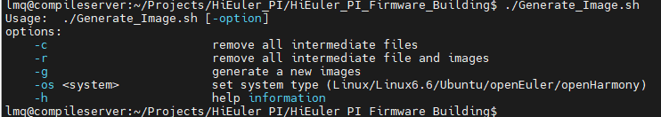

​	以打包Linux6.6内核版本固件为例：

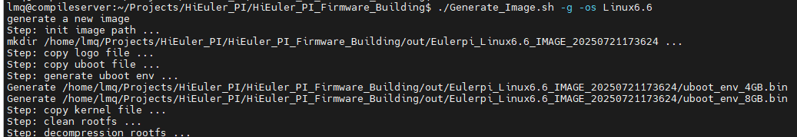

#### 3. 文件目录规划：

​	目前4GB/8GB的区别仅uboot烧录文件以及env文件有区别，内核和文件系统直接通用。

```
├── bin	->用于存放PC端脚本运行所需要的程序
├── boardtools ->板端所需要的命令工具
│   └── Linux ->根据系统区分命令工具
├── Generate_Image.sh ->打包脚本
├── kernel ->内核文件
│   └── Linux ->根据系统区分内核文件，内核文件同时兼容4GB/8GB
│       └── uImage_ss928v100 ->内核文件
├── opt ->用户程序
│   └── Linux ->根据系统区分用户程序
├── out ->打包脚本输出的固件文件路径
├── overlay ->覆盖文件系统的修改文件
│   └── Linux ->根据系统区分修改文件
├── README.assets ->README文档关联图片目录
├── README.md ->README文档
├── rootfs ->文件系统源文件
│   └── Linux ->根据系统区分源文件
│       └── rootfs_glibc_arm64.tgz
└── uboot ->uboot文件/uboot_env生成文件/logo文件/烧录分区表文件
    ├── Linux
    │   ├── boot_image_4GB.bin
    │   ├── boot_image_8GB.bin
    │   ├── burn_table_4GB.xml
    │   ├── burn_table_8GB.xml
    │   ├── uboot_env_4GB.txt
    │   └── uboot_env_8GB.txt
    └── logo ->logo文件
        └── logo.bin

```

#### 4. 系统功能支持情况：

| **功能类别**      | **功能项**         | **Linux** | **Ubuntu** | **openEuler** | **openHarmony** |
|------------------|--------------------|:---------:|:----------:|:-------------:|:---------------:|
| **系统工具**      | 开机 logo           | ✔️        | ✔️         |               |                 |
|                  | bsp 命令            | ✔️        | ✔️         |               |                 |
|                  | fw_printenv        | ✔️        | ✔️         |               |                 |
|                  | haveged            | ✔️        | ✔️         |               |                 |
|                  | mcu_tool           | ✔️        | ✔️         |               |                 |
|                  | mkfs.ext2          | ✔️        | ✔️         |               |                 |
|                  | mkfs.ext3          | ✔️        | ✔️         |               |                 |
|                  | mkfs.ext4          | ✔️        | ✔️         |               |                 |
|                  | resize2fs          | ✔️        | ✔️         |               |                 |
| **网络工具**      | ssh                | ✔️        | ✔️         |               |                 |
|                  | telnet             | ✔️        | ✔️         |               |                 |
|                  | tftp               | ✔️        | ✔️         |               |                 |
|                  | iperf3             | ✔️        | ✔️         |               |                 |
|                  | ip                 | ✔️        | ✔️         |               |                 |
|                  | udhcpc             | ✔️        | ✔️         |               |                 |
|                  | udhcpd             | ✔️        | ✔️         |               |                 |
|                  | ethtool            | ✔️        | ✔️         |               |                 |
| **CAN工具**       | cansend            | ✔️        | ✔️         |               |                 |
|                  | candump            | ✔️        | ✔️         |               |                 |
| **WIFI工具**      | wpa_supplicant     | ✔️        | ✔️         |               |                 |
|                  | hostapd            | ✔️        | ✔️         |               |                 |
| **蓝牙工具**      | dbus-daemon        | ✔️        | ✔️         |               |                 |
|                  | bluetoothd         | ✔️        | ✔️         |               |                 |
|                  | bluetoothctl       | ✔️        | ✔️         |               |                 |
| **星闪工具**      | sparklinkd         | ✔️        | ✔️         |               |                 |
|                  | sparklinkctrl      | ✔️        | ✔️         |               |                 |

#### 5. 外设支持情况：


| **序号**  | **功能项**                | **Linux** | **Ubuntu** | **openEuler** | **openHarmony** |
|:--------:|---------------------------|:---------:|:----------:|:-------------:|:---------------:|
| 1        | U盘                       | ✔️        | ✔️         |               |                 |
|          | UVC 摄像头                 | ✔️        | ✔️         |               |                 |
|          | USB 5G 模块 (MT5710-CN)    | ✔️        | ✔️         |               |                 |
| 3        | 双路千兆 RJ45              | ✔️        | ✔️         |               |                 |
| 6        | OLED                      | ✔️        | ✔️         |               |                 |
|          | PWM                       | ✔️        | ✔️         |               |                 |
|          | ADC                       | ✔️        | ✔️         |               |                 |
|          | MIPI 显示屏                | ✔️        | ✔️         |               |                 |
| 7        | MIPI 摄像头                | ✔️        | ✔️         |               |                 |
| 9        | CAN 总线                   | ✔️        | ✔️         |               |                 |
| 10       | RS485                     | ✔️        | ✔️         |               |                 |
| 12       | Wi-Fi 无线网络             | ✔️        | ✔️         |               |                 |
|          | 蓝牙                      | ✔️        | ✔️         |               |                 |
|          | 星闪                      | ✔️        | ✔️         |               |                 |
| 13       | 音频输入输出                | ✔️        | ✔️         |               |                 |
| 16       | HDMI 输出                  | ✔️        | ✔️         |               |                 |
| 17       | PCIe 固态硬盘              | ✔️        | ✔️         |               |                 |
|          | PCIe 5G 模块 (RM500U-CN)  | ✔️        | ✔️       |               |                 |
| 19       | TF 卡                     | ✔️        | ✔️         |               |                 |
| 其它      | RTC 实时时钟                | ✔️        | ✔️         |               |                 |


#### 6. 不同型号DDR说明
##### 1). 实物差异图

**CXDB5CCAM-MK** (2-rank) 与 **CXDB5CBAM-MA-B** (1-rank) 差异

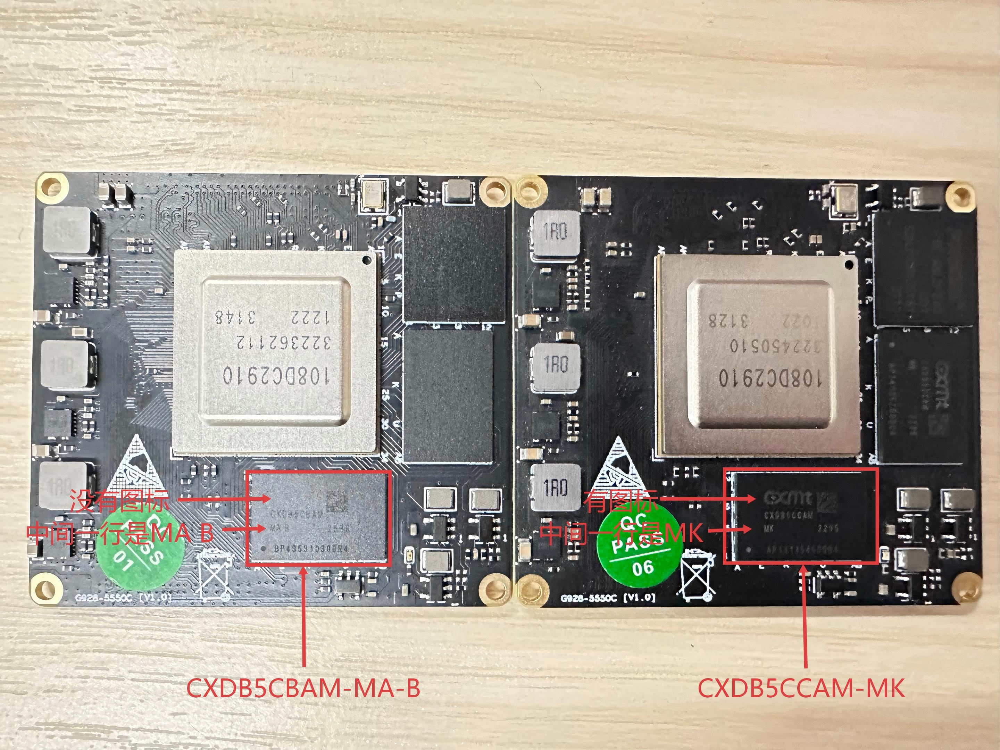

##### 2). 固件差异
| 类型 | DDR 型号         | Rank   | 内存  | U-Boot 文件                 | 环境变量文件                     | 烧录表                       |
| -- | -------------- | ------ | --- | ------------------------- | ------------------------ | ------------------------- |
| ①  | CXDB5CCAM-MK   | 2 Rank | 4GB | `boot_image_4G.bin`       | `uboot_env_4G.bin`       | `burn_table_4G.xml`       |
| ②  | CXDB5CCAM-MK   | 2 Rank | 4GB x 2| `boot_image_8G.bin`       | `uboot_env_8G.bin`       | `burn_table_8G.xml`       |
| ③  | CXDB5CBAM-MA-B | 1 Rank | 4GB | `boot_image_4G_1rank.bin` | `uboot_env_4G_1rank.bin` | `burn_table_4G_1rank.xml` |
| ④  | CXDB5CBAM-MA-B | 1 Rank | 4GB x 2 | `boot_image_8G_1rank.bin` | `uboot_env_8G_1rank.bin` | `burn_table_8G_1rank.xml` |

#### 7. FAQ

##### 1). 如何新增系统/文件系统/应用程序

​	boardtools：开源工具编译后的程序/命令或者SDK编译生成的工具，放到此目录。

​	kernel：内核文件，需重命名为uImage_ss928v100。

​	opt：主要为用户程序或者相关依赖文件，最终会拷贝到文件系统的/opt目录打包。

​	overlay：主要用于覆盖文件系统的文件，一般为文件系统中修改过的同名文件，或者新增工具/命令依赖的配置文件。

​	rootfs：对应系统的文件系统压缩包文件。

​	uboot：uboot文件、uboot_env文件、烧录分区表文件。

##### 2). 如何修改OS/MMZ内存

​	固件中目前已经支持从cmdline中解析内存信息用于分配OS和MMZ内存，在此基础上引入fw_printenv/fw_setenv命令，使得可以在系统中直接修改内存分配，注意修改内存分配时以M为单位，同时os_mem_size必须小于total_mem_size。

​	fw_printenv可以在系统中查看uboot的环境变量。

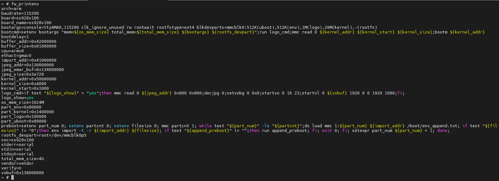

​	fw_setenv可以在系统中设置uboot的环境变量。以设置OS内存为例，执行fw_setenv设置os_mem_size大小，修改后重启板子即可按新的OS内存进行分配。

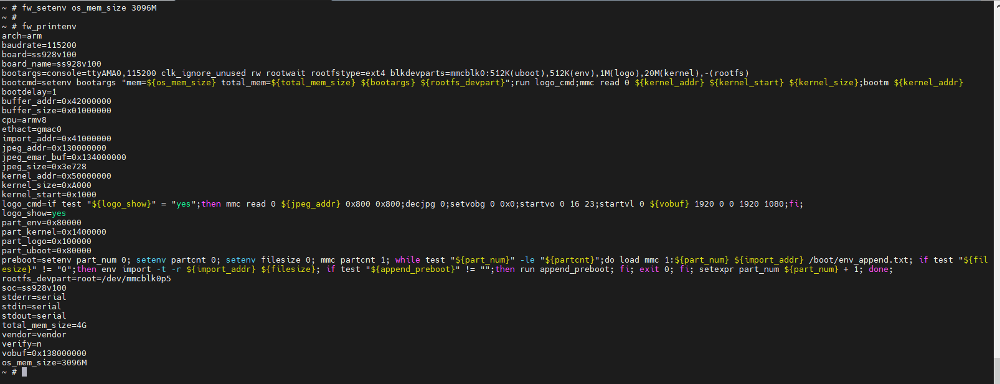

##### 3). 如何解决MIPI屏幕首次无法出图
问题描述: HDMI开机画面下，MIPI 屏幕出图程序首次运行MIPI屏无法出图

解决方法:

①.关闭开机logo。

	执行fw_setenv设置logo_show为no，修改后重启板子即可生效，开机logo将不再显示。

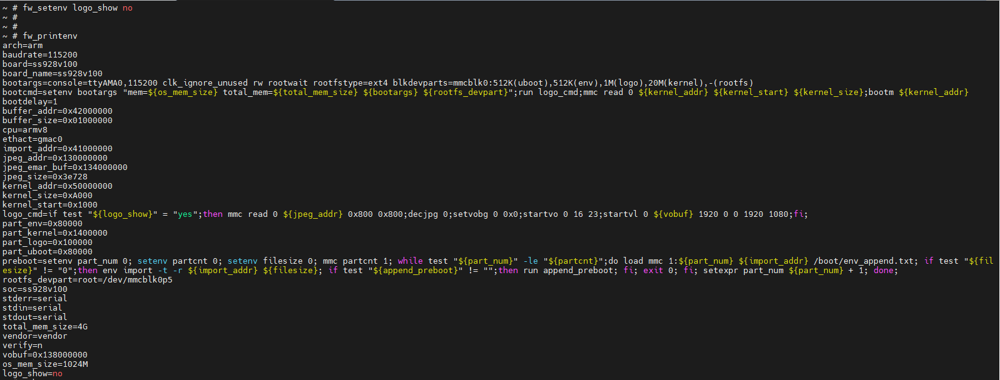

②.开启MIPI屏配置前，先开启HDMI的VO配置再关闭。

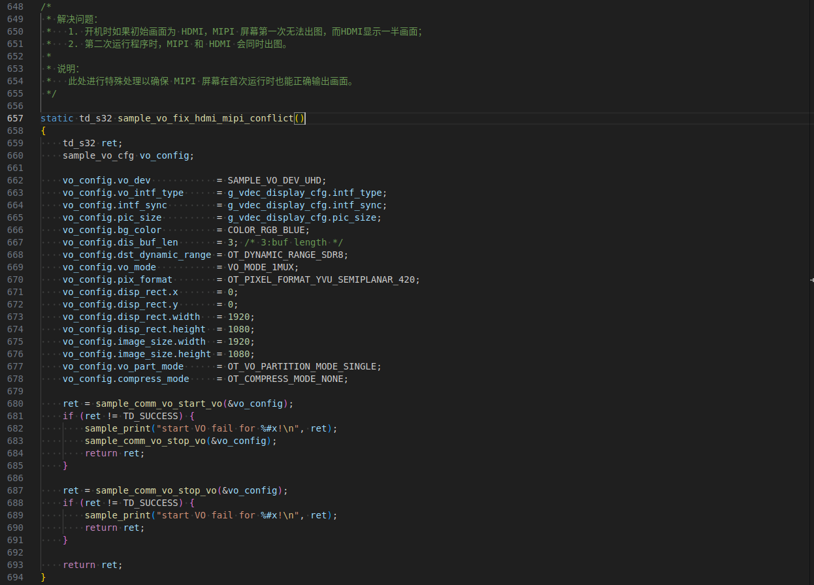

##### 4). 如何设置板卡IP

①. 关闭 `search_tool`，手动设置静态 IP

Linux和Ubuntu均需要关闭`S89nettools`脚本权限。

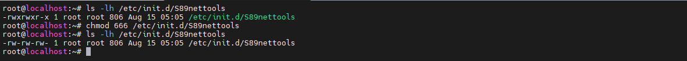

Linux修改`S80network`脚本。

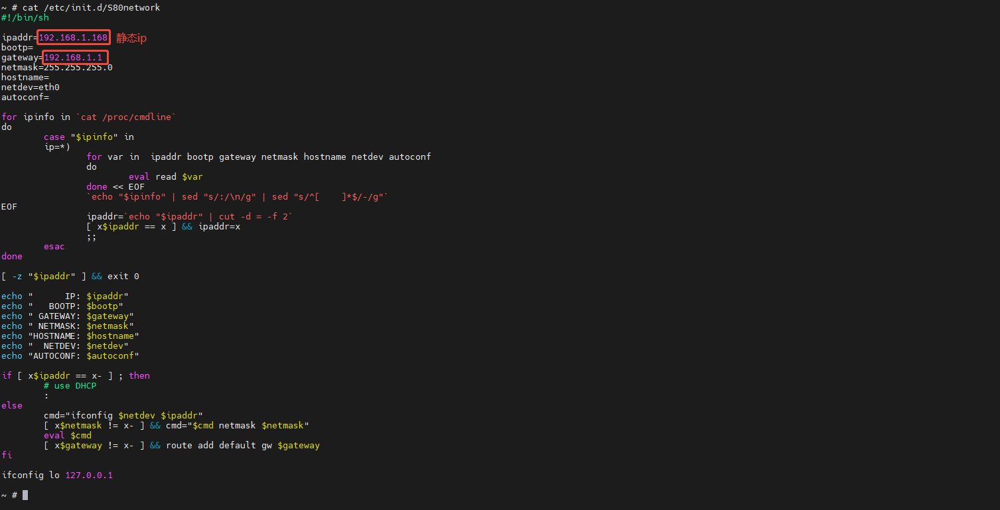

Ubuntu新增`/etc/systemd/network/20-static-eth0.network`。

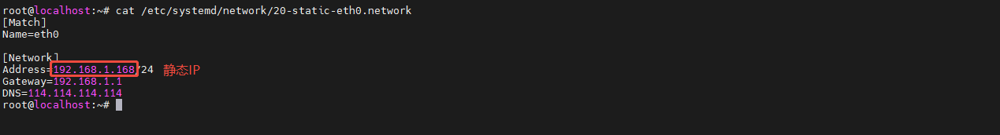

②. 使用 `search_tool`，指定并修改静态 IP

Linux和Ubuntu均需要打开`S89nettools`脚本权限, Ubuntu还需要删除`/etc/systemd/network/20-static-eth0.network`；修改`search_tool`的配置文件(`/opt/cfg/dev_info.config`)。

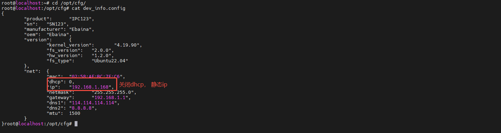

③. 使用 `search_tool`，启用动态 IP（DHCP 分配）

Linux和Ubuntu均需要打开`S89nettools`脚本权限, Ubuntu还需要删除`/etc/systemd/network/20-static-eth0.network`；修改`search_tool`的配置文件(`/opt/cfg/dev_info.config`)。

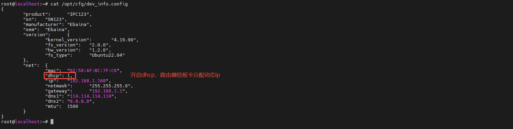

启用dhcp后重启查看配置文件。

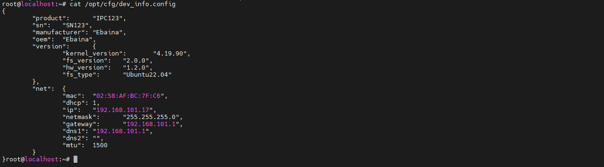
