# ResNet50应用指南

## 介绍

本文档是海鸥派快速应用HiSpark ModelZoo上ResNet50模型的指导文档，如果需要了解更多模型参数、细节请参见[HiSpark ModelZoo ResNet50指导文档](../../src/samples/built-in/classification/ResNet50/README.md)。

- 应用系统：Linux
- SDK版本：SS928 V100R001C02SPC022
- 应用引擎：Hi3403V100 SVP_NNN、Hi3403V100 NNN

## 环境准备

根据[《环境准备》](../环境准备.md)文档，搭建开发环境和开发板环境。

## 快速开始（推荐）

### 获取om离线模型

网站上提供转化成功的om模型文件，可以从[网站](https://modelzoo.hispark.hisilicon.com/#/ModelZoo)上搜索ResNet50进行下载；注意选择算力引擎和量化类型。

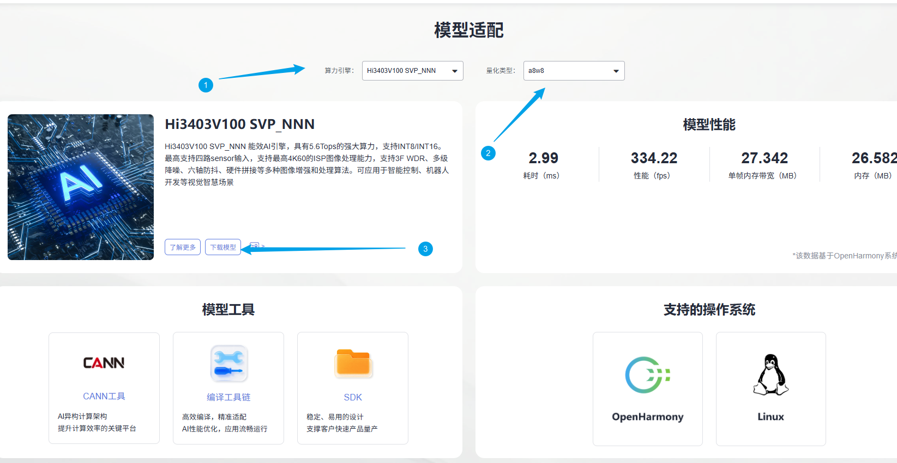

进入docker容器终端创建`model`文件夹，并将om模型文件移动到`./model`目录下。
```shell
cd ~/HiEuler_PI_ModelZoo/src/samples/built-in/classification/ResNet50
mkdir -p model
```
### 编译代码

1. 切换到样例目录，创建目录用于存放编译文件，例如，本文中，创建的目录为`build`。
    ```shell
    mkdir -p build
    ```

2. 切换到`build`目录，执行**cmake**生成编译文件。

    1. Hi3403V100 SVP_NNN生成编译文件命令

        ```shell
        cd build
        source ~/setenv_atc.sh svp_nnn
        cmake ../src -DCMAKE_BUILD_TYPE=Release -DCMAKE_TOOLCHAIN_FILE=../../../../common/cmake/toolchain_aarch64_linux.cmake -DSOC_VERSION=SS928V100
        ```

    2. Hi3403V100 NNN生成编译文件命令

        ```shell
        cd build
        source ~/setenv_atc.sh nnn
        cmake ../src -DCMAKE_BUILD_TYPE=Release -DCMAKE_TOOLCHAIN_FILE=../../../../common/cmake/toolchain_aarch64_linux.cmake -DSOC_VERSION=OPTG
        ```

3. 执行**make**命令，生成的可执行文件main在“./out“目录下。

    ```shell
    make -j8
    ```

    参数说明：

    - -j：并行任务数量，这里-j8代表8个并行任务编译，适当调整数字提高编译速度。


### 模型推理

1. 将`~/HiEuler_PI_ModelZoo/src/samples/built-in/classification/ResNet50`下的model、out文件夹拷贝到NFS共享文件夹的HiEuler_PI_ModelZoo对应目录下。

2. 进入开发板终端，切换到可执行文件main所在的目录，运行可执行文件。

    ```shell
    cd /mnt/HiEuler_PI_ModelZoo/src/samples/built-in/classification/ResNet50/out
    chmod +x main
    ./main --acl ../src/acl.json --model ../model/resnet50.om --input ../data/file_list.json
    ```

    成功将生成result文件夹。

## 全面上手

### 安装依赖

```shell
docker exec -it modelzoo bash
conda create -n resnet50 python=3.7.5
conda activate resnet50

cd ~/HiEuler_PI_ModelZoo/src/samples/built-in/classification/ResNet50
pip install -r requirements.txt
```

### 准备数据集

1. 获取原始数据集。（解压命令参考tar –xvf *.tar与 unzip *.zip）

   下载[ImageNet](https://gitee.com/link?target=https%3A%2F%2Fimage-net.org%2Fdownload.php)验证集，并将`ILSVRC2012_devkit_t12.tar.gz`和`ILSVRC2012_img_val.tar`压缩包上传到docker容器`~/HiEuler_PI_ModelZoo/src/datasets/ImageNet`路径下并解压。

   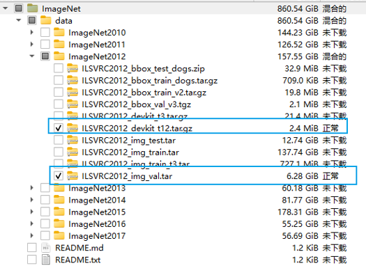

   下载类别表。

   ```shell
   cd ~/HiEuler_PI_ModelZoo/src/datasets/ImageNet
   wget https://s3.amazonaws.com/deep-learning-models/image-models/imagenet_class_index.json
   ```

   执行`get_val_label.py`脚本生成`val_label.txt`文件。

   ```shell
   python ~/HiEuler_PI_ModelZoo/scripts/get_val_label.py
   ```

   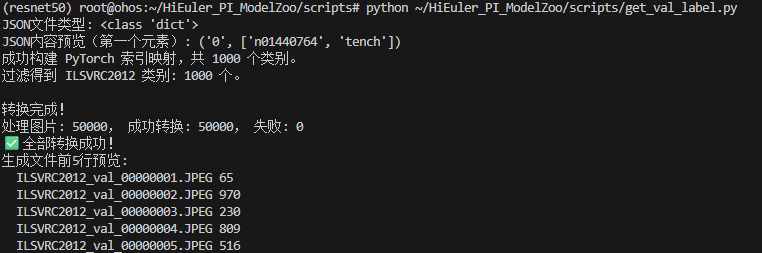

   整理数据集目录结构如下所示：

   ```
   ImageNet/
   |-- val
   |   |-- ILSVRC2012_val_00000001.JPEG
   |   |-- ILSVRC2012_val_00000002.JPEG
   |   |-- ILSVRC2012_val_00000003.JPEG
   |   ...
   |-- val_label.txt
   ...
   ```

2. 生成文件集file_list.json，将原始数据集图片地址转换为模型的输入数据。
  
    ```shell
    cd ~/HiEuler_PI_ModelZoo/src/built-in/classification/ResNet50
    python ../../../../utils/generate_file_list.py ../../../../datasets/ImageNet/val
    ```
    
    参数说明：
    - --dataset_path：原数据集所在路径。

### 模型转化

使用PyTorch将模型权重文件.pth转换为.onnx文件，再使用ATC工具将.onnx文件转为离线推理模型文件.om文件。

1. 获取权重文件。

   前往[Pytorch官方文档](https://pytorch.org/vision/stable/_modules/torchvision/models/resnet.html#resnet50)下载对应权重，参考下载权重如下：

   [权重](https://download.pytorch.org/models/resnet50-0676ba61.pth)

   ```shell
   mkdir -p model
   cd model
   wget https://hispark-model.obs.cn-east-3.myhuaweicloud.com/1706935699177473/resnet50-0676ba61.pth?AccessKeyId=57DU3X6NM28ACLMM93E8&Expires=1768359616&Signature=axJgMXpdZ5Vg4Sb%2BekqbP5C7H0g%3D
   ```

2. 导出onnx文件。

    使用./script/pth2onnx.py导出动态batch的onnx文件。

    ```shell
    cd ../
    python ./script/pth2onnx.py ./model/resnet50-0676ba61.pth ./model/resnet50.onnx
    ```

    参数说明：

    - pth_file：权重文件。
    - onnx_file：生成 onnx 文件。建议保存为./model/resnet50.onnx

3. 使用ATC工具将ONNX模型转OM模型。

    修正量化校准文件。

    ```shell
    sed -i 's/quickstart/val/g' ./data/image_ref_list.txt
    ```

    执行ATC命令。
    1. Hi3403V100 SVP_NNN上的om模型转换命令
        ```shell
        source ~/setenv_atc.sh svp_nnn
        
        atc --framework=5 --model="./model/resnet50.onnx" --input_shape="input_0:1,3,224,224" --insert_op_conf=./model_cfg/SS928V100_SVP_NNN/insert_op.cfg --output="./model/resnet50" --image_list="./data/image_ref_list.txt" --soc_version=SS928V100
        ```
    2. Hi3403V100 NNN上的om模型转换命令
        ```shell
        source ~/setenv_atc.sh nnn
        
        atc --framework=5 --model="./model/resnet50.onnx" --input_shape="input_0:1,3,224,224" --insert_op_conf="./model_cfg/SS928V100_NNN/insert_op.cfg" --output="./model/resnet50" --enable_small_channel=1 --enable_single_stream=true --soc_version=OPTG
        ```

        运行成功后生成resnet50.om模型文件。

        参数说明：

        - --framework：5代表ONNX模型。
        - --model：为ONNX模型文件。
        - --input_shape：输入数据的shape。
        - --insert_op_conf：aipp算子配置，用于输入数据处理。
        - --output：输出的OM模型。
        - --image_list: 量化校准数据。
        - --enable_small_channel:使能small channel优化。
        - --enable_single_stream:推理时使用一条stream。
        - --soc_version：处理器型号。

### 编译代码

1. 切换到样例目录，创建目录用于存放编译文件，例如，本文中，创建的目录为`build`。

   ```shell
   mkdir -p build
   ```

2. 切换到`build`目录，执行**cmake**生成编译文件。

   1. Hi3403V100 SVP_NNN生成编译文件命令

      ```shell
      cd build
      source ~/setenv_atc.sh svp_nnn
      cmake ../src -DCMAKE_BUILD_TYPE=Release -DCMAKE_TOOLCHAIN_FILE=../../../../common/cmake/toolchain_aarch64_linux.cmake -DSOC_VERSION=SS928V100
      ```

   2. Hi3403V100 NNN生成编译文件命令

      ```shell
      cd build
      source ~/setenv_atc.sh nnn
      cmake ../src -DCMAKE_BUILD_TYPE=Release -DCMAKE_TOOLCHAIN_FILE=../../../../common/cmake/toolchain_aarch64_linux.cmake -DSOC_VERSION=OPTG
      ```

3. 执行**make**命令，生成的可执行文件main在“./out“目录下。

   ```shell
   make -j8
   ```

   参数说明：

   - -j：并行任务数量，这里-j8代表8个并行任务编译，适当调整数字提高编译速度。


### 模型推理

1. 将`~/HiEuler_PI_ModelZoo/src/datasets/ImageNet`以及`~/HiEuler_PI_ModelZoo/src/samples/built-in/classification/ResNet50`下的data、model、out文件夹拷贝到NFS共享文件夹的HiEuler_PI_ModelZoo对应目录下。

2. 进入开发板终端，切换到可执行文件main所在的目录，运行可执行文件。

   ```shell
   cd /mnt/HiEuler_PI_ModelZoo/src/samples/built-in/classification/ResNet50/out
   chmod +x main
   ./main --acl ../src/acl.json --model ../model/resnet50.om --input ../data/file_list.json
   ```

   成功将生成result文件夹。

   打印推理图片的类别与分数，这里打印的并不是置信度，而是分数，分数越高代表置信度越高，推理完成后结果保存在`out/result`文件夹。

   1. Hi3403V100 SVP_NNN推理过程：

      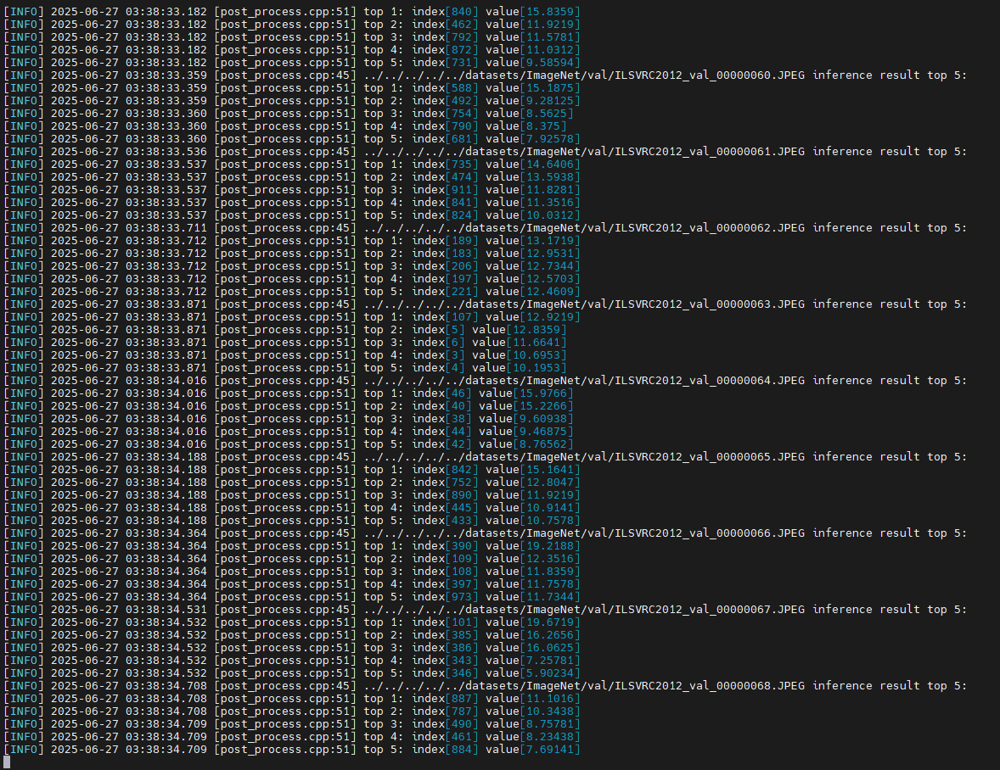

   2. Hi3403V100 NNN推理过程：

      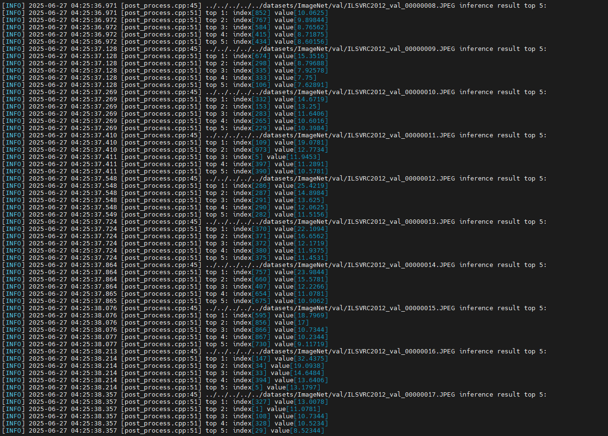

### 精度&性能评估

1. 精度验证。

    将整个`out/result`文件夹拷贝回docker容器的HiEuler_PI_ModelZoo对应目录下，并进入docker容器终端。

    调用脚本与数据集标签val_label.txt比对，可以获得Accuracy数据，结果保存在accuracy.txt中。

    ```shell
    cd ~/HiEuler_PI_ModelZoo/src/samples/built-in/classification/ResNet50
    
    python ./script/accuracy.py --output ./out/result/txt/ --label ../../../../datasets/ImageNet/val_label.txt --result ./out/accuracy.txt
    ```

    参数说明：

    - --output：推理结果所在路径，默认为./out/result/txt/
    - --label：真值标签文件val_label.txt所在路径。
    - --result：输出精度结果所在的位置。

    ```shell
    vim ./out/accuracy.txt
    ```

    SVP_NNN平台上精度结果：

    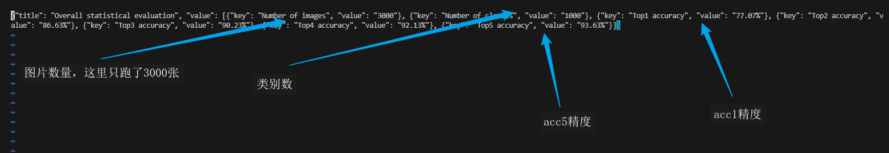

    NNN平台上精度结果：

    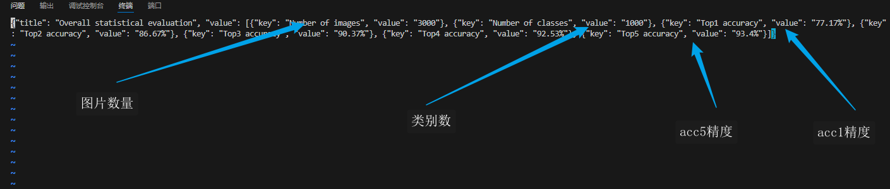

2. 性能验证。

    进入开发板终端，打开file_list_1.json文件，将file_list_1.json的loop参数设置为100。

    ```shell
    cd /mnt/HiEuler_PI_ModelZoo/src/samples/built-in/classification/ResNet50
    vi data/file_list_1.json
    ```

    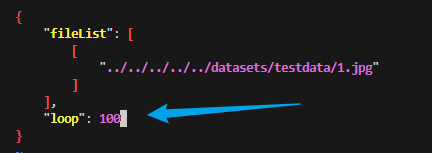

    执行推理命令。

    ```
    cd /mnt/HiEuler_PI_ModelZoo/samples/built-in/classification/ResNet50/out
    ./main --model ../model/resnet50.om --input ../data/file_list_1.json
    ```

    参数说明：
    - --model：om模型文件路径。
    - --input: 输入图片路径文件。

    file_list_1.json中的配置代表对一张输入图片重复推理100次，程序执行时会在板端会输出打印推理的平均时间和帧率。

    1. Hi3403V100 SVP_NNN

       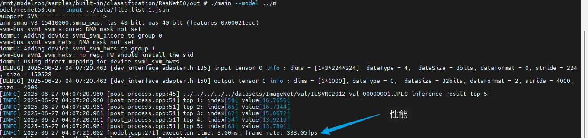

    2. Hi3403V100 NNN

       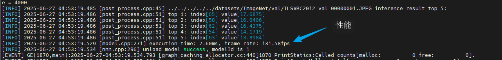


## FAQ

### 如何指定推理图片或修改推理的图片数量

打开NFS共享文件夹的`HiEuler_PI_ModelZoo/samples/built-in/classification/ResNet50/data/file_list.json`即可指定推理的图片，删除或增加图片路径即可间接修改推理的图片数量。

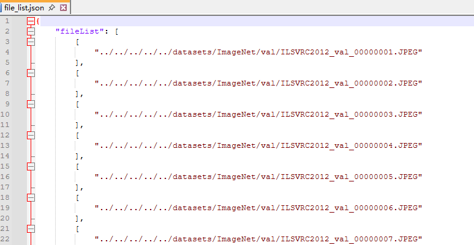