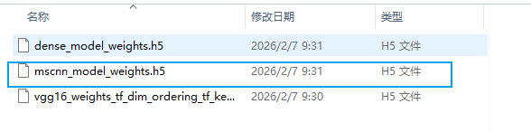
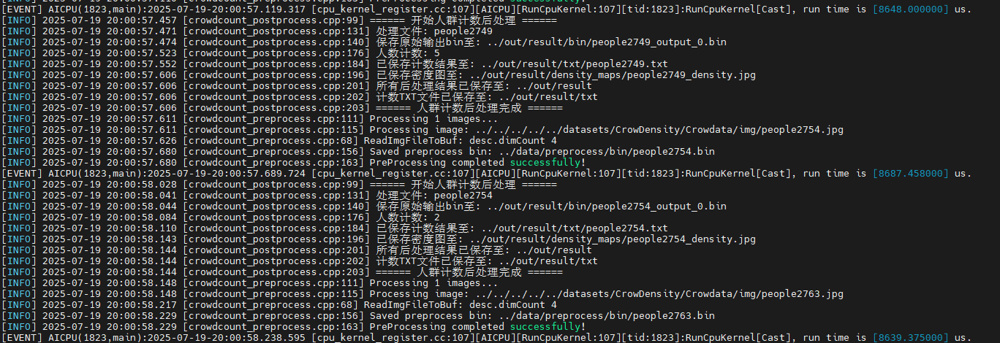
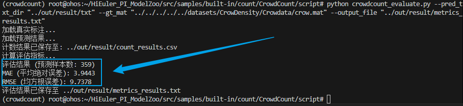
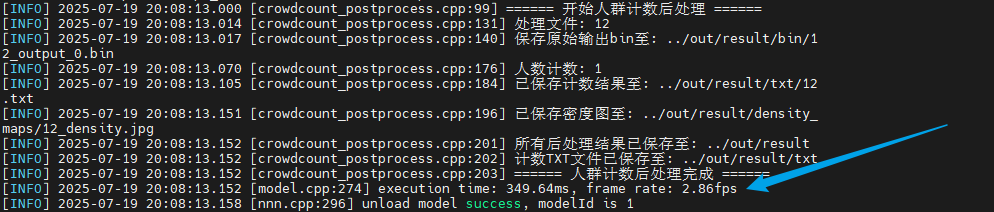
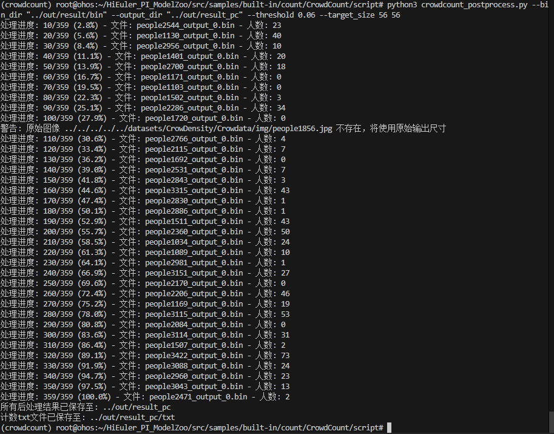
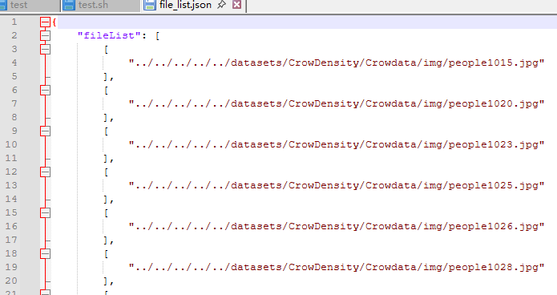

# CrowdCount应用指南

## 介绍

本文档是海鸥派快速应用HiSpark ModelZoo上CrowdCount模型的指导文档，如果需要了解更多模型参数、细节请参见[HiSpark ModelZoo CrowdCount指导文档](../../src/samples/built-in/count/CrowdCount/README.md)。

- 应用系统：Linux
- SDK版本：SS928 V100R001C02SPC022
- 应用引擎：Hi3403V100 NNN

## 环境准备

根据[《环境准备》](../环境准备.md)文档，搭建开发环境和开发板环境。

## 快速开始（推荐）

### 获取om模型文件

网站上提供转化成功的om模型文件，可以从[网站](https://modelzoo.hispark.hisilicon.com/#/ModelZoo)上搜索CrowdCount进行下载。


创建`model`文件夹，并将om模型文件移动到`./model`目录下。
```shell
cd ~/HiEuler_PI_ModelZoo/src/samples/built-in/count/CrowdCount
mkdir -p model
```
### 编译代码

1. 切换到样例目录，创建目录用于存放编译文件，例如，本文中，创建的目录为`build`。
    ```shell
    mkdir -p build
    ```

2. 切换到`build`目录，执行**cmake**生成编译文件。

    Hi3403V100 NNN生成编译文件命令
    ```shell
    cd build
    source ~/setenv_atc.sh nnn
    cmake ../src -DCMAKE_BUILD_TYPE=Release -DCMAKE_TOOLCHAIN_FILE=../../../../common/cmake/toolchain_aarch64_linux.cmake -DSOC_VERSION=OPTG
    ```

3. 执行**make**命令，生成的可执行文件main在“./out“目录下。

    ```shell
    make -j8
    ```

    参数说明：

    - -j：并行任务数量，这里-j8代表8个并行任务编译，适当调整数字提高编译速度。


### 模型推理

1. 将`~/HiEuler_PI_ModelZoo/src/samples/built-in/count/CrowdCount`下的model、out文件夹拷贝到NFS共享文件夹的HiEuler_PI_ModelZoo对应目录下。

2. 进入开发板终端，切换到可执行文件main所在的目录，运行可执行文件。

    ```shell
    cd /mnt/HiEuler_PI_ModelZoo/src/samples/built-in/count/CrowdCount/out
    chmod +x main
    ./main --acl ../src/acl.json --model ../model/mscnn_model.om  --input ../data/file_list_1.json
    ```

    成功将生成result文件夹。

## 全面上手

### 安装依赖

```shell
docker exec -it modelzoo bash
conda create -n crowdcount python=3.7.5
conda activate crowdcount
apt install -y protobuf-compiler

cd ~/HiEuler_PI_ModelZoo/src/samples/built-in/count/CrowdCount
pip install -r requirements.txt
pip install attrs psutil decorator sympy protobuf==3.20.3
```

### 准备数据集

1. 获取原始数据集。（解压命令参考tar –xvf *.tar与 unzip *.zip）

   CrowDensity为代码开源作者提供的标注好的人头位置信息的数据集，数据集可以通过作者提供的百度网盘地址下载。
   
   点击 [CrowDensity](https://pan.baidu.com/s/1T5EfBovMnpe4meIYcXSa8w) 下载数据集进行精度评估，在`HiEuler_PI_ModelZoo/src/datasets`源码目录下创建`CrowDensity`文件夹，文件结构如下：
   
   ```
   CrowDensity
      ├── Crowdata（标注好的人头位置信息的数据集）
         ├── img（图片）
            ├── people1.jpg
            ├── people6.jpg
             ……
         ├── crow.mat（标签文件）
   ```
   

### 模型转化

使用PyTorch将模型权重文件.pth转换为.onnx文件，再使用ATC工具将.onnx文件转为离线推理模型文件.om文件。

1. 获取参考代码仓源码

   ```shell
   git clone https://github.com/zzubqh/CrowdCount.git
   cd CrowdCount
   git checkout 0afa770a04c2e965a44ba1934ac646418f787384
   cd ..
   ```

2. 获取权重文件。

   点击 [链接](https://github.com/zzubqh/CrowdCount) 进入CrowdCount开源首页，下载模型权重文件mscnn_model_weights.h5。或者直接访问作者提供的 [百度网盘](https://pan.baidu.com/s/105FM8Di3MqsWsN6-l-S2vQ) ，提取码为 i2dn 。

   下载成功后，将mscnn_model_weights.h5文件放到./model路径下。

   

   ```shell
   mkdir model
   ```

3. 生成onnx文件。

      使用script/crowdcount_tf2onnx.py将TensorFlow模型转换成ONNX模型；

      ```shell
      cd script
      python crowdcount_tf2onnx.py --input_h5 ../model/mscnn_model_weights.h5 --output_onnx ../model/mscnn_model.onnx
      cd ..
      ```

4. 使用ATC工具将ONNX模型转OM模型。

      在当前模型的代码根目录下，执行ATC命令。

      1. Hi3403V100 NNN上的om模型转换命令
         ```shell
         source ~/setenv_atc.sh nnn
         
         atc --framework=5 --model="model/mscnn_model.onnx" --input_shape="input:1,3,224,224" --output="model/mscnn_model" --enable_single_stream=true --soc_version=OPTG
         ```
         运行成功后生成crowdcount.om模型文件。

         参数说明：

         - --framework：原始框架类型，5代表ONNX模型。
         - --model：ONNX模型文件路径。
         - --input_shape：输入数据的shape。
         - --output：输出的OM模型路径。
         - --image_list：转换模型生成量化参数时用的校准数据。
         - --soc_version：处理器型号。
         - --compile_mode：编译模式，6代表数据量化使用16bit，权重量化使用8bit，且仅对CUBE算子进行量化，非CUBE算法使用fp16格式。注：SVP_NNN上选取其他编译模式可能导致精度下降


### 编译代码

1. 切换到样例目录，创建目录用于存放编译文件，例如，本文中，创建的目录为`build`。

   ```shell
   mkdir -p build
   ```

2. 切换到`build`目录，执行**cmake**生成编译文件。

   Hi3403V100 NNN生成编译文件命令

   ```shell
   cd build
   source ~/setenv_atc.sh nnn
   cmake ../src -DCMAKE_BUILD_TYPE=Release -DCMAKE_TOOLCHAIN_FILE=../../../../common/cmake/toolchain_aarch64_linux.cmake -DSOC_VERSION=OPTG
   ```

3. 执行**make**命令，生成的可执行文件main在“./out“目录下。

   ```shell
   make -j8
   ```

   参数说明：

   - -j：并行任务数量，这里-j8代表8个并行任务编译，适当调整数字提高编译速度。


### 模型推理

1. 将`~/HiEuler_PI_ModelZoo/src/datasets/CrowDensity`以及`~/HiEuler_PI_ModelZoo/src/samples/built-in/count/CrowdCount`下的model、out文件夹拷贝到NFS共享文件夹的HiEuler_PI_ModelZoo对应目录下。

2. 进入开发板终端，切换到可执行文件main所在的目录，运行可执行文件。

   ```shell
   cd /mnt/HiEuler_PI_ModelZoo/src/samples/built-in/count/CrowdCount/out
   chmod +x main
   ./main --acl ../src/acl.json --model ../model/mscnn_model.om  --input ../data/file_list.json
   ```

   成功将生成result文件夹。

   Hi3403V100 NNN推理过程：

   


### 精度&性能评估

1. 精度验证。

   将整个`out/result`文件夹拷贝回docker容器的HiEuler_PI_ModelZoo对应目录下，并进入docker容器终端。

   使用crowdcount_evaluate.py将模型推理的结果与数据集中的crow.mat标签文件进行对比，获取评估结果。

   ```shell
   cd ~/HiEuler_PI_ModelZoo/src/samples/built-in/count/CrowdCount/script 
   python crowdcount_evaluate.py --pred_txt_dir "../out/result/txt" --gt_mat "../../../../../datasets/CrowDensity/Crowdata/crow.mat" --output_file "../out/result/metrics_results.txt" 
   ```

   参数说明：

   - --pred_txt_dir：预测人数结果txt文件目录。
   - --gt_mat：真实人数标注mat文件路径（如crow.mat）。
   - --output_file：评估结果保存文件。

   NNN平台上精度结果：

   

2. 性能验证

   进入开发板终端，验证om模型的性能，参考命令如下：

   ```shell
   cd /mnt/HiEuler_PI_ModelZoo/src/samples/built-in/count/CrowdCount/out
   ./main --acl ../src/acl.json --model ../model/mscnn_model.om  --input ../data/file_list_1.json
   ```

   参数说明：(此模式下，输入路径为一张图片)

   - --acl:  ACL 配置文件路径

   - --model: 指定待验证性能的 OM 模型文件路径。

   - --input： 指定输入数据的列表文件路径（此场景下为单图片路径的配置文件，注意：循环次数通过修改该文件中的loop变量即可，例如设置为30）。

   在板端会输出显示，NNN平台上性能结果如下：

   

### 可视化结果

1. 进入docker容器终端，使用python脚本进行模型推理结果的后处理
   ```shell
   cd ~/HiEuler_PI_ModelZoo/src/samples/built-in/count/CrowdCount/script
   python3 crowdcount_postprocess.py --bin_dir "../out/result/bin" --output_dir "../out/result_pc" --threshold 0.06 --target_size 56 56
   ```

   参数说明：

   - --bin_dir: 存放推理输出bin文件的目录。

   - --output_dir：输出结果目录（包含密度图和txt计数）。

   - --target_size：模型输出尺寸，格式为 高 宽，224x224输入对应56x56输出

   - --threshold：密度图阈值过滤，默认0.06



## FAQ

### 如何指定推理图片或修改推理的图片数量

打开NFS共享文件夹的`HiEuler_PI_ModelZoo/samples/built-in/classification/CrowdCount/data/file_list.json`即可指定推理的图片，删除或增加图片路径即可间接修改推理的图片数量。


