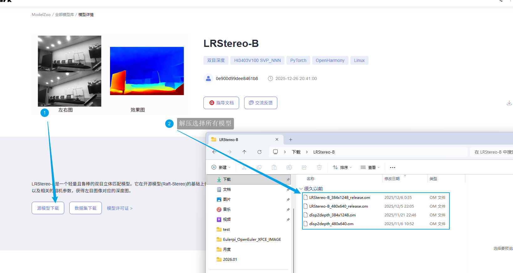
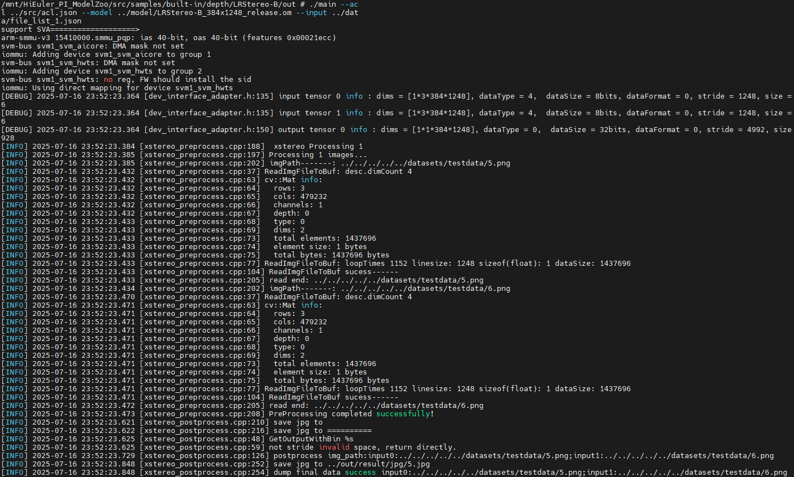
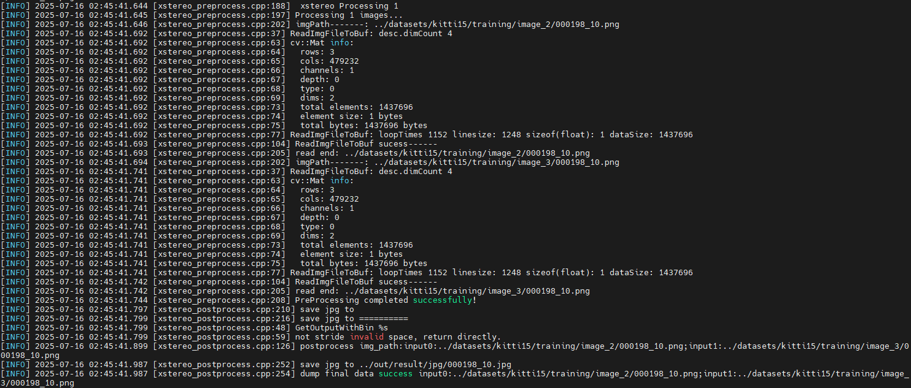
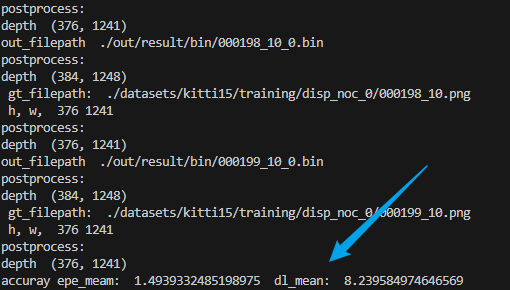
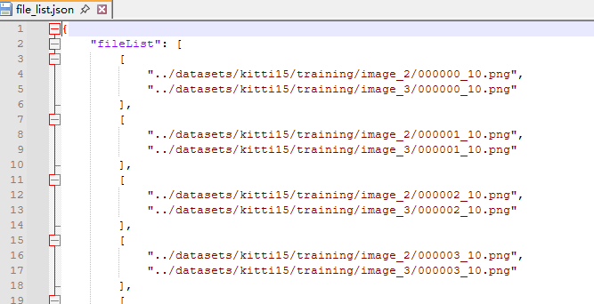

# LRStereo-B应用指南

## 介绍

本文档是海鸥派快速应用HiSpark ModelZoo上LRStereo-B模型的指导文档，如果需要了解更多模型参数、细节请参见[HiSpark ModelZoo LRStereo-B指导文档](../../src/samples/built-in/depth/LRStereo-B/README.md)。

- 应用系统：Linux
- SDK版本：SS928 V100R001C02SPC022
- 应用引擎：Hi3403V100 SVP_NNN

## 环境准备

根据[《环境准备》](../环境准备.md)文档，搭建开发环境和开发板环境。

## 快速开始（推荐）

### 获取om离线模型

网站上提供转化成功的om模型文件，可以从[网站](https://modelzoo.hispark.hisilicon.com/#/ModelZoo)上搜索LRStereo-B进行下载；注意选择算力引擎和量化类型。



进入docker容器终端创建`model`文件夹，并将om模型文件移动到`./model`目录下。

```shell
mkdir -p model
```

### 编译代码

1.  切换到样例目录，创建目录用于存放编译文件，例如，本文中，创建的目录为“build“。

    ```shell
    mkdir -p build
    ```

2.  切换到“build“目录，执行**cmake**生成编译文件。

    Hi3403V100 SVP_NNN生成编译文件命令

    ```shell
    cd build
    source ~/setenv_atc.sh svp_nnn
    cmake ../src -DCMAKE_BUILD_TYPE=Release -DCMAKE_TOOLCHAIN_FILE=../../../../common/cmake/toolchain_aarch64_linux.cmake -DSOC_VERSION=SS928V100
    ```
3.  执行**make**命令，生成的可执行文件main在“./out“目录下。

    ```shell
    make -j8
    ```
    
    参数说明：
    
    - -j：并行任务数量，这里-j8代表8个并行任务编译，适当调整数字提高编译速度。

### 模型推理

1. 将`~/HiEuler_PI_ModelZoo/src/samples/built-in/depth/LRStereo-B`下的model、out文件夹拷贝到NFS共享文件夹的HiEuler_PI_ModelZoo对应目录下。

2. 进入开发板终端，切换到可执行文件main所在的目录，运行可执行文件。

   ```shell
   cd /mnt/HiEuler_PI_ModelZoo/src/samples/built-in/depth/LRStereo-B/out
   chmod +x main
   ./main --acl ../src/acl.json --model ../model/LRStereo-B_384x1248_release.om --input ../data/file_list_1.json
   ```

   成功将生成result文件夹。

   Hi3403V100 SVP_NNN推理过程：

   

## 全面上手

### 安装依赖

```shell
docker exec -it modelzoo bash
conda create -n lrstereo-b python=3.9.11
conda activate lrstereo-b

cd ~/HiEuler_PI_ModelZoo/src/samples/built-in/depth/LRStereo-B
sed -i 's/==/>=/g' requirements.txt
pip install -r requirements.txt
```

### 准备数据集

1. 获取原始数据集。（解压命令参考tar –xvf *.tar与 unzip *.zip）

   创建datasets文件夹，下载[KITTI15](https://www.cvlibs.net/datasets/kitti/eval_scene_flow.php?benchmark=stereo)验证集，将数据集拷贝至datasets文件夹下整理成下面目录结构。

   ```shell
   mkdir datasets
   ```

   ```
   datasets/
   |-- kitti15
   |   |-- testing
   |   |-- training
   |   |   |-- image_2
   |   |   |   |-- 000000_10.png
   |   |   |   |-- ...
   |   |   |-- image_3
   |   |   |   |-- 000000_10.png
   |   |   |   |-- ...
   |   |   |-- disp_noc_0
   |   |   |   |-- 000000_10.png
   |   |   |   |-- ...
   |   ...
   ...
   ```

2. 数据预处理，将原始数据集转换为模型的输入数据。

   执行下面命令获取输入数据列表。

   ```shell
   python ./script/generate_file_list.py datasets/kitti15
   ```

### 获取om离线模型

网站上提供转化成功的om模型文件，可以从[网站](https://modelzoo.hispark.hisilicon.com/#/ModelDetail?id=i9urm5td6k00)上进行下载；注意选择算力引擎和量化类型。


进入docker容器终端创建`model`文件夹，并将om模型文件移动到`./model`目录下。

```shell
mkdir -p model
```

### 编译代码

1. 切换到样例目录，创建目录用于存放编译文件，例如，本文中，创建的目录为“build“。

   ```shell
   mkdir -p build
   ```

2. 切换到“build“目录，执行**cmake**生成编译文件。

   Hi3403V100 SVP_NNN生成编译文件命令

   ```shell
   cd build
   source ~/setenv_atc.sh svp_nnn
   cmake ../src -DCMAKE_BUILD_TYPE=Release -DCMAKE_TOOLCHAIN_FILE=../../../../common/cmake/toolchain_aarch64_linux.cmake -DSOC_VERSION=SS928V100
   ```

3. 执行**make**命令，生成的可执行文件main在“./out“目录下。

   ```shell
   make -j8
   ```

   参数说明：

   - -j：并行任务数量，这里-j8代表8个并行任务编译，适当调整数字提高编译速度。

### 模型推理

1. 将`~/HiEuler_PI_ModelZoo/src/samples/built-in/depth/LRStereo-B`下的model、out、data、datasets文件夹拷贝到NFS共享文件夹的HiEuler_PI_ModelZoo对应目录下。

2. 进入开发板终端，切换到可执行文件main所在的目录，运行可执行文件。

   ```shell
   cd /mnt/HiEuler_PI_ModelZoo/src/samples/built-in/depth/LRStereo-B/out
   chmod +x main
   ./main --model ../model/LRStereo-B_384x1248_release.om --input ../data/file_list.json
   ```

   成功将生成result文件夹。

   Hi3403V100 SVP_NNN推理过程：

   

### 精度&性能评估

1. 精度验证。

    将整个`out/result`文件夹拷贝回docker容器的HiEuler_PI_ModelZoo对应目录下，并进入docker容器终端。

    调用脚本与数据集标签比对，可以获得Accuracy数据。

    ```shell
    cd ~/HiEuler_PI_ModelZoo/src/samples/built-in/depth/LRStereo-B
    python ./script/evaluate.py --output ./out/result/bin/
    ```

    参数说明：

    - --output：推理结果所在路径，默认为./out/result/bin/

    Hi3403V100 SVP_NNN平台上精度结果：

    

2. 性能验证。

    **暂不支持**

## FAQ

### 如何指定推理图片或修改推理的图片数量

打开NFS共享文件夹的`HiEuler_PI_ModelZoo/samples/built-in/depth/LRStereo-B/data/file_list.json`即可指定推理的图片，删除或增加图片路径即可间接修改推理的图片数量。


