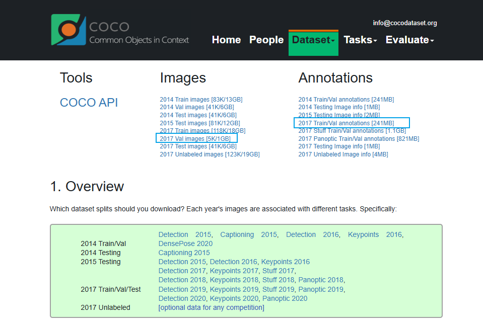
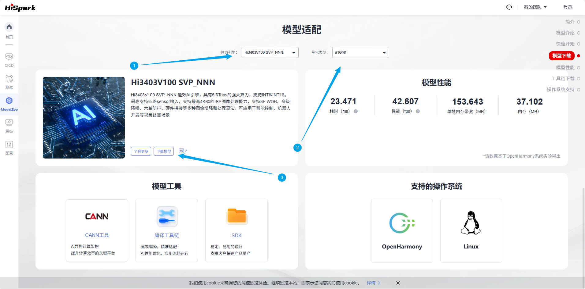
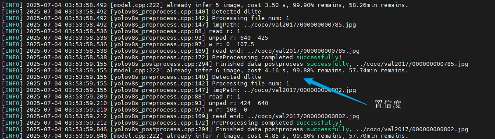
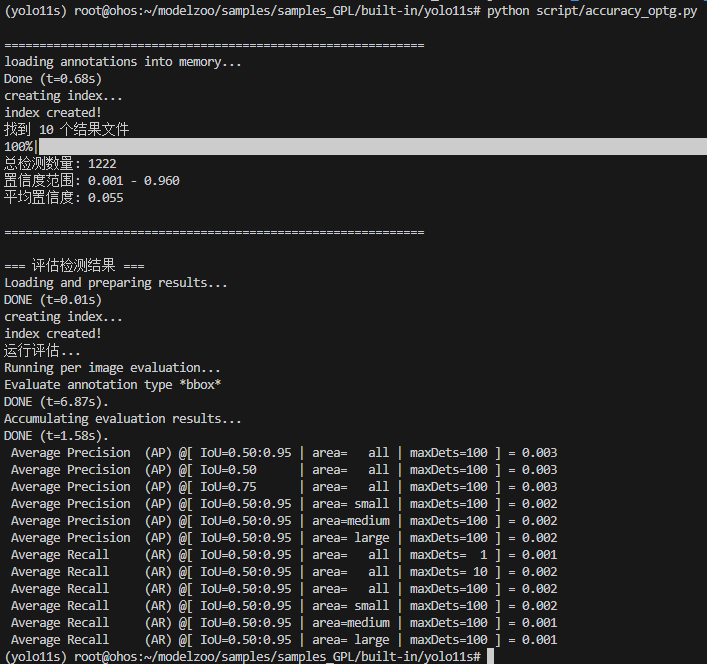
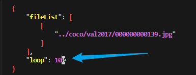
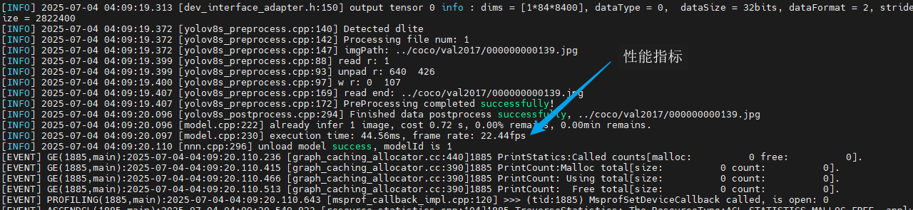
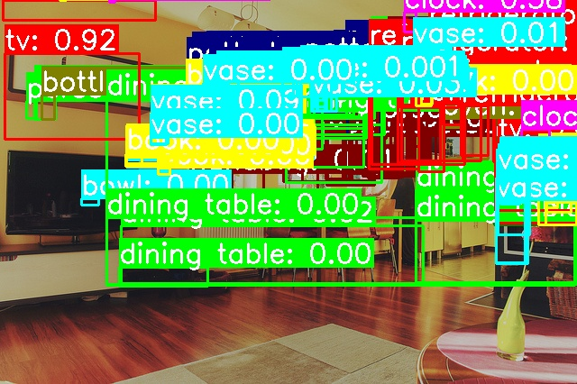

# YOLO11s应用指南
## 介绍

本文档是海鸥派快速应用HiSpark ModelZoo上YOLO11s模型的指导文档，如果需要了解更多模型参数、细节请参见[HiSpark ModelZoo yolo11s指导文档](../../src/samples/samples_GPL/built-in/yolo11s/README.md)。

- 应用系统：Linux
- SDK版本：SS928 V100R001C02SPC022
- 应用引擎：Hi3403V100 NNN

## 环境准备

根据[《环境准备》](../环境准备.md)文档，搭建开发环境和开发板环境。

## 快速开始（推荐）

### 安装依赖

进入docker容器终端，执行下面命令安装依赖。

```shell
docker exec -it modelzoo bash

apt-get install libgl1-mesa-glx libglib2.0-0

conda create -n yolo11s python=3.8
conda activate yolo11s

cd ~/HiEuler_PI_ModelZoo/src/samples/samples_GPL/built-in/yolo11s
pip install -r requirements.txt
pip install ultralytics decorator pycocotools
```

### 准备数据集

1. 获取原始数据集。（解压命令参考tar –xvf *.tar与 unzip *.zip）

   下载 [coco2017 val数据集](https://cocodataset.org/#download) 。

   

   在`yolo11s`源码根目录下新建`coco`文件夹。

   ```shell
   mkdir -p coco
   ```

   数据集放到`coco`里，整理文件结构如下：

   ```
   coco
      ├── val2017
         ├── 00000000139.jpg
         ├── 00000000285.jpg
         ……
         └── 00000581781.jpg
      ├── instances_val2017.json
   ...
   ```

2. 数据预处理，将原始数据集转换为模型的输入数据。

   ```shell
   python ../../../../utils/generate_file_list.py coco/val2017
   ```

   参数说明：

   - --dataset_path：原数据集所在路径。

### 获取om离线模型

网站上提供转化成功的om模型文件，可以从[网站](https://modelzoo.hispark.hisilicon.com/#/ModelZoo)上搜索YOLO11s进行下载；注意选择算力引擎和量化类型。



进入docker容器终端创建`model`文件夹，并将om模型文件移动到`./model`目录下。
```shell
cd ~/HiEuler_PI_ModelZoo/src/samples/samples_GPL/built-in/yolo11s
mkdir -p model
```
### 编译代码

1. 切换到样例目录，创建目录用于存放编译文件，例如，本文中，创建的目录为`build`。
    ```shell
    mkdir -p build
    ```

2. 切换到`build`目录，执行**cmake**生成编译文件。

    Hi3403V100 NNN：

    ```shell
    source ~/setenv_atc.sh nnn
    cd build
    cmake ../src -DCMAKE_BUILD_TYPE=Release -DCMAKE_TOOLCHAIN_FILE=../../../../common/cmake/toolchain_aarch64_linux.cmake -DSOC_VERSION=OPTG
    ```

3. 执行**make**命令，生成的可执行文件main在“./out“目录下。

    ```shell
    make -j8
    ```

    参数说明：

    - -j：并行任务数量，这里-j8代表8个并行任务编译，适当调整数字提高编译速度。

### 模型推理

1. 将`~/HiEuler_PI_ModelZoo/src/samples/samples_GPL/built-in/yolo11s`下的coco、model、out文件夹拷贝到NFS共享文件夹的HiEuler_PI_ModelZoo对应目录下。

2. 进入开发板终端，切换到可执行文件main所在的目录，运行可执行文件。

    ```shell
    cd /mnt/HiEuler_PI_ModelZoo/src/samples/samples_GPL/built-in/yolo11s/out
    chmod +x main
    ./main --acl ../src/acl.json --model ../model/yolo11s.om --input ../data/file_list_1.json
    ```
    
    成功将生成result文件夹。
    

## 全面上手

### 安装依赖

进入docker容器终端，执行下面命令安装依赖。

```shell
docker exec -it modelzoo bash

apt-get install libgl1-mesa-glx libglib2.0-0

conda create -n yolo11s python=3.8
conda activate yolo11s

cd ~/HiEuler_PI_ModelZoo/src/samples/samples_GPL/built-in/yolo11s
pip install -r requirements.txt
pip install ultralytics decorator pycocotools
```

### 准备数据集

1. 获取原始数据集。（解压命令参考tar –xvf *.tar与 unzip *.zip）

   下载 [coco2017 val数据集](https://cocodataset.org/#download) 。

   

   在`yolo11s`源码根目录下新建`coco`文件夹。

   ```shell
   mkdir -p coco
   ```

   数据集放到`coco`里，整理文件结构如下：

   ```
   coco
      ├── val2017
         ├── 00000000139.jpg
         ├── 00000000285.jpg
         ……
         └── 00000581781.jpg
      ├── instances_val2017.json
   ...
   ```

2. 数据预处理，将原始数据集转换为模型的输入数据。

    ```shell
    python ../../../../utils/generate_file_list.py coco/val2017
    ```

    参数说明：
    - --dataset_path：原数据集所在路径。


### 模型转化

使用PyTorch将模型权重文件.pth转换为.onnx文件，再使用ATC工具将.onnx文件转为离线推理模型文件.om文件。

1. 获取权重文件。

   在[链接](https://github.com/ultralytics/assets/releases/download/v8.3.0/yolo11s.pt)中找到yolo11s.pt下载，存储至model文件夹下。

   ```shell
   mkdir -p model
   ```

2. 导出onnx文件。

    使用./script/pth2onnx.py导出onnx模型

    ```shell
    cd script
    python pth2onnx.py
    cd ../
    ```

3. 使用ATC工具将ONNX模型转OM模型。

    执行ATC命令。
    1. Hi3403V100 NNN上的om模型转换命令
        ```shell
        source ~/setenv_atc.sh nnn
        
        atc --framework=5 --model="./model/yolo11s.onnx"  --input_shape="images:1,3,640,640" input_fp16_nodes="images" --insert_op_conf="./model_cfg/SS928V100_NNN/insert_op.cfg" --output="./model/yolo11s" --enable_single_stream=true --soc_version=OPTG
        ```

        运行成功后生成unet.om模型文件。

        参数说明：
      
        - --framework：5代表ONNX模型。
        - --model：为ONNX模型文件。
        - --input_shape：输入数据的shape。
        - --insert_op_conf：aipp算子配置，用于输入数据处理。
        - --output：输出的OM模型。
        - --image_list: 量化校准数据。
        - --enable_small_channel:使能small channel优化。
        - --enable_single_stream:推理时使用一条stream。
        - --soc_version：处理器型号。

### 编译代码

1. 切换到样例目录，创建目录用于存放编译文件，例如，本文中，创建的目录为`build`。

   ```shell
   mkdir -p build
   ```

2. 切换到`build`目录，执行**cmake**生成编译文件。

   Hi3403V100 NNN：

   ```shell
   source ~/setenv_atc.sh nnn
   cd build
   cmake ../src -DCMAKE_BUILD_TYPE=Release -DCMAKE_TOOLCHAIN_FILE=../../../../common/cmake/toolchain_aarch64_linux.cmake -DSOC_VERSION=OPTG
   ```

3. 执行**make**命令，生成的可执行文件main在“./out“目录下。

   ```shell
   make -j8
   ```

   参数说明：

   - -j：并行任务数量，这里-j8代表8个并行任务编译，适当调整数字提高编译速度。

### 模型推理

1. 将`~/HiEuler_PI_ModelZoo/src/samples/samples_GPL/built-in/yolo11s`下的coco、data、model、out文件夹拷贝到NFS共享文件夹的HiEuler_PI_ModelZoo对应目录下。

2. 进入开发板终端，切换到可执行文件main所在的目录，运行可执行文件。

   ```shell
   cd /mnt/HiEuler_PI_ModelZoo/src/samples/samples_GPL/built-in/yolo11s/out
   chmod +x main
   ./main --acl ../src/acl.json --model ../model/yolo11s.om --input ../data/file_list_1.json
   ```

   成功将生成result文件夹。

    结果会保存在数据集所在目录下的result目录下，推理结果会保存在result目录下的bin目录下，后处理后的box结果会保存在result目录下的txt目录下。

   

### 精度&性能评估

1. 精度验证。

    将整个`out/result`文件夹拷贝回docker容器的HiEuler_PI_ModelZoo对应目录下，并进入docker容器终端。

    调用脚本可以获得Accuracy数据，结果保存在accuracy.txt中。

    ```shell
    cd ~/HiEuler_PI_ModelZoo/src/samples/samples_GPL/built-in/yolo11s
    python script/accuracy_optg.py
    ```

    NNN平台上精度结果：

    

2. 性能验证。

    进入开发板终端，打开file_list_1.json文件，将file_list_1.json的loop参数设置为100。

    ```shell
    cd /mnt/HiEuler_PI_ModelZoo/src/samples/samples_GPL/built-in/yolo11s
    vi data/file_list_1.json
    ```

    

    执行推理命令。

    ```shell
    cd out
    ./main --acl ../src/acl.json --model ../model/yolo11s.om --input ../data/file_list_1.json
    ```

    - 参数说明：(此模式下，输入路径为一张图片)

      - --model：om模型路径。
    
      - --output:  后处理后结果所在位置
    
      - --model: 模型所在位置
    
      - --loop： 循环执行多少次取结果
    
    file_list_1.json中的配置代表对一张输入图片重复推理100次，程序执行时会在开发板会输出打印推理的平均时间和帧率。
    
    Hi3403V100 NNN平台上性能结果如下：
    
    

### 可视化推理结果

**注意：Hi3403V100 NNN暂不可用，但是可以强行调用脚本对推理结果进行可视化画框操作。**

```shell
cd script
python drawRectangle.py --image ../coco/val2017/000000000139.jpg --annotation ../out/result/txt/000000000139_result.txt -o ../out/000000000139.jpg
```

参数说明：

- --image:原始图片路径
- --annotation：图片对应的推理结果文件路径

**这里不能设置iou阈值，所以目标过多。**



## FAQ

### 如何指定推理图片或修改推理的图片数量

打开NFS共享文件夹的`HiEuler_PI_ModelZoo/src/samples/samples_GPL/built-in/yolo11s/data/file_list.json`即可指定推理的图片，删除或增加图片路径即可间接修改推理的图片数量。

