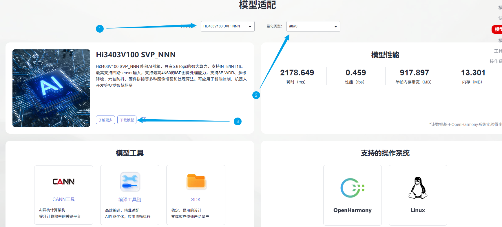
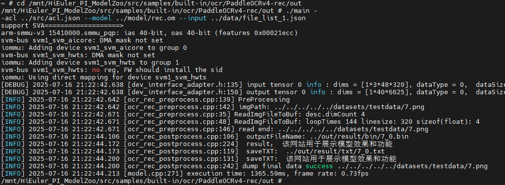
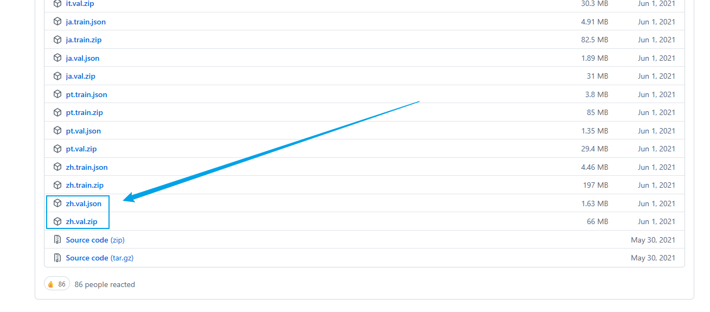
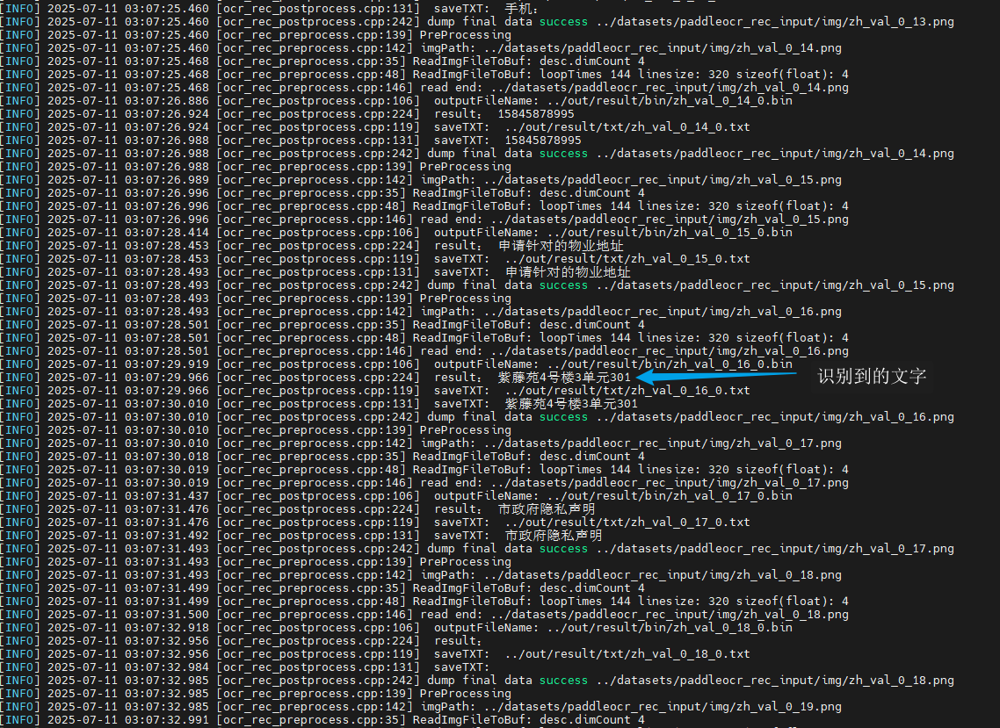
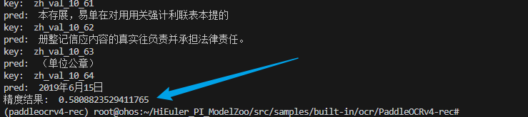
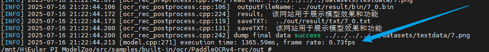
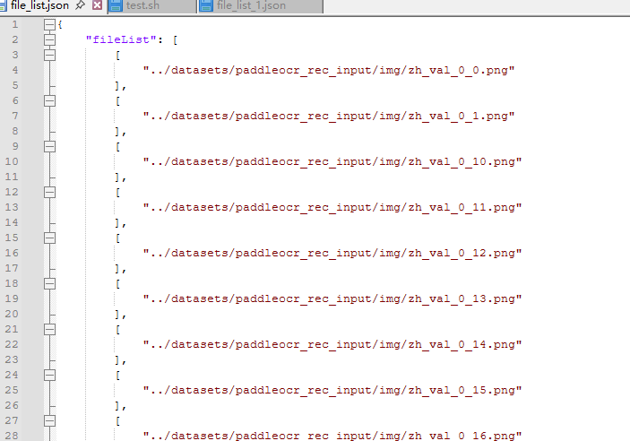
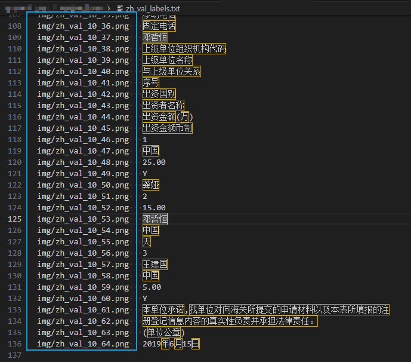

# PaddleOCRv4_rec应用指南

## 介绍

本文档是海鸥派快速应用HiSpark ModelZoo上PaddleOCRv4_rec模型的指导文档，如果需要了解更多模型参数、细节请参见[HiSpark ModelZooPaddleOCRv4_rec指导文档](../../src/samples/built-in/ocr/PaddleOCRv4-rec/README.md)。

- 应用系统：Linux
- SDK版本：SS928 V100R001C02SPC022
- 应用引擎：Hi3403V100 SVP_NNN

## 环境准备

根据[《环境准备》](../环境准备.md)文档，搭建开发环境和开发板环境。

## 快速开始（推荐）

### 获取om离线模型

网站上提供转化成功的om模型文件，可以从[网站](https://modelzoo.hispark.hisilicon.com/#/ModelZoo)上搜索PaddleOCRv4_rec进行下载；注意选择算力引擎和量化类型。



进入docker容器终端创建`model`文件夹，并将om模型文件移动到`./model`目录下。

```shell
cd ~/HiEuler_PI_ModelZoo/src/samples/built-in/ocr/PaddleOCRv4-rec
mkdir -p model
```

### 编译代码

1. 切换到样例目录，创建目录用于存放编译文件，例如，本文中，创建的目录为“build“。

   ```shell
   mkdir -p build
   ```

2. 切换到“build“目录，执行**cmake**生成编译文件。

   Hi3403V100 SVP_NNN生成编译文件命令

   ```shell
   cd build
   cmake ../src -DCMAKE_BUILD_TYPE=Release -DCMAKE_TOOLCHAIN_FILE=../../../../common/cmake/toolchain_aarch64_linux.cmake -DSOC_VERSION=SS928V100
   ```

3. 执行**make**命令，生成的可执行文件main在“./out“目录下。

   ```shell
   make -j8
   ```

   参数说明：

   - -j：并行任务数量，这里-j8代表8个并行任务编译，适当调整数字提高编译速度。

### 模型推理

1. 将`~/HiEuler_PI_ModelZoo/src/samples/built-in/ocr/PaddleOCRv4-rec`下的model、out文件夹拷贝到NFS共享文件夹的HiEuler_PI_ModelZoo对应目录下。

3. 进入开发板终端，切换到可执行文件main所在的目录，运行可执行文件。

   ```shell
   cd /mnt/HiEuler_PI_ModelZoo/src/samples/built-in/ocr/PaddleOCRv4-rec/out
   chmod +x main
   ./main --acl ../src/acl.json --model ../model/rec.om --input ../data/file_list_1.json
   ```

   成功将生成result文件夹。

   Hi3403V100 SVP_NNN推理结果：

   


## 全面上手

### 安装依赖

```shell
conda create -n paddleocrv4-rec python=3.7.5
conda activate paddleocrv4-rec

cd ~/HiEuler_PI_ModelZoo/src/samples/built-in/ocr/PaddleOCRv4-rec
pip install -r requirements.txt
pip install rapidfuzz
apt-get install -y libsm6 libxrender1
```

### 准备数据集

1. 获取原始数据集。（解压命令参考tar –xvf *.tar与 unzip *.zip）

   下载 [XFUND数据集](https://github.com/doc-analysis/XFUND/releases/tag/v1.0) 中文集。

   

   在`PaddleOCRv4_det`源码根目录下新建`datasets`文件夹，数据集放到`datasets`里，文件结构如下：

   ```shell
   datasets
       xfund
           ├── zh.val
           ├── zh_val_0.jpg
           ├── zh_val_1.jpg
           ……
           ├── zh.val.json
   ...
   ```

2. 数据预处理，将原始数据集转换为模型的输入数据。

   1. 针对Hi3403V100 SVP_NNN平台上的om模型的预处理转换命令

      ```shell
      python ./script/xfund_process.py
      python ../../../../utils/generate_file_list.py datasets/paddleocr_rec_input/img/
      ```

### 模型转化

使用PyTorch将模型权重文件.pth转换为.onnx文件，再使用ATC工具将.onnx文件转为离线推理模型文件.om文件。

1. 获取开源源码。

   ```shell
   git clone https://github.com/PaddlePaddle/PaddleOCR.git
   cd PaddleOCR
   git checkout release/2.10
   
   git clone https://github.com/frotms/PaddleOCR2Pytorch.git
   cd PaddleOCR2Pytorch
   git reset --hard c799652dd04942240c0376cb6ade3cad94f7300e
   git apply ../../ppocr.patch
   cd ..
   ```

2. 获取权重文件。

   在[链接](https://paddleocr.bj.bcebos.com/PP-OCRv4/chinese/ch_PP-OCRv4_det_train.tar)中下载所需版本，下载后保存到PaddleOCR2Pytorch/ckpt目录下，并解压。也可以使用下述命令下载。
      ```shell
      cd PaddleOCR2Pytorch
      mkdir ckpt
      cd ckpt
      wget https://paddleocr.bj.bcebos.com/PP-OCRv4/chinese/ch_PP-OCRv4_rec_train.tar
      wget https://paddleocr.bj.bcebos.com/PP-OCRv4/chinese/ch_PP-OCRv4_det_train.tar
      tar -xvf ch_PP-OCRv4_det_train.tar
      tar -xvf ch_PP-OCRv4_rec_train.tar
      cd ../
      ```

3. 导出onnx文件。

    1. 使用开源源码中的导出方法，在PaddleOCR2Pytorch目录下：

         ```shell
         cp ../../script/onnx_model_sim.py ./
         python ./converter/ch_ppocr_v4_det_converter.py --yaml_path ./configs/det/ch_PP-OCRv4/ch_PP-OCRv4_det_student.yml --src_model_path ckpt/ch_PP-OCRv4_det_train/
         
         python ./converter/ch_ppocr_v4_rec_converter.py --yaml_path ./configs/rec/PP-OCRv4/ch_PP-OCRv4_rec.yml --src_model_path ckpt/ch_PP-OCRv4_rec_train/
         
         python ./tools/infer/predict_system.py --image_dir ./doc/imgs/11.jpg --det_model_path ./ch_ptocr_v4_det_infer.pth --det_yaml_path ./configs/det/ch_PP-OCRv4/ch_PP-OCRv4_det_student.yml --rec_model_path 3,48,320 --rec_model_path ./ch_ptocr_v4_rec_infer.pth --rec_yaml_path ./configs/rec/PP-OCRv4/ch_PP-OCRv4_rec.yml
         
         python ./onnx_model_sim.py
         ```
         
         获得ch_ptocr_v4_det_simplified.onnx和ch_ptocr_v4_rec_simplified.onnx文件，将这二个文件复制到model目录下。
         
         ```shell
         mkdir -p ../../model
         cp ch_ptocr_v4_det_simplified.onnx ch_ptocr_v4_rec_simplified.onnx ../../model/
         cd ../../
         ```

4. 生成量化数据文件`./data/quant/data_rec.txt`。

    ```shell
    python ./script/quant_rec.py
    ```

5. 使用ATC工具将ONNX模型转OM模型。

    执行ATC命令。
    1. Hi3403V100 SVP_NNN上的om模型转换命令
        ```shell
        source ~/setenv_atc.sh svp_nnn
        
       atc --model="./model/ch_ptocr_v4_rec_simplified.onnx" --online_model_type="0" --framework=5 --input_format="NCHW" --save_original_model="false" --output=./model/rec --input_type="input.1:FP32" --compile_mode=5 --soc_version=SS928V100 --image_list="./data/quant/data_rec.txt" --input_shape="input.1:1,3,48,320" --matmul_per_channel_enable=1 --quant_mode=1
       ```

        运行成功后生成rec.om模型文件。
      
        参数说明：
       
        - --framework：5代表ONNX模型。
        - --model：为ONNX模型文件。
        - --input_shape：输入数据的shape。
        - --insert_op_conf：aipp算子配置，用于输入数据处理。
        - --output：输出的OM模型。
        - --image_list: 量化校准数据。
        - --enable_single_stream:推理时使用一条stream。
        - --soc_version：处理器型号。

### 编译代码

1. 切换到样例目录，创建目录用于存放编译文件，例如，本文中，创建的目录为“build“。

   ```shell
   mkdir -p build
   ```

2. 切换到“build“目录，执行**cmake**生成编译文件。

   Hi3403V100 SVP_NNN生成编译文件命令

   ```shell
   cd build
   cmake ../src -DCMAKE_BUILD_TYPE=Release -DCMAKE_TOOLCHAIN_FILE=../../../../common/cmake/toolchain_aarch64_linux.cmake -DSOC_VERSION=SS928V100
   ```

3. 执行**make**命令，生成的可执行文件main在“./out“目录下。

   ```shell
   make -j8
   ```

   参数说明：

   - -j：并行任务数量，这里-j8代表8个并行任务编译，适当调整数字提高编译速度。

### 模型推理

1. 将`~/HiEuler_PI_ModelZoo/src/samples/built-in/ocr/PaddleOCRv4-rec`下的datasets、data、model、out文件夹拷贝到NFS共享文件夹的HiEuler_PI_ModelZoo对应目录下。

2. 进入开发板终端，切换到可执行文件main所在的目录，运行可执行文件。

   ```shell
   cd /mnt/HiEuler_PI_ModelZoo/src/samples/built-in/ocr/PaddleOCRv4-rec/out
   chmod +x main
   ./main --acl ../src/acl.json --model ../model/rec.om --input ../data/file_list.json
   ```

   成功将生成result文件夹。

   直接打印识别到的文字。

   Hi3403V100 SVP_NNN推理过程：

   

### 精度&性能评估

本例中，模型执行后，基于推理结果，输出的选框会保存再./out/result/txt/目录下

1. 精度验证。

    将整个`out/result`文件夹拷贝回docker容器的HiEuler_PI_ModelZoo对应目录下，并进入docker容器终端。

    修正`script/rec_accuray.py`脚本，使其能正常获取数据。

    ```shell
    cd ~/HiEuler_PI_ModelZoo/src/samples/built-in/ocr/PaddleOCRv4-rec
    sed -i '/if "zh_val_1_" in key:/d' script/rec_accuray.py
    sed -i 's/^ *result_dict\[key\] = value/                result_dict[key] = value/' script/rec_accuray.py
    ```

    调用脚本与数据集标签val_label.txt比对，可以获得Accuracy数据，结果保存在accuracy.txt中。

    ```shell
    python ./script/rec_accuray.py --label_path "./datasets/paddleocr_rec_input/zh_val_labels.txt" --pre_file "./out/result/txt/"
    ```

    参数说明：

    - --pre_file：推理结果所在路径，默认为./out/result/txt/

    - --label_path：真值标签文件所在路径。

    运行rec_accuray.py脚本会输出文件，该文件中保存的是每一个图片的结果，平均结果为上述所有值求和输出：

    Hi3403V100 SVP_NNN平台上精度结果：

    

2. 性能验证。

    进入开发板终端，切换到可执行文件main所在的目录，运行可执行文件。

    ```shell
    cd /mnt/HiEuler_PI_ModelZoo/src/samples/built-in/ocr/PaddleOCRv4-rec/out
    ./main --acl ../src/acl.json --model ../model/rec.om --input ../data/file_list_1.json
    ```
    
    参数说明：(此模式下，file_list_1.json只放一张图片)
    
    - --acl:  ACL 配置文件路径
    - --model：om模型路径。
    - --input：指定输入数据的列表文件路径（此场景下为单图路径的配置文件，注意：循环次数通过修改该文件中的loop变量即可,循环执行多少次取结果， loop为1的时候第一次加载，耗时比多次执行长，建议loop取100次求平均值）


在板端会输出显示，Hi3403V100 SVP_NNN平台上性能结果如下：


## FAQ

### 如何指定推理图片或修改推理的图片数量

打开NFS共享文件夹的`HiEuler_PI_ModelZoo/src/samples/built-in/ocr/PaddleOCRv4-rec/data/file_list.json`，删除或增加图片路径即可间接修改推理的图片数量。



### 指定推理图片或修改推理的图片数量后如何进行精度验证

打开docker容器终端的`HiEuler_PI_ModelZoo/src/samples/built-in/ocr/PaddleOCRv4-rec/datasets/paddleocr_rec_input/zh_val_labels.txt`，修改成上述[**如何指定推理图片或修改推理的图片数量**](#如何指定推理图片或修改推理的图片数量)所涉及的`data/file_list.json`相同的键值，删除多余的键值。


