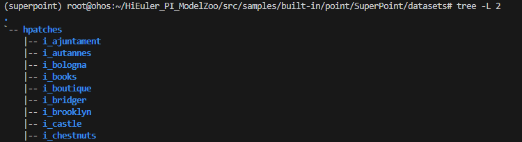
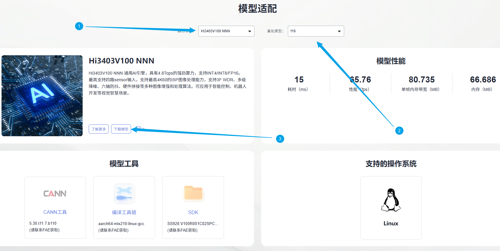
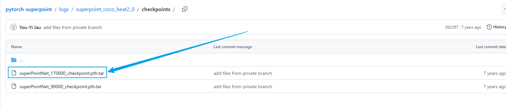
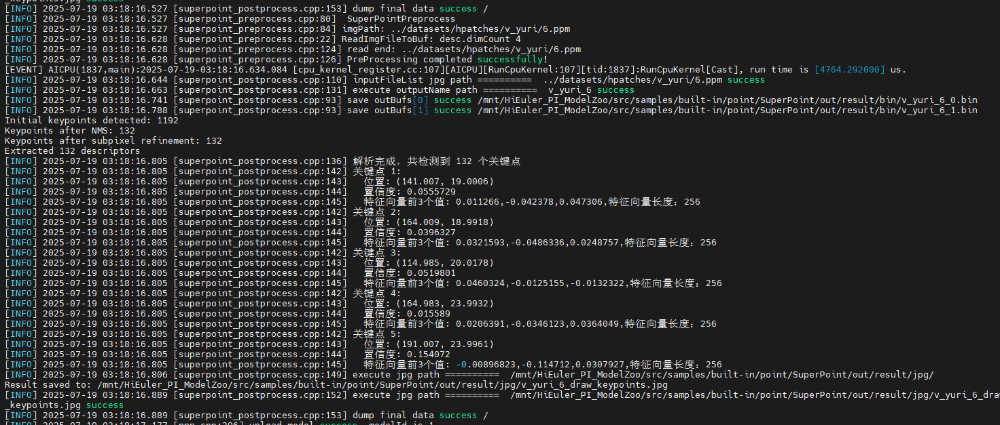
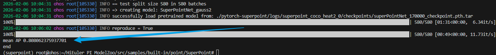
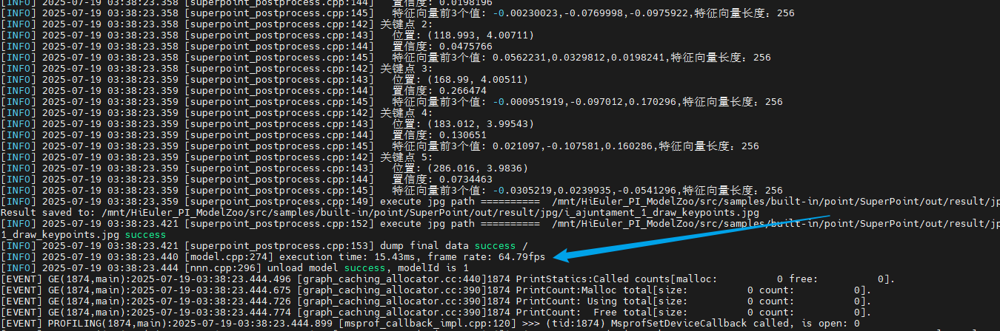
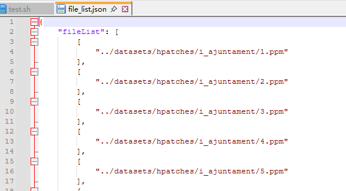

# SuperPoint应用指南

## 介绍

本文档是海鸥派快速应用HiSpark ModelZoo上SuperPoint模型的指导文档，如果需要了解更多模型参数、细节请参见[HiSpark ModelZoo SuperPoint指导文档](../../src/samples/built-in/point/SuperPoint/README.md)。

- 应用系统：Linux
- SDK版本：SS928 V100R001C02SPC022
- 应用引擎：Hi3403V100 NNN

## 环境准备

根据[《环境准备》](../环境准备.md)文档，搭建开发环境和开发板环境。

## 快速开始（推荐）

### 安装依赖

```shell
docker exec -it modelzoo bash
conda create -n superpoint python=3.7.5
conda activate superpoint

cd ~/HiEuler_PI_ModelZoo/src/samples/built-in/point/SuperPoint
sed -i 's/imgaug==2.31.2/imgaug==0.4.0/g' requirements.txt
pip install -r requirements.txt
pip install decorator sympy
```

### 准备数据集

1. 获取原始数据集

   下载[HPatches full sequences](https://huggingface.co/datasets/vbalnt/hpatches/resolve/main/hpatches-sequences-release.zip)数据集。

   在SuperPoint目录下创建datasets文件夹，将数据集拷贝至datasets文件夹下并整理数据集结构如下：

   ```shell
   mkdir -p datasets
   ```

   ```shell
   datasets/
   |-- hpatches
   |   |-- i_ajuntament
   |   |-- ...
   ```

   

### 获取om离线模型

网站上提供转化成功的om模型文件，可以从[网站](https://modelzoo.hispark.hisilicon.com/#/ModelZoo)上搜索SuperPoint进行下载；注意选择算力引擎和量化类型。



进入docker容器终端创建`model`文件夹，并将om模型文件移动到`./model`目录下。

```shell
mkdir -p model
```

### 编译代码

1. 切换到样例目录，创建目录用于存放编译文件，例如，本文中，创建的目录为“build“。

   ```shell
   mkdir -p build
   ```

2. 切换到“build“目录，执行**cmake**生成编译文件。

   Hi3403V100 NNN生成编译文件命令

   ```shell
   cd build
   source ~/setenv_atc.sh nnn
   cmake ../src -DCMAKE_BUILD_TYPE=Release -DCMAKE_TOOLCHAIN_FILE=../../../../common/cmake/toolchain_aarch64_linux.cmake -DSOC_VERSION=OPTG
   ```

3. 执行**make**命令，生成的可执行文件main在“./out“目录下。

   ```shell
   make -j8
   ```

   参数说明：

   - -j：并行任务数量，这里-j8代表8个并行任务编译，适当调整数字提高编译速度。

### 模型推理

1. 将`~/HiEuler_PI_ModelZoo/src/samples/built-in/point/SuperPoint`下的datasets、data、model、out文件夹拷贝到NFS共享文件夹的HiEuler_PI_ModelZoo对应目录下。

2. 进入开发板终端，切换到可执行文件main所在的目录，运行可执行文件。

   Hi3403V100 NNN平台的如下：

   ```shell
   cd /mnt/HiEuler_PI_ModelZoo/src/samples/built-in/point/SuperPoint/out
   chmod +x main
   ./main --acl ../src/acl.json --model ../model/superpoint_bs1_dlite.om --input ../data/file_list.json 
   ```

   成功将生成result文件夹。

## 全面上手

### 安装依赖

```shell
docker exec -it modelzoo bash
conda create -n superpoint python=3.7.5
conda activate superpoint

cd ~/HiEuler_PI_ModelZoo/src/samples/built-in/point/SuperPoint
sed -i 's/imgaug==2.31.2/imgaug==0.4.0/g' requirements.txt
pip install -r requirements.txt
pip install decorator sympy
```

### 准备数据集

1. 获取原始数据集

   下载[HPatches full sequences](https://huggingface.co/datasets/vbalnt/hpatches/resolve/main/hpatches-sequences-release.zip)数据集。

   在SuperPoint目录下创建datasets文件夹，将数据集拷贝至datasets文件夹下并整理数据集结构如下：

   ```shell
   mkdir -p datasets
   ```

   ```shell
   datasets/
   |-- hpatches
   |   |-- i_ajuntament
   |   |-- ...
   ```

   

### 模型转换


使用PyTorch将模型权重文件.pth转换为.onnx文件，再使用ATC工具将.onnx文件转为离线推理模型文件.om文件。

1. 获取权重文件。

    [下载链接](https://github.com/eric-yyjau/pytorch-superpoint/tree/master/logs/superpoint_coco_heat2_0/checkpoints) 采用名称为superPointNet_170000_checkpoint.pth.tar的权重文件。

    

    创建model文件夹，并将superPointNet_170000_checkpoint.pth.tar的权重文件拷贝到该目录下。

    ```shell
    mkdir -p model
    ```

2. 导出onnx文件。

   在代码主目录使用superpoint_pth2onnx.py导出onnx文件。

    ```shell
    python ./script/superpoint_pth2onnx.py --model_path=./model/superPointNet_170000_checkpoint.pth.tar --batch_size=1
    ```

3. 使用ATC工具将ONNX模型转OM模型。

    Hi3403V100 NNN上的om模型转换命令

    ```shell
    source ~/setenv_atc.sh nnn
    
    atc --framework=5 --model="./model/superpoint_bs1.onnx" --input_format="NCHW" --input_shape="image:1,1,240,320" --output="./model/superpoint_bs1_dlite" --enable_single_stream=true --soc_version=OPTG
    ```

    运行成功后生成superpoint_bs1.om模型文件。

    参数说明：
    - --framework：5代表ONNX模型。
    - --model：为ONNX模型文件。
    - --input_shape：输入数据的shape。
    - --insert_op_conf：aipp算子配置，用于输入数据处理。
    - --output：输出的OM模型。
    - --input_type: 输入的数据的类型
    - --image_list: 量化校准数据。
    - --compile_mode:编译模式，参数值1代表使用16bit量化数据，使用8bit量化权重。
    - --enable_small_channel:使能small channel优化。
    - --enable_single_stream:推理时使用一条stream。
    - --soc_version：处理器型号。


### 编译代码

1. 切换到样例目录，创建目录用于存放编译文件，例如，本文中，创建的目录为“build“。
   ```shell
   mkdir -p build
   ```

2. 切换到“build“目录，执行**cmake**生成编译文件。

   Hi3403V100 NNN生成编译文件命令

   ```shell
   cd build
   source ~/setenv_atc.sh nnn
   cmake ../src -DCMAKE_BUILD_TYPE=Release -DCMAKE_TOOLCHAIN_FILE=../../../../common/cmake/toolchain_aarch64_linux.cmake -DSOC_VERSION=OPTG

3. 执行**make**命令，生成的可执行文件main在“./out“目录下。

   ```shell
   make -j8
   ```

   参数说明：

   - -j：并行任务数量，这里-j8代表8个并行任务编译，适当调整数字提高编译速度。

### 模型推理

1. 将`~/HiEuler_PI_ModelZoo/src/samples/built-in/point/SuperPoint`下的datasets、data、model、out文件夹拷贝到NFS共享文件夹的HiEuler_PI_ModelZoo对应目录下。

2. 进入开发板终端，切换到可执行文件main所在的目录，运行可执行文件。

   Hi3403V100 NNN平台的如下：
   ```shell
   cd /mnt/HiEuler_PI_ModelZoo/src/samples/built-in/point/SuperPoint/out
   chmod +x main
   ./main --acl ../src/acl.json --model ../model/superpoint_bs1_dlite.om --input ../data/file_list.json 
   ```

   成功将生成result文件夹。

   Hi3403V100 NNN推理过程：

   

### 精度&性能评估

1. 精度验证。

    docker容器终端下载源码pytorch-superpoint。

    ```shell
    cd ~/HiEuler_PI_ModelZoo/src/samples/built-in/point/SuperPoint
    git clone https://github.com/eric-yyjau/pytorch-superpoint.git
    cd pytorch-superpoint
    git reset --hard 5eb75d74df27c07f6e7311df8f167e2a9c01a798
    patch -p3 < ../sp.patch
    ```

    修改magicpoint_repeatability_heatmap.yaml配置文件的权重文件路径。

    ```shell
    sed -i 's|pretrained: '\''logs/superpoint_coco_heat2_0/checkpoints/superPointNet_170000_checkpoint.pth.tar'\''|pretrained: '\''./pytorch-superpoint/logs/superpoint_coco_heat2_0/checkpoints/superPointNet_170000_checkpoint.pth.tar'\''|' ./pytorch-superpoint/configs/magicpoint_repeatability_heatmap.yaml
    ```

    将整个`out/result`文件夹拷贝回docker容器的HiEuler_PI_ModelZoo对应目录下。

    在代码主目录进行精度计算

    ```shell
    python ./script/superpoint_postprocess.py --img_path=./pytorch-superpoint/configs/magicpoint_repeatability_heatmap.yaml --result_path=./out/result/bin
    ```
    Hi3403V100 NNN平台上精度结果如下：

    

2. 性能验证。

   验证om模型的性能，在板端执行参考命令如下：

   Hi3403V100 NNN平台的如下：
   ```
   ./main --acl ../src/acl.json --model ../model/superpoint_bs1_dlite.om --input ../data/file_list_1.json 
   ```

   参数说明：(此模式下，输入路径文本文件file_list_1.txt内容为一张图片路径)

   - --model：om模型路径。
   - --acl: acl.json文件的路径，默认放在src目录下。
   - --input: 输入的图像数据列表路径
   - --loop： 循环执行多少次取结果，loop为1的时候第一次加载，耗时比多次执行长，建议loop取100次求平均值。NNN平台修改json里面的loop值

   Hi3403V100 NNN平台上性能结果如下：

   

## FAQ

### 如何指定推理图片或修改推理的图片数量

打开NFS共享文件夹的`HiEuler_PI_ModelZoo/src/samples/built-in/point/SuperPoint/data/file_list.json`即可指定推理的图片，删除或增加图片路径即可间接修改推理的图片数量。


