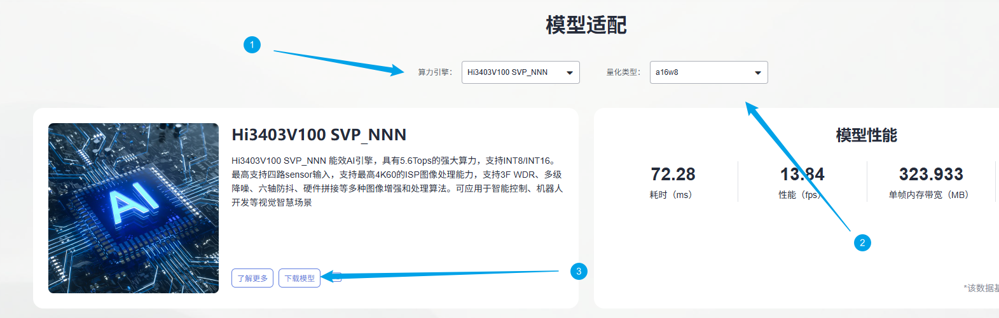
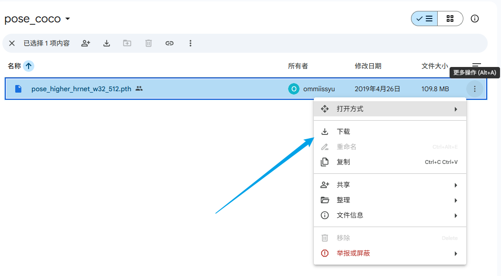
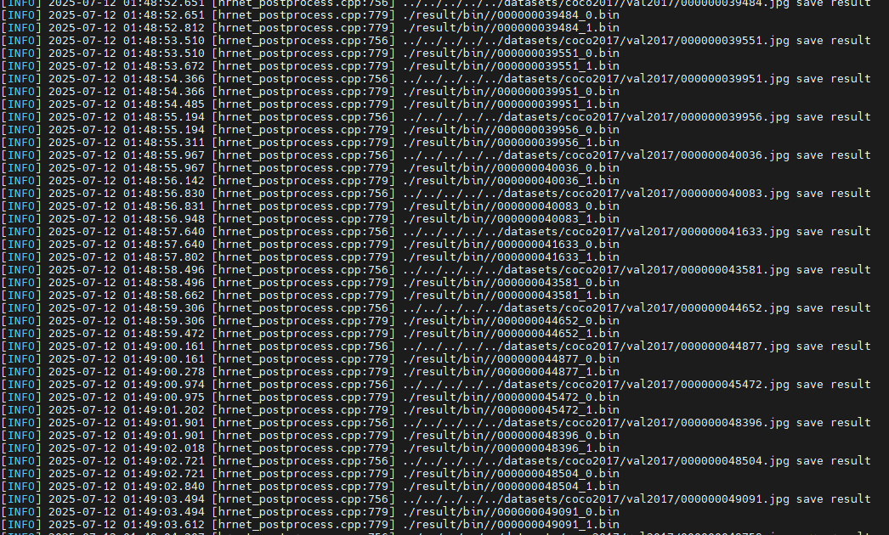
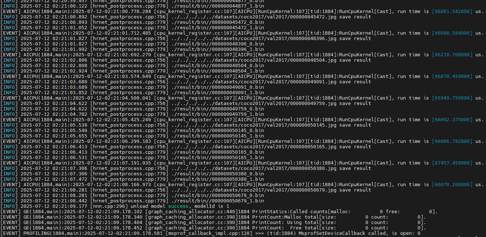
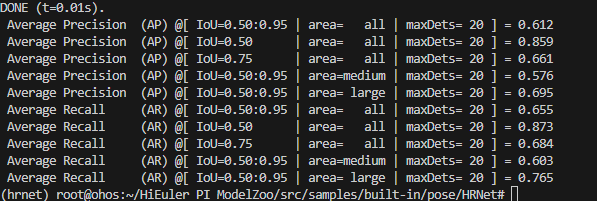
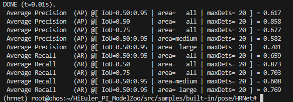
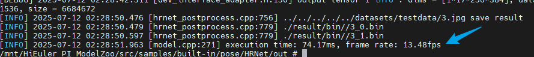
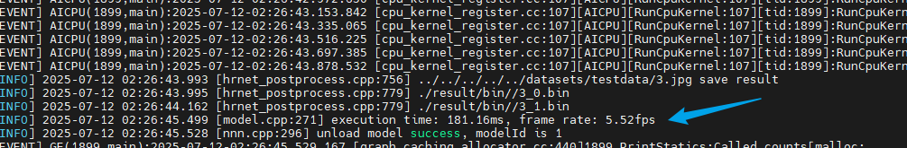
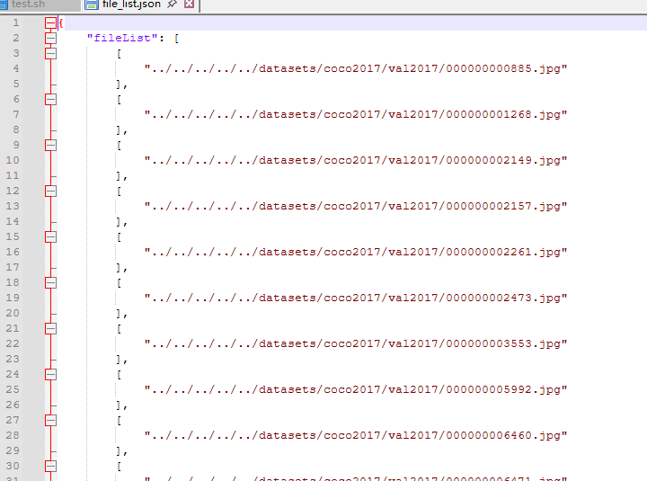

# HRNet应用指南

## 介绍

本文档是海鸥派快速应用HiSpark ModelZoo上HRNet模型的指导文档，如果需要了解更多模型参数、细节请参见[HiSpark ModelZoo HRNet指导文档](../../src/samples/built-in/pose/HRNet/README.md)。

- 应用系统：Linux
- SDK版本：SS928 V100R001C02SPC022
- 应用引擎：Hi3403V100 SVP_NNN、Hi3403V100 NNN

## 环境准备

根据[《环境准备》](../环境准备.md)文档，搭建开发环境和开发板环境。

## 快速开始（推荐）

### 获取om模型文件

网站上提供转化成功的om模型文件，可以从[网站](https://modelzoo.hispark.hisilicon.com/#/ModelZoo)上搜索HRNet进行下载；注意选择算力引擎和量化类型。



进入docker容器终端创建`model`文件夹，并将om模型文件移动到`./model`目录下。
```shell
cd ~/HiEuler_PI_ModelZoo/src/samples/built-in/pose/HRNet
mkdir -p model
```
### 编译代码

1. 切换到样例目录，创建目录用于存放编译文件，例如，本文中，创建的目录为`build`。

   ```shell
   mkdir -p build
   ```

2. 切换到`build`目录，执行**cmake**生成编译文件。

   1. Hi3403V100 SVP_NNN生成编译文件命令

      ```shell
      cd build
      source ~/setenv_atc.sh svp_nnn
      cmake ../src -DCMAKE_BUILD_TYPE=Release -DCMAKE_TOOLCHAIN_FILE=../../../../common/cmake/toolchain_aarch64_linux.cmake -DSOC_VERSION=SS928V100
      ```

   2. Hi3403V100 NNN生成编译文件命令

      ```shell
      cd build
      source ~/setenv_atc.sh nnn
      cmake ../src -DCMAKE_BUILD_TYPE=Release -DCMAKE_TOOLCHAIN_FILE=../../../../common/cmake/toolchain_aarch64_linux.cmake -DSOC_VERSION=OPTG
      ```

3. 执行**make**命令，生成的可执行文件main在“./out“目录下。

   ```shell
   make -j8
   ```

   参数说明：

   - -j：并行任务数量，这里-j8代表8个并行任务编译，适当调整数字提高编译速度。


### 模型推理

1. 将`~/HiEuler_PI_ModelZoo/src/samples/built-in/pose/HRNet`下的model、out文件夹拷贝到NFS共享文件夹的HiEuler_PI_ModelZoo对应目录下。

2. 进入开发板终端，切换到可执行文件main所在的目录，运行可执行文件。

   ```shell
   cd /mnt/HiEuler_PI_ModelZoo/src/samples/built-in/pose/HRNet/out
   chmod +x main
   ./main --model ../model/hrnet_512_768.om --input ../data/file_list_1.json
   ```

   成功将生成result文件夹。

## 全面上手

### 安装依赖

```
docker exec -it modelzoo bash
conda create -n hrnet python=3.7.5
conda activate hrnet

cd ~/HiEuler_PI_ModelZoo/src/samples/built-in/pose/HRNet
pip install yacs decorator sympy
pip install -r requirements.txt
```

### 准备数据集

1. 获取原始数据集。（解压命令参考tar –xvf *.tar与 unzip *.zip）

    下载 [coco2017 val数据集](https://cocodataset.org/#download) 。

    

    在`~/HiEuler_PI_ModelZoo/src/datasets`目录下创建`coco2017`文件夹，拷贝数据集并整理文件结构如下：

    ```shell
    coco2017
        ├── val2017
          ├── 00000000139.jpg
          ├── 00000000285.jpg
          ……
          └── 00000581781.jpg
        ├── annotations
          ├── person_keypoints_val2017.json
    ...
    ```

2. 生成输入文件列表和模型量化校准数据

    ```shell
    python ./script/gen_filelist_and_quant_file.py --input_path ../../../../datasets/coco2017/val2017 --output_path ./data
    ```

    - --input_path：数据集路径，需要使用相对路径
    - --output_path：生成的file_list.json文件和quant.bin文件路径


### 模型转化

使用PyTorch将模型权重文件.pth转换为.onnx文件，再使用ATC工具将.onnx文件转为离线推理模型文件.om文件。


1. 获取权重文件。

    [pose_higher_hrnet_w32_512.pth](https://drive.google.com/drive/folders/1zJbBbIHVQmHJp89t5CD1VF5TIzldpHXn)

    将其拷拷贝至model文件夹下。

      ```shell
      mkdir -p model
      ```

2. 导出onnx文件。

    ```
    git clone https://github.com/HRNet/HigherHRNet-Human-Pose-Estimation.git
    cd HigherHRNet-Human-Pose-Estimation
    git reset --hard aa23881492ff511185acf756a2e14725cc4ab4d7
    patch -p1 < ../HigherHRNet.patch
    cd ../
    python script/pth2onnx.py --cfg ./HigherHRNet-Human-Pose-Estimation/experiments/coco/higher_hrnet/w32_512_adam_lr1e-3.yaml --input model/pose_higher_hrnet_w32_512.pth --hw 512 768 --output ./model/hrnet_512_768.onnx
    ```

3. 使用ATC工具将ONNX模型转OM模型。

    Hi3403V100 SVP_NNN上的om模型转换命令:
    ```shell
    source ~/setenv_atc.sh svp_nnn
    atc --framework=5 --model="./model/hrnet_512_768.onnx" --input_shape="image:1,3,512,768" --output="model/hrnet_512_768" --image_list="./data/quant.bin" --compile_mode=1 --soc_version=SS928V100
    ```
    Hi3403V100 NNN上的om模型转换命令:
    ```shell
    source ~/setenv_atc.sh nnn
    atc --framework=5 --model="./model/hrnet_512_768.onnx" --input_shape="image:1,3,512,768" --output="model/hrnet_512_768" --enable_small_channel=1 --enable_single_stream=true --soc_version=OPTG 
    ```
    运行成功后生成hrnet_512_768.om模型文件。

    参数说明：
    - --framework：5代表ONNX模型。
    - --model：为ONNX模型文件。
    - --input_shape：输入数据的shape。
    - --output：输出的OM模型。
    - --image_list: 量化校准数据。
    - --compile_mode:编译模式，参数值1代表使用16bit量化数据，使用8bit量化权重。
    - --enable_small_channel:使能small channel优化。
    - --enable_single_stream:推理时使用一条stream。
    - --soc_version：处理器型号。

### 编译代码

1. 切换到样例目录，创建目录用于存放编译文件，例如，本文中，创建的目录为`build`。

   ```shell
   mkdir -p build
   ```

2. 切换到`build`目录，执行**cmake**生成编译文件。

   1. Hi3403V100 SVP_NNN生成编译文件命令

      ```shell
      cd build
      source ~/setenv_atc.sh svp_nnn
      cmake ../src -DCMAKE_BUILD_TYPE=Release -DCMAKE_TOOLCHAIN_FILE=../../../../common/cmake/toolchain_aarch64_linux.cmake -DSOC_VERSION=SS928V100
      ```

   2. Hi3403V100 NNN生成编译文件命令

      ```shell
      cd build
      source ~/setenv_atc.sh nnn
      cmake ../src -DCMAKE_BUILD_TYPE=Release -DCMAKE_TOOLCHAIN_FILE=../../../../common/cmake/toolchain_aarch64_linux.cmake -DSOC_VERSION=OPTG
      ```

3. 执行**make**命令，生成的可执行文件main在“./out“目录下。

   ```shell
   make -j8
   ```

   参数说明：

   - -j：并行任务数量，这里-j8代表8个并行任务编译，适当调整数字提高编译速度。


### 模型推理

1. 将`~/HiEuler_PI_ModelZoo/src/datasets/coco2017`以及`~/HiEuler_PI_ModelZoo/src/samples/built-in/pose/HRNet`下的data、model、out文件夹拷贝到NFS共享文件夹的HiEuler_PI_ModelZoo对应目录下。

2. 进入开发板终端，切换到可执行文件main所在的目录，运行可执行文件。

   ```shell
   cd /mnt/HiEuler_PI_ModelZoo/src/samples/built-in/pose/HRNet/out
   chmod +x main
   ./main --model ../model/hrnet_512_768.om --input ../data/file_list.json
   ```

   成功将生成result文件夹。

   1. Hi3403V100 SVP_NNN推理过程：

      

   2. Hi3403V100 NNN推理过程：

      

### 精度&性能评估

1. 精度验证。

   将整个`out/result`文件夹拷贝回docker容器的HiEuler_PI_ModelZoo对应目录下，并进入docker容器终端。

   拷贝`person_keypoints_val2017.json`文件到指定目录。

   ```shell
   cd ~/HiEuler_PI_ModelZoo/src/samples/built-in/pose/HRNet
   mkdir -p data/coco/annotations
   cp ../../../../datasets/coco2017/annotations/person_keypoints_val2017.json data/coco/annotations/
   ```

   执行脚本将结果文件与数据集标签比对，可以获得精度数据，结果保存在accuracy.txt中。

   ```shell
   python script/accuracy.py --cfg ./HigherHRNet-Human-Pose-Estimation/experiments/coco/higher_hrnet/w32_512_adam_lr1e-3.yaml --input data/file_list.json --dir ./out/result/bin/
   ```

   SVP_NNN平台上精度结果：

   

   NNN平台上精度结果：

   

2. 性能验证。

   开发板终端，验证om模型的性能，参考命令如下：

   ```shell
   cd /mnt/HiEuler_PI_ModelZoo/src/samples/built-in/pose/HRNet/out
   ./main --model ../model/hrnet_512_768.om --input ../data/file_list_1.json
   ```

   参数说明：

   - --model：om模型文件路径。
   - --input: 输入的图像列表文件

   file_list_1.json中的配置代表对一张输入图片重复推理100次，程序执行时会在板端会输出打印推理的平均时间和帧率。

   SVP NNN平台上性能结果：

   

   NNN平台上性能结果：

   

## FAQ

### 如何指定推理图片或修改推理的图片数量

打开NFS共享文件夹的`HiEuler_PI_ModelZoo/src/samples/built-in/pose/HRNet/data/file_list.json`，删除或增加图片路径即可间接修改推理的图片数量。



### 指定推理图片或修改推理的图片数量后如何进行精度验证

将NFS共享文件夹修改过的`HiEuler_PI_ModelZoo/src/samples/built-in/pose/HRNet/data/file_list.json`文件拷贝至docker容器的HiEuler_PI_ModelZoo对应目录下替换即可。
