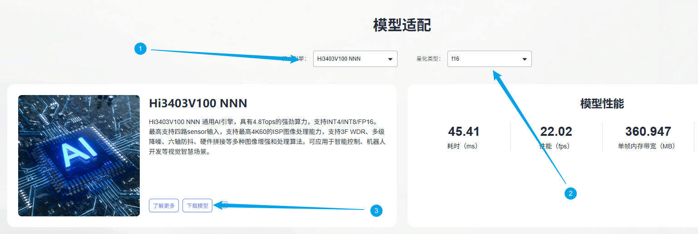
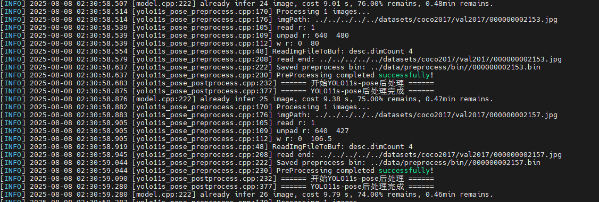
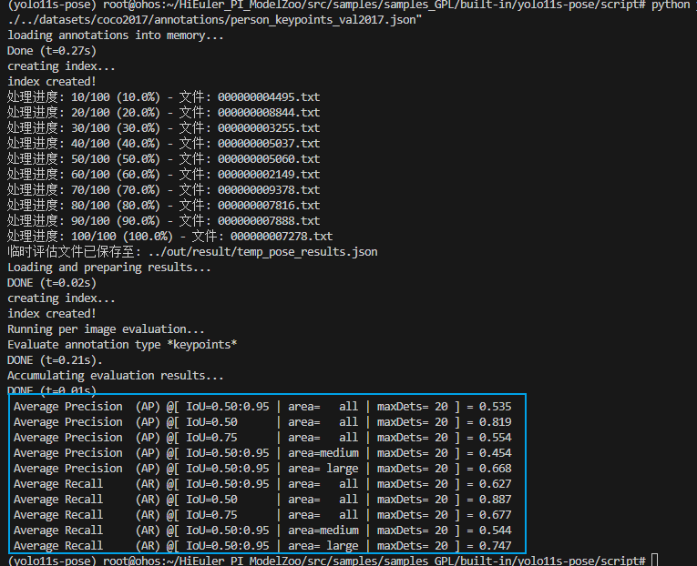
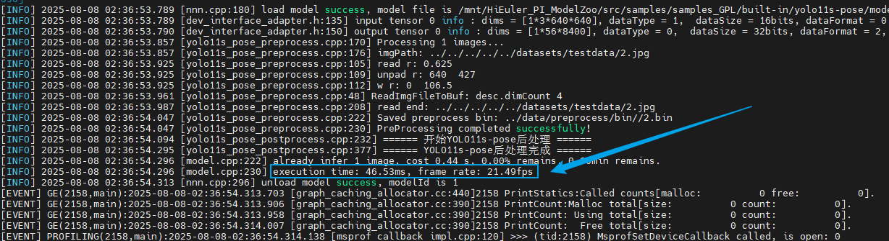
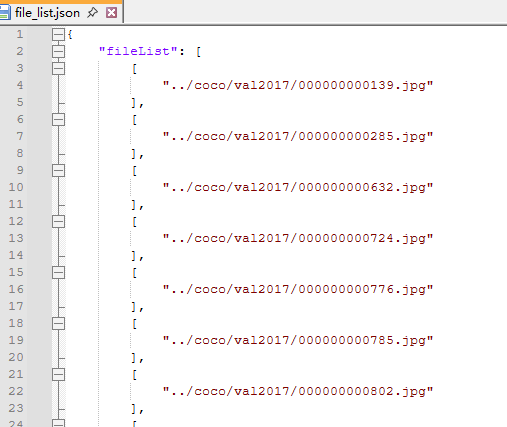

# YOLO11s-pose应用指南
## 介绍

本文档是海鸥派快速应用HiSpark ModelZoo上YOLO11s-pose模型的指导文档，如果需要了解更多模型参数、细节请参见[HiSpark ModelZoo YOLO11s-pose指导文档](../../src/samples/samples_GPL/built-in/yolo11s-pose/README.md)。

- 应用系统：Linux
- SDK版本：SS928 V100R001C02SPC022
- 应用引擎：Hi3403V100 NNN

## 环境准备

根据[《环境准备》](../环境准备.md)文档，搭建开发环境和开发板环境。

## 快速开始（推荐）

### 获取om模型文件

网站上提供转化成功的om模型文件，可以从[网站](https://modelzoo.hispark.hisilicon.com/#/ModelZoo)上搜索YOLO11s-pose进行下载；注意选择算力引擎和量化类型。



进入docker容器终端创建`model`文件夹，并将om模型文件移动到`./model`目录下。
```shell
cd ~/HiEuler_PI_ModelZoo/src/samples/samples_GPL/built-in/yolo11s-pose
mkdir -p model
```
### 编译代码

1. 切换到样例目录，创建目录用于存放编译文件，例如，本文中，创建的目录为`build`。
    ```shell
    mkdir -p build
    ```

2. 切换到`build`目录，执行**cmake**生成编译文件。

    ```shell
    cd build
    source ~/setenv_atc.sh nnn
    cmake ../src -DCMAKE_BUILD_TYPE=Release -DCMAKE_TOOLCHAIN_FILE=../../../../common/cmake/toolchain_aarch64_linux.cmake -DSOC_VERSION=OPTG
    ```

3. 执行**make**命令，生成的可执行文件main在“./out“目录下。

    ```shell
    make -j8
    ```

    参数说明：

    - -j：并行任务数量，这里-j8代表8个并行任务编译，适当调整数字提高编译速度。


### 模型推理

1. 将`~/HiEuler_PI_ModelZoo/src/samples/samples_GPL/built-in/yolo11s-pose`下的model、out文件夹拷贝到NFS共享文件夹的HiEuler_PI_ModelZoo对应目录下。
4. 进入开发板终端，切换到可执行文件main所在的目录，运行可执行文件。
   
    ```shell
    cd /mnt/HiEuler_PI_ModelZoo/src/samples/samples_GPL/built-in/yolo11s-pose/out
    dos2unix ../data/cfg.txt
    chmod +x main
    ./main --acl ../src/acl.json --model ../model/yolo11s-pose_dlite_fp16.om  --input ../data/file_list_1.json
    ```
    成功将生成result文件夹。

## 全面上手

### 安装依赖

进入docker容器终端，执行下面命令安装依赖。

```
conda create -n yolo11s-pose python=3.8
conda activate yolo11s-pose

cd ~/HiEuler_PI_ModelZoo/src/samples/samples_GPL/built-in/yolo11s-pose
pip install -r requirements.txt
pip install decorator pycocotools
```

### 准备数据集

1. 获取原始数据集。（解压命令参考tar –xvf *.tar与 unzip *.zip）

   下载 [coco2017 val数据集](https://cocodataset.org/#download) 。

   

   在`~/HiEuler_PI_ModelZoo/src/datasets`源码目录下创建`coco2017`文件夹，拷贝数据至该文件夹下并整理文件结构如下：

   ```shell
   coco2017
      ├── val2017
         ├── 00000000139.jpg
         ├── 00000000285.jpg
         ……
         └── 00000581781.jpg
      ├── annotations
         ├── person_keypoints_val2017.json // yolo11s-pose模型使用该json文件进行评估
   ...
   ```

2. 生成file_list.json

   执行 ../../../utils/generate_file_list.py 脚本，完成数据预处理，生成的file_list.json在data目录下。
    ```shell
    python ../../../../utils/generate_file_list.py ../../../../datasets/coco2017/val2017
    ```

   参数说明：
   - --dataset_path：原数据集所在路径。

### 模型转化

使用PyTorch将模型权重文件.pth转换为.onnx文件，再使用ATC工具将.onnx文件转为离线推理模型文件.om文件。

1. 获取模型源码

   ```shell
   git clone https://github.com/ultralytics/ultralytics
   cd ultralytics
   pip install -e .
   cd  ..
   ```

2. 获取权重文件。

   在[链接](https://github.com/ultralytics/assets/releases/tag/v0.0.0)中找到所需版本下载，也可以使用下述命令下载。
      ```shell
      mkdir -p model
      cd model
      wget https://github.com/ultralytics/assets/releases/download/v8.3.0/yolo11s-pose.pt
      cd ..
      ```
   
3. 导出onnx文件。

      使用./script/yolo11s_pose_pth2onnx.py导出onnx模型

      ```shell
      cd script 
      python yolo11s_pose_pth2onnx.py
      cd ..
      ```
      
4. 使用ATC工具将ONNX模型转OM模型。

      1. Hi3403V100 NNN上的om模型转换命令
         ```bash
         source ~/setenv_atc.sh nnn
         atc --framework=5 --model="model/yolo11s-pose.onnx" --input_shape="images:1,3,640,640" --output="model/yolo11s-pose" --enable_single_stream=true --input_fp16_nodes="images" --soc_version=OPTG
         ```
         运行成功后生成yolo11s-pose.om模型文件。
      
      
      参数说明：
      - --framework：原始框架类型，5代表ONNX模型。
      - --model：ONNX模型文件路径。
    - --input_shape：输入数据的shape。
      - --insert_op_conf：插入图像预处理的配置
    - --output：输出的OM模型路径。
      - --image_list：转换模型生成量化参数时用的校准数据。
      - --soc_version：处理器型号。
      - --compile_mode：编译模式，6代表数据量化使用16bit，权重量化使用8bit，且仅对CUBE算子进行量化，非CUBE算法使用fp16格式。注：选取其他编译模式可能导致精度下降
      

### 编译代码

1. 切换到样例目录，创建目录用于存放编译文件，例如，本文中，创建的目录为`build`。

   ```shell
   mkdir -p build
   ```

2. 切换到`build`目录，执行**cmake**生成编译文件。

   ```shell
   cd build
   source ~/setenv_atc.sh nnn
   cmake ../src -DCMAKE_BUILD_TYPE=Release -DCMAKE_TOOLCHAIN_FILE=../../../../common/cmake/toolchain_aarch64_linux.cmake -DSOC_VERSION=OPTG
   ```

3. 执行**make**命令，生成的可执行文件main在“./out“目录下。

   ```shell
   make -j8
   ```

   参数说明：

   - -j：并行任务数量，这里-j8代表8个并行任务编译，适当调整数字提高编译速度。


### 模型推理

1. 将`~/HiEuler_PI_ModelZoo/src`下的datasets文件夹和`~/HiEuler_PI_ModelZoo/src/samples/samples_GPL/built-in/yolo11s-pose`下的data、model、out文件夹拷贝到NFS共享文件夹的HiEuler_PI_ModelZoo对应目录下。

2. 进入开发板终端，切换到可执行文件main所在的目录，运行可执行文件。

   ```shell
   cd /mnt/HiEuler_PI_ModelZoo/src/samples/samples_GPL/built-in/yolo11s-pose/out
   dos2unix ../data/cfg.txt
   chmod +x main
   ./main --acl ../src/acl.json --model ../model/yolo11s-pose.om  --input ../data/file_list.json
   ```

   成功将生成result文件夹。

   Hi3403V100 NNN推理过程：

   

### 精度&性能评估

1. 精度验证。

   将整个`out/result`文件夹拷贝回docker容器的HiEuler_PI_ModelZoo对应目录下，并进入docker容器终端。

   调用脚本与数据集标签person_keypoints_val2017.json比对，可以获得Accuracy数据。

   ```bash
   cd ~/HiEuler_PI_ModelZoo/src/samples/samples_GPL/built-in/yolo11s-pose/script
   python yolo11s_pose_evaluate.py --result_dir "../out/result/txt" --gt_annotations "../../../../../datasets/coco2017/annotations/person_keypoints_val2017.json"
   ```

   参数说明：

   - --result_dir：存放检测结果.txt文件的目录。脚本会读取该目录下所有.txt文件，解析其中的边界框、关键点、置信度等信息，作为待评估的“预测结果”。

   - --gt_annotations：COCO数据集的ground truth（真值）标注文件路径。脚本通过pycocotools加载该文件，获取图片的真实边界框、关键点等信息，作为评估的“基准真值”，用于计算mAP、AR等指标。

   Hi3403V100 NNN平台上精度结果（keypoints精度）：

   

2. 性能验证。

    进入开发板终端执行下面命令。

    ```bash
    cd /mnt/HiEuler_PI_ModelZoo/src/samples/samples_GPL/built-in/yolo11s-pose/out
    ./main --acl ../src/acl.json --model ../model/yolo11s-pose.om  --input ../data/file_list_1.json
    ```

    参数说明：(此模式下，输入路径为一张图片)

    - --acl:  ACL 配置文件路径

    - --model: 指定待验证性能的 OM 模型文件路径。

    - --input： 指定输入数据的列表文件路径（此场景下为单图片路径的配置文件，注意：循环次数通过修改该文件中的loop变量即可）。

    在板端会输出显示，NNN平台上性能结果如下：

    

## FAQ

### 如何指定推理图片或修改推理的图片数量

打开NFS共享文件夹的`HiEuler_PI_ModelZoo/src/samples/samples_GPL/built-in/yolo11s-pose/data/file_list.json`即可指定推理的图片，删除或增加图片路径即可间接修改推理的图片数量。


