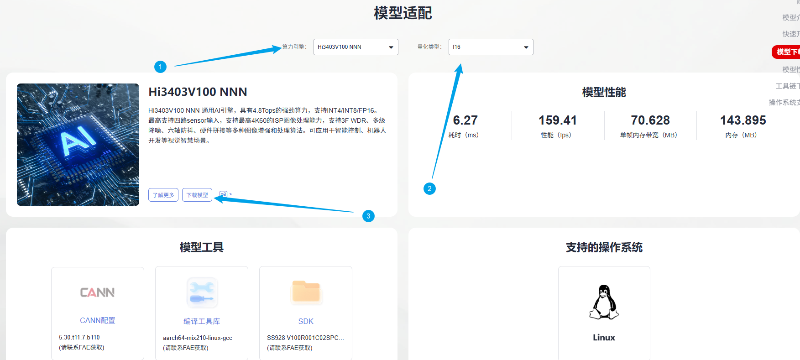
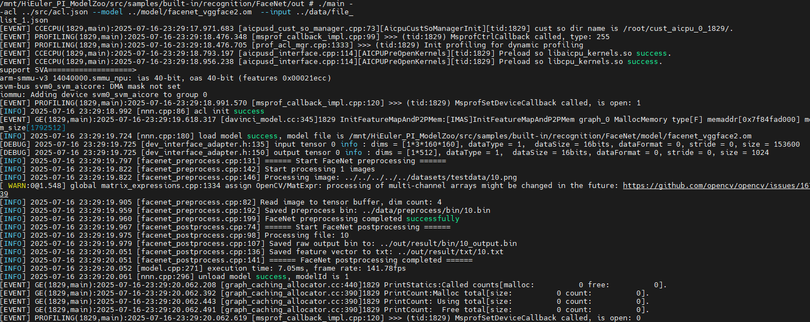
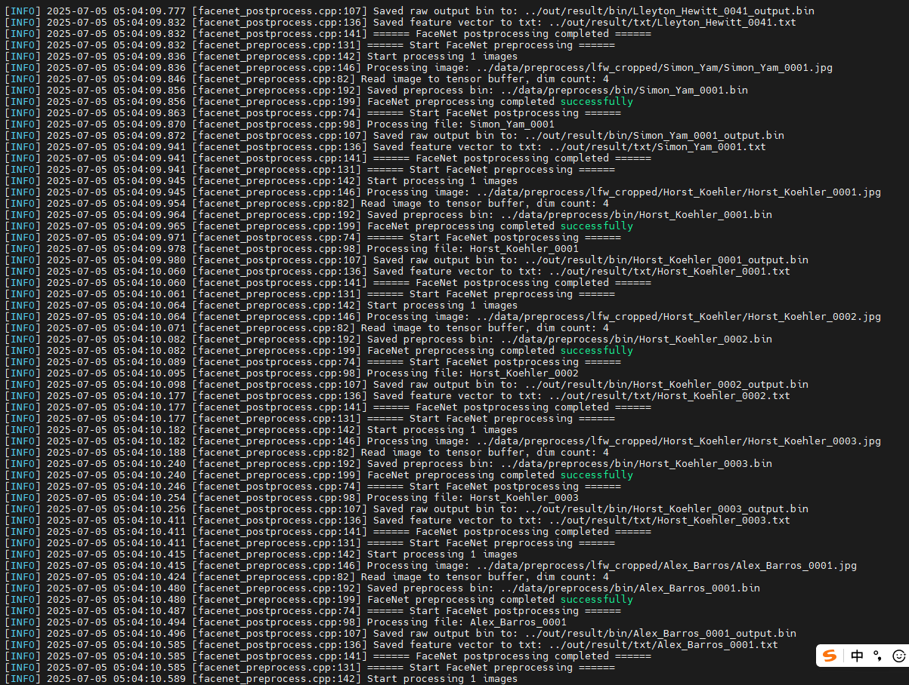
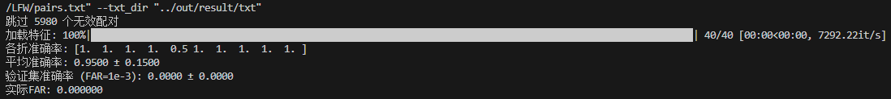
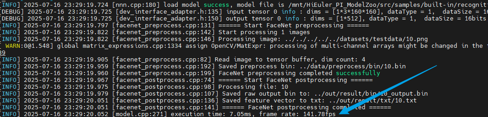
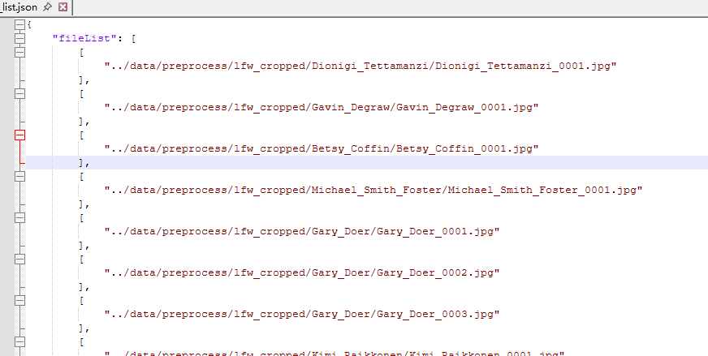

# FaceNet应用指南
## 介绍

本文档是海鸥派快速应用HiSpark ModelZoo上FaceNet模型的指导文档，如果需要了解更多模型参数、细节请参见[HiSpark ModelZoo FaceNet指导文档](../../src/samples/built-in/recognition/FaceNet/README.md)。

- 应用系统：Linux
- SDK版本：SS928 V100R001C02SPC022
- 应用引擎：Hi3403V100 NNN

## 环境准备

根据[《环境准备》](../环境准备.md)文档，搭建开发环境和开发板环境。

## 快速开始（推荐）

### 获取om离线模型

网站上提供转化成功的om模型文件，可以从[网站](https://modelzoo.hispark.hisilicon.com/#/ModelZoo)上搜索FaceNet进行下载；注意选择算力引擎和量化类型。



进入docker容器终端创建`model`文件夹，并将om模型文件移动到`./model`目录下。

```shell
cd ~/HiEuler_PI_ModelZoo/src/samples/built-in/recognition/FaceNet
mkdir -p model
```

### 编译代码

1. 切换到样例目录，创建目录用于存放编译文件，例如，本文中，创建的目录为“build“。

   ```shell
   mkdir -p build
   ```

2. 切换到build目录，执行**cmake**生成编译文件。

   Hi3403V100 NNN生成编译文件命令

   ```bash
   cd build
   source ~/setenv_atc.sh nnn
   cmake ../src -DCMAKE_BUILD_TYPE=Release -DCMAKE_TOOLCHAIN_FILE=../../../../common/cmake/toolchain_aarch64_linux.cmake -DSOC_VERSION=OPTG
   ```

3. 执行**make**命令，生成的可执行文件main在“./out“目录下。

   ```shell
   make -j8
   ```

   参数说明：

   - -j：并行任务数量，这里-j8代表8个并行任务编译，适当调整数字提高编译速度。

### 模型推理

1. 将`~/HiEuler_PI_ModelZoo/src/samples/built-in/recognition/FaceNet`下的model、out文件夹拷贝到NFS共享文件夹的HiEuler_PI_ModelZoo对应目录下。

2. 进入开发板终端，切换到可执行文件main所在的目录，运行可执行文件。

   ```shell
   cd /mnt/HiEuler_PI_ModelZoo/src/samples/built-in/recognition/FaceNet/out
   chmod +x main
   ./main --acl ../src/acl.json --model ../model/facenet_vggface2.om  --input ../data/file_list_1.json
   ```

   成功将生成result文件夹。
   
   Hi3403V100 NNN：
   
   

## 全面上手

### 安装依赖

```shell
docker exec -it modelzoo bash
conda create -n facenet python=3.8
conda activate facenet

cd ~/HiEuler_PI_ModelZoo/src/samples/built-in/recognition/FaceNet
pip install -r requirements.txt
pip install scikit-learn onnx
```

### 准备数据集

1. 获取原始数据集。（解压命令参考tar –xvf *.tar与 unzip *.zip）

   点击 [LFW](http://vis-www.cs.umass.edu/lfw/lfw.tgz) 下载数据集，点击 [pairs.txt](http://vis-www.cs.umass.edu/lfw/pairs.txt) 下载pairs.txt进行精度评估。
   拷贝数据集到`~/HiEuler_PI_ModelZoo/src/datasets`目录下，调整文件结构如下：

   ```
   LFW/                                        # 数据集根目录
   ├── lfw/                                    # 核心图像存储目录（与根目录同名，解压后直接可见）
   │   ├── Abdul_Qadeer_Khan/                  # 单个身份文件夹（以人物姓名命名，空格替换为下划线）
   │   │   ├── Abdul_Qadeer_Khan_0001.jpg      # 该身份的人脸图像（命名规则：姓名_四位序号.jpg）
   │   │   ├── Abdul_Qadeer_Khan_0002.jpg
   │   │   └── ...（同身份多张图像，序号递增）
   │   ├── Aaron_Eckhart/
   │   ├── Aaron_Guiel/
   │   └── ...（共5749个身份文件夹，对应所有数据集人物）
   ├── pairs.txt                               # 标准测试对列表（用于人脸验证任务，含"3000相同身份对"和"3000不同身份对"）
   ├── lfw.tgz                                 # 原始压缩包（解压后可删除）
   ```

2. 将原始的LFW数据集进行人脸检测和裁剪

   ```bash
   cd script
   python facenet_prepare_dataset.py --raw_dir "../../../../../datasets/LFW/lfw/" --cropped_dir "../data/preprocess/lfw_cropped"
   cd ..
   ```

   参数说明：

   - --raw_dir: 原始LFW数据集根目录（包含子文件夹）。
   - --cropped_dir: 裁剪后人脸保存目录。


3. 生成file_list.json

   执行 ../../../utils/generate_file_list.py 脚本，完成数据预处理。

    ```shell
   python ../../../../utils/generate_file_list.py -r data/preprocess/lfw_cropped
    ```

   参数说明：

   - --dataset_path：原数据集所在路径。
   - --r：开启递归查找。

### 模型转化

使用PyTorch将模型权重文件.pth转换为.onnx文件，再使用ATC工具将.onnx文件转为离线推理模型文件.om文件。

1. 获取权重文件。

   点击[facenet](https://github.com/timesler/facenet-pytorch) 进入facenet开源首页，下载模型权重文件20180402-114759-vggface2.pt，或者点击[链接](https://github.com/timesler/facenet-pytorch/releases/download/v2.2.9/20180402-114759-vggface2.pt) 直接下载。

   下载模型文件20180402-114759-vggface2.pt，将文件放到~/.cache/torch/checkpoints/路径下

   ```shell
   mkdir -p ~/.cache/torch/checkpoints/
   cd ~/.cache/torch/checkpoints/
   wget https://github.com/timesler/facenet-pytorch/releases/download/v2.2.9/20180402-114759-vggface2.pt
   cd -
   ```
   
2. 生成onnx文件。

      使用script/facenet_pth2onnx.py将pytorch模型转换成ONNX模型；

      ```shell
      mkdir model
      cd script
      python3 facenet_pth2onnx.py --output_onnx_path ../model/facenet_vggface2_static.onnx
      cd ..
      ```

3. 使用ATC工具将ONNX模型转OM模型。

      在当前模型的代码根目录下，执行ATC命令。
      1. SS928V100 NNN上的om模型转换命令
         ```bash
         source ~/setenv_atc.sh nnn
         atc --framework=5 --model="model/facenet_vggface2_static.onnx" --input_shape="input:1,3,160,160" --output="model/facenet_vggface2" --enable_single_stream=true --input_fp16_nodes="input" --output_type=FP16 --soc_version=OPTG
         ```
         运行成功后生成facenet_vggface2.om模型文件。
      
         参数说明：
      
         - --framework：原始框架类型，5代表ONNX模型。
       - --model：ONNX模型文件路径。
         - --input_shape：输入数据的shape。
      - --output：输出的OM模型路径。
         - --image_list：转换模型生成量化参数时用的校准数据。
         - --enable_single_stream：推理时使用一条stream。
         - --input_fp16_nodes：输入数据使用FP16格式。
         - --soc_version：处理器型号。
         - --compile_mode：编译模式，6代表数据量化使用16bit，权重量化使用8bit，且仅对CUBE算子进行量化，非CUBE算法使用fp16格式。注：SVP_NNN上选取其他编译模式可能导致精度下降
      

### 编译代码

1. 切换到样例目录，创建目录用于存放编译文件，例如，本文中，创建的目录为“build“。

    ```shell
    mkdir -p build
    ```

2. 切换到build目录，执行**cmake**生成编译文件。

    Hi3403V100 NNN生成编译文件命令

    ```bash
    cd build
    source ~/setenv_atc.sh nnn
    cmake ../src -DCMAKE_BUILD_TYPE=Release -DCMAKE_TOOLCHAIN_FILE=../../../../common/cmake/toolchain_aarch64_linux.cmake -DSOC_VERSION=OPTG
    ```

3. 执行**make**命令，生成的可执行文件main在“./out“目录下。

    ```shell
    make -j8
    ```

    参数说明：

    - -j：并行任务数量，这里-j8代表8个并行任务编译，适当调整数字提高编译速度。

### 模型推理

1. 将`~/HiEuler_PI_ModelZoo/src/samples/built-in/recognition/FaceNet`下的data、model、out文件夹拷贝到NFS共享文件夹的HiEuler_PI_ModelZoo对应目录下。

2. 进入开发板终端，切换到可执行文件main所在的目录，运行可执行文件。

    ```shell
    cd /mnt/HiEuler_PI_ModelZoo/src/samples/built-in/recognition/FaceNet/out
    chmod +x main
    ./main --acl ../src/acl.json --model ../model/facenet_vggface2.om  --input ../data/file_list.json
    ```

    成功将生成result文件夹。

    Hi3403V100 NNN推理过程

    

### 精度&性能评估

1. 精度验证。

   将整个`out/result`文件夹拷贝回docker容器的HiEuler_PI_ModelZoo对应目录下，并进入docker容器终端。

   使用facenet_evaluate.py将模型推理的结果与数据集中的标签文件进行对比，获取评估结果。

   ```bash
   cd ~/HiEuler_PI_ModelZoo/src/samples/built-in/recognition/FaceNet/script
   chmod -R 777 ../out
   python facenet_evaluate.py --pairs_path "../../../../../datasets/LFW/pairs.txt" --txt_dir "../out/result/txt"
   cd ..
   ```

   参数说明：

   - --pairs_path：LFW配对文件路径。
   - --txt_dir：特征向量txt文件目录。

   NNN平台上精度结果：

   

2. 性能验证。

   进入开发板终端，执行下面命令。

   ```bash
   cd /mnt/HiEuler_PI_ModelZoo/src/samples/built-in/recognition/FaceNet/out
   ./main --acl ../src/acl.json --model ../model/facenet_vggface2.om  --input ../data/file_list_1.json
   ```

   参数说明：(此模式下，输入路径为一张图片)

   - --acl:  ACL 配置文件路径
   
   - --model: 指定待验证性能的 OM 模型文件路径。
   
- --input： 指定输入数据的列表文件路径（此场景下为单图路径的配置文件，注意：循环次数通过修改该文件中的loop变量即可）。
  

在板端会输出显示，NNN平台上性能结果如下：



## FAQ

### 如何指定推理图片或修改推理的图片数量

打开NFS共享文件夹的`HiEuler_PI_ModelZoo/src/samples/built-in/recognition/FaceNet/data/file_list.json`即可指定推理的图片，删除或增加图片路径即可间接修改推理的图片数量。


