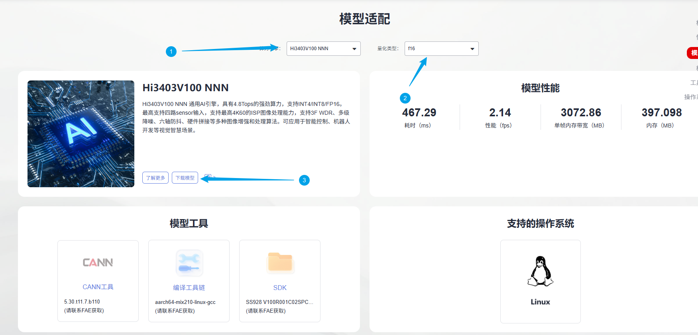
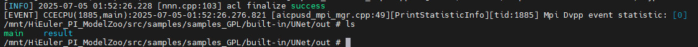
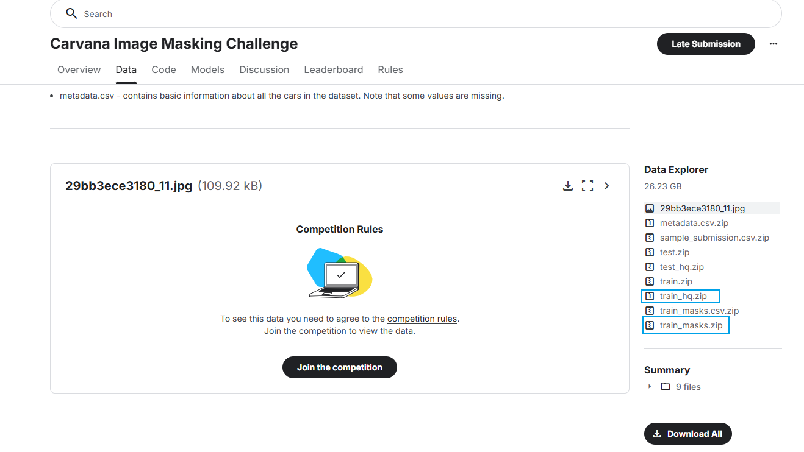
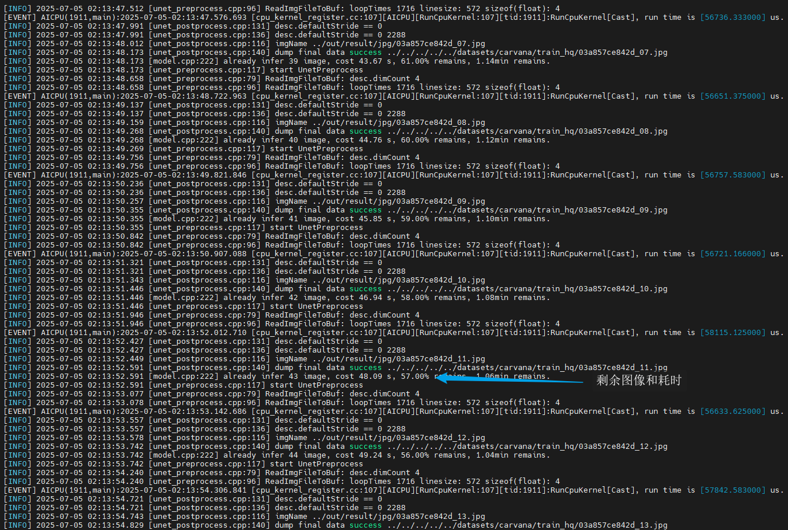
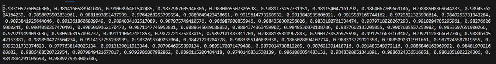
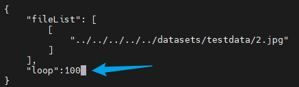
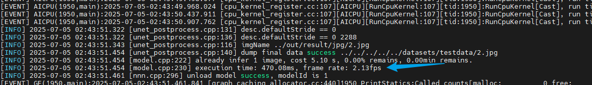
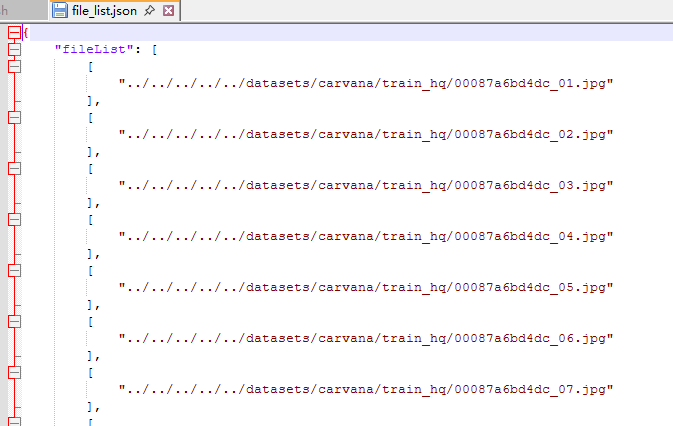

# UNet应用指南
## 介绍

本文档是海鸥派快速应用HiSpark ModelZoo上UNet模型的指导文档，如果需要了解更多模型参数、细节请参见[HiSpark ModelZoo UNet指导文档](../../src/samples/samples_GPL/built-in/UNet/README.md)。

- 应用系统：Linux
- SDK版本：SS928 V100R001C02SPC022
- 应用引擎：Hi3403V100 NNN

## 环境准备

根据[《环境准备》](../环境准备.md)文档，搭建开发环境和开发板环境。

## 快速开始（推荐）

### 获取om离线模型

网站上提供转化成功的om模型文件，可以从[网站](https://modelzoo.hispark.hisilicon.com/#/ModelZoo)上搜索UNet进行下载；注意选择算力引擎和量化类型。



进入docker容器终端创建`model`文件夹，并将om模型文件移动到`./model`目录下。
```shell
cd ~/HiEuler_PI_ModelZoo/src/samples/samples_GPL/built-in/UNet
mkdir -p model
```
### 编译代码

1. 切换到样例目录，创建目录用于存放编译文件，例如，本文中，创建的目录为`build`。
    ```shell
    mkdir -p build
    ```

2. 切换到`build`目录，执行**cmake**生成编译文件。

    Hi3403V100 NNN：

    ```shell
    source ~/setenv_atc.sh nnn
    cd build
    cmake ../src -DCMAKE_BUILD_TYPE=Release -DCMAKE_TOOLCHAIN_FILE=../../../../common/cmake/toolchain_aarch64_ohos.cmake -DSOC_VERSION=OPTG
    ```

3. 执行**make**命令，生成的可执行文件main在“./out“目录下。

    ```shell
    make -j8
    ```

    参数说明：

    - -j：并行任务数量，这里-j8代表8个并行任务编译，适当调整数字提高编译速度。

### 模型推理

1. 将`~/HiEuler_PI_ModelZoo/src/samples/samples_GPL/built-in/UNet`下的model、out文件夹拷贝到NFS共享文件夹的HiEuler_PI_ModelZoo对应目录下。

2. 进入开发板终端，切换到可执行文件main所在的目录，运行可执行文件。

    ```shell
    cd /mnt/HiEuler_PI_ModelZoo/src/samples/samples_GPL/built-in/UNet/out
    chmod +x main
    ./main --acl ../src/acl.json --model ../model/unet.om --input ../data/file_list_1.json
    ```
    
    成功将生成result文件夹。
    
    

## 全面上手

### 安装依赖

进入docker容器终端，执行下面命令安装依赖。

```shell
conda create -n unet python=3.7.5
conda activate unet

cd ~/HiEuler_PI_ModelZoo/src/samples/samples_GPL/built-in/UNet
pip install -r requirements.txt
```

### 准备数据集

1. 获取原始数据集。（解压命令参考tar –xvf *.tar与 unzip *.zip）

   下载[carvana数据集](https://www.kaggle.com/competitions/carvana-image-masking-challenge/data)，下载train_hq.zip和train_masks.zip，上传并解压到docker容器`~/HiEuler_PI_ModelZoo/src/datasets`路径下。

   

   解压并整理成如下目录结构。

   ```shell
   carvana/
   |-- train_hq
   |   |-- 0cdf5b5d0ce1_01.jpg
   |   ...
   |-- train_masks
   |   |-- 0cdf5b5d0ce1_01.mask.gif
   |   ...
   ```

2. 数据预处理，将原始数据集转换为模型的输入数据。
  
    执行 ../../../utils/generate_file_list.py 脚本，完成数据预处理，生成的file_list.json在data目录下。
    
    ```shell
    python ../../../../utils/generate_file_list.py ../../../../datasets/carvana/train_hq/
    ```
    
    参数说明：
    - --dataset_path：原数据集所在路径。


### 模型转化

使用PyTorch将模型权重文件.pth转换为.onnx文件，再使用ATC工具将.onnx文件转为离线推理模型文件.om文件。

1. 获取开源源码
   ```shell
   git clone https://github.com/milesial/Pytorch-UNet.git
   cd Pytorch-UNet
   git reset --hard 6aa14cb
   cd ..
   ```

2. 获取权重文件。

   UNet.pth权重文件[下载链接](https://ascend-repo-modelzoo.obs.cn-east-2.myhuaweicloud.com/model/1_PyTorch_PTH/Unet/PTH/UNet.pth)。

   ```shell
   mkdir -p model
   cd model
   wget https://ascend-repo-modelzoo.obs.cn-east-2.myhuaweicloud.com/model/1_PyTorch_PTH/Unet/PTH/UNet.pth
   ```

3. 导出onnx文件。

    1. 移动pth2onnx.py至Pytorch_Unet目录，使用pth2onnx.py导出onnx文件。

         ```shell
         cd ../
         cp ./script/pth2onnx.py Pytorch-UNet/
         python ./Pytorch-UNet/pth2onnx.py ./model/UNet.pth ./model/UNet_dynamic_bs.onnx
         ```

         获得UNet_dynamic_bs.onnx文件。

    2. 使用onnxsim精简onnx文件。
         ```shell
         python -m onnxsim --dynamic-input-shape --input-shape="1,3,572,572" ./model/UNet_dynamic_bs.onnx ./model/UNet_dynamic_sim.onnx
         ```
         获得UNet_dynamic_sim.onnx文件。

    参数说明：

    - resume：权重文件。
    - cfg：配置文件

4. 使用ATC工具将ONNX模型转OM模型。

    执行ATC命令。
    1. Hi3403V100 NNN上的om模型转换命令
        ```shell
        source ~/setenv_atc.sh nnn
        
        atc --framework=5 --model="./model/UNet_dynamic_sim.onnx" --input_shape="actual_input_1:1,3,572,572" --output="./model/unet" --enable_small_channel=1 --enable_single_stream=true --soc_version=OPTG 
        ```
    
        运行成功后生成unet.om模型文件。
    
        参数说明：
      
        - --framework：5代表ONNX模型。
        - --model：为ONNX模型文件。
        - --input_shape：输入数据的shape。
        - --insert_op_conf：aipp算子配置，用于输入数据处理。
        - --output：输出的OM模型。
        - --image_list: 量化校准数据。
        - --enable_small_channel:使能small channel优化。
        - --enable_single_stream:推理时使用一条stream。
        - --soc_version：处理器型号。

### 编译代码

1. 切换到样例目录，创建目录用于存放编译文件，例如，本文中，创建的目录为`build`。

   ```shell
   mkdir -p build
   ```

2. 切换到`build`目录，执行**cmake**生成编译文件。

   Hi3403V100 NNN：

   ```shell
   source ~/setenv_atc.sh nnn
   cd build
   cmake ../src -DCMAKE_BUILD_TYPE=Release -DCMAKE_TOOLCHAIN_FILE=../../../../common/cmake/toolchain_aarch64_linux.cmake -DSOC_VERSION=OPTG
   ```

3. 执行**make**命令，生成的可执行文件main在“./out“目录下。

   ```shell
   make -j8
   ```

   参数说明：

   - -j：并行任务数量，这里-j8代表8个并行任务编译，适当调整数字提高编译速度。

### 模型推理

1. 将`~/HiEuler_PI_ModelZoo/src/datasets/carvana`以及`~/HiEuler_PI_ModelZoo/src/samples/samples_GPL/built-in/UNet`下的data、model、out文件夹拷贝到NFS共享文件夹的HiEuler_PI_ModelZoo对应目录下。

2. 进入开发板终端，切换到可执行文件main所在的目录，运行可执行文件。

   ```shell
   cd /mnt/HiEuler_PI_ModelZoo/src/samples/samples_GPL/built-in/UNet/out
   chmod +x main
   ./main --acl ../src/acl.json --model ../model/unet.om --input ../data/file_list.json
   ```
   
   成功将生成result文件夹。
   
   
   
   

### 精度&性能评估

1. 精度验证。

    将整个`out/result`文件夹拷贝回docker容器的HiEuler_PI_ModelZoo对应目录下，并进入docker容器终端。

    调用脚本可以获得Accuracy数据，结果保存在accuracy.txt中。

    ```shell
    cd ~/HiEuler_PI_ModelZoo/src/samples/samples_GPL/built-in/UNet
    python ./script/accuracy.py --output ./out/result/bin/ --label ../../../../datasets/carvana/train_masks/ --result ./out/result/accuracy.txt
    ```

    参数说明：

    - --output：推理结果所在路径，默认为./out/result/txt/

    - --label：真值标签文件val_label.txt所在路径。

    - --result：输出精度结果所在的位置。

    NNN平台上精度结果：
     文件中保存的是每一个图片的结果，平均结果为上述所有值求和输出：

    

2. 性能验证。

    进入开发板终端，打开file_list_1.json文件，将file_list_1.json的loop参数设置为100。

    ```shell
    cd /mnt/HiEuler_PI_ModelZoo/src/samples/samples_GPL/built-in/UNet
    vi data/file_list_1.json
    ```

    

    执行推理命令。

    ```shell
    cd out
    ./main --acl ../src/acl.json --model ../model/unet.om --input ../data/file_list_1.json
    ```

    参数说明：(此模式下，file_list_1.txt只放一张图片)

    - --model：om模型路径。
    - --input: 输入图片路径文件。

    file_list_1.json中的配置代表对一张输入图片重复推理100次，程序执行时会在开发板会输出打印推理的平均时间和帧率。

    Hi3403V100 NNN平台上性能结果如下：

    

## FAQ

### 如何指定推理图片或修改推理的图片数量

打开NFS共享文件夹的`HiEuler_PI_ModelZoo/src/samples/samples_GPL/built-in/UNet/data/file_list.json`即可指定推理的图片，删除或增加图片路径即可间接修改推理的图片数量。

