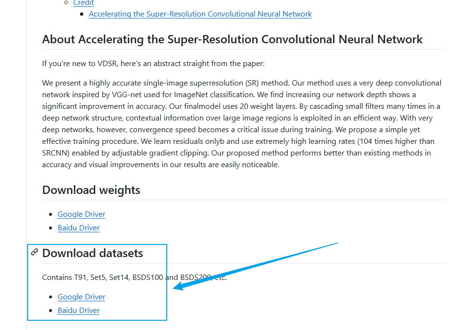
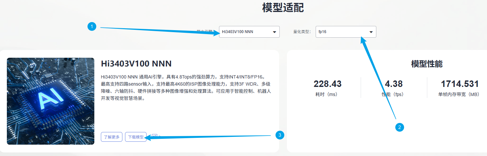
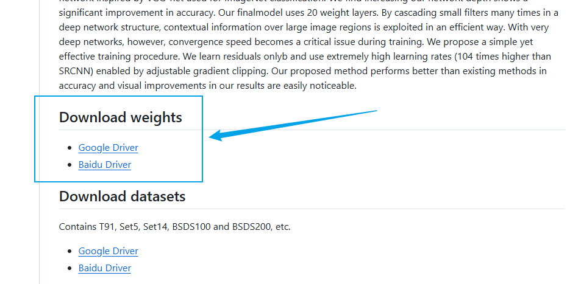
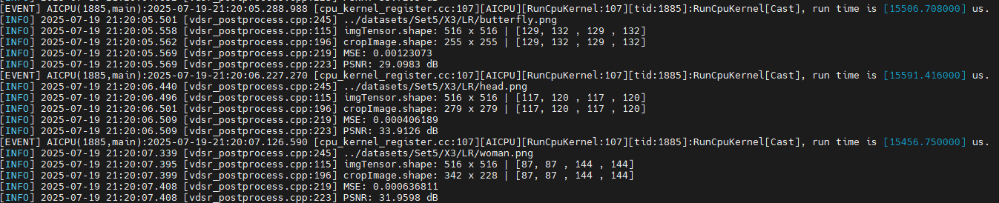
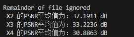
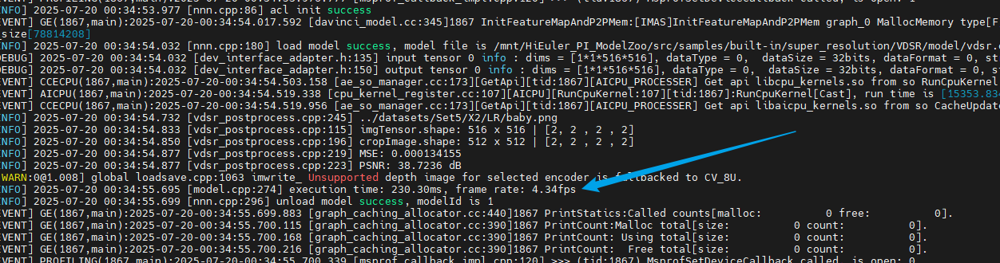
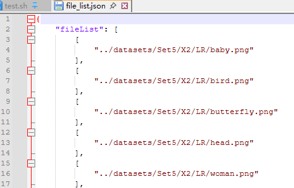

# VDSR应用指南
## 介绍

本文档是海鸥派快速应用HiSpark ModelZoo上VDSR模型的指导文档，如果需要了解更多模型参数、细节请参见[HiSpark ModelZoo VDSR指导文档](../../src/samples/built-in/super_resolution/VDSR/README.md)。

- 应用系统：Linux
- SDK版本：SS928 V100R001C02SPC022
- 应用引擎：Hi3403V100 NNN

## 环境准备

根据[《环境准备》](../环境准备.md)文档，搭建开发环境和开发板环境。

## 快速开始（推荐）

### 准备数据集

1. 获取原始数据集。（解压命令参考tar –xvf *.tar与 unzip *.zip）

   点击 [链接](https://github.com/Lornatang/VDSR-PyTorch#download-datasets) 下载数据集Set5。

   

   创建`datasets文件夹，将数据集拷贝至该目录下，整理文件结构如下：

   ```shell
   cd ~/HiEuler_PI_ModelZoo/src/samples/built-in/super_resolution/VDSR
   mkdir datasets
   ```
   
   ```
   Set5
      ├── original（5张图片）
      ├── X2（10张图片）
         ├── GT（高质量人脸，作为真值数据）
            ├── baby.png
            ├── bird.png
             ……
         ├── LR（低质量人脸，作为模型输入数据）
            ├── baby.png
            ├── bird.png
             ……
   ...
   ```

### 获取om模型文件

网站上提供转化成功的om模型文件，可以从[网站](https://modelzoo.hispark.hisilicon.com/#/ModelZoo)上搜索VDSR进行下载；注意选择算力引擎和量化类型。



创建`model`文件夹，并将om模型文件移动到`./model`目录下。
```shell
mkdir -p model
```
### 编译代码

1. 切换到样例目录，创建目录用于存放编译文件，例如，本文中，创建的目录为`build`。

   ```shell
   mkdir -p build
   ```

2. 切换到`build`目录，执行**cmake**生成编译文件。

   Hi3403V100 NNN生成编译文件命令

   ```shell
   cd build
   source ~/setenv_atc.sh nnn
   cmake ../src -DCMAKE_BUILD_TYPE=Release -DCMAKE_TOOLCHAIN_FILE=../../../../common/cmake/toolchain_aarch64_linux.cmake -DSOC_VERSION=OPTG
   ```

3. 执行**make**命令，生成的可执行文件main在“./out“目录下。

   ```shell
   make -j8
   ```

   参数说明：

   - -j：并行任务数量，这里-j8代表8个并行任务编译，适当调整数字提高编译速度。


### 模型推理

1. 将`~/HiEuler_PI_ModelZoo/src/samples/built-in/super_resolution/VDSR`下的datasets、model、out文件夹拷贝到NFS共享文件夹的HiEuler_PI_ModelZoo对应目录下。切换到可执行文件main所在的目录，给该目录下的main文件加执行权限。

2. 进入开发板终端，修改推理图片路径。

   ```shell
   cd /mnt/HiEuler_PI_ModelZoo/src/samples/built-in/super_resolution/VDSR/out
   sed -i 's|"../../../../../datasets/testdata/8.png"|"../datasets/Set5/X2/LR/baby.png"|g' ../data/file_list_1.json
   ```

3. 运行可执行文件。

   ```shell
   chmod +x main
   ./main --acl ../src/acl.json --model ../model/vdsr.om  --input ../data/file_list_1.json
   ```

   成功将生成result文件夹。

## 全面上手

### 安装依赖

```shell
docker exec -it modelzoo bash
conda create -n vdsr python=3.7.5
conda activate vdsr

cd ~/HiEuler_PI_ModelZoo/src/samples/built-in/super_resolution/VDSR
pip install -r requirements.txt
pip install decorator
```

### 准备数据集

1. 获取原始数据集。（解压命令参考tar –xvf *.tar与 unzip *.zip）

   点击 [链接](https://github.com/Lornatang/VDSR-PyTorch#download-datasets) 下载数据集Set5。

   

   创建`datasets文件夹，将数据集拷贝至该目录下，整理文件结构如下：

   ```shell
   mkdir datasets
   ```

   ```
   Set5
      ├── original（5张图片）
      ├── X2（10张图片）
         ├── GT（高质量人脸，作为真值数据）
            ├── baby.png
            ├── bird.png
             ……
         ├── LR（低质量人脸，作为模型输入数据）
            ├── baby.png
            ├── bird.png
             ……
   ...
   ```

### 模型转化

使用PyTorch将模型权重文件.pth转换为.onnx文件，再使用ATC工具将.onnx文件转为离线推理模型文件.om文件。

1. 获取参考代码仓源码

   ```shell
   git clone https://github.com/Lornatang/VDSR-PyTorch.git
   cd VDSR-PyTorch
   git reset --hard a573e5c1e3d6d0a072cf3602022ab4954743a273
   cd ../
   ```

2. 获取权重文件。

   创建model文件夹用于存放模型文件。

   ```shell
   mkdir -p model
   ```

   点击 [链接](https://github.com/Lornatang/VDSR-PyTorch?tab=readme-ov-file#download-weights) 下载 SuperResolution/VDSR下的vdsr-TB291-fef487db.pth.tar 。

   

   下载成功后，将vdsr-TB291-fef487db.pth.tar文件放到./model路径下

3. pth转onnx。

      ```shell
      cp script/pth2onnx.py VDSR-PyTorch
      cd VDSR-PyTorch
      python pth2onnx.py
      cd ../
      ```

4. 使用ATC工具将ONNX模型转OM模型。

      在当前模型的代码根目录下，执行ATC命令。

      1. Hi3403V100 NNN上的om模型转换命令
         ```shell
         source ~/setenv_atc.sh nnn
         
         atc --framework=5 --model="model/vdsr.onnx" --input_shape="input:1,1,516,516" --output="model/vdsr" --enable_single_stream=true --soc_version=OPTG  
         ```

         运行成功后生成vdsr.om模型文件。

         参数说明：

         - --framework：原始框架类型，5代表ONNX模型。
         - --model：ONNX模型文件路径。
         - --input_shape：输入数据的shape。
         - --output：输出的OM模型路径。
         - --image_list：转换模型生成量化参数时用的校准数据。(如果您没有现成的bin文件，您需要参考后面的python脚本使用说明，使用preprocess.py脚本先生成bin文件。如果您想使用多个bin文件进行数据校准，多个文件间请使用;分割，例如a.bin;b.bin。)
         - --soc_version：处理器型号。
         - --compile_mode：编译模式，6代表数据量化使用16bit，权重量化使用8bit，且仅对CUBE算子进行量化，非CUBE算法使用fp16格式。注：SVP_NNN上选取其他编译模式可能导致精度下降
         - --enable_single_stream: 推理时使用一条stream。


### 编译代码

1. 切换到样例目录，创建目录用于存放编译文件，例如，本文中，创建的目录为`build`。

   ```shell
   mkdir -p build
   ```

2. 切换到`build`目录，执行**cmake**生成编译文件。

   Hi3403V100 NNN生成编译文件命令

   ```shell
   cd build
   source ~/setenv_atc.sh nnn
   cmake ../src -DCMAKE_BUILD_TYPE=Release -DCMAKE_TOOLCHAIN_FILE=../../../../common/cmake/toolchain_aarch64_linux.cmake -DSOC_VERSION=OPTG
   ```

3. 执行**make**命令，生成的可执行文件main在“./out“目录下。

   ```shell
   make -j8
   ```

   参数说明：

   - -j：并行任务数量，这里-j8代表8个并行任务编译，适当调整数字提高编译速度。


### 模型推理

1. 将`~/HiEuler_PI_ModelZoo/src/samples/built-in/super_resolution/VDSR`下的datasets、model、out文件夹拷贝到NFS共享文件夹的HiEuler_PI_ModelZoo对应目录下。切换到可执行文件main所在的目录，给该目录下的main文件加执行权限。

2. 进入开发板终端，切换到可执行文件main所在的目录，运行可执行文件。

   ```shell
   cd /mnt/HiEuler_PI_ModelZoo/src/samples/built-in/super_resolution/VDSR/out
   chmod +x main
   ./main --acl ../src/acl.json --model ../model/vdsr.om  --input ../data/file_list.json
   ```

   成功将生成result文件夹。

   Hi3403V100 NNN推理过程：

   

### 精度&性能评估

1. 精度验证。

   将整个`out/result`文件夹拷贝回docker容器的HiEuler_PI_ModelZoo对应目录下，并进入docker容器终端。

   使用acc.py将模型推理的结果与数据集中原始的高清人脸图像进行对比，获取评估结果。

   ```shell
   cd ~/HiEuler_PI_ModelZoo/src/samples/built-in/super_resolution/VDSR
   python script/acc.py
   ```

   NNN平台上精度结果：

   

2. 性能验证。

   进入开发板终端，修改推理图片路径。

   ```shell
   cd /mnt/HiEuler_PI_ModelZoo/src/samples/built-in/super_resolution/VDSR/out
   sed -i 's|"../../../../../datasets/testdata/8.png"|"../datasets/Set5/X2/LR/baby.png"|g' ../data/file_list_1.json
   ```

   验证om模型的性能。

   ```bash
   ./main --acl ../src/acl.json --model ../model/vdsr.om  --input ../data/file_list_1.json
   ```


   参数说明：(此模式下，输入路径为一张图片)
   - --acl:  ACL 配置文件路径
   - --model: 指定待验证性能的 OM 模型文件路径。
   - --input： 指定输入数据的列表文件路径（此场景下为单图片路径的配置文件，注意：循环次数通过修改该文件中的loop变量即可, loop设为1000）。

   NNN平台上性能结果如下：



## FAQ

### 如何指定推理图片或修改推理的图片数量

打开NFS共享文件夹的`HiEuler_PI_ModelZoo/samples/built-in/super_resolution/VDSR/data/file_list.json`即可指定推理的图片，删除或增加图片路径即可间接修改推理的图片数量。


