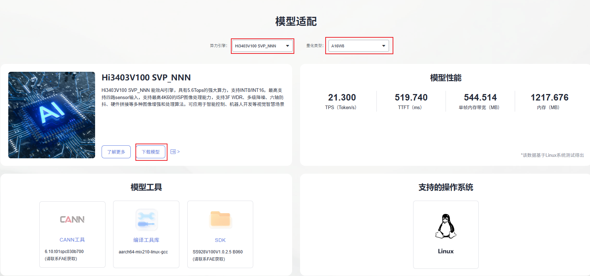
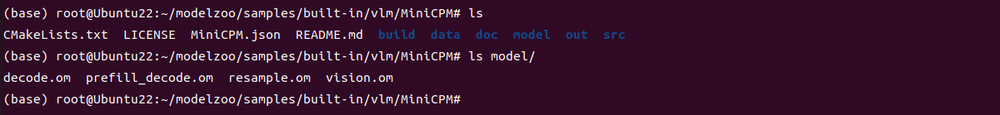
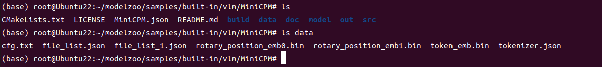
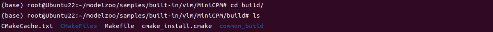

# MiniCPM-4v-0.5B应用指南

## 介绍

本文档是海鸥派快速应用HiSpark ModelZoo上MiniCPM-4v-0.5B模型的指导文档，如果需要了解更多模型参数、细节请参见[HiSpark ModelZoo MiniCPM-4v-0.5B指导文档](https://gitee.com/HiSpark/modelzoo/blob/master/samples/built-in/vlm/MiniCPM/README.md)。

- 应用系统：Linux
- SDK版本：SS928 V100R001C02SPC022
- 应用引擎：Hi3403V100 SVP_NNN

## 环境准备

根据[《环境准备》](../环境准备.md)文档，搭建开发环境和开发板环境。

## 快速开始（推荐）

### 获取om离线模型

网站上提供转化成功的om模型文件，可以从[网站](https://modelzoo.hispark.hisilicon.com/#/ModelZoo)上搜索MiniCPM-4v-0.5B进行下载；注意选择算力引擎和量化类型。



进入docker容器终端创建`model`文件夹，并将模型文件中的`.om`移动到`./model`目录下。
```shell
cd ~/HiEuler_PI_ModelZoo/src/samples/built-in/vlm/MiniCPM
mkdir -p model
```


将模型文件中的`.bin` ` .json`移动到`./data`目录下。



查看修改配置文件cfg.txt，main函数执行时，前后处理函数会读取`data/cfg.txt`获取一些配置参数，请确认如下参数路径正确。

```
 # vision.om 文件路径, 不可为空
  vision_om_path="../model/vision.om"

  # resample.om 文件路径, 不可为空
  resample_om_path="../model/resample.om"

  # prefill_decode.om 文件路径, 不可为空
  prefill_decode_om_path="../model/prefill_decode.om"

  # decode.om 文件路径, 不可为空
  decode_om_path="../model/decode.om"

  # rotary_position_emb0.bin 文件路径, 不可为空
  rotary_position_emb0_bin_path="../data/rotary_position_emb0.bin"

  # rotary_position_emb1.bin 文件路径, 不可为空
  rotary_position_emb1_bin_path="../data/rotary_position_emb1.bin"

  # token_emb.bin 文件路径, 不可为空
  token_emb_bin_path="../data/token_emb.bin"

  # tokenizer.json 文件路径, 不可为空
  tokenizer_json_path="../data/tokenizer.json"

  # 推理结果保存路径, 不可为空
  result_dir="../out/result"
```

### 编译代码

1. 切换到样例目录，创建目录用于存放编译文件，例如，本文中，创建的目录为`build`。
    ```shell
    mkdir -p build
    ```

2. 切换到`build`目录，执行**cmake**生成编译文件。

    

    1. Hi3403V100 SVP_NNN生成编译文件命令

        ```shell
        cd build
        source ~/setenv_atc.sh svp_nnn
        cmake ../src -DCMAKE_BUILD_TYPE=Release -DCMAKE_TOOLCHAIN_FILE=../../../../common/cmake/toolchain_aarch64_linux.cmake -DSOC_VERSION=SS928V100
        ```

3. 执行**make**命令，生成的可执行文件main在“./out“目录下。

    ```shell
    make -j8
    ```

    参数说明：

    - -j：并行任务数量，这里-j8代表8个并行任务编译，适当调整数字提高编译速度。


### 模型推理

1. 将`~/HiEuler_PI_ModelZoo/src/samples/built-in/vlm/MiniCPM`下的data、model、out文件夹拷贝到NFS共享文件夹的HiEuler_PI_ModelZoo对应目录下。

2. 在HiEuler_PI_ModelZoo目录下创建datasets，下载图片放置到datasets目录下，建议下载512x512大小左右的jpg或png格式图片。在`data/file_list.json`文件内fileList item下添加图片地址和问题描述即可指定推理的图片，删除或增加图片路径即可间接修改推理的图片数量。格式如下：

    ```
    {
         "fileList": [
             [
                 "../../../../../datasets/testdata/1.png",
                 "描述图片内容"
             ],
             [
                 "../../../../../datasets/testdata/X.png",
                 "描述图片内容"
             ]
         ]
     }
    ```

3. 进入开发板终端，切换到可执行文件main所在的目录，运行可执行文件。

    ```shell
    cd /mnt/HiEuler_PI_ModelZoo/src/samples/built-in/vlm/MiniCPM/out
    chmod +x main
    ./main --input ../data/file_list.json
    ```

    成功将生成result文件夹。
