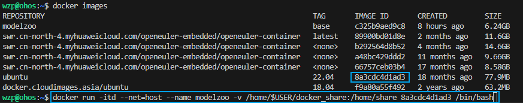
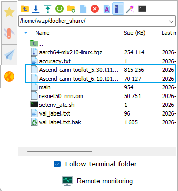
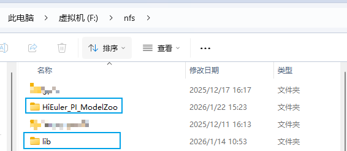
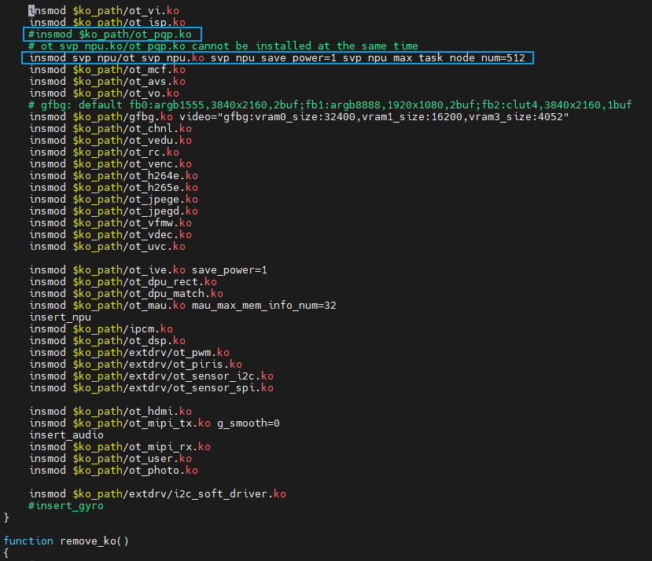
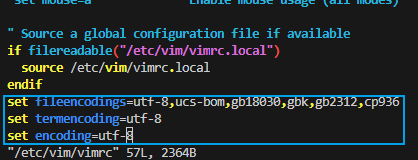

# 环境准备

- [modelzoo网站](https://modelzoo.hispark.hisilicon.com/#/ModelZoo)
- [modelzoo代码仓](https://gitee.com/HiSpark/modelzoo)
- 由于多模型环境较杂乱，采用docker+conda进行环境隔离。

## 开发环境准备

- 对于开发环境，可以按照步骤自行搭建或者直接使用已经搭建好的镜像包，建议直接使用已经搭建好的镜像包。

### 方式一：搭建开发环境

- 需准备一个ubuntu22.04的docker镜像。

#### 1、创建docker容器

安装docker。

```shell
sudo apt-get install docker docker.io
sudo usermod -a -G docker $(whoami)
sudo systemctl daemon-reload && sudo systemctl restart docker
sudo chmod o+rw /var/run/docker.sock
```

基于ubuntu22.04 docker镜像创建modelzoo容器，在此容器下进行下面操作搭建基础环境。

```shell
cd ~
mkdir docker_share
docker run -itd --net=host --name modelzoo -v /home/$USER/docker_share:/home/share ${IMAGE_ID} /bin/bash
```

> 参数说明：
>
> - ${IMAGE_ID}			: docker镜像id



进入docker。

```shell
docker exec -it modelzoo bash
```

切换shell类型。

```shell
rm -rf /bin/sh
ln -s /bin/bash /bin/sh
```

创建isl软连接。

```shell
cd /usr/lib/x86_64-linux-gnu/
ln -s libisl.so.23.1.0 libisl.so.19
```

#### 2、安装软件包

修改apt镜像源，这里使用华为云镜像源。

```shell
cp -a /etc/apt/sources.list /etc/apt/sources.list.bak
sed -i "s@http://.*archive.ubuntu.com@http://mirrors.huaweicloud.com@g" /etc/apt/sources.list
sed -i "s@http://.*security.ubuntu.com@http://mirrors.huaweicloud.com@g" /etc/apt/sources.list
apt-get update
```

安装依赖软件。

```
apt-get install -y gcc g++ cmake make unzip build-essential zlib1g-dev libbz2-dev libsqlite3-dev libssl-dev libxslt1-dev libffi-dev wget vim git
```

下载安装Miniconda3。

```shell
cd ~

#下载安装
wget https://mirrors.tuna.tsinghua.edu.cn/anaconda/miniconda/Miniconda3-latest-Linux-x86_64.sh
chmod +x Miniconda3-latest-Linux-x86_64.sh
./Miniconda3-latest-Linux-x86_64.sh -b -p ~/Miniconda3
rm -rf Miniconda3-latest-Linux-x86_64.sh

#初始化
cd ~/Miniconda3/bin/
./conda init
source ~/.bashrc

#接受协议
conda tos accept --override-channels --channel https://repo.anaconda.com/pkgs/main
conda tos accept --override-channels --channel https://repo.anaconda.com/pkgs/r
```

> 注意：
>
> - 现在使用Miniconda3必须接受协议。
>
>   ```shell
>   conda tos accept --override-channels --channel https://repo.anaconda.com/pkgs/main
>   conda tos accept --override-channels --channel https://repo.anaconda.com/pkgs/r
>   ```
>
> - conda常用命令。
>
>   ```shell
>   #列出所有环境
>   conda env list
>                           
>   #创建虚拟环境
>   conda create -n ${ENV_NAME} python=${PYTHON_VERSION}
>                           
>   #切换环境
>   conda activate ${ENV_NAME}
>                           
>   #退出环境
>   conda deactivate ${ENV_NAME}
>                           
>   #删除环境
>   conda env remove -n ${ENV_NAME}
>   ```
>
>   > 参数说明：
>   >
>   > - ${ENV_NAME}                       : 环境名
>   > - ${PYTHON_VERSION}          : python版本

#### 3、安装交叉编译工具

方式一：安装交叉编译工具

```
tar -zxvf aarch64-mix210-linux.tgz
cd aarch64-mix210-linux/
sudo ./aarch64-mix210-linux.install
source /etc/profile
aarch64-mix210-linux-gcc -v
```

方式二：若宿主机已安装，可从宿主机拷贝

1.退出docker（如果还在里面）

```
exit
```

2.将整个编译器目录拷贝进容器

```
find / -name "aarch64-mix210-linux-gcc" 2>/dev/null
假设查找路径为/opt/linux/x86-arm/aarch64-mix210-linux/bin/aarch64-mix210-linux-gcc
那么整个编译器根目录就是 /opt/linux/x86-arm/aarch64-mix210-linux。
docker cp /opt/linux/x86-arm/aarch64-mix210-linux modelzoo:/opt/
```

3.重新进入容器，设置 PATH

```
docker exec -it modelzoo bash
export PATH=/opt/aarch64-mix210-linux/bin:$PAT H
```

#### 4、安装CANN工具

目前Linux系统&&SS928 V100R001C02SPC022 SDK版本对应CANN工具只有两个，可以事先安装，不需要根据每个模型的配套表安装，根据npu核分配：

- SVP_NNN：[SVP_NNN_PC_V1.0.6.0](https://gitee.com/link?target=https%3A%2F%2Fhispark-obs.obs.cn-east-3.myhuaweicloud.com%2FSVP_NNN_PC_V1.0.6.0.tgz)
- NNN：SS928 V100R001C02SPC022（提HiSupport单拿）

解压压缩包拷贝CANN安装包到服务器docker_share目录下。



进入docker终端内安装。

```shell
cd ~
cp /home/share/Ascend-cann-toolkit_* ./
./Ascend-cann-toolkit_5.30.t11.7.b110_linux-x86_64.run --install --install-path=$HOME/CANN
./Ascend-cann-toolkit_6.10.t01spc030b600_linux.x86_64.run --install --install-path=$HOME/CANN
rm -rf ~/Ascend-cann-toolkit_*
```

创建atc环境切换脚本。

```shell
touch ~/setenv_atc.sh
chmod +x ~/setenv_atc.sh
vim ~/setenv_atc.sh
```

添加下面内容并保存。

```shell
#!/bin/bash

PARAM=$1

function setenv_svp_nnn()
{
    source /root/CANN/ascend-toolkit/svp_latest/x86_64-linux/script/setenv.sh

    export NPU_INCLUDE_PATH=/root/CANN/ascend-toolkit/svp_latest/acllib/include/acl
    export NPU_LIB_PATH=/root/CANN/ascend-toolkit/svp_latest/acllib/lib64/stub

    echo "setenv_atc.sh: setenv for svp_nnn success"
}

function setenv_nnn()
{
    export PATH=$(echo $PATH | tr ':' '\n' | grep -vE '/root/CANN/ascend-toolkit/6\.10\.t01spc030b600/(toolkit/bin|atc/bin)' | awk '!seen[$0]++' | tr '\n' ':' | sed 's/:$//')
    source /root/CANN/ascend-toolkit/latest/x86_64-linux/x86_64-linux/bin/setenv.bash
    export DDK_PATH=/root/CANN/ascend-toolkit/latest
    export NPU_HOST_LIB=$DDK_PATH/acllib/lib64/stub

    export NPU_INCLUDE_PATH=/root/CANN/ascend-toolkit/latest/acllib/include/acl
    export NPU_LIB_PATH=/root/CANN/ascend-toolkit/latest/acllib/lib64/stub

    echo "setenv_atc.sh: setenv for nnn success"
}

#使用指南
function generate_usage()
{
    echo "Usage:  $0 [-option]"
    echo "options:"
    echo "source setenv_atc.sh [-h|svp_nnn|nnn]"
}

#解析参数
function parse_arg()
{
    echo "param: ${PARAM}"
    case ${PARAM} in
        "svp_nnn")
            setenv_svp_nnn
            ;;
        "nnn")
            setenv_nnn
            ;;
        "-h")
            generate_usage
            ;;
        *)
            generate_usage
            ;;
    esac
}

parse_arg

```

> 说明：
>
> - atc切换命令：
>
>   - SVP_NNN：
>
>     ```shell
>     source ~/setenv_atc.sh svp_nnn
>     ```
>
>   - NNN：
>
>     ```shell
>     source ~/setenv_atc.sh nnn
>     ```

#### 5、下载代码仓

下载主仓。

```shell
cd ~
git clone https://gitee.com/hieulerpi/HiEuler_PI_ModelZoo.git
```

下载子仓。

```shell
cd ~/HiEuler_PI_ModelZoo
git submodule init
git submodule update src
```

### 方式二：使用镜像包

#### 1、创建docker容器

下载打包好的镜像包[hieulerpi_modelzoo.tar.gz](https://pan.baidu.com/s/1YPfpA0I3E5Q0pVYLrSZmtw?pwd=yzuz)。

安装docker。

```shell
sudo apt-get install docker docker.io
sudo usermod -a -G docker $(whoami)
sudo systemctl daemon-reload && sudo systemctl restart docker
sudo chmod o+rw /var/run/docker.sock
```

导入镜像包。

```shell
docker load -i hieulerpi_modelzoo.tar.gz
```

创建并进入容器。

```shell
cd ~
mkdir docker_share
docker run -itd --net=host --name modelzoo -v /home/$USER/docker_share:/home/share c325b9aed9c8 /bin/bash
docker exec -it modelzoo bash
```

#### 2、下载代码仓

下载主仓。

```shell
cd ~
git clone https://gitee.com/hieulerpi/HiEuler_PI_ModelZoo.git
```

下载子仓。

```shell
cd ~/HiEuler_PI_ModelZoo
git submodule init
git submodule update src
```

## 开发板环境准备

- 烧录`【易百纳】Euler Pi 2.0/03. 开发板镜像烧录说明/01.出厂固件包/02.Linux/Eulerpi_Linux_IMAGE.zip`镜像包。
- 搭建一个NFS服务用于文件共享。
- 拷贝`【易百纳】Euler Pi 2.0/06. 开发板源码编译/02.适配后的SDK源文件/SS928V100_SDK_V2.0.2.2/smp/a55_linux/mpp/out/lib`至NFS共享目录中；可以将CANN包内的SVP_NNN和NNN下的动态库拷贝到NFS共享目录中，**这里没有使用CANN的lib而是用的SDK的lib**。
  - SVP_NNN动态库路径：`~/CANN/ascend-toolkit/svp_latest/acllib/lib64/stub`
  - NNN动态库路径：`~/CANN/ascend-toolkit/latest/arm64-lmixlinux200/aarch64-linux/lib64`

- 同时克隆HiEuler_PI_ModelZoo仓库到NFS共享目录中。



- 修改load脚本，保存后重启。

  ```shell
  vi /opt/ko/load_ss928v100
  ```

  

- 开发板开机进入终端，挂载NFS并声明lib路径，下面以NFS挂载/mnt为例。

  ```shell
  mount -t nfs -o nolock ${SERVER_IP}:${NFS_PATH} /mnt
  export LD_LIBRARY_PATH=/mnt/HiEuler_PI_ModelZoo/src/samples/opensource/opencv/lib/aarch64_linux:/mnt/lib:/mnt/lib/svp_npu:/mnt/lib/npu:$LD_LIBRARY_PATH
  export ASCEND_AICPU_KERNEL_PATH=/mnt/lib/npu
  ```
  
  > 参数说明：
  >
  > ${SERVER_IP}：NFS服务端IP地址
  >
  > ${NFS_PATH}：NFS共享文件夹路径

## FAQ

### 解决vim出现中文乱码的问题

进入docker容器，执行下面命令。

```shell
vim /etc/vim/vimrc
```

文件末尾添加下面内容并保存。

```shell
set fileencodings=utf-8,ucs-bom,gb18030,gbk,gb2312,cp936
set termencoding=utf-8
set encoding=utf-8
```



### 若无ubuntu22.04的docker镜像

1、安装 Docker

```
sudo apt-get update
sudo apt-get install docker docker.io
sudo usermod -a -G docker $(whoami)
sudo systemctl daemon-reload && sudo systemctl restart docker
sudo chmod o+rw /var/run/docker.sock
```

2、配置镜像加速

```
sudo mkdir -p /etc/docker
sudo tee /etc/docker/daemon.json <<-'EOF'
{
  "registry-mirrors": [
    "https://docker.1ms.run"
  ]
}
EOF
```

3、使配置生效

```
sudo systemctl restart docker
newgrp docker
```

后续步骤查看方式一部分：基于ubuntu22.04 docker镜像创建modelzoo容器，在此容器下进行下面操作搭建基础环境。

