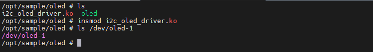
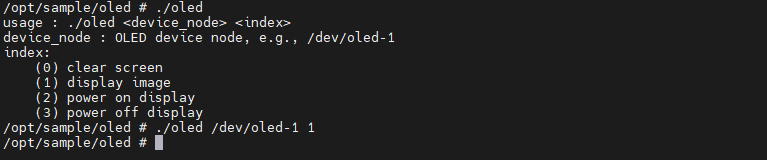
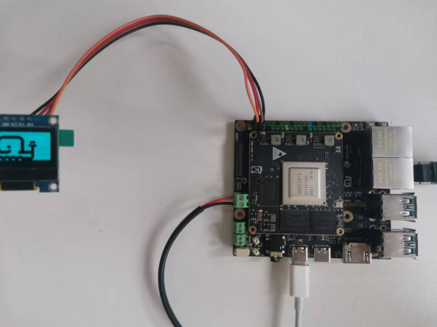
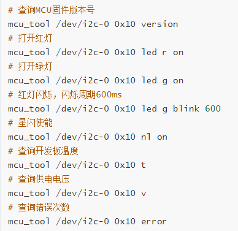
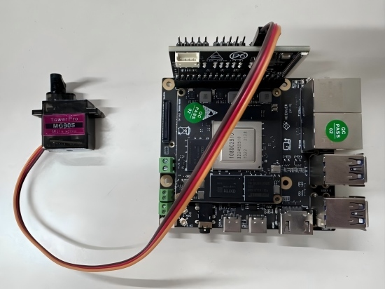
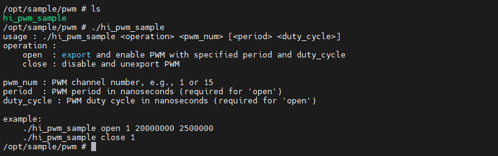
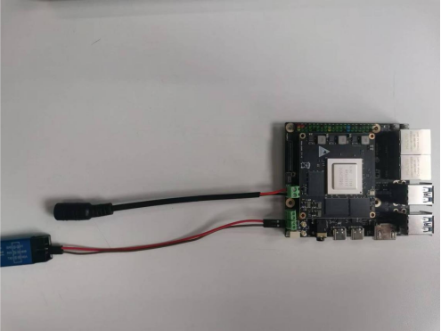
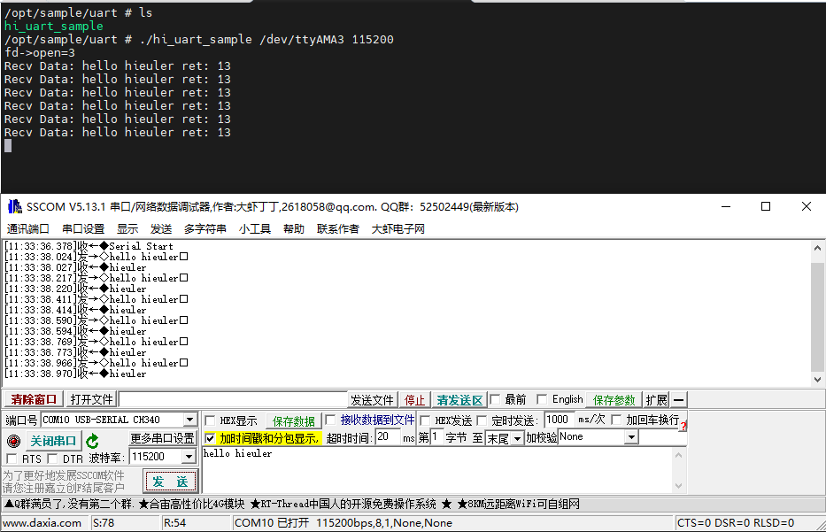

# HiEuler_PI_Peripherals_Sample

### 1. 说明

​	此代码仓为海鸥派外设例程代码仓库。

### 2. 例程说明

#### 1). i2c_oled

##### ①. 硬件连接	

| 舵机引脚 | 海鸥40Pin预留IO |
| -------- | --------------- |
| VCC (5V) | 5V (Pin4)       |
| GND      | GND (Pin6)      |
| SCL      | SCL (Pin5)      |
| SDA      | SDA (Pin3)      |

##### ②. 加载驱动

板端加载驱动并检查设备节点。



##### ③.功能验证

```
./oled /dev/oled-1 1
```



当前例程运行后oled显示屏正常显示易百纳鲸鱼logo。



#### 2). mcu_tool

​	用来控制海鸥派底板上的MCU。



#### 3). pwm

##### ①. 硬件连接	

| 舵机引脚      | EULER_40PEXP扩展板 |
| ------------- | ------------------ |
| 红色 (5V)     | J5  Pin3           |
| 棕色 (GND)    | J5  Pin1           |
| 黄色 (信号线) | J5  Pin5           |



预留40pin IO  Pin32为PWM0_OUT1_0_P。

> 注意： PWM 舵机控制  (直接连接Pin32，舵机不转动，电压不足，需连接拓展板)。

##### ②. 引脚复用

```
bspmm 0x102f01ec 0x1201
```

##### ③. 功能验证



运行 open 后图示 MG90S TowerPro舵机会360°转动。

```
./hi_pwm_sample open 1 20000000 2500000
./hi_pwm_sample open 1 20000000 500000
```

#### 	4). uart

​	海鸥派uart串口读写（write/read）测试，下面以海鸥派RS485串口为例。

>注意: 海鸥派的 RS485 硬件已支持 **自动收发转换**，无需软件控制方向引脚。若使用该例程测试非自动收发RS485串口需要程序中手动控制。

##### ①. 硬件连接

| J12  | USB转RS485 |
| ---- | ---------- |
| Pin2 | A          |
| Pin1 | B          |



##### ②. 引脚复用

```
bspmm 0x102f012c 0x1201  //UART3_RXD
bspmm 0x102f0130 0x1201  //UART3_TXD
```

##### ③. 功能验证

```
./hi_uart_sample /dev/ttyAMA3 115200
```


