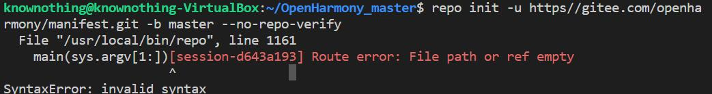

# 上海海思2022年嵌入式大赛FAQ

### 1、2022年全国大学生嵌入式竞赛海思赛道开发工具（DevEco Device Tool）常见问题汇总

[常见问题汇总](https://developer.huawei.com/consumer/cn/forum/topic/0203853384054250037?fid=0103702273237520029)

### 2、Deveco Device Tool工具的FAQ总入口

[Deveco Device Tool工具的FAQ总入口](https://developer.huawei.com/consumer/cn/forum/topic/0203380024404140371?fid=26)

### 3、在烧录Hi3516DV300镜像是，按照视频的步骤操作了，但是还是无法进行正常烧录，请问怎么解决？

【解答】：请严格按照下面链接的文档步骤进行操作，每一步都是细节。

《[Hi3516DV300烧录及注意事项](https://gitee.com/wgm2022/wu_guiming.gitee.io/blob/master/01%20%E7%8E%AF%E5%A2%83%E6%90%AD%E5%BB%BA%E7%9B%B8%E5%85%B3/Hi3516DV300%E7%83%A7%E5%BD%95%E5%8F%8A%E6%B3%A8%E6%84%8F%E4%BA%8B%E9%A1%B9.md)》

### 4、请问按照视频操作，出现下面的报错，请问怎么解决？



【解答】：应该是在复制网址上面的repo时，操作有问题，可以参考下面的步骤进行修改

* 步骤1：执行下面的步骤，删除之前的repo文件

```
cd ~

rm OpenHarmony_master -rf

sudo rm /usr/local/bin/repo
```

* 步骤2：分步执行下面的命令，进入用户家目录，重新下载repo到本地

```
cd ~

curl -s https://gitee.com/oschina/repo/raw/fork_flow/repo-py3 > repo
```

* 步骤3：将刚下载好的repo文件拷贝至/usr/local/目录下，并加权限

```
sudo cp repo /usr/local/bin/repo

sudo chmod a+x /usr/local/bin/repo

pip3 install -i https://repo.huaweicloud.com/repository/pypi/simple requests
```

* 步骤4：下载并配置git

```
sudo apt install git  -y

sudo apt install git-lfs -y

git config --global user.name "yourname"             # 你自己gitee的用户名

git config --global user.email "your-email-address"  # 你自己gitee绑定的邮箱地址

git config --global credential.helper store
```

* 步骤5：分步执行下面的命令，配置python环境

```
cd /usr/bin

sudo ln -s /usr/bin/python3.8 python
```

* 步骤6： 分步执行下面的命令，创建一个OpenHarmony_master的文件夹，同步代码

```
cd ~

mkdir OpenHarmony_master

cd OpenHarmony_master

repo init -u https://gitee.com/openharmony/manifest.git -b master --no-repo-verify

repo sync -c

repo forall -c 'git lfs pull'

bash build/prebuilts_download.sh
```

### 5、能否介绍一下BUID.gn的相关语法？

【提问】：因为我们大部分同学之前都是通过makefile来写工程文件的编译链接关系的，这个新的集成IDE，不知道项目的编译链接关系，之前也没有了解过build.gn这个东西，能否介绍一下BUILD.gn的相关语法？

【解答】：BUILD.gn的相关语法和介绍可以自行在网上搜索，也可以查看下面两个推荐的链接进行学习


* [https://bbs.csdn.net/topics/605121431](https://gitee.com/link?target=https%3A%2F%2Fbbs.csdn.net%2Ftopics%2F605121431)

### 6、请问Hi3516DV300 能否像在Ubuntu一样，使用vim命令？

【解答】：Hi3516DV300的openharmony L1 Linux系统中默认是没有vim命令的，但是可以参考文档《[如何在Hi3516DV300开发板终端使用vi命令](https://gitee.com/wgm2022/wu_guiming.gitee.io/blob/master/01%20%E7%8E%AF%E5%A2%83%E6%90%AD%E5%BB%BA%E7%9B%B8%E5%85%B3/%E5%A6%82%E4%BD%95%E5%9C%A8Hi3516DV300%E5%BC%80%E5%8F%91%E6%9D%BF%E7%BB%88%E7%AB%AF%E4%BD%BF%E7%94%A8vi%E5%91%BD%E4%BB%A4.md)》进行设置，vi命令和vim的命令没有太大差别。

### 7、Hi3516DV300 如何实现sample的开机启动动？

【解答】：可以参考文档《[如何让sample实现开机自启动](https://gitee.com/wgm2022/wu_guiming.gitee.io/blob/master/01%20%E7%8E%AF%E5%A2%83%E6%90%AD%E5%BB%BA%E7%9B%B8%E5%85%B3/%E5%A6%82%E4%BD%95%E8%AE%A9sample%E5%AE%9E%E7%8E%B0%E5%BC%80%E6%9C%BA%E8%87%AA%E5%90%AF%E5%8A%A8.md)》进行设置。

### 8、请问如何让Hi3516DV300成功连接上公网呢？比如说ping通百度什么的。

【解答】：可以参考文档《[Hi3516DV300如何连接公网](https://gitee.com/wgm2022/wu_guiming.gitee.io/blob/master/01%20%E7%8E%AF%E5%A2%83%E6%90%AD%E5%BB%BA%E7%9B%B8%E5%85%B3/Hi3516DV300%E5%A6%82%E4%BD%95%E8%BF%9E%E6%8E%A5%E5%85%AC%E7%BD%91.md)》进行配置。

### 9、请问为什么我安装audio使用指导进行操作，但是我Hi3516DV300的开发板就是不能发出声音呢？

【解答】：可以参考文档《[如何解决Hi3516DV300喇叭无法发出声音的问题](https://gitee.com/wgm2022/wu_guiming.gitee.io/blob/master/01%20%E7%8E%AF%E5%A2%83%E6%90%AD%E5%BB%BA%E7%9B%B8%E5%85%B3/%E5%A6%82%E4%BD%95%E8%A7%A3%E5%86%B3Hi3516DV300%E5%96%87%E5%8F%AD%E6%97%A0%E6%B3%95%E5%8F%91%E5%87%BA%E5%A3%B0%E9%9F%B3%E7%9A%84%E9%97%AE%E9%A2%98.md)》进行配置。

### 10、云安全服务器客户端无法下载，应该如何解决？


【解答】：请复制下面的链接至浏览器进行下载

```
https://sase.sangfor.com.cn/other.html?url=https%3A%2F%2Fsase.sangfor.com.cn%2Fdownload-client%2FAccess_Client_Installer_CN_4.1.2.51.msi&file_name=AccessClient_55788957-0-2-e1e.msi&
```


