# 第一章：硬件准备

## 1.1、Pegasus套件

### 1.1.1、Pegasus套件介绍

* **Pegasus WiFi-IoT套件(正面)**

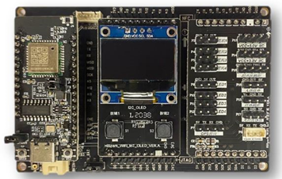

* **Pegasus WiFi-IoT套件核心主板**

  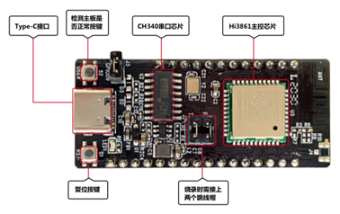

  * **技术规格：**
    * Hi3861 WiFi-IoT套件尺寸大约2cm*5cm，集成2.4GHz WLAN SoC芯片，Hi3861V100是32bit高性能微处理器，支持IEEE 802.11b/g/n基带和RF（Radio Frequency）电路。支持OpenHarmony OS，可与华为Hi-Link协同，并配套提供开放、易用的开发和调试运行环境

* **Pegasus WiFi-IoT套件开发板底板**

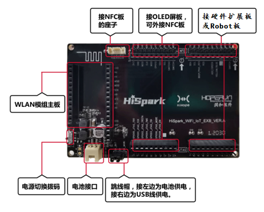

* **Pegasus _WiFi_IoT-OLED板**

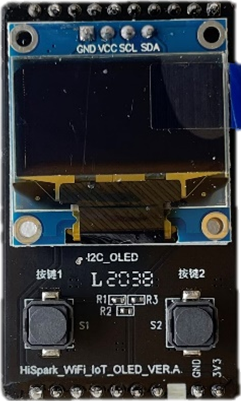

* **Pegasus _WiFi_IoT-外设扩展板**

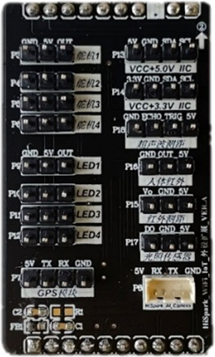

* **Pegasus _WiFi_IoT-机器人模块**

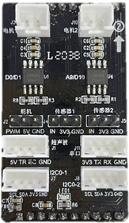

* **Pegasus _WiFi_IoT-NFC扩展板**

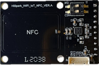

### 1.1.2、Pegasus套件硬件资料

* 开发者可以访问下面的链接，进行Pegasus套件硬件资料的下载

| 序号 | 名称                                                         | 说明                                              |
| ---- | ------------------------------------------------------------ | ------------------------------------------------- |
| 01   | [HiSpark_WiFi_IoT智能开发套件_原理图硬件资料](https://gitee.com/hihope_iot/embedded-race-hisilicon-track-2022/blob/master/%E7%A1%AC%E4%BB%B6%E8%B5%84%E6%96%99/HiSpark_WiFi_IoT%E6%99%BA%E8%83%BD%E5%AE%B6%E5%B1%85%E5%BC%80%E5%8F%91%E5%A5%97%E4%BB%B6_%E5%8E%9F%E7%90%86%E5%9B%BE.rar) | Pegasus开发套件主板、底板等相关原理图以及硬件资料 |
| 02   | [HiSpark_WiFi_IoT套件PCB资料](https://gitee.com/hihope_iot/embedded-race-hisilicon-track-2022/blob/master/%E7%A1%AC%E4%BB%B6%E8%B5%84%E6%96%99/HiSpark_WiFi_IoT%E5%A5%97%E4%BB%B6PCB%E8%B5%84%E6%96%99.zip) | Pegasus开发套件PCB图                              |
| 03   | [HiSpark_WiFi_IoT_外设扩展板_VER_A](https://gitee.com/hihope_iot/embedded-race-hisilicon-track-2022/blob/master/%E7%A1%AC%E4%BB%B6%E8%B5%84%E6%96%99/HiSpark_WiFi_IoT_%E5%A4%96%E8%AE%BE%E6%89%A9%E5%B1%95%E6%9D%BF_VER_A.pdf) | Pegasus开发套件的外设扩展板原理图                 |

### 1.1.3、Pegasus套件组装

* 开发者根据使用场景，在安装时选择"机器人模块"或"外设扩展模块"；安装顺序如下：
  -    ①取出底板->②安装主板->③安装显示模块->④安装机器人模块或外设扩展板模块->⑤安装NFC模块。

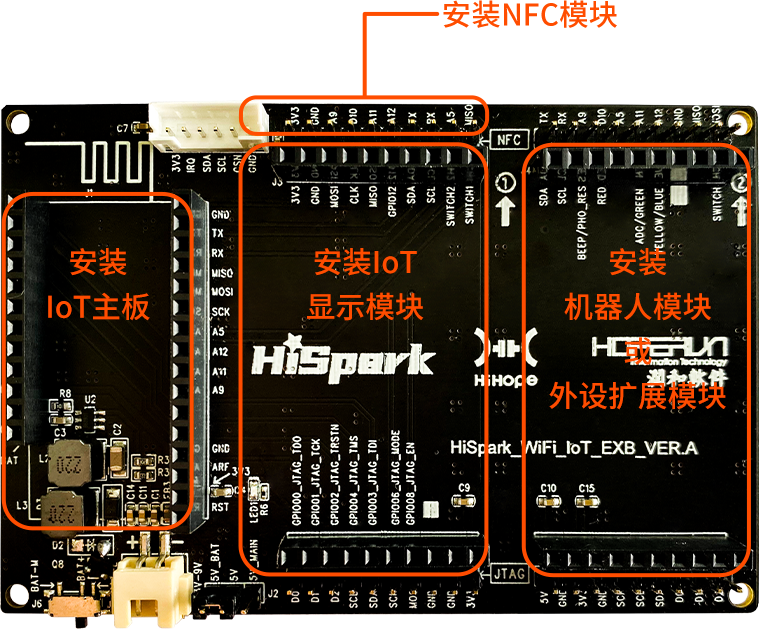

-    请开发者根据以下步骤完成Pegasus套件安装
-    步骤1：打开"Pegasus套件包"，取出"HiSpark_WiFi_IoT-底板",如下图所示：

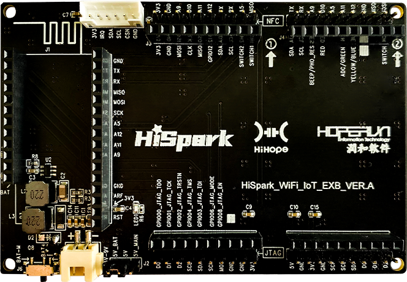

- 步骤2：安装"HiSpark_WiFi_IoT-主板"

  -    取出"HiSpark_WiFi_IoT-主板",将其安装至"HiSpark_WiFi_IoT-底板"指定位置，如下图所示：

  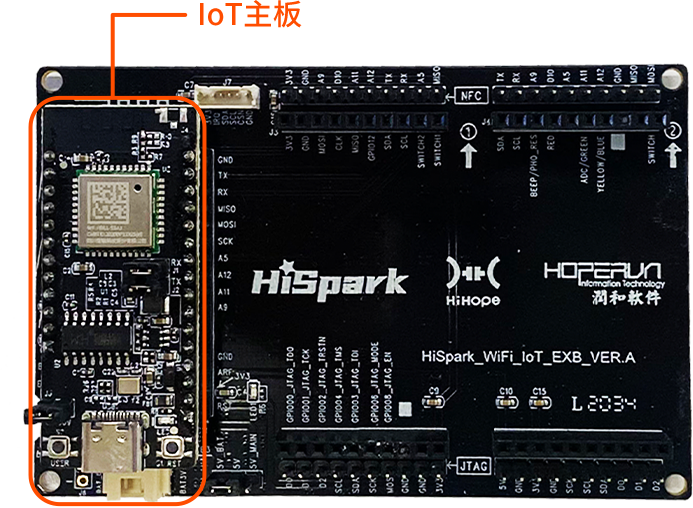

- 步骤3：安装"HiSpark_WiFi_IoT-显示模块"

  -    取出"HiSpark_WiFi_IoT-显示模块",将其安装至"HiSpark_WiFi_IoT-底板"指定位置，如下图所示：

  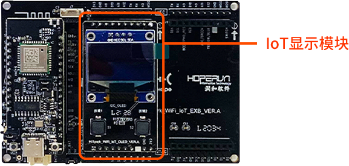

- 步骤4：安装"HiSpark_WiFi_IoT-机器人模块"或"HiSpark_WiFi_IoT-外设扩展模块"

  -    开发者根据使用场景，选择"机器人模块"或"外设扩展模块"（两个模块同时只能安装一个）；此处以安装"机器人模块"为例进行安装说明，取出"HiSpark_WiFi_IoT-机器人模块"，将其安装至"HiSpark_WiFi_IoT-底板"指定位置，如下图所示：

  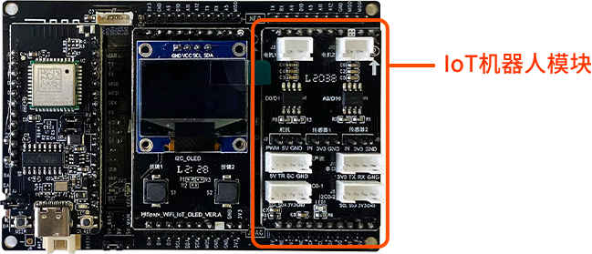

- 注意：安装机器人模块或外设扩展板模块时，需要注意该类模块引脚处缺少一根针，此处须与底板中实心插槽对应，如下图所示：

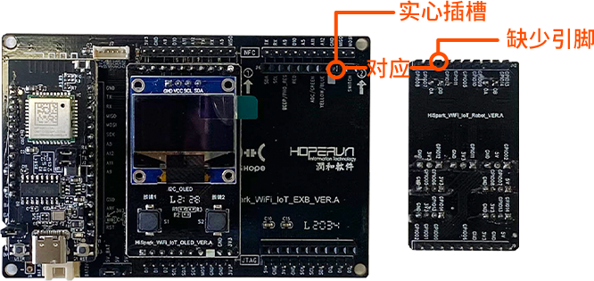

- 步骤5：安装"HiSpark_WiFi_IoT-NFC板"（两种安装方式）

  -    方式1：取出"HiSpark_WiFi_IoT-NFC板",将其安装至"HiSpark_WiFi_IoT-底板"NFC专用插座上，如下图所示：

  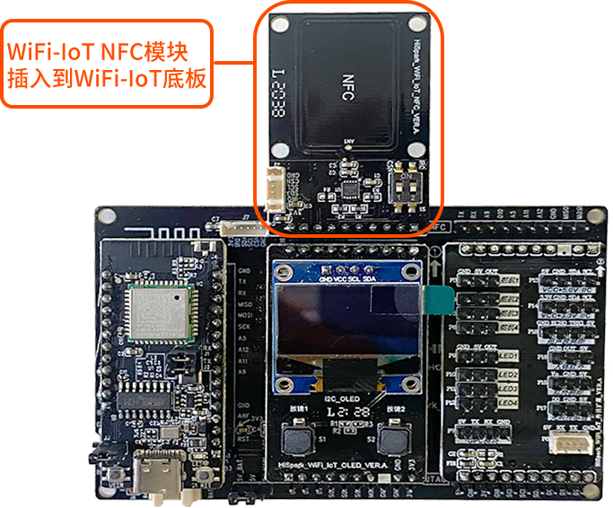

  -    方式2：取出"HiSpark_WiFi_IoT-NFC板"和"NFC排线",使用NFC排线将"HiSpark_WiFi_IoT-底板"相互连接，如下图所示：

  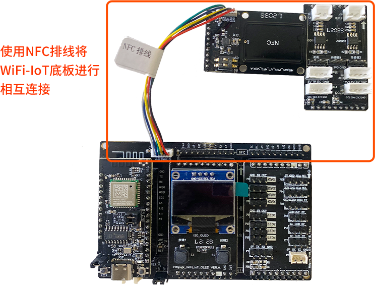

## 1.2、Taurus套件

### 1.2.1、Taurus套件介绍

**Taurus(Hi3516DV300)套件概述**

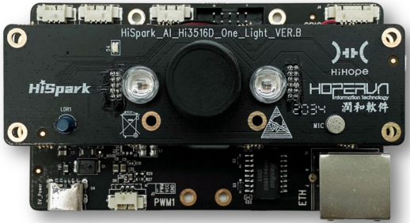

* Taurus开发套件可以通过搭积木的方式组成USB计算棒、 AI Camera以及AI视频分析记录仪。该开发套件基于专用的Smart HD IP Camera芯片Hi3516DV300设计，该芯片集成了新一代ISP、业界最新的H.265视频压缩编码器、高性能NNIE引擎、1.0TOPS。

* 具有灵活的存储空间，标配32bit/1GB DDR3；标配8GB eMMC存储器；同时可外挂2TB SDX卡。

* 丰富的DIY扩展接口：I2C、UART、GPIO、PWM、ADC、NFC、JTAG等接口。

* 丰富的通信接口：灵活的Type-C通信兼容供电、可以通过USB和网口进行软件的更新。

* Ethernet调试接口，同步WiFi通信安全性、智能化处理分析，预留算法加密IC，为独立版权保驾护航。

**Taurus(Hi3516DV300)套件-主板正面**

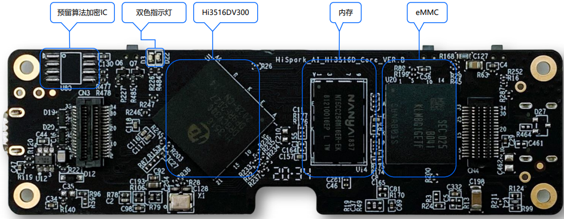

* 基于Hi3516DV300的最小系统：32bit/1GB内存，8GB eMMC存储空间

* 预留算法加密IC

* 双色指示灯

**Taurus(Hi3516DV300)套件-主板背面**

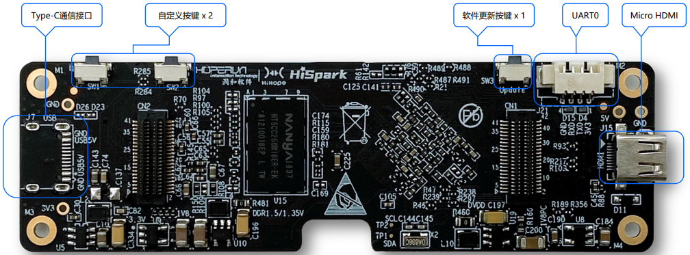

* UART0 Debug调试接口

* Micro HDMI接口

* Type-C通信接口，同时满足产品5V供电需求（与Sensor板兼容设计）

* 2路自定义按键及软件更新按键

**Taurus(Hi3516DV300)套件-镜头板正面**

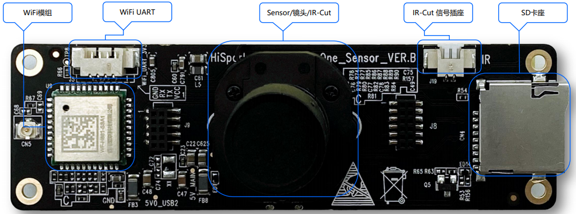

* 低功耗2.4G WiFi模组

* SD卡座，最大支持2TB SDXC卡

* 索尼高端安防低照度Sensor IMX335
* 星光级黑光低照度M12镜头，匹配IR-Cut底座

**Taurus(Hi3516DV300)套件-镜头板背面**

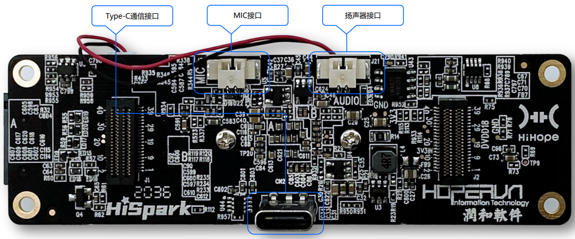

* 单声道差分MIC接口

* 适配8Ω/2W 1.25㎜端子小喇叭

* Type-C通信接口，同时满足产品5V供电需求（与Core板兼容设计）

**Taurus(Hi3516DV300)套件-灯板正面**

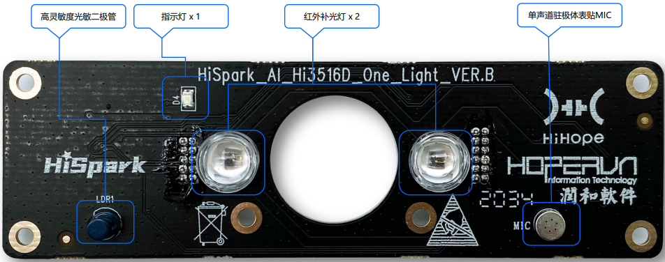

* 红外补光灯x 2

* 高灵敏度光敏二极管

* 指示灯x 1

* 单声道驻极体表贴MIC

**Taurus(Hi3516DV300)套件-灯板背面**

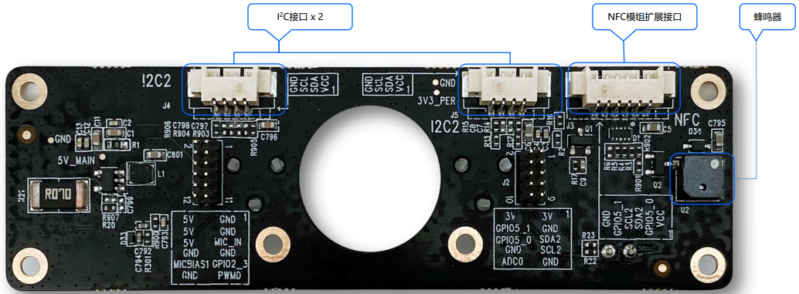

* 蜂鸣器 

* NFC模组扩展接口 

* I2C接口x 2

**Taurus(Hi3516DV300)套件-扩展板正面**

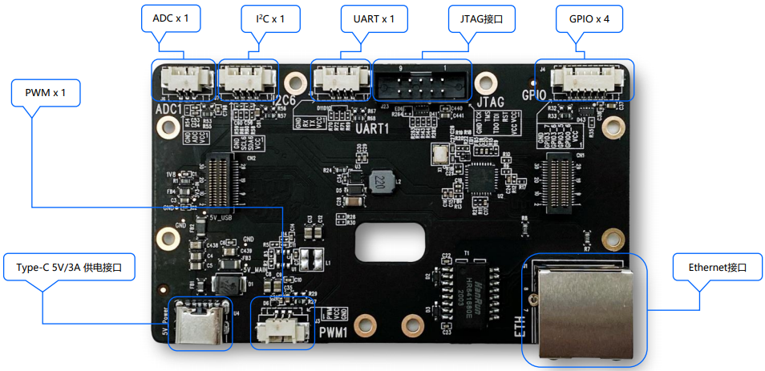

* Type-C 5V/3A 供电接口

* Ethernet接口，支持RMII模式

* 标准JTAG接口

* PWM x 1

* ADC x 1

* GPIO x 4

* I 2C x 1

* UART x 1

**Taurus(Hi3516DV300)套件-扩展板背面**

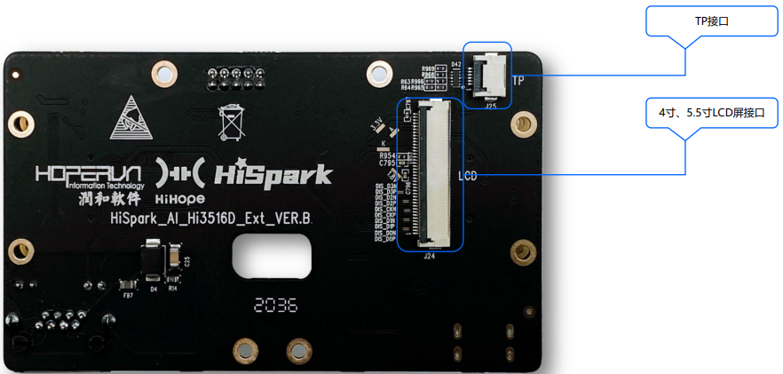

* 兼容4寸、5.5寸LCD屏接口

* TP接口

### 1.2.2、Taurus套件硬件资料

* 开发者可以通过访问下面的链接，进行Taurus套件硬件资料的下载

| 序号 | 名称                                                         | 说明                     |
| ---- | ------------------------------------------------------------ | ------------------------ |
| 01   | [Taurus套件原理图PCB设计资料](https://gitee.com/hihope_iot/embedded-race-hisilicon-track-2022/blob/master/%E7%A1%AC%E4%BB%B6%E8%B5%84%E6%96%99/Taurus%E5%A5%97%E4%BB%B6%E5%8E%9F%E7%90%86%E5%9B%BEPCB%E8%AE%BE%E8%AE%A1%E8%B5%84%E6%96%99.zip) | Taurus 套件原理图与PCB图 |
| 02   | [Taurus结构资料](https://gitee.com/hihope_iot/embedded-race-hisilicon-track-2022/blob/master/%E7%A1%AC%E4%BB%B6%E8%B5%84%E6%96%99/Taurus%E7%BB%93%E6%9E%84%E8%B5%84%E6%96%99.zip) | Taurus 套件结构资料      |

### 1.2.3、Taurus套件组装

* 关于Taurus套件硬件的组装，可以访问下面的视频链接或者文档链接进行操作。

| 序列 | 参考文档                                                     | 参考视频链接                                                 |
| ---- | ------------------------------------------------------------ | ------------------------------------------------------------ |
| 01   | [《开发套件组装文档》](https://gitee.com/hihope_iot/embedded-race-hisilicon-track-2022/blob/master/%E7%A1%AC%E4%BB%B6%E8%B5%84%E6%96%99/Taurus%20&%20Pegasus%20AI%E8%AE%A1%E7%AE%97%E6%9C%BA%E8%A7%86%E8%A7%89%E5%9F%BA%E7%A1%80%E5%BC%80%E5%8F%91%E5%A5%97%E4%BB%B6%E7%BB%84%E8%A3%85%E8%AF%B4%E6%98%8E.pdf) | [Taurus&Pegasus AI计算机视觉基础开发套件组装说明](https://gitee.com/link?target=https%3A%2F%2Fwww.bilibili.com%2Fvideo%2FBV1z3411n7zK%2F) |

## 1.3、硬件验证

* 开发者可以访问下面的链接，下载Taurus&Pegasus开发套件的硬件验证文档

| 序列 | 参考文档                                                     | 参考视频链接                                                 |
| ---- | ------------------------------------------------------------ | ------------------------------------------------------------ |
| 01   | [《Taurus&Pegasus AI计算机视觉基础开发套件硬件测试指导文档》](https://www.123pan.com/s/iiMUVv-fJFLh) | 参考《工厂测试程序文档.pdf》的内容，来对Taurus硬件进行测试，《厂测程序VER.B.rar》压缩包是厂测程序的镜像文件 |
| 02   | 关于产测程序的具体验证过程，可以参考此视频                   | [Taurus产测程序的验证视频](https://pan.baidu.com/s/1IFOF2cvVh04QjtYCaUKZPQ?pwd=elei) |

## 1.4、套件购买

* 如果参赛队伍需要更多的 Taurus & Pegasus AI计算机视觉基础开发套件，需自行自费购买购买链接如下：

  https://item.taobao.com/item.htm?spm=a1z10.1-c.w137644-21152782407.33.773f258aDRynA0&id=640227851585
