# 第二章：开发环境搭建

## 2.1、Pegasus开发环境搭建

<font color='RedOrange'>**注意：如果您只负责开发Taurus相关的代码，此章节可以跳过**</font>

### 2.1.1、工具介绍

HUAWEI DevEco Device Tool（以下简称DevEco Device Tool）是OpenHarmony面向智能设备开发者提供的一站式集成开发环境，支持OpenHarmony的组件按需定制，支持代码编辑、编译、烧录和调试等功能，支持C/C++语言，以插件的形式部署在Visual Studio Code上，其具有以下特点：

- 支持代码查找、代码高亮、代码自动补齐、代码输入提示、代码检查等，开发者可以轻松、高效编码。
- 支持丰富的芯片和开发板，包括基于华为海思芯片的Hi3516DV300/Hi3861V100/Hi3751V350等开发板。
- 支持自动检测各芯片/开发板依赖的工具链是否完备，并提供一键下载和安装缺失工具链。
- 支持多人共享开发模式，采用基于Remote-SSH模式实现多人共享远程开发，实现一个团队公用一台服务器进行编译、烧录。
- 支持源码级调试能力，提供查看内存、变量、调用栈、寄存器、反汇编等调试信息。

DevEco Device Tool工具主要分为如下4个功能区域。

：基本功能区 ：DevEco Device Tool菜单栏，提供基本的工程创建、源码导入、工程配置等功能。

：开发板任务区：在工程界面，提供开发板相关操作任务，如源码的编译、镜像的烧录、Monitor串口工具等。

：代码编辑器：提供代码的查看、编写和调试等开发功能。

：输出控制区：提供日志打印、调试指令输入、命令行指令输入等。

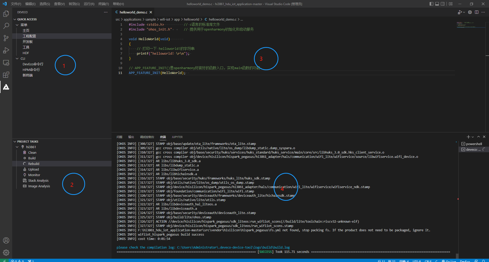

### 2.1.2、DecEco Device Tool下载和安装

* 步骤一：下载devicetool-windows-tool-3.1.0.XXX.zip 最新版，下载网址：https://device.harmonyos.com/cn/develop/ide#download

* 步骤二：解压DevEco Device Tool压缩包，双击安装包程序，点击"下一步"进行安装（如果之前有安装过，会弹出先卸载之前版本在安装，请按照要求先卸载）；

  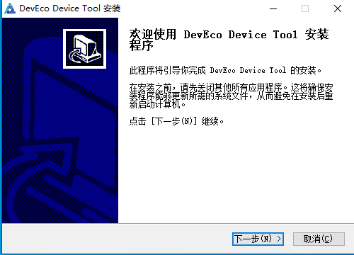

* 步骤三：设置DevEco Device Tool的安装路径，请注意安路径不能包含中文字符，同时建议不要安装到C盘目录，点击"下一步"。

  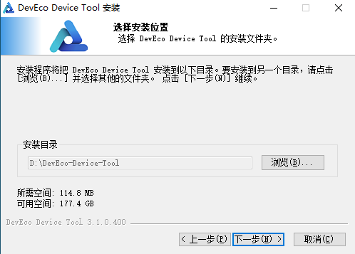

* 步骤四：根据安装向导提示，安装依赖软件python以及vscode，显示OK后，点击安装。

  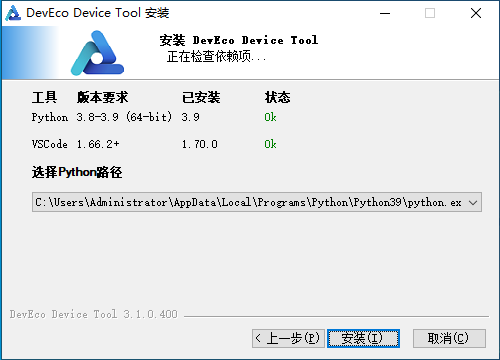

* 注意：如果你在这一步骤出现 VScode或者Python校验未通过的话。可以先点击取消安装，然后把Windows中的VScode删掉之后，访问下面的链接，下载VSCode和python，并进行手动安装(安装路径最好不要放在C盘，python记得配置他的系统环境变量PATH)。VScode和Python都安装完成之后，再重新安装Deveco Device Tool。

  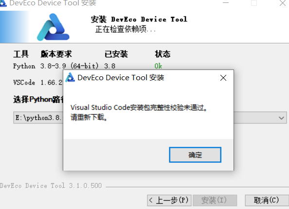

```
https://www.123912.com/s/iiMUVv-87OLh

https://repo.huaweicloud.com/python/3.8.10/python-3.8.10-amd64.exe
```


* 步骤五：等待DevEco Device Tool安装向导自动安装DevEco Device Tool插件，直至安装完成，点击"完成",关闭DevEco Device Tool安装向导。

  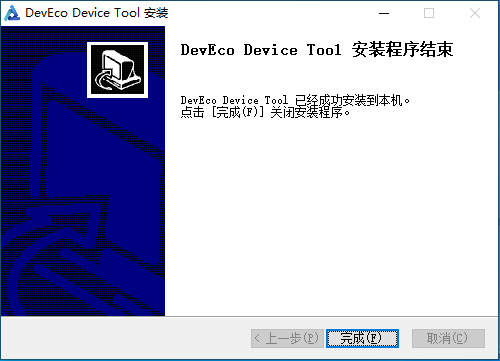

* 步骤六：打开Visual Studio Code，进入DevEco Decive Tool工具界面。

  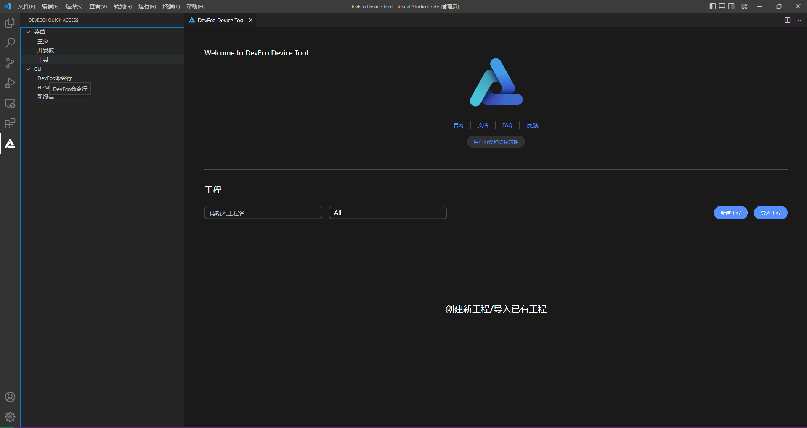

* 步骤七：下载简体中文语言包，用户可以在VSCode工具商店安装"chinese(Simplified)(简体中文)Language Pack for Visual Studio Code"插件，将VSCode设置为中文模式。

  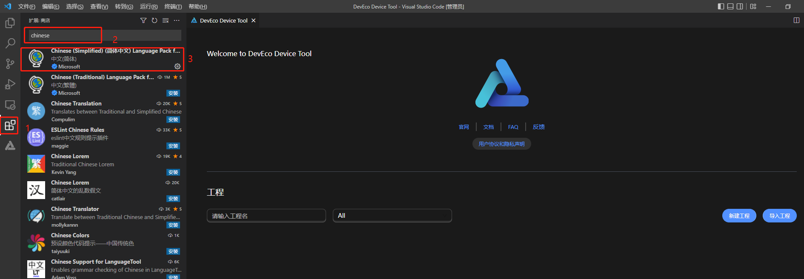

### 2.1.3、SDK下载

* 步骤一：下载Hi3861 Openharmony SDK，下载网址：https://gitee.com/wgm2022/hi3861_for_AI_topic

  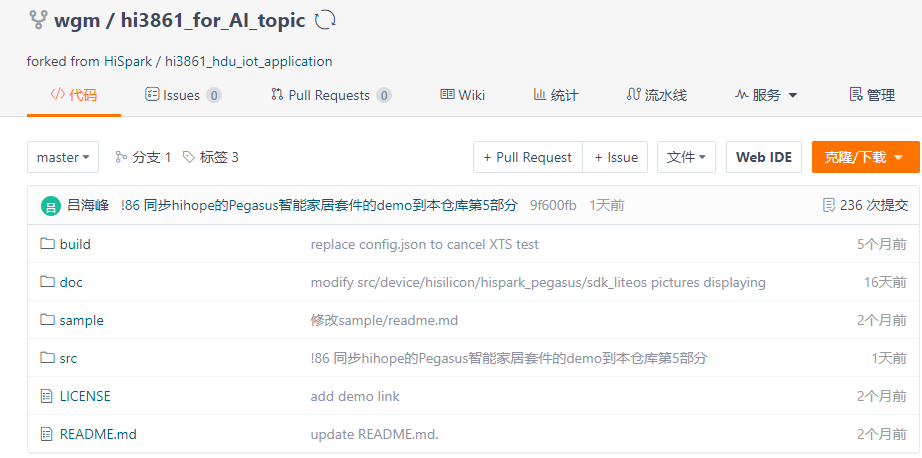

  下载方式2种：

  * 方式一：直接在web页面上下载zip压缩包，压缩包下载成功或，使用解压工具对压缩包进行解压即可得到SDK源码。

    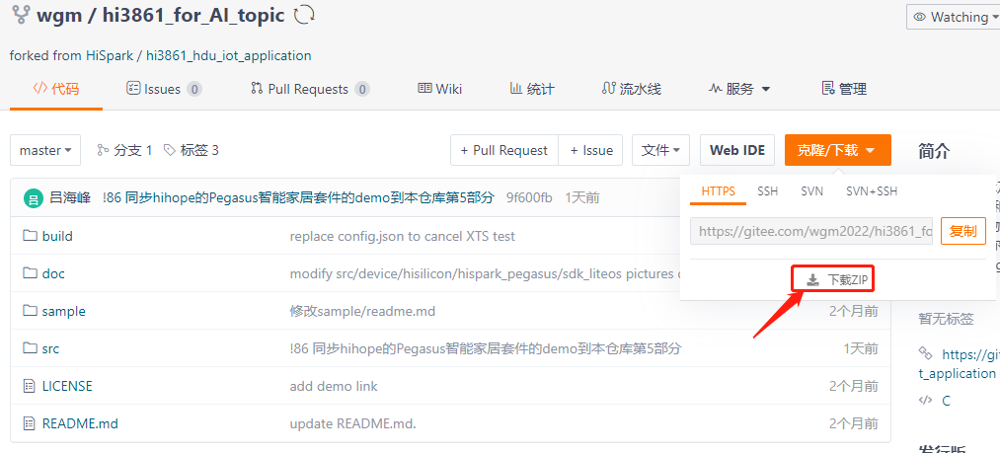

  * 方式二：如果用户已经安装git工具（git工具安装和使用请自行百度），可以通过git clone命令下载，命令如下：

    ```
    git clone https://gitee.com/wgm2022/hi3861_for_AI_topic.git
    ```

​               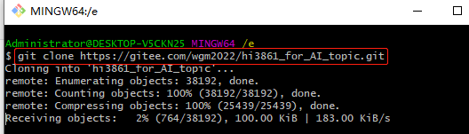

<font color='RedOrange'>**注意：由于windows自身限制，路径不能超过260个字符，在git下载和解压Hi3861 SDK代码时尽量放在D盘或者其他盘根目录下且尽量不要包含中文路径，防止导致的编译错误问题。**</font>

### 2.1.4、工程管理

* 步骤一：打开VSCode，打开DevEco Device Tool主页，点击“导入工程”

  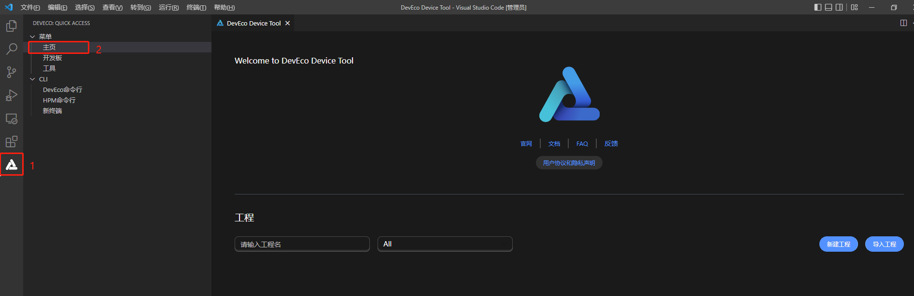

* 步骤二：在导入工程弹窗中选择Hi3861 SDK目录，点击“导入”。（如果采用zip包下载，SDK名称为hi3861_for_AI_topic-master，如果采用git下载SDK名称为hi3861_for_AI_topic，此处以采用zip下载为例）

  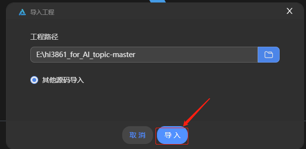

* 步骤三：在后续导入工程弹窗，SOC栏选择Hi3861，开发板栏选择hi3861，框架栏选择hb，之后点击“导入”，等待导入成功即可。

  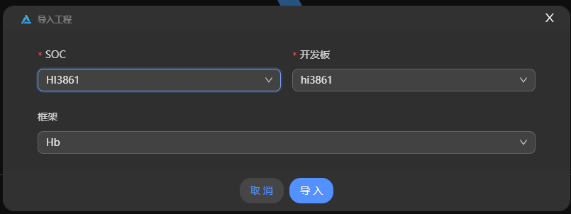

  <font color='RedOrange'>**注意：如果待打开目录之前已成功导入，则再次导入时会导入失败，并提示“当前工程已经创建过，请直接导入”。**</font>

* 步骤四：代码导入成功后，即工程创建成功，之后可使用该IDE 实现代码开发、一键编译、一键烧写等功能。

  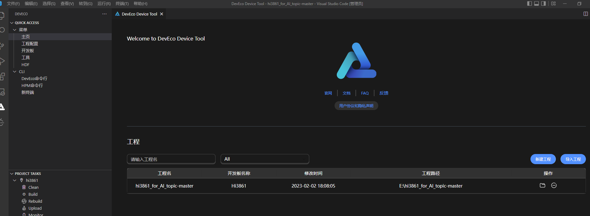

* 步骤五：代码导入成功后，后续可在DevEco Device Tool工具主页直接打开已导入成功的工程。

  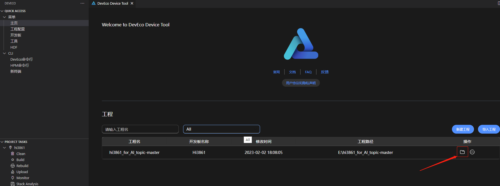

* 此时点击左上角的资源管理器，就能看到我们导入的所有工程代码了，Pegasus的相关代码在：hi3861_for_AI_topic-master\src\vendor\hisilicon\hispark_pegasus\demo\目录下。

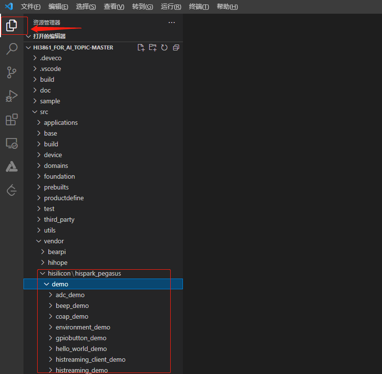

### 2.1.5 编译运行

* 步骤一：访问开发工具下载网址：https://hispark-obs.obs.cn-east-3.myhuaweicloud.com/DevTools_Hi3861V100_v1.0.zip

* 步骤二：进行工具包的下载

  

* 步骤三：下载完成后解压，解压完成后的文件目录结构如下所示

  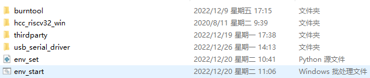

* 步骤四：然后点击DevECO Device Tool按钮，点击工程配置，找到框架，把compliler_bin_path配置成上面下载并解压的工具包路径。

  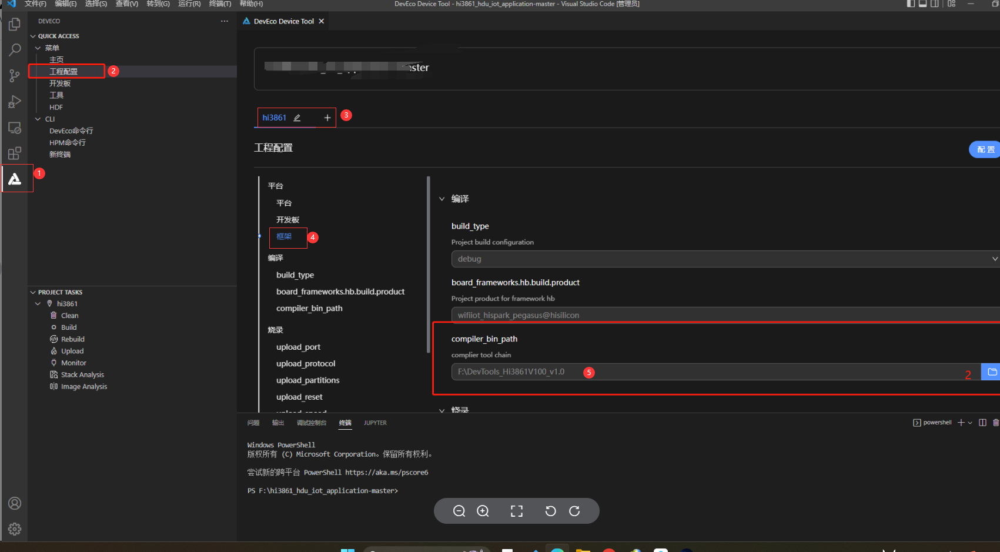

* 步骤五：配置完成后，点击左侧“build”，开始编译。

  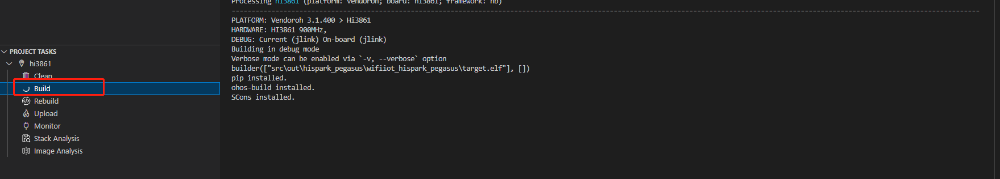

  初次编译会解压编译工具，时间较长。等待编译完成即可。

  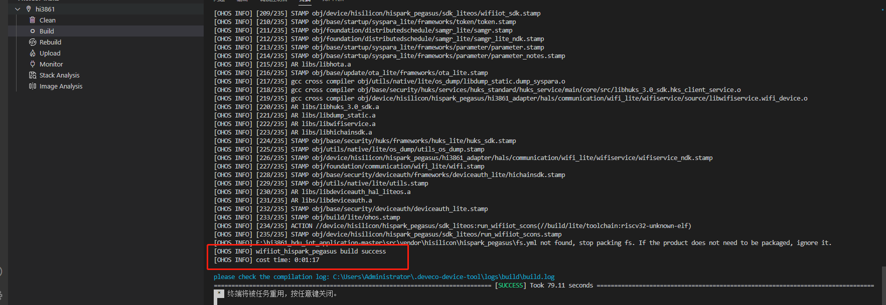

