## 2.2、Taurus开发环境搭建

* <font color='RedOrange'>**注意：如果您只负责开发Pegasus相关的代码，此章节可以跳过**</font>

### 2.2.1、软件获取

<font color='RedOrange'>**（注意：以下软件包仅用于教学，未经允许不得转发用于商业用途）**</font>

| 工具名称    | 用途说明                          | 版本要求   | 获取渠道                                                     |
| ----------- | --------------------------------- | ---------- | ------------------------------------------------------------ |
| VirtualBox  | Windows安装Ubuntu系统所需的虚拟机 | 6.1.36版本 | [VirtualBox下载链接](https://download.virtualbox.org/virtualbox/6.1.36/VirtualBox-6.1.36-152435-Win.exe) |
| Ubuntu18.04 | 编译环境所需的Linux系统           | 18.04版本  | [Ubuntu18.04下载链接](https://releases.ubuntu.com/18.04/ubuntu-18.04.6-desktop-amd64.iso) |
| VScode      | 代码阅读和编辑所需的IDE工具       | 1.70.1版本 | [VScode下载链接](https://az764295.vo.msecnd.net/stable/6d9b74a70ca9c7733b29f0456fd8195364076dda/VSCodeUserSetup-x64-1.70.1.exe) |
| MobaXterm   | 终端调试工具                      | V22.1版本  | [MobaXterm下载链接](https://download.mobatek.net/2212022060563542/MobaXterm_Installer_v22.1.zip) |

### 2.2.2、安装VirtualBox虚拟机

- 双击在 **2.2.1、软件获取章节下载** 的VirtualBox-6.1.36-152435-Win.exe 安装包，点击下一步，安装VirtualBox。


- 点击浏览按钮，修改VirtualBox的安装路径，然后点击确定按钮，再点击下一步。


- 当出现下面的界面，点击下一步。


- 当出现下面的界面，点击是。

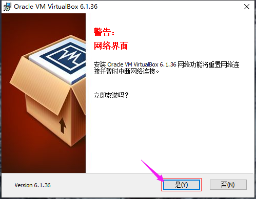

- 当出现下面的安装界面时，点击安装。


- 点击完成，即可完成VirtualBox的安装。


### 2.2.3、在VirtualBox中安装Ubuntu18.04

#### 步骤1：导入Ubuntu18.04镜像到VirtualBox

- 打开VirtualBox，点击新建


- 修改虚拟机的名称为hispark，然后修改Ubuntu系统的安装文件夹（因为软件默认安装在C盘，我们最好是把安装路径修改为其他磁盘），把类型配置为linux,然后版本选择 Ubuntu(64-bit)，然后再点击下一步。


- 修改Ubuntu的运行内存大小为4G，然后点击下一步。


- 选择现在创建虚拟硬盘，然后点击创建按钮。

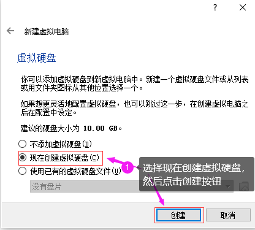

- 选择VDI（VirtualBox磁盘映像），然后点击下一步。


- 选择动态分配，然后点击下一步。


- 修改磁盘空间大小为100GB，然后点击创建按钮。请至少给Ubuntu分配100G的内存空间，否则后面的步骤会因为内存不足出现错误。


- 点击设置按钮，选择常规选项，在高级选项处，把共享粘贴板和拖放都设置为双向，然后点击OK按钮。

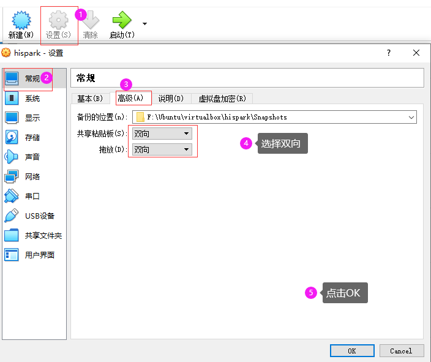

- 点击VirtualBox的设置，然后点击系统，选择处理器，把处理器的数量改为4。
- 注意：如果您的处理器小于等于4个的话，请把处理器数量改小一些。

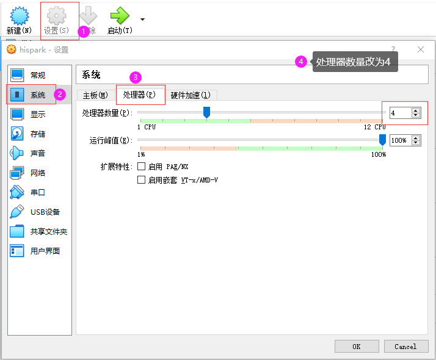

- 点击网络，选择网卡2，勾选启动网络连接，选择仅主机网络，点击OK。


- 点击设置按钮，选择存储，然后选择没有盘片，点击光盘按钮，点击选择虚拟盘。

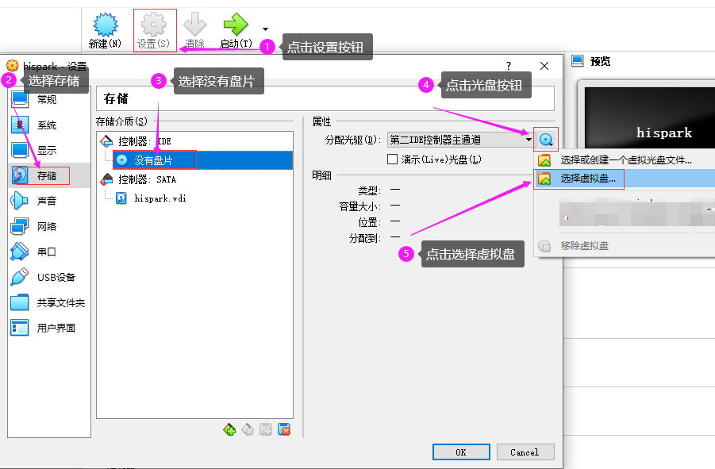

* 选择 **2.2.1、软件获取章节下载**的Ubuntu18.04的镜像文件，然后点击打开按钮。


* 然后点击设置的OK按钮。


* 选择USB设备，把启动USB控制器的勾选去掉，禁用USB设备，然后点击OK（部分电脑可能无法进行这一步操作，可以先跳过）


* 点击启动，启动Ubuntu系统


#### 步骤2：Ubuntu系统的安装

* 选择中文(简体)，然后点击安装Ubuntu


- 如果您安装Ubuntu的时候和我一样，因为分辨率问题，导致界面显示不全，无法看到下面的按钮，您需要按住组合键 ``` Ctrl+Alt+t```打开终端面板，然后输入xrandr，查看一下支持的分辨率。

  

- 我们这边以1920x1200为例，输入 ```xrandr -s 1920x1200``` 后敲回车，修改Ubuntu的分辨率。


- 选择Chinese，然后点击继续按钮。

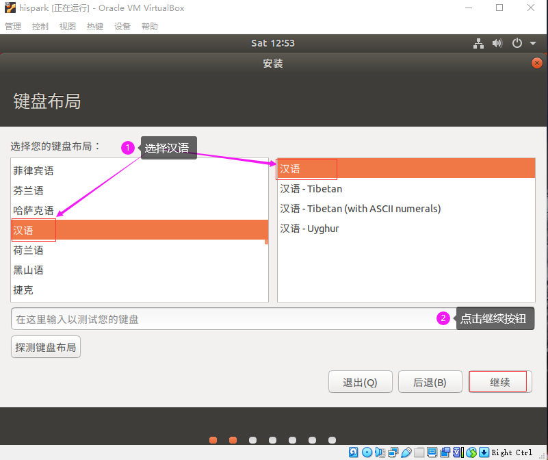

- 将安装Ubuntu时下载更新的勾选去掉，然后点击继续按钮。


- 点击现在安装。


- 点击继续按钮。

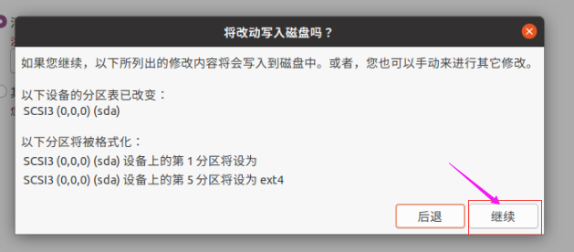

- 选择上海，然后点击继续按钮。


- 设置好账号和密码，点击继续按钮，此处的账号和密码即为您Ubuntu的登录所需的账号和密码。
- 请按照本文的配置来，账号为：hispark，密码为：hispark。


- 开始安装各种软件。


- Ubuntu安装完成后，点击现在重启按钮。


* 如果在重启的过程中出现提示**please remove the installation medium**，可以直接点击关闭按钮，选择强制退出，点击OK即可。

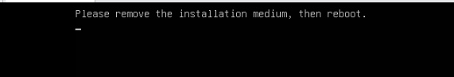


- 当出现此类弹窗，点击前进即可。若Ubuntu弹出是否更新的弹窗，点击不升级即可。我们先暂时不更新。

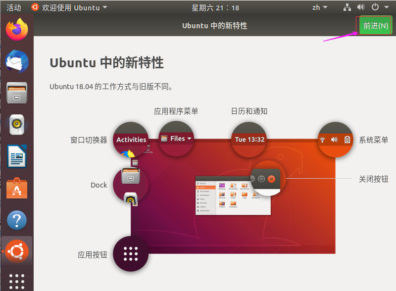

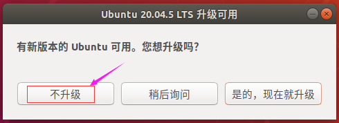


- 点击virtualbox的设备，点击安装增强功能

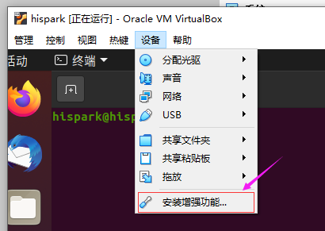

- 当弹出 弹窗询问是否运行自启动软件时，点击取消。


- 此时左边任务栏会多出一个光盘一样的图标，点击并打开光盘图标，进入该文件夹内。


- 在光盘文件夹的空白处，鼠标右键，点击在终端打开。


- 执行下面的命令，进行增强功能的安装。

```
sudo apt-get install  gcc make perl -y

sudo ./VBoxLinuxAdditions.run
```


- 安装成功后，在终端执行 reboot命令，重启一下Ubuntu

```
reboot
```

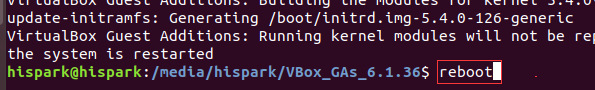

#### 步骤3：更新软件

* 当Ubuntu重启之后，点击Ubuntu桌面左下角九个点图标，然后打开软件和更新图标。

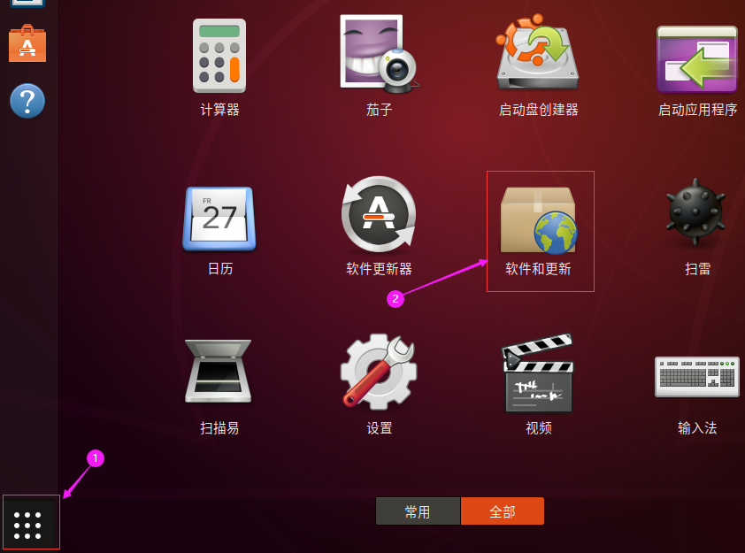

- 点击Ubuntu软件，在**下载自**处点击下拉框，选择其他站点。

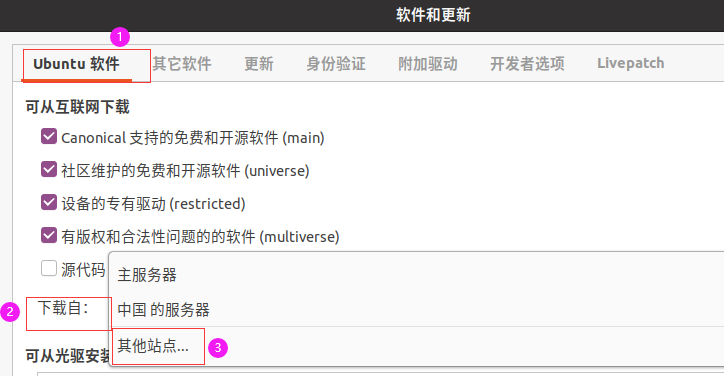

- 在**中国**下方选择**阿里云**，然后点击选择服务器。


- 此时弹出认证对话框，输入您的Ubuntu登录密码，本文为hispark。


- 点击关闭按钮，然后有对话框时，点击重新载入，此时会有一段时间的软件更新，耐心等待即可。


* 更新完成后，在Ubuntu的桌面，点击鼠标右键，点击在终端打开，打开终端窗口。

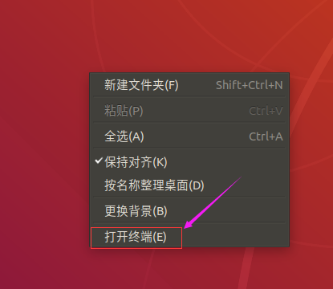

* 在终端输入下面两条命令，进行软件更新

```
sudo apt-get update
sudo apt-get upgrade -y
```


#### 步骤4：配置Ubuntu的SSH服务

* 执行下面的命令，下载SSH-server

```
sudo apt-get install openssh-server -y
```

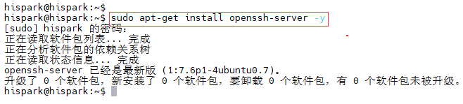

* 执行下面的命令，启动Ubuntu ssh服务

```
sudo systemctl start ssh
```


#### 步骤5：安装MobaXterm并连接到Ubuntu

* 在Windows 主机，解压在 **2.2.1、软件获取章节下载** 的MobaXterm_Installer_v22.1.zip 压缩包，然后双击解压后的MobaXterm_installer_22.1.msi，进行MobaXterm的安装。
* 一直点击下一步，即可安装成功。


* 执行下面的命令，安装net-tools工具

```
sudo apt install net-tools  -y
```


* 执行下面的命令，查看Ubuntu的IP地址，本文Ubuntu的IP地址是 192.168.56.106

```
ifconfig
```


* 打开刚在Windows上安装好的MobaXterm，点击左上角的Session图标，当弹出新的对话框时，点击左上角的SSH图标，然后输入你自己Ubuntu的IP地址，勾选上 Specify username，并填写好你Ubuntu的用户名，点击OK即可。

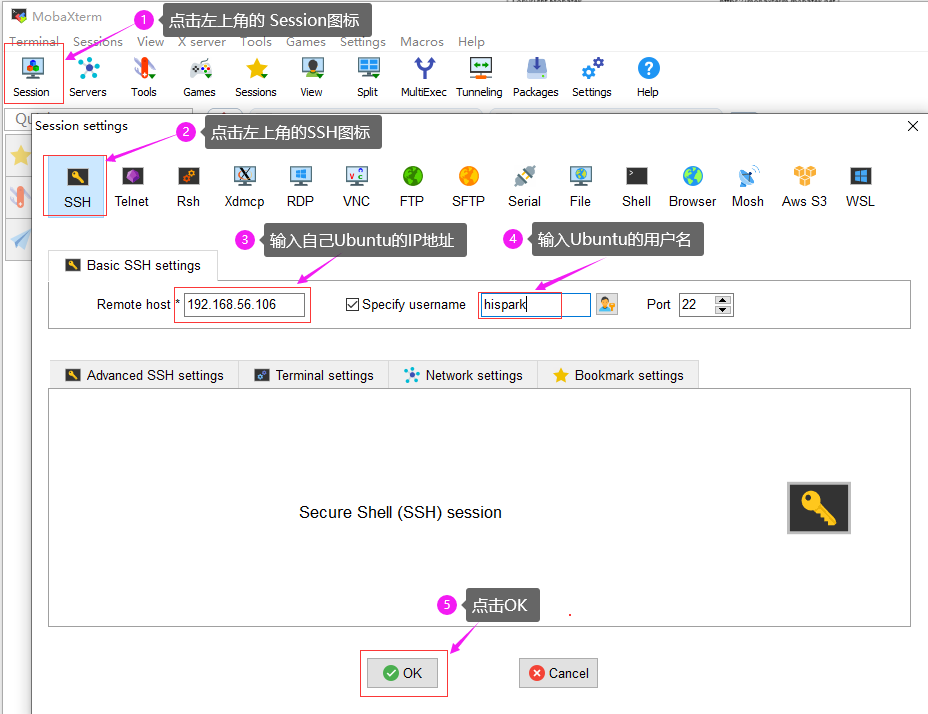

* 点击OK之后，若需要您输入登录密码，直接输入您Ubuntu的用户登录密码即可进入Ubuntu的终端界面。


### 2.2.4、搭建编译OpenHarmony的Docker环境

#### 步骤1：安装Docker软件

- 在终端输入下面的命令，安装docker工具,如果提示输入密码，请输入一下自己的Ubuntu的用户密码。

```
sudo apt install docker.io -y
```

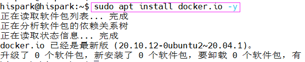

#### 步骤2：配置docker用户权限

* 在Ubuntu的终端，执行下面的命令，配置docker用户的权限

```shell
sudo groupadd docker

sudo gpasswd -a $USER docker

newgrp docker

sudo chmod a+rw /var/run/docker.sock
```

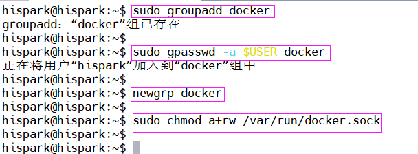

#### 步骤3：下载Docker镜像文件

* 百度网盘链接：

```
链接：https://pan.baidu.com/s/1EHpPNrwwOIZUy1MDtpUsFw?pwd=vq1n 提取码：vq1n 
```

* 123云盘链接：

```
https://www.123pan.com/s/iiMUVv-FPFLh
```

<font color='RedOrange'>**docker镜像包中主要包含了**</font>：

* OpenHarmony的代码，<font color='RedOrange'>在 /home/openharmony/目录下</font>
* 编译OpenHarmony代码时所依赖的编译环境。
* caffe环境，<font color='RedOrange'>在/root/caffe/目录下</font>
* opencv环境，<font color='RedOrange'>在/root/opencv/目录下</font>
* pytorch2caffe环境，<font color='RedOrange'>在/root/pytorch_to_caffe_master/目录下</font>
* darknet2caffe环境，<font color='RedOrange'>在/root/darknet2caffe/目录下</font>
* 适配了Taurus开发板，不需要再关闭媒体服务和MIPI_TX驱动、也不需要重新配置网口。
* 编译Taurus的sample时所需的资源文件也全部在docker镜像中。
* 配置了samba服务

#### 步骤4：将docker压缩包拷贝至Ubuntu

* 因为我们在2.2.3章节的步骤5中，已经能够使用MobaXterm打开Ubuntu的终端，并且能够看到Ubuntu的文件了。现在只需要把下载好的Docker镜像的压缩包，上传到Ubuntu的 hispark目录下即可。

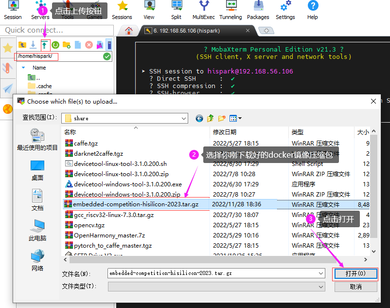

* 在MobaXterm的左下角能够看到具体的上传进度。

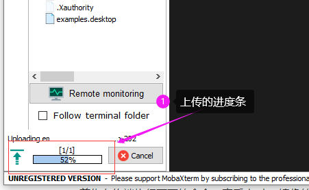

#### 步骤5：导入docker镜像

* 首先在终端执行下面的命令，查看docker镜像的文件大小是否和本文一致。本文的docker镜像大小为8G

```
ls -lah
```

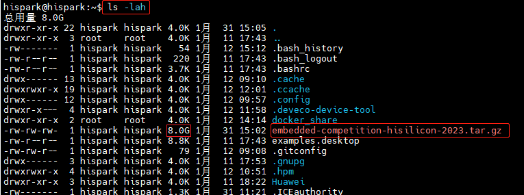

* 然后在终端执行下面的命令，计算一下你下载的docker镜像的md5值是否与本文的一致，如果不一致可能是你下载文件的时候出现了问题，可能需要重新下载。
* 本文的docker镜像的MD5值是 ``` 9d3d47a7c272407bf06c246a8c182641```

```
md5sum embedded-competition-hisilicon-2023.tar.gz
```

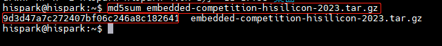

* 在终端使用下面的命令，导入docker镜像，导入镜像时需要挺长的时间，请耐心等待，如果您在导入的过程中提示空间不足，说明您的Ubuntu空间配置的太小了，<font color='RedOrange '>**在导入docker镜像之前请确保Ubuntu至少有60G可用的磁盘空间**</font>。

```
docker load < embedded-competition-hisilicon-2023.tar.gz
```

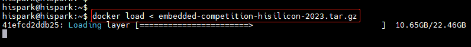

#### 步骤6：查看docker镜像信息

* 在终端执行下面的命令，查看docker image的具体信息

```
docker images
```

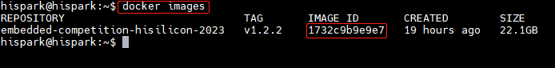

#### 步骤7：启动docker编译环境

* 执行下面的命令，启动docker编译环境，其中<font color='RedOrange '>**openharmony**</font>为自定义的docker的名字，<font color='RedOrange '>**1732c9b9e9e7**</font>为我Ubuntu下docker的IMAGE ID，这里<font color='RedOrange '>**请根据自己docker image ID的不同自行修改**</font>。
* 解释： docker run -itd --net=host --name [容器实例名] -v /home/你Ubuntu的用户名/docker_share:/home/share  [镜像ID]  /bin/bash

```shell
docker run -itd --net=host --name openharmony -v /home/hispark/docker_share:/home/share 1732c9b9e9e7  /bin/bash
```

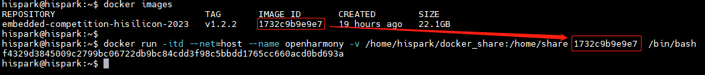

#### 步骤8：进入Docker编译环境中

<font color='RedOrange '>**注意：以下几条命令，请熟练掌握，如果您的Ubuntu重启之后，需要再次启动dcoker编译环境的话，下面这四个步骤都需要进行操作。**</font>

* 在终端执行下面的命令，查看当前运⾏的docker实例状态

```
docker ps -a
```

* 在终端执行下面的命令，启动Docker环境

```
docker start openharmony
```

* 在终端执行下面的命令,进⼊docker编译环境

```
docker exec -it openharmony bash
```

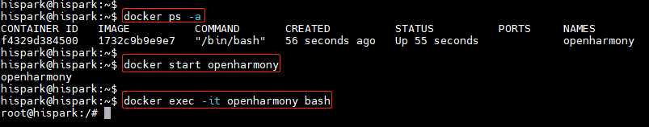

* 启动docker容器中的samba服务

```
service smbd restart
```

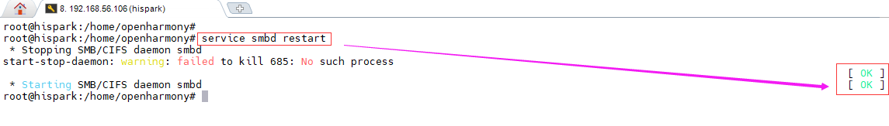

**注意：如果您需要退出docker容器，请执行下面的命令**，如果您退出docker容器后，又想从Ubuntu环境进入docker容器，请执行上面的四条命令。

```
exit
```

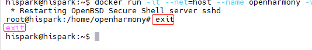

* 执行下面的命令，查看docker的IP地址,本地docker的IP地址是 192.168.56.106

```
ifconfig
```

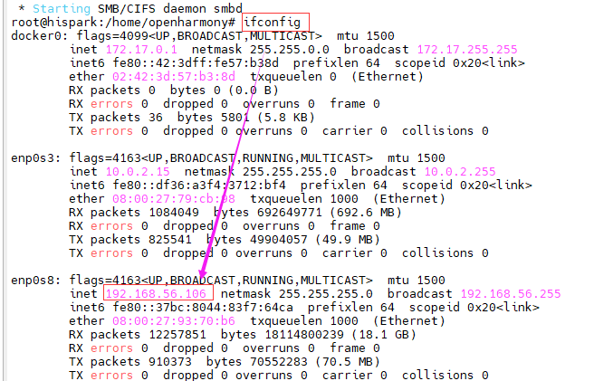

* 点击Windows的此电脑，鼠标右键，选择映射网络驱动器


* 输入<font color='RedOrange '>\\\Ubuntu的IP地址\docker</font>，然后点击完成，输入账号(root)和初始密码 (123456)

```
\\192.168.56.106\docker
```

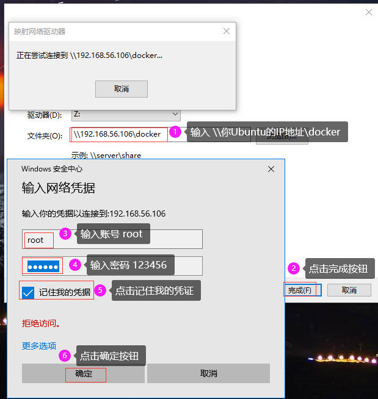

* 这样docker的根目录就能够在Windows的磁盘下面显示了。这样您就可以方便的进行Windows和docker之间的文件共享了


### 2.2.5、安装VSCode

*  如果您电脑上已经安装过VScode，可以跳过此步骤。
*  双击在**2.2.1 软件获取章节下载**的VScode安装包，点击下一步进行安装。


* 点击浏览按钮，选择VScode的安装路径，然后点击下一步。


* 出现下方界面，点击下一步。

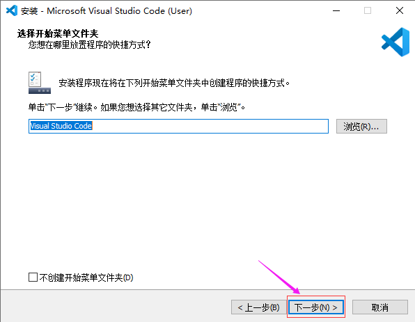

* 出现下方界面，点击下一步。

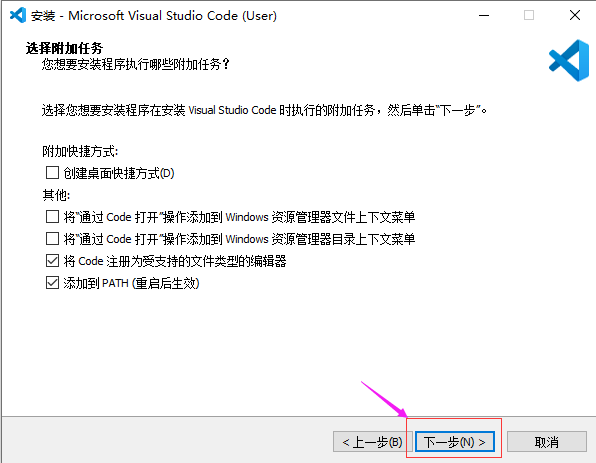

* 出现下方界面，点击安装。


* 出现下方界面，点击完成。


### 2.2.6、将OpenHarmony代码导入到VScode

* 点击VScode 左上角的File，然后点击Open Folder

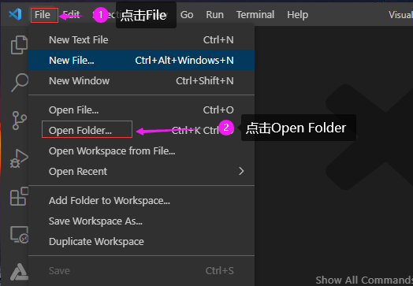

* 选择docker共享目录  /home/openharmony ，如下图所示，选择好后，点击选择文件夹。

​                                                                                  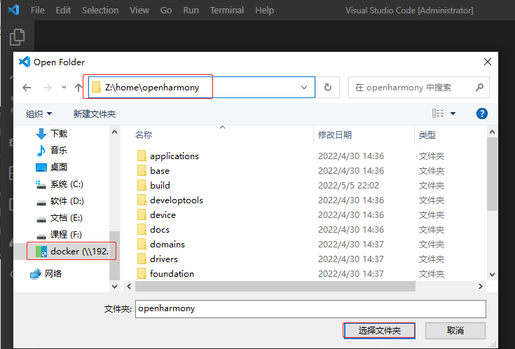

* 代码导入成功后，会弹出下面的对话框，请勾选trust，然后点击 Yes，I trust 。

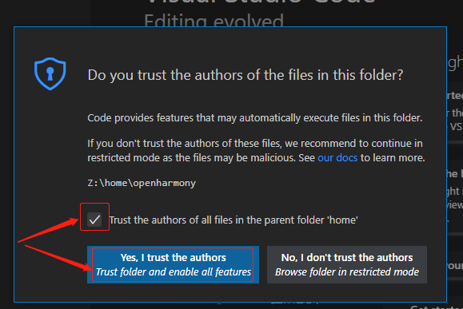

* 这样我们就已经把代码成功导入进来了。