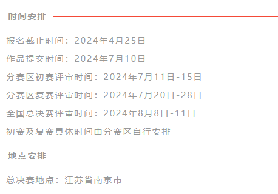

# 2024年嵌入式竞赛海思赛道学习入口

|        选题方向        |                           学习入口                           |                           问题求助                           |
| :--------------------: | :----------------------------------------------------------: | :----------------------------------------------------------: |
| 嵌入式AI计算机视觉应用 | [嵌入式AI计算机视觉应用学习资料](https://developer.hisilicon.com/postDetail?tid=0206112326723530001) | [发帖注意事项](https://developer.hisilicon.com/postDetail?tid=0224114142867216002) |
|    嵌入式物联网应用    | [嵌入式物联网应用开发学习资料](https://developer.hisilicon.com/postDetail?tid=0206112614830760003) | [发帖注意事项](https://developer.hisilicon.com/postDetail?tid=0201116151628933001) |

* [2024年嵌入式大赛海思线上宣讲视频入口](https://cdnicu.nicu.cn/sv/51ed3785-18e9ccba1df/51ed3785-18e9ccba1df.mp4)

* **[2024年应用赛道【上海海思】选题指南](http://socoss.socchina.net/file/cacheFile/e3759302dab44147ac4e4e9952027910.pdf)**

* [第七届（2024）嵌入式大赛报名入口](http://www.socchina.net/home)

* **大赛队长群：773040967（报名相关问题可咨询）**

* [常见报名问题FAQ](https://developer.hisilicon.com/postDetail?tid=0231117164560708004)

* **[第七届（2024）嵌入式大赛组委会线上宣讲视频入口](http://www.socchina.net/file/uploadVideo/0c0ff35899184ebaa20306367edf7d56.mp4)**

* **第七届（2024）嵌入式大赛芯片应用赛道时间安排**

* **开发板介绍及购买链接**

  **购买时可持嵌入式大赛报名成功截图享受优惠**

| 套件介绍                                                     | 购买链接                                                     |
| :----------------------------------------------------------- | :----------------------------------------------------------- |
| [润和满天星系列Pegasus智能家居开发套件](https://developer.hisilicon.com/postDetail?tid=0204114164883246004)（物联网方向：自行购买） | [润和开发套件](https://item.taobao.com/item.htm?ft=t&id=622343426064) |
| [小熊派BearPi-HM Nano 开发板](https://developer.hisilicon.com/postDetail?tid=0208112586742631003)（物联网方向：自行购买） | [小熊派开发套件](https://item.taobao.com/item.htm?id=633296694816) |
| [华清远见FS-Hi3861开发板](https://developer.hisilicon.com/postDetail?tid=0248142137490994001)（物联网方向：自行购买） | [华清远见开发套件](https://www.ickey.cn/detail/100300107525640/FS-HI3861_%E5%B5%8C%E8%B5%9B.html#af5fd4ba-0221-43db-98dd-9eb70b566494) |
| [dToF模组](https://developer.hisilicon.com/postDetail?tid=0233146134772796002)（可选） | [dTof模组](https://m.tb.cn/h.5Co1g9g7UJNZAv7?tk=pNpsWMuGlVc) |
| [AI计算机视觉基础开发套件](https://developer.hisilicon.com/postDetail?tid=0227114256333949001)（AI方向：借用） | [AI计算机视觉基础开发套件](https://item.taobao.com/item.htm?ft=t&id=640227851585) |

