# 第三章：运行第一个程序

## 3.1、Pegasus（HelloWorld）

<font color='RedOrange'>**注意：如果您只负责开发Taurus相关的代码，此章节可以跳过**</font>

### 3.1.1、Pegasus HelloWorld代码的编译

* 步骤1：进入Pegasus的工作目录：在2.1.3节下载的SDK的源码路径下，即 hi3861_for_AI_topic-master/src/目录。

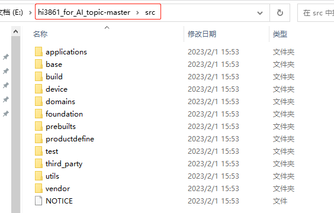

* 步骤2：复制代码至application目录
  * 将源码./vendor/hisilicon/hispark_pegasus/demo目录下的hello_world_demo整个文件夹及内容复制到源码./applications/sample/wifi-iot/app/下。

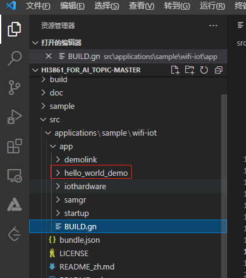

* 步骤3：修改BUILD.gn

  * 修改源码./applications/sample/wifi-iot/app/BUILD.gn文件，在features字段中增加索引，使目标模块参与编译。features字段指定业务模块的路径和目标，以helloWorld举例，features字段配置如下(请注意字母大小写)。

  ```
  import("//build/lite/config/component/lite_component.gni")
  
  lite_component("app") {
      features = [
          "hello_world_demo:helloWorld",
      ]
  }
  ```

  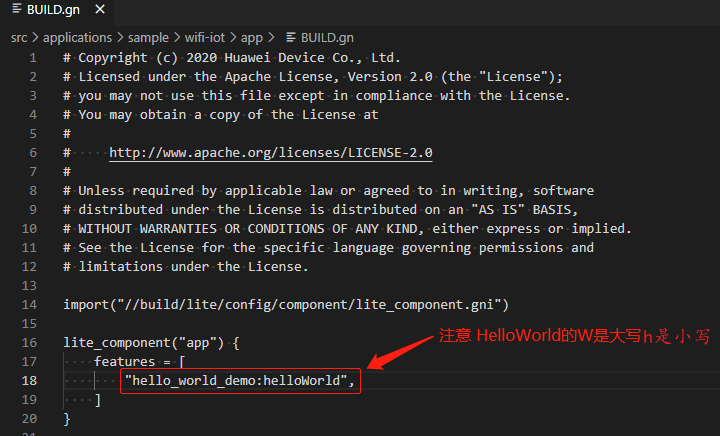

  * features中的字段解析：

    * **hello_world_demo**：指的是需要编译的工程目录对应的文件夹名

    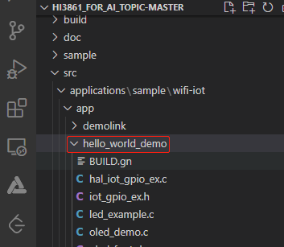

    * **helloWorld**：指的是需要编译的代码中的BUILD.gn的静态库，名称为helloWorld

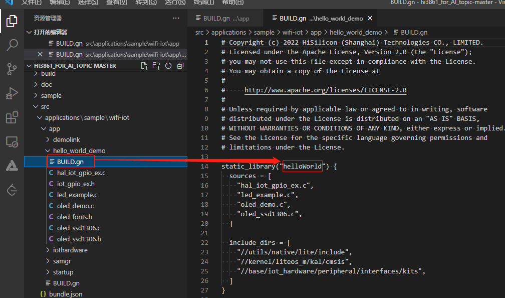

* 步骤4：修改usr_config.mk文件
  * 修改device/hisilicon/hispark_pegasus/sdk_liteos/build/config/usr_config.mk文件。在这个配置文件中打开I2C,PWM驱动宏。搜索字段CONFIG_I2C_SUPPORT ，并打开I2C,PWM。配置如下：

```
# CONFIG_I2C_SUPPORT is not set
CONFIG_I2C_SUPPORT=y
# CONFIG_PWM_SUPPORT is not set
CONFIG_PWM_SUPPORT=y
```

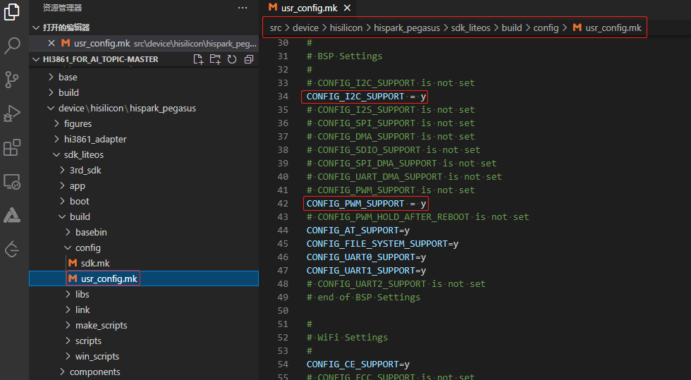

* 步骤5：工程编译：

  * 上面的步骤操作完成之后，点击Deveco Device Tool图标，点击Build按钮，进行工程的编译。

  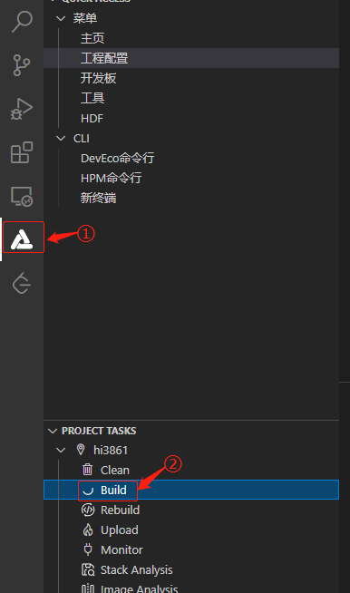

* 编译成功后，会有如下所示的提示，并且会在**out/hispark_pegasus/wifiiot_hispark_pegasus**目录下生成一个 **Hi3861_wifiiot_app_allinone.bin**镜像文件。

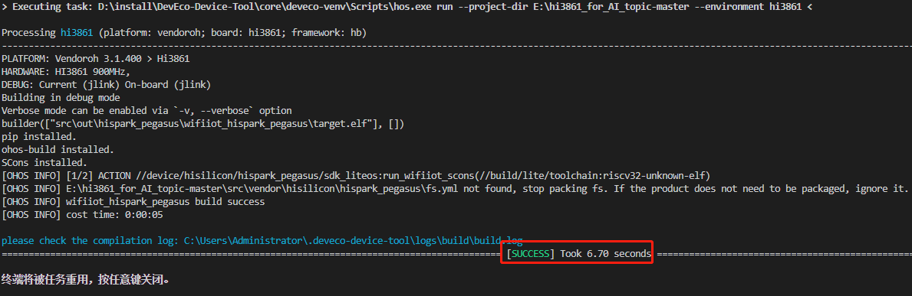


### 3.1.2、Pegasus的镜像烧录

* 步骤1：接线
  * 取出开发套件配套的type-c数据线，USB的一头接在您Windows的USB口，type-c的一头接在开发板的type-c口。


* 步骤2：安装串口驱动

  * 打开在2.1.4节下载的工具中的DevTools_Hi3861V100_v1.0/usb_serial_driver文件夹。

  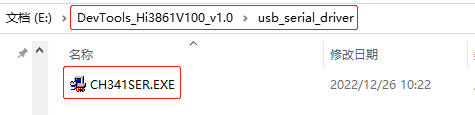

  * 双击CH341SER.EXE驱动，进入安装界面，点击安装按钮即可，驱动安装成功后，再点击确定按钮。

  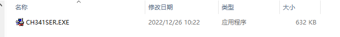

  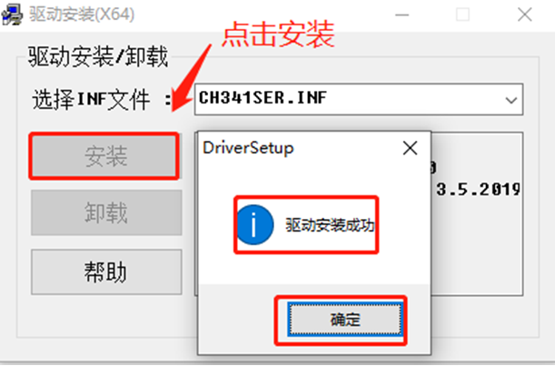

  * 打开Windows的设备管理器，查看串口设备，若未出现CH340串口设备，请检查驱动是否安装正常。

  

* 步骤3：使用串口进行镜像烧录

  * 当前DevEco Device Tool工具支持Hi3861单板一键烧录功能。需要连接开发板，配置开发板对应的串口，在编译结束后，进行烧录。点击左侧“工程配置”，找到“upload_port”选项，选择开发板对应的烧录串口（<font color='RedOrange'>**注意：如果正在使用Monitor功能，请先“ctrl+c”关闭Monitor，才能正常烧，否则串口占用无法烧录成功**</font>）。

  

  * 点击左下角“upload”按键，等待提示（出现Connecting，please reset device...），手动进行开发板复位（按下开发板 RST复位键）

  

  

  * 等待烧录完成，大约40s左右，烧录成功。

  

### 3.1.3、Monitor 串口打印

* 烧录完成后，可以通过Monitor界面查看串口打印，配置Monitor串口，如下图所示。（<font color='RedOrange'>**注意：如果正在使用Monitor功能，请先“ctrl+c”关闭Monitor，才能正常烧录，否则串口占用无法烧录成功**</font>）


* 配置完Monitor串口后，直接点击monitor按钮，然后点击开发板的RST按键，复位开发板，查看板端打印信，可以看到“sdk ver:Hi3861V100R001C00SPC025 2020-09-03 18:10:00”等字样。

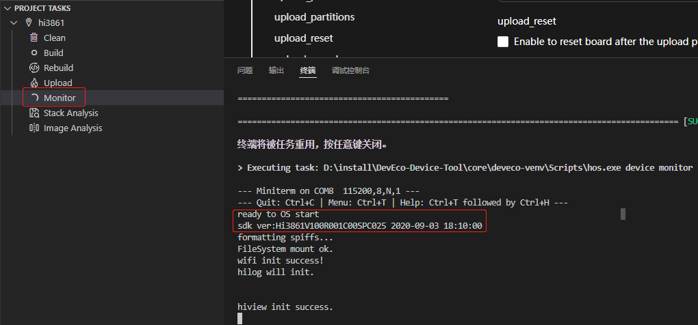

### 3.1.4、Pegasus HelloWorld的功能验证

* 最后再按一下<font color='RedOrange'>**开发板的RST键，**</font>此时开发板的系统会运行起来。运行结果：在OLED屏正中央(第3行，5列开始)，显示一个“Hello World”，主板上的LED灯间隔1s交替闪烁。


### 3.1.5、栈分析、镜像分析

* DevEco Device Tool通过集成stack Analysis栈分析工具和Image Analysis镜像分析工具，用于开发过程中的内存不足、内存溢出等问题进行分析，帮助开发者更加精确的分析、分析问题。
* Stack Analysis栈分析工具是基于静态二进制分析手段，提供任务栈开销估算值和函数调用关系图示，为栈内存使用、分析、优化、问题定位等开发场景提供较为准确的静态内存分析数据参考。

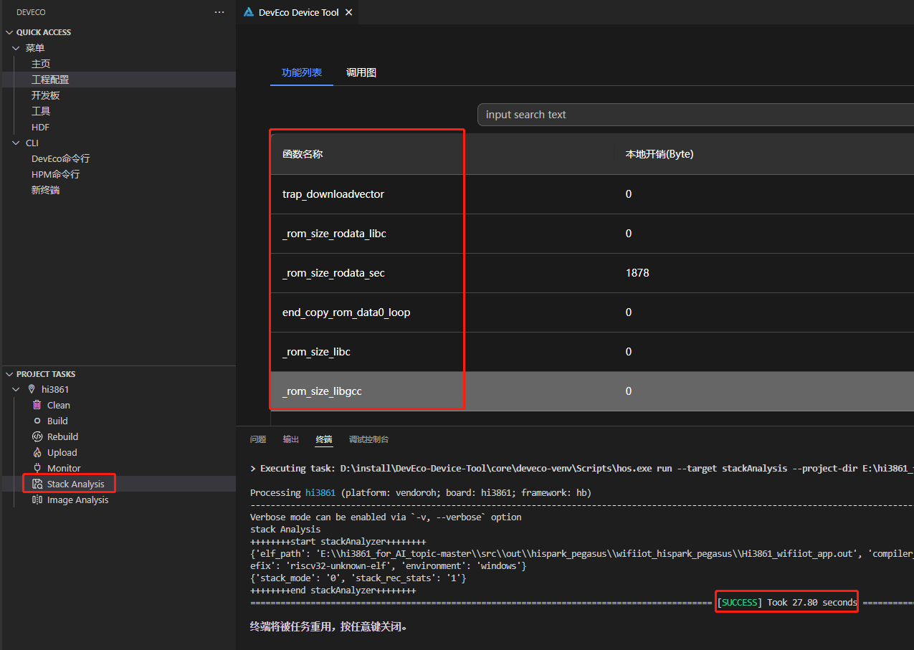

* Image Analysis镜像分析工具对工程构建出的elf文件进行内存占用分析，支持开发者快速评估内存段、符号表使用情况。

	工程编译完成后，点击左下角“stack Analysis”，进行栈分析。

    点击左下角“Image Analysis”，进行镜像分析。

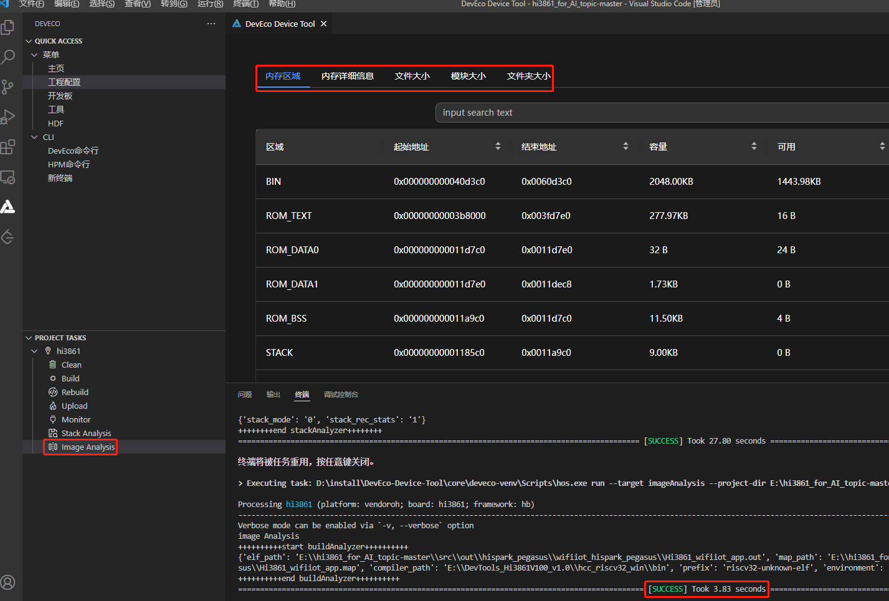