## 3.2、Taurus（HelloWorld）

<font color='RedOrange'>**注意：如果您只负责开发Pegasus相关的代码，此章节可以跳过**</font>

### 3.2.1、整编Taurus代码

 <font color='RedOrange '>**注意：此步骤基本上只需要进行一次，后面基本上不需要重新整编代码了**</font>

* 步骤1：先进入到docker编译环境，<font color='RedOrange '>**如果您不知道如何进入docker编译环境**</font>，请参考：2.2.4章节的《步骤8：进入Docker编译环境中》的前四个命令。

* 步骤2：在Ubuntu的终端执行下面的命令（注意是在docker环境下），进入OpenHarmony的代码路径

```
 cd /home/openharmony/
```

* 步骤3：在Ubuntu的终端执行下面的命令,然后敲回车，通过键盘的向下方向键选择<font color='RedOrange '>**ipcamera_hispark_taurus_linux**</font>，然后敲回车，进行hb的编译参数配置。

```
hb set   
```

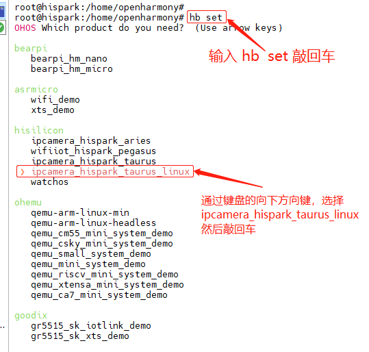

* 步骤4：在Ubuntu的终端执行下面的命令，然后敲回车，进行Taurus代码的编译。

```
hb build -f
```

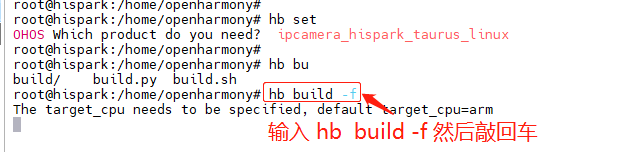

* 编译成功后，会有如下所示的提示，并且会在**out/hispark_taurus/ipcamera_hispark_taurus_linux**目录下生成四个镜像文件，分别是rootfs_ext4.img， uImage_hi3516dv300_smp， userdata_ext4.img ，userfs_ext4.img。

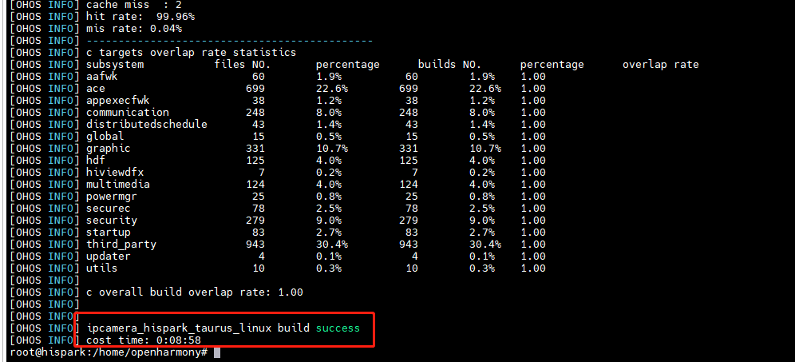

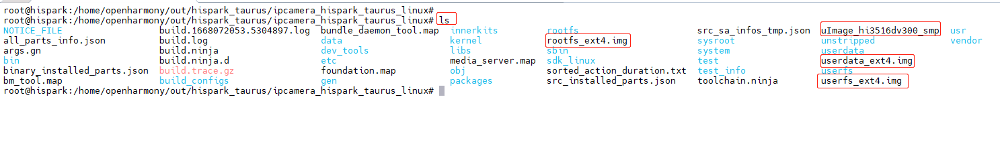

### 3.2.2、Taurus镜像烧录

 <font color='RedOrange '>**注意：此步骤基本上只需要进行一次，后面不需要重新烧录镜像**</font>

* 步骤1：接线
  * 请确保您的接线方式是正确的，黑色的串口线和白色的USB-Type-c线最好是直接接到你电脑的USB接口，部分学生因为接的是HUB(拓展坞)，导致无法烧录。且在烧录的时候一定不要把电源适配器给开发板供电。

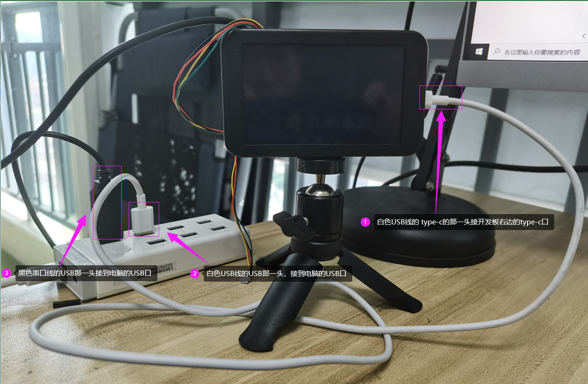

* 步骤2：安装串口和USB驱动

  **安装串口驱动**

  * 访问下面的链接，下载串口驱动，将串口驱动下载到Windows之后，双击 CH341SER.EXE安装包，根据提示进行安装即可。

  ```
  https://www.123pan.com/s/iiMUVv-zsFLh.html
  ```

  * 串口驱动安装完成后，重新插拔一下接在电脑USB的那一头黑色串口线，此时会在Windows的设备管理器中看到串口信息显示如下图所示。

  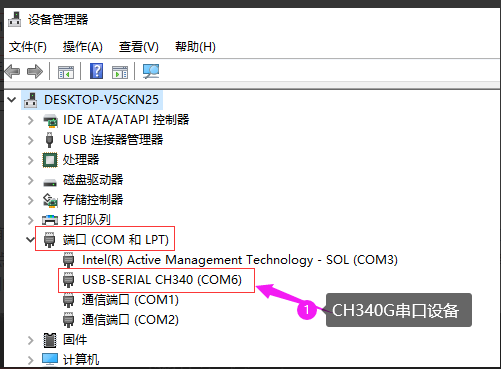

  * 如果您安装上面的步骤操作，但是显示的是 “PL2303HXA自2012已停产，请联系供应商”或者“USB Serial“，我们可以双击 另外一个驱动 USB-to-Serial Comm Port.exe，按照提示进行操作即可。

    
  
    | PL2303HXA自2012已停产，请联系供应商     | USB Serial                              |
    | --------------------------------------- | --------------------------------------- |
    | 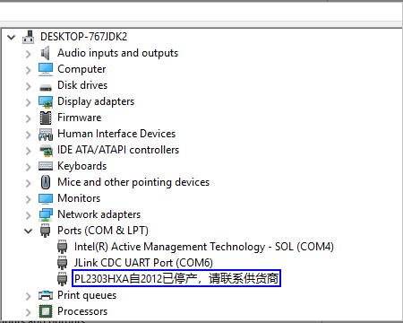 | 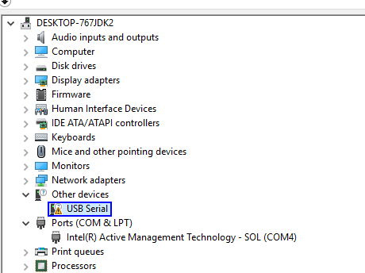 |

  * 串口驱动安装完成后，重新插拔一下接在电脑USB的那一头黑色串口线，此时会在Windows的设备管理器中看到串口信息显示如下图所示。

  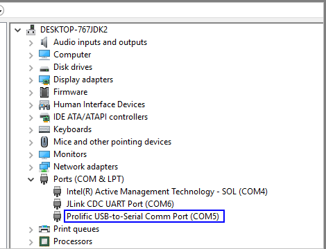

  **安装USB驱动**

  * 访问下面的链接，下载USB驱动
  
  ```
  https://www.123pan.com/s/iiMUVv-LsFLh.html
  ```

  * USB驱动下载到Windows本地之后，先解压HiUSBBurnDriver.zip，进入HiUSBBurnDriver目录下，双击安装InstallDriver.exe。

  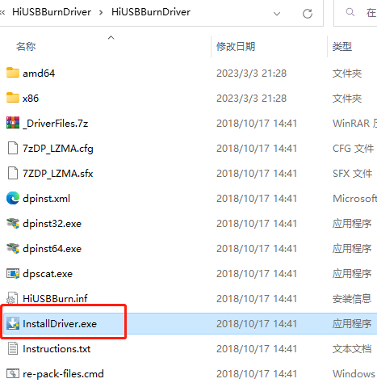

  * 然后再双击usb.reg，当提示是否继续时，点击**是**，然后点击**确定**即可。

  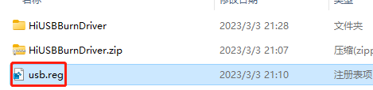

  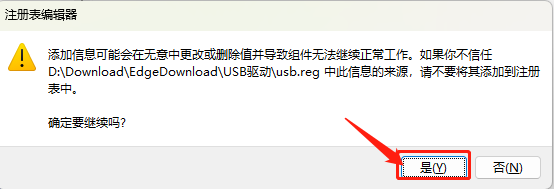

  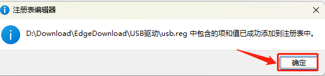
  
  * 为了让上面安装的驱动生效，这里最好重启一下电脑。	


* 步骤3：下载HiTool烧录工具

  * 访问下面的链接，下载HiTool烧录工具

  ```
  https://www.123pan.com/s/iiMUVv-5sFLh.html
  ```

  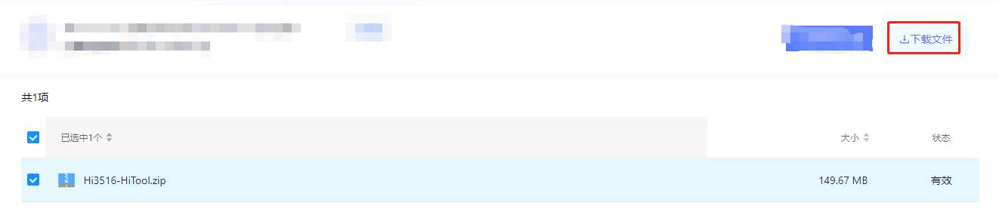

  * 把下载下来的HiTool压缩包进行解压，并在文件夹中创建一个images的文件夹

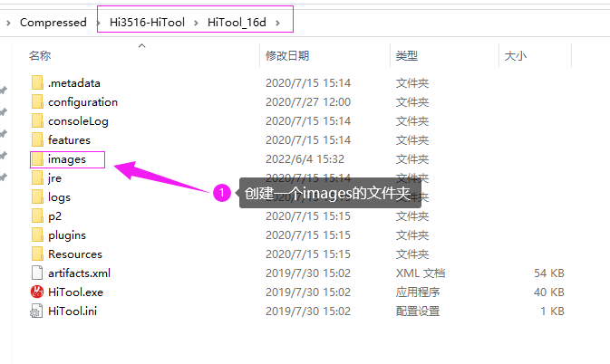

* 步骤4：从docker中复制镜像文件

  * 进入openharmony源码的out/hispark_taurus/ipcamera_hispark_taurus_linux/目录下，把rootfs_ext4.img， uImage_hi3516dv300_smp， userdata_ext4.img ，userfs_ext4.img这四个文件复制到HiTool的images文件夹中。

  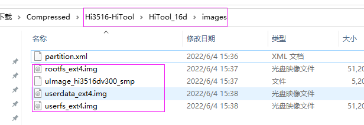

  * 进入openharmony源码的device/soc/hisilicon/hi3516dv300/uboot/目录下，把 u-boot-hi3516dv300_emmc.bin 、bootcmd.txt、partition.xml 三个文件复制到HiTool的images文件夹中。

  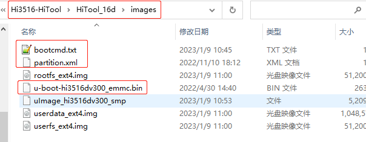

* 步骤5：导入镜像文件

  * 双击打开Hi3516-HiTool\HiTool_16d\目录下的HiTool.exe文件。

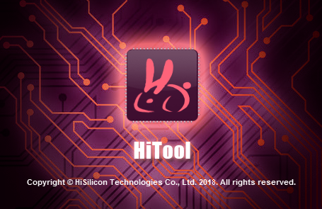

* 在传输方式的位置先选择串口，然后点击刷新按钮，使串口号与黑色串口线在Windows设备管理器的串口号保持一致

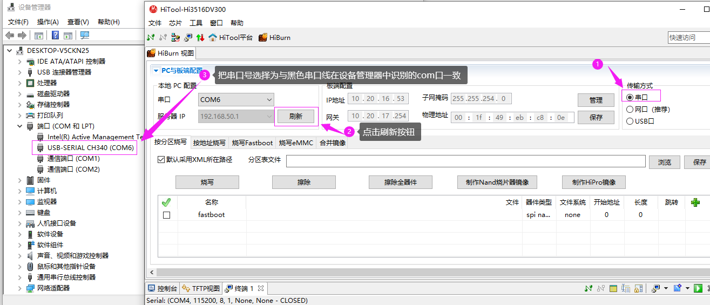

* 再把传输方式修改为USB口，然后选择烧写方式为烧写eMMC，然后点击右边的浏览，找到Hi3516-HiTool\HiTool_16d\images\目录下的partition.xml，然后点击打开即可

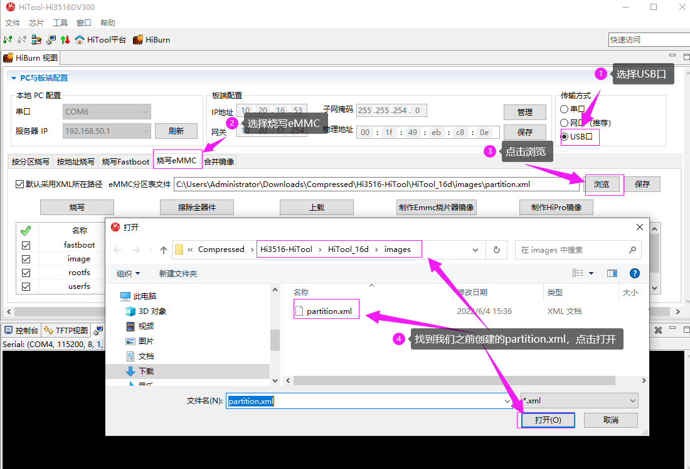

* 步骤6：开始烧录镜像
  * <font color='RedOrange'>**先将板子断电，将白色数据线的USB一头插入电脑的USB口， type-c 的一头先不插入开发板。**</font>

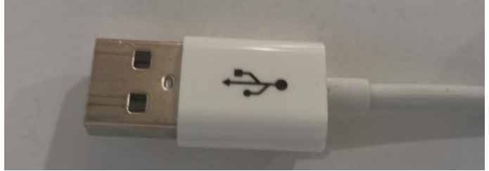

* 点击 HiTools 工具上面的 <font color='RedOrange'>**烧写按钮**</font>

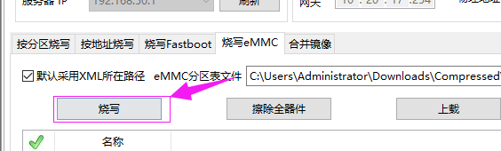

* 此时一直按住开发板的 update 键

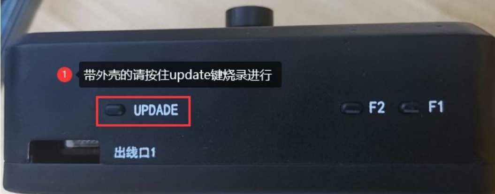

* 然后将白色数据线Type-c的一头插入开发板右边的Type-C接口中，此时还是得按住 update 键，不能松开

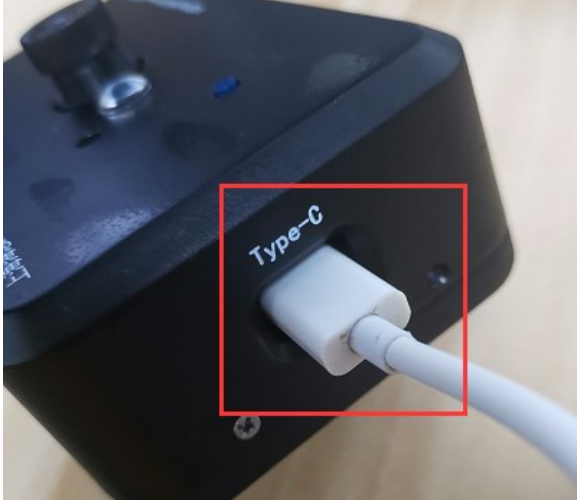

* 当Hitool工具出现烧写的进度条后，就说明已经开始烧录了，<font color='RedOrange'>**此时可以松开 update 键了**</font>

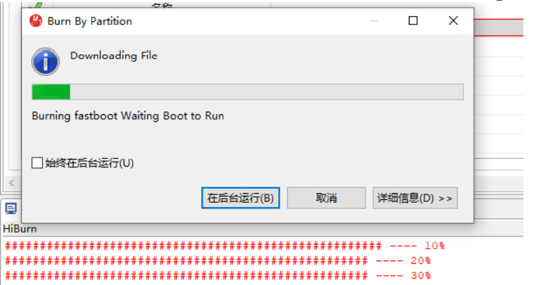

* 当出现如下的打印，说明镜像已经烧录成功了。

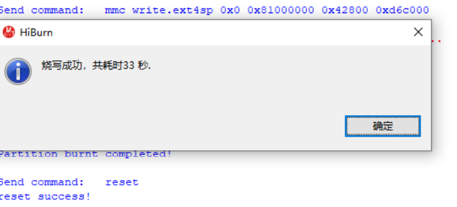

* 步骤7：配置系统启动参数

  * 先打开 hiTool 的串口工具，选择好对应的串口号，我这边是 com6，,步骤如下图所示，点击串口工具按钮、再点击加号按钮、选择好识别到的 CH340G 的端口号、波特率选择为 115200、再点击确认即可。

  * <font color='RedOrange'>**后续如果需要在开发板的终端，执行命令的话，也可以使用HiTool的串口工具，当然也可使用 xshell 或者 MobaXterm 等工具。**</font>

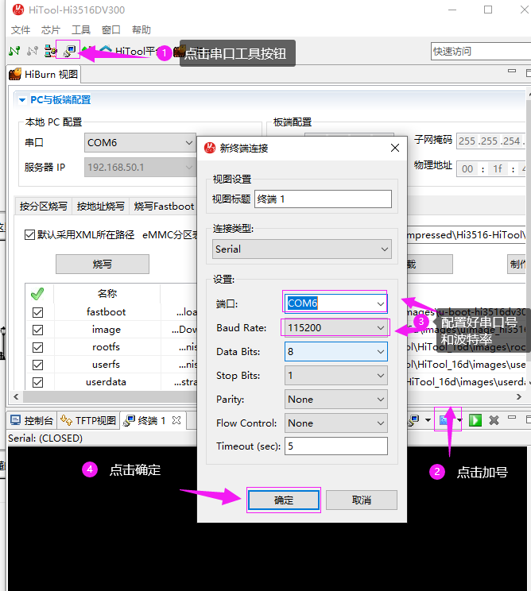

* 上一步的串口配置好后，重新给开发板上下电(拔插一下开发板右边的Type-c数据线)，当 HiTool 的终端界面出现“<font color='RedOrange'>**Hit any key to stop autoboot**</font>”打印信息的时候<font color='RedOrange'>**一直敲回车**</font>，此时进入开发板的 u-boot 命令行

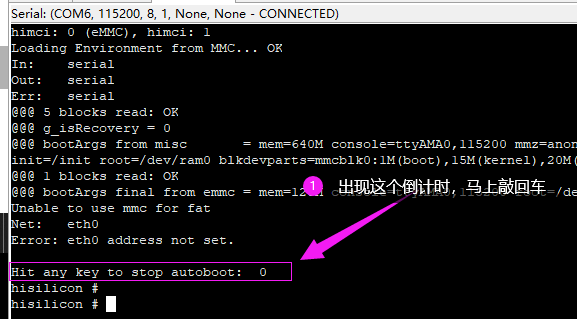

* 打开Hi3516-HiTool\HiTool_16d\images\目录下的bootcmd.txt，把里面的命令依次复制，然后粘贴到在开发板的终端的命令行，最后敲回车，让系统运行起来。

  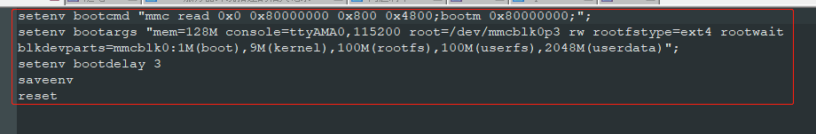

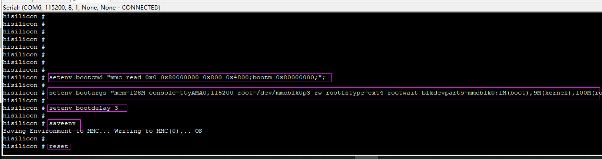

* 执行上面的步骤之后，开发板会进入到OpenHarmony系统，当我们从串口工具看到如下的打印信息，说明我们的Taurus开发套件已经成功烧录了OpenHarmony镜像。

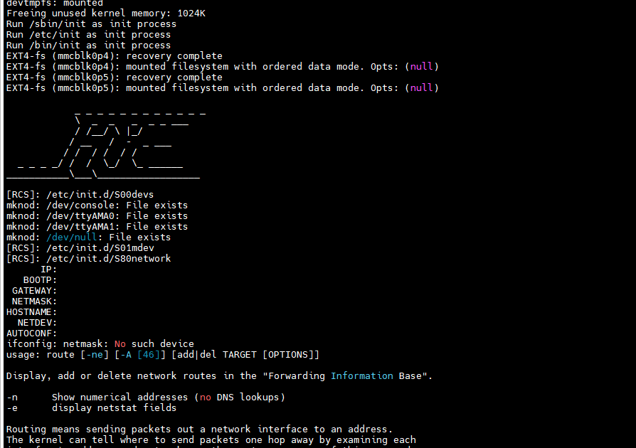

* 在开发板的终端执行下面的命令，检查一次系统的启动命令是否配置正确，如果配置成功，userdata的内存是在976M左右

```
df  -h
```

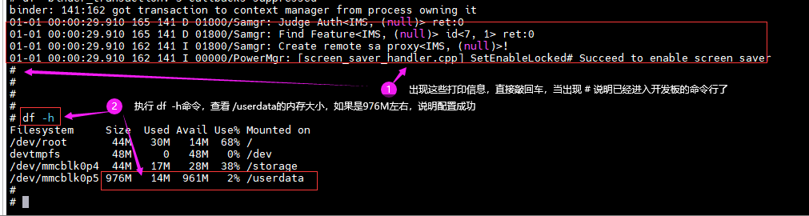

**注意：您在下面的操作中，如果出现下面所示的系统打印信息，我们可以忽略，然后直接敲回车，进行自己的命令操作就行了，因为这些是系统的正常打印信息，我们不需要管**。

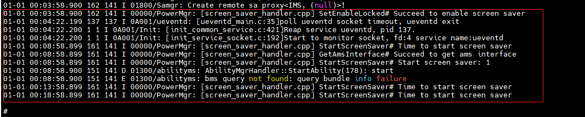

### 3.2.3、Taurus HelloWorld代码的编译

#### 3.2.3.1、HelloWorld程序简介

helloworld  sample基于OpenHarmony 小型系统开发，以Taurus套件为例，helloworld sample详细介绍Sensor至MIPI屏的整个视频通路实现方式（VI-VPSS-VO-MIPI），从编码的角度引导开发者跑通Hi3516DV300的媒体通路，并将视频流显示到MIPI屏上。

#### 3.2.3.2、目录

```shell
//device/soc/hisilicon/hi3516dv300/sdk_linux/sample/taurus/helloworld
├── BUILD.gn                # 编译ohos helloworld sample需要的gn文件
├── sample_lcd_main.c       # ohos helloworld sample主函数入口
└── smp
    ├── sample_lcd.c        # ohos helloworld sample业务代码
    └── sample_lcd.h        # ohos helloworld sample业务代码所需的头文件
```

#### 3.2.3.3、编译

* 步骤1：先进入到docker编译环境，如果您不知道如何进入，请参考：2.4章节的《步骤8：进入Docker编译环境中》的前四个命令。

* 步骤2：修改BUILD.gn
  * 在单编helloworld sample之前，需修改目录下的一处依赖，进入//device/soc/hisilicon/hi3516dv300/sdk_linux目录下，通过修改BUILD.gn，在deps下面新增target，``"sample/taurus/helloworld:hi3516dv300_helloworld_sample"``，如下图所示：
  * <font color='RedOrange '>**注意：是添加在if中，而不是else中**</font>


* 步骤3：单编 HelloWorld sample

* **方式一：使用Makefile的方式进行单编(速度会快很多)**

  * 在Ubuntu的命令行终端，分步执行下面的命令，单编HelloWorld sample

  ```
  cd /home/openharmony/sdk_linux/sample/build/
  
  make helloworld_clean && make helloworld
  ```

  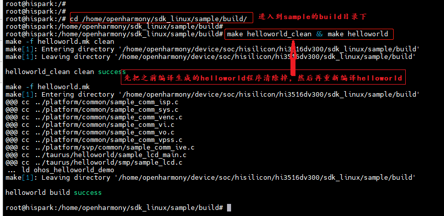

  * 在/home/openharmony/sdk_linux/sample/output目录下，生成 ohos_helloworld_demo可执行文件，如下图所示：

  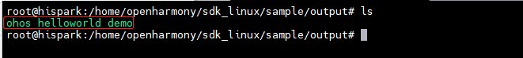

* **方式二：使用OpenHarmony的BUILD.gn方式进行单编（速度较慢）**

  * 在Ubuntu的命令行终端执行下面的命令，单编HelloWorld sample

  ```
  hb build -T device/soc/hisilicon/hi3516dv300/sdk_linux/sample/taurus/helloworld:hi3516dv300_helloworld_sample
  ```

  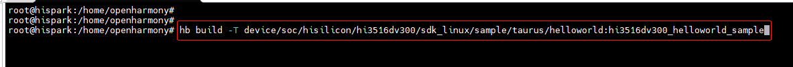

  * 命令解释：
    * hb build：代码编译命令
    * -T  是指定编译目标
    * device/soc/hisilicon/hi3516dv300/sdk_linux/sample/taurus/helloworld：指的是需要编译的代码路径
    * hi3516dv300_helloworld_sample：指的是需要编译的代码路径下BUILD.gn的lite_component中的内容
  * 在out/hispark_taurus/ipcamera_hispark_taurus_linux/rootfs/bin目录下，生成 ohos_helloworld_demo可执行文件，如下图所示：

  

#### 3.2.3.4、拷贝可执行程序和依赖文件至开发板的mnt目录下

**方式一：使用SD卡进行资料文件的拷贝**

* 首先需要自己准备一张Micro sd卡(16G 左右即可)，还得有一个Micro sd卡的读卡器。


* 步骤1：将编译后生成的可执行文件拷贝到SD卡中。

* 步骤2：将device\soc\hisilicon\hi3516dv300\sdk_linux\out\lib\目录下的**libvb_server.so和 libmpp_vbs.so**拷贝至SD卡中

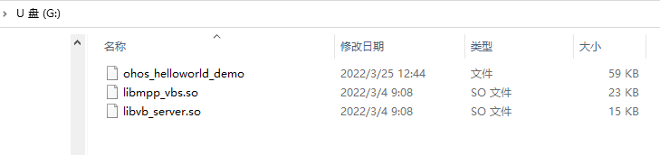


* 步骤3：可执行文件拷贝成功后，将内存卡插入开发板的SD卡槽中，可通过挂载的方式挂载到板端，可选择SD卡 mount指令进行挂载。
* 在开发板的终端，执行下面的命令进行SD卡的挂载
  * 如果挂载失败，可以参考[这个issue尝试解决](https://gitee.com/HiSpark/HiSpark_NICU2022/issues/I54932?from=project-issue)


```shell
mount -t vfat /dev/mmcblk1p1 /mnt
# 其中/dev/mmcblk1p1需要根据实际块设备号修改
```

* 挂载成功后，如下图所示：

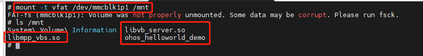

**方式二：使用NFS挂载的方式进行资料文件的拷贝**

* 首先需要自己准备一根网线
* 步骤1：参考[博客链接](https://blog.csdn.net/Wu_GuiMing/article/details/115872995?spm=1001.2014.3001.5501)中的内容，进行nfs的环境搭建

* 步骤2：将编译后生成的可执行文件拷贝到Windows的nfs共享路径下

* 步骤3：将device\soc\hisilicon\hi3516dv300\sdk_linux\out\lib\目录下的**libvb_server.so和 libmpp_vbs.so**拷贝至Windows的nfs共享路径下

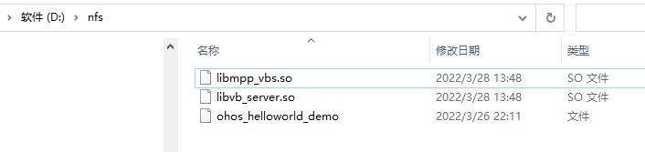

* 步骤4：在开发板的终端执行下面的命令，将Windows的nfs共享路径挂载至开发板的mnt目录下

```
mount -o nolock,addr=192.168.200.1 -t nfs 192.168.200.1:/d/nfs /mnt
```

#### 3.2.3.5、拷贝mnt目录下的文件至正确的目录下

* 在开发板的终端执行下面的命令，拷贝mnt目录下面的ohos_helloworld_demo至根目录，拷贝mnt目录下面的libvb_server.so和 libmpp_vbs.so至/usr/lib/目录下

```
cp /mnt/ohos_helloworld_demo  /userdata

cp /mnt/*.so /usr/lib/
```

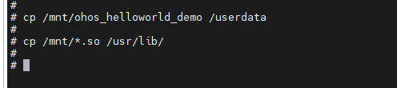

* 在开发板的终端执行下面的命令，给ohos_helloworld_demo文件可执行权限

```
chmod 777 /userdata/ohos_helloworld_demo
```

#### 3.2.3.6、功能验证

* 在开发板的终端执行下面的命令，启动可执行文件

```
cd /userdata

./ohos_helloworld_demo
```

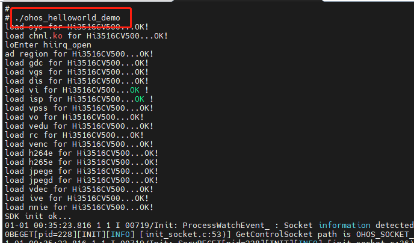

* 此时，MIPI屏幕即可出现实时码流，如下图所示：
* 如果您看到的现象和下图现象不一致，可以确认一下镜头盖是否未取下来。
* 如果您看到的画面是非常模糊的，您可以尝试左右拧动镜头，进行手动对焦，直到画面清晰。

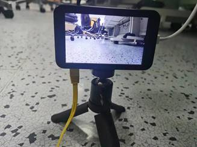

* 敲两下回车即可关闭程序