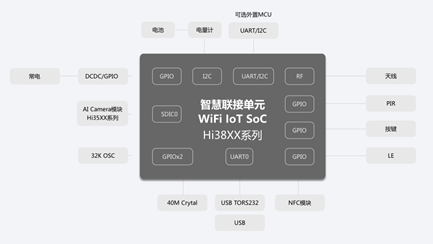
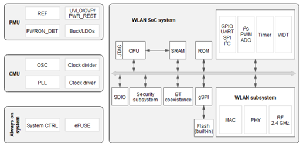

# 第四章、Pegasus套件的课程及案例

**注意：如果您只负责开发Taurus相关的代码，此章节可以跳过**

## 4.1 Pegasus芯片平台介绍

### 4.1.1 Hi3861芯片介绍

* Hi3861V100是一款高度集成的2.4GHz WiFi SoC芯片，集成IEEE 802.11b/g/n基带和RF电路，RF电路包括功率放大器PA、低噪声放大器LNA、RF balun、天线开关以及电源管理等模块；支持20MHz标准带宽和5MHz/10MHz窄带宽，提供最大72.2Mbit/s物理层速率。
* WiFi-IoT连接单元扩展接口框图

* Hi3861V100功能框图

### 4.1.2 Hi3861芯片参考文档

| 序号 | 文档链接                                                     | 文档描述                                                     |
| ---- | ------------------------------------------------------------ | ------------------------------------------------------------ |
| 01   | 《[Hi3861V100 产品简介.pdf](https://gitee.com/openharmony/device_soc_hisilicon/blob/master/hi3861v100/doc/Hi3861V100%20%E4%BA%A7%E5%93%81%E7%AE%80%E4%BB%8B.pdf)》 | 该文档对Hi3861V100 产品做了简要介绍                          |
| 02   | 《[Hi3861V100 AT命令 使用指南.pdf](https://gitee.com/hihope_iot/embedded-race-hisilicon-track-2022/blob/master/%E8%8A%AF%E7%89%87%E8%B5%84%E6%96%99/Hi3861V100%EF%BC%8FHi3861LV100%20AT%E5%91%BD%E4%BB%A4%20%E4%BD%BF%E7%94%A8%E6%8C%87%E5%8D%97.pdf)》 | 该本文介绍Hi3861V100的AT指令式及场景，为用户提供相应的指令格式和参数示例解释 |
| 03   | 《[Hi3861V100  HTTP 开发指南.pdf](https://gitee.com/hihope_iot/embedded-race-hisilicon-track-2022/blob/master/%E8%8A%AF%E7%89%87%E8%B5%84%E6%96%99/Hi3861V100%EF%BC%8FHi3861LV100%20HTTP%20%E5%BC%80%E5%8F%91%E6%8C%87%E5%8D%97.pdf)》 | 该文档主要介绍HTTP Client功能开发实现示例                    |
| 04   | 《[Hi3861V100 lwIP 开发指南.pdf](https://gitee.com/hihope_iot/embedded-race-hisilicon-track-2022/blob/master/%E8%8A%AF%E7%89%87%E8%B5%84%E6%96%99/Hi3861V100%EF%BC%8FHi3861LV100%20lwIP%20%E5%BC%80%E5%8F%91%E6%8C%87%E5%8D%97.pdf)》 | 该文档介绍了lwIP的相关内容，包括lwIP简介、应用开发、网络安全和常见问题 |
| 05   | 《[Hi3861V100 MQTT 开发指南.pdf](https://gitee.com/hihope_iot/embedded-race-hisilicon-track-2022/blob/master/%E8%8A%AF%E7%89%87%E8%B5%84%E6%96%99/Hi3861V100%EF%BC%8FHi3861LV100%20MQTT%20%E5%BC%80%E5%8F%91%E6%8C%87%E5%8D%97.pdf)》 | 该文档主要介绍基于MQTT功能开发实现示例                       |
| 06   | 《[Hi3861V100 SDK 开发指南.pdf](https://gitee.com/hihope_iot/embedded-race-hisilicon-track-2022/blob/master/%E8%8A%AF%E7%89%87%E8%B5%84%E6%96%99/Hi3861V100%EF%BC%8FHi3861LV100%20SDK%20%E5%BC%80%E5%8F%91%E6%8C%87%E5%8D%97.pdf)》 | 该文档主要介绍Hi3861V100的SDK开发相关内容，包括SDK架构、接口实现机制与使用说明 |
| 07   | 《[Hi3861V100 Wi-Fi软件 开发指南.pdf](https://gitee.com/hihope_iot/embedded-race-hisilicon-track-2022/blob/master/%E8%8A%AF%E7%89%87%E8%B5%84%E6%96%99/Hi3861V100%EF%BC%8FHi3861LV100%20Wi-Fi%E8%BD%AF%E4%BB%B6%20%E5%BC%80%E5%8F%91%E6%8C%87%E5%8D%97.pdf)》 | 该文档详细介绍了Hi3861V100Wi-Fi软件STA、SoftAp的接口功能以及开发流程 |
| 08   | 《[Hi3861V100 常见问题 FAQ.pdf](https://gitee.com/hihope_iot/embedded-race-hisilicon-track-2022/blob/master/%E8%8A%AF%E7%89%87%E8%B5%84%E6%96%99/Hi3861V100%EF%BC%8FHi3861LV100%20%E5%B8%B8%E8%A7%81%E9%97%AE%E9%A2%98%20FAQ.pdf)》 | 该文档主要介绍Hi3861V100解决方案中常见的问题处理和解决办法   |
| 09   | 《[Hi3861V100设备驱动 开发指南.pdf](https://gitee.com/hihope_iot/embedded-race-hisilicon-track-2022/blob/master/%E8%8A%AF%E7%89%87%E8%B5%84%E6%96%99/Hi3861V100%EF%BC%8FHi3861LV100%20%E8%AE%BE%E5%A4%87%E9%A9%B1%E5%8A%A8%20%E5%BC%80%E5%8F%91%E6%8C%87%E5%8D%97.pdf)》 | 该文档主要介绍Hi3861V100的设备驱动开发相关内容，包括工作原理、按场景描述接口使用方法和注意事项 |
| 10   | 《[Hi3861V100 WiFi芯片 用户指南.pdf](https://gitee.com/openharmony/device_soc_hisilicon/blob/master/hi3861v100/doc/Hi3861V100%EF%BC%8FHi3861LV100%EF%BC%8FHi3881V100%20WiFi%E8%8A%AF%E7%89%87%20%E7%94%A8%E6%88%B7%E6%8C%87%E5%8D%97.pdf)》 | 该文档主要介绍Hi 3861V100 芯片的各项基本功能，常见应用模式的配置方法。 |

