## 4.2、Pegasus操作系统原理

### 4.2.1、线程管理

* 本案例主要介绍了如何在HiSpark Pegasus开发板上使用cmsis 2.0 接口进行多线程开发，掌握如何使用多线程编程。

#### 4.2.1.1、接口说明

* **osThreadNew**

| 定义： | osThreadId_t osThreadNew (osThreadFunc_t func, void *argument, const osThreadAttr_t *attr); |
| ------ | ------------------------------------------------------------ |
| 功能   | 创建一个线程并将其添加到活动线程                             |
| 参数   | func：线程函数 argument：参数指针，作为开始参数传递给线程函数 attr:线程属性；NULL：默认值 |
| 返回值 | 创建成功：返回线程ID 创建失败：返回NULL                      |
| 依赖   | //third_party/cmsis/CMSIS/RTOS2/Include/cmsis_os2.h          |

| 接口名称              | 函数说明                                               |
| --------------------- | ------------------------------------------------------ |
| osThreadGetName       | 获取指定线程的名字                                     |
| osThreadGetId         | 获取当前运行线程的线程ID                               |
| osThreadGetState      | 获取当前线程的状态                                     |
| osThreadSetPriority   | 设置指定线程的优先级                                   |
| osThreadGetPriority   | 获取当前线程的优先级                                   |
| osThreadYield         | 将运行控制转交给下一个处于READY状态的线程              |
| osThreadSuspend       | 挂起指定线程的运行                                     |
| osThreadResume        | 恢复指定线程的运行                                     |
| osThreadDetach        | 分离指定的线程（当线程终止运行时，线程存储可以被回收） |
| osThreadJoin          | 等待指定线程终止运行                                   |
| osThreadExit          | 终止当前线程的运行                                     |
| osThreadTerminate     | 终止指定线程的运行                                     |
| osThreadGetStackSize  | 获取指定线程的栈空间大小                               |
| osThreadGetStackSpace | 获取指定线程的未使用的栈空间大小                       |
| osThreadGetCount      | 获取活跃线程数                                         |
| osThreadEnumerate     | 获取线程组中的活跃线程数                               |

* 以上接口依赖的头文件是：//third_party/cmsis/CMSIS/RTOS2/Include/cmsis_os2.h

#### 4.2.1.2、代码准备

* 步骤1：将 vendor/hisilicon/hispark_pegasus/demo/thread_demo文件夹复制到applications/sample/wifi-iot/app/目录下。

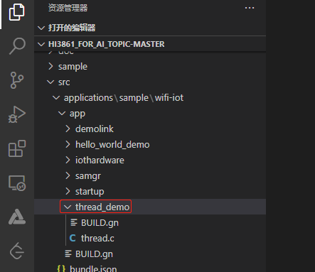

* 步骤2：修改applications/sample/wifi-iot/app/目录下的BUILD.gn，在features字段中添加thread_demo: thread_demo。注：第一个thread_demo指的是需要编译的工程目录，第二个thread_demo指的是applications/sample/wifi-iot/app/ thread_demo/BUILD.gn文件中的静态库，名称为thread_demo。

```c
import("//build/lite/config/component/lite_component.gni")
lite_component("app") {
    features = [
        "thread_demo:thread_demo",
    ]
}
```

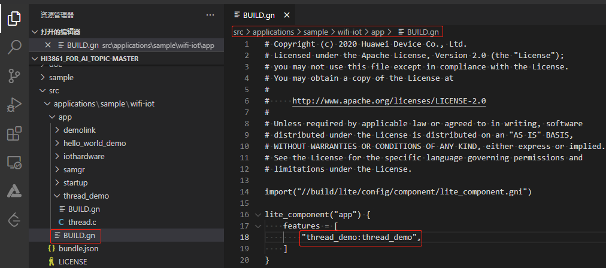

#### 4.2.1.3、代码分析

* 创建线程，创建成功则打印线程名字和线程ID

```c
osThreadId_t newThread(char *name, osThreadFunc_t func, void *arg) {
    osThreadAttr_t attr = {
        name, 0, NULL, 0, NULL, 1024*2, osPriorityNormal, 0, 0
    };
    osThreadId_t tid = osThreadNew(func, arg, &attr);
    if (tid == NULL) {
        printf("osThreadNew(%s) failed.\r\n", name);
    } else {
        printf("osThreadNew(%s) success, thread id: %d.\r\n", name, tid);
    }
    return tid;
}
```

* 该函数首先会打印自己的参数，然后对全局变量count进行循环+1操作，之后会打印count的值

```c
void threadTest(void *arg) {
    static int count = 0;
    printf("%s\r\n",(char *)arg);
    osThreadId_t tid = osThreadGetId();
    printf("threadTest osThreadGetId, thread id:%p\r\n", tid);
    while (1) {
        count++;
        printf("threadTest, count: %d.\r\n", count);
        osDelay(20);
    }
}
```

* 主程序rtosv2_thread_main创建线程并运行，并使用上述API进行相关操作，最后终止所创建的线程。

```c
void rtosv2_thread_main(void *arg) {
    (void)arg;
    osThreadId_t tid=newThread("test_thread", threadTest, "This is a test thread.");

    const char *t_name = osThreadGetName(tid);
    printf("[Thread Test]osThreadGetName, thread name: %s.\r\n", t_name);

    osThreadState_t state = osThreadGetState(tid);
    printf("[Thread Test]osThreadGetState, state :%d.\r\n", state);

    osStatus_t status = osThreadSetPriority(tid, osPriorityNormal4);
    printf("[Thread Test]osThreadSetPriority, status: %d.\r\n", status);

    osPriority_t pri = osThreadGetPriority (tid);   
    printf("[Thread Test]osThreadGetPriority, priority: %d.\r\n", pri);

    status = osThreadSuspend(tid);
    printf("[Thread Test]osThreadSuspend, status: %d.\r\n", status);  

    status = osThreadResume(tid);
    printf("[Thread Test]osThreadResume, status: %d.\r\n", status);

    uint32_t stacksize = osThreadGetStackSize(tid);
    printf("[Thread Test]osThreadGetStackSize, stacksize: %d.\r\n", stacksize);

    uint32_t stackspace = osThreadGetStackSpace(tid);
    printf("[Thread Test]osThreadGetStackSpace, stackspace: %d.\r\n", stackspace);

    uint32_t t_count = osThreadGetCount();
    printf("[Thread Test]osThreadGetCount, count: %d.\r\n", t_count);  

    osDelay(100);
    status = osThreadTerminate(tid);
    printf("[Thread Test]osThreadTerminate, status: %d.\r\n", status);
}
```

#### 4.2.1.4、代码编译和镜像烧录

* 步骤1：工程编译：点击Deveco Device Tool图标，点击ReBuild按钮，进行工程的编译。

  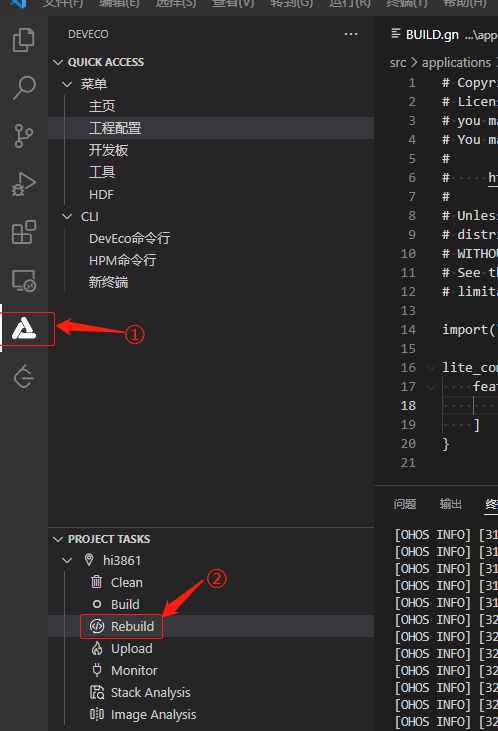

* 编译成功后，会有如下所示的提示，并且会在**out/hispark_pegasus/wifiiot_hispark_pegasus**目录下生成一个 **Hi3861_wifiiot_app_allinone.bin**镜像文件。

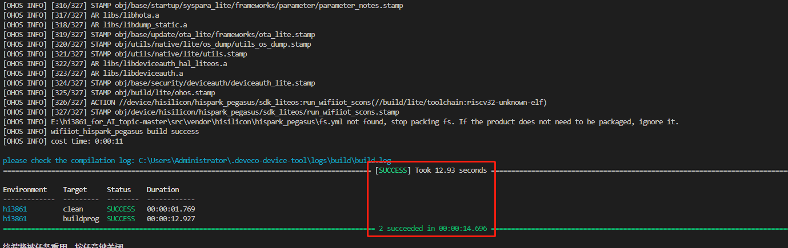

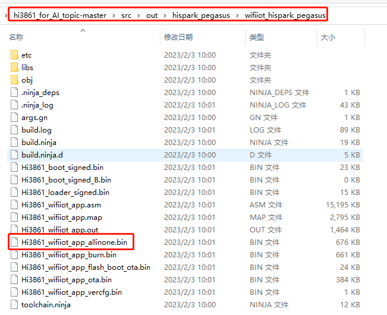

* 步骤2：镜像的烧录。
* 取出开发套件配套的type-c数据线，USB的一头接在您Windows的USB口，type-c的一头接在开发板的type-c口。

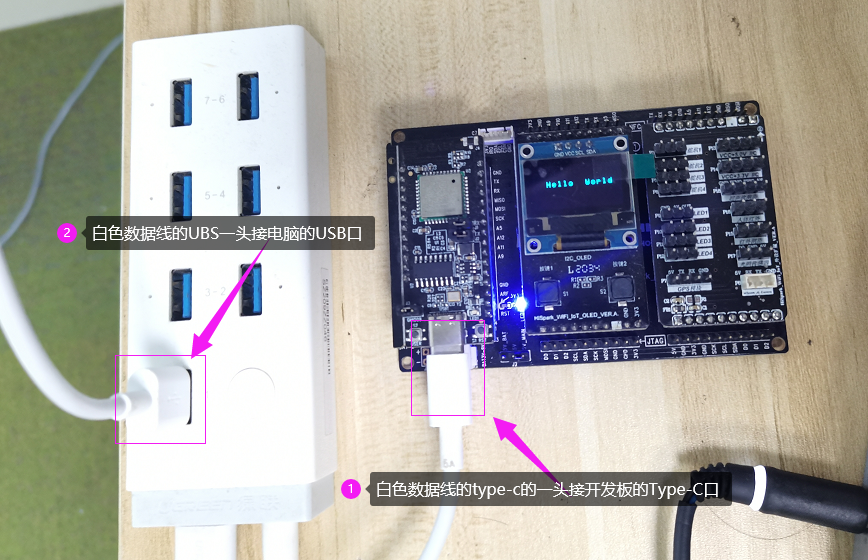

* 打开Windows的设备管理器，查看串口设备，若未出现CH340串口设备，请检查驱动是否安装正常。

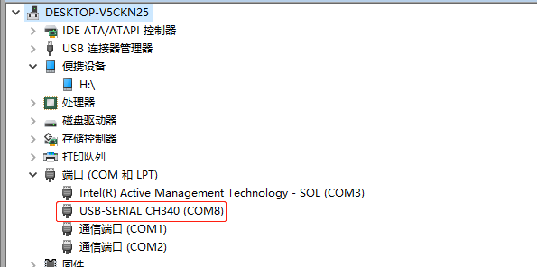

* 使用串口进行镜像烧录

  * 当前DevEco Device Tool工具支持Hi3861单板一键烧录功能。需要连接开发板，配置开发板对应的串口，在编译结束后，进行烧录。点击左侧“工程配置”，找到“upload_port”选项，选择开发板对应的烧录串口（<font color='RedOrange'>**注意：如果正在使用Monitor功能，请先“ctrl+c”关闭Monitor，才能正常烧，否则串口占用无法烧录成功**</font>）。

  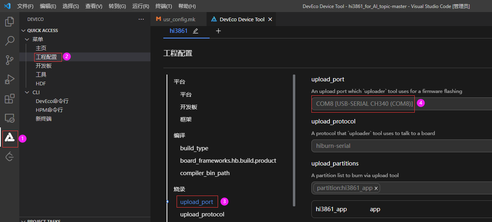

  * 点击左下角“upload”按键，等待提示（出现Connecting，please reset device...），手动进行开发板复位（按下开发板 RST复位键）

  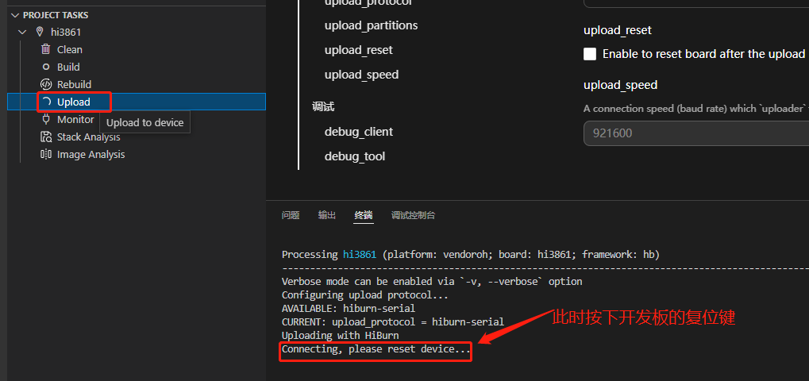

  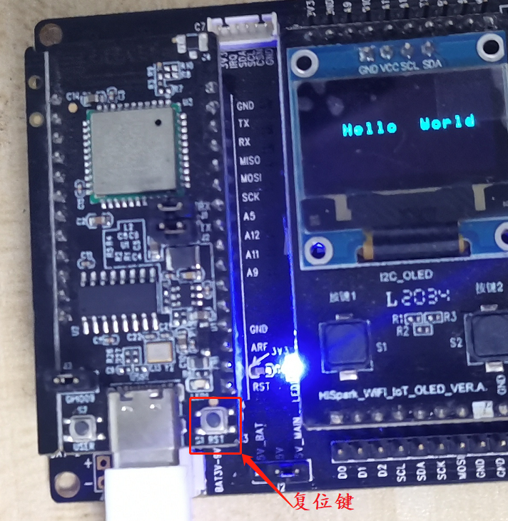

  * 等待烧录完成，大约40s左右，烧录成功。

  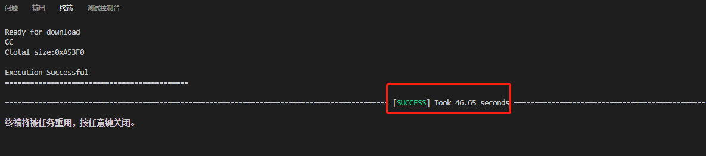

#### 4.2.1.5、运行结果

* 镜像烧录成功后，我们需要使用串口工具，查看一下运行的打印结果。

* 烧录完成后，可以通过Monitor界面查看串口打印，配置Monitor串口，如下图所示。（<font color='RedOrange'>**注意：如果正在使用Monitor功能，请先“ctrl+c”关闭Monitor，才能正常烧录，否则串口占用无法烧录成功**</font>）


* 配置完Monitor串口后，直接点击monitor按钮，然后点击开发板的RST按键，复位开发板，查看板端打印信，如下图所示：

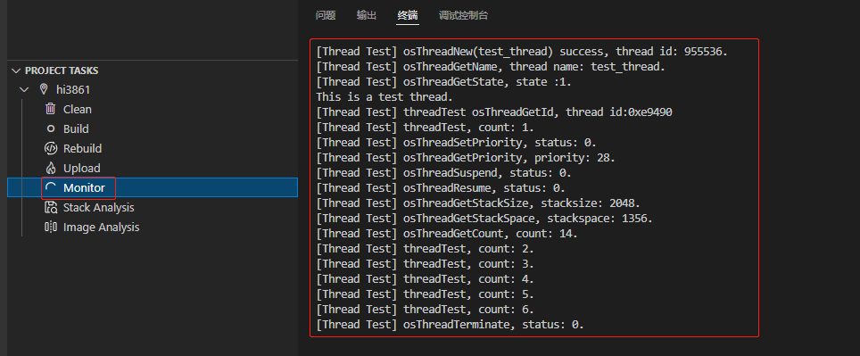

```
[Thread Test] osThreadNew(test_thread) success, thread id: 955536.
[Thread Test] osThreadGetName, thread name: test_thread.
[Thread Test] osThreadGetState, state :1.
This is a test thread.
[Thread Test] threadTest osThreadGetId, thread id:0xe9490
[Thread Test] threadTest, count: 1.
[Thread Test] osThreadSetPriority, status: 0.
[Thread Test] osThreadGetPriority, priority: 28.
[Thread Test] osThreadSuspend, status: 0.
[Thread Test] osThreadResume, status: 0.
[Thread Test] osThreadGetStackSize, stacksize: 2048.
[Thread Test] osThreadGetStackSpace, stackspace: 1356.
[Thread Test] osThreadGetCount, count: 14.
[Thread Test] threadTest, count: 2.
[Thread Test] threadTest, count: 3.
[Thread Test] threadTest, count: 4.
[Thread Test] threadTest, count: 5.
[Thread Test] threadTest, count: 6.
[Thread Test] osThreadTerminate, status: 0.
```

### 4.2.2、定时器

#### 4.2.2.1、接口说明

| API名称          | 说明                     |
| ---------------- | ------------------------ |
| osTimerNew       | 创建和初始化定时器       |
| osTimerGetName   | 获取指定的定时器名字     |
| osTimerStart     | 启动或者重启指定的定时器 |
| osTimerStop      | 停止指定的定时器         |
| osTimerIsRunning | 检查一个定时器是否在运行 |
| osTimerDelete    | 删除定时器               |

* osTimerNew()

```c
osTimerId_t osTimerNew (osTimerFunc_t func, osTimerType_t type, void *argument, const osTimerAttr_t *attr)
```

**参数：**

| 名字     | 描述                                                         |
| :------- | :----------------------------------------------------------- |
| func     | 定时器回调函数.                                              |
| type     | 定时器类型，osTimerOnce表示单次定时器，ostimer周期表示周期性定时器. |
| argument | 定时器回调函数的参数                                         |
| attr     | 定时器属性                                                   |

#### 4.2.2.2、代码准备

* 步骤1：将 vendor/hisilicon/hispark_pegasus/demo/time_demo文件夹复制到applications/sample/wifi-iot/app/目录下。

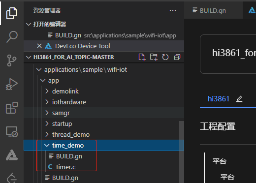

* 步骤2：修改applications/sample/wifi-iot/app/目录下的BUILD.gn，在features字段中添加time_demo: timer_demo。注：第一个time_demo指的是需要编译的工程目录，第二个timer_demo指的是applications/sample/wifi-iot/app/ timer_demo/BUILD.gn文件中的静态库，名称为timer_demo。

```c
import("//build/lite/config/component/lite_component.gni")

lite_component("app") {
    features = [
        "time_demo:timer_demo",
    ]
}
```

#### 4.2.2.3、代码分析

* 定时器的回调函数

```c
void cb_timeout_periodic(void *arg) {
    (void)arg;
    times++;
}
```

* 使用osTimerNew创建一个100个时钟周期调用一次回调函数cb_timeout_periodic定时器，每隔100个时钟周期检查一下全局变量times是否小于3，若不小于3则停止时钟周期

```c
void timer_periodic(void) {
    osTimerId_t periodic_tid = osTimerNew(cb_timeout_periodic, osTimerPeriodic, NULL, NULL);
    if (periodic_tid == NULL) {
        printf("[Timer Test] osTimerNew(periodic timer) failed.\r\n");
        return;
    } else {
        printf("[Timer Test] osTimerNew(periodic timer) success, tid: %p.\r\n",periodic_tid);
    }
    osStatus_t status = osTimerStart(periodic_tid, 100);
    if (status != osOK) {
        printf("[Timer Test] osTimerStart(periodic timer) failed.\r\n");
        return;
    } else {
        printf("[Timer Test] osTimerStart(periodic timer) success, wait a while and stop.\r\n");
    }

    while(times < 3) {
        printf("[Timer Test] times:%d.\r\n",times);
        osDelay(100);
    }

    status = osTimerStop(periodic_tid);
    printf("[Timer Test] stop periodic timer, status :%d.\r\n", status);
    status = osTimerDelete(periodic_tid);
    printf("[Timer Test] kill periodic timer, status :%d.\r\n", status);
}

```

#### 4.2.2.4、代码编译和镜像烧录

* <font color='RedOrange'>**参考 4.2.1.4章节**</font>的内容即可。

#### 4.2.2.5、运行结果

* 关于如何使用工具查看系统打印信息，<font color='RedOrange'>**参考 4.2.1.5章节**</font>的内容即可。

* 运行的打印结果如下所示：

```
[Thread Test] osThreadNew(test_thread) success, thread id: 955636.
[Thread Test] osThreadGetName, thread name: test_thread.
[Thread Test] osThreadGetState, state :1.
This is a test thread.
[Thread Test] threadTest osThreadGetId, thread id:0xe94f4
[Thread Test] threadTest, count: 1.
[Thread Test] osThreadSetPriority, status: 0.
[Thread Test] osThreadGetPriority, priority: 28.
[Thread Test] osThreadSuspend, status: 0.
[Thread Test] osThreadResume, status: 0.
```

### 4.2.3、互斥锁

#### 4.2.3.1、接口说明

| API名称         | 说明                                                     |
| --------------- | -------------------------------------------------------- |
| osMutexNew      | 创建并初始化一个互斥锁                                   |
| osMutexGetName  | 获得指定互斥锁的名字                                     |
| osMutexAcquire  | 获得指定的互斥锁的访问权限，若互斥锁已经被锁，则返回超时 |
| osMutexRelease  | 释放指定的互斥锁                                         |
| osMutexGetOwner | 获得指定互斥锁的所有者线程                               |
| osMutexDelete   | 删除指定的互斥锁                                         |

#### 4.2.3.2、代码准备

* 步骤1：将 vendor/hisilicon/hispark_pegasus/demo/mutex_demo文件夹复制到applications/sample/wifi-iot/app/目录下。

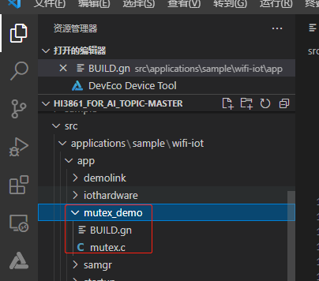

* 步骤2：修改applications/sample/wifi-iot/app/目录下的BUILD.gn，在features字段中添加mutex_demo: mutex_demo。注：第一个mutex_demo指的是需要编译的工程目录，第二个mutex_demo指的是applications/sample/wifi-iot/app/ mutex_demo/BUILD.gn文件中的静态库，名称为mutex_demo。

```c
import("//build/lite/config/component/lite_component.gni")
lite_component("app") {
  features = [ "mutex_demo:mutex_demo", ]
}
```

#### 4.2.3.3、代码分析

* 全局变量`g_test_value`若同时被多个线程访问，会将其加1，然后判断其奇偶性，并输出日志，如果没有互斥锁保护，线程会被中断导致错误，所以需要创建互斥锁来保护多线程共享区域

```c
void number_thread(void *arg) {
    osMutexId_t *mid = (osMutexId_t *)arg;
    while(1) {
        if (osMutexAcquire(*mid, 100) == osOK) {
            g_test_value++;
            if (g_test_value % 2 == 0) {
                printf("[Mutex Test] %s gets an even value %d.\r\n", osThreadGetName(osThreadGetId()), g_test_value);
            } else {
                printf("[Mutex Test] %s gets an odd value %d.\r\n",  osThreadGetName(osThreadGetId()), g_test_value);
            }
            osMutexRelease(*mid);
            osDelay(5);
        }
    }
}
```

* 创建三个线程访问全局变量`g_test_value` ，同时创建一个互斥锁共所有线程使用

```c
void rtosv2_mutex_main(void *arg) {
    (void)arg;
    osMutexAttr_t attr = {0};

    osMutexId_t mid = osMutexNew(&attr);
    if (mid == NULL) {
        printf("[Mutex Test] osMutexNew, create mutex failed.\r\n");
    } else {
        printf("[Mutex Test] osMutexNew, create mutex success.\r\n");
    }

    osThreadId_t tid1 = newThread("Thread_1", number_thread, &mid);
    osThreadId_t tid2 = newThread("Thread_2", number_thread, &mid);
    osThreadId_t tid3 = newThread("Thread_3", number_thread, &mid);

    osDelay(13);
    osThreadId_t tid = osMutexGetOwner(mid);
    printf("[Mutex Test] osMutexGetOwner, thread id: %p, thread name: %s.\r\n", tid, osThreadGetName(tid));
    osDelay(17);

    osThreadTerminate(tid1);
    osThreadTerminate(tid2);
    osThreadTerminate(tid3);
    osMutexDelete(mid);
}
```

#### 4.2.3.4、代码编译和镜像烧录

* <font color='RedOrange'>**参考 4.2.1.4章节**</font>的内容即可。

#### 4.2.3.5、运行结果

* 关于如何使用工具查看系统打印信息，<font color='RedOrange'>**参考 4.2.1.5章节**</font>的内容即可。

* 运行的部分打印结果如下所示：

```
[Mutex Test]osMutexNew, create mutex success.
[Mutex Test]osThreadNew(Thread_1) success, thread id: 956100.
[Mutex Test]osThreadNew(Thread_2) suc[Mutex Test]Thread_1 gets an odd value 1.
[Mutex Test]Thread_2 gets an even value 2.
cess, thread id: 957200.
[Mutex Test]osThreadNew(Thread_3) success, thread id: 957300.
[Mutex Test]Thread_3 gets an odd value 3.
[Mutex Test]Thread_1 gets an even value 4.
[Mutex Test]Thread_2 gets an odd value 5.
[Mutex Test]Thread_3 gets an even value 6.
[Mutex Test]osMutexGetOwner, thread id: 0xe9b74, thread name: Thread_3.
[Mutex Test]Thread_1 gets an odd value 7.
[Mutex Test]Thread_2 gets an even value 8.
[Mutex Test]Thread_3 gets an odd value 9.
[Mutex Test]Thread_1 gets an even value 10.
[Mutex Test]Thread_2 gets an odd value 11.
```

### 4.2.4、信号量

#### 4.2.4.1、接口说明

| API名称             | 说明                                                         |
| ------------------- | ------------------------------------------------------------ |
| osSemaphoreNew      | 创建并初始化一个信号量                                       |
| osSemaphoreGetName  | 获取一个信号量的名字                                         |
| osSemaphoreAcquire  | 获取一个信号量的令牌，若获取不到，则会超时返回               |
| osSemaphoreRelease  | 释放一个信号量的令牌，但是令牌的数量不超过初始定义的的令牌数 |
| osSemaphoreGetCount | 获取当前的信号量令牌数                                       |
| osSemaphoreDelete   | 删除一个信号量                                               |

#### 4.2.4.2、代码准备

* 步骤1：将 vendor/hisilicon/hispark_pegasus/demo/semaphore_demo文件夹复制到applications/sample/wifi-iot/app/目录下。

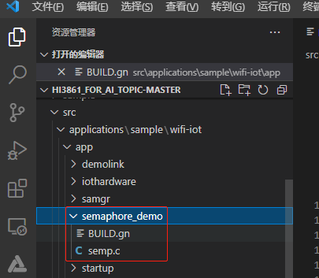

* 步骤2：修改applications/sample/wifi-iot/app/目录下的BUILD.gn，在features字段中添加semaphore_demo: semp_demo。注：第一个semaphore_demo指的是需要编译的工程目录，第二个semp_demo指的是applications/sample/wifi-iot/app/ semaphore_demo/BUILD.gn文件中的静态库，名称为semp_demo。

```c
import("//build/lite/config/component/lite_component.gni")
lite_component("app") {
  features = [ "semaphore_demo:semp_demo", ]
}
```

#### 4.2.4.2、代码分析

* `osSemaphoreAcquire`获取共享资源的访问权限，若获取失败，则等待；访问成功后，可以通过`osSemaphoreRelease`释放对共享资源的访问

* 本样例为经典的消费者与生产者问题，需要确保仓库满时，生产者需要进入等待状态，产品消费完时，消费者需要进入等待状态

```c
void producer_thread(void *arg) {
    (void)arg;
    empty_id = osSemaphoreNew(BUFFER_SIZE, BUFFER_SIZE, NULL);
    filled_id = osSemaphoreNew(BUFFER_SIZE, 0U, NULL);
    while(1) {
        osSemaphoreAcquire(empty_id, osWaitForever);
        product_number++;
        printf("[Semp Test]%s produces a product, now product number: %d.\r\n", osThreadGetName(osThreadGetId()), product_number);
        osDelay(4);
        osSemaphoreRelease(filled_id);
    }
}

void consumer_thread(void *arg) {
    (void)arg;
    while(1){
        osSemaphoreAcquire(filled_id, osWaitForever);
        product_number--;
        printf("[Semp Test]%s consumes a product, now product number: %d.\r\n", osThreadGetName(osThreadGetId()), product_number);
        osDelay(3);
        osSemaphoreRelease(empty_id);
    }
}
```

* 由于消费产品的速度大于生产速度，所以定义了三个生产者，两个消费者

```c
void rtosv2_semp_main(void *arg) {
    (void)arg;
    empty_id = osSemaphoreNew(BUFFER_SIZE, BUFFER_SIZE, NULL);
    filled_id = osSemaphoreNew(BUFFER_SIZE, 0U, NULL);
 
    osThreadId_t ptid1 = newThread("producer1", producer_thread, NULL);
    osThreadId_t ptid2 = newThread("producer2", producer_thread, NULL);
    osThreadId_t ptid3 = newThread("producer3", producer_thread, NULL);
    osThreadId_t ctid1 = newThread("consumer1", consumer_thread, NULL);
    osThreadId_t ctid2 = newThread("consumer2", consumer_thread, NULL);

    osDelay(50);

    osThreadTerminate(ptid1);
    osThreadTerminate(ptid2);
    osThreadTerminate(ptid3);
    osThreadTerminate(ctid1);
    osThreadTerminate(ctid2);

    osSemaphoreDelete(empty_id);
    osSemaphoreDelete(filled_id);
}
```

#### 4.2.4.4、代码编译和镜像烧录

* <font color='RedOrange'>**参考 4.2.1.4章节**</font>的内容即可。

#### 4.2.4.5、运行结果

* 关于如何使用工具查看系统打印信息，<font color='RedOrange'>**参考 4.2.1.5章节**</font>的内容即可。

* 运行的部分打印结果如下所示：

```
[Semp Test] osThreadNew(consumer1) success, thread id: 0xe8910.
[Semp Test] osThreadNew(consumer2) success, thread id: 0xe871c.
[Semp Test] osThreadNew(producer1) success, thread id: 0xe84c4.
[Semp Test] [Semp Test] producer1 produces a product, now product number: 1.
[Semp Test] producer2 produces a product, now product number: 2.
osThreadNew(producer2) success, thread id: 0xe8974.
[Semp Test] osThreadNew(producer3) success, thread id: 0xe89d8.
[Semp Test] producer3 produces a product, now product number: 3.
[Semp Test] producer1 produces a product, now product number: 4.
[Semp Test] consumer1 consumes a product, now product number: 3.
[Semp Test] producer2 produces a product, now product number: 4.
[Semp Test] consumer2 consumes a product, now product number: 3.
[Semp Test] consumer1 consumes a product, now product number: 2.
[Semp Test] producer3 produces a product, now product number: 3.
[Semp Test] consumer2 consumes a product, now product number: 2.
[Semp Test] producer1 produces a product, now product number: 3.
```

### 4.2.5、消息队列

#### 4.2.5.1、接口说明

| API名称                   | 说明                                                         |
| ------------------------- | ------------------------------------------------------------ |
| osMessageQueueNew         | 创建和初始化一个消息队列                                     |
| osMessageQueueGetName     | 返回指定的消息队列的名字                                     |
| osMessageQueuePut         | 向指定的消息队列存放1条消息，如果消息队列满了，那么返回超时  |
| osMessageQueueGet         | 从指定的消息队列中取得1条消息，如果消息队列为空，那么返回超时 |
| osMessageQueueGetCapacity | 获得指定的消息队列的消息容量                                 |
| osMessageQueueGetMsgSize  | 获得指定的消息队列中可以存放的最大消息的大小                 |
| osMessageQueueGetCount    | 获得指定的消息队列中当前的消息数                             |
| osMessageQueueGetSpace    | 获得指定的消息队列中还可以存放的消息数                       |
| osMessageQueueReset       | 将指定的消息队列重置为初始状态                               |
| osMessageQueueDelete      | 删除指定的消息队列                                           |

#### 4.2.4.2、代码准备

* 步骤1：将 vendor/hisilicon/hispark_pegasus/demo/message_demo文件夹复制到applications/sample/wifi-iot/app/目录下。

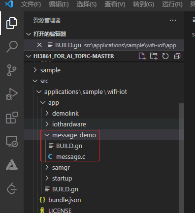

* 步骤2：修改applications/sample/wifi-iot/app/目录下的BUILD.gn，在features字段中添加message_demo: message_demo。注：第一个message_demo指的是需要编译的工程目录，第二个message_demo指的是applications/sample/wifi-iot/app/message_demo/BUILD.gn文件中的静态库，名称为message_demo。

```c
import("//build/lite/config/component/lite_component.gni")
lite_component("app") {
  features = [ "message_demo:message_demo", ]
}
```

#### 4.2.5.3、代码分析

* `osMessageQueueNew`创建一个消息队列

* 发送者每次将自己`count`的值与线程ID发送，并将`count`加1；

* 接受者从消息队列中获取一条信息，然后将其打印输出

```c
void sender_thread(void *arg) {
    static int count=0;
    message_entry sentry;
    (void)arg;
    while(1) {
        sentry.tid = osThreadGetId();
        sentry.count = count;
        printf("[Message Test] %s send %d to message queue.\r\n", osThreadGetName(osThreadGetId()), count);
        osMessageQueuePut(qid, (const void *)&sentry, 0, osWaitForever);
        count++;
        osDelay(5);
    }
}

void receiver_thread(void *arg) {
    (void)arg;
    message_entry rentry;
    while(1) {
        osMessageQueueGet(qid, (void *)&rentry, NULL, osWaitForever);
        printf("[Message Test] %s get %d from %s by message queue.\r\n", osThreadGetName(osThreadGetId()), rentry.count, osThreadGetName(rentry.tid));
        osDelay(3);
    }
}
```

* 主程序创建了三个消息发送者和两个消息接收者，然后调用相关的API确认消息队列的装填

```c
void rtosv2_msgq_main(void *arg) {
    (void)arg;

    qid = osMessageQueueNew(QUEUE_SIZE, sizeof(message_entry), NULL);

    osThreadId_t ctid1 = newThread("receiver1", receiver_thread, NULL);
    osThreadId_t ctid2 = newThread("receiver2", receiver_thread, NULL);
    osThreadId_t ptid1 = newThread("sender1", sender_thread, NULL);
    osThreadId_t ptid2 = newThread("sender2", sender_thread, NULL);
    osThreadId_t ptid3 = newThread("sender3", sender_thread, NULL);

    osDelay(20);
    uint32_t cap = osMessageQueueGetCapacity(qid);
    printf("[Message Test] osMessageQueueGetCapacity, capacity: %d.\r\n",cap);
    uint32_t msg_size =  osMessageQueueGetMsgSize(qid);
    printf("[Message Test] osMessageQueueGetMsgSize, size: %d.\r\n",msg_size);
    uint32_t count = osMessageQueueGetCount(qid);
    printf("[Message Test] osMessageQueueGetCount, count: %d.\r\n",count);
    uint32_t space = osMessageQueueGetSpace(qid);
    printf("[Message Test] osMessageQueueGetSpace, space: %d.\r\n",space);

    osDelay(80);
    osThreadTerminate(ctid1);
    osThreadTerminate(ctid2);
    osThreadTerminate(ptid1);
    osThreadTerminate(ptid2);
    osThreadTerminate(ptid3);
    osMessageQueueDelete(qid);
}
```

#### 4.2.5.4、代码编译和镜像烧录

* <font color='RedOrange'>**参考 4.2.1.4章节**</font>的内容即可。

#### 4.2.5.5、运行结果

* 关于如何使用工具查看系统打印信息，<font color='RedOrange'>**参考 4.2.1.5章节**</font>的内容即可。

* 运行的部分打印结果如下所示：

```
[Message Test] osThreadNew(receiver1) success, thread id: 0xe89d8.
[Message Test] osThreadNew(receiver2) success, thread id: 0xe8974.
[Message Test] osThreadNew(sender1) success, thread id: 0xe84c4.
[Message Test] os[Message Test] sender1 send 0 to message queue.
[Message Test] sender2 send 1 to message queue.
ThreadNew(sender2) success, thread id: 0xe871c.
[Message Test] osThreadNew(sender3) success, thread id: 0xe8910.
[Message Test] receiver1 get 0 from sender1 by message queue.
[Message Test] receiver2 get 1 from sender2 by message queue.
[Message Test] sender3 send 2 to message queue.
[Message Test] sender1 send 3 to message queue.
[Message Test] sender2 send 4 to message queue.
....
[Message Test] sender3 send 11 to message queue.
[Message Test] receiver2 get 11 from sender3 by message queue.
[Message Test] sender1 send 12 to message queue.
[Message Test] sender2 send 13 to message queue.
[Message Test] receiver1 get 12 from sender1 by message queue.
[Message Test] osMessageQueueGetCapacity, capacity: 3.
[Message Test] osMessageQueueGetMsgSize, size: 8.
[Message Test] osMessageQueueGetCount, count: 1.
[Message Test] osMessageQueueGetSpace, space: 2.
```

