## 4.3、基础外设开发

### 4.3.1、GPIO输出之LED实验

#### 4.3.1.1、硬件环境搭建

-    硬件要求：Hi3861V100核心板、底板、交通灯板；硬件搭建如下图所示。
-    [Hi3861V100核心板参考：HiSpark_WiFi_IoT智能开发套件_原理图硬件资料\原理图\HiSpark_WiFi-IoT_Hi3861_CH340G_VER.B.pdf](http://gitee.com/hihope_iot/embedded-race-hisilicon-track-2022/blob/master/%E7%A1%AC%E4%BB%B6%E8%B5%84%E6%96%99/HiSpark_WiFi_IoT%E6%99%BA%E8%83%BD%E5%AE%B6%E5%B1%85%E5%BC%80%E5%8F%91%E5%A5%97%E4%BB%B6_%E5%8E%9F%E7%90%86%E5%9B%BE.rar)
-    [底板参考：HiSpark_WiFi_IoT智能开发套件_原理图硬件资料\原理图\HiSpark_WiFi_IoT_EXB_VER.A.pdf](http://gitee.com/hihope_iot/embedded-race-hisilicon-track-2022/blob/master/%E7%A1%AC%E4%BB%B6%E8%B5%84%E6%96%99/HiSpark_WiFi_IoT%E6%99%BA%E8%83%BD%E5%AE%B6%E5%B1%85%E5%BC%80%E5%8F%91%E5%A5%97%E4%BB%B6_%E5%8E%9F%E7%90%86%E5%9B%BE.rar)
-    [交通灯板硬件原理图参考：HiSpark_WiFi_IoT智能开发套件_原理图硬件资料\原理图\HiSpark_WiFi_IoT_SSL_VER.A.pdf](http://gitee.com/hihope_iot/embedded-race-hisilicon-track-2022/blob/master/%E7%A1%AC%E4%BB%B6%E8%B5%84%E6%96%99/HiSpark_WiFi_IoT%E6%99%BA%E8%83%BD%E5%AE%B6%E5%B1%85%E5%BC%80%E5%8F%91%E5%A5%97%E4%BB%B6_%E5%8E%9F%E7%90%86%E5%9B%BE.rar)
-    <font color='RedOrange'>**注意**</font>：如下实验案例仅用于参考，里面涉及到的智慧交通灯硬件，海思嵌入式大赛开发套件中没有包含，如需使用请自行购买

|  | 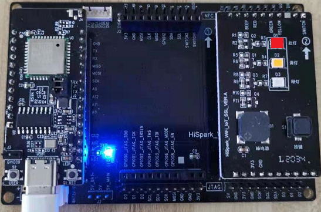 |
| ------------------------------------------------------------ | ------------------------------------------------------------ |

#### 4.3.1.2、接口说明

| API名称                                                      | 说明                                                         |
| ------------------------------------------------------------ | ------------------------------------------------------------ |
| unsigned int GpioInit(void);                                 | GPIO模块初始化                                               |
| unsigned int GpioSetDir(WifiIotGpioIdx id, WifiIotGpioDir dir); | 设置GPIO引脚方向，id参数用于指定引脚，dir参数用于指定输入或输出 |
| unsigned int GpioSetOutputVal(WifiIotGpioIdx id, WifiIotGpioValue val); | 设置GPIO引脚的输出状态，id参数用于指定引脚，val参数用于指定高电平或低电平 |
| unsigned int IoSetFunc(WifiIotIoName id, unsigned char val); | 设置引脚功能，id参数用于指定引脚，val用于指定引脚功能        |
| unsigned int GpioDeinit(void);                               | 解除GPIO模块初始化                                           |

#### 4.3.1.3、代码准备

- 步骤1：将 vendor/hisilicon/hispark_pegasus/demo/led_demo文件夹复制到applications/sample/wifi-iot/app/目录下。

  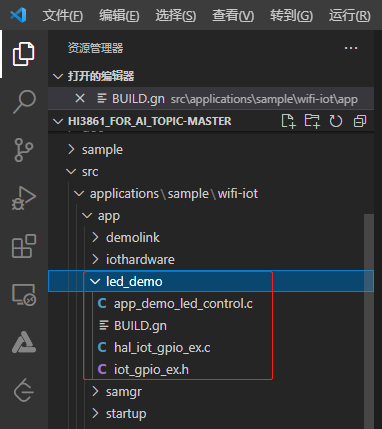

- 步骤2：修改applications/sample/wifi-iot/app/目录下的BUILD.gn，在features字段中添加led_demo: led_demo。注：第一个led_demo指的是需要编译的工程目录，第二个led_demo指的是applications/sample/wifi-iot/app/led_demo/BUILD.gn文件中的静态库，名称为led_demo。

```c
import("//build/lite/config/component/lite_component.gni")

lite_component("app") {
    features = [
        "led_demo:ledDemo",
    ]
}
```

#### 4.3.1.4、代码编译和镜像烧录

* <font color='RedOrange'>**参考 4.2.1.4章节**</font>的内容即可。

#### 4.3.1.5、运行结果

- 烧录成功后，再次点击Hi3861核心板上的“RST”复位键，此时开发板的系统会运行起来。运行结果：红灯亮。如下图所示。

  

### 4.3.2、GPIO输入之按键中断实验

#### 4.3.2.1、硬件环境搭建

-    硬件要求：Hi3861V100核心板、底板、交通灯板；硬件搭建如下图所示。
-    [Hi3861V100核心板参考：HiSpark_WiFi_IoT智能开发套件_原理图硬件资料\原理图\HiSpark_WiFi-IoT_Hi3861_CH340G_VER.B.pdf](http://gitee.com/hihope_iot/embedded-race-hisilicon-track-2022/blob/master/%E7%A1%AC%E4%BB%B6%E8%B5%84%E6%96%99/HiSpark_WiFi_IoT%E6%99%BA%E8%83%BD%E5%AE%B6%E5%B1%85%E5%BC%80%E5%8F%91%E5%A5%97%E4%BB%B6_%E5%8E%9F%E7%90%86%E5%9B%BE.rar)
-    [底板参考：HiSpark_WiFi_IoT智能开发套件_原理图硬件资料\原理图\HiSpark_WiFi_IoT_EXB_VER.A.pdf](http://gitee.com/hihope_iot/embedded-race-hisilicon-track-2022/blob/master/%E7%A1%AC%E4%BB%B6%E8%B5%84%E6%96%99/HiSpark_WiFi_IoT%E6%99%BA%E8%83%BD%E5%AE%B6%E5%B1%85%E5%BC%80%E5%8F%91%E5%A5%97%E4%BB%B6_%E5%8E%9F%E7%90%86%E5%9B%BE.rar)
-    [交通灯板硬件原理图参考：HiSpark_WiFi_IoT智能开发套件_原理图硬件资料\原理图\HiSpark_WiFi_IoT_SSL_VER.A.pdf](http://gitee.com/hihope_iot/embedded-race-hisilicon-track-2022/blob/master/%E7%A1%AC%E4%BB%B6%E8%B5%84%E6%96%99/HiSpark_WiFi_IoT%E6%99%BA%E8%83%BD%E5%AE%B6%E5%B1%85%E5%BC%80%E5%8F%91%E5%A5%97%E4%BB%B6_%E5%8E%9F%E7%90%86%E5%9B%BE.rar)
-    <font color='RedOrange'>**注意**</font>：如下实验案例仅用于参考，里面涉及到的智慧交通灯硬件，海思嵌入式大赛开发套件中没有包含，如需使用请自行购买

| 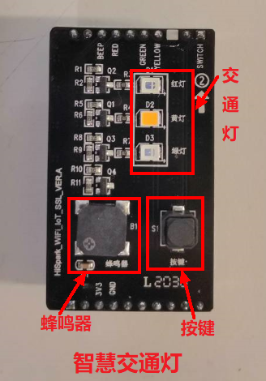 | 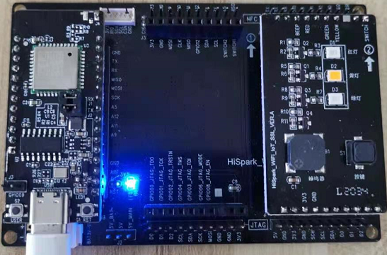 |
| ------------------------------------------------------------ | ------------------------------------------------------------ |

#### 4.3.2.2、接口说明

| API名称                                                      | 说明                                                         |
| ------------------------------------------------------------ | ------------------------------------------------------------ |
| unsigned int GpioGetInputVal(WifiIotGpioIdx id, WifiIotGpioValue *val); | 获取GPIO引脚状态，id参数用于指定引脚，val参数用于接收GPIO引脚状态 |
| unsigned int IoSetPull(WifiIotIoName id, WifiIotIoPull val); | 设置引脚上拉或下拉状态，id参数用于指定引脚，val参数用于指定上拉或下拉状态 |
| unsigned int GpioRegisterIsrFunc(WifiIotGpioIdx id, WifiIotGpioIntType intType, WifiIotGpioIntPolarity intPolarity, GpioIsrCallbackFunc func, char *arg); | 注册GPIO引脚中断，id参数用于指定引脚，intType参数用于指定中断触发类型（边缘触发或水平触发），intPolarity参数用于指定具体的边缘类型（下降沿或上升沿）或水平类型（高电平或低电平），func参数用于指定中断处理函数，arg参数用于指定中断处理函数的附加参数 |
| typedef void (*GpioIsrCallbackFunc) (char *arg);             | 中断处理函数原型，arg参数为附加参数，可以不适用（填NULL），或传入指向用户自定义类型的参数 |
| unsigned int GpioUnregisterIsrFunc(WifiIotGpioIdx id);       | 解除GPIO引脚中断注册，id参数用于指定引脚                     |

* 核心板USER按键与主控芯片（Pegasus）引脚的对应关系
  - **USER按键：**GPIO5/按键中断控制LED灯状态反转

#### 4.3.2.3、代码准备

- 步骤1：将 vendor/hisilicon/hispark_pegasus/demo/gpiobutton_demo文件夹复制到applications/sample/wifi-iot/app/目录下。

  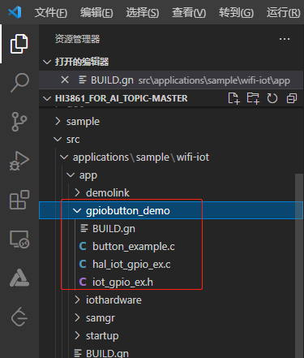

- 步骤21：修改applications/sample/wifi-iot/app/目录下的BUILD.gn，在features字段中添加gpiobutton_demo: button_example。注：第一个gpiobutton_demo指的是需要编译的工程目录，第二个button_example指的是applications/sample/wifi-iot/app/gpiobutton_demo/BUILD.gn文件中的静态库，名称为button_example。

```c
import("//build/lite/config/component/lite_component.gni")

lite_component("app") {
    features = [
        "gpiobutton_demo:button_example",
    ]
}
```

#### 4.3.2.4、代码编译和镜像烧录

* <font color='RedOrange'>**参考 4.2.1.4章节**</font>的内容即可。

#### 4.3.2.5、运行结果

* 烧录文件后，按下reset按键，程序开始运行，led灯会先闪烁，在按下USER按键时，led会熄灭，再次按下USER按键，led会亮

### 4.3.3、PWM之蜂鸣器实验

#### 4.3.3.1、硬件环境搭建

-    硬件要求：Hi3861V100核心板、底板、交通灯板；硬件搭建如下图所示。
-    [Hi3861V100核心板参考：HiSpark_WiFi_IoT智能开发套件_原理图硬件资料\原理图\HiSpark_WiFi-IoT_Hi3861_CH340G_VER.B.pdf](http://gitee.com/hihope_iot/embedded-race-hisilicon-track-2022/blob/master/%E7%A1%AC%E4%BB%B6%E8%B5%84%E6%96%99/HiSpark_WiFi_IoT%E6%99%BA%E8%83%BD%E5%AE%B6%E5%B1%85%E5%BC%80%E5%8F%91%E5%A5%97%E4%BB%B6_%E5%8E%9F%E7%90%86%E5%9B%BE.rar)
-    [底板参考：HiSpark_WiFi_IoT智能开发套件_原理图硬件资料\原理图\HiSpark_WiFi_IoT_EXB_VER.A.pdf](http://gitee.com/hihope_iot/embedded-race-hisilicon-track-2022/blob/master/%E7%A1%AC%E4%BB%B6%E8%B5%84%E6%96%99/HiSpark_WiFi_IoT%E6%99%BA%E8%83%BD%E5%AE%B6%E5%B1%85%E5%BC%80%E5%8F%91%E5%A5%97%E4%BB%B6_%E5%8E%9F%E7%90%86%E5%9B%BE.rar)
-    [交通灯板硬件原理图参考：HiSpark_WiFi_IoT智能开发套件_原理图硬件资料\原理图\HiSpark_WiFi_IoT_SSL_VER.A.pdf](http://gitee.com/hihope_iot/embedded-race-hisilicon-track-2022/blob/master/%E7%A1%AC%E4%BB%B6%E8%B5%84%E6%96%99/HiSpark_WiFi_IoT%E6%99%BA%E8%83%BD%E5%AE%B6%E5%B1%85%E5%BC%80%E5%8F%91%E5%A5%97%E4%BB%B6_%E5%8E%9F%E7%90%86%E5%9B%BE.rar)
-    <font color='RedOrange'>**注意**</font>：如下实验案例仅用于参考，里面涉及到的智慧交通灯硬件，海思嵌入式大赛开发套件中没有包含，如需使用请自行购买

|  |  |
| ------------------------------------------------------------ | ------------------------------------------------------------ |

#### 4.3.3.2、接口说明

| API名称                                                      | 说明              |
| ------------------------------------------------------------ | ----------------- |
| unsigned int PwmInit(WifiIotPwmPort port);                   | PWM模块初始化     |
| unsigned int PwmStart(WifiIotPwmPort port, unsigned short duty, unsigned short freq); | 开始输出PWM信号   |
| unsigned int PwmStop(WifiIotPwmPort port);                   | 停止输出PWM信号   |
| unsigned int PwmDeinit(WifiIotPwmPort port);                 | 解除PWM模块初始化 |
| unsigned int PwmSetClock(WifiIotPwmClkSource clkSource);     | 设置PWM模块时钟源 |

#### 4.3.3.3、代码准备

- 步骤1：将 vendor/hisilicon/hispark_pegasus/demo/beep_demo文件夹复制到applications/sample/wifi-iot/app/目录下。

  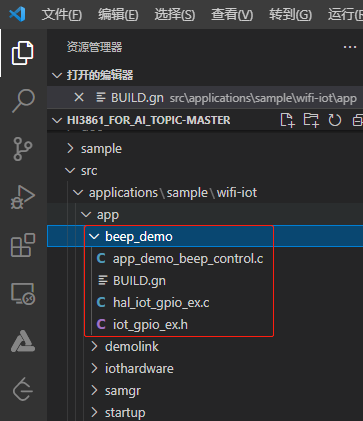

- 步骤2：修改applications/sample/wifi-iot/app/目录下的BUILD.gn，在features字段中添加beep_demo: beepDemo。注：第一个beep_demo指的是需要编译的工程目录，第二个beepDemo指的是applications/sample/wifi-iot/app/beep_demo/BUILD.gn文件中的静态库，名称为beepDemo。

```c
import("//build/lite/config/component/lite_component.gni")

lite_component("app") {
    features = [
        "beep_demo:beepDemo",
    ]
}
```

* 步骤3：修改device/hisilicon/hispark_pegasus/sdk_liteos/build/config/usr_config.mk文件。在这个配置文件中打开PWM驱动宏。搜索字段CONFIG_PWM_SUPPORT ，并打开PWM。配置如下：

```c
# CONFIG_PWM_SUPPORT is not set
CONFIG_PWM_SUPPORT=y
```

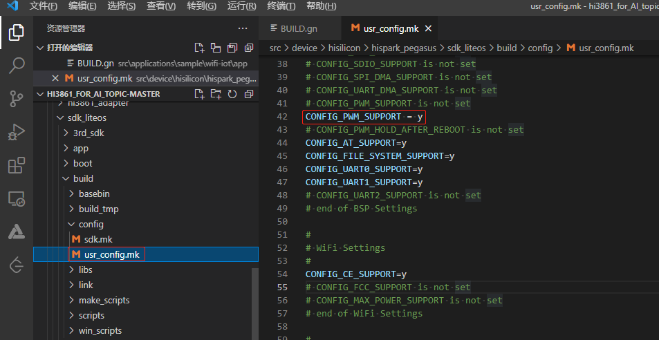

#### 4.3.3.4、代码编译和镜像烧录

* <font color='RedOrange'>**参考 4.2.1.4章节**</font>的内容即可。

#### 4.3.3.5、运行结果

- 烧录成功后，再次点击Hi3861核心板上的“RST”复位键，此时开发板的系统会运行起来。运行结果：交通灯板上的蜂鸣器响，再次按下交通灯板按键关闭蜂鸣器。

  

  


### 4.3.4、ADC之光敏电阻实验

#### 4.3.4.1、硬件环境搭建

-    硬件要求：Hi3861V100核心板、底板、交通灯板；硬件搭建如下图所示。
-    [Hi3861V100核心板参考：HiSpark_WiFi_IoT智能开发套件_原理图硬件资料\原理图\HiSpark_WiFi-IoT_Hi3861_CH340G_VER.B.pdf](http://gitee.com/hihope_iot/embedded-race-hisilicon-track-2022/blob/master/%E7%A1%AC%E4%BB%B6%E8%B5%84%E6%96%99/HiSpark_WiFi_IoT%E6%99%BA%E8%83%BD%E5%AE%B6%E5%B1%85%E5%BC%80%E5%8F%91%E5%A5%97%E4%BB%B6_%E5%8E%9F%E7%90%86%E5%9B%BE.rar)
-    [底板参考：HiSpark_WiFi_IoT智能开发套件_原理图硬件资料\原理图\HiSpark_WiFi_IoT_EXB_VER.A.pdf](http://gitee.com/hihope_iot/embedded-race-hisilicon-track-2022/blob/master/%E7%A1%AC%E4%BB%B6%E8%B5%84%E6%96%99/HiSpark_WiFi_IoT%E6%99%BA%E8%83%BD%E5%AE%B6%E5%B1%85%E5%BC%80%E5%8F%91%E5%A5%97%E4%BB%B6_%E5%8E%9F%E7%90%86%E5%9B%BE.rar)
-    [交通灯板硬件原理图参考：HiSpark_WiFi_IoT智能开发套件_原理图硬件资料\原理图\HiSpark_WiFi_IoT_DCL_VER.A.pdf](http://gitee.com/hihope_iot/embedded-race-hisilicon-track-2022/blob/master/%E7%A1%AC%E4%BB%B6%E8%B5%84%E6%96%99/HiSpark_WiFi_IoT%E6%99%BA%E8%83%BD%E5%AE%B6%E5%B1%85%E5%BC%80%E5%8F%91%E5%A5%97%E4%BB%B6_%E5%8E%9F%E7%90%86%E5%9B%BE.rar)
-    <font color='RedOrange'>**注意**</font>：如下实验案例仅用于参考，里面涉及到的炫彩灯板硬件，海思嵌入式大赛开发套件中没有包含，如需使用请自行购买

| 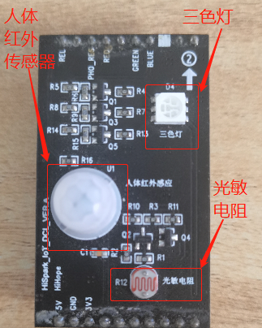 | 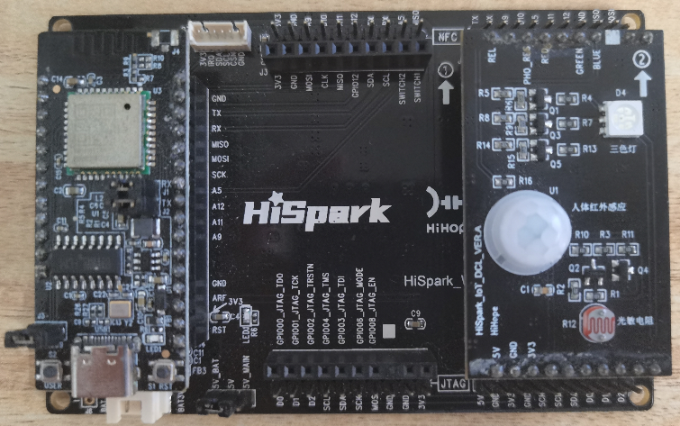 |
| ------------------------------------------------------------ | ------------------------------------------------------------ |

#### 4.3.4.2、接口说明

| API名称                                                      | 说明            |
| ------------------------------------------------------------ | --------------- |
| unsigned int AdcRead(WifiIotAdcChannelIndex channel, unsigned short *data, WifiIotAdcEquModelSel equModel, WifiIotAdcCurBais curBais, unsigned short rstCnt); | 读取ADC通道的值 |

* **炫彩灯板光敏电阻与主控芯片（Pegasus）引脚的对应关系**
  - **光敏电阻：**GPIO9/ADC4/感应范围小，响应快


#### 4.3.4.3、代码准备

- 步骤1：将 vendor/hisilicon/hispark_pegasus/demo/adc_demo文件夹复制到applications/sample/wifi-iot/app/目录下。

  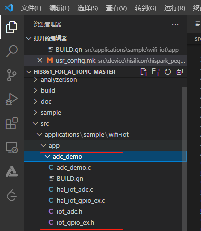

- 步骤2：修改applications/sample/wifi-iot/app/目录下的BUILD.gn，在features字段中添加adc_demo: adc_demo。注：第一个adc_demo指的是需要编译的工程目录，第二个adc_demo指的是applications/sample/wifi-iot/app/adc_demo/BUILD.gn文件中的静态库，名称为adc_demo。

```c
import("//build/lite/config/component/lite_component.gni")

lite_component("app") {
    features = [
        "adc_demo:adc_demo",
    ]
}
```

#### 4.3.4.4、代码编译和镜像烧录

* <font color='RedOrange'>**参考 4.2.1.4章节**</font>的内容即可。

#### 4.3.4.5、运行结果

* 烧录文件后，按下reset按键，程序开始运行，改变炫彩灯板光敏电阻周围环境的光，会发现串口打印的`ADCvalue`会发生变化；

* 关于如何使用工具查看系统打印信息，<font color='RedOrange'>**参考 4.2.1.5章节**</font>的内容即可。

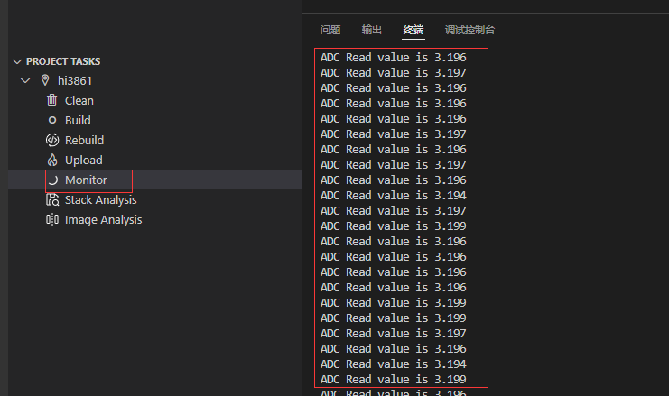

### 4.3.5、I2C通信介绍

#### 4.3.5.1、接口说明

| API名称                                                      | 说明                          |
| ------------------------------------------------------------ | ----------------------------- |
| IoTI2cInit(unsigned int id, unsigned int baudrate);          | 用指定的波特速率初始化I2C设备 |
| IoTI2cDeinit(unsigned int id);                               | 取消初始化I2C设备             |
| IoTI2cWrite(unsigned int id, unsigned short deviceAddr, const unsigned char *data, unsigned int dataLen); | 将数据写入I2C设备             |
| IoTI2cRead(unsigned int id, unsigned short deviceAddr, unsigned char *data, unsigned int dataLen); | 从I2C设备中读取数据           |
| IoTI2cSetBaudrate(unsigned int id, unsigned int baudrate);   | 设置I2C设备的波特率           |

#### 4.3.5.2、实验说明


-    例如在 Hi3861 上外接一个 OLED 屏，查阅资料知道，OLED 屏为 I2C 通讯方式，Hi3861 发送命令驱动 OLED 屏显示，可以对hello_world_demo中的OLED代码进行分析。
-    GPIO 初始化及引脚功能复用 为 I2C 模式。Hi3861 的 SOC 上一共有两路 I2C，分别是 I2C0 和 I2C1。Hi3861 上的 GPIO 引脚能复用为 I2C0 的有两组，分别为 GPIO9（I2C0_SCL）、 GPIO10（I2C0_SDA）和 GPIO13（I2C0_SDA）、GPIO14（I2C0_SCL）；GPIO 引脚能复用为 I2C1 的有 两组，分别为 GPIO0（I2C1_SDA）、GPIO1（I2C1_SCL）。本案例使用 GPIO13（I2C0_SDA）、 GPIO14（I2C0_SCL）这一组作为 OLED 屏和 Hi3861 进行 I2C 通信 。本案例复用GPIO13,GPIO14。

```
IoTGpioInit(13); 
IoSetFunc(13, 6); /* gpio13复用I2C0_SDA */
IoTGpioInit(14); /* 初始化gpio14 */
IoSetFunc(14, 6); /* gpio14复用I2C0_SCL */
```

- I2C 初始化配置，包括通道选择：0，设置初始化波特率：OLED_I2C_BAUDRATE(400kbps)，Hi3861 最高波特率为400kbps。

  ```
  IoTI2cInit(0, OLED_I2C_BAUDRATE);
  ```

- 设置 OLED 屏的初始化，查阅 OLED 屏的 datasheet 可知 OLED 屏的初始化命令，Hi3861 通过 I2C 将 OLED 屏初始化命令发送给 OLED 屏。

  ```
  static const uint8_t initCmds[] = {
      0xAE, // --display off
      0x00, // ---set low column address
      0x10, // ---set high column address
      0x40, // --set start line address
      0xB0, // --set page address
      0x81, // contract control
      0xFF, // --128
      0xA1, // set segment remap
      0xA6, // --normal / reverse
      0xA8, // --set multiplex ratio(1 to 64)
      0x3F, // --1/32 duty
      0xC8, // Com scan direction
      0xD3, // -set display offset
      0x00,
      0xD5, // set osc division
      0x80,
      0xD8, // set area color mode off
      0x05,
      0xD9, // Set Pre-Charge Period
      0xF1,
      0xDA, // set com pin configuration
      0x12,
      0xDB, // set Vcomh
      0x30,
      0x8D, // set charge pump enable
      0x14,
      0xAF, // --turn on oled panel
  };
  ```

- Hi3861 通过 I2C 发送显示信息给 OLED 屏，OLED 屏收到后显示在屏上。

  ```
  OledFillScreen(); /* 全屏填充 */
  OledShowString(20, 3, "Hello  World", 1); /* 屏幕第20列3行显示1行 */
  ```

- 上面步骤完成后还无法使用PWM，需要修改device/hisilicon/hispark_pegasus/sdk_liteos/build/config/usr_config.mk文件。在这个配置文件中打开PWM驱动宏。搜索字段CONFIG_I2C_SUPPORT ，并打开I2C。配置如下：

  ```
  # CONFIG_I2C_SUPPORT is not set
  CONFIG_I2C_SUPPORT=y
  ```

- 创建一个任务线程，单独处理OLED显示任务，串口通信的具体任务实现。

  ```
  static void OLEDDemo(void)
  {
      osThreadAttr_t attr;
      attr.name = "UartDemoTask";
      attr.attr_bits = 0U;
      attr.cb_mem = NULL;
      attr.cb_size = 0U;
      attr.stack_mem = NULL;
      attr.stack_size = 4096; /* 任务大小4096 */
      attr.priority = osPriorityNormal;
      if (osThreadNew(OLEDDemoTask, NULL, &attr) == NULL) {
          printf("[OledDemo] Failed to create OLEDDemoTask!\n");
      }
  }
  SYS_RUN(OLEDDemo);
  ```
