## 4.4、网络通信

### 4.4.1、AT指令应用(连接WiFi)

* 更多AT命令的描述可以参考《[Hi3861V100 AT命令使用指南](https://gitee.com/hihope_iot/embedded-race-hisilicon-track-2022/raw/master/%E8%8A%AF%E7%89%87%E8%B5%84%E6%96%99/Hi3861V100%EF%BC%8FHi3861LV100%20AT%E5%91%BD%E4%BB%A4%20%E4%BD%BF%E7%94%A8%E6%8C%87%E5%8D%97.pdf)》

* 步骤1：工程编译

  -   由于Hi3861V100源码自带AT指令,只需要编译源码就可以使用。工程相关配置完成后,然后编译。
  -   修改applications/sample/wifi-iot/app/目录下的BUILD.gn，在features字段中添加 startup

  ```
  import("//build/lite/config/component/lite_component.gni")
  
  lite_component("app") {
      features = [
          "startup",
      ]
  }
  ```

  -   HiSpark Pegasus 代码的编译都是一样的操作，<font color='RedOrange'>**参考 4.2.1.4章节**</font>的内容即可。

- 步骤2：功能验证

  -   烧录成功后，再次点击Hi3861核心板上的“RST”复位键，此时开发板的系统会运行起来。运行结果：打开串口工具并选择加回车换行，然后依次输入指令如下图所示，注意：当输入AT+CONN时候WiFi的认证方式有四种方式分别是0：OPEN，1：WEP，2：WPA2_PSK，3：WPA_WPA2_PSK，一般选择0或者2；可以实现AT指令连接wifi。

  ```c
  AT+RST
  AT+STARTSTA
  AT+SCAN
  AT+SCANRESULT
  AT+CONN="WiFi名称",,WiFi认证方式,"WiFi密码"
  AT+DHCP=wlan0,1
  AT+IFCFG
  AT+PING=目的IP地址
  AT+DISCONN
  ```

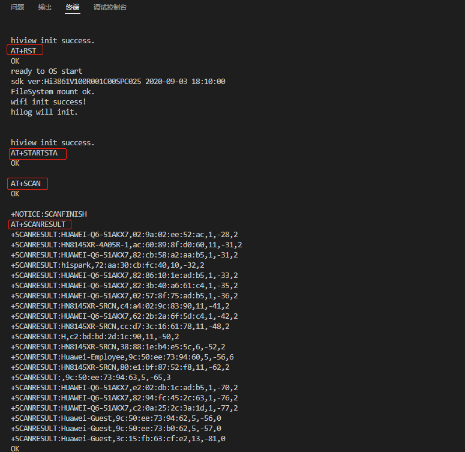

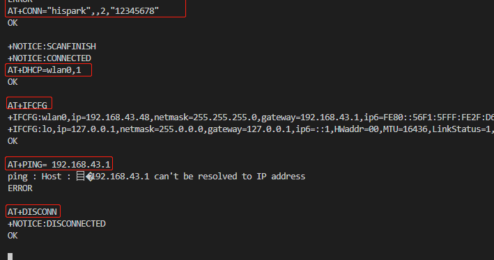

### 4.4.2、LWIP协议的TCP/IP通信

#### 4.4.2.1、硬件环境搭建

-    硬件要求：Hi3861V100核心板、底板；硬件搭建及组网图如下图所示。
-    [Hi3861V100核心板参考：HiSpark_WiFi_IoT智能开发套件_原理图硬件资料\原理图\HiSpark_WiFi-IoT_Hi3861_CH340G_VER.B.pdf](http://gitee.com/hihope_iot/embedded-race-hisilicon-track-2022/blob/master/%E7%A1%AC%E4%BB%B6%E8%B5%84%E6%96%99/HiSpark_WiFi_IoT%E6%99%BA%E8%83%BD%E5%AE%B6%E5%B1%85%E5%BC%80%E5%8F%91%E5%A5%97%E4%BB%B6_%E5%8E%9F%E7%90%86%E5%9B%BE.rar)
-    [底板参考：HiSpark_WiFi_IoT智能开发套件_原理图硬件资料\原理图\HiSpark_WiFi_IoT_EXB_VER.A.pdf](http://gitee.com/hihope_iot/embedded-race-hisilicon-track-2022/blob/master/%E7%A1%AC%E4%BB%B6%E8%B5%84%E6%96%99/HiSpark_WiFi_IoT%E6%99%BA%E8%83%BD%E5%AE%B6%E5%B1%85%E5%BC%80%E5%8F%91%E5%A5%97%E4%BB%B6_%E5%8E%9F%E7%90%86%E5%9B%BE.rar)

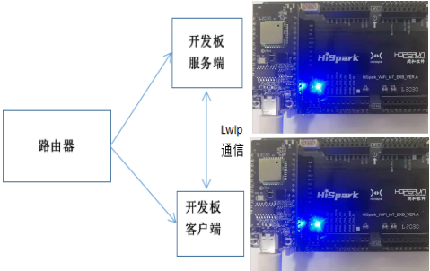

#### 4.4.2.2、软件介绍

-   1.代码目录结构及相应接口功能介绍

```c
vendor/hisilicon/hispark_pegasus/demo/lwip_demo
├── BUILD.gn                 # BUILD.gn文件由三部分内容（目标、源文件、头文件路径）构成,开发者根据需要填写,static_library中指定业务模块的编译结果，为静态库文件netDemo，开发者根据实际情况完成填写。
|                              sources中指定静态库.a所依赖的.c文件及其路径，若路径中包含"//"则表示绝对路径（此处为代码根路径），若不包含"//"则表示相对路径。include_dirs中指定source所需要依赖的.h文件路径。
├── demo_entry_cmsis.c       # 
├── demo_entry_posix.c       #
├── lwip_tcp_client.c        # 
├── lwip_tcp_server.c        # 
├── net_demo.h               # 
├── net_params.h             # 
├── wifi_connecter.c         # 
├── wifi_connecter.h         # 
└── oled_ssd1306.h           # 
```

- 2.工程编译

  -   将源码vendor/hisilicon/hispark_pegasus/demo目录下的lwip_demo整个文件夹及内容复制到源码applications/sample/wifi-iot/app/下，如下图所示。

  ```
  .
  └── applications
      └── sample
          └── wifi-iot
              └── app
                  └──lwip_demo
                     └── 代码
  ```

  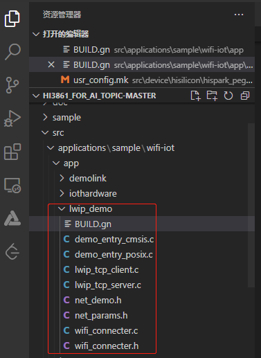

  -   编译lwip_tcp_server端，修改applications/sample/wifi-iot/app/lwip_demo/BUILD.gn文件中,在sources = [ "lwip_tcp_server.c" ]字段中添加,如下图所示。

  ```
  static_library("netDemo") {
    sources = [ "lwip_tcp_server.c" ]
  
    sources += [
      "demo_entry_cmsis.c",
      "wifi_connecter.c",
    ]
  
    include_dirs = [
      "//utils/native/lite/include",
      "//kernel/liteos_m/components/cmsis/2.0",
      "//base/iot_hardware/interfaces/kits/wifiiot_lite",
      "//base/iothardware/peripheral/interfaces/inner_api",
      "//foundation/communication/wifi_lite/interfaces/wifiservice",
    ]
  }
  ```

  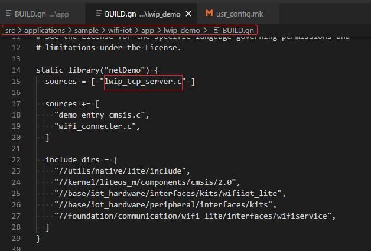

  -   修改applications/sample/wifi-iot/app/lwip_demo/net_params.h文件中内容，PARAM_HOTSPOT_SSID设置为网络名称，PARAM_HOTSPOT_PSK设置为网络密码。

  ```
  #define PARAM_HOTSPOT_SSID "xxx"   // your AP SSID
  #define PARAM_HOTSPOT_PSK  "xxxxx"  // your AP PSK
  ```

  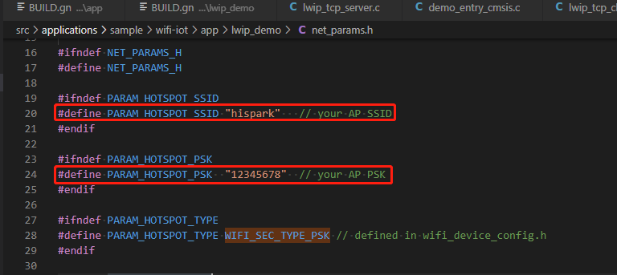

  -   根据您设置的PARAM_HOTSPOT_SSID和PARAM_HOTSPOT_PSK这两个字符串的长度，来修改 applications/sample/wifi-iot/app/lwip_demo/wifi_connecter.c 中 SSID_LEN和PSK_LEN 这两个的值，其中SSID_LEN的值为 PARAM_HOTSPOT_SSID 字符串长度+1，PSK_LEN 的值为 PARAM_HOTSPOT_PSK 字符串长度+1。

  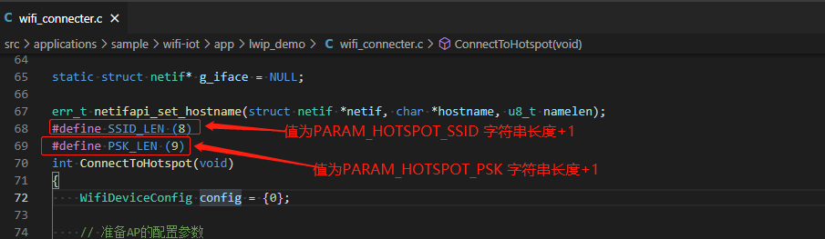

  -   修改源码applications/sample/wifi-iot/app/BUILD.gn文件，在features字段中增加索引，使目标模块参与编译。features字段指定业务模块的路径和目标,features字段配置如下图所示。

  ```
  import("//build/lite/config/component/lite_component.gni")
  
  lite_component("app") {
      features = [
          "lwip_demo:netDemo",
      ]
  }
  ```

  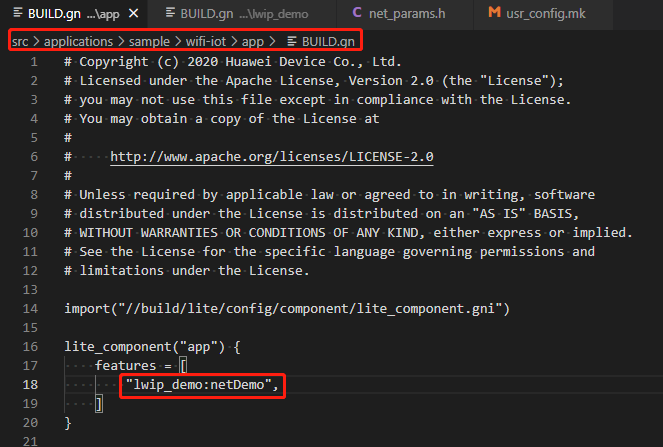

  -   修改完成后，点击IDE的rebuild按钮重新进行编译，并将镜像烧录到Hi3861V100开发板上，烧录成功后，再次点击Hi3861核心板上的“RST”复位键，在串口工具栏可以看到server服务端IP地址，如下图所示。

  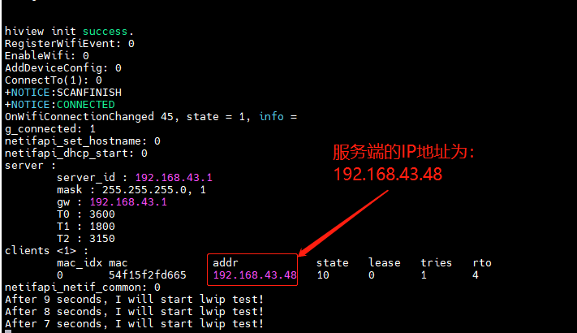

  -   修改applications/sample/wifi-iot/app/lwip_demo/net_params.h中PARAM_SERVER_ADDR字段为server服务端IP地址，同时PARAM_HOTSPOT_SSID设置为网络名称，PARAM_HOTSPOT_PSK设置为网络密码,这里注意Hi3861V100服务端与客户端需要在同一个局域网内。

  ```
  #define PARAM_HOTSPOT_SSID "xxx"   // your AP SSID
  #define PARAM_HOTSPOT_PSK  "xxxxx"  // your AP PSK
  #define PARAM_SERVER_ADDR "服务端IP地址" // your PC IP address
  ```

  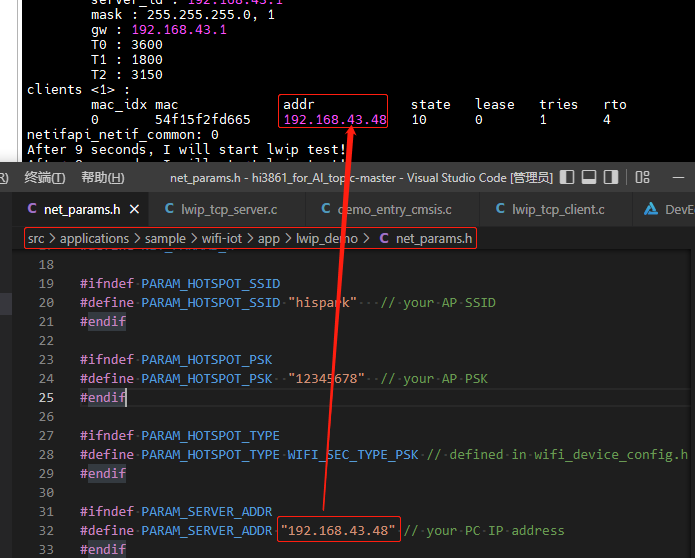

  -   编译lwip_tcp_client端，修改applications/sample/wifi-iot/app/lwip_demo/BUILD.gn文件中,在sources = [ "lwip_tcp_client.c" ]字段中添加。

  ```
  static_library("netDemo") {
    sources = [ "lwip_tcp_client.c" ]
  
    sources += [
      "demo_entry_cmsis.c",
      "wifi_connecter.c",
    ]
  
    include_dirs = [
      "//utils/native/lite/include",
      "//kernel/liteos_m/components/cmsis/2.0",
      "//base/iot_hardware/interfaces/kits/wifiiot_lite",
      "//base/iothardware/peripheral/interfaces/inner_api",
      "//foundation/communication/wifi_lite/interfaces/wifiservice",
    ]
  }
  ```

  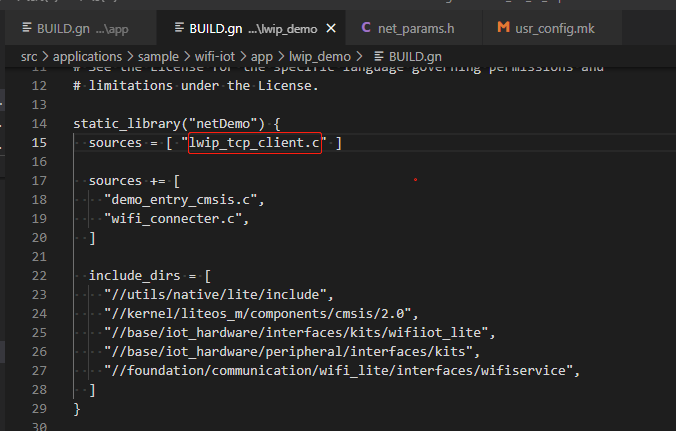

  -   修改源码applications/sample/wifi-iot/app/BUILD.gn文件，在features字段中增加索引，使目标模块参与编译。features字段指定业务模块的路径和目标,features字段配置如下。

  ```
  import("//build/lite/config/component/lite_component.gni")
  
  lite_component("app") {
      features = [
          "lwip_demo:netDemo",
      ]
  }
  ```

  -    工程相关配置完成后,然后点击rebuild进行编译。
  -    HiSpark Pegasus 代码的编译和镜像烧录都是一样的操作，<font color='RedOrange'>**参考 4.2.1.4章节**</font>的内容即可。

- 3.功能验证

  -   烧录成功后，再次点击Hi3861核心板上的“RST”复位键，此时开发板的系统会运行起来（需要先运行服务端再运行客户端）。
  -   对于如何使用工具查看系统打印信息，<font color='RedOrange'>**参考 4.2.1.5章节**</font>的内容即可（本文客户端的系统打印信息用的是IDE，服务器的系统打印信息用的是MobaXterm）

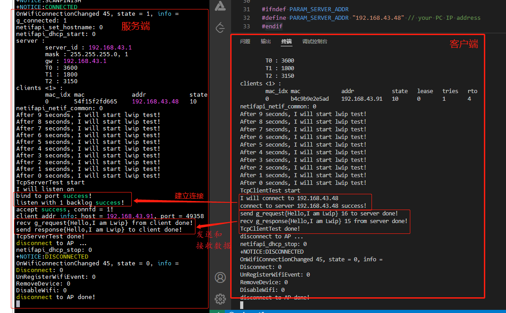

### 4.4.3、MQTT通信实验

#### 4.4.3.1、硬件环境搭建

-    硬件要求：Hi3861V100核心板、底板；硬件搭建如下图所示。
-    [Hi3861V100核心板参考：HiSpark_WiFi_IoT智能开发套件_原理图硬件资料\原理图\HiSpark_WiFi-IoT_Hi3861_CH340G_VER.B.pdf](http://gitee.com/hihope_iot/embedded-race-hisilicon-track-2022/blob/master/%E7%A1%AC%E4%BB%B6%E8%B5%84%E6%96%99/HiSpark_WiFi_IoT%E6%99%BA%E8%83%BD%E5%AE%B6%E5%B1%85%E5%BC%80%E5%8F%91%E5%A5%97%E4%BB%B6_%E5%8E%9F%E7%90%86%E5%9B%BE.rar)
-    [底板参考：HiSpark_WiFi_IoT智能开发套件_原理图硬件资料\原理图\HiSpark_WiFi_IoT_EXB_VER.A.pdf](http://gitee.com/hihope_iot/embedded-race-hisilicon-track-2022/blob/master/%E7%A1%AC%E4%BB%B6%E8%B5%84%E6%96%99/HiSpark_WiFi_IoT%E6%99%BA%E8%83%BD%E5%AE%B6%E5%B1%85%E5%BC%80%E5%8F%91%E5%A5%97%E4%BB%B6_%E5%8E%9F%E7%90%86%E5%9B%BE.rar)

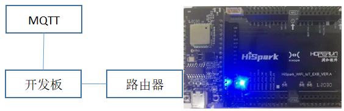

#### 4.4.3.2、软件介绍

* 1.代码目录结构及相应接口功能介绍

```
vendor/hisilicon/hispark_pegasus/demo/mqtt_demo
├── app_demo_iot.c      #
├── BUILD.gn            # BUILD.gn文件由三部分内容（目标、源文件、头文件路径）构成,开发者根据需要填写,static_library中指定业务模块的编译结果，为静态库文件mqttDemo，开发者根据实际情况完成填写。
|                        sources中指定静态库.a所依赖的.c文件及其路径，若路径中包含"//"则表示绝对路径（此处为代码根路径），若不包含"//"则表示相对路径。include_dirs中指定source所需要依赖的.h文件路径。
├── cjson_init.c        #
├── iot_config.h        # 
├── iot_hmac.c          # 
├── iot_hmac.h          # 
├── iot_log.c           # 
├── iot_log.h           # 
├── iot_main.c          # 
├── iot_main.h          # 
├── iot_profile.c       # 
├── iot_profile.h       # 
└── iot_sta.c           # 
```

- 2.工程编译

  -   将源码vendor/hisilicon/hispark_pegasus/demo目录下的mqtt_demo整个文件夹及内容复制到源码applications/sample/wifi-iot/app/下。

  ```
  .
  └── applications
      └── sample
          └── wifi-iot
              └── app
                  └──mqtt_demo
                     └── 代码   
  ```

  -   修改applications/sample/wifi-iot/app/mqtt_demo/iot_config.h中CONFIG_AP_SSID，CONFIG_AP_PWD为WiFi名称和WiFi密码。

  ```
  #define CONFIG_AP_SSID  "xxx" // WIFI SSID
  #define CONFIG_AP_PWD "xxxxxx" // WIFI PWD
  ```

  -   修改源码applications/sample/wifi-iot/app/BUILD.gn文件，在features字段中增加索引，使目标模块参与编译。features字段指定业务模块的路径和目标,features字段配置如下。

  ```
  import("//build/lite/config/component/lite_component.gni")
  
  lite_component("app") {
      features = [
          "mqtt_demo:mqttDemo",
      ]
  }
  ```

  -    工程相关配置完成后,然后进行编译。
  -    HiSpark Pegasus 代码的编译和镜像烧录都是一样的操作，<font color='RedOrange'>**参考 4.2.1.4章节**</font>的内容即可。

- 3.功能验证

  -    烧录成功后，再次点击Hi3861核心板上的“RST”复位键，此时开发板的系统会运行起来。运行结果：在串口工具看到MSGSEND:SUCCESS代表mqtt通信成功(**注**：可能根据网络状态需要几秒才能看到MSGSEND:SUCCESS)，MSGSEND:failed代表mqtt通信失败。如下图所示。
  -    对于如何使用工具查看系统打印信息，<font color='RedOrange'>**参考 4.2.1.5章节**</font>的内容即可。

  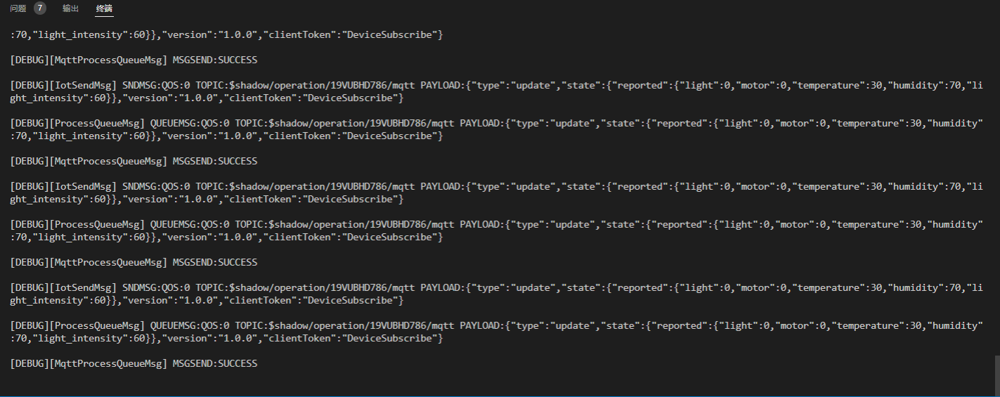

### 4.4.4、Coap协议的通信实验

#### 4.4.4.1、硬件环境搭建

-    硬件要求：Hi3861V100核心板、底板；硬件搭建及组网图如下图所示。
-    [Hi3861V100核心板参考：HiSpark_WiFi_IoT智能开发套件_原理图硬件资料\原理图\HiSpark_WiFi-IoT_Hi3861_CH340G_VER.B.pdf](http://gitee.com/hihope_iot/embedded-race-hisilicon-track-2022/blob/master/%E7%A1%AC%E4%BB%B6%E8%B5%84%E6%96%99/HiSpark_WiFi_IoT%E6%99%BA%E8%83%BD%E5%AE%B6%E5%B1%85%E5%BC%80%E5%8F%91%E5%A5%97%E4%BB%B6_%E5%8E%9F%E7%90%86%E5%9B%BE.rar)
-    [底板参考：HiSpark_WiFi_IoT智能开发套件_原理图硬件资料\原理图\HiSpark_WiFi_IoT_EXB_VER.A.pdf](http://gitee.com/hihope_iot/embedded-race-hisilicon-track-2022/blob/master/%E7%A1%AC%E4%BB%B6%E8%B5%84%E6%96%99/HiSpark_WiFi_IoT%E6%99%BA%E8%83%BD%E5%AE%B6%E5%B1%85%E5%BC%80%E5%8F%91%E5%A5%97%E4%BB%B6_%E5%8E%9F%E7%90%86%E5%9B%BE.rar)

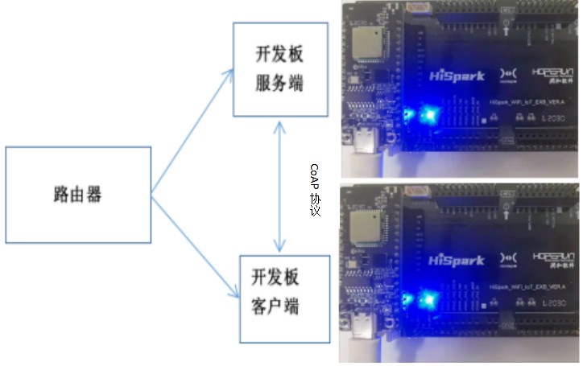

#### 4.4.4.2、软件介绍

-   1.代码目录结构及相应接口功能介绍

```
vendor_hisilicon/hispark_pegasus/demo/coap_demo
├── app_demo_iot.c      #
├── BUILD.gn            # BUILD.gn文件由三部分内容（目标、源文件、头文件路径）构成,开发者根据需要填写,static_library中指定业务模块的编译结果，为静态库文件led_example，开发者根据实际情况完成填写。
|                         sources中指定静态库.a所依赖的.c文件及其路径，若路径中包含"//"则表示绝对路径（此处为代码根路径），若不包含"//"则表示相对路径。include_dirs中指定source所需要依赖的.h文件路径。
├── cjson_init.c        #
├── coap_client.c       # 
├── coap_service.c      # 
├── iot_config.h        # 
├── iot_hmac.c          # 
├── iot_hmac.h          # 
├── iot_log.c           # 
├── iot_log.h           # 
├── iot_main.c          # 
├── iot_main.h          # 
├── iot_profile.c       # 
├── iot_profile.h       # 
└── iot_sta.c           # 
```

- 2.工程编译

  -    将源码vendor/hisilicon/hispark_pegasus/demo/coap_demo整个文件夹及内容复制到源码applications/sample/wifi-iot/app/下。

  ```
  .
  └── applications
      └── sample
          └── wifi-iot
              └── app
                  └──coap_demo
                     └── 代码   
  ```

  -    修改applications/sample/wifi-iot/app/coapdemo/iot_config.h中CONFIG_AP_SSID，CONFIG_AP_PWD为WiFi名称和WiFi密码。

  ```
  #define CONFIG_AP_SSID  "xxx" // WIFI SSID
  #define CONFIG_AP_PWD "xxxxxx" // WIFI PWD
  ```

  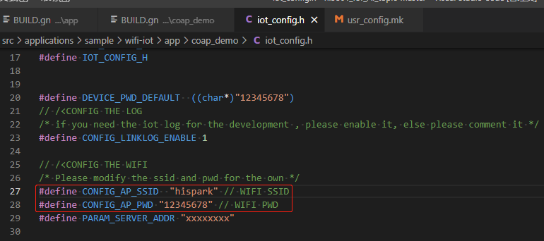

  -    如果编译coap_service服务端，修改./applications/sample/wifi-iot/app/coapdemo/BUILD.gn文件中,在sources = [ "coap_service.c" ]字段中添加。

  ```
  static_library("appDemoIot") {
      sources = [
          "app_demo_iot.c",
          "cjson_init.c",
          "coap_service.c",
          "iot_hmac.c",
          "iot_log.c",
          "iot_main.c",
          "iot_profile.c",
          "iot_sta.c",
          #"coap_client.c",
      ]
  
      include_dirs = [
          "./",
          "//utils/native/lite/include",
          "//kernel/liteos_m/kal/cmsis",
          "//base/iothardware/peripheral/interfaces/inner_api",
          "//device/soc/hisilicon/hi3861v100/sdk_liteos/third_party/lwip_sack/include/lwip",
          "//third_party/cJSON",
          "//device/soc/hisilicon/hi3861v100/sdk_liteos/third_party/mbedtls/include/mbedtls",
          "//foundation/communication/wifi_lite/interfaces/wifiservice",
          "//device/soc/hisilicon/hi3861v100/sdk_liteos/third_party/paho.mqtt.c/include/mqtt",
          "//device/soc/hisilicon/hi3861v100/sdk_liteos/third_party/libcoap/include/coap2",
      ]
      defines = [ "WITH_LWIP" ]
  }
  ```

  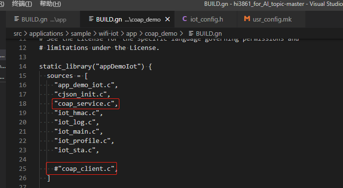

  -    修改源码./applications/sample/wifi-iot/app下的BUILD.gn文件，在features字段中增加索引，使目标模块参与编译。features字段指定业务模块的路径和目标,features字段配置如下。

  ```
  import("//build/lite/config/component/lite_component.gni")
  
  lite_component("app") {
      features = [
          "coap_demo:appDemoIot",
      ]
  }
  ```

  -    修改完成后编译rebuild,烧录到Hi3861V100开发板上，烧录成功后，再次点击Hi3861核心板上的“RST”复位键，在串口工具栏可以看到server服务端IP地址。

  

  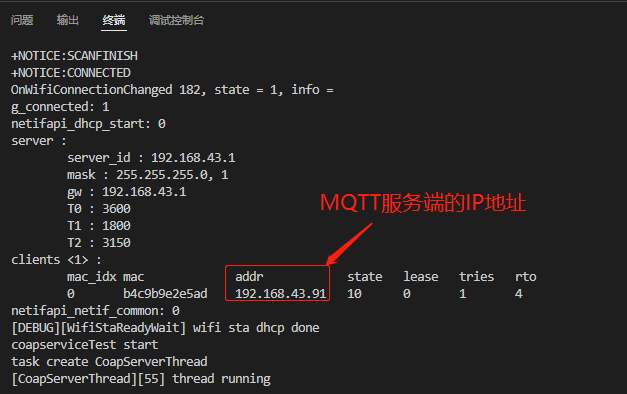

  -    配置./applications/sample/wifi-iot/app/coap_demo/iot_config.h中字段PARAM_SERVER_ADDR里面主机IP地址。

  ```
  #define CONFIG_AP_SSID  "xxx" // WIFI SSID
  #define CONFIG_AP_PWD "xxxxxx" // WIFI PWD
  #define PARAM_SERVER_ADDR "xxxxxxxx"
  ```

  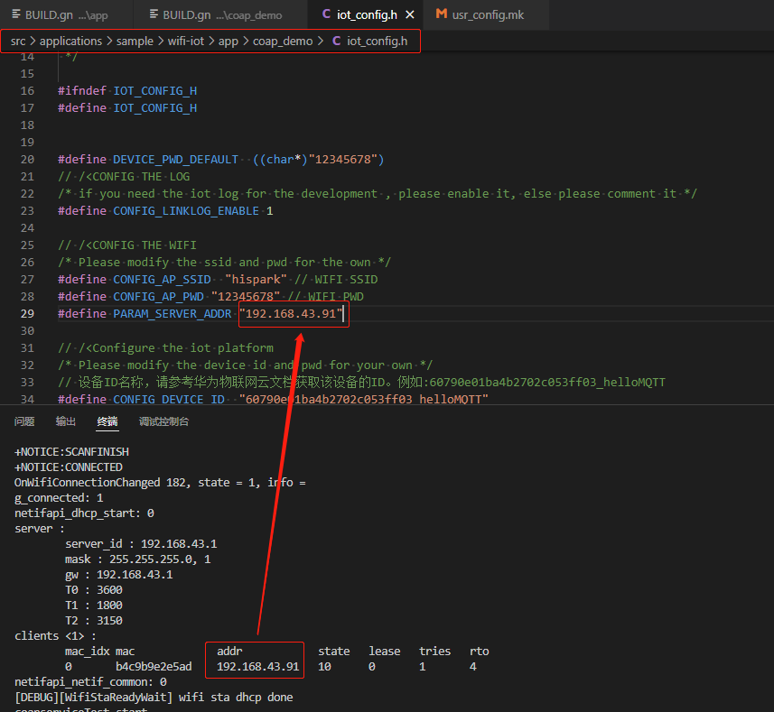

  -    如果编译coap_client客户端，修改./applications/sample/wifi-iot/app/lwip_demo/BUILD.gn文件中,在sources = [ "coap_client.c" ]字段中添加。

  ```
  static_library("appDemoIot") {
      sources = [
          "app_demo_iot.c",
          "cjson_init.c",
         #"coap_service.c",
          "iot_hmac.c",
          "iot_log.c",
          "iot_main.c",
          "iot_profile.c",
          "iot_sta.c",
          "coap_client.c",
      ]
  
      include_dirs = [
          "./",
          "//utils/native/lite/include",
          "//kernel/liteos_m/kal/cmsis",
          "//base/iothardware/peripheral/interfaces/inner_api",
          "//device/soc/hisilicon/hi3861v100/sdk_liteos/third_party/lwip_sack/include/lwip",
          "//third_party/cJSON",
          "//device/soc/hisilicon/hi3861v100/sdk_liteos/third_party/mbedtls/include/mbedtls",
          "//foundation/communication/wifi_lite/interfaces/wifiservice",
          "//device/soc/hisilicon/hi3861v100/sdk_liteos/third_party/paho.mqtt.c/include/mqtt",
          "//device/soc/hisilicon/hi3861v100/sdk_liteos/third_party/libcoap/include/coap2",
      ]
      defines = [ "WITH_LWIP" ]
  }
  ```

  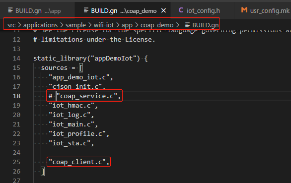

  -    修改源码./applications/sample/wifi-iot/app下的BUILD.gn文件，在features字段中增加索引，使目标模块参与编译。features字段指定业务模块的路径和目标,features字段配置如下。

  ```
  import("//build/lite/config/component/lite_component.gni")
  
  lite_component("app") {
      features = [
          "coap_demo:appDemoIot",
      ]
  }
  ```

  -    工程相关配置完成后,然后进行编译。
  -    HiSpark Pegasus 代码的编译和镜像烧录都是一样的操作，<font color='RedOrange'>**参考 4.2.1.4章节**</font>的内容即可。

- 3.功能验证

  -    烧录成功后，再次点击Hi3861核心板上的“RST”复位键，此时开发板的系统会运行起来。运行结果：服务端设备在串口工具显示Hello coap，客户端在串口工具显示scheduling for xxxx ticks。
  -    对于如何使用工具查看系统打印信息，<font color='RedOrange'>**参考 4.2.1.5章节**</font>的内容即可。

  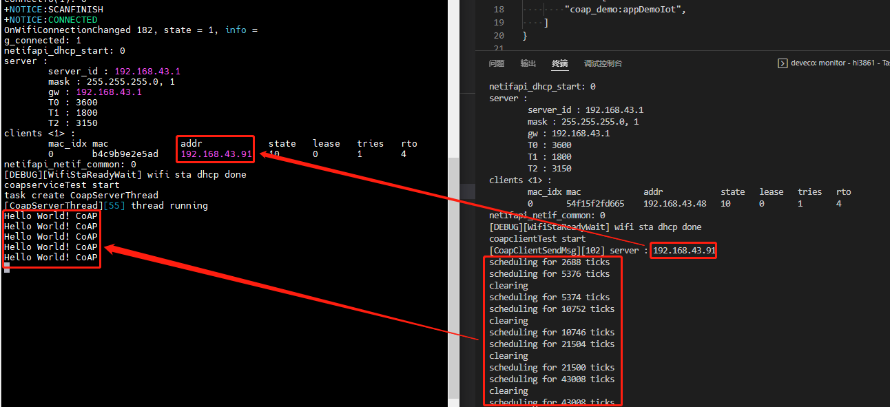

