## 4.6、综合应用案例

### 4.6.1、NFC参考样例

#### 4.6.1.1、硬件环境搭建

-    硬件要求：Hi3861V100核心板、底板，OLDE板，NFC板；硬件搭建如下图所示。
-    [Hi3861V100核心板参考：HiSpark_WiFi_IoT智能开发套件_原理图硬件资料\原理图\HiSpark_WiFi-IoT_Hi3861_CH340G_VER.B.pdf](http://gitee.com/hihope_iot/embedded-race-hisilicon-track-2022/blob/master/%E7%A1%AC%E4%BB%B6%E8%B5%84%E6%96%99/HiSpark_WiFi_IoT%E6%99%BA%E8%83%BD%E5%AE%B6%E5%B1%85%E5%BC%80%E5%8F%91%E5%A5%97%E4%BB%B6_%E5%8E%9F%E7%90%86%E5%9B%BE.rar)
-    [底板参考：HiSpark_WiFi_IoT智能开发套件_原理图硬件资料\原理图\HiSpark_WiFi_IoT_EXB_VER.A.pdf](http://gitee.com/hihope_iot/embedded-race-hisilicon-track-2022/blob/master/%E7%A1%AC%E4%BB%B6%E8%B5%84%E6%96%99/HiSpark_WiFi_IoT%E6%99%BA%E8%83%BD%E5%AE%B6%E5%B1%85%E5%BC%80%E5%8F%91%E5%A5%97%E4%BB%B6_%E5%8E%9F%E7%90%86%E5%9B%BE.rar)
-    [OLED板参考：HiSpark_WiFi_IoT智能开发套件_原理图硬件资料\原理图\HiSpark_WiFi_IoT_OLED_VER.A.pdf](http://gitee.com/hihope_iot/embedded-race-hisilicon-track-2022/blob/master/%E7%A1%AC%E4%BB%B6%E8%B5%84%E6%96%99/HiSpark_WiFi_IoT%E6%99%BA%E8%83%BD%E5%AE%B6%E5%B1%85%E5%BC%80%E5%8F%91%E5%A5%97%E4%BB%B6_%E5%8E%9F%E7%90%86%E5%9B%BE.rar)
-    [NFC板硬件原理图参考：HiSpark_WiFi_IoT智能开发套件_原理图硬件资料\原理图\HiSpark_WiFi_IoT_NFC_VER.A.pdf](http://gitee.com/hihope_iot/embedded-race-hisilicon-track-2022/blob/master/%E7%A1%AC%E4%BB%B6%E8%B5%84%E6%96%99/HiSpark_WiFi_IoT%E6%99%BA%E8%83%BD%E5%AE%B6%E5%B1%85%E5%BC%80%E5%8F%91%E5%A5%97%E4%BB%B6_%E5%8E%9F%E7%90%86%E5%9B%BE.rar)

| 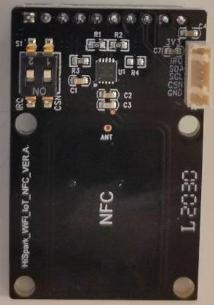 |  |
| ------------------------------- | ------------------------------------------------------------ |

#### 4.6.1.2、软件介绍

-   1.代码目录结构及相应接口功能介绍

```
vendor_hisilicon/hispark_pegasus/demo/nfc_demo
├── app_demo_config.c           #
├── app_demo_config.h           #
├── app_demo_gl5537_1.c         # 
├── app_demo_i2c_oled.c         # 
├── app_demo_multi_sample.c     # 
├── app_demo_multi_sample.h     # 
├── app_demo_nfc.c              # 
├── BUILD.gn                    # BUILD.gn文件由三部分内容（目标、源文件、头文件路径）构成,开发者根据需要填写,static_library中指定业务模块的编译结果，为静态库文件led_example，开发者根据实际情况完成填写。
|                                 sources中指定静态库.a所依赖的.c文件及其路径，若路径中包含"//"则表示绝对路径（此处为代码根路径），若不包含"//"则表示相对路径。include_dirs中指定source所需要依赖的.h文件路径。
├── c081_nfc.h                  # 
├── hal_iot_adc.c               # 
├── hal_iot_gpio_ex.c           #  
├── iot_adc.h                   # 
├── iot_gpio_ex.h               #  
└── ssd1306_oled.c              # 
```

- 2.工程编译

  -    将源码./vendor/hisilicon/hispark_pegasus/demo目录下的nfc_demo整个文件夹及内容复制到源码./applications/sample/wifi-iot/app/下。

  ```
  .
  └── applications
      └── sample
          └── wifi-iot
              └── app
                  └──nfc_demo
                     └── 代码
  ```

  -    修改源码./applications/sample/wifi-iot/app下的BUILD.gn文件，在features字段中增加索引，使目标模块参与编译。features字段指定业务模块的路径和目标,features字段配置如下。

  ```
  import("//build/lite/config/component/lite_component.gni")
  
  lite_component("app") {
      features = [
          "nfc_demo:appDemoNfc",
      ]
  }
  ```

  -    工程相关配置完成后,然后进行编译，HiSpark Pegasus 代码的编译和镜像烧录都是一样的操作，<font color='RedOrange'>**参考 4.2.1.4章节**</font>的内容即可。

- 3.功能验证

  -    烧录成功后，再次点击Hi3861核心板上的“RST”复位键，此时开发板的系统会运行起来。运行结果：NFC demo一共拉起5个APP，按键切换拉起不同应用。（注：手机上需事先安装下面的APP应用，手机需要有NFC功能，使用前请用户先打开手机的NFC功能），分别是Wechat模式: NFC demo初始状态是WeChat ，也就是用手机靠近贴着NFC板，就会调起手机的微信APP；Today Headline模式 : 再按下左键S1，会从WeChat mode跳到 Today Headline mode，用手机靠近贴着NFC板，就会调起手机的今日头条APP；Tobao模式: 再按下左键S1，会从Today Headline mode跳到Taobao mode，用手机靠近贴着NFC板，就会调起手机的淘宝APP；SmartLife模式: 再按下左键S1，会从Taobao mode跳到SmartLife mode，用手机靠近贴着NFC板，就会调起手机的智慧生活APP。Histreaming模式: 再按下左键S1，会从SmartLife mode跳到Histreaming mode，用手机靠近贴着NFC板，就会调起手机的淘宝APP。。

Wechat 模式:

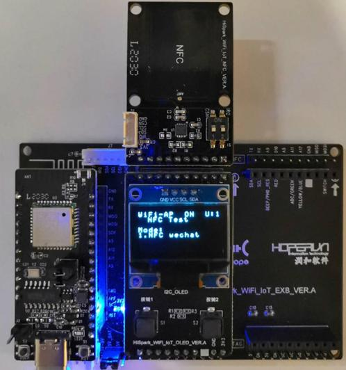

Today Headline模式 : 

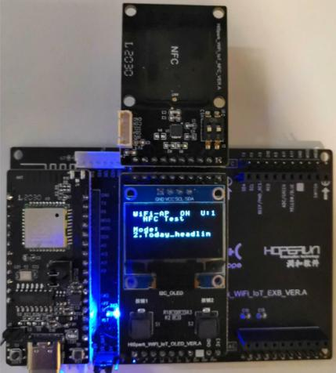

Tobao模式:

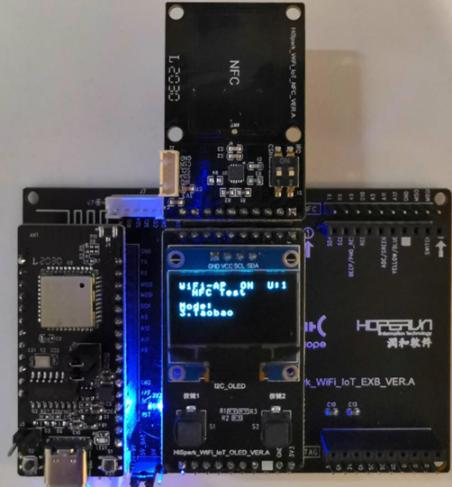

* 另外两种就不做演示，需要开发者手机上面安装了智慧生活APP和HiStreaming APP才会成功被拉起。

### 4.6.2、交通灯参考样例

#### 4.6.2.1、硬件环境搭建

  -    硬件要求：Hi3861V100核心板、底板，OLDE板，交通灯板；硬件搭建如下图所示。
-    [Hi3861V100核心板参考：HiSpark_WiFi_IoT智能开发套件_原理图硬件资料\原理图\HiSpark_WiFi-IoT_Hi3861_CH340G_VER.B.pdf](http://gitee.com/hihope_iot/embedded-race-hisilicon-track-2022/blob/master/%E7%A1%AC%E4%BB%B6%E8%B5%84%E6%96%99/HiSpark_WiFi_IoT%E6%99%BA%E8%83%BD%E5%AE%B6%E5%B1%85%E5%BC%80%E5%8F%91%E5%A5%97%E4%BB%B6_%E5%8E%9F%E7%90%86%E5%9B%BE.rar)
-    [底板参考：HiSpark_WiFi_IoT智能开发套件_原理图硬件资料\原理图\HiSpark_WiFi_IoT_EXB_VER.A.pdf](http://gitee.com/hihope_iot/embedded-race-hisilicon-track-2022/blob/master/%E7%A1%AC%E4%BB%B6%E8%B5%84%E6%96%99/HiSpark_WiFi_IoT%E6%99%BA%E8%83%BD%E5%AE%B6%E5%B1%85%E5%BC%80%E5%8F%91%E5%A5%97%E4%BB%B6_%E5%8E%9F%E7%90%86%E5%9B%BE.rar)
-    [OLED板参考：HiSpark_WiFi_IoT智能开发套件_原理图硬件资料\原理图\HiSpark_WiFi_IoT_OLED_VER.A.pdf](http://gitee.com/hihope_iot/embedded-race-hisilicon-track-2022/blob/master/%E7%A1%AC%E4%BB%B6%E8%B5%84%E6%96%99/HiSpark_WiFi_IoT%E6%99%BA%E8%83%BD%E5%AE%B6%E5%B1%85%E5%BC%80%E5%8F%91%E5%A5%97%E4%BB%B6_%E5%8E%9F%E7%90%86%E5%9B%BE.rar)
-    [交通灯板硬件原理图参考：HiSpark_WiFi_IoT智能开发套件_原理图硬件资料\原理图\HiSpark_WiFi_IoT_SSL_VER.A.pdf](http://gitee.com/hihope_iot/embedded-race-hisilicon-track-2022/blob/master/%E7%A1%AC%E4%BB%B6%E8%B5%84%E6%96%99/HiSpark_WiFi_IoT%E6%99%BA%E8%83%BD%E5%AE%B6%E5%B1%85%E5%BC%80%E5%8F%91%E5%A5%97%E4%BB%B6_%E5%8E%9F%E7%90%86%E5%9B%BE.rar)
-    <font color='RedOrange'>**注意**</font>：如下实验案例仅用于参考，里面涉及到的智慧交通灯硬件，海思嵌入式大赛开发套件中没有包含，如需使用请自行购买

| 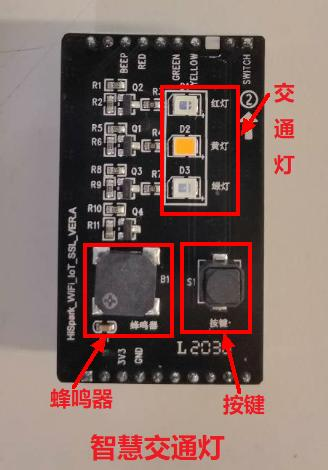 |  |
| ------------------------------------------------------------ | ---------------------------------------------- |

#### 4.6.2.2、软件介绍

-   1.代码目录结构及相应接口功能介绍

```
vendor_hisilicon/hispark_pegasus/demo/traffic_light_demo
├── app_demo_config.c           #
├── app_demo_config.h           #
├── app_demo_gl5537_1.c         # 
├── app_demo_gl5537_1.h         # 
├── app_demo_i2c_oled.c         # 
├── app_demo_i2c_oled.h         # 
├── cjson_init.c                # 
├── app_demo_multi_sample.c     # 
├── app_demo_multi_sample.h     # 
├── app_demo_traffic_sample.c   # 
├── app_demo_traffic_sample.h   # 
├── BUILD.gn                    # BUILD.gn文件由三部分内容（目标、源文件、头文件路径）构成,开发者根据需要填写,static_library中指定业务模块的编译结果，为静态库文件led_example，开发者根据实际情况完成填写。
|                                 sources中指定静态库.a所依赖的.c文件及其路径，若路径中包含"//"则表示绝对路径（此处为代码根路径），若不包含"//"则表示相对路径。include_dirs中指定source所需要依赖的.h文件路径。
├── hal_iot_adc.c               # 
├── hal_iot_gpio_ex.c           #  
├── iot_adc.h                   # 
├── iot_gpio_ex.h               # 
├── ssd1306_oled.h              # 
└── task_start.c                # 
```

- 2.工程编译

  -    将源码./vendor/hisilicon/hispark_pegasus/demo目录下的traffic_light_demo整个文件夹及内容复制到源码./applications/sample/wifi-iot/app/下。

  ```
  .
  └── applications
      └── sample
          └── wifi-iot
              └── app
                  └──traffic_light_demo
                     └── 代码   
  ```

  -    修改源码./applications/sample/wifi-iot/app/BUILD.gn文件，在features字段中增加索引，使目标模块参与编译。features字段指定业务模块的路径和目标,features字段配置如下。

  ```
  import("//build/lite/config/component/lite_component.gni")
  
  lite_component("app") {
      features = [
          "traffic_light_demo:appDemoTrafficSample",
      ]
  }
  ```

  -    修改device/hisilicon/hispark_pegasus/sdk_liteos/build/config/usr_config.mk文件。在这个配置文件中打开I2C,PWM驱动宏。搜索字段CONFIG_I2C_SUPPORT ，并打开I2C,PWM。配置如下：

  ```
  # CONFIG_I2C_SUPPORT is not set
  CONFIG_I2C_SUPPORT=y
  # CONFIG_PWM_SUPPORT is not set
  CONFIG_PWM_SUPPORT=y
  ```

  -    工程相关配置完成后,然后进行编译，HiSpark Pegasus 代码的编译和镜像烧录都是一样的操作，<font color='RedOrange'>**参考 4.2.1.4章节**</font>的内容即可。

- 3.功能验证

  -    烧录成功后，再次点击Hi3861核心板上的“RST”复位键，此时开发板的系统会运行起来。运行结果：主要实现三种交通灯模式，分别为Control Mode: 进入Traffic Light demo，初始状态就是Control Mode，是通过右边按键S2来控制红、黄、绿灯的亮灭状态不断切换。Auto Mode: 当按下左键S1时，会从control mode跳到Auto mode，交通灯模式，此时按下交通灯板上面的按键开启蜂鸣器，按键再次按下关闭；模仿交通灯，红灯常亮5秒，然后闪烁3秒，后黄灯闪烁3秒，后绿灯常亮5秒，再是绿灯闪烁3秒，如此循环，蜂鸣器开启后会响。最后一行的R，Y，G后面的数字代表倒数的时间，动态显示，时间的单位是秒，R代表红灯，Y代表黄灯，G代表绿灯，B代表的是蜂鸣器，数字“1”代表蜂鸣器打开状态，数字“0”代表蜂鸣器关闭状态。Human Mode: 当再次按下左键S1时，会从Auto mode跳到Human Mode模式，就是在Auto mode的基础上增加了人为控制，且红灯常亮改为30秒。模仿交通灯，红灯常亮30秒后闪烁3秒，黄灯闪烁3秒，然后绿灯常亮5秒，绿灯闪烁3秒，如此循环。如果按下右键S2，红灯立即快闪3秒，黄灯快闪3秒，进入绿灯常亮5秒，再绿灯闪烁3秒，后进入正常循环。蜂鸣器开启后会响。此时如果再按一下左键S1就会跳到Return Menu界面，选择按下Continue继续demo循环。

Control Mode模式：

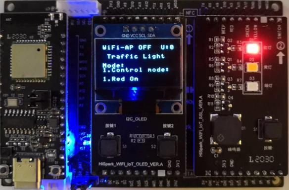

Auto Mode模式：

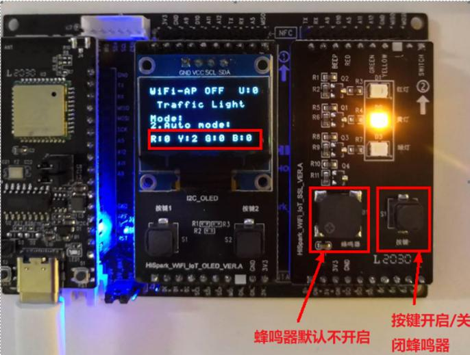

Human Mode模式：

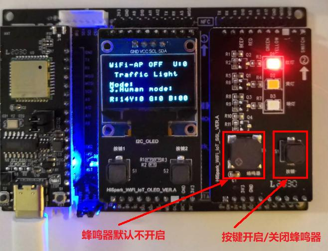

### 4.6.3、环境监测参考样例

#### 4.6.3.1、硬件环境搭建 

-    硬件要求：Hi3861V100核心板、底板，OLDE板，环境监测板；硬件搭建如下图所示。
-    [Hi3861V100核心板参考：HiSpark_WiFi_IoT智能开发套件_原理图硬件资料\原理图\HiSpark_WiFi-IoT_Hi3861_CH340G_VER.B.pdf](http://gitee.com/hihope_iot/embedded-race-hisilicon-track-2022/blob/master/%E7%A1%AC%E4%BB%B6%E8%B5%84%E6%96%99/HiSpark_WiFi_IoT%E6%99%BA%E8%83%BD%E5%AE%B6%E5%B1%85%E5%BC%80%E5%8F%91%E5%A5%97%E4%BB%B6_%E5%8E%9F%E7%90%86%E5%9B%BE.rar)
-    [底板参考：HiSpark_WiFi_IoT智能开发套件_原理图硬件资料\原理图\HiSpark_WiFi_IoT_EXB_VER.A.pdf](http://gitee.com/hihope_iot/embedded-race-hisilicon-track-2022/blob/master/%E7%A1%AC%E4%BB%B6%E8%B5%84%E6%96%99/HiSpark_WiFi_IoT%E6%99%BA%E8%83%BD%E5%AE%B6%E5%B1%85%E5%BC%80%E5%8F%91%E5%A5%97%E4%BB%B6_%E5%8E%9F%E7%90%86%E5%9B%BE.rar)
-    [OLED板参考：HiSpark_WiFi_IoT智能开发套件_原理图硬件资料\原理图\HiSpark_WiFi_IoT_OLED_VER.A.pdf](http://gitee.com/hihope_iot/embedded-race-hisilicon-track-2022/blob/master/%E7%A1%AC%E4%BB%B6%E8%B5%84%E6%96%99/HiSpark_WiFi_IoT%E6%99%BA%E8%83%BD%E5%AE%B6%E5%B1%85%E5%BC%80%E5%8F%91%E5%A5%97%E4%BB%B6_%E5%8E%9F%E7%90%86%E5%9B%BE.rar)
-    [环境检测板硬件原理图参考：HiSpark_WiFi_IoT智能开发套件_原理图硬件资料\原理图\HiSpark_WiFi_IoT_EM_VER.A.pdf](http://gitee.com/hihope_iot/embedded-race-hisilicon-track-2022/blob/master/%E7%A1%AC%E4%BB%B6%E8%B5%84%E6%96%99/HiSpark_WiFi_IoT%E6%99%BA%E8%83%BD%E5%AE%B6%E5%B1%85%E5%BC%80%E5%8F%91%E5%A5%97%E4%BB%B6_%E5%8E%9F%E7%90%86%E5%9B%BE.rar)
-    <font color='RedOrange'>**注意**</font>：如下实验案例仅用于参考，里面涉及到的环境监测板硬件，海思嵌入式大赛开发套件中没有包含，如需使用请自行购买

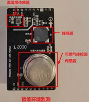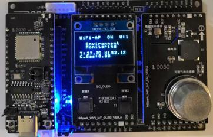

#### 4.6.3.2、软件介绍

-   1.代码目录结构及相应接口功能介绍

```
vendor_hisilicon/hispark_pegasus/demo/environment_demo
├── app_demo_aht20.c           # 
├── app_demo_aht20.h           #
├── app_demo_config.c          #
├── app_demo_config.h          #
├── app_demo_environment.c     # 
├── app_demo_environment.h     # 
├── app_demo_gl5537_1.c        # 
├── app_demo_i2c_oled.c        # 
├── app_demo_i2c_oled.h        # 
├── app_demo_mq2.c             # 
├── app_demo_mq2.h             # 
├── app_demo_multi_sample.c    # 
├── app_demo_multi_sample.h    # 
├── BUILD.gn                   # BUILD.gn文件由三部分内容（目标、源文件、头文件路径）构成,开发者根据需要填写,static_library中指定业务模块的编译结果，为静态库文件led_example，开发者根据实际情况完成填写。
|                                sources中指定静态库.a所依赖的.c文件及其路径，若路径中包含"//"则表示绝对路径（此处为代码根路径），若不包含"//"则表示相对路径。include_dirs中指定source所需要依赖的.h文件路径。
├── hal_iot_adc.c              # 
├── hal_iot_gpio_ex.c          #  
├── iot_adc.h                  # 
├── iot_gpio_ex.h              # 
├── ssd1306_oled.h             # 
└── task_start.c               # 
```

- 2.工程编译

  -    将源码./vendor/hisilicon/hispark_pegasus/demo目录下的environment_demo整个文件夹及内容复制到源码./applications/sample/wifi-iot/app/下。

  ```
  .
  └── applications
      └── sample
          └── wifi-iot
              └── app
                  └── environment_demo
                     └── 代码   
  ```

  -    修改源码./applications/sample/wifi-iot/app/BUILD.gn文件，在features字段中增加索引，使目标模块参与编译。features字段指定业务模块的路径和目标,features字段配置如下。

  ```
  import("//build/lite/config/component/lite_component.gni")
  
  lite_component("app") {
      features = [
          "environment_demo:appDemoEnvironment",
      ]
  }
  ```

  -    修改device/hisilicon/hispark_pegasus/sdk_liteos/build/config/usr_config.mk文件。在这个配置文件中打开I2C,PWM驱动宏。搜索字段CONFIG_I2C_SUPPORT ，并打开I2C,PWM。配置如下：

  ```
  # CONFIG_I2C_SUPPORT is not set
  CONFIG_I2C_SUPPORT=y
  # CONFIG_PWM_SUPPORT is not set
  CONFIG_PWM_SUPPORT=y
  ```

  -    工程相关配置完成后,然后进行编译，HiSpark Pegasus 代码的编译和镜像烧录都是一样的操作，<font color='RedOrange'>**参考 4.2.1.4章节**</font>的内容即可。

- 3.功能验证

  -    烧录成功后，再次点击Hi3861核心板上的“RST”复位键，此时开发板的系统会运行起来。运行结果：environment_demo共有4种模式，分别是Environment Monitoring模式:当进入环境监测demo，初始状态是Environment Monitoring，主要用来实时显示外部环境的温湿度以及可燃气体的浓度。OLED显示屏的最后一行文字的含义：T：Temperature温度，H：Humidity湿度，CG：Combustible Gas 可燃气体。温度、湿度和可燃气体值；Temperature Mode模式: 当再次按下左键S1时，会从Environment Monitoring模式跳到Temperature Mode模式，此模式下的OLED屏上只会显示实时的温度，通过温度传感器来实时监测外界环境的温度数据；Humidity Mode模式: 当再次按下左键S1时，会从Temperature Mode模式跳转到Humiditymode模式，此模式下的OLED屏上只会显示实时的湿度，通过湿度传感器来实时监测外界环境的湿度数据；Combustible Gas Mode模式: 当再次按下左键S1时，会从Humidity mode模式跳转到Combustible Gas Mode模式，此模式下的OLED屏上只会显示实时可燃气体浓度数据，通过可燃气体传感器来实时监测外界环境的可燃气体浓度数据。此时如果再按一下左键S1就会跳到Return Menu界面，选择Exit就可以跳转到主菜单选择界面。

Environment Monitoring模式：


Temperature Mode模式:

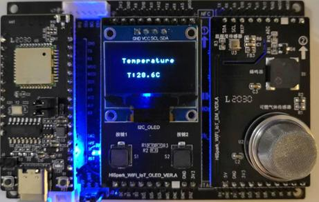

Combustible Gas Mode模式:

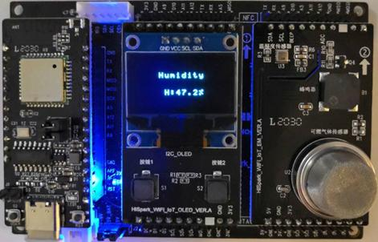

