## 5.2、Camera视频预处理和后处理实验

### 5.2.1、以HelloWorld为例介绍视频通路 

* 本章节以Taurus套件为例，详细介绍Sensor至MIPI屏的整个视频通路实现方式。

#### 5.2.1.1、Sensor至MIPI的媒体通路介绍

海思媒体处理平台主要分为视频输入（VI）、视频处理（VPSS）、视频编码（VENC）、视频解码（VDEC）、视频输出（VO）、视频拼接（AVS）、音频输入（AI）、音频输出（AO）、音频编码（AENC）、音频解码（ADEC）、区域管理（REGION）等模块。本章以Taurus套件为例，详细介绍Sensor至MIPI屏的整个视频通路实现方式，其主要处理流程如下图所示：

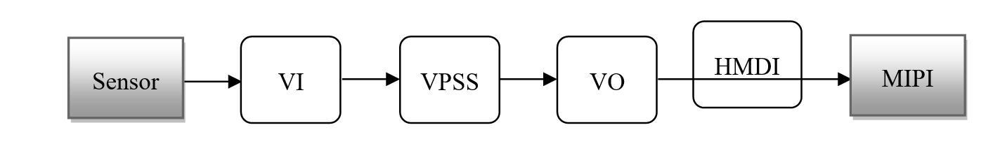

针对海思媒体处理平台涉及的关键术语作如下解释：

* VI模块捕获视频图像，可对其做剪切、去噪等处理，并输出多路不同分辨率的图像数据。
* 解码模块对编码后的视频码流进行解码，并将解析后的图像数据送VPSS进行图像处理，再送VO显示。可对H.265/H.264/JPEG格式的视频码流进行解码。
* VPSS模块接收VI和解码模块发送过来的图像，可对图像进行图像增强、锐化等处理，并实现同源输出多路不同分辨率的图像数据用于编码、预览或抓拍。
* 编码模块接收VI捕获并经VPSS处理后输出的图像数据，可叠加用户通过Region模块设置的OSD图像，然后按不用协议进行编码并输出相应码流。
* VO模块接收VPSS处理后的输出图像，可进行播放控制等处理，最后按用户配置的输出协议输出给外围视频设备。
* AVS接收多路采集的图像，进行拼接合成全景图像。
* AI模块捕获音频数据，然后AENC模块支持多种音频协议对其进行编码，最后输出音频码流。
* 用户从网络或者外围存储设备获取的音频码流可直接送给ADEC模块，ADEC支持解码多种不同的音频格式码流，解码后数据送给AO模块即可播放声音。

#### 5.2.1.2、VI理论及实现方式

##### 5.2.1.2.1、 VI理论

视频输入（VI）模块实现的功能：通过 MIPI Rx(含MIPI接口、LVDS接口和HISPI接口)，SLVS-EC，BT.1120，BT.656，BT.601，DC等接口接收视频数据。VI将接收到的数据存入到指定的内存区域，在此过程中，VI可以对接收到的原始视频图像数据进行处理，实现视频数据的采集。

VI功能框图如下：

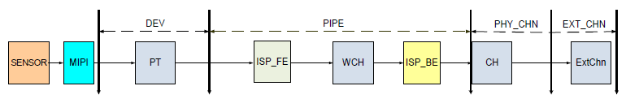

VI从软件上划分了输入设备（DEV），输入PIPE (图示为物理PIPE，虚拟PIPE只包含ISP_BE)、物理通道（PHY_CHN）、扩展通道（EXT_CHN）四个层级。Hi3516DV300的设备、PIPE、通道个数差异如下表所示：

| 芯片        | DEV <br />VI_MAX_ DEV_NUM | PHY_PIPE<br />VI_MAX_PHY<br />_PIPE_NUM | VIR_PIPE <br />VI_MAX_VIR<br />_PIPE_NUM | PHY_CHN<br />VI_MAX_PHY<br />_CHN_NUM | EXT_CHN<br />VI_MAX<br />_EXT_CHN_NUM |
| ----------- | :-----------------------: | --------------------------------------- | ---------------------------------------- | ------------------------------------- | :-----------------------------------: |
| Hi3516DV300 |             2             | 4                                       | 0                                        | 1                                     |                   8                   |

Hi3516DV300视频输入通道功能如下图所示：

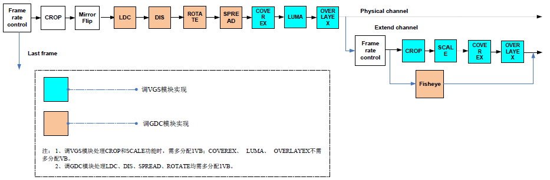

##### 5.2.1.2.2 、VI实现方式

在helloworld中，VI部分实现细节如下：

###### 步骤1：config vi

配置vi参数首先要对Sensor的参数进行配置，其中，SAMPLE_COMM_VI_GetSensorInfo接口是获取Sensor信息，该接口是对SAMPLE_VI_CONFIG_S结构体的配置， SAMPLE_VI_CONFIG_S如下图所示：

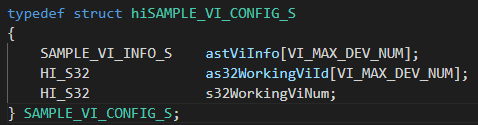

分析SAMPLE_VI_CONFIG_S结构体，核心是对SAMPLE_VI_INFO_S结构体进行配置，如下图所示：

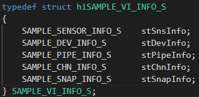

分析SAMPLE_VI_INFO_S结构体，其围绕SAMPLE_SENSOR_INFO_S、SAMPLE_DEV_INFO_S、SAMPLE_PIPE_INFO_S、SAMPLE_CHN_INFO_S、SAMPLE_SNAP_INFO_S结构体来展开，其每个结果体成员定义如下：

**SAMPLE_SENSOR_INFO_S:**

该结构体成员分别定义：SnsType、SnsId、BusId、MipiDev成员。

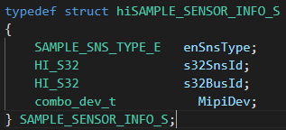

**SAMPLE_DEV_INFO_S:**

该结构体定义：ViDev、WDRMode成员。

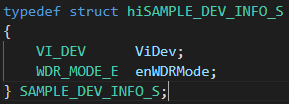

**SAMPLE_PIPE_INFO_S:**

该结构体定义：Pipe、MastPipeMode、MultiPipe、VcNumCfged、IspBypass、PixFmt、VCNum结构体成员。

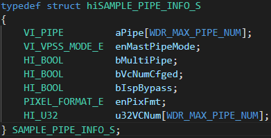

**SAMPLE_CHN_INFO_S:**

该结构体成员定义：ViChn、PixFormat、DynamicRange、VideoFormat、CompressMode成员。

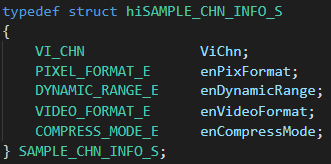

**SAMPLE_SNAP_INFO_S:**

该结构体成员定义：Snap、DoublePipe、VideoPipe、SnapPipe、VideoPipeMode、SnapPipeMode成员。

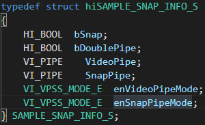

关于上述结构体列举的枚举型成员，自行查阅**源码的device/soc/hisilicon/hi3516dv300/sdk_linux/sample/platform/common/sample_comm.h**文件，该文件里面详细定义枚举型成员，这里不再详细阐述。

SAMPLE_COMM_VI_GetSensorInfo接口实现细节，如下图所示：

可参考**源码的device/soc/hisilicon/hi3516dv300/sdk_linux/sample/platform/common/中的sample_comm_vi.c文件**

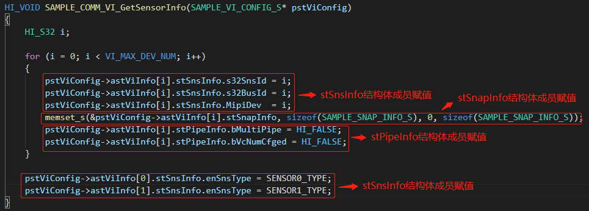

配置vi还需要配置SAMPLE_VI_CONFIG_S其他成员元素，实现细节如下：

以下截图可在device/soc/hisilicon/hi3516dv300/sdk_linux/sample/taurus/helloworld/smp/sample_lcd.c文件中找到

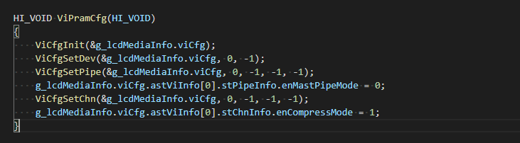

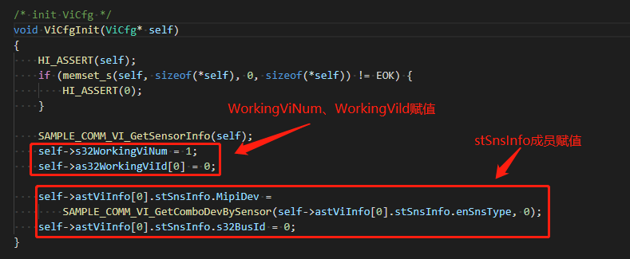

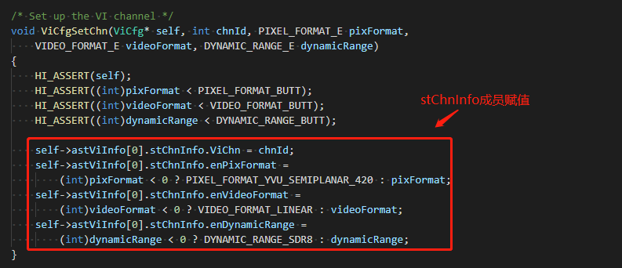

###### 步骤2： get picture size

SAMPLE_COMM_VI_GetSizeBySensor接口通过sensor型号来获取图片的大小，通过enPicSize输出，如PIC_1080P，实现接口如下：

可参考**源码的device/soc/hisilicon/hi3516dv300/sdk_linux/sample/taurus/helloworld/smp/sample_lcd.c**中的int SampleVioVpssVoMipi(void)接口中的get picture size部分。

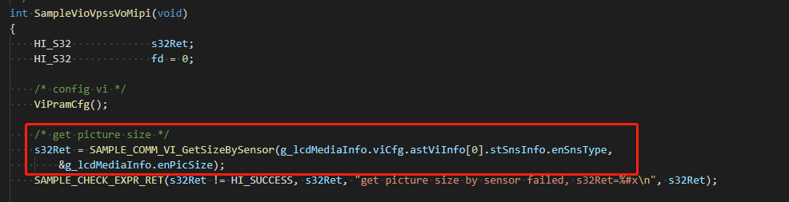

根据SAMPLE_COMM_VI_GetSizeBySensor接口输出的enPicSize来得到图片的width和height，实现方式通过SAMPLE_COMM_SYS_GetPicSize来实现，如下图所示：

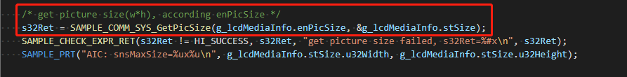

SAMPLE_COMM_VI_GetSizeBySensor和SAMPLE_COMM_SYS_GetPicSize接口实现方式较为简单，读者自行查阅**源码的device/soc/hisilicon/hi3516dv300/sdk_linux/sample/platform/common/目录**下的**sample_comm_vi.c和sample_comm_sys.c**即可。

###### 步骤3：config vb and get picture/raw buffer size

启动vi之前，需要配置vb（视频缓存池），视频缓存池的概念如下：

视频缓存池主要向媒体业务提供大块物理内存管理功能，负责内存的分配和回收，充分发挥内存缓存池的作用，让物理内存资源在各个媒体处理模块中合理使用。

一组大小相同、物理地址连续的缓存块组成一个视频缓存池。必须在系统初始化之前配置公共视频缓存池。根据业务的不同，公共缓存池的数量、缓存块的大小和数量不同。

所有的视频输入通道都可以从公共视频缓存池中获取视频缓存块用于保存采集的图像，如下图所示，VI从公共视频缓存池B中获取视频缓存块Bm，缓存块Bm经VI发送给VPSS，输入缓存块Bm经过VPSS处理之后被释放回公共视频缓存池。假设VPSS通道的工作模式是USER，则VPSS通道0从公共视频缓存池B中获取缓存块Bi作为输出图像缓存buffer发送给VENC，VPSS通道1从公共视频缓存池B中获取缓存块Bk作为输出图像缓存buffer发送给VO，Bi经VENC编码完之后释放回公共视频缓存池，Bk经VO显示完之后释放回公共视频缓存池。

典型的公共视频缓存池数据流图如下图所示：

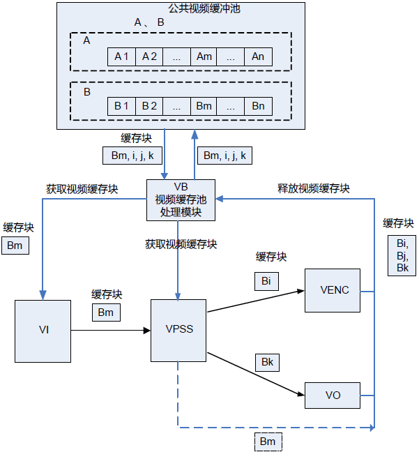

**注：**不同类型的视频缓存池大小计算请参考**源码的device/soc/hisilicon/hi3516dv300/sdk_linux/sample/doc中**的《HiMPP媒体处理软件 V4.0 开发参考.pdf》文档中的表2-1中的hi_buffer.h内容。

核心配置VB_CONFIG_S结构体，该结构体定义如下：

以下结构体可在device/soc/hisilicon/hi3516dv300/sdk_linux/sample/include/mpi_vb.h文件中找到

**VB_CONFIG_S**

【说明】

* 定义视频缓存池属性结构体

【定义】

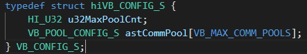

【成员】

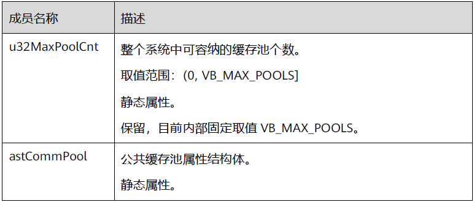

**【注意事项】**

* u32BlkSize等于0或u32BlkCnt等于0，则对应的缓存池不会被创建。

* 建议整个结构体先memset为0再按需赋值。

**对VB_CONFIG_S中嵌套的VB_POOL_CONFIG_S结构体进行说明。**

**VB_POOL_CONFIG_S**

【说明】

* 定义视频缓存池属性结构体。

【定义】

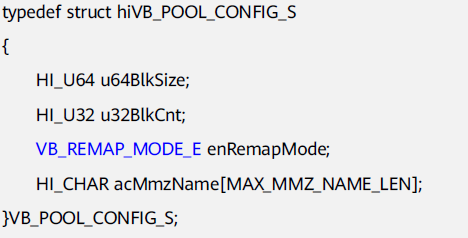

【成员】

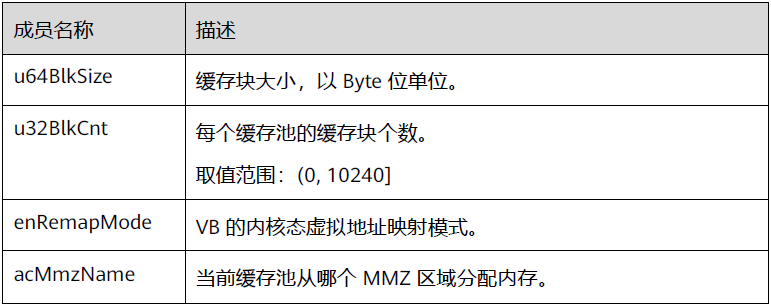

【注意事项】

*  每个缓存块的大小u64BlkSize应根据当前图像宽高、像素格式、数据位宽、是否压缩等来计算。详细计算方法请参见**源码的device/soc/hisilicon/hi3516dv300/sdk_linux/sample/doc中**的《HiMPP媒体处理软件 V4.0 开发参考.pdf》表2-1和代码[hi_buffer.h](https://gitee.com/openharmony/device_soc_hisilicon/blob/master/hi3516dv300/sdk_linux/include/hi_buffer.h)里面各种格式的图像存储计算公式。

*  该缓存池是从空闲MMZ内存中分配，一个缓存池包含若干个大小相同的缓存块。如果该缓存池的大小超过了保留内存中的空闲空间，则创建缓存池会失败。

*  用户需保证输入的DDR名字已经存在，如果输入不存在DDR的名字，会造成分不到内存。如果数组acMmzName被memset为0则表示在没有命名的DDR中创建缓存池。

**对VB_POOL_CONFIG_S中嵌套的结构体VB_REMAP_MODE_E进行解释。**

**VB_REMAP_MODE_E**

【说明】

* 定义VB内核态虚拟地址映射模式。

【定义】

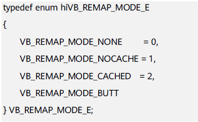

【成员】

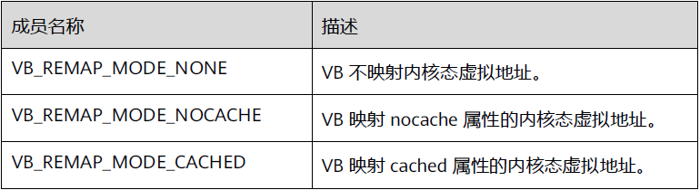

【注意事项】

* 无


**配置vb具体的代码实现方式如下图所示：**

* 可参考**源码的device/soc/hisilicon/hi3516dv300/sdk_linux/sample/taurus/helloworld/smp/sample_lcd.c文件中** StVbParamCfg( )函数。

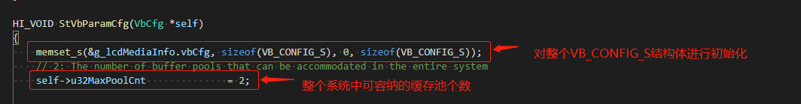

**get picture buffer size和get raw buffer size代码实现方式如下图所示：**

* 可参考**源码的device/soc/hisilicon/hi3516dv300/sdk_linux/sample/taurus/helloworld/smp/sample_lcd.c中的**HI_S32 int SampleVioVpssVoMipi(void)接口中的get picture buffer size部分和get raw buffer size部分。

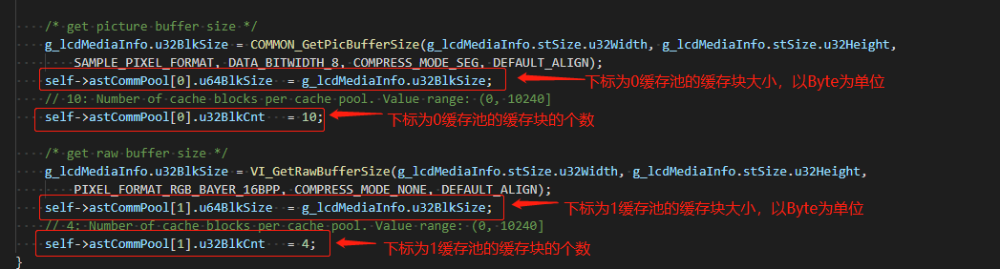

###### 步骤4：Vb init & MPI system init

通过**HI_S32 SAMPLE_COMM_SYS_Init(VB_CONFIG_S* pstVbConfig);**接口进行system初始化，可参考**源码的device/soc/hisilicon/hi3516dv300/sdk_linux/sample/taurus/helloworld/smp/sample_lcd.c中**的**int SampleVioVpssVoMipi(void)**接口中的**vb init & MPI system init**部分，如下图所示：

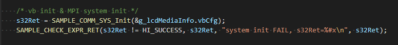

进入device/soc/hisilicon/hi3516dv300/sdk_linux/sample/platform/common/sample_comm_sys.c的SAMPLE_COMM_SYS_Init接口，对其调用的底层接口进行说明和阐述，调用的接口如下：

以下接口可以在device/soc/hisilicon/hi3516dv300/sdk_linux/sample/include/mpi_sys.h文件中找到

**HI_MPI_SYS_Exit**

【描述】

* 去初始化MPP系统。包括音频输入输出、视频输入输出、视频编解码、视频叠加区域、视频处理、图形处理等模块都会被销毁或者禁用

【语法】

* HI_S32 HI_MPI_SYS_Exit(HI_VOID);

【参数】

* 无

【返回值】


【需求】

* 头文件：hi_comm_sys.h、mpi_sys.h

* 库文件：libmpi.a

【注意】

* 去初始化时，如果有阻塞在MPI上的用户进程，则去初始化会失败。如果所有阻塞在MPI上的调用都返回，则可以成功去初始化。

* 可以反复去初始化，不返回失败。

* 由于系统去初始化不会销毁音频的编解码通道，因此这些通道的销毁需要用户主动进行。如果创建这些通道的进程退出，则通道随之被销毁。

**注：本章节涉及到的错误码请参考源码的device/soc/hisilicon/hi3516dv300/sdk_linux/sample/doc中的《HiMPP媒体处理软件V4.0开发参考.pdf》指导手册中对应的错误码**

以下四个接口可在device/soc/hisilicon/hi3516dv300/sdk_linux/sample/include/mpi_vb.h文件中找到

**HI_MPI_VB_Exit**

【描述】

* 去初始化MPP视频缓存池。

【语法】

* HI_S32 HI_MPI_VB_Exit (HI_VOID);

【参数】

* 无。

【返回值】


【需求】

* 头文件：hi_comm_vb.h、mpi_vb.h

* 库文件：libmpi.a

【注意】

* 必须先调用HI_MPI_SYS_Exit去初始化MPP系统，再去初始化缓存池，否则返回失败。

* 可以反复去初始化，不返回失败。

* 去初始化不会清除先前对缓存池的配置。

* 退出VB池之前请确保VB池里的任何VB都没有被占用，否则无法退出。

**HI_MPI_VB_SetConfig**

【描述】

* 设置MPP视频缓存池属性。

【语法】

* HI_S32 HI_MPI_VB_SetConfig(const VB_CONFIG_S *pstVbConfig);

【参数】

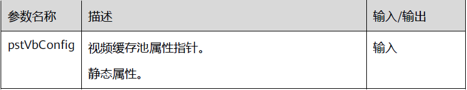

【返回值】

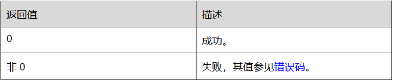

【需求】

* 头文件：hi_comm_vb.h、mpi_vb.h

* 库文件：libmpi.a

【注意】

* 只能在系统处于未初始化的状态下，才可以设置缓存池属性，否则会返回失败。

* video buf根据不同的应用场景需要不同的配置。配置规则参见**源码的device/soc/hisilicon/hi3516dv300/sdk_linux/sample/doc中**的《HiMPP媒体处理软件 V4.0 开发参考.pdf》2.2.1 “视频缓存池”。

* 公共缓存池中每个缓存块的大小应根据当前图像像素格式以及图像是否压缩而有所不同。具体分配大小请参考VB_CONFIG_S结构体中的描述。

**HI_MPI_VB_Init**

【描述】

* 初始化MPP视频缓存池。

【语法】

* HI_S32 HI_MPI_VB_Init (HI_VOID);

【参数】

* 无。

【返回值】


【需求】

* 头文件：hi_comm_vb.h、mpi_vb.h

* 库文件：libmpi.a

【注意】

* 必须先调用HI_MPI_VB_SetConfig配置缓存池属性，再初始化缓存池，否则会失败。

* 可反复初始化，不返回失败。

**HI_MPI_SYS_Init**

【描述】

* 初始化MPP系统。包括音频输入输出、视频输入输出、视频编解码、视频叠加区域、视频处理、图形处理等模块都会被初始化。

【语法】

* HI_S32 HI_MPI_SYS_Init(HI_VOID);

【参数】

* 无。

【返回值】

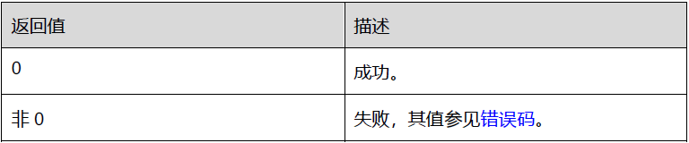

【需求】

* 头文件：hi_comm_sys.h、mpi_sys.h

* 库文件：libmpi.a

【注意】

* 必须先调用HI_MPI_SYS_SetConfig配置MPP系统后才能初始化，否则初始化会失败。
* 由于MPP系统的正常运行依赖于缓存池，因此需要先调用HI_MPI_VB_Init初始化缓存池，再初始化MPP系统，否则会导致业务运行异常。
* 如果多次初始化，仍会返回成功，但实际上系统不会对MPP的运行状态有任何影响。
* 只要有一个进程进行初始化即可，不需要所有的进程都做系统初始化的操作。
* 由于音频模块依赖用户态属性，故音频不支持多进程操作。用户需要保证音频的相关操作和HI_MPI_SYS_Init在同一个进程中。

SAMPLE_COMM_SYS_Init接口实现细节如下：

以下截图可在device/soc/hisilicon/hi3516dv300/sdk_linux/sample/platform/common/sample_comm_sys.c文件中找到

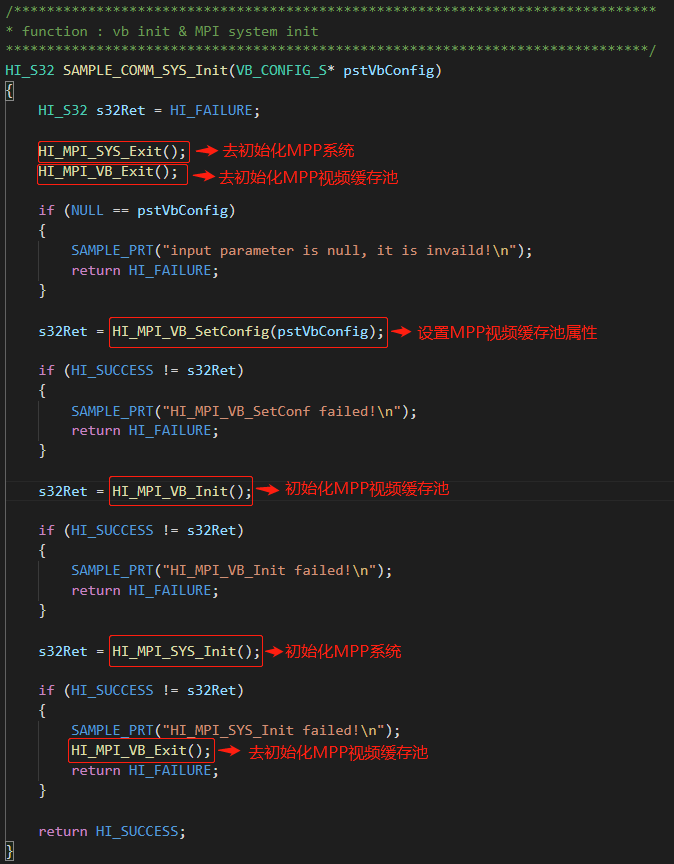

###### 步骤6：start vi

通过SAMPLE_COMM_VI_StartVi接口实现启动vi功能，可参考

**源码的device/soc/hisilicon/hi3516dv300/sdk_linux/sample/taurus/helloworld/smp/sample_lcd.c中**的

**int SampleVioVpssVoMipi(void)**接口中的start vi部分，如下图所示：

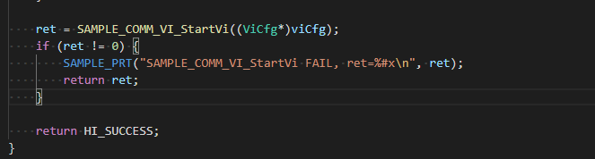

针对SAMPLE_COMM_VI_StartVi 调用的底层接口进行如下解释和说明：

HI_S32 SAMPLE_COMM_VI_StartVi(SAMPLE_VI_CONFIG_S * pstViConfig)接口开启vi，包括SAMPLE_COMM_VI_StartMIPI()、SAMPLE_COMM_VI_SetParam()、SAMPLE_COMM_VI_CreateVi()、SAMPLE_COMM_VI_CreateIsp()等接口。

这些接口都可以在device/soc/hisilicon/hi3516dv300/sdk_linux/sample/platform/common/sample_comm_vi.c文件中找到

**(1) SAMPLE_COMM_VI_StartMIPI()**

该接口为初始化MIPI。

**(2) SAMPLE_COMM_VI_SetParam()**

该接口涉及到的关键接口HI_MPI_SYS_GetVIVPSSMode、HI_MPI_SYS_SetVIVPSSMode，下面逐一进行解读。

以下接口可在device/soc/hisilicon/hi3516dv300/sdk_linux/sample/include/mpi_sys.h文件中找到

**HI_MPI_SYS_GetVIVPSSMode**

【描述】

获取VI、VPSS的工作模式

【语法】

HI_S32 HI_MPI_SYS_GetVIVPSSMode(VI_VPSS_MODE_S* pstVIVPSSMode);

【参数】

| 参数名称      | 描述            | 输入/输出 |
| ------------- | --------------- | --------- |
| pstVIVPSSMode | VI/VPSS工作模式 | 输出      |

【返回值】

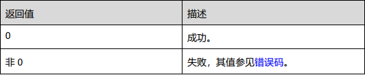

【需求】

* 头文件：hi_comm_sys.h、mpi_sys.h

* 库文件：libmpi.a

针对HI_MPI_SYS_GetVIVPSSMode接口的出参VI_VPSS_MODE_S结构体进行说明：

**VI_VPSS_MODE_S**

【说明】

* 定义VI PIPE和VPSS组的工作模式

【定义】

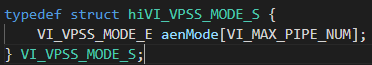

【成员】

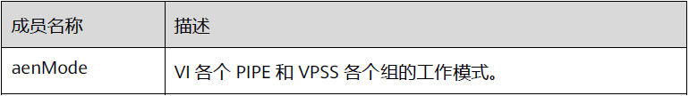

【注意事项】

Hi3559AV100ES只支持VI_OFFLINE_VPSS_OFFLINE，VI_ONLINE_VPSS_OFFLINE，VI_PARALLEL_VPSS_OFFLINE三种模式

VI_VPSS_MODE_S嵌套VI_VPSS_MODE_E结构体，对该枚举型结构体说明如下：

**VI_VPSS_MODE_E**

【说明】

定义VI PIPE和VPSS组的工作模式。

【定义】

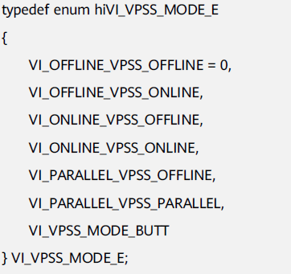

【成员】

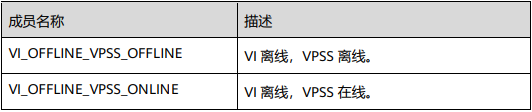

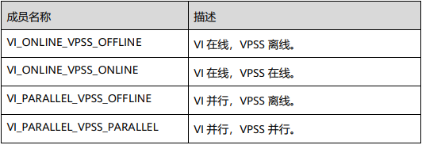

【注意事项】

* VI_OFFLINE_VPSS_ONLINE，VI_ONLINE_VPSS_ONLINE，VI_PARALLEL_VPSS_PARALLEL模式下VI PIPE编号与VPSS GROUP号一一对应，数据从VI PIPE流动到VPSS GROUP，不需要软件设定绑定关系。

**HI_MPI_SYS_SetVIVPSSMode**

【描述】

* 设置VI、VPSS工作模式。

【语法】

* HI_S32 HI_MPI_SYS_SetVIVPSSMode(const VI_VPSS_MODE_S* pstVIVPSSMode);

【参数】

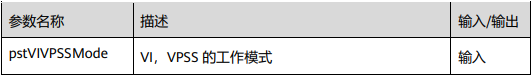

【返回值】

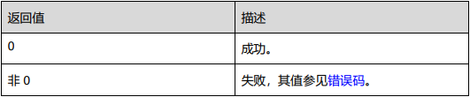

【需求】

* 头文件：hi_comm_sys.h、mpi_sys.h

* 库文件：libmpi.a

【注意】

* 必须在HI_MPI_SYS_Init后，所有的VI PIPE和所有的VPSS组创建前设置。


**(3) SAMPLE_COMM_VI_CreateVi()**

以下接口可在device/soc/hisilicon/hi3516dv300/sdk_linux/sample/include/mpi_vi.h文件中找到

**HI_MPI_VI_SetDevAttr**

【描述】

* 设置VI设备属性。基本设备属性默认了部分芯片配置，满足大部分的sensor对接要求。

【语法】

* HI_S32 HI_MPI_VI_SetDevAttr(VI_DEV ViDev, const VI_DEV_ATTR_S *pstDevAttr);

【参数】

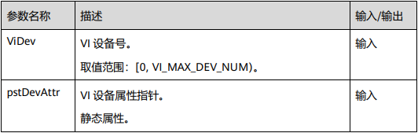

【返回值】

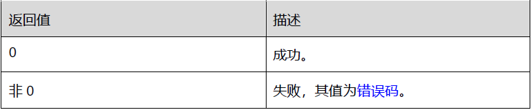

【芯片差异】

无。

【需求】

* 头文件： hi_comm_vi.h 、 mpi_vi.h

* 库文件：libmpi.a

【注意】

* 不支持BT.1120隔行输入。

* 在调用前要保证VI设备处于禁用状态。如果VI设备已处于使能状态，可以使用HI_MPI_VI_DisableDev来禁用设备

* 参数pstDevAttr主要用来配置指定VI设备的视频接口模式，用于与外围camera、sensor或codec对接，支持的接口模式包括MIPI Rx（MIPI/LVDS/HISPI）、SLVS-EC。用户需要配置以下几类信息，具体属性意义参见**源码的device/soc/hisilicon/hi3516dv300/sdk_linux/sample/doc中**的《HiMPP媒体处理软件 V4.0 开发参考.pdf》3.6“数据类型”部分的说明：
  * 接口模式信息：接口模式为MIPI Rx（MIPI/LVDS/HISPI）、SLVS-EC等模式
  * 工作模式信息：1路、2路、4路复合模式
  * 数据布局信息：复合模式下多路数据的排布
  * 数据信息：逐行输入、YUV数据输入顺序
  * 同步时序信息：垂直、水平同步信号的属性

* WDR模式下不支持BAS功能。


针对HI_MPI_VI_SetDevAttr 接口参数涉及到VI_DEV_ATTR_S结构体进行说明：

以下结构体可在device/soc/hisilicon/hi3516dv300/sdk_linux/sample/include/mpi_vi.h文件中找到

**VI_DEV_ATTR_S**

【说明】

定义视频输入设备的属性

【定义】

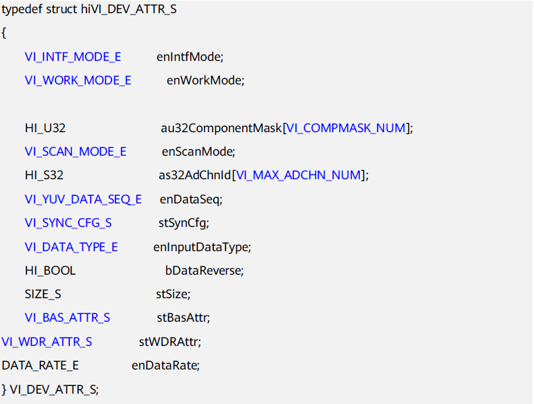

【成员】

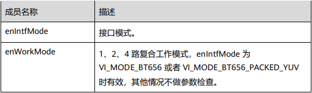

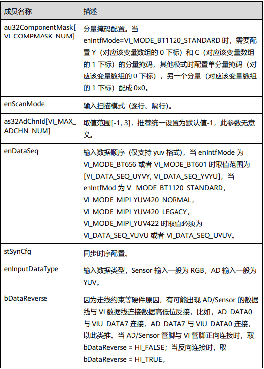

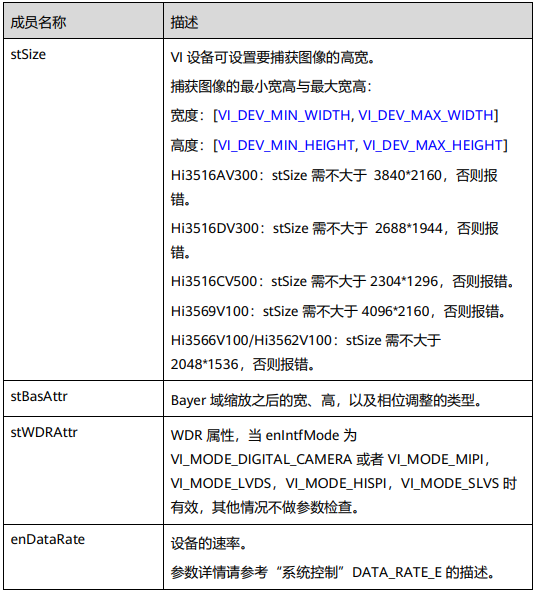

【芯片差异】

* 自行查阅**源码的device/soc/hisilicon/hi3516dv300/sdk_linux/sample/doc中**的《HiMPP媒体处理软件 V4.0 开发参考.pdf》VI_DEV_ATTR_S结构体芯片差异部分。

【注意事项】

* as32AdChnId为无效参数，推荐统一将数组as32AdChnId的值都设为-1

* 不支持多路复合只有1路复合工作模式，必须设置为VI_WORK_MODE_1Multiplex，否则报错。

* stSize中u32Width必须等于实际输入图像的宽度，u32Height必须等于实际输入图像的高度，否则会导致没有图像输出。

* 只有DEV0支持DATA_RATE_X2。enDataRate的值需与mipi_data_rate_t（详情请参考MIPI章节）保持一致。

* 并行模式时，必须配置enDataRate为DATA_RATE_X2。

* DATA_RATE_X2通路配置：MIPI0配置为MIPI_DATA_RATE_X2，DEV0配置DATA_RATE_X2，DEV0绑定PIPE0，其他通路不支持。

* 当接口模式为VI_MODE_MIPI_YUV420_NORMAL，VI_MODE_MIPI_YUV420_LEGACY，VI_MODE_MIPI_YUV422时bDataReverse必须为HI_FALSE，且掩码的设置必须为au32ComponentMask[0] = 0xFF000000，au32ComponentMask[1]= 0x00FF0000，即高8bit输入Y数据，低8bit输入C数据，否则会导致图像异常或无图像等现像。

**HI_MPI_VI_EnableDev**

【描述】

* 启动VI设备

【语法】

* HI_S32 HI_MPI_VI_EnableDev(VI_DEV ViDev);

【参数】

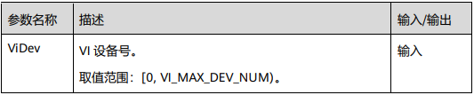

【返回值】

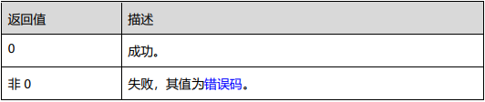

【芯片差异】

* 无。

【需求】

* 头文件：hi_comm_vi.h、mpi_vi.h

* 库文件：libmpi.a

【注意】

* 启用前必须已经设置设备属性，否则返回失败。

* 可重复启用，不返回失败。

* Hi3516DV300支持同时启动两个VI DEV。

**HI_MPI_VI_SetDevBindPipe**

【描述】

* 设置VI设备与物理PIPE的绑定关系

【语法】

* HI_S32 HI_MPI_VI_SetDevBindPipe(VI_DEV ViDev, const VI_DEV_BIND_PIPE_S *pstDevBindPipe);

【参数】

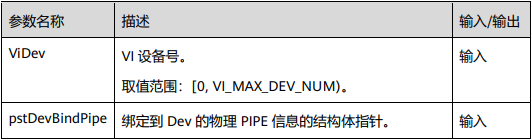

【返回值】


【芯片差异】

* 无

【需求】

* 头文件：hi_comm_vi.h、mpi_vi.h

* 库文件：libmpi.a


针对HI_MPI_VI_SetDevBindPipe接口入参涉及的VI_DEV_BIND_PIPE_S进行如下说明：

**VI_DEV_BIND_PIPE_S**

【说明】

* 定义 VI DEV 与 PIPE 的绑定关系。

【定义】

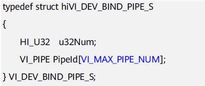

【成员】

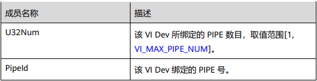

【注意】

* 无。

**HI_MPI_VI_CreatePipe**

【描述】

* 创建一个VI PIPE

【语法】

* HI_S32 HI_MPI_VI_CreatePipe(VI_PIPE ViPipe, const VI_PIPE_ATTR_S *pstPipeAttr);

【参数】


【返回值】


【芯片差异】

* 自行查阅**源码的device/soc/hisilicon/hi3516dv300/sdk_linux/sample/doc中**的《HiMPP媒体处理软件 V4.0 开发参考.pdf》HI_MPI_VI_CreatePipe芯片差异部分。

【需求】

* 头文件：hi_comm_vi.h、mpi_vi.h

* 库文件：libmpi.a

【注意】

* 只有PIPE0支持并行模式。

* 物理PIPE属性中的u32MaxW、u32MaxH、enPixFmt、enBitWidth等必须与前端进入VI的时序设置保持一致，否则会出现错误。

* 不支持重复创建。

* 当VI离线且输入图像大于4096时，不支持压缩。

* WDR模式下需要创建多个物理PIPE绑定到同一个开了WDR的设备上，当进行切换时，需要把所有绑定到该设备的物理PIPE销毁再重建。不能使用上次使用过而未销毁的物理PIPE，否则可能造成错误。


针对HI_MPI_VI_CreatePipe接口中入参VI_PIPE_ATTR_S结构体进行如下说明：

**VI_PIPE_ATTR_S**

【描述】

* 设置VI PIPE属性

【定义】


【成员】


【芯片差异】

* 自行查阅**源码的device/soc/hisilicon/hi3516dv300/sdk_linux/sample/doc中**的《HiMPP媒体处理软件 V4.0 开发参考.pdf》VI_PIPE_ATTR_S结构体芯片差异内容。

【注意事项】

* 自行查阅**源码的device/soc/hisilicon/hi3516dv300/sdk_linux/sample/doc中**的《HiMPP媒体处理软件 V4.0 开发参考.pdf》VI_PIPE_ATTR_S结构体注意事项内容。

**HI_MPI_VI_SetPipeVCNumber**

【描述】

* 设置VI物理PIPE对接前端sensor或者AD的VC号。

【语法】

* HI_S32 HI_MPI_VI_SetPipeVCNumber(VI_PIPE ViPipe, HI_U32 u32VCNumber); 

【参数】


【返回值】


【芯片差异】

* 无。

【需求】

* 头文件：mpi_vi.h

【注意】

* 必须在 PIPE 创建后，使能之前调用。

* 虚拟 PIPE 不支持。

  

**HI_MPI_VI_DestroyPipe**

【描述】

* 销毁一个VI PIPE

【语法】

* HI_S32 HI_MPI_VI_DestroyPipe(VI_PIPE ViPipe)；

【参数】


【返回值】


【芯片差异】

* 无。

【需求】

* 头文件：hi_comm.h、mpi_vi.h

【注意】

* 使用本接口前，需先调用HI_MPI_VI_StopPipe(ViPipe)停止PIPE，否则提示失败。
* 在未创建PIPE或重复销毁PIPE时，调用本接口，将提示PIPE不存在。


**HI_MPI_VI_StartPipe**

【配置】

* 启用VI PIPE

【语法】

* HI_S32 HI_MPI_VI_StartPipe(VI_PIPE ViPipe);

【参数】


【返回值】


【芯片差异】

* 无

【需求】

* 头文件：hi_comm_vi.h、mpi_vi.h

* 库文件：libmpi.a

【注意】

* PIPE必须已创建
* 重复调用该函数设置同一个PIPE返回成功。


**HI_MPI_VI_SetChnAttr**

【描述】

* 设置VI通道属性

【语法】

* HI_S32 HI_MPI_VI_SetChnAttr(VI_PIPE ViPipe, VI_CHN ViChn, const VI_CHN_ATTR_S *pstChnAttr);

【参数】


【返回值】


【芯片差异】

* 自行查阅**源码的device/soc/hisilicon/hi3516dv300/sdk_linux/sample/doc中**的《HiMPP媒体处理软件 V4.0 开发参考.pdf》中的HI_MPI_VI_SetChnAttr芯片差异内容。

【注意事项】

* 自行查阅**源码的device/soc/hisilicon/hi3516dv300/sdk_linux/sample/doc中**的《HiMPP媒体处理软件 V4.0 开发参考.pdf》中的HI_MPI_VI_SetChnAttr注意事项内容。


**HI_MPI_VI_EnableChn**

【描述】

* 启动VI通道

【语法】

* HI_S32 HI_MPI_VI_EnableChn(VI_PIPE ViPipe, VI_CHN ViChn);

【参数】


【返回值】


【芯片差异】

* 无

【需求】

* 头文件：hi_comm_vi.h、mpi_vi.h

* 库文件：libmpi.h

【注意】

* PIPE必须已创建，否则会返回失败。
* 必须先设置通道属性。 
* 若启用扩展通道，则必须保证此通道绑定的源物理通道已经使能，否则返回失败错误码。 
* 可重复启用VI通道，不返回失败。 
* VI在线VPSS在线模式、VI 离线VPSS在线模式，VI并行VPSS并行模式下，启动VI通道不生效，直接返回成功。


**HI_MPI_VI_StopPipe**

【描述】

* 禁用VI PIPE。

【语法】

* HI_S32 HI_MPI_VI_StopPipe(VI_PIPE ViPipe);

【参数】


【返回值】


【芯片差异】

* 无。

【需求】

* 头文件：hi_comm_vi.h、mpi_vi.h

【注意】

* PIPE必须已创建。

* 重复调用该函数设置同一个PIPE返回成功。


**HI_MPI_VI_DisableDev**

【描述】

* 禁用VI设备。

【语法】

* HI_S32 HI_MPI_VI_DisableDev(VI_DEV ViDev);

【参数】


【返回值】


【芯片差异】

* 无。

【需求】

* 头文件：hi_comm_vi.h、mpi_vi.h

* 库文件：libmpi.a

【注意】

* 需先销毁所有与该VI设备绑定的物理PIPE后，再禁用VI设备

* 可重复禁用，不返回失败。

* 支持低功耗处理，禁用VI设备后将完全关闭该设备，需要重新设置属性，才能使能VI设备。


**HI_MPI_VI_DisableChn**

【描述】

* 禁用VI通道。

【语法】

* HI_S32 HI_MPI_VI_DisableChn(VI_PIPE ViPipe, VI_CHN ViChn);

【参数】


【返回值】


【芯片差异】

* 无。

【需求】

* 头文件：hi_comm_vi.h、mpi_vi.h

* 库文件：libmpi.a

【注意】

* PIPE必须已创建，否则会返回失败。

* 若禁用物理通道，则必须保证此通道绑定的扩展通道已经全部禁用，否则返回失败的错误码。

* 可重复禁用VI通道，不返回失败。

* VI在线VPSS在线模式、VI离线VPSS在线模式，VI并行VPSS并行模式下，禁用VI通道不生效，直接返回成功。


**SAMPLE_COMM_VI_CreateIsp**

ISP通过一系列数字图像处理算法完成对数字图像的效果处理。主要包括3A、坏点校正、去噪、强光抑制、背光补偿、色彩增强、镜头阴影校正等处理。

ISP包括逻辑部分以及运行在其上的firmware ISP部分底层接口优先参考**源码的device/soc/hisilicon/hi3516dv300/sdk_linux/sample/doc中**的《HiISP 开发参考.pdf》指导手册，针对SAMPLE_COMM_VI_CreateIsp用到关键底层接口做如下说明：

**注：下文涉及的所有AE库接口都只是针对上海海思AE库，如果客户自己实现AE库，不需要关注这些接口，且无法使用这些接口。所有AWB库接口都只是针对上海海思AWB库，如果客户自己实现AWB库，不需要关注这些接口，且无法使用这些接口。**

以下接口可以在device/soc/hisilicon/hi3516dv300/sdk_linux/sample/include/mpi_isp.h文件中找到

**HI_MPI_ISP_MemInit**

【描述】

* 初始化ISP外部寄存器

【语法】

* HI_S32 HI_MPI_ISP_MemInit(VI_PIPE ViPipe);

【参数】


【返回值】


【需求】

* 头文件：hi_comm_isp.h、mpi_isp.h

* 库文件：libisp.a

【注意事项】

* 自行查阅**源码的device/soc/hisilicon/hi3516dv300/sdk_linux/sample/doc中**的《HiISP 开发参考.pdf》指导手册中的HI_MPI_ISP_MemInit结构体注意事项内容。

**HI_MPI_ISP_Init**

【描述】

* 初始化ISP firmware

【语法】

* HI_S32 HI_MPI_ISP_Init(VI_PIPE ViPipe);

【参数】


【返回值】


【需求】

* 头文件：hi_comm_isp.h、mpi_isp.h

* 库文件：libisp.a

【注意】

* 自行参考**源码的device/soc/hisilicon/hi3516dv300/sdk_linux/sample/doc中**的《HiISP 开发参考.pdf》指导手册中的HI_MPI_ISP_Init注意事项内容。


**HI_MPI_ISP_Exit**

【描述】

* 退出ISP firmware

【语法】

* HI_S32 HI_MPI_ISP_Exit(VI_PIPE ViPipe);

【参数】


【返回值】


【需求】

* 头文件：hi_comm_isp.h、mpi_isp.h

* 库文件：libisp.a

【注意】

* 调用HI_MPI_ISP_Init和HI_MPI_ISP_Run之后，再调用本接口退出ISP firmware。 

* 不支持多进程，必须要与 sensor_register_callback、HI_MPI_AE_Register、HI_MPI_AWB_Register、HI_MPI_ISP_MemInit、HI_MPI_ISP_Init、HI_MPI_ISP_Run 接口在同一个进程调用。 

* 支持重复调用本接口。

* 在拼接模式时，必须先退出主pipe，后退出其他pipe。 

* 不支持相同ViPipe时，多线程执行ISP创建和销毁（多线程同时调用sensor_register_callback、HI_MPI_AE_Register、HI_MPI_AWB_Register、HI_MPI_ISP_MemInit、HI_MPI_ISP_Init、HI_MPI_ISP_Exit） 

* 推荐调用 HI_MPI_ISP_Init 之后，在调用本接口。


**HI_MPI_ISP_SetPubAttr**

【描述】

* 设置 ISP 公共属性。

【语法】

* HI_S32 HI_MPI_ISP_SetPubAttr(VI_PIPE ViPipe, const ISP_PUB_ATTR_S *pstPubAttr);

【参数】


【返回值】


【需求】

* 头文件：hi_comm_isp.h、mpi_isp.h

* 库文件：libisp.a

【注意】

* 自行参考**源码的device/soc/hisilicon/hi3516dv300/sdk_linux/sample/doc中**的《HiISP 开发参考.pdf》HI_MPI_ISP_SetPubAttr中的注意内容。


**HI_MPI_ISP_Run**

【描述】

* 运行ISP firmware

【语法】

* HI_S32 HI_MPI_ISP_Run(VI_PIPE ViPipe);

【参数】


【返回值】


【需求】

* 头文件：hi_comm_isp.h、mpi_isp.h

* 库文件：libisp.a

【注意】

* 运行前需要确保sensor已经初始化，并且向ISP注册了回调函数。

* 运行前需要确保已调用HI_MPI_ISP_Init初始化ISP

* 不支持多进程，必须要与sensor_register_callback、HI_MPI_AE_Register、HI_MPI_AWB_Register、HI_MPI_ISP_MemInit、HI_MPI_ISP_Init、HI_MPI_ISP_Exit接口在同一个进程调用。

* 该接口是阻塞接口，建议用户采用实时线程处理。


此接口可以在device/soc/hisilicon/hi3516dv300/sdk_linux/sample/include/mpi_awb.h文件中找到

**HI_MPI_AWB_UnRegister**

【描述】

* 向ISP注消AWB库。

【语法】

* HI_S32 HI_MPI_AWB_UnRegister(VI_PIPE ViPipe, ALG_LIB_S*pstAwbLib);

【参数】


【返回值】


【需求】

* 头文件：hi_comm_isp.h、mpi_awb.h

* 库文件：libisp.a

【注意】

* 该接口调用了ISP库提供的AWB反注册回调接口HI_MPI_ISP_AWBLibRegCallBack，以实现AWB向ISP库反注册的功能。
* 用户调用此接口完成上海海思AWB库向ISP库反注册，此接口不支持多进程操作。
* 

以下接口可以在device/soc/hisilicon/hi3516dv300/sdk_linux/sample/include/mpi_ae.h文件中找到

**HI_MPI_AE_UnRegister**

【描述】

* 向ISP反注册AE库。

【语法】

* HI_S32 HI_MPI_AE_UnRegister(VI_PIPE ViPipe, ALG_LIB_S *pstAeLib);

【参数】


【返回值】


【需求】

* 头文件：hi_comm_isp.h、mpi_ae.h

* 库文件：libisp.a、lib_hiae.a

【注意】

* 该接口调用了ISP库提供的AE反注册回调接口HI_MPI_ISP_AELibUnRegCallBack，以实现AE向ISP库反注册的功能。

* 此接口不支持多进程操作。


**HI_MPI_AE_Register**

【描述】

* 向ISP注册AE库。

【语法】

* HI_S32 HI_MPI_AE_Register(VI_PIPE ViPipe, ALG_LIB_S *pstAeLib);

【参数】


【返回值】


【需求】

* 头文件：hi_comm_isp.h、mpi_ae.h

* 库文件：libisp.a、lib_hiae.a

【注意】

* 该接口调用了ISP库提供的AE注册回调接口HI_MPI_ISP_AELibRegCallBack，以实现上海海思AE库向ISP库注册的功能。
* AE库可以注册多个实例。
* 此接口不支持多进程操作。


以下接口可以在device/soc/hisilicon/hi3516dv300/sdk_linux/sample/include/mpi_awb.h文件中找到

**HI_MPI_AWB_Register**

【描述】

* 向ISP注册AWB库。

【语法】

* HI_S32 HI_MPI_AWB_Register(VI_PIPE ViPipe, ALG_LIB_S *pstAwbLib);

【参数】


【返回值】


【需求】

* 头文件：hi_comm_isp.h、mpi_awb.h

* 库文件：libisp.a

【注意】

* 该接口调用了ISP库提供的AWB注册回调接口HI_MPI_ISP_AWBLibRegCallBack，以实现向ISP库注册的功能。

* 用户调用此接口完成上海海思AWB库向ISP库注册。

* AWB库可以注册多个实例，此接口不支持多进程操作。


以下接口可以在device/soc/hisilicon/hi3516dv300/sdk_linux/sample/include/mpi_isp.h文件中找到

**HI_MPI_ISP_AWBLibRegCallBack**

【描述】

* ISP提供的AWB库注册的回调接口。

【语法】

* HI_S32 HI_MPI_ISP_AWBLibRegCallBack(VI_PIPE ViPipe, ALG_LIB_S *pstAwbLib, ISP_AWB_REGISTER_S *pstRegister);

【参数】


【返回值】


【需求】

* 头文件：hi_comm_isp.h、mpi_isp.h

* 库文件：libisp.a

【注意】

* ISP提供统一的AWB算法库接口，初始化、运行、控制、销毁AWB算法库。使用上海海思AWB算法库时，不需要关注此接口；使用用户自己的AWB算法库时，需要调用此接口向ISP注册回调函数。

* 此接口不支持多进程操作。

* 最大支持2个AWB库注册。

ISP库与AWB库间的接口如下图所示：


**HI_MPI_ISP_AELibUnRegCallBack**

【描述】

* ISP提供的AE库反注册的回调接口。

【语法】

* HI_S32 HI_MPI_ISP_AELibUnRegCallBack(VI_PIPE ViPipe, ALG_LIB_S *pstAeLib);

【参数】


【返回值】


【需求】

* 头文件：hi_comm_isp.h、mpi_isp.h

* 库文件：libisp.a

【注意】

* 使用上海海思AE算法库时，不需要关注此接口；使用用户自己的AE算法库时，需要调用此接口向ISP反注册回调函数。

* 此接口不支持多进程操作。


**HI_MPI_ISP_AELibRegCallBack**

【描述】

* ISP提供的AE库注册的回调接口。

【语法】

* HI_S32 HI_MPI_ISP_AELibRegCallBack(VI_PIPE ViPipe, ALG_LIB_S *pstAeLib, ISP_AE_REGISTER_S *pstRegister);

【参数】


【返回值】


【需求】

* 头文件：hi_comm_isp.h、mpi_isp.h

* 库文件：libisp.a

【注意】

* ISP提供统一的AE算法库接口，初始化、运行、控制、销毁AE算法库。使用上海海思AE算法库时，不需要关注此接口；使用用户自己的AE算法库时，需要调用此接口向ISP注册回调函数。

* 此接口不支持多进程操作。

* 最大支持2个AE库注册。

ISP库与AE库间的接口关系如下图所示：


#### 5.2.1.3、VPSS理论及实现方式

##### 5.2.1.3.1 、VPSS理论

VPSS（Video Process Sub-System）支持对一幅输入图像进行统一预处理，如去噪、去隔行等，然后再对各通道分别进行缩放、锐化等处理，最后**输出多种不同分辨率**的图像。
 VPSS是视频处理子系统，支持的具体图像处理功能包括FRC（Frame Rate Control）、CROP、Sharpen、3DNR、Scale、像素格式转换、LDC、Spread、固定角度旋转、任意角度旋转、鱼眼校正、Cover/Coverex、Overlayex、Mosaic、Mirror/Flip、HDR、AspectRatio、压缩解压等。

关于VPSS的功能描述及相关名词概念描述请自行阅读**源码的device/soc/hisilicon/hi3516dv300/sdk_linux/sample/doc中**的《HiMPP媒体处理软件 V4.0 开发参考.pdf》第5章视频处理子系统中的5.2章节。

VPSS在系统中的位置如下图所示：


通过调用SYS模块的绑定接口，可与AVS/USER/VDEC/VI和VO/VENC/SVP等模块进行绑定，其中前者为VPSS的输入源，后者为VPSS的接收者。用户可通过MPI接口对GROUP进行管理。每个GROUP仅可与一个输入源绑定。GROUP的物理通道有两种工作模式：AUTO和USER，两种模式间可动态切换。AUTO模式下各通道仅可与一个接收者绑定，主要用于预览和回放场景下做播放控制。USER模式下各通道可与多个接收者绑定。**需要特别注意的是，USER模式主要用于对同一通道图像进行多路编码的场景，此模式下播放控制不生效，因此回放场景下不建议使用USER模式**。VPSS只有工作在离线模式下才支持AUTO模式。

Hi3516DV300 VPSS芯片数据处理流程如下图所示：


**注意：**

* VPSS在调用VGS做通道后处理时顺序为CoverEx、LumaStat、OverlayEx。

* 固定角度旋转和任意角度旋转功能互斥，这两个功能在图中的先后顺序无需关注。

* 扩展通道GDC任务和VGS任务互斥。

##### 5.2.1.3.2 VPSS实现方式

在device/soc/hisilicon/hi3516dv300/sdk_linux/sample/taurus/helloworld/中，VPSS部分实现细节如下：

###### 步骤1：config vpss

首先需要配置vpss所需的结构体，核心对VPSS_GRP_ATTR_S结构体和VPSS_CHN_ATTR_S结构体进行配置，下面对这个两个结构体进行详细说明。

这两个结构体可在device/soc/hisilicon/hi3516dv300/sdk_linux/include/hi_comm_vpss.h中找到

**VPSS_GRP_ATTR_S**

【说明】

* 定义VPSS GROUP属性

【定义】


【成员】


注：表5-5来源于**源码的device/soc/hisilicon/hi3516dv300/sdk_linux/sample/doc中**的《HiMPP媒体处理软件 V4.0 开发参考.pdf》

【注意事项】

请查阅**源码的device/soc/hisilicon/hi3516dv300/sdk_linux/sample/doc中**的《HiMPP媒体处理软件 V4.0 开发参考.pdf》VPSS_GRP_ATTR_S结构体注意事项内容。

**VPSS_CHN_ATTR_S**

【说明】

* 定义VPSS物理通道的属性

【定义】


【成员】


注：表5-6来源于**源码的device/soc/hisilicon/hi3516dv300/sdk_linux/sample/doc中**的《HiMPP媒体处理软件 V4.0 开发参考.pdf》

【注意事项】

请查阅**源码的device/soc/hisilicon/hi3516dv300/sdk_linux/sample/doc中**的《HiMPP媒体处理软件 V4.0 开发参考.pdf》VPSS_CHN_ATTR_S结构体注意事项内容。

config vpss 代码实现可参考**源码的device/soc/hisilicon/hi3516dv300/sdk_linux/sample/taurus/helloworld/smp/sample_lcd.c**中的int SampleVioVpssVoMipi(void)接口，具体细节如下：


###### 步骤2：start vpss

代码实现可参考**源码的device/soc/hisilicon/hi3516dv300/sdk_linux/sample/taurus/helloworld/smp/sample_lcd.c**文件

核心围绕VpssStart接口，如下图所示：


针对VpssStart接口调用的底层接口作如下说明：

**VPSS_GRP**

【说明】

* 定义VPSS组号

【定义】

* typedef HI_S32 VPSS_GRP；

【注意事项】

* 无

**HI_MPI_VPSS_CreateGrp**

【描述】

* 创建一个VPSS GROUP

【语法】

* HI_S32 HI_MPI_VPSS_CreateGrp(VPSS_GRP VpssGrp, const VPSS_GRP_ATTR_S *pstGrpAttr);

【参数】


【返回值】


【需求】

* 头文件：hi_comm_vpss.h、mpi_vpss.h

* 库文件：libmpi.a

【注意】

* 不支持重复创建。

* 当VPSS工作在VI_PARALLEL_VPSS_PARALLEL模式时，只有GROUP0可以被创建

* 当Hi3516DV300的GROUP0工作VI_ONLINE_VPSS_ONLINE模式时，只有GROUP0可以被创建。

**HI_MPI_VPSS_SetChnAttr**

【描述】

* 设置VPSS通道属性。

【语法】

* HI_S32 HI_MPI_VPSS_SetChnAttr(VPSS_GRP VpssGrp, VPSS_CHN VpssChn, const VPSS_CHN_ATTR_S *pstChnAttr);

【参数】


【返回值】


【需求】

* 头文件：hi_comm_vpss.h、mpi_vpss.h

* 库文件：libmpi.a

【注意】

* GROUP必须已创建。

* 扩展通道不支持此接口。 

* 通道做任意角度旋转、LDC、Spread处理或者其绑定的扩展通道开启了鱼眼校正时不支持通道尺寸动态改变，需要先关闭如上功能，才能动态改变通道尺寸。


**HI_MPI_VPSS_EnableChn**

【描述】

* 启用VPSS通道

【语法】

* HI_S32 HI_MPI_VPSS_EnableChn(VPSS_GRP VpssGrp, VPSS_CHN VpssChn);

【参数】


【返回值】


【需求】

* 头文件：hi_comm_vpss.h、mpi_vpss.h

* 库文件：libmpi.a

【注意】

* 多次使能返回成功。 
* GROUP 必须已创建。
* 若支持扩展通道，扩展通道必须保证此通道绑定的源物理通道已经使能，否则返回失败错误码。


**HI_MPI_VPSS_StartGrp**

【描述】

* 启用VPSS GROUP。

【语法】

* HI_S32 HI_MPI_VPSS_StartGrp(VPSS_GRP VpssGrp);

【参数】


【返回值】


【需求】

* 头文件：hi_comm_vpss.h、mpi_vpss.h

* 库文件：libmpi.a

【注意】

* GROUP必须已创建。

* 重复调用该函数设置同一个组返回成功。

###### 步骤3：VI bind VPSS

MPP提供系统绑定接口（HI_MPI_SYS_Bind），即通过数据接收者绑定数据源来建立两者之间的关联关系（只允许数据接收者绑定数据源）。绑定后，数据源生成的数据将自动发送给接收者。目前MPP支持的绑定关系如下：


**VI bind VPSS绑定VI和VPSS之间的关联关系，绑定后，数据源生成的数据将自动发送给接收者，调用的底层接口如下：**

**HI_MPI_SYS_Bind**

【描述】

* 数据源到数据接收者绑定接口。

【语法】

* HI_S32 HI_MPI_SYS_Bind(const MPP_CHN_S *pstSrcChn, const MPP_CHN_S *pstDestChn);

【参数】


【返回值】


【需求】

* 头文件：hi_comm_sys.h、mpi_sys.h

* 库文件：libmpi.a

【注意】

* 系统目前支持的绑定关系，请参见**源码的device/soc/hisilicon/hi3516dv300/sdk_linux/sample/doc中**的《HiMPP媒体处理软件V4.0开发参考.pdf》中的表2-2。
* 同一个数据接收者只能绑定一个数据源。
* 绑定是指数据源和数据接收者建立关联关系。绑定后，数据源生成的数据将自动发送给接收者。
* VI和VDEC作为数据源，是以通道为发送者，向其他模块发送数据，用户将设备号置为0，SDK不检查输入的设备号。
* VO作为数据源发送回写(WBC)数据时，是以设备为发送者，向其他模块发送数据，用户将通道号置为0，SDK不检查输入的通道号。
* VPSS作为数据接收者时，是以设备（GROUP）为接收者，接收其他模块发来的数据，用户将通道号置为0。
* VENC作为数据接收者时，是以通道号为接收者，接收其他模块发过来的数据，用户将设备号置为0，SDK不检查输入的设备号。若VENC工作在VENC_PIC_RECEIVE_MULTI模式下，用户需要配置设备号，此时设备号实际用于指定输入源，可以使用VENC_PIC_RECEIVE_SOURCE0、VENC_PIC_RECEIVE_SOURCE1、VENC_PIC_RECEIVE_SOURCE2、VENC_PIC_RECEIVE_SOURCE3宏进行输入源指定。
* AVS作为数据接收者时，是以设备（GROUP）、通道（PIPE）为接收者。
* 其他情况均需指定设备号和通道号。

**在源码的device/soc/hisilicon/hi3516dv300/sdk_linux/sample/taurus/helloworld/smp/sample_lcd.c文件中**

vi bind vpss代码在ViVpssCreate()接口中的实现方式如下：


其中ViBindVpss具体实现细节如下：


#### 5.2.1.4、VO理论及实现方式

##### 5.2.1.4.1、VO理论

VO（Video Output，视频输出）模块主动从内存相应位置读取视频和图形数据，并通过相应的显示设备输出视频和图形。Hi3516DV300支持的显示/回写设备、视频层和图形层情况如下表所示，其他芯片型号请自行查阅**源码的device/soc/hisilicon/hi3516dv300/sdk_linux/sample/doc中**的《HiMPP媒体处理软件 V4.0 开发参考.pdf》中的表4-1内容。


注：缩写解释

DHD0：Device HD0，超高清设备0。

DHD1：Device HD1，高清设备1。

VHD0：Video layer of HD0，超高清视频层0，隶属于DHD0。

VHD1：Video layer of HD1，高清视频层1，隶属于DHD1。

VHD2：Video layer of HD2，高清视频层2，Hi3559AV100上隶属于DHD0，Hi3519AV100/Hi3556AV100上可以绑定至DHD0或者DHD1，用作PIP层。

WD：Write Back Channel Device，回写通道设备。

图形层G3：Graphic layer3，用作鼠标层，DHD0和DHD1中均有此项，但只能绑定其中一个设备，G3默认绑定在DHD1上

**VO基本概念：**

* 超高清、高清和标清显示设备

SDK将高清和标清显示设备分别标示为DHDx（Device High Definition x）和DSDx（Device Standard Definition x），其中，x为索引号，从0开始取值，表示第几路高清/标清显示设备。例如第0路高清设备标示为DHD0，第0路标清显示设备标示为DSD0。所有高清和标清显示设备又可分别简称为HD和SD设备。Hi3516DV300中有1个高清显示设备DHD0。由于DHD0能够支持到4K（3840x2160）的时序，因此DHD0也可以称之为超高清显示设备。

* 视频层

对于固定在每个显示设备上面对应的视频层，SDK也对应采取VHDx和VSDx来标示。芯片支持显示设备的情况请参见表4-1。芯片HD设备功能对比参考表4-2。芯片VHD视频层功能对比如表4-3所示。视频层和显示设备的实际显示分辨率依赖于具体输出接口，设备上视频输出接口支持的最大时序见表4-4所示。

**注：表4-1，表4-2，表4-3，表4-4均来自源码的device/soc/hisilicon/hi3516dv300/sdk_linux/sample/doc中的《HiMPP媒体处理软件 V4.0 开发参考.pdf》，对应各自的芯片型号查阅即可。**

##### 5.2.1.4.2 、实现方式

在启动vo之前需要先config vo，围绕SAMPLE_VO_CONFIG_S结构体进行配置，该结构体由3大部分组成：device、layer、channel，如下图所示：

此结构体可在 device/soc/hisilicon/hi3516dv300/sdk_linux/sample/platform/common/sample_comm.h中找到


config vo代码实现细节如下图所示：

可参考源码device/soc/hisilicon/hi3516dv300/sdk_linux/sample/taurus/helloworld/smp/sample_lcd.c中的StVoParamCfg( )接口


需要配置mipi参数，配置前先仔细阅读mipi参数文档（由屏幕厂商提供），通过SAMPLE_VO_CONFIG_MIPI接口进行配置，如下图所示：

注：关于config mipi参与细节，自行查阅device/soc/hisilicon/hi3516dv300/sdk_linux/sample/taurus/helloworld/smp/sample_lcd.c 中SAMPLE_VO_CONFIG_MIPI内容即可。

下图可在device/soc/hisilicon/hi3516dv300/sdk_linux/sample/taurus/helloworld/smp/sample_lcd.c文件的SampleVioVpssVoMipi()接口中找到。


接下来需要start vo，start vo可参考SampleCommVoStartMipi接口，如下图所示：

下图可在device/soc/hisilicon/hi3516dv300/sdk_linux/sample/taurus/helloworld/smp/sample_lcd.c文件的SampleVioVpssVoMipi()接口中找到。


关于SampleCommVoStartMipi接口调用的底层API进行如下说明：

**VO_PUB_ATTR_S**

此结构体可在device/soc/hisilicon/hi3516dv300/sdk_linux/sample/include/hi_comm_vo_dev.h中找到

【说明】

定义视频输出公共属性结构体。

【定义】


【成员】


【芯片差异】

**源码的device/soc/hisilicon/hi3516dv300/sdk_linux/sample/doc中**的《HiMPP媒体处理软件 V4.0 开发参考.pdf》VO_PUB_ATTR_S结构体芯片差异内容。

【注意事项】

**源码的device/soc/hisilicon/hi3516dv300/sdk_linux/sample/doc中**的《HiMPP媒体处理软件 V4.0 开发参考.pdf》VO_PUB_ATTR_S结构体注意事项内容。

**VO_VIDEO_LAYER_ATTR_S**

此结构体可在device/soc/hisilicon/hi3516dv300/sdk_linux/sample/include/hi_comm_vo.h中找到

【说明】

定义视频层属性。

在视频层属性中存在三个概念，即设备分辨率、显示分辨率和图像分辨率。每种分辨率的概念可以从下图中可以看出：

* 图像分辨率指放置各个通道图像的画布大小。

* 显示分辨率是把图像分辨率中描述的画布经过VO放大后的显示区域。

* 设备分辨率与设备时序一致，即如果时序为1920 x 1080，那设备分辨率就为1920 x 1080。


视频层的内存使用分为通道聚集（如图a所示）和非聚集（如图b所示）两种方式。

* **聚集方式：**

  * 决定内存分配大小的因素：实际显示通道的分辨率的总和。

  * 不支持视频层的放大功能。

  * 仅适用于MULTI模式。

  * 聚集方式开启后，对于MULTI模式下的视频层，可以调用通道显示位置接口（HI_MPI_VO_SetChnDisplayPosition）来合理布局通道的显示位置。

* **非聚集方式：**
* 决定内存分配大小的因素：显示图像的起始坐标（0，0）与最右下角的坐标所决定的区域大小和缩放比例（图像分辨率与显示分辨率的比）。

* 支持视频层的放大功能。通过视频放大功能，在相同显示分辨率情况下，依据适当的比例把图像分辨率调小，那么需要分配的内存也相应减少，这种情况下可以做到节省内存，但是会因放大导致图像质量下降。

* 在拼接好图像画面后，通道画面的显示位置不可以调整。

图a 视频层使用聚集内存方式的场景a（聚集使用内存）


图b 视频层使用非聚集内存方式的场景b（非聚集使用内存）


【定义】


【成员】


【差异说明】

**源码的device/soc/hisilicon/hi3516dv300/sdk_linux/sample/doc中**的《HiMPP媒体处理软件 V4.0 开发参考.pdf》VO_VIDEO_LAYER_ATTR_S结构体差异说明内容。

【注意事项】

**源码的device/soc/hisilicon/hi3516dv300/sdk_linux/sample/doc中**的《HiMPP媒体处理软件 V4.0 开发参考.pdf》VO_VIDEO_LAYER_ATTR_S结构体注意事项内容。

**VO_CSC_S**

此结构体可在device/soc/hisilicon/hi3516dv300/sdk_linux/sample/include/hi_comm_vo_dev.h中找到

【说明】

定义图像输出效果结构体。

【定义】


【成员】


在SampleCommVoStartMipi接口中，调用了SampleCommVoStartDevMipi来启动device，对SampleCommVoStartDevMipi接口调用的底层接口做如下说明：

**VO_USER_INTFSYNC_INFO_S**

此结构体可在device/soc/hisilicon/hi3516dv300/sdk_linux/sample/include/hi_comm_vo_dev.h中找到

【说明】

用户接口时序信息，包括配置时钟源类型、时钟大小、时钟分频比和时钟相位，它们的拓扑关系如下图所示：


【定义】


【成员】


【注意事项】

**源码的device/soc/hisilicon/hi3516dv300/sdk_linux/sample/doc中**的《HiMPP媒体处理软件 V4.0 开发参考.pdf》VO_USER_INTFSYNC_INFO_S结构体中的注意事项内容，里面介绍了不同芯片的时钟分频比配置方法、前置分频配置方法、用户时序信息推导方法等，开发者自行查阅即可。


以下四个接口可在device/soc/hisilicon/hi3516dv300/sdk_linux/sample/include/hi_comm_vo_dev.h中找到

**HI_MPI_VO_SetPubAttr**

【描述】

配置视频输出设备的公共属性。

【语法】

HI_S32 HI_MPI_VO_SetPubAttr(VO_DEVVoDev, const VO_PUB_ATTR_S *pstPubAttr);

【参数】


【返回值】


【需求】

* 头文件：mpi_vo.h、hi_comm_vo.h

* 库文件：libmpi.a

【注意】

* 视频输出设备属性为静态属性，必须在执行HI_MPI_VO_Enable前配置。

* 各个DEV的使用说明详见VO_DEV。

* 视频输出设备属性的使用说明详见VO_PUB_ATTR_S章节。


**HI_MPI_VO_SetDevFrameRate**

【描述】

* 设置设备用户时序下设备帧率。

【语法】

* HI_S32 HI_MPI_VO_SetDevFrameRate(VO_DEVVoDev, HI_U32 u32FrameRate);

【参数】


【返回值】


【需求】

* 头文件：mpi_vo.h、hi_comm_vo.h

* 库文件：libmpi.a

【注意】

* 只能在用户时序下使用。

* 只能在调用HI_MPI_VO_SetPubAttr之后、HI_MPI_VO_Enable之前调用。


**HI_MPI_VO_SetUserIntfSyncInfo**

【描述】

* 设置用户接口时序信息，用于配置时钟源、时钟大小和时钟分频比。

【语法】

* HI_S32 HI_MPI_VO_SetUserIntfSyncInfo (VO_DEV VoDev, VO_USER_INTFSYNC_INFO_S *pstUserInfo);

【参数】


【返回值】


【需求】

* 头文件：mpi_vo.h、hi_comm_vo.h

* 库文件：libmpi.a

【注意】

* 在调用该接口前，必须对设备公共属性进行配置，否则返回设备未配置错误。

* 只有物理设备支持设置用户时序信息。

* 时钟源类型和时钟大小为静态信息，必须在执行HI_MPI_VO_Enable前配置。

* 仅在HI_MPI_VO_SetPubAttr中接口数据VO_PUB_ATTR_S的enIntfSync成员设置为VO_OUTPUT_USER时有效。

具体用户时序调试方法可参考**源码的device/soc/hisilicon/hi3516dv300/sdk_linux/sample/doc中**的《HiMPP 媒体处理软件V4.0 FAQ》，用户时序时钟相关的配置可参考VO_USER_INTFSYNC_INFO_S。


**HI_MPI_VO_Enable**

【描述】

* 启动视频输出设备。

【语法】

* HI_S32 HI_MPI_VO_Enable (VO_DEV VoDev);

【参数】


【返回值】


【需求】

* 头文件：mpi_vo.h、hi_comm_vo.h

* 库文件：libmpi.a

【注意】

* 由于系统没有初始化设备为使能状态，所以在使用视频输出功能前必须先进行设备使能操作。
* 在调用设备使能前，必须对设备公共属性进行配置，否则返回设备未配置错误。
* 为适应开机画面与正常操作界面间顺畅切换，此处需要检查VO硬件是否已经使能，如果已使能则返回成功，且沿用已有时序配置。如果希望更改VO的时序配置，则需要先调用HI_MPI_VO_Disable接口，强制关闭VO硬件后再使能。
* 各个DEV的使用说明详见VO_DEV。
* 重复调用此接口，会返回设备已使能。

关于SampleCommVoStartDevMipi接口实现细节如下图所示：

以下截图可在device/soc/hisilicon/hi3516dv300/sdk_linux/sample/taurus/helloworld/smp/sample_lcd.c文件中找到


在SampleCommVoStartMipi接口中，调用了SampleCommVoGetWhMipi来获取mipi设备的宽、高，如下图所示：

以下截图可在device/soc/hisilicon/hi3516dv300/sdk_linux/sample/taurus/helloworld/smp/sample_lcd.c文件中找到


进入SampleCommVoGetWhMipi接口，需要在最后配置下MIPI屏宽高的一个case，taurus套件使用的mipi屏宽800，高480，如下图所示：

以下截图可在device/soc/hisilicon/hi3516dv300/sdk_linux/sample/taurus/helloworld/smp/sample_lcd.c文件中找到


若SampleCommVoGetWhMipi接口等执行失败，会进入SAMPLE_COMM_VO_StopDev接口终止设备，该接口调用的底层接口如下：

**HI_MPI_VO_Disable**

此接口可以在device/soc/hisilicon/hi3516dv300/sdk_linux/sample/include/hi_comm_vo_dev.h文件中找到

【描述】

* 禁用视频输出设备。

【语法】

* HI_S32 HI_MPI_VO_Disable(VO_DEV VoDev);

【参数】


【返回值】


【需求】

* 头文件：mpi_vo.h、hi_comm_vo.h

* 库文件：libmpi.a

【注意】

* 设备禁止前必须先禁止该设备上的视频层。
* 设备禁止前，如果有使能WBC，则必须关闭该使能。
* 调用HI_MPI_VO_Enable后，如果未调用该接口进行禁止，则VO设备将一直保持使能状态，并且下次设置设备属性时不会生效。
* 设备禁止后需要重新设置设备公共属性，才可使能设备。

SAMPLE_COMM_VO_StopDev接口代码实现细节如下：

以下device/soc/hisilicon/hi3516dv300/sdk_linux/sample/platform/common/sample_comm_vo.c文件中找到


在SampleCommVoStartMipi接口中，调用了HI_MPI_VO_SetDisplayBufLen、HI_MPI_VO_SetVideoLayerPartitionMode、HI_MPI_VO_GetVideoLayerCSC、HI_MPI_VO_SetVideoLayerCSC底层接口，分别执行设置显示缓冲的长度、设置视频层的分割模式、获取设备输出图像效果、设置视频层输出图像效果的业务，上述接口详细说明如下：

**VO_LAYER**

此结构体可在device/soc/hisilicon/hi3516dv300/sdk_linux/sample/include/hi_common.h文件中找到

【说明】

* 定义视频层号。

【定义】

* typedef HI_S32 VO_LAYER;

【成员】

* 请根据芯片类型查阅**源码的device/soc/hisilicon/hi3516dv300/sdk_linux/sample/doc中**的《HiMPP媒体处理软件 V4.0 开发参考.pdf》VO_LAYER中的成员内容。

【芯片差异】

* 请根据芯片类型查阅**源码的device/soc/hisilicon/hi3516dv300/sdk_linux/sample/doc中**的《HiMPP媒体处理软件 V4.0 开发参考.pdf》VO_LAYER中的芯片差异内容。


以下四个接口可以在device/soc/hisilicon/hi3516dv300/sdk_linux/sample/include/mpi_vo.h文件中找到

**HI_MPI_VO_SetDisplayBufLen**

此接口可以在

【描述】

* 设置显示缓冲的长度。

【语法】

* HI_S32 HI_MPI_VO_SetDisplayBufLen(VO_LAYER VoLayer, HI_U32 u32BufLen);

【参数】


【返回值】


【需求】

* 头文件：mpi_vo.h、hi_comm_vo.h

* 库文件：libmpi.a

【注意】

* 调用前需保证视频输出视频层未使能。

* 缓冲长度默认值是0，默认是VO直通模式显示。

* 当不满足VO直通的条件时，需要调用该接口设置缓冲的长度，否则VO无法正常工作。

* 非直通情况下，当VO所有通道输入性能总和超过3840x2160@60（或7680x4320@15）时，VGS处理一帧的时间耗费得更多，一块缓存被占用的时间也更久，因此，设备帧率不变的情况下，需要将缓冲长度设置为大于等于4以满足低延时显示

**HI_MPI_VO_SetVideoLayerPartitionMode**

【描述】

* 设置视频层的分割模式。

【语法】

* HI_S32 HI_MPI_VO_SetVideoLayerPartitionMode(VO_LAYER VoLayer, VO_PART_MODE_E enPartMode);

【参数】


【返回值】


【需求】

* 头文件：mpi_vo.h、hi_comm_vo.h、hi_defines.h

* 库文件：libmpi.a

【注意】

请查阅**源码的device/soc/hisilicon/hi3516dv300/sdk_linux/sample/doc中**的《HiMPP媒体处理软件 V4.0 开发参考.pdf》HI_MPI_VO_SetVideoLayerPartitionMode结构体中注意事项内容

**HI_MPI_VO_GetVideoLayerCSC**

【描述】

* 获取设备输出图像效果。

【语法】

* HI_S32 HI_MPI_VO_GetVideoLayerCSC(VO_LAYER VoLayer, VO_CSC_S *pstVideoCSC);

【参数】

| 参数名称    | 描述                                         | 输入/输出 |
| ----------- | -------------------------------------------- | --------- |
| VoLayer     | 视频输出视频层号。  取值范围：物理视频层号。 | 输入      |
| pstVideoCSC | 图像输出效果结构体指针。                     | 输出      |

【返回值】


【需求】

* 头文件：mpi_vo.h、hi_comm_vo.h

* 库文件：libmpi.a

【注意】

* 该接口主要用于获取图像的输出效果，包括亮度、对比度、色调、饱和度，其取值范围均为[0, 100]。

**HI_MPI_VO_SetVideoLayerCSC**

【描述】

* 设置视频层输出图像效果。

【语法】

* HI_S32 HI_MPI_VO_SetVideoLayerCSC(VO_LAYER VoLayer, const VO_CSC_S *pstVideoCSC);

【参数】

| 参数名称    | 描述                                         | 输入/输出 |
| ----------- | -------------------------------------------- | --------- |
| VoLayer     | 视频输出视频层号。  取值范围：物理视频层号。 | 输入      |
| pstVideoCSC | 图像输出效果结构体指针。                     | 输入      |

【返回值】


【芯片差异】

* 请查阅**源码的device/soc/hisilicon/hi3516dv300/sdk_linux/sample/doc中**的《HiMPP媒体处理软件 V4.0 开发参考.pdf》HI_MPI_VO_SetVideoLayerCSC结构体芯片差异内容。

【需求】

* 头文件：mpi_vo.h、hi_comm_vo.h

* 库文件：libmpi.a

【注意】

* 请查阅**源码的device/soc/hisilicon/hi3516dv300/sdk_linux/sample/doc中**的《HiMPP媒体处理软件 V4.0 开发参考.pdf》HI_MPI_VO_SetVideoLayerCSC结构体注意事项内容。

在SampleCommVoStartMipi接口中，需要调用SAMPLE_COMM_VO_StartLayer接口来start layer，如下图所示：

以下截图可以在device/soc/hisilicon/hi3516dv300/sdk_linux/sample/taurus/helloworld/smp/sample_lcd.c文件中找到


进入SAMPLE_COMM_VO_StartLayer接口进行分析，分析其调用的底层接口。

以下两个接口可在device/soc/hisilicon/hi3516dv300/sdk_linux/sample/include/mpi_vo.h文件中找到

**HI_MPI_VO_SetVideoLayerAttr**

【描述】

* 设置视频层属性。

【语法】

* HI_S32 HI_MPI_VO_SetVideoLayerAttr(VO_LAYER VoLayer, const VO_VIDEO_LAYER_ATTR_S *pstLayerAttr);

【参数】


【返回值】


【需求】

* 头文件：mpi_vo.h、hi_comm_vo.h

* 库文件：libmpi.a

【注意】

* 需要在视频层所绑定的设备处于使能状态时才能设置视频层属性。

* 设置视频层属性（SINGLE模式下除了pstLayerAttr中stDispRect的s32X,s32Y）必须在视频层禁止的情况下进行。

* SINGLE模式下，视频层使能后，可单独设置视频层显示位置。

* 视频层属性的使用说明详见VO_VIDEO_LAYER_ATTR_S。

**HI_MPI_VO_EnableVideoLayer**

【描述】

* 使能视频层。

【语法】

* HI_S32 HI_MPI_VO_EnableVideoLayer (VO_LAYER VoLayer);

【参数】


【返回值】


【需求】

* 头文件：mpi_vo.h、hi_comm_vo.h

* 库文件：libmpi.a

【注意】

* 视频层使能前必须保证该视频层所绑定的设备处于使能状态。

* 视频层使能前必须保证该视频层已经配置。

* 各个视频层的使用说明详见VO_LAYER。

SAMPLE_COMM_VO_StartLayer具体代码实现细节如下：

此截图可以在device/soc/hisilicon/hi3516dv300/sdk_linux/sample/platform/common/sample_comm_vo.c文件中找到


在SampleCommVoStartMipi接口的最后，会调用SampleCommVoStartChnMipi接口来启动vo channels，如下图所示：

此截图可以在device/soc/hisilicon/hi3516dv300/sdk_linux/sample/taurus/helloworld/smp/sample_lcd.c文件中找到


若SampleCommVoStartChnMipi接口返回值不等于HI_SUCCESS，需StopLayer and StopDev，及调用SAMPLE_COMM_VO_StopLayer和SAMPLE_COMM_VO_StopDev，其中SAMPLE_COMM_VO_StopDev接口上文已经讲述，这里只分析SAMPLE_COMM_VO_StopLayer接口，如下图所示。

此截图可以在device/soc/hisilicon/hi3516dv300/sdk_linux/sample/platform/common/sample_comm_vo.c文件中找到


针对其调用的HI_MPI_VO_DisableVideoLayer接口作如下解释：

此接口可在device/soc/hisilicon/hi3516dv300/sdk_linux/sample/include/mpi_vo.h文件中找到

【描述】

* 禁止视频层

【语法】

* HI_S32 HI_MPI_VO_DisableVideoLayer(VO_LAYER VoLayer);

【参数】


【返回值】


【需求】

* 头文件：mpi_vo.h、hi_comm_vo.h

* 库文件：libmpi.a

【注意】

* 视频层禁止前必须保证其上的通道全部禁止。

* 在禁止视频层时，非直通情况下，如果用户没有释放从VO获取的图像buffer资源，该接口会返回HI_ERR_VB_BUSY的错误码，表示VO创建的VB资源没有释放。多见于用户调用获取屏幕图像未释放的情况下。

* 在禁止视频层时，如果用户选择了WBC数据源为VO_WBC_DATASOURCE_VIDEO模式，则必须保证将该设备的WBC功能关闭使能。

进入SampleCommVoStartChnMipi接口进行分析，发现其调用如下底层接口，接下来进行解读。

**VO_CHN_ATTR_S**

此结构体可在device/soc/hisilicon/hi3516dv300/sdk_linux/sample/include/hi_comm_vo.h文件中找到

【说明】

* 定义视频输出通道属性。

【定义】


【成员】


【注意事项】

* 属性中的优先级，数值越大优先级越高。
* SINGLE模式下，当多个通道有重叠的显示区域时，优先级高的通道图像将覆盖优先级低的通道。优先级相同的各通道有重叠时，默认通道号大的图像将覆盖通道号小的通道图像。
* 通道显示区域不能超过视频层属性中设定的画布大小(stImageSize大小)。
* 如果有视频层放大的情况，stRect是放大前视频层上的起始位置和宽高，放大后显示的起始位置和宽高会按视频层放大的比例偏移或放大。


以下四个接口可以在device/soc/hisilicon/hi3516dv300/sdk_linux/sample/include/mpi_vo.h文件中找到

**HI_MPI_VO_GetVideoLayerAttr**

【描述】

* 获取视频层属性。

【语法】

* HI_S32 HI_MPI_VO_GetVideoLayerAttr(VO_LAYER VoLayer, VO_VIDEO_LAYER_ATTR_S *pstLayerAttr);

【参数】


【返回值】


【需求】

* 头文件：mpi_vo.h、hi_comm_vo.h

* 库文件：libmpi.a

【注意】

* 不调用HI_MPI_VO_EnableVideoLayer和HI_MPI_VO_SetVideoLayerAttr也可获取视频层属性。此时获取的为默认值。

* 建议在设置视频层属性前先调用此接口获取视频层属性。


**HI_MPI_VO_SetChnAttr**

【描述】

* 配置指定视频输出通道的属性。

【语法】

* HI_S32 HI_MPI_VO_SetChnAttr(VO_LAYER VoLayer, VO_CHN VoChn, const VO_CHN_ATTR_S *pstChnAttr);

【参数】


【返回值】


【需求】

* 头文件：mpi_vo.h、hi_comm_vo.h

* 库文件：libmpi.a

【注意】

* 请查阅**源码的device/soc/hisilicon/hi3516dv300/sdk_linux/sample/doc中**的《HiMPP媒体处理软件 V4.0 开发参考.pdf》HI_MPI_VO_SetChnAttr结构体注意事项内容。

**HI_MPI_VO_SetChnRotation**

【描述】

* 设置指定视频输出通道的旋转角度。对通道设置旋转角度，该旋转角度将作用于进入通道的视频图像，具体效果是对图像旋转相应的角度后再进行显示。

【语法】

* HI_S32 HI_MPI_VO_SetChnRotation(VO_LAYER VoLayer, VO_CHN VoChn, ROTATION_E enRotation);

【参数】


【返回值】


【需求】

* 头文件：mpi_vo.h、hi_comm_vo.h

* 库文件：libmpi.a

【注意】

* 设置旋转的角度只能是ROTATION_0, ROTATION_90, ROTATION_180, ROTATION_270其中之一。

* VO在SINGLE模式下并且前端在预览模式下旋转功能才会生效。但如果VO前端绑定VPSS并且VPSS工作在USER模式下，即使VPSS前端为回放模式，旋转也会生效。

* VO在MULTI模式下通道不支持旋转，即使对通道设置了旋转角度，也不生效。

**HI_MPI_VO_EnableChn**

【描述】

* 启用指定的视频输出通道。

【语法】

* HI_S32 HI_MPI_VO_EnableChn (VO_LAYER VoLayer, VO_CHN VoChn);

【参数】


【返回值】


【需求】

* 头文件：mpi_vo.h、hi_comm_vo.h

* 库文件：libmpi.a

【注意】

* 调用前必须保证视频层绑定关系存在，否则将返回失败。

* 调用前必须使能相应设备上的视频层。

* 通道使能前必须进行通道配置，否则返回通道未配置的错误。

* 允许重复使能同一视频输出通道，不返回失败。

##### 5.2.1.4.3、VPSS bind VO

VPSS bind VOS绑定VPSS和VO之间的关联关系，绑定后，数据源生成的数据将自动发送给接收者，依然调用HI_MPI_SYS_Bind接口，上文已经对HI_MPI_SYS_Bind接口进行详细解释，这里不再阐述，如下图所示：

以下截图可以在device/soc/hisilicon/hi3516dv300/sdk_linux/sample/taurus/helloworld/smp/sample_lcd.c文件中找到


注：SAMPLE_VIO_VPSS_VO_MIPI接口中VI、VPSS、VO每个环节均有异常判断，若进入到异常环节，均会goto到异常判断API，该部分异常判断接口较为简单，自行查阅源码即可，如下图所示：

以下截图可以在device/soc/hisilicon/hi3516dv300/sdk_linux/sample/taurus/helloworld/smp/sample_lcd.c文件中找到


### 5.2.2、图像Resize

#### 5.2.2.1、VPSS

VPSS(Video Process Sub-System)是视频处理子系统，支持的具体图像处理功能包括FRC(Frame Rate Control)、CROP、Sharpen、3DNR、Scale、像素格式转换、LDC、Spread、固定角度旋转、任意角度旋转、鱼眼校正、Cover/Coverex、Overlayex、Mosaic、Mirror/Flip、HDR、Aspect Ratio、压缩解压等。

VPSS对用户提供组（GROUP）的概念。最大个数请参见 VPSS_MAX_GRP_NUM 定义，各GROUP分时复用 VPSS 硬件，硬件依次处理各个组提交的任务。缩放，对图像进行缩小放大。物理通道水平、垂直最大支持 15 倍缩小，最大支持 16 倍放大；扩展通道水平、垂直最大支持 30 倍缩小，最大支持 16 倍放大。

通过VPSS实现图像resize方法如下：

可参考**源码的device/soc/hisilicon/hi3516dv300/sdk_linux/sample/platform/svp/ive/sample**路径下的sample_ive_kcf.c接口中的config vpss参数进行配置，核心围绕VPSS_GRP_ATTR_S、VPSS_CHN_ATTR_S结构体来展开，VPSS_GRP_ATTR_S结构体定义如下：

**VPSS_GRP_ATTR_S**

【说明】

* 定义VPSS GROUP属性。

【定义】


【成员】

* 请参考**源码的device/soc/hisilicon/hi3516dv300/sdk_linux/sample/doc中**的《HiMPP媒体处理软件 V4.0 开发参考.pdf》文档中的VPSS_GRP_ATTR_S结构体成员的内容。

【注意事项】

* **源码的device/soc/hisilicon/hi3516dv300/sdk_linux/sample/doc中**的《HiMPP媒体处理软件 V4.0 开发参考.pdf》文档中的VPSS_GRP_ATTR_S结构体注意事项内容。

VPSS_CHN_ATTR_S结构体定义如下：

**VPSS_CHN_ATTR_S**

【说明】

* 定义VPSS物理通道的属性。

【定义】


【成员】


注：u32Width及u32Height请参考**源码的device/soc/hisilicon/hi3516dv300/sdk_linux/sample/doc中**的《HiMPP媒体处理软件 V4.0 开发参考.pdf》文档中的表5-6内容

【注意事项】

* **源码的device/soc/hisilicon/hi3516dv300/sdk_linux/sample/doc中**的《HiMPP媒体处理软件 V4.0 开发参考.pdf》中的VPSS_CHN_ATTR_S结构体注意事项内容。

将void SAMPLE_IVE_Kcf(void){}接口按照下图进行配置：

以下截图可在device/soc/hisilicon/hi3516dv300/sdk_linux/sample/platform/svp/ive/sample/sample_ive_kcf.c文件中找到


#### 5.2.2.2、VGS

VGS是视频图形子系统，全称为Video GraphicsSub-System。支持对一幅输入图像进行处理，如进行缩放、像素格式转换、视频存储格式转换、压缩/解压、打COVER、打OSD、画线、旋转、动态范围转换等处理。

关于VGS的基本概念、功能描述请参考**源码的device/soc/hisilicon/hi3516dv300/sdk_linux/sample/doc中**的《HiMPP媒体处理软件 V4.0 开发参考.pdf》第10章内容，这里不再详细论述。

接下来讲解通过VGS方式对图片进行RESIZE，其涉及的关键底层API接口如下：

**HI_MPI_VGS_BeginJob**

【描述】

* 启动一个job。

【语法】

* HI_S32 HI_MPI_VGS_BeginJob(VGS_HANDLE *phHandle);

【参数】


【返回值】


【需求】

* 头文件：hi_comm_vgs.h、mpi_vgs.h

* 库文件：libmpi.a

【注意】

* 可一次启动多个job，但必须判断HI_MPI_VGS_BeginJob函数返回成功后才能使用phHandle返回的HANLDE

* phHandle不能为空指针或非法指针。


**HI_MPI_VGS_AddScaleTask**

【描述】

* 往一个已经启动的job里添加缩放task。

【语法】

* HI_S32 HI_MPI_VGS_AddScaleTask(VGS_HANDLE hHandle, const VGS_TASK_ATTR_S *pstTask, VGS_SCLCOEF_MODE_E enScaleCoefMode);

【参数】


【返回值】


【需求】

* 头文件：hi_comm_vgs.h、mpi_vgs.h

* 库文件：libmpi.a

【注意】

* hHandle标识的job必须是已经启动的job。

* task属性必须满足VGS的能力。

* 如果此接口返回失败，如不需再添加其他任务，可以调用HI_MPI_VGS_EndJob接口提交已经添加的task，否则必须调用HI_MPI_VGS_CancelJob接口取消掉hHandle标识的job。否则会导致hHandle标识的job不能再被循环利用。

* 如果宽（高）度的缩小倍数大于15倍时，要求输入图像的宽（高）度4像素对齐。

* 用户态调用VGS做10bit位宽数据压缩时，要注意扩展地址和扩展stride等参数的配置，具体配置方法参考VGS 10bit位宽数据压缩sample。

* 缩放任务比较灵活，不限制用户输入输出是否使用同一块VB。

* 2阶缩放系数仅Hi3516EV200支持

* 支持非VB内存的物理地址，用户只需配置正确的物理地址即可，无需配置PoolId和虚拟地址，但用户需要保证物理连续的内存大小足够。


**HI_MPI_VGS_EndJob**

【描述】

* 提交一个job。

【语法】

* HI_S32 HI_MPI_VGS_EndJob(VGS_HANDLE hHandle);

【参数】


【返回值】


【需求】

* 头文件：hi_comm_vgs.h、mpi_vgs.h

* 库文件：libmpi.a

【注意】

* hHandle标识的job必须是已经启动的job。

* 如果此接口返回失败，必须调用HI_MPI_VGS_CancelJob接口取消掉hHandle标识的job。否则会导致hHandle标识的job不能再被循环利用。


**HI_MPI_VGS_CancelJob**

【描述】

* 取消一个job。

【语法】

* HI_S32 HI_MPI_VGS_CancelJob(VGS_HANDLE hHandle);

【参数】


【返回值】


【需求】

* 头文件：hi_comm_vgs.h、mpi_vgs.h

* 库文件：libmpi.a

【注意】

* hHandle标识的job必须是已经启动的job。

#### 5.2.2.3、IVE

IVE（IntelligentVideoEngine）是上海海思媒体处理芯片智能分析系统中的硬件加速模块。用户基于IVE开发智能分析方案可以加速智能分析，降低CPU占用。当前IVE提供的算子可以支撑开发视频诊断、周界防范等智能分析方案。

通过IVE来可实现图像的resize，可通过**源码的device/soc/hisilicon/hi3516dv300/sdk_linux/sample/taurus/resize_crop/smp/smp_resize_crop.c文件中**的**IveImgResize**接口进行实现，如下图所示：


分析上图可以发现，其中const IVE_IMAGE_S *src为待缩放的原始image，IVE_IMAGE_S *dst为保存缩放后的image，uint32_t dstWidth为需要缩放的width，uint32_t dstHeight为需要缩放的height。分析IveImgResize函数，接下来对IveImgResize函数调用的底层API进行如下解读：

**HI_MPI_IVE_Resize**

【描述】

* 创建图像缩放任务，支持bilinear、area插值缩放，支持多张U8C1\U8C3_PLANAR图像同时输入做一种类型的缩放。

【语法】

* HI_S32 HI_MPI_IVE_Resize(IVE_HANDLE *pIveHandle, IVE_SRC_IMAGE_S astSrc[], IVE_DST_IMAGE_S astDst[], IVE_RESIZE_CTRL_S *pstResizeCtrl, HI_BOOL bInstant);

【参数】


【返回值】


【需求】

* 头文件：hi_comm_ive.h、hi_ive.h、mpi_ive.h

* 库文件：libive.a（PC上模拟用ive_clib2.1.lib）

【注意】

* 基于OpenCV中resize实现，IVE_RESIZE_MODE_LINEAR、IVE_RESIZE_MODE_AREA分别对应OpenCV resize的INTER_LINEAR、INTER_AREA。

* 支持U8C1、U8C3_PLANAR混合图像数组输入，但所有图像的缩放模式相同。

* 最大支持16倍缩放。

* pstResizeCtrl→stMem内存至少需要25*U8C1_NUM + 49 * (pstResizeCtrl->u16Num –U8C1_NUM)字节，其中U8C1_NUM为混合图像数组中U8C1图像的数目。

**HI_MPI_IVE_Query**

【描述】

* 查询已创建任务完成情况。

【语法】

* HI_S32 HI_MPI_IVE_Query(IVE_HANDLE IveHandle, HI_BOOL *pbFinish, HI_BOOL bBlock);

【参数】


【返回值】


【需求】

* 头文件：hi_comm_ive.h、hi_ive.h、mpi_ive.h

* 库文件：libive.a（PC上模拟用ive_clib2.x.lib）

【注意】

* 在用户使用IVE任务结果前，为确保IVE任务已完成，用户可以使用阻塞方式调用此接口查询。

* IVE内部是按任务创建顺序依次执行任务的，所以用户不必每次都使用查询接口，如用户依次创建了A，B两个任务，那么如果B任务完成了，这个时候A任务肯定也完成了，此时使用A任务的结果时不必再次调用查询接口。

* 返回值为HI_ERR_IVE_QUERY_TIMEOUT（查询超时）时，可以继续查询。

* 返回值为HI_ERR_IVE_SYS_TIMEOUT（系统超时）时，用户的IVE任务必须全部重新提交。

#### 5.2.2.4、Resize sample

##### 5.2.2.4.1、概述

resize_crop_sample基于OpenHarmony 小型系统开发，以Taurus套件为例，resize_crop_sample介绍了对图片的预处理，resize实现了对一帧图片的缩放，crop实现了对一帧图片的裁剪，其缩放比例或裁剪参数，需要根据客户的网络模型输入参数进行确定。

##### 5.2.2.4.2、目录

```shell
//device/soc/hisilicon/hi3516dv300/sdk_linux/sample/taurus/color_space_convert
├── BUILD.gn                   		 # 编译ohos resize_crop sample需要的gn文件
├── sample_resize_crop_main.c        # ohos resize_crop sample主函数入口
└── smp
    ├── smp_resize_crop.c       	 # ohos resize_crop sample业务代码
    └── smp_resize_crop.h       	 # ohos resize_crop sample业务代码所需的头文件
```

##### 5.2.2.4.3、编译

在编译resize_crop  sample之前，需要确保已经执行了 3.2.1章节的整编Taurus代码，以及3.2.2章节的Taurus镜像烧录的步骤。在单编resize_crop  sample之前，需修改目录下的一处依赖，进入//device/soc/hisilicon/hi3516dv300/sdk_linux目录下，通过修改 BUILD.gn，在deps下面新增target，``"sample/taurus/resize_crop:hi3516dv300_resize_crop_sample"``，如下图所示：


* 单编resize_crop  sample

* **方式一：使用Makefile的方式进行单编（速度会快很多）**

  * 在Ubuntu的命令行终端，分步执行下面的命令，单编resize_crop  sample

  ```
  cd  /home/openharmony/sdk_linux/sample/build/
  
  make resize_crop_clean && make resize_crop
  ```

  

  * 在/home/openharmonysdk_linux/sample/output目录下，生成 ohos_resize_crop_demo可执行文件，如下图所示：

  

* **方式二：使用OpenHarmony的BUILD.gn方式进行单编（速度较慢）**

  * 在Ubuntu终端执行下面的命令，进行resize_crop_sample的编译

  ```
  hb set  # 选择 ipcamera_hispark_taurus_linux
  
  hb build -T device/soc/hisilicon/hi3516dv300/sdk_linux/sample/taurus/resize_crop:hi3516dv300_resize_crop_sample
  ```

  

  * 编译成功后，即可在out/hispark_taurus/ipcamera_hispark_taurus_linux/rootfs/bin目录下，生成 ohos_resize_crop_demo可执行文件，如下图所示：

    

##### 5.2.2.4.4、拷贝可执行程序和依赖文件至开发板的mnt目录下

**方式一：使用SD卡进行资料文件的拷贝**

* 首先需要自己准备一张SD卡

* 步骤1：将编译后生成的可执行文件拷贝到SD卡中。
* 步骤2：将device\soc\hisilicon\hi3516dv300\sdk_linux\out\lib\目录下的**libvb_server.so和 libmpp_vbs.so**拷贝至SD卡中
* 步骤3：将device/soc/hisilicon/hi3516dv300/sdk_linux/sample/taurus/data/目录下的 UsePic_1920_1080_420.yuv文件拷贝至SD卡中。


* 步骤4：可执行文件拷贝成功后，将内存卡插入开发板的SD卡槽中，可通过挂载的方式挂载到板端，可选择SD卡 mount指令进行挂载。
  * 在开发板的终端执行下面的命令，将SD卡挂载到开发板上


```sh
mount -t vfat /dev/mmcblk1p1 /mnt
# 其中/dev/mmcblk1p1需要根据实际块设备号修改
```

* 挂载成功后，如下图所示：


**方式二：使用NFS挂载的方式进行资料文件的拷贝**

* 首先需要自己准备一根网线
* 步骤1：参考[博客链接](https://blog.csdn.net/Wu_GuiMing/article/details/115872995?spm=1001.2014.3001.5501)中的内容，进行nfs的环境搭建

* 步骤2：将编译后生成的可执行文件拷贝到Windows的nfs共享路径下

* 步骤3：device\soc\hisilicon\hi3516dv300\sdk_linux\out\lib\目录下的**libvb_server.so和 libmpp_vbs.so**拷贝至Windows的nfs共享路径下

* 步骤4：将device/soc/hisilicon/hi3516dv300/sdk_linux/sample/taurus/data/目录下的 UsePic_1920_1080_420.yuv文件拷贝至Windows的nfs共享路径下。


* 步骤5：依赖文件拷贝至Windows的nfs共享路径下后，在开发板的终端执行下面的命令，将Windows的nfs共享路径挂载至开发板的mnt目录下

```
mount -o nolock,addr=192.168.200.1 -t nfs 192.168.200.1:/d/nfs /mnt
```

##### 5.2.2.4.5.拷贝mnt目录下的文件至正确的目录下

* 在开发板的终端分步执行下面的命令，创建/userdata/data/input/resize_img/、/userdata/data/output/resize_res/、/userdata/data/input/crop_img/、

  /userdata/data/input/crop_res/ 四个目录，目录拷贝mnt目录下面的ohos_resize_crop_demo至userdata目录，拷贝mnt目录下面的libvb_server.so和 libmpp_vbs.so至/usr/lib/目录下，再把mnt目录下面的UsePic_1920_1080_420.yuv分步拷贝至color_convert_img和crop_img目录下

```
mkdir -p /userdata/data/input/resize_img/
mkdir -p /userdata/data/output/resize_res/
mkdir -p /userdata/data/input/crop_img/
mkdir -p /userdata/data/output/crop_res/
cp /mnt/ohos_resize_crop_demo  /userdata/
cp /mnt/*.so /usr/lib/
cp /mnt/UsePic_1920_1080_420.yuv /userdata/data/input/resize_img/
cp /mnt/UsePic_1920_1080_420.yuv /userdata/data/input/crop_img/
```


* 在开发板的终端执行下面的命令，给ohos_resize_crop_demo文件可执行权限

```
chmod 777 /userdata/ohos_resize_crop_demo
```

##### 5.2.2.4.6、功能验证

**验证Resize功能**

* 以IVE为例，讲述如何跑通Resize，该部分请参考resize_crop。代码实现方式主入口为device/soc/hisilicon/hi3516dv300/sdk_linux/sample/taurus/resize_crop/smp/smp_resize_crop.c中void SampleIveImgResize(void)接口，如下图所示：


* 在开发板的终端执行下面的命令，运行可执行程序，验证Resize功能，如下图所示：

```
cd /userdata/
./ohos_resize_crop_demo 0
```


* 运行成功后，会在/userdata/data/output/resize_res/目录下生成一个complete_resize.yuv文件。如下图所示：


### 5.2.3、图像Crop

#### 5.2.3.1、VPSS

VPSS(Video Process Sub-System)是视频处理子系统，VPSS对输入图像进行裁剪，属于组裁剪的范畴，SDK封装了相关接口，如：设置VPSS CROP属性HI_MPI_VPSS_SetGrpCrop、获取 VPSS CROP 功能属性HI_MPI_VPSS_GetGrpCrop

SDK中实现路径在**源码的device/soc/hisilicon/hi3516dv300/sdk_linux/include中**的mpi_vpss.h里面，如下图所示：


对HI_MPI_VPSS_SetGrpCrop API接口阐述如下：

**HI_MPI_VPSS_SetGrpCrop**

【语法】

* HI_S32 HI_MPI_VPSS_SetGrpCrop(VPSS_GRP VpssGrp, const VPSS_CROP_INFO_S *pstCropInfo);

【参数】


【返回值】


【需求】

* 头文件：hi_comm_vpss.h、mpi_vpss.h

* 库文件：libmpi.a

【注意】

* GROUP 必须已创建

* 通道 AUTO 模式下不支持。 

* 如果裁剪区域超出图像范围，丢弃超出部分图像，优先保证裁剪坐标与所设置的 参数相同。

* 通道裁剪不能与幅形比同时开启。

* 通道做任意角度旋转、LDC、Spread 处理或者其绑定的扩展通道开启鱼眼校正时 不支持再做通道裁剪。

* 物理通道做裁剪时，绝对模式裁剪要求配置的裁剪坐标和宽高 2 像素对齐，相对 模式裁剪计算出的坐标和宽高自动向下 2 像素对齐；扩展通道做裁剪时，如果处 理的是 8bit YUV，裁剪坐标和宽高要求 2 像素对齐，如果处理的是 10bit YUV， 裁剪 x 坐标会自适应向下做 4 对齐。

* 扩展通道先做裁剪，后做缩放。

对HI_MPI_VPSS_GetChnCrop API接口阐述如下：

**HI_MPI_VPSS_GetChnCrop**

【语法】

* HI_S32 HI_MPI_VPSS_GetChnCrop(VPSS_GRP VpssGrp, VPSS_CHN VpssChn, VPSS_CROP_INFO_S *pstCropInfo);

【参数】


【返回值】


【需求】

* 头文件：hi_comm_vpss.h、mpi_vpss.h 

* 库文件：libmpi.a

【注意】

* GROUP必须已经创建

注：关于VPSS实现组裁剪API接口的详细定义，请参考**源码的device/soc/hisilicon/hi3516dv300/sdk_linux/sample/doc中**的《HiMPP媒体处理软件 V4.0 开发参考.pdf》文档中的第5章节视频处理子系统中的5.3章节API参考部分。

#### 5.2.3.2、VGS

扩展通道裁剪，VPSS调用VGS对扩展通道的输出图像进行裁剪，VPSS扩展通道调用VGS做裁剪、缩放时，需要额外申请一块临时buffer，用于存放处理后的图像，因此也需要一次额外读写DDR。关于Hi3516DV300中的VPSS数据流图如下：


其SDK封装了相关接口，如：设置VPSS通道裁剪功能属性HI_MPI_VPSS_SetChnCrop、获取VPSS通道裁剪功能属性HI_MPI_VPSS_GetChnCrop

SDK中实现路径在**源码的device/soc/hisilicon/hi3516dv300/sdk_linux/include中**的mpi_vpss.h里面，如下图所示：


对HI_MPI_VPSS_SetChnCrop API接口阐述如下：

**HI_MPI_VPSS_SetChnCrop**

【语法】

* HI_S32 HI_MPI_VPSS_SetChnCrop(VPSS_GRP VpssGrp, VPSS_CHN VpssChn, const VPSS_CROP_INFO_S *pstCropInfo);

【参数】


【返回值】


【需求】

* 头文件：hi_comm_vpss.h、mpi_vpss.h 

* 库文件：libmpi.a

【注意】

* GROUP 必须已创建。

* 通道AUTO模式下不支持。

* 如果裁剪区域超出图像范围，丢弃超出部分图像，优先保证裁剪坐标与所设置的参数相同。

* 通道裁剪不能与幅形比同时开启。

* 通道做任意角度旋转、LDC、Spread 处理或者其绑定的扩展通道开启鱼眼校正时不支持再做通道裁剪。

* 物理通道做裁剪时，绝对模式裁剪要求配置的裁剪坐标和宽高 2 像素对齐，相对模式裁剪计算出的坐标和宽高自动向下 2 像素对齐；扩展通道做裁剪时，如果处理的是 8bit YUV，裁剪坐标和宽高要求 2 像素对齐，如果处理的是 10bit YUV，裁剪 x 坐标会自适应向下做 4 对齐。

* 扩展通道先做裁剪，后做缩放。

对HI_MPI_VPSS_GetChnCrop API接口阐述如下：

**HI_MPI_VPSS_GetChnCrop**

【语法】

* HI_S32 HI_MPI_VPSS_GetChnCrop(VPSS_GRP VpssGrp, VPSS_CHN VpssChn, VPSS_CROP_INFO_S *pstCropInfo);

【参数】


【返回值】


【需求】

* 头文件：hi_comm_vpss.h、mpi_vpss.h

* 库文件：libmpi.a

【注意】

* GROUP 必须已创建。

注：关于VPSS实现扩展通道裁剪API接口的详细定义，请参考**源码的device/soc/hisilicon/hi3516dv300/sdk_linux/sample/doc中**的《HiMPP媒体处理软件 V4.0 开发参考.pdf》文档第5章节视频处理子系统中的5.3章节API参考部分。

#### 5.2.3.3、IVE

IVE（IntelligentVideoEngine）是上海海思媒体处理芯片智能分析系统中的硬件加速模块。用户基于IVE开发智能分析方案可以加速智能分析，降低CPU占用。当前IVE提供的算子可以支撑开发视频诊断、周界防范等智能分析方案。

通过IVE来可实现图像的crop，可通过**源码的device/soc/hisilicon/hi3516dv300/sdk_linux/sample/taurus/resize_crop/smp/smp_resize_crop.c文件中**的ImgYuvCrop接口进行实现，如下图所示：


分析该接口，其支持对yuv图片的格式进行crop，且支持crop之后的图片width和height需大于等于32像素，其通过IVE对图像进行crop。

#### 5.2.3.4、Crop sample

**验证Crop功能**

* crop的环境搭建请参考5.2.2.4小节 Resize Sample的内容，如果5.2.2.4小节的内容您已经操作过了，那直接进行下面的步骤。

* 以IVE为例，讲述如何跑通crop，该部分请参考resize_crop。代码实现方式主入口为device/soc/hisilicon/hi3516dv300/sdk_linux/sample/taurus/resize_crop/smp/smp_resize_crop.c中void SampleIveImgCrop(void)接口，如下图所示：


* 在开发板的终端执行下面的命令，运行可执行程序，如下图所示：

```
cd /userdata/
./ohos_resize_crop_demo 1
```


* 运行成功后，会在/userdata/data/output/crop_res/目录下生成一个complete_crop.yuv文件。如下图所示：


