## 5.3、AI视觉实验

### 5.3.1、传统CV算子硬件加速

#### 5.3.1.1、IVE概述

IVE（IntelligentVideoEngine）是上海海思媒体处理芯片智能分析系统中的硬件加速模块。用户基于IVE开发智能分析方案可以加速智能分析，降低CPU占用。当前IVE提供的算子可以支撑开发视频诊断、周界防范等智能分析方案。

IVE模块提供了创建任务和查询任务的基本接口。该部分接口较多，详细API使用请参考**源码的device/soc/hisilicon/hi3516dv300/sdk_linux/sample/doc中**的《HiIVE API 参考.pdf》第2章API参考内容，支持的API接口如下表所示：

| API                                   | Function                                                     |
| ------------------------------------- | ------------------------------------------------------------ |
| HI_MPI_IVE_DMA                        | 创建直接内存访问任务。                                       |
| HI_MPI_IVE_Filter                     | 创建5x5模板滤波任务，通过配置不同的模板系数，可以实现不同的滤波。 |
| HI_MPI_IVE_CSC                        | 创建色彩空间转换任务，可实现YUV2RGB\YUV2HSV\YUV2LAB\RGB2YUV的色彩空间转换。 |
| HI_MPI_IVE_FilterAndCSC               | 创建5x5模板滤波和YUV2RGB色彩空间转换复合任务，通过一次创建完成两种功能。 |
| HI_MPI_IVE_Sobel                      | 创建5x5模板Sobel-like梯度计算                                |
| HI_MPI_IVE_MagAndAng                  | 创建5x5模板梯度幅值与幅角计算任务。                          |
| HI_MPI_IVE_Dilate                     | 创建二值图像5x5模板膨胀任务。                                |
| HI_MPI_IVE_Erode                      | 创建二值图像5x5模板腐蚀任务。                                |
| HI_MPI_IVE_Thresh                     | 创建灰度图像阈值化任务。                                     |
| HI_MPI_IVE_And                        | 创建两二值图像相与任务。                                     |
| HI_MPI_IVE_Sub                        | 创建两灰度图像相减任务。                                     |
| HI_MPI_IVE_Or                         | 创建两二值图像相或任务。                                     |
| HI_MPI_IVE_Integ                      | 创建灰度图像的积分图计算任务。                               |
| HI_MPI_IVE_Hist                       | 创建灰度图像的直方图统计任务。                               |
| HI_MPI_IVE_Thresh_S16                 | 创建S16数据到8bit数据的阈值化任务。                          |
| HI_MPI_IVE_Thresh_U16                 | 创建U16数据到U8数据的阈值化任务。                            |
| HI_MPI_IVE_16BitTo8Bit                | 创建16bit图像数据到8bit图像数据的线性转化任务。              |
| HI_MPI_IVE_OrdStatFilter              | 创建3x3模板顺序统计量滤波任务，可进行Median、Max、Min滤波。  |
| HI_MPI_IVE_Map                        | 创建Map（映射赋值）任务，对源图像中的每个像素，查找Map查找表中的值，赋予目标图像相应像素查找表中的值，支持U8C1U8C1映射 |
| HI_MPI_IVE_Map                        | 创建Map（映射赋值）任务，对源图像中的每个像素，查找Map查找表中的值，赋予目标图像相应像素查找表中的值，支持U8C1U8C1、U8C1U16C1、U8C1S16C1 3种模式的映射 |
| HI_MPI_IVE_EqualizeHist               | 创建灰度图像的直方图均衡化计算任务。                         |
| HI_MPI_IVE_Add                        | 创建两灰度图像的加权加计算任务。                             |
| HI_MPI_IVE_Xor                        | 创建两二值图的异或计算任务。                                 |
| HI_MPI_IVE_NCC                        | 创建两相同分辨率灰度图像的归一化互相关系数计算任务。         |
| HI_MPI_IVE_CCL                        | 创建二值图像的连通区域标记任务。                             |
| HI_MPI_IVE_GMM                        | 创建GMM背景建模任务，支持灰度图、RGB_PACKAGE图像的GMM背景建模，高斯模型个数为3或者5。 |
| HI_MPI_IVE_GMM2                       | 创建GMM背景建模任务，支持1-5个高斯模型，支持灰度图和RGB_PACKAGE图输入，支持全局及像素级别的灵敏度系数以及前景模型时长更新系数。 |
| HI_MPI_IVE_CannyHysEdge               | 灰度图的Canny边缘提取的前半部：求梯度、计算梯度幅值幅角、磁滞阈值化及非极大抑制。 |
| HI_MPI_IVE_CannyEdge                  | 灰度图的Canny边缘提取的后半部：连接边缘点，形成Canny边缘图。 |
| HI_MPI_IVE_LBP                        | 创建LBP计算任务。                                            |
| HI_MPI_IVE_NormGrad                   | 创建归一化梯度计算任务，梯度分量均归一化到S8。               |
| HI_MPI_IVE_LKOpticalFlow              | 创建单层LK光流计算任务。                                     |
| HI_MPI_IVE_LKOpticalFlowPyr           | 创建多层金字塔LK光流计算任务。                               |
| HI_MPI_IVE_STCandiCorner              | 灰度图像Shi-Tomasi-like角点计算的前半部：计算候选角点。      |
| HI_MPI_IVE_STCorner                   | 灰度图像Shi-Tomasi-like角点计算的后半部：按规则挑选角点。    |
| HI_MPI_IVE_SAD                        | 计算两幅图像按4x4\8x8\16x16分块的16 bit\8 bit SAD图像，以及对SAD进行阈值化输出。 |
| HI_MPI_IVE_Resize                     | 创建图像缩放任务，支持bilinear、area插值缩放，支持多张U8C1\U8C3_PLANAR图像同时输入做一种类型的缩放。 |
| HI_MPI_IVE_Resize2                    | 创建图像缩放任务，支持bilinear插值缩放，支持多张U8C1图像同时缩放。 |
| HI_MPI_IVE_GradFg                     | 根据背景图像和当前帧图像的梯度信息计算梯度前景图像。         |
| HI_MPI_IVE_MatchBgModel               | 基于Codebook演进的背景模型匹配。                             |
| HI_MPI_IVE_UpdateBgModel              | 基于Codebook演进的背景模型更新，对背景模型的内部状态进行更新。 |
| HI_MPI_IVE_ANN_MLP_LoadModel          | 读取ANN_MLP模型文件，初始化模型数据。                        |
| HI_MPI_IVE_ANN_MLP_UnloadModel        | 去初始化ANN模型数据。                                        |
| HI_MPI_IVE_ANN_MLP_Predict            | 创建单个样本ANN_MLP预测任务。                                |
| HI_MPI_IVE_ANN_MLP_Predict            | 创建同一模型多个样本ANN_MLP预测任务。                        |
| HI_MPI_IVE_SVM_LoadModel              | 读取SVM模型文件，初始化模型数据。                            |
| HI_MPI_IVE_SVM_UnloadModel            | 去初始化SVM模型数据。                                        |
| HI_MPI_IVE_SVM_Predict                | 创建单个样本SVM预测任务。                                    |
| HI_MPI_IVE_SVM_Predict                | 创建同一模型的多个样本SVM预测任务。                          |
| HI_MPI_IVE_CNN_LoadModel              | 读取CNN模型文件，初始化CNN模型数据。                         |
| HI_MPI_IVE_CNN_UnloadModel            | 去初始化CNN模型数据。                                        |
| HI_MPI_IVE_CNN_Predict                | 创建一个CNN模型的单个或多个样本预测任务，并输出特征向量。    |
| HI_MPI_IVE_CNN_GetResult              | 接收CNN_Predict结果，执行Softmax运算来预测每个样本图像的类别，并输出置信度最高的类别(Rank-1)以及对应的置信度。 |
| HI_MPI_IVE_PerspTrans                 | 根据输入源图的区域位置和点对信息做相应的透视变换。           |
| HI_MPI_IVE_KCF_GetMemSize             | 获取需要创建目标对象数的内存大小。                           |
| HI_MPI_IVE_KCF_CreateObjList          | 创建目标链表。                                               |
| HI_MPI_IVE_KCF_DestroyObjList         | 销毁目标链表。                                               |
| HI_MPI_IVE_KCF_CreateGaussPeak        | 创建高斯峰值。                                               |
| HI_MPI_IVE_KCF_CreateCosWin           | 创建汉宁窗。                                                 |
| HI_MPI_IVE_KCF_GetTrainObj            | 获取需要训练的目标对象。                                     |
| HI_MPI_IVE_KCF_Process                | 提交目标给硬件处理。                                         |
| HI_MPI_IVE_KCF_GetObjBbox             | 获取目标区域跟踪结果信息。                                   |
| HI_MPI_IVE_KCF_JudgeObjBboxTrackState | 判断目标区域跟踪状态。                                       |
| HI_MPI_IVE_KCF_ObjUpdate              | 更新目标信息。                                               |
| HI_MPI_IVE_Hog                        | 计算给定区域的HOG(Histogram of  Oriented Gradient)特征。     |
| HI_MPI_IVE_Query                      | 查询已创建任务完成情况。                                     |

关于IVE部分的Proc调试方法请参考**源码的device/soc/hisilicon/hi3516dv300/sdk_linux/sample/doc中**的《HiIVE API 参考.pdf》第5章Proc调试信息即可。

#### 5.3.1.2、目标跟踪(KCF)

##### 5.3.1.2.1、概述

* 基于SDK sample的KCF算子实现对汽车的跟踪，示例代码参考在device/soc/hisilicon/hi3516dv300/sdk_linux/sample/platform/svp/ive/sample路径下的sample_ive_kcf.c，如下图所示：

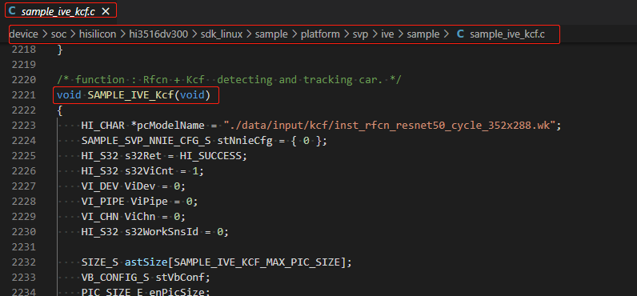

* 运行的主入口在device/soc/hisilicon/hi3516dv300/sdk_linux/sample/platform/svp/ive中sample_ive_main.c文件中，如下图所示：

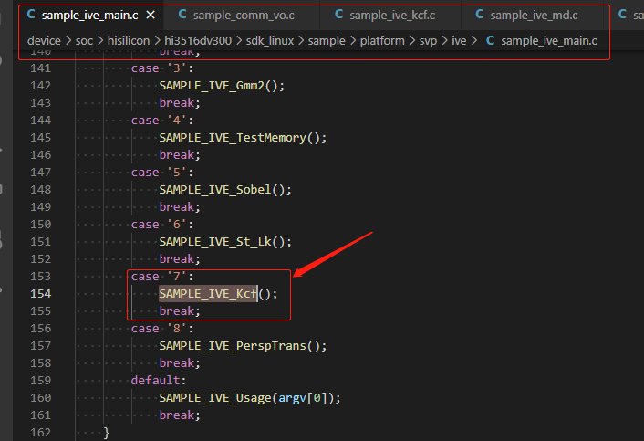

* 关于KCF算子的其他细节，自行查阅device/soc/hisilicon/hi3516dv300/sdk_linux/sample/platform/svp/ive/sample/sample_ive_kcf.c代码即可

##### 5.3.1.2.2、代码修改适配Sensor

在编译sample_ive_main.c之前，需要确保已经执行了 3.2.1章节的整编Taurus代码，以及3.2.2章节的Taurus镜像烧录的步骤，由于sample_ive_kcf.c适配的sensor是vpss0 chn0输出1080P，chn1 输出PIC_CIF分辨率，但是我们的摄像头是IMX335_4M，当使用4M或5M时序时，会因为规格限制出现报错，所以我们需要修改vpss0 chn1输出输出1080P，chn12输出PIC_CIF，就可以正常输出图像。

以下截图可在device/soc/hisilicon/hi3516dv300/sdk_linux/sample/platform/svp/ive/sample/sample_ive_kcf.c文件中找到

* 步骤1：修改SAMPLE_IVE_Rfcn_Detect()函数中HI_MPI_VPSS_ReleaseChnFrame()接口。

```c
s32Ret = HI_MPI_VPSS_ReleaseChnFrame(s32VpssGrp, 2, &stExtFrmInfo); // 第1682行,将第二个参数修改为2
```

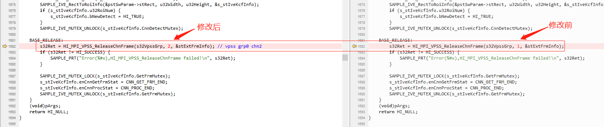

* 步骤2：修改SAMPLE_IVE_GetFrame()函数中的HI_MPI_VPSS_GetChnFrame()和HI_MPI_VPSS_ReleaseChnFrame()接口。

```c++
s32Ret = HI_MPI_VPSS_GetChnFrame(0, 1, &astVideoFrame[0], s32MilliSec); // 第1704行，将第二个参数改为1

s32Ret = HI_MPI_VPSS_GetChnFrame(0, 2, &astVideoFrame[1], s32MilliSec); // 第1721行，将第二个参数改为2

s32Ret = HI_MPI_VPSS_ReleaseChnFrame(0, 1, &astVideoFrame[0]); // 第1737行，将第二个参数改为1
```

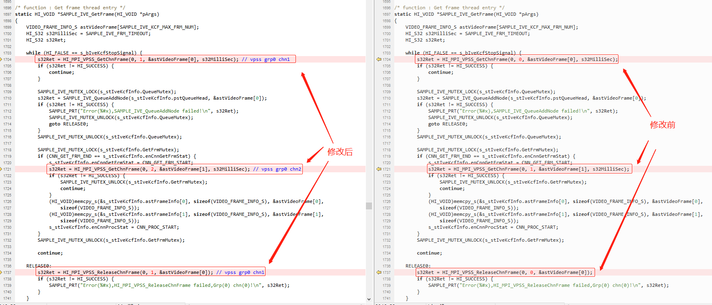

* 步骤3：修改SAMPLE_IVE_KcfTracking()函数中的HI_MPI_VPSS_ReleaseChnFrame()接口。

```c++
(HI_VOID)HI_MPI_VPSS_ReleaseChnFrame(0, 1, &pstQueueNode->stFrameInfo); // 第2047行，将第二个参数改为1
```

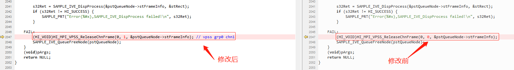

* 步骤4：修改SAMPLE_IVE_KcfDeInit()函数中的HI_MPI_VPSS_ReleaseChnFrame()接口。

```c++
(HI_VOID)HI_MPI_VPSS_ReleaseChnFrame(0, 2, &pstIveKcfInfo->astFrameInfo[1]); // 第2059行，将第二个参数改为2

(HI_VOID)HI_MPI_VPSS_ReleaseChnFrame(0, 1, &pstQueueNode->stFrameInfo); // 第2074行，将第二个参数改为1
```

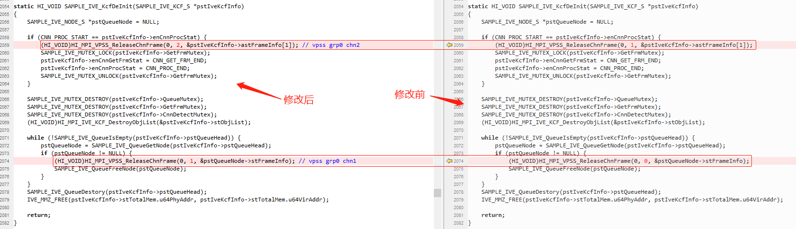

* 步骤5：修改SAMPLE_IVE_Kcf()函数中的2345-2347行，如下所示

```c
# 将SAMPLE_IVE_Kcf()函数中的2345-2347行，从
for (i = 0; i < SAMPLE_IVE_KCF_VPSS_MAX_CHN; i++) {
    astVpssChnAttr[i].u32Width = astSize[i + 1].u32Width;
    astVpssChnAttr[i].u32Height = astSize[i + 1].u32Height;

# 改成
for (i = 1; i < SAMPLE_IVE_KCF_VPSS_MAX_CHN + 1; i++) {
    astVpssChnAttr[i].u32Width = astSize[i].u32Width;
    astVpssChnAttr[i].u32Height = astSize[i].u32Height;
```

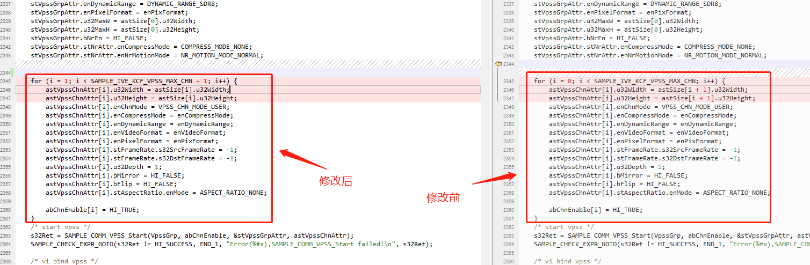

由于我的显示器是只支持1080P60帧，所以需要修改device/soc/hisilicon/hi3516dv300/sdk_linux/sample/platform/common/sample_comm_vo.c文件中SAMPLE_COMM_VO_GetDefConfig()函数的VO 输出配置，这个请根据自己的显示器支持的参数进行配置。

```c++
pstVoConfig->enIntfSync = VO_OUTPUT_1080P60; // 第483行的VO_OUTPUT_1080P30; 改成 VO_OUTPUT_1080P60;
```


##### 5.3.1.2.3、编译

在单编sample_ive_main.c前，需修改目录下的一处依赖，进入//device/soc/hisilicon/hi3516dv300/sdk_linux目录下，通过修改BUILD.gn，在deps下面新增target，``"sample/platform/svp/ive:hi3516dv300_ive_sample"``，如下图所示：

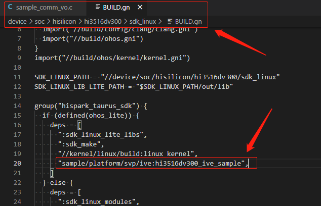

* 单编 ive sample

* **方式一：使用Makefile的方式进行单编（速度会快很多）**

  * 在Ubuntu的命令行终端，分步执行下面的命令，单编ive sample

  ```
  cd  /home/openharmony/sdk_linux/sample/build
  
  make ive_clean && make ive
  ```

  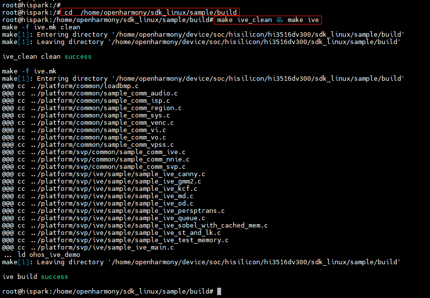

  * 在/home/openharmony/sdk_linux/sample/output 目录下，生成ohos_ive_demo可执行文件，如下图所示：

  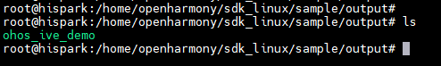

* **方式二：使用OpenHarmony的BUILD.gn方式进行单编(速度较慢)**

  * 在Ubuntu的终端执行下面的命令，进行ive sample的编译

  ```
  hb set  # 选择 ipcamera_hispark_taurus_linux
  
  hb build -T device/soc/hisilicon/hi3516dv300/sdk_linux/sample/platform/svp/ive:hi3516dv300_ive_sample
  ```

  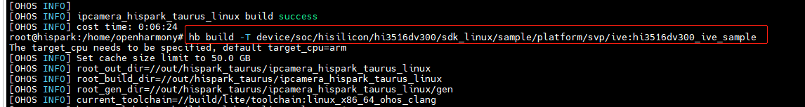

  * 编译成功后，即可在out/hispark_taurus/ipcamera_hispark_taurus_linux/rootfs/bin目录下，生成 ohos_ive_demo可执行文件，如下图所示：


##### 5.3.1.2.4、拷贝可执行程序和依赖文件至开发板的mnt目录下

**方式一：使用SD卡进行资料文件的拷贝**

* 首先需要自己准备一张SD卡
* 步骤1：将编译后生成的可执行文件拷贝到SD卡中。
* 步骤2：将device\soc\hisilicon\hi3516dv300\sdk_linux\out\lib\目录下的**libvb_server.so和 libmpp_vbs.so**拷贝至SD卡中
* 步骤3：将device/soc/hisilicon/hi3516dv300/sdk_linux/sample/platform/svp/ive/目录下的 data文件拷贝至SD卡中。


* 步骤4：可执行文件拷贝成功后，将内存卡插入开发板的SD卡槽中，可通过挂载的方式挂载到板端，可选择SD卡 mount指令进行挂载。
  * 在开发板的终端执行下面的命令，将SD卡挂载到开发板上


```shell
mount -t vfat /dev/mmcblk1p1 /mnt
# 其中/dev/mmcblk1p1需要根据实际块设备号修改
```

* 挂载成功后，如下图所示：


**方式二：使用NFS挂载的方式进行资料文件的拷贝**

* 首先需要自己准备一根网线
* 步骤1：参考[博客链接](https://blog.csdn.net/Wu_GuiMing/article/details/115872995?spm=1001.2014.3001.5501)中的内容，进行nfs的环境搭建
* 步骤2：将编译后生成的可执行文件拷贝到Windows的nfs共享路径下
* 步骤3：将device\soc\hisilicon\hi3516dv300\sdk_linux\out\lib\目录下的**libvb_server.so和 libmpp_vbs.so**拷贝至Windows的nfs共享路径下
* 步骤4：将device/soc/hisilicon/hi3516dv300/sdk_linux/sample/platform/svp/ive/目录下的 data文件拷贝至Windows的nfs共享路径下。


* 步骤5：在开发板的终端执行下面的命令，将Windows的nfs共享路径挂载至开发板的mnt目录下

```
mount -o nolock,addr=192.168.200.1 -t nfs 192.168.200.1:/d/nfs /mnt
```

##### 5.3.1.2.5、拷贝mnt目录下的文件至正确的目录下

* 在开发板的终端执行下面的命令，拷贝mnt目录下面的ohos_ive_demo和data至userdata目录，拷贝mnt目录下面的libvb_server.so和 libmpp_vbs.so至/usr/lib/目录下,

```
cp /mnt/ohos_ive_demo  /userdata
cp /mnt/data /userdata -rf
cp /mnt/*.so /usr/lib/
```

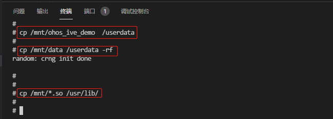

* 在开发板的终端执行下面的命令，给ohos_ive_demo文件可执行权限

```
chmod 777 /userdata/ohos_ive_demo
```

##### 5.3.1.2.6、功能验证

* 上述步骤完成后，需要将mini HDMI线一端接口Tauru套件的HDMI口(mini HDMI线没有提供，需要开发者自行购买)，另一端接显示器，接下来在开发板的终端执行下面的命令，启动可执行文件

```
cd /userdata

./ohos_ive_demo 7
```

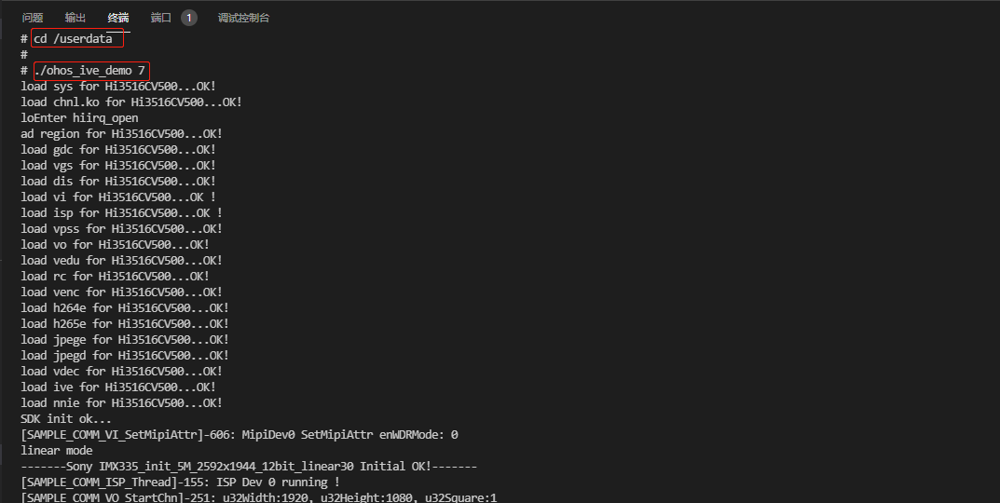

* 如果需要退出程序，就敲两下回车，等待一段时间，程序就会退出运行，如果等待时间太久，可以重新启动一下开发板。


#### 5.3.1.3、背景建模(GMM2)

##### 5.3.1.3.1、概述

* 基于SDK sample的GMM2高斯背景建模对yuv格式的场景流进行背景建模，

* 示例代码参考在device/soc/hisilicon/hi3516dv300/sdk_linux/sample/platform/svp/ive/sample路径下的sample_ive_gmm2.c
* 分析sample_ive_gmm2.c中的HI_VOID SAMPLE_IVE_Gmm2(HI_VOID)；对该接口的解读如下图所示：

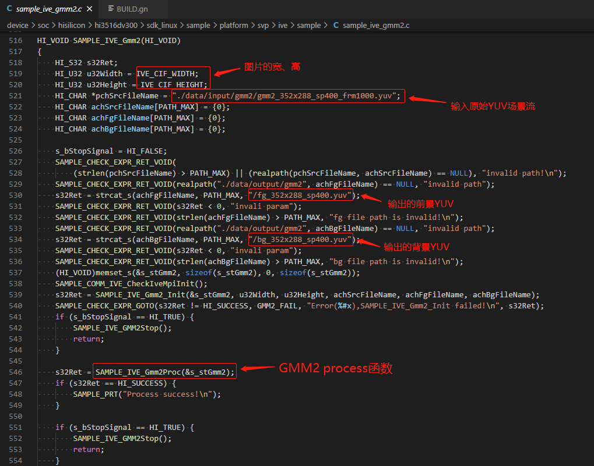

运行的主入口在device/soc/hisilicon/hi3516dv300/sdk_linux/sample/platform/svp/ive/中sample_ive_main.c文件中，如下图所示：

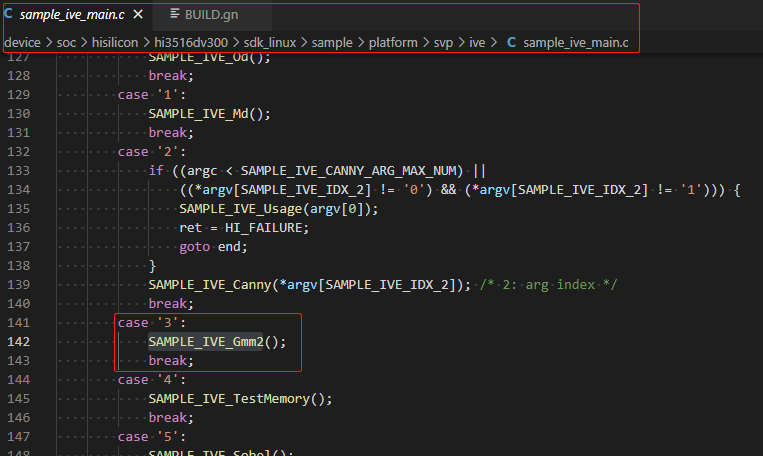

关于GMM2算子的其他细节，自行查阅device/soc/hisilicon/hi3516dv300/sdk_linux/sample/platform/svp/ive/sample/sample_ive_gmm2.c代码即可。

##### 5.3.1.3.2、编译

在编译sample_ive_main.c之前，需要确保已经执行了 3.2.1章节的整编Taurus代码，以及3.2.2章节的Taurus镜像烧录的步骤，在单编sample_ive_main.c前，需修改目录下的一处依赖，进入//device/soc/hisilicon/hi3516dv300/sdk_linux目录下，通过修改BUILD.gn，在deps下面新增target，``"sample/platform/svp/ive:hi3516dv300_ive_sample"``，如下图所示：


* 单编 ive sample

* **方式一：使用Makefile的方式进行单编（速度会快很多）**

  * 在Ubuntu的命令行终端，分步执行下面的命令，单编ive sample

  ```
  cd  /home/openharmony/sdk_linux/sample/build
  
  make ive_clean && make ive
  ```

  

  * 在/home/openharmony/sdk_linux/sample/output 目录下，生成ohos_ive_demo可执行文件，如下图所示：

  

* **方式二：使用OpenHarmony的BUILD.gn方式进行单编(速度较慢)**

  * 在Ubuntu的终端执行下面的命令，进行ive sample的编译

  ```
  hb set  # 选择 ipcamera_hispark_taurus_linux
  
  hb build -T device/soc/hisilicon/hi3516dv300/sdk_linux/sample/platform/svp/ive:hi3516dv300_ive_sample
  ```

  

  * 编译成功后，即可在out/hispark_taurus/ipcamera_hispark_taurus_linux/rootfs/bin目录下，生成 ohos_ive_demo可执行文件，如下图所示：


##### 5.3.1.3.3、拷贝可执行程序和依赖文件至开发板的mnt目录下

**方式一：使用SD卡进行资料文件的拷贝**

* 首先需要自己准备一张SD卡
* 步骤1：将编译后生成的可执行文件拷贝到SD卡中。
* 步骤2：将device\soc\hisilicon\hi3516dv300\sdk_linux\out\lib\目录下的**libvb_server.so和 libmpp_vbs.so**拷贝至SD卡中
* 步骤3：将device/soc/hisilicon/hi3516dv300/sdk_linux/sample/platform/svp/ive/目录下的 data文件拷贝至SD卡中。

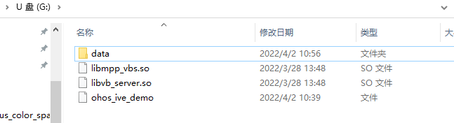

* 步骤4：可执行文件拷贝成功后，将内存卡插入开发板的SD卡槽中，可通过挂载的方式挂载到板端，可选择SD卡 mount指令进行挂载。
  * 在开发板的终端执行下面的命令，将SD卡挂载到开发板上。


```shell
mount -t vfat /dev/mmcblk1p1 /mnt
# 其中/dev/mmcblk1p1需要根据实际块设备号修改
```

* 挂载成功后，如下图所示：


**方式二：使用NFS挂载的方式进行资料文件的拷贝**

* 首先需要自己准备一根网线
* 步骤1：参考[博客链接](https://blog.csdn.net/Wu_GuiMing/article/details/115872995?spm=1001.2014.3001.5501)中的内容，进行nfs的环境搭建
* 步骤2：将编译后生成的可执行文件拷贝到Windows的nfs共享路径下
* 步骤3：将device\soc\hisilicon\hi3516dv300\sdk_linux\out\lib\目录下的**libvb_server.so和 libmpp_vbs.so**拷贝至Windows的nfs共享路径下
* 步骤4：将device/soc/hisilicon/hi3516dv300/sdk_linux/sample/platform/svp/ive/目录下的 data文件拷贝至Windows的nfs共享路径下。

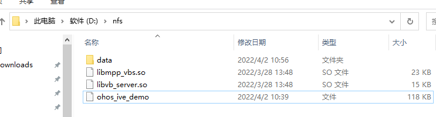

* 步骤5：在开发板的终端执行下面的命令，将Windows的nfs共享路径挂载至开发板的mnt目录下

```
mount -o nolock,addr=192.168.200.1 -t nfs 192.168.200.1:/d/nfs /mnt
```

##### 5.3.1.3.4、拷贝mnt目录下的文件至正确的目录下

* 在开发板终端执行下面的命令，拷贝mnt目录下面的ohos_ive_demo和data至userdata目录，拷贝mnt目录下面的libvb_server.so和 libmpp_vbs.so至/usr/lib/目录下,

```
cp /mnt/ohos_ive_demo  /userdata
cp /mnt/data /userdata -rf
cp /mnt/*.so /usr/lib/
```


* 在开发板终端执行下面的命令，给ohos_ive_demo文件可执行权限

```
chmod 777 /userdata/ohos_ive_demo
```

##### 5.3.1.3.5、功能验证

* 在开发板终端执行下面的命令，运行可执行文件

```
cd /userdata

./ohos_ive_demo 3
```

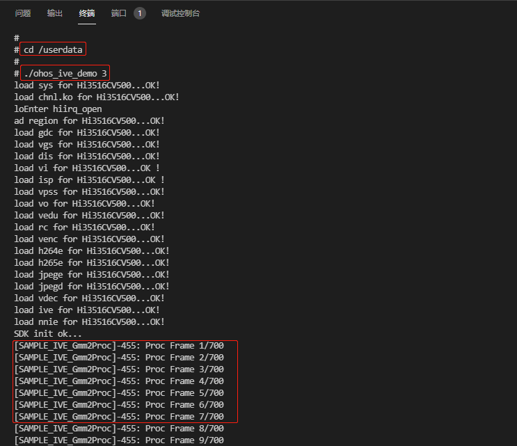

* 执行完成后，相应结果存放在/userdata/data/output/gmm2目录下，如下图所示：

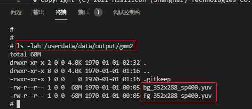

* 将bg_352x288_sp400.yuv和fg_352x288_sp400.yuv通过nfs或者SD卡挂载的方式，拷贝到本地，通过YUVPlayer即可查看效果，关于YUVPlayer自行到网上下载即可。

* GMM2处理效果如下图所示：
  * 原始图像：

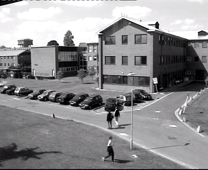

* 前景图像：

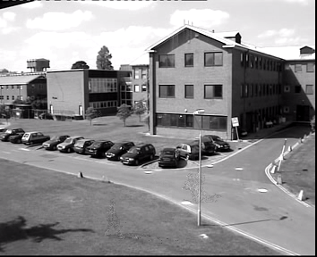

* Background图像：

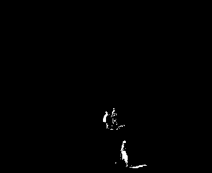

#### 5.3.1.4、移动侦测(MD)

##### 5.3.1.4.1、概述

SDK sample移动侦测（Motion Detection）代码路径存放在device/soc/hisilicon/hi3516dv300/sdk_linux/sample/platform/svp/ive/sample路径下的sample_ive_md.c中，如下图所示：

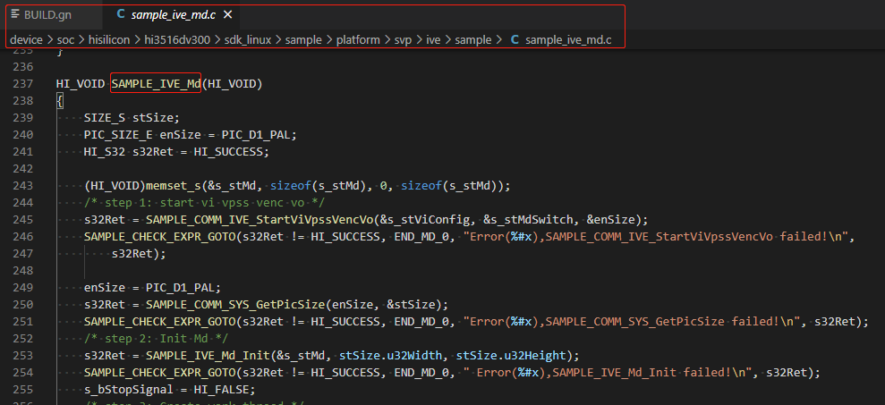

运行的主入口在device/soc/hisilicon/hi3516dv300/sdk_linux/sample/platform/svp/ive路径下的sample_ive_main.c文件中，如下图所示：

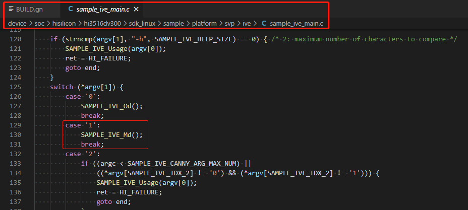

关于MD算子的其他细节，自行查阅device/soc/hisilicon/hi3516dv300/sdk_linux/sample/platform/svp/ive/sample/sample_ive_md.c代码即可。

##### 5.3.1.4.2、代码修改适配显示器的输出参数

在编译sample_ive_main.c之前，需要确保已经执行了 3.2.1章节的整编Taurus代码，以及3.2.2章节的Taurus镜像烧录的步骤，由于我的显示器是只支持1080P60帧，所以需要修改device/soc/hisilicon/hi3516dv300/sdk_linux/sample/platform/svp/common/目录下的sample_comm_ive.c的SAMPLE_COMM_IVE_StartVo()函数中的VO 输出配置，这个请根据自己的显示器支持的参数进行配置。

```c++
 stVoPubAttr.enIntfSync = VO_OUTPUT_1080P60; // 第823行的VO_OUTPUT_1080P30; 改成 VO_OUTPUT_1080P60;
```

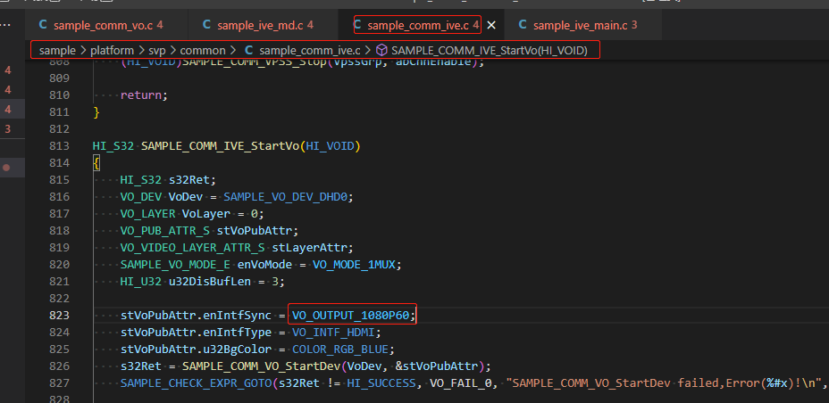

##### 5.3.1.4.3、编译

在单编sample_ive_main.c前，需修改目录下的一处依赖，进入//device/soc/hisilicon/hi3516dv300/sdk_linux目录下，通过修改BUILD.gn，在deps下面新增target，``"sample/platform/svp/ive:hi3516dv300_ive_sample"``，如下图所示：


* 单编 ive sample

* **方式一：使用Makefile的方式进行单编（速度会快很多）**

  * 在Ubuntu的命令行终端，分步执行下面的命令，单编ive sample

  ```
  cd  /home/openharmony/sdk_linux/sample/build
  
  make ive_clean && make ive
  ```

  

  * 在/home/openharmony/sdk_linux/sample/output 目录下，生成ohos_ive_demo可执行文件，如下图所示：

  

* **方式二：使用OpenHarmony的BUILD.gn方式进行单编(速度较慢)**

  * 在Ubuntu的终端执行下面的命令，进行ive sample的编译

  ```
  hb set  # 选择 ipcamera_hispark_taurus_linux
  
  hb build -T device/soc/hisilicon/hi3516dv300/sdk_linux/sample/platform/svp/ive:hi3516dv300_ive_sample
  ```

  

  * 编译成功后，即可在out/hispark_taurus/ipcamera_hispark_taurus_linux/rootfs/bin目录下，生成 ohos_ive_demo可执行文件，如下图所示：

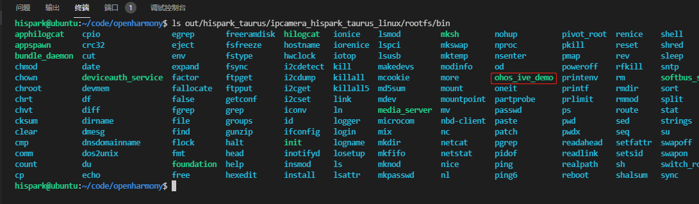

##### 5.3.1.4.4、拷贝可执行程序和依赖文件至开发板的mnt目录下

**方式一：使用SD卡进行资料文件的拷贝**

* 首先需要自己准备一张SD卡
* 步骤1：将编译后生成的可执行文件拷贝到SD卡中。
* 步骤2：将device\soc\hisilicon\hi3516dv300\sdk_linux\out\lib\目录下的**libvb_server.so和 libmpp_vbs.so**拷贝至SD卡中
* 步骤3：将device/soc/hisilicon/hi3516dv300/sdk_linux/sample/platform/svp/ive/目录下的 data文件拷贝至SD卡中。


* 步骤4：可执行文件拷贝成功后，将内存卡插入开发板的SD卡槽中，可通过挂载的方式挂载到板端，可选择SD卡 mount指令进行挂载。
  * 在开发板终端执行下面的命令，将SD卡挂载到开发板上。


```shell
mount -t vfat /dev/mmcblk1p1 /mnt
# 其中/dev/mmcblk1p1需要根据实际块设备号修改
```

* 挂载成功后，如下图所示：


**方式二：使用NFS挂载的方式进行资料文件的拷贝**

* 首先需要自己准备一根网线
* 步骤1：参考[博客链接](https://blog.csdn.net/Wu_GuiMing/article/details/115872995?spm=1001.2014.3001.5501)中的内容，进行nfs的环境搭建
* 步骤2：将编译后生成的可执行文件拷贝到Windows的nfs共享路径下
* 步骤3：将device\soc\hisilicon\hi3516dv300\sdk_linux\out\lib\目录下的**libvb_server.so和 libmpp_vbs.so**拷贝至Windows的nfs共享路径下
* 步骤4：将device/soc/hisilicon/hi3516dv300/sdk_linux/sample/platform/svp/ive/目录下的 data文件拷贝至Windows的nfs共享路径下。


* 步骤5：在开发板的终端执行下面的命令，将Windows的nfs共享路径挂载至开发板的mnt目录下

```
mount -o nolock,addr=192.168.200.1 -t nfs 192.168.200.1:/d/nfs /mnt
```

##### 5.3.1.4.5、拷贝mnt目录下的文件至正确的目录下

* 在开发板的终端执行下面的命令，拷贝mnt目录下面的ohos_ive_demo和data至userdata目录，拷贝mnt目录下面的libvb_server.so和 libmpp_vbs.so至/usr/lib/目录下,

```
cp /mnt/ohos_ive_demo  /userdata
cp /mnt/data /userdata -rf
cp /mnt/*.so /usr/lib/
```


* 在开发板的终端执行下面的命令，给ohos_ive_demo文件可执行权限

```
chmod 777 /userdata/ohos_ive_demo
```

##### 5.3.1.4.6、功能验证

* 上述步骤完成后，需要将mini HDMI线一端接口Tauru套件的HDMI口，另一端接显示器，在开发板的终端执行下面的命令，运行可执行程序

```
cd /userdata

./ohos_ive_demo 1
```

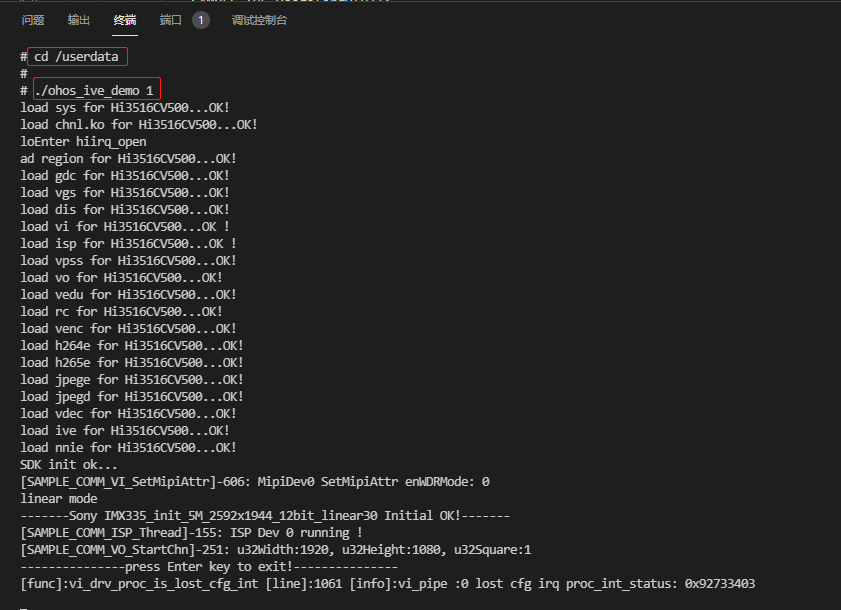

若运行正常，即可进行目标的移动检测，如下图所示：

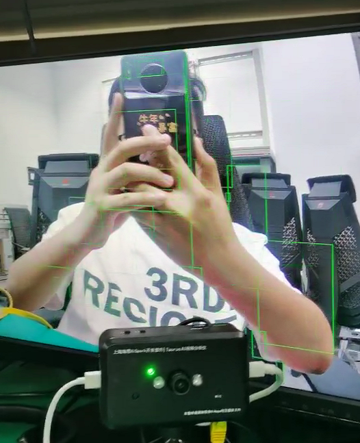

* 如果需要退出程序，就敲两下回车，等待一段时间，程序就会退出运行

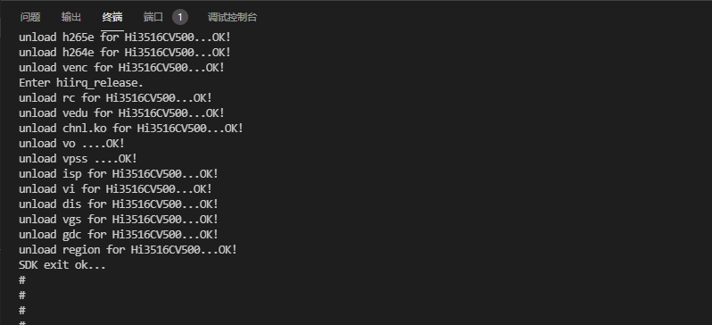

#### 5.3.1.5、边缘检测算子

##### 5.3.1.5.1、概述

* 基于SDK sample进行yuv图片的边缘检测，以canny算子为例。
* 具体代码路径在device/soc/hisilicon/hi3516dv300/sdk_linux/sample/platform/svp/ive/sample路径下的sample_ive_canny.c，分析sample_ive_canny.c代码中**SAMPLE_IVE_Canny canny sample**接口，如下图所示：

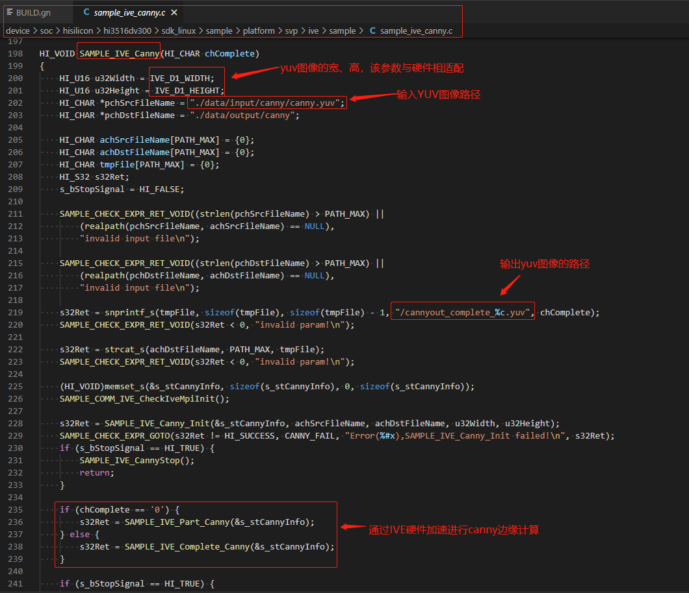

* 运行的主入口在device/soc/hisilicon/hi3516dv300/sdk_linux/sample/platform/svp/ive中sample_ive_main.c文件中，如下图所示：

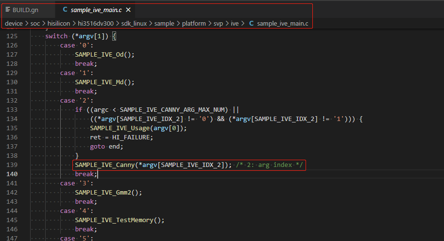

* 关于canny算子的其他细节，自行查阅device/soc/hisilicon/hi3516dv300/sdk_linux/sample/platform/svp/ive/sample/sample_ive_canny.c代码即可

##### 5.3.1.5.2、编译

在编译sample_ive_main.c之前，需要确保已经执行了 3.2.1章节的整编Taurus代码，以及3.2.2章节的Taurus镜像烧录的步骤，在单编sample_ive_main.c前，需修改目录下的一处依赖，进入//device/soc/hisilicon/hi3516dv300/sdk_linux目录下，通过修改BUILD.gn，在deps下面新增target，``"sample/platform/svp/ive:hi3516dv300_ive_sample"``，如下图所示：


* 单编 ive sample

* **方式一：使用Makefile的方式进行单编（速度会快很多）**

  * 在Ubuntu的命令行终端，分步执行下面的命令，单编ive sample

  ```
  cd  /home/openharmony/sdk_linux/sample/build
  
  make ive_clean && make ive
  ```

  

  * 在/home/openharmony/sdk_linux/sample/output 目录下，生成ohos_ive_demo可执行文件，如下图所示：

  

* **方式二：使用OpenHarmony的BUILD.gn方式进行单编(速度较慢)**

  * 在Ubuntu的终端执行下面的命令，进行ive sample的编译

  ```
  hb set  # 选择 ipcamera_hispark_taurus_linux
  
  hb build -T device/soc/hisilicon/hi3516dv300/sdk_linux/sample/platform/svp/ive:hi3516dv300_ive_sample
  ```

  

  * 编译成功后，即可在out/hispark_taurus/ipcamera_hispark_taurus_linux/rootfs/bin目录下，生成 ohos_ive_demo可执行文件，如下图所示：


##### 5.3.1.5.3、拷贝可执行程序和依赖文件至开发板的mnt目录下

**方式一：使用SD卡进行资料文件的拷贝**

* 首先需要自己准备一张SD卡
* 步骤1：将编译后生成的可执行文件拷贝到SD卡中。
* 步骤2：将device\soc\hisilicon\hi3516dv300\sdk_linux\out\lib\目录下的**libvb_server.so和 libmpp_vbs.so**拷贝至SD卡中
* 步骤3：将device/soc/hisilicon/hi3516dv300/sdk_linux/sample/platform/svp/ive/目录下的 data文件拷贝至SD卡中。


* 步骤4：可执行文件拷贝成功后，将内存卡插入开发板的SD卡槽中，可通过挂载的方式挂载到板端，可选择SD卡 mount指令进行挂载。
  * 在开发板终端执行下面的命令，将SD卡挂载到开发板上。


```shell
mount -t vfat /dev/mmcblk1p1 /mnt
# 其中/dev/mmcblk1p1需要根据实际块设备号修改
```

* 挂载成功后，如下图所示：

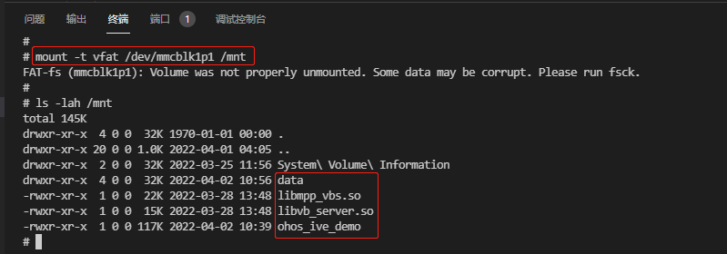

**方式二：使用NFS挂载的方式进行资料文件的拷贝**

* 首先需要自己准备一根网线
* 步骤1：参考[博客链接](https://blog.csdn.net/Wu_GuiMing/article/details/115872995?spm=1001.2014.3001.5501)中的内容，进行nfs的环境搭建
* 步骤2：将编译后生成的可执行文件拷贝到Windows的nfs共享路径下
* 步骤3：将device\soc\hisilicon\hi3516dv300\sdk_linux\out\lib\目录下的**libvb_server.so和 libmpp_vbs.so**拷贝至Windows的nfs共享路径下
* 步骤4：将device/soc/hisilicon/hi3516dv300/sdk_linux/sample/platform/svp/ive/目录下的 data文件拷贝至Windows的nfs共享路径下。


* 步骤5：在开发板终端执行下面的命令，将Windows的nfs共享路径挂载至开发板的mnt目录下

```
mount -o nolock,addr=192.168.200.1 -t nfs 192.168.200.1:/d/nfs /mnt
```

##### 5.3.1.5.4、拷贝mnt目录下的文件至正确的目录下

* 在开发板终端执行下面的命令，拷贝mnt目录下面的ohos_ive_demo和data至userdata目录，拷贝mnt目录下面的libvb_server.so和 libmpp_vbs.so至/usr/lib/目录下,

```
cp /mnt/ohos_ive_demo  /userdata
cp /mnt/data /userdata -rf
cp /mnt/*.so /usr/lib/
```


* 在开发板的终端执行下面的命令，给ohos_ive_demo文件可执行权限

```
chmod 777 /userdata/ohos_ive_demo
```

##### 5.3.1.5.5、功能验证

* 在开发板的终端执行下面的命令，启动可执行文件，即可完成图像canny计算，如下图所示：

```
cd /userdata

./ohos_ive_demo 2 0
```

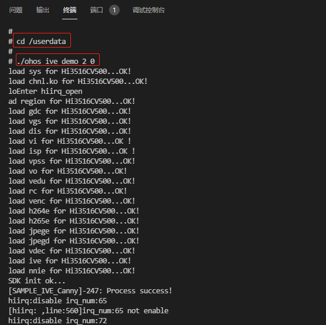

* 输出的结果存放在/userdata/data/output/canny目录下，如下图所示：

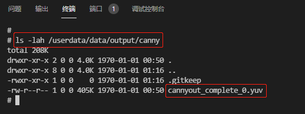

#### 5.3.1.6、色彩转换算子

##### 5.3.1.6.1、色彩空间转换算子实现

通过IVE加速过得色彩空间转换算子可以提高软件在板端运行效率，充分利用硬件资源来为软件服务，color_space_convert中定义了如下空间转换算子，可参考**源码的device/soc/hisilicon/hi3516dv300/sdk_linux/sample/taurus/color_space_convert/smp中**的smp_color_space_convert.h，如下图所示：

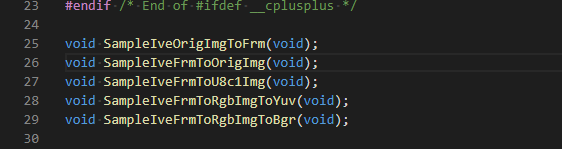

详细讲解下各算子的用法。

以下算子的实现都可以在device/soc/hisilicon/hi3516dv300/sdk_linux/sample/taurus/color_space_convert/smp/smp_color_space_convert.c中找到

**SAMPLE_IVE_OrigImgToFrm**

* 功能：ive image to video frame.

* 具体实现方式如下：

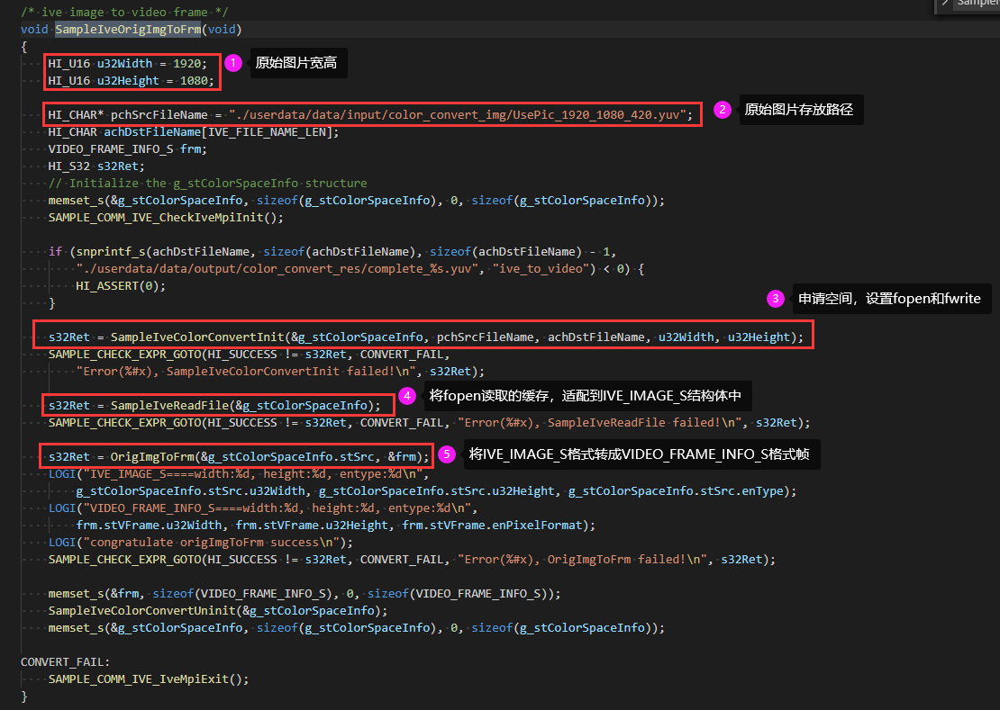

**SAMPLE_IVE_FrmToOrigImg**

* 功能：video frame to ive image.

* 具体实现方式如下：

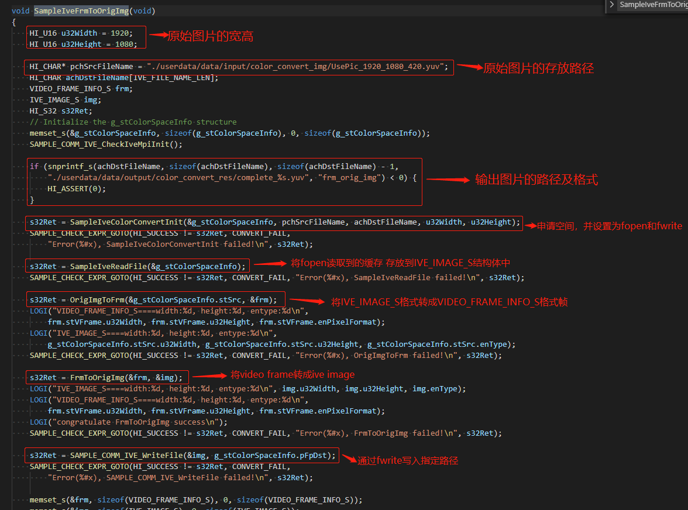

**SAMPLE_IVE_FrmToU8c1Img**

* 功能：video YUV frame to ive image (U8C1)

* 具体实现方式如下：

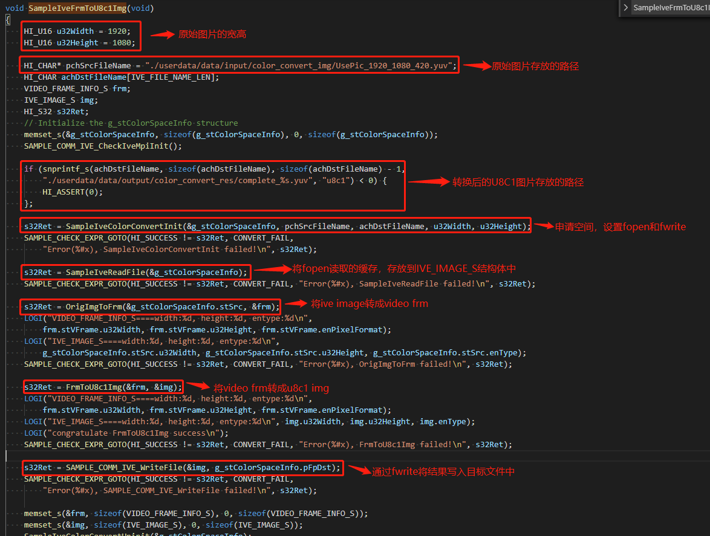

**SAMPLE_IVE_FrmToRgbImg_ImgRgbToYuv**

* 具体实现方式如下：

* 功能：ive image RGB to YUV

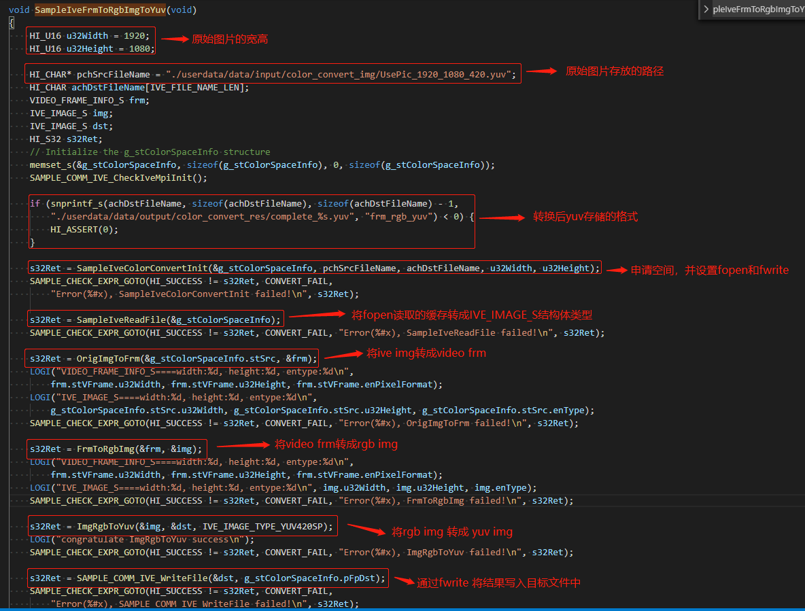

**SAMPLE_IVE_FrmToRgbImg_ImgRgbToBgr**

* 功能：ive image RGB to BGR

* 具体实现方式如下：

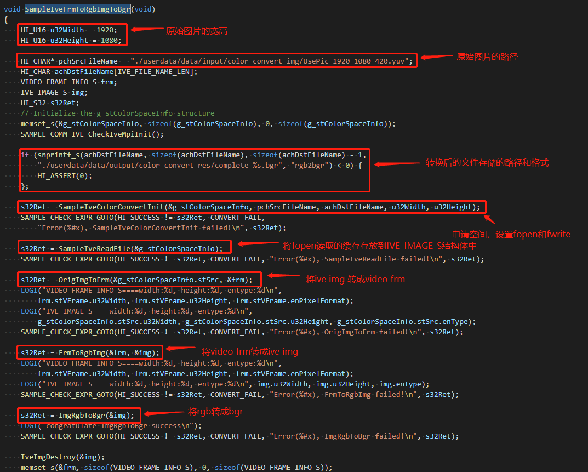

##### 5.3.1.6.2、color_space_convert sample操作指导

###### 5.3.1.6.2.1、概述

color_space_convert  sample基于OpenHarmony 小型系统开发，以Taurus套件为例，color_space_convert sample 介绍了常用色彩空间转换算子的具体实现过程。

###### 5.3.1.6.2.2. 目录

```shell
//device/soc/hisilicon/hi3516dv300/sdk_linux/sample/taurus/color_space_convert
├── BUILD.gn                   				 # 编译ohos color_space_convert sample需要的gn文件
├── sample_color_space_convert_main.c        # ohos color_space_convert sample主函数入口
└── smp
    ├── smp_color_space_convert.c       	 # ohos color_space_convert sample业务代码
    └── smp_color_space_convert.h       	 # ohos color_space_convert sample业务代码所需的头文件
```

###### 5.3.1.6.2.3、编译

* 在编译color_space_convert  sample前，需要确保已经执行了 3.2.1章节的整编Taurus代码，以及3.2.2章节的Taurus镜像烧录的步骤。
* 在单编color_space_convert  sample之前，需修改目录下的一处依赖，进入//device/soc/hisilicon/hi3516dv300/sdk_linux目录下，通过修改BUILD.gn，在deps下面新增target，``"sample/taurus/color_space_convert:hi3516dv300_color_space_convert_sample"``，如下图所示：

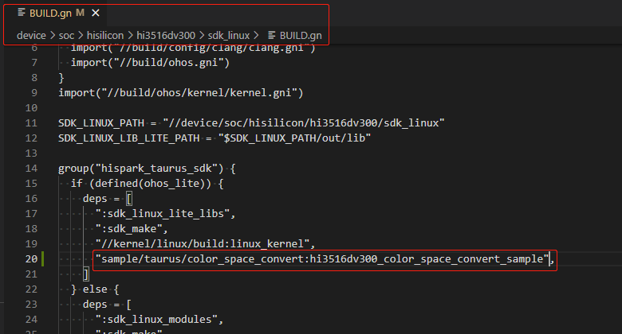

* 单编 color_space_convert  sample

* **方式一：使用Makefile的方式进行单编（速度会快很多）**

  * 在Ubuntu的命令行终端，分步执行下面的命令，单编ive sample

  ```
  cd  /home/openharmony/sdk_linux/sample/build
  
  make color_space_convert_clean && make color_space_convert
  ```

  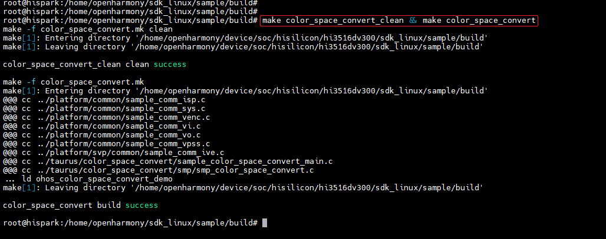

  * 在/home/openharmony/sdk_linux/sample/output 目录下，生成ohos_color_space_convert_demo可执行文件，如下图所示：

  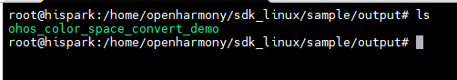

* **方式二：使用OpenHarmony的BUILD.gn方式进行单编(速度较慢)**

  * 在Ubuntu的终端执行下面的命令，进行color_space_convert_sample的编译

  ```
  hb set  # 选择 ipcamera_hispark_taurus_linux
  
  hb build -T device/soc/hisilicon/hi3516dv300/sdk_linux/sample/taurus/color_space_convert:hi3516dv300_color_space_convert_sample
  ```

  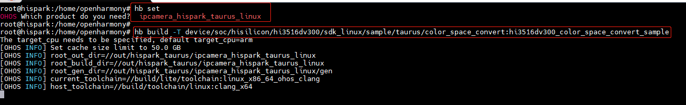

  * 编译成功后，即可在out/hispark_taurus/ipcamera_hispark_taurus_linux/rootfs/bin目录下，生成 ohos_color_space_convert_demo可执行文件，如下图所示：

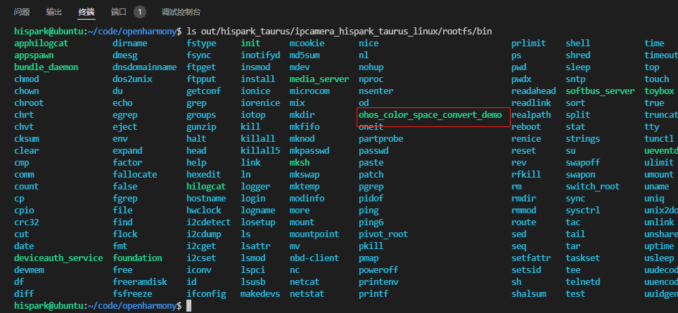

###### 5.3.1.6.2.4、拷贝可执行程序和依赖文件至开发板的mnt目录下

**方式一：使用SD卡进行资料文件的拷贝**

* 首先需要自己准备一张SD卡

* 步骤1：将编译后生成的可执行文件拷贝到SD卡中。

* 步骤2：将device\soc\hisilicon\hi3516dv300\sdk_linux\out\lib\目录下的**libvb_server.so和 libmpp_vbs.so**拷贝至SD卡中
* 步骤3：将device/soc/hisilicon/hi3516dv300/sdk_linux/sample/taurus/data/目录下的 UsePic_1920_1080_420.yuv文件拷贝至SD卡中。

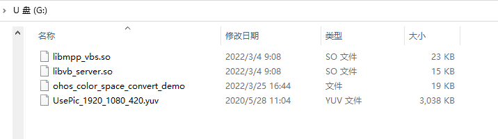

* 步骤4：可执行文件拷贝成功后，将内存卡插入开发板的SD卡槽中，可通过挂载的方式挂载到板端，可选择SD卡 mount指令进行挂载。
  * 在开发板终端执行下面的命令，将SD卡挂载到开发板上。


```shell
mount -t vfat /dev/mmcblk1p1 /mnt
# 其中/dev/mmcblk1p1需要根据实际块设备号修改
```

* 挂载成功后，如下图所示：

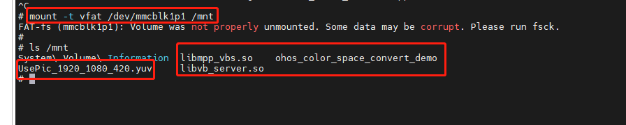

**方式二：使用NFS挂载的方式进行资料文件的拷贝**

* 首先需要自己准备一根网线
* 步骤1：参考[博客链接](https://blog.csdn.net/Wu_GuiMing/article/details/115872995?spm=1001.2014.3001.5501)中的内容，进行nfs的环境搭建

* 步骤2：将编译后生成的可执行文件拷贝到Windows的nfs共享路径下

* 步骤3：将device\soc\hisilicon\hi3516dv300\sdk_linux\out\lib\目录下的**libvb_server.so和 libmpp_vbs.so**拷贝至Windows的nfs共享路径下

* 步骤4：将device/soc/hisilicon/hi3516dv300/sdk_linux/sample/taurus/data/目录下的 UsePic_1920_1080_420.yuv文件拷贝至Windows的nfs共享路径下。

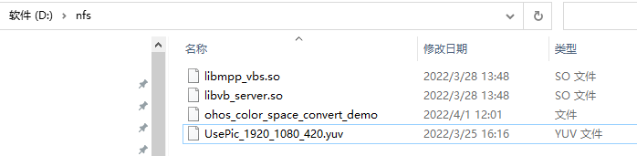

* 步骤5：依赖文件拷贝至Windows的nfs共享路径下后，在开发板的终端执行下面的命令，将Windows的nfs共享路径挂载至开发板的mnt目录下

```
mount -o nolock,addr=192.168.200.1 -t nfs 192.168.200.1:/d/nfs /mnt
```

###### 5.3.1.6.2.5、拷贝mnt目录下的文件至正确的目录下

* 在开发板的终端执行下面的命令，拷贝mnt目录下面的color_space_convert_demo至/userdata目录，拷贝mnt目录下面的libvb_server.so和 libmpp_vbs.so至/usr/lib/目录下，再创建一个/userdata/data/input/color_convert_img/目录和一个/userdata/data/output/color_convert_res/目录

```
mkdir -p /userdata/data/input/color_convert_img/
mkdir -p /userdata/data/output/color_convert_res/
cp /mnt/ohos_color_space_convert_demo  /
cp /mnt/*.so /usr/lib/
cp /mnt/UsePic_1920_1080_420.yuv /userdata/data/input/color_convert_img/
```

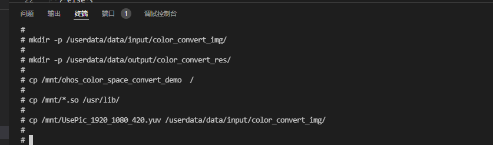

* 在开发板的终端执行下面的命令，给color_space_convert_demo文件可执行权限

```
chmod 777 ohos_color_space_convert_demo
```

###### 5.3.1.6.2.6、功能验证

**1) ive image to video frame**

* 执行下面的命令，即可完成ive image to video frame的转换，如下图所示：

```
./ohos_color_space_convert_demo 0
```

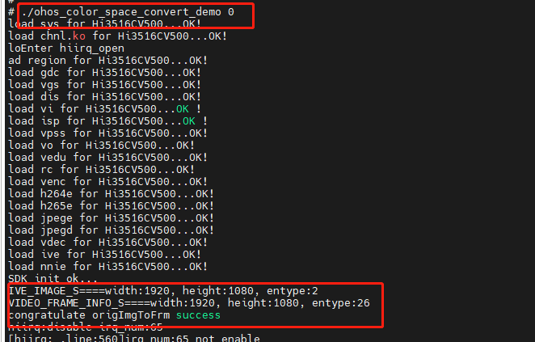

* 转换成功后，即可在/userdata/data/output/color_convert_res/目录下，生成complete_ive_to_video.yuv图片，如下图所示：

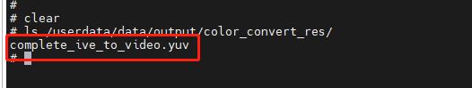

**2) video frame to ive image**

* 在开发板的终端执行下面的命令，即可完成video frame to ive imag的转换，如下图所示：

```
./ohos_color_space_convert_demo 1
```

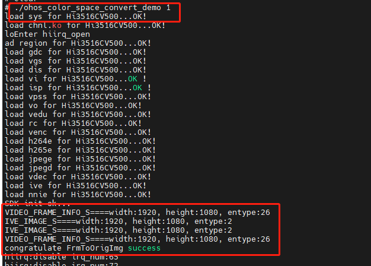

* 转换成功后，即可在/userdata/data/output/color_convert_res/目录下，生成complete_frm_orig_img.yuv图片，如下图所示：

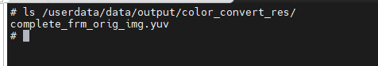

**3) video YUV frame to ive image (U8C1)**

* 在开发板的终端执行下面的命令，即可完成video YUV frame to ive image (U8C1)的转换，如下图所示：

  ```
  ./ohos_color_space_convert_demo 2
  ```

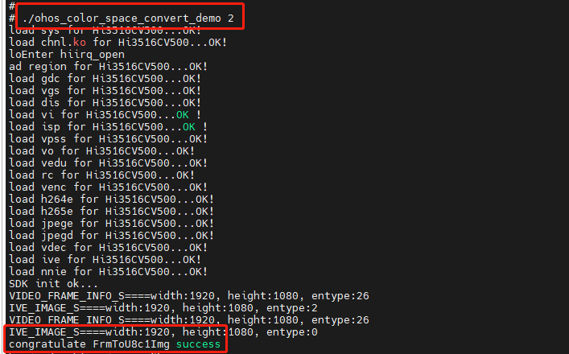

* 转换成功后，即可在/userdata/data/output/color_convert_res/目录下，生成complete_u8c1.yuv图片，如下图所示：

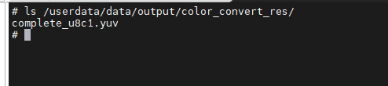

**4) YUV video frame to RGB ive image - ive image RGB to YUV**

* 在开发板的终端执行下面的命令，即可完成YUV video frame to RGB ive image - ive image RGB to YUV的转换，如下图所示：

```
./ohos_color_space_convert_demo 3
```

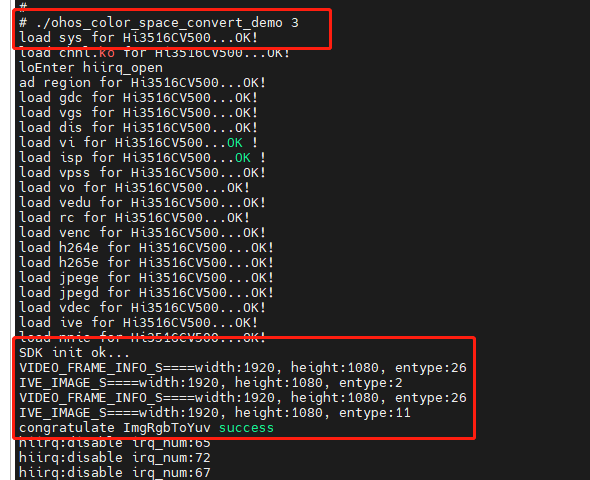

* 转换成功后，即可在/userdata/data/output/color_convert_res/目录下，生成complete_frm_rgb_yuv.yuv图片，如下图所示：

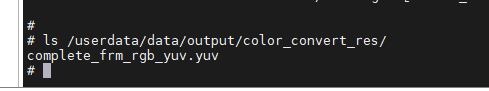

**5) YUV video frame to RGB ive image - ive image RGB to BGR**

* 在开发板的终端执行下面的命令，即可完成YUV video frame to RGB ive image - ive image RGB to BGR的转换，如下图所示：

```
./ohos_color_space_convert_demo 4
```

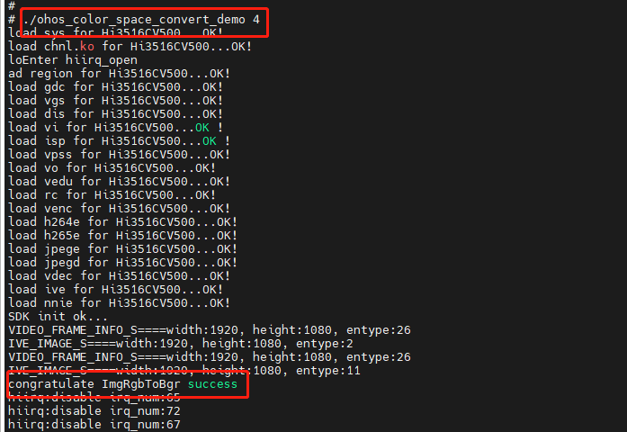

* 转换成功后，即可在/userdata/data/output/color_convert_res/目录下，生成complete_rgb2bgr.bgr图片，如下图所示：

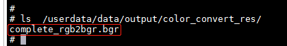

### 5.3.2、深度学习神经网络

#### 5.3.2.1、卷积神经网络的概念

神经网络种类很多，本章节重点介绍卷积神经网络。

卷积神经网络（Convolutional Neural Networks, CNN）是一类包含卷积计算且具有深度结构的前馈神经网络（Feedforward Neural Networks），是深度学习（deep learning）的代表算法之一 。卷积神经网络具有表征学习（representation learning）能力，能够按其阶层结构对输入信息进行平移不变分类（shift-invariant classification），因此也被称为“平移不变人工神经网络（Shift-Invariant Artificial Neural Networks, SIANN）”。

对卷积神经网络的研究始于二十世纪80至90年代，时间延迟网络和LeNet-5是最早出现的卷积神经网络；在二十一世纪后，随着深度学习理论的提出和数值计算设备的改进，卷积神经网络得到了快速发展，并被应用于计算机视觉、自然语言处理等领域 。

卷积神经网络仿造生物的视知觉（visual perception）机制构建，可以进行监督学习和非监督学习，其隐含层内的卷积核参数共享和层间连接的稀疏性使得卷积神经网络能够以较小的计算量对格点化（grid-like topology）特征，例如像素和音频进行学习、有稳定的效果且对数据没有额外的特征工程（feature engineering）要求。

#### 5.3.2.2、NNIE介绍

##### 5.3.2.2.1、NNIE概念

NNIE是Neural Network Inference Engine的简称，是上海海思媒体SoC中专门针对神经网络特别是深度学习卷积神经网络进行加速处理的硬件单元，支持现有大部分的公开网络，如Alexnet、VGG16、Googlenet、Resnet18、Resnet50等分类网络，FasterR-CNN、YOLO、SSD、RFCN等检测网络，以及SegNet、FCN等场景分割网络。用户基于NNIE开发智能分析方案，降低CPU占用。

目前NNIE配套软件及工具链仅支持Caffe框架，使用其他框架的网络模型需要转化为Caffe框架下的模型。

##### 5.3.2.2.2、NNIE API接口

NNIE模块提供了创建任务和查询任务的基本接口。

l HI_MPI_SVP_NNIE_LoadModel：从用户事先加载到buf中的模型中解析出网络模型。

l HI_MPI_SVP_NNIE_GetTskBufSize：获取给定网络任务各段辅助内存大小。

l HI_MPI_SVP_NNIE_Forward：多节点输入输出的CNN类型网络预测。

l HI_MPI_SVP_NNIE_ForwardWithBbox：多个节点feature map输入。

l HI_MPI_SVP_NNIE_UnloadModel：卸载模型。

l HI_MPI_SVP_NNIE_Query：查询任务是否完成。

l HI_MPI_SVP_NNIE_AddTskBuf：记录TskBuf地址信息。

l HI_MPI_SVP_NNIE_RemoveTskBuf：移除TskBuf地址信息。

NNIE API接口中参数的数据类型类型，请查阅**源码的device/soc/hisilicon/hi3516dv300/sdk_linux/sample/doc中**的《HiSVP API 参考.pdf》中的2.4 数据类型和数据结构内容，如下图所示：

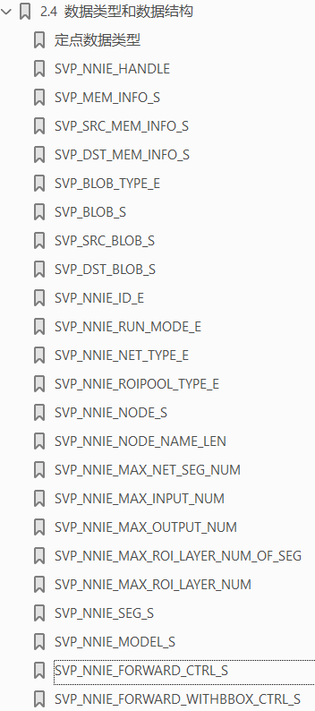

**注：本章节提到的错误码，请查阅源码的device/soc/hisilicon/hi3516dv300/sdk_linux/sample/doc中的《HiSVP API 参考.pdf》操作手册中对应的错误码内容。**

接下来对NNIE API接口进行详细描述。

###### HI_MPI_SVP_NNIE_LoadModel

【描述】

* 从用户事先加载到buf中的模型中解析出网络模型。

【语法】

* HI_S32 HI_MPI_SVP_NNIE_LoadModel (const SVP_SRC_MEM_INFO_S *pstModelBuf, SVP_NNIE_MODEL_S *pstModel);

【参数】

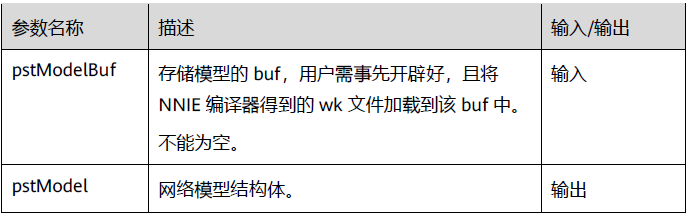

【返回值】

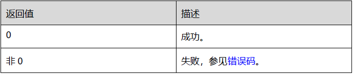

【需求】

* 头文件：hi_comm_svp.h、hi_nnie.h、mpi_nnie.h

* 库文件：libnnie.a（PC上模拟用nniefc1.1.lib\nnieit1.1.lib）

【注意】

* 用户需要保证pstModelBuf中的地址所指向的内存中存储的模型数据的完整性和正确性。

* 用户需要保证pstModelBuf中的地址所指向的内存只有当所存储的模型不再使用后才能被释放，并且在释放之前内存中的数据不能被修改。

* 用户需要保证解析获得的pstModel里的内容不能被修改。

###### HI_MPI_SVP_NNIE_GetTskBufSize

【描述】

* 获取给定网络任务各段辅助内存大小。

【语法】

* HI_S32 HI_MPI_SVP_NNIE_GetTskBufSize(HI_U32 u32MaxBatchNum, HI_U32 u32MaxBboxNum, const SVP_NNIE_MODEL_S *pstModel, HI_U32 au32TskBufSize[], HI_U32 u32NetSegNum);

【参数】

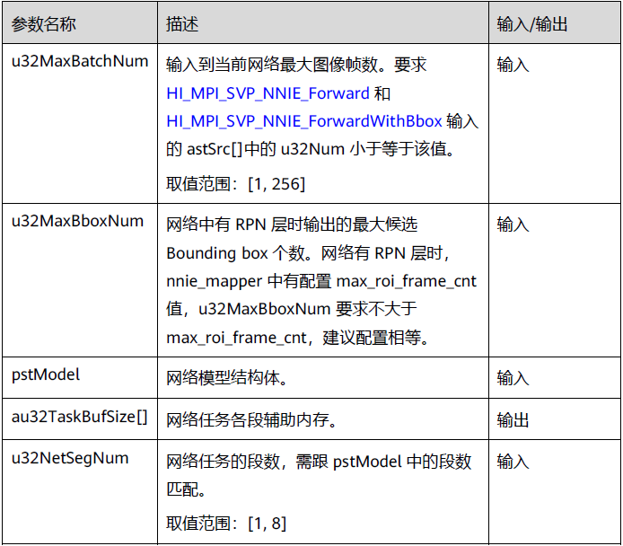

【返回值】


【需求】

* 头文件：hi_comm_svp.h、hi_nnie.h、mpi_nnie.h

* 库文件：libnnie.a（PC上模拟用nniefc1.1.lib\nnieit1.1.lib）

【注意】

* 针对单线程运行一个网络模型，用户开辟tskBuf可以根据网络段的运行关系来选择以下两种方案：

  * 1）NNIE→非NNIE→NNIE→非NNIE，类似这种NNIE、非NNIE（CPU或者DSP等）间隔的网络，用户可以选择开辟一个分段au32TskBufSize[]中的最大值，每个段可以复用这段内存；

  * 2）NNIE→NNIE→非NNIE→NNIE→非NNIE，类似这种存在N个NNIE连续顺序执行段的网络，连续的NNIE段不能复用tskBuf，按照最省内存原则可以选择开辟满足这N个连续NNIE段的其中N-1个size和最小的tskBuf以及剩余所有段中最大的一片tskBuf，具体按文中示例，可以选择开辟“NNIE→NNIE”中较小size的tskBuf，后面“非NNIE→NNIE→非NNIE”中可以复用最大size这片taskBuf；

* 多线程运行同一个网络模型，每个线程需要各自独立的tskBuf，开辟的方式可以参考“针对单线程运行一个网络模型”的情况。

###### HI_MPI_SVP_NNIE_Forward

【描述】

* 多节点输入输出的CNN类型网络预测。

【语法】

* HI_S32 HI_MPI_SVP_NNIE_Forward(SVP_NNIE_HANDLE *phSvpNnieHandle, const SVP_SRC_BLOB_S astSrc[], const SVP_NNIE_MODEL_S *pstModel, const SVP_DST_BLOB_S astDst[], const SVP_NNIE_FORWARD_CTRL_S *pstForwardCtrl, HI_BOOL bInstant);

【参数】

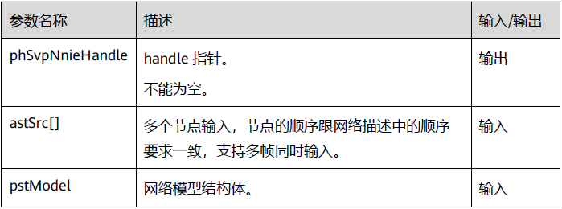

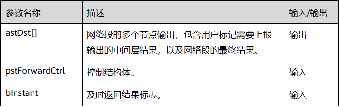

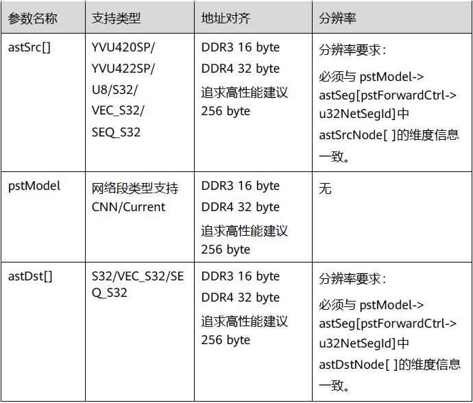

【返回值】


【需求】

* 头文件：hi_comm_svp.h、hi_nnie.h、mpi_nnie.h

* 库文件：libnnie.a（PC上模拟用nniefc1.1.lib\nnieit1.1.lib）

【注意】

* 用户需要保证pstModel->stBase中的地址所指向的内存中数据的完整性和正确性。

* 用户需要保证pstModel结构体中的内容与pstModel->stBase中的地址所指向的内存中的数据是同一个模型文件解析获得的。

* 网络段类型为SVP_NNIE_NET_TYPE_RECURRENT类型时，用户需要保证类型为SVP_BLOB_TYPE_SEQ_S32的输入输出blob中虚拟地址virt_addr_step及其指向内存大小的正确性。

* U8图像输入只支持1通道（灰度图）和3通道(RGB图)；

* 多个Blob输入输出时，配合编译器输出的dot描述文件生成的dot图示，可以看到Blob跟层的对应关系。

NNIE_Forward支持的多节点输入输出网络示意图如下图所示：

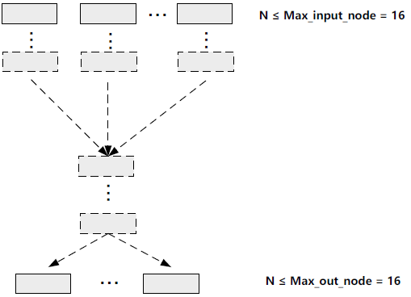

###### HI_MPI_SVP_NNIE_UnloadModel

【描述】

* 卸载模型。

【语法】

* HI_S32 HI_MPI_SVP_NNIE_UnloadModel(SVP_NNIE_MODEL_S *pstModel);

【参数】

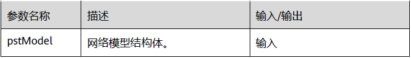

【返回值】


【需求】

* 头文件：hi_comm_svp.h、hi_nnie.h、mpi_nnie.h

* 库文件：libnnie.a（PC上模拟用nniefc1.1.lib\nnieit1.1.lib）

【注意】

* 无。

###### HI_MPI_SVP_NNIE_Query

【描述】

* 查询任务是否完成。

【语法】

* HI_S32 HI_MPI_SVP_NNIE_Query(SVP_NNIE_ID_E enNnieId, SVP_NNIE_HANDLE svpNnieHandle, HI_BOOL *pbFinish, HI_BOOL bBlock);

【参数】

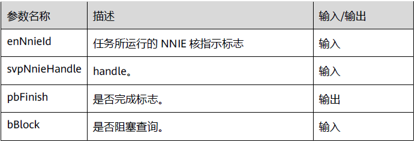

【返回值】

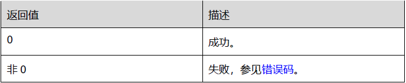

【需求】

* 头文件：hi_comm_svp.h、hi_nnie.h、mpi_nnie.h

* 库文件：libnnie.a（PC上模拟用nniefc1.1.lib\nnieit1.1.lib）

【注意】

* 无。

###### HI_MPI_SVP_NNIE_AddTskBuf

【描述】

* 记录TskBuf地址信息。

【语法】

* HI_S32 HI_MPI_SVP_NNIE_AddTskBuf(const SVP_MEM_INFO_S *pstTskBuf);

【参数】

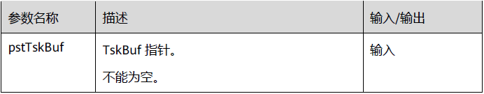

【返回值】


【需求】

* 头文件：hi_comm_svp.h、hi_nnie.h、mpi_nnie.h

* 库文件：libnnie.a（PC上模拟用nniefc1.1.lib\nnieit1.1.lib）

【注意】

* 记录TskBuf地址信息，用于减少内核态内存映射次数，提升效率。

* TskBuf地址信息的记录是通过链表进行管理，链表长度默认值为32，链表长度可通过模块参数nnie_max_tskbuf_num进行配置。

* 若没有调用HI_MPI_SVP_NNIE_AddTskBuf预先把TskBuf地址信息记录到系统，那么之后调用Forward/ForwardWithBbox每次都会Map/Unmap操作TskBuf内核态虚拟地址，效率会比较低。

* 必须与HI_MPI_SVP_NNIE_RemoveTskBuf成对匹配使用。

* 建议先把Forward/ForwardWithBbox用到的TskBuf地址信息调用此接口记录到系统。当不再使用时调用HI_MPI_SVP_NNIE_RemoveTskBuf把TskBuf地址信息移除。只需要在初始化时把TskBuf地址信息记录，后续可以直接使用，直到不再使用时才移除。

* pstTskBuf->u64VirAddr不使用，不做参数异常检查。

* pstTskBuf->u32Size不能为0。

* TskBuf内存由用户释放，记录的TskBuf要在移除后才能被释放。

**HI_MPI_SVP_NNIE_RemoveTskBuf**

【描述】

移除TskBuf地址信息。

【语法】

HI_S32 HI_MPI_SVP_NNIE_RemoveTskBuf(const SVP_MEM_INFO_S *pstTskBuf);

【参数】

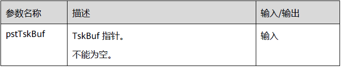

【返回值】


【需求】

* 头文件：hi_comm_svp.h、hi_nnie.h、mpi_nnie.h

* 库文件：libnnie.a（PC上模拟用nniefc1.1.lib\nnieit1.1.lib）

【注意】

* 如果TskBuf不再使用，需要将记录的TskBuf地址信息从链表中移除。

* 必须与HI_MPI_SVP_NNIE_AddTskBuf成对匹配使用。

* pstTskBuf->u64VirAddr不使用，不做参数异常检查。

* pstTskBuf->u32Size不能为0。

* TskBuf内存由用户释放，记录的TskBuf要在移除后才能被释放。

##### 5.3.2.2.3、NNIE推理逻辑图

开发者将RuyiStudio工具量化后生成的wk模型文件通过插件进行加载，并部署到芯片端的Flash或DDR里面，通过NNIE加速器进行推理，NNIE板测推理逻辑图如下：

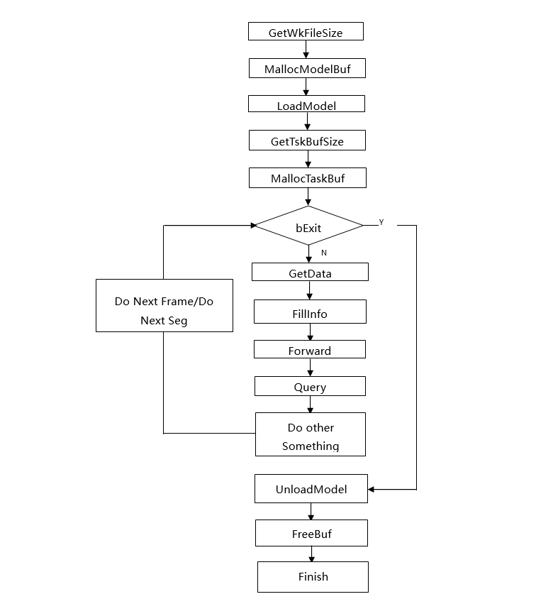

#### 5.3.2.3、分类网(resnet18)

##### 5.3.2.3.1、训练思路

一般来讲，训练出一个神经网络模型，做成端到端模型并可视化需要经过视频录制、数据集制作和标注、模型训练（本地）、模型转换（模型-caffe）、模型量化、仿真、板端推理可视化。本章节以垃圾分类为例，重点介绍分类网（resnet18），从视频录制、数据集制作和标注、模型训练、模型转换来展开论述。

训练流程图如下：

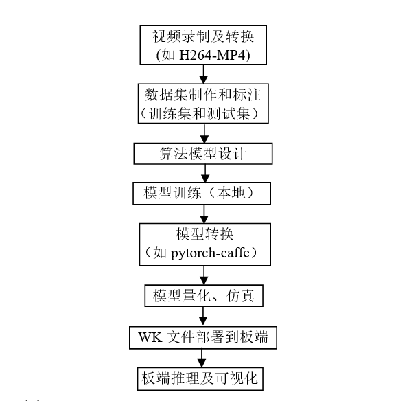 

##### 5.3.2.3.2、视频录制

* 步骤1：参考本文**5.5.5章节store_sample操作指导**的步骤进行视频的录制。

* 步骤2：将录制好的视频按类整理（这里自行创建目录即可），可参考下图：

	本文档以垃圾分类训练图片为例进行指导和说明。本文录制了20种垃圾样例视频，具体垃圾样本如下表所示：

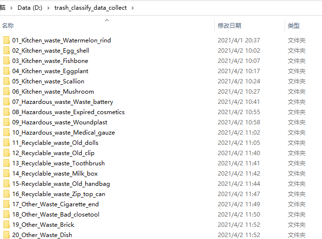

| **垃圾性质** | **种类** | **具体样本**                                   |
| ------------ | -------- | ---------------------------------------------- |
| 厨余垃圾     | 6        | 蘑菇、葱、茄子、西瓜皮、蛋壳、鱼骨             |
| 有害垃圾     | 4        | 废旧电池、过期化妆品、医用纱布、创可贴         |
| 可回收垃圾   | 6        | 易拉罐、旧手提包、牛奶盒、牙刷、旧架子、旧玩偶 |
| 其他垃圾     | 4        | 盘子、砖块、坏马桶、烟蒂                       |

* 视频录制注意事项：

  * 录制视频时保证训练的可靠性，素材全部在镜头之内，防止素材跑出镜头的情况

  * 可以选不同的背景色来录制，如白色、绿色等，本次示例选择白色和绿色背景色来录制

  * 对垃圾分类样本进行视频码流采集，采集过程中可通过镜头平移和旋转的方法来录制，增加样本的多样性

* 处理录制好的视频：

	本次录制的样例视频为.h264格式，分辨率为1920*1080，实际使用时，建议将h264格式转成通用mp4格式的视频，可使用格式工厂或者其他工具进行格式转换。格式工厂的具体转换步骤可参考《[使用格式工厂将H264文件转成mp4文件](https://blog.csdn.net/Wu_GuiMing/article/details/123717780)》。

##### 5.3.2.3.3、数据集制作和标注

**步骤1：搭建FFmpeg环境：**

* 进入[FFmpeg网站](https://ffmpeg.org/download.html)，选择windows版本，直接下载exe文件即可，本文的FFmpeg版本仅做参考，开发者可参考下图选择最新版本即可。

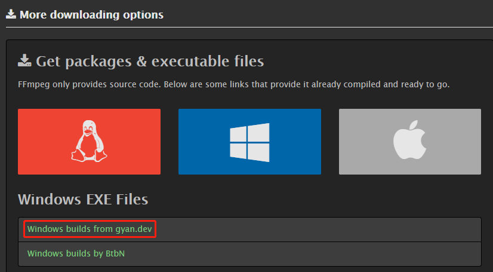

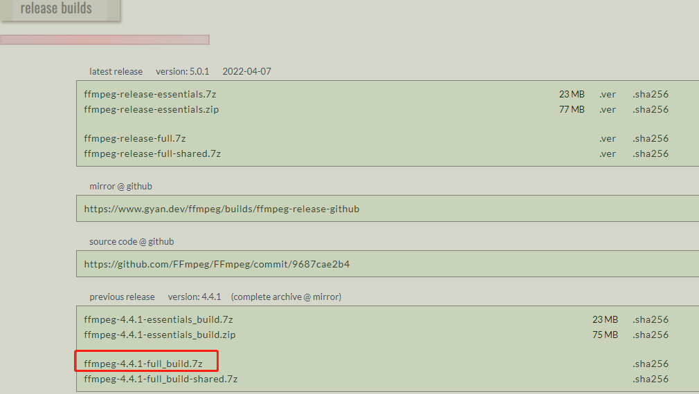

* 下载完成后解压该文件，本示例解压在D盘，这里自行解压即可，如下图所示：

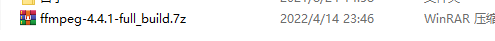

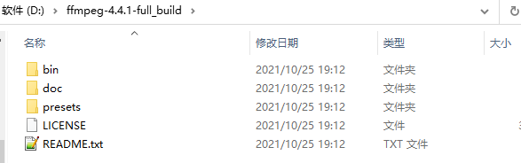

* 复制bin文件夹所在的绝对路径，如下图所示：

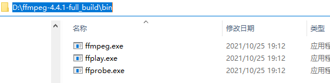

* 在“此电脑”上 右键-属性-高级系统设置，在高级选项卡点击环境变量，如下图所示：

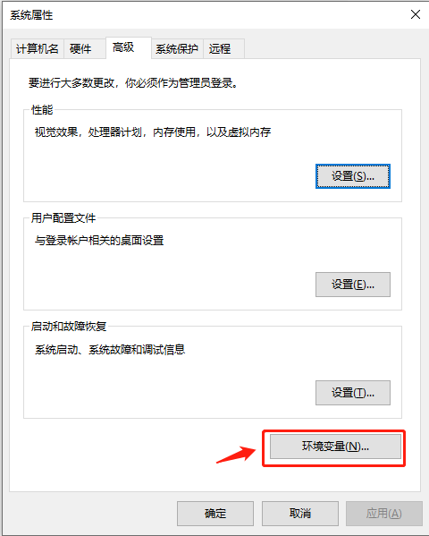

* 在系统变量下找到path，然后点击编辑，再点新建，将刚才复制的\bin\地址粘贴进去，然后点击确定，把几个对话框正常关闭，确保我们配置的环境编译能够生效，如下图所示：

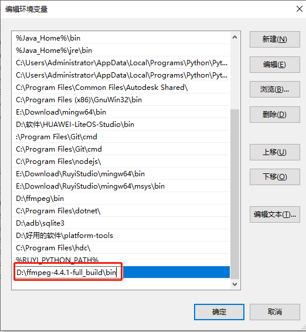

* 按下键盘的windows+R组合键，运行cmd，然后点击确定按钮，当出现命令行终端时，输入ffmpeg，若显示如下，则表示安装成功。

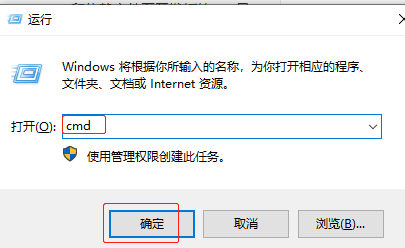

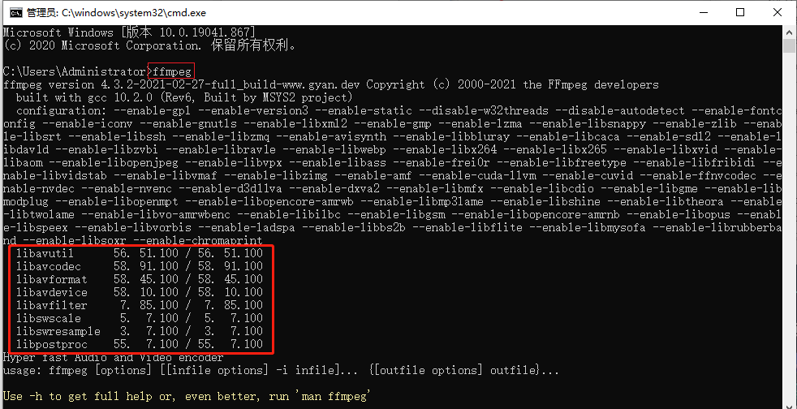

**步骤2：制作数据集**

* 在dos窗口下，将路径切换到存储视频的目录下，本示例路径如下图所示：

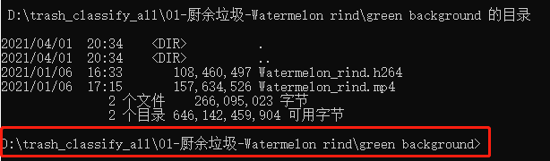

* 输入下面的命令，即可实现素材的制作，本实例每一秒截取一张。以如下图所示：

```
ffmpeg –i xxx.mp4 –r 1 –y xxx_%06d.png  # xxx为你视频文件的名字
```

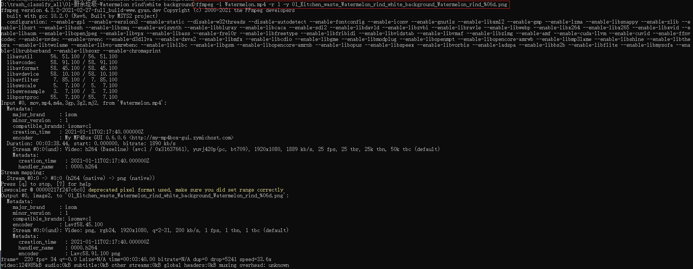

* 截取成功后，即可在路径下显示png格式的素材，如下图所示：

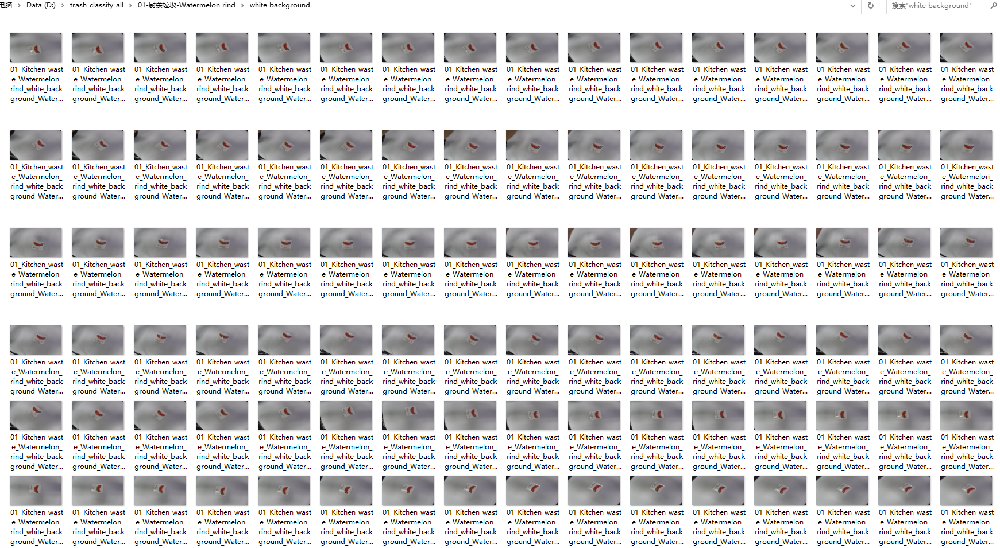

**步骤3：数据清洗**

* 数据获取成功之后，需要对数据进行清洗，即对数据进行重新审查和校验的过程，目的在于删除不完整的数据、错误的数据、重复的数据，以便更好的进行数据标注，保证最终模型训练的效果。

**步骤4：数据标注**

* 本次示例以分类网制作素材集，首先制作分类目录，建议按照 标号_垃圾性质_垃圾名称来分类，可参考下图：

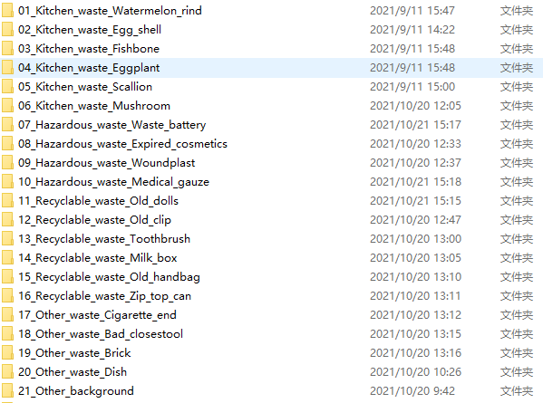

**分类网除正常的分类目标外，最后还需添加一类作为背景集，背景集选择常用背景，防止误报，上图21_Other_background为背景集。**

* 将制作好的垃圾素材放置该目录下，素材命名需遵循分类规则，最好数据标注前缀跟上一层folder同名，如下图所示：

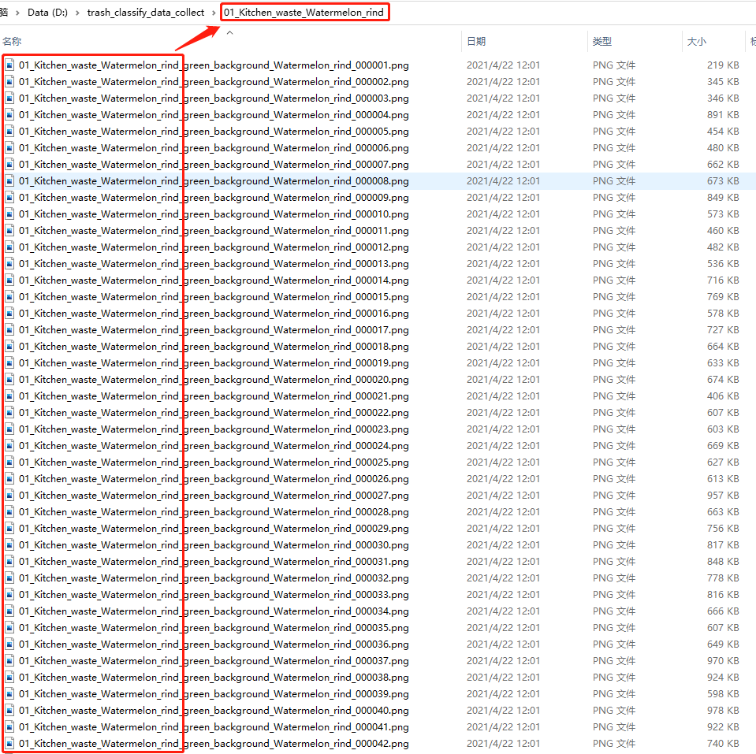

对垃圾分类样本图片随机分组分别作为训练数据集及验证数据集（注：分组过程中可对图片进行随机采样，也可以对码流样本随机采样，尝试构建多样性验证集以有效评估分类模型），建议对采样数据10%用作验证集即可。

在模型训练测和后端推理测需要1920*1080进行缩放和裁剪，resize为256*256，crop为224*224。

##### 5.3.2.3.4 分类网本地训练

<font color='RedOrange'>**（注意：如果您使用的是海思提供的训练服务器，此5.3.2.3.4小节可以跳过，按照海思提供的训练服务器的训练指导文档操作即可）**</font>

###### 5.3.2.3.4.1 本地训练环境搭建

	**注意：需要开发者提前把自己训练服务器中的NVIDIA驱动、CUDA、cuDNN等软件安装好，作者使用的训练服务器相关软硬件参数如下表所示，如果您的训练服务器与作者的不一致，参考本章节的内容操作可能会遇到一些未知的问题，需要开发者自行解决**

| 名称           | 软件版本号         |
| -------------- | ------------------ |
| Ubuntu         | 18.04              |
| NVIDIA显卡驱动 | Tesla T4 / 4张显卡 |
| python         | 3.6                |
| CUDA           | 11.3               |
| cuDNN          | 8.2.1.32           |

* 本文环境采用4张NVIDIA GPU服务器环境来做训练，训练环境如下图所示：

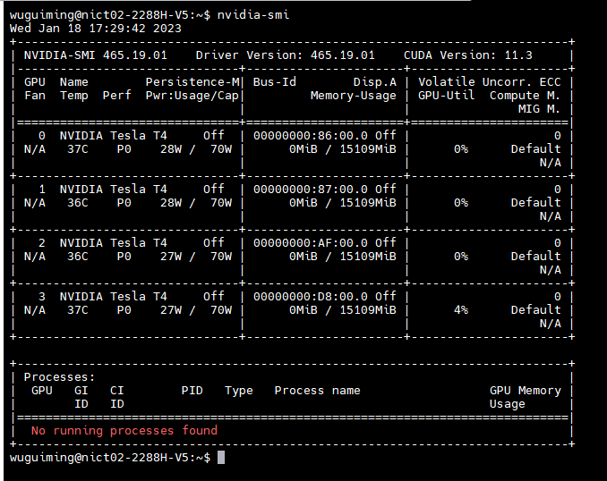

**软件包安装**

	本章节所有的环境都是在本地训练服务器中进行安装。

* 步骤1：Anaconda安装

  * 首先下载anaconda安装脚本，在训练服务器的命令行终端，执行下面的命令，下载Anaconda3-2020.02-Linux-x86_64.sh，由于Anaconda安装包文件较大，下载过程需要耐心等待。

  ```sh
  wget https://repo.anaconda.com/archive/Anaconda3-2020.02-Linux-x86_64.sh
  ```


* 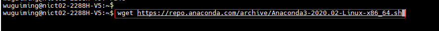

  * 下载成功后，在下载目录下即可看到该文件，如下图所示：

  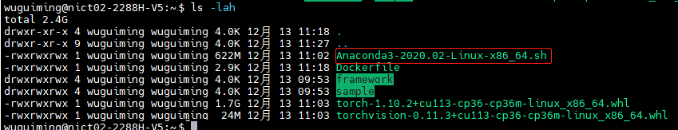

  * 在训练服务器的命令行终端，执行下面的命令，进行Anaconda的安装

  ```
  bash Anaconda3-2020.02-Linux-x86_64.sh
  ```

  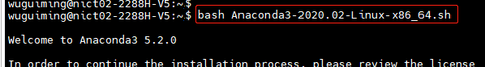

  * 当出现下面的提示时，按键盘的Enter键，就可以开始安装了。

  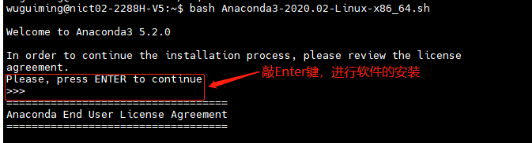

  * 一直敲回车，当出现提示```Do you accept the license terms? [yes|no]```时，输入yes，然后按回车键即可继续安装

  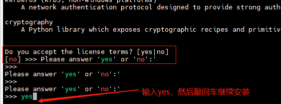

  * 当提醒如下图所示的信息时，直接敲回车，把anaconda安装在指定目录下。

  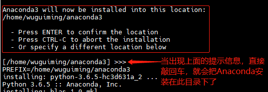

  * 当出现下面的提示，直接输入yes,然后敲回车即可,他会把anaconda的环境变量写入~/.bashrc文件中

  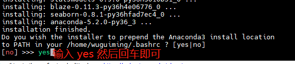

  * 如果弹出咨询是否安装vscode的时候，我们输入no，然后回车即可，如果没弹出就忽略此步骤。

  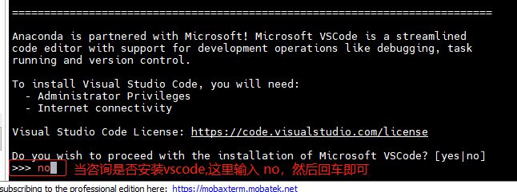

  * 稍等片刻，等待软件安装成功。输入下面的命令，就会显示conda的版本号（不同服务器版本号可能会有不同），说明anaconda已经安装成功了。

  ```
  source ~/.bashrc
  
  conda --version
  ```

  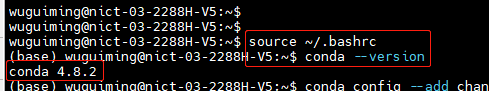

  * 在训练服务器的命令行终端，输入下面的命令，由于安装包较大，在安装之前先配置下清华源，加速下载。

  ```
  conda config --add channels http://mirrors.tuna.tsinghua.edu.cn/anaconda/pkgs/free/
  conda config --add channels http://mirrors.tuna.tsinghua.edu.cn/anaconda/pkgs/main/ 
  
  conda config --set show_channel_urls yes
  ```

  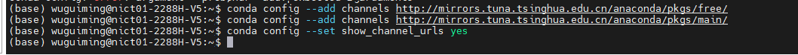

* 步骤2：安装open-mmlab和python

  * 在训练服务器的命令行终端，输入下面的命令，安装open-mmlab和python，本文训练服务器安装的python版本为3.6，如下图所示：

  ```
  conda create -n open-mmlab python=3.6
  ```

  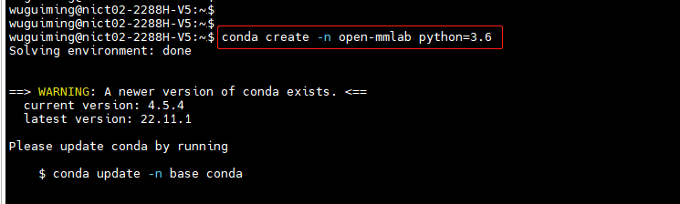

  * 在安装开始会提示The following packages will be downloaded，The following NEW packages will be INSTALLED字样，若出现Proceed ([y]/n)? y，选择y，如下图所示：

  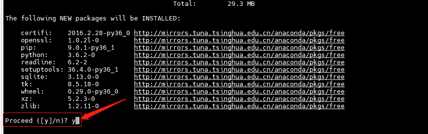

  * 载成功后，会出现如下字样，如下图所示：

  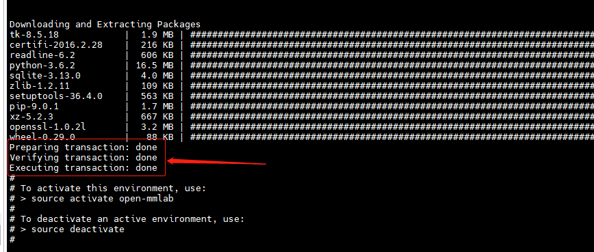

* 步骤3：激活虚拟环境

  * 在训练服务器的命令行终端，执行下面的命令，若出现如下所示的(open-mmlab) 显示，表示虚拟环境激活成功并进入open-mmlab的虚拟环境。

  ```sh
  # 进入open-mmlab虚拟环境
  conda activate open-mmlab
  ```

  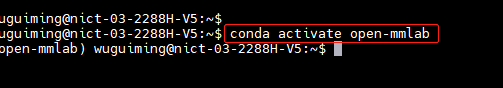

  * 若出现激活击败的情况，在训练服务器的命令行终端，执行如下步骤操作即可，如下图所示：

  ```shell
  # 激活虚拟环境
  conda activate base
  
  # 退出虚拟环境 
  conda deactivate
  
  # 进入open-mmlab虚拟环境
  conda activate open-mmlab
  ```

  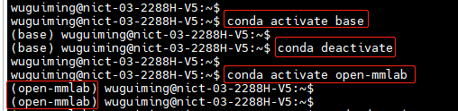

**注意以下软件包和环境的安装均需要在open-mmlab虚拟环境下进行**

* 步骤4：安装跟CUDA版本对应的torch

  * 注意：本文训练服务器的CUDA 版本为11.3，可以通过nvcc  --version查看

  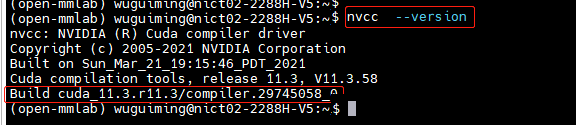

  * CUDA匹配的torch和torchversion版本，可通过如下链接查看，这里需读者仔细确认，以免安装错误，耽误安装时间和开发效率。

  ```
  https://download.pytorch.org/whl/cu100/torch_stable.html 
  ```

  * 在训练服务器的命令行终端，执行下面的步骤，更新pip

  ```sh
  # 更新pip
  python -m pip install -i https://repo.huaweicloud.com/repository/pypi/simple --upgrade pip
  
  pip config set global.index-url https://repo.huaweicloud.com/repository/pypi/simple
  ```

  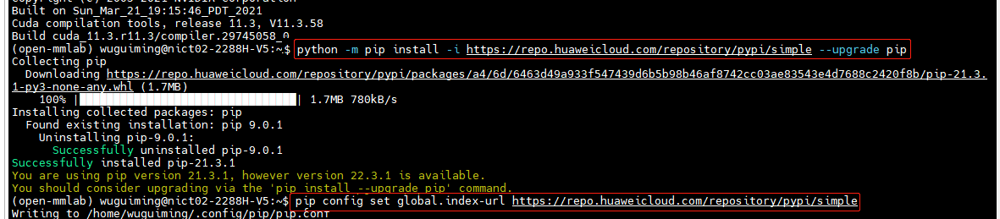

  * 本环境CUDA版本为11.3，对应的 torch 版本为 1.10.2，在训练服务器的命令行终端，执行下面的命令，下载torch软件包，并安装torch包，若安装成功，则出现Successfully installed torch-1.10.2+cu113

  ```sh
  # 下载torch软件包
  wget https://download.pytorch.org/whl/cu113/torch-1.10.2%2Bcu113-cp36-cp36m-linux_x86_64.whl
  
  # 给torch软件包，添加可执行权限
  chmod 777  torch-1.10.2+cu113-cp36-cp36m-linux_x86_64.whl
  
  # 安装torch软件包
  pip install torch-1.10.2+cu113-cp36-cp36m-linux_x86_64.whl
  ```

  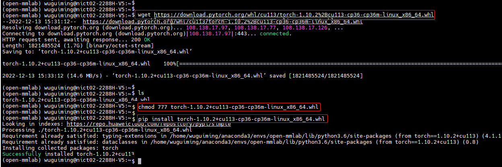

* 步骤5：安装跟CUDA版本对应的是torchversion 0.11.3

  * 在训练服务器的命令行终端，执行下面的命令，下载torchversion软件包，并安装torchversion包，若安装成功，则出现Successfully installed torch-1.10.2+cu113

```shell
# 下载torchversion软件包
wget https://download.pytorch.org/whl/cu113/torchvision-0.11.3%2Bcu113-cp36-cp36m-linux_x86_64.whl

# 给torchversion软件包，添加可执行权限
chmod 777 torchvision-0.11.3+cu113-cp36-cp36m-linux_x86_64.whl

# 安装torchversion软件包
pip install torchvision-0.11.3+cu113-cp36-cp36m-linux_x86_64.whl
```

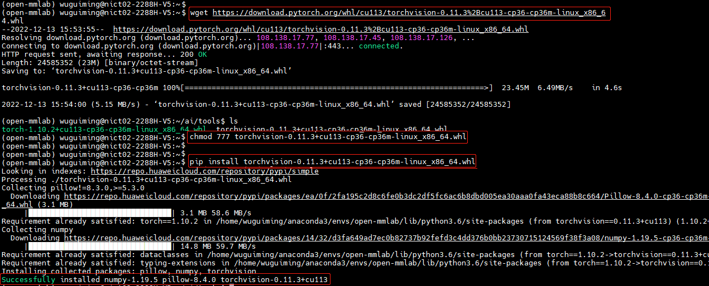

* 步骤6：安装mmcv包

  * 在训练服务器的命令行终端，执行下面的命令，安装mmcv包。

```
pip install mmcv==1.5.0
```

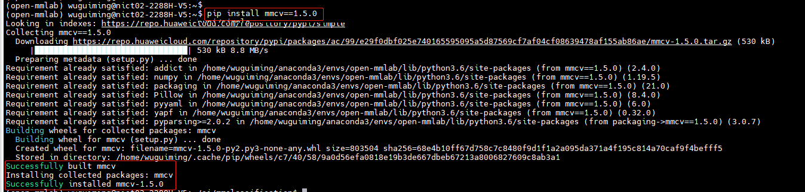

**代码下载**

* 步骤1：下载mmclassification代码到本地服务器

* 在训练服务器的命令行终端，执行下面的命令，下载mmclassification-0.11版本的软件包，然后进行解压

  ```sh
  # 下载mmclassification-0.11版本的软件包
  wget https://github.com/open-mmlab/mmclassification/archive/refs/tags/v0.11.0.tar.gz
  
  # 解压mmclassification-0.11版本的软件包
  tar -zxvf v0.11.0.tar.gz
  ```

  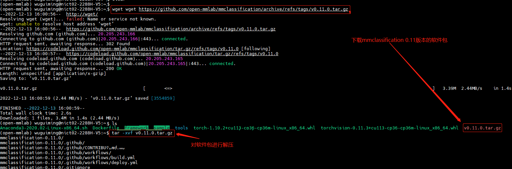

  * 在训练服务器的命令行终端，执行下面的命令，把mmclassification-0.11文件夹重命名为mmclassification

```
mv mmclassification-0.11.0  mmclassification
```

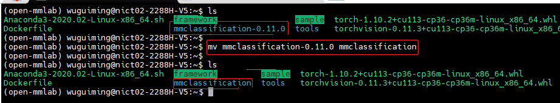

* 步骤2：安装mmclassfication所需环境和库

  * 在训练服务器的命令行终端，执行下面的命令，进入mmclassification目录下，然后按照mmclassification所需的环境和库

  ```
  cd  mmclassification
  
  pip install -e .
  ```

  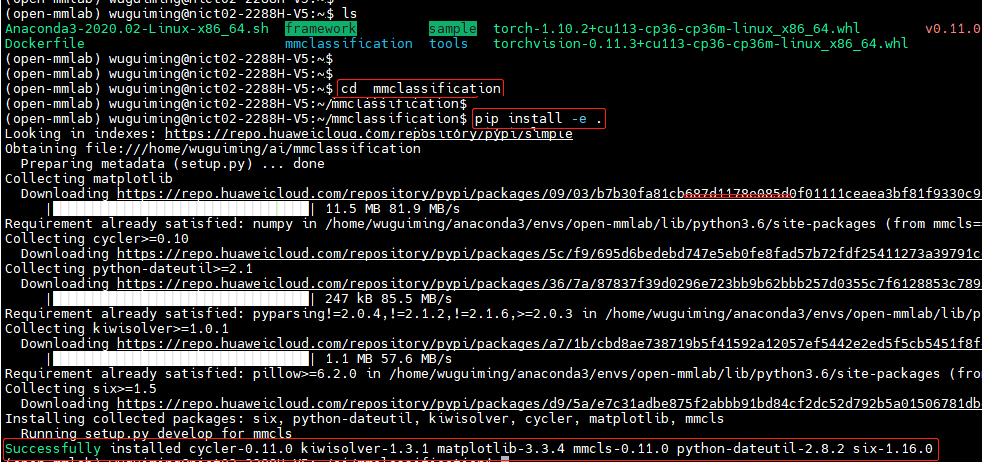

至此环境搭建结束。

###### 5.3.2.3.4.2 本地环境进行模型训练

* 步骤1：本地训练素材的准备

  * 本地训练素材准备请参考5.3.2.3分类网（resnet18）章节中的5.3.2.3.2视频录制和5.3.2.3.3数据集制作和标注章节中的内容，这里不再详细阐述。 

  * 在训练服务器的命令行终端，执行下面的命令，创建一个data文件夹，用于存放后面训练需要的数据集，如下图所示

    ```sh
    # 创建data目录
    cd ~
    
    mkdir data
    ```

    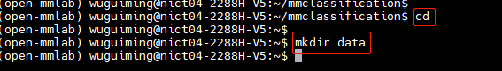

  * 然后通过MobaXterm、xshell、tftp等工具，将需要训练的数据集放在这个data目录下，关于如何使用工具将Windows的数据集上传至服务器，这里就不再赘述，请开发者自行百度。如下图所示，将我们制作的数据集上传到data/trash_classify/dataset/ 目录下（路径自定义即可)。

    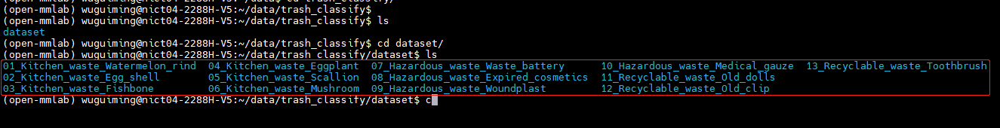

  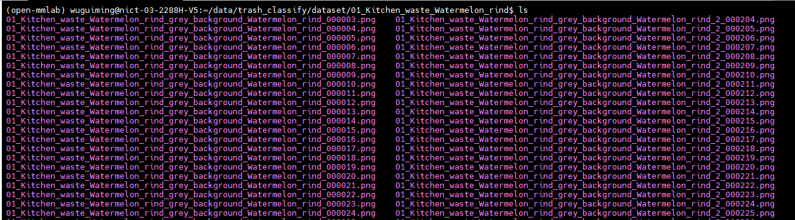

* 步骤2：根据数据集修改代码

  * 在训练服务器的命令行终端，执行下面的命令，修改开源代码，需要修改的代码在``mmclassification/configs/_base_/datasets``目录下，按照下图所示进行修改，包括mean、std、resize、crop、data_prefix确认修改，这个务必配置对，否则影响模型训练的效果。

  ```shell
  cd ~/mmclassification/configs/_base_/datasets
  
  vim imagenet_bs32.py
  ```

  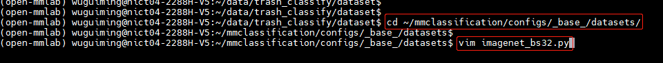

  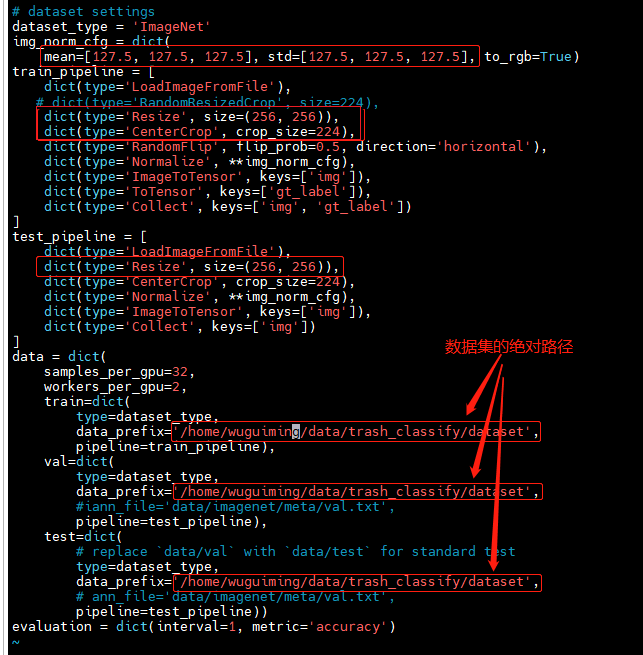

  * 在训练服务器的命令行终端，执行下面的命令，修改``mmclassification/configs/_base_/models``目录下resnet18.py，按下图修改即可：

  ```
  cd  ../models
  
  vim resnet18.py
  ```

  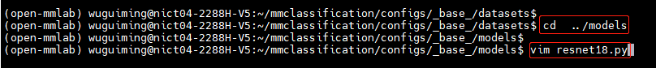

  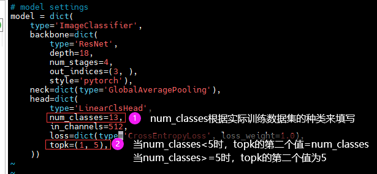

* 步骤3：开始模型训练

  * 在进行模型训练之前，在训练服务器的命令行终端，先执行下面的步骤，看cuda 能否获取。先输入python，进入python环境，然后输入 import torch,导入torch，最后输入torch.cuda.is_available()，当返回的是true时，说明能够成功获取到cuda，此时进行模型训练。如果返回的是false，请检查自己训练服务器的cuda环境是否搭建好了。

  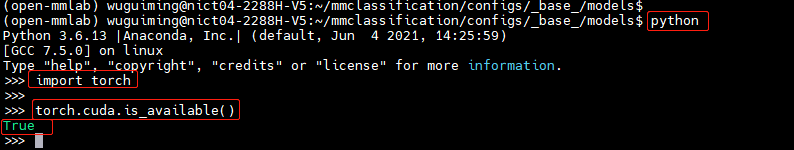

  * 退出python，只需要输入exit() 然后敲回车即可。

  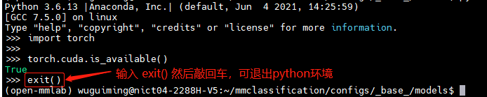

  * 切换到mmclassification目录下，在训练服务器的命令行终端，执行下面的命令，开始进行模型的训练

  ```shell
  # 进入到mmclassification目录下
  cd ~/mmclassification/
  
  # 开始进行模型训练
  bash ./tools/dist_train.sh configs/resnet/resnet18_b32x8_imagenet.py 2 --work-dir ./ckpt
  # 对上述命令阐述如下：
  # dist_train.sh – 训练sh脚本
  # configs/resnet/resnet18_b32x8_imagenet.py – 训练依赖的配置
  # 2 – GPU个数，因为本文使用的训练服务器有四个GPU，这个GPU的个数需要根据开发者自己训练服务器的配置来具体设置
  # --work-dir ./ckp – 模型存放的路径
  ```

  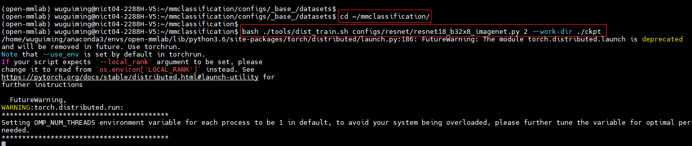

  * 由于训练过程消耗时间较长，请耐心等待，epoch可根据实际情况进行设置，观察训练是否收敛，准确率在一段时间内稳定不再上升时，代表训练结束，如下图所示：

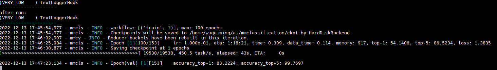

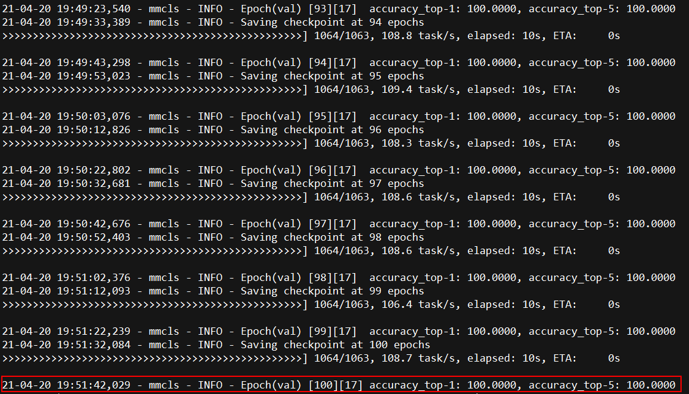

* 训练完成之后，生成的模型文件会保存在 ~/mmclassification/ckpt/目录下，我们只需要最后一个文件即可，也就是这个epoch_100.pth。

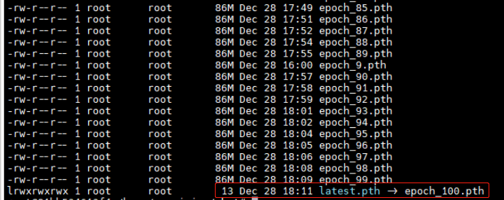

##### 5.3.2.3.5 PytorchCaffe 方案

<font color='RedOrange'>**（注意：如果您使用的是海思提供的训练服务器，此5.3.2.3.5小节可以跳过，按照海思提供的训练服务器的训练指导文档操作即可）**</font>

目前 NNIE 配套软件及工具链仅支持以 Caffe1.0 框架，使用其他框架的网络模型需要转化为Caffe框架下的模型，具体转换过程如下。

**（1）环境搭建**

* 模型转换需要依赖torch和torchvison，我们选择版本为**python 版本为 3.6，CUDA 11.3 对应的 torch 版本为 1.10.2，torchvision 版本为 0.11.3**

* 在训练服务器的命令行终端，执行下面的命令，安装依赖软件

```
pip install google -i https://pypi.tuna.tsinghua.edu.cn/simple some-package

pip install protobuf -i https://pypi.tuna.tsinghua.edu.cn/simple some-package
```

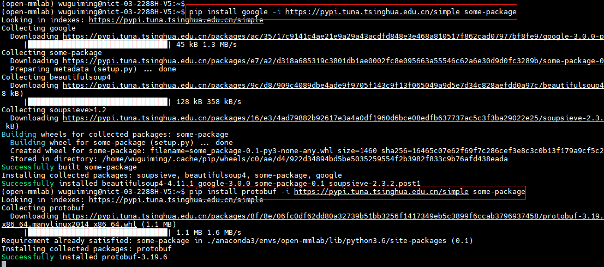

**（2）下载pytorch_to_caffe_master**

* 访问下面的链接，下载pytorch_to_caffe_master压缩包

```
https://www.123pan.com/s/iiMUVv-8YFLh 
```

* 使用MobaXterm工具，然后把刚下载好的pytorch_to_caffe_master压缩包，上传至训练服务的家目录下。

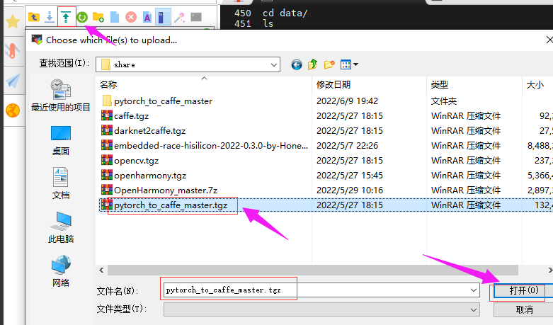

* 在训练服务器的命令行终端，执行下面的命令，对pytorch_to_caffe_master压缩包进行解压

  ```
  tar  -zxvf  pytorch_to_caffe_master.tgz
  ```

  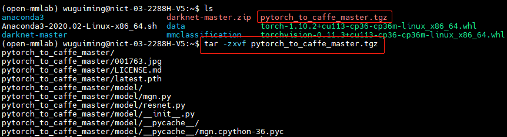

**（3）修改代码**

* 在训练服务器的命令行终端，执行下面的命令，对~/pytorch_to_caffe_master/example/resnet_pytorch_2_caffe.py进行修改，具体修改如下图所示：
* 主要需要修改的是num_classes的种类，以及您pytorch模型的绝对路径
* **注意：因为latest.pth只是epoch_100.pth的一个软连接，我们最后指定epoch_100.pth的绝对路径就好。**

```
cd  ~/pytorch_to_caffe_master

vim example/resnet_pytorch_2_caffe.py
```

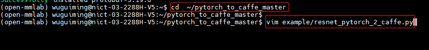

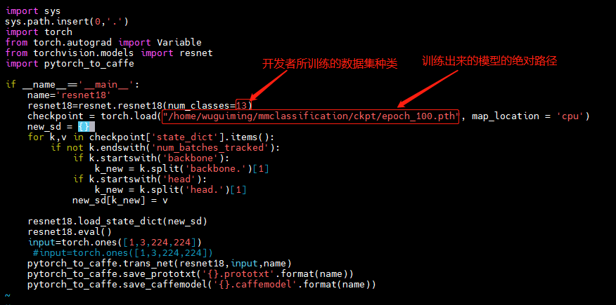

**（4）模型转换及结果生成**

* 在训练服务器的命令行终端，执行下面的命令,进行模型的转换：

```
python example/resnet_pytorch_2_caffe.py
```

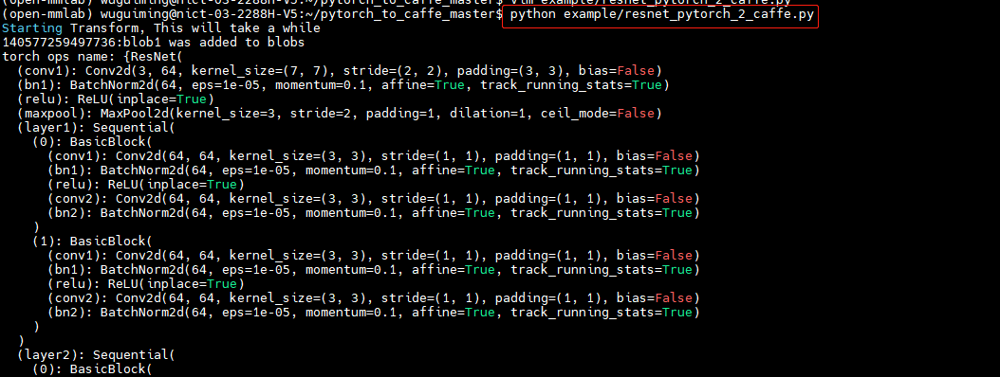

* 转换成功后，即可在pytorch_to_caffe_master目录下生成resnet18.caffemodel和resnet18.prototxt文件。

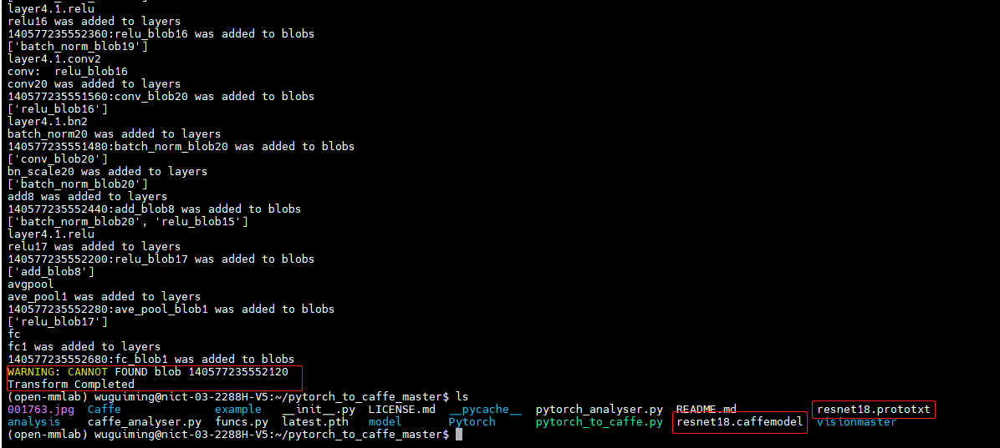

至此，模型转换已经完成。

##### 5.3.2.3.6 prototxt网络层适配

###### 5.3.2.3.6.1 网络层参数对齐及layer检查

**（1）prototxt网络层适配**

模型prototxt网络层适配之前，请确保**模型训练和模型转换**的步骤均已完成。

* 步骤1：网络层对齐及layer检查

一般来讲，pytorch2caffe自动生成的.prototxt网络需要进行手动修改，以保证量化成正确的wk模型，需要根据特定的网络特定的环境来进行修改。本文以resnet18网络训练垃圾分类生成的prototxt网络进行讲解。

首先将**5.3.2.3.5 PytorchCaffe 方案章节**中模型转换后生成的resnet18.prototxt网络文件，通过工具打开，这里选用Ultra Edit或者Notepad++均可。

观察pth转caffe运行日志，若出现pooling参数不对齐的问题，需要先将pooling参数对齐，如下图所示：

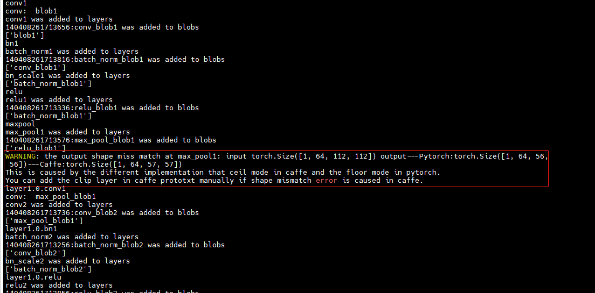

* 解决方案：

  * 将resent18网络中的maxpooling layer padding参数修改为0，然后把ceil_mode部分注释掉。

  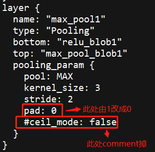

  * 同时将生成的.prototxt文件中ceil_mode参数拿掉，因为后续wk文件时，wk不包含此入参，默认为True。

  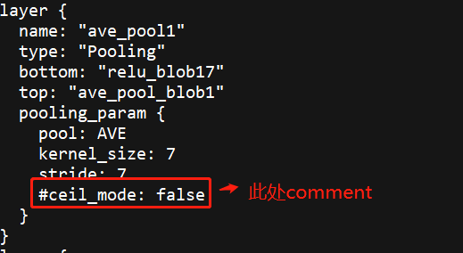

  * prototxt layer描述格式具有一定要求，要求层以layer开头，type以带双引号字符表示，且需将开头input_dim按下图所示更改：

  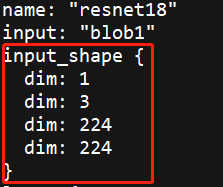

  * Pytorch转caffe时，不包含最后一层softmax，须在full-connected layer(fc1)后手动添加。

  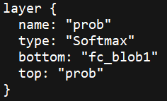

  * 检查下网络，若fc1上一层layer无view1，手工加上该layer，如下图所示：

  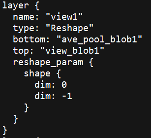

  * 最后核对下layer fc1 num_output是否为实际分类种类数，本文训练5类垃圾，故为5，如下图所示：

  **注：请仔细检查如下layer层中是否有bottom: “view_blob1”，若无参考下图手工加上。**

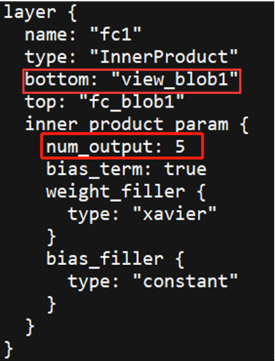

       至此，.prototxt已经修改完毕，请保证上述每一步都修改正确，否则影响模型量化和推理结果。

###### 5.3.2.3.6.2 Netscope网络结构可视化

Netscope是个支持prototxt格式描述的神经网络结构的在线可视工具，它可以用来可视化Caffe结构里prototxt格式的网络结构，使用起来也较为简单，在google浏览器打开如下网址：

http://ethereon.github.io/netscope/#/editor

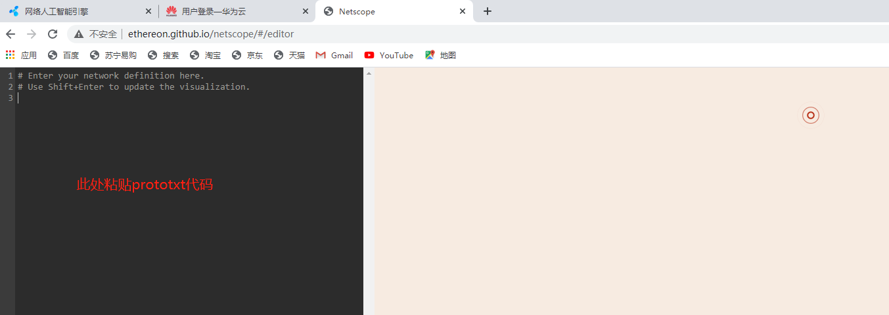

将适配好的.prototxt代码放到相应位置，按Shift+Enter之后，即可显示网络层级，如下图所示：

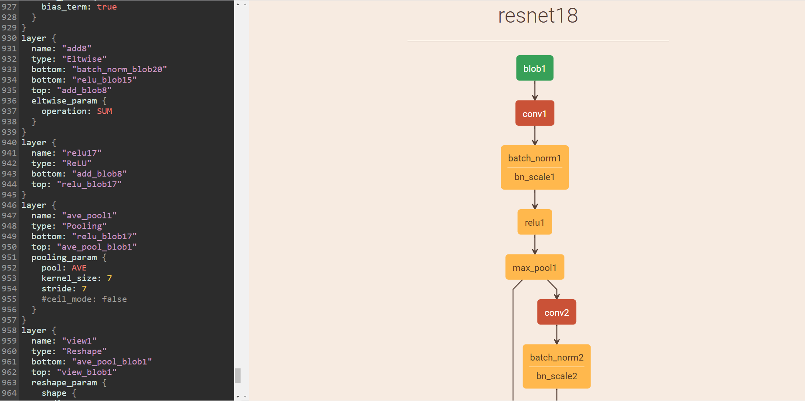

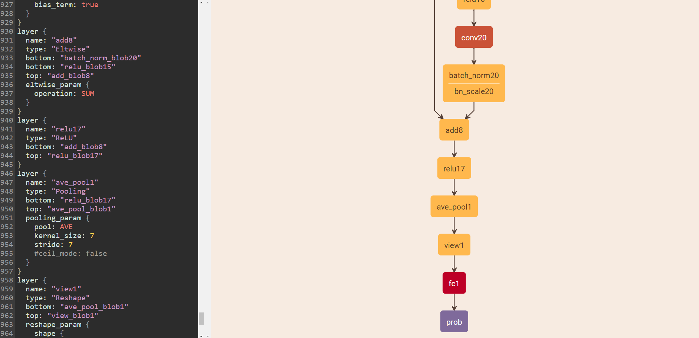

Netscope可帮助开发着可视化网络层级，判断网络层是否正确。

##### 5.3.2.3.7 模型量化

定义：量化的过程将caffe模型转换成可以在海思芯片上执行的wk文件，同时将float类型数据转换成int8/int16类型的数据。

相关nnie_mapper配置概念请阅读**源码的device/soc/hisilicon/hi3516dv300/sdk_linux/sample/doc中**《HiSVP 开发指南.pdf》3.5.2章节配置文件说明，如下图所示：

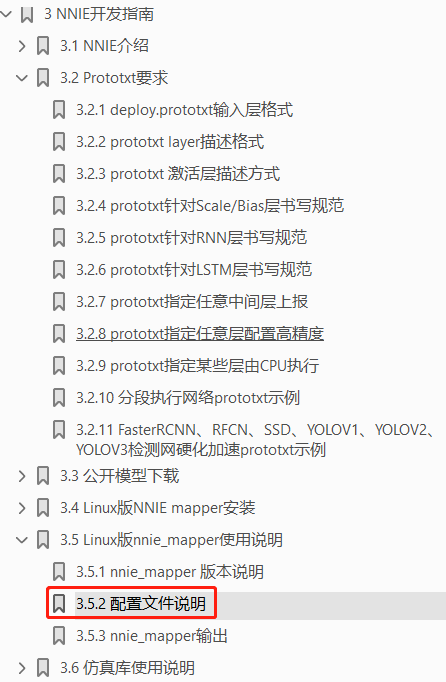

接下来以垃圾分类sample为例，通过RuyiStudio工具将转换好的caffemodel和prototxt量化成wk文件。

**注：以下所有路径建议采用纯英文命名，防止出现编码解析错误，为提高转换速度，加载路径层级越短越好**

**（1）mean.txt制作**

* 本文以基于resnet18垃圾分类量化wk模型为例，由于在blob1里面需要加载mean_file，如下图所示：

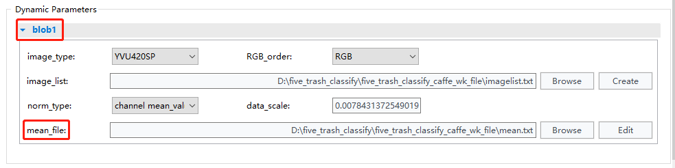

* 我们需提前制作好mean.txt文件，首先新建一个txt文件修改为mean.txt存放在本地，将里面内容需要跟mmclassification_master/configs/_base_/datasets/imagenet_bs32.py里面的mean值对应，如下图所示：

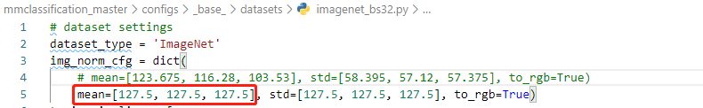

* mean.txt制作如下，如下图所示：

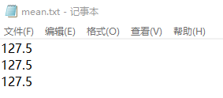

**（2）imagelist.txt制作**

由于Ruyi工具量化模型的过程中，blob1中需要加载image_list所需的文件，这里需要提前制作好。

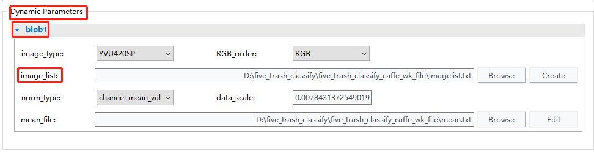

我们在素材集里面截取典型的图片，约10张左右即可，建议宽高大于256*256，如下图sample_photo文件夹所示：

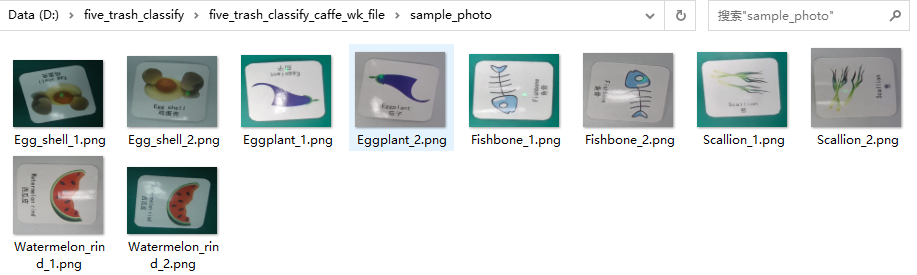

imagelist.txt里面需要添加sample_photo文件加图片的本地绝对路径，如下图所示：

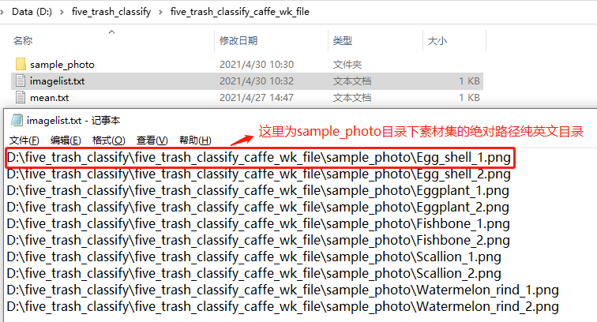

**（3）RuyiStudio量化wk模型**

* 注意：关于ruyistudio安装包的获取和安装可以参考本文**5.5.1、RuyiStudio工具的安装**章节的内容

NNIE新建工程完成的前提下，右键.cfg文件-Open With-Mapper Configuration Editor打开.cfg文件，如下图所示：

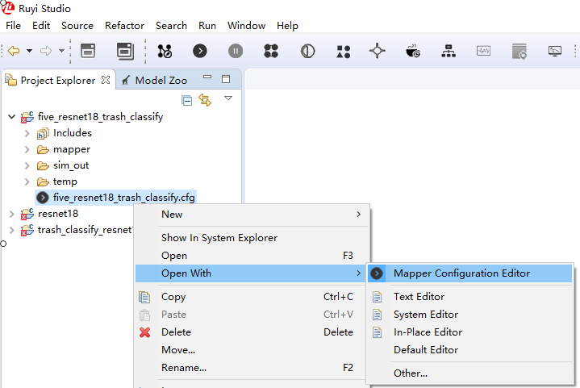

需仔细配置.cfg里面的每一个参数，勾选Relative path。

* 首先配置Input_Setting

  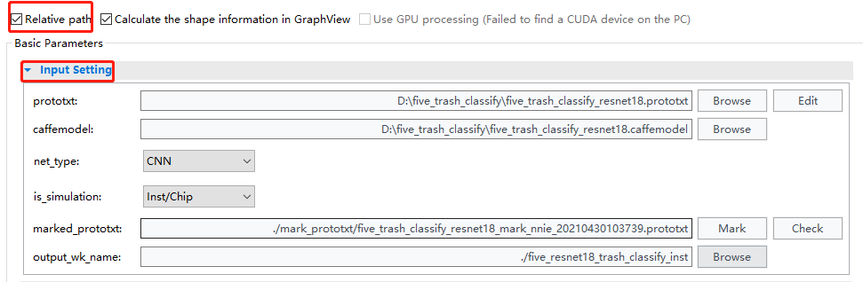

  * prototxt：选择适配之后的.prototxt，如：D:\five_trash_classify \five_trash_classify_resnet18.prototxt
  * caffemodel：选择转化出来.caffemodel，如：D:\five_trash_classify\five_trash_classify_resnet18.caffemodel
  * net_type：本实例选择CNN，需根据自己的网络来选
  * is_simulation：量化选择Inst/Chip直接部署到板端，若选择simulation，则表示在pc端仿真后再进行部署
  * markd_prototxt：按照默认即可
  * output_wk_name：按照默认或者自行命名均可

* Mapper Setting配置：

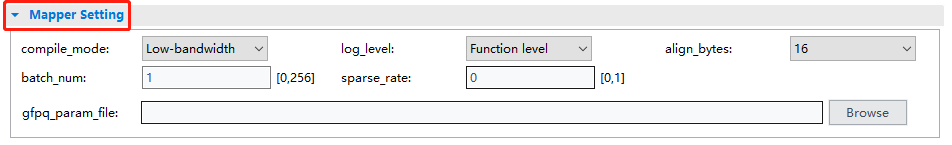

本模型为CNN模型，compile_mode选择Low-bandwidth，log_level默认选择Not print，align_bytes选择16，batch_num输入1，sparse_rate输入0即可，gfpq_param_file为空即可，若使用其他模型，需根据模型实际参数进行配置。

* Dynamic Parameters配置：

  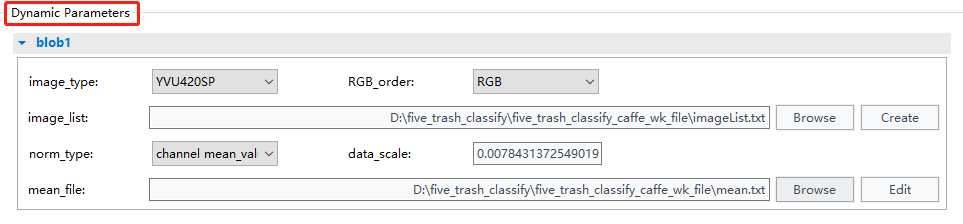

  * image_typex：需根据实际来选择，本实例为YUV420SP

  * image_list：加载制作生成的imageList.txt，一般十张左右图片，imageList.txt填写图片的绝对路径

  * RGB_order：本实例为RGB，需根据实际来选择

  * nor_type：本实例选择channel mean_value_with_data_scale，其他网络根据实际来选择

  * data_scale=1/(0.5*255)=1/std=0.0078431372549019607843137254902，注：data_scale精度越高越好

  * std来源于mmclassification_master/configs/_base_/datasets/imagenet_bs32.py

    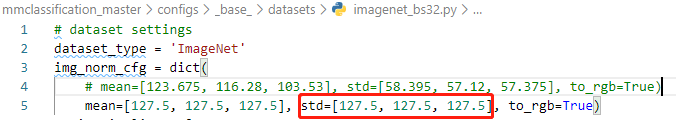

  * mean_file：加载制作生成的mean.txt即可

* 所有的参数都配置正确后，接下来进行量化，运行代码，点击如下图所示的标志：

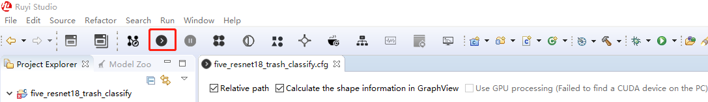

* 稍等片刻，等待转换成功，如下图所示：

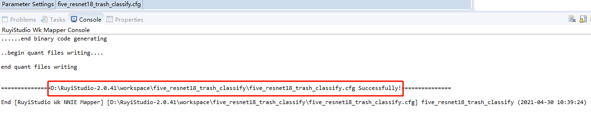

* 转换成功后，在output_wk_name下点击Browse，本文即可在D:\RuyiStudio-2.0.41\workspace\five_resnet18_trash_classify目录下查看.wk文件，如下图所示：

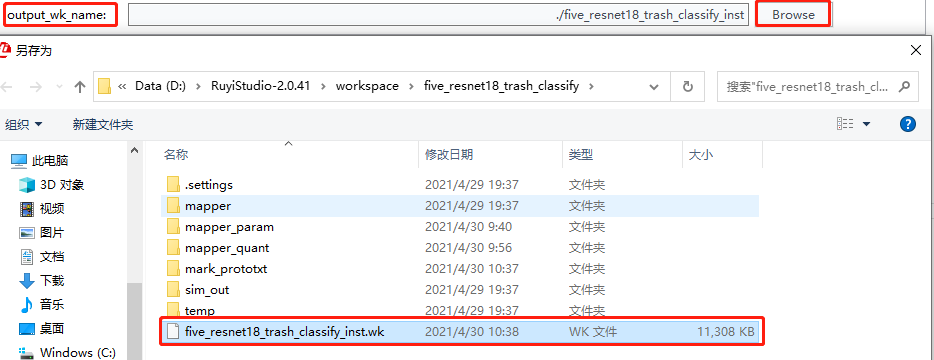

至此，模型的量化已经阐述完毕。

##### 5.3.2.3.8、模型部署板端和调试

###### 5.3.2.3.8.1、概述

* wk模型生成之后，需要将生成的wk文件部署到板端，本文基于SDK sample的cnn分类网数字识别为例进行模型板端部署和调试，示例代码参考在device/soc/hisilicon/hi3516dv300/sdk_linux/sample/platform/svp/nnie/sample路径下的sample_nnie.c，如下图所示：

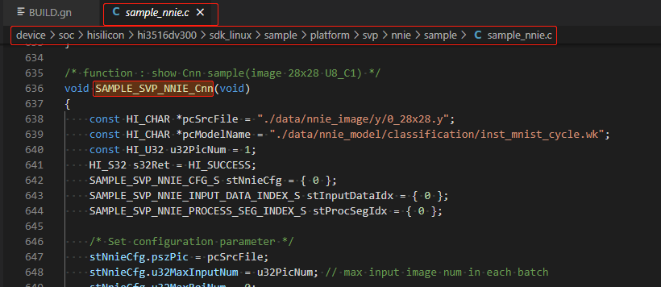

* 接下来对该cnn数字识别的sample进行讲解，如下图所示：

  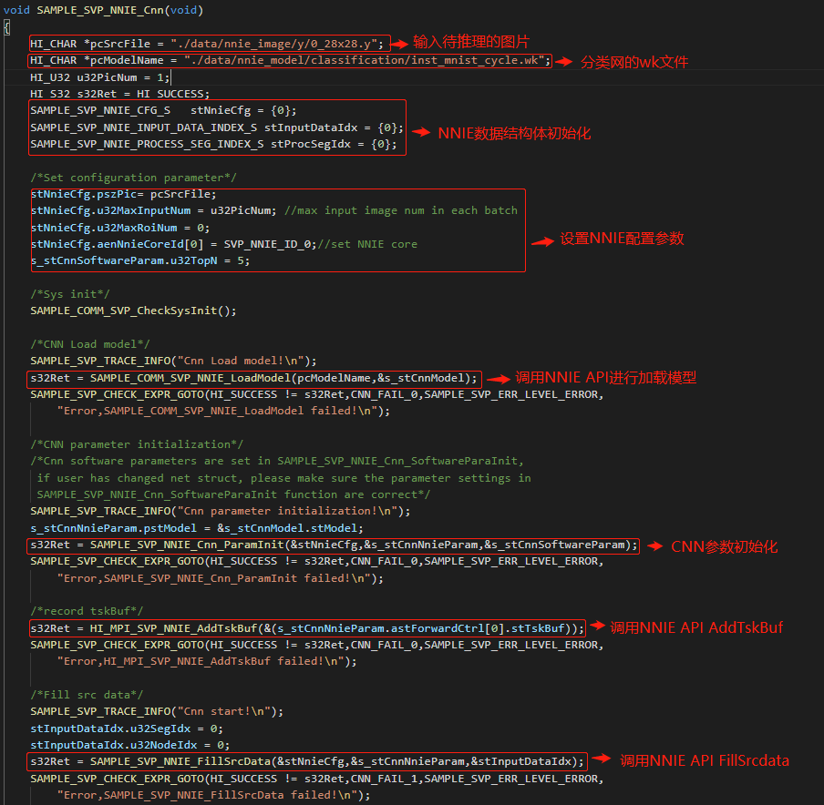

  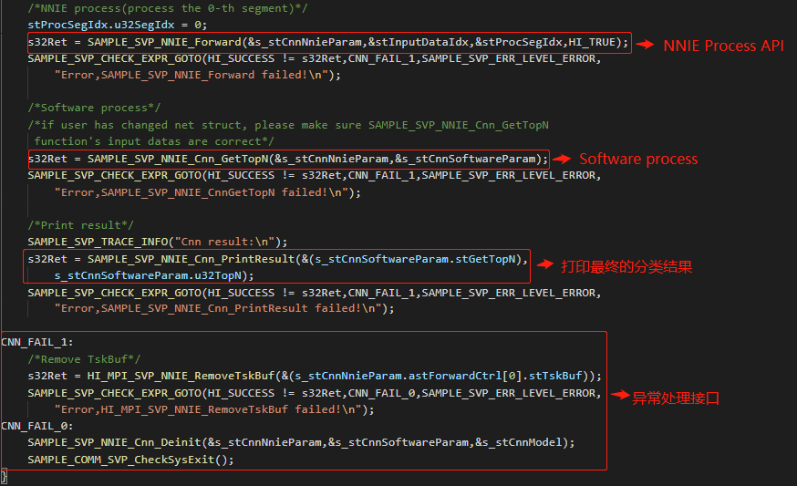

* 运行的主入口在device/soc/hisilicon/hi3516dv300/sdk_linux/sample/platform/svp/nnie中sample_nnie_main.c文件中，如下图所示：

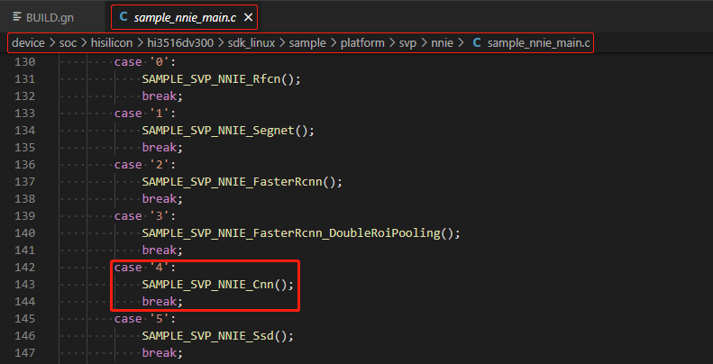

###### 5.3.2.3.8.2、编译

* 在编译sample_nnie_main.c之前，需要确保已经执行了 3.2.1章节的整编Taurus代码，以及3.2.2章节的Taurus镜像烧录的步骤，

* 在单编sample_nnie_main.c前，需修改目录下的一处依赖，进入//device/soc/hisilicon/hi3516dv300/sdk_linux目录下，通过修改BUILD.gn，在deps下面新增target，``"sample/platform/svp/nnie:hi3516dv300_nnie_sample"``，如下图所示：

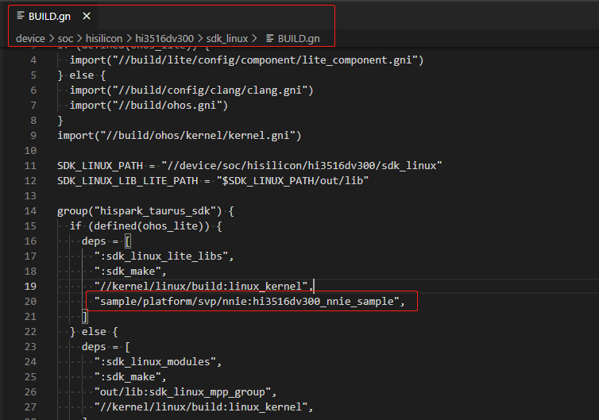

* 单编nnie_sample

* **步骤一：使用Makefile的方式进行单编(速度会快很多)**

  * 在Ubuntu的命令行终端，分步执行下面的命令，单编 nnie  sample

  ```
  cd  /home/openharmony/sdk_linux/sample/build
  
  make nnie_clean && make nnie
  ```

  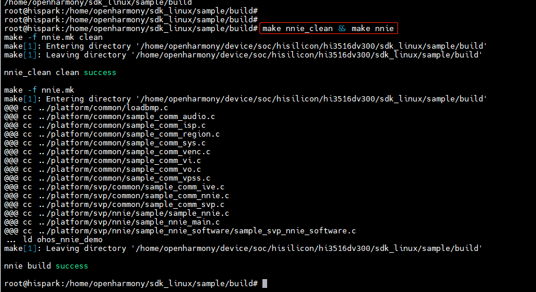

  * 在/home/openharmony/sdk_linux/sample/output目录下，生成ohos_nnie_demo可执行文件，如下图所示:

  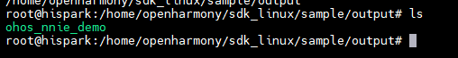

* **步骤二：使用OpenHarmony的BUILD.gn方式进行单编(速度较慢)**

  * 在Ubuntu的终端执行下面的命令，进行nnie_sample的编译

  ```
  hb set  # 选择 ipcamera_hispark_taurus_linux
  
  hb build -T device/soc/hisilicon/hi3516dv300/sdk_linux/sample/platform/svp/nnie:hi3516dv300_nnie_sample
  ```

  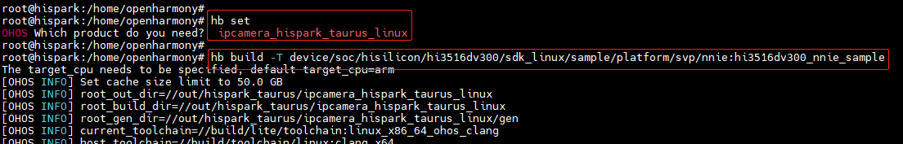

  * 编译成功后，即可在out/hispark_taurus/ipcamera_hispark_taurus_linux/rootfs/bin目录下，生成 ohos_nnie_demo可执行文件，如下图所示：

    

###### 5.3.2.3.8.3、拷贝可执行程序和依赖文件至开发板的mnt目录下

**方式一：使用SD卡进行资料文件的拷贝**

* 首先需要自己准备一张SD卡
* 步骤1：将编译后生成的可执行文件拷贝到SD卡中。
* 步骤2：将device\soc\hisilicon\hi3516dv300\sdk_linux\out\lib\目录下的**libvb_server.so和 libmpp_vbs.so**拷贝至SD卡中
* 步骤3：将device/soc/hisilicon/hi3516dv300/sdk_linux/sample/platform/svp/nnie/目录下的 data文件拷贝至SD卡中


* 步骤4：可执行文件拷贝成功后，将内存卡插入开发板的SD卡槽中，可通过挂载的方式挂载到板端，可选择SD卡 mount指令进行挂载。
  * 在开发板终端执行下面的命令，将SD卡挂载到开发板上。


```shell
mount -t vfat /dev/mmcblk1p1 /mnt
# 其中/dev/mmcblk1p1需要根据实际块设备号修改
```

* 挂载成功后，如下图所示：


**方式二：使用NFS挂载的方式进行资料文件的拷贝**

* 首先需要自己准备一根网线
* 步骤1：参考[博客链接](https://blog.csdn.net/Wu_GuiMing/article/details/115872995?spm=1001.2014.3001.5501)中的内容，进行nfs的环境搭建
* 步骤2：将编译后生成的可执行文件拷贝到Windows的nfs共享路径下
* 步骤3：将code\device\soc\hisilicon\hi3516dv300\sdk_linux\out\lib\目录下的**libvb_server.so和 libmpp_vbs.so**拷贝至Windows的nfs共享路径下
* 步骤4：将device/soc/hisilicon/hi3516dv300/sdk_linux/sample/platform/svp/nnie/目录下的 data文件拷贝至Windows的nfs共享路径下


* 步骤5：在开发板的终端执行下面的命令，将Windows的nfs共享路径挂载至开发板的mnt目录下

```
mount -o nolock,addr=192.168.200.1 -t nfs 192.168.200.1:/d/nfs /mnt
```

###### 5.3.2.3.8.4、拷贝mnt目录下的文件至正确的目录下

* 在开发板的终端执行下面的命令，拷贝mnt目录下面的ohos_nnie_demo和data至userdata目录，拷贝mnt目录下面的libvb_server.so和 libmpp_vbs.so至/usr/lib/目录下,

```
cp /mnt/ohos_nnie_demo  /userdata
cp /mnt/*.so /usr/lib/
cp /mnt/data /userdata -rf
```

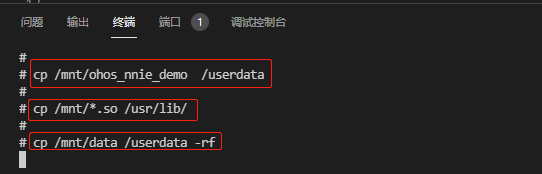

* 在开发板的终端执行下面的命令，给ohos_nnie_demo文件可执行权限

```
chmod 777 /userdata/ohos_nnie_demo
```

###### 5.3.2.3.8.5、功能验证

* 在开发板的终端执行下面的命令，启动可执行文件

```
cd /userdata

./ohos_nnie_demo 4
```

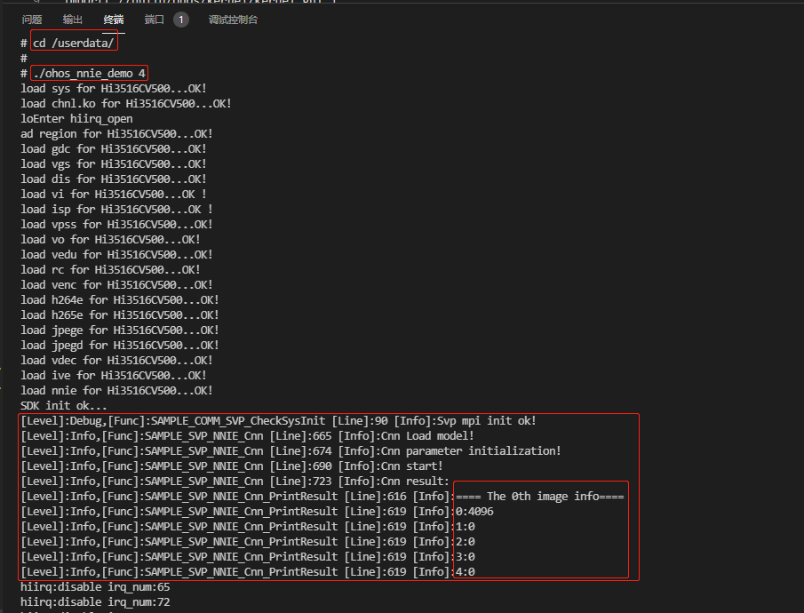

分析log可以看出，识别到的值为0，符合输入图片的逻辑。

**注：当然也可以对自己转换出来的分类网cnn模型，替换现有的wk模型，并选择一张图片进行推理验证，思路跟该sample类似。**

#### 5.3.2.4、检测网

检测网作为人工智能训练的常用网络，NNIE支持的检测网有FasterRcnn、SSD、Yolov1、Yolov2、Yolov3、RFCN等，本文采用darknet框架，以Yolov2网络为例，来对检测网进行阐述。

##### 5.3.2.4.1 数据集制作和标注

数据集制作可以采用开源的数据或者自研数据集，若采用自研数据集，视频录制的方法、数据集的制作请参考 本文**4.2.2.3.2章节和4.2.2.3.3章节**的内容，这里不再赘述。

* 本文公开数据集为例，讲述如何进行检测网的数据集制作和标注,具体步骤请参考《[hand_dataset开源数据集的处理及标注](https://blog.csdn.net/Wu_GuiMing/article/details/123718854)》。

* 若是自己的数据集，可通过**labelme**开源工具进行标注，将标注生成的.json格式或者其他格式通过脚本转成dartnet框架支持的数据集标注方式，进行训练即可，该方式参考开源代码自行实现即可。

##### 5.3.2.4.2 本地模型训练

<font color='RedOrange'>**（注意：如果您使用的是海思提供的训练服务器，此5.3.2.4.2 小节可以跳过，按照海思提供的训练服务器的训练指导文档操作即可）**</font>

**（1）训练环境搭建**

**注意:以下软件包和环境的安装均需要在open-mmlab虚拟环境下进行，如果不知道如何进入open-mmlab的虚拟环境，请参考5.3.2.3.4.1小节的步骤三**

* 使用目前较为流行的yolo检测框架，其训练环境名为darknet。
* 步骤1：访问下面的链接，下载darknet代码压缩包。并将刚下载好的darknet代码压缩包上传到训练服务器的家目录下。

```
https://www.123pan.com/s/iiMUVv-pIFLh
```

* 步骤2：在训练服务器的命令行终端，执行下面的命令，解压darknet代码

```
cd  ~

unzip darknet-master.zip
```

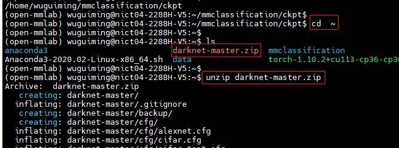

* 步骤3：在训练服务器的命令行终端，执行下面的命令，进入到darknet-master目录下，编译darknet-master

```
cd darknet-master

make clean && make
```

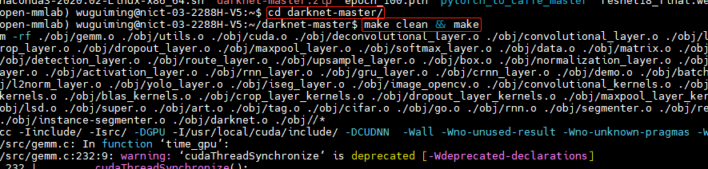

* 编译成功后，即可生成相应的库文件，如下图所示：

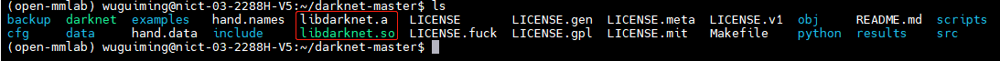

**（2）模型训练**

* 将检测网需要训练的数据集，存储到 训练服务器的~/data目录下。

```sh
# test_dataset为测试数据
# training_dataset为训练数据
# JPEGImages目录下是需要进行训练的数据集图片
# labels目录下的txt是JPEGImages目录下对应图片所标注的labels
# list目录下的hand_train.txt文件中保存的是JPEGImages目录下所有图片的绝对路径。
# 注意：所有的txt文件都必须是linux格式的，可以使用 dos2unix 工具进行文件格式的转换
# 使用方法： dos2unix filename   （如果还不知道如何使用，可上网咨询度娘）
```

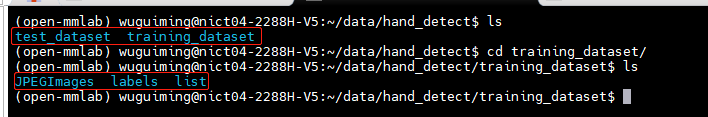

* 修改配置文件hand.data中的参数，注意：hand.data文件在 **~/darknet-master** 目录下

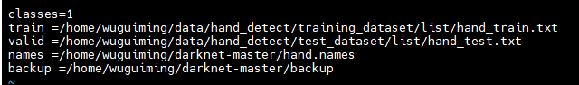

```sh
# classes：为指定类别数量，手部检测模型为1，其他模型需根据实际场景进行填写
#  train：指定训练数据list的路径
#  valid：指定测试数据list的路径
#  names：指定类别的名字
# backup：指定训练后权重的保存路径
```

* 修改**~/darknet-master** 目录下的hand.name，hand.name里面的内容，就是需要检测的类型。本文需要检测的物体只有手，因此hand.name里面的内容就只有hand，如果您需要检测多种物体，可每一行输写一种物体。

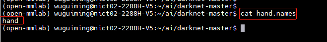

**注：以上训练指令路径需在Linux环境下进行修改，并确保 ~/darknet-master/cfg/下的 resnet18.cfg已经参考[resnet18.cfg](https://gitee.com/HiSpark/HiSpark_NICU2023/blob/master/code/resnet18.cfg)网络修改正确。可参考 https://netron.app/ 查看网络结构和参数，部分网络结构截图如下图所示：**

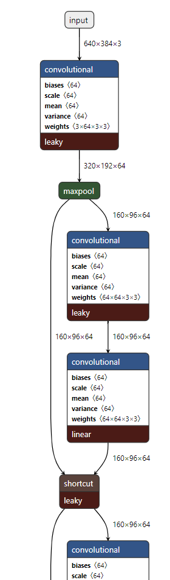

* 在训练服务器的命令行终端，执行下面的命令，训练检测网的模型。
* 注意如果您的**训练服务器只有一张显卡**，或者只有一张空余的显卡可用，那么请把 **-gpus 0,1,2,3 ** 去掉，不然会报错的，本文是因为作者所用的服务器有四张显卡，编号分别为 0、1、2、3，且这四张显卡都是空闲状态。

````sh
./darknet detector train hand.data cfg/resnet18.cfg -gpus 0,1,2,3

# darknet为可执行文件
# detector为必选参数，直接沿用即可
# train指定当前模式为训练模式，测试时候需要改成test或者valid。
# hand.data是一个文件，文件中指定了训练中数据、类别、模型存储路径等信息。
# resnet18.cfg是一个文件，文件中指定了训练的模型。
# -gpus 0,1,2,3 是指使用编号为0，1,2,3的这4个GPU进行训练，如果您的训练服务器只有一张显卡，那这个参数可以去掉。
````

* 训练过程如下图所示：

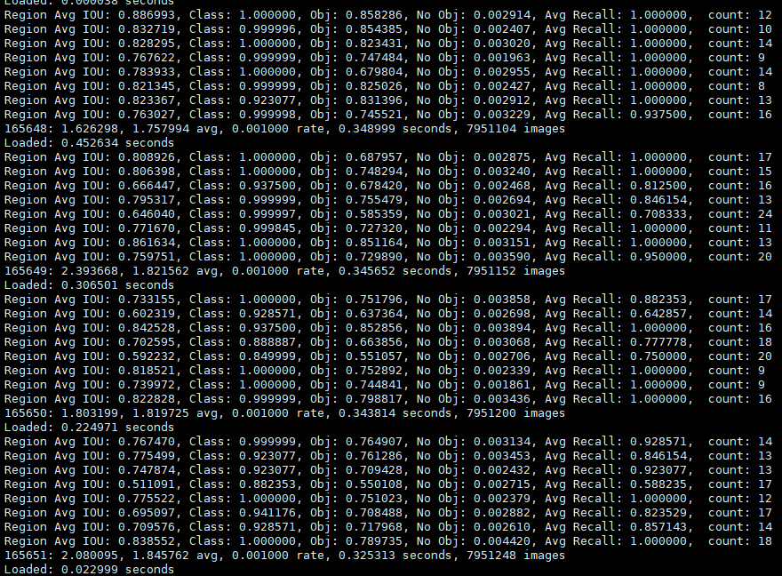

* 对终端输出的一个截图做如下解释：

  * Region Avg IOU：表示当前的subdivision内图片的平均IOU，代表预测的矩形框和真实目标的交集与并集之比，若为100%，表示我们已经拥有了完美的检测，即我们的矩形框跟目标完美重合，若为其他值较小值，表示这个模型需要进一步训练。

  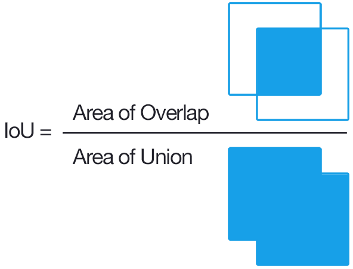

  * Class：标注物体分类的正确率，期望该值趋近于1。
  * Obj：越接近1越好。
  * No Obj：期望该值越来越小，但不为零。
  * Avg Recall：在recall/count中定义的，是当前模型在所有subdivision图片中检测出的正样本与实际的正样本的比值。
  * count：count后的值是所有的当前subdivision图片中包含正样本的图片的数量。

由于检测网训练时间较长，请耐心等待。

**（3）模型结果**

训练成功后，即可在~/darknet-master/backup 目录下查看.weights文件，若出现resnet18_final.weights表示最终训练完成，如下图所示：

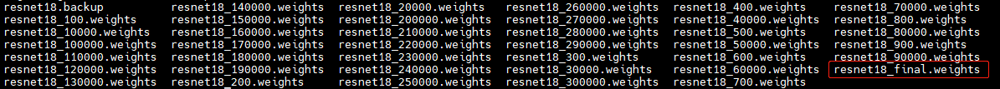

##### 5.3.2.4.3 Darknet模型转caffe方案

* 步骤1：从训练服务器的~/darknet-master/backup 目录下，下载训练好的模型文件resnet18_final.weights，到windows终端。

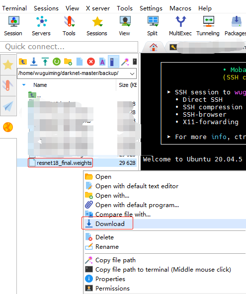

* 步骤2：将刚下载到windows的resnet18_final.weights模型文件，通过samba映射的方式上传到你Ubuntu docker的/root/darknet2caffe/目录下

  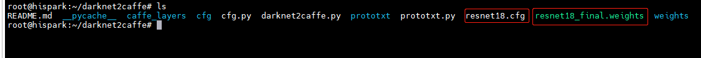


* 步骤3：执行下面的命令，将darknet模型转换为caffe模型。

  ```sh
  # 转换命令遵循：
  # python cfg[in] weights[in] prototxt[out] caffemodel[out]
  # 本文转换命令如下：
  python3.8 darknet2caffe.py resnet18.cfg resnet18_final.weights resnet18.prototxt resnet18.caffemodel
  ```

  如下图所示：

  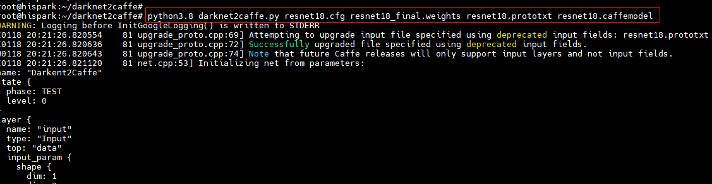

  * 当转换成功后，会在darknet2caffe目录生成一个resnet18.caffemodel和一个resnet18.prototxt文件，如下图所示。

  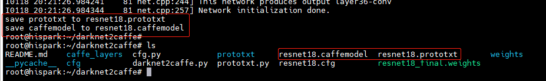

  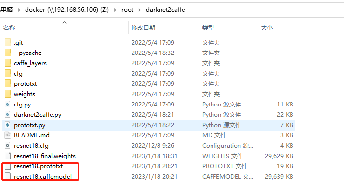

##### 5.3.2.4.4 模型量化

**注：nnie_mapper配置概念请阅读源码的device/soc/hisilicon/hi3516dv300/sdk_linux/sample/doc中《HiSVP 开发指南.pdf》3.5.2章节配置文件说明**

* 由于yolo2网络的最后一层需要通过AI CPU推理，转换之前，需要手工将其删除，如下图所示：

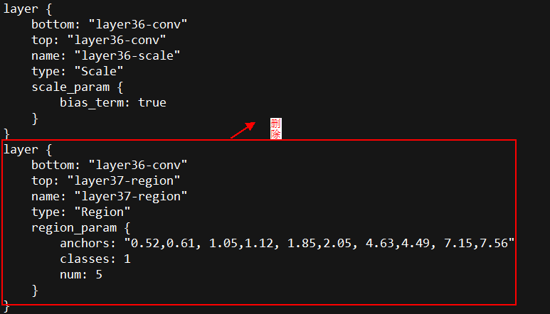

* 接下来通过RuyiStudio进行模型的量化，首先新建一个NNIE工程，点击File-New-NNIE Project，如下图所示：
* 注意：关于ruyistudio安装包的获取和安装可以参考本文**5.5.1、RuyiStudio工具的安装**章节的内容

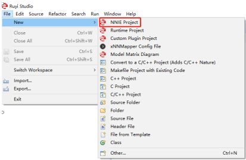

* 输入Project name，选择SOC Version为Hi3516DV300，如下图所示：

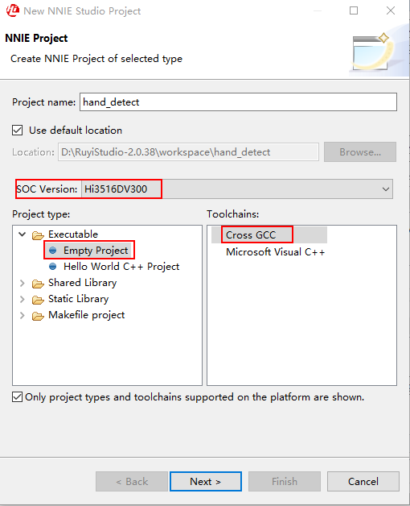

* 点击Next，其余按照默认配置即可，创建成功后，如下图所示：

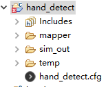

* 通过RuyiStudio进行模型转化，配置文件如下图所示：

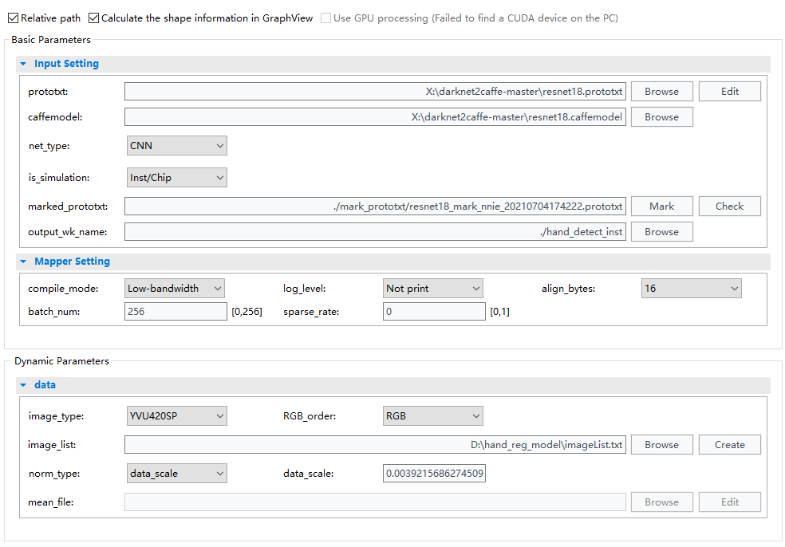

注：关于模型量化imageList.txt制作，请仔细参考5.3.2.3.7章节内容

其中：本模型image_type为YVU420SP，RGB_order为RGB，norm_type选择data_scale

data_scale = 1/255=0.0039215686274509803921568627451

点击转换按钮，稍等片刻，即可完成转换，如下图所示：

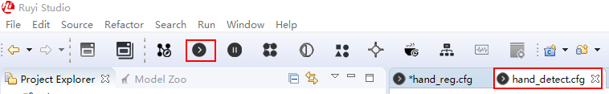

转换成功后，如下图所示：

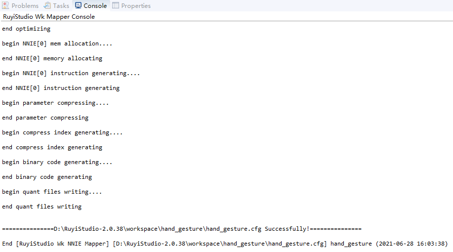

##### 5.3.2.4.5、模型部署板端和调试

###### 5.3.2.4.5.1、概述

* wk模型生成之后，需要将生成的wk文件部署到板端，本文基于SDK sample的yolov2检测网为例进行模型板端部署和调试，示例代码参考在device/soc/hisilicon/hi3516dv300/sdk_linux/sample/platform/svp/nnie/sample路径下的sample_nnie.c，如下图所示：

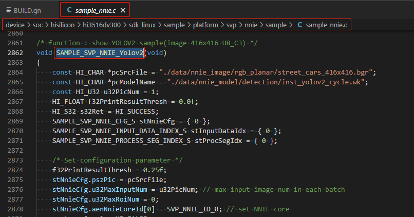

* 接下来对该yolov2的sample进行讲解，如下图所示：

  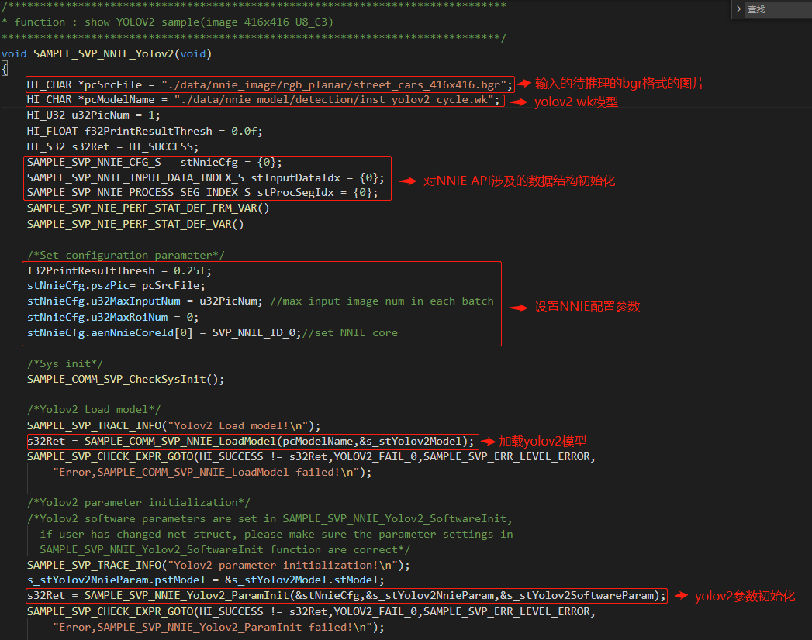

  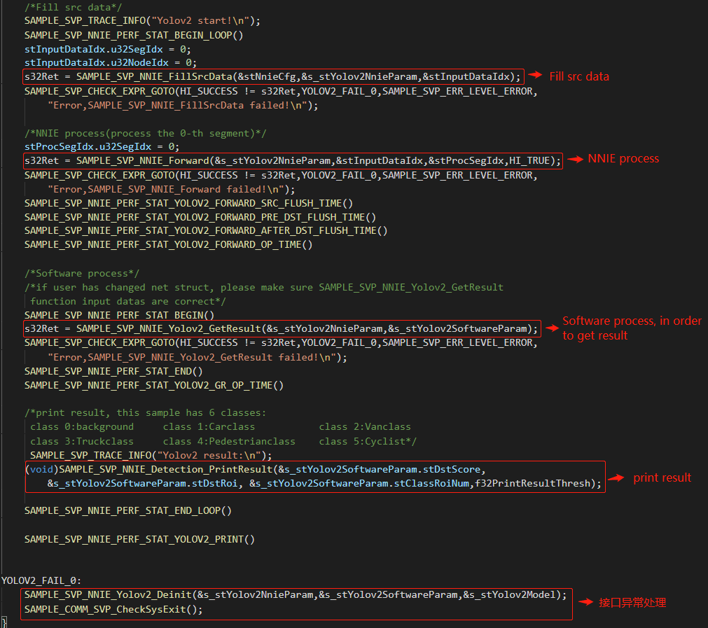

* 运行的主入口在device/soc/hisilicon/hi3516dv300/sdk_linux/sample/platform/svp/nnie中sample_nnie_main.c文件中，如下图所示：

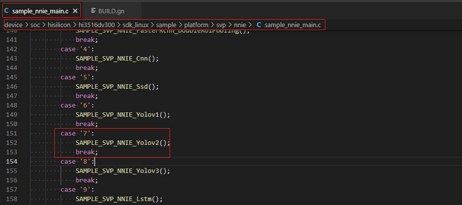

###### 5.3.2.4.5.2、编译

* 在编译sample_nnie_main.c之前，需要确保已经执行了 3.2.1章节的整编Taurus代码，以及3.2.2章节的Taurus镜像烧录的步骤，

* 在单编sample_nnie_main.c前，需修改目录下的一处依赖，进入//device/soc/hisilicon/hi3516dv300/sdk_linux目录下，通过修改BUILD.gn，在deps下面新增target，``"sample/platform/svp/nnie:hi3516dv300_nnie_sample"``，如下图所示：


* 单编nnie_sample

* **步骤一：使用Makefile的方式进行单编(速度会快很多)**

  * 在Ubuntu的命令行终端，分步执行下面的命令，单编 nnie  sample

  ```
  cd  /home/openharmony/sdk_linux/sample/build
  
  make nnie_clean && make nnie
  ```

  

  * 在/home/openharmony/sdk_linux/sample/output目录下，生成ohos_nnie_demo可执行文件，如下图所示:

  

* **步骤二：使用OpenHarmony的BUILD.gn方式进行单编(速度较慢)**

  * 在Ubuntu的终端执行下面的命令，进行nnie_sample的编译

  ```
  hb set  # 选择 ipcamera_hispark_taurus_linux
  
  hb build -T device/soc/hisilicon/hi3516dv300/sdk_linux/sample/platform/svp/nnie:hi3516dv300_nnie_sample
  ```

  

  * 编译成功后，即可在out/hispark_taurus/ipcamera_hispark_taurus_linux/rootfs/bin目录下，生成 ohos_nnie_demo可执行文件，如下图所示:

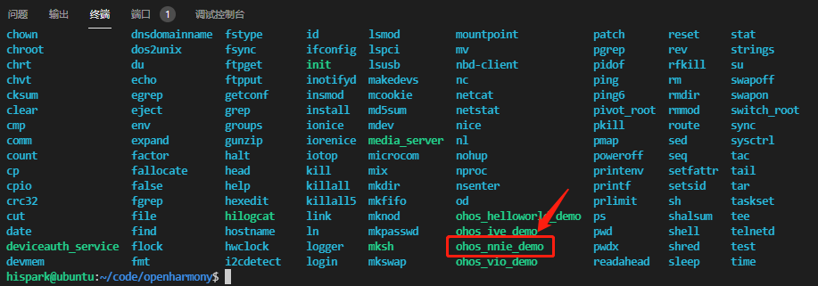

###### 5.3.2.4.5.3、拷贝可执行程序和依赖文件至开发板的mnt目录下

**方式一：使用SD卡进行资料文件的拷贝**

* 首先需要自己准备一张SD卡
* 步骤1：将编译后生成的可执行文件拷贝到SD卡中。
* 步骤2：将device\soc\hisilicon\hi3516dv300\sdk_linux\out\lib\目录下的**libvb_server.so和 libmpp_vbs.so**拷贝至SD卡中
* 步骤3：将device/soc/hisilicon/hi3516dv300/sdk_linux/sample/platform/svp/nnie/目录下的 data文件拷贝至SD卡中

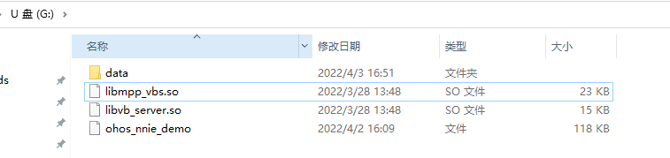

* 步骤4：可执行文件拷贝成功后，将内存卡插入开发板的SD卡槽中，可通过挂载的方式挂载到板端，可选择SD卡 mount指令进行挂载。
  * 在开发板终端执行下面的命令，将SD卡挂载到开发板上。


```shell
mount -t vfat /dev/mmcblk1p1 /mnt
# 其中/dev/mmcblk1p1需要根据实际块设备号修改
```

* 挂载成功后，如下图所示：

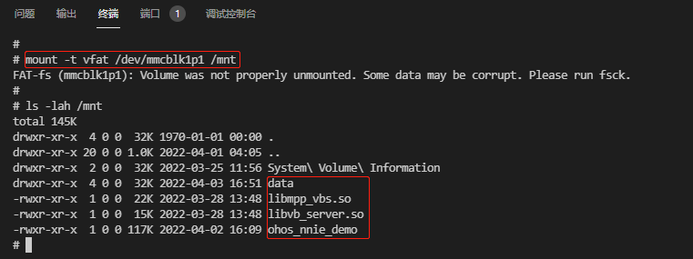

**方式二：使用NFS挂载的方式进行资料文件的拷贝**

* 首先需要自己准备一根网线
* 步骤1：参考[博客链接](https://blog.csdn.net/Wu_GuiMing/article/details/115872995?spm=1001.2014.3001.5501)中的内容，进行nfs的环境搭建
* 步骤2：将编译后生成的可执行文件拷贝到Windows的nfs共享路径下
* 步骤3：将code\device\soc\hisilicon\hi3516dv300\sdk_linux\out\lib\目录下的**libvb_server.so和 libmpp_vbs.so**拷贝至Windows的nfs共享路径下
* 步骤4：将device/soc/hisilicon/hi3516dv300/sdk_linux/sample/platform/svp/nnie/目录下的 data文件拷贝至Windows的nfs共享路径下


* 步骤5：在开发板终端执行下面的命令，将Windows的nfs共享路径挂载至开发板的mnt目录下

```
mount -o nolock,addr=192.168.200.1 -t nfs 192.168.200.1:/d/nfs /mnt
```

###### 5.3.2.4.5.4、拷贝mnt目录下的文件至正确的目录下

* 在开发板的终端执行下面的命令，拷贝mnt目录下面的ohos_nnie_demo和data至userdata目录，拷贝mnt目录下面的libvb_server.so和 libmpp_vbs.so至/usr/lib/目录下,

```
cp /mnt/ohos_nnie_demo  /userdata
cp /mnt/*.so /usr/lib/
cp /mnt/data /userdata -rf
```


* 在开发板的终端执行下面的命令，给ohos_nnie_demo文件可执行权限

```
chmod 777 /userdata/ohos_nnie_demo
```

###### 5.3.2.4.5.5、功能验证

* 在开发板的终端执行下面的命令，启动可执行文件

```
cd /userdata

./ohos_nnie_demo 7
```

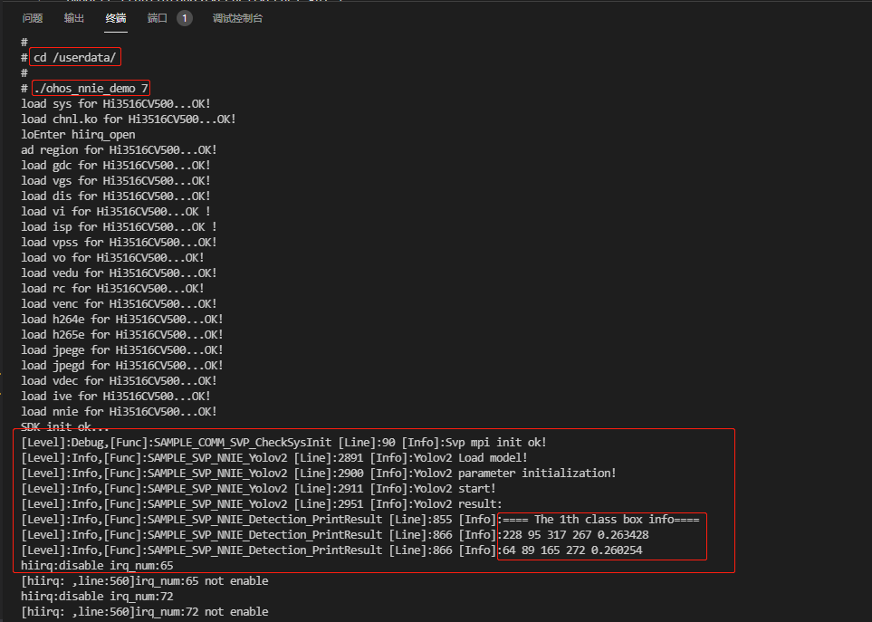

分析log可以看出，识别到的class的值为1，符合输入车的图片内容。

**注：当然也可以对自己转换出来的yolov2检测网wk模型，替换现有的wk模型，并选择一张图片进行推理验证，思路跟该sample类似。**

#### 5.3.2.5、分割网

##### 5.3.2.5.1、概述

* 本文基于SDK sample的Segnet为例进行模型板端部署和调试，示例代码参考在device/soc/hisilicon/hi3516dv300/sdk_linux/sample/platform/svp/nnie/sample路径下的sample_nnie.c，如下图所示：

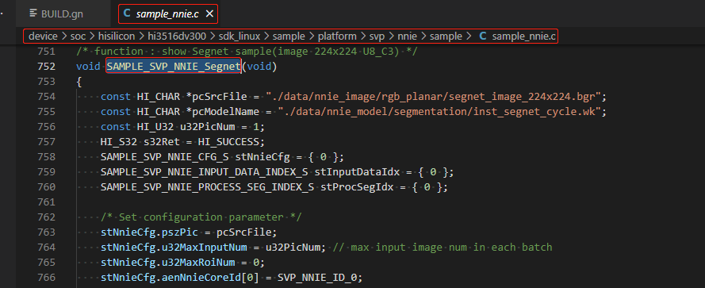

* 接下来对该Segnet的sample进行讲解，如下图所示：

  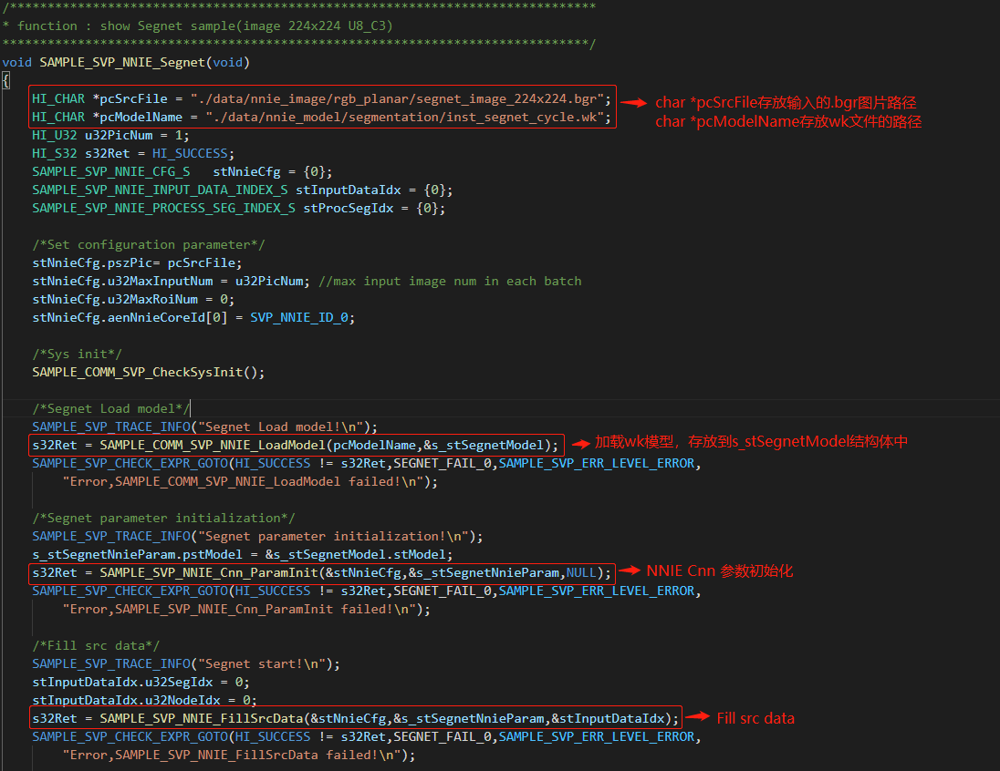

  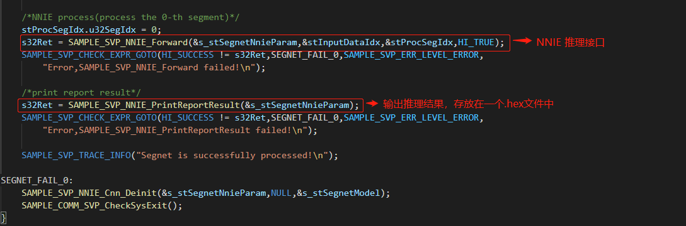

* 运行的主入口在device/soc/hisilicon/hi3516dv300/sdk_linux/sample/platform/svp/nnie中sample_nnie_main.c文件中，如下图所示：

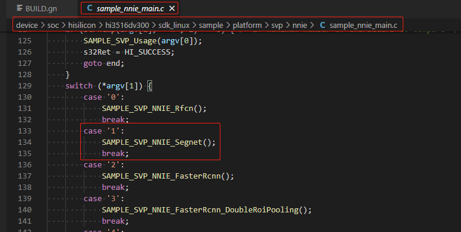

##### 5.3.2.5.2、编译

* 在编译sample_nnie_main.c之前，需要确保已经执行了 3.2.1章节的整编Taurus代码，以及3.2.2章节的Taurus镜像烧录的步骤，

* 在单编sample_nnie_main.c前，需修改目录下的一处依赖，进入//device/soc/hisilicon/hi3516dv300/sdk_linux目录下，通过修改BUILD.gn，在deps下面新增target，``"sample/platform/svp/nnie:hi3516dv300_nnie_sample"``，如下图所示：


* 单编nnie_sample

* **步骤一：使用Makefile的方式进行单编(速度会快很多)**

  * 在Ubuntu的命令行终端，分步执行下面的命令，单编 nnie  sample

  ```
  cd  /home/openharmony/sdk_linux/sample/build
  
  make nnie_clean && make nnie
  ```

  

  * 在/home/openharmony/sdk_linux/sample/output目录下，生成ohos_nnie_demo可执行文件，如下图所示:

  

* **步骤二：使用OpenHarmony的BUILD.gn方式进行单编(速度较慢)**

  * 在Ubuntu的终端执行下面的命令，进行nnie_sample的编译

  ```
  hb set  # 选择 ipcamera_hispark_taurus_linux
  
  hb build -T device/soc/hisilicon/hi3516dv300/sdk_linux/sample/platform/svp/nnie:hi3516dv300_nnie_sample
  ```

  

  * 编译成功后，即可在out/hispark_taurus/ipcamera_hispark_taurus_linux/rootfs/bin目录下，生成 ohos_nnie_demo可执行文件，如下图所示：


##### 5.3.2.5.3、拷贝可执行程序和依赖文件至开发板的mnt目录下

**方式一：使用SD卡进行资料文件的拷贝**

* 首先需要自己准备一张SD卡
* 步骤1：将编译后生成的可执行文件拷贝到SD卡中。
* 步骤2：将device\soc\hisilicon\hi3516dv300\sdk_linux\out\lib\目录下的**libvb_server.so和 libmpp_vbs.so**拷贝至SD卡中
* 步骤3：将device/soc/hisilicon/hi3516dv300/sdk_linux/sample/platform/svp/nnie/目录下的 data文件拷贝至SD卡中


* 步骤4：可执行文件拷贝成功后，将内存卡插入开发板的SD卡槽中，可通过挂载的方式挂载到板端，可选择SD卡 mount指令进行挂载。
  * 在开发板终端执行下面的命令，将SD卡挂载到开发板上。


```shell
mount -t vfat /dev/mmcblk1p1 /mnt
# 其中/dev/mmcblk1p1需要根据实际块设备号修改
```

* 挂载成功后，如下图所示：


**方式二：使用NFS挂载的方式进行资料文件的拷贝**

* 首先需要自己准备一根网线
* 步骤1：参考[博客链接](https://blog.csdn.net/Wu_GuiMing/article/details/115872995?spm=1001.2014.3001.5501)中的内容，进行nfs的环境搭建
* 步骤2：将编译后生成的可执行文件拷贝到Windows的nfs共享路径下
* 步骤3：将device\soc\hisilicon\hi3516dv300\sdk_linux\out\lib\目录下的**libvb_server.so和 libmpp_vbs.so**拷贝至Windows的nfs共享路径下
* 步骤4：将device/soc/hisilicon/hi3516dv300/sdk_linux/sample/platform/svp/nnie/目录下的 data文件拷贝至Windows的nfs共享路径下

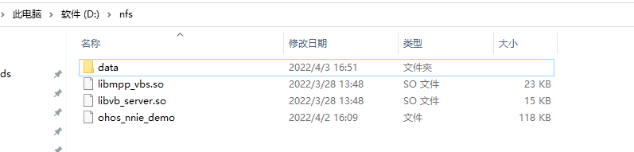

* 步骤5：在开发板的终端执行下面的命令，将Windows的nfs共享路径挂载至开发板的mnt目录下

```
mount -o nolock,addr=192.168.200.1 -t nfs 192.168.200.1:/d/nfs /mnt
```

##### 5.3.2.5.4、拷贝mnt目录下的文件至正确的目录下

* 在开发板的终端执行下面的命令，拷贝mnt目录下面的ohos_nnie_demo和data至userdata目录，拷贝mnt目录下面的libvb_server.so和 libmpp_vbs.so至/usr/lib/目录下,

```
cp /mnt/ohos_nnie_demo  /userdata
cp /mnt/*.so /usr/lib/
cp /mnt/data /userdata -rf
```


* 在开发板的终端执行下面的命令，给ohos_nnie_demo文件可执行权限

```
chmod 777 /userdata/ohos_nnie_demo
```

##### 5.3.2.5.5、功能验证

* 在开发板的终端执行下面的命令，启动可执行文件

```
cd /userdata

./ohos_nnie_demo 1
```

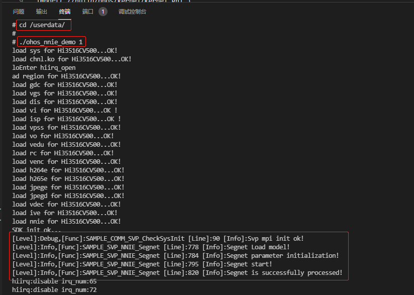

* 最终的结果保存到seg0_layer38_output0_inst.linear.hex中，如下图所示：

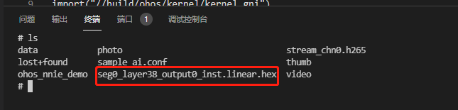


### 5.3.3、 AI CPU算子实现

#### 5.3.3.1、Non-support层处理方式

在介绍Non-support层处理方式之前，先介绍下一个网络层的分类，一个网络的层可分为如下3类：

* 标准层：NNIE支持的Caffe标准层，如Convolution、Pooling层等；

* 扩展层：NNIE支持的公开但非Caffe标准层，分为2种：

  *  一种是基于Caffe框架进行自定义扩展的层，比如Faster RCNN中的ROIPooling层、SSD中Normalize层、RFCN中的PSROIPooling层，SegNet中的UpSample层等；

  *  另外一种是来源于其他深度学习框架的自定义层，比如YOLOv2中Passthrough层等；

* Non-support层：NNIE不支持的层，比如Caffe中专用于Tranning的层、其他非Caffe框架中的一些层或者用户自定义的私有层等。

当网络中存在Non-support层时，需要将网络进行切分，不支持的部分由用户使用CPU 或者DSP等方式实现，统称为非NNIE方式。由此整个网络会出现NNIE->非NNIE- >NNIE… 的分段执行方式。

nnie_mapper将NNIE的Non-support层分为两种，“Proposal”层和“Custom”层：

（1）Proposal层输出的是矩形信息（Bbox，即Bounding box）；Proposal自定义层格 式如下，包含name\type\bottom\top等关键字段参数，type必须为 “Proposal”，支持任意多个的bottom，但是top只有一个。

```python
layer {
 name: "proposal"
 type: "Proposal"
 bottom: "rpn_cls_prob_reshape"
 bottom: "rpn_bbox_pred"
 top: "rois"
}
```

Proposal层还支持以下参数的解析，但不产生实际的效果。

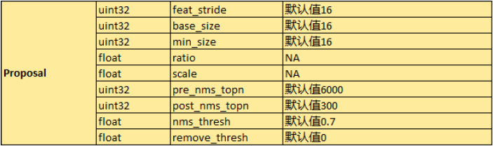

（2）Custom层输出的是tensor（feature map、vector）；Custom自定义层格式如下，仅包含name\type\bottom\top\ custom_param\shape\dim关键字段，type 必须为“Custom”，支持任意多个top\bottom，custom_param中的shape信息 是描述top输出的形状，如果有多个输出，则按top顺序书写多个shape。用户原有其他的参数字段需删除。

```
layer {
 name: "custom1"
 type: "Custom"
 bottom: "conv1"
 bottom: "conv2"
 bottom: "pooling1"
top: "custom1_1"
 top: "custom1_2"
 custom_param
 {
 shape {
 dim: 1
 dim: 256
 dim: 64
 dim: 64
 }
 shape {
 dim: 1
 dim: 128
 dim: 128
 dim: 128
 }
 }
}
```

在nnie_mapper对网络模型进行转化之前，用户需根据上述特性将Non-support层 修改为“Proposal”层或者“Custom”层，具体修改方式参考**源码的device/soc/hisilicon/hi3516dv300/sdk_linux/sample/doc中**《HiSVP 开发指南.pdf》中“3.2 Prototxt要求”。

#### 5.3.3.2、NNIE算子无法支持的网络层实现

##### 5.3.3.2.1、通过CPU/GPU/DSP实现NNIE不支持算子

###### 5.3.3.2.1.1、案例

以RFCN网络为例进行阐述

RFCN跟Faster RCNN类似，RPN部分的Proposal层(Bbox_transform、Argsort、NMS 等操作)输出的是Bounding Box信息，由此网络被分为5段NNIE： 

* 第1段（NNIE执行），卷积部分，包含RPN前面的部分；

* 第2段（非NNIE执行），Proposal部分，生成矩形框信息；

* 第3段（NNIE执行），左边的PsRoiPooling部分以及后续的Pooling等，得到矩形框调整值；

* 第4段（NNIE执行），右边的PsRoiPooling部分以及后续的Pooling等，得到矩形框置信度；

* 第5段（非NNIE执行），结果获取部分，由3、4段得到的矩形框调整值和置信度经过bbox_transfom、argsort、NMS、ClipBox等步骤获取最终的矩形框和置信度信息。

RFCN 网络 mapper 自动分段示意图，如下图所示：

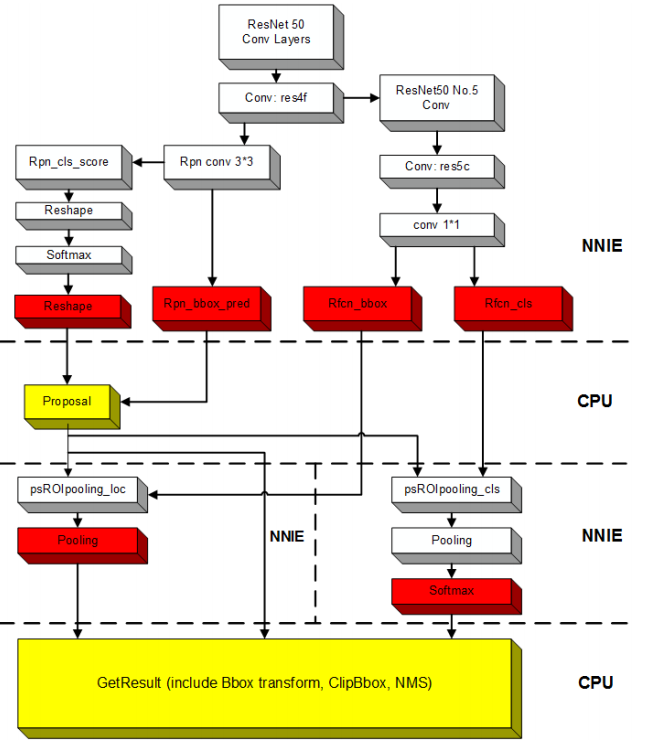

类似Faster RCNN，考虑将Reshape->Softmax->Reshape->Proposal一起又CPU执行，RFCN 自定义分段示意图如下图所示：

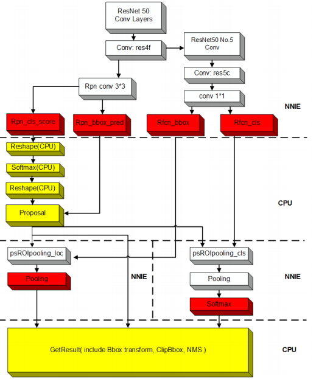
