## 5.4、综合实验

### 5.4.1、AI sample环境搭建

#### 5.4.1.1、概述

综合案例章节中，我们将在Hi3516DV300 SDK的基础之上进行开发，分别为手部检测+手势识别实验，垃圾分类实验，网球检测实验。手部检测+手势识别实验，垃圾分类实验，以及网球检测实验，主要基于训练好的wk模型在板端进行部署，并充分发挥海思IVE、NNIE硬件加速能力，完成AI推理和业务处理。

#### 5.4.1.2、目录

* ai_sample在Hi3516DV300 SDK基础上进行开发，在利用媒体通路的基础上，通过捕获VPSS帧进行预处理操作，并送至NNIE进行推理，结合AI CPU算子最终得到AI Flag并进行相应业务处理，该AI sample集成了垃圾分类、手势检测识别、网球检测 三个基础场景，运用到媒体理论、多线程、IPC通信、IVE、NNIE等思想，实现了一个轻量级sample，方便开发者了解taurus Hi3516DV300的AI能力，ai_sample目录结构如下：

```shell
//device/soc/hisilicon/hi3516dv300/sdk_linux/sample/taurus/ai_sample
│  BUILD.gn                    # 编译ohos ai_sample需要的gn文件
├─ai_infer_process             # AI前处理、推理、后处理相关接口
│  ├─ai_infer_process.c
│  └─ai_infer_process.h
├─dependency                  # ai sample依赖的一些功能，如语音播报
│  ├─audio_test.c
│  └─audio_test.h
├─ext_util					  # 常用的基础接口、可移植操作系统接口posix等
│  ├─base_interface.c
│  ├─base_interface.h
│  ├─misc_util.c
│  ├─misc_util.h
│  ├─posix_help.c
│  └─posix_help.h
├─mpp_help        		     # 封装的媒体相关接口
│  ├─include
│  │  ├─ive_img.h
│  │  └─vgs_img.h
│  └─src
│    ├─ive_img.c
│    └─vgs_img.c
├─scenario
│  ├─cnn_trash_classify        # 垃圾分类sample
│  │   ├─cnn_trash_classify.c
│  │   └─cnn_trash_classify.h
│  ├─hand_classify             # 手部检测+手势识别sample
│  │   ├─hand_classify.c
│  │   ├─hand_classify.h
│  │   ├─yolov2_hand_detect.c
│  │   └─yolov2_hand_detect.h
│  └─tennis_detect            # 网球检测sample
│      ├── README.md
│      ├── tennis_detect.cpp
│      └── tennis_detect.h
└─smp					   # ai sample主入口及媒体处理文件
  ├─sample_ai_main.cpp
  ├─sample_media_ai.c
  └─sample_media_ai.h
```

#### 5.4.1.3、编译

在编译ai_sample之前，需要确保已经执行了 3.2.1章节的整编Taurus代码，以及3.2.2章节的Taurus镜像烧录的步骤，在单编ai_sample之前，需修改目录下的一处依赖，进入//device/soc/hisilicon/hi3516dv300/sdk_linux目录下，通过修改BUILD.gn，在deps下面新增target，``"sample/taurus/ai_sample:hi3516dv300_ai_sample"``，如下图所示：

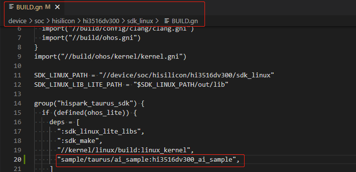

* 单编ai_sample

* **步骤一：使用Makefile的方式进行单编(速度会快很多)**

  * 在Ubuntu的命令行终端，分步执行下面的命令，单编 ai  sample

  ```
  cd  /home/openharmony/sdk_linux/sample/build
  
  make ai_sample_clean && make ai_sample
  ```

  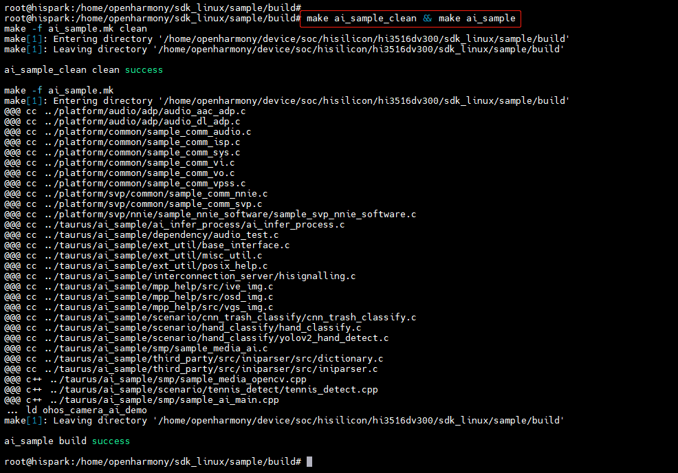

  * 在/home/openharmony/sdk_linux/sample/output目录下，生成ohos_camera_ai_demo可执行文件，如下图所示:

  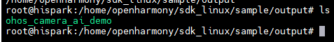

* **步骤二：使用OpenHarmony的BUILD.gn方式进行单编(速度较慢)**

  * 在Ubuntu的终端执行下面的命令，进行ai_sample的编译

  ```
  hb set  # 选择 ipcamera_hispark_taurus_linux
  
  hb build -T device/soc/hisilicon/hi3516dv300/sdk_linux/sample/taurus/ai_sample:hi3516dv300_ai_sample
  ```

  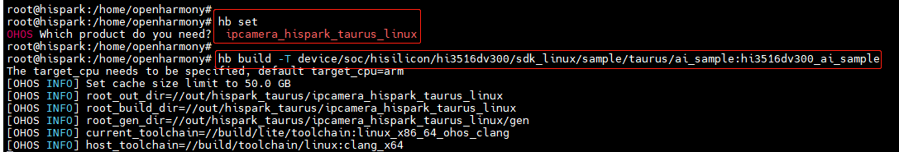

  * 编译成功后，即可在out/hispark_taurus/ipcamera_hispark_taurus_linux/rootfs/bin目录下，生成 ohos_camera_ai_demo可执行文件，如下图所示

    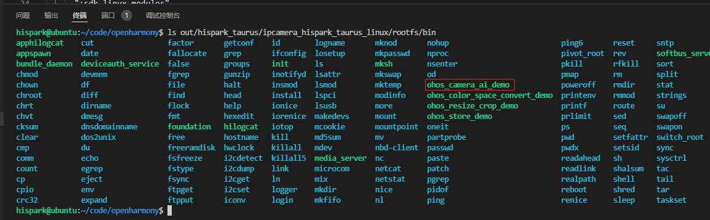

#### 5.4.1.5、拷贝可执行程序和依赖文件至开发板的mnt目录下

**方式一：使用SD卡进行资料文件的拷贝**

* 首先需要自己准备一张SD卡
* 步骤1：将编译后生成的可执行文件拷贝到SD卡中。
* 步骤2：将device\soc\hisilicon\hi3516dv300\sdk_linux\out\lib\目录下的**libvb_server.so和 libmpp_vbs.so**拷贝至SD卡中
* 步骤3：将device/soc/hisilicon/hi3516dv300/sdk_linux/sample/taurus/目录下的models文件夹和aac_file文件夹拷贝至SD卡中。
* 步骤4：复制device\soc\hisilicon\hi3516dv300\sdk_linux\sample\taurus\ai_sample\third_party\output\opencv\lib\目录下的libopencv_world.so.4.5.5 拷贝至Windows的nfs共享路径下

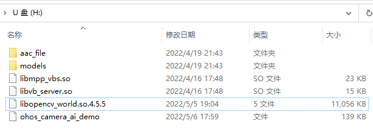

* 步骤5：可执行文件拷贝成功后，将内存卡插入开发板的SD卡槽中，可通过挂载的方式挂载到板端，可选择SD卡 mount指令进行挂载。
  * 在开发板终端执行下面的命令，将SD卡挂载到开发板上。


```shell
mount -t vfat /dev/mmcblk1p1 /mnt
# 其中/dev/mmcblk1p1需要根据实际块设备号修改
```

* 挂载成功后，如下图所示：

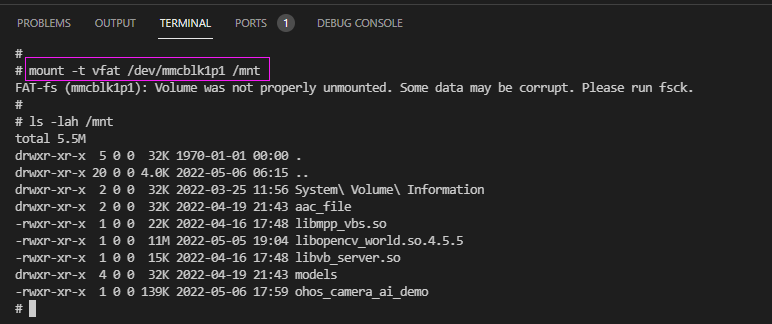

**方式二：使用NFS挂载的方式进行资料文件的拷贝**

* 首先需要自己准备一根网线
* 步骤1：参考[博客链接](https://blog.csdn.net/Wu_GuiMing/article/details/115872995?spm=1001.2014.3001.5501)中的内容，进行nfs的环境搭建
* 步骤2：将编译后生成的可执行文件拷贝到Windows的nfs共享路径下
* 步骤3：将device\soc\hisilicon\hi3516dv300\sdk_linux\out\lib\目录下的**libvb_server.so和 libmpp_vbs.so**拷贝至Windows的nfs共享路径下
* 步骤4：将device/soc/hisilicon/hi3516dv300/sdk_linux/sample/taurus/目录下的**models文件夹**和**aac_file文件夹**拷贝至Windows的nfs共享路径下
* 步骤5：复制device\soc\hisilicon\hi3516dv300\sdk_linux\sample\taurus\ai_sample\third_party\output\opencv\lib\目录下的libopencv_world.so.4.5.5 拷贝至Windows的nfs共享路径下


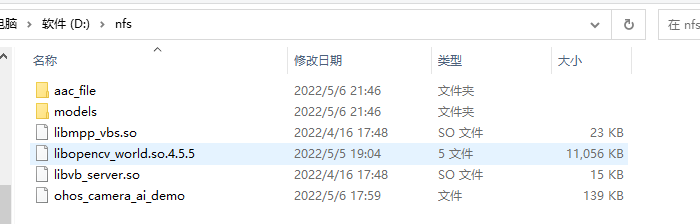

* 步骤6：依赖文件拷贝至Windows的nfs共享路径下后，在开发板的终端执行下面的命令，将Windows的nfs共享路径挂载至开发板的mnt目录下

```
mount -o nolock,addr=192.168.200.1 -t nfs 192.168.200.1:/d/nfs /mnt
```

#### 5.4.1.6、拷贝mnt目录下的文件至正确的目录下

* 在开发板的终端执行下面的命令，拷贝mnt目录下面的ohos_camera_ai_demo至userdata目录，拷贝mnt目录下面的libvb_server.so和 libmpp_vbs.so至/usr/lib/目录下，再将models和aac_file文件夹拷贝至userdata目录下,然后再在userdata目录下创建一个lib，用来存放opencv的库文件。

```
cp /mnt/ohos_camera_ai_demo  /userdata/
cp /mnt/libvb_server.so /usr/lib/
cp /mnt/libmpp_vbs.so /usr/lib/
cp /mnt/models  /userdata/ -rf
cp /mnt/aac_file  /userdata/ -rf
mkdir  /userdata/lib/ -p
cp /mnt/libopencv_world.so.4.5.5  /userdata/lib/
ln -s /userdata/lib/libopencv_world.so.4.5.5  /userdata/lib/libopencv_world.so.405
ln -s /userdata/lib/libopencv_world.so.405  /userdata/lib/libopencv_world.so
```

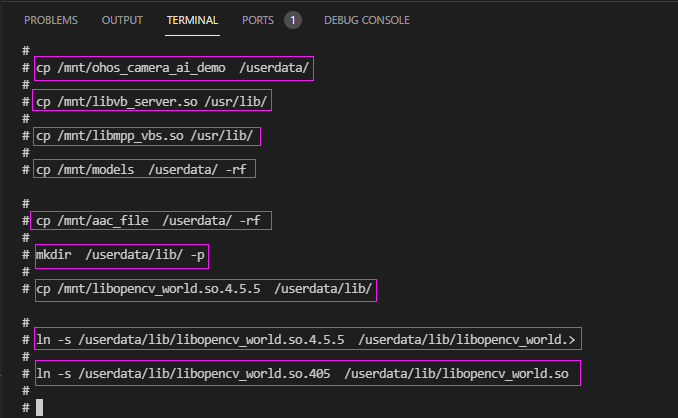

* 在开发板的终端执行下面的命令，给ohos_camera_ai_demo文件可执行权限

```
chmod 777 /userdata/ohos_camera_ai_demo
```

### 5.4.2、手势检测+手势识别实验

* 步骤1：在SD卡或Windows的nfs共享目录下，创建一个**sample_ai.conf**的文件，然后把下面的内容拷贝到此文件中

```cobol
; ai sample configuration file

[audio_player]
support_audio = true ; 垃圾识别语音播放

[ai_function]
support_ai = true ; 是否支持AI

[trash_classify_switch]
support_trash_classify = false ; 是否支持垃圾分类功能

[hand_classify_switch]
support_hand_classify = true ; 是否手势检测识别功能
```

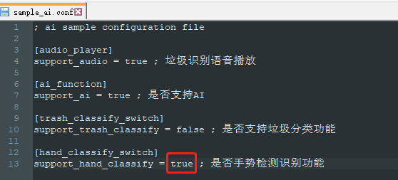

* 步骤2：再通过下面的挂载命令，把SD卡或者Windows的nfs共享目录挂载到开发板上

  * 方式1：SD卡：在开发板终端执行下面的命令，将SD卡挂载到开发板上。

  ```
  mount -t vfat /dev/mmcblk1p1 /mnt
  # 其中/dev/mmcblk1p1需要根据实际块设备号修改
  ```

  * 方式2：Windows的nfs共享目录，在开发板的终端执行下面的命令，将Windows的nfs共享路径挂载至开发板的mnt目录下

    ```
    mount -o nolock,addr=192.168.200.1 -t nfs 192.168.200.1:/d/nfs /mnt
    ```

* 步骤3：在开发板终端执行下面的命令，将/mnt目录下的sample_ai.conf文件复制到userdata目录下。

```
cp /mnt/sample_ai.conf  /userdata
```

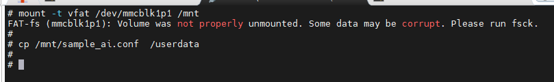

* 在开发板终端执行下面的命令，进行手势识别sample的验证

```
cd  /userdata
./ohos_camera_ai_demo 1
```

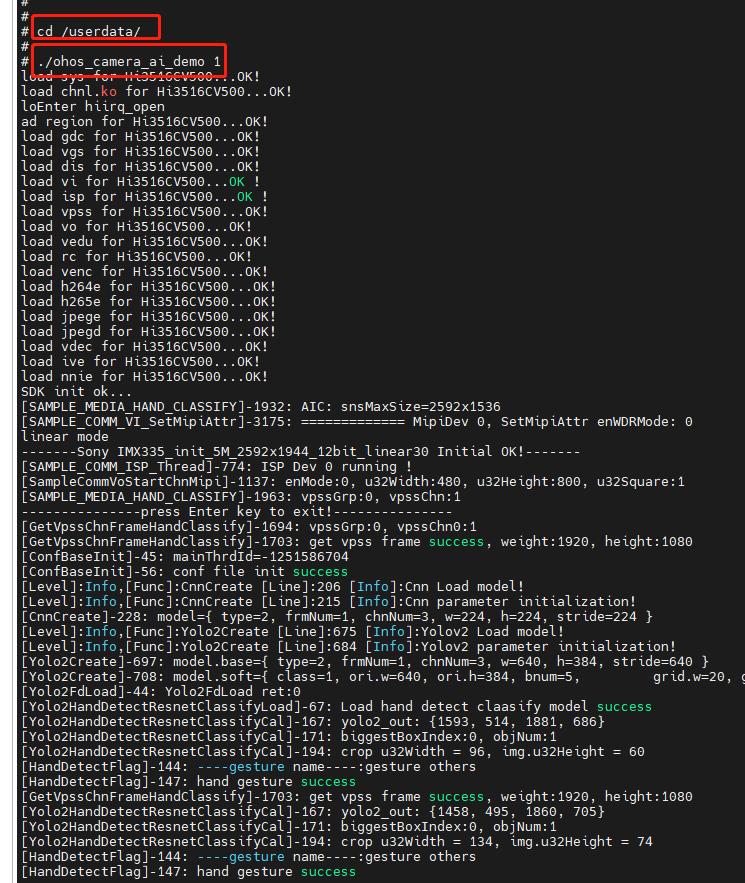


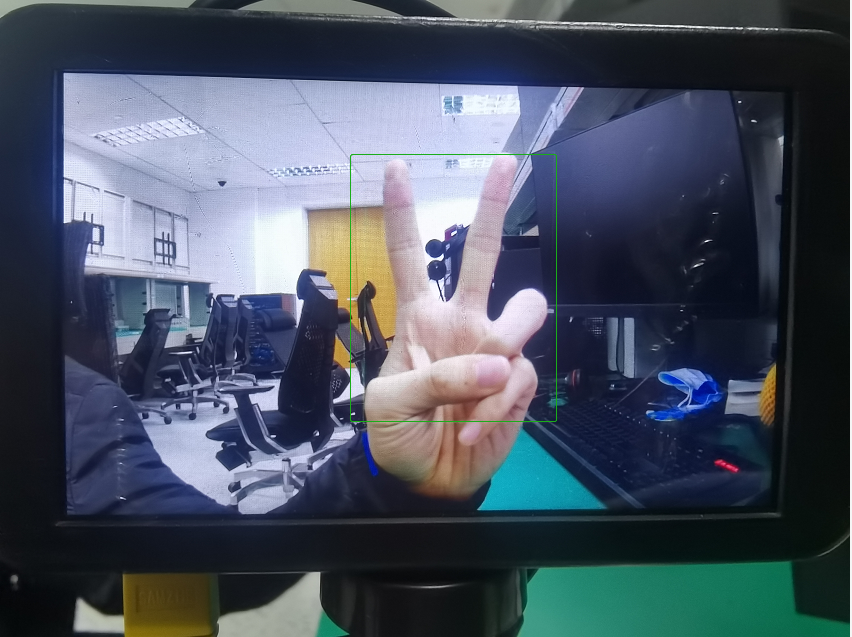

* 敲两下回车即可关闭程序


### 5.4.3、垃圾分类实验

* 步骤1：在SD卡或Windows的nfs共享目录下，创建一个**sample_ai.conf**的文件，然后把下面的内容拷贝到此文件中

```cobol
; ai sample configuration file

[audio_player]
support_audio = true ; 垃圾识别语音播放

[ai_function]
support_ai = true ; 是否支持AI

[trash_classify_switch]
support_trash_classify = true ; 是否支持垃圾分类功能

[hand_classify_switch]
support_hand_classify = false ; 是否手势检测识别功能

```

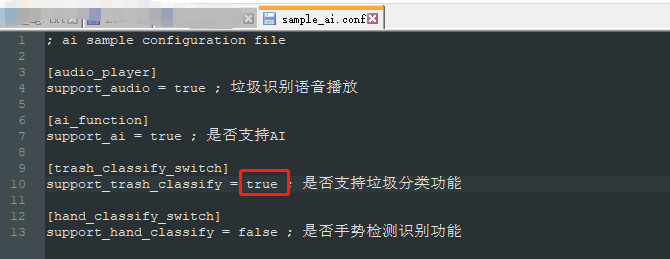

* 步骤2：再通过下面的挂载命令，把SD卡或者Windows的nfs共享目录挂载到开发板上

  * 方式1：SD卡：在开发板终端执行下面的命令，将SD卡挂载到开发板上

  ```
  mount -t vfat /dev/mmcblk1p1 /mnt
  # 其中/dev/mmcblk1p1需要根据实际块设备号修改
  ```

  * 方式2：Windows的nfs共享目录:在开发板的终端执行下面的命令，将Windows的nfs共享路径挂载至开发板的mnt目录下

  ```
  mount -o nolock,addr=192.168.200.1 -t nfs 192.168.200.1:/d/nfs /mnt
  ```

* 步骤3：在开发板终端执行下面的命令，先将之前开发板中的sample_ai.conf文件删掉，以免产生冲突，将/mnt目录下的sample_ai.conf文件复制到userdata目录下。

```
rm /userdata/sample_ai.conf

cp /mnt/sample_ai.conf  /userdata
```

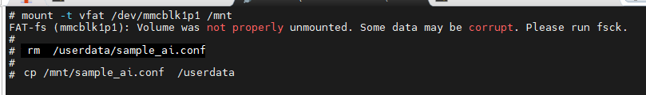

* 在开发板终端执行下面的命令，进行垃圾分类sample的验证

```
cd  /userdata
./ohos_camera_ai_demo 0
```

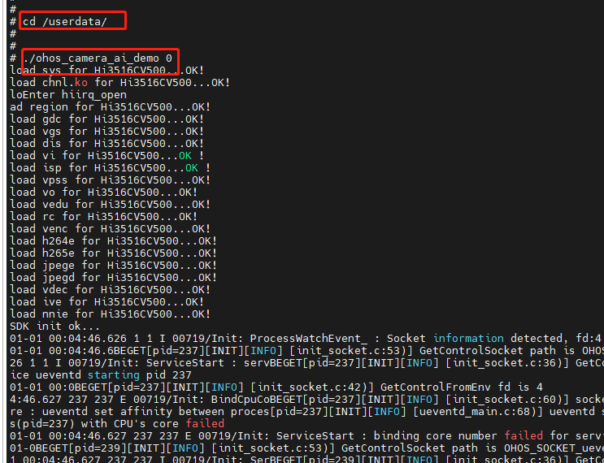

* 推理结果打印信息如下图所示：

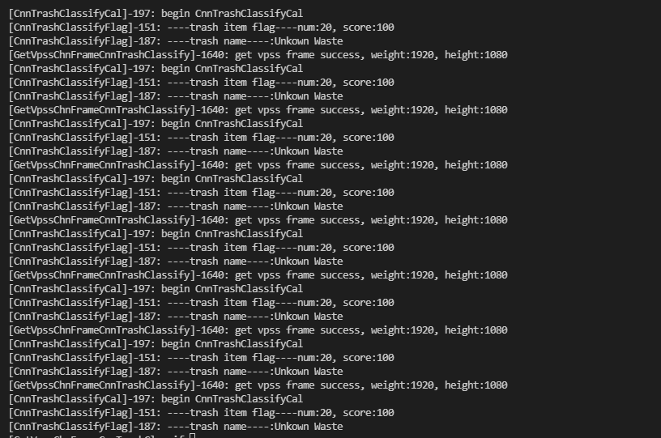

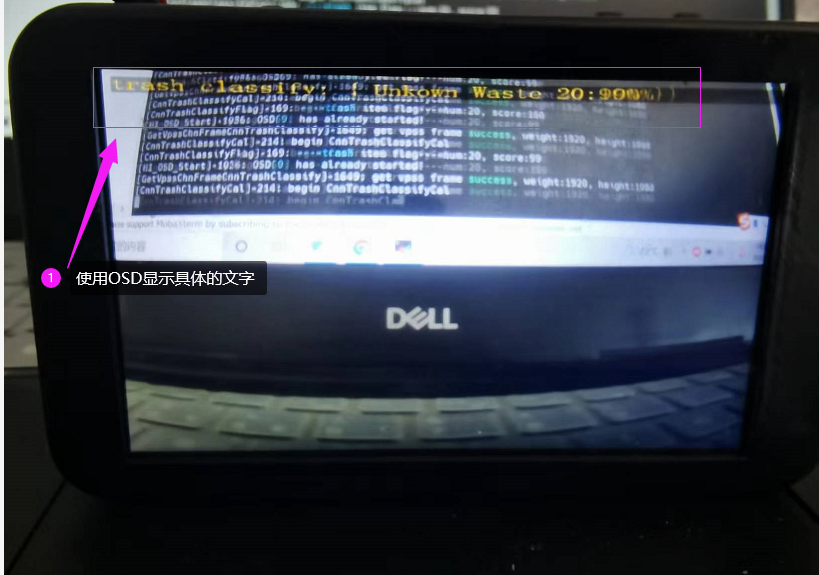

**注意：**

	（1）支持osd在MIPI屏上叠加字符，字库文件为：ai_sample/mpp_help/include/simsunb_16x32.txt；
	（2）字库支持的格式为：英文字母、符号和数字，不支持汉字


* 敲两下回车即可关闭程序


### 5.4.4、基于OpenCV的网球检测实验

* 步骤1：在SD卡或Windows的nfs共享目录下，创建一个**sample_ai.conf**的文件，然后把下面的内容拷贝到此文件中

```cobol
; ai sample configuration file

[audio_player]
support_audio = false ; 垃圾识别语音播放

[ai_function]
support_ai = true ; 是否支持AI

[trash_classify_switch]
support_trash_classify = false ; 是否支持垃圾分类功能

[hand_classify_switch]
support_hand_classify = false ; 是否手势检测识别功能

[tennis_detect_switch]
support_tennis_detect = true ; 是否支持网球检测功能
```

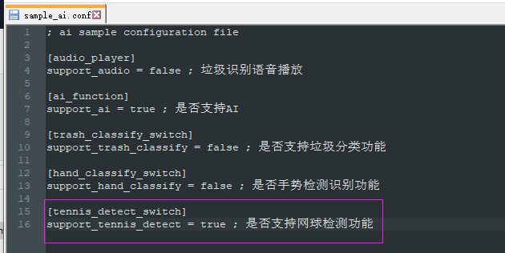

* 步骤2：再通过下面的挂载命令，把SD卡或者Windows的nfs共享目录挂载到开发板上

  * 方式1：SD卡：在开发板的终端执行下面的命令，将SD卡挂载到开发板上

  ```
  mount -t vfat /dev/mmcblk1p1 /mnt
  # 其中/dev/mmcblk1p1需要根据实际块设备号修改
  ```

  * 方式2：Windows的nfs共享目录：在开发板的终端执行下面的命令，将Windows的nfs共享路径挂载至开发板的mnt目录下

    ```
    mount -o nolock,addr=192.168.200.1 -t nfs 192.168.200.1:/d/nfs /mnt
    ```

* 步骤3：在开发板终端执行下面的命令，先将之前的sample_ai.conf文件删掉，以免产生冲突，将/mnt目录下的sample_ai.conf文件复制到userdata目录下。

```
rm /userdata/sample_ai.conf

cp /mnt/sample_ai.conf  /userdata
```


* 步骤4：在开发板终端执行下面的命令，进行网球检测sample的验证

```
cd  /userdata
./ohos_camera_ai_demo 2
```

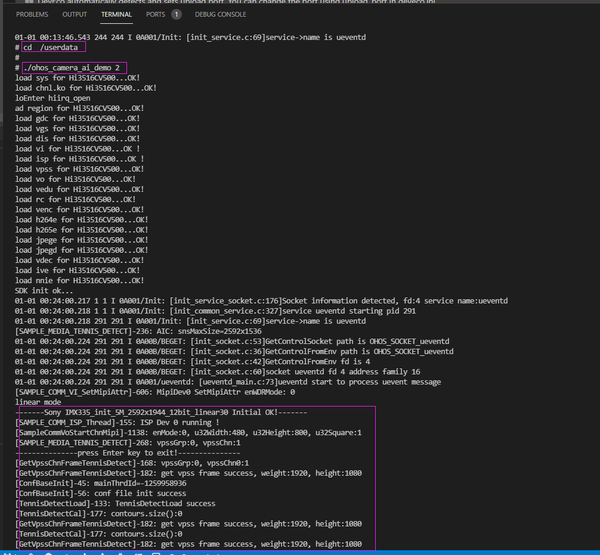

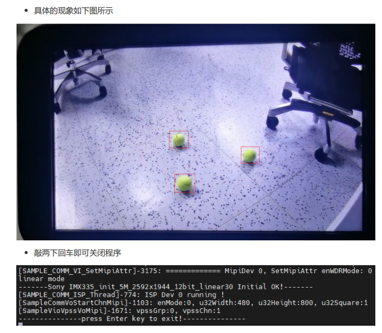
