## 5.5、附录

### 5.5.1、RuyiStudio工具的安装

* 在安装Ruyistudio之前，先配置一下依赖环境MinGW，访问[MinGW的软件包下载链接](https://www.123pan.com/s/iiMUVv-wIFLh)进行下载。

* 将下载好的mingw64.rar压缩包进行解压，然后把mingw64下的bin目录的绝对路径以及mingw64下的msys\bin\目录的绝对路径，配置到系统的环境变量里面。

  * 如下图所示，此电脑mingw64下的bin目录的绝对路径是``D:\RuyiStudio\mingw64\bin``,msys\bin\目录的绝对路径是``D:\RuyiStudio\mingw64\msys\bin``

  | 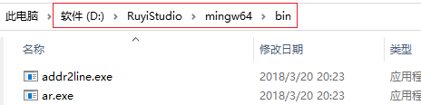 | 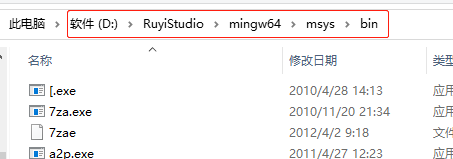 |
  | ----------------------------------------------------------- | ----------------------------------------------------------- |

  * 接下来是配置环境变量，打开您此电脑的属性，选择高级系统设置（不同操作系统的位置不太一样，这里自行上网查询），打开环境变量，双击打开系统变量的Path，然后将上面mingw的两个绝对路径添加到path的环境变量中，配置好后，一次点击确定进行配置的保存。

  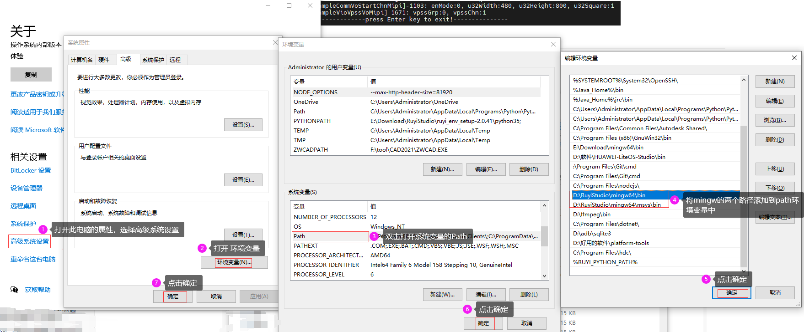

* 访问[RuyiStudio的下载链接](https://repo.harmonyos.com/#/cn/bundles/@huawei%2Fruyistudio/v/2.0.42)，下载RuyiStudio工具,并将下载的压缩包进行解压缩，里面会有一个RuyiStudio-2.0.41.zip的压缩包

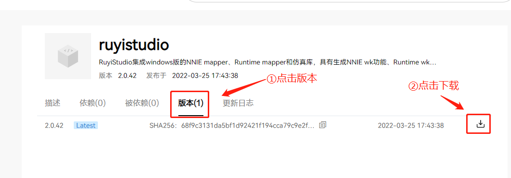

* 解压RuyiStudio-2.0.41.zip到本地目录，如下图所示：

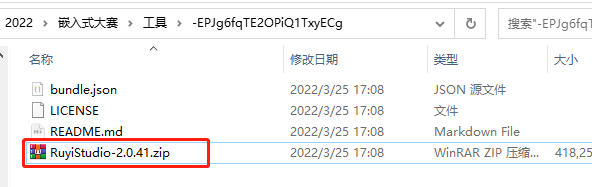

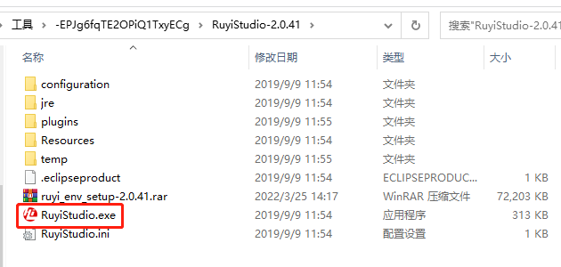

* 双击RuyiStudio.exe，打开Ruyi软件，如下图所示：

* Workspace一般采用默认即可，也可以自定义，点击Launch进入下一步。

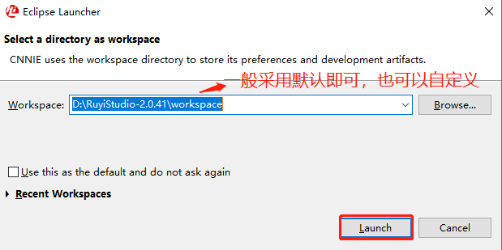

* 点击File-New-NNIE Project，新建一个NNIE工程，如下图所示：

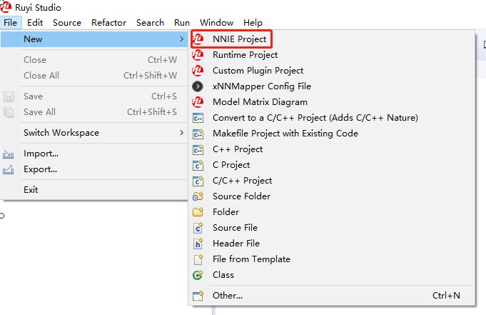

* 进入New NNIE Studio Project进行参数配置，Project_name：自主起一个工程名，如five_resnet18_trash_classify，SOC_Version选择芯片型号，本套件选择Hi3516DV300，Project type选择Makefile project-Empty Project，Toolchains选择Cross GCC，具体参考下图配置：

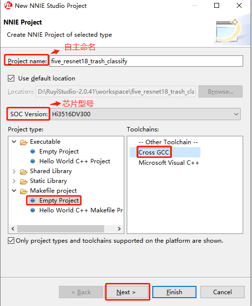

* 点击Next按钮，勾选Default，点击Finish，此时工程创建结束，如下图所示：

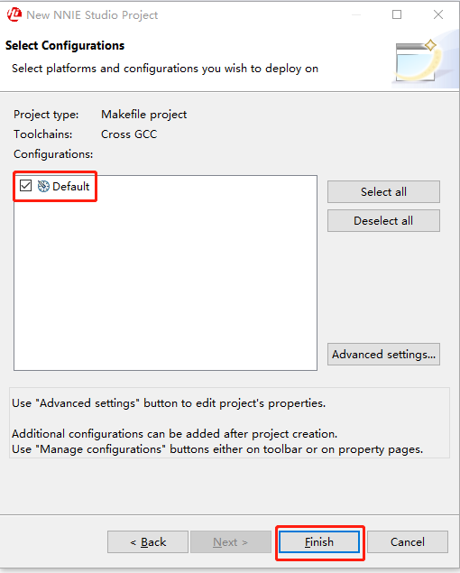

* 创建成功后，即可在Project Explorer显示该工程，如下图所示：

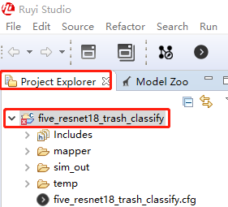


### 5.5.2、audio sample操作指导

#### 5.5.2.1、概述

audio sample是海思Hi3516DV300的SDK sample，本文以Taurus套件为例，audio sample详细介绍整个音频通路实现方式，从编码的角度引导开发者跑通Hi3516DV300的音频通路，并将MIC采集到音频数据保存到本地，并将本地的音频通过喇叭进行播放。

#### 5.5.2.2、目录

```shell
//device/soc/hisilicon/hi3516dv300/sdk_linux/sample/platform/audio
├── BUILD.gn                # 编译ohos audio  sample需要的gn文件
├── sample_audio.c          # ohos audio  sample主函数入口及具体的业务代码实现
└── adp                     # ohos audio  sample依赖的一些audio编解码的接口
    ├── audio_aac_adp.c
    ├── audio_aac_adp.h
    ├── audio_dl_adp.c
    └── audio_dl_adp.h
```

#### 5.5.2.3、编译

在编译vio sample之前，需要确保已经执行了 3.2.1章节的整编Taurus代码，以及3.2.2章节的Taurus镜像烧录的步骤，。在单编vio sample之前，需修改目录下的一处依赖，进入//device/soc/hisilicon/hi3516dv300/sdk_linux目录下，通过修改BUILD.gn，在deps下面新增target，``"sample/platform/audio:audio_sample"``，如下图所示：

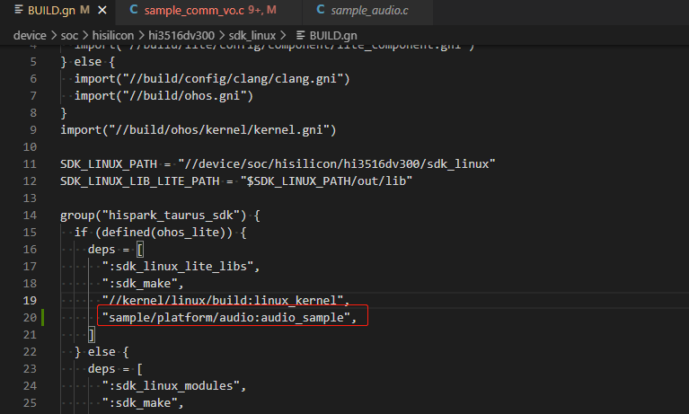

* 单编audio sample

* **方式一：使用Makefile的方式进行单编(速度会快很多)**

  * 在Ubuntu的命令行终端，分步执行下面的命令，单编 audio sample

  ```
  cd /home/openharmony/sdk_linux/sample/build
  
  make audio_clean && make audio
  ```

  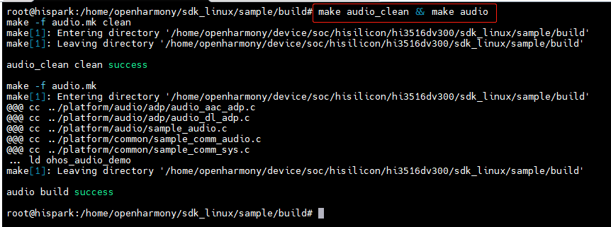

  * 在/home/openharmony/sdk_linux/sample/output目录下，会生成ohos_audio _demo可执行程序，如下图所示：

  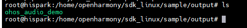

* **方式二：使用OpenHarmony的BUILD.gn方式进行单编**

  * 在Ubuntu的终端执行下面的命令，进行audio_sample的编译

  ```
  hb set  # 选择 ipcamera_hispark_taurus_linux
  
  hb build -T device/soc/hisilicon/hi3516dv300/sdk_linux/sample/platform/audio:audio_sample
  ```

  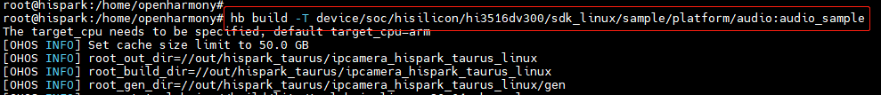

  * 编译成功后，即可在out/hispark_taurus/ipcamera_hispark_taurus_linux/rootfs/bin目录下，生成 ohos_audio _demo可执行文件，如下图所示

    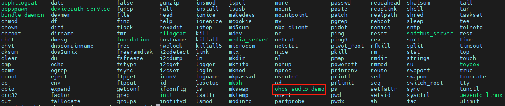

#### 5.5.2.4、拷贝可执行程序和依赖文件至开发板的mnt目录下

**方式一：使用SD卡进行资料文件的拷贝**

* 首先需要自己准备一张SD卡
* 步骤1：将编译后生成的可执行文件拷贝到SD卡中。

* 步骤2：将device\soc\hisilicon\hi3516dv300\sdk_linux\out\lib\目录下的**libvb_server.so和 libmpp_vbs.so**拷贝至SD卡中

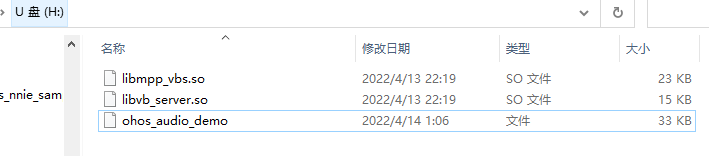

* 步骤3：可执行文件拷贝成功后，将内存卡插入开发板的SD卡槽中，可通过挂载的方式挂载到板端，可选择SD卡 mount指令进行挂载。
  * 在开发板的终端执行下面的命令，将SD卡挂载到开发板的/mnt目录下


```shell
mount -t vfat /dev/mmcblk1p1 /mnt
# 其中/dev/mmcblk1p1需要根据实际块设备号修改
```

* 挂载成功后，如下图所示：

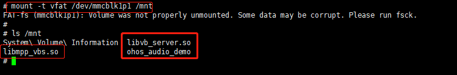

**方式二：使用NFS挂载的方式进行资料文件的拷贝**

* 首先需要自己准备一根网线
* 步骤1：参考[博客链接](https://blog.csdn.net/Wu_GuiMing/article/details/115872995?spm=1001.2014.3001.5501)中的内容，进行nfs的环境搭建

* 步骤2：将编译后生成的可执行文件拷贝到Windows的nfs共享路径下

* 步骤3：将device\soc\hisilicon\hi3516dv300\sdk_linux\out\lib\目录下的**libvb_server.so和 libmpp_vbs.so**拷贝至Windows的nfs共享路径下

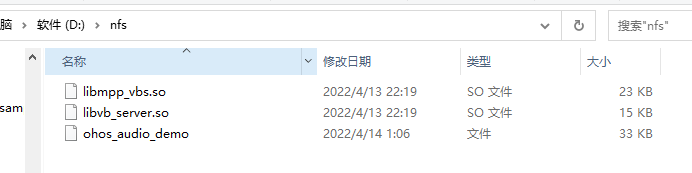

* 步骤4：在开发板的终端执行下面的命令，将Windows的nfs共享路径挂载至开发板的mnt目录下

```
mount -o nolock,addr=192.168.200.1 -t nfs 192.168.200.1:/d/nfs /mnt
```

#### 5.5.2.5、拷贝mnt目录下的文件至正确的目录下

* 在开发板的终端执行下面的命令，拷贝mnt目录下面的ohos_audio _demo至/userdata目录，拷贝mnt目录下面的libvb_server.so和 libmpp_vbs.so至/usr/lib/目录下

```
cp /mnt/ohos_audio_demo  /userdata
cp /mnt/*.so /usr/lib/
```

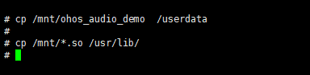

* 在开发板的终端执行下面的命令，给ohos_audio _demo文件可执行权限

```
chmod 777 /userdata/ohos_audio_demo
```

#### 5.5.2.6、功能验证

##### 5.5.2.6.1、验证Ai至Ao功能

* 加载成功后，即可在开发板的终端执行下面的命令，启动可执行文件，测试的时候，我们可以对着Taurus开发板的mic讲话，此时你发出的声音会从下方的喇叭播放出来。

```
cd /userdata

./ohos_audio_demo 0
```

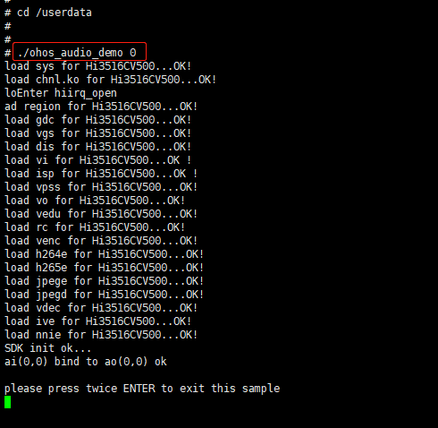

* Taurus开发板的mic位置图：

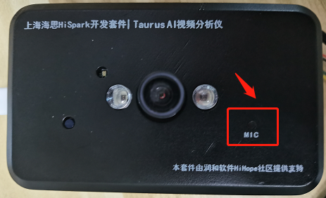

* Taurus开发板的喇叭位置图：

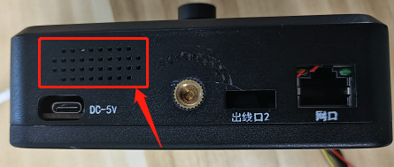

* 关于audio sample的退出，在终端敲两下回车即可

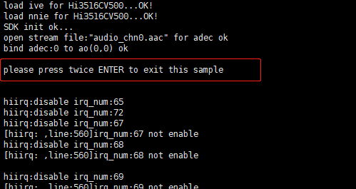

##### 5.5.2.6.2、验证保存音频文件至本地的功能

* 加载成功后，即可在开发板的终端执行下面的命令，启动可执行文件，测试的时候，我们可以对着Taurus开发板的mic讲话，此时你发出的声音会保存到开发板中。

```
cd /userdata

./ohos_audio_demo 1
```

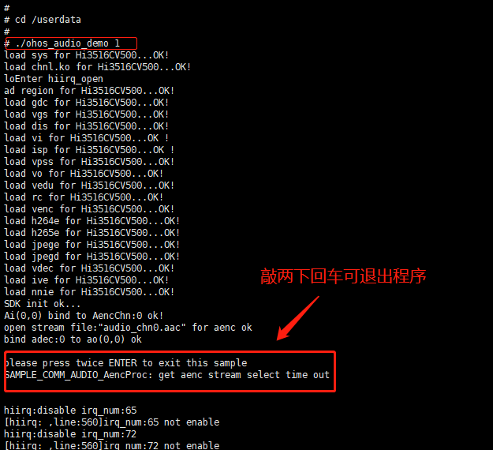

* 执行成功后，会在可执行文件的同级目录下生成一个audio_chn0.aac的音频文件

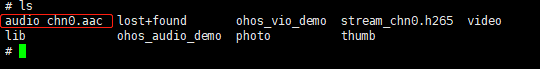

##### 5.5.2.6.3、验证播放本地音频的功能

* 加载成功后，即可在开发板的终端执行下面的命令，启动可执行文件，此时就会播放我们保存到开发板的audio_chn0.aac文件，注意这个audio.chn0.aac文件要和可执行文件在同一个目录下。
* 注意：此sample对audio.chn0.aac的参数有一定要求，如果您想播放自己的音频，具有可参考[博客链接来制作aac音频](https://blog.csdn.net/Wu_GuiMing/article/details/116425367)，然后把制作的音频文件重命名为audio_chn0.aac，再通过SD卡挂载或者nfs挂载的方式拷贝至开发板的指定路径下。这里就不再赘述如何拷贝aac文件了。可参考本文第5.5.2.4小节的内容。

```
cd /userdata

./ohos_audio_demo 2
```

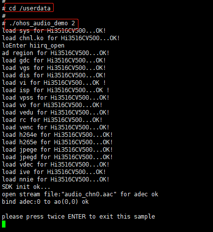


### 5.5.3、higv sample操作指导

#### 5.5.3.1、概述

* HiGV是一个轻量级的 GUI 系统，主要是为芯片平台提供统一的轻量级、高效、易用的 GUI解决方案，higv  sample是海思Hi3516DV300的SDK sample，本文以Taurus套件为例，higv  sample主要介绍了如何使用海思的HIGV进行UI应用程序设计。

* higv的开发工具可以访问[higvbuilder下载链接](https://repo.harmonyos.com/#/cn/bundles/@huawei%2Fhigvbuilder)进行下载。
* higv开发相关的参考文档可[访问链接](https://gitee.com/openharmony/device_soc_hisilicon/tree/master/hi3516dv300/sdk_linux/sample/doc)进行下载，主要包括《GVBuilderTool 使用指南.pdf》、《HiGV API参考.pdf》、《HiGV 开发指南.pdf》、《HiGV 标签 使用指南.pdf》。

#### 5.5.3.2、目录

```shell
//device/soc/hisilicon/hi3516dv300/sdk_linux/sample/platform/higv
├── app.c                # ohos higv sample主函数入口
├── button.c             #
├── BUILD.gn             # 编译ohos higv sample需要的gn文件
├── higv_cextfile.c      # 各回调函数的指针
├── higv_cextfile.h
├── higv_language.h
├── higv_mw_media.c      # 媒体组件初始化
├── higv_mw_media.h
├── image.c              # image控件的事件回调函数
├── label.c              # label控件的事件回调函数
├── listbox.c            # listbox控件的事件回调函数
├── README.md
├── sample_utils.h
├── scrollview.c         # scrollview控件的事件回调函数
├── include              # 程序所依赖的头文件
├── lib                  # 应用程序依赖的图片资源和字体资源
├── tool                 # 将xml转换成bin文件的工具
└── xml                  # 应用程序的UI布局
```

#### 5.5.3.3、代码修改

* 由于我的显示器是只支持1080P60帧，所以需要修改device/soc/hisilicon/hi3516dv300/sdk_linux/sample/platform/higv/目录下的higv_mw_media.c的**HI_MW_DISP_Open()**函数中的VO 输出配置，这个请根据自己的显示器支持的参数进行配置。

```c++
pubAttr.enIntfSync = VO_OUTPUT_1080P60; // 第259行的VO_OUTPUT_1080P30; 改成 VO_OUTPUT_1080P60;
```

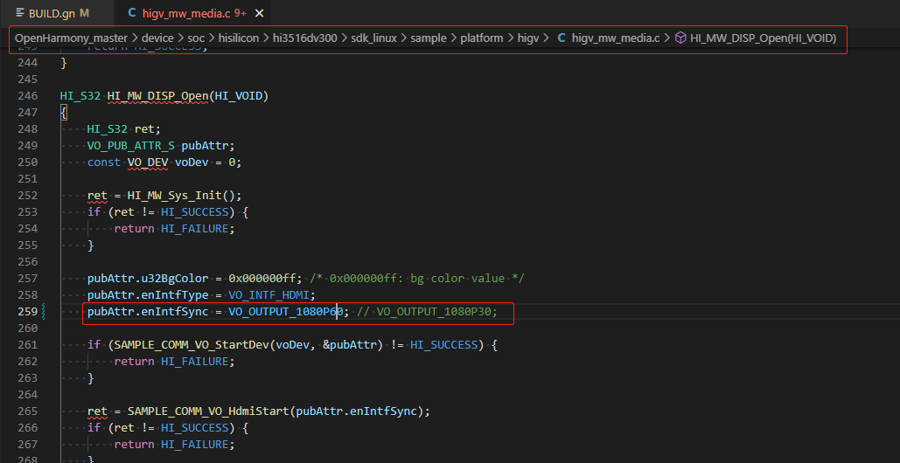

#### 5.5.3.4、编译

在编译higv sample之前，需要确保已经执行了 3.2.1章节的整编Taurus代码，以及3.2.2章节的Taurus镜像烧录的步骤，在单编higv sample之前，需修改目录下的一处依赖，进入//device/soc/hisilicon/hi3516dv300/sdk_linux目录下，通过修改BUILD.gn，在deps下面新增target，``"sample/platform/higv:higv_sample"``，如下图所示：

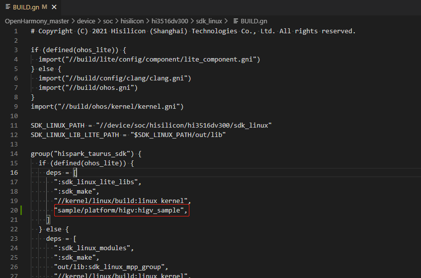

* 在Ubuntu的终端执行下面的命令，进入device\soc\hisilicon\hi3516dv300\sdk_linux\sample\platform\higv\xml\目录下，执行执行 make命令，生成higv.bin文件并自动更新higv_cextfile.c和higv_cextfile.c文件。

```
cd /home/openharmony/device/soc/hisilicon/hi3516dv300/sdk_linux/sample/platform/higv/xml

make clean && make
```

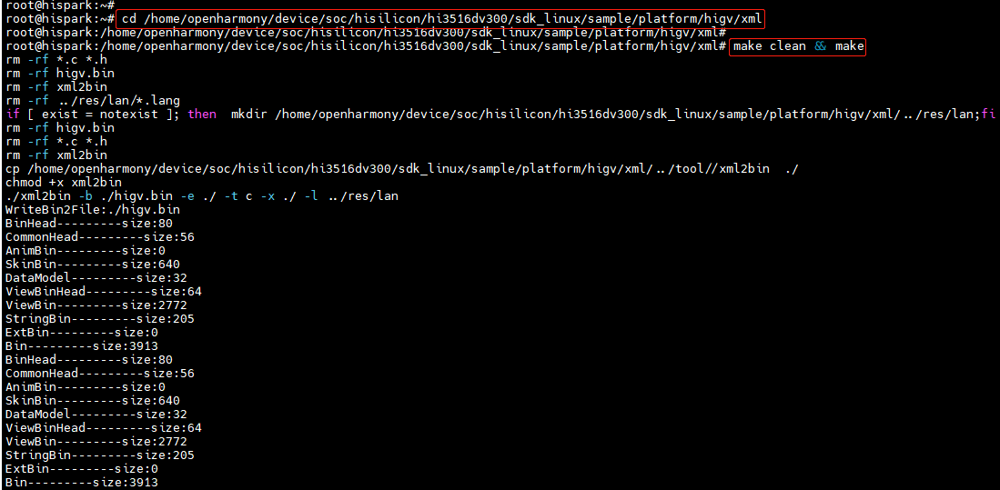

* 单编higv sample

* **方式一：使用Makefile的方式进行单编(速度会快很多)**

  * 在Ubuntu的命令行终端，分步执行下面的命令，单编 higv sample

  ```
  cd /home/openharmony/sdk_linux/sample/build
  
   make higv_clean && make higv
  ```

  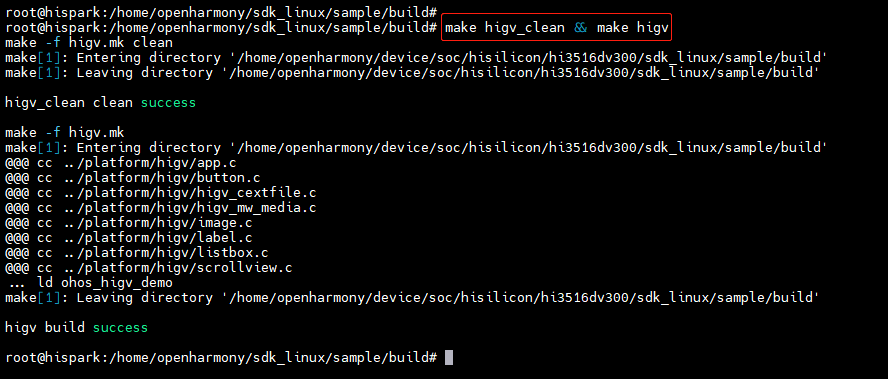

  * 在/home/openharmony/sdk_linux/sample/output目录下，会生成ohos_higv_demo可执行程序，如下图所示：

  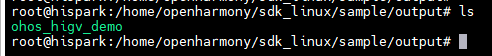

* **方式二：使用OpenHarmony的BUILD.gn方式进行单编**

  * 在Ubuntu的终端执行下面的命令，进行higv_sample的编译

  ```
  cd /home/openharmony
  
  hb set  # 选择 ipcamera_hispark_taurus_linux
  
  hb build -T device/soc/hisilicon/hi3516dv300/sdk_linux/sample/platform/higv:higv_sample
  ```

  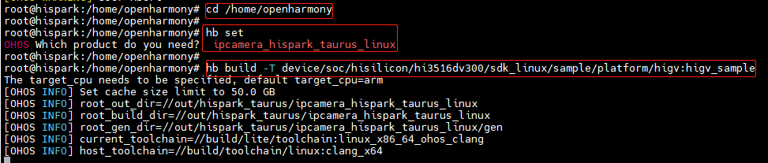

  * 编译成功后，即可在out/hispark_taurus/ipcamera_hispark_taurus_linux/rootfs/bin目录下，生成 ohos_higv _demo可执行文件，如下图所示:

    

#### 5.5.3.5、拷贝可执行程序和依赖文件至开发板的mnt目录下

**方式一：使用SD卡进行资料文件的拷贝**

* 首先需要自己准备一张SD卡
* 步骤1：将编译后生成的可执行文件拷贝到SD卡中。
* 步骤2：将device\soc\hisilicon\hi3516dv300\sdk_linux\out\lib\目录下的**libvb_server.so和 libmpp_vbs.so**拷贝至SD卡中
* 步骤3：拷贝依赖文件，将device\soc\hisilicon\hi3516dv300\sdk_linux\sample\platform\higv 目录下的higv.bin和**res**文件夹拷贝到SD卡中

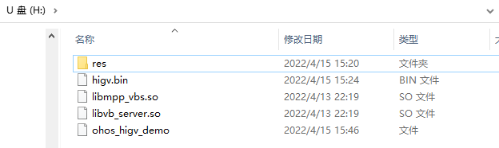

* 步骤4：可执行文件拷贝成功后，将内存卡插入开发板的SD卡槽中，可通过挂载的方式挂载到板端，可选择SD卡 mount指令进行挂载。
  * 在开发板的终端执行下面的命令，将SD卡挂载到开发板的/mnt目录下


```shell
mount -t vfat /dev/mmcblk1p1 /mnt
# 其中/dev/mmcblk1p1需要根据实际块设备号修改
```

* 挂载成功后，如下图所示：

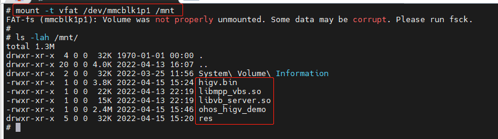

**方式二：使用NFS挂载的方式进行资料文件的拷贝**

* 首先需要自己准备一根网线
* 步骤1：参考[博客链接](https://blog.csdn.net/Wu_GuiMing/article/details/115872995?spm=1001.2014.3001.5501)中的内容，进行nfs的环境搭建
* 步骤2：将编译后生成的可执行文件拷贝到Windows的nfs共享路径下
* 步骤3：将device\soc\hisilicon\hi3516dv300\sdk_linux\out\lib\目录下的**libvb_server.so和 libmpp_vbs.so**拷贝至Windows的nfs共享路径下
* 步骤4：拷贝依赖文件，将device\soc\hisilicon\hi3516dv300\sdk_linux\sample\platform\higv 目录下的higv.bin和**res**文件夹拷贝到Windows的nfs共享路径下

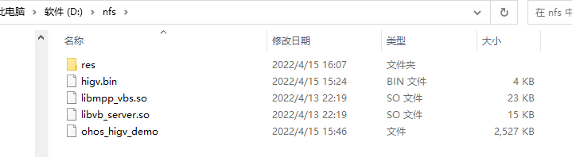

* 步骤5：在开发板的终端执行下面的命令，将Windows的nfs共享路径挂载至开发板的mnt目录下

```
mount -o nolock,addr=192.168.200.1 -t nfs 192.168.200.1:/d/nfs /mnt
```

#### 5.5.3.6、拷贝mnt目录下的文件至正确的目录下

* 在开发板的终端执行下面的命令，拷贝mnt目录下面的ohos_higv_demo至/userdata目录，拷贝mnt目录下面的libvb_server.so和 libmpp_vbs.so至/usr/lib/目录下

```
cp /mnt/ohos_higv_demo  /userdata

cp /mnt/*.so /usr/lib/

cp /mnt/higv.bin /userdata

cp /mnt/res /userdata -rf
```

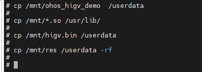

* 在开发板的终端执行下面的命令，给ohos_higv_demo文件可执行权限

```
chmod 777 /userdata/ohos_higv_demo
```

#### 5.5.3.7、功能验证

* 上述步骤完成后，需要将mini HDMI线一端接口Tauru套件的HDMI口（mini HDMI线需要开发者自行购买），另一端接显示器，接下来在开发板的终端执行下面的命令，启动可执行文件

```
cd /userdata

./ohos_higv_demo
```

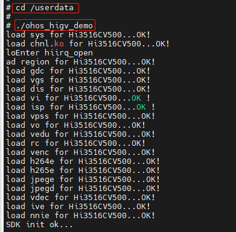

* 此时，通过HDMI线，在显示器上面显示higv的应用程序的UI界面，如下图所示：

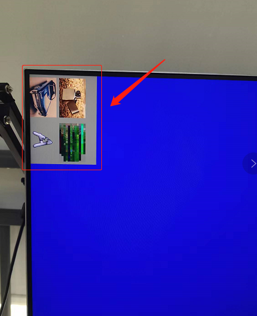

* 输入quit或q，然后敲回车即可关闭程序

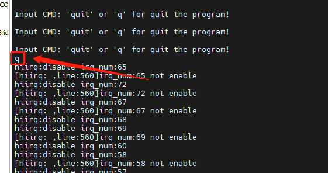


### 5.5.4、vio sample操作指导

#### 5.5.4.1、 概述

vio  sample是海思Hi3516DV300的SDK sample，本文以Taurus套件为例，vio sample详细介绍Sensor通过HDMI在显示屏的整个视频通路实现方式，从编码的角度引导开发者跑通Hi3516DV300的媒体通路，并将视频流通过HDMI显示到显示屏上。

#### 5.5.4.2、目录

```shell
//device/soc/hisilicon/hi3516dv300/sdk_linux/sample/platform/vio
├── BUILD.gn                # 编译ohos vio sample需要的gn文件
├── sample_vio_main.c       # ohos vio sample主函数入口
├── sample_vio.h            # ohos vio sample所需的头文件
└── smp
    └── sample_vio.c        # ohos vio sample业务代码
```

#### 5.5.4.3、代码修改

由于我的显示器是只支持1080P60帧，所以需要修改device/soc/hisilicon/hi3516dv300/sdk_linux/sample/platform/common/目录下的sample_comm_vo.c的**SAMPLE_COMM_VO_GetDefConfig()**函数中的VO 输出配置，这个请根据自己的显示器支持的参数进行配置。

```c++
pstVoConfig->enIntfSync = VO_OUTPUT_1080P60; // 第483行的VO_OUTPUT_1080P30; 改成 VO_OUTPUT_1080P60;
```

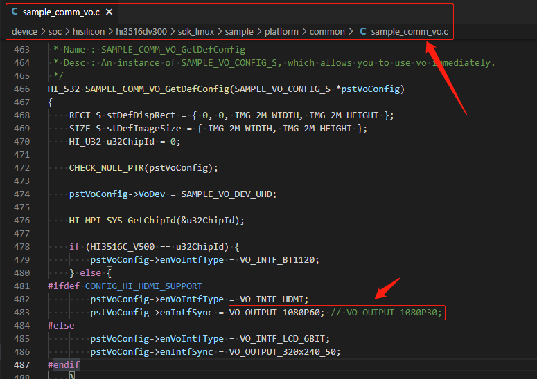

#### 5.5.4.4、 编译

在编译vio sample之前，需要确保已经执行了 3.2.1章节的整编Taurus代码，以及3.2.2章节的Taurus镜像烧录的步骤，在单编vio sample之前，需修改目录下的一处依赖，进入//device/soc/hisilicon/hi3516dv300/sdk_linux目录下，通过修改BUILD.gn，在deps下面新增target，``"sample/platform/vio:vio_sample"``，如下图所示：

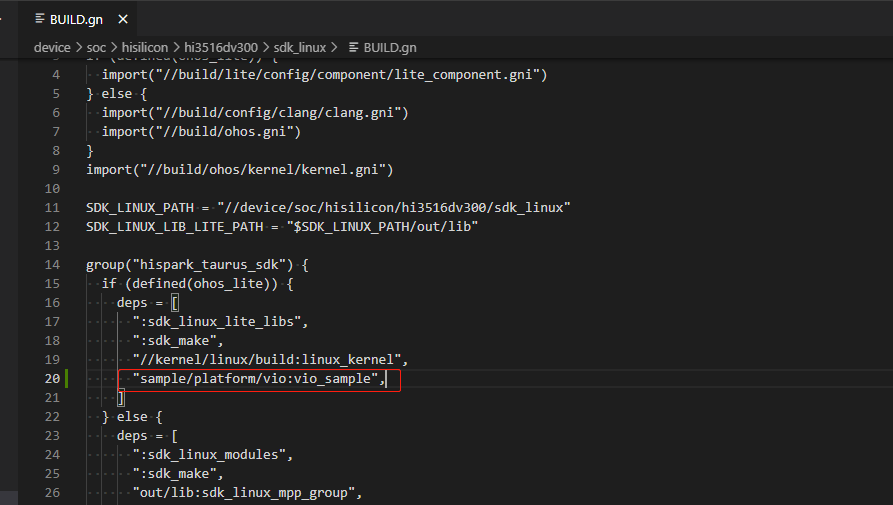

* 单编vio sample

* **方式一：使用Makefile的方式进行单编(速度会快很多)**

  * 在Ubuntu的命令行终端，分步执行下面的命令，单编 vio sample

  ```
  cd /home/openharmony/sdk_linux/sample/build
  
   make vio_clean && make vio
  ```

  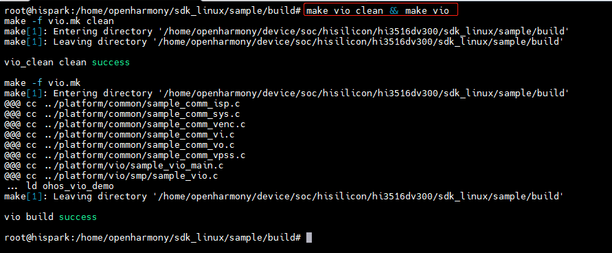

  * 在/home/openharmony/sdk_linux/sample/output目录下，会生成ohos_vio_demo可执行程序，如下图所示：

  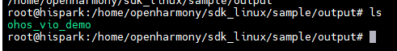

* **方式二：使用OpenHarmony的BUILD.gn方式进行单编**

  * 在Ubuntu的终端执行下面的命令，进行vio_sample的编译

  ```
  cd /home/openharmony
  
  hb set  # 选择 ipcamera_hispark_taurus_linux
  
  hb build -T device/soc/hisilicon/hi3516dv300/sdk_linux/sample/platform/vio:vio_sample
  ```

  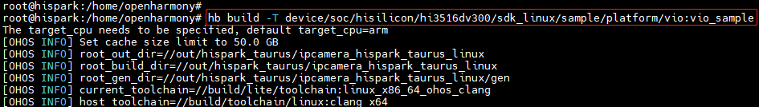

  * 编译成功后，即可在out/hispark_taurus/ipcamera_hispark_taurus_linux/rootfs/bin目录下，生成 ohos_vio _demo可执行文件，如下图所示：

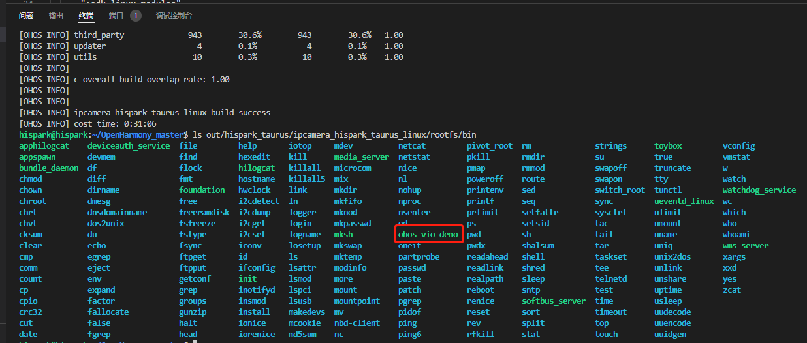

#### 5.5.4.5、 拷贝可执行程序和依赖文件至开发板的mnt目录下

**方式一：使用SD卡进行资料文件的拷贝**

* 首先需要自己准备一张SD卡
* 步骤1：将编译后生成的可执行文件拷贝到SD卡中。

* 步骤2：将device\soc\hisilicon\hi3516dv300\sdk_linux\out\lib\目录下的**libvb_server.so和 libmpp_vbs.so**拷贝至SD卡中

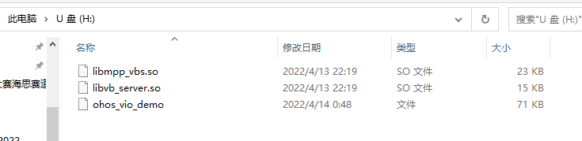


* 步骤3：可执行文件拷贝成功后，将内存卡插入开发板的SD卡槽中，可通过挂载的方式挂载到板端，可选择SD卡 mount指令进行挂载。
  * 在开发板的终端执行下面的命令，将SD卡挂载到开发板的/mnt 目录下


```shell
mount -t vfat /dev/mmcblk1p1 /mnt
# 其中/dev/mmcblk1p1需要根据实际块设备号修改
```

* 挂载成功后，如下图所示：

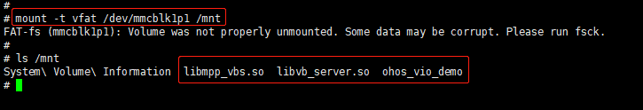

**方式二：使用NFS挂载的方式进行资料文件的拷贝**

* 首先需要自己准备一根网线
* 步骤1：参考[博客链接](https://blog.csdn.net/Wu_GuiMing/article/details/115872995?spm=1001.2014.3001.5501)中的内容，进行nfs的环境搭建

* 步骤2：将编译后生成的可执行文件拷贝到Windows的nfs共享路径下

* 步骤3：将device\soc\hisilicon\hi3516dv300\sdk_linux\out\lib\目录下的**libvb_server.so和 libmpp_vbs.so**拷贝至Windows的nfs共享路径下

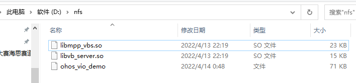

* 步骤4：在开发板的终端执行下面的命令，将Windows的nfs共享路径挂载至开发板的mnt目录下

```
mount -o nolock,addr=192.168.200.1 -t nfs 192.168.200.1:/d/nfs /mnt
```

#### 5.5.4.6、拷贝mnt目录下的文件至正确的目录下

* 在开发板的终端执行下面的命令，拷贝mnt目录下面的ohos_vio_demo至/userdata目录，拷贝mnt目录下面的libvb_server.so和 libmpp_vbs.so至/usr/lib/目录下

```
cp /mnt/ohos_vio_demo  /userdata
cp /mnt/*.so /usr/lib/
```

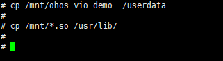

* 在开发板的终端执行下面的命令，给ohos_vio_demo文件可执行权限

```
chmod 777 /userdata/ohos_vio_demo
```

#### 5.5.4.7、 功能验证

* 上述步骤完成后，需要将mini HDMI线一端接口Tauru套件的HDMI口（mini HDMI线需要开发者自行购买），另一端接显示器，接下来在开发板的终端执行下面的命令，启动可执行文件。

```
cd /userdata

./ohos_vio_demo 0
```

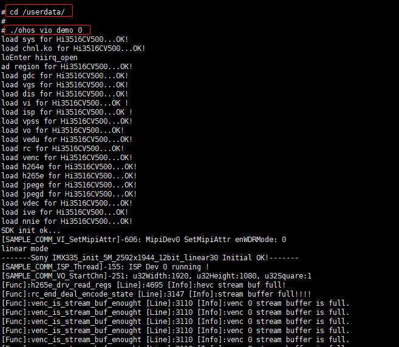

* 此时，通过HDMI在显示屏幕上即可出现实时码流，如下图所示：

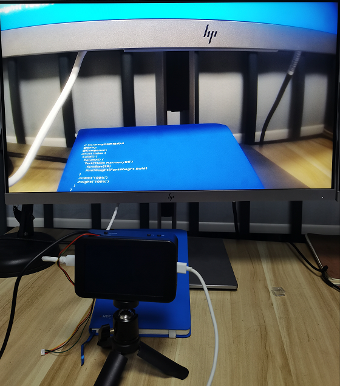

* 敲两下回车即可关闭程序

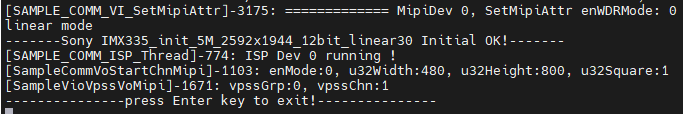

### 5.5.5、store_sample操作指导

#### 5.5.5.1、概述

store_sample基于OpenHarmony 小型系统开发，以Taurus套件为例，store_sample主要是介绍如何使用Taurus套件，通过Sensor采集视频数据，并将采集到的视频数据保存为H264文件至开发板中，开发者将H264码流解码成mp4码流，即可用于后面数据集的制作。

#### 5.5.5.2、目录

```shell
//device/soc/hisilicon/hi3516dv300/sdk_linux/sample/taurus/store_sample
├── BUILD.gn                 # 编译ohos store_sample需要的gn文件
├── sample_store_main.c      # ohos store_sample主函数入口
└── smp
    ├── sample_store.c        # ohos store_sample业务代码
    └── sample_store.h        # ohos store_sample业务代码所需的头文件
```

#### 5.5.5.3、编译

在编译store_sample之前，需要确保已经执行了 3.2.1章节的整编Taurus代码，以及3.2.2章节的Taurus镜像烧录的步骤，在单编store_sample之前，需修改目录下的一处依赖，进入//device/soc/hisilicon/hi3516dv300/sdk_linux目录下，通过修改BUILD.gn，在deps下面新增target，``"sample/taurus/store_sample:hi3516dv300_store_sample"``，如下图所示：

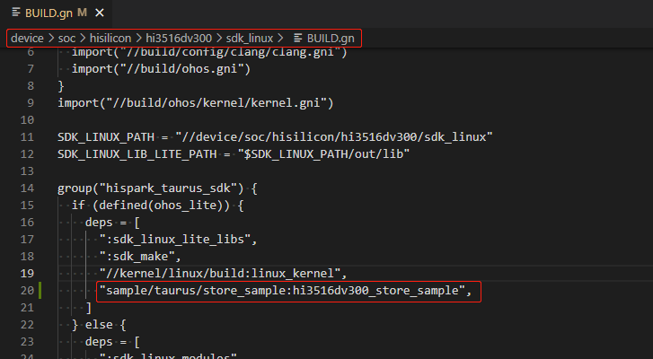

* 单编store sample

* **方式一：使用Makefile的方式进行单编(速度会快很多)**

  * 在Ubuntu的命令行终端，分步执行下面的命令，单编 vio sample

  ```
  cd /home/openharmony/sdk_linux/sample/build
  
  make store_sample_clean && make store_sample
  ```

  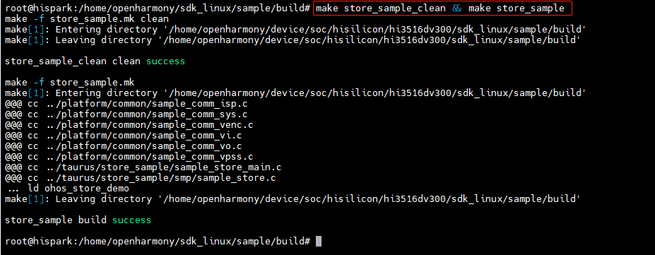

  * 在/home/openharmony/sdk_linux/sample/output目录下，会生成ohos_store_demo可执行程序，如下图所示：

  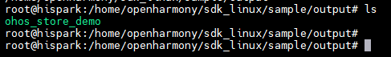

* **方式二：使用OpenHarmony的BUILD.gn方式进行单编**

  * 在Ubuntu的终端执行下面的命令，进行store_sample的编译

  ```
  hb set  # 选择 ipcamera_hispark_taurus_linux
  
  hb build -T device/soc/hisilicon/hi3516dv300/sdk_linux/sample/taurus/store_sample:hi3516dv300_store_sample
  ```

  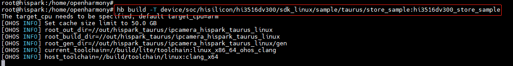

  * 编译成功后，即可在out/hispark_taurus/ipcamera_hispark_taurus_linux/rootfs/bin目录下，生成 ohos_store_demo可执行文件，如下图所示：

  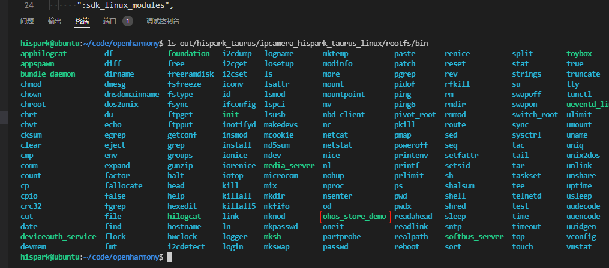

#### 5.5.5.4、拷贝可执行程序和依赖文件至开发板的mnt目录下

**方式一：使用SD卡进行资料文件的拷贝**

* 首先需要自己准备一张SD卡

* 步骤1：将编译后生成的可执行文件拷贝到SD卡中。

* 步骤2：将device\soc\hisilicon\hi3516dv300\sdk_linux\out\lib\目录下的**libvb_server.so和 libmpp_vbs.so**拷贝至SD卡中

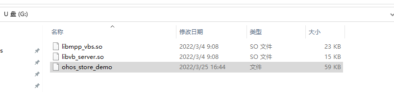

* 步骤3：可执行文件拷贝成功后，将内存卡插入开发板的SD卡槽中，可通过挂载的方式挂载到板端，可选择SD卡 mount指令进行挂载。
  * 在开发板的终端执行下面的命令，将SD卡挂载到开发板的/mnt目录下


```shell
mount -t vfat /dev/mmcblk1p1 /mnt
# 其中/dev/mmcblk1p1需要根据实际块设备号修改
```

* 挂载成功后，如下图所示：

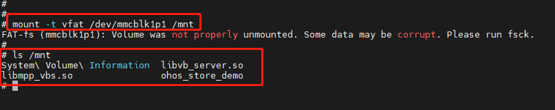

**方式二：使用NFS挂载的方式进行资料文件的拷贝**

* 首先需要自己准备一根网线
* 步骤1：参考[博客链接](https://blog.csdn.net/Wu_GuiMing/article/details/115872995?spm=1001.2014.3001.5501)中的内容，进行nfs的环境搭建

* 步骤2：将编译后生成的可执行文件拷贝到Windows的nfs共享路径下

* 步骤3：将device\soc\hisilicon\hi3516dv300\sdk_linux\out\lib\目录下的**libvb_server.so和 libmpp_vbs.so**拷贝至Windows的nfs共享路径下

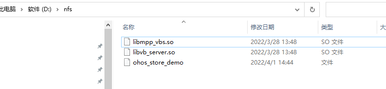

* 步骤4：依赖文件拷贝至Windows的nfs共享路径下后，在开发板的终端执行下面的命令，将Windows的nfs共享路径挂载至开发板的mnt目录下

```
mount -o nolock,addr=192.168.200.1 -t nfs 192.168.200.1:/d/nfs /mnt
```

#### 5.5.5.5、拷贝mnt目录下的文件至正确的目录下

* 在开发板的终端执行下面的命令，拷贝mnt目录下面的ohos_store_demo至/userdata目录，拷贝mnt目录下面的libvb_server.so和 libmpp_vbs.so至/usr/lib/目录下

```
cp /mnt/ohos_store_demo /userdata
cp /mnt/*.so /usr/lib/
```

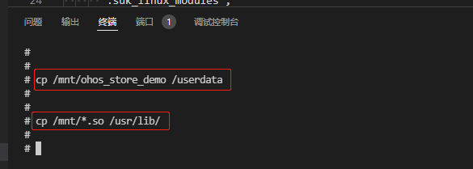

* 在开发板的终端执行下面的命令，给ohos_store_demo文件可执行权限

```
chmod 777 /userdata/ohos_store_demo
```

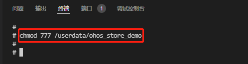

#### 5.5.5.6、功能验证

* 在开发板的终端执行下面的命令，启动可执行文件

```
cd /userdata

./ohos_store_demo
```

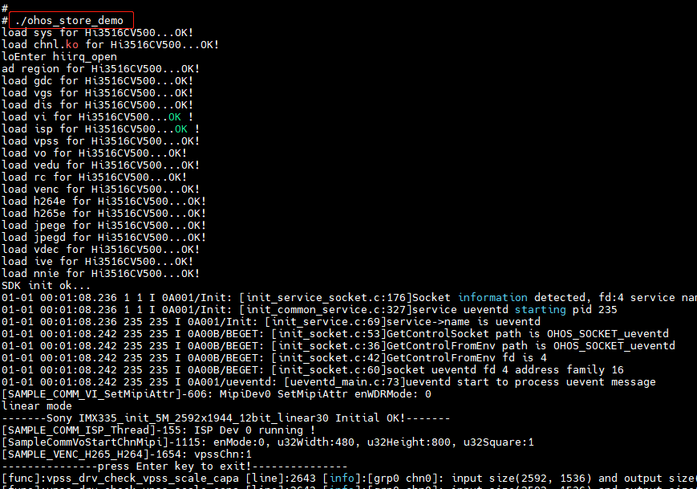

* 我们使用这个sample，主要是为了用开发板录制一些视频素材，来制作我们的训练数据集，当视频录制OK后，可以在开发板的终端敲两下回车，停止程序运行。
* 通过在开发板终端执行 **ls ** 命令可以查看当前目录下生成了一个stream_chn1.h264的视频文件。

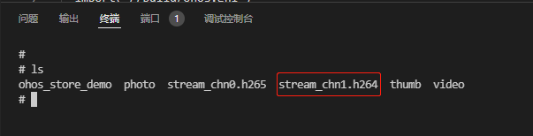

* 可以通过执行cp命令，将生成的视频文件拷贝到SD卡或者nfs共享目录中，进行后面的其他处理（视频转成图片，然后进行数据标注，模型训练等操作）。

```
cp stream_chn1.h264 /mnt
```

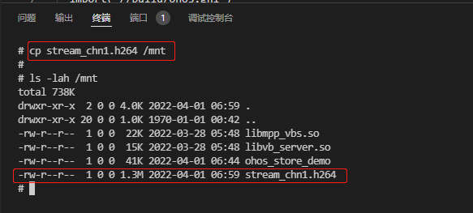