# 第六章：Taurus & Pegasus套件互联

## 6.1、串口互联方式

### 6.1.1、串口互联的原理

串口通信是一种串行异步通信，通信双方以字符帧作为数据传输单位，字符帧按位依次传输，每个位占固定的时间长度。两个字符帧之间的传输时间间隔可以是任意的，即传输完一个字符帧之后，可以间隔任意时间再传输下一个字符帧。

**字符帧**

字符帧由四个部分构成，分别是起始位、数据位、校验位以及停止位。起始位占1位，为逻辑0。数据位占5 ~ 8位，可配置。校验位占1位，可配置为奇校验、偶校验、无校验；配置为无校验时字符帧不包含校验位；配置为奇校验时，数据位中逻辑1的个数为奇数时，校验位的值为逻辑0，否则为逻辑1；配置为偶校验时，数据位中逻辑1的个数为偶数时，校验位的值为逻辑0，否则为逻辑1。停止位占1/1.5/2位，可配置，停止位的值为逻辑1。常用的字符帧格式如下图1.1所示，1位起始位、8位数据位、1位校验位、1位停止位。

**波特率**

字符帧是按位依次传输，波特率即传输字符帧时的位速率，单位为bit/s。通信双方要使用相同的波特率，常用的波特率如9600、115200。

**UART**

UART是通用异步收发器（Universal Asynchronous Receiver/Transmitter）的简称，它是设备实现串口通信的核心部件。UART由发送器、接收器、波特率发生器组成，发送器由发送保持寄存器、发送移位寄存器、控制逻辑构成，接收器由接收保持寄存器、接收移位寄存器、控制逻辑构成。发送数据时，应用程序将字节数据写入发送保持寄存器，发送移位寄存器每次向右移动一位，将数据一位一位发送出去。接收数据时，每接收一位数据后，接收移位寄存器向左移动一位，直到接收一个字节数据为止，应用程序通过读取接收保持寄存器来获取接收的字节数据。波特率发生器用于产生接收和发送数据时所使用的波特率。Hi3861V100、Hi3516DV300等芯片的内部都集成了UART，两个芯片进行串口通信时，可将一个芯片的TX、RX引脚分别与另一个芯片的RX、TX引脚相连，如下图所示。

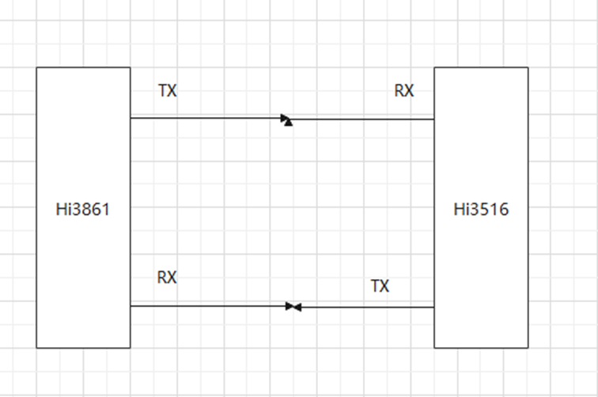

### 6.1.2、pegasus端串口开发验证

#### 6.1.2.1、程序框图

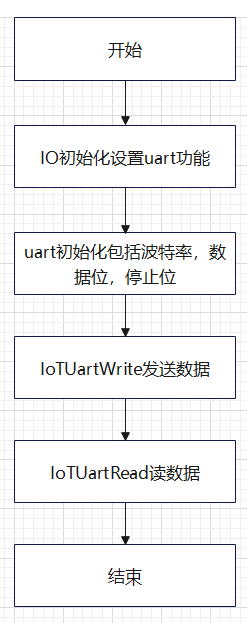

#### 6.1.2.2、接口说明

* IoTUartInit()

| **定义：**   | unsigned   int IoTUartInit(unsigned int id, const IotUartAttribute *param); |
| ------------ | ------------------------------------------------------------ |
| **功能：**   | 初始化指定的UART端口                                         |
| **参数：**   | id：表示UART设备的端口号   <br/>param：表示指向UART属性的指针 |
| **返回值：** | IOT_SUCCESS：初始化成功    IOT_FAILURE：初始化失败           |
| **依赖：**   | //base/iot_hardware/peripheral/interfaces/kits/iot_uart.h    |

* IoTUartRead()

| 定义：       | int   IoTUartRead(unsigned int id, unsigned char *data, unsigned int dataLen); |
| ------------ | ------------------------------------------------------------ |
| **功能：**   | 从UART设备中读取指定长度的数据                               |
| **参数：**   | id：表示UART设备的端口号   <br/>data：表示指向要读取数据的起始地址的指针   <br/>dataLen：表示要读取的字节数 |
| **返回值：** | 数据读取成功：返回成功读取的字节数    数据读取失败：返回 -1  |
| **依赖：**   | //base/iot_hardware/peripheral/interfaces/kits/iot_uart.h    |

* IoTUartWrite()

| 定义：       | int   IoTUartWrite(unsigned int id, const unsigned char *data, unsigned int   dataLen); |
| ------------ | ------------------------------------------------------------ |
| **功能：**   | 将指定长度的数据写入UART设备                                 |
| **参数：**   | id：表示UART设备的端口号   <br/>data：表示指向要写入的数据的起始地址的指针   <br/>dataLen：表示要写入的字节数 |
| **返回值：** | 数据写入成功：返回成功写入的字节数    数据写入失败：返回 -1  |
| **依赖：**   | //base/iot_hardware/peripheral/interfaces/kits/iot_uart.h    |

* IoTUartDeinit()

| **定义：**   | unsigned   int IoTUartDeinit(unsigned int id);            |
| ------------ | --------------------------------------------------------- |
| **功能：**   | 去初始化指定的UART端口                                    |
| **参数：**   | id：表示UART设备的端口号                                  |
| **返回值：** | IOT_SUCCESS：去初始化成功   IOT_FAILURE：去初始化失败     |
| **依赖：**   | //base/iot_hardware/peripheral/interfaces/kits/iot_uart.h |

#### 6.1.2.3、实验流程

* 步骤1：将vendor/hisilicon/hispark_pegasus/demo/uart_demo文件夹复制到applications/sample/wifi-iot/app/目录下。

* 步骤2：修改applications/sample/wifi-iot/app/目录下的BUILD.gn，在features字段中添加uart_demo: uart_control。注：第一个uart_demo指的是需要编译的工程目录，第二个uart_control指的是applications/sample/wifi-iot/app/uart_demo/BUILD.gn文件中的静态库，名称为uart_control。

```c
import("//build/lite/config/component/lite_component.gni")

lite_component("app") {
  features = [ "uart_demo:uart_control",]
}
```

- 步骤3：修改device/hisilicon/hispark_pegasus/sdk_liteos/build/config/usr_config.mk文件。在这个配置文件中打开UART驱动宏。搜索字段CONFIG_UART1_SUPPORT ，并打开UART1。配置如下：

  ```
  # CONFIG_UART1_SUPPORT is not set
  CONFIG_UART1_SUPPORT =y
  ```

- 步骤4：代码编译和镜像烧录

  - HiSpark Pegasus 代码的编译和镜像烧录都是一样的操作，**参考 4.2.1.4章节**的内容即可。

- 步骤5:功能验证

  方式1:硬件接线:使用外设扩展板,用跳线帽或者杜邦线将TX,RX引脚连接,（引脚IO为GPIO 0, GPIO 1）

  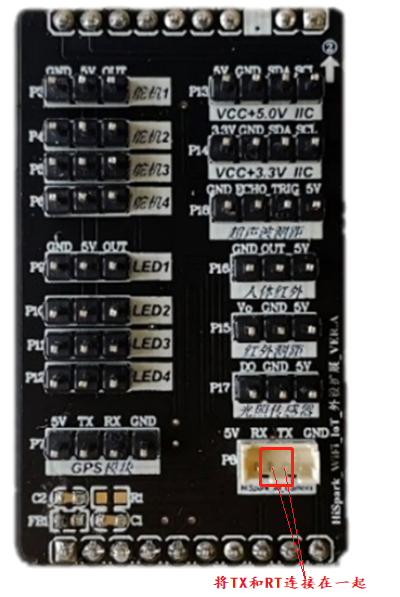

  方式2:硬件接线:使用机器人板,用跳线帽或者杜邦线将TX,RX引脚连接,（引脚IO为GPIO 5, GPIO 6,注意:由于硬件烧录配置字的原因,在烧录前,将TX,RX不要连接在一起,等烧录完成复位后,在连接在一起）

  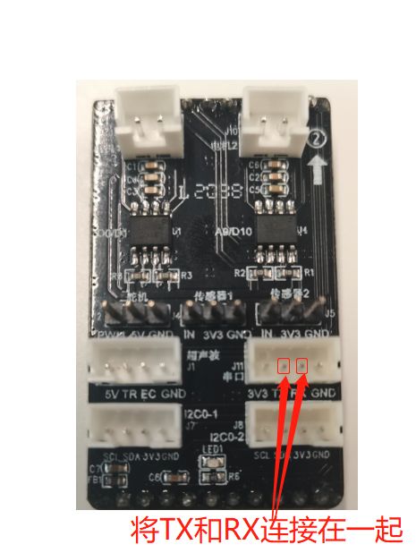

- 步骤6：目前代码只提供外设扩展板,如果需要使用机器人扩展板,请自己根据程序框图修改uart初始化IO设置uart功能这一流程，将GPIO0,GPIO1替换成GPIO5和GPIO6。软件烧录成功后，打开串口工具，按一下开发板的RESET按键复位开发板，可以看到串口打印出来了写入UART1的数。实验结果：

  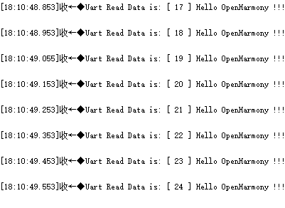

* 下图为如果您使用机器人扩展板进行验证的话，需要修改的代码位置。

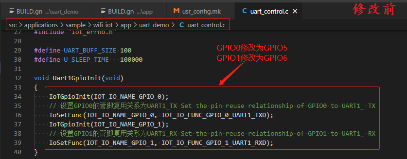

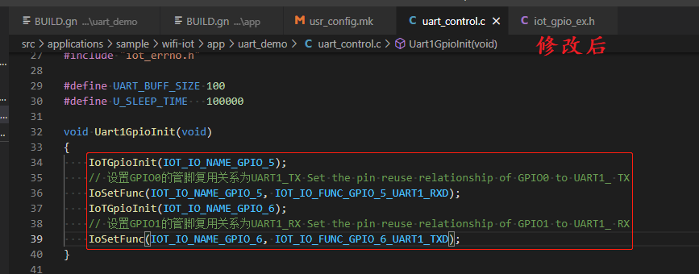

### 6.1.3、Taurus端串口开发验证

#### 6.1.3.1、程序框图

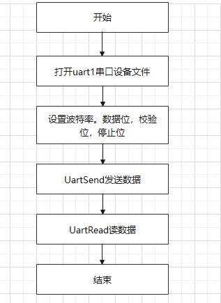

#### 6.1.2.2、接口说明

* UartOpenInit()

| **定义：**   | unsigned int UartOpenInit(void);                   |
| ------------ | -------------------------------------------------- |
| **功能：**   | 打开uart串口设备文件                               |
| **返回值：** | IOT_SUCCESS：初始化成功    IOT_FAILURE：初始化失败 |

* Uart1Config()

| 定义：       | int Uart1Config(int fd)            |
| ------------ | ---------------------------------- |
| **功能：**   | 配置波特率，数据位，标志位，停止位 |
| **参数：**   | fd:文件描述符                      |
| **返回值：** | 设置成功：0    设置失败：返回 -1   |

* UartSend()

| 定义：       | int UartSend(int fd, char *buf, int len);                    |
| ------------ | ------------------------------------------------------------ |
| **功能：**   | 将指定长度的数据写入UART设备                                 |
| **参数：**   | fd：文件描述符   <br/>buf：表示指向要写入的数据的起始地址的指针   <br/>len：表示要写入的字节数<br |
| **返回值：** | 数据写入成功：返回成功写入的字节数    数据写入失败：返回 -1  |

* UartRead()

| **定义：**   | int UartRead(int uartFd, char *buf, int len, int timeoutMs)  |      |
| ------------ | ------------------------------------------------------------ | ---- |
| **功能：**   | 从UART设备中读取指定长度的数据                               |      |
| **参数：**   | fd：文件描述符   <br/>buf：表示指向要读取数据的起始地址的指针   <br/>len：表示要读出的字节数  fd：文件描述符   <br/> timeoutMs：表示非阻塞读数据时间 |      |
| **返回值：** | 数据读取成功：返回成功读取的字节数    数据读取失败：返回 -1  |      |

#### 6.1.2.3、实验流程

* 步骤1：进入//device/soc/hisilicon/hi3516dv300/sdk_linux目录下，通过修改BUILD.gn，在deps下面新增target，`"sample/taurus/uart_sample:hi3516dv300_uart_sample"`。如下图所示。

  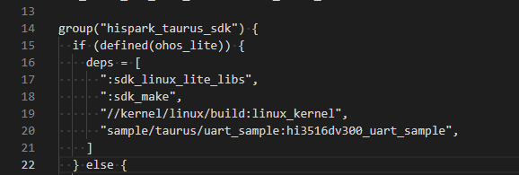

- 步骤2：单编uart sample

- **方式一：使用Makefile的方式进行单编(速度会快很多)**

  * 在Ubuntu的命令行终端，分步执行下面的命令，单编 uart sample

  ```
  cd /home/openharmony/sdk_linux/sample/build
  
  make uart_sample_clean && make uart_sample
  ```

  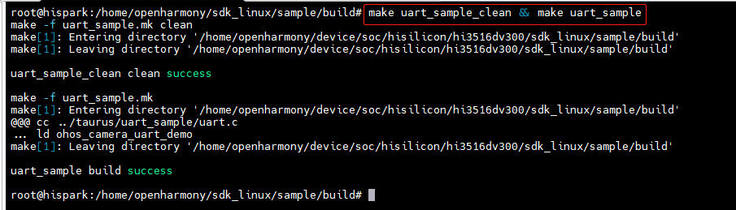

  * 在/home/openharmony/sdk_linux/sample/output目录下，会生成ohos_camera_uart_demo可执行程序，如下图所示：

  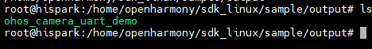

* **方式二：使用OpenHarmony的BUILD.gn方式进行单编**

  * 在Ubuntu的终端执行下面的命令，进行uart_sample的编译

  ```
  hb set  # 选择 ipcamera_hispark_taurus_linux
  
  hb build -T device/soc/hisilicon/hi3516dv300/sdk_linux/sample/taurus/uart_sample:hi3516dv300_uart_sample
  ```

  * 编译成功后，即可在out/hispark_taurus/ipcamera_hispark_taurus_linux/rootfs/bin目录下，生成 ohos_camera_uart_demo可执行文件。

* 步骤3：可执行文件挂载开发板

  **方式一：使用SD卡进行资料文件的拷贝**

	* 1.首先需要自己准备一张SD卡
  
	* 2.将编译后生成的可执行文件，拷贝到SD卡目录下
  
	* 3.可执行文件拷贝成功后，将内存卡插入开发板的SD卡槽中，可通过挂载的方式挂载到板端，可选择SD卡 mount指令进行挂载。
  
    * 在开发板的终端执行下面的命令，将SD卡挂载到开发板的 /mnt目录下
  
    ```sh
    mount -t vfat /dev/mmcblk1p1 /mnt
    # 其中/dev/mmcblk1p1需要根据实际块设备号修改
    ```
  
  * 4.挂载成功后，如下图所示： 

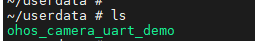

* **方式二：使用NFS挂载的方式进行资料文件的拷贝**

  * 1.首先需要自己准备一根网线

  * 2.参考[博客链接](https://gitee.com/link?target=https%3A%2F%2Fblog.csdn.net%2FWu_GuiMing%2Farticle%2Fdetails%2F115872995%3Fspm%3D1001.2014.3001.5501)中的内容，进行nfs的环境搭建

  * 3.将编译后生成的可执行文件拷贝到Windows的nfs共享路径下

  * 4.在开发板的终端执行下面的命令，将Windows的nfs共享路径挂载至开发板的mnt目录下

  ```sh
  mount -o nolock,addr=192.168.200.1 -t nfs 192.168.200.1:/d/nfs /mnt
  ```

  * 5.拷贝mnt目录下的文件至正确的目录下

* 步骤4: 在开发板的终端执行下面的命令，拷贝mnt目录下面的ohos_helloworld_demo至根目录，拷贝mnt目录下面的libvb_server.so和 libmpp_vbs.so至/usr/lib/目录下

```
cp /mnt/ohos_camera_uart_demo  /userdata
```


- 步骤5: 在开发板的终端执行下面的命令，给ohos_helloworld_demo文件可执行权限

```
chmod 777 /userdata/ohos_camera_uart_demo
```

#### 6.1.2.4、功能验证

* 硬件接线：

  方式1：将硬件TX和RX使用杜邦线或者使用镊子短接在一起

  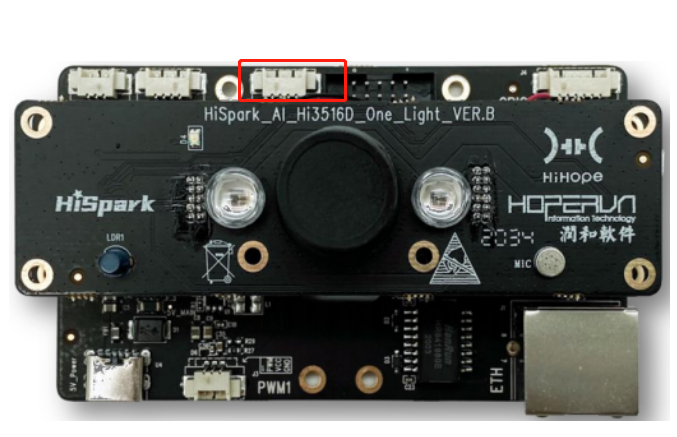

  方式2：将套件里面uart1通信线的黑色与黄色通过杜邦线或者镊子短接在一起。

  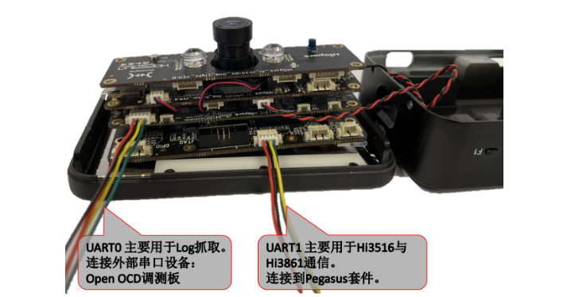

- 在开发板的终端执行下面的命令，启动可执行文件，每敲一次回车串口发送接收一次数据，当按下"q"时，串口通信退出。

```
cd /userdata

./ohos_camera_uart_demo
```

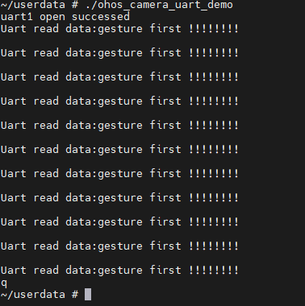

### 6.1.4、串口互联

#### 6.1.4.1、程序框图

* 前面两个章节验证之后，代表两个设备自身硬件软件是没有问题，现在实现联合通信，硬件方面Hi3516的TX接到Hi3861的RX，Hi3516的RX接到Hi3861的TX，软件方面Hi3516 UartSend发送手势字符串，Hi3861 IoTUartRead 接收到手势字符串，通过接收不同手势字符串去实现不同外设的控制。

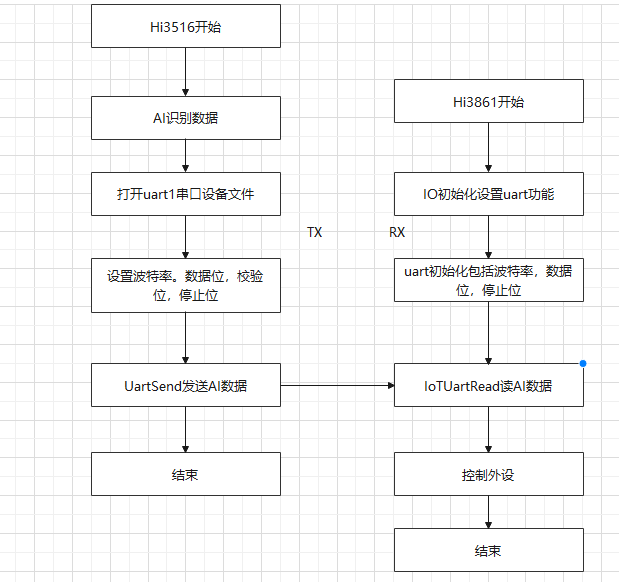

* 注意：在使用串口互联前，请确认手势检测+手势识别可以正常运行。

#### 6.1.4.2、硬件环境搭建

-    硬件要求：Taurus开发板、Pegasus核心板、底板、外设扩展板或者机器人板；
-    硬件搭建如下图所示，外设扩展板使用的是Hi3861的GPIO0和GPIO1作为串口1复用功能，请在程序初始化时注意管脚复用关系。

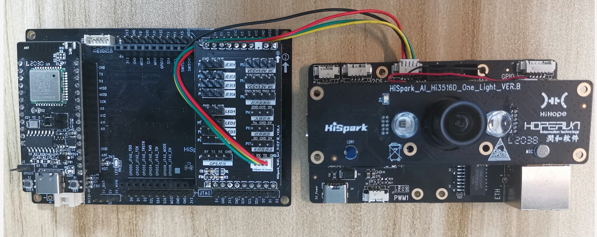

-    注意：Robot板使用的串口1复用端口是Hi3861的GPIO5和GPIO6，其中GPIO6要在程序烧录启动后才能使用，如果用户在还没烧录和启动之前就将串口线与硬件连接上，这时Hi3861将无法烧录和重启。GPIO6（TX）引脚影响Hi3861烧录和启动，用户在使用Robot板时，先拔掉Robot上4pin串口连接线，在程序烧录启动后，再将4pin串口连接线插回Robot板，此时串口可以正常通信。如果用户在使用Robot板的过程中觉得频繁插拔串口线麻烦，用户可在串口线上做一个开关，当Hi3861烧录或复位启动前关闭开关，单板启动后打开开关。

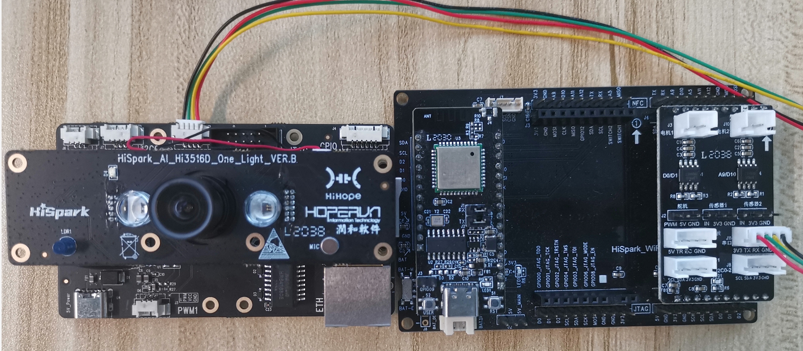

#### 6.1.4.3、Taurus Server侧软件介绍

- 这里以手势识别为例：

- 1、在ai_sample\scenario\hand_classify\hand_classify.c文件中先初始化uart。

  ```
  uartFd = UartOpenInit();
  if (uartFd < 0) {
    printf("uart1 open failed\r\n");
  } else {
    printf("uart1 open successed\r\n");
  }
  return ret;
  ```

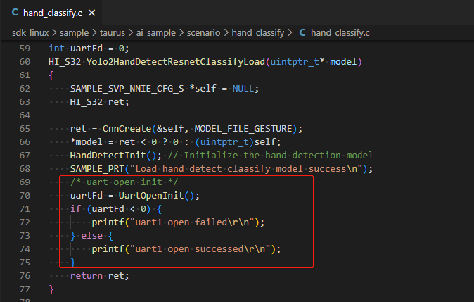

- 2、在HandDetectFlag调用UartSendRead()函数实现数据的发送，Pegasus接收到数据后实现对应外设的响应。

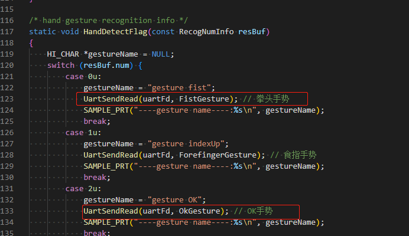

UartSendRead()函数的具体实现是在ai_sample\interconnection_server\hisignalling.c文件中。

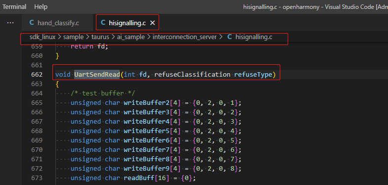

- 3、当Taurus的摄像头检测到特定的手势之后，Taurus会将对应的检测结果通过串口发送给Pegasus端，此时Pegasus主板上的灯会亮起，具体实验结果及打印信息如下图所示(注意这里需要结合下方Pegasus 侧一起执行)。

  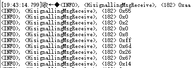

  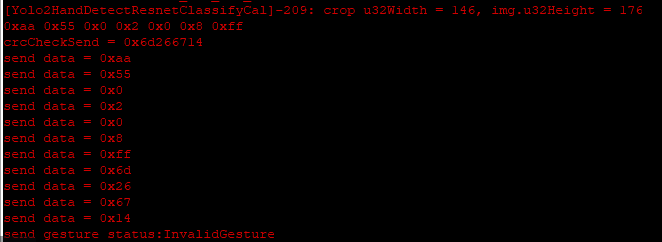

  

#### 6.1.4.4、Pegasus Client侧软件介绍

-   1.代码目录结构及相应接口功能介绍
-   UART API

| API                                                          | 接口说明                 |
| ------------------------------------------------------------ | ------------------------ |
| unsigned int UartInit(WifiIotUartIdx id, const WifiIotUartAttribute *param, const WifiIotUartExtraAttr *extraAttr); | 初始化，配置一个UART设备 |
| int UartRead(WifiIotUartIdx id, unsigned char *data, unsigned int dataLen) | 从UART设备中读取数据     |
| int UartWrite(WifiIotUartIdx id, const unsigned char *data, unsigned int dataLen) | 将数据写入UART设备       |

- 2.代码工程编译和镜像烧录

  -   将源码./vendor/hisilicon/hispark_pegasus/demo目录下的interconnection_client_demo整个文件夹及内容复制到源码./applications/sample/wifi-iot/app/下，如图。

  ```
  .
  └── applications
      └── sample
          └── wifi-iot
              └── app
                  └──interconnection_client_demo
                     └── 代码
  ```

  -   在hisignalling.h文件中，如果是想使用硬件扩展板，请将BOARD_SELECT_IS_EXPANSION_BOARD这个宏打开，如果是想使用Robot板，请将BOARD_SELECT_IS_ROBOT_BOARD 这个宏打开。

  ```
  /**
  * @brief Adapter plate selection
  * 使用时选择打开宏，使用外设扩展板打开#define BOARD_SELECT_IS_EXPANSION_BOARD这个宏
  * 使用Robot板打开#define BOARD_SELECT_IS_ROBOT_BOARD这个宏
  **/
  //#define BOARD_SELECT_IS_ROBOT_BOARD
  #define BOARD_SELECT_IS_EXPANSION_BOARD
  #ifdef BOARD_SELECT_IS_EXPANSION_BOARD
  #define EXPANSION_BOARD
  #else
  #define ROBOT_BOARD
  #endif
  ```

  -   修改源码./applications/sample/wifi-iot/app/BUILD.gn文件，在features字段中增加索引，使目标模块参与编译。features字段指定业务模块的路径和目标,features字段配置如下。

  ```
  import("//build/lite/config/component/lite_component.gni")
  
  lite_component("app") {
      features = [
          "interconnection_client_demo:interconnectionClientDemo",
      ]
  }
  ```

  -    工程相关配置完成后,然后进行编译，HiSpark Pegasus 代码的编译和镜像烧录都是一样的操作，<font color='RedOrange'>**参考 4.2.1.4章节**</font>的内容即可。

- 3.功能验证

  -   烧录成功后，再次点击Hi3861核心板上的“RST”复位键，此时开发板的系统会运行起来。运行结果:打开串口工具，可以看到打印,同时3861主板灯闪亮一下。
  -   对于如何使用工具查看系统打印信息，<font color='RedOrange'>**参考 4.2.1.5章节**</font>的内容即可。

  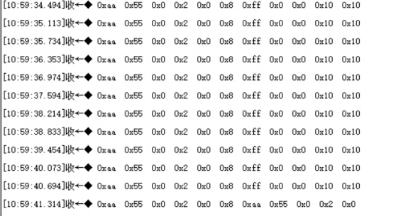

  

  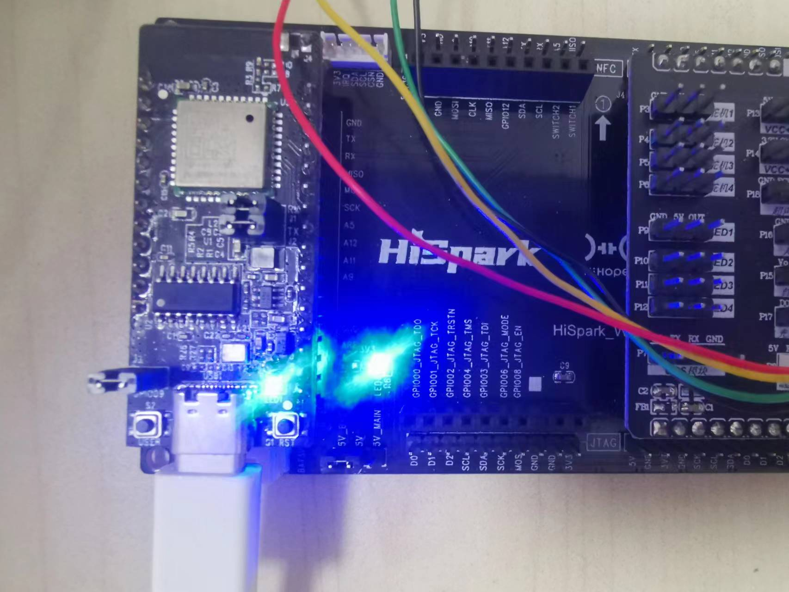
