## 6.2、WiFi互联方式

### 6.2.1、wifi互联介绍

- HiStreaming 组件作为一种技术基础设施，使得海思芯片可以通过WiFi或有线网络实现物联网设备之间的设备自动发现、服务注册与识别、服务操作。HiStreaming把物联网设备分为两类角色，对外部提供服务的设备称之为 Server 设备，而使用其他设备提供的服务的设备称之为 Client 设备。

  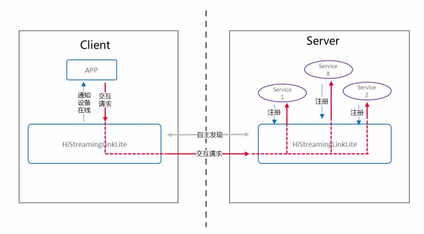

### 6.2.2、硬件环境搭建

- 硬件要求：Taurus开发板+Pegasus开发板，硬件搭建如下图所示。

  

  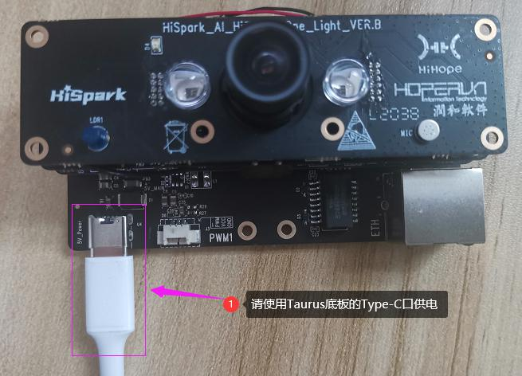

### 6.2.3、组网方式

- 组网方案1：将Taurus开发套件设置成为WiFi AP模式，Pegasus开发套件和手机直接连接到Taurus的WiFi AP热点。Taurus开发板上跑的是HiStreaming-Server和HiStreaming-Client程序，Pegasus开发板上跑的是HiStreaming-Server程序，手机上跑的是HiStreaming-Client程序。当三者在同一局域网内，手机能够同时发现Taurus和Pegasus上的HiStreaming-Server，且Taurus上的HiStreaming-Client也能发现Pegasus上的HiStreaming-Server。Taurus端、Pegasus端、手机端，三者之间的组网方式如下图所示。

  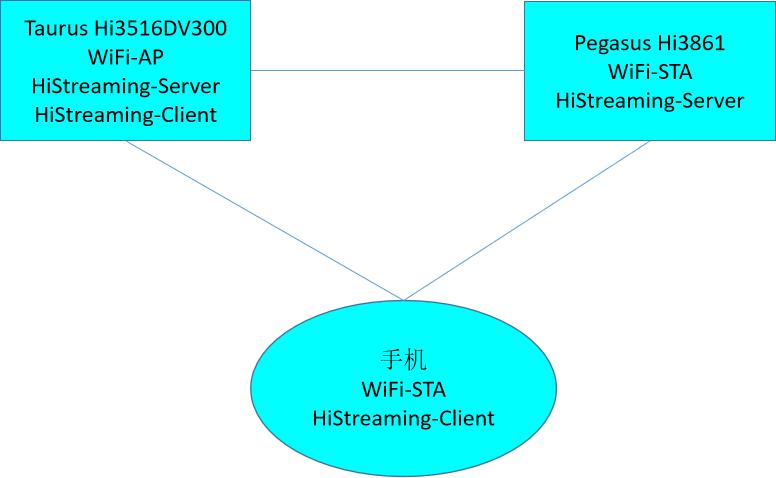 

- 组网方案2：Pegasus端、Taurus端、手机端都配置成为STA模式，使Taurus开发套件、Pegasus开发套件以及手机都连接在同一路由器发出的WiFi AP热点下面，组成一个局域网。其中，Taurus开发板上跑的是HiStreaming-Server和HiStreaming-Client程序，Pegasus开发板上跑的是HiStreaming-Server程序，手机上跑的是HiStreaming-Client程序。当三者在同一局域网内，手机能够同时发现Taurus和Pegasus上的HiStreaming-Server，且Taurus上的HiStreaming-Client也能发现Pegasus上的HiStreaming-Server。Taurus端、Pegasus端、手机端，三者之间的组网方式如下图所示。（其实手机作为热点代替路由器也是可行的）

  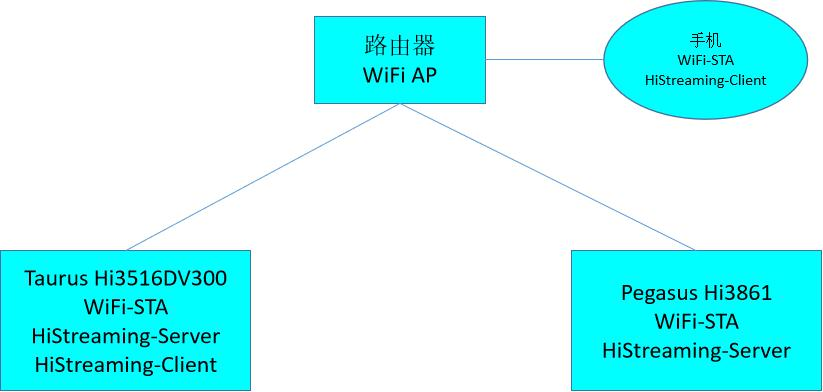

### 6.2.4、Taurus Server侧软件介绍

-    1.代码目录结构及相应接口功能介绍

-    HiStreaming接口：

| API                  | 描述                                                         |
| -------------------- | ------------------------------------------------------------ |
| LinkPlatformGe       | 获得HiStreamingLinkLite组件对象                              |
| LinkPlatformFree     | 释放HiStreamingLinkLite组件对象                              |
| LinkServiceAgentFree | 释放从设备列表中pop出来的LinkServiceAgent对象                |
| LinkAgentGet         | 获得LinkAgent对象                                            |
| LinkAgentFree        | 释放LinkAgent对象                                            |
| QueryResultFree      | 释放设备列表QueryResult。同时也释放设备列表关联的LinkServiceAgent对象 |

#### 6.2.4.1、代码编译

* 步骤1：在单编ohos_histreaming_server之前，需修改目录下的一处依赖，进入//device/soc/hisilicon/hi3516dv300/sdk_linux目录下，通过修改BUILD.gn，在deps下面新增target，``"sample/taurus/histreaming_server:hi3516dv300_histreaming_server"``。

```
group("hispark_taurus_sdk") {
  if (defined(ohos_lite)) {
    deps = [
      ":sdk_linux_lite_libs",
      ":sdk_make",
      "//kernel/linux/build:linux_kernel",
      "sample/taurus/histreaming_server:hi3516dv300_histreaming_server",
    ]
```

* 步骤2：单编histreaming_server sample

* **方式一：使用Makefile的方式进行单编(速度会快很多)**

  * 在Ubuntu的命令行终端，分步执行下面的命令，单编 histreaming_server sample

  ```
  cd /home/openharmony/sdk_linux/sample/build
  
  make histreaming_server_clean && make histreaming_server
  ```

  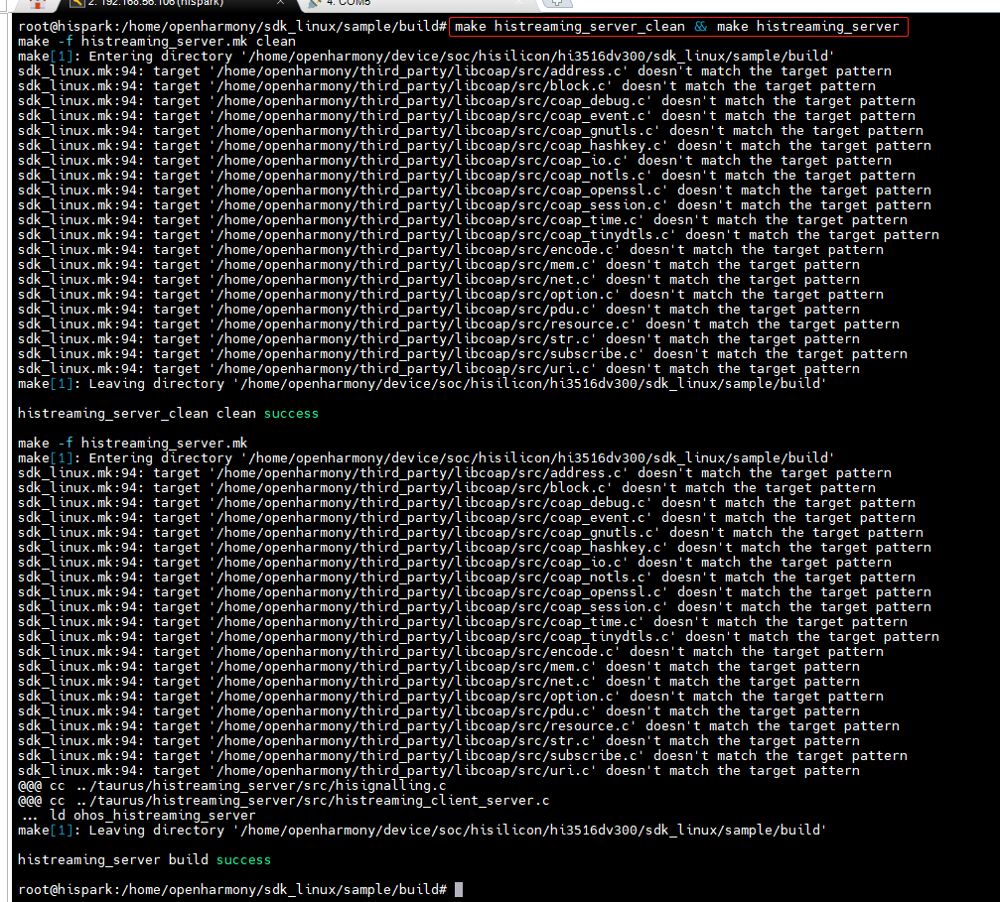

  * 在/home/openharmony/sdk_linux/sample/output目录下，会生成ohos_histreaming_server可执行程序，如下图所示：

  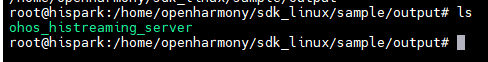

* **方式二：使用OpenHarmony的BUILD.gn方式进行单编**

  * 在Ubuntu的终端执行下面的命令，进行histreaming_server sample的编译

  ```
  hb set  # 选择 ipcamera_hispark_taurus_linux
  
  hb build -T device/soc/hisilicon/hi3516dv300/sdk_linux/sample/taurus/histreaming_server:hi3516dv300_histreaming_server
  ```

  * 编译成功后，即可在out/hispark_taurus/ipcamera_hispark_taurus_linux/rootfs/bin目录下，生成 ohos_histreaming_server可执行文件。

**步骤3：使用NFS挂载的方式进行资料文件的拷贝**

* 首先需要自己准备一根网线

* 1：参考[博客链接](https://blog.csdn.net/Wu_GuiMing/article/details/115872995?spm=1001.2014.3001.5501)中的内容，进行nfs的环境搭建

* 2：将编译后生成的可执行文件拷贝到Windows的nfs共享路径下

* 3：将device\soc\hisilicon\hi3516dv300\sdk_linux\out\lib\目录下的**libvb_server.so和 libmpp_vbs.so**拷贝至Windows的nfs共享路径下

* 4：依赖文件拷贝至Windows的nfs共享路径下后，在开发板的命令行终端执行下面的命令，将Windows的nfs共享路径挂载至开发板的mnt目录下

```
mount -o nolock,addr=192.168.200.1 -t nfs 192.168.200.1:/d/nfs /mnt
```

#### 6.2.4.2、拷贝mnt目录下的文件至正确的目录下

* 在开发板的命令行终端执行下面的命令，拷贝mnt目录下面的ohos_histreaming_server至userdata目录，拷贝mnt目录下面的libvb_server.so和 libmpp_vbs.so至/usr/lib/目录下。

```
cp /mnt/ohos_histreaming_server  /userdata/

cp /mnt/*.so /usr/lib/
```

#### 6.2.4.3、功能验证

* 第一种方式：将Taurus设置为AP模式
* 步骤0：在/etc/Wireless/hostapd.conf文件中设置AP热点的名称和密码。本文配置的AP热点名为：H，无密码，开发者可以自行更改（不修改的可忽略此步骤）。

```shell
# 可以使用 /etc/Wireless/busybox  vi  filename 命令，来修改AP的账号和密码
# 关于vi命令的使用，请自行学习vi的相关知识

 /etc/Wireless/busybox  vi /etc/Wireless/hostapd.conf
```

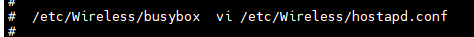

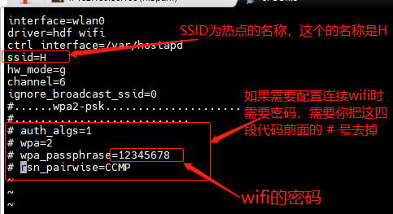

* 步骤1：在开发板的命令行终端，执行下面的命令，将Taurus设置为AP模式。命令执行成功后，手机端可以搜索wifi热点名：H，点击之后即可链接。如果您配置了密码，当然也需要输入密码才能连接上。

```
cd /etc/Wireless

mkdir /usr/tmp

mkdir /var/run

touch /var/run/udhcpd.pid

mkdir -p /vendor/etc

touch /vendor/etc/udhcpd.leases

./hostapd -i wlan0 hostapd.conf &

ifconfig wlan0 192.168.12.145

./busybox ./udhcpd udhcpd.conf
```

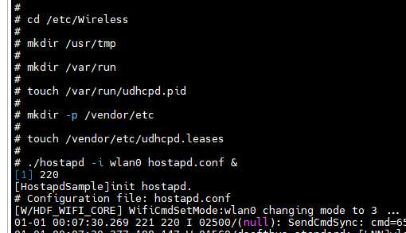

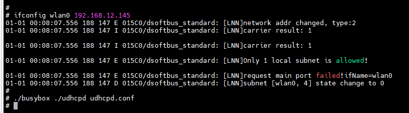

* 步骤2：在开发板的命令行终端执行下面的命令，运行ohos_histreaming_server程序

```
cd /userdata

chmod 777 ohos_histreaming_server

./ohos_histreaming_server
```

* 步骤3：ohos_histreaming_server程序运行成功后，参考6.2.5章节的**2.工程编译**的内容，编译并烧录好Pegasus镜像。

* 步骤4：点击Hi3861核心板上的“RST”复位键，此时开发板的系统会运行起来。

  

  * 当Taurus与Pegasus之间通过WiFi互联成功后，会在Taurus开发板的终端打印如下的信息。

  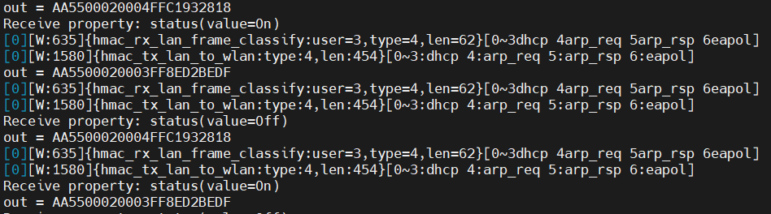

  * 步骤5：<font color='RedOrange'>**参考 4.2.1.5章节**</font>的内容，打开串口工具，可以看到如下打印,同时3861主板灯闪亮一下。

  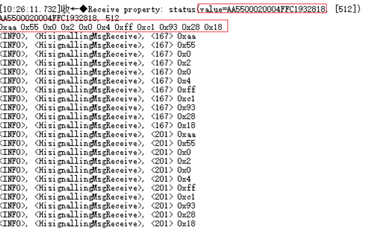

* 第二种方式：将Taurus设置为STA模式

* 步骤0：开发者可以在/etc/Wireless/wpa_supplicant.conf文件中设置自己想要连接的WIFI名和密码，本文需要连接的热点名称为：hispark，密码为：12345678（不修改可以跳过此步骤）

* 注意：手机和路由器最好使用4G网

  ```shell
  # 可以使用 /etc/Wireless/busybox  vi  filename 命令，来修改AP的账号和密码
  # 关于vi命令的使用，请自行学习vi的相关知识
  
   /etc/Wireless/busybox  vi /etc/Wireless/wpa_supplicant.conf
   
  # ssid：为wifi热点的名称
  # psk：为wifi热点的密码
  ```

  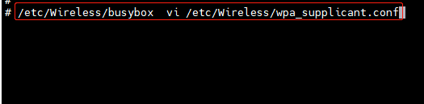

  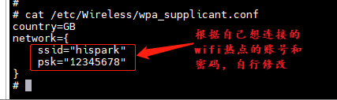

* 步骤1：在开发板的命令行终端，执行下面的命令，将Taurus设置为STA模式（也就是使用Taurus去连接其他热点，如：手机的热点，路由器的热点）

```shell
cd /etc/Wireless 

./wpa_supplicant -i wlan0 -c wpa_supplicant.conf &

# 连接热点：
./busybox ./udhcpc -s ./default.script -b -i wlan0
```

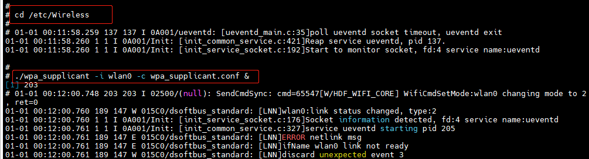

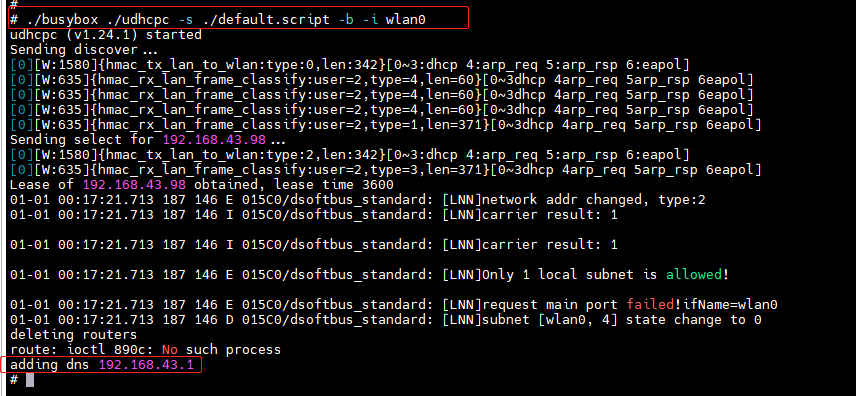

* 步骤2：在开发板的命令行终端执行下面的命令，Taurus运行ohos_histreaming_server

```
cd /userdata

chmod 777 ohos_histreaming_server

./ohos_histreaming_server
```

* 步骤3：ohos_histreaming_server程序运行成功后，参考6.2.5章节的**2.工程编译**的内容，编译并烧录好Pegasus镜像。

* 步骤4：点击Hi3861核心板上的“RST”复位键，此时开发板的系统会运行起来。

  

  * 当Taurus与Pegasus之间通过WiFi互联成功后，会在Taurus开发板的终端打印如下的信息。

  

  * 步骤5：<font color='RedOrange'>**参考 4.2.1.5章节**</font>的内容，打开串口工具，可以看到如下打印,同时3861主板灯闪亮一下。

  

### 6.2.5、Pegasus Client侧软件介绍

-    **1.代码目录结构及相应接口功能介绍**
-    WiFi API

| API                                                          | 接口说明                                |
| ------------------------------------------------------------ | --------------------------------------- |
| WifiErrorCode EnableWifi(void);                              | 开启STA                                 |
| WifiErrorCode DisableWifi(void);                             | 关闭STA                                 |
| int IsWifiActive(void);                                      | 查询STA是否已开启                       |
| WifiErrorCode Scan(void);                                    | 触发扫描                                |
| WifiErrorCode GetScanInfoList(WifiScanInfo* result, unsigned int* size); | 获取扫描结果                            |
| WifiErrorCode AddDeviceConfig(const WifiDeviceConfig* config, int* result); | 添加热点配置，成功会通过result传出netld |
| WifiErrorCode GetDeviceConfigs(WifiDeviceConfig* result, unsigned int* size); | 获取本机所有热点配置                    |
| WifiErrorCode RemoveDevice(int networkId);                   | 删除热点配置                            |
| WifiErrorCode ConnectTo(int networkId);                      | 连接到热点                              |
| WifiErrorCode Disconnect(void);                              | 断开热点连接                            |
| WifiErrorCode GetLinkedInfo(WifiLinkedInfo* result);         | 获取当前连接热点信息                    |
| WifiErrorCode RegisterWifiEvent(WifiEvent* event);           | 注册事件监听                            |
| WifiErrorCode UnRegisterWifiEvent(const WifiEvent* event);   | 解除事件监听                            |
| WifiErrorCode GetDeviceMacAddress(unsigned char* result);    | 获取Mac地址                             |
| WifiErrorCode AdvanceScan(WifiScanParams *params);           | 高级搜索                                |

-    DHCP客户端接口：

| API                 | 描述               |
| ------------------- | ------------------ |
| netifapi_netif_find | 按名称查找网络接口 |
| netifapi_dhcp_start | 启动DHCP客户端     |
| netifapi_dhcp_stop  | 停止DHCP客户端     |

-    HiStreaming接口：

| API                  | 描述                                                         |
| -------------------- | ------------------------------------------------------------ |
| LinkPlatformGe       | 获得HiStreamingLinkLite组件对象                              |
| LinkPlatformFree     | 释放HiStreamingLinkLite组件对象                              |
| LinkServiceAgentFree | 释放从设备列表中pop出来的LinkServiceAgent对象                |
| LinkAgentGet         | 获得LinkAgent对象                                            |
| LinkAgentFree        | 释放LinkAgent对象                                            |
| QueryResultFree      | 释放设备列表QueryResult。同时也释放设备列表关联的LinkServiceAgent对象 |


- **2.工程编译**

  -   步骤1：将源码./vendor/hisilicon/hispark_pegasus/demo目录下的histreaming_client_demo整个文件夹及内容复制到源码./applications/sample/wifi-iot/app/下，如图。

  ```
  .
  └── applications
      └── sample
          └── wifi-iot
              └── app
                  └──histreaming_client_demo
                     └── 代码
  ```

  -    步骤2：修改applications/sample/wifi-iot/app/histreaming_client_demo/wifi_connecter.h中**PARAM_HOTSPOT_SSID**和**PARAM_HOTSPOT_PSK**的值

  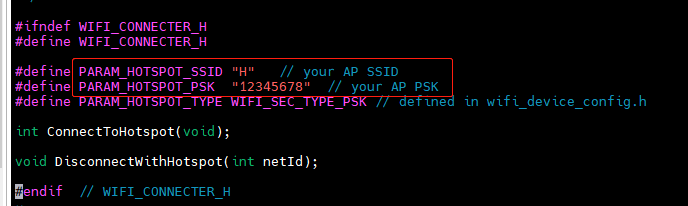

  -    如果Taurus侧选择的是 **6.2.4.3节的第一种AP模式**的话，PARAM_HOTSPOT_SSID和PARAM_HOTSPOT_PSK的值就需要修改为Taurus发出的WiFi热点的名称和WiFi密码。
  -    如果Taurus侧选择的是 **6.2.4.3节的第二种STA模式**的话，PARAM_HOTSPOT_SSID和PARAM_HOTSPOT_PSK的值就需要修改为**路由器或者手机**热点发出的WiFi名称和WiFi密码。

```
  #define PARAM_HOTSPOT_SSID "x"       // your AP SSID
  #define PARAM_HOTSPOT_PSK  "xxxxx"   // your AP PSK
```

-   步骤3：修改源码./applications/sample/wifi-iot/app/BUILD.gn文件，在features字段中增加索引，使目标模块参与编译。features字段指定业务模块的路径和目标,features字段配置如下。

```
  import("//build/lite/config/component/lite_component.gni")
  
  lite_component("app") {
      features = [
          "histreaming_client_demo:histreamingClentDemo",
      ]
  }
```

-    步骤4：工程相关配置完成后，然后进行编译，HiSpark Pegasus 代码的编译镜像烧录都是一样的操作，<font color='RedOrange'>**参考 4.2.1.4章节**</font>的内容即可。