# 第七章：FAQ

## 7.1、Taurus如何使用Telnet功能？

* 当我们的串口已经被其他进程占用，又需要查看开发板系统的其他打印信息，此时我们可以使用Telnet来进行查看。
* 步骤1：使用一根网线，将开发板与Windows端的网口连接在一起，并且将二者的IP地址配置为同一网段，且能够互相ping通。关于网络的配置可以[参考此博客第二章的内容](https://blog.csdn.net/Wu_GuiMing/article/details/115872995?spm=1001.2014.3001.5501#t1)，如果按照前面的步骤操作，但是开发板和Windows的IP不能够互相ping通，可以尝试把电脑的防火墙关闭，然后再进行尝试。

* 步骤2：IP地址配置好后，打开MobaXterm，点击Session，然后点击Telnet按钮，然后再输入开发板的IP地址：192.168.200.200，最后再输入Telnet的登录账号：root，点击OK按钮即可。

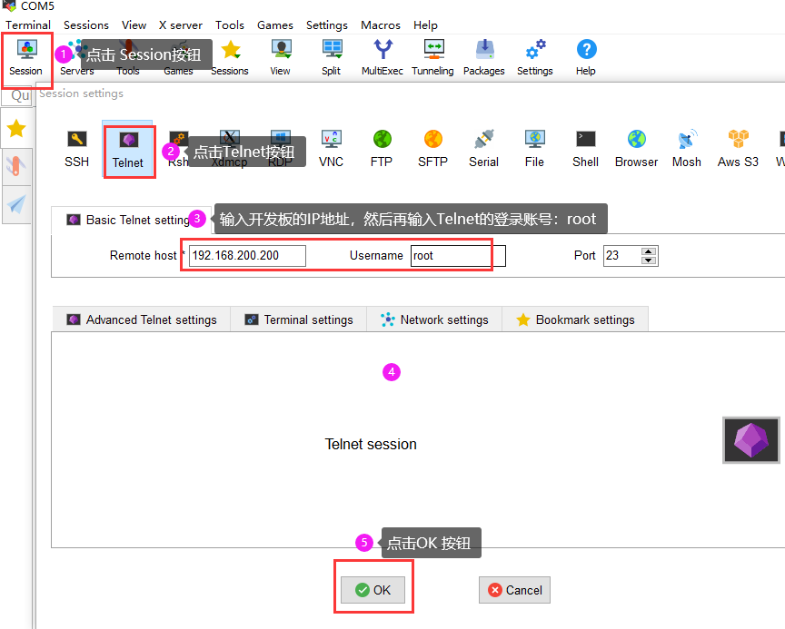

* 步骤3：当弹出如下登录提示信息 (none) login :，输入登录账号 root，然后敲两下回车，即可进入Taurus的系统。此时就可以对开发板进行命令操作了。
* Telnet下面的操作方式和在串口终端上面的操作方式一致。

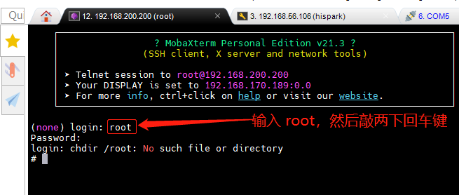

* 如果您之前已经配置过此IP地址的telnet，只需要用鼠标双击一下此IP地址选项，就能跳转到Telnet的登录界面，无需反复进行步骤2的配置。

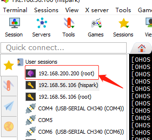

## 7.2、Taurus 红外灯如何控制？

* 从硬件原理图《[HiSpark_AI_Hi3516D_One_Light_VER.B_NoValueSCH_0929.pdf](https://gitee.com/hihope_iot/embedded-race-hisilicon-track-2022/blob/master/%E7%A1%AC%E4%BB%B6%E8%B5%84%E6%96%99/Taurus%E5%A5%97%E4%BB%B6%E5%8E%9F%E7%90%86%E5%9B%BE.zip)》中，可以分析出Taurus的红外灯对应的是GPIO5_1

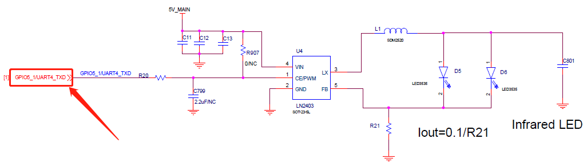

* 因此我们只需要在开发板系统终端执行下面的命令，即可将红外灯进行开灯和关灯操作。

```shell
echo 1 > /sys/class/gpio/gpio41/value  # 将GPIO5_1 （5*8+1=41） gpio41 管脚拉高，即可打开红外灯

echo 0 > /sys/class/gpio/gpio41/value  # 将GPIO5_1 （5*8+1=41） gpio41 管脚拉低，即可关闭红外灯
```

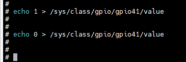

## 7.3、Taurus IRCut如何控制？

* 从硬件原理图《[HiSpark_AI_Hi3516D_One_Sensor_VER.B-NoValueSCH_0929.pdf](https://gitee.com/hihope_iot/embedded-race-hisilicon-track-2022/blob/master/%E7%A1%AC%E4%BB%B6%E8%B5%84%E6%96%99/Taurus%E5%A5%97%E4%BB%B6%E5%8E%9F%E7%90%86%E5%9B%BE.zip)》中，可以分析出Taurus的IRCut对应的是GPIO3_0,GPIO3_1。

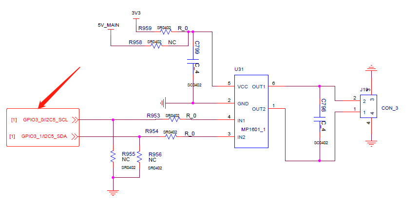

* IR-CUT可以简单理解为CMOS的“眼镜”， 镜片有2片，一片用于白天滤除红外光，一片用于晚上全透光。2个镜片由IR-CUT马达进行控制，轮流上岗，白天用滤红外片，图像不偏色，晚上用全透片，提高感光度。此开发板中控制IR-Cut马达的管脚对应的是GPIO3_0和GPIO3_1,当把GPIO3_0管脚拉高，GPIO3_1管脚拉低，此时滤红外片工作，当把GPIO3_0管脚拉低，GPIO3_1管脚拉高，全透片工作。
* 在开发板的串口终端，执行下面的命令，可以将IRCut打上去让滤红外片工作,你能听到IRCut被打上去的声音(“嗒”的一声)，当把GPIO3_0管脚拉高，GPIO3_1管脚拉低，此时滤红外片工作(白天)。

```sh
echo 1 > /sys/class/gpio/gpio24/value  # 将GPIO3_0 （3*8+0=24） gpio24 管脚拉高
echo 0 > /sys/class/gpio/gpio25/value  # 将GPIO3_1 （3*8+1=25） gpio25 管脚拉低
```

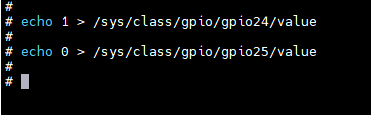

* 在开发板的root目录下，执行下面的命令，可以将IRCut打下去让全透片工作,且能听到IRCut被打下去的声音(“嗒”的一声), 当把GPIO3_0管脚拉低，GPIO3_1管脚拉高，全透片工作(晚上)。

```sh
echo 0 > /sys/class/gpio/gpio24/value  # 将GPIO3_0 （3*8+0=24） gpio24 管脚拉低
echo 1 > /sys/class/gpio/gpio25/value  # 将GPIO3_1 （3*8+1=25） gpio25 管脚拉高
```

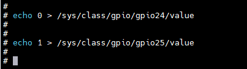

## 7.4、Taurus F1&F2按键如何使用？

* 从硬件原理图《[HiSpark_AI_Hi3516D_Core_VER.B_NoValueSCH_0929.pdf](https://gitee.com/hihope_iot/embedded-race-hisilicon-track-2022/blob/master/%E7%A1%AC%E4%BB%B6%E8%B5%84%E6%96%99/Taurus%E5%A5%97%E4%BB%B6%E5%8E%9F%E7%90%86%E5%9B%BE.zip)》中，可以分析出Taurus的F1和F2按键对应的是GPIO0_1,GPIO0_2。
* 因此我们可以通过读取GPIO0_1和GPIO0_2管脚的高低电平变化来判断F1和F2按键是否被按下。

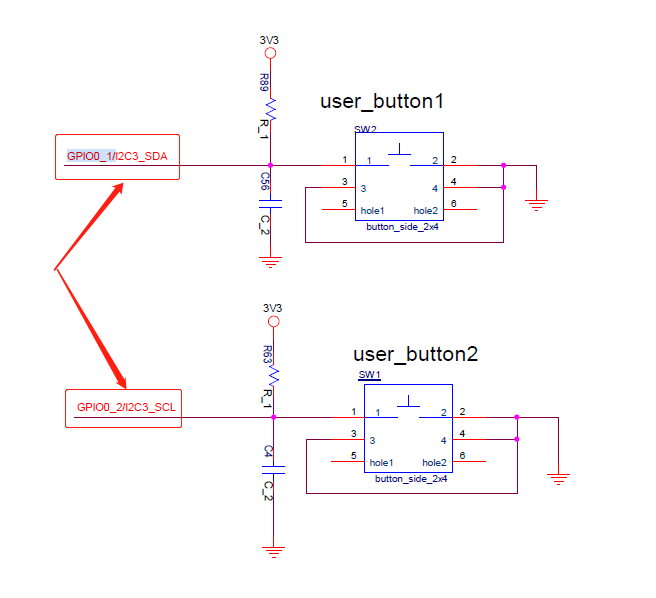

* 接下来就是Taurus F1&F2按键的代码编译

### 7.4.1、概述

switch_demo基于OpenHarmony 小型系统开发，以Taurus套件为例，switch_demo主要是介绍如何使用Taurus套件的F1和F2两个功能按键。

### 7.4.2、目录

```shell
//device/soc/hisilicon/hi3516dv300/sdk_linux/sample/taurus/switch_demo
├── BUILD.gn                 # 编译ohos switch_demo需要的gn文件
└── switch_demo.c      # ohos switch_demo主函数入口
```

### 7.4.3、编译

在编译switch_demo之前，需要确保已经执行了 3.2.1章节的整编Taurus代码，以及3.2.2章节的Taurus镜像烧录的步骤，在单编switch_demo之前，需修改目录下的一处依赖，进入//device/soc/hisilicon/hi3516dv300/sdk_linux目录下，通过修改BUILD.gn，在deps下面新增target，``"sample/taurus/switch_demo:switch_demo"``，如下图所示：

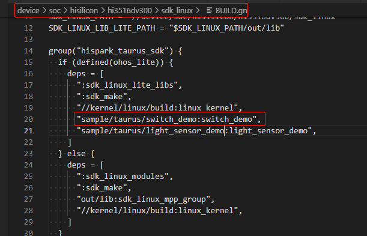

* 单编switch_demo

* **方式一：通过Makefile的方式进行单编（速度会快很多）**

  * 在Ubuntu的命令行终端，分步执行下面的命令，单编switch_demo

  ```
  cd /home/openharmony/sdk_linux/sample/build/
  
  make switch_demo_clean && make switch_demo
  ```

  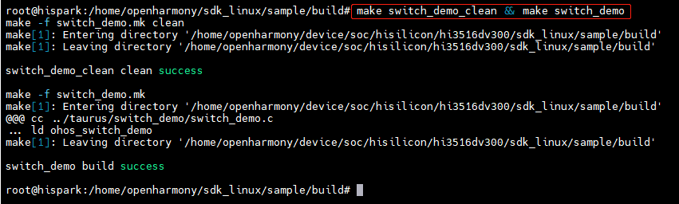

  * 在/home/openharmony/sdk_linux/sample/output目录下，生成 ohos_switch_demo可执行文件，如下图所示：

  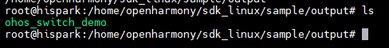

* **方式二：通过OpenHarmony的BUILD.gn方式进行单编(速度较慢)**

  * 在Ubuntu的终端执行下面的命令，进行switch_demo的编译

  ```
  hb set  # 选择 ipcamera_hispark_taurus_linux
  
  hb build -T device/soc/hisilicon/hi3516dv300/sdk_linux/sample/taurus/switch_demo:switch_demo
  ```

  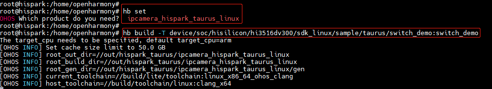

  * 编译成功后，即可在out/hispark_taurus/ipcamera_hispark_taurus_linux/rootfs/bin目录下，生成 ohos_switch_demo可执行文件，如下图所示：

    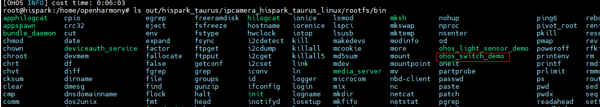

### 7.4.4、拷贝可执行程序和依赖文件至开发板的mnt目录下

**方式一：使用SD卡进行资料文件的拷贝**

* 首先需要自己准备一张SD卡
* 步骤1：将编译后生成的可执行文件 ohos_switch_demo 拷贝到SD卡中。

* 步骤3：可执行文件拷贝成功后，将内存卡插入开发板的SD卡槽中，可通过挂载的方式挂载到板端，可选择SD卡 mount指令进行挂载。
  * 在开发板的终端执行下面的命令，将SD卡挂载到开发板的/mnt目录下


```shell
mount -t vfat /dev/mmcblk1p1 /mnt
# 其中/dev/mmcblk1p1需要根据实际块设备号修改
```

**方式二：使用NFS挂载的方式进行资料文件的拷贝**

* 首先需要自己准备一根网线
* 步骤1：参考[博客链接](https://blog.csdn.net/Wu_GuiMing/article/details/115872995?spm=1001.2014.3001.5501)中的内容，进行nfs的环境搭建
* 步骤2：将编译后生成的可执行文件 ohos_switch_demo 拷贝到Windows的nfs共享路径下

* 步骤4：依赖文件拷贝至Windows的nfs共享路径下后，在开发板的终端执行下面的命令，将Windows的nfs共享路径挂载至开发板的mnt目录下

```
mount -o nolock,addr=192.168.200.1 -t nfs 192.168.200.1:/d/nfs /mnt
```

### 7.4.5、拷贝mnt目录下的文件至正确的目录下

* 在开发板的终端执行下面的命令，拷贝mnt目录下面的ohos_switch_demo至userdata目录

```
cp /mnt/ohos_switch_demo /userdata
```

* 在开发板的终端执行下面的命令，给ohos_switch_demo文件可执行权限

```
chmod 777 /userdata/ohos_switch_demo
```

### 7.4.6、功能验证

* 在开发板的终端执行下面的命令，启动可执行文件

```
cd /userdata

./ohos_switch_demo
```

* 当按下Taurus的F1按键时，会打印出F1 is pressed 字样，当按下Taurus的F2按键时，会打印F2 is pressed 字样。

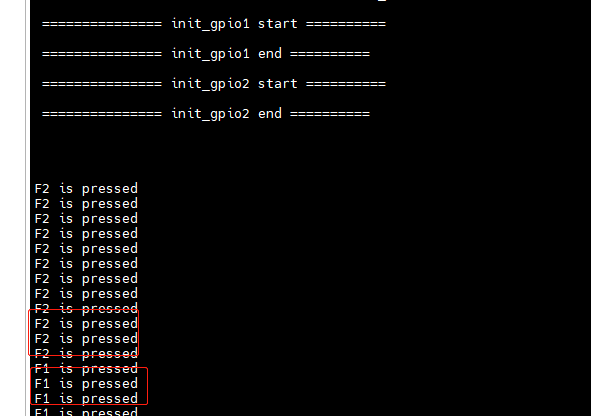

* 通过键盘的**Ctrl+C 组合键**，使得ohos_switch_demo退出执行。

## 7.5、如何使用Taurus的光敏传感器功能？

* 从硬件原理图《[HiSpark_AI_Hi3516D_One_Light_VER.B_NoValueSCH_0929.pdf](https://gitee.com/hihope_iot/embedded-race-hisilicon-track-2022/blob/master/%E7%A1%AC%E4%BB%B6%E8%B5%84%E6%96%99/Taurus%E5%A5%97%E4%BB%B6%E5%8E%9F%E7%90%86%E5%9B%BE.zip)》中，可以分析出Taurus的光敏传感器对应的是LSADC_CH0。
* 在Taurus的OpenHarmony系统中LSADC_CH0对应的设备节点在 /sys/devices/platform/media/120e0000.adc/iio:device0/in_voltage0_raw，因此我们只需要读取该值，就能获取光敏传感器的数据了。

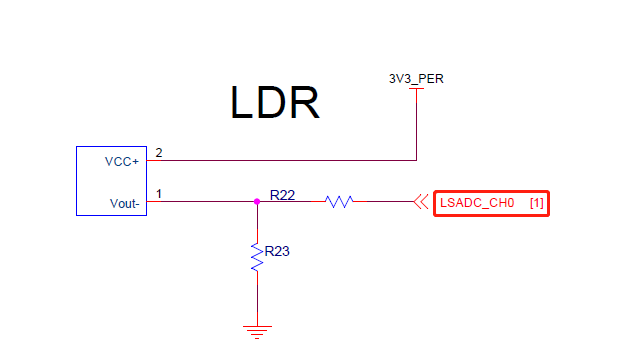

* 接下来就是Taurus的光敏传感器的代码编译

### 7.5.1、概述

light_sensor_demo基于OpenHarmony 小型系统开发，以Taurus套件为例，light_sensor_demo主要是介绍如何获取Taurus套件的光敏传感器的具体数据。

### 7.5.2、目录

```shell
//device/soc/hisilicon/hi3516dv300/sdk_linux/sample/taurus/light_sensor_demo
├── BUILD.gn                 # 编译ohos light_sensor_demo需要的gn文件
└── light_sensor_demo.c      # ohos light_sensor_demo主函数入口
```

### 7.5.3、编译

在编译light_sensor_demo之前，需要确保已经执行了 3.2.1章节的整编Taurus代码，以及3.2.2章节的Taurus镜像烧录的步骤，在单编light_sensor_demo之前，需修改目录下的一处依赖，进入//device/soc/hisilicon/hi3516dv300/sdk_linux目录下，通过修改BUILD.gn，在deps下面新增target，``"sample/taurus/light_sensor_demo:light_sensor_demo"``，如下图所示：

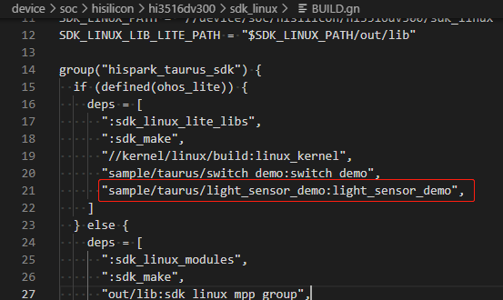

* 单编light_sensor sample

* **方式一：通过Makefile的方式进行单编（速度会快很多）**

  * 在Ubuntu的命令行终端，分步执行下面的命令，单编light_sensor sample

  ```
  cd /home/openharmony/sdk_linux/sample/build/
  
  make light_sensor_demo_clean && make light_sensor_demo
  ```

  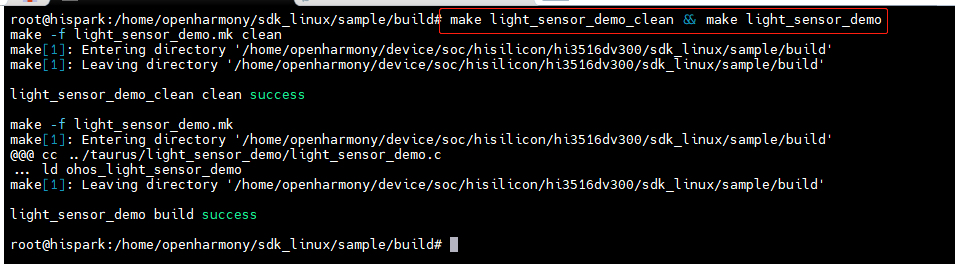

  * 在/home/openharmony/sdk_linux/sample/output目录下，生成 ohos_light_sensor_demo可执行文件，如下图所示：

  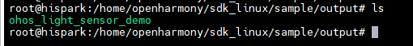

* **方式二：通过OpenHarmony的BUILD.gn方式进行单编(速度较慢)**

  * 在Ubuntu的终端执行下面的命令，进行light_sensor_demo的编译

  ```
  hb set  # 选择 ipcamera_hispark_taurus_linux
  
  hb build -T device/soc/hisilicon/hi3516dv300/sdk_linux/sample/taurus/light_sensor_demo:light_sensor_demo
  ```

  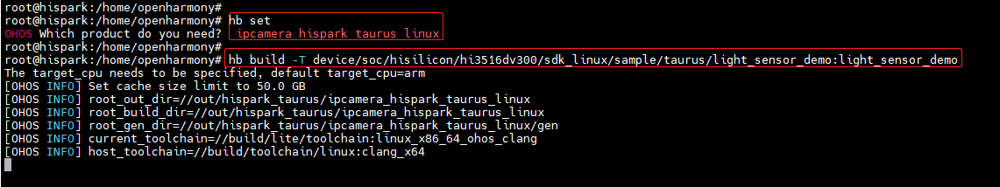

  * 编译成功后，即可在out/hispark_taurus/ipcamera_hispark_taurus_linux/rootfs/bin目录下，生成 ohos_light_sensor_demo可执行文件，如下图所示：

  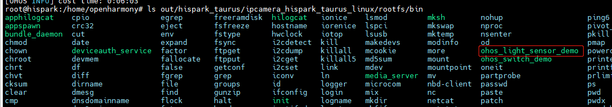

### 7.5.4、拷贝可执行程序和依赖文件至开发板的mnt目录下

**方式一：使用SD卡进行资料文件的拷贝**

* 首先需要自己准备一张SD卡
* 步骤1：将编译后生成的可执行文件 ohos_light_sensor_demo拷贝到SD卡中。

* 步骤3：可执行文件拷贝成功后，将内存卡插入开发板的SD卡槽中，可通过挂载的方式挂载到板端，可选择SD卡 mount指令进行挂载。
  * 在开发板的终端执行下面的命令，将SD卡挂载到开发板的/mnt目录下


```shell
mount -t vfat /dev/mmcblk1p1 /mnt
# 其中/dev/mmcblk1p1需要根据实际块设备号修改
```

**方式二：使用NFS挂载的方式进行资料文件的拷贝**

* 首先需要自己准备一根网线
* 步骤1：参考[博客链接](https://blog.csdn.net/Wu_GuiMing/article/details/115872995?spm=1001.2014.3001.5501)中的内容，进行nfs的环境搭建
* 步骤2：将编译后生成的可执行文件 ohos_light_sensor_demo拷贝到Windows的nfs共享路径下

* 步骤4：依赖文件拷贝至Windows的nfs共享路径下后，在开发板的终端执行下面的命令，将Windows的nfs共享路径挂载至开发板的mnt目录下

```
mount -o nolock,addr=192.168.200.1 -t nfs 192.168.200.1:/d/nfs /mnt
```

### 7.5.5、拷贝mnt目录下的文件至正确的目录下

* 在开发板的终端执行下面的命令，拷贝mnt目录下面的ohos_light_sensor_demo至userdata目录

```
cp /mnt/ohos_light_sensor_demo /userdata
```

* 在开发板的终端执行下面的命令，给ohos_light_sensor_demo文件可执行权限

```
chmod 777 /userdata/ohos_light_sensor_demo
```

### 7.5.6、功能验证

* 在开发板的终端执行下面的命令，启动可执行文件

```
cd /userdata

./ohos_light_sensor_demo
```

* 当将Taurus开发板置于光照环境下，光敏传感器的数值大致在2.36左右，当将Taurus开发板置于黑暗环境下，光敏传感器的数值大致在0.05左右。

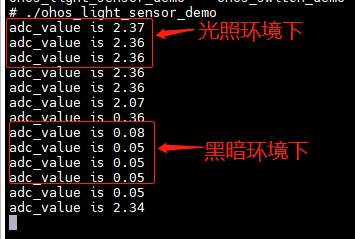

* 通过键盘的**Ctrl+C 组合键**，使得ohos_light_sensor_demo退出执行。

## 7.6、如何在Taurus中实现sample开机自启动的功能？

* 由于指导文档都是需要通过在开发板的串口终端输入指定的命令，对应的sample才能在开发板上面运行，很多同学希望了解如何让开发板一上电之后，开发板就能自己输出指定的命令，sample就能自动运行。

### 7.6.1、系统初始化

* 在开发板的/etc/文件夹中包含rcS脚本，Sxxx脚本和fstab脚本。init进程在启动系统服务之前执行这些脚本。执行的流程为“rcS->fstab->S00-xxx“。Sxxx脚本中的内容与开发板和产品需要有关，主要包括设备节点的创建、创建目录、扫描设备节点、修改文件权限等等
* 如果我们想让开发板一上电就能运行我们指定的命令，我们可以通过修改系统初始化文件来实现，我们主要修改的是文件 /etc/init.d/S82ohos。

### 7.6.2、具体步骤如下：

#### 步骤1：复制您想一上电就运行的那个sample的依赖文件至开发板

* 无论如何，您如果想运行某个sample，您都需要把该sample的可执行程序以及他依赖的库文件，资源文件等全部复制到开发板的对应目录下，这个请参考对应sample的指导文档。
* 本文以HelloWorld为例进行演示，我首先按照 本文**3.2.3章节关于helloworld sample操作指导文档**的步骤，把ohos_helloworld_demo、libvb_server.so、 libmpp_vbs.so这三个文件通过SD卡或者nfs挂载的方式拷贝到开发板的对应目录下。
* 然后按照本文**3.2.3章节关于helloworld sample操作指导文档**的步骤，执行一遍命令，确保我们后续开机自启动的程序，在运行的时候不存在问题，大致的命令如下

```
cd /userdata

./ohos_helloworld_demo
```

#### 步骤2：修改系统初始化文件S82ohos

* 确认好我们在开机自启动时，需要执行的命令之后，我们就可以把这些命令添加到系统初始化文件S82ohos文本中了。

* 执行下面的命令，打开 /etc/init.d/S82ohos

```
/etc/Wireless/busybox vi /etc/init.d/S82ohos
```

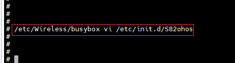

* 按键盘的i键，进入编辑模式，把需要开机自启动的几条命令添加到文件中

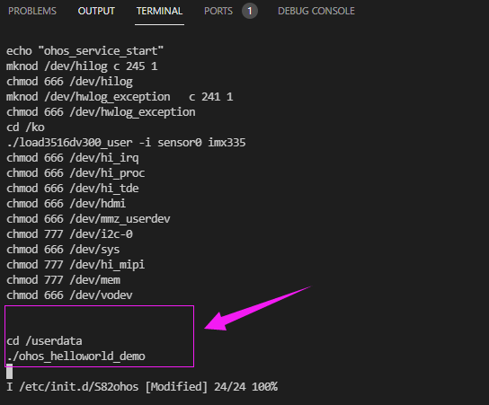

* 注意：如果你需要让ai_sample自启动，需要在 cd  /userdata 命令前加上这一句命令，提前配置好第三方库的环境变量，这样自启动的时候就可以加载OpenCV库了。

```
export LD_LIBRARY_PATH=$LD_LIBRARY_PATH:/userdata/lib
```

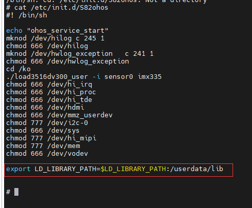

* 按键盘的Esc键，退出编辑模式进入命令行模式，输入:wq 敲回车，保存并退出

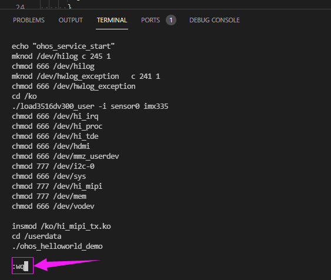

* 执行下面的命令，查看一下文件中的内容是否添加正确

```
cat  /etc/init.d/S82ohos
```

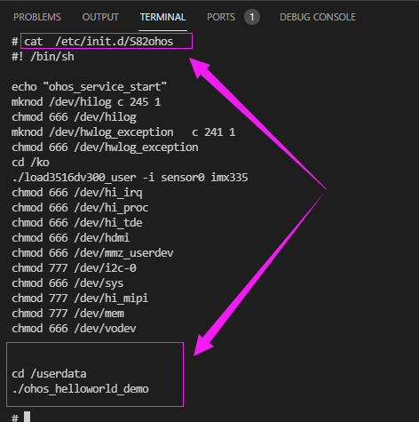

#### 步骤3：重启开发板，查看现象

* 重启开发板，看系统是否自动运行了我们添加的那几条命令
* 通过系统的打印信息可以看出，开发板一上电，HelloWorld sample就能自己运行了，且LCD屏幕也能正常工作。

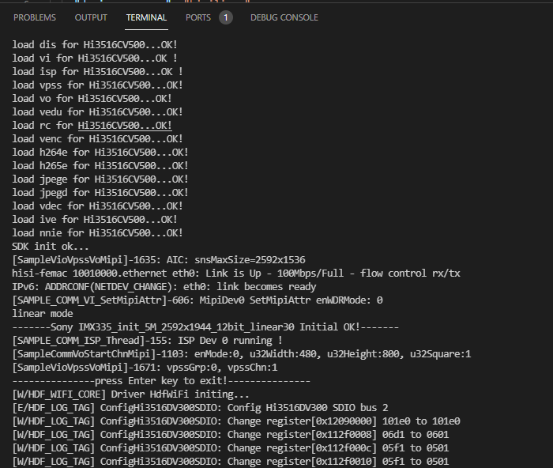

* 到此，如何让sample实现开机自启动的文档就结束了。

## 7.7、如何让Taurus系统开机就能启动WiFi的STA或AP模式？

* 由于OpenHarmony的WiFi加载，是在/etc/init.d脚本执行之后再加载的，而不是在/etc/init.d的脚本中加载的，因此如果我们把其他wifi的STA或者AP模式写在/etc/init.d的脚本中，会导致WiFi还没有加载成功，就已经执行了启动STA或者AP命令了，这样会导致WiFi的STA和AP模式启动失败。
* 目前只支持，当系统完全起来之后，才能去启动wifi的STA模式或者AP模式。

**AP模式**

* 在开发板的终端执行下面的命令，启动Taurus wifi的STA模式（如果之前启动过AP模式，需要先重启一下开发板，再执行此命令）,此时Taurus会发出一个名字为 **H** 的热点，

```
cd /etc/Wireless 
/etc/Wireless/init_ap.sh
```

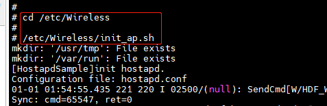

**STA模式**

* 先使用路由器或者手机开启一个热点，在/etc/Wireless/wpa_supplicant.conf文件设置连接的WIFI名和密码。(手机和路由器只能使用4G网)
* 然后再在开发板的终端执行下面的命令，启动Taurus wifi的AP模式(如果之前启动过STA模式，需要先重启一下开发板，再执行此命令)

```
cd /etc/Wireless 
/etc/Wireless/init_sta.sh
```

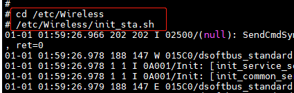

* 连接好热点之后，就可能进行上网了，也可以ping通公网的

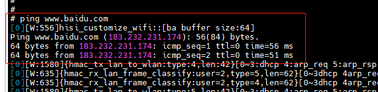

## 7.8、Taurus的sample代码路径太深了，请问是否可调整一下？

* Taurus的sample代码路径确实比较深，我们可以根据自己的需求，使用软连接的方式，把我们需要调整的文件夹放到OpenHarmony的代码根目录。

* 软连接的命令解析

```sh
ln -s 原文件名 链接文件名

# 原文件名：指的是我们原始代码的路径
# 链接文件名：指的是我们需要把sample文件通过软连接的方式放在哪个路径下
```

**举例：**

* Taurus的sample在 device/soc/hisilicon/hi3516dv300/sdk_linux 目录下，且我们在编译的时候，需要修改sdk_linux目录下面的BUILD.gn，因此我们可以把sdk_linux这个文件夹，通过软链接的方式，链接到OpenHarmony的代码根目录下，具体步骤如下：

  * 执行下面的命令进入到OpenHarmony的代码根目录下。

  ```shell
  cd   /home/openharmony
  ```

  * 执行 ls 命令，查看OpenHarmony代码根目录下的所有文件。
  * 执行下面的命令，将device/soc/hisilicon/hi3516dv300/sdk_linux 软链接到OpenHarmony的代码根目录下。

  ```shell
  ln  -s  /home/openharmony/device/soc/hisilicon/hi3516dv300/sdk_linux   /home/openharmony/sdk_linux
  ```

  * 再执行ls 命令，查看sdk_linux 是否已经软链接到OpenHarmony的代码根目录下。

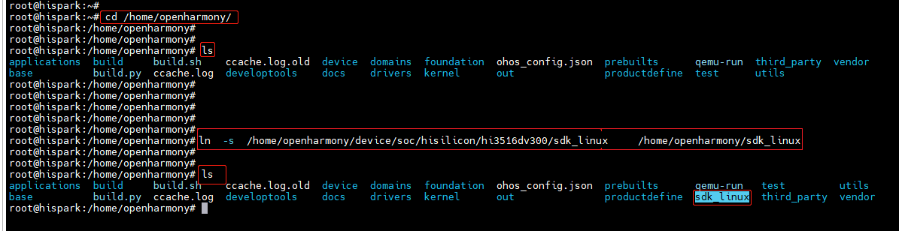

* 此时我们就可以看到，sdk_linux 已经软链接到OpenHarmony的代码根目录下，我们就可以在OpenHarmony根目录下的sdk_linux下面去修改代码了。

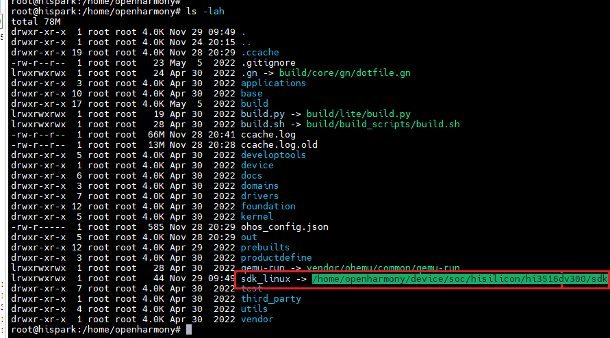

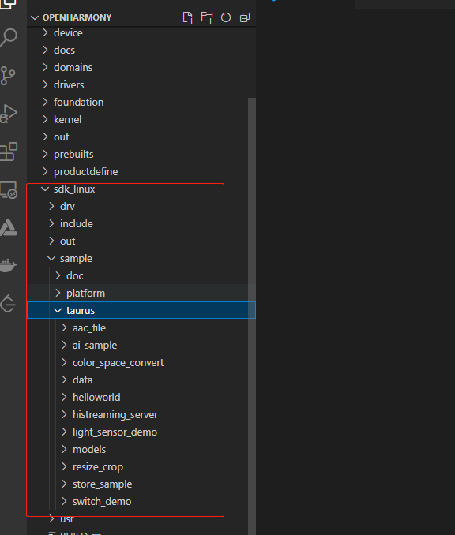

## 7.9、请问Taurus是否可以使用RTSP视频点播功能？

### 7.9.1、概述

RTSP（Real Time Streaming Protocol）实时流传输协议，是TCP/IP协议体系中的一个应用层协议。rtsp_sample基于OpenHarmony 小型系统开发，以Taurus套件为例，rtsp_sample主要是介绍如何在Taurus套件上使用RTSP视频点播功能。

### 7.9.2、目录

```shell
//device/soc/hisilicon/hi3516dv300/sdk_linux/sample/taurus/rtsp_sample
├─BUILD.gn                 # 编译ohos rtsp_sample需要的gn文件
├─ringfifo.c               
├─ringfifo.h                 
├─rtputils.c					  
├─rtputils.h        		    
├─rtspservice.c
├─rtspservice.h           
├─rtsputils.c               
├─rtsputils.h			   # 上面几个文件是rtsp service的功能代码	
├─sample_comm_venc.c       # venc的API接口函数 		     
├─sample_rtsp.h
├─sample_rtsp_main.c       # rtsp sample主函数
└─smp					   # rtsp sample主入口及媒体处理文件
  └─sample_rtsp.c
```

### 7.9.3、编译

在编译rtsp_sample之前，需要确保已经执行了 3.2.1章节的整编Taurus代码，以及3.2.2章节的Taurus镜像烧录的步骤，在单编rtsp_sample之前，需修改目录下的一处依赖，进入//device/soc/hisilicon/hi3516dv300/sdk_linux目录下，通过修改BUILD.gn，在deps下面新增target，``"sample/taurus/rtsp_sample:hi3516dv300_rtsp_sample"``，如下图所示：

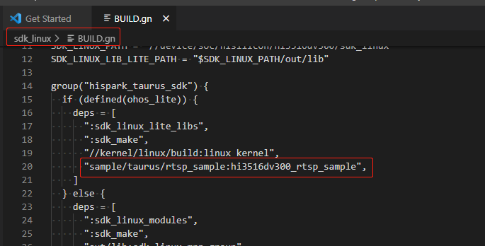

* 单编RTSP sample

* **方式一：通过Makefile的方式进行单编（速度会快很多）**

  * 在Ubuntu的命令行终端，分步执行下面的命令，单编RTSP sample

  ```
  cd /home/openharmony/sdk_linux/sample/build/
  
  make rtsp_sample_clean && make rtsp_sample
  ```

  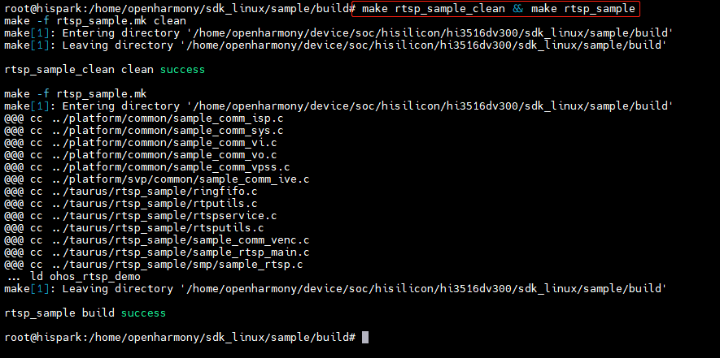

  * 在/home/openharmony/sdk_linux/sample/output目录下，生成 ohos_rtsp_demo可执行文件，如下图所示：

  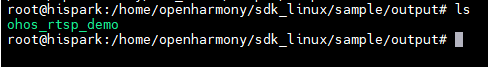

* **方式二：通过OpenHarmony的BUILD.gn方式进行单编(速度较慢)**

  * 在Ubuntu的终端执行下面的命令，进行rtsp_sample的编译

  ```
  hb set  # 选择 ipcamera_hispark_taurus_linux
  
  hb build -T device/soc/hisilicon/hi3516dv300/sdk_linux/sample/taurus/rtsp_sample:hi3516dv300_rtsp_sample
  ```

  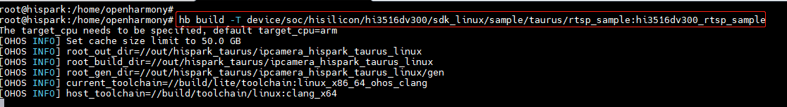

  * 编译成功后，即可在out/hispark_taurus/ipcamera_hispark_taurus_linux/rootfs/bin目录下，生成 ohos_rtsp_demo可执行文件，如下图所示：

  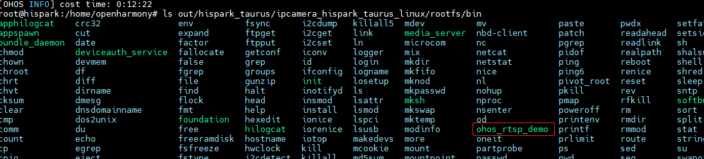

### 7.9.4、拷贝可执行程序和依赖文件至开发板的mnt目录下

**方式一：使用SD卡进行资料文件的拷贝**

* 首先需要自己准备一张SD卡
* 步骤1：将编译后生成的可执行文件 ohos_rtsp_demo拷贝到SD卡中。

* 步骤3：可执行文件拷贝成功后，将内存卡插入开发板的SD卡槽中，可通过挂载的方式挂载到板端，可选择SD卡 mount指令进行挂载。
  * 在开发板的终端执行下面的命令，将SD卡挂载到开发板的/mnt目录下


```shell
mount -t vfat /dev/mmcblk1p1 /mnt
# 其中/dev/mmcblk1p1需要根据实际块设备号修改
```

**方式二：使用NFS挂载的方式进行资料文件的拷贝**

* 首先需要自己准备一根网线
* 步骤1：参考[博客链接](https://blog.csdn.net/Wu_GuiMing/article/details/115872995?spm=1001.2014.3001.5501)中的内容，进行nfs的环境搭建
* 步骤2：将编译后生成的可执行文件 ohos_rtsp_demo拷贝到Windows的nfs共享路径下

* 步骤4：依赖文件拷贝至Windows的nfs共享路径下后，在开发板的终端执行下面的命令，将Windows的nfs共享路径挂载至开发板的mnt目录下

```
mount -o nolock,addr=192.168.200.1 -t nfs 192.168.200.1:/d/nfs /mnt
```

### 7.9.5、拷贝mnt目录下的文件至正确的目录下

* 在开发板的终端执行下面的命令，拷贝mnt目录下面的ohos_rtsp_demo至userdata目录

```
cp /mnt/ohos_rtsp_demo /userdata
```

* 在开发板的终端执行下面的命令，给ohos_rtsp_demo文件可执行权限

```
chmod 777 /userdata/ohos_rtsp_demo
```

### 7.9.6、功能验证

* 步骤0：连接网络

  * 将开发板与电脑之间，通过网线连接起来。（网线一头接开发板的网口，网线另外一头接电脑的网口）

  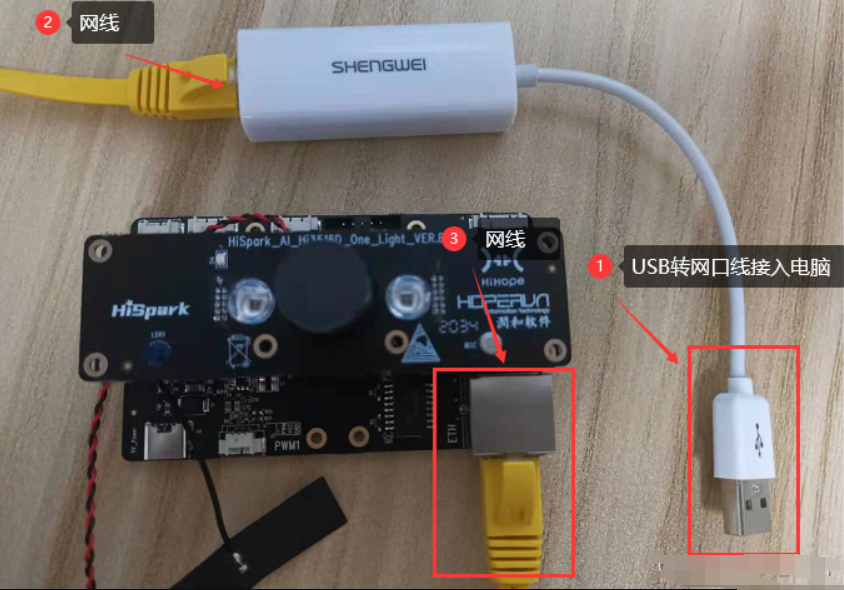

  * 开发板的默认IP地址是 192.168.200.200，需要将电脑端（与开发板连接在一起的网口）的IP地址也设置成为同一网段(192.168.200.1)

  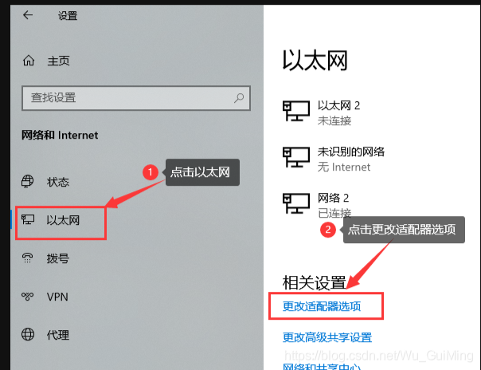

  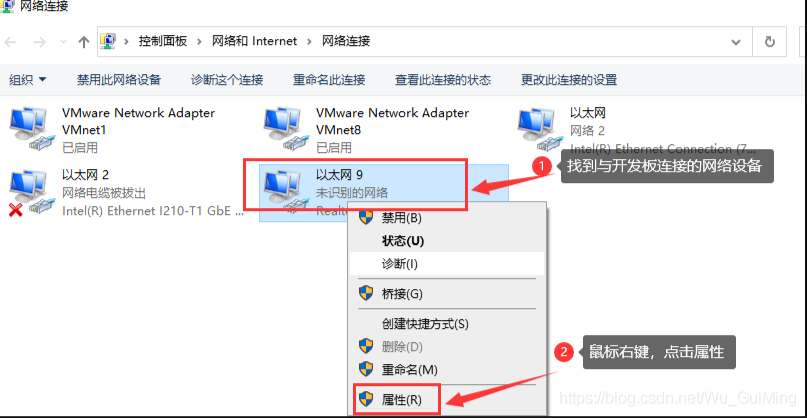

  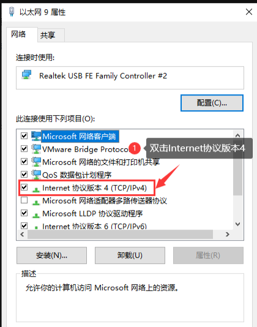

  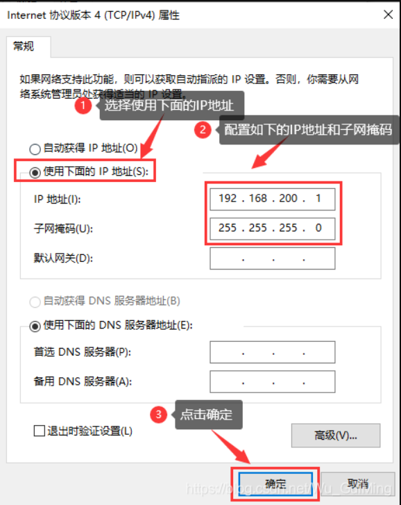

  * 关闭电脑的防火墙，使用ping命令，测试开发板和电脑之间能否ping通。

  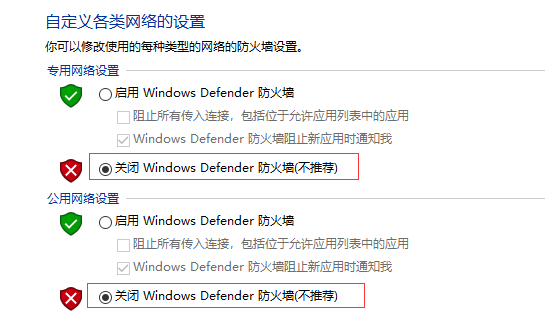

  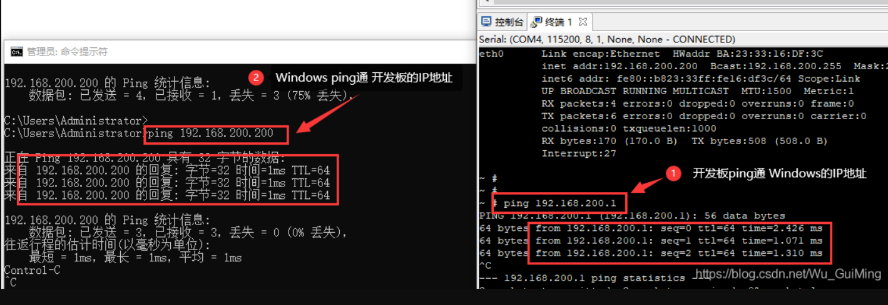

* 步骤1：在开发板的终端执行下面的命令，启动可执行文件
* 注意：本开发板的eth0的IP地址是192.168.200.200

```
cd /userdata

./ohos_rtsp_demo
```

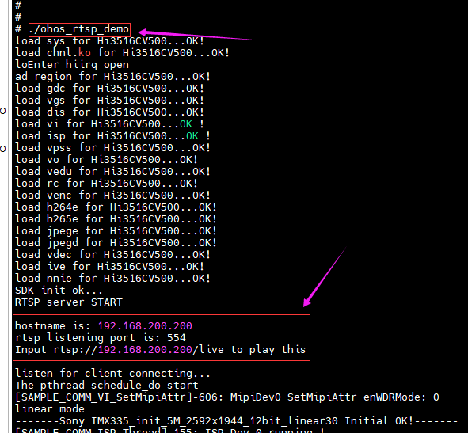

* 步骤2：点击链接，[下载VLC安装包](https://mirrors.estointernet.in/videolan/vlc/3.0.3/win64/vlc-3.0.3-win64.exe)，然后直接点击安装即可。

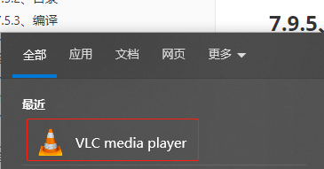

* 步骤3：打开VLC media player，点击左上角的媒体按钮，然后选择打开网络串流，选择网络选项，然后再URL框输入：**rtsp://192.168.200.200/live** ，最后点击播放即可进行视频的预览了。

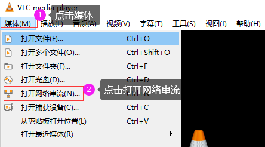

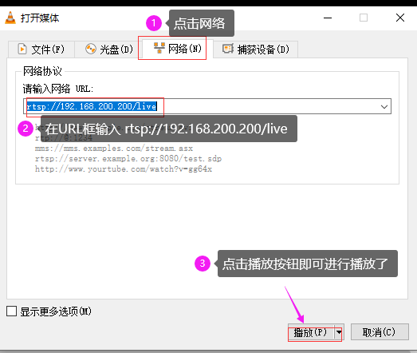

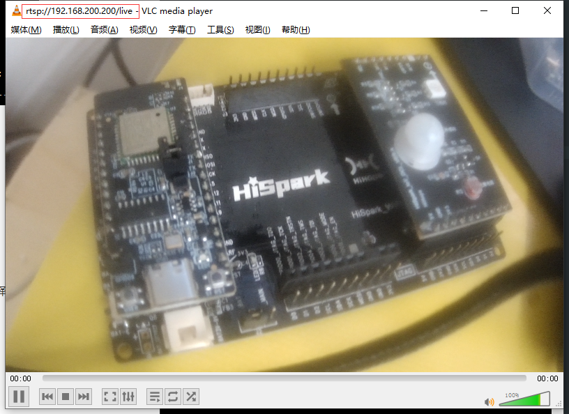

* 通过敲击键盘的**回车键两下**，使得ohos_rtsp_demo退出执行。

## 7.10、请问重启电脑或者Ubuntu之后，docker的samba无法Windows上连接，这种问题应该如何解决？

* 由下图可知，我们是在Windows系统上面运行了一个VirtualBox虚拟机，然后在VirtualBox虚拟机上面运行了一个Ubuntu系统，然后是在Ubuntu系统上面运行了一个Docker容器，然后在Docker容器中运行了samba服务。
* 如果我们重启了电脑，或者关闭了VirtualBox、或者重启了Ubuntu、或重启/关闭了docker容器，samba服务都会关闭。samba关闭之后，在Windows端就无法连接到docker的samba了。
* 此时我们需要打开VirtualBox虚拟机，打开Ubuntu系统，然后按照本文《步骤8：进入Docker编译环境中》的内容，重新进入docker编译环境中。

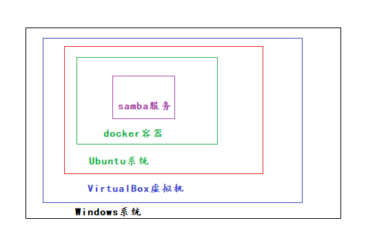

* 如果您按照本文《步骤8：进入Docker编译环境中》的内容操作出现下面的情况，你需要进行如下从操作。

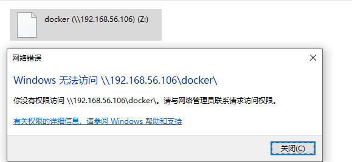

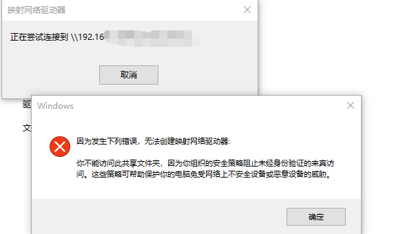

* 步骤1：在Ubuntu的终端重新执行 **service smbd start** 命令

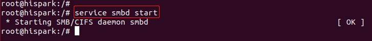


* 步骤2：选择那个连接不上的samba磁盘，鼠标右键，点击断开连接

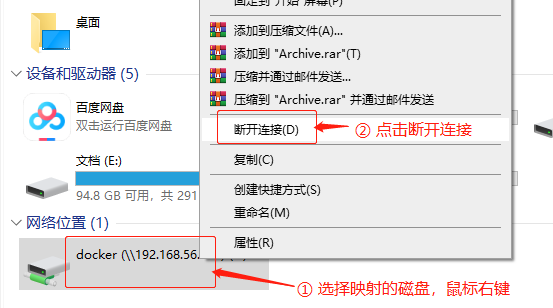

* 步骤3：在Ubuntu的终端执行下面的命令，查看docker的IP地址,本地docker的IP地址是 192.168.56.106

```
ifconfig
```


* 步骤4：点击Windows的此电脑，鼠标右键，选择映射网络驱动器


* 步骤5：输入<font color='RedOrange '>\\\Ubuntu的IP地址\docker</font>，然后点击完成，输入账号(root)和初始密码 (123456)
* 这里的Ubuntu的IP地址，就是你在步骤3查到的那个IP地址

```
\\192.168.56.106\docker
```


* 步骤6：这样docker的根目录就能够在Windows的磁盘下面显示了。这样您就可以方便的进行Windows和docker之间的文件共享了


* 如果按照上面的步骤操作，还是无法正常使用，也可以[参考此链接](https://blog.csdn.net/qq_24330181/article/details/127222337)的解决方案，或者尝试重启电脑再按照上面的步骤进行操作一遍。


## 7.11、ai_sample中提供的OpenCV只是一个基础版本，请问我应该如何添加自己想要的OpenCV模块呢？

* 我们已经把OpenCV的代码放在 /home/openharmony/sdk_linux/sample/taurus/ai_sample/third_party/src/目录下面的了。
* 编译脚本在 /home/openharmony/sdk_linux/sample/taurus/ai_sample/third_party/src/opencv/build/release下，**_build_opencv.sh**为OpenCV的配置脚本，我们可以在这个脚本中根据需要打开或关闭, 其中有些模块之间有依赖性, 需要根据实际情况设置，**_toolchain.cmake**是CMake的编译脚本，指定了编译链的路径，这个文件基本上不需要进行修改。
* 步骤1：进入/home/openharmony/sdk_linux/sample/taurus/ai_sample/third_party/src/opencv/build/release目录下，根据需要打开或关闭。
  * 注意：在编译的过程中，可能因为你需要编译的某些模块之间有依赖性, 需要根据实际情况自行设置。

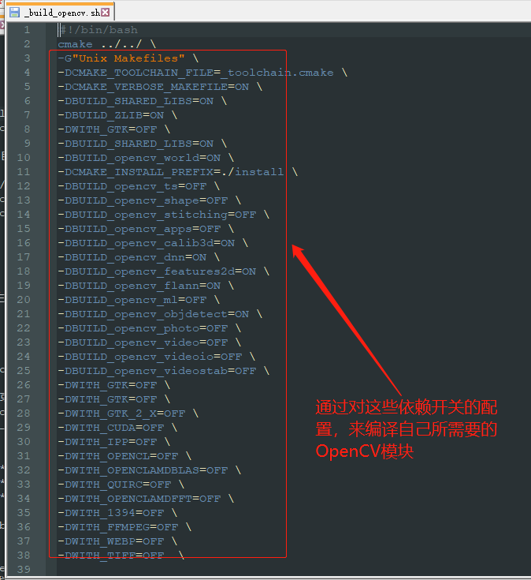

* 步骤2：在docker的终端执行下面的命令，将sysroot目录下的文件复制到上一级目录。

```
cd  /home/openharmony/out/hispark_taurus/ipcamera_hispark_taurus_linux/sysroot/usr/lib/arm-linux-ohos/a7_softfp_neon-vfpv4

cp   *   ../
```

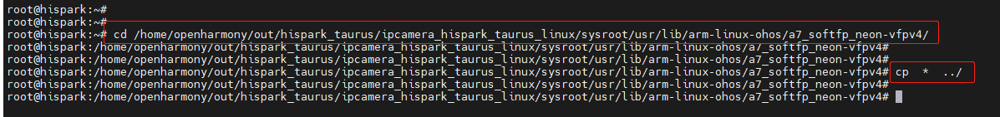

* 步骤3：在docker的终端执行下面的命令，删除之前是Makefile文件，然后重新编译OpenCV。

```
cd   /home/openharmony/sdk_linux/sample/taurus/ai_sample/third_party/src/opencv/build/release

rm CMake* -rf

. _build_opencv.sh

make -j6

make install
```

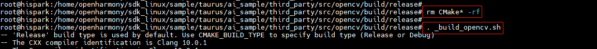

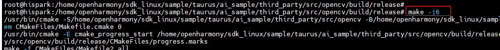

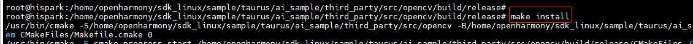

* 步骤4：编译完成后，会在/home/openharmony/sdk_linux/sample/taurus/ai_sample/third_party/src/opencv/build/release目录下生成一个install的文件夹，这个就是我们需要的so库和头文件。

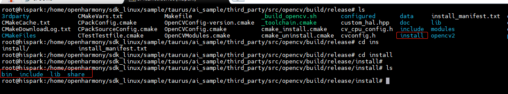

* 步骤5：把重新编译好的opencv库，复制到/home/openharmony/sdk_linux/sample/taurus/ai_sample/third_party/output/opencv/目录下
  * 执行下面的命令，进行操作

```
cd  /home/openharmony/sdk_linux/sample/taurus/ai_sample/third_party/output/opencv/

cp  ../../src/opencv/build/release/install/*  ./   -rf
```

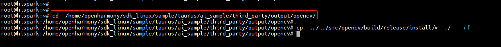

* 步骤6：重新按照 5.4.4小节的内容进行操作即可。

