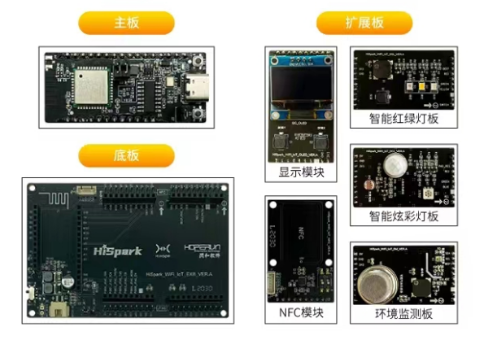
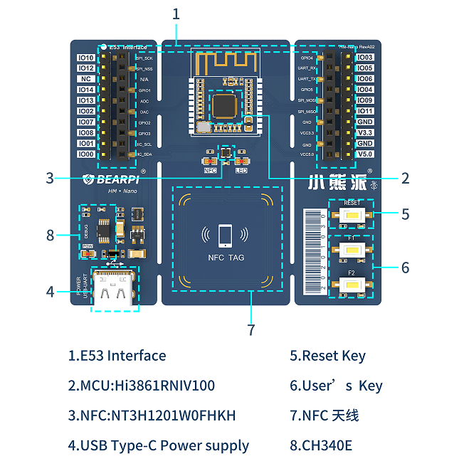
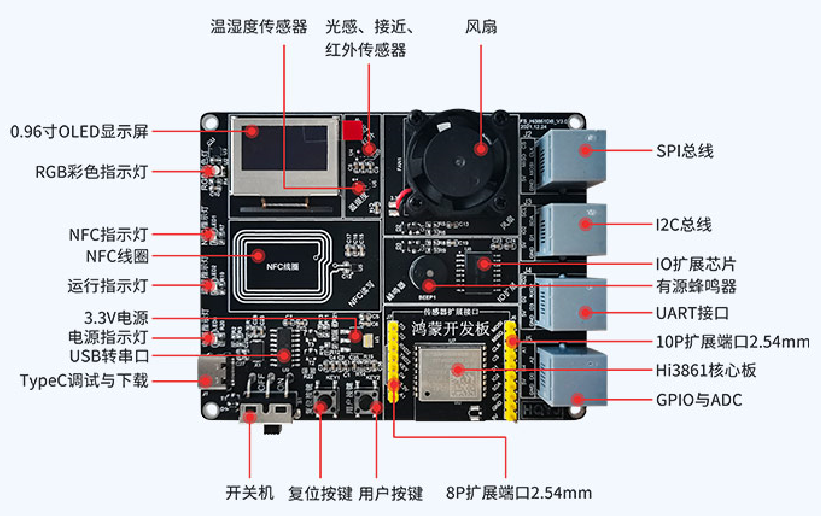
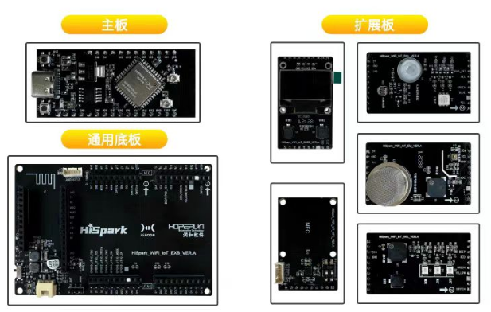
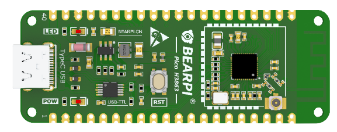
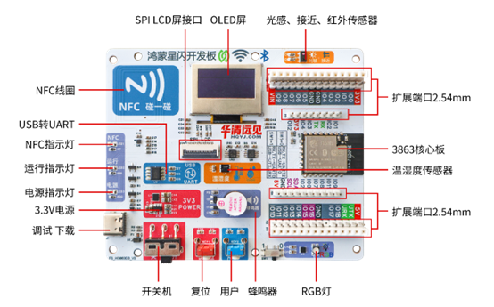
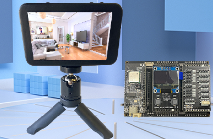
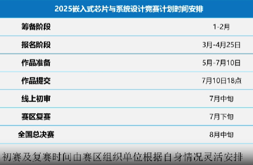
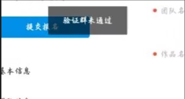
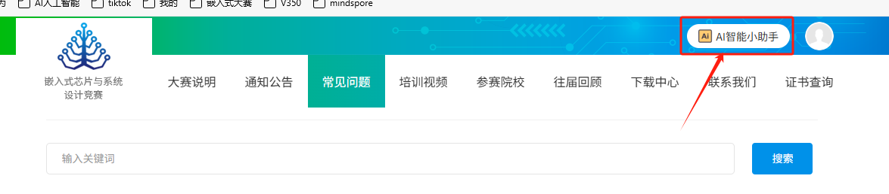

# 2025年嵌入式竞赛海思赛道总入口

## 一、学习入口

|    选题方向    |                           学习入口                           |                           问题求助                           |
| :------------: | :----------------------------------------------------------: | :----------------------------------------------------------: |
| AI端侧智能应用 | [AI端侧智能应用学习资料-Hi3516DV300](https://developers.hisilicon.com/postDetail?tid=0206112326723530001) | [发帖注意事项](https://developers.hisilicon.com/postDetail?tid=0224114142867216002) |
| 星闪物联网应用 | [物联网应用开发学习资料-Hi3861V100](https://developers.hisilicon.com/postDetail?tid=0206112614830760003) | [发帖注意事项](https://developers.hisilicon.com/postDetail?tid=0201116151628933001) |
| 星闪物联网应用 | [星闪物联网应用开发学习资料-WS63（LiteOS系统）](https://gitee.com/HiSpark/fbb_ws63) [星闪物联网应用开发学习资料-WS63（Openharmony系统）](https://gitee.com/HiSpark/ohos_ws63) | [发帖注意事项](https://developers.hisilicon.com/postDetail?tid=0201116151628933001) |
| 星闪物联网应用 | [星闪物联网应用开发学习资料-BS21](https://gitee.com/HiSpark/fbb_bs2x) | [发帖注意事项](https://developers.hisilicon.com/postDetail?tid=0201116151628933001) |

## 二、开发板介绍及购买链接

* **注：购买时可持嵌入式大赛报名成功截图享受优惠**

### **星闪物联网应用方向**

* **Hi3861V100系列开发板**

| 套件介绍                                                     | 购买链接                                                     | 开发板图片                                                  |
| :----------------------------------------------------------- | :----------------------------------------------------------- | ----------------------------------------------------------- |
| [润和满天星系列Pegasus智能家居开发套件](https://developers.hisilicon.com/postDetail?tid=0204114164883246004) | [润和Hi3861V100开发套件](https://e.tb.cn/h.6Qism4fWj0OQNst?tk=qwRqV22CrhI) |  |
| [小熊派BearPi-HM Nano 开发板](https://developers.hisilicon.com/postDetail?tid=0208112586742631003) | [小熊派Hi3861V100开发套件](https://item.taobao.com/item.htm?id=633296694816) |  |
| [华清远见FS-Hi3861开发板](https://developers.hisilicon.com/postDetail?tid=0248142137490994001) | [华清远见Hi3861V100开发套件(淘宝)](https://item.taobao.com/item.htm?id=669997023604) [华清远见Hi3861V100开发套件(京东)](https://ic-item.jd.com/10153674824773.html)  |  |

* **星闪WS63系列开发板**

| 套件介绍                                                     | 购买链接                                                     | 开发板图片                                                   |
| ------------------------------------------------------------ | ------------------------------------------------------------ | ------------------------------------------------------------ |
| [HiHope_NearLink_DK3863E_V03](https://developers.hisilicon.com/postDetail?tid=0224176485045269005) | [润和HiHope_NearLink_DK3863E_V03开发套件(淘宝)](https://e.tb.cn/h.TyIdVOFouZyhA23?tk=vPA6eoh0e0u) [润和HiHope_NearLink_DK3863E_V03开发套件(京东)](https://ic-item.jd.com/10150874487392.html) |  |
| [BearPi-Pico_H3863](https://developers.hisilicon.com/postDetail?tid=0268176458526990002) | [小熊派BearPi-Pico_H3863开发套件](https://item.taobao.com/item.htm?id=821386760379) |   |
| [华清远见WS63星闪开发板](https://developers.hisilicon.com/postDetail?tid=0268176456950600001) | [华清远见WS63星闪开发板（淘宝）](https://item.taobao.com/item.htm?id=892481769813) [华清远见WS63星闪开发板（京东）](https://ic-item.jd.com/10152445103343.html) |   |
| 鼎云物联开发板                                               | [DyCloud_WF6301_DK开发板（京东）](https://ic-item.jd.com/10151635371214.html)  [DyCloud_WF6301星闪模组（京东）](https://ic-item.jd.com/10151639839211.html) |   |

### **AI端侧智能应用方向**

| 套件介绍                                                     | 购买链接             | 开发板图片                                                  |
| :----------------------------------------------------------- | :------------------- | ----------------------------------------------------------- |
| [AI计算机视觉基础开发套件介绍](https://developers.hisilicon.com/postDetail?tid=0227114256333949001) | 报名申请通过海思借用 |  |

## 三、宣讲内容及赛题指南入口

* 2025年嵌入式大赛海思线上宣讲视频入口

* **[2025年应用赛道【上海海思】选题指南](http://socoss.socchina.net/file/cacheFile/2025-3-13/ea1bac4fcaea460389f40b37fa670670.pdf)**

* [第八届（2025）嵌入式大赛报名入口](http://www.socchina.net/home)

* **[第八届（2025）嵌入式大赛组委会线上宣讲视频入口](http://socoss.socchina.net/file/video/2025-3-11/815077e97a4f42f9b0811821f63366f5.mp4)**

## 四、常见问题

* **第八届（2025）嵌入式大赛芯片应用赛道时间安排**

* **大赛队长群：862209090（报名相关问题可咨询）**
* 如果提示验证群未通过，也是使用该群号。

* [常见报名问题FAQ](https://docs.qq.com/sheet/DY211eUF2RWtzSVRX)（也可以向大赛官网的AI智能小助手提问）

