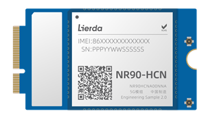
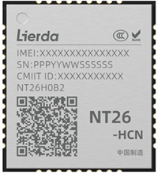

### 开发板介绍及购买链接

##### 利尔达开发板

| 模组/开发板名称                | 硬件原理图                                                   | 模组/开发板介绍                                              | 购买                                                         | 模组/开发板图片                                            |
| ------------------------------ | ------------------------------------------------------------ | ------------------------------------------------------------ | ------------------------------------------------------------ | ---------------------------------------------------------- |
| 利尔达NT26-HCN B系列 CAT.1模组 |                                                              | [NT26-HCN B资料包(Q指令)](https://alidocs.dingtalk.com/i/nodes/3NwLYZXWynKj9KwkcOkZL75qVkyEqBQm) |                                                              |  |
| 利尔达cat.1通用开发板          | [利尔达cat.1通用开发板原理图](https://alidocs.dingtalk.com/i/nodes/R4GpnMqJzG4ND4ZXcqvNGD6E8Ke0xjE3?utm_scene=team_space) | [利尔达cat.1通用开发板介绍](https://alidocs.dingtalk.com/i/nodes/0eMKjyp81379p7YGujP4ewlEVxAZB1Gv?utm_scene=team_space) | [购买链接](https://item.taobao.com/item.htm?ft=t&id=1028610007126) |                                                            |
| 利尔达RedCap模组NR90           | [NR90-HCN 资料包](https://alidocs.dingtalk.com/i/nodes/nYMoO1rWxaGMvG6NH277aO99V47Z3je9) | [利尔达RedCap模组NR90介绍](https://alidocs.dingtalk.com/i/nodes/ndMj49yWjXGOQG2zirqwpOYEJ3pmz5aA?utm_scene=team_space) | [购买链接](https://item.taobao.com/item.htm?ft=t&id=1029292282287) |   |

