# SS928V100_SDK_V2.0.2.2_MPP_Sample

### 背景：

​	为降低代码维护复杂度，将SS928V100 SDK中的MPP Sample代码提取出来，单独进行维护，既方便及时更新相关代码，也方便集成代码到客户工程。

​	如果使用过程中遇到问题，欢迎到易百纳技术社区(https://www.ebaina.com/)发帖提问，并将帖子链接提交到Issue中，我们会尽快安排技术人员处理。

### 1.为减少代码仓大小，已将相关测试源文件删除，可从SDK中获取。

SDK目录：

```
SDK对应目录SS928V100_SDK_V2.0.2.2/smp/a55_linux/mpp/sample/
```

涉及删除的文件和目录：

```
src/avs/data目录
src/gfbg/res目录
src/hdmi/source_file目录
src/heif/data目录
src/hnr/cfg目录
src/mcf/data目录
src/pciv/3840x2160_8bit.h264
src/pciv/mm2.bmp
src/region/res目录
src/scene_auto/param目录
src/svp/dpu/data目录
src/svp/dsp/dsp_bin目录
src/svp/ive/data目录
src/svp/npu/data目录
src/svp/svp_npu/data目录
src/tde/res目录
src/vdec/source_file目录
src/vgs/data目录
src/vio/UsePic_3840x2160_sp420.yuv
```

### 2. Sample 说明

#### 1). 编译Sample

##### ①. 编译所有Sample

​	进入`src`目录下直接`make`，编译所有的`sample`。也可以进入具体的`sample`目录，编译单独的`sample`。

##### ②. 编译带sensor的sample

​	对于需要使用到`Sensor`的例程，需要修改`src/Makefile.param`。

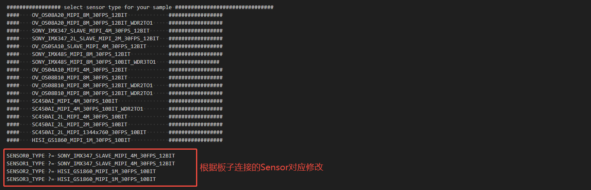

#### 2). vio 说明

##### ①. 转接板说明

`EULER_1R2D V1.0转接板`

| 接口   | 描述           | I2C接口  |
|:------|---------------|----------|
|       | sensor0 4lane | I2C5     |
| J3    | dtof 2lane    | I2C4     |
| J4    | dtof 2lane    | I2C5     |


---

`EULER_2R V1.0 转接板`

| 接口 | 描述          | I2C接口  |
|:-----|---------------|----------|
| J3    | sensor0 4lane | I2C5     |
| J4    | sensor1 4lane | I2C7     |


---

`EULER_4SEN V1.0 转接板`

| 接口      | 描述          | I2C接口   |
|:-------- |---------------|----------|
| ①       | sensor0 2lane | I2C7     |
| ②       | sensor1 2lane | I2C5     |
| ③       | sensor2 2lane | I2C4     |
| ④       | sensor3 2lane | I2C6     |


---

##### ②. 图像传感器适配说明

| 类型         | EULER_1R2D V1.0 | EULER_2R V1.0     | EULER_4SEN V1.0   |
|:------------|-----------------|-------------------|--------------------|
| Sony IMX347 | 4lane sensor0   | 4lane sensor(0~1) | 2lane sensor(0~3)  |
| OV OS04A10  | 4lane sensor0   | 4lane sensor(0~1) | 不支持               |
| OV OS08A20  | 4lane sensor0   | 4lane sensor(0~1) | 不支持                |
| Smart SC450AI | 4lane sensor0 | 4lane sensor(0~1) | 2lane sensor(0~3) |

```
注意:
1. 测试程序的HDMI输出均为1080P60。
2. 测试Sensor前需要配置时钟。
```

##### ③. Sensor 时钟配置

###### a. 方法一， 修改加载`load_ss928v100` 脚本参数

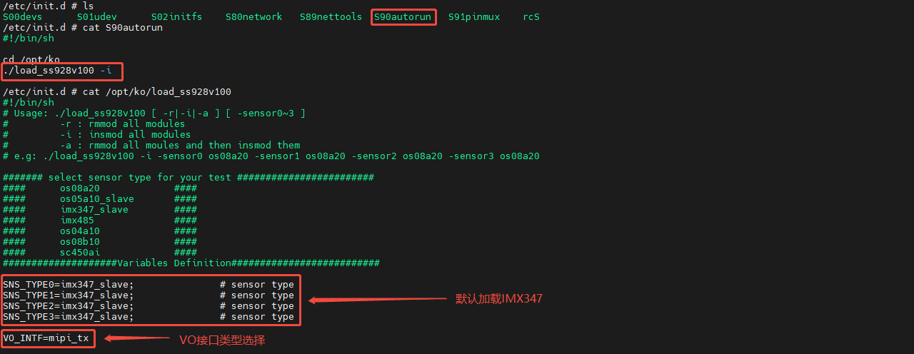

OS04A10和OS08A20 时钟相同，配置一个即可。

```
./load_ss928v100 -i -sensor0 os08a20 -sensor1 os08a20 -sensor2 os08a20 -sensor3 os08a20
```

> 具体说明参考SYS_CONFIG 配置指南.pdf

###### b. 方法二，修改时钟配置寄存器

```
bspmm 0x11018440 0x4001    #Sensor0 配置为24MHz
bspmm 0x11018460 0x4001    #Sensor1 配置为24MHz
bspmm 0x11018480 0x4001    #Sensor2 配置为24MHz
bspmm 0x110184A0 0x4001    #Sensor3 配置为24MHz
```

| 型号          | 时钟寄存器配置 | 时钟大小  |
| :------------ | -------------- | --------- |
| Sony IMX347   | 0x8001         | 37.125MHz |
| OV OS04A10    | 0x4001         | 24MHz     |
| OV OS08A20    | 0x4001         | 24MHz     |
| Smart SC450AI | 0xA001         | 27MHz     |

> 具体寄存器说明参考21AP10 超高清智能网络录像机 SoC 用户指南.pdf 手册。

##### ④. 编译说明(以IMX347为例)

```
1. 编译 4lane 或 2lane 版本时，需要修改src/Makefile.param中的相关配置。
2. src/vio下执行make, 生成sample_vio。
```

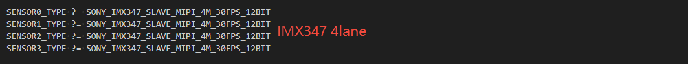
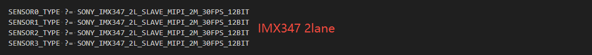

##### ⑤. 运行说明(以IMX347为例)

###### a. 接线(以`IMX347`接`EULER_2R V1.0`为例)

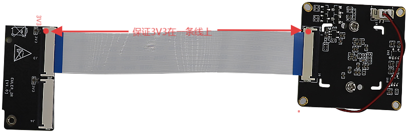

>注: Sensor接线不要看是正线或反线(不同的Sensor可能不同)，要保证Sensor端的3V3连接到转接板的3V3。

###### b. 运行(以IMX347 4x2lane为例)

​	测试`IM347`前，需要配置`Sensor 时钟`。4路sensor 需要额外控制sensor2-3复位。
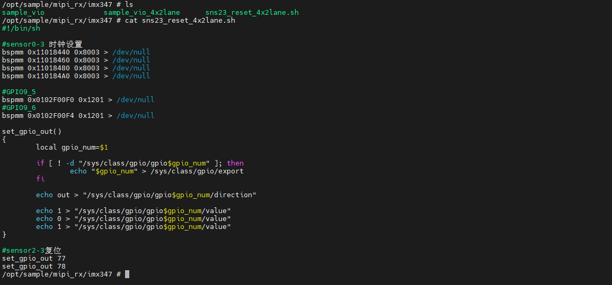

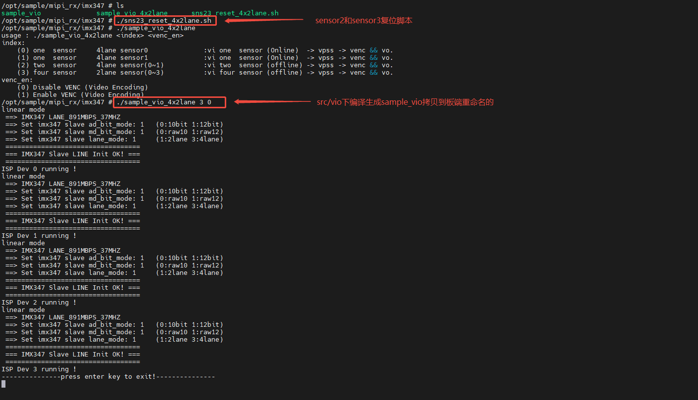

#### 3). vdec 说明

##### ①. 编译说明

```
src/vdec下执行make, 生成sample_vdec。
```

##### ②. 运行说明

###### a. 接线

`EULER_40EXP V1.0转接板`与`MIPI屏幕`接线:


`EULER_40EXP V1.0转接板`与`海鸥派`接线:


###### b. 运行

```
1. 拷贝sample_vdec至板端。
2. SDK中获取src/vdec/source_file/3840x2160_8bit.h。
```

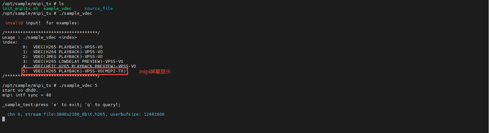
可能用到的背光和复位控制脚本。
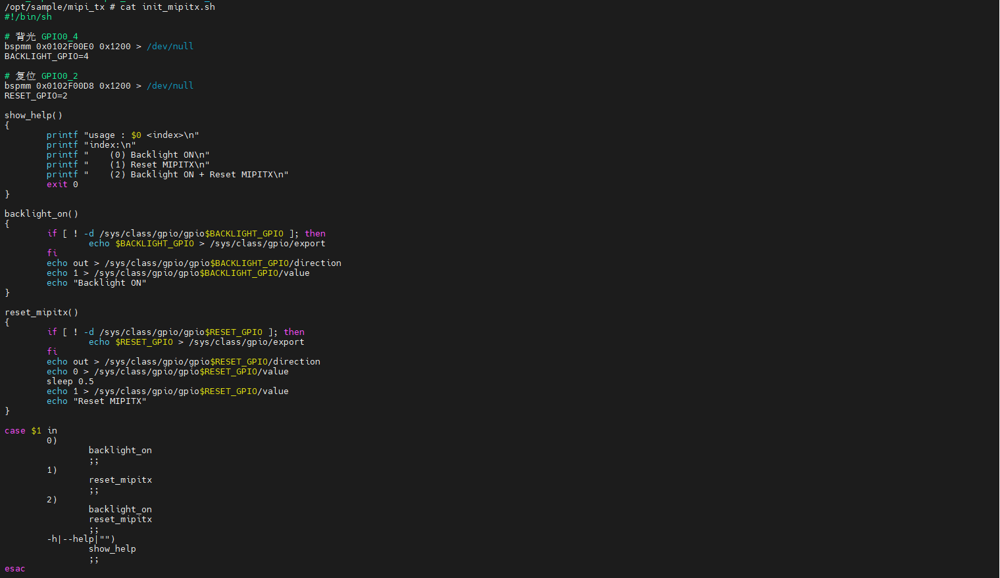

#### 4). host_uvc 说明

##### ①. 编译说明

```
src/host_uvc下执行make, 生成sample_uvc。
```

##### ②. 运行说明

```
1. 拷贝sample_uvc至板端。
2. 接入USB摄像头。
3. 查询当前USB摄像头支持的视频格式。
4. 插上HDMI显示器后根据当前摄像头支持的视频格式进行传参。
```
内核信息:
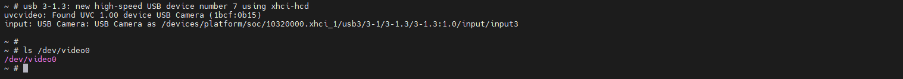

查询支持的视频格式:
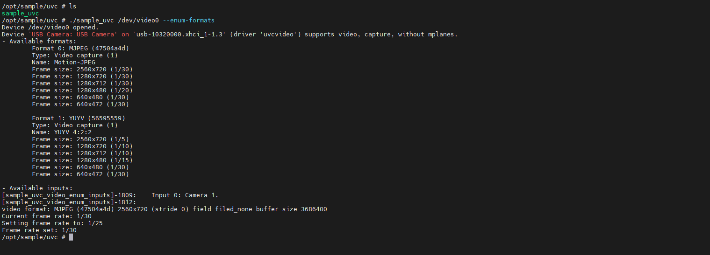

运行信息:
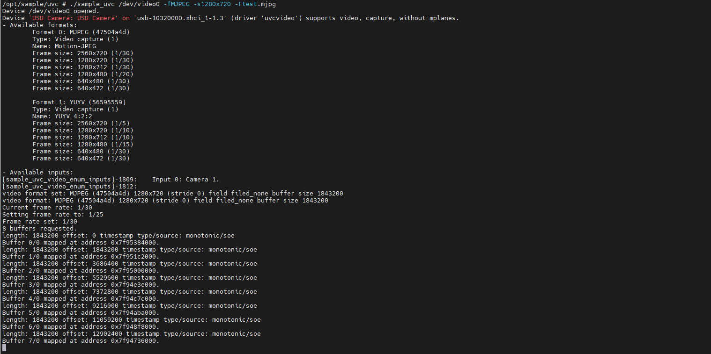

#### 5). audio 说明

##### ①. 编译说明

```
src/audio下执行make, 生成sample_audio。
```

##### ②. 运行说明

```
1. 拷贝sample_audio至板端。
2. 插入符合CTIA标准的3.5mm 四段耳机(带麦克风)。
3. 运行./sample_audio 1, 录制语音，录音结果保存为 audio_chn0.aac 文件。
4. 运行./sample_audio 2, 播放audio_chn0.aac文件。
```
a. 音频输入

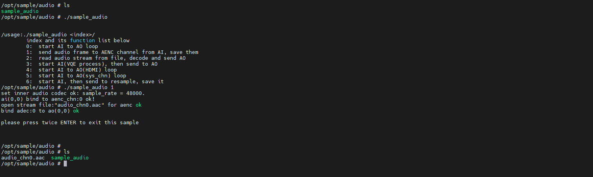

b. 音频输出

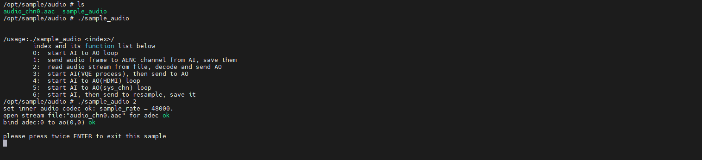

#### 6). yolov8 说明

​	该例程依赖第三方ncnn库(`lib/linux/3rdparty/libncnn.a`)。
```
src/svp/npu_yolo$ tree
.
├── include
│   ├── sample_npu_model.h
│   └── sample_npu_process.h
├── Makefile
├── sample_svp_npu
│   ├── sample_npu_model.c
│   └── sample_npu_process.c
├── sample_yolo.c
├── yolo
│   ├── detectobjs.h
│   ├── wrapperncnn.h
│   ├── yolov5.cpp
│   └── yolov8.cpp
└── yolov8n.om
```
##### ①. 编译说明

```
1. 修改src/Makefile.param, SENSOR0_TYPE选择接入的sensor。
2. src/svp/npu_yolo下执行make, 生成sample_yolov8。
```

##### ②. 运行说明

```
1. 拷贝sample_yolov8和模型文件yolov8n.om至板端。
2. 拷贝npu动态库(lib/linux/hisilicon/npu/*.so)至板端; 提供的固件已包含该库(/opt/lib/npu)。
3. 设置LD_LIBRARY_PATH， export LD_LIBRARY_PATH=/opt/lib/npu:$LD_LIBRARY_PATH。
```
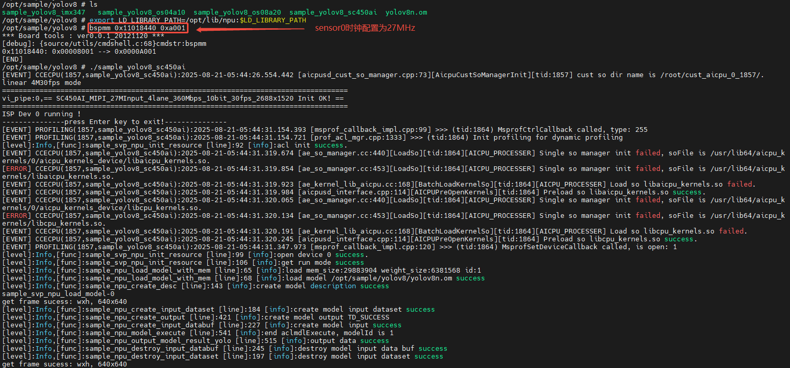

#### 7). dtof 说明

​	该例程依赖depth_process库(`lib/linux/3rdparty/libdepth_process.a`), 依赖头文件路径(`include/3rdparty/dtof`)

```
src/dtof$ tree
.
├── dtof_dumpraw.c
├── dtof.ini
├── dtof_init.sh
├── gs1860_register.ini
├── ko
│   ├── ot_isp.ko
│   ├── ot_mipi_rx.ko
│   └── ot_vi.ko
├── Makefile
└── sample_dtof.c
```
##### ①. 编译说明

```
1. 修改src/Makefile.param, SENSOR0_TYPE选择接入的sensor, SENSOR2_TYPE和SENSOR2_TYPE为HISI_GS1860_MIPI_1M_30FPS_10BIT；
2. 如果需要保存TOF数据，打开src/dtof/Makefile的编译宏开关 #CFLAGS += -DSAVE_DTOF_DATA；
3. src/dtof下执行make, 生成sample_dtof；
```
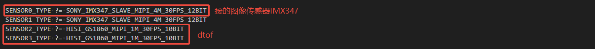

##### ②. 运行说明

```
1. 拷贝src/dtof/ko下的ko至板端，替换/opt/ko下的相关ko, 只需替换一次，替换完成重启即可。
2. 拷贝sample_dtof和配置文件(dtof.ini、gs1860_register.ini)至板端。
3. 拷贝dtof复位控制脚本至板端。
```
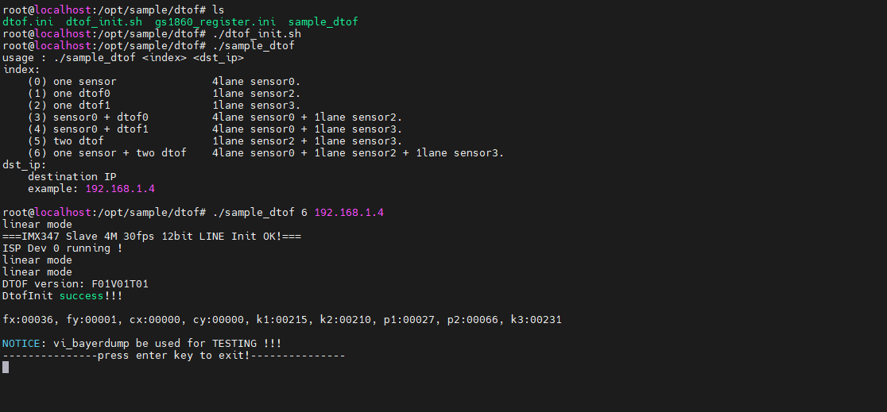

#### 8). rtspserver 说明

​	此目录代码基于 [PHZ76/RtspServer 项目]([PHZ76/RtspServer: RTSP Server , RTSP Pusher](https://github.com/PHZ76/RtspServer))

##### ①. 编译说明

```shell
1.src/rtspserver下执行make, 生成libxoprtsp.a。
```

##### ②. 使用说明

```shell
1.拷贝api调用头文件至include/3rdparty下。
2.拷贝libxoprtsp.a库至lib/3rdparty。
```

#### 9). venc 说明
##### ①. 编译说明

```shell
1.编译Sample前，根据实际使用的Sensor类型修改src/Makefile.param中的相关配置。
2.src/venc下执行make, 生成sample_venc。
```

##### ②. 使用说明

a.录像测试

```shell
1.拷贝sample_venc至板端。
2.运行sample_venc 0 0 后，等待2~4秒，连按两次回车退出程序，查看当前目录是否生成 stream_chn0.h265、stream_chn1.h264 文件。
```

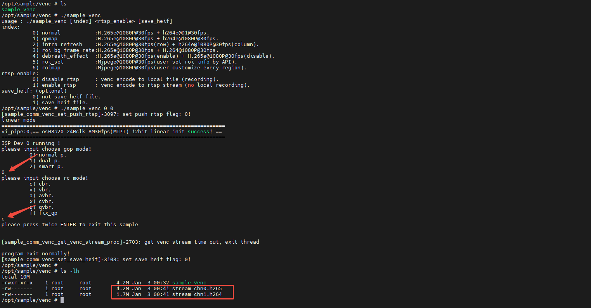

b.rtsp拉流测试

```shell
1.拷贝sample_venc至板端。
2.运行sample_venc 0 1 后，使用VLC/PotPlayer等拉流软件进行拉流(拉流地址：rtsp://<板卡IP>:554/live0)。
```

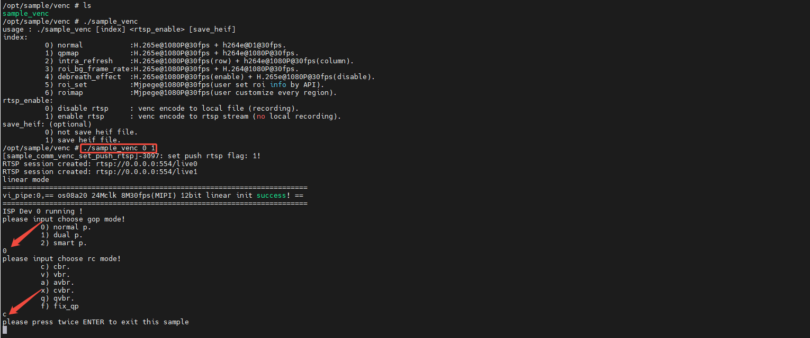


####