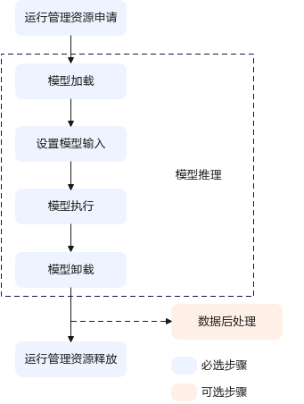
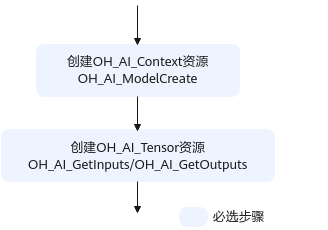
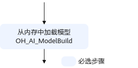
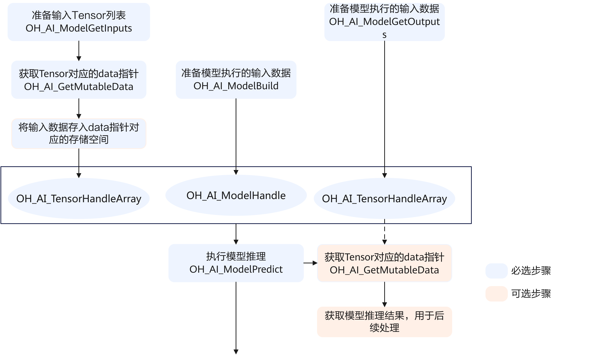
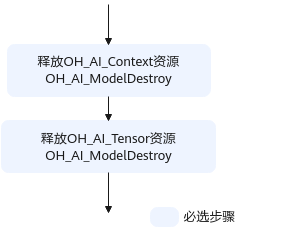

# 前言<a name="ZH-CN_TOPIC_0000002483457685"></a>

**概述<a name="section4537382116410"></a>**

本文档提供MindSpore Lite的模型推理相关接口，该模块下的接口是非线程安全的。

**使用约束<a name="section16874152015422"></a>**

-   不支持创建多线程多进程。
-   对于创建类接口（例如OH\_AI\_ContextCreate、OH\_AI\_ModelCreate等），用户在调用该类接口创建对应的资源后，建议在资源使用完成后及时调用对应的销毁类接口（例如：OH\_AI\_ContextDestroy、OH\_AI\_ModelDestroy等），以避免程序内存泄漏。
-   对于销毁类接口（例如OH\_AI\_ContextDestroy、OH\_AI\_ModelDestroy等），用户在调用该类接口后，不能继续使用已释放或销毁的资源，建议用户在调用销毁类接口后，将相关资源设置为无效值（例如，置为NULL）。
-   HiSpark.AI 3863MCU平台默认最多支持单线程单核CPU后端推理，仅支持x86\_64（用于精度调试标杆）与RISCV平台部署调用。

**产品版本<a name="section27775771"></a>**

与本文档相对应的产品版本如下。

<a name="table22377277"></a>
<table><thead align="left"><tr id="row63051425"><th class="cellrowborder" valign="top" width="40.400000000000006%" id="mcps1.1.3.1.1"><p id="p6891761"><a name="p6891761"></a><a name="p6891761"></a><strong id="b3756104316114"><a name="b3756104316114"></a><a name="b3756104316114"></a>产品名称</strong></p>
</th>
<th class="cellrowborder" valign="top" width="59.599999999999994%" id="mcps1.1.3.1.2"><p id="p21361741"><a name="p21361741"></a><a name="p21361741"></a><strong id="b1676784314119"><a name="b1676784314119"></a><a name="b1676784314119"></a>产品版本</strong></p>
</th>
</tr>
</thead>
<tbody><tr id="row52579486"><td class="cellrowborder" valign="top" width="40.400000000000006%" headers="mcps1.1.3.1.1 "><p id="p3873123721113"><a name="p3873123721113"></a><a name="p3873123721113"></a>3863</p>
</td>
<td class="cellrowborder" valign="top" width="59.599999999999994%" headers="mcps1.1.3.1.2 "><p id="p15873237111113"><a name="p15873237111113"></a><a name="p15873237111113"></a>WS63 1.10.100</p>
</td>
</tr>
</tbody>
</table>

**读者对象<a name="section4378592816410"></a>**

本文档适用于使用基于MindSpore Lite轻量化API接口进行应用开发的人员，通过本文档您可以达成：

-   了解Mindspore Lite轻量化API接口的功能架构、基本概念以及接口的典型调用流程。
-   使用Mindspore Lite 轻量化API进行应用开发的基本流程和实现方法。
-   能够基于文档中的样例，扩展进行其他应用的开发。

掌握以下经验和技能可以更好理解本文档：

-   熟悉Linux基本命令；
-   对机器学习、人工智能有一定的了解；
-   具备C++/C语言程序开发能力。

**符号约定<a name="section133020216410"></a>**

在本文中可能出现下列标志，它们所代表的含义如下。

<a name="table2622507016410"></a>
<table><thead align="left"><tr id="row1530720816410"><th class="cellrowborder" valign="top" width="20.580000000000002%" id="mcps1.1.3.1.1"><p id="p6450074116410"><a name="p6450074116410"></a><a name="p6450074116410"></a><strong id="b2136615816410"><a name="b2136615816410"></a><a name="b2136615816410"></a>符号</strong></p>
</th>
<th class="cellrowborder" valign="top" width="79.42%" id="mcps1.1.3.1.2"><p id="p5435366816410"><a name="p5435366816410"></a><a name="p5435366816410"></a><strong id="b5941558116410"><a name="b5941558116410"></a><a name="b5941558116410"></a>说明</strong></p>
</th>
</tr>
</thead>
<tbody><tr id="row1372280416410"><td class="cellrowborder" valign="top" width="20.580000000000002%" headers="mcps1.1.3.1.1 "><p id="p3734547016410"><a name="p3734547016410"></a><a name="p3734547016410"></a><a name="image2670064316410"></a><a name="image2670064316410"></a><span></span></p>
</td>
<td class="cellrowborder" valign="top" width="79.42%" headers="mcps1.1.3.1.2 "><p id="p1757432116410"><a name="p1757432116410"></a><a name="p1757432116410"></a>表示如不避免则将会导致死亡或严重伤害的具有高等级风险的危害。</p>
</td>
</tr>
<tr id="row466863216410"><td class="cellrowborder" valign="top" width="20.580000000000002%" headers="mcps1.1.3.1.1 "><p id="p1432579516410"><a name="p1432579516410"></a><a name="p1432579516410"></a><a name="image4895582316410"></a><a name="image4895582316410"></a><span></span></p>
</td>
<td class="cellrowborder" valign="top" width="79.42%" headers="mcps1.1.3.1.2 "><p id="p959197916410"><a name="p959197916410"></a><a name="p959197916410"></a>表示如不避免则可能导致死亡或严重伤害的具有中等级风险的危害。</p>
</td>
</tr>
<tr id="row123863216410"><td class="cellrowborder" valign="top" width="20.580000000000002%" headers="mcps1.1.3.1.1 "><p id="p1232579516410"><a name="p1232579516410"></a><a name="p1232579516410"></a><a name="image1235582316410"></a><a name="image1235582316410"></a><span></span></p>
</td>
<td class="cellrowborder" valign="top" width="79.42%" headers="mcps1.1.3.1.2 "><p id="p123197916410"><a name="p123197916410"></a><a name="p123197916410"></a>表示如不避免则可能导致轻微或中度伤害的具有低等级风险的危害。</p>
</td>
</tr>
<tr id="row5786682116410"><td class="cellrowborder" valign="top" width="20.580000000000002%" headers="mcps1.1.3.1.1 "><p id="p2204984716410"><a name="p2204984716410"></a><a name="p2204984716410"></a><a name="image4504446716410"></a><a name="image4504446716410"></a><span></span></p>
</td>
<td class="cellrowborder" valign="top" width="79.42%" headers="mcps1.1.3.1.2 "><p id="p4388861916410"><a name="p4388861916410"></a><a name="p4388861916410"></a>用于传递设备或环境安全警示信息。如不避免则可能会导致设备损坏、数据丢失、设备性能降低或其它不可预知的结果。</p>
<p id="p1238861916410"><a name="p1238861916410"></a><a name="p1238861916410"></a>“须知”不涉及人身伤害。</p>
</td>
</tr>
<tr id="row2856923116410"><td class="cellrowborder" valign="top" width="20.580000000000002%" headers="mcps1.1.3.1.1 "><p id="p5555360116410"><a name="p5555360116410"></a><a name="p5555360116410"></a><a name="image799324016410"></a><a name="image799324016410"></a><span></span></p>
</td>
<td class="cellrowborder" valign="top" width="79.42%" headers="mcps1.1.3.1.2 "><p id="p4612588116410"><a name="p4612588116410"></a><a name="p4612588116410"></a>对正文中重点信息的补充说明。</p>
<p id="p1232588116410"><a name="p1232588116410"></a><a name="p1232588116410"></a>“说明”不是安全警示信息，不涉及人身、设备及环境伤害信息。</p>
</td>
</tr>
</tbody>
</table>

**修改记录<a name="section2467512116410"></a>**

<a name="table1557726816410"></a>
<table><thead align="left"><tr id="row2942532716410"><th class="cellrowborder" valign="top" width="20.72%" id="mcps1.1.4.1.1"><p id="p3778275416410"><a name="p3778275416410"></a><a name="p3778275416410"></a><strong id="b5687322716410"><a name="b5687322716410"></a><a name="b5687322716410"></a>文档版本</strong></p>
</th>
<th class="cellrowborder" valign="top" width="26.119999999999997%" id="mcps1.1.4.1.2"><p id="p5627845516410"><a name="p5627845516410"></a><a name="p5627845516410"></a><strong id="b5800814916410"><a name="b5800814916410"></a><a name="b5800814916410"></a>发布日期</strong></p>
</th>
<th class="cellrowborder" valign="top" width="53.16%" id="mcps1.1.4.1.3"><p id="p2382284816410"><a name="p2382284816410"></a><a name="p2382284816410"></a><strong id="b3316380216410"><a name="b3316380216410"></a><a name="b3316380216410"></a>修改说明</strong></p>
</th>
</tr>
</thead>
<tbody><tr id="row5947359616410"><td class="cellrowborder" valign="top" width="20.72%" headers="mcps1.1.4.1.1 "><p id="p2149706016410"><a name="p2149706016410"></a><a name="p2149706016410"></a>01</p>
</td>
<td class="cellrowborder" valign="top" width="26.119999999999997%" headers="mcps1.1.4.1.2 "><p id="p648803616410"><a name="p648803616410"></a><a name="p648803616410"></a>2025-09-23</p>
</td>
<td class="cellrowborder" valign="top" width="53.16%" headers="mcps1.1.4.1.3 "><p id="p1946537916410"><a name="p1946537916410"></a><a name="p1946537916410"></a>第一次正式版本发布。</p>
</td>
</tr>
</tbody>
</table>

# 简介<a name="ZH-CN_TOPIC_0000002356428965"></a>

本文用于指导开发人员基于MNIST模型、利用MindSpore Lite提供的C语言API库，实现第三方开源框架（如TFLite、ONNX等）网络模型轻量化部署与推理任务。


## MindSpore接口定义<a name="ZH-CN_TOPIC_0000002322571836"></a>

MindSpore Lite API提供了用于上下文配置、模型创建、推理以及Tensor创建与修改的C语言API库，供用户开发模型轻量化部署与推理应用。

## 基本概念<a name="ZH-CN_TOPIC_0000002356450521"></a>

**表 1**  概念介绍

<a name="table57631159019"></a>
<table><thead align="left"><tr id="row578619150010"><th class="cellrowborder" valign="top" width="26%" id="mcps1.2.3.1.1"><p id="p97861015507"><a name="p97861015507"></a><a name="p97861015507"></a>概念</p>
</th>
<th class="cellrowborder" valign="top" width="74%" id="mcps1.2.3.1.2"><p id="p8786111513011"><a name="p8786111513011"></a><a name="p8786111513011"></a>描述</p>
</th>
</tr>
</thead>
<tbody><tr id="row2786161518017"><td class="cellrowborder" valign="top" width="26%" headers="mcps1.2.3.1.1 "><p id="p1490041218"><a name="p1490041218"></a><a name="p1490041218"></a>Context</p>
</td>
<td class="cellrowborder" valign="top" width="74%" headers="mcps1.2.3.1.2 "><p id="p42115916212"><a name="p42115916212"></a><a name="p42115916212"></a><span>Context即上下文配置，</span><span>保存了需要的一些基本配置参数，用于控制模型编译和模型执行</span>。</p>
</td>
</tr>
<tr id="row197861915506"><td class="cellrowborder" valign="top" width="26%" headers="mcps1.2.3.1.1 "><p id="p1778618151003"><a name="p1778618151003"></a><a name="p1778618151003"></a>Model</p>
</td>
<td class="cellrowborder" valign="top" width="74%" headers="mcps1.2.3.1.2 "><p id="p19351634434"><a name="p19351634434"></a><a name="p19351634434"></a><span>Model定义了MindSpore中编译和运行的模型</span><span>，便于计算图管理。</span></p>
</td>
</tr>
<tr id="row87869157020"><td class="cellrowborder" valign="top" width="26%" headers="mcps1.2.3.1.1 "><p id="p2657191119716"><a name="p2657191119716"></a><a name="p2657191119716"></a><span>Tensor</span></p>
</td>
<td class="cellrowborder" valign="top" width="74%" headers="mcps1.2.3.1.2 "><p id="p14842212346"><a name="p14842212346"></a><a name="p14842212346"></a><span>Tensor</span><span>定义了MindSpore中的张量。</span><span>通过MindSpore OH_AI_Tensor的接口，用户可以创建、销毁张量，也可以获取或者修改张量的属性。</span></p>
</td>
</tr>
<tr id="row16436856329"><td class="cellrowborder" valign="top" width="26%" headers="mcps1.2.3.1.1 "><p id="p1643618518320"><a name="p1643618518320"></a><a name="p1643618518320"></a>MSLite API</p>
</td>
<td class="cellrowborder" valign="top" width="74%" headers="mcps1.2.3.1.2 "><p id="p1943617543214"><a name="p1943617543214"></a><a name="p1943617543214"></a>MindSpore Lite轻量化API。</p>
</td>
</tr>
</tbody>
</table>

## 获取Sample方法<a name="ZH-CN_TOPIC_0000002356410665"></a>

当前MindSpore Lite提供的样例如[表1](#table1976211111820)所示，从[mnist网络模型](https://download.mindspore.cn/model_zoo/official/lite/quick_start/micro/mnist.tar.gz)链接中获取mnist网络的模型文件，下载后解压得到mnist.tflite、mnist.tflite.ms.bin（mnist输入数据）、mnist.tflite.ms.out（标杆输出数据，可用于精度对比），该模型为已经训练完成的MNIST分类模型。

**表 1**  MNIST样例列表

<a name="table1976211111820"></a>
<table><thead align="left"><tr id="row0776414814"><th class="cellrowborder" valign="top" width="21.85%" id="mcps1.2.4.1.1"><p id="p8776511386"><a name="p8776511386"></a><a name="p8776511386"></a>sample</p>
</th>
<th class="cellrowborder" valign="top" width="41.15%" id="mcps1.2.4.1.2"><p id="p20776419812"><a name="p20776419812"></a><a name="p20776419812"></a>sample样例功能</p>
</th>
<th class="cellrowborder" valign="top" width="37%" id="mcps1.2.4.1.3"><p id="p7776811887"><a name="p7776811887"></a><a name="p7776811887"></a>样例介绍、编译及运行</p>
</th>
</tr>
</thead>
<tbody><tr id="row187761511182"><td class="cellrowborder" valign="top" width="21.85%" headers="mcps1.2.4.1.1 "><p id="p8776111188"><a name="p8776111188"></a><a name="p8776111188"></a>mnist</p>
</td>
<td class="cellrowborder" valign="top" width="41.15%" headers="mcps1.2.4.1.2 "><p id="p157766119817"><a name="p157766119817"></a><a name="p157766119817"></a>识别手写数字0～9，通过多层卷积和池化等方法提取图像特征，预测10个类别的概率分布。</p>
</td>
<td class="cellrowborder" valign="top" width="37%" headers="mcps1.2.4.1.3 "><p id="p14776813818"><a name="p14776813818"></a><a name="p14776813818"></a>基于现有的MindSpore Lite轻量化API接口，实现第三方开源框架（如TFLite、ONNX等）网络模型轻量化部署与推理任务。</p>
</td>
</tr>
</tbody>
</table>

用户可下载mnist网络模型，切换到sample目录并解压。

```
#切换至sample目录
cd "sample安装目录"
#解压sample压缩包
tar -xvf mnist.tar.gz
```

# 接口调用流程介绍<a name="ZH-CN_TOPIC_0000002322390472"></a>

本章主要介绍MSLite API接口调用流程。


## 接口调用流程图<a name="ZH-CN_TOPIC_0000002323808050"></a>

MSLite API接口调用流程如[接口调用流程图](#fig18338134105017)所示。

**图 1**  接口调用流程图<a name="fig18338134105017"></a>  



> **说明：** 
>在应用开发过程中，各环节都涉及内存的申请与释放、数据传输（通过内存复制实现）、数据类型的创建与销毁，因此未在图中一一标识。

在[接口调用流程图](#fig18338134105017)中展示了应用开发中的典型功能抽象出主要接口的调用流程。例如，若需要实现模型推理功能，则需先加载模型，模型推理结束后，则需卸载模型；若模型推理后需打印sample推理的结果概率，则需进行数据后处理。

1.  运行管理资源申请：通过调用 OH\_AI\_ContextCreate接口申请运行管理资源，具体流程请参见“[Context管理](Context管理.md)”。
2.  模型推理。
    1.  模型加载：模型推理前，需要先调用OH\_AI\_ModelBuild接口将对应的模型加载到系统中。具体流程请参见“[模型加载与执行](模型加载与执行.md)”。
    2.  设置模型输入：在模型推理之前，需要读取bin格式数据文件并转换为模型输入。
    3.  模型执行：调用OH\_AI\_ModelPredict接口，当前仅支持CPU后端单核单线程推理预测。
    4.  数据后处理（可选）：根据用户的实际需求来处理模型推理结果。例如用户可以将获取的推理结果写入文件、打印所有的预测概率或是从推理结果中找到最大置信度的类别标识。
    5.  模型卸载：调用OH\_AI\_ModelDestroy接口卸载模型。

1.  运行管理资源释放：所有数据处理完成后，需要释放运行管理资源（OH\_AI\_Context、OH\_AI\_Tensor）。具体流程请参见“[Context管理](Context管理.md)、[Tensor管理](Tensor管理.md)”以销毁资源。

## 运行管理资源申请<a name="ZH-CN_TOPIC_0000002357566825"></a>

运行管理资源包含OH\_AI\_Context、OH\_AI\_Tensor，其创建的流程如[运行管理资源申请流程](#fig10806173215305)所示。

**图 1**  运行管理资源申请流程<a name="fig10806173215305"></a>  



根据上述流程，创建OH\_AI\_Context、OH\_AI\_Tensor等运行管理资源需按照如下原则来进行：

-   在创建OH\_AI\_Tensor资源时，需要调用OH\_AI\_GetInputs/OH\_AI\_GetOutputs接口，接着从返回的OH\_AI\_TensorHandleArray结构体中获取对应OH\_AI\_Tensor的句柄。
-   在创建OH\_AI\_Context资源时，需要调用OH\_AI\_ContextCreate接口，并获取句柄。

## 模型加载<a name="ZH-CN_TOPIC_0000002357726713"></a>

**图 1**  模型加载流程<a name="fig1447085594516"></a>  



通过调用OH\_AI\_ModelBuild接口，实现模型权重的自动加载。

## 模型执行<a name="ZH-CN_TOPIC_0000002323648222"></a>

**图 1**  模型执行流程图<a name="fig0703101991"></a>  



-   调用OH\_AI\_ModelGetInputs接口与OH\_AI\_ModelGetOutputs接口创建模型输入输出，准备模型执行的输入数据与输出数据。
-   调用OH\_AI\_ModelPredict接口做模型推理，具体请参见“[模型加载与执行](模型加载与执行.md)”。
-   获取模型推理的结果，用于后续处理。

## 运行管理资源释放<a name="ZH-CN_TOPIC_0000002323808054"></a>

运行管理资源包含OH\_AI\_Context、OH\_AI\_Tensor，其释放的流程如[运行管理资源释放流程](#fig11118195115402)所示。

**图 1**  运行管理资源释放流程<a name="fig11118195115402"></a>  



根据上述流程，释放OH\_AI\_Context、OH\_AI\_Tensor等运行管理资源需按照如下原则来进行：

-   在销毁OH\_AI\_Tensor资源时，需要调用OH\_AI\_ModelDestroy接口，来销毁modelHandle所关联的OH\_AI\_TensorHandleArray结构体中的OH\_AI\_Tensor资源。
-   在销毁OH\_AI\_Context资源时，需要调用OH\_AI\_ContextDestroy接口。

# MSLite API参考<a name="ZH-CN_TOPIC_0000002356389125"></a>


## 接口列表<a name="ZH-CN_TOPIC_0000002323474462"></a>

**表 1**  接口列表

<a name="table19740181133114"></a>
<table><thead align="left"><tr id="row128291915313"><th class="cellrowborder" valign="top" width="11.219999999999999%" id="mcps1.2.4.1.1"><p id="p382914193116"><a name="p382914193116"></a><a name="p382914193116"></a>类型</p>
</th>
<th class="cellrowborder" valign="top" width="52.68000000000001%" id="mcps1.2.4.1.2"><p id="p1682920110310"><a name="p1682920110310"></a><a name="p1682920110310"></a>结构体/API接口</p>
</th>
<th class="cellrowborder" valign="top" width="36.1%" id="mcps1.2.4.1.3"><p id="p18291518319"><a name="p18291518319"></a><a name="p18291518319"></a>接口描述</p>
</th>
</tr>
</thead>
<tbody><tr id="row1160317261643"><td class="cellrowborder" valign="top" width="11.219999999999999%" headers="mcps1.2.4.1.1 "><p id="p66031261146"><a name="p66031261146"></a><a name="p66031261146"></a>结构体</p>
</td>
<td class="cellrowborder" valign="top" width="52.68000000000001%" headers="mcps1.2.4.1.2 "><p id="p4603172614415"><a name="p4603172614415"></a><a name="p4603172614415"></a>OH_AI_TensorHandleArray</p>
</td>
<td class="cellrowborder" valign="top" width="36.1%" headers="mcps1.2.4.1.3 "><p id="p1346516415810"><a name="p1346516415810"></a><a name="p1346516415810"></a><span>张量数组结构体，用于存储张量数组指针和张量数组长度，结构体声明如下。包括两个成员变量：张量数组长度 handle_num和指向张量数组的指针 handle_list。</span></p>
<pre class="codeblock" id="codeblock199715282015"><a name="codeblock199715282015"></a><a name="codeblock199715282015"></a>typedef struct OH_AI_TensorHandleArray {
   size_t handle_num;
    OH_AI_TensorHandle *handle_list;
} OH_AI_TensorHandleArray;</pre>
</td>
</tr>
<tr id="row20829617310"><td class="cellrowborder" rowspan="2" valign="top" width="11.219999999999999%" headers="mcps1.2.4.1.1 "><p id="p2829013315"><a name="p2829013315"></a><a name="p2829013315"></a>Context管理</p>
</td>
<td class="cellrowborder" valign="top" width="52.68000000000001%" headers="mcps1.2.4.1.2 "><p id="p11719386222"><a name="p11719386222"></a><a name="p11719386222"></a>OH_AI_ContextHandle OH_AI_ContextCreate()</p>
</td>
<td class="cellrowborder" valign="top" width="36.1%" headers="mcps1.2.4.1.3 "><p id="p668310556343"><a name="p668310556343"></a><a name="p668310556343"></a>创建一个OH_AI_Context。</p>
</td>
</tr>
<tr id="row1282991173117"><td class="cellrowborder" valign="top" headers="mcps1.2.4.1.1 "><p id="p31619380227"><a name="p31619380227"></a><a name="p31619380227"></a>void OH_AI_ContextDestroy(OH_AI_ContextHandle* context)</p>
</td>
<td class="cellrowborder" valign="top" headers="mcps1.2.4.1.2 "><p id="p18081624153613"><a name="p18081624153613"></a><a name="p18081624153613"></a>销毁一个OH_AI_Context。</p>
</td>
</tr>
<tr id="row178301113319"><td class="cellrowborder" rowspan="2" valign="top" width="11.219999999999999%" headers="mcps1.2.4.1.1 "><p id="p16830018312"><a name="p16830018312"></a><a name="p16830018312"></a>Tensor管理</p>
</td>
<td class="cellrowborder" valign="top" width="52.68000000000001%" headers="mcps1.2.4.1.2 "><p id="p387811995113"><a name="p387811995113"></a><a name="p387811995113"></a>int64_t OH_AI_TensorGetElementNum(const MSTensorHandle tensor);</p>
</td>
<td class="cellrowborder" valign="top" width="36.1%" headers="mcps1.2.4.1.3 "><p id="p4115382220"><a name="p4115382220"></a><a name="p4115382220"></a>获取OH_AI_Tensor的元素个数。</p>
</td>
</tr>
<tr id="row98301119312"><td class="cellrowborder" valign="top" headers="mcps1.2.4.1.1 "><p id="p16464218329"><a name="p16464218329"></a><a name="p16464218329"></a>void *OH_AI_TensorGetMutableData(const MSTensorHandle tensor);</p>
</td>
<td class="cellrowborder" valign="top" headers="mcps1.2.4.1.2 "><p id="p2067854691014"><a name="p2067854691014"></a><a name="p2067854691014"></a>获取可变的OH_AI_Tensor的数据。</p>
</td>
</tr>
<tr id="row983081113117"><td class="cellrowborder" rowspan="6" valign="top" width="11.219999999999999%" headers="mcps1.2.4.1.1 "><p id="p8830611311"><a name="p8830611311"></a><a name="p8830611311"></a>模型加载与运行</p>
</td>
<td class="cellrowborder" valign="top" width="52.68000000000001%" headers="mcps1.2.4.1.2 "><p id="p14938182212"><a name="p14938182212"></a><a name="p14938182212"></a>OH_AI_ModelHandle OH_AI_ModelCreate()</p>
</td>
<td class="cellrowborder" valign="top" width="36.1%" headers="mcps1.2.4.1.3 "><p id="p94153817228"><a name="p94153817228"></a><a name="p94153817228"></a>创建一个模型对象。</p>
</td>
</tr>
<tr id="row683017173118"><td class="cellrowborder" valign="top" headers="mcps1.2.4.1.1 "><p id="p16353815224"><a name="p16353815224"></a><a name="p16353815224"></a><span>void OH_AI_ModelDestroy(OH_AI_ModelHandle *model)</span></p>
</td>
<td class="cellrowborder" valign="top" headers="mcps1.2.4.1.2 "><p id="p582640114214"><a name="p582640114214"></a><a name="p582640114214"></a>销毁一个模型对象。</p>
</td>
</tr>
<tr id="row1583114110319"><td class="cellrowborder" valign="top" headers="mcps1.2.4.1.1 "><p id="p1834754013229"><a name="p1834754013229"></a><a name="p1834754013229"></a><span>OH_AI_TensorHandleArray OH_AI_ModelGetInputs(const OH_AI_ModelHandle model)</span></p>
</td>
<td class="cellrowborder" valign="top" headers="mcps1.2.4.1.2 "><p id="p1811719351440"><a name="p1811719351440"></a><a name="p1811719351440"></a>获取模型的输入张量数组结构体。</p>
</td>
</tr>
<tr id="row118315143110"><td class="cellrowborder" valign="top" headers="mcps1.2.4.1.1 "><p id="p17470228338"><a name="p17470228338"></a><a name="p17470228338"></a>OH_AI_TensorHandleArray OH_AI_ModelGetOutputs(const OH_AI_ModelHandle model)</p>
</td>
<td class="cellrowborder" valign="top" headers="mcps1.2.4.1.2 "><p id="p6641154704416"><a name="p6641154704416"></a><a name="p6641154704416"></a>获取模型的输出张量数组结构体。</p>
</td>
</tr>
<tr id="row083118112314"><td class="cellrowborder" valign="top" headers="mcps1.2.4.1.1 "><p id="p1025383223"><a name="p1025383223"></a><a name="p1025383223"></a>OH_AI_Status OH_AI_ModelBuild(OH_AI_ModelHandle model, const void *model_data, size_t data_size, const OH_AI_ContextHandle model_context)</p>
</td>
<td class="cellrowborder" valign="top" headers="mcps1.2.4.1.2 "><p id="p3390855184214"><a name="p3390855184214"></a><a name="p3390855184214"></a>从内存缓冲区加载并编译MindSpore模型。</p>
</td>
</tr>
<tr id="row11470182113319"><td class="cellrowborder" valign="top" headers="mcps1.2.4.1.1 "><p id="p93481540142216"><a name="p93481540142216"></a><a name="p93481540142216"></a>OH_AI_Status OH_AI_ModelPredict(OH_AI_ModelHandle model, const OH_AI_TensorHandleArray inputs, OH_AI_TensorHandleArray *outputs)</p>
</td>
<td class="cellrowborder" valign="top" headers="mcps1.2.4.1.2 "><p id="p1586810193441"><a name="p1586810193441"></a><a name="p1586810193441"></a>执行模型推理。</p>
</td>
</tr>
</tbody>
</table>

## Context管理<a name="ZH-CN_TOPIC_0000002357273153"></a>


### OH\_AI\_ContextCreate<a name="ZH-CN_TOPIC_0000002357729493"></a>

【描述】

创建一个OH\_AI\_Context。

【语法】

OH\_AI\_ContextHandle OH\_AI\_ContextCreate\(\)

【返回值】

指向创建的OH\_AI\_Context的指针。

### OH\_AI\_ContextDestroy<a name="ZH-CN_TOPIC_0000002357569605"></a>

【描述】

销毁一个OH\_AI\_Context。

【语法】

void OH\_AI\_ContextDestroy\(OH\_AI\_ContextHandle\* context\)

【参数说明】

<a name="table48954020370"></a>
<table><thead align="left"><tr id="row3102184083712"><th class="cellrowborder" valign="top" width="35.8%" id="mcps1.1.3.1.1"><p id="p410214013715"><a name="p410214013715"></a><a name="p410214013715"></a>参数名</p>
</th>
<th class="cellrowborder" valign="top" width="64.2%" id="mcps1.1.3.1.2"><p id="p81021140123719"><a name="p81021140123719"></a><a name="p81021140123719"></a>说明</p>
</th>
</tr>
</thead>
<tbody><tr id="row91024404373"><td class="cellrowborder" valign="top" width="35.8%" headers="mcps1.1.3.1.1 "><p id="p13254133389"><a name="p13254133389"></a><a name="p13254133389"></a>context</p>
</td>
<td class="cellrowborder" valign="top" width="64.2%" headers="mcps1.1.3.1.2 "><p id="p443817863816"><a name="p443817863816"></a><a name="p443817863816"></a>指向OH_AI_Context的指针。</p>
</td>
</tr>
</tbody>
</table>

## Tensor管理<a name="ZH-CN_TOPIC_0000002357393253"></a>


### OH\_AI\_TensorGetElementNum<a name="ZH-CN_TOPIC_0000002323810834"></a>

【描述】

获取OH\_AI\_Tensor的元素个数。

【语法】

int64\_t OH\_AI\_TensorGetElementNum\(const OH\_AI\_TensorHandle tensor\)

【参数说明】

<a name="table48954020370"></a>
<table><thead align="left"><tr id="row3102184083712"><th class="cellrowborder" valign="top" width="35.8%" id="mcps1.1.3.1.1"><p id="p410214013715"><a name="p410214013715"></a><a name="p410214013715"></a>参数名</p>
</th>
<th class="cellrowborder" valign="top" width="64.2%" id="mcps1.1.3.1.2"><p id="p81021140123719"><a name="p81021140123719"></a><a name="p81021140123719"></a>说明</p>
</th>
</tr>
</thead>
<tbody><tr id="row91024404373"><td class="cellrowborder" valign="top" width="35.8%" headers="mcps1.1.3.1.1 "><p id="p4732195215391"><a name="p4732195215391"></a><a name="p4732195215391"></a>tensor</p>
</td>
<td class="cellrowborder" valign="top" width="64.2%" headers="mcps1.1.3.1.2 "><p id="p665913155919"><a name="p665913155919"></a><a name="p665913155919"></a>指向OH_AI_Tensor的指针。</p>
</td>
</tr>
</tbody>
</table>

【返回值】OH\_AI\_Tensor的元素个数。返回值为-1说明入参为空指针。

### OH\_AI\_TensorGetMutableData<a name="ZH-CN_TOPIC_0000002323651014"></a>

【描述】

获取可变的OH\_AI\_Tensor的数据。

【语法】

void\* OH\_AI\_TensorGetMutableData\(const OH\_AI\_TensorHandle tensor\)

【参数说明】

<a name="table48954020370"></a>
<table><thead align="left"><tr id="row3102184083712"><th class="cellrowborder" valign="top" width="35.8%" id="mcps1.1.3.1.1"><p id="p410214013715"><a name="p410214013715"></a><a name="p410214013715"></a>参数名</p>
</th>
<th class="cellrowborder" valign="top" width="64.2%" id="mcps1.1.3.1.2"><p id="p81021140123719"><a name="p81021140123719"></a><a name="p81021140123719"></a>说明</p>
</th>
</tr>
</thead>
<tbody><tr id="row91024404373"><td class="cellrowborder" valign="top" width="35.8%" headers="mcps1.1.3.1.1 "><p id="p4732195215391"><a name="p4732195215391"></a><a name="p4732195215391"></a>tensor</p>
</td>
<td class="cellrowborder" valign="top" width="64.2%" headers="mcps1.1.3.1.2 "><p id="p665913155919"><a name="p665913155919"></a><a name="p665913155919"></a>指向OH_AI_Tensor的指针。</p>
</td>
</tr>
</tbody>
</table>

【返回值】

指向OH\_AI\_Tensor的可变数据的指针。

## 模型加载与执行<a name="ZH-CN_TOPIC_0000002323314674"></a>


### OH\_AI\_ModelCreate<a name="ZH-CN_TOPIC_0000002323810842"></a>

【描述】

创建一个模型对象。

【语法】

OH\_AI\_ModelHandle OH\_AI\_ModelCreate\(\)

【返回值】

模型对象指针。

### OH\_AI\_ModelDestroy<a name="ZH-CN_TOPIC_0000002323651018"></a>

【描述】

销毁一个模型对象。

【语法】

void OH\_AI\_ModelDestroy\(OH\_AI\_ModelHandle\* model\)

【参数说明】

<a name="table48954020370"></a>
<table><thead align="left"><tr id="row3102184083712"><th class="cellrowborder" valign="top" width="35.8%" id="mcps1.1.3.1.1"><p id="p410214013715"><a name="p410214013715"></a><a name="p410214013715"></a>参数名</p>
</th>
<th class="cellrowborder" valign="top" width="64.2%" id="mcps1.1.3.1.2"><p id="p81021140123719"><a name="p81021140123719"></a><a name="p81021140123719"></a>说明</p>
</th>
</tr>
</thead>
<tbody><tr id="row91024404373"><td class="cellrowborder" valign="top" width="35.8%" headers="mcps1.1.3.1.1 "><p id="p4732195215391"><a name="p4732195215391"></a><a name="p4732195215391"></a>model</p>
</td>
<td class="cellrowborder" valign="top" width="64.2%" headers="mcps1.1.3.1.2 "><p id="p96461816121318"><a name="p96461816121318"></a><a name="p96461816121318"></a><span>指向模型对象的指针。</span></p>
</td>
</tr>
</tbody>
</table>

### OH\_AI\_ModelGetInputs<a name="ZH-CN_TOPIC_0000002323651022"></a>

【描述】

获取模型的输入张量数组结构体。

【语法】

OH\_AI\_TensorHandleArray OH\_AI\_ModelGetInputs\(const OH\_AI\_ModelHandle model\)

【参数说明】

<a name="table48954020370"></a>
<table><thead align="left"><tr id="row3102184083712"><th class="cellrowborder" valign="top" width="35.8%" id="mcps1.1.3.1.1"><p id="p410214013715"><a name="p410214013715"></a><a name="p410214013715"></a>参数名</p>
</th>
<th class="cellrowborder" valign="top" width="64.2%" id="mcps1.1.3.1.2"><p id="p81021140123719"><a name="p81021140123719"></a><a name="p81021140123719"></a>说明</p>
</th>
</tr>
</thead>
<tbody><tr id="row91024404373"><td class="cellrowborder" valign="top" width="35.8%" headers="mcps1.1.3.1.1 "><p id="p4732195215391"><a name="p4732195215391"></a><a name="p4732195215391"></a>model</p>
</td>
<td class="cellrowborder" valign="top" width="64.2%" headers="mcps1.1.3.1.2 "><p id="p2719154681611"><a name="p2719154681611"></a><a name="p2719154681611"></a><span>指向模型对象的指针。</span></p>
</td>
</tr>
</tbody>
</table>

【返回值】模型输入对应的张量数组结构体。

### OH\_AI\_ModelGetOutputs<a name="ZH-CN_TOPIC_0000002357729505"></a>

【描述】

获取模型的输出张量数组结构体。

【语法】

OH\_AI\_TensorHandleArray OH\_AI\_ModelGetOutputs\(const OH\_AI\_ModelHandle model\)

【参数说明】

<a name="table48954020370"></a>
<table><thead align="left"><tr id="row3102184083712"><th class="cellrowborder" valign="top" width="35.8%" id="mcps1.1.3.1.1"><p id="p410214013715"><a name="p410214013715"></a><a name="p410214013715"></a>参数名</p>
</th>
<th class="cellrowborder" valign="top" width="64.2%" id="mcps1.1.3.1.2"><p id="p81021140123719"><a name="p81021140123719"></a><a name="p81021140123719"></a>说明</p>
</th>
</tr>
</thead>
<tbody><tr id="row91024404373"><td class="cellrowborder" valign="top" width="35.8%" headers="mcps1.1.3.1.1 "><p id="p4732195215391"><a name="p4732195215391"></a><a name="p4732195215391"></a>model</p>
</td>
<td class="cellrowborder" valign="top" width="64.2%" headers="mcps1.1.3.1.2 "><p id="p1686311485161"><a name="p1686311485161"></a><a name="p1686311485161"></a><span>指向模型对象的指针。</span></p>
</td>
</tr>
</tbody>
</table>

【返回值】

模型输出对应的张量数组结构体。

### OH\_AI\_ModelBuild<a name="ZH-CN_TOPIC_0000002357729501"></a>

【描述】

从内存缓冲区加载并编译MindSpore模型。

【语法】

OH\_AI\_Status OH\_AI\_ModelBuild\(OH\_AI\_ModelHandle model, const void\* model\_data, size\_t data\_size, const OH\_AI\_ContextHandle model\_context\)

【参数说明】

<a name="table48954020370"></a>
<table><thead align="left"><tr id="row3102184083712"><th class="cellrowborder" valign="top" width="35.8%" id="mcps1.1.3.1.1"><p id="p410214013715"><a name="p410214013715"></a><a name="p410214013715"></a>参数名</p>
</th>
<th class="cellrowborder" valign="top" width="64.2%" id="mcps1.1.3.1.2"><p id="p81021140123719"><a name="p81021140123719"></a><a name="p81021140123719"></a>说明</p>
</th>
</tr>
</thead>
<tbody><tr id="row91024404373"><td class="cellrowborder" valign="top" width="35.8%" headers="mcps1.1.3.1.1 "><p id="p4732195215391"><a name="p4732195215391"></a><a name="p4732195215391"></a>model</p>
</td>
<td class="cellrowborder" valign="top" width="64.2%" headers="mcps1.1.3.1.2 "><p id="p96461816121318"><a name="p96461816121318"></a><a name="p96461816121318"></a><span>指向模型对象的指针。</span></p>
</td>
</tr>
<tr id="row16528036146"><td class="cellrowborder" valign="top" width="35.8%" headers="mcps1.1.3.1.1 "><p id="p13528133161417"><a name="p13528133161417"></a><a name="p13528133161417"></a>model_data</p>
</td>
<td class="cellrowborder" valign="top" width="64.2%" headers="mcps1.1.3.1.2 "><p id="p0528832147"><a name="p0528832147"></a><a name="p0528832147"></a>内存中已经加载的模型数据地址，必须传NULL。</p>
</td>
</tr>
<tr id="row1483964148"><td class="cellrowborder" valign="top" width="35.8%" headers="mcps1.1.3.1.1 "><p id="p16834611141"><a name="p16834611141"></a><a name="p16834611141"></a>data_size</p>
</td>
<td class="cellrowborder" valign="top" width="64.2%" headers="mcps1.1.3.1.2 "><p id="p921591651718"><a name="p921591651718"></a><a name="p921591651718"></a>模型数据的长度，必须传0。</p>
</td>
</tr>
<tr id="row11143115812138"><td class="cellrowborder" valign="top" width="35.8%" headers="mcps1.1.3.1.1 "><p id="p21431581134"><a name="p21431581134"></a><a name="p21431581134"></a>model_context</p>
</td>
<td class="cellrowborder" valign="top" width="64.2%" headers="mcps1.1.3.1.2 "><p id="p15213172891718"><a name="p15213172891718"></a><a name="p15213172891718"></a>模型的上下文环境。</p>
</td>
</tr>
</tbody>
</table>

> **说明：** 
>当前Micro框架仅支持model\_data为NULL、data\_size为0。因此参数model\_data必须传入NULL、参数data\_size必须传入0。

【返回值】

枚举类型的状态码OH\_AI\_Status，若返回“OH\_AI\_Status::OH\_AI\_STATUS\_SUCCESS”则证明成功。

### OH\_AI\_ModelPredict<a name="ZH-CN_TOPIC_0000002323810846"></a>

【描述】

执行模型推理。

【语法】

OH\_AI\_Status OH\_AI\_ModelPredict\(OH\_AI\_ModelHandle model, const OH\_AI\_TensorHandleArray inputs, OH\_AI\_TensorHandleArray\* outputs\)

【参数说明】

<a name="table48954020370"></a>
<table><thead align="left"><tr id="row3102184083712"><th class="cellrowborder" valign="top" width="35.8%" id="mcps1.1.3.1.1"><p id="p410214013715"><a name="p410214013715"></a><a name="p410214013715"></a>参数名</p>
</th>
<th class="cellrowborder" valign="top" width="64.2%" id="mcps1.1.3.1.2"><p id="p81021140123719"><a name="p81021140123719"></a><a name="p81021140123719"></a>说明</p>
</th>
</tr>
</thead>
<tbody><tr id="row91024404373"><td class="cellrowborder" valign="top" width="35.8%" headers="mcps1.1.3.1.1 "><p id="p4732195215391"><a name="p4732195215391"></a><a name="p4732195215391"></a>model</p>
</td>
<td class="cellrowborder" valign="top" width="64.2%" headers="mcps1.1.3.1.2 "><p id="p96461816121318"><a name="p96461816121318"></a><a name="p96461816121318"></a><span>指向模型对象的指针。</span></p>
</td>
</tr>
<tr id="row16528036146"><td class="cellrowborder" valign="top" width="35.8%" headers="mcps1.1.3.1.1 "><p id="p13528133161417"><a name="p13528133161417"></a><a name="p13528133161417"></a>inputs</p>
</td>
<td class="cellrowborder" valign="top" width="64.2%" headers="mcps1.1.3.1.2 "><p id="p159461458161715"><a name="p159461458161715"></a><a name="p159461458161715"></a>模型输入对应的张量数组结构体。</p>
</td>
</tr>
<tr id="row1483964148"><td class="cellrowborder" valign="top" width="35.8%" headers="mcps1.1.3.1.1 "><p id="p16834611141"><a name="p16834611141"></a><a name="p16834611141"></a>outputs</p>
</td>
<td class="cellrowborder" valign="top" width="64.2%" headers="mcps1.1.3.1.2 "><p id="p64495311183"><a name="p64495311183"></a><a name="p64495311183"></a>函数输出，模型输出对应的张量数组结构体的指针。</p>
</td>
</tr>
</tbody>
</table>

【返回值】

枚举类型的状态码OH\_AI\_Status，若返回“OH\_AI\_Status::OH\_AI\_STATUS\_SUCCESS”则证明成功。

# 样例使用指导<a name="ZH-CN_TOPIC_0000002356428969"></a>

本章节介绍如何调用MSLite API接口，并在x86\_64平台实现mnist.tflite的部署推理。板端Sample请参考交付包中的AI Sample部署。


## 样例模型获取<a name="ZH-CN_TOPIC_0000002325645682"></a>

请参考“[获取Sample方法](获取Sample方法.md)”章节。

## 编译及运行应用<a name="ZH-CN_TOPIC_0000002359684261"></a>

样例代码，可参考《HiSpark.AI 转换工具使用指南》的“基础知识”和“参数说明”章节的内容，然后通过converter\_lite转换工具获取Micro工程中benchmark样例。使用MindSpore Lite框架执行推理，主要包括以下步骤，更详细的步骤请参考板端sample。

> **说明：** 
>状态码说明：OH\_AI\_STATUS\_FAILED表示相关API调用失败；OH\_AI\_STATUS\_SUCCESS表示相关API调用成功。

1.  创建配置上下文：

    ```
    OH_AI_ContextHandle context_handle = OH_AI_ContextCreate();
    if (context_handle == NULL) {
      printf("OH_AI_ContextCreate failed.\n");
      return OH_AI_STATUS_FAILED;
    }
    ```

1.  模型创建加载：

    ```
    OH_AI_ModelHandle model_handle = OH_AI_ModelCreate();
    if (model_handle == NULL) {
      printf("OH_AI_ModelCreate failed.\n");
      OH_AI_ContextDestroy(&context_handle);
      return OH_AI_STATUS_FAILED;
    }
    int ret = OH_AI_ModelBuild(model_handle, NULL, 0, context_handle);
    if (ret != OH_AI_STATUS_SUCCESS) {
      printf("OH_AI_ModelBuild failed, ret: %d.\n", ret);
      OH_AI_ModelDestroy(&model_handle);
      return ret;
    }
    ```

1.  设置输入与输出数据。

    ```
    OH_AI_TensorHandleArray inputs_handle = OH_AI_ModelGetInputs(model_handle);
    if (inputs_handle.handle_list == NULL) {
      printf("OH_AI_ModelGetInputs failed");
      return OH_AI_STATUS_FAILED;
    }
    OH_AI_TensorHandleArray outputs_handle = OH_AI_ModelGetOutputs(model_handle);
    if (!outputs_handle.handle_list) {
      printf("OH_AI_ModelGetOutputs failed");
      return OH_AI_STATUS_FAILED;
    }
    ```

1.  模型推理。

    ```
    ret = OH_AI_ModelPredict(model_handle, inputs_handle, &outputs_handle);
    if (ret != OH_AI_STATUS_SUCCESS) {
      OH_AI_ModelDestroy(&model_handle);
      return ret;
    }
    ```

1.  资源释放。

    ```
    OH_AI_ContextDestroy(&context_handle);
    OH_AI_ModelDestroy(&model_handle);
    ```

# FAQ<a name="ZH-CN_TOPIC_0000002347972074"></a>


## APP Sample持续在单Task环境下运行内存崩溃<a name="ZH-CN_TOPIC_0000002348131826"></a>

**问题描述：**APP Sample循环调用OH\_AI\_ModelPredict推理接口，会导致运行内存崩溃。

**解决方法：**基于ws63-liteos-app进行开发时，若整个系统仅有AI Task，Task持续循环运行不进行切换导致系统内存崩溃（原因：WatchDog被饿死）。当前解决方案：在系统若干次推理以后，增加OSDelay\(1\)，手动引入AI Task与内置Idle Task进程切换，即可避免此原因导致的内存崩溃。

