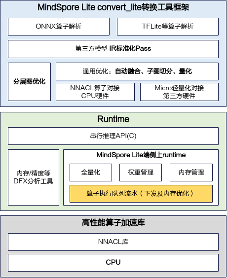
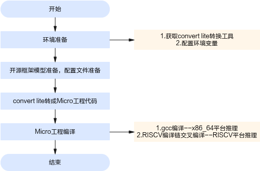

# 前言<a name="ZH-CN_TOPIC_0000002451492226"></a>

**概述<a name="section4537382116410"></a>**

本文档介绍如何在HiSpark系列MCU上，基于MindSpore Lite Enterprise Micro v106版本，实现第三方开源框架（如TFLite、ONNX等）网络模型的轻量化部署与推理任务。Converter\_lite是MindSpore Lite Enterprise Micro的转换工具，基于一系列内存/算子优化技术，生成适配HiSpark MCU上可执行的Micro模块代码。基于Converter\_lite，在服务器端能够将模型转换为可在x86 / RISCV平台（x86部署可以为板端调试提供精度标杆）上部署的Micro工程代码，从而脱离在线解析模型和图编译，具有运行时内存小、代码轻量化等特点。

通过本文档，您将能够实现以下目标：

-   了解不同开源框架网络模型离线转换Micro工程代码的方法。
-   能够基于本文档的参数配置，转成量化或非量化的Micro工程代码。
-   能够基于Micro工程代码在x86/RISCV平台侧（x86部署可以为板端调试提供精度标杆）做部署推理。

掌握以下经验和技能可以更好理解本文档：

-   熟悉Linux基本命令。
-   对机器学习、人工智能有一定的了解。
-   有一定的C++工程开发经验。

**产品版本<a name="section27775771"></a>**

与本文档相对应的产品版本如下。

<a name="table22377277"></a>
<table><thead align="left"><tr id="row63051425"><th class="cellrowborder" valign="top" width="40.400000000000006%" id="mcps1.1.3.1.1"><p id="p6891761"><a name="p6891761"></a><a name="p6891761"></a><strong id="b3756104316114"><a name="b3756104316114"></a><a name="b3756104316114"></a>产品名称</strong></p>
</th>
<th class="cellrowborder" valign="top" width="59.599999999999994%" id="mcps1.1.3.1.2"><p id="p21361741"><a name="p21361741"></a><a name="p21361741"></a><strong id="b1676784314119"><a name="b1676784314119"></a><a name="b1676784314119"></a>产品版本</strong></p>
</th>
</tr>
</thead>
<tbody><tr id="row52579486"><td class="cellrowborder" valign="top" width="40.400000000000006%" headers="mcps1.1.3.1.1 "><p id="p3873123721113"><a name="p3873123721113"></a><a name="p3873123721113"></a>3863</p>
</td>
<td class="cellrowborder" valign="top" width="59.599999999999994%" headers="mcps1.1.3.1.2 "><p id="p15873237111113"><a name="p15873237111113"></a><a name="p15873237111113"></a>WS63 1.10.100</p>
</td>
</tr>
</tbody>
</table>

**读者对象<a name="section4378592816410"></a>**

本文档适用于使用MindSpore Lite Enterprise Micro v106工具进行AI模型端侧部署的人员，本文档适用于以下工程师：

-   技术支持工程师
-   软件工程师
-   硬件工程师

**符号约定<a name="section133020216410"></a>**

在本文中可能出现下列标志，它们所代表的含义如下。

<a name="table2622507016410"></a>
<table><thead align="left"><tr id="row1530720816410"><th class="cellrowborder" valign="top" width="20.580000000000002%" id="mcps1.1.3.1.1"><p id="p6450074116410"><a name="p6450074116410"></a><a name="p6450074116410"></a><strong id="b2136615816410"><a name="b2136615816410"></a><a name="b2136615816410"></a>符号</strong></p>
</th>
<th class="cellrowborder" valign="top" width="79.42%" id="mcps1.1.3.1.2"><p id="p5435366816410"><a name="p5435366816410"></a><a name="p5435366816410"></a><strong id="b5941558116410"><a name="b5941558116410"></a><a name="b5941558116410"></a>说明</strong></p>
</th>
</tr>
</thead>
<tbody><tr id="row1372280416410"><td class="cellrowborder" valign="top" width="20.580000000000002%" headers="mcps1.1.3.1.1 "><p id="p3734547016410"><a name="p3734547016410"></a><a name="p3734547016410"></a><a name="image2670064316410"></a><a name="image2670064316410"></a><span></span></p>
</td>
<td class="cellrowborder" valign="top" width="79.42%" headers="mcps1.1.3.1.2 "><p id="p1757432116410"><a name="p1757432116410"></a><a name="p1757432116410"></a>表示如不避免则将会导致死亡或严重伤害的具有高等级风险的危害。</p>
</td>
</tr>
<tr id="row466863216410"><td class="cellrowborder" valign="top" width="20.580000000000002%" headers="mcps1.1.3.1.1 "><p id="p1432579516410"><a name="p1432579516410"></a><a name="p1432579516410"></a><a name="image4895582316410"></a><a name="image4895582316410"></a><span></span></p>
</td>
<td class="cellrowborder" valign="top" width="79.42%" headers="mcps1.1.3.1.2 "><p id="p959197916410"><a name="p959197916410"></a><a name="p959197916410"></a>表示如不避免则可能导致死亡或严重伤害的具有中等级风险的危害。</p>
</td>
</tr>
<tr id="row123863216410"><td class="cellrowborder" valign="top" width="20.580000000000002%" headers="mcps1.1.3.1.1 "><p id="p1232579516410"><a name="p1232579516410"></a><a name="p1232579516410"></a><a name="image1235582316410"></a><a name="image1235582316410"></a><span></span></p>
</td>
<td class="cellrowborder" valign="top" width="79.42%" headers="mcps1.1.3.1.2 "><p id="p123197916410"><a name="p123197916410"></a><a name="p123197916410"></a>表示如不避免则可能导致轻微或中度伤害的具有低等级风险的危害。</p>
</td>
</tr>
<tr id="row5786682116410"><td class="cellrowborder" valign="top" width="20.580000000000002%" headers="mcps1.1.3.1.1 "><p id="p2204984716410"><a name="p2204984716410"></a><a name="p2204984716410"></a><a name="image4504446716410"></a><a name="image4504446716410"></a><span></span></p>
</td>
<td class="cellrowborder" valign="top" width="79.42%" headers="mcps1.1.3.1.2 "><p id="p4388861916410"><a name="p4388861916410"></a><a name="p4388861916410"></a>用于传递设备或环境安全警示信息。如不避免则可能会导致设备损坏、数据丢失、设备性能降低或其它不可预知的结果。</p>
<p id="p1238861916410"><a name="p1238861916410"></a><a name="p1238861916410"></a>“须知”不涉及人身伤害。</p>
</td>
</tr>
<tr id="row2856923116410"><td class="cellrowborder" valign="top" width="20.580000000000002%" headers="mcps1.1.3.1.1 "><p id="p5555360116410"><a name="p5555360116410"></a><a name="p5555360116410"></a><a name="image799324016410"></a><a name="image799324016410"></a><span></span></p>
</td>
<td class="cellrowborder" valign="top" width="79.42%" headers="mcps1.1.3.1.2 "><p id="p4612588116410"><a name="p4612588116410"></a><a name="p4612588116410"></a>对正文中重点信息的补充说明。</p>
<p id="p1232588116410"><a name="p1232588116410"></a><a name="p1232588116410"></a>“说明”不是安全警示信息，不涉及人身、设备及环境伤害信息。</p>
</td>
</tr>
</tbody>
</table>

**修改记录<a name="section2467512116410"></a>**

<a name="table1557726816410"></a>
<table><thead align="left"><tr id="row2942532716410"><th class="cellrowborder" valign="top" width="20.72%" id="mcps1.1.4.1.1"><p id="p3778275416410"><a name="p3778275416410"></a><a name="p3778275416410"></a><strong id="b5687322716410"><a name="b5687322716410"></a><a name="b5687322716410"></a>文档版本</strong></p>
</th>
<th class="cellrowborder" valign="top" width="26.119999999999997%" id="mcps1.1.4.1.2"><p id="p5627845516410"><a name="p5627845516410"></a><a name="p5627845516410"></a><strong id="b5800814916410"><a name="b5800814916410"></a><a name="b5800814916410"></a>发布日期</strong></p>
</th>
<th class="cellrowborder" valign="top" width="53.16%" id="mcps1.1.4.1.3"><p id="p2382284816410"><a name="p2382284816410"></a><a name="p2382284816410"></a><strong id="b3316380216410"><a name="b3316380216410"></a><a name="b3316380216410"></a>修改说明</strong></p>
</th>
</tr>
</thead>
<tbody><tr id="row5947359616410"><td class="cellrowborder" valign="top" width="20.72%" headers="mcps1.1.4.1.1 "><p id="p2149706016410"><a name="p2149706016410"></a><a name="p2149706016410"></a>01</p>
</td>
<td class="cellrowborder" valign="top" width="26.119999999999997%" headers="mcps1.1.4.1.2 "><p id="p648803616410"><a name="p648803616410"></a><a name="p648803616410"></a>2025-10-30</p>
</td>
<td class="cellrowborder" valign="top" width="53.16%" headers="mcps1.1.4.1.3 "><p id="p1946537916410"><a name="p1946537916410"></a><a name="p1946537916410"></a>第一次正式版本发布。</p>
</td>
</tr>
</tbody>
</table>

# Converter\_lite工具使用环境搭建<a name="ZH-CN_TOPIC_0000002353769641"></a>


## 获取converter\_lite转换工具<a name="ZH-CN_TOPIC_0000002353895485"></a>

工具包获取：converter\_lite工具位于发布包的“mindspore-enterprise-lite-\{version\}-linux-x64/tools/converter/converter/converter\_lite”路径下，其中“version”为软件版本号。

本文档以converter\_lite转换工具的使用为例进行说明。

## 设置环境变量<a name="ZH-CN_TOPIC_0000002353775693"></a>

使用export方式设置环境变量后，环境变量仅在当前窗口有效。如果用户之前已在.bashrc文件中设置过环境变量，则需要在执行上述命令前，先手动删除原来设置的环境变量。

> **须知：** 
>-   converter\_lite工具包依赖于GCC-12.3版本，可以通过点击链接访问官网（[GCC-12.3](https://github.com/gcc-mirror/gcc/releases/tag/releases%2Fgcc-12.3.0)），选择下载12.3.0版本。
>-   converter\_lite工具包依赖于Python3.11环境。
>-   “[必选环境变量](#section15381219152316)”中步骤必须按顺序执行，否则可能导致converter\_lite工具无法链接到动态库。

**必选环境变量<a name="section15381219152316"></a>**

1.  设置converter\_lite工具动态库链接。

    ```
    export LD_LIBRARY_PATH=mindspore-enterprise-lite-{version}-linux-x64安装目录/tools/converter/lib:$LD_LIBRARY_PATH
    ```

1.  将Python3.11的路径添加到LD\_LIBRARY\_PATH中。

    ```
    export LD_LIBRARY_PATH=${py311_inptsll_path}/lib:$LD_LIBRARY_PATH
    ```

2.  将GCC的libstdc++6.0.30库路径添加到LD\_LIBRARY\_PATH中。

    ```
    export LD_LIBRARY_PATH=${libc++6.0.30_path}/libxx:$LD_LIBRARY_PATH
    ```

3.  切换到GCC中libstdc++.so.6.0.30的安装目录，为libstdc++建立软链接。

    ```
    ln -s libstdc++.so.6.0.30 libstdc++.so.6
    ```

**可选环境变量<a name="section119106478270"></a>**

若需要在RISCV平台进行部署推理，只需配置RISCV交叉编译链路径。

设置RISCV交叉编译工具链：

```
export HISPARK_RISCV_TOOLCHAIN_PATH=${sdk_install_path}/tools/bin/compiler/riscv/cc_riscv32_musl_105/
```

## 限制与约束<a name="ZH-CN_TOPIC_0000002319976756"></a>

关于工具链版本的约束要求，如[表1](#table189802570121)所示。

**表 1**  工具链版本约束

<a name="table189802570121"></a>
<table><thead align="left"><tr id="row189814577129"><th class="cellrowborder" valign="top" width="50%" id="mcps1.2.3.1.1"><p id="p1575243117107"><a name="p1575243117107"></a><a name="p1575243117107"></a>工具链名称</p>
</th>
<th class="cellrowborder" valign="top" width="50%" id="mcps1.2.3.1.2"><p id="p19752133131013"><a name="p19752133131013"></a><a name="p19752133131013"></a>工具链版本</p>
</th>
</tr>
</thead>
<tbody><tr id="row89811757171215"><td class="cellrowborder" valign="top" width="50%" headers="mcps1.2.3.1.1 "><p id="p167523317105"><a name="p167523317105"></a><a name="p167523317105"></a>GCC</p>
</td>
<td class="cellrowborder" valign="top" width="50%" headers="mcps1.2.3.1.2 "><p id="p16752031121014"><a name="p16752031121014"></a><a name="p16752031121014"></a>12.3.0</p>
</td>
</tr>
<tr id="row179810570129"><td class="cellrowborder" valign="top" width="50%" headers="mcps1.2.3.1.1 "><p id="p15486432191119"><a name="p15486432191119"></a><a name="p15486432191119"></a>CMake</p>
</td>
<td class="cellrowborder" valign="top" width="50%" headers="mcps1.2.3.1.2 "><p id="p177528319108"><a name="p177528319108"></a><a name="p177528319108"></a>3.28.2</p>
</td>
</tr>
<tr id="row898115716128"><td class="cellrowborder" valign="top" width="50%" headers="mcps1.2.3.1.1 "><p id="p379013544113"><a name="p379013544113"></a><a name="p379013544113"></a>riscv32-linux-musl-gcc</p>
</td>
<td class="cellrowborder" valign="top" width="50%" headers="mcps1.2.3.1.2 "><p id="p117904548110"><a name="p117904548110"></a><a name="p117904548110"></a>(build ver100.090 2023-05-17) 7.3.0</p>
</td>
</tr>
<tr id="row139813576126"><td class="cellrowborder" valign="top" width="50%" headers="mcps1.2.3.1.1 "><p id="p0752231101017"><a name="p0752231101017"></a><a name="p0752231101017"></a>riscv32-linux-musl-g++</p>
</td>
<td class="cellrowborder" valign="top" width="50%" headers="mcps1.2.3.1.2 "><p id="p17527319106"><a name="p17527319106"></a><a name="p17527319106"></a>(build ver100.090 2023-05-17) 7.3.0</p>
</td>
</tr>
<tr id="row2982557181213"><td class="cellrowborder" valign="top" width="50%" headers="mcps1.2.3.1.1 "><p id="p2753431131020"><a name="p2753431131020"></a><a name="p2753431131020"></a>Ubuntu</p>
</td>
<td class="cellrowborder" valign="top" width="50%" headers="mcps1.2.3.1.2 "><p id="p19753113191012"><a name="p19753113191012"></a><a name="p19753113191012"></a>22.04</p>
</td>
</tr>
<tr id="row14120345152815"><td class="cellrowborder" valign="top" width="50%" headers="mcps1.2.3.1.1 "><p id="p8121194513282"><a name="p8121194513282"></a><a name="p8121194513282"></a>Python</p>
</td>
<td class="cellrowborder" valign="top" width="50%" headers="mcps1.2.3.1.2 "><p id="p10816952102817"><a name="p10816952102817"></a><a name="p10816952102817"></a>3.11</p>
</td>
</tr>
</tbody>
</table>

# 快速入门<a name="ZH-CN_TOPIC_0000002319973524"></a>

本章节以TFLite与ONNX框架的MNIST模型转换为例，演示如何快速转换生成Micro工程推理代码。


## 开源框架的TFLite/ONNX模型转换为Micro工程<a name="ZH-CN_TOPIC_0000002353945877"></a>

1.  获取开源框架MNIST网络模型。
    -   TFLite模型：从链接中获取MNIST网络的模型文件：[mnist网络模型](https://download.mindspore.cn/model_zoo/official/lite/quick_start/micro/mnist.tar.gz)，下载后解压得到mnist.tflite、mnist.tflite.ms.bin（MNIST输入数据）、mnist.tflite.ms.out（标杆输出数据，可用于精度对比）。该模型为已经训练完成的MNIST分类模型，为TFLite模型，将mnist.tflite模型拷贝到开发环境任意目录，例如上传到“$HOME/module/”目录下。
    -   ONNX模型：从链接中获取mnist网络的模型文件：[mnist网络模型](https://github.com/onnx/models/tree/main/validated/vision/classification/mnist/model)，下载解压得到mnist-7.onnx，该模型为已经训练完成的MNIST分类模型，为ONNX模型，将mnist-7.onnx模型拷贝到开发环境任意目录，例如上传到“$HOME/module/”目录下。

2.  获取converter\_lite的压缩包，并进行解压。

    ```
    tar -xvf mindspore-enterprise-lite-{version}-linux-x64.tar.gz
    ```

3.  将转换工具运行时所需的动态链接库添加到环境变量LD\_LIBRARY\_PATH中。

    ```
    export LD_LIBRARY_PATH=mindspore-enterprise-lite-{version}-linux-x64/tools/converter/lib/tools/converter/lib:${LD_LIBRARY_PATH}
    ```

4.  进入转换目录。

    ```
    cd mindspore-enterprise-lite-{version}-linux-x64安装目录/tools/converter/converter
    ```

5.  设置Micro配置项。

    场景一：以x86平台部署为例，将原模型直接转换为Micro工程目录。

    ```
    #控制micro配置项
    [micro_param]
    # 支持code-gen生成Micro工程代码
    enable_micro=true
    # 支持x86,RISCV平台
    target=x86
    # 配置是否并行推理，当前仅支持单线程推理
    support_parallel=false
    ```

    场景二：以x86平台部署为例，将FP32原模型转换为int8量化Micro工程目录，具体参数请参见“[参数说明](参数说明.md)”章节。

    ```
    #控制micro配置项
    [micro_param]
    # 支持code-gen生成Micro工程代码
    enable_micro=true
    # 支持x86,RISCV平台
    target=x86
    # 配置是否并行推理，当前仅支持单线程推理
    support_parallel=false
    #控制通用量化参数配置项
    [common_quant_param]
    # 当前仅支持全量化方式
    quant_type=FULL_QUANT
    # 全量化仅支持8bit量化
    bit_num=8
    # 配置校准数据集参数
    [data_preprocess_param]
    #关于calibrate_path解释为前半部分是网络的输入名称，后半部分是输入存放路径，详细设置请参见“[参数说明](参数说明.md)”章节
    calibrate_path=input:${HOME}/module/dataset/quant_data
    #数据集大小，这里必须与calibrate_path目录下的数据集大小对应，请参见“[参数说明](参数说明.md)”章节
    calibrate_size=1
    #数据集格式，仅支持bin校准数据集格式，且该数据集下不允许存储非bin格式文件
    input_type=BIN
    #全量化参数配置项
    [full_quant_param]
    #激活值量化算法选择MAX_MIN，当前仅支持MAX_MIN量化算法
    activation_quant_method=MAX_MIN
    #是否开启数据集校准
    bias_correction=true
    #扩展量化算子,提升量化精度且牺牲性能可关闭
    enable_all_ops=true
    ```

6.  执行如下命令生成Micro工程代码（如下命令中使用的目录以及文件均为样例，请以实际为准）**。**
    1.  TFLite模型converter\_lite转换命令：

        ```
        #转换TFLite框架的MNIST模型生成Micro工程代码，converter_lite转换时参数请参见“[参数说明](参数说明.md)”章节
        ./converter_lite --fmk=TFLITE --modelFile=mnist.tflite --outputFile=mnist --configFile=micro.cfg --encryption=false --inputDataFormat=NHWC --outputDataFormat=NHWC --inputDataType=FLOAT --outputDataType=FLOAT
        ```

    1.  ONNX模型converter\_lite转换命令：

        ```
        #转换ONNX框架的MNIST模型生成Micro工程代码，converter_lite转换时参数请参见“[参数说明](参数说明.md)”章节
        ./converter_lite --fmk=ONNX --modelFile=mnist-7.onnx --outputFile=mnist --configFile=micro.cfg --encryption=false --inputDataFormat=NCHW --outputDataFormat=NCHW --inputDataType=FLOAT --outputDataType=FLOAT
        ```

    2.  运行成功后的结果显示为：

        ```
        CONVERT RESULT SUCCESS:0
        ```

7.  若想快速体验转换后的Micro工程代码的编译与推理，请准备好环境、符合模型输入要求的\*.bin输入数据以及Micro工程代码，具体操作请参见“[初级功能](初级功能.md)”章节。

# 基础知识<a name="ZH-CN_TOPIC_0000002319816916"></a>


## 工具功能架构<a name="ZH-CN_TOPIC_0000002320039182"></a>

converter\_lite工具功能架构设计如[图1](#fig19815386014)所示。

**图 1**  converter\_lite工具功能架构<a name="fig19815386014"></a>  


开源框架网络模型场景的详细流程如下：

1.  开源框架网络模型经过Parser解析后，转换为中间态IR Graph。
2.  中间态IR经过图拆分与图编译优化操作后，根据节点注册对应规格算子。
3.  生成模型权重数据、头文件与C源码等Micro工程代码。
4.  通过gcc或者RISCV交叉编译工具链生成静态库文件，并将其上传到指定平台执行推理。

## 工具运行流程<a name="ZH-CN_TOPIC_0000002353838137"></a>

使用converter\_lite工具将模型转成Micro工程代码的总体流程如[图1](#fig1738314214294)所示。

**图 1**  converter\_lite工具运行流程图<a name="fig1738314214294"></a>  


详细流程说明如下：

1.  使用converter\_lite工具之前，请先在开发环境中安装converter\_lite工具包，并获取相关路径下的converter\_lite工具。详细说明请参见“[Converter\_lite工具使用环境搭建](Converter_lite工具使用环境搭建.md)”章节。
2.  准备要进行转换的模型文件，并将其上传到开发环境。
3.  设置Micro配置项，可根据需要进行量化与非量化的参数配置。
4.  使用converter\_lite工具进行模型转换，生成Micro工程代码。
5.  编译Micro工程。

# 初级功能<a name="ZH-CN_TOPIC_0000002319904560"></a>

本章节介绍如何在“[基础知识](基础知识.md)”Micro工程代码的基础上进行编译部署推理。当前支持模型规格如下：

-   FP32 TFLite模型FP32 Micro推理。
-   FP32 TFLite模型INT8量化Micro推理。
-   INT8 TFLite模型INT8 Micro推理。
-   FP32 ONNX模型FP32 Micro推理。
-   FP32 ONNX模型INT8量化Micro推理。

支持推理平台为：x86\_64平台（x86部署可以为板端调试提供精度标杆）与RISCV平台。

支持后端类型：CPU单核单线程。


## RISCV平台编译部署<a name="ZH-CN_TOPIC_0000002354163653"></a>

本节以FP32的mnist.onnx模型为例，介绍如何利用生成的Micro INT8量化推理代码，并在RISCV平台部署推理。

1.  converter\_lite工具转换开源框架模型生成Micro工程，请参见“[快速入门](快速入门.md)”章节。

    > **须知：** 
    >-   在使用converter\_lite转换命令时，--fmk选项必须与AI模型的开源框架对应，否则将导致转换失败。
    >-   micro.cfg的target必须选择RISCV，并且需要按照“[开源框架的TFLite/ONNX模型转换为Micro工程](开源框架的TFLite-ONNX模型转换为Micro工程.md)”章节中的[5](开源框架的TFLite-ONNX模型转换为Micro工程.md#li1849371193511)场景二进行配置。
    >-   RISCV平台部署编译需要依赖海思提供的RISCV编译工具链，需下载相应的工具包。

2.  切换到Micro工程目录。

    ```
    #切换到名为micro的Micro工程目录
    cd $HOME/micro/
    ```

1.  下载并解压converter\_lite工具包。

    ```
    #进入到算子库在开发环境的路径
    cd ${mindspore-enterprise-lite-{version}-linux-x64安装目录}
    #解压tar包
    tar -xvf mindspore-enterprise-lite-{version}-linux-x64.tar.gz
    ```

1.  在Micro工程目录新建“build\_riscv.sh”脚本，配置如下：

    ```
    #mindspore-enterprise-lite-{version}-linux-x64为converter_lite工具包在开发环境的路径，sdk_path为海思工具包在开发环境的路径
    rm -rf build
    cmake -S . -B build -D OP_LIB="${mindspore-enterprise-lite-{version}-linux-x64安装目录}/tools/codegen/lib/riscv/libnnacl.a" \
        -D WRAPPER_LIB="${mindspore-enterprise-lite-{version}-linux-x64安装目录}/tools/codegen/lib/riscv/libwrapper.a" -D RISCV_TOOLCHAIN_PATH="${sdk_path}/tools/bin/compiler/riscv/cc_riscv32_musl_b090/cc_riscv32_musl/bin" \
        -D PKG_PATH="${mindspore-enterprise-lite-{version}-linux-x64安装目录}"
    cd build
    make -j4
    ```

1.  在"Micro工程目录/build ”目录中生成算子执行文件，目录如下：

    ```
    Micro工程目录/build                                       # MCU推理代码目录
    ├── CMakeCache.txt
    ├── CMakeFiles
    ├── cmake_install.cmake
    ├── libmicro_runtime.a			          # 算子运行时静态库
    ├── Makefile
    └── src											
        ├── CMakeFiles
        ├── cmake_install.cmake
        ├── libnet.a				          # 算子定义与实现的静态库
        └── Makefile
    ```

    代码编译成功，屏幕显示结果如下：

    ```
    [ 50%] Built target net
    [100%] Built target micro_runtime
    ```

1.  将编译产物libnet.a与libmicro\_runtime.a上传至海思工具包再次编译得到编译产物\*.fwpkg文件。然后，使用海思工具在Windows平台烧录推理，具体步骤请参考对应的application/samples/ai中的readme.md。

## 基于x86\_64平台精度调试<a name="ZH-CN_TOPIC_0000002320125106"></a>

本节以mnist.tflite模型为例，介绍在x86\_64平台上的编译和部署过程（x86部署可以为板端调试提供精度标杆）。

1.  使用converter\_lite工具将开源框架模型转换为Micro工程，请参见“[快速入门](快速入门.md)”章节

    > **须知：** 
    >-   在使用converter\_lite转换命令时，--fmk选项必须与AI模型的开源框架对应，否则将导致转换失败，且需要配置--encryption=false参数。
    >-   micro.cfg的target必须选择x86，且需要按照“[开源框架的TFLite/ONNX模型转换为Micro工程](开源框架的TFLite-ONNX模型转换为Micro工程.md)”章节中的[5](开源框架的TFLite-ONNX模型转换为Micro工程.md#li1849371193511)场景一进行配置。

1.  切换到Micro工程目录。

    ```
    #切换到Micro工程目录，假设工程目录叫micro
    cd $HOME/micro/
    ```

1.  Micro工程目录结构如下，其中benchmark目录为x86\_64部署的样例工程，调用相关Micro API接口。

    ```
    micro                          # 指定的生成代码根目录名称
    ├── benchmark                  # 对模型推理代码进行集成调用的benchmark例程
    │   ├── benchmark.c
    │   ├── calib_output.c
    │   ├── calib_output.h
    │   ├── load_input.c
    │   └── load_input.h
    ├── CMakeLists.txt             # benchmark例程的cmake工程文件
    ├── include                    # 头文件
    │   ├── model_handle.h
    └── src                        # 模型推理代码目录
        ├── allocator.c
        ├── allocator.h    
        ├── CMakeLists.txt
        ├── context.c
        ├── context.h
        ├── model.c
        ├── model.h
        ├── net.cmake
        ├── tensor.c
        └── tensor.h
    ```

1.  gcc编译生成可执行文件。
    -   切换到converter\_lite工具包算子库路径，然后将算子库拷贝到父级目录。

        ```
        cd "mindspore-enterprise-lite-{version}-linux-x64安装目录"/tools/codegen/lib/cpu
        将算子库拷贝到父级目录
        cp libnnacl.a libwrapper.a ../
        ```

    -   创建编译目录，gcc编译benchmark可执行环境。

        ```
        #创建并且切换到编译目录
        mkdir build && cd build
        #gcc编译生成可执行文件
        cmake -DPKG_PATH="mindspore-enterprise-lite-{version}-linux-x64安装目录" ..
        make
        ```

    -   若Micro工程代码编译成功，屏幕将显示如下结果，此时在“Micro工程目录/build/src/”目录下会生成libnet.a。

        ```
        [100%] Linking C executable benchmark
        [100%] Built target benchmark
        ```

1.  运行benchmark推理流程，输入bin文件可以从mnist.tar.gz获取，也可以自行构造随机输入。
    -   构造随机输入数据，下面给出生成\[0,1\]范围内Fp32随机数据的Python参考脚本，输出结果为mnist.bin文件。

        > **须知：** 
        >-   随机输入数据可以用于Micro工程推理，也可用于Micro INT8量化校准数据集。
        >-   若用户有真实数据集，可转换为Bin格式，无需参考下面的随机数据构造脚本。

        ```
        #随机输入构造脚本，仅供参考
        import numpy as np
        import os
        
        def generate_random_data(output_file, shape=(1, 25, 24, 1), dtype=np.float32):
            # 生成[0, 1)范围内的随机数
            random_data = np.random.uniform(low=0.0, high=1.0, size=shape).astype(dtype)
        
            # 手动将部分点设为1.0，确保范围包含1
            total_elements = np.prod(shape)
            if total_elements > 0:
                # 将最后一个元素设为1.0
                random_data.flat[-1] = 1.0
                # 再随机选一个元素设为0.0，确保包含0
                random_data.flat[np.random.randint(0, total_elements)] = 0.0
        
            # 验证数据范围
            min_val = np.min(random_data)
            max_val = np.max(random_data)
            assert min_val >= 0.0, f"数据最小值{min_val}小于0"
            assert max_val <= 1.0, f"数据最大值{max_val}大于1"
        
            # 确保输出目录存在
            os.makedirs(os.path.dirname(output_file), exist_ok=True)
        
            # 保存为二进制文件
            with open(output_file, 'wb') as f:
                random_data.tofile(f)
        
            # 输出信息
            print(f"数据维度: {random_data.shape}")
            print(f"数据类型: {random_data.dtype}")
            print(f"数据范围: [{min_val:.6f}, {max_val:.6f}]")
            print("数据前5个元素预览:", random_data.flatten()[:5])
        
        if __name__ == "__main__":
            # 输出文件路径
            output_file = "mnist.bin"
        
            # 生成并保存数据
            generate_random_data(output_file)
        ```

    -   运行benchmark，在x86\_64平台完成推理。

        ```
        #benchmark是精度评测的可执行文件，用法为./benchmark "mnist.tflite.ms.bin路径" "net0.bin路径"，benchmark第一个参数是输入数据，第二个参数是模型权重文件(模型文件在benchmark目录同级的src/model0目录下)。假设mnist.tflite.ms.bin相对路径为"../../mnist/mnist.tflite.ms.bin"，net0.bin相对路径为"net0.bin"。执行命令可参考如下：
        ./benchmark ../../mnist/mnist.tflite.ms.bin ../src/model0/net0.bin
        ```

        推理成功，屏幕显示结果应该如下：

        ```
        =======run benchmark======
        ThreadNum: 1.
        BindMode: 0.
        input 0: ../../mnist/mnist.tflite.ms.bin
        Running warm up loops...========run success=======
        
        outputs: 
        name: Identity, DataType: 43, Elements: 10, Shape: [1 10 ], Data: 
        0.000036, 0.000000, 0.009328, 0.000032, 0.000011, 0.000002, 0.000000, 0.000000, 0.990591, 0.000000, 
        ========run success=======
        ```

# 参数说明<a name="ZH-CN_TOPIC_0000002319906348"></a>


## 总体约束<a name="ZH-CN_TOPIC_0000002353985077"></a>

针对converter\_lite转换工具总体约束如下：

-   支持ONNX、TFLite开源框架的模型转换，当原始框架类型为ONNX、TFLite时，输入类型应为FP32、INT8、UINT8。
-   开源框架模型类型应与--fmk配置参数名称必须保持一致（包括大小写）。
-   在使用全量化转换时，必须构建校准输入数据集，且按照模型的输入名称设置Micro配置项。校准数据集和实际输入格式为BIN（即数据类型为.bin二进制文件），并且该路径下不允许存在其他格式文件。

## 参数概览<a name="ZH-CN_TOPIC_0000002354104885"></a>

> **须知：** 
>-   如果通过./converter\_lite --help命令查询出的参数未在[表1](#table54678511574)中解释，则说明该参数预留或者适用于其他芯片版本，用户无需关注。
>-   使用converter\_lite命令进行Micro工程代码生成时，支持模型量化与非量化，x86\_64与RISCV编译，用户可根据实际情况进行选择。

converter\_lite参数概览如[表1](#table54678511574)所示，详细说明请参见“[基础功能参数](基础功能参数.md)”章节。

**表 1**  converter\_lite工具参数概览

<a name="table54678511574"></a>
<table><thead align="left"><tr id="row184680516710"><th class="cellrowborder" valign="top" width="30.65%" id="mcps1.2.6.1.1"><p id="p646815111711"><a name="p646815111711"></a><a name="p646815111711"></a>convert lite参数名称</p>
</th>
<th class="cellrowborder" valign="top" width="9.35%" id="mcps1.2.6.1.2"><p id="p16468651678"><a name="p16468651678"></a><a name="p16468651678"></a>是否必选</p>
</th>
<th class="cellrowborder" valign="top" width="26.939999999999998%" id="mcps1.2.6.1.3"><p id="p946815512710"><a name="p946815512710"></a><a name="p946815512710"></a>参数说明</p>
</th>
<th class="cellrowborder" valign="top" width="20.73%" id="mcps1.2.6.1.4"><p id="p94683515720"><a name="p94683515720"></a><a name="p94683515720"></a>取值范围</p>
</th>
<th class="cellrowborder" valign="top" width="12.33%" id="mcps1.2.6.1.5"><p id="p19468145120716"><a name="p19468145120716"></a><a name="p19468145120716"></a>默认值</p>
</th>
</tr>
</thead>
<tbody><tr id="row346810518716"><td class="cellrowborder" valign="top" width="30.65%" headers="mcps1.2.6.1.1 "><p id="p246885116714"><a name="p246885116714"></a><a name="p246885116714"></a>--help</p>
</td>
<td class="cellrowborder" valign="top" width="9.35%" headers="mcps1.2.6.1.2 "><p id="p4468351174"><a name="p4468351174"></a><a name="p4468351174"></a>否</p>
</td>
<td class="cellrowborder" valign="top" width="26.939999999999998%" headers="mcps1.2.6.1.3 "><p id="p24681451776"><a name="p24681451776"></a><a name="p24681451776"></a>打印全部帮助信息。</p>
</td>
<td class="cellrowborder" valign="top" width="20.73%" headers="mcps1.2.6.1.4 "><p id="p1546825119713"><a name="p1546825119713"></a><a name="p1546825119713"></a>-</p>
</td>
<td class="cellrowborder" valign="top" width="12.33%" headers="mcps1.2.6.1.5 "><p id="p13469155112711"><a name="p13469155112711"></a><a name="p13469155112711"></a>-</p>
</td>
</tr>
<tr id="row1746919511879"><td class="cellrowborder" valign="top" width="30.65%" headers="mcps1.2.6.1.1 "><p id="p5469951574"><a name="p5469951574"></a><a name="p5469951574"></a>--fmk=&lt;FMK&gt;</p>
</td>
<td class="cellrowborder" valign="top" width="9.35%" headers="mcps1.2.6.1.2 "><p id="p546913511973"><a name="p546913511973"></a><a name="p546913511973"></a>是</p>
</td>
<td class="cellrowborder" valign="top" width="26.939999999999998%" headers="mcps1.2.6.1.3 "><p id="p546918513716"><a name="p546918513716"></a><a name="p546918513716"></a>输入模型的原始格式。</p>
</td>
<td class="cellrowborder" valign="top" width="20.73%" headers="mcps1.2.6.1.4 "><p id="p114691511972"><a name="p114691511972"></a><a name="p114691511972"></a>TFLITE/ONNX</p>
</td>
<td class="cellrowborder" valign="top" width="12.33%" headers="mcps1.2.6.1.5 "><p id="p1046918514716"><a name="p1046918514716"></a><a name="p1046918514716"></a>-</p>
</td>
</tr>
<tr id="row1946911511176"><td class="cellrowborder" valign="top" width="30.65%" headers="mcps1.2.6.1.1 "><p id="p44691051370"><a name="p44691051370"></a><a name="p44691051370"></a>--modelFile=&lt;MODELFILE&gt;</p>
</td>
<td class="cellrowborder" valign="top" width="9.35%" headers="mcps1.2.6.1.2 "><p id="p846935120717"><a name="p846935120717"></a><a name="p846935120717"></a>是</p>
</td>
<td class="cellrowborder" valign="top" width="26.939999999999998%" headers="mcps1.2.6.1.3 "><p id="p9469135110713"><a name="p9469135110713"></a><a name="p9469135110713"></a>输入模型的路径。</p>
</td>
<td class="cellrowborder" valign="top" width="20.73%" headers="mcps1.2.6.1.4 "><p id="p746918516712"><a name="p746918516712"></a><a name="p746918516712"></a>-</p>
</td>
<td class="cellrowborder" valign="top" width="12.33%" headers="mcps1.2.6.1.5 "><p id="p14691451772"><a name="p14691451772"></a><a name="p14691451772"></a>-</p>
</td>
</tr>
<tr id="row204696511578"><td class="cellrowborder" valign="top" width="30.65%" headers="mcps1.2.6.1.1 "><p id="p9469135112711"><a name="p9469135112711"></a><a name="p9469135112711"></a>--outputFile=&lt;OUTPUTFILE&gt;</p>
</td>
<td class="cellrowborder" valign="top" width="9.35%" headers="mcps1.2.6.1.2 "><p id="p84691551272"><a name="p84691551272"></a><a name="p84691551272"></a>是</p>
</td>
<td class="cellrowborder" valign="top" width="26.939999999999998%" headers="mcps1.2.6.1.3 "><p id="p1446925111720"><a name="p1446925111720"></a><a name="p1446925111720"></a>转成Micro工程代码的路径。</p>
</td>
<td class="cellrowborder" valign="top" width="20.73%" headers="mcps1.2.6.1.4 "><p id="p946911511975"><a name="p946911511975"></a><a name="p946911511975"></a>-</p>
</td>
<td class="cellrowborder" valign="top" width="12.33%" headers="mcps1.2.6.1.5 "><p id="p164696511777"><a name="p164696511777"></a><a name="p164696511777"></a>-</p>
</td>
</tr>
<tr id="row7469751173"><td class="cellrowborder" valign="top" width="30.65%" headers="mcps1.2.6.1.1 "><p id="p1646914511473"><a name="p1646914511473"></a><a name="p1646914511473"></a>--configFile=&lt;CONFIGFILE&gt;</p>
</td>
<td class="cellrowborder" valign="top" width="9.35%" headers="mcps1.2.6.1.2 "><p id="p15470135114711"><a name="p15470135114711"></a><a name="p15470135114711"></a>是</p>
</td>
<td class="cellrowborder" valign="top" width="26.939999999999998%" headers="mcps1.2.6.1.3 "><p id="p204701751570"><a name="p204701751570"></a><a name="p204701751570"></a>设置转换Micro工程的配置项。</p>
</td>
<td class="cellrowborder" valign="top" width="20.73%" headers="mcps1.2.6.1.4 "><p id="p14470115119718"><a name="p14470115119718"></a><a name="p14470115119718"></a>-</p>
</td>
<td class="cellrowborder" valign="top" width="12.33%" headers="mcps1.2.6.1.5 "><p id="p15470951875"><a name="p15470951875"></a><a name="p15470951875"></a>-</p>
</td>
</tr>
<tr id="row44706511273"><td class="cellrowborder" valign="top" width="30.65%" headers="mcps1.2.6.1.1 "><p id="p94709511173"><a name="p94709511173"></a><a name="p94709511173"></a>--encryption=&lt;ENCRYPTION&gt;</p>
</td>
<td class="cellrowborder" valign="top" width="9.35%" headers="mcps1.2.6.1.2 "><p id="p1470185115717"><a name="p1470185115717"></a><a name="p1470185115717"></a>是</p>
</td>
<td class="cellrowborder" valign="top" width="26.939999999999998%" headers="mcps1.2.6.1.3 "><p id="p44707511475"><a name="p44707511475"></a><a name="p44707511475"></a>不支持设置，取值范围暂不支持true，使用时必须配置为false。</p>
</td>
<td class="cellrowborder" valign="top" width="20.73%" headers="mcps1.2.6.1.4 "><p id="p0470105110715"><a name="p0470105110715"></a><a name="p0470105110715"></a>false</p>
</td>
<td class="cellrowborder" valign="top" width="12.33%" headers="mcps1.2.6.1.5 "><p id="p583795215246"><a name="p583795215246"></a><a name="p583795215246"></a>-</p>
</td>
</tr>
<tr id="row125531536196"><td class="cellrowborder" valign="top" width="30.65%" headers="mcps1.2.6.1.1 "><p id="p1655313151916"><a name="p1655313151916"></a><a name="p1655313151916"></a>--inputDataFormat</p>
</td>
<td class="cellrowborder" valign="top" width="9.35%" headers="mcps1.2.6.1.2 "><p id="p125531315199"><a name="p125531315199"></a><a name="p125531315199"></a>是</p>
</td>
<td class="cellrowborder" valign="top" width="26.939999999999998%" headers="mcps1.2.6.1.3 "><p id="p655312318196"><a name="p655312318196"></a><a name="p655312318196"></a>设定导出模型的输入format，其中，源模型为ONNX框架应当设置为NCHW，为TFLITE框架应当设置为NHWC。</p>
</td>
<td class="cellrowborder" valign="top" width="20.73%" headers="mcps1.2.6.1.4 "><p id="p75531839194"><a name="p75531839194"></a><a name="p75531839194"></a>NCHW/NHWC</p>
</td>
<td class="cellrowborder" valign="top" width="12.33%" headers="mcps1.2.6.1.5 "><p id="p1855319311193"><a name="p1855319311193"></a><a name="p1855319311193"></a>-</p>
</td>
</tr>
<tr id="row1842192513569"><td class="cellrowborder" valign="top" width="30.65%" headers="mcps1.2.6.1.1 "><p id="p146837292563"><a name="p146837292563"></a><a name="p146837292563"></a>--outputDataFormat</p>
</td>
<td class="cellrowborder" valign="top" width="9.35%" headers="mcps1.2.6.1.2 "><p id="p7683029115614"><a name="p7683029115614"></a><a name="p7683029115614"></a>是</p>
</td>
<td class="cellrowborder" valign="top" width="26.939999999999998%" headers="mcps1.2.6.1.3 "><p id="p20683229135616"><a name="p20683229135616"></a><a name="p20683229135616"></a>设定导出模型的输出format，其中源模型为ONNX框架应当设置为NCHW，为TFLITE框架应当设置为NHWC。</p>
</td>
<td class="cellrowborder" valign="top" width="20.73%" headers="mcps1.2.6.1.4 "><p id="p1468392912568"><a name="p1468392912568"></a><a name="p1468392912568"></a>NCHW/NHWC</p>
</td>
<td class="cellrowborder" valign="top" width="12.33%" headers="mcps1.2.6.1.5 "><p id="p4683152919564"><a name="p4683152919564"></a><a name="p4683152919564"></a>-</p>
</td>
</tr>
<tr id="row9681102215618"><td class="cellrowborder" valign="top" width="30.65%" headers="mcps1.2.6.1.1 "><p id="p74838317563"><a name="p74838317563"></a><a name="p74838317563"></a>--inputDataType</p>
</td>
<td class="cellrowborder" valign="top" width="9.35%" headers="mcps1.2.6.1.2 "><p id="p1848393195615"><a name="p1848393195615"></a><a name="p1848393195615"></a>是</p>
</td>
<td class="cellrowborder" valign="top" width="26.939999999999998%" headers="mcps1.2.6.1.3 "><p id="p194838311568"><a name="p194838311568"></a><a name="p194838311568"></a>设定导出模型的输入数据类型，自研量化时类型与原始模型保持不变，TFLite第三方量化与量化后数据类型保持一致。</p>
</td>
<td class="cellrowborder" valign="top" width="20.73%" headers="mcps1.2.6.1.4 "><p id="p748393175618"><a name="p748393175618"></a><a name="p748393175618"></a>FLOAT/INT8/UINT8</p>
</td>
<td class="cellrowborder" valign="top" width="12.33%" headers="mcps1.2.6.1.5 "><p id="p13483183117567"><a name="p13483183117567"></a><a name="p13483183117567"></a>-</p>
</td>
</tr>
<tr id="row199831176564"><td class="cellrowborder" valign="top" width="30.65%" headers="mcps1.2.6.1.1 "><p id="p838010338562"><a name="p838010338562"></a><a name="p838010338562"></a>--outputDataType</p>
</td>
<td class="cellrowborder" valign="top" width="9.35%" headers="mcps1.2.6.1.2 "><p id="p338013330568"><a name="p338013330568"></a><a name="p338013330568"></a>是</p>
</td>
<td class="cellrowborder" valign="top" width="26.939999999999998%" headers="mcps1.2.6.1.3 "><p id="p1589919193589"><a name="p1589919193589"></a><a name="p1589919193589"></a>设定导出模型的输出数据类型，自研量化时类型与原始模型保持不变，TFLite第三方量化与量化后数据类型保持一致。</p>
</td>
<td class="cellrowborder" valign="top" width="20.73%" headers="mcps1.2.6.1.4 "><p id="p1146811819571"><a name="p1146811819571"></a><a name="p1146811819571"></a>FLOAT/INT8/UINT8</p>
</td>
<td class="cellrowborder" valign="top" width="12.33%" headers="mcps1.2.6.1.5 "><p id="p15380143312563"><a name="p15380143312563"></a><a name="p15380143312563"></a>-</p>
</td>
</tr>
<tr id="row1151175018719"><td class="cellrowborder" valign="top" width="30.65%" headers="mcps1.2.6.1.1 "><p id="p11511250474"><a name="p11511250474"></a><a name="p11511250474"></a><span id="ph1785240388"><a name="ph1785240388"></a><a name="ph1785240388"></a>--decryptKey</span></p>
</td>
<td class="cellrowborder" valign="top" width="9.35%" headers="mcps1.2.6.1.2 "><p id="p15511175013718"><a name="p15511175013718"></a><a name="p15511175013718"></a><span id="ph108350161585"><a name="ph108350161585"></a><a name="ph108350161585"></a>否</span></p>
</td>
<td class="cellrowborder" valign="top" width="26.939999999999998%" headers="mcps1.2.6.1.3 "><p id="p11511350470"><a name="p11511350470"></a><a name="p11511350470"></a><span id="ph6644173820815"><a name="ph6644173820815"></a><a name="ph6644173820815"></a>解密密钥，Micro不支持</span></p>
</td>
<td class="cellrowborder" valign="top" width="20.73%" headers="mcps1.2.6.1.4 "><p id="p55112050676"><a name="p55112050676"></a><a name="p55112050676"></a><span id="ph174992116913"><a name="ph174992116913"></a><a name="ph174992116913"></a>-</span></p>
</td>
<td class="cellrowborder" valign="top" width="12.33%" headers="mcps1.2.6.1.5 "><p id="p145117507710"><a name="p145117507710"></a><a name="p145117507710"></a><span id="ph1761615693"><a name="ph1761615693"></a><a name="ph1761615693"></a>-</span></p>
</td>
</tr>
<tr id="row19471102315813"><td class="cellrowborder" valign="top" width="30.65%" headers="mcps1.2.6.1.1 "><p id="p1847216235815"><a name="p1847216235815"></a><a name="p1847216235815"></a><span id="ph174319183914"><a name="ph174319183914"></a><a name="ph174319183914"></a>--encryptKey</span></p>
</td>
<td class="cellrowborder" valign="top" width="9.35%" headers="mcps1.2.6.1.2 "><p id="p44721623183"><a name="p44721623183"></a><a name="p44721623183"></a><span id="ph199831302914"><a name="ph199831302914"></a><a name="ph199831302914"></a>否</span></p>
</td>
<td class="cellrowborder" valign="top" width="26.939999999999998%" headers="mcps1.2.6.1.3 "><p id="p1472423684"><a name="p1472423684"></a><a name="p1472423684"></a><span id="ph5561183316915"><a name="ph5561183316915"></a><a name="ph5561183316915"></a>加密密钥，</span><span id="ph4273151091018"><a name="ph4273151091018"></a><a name="ph4273151091018"></a>Micro不支持</span></p>
</td>
<td class="cellrowborder" valign="top" width="20.73%" headers="mcps1.2.6.1.4 "><p id="p1247216232815"><a name="p1247216232815"></a><a name="p1247216232815"></a><span id="ph1394223116146"><a name="ph1394223116146"></a><a name="ph1394223116146"></a>-</span></p>
</td>
<td class="cellrowborder" valign="top" width="12.33%" headers="mcps1.2.6.1.5 "><p id="p144720236815"><a name="p144720236815"></a><a name="p144720236815"></a><span id="ph439862119152"><a name="ph439862119152"></a><a name="ph439862119152"></a>-</span></p>
</td>
</tr>
<tr id="row192831846092"><td class="cellrowborder" valign="top" width="30.65%" headers="mcps1.2.6.1.1 "><p id="p4283246795"><a name="p4283246795"></a><a name="p4283246795"></a><span id="ph159791548296"><a name="ph159791548296"></a><a name="ph159791548296"></a>--infer</span></p>
</td>
<td class="cellrowborder" valign="top" width="9.35%" headers="mcps1.2.6.1.2 "><p id="p6284346899"><a name="p6284346899"></a><a name="p6284346899"></a><span id="ph47331556197"><a name="ph47331556197"></a><a name="ph47331556197"></a>否</span></p>
</td>
<td class="cellrowborder" valign="top" width="26.939999999999998%" headers="mcps1.2.6.1.3 "><p id="p728418461393"><a name="p728418461393"></a><a name="p728418461393"></a><span id="ph1626542116106"><a name="ph1626542116106"></a><a name="ph1626542116106"></a>预推理功能开关，Micro不支持</span></p>
</td>
<td class="cellrowborder" valign="top" width="20.73%" headers="mcps1.2.6.1.4 "><p id="p32846461693"><a name="p32846461693"></a><a name="p32846461693"></a><span id="ph638153321410"><a name="ph638153321410"></a><a name="ph638153321410"></a>-</span></p>
</td>
<td class="cellrowborder" valign="top" width="12.33%" headers="mcps1.2.6.1.5 "><p id="p172841746897"><a name="p172841746897"></a><a name="p172841746897"></a><span id="ph491618194127"><a name="ph491618194127"></a><a name="ph491618194127"></a>false</span></p>
</td>
</tr>
<tr id="row678363621019"><td class="cellrowborder" valign="top" width="30.65%" headers="mcps1.2.6.1.1 "><p id="p178353691010"><a name="p178353691010"></a><a name="p178353691010"></a><span id="ph95883436102"><a name="ph95883436102"></a><a name="ph95883436102"></a>--fp16</span></p>
</td>
<td class="cellrowborder" valign="top" width="9.35%" headers="mcps1.2.6.1.2 "><p id="p87834367102"><a name="p87834367102"></a><a name="p87834367102"></a><span id="ph169561048131013"><a name="ph169561048131013"></a><a name="ph169561048131013"></a>否</span></p>
</td>
<td class="cellrowborder" valign="top" width="26.939999999999998%" headers="mcps1.2.6.1.3 "><p id="p177831236101019"><a name="p177831236101019"></a><a name="p177831236101019"></a><span id="ph04413534100"><a name="ph04413534100"></a><a name="ph04413534100"></a>开启fp16推理开关，Micro不支持</span></p>
</td>
<td class="cellrowborder" valign="top" width="20.73%" headers="mcps1.2.6.1.4 "><p id="p18783036101019"><a name="p18783036101019"></a><a name="p18783036101019"></a><span id="ph884883211416"><a name="ph884883211416"></a><a name="ph884883211416"></a>-</span></p>
</td>
<td class="cellrowborder" valign="top" width="12.33%" headers="mcps1.2.6.1.5 "><p id="p7783163611106"><a name="p7783163611106"></a><a name="p7783163611106"></a><span id="ph16791182316125"><a name="ph16791182316125"></a><a name="ph16791182316125"></a>false</span></p>
</td>
</tr>
<tr id="row16562194115101"><td class="cellrowborder" valign="top" width="30.65%" headers="mcps1.2.6.1.1 "><p id="p1456334118107"><a name="p1456334118107"></a><a name="p1456334118107"></a><span id="ph1777413316116"><a name="ph1777413316116"></a><a name="ph1777413316116"></a>--optimize</span></p>
</td>
<td class="cellrowborder" valign="top" width="9.35%" headers="mcps1.2.6.1.2 "><p id="p7563134181013"><a name="p7563134181013"></a><a name="p7563134181013"></a><span id="ph6446171611118"><a name="ph6446171611118"></a><a name="ph6446171611118"></a>否</span></p>
</td>
<td class="cellrowborder" valign="top" width="26.939999999999998%" headers="mcps1.2.6.1.3 "><p id="p1456324171017"><a name="p1456324171017"></a><a name="p1456324171017"></a><span id="ph15497102691114"><a name="ph15497102691114"></a><a name="ph15497102691114"></a>Micro仅支持general，不支持额外配置</span></p>
</td>
<td class="cellrowborder" valign="top" width="20.73%" headers="mcps1.2.6.1.4 "><p id="p15563204131014"><a name="p15563204131014"></a><a name="p15563204131014"></a><span id="ph9823133311411"><a name="ph9823133311411"></a><a name="ph9823133311411"></a>-</span></p>
</td>
<td class="cellrowborder" valign="top" width="12.33%" headers="mcps1.2.6.1.5 "><p id="p65638419104"><a name="p65638419104"></a><a name="p65638419104"></a><span id="ph282618357112"><a name="ph282618357112"></a><a name="ph282618357112"></a>general</span></p>
</td>
</tr>
<tr id="row19753164015123"><td class="cellrowborder" valign="top" width="30.65%" headers="mcps1.2.6.1.1 "><p id="p9753140201219"><a name="p9753140201219"></a><a name="p9753140201219"></a><span id="ph9923164220124"><a name="ph9923164220124"></a><a name="ph9923164220124"></a>--</span><span id="ph5325104551210"><a name="ph5325104551210"></a><a name="ph5325104551210"></a>optimizeTransformer</span></p>
</td>
<td class="cellrowborder" valign="top" width="9.35%" headers="mcps1.2.6.1.2 "><p id="p1075354017128"><a name="p1075354017128"></a><a name="p1075354017128"></a><span id="ph1876014483125"><a name="ph1876014483125"></a><a name="ph1876014483125"></a>否</span></p>
</td>
<td class="cellrowborder" valign="top" width="26.939999999999998%" headers="mcps1.2.6.1.3 "><p id="p97531840151212"><a name="p97531840151212"></a><a name="p97531840151212"></a><span id="ph869355001214"><a name="ph869355001214"></a><a name="ph869355001214"></a>Micro开启Transformer融合，Micro不支持</span></p>
</td>
<td class="cellrowborder" valign="top" width="20.73%" headers="mcps1.2.6.1.4 "><p id="p12753154081215"><a name="p12753154081215"></a><a name="p12753154081215"></a><span id="ph15326123412141"><a name="ph15326123412141"></a><a name="ph15326123412141"></a>-</span></p>
</td>
<td class="cellrowborder" valign="top" width="12.33%" headers="mcps1.2.6.1.5 "><p id="p15753144031216"><a name="p15753144031216"></a><a name="p15753144031216"></a><span id="ph129016441320"><a name="ph129016441320"></a><a name="ph129016441320"></a>false</span></p>
</td>
</tr>
<tr id="row63671011171316"><td class="cellrowborder" valign="top" width="30.65%" headers="mcps1.2.6.1.1 "><p id="p103671511161313"><a name="p103671511161313"></a><a name="p103671511161313"></a><span id="ph8636421141318"><a name="ph8636421141318"></a><a name="ph8636421141318"></a>--saveType</span></p>
</td>
<td class="cellrowborder" valign="top" width="9.35%" headers="mcps1.2.6.1.2 "><p id="p1236711101311"><a name="p1236711101311"></a><a name="p1236711101311"></a><span id="ph1343662751315"><a name="ph1343662751315"></a><a name="ph1343662751315"></a>否</span></p>
</td>
<td class="cellrowborder" valign="top" width="26.939999999999998%" headers="mcps1.2.6.1.3 "><p id="p1236771114131"><a name="p1236771114131"></a><a name="p1236771114131"></a><span id="ph111751845131315"><a name="ph111751845131315"></a><a name="ph111751845131315"></a>导出中间IR文件格式，Micro暂不支持其他配置</span></p>
</td>
<td class="cellrowborder" valign="top" width="20.73%" headers="mcps1.2.6.1.4 "><p id="p14367161111133"><a name="p14367161111133"></a><a name="p14367161111133"></a><span id="ph7758133419146"><a name="ph7758133419146"></a><a name="ph7758133419146"></a>-</span></p>
</td>
<td class="cellrowborder" valign="top" width="12.33%" headers="mcps1.2.6.1.5 "><p id="p13367211101310"><a name="p13367211101310"></a><a name="p13367211101310"></a><span id="ph1932543519130"><a name="ph1932543519130"></a><a name="ph1932543519130"></a>MINDIR_LITE</span></p>
</td>
</tr>
<tr id="row33574131413"><td class="cellrowborder" valign="top" width="30.65%" headers="mcps1.2.6.1.1 "><p id="p18351043148"><a name="p18351043148"></a><a name="p18351043148"></a><span id="ph01267601412"><a name="ph01267601412"></a><a name="ph01267601412"></a>--trainModel</span></p>
</td>
<td class="cellrowborder" valign="top" width="9.35%" headers="mcps1.2.6.1.2 "><p id="p935174101418"><a name="p935174101418"></a><a name="p935174101418"></a><span id="ph12119016171418"><a name="ph12119016171418"></a><a name="ph12119016171418"></a>否</span></p>
</td>
<td class="cellrowborder" valign="top" width="26.939999999999998%" headers="mcps1.2.6.1.3 "><p id="p8351347149"><a name="p8351347149"></a><a name="p8351347149"></a><span id="ph569131918149"><a name="ph569131918149"></a><a name="ph569131918149"></a>端侧训练开关，Micro暂不支持</span></p>
</td>
<td class="cellrowborder" valign="top" width="20.73%" headers="mcps1.2.6.1.4 "><p id="p6350471414"><a name="p6350471414"></a><a name="p6350471414"></a><span id="ph52222359141"><a name="ph52222359141"></a><a name="ph52222359141"></a>-</span></p>
</td>
<td class="cellrowborder" valign="top" width="12.33%" headers="mcps1.2.6.1.5 "><p id="p153510441419"><a name="p153510441419"></a><a name="p153510441419"></a><span id="ph1140192931416"><a name="ph1140192931416"></a><a name="ph1140192931416"></a>false</span></p>
</td>
</tr>
<tr id="row1645913412146"><td class="cellrowborder" valign="top" width="30.65%" headers="mcps1.2.6.1.1 "><p id="p74594412146"><a name="p74594412146"></a><a name="p74594412146"></a><span id="ph185464419145"><a name="ph185464419145"></a><a name="ph185464419145"></a>--weightFile</span></p>
</td>
<td class="cellrowborder" valign="top" width="9.35%" headers="mcps1.2.6.1.2 "><p id="p34591541151411"><a name="p34591541151411"></a><a name="p34591541151411"></a><span id="ph447175521415"><a name="ph447175521415"></a><a name="ph447175521415"></a>否</span></p>
</td>
<td class="cellrowborder" valign="top" width="26.939999999999998%" headers="mcps1.2.6.1.3 "><p id="p184591341171416"><a name="p184591341171416"></a><a name="p184591341171416"></a><span id="ph948916561142"><a name="ph948916561142"></a><a name="ph948916561142"></a>caffe格式模型配套的weight文件导入，Micro暂不支持</span></p>
</td>
<td class="cellrowborder" valign="top" width="20.73%" headers="mcps1.2.6.1.4 "><p id="p184594418149"><a name="p184594418149"></a><a name="p184594418149"></a><span id="ph13131816131513"><a name="ph13131816131513"></a><a name="ph13131816131513"></a>-</span></p>
</td>
<td class="cellrowborder" valign="top" width="12.33%" headers="mcps1.2.6.1.5 "><p id="p645914191413"><a name="p645914191413"></a><a name="p645914191413"></a><span id="ph228372021520"><a name="ph228372021520"></a><a name="ph228372021520"></a>-</span></p>
</td>
</tr>
</tbody>
</table>

## 基础功能参数<a name="ZH-CN_TOPIC_0000002320066172"></a>


### 总体选项<a name="ZH-CN_TOPIC_0000002319906352"></a>

**--help<a name="section12231581328"></a>**

-   功能说明

    打印全部帮助信息。

-   关联参数

    无

-   参数取值

    无

-   推荐配置及收益

    无

-   示例

    ```
    #切换到converter_lite工具安装目录，配置LD_LIBRARY_PATH环境变量
    ./converter_lite --help
    ```

-   依赖约束

    无

### 输入选项<a name="ZH-CN_TOPIC_0000002353985081"></a>

**--fmk=<FMK\><a name="section1072137133513"></a>**

-   功能说明

    配置输入开源框架模型的原始格式。

-   关联参数

    无

-   参数取值
    -   TFLite：转换TFLite开源框架模型为Micro工程代码。
    -   ONNX：转换ONNX开源框架模型为Micro工程代码。
    -   参数默认值：无

-   推荐配置及收益

    无

-   示例

    ```
    #配置输入开源框架模型的原始格式，模型与fmk对应关系为*.tflite-TFLite；*.onnx->ONNX
    --fmk=TFLITE
    --fmk=ONNX 
    ```

-   依赖约束

    无

**--modelFile=<MODELFILE\><a name="section62409421366"></a>**

-   功能说明

    输入模型的路径。

-   关联参数

    无

-   参数取值

    参数默认值：无

-   推荐配置及收益

    无

-   示例

    ```
    #配置开源框架的输入模型路径，例如
    --modelFile=$HOME/module/mnist.tflite
    ```

-   依赖约束

    无

**--configFile=<CONFIGFILE\><a name="section12138185893618"></a>**

-   功能说明

    设置转换Micro工程的配置项。

-   关联参数

    无

-   参数取值

    参数取值参考如[表1](#table3808173922715)所示。

    > **须知：** 
    >-   Micro配置项[表1](#table3808173922715)中未声明的参数不支持或者适用于其他芯片，用户无需关注。
    >-   如果不使用全量化，仅配置\[micro\_param\]、enable\_micro、target、support\_parallel，其中support\_parallel将默认配置为false。
    >-   如果需要使用全量化，需要配置[表1](#table3808173922715)中除debug\_mode以外的参数。quant\_type需要配置为FULL\_QUANT，bit\_num默认配置为8，bias\_correction默认配置为true，enable\_all\_ops默认配置为false。
    >-   全量化时配置calibrate\_path必须符合“input\_name\_1:input\_1\_dir,input\_name\_2:input\_2\_dir.... ”输入格式，且input\_name\_1、input\_name\_2等的输入数量与名称必须与开源框架AI模型的输入数量和名称相符合。
    >-   全量化时配置的calibrate\_size必须与calibrate\_path每个数据集目录元素数量相同。

    **表 1**  micro.cfg配置项参数概览

    <a name="table3808173922715"></a>
    <table><thead align="left"><tr id="row11809339142713"><th class="cellrowborder" valign="top" width="19.55%" id="mcps1.2.6.1.1"><p id="p11809639122710"><a name="p11809639122710"></a><a name="p11809639122710"></a>参数名称</p>
    </th>
    <th class="cellrowborder" valign="top" width="7.41%" id="mcps1.2.6.1.2"><p id="p48091939192713"><a name="p48091939192713"></a><a name="p48091939192713"></a>是否必选</p>
    </th>
    <th class="cellrowborder" valign="top" width="46.1%" id="mcps1.2.6.1.3"><p id="p148091339132711"><a name="p148091339132711"></a><a name="p148091339132711"></a>参数说明</p>
    </th>
    <th class="cellrowborder" valign="top" width="21.33%" id="mcps1.2.6.1.4"><p id="p68097391279"><a name="p68097391279"></a><a name="p68097391279"></a>取值范围</p>
    </th>
    <th class="cellrowborder" valign="top" width="5.609999999999999%" id="mcps1.2.6.1.5"><p id="p981033913272"><a name="p981033913272"></a><a name="p981033913272"></a>默认值</p>
    </th>
    </tr>
    </thead>
    <tbody><tr id="row681033962714"><td class="cellrowborder" valign="top" width="19.55%" headers="mcps1.2.6.1.1 "><p id="p118101039142719"><a name="p118101039142719"></a><a name="p118101039142719"></a>[micro_param]</p>
    </td>
    <td class="cellrowborder" valign="top" width="7.41%" headers="mcps1.2.6.1.2 "><p id="p4810173932715"><a name="p4810173932715"></a><a name="p4810173932715"></a>是</p>
    </td>
    <td class="cellrowborder" valign="top" width="46.1%" headers="mcps1.2.6.1.3 "><p id="p9810113982714"><a name="p9810113982714"></a><a name="p9810113982714"></a>当前正在设置Micro配置项，用于控制代码生成。</p>
    </td>
    <td class="cellrowborder" valign="top" width="21.33%" headers="mcps1.2.6.1.4 "><p id="p148101939112713"><a name="p148101939112713"></a><a name="p148101939112713"></a>-</p>
    </td>
    <td class="cellrowborder" valign="top" width="5.609999999999999%" headers="mcps1.2.6.1.5 "><p id="p7810839162713"><a name="p7810839162713"></a><a name="p7810839162713"></a>-</p>
    </td>
    </tr>
    <tr id="row1581017393276"><td class="cellrowborder" valign="top" width="19.55%" headers="mcps1.2.6.1.1 "><p id="p13810133919275"><a name="p13810133919275"></a><a name="p13810133919275"></a>enable_micro</p>
    </td>
    <td class="cellrowborder" valign="top" width="7.41%" headers="mcps1.2.6.1.2 "><p id="p14810139172717"><a name="p14810139172717"></a><a name="p14810139172717"></a>是</p>
    </td>
    <td class="cellrowborder" valign="top" width="46.1%" headers="mcps1.2.6.1.3 "><p id="p1981003915278"><a name="p1981003915278"></a><a name="p1981003915278"></a>使能convert lite生成Micro工程代码。</p>
    </td>
    <td class="cellrowborder" valign="top" width="21.33%" headers="mcps1.2.6.1.4 "><p id="p28101539192717"><a name="p28101539192717"></a><a name="p28101539192717"></a>true/false</p>
    </td>
    <td class="cellrowborder" valign="top" width="5.609999999999999%" headers="mcps1.2.6.1.5 "><p id="p78101339122711"><a name="p78101339122711"></a><a name="p78101339122711"></a>false</p>
    </td>
    </tr>
    <tr id="row281019399277"><td class="cellrowborder" valign="top" width="19.55%" headers="mcps1.2.6.1.1 "><p id="p98101439182715"><a name="p98101439182715"></a><a name="p98101439182715"></a>target</p>
    </td>
    <td class="cellrowborder" valign="top" width="7.41%" headers="mcps1.2.6.1.2 "><p id="p1810193962710"><a name="p1810193962710"></a><a name="p1810193962710"></a>是</p>
    </td>
    <td class="cellrowborder" valign="top" width="46.1%" headers="mcps1.2.6.1.3 "><p id="p208104398275"><a name="p208104398275"></a><a name="p208104398275"></a>Micro工程代码部署推理平台。</p>
    </td>
    <td class="cellrowborder" valign="top" width="21.33%" headers="mcps1.2.6.1.4 "><p id="p1081019390273"><a name="p1081019390273"></a><a name="p1081019390273"></a>x86/RISCV</p>
    </td>
    <td class="cellrowborder" valign="top" width="5.609999999999999%" headers="mcps1.2.6.1.5 "><p id="p17810123919279"><a name="p17810123919279"></a><a name="p17810123919279"></a>x86</p>
    </td>
    </tr>
    <tr id="row3810113952716"><td class="cellrowborder" valign="top" width="19.55%" headers="mcps1.2.6.1.1 "><p id="p17810103912718"><a name="p17810103912718"></a><a name="p17810103912718"></a>support_parallel</p>
    </td>
    <td class="cellrowborder" valign="top" width="7.41%" headers="mcps1.2.6.1.2 "><p id="p1281015391278"><a name="p1281015391278"></a><a name="p1281015391278"></a>否</p>
    </td>
    <td class="cellrowborder" valign="top" width="46.1%" headers="mcps1.2.6.1.3 "><p id="p1381013918274"><a name="p1381013918274"></a><a name="p1381013918274"></a>是否生成多线程推理代码，当前尚未支持多线程即不支持置为true。</p>
    </td>
    <td class="cellrowborder" valign="top" width="21.33%" headers="mcps1.2.6.1.4 "><p id="p12810939142717"><a name="p12810939142717"></a><a name="p12810939142717"></a>true/false</p>
    </td>
    <td class="cellrowborder" valign="top" width="5.609999999999999%" headers="mcps1.2.6.1.5 "><p id="p581116392276"><a name="p581116392276"></a><a name="p581116392276"></a>false</p>
    </td>
    </tr>
    <tr id="row0604101605615"><td class="cellrowborder" valign="top" width="19.55%" headers="mcps1.2.6.1.1 "><p id="p17815439132719"><a name="p17815439132719"></a><a name="p17815439132719"></a>debug_mode</p>
    </td>
    <td class="cellrowborder" valign="top" width="7.41%" headers="mcps1.2.6.1.2 "><p id="p281593919279"><a name="p281593919279"></a><a name="p281593919279"></a>否</p>
    </td>
    <td class="cellrowborder" valign="top" width="46.1%" headers="mcps1.2.6.1.3 "><p id="p13815133972710"><a name="p13815133972710"></a><a name="p13815133972710"></a>是否打开调测接口，仅全量化时选择。</p>
    </td>
    <td class="cellrowborder" valign="top" width="21.33%" headers="mcps1.2.6.1.4 "><p id="p681533911274"><a name="p681533911274"></a><a name="p681533911274"></a>true/false</p>
    </td>
    <td class="cellrowborder" valign="top" width="5.609999999999999%" headers="mcps1.2.6.1.5 "><p id="p3815103912720"><a name="p3815103912720"></a><a name="p3815103912720"></a>false</p>
    </td>
    </tr>
    <tr id="row1681133972713"><td class="cellrowborder" valign="top" width="19.55%" headers="mcps1.2.6.1.1 "><p id="p138111539152714"><a name="p138111539152714"></a><a name="p138111539152714"></a>[common_quant_param]</p>
    </td>
    <td class="cellrowborder" valign="top" width="7.41%" headers="mcps1.2.6.1.2 "><p id="p781118399279"><a name="p781118399279"></a><a name="p781118399279"></a>否</p>
    </td>
    <td class="cellrowborder" valign="top" width="46.1%" headers="mcps1.2.6.1.3 "><p id="p10811143932712"><a name="p10811143932712"></a><a name="p10811143932712"></a>公共量化参数，仅全量化时选择。</p>
    </td>
    <td class="cellrowborder" valign="top" width="21.33%" headers="mcps1.2.6.1.4 "><p id="p78117399278"><a name="p78117399278"></a><a name="p78117399278"></a>-</p>
    </td>
    <td class="cellrowborder" valign="top" width="5.609999999999999%" headers="mcps1.2.6.1.5 "><p id="p1681153910274"><a name="p1681153910274"></a><a name="p1681153910274"></a>-</p>
    </td>
    </tr>
    <tr id="row3811139102713"><td class="cellrowborder" valign="top" width="19.55%" headers="mcps1.2.6.1.1 "><p id="p481113392272"><a name="p481113392272"></a><a name="p481113392272"></a>quant_type</p>
    </td>
    <td class="cellrowborder" valign="top" width="7.41%" headers="mcps1.2.6.1.2 "><p id="p16811133962717"><a name="p16811133962717"></a><a name="p16811133962717"></a>否</p>
    </td>
    <td class="cellrowborder" valign="top" width="46.1%" headers="mcps1.2.6.1.3 "><p id="p6811133902710"><a name="p6811133902710"></a><a name="p6811133902710"></a>设置量化类型，启用全量化时需要配置为FULL_QUANT，仅全量化时选择。</p>
    </td>
    <td class="cellrowborder" valign="top" width="21.33%" headers="mcps1.2.6.1.4 "><p id="p581193913272"><a name="p581193913272"></a><a name="p581193913272"></a>FULL_QUANT/-</p>
    </td>
    <td class="cellrowborder" valign="top" width="5.609999999999999%" headers="mcps1.2.6.1.5 "><p id="p0811163922718"><a name="p0811163922718"></a><a name="p0811163922718"></a>-</p>
    </td>
    </tr>
    <tr id="row681243982718"><td class="cellrowborder" valign="top" width="19.55%" headers="mcps1.2.6.1.1 "><p id="p0812173932713"><a name="p0812173932713"></a><a name="p0812173932713"></a>bit_num</p>
    </td>
    <td class="cellrowborder" valign="top" width="7.41%" headers="mcps1.2.6.1.2 "><p id="p1381203916276"><a name="p1381203916276"></a><a name="p1381203916276"></a>否</p>
    </td>
    <td class="cellrowborder" valign="top" width="46.1%" headers="mcps1.2.6.1.3 "><p id="p1281233982719"><a name="p1281233982719"></a><a name="p1281233982719"></a>设置量化的比特数，目前仅支持8bit量化，仅全量化时选择。</p>
    </td>
    <td class="cellrowborder" valign="top" width="21.33%" headers="mcps1.2.6.1.4 "><p id="p10359162515326"><a name="p10359162515326"></a><a name="p10359162515326"></a>8</p>
    </td>
    <td class="cellrowborder" valign="top" width="5.609999999999999%" headers="mcps1.2.6.1.5 "><p id="p28121139122713"><a name="p28121139122713"></a><a name="p28121139122713"></a>-</p>
    </td>
    </tr>
    <tr id="row481293982716"><td class="cellrowborder" valign="top" width="19.55%" headers="mcps1.2.6.1.1 "><p id="p0812739152715"><a name="p0812739152715"></a><a name="p0812739152715"></a>[data_preprocess_param]</p>
    </td>
    <td class="cellrowborder" valign="top" width="7.41%" headers="mcps1.2.6.1.2 "><p id="p18125395277"><a name="p18125395277"></a><a name="p18125395277"></a>否</p>
    </td>
    <td class="cellrowborder" valign="top" width="46.1%" headers="mcps1.2.6.1.3 "><p id="p18121739122710"><a name="p18121739122710"></a><a name="p18121739122710"></a>校准数据集参数，仅全量化时选择。</p>
    </td>
    <td class="cellrowborder" valign="top" width="21.33%" headers="mcps1.2.6.1.4 "><p id="p20812123952711"><a name="p20812123952711"></a><a name="p20812123952711"></a>-</p>
    </td>
    <td class="cellrowborder" valign="top" width="5.609999999999999%" headers="mcps1.2.6.1.5 "><p id="p281219397273"><a name="p281219397273"></a><a name="p281219397273"></a>-</p>
    </td>
    </tr>
    <tr id="row3812203982716"><td class="cellrowborder" valign="top" width="19.55%" headers="mcps1.2.6.1.1 "><p id="p08121039122715"><a name="p08121039122715"></a><a name="p08121039122715"></a>calibrate_path</p>
    </td>
    <td class="cellrowborder" valign="top" width="7.41%" headers="mcps1.2.6.1.2 "><p id="p138120394278"><a name="p138120394278"></a><a name="p138120394278"></a>否</p>
    </td>
    <td class="cellrowborder" valign="top" width="46.1%" headers="mcps1.2.6.1.3 "><p id="p9812193912712"><a name="p9812193912712"></a><a name="p9812193912712"></a>校准数据集路径，该路径下不能存放非bin格式文件，仅全量化时选择。</p>
    </td>
    <td class="cellrowborder" valign="top" width="21.33%" headers="mcps1.2.6.1.4 "><p id="p19812039182713"><a name="p19812039182713"></a><a name="p19812039182713"></a>-</p>
    </td>
    <td class="cellrowborder" valign="top" width="5.609999999999999%" headers="mcps1.2.6.1.5 "><p id="p168121839202711"><a name="p168121839202711"></a><a name="p168121839202711"></a>-</p>
    </td>
    </tr>
    <tr id="row98121439122717"><td class="cellrowborder" valign="top" width="19.55%" headers="mcps1.2.6.1.1 "><p id="p4812143982717"><a name="p4812143982717"></a><a name="p4812143982717"></a>calibrate_size</p>
    </td>
    <td class="cellrowborder" valign="top" width="7.41%" headers="mcps1.2.6.1.2 "><p id="p2813133962717"><a name="p2813133962717"></a><a name="p2813133962717"></a>否</p>
    </td>
    <td class="cellrowborder" valign="top" width="46.1%" headers="mcps1.2.6.1.3 "><p id="p7813539132720"><a name="p7813539132720"></a><a name="p7813539132720"></a>校准数据集大小，仅全量化时选择。</p>
    </td>
    <td class="cellrowborder" valign="top" width="21.33%" headers="mcps1.2.6.1.4 "><p id="p148131939142710"><a name="p148131939142710"></a><a name="p148131939142710"></a>必须与calibrate_path数据集数量一致</p>
    </td>
    <td class="cellrowborder" valign="top" width="5.609999999999999%" headers="mcps1.2.6.1.5 "><p id="p1181363982711"><a name="p1181363982711"></a><a name="p1181363982711"></a>-</p>
    </td>
    </tr>
    <tr id="row15813143919275"><td class="cellrowborder" valign="top" width="19.55%" headers="mcps1.2.6.1.1 "><p id="p11813193922717"><a name="p11813193922717"></a><a name="p11813193922717"></a>input_type</p>
    </td>
    <td class="cellrowborder" valign="top" width="7.41%" headers="mcps1.2.6.1.2 "><p id="p681313916276"><a name="p681313916276"></a><a name="p681313916276"></a>否</p>
    </td>
    <td class="cellrowborder" valign="top" width="46.1%" headers="mcps1.2.6.1.3 "><p id="p10813143914272"><a name="p10813143914272"></a><a name="p10813143914272"></a>校准数据集格式，启用全量化时需要配置为BIN，仅全量化时选择。</p>
    </td>
    <td class="cellrowborder" valign="top" width="21.33%" headers="mcps1.2.6.1.4 "><p id="p68131939122717"><a name="p68131939122717"></a><a name="p68131939122717"></a>只支持BIN</p>
    </td>
    <td class="cellrowborder" valign="top" width="5.609999999999999%" headers="mcps1.2.6.1.5 "><p id="p4813153919270"><a name="p4813153919270"></a><a name="p4813153919270"></a>-</p>
    </td>
    </tr>
    <tr id="row1281312395271"><td class="cellrowborder" valign="top" width="19.55%" headers="mcps1.2.6.1.1 "><p id="p16814173916277"><a name="p16814173916277"></a><a name="p16814173916277"></a>[full_quant_param]</p>
    </td>
    <td class="cellrowborder" valign="top" width="7.41%" headers="mcps1.2.6.1.2 "><p id="p11814839202715"><a name="p11814839202715"></a><a name="p11814839202715"></a>否</p>
    </td>
    <td class="cellrowborder" valign="top" width="46.1%" headers="mcps1.2.6.1.3 "><p id="p2814839102710"><a name="p2814839102710"></a><a name="p2814839102710"></a>全量化参数，仅全量化时选择。</p>
    </td>
    <td class="cellrowborder" valign="top" width="21.33%" headers="mcps1.2.6.1.4 "><p id="p481413952719"><a name="p481413952719"></a><a name="p481413952719"></a>-</p>
    </td>
    <td class="cellrowborder" valign="top" width="5.609999999999999%" headers="mcps1.2.6.1.5 "><p id="p3814153914279"><a name="p3814153914279"></a><a name="p3814153914279"></a>-</p>
    </td>
    </tr>
    <tr id="row13814193962716"><td class="cellrowborder" valign="top" width="19.55%" headers="mcps1.2.6.1.1 "><p id="p15814539202719"><a name="p15814539202719"></a><a name="p15814539202719"></a>activation_quant_method</p>
    </td>
    <td class="cellrowborder" valign="top" width="7.41%" headers="mcps1.2.6.1.2 "><p id="p68141539142717"><a name="p68141539142717"></a><a name="p68141539142717"></a>否</p>
    </td>
    <td class="cellrowborder" valign="top" width="46.1%" headers="mcps1.2.6.1.3 "><p id="p98141339182716"><a name="p98141339182716"></a><a name="p98141339182716"></a>激活值量化算法，仅全量化时选择。</p>
    </td>
    <td class="cellrowborder" valign="top" width="21.33%" headers="mcps1.2.6.1.4 "><p id="p5814183982717"><a name="p5814183982717"></a><a name="p5814183982717"></a>只支持MAX_MIN</p>
    </td>
    <td class="cellrowborder" valign="top" width="5.609999999999999%" headers="mcps1.2.6.1.5 "><p id="p7814163914276"><a name="p7814163914276"></a><a name="p7814163914276"></a>-</p>
    </td>
    </tr>
    <tr id="row281473916278"><td class="cellrowborder" valign="top" width="19.55%" headers="mcps1.2.6.1.1 "><p id="p1881411396277"><a name="p1881411396277"></a><a name="p1881411396277"></a>bias_correction</p>
    </td>
    <td class="cellrowborder" valign="top" width="7.41%" headers="mcps1.2.6.1.2 "><p id="p188142397279"><a name="p188142397279"></a><a name="p188142397279"></a>否</p>
    </td>
    <td class="cellrowborder" valign="top" width="46.1%" headers="mcps1.2.6.1.3 "><p id="p14814203912273"><a name="p14814203912273"></a><a name="p14814203912273"></a>是否对量化误差进行校正，仅全量化时选择。</p>
    </td>
    <td class="cellrowborder" valign="top" width="21.33%" headers="mcps1.2.6.1.4 "><p id="p381463912273"><a name="p381463912273"></a><a name="p381463912273"></a>true/false</p>
    </td>
    <td class="cellrowborder" valign="top" width="5.609999999999999%" headers="mcps1.2.6.1.5 "><p id="p6815163992712"><a name="p6815163992712"></a><a name="p6815163992712"></a>-</p>
    </td>
    </tr>
    <tr id="row1746405596"><td class="cellrowborder" valign="top" width="19.55%" headers="mcps1.2.6.1.1 "><p id="p134164065920"><a name="p134164065920"></a><a name="p134164065920"></a><span>enable_all_ops</span></p>
    </td>
    <td class="cellrowborder" valign="top" width="7.41%" headers="mcps1.2.6.1.2 "><p id="p10474019597"><a name="p10474019597"></a><a name="p10474019597"></a>否</p>
    </td>
    <td class="cellrowborder" valign="top" width="46.1%" headers="mcps1.2.6.1.3 "><p id="p676414163513"><a name="p676414163513"></a><a name="p676414163513"></a>是否开启进阶量化算子。</p>
    <p id="p1234510188519"><a name="p1234510188519"></a><a name="p1234510188519"></a>默认量化算子（无论是否配置均会开启）：Conv Matmul/Gemm(FullyConneted) /Reshape Transpose；</p>
    <p id="p241940125913"><a name="p241940125913"></a><a name="p241940125913"></a>进阶量化算子（需要配置此属性为true才会开启）：Maxpool Relu Softmax Mul Add Sub Gather Concat Split AvgPool。</p>
    </td>
    <td class="cellrowborder" valign="top" width="21.33%" headers="mcps1.2.6.1.4 "><p id="p14484045914"><a name="p14484045914"></a><a name="p14484045914"></a>true/false</p>
    </td>
    <td class="cellrowborder" valign="top" width="5.609999999999999%" headers="mcps1.2.6.1.5 ">&nbsp;&nbsp;</td>
    </tr>
    </tbody>
    </table>

-   推荐配置及收益

    无

-   示例

    ```
    #配置Micro工程配置项绝对路径，例如
    --configFile=$HOME/module/micro.cfg
    ```

-   依赖约束

    无

### 输出选项<a name="ZH-CN_TOPIC_0000002354104889"></a>

**--outputFile=<OUTPUTFILE\><a name="section2155824122114"></a>**

-   功能说明

    转成Micro工程代码的路径

-   关联参数

    无

-   参数取值

    参数默认值：无

-   推荐配置及收益

    无

-   示例

    ```
     #Micro工程路径为当前目录的mnist文件夹
     --outputFile=mnist
     #Micro工程路径为当前目录的micro文件夹
     --outputFile=.
    ```

    命令执行完毕后，屏幕会打印类似如下信息：

    ```
    CONVERT RESULT SUCCESS:0
    ```

-   依赖约束

    无

# 算子规格参考<a name="ZH-CN_TOPIC_0000002354161329"></a>

本章主要介绍（MindSpore Lite）所支持的算子规格限制，目前主要支持ONNX格式以及TFLite格式的模型，并且支持算子的数据类型主要为int8以及fp32。

> **说明：** 
>Gemm是ONNX框架的矩阵乘法算子，而FullyConnected则是TFLite框架的矩阵乘法算子。目前，int8仅支持量化模型，不支持onnxruntime量化场景。


## TFLite算子规格参考<a name="ZH-CN_TOPIC_0000002320146508"></a>


### Conv2D<a name="ZH-CN_TOPIC_0000002326184638"></a>

**功能描述<a name="section113841812134710"></a>**

对4D输入进行卷积计算。

**参数说明<a name="section15195134816462"></a>**

**表 1**  Conv2D参数概览

<a name="table668985955612"></a>
<table><thead align="left"><tr id="row13690359165613"><th class="cellrowborder" valign="top" width="18.05%" id="mcps1.2.6.1.1"><p id="p369065912564"><a name="p369065912564"></a><a name="p369065912564"></a>参数名</p>
</th>
<th class="cellrowborder" valign="top" width="10.92%" id="mcps1.2.6.1.2"><p id="p1650105819311"><a name="p1650105819311"></a><a name="p1650105819311"></a>参数/输入输出</p>
</th>
<th class="cellrowborder" valign="top" width="13.25%" id="mcps1.2.6.1.3"><p id="p769019599566"><a name="p769019599566"></a><a name="p769019599566"></a>数据类型</p>
</th>
<th class="cellrowborder" valign="top" width="30.94%" id="mcps1.2.6.1.4"><p id="p1069045919565"><a name="p1069045919565"></a><a name="p1069045919565"></a>参数含义</p>
</th>
<th class="cellrowborder" valign="top" width="26.840000000000003%" id="mcps1.2.6.1.5"><p id="p1769075913564"><a name="p1769075913564"></a><a name="p1769075913564"></a>配置范围及规格约束说明</p>
</th>
</tr>
</thead>
<tbody><tr id="row0259114117411"><td class="cellrowborder" valign="top" width="18.05%" headers="mcps1.2.6.1.1 "><p id="p72592411944"><a name="p72592411944"></a><a name="p72592411944"></a>input</p>
</td>
<td class="cellrowborder" valign="top" width="10.92%" headers="mcps1.2.6.1.2 "><p id="p1425914411416"><a name="p1425914411416"></a><a name="p1425914411416"></a>input</p>
</td>
<td class="cellrowborder" valign="top" width="13.25%" headers="mcps1.2.6.1.3 "><p id="p82590411149"><a name="p82590411149"></a><a name="p82590411149"></a>tensor</p>
</td>
<td class="cellrowborder" valign="top" width="30.94%" headers="mcps1.2.6.1.4 "><p id="p9421530351"><a name="p9421530351"></a><a name="p9421530351"></a>输入张量，维度为4D，格式为NHWC。</p>
</td>
<td class="cellrowborder" valign="top" width="26.840000000000003%" headers="mcps1.2.6.1.5 "><p id="p1725934116412"><a name="p1725934116412"></a><a name="p1725934116412"></a>-</p>
</td>
</tr>
<tr id="row105725371417"><td class="cellrowborder" valign="top" width="18.05%" headers="mcps1.2.6.1.1 "><p id="p257316371747"><a name="p257316371747"></a><a name="p257316371747"></a>filter</p>
</td>
<td class="cellrowborder" valign="top" width="10.92%" headers="mcps1.2.6.1.2 "><p id="p1357393714410"><a name="p1357393714410"></a><a name="p1357393714410"></a>input</p>
</td>
<td class="cellrowborder" valign="top" width="13.25%" headers="mcps1.2.6.1.3 "><p id="p17573133716412"><a name="p17573133716412"></a><a name="p17573133716412"></a>tensor</p>
</td>
<td class="cellrowborder" valign="top" width="30.94%" headers="mcps1.2.6.1.4 "><p id="p145732037648"><a name="p145732037648"></a><a name="p145732037648"></a>filter张量，维度为4D。</p>
</td>
<td class="cellrowborder" valign="top" width="26.840000000000003%" headers="mcps1.2.6.1.5 "><p id="p35731237948"><a name="p35731237948"></a><a name="p35731237948"></a>规格约束：权重为离线变量</p>
</td>
</tr>
<tr id="row04821554841"><td class="cellrowborder" valign="top" width="18.05%" headers="mcps1.2.6.1.1 "><p id="p74821654243"><a name="p74821654243"></a><a name="p74821654243"></a>bias</p>
</td>
<td class="cellrowborder" valign="top" width="10.92%" headers="mcps1.2.6.1.2 "><p id="p11482185414420"><a name="p11482185414420"></a><a name="p11482185414420"></a>input</p>
</td>
<td class="cellrowborder" valign="top" width="13.25%" headers="mcps1.2.6.1.3 "><p id="p194829542412"><a name="p194829542412"></a><a name="p194829542412"></a>tensor</p>
</td>
<td class="cellrowborder" valign="top" width="30.94%" headers="mcps1.2.6.1.4 "><p id="p17482125418417"><a name="p17482125418417"></a><a name="p17482125418417"></a>bias张量，维度为1D。</p>
</td>
<td class="cellrowborder" valign="top" width="26.840000000000003%" headers="mcps1.2.6.1.5 "><p id="p048220543413"><a name="p048220543413"></a><a name="p048220543413"></a>规格约束：偏置为离线变量</p>
</td>
</tr>
<tr id="row44831201652"><td class="cellrowborder" valign="top" width="18.05%" headers="mcps1.2.6.1.1 "><p id="p194831017511"><a name="p194831017511"></a><a name="p194831017511"></a>output</p>
</td>
<td class="cellrowborder" valign="top" width="10.92%" headers="mcps1.2.6.1.2 "><p id="p048340450"><a name="p048340450"></a><a name="p048340450"></a>output</p>
</td>
<td class="cellrowborder" valign="top" width="13.25%" headers="mcps1.2.6.1.3 "><p id="p124839018518"><a name="p124839018518"></a><a name="p124839018518"></a>tensor</p>
</td>
<td class="cellrowborder" valign="top" width="30.94%" headers="mcps1.2.6.1.4 "><p id="p13483801352"><a name="p13483801352"></a><a name="p13483801352"></a>输出张量，维度为4D，格式为NHWC。</p>
</td>
<td class="cellrowborder" valign="top" width="26.840000000000003%" headers="mcps1.2.6.1.5 "><p id="p748310020510"><a name="p748310020510"></a><a name="p748310020510"></a>-</p>
</td>
</tr>
<tr id="row26911159125618"><td class="cellrowborder" valign="top" width="18.05%" headers="mcps1.2.6.1.1 "><p id="p1269165919569"><a name="p1269165919569"></a><a name="p1269165919569"></a>dilation_h_factor</p>
</td>
<td class="cellrowborder" valign="top" width="10.92%" headers="mcps1.2.6.1.2 "><p id="p2509588318"><a name="p2509588318"></a><a name="p2509588318"></a>attribute</p>
</td>
<td class="cellrowborder" valign="top" width="13.25%" headers="mcps1.2.6.1.3 "><p id="p469110599562"><a name="p469110599562"></a><a name="p469110599562"></a>int32</p>
</td>
<td class="cellrowborder" valign="top" width="30.94%" headers="mcps1.2.6.1.4 "><p id="p126911459165613"><a name="p126911459165613"></a><a name="p126911459165613"></a>filter在H方向上的扩张系数。</p>
</td>
<td class="cellrowborder" valign="top" width="26.840000000000003%" headers="mcps1.2.6.1.5 "><p id="p1447651443920"><a name="p1447651443920"></a><a name="p1447651443920"></a>-</p>
</td>
</tr>
<tr id="row669175913568"><td class="cellrowborder" valign="top" width="18.05%" headers="mcps1.2.6.1.1 "><p id="p1169119595569"><a name="p1169119595569"></a><a name="p1169119595569"></a>dilation_w_factor</p>
</td>
<td class="cellrowborder" valign="top" width="10.92%" headers="mcps1.2.6.1.2 "><p id="p65015581736"><a name="p65015581736"></a><a name="p65015581736"></a>attribute</p>
</td>
<td class="cellrowborder" valign="top" width="13.25%" headers="mcps1.2.6.1.3 "><p id="p769119597568"><a name="p769119597568"></a><a name="p769119597568"></a>int32</p>
</td>
<td class="cellrowborder" valign="top" width="30.94%" headers="mcps1.2.6.1.4 "><p id="p12281134810395"><a name="p12281134810395"></a><a name="p12281134810395"></a>filter在W方向上的扩张系数。</p>
</td>
<td class="cellrowborder" valign="top" width="26.840000000000003%" headers="mcps1.2.6.1.5 "><p id="p185499219400"><a name="p185499219400"></a><a name="p185499219400"></a>-</p>
</td>
</tr>
<tr id="row1469255925614"><td class="cellrowborder" valign="top" width="18.05%" headers="mcps1.2.6.1.1 "><p id="p3692859195613"><a name="p3692859195613"></a><a name="p3692859195613"></a>fused_activation_function</p>
</td>
<td class="cellrowborder" valign="top" width="10.92%" headers="mcps1.2.6.1.2 "><p id="p5501258232"><a name="p5501258232"></a><a name="p5501258232"></a>attribute</p>
</td>
<td class="cellrowborder" valign="top" width="13.25%" headers="mcps1.2.6.1.3 "><p id="p15692145965619"><a name="p15692145965619"></a><a name="p15692145965619"></a>string</p>
</td>
<td class="cellrowborder" valign="top" width="30.94%" headers="mcps1.2.6.1.4 "><p id="p833042514011"><a name="p833042514011"></a><a name="p833042514011"></a>融合的激活函数类型。</p>
</td>
<td class="cellrowborder" valign="top" width="26.840000000000003%" headers="mcps1.2.6.1.5 "><p id="p7692759195616"><a name="p7692759195616"></a><a name="p7692759195616"></a>配置范围：NONE、RELU</p>
</td>
</tr>
<tr id="row869245925620"><td class="cellrowborder" valign="top" width="18.05%" headers="mcps1.2.6.1.1 "><p id="p96921059125614"><a name="p96921059125614"></a><a name="p96921059125614"></a>padding</p>
</td>
<td class="cellrowborder" valign="top" width="10.92%" headers="mcps1.2.6.1.2 "><p id="p1150158930"><a name="p1150158930"></a><a name="p1150158930"></a>attribute</p>
</td>
<td class="cellrowborder" valign="top" width="13.25%" headers="mcps1.2.6.1.3 "><p id="p76921259115619"><a name="p76921259115619"></a><a name="p76921259115619"></a>string</p>
</td>
<td class="cellrowborder" valign="top" width="30.94%" headers="mcps1.2.6.1.4 "><p id="p10118203645110"><a name="p10118203645110"></a><a name="p10118203645110"></a>填充类型。</p>
</td>
<td class="cellrowborder" valign="top" width="26.840000000000003%" headers="mcps1.2.6.1.5 "><p id="p1769285995619"><a name="p1769285995619"></a><a name="p1769285995619"></a>配置范围：SAME、VALID</p>
</td>
</tr>
<tr id="row369235919566"><td class="cellrowborder" valign="top" width="18.05%" headers="mcps1.2.6.1.1 "><p id="p106921159195616"><a name="p106921159195616"></a><a name="p106921159195616"></a>stride_h</p>
</td>
<td class="cellrowborder" valign="top" width="10.92%" headers="mcps1.2.6.1.2 "><p id="p15015581132"><a name="p15015581132"></a><a name="p15015581132"></a>attribute</p>
</td>
<td class="cellrowborder" valign="top" width="13.25%" headers="mcps1.2.6.1.3 "><p id="p56921593564"><a name="p56921593564"></a><a name="p56921593564"></a>int32</p>
</td>
<td class="cellrowborder" valign="top" width="30.94%" headers="mcps1.2.6.1.4 "><p id="p136921359195618"><a name="p136921359195618"></a><a name="p136921359195618"></a>filter在H方向上的移动步长。</p>
</td>
<td class="cellrowborder" valign="top" width="26.840000000000003%" headers="mcps1.2.6.1.5 "><p id="p523152894518"><a name="p523152894518"></a><a name="p523152894518"></a>-</p>
</td>
</tr>
<tr id="row1198393324510"><td class="cellrowborder" valign="top" width="18.05%" headers="mcps1.2.6.1.1 "><p id="p1898353317457"><a name="p1898353317457"></a><a name="p1898353317457"></a>stride_w</p>
</td>
<td class="cellrowborder" valign="top" width="10.92%" headers="mcps1.2.6.1.2 "><p id="p16508581531"><a name="p16508581531"></a><a name="p16508581531"></a>attribute</p>
</td>
<td class="cellrowborder" valign="top" width="13.25%" headers="mcps1.2.6.1.3 "><p id="p499819412458"><a name="p499819412458"></a><a name="p499819412458"></a>int32</p>
</td>
<td class="cellrowborder" valign="top" width="30.94%" headers="mcps1.2.6.1.4 "><p id="p1399834134511"><a name="p1399834134511"></a><a name="p1399834134511"></a>filter在W方向上的移动步长。</p>
</td>
<td class="cellrowborder" valign="top" width="26.840000000000003%" headers="mcps1.2.6.1.5 "><p id="p1798314337454"><a name="p1798314337454"></a><a name="p1798314337454"></a>-</p>
</td>
</tr>
</tbody>
</table>

### MaxPool2D<a name="ZH-CN_TOPIC_0000002360102989"></a>

**功能描述<a name="section37550136507"></a>**

对4D输入进行最大池化计算。

**参数说明<a name="section162919203502"></a>**

**表 1**  MaxPool2D参数概览

<a name="table465813123188"></a>
<table><thead align="left"><tr id="row1965941210180"><th class="cellrowborder" valign="top" width="18.58185818581858%" id="mcps1.2.6.1.1"><p id="p369065912564"><a name="p369065912564"></a><a name="p369065912564"></a>参数名</p>
</th>
<th class="cellrowborder" valign="top" width="11.22112211221122%" id="mcps1.2.6.1.2"><p id="p162409815313"><a name="p162409815313"></a><a name="p162409815313"></a>参数/输入输出</p>
</th>
<th class="cellrowborder" valign="top" width="12.821282128212822%" id="mcps1.2.6.1.3"><p id="p769019599566"><a name="p769019599566"></a><a name="p769019599566"></a>数据类型</p>
</th>
<th class="cellrowborder" valign="top" width="30.47304730473047%" id="mcps1.2.6.1.4"><p id="p1069045919565"><a name="p1069045919565"></a><a name="p1069045919565"></a>参数含义</p>
</th>
<th class="cellrowborder" valign="top" width="26.902690269026902%" id="mcps1.2.6.1.5"><p id="p1769075913564"><a name="p1769075913564"></a><a name="p1769075913564"></a>配置范围及规格约束说明</p>
</th>
</tr>
</thead>
<tbody><tr id="row5877176175416"><td class="cellrowborder" valign="top" width="18.58185818581858%" headers="mcps1.2.6.1.1 "><p id="p72592411944"><a name="p72592411944"></a><a name="p72592411944"></a>input</p>
</td>
<td class="cellrowborder" valign="top" width="11.22112211221122%" headers="mcps1.2.6.1.2 "><p id="p1425914411416"><a name="p1425914411416"></a><a name="p1425914411416"></a>input</p>
</td>
<td class="cellrowborder" valign="top" width="12.821282128212822%" headers="mcps1.2.6.1.3 "><p id="p82590411149"><a name="p82590411149"></a><a name="p82590411149"></a>tensor</p>
</td>
<td class="cellrowborder" valign="top" width="30.47304730473047%" headers="mcps1.2.6.1.4 "><p id="p9421530351"><a name="p9421530351"></a><a name="p9421530351"></a>输入张量，维度为4D，格式为NHWC。</p>
</td>
<td class="cellrowborder" valign="top" width="26.902690269026902%" headers="mcps1.2.6.1.5 "><p id="p1725934116412"><a name="p1725934116412"></a><a name="p1725934116412"></a>-</p>
</td>
</tr>
<tr id="row1975102125412"><td class="cellrowborder" valign="top" width="18.58185818581858%" headers="mcps1.2.6.1.1 "><p id="p194831017511"><a name="p194831017511"></a><a name="p194831017511"></a>output</p>
</td>
<td class="cellrowborder" valign="top" width="11.22112211221122%" headers="mcps1.2.6.1.2 "><p id="p048340450"><a name="p048340450"></a><a name="p048340450"></a>output</p>
</td>
<td class="cellrowborder" valign="top" width="12.821282128212822%" headers="mcps1.2.6.1.3 "><p id="p124839018518"><a name="p124839018518"></a><a name="p124839018518"></a>tensor</p>
</td>
<td class="cellrowborder" valign="top" width="30.47304730473047%" headers="mcps1.2.6.1.4 "><p id="p13483801352"><a name="p13483801352"></a><a name="p13483801352"></a>输出张量，维度为4D，格式为NHWC。</p>
</td>
<td class="cellrowborder" valign="top" width="26.902690269026902%" headers="mcps1.2.6.1.5 "><p id="p748310020510"><a name="p748310020510"></a><a name="p748310020510"></a>-</p>
</td>
</tr>
<tr id="row16660151211817"><td class="cellrowborder" valign="top" width="18.58185818581858%" headers="mcps1.2.6.1.1 "><p id="p1269165919569"><a name="p1269165919569"></a><a name="p1269165919569"></a>filter_height</p>
</td>
<td class="cellrowborder" valign="top" width="11.22112211221122%" headers="mcps1.2.6.1.2 "><p id="p2509588318"><a name="p2509588318"></a><a name="p2509588318"></a>attribute</p>
</td>
<td class="cellrowborder" valign="top" width="12.821282128212822%" headers="mcps1.2.6.1.3 "><p id="p469110599562"><a name="p469110599562"></a><a name="p469110599562"></a>int32</p>
</td>
<td class="cellrowborder" valign="top" width="30.47304730473047%" headers="mcps1.2.6.1.4 "><p id="p126911459165613"><a name="p126911459165613"></a><a name="p126911459165613"></a>在H方向上的过滤窗口大小。</p>
</td>
<td class="cellrowborder" valign="top" width="26.902690269026902%" headers="mcps1.2.6.1.5 "><p id="p1447651443920"><a name="p1447651443920"></a><a name="p1447651443920"></a>-</p>
</td>
</tr>
<tr id="row666041212188"><td class="cellrowborder" valign="top" width="18.58185818581858%" headers="mcps1.2.6.1.1 "><p id="p1169119595569"><a name="p1169119595569"></a><a name="p1169119595569"></a>filter_width</p>
</td>
<td class="cellrowborder" valign="top" width="11.22112211221122%" headers="mcps1.2.6.1.2 "><p id="p65015581736"><a name="p65015581736"></a><a name="p65015581736"></a>attribute</p>
</td>
<td class="cellrowborder" valign="top" width="12.821282128212822%" headers="mcps1.2.6.1.3 "><p id="p769119597568"><a name="p769119597568"></a><a name="p769119597568"></a>int32</p>
</td>
<td class="cellrowborder" valign="top" width="30.47304730473047%" headers="mcps1.2.6.1.4 "><p id="p1614615144496"><a name="p1614615144496"></a><a name="p1614615144496"></a>在W方向上的过滤窗口大小。</p>
</td>
<td class="cellrowborder" valign="top" width="26.902690269026902%" headers="mcps1.2.6.1.5 "><p id="p185499219400"><a name="p185499219400"></a><a name="p185499219400"></a>-</p>
</td>
</tr>
<tr id="row9660171281818"><td class="cellrowborder" valign="top" width="18.58185818581858%" headers="mcps1.2.6.1.1 "><p id="p3692859195613"><a name="p3692859195613"></a><a name="p3692859195613"></a>fused_activation_function</p>
</td>
<td class="cellrowborder" valign="top" width="11.22112211221122%" headers="mcps1.2.6.1.2 "><p id="p5501258232"><a name="p5501258232"></a><a name="p5501258232"></a>attribute</p>
</td>
<td class="cellrowborder" valign="top" width="12.821282128212822%" headers="mcps1.2.6.1.3 "><p id="p15692145965619"><a name="p15692145965619"></a><a name="p15692145965619"></a>string</p>
</td>
<td class="cellrowborder" valign="top" width="30.47304730473047%" headers="mcps1.2.6.1.4 "><p id="p833042514011"><a name="p833042514011"></a><a name="p833042514011"></a>融合的激活函数类型。</p>
</td>
<td class="cellrowborder" valign="top" width="26.902690269026902%" headers="mcps1.2.6.1.5 "><p id="p7692759195616"><a name="p7692759195616"></a><a name="p7692759195616"></a>配置范围：NONE、RELU</p>
</td>
</tr>
<tr id="row7660151212186"><td class="cellrowborder" valign="top" width="18.58185818581858%" headers="mcps1.2.6.1.1 "><p id="p96921059125614"><a name="p96921059125614"></a><a name="p96921059125614"></a>padding</p>
</td>
<td class="cellrowborder" valign="top" width="11.22112211221122%" headers="mcps1.2.6.1.2 "><p id="p1150158930"><a name="p1150158930"></a><a name="p1150158930"></a>attribute</p>
</td>
<td class="cellrowborder" valign="top" width="12.821282128212822%" headers="mcps1.2.6.1.3 "><p id="p76921259115619"><a name="p76921259115619"></a><a name="p76921259115619"></a>string</p>
</td>
<td class="cellrowborder" valign="top" width="30.47304730473047%" headers="mcps1.2.6.1.4 "><p id="p10118203645110"><a name="p10118203645110"></a><a name="p10118203645110"></a>填充类型。</p>
</td>
<td class="cellrowborder" valign="top" width="26.902690269026902%" headers="mcps1.2.6.1.5 "><p id="p1769285995619"><a name="p1769285995619"></a><a name="p1769285995619"></a>配置范围：SAME、VALID</p>
</td>
</tr>
<tr id="row16661101271811"><td class="cellrowborder" valign="top" width="18.58185818581858%" headers="mcps1.2.6.1.1 "><p id="p106921159195616"><a name="p106921159195616"></a><a name="p106921159195616"></a>stride_h</p>
</td>
<td class="cellrowborder" valign="top" width="11.22112211221122%" headers="mcps1.2.6.1.2 "><p id="p15015581132"><a name="p15015581132"></a><a name="p15015581132"></a>attribute</p>
</td>
<td class="cellrowborder" valign="top" width="12.821282128212822%" headers="mcps1.2.6.1.3 "><p id="p56921593564"><a name="p56921593564"></a><a name="p56921593564"></a>int32</p>
</td>
<td class="cellrowborder" valign="top" width="30.47304730473047%" headers="mcps1.2.6.1.4 "><p id="p136921359195618"><a name="p136921359195618"></a><a name="p136921359195618"></a>filter在H方向上的移动步长。</p>
</td>
<td class="cellrowborder" valign="top" width="26.902690269026902%" headers="mcps1.2.6.1.5 "><p id="p523152894518"><a name="p523152894518"></a><a name="p523152894518"></a>-</p>
</td>
</tr>
<tr id="row16661171281819"><td class="cellrowborder" valign="top" width="18.58185818581858%" headers="mcps1.2.6.1.1 "><p id="p1898353317457"><a name="p1898353317457"></a><a name="p1898353317457"></a>stride_w</p>
</td>
<td class="cellrowborder" valign="top" width="11.22112211221122%" headers="mcps1.2.6.1.2 "><p id="p16508581531"><a name="p16508581531"></a><a name="p16508581531"></a>attribute</p>
</td>
<td class="cellrowborder" valign="top" width="12.821282128212822%" headers="mcps1.2.6.1.3 "><p id="p499819412458"><a name="p499819412458"></a><a name="p499819412458"></a>int32</p>
</td>
<td class="cellrowborder" valign="top" width="30.47304730473047%" headers="mcps1.2.6.1.4 "><p id="p1399834134511"><a name="p1399834134511"></a><a name="p1399834134511"></a>filter在W方向上的移动步长。</p>
</td>
<td class="cellrowborder" valign="top" width="26.902690269026902%" headers="mcps1.2.6.1.5 "><p id="p1798314337454"><a name="p1798314337454"></a><a name="p1798314337454"></a>-</p>
</td>
</tr>
</tbody>
</table>

### FullyConnected<a name="ZH-CN_TOPIC_0000002326344486"></a>

**功能描述<a name="section37550136507"></a>**

对2D、3D、4D输入的最后一个维度进行特征映射（类似Onnx规格中Gemm）。

**参数说明<a name="section162919203502"></a>**

**表 1**  FullyConnected参数概览

<a name="table4179355155016"></a>
<table><thead align="left"><tr id="row417995510501"><th class="cellrowborder" valign="top" width="18.76%" id="mcps1.2.6.1.1"><p id="p369065912564"><a name="p369065912564"></a><a name="p369065912564"></a>参数名</p>
</th>
<th class="cellrowborder" valign="top" width="11.910000000000002%" id="mcps1.2.6.1.2"><p id="p4185174319549"><a name="p4185174319549"></a><a name="p4185174319549"></a>参数/输入输出</p>
</th>
<th class="cellrowborder" valign="top" width="12.330000000000002%" id="mcps1.2.6.1.3"><p id="p769019599566"><a name="p769019599566"></a><a name="p769019599566"></a>数据类型</p>
</th>
<th class="cellrowborder" valign="top" width="30.060000000000002%" id="mcps1.2.6.1.4"><p id="p1069045919565"><a name="p1069045919565"></a><a name="p1069045919565"></a>参数含义</p>
</th>
<th class="cellrowborder" valign="top" width="26.94%" id="mcps1.2.6.1.5"><p id="p1769075913564"><a name="p1769075913564"></a><a name="p1769075913564"></a>配置范围及规格约束说明</p>
</th>
</tr>
</thead>
<tbody><tr id="row1881205855514"><td class="cellrowborder" valign="top" width="18.76%" headers="mcps1.2.6.1.1 "><p id="p72592411944"><a name="p72592411944"></a><a name="p72592411944"></a>input</p>
</td>
<td class="cellrowborder" valign="top" width="11.910000000000002%" headers="mcps1.2.6.1.2 "><p id="p1425914411416"><a name="p1425914411416"></a><a name="p1425914411416"></a>input</p>
</td>
<td class="cellrowborder" valign="top" width="12.330000000000002%" headers="mcps1.2.6.1.3 "><p id="p82590411149"><a name="p82590411149"></a><a name="p82590411149"></a>tensor</p>
</td>
<td class="cellrowborder" valign="top" width="30.060000000000002%" headers="mcps1.2.6.1.4 "><p id="p9421530351"><a name="p9421530351"></a><a name="p9421530351"></a>输入张量，维度为2D/3D/4D，格式分别为ND、NWC、NHWC。</p>
</td>
<td class="cellrowborder" valign="top" width="26.94%" headers="mcps1.2.6.1.5 "><p id="p1725934116412"><a name="p1725934116412"></a><a name="p1725934116412"></a>-</p>
</td>
</tr>
<tr id="row10383185419557"><td class="cellrowborder" valign="top" width="18.76%" headers="mcps1.2.6.1.1 "><p id="p1478312814577"><a name="p1478312814577"></a><a name="p1478312814577"></a>filter</p>
</td>
<td class="cellrowborder" valign="top" width="11.910000000000002%" headers="mcps1.2.6.1.2 "><p id="p17783152895719"><a name="p17783152895719"></a><a name="p17783152895719"></a>input</p>
</td>
<td class="cellrowborder" valign="top" width="12.330000000000002%" headers="mcps1.2.6.1.3 "><p id="p1978318288574"><a name="p1978318288574"></a><a name="p1978318288574"></a>tensor</p>
</td>
<td class="cellrowborder" valign="top" width="30.060000000000002%" headers="mcps1.2.6.1.4 "><p id="p478352815572"><a name="p478352815572"></a><a name="p478352815572"></a>权重张量，维度为2D。</p>
</td>
<td class="cellrowborder" valign="top" width="26.94%" headers="mcps1.2.6.1.5 "><p id="p1277012811575"><a name="p1277012811575"></a><a name="p1277012811575"></a>规格约束：权重为离线变量</p>
</td>
</tr>
<tr id="row36811212145610"><td class="cellrowborder" valign="top" width="18.76%" headers="mcps1.2.6.1.1 "><p id="p1068121255611"><a name="p1068121255611"></a><a name="p1068121255611"></a>bias</p>
</td>
<td class="cellrowborder" valign="top" width="11.910000000000002%" headers="mcps1.2.6.1.2 "><p id="p768141275618"><a name="p768141275618"></a><a name="p768141275618"></a>input</p>
</td>
<td class="cellrowborder" valign="top" width="12.330000000000002%" headers="mcps1.2.6.1.3 "><p id="p1368181275613"><a name="p1368181275613"></a><a name="p1368181275613"></a>tensor</p>
</td>
<td class="cellrowborder" valign="top" width="30.060000000000002%" headers="mcps1.2.6.1.4 "><p id="p09851557135719"><a name="p09851557135719"></a><a name="p09851557135719"></a>偏置张量，维度为1D。</p>
</td>
<td class="cellrowborder" valign="top" width="26.94%" headers="mcps1.2.6.1.5 "><p id="p18681191211569"><a name="p18681191211569"></a><a name="p18681191211569"></a>规格约束：偏置为离线变量</p>
</td>
</tr>
<tr id="row125439162571"><td class="cellrowborder" valign="top" width="18.76%" headers="mcps1.2.6.1.1 "><p id="p198716219579"><a name="p198716219579"></a><a name="p198716219579"></a>output</p>
</td>
<td class="cellrowborder" valign="top" width="11.910000000000002%" headers="mcps1.2.6.1.2 "><p id="p1871182195716"><a name="p1871182195716"></a><a name="p1871182195716"></a>output</p>
</td>
<td class="cellrowborder" valign="top" width="12.330000000000002%" headers="mcps1.2.6.1.3 "><p id="p787102195717"><a name="p787102195717"></a><a name="p787102195717"></a>tensor</p>
</td>
<td class="cellrowborder" valign="top" width="30.060000000000002%" headers="mcps1.2.6.1.4 "><p id="p18871921165713"><a name="p18871921165713"></a><a name="p18871921165713"></a>输出张量，维度为4D，格式为NHWC。</p>
</td>
<td class="cellrowborder" valign="top" width="26.94%" headers="mcps1.2.6.1.5 "><p id="p3871132111571"><a name="p3871132111571"></a><a name="p3871132111571"></a>-</p>
</td>
</tr>
<tr id="row141801355145019"><td class="cellrowborder" valign="top" width="18.76%" headers="mcps1.2.6.1.1 "><p id="p191801255115014"><a name="p191801255115014"></a><a name="p191801255115014"></a>fused_activation_function</p>
</td>
<td class="cellrowborder" valign="top" width="11.910000000000002%" headers="mcps1.2.6.1.2 "><p id="p5501258232"><a name="p5501258232"></a><a name="p5501258232"></a>attribute</p>
</td>
<td class="cellrowborder" valign="top" width="12.330000000000002%" headers="mcps1.2.6.1.3 "><p id="p526953345212"><a name="p526953345212"></a><a name="p526953345212"></a>string</p>
</td>
<td class="cellrowborder" valign="top" width="30.060000000000002%" headers="mcps1.2.6.1.4 "><p id="p833042514011"><a name="p833042514011"></a><a name="p833042514011"></a>融合的激活函数类型。</p>
</td>
<td class="cellrowborder" valign="top" width="26.94%" headers="mcps1.2.6.1.5 "><p id="p109807391203"><a name="p109807391203"></a><a name="p109807391203"></a>配置范围：NONE、RELU</p>
</td>
</tr>
<tr id="row46789503544"><td class="cellrowborder" valign="top" width="18.76%" headers="mcps1.2.6.1.1 "><p id="p9156191441212"><a name="p9156191441212"></a><a name="p9156191441212"></a>weights_format</p>
</td>
<td class="cellrowborder" valign="top" width="11.910000000000002%" headers="mcps1.2.6.1.2 "><p id="p1150158930"><a name="p1150158930"></a><a name="p1150158930"></a>attribute</p>
</td>
<td class="cellrowborder" valign="top" width="12.330000000000002%" headers="mcps1.2.6.1.3 "><p id="p17678145075410"><a name="p17678145075410"></a><a name="p17678145075410"></a>string</p>
</td>
<td class="cellrowborder" valign="top" width="30.060000000000002%" headers="mcps1.2.6.1.4 "><p id="p987355119195"><a name="p987355119195"></a><a name="p987355119195"></a><span>权重张量在内存中的存储布局</span>。</p>
</td>
<td class="cellrowborder" valign="top" width="26.94%" headers="mcps1.2.6.1.5 "><p id="p19964242119"><a name="p19964242119"></a><a name="p19964242119"></a>配置范围：DEFAULT，不支持其他配置</p>
</td>
</tr>
<tr id="row950820530549"><td class="cellrowborder" valign="top" width="18.76%" headers="mcps1.2.6.1.1 "><p id="p432217277129"><a name="p432217277129"></a><a name="p432217277129"></a>keep_num_dims</p>
</td>
<td class="cellrowborder" valign="top" width="11.910000000000002%" headers="mcps1.2.6.1.2 "><p id="p15015581132"><a name="p15015581132"></a><a name="p15015581132"></a>attribute</p>
</td>
<td class="cellrowborder" valign="top" width="12.330000000000002%" headers="mcps1.2.6.1.3 "><p id="p850915312546"><a name="p850915312546"></a><a name="p850915312546"></a>bool</p>
</td>
<td class="cellrowborder" valign="top" width="30.060000000000002%" headers="mcps1.2.6.1.4 "><p id="p12715141542513"><a name="p12715141542513"></a><a name="p12715141542513"></a><span>是否对输入展平为2D进行计算</span>。</p>
</td>
<td class="cellrowborder" valign="top" width="26.94%" headers="mcps1.2.6.1.5 "><p id="p35331053152419"><a name="p35331053152419"></a><a name="p35331053152419"></a>-</p>
</td>
</tr>
<tr id="row189543217113"><td class="cellrowborder" valign="top" width="18.76%" headers="mcps1.2.6.1.1 "><p id="p3771652101218"><a name="p3771652101218"></a><a name="p3771652101218"></a>asymmetric_quantize_inputs</p>
</td>
<td class="cellrowborder" valign="top" width="11.910000000000002%" headers="mcps1.2.6.1.2 "><p id="p16508581531"><a name="p16508581531"></a><a name="p16508581531"></a>attribute</p>
</td>
<td class="cellrowborder" valign="top" width="12.330000000000002%" headers="mcps1.2.6.1.3 "><p id="p8896113216114"><a name="p8896113216114"></a><a name="p8896113216114"></a>bool</p>
</td>
<td class="cellrowborder" valign="top" width="30.060000000000002%" headers="mcps1.2.6.1.4 "><p id="p589620321015"><a name="p589620321015"></a><a name="p589620321015"></a><span>是否对输入进行非对称量化</span>。</p>
</td>
<td class="cellrowborder" valign="top" width="26.94%" headers="mcps1.2.6.1.5 "><p id="p13463658122419"><a name="p13463658122419"></a><a name="p13463658122419"></a>-</p>
</td>
</tr>
</tbody>
</table>

### Batch\_Matmul<a name="ZH-CN_TOPIC_0000002421627894"></a>

**功能描述<a name="section37550136507"></a>**

对两个2D/3D/4D输入张量进行矩阵乘法运算。

**参数说明<a name="section162919203502"></a>**

> **说明：** 
>Batch\_Matmul暂时不支持广播机制，x倒数两维为计算维度\[M, K\]，y倒数两维为计算维度\[K, N\]，K大小必须保持一致。计算维度前，维度必须保持一致。

**表 1**  Batch\_Matmul参数概览

<a name="table4179355155016"></a>
<table><thead align="left"><tr id="row417995510501"><th class="cellrowborder" valign="top" width="18.02%" id="mcps1.2.6.1.1"><p id="p369065912564"><a name="p369065912564"></a><a name="p369065912564"></a>参数名</p>
</th>
<th class="cellrowborder" valign="top" width="11.4%" id="mcps1.2.6.1.2"><p id="p164533111319"><a name="p164533111319"></a><a name="p164533111319"></a>参数/输入输出</p>
</th>
<th class="cellrowborder" valign="top" width="12.53%" id="mcps1.2.6.1.3"><p id="p769019599566"><a name="p769019599566"></a><a name="p769019599566"></a>数据类型</p>
</th>
<th class="cellrowborder" valign="top" width="34.68%" id="mcps1.2.6.1.4"><p id="p1069045919565"><a name="p1069045919565"></a><a name="p1069045919565"></a>参数含义</p>
</th>
<th class="cellrowborder" valign="top" width="23.369999999999997%" id="mcps1.2.6.1.5"><p id="p1769075913564"><a name="p1769075913564"></a><a name="p1769075913564"></a>配置范围及规格约束说明</p>
</th>
</tr>
</thead>
<tbody><tr id="row622511541825"><td class="cellrowborder" valign="top" width="18.02%" headers="mcps1.2.6.1.1 "><p id="p112257544213"><a name="p112257544213"></a><a name="p112257544213"></a>x</p>
</td>
<td class="cellrowborder" valign="top" width="11.4%" headers="mcps1.2.6.1.2 "><p id="p17783152895719"><a name="p17783152895719"></a><a name="p17783152895719"></a>input</p>
</td>
<td class="cellrowborder" valign="top" width="12.53%" headers="mcps1.2.6.1.3 "><p id="p82590411149"><a name="p82590411149"></a><a name="p82590411149"></a>tensor</p>
</td>
<td class="cellrowborder" valign="top" width="34.68%" headers="mcps1.2.6.1.4 "><p id="p11225145413218"><a name="p11225145413218"></a><a name="p11225145413218"></a>输入张量，维度为3D/4D，格式分别为NWC、NHWC。</p>
</td>
<td class="cellrowborder" valign="top" width="23.369999999999997%" headers="mcps1.2.6.1.5 "><p id="p152258541128"><a name="p152258541128"></a><a name="p152258541128"></a>-</p>
</td>
</tr>
<tr id="row2077165116215"><td class="cellrowborder" valign="top" width="18.02%" headers="mcps1.2.6.1.1 "><p id="p13777511528"><a name="p13777511528"></a><a name="p13777511528"></a>y</p>
</td>
<td class="cellrowborder" valign="top" width="11.4%" headers="mcps1.2.6.1.2 "><p id="p768141275618"><a name="p768141275618"></a><a name="p768141275618"></a>input</p>
</td>
<td class="cellrowborder" valign="top" width="12.53%" headers="mcps1.2.6.1.3 "><p id="p17573133716412"><a name="p17573133716412"></a><a name="p17573133716412"></a>tensor</p>
</td>
<td class="cellrowborder" valign="top" width="34.68%" headers="mcps1.2.6.1.4 "><p id="p1077351627"><a name="p1077351627"></a><a name="p1077351627"></a>权重张量，维度为3D/4D，格式分别为NWC、NHWC。</p>
</td>
<td class="cellrowborder" valign="top" width="23.369999999999997%" headers="mcps1.2.6.1.5 "><p id="p1478145119215"><a name="p1478145119215"></a><a name="p1478145119215"></a>-</p>
</td>
</tr>
<tr id="row785516466218"><td class="cellrowborder" valign="top" width="18.02%" headers="mcps1.2.6.1.1 "><p id="p085513466213"><a name="p085513466213"></a><a name="p085513466213"></a>output</p>
</td>
<td class="cellrowborder" valign="top" width="11.4%" headers="mcps1.2.6.1.2 "><p id="p1245412116319"><a name="p1245412116319"></a><a name="p1245412116319"></a>output</p>
</td>
<td class="cellrowborder" valign="top" width="12.53%" headers="mcps1.2.6.1.3 "><p id="p148550467217"><a name="p148550467217"></a><a name="p148550467217"></a>tensor</p>
</td>
<td class="cellrowborder" valign="top" width="34.68%" headers="mcps1.2.6.1.4 "><p id="p188554460214"><a name="p188554460214"></a><a name="p188554460214"></a>输出张量，维度为3D/4D，格式分别为NWC、NHWC。符合矩阵乘法运算规则。</p>
</td>
<td class="cellrowborder" valign="top" width="23.369999999999997%" headers="mcps1.2.6.1.5 "><p id="p1385574613215"><a name="p1385574613215"></a><a name="p1385574613215"></a>-</p>
</td>
</tr>
<tr id="row141801355145019"><td class="cellrowborder" valign="top" width="18.02%" headers="mcps1.2.6.1.1 "><p id="p191801255115014"><a name="p191801255115014"></a><a name="p191801255115014"></a>adj_x</p>
</td>
<td class="cellrowborder" valign="top" width="11.4%" headers="mcps1.2.6.1.2 "><p id="p1150158930"><a name="p1150158930"></a><a name="p1150158930"></a>attribute</p>
</td>
<td class="cellrowborder" valign="top" width="12.53%" headers="mcps1.2.6.1.3 "><p id="p526953345212"><a name="p526953345212"></a><a name="p526953345212"></a>bool</p>
</td>
<td class="cellrowborder" valign="top" width="34.68%" headers="mcps1.2.6.1.4 "><p id="p1486615211304"><a name="p1486615211304"></a><a name="p1486615211304"></a>是否对x的最后两个维度进行转置。</p>
</td>
<td class="cellrowborder" valign="top" width="23.369999999999997%" headers="mcps1.2.6.1.5 "><p id="p1622416295371"><a name="p1622416295371"></a><a name="p1622416295371"></a>-</p>
</td>
</tr>
<tr id="row46789503544"><td class="cellrowborder" valign="top" width="18.02%" headers="mcps1.2.6.1.1 "><p id="p9156191441212"><a name="p9156191441212"></a><a name="p9156191441212"></a>adj_y</p>
</td>
<td class="cellrowborder" valign="top" width="11.4%" headers="mcps1.2.6.1.2 "><p id="p15015581132"><a name="p15015581132"></a><a name="p15015581132"></a>attribute</p>
</td>
<td class="cellrowborder" valign="top" width="12.53%" headers="mcps1.2.6.1.3 "><p id="p17678145075410"><a name="p17678145075410"></a><a name="p17678145075410"></a>bool</p>
</td>
<td class="cellrowborder" valign="top" width="34.68%" headers="mcps1.2.6.1.4 "><p id="p45991644144318"><a name="p45991644144318"></a><a name="p45991644144318"></a>是否对y的最后两个维度进行转置。</p>
</td>
<td class="cellrowborder" valign="top" width="23.369999999999997%" headers="mcps1.2.6.1.5 "><p id="p52247295374"><a name="p52247295374"></a><a name="p52247295374"></a>-</p>
</td>
</tr>
<tr id="row189543217113"><td class="cellrowborder" valign="top" width="18.02%" headers="mcps1.2.6.1.1 "><p id="p3771652101218"><a name="p3771652101218"></a><a name="p3771652101218"></a>asymmetric_quantize_inputs</p>
</td>
<td class="cellrowborder" valign="top" width="11.4%" headers="mcps1.2.6.1.2 "><p id="p16508581531"><a name="p16508581531"></a><a name="p16508581531"></a>attribute</p>
</td>
<td class="cellrowborder" valign="top" width="12.53%" headers="mcps1.2.6.1.3 "><p id="p8896113216114"><a name="p8896113216114"></a><a name="p8896113216114"></a>bool</p>
</td>
<td class="cellrowborder" valign="top" width="34.68%" headers="mcps1.2.6.1.4 "><p id="p3243165520376"><a name="p3243165520376"></a><a name="p3243165520376"></a><span>BatchMatmul是否对输入进行非对称量化</span>。</p>
</td>
<td class="cellrowborder" valign="top" width="23.369999999999997%" headers="mcps1.2.6.1.5 "><p id="p13463658122419"><a name="p13463658122419"></a><a name="p13463658122419"></a>-</p>
</td>
</tr>
</tbody>
</table>

### Softmax<a name="ZH-CN_TOPIC_0000002360223141"></a>

**功能描述<a name="section37550136507"></a>**

计算最后一维的归一化Softmax概率分布。

**参数说明<a name="section162919203502"></a>**

> **说明：** 
>受TFLite限制，Softmax仅支持在最后一维上进行计算。

**表 1**  Softmax参数概览

<a name="table1033212264218"></a>
<table><thead align="left"><tr id="row133331626923"><th class="cellrowborder" valign="top" width="17.89178917891789%" id="mcps1.2.6.1.1"><p id="p369065912564"><a name="p369065912564"></a><a name="p369065912564"></a>参数名</p>
</th>
<th class="cellrowborder" valign="top" width="11.14111411141114%" id="mcps1.2.6.1.2"><p id="p4185174319549"><a name="p4185174319549"></a><a name="p4185174319549"></a>参数/输入输出</p>
</th>
<th class="cellrowborder" valign="top" width="13.09130913091309%" id="mcps1.2.6.1.3"><p id="p769019599566"><a name="p769019599566"></a><a name="p769019599566"></a>数据类型</p>
</th>
<th class="cellrowborder" valign="top" width="31.17311731173117%" id="mcps1.2.6.1.4"><p id="p1069045919565"><a name="p1069045919565"></a><a name="p1069045919565"></a>参数含义</p>
</th>
<th class="cellrowborder" valign="top" width="26.7026702670267%" id="mcps1.2.6.1.5"><p id="p1769075913564"><a name="p1769075913564"></a><a name="p1769075913564"></a>配置范围及规格约束说明</p>
</th>
</tr>
</thead>
<tbody><tr id="row11968131541819"><td class="cellrowborder" valign="top" width="17.89178917891789%" headers="mcps1.2.6.1.1 "><p id="p109681815191812"><a name="p109681815191812"></a><a name="p109681815191812"></a>input</p>
</td>
<td class="cellrowborder" valign="top" width="11.14111411141114%" headers="mcps1.2.6.1.2 "><p id="p15968615161817"><a name="p15968615161817"></a><a name="p15968615161817"></a>input</p>
</td>
<td class="cellrowborder" valign="top" width="13.09130913091309%" headers="mcps1.2.6.1.3 "><p id="p82590411149"><a name="p82590411149"></a><a name="p82590411149"></a>tensor</p>
</td>
<td class="cellrowborder" valign="top" width="31.17311731173117%" headers="mcps1.2.6.1.4 "><p id="p11225145413218"><a name="p11225145413218"></a><a name="p11225145413218"></a>输入张量，维度为2D / 3D / 4D，格式分别为ND、NWC、NHWC。</p>
</td>
<td class="cellrowborder" valign="top" width="26.7026702670267%" headers="mcps1.2.6.1.5 "><p id="p6968615171817"><a name="p6968615171817"></a><a name="p6968615171817"></a>-</p>
</td>
</tr>
<tr id="row131890194187"><td class="cellrowborder" valign="top" width="17.89178917891789%" headers="mcps1.2.6.1.1 "><p id="p0189101910184"><a name="p0189101910184"></a><a name="p0189101910184"></a>output</p>
</td>
<td class="cellrowborder" valign="top" width="11.14111411141114%" headers="mcps1.2.6.1.2 "><p id="p418914198187"><a name="p418914198187"></a><a name="p418914198187"></a>output</p>
</td>
<td class="cellrowborder" valign="top" width="13.09130913091309%" headers="mcps1.2.6.1.3 "><p id="p17573133716412"><a name="p17573133716412"></a><a name="p17573133716412"></a>tensor</p>
</td>
<td class="cellrowborder" valign="top" width="31.17311731173117%" headers="mcps1.2.6.1.4 "><p id="p121892195182"><a name="p121892195182"></a><a name="p121892195182"></a>输出张量，维度为2D / 3D / 4D，格式分别为ND、NWC、NHWC。</p>
</td>
<td class="cellrowborder" valign="top" width="26.7026702670267%" headers="mcps1.2.6.1.5 "><p id="p1118918198181"><a name="p1118918198181"></a><a name="p1118918198181"></a>-</p>
</td>
</tr>
<tr id="row689365022815"><td class="cellrowborder" valign="top" width="17.89178917891789%" headers="mcps1.2.6.1.1 "><p id="p106921159195616"><a name="p106921159195616"></a><a name="p106921159195616"></a>beta</p>
</td>
<td class="cellrowborder" valign="top" width="11.14111411141114%" headers="mcps1.2.6.1.2 "><p id="p85376113524"><a name="p85376113524"></a><a name="p85376113524"></a>attribute</p>
</td>
<td class="cellrowborder" valign="top" width="13.09130913091309%" headers="mcps1.2.6.1.3 "><p id="p56921593564"><a name="p56921593564"></a><a name="p56921593564"></a>float</p>
</td>
<td class="cellrowborder" valign="top" width="31.17311731173117%" headers="mcps1.2.6.1.4 "><p id="p136921359195618"><a name="p136921359195618"></a><a name="p136921359195618"></a><span id="ph36118314349"><a name="ph36118314349"></a><a name="ph36118314349"></a>对输入的缩放系数。</span></p>
</td>
<td class="cellrowborder" valign="top" width="26.7026702670267%" headers="mcps1.2.6.1.5 "><p id="p4340724152416"><a name="p4340724152416"></a><a name="p4340724152416"></a>配置范围：暂仅支持beta=1.0的情况</p>
</td>
</tr>
</tbody>
</table>

### Relu<a name="ZH-CN_TOPIC_0000002326184642"></a>

**功能描述<a name="section37550136507"></a>**

对输入张量做Relu激活函数运算。

**参数说明<a name="section162919203502"></a>**

**表 1**  Relu参数概览

<a name="table542733973118"></a>
<table><thead align="left"><tr id="row742723916319"><th class="cellrowborder" valign="top" width="17.89178917891789%" id="mcps1.2.6.1.1"><p id="p6427153917312"><a name="p6427153917312"></a><a name="p6427153917312"></a>参数名</p>
</th>
<th class="cellrowborder" valign="top" width="11.14111411141114%" id="mcps1.2.6.1.2"><p id="p4537611185218"><a name="p4537611185218"></a><a name="p4537611185218"></a>参数/输入输出</p>
</th>
<th class="cellrowborder" valign="top" width="13.09130913091309%" id="mcps1.2.6.1.3"><p id="p1942815397310"><a name="p1942815397310"></a><a name="p1942815397310"></a>数据类型</p>
</th>
<th class="cellrowborder" valign="top" width="31.18311831183118%" id="mcps1.2.6.1.4"><p id="p114282039103112"><a name="p114282039103112"></a><a name="p114282039103112"></a>参数含义</p>
</th>
<th class="cellrowborder" valign="top" width="26.692669266926693%" id="mcps1.2.6.1.5"><p id="p1769075913564"><a name="p1769075913564"></a><a name="p1769075913564"></a>配置范围及规格约束说明</p>
</th>
</tr>
</thead>
<tbody><tr id="row11968131541819"><td class="cellrowborder" valign="top" width="17.89178917891789%" headers="mcps1.2.6.1.1 "><p id="p109681815191812"><a name="p109681815191812"></a><a name="p109681815191812"></a>input</p>
</td>
<td class="cellrowborder" valign="top" width="11.14111411141114%" headers="mcps1.2.6.1.2 "><p id="p15968615161817"><a name="p15968615161817"></a><a name="p15968615161817"></a>input</p>
</td>
<td class="cellrowborder" valign="top" width="13.09130913091309%" headers="mcps1.2.6.1.3 "><p id="p82590411149"><a name="p82590411149"></a><a name="p82590411149"></a>tensor</p>
</td>
<td class="cellrowborder" valign="top" width="31.18311831183118%" headers="mcps1.2.6.1.4 "><p id="p11225145413218"><a name="p11225145413218"></a><a name="p11225145413218"></a>输入张量，维度为2D/3D/4D，格式分别为ND、NWC、NHWC。</p>
</td>
<td class="cellrowborder" valign="top" width="26.692669266926693%" headers="mcps1.2.6.1.5 "><p id="p6968615171817"><a name="p6968615171817"></a><a name="p6968615171817"></a>-</p>
</td>
</tr>
<tr id="row131890194187"><td class="cellrowborder" valign="top" width="17.89178917891789%" headers="mcps1.2.6.1.1 "><p id="p0189101910184"><a name="p0189101910184"></a><a name="p0189101910184"></a>output</p>
</td>
<td class="cellrowborder" valign="top" width="11.14111411141114%" headers="mcps1.2.6.1.2 "><p id="p418914198187"><a name="p418914198187"></a><a name="p418914198187"></a>output</p>
</td>
<td class="cellrowborder" valign="top" width="13.09130913091309%" headers="mcps1.2.6.1.3 "><p id="p17573133716412"><a name="p17573133716412"></a><a name="p17573133716412"></a>tensor</p>
</td>
<td class="cellrowborder" valign="top" width="31.18311831183118%" headers="mcps1.2.6.1.4 "><p id="p121892195182"><a name="p121892195182"></a><a name="p121892195182"></a>输出张量，维度为2D/3D/4D，格式分别为ND、NWC、NHWC。</p>
</td>
<td class="cellrowborder" valign="top" width="26.692669266926693%" headers="mcps1.2.6.1.5 "><p id="p1118918198181"><a name="p1118918198181"></a><a name="p1118918198181"></a>-</p>
</td>
</tr>
</tbody>
</table>

### Tanh<a name="ZH-CN_TOPIC_0000002474804265"></a>

**功能描述<a name="section37550136507"></a>**

对输入张量做Tanh激活函数运算。

**参数说明<a name="section162919203502"></a>**

**表 1**  Tanh参数概览

<a name="table542733973118"></a>
<table><thead align="left"><tr id="row742723916319"><th class="cellrowborder" valign="top" width="17.89178917891789%" id="mcps1.2.6.1.1"><p id="p6427153917312"><a name="p6427153917312"></a><a name="p6427153917312"></a>参数名</p>
</th>
<th class="cellrowborder" valign="top" width="11.14111411141114%" id="mcps1.2.6.1.2"><p id="p4537611185218"><a name="p4537611185218"></a><a name="p4537611185218"></a>参数/输入输出</p>
</th>
<th class="cellrowborder" valign="top" width="13.09130913091309%" id="mcps1.2.6.1.3"><p id="p1942815397310"><a name="p1942815397310"></a><a name="p1942815397310"></a>数据类型</p>
</th>
<th class="cellrowborder" valign="top" width="31.293129312931296%" id="mcps1.2.6.1.4"><p id="p114282039103112"><a name="p114282039103112"></a><a name="p114282039103112"></a>参数含义</p>
</th>
<th class="cellrowborder" valign="top" width="26.58265826582658%" id="mcps1.2.6.1.5"><p id="p1769075913564"><a name="p1769075913564"></a><a name="p1769075913564"></a>配置范围及规格约束说明</p>
</th>
</tr>
</thead>
<tbody><tr id="row11968131541819"><td class="cellrowborder" valign="top" width="17.89178917891789%" headers="mcps1.2.6.1.1 "><p id="p109681815191812"><a name="p109681815191812"></a><a name="p109681815191812"></a>input</p>
</td>
<td class="cellrowborder" valign="top" width="11.14111411141114%" headers="mcps1.2.6.1.2 "><p id="p15968615161817"><a name="p15968615161817"></a><a name="p15968615161817"></a>input</p>
</td>
<td class="cellrowborder" valign="top" width="13.09130913091309%" headers="mcps1.2.6.1.3 "><p id="p82590411149"><a name="p82590411149"></a><a name="p82590411149"></a>tensor</p>
</td>
<td class="cellrowborder" valign="top" width="31.293129312931296%" headers="mcps1.2.6.1.4 "><p id="p11225145413218"><a name="p11225145413218"></a><a name="p11225145413218"></a>输入张量，维度为2D/3D/4D，格式分别为ND、NWC、NHWC。</p>
</td>
<td class="cellrowborder" valign="top" width="26.58265826582658%" headers="mcps1.2.6.1.5 "><p id="p6968615171817"><a name="p6968615171817"></a><a name="p6968615171817"></a>-</p>
</td>
</tr>
<tr id="row131890194187"><td class="cellrowborder" valign="top" width="17.89178917891789%" headers="mcps1.2.6.1.1 "><p id="p0189101910184"><a name="p0189101910184"></a><a name="p0189101910184"></a>output</p>
</td>
<td class="cellrowborder" valign="top" width="11.14111411141114%" headers="mcps1.2.6.1.2 "><p id="p418914198187"><a name="p418914198187"></a><a name="p418914198187"></a>output</p>
</td>
<td class="cellrowborder" valign="top" width="13.09130913091309%" headers="mcps1.2.6.1.3 "><p id="p17573133716412"><a name="p17573133716412"></a><a name="p17573133716412"></a>tensor</p>
</td>
<td class="cellrowborder" valign="top" width="31.293129312931296%" headers="mcps1.2.6.1.4 "><p id="p121892195182"><a name="p121892195182"></a><a name="p121892195182"></a>输出张量，维度为2D/3D/4D，格式分别为ND、NWC、NHWC。</p>
</td>
<td class="cellrowborder" valign="top" width="26.58265826582658%" headers="mcps1.2.6.1.5 "><p id="p1118918198181"><a name="p1118918198181"></a><a name="p1118918198181"></a>-</p>
</td>
</tr>
</tbody>
</table>

### Logistic \(Sigmoid\)<a name="ZH-CN_TOPIC_0000002441404462"></a>

**功能描述<a name="section37550136507"></a>**

对输入张量做Sigmoid激活函数运算。

**参数说明<a name="section162919203502"></a>**

**表 1**  Logistic参数概览

<a name="table542733973118"></a>
<table><thead align="left"><tr id="row742723916319"><th class="cellrowborder" valign="top" width="17.89178917891789%" id="mcps1.2.6.1.1"><p id="p6427153917312"><a name="p6427153917312"></a><a name="p6427153917312"></a>参数名</p>
</th>
<th class="cellrowborder" valign="top" width="11.14111411141114%" id="mcps1.2.6.1.2"><p id="p4537611185218"><a name="p4537611185218"></a><a name="p4537611185218"></a>参数/输入输出</p>
</th>
<th class="cellrowborder" valign="top" width="13.09130913091309%" id="mcps1.2.6.1.3"><p id="p1942815397310"><a name="p1942815397310"></a><a name="p1942815397310"></a>数据类型</p>
</th>
<th class="cellrowborder" valign="top" width="31.463146314631462%" id="mcps1.2.6.1.4"><p id="p114282039103112"><a name="p114282039103112"></a><a name="p114282039103112"></a>参数含义</p>
</th>
<th class="cellrowborder" valign="top" width="26.412641264126414%" id="mcps1.2.6.1.5"><p id="p1769075913564"><a name="p1769075913564"></a><a name="p1769075913564"></a>配置范围及规格约束说明</p>
</th>
</tr>
</thead>
<tbody><tr id="row11968131541819"><td class="cellrowborder" valign="top" width="17.89178917891789%" headers="mcps1.2.6.1.1 "><p id="p109681815191812"><a name="p109681815191812"></a><a name="p109681815191812"></a>input</p>
</td>
<td class="cellrowborder" valign="top" width="11.14111411141114%" headers="mcps1.2.6.1.2 "><p id="p15968615161817"><a name="p15968615161817"></a><a name="p15968615161817"></a>input</p>
</td>
<td class="cellrowborder" valign="top" width="13.09130913091309%" headers="mcps1.2.6.1.3 "><p id="p82590411149"><a name="p82590411149"></a><a name="p82590411149"></a>tensor</p>
</td>
<td class="cellrowborder" valign="top" width="31.463146314631462%" headers="mcps1.2.6.1.4 "><p id="p11225145413218"><a name="p11225145413218"></a><a name="p11225145413218"></a>输入张量，维度为2D/3D/4D，格式分别为ND、NWC、NHWC。</p>
</td>
<td class="cellrowborder" valign="top" width="26.412641264126414%" headers="mcps1.2.6.1.5 "><p id="p6968615171817"><a name="p6968615171817"></a><a name="p6968615171817"></a>-</p>
</td>
</tr>
<tr id="row131890194187"><td class="cellrowborder" valign="top" width="17.89178917891789%" headers="mcps1.2.6.1.1 "><p id="p0189101910184"><a name="p0189101910184"></a><a name="p0189101910184"></a>output</p>
</td>
<td class="cellrowborder" valign="top" width="11.14111411141114%" headers="mcps1.2.6.1.2 "><p id="p418914198187"><a name="p418914198187"></a><a name="p418914198187"></a>output</p>
</td>
<td class="cellrowborder" valign="top" width="13.09130913091309%" headers="mcps1.2.6.1.3 "><p id="p17573133716412"><a name="p17573133716412"></a><a name="p17573133716412"></a>tensor</p>
</td>
<td class="cellrowborder" valign="top" width="31.463146314631462%" headers="mcps1.2.6.1.4 "><p id="p121892195182"><a name="p121892195182"></a><a name="p121892195182"></a>输出张量，维度为2D/3D/4D，格式分别为ND、NWC、NHWC。</p>
</td>
<td class="cellrowborder" valign="top" width="26.412641264126414%" headers="mcps1.2.6.1.5 "><p id="p1118918198181"><a name="p1118918198181"></a><a name="p1118918198181"></a>-</p>
</td>
</tr>
</tbody>
</table>

### Reshape<a name="ZH-CN_TOPIC_0000002360102993"></a>

**功能描述<a name="section37550136507"></a>**

改变Tensor的Shape，但不改变其排布。

**参数说明<a name="section162919203502"></a>**

**表 1**  Reshape参数概览

<a name="table542733973118"></a>
<table><thead align="left"><tr id="row742723916319"><th class="cellrowborder" valign="top" width="17.89178917891789%" id="mcps1.2.6.1.1"><p id="p6427153917312"><a name="p6427153917312"></a><a name="p6427153917312"></a>参数名</p>
</th>
<th class="cellrowborder" valign="top" width="11.14111411141114%" id="mcps1.2.6.1.2"><p id="p4537611185218"><a name="p4537611185218"></a><a name="p4537611185218"></a>参数/输入输出</p>
</th>
<th class="cellrowborder" valign="top" width="13.09130913091309%" id="mcps1.2.6.1.3"><p id="p1942815397310"><a name="p1942815397310"></a><a name="p1942815397310"></a>数据类型</p>
</th>
<th class="cellrowborder" valign="top" width="31.633163316331636%" id="mcps1.2.6.1.4"><p id="p114282039103112"><a name="p114282039103112"></a><a name="p114282039103112"></a>参数含义</p>
</th>
<th class="cellrowborder" valign="top" width="26.242624262426244%" id="mcps1.2.6.1.5"><p id="p1769075913564"><a name="p1769075913564"></a><a name="p1769075913564"></a>配置范围及规格约束说明</p>
</th>
</tr>
</thead>
<tbody><tr id="row11968131541819"><td class="cellrowborder" valign="top" width="17.89178917891789%" headers="mcps1.2.6.1.1 "><p id="p109681815191812"><a name="p109681815191812"></a><a name="p109681815191812"></a>input</p>
</td>
<td class="cellrowborder" valign="top" width="11.14111411141114%" headers="mcps1.2.6.1.2 "><p id="p15968615161817"><a name="p15968615161817"></a><a name="p15968615161817"></a>input</p>
</td>
<td class="cellrowborder" valign="top" width="13.09130913091309%" headers="mcps1.2.6.1.3 "><p id="p82590411149"><a name="p82590411149"></a><a name="p82590411149"></a>tensor</p>
</td>
<td class="cellrowborder" valign="top" width="31.633163316331636%" headers="mcps1.2.6.1.4 "><p id="p11225145413218"><a name="p11225145413218"></a><a name="p11225145413218"></a>输入张量，维度为2D/3D/4D，格式分别为ND、NWC、NHWC。</p>
</td>
<td class="cellrowborder" valign="top" width="26.242624262426244%" headers="mcps1.2.6.1.5 "><p id="p6968615171817"><a name="p6968615171817"></a><a name="p6968615171817"></a>-</p>
</td>
</tr>
<tr id="row93786149424"><td class="cellrowborder" valign="top" width="17.89178917891789%" headers="mcps1.2.6.1.1 "><p id="p15763919174214"><a name="p15763919174214"></a><a name="p15763919174214"></a>shape</p>
</td>
<td class="cellrowborder" valign="top" width="11.14111411141114%" headers="mcps1.2.6.1.2 "><p id="p1876312194423"><a name="p1876312194423"></a><a name="p1876312194423"></a>input</p>
</td>
<td class="cellrowborder" valign="top" width="13.09130913091309%" headers="mcps1.2.6.1.3 "><p id="p207631119144216"><a name="p207631119144216"></a><a name="p207631119144216"></a>tensor (int32)</p>
</td>
<td class="cellrowborder" valign="top" width="31.633163316331636%" headers="mcps1.2.6.1.4 "><p id="p19883459134217"><a name="p19883459134217"></a><a name="p19883459134217"></a>Shape张量，转换后的Shape。</p>
</td>
<td class="cellrowborder" valign="top" width="26.242624262426244%" headers="mcps1.2.6.1.5 "><p id="p97631219114220"><a name="p97631219114220"></a><a name="p97631219114220"></a>规格约束：所有元素之积与input包含的元素个数相等</p>
</td>
</tr>
<tr id="row131890194187"><td class="cellrowborder" valign="top" width="17.89178917891789%" headers="mcps1.2.6.1.1 "><p id="p0189101910184"><a name="p0189101910184"></a><a name="p0189101910184"></a>output</p>
</td>
<td class="cellrowborder" valign="top" width="11.14111411141114%" headers="mcps1.2.6.1.2 "><p id="p418914198187"><a name="p418914198187"></a><a name="p418914198187"></a>output</p>
</td>
<td class="cellrowborder" valign="top" width="13.09130913091309%" headers="mcps1.2.6.1.3 "><p id="p17573133716412"><a name="p17573133716412"></a><a name="p17573133716412"></a>tensor</p>
</td>
<td class="cellrowborder" valign="top" width="31.633163316331636%" headers="mcps1.2.6.1.4 "><p id="p121892195182"><a name="p121892195182"></a><a name="p121892195182"></a>输出张量，维度为2D/3D/4D，格式分别为ND、NWC、NHWC。</p>
</td>
<td class="cellrowborder" valign="top" width="26.242624262426244%" headers="mcps1.2.6.1.5 "><p id="p1118918198181"><a name="p1118918198181"></a><a name="p1118918198181"></a>-</p>
</td>
</tr>
</tbody>
</table>

### Mul<a name="ZH-CN_TOPIC_0000002421789214"></a>

**功能描述<a name="section37550136507"></a>**

计算两个矩阵逐点相乘。

**参数说明<a name="section162919203502"></a>**

> **说明：** 
>Mul支持广播特性。

**表 1**  Mul参数概览

<a name="table4179355155016"></a>
<table><thead align="left"><tr id="row417995510501"><th class="cellrowborder" valign="top" width="17.79%" id="mcps1.2.6.1.1"><p id="p369065912564"><a name="p369065912564"></a><a name="p369065912564"></a>参数名</p>
</th>
<th class="cellrowborder" valign="top" width="11.17%" id="mcps1.2.6.1.2"><p id="p4185174319549"><a name="p4185174319549"></a><a name="p4185174319549"></a>参数/输入输出</p>
</th>
<th class="cellrowborder" valign="top" width="13.320000000000002%" id="mcps1.2.6.1.3"><p id="p769019599566"><a name="p769019599566"></a><a name="p769019599566"></a>数据类型</p>
</th>
<th class="cellrowborder" valign="top" width="31.44%" id="mcps1.2.6.1.4"><p id="p1069045919565"><a name="p1069045919565"></a><a name="p1069045919565"></a>参数含义</p>
</th>
<th class="cellrowborder" valign="top" width="26.279999999999998%" id="mcps1.2.6.1.5"><p id="p1769075913564"><a name="p1769075913564"></a><a name="p1769075913564"></a>配置范围及规格约束说明</p>
</th>
</tr>
</thead>
<tbody><tr id="row760104045214"><td class="cellrowborder" valign="top" width="17.79%" headers="mcps1.2.6.1.1 "><p id="p109681815191812"><a name="p109681815191812"></a><a name="p109681815191812"></a>lhs</p>
</td>
<td class="cellrowborder" valign="top" width="11.17%" headers="mcps1.2.6.1.2 "><p id="p15968615161817"><a name="p15968615161817"></a><a name="p15968615161817"></a>input</p>
</td>
<td class="cellrowborder" valign="top" width="13.320000000000002%" headers="mcps1.2.6.1.3 "><p id="p82590411149"><a name="p82590411149"></a><a name="p82590411149"></a>tensor</p>
</td>
<td class="cellrowborder" valign="top" width="31.44%" headers="mcps1.2.6.1.4 "><p id="p11225145413218"><a name="p11225145413218"></a><a name="p11225145413218"></a>输入张量，维度为2D/3D/4D，格式分别为ND、NWC、NHWC。</p>
</td>
<td class="cellrowborder" valign="top" width="26.279999999999998%" headers="mcps1.2.6.1.5 "><p id="p6968615171817"><a name="p6968615171817"></a><a name="p6968615171817"></a>-</p>
</td>
</tr>
<tr id="row14341183720526"><td class="cellrowborder" valign="top" width="17.79%" headers="mcps1.2.6.1.1 "><p id="p23411437115215"><a name="p23411437115215"></a><a name="p23411437115215"></a>rhs</p>
</td>
<td class="cellrowborder" valign="top" width="11.17%" headers="mcps1.2.6.1.2 "><p id="p13341143735216"><a name="p13341143735216"></a><a name="p13341143735216"></a>input</p>
</td>
<td class="cellrowborder" valign="top" width="13.320000000000002%" headers="mcps1.2.6.1.3 "><p id="p19341103720521"><a name="p19341103720521"></a><a name="p19341103720521"></a>tensor</p>
</td>
<td class="cellrowborder" valign="top" width="31.44%" headers="mcps1.2.6.1.4 "><p id="p191865655319"><a name="p191865655319"></a><a name="p191865655319"></a>输入张量，维度为2D/3D/4D，格式分别为ND、NWC、NHWC。</p>
</td>
<td class="cellrowborder" valign="top" width="26.279999999999998%" headers="mcps1.2.6.1.5 "><p id="p193418377529"><a name="p193418377529"></a><a name="p193418377529"></a>-</p>
</td>
</tr>
<tr id="row141801355145019"><td class="cellrowborder" valign="top" width="17.79%" headers="mcps1.2.6.1.1 "><p id="p191801255115014"><a name="p191801255115014"></a><a name="p191801255115014"></a>output</p>
</td>
<td class="cellrowborder" valign="top" width="11.17%" headers="mcps1.2.6.1.2 "><p id="p5501258232"><a name="p5501258232"></a><a name="p5501258232"></a>output</p>
</td>
<td class="cellrowborder" valign="top" width="13.320000000000002%" headers="mcps1.2.6.1.3 "><p id="p526953345212"><a name="p526953345212"></a><a name="p526953345212"></a>tensor</p>
</td>
<td class="cellrowborder" valign="top" width="31.44%" headers="mcps1.2.6.1.4 "><p id="p1985391215558"><a name="p1985391215558"></a><a name="p1985391215558"></a>输出张量，维度为2D/3D/4D，格式分别为ND、NWC、NHWC。</p>
</td>
<td class="cellrowborder" valign="top" width="26.279999999999998%" headers="mcps1.2.6.1.5 "><p id="p12336815165520"><a name="p12336815165520"></a><a name="p12336815165520"></a>-</p>
</td>
</tr>
<tr id="row33451752161111"><td class="cellrowborder" valign="top" width="17.79%" headers="mcps1.2.6.1.1 "><p id="p7218175312547"><a name="p7218175312547"></a><a name="p7218175312547"></a>fused_activation_function</p>
</td>
<td class="cellrowborder" valign="top" width="11.17%" headers="mcps1.2.6.1.2 "><p id="p14218953115410"><a name="p14218953115410"></a><a name="p14218953115410"></a>attribute</p>
</td>
<td class="cellrowborder" valign="top" width="13.320000000000002%" headers="mcps1.2.6.1.3 "><p id="p6218353165419"><a name="p6218353165419"></a><a name="p6218353165419"></a>string</p>
</td>
<td class="cellrowborder" valign="top" width="31.44%" headers="mcps1.2.6.1.4 "><p id="p12181953195416"><a name="p12181953195416"></a><a name="p12181953195416"></a>融合的激活函数类型。</p>
</td>
<td class="cellrowborder" valign="top" width="26.279999999999998%" headers="mcps1.2.6.1.5 "><p id="p1221875316545"><a name="p1221875316545"></a><a name="p1221875316545"></a>配置范围：NONE、RELU</p>
</td>
</tr>
</tbody>
</table>

### Add<a name="ZH-CN_TOPIC_0000002454832349"></a>

**功能描述<a name="section37550136507"></a>**

计算两个矩阵逐点相加。

**参数说明<a name="section162919203502"></a>**

> **说明：** 
>Add支持广播特性。

**表 1**  Add参数概览

<a name="table4179355155016"></a>
<table><thead align="left"><tr id="row417995510501"><th class="cellrowborder" valign="top" width="17.51%" id="mcps1.2.6.1.1"><p id="p369065912564"><a name="p369065912564"></a><a name="p369065912564"></a>参数名</p>
</th>
<th class="cellrowborder" valign="top" width="11.5%" id="mcps1.2.6.1.2"><p id="p4185174319549"><a name="p4185174319549"></a><a name="p4185174319549"></a>参数/输入输出</p>
</th>
<th class="cellrowborder" valign="top" width="13.33%" id="mcps1.2.6.1.3"><p id="p769019599566"><a name="p769019599566"></a><a name="p769019599566"></a>数据类型</p>
</th>
<th class="cellrowborder" valign="top" width="31.71%" id="mcps1.2.6.1.4"><p id="p1069045919565"><a name="p1069045919565"></a><a name="p1069045919565"></a>参数含义</p>
</th>
<th class="cellrowborder" valign="top" width="25.95%" id="mcps1.2.6.1.5"><p id="p1769075913564"><a name="p1769075913564"></a><a name="p1769075913564"></a>配置范围及规格约束说明</p>
</th>
</tr>
</thead>
<tbody><tr id="row760104045214"><td class="cellrowborder" valign="top" width="17.51%" headers="mcps1.2.6.1.1 "><p id="p109681815191812"><a name="p109681815191812"></a><a name="p109681815191812"></a>lhs</p>
</td>
<td class="cellrowborder" valign="top" width="11.5%" headers="mcps1.2.6.1.2 "><p id="p15968615161817"><a name="p15968615161817"></a><a name="p15968615161817"></a>input</p>
</td>
<td class="cellrowborder" valign="top" width="13.33%" headers="mcps1.2.6.1.3 "><p id="p82590411149"><a name="p82590411149"></a><a name="p82590411149"></a>tensor</p>
</td>
<td class="cellrowborder" valign="top" width="31.71%" headers="mcps1.2.6.1.4 "><p id="p11225145413218"><a name="p11225145413218"></a><a name="p11225145413218"></a>左输入张量，维度为2D/3D/4D，格式分别为ND、NWC，NHWC。</p>
</td>
<td class="cellrowborder" valign="top" width="25.95%" headers="mcps1.2.6.1.5 "><p id="p6968615171817"><a name="p6968615171817"></a><a name="p6968615171817"></a>-</p>
</td>
</tr>
<tr id="row14341183720526"><td class="cellrowborder" valign="top" width="17.51%" headers="mcps1.2.6.1.1 "><p id="p23411437115215"><a name="p23411437115215"></a><a name="p23411437115215"></a>rhs</p>
</td>
<td class="cellrowborder" valign="top" width="11.5%" headers="mcps1.2.6.1.2 "><p id="p13341143735216"><a name="p13341143735216"></a><a name="p13341143735216"></a>input</p>
</td>
<td class="cellrowborder" valign="top" width="13.33%" headers="mcps1.2.6.1.3 "><p id="p19341103720521"><a name="p19341103720521"></a><a name="p19341103720521"></a>tensor</p>
</td>
<td class="cellrowborder" valign="top" width="31.71%" headers="mcps1.2.6.1.4 "><p id="p191865655319"><a name="p191865655319"></a><a name="p191865655319"></a>右输入张量，维度为2D/3D/4D，格式分别为ND，NWC、NHWC。</p>
</td>
<td class="cellrowborder" valign="top" width="25.95%" headers="mcps1.2.6.1.5 "><p id="p193418377529"><a name="p193418377529"></a><a name="p193418377529"></a>-</p>
</td>
</tr>
<tr id="row141801355145019"><td class="cellrowborder" valign="top" width="17.51%" headers="mcps1.2.6.1.1 "><p id="p191801255115014"><a name="p191801255115014"></a><a name="p191801255115014"></a>output</p>
</td>
<td class="cellrowborder" valign="top" width="11.5%" headers="mcps1.2.6.1.2 "><p id="p5501258232"><a name="p5501258232"></a><a name="p5501258232"></a>output</p>
</td>
<td class="cellrowborder" valign="top" width="13.33%" headers="mcps1.2.6.1.3 "><p id="p526953345212"><a name="p526953345212"></a><a name="p526953345212"></a>tensor</p>
</td>
<td class="cellrowborder" valign="top" width="31.71%" headers="mcps1.2.6.1.4 "><p id="p1985391215558"><a name="p1985391215558"></a><a name="p1985391215558"></a>输出张量，维度为2D/3D/4D，格式分别为ND，NWC、NHWC。</p>
</td>
<td class="cellrowborder" valign="top" width="25.95%" headers="mcps1.2.6.1.5 "><p id="p12336815165520"><a name="p12336815165520"></a><a name="p12336815165520"></a>-</p>
</td>
</tr>
<tr id="row33451752161111"><td class="cellrowborder" valign="top" width="17.51%" headers="mcps1.2.6.1.1 "><p id="p7218175312547"><a name="p7218175312547"></a><a name="p7218175312547"></a>fused_activation_function</p>
</td>
<td class="cellrowborder" valign="top" width="11.5%" headers="mcps1.2.6.1.2 "><p id="p14218953115410"><a name="p14218953115410"></a><a name="p14218953115410"></a>attribute</p>
</td>
<td class="cellrowborder" valign="top" width="13.33%" headers="mcps1.2.6.1.3 "><p id="p6218353165419"><a name="p6218353165419"></a><a name="p6218353165419"></a>string</p>
</td>
<td class="cellrowborder" valign="top" width="31.71%" headers="mcps1.2.6.1.4 "><p id="p12181953195416"><a name="p12181953195416"></a><a name="p12181953195416"></a>融合的激活函数类型。</p>
</td>
<td class="cellrowborder" valign="top" width="25.95%" headers="mcps1.2.6.1.5 "><p id="p1221875316545"><a name="p1221875316545"></a><a name="p1221875316545"></a>配置范围：NONE、RELU</p>
</td>
</tr>
</tbody>
</table>

### Sub<a name="ZH-CN_TOPIC_0000002454792461"></a>

**功能描述<a name="section37550136507"></a>**

计算两个矩阵逐点相减。

**参数说明<a name="section162919203502"></a>**

> **说明：** 
>Sub支持广播特性。

**表 1**  Sub参数概览

<a name="table4179355155016"></a>
<table><thead align="left"><tr id="row417995510501"><th class="cellrowborder" valign="top" width="17.68%" id="mcps1.2.6.1.1"><p id="p369065912564"><a name="p369065912564"></a><a name="p369065912564"></a>参数名</p>
</th>
<th class="cellrowborder" valign="top" width="11.33%" id="mcps1.2.6.1.2"><p id="p4185174319549"><a name="p4185174319549"></a><a name="p4185174319549"></a>参数/输入输出</p>
</th>
<th class="cellrowborder" valign="top" width="13.489999999999998%" id="mcps1.2.6.1.3"><p id="p769019599566"><a name="p769019599566"></a><a name="p769019599566"></a>数据类型</p>
</th>
<th class="cellrowborder" valign="top" width="31.39%" id="mcps1.2.6.1.4"><p id="p1069045919565"><a name="p1069045919565"></a><a name="p1069045919565"></a>参数含义</p>
</th>
<th class="cellrowborder" valign="top" width="26.11%" id="mcps1.2.6.1.5"><p id="p1769075913564"><a name="p1769075913564"></a><a name="p1769075913564"></a>配置范围及规格约束说明</p>
</th>
</tr>
</thead>
<tbody><tr id="row760104045214"><td class="cellrowborder" valign="top" width="17.68%" headers="mcps1.2.6.1.1 "><p id="p109681815191812"><a name="p109681815191812"></a><a name="p109681815191812"></a>lhs</p>
</td>
<td class="cellrowborder" valign="top" width="11.33%" headers="mcps1.2.6.1.2 "><p id="p15968615161817"><a name="p15968615161817"></a><a name="p15968615161817"></a>input</p>
</td>
<td class="cellrowborder" valign="top" width="13.489999999999998%" headers="mcps1.2.6.1.3 "><p id="p82590411149"><a name="p82590411149"></a><a name="p82590411149"></a>tensor</p>
</td>
<td class="cellrowborder" valign="top" width="31.39%" headers="mcps1.2.6.1.4 "><p id="p11225145413218"><a name="p11225145413218"></a><a name="p11225145413218"></a>左输入张量，维度为2D/3D/4D，格式分别为ND、NWC、NHWC。</p>
</td>
<td class="cellrowborder" valign="top" width="26.11%" headers="mcps1.2.6.1.5 "><p id="p6968615171817"><a name="p6968615171817"></a><a name="p6968615171817"></a>-</p>
</td>
</tr>
<tr id="row14341183720526"><td class="cellrowborder" valign="top" width="17.68%" headers="mcps1.2.6.1.1 "><p id="p23411437115215"><a name="p23411437115215"></a><a name="p23411437115215"></a>rhs</p>
</td>
<td class="cellrowborder" valign="top" width="11.33%" headers="mcps1.2.6.1.2 "><p id="p13341143735216"><a name="p13341143735216"></a><a name="p13341143735216"></a>input</p>
</td>
<td class="cellrowborder" valign="top" width="13.489999999999998%" headers="mcps1.2.6.1.3 "><p id="p19341103720521"><a name="p19341103720521"></a><a name="p19341103720521"></a>tensor</p>
</td>
<td class="cellrowborder" valign="top" width="31.39%" headers="mcps1.2.6.1.4 "><p id="p191865655319"><a name="p191865655319"></a><a name="p191865655319"></a>右输入张量，维度为2D/3D/4D，格式分别为ND、NWC、NHWC。</p>
</td>
<td class="cellrowborder" valign="top" width="26.11%" headers="mcps1.2.6.1.5 "><p id="p193418377529"><a name="p193418377529"></a><a name="p193418377529"></a>-</p>
</td>
</tr>
<tr id="row141801355145019"><td class="cellrowborder" valign="top" width="17.68%" headers="mcps1.2.6.1.1 "><p id="p191801255115014"><a name="p191801255115014"></a><a name="p191801255115014"></a>output</p>
</td>
<td class="cellrowborder" valign="top" width="11.33%" headers="mcps1.2.6.1.2 "><p id="p5501258232"><a name="p5501258232"></a><a name="p5501258232"></a>output</p>
</td>
<td class="cellrowborder" valign="top" width="13.489999999999998%" headers="mcps1.2.6.1.3 "><p id="p526953345212"><a name="p526953345212"></a><a name="p526953345212"></a>tensor</p>
</td>
<td class="cellrowborder" valign="top" width="31.39%" headers="mcps1.2.6.1.4 "><p id="p1985391215558"><a name="p1985391215558"></a><a name="p1985391215558"></a>输出张量，维度为2D/3D/4D，格式分别为ND、NWC、NHWC。</p>
</td>
<td class="cellrowborder" valign="top" width="26.11%" headers="mcps1.2.6.1.5 "><p id="p12336815165520"><a name="p12336815165520"></a><a name="p12336815165520"></a>-</p>
</td>
</tr>
<tr id="row33451752161111"><td class="cellrowborder" valign="top" width="17.68%" headers="mcps1.2.6.1.1 "><p id="p7218175312547"><a name="p7218175312547"></a><a name="p7218175312547"></a>fused_activation_function</p>
</td>
<td class="cellrowborder" valign="top" width="11.33%" headers="mcps1.2.6.1.2 "><p id="p14218953115410"><a name="p14218953115410"></a><a name="p14218953115410"></a>attribute</p>
</td>
<td class="cellrowborder" valign="top" width="13.489999999999998%" headers="mcps1.2.6.1.3 "><p id="p6218353165419"><a name="p6218353165419"></a><a name="p6218353165419"></a>string</p>
</td>
<td class="cellrowborder" valign="top" width="31.39%" headers="mcps1.2.6.1.4 "><p id="p12181953195416"><a name="p12181953195416"></a><a name="p12181953195416"></a>融合的激活函数类型。</p>
</td>
<td class="cellrowborder" valign="top" width="26.11%" headers="mcps1.2.6.1.5 "><p id="p1221875316545"><a name="p1221875316545"></a><a name="p1221875316545"></a>配置范围：NONE、RELU</p>
</td>
</tr>
</tbody>
</table>

### Gather<a name="ZH-CN_TOPIC_0000002421683676"></a>

**功能描述<a name="section129901354195417"></a>**

根据指定索引，从输入张量的指定轴上提取元素，组合成新张量

**参数说明<a name="section162919203502"></a>**

**表 1**  Gather参数概览

<a name="table4179355155016"></a>
<table><thead align="left"><tr id="row417995510501"><th class="cellrowborder" valign="top" width="17.51%" id="mcps1.2.6.1.1"><p id="p9337191714595"><a name="p9337191714595"></a><a name="p9337191714595"></a>参数名</p>
</th>
<th class="cellrowborder" valign="top" width="11.67%" id="mcps1.2.6.1.2"><p id="p4185174319549"><a name="p4185174319549"></a><a name="p4185174319549"></a>参数/输入输出</p>
</th>
<th class="cellrowborder" valign="top" width="13.65%" id="mcps1.2.6.1.3"><p id="p1033751719595"><a name="p1033751719595"></a><a name="p1033751719595"></a>数据类型</p>
</th>
<th class="cellrowborder" valign="top" width="31.169999999999998%" id="mcps1.2.6.1.4"><p id="p123372017105917"><a name="p123372017105917"></a><a name="p123372017105917"></a>参数含义</p>
</th>
<th class="cellrowborder" valign="top" width="26%" id="mcps1.2.6.1.5"><p id="p333721725916"><a name="p333721725916"></a><a name="p333721725916"></a>配置范围及规格约束说明</p>
</th>
</tr>
</thead>
<tbody><tr id="row760104045214"><td class="cellrowborder" valign="top" width="17.51%" headers="mcps1.2.6.1.1 "><p id="p109681815191812"><a name="p109681815191812"></a><a name="p109681815191812"></a>params</p>
</td>
<td class="cellrowborder" valign="top" width="11.67%" headers="mcps1.2.6.1.2 "><p id="p15968615161817"><a name="p15968615161817"></a><a name="p15968615161817"></a>input</p>
</td>
<td class="cellrowborder" valign="top" width="13.65%" headers="mcps1.2.6.1.3 "><p id="p82590411149"><a name="p82590411149"></a><a name="p82590411149"></a>tensor</p>
</td>
<td class="cellrowborder" valign="top" width="31.169999999999998%" headers="mcps1.2.6.1.4 "><p id="p11225145413218"><a name="p11225145413218"></a><a name="p11225145413218"></a>输入张量，维度为2D/3D/4D，格式分别为ND、NWC、NHWC。</p>
</td>
<td class="cellrowborder" valign="top" width="26%" headers="mcps1.2.6.1.5 "><p id="p6968615171817"><a name="p6968615171817"></a><a name="p6968615171817"></a>-</p>
</td>
</tr>
<tr id="row14341183720526"><td class="cellrowborder" valign="top" width="17.51%" headers="mcps1.2.6.1.1 "><p id="p23411437115215"><a name="p23411437115215"></a><a name="p23411437115215"></a>indices</p>
</td>
<td class="cellrowborder" valign="top" width="11.67%" headers="mcps1.2.6.1.2 "><p id="p13341143735216"><a name="p13341143735216"></a><a name="p13341143735216"></a>input</p>
</td>
<td class="cellrowborder" valign="top" width="13.65%" headers="mcps1.2.6.1.3 "><p id="p19341103720521"><a name="p19341103720521"></a><a name="p19341103720521"></a>tensor (int32)</p>
</td>
<td class="cellrowborder" valign="top" width="31.169999999999998%" headers="mcps1.2.6.1.4 "><p id="p191865655319"><a name="p191865655319"></a><a name="p191865655319"></a>索引张量，维度为2D/3D/4D，格式分别为ND、NWC、NHWC。</p>
</td>
<td class="cellrowborder" valign="top" width="26%" headers="mcps1.2.6.1.5 "><p id="p193418377529"><a name="p193418377529"></a><a name="p193418377529"></a>-</p>
</td>
</tr>
<tr id="row141801355145019"><td class="cellrowborder" valign="top" width="17.51%" headers="mcps1.2.6.1.1 "><p id="p191801255115014"><a name="p191801255115014"></a><a name="p191801255115014"></a>output</p>
</td>
<td class="cellrowborder" valign="top" width="11.67%" headers="mcps1.2.6.1.2 "><p id="p5501258232"><a name="p5501258232"></a><a name="p5501258232"></a>output</p>
</td>
<td class="cellrowborder" valign="top" width="13.65%" headers="mcps1.2.6.1.3 "><p id="p526953345212"><a name="p526953345212"></a><a name="p526953345212"></a>tensor</p>
</td>
<td class="cellrowborder" valign="top" width="31.169999999999998%" headers="mcps1.2.6.1.4 "><p id="p1985391215558"><a name="p1985391215558"></a><a name="p1985391215558"></a>输出张量，维度为2D/3D/4D，格式分别为ND、NWC、NHWC。</p>
</td>
<td class="cellrowborder" valign="top" width="26%" headers="mcps1.2.6.1.5 "><p id="p12336815165520"><a name="p12336815165520"></a><a name="p12336815165520"></a>-</p>
</td>
</tr>
<tr id="row21949558593"><td class="cellrowborder" valign="top" width="17.51%" headers="mcps1.2.6.1.1 "><p id="p1628915591592"><a name="p1628915591592"></a><a name="p1628915591592"></a>axis</p>
</td>
<td class="cellrowborder" valign="top" width="11.67%" headers="mcps1.2.6.1.2 "><p id="p4289105915916"><a name="p4289105915916"></a><a name="p4289105915916"></a>attribute</p>
</td>
<td class="cellrowborder" valign="top" width="13.65%" headers="mcps1.2.6.1.3 "><p id="p825114289017"><a name="p825114289017"></a><a name="p825114289017"></a>int</p>
</td>
<td class="cellrowborder" valign="top" width="31.169999999999998%" headers="mcps1.2.6.1.4 "><p id="p108197531101"><a name="p108197531101"></a><a name="p108197531101"></a>输入张量被切分的轴。</p>
</td>
<td class="cellrowborder" valign="top" width="26%" headers="mcps1.2.6.1.5 "><p id="p1525013286014"><a name="p1525013286014"></a><a name="p1525013286014"></a>-rank(value)&lt;=axis&lt;rank(value)，rank为张量的秩</p>
</td>
</tr>
<tr id="row33451752161111"><td class="cellrowborder" valign="top" width="17.51%" headers="mcps1.2.6.1.1 "><p id="p7218175312547"><a name="p7218175312547"></a><a name="p7218175312547"></a>batch_dims</p>
</td>
<td class="cellrowborder" valign="top" width="11.67%" headers="mcps1.2.6.1.2 "><p id="p14218953115410"><a name="p14218953115410"></a><a name="p14218953115410"></a>attribute</p>
</td>
<td class="cellrowborder" valign="top" width="13.65%" headers="mcps1.2.6.1.3 "><p id="p1925082817014"><a name="p1925082817014"></a><a name="p1925082817014"></a>int</p>
</td>
<td class="cellrowborder" valign="top" width="31.169999999999998%" headers="mcps1.2.6.1.4 "><p id="p32505281005"><a name="p32505281005"></a><a name="p32505281005"></a>将索引的前batch_dims个轴作为batch轴，切分行为有所改变。</p>
</td>
<td class="cellrowborder" valign="top" width="26%" headers="mcps1.2.6.1.5 "><p id="p6237172817014"><a name="p6237172817014"></a><a name="p6237172817014"></a>仅支持为batch_dims为0的情况</p>
</td>
</tr>
</tbody>
</table>

### Split<a name="ZH-CN_TOPIC_0000002455529089"></a>

Split算子在TFLITE框架中包含tfl.Split、tfl.SplitV等api，其中tfl.Split表示均匀划分，tfl.SplitV自定义非均匀划分。


#### Split<a name="ZH-CN_TOPIC_0000002482924716"></a>

**功能描述<a name="section129901354195417"></a>**

对张量分割按照某一轴平均切分成若干份。

**参数说明<a name="section14760100195516"></a>**

**表 1**  Split参数概览

<a name="table74161021105020"></a>
<table><thead align="left"><tr id="row442112115020"><th class="cellrowborder" valign="top" width="17.508249175082494%" id="mcps1.2.6.1.1"><p id="p9337191714595"><a name="p9337191714595"></a><a name="p9337191714595"></a>参数名</p>
</th>
<th class="cellrowborder" valign="top" width="11.998800119988001%" id="mcps1.2.6.1.2"><p id="p4185174319549"><a name="p4185174319549"></a><a name="p4185174319549"></a>参数/输入输出</p>
</th>
<th class="cellrowborder" valign="top" width="13.588641135886412%" id="mcps1.2.6.1.3"><p id="p1033751719595"><a name="p1033751719595"></a><a name="p1033751719595"></a>数据类型</p>
</th>
<th class="cellrowborder" valign="top" width="30.956904309569044%" id="mcps1.2.6.1.4"><p id="p123372017105917"><a name="p123372017105917"></a><a name="p123372017105917"></a>参数含义</p>
</th>
<th class="cellrowborder" valign="top" width="25.947405259474053%" id="mcps1.2.6.1.5"><p id="p333721725916"><a name="p333721725916"></a><a name="p333721725916"></a>配置范围及规格约束说明</p>
</th>
</tr>
</thead>
<tbody><tr id="row16313163412813"><td class="cellrowborder" valign="top" width="17.508249175082494%" headers="mcps1.2.6.1.1 "><p id="p498695217811"><a name="p498695217811"></a><a name="p498695217811"></a>value</p>
</td>
<td class="cellrowborder" valign="top" width="11.998800119988001%" headers="mcps1.2.6.1.2 "><p id="p798675218810"><a name="p798675218810"></a><a name="p798675218810"></a>input</p>
</td>
<td class="cellrowborder" valign="top" width="13.588641135886412%" headers="mcps1.2.6.1.3 "><p id="p82590411149"><a name="p82590411149"></a><a name="p82590411149"></a>tensor</p>
</td>
<td class="cellrowborder" valign="top" width="30.956904309569044%" headers="mcps1.2.6.1.4 "><p id="p398625217814"><a name="p398625217814"></a><a name="p398625217814"></a>输入张量，维度为2D/3D/4D，格式分别为ND、NWC、NHWC。</p>
</td>
<td class="cellrowborder" valign="top" width="25.947405259474053%" headers="mcps1.2.6.1.5 "><p id="p3348132719916"><a name="p3348132719916"></a><a name="p3348132719916"></a>-</p>
</td>
</tr>
<tr id="row191569471550"><td class="cellrowborder" valign="top" width="17.508249175082494%" headers="mcps1.2.6.1.1 "><p id="p35882421986"><a name="p35882421986"></a><a name="p35882421986"></a>outputs</p>
</td>
<td class="cellrowborder" valign="top" width="11.998800119988001%" headers="mcps1.2.6.1.2 "><p id="p2589042983"><a name="p2589042983"></a><a name="p2589042983"></a>output</p>
</td>
<td class="cellrowborder" valign="top" width="13.588641135886412%" headers="mcps1.2.6.1.3 "><p id="p19341103720521"><a name="p19341103720521"></a><a name="p19341103720521"></a>varList(tensor)</p>
</td>
<td class="cellrowborder" valign="top" width="30.956904309569044%" headers="mcps1.2.6.1.4 "><p id="p1985391215558"><a name="p1985391215558"></a><a name="p1985391215558"></a>输出张量，维度为2D/3D/4D，格式分别为ND、NWC、NHWC。</p>
</td>
<td class="cellrowborder" valign="top" width="25.947405259474053%" headers="mcps1.2.6.1.5 "><p id="p133477272913"><a name="p133477272913"></a><a name="p133477272913"></a>-</p>
</td>
</tr>
<tr id="row15423221105011"><td class="cellrowborder" valign="top" width="17.508249175082494%" headers="mcps1.2.6.1.1 "><p id="p698043213119"><a name="p698043213119"></a><a name="p698043213119"></a>num_splits</p>
</td>
<td class="cellrowborder" valign="top" width="11.998800119988001%" headers="mcps1.2.6.1.2 "><p id="p149461556450"><a name="p149461556450"></a><a name="p149461556450"></a>attribute</p>
</td>
<td class="cellrowborder" valign="top" width="13.588641135886412%" headers="mcps1.2.6.1.3 "><p id="p598010321611"><a name="p598010321611"></a><a name="p598010321611"></a>int</p>
</td>
<td class="cellrowborder" valign="top" width="30.956904309569044%" headers="mcps1.2.6.1.4 "><p id="p1726419586519"><a name="p1726419586519"></a><a name="p1726419586519"></a>平均分割的数量。</p>
</td>
<td class="cellrowborder" valign="top" width="25.947405259474053%" headers="mcps1.2.6.1.5 "><p id="p191284445610"><a name="p191284445610"></a><a name="p191284445610"></a>(0, split_dim] ，且 num_splits需要能被指定轴整除</p>
</td>
</tr>
<tr id="row164361335164118"><td class="cellrowborder" valign="top" width="17.508249175082494%" headers="mcps1.2.6.1.1 "><p id="p15436835124114"><a name="p15436835124114"></a><a name="p15436835124114"></a>split_dim</p>
</td>
<td class="cellrowborder" valign="top" width="11.998800119988001%" headers="mcps1.2.6.1.2 "><p id="p4289105915916"><a name="p4289105915916"></a><a name="p4289105915916"></a>attribute</p>
</td>
<td class="cellrowborder" valign="top" width="13.588641135886412%" headers="mcps1.2.6.1.3 "><p id="p825114289017"><a name="p825114289017"></a><a name="p825114289017"></a>int</p>
</td>
<td class="cellrowborder" valign="top" width="30.956904309569044%" headers="mcps1.2.6.1.4 "><p id="p108197531101"><a name="p108197531101"></a><a name="p108197531101"></a>指定被分割的轴。</p>
</td>
<td class="cellrowborder" valign="top" width="25.947405259474053%" headers="mcps1.2.6.1.5 "><p id="p1525013286014"><a name="p1525013286014"></a><a name="p1525013286014"></a>维度索引</p>
</td>
</tr>
</tbody>
</table>

#### SplitV<a name="ZH-CN_TOPIC_0000002515004717"></a>

**功能描述<a name="section171987343553"></a>**

对张量分割按照某一轴非平均切分成若干份。

**参数说明<a name="section8688203805511"></a>**

**表 1**  SplitV参数概览

<a name="table6107104291014"></a>
<table><thead align="left"><tr id="row10107842101012"><th class="cellrowborder" valign="top" width="17.228277172282773%" id="mcps1.2.6.1.1"><p id="p9337191714595"><a name="p9337191714595"></a><a name="p9337191714595"></a>参数名</p>
</th>
<th class="cellrowborder" valign="top" width="12.218778122187782%" id="mcps1.2.6.1.2"><p id="p4185174319549"><a name="p4185174319549"></a><a name="p4185174319549"></a>参数/输入输出</p>
</th>
<th class="cellrowborder" valign="top" width="14.1985801419858%" id="mcps1.2.6.1.3"><p id="p1033751719595"><a name="p1033751719595"></a><a name="p1033751719595"></a>数据类型</p>
</th>
<th class="cellrowborder" valign="top" width="30.626937306269376%" id="mcps1.2.6.1.4"><p id="p123372017105917"><a name="p123372017105917"></a><a name="p123372017105917"></a>参数含义</p>
</th>
<th class="cellrowborder" valign="top" width="25.72742725727427%" id="mcps1.2.6.1.5"><p id="p333721725916"><a name="p333721725916"></a><a name="p333721725916"></a>配置范围及规格约束说明</p>
</th>
</tr>
</thead>
<tbody><tr id="row16313163412813"><td class="cellrowborder" valign="top" width="17.228277172282773%" headers="mcps1.2.6.1.1 "><p id="p498695217811"><a name="p498695217811"></a><a name="p498695217811"></a>value</p>
</td>
<td class="cellrowborder" valign="top" width="12.218778122187782%" headers="mcps1.2.6.1.2 "><p id="p798675218810"><a name="p798675218810"></a><a name="p798675218810"></a>input</p>
</td>
<td class="cellrowborder" valign="top" width="14.1985801419858%" headers="mcps1.2.6.1.3 "><p id="p82590411149"><a name="p82590411149"></a><a name="p82590411149"></a>tensor</p>
</td>
<td class="cellrowborder" valign="top" width="30.626937306269376%" headers="mcps1.2.6.1.4 "><p id="p398625217814"><a name="p398625217814"></a><a name="p398625217814"></a>输入张量，维度为2D/3D/4D，格式分别为ND、NWC、NHWC。</p>
</td>
<td class="cellrowborder" valign="top" width="25.72742725727427%" headers="mcps1.2.6.1.5 "><p id="p3348132719916"><a name="p3348132719916"></a><a name="p3348132719916"></a>-</p>
</td>
</tr>
<tr id="row191569471550"><td class="cellrowborder" valign="top" width="17.228277172282773%" headers="mcps1.2.6.1.1 "><p id="p35882421986"><a name="p35882421986"></a><a name="p35882421986"></a>outputs</p>
</td>
<td class="cellrowborder" valign="top" width="12.218778122187782%" headers="mcps1.2.6.1.2 "><p id="p2589042983"><a name="p2589042983"></a><a name="p2589042983"></a>output</p>
</td>
<td class="cellrowborder" valign="top" width="14.1985801419858%" headers="mcps1.2.6.1.3 "><p id="p19341103720521"><a name="p19341103720521"></a><a name="p19341103720521"></a>varList(tensor)</p>
</td>
<td class="cellrowborder" valign="top" width="30.626937306269376%" headers="mcps1.2.6.1.4 "><p id="p1985391215558"><a name="p1985391215558"></a><a name="p1985391215558"></a>输出张量，维度为2D/3D/4D，格式分别为ND、NWC、NHWC。</p>
</td>
<td class="cellrowborder" valign="top" width="25.72742725727427%" headers="mcps1.2.6.1.5 "><p id="p133477272913"><a name="p133477272913"></a><a name="p133477272913"></a>-</p>
</td>
</tr>
<tr id="row156999123132"><td class="cellrowborder" valign="top" width="17.228277172282773%" headers="mcps1.2.6.1.1 "><p id="p14700191217139"><a name="p14700191217139"></a><a name="p14700191217139"></a>num_splits</p>
</td>
<td class="cellrowborder" valign="top" width="12.218778122187782%" headers="mcps1.2.6.1.2 "><p id="p37001912101317"><a name="p37001912101317"></a><a name="p37001912101317"></a>attribute</p>
</td>
<td class="cellrowborder" valign="top" width="14.1985801419858%" headers="mcps1.2.6.1.3 "><p id="p6700612171312"><a name="p6700612171312"></a><a name="p6700612171312"></a>int</p>
</td>
<td class="cellrowborder" valign="top" width="30.626937306269376%" headers="mcps1.2.6.1.4 "><p id="p3700121219131"><a name="p3700121219131"></a><a name="p3700121219131"></a>分割的数量。</p>
</td>
<td class="cellrowborder" valign="top" width="25.72742725727427%" headers="mcps1.2.6.1.5 "><p id="p77001912191313"><a name="p77001912191313"></a><a name="p77001912191313"></a>-</p>
</td>
</tr>
<tr id="row6107174251010"><td class="cellrowborder" valign="top" width="17.228277172282773%" headers="mcps1.2.6.1.1 "><p id="p31078421103"><a name="p31078421103"></a><a name="p31078421103"></a>size_splits</p>
</td>
<td class="cellrowborder" valign="top" width="12.218778122187782%" headers="mcps1.2.6.1.2 "><p id="p91077427108"><a name="p91077427108"></a><a name="p91077427108"></a>attribute</p>
</td>
<td class="cellrowborder" valign="top" width="14.1985801419858%" headers="mcps1.2.6.1.3 "><p id="p2010715429101"><a name="p2010715429101"></a><a name="p2010715429101"></a>tensor</p>
</td>
<td class="cellrowborder" valign="top" width="30.626937306269376%" headers="mcps1.2.6.1.4 "><p id="p18107442101017"><a name="p18107442101017"></a><a name="p18107442101017"></a>具体每一份分割的维度。</p>
</td>
<td class="cellrowborder" valign="top" width="25.72742725727427%" headers="mcps1.2.6.1.5 "><p id="p1071521961116"><a name="p1071521961116"></a><a name="p1071521961116"></a>[n<sub id="sub163541521663"><a name="sub163541521663"></a><a name="sub163541521663"></a>1</sub>, n<sub id="sub195419472612"><a name="sub195419472612"></a><a name="sub195419472612"></a>2</sub>, ..., n<sub id="sub1888985915616"><a name="sub1888985915616"></a><a name="sub1888985915616"></a>i</sub>]，∑n<sub id="sub1493118464"><a name="sub1493118464"></a><a name="sub1493118464"></a>i</sub> = axis，n &gt; 0</p>
</td>
</tr>
<tr id="row610711426106"><td class="cellrowborder" valign="top" width="17.228277172282773%" headers="mcps1.2.6.1.1 "><p id="p1810754216104"><a name="p1810754216104"></a><a name="p1810754216104"></a>split_dim</p>
</td>
<td class="cellrowborder" valign="top" width="12.218778122187782%" headers="mcps1.2.6.1.2 "><p id="p4289105915916"><a name="p4289105915916"></a><a name="p4289105915916"></a>attribute</p>
</td>
<td class="cellrowborder" valign="top" width="14.1985801419858%" headers="mcps1.2.6.1.3 "><p id="p825114289017"><a name="p825114289017"></a><a name="p825114289017"></a>int</p>
</td>
<td class="cellrowborder" valign="top" width="30.626937306269376%" headers="mcps1.2.6.1.4 "><p id="p108197531101"><a name="p108197531101"></a><a name="p108197531101"></a>被分割的轴。</p>
</td>
<td class="cellrowborder" valign="top" width="25.72742725727427%" headers="mcps1.2.6.1.5 "><p id="p1525013286014"><a name="p1525013286014"></a><a name="p1525013286014"></a>-rank(value)&lt;=axis&lt;rank(value)，rank为张量的秩</p>
</td>
</tr>
</tbody>
</table>

### SplitV<a name="ZH-CN_TOPIC_0000002421970258"></a>

### Concatenation<a name="ZH-CN_TOPIC_0000002421843540"></a>

**功能描述<a name="section171987343553"></a>**

将多个张量拼接成某一个张量。

**参数说明<a name="section8688203805511"></a>**

**表 1**  Concatenation参数概览

<a name="table74161021105020"></a>
<table><thead align="left"><tr id="row442112115020"><th class="cellrowborder" valign="top" width="17.078292170782923%" id="mcps1.2.6.1.1"><p id="p9337191714595"><a name="p9337191714595"></a><a name="p9337191714595"></a>参数名</p>
</th>
<th class="cellrowborder" valign="top" width="13.348665133486653%" id="mcps1.2.6.1.2"><p id="p4185174319549"><a name="p4185174319549"></a><a name="p4185174319549"></a>参数/输入输出</p>
</th>
<th class="cellrowborder" valign="top" width="11.928807119288072%" id="mcps1.2.6.1.3"><p id="p1033751719595"><a name="p1033751719595"></a><a name="p1033751719595"></a>数据类型</p>
</th>
<th class="cellrowborder" valign="top" width="32.00679932006799%" id="mcps1.2.6.1.4"><p id="p123372017105917"><a name="p123372017105917"></a><a name="p123372017105917"></a>参数含义</p>
</th>
<th class="cellrowborder" valign="top" width="25.637436256374365%" id="mcps1.2.6.1.5"><p id="p333721725916"><a name="p333721725916"></a><a name="p333721725916"></a>配置范围及规格约束说明</p>
</th>
</tr>
</thead>
<tbody><tr id="row2423132175015"><td class="cellrowborder" valign="top" width="17.078292170782923%" headers="mcps1.2.6.1.1 "><p id="p18981132815"><a name="p18981132815"></a><a name="p18981132815"></a>values</p>
</td>
<td class="cellrowborder" valign="top" width="13.348665133486653%" headers="mcps1.2.6.1.2 "><p id="p189321956152"><a name="p189321956152"></a><a name="p189321956152"></a>input</p>
</td>
<td class="cellrowborder" valign="top" width="11.928807119288072%" headers="mcps1.2.6.1.3 "><p id="p19341103720521"><a name="p19341103720521"></a><a name="p19341103720521"></a>varList(tensor)</p>
</td>
<td class="cellrowborder" valign="top" width="32.00679932006799%" headers="mcps1.2.6.1.4 "><p id="p19305746101210"><a name="p19305746101210"></a><a name="p19305746101210"></a>输入张量列表，内部各张量维度为2D/3D/4D，格式分别为ND、NWC、NHWC。</p>
</td>
<td class="cellrowborder" valign="top" width="25.637436256374365%" headers="mcps1.2.6.1.5 "><p id="p66671634141811"><a name="p66671634141811"></a><a name="p66671634141811"></a>规格约束：列表中各张量在指定轴上元素个数相等</p>
</td>
</tr>
<tr id="row334168176"><td class="cellrowborder" valign="top" width="17.078292170782923%" headers="mcps1.2.6.1.1 "><p id="p6341189713"><a name="p6341189713"></a><a name="p6341189713"></a>output</p>
</td>
<td class="cellrowborder" valign="top" width="13.348665133486653%" headers="mcps1.2.6.1.2 "><p id="p6341289719"><a name="p6341289719"></a><a name="p6341289719"></a>output</p>
</td>
<td class="cellrowborder" valign="top" width="11.928807119288072%" headers="mcps1.2.6.1.3 "><p id="p6181781394"><a name="p6181781394"></a><a name="p6181781394"></a>tensor</p>
</td>
<td class="cellrowborder" valign="top" width="32.00679932006799%" headers="mcps1.2.6.1.4 "><p id="p1985391215558"><a name="p1985391215558"></a><a name="p1985391215558"></a>输出张量，维度为2D/3D/4D，格式分别为ND、NWC、NHWC。</p>
</td>
<td class="cellrowborder" valign="top" width="25.637436256374365%" headers="mcps1.2.6.1.5 "><p id="p55991825111919"><a name="p55991825111919"></a><a name="p55991825111919"></a>-</p>
</td>
</tr>
<tr id="row175528015178"><td class="cellrowborder" valign="top" width="17.078292170782923%" headers="mcps1.2.6.1.1 "><p id="p11498144101710"><a name="p11498144101710"></a><a name="p11498144101710"></a>axis</p>
</td>
<td class="cellrowborder" valign="top" width="13.348665133486653%" headers="mcps1.2.6.1.2 "><p id="p1498946175"><a name="p1498946175"></a><a name="p1498946175"></a>attribute</p>
</td>
<td class="cellrowborder" valign="top" width="11.928807119288072%" headers="mcps1.2.6.1.3 "><p id="p1649814141714"><a name="p1649814141714"></a><a name="p1649814141714"></a>int</p>
</td>
<td class="cellrowborder" valign="top" width="32.00679932006799%" headers="mcps1.2.6.1.4 "><p id="p174988410177"><a name="p174988410177"></a><a name="p174988410177"></a>指定沿着哪个轴进行连接。</p>
</td>
<td class="cellrowborder" valign="top" width="25.637436256374365%" headers="mcps1.2.6.1.5 "><p id="p1525013286014"><a name="p1525013286014"></a><a name="p1525013286014"></a>规格约束：-rank(value)&lt;=axis&lt;rank(value)，rank为张量的秩</p>
</td>
</tr>
<tr id="row195632034203"><td class="cellrowborder" valign="top" width="17.078292170782923%" headers="mcps1.2.6.1.1 "><p id="p7218175312547"><a name="p7218175312547"></a><a name="p7218175312547"></a>fused_activation_function</p>
</td>
<td class="cellrowborder" valign="top" width="13.348665133486653%" headers="mcps1.2.6.1.2 "><p id="p14218953115410"><a name="p14218953115410"></a><a name="p14218953115410"></a>attribute</p>
</td>
<td class="cellrowborder" valign="top" width="11.928807119288072%" headers="mcps1.2.6.1.3 "><p id="p6218353165419"><a name="p6218353165419"></a><a name="p6218353165419"></a>string</p>
</td>
<td class="cellrowborder" valign="top" width="32.00679932006799%" headers="mcps1.2.6.1.4 "><p id="p12181953195416"><a name="p12181953195416"></a><a name="p12181953195416"></a>融合的激活函数类型。</p>
</td>
<td class="cellrowborder" valign="top" width="25.637436256374365%" headers="mcps1.2.6.1.5 "><p id="p1221875316545"><a name="p1221875316545"></a><a name="p1221875316545"></a>配置范围：NONE、RELU</p>
</td>
</tr>
</tbody>
</table>

### AveragePool2D<a name="ZH-CN_TOPIC_0000002455282373"></a>

**功能描述<a name="section113841812134710"></a>**

对4D输入进行平均池化计算。

**参数说明<a name="section15195134816462"></a>**

**表 1**  AveragePool2D参数概览

<a name="table465813123188"></a>
<table><thead align="left"><tr id="row1965941210180"><th class="cellrowborder" valign="top" width="16.8983101689831%" id="mcps1.2.6.1.1"><p id="p9337191714595"><a name="p9337191714595"></a><a name="p9337191714595"></a>参数名</p>
</th>
<th class="cellrowborder" valign="top" width="12.95870412958704%" id="mcps1.2.6.1.2"><p id="p4185174319549"><a name="p4185174319549"></a><a name="p4185174319549"></a>参数/输入输出</p>
</th>
<th class="cellrowborder" valign="top" width="14.088591140885912%" id="mcps1.2.6.1.3"><p id="p1033751719595"><a name="p1033751719595"></a><a name="p1033751719595"></a>数据类型</p>
</th>
<th class="cellrowborder" valign="top" width="30.556944305569438%" id="mcps1.2.6.1.4"><p id="p123372017105917"><a name="p123372017105917"></a><a name="p123372017105917"></a>参数含义</p>
</th>
<th class="cellrowborder" valign="top" width="25.497450254974503%" id="mcps1.2.6.1.5"><p id="p333721725916"><a name="p333721725916"></a><a name="p333721725916"></a>配置范围及规格约束说明</p>
</th>
</tr>
</thead>
<tbody><tr id="row16660151211817"><td class="cellrowborder" valign="top" width="16.8983101689831%" headers="mcps1.2.6.1.1 "><p id="p72592411944"><a name="p72592411944"></a><a name="p72592411944"></a>input</p>
</td>
<td class="cellrowborder" valign="top" width="12.95870412958704%" headers="mcps1.2.6.1.2 "><p id="p1425914411416"><a name="p1425914411416"></a><a name="p1425914411416"></a>input</p>
</td>
<td class="cellrowborder" valign="top" width="14.088591140885912%" headers="mcps1.2.6.1.3 "><p id="p82590411149"><a name="p82590411149"></a><a name="p82590411149"></a>tensor</p>
</td>
<td class="cellrowborder" valign="top" width="30.556944305569438%" headers="mcps1.2.6.1.4 "><p id="p9421530351"><a name="p9421530351"></a><a name="p9421530351"></a>输入张量，维度为4D，格式为NHWC。</p>
</td>
<td class="cellrowborder" valign="top" width="25.497450254974503%" headers="mcps1.2.6.1.5 "><p id="p1725934116412"><a name="p1725934116412"></a><a name="p1725934116412"></a>-</p>
</td>
</tr>
<tr id="row666041212188"><td class="cellrowborder" valign="top" width="16.8983101689831%" headers="mcps1.2.6.1.1 "><p id="p194831017511"><a name="p194831017511"></a><a name="p194831017511"></a>output</p>
</td>
<td class="cellrowborder" valign="top" width="12.95870412958704%" headers="mcps1.2.6.1.2 "><p id="p048340450"><a name="p048340450"></a><a name="p048340450"></a>output</p>
</td>
<td class="cellrowborder" valign="top" width="14.088591140885912%" headers="mcps1.2.6.1.3 "><p id="p124839018518"><a name="p124839018518"></a><a name="p124839018518"></a>tensor</p>
</td>
<td class="cellrowborder" valign="top" width="30.556944305569438%" headers="mcps1.2.6.1.4 "><p id="p13483801352"><a name="p13483801352"></a><a name="p13483801352"></a>输出张量，维度为4D，格式为NHWC。</p>
</td>
<td class="cellrowborder" valign="top" width="25.497450254974503%" headers="mcps1.2.6.1.5 "><p id="p748310020510"><a name="p748310020510"></a><a name="p748310020510"></a>-</p>
</td>
</tr>
<tr id="row158205562211"><td class="cellrowborder" valign="top" width="16.8983101689831%" headers="mcps1.2.6.1.1 "><p id="p1269165919569"><a name="p1269165919569"></a><a name="p1269165919569"></a>filter_height</p>
</td>
<td class="cellrowborder" valign="top" width="12.95870412958704%" headers="mcps1.2.6.1.2 "><p id="p2509588318"><a name="p2509588318"></a><a name="p2509588318"></a>attribute</p>
</td>
<td class="cellrowborder" valign="top" width="14.088591140885912%" headers="mcps1.2.6.1.3 "><p id="p469110599562"><a name="p469110599562"></a><a name="p469110599562"></a>int32</p>
</td>
<td class="cellrowborder" valign="top" width="30.556944305569438%" headers="mcps1.2.6.1.4 "><p id="p126911459165613"><a name="p126911459165613"></a><a name="p126911459165613"></a>在H方向上的过滤窗口大小。</p>
</td>
<td class="cellrowborder" valign="top" width="25.497450254974503%" headers="mcps1.2.6.1.5 "><p id="p1447651443920"><a name="p1447651443920"></a><a name="p1447651443920"></a>-</p>
</td>
</tr>
<tr id="row9660171281818"><td class="cellrowborder" valign="top" width="16.8983101689831%" headers="mcps1.2.6.1.1 "><p id="p1169119595569"><a name="p1169119595569"></a><a name="p1169119595569"></a>filter_width</p>
</td>
<td class="cellrowborder" valign="top" width="12.95870412958704%" headers="mcps1.2.6.1.2 "><p id="p65015581736"><a name="p65015581736"></a><a name="p65015581736"></a>attribute</p>
</td>
<td class="cellrowborder" valign="top" width="14.088591140885912%" headers="mcps1.2.6.1.3 "><p id="p769119597568"><a name="p769119597568"></a><a name="p769119597568"></a>int32</p>
</td>
<td class="cellrowborder" valign="top" width="30.556944305569438%" headers="mcps1.2.6.1.4 "><p id="p1614615144496"><a name="p1614615144496"></a><a name="p1614615144496"></a>在W方向上的过滤窗口大小。</p>
</td>
<td class="cellrowborder" valign="top" width="25.497450254974503%" headers="mcps1.2.6.1.5 "><p id="p185499219400"><a name="p185499219400"></a><a name="p185499219400"></a>-</p>
</td>
</tr>
<tr id="row7660151212186"><td class="cellrowborder" valign="top" width="16.8983101689831%" headers="mcps1.2.6.1.1 "><p id="p3692859195613"><a name="p3692859195613"></a><a name="p3692859195613"></a>fused_activation_function</p>
</td>
<td class="cellrowborder" valign="top" width="12.95870412958704%" headers="mcps1.2.6.1.2 "><p id="p5501258232"><a name="p5501258232"></a><a name="p5501258232"></a>attribute</p>
</td>
<td class="cellrowborder" valign="top" width="14.088591140885912%" headers="mcps1.2.6.1.3 "><p id="p15692145965619"><a name="p15692145965619"></a><a name="p15692145965619"></a>string</p>
</td>
<td class="cellrowborder" valign="top" width="30.556944305569438%" headers="mcps1.2.6.1.4 "><p id="p833042514011"><a name="p833042514011"></a><a name="p833042514011"></a>融合的激活函数类型。</p>
</td>
<td class="cellrowborder" valign="top" width="25.497450254974503%" headers="mcps1.2.6.1.5 "><p id="p7692759195616"><a name="p7692759195616"></a><a name="p7692759195616"></a>配置范围：NONE、RELU</p>
</td>
</tr>
<tr id="row16661101271811"><td class="cellrowborder" valign="top" width="16.8983101689831%" headers="mcps1.2.6.1.1 "><p id="p96921059125614"><a name="p96921059125614"></a><a name="p96921059125614"></a>padding</p>
</td>
<td class="cellrowborder" valign="top" width="12.95870412958704%" headers="mcps1.2.6.1.2 "><p id="p1150158930"><a name="p1150158930"></a><a name="p1150158930"></a>attribute</p>
</td>
<td class="cellrowborder" valign="top" width="14.088591140885912%" headers="mcps1.2.6.1.3 "><p id="p76921259115619"><a name="p76921259115619"></a><a name="p76921259115619"></a>string</p>
</td>
<td class="cellrowborder" valign="top" width="30.556944305569438%" headers="mcps1.2.6.1.4 "><p id="p10118203645110"><a name="p10118203645110"></a><a name="p10118203645110"></a>填充类型。</p>
</td>
<td class="cellrowborder" valign="top" width="25.497450254974503%" headers="mcps1.2.6.1.5 "><p id="p1769285995619"><a name="p1769285995619"></a><a name="p1769285995619"></a>配置范围：SAME、VALID</p>
</td>
</tr>
<tr id="row167819451027"><td class="cellrowborder" valign="top" width="16.8983101689831%" headers="mcps1.2.6.1.1 "><p id="p106921159195616"><a name="p106921159195616"></a><a name="p106921159195616"></a>stride_h</p>
</td>
<td class="cellrowborder" valign="top" width="12.95870412958704%" headers="mcps1.2.6.1.2 "><p id="p15015581132"><a name="p15015581132"></a><a name="p15015581132"></a>attribute</p>
</td>
<td class="cellrowborder" valign="top" width="14.088591140885912%" headers="mcps1.2.6.1.3 "><p id="p56921593564"><a name="p56921593564"></a><a name="p56921593564"></a>int32</p>
</td>
<td class="cellrowborder" valign="top" width="30.556944305569438%" headers="mcps1.2.6.1.4 "><p id="p136921359195618"><a name="p136921359195618"></a><a name="p136921359195618"></a>filter在H方向上的移动步长。</p>
</td>
<td class="cellrowborder" valign="top" width="25.497450254974503%" headers="mcps1.2.6.1.5 "><p id="p523152894518"><a name="p523152894518"></a><a name="p523152894518"></a>-</p>
</td>
</tr>
<tr id="row16661171281819"><td class="cellrowborder" valign="top" width="16.8983101689831%" headers="mcps1.2.6.1.1 "><p id="p1898353317457"><a name="p1898353317457"></a><a name="p1898353317457"></a>stride_w</p>
</td>
<td class="cellrowborder" valign="top" width="12.95870412958704%" headers="mcps1.2.6.1.2 "><p id="p16508581531"><a name="p16508581531"></a><a name="p16508581531"></a>attribute</p>
</td>
<td class="cellrowborder" valign="top" width="14.088591140885912%" headers="mcps1.2.6.1.3 "><p id="p499819412458"><a name="p499819412458"></a><a name="p499819412458"></a>int32</p>
</td>
<td class="cellrowborder" valign="top" width="30.556944305569438%" headers="mcps1.2.6.1.4 "><p id="p1399834134511"><a name="p1399834134511"></a><a name="p1399834134511"></a>filter在W方向上的移动步长。</p>
</td>
<td class="cellrowborder" valign="top" width="25.497450254974503%" headers="mcps1.2.6.1.5 "><p id="p1798314337454"><a name="p1798314337454"></a><a name="p1798314337454"></a>-</p>
</td>
</tr>
</tbody>
</table>

### Tile<a name="ZH-CN_TOPIC_0000002480985174"></a>

**功能描述<a name="section113841812134710"></a>**

对2D/3D/4D输入沿指定维度做复制扩展。

**参数说明<a name="section15195134816462"></a>**

**表 1**  Tile参数概览

<a name="table465813123188"></a>
<table><thead align="left"><tr id="row1965941210180"><th class="cellrowborder" valign="top" width="16.8983101689831%" id="mcps1.2.6.1.1"><p id="p9337191714595"><a name="p9337191714595"></a><a name="p9337191714595"></a>参数名</p>
</th>
<th class="cellrowborder" valign="top" width="12.938706129387059%" id="mcps1.2.6.1.2"><p id="p4185174319549"><a name="p4185174319549"></a><a name="p4185174319549"></a>参数/输入输出</p>
</th>
<th class="cellrowborder" valign="top" width="14.108589141085892%" id="mcps1.2.6.1.3"><p id="p1033751719595"><a name="p1033751719595"></a><a name="p1033751719595"></a>数据类型</p>
</th>
<th class="cellrowborder" valign="top" width="30.556944305569438%" id="mcps1.2.6.1.4"><p id="p123372017105917"><a name="p123372017105917"></a><a name="p123372017105917"></a>参数含义</p>
</th>
<th class="cellrowborder" valign="top" width="25.497450254974503%" id="mcps1.2.6.1.5"><p id="p333721725916"><a name="p333721725916"></a><a name="p333721725916"></a>配置范围及规格约束说明</p>
</th>
</tr>
</thead>
<tbody><tr id="row16660151211817"><td class="cellrowborder" valign="top" width="16.8983101689831%" headers="mcps1.2.6.1.1 "><p id="p72592411944"><a name="p72592411944"></a><a name="p72592411944"></a>input</p>
</td>
<td class="cellrowborder" valign="top" width="12.938706129387059%" headers="mcps1.2.6.1.2 "><p id="p1425914411416"><a name="p1425914411416"></a><a name="p1425914411416"></a>input</p>
</td>
<td class="cellrowborder" valign="top" width="14.108589141085892%" headers="mcps1.2.6.1.3 "><p id="p82590411149"><a name="p82590411149"></a><a name="p82590411149"></a>tensor</p>
</td>
<td class="cellrowborder" valign="top" width="30.556944305569438%" headers="mcps1.2.6.1.4 "><p id="p9421530351"><a name="p9421530351"></a><a name="p9421530351"></a>输入张量，维度为2D/3D/4D，格式为ND/NWC/NHWC。</p>
</td>
<td class="cellrowborder" valign="top" width="25.497450254974503%" headers="mcps1.2.6.1.5 "><p id="p1725934116412"><a name="p1725934116412"></a><a name="p1725934116412"></a>-</p>
</td>
</tr>
<tr id="row666041212188"><td class="cellrowborder" valign="top" width="16.8983101689831%" headers="mcps1.2.6.1.1 "><p id="p167712418440"><a name="p167712418440"></a><a name="p167712418440"></a>multiples</p>
</td>
<td class="cellrowborder" valign="top" width="12.938706129387059%" headers="mcps1.2.6.1.2 "><p id="p077044174411"><a name="p077044174411"></a><a name="p077044174411"></a>input</p>
</td>
<td class="cellrowborder" valign="top" width="14.108589141085892%" headers="mcps1.2.6.1.3 "><p id="p676912411444"><a name="p676912411444"></a><a name="p676912411444"></a>list(int)</p>
</td>
<td class="cellrowborder" valign="top" width="30.556944305569438%" headers="mcps1.2.6.1.4 "><p id="p576810417443"><a name="p576810417443"></a><a name="p576810417443"></a>指定每个维度复制次数。</p>
</td>
<td class="cellrowborder" valign="top" width="25.497450254974503%" headers="mcps1.2.6.1.5 "><p id="p17661841144412"><a name="p17661841144412"></a><a name="p17661841144412"></a>规格约束：multiples为离线常量</p>
</td>
</tr>
<tr id="row158205562211"><td class="cellrowborder" valign="top" width="16.8983101689831%" headers="mcps1.2.6.1.1 "><p id="p163562048134411"><a name="p163562048134411"></a><a name="p163562048134411"></a>output</p>
</td>
<td class="cellrowborder" valign="top" width="12.938706129387059%" headers="mcps1.2.6.1.2 "><p id="p03551948164416"><a name="p03551948164416"></a><a name="p03551948164416"></a>output</p>
</td>
<td class="cellrowborder" valign="top" width="14.108589141085892%" headers="mcps1.2.6.1.3 "><p id="p173541548184411"><a name="p173541548184411"></a><a name="p173541548184411"></a>tensor</p>
</td>
<td class="cellrowborder" valign="top" width="30.556944305569438%" headers="mcps1.2.6.1.4 "><p id="p123531648164412"><a name="p123531648164412"></a><a name="p123531648164412"></a>输出张量，维度为2D/3D/4D，格式为ND/NWC/NHWC</p>
</td>
<td class="cellrowborder" valign="top" width="25.497450254974503%" headers="mcps1.2.6.1.5 ">&nbsp;&nbsp;</td>
</tr>
</tbody>
</table>

### Pad<a name="ZH-CN_TOPIC_0000002480985538"></a>

Pad算子在TFLITE框架中包含tfl.Pad、tfl.PadV2、tfl.Mirror\_Pad等api，其中tfl.Pad表示零填充，tfl.Padv2表示自定义常量填充，tfl.Mirror\_Pad表示镜像反射填充。


#### Pad<a name="ZH-CN_TOPIC_0000002513166431"></a>

**功能描述<a name="section113841812134710"></a>**

对输入张量边界做零填充

**表 1**  Pad参数概览

<a name="table465813123188"></a>
<table><thead align="left"><tr id="row1965941210180"><th class="cellrowborder" valign="top" width="16.8983101689831%" id="mcps1.2.6.1.1"><p id="p9337191714595"><a name="p9337191714595"></a><a name="p9337191714595"></a>参数名</p>
</th>
<th class="cellrowborder" valign="top" width="12.938706129387059%" id="mcps1.2.6.1.2"><p id="p4185174319549"><a name="p4185174319549"></a><a name="p4185174319549"></a>参数/输入输出</p>
</th>
<th class="cellrowborder" valign="top" width="14.108589141085892%" id="mcps1.2.6.1.3"><p id="p1033751719595"><a name="p1033751719595"></a><a name="p1033751719595"></a>数据类型</p>
</th>
<th class="cellrowborder" valign="top" width="30.556944305569438%" id="mcps1.2.6.1.4"><p id="p123372017105917"><a name="p123372017105917"></a><a name="p123372017105917"></a>参数含义</p>
</th>
<th class="cellrowborder" valign="top" width="25.497450254974503%" id="mcps1.2.6.1.5"><p id="p333721725916"><a name="p333721725916"></a><a name="p333721725916"></a>配置范围及规格约束说明</p>
</th>
</tr>
</thead>
<tbody><tr id="row16660151211817"><td class="cellrowborder" valign="top" width="16.8983101689831%" headers="mcps1.2.6.1.1 "><p id="p72592411944"><a name="p72592411944"></a><a name="p72592411944"></a>input</p>
</td>
<td class="cellrowborder" valign="top" width="12.938706129387059%" headers="mcps1.2.6.1.2 "><p id="p1425914411416"><a name="p1425914411416"></a><a name="p1425914411416"></a>input</p>
</td>
<td class="cellrowborder" valign="top" width="14.108589141085892%" headers="mcps1.2.6.1.3 "><p id="p82590411149"><a name="p82590411149"></a><a name="p82590411149"></a>tensor</p>
</td>
<td class="cellrowborder" valign="top" width="30.556944305569438%" headers="mcps1.2.6.1.4 "><p id="p9421530351"><a name="p9421530351"></a><a name="p9421530351"></a>输入张量，维度为2D/3D/4D，格式为ND/NWC/NHWC。</p>
</td>
<td class="cellrowborder" valign="top" width="25.497450254974503%" headers="mcps1.2.6.1.5 "><p id="p1725934116412"><a name="p1725934116412"></a><a name="p1725934116412"></a>规格约束：int8量化场景仅支持4D张量输入</p>
</td>
</tr>
<tr id="row666041212188"><td class="cellrowborder" valign="top" width="16.8983101689831%" headers="mcps1.2.6.1.1 "><p id="p167712418440"><a name="p167712418440"></a><a name="p167712418440"></a>padding</p>
</td>
<td class="cellrowborder" valign="top" width="12.938706129387059%" headers="mcps1.2.6.1.2 "><p id="p077044174411"><a name="p077044174411"></a><a name="p077044174411"></a>input</p>
</td>
<td class="cellrowborder" valign="top" width="14.108589141085892%" headers="mcps1.2.6.1.3 "><p id="p676912411444"><a name="p676912411444"></a><a name="p676912411444"></a>list(int)</p>
</td>
<td class="cellrowborder" valign="top" width="30.556944305569438%" headers="mcps1.2.6.1.4 "><p id="p576810417443"><a name="p576810417443"></a><a name="p576810417443"></a>指定各输入维度填充范围</p>
</td>
<td class="cellrowborder" valign="top" width="25.497450254974503%" headers="mcps1.2.6.1.5 "><p id="p175411827202412"><a name="p175411827202412"></a><a name="p175411827202412"></a>规格约束：padding为离线常量，padding[i]&lt;input_dim[i]</p>
</td>
</tr>
<tr id="row158205562211"><td class="cellrowborder" valign="top" width="16.8983101689831%" headers="mcps1.2.6.1.1 "><p id="p163562048134411"><a name="p163562048134411"></a><a name="p163562048134411"></a>output</p>
</td>
<td class="cellrowborder" valign="top" width="12.938706129387059%" headers="mcps1.2.6.1.2 "><p id="p03551948164416"><a name="p03551948164416"></a><a name="p03551948164416"></a>output</p>
</td>
<td class="cellrowborder" valign="top" width="14.108589141085892%" headers="mcps1.2.6.1.3 "><p id="p173541548184411"><a name="p173541548184411"></a><a name="p173541548184411"></a>tensor</p>
</td>
<td class="cellrowborder" valign="top" width="30.556944305569438%" headers="mcps1.2.6.1.4 "><p id="p123531648164412"><a name="p123531648164412"></a><a name="p123531648164412"></a>输出张量，维度为2D/3D/4D，格式为ND/NWC/NHWC</p>
</td>
<td class="cellrowborder" valign="top" width="25.497450254974503%" headers="mcps1.2.6.1.5 ">&nbsp;&nbsp;</td>
</tr>
</tbody>
</table>

#### PadV2<a name="ZH-CN_TOPIC_0000002513006453"></a>

**功能描述<a name="section113841812134710"></a>**

对输入张量边界做自定义常量填充

**表 1**  PadV2参数概览

<a name="table465813123188"></a>
<table><thead align="left"><tr id="row1965941210180"><th class="cellrowborder" valign="top" width="18.04819518048195%" id="mcps1.2.6.1.1"><p id="p9337191714595"><a name="p9337191714595"></a><a name="p9337191714595"></a>参数名</p>
</th>
<th class="cellrowborder" valign="top" width="11.788821117888212%" id="mcps1.2.6.1.2"><p id="p4185174319549"><a name="p4185174319549"></a><a name="p4185174319549"></a>参数/输入输出</p>
</th>
<th class="cellrowborder" valign="top" width="14.108589141085892%" id="mcps1.2.6.1.3"><p id="p1033751719595"><a name="p1033751719595"></a><a name="p1033751719595"></a>数据类型</p>
</th>
<th class="cellrowborder" valign="top" width="29.077092290770924%" id="mcps1.2.6.1.4"><p id="p123372017105917"><a name="p123372017105917"></a><a name="p123372017105917"></a>参数含义</p>
</th>
<th class="cellrowborder" valign="top" width="26.977302269773023%" id="mcps1.2.6.1.5"><p id="p333721725916"><a name="p333721725916"></a><a name="p333721725916"></a>配置范围及规格约束说明</p>
</th>
</tr>
</thead>
<tbody><tr id="row16660151211817"><td class="cellrowborder" valign="top" width="18.04819518048195%" headers="mcps1.2.6.1.1 "><p id="p72592411944"><a name="p72592411944"></a><a name="p72592411944"></a>input</p>
</td>
<td class="cellrowborder" valign="top" width="11.788821117888212%" headers="mcps1.2.6.1.2 "><p id="p1425914411416"><a name="p1425914411416"></a><a name="p1425914411416"></a>input</p>
</td>
<td class="cellrowborder" valign="top" width="14.108589141085892%" headers="mcps1.2.6.1.3 "><p id="p82590411149"><a name="p82590411149"></a><a name="p82590411149"></a>tensor</p>
</td>
<td class="cellrowborder" valign="top" width="29.077092290770924%" headers="mcps1.2.6.1.4 "><p id="p9421530351"><a name="p9421530351"></a><a name="p9421530351"></a>输入张量，维度为2D/3D/4D，格式为ND/NWC/NHWC。</p>
</td>
<td class="cellrowborder" valign="top" width="26.977302269773023%" headers="mcps1.2.6.1.5 "><p id="p640418163217"><a name="p640418163217"></a><a name="p640418163217"></a>规格约束：int8量化场景仅支持4D张量输入</p>
</td>
</tr>
<tr id="row666041212188"><td class="cellrowborder" valign="top" width="18.04819518048195%" headers="mcps1.2.6.1.1 "><p id="p167712418440"><a name="p167712418440"></a><a name="p167712418440"></a>padding</p>
</td>
<td class="cellrowborder" valign="top" width="11.788821117888212%" headers="mcps1.2.6.1.2 "><p id="p077044174411"><a name="p077044174411"></a><a name="p077044174411"></a>input</p>
</td>
<td class="cellrowborder" valign="top" width="14.108589141085892%" headers="mcps1.2.6.1.3 "><p id="p676912411444"><a name="p676912411444"></a><a name="p676912411444"></a>list(int)</p>
</td>
<td class="cellrowborder" valign="top" width="29.077092290770924%" headers="mcps1.2.6.1.4 "><p id="p576810417443"><a name="p576810417443"></a><a name="p576810417443"></a>指定各输入维度填充范围</p>
</td>
<td class="cellrowborder" valign="top" width="26.977302269773023%" headers="mcps1.2.6.1.5 "><p id="p175411827202412"><a name="p175411827202412"></a><a name="p175411827202412"></a>规格约束：padding为离线常量，padding[i]&lt;input_dim[i]</p>
</td>
</tr>
<tr id="row735671642512"><td class="cellrowborder" valign="top" width="18.04819518048195%" headers="mcps1.2.6.1.1 "><p id="p8357121612258"><a name="p8357121612258"></a><a name="p8357121612258"></a>constant_values</p>
</td>
<td class="cellrowborder" valign="top" width="11.788821117888212%" headers="mcps1.2.6.1.2 "><p id="p183571016152512"><a name="p183571016152512"></a><a name="p183571016152512"></a>input</p>
</td>
<td class="cellrowborder" valign="top" width="14.108589141085892%" headers="mcps1.2.6.1.3 "><p id="p10357616102513"><a name="p10357616102513"></a><a name="p10357616102513"></a>int32</p>
</td>
<td class="cellrowborder" valign="top" width="29.077092290770924%" headers="mcps1.2.6.1.4 "><p id="p1435713167252"><a name="p1435713167252"></a><a name="p1435713167252"></a>自定义填充常数</p>
</td>
<td class="cellrowborder" valign="top" width="26.977302269773023%" headers="mcps1.2.6.1.5 "><p id="p783313913452"><a name="p783313913452"></a><a name="p783313913452"></a>规格约束：constant_values为离线常量</p>
</td>
</tr>
<tr id="row158205562211"><td class="cellrowborder" valign="top" width="18.04819518048195%" headers="mcps1.2.6.1.1 "><p id="p163562048134411"><a name="p163562048134411"></a><a name="p163562048134411"></a>output</p>
</td>
<td class="cellrowborder" valign="top" width="11.788821117888212%" headers="mcps1.2.6.1.2 "><p id="p03551948164416"><a name="p03551948164416"></a><a name="p03551948164416"></a>output</p>
</td>
<td class="cellrowborder" valign="top" width="14.108589141085892%" headers="mcps1.2.6.1.3 "><p id="p173541548184411"><a name="p173541548184411"></a><a name="p173541548184411"></a>tensor</p>
</td>
<td class="cellrowborder" valign="top" width="29.077092290770924%" headers="mcps1.2.6.1.4 "><p id="p123531648164412"><a name="p123531648164412"></a><a name="p123531648164412"></a>输出张量，维度为2D/3D/4D，格式为ND/NWC/NHWC</p>
</td>
<td class="cellrowborder" valign="top" width="26.977302269773023%" headers="mcps1.2.6.1.5 ">&nbsp;&nbsp;</td>
</tr>
</tbody>
</table>

#### Mirror\_Pad<a name="ZH-CN_TOPIC_0000002480886588"></a>

**功能描述<a name="section113841812134710"></a>**

对输入张量边界做镜像反射填充

**表 1**  Mirror\_Pad参数概览

<a name="table465813123188"></a>
<table><thead align="left"><tr id="row1965941210180"><th class="cellrowborder" valign="top" width="18.04819518048195%" id="mcps1.2.6.1.1"><p id="p9337191714595"><a name="p9337191714595"></a><a name="p9337191714595"></a>参数名</p>
</th>
<th class="cellrowborder" valign="top" width="11.788821117888212%" id="mcps1.2.6.1.2"><p id="p4185174319549"><a name="p4185174319549"></a><a name="p4185174319549"></a>参数/输入输出</p>
</th>
<th class="cellrowborder" valign="top" width="14.108589141085892%" id="mcps1.2.6.1.3"><p id="p1033751719595"><a name="p1033751719595"></a><a name="p1033751719595"></a>数据类型</p>
</th>
<th class="cellrowborder" valign="top" width="30.556944305569438%" id="mcps1.2.6.1.4"><p id="p123372017105917"><a name="p123372017105917"></a><a name="p123372017105917"></a>参数含义</p>
</th>
<th class="cellrowborder" valign="top" width="25.497450254974503%" id="mcps1.2.6.1.5"><p id="p333721725916"><a name="p333721725916"></a><a name="p333721725916"></a>配置范围及规格约束说明</p>
</th>
</tr>
</thead>
<tbody><tr id="row16660151211817"><td class="cellrowborder" valign="top" width="18.04819518048195%" headers="mcps1.2.6.1.1 "><p id="p72592411944"><a name="p72592411944"></a><a name="p72592411944"></a>input</p>
</td>
<td class="cellrowborder" valign="top" width="11.788821117888212%" headers="mcps1.2.6.1.2 "><p id="p1425914411416"><a name="p1425914411416"></a><a name="p1425914411416"></a>input</p>
</td>
<td class="cellrowborder" valign="top" width="14.108589141085892%" headers="mcps1.2.6.1.3 "><p id="p82590411149"><a name="p82590411149"></a><a name="p82590411149"></a>tensor</p>
</td>
<td class="cellrowborder" valign="top" width="30.556944305569438%" headers="mcps1.2.6.1.4 "><p id="p9421530351"><a name="p9421530351"></a><a name="p9421530351"></a>输入张量，维度为2D/3D/4D，格式为ND/NWC/NHWC。</p>
</td>
<td class="cellrowborder" valign="top" width="25.497450254974503%" headers="mcps1.2.6.1.5 "><p id="p1725934116412"><a name="p1725934116412"></a><a name="p1725934116412"></a>-</p>
</td>
</tr>
<tr id="row666041212188"><td class="cellrowborder" valign="top" width="18.04819518048195%" headers="mcps1.2.6.1.1 "><p id="p167712418440"><a name="p167712418440"></a><a name="p167712418440"></a>pad</p>
</td>
<td class="cellrowborder" valign="top" width="11.788821117888212%" headers="mcps1.2.6.1.2 "><p id="p077044174411"><a name="p077044174411"></a><a name="p077044174411"></a>input</p>
</td>
<td class="cellrowborder" valign="top" width="14.108589141085892%" headers="mcps1.2.6.1.3 "><p id="p676912411444"><a name="p676912411444"></a><a name="p676912411444"></a>list(int)</p>
</td>
<td class="cellrowborder" valign="top" width="30.556944305569438%" headers="mcps1.2.6.1.4 "><p id="p576810417443"><a name="p576810417443"></a><a name="p576810417443"></a>指定各输入维度填充范围</p>
</td>
<td class="cellrowborder" valign="top" width="25.497450254974503%" headers="mcps1.2.6.1.5 "><p id="p175411827202412"><a name="p175411827202412"></a><a name="p175411827202412"></a>规格约束：pad为离线常量，pad[i]&lt;input_dim[i]</p>
</td>
</tr>
<tr id="row735671642512"><td class="cellrowborder" valign="top" width="18.04819518048195%" headers="mcps1.2.6.1.1 "><p id="p335143153114"><a name="p335143153114"></a><a name="p335143153114"></a>output</p>
</td>
<td class="cellrowborder" valign="top" width="11.788821117888212%" headers="mcps1.2.6.1.2 "><p id="p193051735183117"><a name="p193051735183117"></a><a name="p193051735183117"></a>output</p>
</td>
<td class="cellrowborder" valign="top" width="14.108589141085892%" headers="mcps1.2.6.1.3 "><p id="p9217194093113"><a name="p9217194093113"></a><a name="p9217194093113"></a>tensor</p>
</td>
<td class="cellrowborder" valign="top" width="30.556944305569438%" headers="mcps1.2.6.1.4 "><p id="p71956452312"><a name="p71956452312"></a><a name="p71956452312"></a>输出张量，维度为2D/3D/4D，格式为ND/NWC/NHWC</p>
</td>
<td class="cellrowborder" valign="top" width="25.497450254974503%" headers="mcps1.2.6.1.5 ">&nbsp;&nbsp;</td>
</tr>
<tr id="row158205562211"><td class="cellrowborder" valign="top" width="18.04819518048195%" headers="mcps1.2.6.1.1 "><p id="p163562048134411"><a name="p163562048134411"></a><a name="p163562048134411"></a>mode</p>
</td>
<td class="cellrowborder" valign="top" width="11.788821117888212%" headers="mcps1.2.6.1.2 "><p id="p370513215312"><a name="p370513215312"></a><a name="p370513215312"></a>attribute</p>
</td>
<td class="cellrowborder" valign="top" width="14.108589141085892%" headers="mcps1.2.6.1.3 "><p id="p173541548184411"><a name="p173541548184411"></a><a name="p173541548184411"></a>string</p>
</td>
<td class="cellrowborder" valign="top" width="30.556944305569438%" headers="mcps1.2.6.1.4 "><p id="p123531648164412"><a name="p123531648164412"></a><a name="p123531648164412"></a>填充模式，指定边界填充方式</p>
</td>
<td class="cellrowborder" valign="top" width="25.497450254974503%" headers="mcps1.2.6.1.5 "><p id="p143521048174416"><a name="p143521048174416"></a><a name="p143521048174416"></a>配置范围：<span>REFLECT、</span></p>
<p id="p199841312183415"><a name="p199841312183415"></a><a name="p199841312183415"></a><span>SYMMETRIC</span></p>
</td>
</tr>
</tbody>
</table>

### Resize<a name="ZH-CN_TOPIC_0000002513105415"></a>

Resize算子在TFLITE框架中包含tfl.Resize\_Bilinear、tfl.Resize\_Nearest\_Neighbor等api，其中tfl.Pad表示零填充，tfl.Resize\_Bilinear表示双线性插值缩放，tfl.Resize\_Nearest\_Neighbor表示最近邻插值缩放。


#### Resize\_Bilinear<a name="ZH-CN_TOPIC_0000002481046548"></a>

**功能描述<a name="section113841812134710"></a>**

对输入张量做双线性插值缩放

**表 1**  Resize\_Bilinear参数概览

<a name="table465813123188"></a>
<table><thead align="left"><tr id="row1965941210180"><th class="cellrowborder" valign="top" width="19.068093190680933%" id="mcps1.2.6.1.1"><p id="p9337191714595"><a name="p9337191714595"></a><a name="p9337191714595"></a>参数名</p>
</th>
<th class="cellrowborder" valign="top" width="10.768923107689233%" id="mcps1.2.6.1.2"><p id="p4185174319549"><a name="p4185174319549"></a><a name="p4185174319549"></a>参数/输入输出</p>
</th>
<th class="cellrowborder" valign="top" width="14.108589141085892%" id="mcps1.2.6.1.3"><p id="p1033751719595"><a name="p1033751719595"></a><a name="p1033751719595"></a>数据类型</p>
</th>
<th class="cellrowborder" valign="top" width="30.556944305569438%" id="mcps1.2.6.1.4"><p id="p123372017105917"><a name="p123372017105917"></a><a name="p123372017105917"></a>参数含义</p>
</th>
<th class="cellrowborder" valign="top" width="25.497450254974503%" id="mcps1.2.6.1.5"><p id="p333721725916"><a name="p333721725916"></a><a name="p333721725916"></a>配置范围及规格约束说明</p>
</th>
</tr>
</thead>
<tbody><tr id="row16660151211817"><td class="cellrowborder" valign="top" width="19.068093190680933%" headers="mcps1.2.6.1.1 "><p id="p72592411944"><a name="p72592411944"></a><a name="p72592411944"></a>input</p>
</td>
<td class="cellrowborder" valign="top" width="10.768923107689233%" headers="mcps1.2.6.1.2 "><p id="p1425914411416"><a name="p1425914411416"></a><a name="p1425914411416"></a>input</p>
</td>
<td class="cellrowborder" valign="top" width="14.108589141085892%" headers="mcps1.2.6.1.3 "><p id="p82590411149"><a name="p82590411149"></a><a name="p82590411149"></a>tensor</p>
</td>
<td class="cellrowborder" valign="top" width="30.556944305569438%" headers="mcps1.2.6.1.4 "><p id="p9421530351"><a name="p9421530351"></a><a name="p9421530351"></a>输入张量，维度为4D，格式为NHWC。</p>
</td>
<td class="cellrowborder" valign="top" width="25.497450254974503%" headers="mcps1.2.6.1.5 "><p id="p1725934116412"><a name="p1725934116412"></a><a name="p1725934116412"></a>-</p>
</td>
</tr>
<tr id="row666041212188"><td class="cellrowborder" valign="top" width="19.068093190680933%" headers="mcps1.2.6.1.1 "><p id="p167712418440"><a name="p167712418440"></a><a name="p167712418440"></a>size</p>
</td>
<td class="cellrowborder" valign="top" width="10.768923107689233%" headers="mcps1.2.6.1.2 "><p id="p077044174411"><a name="p077044174411"></a><a name="p077044174411"></a>input</p>
</td>
<td class="cellrowborder" valign="top" width="14.108589141085892%" headers="mcps1.2.6.1.3 "><p id="p676912411444"><a name="p676912411444"></a><a name="p676912411444"></a>list(int)</p>
</td>
<td class="cellrowborder" valign="top" width="30.556944305569438%" headers="mcps1.2.6.1.4 "><p id="p576810417443"><a name="p576810417443"></a><a name="p576810417443"></a>指定输出张量的目标尺寸</p>
</td>
<td class="cellrowborder" valign="top" width="25.497450254974503%" headers="mcps1.2.6.1.5 "><p id="p175411827202412"><a name="p175411827202412"></a><a name="p175411827202412"></a>规格约束：离线常量，NC维度与输入张量保持一致</p>
</td>
</tr>
<tr id="row735671642512"><td class="cellrowborder" valign="top" width="19.068093190680933%" headers="mcps1.2.6.1.1 "><p id="p335143153114"><a name="p335143153114"></a><a name="p335143153114"></a>output</p>
</td>
<td class="cellrowborder" valign="top" width="10.768923107689233%" headers="mcps1.2.6.1.2 "><p id="p193051735183117"><a name="p193051735183117"></a><a name="p193051735183117"></a>output</p>
</td>
<td class="cellrowborder" valign="top" width="14.108589141085892%" headers="mcps1.2.6.1.3 "><p id="p9217194093113"><a name="p9217194093113"></a><a name="p9217194093113"></a>tensor</p>
</td>
<td class="cellrowborder" valign="top" width="30.556944305569438%" headers="mcps1.2.6.1.4 "><p id="p71956452312"><a name="p71956452312"></a><a name="p71956452312"></a>输出张量，维度为4D，格式为NHWC</p>
</td>
<td class="cellrowborder" valign="top" width="25.497450254974503%" headers="mcps1.2.6.1.5 ">&nbsp;&nbsp;</td>
</tr>
<tr id="row158205562211"><td class="cellrowborder" valign="top" width="19.068093190680933%" headers="mcps1.2.6.1.1 "><p id="p163562048134411"><a name="p163562048134411"></a><a name="p163562048134411"></a>align_corners</p>
</td>
<td class="cellrowborder" valign="top" width="10.768923107689233%" headers="mcps1.2.6.1.2 "><p id="p370513215312"><a name="p370513215312"></a><a name="p370513215312"></a>attribute</p>
</td>
<td class="cellrowborder" valign="top" width="14.108589141085892%" headers="mcps1.2.6.1.3 "><p id="p173541548184411"><a name="p173541548184411"></a><a name="p173541548184411"></a>bool</p>
</td>
<td class="cellrowborder" valign="top" width="30.556944305569438%" headers="mcps1.2.6.1.4 "><p id="p123531648164412"><a name="p123531648164412"></a><a name="p123531648164412"></a>缩放填充模式，是否对齐输入输出的角落像素</p>
</td>
<td class="cellrowborder" valign="top" width="25.497450254974503%" headers="mcps1.2.6.1.5 "><p id="p187252223"><a name="p187252223"></a><a name="p187252223"></a>配置范围：true、false，与half_pixel_centers必须配置一个且仅一个配置为true</p>
</td>
</tr>
<tr id="row116462211215"><td class="cellrowborder" valign="top" width="19.068093190680933%" headers="mcps1.2.6.1.1 "><p id="p86471027120"><a name="p86471027120"></a><a name="p86471027120"></a>half_pixel_centers</p>
</td>
<td class="cellrowborder" valign="top" width="10.768923107689233%" headers="mcps1.2.6.1.2 "><p id="p464752141211"><a name="p464752141211"></a><a name="p464752141211"></a>attribute</p>
</td>
<td class="cellrowborder" valign="top" width="14.108589141085892%" headers="mcps1.2.6.1.3 "><p id="p1764715212123"><a name="p1764715212123"></a><a name="p1764715212123"></a>bool</p>
</td>
<td class="cellrowborder" valign="top" width="30.556944305569438%" headers="mcps1.2.6.1.4 "><p id="p117194918226"><a name="p117194918226"></a><a name="p117194918226"></a>缩放填充模式，像素坐标中心是否取(0.5, 0.5)计算</p>
</td>
<td class="cellrowborder" valign="top" width="25.497450254974503%" headers="mcps1.2.6.1.5 "><p id="p7360192916137"><a name="p7360192916137"></a><a name="p7360192916137"></a>配置范围：true、false</p>
</td>
</tr>
</tbody>
</table>

#### Resize\_Nearest\_Neighbor<a name="ZH-CN_TOPIC_0000002513166433"></a>

**表 1**  Resize\_Nearest\_Neighbor参数概览

<a name="table465813123188"></a>
<table><thead align="left"><tr id="row1965941210180"><th class="cellrowborder" valign="top" width="19.068093190680933%" id="mcps1.2.6.1.1"><p id="p9337191714595"><a name="p9337191714595"></a><a name="p9337191714595"></a>参数名</p>
</th>
<th class="cellrowborder" valign="top" width="10.768923107689233%" id="mcps1.2.6.1.2"><p id="p4185174319549"><a name="p4185174319549"></a><a name="p4185174319549"></a>参数/输入输出</p>
</th>
<th class="cellrowborder" valign="top" width="14.108589141085892%" id="mcps1.2.6.1.3"><p id="p1033751719595"><a name="p1033751719595"></a><a name="p1033751719595"></a>数据类型</p>
</th>
<th class="cellrowborder" valign="top" width="30.556944305569438%" id="mcps1.2.6.1.4"><p id="p123372017105917"><a name="p123372017105917"></a><a name="p123372017105917"></a>参数含义</p>
</th>
<th class="cellrowborder" valign="top" width="25.497450254974503%" id="mcps1.2.6.1.5"><p id="p333721725916"><a name="p333721725916"></a><a name="p333721725916"></a>配置范围及规格约束说明</p>
</th>
</tr>
</thead>
<tbody><tr id="row16660151211817"><td class="cellrowborder" valign="top" width="19.068093190680933%" headers="mcps1.2.6.1.1 "><p id="p72592411944"><a name="p72592411944"></a><a name="p72592411944"></a>input</p>
</td>
<td class="cellrowborder" valign="top" width="10.768923107689233%" headers="mcps1.2.6.1.2 "><p id="p1425914411416"><a name="p1425914411416"></a><a name="p1425914411416"></a>input</p>
</td>
<td class="cellrowborder" valign="top" width="14.108589141085892%" headers="mcps1.2.6.1.3 "><p id="p82590411149"><a name="p82590411149"></a><a name="p82590411149"></a>tensor</p>
</td>
<td class="cellrowborder" valign="top" width="30.556944305569438%" headers="mcps1.2.6.1.4 "><p id="p9421530351"><a name="p9421530351"></a><a name="p9421530351"></a>输入张量，维度为4D，格式为NHWC。</p>
</td>
<td class="cellrowborder" valign="top" width="25.497450254974503%" headers="mcps1.2.6.1.5 "><p id="p1725934116412"><a name="p1725934116412"></a><a name="p1725934116412"></a>-</p>
</td>
</tr>
<tr id="row666041212188"><td class="cellrowborder" valign="top" width="19.068093190680933%" headers="mcps1.2.6.1.1 "><p id="p167712418440"><a name="p167712418440"></a><a name="p167712418440"></a>size</p>
</td>
<td class="cellrowborder" valign="top" width="10.768923107689233%" headers="mcps1.2.6.1.2 "><p id="p077044174411"><a name="p077044174411"></a><a name="p077044174411"></a>input</p>
</td>
<td class="cellrowborder" valign="top" width="14.108589141085892%" headers="mcps1.2.6.1.3 "><p id="p676912411444"><a name="p676912411444"></a><a name="p676912411444"></a>list(int)</p>
</td>
<td class="cellrowborder" valign="top" width="30.556944305569438%" headers="mcps1.2.6.1.4 "><p id="p576810417443"><a name="p576810417443"></a><a name="p576810417443"></a>指定输出张量的目标尺寸</p>
</td>
<td class="cellrowborder" valign="top" width="25.497450254974503%" headers="mcps1.2.6.1.5 "><p id="p175411827202412"><a name="p175411827202412"></a><a name="p175411827202412"></a>规格约束：离线常量，NC维度与输入张量保持一致</p>
</td>
</tr>
<tr id="row735671642512"><td class="cellrowborder" valign="top" width="19.068093190680933%" headers="mcps1.2.6.1.1 "><p id="p335143153114"><a name="p335143153114"></a><a name="p335143153114"></a>output</p>
</td>
<td class="cellrowborder" valign="top" width="10.768923107689233%" headers="mcps1.2.6.1.2 "><p id="p193051735183117"><a name="p193051735183117"></a><a name="p193051735183117"></a>output</p>
</td>
<td class="cellrowborder" valign="top" width="14.108589141085892%" headers="mcps1.2.6.1.3 "><p id="p9217194093113"><a name="p9217194093113"></a><a name="p9217194093113"></a>tensor</p>
</td>
<td class="cellrowborder" valign="top" width="30.556944305569438%" headers="mcps1.2.6.1.4 "><p id="p71956452312"><a name="p71956452312"></a><a name="p71956452312"></a>输出张量，维度为4D，格式为NHWC</p>
</td>
<td class="cellrowborder" valign="top" width="25.497450254974503%" headers="mcps1.2.6.1.5 ">&nbsp;&nbsp;</td>
</tr>
<tr id="row158205562211"><td class="cellrowborder" valign="top" width="19.068093190680933%" headers="mcps1.2.6.1.1 "><p id="p163562048134411"><a name="p163562048134411"></a><a name="p163562048134411"></a>align_corners</p>
</td>
<td class="cellrowborder" valign="top" width="10.768923107689233%" headers="mcps1.2.6.1.2 "><p id="p370513215312"><a name="p370513215312"></a><a name="p370513215312"></a>attribute</p>
</td>
<td class="cellrowborder" valign="top" width="14.108589141085892%" headers="mcps1.2.6.1.3 "><p id="p173541548184411"><a name="p173541548184411"></a><a name="p173541548184411"></a>bool</p>
</td>
<td class="cellrowborder" valign="top" width="30.556944305569438%" headers="mcps1.2.6.1.4 "><p id="p123531648164412"><a name="p123531648164412"></a><a name="p123531648164412"></a>缩放填充模式，是否对齐输入输出的角落像素</p>
</td>
<td class="cellrowborder" valign="top" width="25.497450254974503%" headers="mcps1.2.6.1.5 "><p id="p143521048174416"><a name="p143521048174416"></a><a name="p143521048174416"></a>配置范围：true、false，与half_pixel_centers必须配置一个且仅一个配置为true</p>
</td>
</tr>
<tr id="row116462211215"><td class="cellrowborder" valign="top" width="19.068093190680933%" headers="mcps1.2.6.1.1 "><p id="p86471027120"><a name="p86471027120"></a><a name="p86471027120"></a>half_pixel_centers</p>
</td>
<td class="cellrowborder" valign="top" width="10.768923107689233%" headers="mcps1.2.6.1.2 "><p id="p464752141211"><a name="p464752141211"></a><a name="p464752141211"></a>attribute</p>
</td>
<td class="cellrowborder" valign="top" width="14.108589141085892%" headers="mcps1.2.6.1.3 "><p id="p1764715212123"><a name="p1764715212123"></a><a name="p1764715212123"></a>bool</p>
</td>
<td class="cellrowborder" valign="top" width="30.556944305569438%" headers="mcps1.2.6.1.4 "><p id="p117194918226"><a name="p117194918226"></a><a name="p117194918226"></a>缩放填充模式，像素坐标中心是否取(0.5, 0.5)计算</p>
</td>
<td class="cellrowborder" valign="top" width="25.497450254974503%" headers="mcps1.2.6.1.5 "><p id="p7360192916137"><a name="p7360192916137"></a><a name="p7360192916137"></a>配置范围：true、false</p>
</td>
</tr>
</tbody>
</table>

### Squeeze<a name="ZH-CN_TOPIC_0000002515130287"></a>

**功能描述<a name="section113841812134710"></a>**

对输入张量进行shape压缩操作

**表 1**  Squeeze参数概览

<a name="table74161021105020"></a>
<table><thead align="left"><tr id="row442112115020"><th class="cellrowborder" valign="top" width="16.93830616938306%" id="mcps1.2.6.1.1"><p id="p369065912564"><a name="p369065912564"></a><a name="p369065912564"></a>参数名</p>
</th>
<th class="cellrowborder" valign="top" width="15.14848515148485%" id="mcps1.2.6.1.2"><p id="p1650105819311"><a name="p1650105819311"></a><a name="p1650105819311"></a>参数/输入输出</p>
</th>
<th class="cellrowborder" valign="top" width="15.388461153884613%" id="mcps1.2.6.1.3"><p id="p769019599566"><a name="p769019599566"></a><a name="p769019599566"></a>数据类型</p>
</th>
<th class="cellrowborder" valign="top" width="28.777122287771224%" id="mcps1.2.6.1.4"><p id="p1069045919565"><a name="p1069045919565"></a><a name="p1069045919565"></a>参数含义</p>
</th>
<th class="cellrowborder" valign="top" width="23.747625237476253%" id="mcps1.2.6.1.5"><p id="p1769075913564"><a name="p1769075913564"></a><a name="p1769075913564"></a>配置范围及规格约束说明</p>
</th>
</tr>
</thead>
<tbody><tr id="row16422621165017"><td class="cellrowborder" valign="top" width="16.93830616938306%" headers="mcps1.2.6.1.1 "><p id="p1311833614510"><a name="p1311833614510"></a><a name="p1311833614510"></a>input</p>
</td>
<td class="cellrowborder" valign="top" width="15.14848515148485%" headers="mcps1.2.6.1.2 "><p id="p10118153617514"><a name="p10118153617514"></a><a name="p10118153617514"></a>input</p>
</td>
<td class="cellrowborder" valign="top" width="15.388461153884613%" headers="mcps1.2.6.1.3 "><p id="p411814360514"><a name="p411814360514"></a><a name="p411814360514"></a>tensor</p>
</td>
<td class="cellrowborder" valign="top" width="28.777122287771224%" headers="mcps1.2.6.1.4 "><p id="p1111813635119"><a name="p1111813635119"></a><a name="p1111813635119"></a>输入张量，维度不限制。</p>
</td>
<td class="cellrowborder" valign="top" width="23.747625237476253%" headers="mcps1.2.6.1.5 "><p id="p7349185545010"><a name="p7349185545010"></a><a name="p7349185545010"></a>-</p>
</td>
</tr>
<tr id="row3150335124713"><td class="cellrowborder" valign="top" width="16.93830616938306%" headers="mcps1.2.6.1.1 "><p id="p18729439018"><a name="p18729439018"></a><a name="p18729439018"></a>output</p>
</td>
<td class="cellrowborder" valign="top" width="15.14848515148485%" headers="mcps1.2.6.1.2 "><p id="p198723431017"><a name="p198723431017"></a><a name="p198723431017"></a>output</p>
</td>
<td class="cellrowborder" valign="top" width="15.388461153884613%" headers="mcps1.2.6.1.3 "><p id="p187213431103"><a name="p187213431103"></a><a name="p187213431103"></a>tensor</p>
</td>
<td class="cellrowborder" valign="top" width="28.777122287771224%" headers="mcps1.2.6.1.4 "><p id="p1677592812"><a name="p1677592812"></a><a name="p1677592812"></a>输出张量，维度不限制。</p>
</td>
<td class="cellrowborder" valign="top" width="23.747625237476253%" headers="mcps1.2.6.1.5 "><p id="p83481655175017"><a name="p83481655175017"></a><a name="p83481655175017"></a>-</p>
</td>
</tr>
<tr id="row168911912143417"><td class="cellrowborder" valign="top" width="16.93830616938306%" headers="mcps1.2.6.1.1 "><p id="p12286124112430"><a name="p12286124112430"></a><a name="p12286124112430"></a>squeeze_dims（可选）</p>
</td>
<td class="cellrowborder" valign="top" width="15.14848515148485%" headers="mcps1.2.6.1.2 "><p id="p1299891713439"><a name="p1299891713439"></a><a name="p1299891713439"></a>attribute</p>
</td>
<td class="cellrowborder" valign="top" width="15.388461153884613%" headers="mcps1.2.6.1.3 "><p id="p1551719012441"><a name="p1551719012441"></a><a name="p1551719012441"></a>list(int)</p>
</td>
<td class="cellrowborder" valign="top" width="28.777122287771224%" headers="mcps1.2.6.1.4 "><p id="p18141820435"><a name="p18141820435"></a><a name="p18141820435"></a>被压缩的轴列表</p>
</td>
<td class="cellrowborder" valign="top" width="23.747625237476253%" headers="mcps1.2.6.1.5 "><p id="p458116104314"><a name="p458116104314"></a><a name="p458116104314"></a>-Rank(tensor) &lt;= axis &lt;  Rank(tensor)</p>
</td>
</tr>
</tbody>
</table>

### ExpandDims<a name="ZH-CN_TOPIC_0000002482930280"></a>

**功能描述<a name="section113841812134710"></a>**

对输入张量进行shape扩展操作

**表 1**  ExpandDims参数概览

<a name="table74161021105020"></a>
<table><thead align="left"><tr id="row442112115020"><th class="cellrowborder" valign="top" width="16.93830616938306%" id="mcps1.2.6.1.1"><p id="p369065912564"><a name="p369065912564"></a><a name="p369065912564"></a>参数名</p>
</th>
<th class="cellrowborder" valign="top" width="15.14848515148485%" id="mcps1.2.6.1.2"><p id="p1650105819311"><a name="p1650105819311"></a><a name="p1650105819311"></a>参数/输入输出</p>
</th>
<th class="cellrowborder" valign="top" width="15.388461153884613%" id="mcps1.2.6.1.3"><p id="p769019599566"><a name="p769019599566"></a><a name="p769019599566"></a>数据类型</p>
</th>
<th class="cellrowborder" valign="top" width="28.777122287771224%" id="mcps1.2.6.1.4"><p id="p1069045919565"><a name="p1069045919565"></a><a name="p1069045919565"></a>参数含义</p>
</th>
<th class="cellrowborder" valign="top" width="23.747625237476253%" id="mcps1.2.6.1.5"><p id="p1769075913564"><a name="p1769075913564"></a><a name="p1769075913564"></a>配置范围及规格约束说明</p>
</th>
</tr>
</thead>
<tbody><tr id="row16422621165017"><td class="cellrowborder" valign="top" width="16.93830616938306%" headers="mcps1.2.6.1.1 "><p id="p1311833614510"><a name="p1311833614510"></a><a name="p1311833614510"></a>input</p>
</td>
<td class="cellrowborder" valign="top" width="15.14848515148485%" headers="mcps1.2.6.1.2 "><p id="p10118153617514"><a name="p10118153617514"></a><a name="p10118153617514"></a>input</p>
</td>
<td class="cellrowborder" valign="top" width="15.388461153884613%" headers="mcps1.2.6.1.3 "><p id="p411814360514"><a name="p411814360514"></a><a name="p411814360514"></a>tensor</p>
</td>
<td class="cellrowborder" valign="top" width="28.777122287771224%" headers="mcps1.2.6.1.4 "><p id="p1111813635119"><a name="p1111813635119"></a><a name="p1111813635119"></a>输入张量，维度不限制。</p>
</td>
<td class="cellrowborder" valign="top" width="23.747625237476253%" headers="mcps1.2.6.1.5 "><p id="p7349185545010"><a name="p7349185545010"></a><a name="p7349185545010"></a>-</p>
</td>
</tr>
<tr id="row3150335124713"><td class="cellrowborder" valign="top" width="16.93830616938306%" headers="mcps1.2.6.1.1 "><p id="p18729439018"><a name="p18729439018"></a><a name="p18729439018"></a>output</p>
</td>
<td class="cellrowborder" valign="top" width="15.14848515148485%" headers="mcps1.2.6.1.2 "><p id="p198723431017"><a name="p198723431017"></a><a name="p198723431017"></a>output</p>
</td>
<td class="cellrowborder" valign="top" width="15.388461153884613%" headers="mcps1.2.6.1.3 "><p id="p187213431103"><a name="p187213431103"></a><a name="p187213431103"></a>tensor</p>
</td>
<td class="cellrowborder" valign="top" width="28.777122287771224%" headers="mcps1.2.6.1.4 "><p id="p1677592812"><a name="p1677592812"></a><a name="p1677592812"></a>输出张量，维度不限制。</p>
</td>
<td class="cellrowborder" valign="top" width="23.747625237476253%" headers="mcps1.2.6.1.5 "><p id="p83481655175017"><a name="p83481655175017"></a><a name="p83481655175017"></a>-</p>
</td>
</tr>
<tr id="row168911912143417"><td class="cellrowborder" valign="top" width="16.93830616938306%" headers="mcps1.2.6.1.1 "><p id="p12286124112430"><a name="p12286124112430"></a><a name="p12286124112430"></a>dim</p>
</td>
<td class="cellrowborder" valign="top" width="15.14848515148485%" headers="mcps1.2.6.1.2 "><p id="p1299891713439"><a name="p1299891713439"></a><a name="p1299891713439"></a>attribute</p>
</td>
<td class="cellrowborder" valign="top" width="15.388461153884613%" headers="mcps1.2.6.1.3 "><p id="p15768184753415"><a name="p15768184753415"></a><a name="p15768184753415"></a>int</p>
</td>
<td class="cellrowborder" valign="top" width="28.777122287771224%" headers="mcps1.2.6.1.4 "><p id="p18141820435"><a name="p18141820435"></a><a name="p18141820435"></a>被扩展的轴</p>
</td>
<td class="cellrowborder" valign="top" width="23.747625237476253%" headers="mcps1.2.6.1.5 "><p id="p458116104314"><a name="p458116104314"></a><a name="p458116104314"></a>-Rank(output) &lt;= axis &lt;  Rank(output)</p>
</td>
</tr>
</tbody>
</table>

### Abs<a name="ZH-CN_TOPIC_0000002485399132"></a>

**功能描述<a name="section37550136507"></a>**

对张量的每个元素做绝对值运算

**表 1**  Abs参数概览

<a name="table4179355155016"></a>
<table><thead align="left"><tr id="row417995510501"><th class="cellrowborder" valign="top" width="17.68%" id="mcps1.2.6.1.1"><p id="p369065912564"><a name="p369065912564"></a><a name="p369065912564"></a>参数名</p>
</th>
<th class="cellrowborder" valign="top" width="11.33%" id="mcps1.2.6.1.2"><p id="p4185174319549"><a name="p4185174319549"></a><a name="p4185174319549"></a>参数/输入输出</p>
</th>
<th class="cellrowborder" valign="top" width="13.489999999999998%" id="mcps1.2.6.1.3"><p id="p769019599566"><a name="p769019599566"></a><a name="p769019599566"></a>数据类型</p>
</th>
<th class="cellrowborder" valign="top" width="31.39%" id="mcps1.2.6.1.4"><p id="p1069045919565"><a name="p1069045919565"></a><a name="p1069045919565"></a>参数含义</p>
</th>
<th class="cellrowborder" valign="top" width="26.11%" id="mcps1.2.6.1.5"><p id="p1769075913564"><a name="p1769075913564"></a><a name="p1769075913564"></a>配置范围及规格约束说明</p>
</th>
</tr>
</thead>
<tbody><tr id="row760104045214"><td class="cellrowborder" valign="top" width="17.68%" headers="mcps1.2.6.1.1 "><p id="p145351923958"><a name="p145351923958"></a><a name="p145351923958"></a>x</p>
</td>
<td class="cellrowborder" valign="top" width="11.33%" headers="mcps1.2.6.1.2 "><p id="p85343231057"><a name="p85343231057"></a><a name="p85343231057"></a>input</p>
</td>
<td class="cellrowborder" valign="top" width="13.489999999999998%" headers="mcps1.2.6.1.3 "><p id="p45333231656"><a name="p45333231656"></a><a name="p45333231656"></a>tensor</p>
</td>
<td class="cellrowborder" valign="top" width="31.39%" headers="mcps1.2.6.1.4 "><p id="p253318238515"><a name="p253318238515"></a><a name="p253318238515"></a>输入张量，维度不限制。</p>
</td>
<td class="cellrowborder" valign="top" width="26.11%" headers="mcps1.2.6.1.5 "><p id="p145328231557"><a name="p145328231557"></a><a name="p145328231557"></a>-</p>
</td>
</tr>
<tr id="row14341183720526"><td class="cellrowborder" valign="top" width="17.68%" headers="mcps1.2.6.1.1 "><p id="p1053215237510"><a name="p1053215237510"></a><a name="p1053215237510"></a>y</p>
</td>
<td class="cellrowborder" valign="top" width="11.33%" headers="mcps1.2.6.1.2 "><p id="p141985531820"><a name="p141985531820"></a><a name="p141985531820"></a>output</p>
</td>
<td class="cellrowborder" valign="top" width="13.489999999999998%" headers="mcps1.2.6.1.3 "><p id="p1346416128194"><a name="p1346416128194"></a><a name="p1346416128194"></a>tensor</p>
</td>
<td class="cellrowborder" valign="top" width="31.39%" headers="mcps1.2.6.1.4 "><p id="p453052318510"><a name="p453052318510"></a><a name="p453052318510"></a>输出张量，维度不限制。</p>
</td>
<td class="cellrowborder" valign="top" width="26.11%" headers="mcps1.2.6.1.5 "><p id="p145302023959"><a name="p145302023959"></a><a name="p145302023959"></a>-</p>
</td>
</tr>
</tbody>
</table>

### Ceil<a name="ZH-CN_TOPIC_0000002517479769"></a>

**功能描述<a name="section37550136507"></a>**

对张量中的每个元素做向上取整操作

**表 1**  Ceil参数概览

<a name="table4179355155016"></a>
<table><thead align="left"><tr id="row417995510501"><th class="cellrowborder" valign="top" width="17.68%" id="mcps1.2.6.1.1"><p id="p369065912564"><a name="p369065912564"></a><a name="p369065912564"></a>参数名</p>
</th>
<th class="cellrowborder" valign="top" width="11.33%" id="mcps1.2.6.1.2"><p id="p4185174319549"><a name="p4185174319549"></a><a name="p4185174319549"></a>参数/输入输出</p>
</th>
<th class="cellrowborder" valign="top" width="13.489999999999998%" id="mcps1.2.6.1.3"><p id="p769019599566"><a name="p769019599566"></a><a name="p769019599566"></a>数据类型</p>
</th>
<th class="cellrowborder" valign="top" width="31.39%" id="mcps1.2.6.1.4"><p id="p1069045919565"><a name="p1069045919565"></a><a name="p1069045919565"></a>参数含义</p>
</th>
<th class="cellrowborder" valign="top" width="26.11%" id="mcps1.2.6.1.5"><p id="p1769075913564"><a name="p1769075913564"></a><a name="p1769075913564"></a>配置范围及规格约束说明</p>
</th>
</tr>
</thead>
<tbody><tr id="row760104045214"><td class="cellrowborder" valign="top" width="17.68%" headers="mcps1.2.6.1.1 "><p id="p145351923958"><a name="p145351923958"></a><a name="p145351923958"></a>x</p>
</td>
<td class="cellrowborder" valign="top" width="11.33%" headers="mcps1.2.6.1.2 "><p id="p85343231057"><a name="p85343231057"></a><a name="p85343231057"></a>input</p>
</td>
<td class="cellrowborder" valign="top" width="13.489999999999998%" headers="mcps1.2.6.1.3 "><p id="p45333231656"><a name="p45333231656"></a><a name="p45333231656"></a>tensor</p>
</td>
<td class="cellrowborder" valign="top" width="31.39%" headers="mcps1.2.6.1.4 "><p id="p253318238515"><a name="p253318238515"></a><a name="p253318238515"></a>输入张量，维度不限制。</p>
</td>
<td class="cellrowborder" valign="top" width="26.11%" headers="mcps1.2.6.1.5 "><p id="p145328231557"><a name="p145328231557"></a><a name="p145328231557"></a>-</p>
</td>
</tr>
<tr id="row14341183720526"><td class="cellrowborder" valign="top" width="17.68%" headers="mcps1.2.6.1.1 "><p id="p1053215237510"><a name="p1053215237510"></a><a name="p1053215237510"></a>y</p>
</td>
<td class="cellrowborder" valign="top" width="11.33%" headers="mcps1.2.6.1.2 "><p id="p141985531820"><a name="p141985531820"></a><a name="p141985531820"></a>output</p>
</td>
<td class="cellrowborder" valign="top" width="13.489999999999998%" headers="mcps1.2.6.1.3 "><p id="p1346416128194"><a name="p1346416128194"></a><a name="p1346416128194"></a>tensor</p>
</td>
<td class="cellrowborder" valign="top" width="31.39%" headers="mcps1.2.6.1.4 "><p id="p453052318510"><a name="p453052318510"></a><a name="p453052318510"></a>输出张量，维度不限制。</p>
</td>
<td class="cellrowborder" valign="top" width="26.11%" headers="mcps1.2.6.1.5 "><p id="p145302023959"><a name="p145302023959"></a><a name="p145302023959"></a>-</p>
</td>
</tr>
</tbody>
</table>

### Cos<a name="ZH-CN_TOPIC_0000002485399848"></a>

**功能描述<a name="section37550136507"></a>**

对张量中的每个元素做余弦操作

**表 1**  Cos参数概览

<a name="table4179355155016"></a>
<table><thead align="left"><tr id="row417995510501"><th class="cellrowborder" valign="top" width="17.68%" id="mcps1.2.6.1.1"><p id="p369065912564"><a name="p369065912564"></a><a name="p369065912564"></a>参数名</p>
</th>
<th class="cellrowborder" valign="top" width="11.33%" id="mcps1.2.6.1.2"><p id="p4185174319549"><a name="p4185174319549"></a><a name="p4185174319549"></a>参数/输入输出</p>
</th>
<th class="cellrowborder" valign="top" width="13.489999999999998%" id="mcps1.2.6.1.3"><p id="p769019599566"><a name="p769019599566"></a><a name="p769019599566"></a>数据类型</p>
</th>
<th class="cellrowborder" valign="top" width="31.39%" id="mcps1.2.6.1.4"><p id="p1069045919565"><a name="p1069045919565"></a><a name="p1069045919565"></a>参数含义</p>
</th>
<th class="cellrowborder" valign="top" width="26.11%" id="mcps1.2.6.1.5"><p id="p1769075913564"><a name="p1769075913564"></a><a name="p1769075913564"></a>配置范围及规格约束说明</p>
</th>
</tr>
</thead>
<tbody><tr id="row760104045214"><td class="cellrowborder" valign="top" width="17.68%" headers="mcps1.2.6.1.1 "><p id="p145351923958"><a name="p145351923958"></a><a name="p145351923958"></a>x</p>
</td>
<td class="cellrowborder" valign="top" width="11.33%" headers="mcps1.2.6.1.2 "><p id="p85343231057"><a name="p85343231057"></a><a name="p85343231057"></a>input</p>
</td>
<td class="cellrowborder" valign="top" width="13.489999999999998%" headers="mcps1.2.6.1.3 "><p id="p45333231656"><a name="p45333231656"></a><a name="p45333231656"></a>tensor</p>
</td>
<td class="cellrowborder" valign="top" width="31.39%" headers="mcps1.2.6.1.4 "><p id="p253318238515"><a name="p253318238515"></a><a name="p253318238515"></a>输入张量，维度不限制。</p>
</td>
<td class="cellrowborder" valign="top" width="26.11%" headers="mcps1.2.6.1.5 "><p id="p145328231557"><a name="p145328231557"></a><a name="p145328231557"></a>-</p>
</td>
</tr>
<tr id="row14341183720526"><td class="cellrowborder" valign="top" width="17.68%" headers="mcps1.2.6.1.1 "><p id="p1053215237510"><a name="p1053215237510"></a><a name="p1053215237510"></a>y</p>
</td>
<td class="cellrowborder" valign="top" width="11.33%" headers="mcps1.2.6.1.2 "><p id="p141985531820"><a name="p141985531820"></a><a name="p141985531820"></a>output</p>
</td>
<td class="cellrowborder" valign="top" width="13.489999999999998%" headers="mcps1.2.6.1.3 "><p id="p1346416128194"><a name="p1346416128194"></a><a name="p1346416128194"></a>tensor</p>
</td>
<td class="cellrowborder" valign="top" width="31.39%" headers="mcps1.2.6.1.4 "><p id="p453052318510"><a name="p453052318510"></a><a name="p453052318510"></a>输出张量，维度不限制。</p>
</td>
<td class="cellrowborder" valign="top" width="26.11%" headers="mcps1.2.6.1.5 "><p id="p316239246"><a name="p316239246"></a><a name="p316239246"></a>[-1, 1]</p>
</td>
</tr>
</tbody>
</table>

### Exp<a name="ZH-CN_TOPIC_0000002485239884"></a>

**功能描述<a name="section37550136507"></a>**

对张量中的每个元素做指数计算操作

**表 1**  Exp参数概览

<a name="table4179355155016"></a>
<table><thead align="left"><tr id="row417995510501"><th class="cellrowborder" valign="top" width="17.68%" id="mcps1.2.6.1.1"><p id="p369065912564"><a name="p369065912564"></a><a name="p369065912564"></a>参数名</p>
</th>
<th class="cellrowborder" valign="top" width="11.33%" id="mcps1.2.6.1.2"><p id="p4185174319549"><a name="p4185174319549"></a><a name="p4185174319549"></a>参数/输入输出</p>
</th>
<th class="cellrowborder" valign="top" width="13.489999999999998%" id="mcps1.2.6.1.3"><p id="p769019599566"><a name="p769019599566"></a><a name="p769019599566"></a>数据类型</p>
</th>
<th class="cellrowborder" valign="top" width="31.39%" id="mcps1.2.6.1.4"><p id="p1069045919565"><a name="p1069045919565"></a><a name="p1069045919565"></a>参数含义</p>
</th>
<th class="cellrowborder" valign="top" width="26.11%" id="mcps1.2.6.1.5"><p id="p1769075913564"><a name="p1769075913564"></a><a name="p1769075913564"></a>配置范围及规格约束说明</p>
</th>
</tr>
</thead>
<tbody><tr id="row760104045214"><td class="cellrowborder" valign="top" width="17.68%" headers="mcps1.2.6.1.1 "><p id="p145351923958"><a name="p145351923958"></a><a name="p145351923958"></a>x</p>
</td>
<td class="cellrowborder" valign="top" width="11.33%" headers="mcps1.2.6.1.2 "><p id="p85343231057"><a name="p85343231057"></a><a name="p85343231057"></a>input</p>
</td>
<td class="cellrowborder" valign="top" width="13.489999999999998%" headers="mcps1.2.6.1.3 "><p id="p45333231656"><a name="p45333231656"></a><a name="p45333231656"></a>tensor</p>
</td>
<td class="cellrowborder" valign="top" width="31.39%" headers="mcps1.2.6.1.4 "><p id="p253318238515"><a name="p253318238515"></a><a name="p253318238515"></a>输入张量，维度不限制。</p>
</td>
<td class="cellrowborder" valign="top" width="26.11%" headers="mcps1.2.6.1.5 "><p id="p145328231557"><a name="p145328231557"></a><a name="p145328231557"></a>-</p>
</td>
</tr>
<tr id="row14341183720526"><td class="cellrowborder" valign="top" width="17.68%" headers="mcps1.2.6.1.1 "><p id="p1053215237510"><a name="p1053215237510"></a><a name="p1053215237510"></a>y</p>
</td>
<td class="cellrowborder" valign="top" width="11.33%" headers="mcps1.2.6.1.2 "><p id="p141985531820"><a name="p141985531820"></a><a name="p141985531820"></a>output</p>
</td>
<td class="cellrowborder" valign="top" width="13.489999999999998%" headers="mcps1.2.6.1.3 "><p id="p1346416128194"><a name="p1346416128194"></a><a name="p1346416128194"></a>tensor</p>
</td>
<td class="cellrowborder" valign="top" width="31.39%" headers="mcps1.2.6.1.4 "><p id="p453052318510"><a name="p453052318510"></a><a name="p453052318510"></a>输出张量，维度不限制。</p>
</td>
<td class="cellrowborder" valign="top" width="26.11%" headers="mcps1.2.6.1.5 "><p id="p789767519"><a name="p789767519"></a><a name="p789767519"></a>(0, 正无穷)</p>
</td>
</tr>
</tbody>
</table>

### Floor<a name="ZH-CN_TOPIC_0000002517399793"></a>

**功能描述<a name="section37550136507"></a>**

对张量中的每个元素做向下取整操作

**表 1**  Floor参数概览

<a name="table4179355155016"></a>
<table><thead align="left"><tr id="row417995510501"><th class="cellrowborder" valign="top" width="17.68%" id="mcps1.2.6.1.1"><p id="p369065912564"><a name="p369065912564"></a><a name="p369065912564"></a>参数名</p>
</th>
<th class="cellrowborder" valign="top" width="11.33%" id="mcps1.2.6.1.2"><p id="p4185174319549"><a name="p4185174319549"></a><a name="p4185174319549"></a>参数/输入输出</p>
</th>
<th class="cellrowborder" valign="top" width="13.489999999999998%" id="mcps1.2.6.1.3"><p id="p769019599566"><a name="p769019599566"></a><a name="p769019599566"></a>数据类型</p>
</th>
<th class="cellrowborder" valign="top" width="31.39%" id="mcps1.2.6.1.4"><p id="p1069045919565"><a name="p1069045919565"></a><a name="p1069045919565"></a>参数含义</p>
</th>
<th class="cellrowborder" valign="top" width="26.11%" id="mcps1.2.6.1.5"><p id="p1769075913564"><a name="p1769075913564"></a><a name="p1769075913564"></a>配置范围及规格约束说明</p>
</th>
</tr>
</thead>
<tbody><tr id="row760104045214"><td class="cellrowborder" valign="top" width="17.68%" headers="mcps1.2.6.1.1 "><p id="p145351923958"><a name="p145351923958"></a><a name="p145351923958"></a>x</p>
</td>
<td class="cellrowborder" valign="top" width="11.33%" headers="mcps1.2.6.1.2 "><p id="p85343231057"><a name="p85343231057"></a><a name="p85343231057"></a>input</p>
</td>
<td class="cellrowborder" valign="top" width="13.489999999999998%" headers="mcps1.2.6.1.3 "><p id="p45333231656"><a name="p45333231656"></a><a name="p45333231656"></a>tensor</p>
</td>
<td class="cellrowborder" valign="top" width="31.39%" headers="mcps1.2.6.1.4 "><p id="p253318238515"><a name="p253318238515"></a><a name="p253318238515"></a>输入张量，维度不限制。</p>
</td>
<td class="cellrowborder" valign="top" width="26.11%" headers="mcps1.2.6.1.5 "><p id="p145328231557"><a name="p145328231557"></a><a name="p145328231557"></a>-</p>
</td>
</tr>
<tr id="row14341183720526"><td class="cellrowborder" valign="top" width="17.68%" headers="mcps1.2.6.1.1 "><p id="p1053215237510"><a name="p1053215237510"></a><a name="p1053215237510"></a>y</p>
</td>
<td class="cellrowborder" valign="top" width="11.33%" headers="mcps1.2.6.1.2 "><p id="p141985531820"><a name="p141985531820"></a><a name="p141985531820"></a>output</p>
</td>
<td class="cellrowborder" valign="top" width="13.489999999999998%" headers="mcps1.2.6.1.3 "><p id="p1346416128194"><a name="p1346416128194"></a><a name="p1346416128194"></a>tensor</p>
</td>
<td class="cellrowborder" valign="top" width="31.39%" headers="mcps1.2.6.1.4 "><p id="p453052318510"><a name="p453052318510"></a><a name="p453052318510"></a>输出张量，维度不限制。</p>
</td>
<td class="cellrowborder" valign="top" width="26.11%" headers="mcps1.2.6.1.5 "><p id="p145302023959"><a name="p145302023959"></a><a name="p145302023959"></a>-</p>
</td>
</tr>
</tbody>
</table>

### Log<a name="ZH-CN_TOPIC_0000002517479771"></a>

**功能描述<a name="section37550136507"></a>**

对张量中的每个元素做对数计算操作（底数值为e）

**表 1**  Log参数概览

<a name="table4179355155016"></a>
<table><thead align="left"><tr id="row417995510501"><th class="cellrowborder" valign="top" width="17.68%" id="mcps1.2.6.1.1"><p id="p369065912564"><a name="p369065912564"></a><a name="p369065912564"></a>参数名</p>
</th>
<th class="cellrowborder" valign="top" width="11.33%" id="mcps1.2.6.1.2"><p id="p4185174319549"><a name="p4185174319549"></a><a name="p4185174319549"></a>参数/输入输出</p>
</th>
<th class="cellrowborder" valign="top" width="13.489999999999998%" id="mcps1.2.6.1.3"><p id="p769019599566"><a name="p769019599566"></a><a name="p769019599566"></a>数据类型</p>
</th>
<th class="cellrowborder" valign="top" width="31.39%" id="mcps1.2.6.1.4"><p id="p1069045919565"><a name="p1069045919565"></a><a name="p1069045919565"></a>参数含义</p>
</th>
<th class="cellrowborder" valign="top" width="26.11%" id="mcps1.2.6.1.5"><p id="p1769075913564"><a name="p1769075913564"></a><a name="p1769075913564"></a>配置范围及规格约束说明</p>
</th>
</tr>
</thead>
<tbody><tr id="row760104045214"><td class="cellrowborder" valign="top" width="17.68%" headers="mcps1.2.6.1.1 "><p id="p145351923958"><a name="p145351923958"></a><a name="p145351923958"></a>x</p>
</td>
<td class="cellrowborder" valign="top" width="11.33%" headers="mcps1.2.6.1.2 "><p id="p85343231057"><a name="p85343231057"></a><a name="p85343231057"></a>input</p>
</td>
<td class="cellrowborder" valign="top" width="13.489999999999998%" headers="mcps1.2.6.1.3 "><p id="p45333231656"><a name="p45333231656"></a><a name="p45333231656"></a>tensor</p>
</td>
<td class="cellrowborder" valign="top" width="31.39%" headers="mcps1.2.6.1.4 "><p id="p253318238515"><a name="p253318238515"></a><a name="p253318238515"></a>输入张量，维度不限制。</p>
</td>
<td class="cellrowborder" valign="top" width="26.11%" headers="mcps1.2.6.1.5 "><p id="p185739401441"><a name="p185739401441"></a><a name="p185739401441"></a>(0, 正无穷)</p>
</td>
</tr>
<tr id="row14341183720526"><td class="cellrowborder" valign="top" width="17.68%" headers="mcps1.2.6.1.1 "><p id="p1053215237510"><a name="p1053215237510"></a><a name="p1053215237510"></a>y</p>
</td>
<td class="cellrowborder" valign="top" width="11.33%" headers="mcps1.2.6.1.2 "><p id="p141985531820"><a name="p141985531820"></a><a name="p141985531820"></a>output</p>
</td>
<td class="cellrowborder" valign="top" width="13.489999999999998%" headers="mcps1.2.6.1.3 "><p id="p1346416128194"><a name="p1346416128194"></a><a name="p1346416128194"></a>tensor</p>
</td>
<td class="cellrowborder" valign="top" width="31.39%" headers="mcps1.2.6.1.4 "><p id="p453052318510"><a name="p453052318510"></a><a name="p453052318510"></a>输出张量，维度不限制。</p>
</td>
<td class="cellrowborder" valign="top" width="26.11%" headers="mcps1.2.6.1.5 "><p id="p145302023959"><a name="p145302023959"></a><a name="p145302023959"></a>-</p>
</td>
</tr>
</tbody>
</table>

### Round<a name="ZH-CN_TOPIC_0000002485399850"></a>

**功能描述<a name="section37550136507"></a>**

对张量中的每个元素做四舍五入操作

**表 1**  Round参数概览

<a name="table4179355155016"></a>
<table><thead align="left"><tr id="row417995510501"><th class="cellrowborder" valign="top" width="17.68%" id="mcps1.2.6.1.1"><p id="p369065912564"><a name="p369065912564"></a><a name="p369065912564"></a>参数名</p>
</th>
<th class="cellrowborder" valign="top" width="11.33%" id="mcps1.2.6.1.2"><p id="p4185174319549"><a name="p4185174319549"></a><a name="p4185174319549"></a>参数/输入输出</p>
</th>
<th class="cellrowborder" valign="top" width="13.489999999999998%" id="mcps1.2.6.1.3"><p id="p769019599566"><a name="p769019599566"></a><a name="p769019599566"></a>数据类型</p>
</th>
<th class="cellrowborder" valign="top" width="31.39%" id="mcps1.2.6.1.4"><p id="p1069045919565"><a name="p1069045919565"></a><a name="p1069045919565"></a>参数含义</p>
</th>
<th class="cellrowborder" valign="top" width="26.11%" id="mcps1.2.6.1.5"><p id="p1769075913564"><a name="p1769075913564"></a><a name="p1769075913564"></a>配置范围及规格约束说明</p>
</th>
</tr>
</thead>
<tbody><tr id="row760104045214"><td class="cellrowborder" valign="top" width="17.68%" headers="mcps1.2.6.1.1 "><p id="p145351923958"><a name="p145351923958"></a><a name="p145351923958"></a>x</p>
</td>
<td class="cellrowborder" valign="top" width="11.33%" headers="mcps1.2.6.1.2 "><p id="p85343231057"><a name="p85343231057"></a><a name="p85343231057"></a>input</p>
</td>
<td class="cellrowborder" valign="top" width="13.489999999999998%" headers="mcps1.2.6.1.3 "><p id="p45333231656"><a name="p45333231656"></a><a name="p45333231656"></a>tensor</p>
</td>
<td class="cellrowborder" valign="top" width="31.39%" headers="mcps1.2.6.1.4 "><p id="p253318238515"><a name="p253318238515"></a><a name="p253318238515"></a>输入张量，维度不限制。</p>
</td>
<td class="cellrowborder" valign="top" width="26.11%" headers="mcps1.2.6.1.5 "><p id="p1368319278418"><a name="p1368319278418"></a><a name="p1368319278418"></a>-</p>
</td>
</tr>
<tr id="row14341183720526"><td class="cellrowborder" valign="top" width="17.68%" headers="mcps1.2.6.1.1 "><p id="p1053215237510"><a name="p1053215237510"></a><a name="p1053215237510"></a>y</p>
</td>
<td class="cellrowborder" valign="top" width="11.33%" headers="mcps1.2.6.1.2 "><p id="p141985531820"><a name="p141985531820"></a><a name="p141985531820"></a>output</p>
</td>
<td class="cellrowborder" valign="top" width="13.489999999999998%" headers="mcps1.2.6.1.3 "><p id="p1346416128194"><a name="p1346416128194"></a><a name="p1346416128194"></a>tensor</p>
</td>
<td class="cellrowborder" valign="top" width="31.39%" headers="mcps1.2.6.1.4 "><p id="p453052318510"><a name="p453052318510"></a><a name="p453052318510"></a>输出张量，维度不限制。</p>
</td>
<td class="cellrowborder" valign="top" width="26.11%" headers="mcps1.2.6.1.5 "><p id="p145302023959"><a name="p145302023959"></a><a name="p145302023959"></a>-</p>
</td>
</tr>
</tbody>
</table>

### Rsqrt<a name="ZH-CN_TOPIC_0000002485239886"></a>

**功能描述<a name="section37550136507"></a>**

对张量中的每个元素做平方根倒数计算操作

**表 1**  Rsqrt参数概览

<a name="table4179355155016"></a>
<table><thead align="left"><tr id="row417995510501"><th class="cellrowborder" valign="top" width="17.68%" id="mcps1.2.6.1.1"><p id="p369065912564"><a name="p369065912564"></a><a name="p369065912564"></a>参数名</p>
</th>
<th class="cellrowborder" valign="top" width="11.33%" id="mcps1.2.6.1.2"><p id="p4185174319549"><a name="p4185174319549"></a><a name="p4185174319549"></a>参数/输入输出</p>
</th>
<th class="cellrowborder" valign="top" width="13.489999999999998%" id="mcps1.2.6.1.3"><p id="p769019599566"><a name="p769019599566"></a><a name="p769019599566"></a>数据类型</p>
</th>
<th class="cellrowborder" valign="top" width="31.39%" id="mcps1.2.6.1.4"><p id="p1069045919565"><a name="p1069045919565"></a><a name="p1069045919565"></a>参数含义</p>
</th>
<th class="cellrowborder" valign="top" width="26.11%" id="mcps1.2.6.1.5"><p id="p1769075913564"><a name="p1769075913564"></a><a name="p1769075913564"></a>配置范围及规格约束说明</p>
</th>
</tr>
</thead>
<tbody><tr id="row760104045214"><td class="cellrowborder" valign="top" width="17.68%" headers="mcps1.2.6.1.1 "><p id="p145351923958"><a name="p145351923958"></a><a name="p145351923958"></a>x</p>
</td>
<td class="cellrowborder" valign="top" width="11.33%" headers="mcps1.2.6.1.2 "><p id="p85343231057"><a name="p85343231057"></a><a name="p85343231057"></a>input</p>
</td>
<td class="cellrowborder" valign="top" width="13.489999999999998%" headers="mcps1.2.6.1.3 "><p id="p45333231656"><a name="p45333231656"></a><a name="p45333231656"></a>tensor</p>
</td>
<td class="cellrowborder" valign="top" width="31.39%" headers="mcps1.2.6.1.4 "><p id="p253318238515"><a name="p253318238515"></a><a name="p253318238515"></a>输入张量，维度不限制。</p>
</td>
<td class="cellrowborder" valign="top" width="26.11%" headers="mcps1.2.6.1.5 "><p id="p145328231557"><a name="p145328231557"></a><a name="p145328231557"></a>(0, 正无穷)</p>
</td>
</tr>
<tr id="row14341183720526"><td class="cellrowborder" valign="top" width="17.68%" headers="mcps1.2.6.1.1 "><p id="p1053215237510"><a name="p1053215237510"></a><a name="p1053215237510"></a>y</p>
</td>
<td class="cellrowborder" valign="top" width="11.33%" headers="mcps1.2.6.1.2 "><p id="p141985531820"><a name="p141985531820"></a><a name="p141985531820"></a>output</p>
</td>
<td class="cellrowborder" valign="top" width="13.489999999999998%" headers="mcps1.2.6.1.3 "><p id="p1346416128194"><a name="p1346416128194"></a><a name="p1346416128194"></a>tensor</p>
</td>
<td class="cellrowborder" valign="top" width="31.39%" headers="mcps1.2.6.1.4 "><p id="p453052318510"><a name="p453052318510"></a><a name="p453052318510"></a>输出张量，维度不限制。</p>
</td>
<td class="cellrowborder" valign="top" width="26.11%" headers="mcps1.2.6.1.5 "><p id="p145302023959"><a name="p145302023959"></a><a name="p145302023959"></a>(0, 正无穷)</p>
</td>
</tr>
</tbody>
</table>

### Sin<a name="ZH-CN_TOPIC_0000002517399795"></a>

**功能描述<a name="section37550136507"></a>**

对张量中的每个元素做正弦计算操作

**表 1**  Sin参数概览

<a name="table4179355155016"></a>
<table><thead align="left"><tr id="row417995510501"><th class="cellrowborder" valign="top" width="17.68%" id="mcps1.2.6.1.1"><p id="p369065912564"><a name="p369065912564"></a><a name="p369065912564"></a>参数名</p>
</th>
<th class="cellrowborder" valign="top" width="11.33%" id="mcps1.2.6.1.2"><p id="p4185174319549"><a name="p4185174319549"></a><a name="p4185174319549"></a>参数/输入输出</p>
</th>
<th class="cellrowborder" valign="top" width="13.489999999999998%" id="mcps1.2.6.1.3"><p id="p769019599566"><a name="p769019599566"></a><a name="p769019599566"></a>数据类型</p>
</th>
<th class="cellrowborder" valign="top" width="31.39%" id="mcps1.2.6.1.4"><p id="p1069045919565"><a name="p1069045919565"></a><a name="p1069045919565"></a>参数含义</p>
</th>
<th class="cellrowborder" valign="top" width="26.11%" id="mcps1.2.6.1.5"><p id="p1769075913564"><a name="p1769075913564"></a><a name="p1769075913564"></a>配置范围及规格约束说明</p>
</th>
</tr>
</thead>
<tbody><tr id="row760104045214"><td class="cellrowborder" valign="top" width="17.68%" headers="mcps1.2.6.1.1 "><p id="p145351923958"><a name="p145351923958"></a><a name="p145351923958"></a>x</p>
</td>
<td class="cellrowborder" valign="top" width="11.33%" headers="mcps1.2.6.1.2 "><p id="p85343231057"><a name="p85343231057"></a><a name="p85343231057"></a>input</p>
</td>
<td class="cellrowborder" valign="top" width="13.489999999999998%" headers="mcps1.2.6.1.3 "><p id="p45333231656"><a name="p45333231656"></a><a name="p45333231656"></a>tensor</p>
</td>
<td class="cellrowborder" valign="top" width="31.39%" headers="mcps1.2.6.1.4 "><p id="p253318238515"><a name="p253318238515"></a><a name="p253318238515"></a>输入张量，维度不限制。</p>
</td>
<td class="cellrowborder" valign="top" width="26.11%" headers="mcps1.2.6.1.5 "><p id="p145328231557"><a name="p145328231557"></a><a name="p145328231557"></a>-</p>
</td>
</tr>
<tr id="row14341183720526"><td class="cellrowborder" valign="top" width="17.68%" headers="mcps1.2.6.1.1 "><p id="p1053215237510"><a name="p1053215237510"></a><a name="p1053215237510"></a>y</p>
</td>
<td class="cellrowborder" valign="top" width="11.33%" headers="mcps1.2.6.1.2 "><p id="p141985531820"><a name="p141985531820"></a><a name="p141985531820"></a>output</p>
</td>
<td class="cellrowborder" valign="top" width="13.489999999999998%" headers="mcps1.2.6.1.3 "><p id="p1346416128194"><a name="p1346416128194"></a><a name="p1346416128194"></a>tensor</p>
</td>
<td class="cellrowborder" valign="top" width="31.39%" headers="mcps1.2.6.1.4 "><p id="p453052318510"><a name="p453052318510"></a><a name="p453052318510"></a>输出张量，维度不限制。</p>
</td>
<td class="cellrowborder" valign="top" width="26.11%" headers="mcps1.2.6.1.5 "><p id="p145302023959"><a name="p145302023959"></a><a name="p145302023959"></a>[-1, 1]</p>
</td>
</tr>
</tbody>
</table>

### Sqrt<a name="ZH-CN_TOPIC_0000002517479773"></a>

**功能描述<a name="section37550136507"></a>**

对张量中的每个元素做平方根计算操作

**表 1**  Sqrt参数概览

<a name="table4179355155016"></a>
<table><thead align="left"><tr id="row417995510501"><th class="cellrowborder" valign="top" width="17.68%" id="mcps1.2.6.1.1"><p id="p369065912564"><a name="p369065912564"></a><a name="p369065912564"></a>参数名</p>
</th>
<th class="cellrowborder" valign="top" width="11.33%" id="mcps1.2.6.1.2"><p id="p4185174319549"><a name="p4185174319549"></a><a name="p4185174319549"></a>参数/输入输出</p>
</th>
<th class="cellrowborder" valign="top" width="13.489999999999998%" id="mcps1.2.6.1.3"><p id="p769019599566"><a name="p769019599566"></a><a name="p769019599566"></a>数据类型</p>
</th>
<th class="cellrowborder" valign="top" width="31.39%" id="mcps1.2.6.1.4"><p id="p1069045919565"><a name="p1069045919565"></a><a name="p1069045919565"></a>参数含义</p>
</th>
<th class="cellrowborder" valign="top" width="26.11%" id="mcps1.2.6.1.5"><p id="p1769075913564"><a name="p1769075913564"></a><a name="p1769075913564"></a>配置范围及规格约束说明</p>
</th>
</tr>
</thead>
<tbody><tr id="row760104045214"><td class="cellrowborder" valign="top" width="17.68%" headers="mcps1.2.6.1.1 "><p id="p145351923958"><a name="p145351923958"></a><a name="p145351923958"></a>x</p>
</td>
<td class="cellrowborder" valign="top" width="11.33%" headers="mcps1.2.6.1.2 "><p id="p85343231057"><a name="p85343231057"></a><a name="p85343231057"></a>input</p>
</td>
<td class="cellrowborder" valign="top" width="13.489999999999998%" headers="mcps1.2.6.1.3 "><p id="p45333231656"><a name="p45333231656"></a><a name="p45333231656"></a>tensor</p>
</td>
<td class="cellrowborder" valign="top" width="31.39%" headers="mcps1.2.6.1.4 "><p id="p253318238515"><a name="p253318238515"></a><a name="p253318238515"></a>输入张量，维度不限制。</p>
</td>
<td class="cellrowborder" valign="top" width="26.11%" headers="mcps1.2.6.1.5 "><p id="p145328231557"><a name="p145328231557"></a><a name="p145328231557"></a>[0, 正无穷)</p>
</td>
</tr>
<tr id="row14341183720526"><td class="cellrowborder" valign="top" width="17.68%" headers="mcps1.2.6.1.1 "><p id="p1053215237510"><a name="p1053215237510"></a><a name="p1053215237510"></a>y</p>
</td>
<td class="cellrowborder" valign="top" width="11.33%" headers="mcps1.2.6.1.2 "><p id="p141985531820"><a name="p141985531820"></a><a name="p141985531820"></a>output</p>
</td>
<td class="cellrowborder" valign="top" width="13.489999999999998%" headers="mcps1.2.6.1.3 "><p id="p1346416128194"><a name="p1346416128194"></a><a name="p1346416128194"></a>tensor</p>
</td>
<td class="cellrowborder" valign="top" width="31.39%" headers="mcps1.2.6.1.4 "><p id="p453052318510"><a name="p453052318510"></a><a name="p453052318510"></a>输出张量，维度不限制。</p>
</td>
<td class="cellrowborder" valign="top" width="26.11%" headers="mcps1.2.6.1.5 "><p id="p145302023959"><a name="p145302023959"></a><a name="p145302023959"></a>[0, 正无穷)</p>
</td>
</tr>
</tbody>
</table>

### Square<a name="ZH-CN_TOPIC_0000002485399852"></a>

**功能描述<a name="section37550136507"></a>**

对张量中的每个元素做平方计算操作

**表 1**  Square参数概览

<a name="table4179355155016"></a>
<table><thead align="left"><tr id="row417995510501"><th class="cellrowborder" valign="top" width="17.68%" id="mcps1.2.6.1.1"><p id="p369065912564"><a name="p369065912564"></a><a name="p369065912564"></a>参数名</p>
</th>
<th class="cellrowborder" valign="top" width="11.33%" id="mcps1.2.6.1.2"><p id="p4185174319549"><a name="p4185174319549"></a><a name="p4185174319549"></a>参数/输入输出</p>
</th>
<th class="cellrowborder" valign="top" width="13.489999999999998%" id="mcps1.2.6.1.3"><p id="p769019599566"><a name="p769019599566"></a><a name="p769019599566"></a>数据类型</p>
</th>
<th class="cellrowborder" valign="top" width="31.39%" id="mcps1.2.6.1.4"><p id="p1069045919565"><a name="p1069045919565"></a><a name="p1069045919565"></a>参数含义</p>
</th>
<th class="cellrowborder" valign="top" width="26.11%" id="mcps1.2.6.1.5"><p id="p1769075913564"><a name="p1769075913564"></a><a name="p1769075913564"></a>配置范围及规格约束说明</p>
</th>
</tr>
</thead>
<tbody><tr id="row760104045214"><td class="cellrowborder" valign="top" width="17.68%" headers="mcps1.2.6.1.1 "><p id="p145351923958"><a name="p145351923958"></a><a name="p145351923958"></a>x</p>
</td>
<td class="cellrowborder" valign="top" width="11.33%" headers="mcps1.2.6.1.2 "><p id="p85343231057"><a name="p85343231057"></a><a name="p85343231057"></a>input</p>
</td>
<td class="cellrowborder" valign="top" width="13.489999999999998%" headers="mcps1.2.6.1.3 "><p id="p45333231656"><a name="p45333231656"></a><a name="p45333231656"></a>tensor</p>
</td>
<td class="cellrowborder" valign="top" width="31.39%" headers="mcps1.2.6.1.4 "><p id="p253318238515"><a name="p253318238515"></a><a name="p253318238515"></a>输入张量，维度不限制。</p>
</td>
<td class="cellrowborder" valign="top" width="26.11%" headers="mcps1.2.6.1.5 "><p id="p145328231557"><a name="p145328231557"></a><a name="p145328231557"></a>-</p>
</td>
</tr>
<tr id="row14341183720526"><td class="cellrowborder" valign="top" width="17.68%" headers="mcps1.2.6.1.1 "><p id="p1053215237510"><a name="p1053215237510"></a><a name="p1053215237510"></a>y</p>
</td>
<td class="cellrowborder" valign="top" width="11.33%" headers="mcps1.2.6.1.2 "><p id="p141985531820"><a name="p141985531820"></a><a name="p141985531820"></a>output</p>
</td>
<td class="cellrowborder" valign="top" width="13.489999999999998%" headers="mcps1.2.6.1.3 "><p id="p1346416128194"><a name="p1346416128194"></a><a name="p1346416128194"></a>tensor</p>
</td>
<td class="cellrowborder" valign="top" width="31.39%" headers="mcps1.2.6.1.4 "><p id="p453052318510"><a name="p453052318510"></a><a name="p453052318510"></a>输出张量，维度不限制。</p>
</td>
<td class="cellrowborder" valign="top" width="26.11%" headers="mcps1.2.6.1.5 "><p id="p145302023959"><a name="p145302023959"></a><a name="p145302023959"></a>-</p>
</td>
</tr>
</tbody>
</table>

## ONNX算子规格参考<a name="ZH-CN_TOPIC_0000002320738138"></a>


### Conv<a name="ZH-CN_TOPIC_0000002326152940"></a>

**功能描述<a name="section113841812134710"></a>**

基于一个filter模板对3D或4D输入进行卷积计算。

**参数说明<a name="section15195134816462"></a>**

**表 1**  Conv参数概览

<a name="table189651429122117"></a>
<table><thead align="left"><tr id="row1496911294216"><th class="cellrowborder" valign="top" width="17.33346669333867%" id="mcps1.2.6.1.1"><p id="p369065912564"><a name="p369065912564"></a><a name="p369065912564"></a>参数名</p>
</th>
<th class="cellrowborder" valign="top" width="12.922584516903383%" id="mcps1.2.6.1.2"><p id="p1650105819311"><a name="p1650105819311"></a><a name="p1650105819311"></a>参数/输入输出</p>
</th>
<th class="cellrowborder" valign="top" width="14.252850570114022%" id="mcps1.2.6.1.3"><p id="p769019599566"><a name="p769019599566"></a><a name="p769019599566"></a>数据类型</p>
</th>
<th class="cellrowborder" valign="top" width="29.96599319863973%" id="mcps1.2.6.1.4"><p id="p1069045919565"><a name="p1069045919565"></a><a name="p1069045919565"></a>参数含义</p>
</th>
<th class="cellrowborder" valign="top" width="25.5251050210042%" id="mcps1.2.6.1.5"><p id="p1769075913564"><a name="p1769075913564"></a><a name="p1769075913564"></a>配置范围及规格约束说明</p>
</th>
</tr>
</thead>
<tbody><tr id="row4970192982114"><td class="cellrowborder" valign="top" width="17.33346669333867%" headers="mcps1.2.6.1.1 "><p id="p1477616583269"><a name="p1477616583269"></a><a name="p1477616583269"></a>X</p>
</td>
<td class="cellrowborder" valign="top" width="12.922584516903383%" headers="mcps1.2.6.1.2 "><p id="p2776155811264"><a name="p2776155811264"></a><a name="p2776155811264"></a>input</p>
</td>
<td class="cellrowborder" valign="top" width="14.252850570114022%" headers="mcps1.2.6.1.3 "><p id="p67768585268"><a name="p67768585268"></a><a name="p67768585268"></a>tensor</p>
</td>
<td class="cellrowborder" valign="top" width="29.96599319863973%" headers="mcps1.2.6.1.4 "><p id="p5776175813266"><a name="p5776175813266"></a><a name="p5776175813266"></a>输入张量，维度为3D或4D，格式为NCW/NCHW。</p>
</td>
<td class="cellrowborder" valign="top" width="25.5251050210042%" headers="mcps1.2.6.1.5 "><p id="p1947857133216"><a name="p1947857133216"></a><a name="p1947857133216"></a>-</p>
</td>
</tr>
<tr id="row13970202992119"><td class="cellrowborder" valign="top" width="17.33346669333867%" headers="mcps1.2.6.1.1 "><p id="p18776135802612"><a name="p18776135802612"></a><a name="p18776135802612"></a>W</p>
</td>
<td class="cellrowborder" valign="top" width="12.922584516903383%" headers="mcps1.2.6.1.2 "><p id="p10776145822620"><a name="p10776145822620"></a><a name="p10776145822620"></a>input</p>
</td>
<td class="cellrowborder" valign="top" width="14.252850570114022%" headers="mcps1.2.6.1.3 "><p id="p577685812611"><a name="p577685812611"></a><a name="p577685812611"></a>tensor</p>
</td>
<td class="cellrowborder" valign="top" width="29.96599319863973%" headers="mcps1.2.6.1.4 "><p id="p1577675813263"><a name="p1577675813263"></a><a name="p1577675813263"></a>权重张量，维度为<span id="ph990320451059"><a name="ph990320451059"></a><a name="ph990320451059"></a>3D或</span>4D。</p>
</td>
<td class="cellrowborder" valign="top" width="25.5251050210042%" headers="mcps1.2.6.1.5 "><p id="p1886016418364"><a name="p1886016418364"></a><a name="p1886016418364"></a>规格约束：权重为离线常量</p>
</td>
</tr>
<tr id="row69711129152113"><td class="cellrowborder" valign="top" width="17.33346669333867%" headers="mcps1.2.6.1.1 "><p id="p677611585261"><a name="p677611585261"></a><a name="p677611585261"></a>B</p>
</td>
<td class="cellrowborder" valign="top" width="12.922584516903383%" headers="mcps1.2.6.1.2 "><p id="p977617585262"><a name="p977617585262"></a><a name="p977617585262"></a>input</p>
</td>
<td class="cellrowborder" valign="top" width="14.252850570114022%" headers="mcps1.2.6.1.3 "><p id="p11776358112614"><a name="p11776358112614"></a><a name="p11776358112614"></a>tensor</p>
</td>
<td class="cellrowborder" valign="top" width="29.96599319863973%" headers="mcps1.2.6.1.4 "><p id="p1777613587268"><a name="p1777613587268"></a><a name="p1777613587268"></a>偏置张量，维度为1D。</p>
</td>
<td class="cellrowborder" valign="top" width="25.5251050210042%" headers="mcps1.2.6.1.5 "><p id="p055215412145"><a name="p055215412145"></a><a name="p055215412145"></a>规格约束：偏置为离线常量</p>
</td>
</tr>
<tr id="row6971132912215"><td class="cellrowborder" valign="top" width="17.33346669333867%" headers="mcps1.2.6.1.1 "><p id="p19727413172119"><a name="p19727413172119"></a><a name="p19727413172119"></a>Y</p>
</td>
<td class="cellrowborder" valign="top" width="12.922584516903383%" headers="mcps1.2.6.1.2 "><p id="p107261213152117"><a name="p107261213152117"></a><a name="p107261213152117"></a>output</p>
</td>
<td class="cellrowborder" valign="top" width="14.252850570114022%" headers="mcps1.2.6.1.3 "><p id="p67261313102115"><a name="p67261313102115"></a><a name="p67261313102115"></a>tensor</p>
</td>
<td class="cellrowborder" valign="top" width="29.96599319863973%" headers="mcps1.2.6.1.4 "><p id="p57261613112110"><a name="p57261613112110"></a><a name="p57261613112110"></a>输出张量，维度为3D或4D，格式为NCW/NCHW。</p>
</td>
<td class="cellrowborder" valign="top" width="25.5251050210042%" headers="mcps1.2.6.1.5 "><p id="p12121758258"><a name="p12121758258"></a><a name="p12121758258"></a>-</p>
</td>
</tr>
<tr id="row15971102915211"><td class="cellrowborder" valign="top" width="17.33346669333867%" headers="mcps1.2.6.1.1 "><p id="p177765587262"><a name="p177765587262"></a><a name="p177765587262"></a>auto_pad</p>
</td>
<td class="cellrowborder" valign="top" width="12.922584516903383%" headers="mcps1.2.6.1.2 "><p id="p1877665814265"><a name="p1877665814265"></a><a name="p1877665814265"></a>attribute</p>
</td>
<td class="cellrowborder" valign="top" width="14.252850570114022%" headers="mcps1.2.6.1.3 "><p id="p777610581262"><a name="p777610581262"></a><a name="p777610581262"></a>string</p>
</td>
<td class="cellrowborder" valign="top" width="29.96599319863973%" headers="mcps1.2.6.1.4 "><p id="p1577685818263"><a name="p1577685818263"></a><a name="p1577685818263"></a>指定padding的类型。</p>
</td>
<td class="cellrowborder" valign="top" width="25.5251050210042%" headers="mcps1.2.6.1.5 "><p id="p14897185443916"><a name="p14897185443916"></a><a name="p14897185443916"></a>规格约束：仅支持NOTSET</p>
</td>
</tr>
<tr id="row199721829122118"><td class="cellrowborder" valign="top" width="17.33346669333867%" headers="mcps1.2.6.1.1 "><p id="p147769587262"><a name="p147769587262"></a><a name="p147769587262"></a>dilations</p>
</td>
<td class="cellrowborder" valign="top" width="12.922584516903383%" headers="mcps1.2.6.1.2 "><p id="p15776958132619"><a name="p15776958132619"></a><a name="p15776958132619"></a>attribute</p>
</td>
<td class="cellrowborder" valign="top" width="14.252850570114022%" headers="mcps1.2.6.1.3 "><p id="p877612584267"><a name="p877612584267"></a><a name="p877612584267"></a>list(int)</p>
</td>
<td class="cellrowborder" valign="top" width="29.96599319863973%" headers="mcps1.2.6.1.4 "><p id="p3776105813265"><a name="p3776105813265"></a><a name="p3776105813265"></a>每个轴上的扩张系数。</p>
</td>
<td class="cellrowborder" valign="top" width="25.5251050210042%" headers="mcps1.2.6.1.5 "><p id="p133481431132514"><a name="p133481431132514"></a><a name="p133481431132514"></a>-</p>
</td>
</tr>
<tr id="row179724291210"><td class="cellrowborder" valign="top" width="17.33346669333867%" headers="mcps1.2.6.1.1 "><p id="p577613585260"><a name="p577613585260"></a><a name="p577613585260"></a>group</p>
</td>
<td class="cellrowborder" valign="top" width="12.922584516903383%" headers="mcps1.2.6.1.2 "><p id="p577715832617"><a name="p577715832617"></a><a name="p577715832617"></a>attribute</p>
</td>
<td class="cellrowborder" valign="top" width="14.252850570114022%" headers="mcps1.2.6.1.3 "><p id="p18777658172610"><a name="p18777658172610"></a><a name="p18777658172610"></a>int</p>
</td>
<td class="cellrowborder" valign="top" width="29.96599319863973%" headers="mcps1.2.6.1.4 "><p id="p038543712304"><a name="p038543712304"></a><a name="p038543712304"></a>在输入输出channel上划分的分组个数。</p>
</td>
<td class="cellrowborder" valign="top" width="25.5251050210042%" headers="mcps1.2.6.1.5 "><p id="p1459552217255"><a name="p1459552217255"></a><a name="p1459552217255"></a>规格约束：仅支持输入为1的情况</p>
</td>
</tr>
<tr id="row13973529102110"><td class="cellrowborder" valign="top" width="17.33346669333867%" headers="mcps1.2.6.1.1 "><p id="p177785819261"><a name="p177785819261"></a><a name="p177785819261"></a>kernel_shape</p>
</td>
<td class="cellrowborder" valign="top" width="12.922584516903383%" headers="mcps1.2.6.1.2 "><p id="p977718586269"><a name="p977718586269"></a><a name="p977718586269"></a>attribute</p>
</td>
<td class="cellrowborder" valign="top" width="14.252850570114022%" headers="mcps1.2.6.1.3 "><p id="p17777145822614"><a name="p17777145822614"></a><a name="p17777145822614"></a>list(int)</p>
</td>
<td class="cellrowborder" valign="top" width="29.96599319863973%" headers="mcps1.2.6.1.4 "><p id="p1011953613513"><a name="p1011953613513"></a><a name="p1011953613513"></a>kernel沿各轴的大小。</p>
</td>
<td class="cellrowborder" valign="top" width="25.5251050210042%" headers="mcps1.2.6.1.5 "><p id="p5119025112510"><a name="p5119025112510"></a><a name="p5119025112510"></a>-</p>
</td>
</tr>
<tr id="row19973129102114"><td class="cellrowborder" valign="top" width="17.33346669333867%" headers="mcps1.2.6.1.1 "><p id="p1414571372710"><a name="p1414571372710"></a><a name="p1414571372710"></a>pads</p>
</td>
<td class="cellrowborder" valign="top" width="12.922584516903383%" headers="mcps1.2.6.1.2 "><p id="p614519131277"><a name="p614519131277"></a><a name="p614519131277"></a>attribute</p>
</td>
<td class="cellrowborder" valign="top" width="14.252850570114022%" headers="mcps1.2.6.1.3 "><p id="p16338550143115"><a name="p16338550143115"></a><a name="p16338550143115"></a>list(int)</p>
</td>
<td class="cellrowborder" valign="top" width="29.96599319863973%" headers="mcps1.2.6.1.4 "><p id="p85157422328"><a name="p85157422328"></a><a name="p85157422328"></a>各轴前后填充零的个数。</p>
</td>
<td class="cellrowborder" valign="top" width="25.5251050210042%" headers="mcps1.2.6.1.5 "><p id="p11118122518259"><a name="p11118122518259"></a><a name="p11118122518259"></a>-</p>
</td>
</tr>
<tr id="row48490213206"><td class="cellrowborder" valign="top" width="17.33346669333867%" headers="mcps1.2.6.1.1 "><p id="p1851524472710"><a name="p1851524472710"></a><a name="p1851524472710"></a>strides</p>
</td>
<td class="cellrowborder" valign="top" width="12.922584516903383%" headers="mcps1.2.6.1.2 "><p id="p1451574413278"><a name="p1451574413278"></a><a name="p1451574413278"></a>attribute</p>
</td>
<td class="cellrowborder" valign="top" width="14.252850570114022%" headers="mcps1.2.6.1.3 "><p id="p2077235113117"><a name="p2077235113117"></a><a name="p2077235113117"></a>list(int)</p>
</td>
<td class="cellrowborder" valign="top" width="29.96599319863973%" headers="mcps1.2.6.1.4 "><p id="p18216141324"><a name="p18216141324"></a><a name="p18216141324"></a>各个方向上kernel的移动步长。</p>
</td>
<td class="cellrowborder" valign="top" width="25.5251050210042%" headers="mcps1.2.6.1.5 "><p id="p121181125172518"><a name="p121181125172518"></a><a name="p121181125172518"></a>-</p>
</td>
</tr>
</tbody>
</table>

### MaxPool<a name="ZH-CN_TOPIC_0000002325993104"></a>

**功能描述<a name="section113841812134710"></a>**

对3D或4D输入进行最大池化计算。

**参数说明<a name="section15195134816462"></a>**

**表 1**  MaxPool参数概览

<a name="table74161021105020"></a>
<table><thead align="left"><tr id="row442112115020"><th class="cellrowborder" valign="top" width="17.458254174582542%" id="mcps1.2.6.1.1"><p id="p369065912564"><a name="p369065912564"></a><a name="p369065912564"></a>参数名</p>
</th>
<th class="cellrowborder" valign="top" width="13.078692130786921%" id="mcps1.2.6.1.2"><p id="p1650105819311"><a name="p1650105819311"></a><a name="p1650105819311"></a>参数/输入输出</p>
</th>
<th class="cellrowborder" valign="top" width="13.878612138786123%" id="mcps1.2.6.1.3"><p id="p769019599566"><a name="p769019599566"></a><a name="p769019599566"></a>数据类型</p>
</th>
<th class="cellrowborder" valign="top" width="30.186981301869814%" id="mcps1.2.6.1.4"><p id="p1069045919565"><a name="p1069045919565"></a><a name="p1069045919565"></a>参数含义</p>
</th>
<th class="cellrowborder" valign="top" width="25.3974602539746%" id="mcps1.2.6.1.5"><p id="p1769075913564"><a name="p1769075913564"></a><a name="p1769075913564"></a>配置范围及规格约束说明</p>
</th>
</tr>
</thead>
<tbody><tr id="row16422621165017"><td class="cellrowborder" valign="top" width="17.458254174582542%" headers="mcps1.2.6.1.1 "><p id="p814484714519"><a name="p814484714519"></a><a name="p814484714519"></a>X</p>
</td>
<td class="cellrowborder" valign="top" width="13.078692130786921%" headers="mcps1.2.6.1.2 "><p id="p16144114785114"><a name="p16144114785114"></a><a name="p16144114785114"></a>input</p>
</td>
<td class="cellrowborder" valign="top" width="13.878612138786123%" headers="mcps1.2.6.1.3 "><p id="p67768585268"><a name="p67768585268"></a><a name="p67768585268"></a>tensor</p>
</td>
<td class="cellrowborder" valign="top" width="30.186981301869814%" headers="mcps1.2.6.1.4 "><p id="p5776175813266"><a name="p5776175813266"></a><a name="p5776175813266"></a>输入张量，维度为3D或4D，格式为NCW/NCHW。</p>
</td>
<td class="cellrowborder" valign="top" width="25.3974602539746%" headers="mcps1.2.6.1.5 "><p id="p18848151322319"><a name="p18848151322319"></a><a name="p18848151322319"></a>-</p>
</td>
</tr>
<tr id="row15423221105011"><td class="cellrowborder" valign="top" width="17.458254174582542%" headers="mcps1.2.6.1.1 "><p id="p18729439018"><a name="p18729439018"></a><a name="p18729439018"></a>Y</p>
</td>
<td class="cellrowborder" valign="top" width="13.078692130786921%" headers="mcps1.2.6.1.2 "><p id="p198723431017"><a name="p198723431017"></a><a name="p198723431017"></a>output</p>
</td>
<td class="cellrowborder" valign="top" width="13.878612138786123%" headers="mcps1.2.6.1.3 "><p id="p577685812611"><a name="p577685812611"></a><a name="p577685812611"></a>tensor</p>
</td>
<td class="cellrowborder" valign="top" width="30.186981301869814%" headers="mcps1.2.6.1.4 "><p id="p57261613112110"><a name="p57261613112110"></a><a name="p57261613112110"></a>输出张量，维度为3D或4D，格式为NCW/NCHW。</p>
</td>
<td class="cellrowborder" valign="top" width="25.3974602539746%" headers="mcps1.2.6.1.5 "><p id="p6847131316239"><a name="p6847131316239"></a><a name="p6847131316239"></a>-</p>
</td>
</tr>
<tr id="row2423132175015"><td class="cellrowborder" valign="top" width="17.458254174582542%" headers="mcps1.2.6.1.1 "><p id="p211803695110"><a name="p211803695110"></a><a name="p211803695110"></a>auto_pad</p>
</td>
<td class="cellrowborder" valign="top" width="13.078692130786921%" headers="mcps1.2.6.1.2 "><p id="p4118173613511"><a name="p4118173613511"></a><a name="p4118173613511"></a>attribute</p>
</td>
<td class="cellrowborder" valign="top" width="13.878612138786123%" headers="mcps1.2.6.1.3 "><p id="p71181836115119"><a name="p71181836115119"></a><a name="p71181836115119"></a>string</p>
</td>
<td class="cellrowborder" valign="top" width="30.186981301869814%" headers="mcps1.2.6.1.4 "><p id="p1577685818263"><a name="p1577685818263"></a><a name="p1577685818263"></a>指定padding的类型。</p>
</td>
<td class="cellrowborder" valign="top" width="25.3974602539746%" headers="mcps1.2.6.1.5 "><p id="p14897185443916"><a name="p14897185443916"></a><a name="p14897185443916"></a>规格约束：仅支持NOTSET</p>
</td>
</tr>
<tr id="row9424122145019"><td class="cellrowborder" valign="top" width="17.458254174582542%" headers="mcps1.2.6.1.1 "><p id="p1311833614510"><a name="p1311833614510"></a><a name="p1311833614510"></a>ceil_mode</p>
</td>
<td class="cellrowborder" valign="top" width="13.078692130786921%" headers="mcps1.2.6.1.2 "><p id="p10118153617514"><a name="p10118153617514"></a><a name="p10118153617514"></a>attribute</p>
</td>
<td class="cellrowborder" valign="top" width="13.878612138786123%" headers="mcps1.2.6.1.3 "><p id="p411814360514"><a name="p411814360514"></a><a name="p411814360514"></a>int</p>
</td>
<td class="cellrowborder" valign="top" width="30.186981301869814%" headers="mcps1.2.6.1.4 "><p id="p1351318783714"><a name="p1351318783714"></a><a name="p1351318783714"></a>输出形状的取整方式。</p>
</td>
<td class="cellrowborder" valign="top" width="25.3974602539746%" headers="mcps1.2.6.1.5 "><p id="p10748523112318"><a name="p10748523112318"></a><a name="p10748523112318"></a>规格约束：仅支持floor</p>
</td>
</tr>
<tr id="row19424152111505"><td class="cellrowborder" valign="top" width="17.458254174582542%" headers="mcps1.2.6.1.1 "><p id="p211883675111"><a name="p211883675111"></a><a name="p211883675111"></a>dilations</p>
</td>
<td class="cellrowborder" valign="top" width="13.078692130786921%" headers="mcps1.2.6.1.2 "><p id="p811833615513"><a name="p811833615513"></a><a name="p811833615513"></a>attribute</p>
</td>
<td class="cellrowborder" valign="top" width="13.878612138786123%" headers="mcps1.2.6.1.3 "><p id="p17777145822614"><a name="p17777145822614"></a><a name="p17777145822614"></a>list(int)</p>
</td>
<td class="cellrowborder" valign="top" width="30.186981301869814%" headers="mcps1.2.6.1.4 "><p id="p3776105813265"><a name="p3776105813265"></a><a name="p3776105813265"></a>每个轴上的扩张系数。</p>
</td>
<td class="cellrowborder" valign="top" width="25.3974602539746%" headers="mcps1.2.6.1.5 "><p id="p147561323132312"><a name="p147561323132312"></a><a name="p147561323132312"></a>规格约束：仅支持1</p>
</td>
</tr>
<tr id="row1242515218501"><td class="cellrowborder" valign="top" width="17.458254174582542%" headers="mcps1.2.6.1.1 "><p id="p611873695118"><a name="p611873695118"></a><a name="p611873695118"></a>kernel_shape</p>
</td>
<td class="cellrowborder" valign="top" width="13.078692130786921%" headers="mcps1.2.6.1.2 "><p id="p6118173618512"><a name="p6118173618512"></a><a name="p6118173618512"></a>attribute</p>
</td>
<td class="cellrowborder" valign="top" width="13.878612138786123%" headers="mcps1.2.6.1.3 "><p id="p1837728133615"><a name="p1837728133615"></a><a name="p1837728133615"></a>list(int)</p>
</td>
<td class="cellrowborder" valign="top" width="30.186981301869814%" headers="mcps1.2.6.1.4 "><p id="p1011953613513"><a name="p1011953613513"></a><a name="p1011953613513"></a>kernel沿各轴的大小。</p>
</td>
<td class="cellrowborder" valign="top" width="25.3974602539746%" headers="mcps1.2.6.1.5 "><p id="p208161758122315"><a name="p208161758122315"></a><a name="p208161758122315"></a>-</p>
</td>
</tr>
<tr id="row1142582117505"><td class="cellrowborder" valign="top" width="17.458254174582542%" headers="mcps1.2.6.1.1 "><p id="p41191436195118"><a name="p41191436195118"></a><a name="p41191436195118"></a>pads</p>
</td>
<td class="cellrowborder" valign="top" width="13.078692130786921%" headers="mcps1.2.6.1.2 "><p id="p101191368518"><a name="p101191368518"></a><a name="p101191368518"></a>attribute</p>
</td>
<td class="cellrowborder" valign="top" width="13.878612138786123%" headers="mcps1.2.6.1.3 "><p id="p189871429153615"><a name="p189871429153615"></a><a name="p189871429153615"></a>list(int)</p>
</td>
<td class="cellrowborder" valign="top" width="30.186981301869814%" headers="mcps1.2.6.1.4 "><p id="p85157422328"><a name="p85157422328"></a><a name="p85157422328"></a>各轴前后填充零的个数。</p>
</td>
<td class="cellrowborder" valign="top" width="25.3974602539746%" headers="mcps1.2.6.1.5 "><p id="p68151858122318"><a name="p68151858122318"></a><a name="p68151858122318"></a>-</p>
</td>
</tr>
<tr id="row1742542125016"><td class="cellrowborder" valign="top" width="17.458254174582542%" headers="mcps1.2.6.1.1 "><p id="p11119123645111"><a name="p11119123645111"></a><a name="p11119123645111"></a>storage_order</p>
</td>
<td class="cellrowborder" valign="top" width="13.078692130786921%" headers="mcps1.2.6.1.2 "><p id="p3119183675110"><a name="p3119183675110"></a><a name="p3119183675110"></a>attribute</p>
</td>
<td class="cellrowborder" valign="top" width="13.878612138786123%" headers="mcps1.2.6.1.3 "><p id="p141191136145117"><a name="p141191136145117"></a><a name="p141191136145117"></a>int</p>
</td>
<td class="cellrowborder" valign="top" width="30.186981301869814%" headers="mcps1.2.6.1.4 "><p id="p7517113815389"><a name="p7517113815389"></a><a name="p7517113815389"></a>张量存储主序。</p>
</td>
<td class="cellrowborder" valign="top" width="25.3974602539746%" headers="mcps1.2.6.1.5 "><p id="p218945214234"><a name="p218945214234"></a><a name="p218945214234"></a>规格约束：仅支持0</p>
</td>
</tr>
<tr id="row1387274316020"><td class="cellrowborder" valign="top" width="17.458254174582542%" headers="mcps1.2.6.1.1 "><p id="p17121123613512"><a name="p17121123613512"></a><a name="p17121123613512"></a>strides</p>
</td>
<td class="cellrowborder" valign="top" width="13.078692130786921%" headers="mcps1.2.6.1.2 "><p id="p14121123611515"><a name="p14121123611515"></a><a name="p14121123611515"></a>attribute</p>
</td>
<td class="cellrowborder" valign="top" width="13.878612138786123%" headers="mcps1.2.6.1.3 "><p id="p1270517343361"><a name="p1270517343361"></a><a name="p1270517343361"></a>list(int)</p>
</td>
<td class="cellrowborder" valign="top" width="30.186981301869814%" headers="mcps1.2.6.1.4 "><p id="p18216141324"><a name="p18216141324"></a><a name="p18216141324"></a>各个方向上kernel的移动步长。</p>
</td>
<td class="cellrowborder" valign="top" width="25.3974602539746%" headers="mcps1.2.6.1.5 "><p id="p3933556122319"><a name="p3933556122319"></a><a name="p3933556122319"></a>-</p>
</td>
</tr>
</tbody>
</table>

### Gemm<a name="ZH-CN_TOPIC_0000002360071441"></a>

**功能描述<a name="section113841812134710"></a>**

对两个2D张量进行矩阵乘积运算。

**参数说明<a name="section15195134816462"></a>**

**表 1**  Gemm参数概览

<a name="table439841210111"></a>
<table><thead align="left"><tr id="row163989125117"><th class="cellrowborder" valign="top" width="16.78%" id="mcps1.2.6.1.1"><p id="p369065912564"><a name="p369065912564"></a><a name="p369065912564"></a>参数名</p>
</th>
<th class="cellrowborder" valign="top" width="13.919999999999998%" id="mcps1.2.6.1.2"><p id="p1650105819311"><a name="p1650105819311"></a><a name="p1650105819311"></a>参数/输入输出</p>
</th>
<th class="cellrowborder" valign="top" width="14.030000000000001%" id="mcps1.2.6.1.3"><p id="p769019599566"><a name="p769019599566"></a><a name="p769019599566"></a>数据类型</p>
</th>
<th class="cellrowborder" valign="top" width="30.240000000000002%" id="mcps1.2.6.1.4"><p id="p1069045919565"><a name="p1069045919565"></a><a name="p1069045919565"></a>参数含义</p>
</th>
<th class="cellrowborder" valign="top" width="25.03%" id="mcps1.2.6.1.5"><p id="p1769075913564"><a name="p1769075913564"></a><a name="p1769075913564"></a>配置范围及规格约束说明</p>
</th>
</tr>
</thead>
<tbody><tr id="row3313125816711"><td class="cellrowborder" valign="top" width="16.78%" headers="mcps1.2.6.1.1 "><p id="p103983121012"><a name="p103983121012"></a><a name="p103983121012"></a>A</p>
</td>
<td class="cellrowborder" valign="top" width="13.919999999999998%" headers="mcps1.2.6.1.2 "><p id="p139812121213"><a name="p139812121213"></a><a name="p139812121213"></a>input</p>
</td>
<td class="cellrowborder" valign="top" width="14.030000000000001%" headers="mcps1.2.6.1.3 "><p id="p67768585268"><a name="p67768585268"></a><a name="p67768585268"></a>tensor</p>
</td>
<td class="cellrowborder" valign="top" width="30.240000000000002%" headers="mcps1.2.6.1.4 "><p id="p1039831214110"><a name="p1039831214110"></a><a name="p1039831214110"></a>输入张量，维度为2D，格式为ND。</p>
</td>
<td class="cellrowborder" valign="top" width="25.03%" headers="mcps1.2.6.1.5 "><p id="p2877368212"><a name="p2877368212"></a><a name="p2877368212"></a>-</p>
</td>
</tr>
<tr id="row17827105518718"><td class="cellrowborder" valign="top" width="16.78%" headers="mcps1.2.6.1.1 "><p id="p14399111216119"><a name="p14399111216119"></a><a name="p14399111216119"></a>B</p>
</td>
<td class="cellrowborder" valign="top" width="13.919999999999998%" headers="mcps1.2.6.1.2 "><p id="p73991412910"><a name="p73991412910"></a><a name="p73991412910"></a>input</p>
</td>
<td class="cellrowborder" valign="top" width="14.030000000000001%" headers="mcps1.2.6.1.3 "><p id="p577685812611"><a name="p577685812611"></a><a name="p577685812611"></a>tensor</p>
</td>
<td class="cellrowborder" valign="top" width="30.240000000000002%" headers="mcps1.2.6.1.4 "><p id="p20860222122017"><a name="p20860222122017"></a><a name="p20860222122017"></a>权重张量，维度为2D。</p>
</td>
<td class="cellrowborder" valign="top" width="25.03%" headers="mcps1.2.6.1.5 "><p id="p8875567211"><a name="p8875567211"></a><a name="p8875567211"></a>规格约束：仅支持离线变量</p>
</td>
</tr>
<tr id="row174235315712"><td class="cellrowborder" valign="top" width="16.78%" headers="mcps1.2.6.1.1 "><p id="p639913125119"><a name="p639913125119"></a><a name="p639913125119"></a>C</p>
</td>
<td class="cellrowborder" valign="top" width="13.919999999999998%" headers="mcps1.2.6.1.2 "><p id="p639920123113"><a name="p639920123113"></a><a name="p639920123113"></a>input</p>
</td>
<td class="cellrowborder" valign="top" width="14.030000000000001%" headers="mcps1.2.6.1.3 "><p id="p14476173516477"><a name="p14476173516477"></a><a name="p14476173516477"></a>tensor</p>
</td>
<td class="cellrowborder" valign="top" width="30.240000000000002%" headers="mcps1.2.6.1.4 "><p id="p639917121713"><a name="p639917121713"></a><a name="p639917121713"></a>偏置张量，维度为1D。</p>
</td>
<td class="cellrowborder" valign="top" width="25.03%" headers="mcps1.2.6.1.5 "><p id="p108757615216"><a name="p108757615216"></a><a name="p108757615216"></a>规格约束：仅支持离线变量</p>
</td>
</tr>
<tr id="row177177511714"><td class="cellrowborder" valign="top" width="16.78%" headers="mcps1.2.6.1.1 "><p id="p75541850190"><a name="p75541850190"></a><a name="p75541850190"></a>Y</p>
</td>
<td class="cellrowborder" valign="top" width="13.919999999999998%" headers="mcps1.2.6.1.2 "><p id="p655417501497"><a name="p655417501497"></a><a name="p655417501497"></a>output</p>
</td>
<td class="cellrowborder" valign="top" width="14.030000000000001%" headers="mcps1.2.6.1.3 "><p id="p1447613357472"><a name="p1447613357472"></a><a name="p1447613357472"></a>tensor</p>
</td>
<td class="cellrowborder" valign="top" width="30.240000000000002%" headers="mcps1.2.6.1.4 "><p id="p155541650997"><a name="p155541650997"></a><a name="p155541650997"></a>输出张量，维度为2D，格式为ND。</p>
</td>
<td class="cellrowborder" valign="top" width="25.03%" headers="mcps1.2.6.1.5 "><p id="p987496132113"><a name="p987496132113"></a><a name="p987496132113"></a>-</p>
</td>
</tr>
<tr id="row16398161215117"><td class="cellrowborder" valign="top" width="16.78%" headers="mcps1.2.6.1.1 "><p id="p1254114101281"><a name="p1254114101281"></a><a name="p1254114101281"></a>alpha</p>
</td>
<td class="cellrowborder" valign="top" width="13.919999999999998%" headers="mcps1.2.6.1.2 "><p id="p25419101988"><a name="p25419101988"></a><a name="p25419101988"></a>attribute</p>
</td>
<td class="cellrowborder" valign="top" width="14.030000000000001%" headers="mcps1.2.6.1.3 "><p id="p954191019819"><a name="p954191019819"></a><a name="p954191019819"></a>float</p>
</td>
<td class="cellrowborder" valign="top" width="30.240000000000002%" headers="mcps1.2.6.1.4 "><p id="p1631314581473"><a name="p1631314581473"></a><a name="p1631314581473"></a>A×B张量的<span id="ph196371524656"><a name="ph196371524656"></a><a name="ph196371524656"></a>缩放</span>系数。</p>
</td>
<td class="cellrowborder" valign="top" width="25.03%" headers="mcps1.2.6.1.5 "><p id="p205798531213"><a name="p205798531213"></a><a name="p205798531213"></a>规格约束：仅支持1.0</p>
</td>
</tr>
<tr id="row1739810121114"><td class="cellrowborder" valign="top" width="16.78%" headers="mcps1.2.6.1.1 "><p id="p141832350812"><a name="p141832350812"></a><a name="p141832350812"></a>beta</p>
</td>
<td class="cellrowborder" valign="top" width="13.919999999999998%" headers="mcps1.2.6.1.2 "><p id="p1718316351819"><a name="p1718316351819"></a><a name="p1718316351819"></a>attribute</p>
</td>
<td class="cellrowborder" valign="top" width="14.030000000000001%" headers="mcps1.2.6.1.3 "><p id="p61831351586"><a name="p61831351586"></a><a name="p61831351586"></a>float</p>
</td>
<td class="cellrowborder" valign="top" width="30.240000000000002%" headers="mcps1.2.6.1.4 "><p id="p518318359813"><a name="p518318359813"></a><a name="p518318359813"></a>C的乘数。</p>
</td>
<td class="cellrowborder" valign="top" width="25.03%" headers="mcps1.2.6.1.5 "><p id="p87252520109"><a name="p87252520109"></a><a name="p87252520109"></a>规格约束：仅支持0.0</p>
</td>
</tr>
<tr id="row839917121811"><td class="cellrowborder" valign="top" width="16.78%" headers="mcps1.2.6.1.1 "><p id="p16966343883"><a name="p16966343883"></a><a name="p16966343883"></a>transA</p>
</td>
<td class="cellrowborder" valign="top" width="13.919999999999998%" headers="mcps1.2.6.1.2 "><p id="p39663431381"><a name="p39663431381"></a><a name="p39663431381"></a>attribute</p>
</td>
<td class="cellrowborder" valign="top" width="14.030000000000001%" headers="mcps1.2.6.1.3 "><p id="p496634317816"><a name="p496634317816"></a><a name="p496634317816"></a>int</p>
</td>
<td class="cellrowborder" valign="top" width="30.240000000000002%" headers="mcps1.2.6.1.4 "><p id="p796674319812"><a name="p796674319812"></a><a name="p796674319812"></a>决定输入A是否转置。</p>
</td>
<td class="cellrowborder" valign="top" width="25.03%" headers="mcps1.2.6.1.5 "><p id="p9231102162112"><a name="p9231102162112"></a><a name="p9231102162112"></a>配置范围：0、1</p>
</td>
</tr>
<tr id="row1055318501099"><td class="cellrowborder" valign="top" width="16.78%" headers="mcps1.2.6.1.1 "><p id="p349564916814"><a name="p349564916814"></a><a name="p349564916814"></a>transB</p>
</td>
<td class="cellrowborder" valign="top" width="13.919999999999998%" headers="mcps1.2.6.1.2 "><p id="p44954491885"><a name="p44954491885"></a><a name="p44954491885"></a>attribute</p>
</td>
<td class="cellrowborder" valign="top" width="14.030000000000001%" headers="mcps1.2.6.1.3 "><p id="p114951249283"><a name="p114951249283"></a><a name="p114951249283"></a>int</p>
</td>
<td class="cellrowborder" valign="top" width="30.240000000000002%" headers="mcps1.2.6.1.4 "><p id="p18495184913816"><a name="p18495184913816"></a><a name="p18495184913816"></a>决定输入B是否转置。</p>
</td>
<td class="cellrowborder" valign="top" width="25.03%" headers="mcps1.2.6.1.5 "><p id="p6512935202111"><a name="p6512935202111"></a><a name="p6512935202111"></a>配置范围：0、1</p>
</td>
</tr>
</tbody>
</table>

### Matmul<a name="ZH-CN_TOPIC_0000002455345333"></a>

**功能描述<a name="section113841812134710"></a>**

对两个2D/3D/4D张量进行矩阵乘积运算。

**参数说明<a name="section15195134816462"></a>**

> **说明：** 
>Matmul不支持广播场景。

**表 1**  Matmul参数概览

<a name="table39806321816"></a>
<table><thead align="left"><tr id="row159801532115"><th class="cellrowborder" valign="top" width="16.88%" id="mcps1.2.6.1.1"><p id="p369065912564"><a name="p369065912564"></a><a name="p369065912564"></a>参数名</p>
</th>
<th class="cellrowborder" valign="top" width="13.900000000000002%" id="mcps1.2.6.1.2"><p id="p1650105819311"><a name="p1650105819311"></a><a name="p1650105819311"></a>参数/输入输出</p>
</th>
<th class="cellrowborder" valign="top" width="13.750000000000002%" id="mcps1.2.6.1.3"><p id="p769019599566"><a name="p769019599566"></a><a name="p769019599566"></a>数据类型</p>
</th>
<th class="cellrowborder" valign="top" width="30.73%" id="mcps1.2.6.1.4"><p id="p1069045919565"><a name="p1069045919565"></a><a name="p1069045919565"></a>参数含义</p>
</th>
<th class="cellrowborder" valign="top" width="24.740000000000002%" id="mcps1.2.6.1.5"><p id="p1769075913564"><a name="p1769075913564"></a><a name="p1769075913564"></a>配置范围及规格约束说明</p>
</th>
</tr>
</thead>
<tbody><tr id="row119801332015"><td class="cellrowborder" valign="top" width="16.88%" headers="mcps1.2.6.1.1 "><p id="p16980173210111"><a name="p16980173210111"></a><a name="p16980173210111"></a>A</p>
</td>
<td class="cellrowborder" valign="top" width="13.900000000000002%" headers="mcps1.2.6.1.2 "><p id="p119801732213"><a name="p119801732213"></a><a name="p119801732213"></a>input</p>
</td>
<td class="cellrowborder" valign="top" width="13.750000000000002%" headers="mcps1.2.6.1.3 "><p id="p67768585268"><a name="p67768585268"></a><a name="p67768585268"></a>tensor</p>
</td>
<td class="cellrowborder" valign="top" width="30.73%" headers="mcps1.2.6.1.4 "><p id="p11673723615"><a name="p11673723615"></a><a name="p11673723615"></a>输入张量，维度为2D/3D/4D，格式为ND/NCW/NCHW。</p>
</td>
<td class="cellrowborder" valign="top" width="24.740000000000002%" headers="mcps1.2.6.1.5 "><p id="p1281118459199"><a name="p1281118459199"></a><a name="p1281118459199"></a>-</p>
</td>
</tr>
<tr id="row498019321712"><td class="cellrowborder" valign="top" width="16.88%" headers="mcps1.2.6.1.1 "><p id="p698043213119"><a name="p698043213119"></a><a name="p698043213119"></a>B</p>
</td>
<td class="cellrowborder" valign="top" width="13.900000000000002%" headers="mcps1.2.6.1.2 "><p id="p3980123213110"><a name="p3980123213110"></a><a name="p3980123213110"></a>input</p>
</td>
<td class="cellrowborder" valign="top" width="13.750000000000002%" headers="mcps1.2.6.1.3 "><p id="p577685812611"><a name="p577685812611"></a><a name="p577685812611"></a>tensor</p>
</td>
<td class="cellrowborder" valign="top" width="30.73%" headers="mcps1.2.6.1.4 "><p id="p1517530111819"><a name="p1517530111819"></a><a name="p1517530111819"></a>输出张量，维度为2D/3D/4D，格式为ND/NCW/NCHW。</p>
</td>
<td class="cellrowborder" valign="top" width="24.740000000000002%" headers="mcps1.2.6.1.5 "><p id="p128111545121916"><a name="p128111545121916"></a><a name="p128111545121916"></a>-</p>
</td>
</tr>
<tr id="row49814324114"><td class="cellrowborder" valign="top" width="16.88%" headers="mcps1.2.6.1.1 "><p id="p18981132815"><a name="p18981132815"></a><a name="p18981132815"></a>Y</p>
</td>
<td class="cellrowborder" valign="top" width="13.900000000000002%" headers="mcps1.2.6.1.2 "><p id="p9981123212111"><a name="p9981123212111"></a><a name="p9981123212111"></a>output</p>
</td>
<td class="cellrowborder" valign="top" width="13.750000000000002%" headers="mcps1.2.6.1.3 "><p id="p14476173516477"><a name="p14476173516477"></a><a name="p14476173516477"></a>tensor</p>
</td>
<td class="cellrowborder" valign="top" width="30.73%" headers="mcps1.2.6.1.4 "><p id="p1598120321816"><a name="p1598120321816"></a><a name="p1598120321816"></a>输出张量，维度为2D/3D/4D，格式为ND/NCW/NCHW。</p>
</td>
<td class="cellrowborder" valign="top" width="24.740000000000002%" headers="mcps1.2.6.1.5 "><p id="p12810164591917"><a name="p12810164591917"></a><a name="p12810164591917"></a>-</p>
</td>
</tr>
</tbody>
</table>

### Softmax<a name="ZH-CN_TOPIC_0000002360191597"></a>

**功能描述<a name="section37550136507"></a>**

计算指定维度的归一化Softmax概率分布。

**参数说明<a name="section162919203502"></a>**

**表 1**  Softmax参数概览

<a name="table11657133510577"></a>
<table><thead align="left"><tr id="row4659835175719"><th class="cellrowborder" valign="top" width="16.92169216921692%" id="mcps1.2.6.1.1"><p id="p369065912564"><a name="p369065912564"></a><a name="p369065912564"></a>参数名</p>
</th>
<th class="cellrowborder" valign="top" width="14.161416141614161%" id="mcps1.2.6.1.2"><p id="p1650105819311"><a name="p1650105819311"></a><a name="p1650105819311"></a>参数/输入输出</p>
</th>
<th class="cellrowborder" valign="top" width="13.711371137113712%" id="mcps1.2.6.1.3"><p id="p769019599566"><a name="p769019599566"></a><a name="p769019599566"></a>数据类型</p>
</th>
<th class="cellrowborder" valign="top" width="30.533053305330533%" id="mcps1.2.6.1.4"><p id="p1069045919565"><a name="p1069045919565"></a><a name="p1069045919565"></a>参数含义</p>
</th>
<th class="cellrowborder" valign="top" width="24.672467246724672%" id="mcps1.2.6.1.5"><p id="p1769075913564"><a name="p1769075913564"></a><a name="p1769075913564"></a>配置范围及规格约束说明</p>
</th>
</tr>
</thead>
<tbody><tr id="row1765918354578"><td class="cellrowborder" valign="top" width="16.92169216921692%" headers="mcps1.2.6.1.1 "><p id="p174143115814"><a name="p174143115814"></a><a name="p174143115814"></a>input</p>
</td>
<td class="cellrowborder" valign="top" width="14.161416141614161%" headers="mcps1.2.6.1.2 "><p id="p194638583"><a name="p194638583"></a><a name="p194638583"></a>input</p>
</td>
<td class="cellrowborder" valign="top" width="13.711371137113712%" headers="mcps1.2.6.1.3 "><p id="p67768585268"><a name="p67768585268"></a><a name="p67768585268"></a>tensor</p>
</td>
<td class="cellrowborder" valign="top" width="30.533053305330533%" headers="mcps1.2.6.1.4 "><p id="p11673723615"><a name="p11673723615"></a><a name="p11673723615"></a>输入张量，维度为2D/3D/4D，格式为ND/NC<span id="ph8149926741"><a name="ph8149926741"></a><a name="ph8149926741"></a>W</span>/NCHW。</p>
</td>
<td class="cellrowborder" valign="top" width="24.672467246724672%" headers="mcps1.2.6.1.5 "><p id="p89391247161815"><a name="p89391247161815"></a><a name="p89391247161815"></a>-</p>
</td>
</tr>
<tr id="row66596352573"><td class="cellrowborder" valign="top" width="16.92169216921692%" headers="mcps1.2.6.1.1 "><p id="p138121843173014"><a name="p138121843173014"></a><a name="p138121843173014"></a>output</p>
</td>
<td class="cellrowborder" valign="top" width="14.161416141614161%" headers="mcps1.2.6.1.2 "><p id="p8812154310307"><a name="p8812154310307"></a><a name="p8812154310307"></a>output</p>
</td>
<td class="cellrowborder" valign="top" width="13.711371137113712%" headers="mcps1.2.6.1.3 "><p id="p577685812611"><a name="p577685812611"></a><a name="p577685812611"></a>tensor</p>
</td>
<td class="cellrowborder" valign="top" width="30.533053305330533%" headers="mcps1.2.6.1.4 "><p id="p1517530111819"><a name="p1517530111819"></a><a name="p1517530111819"></a>输出张量，维度为2D/3D/4D，格式为ND/NC<span id="ph68211630946"><a name="ph68211630946"></a><a name="ph68211630946"></a>W</span>/NCHW。</p>
</td>
<td class="cellrowborder" valign="top" width="24.672467246724672%" headers="mcps1.2.6.1.5 "><p id="p1265905012184"><a name="p1265905012184"></a><a name="p1265905012184"></a>-</p>
</td>
</tr>
<tr id="row781184313010"><td class="cellrowborder" valign="top" width="16.92169216921692%" headers="mcps1.2.6.1.1 "><p id="p9433105818"><a name="p9433105818"></a><a name="p9433105818"></a>axis</p>
</td>
<td class="cellrowborder" valign="top" width="14.161416141614161%" headers="mcps1.2.6.1.2 "><p id="p204143155816"><a name="p204143155816"></a><a name="p204143155816"></a>attribute</p>
</td>
<td class="cellrowborder" valign="top" width="13.711371137113712%" headers="mcps1.2.6.1.3 "><p id="p1147312584"><a name="p1147312584"></a><a name="p1147312584"></a>int</p>
</td>
<td class="cellrowborder" valign="top" width="30.533053305330533%" headers="mcps1.2.6.1.4 "><p id="p108197531101"><a name="p108197531101"></a><a name="p108197531101"></a>Softmax的计算轴。</p>
</td>
<td class="cellrowborder" valign="top" width="24.672467246724672%" headers="mcps1.2.6.1.5 "><p id="p1525013286014"><a name="p1525013286014"></a><a name="p1525013286014"></a>-rank(input)&lt;=axis&lt;rank(input)，rank为张量的秩</p>
</td>
</tr>
</tbody>
</table>

### Relu<a name="ZH-CN_TOPIC_0000002326152944"></a>

**功能描述<a name="section113841812134710"></a>**

对输入张量做Relu激活函数运算。

**参数说明<a name="section15195134816462"></a>**

**表 1**  Relu参数概览

<a name="table1033212264218"></a>
<table><thead align="left"><tr id="row133331626923"><th class="cellrowborder" valign="top" width="16.619999999999997%" id="mcps1.2.6.1.1"><p id="p369065912564"><a name="p369065912564"></a><a name="p369065912564"></a>参数名</p>
</th>
<th class="cellrowborder" valign="top" width="14.56%" id="mcps1.2.6.1.2"><p id="p1650105819311"><a name="p1650105819311"></a><a name="p1650105819311"></a>参数/输入输出</p>
</th>
<th class="cellrowborder" valign="top" width="13.889999999999999%" id="mcps1.2.6.1.3"><p id="p769019599566"><a name="p769019599566"></a><a name="p769019599566"></a>数据类型</p>
</th>
<th class="cellrowborder" valign="top" width="30.320000000000004%" id="mcps1.2.6.1.4"><p id="p1069045919565"><a name="p1069045919565"></a><a name="p1069045919565"></a>参数含义</p>
</th>
<th class="cellrowborder" valign="top" width="24.610000000000003%" id="mcps1.2.6.1.5"><p id="p1769075913564"><a name="p1769075913564"></a><a name="p1769075913564"></a>配置范围及规格约束说明</p>
</th>
</tr>
</thead>
<tbody><tr id="row14333926224"><td class="cellrowborder" valign="top" width="16.619999999999997%" headers="mcps1.2.6.1.1 "><p id="p1790719584217"><a name="p1790719584217"></a><a name="p1790719584217"></a>X</p>
</td>
<td class="cellrowborder" valign="top" width="14.56%" headers="mcps1.2.6.1.2 "><p id="p199084588217"><a name="p199084588217"></a><a name="p199084588217"></a>input</p>
</td>
<td class="cellrowborder" valign="top" width="13.889999999999999%" headers="mcps1.2.6.1.3 "><p id="p67768585268"><a name="p67768585268"></a><a name="p67768585268"></a>tensor</p>
</td>
<td class="cellrowborder" valign="top" width="30.320000000000004%" headers="mcps1.2.6.1.4 "><p id="p11673723615"><a name="p11673723615"></a><a name="p11673723615"></a>输入张量，维度为2D/3D/4D，格式分别为ND/NCL/NCHW。</p>
</td>
<td class="cellrowborder" valign="top" width="24.610000000000003%" headers="mcps1.2.6.1.5 "><p id="p035182116187"><a name="p035182116187"></a><a name="p035182116187"></a>-</p>
</td>
</tr>
<tr id="row9388316349"><td class="cellrowborder" valign="top" width="16.619999999999997%" headers="mcps1.2.6.1.1 "><p id="p193881514347"><a name="p193881514347"></a><a name="p193881514347"></a>Y</p>
</td>
<td class="cellrowborder" valign="top" width="14.56%" headers="mcps1.2.6.1.2 "><p id="p163881913346"><a name="p163881913346"></a><a name="p163881913346"></a>output</p>
</td>
<td class="cellrowborder" valign="top" width="13.889999999999999%" headers="mcps1.2.6.1.3 "><p id="p577685812611"><a name="p577685812611"></a><a name="p577685812611"></a>tensor</p>
</td>
<td class="cellrowborder" valign="top" width="30.320000000000004%" headers="mcps1.2.6.1.4 "><p id="p1517530111819"><a name="p1517530111819"></a><a name="p1517530111819"></a>输出张量，维度为2D/3D/4D，格式分别为ND/NC<span id="ph511017542103"><a name="ph511017542103"></a><a name="ph511017542103"></a>W</span>/NCHW。</p>
</td>
<td class="cellrowborder" valign="top" width="24.610000000000003%" headers="mcps1.2.6.1.5 "><p id="p18351172171817"><a name="p18351172171817"></a><a name="p18351172171817"></a>-</p>
</td>
</tr>
</tbody>
</table>

### Tanh<a name="ZH-CN_TOPIC_0000002474764481"></a>

**功能描述<a name="section113841812134710"></a>**

对输入张量做Tanh激活函数运算。

**参数说明<a name="section15195134816462"></a>**

**表 1**  Tanh参数概览

<a name="table1033212264218"></a>
<table><thead align="left"><tr id="row133331626923"><th class="cellrowborder" valign="top" width="16.85%" id="mcps1.2.6.1.1"><p id="p369065912564"><a name="p369065912564"></a><a name="p369065912564"></a>参数名</p>
</th>
<th class="cellrowborder" valign="top" width="14.23%" id="mcps1.2.6.1.2"><p id="p1650105819311"><a name="p1650105819311"></a><a name="p1650105819311"></a>参数/输入输出</p>
</th>
<th class="cellrowborder" valign="top" width="14.330000000000002%" id="mcps1.2.6.1.3"><p id="p769019599566"><a name="p769019599566"></a><a name="p769019599566"></a>数据类型</p>
</th>
<th class="cellrowborder" valign="top" width="30.240000000000002%" id="mcps1.2.6.1.4"><p id="p1069045919565"><a name="p1069045919565"></a><a name="p1069045919565"></a>参数含义</p>
</th>
<th class="cellrowborder" valign="top" width="24.349999999999998%" id="mcps1.2.6.1.5"><p id="p1769075913564"><a name="p1769075913564"></a><a name="p1769075913564"></a>配置范围及规格约束说明</p>
</th>
</tr>
</thead>
<tbody><tr id="row14333926224"><td class="cellrowborder" valign="top" width="16.85%" headers="mcps1.2.6.1.1 "><p id="p1790719584217"><a name="p1790719584217"></a><a name="p1790719584217"></a>X</p>
</td>
<td class="cellrowborder" valign="top" width="14.23%" headers="mcps1.2.6.1.2 "><p id="p199084588217"><a name="p199084588217"></a><a name="p199084588217"></a>input</p>
</td>
<td class="cellrowborder" valign="top" width="14.330000000000002%" headers="mcps1.2.6.1.3 "><p id="p67768585268"><a name="p67768585268"></a><a name="p67768585268"></a>tensor</p>
</td>
<td class="cellrowborder" valign="top" width="30.240000000000002%" headers="mcps1.2.6.1.4 "><p id="p11673723615"><a name="p11673723615"></a><a name="p11673723615"></a>输入张量，维度为2D/3D/4D，格式分别为ND/NC<span id="ph185212181110"><a name="ph185212181110"></a><a name="ph185212181110"></a>W</span>/NCHW。</p>
</td>
<td class="cellrowborder" valign="top" width="24.349999999999998%" headers="mcps1.2.6.1.5 "><p id="p035182116187"><a name="p035182116187"></a><a name="p035182116187"></a>-</p>
</td>
</tr>
<tr id="row9388316349"><td class="cellrowborder" valign="top" width="16.85%" headers="mcps1.2.6.1.1 "><p id="p193881514347"><a name="p193881514347"></a><a name="p193881514347"></a>Y</p>
</td>
<td class="cellrowborder" valign="top" width="14.23%" headers="mcps1.2.6.1.2 "><p id="p163881913346"><a name="p163881913346"></a><a name="p163881913346"></a>output</p>
</td>
<td class="cellrowborder" valign="top" width="14.330000000000002%" headers="mcps1.2.6.1.3 "><p id="p577685812611"><a name="p577685812611"></a><a name="p577685812611"></a>tensor</p>
</td>
<td class="cellrowborder" valign="top" width="30.240000000000002%" headers="mcps1.2.6.1.4 "><p id="p1517530111819"><a name="p1517530111819"></a><a name="p1517530111819"></a>输出张量，维度为2D/3D/4D，格式分别为ND/NC<span id="ph1352015517110"><a name="ph1352015517110"></a><a name="ph1352015517110"></a>W</span>/NCHW。</p>
</td>
<td class="cellrowborder" valign="top" width="24.349999999999998%" headers="mcps1.2.6.1.5 "><p id="p18351172171817"><a name="p18351172171817"></a><a name="p18351172171817"></a>-</p>
</td>
</tr>
</tbody>
</table>

### Sigmoid<a name="ZH-CN_TOPIC_0000002441564330"></a>

**功能描述<a name="section113841812134710"></a>**

对输入张量做Sigmoid激活函数运算。

**参数说明<a name="section15195134816462"></a>**

**表 1**  Sigmoid参数概览

<a name="table1033212264218"></a>
<table><thead align="left"><tr id="row133331626923"><th class="cellrowborder" valign="top" width="16.850000000000005%" id="mcps1.2.6.1.1"><p id="p369065912564"><a name="p369065912564"></a><a name="p369065912564"></a>参数名</p>
</th>
<th class="cellrowborder" valign="top" width="14.120000000000003%" id="mcps1.2.6.1.2"><p id="p1650105819311"><a name="p1650105819311"></a><a name="p1650105819311"></a>参数/输入输出</p>
</th>
<th class="cellrowborder" valign="top" width="14.500000000000002%" id="mcps1.2.6.1.3"><p id="p769019599566"><a name="p769019599566"></a><a name="p769019599566"></a>数据类型</p>
</th>
<th class="cellrowborder" valign="top" width="29.810000000000002%" id="mcps1.2.6.1.4"><p id="p1069045919565"><a name="p1069045919565"></a><a name="p1069045919565"></a>参数含义</p>
</th>
<th class="cellrowborder" valign="top" width="24.720000000000002%" id="mcps1.2.6.1.5"><p id="p1769075913564"><a name="p1769075913564"></a><a name="p1769075913564"></a>配置范围及规格约束说明</p>
</th>
</tr>
</thead>
<tbody><tr id="row14333926224"><td class="cellrowborder" valign="top" width="16.850000000000005%" headers="mcps1.2.6.1.1 "><p id="p1790719584217"><a name="p1790719584217"></a><a name="p1790719584217"></a>X</p>
</td>
<td class="cellrowborder" valign="top" width="14.120000000000003%" headers="mcps1.2.6.1.2 "><p id="p199084588217"><a name="p199084588217"></a><a name="p199084588217"></a>input</p>
</td>
<td class="cellrowborder" valign="top" width="14.500000000000002%" headers="mcps1.2.6.1.3 "><p id="p67768585268"><a name="p67768585268"></a><a name="p67768585268"></a>tensor</p>
</td>
<td class="cellrowborder" valign="top" width="29.810000000000002%" headers="mcps1.2.6.1.4 "><p id="p11673723615"><a name="p11673723615"></a><a name="p11673723615"></a>输入张量，维度为2D/3D/4D，格式分别为ND/NC<span id="ph1396748121114"><a name="ph1396748121114"></a><a name="ph1396748121114"></a>W</span>/NCHW。</p>
</td>
<td class="cellrowborder" valign="top" width="24.720000000000002%" headers="mcps1.2.6.1.5 "><p id="p035182116187"><a name="p035182116187"></a><a name="p035182116187"></a>-</p>
</td>
</tr>
<tr id="row9388316349"><td class="cellrowborder" valign="top" width="16.850000000000005%" headers="mcps1.2.6.1.1 "><p id="p193881514347"><a name="p193881514347"></a><a name="p193881514347"></a>Y</p>
</td>
<td class="cellrowborder" valign="top" width="14.120000000000003%" headers="mcps1.2.6.1.2 "><p id="p163881913346"><a name="p163881913346"></a><a name="p163881913346"></a>output</p>
</td>
<td class="cellrowborder" valign="top" width="14.500000000000002%" headers="mcps1.2.6.1.3 "><p id="p577685812611"><a name="p577685812611"></a><a name="p577685812611"></a>tensor</p>
</td>
<td class="cellrowborder" valign="top" width="29.810000000000002%" headers="mcps1.2.6.1.4 "><p id="p1517530111819"><a name="p1517530111819"></a><a name="p1517530111819"></a>输出张量，维度为2D/3D/4D，格式分别为ND/NC<span id="ph730915141111"><a name="ph730915141111"></a><a name="ph730915141111"></a>W</span>/NCHW。</p>
</td>
<td class="cellrowborder" valign="top" width="24.720000000000002%" headers="mcps1.2.6.1.5 "><p id="p18351172171817"><a name="p18351172171817"></a><a name="p18351172171817"></a>-</p>
</td>
</tr>
</tbody>
</table>

### Reshape<a name="ZH-CN_TOPIC_0000002325993108"></a>

**功能描述<a name="section37550136507"></a>**

改变Tensor的Shape，但不改变其排布。

**参数说明<a name="section162919203502"></a>**

**表 1**  Reshape参数概览

<a name="table542733973118"></a>
<table><thead align="left"><tr id="row742723916319"><th class="cellrowborder" valign="top" width="17.111711171117115%" id="mcps1.2.6.1.1"><p id="p6427153917312"><a name="p6427153917312"></a><a name="p6427153917312"></a>参数名</p>
</th>
<th class="cellrowborder" valign="top" width="13.851385138513855%" id="mcps1.2.6.1.2"><p id="p4537611185218"><a name="p4537611185218"></a><a name="p4537611185218"></a>参数/输入输出</p>
</th>
<th class="cellrowborder" valign="top" width="14.651465146514653%" id="mcps1.2.6.1.3"><p id="p1942815397310"><a name="p1942815397310"></a><a name="p1942815397310"></a>数据类型</p>
</th>
<th class="cellrowborder" valign="top" width="29.692969296929693%" id="mcps1.2.6.1.4"><p id="p114282039103112"><a name="p114282039103112"></a><a name="p114282039103112"></a>参数含义</p>
</th>
<th class="cellrowborder" valign="top" width="24.692469246924695%" id="mcps1.2.6.1.5"><p id="p358711825616"><a name="p358711825616"></a><a name="p358711825616"></a>配置范围及规格约束说明</p>
</th>
</tr>
</thead>
<tbody><tr id="row11968131541819"><td class="cellrowborder" valign="top" width="17.111711171117115%" headers="mcps1.2.6.1.1 "><p id="p109681815191812"><a name="p109681815191812"></a><a name="p109681815191812"></a>input</p>
</td>
<td class="cellrowborder" valign="top" width="13.851385138513855%" headers="mcps1.2.6.1.2 "><p id="p15968615161817"><a name="p15968615161817"></a><a name="p15968615161817"></a>input</p>
</td>
<td class="cellrowborder" valign="top" width="14.651465146514653%" headers="mcps1.2.6.1.3 "><p id="p82590411149"><a name="p82590411149"></a><a name="p82590411149"></a>tensor</p>
</td>
<td class="cellrowborder" valign="top" width="29.692969296929693%" headers="mcps1.2.6.1.4 "><p id="p11225145413218"><a name="p11225145413218"></a><a name="p11225145413218"></a>输入张量，维度为2D/3D/4D，格式分别为ND、NCW、NCHW。</p>
</td>
<td class="cellrowborder" valign="top" width="24.692469246924695%" headers="mcps1.2.6.1.5 "><p id="p6968615171817"><a name="p6968615171817"></a><a name="p6968615171817"></a>-</p>
</td>
</tr>
<tr id="row93786149424"><td class="cellrowborder" valign="top" width="17.111711171117115%" headers="mcps1.2.6.1.1 "><p id="p15763919174214"><a name="p15763919174214"></a><a name="p15763919174214"></a>shape</p>
</td>
<td class="cellrowborder" valign="top" width="13.851385138513855%" headers="mcps1.2.6.1.2 "><p id="p1876312194423"><a name="p1876312194423"></a><a name="p1876312194423"></a>input</p>
</td>
<td class="cellrowborder" valign="top" width="14.651465146514653%" headers="mcps1.2.6.1.3 "><p id="p207631119144216"><a name="p207631119144216"></a><a name="p207631119144216"></a>tensor (int64)</p>
</td>
<td class="cellrowborder" valign="top" width="29.692969296929693%" headers="mcps1.2.6.1.4 "><p id="p19883459134217"><a name="p19883459134217"></a><a name="p19883459134217"></a>Shape张量，转换后的Shape。</p>
</td>
<td class="cellrowborder" valign="top" width="24.692469246924695%" headers="mcps1.2.6.1.5 "><p id="p97631219114220"><a name="p97631219114220"></a><a name="p97631219114220"></a>所有元素之积与input包含的元素个数相等</p>
</td>
</tr>
<tr id="row131890194187"><td class="cellrowborder" valign="top" width="17.111711171117115%" headers="mcps1.2.6.1.1 "><p id="p0189101910184"><a name="p0189101910184"></a><a name="p0189101910184"></a>output</p>
</td>
<td class="cellrowborder" valign="top" width="13.851385138513855%" headers="mcps1.2.6.1.2 "><p id="p418914198187"><a name="p418914198187"></a><a name="p418914198187"></a>output</p>
</td>
<td class="cellrowborder" valign="top" width="14.651465146514653%" headers="mcps1.2.6.1.3 "><p id="p17573133716412"><a name="p17573133716412"></a><a name="p17573133716412"></a>tensor</p>
</td>
<td class="cellrowborder" valign="top" width="29.692969296929693%" headers="mcps1.2.6.1.4 "><p id="p121892195182"><a name="p121892195182"></a><a name="p121892195182"></a>输出张量，维度为2D/3D/4D，格式分别为ND、NCW、NCHW。</p>
</td>
<td class="cellrowborder" valign="top" width="24.692469246924695%" headers="mcps1.2.6.1.5 "><p id="p1118918198181"><a name="p1118918198181"></a><a name="p1118918198181"></a>-</p>
</td>
</tr>
<tr id="row1991465535618"><td class="cellrowborder" valign="top" width="17.111711171117115%" headers="mcps1.2.6.1.1 "><p id="p184517615573"><a name="p184517615573"></a><a name="p184517615573"></a>allowzero</p>
</td>
<td class="cellrowborder" valign="top" width="13.851385138513855%" headers="mcps1.2.6.1.2 "><p id="p1945114655710"><a name="p1945114655710"></a><a name="p1945114655710"></a>attribute</p>
</td>
<td class="cellrowborder" valign="top" width="14.651465146514653%" headers="mcps1.2.6.1.3 "><p id="p204512066575"><a name="p204512066575"></a><a name="p204512066575"></a>int</p>
</td>
<td class="cellrowborder" valign="top" width="29.692969296929693%" headers="mcps1.2.6.1.4 "><p id="p645116611579"><a name="p645116611579"></a><a name="p645116611579"></a>判断是否对目标形状做适配（默认0）。</p>
</td>
<td class="cellrowborder" valign="top" width="24.692469246924695%" headers="mcps1.2.6.1.5 "><p id="p179151855175614"><a name="p179151855175614"></a><a name="p179151855175614"></a>仅支持0</p>
</td>
</tr>
</tbody>
</table>

### Mul<a name="ZH-CN_TOPIC_0000002455226053"></a>

**功能描述<a name="section37550136507"></a>**

计算两个矩阵逐点相乘。

**参数说明<a name="section162919203502"></a>**

> **说明：** 
>Mul支持广播特性。

**表 1**  Mul参数概览

<a name="table39806321816"></a>
<table><thead align="left"><tr id="row159801532115"><th class="cellrowborder" valign="top" width="16.85%" id="mcps1.2.6.1.1"><p id="p369065912564"><a name="p369065912564"></a><a name="p369065912564"></a>参数名</p>
</th>
<th class="cellrowborder" valign="top" width="14.430000000000001%" id="mcps1.2.6.1.2"><p id="p1650105819311"><a name="p1650105819311"></a><a name="p1650105819311"></a>参数/输入输出</p>
</th>
<th class="cellrowborder" valign="top" width="14.62%" id="mcps1.2.6.1.3"><p id="p769019599566"><a name="p769019599566"></a><a name="p769019599566"></a>数据类型</p>
</th>
<th class="cellrowborder" valign="top" width="29.62%" id="mcps1.2.6.1.4"><p id="p1069045919565"><a name="p1069045919565"></a><a name="p1069045919565"></a>参数含义</p>
</th>
<th class="cellrowborder" valign="top" width="24.48%" id="mcps1.2.6.1.5"><p id="p1769075913564"><a name="p1769075913564"></a><a name="p1769075913564"></a>配置范围及规格约束说明</p>
</th>
</tr>
</thead>
<tbody><tr id="row119801332015"><td class="cellrowborder" valign="top" width="16.85%" headers="mcps1.2.6.1.1 "><p id="p16980173210111"><a name="p16980173210111"></a><a name="p16980173210111"></a>A</p>
</td>
<td class="cellrowborder" valign="top" width="14.430000000000001%" headers="mcps1.2.6.1.2 "><p id="p119801732213"><a name="p119801732213"></a><a name="p119801732213"></a>input</p>
</td>
<td class="cellrowborder" valign="top" width="14.62%" headers="mcps1.2.6.1.3 "><p id="p82590411149"><a name="p82590411149"></a><a name="p82590411149"></a>tensor</p>
</td>
<td class="cellrowborder" valign="top" width="29.62%" headers="mcps1.2.6.1.4 "><p id="p109809321013"><a name="p109809321013"></a><a name="p109809321013"></a>输入张量，维度为2D/3D/4D，格式为ND/NCW/NCHW。</p>
</td>
<td class="cellrowborder" valign="top" width="24.48%" headers="mcps1.2.6.1.5 "><p id="p046011019919"><a name="p046011019919"></a><a name="p046011019919"></a>-</p>
</td>
</tr>
<tr id="row498019321712"><td class="cellrowborder" valign="top" width="16.85%" headers="mcps1.2.6.1.1 "><p id="p698043213119"><a name="p698043213119"></a><a name="p698043213119"></a>B</p>
</td>
<td class="cellrowborder" valign="top" width="14.430000000000001%" headers="mcps1.2.6.1.2 "><p id="p3980123213110"><a name="p3980123213110"></a><a name="p3980123213110"></a>input</p>
</td>
<td class="cellrowborder" valign="top" width="14.62%" headers="mcps1.2.6.1.3 "><p id="p207631119144216"><a name="p207631119144216"></a><a name="p207631119144216"></a>tensor</p>
</td>
<td class="cellrowborder" valign="top" width="29.62%" headers="mcps1.2.6.1.4 "><p id="p1785025910810"><a name="p1785025910810"></a><a name="p1785025910810"></a>输入张量，维度为2D/3D/4D，格式为ND/NCW/NCHW。</p>
</td>
<td class="cellrowborder" valign="top" width="24.48%" headers="mcps1.2.6.1.5 "><p id="p7459131017911"><a name="p7459131017911"></a><a name="p7459131017911"></a>-</p>
</td>
</tr>
<tr id="row49814324114"><td class="cellrowborder" valign="top" width="16.85%" headers="mcps1.2.6.1.1 "><p id="p18981132815"><a name="p18981132815"></a><a name="p18981132815"></a>C</p>
</td>
<td class="cellrowborder" valign="top" width="14.430000000000001%" headers="mcps1.2.6.1.2 "><p id="p9981123212111"><a name="p9981123212111"></a><a name="p9981123212111"></a>output</p>
</td>
<td class="cellrowborder" valign="top" width="14.62%" headers="mcps1.2.6.1.3 "><p id="p17573133716412"><a name="p17573133716412"></a><a name="p17573133716412"></a>tensor</p>
</td>
<td class="cellrowborder" valign="top" width="29.62%" headers="mcps1.2.6.1.4 "><p id="p1598120321816"><a name="p1598120321816"></a><a name="p1598120321816"></a>输出张量，维度为2D/3D/4D，格式为ND/NCW/NCHW。</p>
</td>
<td class="cellrowborder" valign="top" width="24.48%" headers="mcps1.2.6.1.5 "><p id="p1145891012919"><a name="p1145891012919"></a><a name="p1145891012919"></a>-</p>
</td>
</tr>
</tbody>
</table>

### Add<a name="ZH-CN_TOPIC_0000002454832353"></a>

**功能描述<a name="section37550136507"></a>**

计算两个矩阵逐点相加。

**参数说明<a name="section162919203502"></a>**

> **说明：** 
>Add支持广播特性。

**表 1**  Add参数概览

<a name="table39806321816"></a>
<table><thead align="left"><tr id="row159801532115"><th class="cellrowborder" valign="top" width="17.07%" id="mcps1.2.6.1.1"><p id="p369065912564"><a name="p369065912564"></a><a name="p369065912564"></a>参数名</p>
</th>
<th class="cellrowborder" valign="top" width="14.49%" id="mcps1.2.6.1.2"><p id="p1650105819311"><a name="p1650105819311"></a><a name="p1650105819311"></a>参数/输入输出</p>
</th>
<th class="cellrowborder" valign="top" width="14.95%" id="mcps1.2.6.1.3"><p id="p769019599566"><a name="p769019599566"></a><a name="p769019599566"></a>数据类型</p>
</th>
<th class="cellrowborder" valign="top" width="29.73%" id="mcps1.2.6.1.4"><p id="p1069045919565"><a name="p1069045919565"></a><a name="p1069045919565"></a>参数含义</p>
</th>
<th class="cellrowborder" valign="top" width="23.76%" id="mcps1.2.6.1.5"><p id="p1769075913564"><a name="p1769075913564"></a><a name="p1769075913564"></a>配置范围及规格约束说明</p>
</th>
</tr>
</thead>
<tbody><tr id="row119801332015"><td class="cellrowborder" valign="top" width="17.07%" headers="mcps1.2.6.1.1 "><p id="p16980173210111"><a name="p16980173210111"></a><a name="p16980173210111"></a>A</p>
</td>
<td class="cellrowborder" valign="top" width="14.49%" headers="mcps1.2.6.1.2 "><p id="p119801732213"><a name="p119801732213"></a><a name="p119801732213"></a>input</p>
</td>
<td class="cellrowborder" valign="top" width="14.95%" headers="mcps1.2.6.1.3 "><p id="p82590411149"><a name="p82590411149"></a><a name="p82590411149"></a>tensor</p>
</td>
<td class="cellrowborder" valign="top" width="29.73%" headers="mcps1.2.6.1.4 "><p id="p109809321013"><a name="p109809321013"></a><a name="p109809321013"></a>左输入张量，维度为2D/3D/4D，格式为ND/NCW/NCHW。</p>
</td>
<td class="cellrowborder" valign="top" width="23.76%" headers="mcps1.2.6.1.5 "><p id="p046011019919"><a name="p046011019919"></a><a name="p046011019919"></a>-</p>
</td>
</tr>
<tr id="row498019321712"><td class="cellrowborder" valign="top" width="17.07%" headers="mcps1.2.6.1.1 "><p id="p698043213119"><a name="p698043213119"></a><a name="p698043213119"></a>B</p>
</td>
<td class="cellrowborder" valign="top" width="14.49%" headers="mcps1.2.6.1.2 "><p id="p3980123213110"><a name="p3980123213110"></a><a name="p3980123213110"></a>input</p>
</td>
<td class="cellrowborder" valign="top" width="14.95%" headers="mcps1.2.6.1.3 "><p id="p207631119144216"><a name="p207631119144216"></a><a name="p207631119144216"></a>tensor</p>
</td>
<td class="cellrowborder" valign="top" width="29.73%" headers="mcps1.2.6.1.4 "><p id="p1785025910810"><a name="p1785025910810"></a><a name="p1785025910810"></a>右输入张量，维度为2D/3D/4D，格式为ND/NCW/NCHW。</p>
</td>
<td class="cellrowborder" valign="top" width="23.76%" headers="mcps1.2.6.1.5 "><p id="p7459131017911"><a name="p7459131017911"></a><a name="p7459131017911"></a>-</p>
</td>
</tr>
<tr id="row49814324114"><td class="cellrowborder" valign="top" width="17.07%" headers="mcps1.2.6.1.1 "><p id="p18981132815"><a name="p18981132815"></a><a name="p18981132815"></a>C</p>
</td>
<td class="cellrowborder" valign="top" width="14.49%" headers="mcps1.2.6.1.2 "><p id="p9981123212111"><a name="p9981123212111"></a><a name="p9981123212111"></a>output</p>
</td>
<td class="cellrowborder" valign="top" width="14.95%" headers="mcps1.2.6.1.3 "><p id="p17573133716412"><a name="p17573133716412"></a><a name="p17573133716412"></a>tensor</p>
</td>
<td class="cellrowborder" valign="top" width="29.73%" headers="mcps1.2.6.1.4 "><p id="p1598120321816"><a name="p1598120321816"></a><a name="p1598120321816"></a>输出张量，维度为2D/3D/4D，格式为ND/NCW/NCHW。</p>
</td>
<td class="cellrowborder" valign="top" width="23.76%" headers="mcps1.2.6.1.5 "><p id="p1145891012919"><a name="p1145891012919"></a><a name="p1145891012919"></a>-</p>
</td>
</tr>
</tbody>
</table>

### Sub<a name="ZH-CN_TOPIC_0000002454792465"></a>

**功能描述<a name="section37550136507"></a>**

计算两个矩阵逐点相减。

**参数说明<a name="section162919203502"></a>**

> **说明：** 
>Sub支持广播特性。

**表 1**  Add参数概览

<a name="table39806321816"></a>
<table><thead align="left"><tr id="row159801532115"><th class="cellrowborder" valign="top" width="16.520000000000003%" id="mcps1.2.6.1.1"><p id="p369065912564"><a name="p369065912564"></a><a name="p369065912564"></a>参数名</p>
</th>
<th class="cellrowborder" valign="top" width="14.93%" id="mcps1.2.6.1.2"><p id="p1650105819311"><a name="p1650105819311"></a><a name="p1650105819311"></a>参数/输入输出</p>
</th>
<th class="cellrowborder" valign="top" width="15.229999999999999%" id="mcps1.2.6.1.3"><p id="p769019599566"><a name="p769019599566"></a><a name="p769019599566"></a>数据类型</p>
</th>
<th class="cellrowborder" valign="top" width="29.54%" id="mcps1.2.6.1.4"><p id="p1069045919565"><a name="p1069045919565"></a><a name="p1069045919565"></a>参数含义</p>
</th>
<th class="cellrowborder" valign="top" width="23.78%" id="mcps1.2.6.1.5"><p id="p1769075913564"><a name="p1769075913564"></a><a name="p1769075913564"></a>配置范围及规格约束说明</p>
</th>
</tr>
</thead>
<tbody><tr id="row119801332015"><td class="cellrowborder" valign="top" width="16.520000000000003%" headers="mcps1.2.6.1.1 "><p id="p16980173210111"><a name="p16980173210111"></a><a name="p16980173210111"></a>A</p>
</td>
<td class="cellrowborder" valign="top" width="14.93%" headers="mcps1.2.6.1.2 "><p id="p119801732213"><a name="p119801732213"></a><a name="p119801732213"></a>input</p>
</td>
<td class="cellrowborder" valign="top" width="15.229999999999999%" headers="mcps1.2.6.1.3 "><p id="p82590411149"><a name="p82590411149"></a><a name="p82590411149"></a>tensor</p>
</td>
<td class="cellrowborder" valign="top" width="29.54%" headers="mcps1.2.6.1.4 "><p id="p109809321013"><a name="p109809321013"></a><a name="p109809321013"></a>左输入张量，维度为2D/3D/4D，格式分别为ND/NCW/NCHW。</p>
</td>
<td class="cellrowborder" valign="top" width="23.78%" headers="mcps1.2.6.1.5 "><p id="p046011019919"><a name="p046011019919"></a><a name="p046011019919"></a>-</p>
</td>
</tr>
<tr id="row498019321712"><td class="cellrowborder" valign="top" width="16.520000000000003%" headers="mcps1.2.6.1.1 "><p id="p698043213119"><a name="p698043213119"></a><a name="p698043213119"></a>B</p>
</td>
<td class="cellrowborder" valign="top" width="14.93%" headers="mcps1.2.6.1.2 "><p id="p3980123213110"><a name="p3980123213110"></a><a name="p3980123213110"></a>input</p>
</td>
<td class="cellrowborder" valign="top" width="15.229999999999999%" headers="mcps1.2.6.1.3 "><p id="p207631119144216"><a name="p207631119144216"></a><a name="p207631119144216"></a>tensor</p>
</td>
<td class="cellrowborder" valign="top" width="29.54%" headers="mcps1.2.6.1.4 "><p id="p1785025910810"><a name="p1785025910810"></a><a name="p1785025910810"></a>右输入张量，维度为2D/3D/4D，格式分别为ND/NCW/NCHW。</p>
</td>
<td class="cellrowborder" valign="top" width="23.78%" headers="mcps1.2.6.1.5 "><p id="p7459131017911"><a name="p7459131017911"></a><a name="p7459131017911"></a>-</p>
</td>
</tr>
<tr id="row49814324114"><td class="cellrowborder" valign="top" width="16.520000000000003%" headers="mcps1.2.6.1.1 "><p id="p18981132815"><a name="p18981132815"></a><a name="p18981132815"></a>C</p>
</td>
<td class="cellrowborder" valign="top" width="14.93%" headers="mcps1.2.6.1.2 "><p id="p9981123212111"><a name="p9981123212111"></a><a name="p9981123212111"></a>output</p>
</td>
<td class="cellrowborder" valign="top" width="15.229999999999999%" headers="mcps1.2.6.1.3 "><p id="p17573133716412"><a name="p17573133716412"></a><a name="p17573133716412"></a>tensor</p>
</td>
<td class="cellrowborder" valign="top" width="29.54%" headers="mcps1.2.6.1.4 "><p id="p1598120321816"><a name="p1598120321816"></a><a name="p1598120321816"></a>输出张量，维度为2D/3D/4D，格式为ND/NCW/NCHW。</p>
</td>
<td class="cellrowborder" valign="top" width="23.78%" headers="mcps1.2.6.1.5 "><p id="p1145891012919"><a name="p1145891012919"></a><a name="p1145891012919"></a>-</p>
</td>
</tr>
</tbody>
</table>

### Gather<a name="ZH-CN_TOPIC_0000002421843980"></a>

**功能描述<a name="section129901354195417"></a>**

根据指定索引，从输入张量的指定轴上提取元素，组合成新张量。

**参数说明<a name="section162919203502"></a>**

**表 1**  Gather参数概览

<a name="table4179355155016"></a>
<table><thead align="left"><tr id="row417995510501"><th class="cellrowborder" valign="top" width="16.35%" id="mcps1.2.6.1.1"><p id="p9337191714595"><a name="p9337191714595"></a><a name="p9337191714595"></a>参数名</p>
</th>
<th class="cellrowborder" valign="top" width="15.160000000000002%" id="mcps1.2.6.1.2"><p id="p4185174319549"><a name="p4185174319549"></a><a name="p4185174319549"></a>参数/输入输出</p>
</th>
<th class="cellrowborder" valign="top" width="15.6%" id="mcps1.2.6.1.3"><p id="p1033751719595"><a name="p1033751719595"></a><a name="p1033751719595"></a>数据类型</p>
</th>
<th class="cellrowborder" valign="top" width="29.049999999999997%" id="mcps1.2.6.1.4"><p id="p123372017105917"><a name="p123372017105917"></a><a name="p123372017105917"></a>参数含义</p>
</th>
<th class="cellrowborder" valign="top" width="23.84%" id="mcps1.2.6.1.5"><p id="p333721725916"><a name="p333721725916"></a><a name="p333721725916"></a>配置范围及规格约束说明</p>
</th>
</tr>
</thead>
<tbody><tr id="row760104045214"><td class="cellrowborder" valign="top" width="16.35%" headers="mcps1.2.6.1.1 "><p id="p109681815191812"><a name="p109681815191812"></a><a name="p109681815191812"></a>data</p>
</td>
<td class="cellrowborder" valign="top" width="15.160000000000002%" headers="mcps1.2.6.1.2 "><p id="p15968615161817"><a name="p15968615161817"></a><a name="p15968615161817"></a>input</p>
</td>
<td class="cellrowborder" valign="top" width="15.6%" headers="mcps1.2.6.1.3 "><p id="p82590411149"><a name="p82590411149"></a><a name="p82590411149"></a>tensor</p>
</td>
<td class="cellrowborder" valign="top" width="29.049999999999997%" headers="mcps1.2.6.1.4 "><p id="p11225145413218"><a name="p11225145413218"></a><a name="p11225145413218"></a>输入张量，维度为2D/3D/4D，格式分别为ND、NCW、NCHW。</p>
</td>
<td class="cellrowborder" valign="top" width="23.84%" headers="mcps1.2.6.1.5 "><p id="p6968615171817"><a name="p6968615171817"></a><a name="p6968615171817"></a>-</p>
</td>
</tr>
<tr id="row14341183720526"><td class="cellrowborder" valign="top" width="16.35%" headers="mcps1.2.6.1.1 "><p id="p23411437115215"><a name="p23411437115215"></a><a name="p23411437115215"></a>index</p>
</td>
<td class="cellrowborder" valign="top" width="15.160000000000002%" headers="mcps1.2.6.1.2 "><p id="p13341143735216"><a name="p13341143735216"></a><a name="p13341143735216"></a>input</p>
</td>
<td class="cellrowborder" valign="top" width="15.6%" headers="mcps1.2.6.1.3 "><p id="p19341103720521"><a name="p19341103720521"></a><a name="p19341103720521"></a>tensor (int32)</p>
</td>
<td class="cellrowborder" valign="top" width="29.049999999999997%" headers="mcps1.2.6.1.4 "><p id="p191865655319"><a name="p191865655319"></a><a name="p191865655319"></a>索引张量，维度为2D/3D/4D，格式分别为ND、NCW、NCHW。</p>
</td>
<td class="cellrowborder" valign="top" width="23.84%" headers="mcps1.2.6.1.5 "><p id="p193418377529"><a name="p193418377529"></a><a name="p193418377529"></a>-</p>
</td>
</tr>
<tr id="row141801355145019"><td class="cellrowborder" valign="top" width="16.35%" headers="mcps1.2.6.1.1 "><p id="p191801255115014"><a name="p191801255115014"></a><a name="p191801255115014"></a>output</p>
</td>
<td class="cellrowborder" valign="top" width="15.160000000000002%" headers="mcps1.2.6.1.2 "><p id="p5501258232"><a name="p5501258232"></a><a name="p5501258232"></a>output</p>
</td>
<td class="cellrowborder" valign="top" width="15.6%" headers="mcps1.2.6.1.3 "><p id="p526953345212"><a name="p526953345212"></a><a name="p526953345212"></a>tensor</p>
</td>
<td class="cellrowborder" valign="top" width="29.049999999999997%" headers="mcps1.2.6.1.4 "><p id="p1985391215558"><a name="p1985391215558"></a><a name="p1985391215558"></a>输出张量，维度为2D/3D/4D，格式分别为ND、N<span id="ph12780762415"><a name="ph12780762415"></a><a name="ph12780762415"></a>CW</span>、N<span id="ph91151911148"><a name="ph91151911148"></a><a name="ph91151911148"></a>CHW</span>。</p>
</td>
<td class="cellrowborder" valign="top" width="23.84%" headers="mcps1.2.6.1.5 "><p id="p12336815165520"><a name="p12336815165520"></a><a name="p12336815165520"></a>-</p>
</td>
</tr>
<tr id="row21949558593"><td class="cellrowborder" valign="top" width="16.35%" headers="mcps1.2.6.1.1 "><p id="p1628915591592"><a name="p1628915591592"></a><a name="p1628915591592"></a>axis</p>
</td>
<td class="cellrowborder" valign="top" width="15.160000000000002%" headers="mcps1.2.6.1.2 "><p id="p4289105915916"><a name="p4289105915916"></a><a name="p4289105915916"></a>attribute</p>
</td>
<td class="cellrowborder" valign="top" width="15.6%" headers="mcps1.2.6.1.3 "><p id="p825114289017"><a name="p825114289017"></a><a name="p825114289017"></a>int</p>
</td>
<td class="cellrowborder" valign="top" width="29.049999999999997%" headers="mcps1.2.6.1.4 "><p id="p108197531101"><a name="p108197531101"></a><a name="p108197531101"></a>输入张量被切分的轴。</p>
</td>
<td class="cellrowborder" valign="top" width="23.84%" headers="mcps1.2.6.1.5 "><p id="p1525013286014"><a name="p1525013286014"></a><a name="p1525013286014"></a>-rank(data)&lt;=axis&lt;rank(data)，rank为张量的秩</p>
</td>
</tr>
</tbody>
</table>

### Split<a name="ZH-CN_TOPIC_0000002421393470"></a>

**功能描述<a name="section129901354195417"></a>**

对张量分割按照某一轴平均或非平均切分成若干份。

**参数说明<a name="section14760100195516"></a>**

**表 1**  Split参数概览

<a name="table193991958163314"></a>
<table><thead align="left"><tr id="row239925803313"><th class="cellrowborder" valign="top" width="16.22837716228377%" id="mcps1.2.6.1.1"><p id="p9337191714595"><a name="p9337191714595"></a><a name="p9337191714595"></a>参数名</p>
</th>
<th class="cellrowborder" valign="top" width="15.388461153884613%" id="mcps1.2.6.1.2"><p id="p4185174319549"><a name="p4185174319549"></a><a name="p4185174319549"></a>参数/输入输出</p>
</th>
<th class="cellrowborder" valign="top" width="15.638436156384364%" id="mcps1.2.6.1.3"><p id="p1033751719595"><a name="p1033751719595"></a><a name="p1033751719595"></a>数据类型</p>
</th>
<th class="cellrowborder" valign="top" width="29.007099290070997%" id="mcps1.2.6.1.4"><p id="p123372017105917"><a name="p123372017105917"></a><a name="p123372017105917"></a>参数含义</p>
</th>
<th class="cellrowborder" valign="top" width="23.737626237376265%" id="mcps1.2.6.1.5"><p id="p333721725916"><a name="p333721725916"></a><a name="p333721725916"></a>配置范围及规格约束说明</p>
</th>
</tr>
</thead>
<tbody><tr id="row16313163412813"><td class="cellrowborder" valign="top" width="16.22837716228377%" headers="mcps1.2.6.1.1 "><p id="p498695217811"><a name="p498695217811"></a><a name="p498695217811"></a>data</p>
</td>
<td class="cellrowborder" valign="top" width="15.388461153884613%" headers="mcps1.2.6.1.2 "><p id="p798675218810"><a name="p798675218810"></a><a name="p798675218810"></a>input</p>
</td>
<td class="cellrowborder" valign="top" width="15.638436156384364%" headers="mcps1.2.6.1.3 "><p id="p82590411149"><a name="p82590411149"></a><a name="p82590411149"></a>tensor</p>
</td>
<td class="cellrowborder" valign="top" width="29.007099290070997%" headers="mcps1.2.6.1.4 "><p id="p398625217814"><a name="p398625217814"></a><a name="p398625217814"></a>输入张量，维度为2D/3D/4D，格式分别为ND、NCW、NCHW。</p>
</td>
<td class="cellrowborder" valign="top" width="23.737626237376265%" headers="mcps1.2.6.1.5 "><p id="p3348132719916"><a name="p3348132719916"></a><a name="p3348132719916"></a>-</p>
</td>
</tr>
<tr id="row191569471550"><td class="cellrowborder" valign="top" width="16.22837716228377%" headers="mcps1.2.6.1.1 "><p id="p35882421986"><a name="p35882421986"></a><a name="p35882421986"></a>outputs</p>
</td>
<td class="cellrowborder" valign="top" width="15.388461153884613%" headers="mcps1.2.6.1.2 "><p id="p2589042983"><a name="p2589042983"></a><a name="p2589042983"></a>output</p>
</td>
<td class="cellrowborder" valign="top" width="15.638436156384364%" headers="mcps1.2.6.1.3 "><p id="p19341103720521"><a name="p19341103720521"></a><a name="p19341103720521"></a>varList(tensor)</p>
</td>
<td class="cellrowborder" valign="top" width="29.007099290070997%" headers="mcps1.2.6.1.4 "><p id="p1985391215558"><a name="p1985391215558"></a><a name="p1985391215558"></a>输出张量，维度为2D/3D/4D，格式分别为ND、NCW、NCHW。</p>
</td>
<td class="cellrowborder" valign="top" width="23.737626237376265%" headers="mcps1.2.6.1.5 "><p id="p133477272913"><a name="p133477272913"></a><a name="p133477272913"></a>-</p>
</td>
</tr>
<tr id="row8400195817332"><td class="cellrowborder" valign="top" width="16.22837716228377%" headers="mcps1.2.6.1.1 "><p id="p74001583338"><a name="p74001583338"></a><a name="p74001583338"></a>num_outputs</p>
</td>
<td class="cellrowborder" valign="top" width="15.388461153884613%" headers="mcps1.2.6.1.2 "><p id="p1640095843317"><a name="p1640095843317"></a><a name="p1640095843317"></a>attribute</p>
</td>
<td class="cellrowborder" valign="top" width="15.638436156384364%" headers="mcps1.2.6.1.3 "><p id="p1140045853318"><a name="p1140045853318"></a><a name="p1140045853318"></a>int</p>
</td>
<td class="cellrowborder" valign="top" width="29.007099290070997%" headers="mcps1.2.6.1.4 "><p id="p174001758173319"><a name="p174001758173319"></a><a name="p174001758173319"></a>分割的数量。</p>
</td>
<td class="cellrowborder" valign="top" width="23.737626237376265%" headers="mcps1.2.6.1.5 "><p id="p191284445610"><a name="p191284445610"></a><a name="p191284445610"></a>(0, split_dim]  </p>
</td>
</tr>
<tr id="row164361335164118"><td class="cellrowborder" valign="top" width="16.22837716228377%" headers="mcps1.2.6.1.1 "><p id="p15436835124114"><a name="p15436835124114"></a><a name="p15436835124114"></a>axis</p>
</td>
<td class="cellrowborder" valign="top" width="15.388461153884613%" headers="mcps1.2.6.1.2 "><p id="p4289105915916"><a name="p4289105915916"></a><a name="p4289105915916"></a>attribute</p>
</td>
<td class="cellrowborder" valign="top" width="15.638436156384364%" headers="mcps1.2.6.1.3 "><p id="p825114289017"><a name="p825114289017"></a><a name="p825114289017"></a>int</p>
</td>
<td class="cellrowborder" valign="top" width="29.007099290070997%" headers="mcps1.2.6.1.4 "><p id="p108197531101"><a name="p108197531101"></a><a name="p108197531101"></a>被分割的轴。</p>
</td>
<td class="cellrowborder" valign="top" width="23.737626237376265%" headers="mcps1.2.6.1.5 "><p id="p1525013286014"><a name="p1525013286014"></a><a name="p1525013286014"></a><span id="ph11427161093918"><a name="ph11427161093918"></a><a name="ph11427161093918"></a>维度索引</span></p>
</td>
</tr>
<tr id="row9903413143510"><td class="cellrowborder" valign="top" width="16.22837716228377%" headers="mcps1.2.6.1.1 "><p id="p49031913103511"><a name="p49031913103511"></a><a name="p49031913103511"></a>split</p>
</td>
<td class="cellrowborder" valign="top" width="15.388461153884613%" headers="mcps1.2.6.1.2 "><p id="p19031913113515"><a name="p19031913113515"></a><a name="p19031913113515"></a>attribute</p>
</td>
<td class="cellrowborder" valign="top" width="15.638436156384364%" headers="mcps1.2.6.1.3 "><p id="p790316136353"><a name="p790316136353"></a><a name="p790316136353"></a><span id="ph28131572366"><a name="ph28131572366"></a><a name="ph28131572366"></a>t</span>ensor</p>
</td>
<td class="cellrowborder" valign="top" width="29.007099290070997%" headers="mcps1.2.6.1.4 "><p id="p18107442101017"><a name="p18107442101017"></a><a name="p18107442101017"></a>具体每一份分割的维度。</p>
</td>
<td class="cellrowborder" valign="top" width="23.737626237376265%" headers="mcps1.2.6.1.5 "><p id="p1071521961116"><a name="p1071521961116"></a><a name="p1071521961116"></a>[n<sub id="sub3534611270"><a name="sub3534611270"></a><a name="sub3534611270"></a>1</sub>, n<sub id="sub1617612165714"><a name="sub1617612165714"></a><a name="sub1617612165714"></a>2</sub>, ..., n<sub id="sub19981122510712"><a name="sub19981122510712"></a><a name="sub19981122510712"></a>i</sub>]，∑n<sub id="sub516495511517"><a name="sub516495511517"></a><a name="sub516495511517"></a>i</sub> = <span id="ph1436981063814"><a name="ph1436981063814"></a><a name="ph1436981063814"></a>轴的值</span>，n &gt; 0</p>
</td>
</tr>
</tbody>
</table>

### Concat<a name="ZH-CN_TOPIC_0000002421233606"></a>

**功能描述<a name="section171987343553"></a>**

将多个张量拼接成某一个张量。

**参数说明<a name="section8688203805511"></a>**

**表 1**  Concat参数概览

<a name="table179393574363"></a>
<table><thead align="left"><tr id="row12939105703610"><th class="cellrowborder" valign="top" width="12.57874212578742%" id="mcps1.2.6.1.1"><p id="p9337191714595"><a name="p9337191714595"></a><a name="p9337191714595"></a>参数名</p>
</th>
<th class="cellrowborder" valign="top" width="13.618638136186382%" id="mcps1.2.6.1.2"><p id="p4185174319549"><a name="p4185174319549"></a><a name="p4185174319549"></a>参数/输入输出</p>
</th>
<th class="cellrowborder" valign="top" width="12.70872912708729%" id="mcps1.2.6.1.3"><p id="p1033751719595"><a name="p1033751719595"></a><a name="p1033751719595"></a>数据类型</p>
</th>
<th class="cellrowborder" valign="top" width="37.286271372862714%" id="mcps1.2.6.1.4"><p id="p123372017105917"><a name="p123372017105917"></a><a name="p123372017105917"></a>参数含义</p>
</th>
<th class="cellrowborder" valign="top" width="23.807619238076192%" id="mcps1.2.6.1.5"><p id="p333721725916"><a name="p333721725916"></a><a name="p333721725916"></a>配置范围及规格约束说明</p>
</th>
</tr>
</thead>
<tbody><tr id="row129391557183613"><td class="cellrowborder" valign="top" width="12.57874212578742%" headers="mcps1.2.6.1.1 "><p id="p493918572366"><a name="p493918572366"></a><a name="p493918572366"></a>inputs</p>
</td>
<td class="cellrowborder" valign="top" width="13.618638136186382%" headers="mcps1.2.6.1.2 "><p id="p1793915574368"><a name="p1793915574368"></a><a name="p1793915574368"></a>input</p>
</td>
<td class="cellrowborder" valign="top" width="12.70872912708729%" headers="mcps1.2.6.1.3 "><p id="p19341103720521"><a name="p19341103720521"></a><a name="p19341103720521"></a>varList(tensor)</p>
</td>
<td class="cellrowborder" valign="top" width="37.286271372862714%" headers="mcps1.2.6.1.4 "><p id="p10939057123612"><a name="p10939057123612"></a><a name="p10939057123612"></a>输入张量列表，内部各张量维度为2D/3D/4D，格式分别为ND、NCW、NCHW。</p>
</td>
<td class="cellrowborder" valign="top" width="23.807619238076192%" headers="mcps1.2.6.1.5 "><p id="p66671634141811"><a name="p66671634141811"></a><a name="p66671634141811"></a>规格约束：列表中各张量在指定轴上元素个数相等</p>
</td>
</tr>
<tr id="row10939657183610"><td class="cellrowborder" valign="top" width="12.57874212578742%" headers="mcps1.2.6.1.1 "><p id="p179391957153611"><a name="p179391957153611"></a><a name="p179391957153611"></a>concat_result</p>
</td>
<td class="cellrowborder" valign="top" width="13.618638136186382%" headers="mcps1.2.6.1.2 "><p id="p18939195712367"><a name="p18939195712367"></a><a name="p18939195712367"></a>output</p>
</td>
<td class="cellrowborder" valign="top" width="12.70872912708729%" headers="mcps1.2.6.1.3 "><p id="p59391057173614"><a name="p59391057173614"></a><a name="p59391057173614"></a>tensor</p>
</td>
<td class="cellrowborder" valign="top" width="37.286271372862714%" headers="mcps1.2.6.1.4 "><p id="p1985391215558"><a name="p1985391215558"></a><a name="p1985391215558"></a>输出张量，维度为2D/3D/4D，格式分别为ND、NCW、NCHW。</p>
</td>
<td class="cellrowborder" valign="top" width="23.807619238076192%" headers="mcps1.2.6.1.5 "><p id="p55991825111919"><a name="p55991825111919"></a><a name="p55991825111919"></a>-</p>
</td>
</tr>
<tr id="row175528015178"><td class="cellrowborder" valign="top" width="12.57874212578742%" headers="mcps1.2.6.1.1 "><p id="p11498144101710"><a name="p11498144101710"></a><a name="p11498144101710"></a>axis</p>
</td>
<td class="cellrowborder" valign="top" width="13.618638136186382%" headers="mcps1.2.6.1.2 "><p id="p1498946175"><a name="p1498946175"></a><a name="p1498946175"></a>attribute</p>
</td>
<td class="cellrowborder" valign="top" width="12.70872912708729%" headers="mcps1.2.6.1.3 "><p id="p1649814141714"><a name="p1649814141714"></a><a name="p1649814141714"></a>int</p>
</td>
<td class="cellrowborder" valign="top" width="37.286271372862714%" headers="mcps1.2.6.1.4 "><p id="p174988410177"><a name="p174988410177"></a><a name="p174988410177"></a>指定沿着哪个轴进行连接。</p>
</td>
<td class="cellrowborder" valign="top" width="23.807619238076192%" headers="mcps1.2.6.1.5 "><p id="p1525013286014"><a name="p1525013286014"></a><a name="p1525013286014"></a>规格约束：-rank(data)≤axis&lt;rank(data)，rank为张量的秩</p>
</td>
</tr>
</tbody>
</table>

### AveragePool<a name="ZH-CN_TOPIC_0000002455402925"></a>

**功能描述<a name="section113841812134710"></a>**

对3D或4D输入进行平均池化计算。

**参数说明<a name="section15195134816462"></a>**

**表 1**  AveragePool参数概览

<a name="table74161021105020"></a>
<table><thead align="left"><tr id="row442112115020"><th class="cellrowborder" valign="top" width="16.518348165183482%" id="mcps1.2.6.1.1"><p id="p369065912564"><a name="p369065912564"></a><a name="p369065912564"></a>参数名</p>
</th>
<th class="cellrowborder" valign="top" width="15.408459154084591%" id="mcps1.2.6.1.2"><p id="p1650105819311"><a name="p1650105819311"></a><a name="p1650105819311"></a>参数/输入输出</p>
</th>
<th class="cellrowborder" valign="top" width="15.368463153684633%" id="mcps1.2.6.1.3"><p id="p769019599566"><a name="p769019599566"></a><a name="p769019599566"></a>数据类型</p>
</th>
<th class="cellrowborder" valign="top" width="28.837116288371163%" id="mcps1.2.6.1.4"><p id="p1069045919565"><a name="p1069045919565"></a><a name="p1069045919565"></a>参数含义</p>
</th>
<th class="cellrowborder" valign="top" width="23.86761323867613%" id="mcps1.2.6.1.5"><p id="p1769075913564"><a name="p1769075913564"></a><a name="p1769075913564"></a>配置范围及规格约束说明</p>
</th>
</tr>
</thead>
<tbody><tr id="row16422621165017"><td class="cellrowborder" valign="top" width="16.518348165183482%" headers="mcps1.2.6.1.1 "><p id="p814484714519"><a name="p814484714519"></a><a name="p814484714519"></a>X</p>
</td>
<td class="cellrowborder" valign="top" width="15.408459154084591%" headers="mcps1.2.6.1.2 "><p id="p16144114785114"><a name="p16144114785114"></a><a name="p16144114785114"></a>input</p>
</td>
<td class="cellrowborder" valign="top" width="15.368463153684633%" headers="mcps1.2.6.1.3 "><p id="p67768585268"><a name="p67768585268"></a><a name="p67768585268"></a>tensor</p>
</td>
<td class="cellrowborder" valign="top" width="28.837116288371163%" headers="mcps1.2.6.1.4 "><p id="p5776175813266"><a name="p5776175813266"></a><a name="p5776175813266"></a>输入张量，维度为3D或4D，格式为NCW/NCHW。</p>
</td>
<td class="cellrowborder" valign="top" width="23.86761323867613%" headers="mcps1.2.6.1.5 "><p id="p18848151322319"><a name="p18848151322319"></a><a name="p18848151322319"></a>-</p>
</td>
</tr>
<tr id="row15423221105011"><td class="cellrowborder" valign="top" width="16.518348165183482%" headers="mcps1.2.6.1.1 "><p id="p18729439018"><a name="p18729439018"></a><a name="p18729439018"></a>Y</p>
</td>
<td class="cellrowborder" valign="top" width="15.408459154084591%" headers="mcps1.2.6.1.2 "><p id="p198723431017"><a name="p198723431017"></a><a name="p198723431017"></a>output</p>
</td>
<td class="cellrowborder" valign="top" width="15.368463153684633%" headers="mcps1.2.6.1.3 "><p id="p577685812611"><a name="p577685812611"></a><a name="p577685812611"></a>tensor</p>
</td>
<td class="cellrowborder" valign="top" width="28.837116288371163%" headers="mcps1.2.6.1.4 "><p id="p57261613112110"><a name="p57261613112110"></a><a name="p57261613112110"></a>输出张量，维度为3D或4D，格式为NCW/NCHW。</p>
</td>
<td class="cellrowborder" valign="top" width="23.86761323867613%" headers="mcps1.2.6.1.5 "><p id="p6847131316239"><a name="p6847131316239"></a><a name="p6847131316239"></a>-</p>
</td>
</tr>
<tr id="row2423132175015"><td class="cellrowborder" valign="top" width="16.518348165183482%" headers="mcps1.2.6.1.1 "><p id="p211803695110"><a name="p211803695110"></a><a name="p211803695110"></a>auto_pad</p>
</td>
<td class="cellrowborder" valign="top" width="15.408459154084591%" headers="mcps1.2.6.1.2 "><p id="p4118173613511"><a name="p4118173613511"></a><a name="p4118173613511"></a>attribute</p>
</td>
<td class="cellrowborder" valign="top" width="15.368463153684633%" headers="mcps1.2.6.1.3 "><p id="p71181836115119"><a name="p71181836115119"></a><a name="p71181836115119"></a>string</p>
</td>
<td class="cellrowborder" valign="top" width="28.837116288371163%" headers="mcps1.2.6.1.4 "><p id="p1577685818263"><a name="p1577685818263"></a><a name="p1577685818263"></a>指定padding的类型。</p>
</td>
<td class="cellrowborder" valign="top" width="23.86761323867613%" headers="mcps1.2.6.1.5 "><p id="p14897185443916"><a name="p14897185443916"></a><a name="p14897185443916"></a>仅支持NOTSET</p>
</td>
</tr>
<tr id="row9424122145019"><td class="cellrowborder" valign="top" width="16.518348165183482%" headers="mcps1.2.6.1.1 "><p id="p1311833614510"><a name="p1311833614510"></a><a name="p1311833614510"></a>ceil_mode</p>
</td>
<td class="cellrowborder" valign="top" width="15.408459154084591%" headers="mcps1.2.6.1.2 "><p id="p10118153617514"><a name="p10118153617514"></a><a name="p10118153617514"></a>attribute</p>
</td>
<td class="cellrowborder" valign="top" width="15.368463153684633%" headers="mcps1.2.6.1.3 "><p id="p411814360514"><a name="p411814360514"></a><a name="p411814360514"></a>int</p>
</td>
<td class="cellrowborder" valign="top" width="28.837116288371163%" headers="mcps1.2.6.1.4 "><p id="p1351318783714"><a name="p1351318783714"></a><a name="p1351318783714"></a>输出形状的取整方式。</p>
</td>
<td class="cellrowborder" valign="top" width="23.86761323867613%" headers="mcps1.2.6.1.5 "><p id="p10748523112318"><a name="p10748523112318"></a><a name="p10748523112318"></a>仅支持floor</p>
</td>
</tr>
<tr id="row19424152111505"><td class="cellrowborder" valign="top" width="16.518348165183482%" headers="mcps1.2.6.1.1 "><p id="p211883675111"><a name="p211883675111"></a><a name="p211883675111"></a>dilations</p>
</td>
<td class="cellrowborder" valign="top" width="15.408459154084591%" headers="mcps1.2.6.1.2 "><p id="p811833615513"><a name="p811833615513"></a><a name="p811833615513"></a>attribute</p>
</td>
<td class="cellrowborder" valign="top" width="15.368463153684633%" headers="mcps1.2.6.1.3 "><p id="p196681283714"><a name="p196681283714"></a><a name="p196681283714"></a>list(int)</p>
</td>
<td class="cellrowborder" valign="top" width="28.837116288371163%" headers="mcps1.2.6.1.4 "><p id="p3776105813265"><a name="p3776105813265"></a><a name="p3776105813265"></a>每个轴上的扩张系数。</p>
</td>
<td class="cellrowborder" valign="top" width="23.86761323867613%" headers="mcps1.2.6.1.5 "><p id="p147561323132312"><a name="p147561323132312"></a><a name="p147561323132312"></a>仅支持1</p>
</td>
</tr>
<tr id="row1242515218501"><td class="cellrowborder" valign="top" width="16.518348165183482%" headers="mcps1.2.6.1.1 "><p id="p611873695118"><a name="p611873695118"></a><a name="p611873695118"></a>kernel_shape</p>
</td>
<td class="cellrowborder" valign="top" width="15.408459154084591%" headers="mcps1.2.6.1.2 "><p id="p6118173618512"><a name="p6118173618512"></a><a name="p6118173618512"></a>attribute</p>
</td>
<td class="cellrowborder" valign="top" width="15.368463153684633%" headers="mcps1.2.6.1.3 "><p id="p768111213375"><a name="p768111213375"></a><a name="p768111213375"></a>list(int)</p>
</td>
<td class="cellrowborder" valign="top" width="28.837116288371163%" headers="mcps1.2.6.1.4 "><p id="p1011953613513"><a name="p1011953613513"></a><a name="p1011953613513"></a>kernel沿各轴的大小。</p>
</td>
<td class="cellrowborder" valign="top" width="23.86761323867613%" headers="mcps1.2.6.1.5 "><p id="p208161758122315"><a name="p208161758122315"></a><a name="p208161758122315"></a>-</p>
</td>
</tr>
<tr id="row1142582117505"><td class="cellrowborder" valign="top" width="16.518348165183482%" headers="mcps1.2.6.1.1 "><p id="p41191436195118"><a name="p41191436195118"></a><a name="p41191436195118"></a>pads</p>
</td>
<td class="cellrowborder" valign="top" width="15.408459154084591%" headers="mcps1.2.6.1.2 "><p id="p101191368518"><a name="p101191368518"></a><a name="p101191368518"></a>attribute</p>
</td>
<td class="cellrowborder" valign="top" width="15.368463153684633%" headers="mcps1.2.6.1.3 "><p id="p17777145822614"><a name="p17777145822614"></a><a name="p17777145822614"></a>list(int)</p>
</td>
<td class="cellrowborder" valign="top" width="28.837116288371163%" headers="mcps1.2.6.1.4 "><p id="p85157422328"><a name="p85157422328"></a><a name="p85157422328"></a>各轴前后填充零的个数。</p>
</td>
<td class="cellrowborder" valign="top" width="23.86761323867613%" headers="mcps1.2.6.1.5 "><p id="p68151858122318"><a name="p68151858122318"></a><a name="p68151858122318"></a>-</p>
</td>
</tr>
<tr id="row1742542125016"><td class="cellrowborder" valign="top" width="16.518348165183482%" headers="mcps1.2.6.1.1 "><p id="p11119123645111"><a name="p11119123645111"></a><a name="p11119123645111"></a>storage_order</p>
</td>
<td class="cellrowborder" valign="top" width="15.408459154084591%" headers="mcps1.2.6.1.2 "><p id="p3119183675110"><a name="p3119183675110"></a><a name="p3119183675110"></a>attribute</p>
</td>
<td class="cellrowborder" valign="top" width="15.368463153684633%" headers="mcps1.2.6.1.3 "><p id="p141191136145117"><a name="p141191136145117"></a><a name="p141191136145117"></a>int</p>
</td>
<td class="cellrowborder" valign="top" width="28.837116288371163%" headers="mcps1.2.6.1.4 "><p id="p7517113815389"><a name="p7517113815389"></a><a name="p7517113815389"></a>张量存储主序。</p>
</td>
<td class="cellrowborder" valign="top" width="23.86761323867613%" headers="mcps1.2.6.1.5 "><p id="p218945214234"><a name="p218945214234"></a><a name="p218945214234"></a>仅支持0</p>
</td>
</tr>
<tr id="row1387274316020"><td class="cellrowborder" valign="top" width="16.518348165183482%" headers="mcps1.2.6.1.1 "><p id="p17121123613512"><a name="p17121123613512"></a><a name="p17121123613512"></a>strides</p>
</td>
<td class="cellrowborder" valign="top" width="15.408459154084591%" headers="mcps1.2.6.1.2 "><p id="p14121123611515"><a name="p14121123611515"></a><a name="p14121123611515"></a>attribute</p>
</td>
<td class="cellrowborder" valign="top" width="15.368463153684633%" headers="mcps1.2.6.1.3 "><p id="p1444016203712"><a name="p1444016203712"></a><a name="p1444016203712"></a>list(int)</p>
</td>
<td class="cellrowborder" valign="top" width="28.837116288371163%" headers="mcps1.2.6.1.4 "><p id="p18216141324"><a name="p18216141324"></a><a name="p18216141324"></a>各个方向上kernel的移动步长。</p>
</td>
<td class="cellrowborder" valign="top" width="23.86761323867613%" headers="mcps1.2.6.1.5 "><p id="p3933556122319"><a name="p3933556122319"></a><a name="p3933556122319"></a>-</p>
</td>
</tr>
</tbody>
</table>

### InstanceNormalization<a name="ZH-CN_TOPIC_0000002453072106"></a>

**功能描述<a name="section113841812134710"></a>**

对3D输入张量做归一化计算。

**参数说明<a name="section15195134816462"></a>**

> **说明：** 
>暂时只支持1D，仅支持float类型，暂不支持int8类型。

**表 1**  InstanceNorm1D参数概览

<a name="table74161021105020"></a>
<table><thead align="left"><tr id="row442112115020"><th class="cellrowborder" valign="top" width="16.93830616938306%" id="mcps1.2.6.1.1"><p id="p369065912564"><a name="p369065912564"></a><a name="p369065912564"></a>参数名</p>
</th>
<th class="cellrowborder" valign="top" width="15.14848515148485%" id="mcps1.2.6.1.2"><p id="p1650105819311"><a name="p1650105819311"></a><a name="p1650105819311"></a>参数/输入输出</p>
</th>
<th class="cellrowborder" valign="top" width="15.388461153884613%" id="mcps1.2.6.1.3"><p id="p769019599566"><a name="p769019599566"></a><a name="p769019599566"></a>数据类型</p>
</th>
<th class="cellrowborder" valign="top" width="28.777122287771224%" id="mcps1.2.6.1.4"><p id="p1069045919565"><a name="p1069045919565"></a><a name="p1069045919565"></a>参数含义</p>
</th>
<th class="cellrowborder" valign="top" width="23.747625237476253%" id="mcps1.2.6.1.5"><p id="p1769075913564"><a name="p1769075913564"></a><a name="p1769075913564"></a>配置范围及规格约束说明</p>
</th>
</tr>
</thead>
<tbody><tr id="row16422621165017"><td class="cellrowborder" valign="top" width="16.93830616938306%" headers="mcps1.2.6.1.1 "><p id="p1311833614510"><a name="p1311833614510"></a><a name="p1311833614510"></a>input</p>
</td>
<td class="cellrowborder" valign="top" width="15.14848515148485%" headers="mcps1.2.6.1.2 "><p id="p10118153617514"><a name="p10118153617514"></a><a name="p10118153617514"></a>input</p>
</td>
<td class="cellrowborder" valign="top" width="15.388461153884613%" headers="mcps1.2.6.1.3 "><p id="p411814360514"><a name="p411814360514"></a><a name="p411814360514"></a>tensor</p>
</td>
<td class="cellrowborder" valign="top" width="28.777122287771224%" headers="mcps1.2.6.1.4 "><p id="p1111813635119"><a name="p1111813635119"></a><a name="p1111813635119"></a>输入张量，维度为3D，格式为NCW。</p>
</td>
<td class="cellrowborder" valign="top" width="23.747625237476253%" headers="mcps1.2.6.1.5 "><p id="p7349185545010"><a name="p7349185545010"></a><a name="p7349185545010"></a>-</p>
</td>
</tr>
<tr id="row15423221105011"><td class="cellrowborder" valign="top" width="16.93830616938306%" headers="mcps1.2.6.1.1 "><p id="p814484714519"><a name="p814484714519"></a><a name="p814484714519"></a>scale</p>
</td>
<td class="cellrowborder" valign="top" width="15.14848515148485%" headers="mcps1.2.6.1.2 "><p id="p16144114785114"><a name="p16144114785114"></a><a name="p16144114785114"></a>input</p>
</td>
<td class="cellrowborder" valign="top" width="15.388461153884613%" headers="mcps1.2.6.1.3 "><p id="p17144134765111"><a name="p17144134765111"></a><a name="p17144134765111"></a>tensor</p>
</td>
<td class="cellrowborder" valign="top" width="28.777122287771224%" headers="mcps1.2.6.1.4 "><p id="p11441547135118"><a name="p11441547135118"></a><a name="p11441547135118"></a>输入张量的放缩系数，维度为1D。</p>
</td>
<td class="cellrowborder" valign="top" width="23.747625237476253%" headers="mcps1.2.6.1.5 "><p id="p16977195144313"><a name="p16977195144313"></a><a name="p16977195144313"></a>-</p>
</td>
</tr>
<tr id="row1742542125016"><td class="cellrowborder" valign="top" width="16.93830616938306%" headers="mcps1.2.6.1.1 "><p id="p11150123511475"><a name="p11150123511475"></a><a name="p11150123511475"></a>B</p>
</td>
<td class="cellrowborder" valign="top" width="15.14848515148485%" headers="mcps1.2.6.1.2 "><p id="p8151173534717"><a name="p8151173534717"></a><a name="p8151173534717"></a>input</p>
</td>
<td class="cellrowborder" valign="top" width="15.388461153884613%" headers="mcps1.2.6.1.3 "><p id="p19151163511479"><a name="p19151163511479"></a><a name="p19151163511479"></a>tensor</p>
</td>
<td class="cellrowborder" valign="top" width="28.777122287771224%" headers="mcps1.2.6.1.4 "><p id="p4151635144712"><a name="p4151635144712"></a><a name="p4151635144712"></a>偏置向量，维度为1D。</p>
</td>
<td class="cellrowborder" valign="top" width="23.747625237476253%" headers="mcps1.2.6.1.5 "><p id="p99771651174319"><a name="p99771651174319"></a><a name="p99771651174319"></a>-</p>
</td>
</tr>
<tr id="row3150335124713"><td class="cellrowborder" valign="top" width="16.93830616938306%" headers="mcps1.2.6.1.1 "><p id="p18729439018"><a name="p18729439018"></a><a name="p18729439018"></a>output</p>
</td>
<td class="cellrowborder" valign="top" width="15.14848515148485%" headers="mcps1.2.6.1.2 "><p id="p198723431017"><a name="p198723431017"></a><a name="p198723431017"></a>output</p>
</td>
<td class="cellrowborder" valign="top" width="15.388461153884613%" headers="mcps1.2.6.1.3 "><p id="p187213431103"><a name="p187213431103"></a><a name="p187213431103"></a>tensor</p>
</td>
<td class="cellrowborder" valign="top" width="28.777122287771224%" headers="mcps1.2.6.1.4 "><p id="p1677592812"><a name="p1677592812"></a><a name="p1677592812"></a>输出张量，维度为3D，格式为NCW。</p>
</td>
<td class="cellrowborder" valign="top" width="23.747625237476253%" headers="mcps1.2.6.1.5 "><p id="p83481655175017"><a name="p83481655175017"></a><a name="p83481655175017"></a>-</p>
</td>
</tr>
<tr id="row168911912143417"><td class="cellrowborder" valign="top" width="16.93830616938306%" headers="mcps1.2.6.1.1 "><p id="p12286124112430"><a name="p12286124112430"></a><a name="p12286124112430"></a>epsilon</p>
</td>
<td class="cellrowborder" valign="top" width="15.14848515148485%" headers="mcps1.2.6.1.2 "><p id="p1299891713439"><a name="p1299891713439"></a><a name="p1299891713439"></a>attribute</p>
</td>
<td class="cellrowborder" valign="top" width="15.388461153884613%" headers="mcps1.2.6.1.3 "><p id="p1551719012441"><a name="p1551719012441"></a><a name="p1551719012441"></a>float</p>
</td>
<td class="cellrowborder" valign="top" width="28.777122287771224%" headers="mcps1.2.6.1.4 "><p id="p18141820435"><a name="p18141820435"></a><a name="p18141820435"></a>用于避免除零溢出（默认1e-5）。</p>
</td>
<td class="cellrowborder" valign="top" width="23.747625237476253%" headers="mcps1.2.6.1.5 "><p id="p458116104314"><a name="p458116104314"></a><a name="p458116104314"></a>-</p>
</td>
</tr>
</tbody>
</table>

### LSTM<a name="ZH-CN_TOPIC_0000002486111849"></a>

**功能描述<a name="section113841812134710"></a>**

一种循环神经网络，用于捕捉输入的时序数据长期依赖关系。

**参数说明<a name="section15195134816462"></a>**

> **说明：** 
>仅支持float类型，暂不支持int8类型。

**表 1**  LSTM参数概览

<a name="table74161021105020"></a>
<table><thead align="left"><tr id="row442112115020"><th class="cellrowborder" valign="top" width="15.90840915908409%" id="mcps1.2.6.1.1"><p id="p369065912564"><a name="p369065912564"></a><a name="p369065912564"></a>参数名</p>
</th>
<th class="cellrowborder" valign="top" width="16.75832416758324%" id="mcps1.2.6.1.2"><p id="p1650105819311"><a name="p1650105819311"></a><a name="p1650105819311"></a>参数/输入输出</p>
</th>
<th class="cellrowborder" valign="top" width="14.948505149485051%" id="mcps1.2.6.1.3"><p id="p769019599566"><a name="p769019599566"></a><a name="p769019599566"></a>数据类型</p>
</th>
<th class="cellrowborder" valign="top" width="29.027097290270977%" id="mcps1.2.6.1.4"><p id="p1069045919565"><a name="p1069045919565"></a><a name="p1069045919565"></a>参数含义</p>
</th>
<th class="cellrowborder" valign="top" width="23.357664233576642%" id="mcps1.2.6.1.5"><p id="p1769075913564"><a name="p1769075913564"></a><a name="p1769075913564"></a>配置范围及规格约束说明</p>
</th>
</tr>
</thead>
<tbody><tr id="row16422621165017"><td class="cellrowborder" valign="top" width="15.90840915908409%" headers="mcps1.2.6.1.1 "><p id="p1248010314128"><a name="p1248010314128"></a><a name="p1248010314128"></a>X</p>
</td>
<td class="cellrowborder" valign="top" width="16.75832416758324%" headers="mcps1.2.6.1.2 "><p id="p194805351219"><a name="p194805351219"></a><a name="p194805351219"></a>input</p>
</td>
<td class="cellrowborder" valign="top" width="14.948505149485051%" headers="mcps1.2.6.1.3 "><p id="p17480935121"><a name="p17480935121"></a><a name="p17480935121"></a>tensor</p>
</td>
<td class="cellrowborder" valign="top" width="29.027097290270977%" headers="mcps1.2.6.1.4 "><p id="p74809310127"><a name="p74809310127"></a><a name="p74809310127"></a>输入时序数据，维度为3D，格式为NCW。</p>
</td>
<td class="cellrowborder" valign="top" width="23.357664233576642%" headers="mcps1.2.6.1.5 "><p id="p64168815415"><a name="p64168815415"></a><a name="p64168815415"></a>-</p>
</td>
</tr>
<tr id="row15423221105011"><td class="cellrowborder" valign="top" width="15.90840915908409%" headers="mcps1.2.6.1.1 "><p id="p173274161212"><a name="p173274161212"></a><a name="p173274161212"></a>W</p>
</td>
<td class="cellrowborder" valign="top" width="16.75832416758324%" headers="mcps1.2.6.1.2 "><p id="p165092761312"><a name="p165092761312"></a><a name="p165092761312"></a>input</p>
</td>
<td class="cellrowborder" valign="top" width="14.948505149485051%" headers="mcps1.2.6.1.3 "><p id="p128033051319"><a name="p128033051319"></a><a name="p128033051319"></a>tensor</p>
</td>
<td class="cellrowborder" valign="top" width="29.027097290270977%" headers="mcps1.2.6.1.4 "><p id="p1932818111219"><a name="p1932818111219"></a><a name="p1932818111219"></a>门的权重张量，维度为3D，格式为NCW。</p>
</td>
<td class="cellrowborder" valign="top" width="23.357664233576642%" headers="mcps1.2.6.1.5 "><p id="p1342364155913"><a name="p1342364155913"></a><a name="p1342364155913"></a>-</p>
</td>
</tr>
<tr id="row1742542125016"><td class="cellrowborder" valign="top" width="15.90840915908409%" headers="mcps1.2.6.1.1 "><p id="p1512710595112"><a name="p1512710595112"></a><a name="p1512710595112"></a>R</p>
</td>
<td class="cellrowborder" valign="top" width="16.75832416758324%" headers="mcps1.2.6.1.2 "><p id="p452202712134"><a name="p452202712134"></a><a name="p452202712134"></a>input</p>
</td>
<td class="cellrowborder" valign="top" width="14.948505149485051%" headers="mcps1.2.6.1.3 "><p id="p7282153014134"><a name="p7282153014134"></a><a name="p7282153014134"></a>tensor</p>
</td>
<td class="cellrowborder" valign="top" width="29.027097290270977%" headers="mcps1.2.6.1.4 "><p id="p161271459131112"><a name="p161271459131112"></a><a name="p161271459131112"></a>循环权重张量，维度为3D，格式为NCW。</p>
</td>
<td class="cellrowborder" valign="top" width="23.357664233576642%" headers="mcps1.2.6.1.5 "><p id="p138127135915"><a name="p138127135915"></a><a name="p138127135915"></a>-</p>
</td>
</tr>
<tr id="row3150335124713"><td class="cellrowborder" valign="top" width="15.90840915908409%" headers="mcps1.2.6.1.1 "><p id="p1717255617118"><a name="p1717255617118"></a><a name="p1717255617118"></a>B</p>
</td>
<td class="cellrowborder" valign="top" width="16.75832416758324%" headers="mcps1.2.6.1.2 "><p id="p354172712133"><a name="p354172712133"></a><a name="p354172712133"></a>input</p>
</td>
<td class="cellrowborder" valign="top" width="14.948505149485051%" headers="mcps1.2.6.1.3 "><p id="p228403041310"><a name="p228403041310"></a><a name="p228403041310"></a>tensor</p>
</td>
<td class="cellrowborder" valign="top" width="29.027097290270977%" headers="mcps1.2.6.1.4 "><p id="p1217255681116"><a name="p1217255681116"></a><a name="p1217255681116"></a>输入门偏置张量，维度为2D，格式为ND。</p>
</td>
<td class="cellrowborder" valign="top" width="23.357664233576642%" headers="mcps1.2.6.1.5 "><p id="p12861127125811"><a name="p12861127125811"></a><a name="p12861127125811"></a>-</p>
</td>
</tr>
<tr id="row8258131210520"><td class="cellrowborder" valign="top" width="15.90840915908409%" headers="mcps1.2.6.1.1 "><p id="p1174453181112"><a name="p1174453181112"></a><a name="p1174453181112"></a>sequence_lens</p>
</td>
<td class="cellrowborder" valign="top" width="16.75832416758324%" headers="mcps1.2.6.1.2 "><p id="p1856182719134"><a name="p1856182719134"></a><a name="p1856182719134"></a>input</p>
</td>
<td class="cellrowborder" valign="top" width="14.948505149485051%" headers="mcps1.2.6.1.3 "><p id="p1728619308134"><a name="p1728619308134"></a><a name="p1728619308134"></a>tensor</p>
</td>
<td class="cellrowborder" valign="top" width="29.027097290270977%" headers="mcps1.2.6.1.4 "><p id="p11741531119"><a name="p11741531119"></a><a name="p11741531119"></a>确定每个批数据中时序长度。</p>
</td>
<td class="cellrowborder" valign="top" width="23.357664233576642%" headers="mcps1.2.6.1.5 "><p id="p14212322135813"><a name="p14212322135813"></a><a name="p14212322135813"></a>暂不支持配置</p>
</td>
</tr>
<tr id="row54041919451"><td class="cellrowborder" valign="top" width="15.90840915908409%" headers="mcps1.2.6.1.1 "><p id="p1955815503116"><a name="p1955815503116"></a><a name="p1955815503116"></a>initial_h</p>
</td>
<td class="cellrowborder" valign="top" width="16.75832416758324%" headers="mcps1.2.6.1.2 "><p id="p155812276131"><a name="p155812276131"></a><a name="p155812276131"></a>input</p>
</td>
<td class="cellrowborder" valign="top" width="14.948505149485051%" headers="mcps1.2.6.1.3 "><p id="p1528816306136"><a name="p1528816306136"></a><a name="p1528816306136"></a>tensor</p>
</td>
<td class="cellrowborder" valign="top" width="29.027097290270977%" headers="mcps1.2.6.1.4 "><p id="p115591850141116"><a name="p115591850141116"></a><a name="p115591850141116"></a>隐藏层初始值，维度为3D，格式为NC<span id="ph203388381139"><a name="ph203388381139"></a><a name="ph203388381139"></a>W</span>。</p>
</td>
<td class="cellrowborder" valign="top" width="23.357664233576642%" headers="mcps1.2.6.1.5 "><p id="p95910116584"><a name="p95910116584"></a><a name="p95910116584"></a>-</p>
</td>
</tr>
<tr id="row74161017452"><td class="cellrowborder" valign="top" width="15.90840915908409%" headers="mcps1.2.6.1.1 "><p id="p6603747181216"><a name="p6603747181216"></a><a name="p6603747181216"></a>initial_c</p>
</td>
<td class="cellrowborder" valign="top" width="16.75832416758324%" headers="mcps1.2.6.1.2 "><p id="p859182720134"><a name="p859182720134"></a><a name="p859182720134"></a>input</p>
</td>
<td class="cellrowborder" valign="top" width="14.948505149485051%" headers="mcps1.2.6.1.3 "><p id="p3290193010133"><a name="p3290193010133"></a><a name="p3290193010133"></a>tensor</p>
</td>
<td class="cellrowborder" valign="top" width="29.027097290270977%" headers="mcps1.2.6.1.4 "><p id="p15604104711211"><a name="p15604104711211"></a><a name="p15604104711211"></a>细胞层初始值，维度为3D，格式为NC<span id="ph186010438317"><a name="ph186010438317"></a><a name="ph186010438317"></a>W</span>。</p>
</td>
<td class="cellrowborder" valign="top" width="23.357664233576642%" headers="mcps1.2.6.1.5 "><p id="p1458181116586"><a name="p1458181116586"></a><a name="p1458181116586"></a>-</p>
</td>
</tr>
<tr id="row32806151753"><td class="cellrowborder" valign="top" width="15.90840915908409%" headers="mcps1.2.6.1.1 "><p id="p948565041213"><a name="p948565041213"></a><a name="p948565041213"></a>P</p>
</td>
<td class="cellrowborder" valign="top" width="16.75832416758324%" headers="mcps1.2.6.1.2 "><p id="p1861827171310"><a name="p1861827171310"></a><a name="p1861827171310"></a>input</p>
</td>
<td class="cellrowborder" valign="top" width="14.948505149485051%" headers="mcps1.2.6.1.3 "><p id="p18292143010131"><a name="p18292143010131"></a><a name="p18292143010131"></a>tensor</p>
</td>
<td class="cellrowborder" valign="top" width="29.027097290270977%" headers="mcps1.2.6.1.4 "><p id="p348516504121"><a name="p348516504121"></a><a name="p348516504121"></a>窥视孔权重向量。</p>
</td>
<td class="cellrowborder" valign="top" width="23.357664233576642%" headers="mcps1.2.6.1.5 "><p id="p65421353144519"><a name="p65421353144519"></a><a name="p65421353144519"></a>暂不支持配置</p>
</td>
</tr>
<tr id="row1747910320121"><td class="cellrowborder" valign="top" width="15.90840915908409%" headers="mcps1.2.6.1.1 "><p id="p39589539121"><a name="p39589539121"></a><a name="p39589539121"></a>Y</p>
</td>
<td class="cellrowborder" valign="top" width="16.75832416758324%" headers="mcps1.2.6.1.2 "><p id="p2031972391316"><a name="p2031972391316"></a><a name="p2031972391316"></a>output</p>
</td>
<td class="cellrowborder" valign="top" width="14.948505149485051%" headers="mcps1.2.6.1.3 "><p id="p1929412304133"><a name="p1929412304133"></a><a name="p1929412304133"></a>tensor</p>
</td>
<td class="cellrowborder" valign="top" width="29.027097290270977%" headers="mcps1.2.6.1.4 "><p id="p1995935341212"><a name="p1995935341212"></a><a name="p1995935341212"></a>隐藏层所有中间输出值张量拼接后的向量，维度为4D，格式为NCHW。</p>
</td>
<td class="cellrowborder" align="left" valign="top" width="23.357664233576642%" headers="mcps1.2.6.1.5 "><p id="p6883163513716"><a name="p6883163513716"></a><a name="p6883163513716"></a>-</p>
</td>
</tr>
<tr id="row133273120124"><td class="cellrowborder" valign="top" width="15.90840915908409%" headers="mcps1.2.6.1.1 "><p id="p16121151191316"><a name="p16121151191316"></a><a name="p16121151191316"></a>Y_h</p>
</td>
<td class="cellrowborder" valign="top" width="16.75832416758324%" headers="mcps1.2.6.1.2 "><p id="p17322122381314"><a name="p17322122381314"></a><a name="p17322122381314"></a>output</p>
</td>
<td class="cellrowborder" valign="top" width="14.948505149485051%" headers="mcps1.2.6.1.3 "><p id="p0296143011135"><a name="p0296143011135"></a><a name="p0296143011135"></a>tensor</p>
</td>
<td class="cellrowborder" valign="top" width="29.027097290270977%" headers="mcps1.2.6.1.4 "><p id="p6121411161316"><a name="p6121411161316"></a><a name="p6121411161316"></a>隐藏层输出向量，维度为3D，格式为NCW。</p>
</td>
<td class="cellrowborder" valign="top" width="23.357664233576642%" headers="mcps1.2.6.1.5 "><p id="p11281181013469"><a name="p11281181013469"></a><a name="p11281181013469"></a>-</p>
</td>
</tr>
<tr id="row121271459101119"><td class="cellrowborder" valign="top" width="15.90840915908409%" headers="mcps1.2.6.1.1 "><p id="p18729439018"><a name="p18729439018"></a><a name="p18729439018"></a>Y_c</p>
</td>
<td class="cellrowborder" valign="top" width="16.75832416758324%" headers="mcps1.2.6.1.2 "><p id="p198723431017"><a name="p198723431017"></a><a name="p198723431017"></a>output</p>
</td>
<td class="cellrowborder" valign="top" width="14.948505149485051%" headers="mcps1.2.6.1.3 "><p id="p187213431103"><a name="p187213431103"></a><a name="p187213431103"></a>tensor</p>
</td>
<td class="cellrowborder" valign="top" width="29.027097290270977%" headers="mcps1.2.6.1.4 "><p id="p1677592812"><a name="p1677592812"></a><a name="p1677592812"></a>细胞层输出向量，维度为3D，格式为NCW。</p>
</td>
<td class="cellrowborder" valign="top" width="23.357664233576642%" headers="mcps1.2.6.1.5 "><p id="p1228211105468"><a name="p1228211105468"></a><a name="p1228211105468"></a>-</p>
</td>
</tr>
<tr id="row18172056141112"><td class="cellrowborder" valign="top" width="15.90840915908409%" headers="mcps1.2.6.1.1 "><p id="p12286124112430"><a name="p12286124112430"></a><a name="p12286124112430"></a>activation_alpha</p>
</td>
<td class="cellrowborder" valign="top" width="16.75832416758324%" headers="mcps1.2.6.1.2 "><p id="p1299891713439"><a name="p1299891713439"></a><a name="p1299891713439"></a>attribute</p>
</td>
<td class="cellrowborder" valign="top" width="14.948505149485051%" headers="mcps1.2.6.1.3 "><p id="p1551719012441"><a name="p1551719012441"></a><a name="p1551719012441"></a>list(float)</p>
</td>
<td class="cellrowborder" valign="top" width="29.027097290270977%" headers="mcps1.2.6.1.4 "><p id="p18141820435"><a name="p18141820435"></a><a name="p18141820435"></a>对LSTM激活函数结果做放缩（默认0.01）。</p>
</td>
<td class="cellrowborder" valign="top" width="23.357664233576642%" headers="mcps1.2.6.1.5 "><p id="p19495356105713"><a name="p19495356105713"></a><a name="p19495356105713"></a>-</p>
</td>
</tr>
<tr id="row5174753191116"><td class="cellrowborder" valign="top" width="15.90840915908409%" headers="mcps1.2.6.1.1 "><p id="p1833217289114"><a name="p1833217289114"></a><a name="p1833217289114"></a>activation_beta</p>
</td>
<td class="cellrowborder" valign="top" width="16.75832416758324%" headers="mcps1.2.6.1.2 "><p id="p1233202816110"><a name="p1233202816110"></a><a name="p1233202816110"></a>attribute</p>
</td>
<td class="cellrowborder" valign="top" width="14.948505149485051%" headers="mcps1.2.6.1.3 "><p id="p733262818115"><a name="p733262818115"></a><a name="p733262818115"></a>list(float)</p>
</td>
<td class="cellrowborder" valign="top" width="29.027097290270977%" headers="mcps1.2.6.1.4 "><p id="p1889316380591"><a name="p1889316380591"></a><a name="p1889316380591"></a>对LSTM激活函数结果做偏置（默认0.01）。</p>
</td>
<td class="cellrowborder" valign="top" width="23.357664233576642%" headers="mcps1.2.6.1.5 "><p id="p1493456185711"><a name="p1493456185711"></a><a name="p1493456185711"></a>-</p>
</td>
</tr>
<tr id="row5558115019118"><td class="cellrowborder" valign="top" width="15.90840915908409%" headers="mcps1.2.6.1.1 "><p id="p814484714519"><a name="p814484714519"></a><a name="p814484714519"></a>activations</p>
</td>
<td class="cellrowborder" valign="top" width="16.75832416758324%" headers="mcps1.2.6.1.2 "><p id="p16144114785114"><a name="p16144114785114"></a><a name="p16144114785114"></a>attribute</p>
</td>
<td class="cellrowborder" valign="top" width="14.948505149485051%" headers="mcps1.2.6.1.3 "><p id="p17144134765111"><a name="p17144134765111"></a><a name="p17144134765111"></a>list(string)</p>
</td>
<td class="cellrowborder" valign="top" width="29.027097290270977%" headers="mcps1.2.6.1.4 "><p id="p11441547135118"><a name="p11441547135118"></a><a name="p11441547135118"></a>LSTM激活函数类型。</p>
</td>
<td class="cellrowborder" valign="top" width="23.357664233576642%" headers="mcps1.2.6.1.5 "><p id="p13184196144711"><a name="p13184196144711"></a><a name="p13184196144711"></a>暂不支持配置</p>
</td>
</tr>
<tr id="row3603184731217"><td class="cellrowborder" valign="top" width="15.90840915908409%" headers="mcps1.2.6.1.1 "><p id="p11150123511475"><a name="p11150123511475"></a><a name="p11150123511475"></a>clip</p>
</td>
<td class="cellrowborder" valign="top" width="16.75832416758324%" headers="mcps1.2.6.1.2 "><p id="p8151173534717"><a name="p8151173534717"></a><a name="p8151173534717"></a>attribute</p>
</td>
<td class="cellrowborder" valign="top" width="14.948505149485051%" headers="mcps1.2.6.1.3 "><p id="p19151163511479"><a name="p19151163511479"></a><a name="p19151163511479"></a>float</p>
</td>
<td class="cellrowborder" valign="top" width="29.027097290270977%" headers="mcps1.2.6.1.4 "><p id="p4151635144712"><a name="p4151635144712"></a><a name="p4151635144712"></a>梯度裁剪阈值。</p>
</td>
<td class="cellrowborder" valign="top" width="23.357664233576642%" headers="mcps1.2.6.1.5 "><p id="p58086713473"><a name="p58086713473"></a><a name="p58086713473"></a>暂不支持配置</p>
</td>
</tr>
<tr id="row848595061211"><td class="cellrowborder" valign="top" width="15.90840915908409%" headers="mcps1.2.6.1.1 "><p id="p122585121956"><a name="p122585121956"></a><a name="p122585121956"></a>direction</p>
</td>
<td class="cellrowborder" valign="top" width="16.75832416758324%" headers="mcps1.2.6.1.2 "><p id="p69881303515"><a name="p69881303515"></a><a name="p69881303515"></a>attribute</p>
</td>
<td class="cellrowborder" valign="top" width="14.948505149485051%" headers="mcps1.2.6.1.3 "><p id="p09887301258"><a name="p09887301258"></a><a name="p09887301258"></a>string</p>
</td>
<td class="cellrowborder" valign="top" width="29.027097290270977%" headers="mcps1.2.6.1.4 "><p id="p1025881214516"><a name="p1025881214516"></a><a name="p1025881214516"></a>指定LSTM处理输入数据的方式（默认'forward'）。</p>
</td>
<td class="cellrowborder" valign="top" width="23.357664233576642%" headers="mcps1.2.6.1.5 "><p id="p21042917473"><a name="p21042917473"></a><a name="p21042917473"></a>暂不支持配置</p>
</td>
</tr>
<tr id="row1295885371216"><td class="cellrowborder" valign="top" width="15.90840915908409%" headers="mcps1.2.6.1.1 "><p id="p5405319458"><a name="p5405319458"></a><a name="p5405319458"></a>hidden_size</p>
</td>
<td class="cellrowborder" valign="top" width="16.75832416758324%" headers="mcps1.2.6.1.2 "><p id="p1640511191451"><a name="p1640511191451"></a><a name="p1640511191451"></a>attribute</p>
</td>
<td class="cellrowborder" valign="top" width="14.948505149485051%" headers="mcps1.2.6.1.3 "><p id="p440551918512"><a name="p440551918512"></a><a name="p440551918512"></a>int</p>
</td>
<td class="cellrowborder" valign="top" width="29.027097290270977%" headers="mcps1.2.6.1.4 "><p id="p540511193519"><a name="p540511193519"></a><a name="p540511193519"></a>隐藏层大小。</p>
</td>
<td class="cellrowborder" valign="top" width="23.357664233576642%" headers="mcps1.2.6.1.5 "><p id="p5682102735713"><a name="p5682102735713"></a><a name="p5682102735713"></a>-</p>
</td>
</tr>
<tr id="row14121211111319"><td class="cellrowborder" valign="top" width="15.90840915908409%" headers="mcps1.2.6.1.1 "><p id="p44171317051"><a name="p44171317051"></a><a name="p44171317051"></a>input_forget</p>
</td>
<td class="cellrowborder" valign="top" width="16.75832416758324%" headers="mcps1.2.6.1.2 "><p id="p0161181888"><a name="p0161181888"></a><a name="p0161181888"></a>attribute</p>
</td>
<td class="cellrowborder" valign="top" width="14.948505149485051%" headers="mcps1.2.6.1.3 "><p id="p1316111980"><a name="p1316111980"></a><a name="p1316111980"></a>int</p>
</td>
<td class="cellrowborder" valign="top" width="29.027097290270977%" headers="mcps1.2.6.1.4 "><p id="p84171017153"><a name="p84171017153"></a><a name="p84171017153"></a>是否对输入和遗忘门进行耦合（默认0）。</p>
</td>
<td class="cellrowborder" valign="top" width="23.357664233576642%" headers="mcps1.2.6.1.5 "><p id="p62042515101"><a name="p62042515101"></a><a name="p62042515101"></a>暂不支持配置</p>
</td>
</tr>
<tr id="row168911912143417"><td class="cellrowborder" valign="top" width="15.90840915908409%" headers="mcps1.2.6.1.1 "><p id="p12281171514519"><a name="p12281171514519"></a><a name="p12281171514519"></a>layout</p>
</td>
<td class="cellrowborder" valign="top" width="16.75832416758324%" headers="mcps1.2.6.1.2 "><p id="p745164516104"><a name="p745164516104"></a><a name="p745164516104"></a>attribute</p>
</td>
<td class="cellrowborder" valign="top" width="14.948505149485051%" headers="mcps1.2.6.1.3 "><p id="p114594511107"><a name="p114594511107"></a><a name="p114594511107"></a>int</p>
</td>
<td class="cellrowborder" valign="top" width="29.027097290270977%" headers="mcps1.2.6.1.4 "><p id="p328171514518"><a name="p328171514518"></a><a name="p328171514518"></a>确定输入数据的排布格式，取值范围0或1（默认0）。</p>
</td>
<td class="cellrowborder" valign="top" width="23.357664233576642%" headers="mcps1.2.6.1.5 "><p id="p136612151473"><a name="p136612151473"></a><a name="p136612151473"></a>暂不支持配置</p>
</td>
</tr>
</tbody>
</table>

### Tile<a name="ZH-CN_TOPIC_0000002513105051"></a>

**功能描述<a name="section113841812134710"></a>**

对2D/3D/4D输入沿指定维度做复制扩展。

**表 1**  Tile参数概览

<a name="table465813123188"></a>
<table><thead align="left"><tr id="row1965941210180"><th class="cellrowborder" valign="top" width="16.8983101689831%" id="mcps1.2.6.1.1"><p id="p9337191714595"><a name="p9337191714595"></a><a name="p9337191714595"></a>参数名</p>
</th>
<th class="cellrowborder" valign="top" width="12.938706129387059%" id="mcps1.2.6.1.2"><p id="p4185174319549"><a name="p4185174319549"></a><a name="p4185174319549"></a>参数/输入输出</p>
</th>
<th class="cellrowborder" valign="top" width="14.108589141085892%" id="mcps1.2.6.1.3"><p id="p1033751719595"><a name="p1033751719595"></a><a name="p1033751719595"></a>数据类型</p>
</th>
<th class="cellrowborder" valign="top" width="30.556944305569438%" id="mcps1.2.6.1.4"><p id="p123372017105917"><a name="p123372017105917"></a><a name="p123372017105917"></a>参数含义</p>
</th>
<th class="cellrowborder" valign="top" width="25.497450254974503%" id="mcps1.2.6.1.5"><p id="p333721725916"><a name="p333721725916"></a><a name="p333721725916"></a>配置范围及规格约束说明</p>
</th>
</tr>
</thead>
<tbody><tr id="row16660151211817"><td class="cellrowborder" valign="top" width="16.8983101689831%" headers="mcps1.2.6.1.1 "><p id="p72592411944"><a name="p72592411944"></a><a name="p72592411944"></a>input</p>
</td>
<td class="cellrowborder" valign="top" width="12.938706129387059%" headers="mcps1.2.6.1.2 "><p id="p1425914411416"><a name="p1425914411416"></a><a name="p1425914411416"></a>input</p>
</td>
<td class="cellrowborder" valign="top" width="14.108589141085892%" headers="mcps1.2.6.1.3 "><p id="p82590411149"><a name="p82590411149"></a><a name="p82590411149"></a>tensor</p>
</td>
<td class="cellrowborder" valign="top" width="30.556944305569438%" headers="mcps1.2.6.1.4 "><p id="p9421530351"><a name="p9421530351"></a><a name="p9421530351"></a>输入张量，维度为2D/3D/4D，格式为ND/NCW/NCHW。</p>
</td>
<td class="cellrowborder" valign="top" width="25.497450254974503%" headers="mcps1.2.6.1.5 "><p id="p1725934116412"><a name="p1725934116412"></a><a name="p1725934116412"></a>-</p>
</td>
</tr>
<tr id="row666041212188"><td class="cellrowborder" valign="top" width="16.8983101689831%" headers="mcps1.2.6.1.1 "><p id="p167712418440"><a name="p167712418440"></a><a name="p167712418440"></a>repeats</p>
</td>
<td class="cellrowborder" valign="top" width="12.938706129387059%" headers="mcps1.2.6.1.2 "><p id="p077044174411"><a name="p077044174411"></a><a name="p077044174411"></a>input</p>
</td>
<td class="cellrowborder" valign="top" width="14.108589141085892%" headers="mcps1.2.6.1.3 "><p id="p676912411444"><a name="p676912411444"></a><a name="p676912411444"></a>list(int)</p>
</td>
<td class="cellrowborder" valign="top" width="30.556944305569438%" headers="mcps1.2.6.1.4 "><p id="p576810417443"><a name="p576810417443"></a><a name="p576810417443"></a>指定每个维度复制次数。</p>
</td>
<td class="cellrowborder" valign="top" width="25.497450254974503%" headers="mcps1.2.6.1.5 "><p id="p17661841144412"><a name="p17661841144412"></a><a name="p17661841144412"></a>规格约束：repeats为离线常量</p>
</td>
</tr>
<tr id="row158205562211"><td class="cellrowborder" valign="top" width="16.8983101689831%" headers="mcps1.2.6.1.1 "><p id="p163562048134411"><a name="p163562048134411"></a><a name="p163562048134411"></a>output</p>
</td>
<td class="cellrowborder" valign="top" width="12.938706129387059%" headers="mcps1.2.6.1.2 "><p id="p03551948164416"><a name="p03551948164416"></a><a name="p03551948164416"></a>output</p>
</td>
<td class="cellrowborder" valign="top" width="14.108589141085892%" headers="mcps1.2.6.1.3 "><p id="p173541548184411"><a name="p173541548184411"></a><a name="p173541548184411"></a>tensor</p>
</td>
<td class="cellrowborder" valign="top" width="30.556944305569438%" headers="mcps1.2.6.1.4 "><p id="p123531648164412"><a name="p123531648164412"></a><a name="p123531648164412"></a>输出张量，维度为2D/3D/4D，格式为ND/NCW/NCHW。</p>
</td>
<td class="cellrowborder" valign="top" width="25.497450254974503%" headers="mcps1.2.6.1.5 ">&nbsp;&nbsp;</td>
</tr>
</tbody>
</table>

### Pad<a name="ZH-CN_TOPIC_0000002480825566"></a>

**功能描述<a name="section113841812134710"></a>**

对输入张量边界做填充

**表 1**  Pad参数概览

<a name="table465813123188"></a>
<table><thead align="left"><tr id="row1965941210180"><th class="cellrowborder" valign="top" width="16.8983101689831%" id="mcps1.2.6.1.1"><p id="p9337191714595"><a name="p9337191714595"></a><a name="p9337191714595"></a>参数名</p>
</th>
<th class="cellrowborder" valign="top" width="12.938706129387059%" id="mcps1.2.6.1.2"><p id="p4185174319549"><a name="p4185174319549"></a><a name="p4185174319549"></a>参数/输入输出</p>
</th>
<th class="cellrowborder" valign="top" width="14.108589141085892%" id="mcps1.2.6.1.3"><p id="p1033751719595"><a name="p1033751719595"></a><a name="p1033751719595"></a>数据类型</p>
</th>
<th class="cellrowborder" valign="top" width="30.556944305569438%" id="mcps1.2.6.1.4"><p id="p123372017105917"><a name="p123372017105917"></a><a name="p123372017105917"></a>参数含义</p>
</th>
<th class="cellrowborder" valign="top" width="25.497450254974503%" id="mcps1.2.6.1.5"><p id="p333721725916"><a name="p333721725916"></a><a name="p333721725916"></a>配置范围及规格约束说明</p>
</th>
</tr>
</thead>
<tbody><tr id="row16660151211817"><td class="cellrowborder" valign="top" width="16.8983101689831%" headers="mcps1.2.6.1.1 "><p id="p72592411944"><a name="p72592411944"></a><a name="p72592411944"></a>data</p>
</td>
<td class="cellrowborder" valign="top" width="12.938706129387059%" headers="mcps1.2.6.1.2 "><p id="p1425914411416"><a name="p1425914411416"></a><a name="p1425914411416"></a>input</p>
</td>
<td class="cellrowborder" valign="top" width="14.108589141085892%" headers="mcps1.2.6.1.3 "><p id="p82590411149"><a name="p82590411149"></a><a name="p82590411149"></a>tensor</p>
</td>
<td class="cellrowborder" valign="top" width="30.556944305569438%" headers="mcps1.2.6.1.4 "><p id="p9421530351"><a name="p9421530351"></a><a name="p9421530351"></a>输入张量，维度为2D/3D/4D，格式为ND/NCW/NCHW。</p>
</td>
<td class="cellrowborder" valign="top" width="25.497450254974503%" headers="mcps1.2.6.1.5 "><p id="p1725934116412"><a name="p1725934116412"></a><a name="p1725934116412"></a>规格约束：mode=constant的int8量化场景仅支持4D张量输入</p>
</td>
</tr>
<tr id="row666041212188"><td class="cellrowborder" valign="top" width="16.8983101689831%" headers="mcps1.2.6.1.1 "><p id="p167712418440"><a name="p167712418440"></a><a name="p167712418440"></a>pads</p>
</td>
<td class="cellrowborder" valign="top" width="12.938706129387059%" headers="mcps1.2.6.1.2 "><p id="p077044174411"><a name="p077044174411"></a><a name="p077044174411"></a>input</p>
</td>
<td class="cellrowborder" valign="top" width="14.108589141085892%" headers="mcps1.2.6.1.3 "><p id="p676912411444"><a name="p676912411444"></a><a name="p676912411444"></a>list(int)</p>
</td>
<td class="cellrowborder" valign="top" width="30.556944305569438%" headers="mcps1.2.6.1.4 "><p id="p576810417443"><a name="p576810417443"></a><a name="p576810417443"></a>指定各输入维度填充范围</p>
</td>
<td class="cellrowborder" valign="top" width="25.497450254974503%" headers="mcps1.2.6.1.5 "><p id="p18895954132310"><a name="p18895954132310"></a><a name="p18895954132310"></a>规格约束：pads为离线常量，pads[i]&lt;input_dim[i]</p>
<p id="p2490184017266"><a name="p2490184017266"></a><a name="p2490184017266"></a>pads[i]非负</p>
</td>
</tr>
<tr id="row274274614198"><td class="cellrowborder" valign="top" width="16.8983101689831%" headers="mcps1.2.6.1.1 "><p id="p5742114621912"><a name="p5742114621912"></a><a name="p5742114621912"></a>constant_value</p>
</td>
<td class="cellrowborder" valign="top" width="12.938706129387059%" headers="mcps1.2.6.1.2 "><p id="p374211467192"><a name="p374211467192"></a><a name="p374211467192"></a>input</p>
</td>
<td class="cellrowborder" valign="top" width="14.108589141085892%" headers="mcps1.2.6.1.3 "><p id="p1174210465192"><a name="p1174210465192"></a><a name="p1174210465192"></a>int</p>
</td>
<td class="cellrowborder" valign="top" width="30.556944305569438%" headers="mcps1.2.6.1.4 "><p id="p874294691912"><a name="p874294691912"></a><a name="p874294691912"></a>自定义填充常量</p>
</td>
<td class="cellrowborder" valign="top" width="25.497450254974503%" headers="mcps1.2.6.1.5 "><p id="p10743204616199"><a name="p10743204616199"></a><a name="p10743204616199"></a>规格约束：constant_value为离线常量</p>
</td>
</tr>
<tr id="row5732154110208"><td class="cellrowborder" valign="top" width="16.8983101689831%" headers="mcps1.2.6.1.1 "><p id="p17732134115208"><a name="p17732134115208"></a><a name="p17732134115208"></a>axes</p>
</td>
<td class="cellrowborder" valign="top" width="12.938706129387059%" headers="mcps1.2.6.1.2 "><p id="p6732941102016"><a name="p6732941102016"></a><a name="p6732941102016"></a>input</p>
</td>
<td class="cellrowborder" valign="top" width="14.108589141085892%" headers="mcps1.2.6.1.3 "><p id="p197321041102019"><a name="p197321041102019"></a><a name="p197321041102019"></a>list(int)</p>
</td>
<td class="cellrowborder" valign="top" width="30.556944305569438%" headers="mcps1.2.6.1.4 "><p id="p3732141102012"><a name="p3732141102012"></a><a name="p3732141102012"></a>指定需要填充的轴</p>
</td>
<td class="cellrowborder" valign="top" width="25.497450254974503%" headers="mcps1.2.6.1.5 "><p id="p6732641182019"><a name="p6732641182019"></a><a name="p6732641182019"></a>暂不支持配置</p>
</td>
</tr>
<tr id="row158205562211"><td class="cellrowborder" valign="top" width="16.8983101689831%" headers="mcps1.2.6.1.1 "><p id="p163562048134411"><a name="p163562048134411"></a><a name="p163562048134411"></a>output</p>
</td>
<td class="cellrowborder" valign="top" width="12.938706129387059%" headers="mcps1.2.6.1.2 "><p id="p03551948164416"><a name="p03551948164416"></a><a name="p03551948164416"></a>output</p>
</td>
<td class="cellrowborder" valign="top" width="14.108589141085892%" headers="mcps1.2.6.1.3 "><p id="p173541548184411"><a name="p173541548184411"></a><a name="p173541548184411"></a>tensor</p>
</td>
<td class="cellrowborder" valign="top" width="30.556944305569438%" headers="mcps1.2.6.1.4 "><p id="p123531648164412"><a name="p123531648164412"></a><a name="p123531648164412"></a>输出张量，维度为2D/3D/4D，格式为ND/NCW/NCHW</p>
</td>
<td class="cellrowborder" valign="top" width="25.497450254974503%" headers="mcps1.2.6.1.5 ">&nbsp;&nbsp;</td>
</tr>
<tr id="row8442402249"><td class="cellrowborder" valign="top" width="16.8983101689831%" headers="mcps1.2.6.1.1 "><p id="p144317011245"><a name="p144317011245"></a><a name="p144317011245"></a>mode</p>
</td>
<td class="cellrowborder" valign="top" width="12.938706129387059%" headers="mcps1.2.6.1.2 "><p id="p144315016242"><a name="p144315016242"></a><a name="p144315016242"></a>attribute</p>
</td>
<td class="cellrowborder" valign="top" width="14.108589141085892%" headers="mcps1.2.6.1.3 "><p id="p644314062411"><a name="p644314062411"></a><a name="p644314062411"></a>string</p>
</td>
<td class="cellrowborder" valign="top" width="30.556944305569438%" headers="mcps1.2.6.1.4 "><p id="p1544360152417"><a name="p1544360152417"></a><a name="p1544360152417"></a>指定填充模式</p>
</td>
<td class="cellrowborder" valign="top" width="25.497450254974503%" headers="mcps1.2.6.1.5 "><p id="p134430012413"><a name="p134430012413"></a><a name="p134430012413"></a>配置范围：constant、reflect、edge</p>
</td>
</tr>
</tbody>
</table>

### Resize<a name="ZH-CN_TOPIC_0000002512945433"></a>

**功能描述<a name="section113841812134710"></a>**

对输入张量按照指定填充模式做缩放

**表 1**  Resize参数概览

<a name="table465813123188"></a>
<table><thead align="left"><tr id="row1965941210180"><th class="cellrowborder" valign="top" width="19.748025197480253%" id="mcps1.2.6.1.1"><p id="p9337191714595"><a name="p9337191714595"></a><a name="p9337191714595"></a>参数名</p>
</th>
<th class="cellrowborder" valign="top" width="10.048995100489952%" id="mcps1.2.6.1.2"><p id="p4185174319549"><a name="p4185174319549"></a><a name="p4185174319549"></a>参数/输入输出</p>
</th>
<th class="cellrowborder" valign="top" width="10.808919108089192%" id="mcps1.2.6.1.3"><p id="p1033751719595"><a name="p1033751719595"></a><a name="p1033751719595"></a>数据类型</p>
</th>
<th class="cellrowborder" valign="top" width="31.456854314568545%" id="mcps1.2.6.1.4"><p id="p123372017105917"><a name="p123372017105917"></a><a name="p123372017105917"></a>参数含义</p>
</th>
<th class="cellrowborder" valign="top" width="27.937206279372063%" id="mcps1.2.6.1.5"><p id="p333721725916"><a name="p333721725916"></a><a name="p333721725916"></a>配置范围及规格约束说明</p>
</th>
</tr>
</thead>
<tbody><tr id="row16660151211817"><td class="cellrowborder" valign="top" width="19.748025197480253%" headers="mcps1.2.6.1.1 "><p id="p72592411944"><a name="p72592411944"></a><a name="p72592411944"></a>X</p>
</td>
<td class="cellrowborder" valign="top" width="10.048995100489952%" headers="mcps1.2.6.1.2 "><p id="p1425914411416"><a name="p1425914411416"></a><a name="p1425914411416"></a>input</p>
</td>
<td class="cellrowborder" valign="top" width="10.808919108089192%" headers="mcps1.2.6.1.3 "><p id="p82590411149"><a name="p82590411149"></a><a name="p82590411149"></a>tensor</p>
</td>
<td class="cellrowborder" valign="top" width="31.456854314568545%" headers="mcps1.2.6.1.4 "><p id="p9421530351"><a name="p9421530351"></a><a name="p9421530351"></a>输入张量，维度为4D，格式为NCHW。</p>
</td>
<td class="cellrowborder" valign="top" width="27.937206279372063%" headers="mcps1.2.6.1.5 ">&nbsp;&nbsp;</td>
</tr>
<tr id="row666041212188"><td class="cellrowborder" valign="top" width="19.748025197480253%" headers="mcps1.2.6.1.1 "><p id="p167712418440"><a name="p167712418440"></a><a name="p167712418440"></a>roi</p>
</td>
<td class="cellrowborder" valign="top" width="10.048995100489952%" headers="mcps1.2.6.1.2 "><p id="p077044174411"><a name="p077044174411"></a><a name="p077044174411"></a>input</p>
</td>
<td class="cellrowborder" valign="top" width="10.808919108089192%" headers="mcps1.2.6.1.3 "><p id="p676912411444"><a name="p676912411444"></a><a name="p676912411444"></a>list(int)</p>
</td>
<td class="cellrowborder" valign="top" width="31.456854314568545%" headers="mcps1.2.6.1.4 "><p id="p576810417443"><a name="p576810417443"></a><a name="p576810417443"></a>指定每个维度复制次数。</p>
</td>
<td class="cellrowborder" valign="top" width="27.937206279372063%" headers="mcps1.2.6.1.5 "><p id="p18895954132310"><a name="p18895954132310"></a><a name="p18895954132310"></a>暂不支持配置</p>
</td>
</tr>
<tr id="row274274614198"><td class="cellrowborder" valign="top" width="19.748025197480253%" headers="mcps1.2.6.1.1 "><p id="p5742114621912"><a name="p5742114621912"></a><a name="p5742114621912"></a>scales</p>
</td>
<td class="cellrowborder" valign="top" width="10.048995100489952%" headers="mcps1.2.6.1.2 "><p id="p374211467192"><a name="p374211467192"></a><a name="p374211467192"></a>input</p>
</td>
<td class="cellrowborder" valign="top" width="10.808919108089192%" headers="mcps1.2.6.1.3 "><p id="p1174210465192"><a name="p1174210465192"></a><a name="p1174210465192"></a>list(float)</p>
</td>
<td class="cellrowborder" valign="top" width="31.456854314568545%" headers="mcps1.2.6.1.4 "><p id="p874294691912"><a name="p874294691912"></a><a name="p874294691912"></a>自定义填充常量</p>
</td>
<td class="cellrowborder" valign="top" width="27.937206279372063%" headers="mcps1.2.6.1.5 "><p id="p10743204616199"><a name="p10743204616199"></a><a name="p10743204616199"></a>规格约束：离线常量，NC轴保持1.0。fp32仅支持out_dim为整数，int8不支持配置，scales为离线常量，与sizes必须配置且仅配置一个</p>
</td>
</tr>
<tr id="row5732154110208"><td class="cellrowborder" valign="top" width="19.748025197480253%" headers="mcps1.2.6.1.1 "><p id="p17732134115208"><a name="p17732134115208"></a><a name="p17732134115208"></a>sizes</p>
</td>
<td class="cellrowborder" valign="top" width="10.048995100489952%" headers="mcps1.2.6.1.2 "><p id="p6732941102016"><a name="p6732941102016"></a><a name="p6732941102016"></a>input</p>
</td>
<td class="cellrowborder" valign="top" width="10.808919108089192%" headers="mcps1.2.6.1.3 "><p id="p197321041102019"><a name="p197321041102019"></a><a name="p197321041102019"></a>list(int)</p>
</td>
<td class="cellrowborder" valign="top" width="31.456854314568545%" headers="mcps1.2.6.1.4 "><p id="p3732141102012"><a name="p3732141102012"></a><a name="p3732141102012"></a>指定需要填充的轴</p>
</td>
<td class="cellrowborder" valign="top" width="27.937206279372063%" headers="mcps1.2.6.1.5 "><p id="p9355151618"><a name="p9355151618"></a><a name="p9355151618"></a>规格约束：离线常量，NC轴同输入张量保持一致，sizes为离线常量</p>
</td>
</tr>
<tr id="row158205562211"><td class="cellrowborder" valign="top" width="19.748025197480253%" headers="mcps1.2.6.1.1 "><p id="p163562048134411"><a name="p163562048134411"></a><a name="p163562048134411"></a>Y</p>
</td>
<td class="cellrowborder" valign="top" width="10.048995100489952%" headers="mcps1.2.6.1.2 "><p id="p03551948164416"><a name="p03551948164416"></a><a name="p03551948164416"></a>output</p>
</td>
<td class="cellrowborder" valign="top" width="10.808919108089192%" headers="mcps1.2.6.1.3 "><p id="p173541548184411"><a name="p173541548184411"></a><a name="p173541548184411"></a>tensor</p>
</td>
<td class="cellrowborder" valign="top" width="31.456854314568545%" headers="mcps1.2.6.1.4 "><p id="p123531648164412"><a name="p123531648164412"></a><a name="p123531648164412"></a>输出张量，维度为4D，格式为NCHW</p>
</td>
<td class="cellrowborder" valign="top" width="27.937206279372063%" headers="mcps1.2.6.1.5 ">&nbsp;&nbsp;</td>
</tr>
<tr id="row8442402249"><td class="cellrowborder" valign="top" width="19.748025197480253%" headers="mcps1.2.6.1.1 "><p id="p144317011245"><a name="p144317011245"></a><a name="p144317011245"></a>antialias</p>
</td>
<td class="cellrowborder" valign="top" width="10.048995100489952%" headers="mcps1.2.6.1.2 "><p id="p144315016242"><a name="p144315016242"></a><a name="p144315016242"></a>attribute</p>
</td>
<td class="cellrowborder" valign="top" width="10.808919108089192%" headers="mcps1.2.6.1.3 "><p id="p1156692220816"><a name="p1156692220816"></a><a name="p1156692220816"></a>int32</p>
</td>
<td class="cellrowborder" valign="top" width="31.456854314568545%" headers="mcps1.2.6.1.4 "><p id="p1544360152417"><a name="p1544360152417"></a><a name="p1544360152417"></a>默认值：0。抗锯齿开关，用于平滑缩小图像边缘锯齿</p>
</td>
<td class="cellrowborder" valign="top" width="27.937206279372063%" headers="mcps1.2.6.1.5 "><p id="p134430012413"><a name="p134430012413"></a><a name="p134430012413"></a>暂不支持配置</p>
</td>
</tr>
<tr id="row338714333710"><td class="cellrowborder" valign="top" width="19.748025197480253%" headers="mcps1.2.6.1.1 "><p id="p1738717331672"><a name="p1738717331672"></a><a name="p1738717331672"></a>axes</p>
</td>
<td class="cellrowborder" valign="top" width="10.048995100489952%" headers="mcps1.2.6.1.2 "><p id="p182400481280"><a name="p182400481280"></a><a name="p182400481280"></a>attribute</p>
</td>
<td class="cellrowborder" valign="top" width="10.808919108089192%" headers="mcps1.2.6.1.3 "><p id="p13874335717"><a name="p13874335717"></a><a name="p13874335717"></a>list(int)</p>
</td>
<td class="cellrowborder" valign="top" width="31.456854314568545%" headers="mcps1.2.6.1.4 "><p id="p93876331172"><a name="p93876331172"></a><a name="p93876331172"></a>指定缩放的维度轴索引</p>
</td>
<td class="cellrowborder" valign="top" width="27.937206279372063%" headers="mcps1.2.6.1.5 "><p id="p13870331477"><a name="p13870331477"></a><a name="p13870331477"></a>暂不支持配置</p>
</td>
</tr>
<tr id="row5203338773"><td class="cellrowborder" valign="top" width="19.748025197480253%" headers="mcps1.2.6.1.1 "><p id="p17203238879"><a name="p17203238879"></a><a name="p17203238879"></a>coordinate_transformation_mode</p>
</td>
<td class="cellrowborder" valign="top" width="10.048995100489952%" headers="mcps1.2.6.1.2 "><p id="p1724434814817"><a name="p1724434814817"></a><a name="p1724434814817"></a>attribute</p>
</td>
<td class="cellrowborder" valign="top" width="10.808919108089192%" headers="mcps1.2.6.1.3 "><p id="p1720383812711"><a name="p1720383812711"></a><a name="p1720383812711"></a>string</p>
</td>
<td class="cellrowborder" valign="top" width="31.456854314568545%" headers="mcps1.2.6.1.4 "><p id="p1820314381072"><a name="p1820314381072"></a><a name="p1820314381072"></a>默认值："half_pixel"。指定坐标转换模式，控制像素映射关系</p>
</td>
<td class="cellrowborder" valign="top" width="27.937206279372063%" headers="mcps1.2.6.1.5 "><p id="p159739201146"><a name="p159739201146"></a><a name="p159739201146"></a>配置范围：</p>
<p id="p182037389718"><a name="p182037389718"></a><a name="p182037389718"></a>'half_pixel'、"align_corners"、"asymmetric"</p>
</td>
</tr>
<tr id="row6725643279"><td class="cellrowborder" valign="top" width="19.748025197480253%" headers="mcps1.2.6.1.1 "><p id="p19725174320720"><a name="p19725174320720"></a><a name="p19725174320720"></a>cubic_coeff_a</p>
</td>
<td class="cellrowborder" valign="top" width="10.048995100489952%" headers="mcps1.2.6.1.2 "><p id="p024713484810"><a name="p024713484810"></a><a name="p024713484810"></a>attribute</p>
</td>
<td class="cellrowborder" valign="top" width="10.808919108089192%" headers="mcps1.2.6.1.3 "><p id="p8725443972"><a name="p8725443972"></a><a name="p8725443972"></a>float</p>
</td>
<td class="cellrowborder" valign="top" width="31.456854314568545%" headers="mcps1.2.6.1.4 "><p id="p147252431172"><a name="p147252431172"></a><a name="p147252431172"></a>默认值："-0.75"。三次插值系数，影响插值平滑程度</p>
</td>
<td class="cellrowborder" valign="top" width="27.937206279372063%" headers="mcps1.2.6.1.5 "><p id="p57256431675"><a name="p57256431675"></a><a name="p57256431675"></a>暂不支持配置</p>
</td>
</tr>
<tr id="row27257431271"><td class="cellrowborder" valign="top" width="19.748025197480253%" headers="mcps1.2.6.1.1 "><p id="p472517431473"><a name="p472517431473"></a><a name="p472517431473"></a>exclude_outside</p>
</td>
<td class="cellrowborder" valign="top" width="10.048995100489952%" headers="mcps1.2.6.1.2 "><p id="p224912484810"><a name="p224912484810"></a><a name="p224912484810"></a>attribute</p>
</td>
<td class="cellrowborder" valign="top" width="10.808919108089192%" headers="mcps1.2.6.1.3 "><p id="p5725134315712"><a name="p5725134315712"></a><a name="p5725134315712"></a>int</p>
</td>
<td class="cellrowborder" valign="top" width="31.456854314568545%" headers="mcps1.2.6.1.4 "><p id="p55291222141917"><a name="p55291222141917"></a><a name="p55291222141917"></a>默认值："0"。边界处理开关，是否排除外部像素</p>
</td>
<td class="cellrowborder" valign="top" width="27.937206279372063%" headers="mcps1.2.6.1.5 "><p id="p157252043778"><a name="p157252043778"></a><a name="p157252043778"></a>暂不支持配置</p>
</td>
</tr>
<tr id="row11527652676"><td class="cellrowborder" valign="top" width="19.748025197480253%" headers="mcps1.2.6.1.1 "><p id="p135279526717"><a name="p135279526717"></a><a name="p135279526717"></a>extrapolation_value</p>
</td>
<td class="cellrowborder" valign="top" width="10.048995100489952%" headers="mcps1.2.6.1.2 "><p id="p18251948780"><a name="p18251948780"></a><a name="p18251948780"></a>attribute</p>
</td>
<td class="cellrowborder" valign="top" width="10.808919108089192%" headers="mcps1.2.6.1.3 "><p id="p952717521270"><a name="p952717521270"></a><a name="p952717521270"></a>float</p>
</td>
<td class="cellrowborder" valign="top" width="31.456854314568545%" headers="mcps1.2.6.1.4 "><p id="p175278521720"><a name="p175278521720"></a><a name="p175278521720"></a>默认值："0.0"。外推填充值，越界时使用的数值</p>
</td>
<td class="cellrowborder" valign="top" width="27.937206279372063%" headers="mcps1.2.6.1.5 "><p id="p1352141115716"><a name="p1352141115716"></a><a name="p1352141115716"></a>暂不支持配置</p>
</td>
</tr>
<tr id="row652716522713"><td class="cellrowborder" valign="top" width="19.748025197480253%" headers="mcps1.2.6.1.1 "><p id="p2527352375"><a name="p2527352375"></a><a name="p2527352375"></a>keep_aspect_ratio_policy</p>
</td>
<td class="cellrowborder" valign="top" width="10.048995100489952%" headers="mcps1.2.6.1.2 "><p id="p6253194816813"><a name="p6253194816813"></a><a name="p6253194816813"></a>attribute</p>
</td>
<td class="cellrowborder" valign="top" width="10.808919108089192%" headers="mcps1.2.6.1.3 "><p id="p2527452072"><a name="p2527452072"></a><a name="p2527452072"></a>string</p>
</td>
<td class="cellrowborder" valign="top" width="31.456854314568545%" headers="mcps1.2.6.1.4 "><p id="p85272521370"><a name="p85272521370"></a><a name="p85272521370"></a>默认值："stretch"。保持高宽比策略，缩放比例计算方式</p>
</td>
<td class="cellrowborder" valign="top" width="27.937206279372063%" headers="mcps1.2.6.1.5 "><p id="p75273521873"><a name="p75273521873"></a><a name="p75273521873"></a>暂不支持配置</p>
</td>
</tr>
<tr id="row45271252975"><td class="cellrowborder" valign="top" width="19.748025197480253%" headers="mcps1.2.6.1.1 "><p id="p125276520716"><a name="p125276520716"></a><a name="p125276520716"></a>mode</p>
</td>
<td class="cellrowborder" valign="top" width="10.048995100489952%" headers="mcps1.2.6.1.2 "><p id="p11255448487"><a name="p11255448487"></a><a name="p11255448487"></a>attribute</p>
</td>
<td class="cellrowborder" valign="top" width="10.808919108089192%" headers="mcps1.2.6.1.3 "><p id="p125288521978"><a name="p125288521978"></a><a name="p125288521978"></a>string</p>
</td>
<td class="cellrowborder" valign="top" width="31.456854314568545%" headers="mcps1.2.6.1.4 "><p id="p75284524716"><a name="p75284524716"></a><a name="p75284524716"></a>默认值："nearest"。指定缩放插值模式</p>
</td>
<td class="cellrowborder" valign="top" width="27.937206279372063%" headers="mcps1.2.6.1.5 "><p id="p0951104572118"><a name="p0951104572118"></a><a name="p0951104572118"></a>配置范围：</p>
<p id="p652811522712"><a name="p652811522712"></a><a name="p652811522712"></a>"nearest"、"linear"</p>
</td>
</tr>
<tr id="row195281752676"><td class="cellrowborder" valign="top" width="19.748025197480253%" headers="mcps1.2.6.1.1 "><p id="p18528952476"><a name="p18528952476"></a><a name="p18528952476"></a>nearest_mode</p>
</td>
<td class="cellrowborder" valign="top" width="10.048995100489952%" headers="mcps1.2.6.1.2 "><p id="p1825784812817"><a name="p1825784812817"></a><a name="p1825784812817"></a>attribute</p>
</td>
<td class="cellrowborder" valign="top" width="10.808919108089192%" headers="mcps1.2.6.1.3 "><p id="p452817528720"><a name="p452817528720"></a><a name="p452817528720"></a>string</p>
</td>
<td class="cellrowborder" valign="top" width="31.456854314568545%" headers="mcps1.2.6.1.4 "><p id="p164412047122420"><a name="p164412047122420"></a><a name="p164412047122420"></a>默认值："round_prefer_floor"。</p>
<p id="p952865216715"><a name="p952865216715"></a><a name="p952865216715"></a>最近邻插值模式下取整函数</p>
</td>
<td class="cellrowborder" valign="top" width="27.937206279372063%" headers="mcps1.2.6.1.5 "><p id="p17188026171412"><a name="p17188026171412"></a><a name="p17188026171412"></a>配置范围：</p>
<p id="p14528952770"><a name="p14528952770"></a><a name="p14528952770"></a>"round_prefer_floor"、"round_prefer_ceil"、"floor"</p>
</td>
</tr>
</tbody>
</table>

### Squeeze<a name="ZH-CN_TOPIC_0000002482800962"></a>

**功能描述<a name="section113841812134710"></a>**

对输入张量进行shape压缩操作，被压缩维度的dim值必须为1。

**表 1**  Squeeze参数概览

<a name="table74161021105020"></a>
<table><thead align="left"><tr id="row442112115020"><th class="cellrowborder" valign="top" width="16.93830616938306%" id="mcps1.2.6.1.1"><p id="p369065912564"><a name="p369065912564"></a><a name="p369065912564"></a>参数名</p>
</th>
<th class="cellrowborder" valign="top" width="15.14848515148485%" id="mcps1.2.6.1.2"><p id="p1650105819311"><a name="p1650105819311"></a><a name="p1650105819311"></a>参数/输入输出</p>
</th>
<th class="cellrowborder" valign="top" width="15.388461153884613%" id="mcps1.2.6.1.3"><p id="p769019599566"><a name="p769019599566"></a><a name="p769019599566"></a>数据类型</p>
</th>
<th class="cellrowborder" valign="top" width="28.777122287771224%" id="mcps1.2.6.1.4"><p id="p1069045919565"><a name="p1069045919565"></a><a name="p1069045919565"></a>参数含义</p>
</th>
<th class="cellrowborder" valign="top" width="23.747625237476253%" id="mcps1.2.6.1.5"><p id="p1769075913564"><a name="p1769075913564"></a><a name="p1769075913564"></a>配置范围及规格约束说明</p>
</th>
</tr>
</thead>
<tbody><tr id="row16422621165017"><td class="cellrowborder" valign="top" width="16.93830616938306%" headers="mcps1.2.6.1.1 "><p id="p1311833614510"><a name="p1311833614510"></a><a name="p1311833614510"></a>data</p>
</td>
<td class="cellrowborder" valign="top" width="15.14848515148485%" headers="mcps1.2.6.1.2 "><p id="p10118153617514"><a name="p10118153617514"></a><a name="p10118153617514"></a>input</p>
</td>
<td class="cellrowborder" valign="top" width="15.388461153884613%" headers="mcps1.2.6.1.3 "><p id="p411814360514"><a name="p411814360514"></a><a name="p411814360514"></a>tensor</p>
</td>
<td class="cellrowborder" valign="top" width="28.777122287771224%" headers="mcps1.2.6.1.4 "><p id="p1111813635119"><a name="p1111813635119"></a><a name="p1111813635119"></a>输入张量，维度不限制。</p>
</td>
<td class="cellrowborder" valign="top" width="23.747625237476253%" headers="mcps1.2.6.1.5 "><p id="p7349185545010"><a name="p7349185545010"></a><a name="p7349185545010"></a>-</p>
</td>
</tr>
<tr id="row3150335124713"><td class="cellrowborder" valign="top" width="16.93830616938306%" headers="mcps1.2.6.1.1 "><p id="p18729439018"><a name="p18729439018"></a><a name="p18729439018"></a>squeezed</p>
</td>
<td class="cellrowborder" valign="top" width="15.14848515148485%" headers="mcps1.2.6.1.2 "><p id="p198723431017"><a name="p198723431017"></a><a name="p198723431017"></a>output</p>
</td>
<td class="cellrowborder" valign="top" width="15.388461153884613%" headers="mcps1.2.6.1.3 "><p id="p187213431103"><a name="p187213431103"></a><a name="p187213431103"></a>tensor</p>
</td>
<td class="cellrowborder" valign="top" width="28.777122287771224%" headers="mcps1.2.6.1.4 "><p id="p1677592812"><a name="p1677592812"></a><a name="p1677592812"></a>输出张量，维度不限制。</p>
</td>
<td class="cellrowborder" valign="top" width="23.747625237476253%" headers="mcps1.2.6.1.5 "><p id="p83481655175017"><a name="p83481655175017"></a><a name="p83481655175017"></a>-</p>
</td>
</tr>
<tr id="row168911912143417"><td class="cellrowborder" valign="top" width="16.93830616938306%" headers="mcps1.2.6.1.1 "><p id="p12286124112430"><a name="p12286124112430"></a><a name="p12286124112430"></a>axes（可选）</p>
</td>
<td class="cellrowborder" valign="top" width="15.14848515148485%" headers="mcps1.2.6.1.2 "><p id="p1299891713439"><a name="p1299891713439"></a><a name="p1299891713439"></a>attribute</p>
</td>
<td class="cellrowborder" valign="top" width="15.388461153884613%" headers="mcps1.2.6.1.3 "><p id="p1551719012441"><a name="p1551719012441"></a><a name="p1551719012441"></a>list(int)</p>
</td>
<td class="cellrowborder" valign="top" width="28.777122287771224%" headers="mcps1.2.6.1.4 "><p id="p18141820435"><a name="p18141820435"></a><a name="p18141820435"></a>被压缩的轴列表</p>
</td>
<td class="cellrowborder" valign="top" width="23.747625237476253%" headers="mcps1.2.6.1.5 "><p id="p458116104314"><a name="p458116104314"></a><a name="p458116104314"></a>-Rank(tensor) &lt;= axis &lt;  Rank(tensor)</p>
</td>
</tr>
</tbody>
</table>

### Unsqueeze<a name="ZH-CN_TOPIC_0000002482804754"></a>

**功能描述<a name="section113841812134710"></a>**

对多维Tensor进行shape扩展

**表 1**  Squeeze参数概览

<a name="table74161021105020"></a>
<table><thead align="left"><tr id="row442112115020"><th class="cellrowborder" valign="top" width="16.93830616938306%" id="mcps1.2.6.1.1"><p id="p369065912564"><a name="p369065912564"></a><a name="p369065912564"></a>参数名</p>
</th>
<th class="cellrowborder" valign="top" width="15.14848515148485%" id="mcps1.2.6.1.2"><p id="p1650105819311"><a name="p1650105819311"></a><a name="p1650105819311"></a>参数/输入输出</p>
</th>
<th class="cellrowborder" valign="top" width="15.388461153884613%" id="mcps1.2.6.1.3"><p id="p769019599566"><a name="p769019599566"></a><a name="p769019599566"></a>数据类型</p>
</th>
<th class="cellrowborder" valign="top" width="28.777122287771224%" id="mcps1.2.6.1.4"><p id="p1069045919565"><a name="p1069045919565"></a><a name="p1069045919565"></a>参数含义</p>
</th>
<th class="cellrowborder" valign="top" width="23.747625237476253%" id="mcps1.2.6.1.5"><p id="p1769075913564"><a name="p1769075913564"></a><a name="p1769075913564"></a>配置范围及规格约束说明</p>
</th>
</tr>
</thead>
<tbody><tr id="row16422621165017"><td class="cellrowborder" valign="top" width="16.93830616938306%" headers="mcps1.2.6.1.1 "><p id="p1311833614510"><a name="p1311833614510"></a><a name="p1311833614510"></a>data</p>
</td>
<td class="cellrowborder" valign="top" width="15.14848515148485%" headers="mcps1.2.6.1.2 "><p id="p10118153617514"><a name="p10118153617514"></a><a name="p10118153617514"></a>input</p>
</td>
<td class="cellrowborder" valign="top" width="15.388461153884613%" headers="mcps1.2.6.1.3 "><p id="p411814360514"><a name="p411814360514"></a><a name="p411814360514"></a>tensor</p>
</td>
<td class="cellrowborder" valign="top" width="28.777122287771224%" headers="mcps1.2.6.1.4 "><p id="p1111813635119"><a name="p1111813635119"></a><a name="p1111813635119"></a>输入张量，维度不限制。</p>
</td>
<td class="cellrowborder" valign="top" width="23.747625237476253%" headers="mcps1.2.6.1.5 "><p id="p7349185545010"><a name="p7349185545010"></a><a name="p7349185545010"></a>-</p>
</td>
</tr>
<tr id="row3150335124713"><td class="cellrowborder" valign="top" width="16.93830616938306%" headers="mcps1.2.6.1.1 "><p id="p18729439018"><a name="p18729439018"></a><a name="p18729439018"></a>expanded</p>
</td>
<td class="cellrowborder" valign="top" width="15.14848515148485%" headers="mcps1.2.6.1.2 "><p id="p198723431017"><a name="p198723431017"></a><a name="p198723431017"></a>output</p>
</td>
<td class="cellrowborder" valign="top" width="15.388461153884613%" headers="mcps1.2.6.1.3 "><p id="p187213431103"><a name="p187213431103"></a><a name="p187213431103"></a>tensor</p>
</td>
<td class="cellrowborder" valign="top" width="28.777122287771224%" headers="mcps1.2.6.1.4 "><p id="p1677592812"><a name="p1677592812"></a><a name="p1677592812"></a>输出张量，维度不限制。</p>
</td>
<td class="cellrowborder" valign="top" width="23.747625237476253%" headers="mcps1.2.6.1.5 "><p id="p83481655175017"><a name="p83481655175017"></a><a name="p83481655175017"></a>-</p>
</td>
</tr>
<tr id="row168911912143417"><td class="cellrowborder" valign="top" width="16.93830616938306%" headers="mcps1.2.6.1.1 "><p id="p12286124112430"><a name="p12286124112430"></a><a name="p12286124112430"></a>axes（可选）</p>
</td>
<td class="cellrowborder" valign="top" width="15.14848515148485%" headers="mcps1.2.6.1.2 "><p id="p1299891713439"><a name="p1299891713439"></a><a name="p1299891713439"></a>attribute</p>
</td>
<td class="cellrowborder" valign="top" width="15.388461153884613%" headers="mcps1.2.6.1.3 "><p id="p1551719012441"><a name="p1551719012441"></a><a name="p1551719012441"></a>list(int)</p>
</td>
<td class="cellrowborder" valign="top" width="28.777122287771224%" headers="mcps1.2.6.1.4 "><p id="p18141820435"><a name="p18141820435"></a><a name="p18141820435"></a>被扩展的轴列表</p>
</td>
<td class="cellrowborder" valign="top" width="23.747625237476253%" headers="mcps1.2.6.1.5 "><p id="p458116104314"><a name="p458116104314"></a><a name="p458116104314"></a>-Rank(expanded) &lt;= axis &lt;  Rank(expanded)</p>
</td>
</tr>
</tbody>
</table>

### Flatten<a name="ZH-CN_TOPIC_0000002515124725"></a>

**功能描述<a name="section113841812134710"></a>**

对多维Tensor进行维度展平

**表 1**  Squeeze参数概览

<a name="table74161021105020"></a>
<table><thead align="left"><tr id="row442112115020"><th class="cellrowborder" valign="top" width="16.93830616938306%" id="mcps1.2.6.1.1"><p id="p369065912564"><a name="p369065912564"></a><a name="p369065912564"></a>参数名</p>
</th>
<th class="cellrowborder" valign="top" width="15.14848515148485%" id="mcps1.2.6.1.2"><p id="p1650105819311"><a name="p1650105819311"></a><a name="p1650105819311"></a>参数/输入输出</p>
</th>
<th class="cellrowborder" valign="top" width="15.388461153884613%" id="mcps1.2.6.1.3"><p id="p769019599566"><a name="p769019599566"></a><a name="p769019599566"></a>数据类型</p>
</th>
<th class="cellrowborder" valign="top" width="28.777122287771224%" id="mcps1.2.6.1.4"><p id="p1069045919565"><a name="p1069045919565"></a><a name="p1069045919565"></a>参数含义</p>
</th>
<th class="cellrowborder" valign="top" width="23.747625237476253%" id="mcps1.2.6.1.5"><p id="p1769075913564"><a name="p1769075913564"></a><a name="p1769075913564"></a>配置范围及规格约束说明</p>
</th>
</tr>
</thead>
<tbody><tr id="row16422621165017"><td class="cellrowborder" valign="top" width="16.93830616938306%" headers="mcps1.2.6.1.1 "><p id="p1311833614510"><a name="p1311833614510"></a><a name="p1311833614510"></a>data</p>
</td>
<td class="cellrowborder" valign="top" width="15.14848515148485%" headers="mcps1.2.6.1.2 "><p id="p10118153617514"><a name="p10118153617514"></a><a name="p10118153617514"></a>input</p>
</td>
<td class="cellrowborder" valign="top" width="15.388461153884613%" headers="mcps1.2.6.1.3 "><p id="p411814360514"><a name="p411814360514"></a><a name="p411814360514"></a>tensor</p>
</td>
<td class="cellrowborder" valign="top" width="28.777122287771224%" headers="mcps1.2.6.1.4 "><p id="p1111813635119"><a name="p1111813635119"></a><a name="p1111813635119"></a>输入张量，维度不限制。</p>
</td>
<td class="cellrowborder" valign="top" width="23.747625237476253%" headers="mcps1.2.6.1.5 "><p id="p7349185545010"><a name="p7349185545010"></a><a name="p7349185545010"></a>-</p>
</td>
</tr>
<tr id="row3150335124713"><td class="cellrowborder" valign="top" width="16.93830616938306%" headers="mcps1.2.6.1.1 "><p id="p18729439018"><a name="p18729439018"></a><a name="p18729439018"></a>flattened</p>
</td>
<td class="cellrowborder" valign="top" width="15.14848515148485%" headers="mcps1.2.6.1.2 "><p id="p198723431017"><a name="p198723431017"></a><a name="p198723431017"></a>output</p>
</td>
<td class="cellrowborder" valign="top" width="15.388461153884613%" headers="mcps1.2.6.1.3 "><p id="p187213431103"><a name="p187213431103"></a><a name="p187213431103"></a>tensor</p>
</td>
<td class="cellrowborder" valign="top" width="28.777122287771224%" headers="mcps1.2.6.1.4 "><p id="p1677592812"><a name="p1677592812"></a><a name="p1677592812"></a>输出张量，维度不限制。</p>
</td>
<td class="cellrowborder" valign="top" width="23.747625237476253%" headers="mcps1.2.6.1.5 "><p id="p83481655175017"><a name="p83481655175017"></a><a name="p83481655175017"></a>-</p>
</td>
</tr>
<tr id="row2141153352915"><td class="cellrowborder" valign="top" width="16.93830616938306%" headers="mcps1.2.6.1.1 "><p id="p4141143320299"><a name="p4141143320299"></a><a name="p4141143320299"></a>axis</p>
</td>
<td class="cellrowborder" valign="top" width="15.14848515148485%" headers="mcps1.2.6.1.2 "><p id="p151411933132915"><a name="p151411933132915"></a><a name="p151411933132915"></a>attribute</p>
</td>
<td class="cellrowborder" valign="top" width="15.388461153884613%" headers="mcps1.2.6.1.3 "><p id="p1014183322911"><a name="p1014183322911"></a><a name="p1014183322911"></a>int</p>
</td>
<td class="cellrowborder" valign="top" width="28.777122287771224%" headers="mcps1.2.6.1.4 "><p id="p714153362912"><a name="p714153362912"></a><a name="p714153362912"></a>展平终止维度 (不包括），默认为1</p>
</td>
<td class="cellrowborder" valign="top" width="23.747625237476253%" headers="mcps1.2.6.1.5 "><p id="p458116104314"><a name="p458116104314"></a><a name="p458116104314"></a>-Rank(tensor) &lt;= axis &lt;=  Rank(tensor)</p>
</td>
</tr>
</tbody>
</table>

### Abs<a name="ZH-CN_TOPIC_0000002485239888"></a>

**功能描述<a name="section37550136507"></a>**

对张量的每个元素做绝对值运算

**表 1**  Abs参数概览

<a name="table4179355155016"></a>
<table><thead align="left"><tr id="row417995510501"><th class="cellrowborder" valign="top" width="17.68%" id="mcps1.2.6.1.1"><p id="p369065912564"><a name="p369065912564"></a><a name="p369065912564"></a>参数名</p>
</th>
<th class="cellrowborder" valign="top" width="11.33%" id="mcps1.2.6.1.2"><p id="p4185174319549"><a name="p4185174319549"></a><a name="p4185174319549"></a>参数/输入输出</p>
</th>
<th class="cellrowborder" valign="top" width="13.489999999999998%" id="mcps1.2.6.1.3"><p id="p769019599566"><a name="p769019599566"></a><a name="p769019599566"></a>数据类型</p>
</th>
<th class="cellrowborder" valign="top" width="31.39%" id="mcps1.2.6.1.4"><p id="p1069045919565"><a name="p1069045919565"></a><a name="p1069045919565"></a>参数含义</p>
</th>
<th class="cellrowborder" valign="top" width="26.11%" id="mcps1.2.6.1.5"><p id="p1769075913564"><a name="p1769075913564"></a><a name="p1769075913564"></a>配置范围及规格约束说明</p>
</th>
</tr>
</thead>
<tbody><tr id="row760104045214"><td class="cellrowborder" valign="top" width="17.68%" headers="mcps1.2.6.1.1 "><p id="p145351923958"><a name="p145351923958"></a><a name="p145351923958"></a>x</p>
</td>
<td class="cellrowborder" valign="top" width="11.33%" headers="mcps1.2.6.1.2 "><p id="p85343231057"><a name="p85343231057"></a><a name="p85343231057"></a>input</p>
</td>
<td class="cellrowborder" valign="top" width="13.489999999999998%" headers="mcps1.2.6.1.3 "><p id="p45333231656"><a name="p45333231656"></a><a name="p45333231656"></a>tensor</p>
</td>
<td class="cellrowborder" valign="top" width="31.39%" headers="mcps1.2.6.1.4 "><p id="p253318238515"><a name="p253318238515"></a><a name="p253318238515"></a>输入张量，维度不限制。</p>
</td>
<td class="cellrowborder" valign="top" width="26.11%" headers="mcps1.2.6.1.5 "><p id="p145328231557"><a name="p145328231557"></a><a name="p145328231557"></a>-</p>
</td>
</tr>
<tr id="row14341183720526"><td class="cellrowborder" valign="top" width="17.68%" headers="mcps1.2.6.1.1 "><p id="p1053215237510"><a name="p1053215237510"></a><a name="p1053215237510"></a>y</p>
</td>
<td class="cellrowborder" valign="top" width="11.33%" headers="mcps1.2.6.1.2 "><p id="p141985531820"><a name="p141985531820"></a><a name="p141985531820"></a>output</p>
</td>
<td class="cellrowborder" valign="top" width="13.489999999999998%" headers="mcps1.2.6.1.3 "><p id="p1346416128194"><a name="p1346416128194"></a><a name="p1346416128194"></a>tensor</p>
</td>
<td class="cellrowborder" valign="top" width="31.39%" headers="mcps1.2.6.1.4 "><p id="p453052318510"><a name="p453052318510"></a><a name="p453052318510"></a>输出张量，维度不限制。</p>
</td>
<td class="cellrowborder" valign="top" width="26.11%" headers="mcps1.2.6.1.5 "><p id="p145302023959"><a name="p145302023959"></a><a name="p145302023959"></a>-</p>
</td>
</tr>
</tbody>
</table>

### Ceil<a name="ZH-CN_TOPIC_0000002517399797"></a>

**功能描述<a name="section37550136507"></a>**

对张量中的每个元素做向上取整操作

**表 1**  Ceil参数概览

<a name="table4179355155016"></a>
<table><thead align="left"><tr id="row417995510501"><th class="cellrowborder" valign="top" width="17.68%" id="mcps1.2.6.1.1"><p id="p369065912564"><a name="p369065912564"></a><a name="p369065912564"></a>参数名</p>
</th>
<th class="cellrowborder" valign="top" width="11.33%" id="mcps1.2.6.1.2"><p id="p4185174319549"><a name="p4185174319549"></a><a name="p4185174319549"></a>参数/输入输出</p>
</th>
<th class="cellrowborder" valign="top" width="13.489999999999998%" id="mcps1.2.6.1.3"><p id="p769019599566"><a name="p769019599566"></a><a name="p769019599566"></a>数据类型</p>
</th>
<th class="cellrowborder" valign="top" width="31.39%" id="mcps1.2.6.1.4"><p id="p1069045919565"><a name="p1069045919565"></a><a name="p1069045919565"></a>参数含义</p>
</th>
<th class="cellrowborder" valign="top" width="26.11%" id="mcps1.2.6.1.5"><p id="p1769075913564"><a name="p1769075913564"></a><a name="p1769075913564"></a>配置范围及规格约束说明</p>
</th>
</tr>
</thead>
<tbody><tr id="row760104045214"><td class="cellrowborder" valign="top" width="17.68%" headers="mcps1.2.6.1.1 "><p id="p145351923958"><a name="p145351923958"></a><a name="p145351923958"></a>x</p>
</td>
<td class="cellrowborder" valign="top" width="11.33%" headers="mcps1.2.6.1.2 "><p id="p85343231057"><a name="p85343231057"></a><a name="p85343231057"></a>input</p>
</td>
<td class="cellrowborder" valign="top" width="13.489999999999998%" headers="mcps1.2.6.1.3 "><p id="p45333231656"><a name="p45333231656"></a><a name="p45333231656"></a>tensor</p>
</td>
<td class="cellrowborder" valign="top" width="31.39%" headers="mcps1.2.6.1.4 "><p id="p253318238515"><a name="p253318238515"></a><a name="p253318238515"></a>输入张量，维度不限制。</p>
</td>
<td class="cellrowborder" valign="top" width="26.11%" headers="mcps1.2.6.1.5 "><p id="p145328231557"><a name="p145328231557"></a><a name="p145328231557"></a>-</p>
</td>
</tr>
<tr id="row14341183720526"><td class="cellrowborder" valign="top" width="17.68%" headers="mcps1.2.6.1.1 "><p id="p1053215237510"><a name="p1053215237510"></a><a name="p1053215237510"></a>y</p>
</td>
<td class="cellrowborder" valign="top" width="11.33%" headers="mcps1.2.6.1.2 "><p id="p141985531820"><a name="p141985531820"></a><a name="p141985531820"></a>output</p>
</td>
<td class="cellrowborder" valign="top" width="13.489999999999998%" headers="mcps1.2.6.1.3 "><p id="p1346416128194"><a name="p1346416128194"></a><a name="p1346416128194"></a>tensor</p>
</td>
<td class="cellrowborder" valign="top" width="31.39%" headers="mcps1.2.6.1.4 "><p id="p453052318510"><a name="p453052318510"></a><a name="p453052318510"></a>输出张量，维度不限制。</p>
</td>
<td class="cellrowborder" valign="top" width="26.11%" headers="mcps1.2.6.1.5 "><p id="p145302023959"><a name="p145302023959"></a><a name="p145302023959"></a>-</p>
</td>
</tr>
</tbody>
</table>

### Cos<a name="ZH-CN_TOPIC_0000002517479775"></a>

**功能描述<a name="section37550136507"></a>**

对张量中的每个元素做余弦操作

**表 1**  Cos参数概览

<a name="table4179355155016"></a>
<table><thead align="left"><tr id="row417995510501"><th class="cellrowborder" valign="top" width="17.68%" id="mcps1.2.6.1.1"><p id="p369065912564"><a name="p369065912564"></a><a name="p369065912564"></a>参数名</p>
</th>
<th class="cellrowborder" valign="top" width="11.33%" id="mcps1.2.6.1.2"><p id="p4185174319549"><a name="p4185174319549"></a><a name="p4185174319549"></a>参数/输入输出</p>
</th>
<th class="cellrowborder" valign="top" width="13.489999999999998%" id="mcps1.2.6.1.3"><p id="p769019599566"><a name="p769019599566"></a><a name="p769019599566"></a>数据类型</p>
</th>
<th class="cellrowborder" valign="top" width="31.39%" id="mcps1.2.6.1.4"><p id="p1069045919565"><a name="p1069045919565"></a><a name="p1069045919565"></a>参数含义</p>
</th>
<th class="cellrowborder" valign="top" width="26.11%" id="mcps1.2.6.1.5"><p id="p1769075913564"><a name="p1769075913564"></a><a name="p1769075913564"></a>配置范围及规格约束说明</p>
</th>
</tr>
</thead>
<tbody><tr id="row760104045214"><td class="cellrowborder" valign="top" width="17.68%" headers="mcps1.2.6.1.1 "><p id="p145351923958"><a name="p145351923958"></a><a name="p145351923958"></a>x</p>
</td>
<td class="cellrowborder" valign="top" width="11.33%" headers="mcps1.2.6.1.2 "><p id="p85343231057"><a name="p85343231057"></a><a name="p85343231057"></a>input</p>
</td>
<td class="cellrowborder" valign="top" width="13.489999999999998%" headers="mcps1.2.6.1.3 "><p id="p45333231656"><a name="p45333231656"></a><a name="p45333231656"></a>tensor</p>
</td>
<td class="cellrowborder" valign="top" width="31.39%" headers="mcps1.2.6.1.4 "><p id="p253318238515"><a name="p253318238515"></a><a name="p253318238515"></a>输入张量，维度不限制。</p>
</td>
<td class="cellrowborder" valign="top" width="26.11%" headers="mcps1.2.6.1.5 "><p id="p145328231557"><a name="p145328231557"></a><a name="p145328231557"></a>-</p>
</td>
</tr>
<tr id="row14341183720526"><td class="cellrowborder" valign="top" width="17.68%" headers="mcps1.2.6.1.1 "><p id="p1053215237510"><a name="p1053215237510"></a><a name="p1053215237510"></a>y</p>
</td>
<td class="cellrowborder" valign="top" width="11.33%" headers="mcps1.2.6.1.2 "><p id="p141985531820"><a name="p141985531820"></a><a name="p141985531820"></a>output</p>
</td>
<td class="cellrowborder" valign="top" width="13.489999999999998%" headers="mcps1.2.6.1.3 "><p id="p1346416128194"><a name="p1346416128194"></a><a name="p1346416128194"></a>tensor</p>
</td>
<td class="cellrowborder" valign="top" width="31.39%" headers="mcps1.2.6.1.4 "><p id="p453052318510"><a name="p453052318510"></a><a name="p453052318510"></a>输出张量，维度不限制。</p>
</td>
<td class="cellrowborder" valign="top" width="26.11%" headers="mcps1.2.6.1.5 "><p id="p316239246"><a name="p316239246"></a><a name="p316239246"></a>[-1, 1]</p>
</td>
</tr>
</tbody>
</table>

### Exp<a name="ZH-CN_TOPIC_0000002485399854"></a>

**功能描述<a name="section37550136507"></a>**

对张量中的每个元素做指数计算操作

**表 1**  Exp参数概览

<a name="table4179355155016"></a>
<table><thead align="left"><tr id="row417995510501"><th class="cellrowborder" valign="top" width="17.68%" id="mcps1.2.6.1.1"><p id="p369065912564"><a name="p369065912564"></a><a name="p369065912564"></a>参数名</p>
</th>
<th class="cellrowborder" valign="top" width="11.33%" id="mcps1.2.6.1.2"><p id="p4185174319549"><a name="p4185174319549"></a><a name="p4185174319549"></a>参数/输入输出</p>
</th>
<th class="cellrowborder" valign="top" width="13.489999999999998%" id="mcps1.2.6.1.3"><p id="p769019599566"><a name="p769019599566"></a><a name="p769019599566"></a>数据类型</p>
</th>
<th class="cellrowborder" valign="top" width="31.39%" id="mcps1.2.6.1.4"><p id="p1069045919565"><a name="p1069045919565"></a><a name="p1069045919565"></a>参数含义</p>
</th>
<th class="cellrowborder" valign="top" width="26.11%" id="mcps1.2.6.1.5"><p id="p1769075913564"><a name="p1769075913564"></a><a name="p1769075913564"></a>配置范围及规格约束说明</p>
</th>
</tr>
</thead>
<tbody><tr id="row760104045214"><td class="cellrowborder" valign="top" width="17.68%" headers="mcps1.2.6.1.1 "><p id="p145351923958"><a name="p145351923958"></a><a name="p145351923958"></a>x</p>
</td>
<td class="cellrowborder" valign="top" width="11.33%" headers="mcps1.2.6.1.2 "><p id="p85343231057"><a name="p85343231057"></a><a name="p85343231057"></a>input</p>
</td>
<td class="cellrowborder" valign="top" width="13.489999999999998%" headers="mcps1.2.6.1.3 "><p id="p45333231656"><a name="p45333231656"></a><a name="p45333231656"></a>tensor</p>
</td>
<td class="cellrowborder" valign="top" width="31.39%" headers="mcps1.2.6.1.4 "><p id="p253318238515"><a name="p253318238515"></a><a name="p253318238515"></a>输入张量，维度不限制。</p>
</td>
<td class="cellrowborder" valign="top" width="26.11%" headers="mcps1.2.6.1.5 "><p id="p145328231557"><a name="p145328231557"></a><a name="p145328231557"></a>-</p>
</td>
</tr>
<tr id="row14341183720526"><td class="cellrowborder" valign="top" width="17.68%" headers="mcps1.2.6.1.1 "><p id="p1053215237510"><a name="p1053215237510"></a><a name="p1053215237510"></a>y</p>
</td>
<td class="cellrowborder" valign="top" width="11.33%" headers="mcps1.2.6.1.2 "><p id="p141985531820"><a name="p141985531820"></a><a name="p141985531820"></a>output</p>
</td>
<td class="cellrowborder" valign="top" width="13.489999999999998%" headers="mcps1.2.6.1.3 "><p id="p1346416128194"><a name="p1346416128194"></a><a name="p1346416128194"></a>tensor</p>
</td>
<td class="cellrowborder" valign="top" width="31.39%" headers="mcps1.2.6.1.4 "><p id="p453052318510"><a name="p453052318510"></a><a name="p453052318510"></a>输出张量，维度不限制。</p>
</td>
<td class="cellrowborder" valign="top" width="26.11%" headers="mcps1.2.6.1.5 "><p id="p17329612553"><a name="p17329612553"></a><a name="p17329612553"></a>(0, 正无穷)</p>
</td>
</tr>
</tbody>
</table>

### Floor<a name="ZH-CN_TOPIC_0000002485239890"></a>

**功能描述<a name="section37550136507"></a>**

对张量中的每个元素做向下取整操作

**表 1**  Floor参数概览

<a name="table4179355155016"></a>
<table><thead align="left"><tr id="row417995510501"><th class="cellrowborder" valign="top" width="17.68%" id="mcps1.2.6.1.1"><p id="p369065912564"><a name="p369065912564"></a><a name="p369065912564"></a>参数名</p>
</th>
<th class="cellrowborder" valign="top" width="11.33%" id="mcps1.2.6.1.2"><p id="p4185174319549"><a name="p4185174319549"></a><a name="p4185174319549"></a>参数/输入输出</p>
</th>
<th class="cellrowborder" valign="top" width="13.489999999999998%" id="mcps1.2.6.1.3"><p id="p769019599566"><a name="p769019599566"></a><a name="p769019599566"></a>数据类型</p>
</th>
<th class="cellrowborder" valign="top" width="31.39%" id="mcps1.2.6.1.4"><p id="p1069045919565"><a name="p1069045919565"></a><a name="p1069045919565"></a>参数含义</p>
</th>
<th class="cellrowborder" valign="top" width="26.11%" id="mcps1.2.6.1.5"><p id="p1769075913564"><a name="p1769075913564"></a><a name="p1769075913564"></a>配置范围及规格约束说明</p>
</th>
</tr>
</thead>
<tbody><tr id="row760104045214"><td class="cellrowborder" valign="top" width="17.68%" headers="mcps1.2.6.1.1 "><p id="p145351923958"><a name="p145351923958"></a><a name="p145351923958"></a>x</p>
</td>
<td class="cellrowborder" valign="top" width="11.33%" headers="mcps1.2.6.1.2 "><p id="p85343231057"><a name="p85343231057"></a><a name="p85343231057"></a>input</p>
</td>
<td class="cellrowborder" valign="top" width="13.489999999999998%" headers="mcps1.2.6.1.3 "><p id="p45333231656"><a name="p45333231656"></a><a name="p45333231656"></a>tensor</p>
</td>
<td class="cellrowborder" valign="top" width="31.39%" headers="mcps1.2.6.1.4 "><p id="p253318238515"><a name="p253318238515"></a><a name="p253318238515"></a>输入张量，维度不限制。</p>
</td>
<td class="cellrowborder" valign="top" width="26.11%" headers="mcps1.2.6.1.5 "><p id="p145328231557"><a name="p145328231557"></a><a name="p145328231557"></a>-</p>
</td>
</tr>
<tr id="row14341183720526"><td class="cellrowborder" valign="top" width="17.68%" headers="mcps1.2.6.1.1 "><p id="p1053215237510"><a name="p1053215237510"></a><a name="p1053215237510"></a>y</p>
</td>
<td class="cellrowborder" valign="top" width="11.33%" headers="mcps1.2.6.1.2 "><p id="p141985531820"><a name="p141985531820"></a><a name="p141985531820"></a>output</p>
</td>
<td class="cellrowborder" valign="top" width="13.489999999999998%" headers="mcps1.2.6.1.3 "><p id="p1346416128194"><a name="p1346416128194"></a><a name="p1346416128194"></a>tensor</p>
</td>
<td class="cellrowborder" valign="top" width="31.39%" headers="mcps1.2.6.1.4 "><p id="p453052318510"><a name="p453052318510"></a><a name="p453052318510"></a>输出张量，维度不限制。</p>
</td>
<td class="cellrowborder" valign="top" width="26.11%" headers="mcps1.2.6.1.5 "><p id="p145302023959"><a name="p145302023959"></a><a name="p145302023959"></a>-</p>
</td>
</tr>
</tbody>
</table>

### Log<a name="ZH-CN_TOPIC_0000002517399799"></a>

**功能描述<a name="section37550136507"></a>**

对张量中的每个元素做对数计算操作（底数值为e）

**表 1**  Log参数概览

<a name="table4179355155016"></a>
<table><thead align="left"><tr id="row417995510501"><th class="cellrowborder" valign="top" width="17.68%" id="mcps1.2.6.1.1"><p id="p369065912564"><a name="p369065912564"></a><a name="p369065912564"></a>参数名</p>
</th>
<th class="cellrowborder" valign="top" width="11.33%" id="mcps1.2.6.1.2"><p id="p4185174319549"><a name="p4185174319549"></a><a name="p4185174319549"></a>参数/输入输出</p>
</th>
<th class="cellrowborder" valign="top" width="13.489999999999998%" id="mcps1.2.6.1.3"><p id="p769019599566"><a name="p769019599566"></a><a name="p769019599566"></a>数据类型</p>
</th>
<th class="cellrowborder" valign="top" width="31.39%" id="mcps1.2.6.1.4"><p id="p1069045919565"><a name="p1069045919565"></a><a name="p1069045919565"></a>参数含义</p>
</th>
<th class="cellrowborder" valign="top" width="26.11%" id="mcps1.2.6.1.5"><p id="p1769075913564"><a name="p1769075913564"></a><a name="p1769075913564"></a>配置范围及规格约束说明</p>
</th>
</tr>
</thead>
<tbody><tr id="row760104045214"><td class="cellrowborder" valign="top" width="17.68%" headers="mcps1.2.6.1.1 "><p id="p145351923958"><a name="p145351923958"></a><a name="p145351923958"></a>x</p>
</td>
<td class="cellrowborder" valign="top" width="11.33%" headers="mcps1.2.6.1.2 "><p id="p85343231057"><a name="p85343231057"></a><a name="p85343231057"></a>input</p>
</td>
<td class="cellrowborder" valign="top" width="13.489999999999998%" headers="mcps1.2.6.1.3 "><p id="p45333231656"><a name="p45333231656"></a><a name="p45333231656"></a>tensor</p>
</td>
<td class="cellrowborder" valign="top" width="31.39%" headers="mcps1.2.6.1.4 "><p id="p253318238515"><a name="p253318238515"></a><a name="p253318238515"></a>输入张量，维度不限制。</p>
</td>
<td class="cellrowborder" valign="top" width="26.11%" headers="mcps1.2.6.1.5 "><p id="p12470145213415"><a name="p12470145213415"></a><a name="p12470145213415"></a>(0, 正无穷)</p>
</td>
</tr>
<tr id="row14341183720526"><td class="cellrowborder" valign="top" width="17.68%" headers="mcps1.2.6.1.1 "><p id="p1053215237510"><a name="p1053215237510"></a><a name="p1053215237510"></a>y</p>
</td>
<td class="cellrowborder" valign="top" width="11.33%" headers="mcps1.2.6.1.2 "><p id="p141985531820"><a name="p141985531820"></a><a name="p141985531820"></a>output</p>
</td>
<td class="cellrowborder" valign="top" width="13.489999999999998%" headers="mcps1.2.6.1.3 "><p id="p1346416128194"><a name="p1346416128194"></a><a name="p1346416128194"></a>tensor</p>
</td>
<td class="cellrowborder" valign="top" width="31.39%" headers="mcps1.2.6.1.4 "><p id="p453052318510"><a name="p453052318510"></a><a name="p453052318510"></a>输出张量，维度不限制。</p>
</td>
<td class="cellrowborder" valign="top" width="26.11%" headers="mcps1.2.6.1.5 "><p id="p145302023959"><a name="p145302023959"></a><a name="p145302023959"></a>-</p>
</td>
</tr>
</tbody>
</table>

### Round<a name="ZH-CN_TOPIC_0000002517479777"></a>

**功能描述<a name="section37550136507"></a>**

对张量中的每个元素做四舍五入操作

**表 1**  Round参数概览

<a name="table4179355155016"></a>
<table><thead align="left"><tr id="row417995510501"><th class="cellrowborder" valign="top" width="17.68%" id="mcps1.2.6.1.1"><p id="p369065912564"><a name="p369065912564"></a><a name="p369065912564"></a>参数名</p>
</th>
<th class="cellrowborder" valign="top" width="11.33%" id="mcps1.2.6.1.2"><p id="p4185174319549"><a name="p4185174319549"></a><a name="p4185174319549"></a>参数/输入输出</p>
</th>
<th class="cellrowborder" valign="top" width="13.489999999999998%" id="mcps1.2.6.1.3"><p id="p769019599566"><a name="p769019599566"></a><a name="p769019599566"></a>数据类型</p>
</th>
<th class="cellrowborder" valign="top" width="31.39%" id="mcps1.2.6.1.4"><p id="p1069045919565"><a name="p1069045919565"></a><a name="p1069045919565"></a>参数含义</p>
</th>
<th class="cellrowborder" valign="top" width="26.11%" id="mcps1.2.6.1.5"><p id="p1769075913564"><a name="p1769075913564"></a><a name="p1769075913564"></a>配置范围及规格约束说明</p>
</th>
</tr>
</thead>
<tbody><tr id="row760104045214"><td class="cellrowborder" valign="top" width="17.68%" headers="mcps1.2.6.1.1 "><p id="p145351923958"><a name="p145351923958"></a><a name="p145351923958"></a>x</p>
</td>
<td class="cellrowborder" valign="top" width="11.33%" headers="mcps1.2.6.1.2 "><p id="p85343231057"><a name="p85343231057"></a><a name="p85343231057"></a>input</p>
</td>
<td class="cellrowborder" valign="top" width="13.489999999999998%" headers="mcps1.2.6.1.3 "><p id="p45333231656"><a name="p45333231656"></a><a name="p45333231656"></a>tensor</p>
</td>
<td class="cellrowborder" valign="top" width="31.39%" headers="mcps1.2.6.1.4 "><p id="p253318238515"><a name="p253318238515"></a><a name="p253318238515"></a>输入张量，维度不限制。</p>
</td>
<td class="cellrowborder" valign="top" width="26.11%" headers="mcps1.2.6.1.5 "><p id="p145328231557"><a name="p145328231557"></a><a name="p145328231557"></a>-</p>
</td>
</tr>
<tr id="row14341183720526"><td class="cellrowborder" valign="top" width="17.68%" headers="mcps1.2.6.1.1 "><p id="p1053215237510"><a name="p1053215237510"></a><a name="p1053215237510"></a>y</p>
</td>
<td class="cellrowborder" valign="top" width="11.33%" headers="mcps1.2.6.1.2 "><p id="p141985531820"><a name="p141985531820"></a><a name="p141985531820"></a>output</p>
</td>
<td class="cellrowborder" valign="top" width="13.489999999999998%" headers="mcps1.2.6.1.3 "><p id="p1346416128194"><a name="p1346416128194"></a><a name="p1346416128194"></a>tensor</p>
</td>
<td class="cellrowborder" valign="top" width="31.39%" headers="mcps1.2.6.1.4 "><p id="p453052318510"><a name="p453052318510"></a><a name="p453052318510"></a>输出张量，维度不限制。</p>
</td>
<td class="cellrowborder" valign="top" width="26.11%" headers="mcps1.2.6.1.5 "><p id="p145302023959"><a name="p145302023959"></a><a name="p145302023959"></a>-</p>
</td>
</tr>
</tbody>
</table>

### Sin<a name="ZH-CN_TOPIC_0000002485399856"></a>

**功能描述<a name="section37550136507"></a>**

对张量中的每个元素做正弦计算操作

**表 1**  Sin参数概览

<a name="table4179355155016"></a>
<table><thead align="left"><tr id="row417995510501"><th class="cellrowborder" valign="top" width="17.68%" id="mcps1.2.6.1.1"><p id="p369065912564"><a name="p369065912564"></a><a name="p369065912564"></a>参数名</p>
</th>
<th class="cellrowborder" valign="top" width="11.33%" id="mcps1.2.6.1.2"><p id="p4185174319549"><a name="p4185174319549"></a><a name="p4185174319549"></a>参数/输入输出</p>
</th>
<th class="cellrowborder" valign="top" width="13.489999999999998%" id="mcps1.2.6.1.3"><p id="p769019599566"><a name="p769019599566"></a><a name="p769019599566"></a>数据类型</p>
</th>
<th class="cellrowborder" valign="top" width="31.39%" id="mcps1.2.6.1.4"><p id="p1069045919565"><a name="p1069045919565"></a><a name="p1069045919565"></a>参数含义</p>
</th>
<th class="cellrowborder" valign="top" width="26.11%" id="mcps1.2.6.1.5"><p id="p1769075913564"><a name="p1769075913564"></a><a name="p1769075913564"></a>配置范围及规格约束说明</p>
</th>
</tr>
</thead>
<tbody><tr id="row760104045214"><td class="cellrowborder" valign="top" width="17.68%" headers="mcps1.2.6.1.1 "><p id="p145351923958"><a name="p145351923958"></a><a name="p145351923958"></a>x</p>
</td>
<td class="cellrowborder" valign="top" width="11.33%" headers="mcps1.2.6.1.2 "><p id="p85343231057"><a name="p85343231057"></a><a name="p85343231057"></a>input</p>
</td>
<td class="cellrowborder" valign="top" width="13.489999999999998%" headers="mcps1.2.6.1.3 "><p id="p45333231656"><a name="p45333231656"></a><a name="p45333231656"></a>tensor</p>
</td>
<td class="cellrowborder" valign="top" width="31.39%" headers="mcps1.2.6.1.4 "><p id="p253318238515"><a name="p253318238515"></a><a name="p253318238515"></a>输入张量，维度不限制。</p>
</td>
<td class="cellrowborder" valign="top" width="26.11%" headers="mcps1.2.6.1.5 "><p id="p145328231557"><a name="p145328231557"></a><a name="p145328231557"></a>-</p>
</td>
</tr>
<tr id="row14341183720526"><td class="cellrowborder" valign="top" width="17.68%" headers="mcps1.2.6.1.1 "><p id="p1053215237510"><a name="p1053215237510"></a><a name="p1053215237510"></a>y</p>
</td>
<td class="cellrowborder" valign="top" width="11.33%" headers="mcps1.2.6.1.2 "><p id="p141985531820"><a name="p141985531820"></a><a name="p141985531820"></a>output</p>
</td>
<td class="cellrowborder" valign="top" width="13.489999999999998%" headers="mcps1.2.6.1.3 "><p id="p1346416128194"><a name="p1346416128194"></a><a name="p1346416128194"></a>tensor</p>
</td>
<td class="cellrowborder" valign="top" width="31.39%" headers="mcps1.2.6.1.4 "><p id="p453052318510"><a name="p453052318510"></a><a name="p453052318510"></a>输出张量，维度不限制。</p>
</td>
<td class="cellrowborder" valign="top" width="26.11%" headers="mcps1.2.6.1.5 "><p id="p316239246"><a name="p316239246"></a><a name="p316239246"></a>[-1, 1]</p>
</td>
</tr>
</tbody>
</table>

### Sqrt<a name="ZH-CN_TOPIC_0000002485239892"></a>

**功能描述<a name="section37550136507"></a>**

对张量中的每个元素做平方根计算操作

**表 1**  Sqrt参数概览

<a name="table4179355155016"></a>
<table><thead align="left"><tr id="row417995510501"><th class="cellrowborder" valign="top" width="17.68%" id="mcps1.2.6.1.1"><p id="p369065912564"><a name="p369065912564"></a><a name="p369065912564"></a>参数名</p>
</th>
<th class="cellrowborder" valign="top" width="11.33%" id="mcps1.2.6.1.2"><p id="p4185174319549"><a name="p4185174319549"></a><a name="p4185174319549"></a>参数/输入输出</p>
</th>
<th class="cellrowborder" valign="top" width="13.489999999999998%" id="mcps1.2.6.1.3"><p id="p769019599566"><a name="p769019599566"></a><a name="p769019599566"></a>数据类型</p>
</th>
<th class="cellrowborder" valign="top" width="31.39%" id="mcps1.2.6.1.4"><p id="p1069045919565"><a name="p1069045919565"></a><a name="p1069045919565"></a>参数含义</p>
</th>
<th class="cellrowborder" valign="top" width="26.11%" id="mcps1.2.6.1.5"><p id="p1769075913564"><a name="p1769075913564"></a><a name="p1769075913564"></a>配置范围及规格约束说明</p>
</th>
</tr>
</thead>
<tbody><tr id="row760104045214"><td class="cellrowborder" valign="top" width="17.68%" headers="mcps1.2.6.1.1 "><p id="p145351923958"><a name="p145351923958"></a><a name="p145351923958"></a>x</p>
</td>
<td class="cellrowborder" valign="top" width="11.33%" headers="mcps1.2.6.1.2 "><p id="p85343231057"><a name="p85343231057"></a><a name="p85343231057"></a>input</p>
</td>
<td class="cellrowborder" valign="top" width="13.489999999999998%" headers="mcps1.2.6.1.3 "><p id="p45333231656"><a name="p45333231656"></a><a name="p45333231656"></a>tensor</p>
</td>
<td class="cellrowborder" valign="top" width="31.39%" headers="mcps1.2.6.1.4 "><p id="p253318238515"><a name="p253318238515"></a><a name="p253318238515"></a>输入张量，维度不限制。</p>
</td>
<td class="cellrowborder" valign="top" width="26.11%" headers="mcps1.2.6.1.5 "><p id="p1037517584314"><a name="p1037517584314"></a><a name="p1037517584314"></a>[0, 正无穷)</p>
</td>
</tr>
<tr id="row14341183720526"><td class="cellrowborder" valign="top" width="17.68%" headers="mcps1.2.6.1.1 "><p id="p1053215237510"><a name="p1053215237510"></a><a name="p1053215237510"></a>y</p>
</td>
<td class="cellrowborder" valign="top" width="11.33%" headers="mcps1.2.6.1.2 "><p id="p141985531820"><a name="p141985531820"></a><a name="p141985531820"></a>output</p>
</td>
<td class="cellrowborder" valign="top" width="13.489999999999998%" headers="mcps1.2.6.1.3 "><p id="p1346416128194"><a name="p1346416128194"></a><a name="p1346416128194"></a>tensor</p>
</td>
<td class="cellrowborder" valign="top" width="31.39%" headers="mcps1.2.6.1.4 "><p id="p453052318510"><a name="p453052318510"></a><a name="p453052318510"></a>输出张量，维度不限制。</p>
</td>
<td class="cellrowborder" valign="top" width="26.11%" headers="mcps1.2.6.1.5 "><p id="p145328231557"><a name="p145328231557"></a><a name="p145328231557"></a>[0, 正无穷)</p>
</td>
</tr>
</tbody>
</table>

