## 3403开发环境搭建

* 开发环境网络建设和部署图如下：

  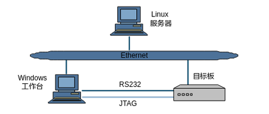

  部署：

  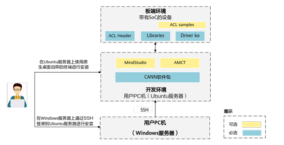

### 软件获取

<font color='RedOrange'>**（注意：以下软件包仅用于教学，未经允许不得转发用于商业用途）**</font>

| 工具名称    | 用途说明                          | 版本要求   | 获取渠道                                                     |
| ----------- | --------------------------------- | ---------- | ------------------------------------------------------------ |
| VirtualBox  | Windows安装Ubuntu系统所需的虚拟机 | 6.1.36版本 | [VirtualBox下载链接](https://download.virtualbox.org/virtualbox/6.1.36/VirtualBox-6.1.36-152435-Win.exe) |
| Ubuntu18.04 | 编译环境所需的Linux系统           | 18.04版本  | [Ubuntu18.04下载链接](https://releases.ubuntu.com/18.04/ubuntu-18.04.6-desktop-amd64.iso) |
| VScode      | 代码阅读和编辑所需的IDE工具       | 1.70.1版本 | [VScode下载链接](https://vscode.download.prss.microsoft.com/dbazure/download/stable/994fd12f8d3a5aa16f17d42c041e5809167e845a/VSCodeUserSetup-x64-1.107.1.exe) |
| MobaXterm   | 终端调试工具                      | V22.1版本  | [MobaXterm下载链接](https://download.mobatek.net/2212022060563542/MobaXterm_Installer_v22.1.zip) |

### 1、PC环境配置

### 1.1、安装VirtualBox虚拟机

- 双击在 **软件获取章节下载** 的VirtualBox-6.1.36-152435-Win.exe 安装包，点击下一步，安装VirtualBox。


- 点击浏览按钮，修改VirtualBox的安装路径，然后点击确定按钮，再点击下一步。


- 当出现下面的界面，点击下一步。

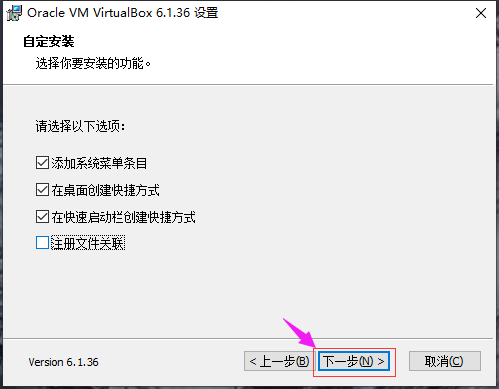

- 当出现下面的界面，点击是。


- 当出现下面的安装界面时，点击安装。

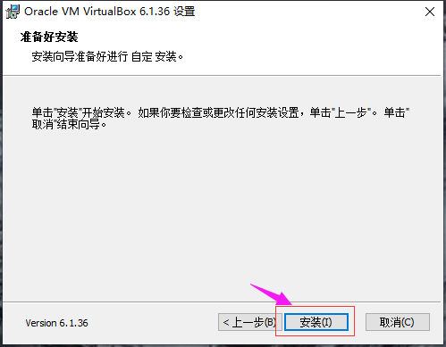

- 点击完成，即可完成VirtualBox的安装。


### 1.2、在VirtualBox中安装Ubuntu18.04

#### 步骤1：导入Ubuntu18.04镜像到VirtualBox

- 打开VirtualBox，点击新建

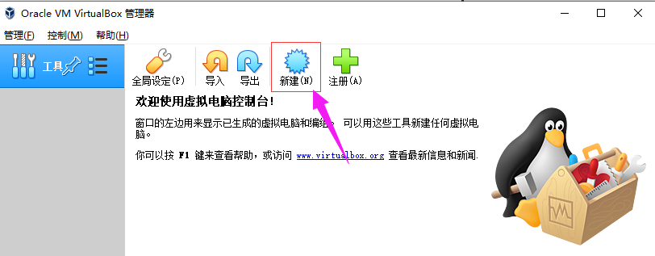

- 修改虚拟机的名称为hispark，然后修改Ubuntu系统的安装文件夹（因为软件默认安装在C盘，我们最好是把安装路径修改为其他磁盘），把类型配置为linux,然后版本选择 Ubuntu(64-bit)，然后再点击下一步。

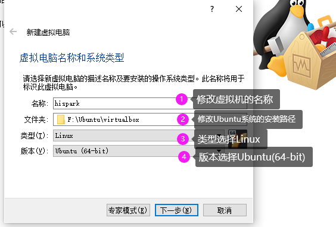

- 修改Ubuntu的运行内存大小为4G，然后点击下一步。


- 选择现在创建虚拟硬盘，然后点击创建按钮。


- 选择VDI（VirtualBox磁盘映像），然后点击下一步。

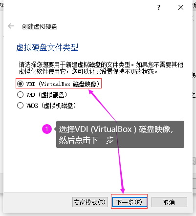

- 选择动态分配，然后点击下一步。


- 修改磁盘空间大小为100GB，然后点击创建按钮。请至少给Ubuntu分配100G的内存空间，否则后面的步骤会因为内存不足出现错误。


- 点击设置按钮，选择常规选项，在高级选项处，把共享粘贴板和拖放都设置为双向，然后点击OK按钮。


- 点击VirtualBox的设置，然后点击系统，选择处理器，把处理器的数量改为4。
- 注意：如果您的处理器小于等于4个的话，请把处理器数量改小一些。


- 点击网络，选择网卡2，勾选启动网络连接，选择仅主机网络，点击OK。


- 点击设置按钮，选择存储，然后选择没有盘片，点击光盘按钮，点击选择虚拟盘。


* 选择软件获取章节下载**的Ubuntu18.04的镜像文件，然后点击打开按钮。

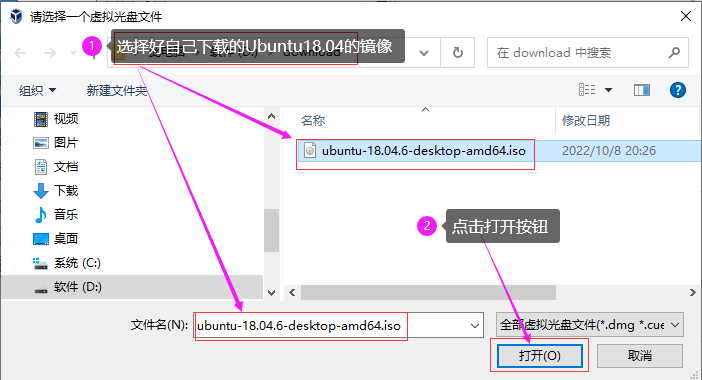

* 然后点击设置的OK按钮。

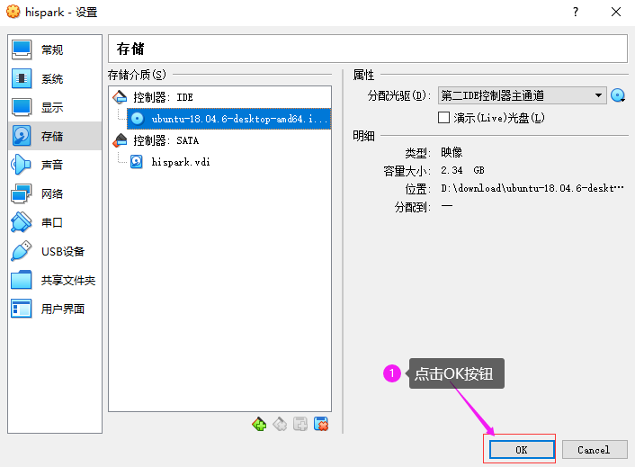

* 选择USB设备，把启动USB控制器的勾选去掉，禁用USB设备，然后点击OK（部分电脑可能无法进行这一步操作，可以先跳过）


* 点击启动，启动Ubuntu系统

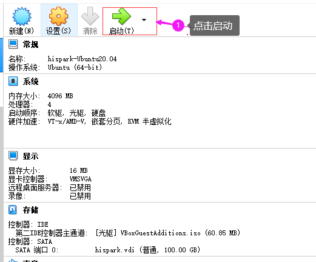

#### 步骤2：Ubuntu系统的安装

* 选择中文(简体)，然后点击安装Ubuntu

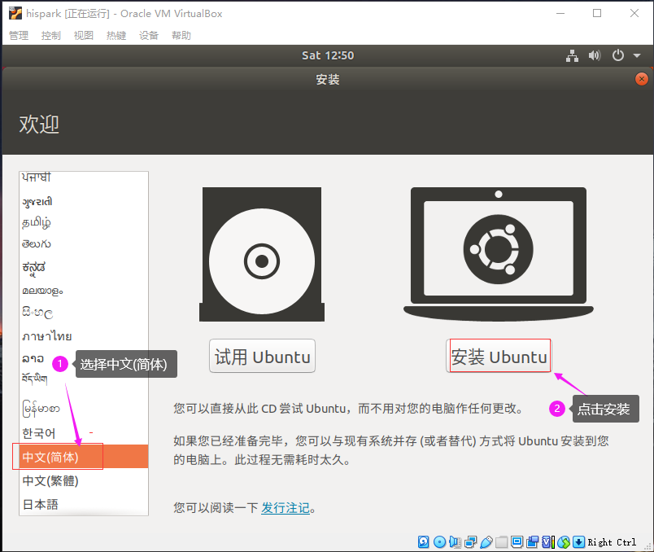

- 如果您安装Ubuntu的时候和我一样，因为分辨率问题，导致界面显示不全，无法看到下面的按钮，您需要按住组合键 ``` Ctrl+Alt+t```打开终端面板，然后输入xrandr，查看一下支持的分辨率。

  

- 我们这边以1920x1200为例，输入 ```xrandr -s 1920x1200``` 后敲回车，修改Ubuntu的分辨率。

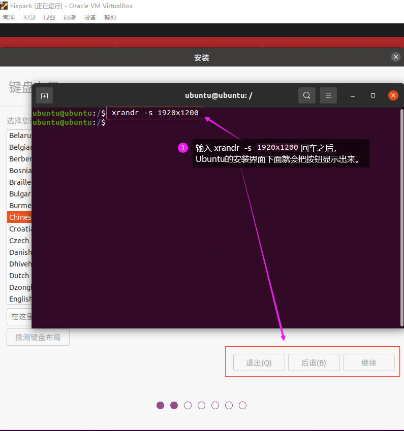

- 选择Chinese，然后点击继续按钮。


- 将安装Ubuntu时下载更新的勾选去掉，然后点击继续按钮。

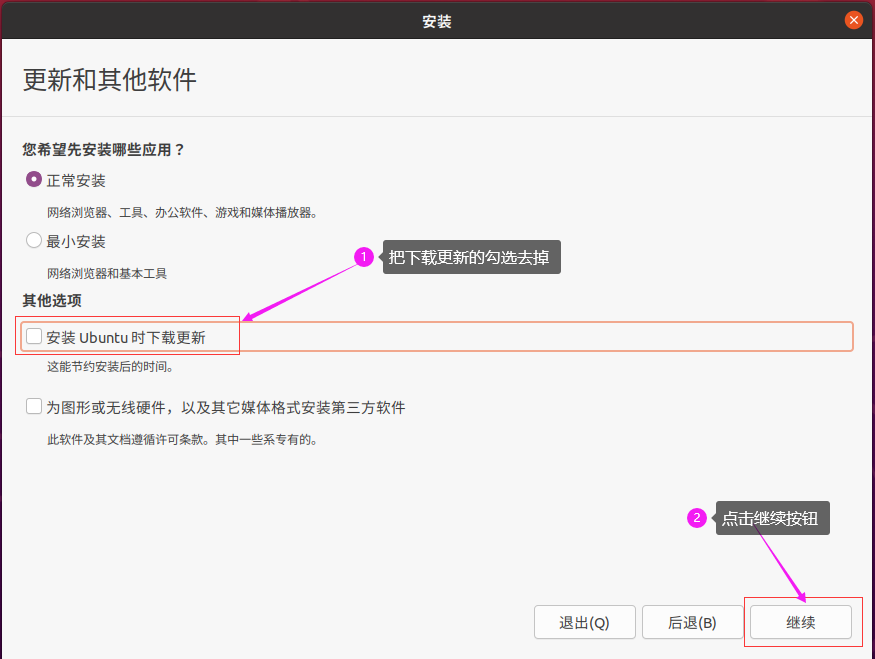

- 点击现在安装。

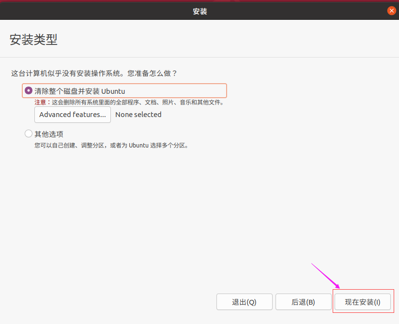

- 点击继续按钮。


- 选择上海，然后点击继续按钮。


- 设置好账号和密码，点击继续按钮，此处的账号和密码即为您Ubuntu的登录所需的账号和密码。
- 请按照本文的配置来，账号为：hispark，密码为：hispark。

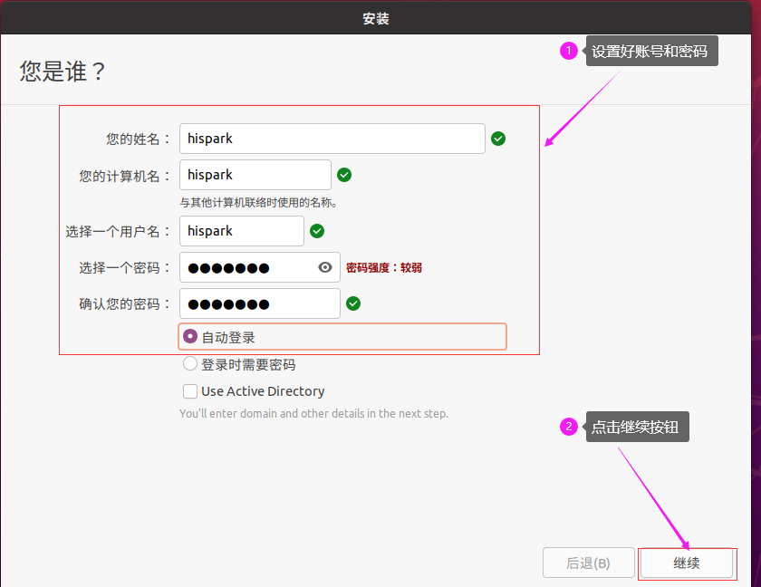

- 开始安装各种软件。


- Ubuntu安装完成后，点击现在重启按钮。


* 如果在重启的过程中出现提示**please remove the installation medium**，可以直接点击关闭按钮，选择强制退出，点击OK即可。


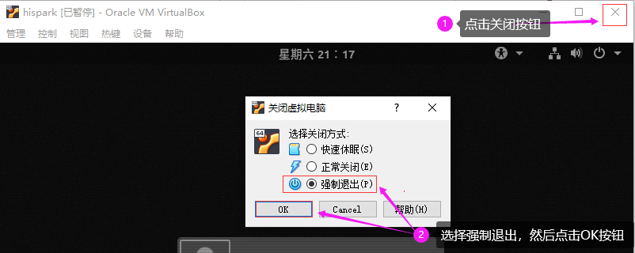

- 当出现此类弹窗，点击前进即可。若Ubuntu弹出是否更新的弹窗，点击不升级即可。我们先暂时不更新。


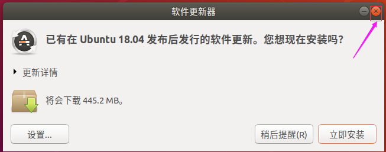

- 点击virtualbox的设备，点击安装增强功能


- 当弹出 弹窗询问是否运行自启动软件时，点击取消。


- 此时左边任务栏会多出一个光盘一样的图标，点击并打开光盘图标，进入该文件夹内。


- 在光盘文件夹的空白处，鼠标右键，点击在终端打开。


- 执行下面的命令，进行增强功能的安装。

```
sudo apt-get install  gcc make perl -y

sudo ./VBoxLinuxAdditions.run
```


- 安装成功后，在终端执行 reboot命令，重启一下Ubuntu

```
reboot
```


#### 步骤3：更新软件

* 当Ubuntu重启之后，点击Ubuntu桌面左下角九个点图标，然后打开软件和更新图标。


- 点击Ubuntu软件，在**下载自**处点击下拉框，选择其他站点。


- 在**中国**下方选择**阿里云**，然后点击选择服务器。

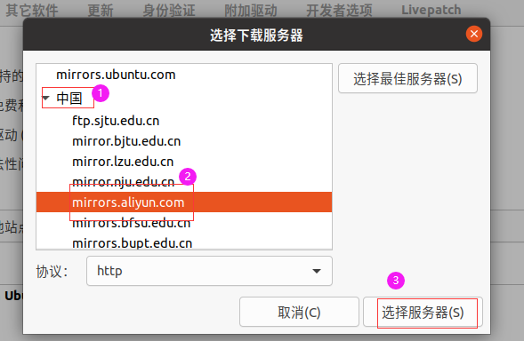

- 此时弹出认证对话框，输入您的Ubuntu登录密码，本文为hispark。

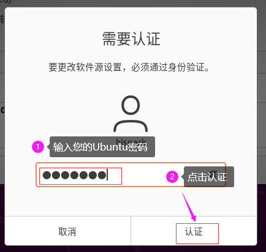

- 点击关闭按钮，然后有对话框时，点击重新载入，此时会有一段时间的软件更新，耐心等待即可。

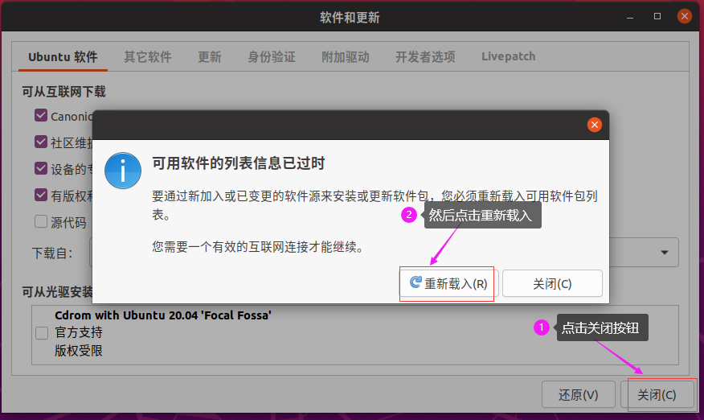

* 更新完成后，在Ubuntu的桌面，点击鼠标右键，点击在终端打开，打开终端窗口。


* 在终端输入下面两条命令，进行软件更新

```
sudo apt-get update
sudo apt-get upgrade -y
```


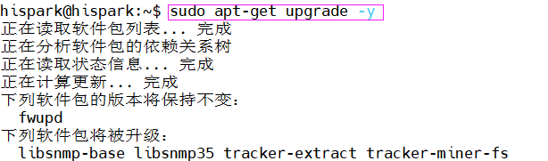

#### 步骤4：配置Ubuntu的SSH服务

* 执行下面的命令，下载SSH-server

```
sudo apt-get install openssh-server -y
```


* 执行下面的命令，启动Ubuntu ssh服务

```
sudo systemctl start ssh
```


#### 步骤5：安装MobaXterm并连接到Ubuntu

* 在Windows 主机，解压在软件获取章节下载** 的MobaXterm_Installer_v22.1.zip 压缩包，然后双击解压后的MobaXterm_installer_22.1.msi，进行MobaXterm的安装。
* 一直点击下一步，即可安装成功。

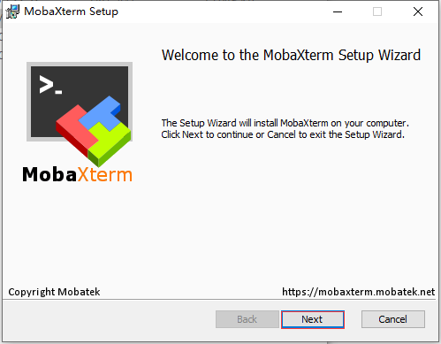

* 执行下面的命令，安装net-tools工具

```
sudo apt install net-tools  -y
```

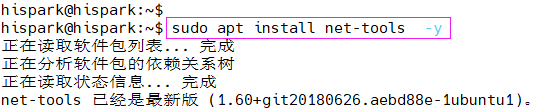

* 执行下面的命令，查看Ubuntu的IP地址，本文Ubuntu的IP地址是 192.168.56.106

```
ifconfig
```


* 打开刚在Windows上安装好的MobaXterm，点击左上角的Session图标，当弹出新的对话框时，点击左上角的SSH图标，然后输入你自己Ubuntu的IP地址，勾选上 Specify username，并填写好你Ubuntu的用户名，点击OK即可。


* 点击OK之后，若需要您输入登录密码，直接输入您Ubuntu的用户登录密码即可进入Ubuntu的终端界面。


### 2、板端环境配置

#### 	Linux环境配置

##### 步骤1：刷新镜像和KO

按照**驱动和开发环境安装指南**和**SDK安装以及升级使用说明**配置好开发板环境和刷好镜像，加载KO

##### 步骤2：配置应用运行的动态库搜索路径
- 使用以下命令配置应用依赖的图像引擎SDK动态库路径：
```shell
# Hi3403V100 SVP_NNN
export LD_LIBRARY_PATH=/path/to/smp/a55_linux/mpp/out/lib/svp_npu:$LD_LIBRARY_PATH
export LD_LIBRARY_PATH=/path/to/smp/a55_linux/mpp/out/lib:$LD_LIBRARY_PATH
# Hi3403V100 NNN
export LD_LIBRARY_PATH=/path/to/smp/a55_linux/mpp/out/lib/npu:${LD_LIBRARY_PATH}
export LD_LIBRARY_PATH=/path/to/smp/a55_linux/mpp/out/lib:$LD_LIBRARY_PATH
export ASCEND_AICPU_KERNEL_PATH=/path/to/smp/a55_linux/mpp/out/lib/npu
```
- 若应用依赖modelzoo仓库中某些动态库，以modelzoo仓库中OpenHarmony平台上的开源三方库opencv库为例，配置命令如下：
```shell
export LD_LIBRARY_PATH=/path/to/modelzoo/samples/opensource/opencv/lib/aarch64_ohos:$LD_LIBRARY_PATH
```

#### 	OpenHarmony环境配置

参考[环境配置](https://gitee.com/HiSpark/pegasus/blob/Beta-v0.9.3/docs/zh-CN/Hi3403V100%E7%8E%AF%E5%A2%83%E6%90%AD%E5%BB%BA%E6%8C%87%E5%8D%97/Hi3403V100%E7%8E%AF%E5%A2%83%E6%90%AD%E5%BB%BA%E6%8C%87%E5%8D%97.md)进行基础配置，然后再完成下述环境变量配置（参考模型readme中版本配套表获取对应环境）。
```shell
export PATH=/usr/lib:$PATH
# 加载opencv环境变量，MODELZOO_PATH为modelzoo代码仓路径，例如/mnt/workspace/modelzoo
export LD_LIBRARY_PATH=${MODELZOO_PATH}/samples/opensource/opencv/lib/aarch64_ohos:$LD_LIBRARY_PATH;
```
### 3、配置服务器开发环境

#### 步骤1：安装CANN和交叉编译工具链

- <font color="red">**Hi3403V100拥有两个图像引擎，在这里我们称呼Hi3403V100 SVP_NNN和Hi3403V100 NNN用于区分它们，请根据需求安装CANN。**</font>
- 参考文档**驱动和开发环境安装指南**

#### 步骤2：环境变量配置

##### 板端刷写Linux系统时交叉编译环境配置

使用以下命令配置图像引擎SDK头文件和动态库的搜索路径
```shell
export NPU_INCLUDE_PATH=/path/to/ascend-toolkit/latest/acllib/include/acl
export NPU_LIB_PATH=/path/to/ascend-toolkit/latest/acllib/lib64/stub
```
SDK头文件和动态库在CANN包安装目录下，以Hi3403V100 SVP_NNN为例，若CANN包安装路径为$HOME/Ascend，则配置命令示例如下：
```shell
export NPU_INCLUDE_PATH=$HOME/Ascend/ascend-toolkit/svp_latest/acllib/include/acl
export NPU_LIB_PATH=$HOME/Ascend/ascend-toolkit/svp_latest/acllib/lib64/stub
```

##### 板端刷写OpenHarmony系统时交叉编译环境配置

1. 编译器安装和配置
  - 板端刷写OpenHarmony操作系统时，Hi3403V100使用的交叉编译器是来自OpenHarmony源码中的`clang`，编译器依赖的sys_root来自OpenHarmony编译产物。OpenHarmony源码下载和编译参考以下[文档](https://gitee.com/HiSpark/pegasus/blob/Beta-v0.9.3/docs/zh-CN/OpenHarmony%20Small%E7%89%88%E6%9C%AC%E4%BD%BF%E7%94%A8%E6%8C%87%E5%8D%97/OpenHarmony%20Small%E7%89%88%E6%9C%AC%E4%BD%BF%E7%94%A8%E6%8C%87%E5%8D%97.md#%E6%90%AD%E5%BB%BAopenharmony%E5%BC%80%E5%8F%91%E7%8E%AF%E5%A2%83)。
  - OpenHarmony源码下载和编译流程完成后，使用以下命令配置编译器和sys_root路径：
    ```shell
    export PATH=/path/to/ohos/prebuilts/clang/ohos/linux-x86_64/llvm/bin:$PATH
    export SYSROOT_PATH=/path/to/ohos/out/hispark_ss928v100/ipcamera_hispark_ss928v100_linux/sysroot
    ```

2. 环境变量配置 
  - 板端刷写OpenHarmony操作系统时，图像引擎的SDK归档在[开源代码仓](https://gitee.com/HiSpark/ss928v100_clang),下载该代码仓到服务器上（参考模型readme中版本配套表ss928v100_clang获取对应代码），使用以下命令配置图像引擎SDK头文件和动态库搜索路径:
    ```shell
    export NPU_INCLUDE_PATH=/path/to/smp/a55_linux/mpp/out/include
    export NPU_LIB_PATH=/path/to/smp/a55_linux/mpp/out/lib
    ```


#### 步骤3：搭建服务器网络环境

* 先前已经使pc和服务器建立连接，现在需要能和板端建立好连接，**将开发板与PC串口相连，网线直连**

* 进入vituralbox->设置->网络，依次将网卡进行如下设置

  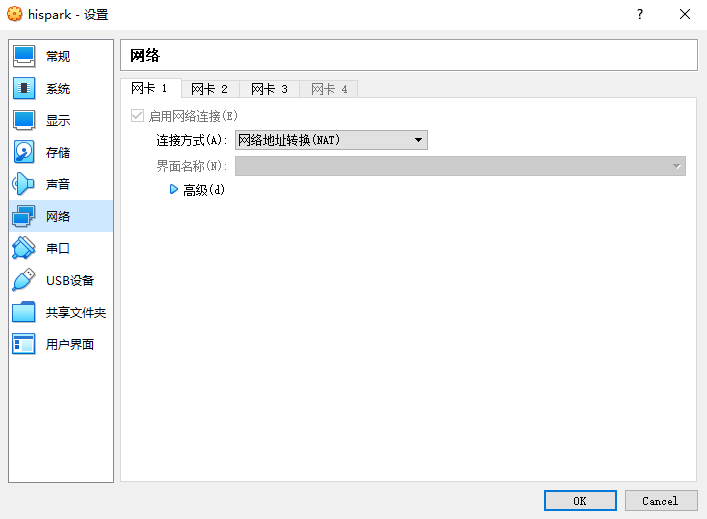

  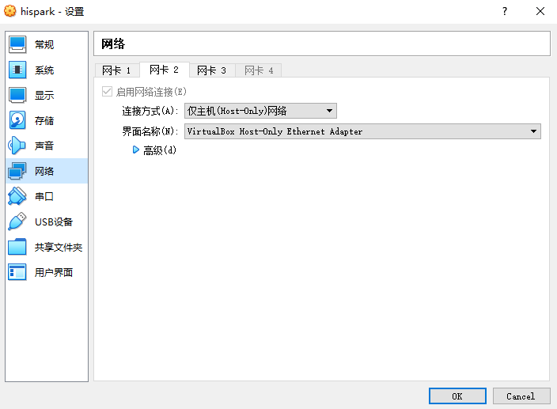

  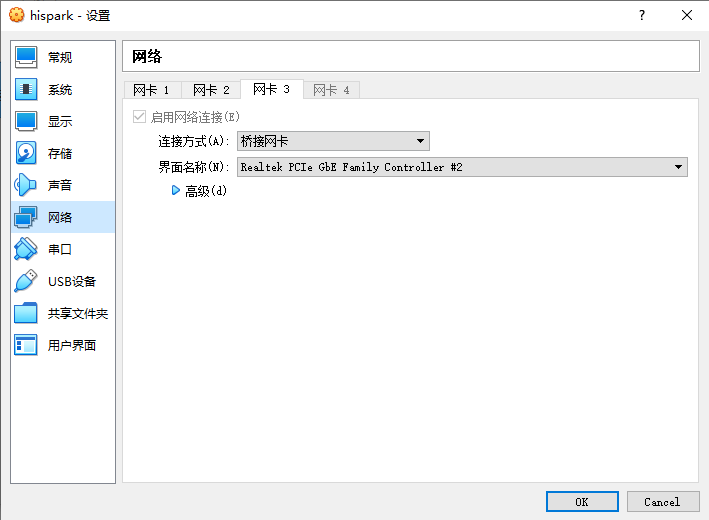

  在网卡3，选择的桥接网卡为在PC端网络适配器中查看到的，与开发板直接相连的网线

  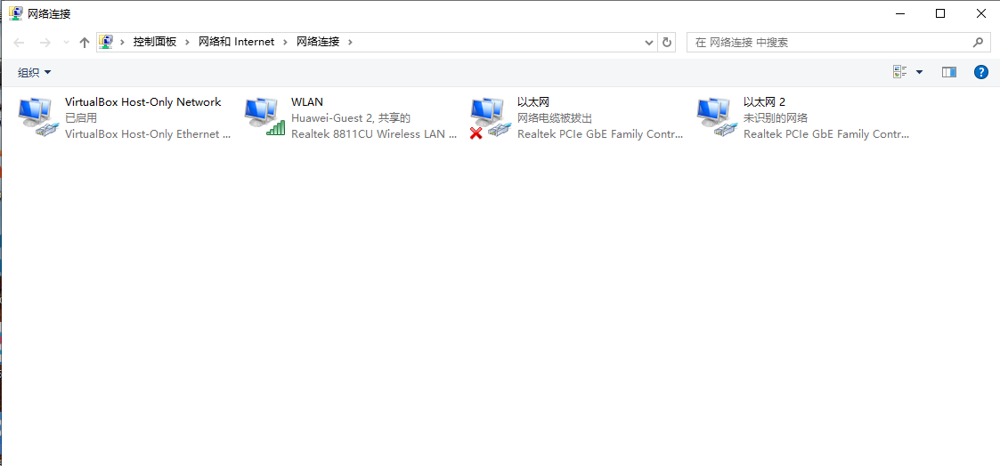

* PC端网络适配器配置，选择以太网2（具体名称以上述界面的实际名称为主），右键属性

  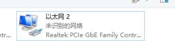


双击版本协议4，配置如下：

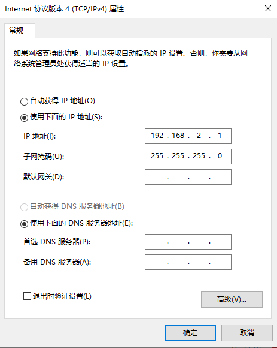

#### 步骤4：配置Ubuntu的ip

* 因为我们在1.2章节的步骤5中，已经能够使用MobaXterm打开Ubuntu的终端，并且能够看到Ubuntu的文件了。现在只需要开发板和板端的ip配置在一个局域网下面就好，在Ubuntu中执行

```
ifconfig
```

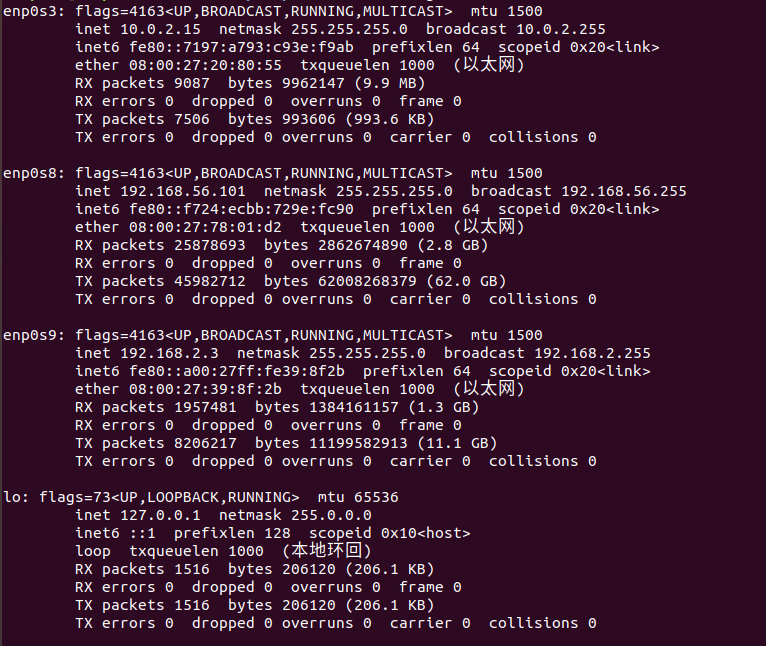

* 可以看到一个enp0s9，这个就是和开发板桥接的网络。

```
cd /etc/netplan
vim 01-network-manager-all.yaml
```

* 写入内容如下

```
network:
  version: 2
  renderer: NetworkManager
  ethernets:
    enp0s9:
      addresses: [192.168.2.3/24]
      dhcp4: no
```

#### 步骤5：更新板端环境

**在开发板中执行**

* ```
  vi /etc/init.d/rcS
  ```

  在末尾加上如下内容：

  ```
  ifconfig eth0 down
  ifconfig eth0 192.168.2.88 netmask 255.255.255.0
  route add default gw 192.168.2.3
  ifconfig eth0 up
  mount -t nfs -o nolock 192.168.2.3:/home/hispark/shared /mnt
  ```

  其中/home/hispark/shared为服务器放置modelzoo代码的位置

  重启开发板

#### 步骤6：ping一下开发板和服务器，正常ping通

#### 步骤7：配置开发板SSH

配置完后，设置ssh密钥

注意开发板上sshd_config配置，AuthorizedKeysFile注意路径配置正确

```
StrictModes no
PubkeyAuthentication yes
PermitRootLogin yes 
AuthorizedKeysFile      ~/.ssh/authorized_keys
```

在服务器上执行

```
ssh-keygen -p -f ~/.ssh/id_rsa
ssh-copy-id -i ~/.ssh/id_rsa.pub root@192.168.2.88
ssh root@192.168.2.88
```

此时应该不需要密码

### 4、安装VSCode

*  如果您电脑上已经安装过VScode，可以跳过此步骤。
*  双击在**软件获取章节下载**的VScode安装包，点击下一步进行安装。

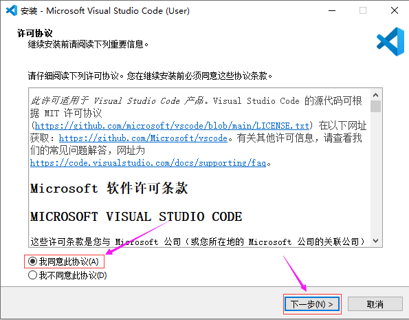

* 点击浏览按钮，选择VScode的安装路径，然后点击下一步。


* 出现下方界面，点击下一步。


* 出现下方界面，点击下一步。


* 出现下方界面，点击安装。


* 出现下方界面，点击完成。


### 5、将modelzoo代码导入到VScode
