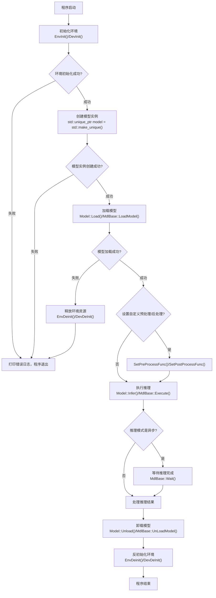

# contribute 说明

# 介绍

此文档为ModelZoo代码仓库开源共建指导文档。主要提供代码上库社区规范及代码文件模板供大家学习使用。

社区贡献请先阅读文档[开发者贡献规范](https://gitee.com/HiSpark/docs#社区参与贡献)

同时ModelZoo仓库也提供了便捷的使用接口，可以兼容多个AI算力引擎，一套接口实现可以快速迁移运行到其他引擎上，大家可以参考并使用。当前支持的算力引擎有Hi3403V100 SVP_NNN和Hi3403V100 NNN。

# **Infer模块接口使用文档**

详细描述Infer模块的核心接口、数据结构及使用方法，适用于基于该模块进行模型推理开发的开发者。所有接口均位于`Infer`命名空间下。

# 一、目录结构

在common目录下：

| 目录     | 说明    |
| -------- | ------- |
| cmake | 根据板端操作系统做区分，不同操作系统依赖不同编译工具链 |
| include | 代码头文件 |
| infer | 不同算力引擎接口实现，包含前后处理实现 |
| lib | 推理接口so |
| log | 日志 |
| utils | 工具方法实现 |

# 二、前置说明

## 2.1 依赖头文件

```cpp
#include "model.h"
#include "log.h"
// 若涉及预处理/后处理，需额外引入对应头文件（如image_process.h、vit_preprocess.h等）
```

## 2.2 核心命名空间

所有接口、数据结构均封装在 `Infer` 命名空间中，使用前需声明：`using namespace Infer;` 或通过`Infer::接口名` 调用。

## 2.3 错误码说明

- `0`：接口调用成功

- `-1`：接口调用失败（如模型加载失败、参数非法、预处理/后处理失败等）

# 三、核心数据结构

以下数据结构为接口核心参数/返回值，需熟练掌握其含义及使用场景。

## 3.1 张量类型（TensorType）

定义张量的数据类型，用于描述模型输入/输出张量的数值类型，枚举值如下：

```cpp
enum TensorType { 
   TENSOR_TYPE_UNDEFINED = -1,  // 未定义类型
   TENSOR_TYPE_FLOAT = 0,       // 单精度浮点型
   TENSOR_TYPE_FLOAT16 = 1,     // 半精度浮点型
   TENSOR_TYPE_INT8 = 2,        // 有符号8位整型
   TENSOR_TYPE_INT32 = 3,       // 有符号32位整型
   TENSOR_TYPE_UINT8 = 4,       // 无符号8位整型
   TENSOR_TYPE_INT16 = 6,       // 有符号16位整型
   TENSOR_TYPE_UINT16 = 7,      // 无符号16位整型
   TENSOR_TYPE_UINT32 = 8,      // 无符号32位整型
   TENSOR_TYPE_INT64 = 9,       // 有符号64位整型
   TENSOR_TYPE_UINT64 = 10,     // 无符号64位整型
   TENSOR_TYPE_DOUBLE = 11,     // 双精度浮点型
   TENSOR_TYPE_BOOL = 12,       // 布尔型
   TENSOR_TYPE_STRING = 13,     // 字符串型
   TENSOR_TYPE_COMPLEX64 = 16,  // 64位复数型
   TENSOR_TYPE_COMPLEX128 = 17, // 128位复数型
   TENSOR_TYPE_INT10 = 100,     // 有符号10位整型
   TENSOR_TYPE_UINT10 = 101,    // 无符号10位整型
   TENSOR_TYPE_INT12 = 102,     // 有符号12位整型
   TENSOR_TYPE_UINT12 = 103,    // 无符号12位整型
   TENSOR_TYPE_INT14 = 104,     // 有符号14位整型
   TENSOR_TYPE_UINT14 = 105,    // 无符号14位整型
   TENSOR_TYPE_INT24 = 106,     // 有符号24位整型
   TENSOR_TYPE_UINT24 = 107     // 无符号24位整型
};
```

## 3.2 张量格式（TensorFormat）

定义张量的存储格式，用于描述多维度张量的排列方式，枚举值如下：

```cpp
enum TensorFormat {
   TENSOR_Format_UNDEFINED = -1,  // 未定义格式
   TENSOR_Format_NCHW = 0,        // 通道优先格式（批量数-通道数-高度-宽度）
   TENSOR_Format_NHWC = 1,        // 宽度优先格式（批量数-高度-宽度-通道数）
   TENSOR_Format_ND = 2,          // 多维格式
   TENSOR_Format_NC1HWC0 = 3,     // 特殊通道拆分格式
   TENSOR_Format_FRACTAL_Z = 4,   // 分形Z格式
   TENSOR_Format_NC1HWC0_C04 = 12,// 4通道拆分格式
   TENSOR_Format_NDHWC = 27,      // 3D张量格式（批量数-深度-高度-宽度-通道数）
   TENSOR_Format_FRACTAL_NZ = 29, // 3D分形格式
   TENSOR_Format_NCDHW = 30,      // 3D通道优先格式（批量数-通道数-深度-高度-宽度）
   TENSOR_Format_NDC1HWC0 = 32,   // 3D特殊通道拆分格式
   TENSOR_Format_FRACTAL_Z_3D = 33// 3D分形Z格式
};
```

## 3.3 张量描述（TensorDesc）

描述张量的维度、类型、格式等核心信息，用于传递模型输入/输出的张量元信息。

```cpp
struct TensorDesc {
   size_t dimCount = 0;           // 张量维度数量（如2D、3D、4D）
   size_t dims[MAX_TENSOR_DIM] = {0}; // 各维度大小，最大支持128维
   TensorType type = TENSOR_TYPE_UNDEFINED; // 张量数据类型
   size_t typeSize = 0;           // 数据类型占用位数（单位：bit）
   TensorFormat format = TENSOR_Format_UNDEFINED; // 张量存储格式
   size_t defaultStride = 0;      // 默认步长（字节）
   size_t defaultSize = 0;        // 默认数据大小（字节）
};
```

## 3.4 张量缓冲区（TensorBuf）

用于存储张量的实际数据，封装了数据指针、大小、步长等信息，支持深拷贝、数据重置等操作。

```cpp
struct TensorBuf {
   std::shared_ptr<void> data;    // 数据指针（智能指针，自动管理内存）
   size_t size = 0;               // 数据大小（字节）
   size_t stride = 0;             // 数据步长（字节）
   
   TensorBuf();                   // 默认构造函数（数据为空）
   TensorBuf(size_t dataSize, size_t dataStride); // 构造指定大小和步长的缓冲区
   TensorBuf(void* externalData, size_t dataSize, size_t dataStride); // 绑定外部数据
   TensorBuf DeepCopy();          // 深拷贝缓冲区（复制数据，而非指针）
   void ResetData(void* newData = nullptr); // 重置数据指针（新数据为空时释放原有内存）
   void* GetRawPtr() const;       // 获取原始数据指针
};
```

## 3.5 运行模式（RunMode）

定义模型推理的运行模式，分为同步和异步两种。

```cpp
enum RunMode {
   Sync,  // 同步模式：推理完成后才返回结果
   Async  // 异步模式：发起推理后立即返回，需调用Wait()等待完成
};
```

## 3.6 执行参数（ExecuteParam）

用于传递模型推理的执行配置（如循环次数、输入文件列表），主要配合JSON配置文件使用。

```cpp
struct ExecuteParam
{
    size_t loop = 0;                          // 推理循环次数（0表示不循环，默认1次）
    std::vector<std::vector<std::string>> fileLists; // 输入文件列表（二维数组，支持多组输入）
};
```


## 3.7 接口调用流程

以下流程图展示Infer模块核心接口的标准调用顺序，涵盖环境初始化、模型操作、推理执行及资源释放全流程：




# 四、核心接口说明

接口分为4大类：设备管理接口、模型基础接口、模型推理接口、辅助接口，按功能分类说明。

## 4.1 设备管理接口

用于初始化和反初始化设备，为模型加载和推理提供硬件环境支持。

### 4.1.1 设备初始化（DevInit）

```cpp
int32_t DevInit(const std::string& configPath = ""); 
```

- **功能**：初始化推理设备（如GPU、AI加速芯片等），加载设备配置。

- **参数**：`configPath` - 设备配置文件路径（可选，默认空字符串，使用默认配置）。

- **返回值**：`0` 成功；`-1` 失败。

- **使用示例**：
        `// 使用默认配置初始化设备
    int ret = Infer::DevInit();
    if (ret != 0) {
    LOG(ERROR) << "设备初始化失败";
    }`

### 4.1.2 设备反初始化（DevDeInit）

```cpp
int32_t DevDeInit();
```

- **功能**：释放设备资源，反初始化设备。

- **参数**：无。

- **返回值**：`0` 成功；`-1` 失败。

- **使用示例**：
        `// 程序结束时反初始化设备
    Infer::DevDeInit();`

### 4.1.3 设备内存分配（DevMalloc）

```cpp
int32_t DevMalloc(void **devPtr, size_t size);
```

- **功能**：在设备上分配指定大小的内存。

- **参数**：
        

    - `devPtr` - 输出参数，指向分配的设备内存指针。

    - `size` - 需分配的内存大小（字节）。

- **返回值**：`0` 成功；`-1` 失败。

### 4.1.4 设备内存刷新（DevFlush）

```cpp
int32_t DevFlush(void *devPtr, size_t size);
```

- **功能**：刷新设备内存，确保数据同步。

- **参数**：
        

    - `devPtr` - 设备内存指针。

    - `size` - 需刷新的内存大小（字节）。

- **返回值**：`0` 成功；`-1` 失败。

### 4.1.5 设备内存释放（DevFree）

```cpp
int32_t DevFree(void *devPtr);
```

- **功能**：释放设备上分配的内存。

- **参数**：`devPtr` - 需释放的设备内存指针。

- **返回值**：`0` 成功；`-1` 失败。

### 4.1.6 设备内存拷贝（DevMemcpy）

```cpp
int32_t DevMemcpy(void *dst, size_t destMax, const void *src, size_t count);
```

- **功能**：在设备内存与主机内存之间拷贝数据（支持双向拷贝）。

- **参数**：
        

    - `dst` - 目标内存指针（可为主机或设备内存）。

    - `destMax` - 目标内存最大容量（字节）。

    - `src` - 源内存指针（可为主机或设备内存）。

    - `count` - 需拷贝的数据大小（字节）。

- **返回值**：`0` 成功；`-1` 失败（如目标内存不足）。

## 4.2 模型基础接口（MdlBase类）

MdlBase是模型的抽象基类，定义了模型加载、卸载、推理等核心接口，具体模型需实现该类的纯虚函数。

### 4.2.1 加载模型（LoadModel）

提供两种重载，支持从文件或内存加载模型。

```cpp
// 从模型文件加载
virtual int32_t LoadModel(const std::string& modelPath) = 0;
// 从内存缓冲区加载
virtual int32_t LoadModel(const char* modelBuf, size_t modelSize) = 0;
```

- **功能**：加载模型文件或内存中的模型数据，初始化模型推理环境。

- **参数**：
        

    - `modelPath` - 模型文件路径（如"./model/resnet50.bin"）。

    - `modelBuf` - 模型内存缓冲区指针。

    - `modelSize` - 模型内存缓冲区大小（字节）。

- **返回值**：`0` 成功；`-1` 失败（如文件不存在、模型格式错误）。

### 4.2.2 卸载模型（UnLoadModel）

```cpp
virtual int32_t UnLoadModel() = 0;
```

- **功能**：卸载模型，释放模型占用的内存和资源。

- **参数**：无。

- **返回值**：`0` 成功；`-1` 失败。

### 4.2.3 获取输入/输出张量数量

```cpp
// 获取输入张量数量
virtual size_t GetInTensorNum() = 0;
// 获取输出张量数量
virtual size_t GetOutTensorNum() = 0;
```

- **功能**：获取模型输入/输出张量的个数，用于初始化输入/输出缓冲区。

- **参数**：无。

- **返回值**：输入/输出张量的数量（大于等于1）。

### 4.2.4 获取输入/输出张量描述

提供两种重载，支持通过索引或名称获取张量描述。

```cpp
// 获取输入张量描述（通过索引）
virtual int32_t GetInTensorDescByIdx(size_t index, TensorDesc& tensorDesc) = 0;
// 获取输入张量描述（通过名称）
virtual int32_t GetInTensorDescByName(const std::string& name, TensorDesc& tensorDesc) = 0;
// 获取输出张量描述（通过索引）
virtual int32_t GetOutTensorDescByIdx(size_t index, TensorDesc& tensorDesc) = 0;
// 获取输出张量描述（通过名称）
virtual int32_t GetOutTensorDescByName(const std::string& name, TensorDesc& tensorDesc) = 0;
```

- **功能**：获取指定输入/输出张量的详细描述（维度、类型、格式等）。

- **参数**：
       

    - `index` - 张量索引（从0开始，需小于输入/输出张量数量）。

    - `name` - 张量名称（需与模型定义的张量名称一致）。

    - `tensorDesc` - 输出参数，用于存储获取到的张量描述。

- **返回值**：`0` 成功；`-1` 失败（如索引越界、名称不存在）。

### 4.2.5 执行模型推理（Execute）

```cpp
virtual int32_t Execute(std::vector<TensorBuf>& inBufs, std::vector<TensorBuf>& outBufs,
   RunMode runMode = RunMode::Sync) = 0;
```

- **功能**：执行模型推理，将输入缓冲区的数据传入模型，输出结果存入输出缓冲区。

- **参数**：
        

    - `inBufs` - 输入张量缓冲区列表（数量需与输入张量数量一致）。

    - `outBufs` - 输出张量缓冲区列表（数量需与输出张量数量一致，需提前初始化大小）。

    - `runMode` - 运行模式（默认同步模式）。

- **返回值**：`0` 成功；`-1` 失败（如输入输出缓冲区不匹配）。

### 4.2.6 等待异步推理完成（Wait）

```cpp
virtual int32_t Wait() = 0;
```

- **功能**：当使用异步模式（Async）时，等待推理任务完成。

- **参数**：无。

- **返回值**：`0` 推理完成；`-1` 推理失败。

### 4.2.7 创建模型实例（MdlCreate）

```cpp
std::shared_ptr<MdlBase> MdlCreate();
```

- **功能**：创建MdlBase类的实例（具体实现由底层封装），用于加载和运行模型。

- **参数**：无。

- **返回值**：MdlBase的智能指针（若创建失败，指针为空）。

- **使用示例**：
        `// 创建模型实例
    auto mdl = Infer::MdlCreate();
    if (!mdl) {
    LOG(ERROR) << "模型实例创建失败";
    }`

## 4.3 模型推理接口（Model类）

Model类封装了模型加载、预处理、后处理、推理的完整流程，依赖MdlBase实例，支持多种输入方式和模型类型。

### 4.3.1 加载模型（Load）

```cpp
int32_t Model::Load(const std::string& modelPath, ModelType modelType);
```

- **功能**：加载指定路径的模型，并绑定对应的预处理/后处理函数（根据模型类型自动匹配）。

- **参数**：
        

    - `modelPath` - 模型文件路径。

    - `modelType` - 模型类型（如Resnet50、Yolov4等，需与底层支持的模型类型一致，如果是自定义模型使用Custom，且必须设置前后处理方法）。

- **返回值**：`0` 成功；`-1` 失败（如模型类型不支持、模型加载失败）。

### 4.4.2 卸载模型（Unload）

```cpp
int32_t Model::Unload();
```

- **功能**：卸载模型，释放模型及相关资源。

- **参数**：无。

- **返回值**：`0` 成功；`-1` 失败。

### 4.3.3 设置预处理/后处理函数

```cpp
// 设置预处理函数
void Model::SetPreProcessFunc(ProcessFunc func);
// 设置后处理函数
void Model::SetPostProcessFunc(ProcessFunc func);
```

- **功能**：自定义模型的预处理/后处理函数，覆盖默认的自动匹配函数。

- **参数**：`func` - 预处理/后处理函数指针（需符合ProcessFunc函数签名）。

- **说明**：ProcessFunc为底层定义的函数类型，用于处理输入数据（如图片解码、归一化）和输出数据（如结果解析、可视化）。

### 4.4.4 推理接口（多重载）

提供4种重载，支持不同输入类型（文件、TensorBuf、Tensor），满足不同使用场景。

#### 重载1：通过文件路径推理（支持JSON配置文件）

```cpp
std::vector<std::vector<Tensor>> Model::Infer(const std::string& filePath, FileType fileType);
```

- **功能**：通过文件路径输入，自动完成预处理、推理、后处理，返回推理结果。

- **参数**：
        

    - `filePath` - 输入文件路径（可为单文件路径或JSON配置文件路径）。

    - `fileType` - 文件类型（如JsonFile、ImageFile等，需与文件格式匹配）。

- **返回值**：二维Tensor向量，外层为输入文件组，内层为对应文件的输出张量列表（失败时返回空向量）。

#### 重载2：通过TensorBuf推理

```cpp
std::vector<TensorBuf> Model::Infer(std::vector<TensorBuf>& tensorBufs);
```

- **功能**：直接传入TensorBuf作为输入，执行推理，返回输出TensorBuf列表。

- **参数**：`tensorBufs` - 输入TensorBuf列表（数量需与模型输入张量数量一致）。

- **返回值**：输出TensorBuf列表（失败时返回空向量）。

#### 重载3：通过输入/输出TensorBuf推理（直接操作缓冲区）

```cpp
int Model::Infer(std::vector<TensorBuf>& inBufs, std::vector<TensorBuf>& outBufs);
```

- **功能**：传入已初始化的输入/输出TensorBuf，执行推理，直接修改输出缓冲区数据。

- **参数**：
        

    - `inBufs` - 输入TensorBuf列表。

    - `outBufs` - 输出TensorBuf列表（需提前初始化大小）。

- **返回值**：`0` 成功；`-1` 失败。

#### 重载4：通过Tensor推理（带文件路径辅助预处理）

```cpp
std::vector<Tensor> Model::Infer(std::vector<Tensor>& tensors, std::string filePath);
```

- **功能**：传入Tensor作为输入，结合文件路径辅助预处理，执行推理，返回输出Tensor列表。

- **参数**：
        

    - `tensors` - 输入Tensor列表。

    - `filePath` - 辅助预处理的文件路径（如图片路径）。

- **返回值**：输出Tensor列表（失败时返回空向量）。

### 4.3.5 获取模型信息（GetModelInfo）

```cpp
std::pair<std::vector<TensorDesc>, std::vector<TensorDesc>> Model::GetModelInfo();
```

- **功能**：获取模型的输入/输出张量描述列表。

- **参数**：无。

- **返回值**：pair类型，first为输入张量描述列表，second为输出张量描述列表。

## 4.4 辅助接口

### 4.4.1 环境初始化/反初始化（封装设备管理）

```cpp
// 环境初始化（封装DevInit）
int32_t EnvInit(const std::string& configPath);
// 环境反初始化（封装DevDeInit）
int32_t EnvDeinit();
```

- **功能**：简化设备初始化/反初始化操作，与DevInit、DevDeInit功能一致。

- **参数**：`configPath` - 设备配置文件路径（可选）。

- **返回值**：`0` 成功；`-1` 失败。

### 4.4.2 JSON配置文件解析（ParseInputJsonFile）

```cpp
static bool ParseInputJsonFile(const std::string& filePath, ExecuteParam& param);
```

- **功能**：解析JSON格式的输入配置文件，获取推理参数（循环次数、文件列表）。

- **参数**：
        

    - `filePath` - JSON配置文件路径。

    - `param` - 输出参数，用于存储解析后的执行参数。

- **返回值**：`true` 解析成功；`false` 解析失败（如文件不存在、格式错误）。

# 五、完整使用示例

以Resnet50模型推理为例，展示从环境初始化到模型推理的完整流程。

```cpp
#include "model.h"
#include "log.h"
#include <iostream>
using namespace Infer;

int main() {
    // 1. 初始化环境（设备）
    int ret = EnvInit();
    if (ret != 0) {
        LOG(ERROR) << "环境初始化失败";
        return -1;
    }

    // 2. 创建Model实例（或MdlBase实例）
    Model model;

    // 3. 加载模型（Resnet50类型）
    std::string modelPath = "./model/resnet50.om";
    ret = model.Load(modelPath, ModelType::Resnet50);
    if (ret != 0) {
        LOG(ERROR) << "模型加载失败";
        EnvDeinit();
        return -1;
    }

    // 4. 执行推理（输入图片文件）
    std::string imgPath = "./test.jpg";
    auto outputs = model.Infer(imgPath, FileType::ImageFile);
    if (outputs.empty()) {
        LOG(ERROR) << "推理失败";
        model.Unload();
        EnvDeinit();
        return -1;
    }

    // 5. 处理推理结果（此处仅打印输出张量数量）
    LOG(INFO) << "推理成功，输出张量数量：" << outputs[0].size();

    // 6. 卸载模型、反初始化环境
    model.Unload();
    EnvDeinit();

    return 0;
}
```

# 六、注意事项

- 模型加载前需确保环境（设备）已初始化，推理完成后需及时卸载模型、反初始化环境，避免内存泄漏。

- 输入/输出TensorBuf的数量、大小、类型需与模型的输入/输出张量描述一致，否则会导致推理失败。

- 异步推理（RunMode::Async）时，需调用Wait()等待推理完成后，再读取输出缓冲区数据。

- 自定义预处理/后处理函数时，需确保函数签名与ProcessFunc一致，否则会导致编译错误。

- JSON配置文件的格式需符合要求，"fileList"字段需为二维数组，否则解析失败。
