# 前言<a name="ZH-CN_TOPIC_0000002442020481"></a>

**概述<a name="section4102mcpsimp"></a>**

本文档详细介绍了如何使用AMCT，对Caffe框架的网络模型进行量化。

**产品版本<a name="section300mcpsimp"></a>**

与本文档相对应的产品版本如下。

<a name="table303mcpsimp"></a>
<table><thead align="left"><tr id="row308mcpsimp"><th class="cellrowborder" valign="top" width="45%" id="mcps1.1.3.1.1"><p id="p310mcpsimp"><a name="p310mcpsimp"></a><a name="p310mcpsimp"></a>产品名称</p>
</th>
<th class="cellrowborder" valign="top" width="55.00000000000001%" id="mcps1.1.3.1.2"><p id="p312mcpsimp"><a name="p312mcpsimp"></a><a name="p312mcpsimp"></a>产品版本</p>
</th>
</tr>
</thead>
<tbody><tr id="row314mcpsimp"><td class="cellrowborder" valign="top" width="45%" headers="mcps1.1.3.1.1 "><p id="p316mcpsimp"><a name="p316mcpsimp"></a><a name="p316mcpsimp"></a>SS928</p>
</td>
<td class="cellrowborder" valign="top" width="55.00000000000001%" headers="mcps1.1.3.1.2 "><p id="p318mcpsimp"><a name="p318mcpsimp"></a><a name="p318mcpsimp"></a>V100</p>
</td>
</tr>
<tr id="row1376073312191"><td class="cellrowborder" valign="top" width="45%" headers="mcps1.1.3.1.1 "><p id="p5760533111913"><a name="p5760533111913"></a><a name="p5760533111913"></a>SS927</p>
</td>
<td class="cellrowborder" valign="top" width="55.00000000000001%" headers="mcps1.1.3.1.2 "><p id="p6760333131918"><a name="p6760333131918"></a><a name="p6760333131918"></a>V100</p>
</td>
</tr>
</tbody>
</table>

**读者对象<a name="section4105mcpsimp"></a>**

本文档主要适用于以下工程师：

-   技术支持工程师
-   软件开发工程师

掌握以下经验和技能可以更好地理解本文档：

-   熟悉Linux基本命令。
-   对图像分析方法有一定的了解。

**修订记录<a name="section4116mcpsimp"></a>**

修订记录累积了每次文档更新的说明。最新版本的文档包含以前所有文档版本的更新内容。

<a name="table5652mcpsimp"></a>
<table><thead align="left"><tr id="row5658mcpsimp"><th class="cellrowborder" valign="top" width="21%" id="mcps1.1.4.1.1"><p id="p5660mcpsimp"><a name="p5660mcpsimp"></a><a name="p5660mcpsimp"></a>文档版本</p>
</th>
<th class="cellrowborder" valign="top" width="26%" id="mcps1.1.4.1.2"><p id="p5663mcpsimp"><a name="p5663mcpsimp"></a><a name="p5663mcpsimp"></a>发布日期</p>
</th>
<th class="cellrowborder" valign="top" width="53%" id="mcps1.1.4.1.3"><p id="p5666mcpsimp"><a name="p5666mcpsimp"></a><a name="p5666mcpsimp"></a>修改说明</p>
</th>
</tr>
</thead>
<tbody><tr id="row5669mcpsimp"><td class="cellrowborder" valign="top" width="21%" headers="mcps1.1.4.1.1 "><p id="p5671mcpsimp"><a name="p5671mcpsimp"></a><a name="p5671mcpsimp"></a>00B01</p>
</td>
<td class="cellrowborder" valign="top" width="26%" headers="mcps1.1.4.1.2 "><p id="p5673mcpsimp"><a name="p5673mcpsimp"></a><a name="p5673mcpsimp"></a>2025-09-15</p>
</td>
<td class="cellrowborder" valign="top" width="53%" headers="mcps1.1.4.1.3 "><p id="p5675mcpsimp"><a name="p5675mcpsimp"></a><a name="p5675mcpsimp"></a>第1次临时版本发布。</p>
</td>
</tr>
</tbody>
</table>

# 概述<a name="ZH-CN_TOPIC_0000002442020513"></a>


## 简介<a name="ZH-CN_TOPIC_0000002408421458"></a>

本文介绍如何通过高级模型压缩工具（Advanced Model Compression Toolkit，简称AMCT）对Caffe框架的原始网络模型进行量化，量化是指对模型的权重（weight）和数据（activation）进行低比特处理，让最终生成的网络模型更加轻量化，从而达到节省网络模型存储空间、降低传输时延、提高计算效率，达到性能提升与优化的目标。

AMCT是基于Caffe框架的Python工具包，实现了模型中融合（主要为BN融合）、数据与权重8比特量化的功能，该工具将量化和模型转换分开，实现对模型中可量化算子的独立量化，并将量化后的模型保存为.prototxt文件和.caffemodel文件。其中量化后的fakequant模型可以在CPU或者GPU上运行，完成量化精度评估；量化后的部署模型可以部署在SoC上运行，达到提升推理性能的目的，该工具优点如下。

-   使用方便，安装工具包、重新编译Caffe即可。
-   接口简单，在用户基于Caffe框架的推理脚本基础上，调用API即可完成量化。
-   与硬件配套，生成的部署模型（deploy模型）经过ATC工具转换后可实现8比特推理。
-   量化可配置，用户可自行修改量化配置文件，调整量化策略，获取较优的量化结果。

AMCT使用场景如[图1](#fig15946191505911)所示，AMCT当前仅支持在Ubuntu 18.04架构操作系统进行部署，配套信息请参见[环境准备](#ZH-CN_TOPIC_0000002442020533)。使用该工具量化完的模型，需要借助ATC工具转换成SoC的离线模型，然后完成推理操作。

**图 1**  部署架构<a name="fig15946191505911"></a>  
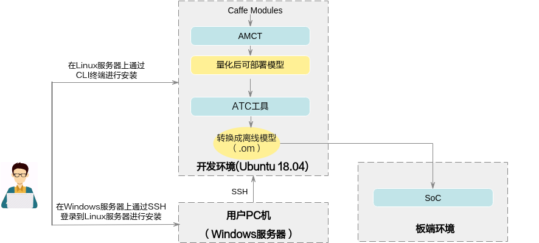

## 基本功能<a name="ZH-CN_TOPIC_0000002408581194"></a>


### 训练后量化与量化感知训练<a name="ZH-CN_TOPIC_0000002408421514"></a>


#### 概念介绍<a name="ZH-CN_TOPIC_0000002408421378"></a>

根据量化方法不同，分为训练后量化（Post-Training Quantization）和量化感知训练（Quantization-Aware Training）。

上述两种量化方法，根据量化对象不同，分为权重（weight）量化和数据（activation）量化，根据是否对权重数据进行压缩又分为均匀量化和非均匀量化。

下面分别介绍训练后量化和量化感知训练相关概念：

**训练后量化**：是指将训练后模型中的权重由float32量化到int8，并通过少量校准数据对数据（activation）进行校准量化。量化过程请参见[训练后量化](#ZH-CN_TOPIC_0000002408421274)。训练后量化不支持多个GPU同时运行。

-   **校准数据集**

    数据的量化因子的确定过程（calibration过程），网络模型将校准集中的每一份数据作为输入进行前向推理，量化算法积攒下每个待量化层/算子的对应输入数据，据此来确定量化因子。由于量化因子的确定和校准数据集的选择相关，量化后模型的精度也和校准数据集的选择相关，推荐使用验证集的子集作为校准数据集。

-   **数据（activation）量化**

    数据量化是对每个待量化的层/算子的输入数据进行统计，每个层/算子计算出最优的一组scale和offset（参数解释请参见[量化因子记录文件说明](#ZH-CN_TOPIC_0000002441980745)）。

    数据是模型推理计算的中间结果，其范围与模型输入相关，因此需要使用一组参考输入（校准数据集）作为激励，从而记录下来待量化层/算子的输入数据，搜索得到量化因子（scale和offset）。由于在做数据calibration的过程中，需要占用额外的存储空间（显存/内存）来存储用于确定量化因子的输入数据，所以对于显存/内存的占用比仅推理的过程要高，额外占用空间的大小和calibration过程中的batch\_size\* batch\_num正相关。

-   **权重（weight）量化**

    训练后模型的权值已经确定，数值的范围也已经确定，因此直接根据权值的数据范围进行量化。

-   **均匀量化**

    是指量化后的数据比较均匀地分布在某个数值空间中，例如INT8量化就是用只有8比特的INT8数据来表示32比特的FP32数据，将FP32的运算过程（乘加运算）转换为INT8的运算，加速运算和实现模型压缩；均匀的INT8量化则是量化后数据比较均匀地分布在INT8的数值空间\[-128, 127\]中，量化过程请参见[均匀量化](#ZH-CN_TOPIC_0000002408581338)。

    -   如果均匀量化后的模型精度无法满足要求，则需要进行[量化感知训练](#ZH-CN_TOPIC_0000002442020557)。
    -   当前支持的带权重均匀量化层为：全连接层（InnerProduct）、卷积层（Convolution和DepthwiseConv）、反卷积层（Deconvolution）、RNN、LSTM、GRU。
    -   当前支持的不带权重均匀量化层为：PassThrough, Pooling, PSROIPooling, ROIPooling, SPP, Upsample, Eltwise, Slice, Concat, Softmax, ROIAlign, AbsVal, BNLL, CReLU, ELU, Exp, Interp, Log, LRN, Mvm, Nms, Normalize, Power, PReLU, Reduction, ReLU, Sigmoid, Sort, Threshold, Scale, BatchNorm, Bias, Reshape, ShuffleChannel, Crop，Split，Axpy, Flatten, Permute, Tile, Split, ArgMax, Clip, Hswish, MVN, Reorg, TanH, MatMul, RReLU, ReLU6，Reverse

-   非均匀量化

    对权重数据量化过程中做了聚类，使得散布的权重数据量化到给定大小与范围的整数集合内。当前非均匀量化仅支持INT4量化，即用\[0,15\]的数值空间表示该层的所有权重数据，降低权重数据搬移指令占比，从而提升推理运行的性能。在非均匀量化中也会包含均匀量化的过程，对Bias仍然使用INT8的量化系数进行量化。量化过程请参见[非均匀量化](#ZH-CN_TOPIC_0000002408581402)。

    -   如果非均匀量化后的模型精度无法满足要求，可以转为均匀量化。
    -   当前支持的带权重非均匀量化层为：全连接层（InnerProduct）、卷积层（Convolution和DepthwiseConv）、反卷积层（Deconvolution）。

**量化感知训练\(Quantization-Aware Training\)**：是指借助用户完整训练数据集，在训练过程中引入量化操作，通过在训练前向计算中对数据和权重进行量化反量化，引入量化误差损失，从而在训练过程中提高模型对量化效应的适应能力，提高最终的量化模型精度。

量化感知训练缺点是较为耗时，同时需要大量数据。量化过程请参见[量化感知训练](#ZH-CN_TOPIC_0000002408421498)。

当前支持的带权重均匀量化层为：全连接层（InnerProduct）、卷积层（Convolution和DepthwiseConv）、反卷积层（Deconvolution）。

当前支持的不带权重均匀量化层为：PassThrough, Pooling, PSROIPooling, ROIPooling, SPP, Upsample, Eltwise, Slice, Concat, Softmax, ROIAlign, AbsVal, BNLL, CReLU, ELU, Exp, Interp, Log, LRN, Mvm, Nms, Normalize, Power, PReLU, Reduction, ReLU, Sigmoid, Sort, Threshold, Scale, BatchNorm, Bias, Reshape, ShuffleChannel, Crop, Axpy, Flatten, Permute, Tile, Split, ArgMax, Clip, Hswish, MVN, Reorg, TanH, MatMul, RReLU, ReLU6

-   **训练数据集**

    基于用户训练网络中的数据集。

-   **数据（activation）量化**

    数据量化是迭代训练截断最大值和截断最小值，并通过这两个值来计算当前的scale和offset。数据是模型推理计算的中间结果，通过ulq retrain算法，在量化感知训练的过程中，不断优化这两个参数，得到最终的最优参数。

-   **权重（weight）量化**

    权重量化指的是在量化感知训练的过程中不断优化权重的量化参数，得到最终的权重量化参数。

> **说明：** 
>InnerProduct和RNN、LSTM、GRU中的InnerProduct都只支持channelwise为false的量化。

#### 实现原理<a name="ZH-CN_TOPIC_0000002408581242"></a>

AMCT原理如[图1](#fig2589125075314)所示，蓝色部分为用户实现，灰色部分为用户调用AMCT提供的API实现，用户在Caffe原始网络推理的代码中导入库，并在特定的位置调用相应API，即可实现量化功能，工具使用分为如下场景。

-   训练后量化
    -   <a name="li13769155152211"></a>场景1
        -   用户首先构造Caffe的原始模型，然后使用[create\_quant\_config](#ZH-CN_TOPIC_0000002441980797)生成量化配置文件。
        -   根据Caffe模型和量化配置文件，调用[init](#ZH-CN_TOPIC_0000002441980657)接口，初始化工具，配置量化因子存储文件，将模型解析为图结构graph。
        -   调用[weights\_quantize\_model](#ZH-CN_TOPIC_0000002408421334)和[activation\_quantize\_model](#ZH-CN_TOPIC_0000002408581438)接口对原始Caffe模型的图结构graph进行优化，修改后的模型中包含了量化算法，用户使用该模型借助AMCT提供的数据集和校准集，在Caffe环境中进行inference，可以得到量化因子。

            其中数据集用于在Caffe环境中对模型进行推理时，测试量化数据的精度；校准集用来产生量化因子，保证精度。

        -   最后用户可以调用[save\_model](#ZH-CN_TOPIC_0000002442020453)接口保存模型，包括可在Caffe环境中进行量化精度评估的模型文件和权重文件，以及可部署在SoC的模型文件和权重文件。

    -   场景2

        如果用户不使用[ 场景1](#li13769155152211)中的接口，而是用自己计算得到的量化因子以及Caffe原始模型，生成量化后的部署模型和精度方案模型，则需要使用[convert\_model](#ZH-CN_TOPIC_0000002408581370)接口完成相关量化动作。该场景下的量化示例请参见[convert\_model接口量化示例](#ZH-CN_TOPIC_0000002442020493)。

-   量化感知训练
    -   用户首先构造Caffe的原始模型，然后使用[create\_quant\_retrain\_config](#ZH-CN_TOPIC_0000002408581290)生成量化配置文件。
    -   在solver.prototxt中增加TEST phase（test\_interval \> 0，test\_iter \> 0），并且关闭预测试（test\_initialization=false），具体修改样例请参见[量化步骤](#ZH-CN_TOPIC_0000002408421426)（说明：配置solver.prototxt中net为AMCT生成的模型，而非train\_net或test\_net）。
    -   调用[create\_quant\_retrain\_model](#ZH-CN_TOPIC_0000002442020397)接口对原始Caffe模进行优化，修改后的模型中包含了量化算法，用户使用该模型借助AMCT提供的数据集和校准集，在Caffe环境中进行重训练，可以得到量化因子。
    -   最后用户可以调用[save\_quant\_retrain\_model](#ZH-CN_TOPIC_0000002441980725)接口保存模型，包括可在Caffe环境中进行精度评估的模型文件和权重文件，以及可部署在SoC的模型文件和权重文件。

**图 1**  工具原理示意图<a name="fig2589125075314"></a>  
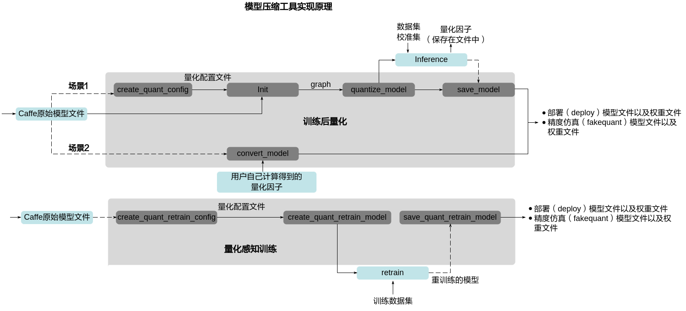

### 工具实现的融合功能<a name="ZH-CN_TOPIC_0000002441980785"></a>

当前该工具主要实现的是BN融合功能，分为如下几类：

-   Conv+BN+Scale+Bias融合：先把"BatchNorm"向前面相邻的"Conv"融合，融合后"BatchNorm"层会被删除，然后再依次对"Scale"、"Bias"做类似处理。
-   DepthwiseConv+BN+Scale+Bias融合：先把"BatchNorm"向前面相邻的"DepthwiseConv"融合，融合后"BatchNorm"层会被删除，然后再依次对"Scale"、"Bias"做类似处理。
-   Deconv+BN+Scale+Bias融合：先把"BatchNorm"向前面相邻的"Deconv"融合，融合后"BatchNorm"层会被删除，然后再依次对"Scale"、"Bias"做类似处理。
-   FC+BN+Scale+Bias融合：先把"BatchNorm"向前面相邻的"FC"融合，融合后"BatchNorm"层会被删除，然后再依次对"Scale"、"Bias"做类似处理。

> **说明：** 
>Scale和Bias都只支持C轴方向的融合，即axis=1 or -3, num\_axis=1的场景。

### 工具实现的加速优化<a name="ZH-CN_TOPIC_0000002408421306"></a>

BN+Scale+Bias加速：如果融合操作完成后，模型中仍然存在"BatchNorm"、"Scale"、"Bias"结构，而且配置文件中开启了这些层的数据量化，工具就会在这些层前面插入一个"DepthwiseConv"层，按照"BatchNorm"、"Scale"、"Bias"的顺序往"DepthwiseConv"中进行融合。

> **说明：** 
>Scale和Bias都只支持C轴方向的加速，即axis=1 or -3, num\_axis=1的场景。

## 运行流程<a name="ZH-CN_TOPIC_0000002442020577"></a>

具体运行流程如[表1](#_Ref74231828)所示。

**表 1**  操作步骤说明

<a name="_Ref74231828"></a>
<table><thead align="left"><tr id="row848mcpsimp"><th class="cellrowborder" valign="top" width="23%" id="mcps1.2.3.1.1"><p id="p850mcpsimp"><a name="p850mcpsimp"></a><a name="p850mcpsimp"></a>关键步骤</p>
</th>
<th class="cellrowborder" valign="top" width="77%" id="mcps1.2.3.1.2"><p id="p852mcpsimp"><a name="p852mcpsimp"></a><a name="p852mcpsimp"></a>说明</p>
</th>
</tr>
</thead>
<tbody><tr id="row854mcpsimp"><td class="cellrowborder" valign="top" width="23%" headers="mcps1.2.3.1.1 "><p id="p856mcpsimp"><a name="p856mcpsimp"></a><a name="p856mcpsimp"></a>获取软件包</p>
</td>
<td class="cellrowborder" valign="top" width="77%" headers="mcps1.2.3.1.2 "><p id="p858mcpsimp"><a name="p858mcpsimp"></a><a name="p858mcpsimp"></a>安装前请先获取对应软件包，详情请参见<a href="#ZH-CN_TOPIC_0000002441980645">获取软件包</a>。</p>
</td>
</tr>
<tr id="row860mcpsimp"><td class="cellrowborder" valign="top" width="23%" headers="mcps1.2.3.1.1 "><p id="p862mcpsimp"><a name="p862mcpsimp"></a><a name="p862mcpsimp"></a>安装前准备</p>
</td>
<td class="cellrowborder" valign="top" width="77%" headers="mcps1.2.3.1.2 "><p id="p864mcpsimp"><a name="p864mcpsimp"></a><a name="p864mcpsimp"></a>安装AMCT之前，需要创建AMCT的安装用户，检查系统环境是否满足要求，安装依赖以及上传软件包等一系列动作。详细操作请参见<a href="#ZH-CN_TOPIC_0000002408421266">安装前准备</a>。</p>
</td>
</tr>
<tr id="row866mcpsimp"><td class="cellrowborder" valign="top" width="23%" headers="mcps1.2.3.1.1 "><p id="p868mcpsimp"><a name="p868mcpsimp"></a><a name="p868mcpsimp"></a>安装</p>
</td>
<td class="cellrowborder" valign="top" width="77%" headers="mcps1.2.3.1.2 "><p id="p870mcpsimp"><a name="p870mcpsimp"></a><a name="p870mcpsimp"></a>参见<a href="#ZH-CN_TOPIC_0000002408421350">安装AMCT</a>安装Caffe框架的AMCT。</p>
</td>
</tr>
<tr id="row872mcpsimp"><td class="cellrowborder" valign="top" width="23%" headers="mcps1.2.3.1.1 "><p id="p874mcpsimp"><a name="p874mcpsimp"></a><a name="p874mcpsimp"></a>安装后处理</p>
</td>
<td class="cellrowborder" valign="top" width="77%" headers="mcps1.2.3.1.2 "><p id="p876mcpsimp"><a name="p876mcpsimp"></a><a name="p876mcpsimp"></a>安装完AMCT后，需要参见<a href="#ZH-CN_TOPIC_0000002442020613">安装后处理</a>章节完成proto合并与patch安装，然后重新编译Caffe环境；如果要设置量化过程中打印的日志等级信息，还需要设置环境变量等操作。</p>
</td>
</tr>
<tr id="row878mcpsimp"><td class="cellrowborder" valign="top" width="23%" headers="mcps1.2.3.1.1 "><p id="p880mcpsimp"><a name="p880mcpsimp"></a><a name="p880mcpsimp"></a>（可选）编写脚本，调用AMCT的API</p>
</td>
<td class="cellrowborder" valign="top" width="77%" headers="mcps1.2.3.1.2 "><p id="p882mcpsimp"><a name="p882mcpsimp"></a><a name="p882mcpsimp"></a>如果用户需要量化自己的网络模型，不使用本手册提供的sample进行量化，则需要修改量化脚本，进行适配，然后才能进行量化。关于sample代码解析请参见<a href="#ZH-CN_TOPIC_0000002408581398">sample代码解析</a>。</p>
</td>
</tr>
<tr id="row884mcpsimp"><td class="cellrowborder" valign="top" width="23%" headers="mcps1.2.3.1.1 "><p id="p886mcpsimp"><a name="p886mcpsimp"></a><a name="p886mcpsimp"></a>执行量化</p>
</td>
<td class="cellrowborder" valign="top" width="77%" headers="mcps1.2.3.1.2 "><p id="p888mcpsimp"><a name="p888mcpsimp"></a><a name="p888mcpsimp"></a>用户根据准备的原始网络模型以及数据集，采用本手册提供的量化脚本，进行量化。</p>
<p id="p889mcpsimp"><a name="p889mcpsimp"></a><a name="p889mcpsimp"></a>根据量化方法不同，分为训练后量化和量化感知训练。详细量化步骤请参见<a href="#ZH-CN_TOPIC_0000002441980565">训练后量化</a>和<a href="#ZH-CN_TOPIC_0000002442020557">量化感知训练</a>。</p>
<p id="p892mcpsimp"><a name="p892mcpsimp"></a><a name="p892mcpsimp"></a>训练后量化根据是否对权重数据进行压缩又分为均匀量化和非均匀量化。</p>
</td>
</tr>
<tr id="row893mcpsimp"><td class="cellrowborder" valign="top" width="23%" headers="mcps1.2.3.1.1 "><p id="p895mcpsimp"><a name="p895mcpsimp"></a><a name="p895mcpsimp"></a>使用MindCmd工具进行模型转换</p>
</td>
<td class="cellrowborder" valign="top" width="77%" headers="mcps1.2.3.1.2 "><p id="p897mcpsimp"><a name="p897mcpsimp"></a><a name="p897mcpsimp"></a>用户使用上述量化后的部署模型，通过MindCmd工具转换成SoC的离线模型，详细可参考对应的用户指南，然后可以使用该模型进行推理。</p>
</td>
</tr>
</tbody>
</table>

# 安装AMCT<a name="ZH-CN_TOPIC_0000002408581422"></a>


## 获取软件包<a name="ZH-CN_TOPIC_0000002441980645"></a>

AMCT只支持在Ubuntu 18.04 x86\_64架构服务器安装；安装前，请先获取AMCT软件包：amct\_caffe

## 安装前准备<a name="ZH-CN_TOPIC_0000002408421266"></a>


### Ubuntu x86系统<a name="ZH-CN_TOPIC_0000002408581358"></a>


#### AMCT用户准备<a name="ZH-CN_TOPIC_0000002408421414"></a>

支持任意用户（root或者非root）安装AMCT，本章节以非root用户为例进行操作。

-   若使用root用户安装，则不需要操作该章节，不需要对root用户做任何设置。
-   若使用已存在的非root用户安装，须保证该用户对$HOME目录具有读写以及可执行权限。
-   若使用新的非root用户安装，请参考如下步骤进行创建，如下操作请在root用户下执行。本手册以该种场景为例执行AMCT的安装。
    -   执行以下命令创建AMCT安装用户并设置该用户的$HOME目录。

        ```
        useradd -d /home/username -m username
        ```

    -   执行以下命令设置密码。

        ```
        passwd username
        ```

> **说明：** 
>_username_  为安装AMCT的用户名，该用户的umask值不能小于0027：
>-   若要查看umask的值，则执行命令：**umask**
>-   若要修改umask的值，则执行命令：**umask  _新的取值_**

#### 配置AMCT安装用户权限（可选）<a name="ZH-CN_TOPIC_0000002441980537"></a>

当用户使用非root用户安装时，需要操作该章节，否则请忽略。

AMCT安装前需要下载相关依赖软件，下载依赖软件需要使用**sudo apt-get**权限，请以root用户执行如下操作。

1.  打开“/etc/sudoers”文件：

    ```
    chmod u+w /etc/sudoers
    vi /etc/sudoers
    ```

2.  在该文件“\# User privilege specification”下面增加如下内容：

    ```
    username ALL=(ALL:ALL)   NOPASSWD:SETENV:/usr/bin/apt-get,/usr/bin/pip, /bin/tar, /bin/mkdir, /bin/sh, /bin/bash, /usr/bin/make, /usr/bin/pip3, /usr/bin/pip3.7, /usr/bin/pip3.7.5, /bin/ln
    ```

    “username”为执行安装脚本的非root用户名。

    > **说明：** 
    >请确保“/etc/sudoers”文件的最后一行为“\#includedir /etc/sudoers.d”，如果没有该信息，请手动添加。

3.  添加完成后，执行:wq!保存文件。
4.  执行以下命令取消“/etc/sudoers”文件的写权限：

    ```
    chmod u-w /etc/sudoers
    ```

#### 环境准备<a name="ZH-CN_TOPIC_0000002442020533"></a>

AMCT目前仅支持在Ubuntu 18.04 x86\_64架构操作系统安装，配套信息如下：

**表 1**  Ubuntu x86\_64架构配套版本信息

<a name="table3218mcpsimp"></a>
<table><thead align="left"><tr id="row3226mcpsimp"><th class="cellrowborder" valign="top" width="17%" id="mcps1.2.5.1.1"><p id="p3228mcpsimp"><a name="p3228mcpsimp"></a><a name="p3228mcpsimp"></a>类别</p>
</th>
<th class="cellrowborder" valign="top" width="22%" id="mcps1.2.5.1.2"><p id="p3230mcpsimp"><a name="p3230mcpsimp"></a><a name="p3230mcpsimp"></a>版本限制</p>
</th>
<th class="cellrowborder" valign="top" width="45%" id="mcps1.2.5.1.3"><p id="p3232mcpsimp"><a name="p3232mcpsimp"></a><a name="p3232mcpsimp"></a>获取方式</p>
</th>
<th class="cellrowborder" valign="top" width="16%" id="mcps1.2.5.1.4"><p id="p3234mcpsimp"><a name="p3234mcpsimp"></a><a name="p3234mcpsimp"></a>注意事项</p>
</th>
</tr>
</thead>
<tbody><tr id="row3236mcpsimp"><td class="cellrowborder" valign="top" width="17%" headers="mcps1.2.5.1.1 "><p id="p3238mcpsimp"><a name="p3238mcpsimp"></a><a name="p3238mcpsimp"></a>操作系统</p>
</td>
<td class="cellrowborder" valign="top" width="22%" headers="mcps1.2.5.1.2 "><p id="p3240mcpsimp"><a name="p3240mcpsimp"></a><a name="p3240mcpsimp"></a>18.04 64位Ubuntu操作系统</p>
</td>
<td class="cellrowborder" valign="top" width="45%" headers="mcps1.2.5.1.3 "><p id="p3242mcpsimp"><a name="p3242mcpsimp"></a><a name="p3242mcpsimp"></a>请从<a href="http://old-releases.ubuntu.com/releases/" target="_blank" rel="noopener noreferrer">http://old-releases.ubuntu.com/releases/</a>网站下载对应版本软件进行安装，例如可以下载Server版<strong id="b3244mcpsimp"><a name="b3244mcpsimp"></a><a name="b3244mcpsimp"></a>：ubuntu-18.04-server-amd64.iso。</strong></p>
</td>
<td class="cellrowborder" valign="top" width="16%" headers="mcps1.2.5.1.4 "><p id="p3246mcpsimp"><a name="p3246mcpsimp"></a><a name="p3246mcpsimp"></a><em id="i3247mcpsimp"><a name="i3247mcpsimp"></a><a name="i3247mcpsimp"></a>-</em></p>
</td>
</tr>
<tr id="row3248mcpsimp"><td class="cellrowborder" valign="top" width="17%" headers="mcps1.2.5.1.1 "><p id="p3250mcpsimp"><a name="p3250mcpsimp"></a><a name="p3250mcpsimp"></a>Python</p>
</td>
<td class="cellrowborder" valign="top" width="22%" headers="mcps1.2.5.1.2 "><p id="p3252mcpsimp"><a name="p3252mcpsimp"></a><a name="p3252mcpsimp"></a>3.7.5</p>
</td>
<td class="cellrowborder" valign="top" width="45%" headers="mcps1.2.5.1.3 "><p id="p3254mcpsimp"><a name="p3254mcpsimp"></a><a name="p3254mcpsimp"></a>请参见<a href="#ZH-CN_TOPIC_0000002408581350">安装Python3.7.5（Ubuntu）</a>。</p>
</td>
<td class="cellrowborder" valign="top" width="16%" headers="mcps1.2.5.1.4 "><p id="p3257mcpsimp"><a name="p3257mcpsimp"></a><a name="p3257mcpsimp"></a>安装依赖时，请确保服务器能够连接网络。</p>
</td>
</tr>
<tr id="row3258mcpsimp"><td class="cellrowborder" valign="top" width="17%" headers="mcps1.2.5.1.1 "><p id="p3260mcpsimp"><a name="p3260mcpsimp"></a><a name="p3260mcpsimp"></a>Caffe</p>
</td>
<td class="cellrowborder" valign="top" width="22%" headers="mcps1.2.5.1.2 "><p id="p3262mcpsimp"><a name="p3262mcpsimp"></a><a name="p3262mcpsimp"></a>caffe-master分支</p>
<p id="p3263mcpsimp"><a name="p3263mcpsimp"></a><a name="p3263mcpsimp"></a>当前仅支持commit id为9b891540183ddc834a02b2bd81b31afae71b2153的版本</p>
</td>
<td class="cellrowborder" valign="top" width="45%" headers="mcps1.2.5.1.3 "><p id="p3265mcpsimp"><a name="p3265mcpsimp"></a><a name="p3265mcpsimp"></a>请参考Caffe官方指导准备Caffe环境：<a href="https://github.com/BVLC/caffe/tree/master" target="_blank" rel="noopener noreferrer">https://github.com/BVLC/caffe/tree/master</a>。</p>
<p id="p3267mcpsimp"><a name="p3267mcpsimp"></a><a name="p3267mcpsimp"></a>推荐使用源码方式安装Caffe环境，如果使用命令行方式安装，出现类似"/usr/bin/python3.7: can't open file '/usr/lib/python3.7/py_compile.py': [Error 2] No such file or directory"信息时，请参见<a href="#ZH-CN_TOPIC_0000002408581186">使用命令行方式安装Caffe环境失败</a>解决。</p>
</td>
<td class="cellrowborder" valign="top" width="16%" headers="mcps1.2.5.1.4 "><p id="p3270mcpsimp"><a name="p3270mcpsimp"></a><a name="p3270mcpsimp"></a>-</p>
</td>
</tr>
<tr id="row3271mcpsimp"><td class="cellrowborder" valign="top" width="17%" headers="mcps1.2.5.1.1 "><p id="p3273mcpsimp"><a name="p3273mcpsimp"></a><a name="p3273mcpsimp"></a>CUDA toolkit/CUDA driver</p>
</td>
<td class="cellrowborder" valign="top" width="22%" headers="mcps1.2.5.1.2 "><p id="p3275mcpsimp"><a name="p3275mcpsimp"></a><a name="p3275mcpsimp"></a>10.1/11.3</p>
</td>
<td class="cellrowborder" valign="top" width="45%" headers="mcps1.2.5.1.3 "><p id="p3277mcpsimp"><a name="p3277mcpsimp"></a><a name="p3277mcpsimp"></a>请用户自行获取相关软件包进行安装，例如可以参见如下链接获取相关toolkit包，该包中包括driver软件包。</p>
<p id="p3278mcpsimp"><a name="p3278mcpsimp"></a><a name="p3278mcpsimp"></a><a href="https://developer.nvidia.com/cuda-toolkit-archive" target="_blank" rel="noopener noreferrer">https://developer.nvidia.com/cuda-toolkit-archive</a></p>
</td>
<td class="cellrowborder" valign="top" width="16%" headers="mcps1.2.5.1.4 "><p id="p3281mcpsimp"><a name="p3281mcpsimp"></a><a name="p3281mcpsimp"></a>如果使用GPU模式执行量化功能，则CUDA软件必须安装。</p>
</td>
</tr>
</tbody>
</table>

#### 检查源<a name="ZH-CN_TOPIC_0000002441980769"></a>

安装依赖时，请确保AMCT所在服务器能够连接网络，请在root用户下执行如下命令检查源是否可用。

```
apt-get update
```

如果命令执行报错，则检查网络是否连接或者把“/etc/apt/sources.list”文件中的源更换为可用的源。

#### 安装依赖<a name="ZH-CN_TOPIC_0000002408421250"></a>

请用户安装以下插件，如果安装用户为非root，则需要使用su - username命令切换到非root用户执行如下命令。

**表 1**  依赖列表

<a name="table2999mcpsimp"></a>
<table><thead align="left"><tr id="row3007mcpsimp"><th class="cellrowborder" valign="top" width="13.34%" id="mcps1.2.6.1.1"><p id="p3009mcpsimp"><a name="p3009mcpsimp"></a><a name="p3009mcpsimp"></a>使用组件</p>
</th>
<th class="cellrowborder" valign="top" width="11.63%" id="mcps1.2.6.1.2"><p id="p3011mcpsimp"><a name="p3011mcpsimp"></a><a name="p3011mcpsimp"></a>依赖名称</p>
</th>
<th class="cellrowborder" valign="top" width="9.26%" id="mcps1.2.6.1.3"><p id="p3013mcpsimp"><a name="p3013mcpsimp"></a><a name="p3013mcpsimp"></a>版本号</p>
</th>
<th class="cellrowborder" valign="top" width="23.76%" id="mcps1.2.6.1.4"><p id="p3015mcpsimp"><a name="p3015mcpsimp"></a><a name="p3015mcpsimp"></a>安装命令</p>
</th>
<th class="cellrowborder" valign="top" width="42.01%" id="mcps1.2.6.1.5"><p id="p4643151761213"><a name="p4643151761213"></a><a name="p4643151761213"></a>whl包地址</p>
</th>
</tr>
</thead>
<tbody><tr id="row1779813473590"><td class="cellrowborder" rowspan="2" valign="top" width="13.34%" headers="mcps1.2.6.1.1 "><p id="p544219531444"><a name="p544219531444"></a><a name="p544219531444"></a>AMCT</p>
</td>
<td class="cellrowborder" valign="top" width="11.63%" headers="mcps1.2.6.1.2 "><p id="p4798174735914"><a name="p4798174735914"></a><a name="p4798174735914"></a>numpy</p>
</td>
<td class="cellrowborder" valign="top" width="9.26%" headers="mcps1.2.6.1.3 "><p id="p10798547165914"><a name="p10798547165914"></a><a name="p10798547165914"></a>1.16.0+</p>
</td>
<td class="cellrowborder" valign="top" width="23.76%" headers="mcps1.2.6.1.4 "><p id="p14679592111"><a name="p14679592111"></a><a name="p14679592111"></a>pip3.7.5 install numpy==1.16.0 --user</p>
</td>
<td class="cellrowborder" valign="top" width="42.01%" headers="mcps1.2.6.1.5 "><p id="p1079864735912"><a name="p1079864735912"></a><a name="p1079864735912"></a><a href="https://pypi.org/project/numpy/1.16.0/#files" target="_blank" rel="noopener noreferrer">https://pypi.org/project/numpy/1.16.0/#files</a></p>
</td>
</tr>
<tr id="row152511551015"><td class="cellrowborder" valign="top" headers="mcps1.2.6.1.1 "><p id="p62511552111"><a name="p62511552111"></a><a name="p62511552111"></a>protobuf</p>
</td>
<td class="cellrowborder" valign="top" headers="mcps1.2.6.1.2 "><p id="p12251655514"><a name="p12251655514"></a><a name="p12251655514"></a>3.13.0+</p>
</td>
<td class="cellrowborder" valign="top" headers="mcps1.2.6.1.3 "><p id="p970910131429"><a name="p970910131429"></a><a name="p970910131429"></a>pip3.7.5 install protobuf==3.13.0 --user</p>
</td>
<td class="cellrowborder" valign="top" headers="mcps1.2.6.1.4 "><p id="p19251155517115"><a name="p19251155517115"></a><a name="p19251155517115"></a><a href="https://pypi.org/project/protobuf/3.13.0/#files" target="_blank" rel="noopener noreferrer">https://pypi.org/project/protobuf/3.13.0/#files</a></p>
</td>
</tr>
<tr id="row3027mcpsimp"><td class="cellrowborder" valign="top" width="13.34%" headers="mcps1.2.6.1.1 "><p id="p3029mcpsimp"><a name="p3029mcpsimp"></a><a name="p3029mcpsimp"></a>分类网络/检测网络/MNIST网络</p>
</td>
<td class="cellrowborder" valign="top" width="11.63%" headers="mcps1.2.6.1.2 "><p id="p3031mcpsimp"><a name="p3031mcpsimp"></a><a name="p3031mcpsimp"></a>opencv-python</p>
</td>
<td class="cellrowborder" valign="top" width="9.26%" headers="mcps1.2.6.1.3 "><p id="p3033mcpsimp"><a name="p3033mcpsimp"></a><a name="p3033mcpsimp"></a>4.5.5.62+</p>
</td>
<td class="cellrowborder" valign="top" width="23.76%" headers="mcps1.2.6.1.4 "><p id="p3035mcpsimp"><a name="p3035mcpsimp"></a><a name="p3035mcpsimp"></a>pip3.7.5 install opencv-python==4.5.5.62 --user</p>
</td>
<td class="cellrowborder" valign="top" width="42.01%" headers="mcps1.2.6.1.5 "><p id="p131511713184716"><a name="p131511713184716"></a><a name="p131511713184716"></a><a href="https://pypi.org/project/opencv-python/4.5.5.62/#files" target="_blank" rel="noopener noreferrer">https://pypi.org/project/opencv-python/4.5.5.62/#files</a></p>
</td>
</tr>
<tr id="row3036mcpsimp"><td class="cellrowborder" rowspan="2" valign="top" width="13.34%" headers="mcps1.2.6.1.1 "><p id="p3038mcpsimp"><a name="p3038mcpsimp"></a><a name="p3038mcpsimp"></a>分类网络</p>
</td>
<td class="cellrowborder" valign="top" width="11.63%" headers="mcps1.2.6.1.2 "><p id="p3040mcpsimp"><a name="p3040mcpsimp"></a><a name="p3040mcpsimp"></a>scikit-image</p>
</td>
<td class="cellrowborder" valign="top" width="9.26%" headers="mcps1.2.6.1.3 "><p id="p3042mcpsimp"><a name="p3042mcpsimp"></a><a name="p3042mcpsimp"></a>0.16.2</p>
</td>
<td class="cellrowborder" valign="top" width="23.76%" headers="mcps1.2.6.1.4 "><p id="p3044mcpsimp"><a name="p3044mcpsimp"></a><a name="p3044mcpsimp"></a>pip3.7.5 install scikit-image==0.16.2 --user</p>
</td>
<td class="cellrowborder" valign="top" width="42.01%" headers="mcps1.2.6.1.5 "><p id="p2643417141218"><a name="p2643417141218"></a><a name="p2643417141218"></a><a href="https://pypi.org/project/scikit-image/0.16.2/#files" target="_blank" rel="noopener noreferrer">https://pypi.org/project/scikit-image/0.16.2/#files</a></p>
</td>
</tr>
<tr id="row3045mcpsimp"><td class="cellrowborder" valign="top" headers="mcps1.2.6.1.1 "><p id="p3047mcpsimp"><a name="p3047mcpsimp"></a><a name="p3047mcpsimp"></a>lmdb</p>
</td>
<td class="cellrowborder" valign="top" headers="mcps1.2.6.1.2 "><p id="p3049mcpsimp"><a name="p3049mcpsimp"></a><a name="p3049mcpsimp"></a>0.98</p>
</td>
<td class="cellrowborder" valign="top" headers="mcps1.2.6.1.3 "><p id="p3051mcpsimp"><a name="p3051mcpsimp"></a><a name="p3051mcpsimp"></a>pip3.7.5 install lmdb==0.98 --user</p>
</td>
<td class="cellrowborder" valign="top" headers="mcps1.2.6.1.4 "><p id="p11644151715126"><a name="p11644151715126"></a><a name="p11644151715126"></a><a href="https://pypi.org/project/lmdb/0.98/#files" target="_blank" rel="noopener noreferrer">https://pypi.org/project/lmdb/0.98/#files</a></p>
</td>
</tr>
<tr id="row3052mcpsimp"><td class="cellrowborder" rowspan="7" valign="top" width="13.34%" headers="mcps1.2.6.1.1 "><p id="p3054mcpsimp"><a name="p3054mcpsimp"></a><a name="p3054mcpsimp"></a>检测网络</p>
</td>
<td class="cellrowborder" valign="top" width="11.63%" headers="mcps1.2.6.1.2 "><p id="p3056mcpsimp"><a name="p3056mcpsimp"></a><a name="p3056mcpsimp"></a>2to3</p>
</td>
<td class="cellrowborder" valign="top" width="9.26%" headers="mcps1.2.6.1.3 "><p id="p3058mcpsimp"><a name="p3058mcpsimp"></a><a name="p3058mcpsimp"></a>-</p>
</td>
<td class="cellrowborder" valign="top" width="23.76%" headers="mcps1.2.6.1.4 "><p id="p3060mcpsimp"><a name="p3060mcpsimp"></a><a name="p3060mcpsimp"></a>sudo apt-get install -y 2to3</p>
</td>
<td class="cellrowborder" valign="top" width="42.01%" headers="mcps1.2.6.1.5 "><p id="p36441217151215"><a name="p36441217151215"></a><a name="p36441217151215"></a><a href="https://pypi.org/project/2to3/#files" target="_blank" rel="noopener noreferrer">https://pypi.org/project/2to3/#files</a></p>
</td>
</tr>
<tr id="row3061mcpsimp"><td class="cellrowborder" valign="top" headers="mcps1.2.6.1.1 "><p id="p3063mcpsimp"><a name="p3063mcpsimp"></a><a name="p3063mcpsimp"></a>Cython</p>
</td>
<td class="cellrowborder" valign="top" headers="mcps1.2.6.1.2 "><p id="p3065mcpsimp"><a name="p3065mcpsimp"></a><a name="p3065mcpsimp"></a>0.29.15</p>
</td>
<td class="cellrowborder" valign="top" headers="mcps1.2.6.1.3 "><p id="p3067mcpsimp"><a name="p3067mcpsimp"></a><a name="p3067mcpsimp"></a>pip3.7.5 install Cython==0.29.15  --user</p>
</td>
<td class="cellrowborder" valign="top" headers="mcps1.2.6.1.4 "><p id="p20644191731216"><a name="p20644191731216"></a><a name="p20644191731216"></a><a href="https://pypi.org/project/Cython/0.29.15/#files" target="_blank" rel="noopener noreferrer">https://pypi.org/project/Cython/0.29.15/#files</a></p>
</td>
</tr>
<tr id="row3068mcpsimp"><td class="cellrowborder" valign="top" headers="mcps1.2.6.1.1 "><p id="p3070mcpsimp"><a name="p3070mcpsimp"></a><a name="p3070mcpsimp"></a>matplotlib</p>
</td>
<td class="cellrowborder" valign="top" headers="mcps1.2.6.1.2 "><p id="p3072mcpsimp"><a name="p3072mcpsimp"></a><a name="p3072mcpsimp"></a>3.2.0</p>
</td>
<td class="cellrowborder" valign="top" headers="mcps1.2.6.1.3 "><p id="p3074mcpsimp"><a name="p3074mcpsimp"></a><a name="p3074mcpsimp"></a>pip3.7.5 install matplotlib==3.2.0 --user</p>
</td>
<td class="cellrowborder" valign="top" headers="mcps1.2.6.1.4 "><p id="p1964491741219"><a name="p1964491741219"></a><a name="p1964491741219"></a><a href="https://pypi.org/project/matplotlib/3.2.0/#files" target="_blank" rel="noopener noreferrer">https://pypi.org/project/matplotlib/3.2.0/#files</a></p>
</td>
</tr>
<tr id="row3075mcpsimp"><td class="cellrowborder" valign="top" headers="mcps1.2.6.1.1 "><p id="p3077mcpsimp"><a name="p3077mcpsimp"></a><a name="p3077mcpsimp"></a>easydict</p>
</td>
<td class="cellrowborder" valign="top" headers="mcps1.2.6.1.2 "><p id="p3079mcpsimp"><a name="p3079mcpsimp"></a><a name="p3079mcpsimp"></a>1.9</p>
</td>
<td class="cellrowborder" valign="top" headers="mcps1.2.6.1.3 "><p id="p3081mcpsimp"><a name="p3081mcpsimp"></a><a name="p3081mcpsimp"></a>pip3.7.5 install easydict==1.9  --user</p>
</td>
<td class="cellrowborder" valign="top" headers="mcps1.2.6.1.4 "><p id="p11644141721214"><a name="p11644141721214"></a><a name="p11644141721214"></a><a href="https://pypi.org/project/easydict/1.9/#files" target="_blank" rel="noopener noreferrer">https://pypi.org/project/easydict/1.9/#files</a></p>
</td>
</tr>
<tr id="row3082mcpsimp"><td class="cellrowborder" valign="top" headers="mcps1.2.6.1.1 "><p id="p3084mcpsimp"><a name="p3084mcpsimp"></a><a name="p3084mcpsimp"></a>PyYAML</p>
</td>
<td class="cellrowborder" valign="top" headers="mcps1.2.6.1.2 "><p id="p3086mcpsimp"><a name="p3086mcpsimp"></a><a name="p3086mcpsimp"></a>5.3</p>
</td>
<td class="cellrowborder" valign="top" headers="mcps1.2.6.1.3 "><p id="p3088mcpsimp"><a name="p3088mcpsimp"></a><a name="p3088mcpsimp"></a>pip3.7.5 install PyYAML==5.3 --user</p>
</td>
<td class="cellrowborder" valign="top" headers="mcps1.2.6.1.4 "><p id="p126446179126"><a name="p126446179126"></a><a name="p126446179126"></a><a href="https://pypi.org/project/PyYAML/5.3/#files" target="_blank" rel="noopener noreferrer">https://pypi.org/project/PyYAML/5.3/#files</a></p>
</td>
</tr>
<tr id="row3089mcpsimp"><td class="cellrowborder" valign="top" headers="mcps1.2.6.1.1 "><p id="p3091mcpsimp"><a name="p3091mcpsimp"></a><a name="p3091mcpsimp"></a>Pillow</p>
</td>
<td class="cellrowborder" valign="top" headers="mcps1.2.6.1.2 "><p id="p3093mcpsimp"><a name="p3093mcpsimp"></a><a name="p3093mcpsimp"></a>6.0.0+</p>
</td>
<td class="cellrowborder" valign="top" headers="mcps1.2.6.1.3 "><p id="p3095mcpsimp"><a name="p3095mcpsimp"></a><a name="p3095mcpsimp"></a>pip3.7.5 install pillow==6.0.0 --user</p>
</td>
<td class="cellrowborder" valign="top" headers="mcps1.2.6.1.4 "><p id="p364414171127"><a name="p364414171127"></a><a name="p364414171127"></a><a href="https://pypi.org/project/Pillow/6.0.0/#files" target="_blank" rel="noopener noreferrer">https://pypi.org/project/Pillow/6.0.0/#files</a> (Pillow7.0.0版本不支持jpeg格式)</p>
</td>
</tr>
<tr id="row3096mcpsimp"><td class="cellrowborder" valign="top" headers="mcps1.2.6.1.1 "><p id="p3098mcpsimp"><a name="p3098mcpsimp"></a><a name="p3098mcpsimp"></a>pycocotools</p>
</td>
<td class="cellrowborder" valign="top" headers="mcps1.2.6.1.2 "><p id="p3100mcpsimp"><a name="p3100mcpsimp"></a><a name="p3100mcpsimp"></a>2.0.2</p>
</td>
<td class="cellrowborder" valign="top" headers="mcps1.2.6.1.3 "><p id="p3102mcpsimp"><a name="p3102mcpsimp"></a><a name="p3102mcpsimp"></a>pip3.7.5 install pycocotools==2.0.2 --user</p>
</td>
<td class="cellrowborder" valign="top" headers="mcps1.2.6.1.4 "><p id="p1464411721215"><a name="p1464411721215"></a><a name="p1464411721215"></a><a href="https://pypi.org/project/pycocotools/2.0.2/#files" target="_blank" rel="noopener noreferrer">https://pypi.org/project/pycocotools/2.0.2/#files</a></p>
</td>
</tr>
<tr id="row3103mcpsimp"><td class="cellrowborder" valign="top" width="13.34%" headers="mcps1.2.6.1.1 "><p id="p3105mcpsimp"><a name="p3105mcpsimp"></a><a name="p3105mcpsimp"></a>MNIST网络</p>
</td>
<td class="cellrowborder" valign="top" width="11.63%" headers="mcps1.2.6.1.2 "><p id="p3107mcpsimp"><a name="p3107mcpsimp"></a><a name="p3107mcpsimp"></a>wget</p>
</td>
<td class="cellrowborder" valign="top" width="9.26%" headers="mcps1.2.6.1.3 "><p id="p3109mcpsimp"><a name="p3109mcpsimp"></a><a name="p3109mcpsimp"></a>3.2+</p>
</td>
<td class="cellrowborder" valign="top" width="23.76%" headers="mcps1.2.6.1.4 "><p id="p3111mcpsimp"><a name="p3111mcpsimp"></a><a name="p3111mcpsimp"></a>pip3.7.5 install wget==3.2 --user</p>
</td>
<td class="cellrowborder" valign="top" width="42.01%" headers="mcps1.2.6.1.5 "><p id="p1764471741219"><a name="p1764471741219"></a><a name="p1764471741219"></a><a href="https://pypi.org/project/wget/3.2/#history" target="_blank" rel="noopener noreferrer">https://pypi.org/project/wget/3.2/#history</a></p>
</td>
</tr>
</tbody>
</table>

#### 上传软件包<a name="ZH-CN_TOPIC_0000002408421438"></a>

以AMCT的安装用户将**amct\_caffe**软件包上传到Linux服务器任意目录下，本示例为上传到$HOME/_amct_/目录。

获得如下内容：

**表 1**  AMCT软件包解压后内容

<a name="table2699mcpsimp"></a>
<table><thead align="left"><tr id="row2707mcpsimp"><th class="cellrowborder" valign="top" width="12.07120712071207%" id="mcps1.2.5.1.1"><p id="p2709mcpsimp"><a name="p2709mcpsimp"></a><a name="p2709mcpsimp"></a>一级目录</p>
</th>
<th class="cellrowborder" valign="top" width="23.28232823282328%" id="mcps1.2.5.1.2"><p id="p2711mcpsimp"><a name="p2711mcpsimp"></a><a name="p2711mcpsimp"></a>二级目录</p>
</th>
<th class="cellrowborder" valign="top" width="23.23232323232323%" id="mcps1.2.5.1.3"><p id="p2713mcpsimp"><a name="p2713mcpsimp"></a><a name="p2713mcpsimp"></a>说明</p>
</th>
<th class="cellrowborder" valign="top" width="41.41414141414141%" id="mcps1.2.5.1.4"><p id="p2715mcpsimp"><a name="p2715mcpsimp"></a><a name="p2715mcpsimp"></a>使用场景及注意事项</p>
</th>
</tr>
</thead>
<tbody><tr id="row2717mcpsimp"><td class="cellrowborder" rowspan="4" valign="top" headers="mcps1.2.5.1.1 "><p id="p2719mcpsimp"><a name="p2719mcpsimp"></a><a name="p2719mcpsimp"></a><strong id="b2720mcpsimp"><a name="b2720mcpsimp"></a><a name="b2720mcpsimp"></a>amct/amct_caffe/</strong></p>
</td>
<td class="cellrowborder" colspan="2" valign="top" headers="mcps1.2.5.1.2 mcps1.2.5.1.3 "><p id="p2722mcpsimp"><a name="p2722mcpsimp"></a><a name="p2722mcpsimp"></a>Caffe框架AMCT目录。</p>
</td>
<td class="cellrowborder" rowspan="4" valign="top" headers="mcps1.2.5.1.4 "><a name="ul2724mcpsimp"></a><a name="ul2724mcpsimp"></a><ul id="ul2724mcpsimp"><li><strong id="b2726mcpsimp"><a name="b2726mcpsimp"></a><a name="b2726mcpsimp"></a>只支持部署在Ubuntu 18.04 x86_64架构服务器。</strong></li><li>使用方法请参见《AMCT使用指南（Caffe）》。</li><li>量化完的模型，如果要执行推理，则需要借助安装SoC的推理环境。</li></ul>
</td>
</tr>
<tr id="row2729mcpsimp"><td class="cellrowborder" valign="top" headers="mcps1.2.5.1.1 "><p id="p2731mcpsimp"><a name="p2731mcpsimp"></a><a name="p2731mcpsimp"></a>hotwheels_amct_caffe-<em id="i2732mcpsimp"><a name="i2732mcpsimp"></a><a name="i2732mcpsimp"></a>{version}</em>-py3-none-linux_<em id="i2733mcpsimp"><a name="i2733mcpsimp"></a><a name="i2733mcpsimp"></a>{arch}</em>.whl</p>
</td>
<td class="cellrowborder" valign="top" headers="mcps1.2.5.1.2 "><p id="p2735mcpsimp"><a name="p2735mcpsimp"></a><a name="p2735mcpsimp"></a>Caffe框架AMCT安装包。</p>
</td>
</tr>
<tr id="row2736mcpsimp"><td class="cellrowborder" valign="top" headers="mcps1.2.5.1.1 "><p id="p2738mcpsimp"><a name="p2738mcpsimp"></a><a name="p2738mcpsimp"></a>amct_caffe_sample.tar.gz</p>
</td>
<td class="cellrowborder" valign="top" headers="mcps1.2.5.1.2 "><p id="p2740mcpsimp"><a name="p2740mcpsimp"></a><a name="p2740mcpsimp"></a>Caffe框架量化sample包。</p>
</td>
</tr>
<tr id="row2741mcpsimp"><td class="cellrowborder" valign="top" headers="mcps1.2.5.1.1 "><p id="p2743mcpsimp"><a name="p2743mcpsimp"></a><a name="p2743mcpsimp"></a>caffe_patch.tar.gz</p>
</td>
<td class="cellrowborder" valign="top" headers="mcps1.2.5.1.2 "><p id="p2745mcpsimp"><a name="p2745mcpsimp"></a><a name="p2745mcpsimp"></a>Caffe源代码增强包。</p>
</td>
</tr>
</tbody>
</table>

其中：_\{version\}_表示AMCT具体版本号。_\{os\}.\{arch\}_表示具体操作系统和架构。

## 安装<a name="ZH-CN_TOPIC_0000002408421350"></a>

1.  在AMCT软件包所在目录，执行如下命令进行安装：

    ```
    pip3.7.5 install hotwheels_amct_caffe-{version}-py3-none-linux_{arch}.whl --user
    ```

    其中：_\{version\}_表示AMCT具体版本号，_\{arch\}_表示软件包支持的安装服务器具体架构形态。如果用户使用root用户安装AMCT，并且使用了--target参数，请确保--target参数指定的路径为当前用户的路径，避免指定到其他非root用户。

2.  若出现如下信息则说明工具安装成功。

    ```
    Successfully installed hotwheels-amct-caffe-{version}
    ```

    用户可以在python3.7.5安装包所在路径下（例如：_$HOME/.local/lib/python3.7.5/site-packages_，该路径请以用户实际安装的为准）查看已经安装的AMCT，例如：

    ```
    drwxr-xr-x  5 amct amct   4096 Mar 17 11:50 hotwheels/
    drwxr-xr-x  2 amct amct   4096 Mar 17 11:50 hotwheels_amct_caffe-2.0.0.dist-info/
    ```

    其中amct\_caffe即为AMCT所在安装目录。

## 安装后处理<a name="ZH-CN_TOPIC_0000002442020613"></a>


### patch安装<a name="ZH-CN_TOPIC_0000002442020597"></a>

安装完AMCT后，量化模型前，用户需要获取并安装Caffe源代码增强包**caffe\_patch.tar.gz**，该增强包用于完成如下内容：

-   如果AMCT所在服务器有用户自定义的custom.proto文件，则需要和AMCT软件包中提供的proto文件进行合并。该软件包提供了基于caffe1.0版本的caffe.proto文件、AMCT自定义层以及caffe-master相较于caffe1.0更新层的amct\_custom.proto文件。proto合并原理请参见[proto合并原理](#ZH-CN_TOPIC_0000002408581258)。
-   拷贝新增源码和动态库文件到Caffe环境_caffe-master_工程目录下。
-   对Caffe环境_caffe-master_工程目录下部分文件安装patch，以实现对文件的自动修改。


#### proto合并前提条件<a name="ZH-CN_TOPIC_0000002441980609"></a>

用户自行准备自定义的custom.proto，并上传到AMCT所在服务器任意目录。样例如下：

```
message LayerParameter { 
   optional ReLU6Parameter relu6_param = 2060; 
   optional ROIPoolingParameter roi_pooling_param = 8266711; 
 } 
  
 message ReLU6Parameter { 
   optional float negative_slope = 1 [default = 0]; 
 } 
  
 message ROIPoolingParameter { 
   // Pad, kernel size, and stride are all given as a single value for equal 
   // dimensions in height and width or as Y, X pairs. 
   optional uint32 pooled_h = 1 [default = 0]; // The pooled output height 
   optional uint32 pooled_w = 2 [default = 0]; // The pooled output width 
   // Multiplicative spatial scale factor to translate ROI coords from their 
   // input scale to the scale used when pooling 
   optional float spatial_scale = 3 [default = 1]; 
 }
```

custom.proto主要分为两部分：

-   LayerParameter注册自定义层：

    ```
    message LayerParameter { 
       # user definition fields, each field takes one line. 
       optional FieldType0 field_name0 = field_num0; 
       optional FieldType1 field_name1 = field_num1; 
     }
    ```

    该字段用于在Layerparameter中声明用户自定义层，用户自定义层需要加入到 LayerParameter中，从而可以在Caffe框架中写入Layer并从Layer中读取到；该声明分为四个部分：

    -   optional：表示该定义在LayerParameter中是可选的，只能配置为optional。
    -   FieldType：声明当前字段对应的自定义类型，需要有相应的message定义。
    -   field\_name：当前声明的id，需要唯一，如果提示冲突，需要用户修改自己的id名称，后续需要通过该id来访问相应的内容。
    -   field\_num：当前声明的编号，需要唯一，如果提示冲突，需要用户修改自己的编号值，建议区间段小于5000，并且不与ATC提供的caffe.proto中的编号冲突，在二进制caffemodel中需要通过该编号去解析对应字段。

    示例如下：

    ```
    message LayerParameter { 
       optional ReLU6Parameter relu6_param = 2060; 
       optional ROIPoolingParameter roi_pooling_param = 8266711; 
     }
    ```

    > **说明：** 
    >-   custom.proto中用户自定义层编号建议区间段小于5000，并且不与ATC提供的caffe.proto中的内置编号冲突。
    >-   amct\_custom.proto中的编号从200000开始（包括200000）。
    >-   caffe.proto中ATC自定义层的编号区间段为：\[5000,200000\)。

-   message定义自定义层参数：

    ```
    message ReLU6Parameter { 
       optional float negative_slope = 1 [default = 0]; 
     }
    ```

    用户自定义层参数定义，用于定义用户自定义层详细的参数内容，详细内容可以参考[google protobuf](https://developers.google.com/protocol-buffers/docs/proto)。

    该字段需要保证和AMCT自定义层amct\_custom.proto不冲突，如果冲突，proto合并时会提示错误信息，用户根据提示信息进行修改；与ATC内置caffe.proto冲突则会优先使用用户的message定义覆盖。

    当前AMCT自定义message包括：QuantParameter、DeQuantParameter、IFMRParameter、LSTMQuantParameter、SearchNParameter、 RetrainDataQuantParameter、RetrainWeightQuantParameter、SingleLayerRecord、 ScaleOffsetRecord，用户自定义层时不能同上述message名重复。

#### 安装步骤<a name="ZH-CN_TOPIC_0000002408581378"></a>

用户可以执行caffe\_patch中的自动安装脚本**install.py**，如果脚本执行成功，则会自动将caffe\_patch中的patch内容安装到Caffe环境_caffe-master_工程目录下，并完成proto合并、新增源码和动态库文件替换的功能。安装或手动修改完成后，需要重新编译Caffe环境。具体操作方法如下：

1.  解压Caffe源代码增强包。

    以AMCT的安装用户在软件包所在路径执行如下命令，解压**caffe\_patch.tar.gz**软件包。

    ```
    tar -zxvf caffe_patch.tar.gz
    ```

    获得如下内容：

    -   caffe\_patch/include：用于存放自定义层定义头文件以及公共函数。
    -   caffe\_patch/install.py：Caffe环境proto合并、patch安装以及源码和动态库文件执行脚本。
    -   caffe\_patch/merge\_proto：proto合并目录。
    -   caffe\_patch/patch：LSTM层相关的patch目录。
    -   caffe\_patch/quant\_lib：用于存放量化算法核心动态库libquant.so, libquant\_gpu.so。
    -   caffe\_patch/src：用于存放自定义层实现源码文件以及公共函数。

    关于其余文件的详细说明请参见[sample目录及patch目录说明](#ZH-CN_TOPIC_0000002408421474)。

2.  切换到caffe\_patch/install.py脚本所在目录，执行如下命令。

    ```
    python3.7.5 install.py --caffe_dir CAFFE_DIR --custom_proto CUSTOM_PROTO_FILE
    ```

    参数解释如下：

    **表 1**  量化脚本所用参数说明

    <a name="table1134mcpsimp"></a>
    <table><thead align="left"><tr id="row1140mcpsimp"><th class="cellrowborder" valign="top" width="45%" id="mcps1.2.3.1.1"><p id="p1142mcpsimp"><a name="p1142mcpsimp"></a><a name="p1142mcpsimp"></a>参数</p>
    </th>
    <th class="cellrowborder" valign="top" width="55.00000000000001%" id="mcps1.2.3.1.2"><p id="p1144mcpsimp"><a name="p1144mcpsimp"></a><a name="p1144mcpsimp"></a>说明</p>
    </th>
    </tr>
    </thead>
    <tbody><tr id="row1146mcpsimp"><td class="cellrowborder" valign="top" width="45%" headers="mcps1.2.3.1.1 "><p id="p1148mcpsimp"><a name="p1148mcpsimp"></a><a name="p1148mcpsimp"></a>--h</p>
    </td>
    <td class="cellrowborder" valign="top" width="55.00000000000001%" headers="mcps1.2.3.1.2 "><p id="p1150mcpsimp"><a name="p1150mcpsimp"></a><a name="p1150mcpsimp"></a>可选。显示帮助信息。</p>
    </td>
    </tr>
    <tr id="row1151mcpsimp"><td class="cellrowborder" valign="top" width="45%" headers="mcps1.2.3.1.1 "><p id="p1153mcpsimp"><a name="p1153mcpsimp"></a><a name="p1153mcpsimp"></a>--caffe_dir CAFFE_DIR</p>
    </td>
    <td class="cellrowborder" valign="top" width="55.00000000000001%" headers="mcps1.2.3.1.2 "><p id="p1155mcpsimp"><a name="p1155mcpsimp"></a><a name="p1155mcpsimp"></a>必填。Caffe源代码路径，支持相对路径和绝对路径。</p>
    </td>
    </tr>
    <tr id="row1156mcpsimp"><td class="cellrowborder" valign="top" width="45%" headers="mcps1.2.3.1.1 "><p id="p1158mcpsimp"><a name="p1158mcpsimp"></a><a name="p1158mcpsimp"></a>--custom_proto CUSTOM_PROTO_FILE</p>
    </td>
    <td class="cellrowborder" valign="top" width="55.00000000000001%" headers="mcps1.2.3.1.2 "><p id="p1160mcpsimp"><a name="p1160mcpsimp"></a><a name="p1160mcpsimp"></a>可选。用户自定义custom.proto文件路径，支持相对路径和绝对路径。</p>
    </td>
    </tr>
    </tbody>
    </table>

    使用样例如下：

    ```
    python3.7.5 install.py  --caffe_dir caffe-master  --custom_proto custom.proto
    ```

    若提示如下信息，则说明执行成功。

    \# 拷贝新增源码和动态库文件到Caffe环境_caffe-master_工程目录下

    ```
     [INFO]Begin to copy source files, header files and quant_lib to '$HOME/AMCT/AMCT_CAFFE/caffe-master' 
     [INFO]Finish copy source files, header files and quant_lib to '$HOME/AMCT/AMCT_CAFFE/caffe-master' 
     # 安装patch 
     [INFO]Begin to install patch. 
     [INFO]Install patch 'lstm_calibration_layer.cpp.patch' successfully. 
     [INFO]Install patch 'lstm_quant_layer.hpp.patch' successfully. 
     [INFO]Install patch 'lstm_quant_layer.cpp.patch' successfully. 
     [INFO]Install patch 'lstm_quant_layer.hpp.patch' successfully. 
     [INFO]Finish install patch. 
     # proto合并
     [INFO]Merge and replace "caffe.proto" success. 
     # 修改Makefile 
     [INFO]Merge and replace "Makefile" success.
    ```

    执行脚本过程中（使用install.py脚本时，支持重复安装patch）：

    -   如果安装patch失败，则请用户自行将caffe工程中caffe-master/src/caffe/layers/lstm\_layer.cpp和caffe-master/include/caffe/layers/lstm\_layer.hpp文件还原为caffe-master原生的。
    -   proto合并阶段如果提示ERROR信息，则请参见[执行proto合并时提示ERROR信息](#ZH-CN_TOPIC_0000002442020621)解决。
    -   如果修改Makefile失败，则请根据提示信息进行修改；如果执行成功，则再次执行该脚本时，不会重复修改Makefile。

3.  （可选）该步骤修改只针对检测网络生效，如果不执行检测网络的sample，则请忽略该步骤。

    修改caffe-master/src/caffe/proto/caffe.proto，增加自定义层。

    1.  在“message LayerParameter”最后增加如下信息：

        ```
        optional ROIPoolingParameter roi_pooling_param = 8266711;
        ```

    2.  文件最后增加如下信息：

        ```
        // Message that stores parameters used by ROIPoolingLayer 
         message ROIPoolingParameter { 
           // Pad, kernel size, and stride are all given as a single value for equal 
           // dimensions in height and width or as Y, X pairs. 
           optional uint32 pooled_h = 1 [default = 0]; // The pooled output height 
           optional uint32 pooled_w = 2 [default = 0]; // The pooled output width 
           // Multiplicative spatial scale factor to translate ROI coords from their 
           // input scale to the scale used when pooling 
           optional float spatial_scale = 3 [default = 1]; 
         }
        ```

    3.  切换到caffe-master，修改caffe-master/Makefile.config。

        增加python layer的实现。

        ```
        # Uncomment to support layers written in Python (will link against Python libs) 
        WITH_PYTHON_LAYER := 1
        ```

4.  新增c++11标准代码的支持。

    由于AMCT新增算子需要c++11支持，需要确保caffe-master/Makefile中增加了-std=C++11编译选项，增加方法如下：

    ```
    # Complete build flags. 
    COMMON_FLAGS += $(foreach includedir,$(INCLUDE_DIRS),-I$(includedir)) --std=c++11
    CXXFLAGS += -pthread -fPIC $(COMMON_FLAGS) $(WARNINGS) 
    NVCCFLAGS += -ccbin=$(CXX) -Xcompiler -fPIC $(COMMON_FLAGS)
    ```

5.  返回caffe-master目录，执行如下命令重新编译Caffe以及pycaffe环境：

    ```
    #如果用户环境安装patch之前已经编译过Caffe工程，安装patch之后，需要先执行make clean，然后再执行编译命令
    make clean 
    make all -j && make pycaffe -j
    ```

    caffe.proto修改后需要重新编译为caffe\_pb2.py：由于AMCT需要解析用户的Caffe模型，用户使用Caffe模型时可能会新增自定义层，此时需要修改caffe.proto文件，修改后，需要用户自行提供从修改后的caffe.proto文件编译出的caffe\_pb2.py，给AMCT使用。

    > **说明：** 
    >如果用户使用protoc方式来重新编译caffe.proto，例如**protoc --python\_out=./caffe.proto**，此时，需要同步修改PYTHONPATH中caffe.proto所在路径。如下所示，$\{path\}请替换为caffe.proto实际路径。
    >export PYTHONPATH=$PYTHONPATH:$\{path\}

### 环境变量设置<a name="ZH-CN_TOPIC_0000002441980525"></a>

设置日志打印级别，其中日志包括打印在屏幕上的日志以及保存到amct\_log/amct\_caffe.log文件中的日志。该部分环境变量为可选配置，如果不设置，则按照默认日志级别，默认级别为INFO。

-   **变量取值**

    日志打印级别通过如下两个变量设置：

    -   **AMCT\_LOG\_FILE\_LEVEL**： 控制amct\_caffe.log日志文件的信息级别以及生成精度仿真模型时，对应量化层生成的日志文件信息级别。
    -   **AMCT\_LOG\_LEVEL**：控制屏幕输出的信息级别。

    有效取值以及含义如[表1](#zh-cn_topic_0240188730_table1332501419)所示。

**表 1**  变量取值范围

<a name="zh-cn_topic_0240188730_table1332501419"></a>
<table><thead align="left"><tr id="row4050mcpsimp"><th class="cellrowborder" valign="top" width="18%" id="mcps1.2.4.1.1"><p id="p4052mcpsimp"><a name="p4052mcpsimp"></a><a name="p4052mcpsimp"></a>信息级别</p>
</th>
<th class="cellrowborder" valign="top" width="36%" id="mcps1.2.4.1.2"><p id="p4054mcpsimp"><a name="p4054mcpsimp"></a><a name="p4054mcpsimp"></a>含义</p>
</th>
<th class="cellrowborder" valign="top" width="46%" id="mcps1.2.4.1.3"><p id="p4056mcpsimp"><a name="p4056mcpsimp"></a><a name="p4056mcpsimp"></a>信息描述</p>
</th>
</tr>
</thead>
<tbody><tr id="row4058mcpsimp"><td class="cellrowborder" valign="top" width="18%" headers="mcps1.2.4.1.1 "><p id="p4060mcpsimp"><a name="p4060mcpsimp"></a><a name="p4060mcpsimp"></a>DEBUG</p>
</td>
<td class="cellrowborder" valign="top" width="36%" headers="mcps1.2.4.1.2 "><p id="p4062mcpsimp"><a name="p4062mcpsimp"></a><a name="p4062mcpsimp"></a>输出DEBUG/INFO/WARNING/ERROR级别的运行信息。</p>
</td>
<td class="cellrowborder" valign="top" width="46%" headers="mcps1.2.4.1.3 "><p id="p4064mcpsimp"><a name="p4064mcpsimp"></a><a name="p4064mcpsimp"></a>详细的流程信息，包括量化层及对应的处理阶段（融合，参数量化或者数据量化等）。</p>
</td>
</tr>
<tr id="row4065mcpsimp"><td class="cellrowborder" valign="top" width="18%" headers="mcps1.2.4.1.1 "><p id="p4067mcpsimp"><a name="p4067mcpsimp"></a><a name="p4067mcpsimp"></a>INFO</p>
</td>
<td class="cellrowborder" valign="top" width="36%" headers="mcps1.2.4.1.2 "><p id="p4069mcpsimp"><a name="p4069mcpsimp"></a><a name="p4069mcpsimp"></a>输出INFO/WARNING/ERROR级别的运行信息。默认为INFO。</p>
</td>
<td class="cellrowborder" valign="top" width="46%" headers="mcps1.2.4.1.3 "><p id="p4071mcpsimp"><a name="p4071mcpsimp"></a><a name="p4071mcpsimp"></a>概要的量化处理信息，包含量化的阶段等信息。</p>
</td>
</tr>
<tr id="row4072mcpsimp"><td class="cellrowborder" valign="top" width="18%" headers="mcps1.2.4.1.1 "><p id="p4074mcpsimp"><a name="p4074mcpsimp"></a><a name="p4074mcpsimp"></a>WARNING</p>
</td>
<td class="cellrowborder" valign="top" width="36%" headers="mcps1.2.4.1.2 "><p id="p4076mcpsimp"><a name="p4076mcpsimp"></a><a name="p4076mcpsimp"></a>输出WARNING/ERROR级别的运行信息。</p>
</td>
<td class="cellrowborder" valign="top" width="46%" headers="mcps1.2.4.1.3 "><p id="p4078mcpsimp"><a name="p4078mcpsimp"></a><a name="p4078mcpsimp"></a>量化处理过程中的警告信息。</p>
</td>
</tr>
<tr id="row4079mcpsimp"><td class="cellrowborder" valign="top" width="18%" headers="mcps1.2.4.1.1 "><p id="p4081mcpsimp"><a name="p4081mcpsimp"></a><a name="p4081mcpsimp"></a>ERROR</p>
</td>
<td class="cellrowborder" valign="top" width="36%" headers="mcps1.2.4.1.2 "><p id="p4083mcpsimp"><a name="p4083mcpsimp"></a><a name="p4083mcpsimp"></a>输出ERROR级别的运行信息。</p>
</td>
<td class="cellrowborder" valign="top" width="46%" headers="mcps1.2.4.1.3 "><p id="p4085mcpsimp"><a name="p4085mcpsimp"></a><a name="p4085mcpsimp"></a>量化处理过程中的错误信息。</p>
</td>
</tr>
</tbody>
</table>

信息级别不区分大小写，即Info、info、INFO均为有效取值。

-   **使用示例**

    如下命令只是样例，用户根据实际情况进行设置。

    -   将量化日志amct\_caffe.log信息级别设置为INFO级别。

        ```
        export AMCT_LOG_FILE_LEVEL=INFO
        ```

    -   将屏幕打印输出信息级别设置为INFO级别。

        ```
        export AMCT_LOG_LEVEL=INFO
        ```

# 训练后量化<a name="ZH-CN_TOPIC_0000002441980565"></a>


## sample代码解析<a name="ZH-CN_TOPIC_0000002408581398"></a>

本章节详细给出训练后量化的模板代码的解析说明，通过解读该代码，用户可以详细了解AMCT的工作流程以及原理，方便用户基于已有模板代码进行修改，以便适配其他网络模型的量化。


### 解析前提<a name="ZH-CN_TOPIC_0000002441980709"></a>

在量化sample包**amct\_caffe\_sample.tar.gz**所在路径下执行如下解压命令：

```
tar -zxvf amct_caffe_sample.tar.gz
cd sample
```

其中：

-   amct\_caffe\_calibration\_template.py：训练后量化的模板代码。
-   resnet50/：分类网络模型ResNet50量化目录。详细使用说明请参见[分类网络模型量化](#ZH-CN_TOPIC_0000002441980777)。
-   faster\_rcnn/：检测网络模型FasterRCNN量化目录。详细使用说明请参见[检测网络模型量化](#ZH-CN_TOPIC_0000002408581306)。
-   mnist/：MNIST网络模型量化目录，详细使用说明请参见[MNIST网络模型量化](#ZH-CN_TOPIC_0000002441980693)。

目录中详细文件的说明请参见[sample目录及patch目录说明](#ZH-CN_TOPIC_0000002408421474)。

### AMCT使用流程<a name="ZH-CN_TOPIC_0000002408581162"></a>

1.  设置运行设备模式。

    AMCT所使用的API分别是amct.set\_gpu\_mode\(\)和amct.set\_cpu\_mode\(\)，与Caffe框架相关，因此在GPU模式下，多GPU device的选择是通过Caffe的API来实现的caffe.set\_mode\_gpu\(\)和caffe.set\_device\(args.gpu\_id\)，因此需要先配置Caffe的运行设备模式，再配置AMCT的设备模式。另外因为此处已经指定了运行设备，模型推理函数中无需再次配置运行设备，代码样例如下。

    ```
    if args.gpu_id is not None and not args.cpu_mode: 
             caffe.set_mode_gpu() 
             caffe.set_device(args.gpu_id) 
             amct.set_gpu_mode() 
         else: 
             caffe.set_mode_cpu()
    ```

2.  建议首先运行下Caffe框架下原始模型推理，验证推理脚本及环境是否OK。

    ```
    # Run original model without quantize test 
         if args.pre_test: 
             run_caffe_model(args.model_file, args.weights_file, args.iterations) 
             print('[INFO]Run %s without quantize success!' %(args.model_name)) 
             return
    ```

3.  解析用户模型，生成全量量化配置文件。

    -   如果通过简易配置文件生成，则需要指定config\_defination参数的输入，其余入参将无效，可以不用输入。
    -   默认可使用API入参指定量化参数skip\_layers、batch\_num，activation\_offset来生成量化配置文件，代码样例如下。

    ```
        # Generate quantize configurations 
         config_json_file = 'tmp/config.json' 
         batch_num = 2 
         if args.cfg_define is not None: 
             amct.create_quant_config(config_json_file, 
                                      args.model_file, 
                                      args.weights_file, 
                                      config_defination=args.cfg_define) 
         else: 
             skip_layers = [] 
             amct.create_quant_config(config_json_file, 
                                      args.model_file, 
                                      args.weights_file, 
      
                                      batch_num)
    ```

4.  执行量化。
    -   初始化AMCT，读取用户全量量化配置文件、解析用户模型文件、生成用户内部修改模型的Graph IR：

        ```
            # Phase0: Init amct task 
             scale_offset_record_file = 'tmp/scale_offset_record.txt' 
             graph = amct.init(config_json_file, 
                               args.model_file, 
                               args.weights_file, 
                               scale_offset_record_file)
        ```

    -   执行图融合、执行权重离线量化以及插入数据量化层得到校准模型，从而在后续calibration推理过程中执行数据量化动作：

        ```
        # Phase1: Do conv+bn+scale fusion, weights calibration and fake 
             #         quantize, insert data-quantize layer 
             modified_model_file = 'tmp/modified_model.prototxt' 
             modified_weights_file = 'tmp/modified_model.caffemodel' 
             amct.weights_quantize_model(graph, modified_model_file, modified_weights_file)
        amct.activation_quantize_model(graph, modified_model_file, modified_weights_file)
        ```

    -   执行校准模型推理，完成数据量化，该步骤所需要的推理iterations数量需要大于等于设置用于数量量化的batch\_num参数；

        ```
        # Phase2: run caffe model to do activation calibration 
             run_caffe_model(modified_model_file, modified_weights_file, batch_num)
        ```

    -   执行量化后图优化动作，并保存得到最终的量化部署模型\(deploy\)和量化仿真模型\(fake\_quant\)

        ```
            # Phase3: save final model, one for caffe do fake quant test, one 
             #         deploy model for ATC 
             result_path = 'results/%s' %(args.model_name) 
             amct.save_model(graph, 'Both', result_path)
        ```

    -   （可选）执行量化仿真模型\(fake\_quant\)推理，测试量化后模型精度：

        ```
            # Phase4: if need test quantized model, uncomment to do final fake quant 
             #         model test. 
             fake_quant_model = 'results/%s_fake_quant_model.prototxt'.format(args.model_name) 
             fake_quant_weights = 'results/%s_fake_quant_weights.caffemodel'.format(args.model_name) 
             run_caffe_model(fake_quant_model, fake_quant_weights, args.iterations)
        ```

### 用户修改部分<a name="ZH-CN_TOPIC_0000002408581430"></a>

1.  修改执行入参代码。

    用于传入AMCT所使用的的执行入参（该步骤非必须，用户可使用任意方式实现类似功能，也可以直接将参数写到sample样例代码里面）。代码样例如下。

    ```
        class Args(object): 
            """struct for Args""" 
            def __init__(self): 
                self.model_name = '' # Caffe model name as prefix to save model 
                self.model_file = ''  # user caffe model txt define file 
                self.weights_file = '' # user caffe model binary weights file 
                self.cpu = True # If True, force to CPU mode, else set to False 
                self.gpu_id = 0 # Set the gpu id to use 
                self.pre_test = False # Set true to run original model test, set 
                                      # False to run quantize with amct_caffe tool 
                self.iterations = 5 # Iteration to run caffe model 
                self.cfg_define = None # If None use 
     
        args = Args() 
        #############################user modified start######################### 
        """User set basic info to use amct_caffe tool 
        """ 
        # e.g. 
        args.model_name = 'ResNet50' 
        args.model_file = 'pre_model/ResNet-50-deploy.prototxt' 
        args.weights_file = 'pre_model/ResNet-50-model.caffemodel' 
        args.cpu = True 
        args.gpu_id = None 
        args.pre_test = False 
        args.iterations = 5 
        args.cfg_define = None 
        #############################user modified end###########################
    ```

2.  修改执行Caffe模型推理的代码。

    代码样例如下：

    ```
    def run_caffe_model(model_file, weights_file, iterations): 
        """run caffe model forward""" 
        net = caffe.Net(model_file, weights_file, caffe.TEST) 
        #############################user modified start######################### 
        """User modified to execute caffe model forward 
        """ 
        # # e.g. 
        # for iter_num in range(iterations): 
        #     data = get_data() 
        #     forward_kwargs = {'data': data} 
        #     blobs_out = net.forward(**forward_kwargs) 
        #     # if have label and need check network forward result 
        #     post_process(blobs_out) 
        # return 
        #############################user modified end###########################
    ```

    代码解析如下，需要用户根据具体业务网络实现对传入模型的推理工作：

    -   加载传入模型文件，得到Caffe Net示例（推理时设置phase为caffe.TEST）：

        ```
        net = caffe.Net(model_file, weights_file, caffe.TEST)
        ```

    -   根据入参的iterations来循环执行指定次数推理。
    -   获取每次推理所需要的网络数据，需要根据具体业务网络完成数据预处理操作（例如ResNet50，一般需要将YUV图片转换为RGB，然后缩放到224尺寸，再减去各通道均值）；然后通过字典的形式，根据网络输入的blob名称来构建相应的输入，如果有多个输入，则分别按照key\(blob名称\):value\(numpy数组\)的格式构建相应输入：

        ```
        data = get_data()
        forward_kwargs = {'data': data}
        ```

    -   执行一次网络的前向推理，并获取网络的输出：

        ```
        blobs_out = net.forward(**forward_kwargs)
        ```

    -   Caffe执行Net的输出blobs\_out也是以字典格式存储的输出结果，例如\{'prob1': blob1, 'prob2':blob2\}，如果要获取输出，可直接按照指定的blob名称获取对应的blob数据结构。
    -   （可选）如果用户需要测试网络的输出，可按上述形式获取对应的数据，然后计算分类或者检测结果等；该步骤非AMCT需要，AMCT仅需执行网络推理拿到所有网络中间层数据即可，对于网络的最终计算结果用户可自行选择是否需要进行后处理。

        ```
        post_process(blobs_out)
        ```

## 均匀量化<a name="ZH-CN_TOPIC_0000002408581338"></a>

该章节介绍如何使用量化脚本对原始Caffe框架的分类、检测等网络模型进行均匀量化。


### 分类网络模型量化<a name="ZH-CN_TOPIC_0000002441980777"></a>


#### 量化前提<a name="ZH-CN_TOPIC_0000002408581202"></a>

**模型准备<a name="section74542347187"></a>**

AMCT的安装用户将需要量化的Caffe模型文件和权重文件上传到Linux服务器任意目录下。本章节以sample包中自带的分类网络模型ResNet-50为例进行说明，其中模型文件在执行量化前，需要手动下载，请根据sample下README.md的指引从指定路径下载。

**数据集准备<a name="section269618101191"></a>**

使用AMCT对模型完成量化后，需要对模型进行推理，以测试量化数据的精度。推理过程中需要使用和模型相匹配的数据集。

以AMCT的安装用户将和模型相匹配的数据集上传到Linux服务器任意目录下，本示例以sample包中自带的ResNet-50网络模型对应的**images**数据集为例进行说明。

**校准集准备<a name="section1584931201915"></a>**

校准集用来产生量化因子，保证精度。

计算量化参数的过程被称为“校准\(calibration\)”。校准过程需要使用一部分测试图片来针对性计算量化参数，使用一个或多个batch对量化后的网络模型进行推理即可完成校准。为了保证量化精度，校准集与测试精度的数据集来源一致。

以AMCT的安装用户将校准集文件上传到Linux服务器任意目录下。

#### 量化示例<a name="ZH-CN_TOPIC_0000002441980557"></a>

量化有两种方式，一是使用**ResNet50\_sample.py**量化脚本量化，该方式需要配置多个参数；另一种是使用该脚本的封装脚本**run\_resnet50\_with\_arq.sh**进行量化，该种方式配置参数较少，用户根据实际情况选择一种方式进行量化。

1.  执行量化。

    -   ResNet50\_sample.py量化脚本量化

        对原始网络模型进行预测试，检测原始模型是否可以在Caffe环境中正常运行。

        量化前，需要先将原始模型和数据集在Caffe环境中执行推理过程，以避免数据集和模型不匹配、模型无法在Caffe环境中执行的问题。

        在量化脚本所在目录执行如下命令检测ResNet-50网络模型。

        **python3 src/ResNet50\_sample.py**  --model\_file MODEL\_FILE --weights\_file WEIGHTS\_FILE \[--gpu GPU\_ID\] \[--cpu\]\[--iterations ITERATIONS\] --caffe\_dir CAFFE\_DIR \[--pre\_test\]

        各参数解释如[表1](#table1494163204718)所示。

    **表 1**  量化脚本所用参数说明

    <a name="table1494163204718"></a>
    <table><thead align="left"><tr id="row2342mcpsimp"><th class="cellrowborder" valign="top" width="34%" id="mcps1.2.3.1.1"><p id="p2344mcpsimp"><a name="p2344mcpsimp"></a><a name="p2344mcpsimp"></a>参数</p>
    </th>
    <th class="cellrowborder" valign="top" width="66%" id="mcps1.2.3.1.2"><p id="p2346mcpsimp"><a name="p2346mcpsimp"></a><a name="p2346mcpsimp"></a>说明</p>
    </th>
    </tr>
    </thead>
    <tbody><tr id="row2348mcpsimp"><td class="cellrowborder" valign="top" width="34%" headers="mcps1.2.3.1.1 "><p id="p2350mcpsimp"><a name="p2350mcpsimp"></a><a name="p2350mcpsimp"></a>--h</p>
    </td>
    <td class="cellrowborder" valign="top" width="66%" headers="mcps1.2.3.1.2 "><p id="p2352mcpsimp"><a name="p2352mcpsimp"></a><a name="p2352mcpsimp"></a>可选。显示帮助信息。</p>
    </td>
    </tr>
    <tr id="row2353mcpsimp"><td class="cellrowborder" valign="top" width="34%" headers="mcps1.2.3.1.1 "><p id="p2355mcpsimp"><a name="p2355mcpsimp"></a><a name="p2355mcpsimp"></a>--model_file MODEL_FILE</p>
    </td>
    <td class="cellrowborder" valign="top" width="66%" headers="mcps1.2.3.1.2 "><p id="p2357mcpsimp"><a name="p2357mcpsimp"></a><a name="p2357mcpsimp"></a>必填。Caffe模型文件（.prototxt）路径。</p>
    </td>
    </tr>
    <tr id="row2358mcpsimp"><td class="cellrowborder" valign="top" width="34%" headers="mcps1.2.3.1.1 "><p id="p2360mcpsimp"><a name="p2360mcpsimp"></a><a name="p2360mcpsimp"></a>--weights_file WEIGHTS_FILE</p>
    </td>
    <td class="cellrowborder" valign="top" width="66%" headers="mcps1.2.3.1.2 "><p id="p2362mcpsimp"><a name="p2362mcpsimp"></a><a name="p2362mcpsimp"></a>必填。Caffe权重文件（.caffemodel）路径。</p>
    </td>
    </tr>
    <tr id="row2363mcpsimp"><td class="cellrowborder" valign="top" width="34%" headers="mcps1.2.3.1.1 "><p id="p2365mcpsimp"><a name="p2365mcpsimp"></a><a name="p2365mcpsimp"></a>--gpu GPU_ID</p>
    </td>
    <td class="cellrowborder" valign="top" width="66%" headers="mcps1.2.3.1.2 "><p id="p2367mcpsimp"><a name="p2367mcpsimp"></a><a name="p2367mcpsimp"></a>可选。指定推理时使用GPU设备ID。</p>
    <div class="note" id="note2368mcpsimp"><a name="note2368mcpsimp"></a><a name="note2368mcpsimp"></a><span class="notetitle"> 说明： </span><div class="notebody"><p id="p1693711463209"><a name="p1693711463209"></a><a name="p1693711463209"></a>如果指定GPU，则执行量化脚本前，需要用户先自行编译GPU版本的Caffe环境。</p>
    </div></div>
    </td>
    </tr>
    <tr id="row2369mcpsimp"><td class="cellrowborder" valign="top" width="34%" headers="mcps1.2.3.1.1 "><p id="p2371mcpsimp"><a name="p2371mcpsimp"></a><a name="p2371mcpsimp"></a>--cpu</p>
    </td>
    <td class="cellrowborder" valign="top" width="66%" headers="mcps1.2.3.1.2 "><p id="p2373mcpsimp"><a name="p2373mcpsimp"></a><a name="p2373mcpsimp"></a>可选。推理时是否使用CPU模式。</p>
    <p id="p2374mcpsimp"><a name="p2374mcpsimp"></a><a name="p2374mcpsimp"></a>[--gpu GPU_ID]与[--cpu]参数不能同时使用，默认为[--cpu]。</p>
    </td>
    </tr>
    <tr id="row2375mcpsimp"><td class="cellrowborder" valign="top" width="34%" headers="mcps1.2.3.1.1 "><p id="p2377mcpsimp"><a name="p2377mcpsimp"></a><a name="p2377mcpsimp"></a>--iterations ITERATIONS</p>
    </td>
    <td class="cellrowborder" valign="top" width="66%" headers="mcps1.2.3.1.2 "><p id="p2379mcpsimp"><a name="p2379mcpsimp"></a><a name="p2379mcpsimp"></a>可选。量化后使用精度仿真模型进行推理时使用的batch数目。</p>
    </td>
    </tr>
    <tr id="row2380mcpsimp"><td class="cellrowborder" valign="top" width="34%" headers="mcps1.2.3.1.1 "><p id="p2382mcpsimp"><a name="p2382mcpsimp"></a><a name="p2382mcpsimp"></a>--caffe_dir CAFFE_DIR</p>
    </td>
    <td class="cellrowborder" valign="top" width="66%" headers="mcps1.2.3.1.2 "><p id="p2384mcpsimp"><a name="p2384mcpsimp"></a><a name="p2384mcpsimp"></a>必填。Caffe源代码路径，支持相对路径和绝对路径。</p>
    </td>
    </tr>
    <tr id="row2385mcpsimp"><td class="cellrowborder" valign="top" width="34%" headers="mcps1.2.3.1.1 "><p id="p2387mcpsimp"><a name="p2387mcpsimp"></a><a name="p2387mcpsimp"></a>--pre_test</p>
    </td>
    <td class="cellrowborder" valign="top" width="66%" headers="mcps1.2.3.1.2 "><p id="p2389mcpsimp"><a name="p2389mcpsimp"></a><a name="p2389mcpsimp"></a>可选。对量化之前的模型进行预测试，并给出推理结果，用于测试原始模型是否可以在Caffe环境中正常运行。</p>
    </td>
    </tr>
    <tr id="row2390mcpsimp"><td class="cellrowborder" valign="top" width="34%" headers="mcps1.2.3.1.1 "><p id="p2392mcpsimp"><a name="p2392mcpsimp"></a><a name="p2392mcpsimp"></a>--benchmark</p>
    </td>
    <td class="cellrowborder" valign="top" width="66%" headers="mcps1.2.3.1.2 "><p id="p2394mcpsimp"><a name="p2394mcpsimp"></a><a name="p2394mcpsimp"></a>可选。该参数表示使用ImageNet标准数据集进行量化。</p>
    <p id="p2395mcpsimp"><a name="p2395mcpsimp"></a><a name="p2395mcpsimp"></a>该参数适用于模型精度测试场景，该场景下参数必填。</p>
    </td>
    </tr>
    <tr id="row2396mcpsimp"><td class="cellrowborder" valign="top" width="34%" headers="mcps1.2.3.1.1 "><p id="p2398mcpsimp"><a name="p2398mcpsimp"></a><a name="p2398mcpsimp"></a>--dataset DATASET</p>
    </td>
    <td class="cellrowborder" valign="top" width="66%" headers="mcps1.2.3.1.2 "><p id="p2400mcpsimp"><a name="p2400mcpsimp"></a><a name="p2400mcpsimp"></a>可选。lmdb格式ImageNet数据集路径。</p>
    <p id="p2401mcpsimp"><a name="p2401mcpsimp"></a><a name="p2401mcpsimp"></a>该参数适用于模型精度测试场景，该场景下参数必填。</p>
    </td>
    </tr>
    </tbody>
    </table>

    使用样例如下：

    ```
    python3 src/ResNet50_sample.py --model_file pre_model/ResNet-50-deploy.prototxt --weights_file pre_model/ResNet-50-model.caffemodel --gpu 0 --caffe_dir caffe-master  --pre_test
    ```

    若出现如下信息，则说明原始模型在Caffe环境中运行正常。

    ```
    [AMCT][INFO]Run ResNet-50 without quantize success!
    ```

    执行量化脚本，对原始网络模型进行量化。

    ```
    python3 src/ResNet50_sample.py --model_file pre_model/ResNet-50-deploy.prototxt --weights_file pre_model/ResNet-50-model.caffemodel --gpu 0 --caffe_dir caffe-master
    ```

    若出现如下信息则说明模型量化成功（如下top1，top5的推理精度只是样例，请以实际环境量化结果为准）：

    ```
    ******final top1:0.86875
    ******final top5:0.95     //量化后的fake_quant模型在Caffe环境中top1、top5的推理精度 
    [AMCT][INFO]Run ResNet-50 with quantize success!
    ```

    > **说明：** 
    >使用GPU对原始网络模型进行量化时，提示GPU资源不足，报错信息如下图所示，则可以参见如下方法解决：
    >-   切换到显存更高的GPU。
    >-   查看是否有其它进程占用了GPU资源，等GPU资源空闲之后再使用。
    >-   若内存足够用，切换到CPU模式运行。
    >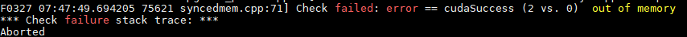

    -   run\_resnet50\_with\_arq.sh量化封装脚本进行量化

        用户也可以使用sample/resnet50/scripts路径下的量化脚本**run\_resnet50\_with\_arq.sh**，该脚本是对ResNet50\_sample.py量化脚本的封装，简化配置参数，使用起来更方便，使用示例如下。

        在sample/resnet50路径下执行如下命令。

        ```
        bash scripts/run_resnet50_with_arq.sh -c your_caffe_dir -g gpu_id
        ```

        参数解释如下：

    **表 2**  量化脚本参数说明

    <a name="table2439mcpsimp"></a>
    <table><thead align="left"><tr id="row2445mcpsimp"><th class="cellrowborder" valign="top" width="33%" id="mcps1.2.3.1.1"><p id="p2447mcpsimp"><a name="p2447mcpsimp"></a><a name="p2447mcpsimp"></a>参数</p>
    </th>
    <th class="cellrowborder" valign="top" width="67%" id="mcps1.2.3.1.2"><p id="p2449mcpsimp"><a name="p2449mcpsimp"></a><a name="p2449mcpsimp"></a>说明</p>
    </th>
    </tr>
    </thead>
    <tbody><tr id="row2451mcpsimp"><td class="cellrowborder" valign="top" width="33%" headers="mcps1.2.3.1.1 "><p id="p2453mcpsimp"><a name="p2453mcpsimp"></a><a name="p2453mcpsimp"></a>-c</p>
    </td>
    <td class="cellrowborder" valign="top" width="67%" headers="mcps1.2.3.1.2 "><p id="p2455mcpsimp"><a name="p2455mcpsimp"></a><a name="p2455mcpsimp"></a>必填。指定caffe-master路径。</p>
    </td>
    </tr>
    <tr id="row2456mcpsimp"><td class="cellrowborder" valign="top" width="33%" headers="mcps1.2.3.1.1 "><p id="p2458mcpsimp"><a name="p2458mcpsimp"></a><a name="p2458mcpsimp"></a>-g</p>
    </td>
    <td class="cellrowborder" valign="top" width="67%" headers="mcps1.2.3.1.2 "><p id="p2460mcpsimp"><a name="p2460mcpsimp"></a><a name="p2460mcpsimp"></a>可选。指定GPU设备ID。如果不选择该参数，则默认运行在CPU上。</p>
    </td>
    </tr>
    </tbody>
    </table>

    使用样例如下：

    ```
    bash scripts/run_resnet50_with_arq.sh  -c caffe-master  -g 0
    ```

    若出现如下信息则说明模型量化成功（如下top1，top5的推理精度只是样例，请以实际环境量化结果为准）。

    ```
    ******final top1:0.86875
    ******final top5:0.95    //量化后的fake_quant模型在Caffe环境中top1、top5的推理精度
    [AMCT][INFO]Run ResNet-50 with quantize success!
    ```

2.  量化结果说明。

    量化成功后，界面会显示量化后精度仿真模型的推理结果。在量化后模型的同级目录下生成量化日志文件夹amct\_log、量化结果文件夹results、量化中间结果文件夹tmp：

    -   amct\_log：记录了工具的日志信息，包括量化过程的日志信息amct\_caffe.log。
    -   tmp：量化过程中产生的文件，包括：
        -   config.json：描述了如何对模型中的每一层进行量化。如果量化脚本所在目录下已经存在量化配置文件，则再次调用create\_quant\_config接口时，如果新生成的量化配置文件与已有的文件同名，则会覆盖已有的量化配置文件，否则生成新的量化配置文件。实际量化过程中，如果量化后的模型推理精度不满足要求，用户可以修改config.json文件，量化配置文件内容、修改原则以及参数解释请参见[量化示例](#ZH-CN_TOPIC_0000002408421242)。
        -   中间模型文件modified\_model.prototxt、modified\_model.caffemodel。
        -   记录量化因子的文件scale\_offset\_record.txt。关于该文件的原型定义请参见[量化因子记录文件说明](#ZH-CN_TOPIC_0000002441980745)。

    -   results/calibration\_results：量化结果文件，包括量化后的模型文件、权重文件以及模型量化信息文件_ResNet50_\_quant.json（该文件名称和量化后模型名称保持统一），如下所示。
        -   ResNet50\_deploy\_model.prototxt：量化后的可在SoC部署的模型文件。
        -   ResNet50\_deploy\_weights.caffemodel：量化后的可在SoC部署的权重文件。
        -   ResNet50\_fake\_quant\_model.prototxt：量化后的可在Caffe环境进行精度仿真模型文件。
        -   ResNet50\_fake\_quant\_weights.caffemodel：量化后的可在Caffe环境进行精度仿真权重文件。
        -   ResNet50\_quant.json：量化信息文件（该文件名称和量化后模型名称保持统一），记录了量化模型同原始模型节点的映射关系，用于量化后模型同原始模型精度比对使用。
        -   ResNet50\_quant\_param\_record.txt：量化参数文件文本格式\(推荐使用\)，用于atc生成om模型。
        -   ResNet50\_quant\_param\_record.bin：量化参数文件二进制形式，用于atc生成om模型。

3.  如果用户需要将量化后的deploy模型，转换为适配SoC的离线模型，则请参见《MindCmd 用户指南》。

#### 模型精度测试<a name="ZH-CN_TOPIC_0000002408581178"></a>

由于[量化示例](#ZH-CN_TOPIC_0000002408421242)进行的推理和量化校准的过程都是基于自带的图片数据集进行的，量化结果仅用于验证量化模型是否成功，不能够作为量化后模型精度验证标准。本章节给出基于ImageNet标准数据集进行量化前后网络精度验证测试的详细步骤。

在使用ImageNet标准数据集之前，需要预先下载ImageNet数据集并调用Caffe提供工具转换成为LMDB格式数据集。

**准备动作<a name="section1995213336258"></a>**

参考Caffe工程caffe-master/examples/imagenet/readme.md文件下载并制作lmdb格式ImageNet数据集。

**精度测试<a name="section1696720532254"></a>**

-   量化前精度测试。

    命令如下：

    ```
    python3 src/ResNet50_sample.py --model_file pre_model/ResNet-50-deploy.prototxt --weights_file pre_model/ResNet-50-model.caffemodel --gpu 0  --caffe_dir caffe-master --benchmark  --dataset caffe-master/examples/imagenet/ilscrc12_val_lmdb --pre_test
    ```

    参数解释请参见[表1](#ZH-CN_TOPIC_0000002441980557)，若出现如下信息则说明执行成功。

    ```
    ******final top1:0.725
     ******final top5:0.91875
     [AMCT][INFO]Run ResNet-50 without quantize success!
    ```

-   量化后精度测试。

    ```
    python3 src/ResNet50_sample.py --model_file pre_model/ResNet-50-deploy.prototxt --weights_file pre_model/ResNet-50-model.caffemodel --gpu 0 --caffe_dir caffe-master --benchmark  --dataset caffe-master/examples/imagenet/ilscrc12_val_lmdb
    ```

    若出现如下信息则说明量化成功（如下top1，top5的推理精度只是样例，请以实际环境量化结果为准）：

    ```
    ******final top1:0.7125
    ******final top5:0.925
    [AMCT][INFO]Run ResNet-50 with quantize success!
    ```

    用户可以根据量化前后分类精度（top1, top5）的指标，查看量化是否满足要求。

-   量化后精度分析

    在均匀量化中，如果量化后的精度不符合预期，可以将量化后模型的逐层中间结果打印下来，使用MindCmd功能进行比对，确定误差比较大的层，来针对性调整量化策略，使用样例如下。

    ```
    python3 src/dump_layer_ouputs.py --gpu 0 --caffe_dir caffe-master
    ```

### 检测网络模型量化<a name="ZH-CN_TOPIC_0000002408581306"></a>


#### 量化前提<a name="ZH-CN_TOPIC_0000002441980737"></a>

**模型准备<a name="section826283710295"></a>**

请参见[模型准备](#ZH-CN_TOPIC_0000002408581202)。

如果使用FasterRCNN模型，则执行步骤[环境初始化](#ZH-CN_TOPIC_0000002408581306)时会将模型自动下载到本地，本手册以该场景下的模型为例进行说明，用户也可以自行准备模型。

**数据集准备<a name="section1054444984120"></a>**

请参见[数据集准备](#ZH-CN_TOPIC_0000002408581202)。

本手册以FasterRCNN模型自带的数据集为例进行说明，[环境初始化](#ZH-CN_TOPIC_0000002408581306)时会生成相应数据集。

**校准集准备<a name="section16317478429"></a>**

请参见[校准集准备](#ZH-CN_TOPIC_0000002408581202)。

**环境初始化<a name="section191821420432"></a>**

环境初始化用于获取检测网络源代码、模型文件、权重文件以及数据集等信息, 请参考sample下README.md的指引从指定地址下载资源然后执行初始化。

#### 量化示例<a name="ZH-CN_TOPIC_0000002442020641"></a>

1.  对原始网络模型进行预测试，检测原始模型是否可以在Caffe环境中正常运行。

    量化前，需要先将原始模型和数据集在Caffe环境中执行推理过程，以避免数据集和模型不匹配、模型无法在Caffe环境中执行的问题。

    切换到sample/faster\_rcnn/src目录，执行如下命令检测faster\_rcnn网络模型。

    ```
    python3 faster_rcnn_sample.py --model_file MODEL_FILE --weights_file WEIGHTS_FILE [--gpu GPU_ID] [--cpu][--iterations ITERATIONS] [--pre_test]
    ```

    参数解释如[表1](#ZH-CN_TOPIC_0000002441980557)所示。

    使用样例如下：

    ```
    python3 faster_rcnn_sample.py --model_file pre_model/faster_rcnn_test.pt --weights_file pre_model/VGG16_faster_rcnn_final.caffemodel  --gpu 0 --pre_test
    ```

    根据src/datasets数据集中检测对象的数量，会展示相应数量的检测结果文件，关闭检测结果文件，若AMCT所在服务器出现如下信息，则说明原始模型在Caffe环境中运行正常。

    ```
    [AMCT][INFO]Run faster_rcnn without quantize success!
    ```

    预检测结果文件存放路径为src/pre\_detect\_results/。

2.  执行量化。

    ```
    python3 faster_rcnn_sample.py --model_file pre_model/faster_rcnn_test.pt --weights_file pre_model/VGG16_faster_rcnn_final.caffemodel  --gpu 0
    ```

    根据src/datasets数据集中检测对象的数量，展示相应数量的检测结果文件，您可以根据图片上检测框的位置和使用“\[--pre\_test\]”参数后的原始模型的推理结果进行比较。

    将所有检测结果文件关闭，在AMCT所在服务器还可以看到如下量化成功信息：

    ```
    [AMCT][INFO]Run faster_rcnn with quantize success!
    ```

    量化后检测结果文件存放路径为src/quant\_detect\_results/。

3.  量化结果展示。

    量化成功后，界面会显示量化后精度仿真模型的推理结果。在量化后模型的同级目录下生成量化配置文件config.json、量化日志文件夹amct\_log、量化结果文件results、量化中间结果文件tmp等。

    -   config.json：描述了如何对模型中的每一层进行量化。如果量化脚本所在目录下已经存在量化配置文件，则再次调用create\_quant\_config接口时，如果新生成的量化配置文件与已有的文件同名，则会覆盖已有的量化配置文件，否则生成新的量化配置文件。

        实际量化过程中，如果量化后的模型推理精度不满足要求，用户可以修改config.json文件，量化配置文件内容、修改原则以及参数解释请参见[量化配置](#ZH-CN_TOPIC_0000002442020633)。

    -   amct\_log：记录了工具的日志信息，包括量化过程的日志信息amct\_caffe.log。
    -   pre\_detect\_results：预检测结果文件存放路径。
    -   quant\_detect\_results：量化后检测结果文件存放路径。
    -   tmp：量化过程中产生的文件，包括中间模型文件modified\_model.prototxt、modified\_model.caffemodel，记录量化因子的文件scale\_offset\_record/record.txt（关于该文件的原型定义请参见[量化因子记录文件说明](#ZH-CN_TOPIC_0000002441980745)）。
    -   results：量化结果文件，包括量化后的模型文件、权重文件以及模型量化信息文件，如下所示。
        -   faster\_rcnn\_deploy\_model.prototxt：量化后的可在SoC部署的模型文件。
        -   faster\_rcnn\_deploy\_weights.caffemodel：量化后的可在SoC部署的权重文件。
        -   faster\_rcnn\_fake\_quant\_model.prototxt：量化后的可在Caffe环境进行精度仿真模型文件。
        -   faster\_rcnn\_fake\_quant\_weights.caffemodel：量化后的可在Caffe环境进行精度仿真权重文件
        -   faster\_rcnn\_quant.json：量化信息文件（该文件名称和量化后模型名称保持统一），记录了量化模型同原始模型节点的映射关系，用于量化后模型同原始模型精度比对使用。
        -   faster\_rcnn\_quant\_param\_record.txt：量化参数文件文本格式\(推荐使用\)，用于atc生成om模型。
        -   faster\_rcnn\_quant\_param\_record.bin：量化参数文件二进制形式，用于atc生成om模型。

4.  如果用户需要将量化后的deploy模型，转换为适配SoC的离线模型，则请参见《MindCmd 用户指南》。

#### 模型精度测试<a name="ZH-CN_TOPIC_0000002441980585"></a>

由于[量化示例](#ZH-CN_TOPIC_0000002408421242)进行的推理和量化校准的过程都是基于自带的图片数据集进行的，量化结果仅用于验证量化模型是否成功，不能够作为量化后模型精度验证标准。本章节给出基于VOC2007标准数据集进行量化前后网络精度验证测试的详细步骤。

在初始化环境时增加参数**with\_benchmark**，用于下载VOC2007标准数据集。

**准备动作<a name="section5836115214406"></a>**

执行如下命令初始化环境信息，用于下载VOC2007标准数据集。

```
bash init_env.sh CPU **/caffe-master with_benchmark 
或 
bash init_env.sh CPU **/caffe-master python3.7.5 /usr/include/python3.7m with_benchmark
```

环境初始化完成后，除了重新生成[环境初始化](#ZH-CN_TOPIC_0000002441980737)中的文件外，还会额外在amct\_caffe\_faster\_rcnn\_sample/datasets目录生成**VOCdevkit**数据集文件。

如果环境初始化时，加了**with\_benchmark**参数，则后续所有的量化动作都是基于VOC2007标准数据集操作的。

> **说明：** 
>-   若环境初始化时使用CPU参数，则量化时量化命令只能使用\[--cpu\]参数。
>-   若环境初始化时使用GPU参数，则量化时量化命令可以使用\[--gpu GPU\_ID\] 或\[--cpu\]参数。
>用户根据实际情况选择环境初始化使用的参数。

**精度测试<a name="section13666644205018"></a>**

1.  量化前精度测试。

    命令如下：

    ```
    python3 faster_rcnn_sample.py --model_file pre_model/faster_rcnn_test.pt --weights_file pre_model/VGG16_faster_rcnn_final.caffemodel  --gpu 0 --pre_test
    ```

    参数解释请参见[表1](#ZH-CN_TOPIC_0000002441980557)，若出现如下信息则说明执行成功。

    ```
    [AMCT][INFO]Run faster_rcnn without quantize success, and mAP is 0.8812724482290413
    ```

2.  量化后精度测试。

    ```
    python3 faster_rcnn_sample.py --model_file pre_model/faster_rcnn_test.pt --weights_file pre_model/VGG16_faster_rcnn_final.caffemodel  --gpu 0
    ```

    若出现如下信息则说明量化成功（如下推理精度只是样例，请以实际环境量化结果为准）。

    ```
    [AMCT][INFO]Run faster_rcnn with quantize success, and mAP is 0.8796338534980108!
    ```

3.  用户可以根据量化前后mAP（mean average precision）的取值，查看量化是否满足要求。

### convert\_model接口量化示例<a name="ZH-CN_TOPIC_0000002442020493"></a>


#### 量化前提<a name="ZH-CN_TOPIC_0000002441980545"></a>

-   模型、数据集、校准集的准备动作请参见[量化前提](#ZH-CN_TOPIC_0000002408421506)。
-   量化因子：

    以AMCT的安装用户将用户自己计算得到的量化因子记录文件上传到Linux服务器任意目录下。本手册以sample包中自带的分类网络模型ResNet-50的量化因子为例进行说明。关于量化因子的详细说明请参见[量化因子记录文件说明](#ZH-CN_TOPIC_0000002441980745)。

#### 量化示例<a name="ZH-CN_TOPIC_0000002408421446"></a>

1.  对原始网络模型进行预测试，检测原始模型是否可以在Caffe环境中正常运行。

    量化前，需要先将原始模型和数据集在Caffe环境中执行推理过程，以避免数据集和模型不匹配、模型无法在Caffe环境中执行的问题。

    在sample/resnet50目录执行如下命令检测ResNet-50网络模型。

    ```
    python3 src/convert_model.py --model_file MODEL_FILE --weights_file WEIGHTS_FILE --record_file RECORD_FILE [--gpu GPU_ID] [--cpu][--iterations ITERATIONS] --caffe_dir CAFFE_DIR [--pre_test]
    ```

    其中，**_ _--record\_file RECORD\_FILE**参数表示量化因子记录文件\(.txt\)路径，该场景下必填，其余参数解释请参见[表1](#ZH-CN_TOPIC_0000002441980557)。

    使用样例如下：

    ```
    python3 src/convert_model.py --model_file pre_model/ResNet-50-deploy.prototxt --weights_file pre_model/ResNet-50-model.caffemodel --record_file pre_model/record.txt --gpu 0 --caffe_dir caffe-master --pre_test
    ```

    若出现如下信息，则说明原始模型在Caffe环境中运行正常。

    ```
    [AMCT][INFO]Run ResNet-50 without quantize success!
    ```

2.  执行量化。

    ```
    python3 src/convert_model.py --model_file pre_model/ResNet-50-deploy.prototxt --weights_file pre_model/ResNet-50-model.caffemodel --record_file pre_model/record.txt --gpu 0 --caffe_dir caffe-master
    ```

    若出现如下信息则说明模型量化成功（如下top1，top5的推理精度只是样例，请以实际环境量化结果为准）：

    ```
    ******final top1:0.86875
    ******final top5:0.95625    //量化后的fake_quant模型在Caffe环境中top1、top5的推理精度  [AMCT][INFO]Run ResNet-50 with quantize success!
    ```

3.  量化结果展示。

    量化成功后，界面会显示量化后精度仿真模型的推理结果。在量化后模型的同级目录下生成量化日志文件夹amct\_log、量化结果文件results。

    -   amct\_log：记录了工具的日志信息，包括量化过程的日志信息amct\_caffe.log。
    -   results/convert\_results：量化结果文件，包括量化后的模型文件、权重文件以及模型量化信息文件，如下所示。

        -   ResNet50\_deploy\_model.prototxt：量化后的可在SoC部署的模型文件。
        -   ResNet50\_deploy\_weights.caffemodel：量化后的可在SoC部署的权重文件。
        -   ResNet50\_fake\_quant\_model.prototxt：量化后的可在Caffe环境进行精度仿真模型文件。
        -   ResNet50\_fake\_quant\_weights.caffemodel：量化后的可在Caffe环境进行精度仿真权重文件。
        -   ResNet50\_quant.json：量化信息文件（该文件名称和量化后模型名称保持统一），记录了量化模型同原始模型节点的映射关系，用于量化后模型同原始模型精度比对使用。
        -   ResNet50\_quant\_param\_record.txt：量化参数文件文本格式\(推荐使用\)，用于atc生成om模型。
        -   ResNet50\_quant\_param\_record.bin：量化参数文件二进制形式，用于atc生成om模型。

        对该模型重新进行量化时，在量化后模型的同级目录下生成的上述结果文件将会被覆盖。

### MNIST网络模型量化<a name="ZH-CN_TOPIC_0000002441980693"></a>

该模型用于快速验证AMCT的量化功能，进行的推理、量化校准的过程都是基于标准MNIST数据集进行，量化结果可用于比较量化前后网络精度验证测试。


#### 量化前提<a name="ZH-CN_TOPIC_0000002442020389"></a>

**模型准备<a name="section16135910125013"></a>**

本手册以sample包中MNIST自带的mnist模型为例进行说明。

**数据集准备<a name="section111371710155018"></a>**

请参考对sample下的README.txt从指定地址下载数据集。

**校准集准备<a name="section7139710145013"></a>**

请参见[校准集准备](#ZH-CN_TOPIC_0000002408581202)。

#### 量化示例<a name="ZH-CN_TOPIC_0000002441980717"></a>

1.  切换到sample/mnist目录，执行如下命令量化mnist网络模型。

    ```
    python3 src/mnist_sample.py --model_file pre_model/mnist-deploy.prototxt --weights_file pre_model/mnist-model.caffemodel --gpu 0 --caffe_dir  caffe-master
    ```

    参数解释请参见[表1](#ZH-CN_TOPIC_0000002441980557)。

    若出现如下信息则说明量化成功（如下推理精度只是样例，请以实际环境量化结果为准）：

    ```
    ******final top1:0.9853125             //量化后的fake_quant模型在Caffe环境中的推理精度 
    [AMCT][INFO] mnist top1 before quantize is 0.98515625, after quantize is 0.9853125  //量化前以及量化后的精度测试结果 
    [AMCT][INFO]Run mnist sample with quantize success!
    ```

2.  量化成功后，界面会显示量化后精度仿真模型的推理结果、以及量化前和量化后精度测试结果，在量化后模型的同级目录下生成量化日志文件夹amct\_log、量化结果文件夹results、量化中间结果文件夹tmp等：
    -   amct\_log：记录了工具的日志信息，包括量化过程的日志信息amct\_caffe.log。
    -   tmp：量化过程中产生的文件，包括：
        -   config.json：描述了如何对模型中的每一层进行量化。如果量化脚本所在目录下已经存在量化配置文件，则再次调用create\_quant\_config接口时，如果新生成的量化配置文件与已有的文件同名，则会覆盖已有的量化配置文件，否则生成新的量化配置文件。实际量化过程中，如果量化后的模型推理精度不满足要求，用户可以修改config.json文件，量化配置文件内容、修改原则以及参数解释请参见[量化配置](#ZH-CN_TOPIC_0000002442020633)。
        -   中间模型文件modified\_model.prototxt、modified\_model.caffemodel
        -   记录量化因子的文件：record.txt。关于该文件的原型定义请参见[量化因子记录文件说明](#ZH-CN_TOPIC_0000002441980745)。
        -   存放数据集目录：mnist\_data和mnist\_test\_lmdb。

    -   results：量化结果文件，包括量化后的模型文件、权重文件以及模型量化信息文件，如下所示：
        -   mnist\_deploy\_model.prototxt：量化后的可在SoC部署的模型文件。
        -   mnist\_deploy\_weights.caffemodel：量化后的可在SoC部署的权重文件。
        -   mnist\_fake\_quant\_model.prototxt：量化后的可在Caffe环境进行精度仿真模型文件。
        -   mnist\_fake\_quant\_weights.caffemodel：量化后的可在Caffe环境进行精度仿真权重文件。
        -   mnist\_quant.json：量化信息文件（该文件名称和量化后模型名称保持统一），记录了量化模型同原始模型节点的映射关系，用于量化后模型同原始模型精度比对使用
        -   mnist\_quant\_param\_record.txt：量化参数文件文本格式\(推荐使用\)，用于atc生成om模型
        -   mnist\_quant\_param\_record.bin：量化参数文件二进制形式，用于atc生成om模型对该模型重新进行量化时，在量化后模型的同级目录下生成的上述结果文件将会被覆盖。

## 非均匀量化<a name="ZH-CN_TOPIC_0000002408581402"></a>


### 简介<a name="ZH-CN_TOPIC_0000002408581390"></a>

对权重数据量化过程中做了聚类，使得散布的权重数据量化到给定大小与范围的整数集合内。当前非均匀量化仅支持INT4量化，即用\[0,15\]的数值空间表示该层的所有权重数据，降低权重数据搬移指令占比，从而提升推理运行的性能。在非均匀量化中也会包含均匀量化的过程，对权重中的Bias仍然使用INT8的量化系数进行量化。

由于聚类后权重排布变化较大，相比均匀的场景，非均匀量化在做完权重量化以后需要对Bn层的参数进行更新，并且需要将首尾层配置成均匀量化，具体流程如下：

**图 1**  非均匀量化流程<a name="fig438795118316"></a>  
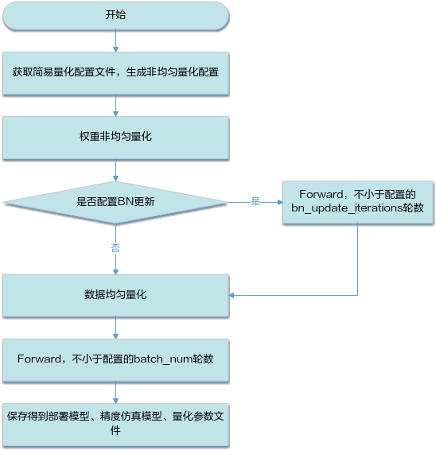

### 量化示例<a name="ZH-CN_TOPIC_0000002442020465"></a>

1.  获取非均匀量化简单配置文件，详细说明以及配置模板请参见[训练后量化简易量化配置文件说明](#ZH-CN_TOPIC_0000002441980761)。

    本章节以ResNet-50分类网络sample自带sample/resnet50/src/snq\_files/snq\_quant.cfg文件为例进行说明。

    1.  首先将BN更新开关打开，并且配置BN层的更新参数, 不更新BN的话量化后精度会有明显的下降。在Caffe的默认配置中，moving\_average\_fraction是0.999，这里我们需要重设一个较小的值，保证BN层的权重在比较短的迭代内能得到充分刷新。

        ```
        update_bn: true
        bn_update_config : {
            bn_update_iterations : 30
            bn_moving_average_fraction: 0.5
            bn_dump_dir: 'tmp/bn_data'
        }
        ```

    2.  然后将非均匀量化snq\_quantize配置到全局配置common\_config中，使得权重量化默认使用非均匀，数据量化使用默认的ifmr\_quantize算法。

        ```
        common_config : {
            ifmr_quantize : {
                search_range_start : 0.7 
                search_range_end : 1.3 
                search_step : 0.01 
                max_percentile : 0.999999 
                min_percentile : 0.999999
                num_bits:8
            }
            snq_quantize : { 
                channel_wise : true
                max_iteration : 1000
                min_distance : 1e-10
                init_algo : 'gaussian'
            }
        }
        ```

    3.  接下来，将首尾层的权重量化配置重置回均匀量化arq\_quantize，这里首层 "conv1" 是通过override\_layer\_configs刷新，由于fc不支持channelwise量化，这里使用override\_layer\_types统一对fc做了配置，尾层fc1000也包含其中。

        ```
        override_layer_types : { 
            layer_type : "InnerProduct" 
            calibration_config : {
                ifmr_quantize : {
                    search_range_start : 0.7 
                    search_range_end : 1.3 
                    search_step : 0.01 
                    max_percentile : 0.999999 
                    min_percentile : 0.999999
                    num_bits:8
                }
                arq_quantize : { 
                    channel_wise : false
                    num_bits:8
                } 
            } 
        } 
          
        override_layer_configs : { 
            layer_name : "conv1" 
            calibration_config : {
                arq_quantize : { 
                    channel_wise : true
                    num_bits:8
                }
                ifmr_quantize : { 
                    search_range_start : 0.8 
                    search_range_end : 1.2 
                    search_step : 0.02 
                    max_percentile : 0.999999 
                    min_percentile : 0.999999
                    num_bits:8
                } 
            }  
        }
        ```

2.  执行量化脚本，对原始网络模型进行量化（如果模型没下载，参考[量化前提](#ZH-CN_TOPIC_0000002408421506)下载模型）。

    ```
    python3 src/snq_resnet50_sample.py --model_file pre_model/ResNet-50-deploy.prototxt --weights_file pre_model/ResNet-50-model.caffemodel --gpu 0 --caffe_dir {your_caffe_dir} --cfg_define snq_files/snq_quant.cfg
    ```

    若出现如下信息则说明模型量化成功（如下top1，top5的推理精度只是样例，请以实际环境量化结果为准）：

    ```
    ******final top1:0.8375
    ******final top5:0.95     //量化后的fake_quant模型在Caffe环境中top1、top5的推理精度
    [AMCT][INFO]Run ResNet-50 with quantize success!
    ```

    如果想要得到准确的benchmark精度，可以执行

    ```
    python3 src/snq_resnet50_sample.py --model_file pre_model/ResNet-50-deploy.prototxt --weights_file pre_model/ResNet-50-model.caffemodel --gpu 0 --caffe_dir {your_caffe_dir} --cfg_define src/snq_files/snq_quant.cfg –benchmark –iterations=1563 –dataset {your_dataset_dir}/ilsvrc12_val_lmdb
    ```

    若出现如下信息则说明模型量化成功（如下top1，top5的推理精度只是样例，请以实际环境量化结果为准）：

    ```
    ******final top1: 0.7356046065259118
    ******final top5: 0.9166266794625719     //量化后的fake_quant模型在Caffe环境中top1、top5的推理精度
    [AMCT][INFO]Run ResNet-50 with quantize success!
    ```

3.  量化成功后，在量化后模型的同级目录下重新生成量化日志文件夹amct\_log、量化结果文件夹results、量化中间结果文件夹tmp：
    -   amct\_log：记录了工具的日志信息，包括量化过程的日志信息amct\_caffe.log。
    -   tmp：量化过程中产生的文件，包括:
        -   config.json：描述了如何对模型中的每一层进行量化。如果量化脚本所在目录下已经存在量化配置文件，则再次调用[create\_quant\_config](#ZH-CN_TOPIC_0000002441980797)  接口时，如果新生成的量化配置文件与已有的文件同名，则会覆盖已有的量化配置文件，否则生成新的量化配置文件。实际量化过程中，如果量化后的模型推理精度不满足要求，用户可以修改config.json文件，量化配置文件内容、修改原则以及参数解释请参见[量化配置](#ZH-CN_TOPIC_0000002442020633)。
        -   中间模型文件：modified\_model.prototxt、modified\_model.caffemodel、activation\_modified\_model.prototxt、activation\_modified\_model. caffemodel
        -   记录量化因子的文件：scale\_offset\_record.txt（不带BN融合）、scale\_offset\_record\_update.txt（带BN融合）。关于该文件的原型定义请参见[量化因子记录文件说明](#ZH-CN_TOPIC_0000002441980745)。

    -   results/calibration\_results：量化结果文件，包括非均匀量化后的模型文件、权重文件以及模型非均匀量化参数，如下所示：
        -   ResNet50\_deploy\_model.prototxt：非均匀量化后的可在SoC部署的模型文件。
        -   ResNet50\_deploy\_weights.caffemodel：非均匀量化后的可在SoC部署的权重文件。
        -   ResNet50\_fake\_quant\_model.prototxt：非均匀量化后的可在Caffe环境进行精度仿真模型文件。
        -   ResNet50\_fake\_quant\_weights.caffemodel：非均匀量化后的可在Caffe环境进行精度仿真权重文件。
        -   ResNet50\_quant\_param\_record.txt：量化参数文件文本格式\(推荐使用\)，用于atc生成om模型。
        -   ResNet50\_quant\_param\_record.bin：量化参数文件二进制形式，用于atc生成om模型。

## 量化配置<a name="ZH-CN_TOPIC_0000002408421466"></a>

本章节以分类网络量化配置文件为例进行说明。


### 基本介绍<a name="ZH-CN_TOPIC_0000002442020377"></a>

如果通过create\_quant\_config接口生成的config.json训练后量化配置文件，推理精度不满足要求，则需要参见该章节不断调整config.json文件中的内容，直至精度满足要求，该文件部分内容样例如下（用户修改json文件时，请确保层名唯一）

-   均匀量化配置文件

    ```
    { 
         "version":1, 
         "batch_num":2, 
         "activation_offset":true, 
         "do_fusion":true, 
         "skip_fusion_layers":[], 
         "conv1":{ 
             "quant_enable":true, 
             "activation_quant_params":{ 
                "num_bits":8,
                 "max_percentile":0.999999, 
                 "min_percentile":0.999999, 
                 "search_range":[ 
                     0.7, 
                     1.3 
                 ], 
                 "search_step":0.01 
             }, 
             "weight_quant_params":{ 
                 "wts_algo":"arq_quantize", 
                 "channel_wise":true,
                "num_bits":8
             } 
         }, 
         "conv2":{ 
             "quant_enable":true, 
             "activation_quant_params":{
                "num_bits":8,
                 "max_percentile":0.999999, 
                 "min_percentile":0.999999, 
                 "search_range":[ 
                     0.7, 
                     1.3 
                 ], 
                 "search_step":0.01 
             }, 
             "weight_quant_params":{ 
                 "wts_algo":"arq_quantize", 
                 "channel_wise":false,
                "num_bits":8
             } 
          } 
     }
    ```

-   非均匀量化配置文件

    ```
    {
    {
        "version":1,
        "batch_num":1,
        "activation_offset":true,
        "do_fusion":true,
        "skip_fusion_layers":[
            "conv1"
        ],
        "update_bn":true,
        "bn_update_config":{
            "bn_moving_average_fraction":0.5,
            "bn_update_iterations":30,
            "bn_dump_dir":"tmp/bn_data"
        },
        "res2a_branch1":{
            "quant_enable":true,
            "activation_quant_params":[
                {
                    "num_bits":8,
                    "max_percentile":0.999999,
                    "min_percentile":0.999999,
                    "search_range":[
                        0.7,
                        1.3
                    ],
                    "search_step":0.01
                }
            ],
            "weight_quant_params":{
                "wts_algo":"snq_quantize",
                "channel_wise":true,
                "num_bits":4,
                "max_iteration":1000,
                "min_distance":1e-10,
                "init_algo":"gaussian"
            }
        }   
    }
    ```

### 参数配置说明<a name="ZH-CN_TOPIC_0000002442020421"></a>

配置文件中参数说明如下。

**表 1**  version参数说明

<a name="table4265mcpsimp"></a>
<table><tbody><tr id="row4271mcpsimp"><th class="firstcol" valign="top" width="21%" id="mcps1.2.3.1.1"><p id="p4273mcpsimp"><a name="p4273mcpsimp"></a><a name="p4273mcpsimp"></a>作用</p>
</th>
<td class="cellrowborder" valign="top" width="79%" headers="mcps1.2.3.1.1 "><p id="p4275mcpsimp"><a name="p4275mcpsimp"></a><a name="p4275mcpsimp"></a>控制量化配置文件版本号</p>
</td>
</tr>
<tr id="row4276mcpsimp"><th class="firstcol" valign="top" width="21%" id="mcps1.2.3.2.1"><p id="p4278mcpsimp"><a name="p4278mcpsimp"></a><a name="p4278mcpsimp"></a>类型</p>
</th>
<td class="cellrowborder" valign="top" width="79%" headers="mcps1.2.3.2.1 "><p id="p4280mcpsimp"><a name="p4280mcpsimp"></a><a name="p4280mcpsimp"></a>int</p>
</td>
</tr>
<tr id="row4281mcpsimp"><th class="firstcol" valign="top" width="21%" id="mcps1.2.3.3.1"><p id="p4283mcpsimp"><a name="p4283mcpsimp"></a><a name="p4283mcpsimp"></a>取值范围</p>
</th>
<td class="cellrowborder" valign="top" width="79%" headers="mcps1.2.3.3.1 "><p id="p4285mcpsimp"><a name="p4285mcpsimp"></a><a name="p4285mcpsimp"></a>1</p>
</td>
</tr>
<tr id="row4286mcpsimp"><th class="firstcol" valign="top" width="21%" id="mcps1.2.3.4.1"><p id="p4288mcpsimp"><a name="p4288mcpsimp"></a><a name="p4288mcpsimp"></a>参数说明</p>
</th>
<td class="cellrowborder" valign="top" width="79%" headers="mcps1.2.3.4.1 "><p id="p4290mcpsimp"><a name="p4290mcpsimp"></a><a name="p4290mcpsimp"></a>目前仅有一个版本号1。</p>
</td>
</tr>
<tr id="row4291mcpsimp"><th class="firstcol" valign="top" width="21%" id="mcps1.2.3.5.1"><p id="p4293mcpsimp"><a name="p4293mcpsimp"></a><a name="p4293mcpsimp"></a>推荐配置</p>
</th>
<td class="cellrowborder" valign="top" width="79%" headers="mcps1.2.3.5.1 "><p id="p4295mcpsimp"><a name="p4295mcpsimp"></a><a name="p4295mcpsimp"></a>1</p>
</td>
</tr>
<tr id="row4296mcpsimp"><th class="firstcol" valign="top" width="21%" id="mcps1.2.3.6.1"><p id="p4298mcpsimp"><a name="p4298mcpsimp"></a><a name="p4298mcpsimp"></a>可选或者必选</p>
</th>
<td class="cellrowborder" valign="top" width="79%" headers="mcps1.2.3.6.1 "><p id="p4300mcpsimp"><a name="p4300mcpsimp"></a><a name="p4300mcpsimp"></a>可选</p>
</td>
</tr>
</tbody>
</table>

**表 2**  batch\_num参数说明

<a name="table4301mcpsimp"></a>
<table><tbody><tr id="row4307mcpsimp"><th class="firstcol" valign="top" width="21%" id="mcps1.2.3.1.1"><p id="p4309mcpsimp"><a name="p4309mcpsimp"></a><a name="p4309mcpsimp"></a>作用</p>
</th>
<td class="cellrowborder" valign="top" width="79%" headers="mcps1.2.3.1.1 "><p id="p4311mcpsimp"><a name="p4311mcpsimp"></a><a name="p4311mcpsimp"></a>控制数据量化使用多少个batch的数据</p>
</td>
</tr>
<tr id="row4312mcpsimp"><th class="firstcol" valign="top" width="21%" id="mcps1.2.3.2.1"><p id="p4314mcpsimp"><a name="p4314mcpsimp"></a><a name="p4314mcpsimp"></a>类型</p>
</th>
<td class="cellrowborder" valign="top" width="79%" headers="mcps1.2.3.2.1 "><p id="p4316mcpsimp"><a name="p4316mcpsimp"></a><a name="p4316mcpsimp"></a>int</p>
</td>
</tr>
<tr id="row4317mcpsimp"><th class="firstcol" valign="top" width="21%" id="mcps1.2.3.3.1"><p id="p4319mcpsimp"><a name="p4319mcpsimp"></a><a name="p4319mcpsimp"></a>取值范围</p>
</th>
<td class="cellrowborder" valign="top" width="79%" headers="mcps1.2.3.3.1 "><p id="p4321mcpsimp"><a name="p4321mcpsimp"></a><a name="p4321mcpsimp"></a>大于0</p>
</td>
</tr>
<tr id="row4322mcpsimp"><th class="firstcol" valign="top" width="21%" id="mcps1.2.3.4.1"><p id="p4324mcpsimp"><a name="p4324mcpsimp"></a><a name="p4324mcpsimp"></a>参数说明</p>
</th>
<td class="cellrowborder" valign="top" width="79%" headers="mcps1.2.3.4.1 "><p id="p4326mcpsimp"><a name="p4326mcpsimp"></a><a name="p4326mcpsimp"></a>如果不配置，则使用默认值1，建议校准集图片数量不超过50张，根据batch的大小batch_size计算相应的batch_num数值。</p>
<p id="p4327mcpsimp"><a name="p4327mcpsimp"></a><a name="p4327mcpsimp"></a>batch_num*batch_size为量化使用的校准集图片数量。</p>
<p id="p4328mcpsimp"><a name="p4328mcpsimp"></a><a name="p4328mcpsimp"></a>其中batch_size为每个batch所用的图片数量。</p>
</td>
</tr>
<tr id="row4329mcpsimp"><th class="firstcol" valign="top" width="21%" id="mcps1.2.3.5.1"><p id="p4331mcpsimp"><a name="p4331mcpsimp"></a><a name="p4331mcpsimp"></a>推荐配置</p>
</th>
<td class="cellrowborder" valign="top" width="79%" headers="mcps1.2.3.5.1 "><p id="p4333mcpsimp"><a name="p4333mcpsimp"></a><a name="p4333mcpsimp"></a>1</p>
</td>
</tr>
<tr id="row4334mcpsimp"><th class="firstcol" valign="top" width="21%" id="mcps1.2.3.6.1"><p id="p4336mcpsimp"><a name="p4336mcpsimp"></a><a name="p4336mcpsimp"></a>必选或可选</p>
</th>
<td class="cellrowborder" valign="top" width="79%" headers="mcps1.2.3.6.1 "><p id="p4338mcpsimp"><a name="p4338mcpsimp"></a><a name="p4338mcpsimp"></a>可选</p>
</td>
</tr>
</tbody>
</table>

**表 3**  activation\_offset参数说明

<a name="table4339mcpsimp"></a>
<table><tbody><tr id="row4345mcpsimp"><th class="firstcol" valign="top" width="21%" id="mcps1.2.3.1.1"><p id="p4347mcpsimp"><a name="p4347mcpsimp"></a><a name="p4347mcpsimp"></a>作用</p>
</th>
<td class="cellrowborder" valign="top" width="79%" headers="mcps1.2.3.1.1 "><p id="p4349mcpsimp"><a name="p4349mcpsimp"></a><a name="p4349mcpsimp"></a>控制数据量化是对称量化还是非对称量化</p>
</td>
</tr>
<tr id="row4350mcpsimp"><th class="firstcol" valign="top" width="21%" id="mcps1.2.3.2.1"><p id="p4352mcpsimp"><a name="p4352mcpsimp"></a><a name="p4352mcpsimp"></a>类型</p>
</th>
<td class="cellrowborder" valign="top" width="79%" headers="mcps1.2.3.2.1 "><p id="p4354mcpsimp"><a name="p4354mcpsimp"></a><a name="p4354mcpsimp"></a>bool</p>
</td>
</tr>
<tr id="row4355mcpsimp"><th class="firstcol" valign="top" width="21%" id="mcps1.2.3.3.1"><p id="p4357mcpsimp"><a name="p4357mcpsimp"></a><a name="p4357mcpsimp"></a>取值范围</p>
</th>
<td class="cellrowborder" valign="top" width="79%" headers="mcps1.2.3.3.1 "><p id="p4359mcpsimp"><a name="p4359mcpsimp"></a><a name="p4359mcpsimp"></a>true或false</p>
</td>
</tr>
<tr id="row4360mcpsimp"><th class="firstcol" valign="top" width="21%" id="mcps1.2.3.4.1"><p id="p4362mcpsimp"><a name="p4362mcpsimp"></a><a name="p4362mcpsimp"></a>参数说明</p>
</th>
<td class="cellrowborder" valign="top" width="79%" headers="mcps1.2.3.4.1 "><p id="p4364mcpsimp"><a name="p4364mcpsimp"></a><a name="p4364mcpsimp"></a>取值为true数据量化时为非对称量化，取值为false数据量化时为对称量化。</p>
</td>
</tr>
<tr id="row4365mcpsimp"><th class="firstcol" valign="top" width="21%" id="mcps1.2.3.5.1"><p id="p4367mcpsimp"><a name="p4367mcpsimp"></a><a name="p4367mcpsimp"></a>推荐配置</p>
</th>
<td class="cellrowborder" valign="top" width="79%" headers="mcps1.2.3.5.1 "><p id="p4369mcpsimp"><a name="p4369mcpsimp"></a><a name="p4369mcpsimp"></a>true</p>
</td>
</tr>
<tr id="row4370mcpsimp"><th class="firstcol" valign="top" width="21%" id="mcps1.2.3.6.1"><p id="p4372mcpsimp"><a name="p4372mcpsimp"></a><a name="p4372mcpsimp"></a>必选或可选</p>
</th>
<td class="cellrowborder" valign="top" width="79%" headers="mcps1.2.3.6.1 "><p id="p4374mcpsimp"><a name="p4374mcpsimp"></a><a name="p4374mcpsimp"></a>可选</p>
</td>
</tr>
</tbody>
</table>

**表 4**  do\_fusion参数说明

<a name="table4375mcpsimp"></a>
<table><tbody><tr id="row4381mcpsimp"><th class="firstcol" valign="top" width="21%" id="mcps1.2.3.1.1"><p id="p4383mcpsimp"><a name="p4383mcpsimp"></a><a name="p4383mcpsimp"></a>作用</p>
</th>
<td class="cellrowborder" valign="top" width="79%" headers="mcps1.2.3.1.1 "><p id="p4385mcpsimp"><a name="p4385mcpsimp"></a><a name="p4385mcpsimp"></a>是否开启融合功能</p>
</td>
</tr>
<tr id="row4386mcpsimp"><th class="firstcol" valign="top" width="21%" id="mcps1.2.3.2.1"><p id="p4388mcpsimp"><a name="p4388mcpsimp"></a><a name="p4388mcpsimp"></a>类型</p>
</th>
<td class="cellrowborder" valign="top" width="79%" headers="mcps1.2.3.2.1 "><p id="p4390mcpsimp"><a name="p4390mcpsimp"></a><a name="p4390mcpsimp"></a>bool</p>
</td>
</tr>
<tr id="row4391mcpsimp"><th class="firstcol" valign="top" width="21%" id="mcps1.2.3.3.1"><p id="p4393mcpsimp"><a name="p4393mcpsimp"></a><a name="p4393mcpsimp"></a>取值范围</p>
</th>
<td class="cellrowborder" valign="top" width="79%" headers="mcps1.2.3.3.1 "><p id="p4395mcpsimp"><a name="p4395mcpsimp"></a><a name="p4395mcpsimp"></a>true或false</p>
</td>
</tr>
<tr id="row4396mcpsimp"><th class="firstcol" valign="top" width="21%" id="mcps1.2.3.4.1"><p id="p4398mcpsimp"><a name="p4398mcpsimp"></a><a name="p4398mcpsimp"></a>参数说明</p>
</th>
<td class="cellrowborder" valign="top" width="79%" headers="mcps1.2.3.4.1 "><p id="p4400mcpsimp"><a name="p4400mcpsimp"></a><a name="p4400mcpsimp"></a>取值为true表示开启融合功能，取值为false不开启。</p>
<p id="p4401mcpsimp"><a name="p4401mcpsimp"></a><a name="p4401mcpsimp"></a>当前支持融合的层以及融合规则请参见<a href="#ZH-CN_TOPIC_0000002441980785">工具实现的融合功能</a>。</p>
</td>
</tr>
<tr id="row4403mcpsimp"><th class="firstcol" valign="top" width="21%" id="mcps1.2.3.5.1"><p id="p4405mcpsimp"><a name="p4405mcpsimp"></a><a name="p4405mcpsimp"></a>推荐配置</p>
</th>
<td class="cellrowborder" valign="top" width="79%" headers="mcps1.2.3.5.1 "><p id="p4407mcpsimp"><a name="p4407mcpsimp"></a><a name="p4407mcpsimp"></a>true</p>
</td>
</tr>
<tr id="row4408mcpsimp"><th class="firstcol" valign="top" width="21%" id="mcps1.2.3.6.1"><p id="p4410mcpsimp"><a name="p4410mcpsimp"></a><a name="p4410mcpsimp"></a>可选或必选</p>
</th>
<td class="cellrowborder" valign="top" width="79%" headers="mcps1.2.3.6.1 "><p id="p4412mcpsimp"><a name="p4412mcpsimp"></a><a name="p4412mcpsimp"></a>可选</p>
</td>
</tr>
</tbody>
</table>

**表 5**  skip\_fusion\_layers参数说明

<a name="table4413mcpsimp"></a>
<table><tbody><tr id="row4419mcpsimp"><th class="firstcol" valign="top" width="21%" id="mcps1.2.3.1.1"><p id="p4421mcpsimp"><a name="p4421mcpsimp"></a><a name="p4421mcpsimp"></a>作用</p>
</th>
<td class="cellrowborder" valign="top" width="79%" headers="mcps1.2.3.1.1 "><p id="p4423mcpsimp"><a name="p4423mcpsimp"></a><a name="p4423mcpsimp"></a>跳过可融合的层</p>
</td>
</tr>
<tr id="row4424mcpsimp"><th class="firstcol" valign="top" width="21%" id="mcps1.2.3.2.1"><p id="p4426mcpsimp"><a name="p4426mcpsimp"></a><a name="p4426mcpsimp"></a>类型</p>
</th>
<td class="cellrowborder" valign="top" width="79%" headers="mcps1.2.3.2.1 "><p id="p4428mcpsimp"><a name="p4428mcpsimp"></a><a name="p4428mcpsimp"></a>string</p>
</td>
</tr>
<tr id="row4429mcpsimp"><th class="firstcol" valign="top" width="21%" id="mcps1.2.3.3.1"><p id="p4431mcpsimp"><a name="p4431mcpsimp"></a><a name="p4431mcpsimp"></a>取值范围</p>
</th>
<td class="cellrowborder" valign="top" width="79%" headers="mcps1.2.3.3.1 "><p id="p4433mcpsimp"><a name="p4433mcpsimp"></a><a name="p4433mcpsimp"></a>可融合层的层名。</p>
<p id="p4434mcpsimp"><a name="p4434mcpsimp"></a><a name="p4434mcpsimp"></a>当前支持融合的层以及融合规则请参见<a href="#ZH-CN_TOPIC_0000002441980785">工具实现的融合功能</a>。</p>
</td>
</tr>
<tr id="row4436mcpsimp"><th class="firstcol" valign="top" width="21%" id="mcps1.2.3.4.1"><p id="p4438mcpsimp"><a name="p4438mcpsimp"></a><a name="p4438mcpsimp"></a>参数说明</p>
</th>
<td class="cellrowborder" valign="top" width="79%" headers="mcps1.2.3.4.1 "><p id="p4440mcpsimp"><a name="p4440mcpsimp"></a><a name="p4440mcpsimp"></a>不需要做融合的层。</p>
</td>
</tr>
<tr id="row4441mcpsimp"><th class="firstcol" valign="top" width="21%" id="mcps1.2.3.5.1"><p id="p4443mcpsimp"><a name="p4443mcpsimp"></a><a name="p4443mcpsimp"></a>推荐配置</p>
</th>
<td class="cellrowborder" valign="top" width="79%" headers="mcps1.2.3.5.1 "><p id="p4445mcpsimp"><a name="p4445mcpsimp"></a><a name="p4445mcpsimp"></a>-</p>
</td>
</tr>
<tr id="row4446mcpsimp"><th class="firstcol" valign="top" width="21%" id="mcps1.2.3.6.1"><p id="p4448mcpsimp"><a name="p4448mcpsimp"></a><a name="p4448mcpsimp"></a>可选或必选</p>
</th>
<td class="cellrowborder" valign="top" width="79%" headers="mcps1.2.3.6.1 "><p id="p4450mcpsimp"><a name="p4450mcpsimp"></a><a name="p4450mcpsimp"></a>可选</p>
</td>
</tr>
</tbody>
</table>

**表 6**  update\_bn参数说明

<a name="table4451mcpsimp"></a>
<table><tbody><tr id="row4457mcpsimp"><th class="firstcol" valign="top" width="21%" id="mcps1.2.3.1.1"><p id="p4459mcpsimp"><a name="p4459mcpsimp"></a><a name="p4459mcpsimp"></a>作用</p>
</th>
<td class="cellrowborder" valign="top" width="79%" headers="mcps1.2.3.1.1 "><p id="p4461mcpsimp"><a name="p4461mcpsimp"></a><a name="p4461mcpsimp"></a>是否更新BN层中的统计参数（包括均值和方差）</p>
</td>
</tr>
<tr id="row4462mcpsimp"><th class="firstcol" valign="top" width="21%" id="mcps1.2.3.2.1"><p id="p4464mcpsimp"><a name="p4464mcpsimp"></a><a name="p4464mcpsimp"></a>类型</p>
</th>
<td class="cellrowborder" valign="top" width="79%" headers="mcps1.2.3.2.1 "><p id="p4466mcpsimp"><a name="p4466mcpsimp"></a><a name="p4466mcpsimp"></a>bool</p>
</td>
</tr>
<tr id="row4467mcpsimp"><th class="firstcol" valign="top" width="21%" id="mcps1.2.3.3.1"><p id="p4469mcpsimp"><a name="p4469mcpsimp"></a><a name="p4469mcpsimp"></a>取值范围</p>
</th>
<td class="cellrowborder" valign="top" width="79%" headers="mcps1.2.3.3.1 "><p id="p4471mcpsimp"><a name="p4471mcpsimp"></a><a name="p4471mcpsimp"></a>true或false</p>
</td>
</tr>
<tr id="row4472mcpsimp"><th class="firstcol" valign="top" width="21%" id="mcps1.2.3.4.1"><p id="p4474mcpsimp"><a name="p4474mcpsimp"></a><a name="p4474mcpsimp"></a>参数说明</p>
</th>
<td class="cellrowborder" valign="top" width="79%" headers="mcps1.2.3.4.1 "><p id="p4476mcpsimp"><a name="p4476mcpsimp"></a><a name="p4476mcpsimp"></a>取true时会将所有BN层的use_global_stats设置为false，权重量化后执行forward，BN层的均值和方差会被刷新然后保存到指定的目录。</p>
</td>
</tr>
<tr id="row4477mcpsimp"><th class="firstcol" valign="top" width="21%" id="mcps1.2.3.5.1"><p id="p4479mcpsimp"><a name="p4479mcpsimp"></a><a name="p4479mcpsimp"></a>推荐配置</p>
</th>
<td class="cellrowborder" valign="top" width="79%" headers="mcps1.2.3.5.1 "><p id="p4481mcpsimp"><a name="p4481mcpsimp"></a><a name="p4481mcpsimp"></a>均匀量化时推荐配false，非均匀量化推荐配true</p>
</td>
</tr>
<tr id="row4482mcpsimp"><th class="firstcol" valign="top" width="21%" id="mcps1.2.3.6.1"><p id="p4484mcpsimp"><a name="p4484mcpsimp"></a><a name="p4484mcpsimp"></a>可选或必选</p>
</th>
<td class="cellrowborder" valign="top" width="79%" headers="mcps1.2.3.6.1 "><p id="p4486mcpsimp"><a name="p4486mcpsimp"></a><a name="p4486mcpsimp"></a>可选</p>
</td>
</tr>
</tbody>
</table>

**表 7**  bn\_update\_config参数说明

<a name="table4487mcpsimp"></a>
<table><tbody><tr id="row4493mcpsimp"><th class="firstcol" valign="top" width="21%" id="mcps1.2.3.1.1"><p id="p4495mcpsimp"><a name="p4495mcpsimp"></a><a name="p4495mcpsimp"></a>作用</p>
</th>
<td class="cellrowborder" valign="top" width="79%" headers="mcps1.2.3.1.1 "><p id="p4497mcpsimp"><a name="p4497mcpsimp"></a><a name="p4497mcpsimp"></a>控制BN更新的参数</p>
</td>
</tr>
<tr id="row4498mcpsimp"><th class="firstcol" valign="top" width="21%" id="mcps1.2.3.2.1"><p id="p4500mcpsimp"><a name="p4500mcpsimp"></a><a name="p4500mcpsimp"></a>类型</p>
</th>
<td class="cellrowborder" valign="top" width="79%" headers="mcps1.2.3.2.1 "><p id="p4502mcpsimp"><a name="p4502mcpsimp"></a><a name="p4502mcpsimp"></a>object</p>
</td>
</tr>
<tr id="row4503mcpsimp"><th class="firstcol" valign="top" width="21%" id="mcps1.2.3.3.1"><p id="p4505mcpsimp"><a name="p4505mcpsimp"></a><a name="p4505mcpsimp"></a>取值范围</p>
</th>
<td class="cellrowborder" valign="top" width="79%" headers="mcps1.2.3.3.1 "><p id="p4507mcpsimp"><a name="p4507mcpsimp"></a><a name="p4507mcpsimp"></a>参数内部包含如下参数：</p>
<p id="p4508mcpsimp"><a name="p4508mcpsimp"></a><a name="p4508mcpsimp"></a>bn_moving_average_fraction</p>
<p id="p4509mcpsimp"><a name="p4509mcpsimp"></a><a name="p4509mcpsimp"></a>bn_update_iterations</p>
<p id="p4510mcpsimp"><a name="p4510mcpsimp"></a><a name="p4510mcpsimp"></a>bn_dump_dir</p>
<p id="p4511mcpsimp"><a name="p4511mcpsimp"></a><a name="p4511mcpsimp"></a>参数解释见下方表格</p>
</td>
</tr>
<tr id="row4512mcpsimp"><th class="firstcol" valign="top" width="21%" id="mcps1.2.3.4.1"><p id="p4514mcpsimp"><a name="p4514mcpsimp"></a><a name="p4514mcpsimp"></a>参数说明</p>
</th>
<td class="cellrowborder" valign="top" width="79%" headers="mcps1.2.3.4.1 "><p id="p4516mcpsimp"><a name="p4516mcpsimp"></a><a name="p4516mcpsimp"></a>仅当update_bn为true的时候产生作用</p>
</td>
</tr>
<tr id="row4517mcpsimp"><th class="firstcol" valign="top" width="21%" id="mcps1.2.3.5.1"><p id="p4519mcpsimp"><a name="p4519mcpsimp"></a><a name="p4519mcpsimp"></a>推荐配置</p>
</th>
<td class="cellrowborder" valign="top" width="79%" headers="mcps1.2.3.5.1 "><p id="p4521mcpsimp"><a name="p4521mcpsimp"></a><a name="p4521mcpsimp"></a>-</p>
</td>
</tr>
<tr id="row4522mcpsimp"><th class="firstcol" valign="top" width="21%" id="mcps1.2.3.6.1"><p id="p4524mcpsimp"><a name="p4524mcpsimp"></a><a name="p4524mcpsimp"></a>可选或必选</p>
</th>
<td class="cellrowborder" valign="top" width="79%" headers="mcps1.2.3.6.1 "><p id="p4526mcpsimp"><a name="p4526mcpsimp"></a><a name="p4526mcpsimp"></a>可选</p>
</td>
</tr>
</tbody>
</table>

**表 8**  bn\_moving\_average\_fraction参数说明

<a name="table4527mcpsimp"></a>
<table><tbody><tr id="row4533mcpsimp"><th class="firstcol" valign="top" width="21%" id="mcps1.2.3.1.1"><p id="p4535mcpsimp"><a name="p4535mcpsimp"></a><a name="p4535mcpsimp"></a>作用</p>
</th>
<td class="cellrowborder" valign="top" width="79%" headers="mcps1.2.3.1.1 "><p id="p4537mcpsimp"><a name="p4537mcpsimp"></a><a name="p4537mcpsimp"></a>控制BN更新的滑动学习率</p>
</td>
</tr>
<tr id="row4538mcpsimp"><th class="firstcol" valign="top" width="21%" id="mcps1.2.3.2.1"><p id="p4540mcpsimp"><a name="p4540mcpsimp"></a><a name="p4540mcpsimp"></a>类型</p>
</th>
<td class="cellrowborder" valign="top" width="79%" headers="mcps1.2.3.2.1 "><p id="p4542mcpsimp"><a name="p4542mcpsimp"></a><a name="p4542mcpsimp"></a>float</p>
</td>
</tr>
<tr id="row4543mcpsimp"><th class="firstcol" valign="top" width="21%" id="mcps1.2.3.3.1"><p id="p4545mcpsimp"><a name="p4545mcpsimp"></a><a name="p4545mcpsimp"></a>取值范围</p>
</th>
<td class="cellrowborder" valign="top" width="79%" headers="mcps1.2.3.3.1 "><p id="p4547mcpsimp"><a name="p4547mcpsimp"></a><a name="p4547mcpsimp"></a>(0, 1.0)</p>
</td>
</tr>
<tr id="row4548mcpsimp"><th class="firstcol" valign="top" width="21%" id="mcps1.2.3.4.1"><p id="p4550mcpsimp"><a name="p4550mcpsimp"></a><a name="p4550mcpsimp"></a>参数说明</p>
</th>
<td class="cellrowborder" valign="top" width="79%" headers="mcps1.2.3.4.1 "><p id="p4552mcpsimp"><a name="p4552mcpsimp"></a><a name="p4552mcpsimp"></a>含义同BN层自带的moving_average_fraction参数，如果BN层中没有配置该参数，就会使用bn_moving_average_fraction作为默认值；</p>
<p id="p4553mcpsimp"><a name="p4553mcpsimp"></a><a name="p4553mcpsimp"></a>推荐配置一个较小的值，保证BN层的权重在较短的迭代内能得到充分刷新，配置得越小需要迭代的次数越少。</p>
</td>
</tr>
<tr id="row4554mcpsimp"><th class="firstcol" valign="top" width="21%" id="mcps1.2.3.5.1"><p id="p4556mcpsimp"><a name="p4556mcpsimp"></a><a name="p4556mcpsimp"></a>推荐配置</p>
</th>
<td class="cellrowborder" valign="top" width="79%" headers="mcps1.2.3.5.1 "><p id="p4558mcpsimp"><a name="p4558mcpsimp"></a><a name="p4558mcpsimp"></a>0.5</p>
</td>
</tr>
<tr id="row4559mcpsimp"><th class="firstcol" valign="top" width="21%" id="mcps1.2.3.6.1"><p id="p4561mcpsimp"><a name="p4561mcpsimp"></a><a name="p4561mcpsimp"></a>可选或必选</p>
</th>
<td class="cellrowborder" valign="top" width="79%" headers="mcps1.2.3.6.1 "><p id="p4563mcpsimp"><a name="p4563mcpsimp"></a><a name="p4563mcpsimp"></a>可选</p>
</td>
</tr>
</tbody>
</table>

**表 9**  bn\_update\_iterations参数说明

<a name="table4564mcpsimp"></a>
<table><tbody><tr id="row4570mcpsimp"><th class="firstcol" valign="top" width="21%" id="mcps1.2.3.1.1"><p id="p4572mcpsimp"><a name="p4572mcpsimp"></a><a name="p4572mcpsimp"></a>作用</p>
</th>
<td class="cellrowborder" valign="top" width="79%" headers="mcps1.2.3.1.1 "><p id="p4574mcpsimp"><a name="p4574mcpsimp"></a><a name="p4574mcpsimp"></a>控制BN更新的迭代次数</p>
</td>
</tr>
<tr id="row4575mcpsimp"><th class="firstcol" valign="top" width="21%" id="mcps1.2.3.2.1"><p id="p4577mcpsimp"><a name="p4577mcpsimp"></a><a name="p4577mcpsimp"></a>类型</p>
</th>
<td class="cellrowborder" valign="top" width="79%" headers="mcps1.2.3.2.1 "><p id="p4579mcpsimp"><a name="p4579mcpsimp"></a><a name="p4579mcpsimp"></a>int</p>
</td>
</tr>
<tr id="row4580mcpsimp"><th class="firstcol" valign="top" width="21%" id="mcps1.2.3.3.1"><p id="p4582mcpsimp"><a name="p4582mcpsimp"></a><a name="p4582mcpsimp"></a>取值范围</p>
</th>
<td class="cellrowborder" valign="top" width="79%" headers="mcps1.2.3.3.1 "><p id="p4584mcpsimp"><a name="p4584mcpsimp"></a><a name="p4584mcpsimp"></a>(0, 1000)</p>
</td>
</tr>
<tr id="row4585mcpsimp"><th class="firstcol" valign="top" width="21%" id="mcps1.2.3.4.1"><p id="p4587mcpsimp"><a name="p4587mcpsimp"></a><a name="p4587mcpsimp"></a>参数说明</p>
</th>
<td class="cellrowborder" valign="top" width="79%" headers="mcps1.2.3.4.1 "><p id="p4589mcpsimp"><a name="p4589mcpsimp"></a><a name="p4589mcpsimp"></a>BN更新的迭代次数，forward过程中达到迭代次数，程序就会将更新后的权重保存下来，需要和bn_moving_average_fraction配合使用</p>
</td>
</tr>
<tr id="row4590mcpsimp"><th class="firstcol" valign="top" width="21%" id="mcps1.2.3.5.1"><p id="p4592mcpsimp"><a name="p4592mcpsimp"></a><a name="p4592mcpsimp"></a>推荐配置</p>
</th>
<td class="cellrowborder" valign="top" width="79%" headers="mcps1.2.3.5.1 "><p id="p4594mcpsimp"><a name="p4594mcpsimp"></a><a name="p4594mcpsimp"></a>30</p>
</td>
</tr>
<tr id="row4595mcpsimp"><th class="firstcol" valign="top" width="21%" id="mcps1.2.3.6.1"><p id="p4597mcpsimp"><a name="p4597mcpsimp"></a><a name="p4597mcpsimp"></a>可选或必选</p>
</th>
<td class="cellrowborder" valign="top" width="79%" headers="mcps1.2.3.6.1 "><p id="p4599mcpsimp"><a name="p4599mcpsimp"></a><a name="p4599mcpsimp"></a>可选</p>
</td>
</tr>
</tbody>
</table>

**表 10**  bn\_dump\_dir参数说明

<a name="table4600mcpsimp"></a>
<table><tbody><tr id="row4606mcpsimp"><th class="firstcol" valign="top" width="21%" id="mcps1.2.3.1.1"><p id="p4608mcpsimp"><a name="p4608mcpsimp"></a><a name="p4608mcpsimp"></a>作用</p>
</th>
<td class="cellrowborder" valign="top" width="79%" headers="mcps1.2.3.1.1 "><p id="p4610mcpsimp"><a name="p4610mcpsimp"></a><a name="p4610mcpsimp"></a>BN更新后权重数据的保存路径</p>
</td>
</tr>
<tr id="row4611mcpsimp"><th class="firstcol" valign="top" width="21%" id="mcps1.2.3.2.1"><p id="p4613mcpsimp"><a name="p4613mcpsimp"></a><a name="p4613mcpsimp"></a>类型</p>
</th>
<td class="cellrowborder" valign="top" width="79%" headers="mcps1.2.3.2.1 "><p id="p4615mcpsimp"><a name="p4615mcpsimp"></a><a name="p4615mcpsimp"></a>string</p>
</td>
</tr>
<tr id="row4616mcpsimp"><th class="firstcol" valign="top" width="21%" id="mcps1.2.3.3.1"><p id="p4618mcpsimp"><a name="p4618mcpsimp"></a><a name="p4618mcpsimp"></a>取值范围</p>
</th>
<td class="cellrowborder" valign="top" width="79%" headers="mcps1.2.3.3.1 "><p id="p4620mcpsimp"><a name="p4620mcpsimp"></a><a name="p4620mcpsimp"></a>环境上存在的有效目录路径</p>
</td>
</tr>
<tr id="row4621mcpsimp"><th class="firstcol" valign="top" width="21%" id="mcps1.2.3.4.1"><p id="p4623mcpsimp"><a name="p4623mcpsimp"></a><a name="p4623mcpsimp"></a>参数说明</p>
</th>
<td class="cellrowborder" valign="top" width="79%" headers="mcps1.2.3.4.1 "><p id="p4625mcpsimp"><a name="p4625mcpsimp"></a><a name="p4625mcpsimp"></a>推理场景下没有snapshot过程，更新后的BN使用指定的文件路径保存，然后同步刷新回caffemodel中。</p>
</td>
</tr>
<tr id="row4626mcpsimp"><th class="firstcol" valign="top" width="21%" id="mcps1.2.3.5.1"><p id="p4628mcpsimp"><a name="p4628mcpsimp"></a><a name="p4628mcpsimp"></a>推荐配置</p>
</th>
<td class="cellrowborder" valign="top" width="79%" headers="mcps1.2.3.5.1 "><p id="p4630mcpsimp"><a name="p4630mcpsimp"></a><a name="p4630mcpsimp"></a>由系统自动创建并保存到目录tmp/bn_data</p>
</td>
</tr>
<tr id="row4631mcpsimp"><th class="firstcol" valign="top" width="21%" id="mcps1.2.3.6.1"><p id="p4633mcpsimp"><a name="p4633mcpsimp"></a><a name="p4633mcpsimp"></a>可选或必选</p>
</th>
<td class="cellrowborder" valign="top" width="79%" headers="mcps1.2.3.6.1 "><p id="p4635mcpsimp"><a name="p4635mcpsimp"></a><a name="p4635mcpsimp"></a>可选</p>
</td>
</tr>
</tbody>
</table>

**表 11**  layer\_config参数说明

<a name="table4636mcpsimp"></a>
<table><tbody><tr id="row4642mcpsimp"><th class="firstcol" valign="top" width="21%" id="mcps1.2.3.1.1"><p id="p4644mcpsimp"><a name="p4644mcpsimp"></a><a name="p4644mcpsimp"></a>作用</p>
</th>
<td class="cellrowborder" valign="top" width="79%" headers="mcps1.2.3.1.1 "><p id="p4646mcpsimp"><a name="p4646mcpsimp"></a><a name="p4646mcpsimp"></a>指定某个网络层的量化配置</p>
</td>
</tr>
<tr id="row4647mcpsimp"><th class="firstcol" valign="top" width="21%" id="mcps1.2.3.2.1"><p id="p4649mcpsimp"><a name="p4649mcpsimp"></a><a name="p4649mcpsimp"></a>类型</p>
</th>
<td class="cellrowborder" valign="top" width="79%" headers="mcps1.2.3.2.1 "><p id="p4651mcpsimp"><a name="p4651mcpsimp"></a><a name="p4651mcpsimp"></a>object</p>
</td>
</tr>
<tr id="row4652mcpsimp"><th class="firstcol" valign="top" width="21%" id="mcps1.2.3.3.1"><p id="p4654mcpsimp"><a name="p4654mcpsimp"></a><a name="p4654mcpsimp"></a>取值范围</p>
</th>
<td class="cellrowborder" valign="top" width="79%" headers="mcps1.2.3.3.1 "><p id="p4656mcpsimp"><a name="p4656mcpsimp"></a><a name="p4656mcpsimp"></a>无</p>
</td>
</tr>
<tr id="row4657mcpsimp"><th class="firstcol" valign="top" width="21%" id="mcps1.2.3.4.1"><p id="p4659mcpsimp"><a name="p4659mcpsimp"></a><a name="p4659mcpsimp"></a>参数说明</p>
</th>
<td class="cellrowborder" valign="top" width="79%" headers="mcps1.2.3.4.1 "><p id="p4661mcpsimp"><a name="p4661mcpsimp"></a><a name="p4661mcpsimp"></a>参数内部包含如下参数：</p>
<a name="ul4662mcpsimp"></a><a name="ul4662mcpsimp"></a><ul id="ul4662mcpsimp"><li>quant_enable</li><li>activation_quant_params</li><li>weight_quant_params</li></ul>
</td>
</tr>
<tr id="row4666mcpsimp"><th class="firstcol" valign="top" width="21%" id="mcps1.2.3.5.1"><p id="p4668mcpsimp"><a name="p4668mcpsimp"></a><a name="p4668mcpsimp"></a>推荐配置</p>
</th>
<td class="cellrowborder" valign="top" width="79%" headers="mcps1.2.3.5.1 "><p id="p4670mcpsimp"><a name="p4670mcpsimp"></a><a name="p4670mcpsimp"></a>无</p>
</td>
</tr>
<tr id="row4671mcpsimp"><th class="firstcol" valign="top" width="21%" id="mcps1.2.3.6.1"><p id="p4673mcpsimp"><a name="p4673mcpsimp"></a><a name="p4673mcpsimp"></a>必选或可选</p>
</th>
<td class="cellrowborder" valign="top" width="79%" headers="mcps1.2.3.6.1 "><p id="p4675mcpsimp"><a name="p4675mcpsimp"></a><a name="p4675mcpsimp"></a>可选</p>
</td>
</tr>
</tbody>
</table>

**表 12**  quant\_enable参数说明

<a name="table4676mcpsimp"></a>
<table><tbody><tr id="row4682mcpsimp"><th class="firstcol" valign="top" width="21%" id="mcps1.2.3.1.1"><p id="p4684mcpsimp"><a name="p4684mcpsimp"></a><a name="p4684mcpsimp"></a>作用</p>
</th>
<td class="cellrowborder" valign="top" width="79%" headers="mcps1.2.3.1.1 "><p id="p4686mcpsimp"><a name="p4686mcpsimp"></a><a name="p4686mcpsimp"></a>该层是否可量化</p>
</td>
</tr>
<tr id="row4687mcpsimp"><th class="firstcol" valign="top" width="21%" id="mcps1.2.3.2.1"><p id="p4689mcpsimp"><a name="p4689mcpsimp"></a><a name="p4689mcpsimp"></a>类型</p>
</th>
<td class="cellrowborder" valign="top" width="79%" headers="mcps1.2.3.2.1 "><p id="p4691mcpsimp"><a name="p4691mcpsimp"></a><a name="p4691mcpsimp"></a>bool</p>
</td>
</tr>
<tr id="row4692mcpsimp"><th class="firstcol" valign="top" width="21%" id="mcps1.2.3.3.1"><p id="p4694mcpsimp"><a name="p4694mcpsimp"></a><a name="p4694mcpsimp"></a>取值范围</p>
</th>
<td class="cellrowborder" valign="top" width="79%" headers="mcps1.2.3.3.1 "><p id="p4696mcpsimp"><a name="p4696mcpsimp"></a><a name="p4696mcpsimp"></a>true或false</p>
</td>
</tr>
<tr id="row4697mcpsimp"><th class="firstcol" valign="top" width="21%" id="mcps1.2.3.4.1"><p id="p4699mcpsimp"><a name="p4699mcpsimp"></a><a name="p4699mcpsimp"></a>参数说明</p>
</th>
<td class="cellrowborder" valign="top" width="79%" headers="mcps1.2.3.4.1 "><p id="p4701mcpsimp"><a name="p4701mcpsimp"></a><a name="p4701mcpsimp"></a>取值为true时量化该层，取值为false时不量化该层。</p>
</td>
</tr>
<tr id="row4702mcpsimp"><th class="firstcol" valign="top" width="21%" id="mcps1.2.3.5.1"><p id="p4704mcpsimp"><a name="p4704mcpsimp"></a><a name="p4704mcpsimp"></a>推荐配置</p>
</th>
<td class="cellrowborder" valign="top" width="79%" headers="mcps1.2.3.5.1 "><p id="p4706mcpsimp"><a name="p4706mcpsimp"></a><a name="p4706mcpsimp"></a>true</p>
</td>
</tr>
<tr id="row4707mcpsimp"><th class="firstcol" valign="top" width="21%" id="mcps1.2.3.6.1"><p id="p4709mcpsimp"><a name="p4709mcpsimp"></a><a name="p4709mcpsimp"></a>必选或可选</p>
</th>
<td class="cellrowborder" valign="top" width="79%" headers="mcps1.2.3.6.1 "><p id="p4711mcpsimp"><a name="p4711mcpsimp"></a><a name="p4711mcpsimp"></a>可选</p>
</td>
</tr>
</tbody>
</table>

**表 13**  activation\_quant\_params参数说明

<a name="table4712mcpsimp"></a>
<table><tbody><tr id="row4718mcpsimp"><th class="firstcol" valign="top" width="21%" id="mcps1.2.3.1.1"><p id="p4720mcpsimp"><a name="p4720mcpsimp"></a><a name="p4720mcpsimp"></a>作用</p>
</th>
<td class="cellrowborder" valign="top" width="79%" headers="mcps1.2.3.1.1 "><p id="p4722mcpsimp"><a name="p4722mcpsimp"></a><a name="p4722mcpsimp"></a>该层数据量化的参数</p>
</td>
</tr>
<tr id="row4723mcpsimp"><th class="firstcol" valign="top" width="21%" id="mcps1.2.3.2.1"><p id="p4725mcpsimp"><a name="p4725mcpsimp"></a><a name="p4725mcpsimp"></a>类型</p>
</th>
<td class="cellrowborder" valign="top" width="79%" headers="mcps1.2.3.2.1 "><p id="p4727mcpsimp"><a name="p4727mcpsimp"></a><a name="p4727mcpsimp"></a>object</p>
</td>
</tr>
<tr id="row4728mcpsimp"><th class="firstcol" valign="top" width="21%" id="mcps1.2.3.3.1"><p id="p4730mcpsimp"><a name="p4730mcpsimp"></a><a name="p4730mcpsimp"></a>取值范围</p>
</th>
<td class="cellrowborder" valign="top" width="79%" headers="mcps1.2.3.3.1 "><p id="p4732mcpsimp"><a name="p4732mcpsimp"></a><a name="p4732mcpsimp"></a>无</p>
</td>
</tr>
<tr id="row4733mcpsimp"><th class="firstcol" valign="top" width="21%" id="mcps1.2.3.4.1"><p id="p4735mcpsimp"><a name="p4735mcpsimp"></a><a name="p4735mcpsimp"></a>参数说明</p>
</th>
<td class="cellrowborder" valign="top" width="79%" headers="mcps1.2.3.4.1 "><p id="p4737mcpsimp"><a name="p4737mcpsimp"></a><a name="p4737mcpsimp"></a>activation_quant_params内部包含如下参数：</p>
<a name="ul4738mcpsimp"></a><a name="ul4738mcpsimp"></a><ul id="ul4738mcpsimp"><li>num_bits</li><li>max_percentile</li><li>min_percentile</li><li>search_range</li><li>search_step</li></ul>
</td>
</tr>
<tr id="row4744mcpsimp"><th class="firstcol" valign="top" width="21%" id="mcps1.2.3.5.1"><p id="p4746mcpsimp"><a name="p4746mcpsimp"></a><a name="p4746mcpsimp"></a>推荐配置</p>
</th>
<td class="cellrowborder" valign="top" width="79%" headers="mcps1.2.3.5.1 "><p id="p4748mcpsimp"><a name="p4748mcpsimp"></a><a name="p4748mcpsimp"></a>无</p>
</td>
</tr>
<tr id="row4749mcpsimp"><th class="firstcol" valign="top" width="21%" id="mcps1.2.3.6.1"><p id="p4751mcpsimp"><a name="p4751mcpsimp"></a><a name="p4751mcpsimp"></a>必选或可选</p>
</th>
<td class="cellrowborder" valign="top" width="79%" headers="mcps1.2.3.6.1 "><p id="p4753mcpsimp"><a name="p4753mcpsimp"></a><a name="p4753mcpsimp"></a>可选</p>
</td>
</tr>
</tbody>
</table>

**表 14**  weight\_quant\_params参数说明

<a name="table4754mcpsimp"></a>
<table><tbody><tr id="row4760mcpsimp"><th class="firstcol" valign="top" width="21%" id="mcps1.2.3.1.1"><p id="p4762mcpsimp"><a name="p4762mcpsimp"></a><a name="p4762mcpsimp"></a>作用</p>
</th>
<td class="cellrowborder" valign="top" width="79%" headers="mcps1.2.3.1.1 "><p id="p4764mcpsimp"><a name="p4764mcpsimp"></a><a name="p4764mcpsimp"></a>该层权重量化的参数</p>
</td>
</tr>
<tr id="row4765mcpsimp"><th class="firstcol" valign="top" width="21%" id="mcps1.2.3.2.1"><p id="p4767mcpsimp"><a name="p4767mcpsimp"></a><a name="p4767mcpsimp"></a>类型</p>
</th>
<td class="cellrowborder" valign="top" width="79%" headers="mcps1.2.3.2.1 "><p id="p4769mcpsimp"><a name="p4769mcpsimp"></a><a name="p4769mcpsimp"></a>object</p>
</td>
</tr>
<tr id="row4770mcpsimp"><th class="firstcol" valign="top" width="21%" id="mcps1.2.3.3.1"><p id="p4772mcpsimp"><a name="p4772mcpsimp"></a><a name="p4772mcpsimp"></a>取值范围</p>
</th>
<td class="cellrowborder" valign="top" width="79%" headers="mcps1.2.3.3.1 "><p id="p4774mcpsimp"><a name="p4774mcpsimp"></a><a name="p4774mcpsimp"></a>无</p>
</td>
</tr>
<tr id="row4775mcpsimp"><th class="firstcol" valign="top" width="21%" id="mcps1.2.3.4.1"><p id="p4777mcpsimp"><a name="p4777mcpsimp"></a><a name="p4777mcpsimp"></a>参数说明</p>
</th>
<td class="cellrowborder" valign="top" width="79%" headers="mcps1.2.3.4.1 "><p id="p4779mcpsimp"><a name="p4779mcpsimp"></a><a name="p4779mcpsimp"></a>均匀量化场景，包括如下参数：</p>
<a name="ul4780mcpsimp"></a><a name="ul4780mcpsimp"></a><ul id="ul4780mcpsimp"><li>wts_algo</li><li>channel_wise</li><li>num_bits</li></ul>
<p id="p4784mcpsimp"><a name="p4784mcpsimp"></a><a name="p4784mcpsimp"></a>非均匀量化场景，包括如下参数：</p>
<a name="ul4785mcpsimp"></a><a name="ul4785mcpsimp"></a><ul id="ul4785mcpsimp"><li>wts_algo</li><li>channel_wise</li><li>num_bits</li><li>max_iteration</li><li>min_distance</li><li>init_algo</li></ul>
</td>
</tr>
<tr id="row4792mcpsimp"><th class="firstcol" valign="top" width="21%" id="mcps1.2.3.5.1"><p id="p4794mcpsimp"><a name="p4794mcpsimp"></a><a name="p4794mcpsimp"></a>推荐配置</p>
</th>
<td class="cellrowborder" valign="top" width="79%" headers="mcps1.2.3.5.1 "><p id="p4796mcpsimp"><a name="p4796mcpsimp"></a><a name="p4796mcpsimp"></a>无</p>
</td>
</tr>
<tr id="row4797mcpsimp"><th class="firstcol" valign="top" width="21%" id="mcps1.2.3.6.1"><p id="p4799mcpsimp"><a name="p4799mcpsimp"></a><a name="p4799mcpsimp"></a>必选或可选</p>
</th>
<td class="cellrowborder" valign="top" width="79%" headers="mcps1.2.3.6.1 "><p id="p4801mcpsimp"><a name="p4801mcpsimp"></a><a name="p4801mcpsimp"></a>可选</p>
</td>
</tr>
</tbody>
</table>

**表 15**  max\_percentile参数说明

<a name="table4802mcpsimp"></a>
<table><tbody><tr id="row4808mcpsimp"><th class="firstcol" valign="top" width="21%" id="mcps1.2.3.1.1"><p id="p4810mcpsimp"><a name="p4810mcpsimp"></a><a name="p4810mcpsimp"></a>作用</p>
</th>
<td class="cellrowborder" valign="top" width="79%" headers="mcps1.2.3.1.1 "><p id="p4812mcpsimp"><a name="p4812mcpsimp"></a><a name="p4812mcpsimp"></a>最大值搜索位置</p>
</td>
</tr>
<tr id="row4813mcpsimp"><th class="firstcol" valign="top" width="21%" id="mcps1.2.3.2.1"><p id="p4815mcpsimp"><a name="p4815mcpsimp"></a><a name="p4815mcpsimp"></a>类型</p>
</th>
<td class="cellrowborder" valign="top" width="79%" headers="mcps1.2.3.2.1 "><p id="p4817mcpsimp"><a name="p4817mcpsimp"></a><a name="p4817mcpsimp"></a>float</p>
</td>
</tr>
<tr id="row4818mcpsimp"><th class="firstcol" valign="top" width="21%" id="mcps1.2.3.3.1"><p id="p4820mcpsimp"><a name="p4820mcpsimp"></a><a name="p4820mcpsimp"></a>取值范围</p>
</th>
<td class="cellrowborder" valign="top" width="79%" headers="mcps1.2.3.3.1 "><p id="p4822mcpsimp"><a name="p4822mcpsimp"></a><a name="p4822mcpsimp"></a>（0.5,1]</p>
</td>
</tr>
<tr id="row4823mcpsimp"><th class="firstcol" valign="top" width="21%" id="mcps1.2.3.4.1"><p id="p4825mcpsimp"><a name="p4825mcpsimp"></a><a name="p4825mcpsimp"></a>参数说明</p>
</th>
<td class="cellrowborder" valign="top" width="79%" headers="mcps1.2.3.4.1 "><p id="p4827mcpsimp"><a name="p4827mcpsimp"></a><a name="p4827mcpsimp"></a>在从大到小排序的一组数中，决定取第多少大的数，比如有100个数，1.0表示取第100-100*1.0=0，对应的就是第一个大的数。</p>
<p id="p4828mcpsimp"><a name="p4828mcpsimp"></a><a name="p4828mcpsimp"></a>对待量化的数据做截断处理时，该值越大，说明截断的上边界越接近待量化数据的最大值。</p>
</td>
</tr>
<tr id="row4829mcpsimp"><th class="firstcol" valign="top" width="21%" id="mcps1.2.3.5.1"><p id="p4831mcpsimp"><a name="p4831mcpsimp"></a><a name="p4831mcpsimp"></a>推荐配置</p>
</th>
<td class="cellrowborder" valign="top" width="79%" headers="mcps1.2.3.5.1 "><p id="p4833mcpsimp"><a name="p4833mcpsimp"></a><a name="p4833mcpsimp"></a>0.999999</p>
</td>
</tr>
<tr id="row4834mcpsimp"><th class="firstcol" valign="top" width="21%" id="mcps1.2.3.6.1"><p id="p4836mcpsimp"><a name="p4836mcpsimp"></a><a name="p4836mcpsimp"></a>必选或可选</p>
</th>
<td class="cellrowborder" valign="top" width="79%" headers="mcps1.2.3.6.1 "><p id="p4838mcpsimp"><a name="p4838mcpsimp"></a><a name="p4838mcpsimp"></a>可选</p>
</td>
</tr>
</tbody>
</table>

**表 16**  min\_percentile参数说明

<a name="table4839mcpsimp"></a>
<table><tbody><tr id="row4845mcpsimp"><th class="firstcol" valign="top" width="21%" id="mcps1.2.3.1.1"><p id="p4847mcpsimp"><a name="p4847mcpsimp"></a><a name="p4847mcpsimp"></a>作用</p>
</th>
<td class="cellrowborder" valign="top" width="79%" headers="mcps1.2.3.1.1 "><p id="p4849mcpsimp"><a name="p4849mcpsimp"></a><a name="p4849mcpsimp"></a>最小值搜索位置</p>
</td>
</tr>
<tr id="row4850mcpsimp"><th class="firstcol" valign="top" width="21%" id="mcps1.2.3.2.1"><p id="p4852mcpsimp"><a name="p4852mcpsimp"></a><a name="p4852mcpsimp"></a>类型</p>
</th>
<td class="cellrowborder" valign="top" width="79%" headers="mcps1.2.3.2.1 "><p id="p4854mcpsimp"><a name="p4854mcpsimp"></a><a name="p4854mcpsimp"></a>float</p>
</td>
</tr>
<tr id="row4855mcpsimp"><th class="firstcol" valign="top" width="21%" id="mcps1.2.3.3.1"><p id="p4857mcpsimp"><a name="p4857mcpsimp"></a><a name="p4857mcpsimp"></a>取值范围</p>
</th>
<td class="cellrowborder" valign="top" width="79%" headers="mcps1.2.3.3.1 "><p id="p4859mcpsimp"><a name="p4859mcpsimp"></a><a name="p4859mcpsimp"></a>（0.5,1]</p>
</td>
</tr>
<tr id="row4860mcpsimp"><th class="firstcol" valign="top" width="21%" id="mcps1.2.3.4.1"><p id="p4862mcpsimp"><a name="p4862mcpsimp"></a><a name="p4862mcpsimp"></a>参数说明</p>
</th>
<td class="cellrowborder" valign="top" width="79%" headers="mcps1.2.3.4.1 "><p id="p4864mcpsimp"><a name="p4864mcpsimp"></a><a name="p4864mcpsimp"></a>在从小到大排序的一组数中，决定取第多少小的数，比如有100个数，1.0表示取第100-100*1.0=0，对应的就是第一个小的数。</p>
<p id="p4865mcpsimp"><a name="p4865mcpsimp"></a><a name="p4865mcpsimp"></a>对待量化的数据做截断处理时，该值越大，说明截断的下边界越接近待量化数据的最小值。</p>
</td>
</tr>
<tr id="row4866mcpsimp"><th class="firstcol" valign="top" width="21%" id="mcps1.2.3.5.1"><p id="p4868mcpsimp"><a name="p4868mcpsimp"></a><a name="p4868mcpsimp"></a>推荐配置</p>
</th>
<td class="cellrowborder" valign="top" width="79%" headers="mcps1.2.3.5.1 "><p id="p4870mcpsimp"><a name="p4870mcpsimp"></a><a name="p4870mcpsimp"></a>0.999999</p>
</td>
</tr>
<tr id="row4871mcpsimp"><th class="firstcol" valign="top" width="21%" id="mcps1.2.3.6.1"><p id="p4873mcpsimp"><a name="p4873mcpsimp"></a><a name="p4873mcpsimp"></a>必选或可选</p>
</th>
<td class="cellrowborder" valign="top" width="79%" headers="mcps1.2.3.6.1 "><p id="p4875mcpsimp"><a name="p4875mcpsimp"></a><a name="p4875mcpsimp"></a>可选</p>
</td>
</tr>
</tbody>
</table>

**表 17**  search\_range参数说明

<a name="table4876mcpsimp"></a>
<table><tbody><tr id="row4882mcpsimp"><th class="firstcol" valign="top" width="21%" id="mcps1.2.3.1.1"><p id="p4884mcpsimp"><a name="p4884mcpsimp"></a><a name="p4884mcpsimp"></a>作用</p>
</th>
<td class="cellrowborder" valign="top" width="79%" headers="mcps1.2.3.1.1 "><p id="p4886mcpsimp"><a name="p4886mcpsimp"></a><a name="p4886mcpsimp"></a>控制量化因子的搜索范围[search_range_start, search_range_end]</p>
</td>
</tr>
<tr id="row4887mcpsimp"><th class="firstcol" valign="top" width="21%" id="mcps1.2.3.2.1"><p id="p4889mcpsimp"><a name="p4889mcpsimp"></a><a name="p4889mcpsimp"></a>类型</p>
</th>
<td class="cellrowborder" valign="top" width="79%" headers="mcps1.2.3.2.1 "><p id="p4891mcpsimp"><a name="p4891mcpsimp"></a><a name="p4891mcpsimp"></a>list，列表中两个元素类型为float</p>
</td>
</tr>
<tr id="row4892mcpsimp"><th class="firstcol" valign="top" width="21%" id="mcps1.2.3.3.1"><p id="p4894mcpsimp"><a name="p4894mcpsimp"></a><a name="p4894mcpsimp"></a>取值范围</p>
</th>
<td class="cellrowborder" valign="top" width="79%" headers="mcps1.2.3.3.1 "><p id="p4896mcpsimp"><a name="p4896mcpsimp"></a><a name="p4896mcpsimp"></a>0&lt;search_range_start&lt;search_range_end</p>
</td>
</tr>
<tr id="row4897mcpsimp"><th class="firstcol" valign="top" width="21%" id="mcps1.2.3.4.1"><p id="p4899mcpsimp"><a name="p4899mcpsimp"></a><a name="p4899mcpsimp"></a>参数说明</p>
</th>
<td class="cellrowborder" valign="top" width="79%" headers="mcps1.2.3.4.1 "><p id="p4901mcpsimp"><a name="p4901mcpsimp"></a><a name="p4901mcpsimp"></a>控制截断的上边界的浮动范围。</p>
<a name="ul4902mcpsimp"></a><a name="ul4902mcpsimp"></a><ul id="ul4902mcpsimp"><li>search_range_start：决定搜索开始的位置。</li><li>search_range_end：决定搜索结束的位置。</li></ul>
</td>
</tr>
<tr id="row4905mcpsimp"><th class="firstcol" valign="top" width="21%" id="mcps1.2.3.5.1"><p id="p4907mcpsimp"><a name="p4907mcpsimp"></a><a name="p4907mcpsimp"></a>推荐配置</p>
</th>
<td class="cellrowborder" valign="top" width="79%" headers="mcps1.2.3.5.1 "><p id="p4909mcpsimp"><a name="p4909mcpsimp"></a><a name="p4909mcpsimp"></a>[0.7,1.3]</p>
</td>
</tr>
<tr id="row4910mcpsimp"><th class="firstcol" valign="top" width="21%" id="mcps1.2.3.6.1"><p id="p4912mcpsimp"><a name="p4912mcpsimp"></a><a name="p4912mcpsimp"></a>必选或可选</p>
</th>
<td class="cellrowborder" valign="top" width="79%" headers="mcps1.2.3.6.1 "><p id="p4914mcpsimp"><a name="p4914mcpsimp"></a><a name="p4914mcpsimp"></a>可选</p>
</td>
</tr>
</tbody>
</table>

**表 18**  search\_step参数说明

<a name="table4915mcpsimp"></a>
<table><tbody><tr id="row4921mcpsimp"><th class="firstcol" valign="top" width="21%" id="mcps1.2.3.1.1"><p id="p4923mcpsimp"><a name="p4923mcpsimp"></a><a name="p4923mcpsimp"></a>作用</p>
</th>
<td class="cellrowborder" valign="top" width="79%" headers="mcps1.2.3.1.1 "><p id="p4925mcpsimp"><a name="p4925mcpsimp"></a><a name="p4925mcpsimp"></a>控制量化因子的搜索步长</p>
</td>
</tr>
<tr id="row4926mcpsimp"><th class="firstcol" valign="top" width="21%" id="mcps1.2.3.2.1"><p id="p4928mcpsimp"><a name="p4928mcpsimp"></a><a name="p4928mcpsimp"></a>类型</p>
</th>
<td class="cellrowborder" valign="top" width="79%" headers="mcps1.2.3.2.1 "><p id="p4930mcpsimp"><a name="p4930mcpsimp"></a><a name="p4930mcpsimp"></a>float</p>
</td>
</tr>
<tr id="row4931mcpsimp"><th class="firstcol" valign="top" width="21%" id="mcps1.2.3.3.1"><p id="p4933mcpsimp"><a name="p4933mcpsimp"></a><a name="p4933mcpsimp"></a>取值范围</p>
</th>
<td class="cellrowborder" valign="top" width="79%" headers="mcps1.2.3.3.1 "><p id="p4935mcpsimp"><a name="p4935mcpsimp"></a><a name="p4935mcpsimp"></a>(0,  (search_range_end-search_range_start)]</p>
</td>
</tr>
<tr id="row4936mcpsimp"><th class="firstcol" valign="top" width="21%" id="mcps1.2.3.4.1"><p id="p4938mcpsimp"><a name="p4938mcpsimp"></a><a name="p4938mcpsimp"></a>参数说明</p>
</th>
<td class="cellrowborder" valign="top" width="79%" headers="mcps1.2.3.4.1 "><p id="p4940mcpsimp"><a name="p4940mcpsimp"></a><a name="p4940mcpsimp"></a>控制截断的上边界的浮动范围步长，值越小，浮动步长越小。</p>
<p id="p4941mcpsimp"><a name="p4941mcpsimp"></a><a name="p4941mcpsimp"></a>搜索次数search_iteration=(search_range_end-search_range_start)/search_step，如果搜索次数过大，搜索时间会很长，该场景下将会导致类似进程卡死的问题。</p>
</td>
</tr>
<tr id="row4942mcpsimp"><th class="firstcol" valign="top" width="21%" id="mcps1.2.3.5.1"><p id="p4944mcpsimp"><a name="p4944mcpsimp"></a><a name="p4944mcpsimp"></a>推荐配置</p>
</th>
<td class="cellrowborder" valign="top" width="79%" headers="mcps1.2.3.5.1 "><p id="p4946mcpsimp"><a name="p4946mcpsimp"></a><a name="p4946mcpsimp"></a>0.01</p>
</td>
</tr>
<tr id="row4947mcpsimp"><th class="firstcol" valign="top" width="21%" id="mcps1.2.3.6.1"><p id="p4949mcpsimp"><a name="p4949mcpsimp"></a><a name="p4949mcpsimp"></a>必选或可选</p>
</th>
<td class="cellrowborder" valign="top" width="79%" headers="mcps1.2.3.6.1 "><p id="p4951mcpsimp"><a name="p4951mcpsimp"></a><a name="p4951mcpsimp"></a>可选</p>
</td>
</tr>
</tbody>
</table>

**表 19**  activation\_quant\_params中num\_bits参数说明

<a name="table4952mcpsimp"></a>
<table><tbody><tr id="row4958mcpsimp"><th class="firstcol" valign="top" width="21%" id="mcps1.2.3.1.1"><p id="p4960mcpsimp"><a name="p4960mcpsimp"></a><a name="p4960mcpsimp"></a>作用</p>
</th>
<td class="cellrowborder" valign="top" width="79%" headers="mcps1.2.3.1.1 "><p id="p4962mcpsimp"><a name="p4962mcpsimp"></a><a name="p4962mcpsimp"></a>控制量化位宽</p>
</td>
</tr>
<tr id="row4963mcpsimp"><th class="firstcol" valign="top" width="21%" id="mcps1.2.3.2.1"><p id="p4965mcpsimp"><a name="p4965mcpsimp"></a><a name="p4965mcpsimp"></a>类型</p>
</th>
<td class="cellrowborder" valign="top" width="79%" headers="mcps1.2.3.2.1 "><p id="p4967mcpsimp"><a name="p4967mcpsimp"></a><a name="p4967mcpsimp"></a>int</p>
</td>
</tr>
<tr id="row4968mcpsimp"><th class="firstcol" valign="top" width="21%" id="mcps1.2.3.3.1"><p id="p4970mcpsimp"><a name="p4970mcpsimp"></a><a name="p4970mcpsimp"></a>取值范围</p>
</th>
<td class="cellrowborder" valign="top" width="79%" headers="mcps1.2.3.3.1 "><p id="p4972mcpsimp"><a name="p4972mcpsimp"></a><a name="p4972mcpsimp"></a>[8,16]</p>
</td>
</tr>
<tr id="row4973mcpsimp"><th class="firstcol" valign="top" width="21%" id="mcps1.2.3.4.1"><p id="p4975mcpsimp"><a name="p4975mcpsimp"></a><a name="p4975mcpsimp"></a>参数说明</p>
</th>
<td class="cellrowborder" valign="top" width="79%" headers="mcps1.2.3.4.1 "><p id="p4977mcpsimp"><a name="p4977mcpsimp"></a><a name="p4977mcpsimp"></a>控制量化位宽，数据量化场景下可以配置8~16之间的任意值，配置8时按照8bit计算，大于8时根据配置的位宽计算均匀量化的系数，但是最终部署时使用16bit储存(直接使用16bit计算量化系数容易引发溢出问题)</p>
</td>
</tr>
<tr id="row4978mcpsimp"><th class="firstcol" valign="top" width="21%" id="mcps1.2.3.5.1"><p id="p4980mcpsimp"><a name="p4980mcpsimp"></a><a name="p4980mcpsimp"></a>推荐配置</p>
</th>
<td class="cellrowborder" valign="top" width="79%" headers="mcps1.2.3.5.1 "><p id="p4982mcpsimp"><a name="p4982mcpsimp"></a><a name="p4982mcpsimp"></a>8或者12</p>
</td>
</tr>
<tr id="row4983mcpsimp"><th class="firstcol" valign="top" width="21%" id="mcps1.2.3.6.1"><p id="p4985mcpsimp"><a name="p4985mcpsimp"></a><a name="p4985mcpsimp"></a>必选或可选</p>
</th>
<td class="cellrowborder" valign="top" width="79%" headers="mcps1.2.3.6.1 "><p id="p4987mcpsimp"><a name="p4987mcpsimp"></a><a name="p4987mcpsimp"></a>可选</p>
</td>
</tr>
</tbody>
</table>

**表 20**  activation\_quant\_params中with\_offset参数说明

<a name="table1664611472574"></a>
<table><tbody><tr id="row16647204715711"><th class="firstcol" valign="top" width="21%" id="mcps1.2.3.1.1"><p id="p126471547185717"><a name="p126471547185717"></a><a name="p126471547185717"></a>作用</p>
</th>
<td class="cellrowborder" valign="top" width="79%" headers="mcps1.2.3.1.1 "><p id="p96471447155715"><a name="p96471447155715"></a><a name="p96471447155715"></a>控制量化是否带offset</p>
</td>
</tr>
<tr id="row264744712573"><th class="firstcol" valign="top" width="21%" id="mcps1.2.3.2.1"><p id="p764718474572"><a name="p764718474572"></a><a name="p764718474572"></a>类型</p>
</th>
<td class="cellrowborder" valign="top" width="79%" headers="mcps1.2.3.2.1 "><p id="p1864716471577"><a name="p1864716471577"></a><a name="p1864716471577"></a>bool</p>
</td>
</tr>
<tr id="row764754735717"><th class="firstcol" valign="top" width="21%" id="mcps1.2.3.3.1"><p id="p964717475571"><a name="p964717475571"></a><a name="p964717475571"></a>取值范围</p>
</th>
<td class="cellrowborder" valign="top" width="79%" headers="mcps1.2.3.3.1 "><p id="p19774265011"><a name="p19774265011"></a><a name="p19774265011"></a>true或false</p>
</td>
</tr>
<tr id="row18647124765715"><th class="firstcol" valign="top" width="21%" id="mcps1.2.3.4.1"><p id="p3647164715711"><a name="p3647164715711"></a><a name="p3647164715711"></a>参数说明</p>
</th>
<td class="cellrowborder" valign="top" width="79%" headers="mcps1.2.3.4.1 "><p id="p964711479571"><a name="p964711479571"></a><a name="p964711479571"></a>用于控制单个层数据量化是否带offset，默认不配置，不配时取全局配置中"activation_offset"的值</p>
</td>
</tr>
<tr id="row8647104710579"><th class="firstcol" valign="top" width="21%" id="mcps1.2.3.5.1"><p id="p3647047195715"><a name="p3647047195715"></a><a name="p3647047195715"></a>推荐配置</p>
</th>
<td class="cellrowborder" valign="top" width="79%" headers="mcps1.2.3.5.1 "><p id="p23505291709"><a name="p23505291709"></a><a name="p23505291709"></a>推荐不配</p>
</td>
</tr>
<tr id="row11647144725720"><th class="firstcol" valign="top" width="21%" id="mcps1.2.3.6.1"><p id="p964774755720"><a name="p964774755720"></a><a name="p964774755720"></a>必选或可选</p>
</th>
<td class="cellrowborder" valign="top" width="79%" headers="mcps1.2.3.6.1 "><p id="p1464716474577"><a name="p1464716474577"></a><a name="p1464716474577"></a>可选</p>
</td>
</tr>
</tbody>
</table>

**表 21**  wts\_algo参数说明

<a name="table4988mcpsimp"></a>
<table><tbody><tr id="row4994mcpsimp"><th class="firstcol" valign="top" width="21%" id="mcps1.2.3.1.1"><p id="p4996mcpsimp"><a name="p4996mcpsimp"></a><a name="p4996mcpsimp"></a>作用</p>
</th>
<td class="cellrowborder" valign="top" width="79%" headers="mcps1.2.3.1.1 "><p id="p4998mcpsimp"><a name="p4998mcpsimp"></a><a name="p4998mcpsimp"></a>参数量化算法</p>
</td>
</tr>
<tr id="row4999mcpsimp"><th class="firstcol" valign="top" width="21%" id="mcps1.2.3.2.1"><p id="p5001mcpsimp"><a name="p5001mcpsimp"></a><a name="p5001mcpsimp"></a>类型</p>
</th>
<td class="cellrowborder" valign="top" width="79%" headers="mcps1.2.3.2.1 "><p id="p5003mcpsimp"><a name="p5003mcpsimp"></a><a name="p5003mcpsimp"></a>string</p>
</td>
</tr>
<tr id="row5004mcpsimp"><th class="firstcol" valign="top" width="21%" id="mcps1.2.3.3.1"><p id="p5006mcpsimp"><a name="p5006mcpsimp"></a><a name="p5006mcpsimp"></a>取值范围</p>
</th>
<td class="cellrowborder" valign="top" width="79%" headers="mcps1.2.3.3.1 "><p id="p5008mcpsimp"><a name="p5008mcpsimp"></a><a name="p5008mcpsimp"></a>arq_quantize</p>
</td>
</tr>
<tr id="row5009mcpsimp"><th class="firstcol" valign="top" width="21%" id="mcps1.2.3.4.1"><p id="p5011mcpsimp"><a name="p5011mcpsimp"></a><a name="p5011mcpsimp"></a>参数说明</p>
</th>
<td class="cellrowborder" valign="top" width="79%" headers="mcps1.2.3.4.1 "><p id="p5013mcpsimp"><a name="p5013mcpsimp"></a><a name="p5013mcpsimp"></a>均匀量化取值：arq_quantize</p>
<p id="p5014mcpsimp"><a name="p5014mcpsimp"></a><a name="p5014mcpsimp"></a>非均匀量化取值：snq_quantize</p>
</td>
</tr>
<tr id="row5015mcpsimp"><th class="firstcol" valign="top" width="21%" id="mcps1.2.3.5.1"><p id="p5017mcpsimp"><a name="p5017mcpsimp"></a><a name="p5017mcpsimp"></a>推荐配置</p>
</th>
<td class="cellrowborder" valign="top" width="79%" headers="mcps1.2.3.5.1 "><p id="p5019mcpsimp"><a name="p5019mcpsimp"></a><a name="p5019mcpsimp"></a>无</p>
</td>
</tr>
<tr id="row5020mcpsimp"><th class="firstcol" valign="top" width="21%" id="mcps1.2.3.6.1"><p id="p5022mcpsimp"><a name="p5022mcpsimp"></a><a name="p5022mcpsimp"></a>必选或可选</p>
</th>
<td class="cellrowborder" valign="top" width="79%" headers="mcps1.2.3.6.1 "><p id="p5024mcpsimp"><a name="p5024mcpsimp"></a><a name="p5024mcpsimp"></a>可选</p>
</td>
</tr>
</tbody>
</table>

**表 22**  channel\_wise参数说明

<a name="table5025mcpsimp"></a>
<table><tbody><tr id="row5031mcpsimp"><th class="firstcol" valign="top" width="21%" id="mcps1.2.3.1.1"><p id="p5033mcpsimp"><a name="p5033mcpsimp"></a><a name="p5033mcpsimp"></a>作用</p>
</th>
<td class="cellrowborder" valign="top" width="79%" headers="mcps1.2.3.1.1 "><p id="p5035mcpsimp"><a name="p5035mcpsimp"></a><a name="p5035mcpsimp"></a>是否对每个channel采用不同的量化因子</p>
</td>
</tr>
<tr id="row5036mcpsimp"><th class="firstcol" valign="top" width="21%" id="mcps1.2.3.2.1"><p id="p5038mcpsimp"><a name="p5038mcpsimp"></a><a name="p5038mcpsimp"></a>类型</p>
</th>
<td class="cellrowborder" valign="top" width="79%" headers="mcps1.2.3.2.1 "><p id="p5040mcpsimp"><a name="p5040mcpsimp"></a><a name="p5040mcpsimp"></a>bool</p>
</td>
</tr>
<tr id="row5041mcpsimp"><th class="firstcol" valign="top" width="21%" id="mcps1.2.3.3.1"><p id="p5043mcpsimp"><a name="p5043mcpsimp"></a><a name="p5043mcpsimp"></a>取值范围</p>
</th>
<td class="cellrowborder" valign="top" width="79%" headers="mcps1.2.3.3.1 "><p id="p5045mcpsimp"><a name="p5045mcpsimp"></a><a name="p5045mcpsimp"></a>true或false</p>
</td>
</tr>
<tr id="row5046mcpsimp"><th class="firstcol" valign="top" width="21%" id="mcps1.2.3.4.1"><p id="p5048mcpsimp"><a name="p5048mcpsimp"></a><a name="p5048mcpsimp"></a>参数说明</p>
</th>
<td class="cellrowborder" valign="top" width="79%" headers="mcps1.2.3.4.1 "><a name="ul5050mcpsimp"></a><a name="ul5050mcpsimp"></a><ul id="ul5050mcpsimp"><li>取值为true时，每个channel独立量化，量化因子不同。</li><li>取值为false时，所有channel同时量化，共享同一个量化因子。</li></ul>
</td>
</tr>
<tr id="row5053mcpsimp"><th class="firstcol" valign="top" width="21%" id="mcps1.2.3.5.1"><p id="p5055mcpsimp"><a name="p5055mcpsimp"></a><a name="p5055mcpsimp"></a>推荐配置</p>
</th>
<td class="cellrowborder" valign="top" width="79%" headers="mcps1.2.3.5.1 "><p id="p5057mcpsimp"><a name="p5057mcpsimp"></a><a name="p5057mcpsimp"></a>true</p>
</td>
</tr>
<tr id="row5058mcpsimp"><th class="firstcol" valign="top" width="21%" id="mcps1.2.3.6.1"><p id="p5060mcpsimp"><a name="p5060mcpsimp"></a><a name="p5060mcpsimp"></a>必选或可选</p>
</th>
<td class="cellrowborder" valign="top" width="79%" headers="mcps1.2.3.6.1 "><p id="p5062mcpsimp"><a name="p5062mcpsimp"></a><a name="p5062mcpsimp"></a>可选</p>
</td>
</tr>
</tbody>
</table>

**表 23**  weight\_quant\_params中num\_bits参数说明

<a name="table5063mcpsimp"></a>
<table><tbody><tr id="row5069mcpsimp"><th class="firstcol" valign="top" width="21%" id="mcps1.2.3.1.1"><p id="p5071mcpsimp"><a name="p5071mcpsimp"></a><a name="p5071mcpsimp"></a>作用</p>
</th>
<td class="cellrowborder" valign="top" width="79%" headers="mcps1.2.3.1.1 "><p id="p5073mcpsimp"><a name="p5073mcpsimp"></a><a name="p5073mcpsimp"></a>权重量化位宽</p>
</td>
</tr>
<tr id="row5074mcpsimp"><th class="firstcol" valign="top" width="21%" id="mcps1.2.3.2.1"><p id="p5076mcpsimp"><a name="p5076mcpsimp"></a><a name="p5076mcpsimp"></a>类型</p>
</th>
<td class="cellrowborder" valign="top" width="79%" headers="mcps1.2.3.2.1 "><p id="p5078mcpsimp"><a name="p5078mcpsimp"></a><a name="p5078mcpsimp"></a>int</p>
</td>
</tr>
<tr id="row5079mcpsimp"><th class="firstcol" valign="top" width="21%" id="mcps1.2.3.3.1"><p id="p5081mcpsimp"><a name="p5081mcpsimp"></a><a name="p5081mcpsimp"></a>取值范围</p>
</th>
<td class="cellrowborder" valign="top" width="79%" headers="mcps1.2.3.3.1 "><p id="p5083mcpsimp"><a name="p5083mcpsimp"></a><a name="p5083mcpsimp"></a>4，8</p>
</td>
</tr>
<tr id="row5084mcpsimp"><th class="firstcol" valign="top" width="21%" id="mcps1.2.3.4.1"><p id="p5086mcpsimp"><a name="p5086mcpsimp"></a><a name="p5086mcpsimp"></a>参数说明</p>
</th>
<td class="cellrowborder" valign="top" width="79%" headers="mcps1.2.3.4.1 "><p id="p5088mcpsimp"><a name="p5088mcpsimp"></a><a name="p5088mcpsimp"></a>均匀权重量化只支持8bit量化</p>
<p id="p5089mcpsimp"><a name="p5089mcpsimp"></a><a name="p5089mcpsimp"></a>非均匀只支持4bit量化</p>
</td>
</tr>
<tr id="row5090mcpsimp"><th class="firstcol" valign="top" width="21%" id="mcps1.2.3.5.1"><p id="p5092mcpsimp"><a name="p5092mcpsimp"></a><a name="p5092mcpsimp"></a>推荐配置</p>
</th>
<td class="cellrowborder" valign="top" width="79%" headers="mcps1.2.3.5.1 "><p id="p5094mcpsimp"><a name="p5094mcpsimp"></a><a name="p5094mcpsimp"></a>8</p>
</td>
</tr>
<tr id="row5095mcpsimp"><th class="firstcol" valign="top" width="21%" id="mcps1.2.3.6.1"><p id="p5097mcpsimp"><a name="p5097mcpsimp"></a><a name="p5097mcpsimp"></a>必选或可选</p>
</th>
<td class="cellrowborder" valign="top" width="79%" headers="mcps1.2.3.6.1 "><p id="p5099mcpsimp"><a name="p5099mcpsimp"></a><a name="p5099mcpsimp"></a>可选</p>
</td>
</tr>
</tbody>
</table>

**表 24**  max\_iteration参数说明

<a name="table5100mcpsimp"></a>
<table><tbody><tr id="row5106mcpsimp"><th class="firstcol" valign="top" width="21%" id="mcps1.2.3.1.1"><p id="p5108mcpsimp"><a name="p5108mcpsimp"></a><a name="p5108mcpsimp"></a>作用</p>
</th>
<td class="cellrowborder" valign="top" width="79%" headers="mcps1.2.3.1.1 "><p id="p5110mcpsimp"><a name="p5110mcpsimp"></a><a name="p5110mcpsimp"></a>控制非均匀量化的迭代次数</p>
</td>
</tr>
<tr id="row5111mcpsimp"><th class="firstcol" valign="top" width="21%" id="mcps1.2.3.2.1"><p id="p5113mcpsimp"><a name="p5113mcpsimp"></a><a name="p5113mcpsimp"></a>类型</p>
</th>
<td class="cellrowborder" valign="top" width="79%" headers="mcps1.2.3.2.1 "><p id="p5115mcpsimp"><a name="p5115mcpsimp"></a><a name="p5115mcpsimp"></a>int</p>
</td>
</tr>
<tr id="row5116mcpsimp"><th class="firstcol" valign="top" width="21%" id="mcps1.2.3.3.1"><p id="p5118mcpsimp"><a name="p5118mcpsimp"></a><a name="p5118mcpsimp"></a>取值范围</p>
</th>
<td class="cellrowborder" valign="top" width="79%" headers="mcps1.2.3.3.1 "><p id="p5120mcpsimp"><a name="p5120mcpsimp"></a><a name="p5120mcpsimp"></a>[500, 2000]</p>
</td>
</tr>
<tr id="row5121mcpsimp"><th class="firstcol" valign="top" width="21%" id="mcps1.2.3.4.1"><p id="p5123mcpsimp"><a name="p5123mcpsimp"></a><a name="p5123mcpsimp"></a>参数说明</p>
</th>
<td class="cellrowborder" valign="top" width="79%" headers="mcps1.2.3.4.1 "><p id="p5125mcpsimp"><a name="p5125mcpsimp"></a><a name="p5125mcpsimp"></a>数字越大即迭代次数越多，量化精度可能会提高，但运算耗时也会越长。</p>
</td>
</tr>
<tr id="row5126mcpsimp"><th class="firstcol" valign="top" width="21%" id="mcps1.2.3.5.1"><p id="p5128mcpsimp"><a name="p5128mcpsimp"></a><a name="p5128mcpsimp"></a>推荐配置</p>
</th>
<td class="cellrowborder" valign="top" width="79%" headers="mcps1.2.3.5.1 "><p id="p5130mcpsimp"><a name="p5130mcpsimp"></a><a name="p5130mcpsimp"></a>1000</p>
</td>
</tr>
<tr id="row5131mcpsimp"><th class="firstcol" valign="top" width="21%" id="mcps1.2.3.6.1"><p id="p5133mcpsimp"><a name="p5133mcpsimp"></a><a name="p5133mcpsimp"></a>必选或可选</p>
</th>
<td class="cellrowborder" valign="top" width="79%" headers="mcps1.2.3.6.1 "><p id="p5135mcpsimp"><a name="p5135mcpsimp"></a><a name="p5135mcpsimp"></a>可选</p>
</td>
</tr>
</tbody>
</table>

**表 25**  min\_distance参数说明

<a name="table5136mcpsimp"></a>
<table><tbody><tr id="row5142mcpsimp"><th class="firstcol" valign="top" width="21%" id="mcps1.2.3.1.1"><p id="p5144mcpsimp"><a name="p5144mcpsimp"></a><a name="p5144mcpsimp"></a>作用</p>
</th>
<td class="cellrowborder" valign="top" width="79%" headers="mcps1.2.3.1.1 "><p id="p5146mcpsimp"><a name="p5146mcpsimp"></a><a name="p5146mcpsimp"></a>控制非均匀量化迭代的终止条件</p>
</td>
</tr>
<tr id="row5147mcpsimp"><th class="firstcol" valign="top" width="21%" id="mcps1.2.3.2.1"><p id="p5149mcpsimp"><a name="p5149mcpsimp"></a><a name="p5149mcpsimp"></a>类型</p>
</th>
<td class="cellrowborder" valign="top" width="79%" headers="mcps1.2.3.2.1 "><p id="p5151mcpsimp"><a name="p5151mcpsimp"></a><a name="p5151mcpsimp"></a>1e-10</p>
</td>
</tr>
<tr id="row5152mcpsimp"><th class="firstcol" valign="top" width="21%" id="mcps1.2.3.3.1"><p id="p5154mcpsimp"><a name="p5154mcpsimp"></a><a name="p5154mcpsimp"></a>取值范围</p>
</th>
<td class="cellrowborder" valign="top" width="79%" headers="mcps1.2.3.3.1 "><p id="p5156mcpsimp"><a name="p5156mcpsimp"></a><a name="p5156mcpsimp"></a>[1e-10, 1e-3]</p>
</td>
</tr>
<tr id="row5157mcpsimp"><th class="firstcol" valign="top" width="21%" id="mcps1.2.3.4.1"><p id="p5159mcpsimp"><a name="p5159mcpsimp"></a><a name="p5159mcpsimp"></a>参数说明</p>
</th>
<td class="cellrowborder" valign="top" width="79%" headers="mcps1.2.3.4.1 "><p id="p5161mcpsimp"><a name="p5161mcpsimp"></a><a name="p5161mcpsimp"></a>数字越小迭代次数越多，运算耗时也会越长。</p>
</td>
</tr>
<tr id="row5162mcpsimp"><th class="firstcol" valign="top" width="21%" id="mcps1.2.3.5.1"><p id="p5164mcpsimp"><a name="p5164mcpsimp"></a><a name="p5164mcpsimp"></a>推荐配置</p>
</th>
<td class="cellrowborder" valign="top" width="79%" headers="mcps1.2.3.5.1 "><p id="p5166mcpsimp"><a name="p5166mcpsimp"></a><a name="p5166mcpsimp"></a>1e-10</p>
</td>
</tr>
<tr id="row5167mcpsimp"><th class="firstcol" valign="top" width="21%" id="mcps1.2.3.6.1"><p id="p5169mcpsimp"><a name="p5169mcpsimp"></a><a name="p5169mcpsimp"></a>必选或可选</p>
</th>
<td class="cellrowborder" valign="top" width="79%" headers="mcps1.2.3.6.1 "><p id="p5171mcpsimp"><a name="p5171mcpsimp"></a><a name="p5171mcpsimp"></a>可选</p>
</td>
</tr>
</tbody>
</table>

**表 26**  init\_algo参数说明

<a name="table5172mcpsimp"></a>
<table><tbody><tr id="row5178mcpsimp"><th class="firstcol" valign="top" width="21%" id="mcps1.2.3.1.1"><p id="p5180mcpsimp"><a name="p5180mcpsimp"></a><a name="p5180mcpsimp"></a>作用</p>
</th>
<td class="cellrowborder" valign="top" width="79%" headers="mcps1.2.3.1.1 "><p id="p5182mcpsimp"><a name="p5182mcpsimp"></a><a name="p5182mcpsimp"></a>聚类中心初始化方法</p>
</td>
</tr>
<tr id="row5183mcpsimp"><th class="firstcol" valign="top" width="21%" id="mcps1.2.3.2.1"><p id="p5185mcpsimp"><a name="p5185mcpsimp"></a><a name="p5185mcpsimp"></a>类型</p>
</th>
<td class="cellrowborder" valign="top" width="79%" headers="mcps1.2.3.2.1 "><p id="p5187mcpsimp"><a name="p5187mcpsimp"></a><a name="p5187mcpsimp"></a>string</p>
</td>
</tr>
<tr id="row5188mcpsimp"><th class="firstcol" valign="top" width="21%" id="mcps1.2.3.3.1"><p id="p5190mcpsimp"><a name="p5190mcpsimp"></a><a name="p5190mcpsimp"></a>取值范围</p>
</th>
<td class="cellrowborder" valign="top" width="79%" headers="mcps1.2.3.3.1 "><p id="p5192mcpsimp"><a name="p5192mcpsimp"></a><a name="p5192mcpsimp"></a>"uniform", "gaussian"</p>
</td>
</tr>
<tr id="row5193mcpsimp"><th class="firstcol" valign="top" width="21%" id="mcps1.2.3.4.1"><p id="p5195mcpsimp"><a name="p5195mcpsimp"></a><a name="p5195mcpsimp"></a>参数说明</p>
</th>
<td class="cellrowborder" valign="top" width="79%" headers="mcps1.2.3.4.1 "><p id="p5197mcpsimp"><a name="p5197mcpsimp"></a><a name="p5197mcpsimp"></a>聚类中心的初始化方法</p>
<p id="p5198mcpsimp"><a name="p5198mcpsimp"></a><a name="p5198mcpsimp"></a>"uniform":采用均匀分布来初始化聚类中心；</p>
<p id="p5199mcpsimp"><a name="p5199mcpsimp"></a><a name="p5199mcpsimp"></a>"gaussian":采用高斯分布来初始化聚类中心。</p>
</td>
</tr>
<tr id="row5200mcpsimp"><th class="firstcol" valign="top" width="21%" id="mcps1.2.3.5.1"><p id="p5202mcpsimp"><a name="p5202mcpsimp"></a><a name="p5202mcpsimp"></a>推荐配置</p>
</th>
<td class="cellrowborder" valign="top" width="79%" headers="mcps1.2.3.5.1 "><p id="p5204mcpsimp"><a name="p5204mcpsimp"></a><a name="p5204mcpsimp"></a>"uniform"</p>
</td>
</tr>
<tr id="row5205mcpsimp"><th class="firstcol" valign="top" width="21%" id="mcps1.2.3.6.1"><p id="p5207mcpsimp"><a name="p5207mcpsimp"></a><a name="p5207mcpsimp"></a>必选或可选</p>
</th>
<td class="cellrowborder" valign="top" width="79%" headers="mcps1.2.3.6.1 "><p id="p5209mcpsimp"><a name="p5209mcpsimp"></a><a name="p5209mcpsimp"></a>可选</p>
</td>
</tr>
</tbody>
</table>

### 参数调优说明<a name="ZH-CN_TOPIC_0000002408421482"></a>

按照config.json文件中的默认配置进行量化，若量化后的推理精度不满足要求，则按照如下步骤调整训练后量化配置文件中的参数。

1.  <a name="li151213341512"></a>执行**amct\_caffe\_sample.tar.gz**包中的量化脚本，根据[create\_quant\_config](#ZH-CN_TOPIC_0000002441980797)接口生成的默认配置进行量化。
2.  若根据[1](#li151213341512)中的默认配置进行量化后，精度满足要求，则调参结束，否则进行[3](#li15127371514)。
3.  <a name="li15127371514"></a>手动调整量化配置文件中的batch\_num：

    batch\_num控制量化使用数据的batch数目，可根据batch的大小以及量化需要使用的图片数量调整。通常情况下，量化过程中使用的数据样本越多，量化后精度损失越小，但过多的数据并不会带来精度的提升，反而会占用较多的内存，降低量化的速度，并可能引起内存、显存、线程资源不足等情况。因此，建议batch\_num\*batch\_size为16或32。

4.  若按照[3](#li15127371514)中的量化配置进行量化后，精度满足要求，则调参结束，否则进行[5](#li5641737174)。
5.  <a name="li5641737174"></a>手动调整量化配置文件中的quant\_enable：

    quant\_enable可以指定该层是否量化，取值为true时量化该层，取值为false时不量化该层，将该层的配置删除也可跳过该层量化。在整网精度不达标的时候需要识别出网络中的量化敏感层（量化后误差显著增大），然后取消对量化敏感层的量化动作。识别量化敏感层有两种办法，一个是依据模型结构，一般网络中首层、尾层以及参数量偏少的层，量化后精度会有较大的下降；另外就是可以通过精度比对工具，逐层比对原始模型和量化后模型输出误差（例如以余弦相似度作为标准，需要相似度达到0.99以上），找到误差较大的层，优先对其进行回退。

6.  若按照[5](#li5641737174)中的量化配置进行量化后，精度满足要求，则调参结束，否则进行[7](#li19882141611186)。
7.  <a name="li19882141611186"></a>手动调整量化配置文件中的activation\_quant\_params和weight\_quant\_params：
    -   activation\_quant\_params列表中的参数用于选取待量化数据的范围\[left, right\]，不在该范围的数据将会被截断到范围内。通常情况下，数据分布处于边界附近的数值比较稀疏，均可做截断处理，以提高量化精度。min\_percentile （max\_percentile）越大，说明截断left\(right\)越靠近待量化数据的最小值（最大值）。search\_range与search\_step影响\[left, right\]的浮动范围，通常情况下，search\_range越大、search\_step越小，可能获得更高的量化精度，但量化耗时更多。
    -   如果调整截断范围还是无法获得满意精度，可以将num\_bits调大，使得量化范围拓宽，但是这里不推荐直接把num\_bits设成16，容易在部署时导致计算溢出，推荐设置为12，这样会使用int12的范围计算量化系数，使用int16的范围保存模型用于部署。
    -   weight\_quant\_params中的channel\_wise控制权重量化时每个channel是否采用不同的量化因子，取值为true时，每个channel独立量化，量化因子不同；取值为false时所有channel同时量化，共享同一个量化因子。通常情况下，每个channel独立量化，量化后的精度会比较高，推荐使用。但全连接层、平均下采样层Pooling（下采样方式为AVE，且非global pooling\)没有channel，设置channel\_wise为True时，会提示错误信息。

8.  若按照[7](#li19882141611186)中的量化配置进行量化后，精度满足要求，则调参结束，否则表明量化对精度影响很大，不能进行量化，去除量化配置。

    **图 1**  调参流程<a name="fig198509323537"></a>  
    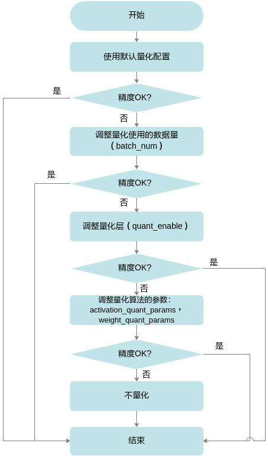

# 量化感知训练<a name="ZH-CN_TOPIC_0000002442020557"></a>


## 量化示例<a name="ZH-CN_TOPIC_0000002408421242"></a>


### 量化前提<a name="ZH-CN_TOPIC_0000002408421506"></a>

-   **模型准备**

    以AMCT的安装用户将需要进行量化感知训练的Caffe模型文件和权重文件上传到Linux服务器任意目录下。

    本手册以sample/resnet50README.md推荐的模型文件ResNet-50\_retrain.prototxt为例进行说明。

-   **数据集准备**

    由于进行量化感知训练要使用大量数据对量化参数进行进一步优化，故进行量化感知训练所使用的数据集为lmdb格式的ImageNet数据集，关于该数据集的下载以及制作请参见Caffe工程caffe-master/examples/imagenet/readme.md文件。

-   **校准集准备**

    为了保证量化精度，校准集与测试精度的数据集来源一致。

### 量化步骤<a name="ZH-CN_TOPIC_0000002408421426"></a>

1.  下载模型文件。

    切换到sample/resnet50目录，根据READ.md指引下载对应模型。

2.  执行resnet50网络模型的量化感知训练。

    切换到sample/resnet50目录，执行如下命令进行resnet50网络模型的量化感知训练。

    ```
    python3 src/ResNet50_retrain.py --model_file MODEL_FILE --weights_file WEIGHTS_FILE [--gpu GPU_ID] [--cpu] --caffe_dir CAFFE_DIR --train_data TRAIN_DATA --test_data TEST_DATA
    ```

    部分参数解释请参见[表1](#ZH-CN_TOPIC_0000002441980557)，其余参数解释请参见[表1](#_Ref77062152)。

    **表 1**  执行量化感知训练所用参数说明

    <a name="_Ref77062152"></a>
    <table><thead align="left"><tr id="row2877mcpsimp"><th class="cellrowborder" valign="top" width="38.39%" id="mcps1.2.3.1.1"><p id="p2879mcpsimp"><a name="p2879mcpsimp"></a><a name="p2879mcpsimp"></a>参数</p>
    </th>
    <th class="cellrowborder" valign="top" width="61.61%" id="mcps1.2.3.1.2"><p id="p2881mcpsimp"><a name="p2881mcpsimp"></a><a name="p2881mcpsimp"></a>说明</p>
    </th>
    </tr>
    </thead>
    <tbody><tr id="row2883mcpsimp"><td class="cellrowborder" valign="top" width="38.39%" headers="mcps1.2.3.1.1 "><p id="p2885mcpsimp"><a name="p2885mcpsimp"></a><a name="p2885mcpsimp"></a>--train_data TRAIN_DATA</p>
    </td>
    <td class="cellrowborder" valign="top" width="61.61%" headers="mcps1.2.3.1.2 "><a name="ul2887mcpsimp"></a><a name="ul2887mcpsimp"></a><ul id="ul2887mcpsimp"><li>是否必填：是。</li><li>数据类型：string。</li><li>默认值：None。</li><li>参数解释：进行量化感知训练过程中所使用的数据集路径。</li></ul>
    </td>
    </tr>
    <tr id="row2892mcpsimp"><td class="cellrowborder" valign="top" width="38.39%" headers="mcps1.2.3.1.1 "><p id="p2894mcpsimp"><a name="p2894mcpsimp"></a><a name="p2894mcpsimp"></a>--test_data TEST_DATA</p>
    </td>
    <td class="cellrowborder" valign="top" width="61.61%" headers="mcps1.2.3.1.2 "><a name="ul2896mcpsimp"></a><a name="ul2896mcpsimp"></a><ul id="ul2896mcpsimp"><li>是否必填：是。</li><li>数据类型：string。</li><li>默认值：None。</li><li>参数解释：进行量化感知训练过程中测试精度所用的数据集。</li></ul>
    </td>
    </tr>
    <tr id="row2901mcpsimp"><td class="cellrowborder" valign="top" width="38.39%" headers="mcps1.2.3.1.1 "><p id="p2903mcpsimp"><a name="p2903mcpsimp"></a><a name="p2903mcpsimp"></a>--train_batch TRAIN_BATCH</p>
    </td>
    <td class="cellrowborder" valign="top" width="61.61%" headers="mcps1.2.3.1.2 "><a name="ul2905mcpsimp"></a><a name="ul2905mcpsimp"></a><ul id="ul2905mcpsimp"><li>是否必填：否。</li><li>数据类型：int</li><li>默认值：32。</li><li>参数解释：训练网络batch_size。</li></ul>
    <div class="note" id="note2910mcpsimp"><a name="note2910mcpsimp"></a><a name="note2910mcpsimp"></a><span class="notetitle"> 说明： </span><div class="notebody"><p id="p095134198"><a name="p095134198"></a><a name="p095134198"></a>如果训练网络的batch_size设置过大，量化过程中可能会出现显存/内存不足，该场景下需要用户根据硬件资源情况，调低batch_size取值。</p>
    </div></div>
    </td>
    </tr>
    <tr id="row2911mcpsimp"><td class="cellrowborder" valign="top" width="38.39%" headers="mcps1.2.3.1.1 "><p id="p2913mcpsimp"><a name="p2913mcpsimp"></a><a name="p2913mcpsimp"></a>--train_iter TRAIN_ITER</p>
    </td>
    <td class="cellrowborder" valign="top" width="61.61%" headers="mcps1.2.3.1.2 "><a name="ul2915mcpsimp"></a><a name="ul2915mcpsimp"></a><ul id="ul2915mcpsimp"><li>是否必填：否。</li><li>数据类型：int</li><li>默认值：1000。</li><li>参数解释：训练迭代次数。</li></ul>
    </td>
    </tr>
    <tr id="row2920mcpsimp"><td class="cellrowborder" valign="top" width="38.39%" headers="mcps1.2.3.1.1 "><p id="p2922mcpsimp"><a name="p2922mcpsimp"></a><a name="p2922mcpsimp"></a>--test_batch TEST_BATCH</p>
    </td>
    <td class="cellrowborder" valign="top" width="61.61%" headers="mcps1.2.3.1.2 "><a name="ul2924mcpsimp"></a><a name="ul2924mcpsimp"></a><ul id="ul2924mcpsimp"><li>是否必填：否。</li><li>数据类型：int</li><li>默认值：1。</li><li>参数解释：测试网络batch_size。</li></ul>
    </td>
    </tr>
    <tr id="row2929mcpsimp"><td class="cellrowborder" valign="top" width="38.39%" headers="mcps1.2.3.1.1 "><p id="p2931mcpsimp"><a name="p2931mcpsimp"></a><a name="p2931mcpsimp"></a>--test_iter TEST_ITER</p>
    </td>
    <td class="cellrowborder" valign="top" width="61.61%" headers="mcps1.2.3.1.2 "><a name="ul2933mcpsimp"></a><a name="ul2933mcpsimp"></a><ul id="ul2933mcpsimp"><li>是否必填：否。</li><li>数据类型：int</li><li>默认值：500。</li><li>参数解释：测试迭代次数。</li></ul>
    <div class="note" id="note2938mcpsimp"><a name="note2938mcpsimp"></a><a name="note2938mcpsimp"></a><span class="notetitle"> 说明： </span><div class="notebody"><p id="p51510137199"><a name="p51510137199"></a><a name="p51510137199"></a>由于ImageNet测试集只有50000个样本，test_batch * test_iter请不要超过50000。</p>
    </div></div>
    </td>
    </tr>
    </tbody>
    </table>

    使用样例如下：

    ```
    python3 src/ResNet50_retrain.py --model_file pre_model/ResNet-50_retrain.prototxt --weights_file pre_model/ResNet-50-model.caffemodel --gpu 0 --caffe_dir caffe-master  --train_data caffe-master/examples/imagenet/ilscrc12_train_lmdb --test_data caffe-master/examples/imagenet/ilscrc12_val_lmdb
    ```

    若出现如下信息则说明执行量化感知训练成功：

    ```
    Network initialization done.
    ....  
    Top 1 accuracy = 0.688
    Top 5 accuracy = 0.934
    ```

3.  结果展示。

    执行量化感知训练成功后，在sample/resnet50目录下生成如下文件：（对该模型重新进行量化感知训练时，如下结果文件将会被覆盖）。

    -   amct\_log：记录了工具的日志信息，包括执行量化感知训练过程的日志信息amct\_caffe.log。
    -   results/retrain\_results：结果文件，包括量化感知训练后的模型文件、权重文件，如下所示。
        -   retrain\_atc\_model.prototxt：量化后的可在SoC部署的模型文件，该文件可以直接使用ATC工具进行模型转换。
        -   retrain\_deploy\_model.prototxt：量化后的部署模型文件，该文件无法直接使用ATC工具进行模型转换，需要参见[4](#li66339321256)修改后方可使用。
        -   retrain\_deploy\_weights.caffemodel：量化后的可在SoC部署的权重文件。
        -   retrain\_fake\_quant\_model.prototxt：量化后的可在Caffe环境进行精度仿真模型文件。
        -   retrain\_fake\_quant\_weights.caffemodel：量化后的可在Caffe环境进行精度仿真权重文件。
        -   quant\_param\_record.txt：量化参数文件文本格式\(推荐使用\)，用于atc生成om模型。
        -   quant\_param\_record.bin：量化参数文件二进制形式，用于atc生成om模型。

    > **说明：** 
    >retrain\_atc\_model.prototxt模型文件是resnet50 sample执行量化感知训练后生成的，并非AMCT生成，如果用户使用其他网络模型，则不会生成该文件，需要参见步骤4手动修改。
    >量化感知训练之后的部署模型retrain\_deploy\_model.prototxt不能直接用于ATC工具进行模型转换，因为该文件中包括ATC工具不支持的层。resnet50 sample量化感知训练脚本自动完成了不支持层的删除动作，用户才可以直接使用retrain\_atc\_model.prototxt模型文件与retrain\_deploy\_weights.caffemodel权重文件在ATC工具完成模型转换，详情请参见《ATC工具使用指南》。

    -   tmp：执行量化感知训练过程中产生的文件，包括：
        -   量化配置文件：config.json，描述了如何对模型中的每一层进行量化感知训练。如果量化感知训练脚本所在目录下已经存在该配置文件，则再次调用[create\_quant\_retrain\_config](#ZH-CN_TOPIC_0000002408581290)接口时，如果新生成的配置文件与已有的文件同名，则会覆盖已有的配置文件，否则生成新的配置文件。

            实际执行量化感知训练过程中，如果最终的模型推理精度不满足要求，用户可以增加训练次数。

        -   中间模型文件：modified\_model.prototxt、modified\_model.caffemodel
        -   记录量化因子的文件：record.txt。关于该文件的原型定义请参见[量化因子记录文件说明](#ZH-CN_TOPIC_0000002441980745)。
        -   执行量化感知训练所使用的配置文件solver.prototxt，执行量化感知训练后生成的模型快照solver\_iter\_10.caffemodel和solver\_iter\_10.solverstate。

            由于sample中的**ResNet50\_retrain.py**脚本给出了量化感知训练过程中，需要在solver中增加的TEST phase，代码样例如下：

            ```
            def train(model_file: str, weights_file: str, solver_file: str): 
                 s = caffe.proto.caffe_pb2.SolverParameter() 
                 s.net = model_file 
                 s.lr_policy = 'step' 
                 s.base_lr = 0.0001 
                 s.stepsize = 10 
                 s.gamma = 0.1 
                 s.momentum = 0.9 
                 s.weight_decay = 0.0001 
                 s.test_initialization = False 
                 s.max_iter = args.train_iter 
                 s.test_interval = args.train_iter 
                 s.test_iter[:] = [args.test_iter] 
                 s.snapshot = args.train_iter 
                   with open(solver_file, 'w') as f: 
                     f.write(str(s)) 
                   solver = caffe.SGDSolver(solver_file) 
                 solver.net.copy_from(weights_file) 
                 solver.solve()
            ```

            在生成的solver.prototxt文件中，会根据上述代码生成相应的参数，文件样例如下：

            ```
            test_iter: 1 
            test_interval: 4 
            base_lr: 9.999999747378752e-05 
            max_iter: 4 
            lr_policy: "step" 
            gamma: 0.10000000149011612 
            momentum: 0.8999999761581421 
            weight_decay: 9.999999747378752e-05 
            stepsize: 10 
            snapshot: 4 
            net: "$HOME/amct_path/sample/resnet50/tmp/modified_model.prototxt" 
            test_initialization: false
            ```

            其中：

            -   test\_iter：repeated参数，指定每次TEST执行的测试的迭代次数。
            -   test\_interval：两次测试之间TEST的训练次数，每执行test\_interval次训练迭代后会执行TEST过程，该参数默认为0，**建议配置为max\_iter的因子**，sample中配置test\_interval==max\_iter，即仅完成训练后执行一次TEST。
            -   max\_iter：训练迭代次数。
            -   net：训练使用的模型，Caffe支持配置一个net分别用于TRAIN，TEST（通过算子内phase来区 分不同模式需要执行的算子），也可以通过分别指定train\_net，test\_net来指定不同phase执行的模型；AMCT仅产生了一个模型，通过算子内部phase来区分不同模式，因子仅支持net，不支持配置train\_net，test\_net。
            -   test\_initialization：是否要在训练之前执行原始模型的TEST，数据类型为bool型，默认为True，由于量化因子在test分支写入文件，刚开始没有产生量化参数，因此需要关掉预测试， 即需要配置test\_initialization = False。

1.  <a name="li66339321256"></a>（后续处理）修改量化感知训练后的deploy模型。

    如果用户使用其他网络模型进行量化感知训练，然后要将量化感知训练后的deploy模型文件转换为适配SoC的离线模型，则需要参见如下方法进行修改，不同模型需要修改的层不同，请以实际模型为准。ATC工具支持的层请参见《ATC工具使用指南》中的算子规格说明\>Caffe框架算子规格。

    -   检查deploy模型，其中的层必须为ATC工具支持的层。
    -   以resnet50 sample为例，将deploy模型文件中的Data层改为Input层，并删除Accuracy和SoftmaxWithLoss的输出层。修改效果如下。

    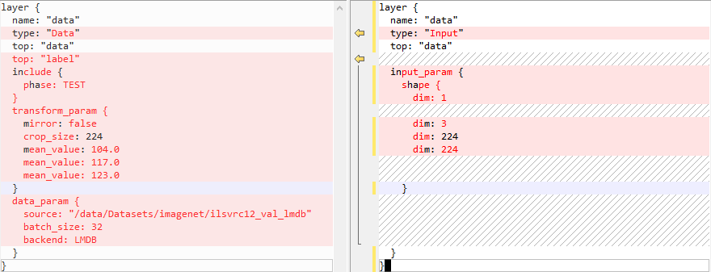

    修改后的代码示例如下。

    ```
    layer { 
       name: "data" 
       type: "Input" 
       top: "data" 
       input_param { 
         shape { 
           dim: 1 
           dim: 3 
           dim: 224 
           dim: 224 
         } 
       } 
     }
    ```

## 量化配置<a name="ZH-CN_TOPIC_0000002442020633"></a>


### 简介<a name="ZH-CN_TOPIC_0000002408421286"></a>

如果通过[create\_quant\_retrain\_config](#ZH-CN_TOPIC_0000002408581290)接口生成的config.json量化感知训练配置文件，推理精度不满足要求，则需要参见该章节不断调整config.json文件中的内容，直至精度满足要求，该文件部分内容样例如下（用户修改json文件时，请确保层名唯一）。

```
{ 
    "version":1, 
    "conv1":{ 
        "retrain_enable":true, 
        "retrain_data_config":{ 
            "algo":"ulq_quantize",
            "num_bits":8 
        }, 
        "retrain_weight_config":{ 
            "algo":"arq_retrain", 
            "channel_wise":true,
            "num_bits":8
        } 
    }, 
    "conv2_1/expand":{ 
        "retrain_enable":true, 
        "retrain_data_config":{ 
            "algo":"ulq_quantize",
            "num_bits":8 
        }, 
        "retrain_weight_config":{ 
            "algo":"arq_retrain", 
            "channel_wise":true,
            "num_bits":8
        } 
    }, 
    "conv2_1/dwise":{ 
        "retrain_enable":true, 
        "retrain_data_config":{ 
            "algo":"ulq_quantize",
            "num_bits":8 
        }, 
        "retrain_weight_config":{ 
            "algo":"arq_retrain", 
            "channel_wise":true,
            "num_bits":8 
         } 
     }, 
 }
```

### 参数配置说明<a name="ZH-CN_TOPIC_0000002441980677"></a>

配置文件中参数说明如下，其中[表7](#table1459214218113)\~[表9](#table1988120453112)的参数说明在手动调整量化配置文件时才会使用。

**表 1**  version参数说明

<a name="table3478mcpsimp"></a>
<table><tbody><tr id="row3484mcpsimp"><th class="firstcol" valign="top" width="28.999999999999996%" id="mcps1.2.3.1.1"><p id="p3486mcpsimp"><a name="p3486mcpsimp"></a><a name="p3486mcpsimp"></a>作用</p>
</th>
<td class="cellrowborder" valign="top" width="71%" headers="mcps1.2.3.1.1 "><p id="p3488mcpsimp"><a name="p3488mcpsimp"></a><a name="p3488mcpsimp"></a>控制量化配置文件版本号</p>
</td>
</tr>
<tr id="row3489mcpsimp"><th class="firstcol" valign="top" width="28.999999999999996%" id="mcps1.2.3.2.1"><p id="p3491mcpsimp"><a name="p3491mcpsimp"></a><a name="p3491mcpsimp"></a>类型</p>
</th>
<td class="cellrowborder" valign="top" width="71%" headers="mcps1.2.3.2.1 "><p id="p3493mcpsimp"><a name="p3493mcpsimp"></a><a name="p3493mcpsimp"></a>int</p>
</td>
</tr>
<tr id="row3494mcpsimp"><th class="firstcol" valign="top" width="28.999999999999996%" id="mcps1.2.3.3.1"><p id="p3496mcpsimp"><a name="p3496mcpsimp"></a><a name="p3496mcpsimp"></a>取值范围</p>
</th>
<td class="cellrowborder" valign="top" width="71%" headers="mcps1.2.3.3.1 "><p id="p3498mcpsimp"><a name="p3498mcpsimp"></a><a name="p3498mcpsimp"></a>1</p>
</td>
</tr>
<tr id="row3499mcpsimp"><th class="firstcol" valign="top" width="28.999999999999996%" id="mcps1.2.3.4.1"><p id="p3501mcpsimp"><a name="p3501mcpsimp"></a><a name="p3501mcpsimp"></a>参数说明</p>
</th>
<td class="cellrowborder" valign="top" width="71%" headers="mcps1.2.3.4.1 "><p id="p3503mcpsimp"><a name="p3503mcpsimp"></a><a name="p3503mcpsimp"></a>目前仅有一个版本号1。</p>
</td>
</tr>
<tr id="row3504mcpsimp"><th class="firstcol" valign="top" width="28.999999999999996%" id="mcps1.2.3.5.1"><p id="p3506mcpsimp"><a name="p3506mcpsimp"></a><a name="p3506mcpsimp"></a>推荐配置</p>
</th>
<td class="cellrowborder" valign="top" width="71%" headers="mcps1.2.3.5.1 "><p id="p3508mcpsimp"><a name="p3508mcpsimp"></a><a name="p3508mcpsimp"></a>1</p>
</td>
</tr>
<tr id="row3509mcpsimp"><th class="firstcol" valign="top" width="28.999999999999996%" id="mcps1.2.3.6.1"><p id="p3511mcpsimp"><a name="p3511mcpsimp"></a><a name="p3511mcpsimp"></a>必选或可选</p>
</th>
<td class="cellrowborder" valign="top" width="71%" headers="mcps1.2.3.6.1 "><p id="p3513mcpsimp"><a name="p3513mcpsimp"></a><a name="p3513mcpsimp"></a>可选</p>
</td>
</tr>
</tbody>
</table>

**表 2**  retrain\_enable参数说明

<a name="table3514mcpsimp"></a>
<table><tbody><tr id="row3520mcpsimp"><th class="firstcol" valign="top" width="30%" id="mcps1.2.3.1.1"><p id="p3522mcpsimp"><a name="p3522mcpsimp"></a><a name="p3522mcpsimp"></a>作用</p>
</th>
<td class="cellrowborder" valign="top" width="70%" headers="mcps1.2.3.1.1 "><p id="p3524mcpsimp"><a name="p3524mcpsimp"></a><a name="p3524mcpsimp"></a>该层是否进行量化感知训练</p>
</td>
</tr>
<tr id="row3525mcpsimp"><th class="firstcol" valign="top" width="30%" id="mcps1.2.3.2.1"><p id="p3527mcpsimp"><a name="p3527mcpsimp"></a><a name="p3527mcpsimp"></a>类型</p>
</th>
<td class="cellrowborder" valign="top" width="70%" headers="mcps1.2.3.2.1 "><p id="p3529mcpsimp"><a name="p3529mcpsimp"></a><a name="p3529mcpsimp"></a>bool</p>
</td>
</tr>
<tr id="row3530mcpsimp"><th class="firstcol" valign="top" width="30%" id="mcps1.2.3.3.1"><p id="p3532mcpsimp"><a name="p3532mcpsimp"></a><a name="p3532mcpsimp"></a>取值范围</p>
</th>
<td class="cellrowborder" valign="top" width="70%" headers="mcps1.2.3.3.1 "><p id="p3534mcpsimp"><a name="p3534mcpsimp"></a><a name="p3534mcpsimp"></a>true或false</p>
</td>
</tr>
<tr id="row3535mcpsimp"><th class="firstcol" valign="top" width="30%" id="mcps1.2.3.4.1"><p id="p3537mcpsimp"><a name="p3537mcpsimp"></a><a name="p3537mcpsimp"></a>参数说明</p>
</th>
<td class="cellrowborder" valign="top" width="70%" headers="mcps1.2.3.4.1 "><p id="p3539mcpsimp"><a name="p3539mcpsimp"></a><a name="p3539mcpsimp"></a>取值为true时该层需要进行量化感知训练，取值为false时该层不进行。</p>
</td>
</tr>
<tr id="row3540mcpsimp"><th class="firstcol" valign="top" width="30%" id="mcps1.2.3.5.1"><p id="p3542mcpsimp"><a name="p3542mcpsimp"></a><a name="p3542mcpsimp"></a>推荐配置</p>
</th>
<td class="cellrowborder" valign="top" width="70%" headers="mcps1.2.3.5.1 "><p id="p3544mcpsimp"><a name="p3544mcpsimp"></a><a name="p3544mcpsimp"></a>true</p>
</td>
</tr>
<tr id="row3545mcpsimp"><th class="firstcol" valign="top" width="30%" id="mcps1.2.3.6.1"><p id="p3547mcpsimp"><a name="p3547mcpsimp"></a><a name="p3547mcpsimp"></a>必选或可选</p>
</th>
<td class="cellrowborder" valign="top" width="70%" headers="mcps1.2.3.6.1 "><p id="p3549mcpsimp"><a name="p3549mcpsimp"></a><a name="p3549mcpsimp"></a>可选</p>
</td>
</tr>
</tbody>
</table>

**表 3**  retrain\_data\_config参数说明

<a name="table3550mcpsimp"></a>
<table><tbody><tr id="row3556mcpsimp"><th class="firstcol" valign="top" width="30%" id="mcps1.2.3.1.1"><p id="p3558mcpsimp"><a name="p3558mcpsimp"></a><a name="p3558mcpsimp"></a>作用</p>
</th>
<td class="cellrowborder" valign="top" width="70%" headers="mcps1.2.3.1.1 "><p id="p3560mcpsimp"><a name="p3560mcpsimp"></a><a name="p3560mcpsimp"></a>该层数据量化配置</p>
</td>
</tr>
<tr id="row3561mcpsimp"><th class="firstcol" valign="top" width="30%" id="mcps1.2.3.2.1"><p id="p3563mcpsimp"><a name="p3563mcpsimp"></a><a name="p3563mcpsimp"></a>类型</p>
</th>
<td class="cellrowborder" valign="top" width="70%" headers="mcps1.2.3.2.1 "><p id="p3565mcpsimp"><a name="p3565mcpsimp"></a><a name="p3565mcpsimp"></a>object</p>
</td>
</tr>
<tr id="row3566mcpsimp"><th class="firstcol" valign="top" width="30%" id="mcps1.2.3.3.1"><p id="p3568mcpsimp"><a name="p3568mcpsimp"></a><a name="p3568mcpsimp"></a>取值范围</p>
</th>
<td class="cellrowborder" valign="top" width="70%" headers="mcps1.2.3.3.1 "><p id="p3570mcpsimp"><a name="p3570mcpsimp"></a><a name="p3570mcpsimp"></a>无</p>
</td>
</tr>
<tr id="row3571mcpsimp"><th class="firstcol" valign="top" width="30%" id="mcps1.2.3.4.1"><p id="p3573mcpsimp"><a name="p3573mcpsimp"></a><a name="p3573mcpsimp"></a>参数说明</p>
</th>
<td class="cellrowborder" valign="top" width="70%" headers="mcps1.2.3.4.1 "><p id="p3575mcpsimp"><a name="p3575mcpsimp"></a><a name="p3575mcpsimp"></a>包含如下参数：</p>
<a name="ul3576mcpsimp"></a><a name="ul3576mcpsimp"></a><ul id="ul3576mcpsimp"><li>algo：量化算法选择，默认是ulq_quantize。</li><li>clip_max：截断量化算法上限，默认不选。</li><li>clip_min：截断量化算法下限，默认不选。</li><li>fixed_min：截断量化算法最小值固定为0，默认不选。</li><li>num_bits：量化位宽</li></ul>
</td>
</tr>
<tr id="row3582mcpsimp"><th class="firstcol" valign="top" width="30%" id="mcps1.2.3.5.1"><p id="p3584mcpsimp"><a name="p3584mcpsimp"></a><a name="p3584mcpsimp"></a>推荐配置</p>
</th>
<td class="cellrowborder" valign="top" width="70%" headers="mcps1.2.3.5.1 "><p id="p3586mcpsimp"><a name="p3586mcpsimp"></a><a name="p3586mcpsimp"></a>无</p>
</td>
</tr>
<tr id="row3587mcpsimp"><th class="firstcol" valign="top" width="30%" id="mcps1.2.3.6.1"><p id="p3589mcpsimp"><a name="p3589mcpsimp"></a><a name="p3589mcpsimp"></a>必选或可选</p>
</th>
<td class="cellrowborder" valign="top" width="70%" headers="mcps1.2.3.6.1 "><p id="p3591mcpsimp"><a name="p3591mcpsimp"></a><a name="p3591mcpsimp"></a>可选</p>
</td>
</tr>
</tbody>
</table>

**表 4**  retrain\_weight\_config参数说明

<a name="table3592mcpsimp"></a>
<table><tbody><tr id="row3598mcpsimp"><th class="firstcol" valign="top" width="30%" id="mcps1.2.3.1.1"><p id="p3600mcpsimp"><a name="p3600mcpsimp"></a><a name="p3600mcpsimp"></a>作用</p>
</th>
<td class="cellrowborder" valign="top" width="70%" headers="mcps1.2.3.1.1 "><p id="p3602mcpsimp"><a name="p3602mcpsimp"></a><a name="p3602mcpsimp"></a>该层权重量化配置</p>
</td>
</tr>
<tr id="row3603mcpsimp"><th class="firstcol" valign="top" width="30%" id="mcps1.2.3.2.1"><p id="p3605mcpsimp"><a name="p3605mcpsimp"></a><a name="p3605mcpsimp"></a>类型</p>
</th>
<td class="cellrowborder" valign="top" width="70%" headers="mcps1.2.3.2.1 "><p id="p3607mcpsimp"><a name="p3607mcpsimp"></a><a name="p3607mcpsimp"></a>object</p>
</td>
</tr>
<tr id="row3608mcpsimp"><th class="firstcol" valign="top" width="30%" id="mcps1.2.3.3.1"><p id="p3610mcpsimp"><a name="p3610mcpsimp"></a><a name="p3610mcpsimp"></a>取值范围</p>
</th>
<td class="cellrowborder" valign="top" width="70%" headers="mcps1.2.3.3.1 "><p id="p3612mcpsimp"><a name="p3612mcpsimp"></a><a name="p3612mcpsimp"></a>无</p>
</td>
</tr>
<tr id="row3613mcpsimp"><th class="firstcol" valign="top" width="30%" id="mcps1.2.3.4.1"><p id="p3615mcpsimp"><a name="p3615mcpsimp"></a><a name="p3615mcpsimp"></a>参数说明</p>
</th>
<td class="cellrowborder" valign="top" width="70%" headers="mcps1.2.3.4.1 "><p id="p3617mcpsimp"><a name="p3617mcpsimp"></a><a name="p3617mcpsimp"></a>包含如下参数：</p>
<a name="ul3618mcpsimp"></a><a name="ul3618mcpsimp"></a><ul id="ul3618mcpsimp"><li>algo：量化算法选择，默认是arq_retrain</li><li>channel_wise</li><li>num_bits：量化位宽</li></ul>
</td>
</tr>
<tr id="row3622mcpsimp"><th class="firstcol" valign="top" width="30%" id="mcps1.2.3.5.1"><p id="p3624mcpsimp"><a name="p3624mcpsimp"></a><a name="p3624mcpsimp"></a>推荐配置</p>
</th>
<td class="cellrowborder" valign="top" width="70%" headers="mcps1.2.3.5.1 "><p id="p3626mcpsimp"><a name="p3626mcpsimp"></a><a name="p3626mcpsimp"></a>无</p>
</td>
</tr>
<tr id="row3627mcpsimp"><th class="firstcol" valign="top" width="30%" id="mcps1.2.3.6.1"><p id="p3629mcpsimp"><a name="p3629mcpsimp"></a><a name="p3629mcpsimp"></a>必选或可选</p>
</th>
<td class="cellrowborder" valign="top" width="70%" headers="mcps1.2.3.6.1 "><p id="p3631mcpsimp"><a name="p3631mcpsimp"></a><a name="p3631mcpsimp"></a>可选</p>
</td>
</tr>
</tbody>
</table>

**表 5**  algo参数说明

<a name="table3632mcpsimp"></a>
<table><tbody><tr id="row3638mcpsimp"><th class="firstcol" valign="top" width="30%" id="mcps1.2.3.1.1"><p id="p3640mcpsimp"><a name="p3640mcpsimp"></a><a name="p3640mcpsimp"></a>作用</p>
</th>
<td class="cellrowborder" valign="top" width="70%" headers="mcps1.2.3.1.1 "><p id="p3642mcpsimp"><a name="p3642mcpsimp"></a><a name="p3642mcpsimp"></a>该层选择使用的量化算法</p>
</td>
</tr>
<tr id="row3643mcpsimp"><th class="firstcol" valign="top" width="30%" id="mcps1.2.3.2.1"><p id="p3645mcpsimp"><a name="p3645mcpsimp"></a><a name="p3645mcpsimp"></a>类型</p>
</th>
<td class="cellrowborder" valign="top" width="70%" headers="mcps1.2.3.2.1 "><p id="p3647mcpsimp"><a name="p3647mcpsimp"></a><a name="p3647mcpsimp"></a>object</p>
</td>
</tr>
<tr id="row3648mcpsimp"><th class="firstcol" valign="top" width="30%" id="mcps1.2.3.3.1"><p id="p3650mcpsimp"><a name="p3650mcpsimp"></a><a name="p3650mcpsimp"></a>取值范围</p>
</th>
<td class="cellrowborder" valign="top" width="70%" headers="mcps1.2.3.3.1 "><p id="p3652mcpsimp"><a name="p3652mcpsimp"></a><a name="p3652mcpsimp"></a>无</p>
</td>
</tr>
<tr id="row3653mcpsimp"><th class="firstcol" valign="top" width="30%" id="mcps1.2.3.4.1"><p id="p3655mcpsimp"><a name="p3655mcpsimp"></a><a name="p3655mcpsimp"></a>参数说明</p>
</th>
<td class="cellrowborder" valign="top" width="70%" headers="mcps1.2.3.4.1 "><a name="ul3657mcpsimp"></a><a name="ul3657mcpsimp"></a><ul id="ul3657mcpsimp"><li>ulq_quantize：ulq截断上下限量化算法。</li><li>arq_retrain：arq量化算法。</li></ul>
</td>
</tr>
<tr id="row3660mcpsimp"><th class="firstcol" valign="top" width="30%" id="mcps1.2.3.5.1"><p id="p3662mcpsimp"><a name="p3662mcpsimp"></a><a name="p3662mcpsimp"></a>推荐配置</p>
</th>
<td class="cellrowborder" valign="top" width="70%" headers="mcps1.2.3.5.1 "><p id="p3664mcpsimp"><a name="p3664mcpsimp"></a><a name="p3664mcpsimp"></a>数据量化使用ulq_quantize，权重量化使用arq_retrain。</p>
</td>
</tr>
<tr id="row3665mcpsimp"><th class="firstcol" valign="top" width="30%" id="mcps1.2.3.6.1"><p id="p3667mcpsimp"><a name="p3667mcpsimp"></a><a name="p3667mcpsimp"></a>必选或可选</p>
</th>
<td class="cellrowborder" valign="top" width="70%" headers="mcps1.2.3.6.1 "><p id="p3669mcpsimp"><a name="p3669mcpsimp"></a><a name="p3669mcpsimp"></a>可选</p>
</td>
</tr>
</tbody>
</table>

**表 6**  channel\_wise参数说明

<a name="table3670mcpsimp"></a>
<table><tbody><tr id="row3676mcpsimp"><th class="firstcol" valign="top" width="30%" id="mcps1.2.3.1.1"><p id="p3678mcpsimp"><a name="p3678mcpsimp"></a><a name="p3678mcpsimp"></a>作用</p>
</th>
<td class="cellrowborder" valign="top" width="70%" headers="mcps1.2.3.1.1 "><p id="p3680mcpsimp"><a name="p3680mcpsimp"></a><a name="p3680mcpsimp"></a>是否对每个channel采用不同的量化因子</p>
</td>
</tr>
<tr id="row3681mcpsimp"><th class="firstcol" valign="top" width="30%" id="mcps1.2.3.2.1"><p id="p3683mcpsimp"><a name="p3683mcpsimp"></a><a name="p3683mcpsimp"></a>类型</p>
</th>
<td class="cellrowborder" valign="top" width="70%" headers="mcps1.2.3.2.1 "><p id="p3685mcpsimp"><a name="p3685mcpsimp"></a><a name="p3685mcpsimp"></a>bool</p>
</td>
</tr>
<tr id="row3686mcpsimp"><th class="firstcol" valign="top" width="30%" id="mcps1.2.3.3.1"><p id="p3688mcpsimp"><a name="p3688mcpsimp"></a><a name="p3688mcpsimp"></a>取值范围</p>
</th>
<td class="cellrowborder" valign="top" width="70%" headers="mcps1.2.3.3.1 "><p id="p3690mcpsimp"><a name="p3690mcpsimp"></a><a name="p3690mcpsimp"></a>true或false</p>
</td>
</tr>
<tr id="row3691mcpsimp"><th class="firstcol" valign="top" width="30%" id="mcps1.2.3.4.1"><p id="p3693mcpsimp"><a name="p3693mcpsimp"></a><a name="p3693mcpsimp"></a>参数说明</p>
</th>
<td class="cellrowborder" valign="top" width="70%" headers="mcps1.2.3.4.1 "><a name="ul3695mcpsimp"></a><a name="ul3695mcpsimp"></a><ul id="ul3695mcpsimp"><li>取值为true时，每个channel独立量化，量化因子不同。</li><li>取值为false时，每个channel同时量化，共享一个量化因子。</li></ul>
</td>
</tr>
<tr id="row3698mcpsimp"><th class="firstcol" valign="top" width="30%" id="mcps1.2.3.5.1"><p id="p3700mcpsimp"><a name="p3700mcpsimp"></a><a name="p3700mcpsimp"></a>推荐配置</p>
</th>
<td class="cellrowborder" valign="top" width="70%" headers="mcps1.2.3.5.1 "><p id="p3702mcpsimp"><a name="p3702mcpsimp"></a><a name="p3702mcpsimp"></a>true</p>
</td>
</tr>
<tr id="row3703mcpsimp"><th class="firstcol" valign="top" width="30%" id="mcps1.2.3.6.1"><p id="p3705mcpsimp"><a name="p3705mcpsimp"></a><a name="p3705mcpsimp"></a>必选或可选</p>
</th>
<td class="cellrowborder" valign="top" width="70%" headers="mcps1.2.3.6.1 "><p id="p3707mcpsimp"><a name="p3707mcpsimp"></a><a name="p3707mcpsimp"></a>可选</p>
</td>
</tr>
</tbody>
</table>

**表 7**  fixed\_min参数说明

<a name="table1459214218113"></a>
<table><tbody><tr id="row3713mcpsimp"><th class="firstcol" valign="top" width="30%" id="mcps1.2.3.1.1"><p id="p3715mcpsimp"><a name="p3715mcpsimp"></a><a name="p3715mcpsimp"></a>作用</p>
</th>
<td class="cellrowborder" valign="top" width="70%" headers="mcps1.2.3.1.1 "><p id="p3717mcpsimp"><a name="p3717mcpsimp"></a><a name="p3717mcpsimp"></a>设置数据量化算法下限的开关</p>
</td>
</tr>
<tr id="row3718mcpsimp"><th class="firstcol" valign="top" width="30%" id="mcps1.2.3.2.1"><p id="p3720mcpsimp"><a name="p3720mcpsimp"></a><a name="p3720mcpsimp"></a>类型</p>
</th>
<td class="cellrowborder" valign="top" width="70%" headers="mcps1.2.3.2.1 "><p id="p3722mcpsimp"><a name="p3722mcpsimp"></a><a name="p3722mcpsimp"></a>bool</p>
</td>
</tr>
<tr id="row3723mcpsimp"><th class="firstcol" valign="top" width="30%" id="mcps1.2.3.3.1"><p id="p3725mcpsimp"><a name="p3725mcpsimp"></a><a name="p3725mcpsimp"></a>取值范围</p>
</th>
<td class="cellrowborder" valign="top" width="70%" headers="mcps1.2.3.3.1 "><p id="p3727mcpsimp"><a name="p3727mcpsimp"></a><a name="p3727mcpsimp"></a>true或false</p>
</td>
</tr>
<tr id="row3728mcpsimp"><th class="firstcol" valign="top" width="30%" id="mcps1.2.3.4.1"><p id="p3730mcpsimp"><a name="p3730mcpsimp"></a><a name="p3730mcpsimp"></a>参数说明</p>
</th>
<td class="cellrowborder" valign="top" width="70%" headers="mcps1.2.3.4.1 "><a name="ul3732mcpsimp"></a><a name="ul3732mcpsimp"></a><ul id="ul3732mcpsimp"><li>取值为true，数据量化算法固定下限，并且下限为0。</li><li>取值为false时，数据量化算法不固定下限。</li></ul>
<p id="p3735mcpsimp"><a name="p3735mcpsimp"></a><a name="p3735mcpsimp"></a>如果不选此项，amct根据图的结构自动设置。</p>
<p id="p3736mcpsimp"><a name="p3736mcpsimp"></a><a name="p3736mcpsimp"></a>如果选择此项，并且网络模型量化层的前一层是relu层，则该参数需要手动设置为true，如果为非relu层，则要手动设置为false。</p>
</td>
</tr>
<tr id="row3737mcpsimp"><th class="firstcol" valign="top" width="30%" id="mcps1.2.3.5.1"><p id="p3739mcpsimp"><a name="p3739mcpsimp"></a><a name="p3739mcpsimp"></a>推荐配置</p>
</th>
<td class="cellrowborder" valign="top" width="70%" headers="mcps1.2.3.5.1 "><p id="p3741mcpsimp"><a name="p3741mcpsimp"></a><a name="p3741mcpsimp"></a>不选此项</p>
</td>
</tr>
<tr id="row3742mcpsimp"><th class="firstcol" valign="top" width="30%" id="mcps1.2.3.6.1"><p id="p3744mcpsimp"><a name="p3744mcpsimp"></a><a name="p3744mcpsimp"></a>必选或可选</p>
</th>
<td class="cellrowborder" valign="top" width="70%" headers="mcps1.2.3.6.1 "><p id="p3746mcpsimp"><a name="p3746mcpsimp"></a><a name="p3746mcpsimp"></a>可选</p>
</td>
</tr>
</tbody>
</table>

**表 8**  clip\_max参数说明

<a name="table3747mcpsimp"></a>
<table><tbody><tr id="row3753mcpsimp"><th class="firstcol" valign="top" width="31%" id="mcps1.2.3.1.1"><p id="p3755mcpsimp"><a name="p3755mcpsimp"></a><a name="p3755mcpsimp"></a>作用</p>
</th>
<td class="cellrowborder" valign="top" width="69%" headers="mcps1.2.3.1.1 "><p id="p3757mcpsimp"><a name="p3757mcpsimp"></a><a name="p3757mcpsimp"></a>数据量化算法上限</p>
</td>
</tr>
<tr id="row3758mcpsimp"><th class="firstcol" valign="top" width="31%" id="mcps1.2.3.2.1"><p id="p3760mcpsimp"><a name="p3760mcpsimp"></a><a name="p3760mcpsimp"></a>类型</p>
</th>
<td class="cellrowborder" valign="top" width="69%" headers="mcps1.2.3.2.1 "><p id="p3762mcpsimp"><a name="p3762mcpsimp"></a><a name="p3762mcpsimp"></a>float</p>
</td>
</tr>
<tr id="row3763mcpsimp"><th class="firstcol" valign="top" width="31%" id="mcps1.2.3.3.1"><p id="p3765mcpsimp"><a name="p3765mcpsimp"></a><a name="p3765mcpsimp"></a>取值范围</p>
</th>
<td class="cellrowborder" valign="top" width="69%" headers="mcps1.2.3.3.1 "><p id="p3767mcpsimp"><a name="p3767mcpsimp"></a><a name="p3767mcpsimp"></a>clip_max&gt;0</p>
<p id="p3768mcpsimp"><a name="p3768mcpsimp"></a><a name="p3768mcpsimp"></a>根据不同层activation的数据分布找到最大值max，推荐取值范围为：</p>
<p id="p3769mcpsimp"><a name="p3769mcpsimp"></a><a name="p3769mcpsimp"></a>0.3*max~1.7*max</p>
</td>
</tr>
<tr id="row3770mcpsimp"><th class="firstcol" valign="top" width="31%" id="mcps1.2.3.4.1"><p id="p3772mcpsimp"><a name="p3772mcpsimp"></a><a name="p3772mcpsimp"></a>参数说明</p>
</th>
<td class="cellrowborder" valign="top" width="69%" headers="mcps1.2.3.4.1 "><p id="p3774mcpsimp"><a name="p3774mcpsimp"></a><a name="p3774mcpsimp"></a>截断上下限数据量化算法，如果选择此项则固定算法截断上限。 如果不选此项，通过ifmr算法学习获取上限。</p>
</td>
</tr>
<tr id="row3775mcpsimp"><th class="firstcol" valign="top" width="31%" id="mcps1.2.3.5.1"><p id="p3777mcpsimp"><a name="p3777mcpsimp"></a><a name="p3777mcpsimp"></a>推荐配置</p>
</th>
<td class="cellrowborder" valign="top" width="69%" headers="mcps1.2.3.5.1 "><p id="p3779mcpsimp"><a name="p3779mcpsimp"></a><a name="p3779mcpsimp"></a>不选此项</p>
</td>
</tr>
<tr id="row3780mcpsimp"><th class="firstcol" valign="top" width="31%" id="mcps1.2.3.6.1"><p id="p3782mcpsimp"><a name="p3782mcpsimp"></a><a name="p3782mcpsimp"></a>必选或可选</p>
</th>
<td class="cellrowborder" valign="top" width="69%" headers="mcps1.2.3.6.1 "><p id="p3784mcpsimp"><a name="p3784mcpsimp"></a><a name="p3784mcpsimp"></a>可选</p>
</td>
</tr>
</tbody>
</table>

**表 9**  clip\_min参数说明

<a name="table1988120453112"></a>
<table><tbody><tr id="row3790mcpsimp"><th class="firstcol" valign="top" width="31%" id="mcps1.2.3.1.1"><p id="p3792mcpsimp"><a name="p3792mcpsimp"></a><a name="p3792mcpsimp"></a>作用</p>
</th>
<td class="cellrowborder" valign="top" width="69%" headers="mcps1.2.3.1.1 "><p id="p3794mcpsimp"><a name="p3794mcpsimp"></a><a name="p3794mcpsimp"></a>数据量化算法下限</p>
</td>
</tr>
<tr id="row3795mcpsimp"><th class="firstcol" valign="top" width="31%" id="mcps1.2.3.2.1"><p id="p3797mcpsimp"><a name="p3797mcpsimp"></a><a name="p3797mcpsimp"></a>类型</p>
</th>
<td class="cellrowborder" valign="top" width="69%" headers="mcps1.2.3.2.1 "><p id="p3799mcpsimp"><a name="p3799mcpsimp"></a><a name="p3799mcpsimp"></a>float</p>
</td>
</tr>
<tr id="row3800mcpsimp"><th class="firstcol" valign="top" width="31%" id="mcps1.2.3.3.1"><p id="p3802mcpsimp"><a name="p3802mcpsimp"></a><a name="p3802mcpsimp"></a>取值范围</p>
</th>
<td class="cellrowborder" valign="top" width="69%" headers="mcps1.2.3.3.1 "><p id="p3804mcpsimp"><a name="p3804mcpsimp"></a><a name="p3804mcpsimp"></a>clip_min&lt;0</p>
<p id="p3805mcpsimp"><a name="p3805mcpsimp"></a><a name="p3805mcpsimp"></a>根据不同层activation的数据分布找到最小值min，推荐取值范围为：</p>
<p id="p3806mcpsimp"><a name="p3806mcpsimp"></a><a name="p3806mcpsimp"></a>0.3*min~1.7*min</p>
</td>
</tr>
<tr id="row3807mcpsimp"><th class="firstcol" valign="top" width="31%" id="mcps1.2.3.4.1"><p id="p3809mcpsimp"><a name="p3809mcpsimp"></a><a name="p3809mcpsimp"></a>参数说明</p>
</th>
<td class="cellrowborder" valign="top" width="69%" headers="mcps1.2.3.4.1 "><p id="p3811mcpsimp"><a name="p3811mcpsimp"></a><a name="p3811mcpsimp"></a>截断上下限数据量化算法，如果选择此项则固定算法截断下限。如果不选此项，通过ifmr算法学习获取下限。</p>
</td>
</tr>
<tr id="row3812mcpsimp"><th class="firstcol" valign="top" width="31%" id="mcps1.2.3.5.1"><p id="p3814mcpsimp"><a name="p3814mcpsimp"></a><a name="p3814mcpsimp"></a>推荐配置</p>
</th>
<td class="cellrowborder" valign="top" width="69%" headers="mcps1.2.3.5.1 "><p id="p3816mcpsimp"><a name="p3816mcpsimp"></a><a name="p3816mcpsimp"></a>不选此项</p>
</td>
</tr>
<tr id="row3817mcpsimp"><th class="firstcol" valign="top" width="31%" id="mcps1.2.3.6.1"><p id="p3819mcpsimp"><a name="p3819mcpsimp"></a><a name="p3819mcpsimp"></a>必选或可选</p>
</th>
<td class="cellrowborder" valign="top" width="69%" headers="mcps1.2.3.6.1 "><p id="p3821mcpsimp"><a name="p3821mcpsimp"></a><a name="p3821mcpsimp"></a>可选</p>
</td>
</tr>
</tbody>
</table>

**表 10**  retrain\_data\_config中num\_bits参数说明

<a name="table3822mcpsimp"></a>
<table><tbody><tr id="row3828mcpsimp"><th class="firstcol" valign="top" width="30.959999999999997%" id="mcps1.2.3.1.1"><p id="p3830mcpsimp"><a name="p3830mcpsimp"></a><a name="p3830mcpsimp"></a>作用</p>
</th>
<td class="cellrowborder" valign="top" width="69.04%" headers="mcps1.2.3.1.1 "><p id="p3832mcpsimp"><a name="p3832mcpsimp"></a><a name="p3832mcpsimp"></a>控制量化位宽</p>
</td>
</tr>
<tr id="row3833mcpsimp"><th class="firstcol" valign="top" width="30.959999999999997%" id="mcps1.2.3.2.1"><p id="p3835mcpsimp"><a name="p3835mcpsimp"></a><a name="p3835mcpsimp"></a>类型</p>
</th>
<td class="cellrowborder" valign="top" width="69.04%" headers="mcps1.2.3.2.1 "><p id="p3837mcpsimp"><a name="p3837mcpsimp"></a><a name="p3837mcpsimp"></a>int</p>
</td>
</tr>
<tr id="row3838mcpsimp"><th class="firstcol" valign="top" width="30.959999999999997%" id="mcps1.2.3.3.1"><p id="p3840mcpsimp"><a name="p3840mcpsimp"></a><a name="p3840mcpsimp"></a>取值范围</p>
</th>
<td class="cellrowborder" valign="top" width="69.04%" headers="mcps1.2.3.3.1 "><p id="p3842mcpsimp"><a name="p3842mcpsimp"></a><a name="p3842mcpsimp"></a>[8,16]</p>
</td>
</tr>
<tr id="row3843mcpsimp"><th class="firstcol" valign="top" width="30.959999999999997%" id="mcps1.2.3.4.1"><p id="p3845mcpsimp"><a name="p3845mcpsimp"></a><a name="p3845mcpsimp"></a>参数说明</p>
</th>
<td class="cellrowborder" valign="top" width="69.04%" headers="mcps1.2.3.4.1 "><p id="p3847mcpsimp"><a name="p3847mcpsimp"></a><a name="p3847mcpsimp"></a>控制量化位宽，数据量化场景下可以配置8~16之间的任意值，配置8时按照8bit计算，大于8时根据配置的位宽计算均匀量化的系数，但是最终部署时使用16bit储存(直接使用16bit计算量化系数容易引发溢出问题)</p>
</td>
</tr>
<tr id="row3848mcpsimp"><th class="firstcol" valign="top" width="30.959999999999997%" id="mcps1.2.3.5.1"><p id="p3850mcpsimp"><a name="p3850mcpsimp"></a><a name="p3850mcpsimp"></a>推荐配置</p>
</th>
<td class="cellrowborder" valign="top" width="69.04%" headers="mcps1.2.3.5.1 "><p id="p3852mcpsimp"><a name="p3852mcpsimp"></a><a name="p3852mcpsimp"></a>8或者12</p>
</td>
</tr>
<tr id="row3853mcpsimp"><th class="firstcol" valign="top" width="30.959999999999997%" id="mcps1.2.3.6.1"><p id="p3855mcpsimp"><a name="p3855mcpsimp"></a><a name="p3855mcpsimp"></a>必选或可选</p>
</th>
<td class="cellrowborder" valign="top" width="69.04%" headers="mcps1.2.3.6.1 "><p id="p3857mcpsimp"><a name="p3857mcpsimp"></a><a name="p3857mcpsimp"></a>可选</p>
</td>
</tr>
</tbody>
</table>

**表 11**  retrain\_weight\_config中num\_bits参数说明

<a name="table3858mcpsimp"></a>
<table><tbody><tr id="row3864mcpsimp"><th class="firstcol" valign="top" width="31.11%" id="mcps1.2.3.1.1"><p id="p3866mcpsimp"><a name="p3866mcpsimp"></a><a name="p3866mcpsimp"></a>作用</p>
</th>
<td class="cellrowborder" valign="top" width="68.89%" headers="mcps1.2.3.1.1 "><p id="p3868mcpsimp"><a name="p3868mcpsimp"></a><a name="p3868mcpsimp"></a>权重量化位宽</p>
</td>
</tr>
<tr id="row3869mcpsimp"><th class="firstcol" valign="top" width="31.11%" id="mcps1.2.3.2.1"><p id="p3871mcpsimp"><a name="p3871mcpsimp"></a><a name="p3871mcpsimp"></a>类型</p>
</th>
<td class="cellrowborder" valign="top" width="68.89%" headers="mcps1.2.3.2.1 "><p id="p3873mcpsimp"><a name="p3873mcpsimp"></a><a name="p3873mcpsimp"></a>int</p>
</td>
</tr>
<tr id="row3874mcpsimp"><th class="firstcol" valign="top" width="31.11%" id="mcps1.2.3.3.1"><p id="p3876mcpsimp"><a name="p3876mcpsimp"></a><a name="p3876mcpsimp"></a>取值范围</p>
</th>
<td class="cellrowborder" valign="top" width="68.89%" headers="mcps1.2.3.3.1 "><p id="p3878mcpsimp"><a name="p3878mcpsimp"></a><a name="p3878mcpsimp"></a>8</p>
</td>
</tr>
<tr id="row3879mcpsimp"><th class="firstcol" valign="top" width="31.11%" id="mcps1.2.3.4.1"><p id="p3881mcpsimp"><a name="p3881mcpsimp"></a><a name="p3881mcpsimp"></a>参数说明</p>
</th>
<td class="cellrowborder" valign="top" width="68.89%" headers="mcps1.2.3.4.1 "><p id="p3883mcpsimp"><a name="p3883mcpsimp"></a><a name="p3883mcpsimp"></a>权重量化只支持8bit量化</p>
</td>
</tr>
<tr id="row3884mcpsimp"><th class="firstcol" valign="top" width="31.11%" id="mcps1.2.3.5.1"><p id="p3886mcpsimp"><a name="p3886mcpsimp"></a><a name="p3886mcpsimp"></a>推荐配置</p>
</th>
<td class="cellrowborder" valign="top" width="68.89%" headers="mcps1.2.3.5.1 "><p id="p3888mcpsimp"><a name="p3888mcpsimp"></a><a name="p3888mcpsimp"></a>8</p>
</td>
</tr>
<tr id="row3889mcpsimp"><th class="firstcol" valign="top" width="31.11%" id="mcps1.2.3.6.1"><p id="p3891mcpsimp"><a name="p3891mcpsimp"></a><a name="p3891mcpsimp"></a>必选或可选</p>
</th>
<td class="cellrowborder" valign="top" width="68.89%" headers="mcps1.2.3.6.1 "><p id="p3893mcpsimp"><a name="p3893mcpsimp"></a><a name="p3893mcpsimp"></a>可选</p>
</td>
</tr>
</tbody>
</table>

### 参数调优说明<a name="ZH-CN_TOPIC_0000002442020369"></a>

按照_config.json_文件中的默认配置进行量化，若量化后的推理精度不满足要求，则按照如下步骤调整量化配置文件中的参数。

1.  执行**amct\_caffe\_sample.tar.gz**包中的量化脚本，根据[create\_quant\_retrain\_config](#ZH-CN_TOPIC_0000002408581290)接口生成的默认配置进行量化。若精度满足要求，则调参结束，否则可以尝试将部分量化层取消量化，即将其"retrain\_enable"参数修改为"false"。通常模型首尾层对推理结果影响较大，故建议优先取消首尾层的量化或者使用更高的位宽进行量化。

    如果用户有推荐的clip\_max和clip\_min的参数取值，则可以按照如下方式修改量化配置文件：

    ```
    { 
        "version":1, 
        "layername1":{ 
            "retrain_enable":true, 
            "retrain_data_config":{ 
                "algo":"ulq_quantize", 
                "clip_max":3.0, 
                "clip_min":-3.0,
                "num_bits":8
            }, 
            "retrain_weight_config":{ 
                "algo":"arq_retrain", 
                "channel_wise":true,
                "num_bits":8 
            } 
        }, 
        "layername2":{ 
            "retrain_enable":true, 
            "retrain_data_config":{ 
                "algo":"ulq_quantize", 
                "clip_max":3.0, 
                "clip_min":-3.0,
                "num_bits":8 
            }, 
            "retrain_weight_config":{ 
                "algo":"arq_retrain", 
                "channel_wise":true,
                "num_bits":8 
             } 
         } 
     }
    ```

2.  如果调整截断范围还是无法获得满意精度，可以将num\_bits调大，使得量化范围拓宽，但是这里不推荐直接把num\_bits设成16，容易在部署时导致计算溢出，推荐设置为12，这样会使用int12的范围计算量化系数，使用int16的范围保存模型用于部署。
3.  完成配置后，精度满足要求则调参结束；否则表明量化感知训练对精度影响很大，不能进行量化感知训练，去除量化感知训练配置。

# 更新AMCT<a name="ZH-CN_TOPIC_0000002442020605"></a>

建议使用最新版本的AMCT，以便获得最新功能。使用新版本之前请先参见[卸载AMCT](#ZH-CN_TOPIC_0000002442020409)卸载之前版本的AMCT，然后参见[安装AMCT](#ZH-CN_TOPIC_0000002408581422)安装最新版本。

安装新版本的AMCT后，Caffe环境需要重新搭建。

# 卸载AMCT<a name="ZH-CN_TOPIC_0000002442020409"></a>

若用户不再使用AMCT时，可以参见该章节将其卸载。

1.  以AMCT的安装用户在Linux服务器任意目录执行如下命令进行卸载：

    ```
    pip3.7.5 uninstall hotwheels-amct-caffe
    ```

2.  出现如下信息时，输入“y”：

    ```
    Uninstalling hotwheels-amct-caffe-{version}: 
       Would remove: 
        ... 
        ... 
     Proceed (y/n)? y
    ```

3.  若出现如下信息则说明卸载成功：

    ```
    Successfully uninstalled hotwheels-amct-caffe-{version}
    ```

    卸载过程中不会卸载已经安装的Caffe。

# 接口说明<a name="ZH-CN_TOPIC_0000002408421254"></a>


## 公共接口<a name="ZH-CN_TOPIC_0000002441980753"></a>


### set\_gpu\_mode<a name="ZH-CN_TOPIC_0000002442020381"></a>

功能说明：调用该接口之后，AMCT执行权重量化的时候，会使用GPU进行加速。

约束说明：用户有GPU环境，且支持CUDA10.0。该接口不支持选择GPU卡，用户可以通过CUDA环境变量\(CUDA\_VISIBLE\_DEVICES\)来选择GPU卡，或者使用pycaffe的set\_device\(\)接口来选择GPU卡。

函数原型：**set\_gpu\_mode\(\)**

参数说明：无。

返回值说明：无。

函数输出：无。

调用示例：

```
import amct_caffe as amct 
amct.set_gpu_mode()
```

> **说明：** 
>如果既不调用set\_gpu\_mode接口也不调用[set\_cpu\_mode](#ZH-CN_TOPIC_0000002408421398)接口。AMCT默认使用CPU进行权重的量化。

### set\_cpu\_mode<a name="ZH-CN_TOPIC_0000002408421398"></a>

功能说明：调用该接口之后，AMCT执行权重量化的时候，使用CPU进行计算。

函数原型：**set\_cpu\_mode\(\)**

参数说明：无。

返回值说明：无。

函数输出：无。

调用示例：

```
import amct_caffe as amct 
amct.set_cpu_mode()
```

> **说明：** 
>如果既不调用[set\_gpu\_mode](#ZH-CN_TOPIC_0000002442020381)接口也不调用set\_cpu\_mode接口。AMCT默认使用CPU进行权重的量化。

### uninplace\_model<a name="ZH-CN_TOPIC_0000002442020585"></a>

功能说明：对模型进行uninplace处理，uninplace后仅保存不带phase或者phase为TEST的层。

函数原型：**uninplace\_model \(model\_file, uninplaced\_model\_file\)**

参数说明：

<a name="table5216mcpsimp"></a>
<table><thead align="left"><tr id="row5223mcpsimp"><th class="cellrowborder" valign="top" width="17%" id="mcps1.1.5.1.1"><p id="p5225mcpsimp"><a name="p5225mcpsimp"></a><a name="p5225mcpsimp"></a>参数名</p>
</th>
<th class="cellrowborder" valign="top" width="12%" id="mcps1.1.5.1.2"><p id="p5227mcpsimp"><a name="p5227mcpsimp"></a><a name="p5227mcpsimp"></a>输入/返回值</p>
</th>
<th class="cellrowborder" valign="top" width="54%" id="mcps1.1.5.1.3"><p id="p5229mcpsimp"><a name="p5229mcpsimp"></a><a name="p5229mcpsimp"></a>含义</p>
</th>
<th class="cellrowborder" valign="top" width="17%" id="mcps1.1.5.1.4"><p id="p5231mcpsimp"><a name="p5231mcpsimp"></a><a name="p5231mcpsimp"></a>使用限制</p>
</th>
</tr>
</thead>
<tbody><tr id="row5233mcpsimp"><td class="cellrowborder" valign="top" width="17%" headers="mcps1.1.5.1.1 "><p id="p5235mcpsimp"><a name="p5235mcpsimp"></a><a name="p5235mcpsimp"></a>model_file</p>
</td>
<td class="cellrowborder" valign="top" width="12%" headers="mcps1.1.5.1.2 "><p id="p5237mcpsimp"><a name="p5237mcpsimp"></a><a name="p5237mcpsimp"></a>输入</p>
</td>
<td class="cellrowborder" valign="top" width="54%" headers="mcps1.1.5.1.3 "><p id="p5239mcpsimp"><a name="p5239mcpsimp"></a><a name="p5239mcpsimp"></a>原始的带inplace的模型定义。</p>
</td>
<td class="cellrowborder" valign="top" width="17%" headers="mcps1.1.5.1.4 "><p id="p5241mcpsimp"><a name="p5241mcpsimp"></a><a name="p5241mcpsimp"></a>数据类型：string</p>
</td>
</tr>
<tr id="row5242mcpsimp"><td class="cellrowborder" valign="top" width="17%" headers="mcps1.1.5.1.1 "><p id="p5244mcpsimp"><a name="p5244mcpsimp"></a><a name="p5244mcpsimp"></a>uninplaced_model_file</p>
</td>
<td class="cellrowborder" valign="top" width="12%" headers="mcps1.1.5.1.2 "><p id="p5246mcpsimp"><a name="p5246mcpsimp"></a><a name="p5246mcpsimp"></a>输入</p>
</td>
<td class="cellrowborder" valign="top" width="54%" headers="mcps1.1.5.1.3 "><p id="p5248mcpsimp"><a name="p5248mcpsimp"></a><a name="p5248mcpsimp"></a>文件名，用于存储解除inplace后的Caffe模型定义文件（格式为.prototxt）。</p>
</td>
<td class="cellrowborder" valign="top" width="17%" headers="mcps1.1.5.1.4 "><p id="p5250mcpsimp"><a name="p5250mcpsimp"></a><a name="p5250mcpsimp"></a>数据类型：string</p>
</td>
</tr>
</tbody>
</table>

返回值说明：无。

函数输出：uninplaced\_model\_file：解除inplace后的Caffe模型定义文件重新执行量化时，该接口输出的文件将会被覆盖。

调用示例：

```
from hotwheels.amct_caffe import uninplace_model 
 # 插入量化API 
 uninplace_model(
                model_file="pre_model/ResNet-50-deploy.prototxt", 
                uninplaced_model_file="tmp/ResNet-50-deploy-uninplaced.prototxt")
```

## 训练后量化<a name="ZH-CN_TOPIC_0000002408421274"></a>


### create\_quant\_config<a name="ZH-CN_TOPIC_0000002441980797"></a>

功能说明：训练后量化接口，根据图的结构找到所有可量化的层，自动生成量化配置文件，并将可量化层的量化配置信息写入配置文件。

约束说明：由于数据格式转换，生成的量化配置文件中与简单配置文件中的量化参数，数值上不完全一致，但不影响精度。

函数原型：

**create\_quant\_config\(config\_file, model\_file, weights\_file, batch\_num=1, activation\_offset=True, config\_defination=None\)**

参数说明：

<a name="table986mcpsimp"></a>
<table><thead align="left"><tr id="row993mcpsimp"><th class="cellrowborder" valign="top" width="12%" id="mcps1.1.5.1.1"><p id="p995mcpsimp"><a name="p995mcpsimp"></a><a name="p995mcpsimp"></a>参数名</p>
</th>
<th class="cellrowborder" valign="top" width="11%" id="mcps1.1.5.1.2"><p id="p997mcpsimp"><a name="p997mcpsimp"></a><a name="p997mcpsimp"></a>输入/返回值</p>
</th>
<th class="cellrowborder" valign="top" width="34%" id="mcps1.1.5.1.3"><p id="p999mcpsimp"><a name="p999mcpsimp"></a><a name="p999mcpsimp"></a>含义</p>
</th>
<th class="cellrowborder" valign="top" width="43%" id="mcps1.1.5.1.4"><p id="p1001mcpsimp"><a name="p1001mcpsimp"></a><a name="p1001mcpsimp"></a>使用限制</p>
</th>
</tr>
</thead>
<tbody><tr id="row1003mcpsimp"><td class="cellrowborder" valign="top" width="12%" headers="mcps1.1.5.1.1 "><p id="p1005mcpsimp"><a name="p1005mcpsimp"></a><a name="p1005mcpsimp"></a>config_file</p>
</td>
<td class="cellrowborder" valign="top" width="11%" headers="mcps1.1.5.1.2 "><p id="p1007mcpsimp"><a name="p1007mcpsimp"></a><a name="p1007mcpsimp"></a>输入</p>
</td>
<td class="cellrowborder" valign="top" width="34%" headers="mcps1.1.5.1.3 "><p id="p1009mcpsimp"><a name="p1009mcpsimp"></a><a name="p1009mcpsimp"></a>待生成的量化配置文件存放路径及名称。</p>
<p id="p1010mcpsimp"><a name="p1010mcpsimp"></a><a name="p1010mcpsimp"></a>如果存放路径下已经存在该文件，则调用该接口时会覆盖已有文件。</p>
</td>
<td class="cellrowborder" valign="top" width="43%" headers="mcps1.1.5.1.4 "><p id="p1012mcpsimp"><a name="p1012mcpsimp"></a><a name="p1012mcpsimp"></a>数据类型：string</p>
</td>
</tr>
<tr id="row1013mcpsimp"><td class="cellrowborder" valign="top" width="12%" headers="mcps1.1.5.1.1 "><p id="p1015mcpsimp"><a name="p1015mcpsimp"></a><a name="p1015mcpsimp"></a>model_file</p>
</td>
<td class="cellrowborder" valign="top" width="11%" headers="mcps1.1.5.1.2 "><p id="p1017mcpsimp"><a name="p1017mcpsimp"></a><a name="p1017mcpsimp"></a>输入</p>
</td>
<td class="cellrowborder" valign="top" width="34%" headers="mcps1.1.5.1.3 "><p id="p1019mcpsimp"><a name="p1019mcpsimp"></a><a name="p1019mcpsimp"></a>用户Caffe模型的定义文件，格式为.prototxt。</p>
</td>
<td class="cellrowborder" valign="top" width="43%" headers="mcps1.1.5.1.4 "><p id="p1021mcpsimp"><a name="p1021mcpsimp"></a><a name="p1021mcpsimp"></a>数据类型：string</p>
</td>
</tr>
<tr id="row1022mcpsimp"><td class="cellrowborder" valign="top" width="12%" headers="mcps1.1.5.1.1 "><p id="p1024mcpsimp"><a name="p1024mcpsimp"></a><a name="p1024mcpsimp"></a>weights_file</p>
</td>
<td class="cellrowborder" valign="top" width="11%" headers="mcps1.1.5.1.2 "><p id="p1026mcpsimp"><a name="p1026mcpsimp"></a><a name="p1026mcpsimp"></a>输入</p>
</td>
<td class="cellrowborder" valign="top" width="34%" headers="mcps1.1.5.1.3 "><p id="p1028mcpsimp"><a name="p1028mcpsimp"></a><a name="p1028mcpsimp"></a>用户训练好的的Caffe模型权重文件，格式为.caffemodel。</p>
</td>
<td class="cellrowborder" valign="top" width="43%" headers="mcps1.1.5.1.4 "><p id="p1030mcpsimp"><a name="p1030mcpsimp"></a><a name="p1030mcpsimp"></a>数据类型：string</p>
</td>
</tr>
<tr id="row1031mcpsimp"><td class="cellrowborder" valign="top" width="12%" headers="mcps1.1.5.1.1 "><p id="p1033mcpsimp"><a name="p1033mcpsimp"></a><a name="p1033mcpsimp"></a>batch_num</p>
</td>
<td class="cellrowborder" valign="top" width="11%" headers="mcps1.1.5.1.2 "><p id="p1035mcpsimp"><a name="p1035mcpsimp"></a><a name="p1035mcpsimp"></a>输入</p>
</td>
<td class="cellrowborder" valign="top" width="34%" headers="mcps1.1.5.1.3 "><p id="p1037mcpsimp"><a name="p1037mcpsimp"></a><a name="p1037mcpsimp"></a>量化使用的batch数量，即使用多少个batch的数据生成量化因子。</p>
</td>
<td class="cellrowborder" valign="top" width="43%" headers="mcps1.1.5.1.4 "><p id="p1039mcpsimp"><a name="p1039mcpsimp"></a><a name="p1039mcpsimp"></a>数据类型：int</p>
<p id="p1040mcpsimp"><a name="p1040mcpsimp"></a><a name="p1040mcpsimp"></a>取值范围：大于0的整数</p>
<p id="p1041mcpsimp"><a name="p1041mcpsimp"></a><a name="p1041mcpsimp"></a>默认值：1</p>
<p id="p1042mcpsimp"><a name="p1042mcpsimp"></a><a name="p1042mcpsimp"></a>使用约束：</p>
<a name="ul1043mcpsimp"></a><a name="ul1043mcpsimp"></a><ul id="ul1043mcpsimp"><li>batch_num不宜过大，batch_num与batch_size的乘积为量化过程中使用的图片数量，过多的图片会占用较大的内存。</li><li>如果使用简易配置文件作为入参，则该参数需要在简易配置文件中设置，此时输入参数中该参数配置不生效。</li></ul>
</td>
</tr>
<tr id="row1046mcpsimp"><td class="cellrowborder" valign="top" width="12%" headers="mcps1.1.5.1.1 "><p id="p1048mcpsimp"><a name="p1048mcpsimp"></a><a name="p1048mcpsimp"></a>activation_offset</p>
</td>
<td class="cellrowborder" valign="top" width="11%" headers="mcps1.1.5.1.2 "><p id="p1050mcpsimp"><a name="p1050mcpsimp"></a><a name="p1050mcpsimp"></a>输入</p>
</td>
<td class="cellrowborder" valign="top" width="34%" headers="mcps1.1.5.1.3 "><p id="p1052mcpsimp"><a name="p1052mcpsimp"></a><a name="p1052mcpsimp"></a>数据量化是否带offset。</p>
</td>
<td class="cellrowborder" valign="top" width="43%" headers="mcps1.1.5.1.4 "><p id="p1054mcpsimp"><a name="p1054mcpsimp"></a><a name="p1054mcpsimp"></a>默认值：true</p>
<p id="p1055mcpsimp"><a name="p1055mcpsimp"></a><a name="p1055mcpsimp"></a>数据类型：bool</p>
<p id="p1056mcpsimp"><a name="p1056mcpsimp"></a><a name="p1056mcpsimp"></a>使用约束：如果使用简易配置文件作为入参，则该参数需要在简易配置文件中设置，此时输入参数中该参数配置不生效。</p>
</td>
</tr>
<tr id="row1088314181605"><td class="cellrowborder" valign="top" width="12%" headers="mcps1.1.5.1.1 "><p id="p148839188012"><a name="p148839188012"></a><a name="p148839188012"></a>config_defination</p>
</td>
<td class="cellrowborder" valign="top" width="11%" headers="mcps1.1.5.1.2 "><p id="p2883418704"><a name="p2883418704"></a><a name="p2883418704"></a>输入</p>
</td>
<td class="cellrowborder" valign="top" width="34%" headers="mcps1.1.5.1.3 "><p id="p1788341815020"><a name="p1788341815020"></a><a name="p1788341815020"></a>简易量化配置文件路径。</p>
</td>
<td class="cellrowborder" valign="top" width="43%" headers="mcps1.1.5.1.4 "><p id="p35803018353"><a name="p35803018353"></a><a name="p35803018353"></a>默认值：None</p>
<p id="p105818304352"><a name="p105818304352"></a><a name="p105818304352"></a>数据类型：str</p>
<p id="p10372101173611"><a name="p10372101173611"></a><a name="p10372101173611"></a>使用约束：文件格式为.cfg，<a href="#ZH-CN_TOPIC_0000002441980761">训练后量化简易量化配置文件说明</a>。</p>
</td>
</tr>
</tbody>
</table>

返回值说明：无。

函数输出：

输出一个json格式的量化配置文件（重新执行量化时，该接口输出的量化配置文件将会被覆盖）。

举例：graph中只有layer\_name1和layer\_name2支持量化，使用create\_quant\_config生成的量化配置文件如下所示。

```
{ 
    "version":1, 
    "batch_num":2, 
    "activation_offset":true, 
    "joint_quant":false, 
    "do_fusion":true, 
    "skip_fusion_layers":[], 
    "conv1":{ 
        "quant_enable":true, 
        "activation_quant_params":{
            "num_bits":8, 
            "max_percentile":0.999999, 
            "min_percentile":0.999999, 
            "search_range":[ 
                0.7, 
                1.3 
            ], 
            "search_step":0.01 
        }, 
        "weight_quant_params":{ 
            "wts_algo":"arq_quantize", 
            "channel_wise":true,
            "num_bits":8
        } 
    }, 
    "conv2":{ 
        "quant_enable":true, 
        "activation_quant_params":{
            "num_bits":8, 
            "max_percentile":0.999999, 
            "min_percentile":0.999999, 
            "search_range":[ 
                0.7, 
                1.3 
            ], 
            "search_step":0.01 
        }, 
        "weight_quant_params":{ 
            "wts_algo":"arq_quantize", 
            "channel_wise":false,
            "num_bits":8
         } 
      } 
 }
```

调用示例：

```
from hotwheels.amct_caffe import create_quant_config 
 # 通过参数来生成量化配置文件
 create_quant_config(config_file="./configs/config.json", 
                     model_file="./pretrained_model/model.prototxt"，
                     weights_file="./pretrained_model/model.caffemodel", 
  
                     batch_num=1, 
                     activation_offset=True)
```

### init<a name="ZH-CN_TOPIC_0000002441980657"></a>

功能说明：

训练后量化接口，用于初始化AMCT，记录存储量化因子的文件，解析用户模型为图结构graph，供[weights\_quantize\_model](#ZH-CN_TOPIC_0000002408421334)、[activation\_quantize\_model](#ZH-CN_TOPIC_0000002408581438)和[save\_model](#ZH-CN_TOPIC_0000002442020453)使用。

函数原型：

**graph = init\(config\_file, model\_file, weights\_file, scale\_offset\_record\_file\)**

参数说明：

<a name="table2511mcpsimp"></a>
<table><thead align="left"><tr id="row2518mcpsimp"><th class="cellrowborder" valign="top" width="18%" id="mcps1.1.5.1.1"><p id="p2520mcpsimp"><a name="p2520mcpsimp"></a><a name="p2520mcpsimp"></a>参数名</p>
</th>
<th class="cellrowborder" valign="top" width="11%" id="mcps1.1.5.1.2"><p id="p2522mcpsimp"><a name="p2522mcpsimp"></a><a name="p2522mcpsimp"></a>输入/返回值</p>
</th>
<th class="cellrowborder" valign="top" width="39%" id="mcps1.1.5.1.3"><p id="p2524mcpsimp"><a name="p2524mcpsimp"></a><a name="p2524mcpsimp"></a>含义</p>
</th>
<th class="cellrowborder" valign="top" width="32%" id="mcps1.1.5.1.4"><p id="p2526mcpsimp"><a name="p2526mcpsimp"></a><a name="p2526mcpsimp"></a>使用限制</p>
</th>
</tr>
</thead>
<tbody><tr id="row2528mcpsimp"><td class="cellrowborder" valign="top" width="18%" headers="mcps1.1.5.1.1 "><p id="p2530mcpsimp"><a name="p2530mcpsimp"></a><a name="p2530mcpsimp"></a>config_file</p>
</td>
<td class="cellrowborder" valign="top" width="11%" headers="mcps1.1.5.1.2 "><p id="p2532mcpsimp"><a name="p2532mcpsimp"></a><a name="p2532mcpsimp"></a>输入</p>
</td>
<td class="cellrowborder" valign="top" width="39%" headers="mcps1.1.5.1.3 "><p id="p2534mcpsimp"><a name="p2534mcpsimp"></a><a name="p2534mcpsimp"></a>用户生成的量化配置文件</p>
</td>
<td class="cellrowborder" valign="top" width="32%" headers="mcps1.1.5.1.4 "><p id="p2536mcpsimp"><a name="p2536mcpsimp"></a><a name="p2536mcpsimp"></a>数据类型：string</p>
</td>
</tr>
<tr id="row2537mcpsimp"><td class="cellrowborder" valign="top" width="18%" headers="mcps1.1.5.1.1 "><p id="p2539mcpsimp"><a name="p2539mcpsimp"></a><a name="p2539mcpsimp"></a>model_file</p>
</td>
<td class="cellrowborder" valign="top" width="11%" headers="mcps1.1.5.1.2 "><p id="p2541mcpsimp"><a name="p2541mcpsimp"></a><a name="p2541mcpsimp"></a>输入</p>
</td>
<td class="cellrowborder" valign="top" width="39%" headers="mcps1.1.5.1.3 "><p id="p2543mcpsimp"><a name="p2543mcpsimp"></a><a name="p2543mcpsimp"></a>用户Caffe模型的定义文件，格式为.prototxt，与create_quant_config中的model_file保持一致</p>
</td>
<td class="cellrowborder" valign="top" width="32%" headers="mcps1.1.5.1.4 "><p id="p2545mcpsimp"><a name="p2545mcpsimp"></a><a name="p2545mcpsimp"></a>数据类型：string</p>
<p id="p2546mcpsimp"><a name="p2546mcpsimp"></a><a name="p2546mcpsimp"></a>使用约束：model_file中包含的用于推理的层，LayerParameter设置满足推理要求，比如BatchNorm层的use_global_stats必须设置为1。</p>
</td>
</tr>
<tr id="row2547mcpsimp"><td class="cellrowborder" valign="top" width="18%" headers="mcps1.1.5.1.1 "><p id="p2549mcpsimp"><a name="p2549mcpsimp"></a><a name="p2549mcpsimp"></a>weights_file</p>
</td>
<td class="cellrowborder" valign="top" width="11%" headers="mcps1.1.5.1.2 "><p id="p2551mcpsimp"><a name="p2551mcpsimp"></a><a name="p2551mcpsimp"></a>输入</p>
</td>
<td class="cellrowborder" valign="top" width="39%" headers="mcps1.1.5.1.3 "><p id="p2553mcpsimp"><a name="p2553mcpsimp"></a><a name="p2553mcpsimp"></a>用户训练好的Caffe模型文件，格式为.caffemodel，与create_quant_config中的weights_file保持一致</p>
</td>
<td class="cellrowborder" valign="top" width="32%" headers="mcps1.1.5.1.4 "><p id="p2555mcpsimp"><a name="p2555mcpsimp"></a><a name="p2555mcpsimp"></a>数据类型：string</p>
</td>
</tr>
<tr id="row2556mcpsimp"><td class="cellrowborder" valign="top" width="18%" headers="mcps1.1.5.1.1 "><p id="p2558mcpsimp"><a name="p2558mcpsimp"></a><a name="p2558mcpsimp"></a>scale_offset_record_file</p>
</td>
<td class="cellrowborder" valign="top" width="11%" headers="mcps1.1.5.1.2 "><p id="p2560mcpsimp"><a name="p2560mcpsimp"></a><a name="p2560mcpsimp"></a>输入</p>
</td>
<td class="cellrowborder" valign="top" width="39%" headers="mcps1.1.5.1.3 "><p id="p2562mcpsimp"><a name="p2562mcpsimp"></a><a name="p2562mcpsimp"></a>存储量化因子的文件路径，如果该路径下的文件存在，会被重写。</p>
</td>
<td class="cellrowborder" valign="top" width="32%" headers="mcps1.1.5.1.4 "><p id="p2564mcpsimp"><a name="p2564mcpsimp"></a><a name="p2564mcpsimp"></a>数据类型：string</p>
</td>
</tr>
<tr id="row2565mcpsimp"><td class="cellrowborder" valign="top" width="18%" headers="mcps1.1.5.1.1 "><p id="p2567mcpsimp"><a name="p2567mcpsimp"></a><a name="p2567mcpsimp"></a>graph</p>
</td>
<td class="cellrowborder" valign="top" width="11%" headers="mcps1.1.5.1.2 "><p id="p2569mcpsimp"><a name="p2569mcpsimp"></a><a name="p2569mcpsimp"></a>返回值</p>
</td>
<td class="cellrowborder" valign="top" width="39%" headers="mcps1.1.5.1.3 "><p id="p2571mcpsimp"><a name="p2571mcpsimp"></a><a name="p2571mcpsimp"></a>用户模型解析出来的图结构。</p>
</td>
<td class="cellrowborder" valign="top" width="32%" headers="mcps1.1.5.1.4 "><p id="p2573mcpsimp"><a name="p2573mcpsimp"></a><a name="p2573mcpsimp"></a>数据类型：工具自定义的数据结构Graph</p>
</td>
</tr>
</tbody>
</table>

返回值说明：graph: 用户模型解析出来的图结构。

函数输出：

scale\_offset\_record\_file: 存储量化因子的文件，文件如果不存在，则会被创建，否则会被清空。

重新执行量化时，该接口输出的存储量化因子文件将会被覆盖。

调用示例：

```
from hotwheels.amct_caffe import init 
 # 初始化工具
 graph = init(config_file="./configs/config.json", 
              model_file="./pretrained_model/model.prototxt", 
              weights_file="./pretrained_model/model.caffemodel", 
              scale_offset_record_file="./recording.txt")
```

### weights\_quantize\_model<a name="ZH-CN_TOPIC_0000002408421334"></a>

功能说明：训练后量化接口，根据用户设置的量化配置文件对图结构进行量化处理，该函数在config\_file指定的层完成权重量化，将修改后的网络存为新的模型文件。

函数原型：

**weights\_quantize\_model\(graph, modified\_model\_file, modified\_weights\_file\)**

参数说明：

<a name="table1597mcpsimp"></a>
<table><thead align="left"><tr id="row1604mcpsimp"><th class="cellrowborder" valign="top" width="17%" id="mcps1.1.5.1.1"><p id="p1606mcpsimp"><a name="p1606mcpsimp"></a><a name="p1606mcpsimp"></a>参数名</p>
</th>
<th class="cellrowborder" valign="top" width="12%" id="mcps1.1.5.1.2"><p id="p1608mcpsimp"><a name="p1608mcpsimp"></a><a name="p1608mcpsimp"></a>输入/返回值</p>
</th>
<th class="cellrowborder" valign="top" width="49%" id="mcps1.1.5.1.3"><p id="p1610mcpsimp"><a name="p1610mcpsimp"></a><a name="p1610mcpsimp"></a>含义</p>
</th>
<th class="cellrowborder" valign="top" width="22%" id="mcps1.1.5.1.4"><p id="p1612mcpsimp"><a name="p1612mcpsimp"></a><a name="p1612mcpsimp"></a>使用限制</p>
</th>
</tr>
</thead>
<tbody><tr id="row1614mcpsimp"><td class="cellrowborder" valign="top" width="17%" headers="mcps1.1.5.1.1 "><p id="p1616mcpsimp"><a name="p1616mcpsimp"></a><a name="p1616mcpsimp"></a>graph</p>
</td>
<td class="cellrowborder" valign="top" width="12%" headers="mcps1.1.5.1.2 "><p id="p1618mcpsimp"><a name="p1618mcpsimp"></a><a name="p1618mcpsimp"></a>输入</p>
</td>
<td class="cellrowborder" valign="top" width="49%" headers="mcps1.1.5.1.3 "><p id="p1620mcpsimp"><a name="p1620mcpsimp"></a><a name="p1620mcpsimp"></a>用户模型经过init接口解析出来的图结构。</p>
</td>
<td class="cellrowborder" valign="top" width="22%" headers="mcps1.1.5.1.4 "><p id="p1622mcpsimp"><a name="p1622mcpsimp"></a><a name="p1622mcpsimp"></a>数据类型：工具自定义的数据结构Graph</p>
</td>
</tr>
<tr id="row1623mcpsimp"><td class="cellrowborder" valign="top" width="17%" headers="mcps1.1.5.1.1 "><p id="p1625mcpsimp"><a name="p1625mcpsimp"></a><a name="p1625mcpsimp"></a>modified_model_file</p>
</td>
<td class="cellrowborder" valign="top" width="12%" headers="mcps1.1.5.1.2 "><p id="p1627mcpsimp"><a name="p1627mcpsimp"></a><a name="p1627mcpsimp"></a>输入</p>
</td>
<td class="cellrowborder" valign="top" width="49%" headers="mcps1.1.5.1.3 "><p id="p1629mcpsimp"><a name="p1629mcpsimp"></a><a name="p1629mcpsimp"></a>文件名，用于存储权重量化后的Caffe模型的定义文件（格式为.prototxt）。</p>
</td>
<td class="cellrowborder" valign="top" width="22%" headers="mcps1.1.5.1.4 "><p id="p1631mcpsimp"><a name="p1631mcpsimp"></a><a name="p1631mcpsimp"></a>数据类型：string</p>
</td>
</tr>
<tr id="row1632mcpsimp"><td class="cellrowborder" valign="top" width="17%" headers="mcps1.1.5.1.1 "><p id="p1634mcpsimp"><a name="p1634mcpsimp"></a><a name="p1634mcpsimp"></a>modified_weights_file</p>
</td>
<td class="cellrowborder" valign="top" width="12%" headers="mcps1.1.5.1.2 "><p id="p1636mcpsimp"><a name="p1636mcpsimp"></a><a name="p1636mcpsimp"></a>输入</p>
</td>
<td class="cellrowborder" valign="top" width="49%" headers="mcps1.1.5.1.3 "><p id="p1638mcpsimp"><a name="p1638mcpsimp"></a><a name="p1638mcpsimp"></a>文件名，用于存储重量化后的Caffe模型权重文件（格式为.caffemodel）。</p>
</td>
<td class="cellrowborder" valign="top" width="22%" headers="mcps1.1.5.1.4 "><p id="p1640mcpsimp"><a name="p1640mcpsimp"></a><a name="p1640mcpsimp"></a>数据类型：string</p>
</td>
</tr>
</tbody>
</table>

返回值说明：无。

函数输出：

-   量化因子: 在init接口中的scale\_offset\_record\_file中写入量化层的权重量化因子（scale\_w，offset\_w）。
-   modified\_model\_file：修改后模型的定义文件，在原始模型上对权重做了量化和反量化
-   modified\_weights\_file：修改后模型的权重文件，在原始模型上对权重做了量化和反量化

重新执行量化时，该接口输出的文件将会被覆盖。

调用示例：

```
from hotwheels.amct_caffe import weights_quantize_model 
 # 插入量化API 
 weights_quantize_model(graph=graph, 
                modified_model_file="./quantized_model/modified_model.prototxt", 
                modified_weights_file="./quantized_model/modified_model.caffemodel")
```

### activation\_quantize\_model<a name="ZH-CN_TOPIC_0000002408581438"></a>

功能说明：训练后量化接口，根据用户设置的量化配置文件对图结构插入数据量化层，将修改后的网络存为新的模型文件。

函数原型：

**weights\_quantize\_model\(graph, modified\_model\_file, modified\_weights\_file\)**

参数说明：

<a name="table4162mcpsimp"></a>
<table><thead align="left"><tr id="row4169mcpsimp"><th class="cellrowborder" valign="top" width="17%" id="mcps1.1.5.1.1"><p id="p4171mcpsimp"><a name="p4171mcpsimp"></a><a name="p4171mcpsimp"></a>参数名</p>
</th>
<th class="cellrowborder" valign="top" width="12%" id="mcps1.1.5.1.2"><p id="p4173mcpsimp"><a name="p4173mcpsimp"></a><a name="p4173mcpsimp"></a>输入/返回值</p>
</th>
<th class="cellrowborder" valign="top" width="54%" id="mcps1.1.5.1.3"><p id="p4175mcpsimp"><a name="p4175mcpsimp"></a><a name="p4175mcpsimp"></a>含义</p>
</th>
<th class="cellrowborder" valign="top" width="17%" id="mcps1.1.5.1.4"><p id="p4177mcpsimp"><a name="p4177mcpsimp"></a><a name="p4177mcpsimp"></a>使用限制</p>
</th>
</tr>
</thead>
<tbody><tr id="row4179mcpsimp"><td class="cellrowborder" valign="top" width="17%" headers="mcps1.1.5.1.1 "><p id="p4181mcpsimp"><a name="p4181mcpsimp"></a><a name="p4181mcpsimp"></a>graph</p>
</td>
<td class="cellrowborder" valign="top" width="12%" headers="mcps1.1.5.1.2 "><p id="p4183mcpsimp"><a name="p4183mcpsimp"></a><a name="p4183mcpsimp"></a>输入</p>
</td>
<td class="cellrowborder" valign="top" width="54%" headers="mcps1.1.5.1.3 "><p id="p4185mcpsimp"><a name="p4185mcpsimp"></a><a name="p4185mcpsimp"></a>用户模型经过权重量化后的图结构。</p>
</td>
<td class="cellrowborder" valign="top" width="17%" headers="mcps1.1.5.1.4 "><p id="p4187mcpsimp"><a name="p4187mcpsimp"></a><a name="p4187mcpsimp"></a>数据类型：工具自定义的数据结构Graph</p>
</td>
</tr>
<tr id="row4188mcpsimp"><td class="cellrowborder" valign="top" width="17%" headers="mcps1.1.5.1.1 "><p id="p4190mcpsimp"><a name="p4190mcpsimp"></a><a name="p4190mcpsimp"></a>modified_model_file</p>
</td>
<td class="cellrowborder" valign="top" width="12%" headers="mcps1.1.5.1.2 "><p id="p4192mcpsimp"><a name="p4192mcpsimp"></a><a name="p4192mcpsimp"></a>输入</p>
</td>
<td class="cellrowborder" valign="top" width="54%" headers="mcps1.1.5.1.3 "><p id="p4194mcpsimp"><a name="p4194mcpsimp"></a><a name="p4194mcpsimp"></a>文件名，用于存储插入量化层后的Caffe模型的定义文件（格式为.prototxt）。</p>
</td>
<td class="cellrowborder" valign="top" width="17%" headers="mcps1.1.5.1.4 "><p id="p4196mcpsimp"><a name="p4196mcpsimp"></a><a name="p4196mcpsimp"></a>数据类型：string</p>
</td>
</tr>
<tr id="row4197mcpsimp"><td class="cellrowborder" valign="top" width="17%" headers="mcps1.1.5.1.1 "><p id="p4199mcpsimp"><a name="p4199mcpsimp"></a><a name="p4199mcpsimp"></a>modified_weights_file</p>
</td>
<td class="cellrowborder" valign="top" width="12%" headers="mcps1.1.5.1.2 "><p id="p4201mcpsimp"><a name="p4201mcpsimp"></a><a name="p4201mcpsimp"></a>输入</p>
</td>
<td class="cellrowborder" valign="top" width="54%" headers="mcps1.1.5.1.3 "><p id="p4203mcpsimp"><a name="p4203mcpsimp"></a><a name="p4203mcpsimp"></a>文件名，用于存储插入量化层后的Caffe模型权重文件（格式为.caffemodel）。</p>
</td>
<td class="cellrowborder" valign="top" width="17%" headers="mcps1.1.5.1.4 "><p id="p4205mcpsimp"><a name="p4205mcpsimp"></a><a name="p4205mcpsimp"></a>数据类型：string</p>
</td>
</tr>
</tbody>
</table>

返回值说明：无。

函数输出：

-   modified\_model\_file：修改后模型的定义文件，在原始模型上插入了量化层。
-   modified\_weights\_file：修改后模型的权重文件，在原始模型上插入了量化层。

重新执行量化时，该接口输出的文件将会被覆盖。

调用示例：

```
from hotwheels.amct_caffe import activation_quantize_model 
 # 插入量化API
 activation_quantize_model(graph=graph, 
                modified_model_file="./quantized_model/modified_model.prototxt", 
                modified_weights_file="./quantized_model/modified_model.caffemodel")
```

### save\_model<a name="ZH-CN_TOPIC_0000002442020453"></a>

功能说明：

训练后量化接口，将模型保存为可以做推理的文件，支持保存为可在Caffe环境下做精度仿真的fake\_quant模型，和可在SoC上做在线推理的deploy模型。

约束说明：

-   在网络推理的batch数目达到batch\_num后，再调用save\_model接口，否则量化因子不正确，量化结果不正确。
-   由于数据格式转换，生成的部署模型中存储的量化因子（scale, offset）与计算出来的量化因子，数值上不完全一致，但不影响精度。
-   scale\_offset\_record\_file中必须有所有量化层的量化因子，否则会报错，即activation\_quantize\_model中的modified\_model\_file与modified\_weights\_file必须在caffe环境中完成batch\_num次推理。

函数原型：**save\_model\(graph, save\_type, save\_path\)**

参数说明：

<a name="table1526mcpsimp"></a>
<table><thead align="left"><tr id="row1533mcpsimp"><th class="cellrowborder" valign="top" width="16%" id="mcps1.1.5.1.1"><p id="p1535mcpsimp"><a name="p1535mcpsimp"></a><a name="p1535mcpsimp"></a>参数名</p>
</th>
<th class="cellrowborder" valign="top" width="14.000000000000002%" id="mcps1.1.5.1.2"><p id="p1537mcpsimp"><a name="p1537mcpsimp"></a><a name="p1537mcpsimp"></a>输入/返回值</p>
</th>
<th class="cellrowborder" valign="top" width="45%" id="mcps1.1.5.1.3"><p id="p1539mcpsimp"><a name="p1539mcpsimp"></a><a name="p1539mcpsimp"></a>含义</p>
</th>
<th class="cellrowborder" valign="top" width="25%" id="mcps1.1.5.1.4"><p id="p1541mcpsimp"><a name="p1541mcpsimp"></a><a name="p1541mcpsimp"></a>使用限制</p>
</th>
</tr>
</thead>
<tbody><tr id="row1543mcpsimp"><td class="cellrowborder" valign="top" width="16%" headers="mcps1.1.5.1.1 "><p id="p1545mcpsimp"><a name="p1545mcpsimp"></a><a name="p1545mcpsimp"></a>graph</p>
</td>
<td class="cellrowborder" valign="top" width="14.000000000000002%" headers="mcps1.1.5.1.2 "><p id="p1547mcpsimp"><a name="p1547mcpsimp"></a><a name="p1547mcpsimp"></a>输入</p>
</td>
<td class="cellrowborder" valign="top" width="45%" headers="mcps1.1.5.1.3 "><p id="p1549mcpsimp"><a name="p1549mcpsimp"></a><a name="p1549mcpsimp"></a>经过activation_quantize_model接口修改后的图结构。</p>
</td>
<td class="cellrowborder" valign="top" width="25%" headers="mcps1.1.5.1.4 "><p id="p1551mcpsimp"><a name="p1551mcpsimp"></a><a name="p1551mcpsimp"></a>数据类型：工具自定义的数据结构Graph</p>
</td>
</tr>
<tr id="row1552mcpsimp"><td class="cellrowborder" valign="top" width="16%" headers="mcps1.1.5.1.1 "><p id="p1554mcpsimp"><a name="p1554mcpsimp"></a><a name="p1554mcpsimp"></a>save_type</p>
</td>
<td class="cellrowborder" valign="top" width="14.000000000000002%" headers="mcps1.1.5.1.2 "><p id="p1556mcpsimp"><a name="p1556mcpsimp"></a><a name="p1556mcpsimp"></a>输入</p>
</td>
<td class="cellrowborder" valign="top" width="45%" headers="mcps1.1.5.1.3 "><p id="p1558mcpsimp"><a name="p1558mcpsimp"></a><a name="p1558mcpsimp"></a>保存模型的类型：</p>
<a name="ul1559mcpsimp"></a><a name="ul1559mcpsimp"></a><ul id="ul1559mcpsimp"><li>Fakequant表示存储精度仿真模型。</li><li>Deploy表示存储SoC部署模型。</li><li>Both表示两种模型都进行存储。</li></ul>
</td>
<td class="cellrowborder" valign="top" width="25%" headers="mcps1.1.5.1.4 "><p id="p1564mcpsimp"><a name="p1564mcpsimp"></a><a name="p1564mcpsimp"></a>数据类型：string</p>
</td>
</tr>
<tr id="row1565mcpsimp"><td class="cellrowborder" valign="top" width="16%" headers="mcps1.1.5.1.1 "><p id="p1567mcpsimp"><a name="p1567mcpsimp"></a><a name="p1567mcpsimp"></a>save_path</p>
</td>
<td class="cellrowborder" valign="top" width="14.000000000000002%" headers="mcps1.1.5.1.2 "><p id="p1569mcpsimp"><a name="p1569mcpsimp"></a><a name="p1569mcpsimp"></a>输入</p>
</td>
<td class="cellrowborder" valign="top" width="45%" headers="mcps1.1.5.1.3 "><p id="p1571mcpsimp"><a name="p1571mcpsimp"></a><a name="p1571mcpsimp"></a>模型存放路径。</p>
<p id="p1572mcpsimp"><a name="p1572mcpsimp"></a><a name="p1572mcpsimp"></a>该路径需要包含模型名前缀，例如./quantized_model/*<em id="i1573mcpsimp"><a name="i1573mcpsimp"></a><a name="i1573mcpsimp"></a>model</em>。</p>
</td>
<td class="cellrowborder" valign="top" width="25%" headers="mcps1.1.5.1.4 "><p id="p1575mcpsimp"><a name="p1575mcpsimp"></a><a name="p1575mcpsimp"></a>数据类型：string</p>
</td>
</tr>
</tbody>
</table>

返回值说明：无。

函数输出：

-   精度仿真模型文件：一个模型定义文件，一个模型权重文件，文件名中包含fake\_quant；模型可在Caffe环境下做推理实现量化精度仿真。
-   部署模型文件：一个模型定义文件，一个模型权重文件，文件名中包含deploy；模型经过ATC工具转换后可部署到SoC上。
-   量化信息文件：该文件记录了AMCT插入的量化算子位置以及算子融合信息，用于量化后的模型进行精度比对使用。
-   量化参数文件：该文件记录了所有的量化因子，配合部署deploy的部署模型文件用于ATC工具转换。

重新执行量化时，该接口输出的上述文件将会被覆盖。

调用示例：

```
from hotwheels.amct_caffe import save_model 
  
 # 在Caffe环境中对修改后的模型做batch_num次推理，以完成量化
 run_caffe_model(modified_model_file, modified_weights_file, batch_num) 
  
 # 插入API，将量化的模型存为prototxt模型文件以及caffemodel权重文件，在./quantized_model中生成五个文件：model_fake_quant_model.prototxt，model_fake_quant_weights.caffemodel,model_deploy_model.prototxt，model_deploy_weights.caffemodel，model_quant.json。
 save_model(graph=graph, 
            save_type="Both", 
            save_path="./quantized_model/model")
```

### convert\_model<a name="ZH-CN_TOPIC_0000002408581370"></a>

功能说明：根据用户自己计算得到的量化因子以及Caffe模型，生成可以在SoC上做在线推理的Deploy量化部署模型和可以在Caffe环境下进行精度仿真的Fakequant量化模型。

约束说明：

-   用户模型需要保证和量化因子记录文件配套，例如用户对Conv+BN+Scale结构先进行融合再计算得到融合Conv的量化因子，则所提供用于转换的原始caffe模型中Conv+BN+Scale结构也需要预先进行融合。
-   量化因子记录文件格式及记录内容需要严格符合AMCT定义要求，详细信息请参见[量化因子记录文件说明](#ZH-CN_TOPIC_0000002441980745)。
-   仅支持对模型小型化工具工具支持量化的层：
-   当前支持的带权重均匀量化层为：全连接层（InnerProduct）、卷积层（Convolution和DepthwiseConv）、反卷积层（Deconvolution）。
-   当前支持的不带权重均匀量化层为：PassThrough, Pooling, PSROIPooling, ROIPooling, SPP, Upsample, Eltwise, Slice, Concat, Softmax, ROIAlign, AbsVal, BNLL, CReLU, ELU, Exp, Interp, Log, LRN, Mvm, Nms, Normalize, Power, PReLU, Reduction, ReLU, Sigmoid, Sort, Threshold, Scale, BatchNorm, Bias, Reshape, ShuffleChannel, Crop
-   该接口支持对用户模型中的Conv+BN+Scale结构进行融合，且可逐层配置是否做融合。
-   仅支持输入原始浮点数模型进行量化，不支持用户对已量化模型（包含量化工具插入的Quant、DeQuant、AntiQuant层，或参数已量化为int8, int32类型）进行二次量化。

函数原型：**convert\_model\(model\_file,weights\_file,scale\_offset\_record\_file,save\_path\)**

参数说明：

<a name="table2004mcpsimp"></a>
<table><thead align="left"><tr id="row2011mcpsimp"><th class="cellrowborder" valign="top" width="18%" id="mcps1.1.5.1.1"><p id="p2013mcpsimp"><a name="p2013mcpsimp"></a><a name="p2013mcpsimp"></a>参数名</p>
</th>
<th class="cellrowborder" valign="top" width="14.000000000000002%" id="mcps1.1.5.1.2"><p id="p2015mcpsimp"><a name="p2015mcpsimp"></a><a name="p2015mcpsimp"></a>输入/返回值</p>
</th>
<th class="cellrowborder" valign="top" width="38%" id="mcps1.1.5.1.3"><p id="p2017mcpsimp"><a name="p2017mcpsimp"></a><a name="p2017mcpsimp"></a>含义</p>
</th>
<th class="cellrowborder" valign="top" width="30%" id="mcps1.1.5.1.4"><p id="p2019mcpsimp"><a name="p2019mcpsimp"></a><a name="p2019mcpsimp"></a>使用限制</p>
</th>
</tr>
</thead>
<tbody><tr id="row2021mcpsimp"><td class="cellrowborder" valign="top" width="18%" headers="mcps1.1.5.1.1 "><p id="p2023mcpsimp"><a name="p2023mcpsimp"></a><a name="p2023mcpsimp"></a>model_file</p>
</td>
<td class="cellrowborder" valign="top" width="14.000000000000002%" headers="mcps1.1.5.1.2 "><p id="p2025mcpsimp"><a name="p2025mcpsimp"></a><a name="p2025mcpsimp"></a>输入</p>
</td>
<td class="cellrowborder" valign="top" width="38%" headers="mcps1.1.5.1.3 "><p id="p2027mcpsimp"><a name="p2027mcpsimp"></a><a name="p2027mcpsimp"></a>用户Caffe模型的定义文件，格式为.prototxt。</p>
</td>
<td class="cellrowborder" valign="top" width="30%" headers="mcps1.1.5.1.4 "><p id="p2029mcpsimp"><a name="p2029mcpsimp"></a><a name="p2029mcpsimp"></a>数据类型：string</p>
<p id="p2030mcpsimp"><a name="p2030mcpsimp"></a><a name="p2030mcpsimp"></a>使用约束：model_file中包含的用于推理的层，LayerParameter设置满足推理要求，比如BatchNorm层的use_global_stats必须设置为1。</p>
</td>
</tr>
<tr id="row2031mcpsimp"><td class="cellrowborder" valign="top" width="18%" headers="mcps1.1.5.1.1 "><p id="p2033mcpsimp"><a name="p2033mcpsimp"></a><a name="p2033mcpsimp"></a>weights_file</p>
</td>
<td class="cellrowborder" valign="top" width="14.000000000000002%" headers="mcps1.1.5.1.2 "><p id="p2035mcpsimp"><a name="p2035mcpsimp"></a><a name="p2035mcpsimp"></a>输入</p>
</td>
<td class="cellrowborder" valign="top" width="38%" headers="mcps1.1.5.1.3 "><p id="p2037mcpsimp"><a name="p2037mcpsimp"></a><a name="p2037mcpsimp"></a>用户训练好的Caffe模型权重文件，格式为.caffemodel。</p>
</td>
<td class="cellrowborder" valign="top" width="30%" headers="mcps1.1.5.1.4 "><p id="p2039mcpsimp"><a name="p2039mcpsimp"></a><a name="p2039mcpsimp"></a>数据类型：string</p>
</td>
</tr>
<tr id="row2040mcpsimp"><td class="cellrowborder" valign="top" width="18%" headers="mcps1.1.5.1.1 "><p id="p2042mcpsimp"><a name="p2042mcpsimp"></a><a name="p2042mcpsimp"></a>scale_offset_record_file</p>
</td>
<td class="cellrowborder" valign="top" width="14.000000000000002%" headers="mcps1.1.5.1.2 "><p id="p2044mcpsimp"><a name="p2044mcpsimp"></a><a name="p2044mcpsimp"></a>输入</p>
</td>
<td class="cellrowborder" valign="top" width="38%" headers="mcps1.1.5.1.3 "><p id="p2046mcpsimp"><a name="p2046mcpsimp"></a><a name="p2046mcpsimp"></a>用户计算得到的量化因子记录文件，格式为.txt。</p>
</td>
<td class="cellrowborder" valign="top" width="30%" headers="mcps1.1.5.1.4 "><p id="p2048mcpsimp"><a name="p2048mcpsimp"></a><a name="p2048mcpsimp"></a>数据类型：string</p>
</td>
</tr>
<tr id="row2049mcpsimp"><td class="cellrowborder" valign="top" width="18%" headers="mcps1.1.5.1.1 "><p id="p2051mcpsimp"><a name="p2051mcpsimp"></a><a name="p2051mcpsimp"></a>save_path</p>
</td>
<td class="cellrowborder" valign="top" width="14.000000000000002%" headers="mcps1.1.5.1.2 "><p id="p2053mcpsimp"><a name="p2053mcpsimp"></a><a name="p2053mcpsimp"></a>输入</p>
</td>
<td class="cellrowborder" valign="top" width="38%" headers="mcps1.1.5.1.3 "><p id="p2055mcpsimp"><a name="p2055mcpsimp"></a><a name="p2055mcpsimp"></a>模型存放路径。该路径需要包含模型名前缀，例如./quantized_model/</p>
<p id="p2056mcpsimp"><a name="p2056mcpsimp"></a><a name="p2056mcpsimp"></a><em id="i2057mcpsimp"><a name="i2057mcpsimp"></a><a name="i2057mcpsimp"></a>*model*</em>。</p>
</td>
<td class="cellrowborder" valign="top" width="30%" headers="mcps1.1.5.1.4 "><p id="p2059mcpsimp"><a name="p2059mcpsimp"></a><a name="p2059mcpsimp"></a>数据类型：string</p>
</td>
</tr>
</tbody>
</table>

返回值说明：无。

函数输出：

-   精度仿真模型文件：一个模型定义文件，一个模型权重文件，文件名中包含fake\_quant；模型可在Caffe环境下做推理实现量化精度仿真。
-   部署模型文件：一个模型定义文件，一个模型权重文件，文件名中包含deploy；模型经过ATC工具转换后可部署到上。
-   量化信息文件 ：该文件记录了AMCT插入的量化算子位置以及算子融合信息，用于量化后的模型进行精度比对使用。
-   量化参数文件：该文件记录了所有的量化因子，配合部署deploy的部署模型文件用于ATC工具转换。

重新执行量化时，该接口输出的上述文件将会被覆盖。

调用示例：

```
from hotwheels.amct_caffe import convert_model 
 convert_model(model_file='ResNet-50-deploy.prototxt', 
               weights_file='ResNet-50-weights.caffemodel', 
               scale_offset_record_file='record.txt', 
               save_path='./quantized_model/model')
```

## 量化感知训练<a name="ZH-CN_TOPIC_0000002408421498"></a>


### create\_quant\_retrain\_config<a name="ZH-CN_TOPIC_0000002408581290"></a>

功能说明：

量化感知训练接口，根据图的结构找到所有可量化的层，自动生成量化配置文件，并将可量化层的量化配置信息写入配置文件。

约束说明：无。

函数原型：**create\_quant\_retrain\_config\(config\_file, model\_file, weights\_file\)**

参数说明：

<a name="table906mcpsimp"></a>
<table><thead align="left"><tr id="row913mcpsimp"><th class="cellrowborder" valign="top" width="14.85%" id="mcps1.1.5.1.1"><p id="p915mcpsimp"><a name="p915mcpsimp"></a><a name="p915mcpsimp"></a>参数名</p>
</th>
<th class="cellrowborder" valign="top" width="11.88%" id="mcps1.1.5.1.2"><p id="p917mcpsimp"><a name="p917mcpsimp"></a><a name="p917mcpsimp"></a>输入/返回值</p>
</th>
<th class="cellrowborder" valign="top" width="52.480000000000004%" id="mcps1.1.5.1.3"><p id="p919mcpsimp"><a name="p919mcpsimp"></a><a name="p919mcpsimp"></a>含义</p>
</th>
<th class="cellrowborder" valign="top" width="20.79%" id="mcps1.1.5.1.4"><p id="p921mcpsimp"><a name="p921mcpsimp"></a><a name="p921mcpsimp"></a>使用限制</p>
</th>
</tr>
</thead>
<tbody><tr id="row923mcpsimp"><td class="cellrowborder" valign="top" width="14.85%" headers="mcps1.1.5.1.1 "><p id="p925mcpsimp"><a name="p925mcpsimp"></a><a name="p925mcpsimp"></a>config_file</p>
</td>
<td class="cellrowborder" valign="top" width="11.88%" headers="mcps1.1.5.1.2 "><p id="p927mcpsimp"><a name="p927mcpsimp"></a><a name="p927mcpsimp"></a>输入</p>
</td>
<td class="cellrowborder" valign="top" width="52.480000000000004%" headers="mcps1.1.5.1.3 "><p id="p929mcpsimp"><a name="p929mcpsimp"></a><a name="p929mcpsimp"></a>待生成的量化感知训练配置文件存放路径及名称。</p>
<p id="p930mcpsimp"><a name="p930mcpsimp"></a><a name="p930mcpsimp"></a>如果存放路径下已经存在该文件，则调用该接口时会覆盖已有文件。</p>
</td>
<td class="cellrowborder" valign="top" width="20.79%" headers="mcps1.1.5.1.4 "><p id="p932mcpsimp"><a name="p932mcpsimp"></a><a name="p932mcpsimp"></a>数据类型：string</p>
</td>
</tr>
<tr id="row933mcpsimp"><td class="cellrowborder" valign="top" width="14.85%" headers="mcps1.1.5.1.1 "><p id="p935mcpsimp"><a name="p935mcpsimp"></a><a name="p935mcpsimp"></a>model_file</p>
</td>
<td class="cellrowborder" valign="top" width="11.88%" headers="mcps1.1.5.1.2 "><p id="p937mcpsimp"><a name="p937mcpsimp"></a><a name="p937mcpsimp"></a>输入</p>
</td>
<td class="cellrowborder" valign="top" width="52.480000000000004%" headers="mcps1.1.5.1.3 "><p id="p939mcpsimp"><a name="p939mcpsimp"></a><a name="p939mcpsimp"></a>Caffe原始模型的定义文件，格式为.prototxt。</p>
</td>
<td class="cellrowborder" valign="top" width="20.79%" headers="mcps1.1.5.1.4 "><p id="p941mcpsimp"><a name="p941mcpsimp"></a><a name="p941mcpsimp"></a>数据类型：string</p>
</td>
</tr>
<tr id="row942mcpsimp"><td class="cellrowborder" valign="top" width="14.85%" headers="mcps1.1.5.1.1 "><p id="p944mcpsimp"><a name="p944mcpsimp"></a><a name="p944mcpsimp"></a>weights_file</p>
</td>
<td class="cellrowborder" valign="top" width="11.88%" headers="mcps1.1.5.1.2 "><p id="p946mcpsimp"><a name="p946mcpsimp"></a><a name="p946mcpsimp"></a>输入</p>
</td>
<td class="cellrowborder" valign="top" width="52.480000000000004%" headers="mcps1.1.5.1.3 "><p id="p948mcpsimp"><a name="p948mcpsimp"></a><a name="p948mcpsimp"></a>Caffe原始模型权重文件，格式为.caffemodel。</p>
</td>
<td class="cellrowborder" valign="top" width="20.79%" headers="mcps1.1.5.1.4 "><p id="p950mcpsimp"><a name="p950mcpsimp"></a><a name="p950mcpsimp"></a>数据类型：string</p>
</td>
</tr>
</tbody>
</table>

返回值说明：无。

函数输出：输出一个json格式的量化感知训练配置文件（重新执行量化感知训练时，该接口输出的配置文件将会被覆盖）。样例如下：

```
{ 
    "version":1, 
    "conv1":{ 
        "retrain_enable":true, 
        "retrain_data_config":{ 
            "algo":"ulq_quantize",
            "num_bits":8 
        }, 
        "retrain_weight_config":{ 
            "algo":"arq_retrain", 
            "channel_wise":true,
            "num_bits":8 
        } 
    }, 
    "conv2_1/expand":{ 
        "retrain_enable":true, 
        "retrain_data_config":{ 
            "algo":"ulq_quantize",
            "num_bits":8 
        }, 
        "retrain_weight_config":{ 
            "algo":"arq_retrain", 
            "channel_wise":true,
            "num_bits":8
        } 
    }, 
    "conv2_1/dwise":{ 
        "retrain_enable":true, 
        "retrain_data_config":{ 
            "algo":"ulq_quantize",
            "num_bits":8 
        }, 
        "retrain_weight_config":{ 
            "algo":"arq_retrain", 
            "channel_wise":true,
            "num_bits":8
         } 
     }, 
 }
```

调用示例：

```
from hotwheels.amct_caffe import amct 
retrain_simple = 'retrain/retrain.cfg' 
model_file = 'resnet50_train.prototxt' 
weights_file = 'ResNet-50-model.caffemodel' 
config_json_file = './config.json' 
amct.create_quant_retrain_config(config_json_file, model_file, weights_file, retrain_simple)
```

### create\_quant\_retrain\_model<a name="ZH-CN_TOPIC_0000002442020397"></a>

功能说明：量化感知训练接口，根据用户设置的量化配置文件对图结构进行量化处理，该函数在config\_file指定的层插入数据和weights伪量化层，将修改后的网络存为新的模型文件。

约束说明：无。

函数原型：**create\_quant\_retrain\_model\(model\_file, weights\_file, config\_file, modified\_model\_file, modified\_weights\_file, scale\_offset\_record\_file\)**

参数说明：

<a name="table3902mcpsimp"></a>
<table><thead align="left"><tr id="row3909mcpsimp"><th class="cellrowborder" valign="top" width="23%" id="mcps1.1.5.1.1"><p id="p3911mcpsimp"><a name="p3911mcpsimp"></a><a name="p3911mcpsimp"></a>参数名</p>
</th>
<th class="cellrowborder" valign="top" width="12%" id="mcps1.1.5.1.2"><p id="p3913mcpsimp"><a name="p3913mcpsimp"></a><a name="p3913mcpsimp"></a>输入/返回值</p>
</th>
<th class="cellrowborder" valign="top" width="46%" id="mcps1.1.5.1.3"><p id="p3915mcpsimp"><a name="p3915mcpsimp"></a><a name="p3915mcpsimp"></a>含义</p>
</th>
<th class="cellrowborder" valign="top" width="19%" id="mcps1.1.5.1.4"><p id="p3917mcpsimp"><a name="p3917mcpsimp"></a><a name="p3917mcpsimp"></a>使用限制</p>
</th>
</tr>
</thead>
<tbody><tr id="row3919mcpsimp"><td class="cellrowborder" valign="top" width="23%" headers="mcps1.1.5.1.1 "><p id="p3921mcpsimp"><a name="p3921mcpsimp"></a><a name="p3921mcpsimp"></a>model_file</p>
</td>
<td class="cellrowborder" valign="top" width="12%" headers="mcps1.1.5.1.2 "><p id="p3923mcpsimp"><a name="p3923mcpsimp"></a><a name="p3923mcpsimp"></a>输入</p>
</td>
<td class="cellrowborder" valign="top" width="46%" headers="mcps1.1.5.1.3 "><p id="p3925mcpsimp"><a name="p3925mcpsimp"></a><a name="p3925mcpsimp"></a>用户Caffe模型的定义文件，格式为.prototxt。</p>
</td>
<td class="cellrowborder" valign="top" width="19%" headers="mcps1.1.5.1.4 "><p id="p3927mcpsimp"><a name="p3927mcpsimp"></a><a name="p3927mcpsimp"></a>数据类型：string</p>
</td>
</tr>
<tr id="row3928mcpsimp"><td class="cellrowborder" valign="top" width="23%" headers="mcps1.1.5.1.1 "><p id="p3930mcpsimp"><a name="p3930mcpsimp"></a><a name="p3930mcpsimp"></a>weights_file</p>
</td>
<td class="cellrowborder" valign="top" width="12%" headers="mcps1.1.5.1.2 "><p id="p3932mcpsimp"><a name="p3932mcpsimp"></a><a name="p3932mcpsimp"></a>输入</p>
</td>
<td class="cellrowborder" valign="top" width="46%" headers="mcps1.1.5.1.3 "><p id="p3934mcpsimp"><a name="p3934mcpsimp"></a><a name="p3934mcpsimp"></a>用户训练好的的Caffe模型权重文件，格式为.caffemodel。</p>
</td>
<td class="cellrowborder" valign="top" width="19%" headers="mcps1.1.5.1.4 "><p id="p3936mcpsimp"><a name="p3936mcpsimp"></a><a name="p3936mcpsimp"></a>数据类型：string</p>
</td>
</tr>
<tr id="row3937mcpsimp"><td class="cellrowborder" valign="top" width="23%" headers="mcps1.1.5.1.1 "><p id="p3939mcpsimp"><a name="p3939mcpsimp"></a><a name="p3939mcpsimp"></a>config_file</p>
</td>
<td class="cellrowborder" valign="top" width="12%" headers="mcps1.1.5.1.2 "><p id="p3941mcpsimp"><a name="p3941mcpsimp"></a><a name="p3941mcpsimp"></a>输入</p>
</td>
<td class="cellrowborder" valign="top" width="46%" headers="mcps1.1.5.1.3 "><p id="p3943mcpsimp"><a name="p3943mcpsimp"></a><a name="p3943mcpsimp"></a>量化配置文件。</p>
</td>
<td class="cellrowborder" valign="top" width="19%" headers="mcps1.1.5.1.4 "><p id="p3945mcpsimp"><a name="p3945mcpsimp"></a><a name="p3945mcpsimp"></a>数据类型：string</p>
</td>
</tr>
<tr id="row3946mcpsimp"><td class="cellrowborder" valign="top" width="23%" headers="mcps1.1.5.1.1 "><p id="p3948mcpsimp"><a name="p3948mcpsimp"></a><a name="p3948mcpsimp"></a>modified_model_file</p>
</td>
<td class="cellrowborder" valign="top" width="12%" headers="mcps1.1.5.1.2 "><p id="p3950mcpsimp"><a name="p3950mcpsimp"></a><a name="p3950mcpsimp"></a>输入</p>
</td>
<td class="cellrowborder" valign="top" width="46%" headers="mcps1.1.5.1.3 "><p id="p3952mcpsimp"><a name="p3952mcpsimp"></a><a name="p3952mcpsimp"></a>文件名，用于存储插入量化感知训练层Caffe模型的定义文件（格式为.prototxt）。</p>
</td>
<td class="cellrowborder" valign="top" width="19%" headers="mcps1.1.5.1.4 "><p id="p3954mcpsimp"><a name="p3954mcpsimp"></a><a name="p3954mcpsimp"></a>数据类型：string</p>
</td>
</tr>
<tr id="row3955mcpsimp"><td class="cellrowborder" valign="top" width="23%" headers="mcps1.1.5.1.1 "><p id="p3957mcpsimp"><a name="p3957mcpsimp"></a><a name="p3957mcpsimp"></a>modified_weights_file</p>
</td>
<td class="cellrowborder" valign="top" width="12%" headers="mcps1.1.5.1.2 "><p id="p3959mcpsimp"><a name="p3959mcpsimp"></a><a name="p3959mcpsimp"></a>输入</p>
</td>
<td class="cellrowborder" valign="top" width="46%" headers="mcps1.1.5.1.3 "><p id="p3961mcpsimp"><a name="p3961mcpsimp"></a><a name="p3961mcpsimp"></a>文件名，用于存储插入量化感知训练层的Caffe模型的权重文件（格式为.caffemodel）。</p>
</td>
<td class="cellrowborder" valign="top" width="19%" headers="mcps1.1.5.1.4 "><p id="p3963mcpsimp"><a name="p3963mcpsimp"></a><a name="p3963mcpsimp"></a>数据类型：string</p>
</td>
</tr>
<tr id="row3964mcpsimp"><td class="cellrowborder" valign="top" width="23%" headers="mcps1.1.5.1.1 "><p id="p3966mcpsimp"><a name="p3966mcpsimp"></a><a name="p3966mcpsimp"></a>scale_offset_record_file</p>
</td>
<td class="cellrowborder" valign="top" width="12%" headers="mcps1.1.5.1.2 "><p id="p3968mcpsimp"><a name="p3968mcpsimp"></a><a name="p3968mcpsimp"></a>输入</p>
</td>
<td class="cellrowborder" valign="top" width="46%" headers="mcps1.1.5.1.3 "><p id="p3970mcpsimp"><a name="p3970mcpsimp"></a><a name="p3970mcpsimp"></a>存储量化因子的文件。</p>
</td>
<td class="cellrowborder" valign="top" width="19%" headers="mcps1.1.5.1.4 "><p id="p3972mcpsimp"><a name="p3972mcpsimp"></a><a name="p3972mcpsimp"></a>数据类型：string</p>
</td>
</tr>
</tbody>
</table>

返回值说明：无。

函数输出：

-   modified\_model\_file：修改后模型的定义文件，在原始模型上插入了量化感知训练层。
-   modified\_weights\_file：修改后模型的权重文件，在原始模型上插入了量化感知训练层。

调用示例：

```
from hotwheels.amct_caffe import amct
model_file = 'resnet50_train.prototxt' 
weights_file = 'ResNet-50-model.caffemodel' 
modified_model_file = './tmp/modified_model.prototxt' 
modified_weights_file = './tmp/modified_model.caffemodel' 
config_json_file = './config.json' 
scale_offset_record_file = './record.txt' 
amct.create_quant_retrain_model(model_file, weights_file, config_json_file,  modified_model_file, modified_weights_file, scale_offset_record_file)
```

### save\_quant\_retrain\_model<a name="ZH-CN_TOPIC_0000002441980725"></a>

功能说明：量化感知训练接口，根据用户最终的重训练好的模型，生成最终fake quant仿真模型和deploy部署模型。

约束说明：无。

函数原型：**save\_quant\_retrain\_model\(retrained\_model\_file, retrained\_weights\_file, save\_type, save\_path, scale\_offset\_record\_file = None, config\_file = None\)**

参数说明：

<a name="table1408mcpsimp"></a>
<table><thead align="left"><tr id="row1415mcpsimp"><th class="cellrowborder" valign="top" width="20%" id="mcps1.1.5.1.1"><p id="p1417mcpsimp"><a name="p1417mcpsimp"></a><a name="p1417mcpsimp"></a>参数名</p>
</th>
<th class="cellrowborder" valign="top" width="11%" id="mcps1.1.5.1.2"><p id="p1419mcpsimp"><a name="p1419mcpsimp"></a><a name="p1419mcpsimp"></a>输入/返回值</p>
</th>
<th class="cellrowborder" valign="top" width="40%" id="mcps1.1.5.1.3"><p id="p1421mcpsimp"><a name="p1421mcpsimp"></a><a name="p1421mcpsimp"></a>含义</p>
</th>
<th class="cellrowborder" valign="top" width="28.999999999999996%" id="mcps1.1.5.1.4"><p id="p1423mcpsimp"><a name="p1423mcpsimp"></a><a name="p1423mcpsimp"></a>使用限制</p>
</th>
</tr>
</thead>
<tbody><tr id="row1425mcpsimp"><td class="cellrowborder" valign="top" width="20%" headers="mcps1.1.5.1.1 "><p id="p1427mcpsimp"><a name="p1427mcpsimp"></a><a name="p1427mcpsimp"></a>retrained_model_file</p>
</td>
<td class="cellrowborder" valign="top" width="11%" headers="mcps1.1.5.1.2 "><p id="p1429mcpsimp"><a name="p1429mcpsimp"></a><a name="p1429mcpsimp"></a>输入</p>
</td>
<td class="cellrowborder" valign="top" width="40%" headers="mcps1.1.5.1.3 "><p id="p1431mcpsimp"><a name="p1431mcpsimp"></a><a name="p1431mcpsimp"></a>用户重训练好的Caffe模型的定义文件，格式为.prototxt。</p>
</td>
<td class="cellrowborder" valign="top" width="28.999999999999996%" headers="mcps1.1.5.1.4 "><p id="p1433mcpsimp"><a name="p1433mcpsimp"></a><a name="p1433mcpsimp"></a>数据类型：string</p>
<p id="p1434mcpsimp"><a name="p1434mcpsimp"></a><a name="p1434mcpsimp"></a>使用约束：retrained_model_file中包含的用于推理的层，LayerParameter设置满足推理要求，比如BatchNorm层的use_global_stats必须设置为1。</p>
</td>
</tr>
<tr id="row1435mcpsimp"><td class="cellrowborder" valign="top" width="20%" headers="mcps1.1.5.1.1 "><p id="p1437mcpsimp"><a name="p1437mcpsimp"></a><a name="p1437mcpsimp"></a>retrained_weights_file</p>
</td>
<td class="cellrowborder" valign="top" width="11%" headers="mcps1.1.5.1.2 "><p id="p1439mcpsimp"><a name="p1439mcpsimp"></a><a name="p1439mcpsimp"></a>输入</p>
</td>
<td class="cellrowborder" valign="top" width="40%" headers="mcps1.1.5.1.3 "><p id="p1441mcpsimp"><a name="p1441mcpsimp"></a><a name="p1441mcpsimp"></a>用户重训练好的Caffe模型的权重文件，格式为.caffemodel。</p>
</td>
<td class="cellrowborder" valign="top" width="28.999999999999996%" headers="mcps1.1.5.1.4 "><p id="p1443mcpsimp"><a name="p1443mcpsimp"></a><a name="p1443mcpsimp"></a>数据类型：string</p>
</td>
</tr>
<tr id="row1444mcpsimp"><td class="cellrowborder" valign="top" width="20%" headers="mcps1.1.5.1.1 "><p id="p1446mcpsimp"><a name="p1446mcpsimp"></a><a name="p1446mcpsimp"></a>save_type</p>
</td>
<td class="cellrowborder" valign="top" width="11%" headers="mcps1.1.5.1.2 "><p id="p1448mcpsimp"><a name="p1448mcpsimp"></a><a name="p1448mcpsimp"></a>输入</p>
</td>
<td class="cellrowborder" valign="top" width="40%" headers="mcps1.1.5.1.3 "><p id="p1450mcpsimp"><a name="p1450mcpsimp"></a><a name="p1450mcpsimp"></a>保存模型的类型：</p>
<a name="ul1451mcpsimp"></a><a name="ul1451mcpsimp"></a><ul id="ul1451mcpsimp"><li>Fakequant表明存储精度仿真模型。</li><li>Deploy表示存储SoC部署模型。</li><li>Both表示两种模型都进行存储。</li></ul>
</td>
<td class="cellrowborder" valign="top" width="28.999999999999996%" headers="mcps1.1.5.1.4 "><p id="p1456mcpsimp"><a name="p1456mcpsimp"></a><a name="p1456mcpsimp"></a>数据类型：string</p>
</td>
</tr>
<tr id="row1457mcpsimp"><td class="cellrowborder" valign="top" width="20%" headers="mcps1.1.5.1.1 "><p id="p1459mcpsimp"><a name="p1459mcpsimp"></a><a name="p1459mcpsimp"></a>save_path</p>
</td>
<td class="cellrowborder" valign="top" width="11%" headers="mcps1.1.5.1.2 "><p id="p1461mcpsimp"><a name="p1461mcpsimp"></a><a name="p1461mcpsimp"></a>输入</p>
</td>
<td class="cellrowborder" valign="top" width="40%" headers="mcps1.1.5.1.3 "><p id="p1463mcpsimp"><a name="p1463mcpsimp"></a><a name="p1463mcpsimp"></a>模型存放路径。</p>
<p id="p1464mcpsimp"><a name="p1464mcpsimp"></a><a name="p1464mcpsimp"></a>该路径需要包含模型名前缀，例如./quantized_model/*<em id="i1465mcpsimp"><a name="i1465mcpsimp"></a><a name="i1465mcpsimp"></a>model</em>。</p>
</td>
<td class="cellrowborder" valign="top" width="28.999999999999996%" headers="mcps1.1.5.1.4 "><p id="p1467mcpsimp"><a name="p1467mcpsimp"></a><a name="p1467mcpsimp"></a>数据类型：string</p>
</td>
</tr>
<tr id="row1468mcpsimp"><td class="cellrowborder" valign="top" width="20%" headers="mcps1.1.5.1.1 "><p id="p1470mcpsimp"><a name="p1470mcpsimp"></a><a name="p1470mcpsimp"></a>scale_offset_record_file</p>
</td>
<td class="cellrowborder" valign="top" width="11%" headers="mcps1.1.5.1.2 "><p id="p1472mcpsimp"><a name="p1472mcpsimp"></a><a name="p1472mcpsimp"></a>输入</p>
</td>
<td class="cellrowborder" valign="top" width="40%" headers="mcps1.1.5.1.3 "><p id="p1474mcpsimp"><a name="p1474mcpsimp"></a><a name="p1474mcpsimp"></a>存储量化因子的文件。</p>
</td>
<td class="cellrowborder" valign="top" width="28.999999999999996%" headers="mcps1.1.5.1.4 "><p id="p1476mcpsimp"><a name="p1476mcpsimp"></a><a name="p1476mcpsimp"></a>数据类型：string。默认已初始化，传None</p>
</td>
</tr>
<tr id="row1477mcpsimp"><td class="cellrowborder" valign="top" width="20%" headers="mcps1.1.5.1.1 "><p id="p1479mcpsimp"><a name="p1479mcpsimp"></a><a name="p1479mcpsimp"></a>config_file</p>
</td>
<td class="cellrowborder" valign="top" width="11%" headers="mcps1.1.5.1.2 "><p id="p1481mcpsimp"><a name="p1481mcpsimp"></a><a name="p1481mcpsimp"></a>输入</p>
</td>
<td class="cellrowborder" valign="top" width="40%" headers="mcps1.1.5.1.3 "><p id="p1483mcpsimp"><a name="p1483mcpsimp"></a><a name="p1483mcpsimp"></a>量化配置文件。</p>
</td>
<td class="cellrowborder" valign="top" width="28.999999999999996%" headers="mcps1.1.5.1.4 "><p id="p1485mcpsimp"><a name="p1485mcpsimp"></a><a name="p1485mcpsimp"></a>数据类型：string。默认已初始化，传None</p>
</td>
</tr>
</tbody>
</table>

返回值说明：无。

函数输出：

-   精度仿真模型文件：一个模型定义文件，一个模型权重文件，文件名中包含fake\_quant；模型可在Caffe环境下做推理实现量化感知训练精度仿真。
-   部署模型文件：一个模型定义文件，一个模型权重文件，文件名中包含deploy；模型经过ATC工具转换后可部署到SoC上。
-   量化参数文件：该文件记录了所有的量化因子，配合部署deploy的部署模型文件用于ATC工具转换。

调用示例：

```
from hotwheels.amct_caffe import amct 
retrained_model_file =  './pre_model/retrained_resnet50.prototxt' 
retrained_weights_file = './pre_model/resnet50_solver_iter_35000.caffemodel' 
scale_offset_record_file = './record.txt' 
# 插入API，将重训练的模型保存为prototxt模型文件以及caffemodel权重文件，在./result中生成四个文件：model_fake_quant_model.prototxt，model_fake_quant_weights.caffemodel，model_deploy_model.prototxt，model_deploy_weights.prototxt 
amct.save_quant_retrain_model(retrained_model_file, retrained_weights_file, 'Both', './result/model', scale_offset_record_file, config_json_file)
```

# FAQ<a name="ZH-CN_TOPIC_0000002442020545"></a>


## 使用命令行方式安装Caffe环境失败<a name="ZH-CN_TOPIC_0000002408581186"></a>

问题描述：使用命令行方式安装Caffe环境时，提示类似"/usr/bin/python3.7: can't open file '/usr/lib/python3.7/py\_compile.py': \[Error 2\] No such file or directory"信息，导致Caffe环境安装失败。

可能原因：AMCT安装时，要求先安装python3.7.5，但是Caffe1.0使用命令行方式安装时，会去寻找py\_compile.py，该文件只在python低级别版本3.6或者2.7上存在，在3.7.5版本上不存在。

解决方法：安装python3.7.5时，增加如下软链接或将/usr/local/python3.7.5/lib/python3.7路径下的py\_compile.py文件复制到/usr/lib/python3.7 路径下，然后重新使用命令行方式安装Caffe环境。

执行如下命令设置软链接：

```
sudo ln -s /usr/local/python3.7.5/lib/python3.7 /usr/lib/python3.7
```

执行上述软链接时如果提示链接已经存在，则可以先执行如下命令删除原有链接然后重新执行。

```
sudo rm -rf  /usr/lib/python3.7
```

## 安装python3-tk时提示错误信息<a name="ZH-CN_TOPIC_0000002408581322"></a>

问题描述：安装python3-tk依赖时，提示如下错误提示信息：


解决方案：

将缺失的文件py\_compile.py复制到/usr/lib/python3.7路径，然后重新安装。

```
cp /usr/local/python3.7.5/lib/python3.7/py_compile.py  /usr/lib/python3.7
```

/usr/local/python3.7.5/lib/python3.7/py\_compile.py请以该文件所在实际路径进行替换。

## 执行proto合并时提示ERROR信息<a name="ZH-CN_TOPIC_0000002442020621"></a>

**场景1**：用户message定义和AMCT自定义层冲突

用户自定义custom.proto内容如下，其中定义的QuantParameter层信息与amct\_custom.proto中定义的重复：

```
message LayerParameter { 
  optional QuantParameter quant_param = 208; 
  optional ReLU6Parameter relu6_param = 1000000; 
  optional ROIPoolingParameter roi_pooling_param = 8266711; 
} 
 
message ReLU6Parameter { 
  optional float negative_slope = 1 [default = 0]; 
} 
 
message ROIPoolingParameter { 
  // Pad, kernel size, and stride are all given as a single value for equal 
  // dimensions in height and width or as Y, X pairs. 
  optional uint32 pooled_h = 1 [default = 0]; // The pooled output height 
  optional uint32 pooled_w = 2 [default = 0]; // The pooled output width 
  // Multiplicative spatial scale factor to translate ROI coords from their 
  // input scale to the scale used when pooling 
  optional float spatial_scale = 3 [default = 1]; 
} 
 
message QuantParameter {   

    optional bool with_offset = 1;
    optional float scale = 2;
    optional int32 offset = 3;
    optional string object_layer = 4;
    optional uint32 index = 5 [default = 0];
optional int32 num_bits_d = 6;
 }
```

执行proto合并时报错信息如下：

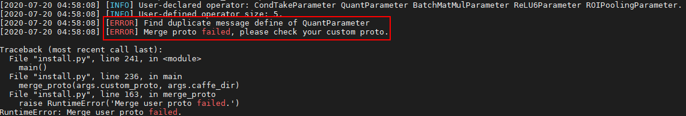

**解决方案1**：根据提示信息，用户自行修改自定义的message信息。

**场景2**：用户自定义在LayerParameter中编号和AMCT编号冲突

用户自定义custom.proto内容如下，其中定义的LayerParameter编号与amct\_custom.proto中编号重复：

```
message LayerParameter { 
   optional QuantParameter quant_param = 208;
   optional ReLU6Parameter relu6_param = 1000000; 
   optional ROIPoolingParameter roi_pooling_param = 8266711; 
 } 
  
 message ReLU6Parameter { 
   optional float negative_slope = 1 [default = 0]; 
 } 
  
 message ROIPoolingParameter { 
   // Pad, kernel size, and stride are all given as a single value for equal 
   // dimensions in height and width or as Y, X pairs. 
   optional uint32 pooled_h = 1 [default = 0]; // The pooled output height 
   optional uint32 pooled_w = 2 [default = 0]; // The pooled output width 
   // Multiplicative spatial scale factor to translate ROI coords from their 
   // input scale to the scale used when pooling 
   optional float spatial_scale = 3 [default = 1]; 
 }
```

执行proto合并时报错信息如下：

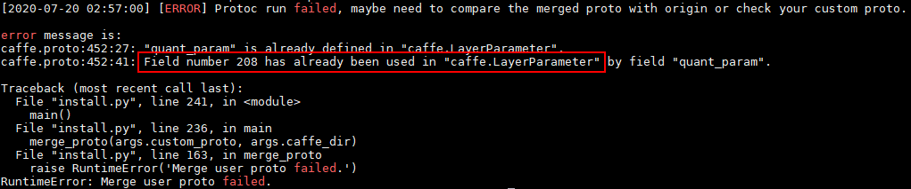

**解决方案2**：用户根据提示信息修改custom.proto中自定义的算子编号。

**场景3**：用户自定义在LayerParameter中编号和ATC编号冲突

用户自定义custom.proto内容如下，其中定义的LayerParameter编号与ATC中的caffe.proto中编号重复：

```
message LayerParameter { 
   optional ReLU6Parameter relu6_param = 206;
   optional ROIPoolingParameter roi_pooling_param = 8266711; 
 } 
  
 message ReLU6Parameter { 
   optional float negative_slope = 1 [default = 0]; 
 } 
  
 message ROIPoolingParameter { 
   // Pad, kernel size, and stride are all given as a single value for equal 
   // dimensions in height and width or as Y, X pairs. 
   optional uint32 pooled_h = 1 [default = 0]; // The pooled output height 
   optional uint32 pooled_w = 2 [default = 0]; // The pooled output width 
   // Multiplicative spatial scale factor to translate ROI coords from their 
   // input scale to the scale used when pooling 
   optional float spatial_scale = 3 [default = 1]; 
 }
```

执行proto合并时报错信息如下：

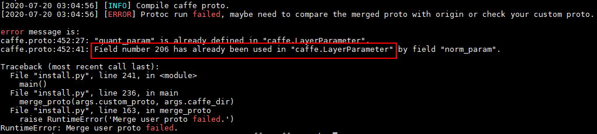

**解决方案3**：用户根据提示信息修改custom.proto中自定义的算子编号。

**场景4**：用户message定义和ATC自定义层冲突

用户自定义custom.proto内容如下，其中定义的NormalizeParameter层信息与caffe.proto中定义的重复：

```
message LayerParameter { 
   optional ReLU6Parameter relu6_param = 1000000; 
   optional ROIPoolingParameter roi_pooling_param = 8266711; 
   optional NormalizeParameter norm_param = 206;  
 } 
  
 message ReLU6Parameter { 
   optional float negative_slope = 1 [default = 0]; 
 } 
  
 message ROIPoolingParameter { 
   // Pad, kernel size, and stride are all given as a single value for equal 
   // dimensions in height and width or as Y, X pairs. 
   optional uint32 pooled_h = 1 [default = 0]; // The pooled output height 
   optional uint32 pooled_w = 2 [default = 0]; // The pooled output width 
   // Multiplicative spatial scale factor to translate ROI coords from their 
   // input scale to the scale used when pooling 
   optional float spatial_scale = 3 [default = 1]; 
 } 
 message NormalizeParameter {  
     optional bool across_spatial = 1 [default = true];  
     // Initial value of scale. Default is 1.0 for all  
     optional FillerParameter scale_filler = 2;  
     // Whether or not scale parameters are shared across channels.  
     optional bool channel_shared = 3 [default = true];  
     // Epsilon for not dividing by zero while normalizing variance  
     optional float eps = 4 [default = 1e-10]; 
 }
```

执行proto合并时无错误提示信息，默认会覆盖ATC内置message定义，以custom.proto为准，提示信息如下：

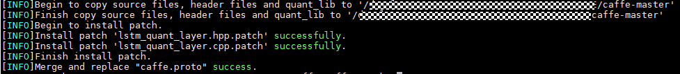

**解决方案4**：无。

## 量化执行过程中提示“RuntimeError: Cannot find scale\_d of layer '\*\*' in record file”<a name="ZH-CN_TOPIC_0000002441980533"></a>

**问题描述**：量化过程中调用save\_model接口保存量化模型时，需要读取calibration阶段计算得到的数据量化参数scale\_d，offset\_d，如果未能在相应的记录文件中找到对应参数，则无法进行后续量化模型保存动作。因此AMCT会抛出上述错误，并终止流程。

**可能原因**：保存scale\_d和offset\_d参数是在用户执行calibration动作时（调用caffe框架执行calibration模型做前向计算时），AMCT在calibration模型中插入的IFMR层做的动作，而IFMR层需要先攒够用户指定batch\_num数据后再进行一次量化计算得到scale\_d和offset\_d。导致**RuntimeError: Cannot find scale\_d of layer \* in record file**错误的原因主要分为两类：

-   **执行caffe做inference错误**：该问题可能原因有很多种，例如用户编译的caffe本身有问题，calibration模型存在问题，未能找到相应数据集等等。**用户可以通过查看caffe框架本身抛出的异常信息来查看**。
-   **用户提供的校准集数据量不满足设置的batch\_num所需要的数据量**：例如用户仅提供了一个batch的数据用作校准集，但设置了batch\_num=2，这样在做calibration过程中，IFMR层未攒满足够的数据，不能执行量化操作，也就未能计算得到scale\_d和offset\_d，也会触发上述错误。用户可以通过查看IFMR在量化过程中打印的进程信息来排查，IFMR层会显示已经攒的数据量：

    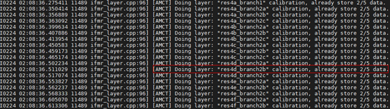

    当攒够指定数据量后，会触发量化操作：

    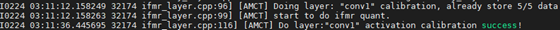

    直至出现Do layer \* activation calibration success!信息才表示完成了当前层的量化动作。

处理建议：

-   根据caffe框架抛出的具体错误来相应进行修复。
-   适当增加校准集数据量或者降低量化算法batch\_num配置（但降低batch\_num可能会导致量化后模型精度下降，需要慎重考虑）直至满足校准集数据量大于等于_\`_batch\_num\`设置。

## 检测网络量化时提示"UserWarning: Matplotlib is currently using agg, which is a non-GUI backend, so cannot show the figure."<a name="ZH-CN_TOPIC_0000002442020565"></a>

**问题描述**：检测网络进行量化时，提示"UserWarning: Matplotlib is currently using agg, which is a non-GUI backend, so cannot show the figure."导致量化后的检测结果未能展示到界面。

**可能原因**：该问题可能是由于Tkinter未安装好导致，可以在python终端里输入来验证，如果出现如下提示表示未成功安装Tkinter：

```
soc@ubuntu62:~$ python3.7.5 
Python 3.7.5 (default, Mar  3 2020, 13:58:02) 
[GCC 7.4.0] on linux 
Type "help", "copyright", "credits" or "license" for more information. 
>>> import tkinter 
Traceback (most recent call last): 
  File "<stdin>", line 1, in <module> 
  File "/usr/local/python3.7.5/lib/python3.7/tkinter/__init__.py", line 36, in <module> 
    import _tkinter # If this fails your Python may not be configured for Tk 
ModuleNotFoundError: No module named '_tkinter'
```

**解决方案**：Tkinter直接通过安装python3-tk未能成功安装可能由于安装了多版本python3导致，也有可能是未能成功安装tk-dev库。若未能成功安装tk-dev库则参见如下方法解决。

1.  重新安装tk-dev库，命令为：

    ```
    sudo apt-get install tk-dev
    ```

2.  进入python3.7.5的安装目录重新编译安装python3.7.5

    ```
    cd Python-3.7.5 
    ./configure --prefix=/usr/local/python3.7.5 --enable-shared 
    make  
    sudo make install
    ```

3.  删除原来的软链接

    ```
    sudo rm -rf  /usr/bin/python3.7.5  
    sudo rm -rf  /usr/bin/pip3.7.5 
    sudo rm -rf  /usr/bin/python3.7  
    sudo rm -rf  /usr/bin/pip3.7
    ```

4.  重新设置软链接

    ```
    sudo ln -s /usr/local/python3.7.5/bin/python3 /usr/bin/python3.7.5  
    sudo ln -s /usr/local/python3.7.5/bin/pip3 /usr/bin/pip3.7.5 
    sudo ln -s /usr/local/python3.7.5/bin/python3 /usr/bin/python3.7  
    sudo ln -s /usr/local/python3.7.5/bin/pip3 /usr/bin/pip3.7
    ```

5.  再次验证，能够成功imprt tkinter模块则表示安装成功：

    ```
    soc@ubuntu62:~$ python3.7.5
     Python 3.7.5 (default, Mar  3 2020, 13:58:02) 
     [GCC 7.4.0] on linux 
     Type "help", "copyright", "credits" or "license" for more information. 
     >>> import tkinter
     >>>
    ```

## 校准执行过程中提示“IfmrQuantWithOffset scale is illegal"<a name="ZH-CN_TOPIC_0000002441980629"></a>

**问题描述**：在调用Caffe框架执行中间校准模型推理过程中，由于输入数据范围不合法，导致量化算法计算得到的scale不合理，从而校准过程失败，终止Caffe校准流程。

**可能原因**：数据范围 \[-inf , +inf\]：

因为AMCT的量化算法需要强制过零点，所以计算出的scale也就是inf/255=inf，该情况下量化因子后续无法承载，因此量化算法会提示错误信息，不支持该数据范围，量化后scale为inf时会提示不支持并提示错误信息。

**图 1**  错误信息1<a name="fig1204mcpsimp"></a>  
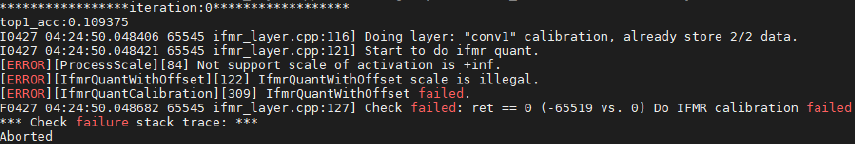

-   数据范围：（其中_EPSILON_包括DBL\_EPSILON double类型，FLT\_EPSILON float类型，当前使用的是FLT\_EPSILON类型）

    AMCT量化支持计算得到的最大，因为在SoC量化动作做的是乘法计算：  ， 如果scale大于，  会小于_FLT\_EPSILON_，此时量化后结果就不可信。因此AMCT量化算法仅支持原始数据范围在内进行量化，否则会提示不支持并提示错误信息。

**图 2**  错误信息2<a name="fig6238192915416"></a>  
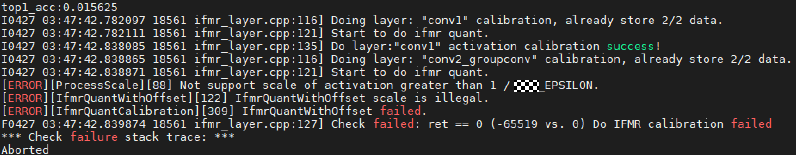

# 附录<a name="ZH-CN_TOPIC_0000002408421490"></a>


## 支持量化的算子列表<a name="ZH-CN_TOPIC_0000002408581274"></a>

**表 1**  量化支持的层以及约束

<a name="table146mcpsimp"></a>
<table><thead align="left"><tr id="row154mcpsimp"><th class="cellrowborder" valign="top" width="11.17%" id="mcps1.2.5.1.1"><p id="entry155mcpsimpp0"><a name="entry155mcpsimpp0"></a><a name="entry155mcpsimpp0"></a>量化类型</p>
</th>
<th class="cellrowborder" valign="top" width="23.76%" id="mcps1.2.5.1.2"><p id="p486933993118"><a name="p486933993118"></a><a name="p486933993118"></a>算子类型</p>
</th>
<th class="cellrowborder" valign="top" width="40.17%" id="mcps1.2.5.1.3"><p id="p159mcpsimp"><a name="p159mcpsimp"></a><a name="p159mcpsimp"></a>约束</p>
</th>
<th class="cellrowborder" valign="top" width="24.9%" id="mcps1.2.5.1.4"><p id="p161mcpsimp"><a name="p161mcpsimp"></a><a name="p161mcpsimp"></a>备注</p>
</th>
</tr>
</thead>
<tbody><tr id="row163mcpsimp"><td class="cellrowborder" rowspan="5" valign="top" width="11.17%" headers="mcps1.2.5.1.1 "><p id="p165mcpsimp"><a name="p165mcpsimp"></a><a name="p165mcpsimp"></a>支持权重及数据量化的层</p>
</td>
<td class="cellrowborder" valign="top" width="23.76%" headers="mcps1.2.5.1.2 "><p id="p16869639163112"><a name="p16869639163112"></a><a name="p16869639163112"></a>Convolution</p>
</td>
<td class="cellrowborder" valign="top" width="40.17%" headers="mcps1.2.5.1.3 "><p id="p104571329123210"><a name="p104571329123210"></a><a name="p104571329123210"></a>-</p>
</td>
<td class="cellrowborder" valign="top" width="24.9%" headers="mcps1.2.5.1.4 "><p id="p171mcpsimp"><a name="p171mcpsimp"></a><a name="p171mcpsimp"></a>-</p>
</td>
</tr>
<tr id="row172mcpsimp"><td class="cellrowborder" valign="top" headers="mcps1.2.5.1.1 "><p id="p18869739113111"><a name="p18869739113111"></a><a name="p18869739113111"></a>DepthwiseConv</p>
</td>
<td class="cellrowborder" valign="top" headers="mcps1.2.5.1.2 "><p id="p16457122923210"><a name="p16457122923210"></a><a name="p16457122923210"></a>-</p>
</td>
<td class="cellrowborder" valign="top" headers="mcps1.2.5.1.3 "><p id="p1462164716322"><a name="p1462164716322"></a><a name="p1462164716322"></a>-</p>
</td>
</tr>
<tr id="row177mcpsimp"><td class="cellrowborder" valign="top" headers="mcps1.2.5.1.1 "><p id="p68702039103115"><a name="p68702039103115"></a><a name="p68702039103115"></a>InnerProduct</p>
</td>
<td class="cellrowborder" valign="top" headers="mcps1.2.5.1.2 "><p id="p74576298329"><a name="p74576298329"></a><a name="p74576298329"></a>-</p>
</td>
<td class="cellrowborder" valign="top" headers="mcps1.2.5.1.3 "><p id="p1862119479327"><a name="p1862119479327"></a><a name="p1862119479327"></a>-</p>
</td>
</tr>
<tr id="row17917326101812"><td class="cellrowborder" valign="top" headers="mcps1.2.5.1.1 "><p id="p8870173912312"><a name="p8870173912312"></a><a name="p8870173912312"></a>Deconvolution</p>
</td>
<td class="cellrowborder" valign="top" headers="mcps1.2.5.1.2 "><p id="p5457192918324"><a name="p5457192918324"></a><a name="p5457192918324"></a>-</p>
</td>
<td class="cellrowborder" valign="top" headers="mcps1.2.5.1.3 "><p id="p10917126161820"><a name="p10917126161820"></a><a name="p10917126161820"></a>-</p>
</td>
</tr>
<tr id="row15503144717184"><td class="cellrowborder" valign="top" headers="mcps1.2.5.1.1 "><p id="p18870939163120"><a name="p18870939163120"></a><a name="p18870939163120"></a>LSTM,RNN,GRU</p>
</td>
<td class="cellrowborder" valign="top" headers="mcps1.2.5.1.2 "><p id="p6457182910322"><a name="p6457182910322"></a><a name="p6457182910322"></a>-</p>
</td>
<td class="cellrowborder" valign="top" headers="mcps1.2.5.1.3 "><p id="p35048473187"><a name="p35048473187"></a><a name="p35048473187"></a>-</p>
</td>
</tr>
<tr id="row182mcpsimp"><td class="cellrowborder" rowspan="71" valign="top" width="11.17%" headers="mcps1.2.5.1.1 "><p id="p184mcpsimp"><a name="p184mcpsimp"></a><a name="p184mcpsimp"></a>支持数据量化的层</p>
</td>
<td class="cellrowborder" valign="top" width="23.76%" headers="mcps1.2.5.1.2 "><p id="p343017408335"><a name="p343017408335"></a><a name="p343017408335"></a>PassThrough</p>
</td>
<td class="cellrowborder" valign="top" width="40.17%" headers="mcps1.2.5.1.3 "><p id="p3906131993417"><a name="p3906131993417"></a><a name="p3906131993417"></a>-</p>
</td>
<td class="cellrowborder" valign="top" width="24.9%" headers="mcps1.2.5.1.4 "><p id="entry188mcpsimpp0"><a name="entry188mcpsimpp0"></a><a name="entry188mcpsimpp0"></a>-</p>
</td>
</tr>
<tr id="row123911933121820"><td class="cellrowborder" valign="top" headers="mcps1.2.5.1.1 "><p id="p1843019402332"><a name="p1843019402332"></a><a name="p1843019402332"></a>Pooling</p>
</td>
<td class="cellrowborder" valign="top" headers="mcps1.2.5.1.2 "><p id="p199061019193415"><a name="p199061019193415"></a><a name="p199061019193415"></a>-</p>
</td>
<td class="cellrowborder" valign="top" headers="mcps1.2.5.1.3 "><p id="p2039119338185"><a name="p2039119338185"></a><a name="p2039119338185"></a>-</p>
</td>
</tr>
<tr id="row189mcpsimp"><td class="cellrowborder" valign="top" headers="mcps1.2.5.1.1 "><p id="p443014083318"><a name="p443014083318"></a><a name="p443014083318"></a>PSROIPooling</p>
</td>
<td class="cellrowborder" valign="top" headers="mcps1.2.5.1.2 "><p id="p19467038183510"><a name="p19467038183510"></a><a name="p19467038183510"></a>-</p>
</td>
<td class="cellrowborder" valign="top" headers="mcps1.2.5.1.3 "><p id="entry193mcpsimpp0"><a name="entry193mcpsimpp0"></a><a name="entry193mcpsimpp0"></a>-</p>
</td>
</tr>
<tr id="row194mcpsimp"><td class="cellrowborder" valign="top" headers="mcps1.2.5.1.1 "><p id="p1843010403337"><a name="p1843010403337"></a><a name="p1843010403337"></a>ROIPooling</p>
</td>
<td class="cellrowborder" valign="top" headers="mcps1.2.5.1.2 "><p id="p5467153863517"><a name="p5467153863517"></a><a name="p5467153863517"></a>-</p>
</td>
<td class="cellrowborder" valign="top" headers="mcps1.2.5.1.3 "><p id="entry198mcpsimpp0"><a name="entry198mcpsimpp0"></a><a name="entry198mcpsimpp0"></a>-</p>
</td>
</tr>
<tr id="row1653824712014"><td class="cellrowborder" valign="top" headers="mcps1.2.5.1.1 "><p id="p1443034053319"><a name="p1443034053319"></a><a name="p1443034053319"></a>SPP</p>
</td>
<td class="cellrowborder" valign="top" headers="mcps1.2.5.1.2 "><p id="p184672388350"><a name="p184672388350"></a><a name="p184672388350"></a>-</p>
</td>
<td class="cellrowborder" valign="top" headers="mcps1.2.5.1.3 "><p id="p15539547132018"><a name="p15539547132018"></a><a name="p15539547132018"></a>-</p>
</td>
</tr>
<tr id="row199mcpsimp"><td class="cellrowborder" valign="top" headers="mcps1.2.5.1.1 "><p id="p2430164014339"><a name="p2430164014339"></a><a name="p2430164014339"></a>Upsample</p>
</td>
<td class="cellrowborder" valign="top" headers="mcps1.2.5.1.2 "><p id="p1467113853519"><a name="p1467113853519"></a><a name="p1467113853519"></a>-</p>
</td>
<td class="cellrowborder" valign="top" headers="mcps1.2.5.1.3 "><p id="p266612714812"><a name="p266612714812"></a><a name="p266612714812"></a>-</p>
</td>
</tr>
<tr id="row135713285221"><td class="cellrowborder" valign="top" headers="mcps1.2.5.1.1 "><p id="p4430114013312"><a name="p4430114013312"></a><a name="p4430114013312"></a>Eltwise</p>
</td>
<td class="cellrowborder" valign="top" headers="mcps1.2.5.1.2 "><p id="p7467153833518"><a name="p7467153833518"></a><a name="p7467153833518"></a>-</p>
</td>
<td class="cellrowborder" valign="top" headers="mcps1.2.5.1.3 "><p id="p1866610271385"><a name="p1866610271385"></a><a name="p1866610271385"></a>-</p>
</td>
</tr>
<tr id="row207mcpsimp"><td class="cellrowborder" valign="top" headers="mcps1.2.5.1.1 "><p id="p8430740113317"><a name="p8430740113317"></a><a name="p8430740113317"></a>Slice</p>
</td>
<td class="cellrowborder" valign="top" headers="mcps1.2.5.1.2 "><p id="p154673381352"><a name="p154673381352"></a><a name="p154673381352"></a>-</p>
</td>
<td class="cellrowborder" valign="top" headers="mcps1.2.5.1.3 "><p id="p2066612271785"><a name="p2066612271785"></a><a name="p2066612271785"></a>-</p>
</td>
</tr>
<tr id="row343410238388"><td class="cellrowborder" valign="top" headers="mcps1.2.5.1.1 "><p id="p1343014017338"><a name="p1343014017338"></a><a name="p1343014017338"></a>Concat</p>
</td>
<td class="cellrowborder" valign="top" headers="mcps1.2.5.1.2 "><p id="p1346723823513"><a name="p1346723823513"></a><a name="p1346723823513"></a>-</p>
</td>
<td class="cellrowborder" valign="top" headers="mcps1.2.5.1.3 "><p id="p1543514235387"><a name="p1543514235387"></a><a name="p1543514235387"></a>-</p>
</td>
</tr>
<tr id="row10288170135919"><td class="cellrowborder" valign="top" headers="mcps1.2.5.1.1 "><p id="p7430840103316"><a name="p7430840103316"></a><a name="p7430840103316"></a>Softmax</p>
</td>
<td class="cellrowborder" valign="top" headers="mcps1.2.5.1.2 "><p id="p246743823512"><a name="p246743823512"></a><a name="p246743823512"></a>-</p>
</td>
<td class="cellrowborder" valign="top" headers="mcps1.2.5.1.3 "><p id="p172881608592"><a name="p172881608592"></a><a name="p172881608592"></a>-</p>
</td>
</tr>
<tr id="row1987415661618"><td class="cellrowborder" valign="top" headers="mcps1.2.5.1.1 "><p id="p10430104010332"><a name="p10430104010332"></a><a name="p10430104010332"></a>ROIAlign</p>
</td>
<td class="cellrowborder" valign="top" headers="mcps1.2.5.1.2 "><p id="p144671738113514"><a name="p144671738113514"></a><a name="p144671738113514"></a>-</p>
</td>
<td class="cellrowborder" valign="top" headers="mcps1.2.5.1.3 "><p id="p15875968166"><a name="p15875968166"></a><a name="p15875968166"></a>-</p>
</td>
</tr>
<tr id="row1951213559181"><td class="cellrowborder" valign="top" headers="mcps1.2.5.1.1 "><p id="p1643054093310"><a name="p1643054093310"></a><a name="p1643054093310"></a>AbsVal</p>
</td>
<td class="cellrowborder" valign="top" headers="mcps1.2.5.1.2 "><p id="p12985170173417"><a name="p12985170173417"></a><a name="p12985170173417"></a>默认不量化，如有需要可在量化配置文件中手动把量化开关打开</p>
</td>
<td class="cellrowborder" valign="top" headers="mcps1.2.5.1.3 "><p id="p351220551180"><a name="p351220551180"></a><a name="p351220551180"></a>-</p>
</td>
</tr>
<tr id="row175394810813"><td class="cellrowborder" valign="top" headers="mcps1.2.5.1.1 "><p id="p343011407331"><a name="p343011407331"></a><a name="p343011407331"></a>BNLL</p>
</td>
<td class="cellrowborder" valign="top" headers="mcps1.2.5.1.2 "><p id="p1546816383353"><a name="p1546816383353"></a><a name="p1546816383353"></a>-</p>
</td>
<td class="cellrowborder" valign="top" headers="mcps1.2.5.1.3 "><p id="p1453916811817"><a name="p1453916811817"></a><a name="p1453916811817"></a>-</p>
</td>
</tr>
<tr id="row1549415873515"><td class="cellrowborder" valign="top" headers="mcps1.2.5.1.1 "><p id="p164311140193312"><a name="p164311140193312"></a><a name="p164311140193312"></a>CReLU</p>
</td>
<td class="cellrowborder" valign="top" headers="mcps1.2.5.1.2 "><p id="p1246873893518"><a name="p1246873893518"></a><a name="p1246873893518"></a>-</p>
</td>
<td class="cellrowborder" valign="top" headers="mcps1.2.5.1.3 "><p id="p54942820354"><a name="p54942820354"></a><a name="p54942820354"></a>-</p>
</td>
</tr>
<tr id="row855717206173"><td class="cellrowborder" valign="top" headers="mcps1.2.5.1.1 "><p id="p10431144018334"><a name="p10431144018334"></a><a name="p10431144018334"></a>ELU</p>
</td>
<td class="cellrowborder" valign="top" headers="mcps1.2.5.1.2 "><p id="p34681838123518"><a name="p34681838123518"></a><a name="p34681838123518"></a>-</p>
</td>
<td class="cellrowborder" valign="top" headers="mcps1.2.5.1.3 "><p id="p9558122012174"><a name="p9558122012174"></a><a name="p9558122012174"></a>-</p>
</td>
</tr>
<tr id="row3287155210177"><td class="cellrowborder" valign="top" headers="mcps1.2.5.1.1 "><p id="p17431540173319"><a name="p17431540173319"></a><a name="p17431540173319"></a>Exp</p>
</td>
<td class="cellrowborder" valign="top" headers="mcps1.2.5.1.2 "><p id="p19468173816354"><a name="p19468173816354"></a><a name="p19468173816354"></a>-</p>
</td>
<td class="cellrowborder" valign="top" headers="mcps1.2.5.1.3 "><p id="p92871852201710"><a name="p92871852201710"></a><a name="p92871852201710"></a>-</p>
</td>
</tr>
<tr id="row137818741816"><td class="cellrowborder" valign="top" headers="mcps1.2.5.1.1 "><p id="p1943124013311"><a name="p1943124013311"></a><a name="p1943124013311"></a>Interp</p>
</td>
<td class="cellrowborder" valign="top" headers="mcps1.2.5.1.2 "><p id="p54684381355"><a name="p54684381355"></a><a name="p54684381355"></a>-</p>
</td>
<td class="cellrowborder" valign="top" headers="mcps1.2.5.1.3 "><p id="p1678197111818"><a name="p1678197111818"></a><a name="p1678197111818"></a>-</p>
</td>
</tr>
<tr id="row14729154971916"><td class="cellrowborder" valign="top" headers="mcps1.2.5.1.1 "><p id="p17431164015335"><a name="p17431164015335"></a><a name="p17431164015335"></a>Log</p>
</td>
<td class="cellrowborder" valign="top" headers="mcps1.2.5.1.2 "><p id="p14468153817353"><a name="p14468153817353"></a><a name="p14468153817353"></a>-</p>
</td>
<td class="cellrowborder" valign="top" headers="mcps1.2.5.1.3 "><p id="p1173012491192"><a name="p1173012491192"></a><a name="p1173012491192"></a>-</p>
</td>
</tr>
<tr id="row8104175031110"><td class="cellrowborder" valign="top" headers="mcps1.2.5.1.1 "><p id="p443164073315"><a name="p443164073315"></a><a name="p443164073315"></a>LRN</p>
</td>
<td class="cellrowborder" valign="top" headers="mcps1.2.5.1.2 "><p id="p0468203853513"><a name="p0468203853513"></a><a name="p0468203853513"></a>-</p>
</td>
<td class="cellrowborder" valign="top" headers="mcps1.2.5.1.3 "><p id="p111056503115"><a name="p111056503115"></a><a name="p111056503115"></a>-</p>
</td>
</tr>
<tr id="row195203791214"><td class="cellrowborder" valign="top" headers="mcps1.2.5.1.1 "><p id="p11431174012332"><a name="p11431174012332"></a><a name="p11431174012332"></a>Mvm</p>
</td>
<td class="cellrowborder" valign="top" headers="mcps1.2.5.1.2 "><p id="p746815384359"><a name="p746815384359"></a><a name="p746815384359"></a>-</p>
</td>
<td class="cellrowborder" valign="top" headers="mcps1.2.5.1.3 "><p id="p752111711121"><a name="p752111711121"></a><a name="p752111711121"></a>-</p>
</td>
</tr>
<tr id="row732455713125"><td class="cellrowborder" valign="top" headers="mcps1.2.5.1.1 "><p id="p0431194016334"><a name="p0431194016334"></a><a name="p0431194016334"></a>Nms</p>
</td>
<td class="cellrowborder" valign="top" headers="mcps1.2.5.1.2 "><p id="p646813813515"><a name="p646813813515"></a><a name="p646813813515"></a>-</p>
</td>
<td class="cellrowborder" valign="top" headers="mcps1.2.5.1.3 "><p id="p1325457101215"><a name="p1325457101215"></a><a name="p1325457101215"></a>-</p>
</td>
</tr>
<tr id="row239mcpsimp"><td class="cellrowborder" valign="top" headers="mcps1.2.5.1.1 "><p id="p143164011337"><a name="p143164011337"></a><a name="p143164011337"></a>Normalize</p>
</td>
<td class="cellrowborder" valign="top" headers="mcps1.2.5.1.2 "><p id="p0468153816354"><a name="p0468153816354"></a><a name="p0468153816354"></a>-</p>
</td>
<td class="cellrowborder" valign="top" headers="mcps1.2.5.1.3 "><p id="p38161532189"><a name="p38161532189"></a><a name="p38161532189"></a>-</p>
</td>
</tr>
<tr id="row1536719410917"><td class="cellrowborder" valign="top" headers="mcps1.2.5.1.1 "><p id="p1343154016338"><a name="p1343154016338"></a><a name="p1343154016338"></a>Power</p>
</td>
<td class="cellrowborder" valign="top" headers="mcps1.2.5.1.2 "><p id="p14468238133518"><a name="p14468238133518"></a><a name="p14468238133518"></a>-</p>
</td>
<td class="cellrowborder" valign="top" headers="mcps1.2.5.1.3 "><p id="p13672411596"><a name="p13672411596"></a><a name="p13672411596"></a>-</p>
</td>
</tr>
<tr id="row245mcpsimp"><td class="cellrowborder" valign="top" headers="mcps1.2.5.1.1 "><p id="p1431154093316"><a name="p1431154093316"></a><a name="p1431154093316"></a>PReLU</p>
</td>
<td class="cellrowborder" valign="top" headers="mcps1.2.5.1.2 "><p id="p1510871333411"><a name="p1510871333411"></a><a name="p1510871333411"></a>默认不量化，如有需要可在量化配置文件中手动把量化开关打开</p>
</td>
<td class="cellrowborder" valign="top" headers="mcps1.2.5.1.3 "><p id="p14816153217816"><a name="p14816153217816"></a><a name="p14816153217816"></a>-</p>
</td>
</tr>
<tr id="row9722111651514"><td class="cellrowborder" valign="top" headers="mcps1.2.5.1.1 "><p id="p3431124012331"><a name="p3431124012331"></a><a name="p3431124012331"></a>Reduction</p>
</td>
<td class="cellrowborder" valign="top" headers="mcps1.2.5.1.2 "><p id="p18468638163514"><a name="p18468638163514"></a><a name="p18468638163514"></a>-</p>
</td>
<td class="cellrowborder" valign="top" headers="mcps1.2.5.1.3 "><p id="p117231716101515"><a name="p117231716101515"></a><a name="p117231716101515"></a>-</p>
</td>
</tr>
<tr id="row62561548873"><td class="cellrowborder" valign="top" headers="mcps1.2.5.1.1 "><p id="p104317409330"><a name="p104317409330"></a><a name="p104317409330"></a>ReLU</p>
</td>
<td class="cellrowborder" valign="top" headers="mcps1.2.5.1.2 "><p id="p17701316163415"><a name="p17701316163415"></a><a name="p17701316163415"></a>默认不量化，如有需要可在量化配置文件中手动把量化开关打开</p>
<p id="p6469113883511"><a name="p6469113883511"></a><a name="p6469113883511"></a></p>
</td>
<td class="cellrowborder" valign="top" headers="mcps1.2.5.1.3 "><p id="p132566481675"><a name="p132566481675"></a><a name="p132566481675"></a>-</p>
</td>
</tr>
<tr id="row2199645105818"><td class="cellrowborder" valign="top" headers="mcps1.2.5.1.1 "><p id="p2431114053311"><a name="p2431114053311"></a><a name="p2431114053311"></a>Sigmoid</p>
</td>
<td class="cellrowborder" valign="top" headers="mcps1.2.5.1.2 "><p id="p7469113813358"><a name="p7469113813358"></a><a name="p7469113813358"></a>-</p>
</td>
<td class="cellrowborder" valign="top" headers="mcps1.2.5.1.3 "><p id="p31991145115819"><a name="p31991145115819"></a><a name="p31991145115819"></a>-</p>
</td>
</tr>
<tr id="row19204232155717"><td class="cellrowborder" valign="top" headers="mcps1.2.5.1.1 "><p id="p2431140123310"><a name="p2431140123310"></a><a name="p2431140123310"></a>Sort</p>
</td>
<td class="cellrowborder" valign="top" headers="mcps1.2.5.1.2 "><p id="p44691938163515"><a name="p44691938163515"></a><a name="p44691938163515"></a>-</p>
</td>
<td class="cellrowborder" valign="top" headers="mcps1.2.5.1.3 "><p id="p9204103265717"><a name="p9204103265717"></a><a name="p9204103265717"></a>-</p>
</td>
</tr>
<tr id="row104591472591"><td class="cellrowborder" valign="top" headers="mcps1.2.5.1.1 "><p id="p134316401332"><a name="p134316401332"></a><a name="p134316401332"></a>Threshold</p>
</td>
<td class="cellrowborder" valign="top" headers="mcps1.2.5.1.2 "><p id="p19469113814355"><a name="p19469113814355"></a><a name="p19469113814355"></a>-</p>
</td>
<td class="cellrowborder" valign="top" headers="mcps1.2.5.1.3 "><p id="p124591372596"><a name="p124591372596"></a><a name="p124591372596"></a>-</p>
</td>
</tr>
<tr id="row46017419599"><td class="cellrowborder" valign="top" headers="mcps1.2.5.1.1 "><p id="p11431104013339"><a name="p11431104013339"></a><a name="p11431104013339"></a>Scale</p>
</td>
<td class="cellrowborder" valign="top" headers="mcps1.2.5.1.2 "><p id="p13273152220347"><a name="p13273152220347"></a><a name="p13273152220347"></a>默认不量化，如有需要可在量化配置文件中手动把量化开关打开</p>
</td>
<td class="cellrowborder" valign="top" headers="mcps1.2.5.1.3 "><p id="p1861542597"><a name="p1861542597"></a><a name="p1861542597"></a>-</p>
</td>
</tr>
<tr id="row4145102445720"><td class="cellrowborder" valign="top" headers="mcps1.2.5.1.1 "><p id="p114316406334"><a name="p114316406334"></a><a name="p114316406334"></a>BatchNorm</p>
</td>
<td class="cellrowborder" valign="top" headers="mcps1.2.5.1.2 "><p id="p4935142603411"><a name="p4935142603411"></a><a name="p4935142603411"></a>默认不量化，如有需要可在量化配置文件中手动把量化开关打开</p>
</td>
<td class="cellrowborder" valign="top" headers="mcps1.2.5.1.3 "><p id="p18145122495713"><a name="p18145122495713"></a><a name="p18145122495713"></a>-</p>
</td>
</tr>
<tr id="row634016118234"><td class="cellrowborder" valign="top" headers="mcps1.2.5.1.1 "><p id="p543164063312"><a name="p543164063312"></a><a name="p543164063312"></a>Bias</p>
</td>
<td class="cellrowborder" valign="top" headers="mcps1.2.5.1.2 "><p id="p342431103414"><a name="p342431103414"></a><a name="p342431103414"></a>默认不量化，如有需要可在量化配置文件中手动把量化开关打开</p>
</td>
<td class="cellrowborder" valign="top" headers="mcps1.2.5.1.3 "><p id="p334021116236"><a name="p334021116236"></a><a name="p334021116236"></a>-</p>
</td>
</tr>
<tr id="row20407191051415"><td class="cellrowborder" valign="top" headers="mcps1.2.5.1.1 "><p id="p743114014338"><a name="p743114014338"></a><a name="p743114014338"></a>Reshape</p>
</td>
<td class="cellrowborder" valign="top" headers="mcps1.2.5.1.2 "><p id="p11471538153510"><a name="p11471538153510"></a><a name="p11471538153510"></a>-</p>
</td>
<td class="cellrowborder" valign="top" headers="mcps1.2.5.1.3 "><p id="p13407910171412"><a name="p13407910171412"></a><a name="p13407910171412"></a>-</p>
</td>
</tr>
<tr id="row2420209122010"><td class="cellrowborder" valign="top" headers="mcps1.2.5.1.1 "><p id="p1243174017333"><a name="p1243174017333"></a><a name="p1243174017333"></a>Reverse</p>
</td>
<td class="cellrowborder" valign="top" headers="mcps1.2.5.1.2 "><p id="p1347143823519"><a name="p1347143823519"></a><a name="p1347143823519"></a>-</p>
</td>
<td class="cellrowborder" valign="top" headers="mcps1.2.5.1.3 "><p id="p54202918203"><a name="p54202918203"></a><a name="p54202918203"></a>-</p>
</td>
</tr>
<tr id="row1881183582017"><td class="cellrowborder" valign="top" headers="mcps1.2.5.1.1 "><p id="p1643112407331"><a name="p1643112407331"></a><a name="p1643112407331"></a>ShuffleChannel</p>
</td>
<td class="cellrowborder" valign="top" headers="mcps1.2.5.1.2 "><p id="p194713380357"><a name="p194713380357"></a><a name="p194713380357"></a>-</p>
</td>
<td class="cellrowborder" valign="top" headers="mcps1.2.5.1.3 "><p id="p981193582018"><a name="p981193582018"></a><a name="p981193582018"></a>-</p>
</td>
</tr>
<tr id="row1064110619214"><td class="cellrowborder" valign="top" headers="mcps1.2.5.1.1 "><p id="p104314401337"><a name="p104314401337"></a><a name="p104314401337"></a>Crop</p>
</td>
<td class="cellrowborder" valign="top" headers="mcps1.2.5.1.2 "><p id="p047143813517"><a name="p047143813517"></a><a name="p047143813517"></a>-</p>
</td>
<td class="cellrowborder" valign="top" headers="mcps1.2.5.1.3 "><p id="p18641146192118"><a name="p18641146192118"></a><a name="p18641146192118"></a>-</p>
</td>
</tr>
<tr id="row1532215278191"><td class="cellrowborder" valign="top" headers="mcps1.2.5.1.1 "><p id="p104325408336"><a name="p104325408336"></a><a name="p104325408336"></a>Axpy</p>
</td>
<td class="cellrowborder" valign="top" headers="mcps1.2.5.1.2 "><p id="p34716382359"><a name="p34716382359"></a><a name="p34716382359"></a>-</p>
</td>
<td class="cellrowborder" valign="top" headers="mcps1.2.5.1.3 "><p id="p532212716194"><a name="p532212716194"></a><a name="p532212716194"></a>-</p>
</td>
</tr>
<tr id="row176266361366"><td class="cellrowborder" valign="top" headers="mcps1.2.5.1.1 "><p id="p144321406336"><a name="p144321406336"></a><a name="p144321406336"></a>Flatten</p>
</td>
<td class="cellrowborder" valign="top" headers="mcps1.2.5.1.2 "><p id="p1047111384357"><a name="p1047111384357"></a><a name="p1047111384357"></a>-</p>
</td>
<td class="cellrowborder" valign="top" headers="mcps1.2.5.1.3 "><p id="p176261336133616"><a name="p176261336133616"></a><a name="p176261336133616"></a>-</p>
</td>
</tr>
<tr id="row166054452210"><td class="cellrowborder" valign="top" headers="mcps1.2.5.1.1 "><p id="p74322040163314"><a name="p74322040163314"></a><a name="p74322040163314"></a>Permute</p>
</td>
<td class="cellrowborder" valign="top" headers="mcps1.2.5.1.2 "><p id="p34711138123513"><a name="p34711138123513"></a><a name="p34711138123513"></a>-</p>
</td>
<td class="cellrowborder" valign="top" headers="mcps1.2.5.1.3 "><p id="p26611444152210"><a name="p26611444152210"></a><a name="p26611444152210"></a>-</p>
</td>
</tr>
<tr id="row3605553142420"><td class="cellrowborder" valign="top" headers="mcps1.2.5.1.1 "><p id="p643212406331"><a name="p643212406331"></a><a name="p643212406331"></a>Tile</p>
</td>
<td class="cellrowborder" valign="top" headers="mcps1.2.5.1.2 "><p id="p947115389352"><a name="p947115389352"></a><a name="p947115389352"></a>-</p>
</td>
<td class="cellrowborder" valign="top" headers="mcps1.2.5.1.3 "><p id="p3606165315249"><a name="p3606165315249"></a><a name="p3606165315249"></a>-</p>
</td>
</tr>
<tr id="row1256165216221"><td class="cellrowborder" valign="top" headers="mcps1.2.5.1.1 "><p id="p943214063310"><a name="p943214063310"></a><a name="p943214063310"></a>Split</p>
</td>
<td class="cellrowborder" valign="top" headers="mcps1.2.5.1.2 "><p id="p16471123815350"><a name="p16471123815350"></a><a name="p16471123815350"></a>-</p>
</td>
<td class="cellrowborder" valign="top" headers="mcps1.2.5.1.3 "><p id="p185745242213"><a name="p185745242213"></a><a name="p185745242213"></a>-</p>
</td>
</tr>
<tr id="row105181331142513"><td class="cellrowborder" valign="top" headers="mcps1.2.5.1.1 "><p id="p1243214093313"><a name="p1243214093313"></a><a name="p1243214093313"></a>ArgMax</p>
</td>
<td class="cellrowborder" valign="top" headers="mcps1.2.5.1.2 "><p id="p14721438183517"><a name="p14721438183517"></a><a name="p14721438183517"></a>-</p>
</td>
<td class="cellrowborder" valign="top" headers="mcps1.2.5.1.3 "><p id="p3518103172510"><a name="p3518103172510"></a><a name="p3518103172510"></a>-</p>
</td>
</tr>
<tr id="row8646155304811"><td class="cellrowborder" valign="top" headers="mcps1.2.5.1.1 "><p id="p1343264015339"><a name="p1343264015339"></a><a name="p1343264015339"></a>Clip</p>
</td>
<td class="cellrowborder" valign="top" headers="mcps1.2.5.1.2 "><p id="p040854043420"><a name="p040854043420"></a><a name="p040854043420"></a>默认不量化，如有需要可在量化配置文件中手动把量化开关打开</p>
</td>
<td class="cellrowborder" valign="top" headers="mcps1.2.5.1.3 "><p id="p16646553204819"><a name="p16646553204819"></a><a name="p16646553204819"></a>-</p>
</td>
</tr>
<tr id="row1220016231317"><td class="cellrowborder" valign="top" headers="mcps1.2.5.1.1 "><p id="p0432104043316"><a name="p0432104043316"></a><a name="p0432104043316"></a>Hswish</p>
</td>
<td class="cellrowborder" valign="top" headers="mcps1.2.5.1.2 "><p id="p847283853516"><a name="p847283853516"></a><a name="p847283853516"></a>-</p>
</td>
<td class="cellrowborder" valign="top" headers="mcps1.2.5.1.3 "><p id="p1920015238319"><a name="p1920015238319"></a><a name="p1920015238319"></a>-</p>
</td>
</tr>
<tr id="row14822765313"><td class="cellrowborder" valign="top" headers="mcps1.2.5.1.1 "><p id="p174321040123313"><a name="p174321040123313"></a><a name="p174321040123313"></a>MVN</p>
</td>
<td class="cellrowborder" valign="top" headers="mcps1.2.5.1.2 "><p id="p5472138173513"><a name="p5472138173513"></a><a name="p5472138173513"></a>-</p>
</td>
<td class="cellrowborder" valign="top" headers="mcps1.2.5.1.3 "><p id="p17822664318"><a name="p17822664318"></a><a name="p17822664318"></a>-</p>
</td>
</tr>
<tr id="row6222101543118"><td class="cellrowborder" valign="top" headers="mcps1.2.5.1.1 "><p id="p13432240183319"><a name="p13432240183319"></a><a name="p13432240183319"></a>Reorg</p>
</td>
<td class="cellrowborder" valign="top" headers="mcps1.2.5.1.2 "><p id="p1947233883515"><a name="p1947233883515"></a><a name="p1947233883515"></a>-</p>
</td>
<td class="cellrowborder" valign="top" headers="mcps1.2.5.1.3 "><p id="p822291573114"><a name="p822291573114"></a><a name="p822291573114"></a>-</p>
</td>
</tr>
<tr id="row1830217128316"><td class="cellrowborder" valign="top" headers="mcps1.2.5.1.1 "><p id="p1543284016338"><a name="p1543284016338"></a><a name="p1543284016338"></a>TanH</p>
</td>
<td class="cellrowborder" valign="top" headers="mcps1.2.5.1.2 "><p id="p147273833515"><a name="p147273833515"></a><a name="p147273833515"></a>-</p>
</td>
<td class="cellrowborder" valign="top" headers="mcps1.2.5.1.3 "><p id="p11302812133112"><a name="p11302812133112"></a><a name="p11302812133112"></a>-</p>
</td>
</tr>
<tr id="row174321810103411"><td class="cellrowborder" valign="top" headers="mcps1.2.5.1.1 "><p id="p1432154010335"><a name="p1432154010335"></a><a name="p1432154010335"></a>MatMul</p>
</td>
<td class="cellrowborder" valign="top" headers="mcps1.2.5.1.2 "><p id="p10472938183519"><a name="p10472938183519"></a><a name="p10472938183519"></a>-</p>
</td>
<td class="cellrowborder" valign="top" headers="mcps1.2.5.1.3 "><p id="p943281019342"><a name="p943281019342"></a><a name="p943281019342"></a>-</p>
</td>
</tr>
<tr id="row757413912319"><td class="cellrowborder" valign="top" headers="mcps1.2.5.1.1 "><p id="p1243219404334"><a name="p1243219404334"></a><a name="p1243219404334"></a>RReLU</p>
</td>
<td class="cellrowborder" valign="top" headers="mcps1.2.5.1.2 "><p id="p626944543415"><a name="p626944543415"></a><a name="p626944543415"></a>默认不量化，如有需要可在量化配置文件中手动把量化开关打开</p>
</td>
<td class="cellrowborder" valign="top" headers="mcps1.2.5.1.3 "><p id="p205745919313"><a name="p205745919313"></a><a name="p205745919313"></a>-</p>
</td>
</tr>
<tr id="row856917810335"><td class="cellrowborder" valign="top" headers="mcps1.2.5.1.1 "><p id="p9432154014337"><a name="p9432154014337"></a><a name="p9432154014337"></a>ReLU6</p>
</td>
<td class="cellrowborder" valign="top" headers="mcps1.2.5.1.2 "><p id="p2737448183411"><a name="p2737448183411"></a><a name="p2737448183411"></a>默认不量化，如有需要可在量化配置文件中手动把量化开关打开</p>
</td>
<td class="cellrowborder" valign="top" headers="mcps1.2.5.1.3 "><p id="p1569888339"><a name="p1569888339"></a><a name="p1569888339"></a>-</p>
</td>
</tr>
<tr id="row6335827194615"><td class="cellrowborder" valign="top" headers="mcps1.2.5.1.1 "><p id="p543254033312"><a name="p543254033312"></a><a name="p543254033312"></a>Swish</p>
</td>
<td class="cellrowborder" valign="top" headers="mcps1.2.5.1.2 "><p id="p12453185273413"><a name="p12453185273413"></a><a name="p12453185273413"></a>默认不量化，如有需要可在量化配置文件中手动把量化开关打开</p>
</td>
<td class="cellrowborder" valign="top" headers="mcps1.2.5.1.3 "><p id="p153369273465"><a name="p153369273465"></a><a name="p153369273465"></a>-</p>
</td>
</tr>
<tr id="row12777172317466"><td class="cellrowborder" valign="top" headers="mcps1.2.5.1.1 "><p id="p184321240123312"><a name="p184321240123312"></a><a name="p184321240123312"></a>GroupNorm</p>
</td>
<td class="cellrowborder" valign="top" headers="mcps1.2.5.1.2 "><p id="p0472193873512"><a name="p0472193873512"></a><a name="p0472193873512"></a>-</p>
</td>
<td class="cellrowborder" valign="top" headers="mcps1.2.5.1.3 "><p id="p15778823134616"><a name="p15778823134616"></a><a name="p15778823134616"></a>-</p>
</td>
</tr>
<tr id="row12669850105612"><td class="cellrowborder" valign="top" headers="mcps1.2.5.1.1 "><p id="p62561330017"><a name="p62561330017"></a><a name="p62561330017"></a>ArgMin</p>
</td>
<td class="cellrowborder" valign="top" headers="mcps1.2.5.1.2 "><p id="p1166913507568"><a name="p1166913507568"></a><a name="p1166913507568"></a>-</p>
</td>
<td class="cellrowborder" valign="top" headers="mcps1.2.5.1.3 "><p id="p18670850125618"><a name="p18670850125618"></a><a name="p18670850125618"></a>-</p>
</td>
</tr>
<tr id="row1644736145815"><td class="cellrowborder" valign="top" headers="mcps1.2.5.1.1 "><p id="p3256123609"><a name="p3256123609"></a><a name="p3256123609"></a>Sqrt</p>
</td>
<td class="cellrowborder" valign="top" headers="mcps1.2.5.1.2 "><p id="p64423615810"><a name="p64423615810"></a><a name="p64423615810"></a>-</p>
</td>
<td class="cellrowborder" valign="top" headers="mcps1.2.5.1.3 "><p id="p1044636105813"><a name="p1044636105813"></a><a name="p1044636105813"></a>-</p>
</td>
</tr>
<tr id="row13596171017586"><td class="cellrowborder" valign="top" headers="mcps1.2.5.1.1 "><p id="p325615315013"><a name="p325615315013"></a><a name="p325615315013"></a>ReduceSum</p>
</td>
<td class="cellrowborder" valign="top" headers="mcps1.2.5.1.2 "><p id="p4596101011585"><a name="p4596101011585"></a><a name="p4596101011585"></a>-</p>
</td>
<td class="cellrowborder" valign="top" headers="mcps1.2.5.1.3 "><p id="p459691005819"><a name="p459691005819"></a><a name="p459691005819"></a>-</p>
</td>
</tr>
<tr id="row158562316589"><td class="cellrowborder" valign="top" headers="mcps1.2.5.1.1 "><p id="p162561731406"><a name="p162561731406"></a><a name="p162561731406"></a>ReduceMean</p>
</td>
<td class="cellrowborder" valign="top" headers="mcps1.2.5.1.2 "><p id="p18856931125810"><a name="p18856931125810"></a><a name="p18856931125810"></a>-</p>
</td>
<td class="cellrowborder" valign="top" headers="mcps1.2.5.1.3 "><p id="p985623111588"><a name="p985623111588"></a><a name="p985623111588"></a>-</p>
</td>
</tr>
<tr id="row1693986586"><td class="cellrowborder" valign="top" headers="mcps1.2.5.1.1 "><p id="p32561434010"><a name="p32561434010"></a><a name="p32561434010"></a>ReduceProd</p>
</td>
<td class="cellrowborder" valign="top" headers="mcps1.2.5.1.2 "><p id="p1794389581"><a name="p1794389581"></a><a name="p1794389581"></a>-</p>
</td>
<td class="cellrowborder" valign="top" headers="mcps1.2.5.1.3 "><p id="p1494158105813"><a name="p1494158105813"></a><a name="p1494158105813"></a>-</p>
</td>
</tr>
<tr id="row6936256175615"><td class="cellrowborder" valign="top" headers="mcps1.2.5.1.1 "><p id="p82567319010"><a name="p82567319010"></a><a name="p82567319010"></a>LayerNormalization</p>
</td>
<td class="cellrowborder" valign="top" headers="mcps1.2.5.1.2 "><p id="p1093685665610"><a name="p1093685665610"></a><a name="p1093685665610"></a>-</p>
</td>
<td class="cellrowborder" valign="top" headers="mcps1.2.5.1.3 "><p id="p139360562566"><a name="p139360562566"></a><a name="p139360562566"></a>-</p>
</td>
</tr>
<tr id="row39371439145810"><td class="cellrowborder" valign="top" headers="mcps1.2.5.1.1 "><p id="p112561831101"><a name="p112561831101"></a><a name="p112561831101"></a>Gemm</p>
</td>
<td class="cellrowborder" valign="top" headers="mcps1.2.5.1.2 "><p id="p1393743935818"><a name="p1393743935818"></a><a name="p1393743935818"></a>-</p>
</td>
<td class="cellrowborder" valign="top" headers="mcps1.2.5.1.3 "><p id="p19937173911581"><a name="p19937173911581"></a><a name="p19937173911581"></a>-</p>
</td>
</tr>
<tr id="row1498411017573"><td class="cellrowborder" valign="top" headers="mcps1.2.5.1.1 "><p id="p3256231602"><a name="p3256231602"></a><a name="p3256231602"></a>Ceil</p>
</td>
<td class="cellrowborder" valign="top" headers="mcps1.2.5.1.2 "><p id="p998414025716"><a name="p998414025716"></a><a name="p998414025716"></a>-</p>
</td>
<td class="cellrowborder" valign="top" headers="mcps1.2.5.1.3 "><p id="p1198518035713"><a name="p1198518035713"></a><a name="p1198518035713"></a>-</p>
</td>
</tr>
<tr id="row14673190013"><td class="cellrowborder" valign="top" headers="mcps1.2.5.1.1 "><p id="p1293214391008"><a name="p1293214391008"></a><a name="p1293214391008"></a>Pad</p>
</td>
<td class="cellrowborder" valign="top" headers="mcps1.2.5.1.2 "><p id="p18454231017"><a name="p18454231017"></a><a name="p18454231017"></a>默认不量化，如有需要可在量化配置文件中手动把量化开关打开</p>
</td>
<td class="cellrowborder" valign="top" headers="mcps1.2.5.1.3 "><p id="p13468419201"><a name="p13468419201"></a><a name="p13468419201"></a>-</p>
</td>
</tr>
<tr id="row438214311507"><td class="cellrowborder" valign="top" headers="mcps1.2.5.1.1 "><p id="p15932639607"><a name="p15932639607"></a><a name="p15932639607"></a>Equal</p>
</td>
<td class="cellrowborder" valign="top" headers="mcps1.2.5.1.2 "><p id="p2045413316119"><a name="p2045413316119"></a><a name="p2045413316119"></a>默认不量化，如有需要可在量化配置文件中手动把量化开关打开</p>
</td>
<td class="cellrowborder" valign="top" headers="mcps1.2.5.1.3 "><p id="p1738383110011"><a name="p1738383110011"></a><a name="p1738383110011"></a>-</p>
</td>
</tr>
<tr id="row1189414271008"><td class="cellrowborder" valign="top" headers="mcps1.2.5.1.1 "><p id="p179327391409"><a name="p179327391409"></a><a name="p179327391409"></a>Greater</p>
</td>
<td class="cellrowborder" valign="top" headers="mcps1.2.5.1.2 "><p id="p14541031114"><a name="p14541031114"></a><a name="p14541031114"></a>默认不量化，如有需要可在量化配置文件中手动把量化开关打开</p>
</td>
<td class="cellrowborder" valign="top" headers="mcps1.2.5.1.3 "><p id="p1894122717016"><a name="p1894122717016"></a><a name="p1894122717016"></a>-</p>
</td>
</tr>
<tr id="row07703151005"><td class="cellrowborder" valign="top" headers="mcps1.2.5.1.1 "><p id="p1293211391016"><a name="p1293211391016"></a><a name="p1293211391016"></a>ReduceMax</p>
</td>
<td class="cellrowborder" valign="top" headers="mcps1.2.5.1.2 "><p id="p18454030115"><a name="p18454030115"></a><a name="p18454030115"></a>默认不量化，如有需要可在量化配置文件中手动把量化开关打开</p>
</td>
<td class="cellrowborder" valign="top" headers="mcps1.2.5.1.3 "><p id="p1177051517012"><a name="p1177051517012"></a><a name="p1177051517012"></a>-</p>
</td>
</tr>
<tr id="row182904133818"><td class="cellrowborder" valign="top" headers="mcps1.2.5.1.1 "><p id="p1093219391307"><a name="p1093219391307"></a><a name="p1093219391307"></a>ReduceMin</p>
</td>
<td class="cellrowborder" valign="top" headers="mcps1.2.5.1.2 "><p id="p134541131218"><a name="p134541131218"></a><a name="p134541131218"></a>默认不量化，如有需要可在量化配置文件中手动把量化开关打开</p>
</td>
<td class="cellrowborder" valign="top" headers="mcps1.2.5.1.3 "><p id="p1329016193812"><a name="p1329016193812"></a><a name="p1329016193812"></a>-</p>
</td>
</tr>
<tr id="row194565539345"><td class="cellrowborder" valign="top" headers="mcps1.2.5.1.1 "><p id="p1745610535341"><a name="p1745610535341"></a><a name="p1745610535341"></a>Sign</p>
</td>
<td class="cellrowborder" valign="top" headers="mcps1.2.5.1.2 "><p id="p1845685317342"><a name="p1845685317342"></a><a name="p1845685317342"></a>默认不量化，如有需要可在量化配置文件中手动把量化开关打开</p>
</td>
<td class="cellrowborder" valign="top" headers="mcps1.2.5.1.3 "><p id="p1945618534346"><a name="p1945618534346"></a><a name="p1945618534346"></a>-</p>
</td>
</tr>
<tr id="row205415823511"><td class="cellrowborder" valign="top" headers="mcps1.2.5.1.1 "><p id="p12541184356"><a name="p12541184356"></a><a name="p12541184356"></a>Cos</p>
</td>
<td class="cellrowborder" valign="top" headers="mcps1.2.5.1.2 "><p id="p35411583355"><a name="p35411583355"></a><a name="p35411583355"></a>默认不量化，如有需要可在量化配置文件中手动把量化开关打开</p>
</td>
<td class="cellrowborder" valign="top" headers="mcps1.2.5.1.3 "><p id="p115411282353"><a name="p115411282353"></a><a name="p115411282353"></a>-</p>
</td>
</tr>
<tr id="row1141718565349"><td class="cellrowborder" valign="top" headers="mcps1.2.5.1.1 "><p id="p241719560348"><a name="p241719560348"></a><a name="p241719560348"></a>Sin</p>
</td>
<td class="cellrowborder" valign="top" headers="mcps1.2.5.1.2 "><p id="p1641785616345"><a name="p1641785616345"></a><a name="p1641785616345"></a>默认不量化，如有需要可在量化配置文件中手动把量化开关打开</p>
</td>
<td class="cellrowborder" valign="top" headers="mcps1.2.5.1.3 "><p id="p94181256203414"><a name="p94181256203414"></a><a name="p94181256203414"></a>-</p>
</td>
</tr>
<tr id="row13941512143514"><td class="cellrowborder" valign="top" headers="mcps1.2.5.1.1 "><p id="p199411412153515"><a name="p199411412153515"></a><a name="p199411412153515"></a>TopK</p>
</td>
<td class="cellrowborder" valign="top" headers="mcps1.2.5.1.2 "><p id="p11941712133513"><a name="p11941712133513"></a><a name="p11941712133513"></a>默认不量化，如有需要可在量化配置文件中手动把量化开关打开</p>
</td>
<td class="cellrowborder" valign="top" headers="mcps1.2.5.1.3 "><p id="p1294101283512"><a name="p1294101283512"></a><a name="p1294101283512"></a>-</p>
</td>
</tr>
<tr id="row9957509352"><td class="cellrowborder" valign="top" headers="mcps1.2.5.1.1 "><p id="p095730173516"><a name="p095730173516"></a><a name="p095730173516"></a>Unpooling</p>
</td>
<td class="cellrowborder" valign="top" headers="mcps1.2.5.1.2 "><p id="p1095719019359"><a name="p1095719019359"></a><a name="p1095719019359"></a>默认不量化，如有需要可在量化配置文件中手动把量化开关打开</p>
</td>
<td class="cellrowborder" valign="top" headers="mcps1.2.5.1.3 "><p id="p1395710143510"><a name="p1395710143510"></a><a name="p1395710143510"></a>-</p>
</td>
</tr>
<tr id="row91095198350"><td class="cellrowborder" valign="top" headers="mcps1.2.5.1.1 "><p id="p121091719113510"><a name="p121091719113510"></a><a name="p121091719113510"></a>Erf</p>
</td>
<td class="cellrowborder" valign="top" headers="mcps1.2.5.1.2 "><p id="p41091119153520"><a name="p41091119153520"></a><a name="p41091119153520"></a>默认不量化，如有需要可在量化配置文件中手动把量化开关打开</p>
</td>
<td class="cellrowborder" valign="top" headers="mcps1.2.5.1.3 "><p id="p3109191911357"><a name="p3109191911357"></a><a name="p3109191911357"></a>-</p>
</td>
</tr>
</tbody>
</table>

## sample目录及patch目录说明<a name="ZH-CN_TOPIC_0000002408421474"></a>

软件包解压后，分别解压**caffe\_patch.tar.gz**源码增强包以及**amct\_caffe\_sample.tar.gz**  sample包，所得详细目录说明如下：

**表 1**  软件包说明

<a name="table1725mcpsimp"></a>
<table><thead align="left"><tr id="row1733mcpsimp"><th class="cellrowborder" valign="top" width="16.831683168316832%" id="mcps1.2.5.1.1"><p id="p1735mcpsimp"><a name="p1735mcpsimp"></a><a name="p1735mcpsimp"></a>解压后所得目录</p>
</th>
<th class="cellrowborder" valign="top" width="18.81188118811881%" id="mcps1.2.5.1.2"><p id="p1737mcpsimp"><a name="p1737mcpsimp"></a><a name="p1737mcpsimp"></a>一级目录</p>
</th>
<th class="cellrowborder" valign="top" width="16.79167916791679%" id="mcps1.2.5.1.3"><p id="p1739mcpsimp"><a name="p1739mcpsimp"></a><a name="p1739mcpsimp"></a>二级目录</p>
</th>
<th class="cellrowborder" valign="top" width="47.56475647564757%" id="mcps1.2.5.1.4"><p id="p1741mcpsimp"><a name="p1741mcpsimp"></a><a name="p1741mcpsimp"></a>说明</p>
</th>
</tr>
</thead>
<tbody><tr id="row1743mcpsimp"><td class="cellrowborder" rowspan="14" valign="top" width="16.831683168316832%" headers="mcps1.2.5.1.1 "><p id="p1745mcpsimp"><a name="p1745mcpsimp"></a><a name="p1745mcpsimp"></a>caffe_patch/</p>
</td>
<td class="cellrowborder" valign="top" width="18.81188118811881%" headers="mcps1.2.5.1.2 "><p id="p1747mcpsimp"><a name="p1747mcpsimp"></a><a name="p1747mcpsimp"></a>-</p>
</td>
<td class="cellrowborder" valign="top" width="16.79167916791679%" headers="mcps1.2.5.1.3 "><p id="p1749mcpsimp"><a name="p1749mcpsimp"></a><a name="p1749mcpsimp"></a>-</p>
</td>
<td class="cellrowborder" valign="top" width="47.56475647564757%" headers="mcps1.2.5.1.4 "><p id="p1751mcpsimp"><a name="p1751mcpsimp"></a><a name="p1751mcpsimp"></a>Caffe源代码增强目录。</p>
</td>
</tr>
<tr id="row1752mcpsimp"><td class="cellrowborder" valign="top" headers="mcps1.2.5.1.1 "><p id="p1754mcpsimp"><a name="p1754mcpsimp"></a><a name="p1754mcpsimp"></a>include</p>
</td>
<td class="cellrowborder" colspan="2" valign="top" headers="mcps1.2.5.1.2 mcps1.2.5.1.3 "><p id="p1756mcpsimp"><a name="p1756mcpsimp"></a><a name="p1756mcpsimp"></a>用于存放自定义层定义头文件以及公共函数。</p>
</td>
</tr>
<tr id="row1757mcpsimp"><td class="cellrowborder" valign="top" headers="mcps1.2.5.1.1 "><p id="p1759mcpsimp"><a name="p1759mcpsimp"></a><a name="p1759mcpsimp"></a>install.py</p>
</td>
<td class="cellrowborder" colspan="2" valign="top" headers="mcps1.2.5.1.2 mcps1.2.5.1.3 "><p id="p1761mcpsimp"><a name="p1761mcpsimp"></a><a name="p1761mcpsimp"></a>Caffe环境proto合并、patch安装以及源码和动态库文件执行脚本。</p>
</td>
</tr>
<tr id="row1762mcpsimp"><td class="cellrowborder" rowspan="4" valign="top" headers="mcps1.2.5.1.1 "><p id="p1764mcpsimp"><a name="p1764mcpsimp"></a><a name="p1764mcpsimp"></a>merge_proto</p>
</td>
<td class="cellrowborder" colspan="2" valign="top" headers="mcps1.2.5.1.2 mcps1.2.5.1.3 "><p id="p1766mcpsimp"><a name="p1766mcpsimp"></a><a name="p1766mcpsimp"></a>proto合并目录。</p>
</td>
</tr>
<tr id="row1767mcpsimp"><td class="cellrowborder" valign="top" headers="mcps1.2.5.1.1 "><p id="p1769mcpsimp"><a name="p1769mcpsimp"></a><a name="p1769mcpsimp"></a>amct_custom.proto</p>
</td>
<td class="cellrowborder" valign="top" headers="mcps1.2.5.1.2 "><p id="p1771mcpsimp"><a name="p1771mcpsimp"></a><a name="p1771mcpsimp"></a>AMCT自定义层以及caffe-master相较于caffe1.0的更新层。</p>
</td>
</tr>
<tr id="row1772mcpsimp"><td class="cellrowborder" valign="top" headers="mcps1.2.5.1.1 "><p id="p1774mcpsimp"><a name="p1774mcpsimp"></a><a name="p1774mcpsimp"></a>caffe.proto</p>
</td>
<td class="cellrowborder" valign="top" headers="mcps1.2.5.1.2 "><p id="p1776mcpsimp"><a name="p1776mcpsimp"></a><a name="p1776mcpsimp"></a>ATC工具中内置的caffe.proto。</p>
</td>
</tr>
<tr id="row1777mcpsimp"><td class="cellrowborder" valign="top" headers="mcps1.2.5.1.1 "><p id="p1779mcpsimp"><a name="p1779mcpsimp"></a><a name="p1779mcpsimp"></a>merge_proto.sh</p>
</td>
<td class="cellrowborder" valign="top" headers="mcps1.2.5.1.2 "><p id="p1781mcpsimp"><a name="p1781mcpsimp"></a><a name="p1781mcpsimp"></a>proto合并脚本，实际合并时install.py会调用该脚本。</p>
</td>
</tr>
<tr id="row1782mcpsimp"><td class="cellrowborder" rowspan="5" valign="top" headers="mcps1.2.5.1.1 "><p id="p1784mcpsimp"><a name="p1784mcpsimp"></a><a name="p1784mcpsimp"></a>patch</p>
</td>
<td class="cellrowborder" colspan="2" valign="top" headers="mcps1.2.5.1.2 mcps1.2.5.1.3 "><p id="p1786mcpsimp"><a name="p1786mcpsimp"></a><a name="p1786mcpsimp"></a>LSTM层相关的patch文件。</p>
</td>
</tr>
<tr id="row1787mcpsimp"><td class="cellrowborder" valign="top" headers="mcps1.2.5.1.1 "><p id="p1789mcpsimp"><a name="p1789mcpsimp"></a><a name="p1789mcpsimp"></a>lstm_calibration_layer.cpp.patch</p>
</td>
<td class="cellrowborder" valign="top" headers="mcps1.2.5.1.2 "><p id="p1791mcpsimp"><a name="p1791mcpsimp"></a><a name="p1791mcpsimp"></a>用于在caffe-master/src/caffe/layers目录生成lstm_calibration_layer.cpp。</p>
</td>
</tr>
<tr id="row1792mcpsimp"><td class="cellrowborder" valign="top" headers="mcps1.2.5.1.1 "><p id="p1794mcpsimp"><a name="p1794mcpsimp"></a><a name="p1794mcpsimp"></a>lstm_calibration_layer.hpp.patch</p>
</td>
<td class="cellrowborder" valign="top" headers="mcps1.2.5.1.2 "><p id="p1796mcpsimp"><a name="p1796mcpsimp"></a><a name="p1796mcpsimp"></a>用于在caffe-master/include/caffe/layers目录生成lstm_calibration_layer.hpp。</p>
</td>
</tr>
<tr id="row1797mcpsimp"><td class="cellrowborder" valign="top" headers="mcps1.2.5.1.1 "><p id="p1799mcpsimp"><a name="p1799mcpsimp"></a><a name="p1799mcpsimp"></a>lstm_quant_layer.cpp.patch</p>
</td>
<td class="cellrowborder" valign="top" headers="mcps1.2.5.1.2 "><p id="p1801mcpsimp"><a name="p1801mcpsimp"></a><a name="p1801mcpsimp"></a>用于在caffe-master/src/caffe/layers/目录生成lstm_quant_layer.cpp。</p>
</td>
</tr>
<tr id="row1802mcpsimp"><td class="cellrowborder" valign="top" headers="mcps1.2.5.1.1 "><p id="p1804mcpsimp"><a name="p1804mcpsimp"></a><a name="p1804mcpsimp"></a>lstm_quant_layer.hpp.patch</p>
</td>
<td class="cellrowborder" valign="top" headers="mcps1.2.5.1.2 "><p id="p1806mcpsimp"><a name="p1806mcpsimp"></a><a name="p1806mcpsimp"></a>用于在caffe-master/include/caffe/layers/目录生成lstm_quant_layer.hpp。</p>
</td>
</tr>
<tr id="row1807mcpsimp"><td class="cellrowborder" valign="top" headers="mcps1.2.5.1.1 "><p id="p1809mcpsimp"><a name="p1809mcpsimp"></a><a name="p1809mcpsimp"></a>quant_lib</p>
</td>
<td class="cellrowborder" colspan="2" valign="top" headers="mcps1.2.5.1.2 mcps1.2.5.1.3 "><p id="p1811mcpsimp"><a name="p1811mcpsimp"></a><a name="p1811mcpsimp"></a>用于存放量化算法核心动态库libquant.so, libquant_gpu.so。</p>
</td>
</tr>
<tr id="row1812mcpsimp"><td class="cellrowborder" valign="top" headers="mcps1.2.5.1.1 "><p id="p1814mcpsimp"><a name="p1814mcpsimp"></a><a name="p1814mcpsimp"></a>src</p>
</td>
<td class="cellrowborder" colspan="2" valign="top" headers="mcps1.2.5.1.2 mcps1.2.5.1.3 "><p id="p1816mcpsimp"><a name="p1816mcpsimp"></a><a name="p1816mcpsimp"></a>用于存放自定义层实现源码文件以及公共函数。</p>
</td>
</tr>
<tr id="row1817mcpsimp"><td class="cellrowborder" rowspan="13" valign="top" width="16.831683168316832%" headers="mcps1.2.5.1.1 "><p id="p1819mcpsimp"><a name="p1819mcpsimp"></a><a name="p1819mcpsimp"></a>sample/</p>
</td>
<td class="cellrowborder" valign="top" width="18.81188118811881%" headers="mcps1.2.5.1.2 "><p id="p1821mcpsimp"><a name="p1821mcpsimp"></a><a name="p1821mcpsimp"></a>-</p>
</td>
<td class="cellrowborder" valign="top" width="16.79167916791679%" headers="mcps1.2.5.1.3 "><p id="p1823mcpsimp"><a name="p1823mcpsimp"></a><a name="p1823mcpsimp"></a>-</p>
</td>
<td class="cellrowborder" valign="top" width="47.56475647564757%" headers="mcps1.2.5.1.4 "><p id="p1825mcpsimp"><a name="p1825mcpsimp"></a><a name="p1825mcpsimp"></a>sample目录。</p>
</td>
</tr>
<tr id="row1826mcpsimp"><td class="cellrowborder" valign="top" headers="mcps1.2.5.1.1 "><p id="p1828mcpsimp"><a name="p1828mcpsimp"></a><a name="p1828mcpsimp"></a>amct_caffe_calibration_template.py</p>
</td>
<td class="cellrowborder" valign="top" headers="mcps1.2.5.1.2 "><p id="p1830mcpsimp"><a name="p1830mcpsimp"></a><a name="p1830mcpsimp"></a>-</p>
</td>
<td class="cellrowborder" valign="top" headers="mcps1.2.5.1.3 "><p id="p1832mcpsimp"><a name="p1832mcpsimp"></a><a name="p1832mcpsimp"></a>模板代码解析脚本。</p>
</td>
</tr>
<tr id="row1833mcpsimp"><td class="cellrowborder" rowspan="5" valign="top" headers="mcps1.2.5.1.1 "><p id="p1835mcpsimp"><a name="p1835mcpsimp"></a><a name="p1835mcpsimp"></a>resnet50</p>
</td>
<td class="cellrowborder" valign="top" headers="mcps1.2.5.1.2 "><p id="p1837mcpsimp"><a name="p1837mcpsimp"></a><a name="p1837mcpsimp"></a>-</p>
</td>
<td class="cellrowborder" valign="top" headers="mcps1.2.5.1.3 "><p id="p1839mcpsimp"><a name="p1839mcpsimp"></a><a name="p1839mcpsimp"></a>分类网络目录。</p>
</td>
</tr>
<tr id="row1840mcpsimp"><td class="cellrowborder" valign="top" headers="mcps1.2.5.1.1 "><p id="p1842mcpsimp"><a name="p1842mcpsimp"></a><a name="p1842mcpsimp"></a>src</p>
</td>
<td class="cellrowborder" valign="top" headers="mcps1.2.5.1.2 "><a name="ul82611453232"></a><a name="ul82611453232"></a><ul id="ul82611453232"><li>convert_model.py: convert_model接口量化脚本。</li><li>datasets.py: LMDB数据集处理脚本。</li><li>ResNet50_retrain.py: ResNet50量化感知训练脚本。</li><li>ResNet50_sample.py: ResNet50量化脚本。</li><li>snq_resnet50_sample.py: ResNet50非均匀量化脚本。</li><li>snq_files/snq_quant.cfg: 非均匀量化的配置</li></ul>
</td>
</tr>
<tr id="row1858mcpsimp"><td class="cellrowborder" valign="top" headers="mcps1.2.5.1.1 "><p id="p1860mcpsimp"><a name="p1860mcpsimp"></a><a name="p1860mcpsimp"></a>images</p>
</td>
<td class="cellrowborder" valign="top" headers="mcps1.2.5.1.2 "><p id="p1862mcpsimp"><a name="p1862mcpsimp"></a><a name="p1862mcpsimp"></a>ResNet50 sample自带的分类图片数据集。</p>
</td>
</tr>
<tr id="row1863mcpsimp"><td class="cellrowborder" valign="top" headers="mcps1.2.5.1.1 "><p id="p1865mcpsimp"><a name="p1865mcpsimp"></a><a name="p1865mcpsimp"></a>pre_model</p>
</td>
<td class="cellrowborder" valign="top" headers="mcps1.2.5.1.2 "><a name="ul1867mcpsimp"></a><a name="ul1867mcpsimp"></a><ul id="ul1867mcpsimp"><li>record.txt：ResNet-50原始模型对应量化因子记录文件。</li><li>ResNet-50-model.caffemodel：原始模型权重文件。</li></ul>
</td>
</tr>
<tr id="row1880mcpsimp"><td class="cellrowborder" valign="top" headers="mcps1.2.5.1.1 "><p id="p1882mcpsimp"><a name="p1882mcpsimp"></a><a name="p1882mcpsimp"></a>scripts</p>
</td>
<td class="cellrowborder" valign="top" headers="mcps1.2.5.1.2 "><p id="p1884mcpsimp"><a name="p1884mcpsimp"></a><a name="p1884mcpsimp"></a>分类网络量化脚本</p>
<p id="p1885mcpsimp"><a name="p1885mcpsimp"></a><a name="p1885mcpsimp"></a>run_resnet50_with_arq.sh：分类网络均匀量化封装脚本。</p>
</td>
</tr>
<tr id="row1886mcpsimp"><td class="cellrowborder" rowspan="3" valign="top" headers="mcps1.2.5.1.1 "><p id="p1888mcpsimp"><a name="p1888mcpsimp"></a><a name="p1888mcpsimp"></a>faster_rcnn</p>
</td>
<td class="cellrowborder" valign="top" headers="mcps1.2.5.1.2 "><p id="p1890mcpsimp"><a name="p1890mcpsimp"></a><a name="p1890mcpsimp"></a>-</p>
</td>
<td class="cellrowborder" valign="top" headers="mcps1.2.5.1.3 "><p id="p1892mcpsimp"><a name="p1892mcpsimp"></a><a name="p1892mcpsimp"></a>检测网络目录。</p>
</td>
</tr>
<tr id="row1893mcpsimp"><td class="cellrowborder" valign="top" headers="mcps1.2.5.1.1 "><p id="p1895mcpsimp"><a name="p1895mcpsimp"></a><a name="p1895mcpsimp"></a>src</p>
</td>
<td class="cellrowborder" valign="top" headers="mcps1.2.5.1.2 "><p id="p1897mcpsimp"><a name="p1897mcpsimp"></a><a name="p1897mcpsimp"></a>量化sample目录。</p>
<a name="ul1898mcpsimp"></a><a name="ul1898mcpsimp"></a><ul id="ul1898mcpsimp"><li>faster_rcnn_sample.py：FasterRCNN量化脚本。</li><li>init_paths_for_amct.py：PYTHONPATH环境初始化脚本。</li><li>faster_rcnn_test.py：FasterRCNN模型推理脚本。AMCT量化完模型，执行推理时，需要调用该脚本执行FasterRCNN模型。</li><li>dump_layer_outputs.py:打印中间结果脚本</li></ul>
</td>
</tr>
<tr id="row1902mcpsimp"><td class="cellrowborder" valign="top" headers="mcps1.2.5.1.1 "><p id="p1904mcpsimp"><a name="p1904mcpsimp"></a><a name="p1904mcpsimp"></a>scripts</p>
</td>
<td class="cellrowborder" valign="top" headers="mcps1.2.5.1.2 "><a name="ul568083118219"></a><a name="ul568083118219"></a><ul id="ul568083118219"><li>download_and_assemble.sh:下载FasterRCNN工程脚本。</li><li>init_env.sh: 检测网络环境初始化脚本。</li><li>modified_files.sh: 修改FasterRCNN文件内容脚本。</li><li>file_operator.py: 修改文件功能实现脚本。</li><li>reset_env.sh: 重设环境变量</li></ul>
</td>
</tr>
<tr id="row1922mcpsimp"><td class="cellrowborder" rowspan="3" valign="top" headers="mcps1.2.5.1.1 "><p id="p1924mcpsimp"><a name="p1924mcpsimp"></a><a name="p1924mcpsimp"></a>mnist</p>
</td>
<td class="cellrowborder" valign="top" headers="mcps1.2.5.1.2 "><p id="p1926mcpsimp"><a name="p1926mcpsimp"></a><a name="p1926mcpsimp"></a>-</p>
</td>
<td class="cellrowborder" valign="top" headers="mcps1.2.5.1.3 "><p id="p1928mcpsimp"><a name="p1928mcpsimp"></a><a name="p1928mcpsimp"></a>mnist网络模型目录。</p>
</td>
</tr>
<tr id="row1929mcpsimp"><td class="cellrowborder" valign="top" headers="mcps1.2.5.1.1 "><p id="p14124413266"><a name="p14124413266"></a><a name="p14124413266"></a>src</p>
</td>
<td class="cellrowborder" valign="top" headers="mcps1.2.5.1.2 "><a name="ul13481134110268"></a><a name="ul13481134110268"></a><ul id="ul13481134110268"><li>datasets.py:LMDB数据集读取脚本。</li><li>convert_mnist_dataset.py: mnist数据集制作脚本。</li><li>mnist_sample.py: mnist sample执行脚本。</li></ul>
</td>
</tr>
<tr id="row1944mcpsimp"><td class="cellrowborder" valign="top" headers="mcps1.2.5.1.1 "><p id="p1946mcpsimp"><a name="p1946mcpsimp"></a><a name="p1946mcpsimp"></a>pre_model</p>
</td>
<td class="cellrowborder" valign="top" headers="mcps1.2.5.1.2 "><p id="p1948mcpsimp"><a name="p1948mcpsimp"></a><a name="p1948mcpsimp"></a>mnist模型的模型文件和权重文件目录。</p>
<a name="ul1949mcpsimp"></a><a name="ul1949mcpsimp"></a><ul id="ul1949mcpsimp"><li>mnist-deploy.prototxt：量化模型文件</li><li>mnist-model.caffemodel：量化权重文件</li></ul>
</td>
</tr>
</tbody>
</table>

## proto合并原理<a name="ZH-CN_TOPIC_0000002408581258"></a>

如[图1](#fig1679315923010)proto合并原理所示，其中：

-   AMCT（Advanced Model Compression Toolkit）：AMCT。
-   ATC（Advanced Tensor Compiler）：张量编译器，即模型转换工具。

各proto文件说明

-   custom.proto：用户自行准备的自定义文件。
-   amct\_custom.proto：AMCT提供的文件，包括AMCT自定义层以及caffe-master相较与caffe1.0的更新层。
-   caffe.proto：ATC软件包中内置的文件，该文件相较于caffe1.0版本的caffe.proto，增加了ATC自定义层及调整了编号顺序。该文件同步合入AMCT软件包。

**图 1**  proto合并原理<a name="fig1679315923010"></a>  
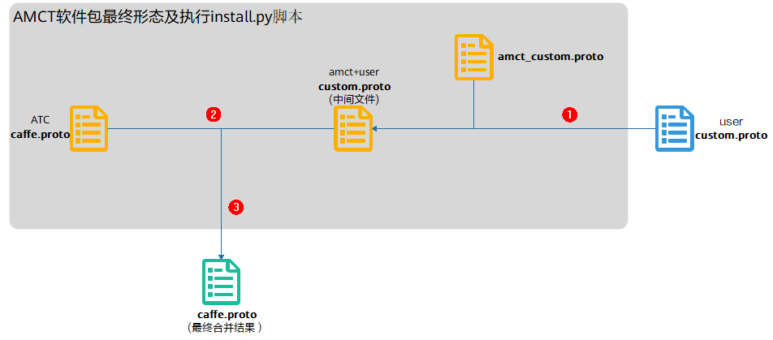

合并流程以及原则：

1.  用户准备自定义的custom.proto，执行AMCT提供的install.py脚本，该脚本会将用户的custom.proto与AMCT提供的amct\_custom.proto进行合并，生成中间文件custom.proto。
    -   如果custom.proto和amct\_custom.proto存在算子编号冲突的场景，则报错，提示用户修改custom.proto的算子编号。
    -   如果custom.proto和amct\_custom.proto存在算子名相同的场景，则报错，提示用户修改custom.proto的算子名。

2.  将生成的中间文件custom.proto与ATC软件包中的caffe.proto进行合并，生成最终的caffe.proto。
    -   如果custom.proto和caffe.proto存在算子编号冲突的场景，则报错，提示用户修改custom.proto的算子编号。
    -   如果custom.proto和caffe.proto存在算子名相同的场景，做去重处理，以custom.proto为准。

3.  最后会根据用户指定的caffe\_dir路径，找到用户caffe工程下的caffe.proto文件，对其进行备份后替换。

    > **说明：** 
    >-   amct\_custom.proto中的编号从200000开始（包括200000）。
    >-   caffe.proto中ATC自定义层的编号区间段为：\[5000,200000\)。
    >-   custom.proto中用户自定义层编号建议区间段小于5000，并且不与ATC提供的caffe.proto中的内置编号冲突。

## 量化因子记录文件说明<a name="ZH-CN_TOPIC_0000002441980745"></a>


### 量化因子记录文件格式说明<a name="ZH-CN_TOPIC_0000002408581174"></a>

量化因子record文件格式，为基于protobuf协议的序列化数据结构文件，通过该文件、量化配置文件以及原始网络模型文件，生成量化后的模型文件。其对应的protobuf原型定义为。

```
message ActivationQuantParam {
    optional float scale_d = 1;
    optional int32 offset_d = 2;
    required int32 index = 3;
    optional uint32 channels = 6;
    optional uint32 height = 7;
    optional uint32 width = 8;
    optional int32 num_bits_d = 9;
}
 
message SingleLayerRecord { 
    repeated float scale_w = 1;
    repeated int32 offset_w = 2;
    repeated uint32 shift_bit = 3;
    optional bool skip_fusion = 4 [default = false];
    optional string object_layer = 5;
    optional int32 num_bits_w = 6 [default = 8];
repeated ActivationQuantParam record_d = 7;
 } 
 message ScaleOffsetRecord { 
     message MapFiledEntry { 
         optional string key = 1; 
         optional SingleLayerRecord value = 2; 
     } 
     repeated MapFiledEntry record = 1; 
 }
```

参数说明如下：

<a name="table2090mcpsimp"></a>
<table><thead align="left"><tr id="row2098mcpsimp"><th class="cellrowborder" valign="top" width="20%" id="mcps1.1.6.1.1"><p id="p2100mcpsimp"><a name="p2100mcpsimp"></a><a name="p2100mcpsimp"></a>消息</p>
</th>
<th class="cellrowborder" valign="top" width="14.000000000000002%" id="mcps1.1.6.1.2"><p id="p2102mcpsimp"><a name="p2102mcpsimp"></a><a name="p2102mcpsimp"></a>是否必填</p>
</th>
<th class="cellrowborder" valign="top" width="16%" id="mcps1.1.6.1.3"><p id="p2104mcpsimp"><a name="p2104mcpsimp"></a><a name="p2104mcpsimp"></a>类型</p>
</th>
<th class="cellrowborder" valign="top" width="14.000000000000002%" id="mcps1.1.6.1.4"><p id="p2106mcpsimp"><a name="p2106mcpsimp"></a><a name="p2106mcpsimp"></a>字段</p>
</th>
<th class="cellrowborder" valign="top" width="36%" id="mcps1.1.6.1.5"><p id="p2108mcpsimp"><a name="p2108mcpsimp"></a><a name="p2108mcpsimp"></a>说明</p>
</th>
</tr>
</thead>
<tbody><tr id="row2110mcpsimp"><td class="cellrowborder" rowspan="2" valign="top" width="20%" headers="mcps1.1.6.1.1 "><p id="p2112mcpsimp"><a name="p2112mcpsimp"></a><a name="p2112mcpsimp"></a>ScaleOffsetRecord</p>
</td>
<td class="cellrowborder" valign="top" width="14.000000000000002%" headers="mcps1.1.6.1.2 "><p id="p2114mcpsimp"><a name="p2114mcpsimp"></a><a name="p2114mcpsimp"></a>-</p>
</td>
<td class="cellrowborder" valign="top" width="16%" headers="mcps1.1.6.1.3 "><p id="p2116mcpsimp"><a name="p2116mcpsimp"></a><a name="p2116mcpsimp"></a>-</p>
</td>
<td class="cellrowborder" valign="top" width="14.000000000000002%" headers="mcps1.1.6.1.4 "><p id="p2118mcpsimp"><a name="p2118mcpsimp"></a><a name="p2118mcpsimp"></a>-</p>
</td>
<td class="cellrowborder" valign="top" width="36%" headers="mcps1.1.6.1.5 "><p id="p2120mcpsimp"><a name="p2120mcpsimp"></a><a name="p2120mcpsimp"></a>map结构，为保证兼容性，采用离散的map结构。</p>
</td>
</tr>
<tr id="row2121mcpsimp"><td class="cellrowborder" valign="top" headers="mcps1.1.6.1.1 "><p id="p2123mcpsimp"><a name="p2123mcpsimp"></a><a name="p2123mcpsimp"></a>repeated</p>
</td>
<td class="cellrowborder" valign="top" headers="mcps1.1.6.1.2 "><p id="p2125mcpsimp"><a name="p2125mcpsimp"></a><a name="p2125mcpsimp"></a>MapFiledEntry</p>
</td>
<td class="cellrowborder" valign="top" headers="mcps1.1.6.1.3 "><p id="p2127mcpsimp"><a name="p2127mcpsimp"></a><a name="p2127mcpsimp"></a>record</p>
</td>
<td class="cellrowborder" valign="top" headers="mcps1.1.6.1.4 "><p id="p2129mcpsimp"><a name="p2129mcpsimp"></a><a name="p2129mcpsimp"></a>每个record对应一个量化层的量化因子记录；record包括两个成员：</p>
<a name="ul2130mcpsimp"></a><a name="ul2130mcpsimp"></a><ul id="ul2130mcpsimp"><li>key为所记录量化层的layer name。</li><li>value对应SingleLayerRecord定义的具体量化因子。</li></ul>
</td>
</tr>
<tr id="row2133mcpsimp"><td class="cellrowborder" rowspan="8" valign="top" width="20%" headers="mcps1.1.6.1.1 "><p id="p2135mcpsimp"><a name="p2135mcpsimp"></a><a name="p2135mcpsimp"></a>SingleLayerRecord</p>
</td>
<td class="cellrowborder" valign="top" width="14.000000000000002%" headers="mcps1.1.6.1.2 "><p id="p2137mcpsimp"><a name="p2137mcpsimp"></a><a name="p2137mcpsimp"></a>-</p>
</td>
<td class="cellrowborder" valign="top" width="16%" headers="mcps1.1.6.1.3 "><p id="p2139mcpsimp"><a name="p2139mcpsimp"></a><a name="p2139mcpsimp"></a>-</p>
</td>
<td class="cellrowborder" valign="top" width="14.000000000000002%" headers="mcps1.1.6.1.4 "><p id="p2141mcpsimp"><a name="p2141mcpsimp"></a><a name="p2141mcpsimp"></a>-</p>
</td>
<td class="cellrowborder" valign="top" width="36%" headers="mcps1.1.6.1.5 "><p id="p2143mcpsimp"><a name="p2143mcpsimp"></a><a name="p2143mcpsimp"></a>包含了量化层所需要的所有量化因子记录信息。</p>
</td>
</tr>
<tr id="row2144mcpsimp"><td class="cellrowborder" valign="top" headers="mcps1.1.6.1.1 "><p id="p2146mcpsimp"><a name="p2146mcpsimp"></a><a name="p2146mcpsimp"></a>repeated</p>
</td>
<td class="cellrowborder" valign="top" headers="mcps1.1.6.1.2 "><p id="p2148mcpsimp"><a name="p2148mcpsimp"></a><a name="p2148mcpsimp"></a>float</p>
</td>
<td class="cellrowborder" valign="top" headers="mcps1.1.6.1.3 "><p id="p2150mcpsimp"><a name="p2150mcpsimp"></a><a name="p2150mcpsimp"></a>scale_w</p>
</td>
<td class="cellrowborder" valign="top" headers="mcps1.1.6.1.4 "><p id="p2152mcpsimp"><a name="p2152mcpsimp"></a><a name="p2152mcpsimp"></a>权重量化scale因子，支持标量（对当前层的权重进行统一量化），向量（对当前层的权重按channel_wise方式进行量化）两种模式，仅支持卷集成（Convolution），反卷积层（Deconvolution）类型进行channel_wise量化模式。</p>
</td>
</tr>
<tr id="row2153mcpsimp"><td class="cellrowborder" valign="top" headers="mcps1.1.6.1.1 "><p id="p2155mcpsimp"><a name="p2155mcpsimp"></a><a name="p2155mcpsimp"></a>repeated</p>
</td>
<td class="cellrowborder" valign="top" headers="mcps1.1.6.1.2 "><p id="p2157mcpsimp"><a name="p2157mcpsimp"></a><a name="p2157mcpsimp"></a>int32</p>
</td>
<td class="cellrowborder" valign="top" headers="mcps1.1.6.1.3 "><p id="p2159mcpsimp"><a name="p2159mcpsimp"></a><a name="p2159mcpsimp"></a>offset_w</p>
</td>
<td class="cellrowborder" valign="top" headers="mcps1.1.6.1.4 "><p id="p2161mcpsimp"><a name="p2161mcpsimp"></a><a name="p2161mcpsimp"></a>权重量化offset因子，同scale_w一样支持标量和向量两种模式，且需要同scale_w维度一致，当前不支持权重带offset量化模式，offset_w仅支持0。</p>
</td>
</tr>
<tr id="row2162mcpsimp"><td class="cellrowborder" valign="top" headers="mcps1.1.6.1.1 "><p id="p2164mcpsimp"><a name="p2164mcpsimp"></a><a name="p2164mcpsimp"></a>repeated</p>
</td>
<td class="cellrowborder" valign="top" headers="mcps1.1.6.1.2 "><p id="p2166mcpsimp"><a name="p2166mcpsimp"></a><a name="p2166mcpsimp"></a>uint32</p>
</td>
<td class="cellrowborder" valign="top" headers="mcps1.1.6.1.3 "><p id="p2168mcpsimp"><a name="p2168mcpsimp"></a><a name="p2168mcpsimp"></a>shift_bit</p>
</td>
<td class="cellrowborder" valign="top" headers="mcps1.1.6.1.4 "><p id="p2170mcpsimp"><a name="p2170mcpsimp"></a><a name="p2170mcpsimp"></a>移位因子。当前不支持，不需要配置。</p>
</td>
</tr>
<tr id="row2171mcpsimp"><td class="cellrowborder" valign="top" headers="mcps1.1.6.1.1 "><p id="p2173mcpsimp"><a name="p2173mcpsimp"></a><a name="p2173mcpsimp"></a>optional</p>
</td>
<td class="cellrowborder" valign="top" headers="mcps1.1.6.1.2 "><p id="p2175mcpsimp"><a name="p2175mcpsimp"></a><a name="p2175mcpsimp"></a>bool</p>
</td>
<td class="cellrowborder" valign="top" headers="mcps1.1.6.1.3 "><p id="p2177mcpsimp"><a name="p2177mcpsimp"></a><a name="p2177mcpsimp"></a>skip_fusion</p>
</td>
<td class="cellrowborder" valign="top" headers="mcps1.1.6.1.4 "><p id="p2179mcpsimp"><a name="p2179mcpsimp"></a><a name="p2179mcpsimp"></a>配置当前层是否要跳过Conv+BN+Scale+Bias、Deconv+BN+Scale+Bias、BN+Scale+Conv、FC+BN+Scale+Bias融合操作，默认为false，即当前层要做上述融合。</p>
</td>
</tr>
<tr id="row2180mcpsimp"><td class="cellrowborder" valign="top" headers="mcps1.1.6.1.1 "><p id="p2182mcpsimp"><a name="p2182mcpsimp"></a><a name="p2182mcpsimp"></a>optinal</p>
</td>
<td class="cellrowborder" valign="top" headers="mcps1.1.6.1.2 "><p id="p2184mcpsimp"><a name="p2184mcpsimp"></a><a name="p2184mcpsimp"></a>string</p>
</td>
<td class="cellrowborder" valign="top" headers="mcps1.1.6.1.3 "><p id="p2186mcpsimp"><a name="p2186mcpsimp"></a><a name="p2186mcpsimp"></a>object_layer</p>
</td>
<td class="cellrowborder" valign="top" headers="mcps1.1.6.1.4 "><p id="p2188mcpsimp"><a name="p2188mcpsimp"></a><a name="p2188mcpsimp"></a>标识当前record所属层名</p>
</td>
</tr>
<tr id="row2189mcpsimp"><td class="cellrowborder" valign="top" headers="mcps1.1.6.1.1 "><p id="p2191mcpsimp"><a name="p2191mcpsimp"></a><a name="p2191mcpsimp"></a>optinal</p>
</td>
<td class="cellrowborder" valign="top" headers="mcps1.1.6.1.2 "><p id="p2193mcpsimp"><a name="p2193mcpsimp"></a><a name="p2193mcpsimp"></a>Int32</p>
</td>
<td class="cellrowborder" valign="top" headers="mcps1.1.6.1.3 "><p id="p2195mcpsimp"><a name="p2195mcpsimp"></a><a name="p2195mcpsimp"></a>num_bits_w</p>
</td>
<td class="cellrowborder" valign="top" headers="mcps1.1.6.1.4 "><p id="p2197mcpsimp"><a name="p2197mcpsimp"></a><a name="p2197mcpsimp"></a>标识当前权重量化位宽</p>
</td>
</tr>
<tr id="row2198mcpsimp"><td class="cellrowborder" valign="top" headers="mcps1.1.6.1.1 "><p id="p2200mcpsimp"><a name="p2200mcpsimp"></a><a name="p2200mcpsimp"></a>repeated</p>
</td>
<td class="cellrowborder" valign="top" headers="mcps1.1.6.1.2 "><p id="p2202mcpsimp"><a name="p2202mcpsimp"></a><a name="p2202mcpsimp"></a>ActivationQuantParam</p>
</td>
<td class="cellrowborder" valign="top" headers="mcps1.1.6.1.3 "><p id="p2204mcpsimp"><a name="p2204mcpsimp"></a><a name="p2204mcpsimp"></a>record_d</p>
</td>
<td class="cellrowborder" valign="top" headers="mcps1.1.6.1.4 "><p id="p2206mcpsimp"><a name="p2206mcpsimp"></a><a name="p2206mcpsimp"></a>数据量化因子</p>
</td>
</tr>
<tr id="row2207mcpsimp"><td class="cellrowborder" rowspan="8" valign="top" width="20%" headers="mcps1.1.6.1.1 "><p id="p2209mcpsimp"><a name="p2209mcpsimp"></a><a name="p2209mcpsimp"></a>ActivationQuantParam</p>
</td>
<td class="cellrowborder" valign="top" width="14.000000000000002%" headers="mcps1.1.6.1.2 "><p id="p2211mcpsimp"><a name="p2211mcpsimp"></a><a name="p2211mcpsimp"></a>-</p>
</td>
<td class="cellrowborder" valign="top" width="16%" headers="mcps1.1.6.1.3 "><p id="p2213mcpsimp"><a name="p2213mcpsimp"></a><a name="p2213mcpsimp"></a>-</p>
</td>
<td class="cellrowborder" valign="top" width="14.000000000000002%" headers="mcps1.1.6.1.4 "><p id="p2215mcpsimp"><a name="p2215mcpsimp"></a><a name="p2215mcpsimp"></a>-</p>
</td>
<td class="cellrowborder" valign="top" width="36%" headers="mcps1.1.6.1.5 "><p id="p2217mcpsimp"><a name="p2217mcpsimp"></a><a name="p2217mcpsimp"></a>用于记录单组量化参数</p>
</td>
</tr>
<tr id="row2218mcpsimp"><td class="cellrowborder" valign="top" headers="mcps1.1.6.1.1 "><p id="p2220mcpsimp"><a name="p2220mcpsimp"></a><a name="p2220mcpsimp"></a>optional</p>
</td>
<td class="cellrowborder" valign="top" headers="mcps1.1.6.1.2 "><p id="p2222mcpsimp"><a name="p2222mcpsimp"></a><a name="p2222mcpsimp"></a>float</p>
</td>
<td class="cellrowborder" valign="top" headers="mcps1.1.6.1.3 "><p id="p2224mcpsimp"><a name="p2224mcpsimp"></a><a name="p2224mcpsimp"></a>scale_d</p>
</td>
<td class="cellrowborder" valign="top" headers="mcps1.1.6.1.4 "><p id="p2226mcpsimp"><a name="p2226mcpsimp"></a><a name="p2226mcpsimp"></a>数据量化scale因子，仅支持对数据进行统一量化。</p>
</td>
</tr>
<tr id="row2227mcpsimp"><td class="cellrowborder" valign="top" headers="mcps1.1.6.1.1 "><p id="p2229mcpsimp"><a name="p2229mcpsimp"></a><a name="p2229mcpsimp"></a>optional</p>
</td>
<td class="cellrowborder" valign="top" headers="mcps1.1.6.1.2 "><p id="p2231mcpsimp"><a name="p2231mcpsimp"></a><a name="p2231mcpsimp"></a>int32</p>
</td>
<td class="cellrowborder" valign="top" headers="mcps1.1.6.1.3 "><p id="p2233mcpsimp"><a name="p2233mcpsimp"></a><a name="p2233mcpsimp"></a>offset_d</p>
</td>
<td class="cellrowborder" valign="top" headers="mcps1.1.6.1.4 "><p id="p2235mcpsimp"><a name="p2235mcpsimp"></a><a name="p2235mcpsimp"></a>数据量化offset因子，仅支持对数据进行统一量化。</p>
</td>
</tr>
<tr id="row2236mcpsimp"><td class="cellrowborder" valign="top" headers="mcps1.1.6.1.1 "><p id="p2238mcpsimp"><a name="p2238mcpsimp"></a><a name="p2238mcpsimp"></a>required</p>
</td>
<td class="cellrowborder" valign="top" headers="mcps1.1.6.1.2 "><p id="p2240mcpsimp"><a name="p2240mcpsimp"></a><a name="p2240mcpsimp"></a>int32</p>
</td>
<td class="cellrowborder" valign="top" headers="mcps1.1.6.1.3 "><p id="p2242mcpsimp"><a name="p2242mcpsimp"></a><a name="p2242mcpsimp"></a>index</p>
</td>
<td class="cellrowborder" valign="top" headers="mcps1.1.6.1.4 "><p id="p2244mcpsimp"><a name="p2244mcpsimp"></a><a name="p2244mcpsimp"></a>标识当前量化参数针对的输入索引</p>
</td>
</tr>
<tr id="row2245mcpsimp"><td class="cellrowborder" valign="top" headers="mcps1.1.6.1.1 "><p id="p2247mcpsimp"><a name="p2247mcpsimp"></a><a name="p2247mcpsimp"></a>optional</p>
</td>
<td class="cellrowborder" valign="top" headers="mcps1.1.6.1.2 "><p id="p2249mcpsimp"><a name="p2249mcpsimp"></a><a name="p2249mcpsimp"></a>uint32</p>
</td>
<td class="cellrowborder" valign="top" headers="mcps1.1.6.1.3 "><p id="p2251mcpsimp"><a name="p2251mcpsimp"></a><a name="p2251mcpsimp"></a>channels</p>
</td>
<td class="cellrowborder" valign="top" headers="mcps1.1.6.1.4 "><p id="p2253mcpsimp"><a name="p2253mcpsimp"></a><a name="p2253mcpsimp"></a>由于模型小型化工具不支持整网infer_shape，需要配置当前层的输入shape信息，该字段用于配置输入的channel大小；</p>
</td>
</tr>
<tr id="row2254mcpsimp"><td class="cellrowborder" valign="top" headers="mcps1.1.6.1.1 "><p id="p2256mcpsimp"><a name="p2256mcpsimp"></a><a name="p2256mcpsimp"></a>optional</p>
</td>
<td class="cellrowborder" valign="top" headers="mcps1.1.6.1.2 "><p id="p2258mcpsimp"><a name="p2258mcpsimp"></a><a name="p2258mcpsimp"></a>uint32</p>
</td>
<td class="cellrowborder" valign="top" headers="mcps1.1.6.1.3 "><p id="p2260mcpsimp"><a name="p2260mcpsimp"></a><a name="p2260mcpsimp"></a>height</p>
</td>
<td class="cellrowborder" valign="top" headers="mcps1.1.6.1.4 "><p id="p2262mcpsimp"><a name="p2262mcpsimp"></a><a name="p2262mcpsimp"></a>由于模型小型化工具不支持整网infer_shape，需要配置当前层的输入shape信息，该字段用于配置输入的height大小。</p>
</td>
</tr>
<tr id="row2263mcpsimp"><td class="cellrowborder" valign="top" headers="mcps1.1.6.1.1 "><p id="p2265mcpsimp"><a name="p2265mcpsimp"></a><a name="p2265mcpsimp"></a>optional</p>
</td>
<td class="cellrowborder" valign="top" headers="mcps1.1.6.1.2 "><p id="p2267mcpsimp"><a name="p2267mcpsimp"></a><a name="p2267mcpsimp"></a>uint32</p>
</td>
<td class="cellrowborder" valign="top" headers="mcps1.1.6.1.3 "><p id="p2269mcpsimp"><a name="p2269mcpsimp"></a><a name="p2269mcpsimp"></a>width</p>
</td>
<td class="cellrowborder" valign="top" headers="mcps1.1.6.1.4 "><p id="p2271mcpsimp"><a name="p2271mcpsimp"></a><a name="p2271mcpsimp"></a>由于模型小型化工具不支持整网infer_shape，需要配置当前层的输入shape信息，该字段用于配置输入的width大小。</p>
</td>
</tr>
<tr id="row2272mcpsimp"><td class="cellrowborder" valign="top" headers="mcps1.1.6.1.1 "><p id="p2274mcpsimp"><a name="p2274mcpsimp"></a><a name="p2274mcpsimp"></a>optional</p>
</td>
<td class="cellrowborder" valign="top" headers="mcps1.1.6.1.2 "><p id="p2276mcpsimp"><a name="p2276mcpsimp"></a><a name="p2276mcpsimp"></a>int32</p>
</td>
<td class="cellrowborder" valign="top" headers="mcps1.1.6.1.3 "><p id="p2278mcpsimp"><a name="p2278mcpsimp"></a><a name="p2278mcpsimp"></a>num_bits_d</p>
</td>
<td class="cellrowborder" valign="top" headers="mcps1.1.6.1.4 "><p id="p2280mcpsimp"><a name="p2280mcpsimp"></a><a name="p2280mcpsimp"></a>数据量化位宽</p>
</td>
</tr>
</tbody>
</table>

**对于optional字段，由于protobuf协议未对重复出现的值报错，而是采用覆盖处理，因此出现重复配置的optional字段内容时会默认保留最后一次配置的值，需要用户自己保证文件的正确性**。

对于一般量化层需要配置包含scale\_d、offset\_d、scale\_w、offset\_w、channels、height、width、shift\_bit参数，对于AVE Pooling因为没有权重，因此不能够配置scale\_w、offset\_w参数，量化因子record文件格式参考示例如下：

```
record { 
    key: "conv1" 
    value: { 
        scale_d: 0.01424 
        offset_d: -128 
        scale_w: 0.43213 
        scale_w: 0.78163 
        scale_w: 1.03213 
        offset_w: 0 
        offset_w: 0 
        offset_w: 0 
        shift_bit: 1 
        shift_bit: 1 
        shift_bit: 1 
        num_bits_w: 8        record_d {
          scale_d: 1.554879
          offset_d: -49
          index: 0
          num_bits_d: 8
        }
} record {
  key: "pool1"
  value {
    scale_w: 1.0
    offset_w: 0
    record_d {
      scale_d: 0.051592775
      offset_d: -128
      index: 0
      num_bits_d: 8
    }
  }
}
record {
  key: "fc1000"
  value {
    scale_w: 0.0057898927
    offset_w: 0
    shift_bit: 2
    num_bits_w: 8
    record_d {
      scale_d: 0.031852875
      offset_d: -128
      index: 0
      num_bits_d: 8
    }
  }
}
```

### 量化因子说明<a name="ZH-CN_TOPIC_0000002408581218"></a>

对于量化层数据和权重分别需要提供量化因子scale（浮点数的缩放因子），offset（偏移量）两项，AMCT采用的是统一的量化数据格式，参考如下，其应用表达式为：


支持的取值范围为：

-   
-   

量化通常分为对称量化算法、非对称量化算法两类：

-   对称量化算法原理：

    原始高精度数据和量化后INT8数据的转换为：，其中scale是float32的浮点数，为了能够表示正负数，采用signed int8的数据类型，通过原始高精度数据转换到int8数据的操作如下，其中round为取整函数，量化算法需要确定的数值即为常数scale：

    

    对权值和数据的量化可以归结为寻找scale的过程，由于为有符号数，要保证正负数值表示范围的对称性，因此对所有数据首先进行取绝对值的操作，使待量化数据的范围变换为，再来确定scale。由于INT8在正数范围内能表示的数值范围为\[0,127\]，因此scale可以通过如下方式计算得到：

    

    确定了scale之后，INT8数据对应的表示范围为，量化操作即为对量化数据以进行饱和，即超过范围的数据饱和到边界值，然后进行公式所示量化操作即可。

-   非对称量化算法原理：

    与对称量化算法主要区别在于数据转换的方式不同，如下，同样需要确定scale与offset这两个常数。

    

    确定后通过原始高精度数据计算得到UINT8数据的转换，即为如下公式所示：

    

    其中，scale是FP32浮点数，为unsigned INT8定点数，offset是INT8定点数。其表示的数据范围为。若待量化数据的取值范围为，则scale和offset的计算方式如下：

    ，

    量化数据格式统一：通过将非对称量化公式通过简单的数据变换，可以使得量化后的数据与对称量化算法在数据格式上保持一致，均为int格式。具体变换过程如下：

    以int8量化为例进行说明，公式符号与之前保持一致，输入原始高精度浮点数据为，原始量化后的定点数为，量化scale，原始量化（算法要求强制过零点，否则可能会出现精度问题），原始量化的计算原理公式如下：

    

    其中。通过上述变换，可以将量化数据也转成int8格式。确定scale和变换后的offset'后，通过原始高精度浮点数据计算得到INT8数据的转换即为如下公式所示：

    

## 训练后量化简易量化配置文件说明<a name="ZH-CN_TOPIC_0000002441980761"></a>

calibration\_config.proto文件参数说明如[表1](#_Ref77061922)所示。

**表 1**  calibration\_config.proto参数说明

<a name="_Ref77061922"></a>
<table><thead align="left"><tr id="row376mcpsimp"><th class="cellrowborder" valign="top" width="23%" id="mcps1.2.6.1.1"><p id="p378mcpsimp"><a name="p378mcpsimp"></a><a name="p378mcpsimp"></a>消息</p>
</th>
<th class="cellrowborder" valign="top" width="14.000000000000002%" id="mcps1.2.6.1.2"><p id="p380mcpsimp"><a name="p380mcpsimp"></a><a name="p380mcpsimp"></a>是否必填</p>
</th>
<th class="cellrowborder" valign="top" width="13%" id="mcps1.2.6.1.3"><p id="p382mcpsimp"><a name="p382mcpsimp"></a><a name="p382mcpsimp"></a>类型</p>
</th>
<th class="cellrowborder" valign="top" width="18%" id="mcps1.2.6.1.4"><p id="p384mcpsimp"><a name="p384mcpsimp"></a><a name="p384mcpsimp"></a>字段</p>
</th>
<th class="cellrowborder" valign="top" width="32%" id="mcps1.2.6.1.5"><p id="p386mcpsimp"><a name="p386mcpsimp"></a><a name="p386mcpsimp"></a>说明</p>
</th>
</tr>
</thead>
<tbody><tr id="row388mcpsimp"><td class="cellrowborder" rowspan="10" valign="top" width="23%" headers="mcps1.2.6.1.1 "><p id="p390mcpsimp"><a name="p390mcpsimp"></a><a name="p390mcpsimp"></a>AMCTConfig</p>
</td>
<td class="cellrowborder" valign="top" width="14.000000000000002%" headers="mcps1.2.6.1.2 "><p id="p392mcpsimp"><a name="p392mcpsimp"></a><a name="p392mcpsimp"></a>-</p>
</td>
<td class="cellrowborder" valign="top" width="13%" headers="mcps1.2.6.1.3 "><p id="p394mcpsimp"><a name="p394mcpsimp"></a><a name="p394mcpsimp"></a>-</p>
</td>
<td class="cellrowborder" valign="top" width="18%" headers="mcps1.2.6.1.4 "><p id="p396mcpsimp"><a name="p396mcpsimp"></a><a name="p396mcpsimp"></a>-</p>
</td>
<td class="cellrowborder" valign="top" width="32%" headers="mcps1.2.6.1.5 "><p id="p398mcpsimp"><a name="p398mcpsimp"></a><a name="p398mcpsimp"></a>模型小型化工具的简易量化配置。</p>
</td>
</tr>
<tr id="row399mcpsimp"><td class="cellrowborder" valign="top" headers="mcps1.2.6.1.1 "><p id="p401mcpsimp"><a name="p401mcpsimp"></a><a name="p401mcpsimp"></a>optional</p>
</td>
<td class="cellrowborder" valign="top" headers="mcps1.2.6.1.2 "><p id="p403mcpsimp"><a name="p403mcpsimp"></a><a name="p403mcpsimp"></a>uint32</p>
</td>
<td class="cellrowborder" valign="top" headers="mcps1.2.6.1.3 "><p id="p405mcpsimp"><a name="p405mcpsimp"></a><a name="p405mcpsimp"></a>batch_num</p>
</td>
<td class="cellrowborder" valign="top" headers="mcps1.2.6.1.4 "><p id="p407mcpsimp"><a name="p407mcpsimp"></a><a name="p407mcpsimp"></a>数据量化使用的batch数量。</p>
</td>
</tr>
<tr id="row408mcpsimp"><td class="cellrowborder" valign="top" headers="mcps1.2.6.1.1 "><p id="p410mcpsimp"><a name="p410mcpsimp"></a><a name="p410mcpsimp"></a>optional</p>
</td>
<td class="cellrowborder" valign="top" headers="mcps1.2.6.1.2 "><p id="p412mcpsimp"><a name="p412mcpsimp"></a><a name="p412mcpsimp"></a>bool</p>
</td>
<td class="cellrowborder" valign="top" headers="mcps1.2.6.1.3 "><p id="p414mcpsimp"><a name="p414mcpsimp"></a><a name="p414mcpsimp"></a>activation_offset</p>
</td>
<td class="cellrowborder" valign="top" headers="mcps1.2.6.1.4 "><p id="p416mcpsimp"><a name="p416mcpsimp"></a><a name="p416mcpsimp"></a>数据量化是否带offset。</p>
</td>
</tr>
<tr id="row417mcpsimp"><td class="cellrowborder" valign="top" headers="mcps1.2.6.1.1 "><p id="p419mcpsimp"><a name="p419mcpsimp"></a><a name="p419mcpsimp"></a>repeated</p>
</td>
<td class="cellrowborder" valign="top" headers="mcps1.2.6.1.2 "><p id="p421mcpsimp"><a name="p421mcpsimp"></a><a name="p421mcpsimp"></a>string</p>
</td>
<td class="cellrowborder" valign="top" headers="mcps1.2.6.1.3 "><p id="p423mcpsimp"><a name="p423mcpsimp"></a><a name="p423mcpsimp"></a>skip_layers</p>
</td>
<td class="cellrowborder" valign="top" headers="mcps1.2.6.1.4 "><p id="p425mcpsimp"><a name="p425mcpsimp"></a><a name="p425mcpsimp"></a>不需要量化层的层名。</p>
</td>
</tr>
<tr id="row426mcpsimp"><td class="cellrowborder" valign="top" headers="mcps1.2.6.1.1 "><p id="p428mcpsimp"><a name="p428mcpsimp"></a><a name="p428mcpsimp"></a>repeated</p>
</td>
<td class="cellrowborder" valign="top" headers="mcps1.2.6.1.2 "><p id="p430mcpsimp"><a name="p430mcpsimp"></a><a name="p430mcpsimp"></a>string</p>
</td>
<td class="cellrowborder" valign="top" headers="mcps1.2.6.1.3 "><p id="p432mcpsimp"><a name="p432mcpsimp"></a><a name="p432mcpsimp"></a>skip_layer_types</p>
</td>
<td class="cellrowborder" valign="top" headers="mcps1.2.6.1.4 "><p id="p434mcpsimp"><a name="p434mcpsimp"></a><a name="p434mcpsimp"></a>不需要量化的层类型。</p>
</td>
</tr>
<tr id="row435mcpsimp"><td class="cellrowborder" valign="top" headers="mcps1.2.6.1.1 "><p id="p437mcpsimp"><a name="p437mcpsimp"></a><a name="p437mcpsimp"></a>optional</p>
</td>
<td class="cellrowborder" valign="top" headers="mcps1.2.6.1.2 "><p id="p439mcpsimp"><a name="p439mcpsimp"></a><a name="p439mcpsimp"></a>CalibrationConfig</p>
</td>
<td class="cellrowborder" valign="top" headers="mcps1.2.6.1.3 "><p id="p441mcpsimp"><a name="p441mcpsimp"></a><a name="p441mcpsimp"></a>common_config</p>
</td>
<td class="cellrowborder" valign="top" headers="mcps1.2.6.1.4 "><p id="p443mcpsimp"><a name="p443mcpsimp"></a><a name="p443mcpsimp"></a>通用的量化配置，若某层未被override_layer_types或者override_layer_configs重写，则使用该配置。</p>
</td>
</tr>
<tr id="row444mcpsimp"><td class="cellrowborder" valign="top" headers="mcps1.2.6.1.1 "><p id="p446mcpsimp"><a name="p446mcpsimp"></a><a name="p446mcpsimp"></a>repeated</p>
</td>
<td class="cellrowborder" valign="top" headers="mcps1.2.6.1.2 "><p id="p448mcpsimp"><a name="p448mcpsimp"></a><a name="p448mcpsimp"></a>OverrideLayerType</p>
</td>
<td class="cellrowborder" valign="top" headers="mcps1.2.6.1.3 "><p id="p450mcpsimp"><a name="p450mcpsimp"></a><a name="p450mcpsimp"></a>override_layer_types</p>
</td>
<td class="cellrowborder" valign="top" headers="mcps1.2.6.1.4 "><p id="p452mcpsimp"><a name="p452mcpsimp"></a><a name="p452mcpsimp"></a>重写某一类型层的量化配置。</p>
</td>
</tr>
<tr id="row453mcpsimp"><td class="cellrowborder" valign="top" headers="mcps1.2.6.1.1 "><p id="p455mcpsimp"><a name="p455mcpsimp"></a><a name="p455mcpsimp"></a>repeated</p>
</td>
<td class="cellrowborder" valign="top" headers="mcps1.2.6.1.2 "><p id="p457mcpsimp"><a name="p457mcpsimp"></a><a name="p457mcpsimp"></a>OverrideLayer</p>
</td>
<td class="cellrowborder" valign="top" headers="mcps1.2.6.1.3 "><p id="p459mcpsimp"><a name="p459mcpsimp"></a><a name="p459mcpsimp"></a>override_layer_configs</p>
</td>
<td class="cellrowborder" valign="top" headers="mcps1.2.6.1.4 "><p id="p461mcpsimp"><a name="p461mcpsimp"></a><a name="p461mcpsimp"></a>重写某一层的量化配置。</p>
</td>
</tr>
<tr id="row462mcpsimp"><td class="cellrowborder" valign="top" headers="mcps1.2.6.1.1 "><p id="p464mcpsimp"><a name="p464mcpsimp"></a><a name="p464mcpsimp"></a>optional</p>
</td>
<td class="cellrowborder" valign="top" headers="mcps1.2.6.1.2 "><p id="p466mcpsimp"><a name="p466mcpsimp"></a><a name="p466mcpsimp"></a>bool</p>
</td>
<td class="cellrowborder" valign="top" headers="mcps1.2.6.1.3 "><p id="p468mcpsimp"><a name="p468mcpsimp"></a><a name="p468mcpsimp"></a>do_fusion</p>
</td>
<td class="cellrowborder" valign="top" headers="mcps1.2.6.1.4 "><p id="p470mcpsimp"><a name="p470mcpsimp"></a><a name="p470mcpsimp"></a>是否开启BN融合功能，默认为true，表示开启该功能。</p>
</td>
</tr>
<tr id="row471mcpsimp"><td class="cellrowborder" valign="top" headers="mcps1.2.6.1.1 "><p id="p473mcpsimp"><a name="p473mcpsimp"></a><a name="p473mcpsimp"></a>repeated</p>
</td>
<td class="cellrowborder" valign="top" headers="mcps1.2.6.1.2 "><p id="p475mcpsimp"><a name="p475mcpsimp"></a><a name="p475mcpsimp"></a>string</p>
</td>
<td class="cellrowborder" valign="top" headers="mcps1.2.6.1.3 "><p id="p477mcpsimp"><a name="p477mcpsimp"></a><a name="p477mcpsimp"></a>skip_fusion_layers</p>
</td>
<td class="cellrowborder" valign="top" headers="mcps1.2.6.1.4 "><p id="p479mcpsimp"><a name="p479mcpsimp"></a><a name="p479mcpsimp"></a>跳过BN融合的层，配置之后这些层不会进行BN融合。</p>
</td>
</tr>
<tr id="row480mcpsimp"><td class="cellrowborder" rowspan="5" valign="top" width="23%" headers="mcps1.2.6.1.1 "><p id="p502mcpsimp"><a name="p502mcpsimp"></a><a name="p502mcpsimp"></a>BnUpdateConfig</p>
</td>
<td class="cellrowborder" valign="top" width="14.000000000000002%" headers="mcps1.2.6.1.2 "><p id="p483mcpsimp"><a name="p483mcpsimp"></a><a name="p483mcpsimp"></a>optional</p>
</td>
<td class="cellrowborder" valign="top" width="13%" headers="mcps1.2.6.1.3 "><p id="p485mcpsimp"><a name="p485mcpsimp"></a><a name="p485mcpsimp"></a>bool</p>
</td>
<td class="cellrowborder" valign="top" width="18%" headers="mcps1.2.6.1.4 "><p id="p487mcpsimp"><a name="p487mcpsimp"></a><a name="p487mcpsimp"></a>update_bn</p>
</td>
<td class="cellrowborder" valign="top" width="32%" headers="mcps1.2.6.1.5 "><p id="p489mcpsimp"><a name="p489mcpsimp"></a><a name="p489mcpsimp"></a>是否更新BN层中的统计参数（包括均值和方差）</p>
</td>
</tr>
<tr id="row490mcpsimp"><td class="cellrowborder" valign="top" headers="mcps1.2.6.1.1 "><p id="p493mcpsimp"><a name="p493mcpsimp"></a><a name="p493mcpsimp"></a>optional</p>
</td>
<td class="cellrowborder" valign="top" headers="mcps1.2.6.1.2 "><p id="p495mcpsimp"><a name="p495mcpsimp"></a><a name="p495mcpsimp"></a>BnUpdateConfig</p>
</td>
<td class="cellrowborder" valign="top" headers="mcps1.2.6.1.3 "><p id="p497mcpsimp"><a name="p497mcpsimp"></a><a name="p497mcpsimp"></a>bn_update_config</p>
</td>
<td class="cellrowborder" valign="top" headers="mcps1.2.6.1.4 "><p id="p499mcpsimp"><a name="p499mcpsimp"></a><a name="p499mcpsimp"></a>BN层进行更新的参数配置</p>
</td>
</tr>
<tr id="row500mcpsimp"><td class="cellrowborder" valign="top" headers="mcps1.2.6.1.1 "><p id="p504mcpsimp"><a name="p504mcpsimp"></a><a name="p504mcpsimp"></a>optional</p>
</td>
<td class="cellrowborder" valign="top" headers="mcps1.2.6.1.2 "><p id="p506mcpsimp"><a name="p506mcpsimp"></a><a name="p506mcpsimp"></a>uint32</p>
</td>
<td class="cellrowborder" valign="top" headers="mcps1.2.6.1.3 "><p id="p508mcpsimp"><a name="p508mcpsimp"></a><a name="p508mcpsimp"></a>bn_update_iterations</p>
</td>
<td class="cellrowborder" valign="top" headers="mcps1.2.6.1.4 "><p id="p510mcpsimp"><a name="p510mcpsimp"></a><a name="p510mcpsimp"></a>BN更新的迭代次数</p>
</td>
</tr>
<tr id="row511mcpsimp"><td class="cellrowborder" valign="top" headers="mcps1.2.6.1.1 "><p id="p513mcpsimp"><a name="p513mcpsimp"></a><a name="p513mcpsimp"></a>optional</p>
</td>
<td class="cellrowborder" valign="top" headers="mcps1.2.6.1.2 "><p id="p515mcpsimp"><a name="p515mcpsimp"></a><a name="p515mcpsimp"></a>float</p>
</td>
<td class="cellrowborder" valign="top" headers="mcps1.2.6.1.3 "><p id="p517mcpsimp"><a name="p517mcpsimp"></a><a name="p517mcpsimp"></a>bn_moving_average_fraction</p>
</td>
<td class="cellrowborder" valign="top" headers="mcps1.2.6.1.4 "><p id="p519mcpsimp"><a name="p519mcpsimp"></a><a name="p519mcpsimp"></a>BN更新的滑动学习率</p>
</td>
</tr>
<tr id="row520mcpsimp"><td class="cellrowborder" valign="top" headers="mcps1.2.6.1.1 "><p id="p522mcpsimp"><a name="p522mcpsimp"></a><a name="p522mcpsimp"></a>optional</p>
</td>
<td class="cellrowborder" valign="top" headers="mcps1.2.6.1.2 "><p id="p524mcpsimp"><a name="p524mcpsimp"></a><a name="p524mcpsimp"></a>string</p>
</td>
<td class="cellrowborder" valign="top" headers="mcps1.2.6.1.3 "><p id="p526mcpsimp"><a name="p526mcpsimp"></a><a name="p526mcpsimp"></a>bn_dump_dir</p>
</td>
<td class="cellrowborder" valign="top" headers="mcps1.2.6.1.4 "><p id="p528mcpsimp"><a name="p528mcpsimp"></a><a name="p528mcpsimp"></a>Bn更新后权重的保存路径</p>
</td>
</tr>
<tr id="row529mcpsimp"><td class="cellrowborder" rowspan="2" valign="top" width="23%" headers="mcps1.2.6.1.1 "><p id="p531mcpsimp"><a name="p531mcpsimp"></a><a name="p531mcpsimp"></a>OverrideLayerType</p>
</td>
<td class="cellrowborder" valign="top" width="14.000000000000002%" headers="mcps1.2.6.1.2 "><p id="p533mcpsimp"><a name="p533mcpsimp"></a><a name="p533mcpsimp"></a>required</p>
</td>
<td class="cellrowborder" valign="top" width="13%" headers="mcps1.2.6.1.3 "><p id="p535mcpsimp"><a name="p535mcpsimp"></a><a name="p535mcpsimp"></a>string</p>
</td>
<td class="cellrowborder" valign="top" width="18%" headers="mcps1.2.6.1.4 "><p id="p537mcpsimp"><a name="p537mcpsimp"></a><a name="p537mcpsimp"></a>layer_type</p>
</td>
<td class="cellrowborder" valign="top" width="32%" headers="mcps1.2.6.1.5 "><p id="p539mcpsimp"><a name="p539mcpsimp"></a><a name="p539mcpsimp"></a>支持量化的层类型的名字。</p>
</td>
</tr>
<tr id="row540mcpsimp"><td class="cellrowborder" valign="top" headers="mcps1.2.6.1.1 "><p id="p542mcpsimp"><a name="p542mcpsimp"></a><a name="p542mcpsimp"></a>required</p>
</td>
<td class="cellrowborder" valign="top" headers="mcps1.2.6.1.2 "><p id="p544mcpsimp"><a name="p544mcpsimp"></a><a name="p544mcpsimp"></a>CalibrationConfig</p>
</td>
<td class="cellrowborder" valign="top" headers="mcps1.2.6.1.3 "><p id="p546mcpsimp"><a name="p546mcpsimp"></a><a name="p546mcpsimp"></a>calibration_config</p>
</td>
<td class="cellrowborder" valign="top" headers="mcps1.2.6.1.4 "><p id="p548mcpsimp"><a name="p548mcpsimp"></a><a name="p548mcpsimp"></a>重置的量化配置。</p>
</td>
</tr>
<tr id="row549mcpsimp"><td class="cellrowborder" rowspan="3" valign="top" width="23%" headers="mcps1.2.6.1.1 "><p id="p551mcpsimp"><a name="p551mcpsimp"></a><a name="p551mcpsimp"></a>OverrideLayer</p>
</td>
<td class="cellrowborder" valign="top" width="14.000000000000002%" headers="mcps1.2.6.1.2 "><p id="p553mcpsimp"><a name="p553mcpsimp"></a><a name="p553mcpsimp"></a>-</p>
</td>
<td class="cellrowborder" valign="top" width="13%" headers="mcps1.2.6.1.3 "><p id="p555mcpsimp"><a name="p555mcpsimp"></a><a name="p555mcpsimp"></a>-</p>
</td>
<td class="cellrowborder" valign="top" width="18%" headers="mcps1.2.6.1.4 "><p id="p557mcpsimp"><a name="p557mcpsimp"></a><a name="p557mcpsimp"></a>-</p>
</td>
<td class="cellrowborder" valign="top" width="32%" headers="mcps1.2.6.1.5 "><p id="p559mcpsimp"><a name="p559mcpsimp"></a><a name="p559mcpsimp"></a>重置某层量化配置。</p>
</td>
</tr>
<tr id="row560mcpsimp"><td class="cellrowborder" valign="top" headers="mcps1.2.6.1.1 "><p id="p562mcpsimp"><a name="p562mcpsimp"></a><a name="p562mcpsimp"></a>required</p>
</td>
<td class="cellrowborder" valign="top" headers="mcps1.2.6.1.2 "><p id="p564mcpsimp"><a name="p564mcpsimp"></a><a name="p564mcpsimp"></a>string</p>
</td>
<td class="cellrowborder" valign="top" headers="mcps1.2.6.1.3 "><p id="p566mcpsimp"><a name="p566mcpsimp"></a><a name="p566mcpsimp"></a>layer_name</p>
</td>
<td class="cellrowborder" valign="top" headers="mcps1.2.6.1.4 "><p id="p568mcpsimp"><a name="p568mcpsimp"></a><a name="p568mcpsimp"></a>被重置层的层名。</p>
</td>
</tr>
<tr id="row569mcpsimp"><td class="cellrowborder" valign="top" headers="mcps1.2.6.1.1 "><p id="p571mcpsimp"><a name="p571mcpsimp"></a><a name="p571mcpsimp"></a>required</p>
</td>
<td class="cellrowborder" valign="top" headers="mcps1.2.6.1.2 "><p id="p573mcpsimp"><a name="p573mcpsimp"></a><a name="p573mcpsimp"></a>CalibrationConfig</p>
</td>
<td class="cellrowborder" valign="top" headers="mcps1.2.6.1.3 "><p id="p575mcpsimp"><a name="p575mcpsimp"></a><a name="p575mcpsimp"></a>calibration_config</p>
</td>
<td class="cellrowborder" valign="top" headers="mcps1.2.6.1.4 "><p id="p577mcpsimp"><a name="p577mcpsimp"></a><a name="p577mcpsimp"></a>重置的量化配置。</p>
</td>
</tr>
<tr id="row578mcpsimp"><td class="cellrowborder" rowspan="4" valign="top" width="23%" headers="mcps1.2.6.1.1 "><p id="p580mcpsimp"><a name="p580mcpsimp"></a><a name="p580mcpsimp"></a>CalibrationConfig</p>
</td>
<td class="cellrowborder" valign="top" width="14.000000000000002%" headers="mcps1.2.6.1.2 "><p id="p582mcpsimp"><a name="p582mcpsimp"></a><a name="p582mcpsimp"></a>-</p>
</td>
<td class="cellrowborder" valign="top" width="13%" headers="mcps1.2.6.1.3 "><p id="p584mcpsimp"><a name="p584mcpsimp"></a><a name="p584mcpsimp"></a>-</p>
</td>
<td class="cellrowborder" valign="top" width="18%" headers="mcps1.2.6.1.4 "><p id="p586mcpsimp"><a name="p586mcpsimp"></a><a name="p586mcpsimp"></a>-</p>
</td>
<td class="cellrowborder" valign="top" width="32%" headers="mcps1.2.6.1.5 "><p id="p588mcpsimp"><a name="p588mcpsimp"></a><a name="p588mcpsimp"></a>Calibration量化的配置。</p>
</td>
</tr>
<tr id="row589mcpsimp"><td class="cellrowborder" valign="top" headers="mcps1.2.6.1.1 "><p id="p591mcpsimp"><a name="p591mcpsimp"></a><a name="p591mcpsimp"></a>-</p>
</td>
<td class="cellrowborder" valign="top" headers="mcps1.2.6.1.2 "><p id="p593mcpsimp"><a name="p593mcpsimp"></a><a name="p593mcpsimp"></a>ARQuantize</p>
</td>
<td class="cellrowborder" valign="top" headers="mcps1.2.6.1.3 "><p id="p595mcpsimp"><a name="p595mcpsimp"></a><a name="p595mcpsimp"></a>arq_quantize</p>
</td>
<td class="cellrowborder" valign="top" headers="mcps1.2.6.1.4 "><p id="p597mcpsimp"><a name="p597mcpsimp"></a><a name="p597mcpsimp"></a>权重量化算法配置。</p>
<p id="p598mcpsimp"><a name="p598mcpsimp"></a><a name="p598mcpsimp"></a>arq_quantize：ARQ量化算法配置。</p>
</td>
</tr>
<tr id="row599mcpsimp"><td class="cellrowborder" valign="top" headers="mcps1.2.6.1.1 "><p id="p601mcpsimp"><a name="p601mcpsimp"></a><a name="p601mcpsimp"></a>-</p>
</td>
<td class="cellrowborder" valign="top" headers="mcps1.2.6.1.2 "><p id="p603mcpsimp"><a name="p603mcpsimp"></a><a name="p603mcpsimp"></a>SNQuantize</p>
</td>
<td class="cellrowborder" valign="top" headers="mcps1.2.6.1.3 "><p id="p605mcpsimp"><a name="p605mcpsimp"></a><a name="p605mcpsimp"></a>snq_quantize</p>
</td>
<td class="cellrowborder" valign="top" headers="mcps1.2.6.1.4 "><p id="p607mcpsimp"><a name="p607mcpsimp"></a><a name="p607mcpsimp"></a>权重量化算法配置。</p>
<p id="p608mcpsimp"><a name="p608mcpsimp"></a><a name="p608mcpsimp"></a>snq_quantize：非均匀量化算法配置。</p>
</td>
</tr>
<tr id="row609mcpsimp"><td class="cellrowborder" valign="top" headers="mcps1.2.6.1.1 "><p id="p611mcpsimp"><a name="p611mcpsimp"></a><a name="p611mcpsimp"></a>-</p>
</td>
<td class="cellrowborder" valign="top" headers="mcps1.2.6.1.2 "><p id="p613mcpsimp"><a name="p613mcpsimp"></a><a name="p613mcpsimp"></a>FMRQuantize</p>
</td>
<td class="cellrowborder" valign="top" headers="mcps1.2.6.1.3 "><p id="p615mcpsimp"><a name="p615mcpsimp"></a><a name="p615mcpsimp"></a>ifmr_quantize</p>
</td>
<td class="cellrowborder" valign="top" headers="mcps1.2.6.1.4 "><p id="p617mcpsimp"><a name="p617mcpsimp"></a><a name="p617mcpsimp"></a>数据量化算法配置。</p>
<p id="p618mcpsimp"><a name="p618mcpsimp"></a><a name="p618mcpsimp"></a>ifmr_quantize：IFMR量化算法配置。</p>
</td>
</tr>
<tr id="row619mcpsimp"><td class="cellrowborder" rowspan="3" valign="top" width="23%" headers="mcps1.2.6.1.1 "><p id="p621mcpsimp"><a name="p621mcpsimp"></a><a name="p621mcpsimp"></a>ARQuantize</p>
</td>
<td class="cellrowborder" valign="top" width="14.000000000000002%" headers="mcps1.2.6.1.2 "><p id="p623mcpsimp"><a name="p623mcpsimp"></a><a name="p623mcpsimp"></a>-</p>
</td>
<td class="cellrowborder" valign="top" width="13%" headers="mcps1.2.6.1.3 "><p id="p625mcpsimp"><a name="p625mcpsimp"></a><a name="p625mcpsimp"></a>-</p>
</td>
<td class="cellrowborder" valign="top" width="18%" headers="mcps1.2.6.1.4 "><p id="p627mcpsimp"><a name="p627mcpsimp"></a><a name="p627mcpsimp"></a>-</p>
</td>
<td class="cellrowborder" valign="top" width="32%" headers="mcps1.2.6.1.5 "><p id="p629mcpsimp"><a name="p629mcpsimp"></a><a name="p629mcpsimp"></a>ARQ量化算法配置。</p>
</td>
</tr>
<tr id="row630mcpsimp"><td class="cellrowborder" valign="top" headers="mcps1.2.6.1.1 "><p id="p632mcpsimp"><a name="p632mcpsimp"></a><a name="p632mcpsimp"></a>optional</p>
</td>
<td class="cellrowborder" valign="top" headers="mcps1.2.6.1.2 "><p id="p634mcpsimp"><a name="p634mcpsimp"></a><a name="p634mcpsimp"></a>bool</p>
</td>
<td class="cellrowborder" valign="top" headers="mcps1.2.6.1.3 "><p id="p636mcpsimp"><a name="p636mcpsimp"></a><a name="p636mcpsimp"></a>channel_wise</p>
</td>
<td class="cellrowborder" valign="top" headers="mcps1.2.6.1.4 "><p id="p638mcpsimp"><a name="p638mcpsimp"></a><a name="p638mcpsimp"></a>是否对每个channel采用不同的量化因子，默认True，Innerproduct仅支持为False。</p>
</td>
</tr>
<tr id="row639mcpsimp"><td class="cellrowborder" valign="top" headers="mcps1.2.6.1.1 "><p id="p641mcpsimp"><a name="p641mcpsimp"></a><a name="p641mcpsimp"></a>optional</p>
</td>
<td class="cellrowborder" valign="top" headers="mcps1.2.6.1.2 "><p id="p643mcpsimp"><a name="p643mcpsimp"></a><a name="p643mcpsimp"></a>uint32</p>
</td>
<td class="cellrowborder" valign="top" headers="mcps1.2.6.1.3 "><p id="p645mcpsimp"><a name="p645mcpsimp"></a><a name="p645mcpsimp"></a>num_bits</p>
</td>
<td class="cellrowborder" valign="top" headers="mcps1.2.6.1.4 "><p id="p647mcpsimp"><a name="p647mcpsimp"></a><a name="p647mcpsimp"></a>量化位宽</p>
</td>
</tr>
<tr id="row648mcpsimp"><td class="cellrowborder" rowspan="7" valign="top" width="23%" headers="mcps1.2.6.1.1 "><p id="p650mcpsimp"><a name="p650mcpsimp"></a><a name="p650mcpsimp"></a>FMRQuantize</p>
</td>
<td class="cellrowborder" valign="top" width="14.000000000000002%" headers="mcps1.2.6.1.2 "><p id="p652mcpsimp"><a name="p652mcpsimp"></a><a name="p652mcpsimp"></a>-</p>
</td>
<td class="cellrowborder" valign="top" width="13%" headers="mcps1.2.6.1.3 "><p id="p654mcpsimp"><a name="p654mcpsimp"></a><a name="p654mcpsimp"></a>-</p>
</td>
<td class="cellrowborder" valign="top" width="18%" headers="mcps1.2.6.1.4 "><p id="p656mcpsimp"><a name="p656mcpsimp"></a><a name="p656mcpsimp"></a>-</p>
</td>
<td class="cellrowborder" valign="top" width="32%" headers="mcps1.2.6.1.5 "><p id="p658mcpsimp"><a name="p658mcpsimp"></a><a name="p658mcpsimp"></a>FMR量化算法配置。</p>
</td>
</tr>
<tr id="row659mcpsimp"><td class="cellrowborder" valign="top" headers="mcps1.2.6.1.1 "><p id="p661mcpsimp"><a name="p661mcpsimp"></a><a name="p661mcpsimp"></a>optional</p>
</td>
<td class="cellrowborder" valign="top" headers="mcps1.2.6.1.2 "><p id="p663mcpsimp"><a name="p663mcpsimp"></a><a name="p663mcpsimp"></a>float</p>
</td>
<td class="cellrowborder" valign="top" headers="mcps1.2.6.1.3 "><p id="p665mcpsimp"><a name="p665mcpsimp"></a><a name="p665mcpsimp"></a>search_range_start</p>
</td>
<td class="cellrowborder" valign="top" headers="mcps1.2.6.1.4 "><p id="p667mcpsimp"><a name="p667mcpsimp"></a><a name="p667mcpsimp"></a>量化因子搜索范围左边界。</p>
</td>
</tr>
<tr id="row668mcpsimp"><td class="cellrowborder" valign="top" headers="mcps1.2.6.1.1 "><p id="p670mcpsimp"><a name="p670mcpsimp"></a><a name="p670mcpsimp"></a>optional</p>
</td>
<td class="cellrowborder" valign="top" headers="mcps1.2.6.1.2 "><p id="p672mcpsimp"><a name="p672mcpsimp"></a><a name="p672mcpsimp"></a>float</p>
</td>
<td class="cellrowborder" valign="top" headers="mcps1.2.6.1.3 "><p id="p674mcpsimp"><a name="p674mcpsimp"></a><a name="p674mcpsimp"></a>search_range_end</p>
</td>
<td class="cellrowborder" valign="top" headers="mcps1.2.6.1.4 "><p id="p676mcpsimp"><a name="p676mcpsimp"></a><a name="p676mcpsimp"></a>量化因子搜索范围右边界。</p>
</td>
</tr>
<tr id="row677mcpsimp"><td class="cellrowborder" valign="top" headers="mcps1.2.6.1.1 "><p id="p679mcpsimp"><a name="p679mcpsimp"></a><a name="p679mcpsimp"></a>optional</p>
</td>
<td class="cellrowborder" valign="top" headers="mcps1.2.6.1.2 "><p id="p681mcpsimp"><a name="p681mcpsimp"></a><a name="p681mcpsimp"></a>float</p>
</td>
<td class="cellrowborder" valign="top" headers="mcps1.2.6.1.3 "><p id="p683mcpsimp"><a name="p683mcpsimp"></a><a name="p683mcpsimp"></a>search_step</p>
</td>
<td class="cellrowborder" valign="top" headers="mcps1.2.6.1.4 "><p id="p685mcpsimp"><a name="p685mcpsimp"></a><a name="p685mcpsimp"></a>量化因子搜索步长。</p>
</td>
</tr>
<tr id="row686mcpsimp"><td class="cellrowborder" valign="top" headers="mcps1.2.6.1.1 "><p id="p688mcpsimp"><a name="p688mcpsimp"></a><a name="p688mcpsimp"></a>optional</p>
</td>
<td class="cellrowborder" valign="top" headers="mcps1.2.6.1.2 "><p id="p690mcpsimp"><a name="p690mcpsimp"></a><a name="p690mcpsimp"></a>float</p>
</td>
<td class="cellrowborder" valign="top" headers="mcps1.2.6.1.3 "><p id="p692mcpsimp"><a name="p692mcpsimp"></a><a name="p692mcpsimp"></a>max_percentile</p>
</td>
<td class="cellrowborder" valign="top" headers="mcps1.2.6.1.4 "><p id="p694mcpsimp"><a name="p694mcpsimp"></a><a name="p694mcpsimp"></a>最大值搜索位置。</p>
</td>
</tr>
<tr id="row695mcpsimp"><td class="cellrowborder" valign="top" headers="mcps1.2.6.1.1 "><p id="p697mcpsimp"><a name="p697mcpsimp"></a><a name="p697mcpsimp"></a>optional</p>
</td>
<td class="cellrowborder" valign="top" headers="mcps1.2.6.1.2 "><p id="p699mcpsimp"><a name="p699mcpsimp"></a><a name="p699mcpsimp"></a>float</p>
</td>
<td class="cellrowborder" valign="top" headers="mcps1.2.6.1.3 "><p id="p701mcpsimp"><a name="p701mcpsimp"></a><a name="p701mcpsimp"></a>min_percentile</p>
</td>
<td class="cellrowborder" valign="top" headers="mcps1.2.6.1.4 "><p id="p703mcpsimp"><a name="p703mcpsimp"></a><a name="p703mcpsimp"></a>最小值搜索位置。</p>
</td>
</tr>
<tr id="row704mcpsimp"><td class="cellrowborder" valign="top" headers="mcps1.2.6.1.1 "><p id="p706mcpsimp"><a name="p706mcpsimp"></a><a name="p706mcpsimp"></a>optional</p>
</td>
<td class="cellrowborder" valign="top" headers="mcps1.2.6.1.2 "><p id="p708mcpsimp"><a name="p708mcpsimp"></a><a name="p708mcpsimp"></a>uint32</p>
</td>
<td class="cellrowborder" valign="top" headers="mcps1.2.6.1.3 "><p id="p710mcpsimp"><a name="p710mcpsimp"></a><a name="p710mcpsimp"></a>num_bits</p>
</td>
<td class="cellrowborder" valign="top" headers="mcps1.2.6.1.4 "><p id="p712mcpsimp"><a name="p712mcpsimp"></a><a name="p712mcpsimp"></a>量化位宽</p>
</td>
</tr>
<tr id="row713mcpsimp"><td class="cellrowborder" rowspan="5" valign="top" width="23%" headers="mcps1.2.6.1.1 "><p id="p715mcpsimp"><a name="p715mcpsimp"></a><a name="p715mcpsimp"></a>SNQuantize</p>
</td>
<td class="cellrowborder" valign="top" width="14.000000000000002%" headers="mcps1.2.6.1.2 "><p id="p717mcpsimp"><a name="p717mcpsimp"></a><a name="p717mcpsimp"></a>-</p>
</td>
<td class="cellrowborder" valign="top" width="13%" headers="mcps1.2.6.1.3 "><p id="p719mcpsimp"><a name="p719mcpsimp"></a><a name="p719mcpsimp"></a>-</p>
</td>
<td class="cellrowborder" valign="top" width="18%" headers="mcps1.2.6.1.4 "><p id="p721mcpsimp"><a name="p721mcpsimp"></a><a name="p721mcpsimp"></a>-</p>
</td>
<td class="cellrowborder" valign="top" width="32%" headers="mcps1.2.6.1.5 "><p id="p723mcpsimp"><a name="p723mcpsimp"></a><a name="p723mcpsimp"></a>非均匀量化参数。</p>
</td>
</tr>
<tr id="row724mcpsimp"><td class="cellrowborder" valign="top" headers="mcps1.2.6.1.1 "><p id="p726mcpsimp"><a name="p726mcpsimp"></a><a name="p726mcpsimp"></a>optional</p>
</td>
<td class="cellrowborder" valign="top" headers="mcps1.2.6.1.2 "><p id="p728mcpsimp"><a name="p728mcpsimp"></a><a name="p728mcpsimp"></a>bool</p>
</td>
<td class="cellrowborder" valign="top" headers="mcps1.2.6.1.3 "><p id="p730mcpsimp"><a name="p730mcpsimp"></a><a name="p730mcpsimp"></a>channel_wise</p>
</td>
<td class="cellrowborder" valign="top" headers="mcps1.2.6.1.4 "><p id="p732mcpsimp"><a name="p732mcpsimp"></a><a name="p732mcpsimp"></a>是否对每个channel采用不同的量化因子，默认True，Innerproduct仅支持为False</p>
</td>
</tr>
<tr id="row733mcpsimp"><td class="cellrowborder" valign="top" headers="mcps1.2.6.1.1 "><p id="p735mcpsimp"><a name="p735mcpsimp"></a><a name="p735mcpsimp"></a>optional</p>
</td>
<td class="cellrowborder" valign="top" headers="mcps1.2.6.1.2 "><p id="p737mcpsimp"><a name="p737mcpsimp"></a><a name="p737mcpsimp"></a>uint32</p>
</td>
<td class="cellrowborder" valign="top" headers="mcps1.2.6.1.3 "><p id="p739mcpsimp"><a name="p739mcpsimp"></a><a name="p739mcpsimp"></a>max_iteration</p>
</td>
<td class="cellrowborder" valign="top" headers="mcps1.2.6.1.4 "><p id="p741mcpsimp"><a name="p741mcpsimp"></a><a name="p741mcpsimp"></a>非均匀量化优化的迭代次数，默认1000，范围[500,2000]</p>
</td>
</tr>
<tr id="row742mcpsimp"><td class="cellrowborder" valign="top" headers="mcps1.2.6.1.1 "><p id="p744mcpsimp"><a name="p744mcpsimp"></a><a name="p744mcpsimp"></a>optional</p>
</td>
<td class="cellrowborder" valign="top" headers="mcps1.2.6.1.2 "><p id="p746mcpsimp"><a name="p746mcpsimp"></a><a name="p746mcpsimp"></a>float</p>
</td>
<td class="cellrowborder" valign="top" headers="mcps1.2.6.1.3 "><p id="p748mcpsimp"><a name="p748mcpsimp"></a><a name="p748mcpsimp"></a>min_distance</p>
</td>
<td class="cellrowborder" valign="top" headers="mcps1.2.6.1.4 "><p id="p750mcpsimp"><a name="p750mcpsimp"></a><a name="p750mcpsimp"></a>非均匀量化优化迭代中止距离, 默认1e-10，范围[1e-10, 1e-3]</p>
</td>
</tr>
<tr id="row751mcpsimp"><td class="cellrowborder" valign="top" headers="mcps1.2.6.1.1 "><p id="p753mcpsimp"><a name="p753mcpsimp"></a><a name="p753mcpsimp"></a>optional</p>
</td>
<td class="cellrowborder" valign="top" headers="mcps1.2.6.1.2 "><p id="p755mcpsimp"><a name="p755mcpsimp"></a><a name="p755mcpsimp"></a>string</p>
</td>
<td class="cellrowborder" valign="top" headers="mcps1.2.6.1.3 "><p id="p757mcpsimp"><a name="p757mcpsimp"></a><a name="p757mcpsimp"></a>init_algo</p>
</td>
<td class="cellrowborder" valign="top" headers="mcps1.2.6.1.4 "><p id="p759mcpsimp"><a name="p759mcpsimp"></a><a name="p759mcpsimp"></a>聚类初始化方式, 默认uniform，可选uniform, gaussian，d2sampling(kmeans++)</p>
</td>
</tr>
</tbody>
</table>

基于该文件生成的**非均匀量化简易配置文件**_quant_.cfg样例如下所示。

```
# global quantize parameter 
skip_layers : "pool1" 
skip_layer_types:"Softmax" 
do_fusion: true 
skip_fusion_layers : "conv1"
update_bn: true
bn_update_config : {
    bn_update_iterations : 30
    bn_moving_average_fraction: 0.5
    bn_dump_dir: 'tmp/bn_data'
}
common_config : {
    ifmr_quantize : {
        search_range_start : 0.7 
        search_range_end : 1.3 
        search_step : 0.01 
        max_percentile : 0.999999 
        min_percentile : 0.999999
        num_bits:8
    }
    snq_quantize : { 
        channel_wise : true
        max_iteration : 1000
        min_distance : 1e-10
        init_algo : 'gaussian'
    }
} 
  
override_layer_types : { 
    layer_type : "InnerProduct" 
    calibration_config : {
        ifmr_quantize : {
            search_range_start : 0.7 
            search_range_end : 1.3 
            search_step : 0.01 
            max_percentile : 0.999999 
            min_percentile : 0.999999
            num_bits:8
        }
        arq_quantize : { 
            channel_wise : false
            num_bits:8
        } 
    } 
} 
  
override_layer_configs : { 
    layer_name : "conv1" 
    calibration_config : {
        arq_quantize : { 
            channel_wise : true
            num_bits:8
        }
        ifmr_quantize : { 
            search_range_start : 0.8 
            search_range_end : 1.2 
            search_step : 0.02 
            max_percentile : 0.999999 
            min_percentile : 0.999999
            num_bits:8
        } 
    }  
}
```

## 安装Python3.7.5（Ubuntu）<a name="ZH-CN_TOPIC_0000002408581350"></a>

1.  检查系统是否安装python3.7.5开发环境。

    分别使用命令**python3.7.5 --version**、**python3.7 --version**、**pip3.7.5 --version、pip3.7 --version**检查是否已经安装，如果返回如下信息则说明已经安装，否则请参见下一步。

    ```
    Python 3.7.5  
    pip 19.2.3 from /usr/local/python3.7.5/lib/python3.7/site-packages/pip (python 3.7)
    ```

2.  安装python3.7.5依赖的包。

    ```
    sudo apt-get install -y make zlib1g zlib1g-dev build-essential libbz2-dev libsqlite3-dev libssl-dev libxslt1-dev libffi-dev openssl python3-tk
    ```

    libsqlite3-dev需要在python安装之前安装，如果用户操作系统已经安装python3.7.5环境，在此之后再安装libsqlite3-dev，则需要重新编译python环境。如果安装python3-tk失败，请参见[安装python3-tk时提示错误信息](#ZH-CN_TOPIC_0000002408581322)解决。

3.  安装python3.7.5。
    1.  使用wget下载python3.7.5源码包，可以下载到AMCT所在服务器任意目录，命令为：

        ```
        wget https://www.python.org/ftp/python/3.7.5/Python-3.7.5.tgz
        ```

    2.  进入下载后的目录，解压源码包，命令为：

        ```
        tar -zxvf Python-3.7.5.tgz
        ```

    3.  进入解压后的文件夹，执行配置、编译和安装命令：

        ```
        cd Python-3.7.5 
        ./configure --prefix=/usr/local/python3.7.5 --enable-loadable-sqlite-extensions --enable-shared 
        make 
        sudo make install
        ```

        其中“--prefix”参数用于指定python安装路径，用户根据实际情况进行修改，“--enable-shared”参数用于编译出libpython3.7m.so.1.0动态库，“--enable-loadable-sqlite-extensions”参数用于加载sqlite-devel依赖。

        本手册以--prefix=/usr/local/python3.7.5路径为例进行说明。执行配置、编译和安装命令后，安装包在/usr/local/python3.7.5路径，libpython3.7m.so.1.0动态库在/usr/local/python3.7.5/lib/libpython3.7m.so.1.0路径。

    4.  执行如下命令设置软链接：

        ```
        sudo ln -s /usr/local/python3.7.5/bin/python3 /usr/local/python3.7.5/bin/python3.7.5 
        sudo ln -s /usr/local/python3.7.5/bin/pip3 /usr/local/python3.7.5/bin/pip3.7.5
        ```

    5.  设置python3.7.5环境变量。
        1.  如果python安装用户为root：

            该场景下AMCT使用root用户进行安装，请在当前终端窗口直接执行如下命令设置环境变量。

            ```
            #用于设置python3.7.5库文件路径
            export LD_LIBRARY_PATH=/usr/local/python3.7.5/lib:$LD_LIBRARY_PATH 
            #如果用户环境存在多个python3版本，则指定使用python3.7.5版本
            export PATH=/usr/local/python3.7.5/bin:$PATH
            ```

            > **须知：** 
            >运行用户是root，不建议修改.bashrc，否则可能会影响其它系统提供的python工具的使用，如果仍想使用系统默认工具，则请重新开启终端窗口。

        2.  如果python安装用户为非root：

            该场景下AMCT使用非root用户进行安装，请以非root用户在任意目录下执行**vi \~/.bashrc**命令，打开.bashrc文件，在文件最后一行后面添加如下内容。

            ```
            #用于设置python3.7.5库文件路径
            export LD_LIBRARY_PATH=/usr/local/python3.7.5/lib:$LD_LIBRARY_PATH 
            #如果用户环境存在多个python3版本，则指定使用python3.7.5版本
            export PATH=/usr/local/python3.7.5/bin:$PATH
            ```

            执行:wq!命令保存文件并退出，执行source \~/.bashrc命令使其立即生效。

4.  安装完成之后，执行如下命令查看安装版本，如果返回相关版本信息，则说明安装成功。

    ```
    python3.7.5 --version 
    pip3.7.5  --version 
    python3.7 --version 
    pip3.7  --version
    ```

