# 前言<a name="ZH-CN_TOPIC_0000002442022361"></a>

**概述<a name="section5246mcpsimp"></a>**

本文档详细介绍了如何使用AMCT，对pytorch框架的网络模型进行量化。

**读者对象<a name="section5249mcpsimp"></a>**

本文档主要适用于以下工程师：

-   技术支持工程师
-   软件开发工程师

掌握以下经验和技能可以更好地理解本文档：

-   熟悉Linux基本命令。
-   对图像分析方法有一定的了解。

**符号约定<a name="section133020216410"></a>**

在本文中可能出现下列标志，它们所代表的含义如下。

<a name="table2622507016410"></a>
<table><thead align="left"><tr id="row1530720816410"><th class="cellrowborder" valign="top" width="20.580000000000002%" id="mcps1.1.3.1.1"><p id="p6450074116410"><a name="p6450074116410"></a><a name="p6450074116410"></a><strong id="b2136615816410"><a name="b2136615816410"></a><a name="b2136615816410"></a>符号</strong></p>
</th>
<th class="cellrowborder" valign="top" width="79.42%" id="mcps1.1.3.1.2"><p id="p5435366816410"><a name="p5435366816410"></a><a name="p5435366816410"></a><strong id="b5941558116410"><a name="b5941558116410"></a><a name="b5941558116410"></a>说明</strong></p>
</th>
</tr>
</thead>
<tbody><tr id="row1372280416410"><td class="cellrowborder" valign="top" width="20.580000000000002%" headers="mcps1.1.3.1.1 "><p id="p3734547016410"><a name="p3734547016410"></a><a name="p3734547016410"></a><a name="image2670064316410"></a><a name="image2670064316410"></a><span></span></p>
</td>
<td class="cellrowborder" valign="top" width="79.42%" headers="mcps1.1.3.1.2 "><p id="p1757432116410"><a name="p1757432116410"></a><a name="p1757432116410"></a>表示如不避免则将会导致死亡或严重伤害的具有高等级风险的危害。</p>
</td>
</tr>
<tr id="row466863216410"><td class="cellrowborder" valign="top" width="20.580000000000002%" headers="mcps1.1.3.1.1 "><p id="p1432579516410"><a name="p1432579516410"></a><a name="p1432579516410"></a><a name="image4895582316410"></a><a name="image4895582316410"></a><span></span></p>
</td>
<td class="cellrowborder" valign="top" width="79.42%" headers="mcps1.1.3.1.2 "><p id="p959197916410"><a name="p959197916410"></a><a name="p959197916410"></a>表示如不避免则可能导致死亡或严重伤害的具有中等级风险的危害。</p>
</td>
</tr>
<tr id="row123863216410"><td class="cellrowborder" valign="top" width="20.580000000000002%" headers="mcps1.1.3.1.1 "><p id="p1232579516410"><a name="p1232579516410"></a><a name="p1232579516410"></a><a name="image1235582316410"></a><a name="image1235582316410"></a><span></span></p>
</td>
<td class="cellrowborder" valign="top" width="79.42%" headers="mcps1.1.3.1.2 "><p id="p123197916410"><a name="p123197916410"></a><a name="p123197916410"></a>表示如不避免则可能导致轻微或中度伤害的具有低等级风险的危害。</p>
</td>
</tr>
<tr id="row5786682116410"><td class="cellrowborder" valign="top" width="20.580000000000002%" headers="mcps1.1.3.1.1 "><p id="p2204984716410"><a name="p2204984716410"></a><a name="p2204984716410"></a><a name="image4504446716410"></a><a name="image4504446716410"></a><span></span></p>
</td>
<td class="cellrowborder" valign="top" width="79.42%" headers="mcps1.1.3.1.2 "><p id="p4388861916410"><a name="p4388861916410"></a><a name="p4388861916410"></a>用于传递设备或环境安全警示信息。如不避免则可能会导致设备损坏、数据丢失、设备性能降低或其它不可预知的结果。</p>
<p id="p1238861916410"><a name="p1238861916410"></a><a name="p1238861916410"></a>“须知”不涉及人身伤害。</p>
</td>
</tr>
<tr id="row2856923116410"><td class="cellrowborder" valign="top" width="20.580000000000002%" headers="mcps1.1.3.1.1 "><p id="p5555360116410"><a name="p5555360116410"></a><a name="p5555360116410"></a><a name="image799324016410"></a><a name="image799324016410"></a><span></span></p>
</td>
<td class="cellrowborder" valign="top" width="79.42%" headers="mcps1.1.3.1.2 "><p id="p4612588116410"><a name="p4612588116410"></a><a name="p4612588116410"></a>对正文中重点信息的补充说明。</p>
<p id="p1232588116410"><a name="p1232588116410"></a><a name="p1232588116410"></a>“说明”不是安全警示信息，不涉及人身、设备及环境伤害信息。</p>
</td>
</tr>
</tbody>
</table>

**修改记录<a name="section2467512116410"></a>**

<a name="table5652mcpsimp"></a>
<table><thead align="left"><tr id="row5658mcpsimp"><th class="cellrowborder" valign="top" width="21%" id="mcps1.1.4.1.1"><p id="p5660mcpsimp"><a name="p5660mcpsimp"></a><a name="p5660mcpsimp"></a>文档版本</p>
</th>
<th class="cellrowborder" valign="top" width="26%" id="mcps1.1.4.1.2"><p id="p5663mcpsimp"><a name="p5663mcpsimp"></a><a name="p5663mcpsimp"></a>发布日期</p>
</th>
<th class="cellrowborder" valign="top" width="53%" id="mcps1.1.4.1.3"><p id="p5666mcpsimp"><a name="p5666mcpsimp"></a><a name="p5666mcpsimp"></a>修改说明</p>
</th>
</tr>
</thead>
<tbody><tr id="row5669mcpsimp"><td class="cellrowborder" valign="top" width="21%" headers="mcps1.1.4.1.1 "><p id="p5671mcpsimp"><a name="p5671mcpsimp"></a><a name="p5671mcpsimp"></a>00B01</p>
</td>
<td class="cellrowborder" valign="top" width="26%" headers="mcps1.1.4.1.2 "><p id="p5673mcpsimp"><a name="p5673mcpsimp"></a><a name="p5673mcpsimp"></a>2025-09-15</p>
</td>
<td class="cellrowborder" valign="top" width="53%" headers="mcps1.1.4.1.3 "><p id="p5675mcpsimp"><a name="p5675mcpsimp"></a><a name="p5675mcpsimp"></a>第1次临时版本发布。</p>
</td>
</tr>
</tbody>
</table>

# 概述<a name="ZH-CN_TOPIC_0000002408583090"></a>


## 简介<a name="ZH-CN_TOPIC_0000002408423214"></a>

本文介绍如何通过高级模型压缩工具（Advanced Model Compression Toolkit，简称AMCT）对原始pytorch框架的网络模型进行量化，量化是指对模型的权重（weight）和数据（activation）进行低比特处理，让最终生成的网络模型更加轻量化，从而达到节省网络模型存储空间、降低传输时延、提高计算效率，达到性能提升与优化的目标。

AMCT是基于pytorch框架的Python工具包，实现了模型中算子融合，和对模型中可量化层的独立量化，并将量化后的模型保存为onnx文件。其中量化后的仿真模型可以在CPU或者GPU上运行，完成精度仿真；量化后的部署模型可以部署在SoC上运行，达到提升推理性能的目的。该工具优点如下。

-   使用方便，接口简单，pip install安装后，在用户原有的pytorch推理脚本上调用API即可完成量化。
-   与硬件配套，生成的量化模型（deploy模型）经过ATC工具转换后可用于对硬件的推理。
-   量化可配置，用户可自行修改量化配置文件，调整量化策略，获取较优的量化结果。
-   自定义量化算法。
-   引入了Torch.FX静态图特性，支持在pytorch上直接进行中间结果导出和模型可视化。

AMCT使用场景如[图1](#fig530421204511)所示，AMCT当前仅支持在Ubuntu 18.04架构操作系统进行部署，配套信息请参见[环境准备](#ZH-CN_TOPIC_0000002408423226)。使用该工具量化完的模型，需要借助ATC工具转换成SoC的离线模型，然后完成推理操作。

**图 1**  部署架构<a name="fig530421204511"></a>  
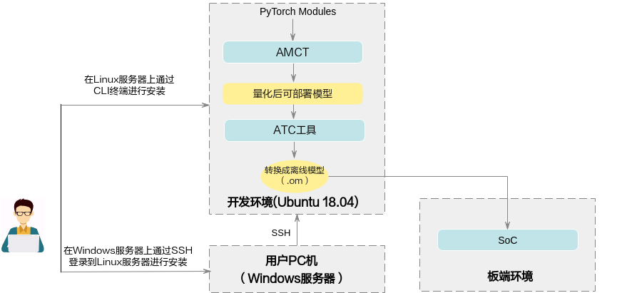

## 概念介绍<a name="ZH-CN_TOPIC_0000002408583046"></a>

根据量化方法不同，分为训练后量化（Post-Training Quantization）和量化感知训练（Quantization-Aware Training）；上述两种量化方法，根据量化对象不同，分为权重（weight）量化和数据（activation）量化。

下面分别介绍相关概念：


### 训练后量化<a name="ZH-CN_TOPIC_0000002441982497"></a>

训练后量化，是指将训练后模型中的权重由float32量化到int8或者int4，并通过少量校准数据集在模型推理时对数据（activation）进行校准量化。量化过程请参见[训练后量化](#ZH-CN_TOPIC_0000002408583082)。

-   **校准数据集**

    数据的量化因子的确定过程（calibration过程），网络模型将校准集中的每一份数据作为输入进行前向推理，量化算法积攒下每个待量化层/算子的对应输入数据，据此来确定量化因子。由于量化因子的确定和校准数据集的选择相关，量化后模型的精度也和校准数据集的选择相关，推荐使用验证集的子集作为校准数据集。

-   **数据（activation）量化**

    数据量化是对每个待量化的层/算子的输入数据进行统计，每个层/算子计算出最优的一组scale和offset（参数解释请参见[量化因子记录文件说明](#ZH-CN_TOPIC_0000002498353102)）。

    数据是模型推理计算的中间结果，其范围与模型输入相关，因此需要使用一组参考输入（校准数据集）作为激励，从而记录下来待量化层/算子的输入数据，搜索得到量化因子（scale和offset）。由于在做数据calibration的过程中，需要占用额外的存储空间（显存/内存）来存储用于确定量化因子的输入数据，所以对于显存/内存的占用，比仅推理的过程要高，额外占用空间的大小和calibration过程中的batch\_size\* batch\_num正相关。支持4bit、8bit和16bit量化。

-   **权重（weight）量化**

    训练后模型的权值已经确定，数值的范围也已经确定，因此直接根据权值的数据范围进行量化。支持4bit和8bit量化。

-   **反量化**

    反量化指权重（weight）/数据（校准数据集）/偏差（bias）从已量化的int转化成float的过程，如[图1](#fig12771415124116)所示。

    **图 1**  反量化示意图<a name="fig12771415124116"></a>  
    

-   **伪量化**

    伪量化主要针对训练和推理过程中对量化误差的模拟场景，其能够保证大多数浮点训练框架不变的情况下，通过量化-反量化的机制来模拟误差。

    例如，数据和权重从float32类型转化为int8类型，然后再经过一轮反量化转换回float32类型，如[图2](#fig8680173722710)所示，量化（Quant）和反量化（DeQuant）的过程组合为伪量化。

    **图 2** **伪量化示意图**<a name="fig8680173722710"></a>  
    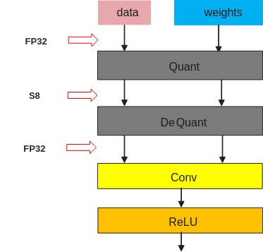

-   **真量化**

    真量化能够模拟板端硬件的误差。例如[图3](#fig12679247202216)所示，权重（weight）/数据（activation）/偏差（bias）经过量化转化int类型，然后执行后续的乘法运算和加法运算，再次从浮点重量化（ReQuant）为定点的计算过程称为真量化。

    **图 3**  真量化示意图<a name="fig12679247202216"></a>  
    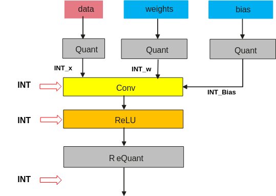

### 量化感知训练<a name="ZH-CN_TOPIC_0000002408423234"></a>

量化感知训练，是指借助用户完整训练数据集，在训练过程中引入量化操作，通过在训练前向计算中对数据和权重进行量化反量化，引入量化误差损失，从而在训练过程中提高模型对量化效应的适应能力，提高最终的量化模型精度。

量化感知训练缺点是较为耗时，同时需要大量数据。量化过程请参见[量化感知训练](#ZH-CN_TOPIC_0000002408423162)。

-   **训练数据集**

    基于用户训练网络中的数据集。

-   **数据（activation）量化**

    数据量化是迭代训练截断最大值和截断最小值，并通过这两个值来计算当前的scale和offset。数据是模型推理计算的中间结果，通过数据量化算法，在量化感知训练的过程中，不断优化这两个参数，得到最终的最优参数。

-   **权重（weight）量化**

    权重量化指的是在量化感知训练的过程中不断优化权重的量化参数，通过权重量化算法，得到最终的权重量化参数。

量化训练，支持量化的层以及约束参见[表1](#ZH-CN_TOPIC_0000002498353100)。

## 运行流程<a name="ZH-CN_TOPIC_0000002441982513"></a>

具体运行流程如[图1](#fig47396592320)所示。因为最终部署模型为.onnx模型，原始被转换模型需要是可转为onnx的模型。

**图 1**  运行流程<a name="fig47396592320"></a>  
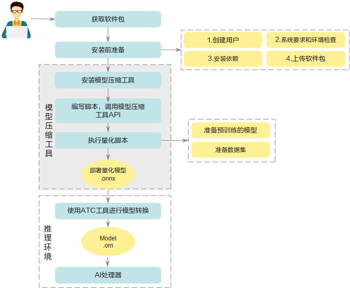

**表 1**  运行流程关键操作步骤说明

<a name="table462mcpsimp"></a>
<table><thead align="left"><tr id="row468mcpsimp"><th class="cellrowborder" valign="top" width="20%" id="mcps1.2.3.1.1"><p id="p470mcpsimp"><a name="p470mcpsimp"></a><a name="p470mcpsimp"></a>关键步骤</p>
</th>
<th class="cellrowborder" valign="top" width="80%" id="mcps1.2.3.1.2"><p id="p472mcpsimp"><a name="p472mcpsimp"></a><a name="p472mcpsimp"></a>说明</p>
</th>
</tr>
</thead>
<tbody><tr id="row474mcpsimp"><td class="cellrowborder" valign="top" width="20%" headers="mcps1.2.3.1.1 "><p id="p476mcpsimp"><a name="p476mcpsimp"></a><a name="p476mcpsimp"></a>获取软件包</p>
</td>
<td class="cellrowborder" valign="top" width="80%" headers="mcps1.2.3.1.2 "><p id="p478mcpsimp"><a name="p478mcpsimp"></a><a name="p478mcpsimp"></a>安装前请先获取对应软件包，详情请参见<a href="#ZH-CN_TOPIC_0000002442022305">获取软件包</a>。</p>
</td>
</tr>
<tr id="row480mcpsimp"><td class="cellrowborder" valign="top" width="20%" headers="mcps1.2.3.1.1 "><p id="p482mcpsimp"><a name="p482mcpsimp"></a><a name="p482mcpsimp"></a>安装前准备</p>
</td>
<td class="cellrowborder" valign="top" width="80%" headers="mcps1.2.3.1.2 "><p id="p484mcpsimp"><a name="p484mcpsimp"></a><a name="p484mcpsimp"></a>安装AMCT之前，需要创建AMCT的安装用户，检查系统环境是否满足要求，安装依赖以及上传软件包等一系列动作。详细操作请参见<a href="#ZH-CN_TOPIC_0000002408423134">安装前准备</a>。</p>
</td>
</tr>
<tr id="row486mcpsimp"><td class="cellrowborder" valign="top" width="20%" headers="mcps1.2.3.1.1 "><p id="p488mcpsimp"><a name="p488mcpsimp"></a><a name="p488mcpsimp"></a>安装</p>
</td>
<td class="cellrowborder" valign="top" width="80%" headers="mcps1.2.3.1.2 "><p id="p490mcpsimp"><a name="p490mcpsimp"></a><a name="p490mcpsimp"></a>参见<a href="#ZH-CN_TOPIC_0000002408423186">安装</a>安装pytorch框架的AMCT。</p>
</td>
</tr>
<tr id="row492mcpsimp"><td class="cellrowborder" valign="top" width="20%" headers="mcps1.2.3.1.1 "><p id="p494mcpsimp"><a name="p494mcpsimp"></a><a name="p494mcpsimp"></a>（可选）编写脚本，调用AMCT的API</p>
</td>
<td class="cellrowborder" valign="top" width="80%" headers="mcps1.2.3.1.2 "><p id="p496mcpsimp"><a name="p496mcpsimp"></a><a name="p496mcpsimp"></a>如果用户需要量化自己的网络模型，不使用本手册提供的sample进行量化，则需要修改量化脚本，进行适配，然后才能进行量化。</p>
</td>
</tr>
<tr id="row497mcpsimp"><td class="cellrowborder" valign="top" width="20%" headers="mcps1.2.3.1.1 "><p id="p499mcpsimp"><a name="p499mcpsimp"></a><a name="p499mcpsimp"></a>执行量化</p>
</td>
<td class="cellrowborder" valign="top" width="80%" headers="mcps1.2.3.1.2 "><p id="p501mcpsimp"><a name="p501mcpsimp"></a><a name="p501mcpsimp"></a>根据量化方法不同，分为训练后量化和量化感知训练。详细量化步骤请参见<a href="#ZH-CN_TOPIC_0000002442022273">训练后量化</a>和<a href="#ZH-CN_TOPIC_0000002442022353">量化感知训练</a>。</p>
</td>
</tr>
<tr id="row504mcpsimp"><td class="cellrowborder" valign="top" width="20%" headers="mcps1.2.3.1.1 "><p id="p506mcpsimp"><a name="p506mcpsimp"></a><a name="p506mcpsimp"></a>使用Mindstudio或MindCmd工具进行模型转换</p>
</td>
<td class="cellrowborder" valign="top" width="80%" headers="mcps1.2.3.1.2 "><p id="p508mcpsimp"><a name="p508mcpsimp"></a><a name="p508mcpsimp"></a>用户使用上述量化后的部署模型，通过Mindstudio或MindCmd工具转换成SoC的离线模型，详细可参考对应的用户指南，然后可以使用该模型进行推理。</p>
</td>
</tr>
</tbody>
</table>

# 工具安装<a name="ZH-CN_TOPIC_0000002442022373"></a>


## 安装AMCT<a name="ZH-CN_TOPIC_0000002441982537"></a>


### 获取软件包<a name="ZH-CN_TOPIC_0000002442022305"></a>

AMCT只支持在Ubuntu 18.04 x86\_64架构服务器安装；安装前，请先获取AMCT软件包：amct\_pytorch

### 安装前准备<a name="ZH-CN_TOPIC_0000002408423134"></a>


#### Ubuntu x86系统<a name="ZH-CN_TOPIC_0000002408423150"></a>


##### AMCT用户准备（可选）<a name="ZH-CN_TOPIC_0000002441982481"></a>

支持任意用户（root或者非root）安装AMCT，本章节以非root用户为例进行操作。

-   若使用root用户安装，则不需要操作该章节，不需要对root用户做任何设置。
-   若使用已存在的非root用户安装，须保证该用户对$HOME目录具有读写以及可执行权限。
-   若使用新的非root用户安装，请参考如下步骤进行创建，如下操作请在root用户下执行。本手册以该种场景为例执行AMCT的安装。
    1.  执行以下命令创建AMCT安装用户并设置该用户的$HOME目录。

        ```
        useradd -d /home/username -m username
        ```

    1.  执行以下命令设置密码。

        ```
        passwd username
        ```

> **说明：** 
>username为安装AMCT的用户名，该用户的umask值不能小于0027：
>-   若要查看umask的值，则执行命令：**umask**
>-   若要修改umask的值，则执行命令：**umask  _新的取值_**

##### 配置AMCT安装用户权限（可选）<a name="ZH-CN_TOPIC_0000002441982477"></a>

当用户使用非root用户安装时，需要操作该章节，否则请忽略。

AMCT安装前需要下载相关依赖软件，下载依赖软件需要使用**sudo apt-get**权限，请以root用户执行如下操作。

1.  打开“/etc/sudoers”文件：

    ```
    chmod u+w /etc/sudoers
    vi /etc/sudoers
    ```

2.  在该文件“\# User privilege specification”下面增加如下内容。

    ```
    username ALL=(ALL:ALL)   NOPASSWD:SETENV:/usr/bin/apt-get,/usr/bin/pip, /bin/tar, /bin/mkdir, /bin/sh, /bin/bash, /usr/bin/make, /usr/bin/pip3, /usr/bin/pip3.7, /usr/bin/pip3.7.5, /bin/ln
    ```

    “username”为执行安装脚本的非root用户名。

    > **说明：** 
    >请确保“/etc/sudoers”文件的最后一行为“\#includedir /etc/sudoers.d”，如果没有该信息，请手动添加。

3.  添加完成后，执行:wq!保存文件。
4.  执行以下命令取消“/etc/sudoers”文件的写权限：

    ```
    chmod u-w /etc/sudoers
    ```

##### 环境准备<a name="ZH-CN_TOPIC_0000002408423226"></a>

AMCT目前仅支持在Ubuntu 18.04 x86\_64架构操作系统安装，配套信息如[表1](#table558mcpsimp)。

**表 1**  Ubuntu X86\_64架构配套版本信息

<a name="table558mcpsimp"></a>
<table><thead align="left"><tr id="row566mcpsimp"><th class="cellrowborder" valign="top" width="12.120000000000001%" id="mcps1.2.5.1.1"><p id="p568mcpsimp"><a name="p568mcpsimp"></a><a name="p568mcpsimp"></a>类别</p>
</th>
<th class="cellrowborder" valign="top" width="11.790000000000001%" id="mcps1.2.5.1.2"><p id="p570mcpsimp"><a name="p570mcpsimp"></a><a name="p570mcpsimp"></a>版本限制</p>
</th>
<th class="cellrowborder" valign="top" width="52.82%" id="mcps1.2.5.1.3"><p id="p572mcpsimp"><a name="p572mcpsimp"></a><a name="p572mcpsimp"></a>获取方式</p>
</th>
<th class="cellrowborder" valign="top" width="23.27%" id="mcps1.2.5.1.4"><p id="p574mcpsimp"><a name="p574mcpsimp"></a><a name="p574mcpsimp"></a>注意事项</p>
</th>
</tr>
</thead>
<tbody><tr id="row576mcpsimp"><td class="cellrowborder" valign="top" width="12.120000000000001%" headers="mcps1.2.5.1.1 "><p id="p578mcpsimp"><a name="p578mcpsimp"></a><a name="p578mcpsimp"></a>操作系统</p>
</td>
<td class="cellrowborder" valign="top" width="11.790000000000001%" headers="mcps1.2.5.1.2 "><p id="p580mcpsimp"><a name="p580mcpsimp"></a><a name="p580mcpsimp"></a>18.04 64位Ubuntu操作系统</p>
</td>
<td class="cellrowborder" valign="top" width="52.82%" headers="mcps1.2.5.1.3 "><p id="p582mcpsimp"><a name="p582mcpsimp"></a><a name="p582mcpsimp"></a>请从<a href="http://old-releases.ubuntu.com/releases/18.04.1/" target="_blank" rel="noopener noreferrer">http://old-releases.ubuntu.com/releases/18.04.1/</a>网站下载对应版本软件进行安装，可以下载Server版“ubuntu-18.04-server-amd64.iso”</p>
</td>
<td class="cellrowborder" valign="top" width="23.27%" headers="mcps1.2.5.1.4 "><p id="p585mcpsimp"><a name="p585mcpsimp"></a><a name="p585mcpsimp"></a><em id="i586mcpsimp"><a name="i586mcpsimp"></a><a name="i586mcpsimp"></a>-</em></p>
</td>
</tr>
<tr id="row587mcpsimp"><td class="cellrowborder" valign="top" width="12.120000000000001%" headers="mcps1.2.5.1.1 "><p id="p589mcpsimp"><a name="p589mcpsimp"></a><a name="p589mcpsimp"></a>Python</p>
</td>
<td class="cellrowborder" valign="top" width="11.790000000000001%" headers="mcps1.2.5.1.2 "><p id="p591mcpsimp"><a name="p591mcpsimp"></a><a name="p591mcpsimp"></a>3.7.5</p>
</td>
<td class="cellrowborder" valign="top" width="52.82%" headers="mcps1.2.5.1.3 "><p id="p593mcpsimp"><a name="p593mcpsimp"></a><a name="p593mcpsimp"></a>请参见<a href="#ZH-CN_TOPIC_0000002530113067">安装Python3.7.5（Ubuntu）</a>。</p>
</td>
<td class="cellrowborder" valign="top" width="23.27%" headers="mcps1.2.5.1.4 "><p id="p596mcpsimp"><a name="p596mcpsimp"></a><a name="p596mcpsimp"></a>使用<strong id="b597mcpsimp"><a name="b597mcpsimp"></a><a name="b597mcpsimp"></a>apt-get</strong>命令安装依赖时，请确保服务器能够连接网络。</p>
</td>
</tr>
<tr id="row881218016211"><td class="cellrowborder" valign="top" width="12.120000000000001%" headers="mcps1.2.5.1.1 "><p id="p1281211010211"><a name="p1281211010211"></a><a name="p1281211010211"></a>pip</p>
</td>
<td class="cellrowborder" valign="top" width="11.790000000000001%" headers="mcps1.2.5.1.2 "><p id="p1981215019219"><a name="p1981215019219"></a><a name="p1981215019219"></a>-</p>
</td>
<td class="cellrowborder" valign="top" width="52.82%" headers="mcps1.2.5.1.3 "><p id="p1581230102110"><a name="p1581230102110"></a><a name="p1581230102110"></a>pip install --upgrade pip</p>
</td>
<td class="cellrowborder" valign="top" width="23.27%" headers="mcps1.2.5.1.4 "><p id="p5812170142119"><a name="p5812170142119"></a><a name="p5812170142119"></a>pip 需要更新到最新版本</p>
</td>
</tr>
<tr id="row609mcpsimp"><td class="cellrowborder" valign="top" width="12.120000000000001%" headers="mcps1.2.5.1.1 "><p id="p611mcpsimp"><a name="p611mcpsimp"></a><a name="p611mcpsimp"></a>CUDA toolkit/CUDA driver</p>
</td>
<td class="cellrowborder" valign="top" width="11.790000000000001%" headers="mcps1.2.5.1.2 "><p id="p613mcpsimp"><a name="p613mcpsimp"></a><a name="p613mcpsimp"></a>10.2/11.3</p>
</td>
<td class="cellrowborder" valign="top" width="52.82%" headers="mcps1.2.5.1.3 "><p id="p615mcpsimp"><a name="p615mcpsimp"></a><a name="p615mcpsimp"></a>请用户自行获取相关软件包进行安装，例如可以参见如下链接获取相关toolkit包，该包中包括driver软件包。</p>
<p id="p616mcpsimp"><a name="p616mcpsimp"></a><a name="p616mcpsimp"></a><a href="https://developer.nvidia.com/cuda-toolkit-archive" target="_blank" rel="noopener noreferrer">https://developer.nvidia.com/cuda-toolkit-archive</a></p>
</td>
<td class="cellrowborder" valign="top" width="23.27%" headers="mcps1.2.5.1.4 "><p id="p619mcpsimp"><a name="p619mcpsimp"></a><a name="p619mcpsimp"></a>如果使用GPU模式执行量化功能，则CUDA软件必须安装。</p>
</td>
</tr>
<tr id="row132190378180"><td class="cellrowborder" valign="top" width="12.120000000000001%" headers="mcps1.2.5.1.1 "><p id="p121919372186"><a name="p121919372186"></a><a name="p121919372186"></a>graphviz</p>
</td>
<td class="cellrowborder" valign="top" width="11.790000000000001%" headers="mcps1.2.5.1.2 "><p id="p72191737111818"><a name="p72191737111818"></a><a name="p72191737111818"></a>-</p>
</td>
<td class="cellrowborder" valign="top" width="52.82%" headers="mcps1.2.5.1.3 "><p id="p17131131516242"><a name="p17131131516242"></a><a name="p17131131516242"></a>sudo apt-get insall graphviz</p>
</td>
<td class="cellrowborder" valign="top" width="23.27%" headers="mcps1.2.5.1.4 "><p id="p221943741819"><a name="p221943741819"></a><a name="p221943741819"></a>生成svg依赖的系统工具包</p>
</td>
</tr>
</tbody>
</table>

##### 检查源<a name="ZH-CN_TOPIC_0000002442022369"></a>

安装依赖时，请确保AMCT所在服务器能够连接网络，请在root用户下执行如下命令检查源是否可用。

```
apt-get update
```

如果命令执行报错，则检查网络是否连接或者把“/etc/apt/sources.list”文件中的源更换为可用的源。

##### 安装依赖<a name="ZH-CN_TOPIC_0000002442022337"></a>

请使用AMCT的安装用户安装依赖的软件，参考[表1](#table678mcpsimp)。

**表 1**  依赖列表

<a name="table678mcpsimp"></a>
<table><thead align="left"><tr id="row685mcpsimp"><th class="cellrowborder" valign="top" width="15%" id="mcps1.2.4.1.1"><p id="p687mcpsimp"><a name="p687mcpsimp"></a><a name="p687mcpsimp"></a>依赖名称</p>
</th>
<th class="cellrowborder" valign="top" width="9.31%" id="mcps1.2.4.1.2"><p id="p689mcpsimp"><a name="p689mcpsimp"></a><a name="p689mcpsimp"></a>版本号</p>
</th>
<th class="cellrowborder" valign="top" width="75.69%" id="mcps1.2.4.1.3"><p id="p691mcpsimp"><a name="p691mcpsimp"></a><a name="p691mcpsimp"></a>安装命令</p>
</th>
</tr>
</thead>
<tbody><tr id="row701mcpsimp"><td class="cellrowborder" valign="top" width="15%" headers="mcps1.2.4.1.1 "><p id="p703mcpsimp"><a name="p703mcpsimp"></a><a name="p703mcpsimp"></a>pytorch版本的CPU或GPU</p>
</td>
<td class="cellrowborder" valign="top" width="9.31%" headers="mcps1.2.4.1.2 "><p id="p705mcpsimp"><a name="p705mcpsimp"></a><a name="p705mcpsimp"></a>1.10.2</p>
</td>
<td class="cellrowborder" valign="top" width="75.69%" headers="mcps1.2.4.1.3 "><div class="p" id="p14966152491015"><a name="p14966152491015"></a><a name="p14966152491015"></a>1.10.2版本pytorch，CPU或GPU安装命令：<a name="ul710mcpsimp"></a><a name="ul710mcpsimp"></a><ul id="ul710mcpsimp"><li>CPU版本安装命令：<pre class="screen" id="screen1594152820145"><a name="screen1594152820145"></a><a name="screen1594152820145"></a>python3.7.5 -m pip --trusted-host=download.pytorch.org install torch==1.10.2+cpu torchvision==0.11.3+cpu torchaudio==0.10.2 -f https://download.pytorch.org/whl/torch_stable.html</pre>
</li></ul>
<a name="ul713mcpsimp"></a><a name="ul713mcpsimp"></a><ul id="ul713mcpsimp"><li>GPU版本安装命令：<pre class="screen" id="screen955343619140"><a name="screen955343619140"></a><a name="screen955343619140"></a># CUDA 10.2:
python3.7.5 -m pip --trusted-host=download.pytorch.org install torch==1.10.2+cu102 torchvision==0.11.3+cu102 torchaudio==0.10.2 -f https://download.pytorch.org/whl/torch_stable.html
# CUDA 11.3:
python3.7.5 -m pip --trusted-host=download.pytorch.org install torch==1.10.2+cu113 torchvision==0.11.3+cu113 torchaudio==0.10.2 -f https://download.pytorch.org/whl/torch_stable.html</pre>
</li></ul>
</div>
</td>
</tr>
<tr id="row723mcpsimp"><td class="cellrowborder" valign="top" width="15%" headers="mcps1.2.4.1.1 "><p id="p725mcpsimp"><a name="p725mcpsimp"></a><a name="p725mcpsimp"></a>numpy</p>
</td>
<td class="cellrowborder" valign="top" width="9.31%" headers="mcps1.2.4.1.2 "><p id="p727mcpsimp"><a name="p727mcpsimp"></a><a name="p727mcpsimp"></a>&gt;=1.16.0</p>
</td>
<td class="cellrowborder" valign="top" width="75.69%" headers="mcps1.2.4.1.3 "><p id="p729mcpsimp"><a name="p729mcpsimp"></a><a name="p729mcpsimp"></a>pip3.7.5 install numpy==1.16.0</p>
</td>
</tr>
<tr id="row737mcpsimp"><td class="cellrowborder" valign="top" width="15%" headers="mcps1.2.4.1.1 "><p id="p739mcpsimp"><a name="p739mcpsimp"></a><a name="p739mcpsimp"></a>protobuf</p>
</td>
<td class="cellrowborder" valign="top" width="9.31%" headers="mcps1.2.4.1.2 "><p id="p144841041633"><a name="p144841041633"></a><a name="p144841041633"></a>&gt;=3.13.0</p>
<p id="p741mcpsimp"><a name="p741mcpsimp"></a><a name="p741mcpsimp"></a>&lt;=3.19.0</p>
</td>
<td class="cellrowborder" valign="top" width="75.69%" headers="mcps1.2.4.1.3 "><p id="p743mcpsimp"><a name="p743mcpsimp"></a><a name="p743mcpsimp"></a>pip3.7.5 install protobuf==3.13.0</p>
</td>
</tr>
<tr id="row744mcpsimp"><td class="cellrowborder" valign="top" width="15%" headers="mcps1.2.4.1.1 "><p id="p746mcpsimp"><a name="p746mcpsimp"></a><a name="p746mcpsimp"></a>ONNX</p>
</td>
<td class="cellrowborder" valign="top" width="9.31%" headers="mcps1.2.4.1.2 "><p id="p748mcpsimp"><a name="p748mcpsimp"></a><a name="p748mcpsimp"></a>&gt;=1.6.0</p>
</td>
<td class="cellrowborder" valign="top" width="75.69%" headers="mcps1.2.4.1.3 "><p id="p750mcpsimp"><a name="p750mcpsimp"></a><a name="p750mcpsimp"></a>pip3.7.5 install onnx==1.6.0</p>
</td>
</tr>
<tr id="row758mcpsimp"><td class="cellrowborder" valign="top" width="15%" headers="mcps1.2.4.1.1 "><p id="p760mcpsimp"><a name="p760mcpsimp"></a><a name="p760mcpsimp"></a>interval</p>
</td>
<td class="cellrowborder" valign="top" width="9.31%" headers="mcps1.2.4.1.2 "><p id="p762mcpsimp"><a name="p762mcpsimp"></a><a name="p762mcpsimp"></a>1.0.0</p>
</td>
<td class="cellrowborder" valign="top" width="75.69%" headers="mcps1.2.4.1.3 "><p id="p764mcpsimp"><a name="p764mcpsimp"></a><a name="p764mcpsimp"></a>pip3.7.5 install interval==1.0.0</p>
</td>
</tr>
<tr id="row14316131131316"><td class="cellrowborder" valign="top" width="15%" headers="mcps1.2.4.1.1 "><p id="p9316153116131"><a name="p9316153116131"></a><a name="p9316153116131"></a>pyyaml</p>
</td>
<td class="cellrowborder" valign="top" width="9.31%" headers="mcps1.2.4.1.2 "><p id="p931653151312"><a name="p931653151312"></a><a name="p931653151312"></a>&gt;=5.4</p>
</td>
<td class="cellrowborder" valign="top" width="75.69%" headers="mcps1.2.4.1.3 "><p id="p7316103118131"><a name="p7316103118131"></a><a name="p7316103118131"></a>pip3.7.5 install pyyaml==5.4</p>
</td>
</tr>
<tr id="row113121818141315"><td class="cellrowborder" valign="top" width="15%" headers="mcps1.2.4.1.1 "><p id="p10312191811312"><a name="p10312191811312"></a><a name="p10312191811312"></a>pydot</p>
</td>
<td class="cellrowborder" valign="top" width="9.31%" headers="mcps1.2.4.1.2 "><p id="p3313151813135"><a name="p3313151813135"></a><a name="p3313151813135"></a>-</p>
</td>
<td class="cellrowborder" valign="top" width="75.69%" headers="mcps1.2.4.1.3 "><p id="p1831319183131"><a name="p1831319183131"></a><a name="p1831319183131"></a>pip3.7.5 install pydot</p>
</td>
</tr>
<tr id="row105491741134"><td class="cellrowborder" valign="top" width="15%" headers="mcps1.2.4.1.1 "><p id="p45491247138"><a name="p45491247138"></a><a name="p45491247138"></a>scipy</p>
</td>
<td class="cellrowborder" valign="top" width="9.31%" headers="mcps1.2.4.1.2 "><p id="p955034121311"><a name="p955034121311"></a><a name="p955034121311"></a>-</p>
</td>
<td class="cellrowborder" valign="top" width="75.69%" headers="mcps1.2.4.1.3 "><p id="p2055014441312"><a name="p2055014441312"></a><a name="p2055014441312"></a>pip3.7.5 install scipy</p>
</td>
</tr>
<tr id="row861611141119"><td class="cellrowborder" valign="top" width="15%" headers="mcps1.2.4.1.1 "><p id="p126164142018"><a name="p126164142018"></a><a name="p126164142018"></a>wheel</p>
</td>
<td class="cellrowborder" valign="top" width="9.31%" headers="mcps1.2.4.1.2 ">&nbsp;&nbsp;</td>
<td class="cellrowborder" valign="top" width="75.69%" headers="mcps1.2.4.1.3 "><p id="p15616191414110"><a name="p15616191414110"></a><a name="p15616191414110"></a>pip3.7.5 install wheel</p>
</td>
</tr>
</tbody>
</table>

##### 上传软件包<a name="ZH-CN_TOPIC_0000002442022285"></a>

以AMCT的安装用户将**amct\_pytorch**软件包上传到Linux服务器任意目录下，本示例为上传到$HOME/_amct_/目录，获得如下内容。

**表 1**  AMCT软件包解压后内容

<a name="table770mcpsimp"></a>
<table><thead align="left"><tr id="row778mcpsimp"><th class="cellrowborder" valign="top" width="10.1010101010101%" id="mcps1.2.5.1.1"><p id="p780mcpsimp"><a name="p780mcpsimp"></a><a name="p780mcpsimp"></a>一级目录</p>
</th>
<th class="cellrowborder" valign="top" width="25.25252525252525%" id="mcps1.2.5.1.2"><p id="p782mcpsimp"><a name="p782mcpsimp"></a><a name="p782mcpsimp"></a>二级目录</p>
</th>
<th class="cellrowborder" valign="top" width="23.23232323232323%" id="mcps1.2.5.1.3"><p id="p784mcpsimp"><a name="p784mcpsimp"></a><a name="p784mcpsimp"></a>说明</p>
</th>
<th class="cellrowborder" valign="top" width="41.41414141414141%" id="mcps1.2.5.1.4"><p id="p786mcpsimp"><a name="p786mcpsimp"></a><a name="p786mcpsimp"></a>使用场景及注意事项</p>
</th>
</tr>
</thead>
<tbody><tr id="row788mcpsimp"><td class="cellrowborder" rowspan="3" valign="top" headers="mcps1.2.5.1.1 "><p id="p790mcpsimp"><a name="p790mcpsimp"></a><a name="p790mcpsimp"></a><strong id="b791mcpsimp"><a name="b791mcpsimp"></a><a name="b791mcpsimp"></a>amct_pytorch/</strong></p>
</td>
<td class="cellrowborder" colspan="2" valign="top" headers="mcps1.2.5.1.2 mcps1.2.5.1.3 "><p id="p793mcpsimp"><a name="p793mcpsimp"></a><a name="p793mcpsimp"></a>pytorch框架AMCT目录。</p>
</td>
<td class="cellrowborder" rowspan="3" valign="top" headers="mcps1.2.5.1.4 "><a name="ul795mcpsimp"></a><a name="ul795mcpsimp"></a><ul id="ul795mcpsimp"><li><strong id="b797mcpsimp"><a name="b797mcpsimp"></a><a name="b797mcpsimp"></a>只支持部署在Ubuntu 18.04 x86_64架构服务器。</strong></li><li>使用方法请参见《AMCT使用指南（PyTorch）》。</li><li>量化完的模型，如果要执行推理，则需要在板端推理环境运行。</li></ul>
</td>
</tr>
<tr id="row800mcpsimp"><td class="cellrowborder" valign="top" headers="mcps1.2.5.1.1 "><p id="p802mcpsimp"><a name="p802mcpsimp"></a><a name="p802mcpsimp"></a>hotwheels_amct_pytorch-<em id="i803mcpsimp"><a name="i803mcpsimp"></a><a name="i803mcpsimp"></a>{version}</em>-py3-none-linux_<em id="i804mcpsimp"><a name="i804mcpsimp"></a><a name="i804mcpsimp"></a>{arch}</em>.tar.gz</p>
</td>
<td class="cellrowborder" valign="top" headers="mcps1.2.5.1.2 "><p id="p806mcpsimp"><a name="p806mcpsimp"></a><a name="p806mcpsimp"></a>pytorch框架AMCT源码安装包。</p>
</td>
</tr>
<tr id="row807mcpsimp"><td class="cellrowborder" valign="top" headers="mcps1.2.5.1.1 "><p id="p809mcpsimp"><a name="p809mcpsimp"></a><a name="p809mcpsimp"></a>amct_pytorch_sample.tar.gz</p>
</td>
<td class="cellrowborder" valign="top" headers="mcps1.2.5.1.2 "><p id="p811mcpsimp"><a name="p811mcpsimp"></a><a name="p811mcpsimp"></a>pytorch框架量化sample包。</p>
</td>
</tr>
</tbody>
</table>

其中：_\{version\}_表示AMCT具体版本号。_\{arch\}_表示linux操作系统的架构。

### 安装<a name="ZH-CN_TOPIC_0000002408423186"></a>

1.  在AMCT软件包所在目录下，执行如下命令进行源码安装。

    ```
    pip3.7.5 install hotwheels_amct_pytorch-{version}-py3-none-linux_{arch}.tar.gz
    ```

    其中：_\{version\}_表示AMCT具体版本号和CUDA的版本，_\{arch\}_表示软件包支持的安装服务器具体架构形态。如果用户使用root用户安装AMCT，并且使用了--target参数，请确保--target参数指定的路径为当前用户的路径，避免指定到其他非root用户。

2.  若出现如下信息则说明工具安装成功。

    ```
    Successfully build hotwheels-amct-pytorch 
    ... 
    Successfully installed hotwheels-amct-pytorch-{version}
    ```

    用户可以在python3.7.5软件包所在路径下（例如：_$HOME/.local/lib/python3.7.5/site-packages_）查看已经安装的AMCT，例如：

    ```
    drwxr-xr-x  5 amct amct   4096 Mar 17 11:50 hotwheels/ 
    drwxr-xr-x  2 amct amct   4096 Mar 17 11:50 hotwheels_amct_pytorch-{version}.dist-info/
    ```

    其中amct\_pytorch即为AMCT所在安装目录。

### 日志级别控制<a name="ZH-CN_TOPIC_0000002408583110"></a>

AMCT量化过程中的日志信息以及日志级别，可以通过环境变量设置，本章节给出详细设置方法。其中日志包括打印在屏幕上的日志以及保存到amct\_log/amct\_pytorch.log文件中的日志。该部分环境变量为可选配置，如果不设置，则按照默认日志级别，默认级别为INFO。

-   **变量取值**

    日志打印级别通过如下两个变量设置：

    -   **AMCT\_LOG\_FILE\_LEVEL**： 控制amct\_pytorch.log日志文件的信息级别以及生成精度仿真模型时，对应量化层生成的日志文件信息级别。
    -   **AMCT\_LOG\_LEVEL**：控制屏幕输出的信息级别。

    有效取值以及含义如[表1](#zh-cn_topic_0240188730_table1332501419)所示。

**表 1**  变量取值范围

<a name="zh-cn_topic_0240188730_table1332501419"></a>
<table><thead align="left"><tr id="row854mcpsimp"><th class="cellrowborder" valign="top" width="18%" id="mcps1.2.4.1.1"><p id="p856mcpsimp"><a name="p856mcpsimp"></a><a name="p856mcpsimp"></a>信息级别</p>
</th>
<th class="cellrowborder" valign="top" width="34%" id="mcps1.2.4.1.2"><p id="p858mcpsimp"><a name="p858mcpsimp"></a><a name="p858mcpsimp"></a>含义</p>
</th>
<th class="cellrowborder" valign="top" width="48%" id="mcps1.2.4.1.3"><p id="p860mcpsimp"><a name="p860mcpsimp"></a><a name="p860mcpsimp"></a>信息描述</p>
</th>
</tr>
</thead>
<tbody><tr id="row862mcpsimp"><td class="cellrowborder" valign="top" width="18%" headers="mcps1.2.4.1.1 "><p id="p864mcpsimp"><a name="p864mcpsimp"></a><a name="p864mcpsimp"></a>DEBUG</p>
</td>
<td class="cellrowborder" valign="top" width="34%" headers="mcps1.2.4.1.2 "><p id="p866mcpsimp"><a name="p866mcpsimp"></a><a name="p866mcpsimp"></a>输出DEBUG/INFO/WARNING/ERROR级别的运行信息。</p>
</td>
<td class="cellrowborder" valign="top" width="48%" headers="mcps1.2.4.1.3 "><p id="p868mcpsimp"><a name="p868mcpsimp"></a><a name="p868mcpsimp"></a>详细的流程信息，包括量化层及对应的处理阶段（融合，参数量化或者数据量化等）。</p>
</td>
</tr>
<tr id="row869mcpsimp"><td class="cellrowborder" valign="top" width="18%" headers="mcps1.2.4.1.1 "><p id="p871mcpsimp"><a name="p871mcpsimp"></a><a name="p871mcpsimp"></a>INFO</p>
</td>
<td class="cellrowborder" valign="top" width="34%" headers="mcps1.2.4.1.2 "><p id="p873mcpsimp"><a name="p873mcpsimp"></a><a name="p873mcpsimp"></a>输出INFO/WARNING/ERROR级别的运行信息。默认为INFO。</p>
</td>
<td class="cellrowborder" valign="top" width="48%" headers="mcps1.2.4.1.3 "><p id="p875mcpsimp"><a name="p875mcpsimp"></a><a name="p875mcpsimp"></a>概要的量化处理信息，包含量化的阶段等信息。</p>
</td>
</tr>
<tr id="row876mcpsimp"><td class="cellrowborder" valign="top" width="18%" headers="mcps1.2.4.1.1 "><p id="p878mcpsimp"><a name="p878mcpsimp"></a><a name="p878mcpsimp"></a>WARNING</p>
</td>
<td class="cellrowborder" valign="top" width="34%" headers="mcps1.2.4.1.2 "><p id="p880mcpsimp"><a name="p880mcpsimp"></a><a name="p880mcpsimp"></a>输出WARNING/ERROR级别的运行信息。</p>
</td>
<td class="cellrowborder" valign="top" width="48%" headers="mcps1.2.4.1.3 "><p id="p882mcpsimp"><a name="p882mcpsimp"></a><a name="p882mcpsimp"></a>量化处理过程中的警告信息。</p>
</td>
</tr>
<tr id="row883mcpsimp"><td class="cellrowborder" valign="top" width="18%" headers="mcps1.2.4.1.1 "><p id="p885mcpsimp"><a name="p885mcpsimp"></a><a name="p885mcpsimp"></a>ERROR</p>
</td>
<td class="cellrowborder" valign="top" width="34%" headers="mcps1.2.4.1.2 "><p id="p887mcpsimp"><a name="p887mcpsimp"></a><a name="p887mcpsimp"></a>输出ERROR级别的运行信息。</p>
</td>
<td class="cellrowborder" valign="top" width="48%" headers="mcps1.2.4.1.3 "><p id="p889mcpsimp"><a name="p889mcpsimp"></a><a name="p889mcpsimp"></a>量化处理过程中的错误信息。</p>
</td>
</tr>
</tbody>
</table>

信息级别不区分大小写，即Info、info、INFO均为有效取值。

-   **使用示例**

    如下命令只是样例，用户根据实际情况进行设置。

    -   将量化日志amct\_pytorch.log信息级别设置为INFO级别。

        export AMCT\_LOG\_FILE\_LEVEL=INFO

    -   将屏幕打印输出信息级别设置为INFO级别。

        export AMCT\_LOG\_LEVEL=INFO

## 更新AMCT<a name="ZH-CN_TOPIC_0000002441982453"></a>

建议使用最新版本的AMCT，以便获得最新功能。使用新版本之前请先参见[卸载AMCT](#ZH-CN_TOPIC_0000002442022281)卸载之前版本的AMCT，然后参见[安装AMCT](#ZH-CN_TOPIC_0000002441982537)安装最新版本。

## 卸载AMCT<a name="ZH-CN_TOPIC_0000002442022281"></a>

若用户不再使用AMCT时，可以参见该章节将其卸载。

1.  以AMCT的安装用户在Linux服务器任意目录执行如下命令进行卸载：

    ```
    pip3.7.5 uninstall hotwheels-amct-pytorch
    ```

2.  出现如下信息时，输入“y”：

    ```
    Uninstalling hotwheels-amct-pytorch-{version}:  
       Would remove: 
        ...
        ...  
    Proceed (y/n)? y
    ```

    若出现如下信息则说明卸载成功。

    ```
    Successfully uninstalled hotwheels-amct-pytorch-{version} 
    ```

# 量化<a name="ZH-CN_TOPIC_0000002408423158"></a>


## 训练后量化<a name="ZH-CN_TOPIC_0000002442022273"></a>


### 实现原理<a name="ZH-CN_TOPIC_0000002442022365"></a>

**图 1**  训练后量化实现原理<a name="fig44212565592"></a>  
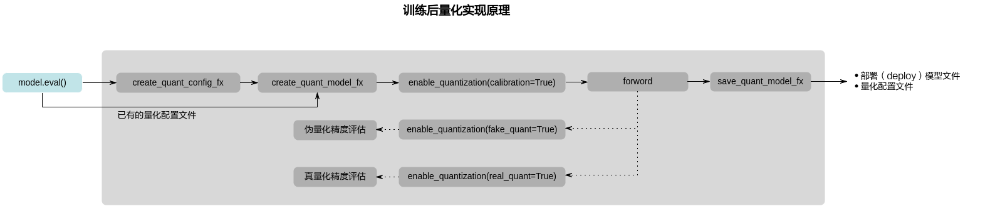

### 量化示例<a name="ZH-CN_TOPIC_0000002408423198"></a>


#### 量化前提<a name="ZH-CN_TOPIC_0000002408583154"></a>


##### 模型准备<a name="ZH-CN_TOPIC_0000002408583126"></a>

以AMCT的安装用户将需要量化的pytorch模型上传到Linux服务器任意目录下。本手册以下载的resnet50网络模型为例进行说明（sample中提供的mobilenet\_v2模型量化脚本和resnet50网络模型量化脚本一样，仅模型不同，不再介绍）。

用户准备的模型，建议先在pytorch环境中执行推理，并确保能成功运行，精度没有异常。

**模型下载**

1.  在sample中模型使用torchvision中的resnet50\(pretrain=True\)，如果模型的预训练权重下载较慢，请手动下载（https://download.pytorch.org/models/resnet50-0676ba61.pth）
2.  把下载的权重文件复制到 /user/.cache/torch/hub/checkpoints/文件夹下

注意：如果模型权重文件已存在，以上两个步骤无需执行。

##### 数据集准备<a name="ZH-CN_TOPIC_0000002442022317"></a>

使用AMCT对模型完成量化后，需要对模型进行推理，以测试量化数据的精度。推理过程中需要使用和模型相匹配的数据集。

以AMCT的安装用户将和模型相匹配的数据集上传到Linux服务器任意目录下。

当前calibration的sample提供160张的images数据集，方便用户快速上手使用。

##### 校准集准备<a name="ZH-CN_TOPIC_0000002408583094"></a>

校准集用来产生量化参数，保证精度。

计算量化参数的过程被称为“校准\(calibration\)”。校准过程需要使用一部分测试图片来针对性计算量化参数。batch\_num\*batch\_size为量化使用的校准集图片数量，其中batch\_size为每个batch所用的图片数量该值为sample中传入的batch\_size参数，batch\_num为config.json中的量化参数默认为1。当前sample使用images dataloader的一个batch的数据作为校准集。

#### 量化步骤<a name="ZH-CN_TOPIC_0000002442022349"></a>

下面以sample包中分类网络量化脚本**resnet50\_calibration.py**，演示如何执行量化脚本，执行前需要额外安装一个第三方python工具包pillow，安装命令：pip install pillow。

1.  获取量化脚本。

    在量化脚本sample包**amct\_pytorch\_sample.tar.gz**所在路径下执行如下解压命令，获取量化脚本。

    ```
    tar -zxvf amct_pytorch_sample.tar.gz 
    cd sample
    ```

    其中：

    ```
    resnet50/ 
    ├── dump_layer_outputs.py     //保存量化模型中每一层网络的输出
    ├── calibration
    │    └─resnet50_calibration.py                      //calibration 量化脚本
    │    └─images
    │       └─xx.jpg               //验证集图片
    │       └─image_label.txt      //验证集和标签的文本列表
    ├── retrain
    │    └─resnet50_retrain.py                      //重训量化脚本
    │    └─resnet50_retrain_from_checkpoint.py      //断点重训脚本
    ├── quantize_conf
    │    └─ custom_quantize.yml    // 简易量化配置文件
    ```

2.  执行量化。

    切换到量化脚本所在目录sample/resnet50/**calibration**，执行如下命令量化resnet50网络模型。

    ```
    python3.7.5 resnet50_calibration.py --benchmark
    # dump layer outputs
    python3.7.5 ../dump_layer_outputs.py --config_file ./tmp/calibration/config.json --pt ./checkpoints/calibration/resnet50_calibration.pt
    ```

    > **须知：** 
    >-   默认使用sample中自带的images验证集。
    >-   如果无GPU环境，直接执行上述量化命令，则使用cpu进行训练，训练速度较慢。
    >-   如果存在多个GPU，默认使用0号GPU，也可以在上述命令前面加上CUDA\_VISIBLE\_DEVICES=gpu\_index，修改gpu\_index来切换其他GPU。
    >-   暂不支持多卡量化。

    **表 1**  训练后量化所用参数说明

    <a name="table2367mcpsimp"></a>
    <table><thead align="left"><tr id="row2373mcpsimp"><th class="cellrowborder" valign="top" width="40.21%" id="mcps1.2.3.1.1"><p id="p2375mcpsimp"><a name="p2375mcpsimp"></a><a name="p2375mcpsimp"></a>参数</p>
    </th>
    <th class="cellrowborder" valign="top" width="59.79%" id="mcps1.2.3.1.2"><p id="p2377mcpsimp"><a name="p2377mcpsimp"></a><a name="p2377mcpsimp"></a>说明</p>
    </th>
    </tr>
    </thead>
    <tbody><tr id="row2413mcpsimp"><td class="cellrowborder" valign="top" width="40.21%" headers="mcps1.2.3.1.1 "><p id="p2415mcpsimp"><a name="p2415mcpsimp"></a><a name="p2415mcpsimp"></a>--eval_set</p>
    </td>
    <td class="cellrowborder" valign="top" width="59.79%" headers="mcps1.2.3.1.2 "><a name="ul2417mcpsimp"></a><a name="ul2417mcpsimp"></a><ul id="ul2417mcpsimp"><li>是否必填：否。</li><li>数据类型：string。</li><li>默认值：./images/image_label.txt。</li><li>参数解释：验证数据集路径，默认使用sample自带的images。</li></ul>
    </td>
    </tr>
    <tr id="row091944724812"><td class="cellrowborder" valign="top" width="40.21%" headers="mcps1.2.3.1.1 "><p id="p191934784814"><a name="p191934784814"></a><a name="p191934784814"></a>--eval_iter</p>
    </td>
    <td class="cellrowborder" valign="top" width="59.79%" headers="mcps1.2.3.1.2 "><a name="ul1845217413498"></a><a name="ul1845217413498"></a><ul id="ul1845217413498"><li>是否必填：否。</li><li>数据类型：int。</li><li>默认值：20。</li><li>参数解释：验证数据集的迭代次数。</li></ul>
    </td>
    </tr>
    <tr id="row2431mcpsimp"><td class="cellrowborder" valign="top" width="40.21%" headers="mcps1.2.3.1.1 "><p id="p2433mcpsimp"><a name="p2433mcpsimp"></a><a name="p2433mcpsimp"></a>--batch_size</p>
    </td>
    <td class="cellrowborder" valign="top" width="59.79%" headers="mcps1.2.3.1.2 "><a name="ul2435mcpsimp"></a><a name="ul2435mcpsimp"></a><ul id="ul2435mcpsimp"><li>是否必填：否。</li><li>数据类型：int。</li><li>默认值：16。</li><li>参数解释：pytorch执行一次前向推理所使用的样本数量，根据内存或显存大小酌情调整。</li></ul>
    </td>
    </tr>
    <tr id="row15284142112405"><td class="cellrowborder" valign="top" width="40.21%" headers="mcps1.2.3.1.1 "><p id="p1828510215400"><a name="p1828510215400"></a><a name="p1828510215400"></a>--benchmark</p>
    </td>
    <td class="cellrowborder" valign="top" width="59.79%" headers="mcps1.2.3.1.2 "><a name="ul534119351408"></a><a name="ul534119351408"></a><ul id="ul534119351408"><li>是否必填：否。</li><li>数据类型：bool。</li><li>默认值：False。</li><li>参数解释：迭代全量数据集进行模型推理，传入即开启。</li></ul>
    </td>
    </tr>
    <tr id="row186771558182419"><td class="cellrowborder" valign="top" width="40.21%" headers="mcps1.2.3.1.1 "><p id="p1867785812412"><a name="p1867785812412"></a><a name="p1867785812412"></a>--config_def</p>
    </td>
    <td class="cellrowborder" valign="top" width="59.79%" headers="mcps1.2.3.1.2 "><a name="ul1743910182510"></a><a name="ul1743910182510"></a><ul id="ul1743910182510"><li>是否必填：否。</li><li>数据类型：string。</li><li>参数解释：简易量化配置文件。</li></ul>
    </td>
    </tr>
    </tbody>
    </table>

    若出现如下信息，则说明量化成功。

    ```
    ==> AMCT run resnet50_calibration.pyin 30s
    ```

3.  量化结果说明。

    量化成功后，在脚本的同级目录下还会生成量化配置文件等中间文件、量化日志文件以及量化结果文件。

    -   amct\_log/hotwheels.amct\_pytorch.log：量化日志文件，记录了量化过程的日志信息。
    -   checkpoints/calibration：训练后量化结果文件：
        -   resnet50\_calibration\_deploy\_model.onnx：量化后的可在SoC部署的模型文件。
        -   resnet50\_quant\_param\_record.txt：量化参数文件。
        -   resnet50\_calibration.pt ：校准后保存下来的pytorch模型权重文件

    -   tmp/calibration：临时文件
        -   config.json：描述了如何对模型中的每一层进行量化。如果量化脚本所在目录下已经存在量化配置文件，则再次调用[create\_quant\_config\_fx](#ZH-CN_TOPIC_0000002441982485)接口时，如果新生成的量化配置文件与已有的文件同名，则会覆盖已有的量化配置文件，否则生成新的量化配置文件。

            如果量化后的模型推理精度不满足要求，用户可以修改config.json文件，量化配置文件内容、修改原则以及参数解释请参见[量化调优](#ZH-CN_TOPIC_0000002441982493)。

        -   float.svg：用户需要量化的pytorch模型原始浮点静态图。
        -   quant.svg：用户需要量化的pytorch模型插入量化层以及融合后的静态图。

4.  如果用户需要将量化后的deploy模型，转换为适配SoC的离线模型，则请参见MindCmd 对应的用户指南。

### 量化调优<a name="ZH-CN_TOPIC_0000002441982525"></a>

本章节以分类网络量化配置文件为例进行说明。


#### 参数配置说明<a name="ZH-CN_TOPIC_0000002408583150"></a>

如果通过create\_quant\_config\_fx接口生成的calibration\_config.json量化配置文件，推理精度不满足要求，则需要参见该章节不断调整calibration\_config.json文件中的内容，直至精度满足要求，该文件部分内容样例如下：

```
{
    "add":{
        "quant_enable":true,
        "activation_quant_params":[
            {
                "quantizer":"UlqFakeQuantize",
                "quantizer_args":{
                    "num_bits":8,
                    "fixed_min":false,
                    "observer":"IFMRObserver",
                    "batch_num":1,
                    "object_layer":"add"
                }
            },
            {
                "quantizer":"UlqFakeQuantize",
                "quantizer_args":{
                    "num_bits":8,
                    "fixed_min":false,
                    "observer":"IFMRObserver",
                    "batch_num":1,
                    "object_layer":"add"
                }
            }
        ]
    },
"conv1":{
        "quant_enable":true,
        "activation_quant_params":[
            {
                "quantizer":"UlqFakeQuantize",
                "quantizer_args":{
                    "num_bits":8,
                    "fixed_min":false,
                    "observer":"IFMRObserver",
                    "batch_num":1,
                    "object_layer":"conv1"
                }
            }
        ],
        "weight_quant_params":{
            "quantizer":"ArqWeightFakeQuantize",
            "quantizer_args":{
                "observer":"ArqObserver",
                "num_bits":8,
                "channel_wise":true
            }
        }
    },
    "fc":{
        "quant_enable":true,
        "activation_quant_params":[
            {
                "quantizer":"UlqFakeQuantize",
                "quantizer_args":{
                    "num_bits":8,
                    "fixed_min":false,
                    "observer":"IFMRObserver",
                    "batch_num":1,
                    "object_layer":"fc"
                }
            }
        ],
        "weight_quant_params":{
            "quantizer":"ArqWeightFakeQuantize",
            "quantizer_args":{
                "observer":"ArqObserver",
                "num_bits":8,
                "channel_wise":false
            }
        }
    },
}
```

配置文件中参数说明如下。

**表 1**  quant\_enable参数说明

<a name="table1401mcpsimp"></a>
<table><tbody><tr id="row1407mcpsimp"><th class="firstcol" valign="top" width="21%" id="mcps1.2.3.1.1"><p id="p1953589113116"><a name="p1953589113116"></a><a name="p1953589113116"></a>作用</p>
</th>
<td class="cellrowborder" valign="top" width="79%" headers="mcps1.2.3.1.1 "><p id="p12535159103120"><a name="p12535159103120"></a><a name="p12535159103120"></a>该层是否可量化。</p>
</td>
</tr>
<tr id="row1412mcpsimp"><th class="firstcol" valign="top" width="21%" id="mcps1.2.3.2.1"><p id="p7535999314"><a name="p7535999314"></a><a name="p7535999314"></a>类型</p>
</th>
<td class="cellrowborder" valign="top" width="79%" headers="mcps1.2.3.2.1 "><p id="p3535990312"><a name="p3535990312"></a><a name="p3535990312"></a>bool</p>
</td>
</tr>
<tr id="row1417mcpsimp"><th class="firstcol" valign="top" width="21%" id="mcps1.2.3.3.1"><p id="p55351897315"><a name="p55351897315"></a><a name="p55351897315"></a>取值范围</p>
</th>
<td class="cellrowborder" valign="top" width="79%" headers="mcps1.2.3.3.1 "><p id="p1053514919312"><a name="p1053514919312"></a><a name="p1053514919312"></a>true或false</p>
</td>
</tr>
<tr id="row1422mcpsimp"><th class="firstcol" valign="top" width="21%" id="mcps1.2.3.4.1"><p id="p1353516912310"><a name="p1353516912310"></a><a name="p1353516912310"></a>参数说明</p>
</th>
<td class="cellrowborder" valign="top" width="79%" headers="mcps1.2.3.4.1 "><p id="p175354983111"><a name="p175354983111"></a><a name="p175354983111"></a>取值为true时量化该层，取值为false时不量化该层。</p>
</td>
</tr>
<tr id="row1427mcpsimp"><th class="firstcol" valign="top" width="21%" id="mcps1.2.3.5.1"><p id="p05359953113"><a name="p05359953113"></a><a name="p05359953113"></a>推荐配置</p>
</th>
<td class="cellrowborder" valign="top" width="79%" headers="mcps1.2.3.5.1 "><p id="p8535296315"><a name="p8535296315"></a><a name="p8535296315"></a>true</p>
</td>
</tr>
<tr id="row1432mcpsimp"><th class="firstcol" valign="top" width="21%" id="mcps1.2.3.6.1"><p id="p753510953111"><a name="p753510953111"></a><a name="p753510953111"></a>必选或可选</p>
</th>
<td class="cellrowborder" valign="top" width="79%" headers="mcps1.2.3.6.1 "><p id="p145351897314"><a name="p145351897314"></a><a name="p145351897314"></a>必选</p>
</td>
</tr>
</tbody>
</table>

**表 2**  activation\_quant\_params参数说明

<a name="table1806mcpsimp"></a>
<table><tbody><tr id="row1812mcpsimp"><th class="firstcol" valign="top" width="21%" id="mcps1.2.3.1.1"><p id="p1814mcpsimp"><a name="p1814mcpsimp"></a><a name="p1814mcpsimp"></a>作用</p>
</th>
<td class="cellrowborder" valign="top" width="79%" headers="mcps1.2.3.1.1 "><p id="p1816mcpsimp"><a name="p1816mcpsimp"></a><a name="p1816mcpsimp"></a>该层数据量化的参数。</p>
</td>
</tr>
<tr id="row1817mcpsimp"><th class="firstcol" valign="top" width="21%" id="mcps1.2.3.2.1"><p id="p1819mcpsimp"><a name="p1819mcpsimp"></a><a name="p1819mcpsimp"></a>类型</p>
</th>
<td class="cellrowborder" valign="top" width="79%" headers="mcps1.2.3.2.1 "><p id="p1821mcpsimp"><a name="p1821mcpsimp"></a><a name="p1821mcpsimp"></a>object</p>
</td>
</tr>
<tr id="row1822mcpsimp"><th class="firstcol" valign="top" width="21%" id="mcps1.2.3.3.1"><p id="p1824mcpsimp"><a name="p1824mcpsimp"></a><a name="p1824mcpsimp"></a>取值范围</p>
</th>
<td class="cellrowborder" valign="top" width="79%" headers="mcps1.2.3.3.1 "><p id="p1826mcpsimp"><a name="p1826mcpsimp"></a><a name="p1826mcpsimp"></a>无</p>
</td>
</tr>
<tr id="row1827mcpsimp"><th class="firstcol" valign="top" width="21%" id="mcps1.2.3.4.1"><p id="p1829mcpsimp"><a name="p1829mcpsimp"></a><a name="p1829mcpsimp"></a>参数说明</p>
</th>
<td class="cellrowborder" valign="top" width="79%" headers="mcps1.2.3.4.1 "><p id="p1831mcpsimp"><a name="p1831mcpsimp"></a><a name="p1831mcpsimp"></a>activation_quant_params内部包含如下参数：</p>
<a name="ul1832mcpsimp"></a><a name="ul1832mcpsimp"></a><ul id="ul1832mcpsimp"><li>quantizer</li><li>quantizer_args</li></ul>
</td>
</tr>
<tr id="row1838mcpsimp"><th class="firstcol" valign="top" width="21%" id="mcps1.2.3.5.1"><p id="p1840mcpsimp"><a name="p1840mcpsimp"></a><a name="p1840mcpsimp"></a>推荐配置</p>
</th>
<td class="cellrowborder" valign="top" width="79%" headers="mcps1.2.3.5.1 "><p id="p1842mcpsimp"><a name="p1842mcpsimp"></a><a name="p1842mcpsimp"></a>无</p>
</td>
</tr>
<tr id="row1843mcpsimp"><th class="firstcol" valign="top" width="21%" id="mcps1.2.3.6.1"><p id="p1845mcpsimp"><a name="p1845mcpsimp"></a><a name="p1845mcpsimp"></a>必选或可选</p>
</th>
<td class="cellrowborder" valign="top" width="79%" headers="mcps1.2.3.6.1 "><p id="p1847mcpsimp"><a name="p1847mcpsimp"></a><a name="p1847mcpsimp"></a>可选</p>
</td>
</tr>
</tbody>
</table>

**表 3**  weight\_quant\_params参数说明

<a name="table1848mcpsimp"></a>
<table><tbody><tr id="row1854mcpsimp"><th class="firstcol" valign="top" width="21%" id="mcps1.2.3.1.1"><p id="p1856mcpsimp"><a name="p1856mcpsimp"></a><a name="p1856mcpsimp"></a>作用</p>
</th>
<td class="cellrowborder" valign="top" width="79%" headers="mcps1.2.3.1.1 "><p id="p1858mcpsimp"><a name="p1858mcpsimp"></a><a name="p1858mcpsimp"></a>该层权重量化的参数。</p>
</td>
</tr>
<tr id="row1859mcpsimp"><th class="firstcol" valign="top" width="21%" id="mcps1.2.3.2.1"><p id="p1861mcpsimp"><a name="p1861mcpsimp"></a><a name="p1861mcpsimp"></a>类型</p>
</th>
<td class="cellrowborder" valign="top" width="79%" headers="mcps1.2.3.2.1 "><p id="p1863mcpsimp"><a name="p1863mcpsimp"></a><a name="p1863mcpsimp"></a>object</p>
</td>
</tr>
<tr id="row1864mcpsimp"><th class="firstcol" valign="top" width="21%" id="mcps1.2.3.3.1"><p id="p1866mcpsimp"><a name="p1866mcpsimp"></a><a name="p1866mcpsimp"></a>取值范围</p>
</th>
<td class="cellrowborder" valign="top" width="79%" headers="mcps1.2.3.3.1 "><p id="p1868mcpsimp"><a name="p1868mcpsimp"></a><a name="p1868mcpsimp"></a>无</p>
</td>
</tr>
<tr id="row1869mcpsimp"><th class="firstcol" valign="top" width="21%" id="mcps1.2.3.4.1"><p id="p1871mcpsimp"><a name="p1871mcpsimp"></a><a name="p1871mcpsimp"></a>参数说明</p>
</th>
<td class="cellrowborder" valign="top" width="79%" headers="mcps1.2.3.4.1 "><a name="ul37691725193418"></a><a name="ul37691725193418"></a><ul id="ul37691725193418"><li>quantizer</li><li>quantizer_args</li></ul>
</td>
</tr>
<tr id="row1886mcpsimp"><th class="firstcol" valign="top" width="21%" id="mcps1.2.3.5.1"><p id="p1888mcpsimp"><a name="p1888mcpsimp"></a><a name="p1888mcpsimp"></a>推荐配置</p>
</th>
<td class="cellrowborder" valign="top" width="79%" headers="mcps1.2.3.5.1 "><p id="p1890mcpsimp"><a name="p1890mcpsimp"></a><a name="p1890mcpsimp"></a>无</p>
</td>
</tr>
<tr id="row1891mcpsimp"><th class="firstcol" valign="top" width="21%" id="mcps1.2.3.6.1"><p id="p1893mcpsimp"><a name="p1893mcpsimp"></a><a name="p1893mcpsimp"></a>必选或可选</p>
</th>
<td class="cellrowborder" valign="top" width="79%" headers="mcps1.2.3.6.1 "><p id="p1895mcpsimp"><a name="p1895mcpsimp"></a><a name="p1895mcpsimp"></a>可选</p>
</td>
</tr>
</tbody>
</table>

**表 4**  quantizer参数说明

<a name="table15844035812"></a>
<table><tbody><tr id="row38441031283"><th class="firstcol" valign="top" width="21%" id="mcps1.2.3.1.1"><p id="p20844143184"><a name="p20844143184"></a><a name="p20844143184"></a>作用</p>
</th>
<td class="cellrowborder" valign="top" width="79%" headers="mcps1.2.3.1.1 "><p id="p14844732815"><a name="p14844732815"></a><a name="p14844732815"></a><a href="#ZH-CN_TOPIC_0000002408423142">fakequant算法</a></p>
</td>
</tr>
<tr id="row28441332819"><th class="firstcol" valign="top" width="21%" id="mcps1.2.3.2.1"><p id="p38441332815"><a name="p38441332815"></a><a name="p38441332815"></a>类型</p>
</th>
<td class="cellrowborder" valign="top" width="79%" headers="mcps1.2.3.2.1 "><p id="p68441631988"><a name="p68441631988"></a><a name="p68441631988"></a>object</p>
</td>
</tr>
<tr id="row38444310816"><th class="firstcol" valign="top" width="21%" id="mcps1.2.3.3.1"><p id="p8844731081"><a name="p8844731081"></a><a name="p8844731081"></a>取值范围</p>
</th>
<td class="cellrowborder" valign="top" width="79%" headers="mcps1.2.3.3.1 "><p id="p148441837818"><a name="p148441837818"></a><a name="p148441837818"></a>无</p>
</td>
</tr>
<tr id="row16844631082"><th class="firstcol" valign="top" width="21%" id="mcps1.2.3.4.1"><p id="p184453587"><a name="p184453587"></a><a name="p184453587"></a>参数说明</p>
</th>
<td class="cellrowborder" valign="top" width="79%" headers="mcps1.2.3.4.1 "><p id="p14543837183"><a name="p14543837183"></a><a name="p14543837183"></a>用来量化数据和权重的量化算法</p>
</td>
</tr>
<tr id="row48454313816"><th class="firstcol" valign="top" width="21%" id="mcps1.2.3.5.1"><p id="p138451032083"><a name="p138451032083"></a><a name="p138451032083"></a>推荐配置</p>
</th>
<td class="cellrowborder" valign="top" width="79%" headers="mcps1.2.3.5.1 "><p id="p78451231081"><a name="p78451231081"></a><a name="p78451231081"></a>无</p>
</td>
</tr>
<tr id="row7845731286"><th class="firstcol" valign="top" width="21%" id="mcps1.2.3.6.1"><p id="p58451937812"><a name="p58451937812"></a><a name="p58451937812"></a>必选或可选</p>
</th>
<td class="cellrowborder" valign="top" width="79%" headers="mcps1.2.3.6.1 "><p id="p4845633815"><a name="p4845633815"></a><a name="p4845633815"></a>必选</p>
</td>
</tr>
</tbody>
</table>

**表 5**  quantizer\_args参数说明

<a name="table69946214359"></a>
<table><tbody><tr id="row099492153511"><th class="firstcol" valign="top" width="21%" id="mcps1.2.3.1.1"><p id="p39941821163518"><a name="p39941821163518"></a><a name="p39941821163518"></a>作用</p>
</th>
<td class="cellrowborder" valign="top" width="79%" headers="mcps1.2.3.1.1 "><p id="p199942217356"><a name="p199942217356"></a><a name="p199942217356"></a>数据量化和权重量化中的quantizer的量化参数</p>
</td>
</tr>
<tr id="row19948211354"><th class="firstcol" valign="top" width="21%" id="mcps1.2.3.2.1"><p id="p19943219355"><a name="p19943219355"></a><a name="p19943219355"></a>类型</p>
</th>
<td class="cellrowborder" valign="top" width="79%" headers="mcps1.2.3.2.1 "><p id="p0994202113520"><a name="p0994202113520"></a><a name="p0994202113520"></a>object</p>
</td>
</tr>
<tr id="row149942021153511"><th class="firstcol" valign="top" width="21%" id="mcps1.2.3.3.1"><p id="p299417215355"><a name="p299417215355"></a><a name="p299417215355"></a>取值范围</p>
</th>
<td class="cellrowborder" valign="top" width="79%" headers="mcps1.2.3.3.1 "><p id="p199416215355"><a name="p199416215355"></a><a name="p199416215355"></a>无</p>
</td>
</tr>
<tr id="row8994102113352"><th class="firstcol" valign="top" width="21%" id="mcps1.2.3.4.1"><p id="p159943216351"><a name="p159943216351"></a><a name="p159943216351"></a>参数说明</p>
</th>
<td class="cellrowborder" valign="top" width="79%" headers="mcps1.2.3.4.1 "><a name="ul53951940183712"></a><a name="ul53951940183712"></a><ul id="ul53951940183712"><li>num_bits</li><li>fixed_min</li><li>observer</li><li>batch_num</li><li>object_layer</li><li>channel_wise</li></ul>
</td>
</tr>
<tr id="row39943218359"><th class="firstcol" valign="top" width="21%" id="mcps1.2.3.5.1"><p id="p19994162113351"><a name="p19994162113351"></a><a name="p19994162113351"></a>推荐配置</p>
</th>
<td class="cellrowborder" valign="top" width="79%" headers="mcps1.2.3.5.1 "><p id="p699417219354"><a name="p699417219354"></a><a name="p699417219354"></a>无</p>
</td>
</tr>
<tr id="row999462193512"><th class="firstcol" valign="top" width="21%" id="mcps1.2.3.6.1"><p id="p199517212354"><a name="p199517212354"></a><a name="p199517212354"></a>必选或可选</p>
</th>
<td class="cellrowborder" valign="top" width="79%" headers="mcps1.2.3.6.1 "><p id="p999515215352"><a name="p999515215352"></a><a name="p999515215352"></a>必选</p>
</td>
</tr>
</tbody>
</table>

#### 参数调优说明<a name="ZH-CN_TOPIC_0000002408583070"></a>

按照calibration\_config.json文件中的默认配置进行量化，若量化后的推理精度不满足要求，则按照如下步骤调整量化配置文件中的参数。

1.  <a name="li94941111142"></a>执行**amct\_pytorch\_sample.tar.gz**包中的量化脚本，根据create\_quant\_config\_fx接口生成的默认配置进行量化。
2.  若根据[步骤1](#li94941111142)中的默认配置进行量化后，精度满足要求，则调参结束，否则进行[步骤3](#li1538218662119)。
3.  <a name="li1538218662119"></a>手动调整量化策略
    -   调整[IFMRObserver](#ZH-CN_TOPIC_0000002442022309)算法中的batch\_num：

        batch\_num控制量化使用数据的batch数目，可根据batch的大小以及量化需要使用的图片数量调整。通常情况下，量化过程中使用的数据样本越多，量化后精度损失越小，但过多的数据并不会带来精度的提升，反而会占用较多的内存，降低量化的速度，并可能引起内存、显存、线程资源不足等情况。因此，建议batch\_num\*batch\_size为16或32。

    -   其他的observer算法，则调整forward轮次，减少或增加。

4.  若按照[步骤3](#li1538218662119)中的量化配置进行量化后，精度满足要求，则调参结束，否则进行[步骤5](#li94941819148)。
5.  <a name="li94941819148"></a>手动调整量化配置文件中的quant\_enable：

    quant\_enable可以指定该层是否量化，取值为true时量化该层，取值为false时不量化该层，将该层及配置删除也可不量化该层。通常情况下，量化层数目越少，量化后精度越高。某些层对量化比较敏感，比如说首层、尾层、detphwise卷积层以及参数量偏少的层，量化后精度会有较大的下降，可按照精度情况调整量化层。

6.  若按照[步骤5](#li94941819148)中的量化配置进行量化后，精度满足要求，则调参结束，否则进行[步骤7](#li349421121420)。
7.  <a name="li349421121420"></a>手动调整量化配置文件中的activation\_quant\_params和weight\_quant\_params：
    -   activation\_quant\_params中的num\_bits\(4 or 8\~12（整数类型） or 16\)控制数据量化的位宽，数据量化高精推荐使用12bit。需要注意的是，下游ATC（Advanced Tensor Compiler）中--compile\_mode参数选项也可对量化后的数据bit位宽进行指定（8/16 bit），相比较而言，AMCT activation\_quant\_params中对于位宽的指定具有更高的优先级。
    -   weight\_quant\_params中的channel\_wise控制权重量化时每个channel是否采用不同的量化因子，取值为true时，每个channel独立量化，量化因子不同；取值为false时所有channel同时量化，共享同一个量化因子。通常情况下，每个channel独立量化，量化后的精度会比较高，推荐使用。但全连接层没有channel，修改该参数不起作用。

8.  若按照[步骤7](#li349421121420)中的量化配置进行量化后，精度满足要求，则调参结束，否则表明量化对精度影响很大，不能进行量化，去除量化配置。

    **图 1**  调参流程<a name="fig9825154214173"></a>  
    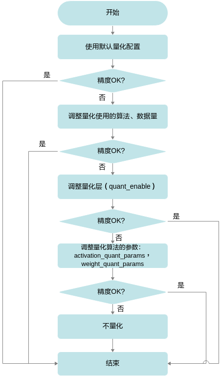

## 量化感知训练<a name="ZH-CN_TOPIC_0000002442022353"></a>


### 实现原理<a name="ZH-CN_TOPIC_0000002441982529"></a>

**图 1**  量化感知训练实现原理<a name="fig936695415614"></a>  
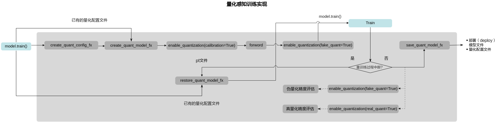

### 量化示例<a name="ZH-CN_TOPIC_0000002442022313"></a>


#### 量化前提<a name="ZH-CN_TOPIC_0000002408583078"></a>

-   **模型准备**

    请参见[模型准备](#ZH-CN_TOPIC_0000002408583126)。

-   **数据集准备**

    由于进行量化感知训练需要使用大量数据对量化参数进行进一步优化，因此进行量化感知训练数据需要与模型训练数据一致。ResNet50的数据集是在ImageNet的子集ILSVRC-2012-CLS上训练而来，因此需要用户自己准备ImagenetPytorch格式的数据集（获取方式请参见[https://github.com/pytorch/examples/tree/master/imagenet](https://github.com/pytorch/examples/tree/master/imagenet)）。如果更换其他数据集，则需要自己进行数据预处理。

#### 量化步骤<a name="ZH-CN_TOPIC_0000002408423170"></a>

1.  执行resnet50网络模型的量化感知训练。

    切换到sample目录，执行如下命令。

    -   单卡量化感知训练

        ```
        CUDA_VISIBLE_DEVICES=0 python3.7.5 resnet50_retrain.py --train_set /user/train_set --eval_set /user/eval_set --benchmark
        ```

    -   多卡量化感知训练

        ```
        CUDA_VISIBLE_DEVICES=0,1,2,3 python3.7.5 resnet50_retrain.py --train_set /user/train_set --eval_set /user/eval_set --distributed --benchmark
        ```

        > **须知：** 
        >-   仅支持伪量化多卡训练，仅支持DistributedDataParallel模式的多卡训练，不支持DataParallel模式的多卡训练。
        >-   仅量化模型可以转换成DDP模型，进行训练和推理，生成量化配置文件和量化模型时，用到的浮点模型不能转换成DDP。

    -   断点重训

        ```
        python3.7.5 resnet50_retrain_from_checkpoint.py --config_file ./tmp/retrain/config.json --pt ./checkpoints/retrain/resnet50_retrain_last.pt --train_set /user/train_set --eval_set /user/eval_set --distributed --benchmark
        ```

    -   dump layer outputs

        ```
        python3.7.5 ../dump_layer_outputs.py --config_file ./tmp/retrain/config.json --pt ./checkpoints/retrain/resnet50_retrain_best.pt --state_dict_name quant_model_weights
        ```

    注意：train\_set和eval\_set需指定对应服务器上的数据集路径。

    上述命令只给出了常用的参数，不常用参数以及各个参数解释请参见如[表1](#table144403385410)。

    **表 1**  量化感知训练所用参数说明

    <a name="table144403385410"></a>
    <table><thead align="left"><tr id="row164413382418"><th class="cellrowborder" valign="top" width="40.03%" id="mcps1.2.3.1.1"><p id="p1144193819413"><a name="p1144193819413"></a><a name="p1144193819413"></a>参数</p>
    </th>
    <th class="cellrowborder" valign="top" width="59.97%" id="mcps1.2.3.1.2"><p id="p644133814114"><a name="p644133814114"></a><a name="p644133814114"></a>说明</p>
    </th>
    </tr>
    </thead>
    <tbody><tr id="row444123894116"><td class="cellrowborder" valign="top" width="40.03%" headers="mcps1.2.3.1.1 "><p id="p444173817411"><a name="p444173817411"></a><a name="p444173817411"></a>--train_set</p>
    </td>
    <td class="cellrowborder" valign="top" width="59.97%" headers="mcps1.2.3.1.2 "><a name="ul244183811417"></a><a name="ul244183811417"></a><ul id="ul244183811417"><li>是否必填：是。</li><li>数据类型：string。</li><li>参数解释：训练数据集路径。</li></ul>
    </td>
    </tr>
    <tr id="row64411738174111"><td class="cellrowborder" valign="top" width="40.03%" headers="mcps1.2.3.1.1 "><p id="p144422382417"><a name="p144422382417"></a><a name="p144422382417"></a>--eval_set</p>
    </td>
    <td class="cellrowborder" valign="top" width="59.97%" headers="mcps1.2.3.1.2 "><a name="ul124421138194113"></a><a name="ul124421138194113"></a><ul id="ul124421138194113"><li>是否必填：是。</li><li>数据类型：string。</li><li>参数解释：验证数据集路径。</li></ul>
    </td>
    </tr>
    <tr id="row1944293844112"><td class="cellrowborder" valign="top" width="40.03%" headers="mcps1.2.3.1.1 "><p id="p94426388415"><a name="p94426388415"></a><a name="p94426388415"></a>--num_parallel_reads</p>
    </td>
    <td class="cellrowborder" valign="top" width="59.97%" headers="mcps1.2.3.1.2 "><a name="ul544216386415"></a><a name="ul544216386415"></a><ul id="ul544216386415"><li>是否必填：否。</li><li>数据类型：int。</li><li>默认值：4。</li><li>参数解释：用于读取数据集的线程数，根据硬件运算能力酌情调整。</li></ul>
    </td>
    </tr>
    <tr id="row146741144504"><td class="cellrowborder" valign="top" width="40.03%" headers="mcps1.2.3.1.1 "><p id="p196741314105014"><a name="p196741314105014"></a><a name="p196741314105014"></a>--epochs</p>
    </td>
    <td class="cellrowborder" valign="top" width="59.97%" headers="mcps1.2.3.1.2 "><a name="ul939112301503"></a><a name="ul939112301503"></a><ul id="ul939112301503"><li>是否必填：否。</li><li>数据类型：int。</li><li>默认值：10。</li><li>参数解释：量化训练过程中的样本训练次数。</li></ul>
    </td>
    </tr>
    <tr id="row19442183834116"><td class="cellrowborder" valign="top" width="40.03%" headers="mcps1.2.3.1.1 "><p id="p104421738114117"><a name="p104421738114117"></a><a name="p104421738114117"></a>--batch_size</p>
    </td>
    <td class="cellrowborder" valign="top" width="59.97%" headers="mcps1.2.3.1.2 "><a name="ul2442238114115"></a><a name="ul2442238114115"></a><ul id="ul2442238114115"><li>是否必填：否。</li><li>数据类型：int。</li><li>默认值：16。</li><li>参数解释：pytorch执行一次前向推理所使用的样本数量，根据内存或显存大小酌情调整。</li></ul>
    </td>
    </tr>
    <tr id="row4442133811414"><td class="cellrowborder" valign="top" width="40.03%" headers="mcps1.2.3.1.1 "><p id="p14443193815411"><a name="p14443193815411"></a><a name="p14443193815411"></a>--learning_rate</p>
    </td>
    <td class="cellrowborder" valign="top" width="59.97%" headers="mcps1.2.3.1.2 "><a name="ul15443143814419"></a><a name="ul15443143814419"></a><ul id="ul15443143814419"><li>是否必填：否。</li><li>数据类型：float。</li><li>默认值：1e-5。</li><li>参数解释：学习率。</li></ul>
    </td>
    </tr>
    <tr id="row11443103811410"><td class="cellrowborder" valign="top" width="40.03%" headers="mcps1.2.3.1.1 "><p id="p544313817415"><a name="p544313817415"></a><a name="p544313817415"></a>--train_iter</p>
    </td>
    <td class="cellrowborder" valign="top" width="59.97%" headers="mcps1.2.3.1.2 "><a name="ul154431038194113"></a><a name="ul154431038194113"></a><ul id="ul154431038194113"><li>是否必填：否。</li><li>数据类型：int。</li><li>默认值：50。</li><li>参数解释：在每个epoch中，要运行的总迭代次数，为了展示量化过程，缩短训练时间，将train_iter设置为较小的值，train_iter的值不能超过train_set的长度。</li></ul>
    </td>
    </tr>
    <tr id="row515082955216"><td class="cellrowborder" valign="top" width="40.03%" headers="mcps1.2.3.1.1 "><p id="p12150132995211"><a name="p12150132995211"></a><a name="p12150132995211"></a>--eval_iter</p>
    </td>
    <td class="cellrowborder" valign="top" width="59.97%" headers="mcps1.2.3.1.2 "><a name="ul54211650125215"></a><a name="ul54211650125215"></a><ul id="ul54211650125215"><li>是否必填：否。</li><li>数据类型：int。</li><li>默认值：50。</li><li>参数解释：验证数据集的迭代次数。</li></ul>
    </td>
    </tr>
    <tr id="row044383811412"><td class="cellrowborder" valign="top" width="40.03%" headers="mcps1.2.3.1.1 "><p id="p944323820413"><a name="p944323820413"></a><a name="p944323820413"></a>--print_freq</p>
    </td>
    <td class="cellrowborder" valign="top" width="59.97%" headers="mcps1.2.3.1.2 "><a name="ul34431538174118"></a><a name="ul34431538174118"></a><ul id="ul34431538174118"><li>是否必填：否。</li><li>数据类型：int。</li><li>默认值：10。</li><li>参数解释：训练及测试信息的打印频率。</li></ul>
    </td>
    </tr>
    <tr id="row1744312381416"><td class="cellrowborder" valign="top" width="40.03%" headers="mcps1.2.3.1.1 "><p id="p1344343854115"><a name="p1344343854115"></a><a name="p1344343854115"></a>--dist_url</p>
    </td>
    <td class="cellrowborder" valign="top" width="59.97%" headers="mcps1.2.3.1.2 "><a name="ul7443153854111"></a><a name="ul7443153854111"></a><ul id="ul7443153854111"><li>是否必填：否。</li><li>数据类型：string。</li><li>默认值：tcp://127.0.0.1:50011。</li><li>参数解释：初始化多卡训练通信进程的方法。</li></ul>
    </td>
    </tr>
    <tr id="row2444143815411"><td class="cellrowborder" valign="top" width="40.03%" headers="mcps1.2.3.1.1 "><p id="p2444738194111"><a name="p2444738194111"></a><a name="p2444738194111"></a>--distributed</p>
    </td>
    <td class="cellrowborder" valign="top" width="59.97%" headers="mcps1.2.3.1.2 "><a name="ul1644453819416"></a><a name="ul1644453819416"></a><ul id="ul1644453819416"><li>是否必填：否。</li><li>数据类型：无。</li><li>参数解释：使用该参数表示进行多卡训练，否则不进行多卡训练。</li></ul>
    </td>
    </tr>
    <tr id="row727819834317"><td class="cellrowborder" valign="top" width="40.03%" headers="mcps1.2.3.1.1 "><p id="p82780813432"><a name="p82780813432"></a><a name="p82780813432"></a>--benchmark</p>
    </td>
    <td class="cellrowborder" valign="top" width="59.97%" headers="mcps1.2.3.1.2 "><a name="ul534119351408"></a><a name="ul534119351408"></a><ul id="ul534119351408"><li>是否必填：否。</li><li>数据类型：bool。</li><li>默认值：False。</li><li>参数解释：迭代全量数据集进行模型训练和推理，传入即开启。</li></ul>
    </td>
    </tr>
    <tr id="row147310210468"><td class="cellrowborder" valign="top" width="40.03%" headers="mcps1.2.3.1.1 "><p id="p1867785812412"><a name="p1867785812412"></a><a name="p1867785812412"></a>--config_def</p>
    </td>
    <td class="cellrowborder" valign="top" width="59.97%" headers="mcps1.2.3.1.2 "><a name="ul1743910182510"></a><a name="ul1743910182510"></a><ul id="ul1743910182510"><li>是否必填：否。</li><li>数据类型：string。</li><li>参数解释：简易量化配置文件的路径。</li></ul>
    </td>
    </tr>
    <tr id="row10527109192820"><td class="cellrowborder" valign="top" width="40.03%" headers="mcps1.2.3.1.1 "><p id="p27851115192616"><a name="p27851115192616"></a><a name="p27851115192616"></a>--state_dict_name</p>
    </td>
    <td class="cellrowborder" valign="top" width="59.97%" headers="mcps1.2.3.1.2 "><a name="ul1516692715261"></a><a name="ul1516692715261"></a><ul id="ul1516692715261"><li>是否必填：否。</li><li>数据类型：string。</li><li>参数解释：权重文件中权重对应的键值。</li></ul>
    </td>
    </tr>
    </tbody>
    </table>

2.  若出现如下信息，则说明执行量化感知训练成功：

    ```
    ==> AMCT run resnet50_retrain.py in 387.5s
    ```

3.  量化结果说明。

    量化成功后，在脚本的同级目录下还会生成量化配置文件等中间文件、量化日志文件以及量化结果文件：

    -   amct\_log/hotwheels.amct\_pytorch.log：量化日志文件，记录了量化过程的日志信息。
    -   checkpoints/retrain：
        -   resnet50\_retrain\_best.pt：real quant top1 最高的量化模型权重。
        -   resnet50\_retrain\_last.pt：最后一个epoch的量化模型权重。
        -   resnet50\_retrain\_last\_deploy\_model.onnx：可在SoC部署的量化模型。
        -   resnet50\_epoch\_0\_quant\_param\_record.txt：量化参数文件。

    -   tmp/retrain：临时文件
        -   config.json：描述了如何对模型中的每一层进行量化。如果量化脚本所在目录下已经存在量化配置文件，则再次调用[create\_quant\_config\_fx](#ZH-CN_TOPIC_0000002441982485)接口时，如果新生成的量化配置文件与已有的文件同名，则会覆盖已有的量化配置文件，否则生成新的量化配置文件。

            如果量化后的模型推理精度不满足要求，用户可以修改config.json文件，量化配置文件内容、修改原则以及参数解释请参见[量化调优](#ZH-CN_TOPIC_0000002441982493)。

        -   float.svg：用户需要量化的pytorch模型原始浮点静态图。
        -   quant.svg：用户需要量化的pytorch模型插入量化层以及融合后的静态图。
        -   results.csv：保存每一个epoch的量化模型准确率。

4.  如果用户需要将量化后的deploy模型，转换为适配SoC的离线模型，则请参见MindCmd 对应的用户指南。

### 量化调优<a name="ZH-CN_TOPIC_0000002441982493"></a>


#### 参数配置说明<a name="ZH-CN_TOPIC_0000002441982533"></a>

如果通过[create\_quant\_config\_fx](#ZH-CN_TOPIC_0000002441982485)接口生成的retrain\_config.json量化感知训练配置文件，推理精度不满足要求，则需要参见该章节不断调整retrain\_config.json文件中的内容，直至精度满足要求，该文件部分内容样例如下（**用户修改json文件时，请确保层名唯一，对于需要量化的不带权重的层，因为不用保存权重信息，在原始模型定义文件中，其层名会重复使用，用户需要手动修改模型定义文件**）。

配置文件中参数说明参照[参数配置说明](#ZH-CN_TOPIC_0000002441982533)。

#### 参数调优说明<a name="ZH-CN_TOPIC_0000002441982465"></a>

按照retrain\_config.json文件中的默认配置进行量化，若量化后的推理精度不满足要求，则按照如下步骤调整量化配置文件中的参数。

1.  执行**amct\_pytorch\_sample.tar.gz**包中的量化脚本，根据[create\_quant\_config\_fx](#ZH-CN_TOPIC_0000002441982485)接口生成的默认配置进行量化。若精度满足要求，则调参结束，否则进行[步骤2](#li1098552717559)。
2.  <a name="li1098552717559"></a>将部分量化层取消量化，即将其"retrain\_enable"参数修改为"false"。通常模型首尾层对推理结果影响较大，故建议优先取消首尾层的量化。
3.  完成配置后，精度满足要求则调参结束；否则表明量化感知训练对精度影响很大，不能进行量化感知训练，去除量化感知训练配置。

## 量化算法<a name="ZH-CN_TOPIC_0000002441982461"></a>

本章节介绍的observer算法和fakequant算法，继承了torch官方量化算法。observer对应量化过程中的calibration场景，fakequant算法对应量化过程中模型训练和推理场景。


### observer算法<a name="ZH-CN_TOPIC_0000002442022321"></a>


#### IFMRObserver<a name="ZH-CN_TOPIC_0000002442022309"></a>

作用：统计权重和数据的max、min、scale和zero\_point。

**表 1**  IFMRObserver

<a name="table15727125775212"></a>
<table><thead align="left"><tr id="row12727185725214"><th class="cellrowborder" valign="top" width="13.871387138713873%" id="mcps1.2.7.1.1"><p id="p81231110164419"><a name="p81231110164419"></a><a name="p81231110164419"></a><strong id="b187281457105218"><a name="b187281457105218"></a><a name="b187281457105218"></a>参数名</strong></p>
</th>
<th class="cellrowborder" valign="top" width="53.715371537153736%" id="mcps1.2.7.1.2"><p id="p8728175745215"><a name="p8728175745215"></a><a name="p8728175745215"></a><strong id="b1072835715217"><a name="b1072835715217"></a><a name="b1072835715217"></a>参数说明</strong></p>
</th>
<th class="cellrowborder" valign="top" width="6.580658065806581%" id="mcps1.2.7.1.3"><p id="p372813573525"><a name="p372813573525"></a><a name="p372813573525"></a><strong id="b772816573522"><a name="b772816573522"></a><a name="b772816573522"></a>类型</strong></p>
</th>
<th class="cellrowborder" valign="top" width="7.010701070107012%" id="mcps1.2.7.1.4"><p id="p97281857135220"><a name="p97281857135220"></a><a name="p97281857135220"></a><strong id="b572825713521"><a name="b572825713521"></a><a name="b572825713521"></a>默认值</strong></p>
</th>
<th class="cellrowborder" valign="top" width="11.931193119311933%" id="mcps1.2.7.1.5"><p id="p1772819575524"><a name="p1772819575524"></a><a name="p1772819575524"></a>参数范围</p>
</th>
<th class="cellrowborder" valign="top" width="6.890689068906893%" id="mcps1.2.7.1.6"><p id="p1072865785217"><a name="p1072865785217"></a><a name="p1072865785217"></a><strong id="b9728125710521"><a name="b9728125710521"></a><a name="b9728125710521"></a>是否必填</strong></p>
</th>
</tr>
</thead>
<tbody><tr id="row1728157105219"><td class="cellrowborder" valign="top" width="13.871387138713873%" headers="mcps1.2.7.1.1 "><p id="p1572813574525"><a name="p1572813574525"></a><a name="p1572813574525"></a>object_layer</p>
</td>
<td class="cellrowborder" valign="top" width="53.715371537153736%" headers="mcps1.2.7.1.2 "><p id="p272815715212"><a name="p272815715212"></a><a name="p272815715212"></a>节点层名</p>
</td>
<td class="cellrowborder" valign="top" width="6.580658065806581%" headers="mcps1.2.7.1.3 "><p id="p87283578524"><a name="p87283578524"></a><a name="p87283578524"></a>string</p>
</td>
<td class="cellrowborder" valign="top" width="7.010701070107012%" headers="mcps1.2.7.1.4 "><p id="p19728857205218"><a name="p19728857205218"></a><a name="p19728857205218"></a>无</p>
</td>
<td class="cellrowborder" valign="top" width="11.931193119311933%" headers="mcps1.2.7.1.5 "><p id="p57285573524"><a name="p57285573524"></a><a name="p57285573524"></a>无</p>
</td>
<td class="cellrowborder" valign="top" width="6.890689068906893%" headers="mcps1.2.7.1.6 "><p id="p1072817575522"><a name="p1072817575522"></a><a name="p1072817575522"></a>否</p>
</td>
</tr>
<tr id="row10728957185215"><td class="cellrowborder" valign="top" width="13.871387138713873%" headers="mcps1.2.7.1.1 "><p id="p272817576529"><a name="p272817576529"></a><a name="p272817576529"></a>num_bits</p>
</td>
<td class="cellrowborder" valign="top" width="53.715371537153736%" headers="mcps1.2.7.1.2 "><p id="p17281457165214"><a name="p17281457165214"></a><a name="p17281457165214"></a>量化位宽</p>
</td>
<td class="cellrowborder" valign="top" width="6.580658065806581%" headers="mcps1.2.7.1.3 "><p id="p772865775213"><a name="p772865775213"></a><a name="p772865775213"></a>int</p>
</td>
<td class="cellrowborder" valign="top" width="7.010701070107012%" headers="mcps1.2.7.1.4 "><p id="p8728125714521"><a name="p8728125714521"></a><a name="p8728125714521"></a>8</p>
</td>
<td class="cellrowborder" valign="top" width="11.931193119311933%" headers="mcps1.2.7.1.5 "><p id="p127291357165214"><a name="p127291357165214"></a><a name="p127291357165214"></a>4、[8~16]整数</p>
</td>
<td class="cellrowborder" valign="top" width="6.890689068906893%" headers="mcps1.2.7.1.6 "><p id="p6729857165214"><a name="p6729857165214"></a><a name="p6729857165214"></a>否</p>
</td>
</tr>
<tr id="row77291457135218"><td class="cellrowborder" valign="top" width="13.871387138713873%" headers="mcps1.2.7.1.1 "><p id="p37291557125213"><a name="p37291557125213"></a><a name="p37291557125213"></a>batch_num</p>
</td>
<td class="cellrowborder" valign="top" width="53.715371537153736%" headers="mcps1.2.7.1.2 "><p id="p16729145711521"><a name="p16729145711521"></a><a name="p16729145711521"></a>如果不配置，则使用默认值1</p>
</td>
<td class="cellrowborder" valign="top" width="6.580658065806581%" headers="mcps1.2.7.1.3 "><p id="p1972945713526"><a name="p1972945713526"></a><a name="p1972945713526"></a>int</p>
</td>
<td class="cellrowborder" valign="top" width="7.010701070107012%" headers="mcps1.2.7.1.4 "><p id="p1872955795211"><a name="p1872955795211"></a><a name="p1872955795211"></a>2</p>
</td>
<td class="cellrowborder" valign="top" width="11.931193119311933%" headers="mcps1.2.7.1.5 "><p id="p177291257175213"><a name="p177291257175213"></a><a name="p177291257175213"></a>大于0</p>
</td>
<td class="cellrowborder" valign="top" width="6.890689068906893%" headers="mcps1.2.7.1.6 "><p id="p672914578523"><a name="p672914578523"></a><a name="p672914578523"></a>否</p>
</td>
</tr>
<tr id="row4729857135212"><td class="cellrowborder" valign="top" width="13.871387138713873%" headers="mcps1.2.7.1.1 "><p id="p11729657115212"><a name="p11729657115212"></a><a name="p11729657115212"></a>with_offset</p>
</td>
<td class="cellrowborder" valign="top" width="53.715371537153736%" headers="mcps1.2.7.1.2 "><p id="p13729257115213"><a name="p13729257115213"></a><a name="p13729257115213"></a>是否使用偏移</p>
</td>
<td class="cellrowborder" valign="top" width="6.580658065806581%" headers="mcps1.2.7.1.3 "><p id="p12729165715211"><a name="p12729165715211"></a><a name="p12729165715211"></a>bool</p>
</td>
<td class="cellrowborder" valign="top" width="7.010701070107012%" headers="mcps1.2.7.1.4 "><p id="p1672912573528"><a name="p1672912573528"></a><a name="p1672912573528"></a>True</p>
</td>
<td class="cellrowborder" valign="top" width="11.931193119311933%" headers="mcps1.2.7.1.5 "><p id="p572915576523"><a name="p572915576523"></a><a name="p572915576523"></a>True、Fasle</p>
</td>
<td class="cellrowborder" valign="top" width="6.890689068906893%" headers="mcps1.2.7.1.6 "><p id="p67293571529"><a name="p67293571529"></a><a name="p67293571529"></a>否</p>
</td>
</tr>
<tr id="row197291057195219"><td class="cellrowborder" valign="top" width="13.871387138713873%" headers="mcps1.2.7.1.1 "><p id="p18729175735211"><a name="p18729175735211"></a><a name="p18729175735211"></a>max_percentile</p>
</td>
<td class="cellrowborder" valign="top" width="53.715371537153736%" headers="mcps1.2.7.1.2 "><p id="p16729057105216"><a name="p16729057105216"></a><a name="p16729057105216"></a>在从大到小排序的一组数中，决定取第多少大的数，比如有100个数，1.0表示取第100-100*1.0=0，对应的就是第一个大的数。</p>
<p id="p15729115725219"><a name="p15729115725219"></a><a name="p15729115725219"></a>对待量化的数据做截断处理时，该值越大，说明截断的上边界越接近待量化数据的最大值。</p>
</td>
<td class="cellrowborder" valign="top" width="6.580658065806581%" headers="mcps1.2.7.1.3 "><p id="p19730145718524"><a name="p19730145718524"></a><a name="p19730145718524"></a>float</p>
</td>
<td class="cellrowborder" valign="top" width="7.010701070107012%" headers="mcps1.2.7.1.4 "><p id="p97301857145213"><a name="p97301857145213"></a><a name="p97301857145213"></a>0.999999</p>
</td>
<td class="cellrowborder" valign="top" width="11.931193119311933%" headers="mcps1.2.7.1.5 "><p id="p197309573525"><a name="p197309573525"></a><a name="p197309573525"></a>（0.5,1.0]</p>
</td>
<td class="cellrowborder" valign="top" width="6.890689068906893%" headers="mcps1.2.7.1.6 "><p id="p1373025710527"><a name="p1373025710527"></a><a name="p1373025710527"></a>否</p>
</td>
</tr>
<tr id="row6730125716523"><td class="cellrowborder" valign="top" width="13.871387138713873%" headers="mcps1.2.7.1.1 "><p id="p273085725218"><a name="p273085725218"></a><a name="p273085725218"></a>min_percentile</p>
</td>
<td class="cellrowborder" valign="top" width="53.715371537153736%" headers="mcps1.2.7.1.2 "><p id="p5730115755218"><a name="p5730115755218"></a><a name="p5730115755218"></a>在从小到大排序的一组数中，决定取第多少小的数，比如有100个数，1.0表示取第100-100*1.0=0，对应的就是第一个小的数。</p>
<p id="p37306571527"><a name="p37306571527"></a><a name="p37306571527"></a>对待量化的数据做截断处理时，该值越大，说明截断的下边界越接近待量化数据的最小值。</p>
</td>
<td class="cellrowborder" valign="top" width="6.580658065806581%" headers="mcps1.2.7.1.3 "><p id="p7730165711520"><a name="p7730165711520"></a><a name="p7730165711520"></a>float</p>
</td>
<td class="cellrowborder" valign="top" width="7.010701070107012%" headers="mcps1.2.7.1.4 "><p id="p20730957185214"><a name="p20730957185214"></a><a name="p20730957185214"></a>0.999999</p>
</td>
<td class="cellrowborder" valign="top" width="11.931193119311933%" headers="mcps1.2.7.1.5 "><p id="p197301157195212"><a name="p197301157195212"></a><a name="p197301157195212"></a>（0.5,1.0]</p>
</td>
<td class="cellrowborder" valign="top" width="6.890689068906893%" headers="mcps1.2.7.1.6 "><p id="p1073017573528"><a name="p1073017573528"></a><a name="p1073017573528"></a>否</p>
</td>
</tr>
<tr id="row2730195715529"><td class="cellrowborder" valign="top" width="13.871387138713873%" headers="mcps1.2.7.1.1 "><p id="p67301257165210"><a name="p67301257165210"></a><a name="p67301257165210"></a>search_start</p>
</td>
<td class="cellrowborder" valign="top" width="53.715371537153736%" headers="mcps1.2.7.1.2 "><p id="p1473095725213"><a name="p1473095725213"></a><a name="p1473095725213"></a>控制量化因子的搜索开始的点</p>
</td>
<td class="cellrowborder" valign="top" width="6.580658065806581%" headers="mcps1.2.7.1.3 "><p id="p9730357155214"><a name="p9730357155214"></a><a name="p9730357155214"></a>float</p>
</td>
<td class="cellrowborder" valign="top" width="7.010701070107012%" headers="mcps1.2.7.1.4 "><p id="p16730857145210"><a name="p16730857145210"></a><a name="p16730857145210"></a>0.7</p>
</td>
<td class="cellrowborder" valign="top" width="11.931193119311933%" headers="mcps1.2.7.1.5 "><p id="p2730165711522"><a name="p2730165711522"></a><a name="p2730165711522"></a>[0.7,1.3]</p>
</td>
<td class="cellrowborder" valign="top" width="6.890689068906893%" headers="mcps1.2.7.1.6 "><p id="p1373020576529"><a name="p1373020576529"></a><a name="p1373020576529"></a>否</p>
</td>
</tr>
<tr id="row07309578527"><td class="cellrowborder" valign="top" width="13.871387138713873%" headers="mcps1.2.7.1.1 "><p id="p97311157115213"><a name="p97311157115213"></a><a name="p97311157115213"></a>search_end</p>
</td>
<td class="cellrowborder" valign="top" width="53.715371537153736%" headers="mcps1.2.7.1.2 "><p id="p5731357185218"><a name="p5731357185218"></a><a name="p5731357185218"></a>控制量化因子的搜索结束的点</p>
</td>
<td class="cellrowborder" valign="top" width="6.580658065806581%" headers="mcps1.2.7.1.3 "><p id="p147319579525"><a name="p147319579525"></a><a name="p147319579525"></a>float</p>
</td>
<td class="cellrowborder" valign="top" width="7.010701070107012%" headers="mcps1.2.7.1.4 "><p id="p87313573521"><a name="p87313573521"></a><a name="p87313573521"></a>1.3</p>
</td>
<td class="cellrowborder" valign="top" width="11.931193119311933%" headers="mcps1.2.7.1.5 "><p id="p7731145755214"><a name="p7731145755214"></a><a name="p7731145755214"></a>[0.7,1.3]</p>
</td>
<td class="cellrowborder" valign="top" width="6.890689068906893%" headers="mcps1.2.7.1.6 "><p id="p1173125765210"><a name="p1173125765210"></a><a name="p1173125765210"></a>否</p>
</td>
</tr>
<tr id="row8731105755216"><td class="cellrowborder" valign="top" width="13.871387138713873%" headers="mcps1.2.7.1.1 "><p id="p37311257165218"><a name="p37311257165218"></a><a name="p37311257165218"></a>search_step</p>
</td>
<td class="cellrowborder" valign="top" width="53.715371537153736%" headers="mcps1.2.7.1.2 "><p id="p117311057105212"><a name="p117311057105212"></a><a name="p117311057105212"></a>控制截断的上边界的浮动范围步长，值越小，浮动步长越小。</p>
</td>
<td class="cellrowborder" valign="top" width="6.580658065806581%" headers="mcps1.2.7.1.3 "><p id="p1731557115210"><a name="p1731557115210"></a><a name="p1731557115210"></a>float</p>
</td>
<td class="cellrowborder" valign="top" width="7.010701070107012%" headers="mcps1.2.7.1.4 "><p id="p1973185716527"><a name="p1973185716527"></a><a name="p1973185716527"></a>0.01</p>
</td>
<td class="cellrowborder" valign="top" width="11.931193119311933%" headers="mcps1.2.7.1.5 "><p id="p3731155705214"><a name="p3731155705214"></a><a name="p3731155705214"></a>（0,  (search_end-search_start)]</p>
</td>
<td class="cellrowborder" valign="top" width="6.890689068906893%" headers="mcps1.2.7.1.6 "><p id="p373110577524"><a name="p373110577524"></a><a name="p373110577524"></a>否</p>
</td>
</tr>
</tbody>
</table>

#### ArqObserver<a name="ZH-CN_TOPIC_0000002441982469"></a>

作用：为ARQ算法定制的算法。

**表 1**  ArqObserver

<a name="table15727125775212"></a>
<table><thead align="left"><tr id="row12727185725214"><th class="cellrowborder" valign="top" width="13.871387138713873%" id="mcps1.2.7.1.1"><p id="p1072765765212"><a name="p1072765765212"></a><a name="p1072765765212"></a><strong id="b187281457105218"><a name="b187281457105218"></a><a name="b187281457105218"></a>参数名</strong></p>
</th>
<th class="cellrowborder" valign="top" width="53.71537153715372%" id="mcps1.2.7.1.2"><p id="p8728175745215"><a name="p8728175745215"></a><a name="p8728175745215"></a><strong id="b1072835715217"><a name="b1072835715217"></a><a name="b1072835715217"></a>参数说明</strong></p>
</th>
<th class="cellrowborder" valign="top" width="6.580658065806581%" id="mcps1.2.7.1.3"><p id="p372813573525"><a name="p372813573525"></a><a name="p372813573525"></a><strong id="b772816573522"><a name="b772816573522"></a><a name="b772816573522"></a>类型</strong></p>
</th>
<th class="cellrowborder" valign="top" width="7.010701070107012%" id="mcps1.2.7.1.4"><p id="p97281857135220"><a name="p97281857135220"></a><a name="p97281857135220"></a><strong id="b572825713521"><a name="b572825713521"></a><a name="b572825713521"></a>默认值</strong></p>
</th>
<th class="cellrowborder" valign="top" width="11.691169116911693%" id="mcps1.2.7.1.5"><p id="p1772819575524"><a name="p1772819575524"></a><a name="p1772819575524"></a>参数范围</p>
</th>
<th class="cellrowborder" valign="top" width="7.130713071307132%" id="mcps1.2.7.1.6"><p id="p1072865785217"><a name="p1072865785217"></a><a name="p1072865785217"></a><strong id="b9728125710521"><a name="b9728125710521"></a><a name="b9728125710521"></a>是否必填</strong></p>
</th>
</tr>
</thead>
<tbody><tr id="row1728157105219"><td class="cellrowborder" valign="top" width="13.871387138713873%" headers="mcps1.2.7.1.1 "><p id="p1883713385583"><a name="p1883713385583"></a><a name="p1883713385583"></a>num_bits</p>
</td>
<td class="cellrowborder" valign="top" width="53.71537153715372%" headers="mcps1.2.7.1.2 "><p id="p367775945818"><a name="p367775945818"></a><a name="p367775945818"></a>量化位宽</p>
</td>
<td class="cellrowborder" valign="top" width="6.580658065806581%" headers="mcps1.2.7.1.3 "><p id="p02463141598"><a name="p02463141598"></a><a name="p02463141598"></a>int</p>
</td>
<td class="cellrowborder" valign="top" width="7.010701070107012%" headers="mcps1.2.7.1.4 "><p id="p13246214155916"><a name="p13246214155916"></a><a name="p13246214155916"></a>8</p>
</td>
<td class="cellrowborder" valign="top" width="11.691169116911693%" headers="mcps1.2.7.1.5 "><p id="p1246181420594"><a name="p1246181420594"></a><a name="p1246181420594"></a>4、8</p>
</td>
<td class="cellrowborder" valign="top" width="7.130713071307132%" headers="mcps1.2.7.1.6 "><p id="p7246151415919"><a name="p7246151415919"></a><a name="p7246151415919"></a>否</p>
</td>
</tr>
<tr id="row425813412587"><td class="cellrowborder" valign="top" width="13.871387138713873%" headers="mcps1.2.7.1.1 "><p id="p1783863814584"><a name="p1783863814584"></a><a name="p1783863814584"></a>channel_wise</p>
</td>
<td class="cellrowborder" valign="top" width="53.71537153715372%" headers="mcps1.2.7.1.2 "><a name="ul5677155955818"></a><a name="ul5677155955818"></a><ul id="ul5677155955818"><li>取值为true时，每个channel独立量化，量化因子不同。</li><li>取值为false时，所有channel同时量化，共享同一个量化因子。</li></ul>
</td>
<td class="cellrowborder" valign="top" width="6.580658065806581%" headers="mcps1.2.7.1.3 "><p id="p42465149591"><a name="p42465149591"></a><a name="p42465149591"></a>bool</p>
</td>
<td class="cellrowborder" valign="top" width="7.010701070107012%" headers="mcps1.2.7.1.4 "><p id="p19246201425912"><a name="p19246201425912"></a><a name="p19246201425912"></a>True</p>
</td>
<td class="cellrowborder" valign="top" width="11.691169116911693%" headers="mcps1.2.7.1.5 "><p id="p8246614175917"><a name="p8246614175917"></a><a name="p8246614175917"></a>True、Fasle</p>
</td>
<td class="cellrowborder" valign="top" width="7.130713071307132%" headers="mcps1.2.7.1.6 "><p id="p1824616145597"><a name="p1824616145597"></a><a name="p1824616145597"></a>否</p>
</td>
</tr>
</tbody>
</table>

#### LuqMseObserver<a name="ZH-CN_TOPIC_0000002408423230"></a>

作用：为[LUQ量化算法](#ZH-CN_TOPIC_0000002442022357)算法定制的MSE算法。

**表 1**  LuqMseObserver

<a name="table15727125775212"></a>
<table><thead align="left"><tr id="row12727185725214"><th class="cellrowborder" valign="top" width="13.871387138713873%" id="mcps1.2.7.1.1"><p id="p1072765765212"><a name="p1072765765212"></a><a name="p1072765765212"></a><strong id="b187281457105218"><a name="b187281457105218"></a><a name="b187281457105218"></a>参数名</strong></p>
</th>
<th class="cellrowborder" valign="top" width="42.304230423042306%" id="mcps1.2.7.1.2"><p id="p8728175745215"><a name="p8728175745215"></a><a name="p8728175745215"></a><strong id="b1072835715217"><a name="b1072835715217"></a><a name="b1072835715217"></a>参数说明</strong></p>
</th>
<th class="cellrowborder" valign="top" width="9.44094409440944%" id="mcps1.2.7.1.3"><p id="p372813573525"><a name="p372813573525"></a><a name="p372813573525"></a><strong id="b772816573522"><a name="b772816573522"></a><a name="b772816573522"></a>类型</strong></p>
</th>
<th class="cellrowborder" valign="top" width="10.221022102210222%" id="mcps1.2.7.1.4"><p id="p97281857135220"><a name="p97281857135220"></a><a name="p97281857135220"></a><strong id="b572825713521"><a name="b572825713521"></a><a name="b572825713521"></a>默认值</strong></p>
</th>
<th class="cellrowborder" valign="top" width="16.961696169616964%" id="mcps1.2.7.1.5"><p id="p1772819575524"><a name="p1772819575524"></a><a name="p1772819575524"></a>参数范围</p>
</th>
<th class="cellrowborder" valign="top" width="7.200720072007201%" id="mcps1.2.7.1.6"><p id="p1072865785217"><a name="p1072865785217"></a><a name="p1072865785217"></a><strong id="b9728125710521"><a name="b9728125710521"></a><a name="b9728125710521"></a>是否必填</strong></p>
</th>
</tr>
</thead>
<tbody><tr id="row1728157105219"><td class="cellrowborder" valign="top" width="13.871387138713873%" headers="mcps1.2.7.1.1 "><p id="p1014083016119"><a name="p1014083016119"></a><a name="p1014083016119"></a>qscheme</p>
</td>
<td class="cellrowborder" valign="top" width="42.304230423042306%" headers="mcps1.2.7.1.2 "><p id="p11140123011116"><a name="p11140123011116"></a><a name="p11140123011116"></a>量化方案</p>
</td>
<td class="cellrowborder" valign="top" width="9.44094409440944%" headers="mcps1.2.7.1.3 "><p id="p191401730317"><a name="p191401730317"></a><a name="p191401730317"></a>string</p>
</td>
<td class="cellrowborder" valign="top" width="10.221022102210222%" headers="mcps1.2.7.1.4 "><p id="p91403305115"><a name="p91403305115"></a><a name="p91403305115"></a>symmetric</p>
</td>
<td class="cellrowborder" valign="top" width="16.961696169616964%" headers="mcps1.2.7.1.5 "><p id="p7140330313"><a name="p7140330313"></a><a name="p7140330313"></a>dynamic、affine和symmetric</p>
</td>
<td class="cellrowborder" valign="top" width="7.200720072007201%" headers="mcps1.2.7.1.6 "><p id="p2014013306120"><a name="p2014013306120"></a><a name="p2014013306120"></a>否</p>
</td>
</tr>
<tr id="row55957171214"><td class="cellrowborder" valign="top" width="13.871387138713873%" headers="mcps1.2.7.1.1 "><p id="p19140730812"><a name="p19140730812"></a><a name="p19140730812"></a>quant_min</p>
</td>
<td class="cellrowborder" valign="top" width="42.304230423042306%" headers="mcps1.2.7.1.2 "><p id="p614012301414"><a name="p614012301414"></a><a name="p614012301414"></a>量化范围最小值</p>
</td>
<td class="cellrowborder" valign="top" width="9.44094409440944%" headers="mcps1.2.7.1.3 "><p id="p91401530612"><a name="p91401530612"></a><a name="p91401530612"></a>int</p>
</td>
<td class="cellrowborder" valign="top" width="10.221022102210222%" headers="mcps1.2.7.1.4 "><p id="p101407300115"><a name="p101407300115"></a><a name="p101407300115"></a>-128</p>
</td>
<td class="cellrowborder" valign="top" width="16.961696169616964%" headers="mcps1.2.7.1.5 "><p id="p81408301415"><a name="p81408301415"></a><a name="p81408301415"></a>-(2**(num_bits - 1))</p>
</td>
<td class="cellrowborder" valign="top" width="7.200720072007201%" headers="mcps1.2.7.1.6 "><p id="p71401301118"><a name="p71401301118"></a><a name="p71401301118"></a>否</p>
</td>
</tr>
<tr id="row322281816111"><td class="cellrowborder" valign="top" width="13.871387138713873%" headers="mcps1.2.7.1.1 "><p id="p314018308111"><a name="p314018308111"></a><a name="p314018308111"></a>quant_max</p>
</td>
<td class="cellrowborder" valign="top" width="42.304230423042306%" headers="mcps1.2.7.1.2 "><p id="p161406302116"><a name="p161406302116"></a><a name="p161406302116"></a>量化范围最大值</p>
</td>
<td class="cellrowborder" valign="top" width="9.44094409440944%" headers="mcps1.2.7.1.3 "><p id="p8140730916"><a name="p8140730916"></a><a name="p8140730916"></a>int</p>
</td>
<td class="cellrowborder" valign="top" width="10.221022102210222%" headers="mcps1.2.7.1.4 "><p id="p191406301110"><a name="p191406301110"></a><a name="p191406301110"></a>127</p>
</td>
<td class="cellrowborder" valign="top" width="16.961696169616964%" headers="mcps1.2.7.1.5 "><p id="p4140730613"><a name="p4140730613"></a><a name="p4140730613"></a>(2**(num_bits - 1)) - 1</p>
</td>
<td class="cellrowborder" valign="top" width="7.200720072007201%" headers="mcps1.2.7.1.6 "><p id="p141401430410"><a name="p141401430410"></a><a name="p141401430410"></a>否</p>
</td>
</tr>
<tr id="row71097191512"><td class="cellrowborder" valign="top" width="13.871387138713873%" headers="mcps1.2.7.1.1 "><p id="p14140130218"><a name="p14140130218"></a><a name="p14140130218"></a>search_start</p>
</td>
<td class="cellrowborder" valign="top" width="42.304230423042306%" headers="mcps1.2.7.1.2 "><p id="p214118309111"><a name="p214118309111"></a><a name="p214118309111"></a>搜索开始位置</p>
</td>
<td class="cellrowborder" valign="top" width="9.44094409440944%" headers="mcps1.2.7.1.3 "><p id="p101414306112"><a name="p101414306112"></a><a name="p101414306112"></a>float</p>
</td>
<td class="cellrowborder" valign="top" width="10.221022102210222%" headers="mcps1.2.7.1.4 "><p id="p3141193011115"><a name="p3141193011115"></a><a name="p3141193011115"></a>0.5</p>
</td>
<td class="cellrowborder" valign="top" width="16.961696169616964%" headers="mcps1.2.7.1.5 "><p id="p1014133014120"><a name="p1014133014120"></a><a name="p1014133014120"></a>[0.5,1.5]</p>
</td>
<td class="cellrowborder" valign="top" width="7.200720072007201%" headers="mcps1.2.7.1.6 "><p id="p71411230917"><a name="p71411230917"></a><a name="p71411230917"></a>否</p>
</td>
</tr>
<tr id="row15620182012117"><td class="cellrowborder" valign="top" width="13.871387138713873%" headers="mcps1.2.7.1.1 "><p id="p121413304111"><a name="p121413304111"></a><a name="p121413304111"></a>search_end</p>
</td>
<td class="cellrowborder" valign="top" width="42.304230423042306%" headers="mcps1.2.7.1.2 "><p id="p14141530614"><a name="p14141530614"></a><a name="p14141530614"></a>搜索结束位置</p>
</td>
<td class="cellrowborder" valign="top" width="9.44094409440944%" headers="mcps1.2.7.1.3 "><p id="p91411230416"><a name="p91411230416"></a><a name="p91411230416"></a>float</p>
</td>
<td class="cellrowborder" valign="top" width="10.221022102210222%" headers="mcps1.2.7.1.4 "><p id="p114163016111"><a name="p114163016111"></a><a name="p114163016111"></a>1.5</p>
</td>
<td class="cellrowborder" valign="top" width="16.961696169616964%" headers="mcps1.2.7.1.5 "><p id="p314183011117"><a name="p314183011117"></a><a name="p314183011117"></a>[0.5,1.5]</p>
</td>
<td class="cellrowborder" valign="top" width="7.200720072007201%" headers="mcps1.2.7.1.6 "><p id="p201411530517"><a name="p201411530517"></a><a name="p201411530517"></a>否</p>
</td>
</tr>
<tr id="row15721721719"><td class="cellrowborder" valign="top" width="13.871387138713873%" headers="mcps1.2.7.1.1 "><p id="p6141930016"><a name="p6141930016"></a><a name="p6141930016"></a>steps</p>
</td>
<td class="cellrowborder" valign="top" width="42.304230423042306%" headers="mcps1.2.7.1.2 "><p id="p1814112301218"><a name="p1814112301218"></a><a name="p1814112301218"></a>搜索步长</p>
</td>
<td class="cellrowborder" valign="top" width="9.44094409440944%" headers="mcps1.2.7.1.3 "><p id="p19141103018118"><a name="p19141103018118"></a><a name="p19141103018118"></a>int</p>
</td>
<td class="cellrowborder" valign="top" width="10.221022102210222%" headers="mcps1.2.7.1.4 "><p id="p1014112301815"><a name="p1014112301815"></a><a name="p1014112301815"></a>100</p>
</td>
<td class="cellrowborder" valign="top" width="16.961696169616964%" headers="mcps1.2.7.1.5 "><p id="p714117301313"><a name="p714117301313"></a><a name="p714117301313"></a>无</p>
</td>
<td class="cellrowborder" valign="top" width="7.200720072007201%" headers="mcps1.2.7.1.6 "><p id="p131418301519"><a name="p131418301519"></a><a name="p131418301519"></a>否</p>
</td>
</tr>
<tr id="row162232451509"><td class="cellrowborder" valign="top" width="13.871387138713873%" headers="mcps1.2.7.1.1 "><p id="p1522344512017"><a name="p1522344512017"></a><a name="p1522344512017"></a>num_bits</p>
</td>
<td class="cellrowborder" valign="top" width="42.304230423042306%" headers="mcps1.2.7.1.2 "><p id="p12232454012"><a name="p12232454012"></a><a name="p12232454012"></a>量化位宽</p>
</td>
<td class="cellrowborder" valign="top" width="9.44094409440944%" headers="mcps1.2.7.1.3 "><p id="p142231452013"><a name="p142231452013"></a><a name="p142231452013"></a>int</p>
</td>
<td class="cellrowborder" valign="top" width="10.221022102210222%" headers="mcps1.2.7.1.4 "><p id="p1122319455019"><a name="p1122319455019"></a><a name="p1122319455019"></a>8</p>
</td>
<td class="cellrowborder" valign="top" width="16.961696169616964%" headers="mcps1.2.7.1.5 "><p id="p142231945803"><a name="p142231945803"></a><a name="p142231945803"></a>[8~16]</p>
</td>
<td class="cellrowborder" valign="top" width="7.200720072007201%" headers="mcps1.2.7.1.6 "><p id="p52233452011"><a name="p52233452011"></a><a name="p52233452011"></a>否</p>
</td>
</tr>
</tbody>
</table>

#### SnqObserver<a name="ZH-CN_TOPIC_0000002441982489"></a>

作用：为LNQ算法定制的4bit非均匀算法。

**表 1**  SnqObserver

<a name="table9565113411218"></a>
<table><thead align="left"><tr id="row175654347124"><th class="cellrowborder" valign="top" width="15.959999999999999%" id="mcps1.2.7.1.1"><p id="p5565934141214"><a name="p5565934141214"></a><a name="p5565934141214"></a><strong id="b856533419121"><a name="b856533419121"></a><a name="b856533419121"></a>参数名</strong></p>
</th>
<th class="cellrowborder" valign="top" width="27.26%" id="mcps1.2.7.1.2"><p id="p12566133414128"><a name="p12566133414128"></a><a name="p12566133414128"></a><strong id="b7566103481218"><a name="b7566103481218"></a><a name="b7566103481218"></a>参数说明</strong></p>
</th>
<th class="cellrowborder" valign="top" width="10.94%" id="mcps1.2.7.1.3"><p id="p75662034191218"><a name="p75662034191218"></a><a name="p75662034191218"></a><strong id="b17566143421211"><a name="b17566143421211"></a><a name="b17566143421211"></a>类型</strong></p>
</th>
<th class="cellrowborder" valign="top" width="11.18%" id="mcps1.2.7.1.4"><p id="p1156653431217"><a name="p1156653431217"></a><a name="p1156653431217"></a><strong id="b2056693451210"><a name="b2056693451210"></a><a name="b2056693451210"></a>默认值</strong></p>
</th>
<th class="cellrowborder" valign="top" width="24.58%" id="mcps1.2.7.1.5"><p id="p195661234111212"><a name="p195661234111212"></a><a name="p195661234111212"></a>参数范围</p>
</th>
<th class="cellrowborder" valign="top" width="10.08%" id="mcps1.2.7.1.6"><p id="p14566173471217"><a name="p14566173471217"></a><a name="p14566173471217"></a><strong id="b1566234161213"><a name="b1566234161213"></a><a name="b1566234161213"></a>是否必填</strong></p>
</th>
</tr>
</thead>
<tbody><tr id="row11461351172116"><td class="cellrowborder" valign="top" width="15.959999999999999%" headers="mcps1.2.7.1.1 "><p id="p546295112211"><a name="p546295112211"></a><a name="p546295112211"></a>max_iteration</p>
</td>
<td class="cellrowborder" valign="top" width="27.26%" headers="mcps1.2.7.1.2 "><p id="p1546218510215"><a name="p1546218510215"></a><a name="p1546218510215"></a>寻找聚类的最大迭代次数</p>
</td>
<td class="cellrowborder" valign="top" width="10.94%" headers="mcps1.2.7.1.3 "><p id="p1346275116214"><a name="p1346275116214"></a><a name="p1346275116214"></a>int</p>
</td>
<td class="cellrowborder" valign="top" width="11.18%" headers="mcps1.2.7.1.4 "><p id="p7462195119218"><a name="p7462195119218"></a><a name="p7462195119218"></a>1000</p>
</td>
<td class="cellrowborder" valign="top" width="24.58%" headers="mcps1.2.7.1.5 "><p id="p164622516218"><a name="p164622516218"></a><a name="p164622516218"></a>[500, 2000]整数</p>
</td>
<td class="cellrowborder" valign="top" width="10.08%" headers="mcps1.2.7.1.6 "><p id="p114621251162110"><a name="p114621251162110"></a><a name="p114621251162110"></a>否</p>
</td>
</tr>
<tr id="row695625562214"><td class="cellrowborder" valign="top" width="15.959999999999999%" headers="mcps1.2.7.1.1 "><p id="p10668183112495"><a name="p10668183112495"></a><a name="p10668183112495"></a>cali_min_distance</p>
</td>
<td class="cellrowborder" valign="top" width="27.26%" headers="mcps1.2.7.1.2 "><p id="p1095655572220"><a name="p1095655572220"></a><a name="p1095655572220"></a>寻找聚类的最小距离</p>
</td>
<td class="cellrowborder" valign="top" width="10.94%" headers="mcps1.2.7.1.3 "><p id="p1995695512210"><a name="p1995695512210"></a><a name="p1995695512210"></a>float</p>
</td>
<td class="cellrowborder" valign="top" width="11.18%" headers="mcps1.2.7.1.4 "><p id="p7956205517225"><a name="p7956205517225"></a><a name="p7956205517225"></a>1e-10</p>
</td>
<td class="cellrowborder" valign="top" width="24.58%" headers="mcps1.2.7.1.5 "><p id="p690012222502"><a name="p690012222502"></a><a name="p690012222502"></a>[1e-10, 1e-3]</p>
</td>
<td class="cellrowborder" valign="top" width="10.08%" headers="mcps1.2.7.1.6 "><p id="p13389202273316"><a name="p13389202273316"></a><a name="p13389202273316"></a>否</p>
</td>
</tr>
<tr id="row1736351013256"><td class="cellrowborder" valign="top" width="15.959999999999999%" headers="mcps1.2.7.1.1 "><p id="p13364191012513"><a name="p13364191012513"></a><a name="p13364191012513"></a>channel_wise</p>
</td>
<td class="cellrowborder" valign="top" width="27.26%" headers="mcps1.2.7.1.2 "><p id="p93646109259"><a name="p93646109259"></a><a name="p93646109259"></a>是否对每个channel采用不同的量化因子</p>
</td>
<td class="cellrowborder" valign="top" width="10.94%" headers="mcps1.2.7.1.3 "><p id="p93646100251"><a name="p93646100251"></a><a name="p93646100251"></a>float</p>
</td>
<td class="cellrowborder" valign="top" width="11.18%" headers="mcps1.2.7.1.4 "><p id="p20364410152519"><a name="p20364410152519"></a><a name="p20364410152519"></a>True</p>
</td>
<td class="cellrowborder" valign="top" width="24.58%" headers="mcps1.2.7.1.5 "><p id="p147721518518"><a name="p147721518518"></a><a name="p147721518518"></a>True、Fasle</p>
</td>
<td class="cellrowborder" valign="top" width="10.08%" headers="mcps1.2.7.1.6 "><p id="p48181622173315"><a name="p48181622173315"></a><a name="p48181622173315"></a>否</p>
</td>
</tr>
<tr id="row115661634141218"><td class="cellrowborder" valign="top" width="15.959999999999999%" headers="mcps1.2.7.1.1 "><p id="p17566163410121"><a name="p17566163410121"></a><a name="p17566163410121"></a>init_algo</p>
</td>
<td class="cellrowborder" valign="top" width="27.26%" headers="mcps1.2.7.1.2 "><p id="p756617341127"><a name="p756617341127"></a><a name="p756617341127"></a>聚类中心初始化方式</p>
</td>
<td class="cellrowborder" valign="top" width="10.94%" headers="mcps1.2.7.1.3 "><p id="p87315163315"><a name="p87315163315"></a><a name="p87315163315"></a>str</p>
</td>
<td class="cellrowborder" valign="top" width="11.18%" headers="mcps1.2.7.1.4 "><p id="p1697985143314"><a name="p1697985143314"></a><a name="p1697985143314"></a>"uniform"</p>
</td>
<td class="cellrowborder" valign="top" width="24.58%" headers="mcps1.2.7.1.5 "><p id="p9566153491215"><a name="p9566153491215"></a><a name="p9566153491215"></a>"uniform"、"gaussian"、"d2sampling"</p>
</td>
<td class="cellrowborder" valign="top" width="10.08%" headers="mcps1.2.7.1.6 "><p id="p1156653431212"><a name="p1156653431212"></a><a name="p1156653431212"></a>否</p>
</td>
</tr>
</tbody>
</table>

### fakequant算法<a name="ZH-CN_TOPIC_0000002408423142"></a>

> **注意：** 
>数据量化位宽为\[9\~16\]bit时，权重量化位宽只支持8bit。
>数据量化位宽为4bit时，权重量化位宽只支持4bit。


#### ARQ权重量化算法<a name="ZH-CN_TOPIC_0000002441982509"></a>

ARQ （Adaptive Range Quantization）算法是对权重直接量化的算法。该算法提供了 两种方式，channel\_wise（是否对每个channel采用不同的量化因子）量化和非channel\_wise量化，量化原理图如下所示。

channel\_wise=False 量化

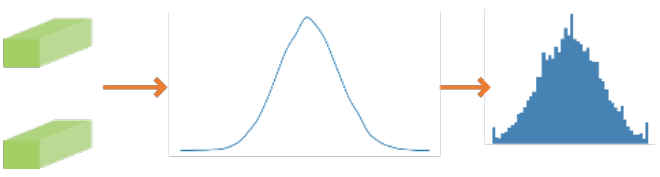

channel\_wise=True 量化

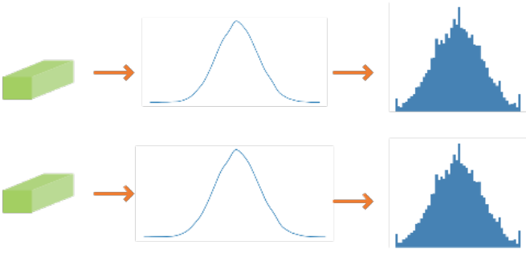

量化配置中ArqWeightFakeQuantize提供的参数channel\_wise用来选择量化方式：

-   channel\_wise为False时，所有filter一起分析数据分布，进行量化，某一层的所有不同channel共用一个量化因子。
-   channel\_wise为True时，每个filter独立做数据分析，进行量化，同一层的每个channel有独立的量化因子。一般来说，每一个filter独立进行量化，channel\_wise设为True，量化精度较高；如果每个filter的数据量比较少，量化效果会比较差，此时推荐channel\_wise设为False。

注意：全连接层、平均下采样层Pooling（下采样方式为AVE，且非global pooling\)和LSTM层没有channel，设置channel\_wise为True时，会提示错误信息。

作用：该层权重量化配置。

**表 1**  ArqWeightFakeQuantize

<a name="table17723101544517"></a>
<table><thead align="left"><tr id="row57597159452"><th class="cellrowborder" valign="top" width="15.14%" id="mcps1.2.7.1.1"><p id="p1675951504514"><a name="p1675951504514"></a><a name="p1675951504514"></a>参数名</p>
</th>
<th class="cellrowborder" valign="top" width="16.1%" id="mcps1.2.7.1.2"><p id="p9759141544510"><a name="p9759141544510"></a><a name="p9759141544510"></a>参数说明</p>
</th>
<th class="cellrowborder" valign="top" width="27.93%" id="mcps1.2.7.1.3"><p id="p14759151516453"><a name="p14759151516453"></a><a name="p14759151516453"></a>类型</p>
</th>
<th class="cellrowborder" valign="top" width="14.82%" id="mcps1.2.7.1.4"><p id="p207592158454"><a name="p207592158454"></a><a name="p207592158454"></a>默认值</p>
</th>
<th class="cellrowborder" valign="top" width="13.54%" id="mcps1.2.7.1.5"><p id="p1575931594515"><a name="p1575931594515"></a><a name="p1575931594515"></a>参数范围</p>
</th>
<th class="cellrowborder" valign="top" width="12.47%" id="mcps1.2.7.1.6"><p id="p075911514458"><a name="p075911514458"></a><a name="p075911514458"></a>是否必填</p>
</th>
</tr>
</thead>
<tbody><tr id="row8759161554514"><td class="cellrowborder" valign="top" width="15.14%" headers="mcps1.2.7.1.1 "><p id="p17759191554516"><a name="p17759191554516"></a><a name="p17759191554516"></a>observer</p>
</td>
<td class="cellrowborder" valign="top" width="16.1%" headers="mcps1.2.7.1.2 "><p id="p1575920158451"><a name="p1575920158451"></a><a name="p1575920158451"></a><a href="#ZH-CN_TOPIC_0000002441982469">ArqObserver</a></p>
</td>
<td class="cellrowborder" valign="top" width="27.93%" headers="mcps1.2.7.1.3 "><p id="p127593153452"><a name="p127593153452"></a><a name="p127593153452"></a>torch.quantization.ObserverBase</p>
</td>
<td class="cellrowborder" valign="top" width="14.82%" headers="mcps1.2.7.1.4 "><p id="p7759615174513"><a name="p7759615174513"></a><a name="p7759615174513"></a>ArqObserver</p>
</td>
<td class="cellrowborder" valign="top" width="13.54%" headers="mcps1.2.7.1.5 "><p id="p1275912157452"><a name="p1275912157452"></a><a name="p1275912157452"></a>无</p>
</td>
<td class="cellrowborder" valign="top" width="12.47%" headers="mcps1.2.7.1.6 "><p id="p12759415194512"><a name="p12759415194512"></a><a name="p12759415194512"></a>否</p>
</td>
</tr>
<tr id="row17759215124517"><td class="cellrowborder" valign="top" width="15.14%" headers="mcps1.2.7.1.1 "><p id="p10759101584513"><a name="p10759101584513"></a><a name="p10759101584513"></a>num_bits</p>
</td>
<td class="cellrowborder" valign="top" width="16.1%" headers="mcps1.2.7.1.2 "><p id="p9759171511452"><a name="p9759171511452"></a><a name="p9759171511452"></a>量化位宽</p>
</td>
<td class="cellrowborder" valign="top" width="27.93%" headers="mcps1.2.7.1.3 "><p id="p776011515455"><a name="p776011515455"></a><a name="p776011515455"></a>int</p>
</td>
<td class="cellrowborder" valign="top" width="14.82%" headers="mcps1.2.7.1.4 "><p id="p976081584516"><a name="p976081584516"></a><a name="p976081584516"></a>8</p>
</td>
<td class="cellrowborder" valign="top" width="13.54%" headers="mcps1.2.7.1.5 "><p id="p1476011534513"><a name="p1476011534513"></a><a name="p1476011534513"></a>4、8</p>
</td>
<td class="cellrowborder" valign="top" width="12.47%" headers="mcps1.2.7.1.6 "><p id="p376081519455"><a name="p376081519455"></a><a name="p376081519455"></a>否</p>
</td>
</tr>
<tr id="row1476051534516"><td class="cellrowborder" valign="top" width="15.14%" headers="mcps1.2.7.1.1 "><p id="p8760215134516"><a name="p8760215134516"></a><a name="p8760215134516"></a>channel_wise</p>
</td>
<td class="cellrowborder" valign="top" width="16.1%" headers="mcps1.2.7.1.2 "><p id="p976061515453"><a name="p976061515453"></a><a name="p976061515453"></a>是否对每个channel采用不同的量化因子</p>
</td>
<td class="cellrowborder" valign="top" width="27.93%" headers="mcps1.2.7.1.3 "><p id="p8760161517459"><a name="p8760161517459"></a><a name="p8760161517459"></a>bool</p>
</td>
<td class="cellrowborder" valign="top" width="14.82%" headers="mcps1.2.7.1.4 "><p id="p10760101584510"><a name="p10760101584510"></a><a name="p10760101584510"></a>True</p>
</td>
<td class="cellrowborder" valign="top" width="13.54%" headers="mcps1.2.7.1.5 "><p id="p87602015164517"><a name="p87602015164517"></a><a name="p87602015164517"></a>True、Fasle</p>
</td>
<td class="cellrowborder" valign="top" width="12.47%" headers="mcps1.2.7.1.6 "><p id="p77601815144519"><a name="p77601815144519"></a><a name="p77601815144519"></a>否</p>
</td>
</tr>
</tbody>
</table>

#### ULQ数据量化算法<a name="ZH-CN_TOPIC_0000002408583122"></a>

ULQ（Universal Linear Quantization）算法在训练过程中不断训练量化因子，以减少量化损失。该算法初始化时会对数值做量化（包含截断），对初始化敏感。该算法支持ULQ数据量化算法。

作用：该层数据量化配置。

**表 1**  UlqFakeQuantize

<a name="table11590223462"></a>
<table><thead align="left"><tr id="row15914212462"><th class="cellrowborder" valign="top" width="12.049999999999999%" id="mcps1.2.7.1.1"><p id="p2059114274618"><a name="p2059114274618"></a><a name="p2059114274618"></a><strong id="b55910214617"><a name="b55910214617"></a><a name="b55910214617"></a>参数名</strong></p>
</th>
<th class="cellrowborder" valign="top" width="21.97%" id="mcps1.2.7.1.2"><p id="p1559110210465"><a name="p1559110210465"></a><a name="p1559110210465"></a><strong id="b3591127461"><a name="b3591127461"></a><a name="b3591127461"></a>参数说明</strong></p>
</th>
<th class="cellrowborder" valign="top" width="23.49%" id="mcps1.2.7.1.3"><p id="p55913211463"><a name="p55913211463"></a><a name="p55913211463"></a><strong id="b105915214464"><a name="b105915214464"></a><a name="b105915214464"></a>类型</strong></p>
</th>
<th class="cellrowborder" valign="top" width="16.689999999999998%" id="mcps1.2.7.1.4"><p id="p259112174612"><a name="p259112174612"></a><a name="p259112174612"></a><strong id="b459110214610"><a name="b459110214610"></a><a name="b459110214610"></a>默认值</strong></p>
</th>
<th class="cellrowborder" valign="top" width="14.59%" id="mcps1.2.7.1.5"><p id="p278585116204"><a name="p278585116204"></a><a name="p278585116204"></a>参数范围</p>
</th>
<th class="cellrowborder" valign="top" width="11.21%" id="mcps1.2.7.1.6"><p id="p1659132144619"><a name="p1659132144619"></a><a name="p1659132144619"></a><strong id="b659142134611"><a name="b659142134611"></a><a name="b659142134611"></a>是否必填</strong></p>
</th>
</tr>
</thead>
<tbody><tr id="row197271437172619"><td class="cellrowborder" valign="top" width="12.049999999999999%" headers="mcps1.2.7.1.1 "><p id="p4727143742618"><a name="p4727143742618"></a><a name="p4727143742618"></a>observer</p>
</td>
<td class="cellrowborder" valign="top" width="21.97%" headers="mcps1.2.7.1.2 "><p id="p8361521182720"><a name="p8361521182720"></a><a name="p8361521182720"></a><a href="#ZH-CN_TOPIC_0000002442022309">IFMRObserver</a></p>
</td>
<td class="cellrowborder" valign="top" width="23.49%" headers="mcps1.2.7.1.3 "><p id="p1024520183272"><a name="p1024520183272"></a><a name="p1024520183272"></a>torch.quantization.ObserverBase</p>
</td>
<td class="cellrowborder" valign="top" width="16.689999999999998%" headers="mcps1.2.7.1.4 "><p id="p133241515273"><a name="p133241515273"></a><a name="p133241515273"></a>IFMRObserver</p>
</td>
<td class="cellrowborder" valign="top" width="14.59%" headers="mcps1.2.7.1.5 "><p id="p18785451132015"><a name="p18785451132015"></a><a name="p18785451132015"></a>无</p>
</td>
<td class="cellrowborder" valign="top" width="11.21%" headers="mcps1.2.7.1.6 "><p id="p1992231014270"><a name="p1992231014270"></a><a name="p1992231014270"></a>否</p>
</td>
</tr>
<tr id="row1551493262613"><td class="cellrowborder" valign="top" width="12.049999999999999%" headers="mcps1.2.7.1.1 "><p id="p12515103272610"><a name="p12515103272610"></a><a name="p12515103272610"></a>num_bits</p>
</td>
<td class="cellrowborder" valign="top" width="21.97%" headers="mcps1.2.7.1.2 "><p id="p10361122112713"><a name="p10361122112713"></a><a name="p10361122112713"></a>量化位宽</p>
</td>
<td class="cellrowborder" valign="top" width="23.49%" headers="mcps1.2.7.1.3 "><p id="p72451318102719"><a name="p72451318102719"></a><a name="p72451318102719"></a>int</p>
</td>
<td class="cellrowborder" valign="top" width="16.689999999999998%" headers="mcps1.2.7.1.4 "><p id="p17321715102710"><a name="p17321715102710"></a><a name="p17321715102710"></a>8</p>
</td>
<td class="cellrowborder" valign="top" width="14.59%" headers="mcps1.2.7.1.5 "><p id="p5785105111206"><a name="p5785105111206"></a><a name="p5785105111206"></a>[8~16]整数</p>
</td>
<td class="cellrowborder" valign="top" width="11.21%" headers="mcps1.2.7.1.6 "><p id="p96791176349"><a name="p96791176349"></a><a name="p96791176349"></a>否</p>
</td>
</tr>
<tr id="row361812742618"><td class="cellrowborder" valign="top" width="12.049999999999999%" headers="mcps1.2.7.1.1 "><p id="p761952702618"><a name="p761952702618"></a><a name="p761952702618"></a>fixed_min</p>
</td>
<td class="cellrowborder" valign="top" width="21.97%" headers="mcps1.2.7.1.2 "><p id="p113611321112717"><a name="p113611321112717"></a><a name="p113611321112717"></a>截断量化算法最小值固定为0</p>
</td>
<td class="cellrowborder" valign="top" width="23.49%" headers="mcps1.2.7.1.3 "><p id="p1924561852716"><a name="p1924561852716"></a><a name="p1924561852716"></a>bool</p>
</td>
<td class="cellrowborder" valign="top" width="16.689999999999998%" headers="mcps1.2.7.1.4 "><p id="p1532151512277"><a name="p1532151512277"></a><a name="p1532151512277"></a>False</p>
</td>
<td class="cellrowborder" valign="top" width="14.59%" headers="mcps1.2.7.1.5 "><p id="p178575118202"><a name="p178575118202"></a><a name="p178575118202"></a>True、Fasle</p>
</td>
<td class="cellrowborder" valign="top" width="11.21%" headers="mcps1.2.7.1.6 "><p id="p179227104273"><a name="p179227104273"></a><a name="p179227104273"></a>否</p>
</td>
</tr>
</tbody>
</table>

#### LUQ量化算法<a name="ZH-CN_TOPIC_0000002442022357"></a>

默认支持luq mse算法，luq算法支持数据和权重量化算法。

作用：该层数据量化配置。

**表 1**  LuqActivationFakeQuantize

<a name="table11590223462"></a>
<table><thead align="left"><tr id="row1059092134620"><th class="cellrowborder" valign="top" width="15.960000000000003%" id="mcps1.2.7.1.1"><p id="p2059114274618"><a name="p2059114274618"></a><a name="p2059114274618"></a><strong id="b55910214617"><a name="b55910214617"></a><a name="b55910214617"></a>参数名</strong></p>
</th>
<th class="cellrowborder" valign="top" width="18.860000000000003%" id="mcps1.2.7.1.2"><p id="p1559110210465"><a name="p1559110210465"></a><a name="p1559110210465"></a><strong id="b3591127461"><a name="b3591127461"></a><a name="b3591127461"></a>参数说明</strong></p>
</th>
<th class="cellrowborder" valign="top" width="24.680000000000003%" id="mcps1.2.7.1.3"><p id="p55913211463"><a name="p55913211463"></a><a name="p55913211463"></a><strong id="b105915214464"><a name="b105915214464"></a><a name="b105915214464"></a>类型</strong></p>
</th>
<th class="cellrowborder" valign="top" width="19.01%" id="mcps1.2.7.1.4"><p id="p259112174612"><a name="p259112174612"></a><a name="p259112174612"></a><strong id="b459110214610"><a name="b459110214610"></a><a name="b459110214610"></a>默认值</strong></p>
</th>
<th class="cellrowborder" valign="top" width="11.41%" id="mcps1.2.7.1.5"><p id="p779617012111"><a name="p779617012111"></a><a name="p779617012111"></a>参数范围</p>
</th>
<th class="cellrowborder" valign="top" width="10.080000000000002%" id="mcps1.2.7.1.6"><p id="p1659132144619"><a name="p1659132144619"></a><a name="p1659132144619"></a><strong id="b659142134611"><a name="b659142134611"></a><a name="b659142134611"></a>是否必填</strong></p>
</th>
</tr>
</thead>
<tbody><tr id="row15914212462"><td class="cellrowborder" valign="top" width="15.960000000000003%" headers="mcps1.2.7.1.1 "><p id="p4727143742618"><a name="p4727143742618"></a><a name="p4727143742618"></a>observer</p>
</td>
<td class="cellrowborder" valign="top" width="18.860000000000003%" headers="mcps1.2.7.1.2 "><p id="p8361521182720"><a name="p8361521182720"></a><a name="p8361521182720"></a><a href="#ZH-CN_TOPIC_0000002408423230">LuqMseObserver</a></p>
</td>
<td class="cellrowborder" valign="top" width="24.680000000000003%" headers="mcps1.2.7.1.3 "><p id="p1024520183272"><a name="p1024520183272"></a><a name="p1024520183272"></a>torch.quantization.ObserverBase</p>
</td>
<td class="cellrowborder" valign="top" width="19.01%" headers="mcps1.2.7.1.4 "><p id="p133241515273"><a name="p133241515273"></a><a name="p133241515273"></a>LuqMseObserver</p>
</td>
<td class="cellrowborder" valign="top" width="11.41%" headers="mcps1.2.7.1.5 "><p id="p137961803211"><a name="p137961803211"></a><a name="p137961803211"></a>无</p>
</td>
<td class="cellrowborder" valign="top" width="10.080000000000002%" headers="mcps1.2.7.1.6 "><p id="p1992231014270"><a name="p1992231014270"></a><a name="p1992231014270"></a>否</p>
</td>
</tr>
<tr id="row197271437172619"><td class="cellrowborder" valign="top" width="15.960000000000003%" headers="mcps1.2.7.1.1 "><p id="p12515103272610"><a name="p12515103272610"></a><a name="p12515103272610"></a>num_bits</p>
</td>
<td class="cellrowborder" valign="top" width="18.860000000000003%" headers="mcps1.2.7.1.2 "><p id="p10361122112713"><a name="p10361122112713"></a><a name="p10361122112713"></a>量化位宽</p>
</td>
<td class="cellrowborder" valign="top" width="24.680000000000003%" headers="mcps1.2.7.1.3 "><p id="p72451318102719"><a name="p72451318102719"></a><a name="p72451318102719"></a>int</p>
</td>
<td class="cellrowborder" valign="top" width="19.01%" headers="mcps1.2.7.1.4 "><p id="p17321715102710"><a name="p17321715102710"></a><a name="p17321715102710"></a>8</p>
</td>
<td class="cellrowborder" valign="top" width="11.41%" headers="mcps1.2.7.1.5 "><p id="p57968012118"><a name="p57968012118"></a><a name="p57968012118"></a>[8~16]整数</p>
</td>
<td class="cellrowborder" valign="top" width="10.080000000000002%" headers="mcps1.2.7.1.6 "><p id="p96791176349"><a name="p96791176349"></a><a name="p96791176349"></a>否</p>
</td>
</tr>
<tr id="row1551493262613"><td class="cellrowborder" valign="top" width="15.960000000000003%" headers="mcps1.2.7.1.1 "><p id="p761952702618"><a name="p761952702618"></a><a name="p761952702618"></a>max_value_eps</p>
</td>
<td class="cellrowborder" valign="top" width="18.860000000000003%" headers="mcps1.2.7.1.2 "><p id="p113611321112717"><a name="p113611321112717"></a><a name="p113611321112717"></a>max_value的最小值</p>
</td>
<td class="cellrowborder" valign="top" width="24.680000000000003%" headers="mcps1.2.7.1.3 "><p id="p1924561852716"><a name="p1924561852716"></a><a name="p1924561852716"></a>float</p>
</td>
<td class="cellrowborder" valign="top" width="19.01%" headers="mcps1.2.7.1.4 "><p id="p1532151512277"><a name="p1532151512277"></a><a name="p1532151512277"></a>0.00038928920371275036</p>
</td>
<td class="cellrowborder" valign="top" width="11.41%" headers="mcps1.2.7.1.5 "><p id="p11796008217"><a name="p11796008217"></a><a name="p11796008217"></a>无</p>
</td>
<td class="cellrowborder" valign="top" width="10.080000000000002%" headers="mcps1.2.7.1.6 "><p id="p179227104273"><a name="p179227104273"></a><a name="p179227104273"></a>否</p>
</td>
</tr>
</tbody>
</table>

**表 2**  LuqWeightFakeQuantize

<a name="table5722102013544"></a>
<table><thead align="left"><tr id="row772212035417"><th class="cellrowborder" valign="top" width="15.898410158984102%" id="mcps1.2.7.1.1"><p id="p1858914816119"><a name="p1858914816119"></a><a name="p1858914816119"></a><strong id="b10589124819120"><a name="b10589124819120"></a><a name="b10589124819120"></a>参数名</strong></p>
</th>
<th class="cellrowborder" valign="top" width="22.427757224277574%" id="mcps1.2.7.1.2"><p id="p16645173795618"><a name="p16645173795618"></a><a name="p16645173795618"></a><strong id="b17589134819112"><a name="b17589134819112"></a><a name="b17589134819112"></a>参数说明</strong></p>
</th>
<th class="cellrowborder" valign="top" width="22.83771622837716%" id="mcps1.2.7.1.3"><p id="p106451437165616"><a name="p106451437165616"></a><a name="p106451437165616"></a><strong id="b185901348515"><a name="b185901348515"></a><a name="b185901348515"></a>类型</strong></p>
</th>
<th class="cellrowborder" valign="top" width="18.60813918608139%" id="mcps1.2.7.1.4"><p id="p206455379566"><a name="p206455379566"></a><a name="p206455379566"></a><strong id="b659024812120"><a name="b659024812120"></a><a name="b659024812120"></a>默认值</strong></p>
</th>
<th class="cellrowborder" valign="top" width="9.839016098390161%" id="mcps1.2.7.1.5"><p id="p8590114812112"><a name="p8590114812112"></a><a name="p8590114812112"></a>参数范围</p>
</th>
<th class="cellrowborder" valign="top" width="10.388961103889612%" id="mcps1.2.7.1.6"><p id="p136461637175613"><a name="p136461637175613"></a><a name="p136461637175613"></a><strong id="b19590144813118"><a name="b19590144813118"></a><a name="b19590144813118"></a>是否必填</strong></p>
</th>
</tr>
</thead>
<tbody><tr id="row2723172075418"><td class="cellrowborder" valign="top" width="15.898410158984102%" headers="mcps1.2.7.1.1 "><p id="p1272322045416"><a name="p1272322045416"></a><a name="p1272322045416"></a>observer</p>
</td>
<td class="cellrowborder" valign="top" width="22.427757224277574%" headers="mcps1.2.7.1.2 "><p id="p117231520115413"><a name="p117231520115413"></a><a name="p117231520115413"></a><a href="#ZH-CN_TOPIC_0000002408423230">LuqMseObserver</a></p>
</td>
<td class="cellrowborder" valign="top" width="22.83771622837716%" headers="mcps1.2.7.1.3 "><p id="p1672372025419"><a name="p1672372025419"></a><a name="p1672372025419"></a>torch.quantization.ObserverBase</p>
</td>
<td class="cellrowborder" valign="top" width="18.60813918608139%" headers="mcps1.2.7.1.4 "><p id="p1972392005415"><a name="p1972392005415"></a><a name="p1972392005415"></a>LuqMseObserver</p>
</td>
<td class="cellrowborder" valign="top" width="9.839016098390161%" headers="mcps1.2.7.1.5 "><p id="p164018618211"><a name="p164018618211"></a><a name="p164018618211"></a>无</p>
</td>
<td class="cellrowborder" valign="top" width="10.388961103889612%" headers="mcps1.2.7.1.6 "><p id="p11723820175410"><a name="p11723820175410"></a><a name="p11723820175410"></a>否</p>
</td>
</tr>
<tr id="row97231320185412"><td class="cellrowborder" valign="top" width="15.898410158984102%" headers="mcps1.2.7.1.1 "><p id="p19723220165417"><a name="p19723220165417"></a><a name="p19723220165417"></a>num_bits</p>
</td>
<td class="cellrowborder" valign="top" width="22.427757224277574%" headers="mcps1.2.7.1.2 "><p id="p18723162019548"><a name="p18723162019548"></a><a name="p18723162019548"></a>量化位宽</p>
</td>
<td class="cellrowborder" valign="top" width="22.83771622837716%" headers="mcps1.2.7.1.3 "><p id="p47231220105418"><a name="p47231220105418"></a><a name="p47231220105418"></a>int</p>
</td>
<td class="cellrowborder" valign="top" width="18.60813918608139%" headers="mcps1.2.7.1.4 "><p id="p8723420165411"><a name="p8723420165411"></a><a name="p8723420165411"></a>8</p>
</td>
<td class="cellrowborder" valign="top" width="9.839016098390161%" headers="mcps1.2.7.1.5 "><p id="p0401166122114"><a name="p0401166122114"></a><a name="p0401166122114"></a>8</p>
</td>
<td class="cellrowborder" valign="top" width="10.388961103889612%" headers="mcps1.2.7.1.6 "><p id="p18723152014549"><a name="p18723152014549"></a><a name="p18723152014549"></a>否</p>
</td>
</tr>
<tr id="row1172317200545"><td class="cellrowborder" valign="top" width="15.898410158984102%" headers="mcps1.2.7.1.1 "><p id="p197231820165416"><a name="p197231820165416"></a><a name="p197231820165416"></a>max_value_eps</p>
</td>
<td class="cellrowborder" valign="top" width="22.427757224277574%" headers="mcps1.2.7.1.2 "><p id="p67231720135417"><a name="p67231720135417"></a><a name="p67231720135417"></a>max_value的最小值</p>
</td>
<td class="cellrowborder" valign="top" width="22.83771622837716%" headers="mcps1.2.7.1.3 "><p id="p1723162016542"><a name="p1723162016542"></a><a name="p1723162016542"></a>float</p>
</td>
<td class="cellrowborder" valign="top" width="18.60813918608139%" headers="mcps1.2.7.1.4 "><p id="p572332065411"><a name="p572332065411"></a><a name="p572332065411"></a>0.00038928920371275036</p>
</td>
<td class="cellrowborder" valign="top" width="9.839016098390161%" headers="mcps1.2.7.1.5 "><p id="p3401561210"><a name="p3401561210"></a><a name="p3401561210"></a>无</p>
</td>
<td class="cellrowborder" valign="top" width="10.388961103889612%" headers="mcps1.2.7.1.6 "><p id="p2723202016542"><a name="p2723202016542"></a><a name="p2723202016542"></a>否</p>
</td>
</tr>
</tbody>
</table>

#### LNQ权重量化算法<a name="ZH-CN_TOPIC_0000002441982449"></a>

4bit非均匀权重量化算法。

作用：该层权重量化配置。

**表 1**  LnqFakeQuantize

<a name="table9565113411218"></a>
<table><thead align="left"><tr id="row175654347124"><th class="cellrowborder" valign="top" width="15.959999999999999%" id="mcps1.2.7.1.1"><p id="p5565934141214"><a name="p5565934141214"></a><a name="p5565934141214"></a><strong id="b856533419121"><a name="b856533419121"></a><a name="b856533419121"></a>参数名</strong></p>
</th>
<th class="cellrowborder" valign="top" width="18.86%" id="mcps1.2.7.1.2"><p id="p12566133414128"><a name="p12566133414128"></a><a name="p12566133414128"></a><strong id="b7566103481218"><a name="b7566103481218"></a><a name="b7566103481218"></a>参数说明</strong></p>
</th>
<th class="cellrowborder" valign="top" width="24.68%" id="mcps1.2.7.1.3"><p id="p75662034191218"><a name="p75662034191218"></a><a name="p75662034191218"></a><strong id="b17566143421211"><a name="b17566143421211"></a><a name="b17566143421211"></a>类型</strong></p>
</th>
<th class="cellrowborder" valign="top" width="15.72%" id="mcps1.2.7.1.4"><p id="p1156653431217"><a name="p1156653431217"></a><a name="p1156653431217"></a><strong id="b2056693451210"><a name="b2056693451210"></a><a name="b2056693451210"></a>默认值</strong></p>
</th>
<th class="cellrowborder" valign="top" width="14.7%" id="mcps1.2.7.1.5"><p id="p195661234111212"><a name="p195661234111212"></a><a name="p195661234111212"></a>参数范围</p>
</th>
<th class="cellrowborder" valign="top" width="10.08%" id="mcps1.2.7.1.6"><p id="p14566173471217"><a name="p14566173471217"></a><a name="p14566173471217"></a><strong id="b1566234161213"><a name="b1566234161213"></a><a name="b1566234161213"></a>是否必填</strong></p>
</th>
</tr>
</thead>
<tbody><tr id="row556615348122"><td class="cellrowborder" valign="top" width="15.959999999999999%" headers="mcps1.2.7.1.1 "><p id="p205661934121220"><a name="p205661934121220"></a><a name="p205661934121220"></a>observer</p>
</td>
<td class="cellrowborder" valign="top" width="18.86%" headers="mcps1.2.7.1.2 "><p id="p7566034191220"><a name="p7566034191220"></a><a name="p7566034191220"></a><a href="#ZH-CN_TOPIC_0000002441982489">SnqObserver</a></p>
</td>
<td class="cellrowborder" valign="top" width="24.68%" headers="mcps1.2.7.1.3 "><p id="p20566113471217"><a name="p20566113471217"></a><a name="p20566113471217"></a>torch.quantization.ObserverBase</p>
</td>
<td class="cellrowborder" valign="top" width="15.72%" headers="mcps1.2.7.1.4 "><p id="p105668349120"><a name="p105668349120"></a><a name="p105668349120"></a>SnqObserver</p>
</td>
<td class="cellrowborder" valign="top" width="14.7%" headers="mcps1.2.7.1.5 "><p id="p175660345129"><a name="p175660345129"></a><a name="p175660345129"></a>SnqObserver</p>
</td>
<td class="cellrowborder" valign="top" width="10.08%" headers="mcps1.2.7.1.6 "><p id="p10566034201215"><a name="p10566034201215"></a><a name="p10566034201215"></a>否</p>
</td>
</tr>
<tr id="row78018223166"><td class="cellrowborder" valign="top" width="15.959999999999999%" headers="mcps1.2.7.1.1 "><p id="p168011722191618"><a name="p168011722191618"></a><a name="p168011722191618"></a>cluster_freq</p>
</td>
<td class="cellrowborder" valign="top" width="18.86%" headers="mcps1.2.7.1.2 "><p id="p1801112213163"><a name="p1801112213163"></a><a name="p1801112213163"></a>更新聚类中心的频率</p>
</td>
<td class="cellrowborder" valign="top" width="24.68%" headers="mcps1.2.7.1.3 "><p id="p1180152231611"><a name="p1180152231611"></a><a name="p1180152231611"></a>int</p>
</td>
<td class="cellrowborder" valign="top" width="15.72%" headers="mcps1.2.7.1.4 "><p id="p180122201612"><a name="p180122201612"></a><a name="p180122201612"></a>400</p>
</td>
<td class="cellrowborder" valign="top" width="14.7%" headers="mcps1.2.7.1.5 "><p id="p880115225169"><a name="p880115225169"></a><a name="p880115225169"></a>正整数</p>
</td>
<td class="cellrowborder" valign="top" width="10.08%" headers="mcps1.2.7.1.6 "><p id="p1680172212163"><a name="p1680172212163"></a><a name="p1680172212163"></a>否</p>
</td>
</tr>
<tr id="row11461351172116"><td class="cellrowborder" valign="top" width="15.959999999999999%" headers="mcps1.2.7.1.1 "><p id="p546295112211"><a name="p546295112211"></a><a name="p546295112211"></a>max_iteration</p>
</td>
<td class="cellrowborder" valign="top" width="18.86%" headers="mcps1.2.7.1.2 "><p id="p1546218510215"><a name="p1546218510215"></a><a name="p1546218510215"></a>寻找聚类的最大迭代次数</p>
</td>
<td class="cellrowborder" valign="top" width="24.68%" headers="mcps1.2.7.1.3 "><p id="p1346275116214"><a name="p1346275116214"></a><a name="p1346275116214"></a>int</p>
</td>
<td class="cellrowborder" valign="top" width="15.72%" headers="mcps1.2.7.1.4 "><p id="p7462195119218"><a name="p7462195119218"></a><a name="p7462195119218"></a>1000</p>
</td>
<td class="cellrowborder" valign="top" width="14.7%" headers="mcps1.2.7.1.5 "><p id="p164622516218"><a name="p164622516218"></a><a name="p164622516218"></a>[500, 2000]整数</p>
</td>
<td class="cellrowborder" valign="top" width="10.08%" headers="mcps1.2.7.1.6 "><p id="p114621251162110"><a name="p114621251162110"></a><a name="p114621251162110"></a>否</p>
</td>
</tr>
<tr id="row695625562214"><td class="cellrowborder" valign="top" width="15.959999999999999%" headers="mcps1.2.7.1.1 "><p id="p10956145519225"><a name="p10956145519225"></a><a name="p10956145519225"></a>min_distance</p>
</td>
<td class="cellrowborder" valign="top" width="18.86%" headers="mcps1.2.7.1.2 "><p id="p1095655572220"><a name="p1095655572220"></a><a name="p1095655572220"></a>寻找聚类的最小距离</p>
</td>
<td class="cellrowborder" valign="top" width="24.68%" headers="mcps1.2.7.1.3 "><p id="p1995695512210"><a name="p1995695512210"></a><a name="p1995695512210"></a>float</p>
</td>
<td class="cellrowborder" valign="top" width="15.72%" headers="mcps1.2.7.1.4 "><p id="p7956205517225"><a name="p7956205517225"></a><a name="p7956205517225"></a>1e-4</p>
</td>
<td class="cellrowborder" valign="top" width="14.7%" headers="mcps1.2.7.1.5 "><p id="p595625514226"><a name="p595625514226"></a><a name="p595625514226"></a>[1e-8, 1e-2]</p>
</td>
<td class="cellrowborder" valign="top" width="10.08%" headers="mcps1.2.7.1.6 "><p id="p13389202273316"><a name="p13389202273316"></a><a name="p13389202273316"></a>否</p>
</td>
</tr>
<tr id="row1736351013256"><td class="cellrowborder" valign="top" width="15.959999999999999%" headers="mcps1.2.7.1.1 "><p id="p13364191012513"><a name="p13364191012513"></a><a name="p13364191012513"></a>clip_max</p>
</td>
<td class="cellrowborder" valign="top" width="18.86%" headers="mcps1.2.7.1.2 "><p id="p93646109259"><a name="p93646109259"></a><a name="p93646109259"></a>学习的边界初始值</p>
</td>
<td class="cellrowborder" valign="top" width="24.68%" headers="mcps1.2.7.1.3 "><p id="p93646100251"><a name="p93646100251"></a><a name="p93646100251"></a>float</p>
</td>
<td class="cellrowborder" valign="top" width="15.72%" headers="mcps1.2.7.1.4 "><p id="p20364410152519"><a name="p20364410152519"></a><a name="p20364410152519"></a>3.0</p>
</td>
<td class="cellrowborder" valign="top" width="14.7%" headers="mcps1.2.7.1.5 "><p id="p03641510162518"><a name="p03641510162518"></a><a name="p03641510162518"></a>大于0</p>
</td>
<td class="cellrowborder" valign="top" width="10.08%" headers="mcps1.2.7.1.6 "><p id="p48181622173315"><a name="p48181622173315"></a><a name="p48181622173315"></a>否</p>
</td>
</tr>
<tr id="row115661634141218"><td class="cellrowborder" valign="top" width="15.959999999999999%" headers="mcps1.2.7.1.1 "><p id="p17566163410121"><a name="p17566163410121"></a><a name="p17566163410121"></a>symmetric</p>
</td>
<td class="cellrowborder" valign="top" width="18.86%" headers="mcps1.2.7.1.2 "><p id="p756617341127"><a name="p756617341127"></a><a name="p756617341127"></a>是否对称</p>
</td>
<td class="cellrowborder" valign="top" width="24.68%" headers="mcps1.2.7.1.3 "><p id="p87315163315"><a name="p87315163315"></a><a name="p87315163315"></a>bool</p>
</td>
<td class="cellrowborder" valign="top" width="15.72%" headers="mcps1.2.7.1.4 "><p id="p1697985143314"><a name="p1697985143314"></a><a name="p1697985143314"></a>False</p>
</td>
<td class="cellrowborder" valign="top" width="14.7%" headers="mcps1.2.7.1.5 "><p id="p9566153491215"><a name="p9566153491215"></a><a name="p9566153491215"></a>True、Fasle</p>
</td>
<td class="cellrowborder" valign="top" width="10.08%" headers="mcps1.2.7.1.6 "><p id="p1156653431212"><a name="p1156653431212"></a><a name="p1156653431212"></a>否</p>
</td>
</tr>
</tbody>
</table>

#### Fixed量化算法<a name="ZH-CN_TOPIC_0000002408423174"></a>

FixedFakeQuantize分为数据和权重量化算法

**表 1**  FixedFakeQuantize 数据量化算法参数

<a name="table11590223462"></a>
<table><thead align="left"><tr id="row1059092134620"><th class="cellrowborder" valign="top" width="15.960000000000003%" id="mcps1.2.7.1.1"><p id="p2059114274618"><a name="p2059114274618"></a><a name="p2059114274618"></a><strong id="b55910214617"><a name="b55910214617"></a><a name="b55910214617"></a>参数名</strong></p>
</th>
<th class="cellrowborder" valign="top" width="18.860000000000003%" id="mcps1.2.7.1.2"><p id="p1559110210465"><a name="p1559110210465"></a><a name="p1559110210465"></a><strong id="b3591127461"><a name="b3591127461"></a><a name="b3591127461"></a>参数说明</strong></p>
</th>
<th class="cellrowborder" valign="top" width="24.680000000000003%" id="mcps1.2.7.1.3"><p id="p55913211463"><a name="p55913211463"></a><a name="p55913211463"></a><strong id="b105915214464"><a name="b105915214464"></a><a name="b105915214464"></a>类型</strong></p>
</th>
<th class="cellrowborder" valign="top" width="19.01%" id="mcps1.2.7.1.4"><p id="p259112174612"><a name="p259112174612"></a><a name="p259112174612"></a><strong id="b459110214610"><a name="b459110214610"></a><a name="b459110214610"></a>默认值</strong></p>
</th>
<th class="cellrowborder" valign="top" width="11.41%" id="mcps1.2.7.1.5"><p id="p779617012111"><a name="p779617012111"></a><a name="p779617012111"></a>参数范围</p>
</th>
<th class="cellrowborder" valign="top" width="10.080000000000002%" id="mcps1.2.7.1.6"><p id="p1659132144619"><a name="p1659132144619"></a><a name="p1659132144619"></a><strong id="b659142134611"><a name="b659142134611"></a><a name="b659142134611"></a>是否必填</strong></p>
</th>
</tr>
</thead>
<tbody><tr id="row15914212462"><td class="cellrowborder" valign="top" width="15.960000000000003%" headers="mcps1.2.7.1.1 "><p id="p4727143742618"><a name="p4727143742618"></a><a name="p4727143742618"></a>scale</p>
</td>
<td class="cellrowborder" valign="top" width="18.860000000000003%" headers="mcps1.2.7.1.2 "><p id="p64709211412"><a name="p64709211412"></a><a name="p64709211412"></a>量化系数</p>
</td>
<td class="cellrowborder" valign="top" width="24.680000000000003%" headers="mcps1.2.7.1.3 "><p id="p1024520183272"><a name="p1024520183272"></a><a name="p1024520183272"></a>float</p>
</td>
<td class="cellrowborder" valign="top" width="19.01%" headers="mcps1.2.7.1.4 "><p id="p133241515273"><a name="p133241515273"></a><a name="p133241515273"></a>无</p>
</td>
<td class="cellrowborder" valign="top" width="11.41%" headers="mcps1.2.7.1.5 "><p id="p137961803211"><a name="p137961803211"></a><a name="p137961803211"></a>无</p>
</td>
<td class="cellrowborder" valign="top" width="10.080000000000002%" headers="mcps1.2.7.1.6 "><p id="p1992231014270"><a name="p1992231014270"></a><a name="p1992231014270"></a>是</p>
</td>
</tr>
<tr id="row197271437172619"><td class="cellrowborder" valign="top" width="15.960000000000003%" headers="mcps1.2.7.1.1 "><p id="p12515103272610"><a name="p12515103272610"></a><a name="p12515103272610"></a>zero_point</p>
</td>
<td class="cellrowborder" valign="top" width="18.860000000000003%" headers="mcps1.2.7.1.2 "><p id="p10361122112713"><a name="p10361122112713"></a><a name="p10361122112713"></a>量化零点值</p>
</td>
<td class="cellrowborder" valign="top" width="24.680000000000003%" headers="mcps1.2.7.1.3 "><p id="p72451318102719"><a name="p72451318102719"></a><a name="p72451318102719"></a>float 或 int</p>
</td>
<td class="cellrowborder" valign="top" width="19.01%" headers="mcps1.2.7.1.4 "><p id="p17321715102710"><a name="p17321715102710"></a><a name="p17321715102710"></a>无</p>
</td>
<td class="cellrowborder" valign="top" width="11.41%" headers="mcps1.2.7.1.5 "><p id="p57968012118"><a name="p57968012118"></a><a name="p57968012118"></a>无</p>
</td>
<td class="cellrowborder" valign="top" width="10.080000000000002%" headers="mcps1.2.7.1.6 "><p id="p96791176349"><a name="p96791176349"></a><a name="p96791176349"></a>是</p>
</td>
</tr>
<tr id="row1551493262613"><td class="cellrowborder" valign="top" width="15.960000000000003%" headers="mcps1.2.7.1.1 "><p id="p761952702618"><a name="p761952702618"></a><a name="p761952702618"></a>num_bits</p>
</td>
<td class="cellrowborder" valign="top" width="18.860000000000003%" headers="mcps1.2.7.1.2 "><p id="p113611321112717"><a name="p113611321112717"></a><a name="p113611321112717"></a>量化位宽</p>
</td>
<td class="cellrowborder" valign="top" width="24.680000000000003%" headers="mcps1.2.7.1.3 "><p id="p1924561852716"><a name="p1924561852716"></a><a name="p1924561852716"></a>int</p>
</td>
<td class="cellrowborder" valign="top" width="19.01%" headers="mcps1.2.7.1.4 "><p id="p1532151512277"><a name="p1532151512277"></a><a name="p1532151512277"></a>8</p>
</td>
<td class="cellrowborder" valign="top" width="11.41%" headers="mcps1.2.7.1.5 "><p id="p11796008217"><a name="p11796008217"></a><a name="p11796008217"></a>[4~16]整数</p>
</td>
<td class="cellrowborder" valign="top" width="10.080000000000002%" headers="mcps1.2.7.1.6 "><p id="p179227104273"><a name="p179227104273"></a><a name="p179227104273"></a>否</p>
</td>
</tr>
</tbody>
</table>

**表 2**  FixedFakeQuantize 权重量化算法参数

<a name="table5722102013544"></a>
<table><thead align="left"><tr id="row772212035417"><th class="cellrowborder" valign="top" width="15.898410158984102%" id="mcps1.2.7.1.1"><p id="p1858914816119"><a name="p1858914816119"></a><a name="p1858914816119"></a><strong id="b10589124819120"><a name="b10589124819120"></a><a name="b10589124819120"></a>参数名</strong></p>
</th>
<th class="cellrowborder" valign="top" width="22.427757224277574%" id="mcps1.2.7.1.2"><p id="p16645173795618"><a name="p16645173795618"></a><a name="p16645173795618"></a><strong id="b17589134819112"><a name="b17589134819112"></a><a name="b17589134819112"></a>参数说明</strong></p>
</th>
<th class="cellrowborder" valign="top" width="22.83771622837716%" id="mcps1.2.7.1.3"><p id="p106451437165616"><a name="p106451437165616"></a><a name="p106451437165616"></a><strong id="b185901348515"><a name="b185901348515"></a><a name="b185901348515"></a>类型</strong></p>
</th>
<th class="cellrowborder" valign="top" width="18.60813918608139%" id="mcps1.2.7.1.4"><p id="p206455379566"><a name="p206455379566"></a><a name="p206455379566"></a><strong id="b659024812120"><a name="b659024812120"></a><a name="b659024812120"></a>默认值</strong></p>
</th>
<th class="cellrowborder" valign="top" width="9.839016098390161%" id="mcps1.2.7.1.5"><p id="p8590114812112"><a name="p8590114812112"></a><a name="p8590114812112"></a>参数范围</p>
</th>
<th class="cellrowborder" valign="top" width="10.388961103889612%" id="mcps1.2.7.1.6"><p id="p136461637175613"><a name="p136461637175613"></a><a name="p136461637175613"></a><strong id="b19590144813118"><a name="b19590144813118"></a><a name="b19590144813118"></a>是否必填</strong></p>
</th>
</tr>
</thead>
<tbody><tr id="row2723172075418"><td class="cellrowborder" valign="top" width="15.898410158984102%" headers="mcps1.2.7.1.1 "><p id="p1272322045416"><a name="p1272322045416"></a><a name="p1272322045416"></a>scale</p>
</td>
<td class="cellrowborder" valign="top" width="22.427757224277574%" headers="mcps1.2.7.1.2 "><p id="p117231520115413"><a name="p117231520115413"></a><a name="p117231520115413"></a>量化系数</p>
</td>
<td class="cellrowborder" valign="top" width="22.83771622837716%" headers="mcps1.2.7.1.3 "><p id="p1672372025419"><a name="p1672372025419"></a><a name="p1672372025419"></a>List：[float, float] 或 float</p>
</td>
<td class="cellrowborder" valign="top" width="18.60813918608139%" headers="mcps1.2.7.1.4 "><p id="p1972392005415"><a name="p1972392005415"></a><a name="p1972392005415"></a>无</p>
</td>
<td class="cellrowborder" valign="top" width="9.839016098390161%" headers="mcps1.2.7.1.5 "><p id="p164018618211"><a name="p164018618211"></a><a name="p164018618211"></a>无</p>
</td>
<td class="cellrowborder" valign="top" width="10.388961103889612%" headers="mcps1.2.7.1.6 "><p id="p11723820175410"><a name="p11723820175410"></a><a name="p11723820175410"></a>是</p>
</td>
</tr>
<tr id="row1172317200545"><td class="cellrowborder" valign="top" width="15.898410158984102%" headers="mcps1.2.7.1.1 "><p id="p197231820165416"><a name="p197231820165416"></a><a name="p197231820165416"></a>num_bits</p>
</td>
<td class="cellrowborder" valign="top" width="22.427757224277574%" headers="mcps1.2.7.1.2 "><p id="p67231720135417"><a name="p67231720135417"></a><a name="p67231720135417"></a>量化位宽</p>
</td>
<td class="cellrowborder" valign="top" width="22.83771622837716%" headers="mcps1.2.7.1.3 "><p id="p1723162016542"><a name="p1723162016542"></a><a name="p1723162016542"></a>int</p>
</td>
<td class="cellrowborder" valign="top" width="18.60813918608139%" headers="mcps1.2.7.1.4 "><p id="p572332065411"><a name="p572332065411"></a><a name="p572332065411"></a>8</p>
</td>
<td class="cellrowborder" valign="top" width="9.839016098390161%" headers="mcps1.2.7.1.5 "><p id="p3401561210"><a name="p3401561210"></a><a name="p3401561210"></a>[4, 8]整数</p>
</td>
<td class="cellrowborder" valign="top" width="10.388961103889612%" headers="mcps1.2.7.1.6 "><p id="p2723202016542"><a name="p2723202016542"></a><a name="p2723202016542"></a>否</p>
</td>
</tr>
</tbody>
</table>

示例：

```
{
    "maxpool":{
        "quant_enable":true,
        "activation_quant_params":[
            {
                "quantizer":"FixedFakeQuantize",
                "quantizer_args":{
                    "scale":0.0118393,
                    "zero_point":-128.0,
                    "num_bits":8,
                }
            }
        ]
    },
    "conv1":{
        "quant_enable":true,
        "activation_quant_params":[
            {
                "quantizer": "FixedFakeQuantize",
                "quantizer_args": {
                    "scale": 0.0061145,
                    "zero_point": -128.0,
                    "num_bits": 8,
                }
            }
        ],
        "weight_quant_params":{
                "quantizer":"FixedFakeQuantize",
                "quantizer_args":{
                    "scale":[0.010429775, 0.009767545],
                    "num_bits":8,
                }
            }
    },
}
```

### 自定义量化算法<a name="ZH-CN_TOPIC_0000002408583058"></a>

本版本对用户自定义量化算法完全开放，算法满足如下条件即可使用。

1.  线性量化算法, 量化到torch.qint \(quint不支持\)
2.  带有scale和zero\_point属性
3.  带有quant\_min和quant\_max属性\(可选，不带时按照\(-128, 127\)处理\)

自定义算法以包名发现，即时注册的方式引入，将算法类的完整包名配置到quantizer字段，将类需要的初始化属性配置到quantizer\_args字段\(属性中有复杂类型也用包名\)，就能实时注册到AMCT中使用。

以torch.quantization.FakeQuantize为例，修改量化配置文件config.json或者简易量化配置文件\(参考sample中的custom\_quantize.yml\)即可实现：

```
"conv1": {
    "quant_enable": true,
    "activation_quant_params": [
        {
            "quantizer": "torch.quantization.FakeQuantize",
            "quantizer_args": {
                "observer": "torch.quantization.PerChannelMinMaxObserver",
                "quant_min": -128,
                "quant_max": 127,
                "dtype": "torch.qint8",
                "qscheme": "torch.per_channel_symmetric",
                "reduce_range": false
                "ch_axis": 0
            }
        },
        {
            "quantizer": "torch.quantization.FakeQuantize",
            "quantizer_args": {
                "observer": "torch.quantization.MovingAverageMinMaxObserver",
                "quant_min": -128,
                "quant_max": 127,
                "dtype": "torch.qint8",
                "qscheme": "torch.per_tensor_affine",
                "reduce_range": false
            }
        }
    ]
}
```

> **须知：** 
>此特性具有过高的开放和灵活性，AMCT无法知道自定义算法内部的功能正确与否，推荐使用基于torch.quantization.FakeQuantizeBase拓展的算法子类。

## 工具实现的融合功能<a name="ZH-CN_TOPIC_0000002408583106"></a>

当前该工具主要实现的融合功能包括：

-   Conv2d+Batchnorm2d/SyncBatchnorm2d融合：在模型保存阶段进行融合成Conv2d算子。
-   量化层之间的融合比如：Dequant反量化和Quant量化算子会融合成ReQuant重量化算子。

# Transformer加速<a name="ZH-CN_TOPIC_0000002498513064"></a>


## 简介<a name="ZH-CN_TOPIC_0000002530273011"></a>

为了加速Transformer的模型，AMCT内置了亲和当前硬件平台的算子和Backbone实现，还提供了VIT量化部署示例。

## amct.nn.modules<a name="ZH-CN_TOPIC_0000002530113047"></a>

**表 1**  amct.nn提供亲和硬件的算子

<a name="table170mcpsimp"></a>
<table><thead align="left"><tr id="row176mcpsimp"><th class="cellrowborder" valign="top" width="38.62%" id="mcps1.2.4.1.1"><p id="p178mcpsimp"><a name="p178mcpsimp"></a><a name="p178mcpsimp"></a>算子</p>
</th>
<th class="cellrowborder" valign="top" width="26.83%" id="mcps1.2.4.1.2"><p id="p180mcpsimp"><a name="p180mcpsimp"></a><a name="p180mcpsimp"></a>对应开源算子</p>
</th>
<th class="cellrowborder" valign="top" width="34.55%" id="mcps1.2.4.1.3"><p id="p182mcpsimp"><a name="p182mcpsimp"></a><a name="p182mcpsimp"></a>区别</p>
</th>
</tr>
</thead>
<tbody><tr id="row183mcpsimp"><td class="cellrowborder" valign="top" width="38.62%" headers="mcps1.2.4.1.1 "><p id="p185mcpsimp"><a name="p185mcpsimp"></a><a name="p185mcpsimp"></a>amct.nn.GELU</p>
</td>
<td class="cellrowborder" valign="top" width="26.83%" headers="mcps1.2.4.1.2 "><p id="p187mcpsimp"><a name="p187mcpsimp"></a><a name="p187mcpsimp"></a>torch.nn.GELU</p>
</td>
<td class="cellrowborder" valign="top" width="34.55%" headers="mcps1.2.4.1.3 "><p id="p189mcpsimp"><a name="p189mcpsimp"></a><a name="p189mcpsimp"></a>torch.nn.GELU的近似实现</p>
</td>
</tr>
<tr id="row190mcpsimp"><td class="cellrowborder" valign="top" width="38.62%" headers="mcps1.2.4.1.1 "><p id="p192mcpsimp"><a name="p192mcpsimp"></a><a name="p192mcpsimp"></a>amct.nn.LayerNorm</p>
</td>
<td class="cellrowborder" valign="top" width="26.83%" headers="mcps1.2.4.1.2 "><p id="p194mcpsimp"><a name="p194mcpsimp"></a><a name="p194mcpsimp"></a>torch.nn.LayerNorm</p>
</td>
<td class="cellrowborder" valign="top" width="34.55%" headers="mcps1.2.4.1.3 "><p id="p196mcpsimp"><a name="p196mcpsimp"></a><a name="p196mcpsimp"></a>沿着给定的axis运算。对单轴进行归一化，一般是C轴，而不是沿着后面几个维度运算。</p>
</td>
</tr>
<tr id="row205mcpsimp"><td class="cellrowborder" valign="top" width="38.62%" headers="mcps1.2.4.1.1 "><p id="p207mcpsimp"><a name="p207mcpsimp"></a><a name="p207mcpsimp"></a>amct.nn.MultiheadConvAttention</p>
</td>
<td class="cellrowborder" valign="top" width="26.83%" headers="mcps1.2.4.1.2 "><p id="p209mcpsimp"><a name="p209mcpsimp"></a><a name="p209mcpsimp"></a>torch.nn.MultiheadAttention</p>
</td>
<td class="cellrowborder" valign="top" width="34.55%" headers="mcps1.2.4.1.3 "><p id="p211mcpsimp"><a name="p211mcpsimp"></a><a name="p211mcpsimp"></a>将attention block用1x1卷积核的conv算子进行重新包装。</p>
</td>
</tr>
<tr id="row219mcpsimp"><td class="cellrowborder" valign="top" width="38.62%" headers="mcps1.2.4.1.1 "><p id="p221mcpsimp"><a name="p221mcpsimp"></a><a name="p221mcpsimp"></a>amct.nn.SpaceToDepth</p>
</td>
<td class="cellrowborder" valign="top" width="26.83%" headers="mcps1.2.4.1.2 "><p id="p223mcpsimp"><a name="p223mcpsimp"></a><a name="p223mcpsimp"></a>onnx 算子中的SpaceToDepth</p>
</td>
<td class="cellrowborder" valign="top" width="34.55%" headers="mcps1.2.4.1.3 "><p id="p225mcpsimp"><a name="p225mcpsimp"></a><a name="p225mcpsimp"></a>不同于torch.nn.PixelUnshuffle , 和amct.nn.DepthToSpace成对使用。</p>
</td>
</tr>
<tr id="row226mcpsimp"><td class="cellrowborder" valign="top" width="38.62%" headers="mcps1.2.4.1.1 "><p id="p228mcpsimp"><a name="p228mcpsimp"></a><a name="p228mcpsimp"></a>amct.nn.DepthToSpace</p>
</td>
<td class="cellrowborder" valign="top" width="26.83%" headers="mcps1.2.4.1.2 "><p id="p230mcpsimp"><a name="p230mcpsimp"></a><a name="p230mcpsimp"></a>onnx 算子中的DepthToSpace的DCR模式</p>
</td>
<td class="cellrowborder" valign="top" width="34.55%" headers="mcps1.2.4.1.3 "><p id="p232mcpsimp"><a name="p232mcpsimp"></a><a name="p232mcpsimp"></a>不同于torch.nn.PixelShuffle, PixelShuffle, 对应的是DepthToSpace的CRD模式。</p>
</td>
</tr>
<tr id="row1897231135618"><td class="cellrowborder" valign="top" width="38.62%" headers="mcps1.2.4.1.1 "><p id="p997213105615"><a name="p997213105615"></a><a name="p997213105615"></a>amct.nn.Mlp</p>
</td>
<td class="cellrowborder" valign="top" width="26.83%" headers="mcps1.2.4.1.2 "><p id="p39728110568"><a name="p39728110568"></a><a name="p39728110568"></a>Swin Transformer V1中的Mlp</p>
</td>
<td class="cellrowborder" valign="top" width="34.55%" headers="mcps1.2.4.1.3 "><p id="p16973181105612"><a name="p16973181105612"></a><a name="p16973181105612"></a>使用1x1卷积核的conv算子替换Linear算子</p>
</td>
</tr>
</tbody>
</table>

**表 2**  amct.nn使用到的自定义算子

<a name="table234mcpsimp"></a>
<table><thead align="left"><tr id="row239mcpsimp"><th class="cellrowborder" valign="top" width="46.56%" id="mcps1.2.3.1.1"><p id="p241mcpsimp"><a name="p241mcpsimp"></a><a name="p241mcpsimp"></a>算子</p>
</th>
<th class="cellrowborder" valign="top" width="53.44%" id="mcps1.2.3.1.2"><p id="p243mcpsimp"><a name="p243mcpsimp"></a><a name="p243mcpsimp"></a>描述</p>
</th>
</tr>
</thead>
<tbody><tr id="row244mcpsimp"><td class="cellrowborder" valign="top" width="46.56%" headers="mcps1.2.3.1.1 "><p id="p246mcpsimp"><a name="p246mcpsimp"></a><a name="p246mcpsimp"></a>torch.ops.pico_ops.LayerNorm</p>
</td>
<td class="cellrowborder" valign="top" width="53.44%" headers="mcps1.2.3.1.2 "><p id="p248mcpsimp"><a name="p248mcpsimp"></a><a name="p248mcpsimp"></a>层归一化，对网络中每一层的输出进行归一化，使其具有相似的分布。</p>
</td>
</tr>
<tr id="row249mcpsimp"><td class="cellrowborder" valign="top" width="46.56%" headers="mcps1.2.3.1.1 "><p id="p251mcpsimp"><a name="p251mcpsimp"></a><a name="p251mcpsimp"></a>torch.ops.pico_ops.Gelu</p>
</td>
<td class="cellrowborder" valign="top" width="53.44%" headers="mcps1.2.3.1.2 "><p id="p253mcpsimp"><a name="p253mcpsimp"></a><a name="p253mcpsimp"></a>高斯误差线性单元激活函数。</p>
</td>
</tr>
<tr id="row291mcpsimp"><td class="cellrowborder" valign="top" width="46.56%" headers="mcps1.2.3.1.1 "><p id="p293mcpsimp"><a name="p293mcpsimp"></a><a name="p293mcpsimp"></a>torch.ops.pico_ops.DepthToSpaceDCR</p>
</td>
<td class="cellrowborder" valign="top" width="53.44%" headers="mcps1.2.3.1.2 "><p id="p295mcpsimp"><a name="p295mcpsimp"></a><a name="p295mcpsimp"></a>对应onnx 算子中DepthToSpace的DCR 模式。</p>
</td>
</tr>
<tr id="row296mcpsimp"><td class="cellrowborder" valign="top" width="46.56%" headers="mcps1.2.3.1.1 "><p id="p298mcpsimp"><a name="p298mcpsimp"></a><a name="p298mcpsimp"></a>torch.ops.pico_ops.SpaceToDepth</p>
</td>
<td class="cellrowborder" valign="top" width="53.44%" headers="mcps1.2.3.1.2 "><p id="p300mcpsimp"><a name="p300mcpsimp"></a><a name="p300mcpsimp"></a>对应onnx 算子SpaceToDepth。</p>
</td>
</tr>
</tbody>
</table>

> **须知：** 
>torch.ops.pico\_ops提供的算子必须在import hotwheels.amct\_pytorch as amct 后才能被识别。

# 接口说明<a name="ZH-CN_TOPIC_0000002408583066"></a>


## create\_quant\_config\_fx<a name="ZH-CN_TOPIC_0000002441982485"></a>

功能说明：生成量化配置文件接口，根据图的结构找到所有可量化的层，自动生成量化配置文件，并将可量化层的量化配置信息写入文件。

函数原型：

```
create_quant_config_fx(config_file: str, model: torch.nn.Module, config_definition: str)
```

参数说明：

<a name="table3262mcpsimp"></a>
<table><thead align="left"><tr id="row3269mcpsimp"><th class="cellrowborder" valign="top" width="13.040000000000001%" id="mcps1.1.5.1.1"><p id="p3271mcpsimp"><a name="p3271mcpsimp"></a><a name="p3271mcpsimp"></a>参数名</p>
</th>
<th class="cellrowborder" valign="top" width="10.88%" id="mcps1.1.5.1.2"><p id="p3273mcpsimp"><a name="p3273mcpsimp"></a><a name="p3273mcpsimp"></a>输入/返回值</p>
</th>
<th class="cellrowborder" valign="top" width="41.09%" id="mcps1.1.5.1.3"><p id="p3275mcpsimp"><a name="p3275mcpsimp"></a><a name="p3275mcpsimp"></a>含义</p>
</th>
<th class="cellrowborder" valign="top" width="34.99%" id="mcps1.1.5.1.4"><p id="p3277mcpsimp"><a name="p3277mcpsimp"></a><a name="p3277mcpsimp"></a>使用限制</p>
</th>
</tr>
</thead>
<tbody><tr id="row3279mcpsimp"><td class="cellrowborder" valign="top" width="13.040000000000001%" headers="mcps1.1.5.1.1 "><p id="p3281mcpsimp"><a name="p3281mcpsimp"></a><a name="p3281mcpsimp"></a>config_file</p>
</td>
<td class="cellrowborder" valign="top" width="10.88%" headers="mcps1.1.5.1.2 "><p id="p3283mcpsimp"><a name="p3283mcpsimp"></a><a name="p3283mcpsimp"></a>输入</p>
</td>
<td class="cellrowborder" valign="top" width="41.09%" headers="mcps1.1.5.1.3 "><p id="p3285mcpsimp"><a name="p3285mcpsimp"></a><a name="p3285mcpsimp"></a>待生成的量化配置文件存放路径及名称。</p>
<p id="p3286mcpsimp"><a name="p3286mcpsimp"></a><a name="p3286mcpsimp"></a>如果存放路径下已经存在该文件，则调用该接口时会覆盖已有文件。</p>
</td>
<td class="cellrowborder" valign="top" width="34.99%" headers="mcps1.1.5.1.4 "><p id="p3288mcpsimp"><a name="p3288mcpsimp"></a><a name="p3288mcpsimp"></a>数据类型：string</p>
</td>
</tr>
<tr id="row3289mcpsimp"><td class="cellrowborder" valign="top" width="13.040000000000001%" headers="mcps1.1.5.1.1 "><p id="p3291mcpsimp"><a name="p3291mcpsimp"></a><a name="p3291mcpsimp"></a>model</p>
</td>
<td class="cellrowborder" valign="top" width="10.88%" headers="mcps1.1.5.1.2 "><p id="p3293mcpsimp"><a name="p3293mcpsimp"></a><a name="p3293mcpsimp"></a>输入</p>
</td>
<td class="cellrowborder" valign="top" width="41.09%" headers="mcps1.1.5.1.3 "><p id="p3295mcpsimp"><a name="p3295mcpsimp"></a><a name="p3295mcpsimp"></a>待量化的模型，已加载权重。</p>
</td>
<td class="cellrowborder" valign="top" width="34.99%" headers="mcps1.1.5.1.4 "><p id="p3297mcpsimp"><a name="p3297mcpsimp"></a><a name="p3297mcpsimp"></a>数据类型：torch.nn.module</p>
</td>
</tr>
<tr id="row3298mcpsimp"><td class="cellrowborder" valign="top" width="13.040000000000001%" headers="mcps1.1.5.1.1 "><p id="p178620214312"><a name="p178620214312"></a><a name="p178620214312"></a>config_definition</p>
</td>
<td class="cellrowborder" valign="top" width="10.88%" headers="mcps1.1.5.1.2 "><p id="p17785112184320"><a name="p17785112184320"></a><a name="p17785112184320"></a>输入</p>
</td>
<td class="cellrowborder" valign="top" width="41.09%" headers="mcps1.1.5.1.3 "><p id="p1278422134311"><a name="p1278422134311"></a><a name="p1278422134311"></a>简易量化配置文件路径，限定为yaml格式文件（.yml或.yaml）</p>
</td>
<td class="cellrowborder" valign="top" width="34.99%" headers="mcps1.1.5.1.4 "><p id="p107681323435"><a name="p107681323435"></a><a name="p107681323435"></a>数据类型：string</p>
</td>
</tr>
</tbody>
</table>

返回值说明：无。

函数输出：输出一个calibration\_config.json格式的量化配置文件（重新执行量化时，该接口输出的量化配置文件将会被覆盖）。

## create\_quant\_model\_fx<a name="ZH-CN_TOPIC_0000002442022289"></a>

功能说明：接收create\_quant\_config\_fx生成的量化配置文件，对模型进行量化，并生成原始模型和量化后模型的图结构，返回修改后的torch.fx.GraphModule静态量化模型。

函数原型：

```
create_quant_model_fx(config_file: str, model: torch.nn.Module)
```

参数说明：

<a name="table3376mcpsimp"></a>
<table><thead align="left"><tr id="row3383mcpsimp"><th class="cellrowborder" valign="top" width="15.151515151515152%" id="mcps1.1.5.1.1"><p id="p3385mcpsimp"><a name="p3385mcpsimp"></a><a name="p3385mcpsimp"></a>参数名</p>
</th>
<th class="cellrowborder" valign="top" width="14.14141414141414%" id="mcps1.1.5.1.2"><p id="p3387mcpsimp"><a name="p3387mcpsimp"></a><a name="p3387mcpsimp"></a>输入/返回值</p>
</th>
<th class="cellrowborder" valign="top" width="45.45454545454545%" id="mcps1.1.5.1.3"><p id="p3389mcpsimp"><a name="p3389mcpsimp"></a><a name="p3389mcpsimp"></a>含义</p>
</th>
<th class="cellrowborder" valign="top" width="25.252525252525253%" id="mcps1.1.5.1.4"><p id="p3391mcpsimp"><a name="p3391mcpsimp"></a><a name="p3391mcpsimp"></a>使用限制</p>
</th>
</tr>
</thead>
<tbody><tr id="row3393mcpsimp"><td class="cellrowborder" valign="top" width="15.151515151515152%" headers="mcps1.1.5.1.1 "><p id="p3395mcpsimp"><a name="p3395mcpsimp"></a><a name="p3395mcpsimp"></a>config_file</p>
</td>
<td class="cellrowborder" valign="top" width="14.14141414141414%" headers="mcps1.1.5.1.2 "><p id="p3397mcpsimp"><a name="p3397mcpsimp"></a><a name="p3397mcpsimp"></a>输入</p>
</td>
<td class="cellrowborder" valign="top" width="45.45454545454545%" headers="mcps1.1.5.1.3 "><p id="p3399mcpsimp"><a name="p3399mcpsimp"></a><a name="p3399mcpsimp"></a>用户生成的量化配置文件，用于指定模型network中量化层的配置情况。</p>
</td>
<td class="cellrowborder" valign="top" width="25.252525252525253%" headers="mcps1.1.5.1.4 "><p id="p3401mcpsimp"><a name="p3401mcpsimp"></a><a name="p3401mcpsimp"></a>数据类型：string</p>
</td>
</tr>
<tr id="row3420mcpsimp"><td class="cellrowborder" valign="top" width="15.151515151515152%" headers="mcps1.1.5.1.1 "><p id="p3422mcpsimp"><a name="p3422mcpsimp"></a><a name="p3422mcpsimp"></a>model</p>
</td>
<td class="cellrowborder" valign="top" width="14.14141414141414%" headers="mcps1.1.5.1.2 "><p id="p3424mcpsimp"><a name="p3424mcpsimp"></a><a name="p3424mcpsimp"></a>输入</p>
</td>
<td class="cellrowborder" valign="top" width="45.45454545454545%" headers="mcps1.1.5.1.3 "><p id="p3426mcpsimp"><a name="p3426mcpsimp"></a><a name="p3426mcpsimp"></a>待量化的模型，已加载权重。</p>
</td>
<td class="cellrowborder" valign="top" width="25.252525252525253%" headers="mcps1.1.5.1.4 "><p id="p3428mcpsimp"><a name="p3428mcpsimp"></a><a name="p3428mcpsimp"></a>数据类型：torch.nn.module</p>
</td>
</tr>
<tr id="row3469mcpsimp"><td class="cellrowborder" valign="top" width="15.151515151515152%" headers="mcps1.1.5.1.1 "><p id="p68126364311"><a name="p68126364311"></a><a name="p68126364311"></a>量化后的GraphModule</p>
</td>
<td class="cellrowborder" valign="top" width="14.14141414141414%" headers="mcps1.1.5.1.2 "><p id="p3473mcpsimp"><a name="p3473mcpsimp"></a><a name="p3473mcpsimp"></a>返回值</p>
</td>
<td class="cellrowborder" valign="top" width="45.45454545454545%" headers="mcps1.1.5.1.3 "><p id="p3475mcpsimp"><a name="p3475mcpsimp"></a><a name="p3475mcpsimp"></a>修改后的torch.fx.GraphModule量化模型。</p>
</td>
<td class="cellrowborder" valign="top" width="25.252525252525253%" headers="mcps1.1.5.1.4 "><p id="p3478mcpsimp"><a name="p3478mcpsimp"></a><a name="p3478mcpsimp"></a>数据类型：torch.nn.module</p>
</td>
</tr>
</tbody>
</table>

返回值说明：返回修改后的torch.fx.GraphModule量化模型

## save\_quant\_model\_fx<a name="ZH-CN_TOPIC_0000002408583062"></a>

功能说明：保存量化模型，将用户量化的模型保存为可以在SoC做推理的部署模型，并生成模型量化过程中的参数quant\_param\_record.txt。

函数原型：

```
save_quant_model_fx(model: torch.fx.GraphModule, save_path: str, input_data, onnx_export_setting = None)
```

参数说明：

<a name="table3495mcpsimp"></a>
<table><thead align="left"><tr id="row3502mcpsimp"><th class="cellrowborder" valign="top" width="17%" id="mcps1.1.5.1.1"><p id="p3504mcpsimp"><a name="p3504mcpsimp"></a><a name="p3504mcpsimp"></a>参数名</p>
</th>
<th class="cellrowborder" valign="top" width="13%" id="mcps1.1.5.1.2"><p id="p3506mcpsimp"><a name="p3506mcpsimp"></a><a name="p3506mcpsimp"></a>输入/返回值</p>
</th>
<th class="cellrowborder" valign="top" width="43%" id="mcps1.1.5.1.3"><p id="p3508mcpsimp"><a name="p3508mcpsimp"></a><a name="p3508mcpsimp"></a>含义</p>
</th>
<th class="cellrowborder" valign="top" width="27%" id="mcps1.1.5.1.4"><p id="p3510mcpsimp"><a name="p3510mcpsimp"></a><a name="p3510mcpsimp"></a>使用限制</p>
</th>
</tr>
</thead>
<tbody><tr id="row3512mcpsimp"><td class="cellrowborder" valign="top" width="17%" headers="mcps1.1.5.1.1 "><p id="p1333451412560"><a name="p1333451412560"></a><a name="p1333451412560"></a>model</p>
</td>
<td class="cellrowborder" valign="top" width="13%" headers="mcps1.1.5.1.2 "><p id="p3516mcpsimp"><a name="p3516mcpsimp"></a><a name="p3516mcpsimp"></a>输入</p>
</td>
<td class="cellrowborder" valign="top" width="43%" headers="mcps1.1.5.1.3 "><p id="p3518mcpsimp"><a name="p3518mcpsimp"></a><a name="p3518mcpsimp"></a>量化训练后的模型</p>
</td>
<td class="cellrowborder" valign="top" width="27%" headers="mcps1.1.5.1.4 "><p id="p3520mcpsimp"><a name="p3520mcpsimp"></a><a name="p3520mcpsimp"></a>数据类型：torch.fx.GraphModule</p>
</td>
</tr>
<tr id="row3521mcpsimp"><td class="cellrowborder" valign="top" width="17%" headers="mcps1.1.5.1.1 "><p id="p3523mcpsimp"><a name="p3523mcpsimp"></a><a name="p3523mcpsimp"></a>save_path</p>
</td>
<td class="cellrowborder" valign="top" width="13%" headers="mcps1.1.5.1.2 "><p id="p3525mcpsimp"><a name="p3525mcpsimp"></a><a name="p3525mcpsimp"></a>输入</p>
</td>
<td class="cellrowborder" valign="top" width="43%" headers="mcps1.1.5.1.3 "><p id="p3527mcpsimp"><a name="p3527mcpsimp"></a><a name="p3527mcpsimp"></a>模型保存的路径和模型的名字前缀的拼接字符串</p>
</td>
<td class="cellrowborder" valign="top" width="27%" headers="mcps1.1.5.1.4 "><p id="p3529mcpsimp"><a name="p3529mcpsimp"></a><a name="p3529mcpsimp"></a>数据类型：string</p>
</td>
</tr>
<tr id="row3530mcpsimp"><td class="cellrowborder" valign="top" width="17%" headers="mcps1.1.5.1.1 "><p id="p22431129175613"><a name="p22431129175613"></a><a name="p22431129175613"></a>input_data</p>
</td>
<td class="cellrowborder" valign="top" width="13%" headers="mcps1.1.5.1.2 "><p id="p3534mcpsimp"><a name="p3534mcpsimp"></a><a name="p3534mcpsimp"></a>输入</p>
</td>
<td class="cellrowborder" valign="top" width="43%" headers="mcps1.1.5.1.3 "><p id="p3536mcpsimp"><a name="p3536mcpsimp"></a><a name="p3536mcpsimp"></a>模型的输入</p>
</td>
<td class="cellrowborder" valign="top" width="27%" headers="mcps1.1.5.1.4 "><p id="p3540mcpsimp"><a name="p3540mcpsimp"></a><a name="p3540mcpsimp"></a>数据类型：不固定，参考实际模型。</p>
</td>
</tr>
<tr id="row3541mcpsimp"><td class="cellrowborder" valign="top" width="17%" headers="mcps1.1.5.1.1 "><p id="p3543mcpsimp"><a name="p3543mcpsimp"></a><a name="p3543mcpsimp"></a>onnx_export_setting</p>
</td>
<td class="cellrowborder" valign="top" width="13%" headers="mcps1.1.5.1.2 "><p id="p3545mcpsimp"><a name="p3545mcpsimp"></a><a name="p3545mcpsimp"></a>输入</p>
</td>
<td class="cellrowborder" valign="top" width="43%" headers="mcps1.1.5.1.3 "><p id="p3547mcpsimp"><a name="p3547mcpsimp"></a><a name="p3547mcpsimp"></a>详情请参考torch.onnx.export中的参数</p>
</td>
<td class="cellrowborder" valign="top" width="27%" headers="mcps1.1.5.1.4 "><p id="p3549mcpsimp"><a name="p3549mcpsimp"></a><a name="p3549mcpsimp"></a>默认值：None</p>
<p id="p13310112317315"><a name="p13310112317315"></a><a name="p13310112317315"></a>数据类型：字典</p>
</td>
</tr>
</tbody>
</table>

返回值说明：无。

函数输出：

-   部署模型文件：ONNX格式的模型文件，模型名中包含deploy，经过ATC转换工具转换后可部署到在SoC。
-   浮点模型文件：ONNX格式的原始torch模型文件。
-   量化参数文件：记录每一层算子的量化参数的txt文件。

重新执行量化时，该接口输出的上述文件将会被覆盖。

## enable\_quantization<a name="ZH-CN_TOPIC_0000002441982521"></a>

功能说明：量化模型状态开关，支持四种状态calibration、fake\_quant、real\_quant和原始float模型推理。

函数原型：enable\_quantization\(model: torch.fx.GraphModule, calibration=False, fake\_quant=False, real\_quant=False\)

参数说明：

-   浮点模式: 三个参数都为False，可用于训练/推理。

-   校准模式:
    -   模式一：calibration为True, 其他为False，推荐用于量化校准。
    -   模式二：calibration和fake\_quant为True，其他为False，可用于量化重训前的预校准。

-   伪量化模式：fake\_quant为True, 其他为False，可用于训练/推理。

-   真量化模式: real\_quant为True, 其他为False，可用于训练/推理。

<a name="table3495mcpsimp"></a>
<table><thead align="left"><tr id="row3502mcpsimp"><th class="cellrowborder" valign="top" width="17%" id="mcps1.1.5.1.1"><p id="p3504mcpsimp"><a name="p3504mcpsimp"></a><a name="p3504mcpsimp"></a>参数名</p>
</th>
<th class="cellrowborder" valign="top" width="23.21%" id="mcps1.1.5.1.2"><p id="p3506mcpsimp"><a name="p3506mcpsimp"></a><a name="p3506mcpsimp"></a>输入/返回值</p>
</th>
<th class="cellrowborder" valign="top" width="23.080000000000002%" id="mcps1.1.5.1.3"><p id="p3508mcpsimp"><a name="p3508mcpsimp"></a><a name="p3508mcpsimp"></a>含义</p>
</th>
<th class="cellrowborder" valign="top" width="36.71%" id="mcps1.1.5.1.4"><p id="p3510mcpsimp"><a name="p3510mcpsimp"></a><a name="p3510mcpsimp"></a>使用限制</p>
</th>
</tr>
</thead>
<tbody><tr id="row3512mcpsimp"><td class="cellrowborder" valign="top" width="17%" headers="mcps1.1.5.1.1 "><p id="p1333451412560"><a name="p1333451412560"></a><a name="p1333451412560"></a>model</p>
</td>
<td class="cellrowborder" valign="top" width="23.21%" headers="mcps1.1.5.1.2 "><p id="p3516mcpsimp"><a name="p3516mcpsimp"></a><a name="p3516mcpsimp"></a>输入</p>
</td>
<td class="cellrowborder" valign="top" width="23.080000000000002%" headers="mcps1.1.5.1.3 "><p id="p3518mcpsimp"><a name="p3518mcpsimp"></a><a name="p3518mcpsimp"></a>量化后的模型</p>
</td>
<td class="cellrowborder" valign="top" width="36.71%" headers="mcps1.1.5.1.4 "><p id="p3520mcpsimp"><a name="p3520mcpsimp"></a><a name="p3520mcpsimp"></a>数据类型：torch.fx.GraphModule</p>
</td>
</tr>
<tr id="row3521mcpsimp"><td class="cellrowborder" valign="top" width="17%" headers="mcps1.1.5.1.1 "><p id="p3523mcpsimp"><a name="p3523mcpsimp"></a><a name="p3523mcpsimp"></a>calibration</p>
</td>
<td class="cellrowborder" valign="top" width="23.21%" headers="mcps1.1.5.1.2 "><p id="p3525mcpsimp"><a name="p3525mcpsimp"></a><a name="p3525mcpsimp"></a>输入</p>
</td>
<td class="cellrowborder" valign="top" width="23.080000000000002%" headers="mcps1.1.5.1.3 "><p id="p3527mcpsimp"><a name="p3527mcpsimp"></a><a name="p3527mcpsimp"></a>校准</p>
</td>
<td class="cellrowborder" valign="top" width="36.71%" headers="mcps1.1.5.1.4 "><p id="p20736145911148"><a name="p20736145911148"></a><a name="p20736145911148"></a>默认值<u id="u19736105991420"><a name="u19736105991420"></a><a name="u19736105991420"></a>：False</u></p>
<p id="p3529mcpsimp"><a name="p3529mcpsimp"></a><a name="p3529mcpsimp"></a>数据类型：bool</p>
</td>
</tr>
<tr id="row3530mcpsimp"><td class="cellrowborder" valign="top" width="17%" headers="mcps1.1.5.1.1 "><p id="p22431129175613"><a name="p22431129175613"></a><a name="p22431129175613"></a>fake_quant</p>
</td>
<td class="cellrowborder" valign="top" width="23.21%" headers="mcps1.1.5.1.2 "><p id="p3534mcpsimp"><a name="p3534mcpsimp"></a><a name="p3534mcpsimp"></a>输入</p>
</td>
<td class="cellrowborder" valign="top" width="23.080000000000002%" headers="mcps1.1.5.1.3 "><p id="p3536mcpsimp"><a name="p3536mcpsimp"></a><a name="p3536mcpsimp"></a>伪量化</p>
</td>
<td class="cellrowborder" valign="top" width="36.71%" headers="mcps1.1.5.1.4 "><p id="p445212165012"><a name="p445212165012"></a><a name="p445212165012"></a>默认值<u id="u1645281185013"><a name="u1645281185013"></a><a name="u1645281185013"></a>：</u><u id="u18845161695010"><a name="u18845161695010"></a><a name="u18845161695010"></a>False</u></p>
<p id="p3540mcpsimp"><a name="p3540mcpsimp"></a><a name="p3540mcpsimp"></a>数据类型：bool</p>
</td>
</tr>
<tr id="row3541mcpsimp"><td class="cellrowborder" valign="top" width="17%" headers="mcps1.1.5.1.1 "><p id="p3543mcpsimp"><a name="p3543mcpsimp"></a><a name="p3543mcpsimp"></a>real_quant</p>
</td>
<td class="cellrowborder" valign="top" width="23.21%" headers="mcps1.1.5.1.2 "><p id="p3545mcpsimp"><a name="p3545mcpsimp"></a><a name="p3545mcpsimp"></a>输入</p>
</td>
<td class="cellrowborder" valign="top" width="23.080000000000002%" headers="mcps1.1.5.1.3 "><p id="p3547mcpsimp"><a name="p3547mcpsimp"></a><a name="p3547mcpsimp"></a>真量化</p>
</td>
<td class="cellrowborder" valign="top" width="36.71%" headers="mcps1.1.5.1.4 "><p id="p3549mcpsimp"><a name="p3549mcpsimp"></a><a name="p3549mcpsimp"></a>默认值<u id="u109780481141"><a name="u109780481141"></a><a name="u109780481141"></a>：</u><u id="u282241895014"><a name="u282241895014"></a><a name="u282241895014"></a>False</u></p>
<p id="p13310112317315"><a name="p13310112317315"></a><a name="p13310112317315"></a>数据类型：bool</p>
</td>
</tr>
</tbody>
</table>

返回值说明：无

函数输出：无

## enable\_dump<a name="ZH-CN_TOPIC_0000002441982505"></a>

功能说明：调用此函数，该函数会把下一次量化模型推理过程每一层的输出保存为一个文件，有效期仅一次forword。

函数原型：

```
enable_dump(model: torch.fx.GraphModule, dump_dir=None, dump_format=None)
```

参数说明：

<a name="table3495mcpsimp"></a>
<table><thead align="left"><tr id="row3502mcpsimp"><th class="cellrowborder" valign="top" width="17%" id="mcps1.1.5.1.1"><p id="p3504mcpsimp"><a name="p3504mcpsimp"></a><a name="p3504mcpsimp"></a>参数名</p>
</th>
<th class="cellrowborder" valign="top" width="13%" id="mcps1.1.5.1.2"><p id="p3506mcpsimp"><a name="p3506mcpsimp"></a><a name="p3506mcpsimp"></a>输入/返回值</p>
</th>
<th class="cellrowborder" valign="top" width="25.869999999999997%" id="mcps1.1.5.1.3"><p id="p3508mcpsimp"><a name="p3508mcpsimp"></a><a name="p3508mcpsimp"></a>含义</p>
</th>
<th class="cellrowborder" valign="top" width="44.13%" id="mcps1.1.5.1.4"><p id="p3510mcpsimp"><a name="p3510mcpsimp"></a><a name="p3510mcpsimp"></a>使用限制</p>
</th>
</tr>
</thead>
<tbody><tr id="row3512mcpsimp"><td class="cellrowborder" valign="top" width="17%" headers="mcps1.1.5.1.1 "><p id="p1333451412560"><a name="p1333451412560"></a><a name="p1333451412560"></a>model</p>
</td>
<td class="cellrowborder" valign="top" width="13%" headers="mcps1.1.5.1.2 "><p id="p3516mcpsimp"><a name="p3516mcpsimp"></a><a name="p3516mcpsimp"></a>输入</p>
</td>
<td class="cellrowborder" valign="top" width="25.869999999999997%" headers="mcps1.1.5.1.3 "><p id="p3518mcpsimp"><a name="p3518mcpsimp"></a><a name="p3518mcpsimp"></a>量化训练后的模型</p>
</td>
<td class="cellrowborder" valign="top" width="44.13%" headers="mcps1.1.5.1.4 "><p id="p3520mcpsimp"><a name="p3520mcpsimp"></a><a name="p3520mcpsimp"></a>数据类型：torch.fx.GraphModule</p>
</td>
</tr>
<tr id="row3521mcpsimp"><td class="cellrowborder" valign="top" width="17%" headers="mcps1.1.5.1.1 "><p id="p54572718588"><a name="p54572718588"></a><a name="p54572718588"></a>dump_dir</p>
</td>
<td class="cellrowborder" valign="top" width="13%" headers="mcps1.1.5.1.2 "><p id="p3525mcpsimp"><a name="p3525mcpsimp"></a><a name="p3525mcpsimp"></a>输入</p>
</td>
<td class="cellrowborder" valign="top" width="25.869999999999997%" headers="mcps1.1.5.1.3 "><p id="p18375727175817"><a name="p18375727175817"></a><a name="p18375727175817"></a>数据保存的目录</p>
</td>
<td class="cellrowborder" valign="top" width="44.13%" headers="mcps1.1.5.1.4 "><p id="p20736145911148"><a name="p20736145911148"></a><a name="p20736145911148"></a>默认值：None</p>
<p id="p3529mcpsimp"><a name="p3529mcpsimp"></a><a name="p3529mcpsimp"></a>数据类型：string</p>
</td>
</tr>
<tr id="row3530mcpsimp"><td class="cellrowborder" valign="top" width="17%" headers="mcps1.1.5.1.1 "><p id="p239916147589"><a name="p239916147589"></a><a name="p239916147589"></a>dump_format</p>
</td>
<td class="cellrowborder" valign="top" width="13%" headers="mcps1.1.5.1.2 "><p id="p3534mcpsimp"><a name="p3534mcpsimp"></a><a name="p3534mcpsimp"></a>输入</p>
</td>
<td class="cellrowborder" valign="top" width="25.869999999999997%" headers="mcps1.1.5.1.3 "><p id="p3536mcpsimp"><a name="p3536mcpsimp"></a><a name="p3536mcpsimp"></a>保存数据的文件格式</p>
</td>
<td class="cellrowborder" valign="top" width="44.13%" headers="mcps1.1.5.1.4 "><p id="p445212165012"><a name="p445212165012"></a><a name="p445212165012"></a>默认值：None</p>
<p id="p3540mcpsimp"><a name="p3540mcpsimp"></a><a name="p3540mcpsimp"></a>数据类型：string 支持.npy  .float .txt 文件类型</p>
</td>
</tr>
</tbody>
</table>

返回值说明：无。

函数输出：模型每一层输出的值保存为一个文件。

## restore\_quant\_model\_fx<a name="ZH-CN_TOPIC_0000002441982501"></a>

功能说明：使用量化模型的config.json和量化模型保存的权重文件pt，将用户未量化的模型重新加载为量化模型

函数原型：

```
restore_quant_model_fx(config_file: str, model: torch.nn.Module, pth_file: str, state_dict_name: str = None)
```

<a name="table3495mcpsimp"></a>
<table><thead align="left"><tr id="row3502mcpsimp"><th class="cellrowborder" valign="top" width="17%" id="mcps1.1.5.1.1"><p id="p3504mcpsimp"><a name="p3504mcpsimp"></a><a name="p3504mcpsimp"></a>参数名</p>
</th>
<th class="cellrowborder" valign="top" width="13%" id="mcps1.1.5.1.2"><p id="p3506mcpsimp"><a name="p3506mcpsimp"></a><a name="p3506mcpsimp"></a>输入/返回值</p>
</th>
<th class="cellrowborder" valign="top" width="43%" id="mcps1.1.5.1.3"><p id="p3508mcpsimp"><a name="p3508mcpsimp"></a><a name="p3508mcpsimp"></a>含义</p>
</th>
<th class="cellrowborder" valign="top" width="27%" id="mcps1.1.5.1.4"><p id="p3510mcpsimp"><a name="p3510mcpsimp"></a><a name="p3510mcpsimp"></a>使用限制</p>
</th>
</tr>
</thead>
<tbody><tr id="row3512mcpsimp"><td class="cellrowborder" valign="top" width="17%" headers="mcps1.1.5.1.1 "><p id="p1333451412560"><a name="p1333451412560"></a><a name="p1333451412560"></a>config_file</p>
</td>
<td class="cellrowborder" valign="top" width="13%" headers="mcps1.1.5.1.2 "><p id="p3516mcpsimp"><a name="p3516mcpsimp"></a><a name="p3516mcpsimp"></a>输入</p>
</td>
<td class="cellrowborder" valign="top" width="43%" headers="mcps1.1.5.1.3 "><p id="p3518mcpsimp"><a name="p3518mcpsimp"></a><a name="p3518mcpsimp"></a>量化训练后保存的模型量化配置文件</p>
</td>
<td class="cellrowborder" valign="top" width="27%" headers="mcps1.1.5.1.4 "><p id="p3520mcpsimp"><a name="p3520mcpsimp"></a><a name="p3520mcpsimp"></a>数据类型：string</p>
</td>
</tr>
<tr id="row3521mcpsimp"><td class="cellrowborder" valign="top" width="17%" headers="mcps1.1.5.1.1 "><p id="p3523mcpsimp"><a name="p3523mcpsimp"></a><a name="p3523mcpsimp"></a>model</p>
</td>
<td class="cellrowborder" valign="top" width="13%" headers="mcps1.1.5.1.2 "><p id="p3525mcpsimp"><a name="p3525mcpsimp"></a><a name="p3525mcpsimp"></a>输入</p>
</td>
<td class="cellrowborder" valign="top" width="43%" headers="mcps1.1.5.1.3 "><p id="p3527mcpsimp"><a name="p3527mcpsimp"></a><a name="p3527mcpsimp"></a>原始未量化pytorch模型</p>
</td>
<td class="cellrowborder" valign="top" width="27%" headers="mcps1.1.5.1.4 "><p id="p3529mcpsimp"><a name="p3529mcpsimp"></a><a name="p3529mcpsimp"></a>数据类型：torch.nn.Module</p>
</td>
</tr>
<tr id="row3530mcpsimp"><td class="cellrowborder" valign="top" width="17%" headers="mcps1.1.5.1.1 "><p id="p22431129175613"><a name="p22431129175613"></a><a name="p22431129175613"></a>pth_file</p>
</td>
<td class="cellrowborder" valign="top" width="13%" headers="mcps1.1.5.1.2 "><p id="p3534mcpsimp"><a name="p3534mcpsimp"></a><a name="p3534mcpsimp"></a>输入</p>
</td>
<td class="cellrowborder" valign="top" width="43%" headers="mcps1.1.5.1.3 "><p id="p3536mcpsimp"><a name="p3536mcpsimp"></a><a name="p3536mcpsimp"></a>量化模型的权重文件路径</p>
</td>
<td class="cellrowborder" valign="top" width="27%" headers="mcps1.1.5.1.4 "><p id="p3540mcpsimp"><a name="p3540mcpsimp"></a><a name="p3540mcpsimp"></a>数据类型：string</p>
</td>
</tr>
<tr id="row3541mcpsimp"><td class="cellrowborder" valign="top" width="17%" headers="mcps1.1.5.1.1 "><p id="p3543mcpsimp"><a name="p3543mcpsimp"></a><a name="p3543mcpsimp"></a>state_dict_name</p>
</td>
<td class="cellrowborder" valign="top" width="13%" headers="mcps1.1.5.1.2 "><p id="p3545mcpsimp"><a name="p3545mcpsimp"></a><a name="p3545mcpsimp"></a>输入</p>
</td>
<td class="cellrowborder" valign="top" width="43%" headers="mcps1.1.5.1.3 "><p id="p0949132112469"><a name="p0949132112469"></a><a name="p0949132112469"></a>权重文件中的权重对应的键值</p>
</td>
<td class="cellrowborder" valign="top" width="27%" headers="mcps1.1.5.1.4 "><p id="p3549mcpsimp"><a name="p3549mcpsimp"></a><a name="p3549mcpsimp"></a>默认值：None</p>
<p id="p13310112317315"><a name="p13310112317315"></a><a name="p13310112317315"></a>数据类型：string</p>
</td>
</tr>
</tbody>
</table>

返回值说明：量化模型。

# 静态图量化限制<a name="ZH-CN_TOPIC_0000002441982541"></a>


## 不支持torch的自动混精模式<a name="ZH-CN_TOPIC_0000002408583142"></a>

AMCT基于模型中float32类型的数据进行量化，如果使用torch的自动混精模式（amp），模型的中的数据类型转变为float16，会导致精度损失。

## 不支持动态控制流<a name="ZH-CN_TOPIC_0000002408583102"></a>

由于torch的静态图机制不支持动态控制流，因此AMCT工具也不支持动态控制流，关于动态控制流的约束和规避方法请参考[fx.symbolic\_trace异常场景汇总](#ZH-CN_TOPIC_0000002498513066)

# 动态图版本说明<a name="ZH-CN_TOPIC_0000002408583054"></a>

amct动态图版本的功能和API在静态图版本中仍能够正常使用。动态图版本的模型压缩量化工具在该场景下需借助通过pytorch导出onnx的方式构建图结构，并添加拓展标记层记录层名，以此建立pytorch和onnx层名的映射。量化工具通过该方式，实现模型的量化配置的生成、量化层的插入和量化参数的保存。但是，由于pytorch与onnx的算子映射不能一一对应，例如pytorch中的GlobalAvgPooling算子，在onnx中会被拆分为Pad+Pool的算子组合，因此，动态图版本中的量化策略需要对上述转换的场景进行特殊适配。此外，动态图版本中用户的量化model如果存在function类型算子，如torch.nn.functional.sigmoid，需要手动替换成module实现，以保证量化层名的标记。上述特点均易导致工具代码的灵活性和扩展性差，用户使用不方便，不易维护等问题。


## 接口说明<a name="ZH-CN_TOPIC_0000002408423202"></a>


### 训练后量化<a name="ZH-CN_TOPIC_0000002408583082"></a>


#### create\_quant\_config<a name="ZH-CN_TOPIC_0000002442022345"></a>

create\_quant\_config

功能说明：训练后量化接口，根据图的结构找到所有可量化的层，自动生成量化配置文件，并将可量化层的量化配置信息写入文件。

函数原型：

```
create_quant_config(config_file, model, input_data, skip_layers=None, batch_num=1, activation_offset=True, config_defination=None)
```

参数说明：

<a name="table3262mcpsimp"></a>
<table><thead align="left"><tr id="row3269mcpsimp"><th class="cellrowborder" valign="top" width="11%" id="mcps1.1.5.1.1"><p id="p3271mcpsimp"><a name="p3271mcpsimp"></a><a name="p3271mcpsimp"></a>参数名</p>
</th>
<th class="cellrowborder" valign="top" width="11.559999999999999%" id="mcps1.1.5.1.2"><p id="p3273mcpsimp"><a name="p3273mcpsimp"></a><a name="p3273mcpsimp"></a>输入/返回值</p>
</th>
<th class="cellrowborder" valign="top" width="34.44%" id="mcps1.1.5.1.3"><p id="p3275mcpsimp"><a name="p3275mcpsimp"></a><a name="p3275mcpsimp"></a>含义</p>
</th>
<th class="cellrowborder" valign="top" width="43%" id="mcps1.1.5.1.4"><p id="p3277mcpsimp"><a name="p3277mcpsimp"></a><a name="p3277mcpsimp"></a>使用限制</p>
</th>
</tr>
</thead>
<tbody><tr id="row3279mcpsimp"><td class="cellrowborder" valign="top" width="11%" headers="mcps1.1.5.1.1 "><p id="p3281mcpsimp"><a name="p3281mcpsimp"></a><a name="p3281mcpsimp"></a>config_file</p>
</td>
<td class="cellrowborder" valign="top" width="11.559999999999999%" headers="mcps1.1.5.1.2 "><p id="p3283mcpsimp"><a name="p3283mcpsimp"></a><a name="p3283mcpsimp"></a>输入</p>
</td>
<td class="cellrowborder" valign="top" width="34.44%" headers="mcps1.1.5.1.3 "><p id="p3285mcpsimp"><a name="p3285mcpsimp"></a><a name="p3285mcpsimp"></a>待生成的量化配置文件存放路径及名称。</p>
<p id="p3286mcpsimp"><a name="p3286mcpsimp"></a><a name="p3286mcpsimp"></a>如果存放路径下已经存在该文件，则调用该接口时会覆盖已有文件。</p>
</td>
<td class="cellrowborder" valign="top" width="43%" headers="mcps1.1.5.1.4 "><p id="p3288mcpsimp"><a name="p3288mcpsimp"></a><a name="p3288mcpsimp"></a>数据类型：string</p>
</td>
</tr>
<tr id="row3289mcpsimp"><td class="cellrowborder" valign="top" width="11%" headers="mcps1.1.5.1.1 "><p id="p3291mcpsimp"><a name="p3291mcpsimp"></a><a name="p3291mcpsimp"></a>model</p>
</td>
<td class="cellrowborder" valign="top" width="11.559999999999999%" headers="mcps1.1.5.1.2 "><p id="p3293mcpsimp"><a name="p3293mcpsimp"></a><a name="p3293mcpsimp"></a>输入</p>
</td>
<td class="cellrowborder" valign="top" width="34.44%" headers="mcps1.1.5.1.3 "><p id="p3295mcpsimp"><a name="p3295mcpsimp"></a><a name="p3295mcpsimp"></a>待量化的模型，已加载权重。</p>
</td>
<td class="cellrowborder" valign="top" width="43%" headers="mcps1.1.5.1.4 "><p id="p3297mcpsimp"><a name="p3297mcpsimp"></a><a name="p3297mcpsimp"></a>数据类型：torch.nn.module</p>
</td>
</tr>
<tr id="row3298mcpsimp"><td class="cellrowborder" valign="top" width="11%" headers="mcps1.1.5.1.1 "><p id="p3300mcpsimp"><a name="p3300mcpsimp"></a><a name="p3300mcpsimp"></a>input_data</p>
</td>
<td class="cellrowborder" valign="top" width="11.559999999999999%" headers="mcps1.1.5.1.2 "><p id="p3302mcpsimp"><a name="p3302mcpsimp"></a><a name="p3302mcpsimp"></a>输入</p>
</td>
<td class="cellrowborder" valign="top" width="34.44%" headers="mcps1.1.5.1.3 "><p id="p3304mcpsimp"><a name="p3304mcpsimp"></a><a name="p3304mcpsimp"></a>模型的输入数据。一个torch.tensor会被等价为tuple（torch.tensor）。</p>
</td>
<td class="cellrowborder" valign="top" width="43%" headers="mcps1.1.5.1.4 "><p id="p3306mcpsimp"><a name="p3306mcpsimp"></a><a name="p3306mcpsimp"></a>数据类型：tuple</p>
</td>
</tr>
<tr id="row3307mcpsimp"><td class="cellrowborder" valign="top" width="11%" headers="mcps1.1.5.1.1 "><p id="p3309mcpsimp"><a name="p3309mcpsimp"></a><a name="p3309mcpsimp"></a>skip_layers</p>
</td>
<td class="cellrowborder" valign="top" width="11.559999999999999%" headers="mcps1.1.5.1.2 "><p id="p3311mcpsimp"><a name="p3311mcpsimp"></a><a name="p3311mcpsimp"></a>输入</p>
</td>
<td class="cellrowborder" valign="top" width="34.44%" headers="mcps1.1.5.1.3 "><p id="p3313mcpsimp"><a name="p3313mcpsimp"></a><a name="p3313mcpsimp"></a>可量化但不需要量化的层的层名。</p>
</td>
<td class="cellrowborder" valign="top" width="43%" headers="mcps1.1.5.1.4 "><p id="p3315mcpsimp"><a name="p3315mcpsimp"></a><a name="p3315mcpsimp"></a>默认值：None</p>
<p id="p3316mcpsimp"><a name="p3316mcpsimp"></a><a name="p3316mcpsimp"></a>数据类型：list，列表中元素类型为string</p>
<p id="p3317mcpsimp"><a name="p3317mcpsimp"></a><a name="p3317mcpsimp"></a>使用约束：如果使用简易配置文件作为入参，则该参数需要在简易配置文件中设置，此时输入参数中该参数配置不生效。</p>
</td>
</tr>
<tr id="row3318mcpsimp"><td class="cellrowborder" valign="top" width="11%" headers="mcps1.1.5.1.1 "><p id="p3320mcpsimp"><a name="p3320mcpsimp"></a><a name="p3320mcpsimp"></a>batch_num</p>
</td>
<td class="cellrowborder" valign="top" width="11.559999999999999%" headers="mcps1.1.5.1.2 "><p id="p3322mcpsimp"><a name="p3322mcpsimp"></a><a name="p3322mcpsimp"></a>输入</p>
</td>
<td class="cellrowborder" valign="top" width="34.44%" headers="mcps1.1.5.1.3 "><p id="p3324mcpsimp"><a name="p3324mcpsimp"></a><a name="p3324mcpsimp"></a>量化使用的batch数量，即使用多少个batch的数据生成量化因子。</p>
</td>
<td class="cellrowborder" valign="top" width="43%" headers="mcps1.1.5.1.4 "><p id="p3326mcpsimp"><a name="p3326mcpsimp"></a><a name="p3326mcpsimp"></a>数据类型：int</p>
<p id="p3327mcpsimp"><a name="p3327mcpsimp"></a><a name="p3327mcpsimp"></a>取值范围：大于0的整数</p>
<p id="p3328mcpsimp"><a name="p3328mcpsimp"></a><a name="p3328mcpsimp"></a>默认值：1</p>
<p id="p3329mcpsimp"><a name="p3329mcpsimp"></a><a name="p3329mcpsimp"></a>使用约束：</p>
<a name="ul3330mcpsimp"></a><a name="ul3330mcpsimp"></a><ul id="ul3330mcpsimp"><li>batch_num不宜过大，batch_num与batch_size的乘积为量化过程中使用的图片数量，过多的图片会占用较大的内存。</li><li>如果使用简易配置文件作为入参，则该参数需要在简易配置文件中设置，此时输入参数中该参数配置不生效。</li></ul>
</td>
</tr>
<tr id="row3333mcpsimp"><td class="cellrowborder" valign="top" width="11%" headers="mcps1.1.5.1.1 "><p id="p3335mcpsimp"><a name="p3335mcpsimp"></a><a name="p3335mcpsimp"></a>activation_offset</p>
</td>
<td class="cellrowborder" valign="top" width="11.559999999999999%" headers="mcps1.1.5.1.2 "><p id="p3337mcpsimp"><a name="p3337mcpsimp"></a><a name="p3337mcpsimp"></a>输入</p>
</td>
<td class="cellrowborder" valign="top" width="34.44%" headers="mcps1.1.5.1.3 "><p id="p3339mcpsimp"><a name="p3339mcpsimp"></a><a name="p3339mcpsimp"></a>数据量化是否带offset。</p>
</td>
<td class="cellrowborder" valign="top" width="43%" headers="mcps1.1.5.1.4 "><p id="p3341mcpsimp"><a name="p3341mcpsimp"></a><a name="p3341mcpsimp"></a>默认值：true</p>
<p id="p3342mcpsimp"><a name="p3342mcpsimp"></a><a name="p3342mcpsimp"></a>数据类型：bool</p>
<p id="p3343mcpsimp"><a name="p3343mcpsimp"></a><a name="p3343mcpsimp"></a>使用约束：如果使用简易配置文件作为入参，则该参数需要在简易配置文件中设置，此时输入参数中该参数配置不生效。</p>
</td>
</tr>
<tr id="row3344mcpsimp"><td class="cellrowborder" valign="top" width="11%" headers="mcps1.1.5.1.1 "><p id="p3346mcpsimp"><a name="p3346mcpsimp"></a><a name="p3346mcpsimp"></a>config_defination</p>
</td>
<td class="cellrowborder" valign="top" width="11.559999999999999%" headers="mcps1.1.5.1.2 "><p id="p3348mcpsimp"><a name="p3348mcpsimp"></a><a name="p3348mcpsimp"></a>输入</p>
</td>
<td class="cellrowborder" valign="top" width="34.44%" headers="mcps1.1.5.1.3 "><p id="p3350mcpsimp"><a name="p3350mcpsimp"></a><a name="p3350mcpsimp"></a>基于calibration_config_pytorch.proto文件生成的简易量化配置文件<em id="i3351mcpsimp"><a name="i3351mcpsimp"></a><a name="i3351mcpsimp"></a>quant</em>.cfg，calibration_config_pytorch.proto文件所在路径为：<em id="i3352mcpsimp"><a name="i3352mcpsimp"></a><a name="i3352mcpsimp"></a>AMCT安装目录</em>/amct_pytorch/proto/calibration_config_pytorch.proto。</p>
<p id="p3353mcpsimp"><a name="p3353mcpsimp"></a><a name="p3353mcpsimp"></a>calibration_config_pytorch.proto文件参数解释以及生成的<em id="i3354mcpsimp"><a name="i3354mcpsimp"></a><a name="i3354mcpsimp"></a>quant</em>.cfg简易量化配置文件样例请参见<a href="#ZH-CN_TOPIC_0000002408583118">训练后量化简易配置文件说明</a>。</p>
</td>
<td class="cellrowborder" valign="top" width="43%" headers="mcps1.1.5.1.4 "><p id="p3357mcpsimp"><a name="p3357mcpsimp"></a><a name="p3357mcpsimp"></a>默认值：None</p>
<p id="p3358mcpsimp"><a name="p3358mcpsimp"></a><a name="p3358mcpsimp"></a>数据类型：string</p>
<p id="p3359mcpsimp"><a name="p3359mcpsimp"></a><a name="p3359mcpsimp"></a>使用约束：当取值为None时，使用输入参数生成配置文件；否则，忽略输入的其他量化参数（skip_layers，batch_num，activation_offset），根据简易量化配置文件参数config_defination生成json格式的配置文件。</p>
</td>
</tr>
</tbody>
</table>

返回值说明：无。

函数输出：输出一个json格式的量化配置文件（重新执行量化时，该接口输出的量化配置文件将会被覆盖）。

```
{ 
    "version":1, 
    "batch_num":2, 
    "activation_offset":true, 
    "do_fusion":true, 
    "skip_fusion_layers":[], 
    "conv1":{ 
        "quant_enable":true, 
        "activation_quant_params":[
{ 
                "max_percentile":0.999999, 
                "min_percentile":0.999999, 
                "search_range":[ 
                    0.7, 
                    1.3 
                ], 
                "search_step":0.01 
            }
], 
        "weight_quant_params":{ 
            "channel_wise":true 
        } 
    }, 
    "layer1.0.conv1":{ 
        "quant_enable":true, 
        "activation_quant_params":[
{ 
                "max_percentile":0.999999, 
                "min_percentile":0.999999, 
                "search_range":[ 
                    0.7, 
                    1.3 
                ], 
                "search_step":0.01 
            }
        ], 
         "weight_quant_params":{ 
             "channel_wise":false 
         } 
     } 
 }
```

调用示例：

```
import hotwheels.amct_pytorch as amct 
# 建立待量化的网络图结构 
model = build_model() 
model.load_state_dict(torch.load(state_dict_path)) 
input_data = tuple([torch.randn(input_shape)]) 
model.eval() 
 
# 生成量化配置文件 
amct.create_quant_config(config_file="./configs/config.json", 
                         model=model, 
                         input_data=input_data, 
                         skip_layers=None, 
                         batch_num=1, 
                         activation_offset=True)
```

#### quantize\_model<a name="ZH-CN_TOPIC_0000002408423206"></a>

功能说明：训练后量化接口，将输入的待量化的图结构按照给定的量化配置文件进行量化处理，在传入的图结构中插入量化相关的算子，生成量化因子记录文件record\_file，返回修改后的torch.nn.module校准模型。

函数原型：

```
calibration_torch_model = quantize_model(config_file, modfied_onnx_file, record_file, model, input_data, input_names=None, output_names=None, dynamic_axes=None)
```

参数说明：

<a name="table3376mcpsimp"></a>
<table><thead align="left"><tr id="row3383mcpsimp"><th class="cellrowborder" valign="top" width="15.151515151515152%" id="mcps1.1.5.1.1"><p id="p3385mcpsimp"><a name="p3385mcpsimp"></a><a name="p3385mcpsimp"></a>参数名</p>
</th>
<th class="cellrowborder" valign="top" width="14.14141414141414%" id="mcps1.1.5.1.2"><p id="p3387mcpsimp"><a name="p3387mcpsimp"></a><a name="p3387mcpsimp"></a>输入/返回值</p>
</th>
<th class="cellrowborder" valign="top" width="45.45454545454545%" id="mcps1.1.5.1.3"><p id="p3389mcpsimp"><a name="p3389mcpsimp"></a><a name="p3389mcpsimp"></a>含义</p>
</th>
<th class="cellrowborder" valign="top" width="25.252525252525253%" id="mcps1.1.5.1.4"><p id="p3391mcpsimp"><a name="p3391mcpsimp"></a><a name="p3391mcpsimp"></a>使用限制</p>
</th>
</tr>
</thead>
<tbody><tr id="row3393mcpsimp"><td class="cellrowborder" valign="top" width="15.151515151515152%" headers="mcps1.1.5.1.1 "><p id="p3395mcpsimp"><a name="p3395mcpsimp"></a><a name="p3395mcpsimp"></a>config_file</p>
</td>
<td class="cellrowborder" valign="top" width="14.14141414141414%" headers="mcps1.1.5.1.2 "><p id="p3397mcpsimp"><a name="p3397mcpsimp"></a><a name="p3397mcpsimp"></a>输入</p>
</td>
<td class="cellrowborder" valign="top" width="45.45454545454545%" headers="mcps1.1.5.1.3 "><p id="p3399mcpsimp"><a name="p3399mcpsimp"></a><a name="p3399mcpsimp"></a>用户生成的量化配置文件，用于指定模型network中量化层的配置情况。</p>
</td>
<td class="cellrowborder" valign="top" width="25.252525252525253%" headers="mcps1.1.5.1.4 "><p id="p3401mcpsimp"><a name="p3401mcpsimp"></a><a name="p3401mcpsimp"></a>数据类型：string</p>
</td>
</tr>
<tr id="row3402mcpsimp"><td class="cellrowborder" valign="top" width="15.151515151515152%" headers="mcps1.1.5.1.1 "><p id="p3404mcpsimp"><a name="p3404mcpsimp"></a><a name="p3404mcpsimp"></a>modfied_onnx_file</p>
</td>
<td class="cellrowborder" valign="top" width="14.14141414141414%" headers="mcps1.1.5.1.2 "><p id="p3406mcpsimp"><a name="p3406mcpsimp"></a><a name="p3406mcpsimp"></a>输入</p>
</td>
<td class="cellrowborder" valign="top" width="45.45454545454545%" headers="mcps1.1.5.1.3 "><p id="p3408mcpsimp"><a name="p3408mcpsimp"></a><a name="p3408mcpsimp"></a>文件名，用于存储融合后模型的onnx格式。</p>
</td>
<td class="cellrowborder" valign="top" width="25.252525252525253%" headers="mcps1.1.5.1.4 "><p id="p3410mcpsimp"><a name="p3410mcpsimp"></a><a name="p3410mcpsimp"></a>数据类型：string</p>
</td>
</tr>
<tr id="row3411mcpsimp"><td class="cellrowborder" valign="top" width="15.151515151515152%" headers="mcps1.1.5.1.1 "><p id="p3413mcpsimp"><a name="p3413mcpsimp"></a><a name="p3413mcpsimp"></a>record_file</p>
</td>
<td class="cellrowborder" valign="top" width="14.14141414141414%" headers="mcps1.1.5.1.2 "><p id="p3415mcpsimp"><a name="p3415mcpsimp"></a><a name="p3415mcpsimp"></a>输入</p>
</td>
<td class="cellrowborder" valign="top" width="45.45454545454545%" headers="mcps1.1.5.1.3 "><p id="p3417mcpsimp"><a name="p3417mcpsimp"></a><a name="p3417mcpsimp"></a>量化因子记录文件路径及名称。</p>
</td>
<td class="cellrowborder" valign="top" width="25.252525252525253%" headers="mcps1.1.5.1.4 "><p id="p3419mcpsimp"><a name="p3419mcpsimp"></a><a name="p3419mcpsimp"></a>数据类型：string</p>
</td>
</tr>
<tr id="row3420mcpsimp"><td class="cellrowborder" valign="top" width="15.151515151515152%" headers="mcps1.1.5.1.1 "><p id="p3422mcpsimp"><a name="p3422mcpsimp"></a><a name="p3422mcpsimp"></a>model</p>
</td>
<td class="cellrowborder" valign="top" width="14.14141414141414%" headers="mcps1.1.5.1.2 "><p id="p3424mcpsimp"><a name="p3424mcpsimp"></a><a name="p3424mcpsimp"></a>输入</p>
</td>
<td class="cellrowborder" valign="top" width="45.45454545454545%" headers="mcps1.1.5.1.3 "><p id="p3426mcpsimp"><a name="p3426mcpsimp"></a><a name="p3426mcpsimp"></a>待量化的模型，已加载权重。</p>
</td>
<td class="cellrowborder" valign="top" width="25.252525252525253%" headers="mcps1.1.5.1.4 "><p id="p3428mcpsimp"><a name="p3428mcpsimp"></a><a name="p3428mcpsimp"></a>数据类型：torch.nn.module</p>
</td>
</tr>
<tr id="row3429mcpsimp"><td class="cellrowborder" valign="top" width="15.151515151515152%" headers="mcps1.1.5.1.1 "><p id="p3431mcpsimp"><a name="p3431mcpsimp"></a><a name="p3431mcpsimp"></a>input_data</p>
</td>
<td class="cellrowborder" valign="top" width="14.14141414141414%" headers="mcps1.1.5.1.2 "><p id="p3433mcpsimp"><a name="p3433mcpsimp"></a><a name="p3433mcpsimp"></a>输入</p>
</td>
<td class="cellrowborder" valign="top" width="45.45454545454545%" headers="mcps1.1.5.1.3 "><p id="p3435mcpsimp"><a name="p3435mcpsimp"></a><a name="p3435mcpsimp"></a>模型的输入数据。一个torch.tensor会被等价为tuple（torch.tensor）。</p>
</td>
<td class="cellrowborder" valign="top" width="25.252525252525253%" headers="mcps1.1.5.1.4 "><p id="p3437mcpsimp"><a name="p3437mcpsimp"></a><a name="p3437mcpsimp"></a>数据类型：tuple</p>
</td>
</tr>
<tr id="row3438mcpsimp"><td class="cellrowborder" valign="top" width="15.151515151515152%" headers="mcps1.1.5.1.1 "><p id="p3440mcpsimp"><a name="p3440mcpsimp"></a><a name="p3440mcpsimp"></a>input_names</p>
</td>
<td class="cellrowborder" valign="top" width="14.14141414141414%" headers="mcps1.1.5.1.2 "><p id="p3442mcpsimp"><a name="p3442mcpsimp"></a><a name="p3442mcpsimp"></a>输入</p>
</td>
<td class="cellrowborder" valign="top" width="45.45454545454545%" headers="mcps1.1.5.1.3 "><p id="p3444mcpsimp"><a name="p3444mcpsimp"></a><a name="p3444mcpsimp"></a>模型的输入的名称，用于modfied_onnx_file中显示。</p>
</td>
<td class="cellrowborder" valign="top" width="25.252525252525253%" headers="mcps1.1.5.1.4 "><p id="p3446mcpsimp"><a name="p3446mcpsimp"></a><a name="p3446mcpsimp"></a>默认值：None</p>
<p id="p3447mcpsimp"><a name="p3447mcpsimp"></a><a name="p3447mcpsimp"></a>数据类型：list(string)</p>
</td>
</tr>
<tr id="row3448mcpsimp"><td class="cellrowborder" valign="top" width="15.151515151515152%" headers="mcps1.1.5.1.1 "><p id="p3450mcpsimp"><a name="p3450mcpsimp"></a><a name="p3450mcpsimp"></a>output_names</p>
</td>
<td class="cellrowborder" valign="top" width="14.14141414141414%" headers="mcps1.1.5.1.2 "><p id="p3452mcpsimp"><a name="p3452mcpsimp"></a><a name="p3452mcpsimp"></a>输入</p>
</td>
<td class="cellrowborder" valign="top" width="45.45454545454545%" headers="mcps1.1.5.1.3 "><p id="p3454mcpsimp"><a name="p3454mcpsimp"></a><a name="p3454mcpsimp"></a>模型的输出的名称，用于modfied_onnx_file中显示。</p>
</td>
<td class="cellrowborder" valign="top" width="25.252525252525253%" headers="mcps1.1.5.1.4 "><p id="p3456mcpsimp"><a name="p3456mcpsimp"></a><a name="p3456mcpsimp"></a>默认值：None</p>
<p id="p3457mcpsimp"><a name="p3457mcpsimp"></a><a name="p3457mcpsimp"></a>数据类型：list(string)</p>
</td>
</tr>
<tr id="row3458mcpsimp"><td class="cellrowborder" valign="top" width="15.151515151515152%" headers="mcps1.1.5.1.1 "><p id="p3460mcpsimp"><a name="p3460mcpsimp"></a><a name="p3460mcpsimp"></a>dynamic_axes</p>
</td>
<td class="cellrowborder" valign="top" width="14.14141414141414%" headers="mcps1.1.5.1.2 "><p id="p3462mcpsimp"><a name="p3462mcpsimp"></a><a name="p3462mcpsimp"></a>输入</p>
</td>
<td class="cellrowborder" valign="top" width="45.45454545454545%" headers="mcps1.1.5.1.3 "><p id="p3464mcpsimp"><a name="p3464mcpsimp"></a><a name="p3464mcpsimp"></a>对模型输入输出动态轴的指定，例如对于输入inputs（NCHW），N、H、W为不确定大小，输出outputs（NL），N为不确定大小，则{"inputs": [0,2,3], "outputs": [0]}</p>
</td>
<td class="cellrowborder" valign="top" width="25.252525252525253%" headers="mcps1.1.5.1.4 "><p id="p3466mcpsimp"><a name="p3466mcpsimp"></a><a name="p3466mcpsimp"></a>默认值：None</p>
<p id="p3467mcpsimp"><a name="p3467mcpsimp"></a><a name="p3467mcpsimp"></a>数据类型：dict&lt;string, dict&lt;python:int, string&gt;&gt; or dict&lt;string, list(int)<em id="i3468mcpsimp"><a name="i3468mcpsimp"></a><a name="i3468mcpsimp"></a>&gt;</em></p>
</td>
</tr>
<tr id="row3469mcpsimp"><td class="cellrowborder" valign="top" width="15.151515151515152%" headers="mcps1.1.5.1.1 "><p id="p3471mcpsimp"><a name="p3471mcpsimp"></a><a name="p3471mcpsimp"></a>calibration_torch_model</p>
</td>
<td class="cellrowborder" valign="top" width="14.14141414141414%" headers="mcps1.1.5.1.2 "><p id="p3473mcpsimp"><a name="p3473mcpsimp"></a><a name="p3473mcpsimp"></a>返回值</p>
</td>
<td class="cellrowborder" valign="top" width="45.45454545454545%" headers="mcps1.1.5.1.3 "><p id="p3475mcpsimp"><a name="p3475mcpsimp"></a><a name="p3475mcpsimp"></a>修改后的torch.nn.module校准模型。</p>
</td>
<td class="cellrowborder" valign="top" width="25.252525252525253%" headers="mcps1.1.5.1.4 "><p id="p3477mcpsimp"><a name="p3477mcpsimp"></a><a name="p3477mcpsimp"></a>默认值：None</p>
<p id="p3478mcpsimp"><a name="p3478mcpsimp"></a><a name="p3478mcpsimp"></a>数据类型：torch.nn.module</p>
</td>
</tr>
</tbody>
</table>

返回值说明：

返回修改后的torch.nn.module校准模型和原始图结构。

调用示例：

```
import hotwheels.amct_pytorch as amct 
# 建立待量化的网络图结构 
model = build_model() 
model.load_state_dict(torch.load(state_dict_path)) 
input_data = tuple([torch.randn(input_shape)]) 
 
scale_offset_record_file = os.path.join(TMP, 'scale_offset_record.txt') 
modified_model = os.path.join(TMP, 'modified_model.onnx') 
# 插入量化API 
calibration_torch_model = amct.quantize_model(config_json_file, 
                                        modified_model, 
                                        scale_offset_record_file, 
                                        model, 
                                        input_data, 
                                        input_names=['input'], 
                                        output_names=['output'], 
                                        dynamic_axes={'input':{0: 'batch_size'}, 
                                                      'output':{0: 'batch_size'}})
```

#### save\_model<a name="ZH-CN_TOPIC_0000002408423154"></a>

功能说明：训练后量化接口，根据量化因子记录文件record\_file将用户待量化的模型保存为可以在ONNX Runtime环境进行量化精度仿真的精度仿真模型，和可以在SoC做推理的部署模型。

约束说明：

-   在网络推理的batch数目达到batch\_num后，再调用该接口，否则量化因子不正确，量化结果不正确。
-   该接口只接收[quantize\_model](#ZH-CN_TOPIC_0000002408423206)接口产生的onnx类型模型文件。
-   该接口需要输入量化因子记录文件，量化因子记录文件在[quantize\_model](#ZH-CN_TOPIC_0000002408423206)阶段生成，在模型推理阶段填充有效值。

函数原型：

```
save_model(modfied_onnx_file, record_file, save_path, calibration_torch_model)
```

参数说明：

<a name="table3495mcpsimp"></a>
<table><thead align="left"><tr id="row3502mcpsimp"><th class="cellrowborder" valign="top" width="17%" id="mcps1.1.5.1.1"><p id="p3504mcpsimp"><a name="p3504mcpsimp"></a><a name="p3504mcpsimp"></a>参数名</p>
</th>
<th class="cellrowborder" valign="top" width="13%" id="mcps1.1.5.1.2"><p id="p3506mcpsimp"><a name="p3506mcpsimp"></a><a name="p3506mcpsimp"></a>输入/返回值</p>
</th>
<th class="cellrowborder" valign="top" width="43%" id="mcps1.1.5.1.3"><p id="p3508mcpsimp"><a name="p3508mcpsimp"></a><a name="p3508mcpsimp"></a>含义</p>
</th>
<th class="cellrowborder" valign="top" width="27%" id="mcps1.1.5.1.4"><p id="p3510mcpsimp"><a name="p3510mcpsimp"></a><a name="p3510mcpsimp"></a>使用限制</p>
</th>
</tr>
</thead>
<tbody><tr id="row3512mcpsimp"><td class="cellrowborder" valign="top" width="17%" headers="mcps1.1.5.1.1 "><p id="p3514mcpsimp"><a name="p3514mcpsimp"></a><a name="p3514mcpsimp"></a>modfied_onnx_file</p>
</td>
<td class="cellrowborder" valign="top" width="13%" headers="mcps1.1.5.1.2 "><p id="p3516mcpsimp"><a name="p3516mcpsimp"></a><a name="p3516mcpsimp"></a>输入</p>
</td>
<td class="cellrowborder" valign="top" width="43%" headers="mcps1.1.5.1.3 "><p id="p3518mcpsimp"><a name="p3518mcpsimp"></a><a name="p3518mcpsimp"></a>文件名，存储融合后模型的onnx格式。</p>
</td>
<td class="cellrowborder" valign="top" width="27%" headers="mcps1.1.5.1.4 "><p id="p3520mcpsimp"><a name="p3520mcpsimp"></a><a name="p3520mcpsimp"></a>数据类型：string</p>
</td>
</tr>
<tr id="row3521mcpsimp"><td class="cellrowborder" valign="top" width="17%" headers="mcps1.1.5.1.1 "><p id="p3523mcpsimp"><a name="p3523mcpsimp"></a><a name="p3523mcpsimp"></a>record_file</p>
</td>
<td class="cellrowborder" valign="top" width="13%" headers="mcps1.1.5.1.2 "><p id="p3525mcpsimp"><a name="p3525mcpsimp"></a><a name="p3525mcpsimp"></a>输入</p>
</td>
<td class="cellrowborder" valign="top" width="43%" headers="mcps1.1.5.1.3 "><p id="p3527mcpsimp"><a name="p3527mcpsimp"></a><a name="p3527mcpsimp"></a>文件名，存储量化因子</p>
</td>
<td class="cellrowborder" valign="top" width="27%" headers="mcps1.1.5.1.4 "><p id="p3529mcpsimp"><a name="p3529mcpsimp"></a><a name="p3529mcpsimp"></a>数据类型：string</p>
</td>
</tr>
<tr id="row3530mcpsimp"><td class="cellrowborder" valign="top" width="17%" headers="mcps1.1.5.1.1 "><p id="p3532mcpsimp"><a name="p3532mcpsimp"></a><a name="p3532mcpsimp"></a>save_path</p>
</td>
<td class="cellrowborder" valign="top" width="13%" headers="mcps1.1.5.1.2 "><p id="p3534mcpsimp"><a name="p3534mcpsimp"></a><a name="p3534mcpsimp"></a>输入</p>
</td>
<td class="cellrowborder" valign="top" width="43%" headers="mcps1.1.5.1.3 "><p id="p3536mcpsimp"><a name="p3536mcpsimp"></a><a name="p3536mcpsimp"></a>模型存放路径。</p>
<p id="p3537mcpsimp"><a name="p3537mcpsimp"></a><a name="p3537mcpsimp"></a>该路径需要包含模型名前缀，例如./quantized_model/*<em id="i3538mcpsimp"><a name="i3538mcpsimp"></a><a name="i3538mcpsimp"></a>model</em>。</p>
</td>
<td class="cellrowborder" valign="top" width="27%" headers="mcps1.1.5.1.4 "><p id="p3540mcpsimp"><a name="p3540mcpsimp"></a><a name="p3540mcpsimp"></a>数据类型：string</p>
</td>
</tr>
<tr id="row3541mcpsimp"><td class="cellrowborder" valign="top" width="17%" headers="mcps1.1.5.1.1 "><p id="p3543mcpsimp"><a name="p3543mcpsimp"></a><a name="p3543mcpsimp"></a>calibration_torch_model</p>
</td>
<td class="cellrowborder" valign="top" width="13%" headers="mcps1.1.5.1.2 "><p id="p3545mcpsimp"><a name="p3545mcpsimp"></a><a name="p3545mcpsimp"></a>输入</p>
</td>
<td class="cellrowborder" valign="top" width="43%" headers="mcps1.1.5.1.3 "><p id="p3547mcpsimp"><a name="p3547mcpsimp"></a><a name="p3547mcpsimp"></a>有quantize_model接口返回的经过量化的模型文件</p>
</td>
<td class="cellrowborder" valign="top" width="27%" headers="mcps1.1.5.1.4 "><p id="p3549mcpsimp"><a name="p3549mcpsimp"></a><a name="p3549mcpsimp"></a>数据类型：torch.nn.Module</p>
</td>
</tr>
</tbody>
</table>

返回值说明：无。

函数输出：

-   精度仿真模型文件：ONNX格式的模型文件，模型名中包含fake\_quant，可以在ONNX Runtime环境进行精度仿真。
-   部署模型文件：ONNX格式的模型文件，模型名中包含deploy，经过ATC转换工具转换后可部署到在SoC。

重新执行量化时，该接口输出的上述文件将会被覆盖。

调用示例：

```
import hotwheels.amct_pytorch as amct 
# 进行网络推理，期间完成量化 
for i in batch_num: 
    output = calibration_model(input_batch) 
# 插入API，将量化的模型存为onnx文件 
amct.save_model(modfied_onnx_file="./tmp/modified_model.onnx", 
record_file=”./tmp/scale_offset_record.txt”,
                save_path="./results/model",
                calibration_torch_model)
```

#### update\_bn\_status<a name="ZH-CN_TOPIC_0000002408583086"></a>

功能说明：该接口只在4bit calibration算法时调用，用于更新BN层的权重为可学习状态或不可学习状态。

函数原型：

```
update_bn_status(calibration_model, training=True)
```

参数说明：

<a name="table3565mcpsimp"></a>
<table><thead align="left"><tr id="row3572mcpsimp"><th class="cellrowborder" valign="top" width="15.740000000000002%" id="mcps1.1.5.1.1"><p id="p3574mcpsimp"><a name="p3574mcpsimp"></a><a name="p3574mcpsimp"></a>参数名</p>
</th>
<th class="cellrowborder" valign="top" width="12.26%" id="mcps1.1.5.1.2"><p id="p3576mcpsimp"><a name="p3576mcpsimp"></a><a name="p3576mcpsimp"></a>输入/返回值</p>
</th>
<th class="cellrowborder" valign="top" width="42%" id="mcps1.1.5.1.3"><p id="p3578mcpsimp"><a name="p3578mcpsimp"></a><a name="p3578mcpsimp"></a>含义</p>
</th>
<th class="cellrowborder" valign="top" width="30%" id="mcps1.1.5.1.4"><p id="p3580mcpsimp"><a name="p3580mcpsimp"></a><a name="p3580mcpsimp"></a>使用限制</p>
</th>
</tr>
</thead>
<tbody><tr id="row3582mcpsimp"><td class="cellrowborder" valign="top" width="15.740000000000002%" headers="mcps1.1.5.1.1 "><p id="p3584mcpsimp"><a name="p3584mcpsimp"></a><a name="p3584mcpsimp"></a>calibration_model</p>
</td>
<td class="cellrowborder" valign="top" width="12.26%" headers="mcps1.1.5.1.2 "><p id="p3586mcpsimp"><a name="p3586mcpsimp"></a><a name="p3586mcpsimp"></a>输入</p>
</td>
<td class="cellrowborder" valign="top" width="42%" headers="mcps1.1.5.1.3 "><p id="p3588mcpsimp"><a name="p3588mcpsimp"></a><a name="p3588mcpsimp"></a>待修改BN状态的模型文件</p>
</td>
<td class="cellrowborder" valign="top" width="30%" headers="mcps1.1.5.1.4 "><p id="p3590mcpsimp"><a name="p3590mcpsimp"></a><a name="p3590mcpsimp"></a>数据类型：torch.nn.module</p>
</td>
</tr>
<tr id="row3591mcpsimp"><td class="cellrowborder" valign="top" width="15.740000000000002%" headers="mcps1.1.5.1.1 "><p id="p3593mcpsimp"><a name="p3593mcpsimp"></a><a name="p3593mcpsimp"></a>training</p>
</td>
<td class="cellrowborder" valign="top" width="12.26%" headers="mcps1.1.5.1.2 "><p id="p3595mcpsimp"><a name="p3595mcpsimp"></a><a name="p3595mcpsimp"></a>输入</p>
</td>
<td class="cellrowborder" valign="top" width="42%" headers="mcps1.1.5.1.3 "><p id="p3597mcpsimp"><a name="p3597mcpsimp"></a><a name="p3597mcpsimp"></a>True: 更新BN的权重为可学习状态</p>
<p id="p3598mcpsimp"><a name="p3598mcpsimp"></a><a name="p3598mcpsimp"></a>False: 更新BN的权重为不可学习状态</p>
</td>
<td class="cellrowborder" valign="top" width="30%" headers="mcps1.1.5.1.4 "><p id="p3600mcpsimp"><a name="p3600mcpsimp"></a><a name="p3600mcpsimp"></a>数据类型：bool</p>
</td>
</tr>
</tbody>
</table>

返回值说明：无。

调用示例：

```
import hotwheels.amct_pytorch as amct 
# 建立待量化的网络图结构 

modified_model = os.path.join(TMP, 'modified_model.onnx') 
# 插入API，修改BN为可学习状态 
amct.update_bn_status(calibration_model, False)
```

### 量化感知训练<a name="ZH-CN_TOPIC_0000002408423162"></a>


#### create\_quant\_retrain\_config<a name="ZH-CN_TOPIC_0000002441982441"></a>

功能说明：量化感知训练接口，根据图的结构找到所有可量化的层，自动生成量化配置文件，并将可量化层的量化配置信息写入配置文件。

函数原型：

```
create_quant_retrain_config(config_file, model, input_data, config_defination=None)
```

参数说明：

<a name="table3610mcpsimp"></a>
<table><thead align="left"><tr id="row3617mcpsimp"><th class="cellrowborder" valign="top" width="13%" id="mcps1.1.5.1.1"><p id="p3619mcpsimp"><a name="p3619mcpsimp"></a><a name="p3619mcpsimp"></a>参数名</p>
</th>
<th class="cellrowborder" valign="top" width="11%" id="mcps1.1.5.1.2"><p id="p3621mcpsimp"><a name="p3621mcpsimp"></a><a name="p3621mcpsimp"></a>输入/返回值</p>
</th>
<th class="cellrowborder" valign="top" width="46%" id="mcps1.1.5.1.3"><p id="p3623mcpsimp"><a name="p3623mcpsimp"></a><a name="p3623mcpsimp"></a>含义</p>
</th>
<th class="cellrowborder" valign="top" width="30%" id="mcps1.1.5.1.4"><p id="p3625mcpsimp"><a name="p3625mcpsimp"></a><a name="p3625mcpsimp"></a>使用限制</p>
</th>
</tr>
</thead>
<tbody><tr id="row3627mcpsimp"><td class="cellrowborder" valign="top" width="13%" headers="mcps1.1.5.1.1 "><p id="p3629mcpsimp"><a name="p3629mcpsimp"></a><a name="p3629mcpsimp"></a>config_file</p>
</td>
<td class="cellrowborder" valign="top" width="11%" headers="mcps1.1.5.1.2 "><p id="p3631mcpsimp"><a name="p3631mcpsimp"></a><a name="p3631mcpsimp"></a>输入</p>
</td>
<td class="cellrowborder" valign="top" width="46%" headers="mcps1.1.5.1.3 "><p id="p3633mcpsimp"><a name="p3633mcpsimp"></a><a name="p3633mcpsimp"></a>待生成的量化感知训练配置文件存放路径及名称。</p>
<p id="p3634mcpsimp"><a name="p3634mcpsimp"></a><a name="p3634mcpsimp"></a>如果存放路径下已经存在该文件，则调用该接口时会覆盖已有文件。</p>
</td>
<td class="cellrowborder" valign="top" width="30%" headers="mcps1.1.5.1.4 "><p id="p3636mcpsimp"><a name="p3636mcpsimp"></a><a name="p3636mcpsimp"></a>数据类型：string</p>
</td>
</tr>
<tr id="row3637mcpsimp"><td class="cellrowborder" valign="top" width="13%" headers="mcps1.1.5.1.1 "><p id="p3639mcpsimp"><a name="p3639mcpsimp"></a><a name="p3639mcpsimp"></a>model</p>
</td>
<td class="cellrowborder" valign="top" width="11%" headers="mcps1.1.5.1.2 "><p id="p3641mcpsimp"><a name="p3641mcpsimp"></a><a name="p3641mcpsimp"></a>输入</p>
</td>
<td class="cellrowborder" valign="top" width="46%" headers="mcps1.1.5.1.3 "><p id="p3643mcpsimp"><a name="p3643mcpsimp"></a><a name="p3643mcpsimp"></a>待进行量化感知训练的模型，已加载权重。</p>
</td>
<td class="cellrowborder" valign="top" width="30%" headers="mcps1.1.5.1.4 "><p id="p3645mcpsimp"><a name="p3645mcpsimp"></a><a name="p3645mcpsimp"></a>数据类型：torch.nn.module</p>
</td>
</tr>
<tr id="row3646mcpsimp"><td class="cellrowborder" valign="top" width="13%" headers="mcps1.1.5.1.1 "><p id="p3648mcpsimp"><a name="p3648mcpsimp"></a><a name="p3648mcpsimp"></a>input_data</p>
</td>
<td class="cellrowborder" valign="top" width="11%" headers="mcps1.1.5.1.2 "><p id="p3650mcpsimp"><a name="p3650mcpsimp"></a><a name="p3650mcpsimp"></a>输入</p>
</td>
<td class="cellrowborder" valign="top" width="46%" headers="mcps1.1.5.1.3 "><p id="p3652mcpsimp"><a name="p3652mcpsimp"></a><a name="p3652mcpsimp"></a>模型的输入数据。一个torch.tensor会被等价为tuple(torch.tensor)。</p>
</td>
<td class="cellrowborder" valign="top" width="30%" headers="mcps1.1.5.1.4 "><p id="p3654mcpsimp"><a name="p3654mcpsimp"></a><a name="p3654mcpsimp"></a>数据类型：tuple</p>
</td>
</tr>
<tr id="row3655mcpsimp"><td class="cellrowborder" valign="top" width="13%" headers="mcps1.1.5.1.1 "><p id="p3657mcpsimp"><a name="p3657mcpsimp"></a><a name="p3657mcpsimp"></a>config_defination</p>
</td>
<td class="cellrowborder" valign="top" width="11%" headers="mcps1.1.5.1.2 "><p id="p3659mcpsimp"><a name="p3659mcpsimp"></a><a name="p3659mcpsimp"></a>输入</p>
</td>
<td class="cellrowborder" valign="top" width="46%" headers="mcps1.1.5.1.3 "><p id="p3661mcpsimp"><a name="p3661mcpsimp"></a><a name="p3661mcpsimp"></a>简易配置文件。</p>
<p id="p3662mcpsimp"><a name="p3662mcpsimp"></a><a name="p3662mcpsimp"></a>基于retrain_config_pytorch.proto文件生成的简易配置文件quant.cfg，</p>
<p id="p3663mcpsimp"><a name="p3663mcpsimp"></a><a name="p3663mcpsimp"></a>retrain_config_pytorch.proto文件所在路径为：<em id="i3664mcpsimp"><a name="i3664mcpsimp"></a><a name="i3664mcpsimp"></a>AMCT安装目录</em>/amct_pytorch/proto/retrain_config_pytorch.proto。</p>
<p id="p3665mcpsimp"><a name="p3665mcpsimp"></a><a name="p3665mcpsimp"></a>retrain_config_pytorch.proto文件参数解释以及生成的<em id="i3666mcpsimp"><a name="i3666mcpsimp"></a><a name="i3666mcpsimp"></a>quant</em>.cfg简易量化配置文件样例请参见<a href="#ZH-CN_TOPIC_0000002441982457">量化感知训练简易配置文件说明</a>。</p>
</td>
<td class="cellrowborder" valign="top" width="30%" headers="mcps1.1.5.1.4 "><p id="p3669mcpsimp"><a name="p3669mcpsimp"></a><a name="p3669mcpsimp"></a>默认值：None</p>
<p id="p3670mcpsimp"><a name="p3670mcpsimp"></a><a name="p3670mcpsimp"></a>数据类型：string</p>
<p id="p3671mcpsimp"><a name="p3671mcpsimp"></a><a name="p3671mcpsimp"></a>使用约束：当取值为None时，使用输入参数生成配置文件；否则，根据量化感知训练简易配置文件参数config_defination生成json格式的配置文件。</p>
</td>
</tr>
</tbody>
</table>

返回值说明：无。

函数输出：输出一个json格式的量化感知训练配置文件（重新执行量化感知训练时，该接口输出的配置文件将会被覆盖），样例如下。

```
{ 
    "version":1, 
    "batch_num":1, 
    "conv1":{
    "retrain_enable":true,
          "retrain_data_config":[
             {
                "algo":"luq_quantize",
                "num_bits":8
             }
    ],
        "retrain_weight_config":{
            "algo":"arq_retrain",
            "num_bits":8,
            "channel_wise":true
        }
},
"layer1.0.conv1":{
        "retrain_enable":true,
        "retrain_data_config":[
            {
                "algo":"luq_quantize",
                "num_bits":8
            }
    ],
        "retrain_weight_config":{
            "algo":"lnq_retrain",
            "num_bits":4,
            "clip_max":3.0,
            "cluster_freq":1200,
            "max_iteration":1000,
            "min_distance":0.0001,
"channel_wise":false
    }
},
"layer1.0.eltwise_add":{
        "retrain_enable":true,
        "retrain_data_config":[
            {
                "algo":"luq_quantize",
                "num_bits":8
            },
            {
                "algo":"luq_quantize",
                "num_bits":8
            }
    ]
},
    "fc":{
        "retrain_enable":true,
        "retrain_data_config":[
            {
                 "algo":"luq_quantize",
                 "num_bits":8
            }
    ],
        "retrain_weight_config":{
            "algo":"arq_retrain",
            "num_bits":8,
            "channel_wise":false
        }
    }
}
```

调用示例：

```
import hotwheels.amct_pytorch as amct 
# 建立待量化的网络图结构 
model = build_model() 
model.load_state_dict(torch.load(state_dict_path)) 
input_data = tuple([torch.randn(input_shape)]) 
  
# 生成量化配置文件 
amct.create_quant_retrain_config(config_file="./configs/config.json", 
                            model=model, 
                            input_data=input_data)
```

#### create\_quant\_retrain\_model<a name="ZH-CN_TOPIC_0000002408583146"></a>

功能说明：量化感知训练接口，将输入的待量化的图结构按照给定的量化配置文件进行量化处理，在传入的图结构中插入量化相关的算子（数据和权重的量化感知训练层以及找N的层），生成量化因子记录文件record\_file，返回修改后可用于量化感知训练的torch.nn.module模型。

函数原型：

```
quant_retrain_model = create_quant_retrain_model (config_file, model, record_file, input_data)
```

参数说明：

<a name="table3740mcpsimp"></a>
<table><thead align="left"><tr id="row3747mcpsimp"><th class="cellrowborder" valign="top" width="17.82178217821782%" id="mcps1.1.5.1.1"><p id="p3749mcpsimp"><a name="p3749mcpsimp"></a><a name="p3749mcpsimp"></a>参数名</p>
</th>
<th class="cellrowborder" valign="top" width="7.940794079407941%" id="mcps1.1.5.1.2"><p id="p3751mcpsimp"><a name="p3751mcpsimp"></a><a name="p3751mcpsimp"></a>输入/返回值</p>
</th>
<th class="cellrowborder" valign="top" width="44.53445344534453%" id="mcps1.1.5.1.3"><p id="p3753mcpsimp"><a name="p3753mcpsimp"></a><a name="p3753mcpsimp"></a>含义</p>
</th>
<th class="cellrowborder" valign="top" width="29.7029702970297%" id="mcps1.1.5.1.4"><p id="p3755mcpsimp"><a name="p3755mcpsimp"></a><a name="p3755mcpsimp"></a>使用限制</p>
</th>
</tr>
</thead>
<tbody><tr id="row3757mcpsimp"><td class="cellrowborder" valign="top" width="17.82178217821782%" headers="mcps1.1.5.1.1 "><p id="p3759mcpsimp"><a name="p3759mcpsimp"></a><a name="p3759mcpsimp"></a>config_file</p>
</td>
<td class="cellrowborder" valign="top" width="7.940794079407941%" headers="mcps1.1.5.1.2 "><p id="p3761mcpsimp"><a name="p3761mcpsimp"></a><a name="p3761mcpsimp"></a>输入</p>
</td>
<td class="cellrowborder" valign="top" width="44.53445344534453%" headers="mcps1.1.5.1.3 "><p id="p3763mcpsimp"><a name="p3763mcpsimp"></a><a name="p3763mcpsimp"></a>用户生成的量化感知训练配置文件，用于指定模型network中量化层的配置。</p>
</td>
<td class="cellrowborder" valign="top" width="29.7029702970297%" headers="mcps1.1.5.1.4 "><p id="p3765mcpsimp"><a name="p3765mcpsimp"></a><a name="p3765mcpsimp"></a>数据类型：string</p>
</td>
</tr>
<tr id="row3766mcpsimp"><td class="cellrowborder" valign="top" width="17.82178217821782%" headers="mcps1.1.5.1.1 "><p id="p3768mcpsimp"><a name="p3768mcpsimp"></a><a name="p3768mcpsimp"></a>model</p>
</td>
<td class="cellrowborder" valign="top" width="7.940794079407941%" headers="mcps1.1.5.1.2 "><p id="p3770mcpsimp"><a name="p3770mcpsimp"></a><a name="p3770mcpsimp"></a>输入</p>
</td>
<td class="cellrowborder" valign="top" width="44.53445344534453%" headers="mcps1.1.5.1.3 "><p id="p3772mcpsimp"><a name="p3772mcpsimp"></a><a name="p3772mcpsimp"></a>待进行量化感知训练的模型，已加载权重。</p>
</td>
<td class="cellrowborder" valign="top" width="29.7029702970297%" headers="mcps1.1.5.1.4 "><p id="p3774mcpsimp"><a name="p3774mcpsimp"></a><a name="p3774mcpsimp"></a>数据类型：torch.nn.module</p>
</td>
</tr>
<tr id="row3775mcpsimp"><td class="cellrowborder" valign="top" width="17.82178217821782%" headers="mcps1.1.5.1.1 "><p id="p3777mcpsimp"><a name="p3777mcpsimp"></a><a name="p3777mcpsimp"></a>record_file</p>
</td>
<td class="cellrowborder" valign="top" width="7.940794079407941%" headers="mcps1.1.5.1.2 "><p id="p3779mcpsimp"><a name="p3779mcpsimp"></a><a name="p3779mcpsimp"></a>输入</p>
</td>
<td class="cellrowborder" valign="top" width="44.53445344534453%" headers="mcps1.1.5.1.3 "><p id="p3781mcpsimp"><a name="p3781mcpsimp"></a><a name="p3781mcpsimp"></a>量化因子记录文件路径及名称。</p>
</td>
<td class="cellrowborder" valign="top" width="29.7029702970297%" headers="mcps1.1.5.1.4 "><p id="p3783mcpsimp"><a name="p3783mcpsimp"></a><a name="p3783mcpsimp"></a>数据类型：string</p>
</td>
</tr>
<tr id="row3784mcpsimp"><td class="cellrowborder" valign="top" width="17.82178217821782%" headers="mcps1.1.5.1.1 "><p id="p3786mcpsimp"><a name="p3786mcpsimp"></a><a name="p3786mcpsimp"></a>input_data</p>
</td>
<td class="cellrowborder" valign="top" width="7.940794079407941%" headers="mcps1.1.5.1.2 "><p id="p3788mcpsimp"><a name="p3788mcpsimp"></a><a name="p3788mcpsimp"></a>输入</p>
</td>
<td class="cellrowborder" valign="top" width="44.53445344534453%" headers="mcps1.1.5.1.3 "><p id="p3790mcpsimp"><a name="p3790mcpsimp"></a><a name="p3790mcpsimp"></a>模型的输入数据。一个torch.tensor会被等价为tuple(torch.tensor)。</p>
</td>
<td class="cellrowborder" valign="top" width="29.7029702970297%" headers="mcps1.1.5.1.4 "><p id="p3792mcpsimp"><a name="p3792mcpsimp"></a><a name="p3792mcpsimp"></a>数据类型：tuple</p>
</td>
</tr>
<tr id="row3793mcpsimp"><td class="cellrowborder" valign="top" width="17.82178217821782%" headers="mcps1.1.5.1.1 "><p id="p3795mcpsimp"><a name="p3795mcpsimp"></a><a name="p3795mcpsimp"></a>quant_retrain_model</p>
</td>
<td class="cellrowborder" valign="top" width="7.940794079407941%" headers="mcps1.1.5.1.2 "><p id="p3797mcpsimp"><a name="p3797mcpsimp"></a><a name="p3797mcpsimp"></a>返回值</p>
</td>
<td class="cellrowborder" valign="top" width="44.53445344534453%" headers="mcps1.1.5.1.3 "><p id="p3799mcpsimp"><a name="p3799mcpsimp"></a><a name="p3799mcpsimp"></a>修改后可用于量化感知训练的torch.nn.module模型。</p>
</td>
<td class="cellrowborder" valign="top" width="29.7029702970297%" headers="mcps1.1.5.1.4 "><p id="p3801mcpsimp"><a name="p3801mcpsimp"></a><a name="p3801mcpsimp"></a>默认值：None</p>
<p id="p3802mcpsimp"><a name="p3802mcpsimp"></a><a name="p3802mcpsimp"></a>数据类型：torch.nn.module</p>
</td>
</tr>
</tbody>
</table>

返回值说明：量化感知训练的模型。

函数输出：无。

调用示例：

```
import hotwheels.amct_pytorch as amct 
# 建立待进行量化感知训练的网络图结构 
model = build_model() 
model.load_state_dict(torch.load(state_dict_path)) 
input_data = tuple([torch.randn(input_shape)]) 
  
scale_offset_record_file = os.path.join(TMP, 'scale_offset_record.txt') 
# 插入量化API 
quant_retrain_model = amct.create_quant_retrain_model( 
               config_json_file, 
               model, 
               scale_offset_record_file, 
               input_data)
```

#### restore\_quant\_retrain\_model<a name="ZH-CN_TOPIC_0000002442022293"></a>

功能说明：量化感知训练接口，将输入的待量化的图结构按照给定的量化感知训练配置文件进行量化处理，在传入的图结构中插入量化感知训练相关的算子（数据和权重的量化感知训练层以及找N的层），生成量化因子记录文件record\_file，加载训练过程中保存的checkpoint权重参数，返回修改后的torch.nn.module量化感知训练模型。

函数原型：

```
quant_retrain_model = restore_quant_retrain_model (config_file, model, record_file, input_data, pth_file, state_dict_name=None)
```

参数说明：

<a name="table3812mcpsimp"></a>
<table><thead align="left"><tr id="row3819mcpsimp"><th class="cellrowborder" valign="top" width="18%" id="mcps1.1.5.1.1"><p id="p3821mcpsimp"><a name="p3821mcpsimp"></a><a name="p3821mcpsimp"></a>参数名</p>
</th>
<th class="cellrowborder" valign="top" width="11%" id="mcps1.1.5.1.2"><p id="p3823mcpsimp"><a name="p3823mcpsimp"></a><a name="p3823mcpsimp"></a>输入/返回值</p>
</th>
<th class="cellrowborder" valign="top" width="38.34%" id="mcps1.1.5.1.3"><p id="p3825mcpsimp"><a name="p3825mcpsimp"></a><a name="p3825mcpsimp"></a>含义</p>
</th>
<th class="cellrowborder" valign="top" width="32.66%" id="mcps1.1.5.1.4"><p id="p3827mcpsimp"><a name="p3827mcpsimp"></a><a name="p3827mcpsimp"></a>使用限制</p>
</th>
</tr>
</thead>
<tbody><tr id="row3829mcpsimp"><td class="cellrowborder" valign="top" width="18%" headers="mcps1.1.5.1.1 "><p id="p3831mcpsimp"><a name="p3831mcpsimp"></a><a name="p3831mcpsimp"></a>config_file</p>
</td>
<td class="cellrowborder" valign="top" width="11%" headers="mcps1.1.5.1.2 "><p id="p3833mcpsimp"><a name="p3833mcpsimp"></a><a name="p3833mcpsimp"></a>输入</p>
</td>
<td class="cellrowborder" valign="top" width="38.34%" headers="mcps1.1.5.1.3 "><p id="p3835mcpsimp"><a name="p3835mcpsimp"></a><a name="p3835mcpsimp"></a>用户生成的量化感知训练配置文件，用于指定模型network中量化层的配置情况。</p>
</td>
<td class="cellrowborder" valign="top" width="32.66%" headers="mcps1.1.5.1.4 "><p id="p3837mcpsimp"><a name="p3837mcpsimp"></a><a name="p3837mcpsimp"></a>数据类型：string</p>
<p id="p3838mcpsimp"><a name="p3838mcpsimp"></a><a name="p3838mcpsimp"></a>使用约束：该接口输入的config.json必须和<a href="#ZH-CN_TOPIC_0000002408583146">create_quant_retrain_model</a>接口输入的config.json一致。</p>
</td>
</tr>
<tr id="row3840mcpsimp"><td class="cellrowborder" valign="top" width="18%" headers="mcps1.1.5.1.1 "><p id="p3842mcpsimp"><a name="p3842mcpsimp"></a><a name="p3842mcpsimp"></a>model</p>
</td>
<td class="cellrowborder" valign="top" width="11%" headers="mcps1.1.5.1.2 "><p id="p3844mcpsimp"><a name="p3844mcpsimp"></a><a name="p3844mcpsimp"></a>输入</p>
</td>
<td class="cellrowborder" valign="top" width="38.34%" headers="mcps1.1.5.1.3 "><p id="p3846mcpsimp"><a name="p3846mcpsimp"></a><a name="p3846mcpsimp"></a>待进行量化感知训练的原始模型，未加载权重。</p>
</td>
<td class="cellrowborder" valign="top" width="32.66%" headers="mcps1.1.5.1.4 "><p id="p3848mcpsimp"><a name="p3848mcpsimp"></a><a name="p3848mcpsimp"></a>数据类型：torch.nn.module</p>
</td>
</tr>
<tr id="row3849mcpsimp"><td class="cellrowborder" valign="top" width="18%" headers="mcps1.1.5.1.1 "><p id="p3851mcpsimp"><a name="p3851mcpsimp"></a><a name="p3851mcpsimp"></a>record_file</p>
</td>
<td class="cellrowborder" valign="top" width="11%" headers="mcps1.1.5.1.2 "><p id="p3853mcpsimp"><a name="p3853mcpsimp"></a><a name="p3853mcpsimp"></a>输入</p>
</td>
<td class="cellrowborder" valign="top" width="38.34%" headers="mcps1.1.5.1.3 "><p id="p3855mcpsimp"><a name="p3855mcpsimp"></a><a name="p3855mcpsimp"></a>量化因子记录文件路径及名称。</p>
</td>
<td class="cellrowborder" valign="top" width="32.66%" headers="mcps1.1.5.1.4 "><p id="p3857mcpsimp"><a name="p3857mcpsimp"></a><a name="p3857mcpsimp"></a>数据类型：string</p>
</td>
</tr>
<tr id="row3858mcpsimp"><td class="cellrowborder" valign="top" width="18%" headers="mcps1.1.5.1.1 "><p id="p3860mcpsimp"><a name="p3860mcpsimp"></a><a name="p3860mcpsimp"></a>input_data</p>
</td>
<td class="cellrowborder" valign="top" width="11%" headers="mcps1.1.5.1.2 "><p id="p3862mcpsimp"><a name="p3862mcpsimp"></a><a name="p3862mcpsimp"></a>输入</p>
</td>
<td class="cellrowborder" valign="top" width="38.34%" headers="mcps1.1.5.1.3 "><p id="p3864mcpsimp"><a name="p3864mcpsimp"></a><a name="p3864mcpsimp"></a>模型的输入数据。一个torch.tensor会被等价为tuple（torch.tensor）。</p>
</td>
<td class="cellrowborder" valign="top" width="32.66%" headers="mcps1.1.5.1.4 "><p id="p3866mcpsimp"><a name="p3866mcpsimp"></a><a name="p3866mcpsimp"></a>数据类型：tuple</p>
</td>
</tr>
<tr id="row3867mcpsimp"><td class="cellrowborder" valign="top" width="18%" headers="mcps1.1.5.1.1 "><p id="p3869mcpsimp"><a name="p3869mcpsimp"></a><a name="p3869mcpsimp"></a>pth_file</p>
</td>
<td class="cellrowborder" valign="top" width="11%" headers="mcps1.1.5.1.2 "><p id="p3871mcpsimp"><a name="p3871mcpsimp"></a><a name="p3871mcpsimp"></a>输入</p>
</td>
<td class="cellrowborder" valign="top" width="38.34%" headers="mcps1.1.5.1.3 "><p id="p3873mcpsimp"><a name="p3873mcpsimp"></a><a name="p3873mcpsimp"></a>训练过程中保存的权重文件。</p>
</td>
<td class="cellrowborder" valign="top" width="32.66%" headers="mcps1.1.5.1.4 "><p id="p3875mcpsimp"><a name="p3875mcpsimp"></a><a name="p3875mcpsimp"></a>数据类型：string</p>
</td>
</tr>
<tr id="row3876mcpsimp"><td class="cellrowborder" valign="top" width="18%" headers="mcps1.1.5.1.1 "><p id="p3878mcpsimp"><a name="p3878mcpsimp"></a><a name="p3878mcpsimp"></a>state_dict_name</p>
</td>
<td class="cellrowborder" valign="top" width="11%" headers="mcps1.1.5.1.2 "><p id="p3880mcpsimp"><a name="p3880mcpsimp"></a><a name="p3880mcpsimp"></a>输入</p>
</td>
<td class="cellrowborder" valign="top" width="38.34%" headers="mcps1.1.5.1.3 "><p id="p3882mcpsimp"><a name="p3882mcpsimp"></a><a name="p3882mcpsimp"></a>权重文件中的权重对应的键值。</p>
</td>
<td class="cellrowborder" valign="top" width="32.66%" headers="mcps1.1.5.1.4 "><p id="p3884mcpsimp"><a name="p3884mcpsimp"></a><a name="p3884mcpsimp"></a>默认值：None</p>
<p id="p3885mcpsimp"><a name="p3885mcpsimp"></a><a name="p3885mcpsimp"></a>数据类型：string</p>
</td>
</tr>
<tr id="row3886mcpsimp"><td class="cellrowborder" valign="top" width="18%" headers="mcps1.1.5.1.1 "><p id="p3888mcpsimp"><a name="p3888mcpsimp"></a><a name="p3888mcpsimp"></a>quant_retrain_model</p>
</td>
<td class="cellrowborder" valign="top" width="11%" headers="mcps1.1.5.1.2 "><p id="p3890mcpsimp"><a name="p3890mcpsimp"></a><a name="p3890mcpsimp"></a>返回值</p>
</td>
<td class="cellrowborder" valign="top" width="38.34%" headers="mcps1.1.5.1.3 "><p id="p3892mcpsimp"><a name="p3892mcpsimp"></a><a name="p3892mcpsimp"></a>修改后的torch.nn.module量化感知训练模型。</p>
</td>
<td class="cellrowborder" valign="top" width="32.66%" headers="mcps1.1.5.1.4 "><p id="p3894mcpsimp"><a name="p3894mcpsimp"></a><a name="p3894mcpsimp"></a>默认值：None</p>
<p id="p3895mcpsimp"><a name="p3895mcpsimp"></a><a name="p3895mcpsimp"></a>数据类型：torch.nn.module</p>
</td>
</tr>
</tbody>
</table>

返回值说明：量化感知训练的模型。

函数输出：无。

调用示例：

```
import hotwheels.amct_pytorch as amct 
# 建立待量化的网络图结构 
model = build_model() 
input_data = tuple([torch.randn(input_shape)]) 
  
scale_offset_record_file = os.path.join(TMP, 'scale_offset_record.txt') 
# 插入量化API 
quant_retrain_model = amct.restore_quant_retrain_model( 
               config_json_file, 
               model, 
               scale_offset_record_file, 
               input_data, 
               pth_file)
```

#### save\_quant\_retrain\_model<a name="ZH-CN_TOPIC_0000002442022341"></a>

功能说明：量化感知训练接口，根据用户最终的重训练好的模型，生成最终量化精度仿真模型以及量化部署模型。

函数原型：

```
save_quant_retrain_model (config_file, model, record_file, save_path, input_data, input_names=None, output_names=None, dynamic_axes=None)
```

参数说明：

<a name="table3906mcpsimp"></a>
<table><thead align="left"><tr id="row3913mcpsimp"><th class="cellrowborder" valign="top" width="15%" id="mcps1.1.5.1.1"><p id="p3915mcpsimp"><a name="p3915mcpsimp"></a><a name="p3915mcpsimp"></a>参数名</p>
</th>
<th class="cellrowborder" valign="top" width="11%" id="mcps1.1.5.1.2"><p id="p3917mcpsimp"><a name="p3917mcpsimp"></a><a name="p3917mcpsimp"></a>输入/返回值</p>
</th>
<th class="cellrowborder" valign="top" width="44%" id="mcps1.1.5.1.3"><p id="p3919mcpsimp"><a name="p3919mcpsimp"></a><a name="p3919mcpsimp"></a>含义</p>
</th>
<th class="cellrowborder" valign="top" width="30%" id="mcps1.1.5.1.4"><p id="p3921mcpsimp"><a name="p3921mcpsimp"></a><a name="p3921mcpsimp"></a>使用限制</p>
</th>
</tr>
</thead>
<tbody><tr id="row3923mcpsimp"><td class="cellrowborder" valign="top" width="15%" headers="mcps1.1.5.1.1 "><p id="p3925mcpsimp"><a name="p3925mcpsimp"></a><a name="p3925mcpsimp"></a>config_file</p>
</td>
<td class="cellrowborder" valign="top" width="11%" headers="mcps1.1.5.1.2 "><p id="p3927mcpsimp"><a name="p3927mcpsimp"></a><a name="p3927mcpsimp"></a>输入</p>
</td>
<td class="cellrowborder" valign="top" width="44%" headers="mcps1.1.5.1.3 "><p id="p3929mcpsimp"><a name="p3929mcpsimp"></a><a name="p3929mcpsimp"></a>用户生成的量化感知训练配置文件，用于指定模型network中量化层的配置情况。</p>
</td>
<td class="cellrowborder" valign="top" width="30%" headers="mcps1.1.5.1.4 "><p id="p3931mcpsimp"><a name="p3931mcpsimp"></a><a name="p3931mcpsimp"></a>数据类型：string</p>
</td>
</tr>
<tr id="row3932mcpsimp"><td class="cellrowborder" valign="top" width="15%" headers="mcps1.1.5.1.1 "><p id="p3934mcpsimp"><a name="p3934mcpsimp"></a><a name="p3934mcpsimp"></a>model</p>
</td>
<td class="cellrowborder" valign="top" width="11%" headers="mcps1.1.5.1.2 "><p id="p3936mcpsimp"><a name="p3936mcpsimp"></a><a name="p3936mcpsimp"></a>输入</p>
</td>
<td class="cellrowborder" valign="top" width="44%" headers="mcps1.1.5.1.3 "><p id="p3938mcpsimp"><a name="p3938mcpsimp"></a><a name="p3938mcpsimp"></a>已进行量化感知训练后的量化模型。</p>
</td>
<td class="cellrowborder" valign="top" width="30%" headers="mcps1.1.5.1.4 "><p id="p3940mcpsimp"><a name="p3940mcpsimp"></a><a name="p3940mcpsimp"></a>数据类型：torch.nn.module</p>
</td>
</tr>
<tr id="row3941mcpsimp"><td class="cellrowborder" valign="top" width="15%" headers="mcps1.1.5.1.1 "><p id="p3943mcpsimp"><a name="p3943mcpsimp"></a><a name="p3943mcpsimp"></a>record_file</p>
</td>
<td class="cellrowborder" valign="top" width="11%" headers="mcps1.1.5.1.2 "><p id="p3945mcpsimp"><a name="p3945mcpsimp"></a><a name="p3945mcpsimp"></a>输入</p>
</td>
<td class="cellrowborder" valign="top" width="44%" headers="mcps1.1.5.1.3 "><p id="p3947mcpsimp"><a name="p3947mcpsimp"></a><a name="p3947mcpsimp"></a>量化因子记录文件路径及名称。</p>
</td>
<td class="cellrowborder" valign="top" width="30%" headers="mcps1.1.5.1.4 "><p id="p3949mcpsimp"><a name="p3949mcpsimp"></a><a name="p3949mcpsimp"></a>数据类型：string</p>
</td>
</tr>
<tr id="row3950mcpsimp"><td class="cellrowborder" valign="top" width="15%" headers="mcps1.1.5.1.1 "><p id="p3952mcpsimp"><a name="p3952mcpsimp"></a><a name="p3952mcpsimp"></a>save_path</p>
</td>
<td class="cellrowborder" valign="top" width="11%" headers="mcps1.1.5.1.2 "><p id="p3954mcpsimp"><a name="p3954mcpsimp"></a><a name="p3954mcpsimp"></a>输入</p>
</td>
<td class="cellrowborder" valign="top" width="44%" headers="mcps1.1.5.1.3 "><p id="p3956mcpsimp"><a name="p3956mcpsimp"></a><a name="p3956mcpsimp"></a>量化模型存放路径。</p>
<p id="p3957mcpsimp"><a name="p3957mcpsimp"></a><a name="p3957mcpsimp"></a>该路径需要包含模型名前缀，例如./quantized_model/*model。</p>
</td>
<td class="cellrowborder" valign="top" width="30%" headers="mcps1.1.5.1.4 "><p id="p3959mcpsimp"><a name="p3959mcpsimp"></a><a name="p3959mcpsimp"></a>数据类型：string</p>
</td>
</tr>
<tr id="row3960mcpsimp"><td class="cellrowborder" valign="top" width="15%" headers="mcps1.1.5.1.1 "><p id="p3962mcpsimp"><a name="p3962mcpsimp"></a><a name="p3962mcpsimp"></a>input_data</p>
</td>
<td class="cellrowborder" valign="top" width="11%" headers="mcps1.1.5.1.2 "><p id="p3964mcpsimp"><a name="p3964mcpsimp"></a><a name="p3964mcpsimp"></a>输入</p>
</td>
<td class="cellrowborder" valign="top" width="44%" headers="mcps1.1.5.1.3 "><p id="p3966mcpsimp"><a name="p3966mcpsimp"></a><a name="p3966mcpsimp"></a>模型的输入数据。一个torch.tensor会被等价为tuple（torch.tensor）。</p>
</td>
<td class="cellrowborder" valign="top" width="30%" headers="mcps1.1.5.1.4 "><p id="p3968mcpsimp"><a name="p3968mcpsimp"></a><a name="p3968mcpsimp"></a>数据类型：tuple</p>
</td>
</tr>
<tr id="row3969mcpsimp"><td class="cellrowborder" valign="top" width="15%" headers="mcps1.1.5.1.1 "><p id="p3971mcpsimp"><a name="p3971mcpsimp"></a><a name="p3971mcpsimp"></a>input_names</p>
</td>
<td class="cellrowborder" valign="top" width="11%" headers="mcps1.1.5.1.2 "><p id="p3973mcpsimp"><a name="p3973mcpsimp"></a><a name="p3973mcpsimp"></a>输入</p>
</td>
<td class="cellrowborder" valign="top" width="44%" headers="mcps1.1.5.1.3 "><p id="p3975mcpsimp"><a name="p3975mcpsimp"></a><a name="p3975mcpsimp"></a>模型的输入的名称，用于保存的量化onnx模型中显示。</p>
</td>
<td class="cellrowborder" valign="top" width="30%" headers="mcps1.1.5.1.4 "><p id="p3977mcpsimp"><a name="p3977mcpsimp"></a><a name="p3977mcpsimp"></a>默认值：None</p>
<p id="p3978mcpsimp"><a name="p3978mcpsimp"></a><a name="p3978mcpsimp"></a>数据类型：list(string)</p>
</td>
</tr>
<tr id="row3979mcpsimp"><td class="cellrowborder" valign="top" width="15%" headers="mcps1.1.5.1.1 "><p id="p3981mcpsimp"><a name="p3981mcpsimp"></a><a name="p3981mcpsimp"></a>output_names</p>
</td>
<td class="cellrowborder" valign="top" width="11%" headers="mcps1.1.5.1.2 "><p id="p3983mcpsimp"><a name="p3983mcpsimp"></a><a name="p3983mcpsimp"></a>输入</p>
</td>
<td class="cellrowborder" valign="top" width="44%" headers="mcps1.1.5.1.3 "><p id="p3985mcpsimp"><a name="p3985mcpsimp"></a><a name="p3985mcpsimp"></a>模型的输出的名称，用于保存的量化onnx模型中显示。</p>
</td>
<td class="cellrowborder" valign="top" width="30%" headers="mcps1.1.5.1.4 "><p id="p3987mcpsimp"><a name="p3987mcpsimp"></a><a name="p3987mcpsimp"></a>默认值：None</p>
<p id="p3988mcpsimp"><a name="p3988mcpsimp"></a><a name="p3988mcpsimp"></a>数据类型：list(string)</p>
</td>
</tr>
<tr id="row3989mcpsimp"><td class="cellrowborder" valign="top" width="15%" headers="mcps1.1.5.1.1 "><p id="p3991mcpsimp"><a name="p3991mcpsimp"></a><a name="p3991mcpsimp"></a>dynamic_axes</p>
</td>
<td class="cellrowborder" valign="top" width="11%" headers="mcps1.1.5.1.2 "><p id="p3993mcpsimp"><a name="p3993mcpsimp"></a><a name="p3993mcpsimp"></a>输入</p>
</td>
<td class="cellrowborder" valign="top" width="44%" headers="mcps1.1.5.1.3 "><p id="p3995mcpsimp"><a name="p3995mcpsimp"></a><a name="p3995mcpsimp"></a>对模型输入输出动态轴的指定，例如对于输入inputs（NCHW），N、H、W为不确定大小，输出outputs（NL），N为不确定大小，则 { "inputs": [0,2,3], "outputs": [0]}</p>
</td>
<td class="cellrowborder" valign="top" width="30%" headers="mcps1.1.5.1.4 "><p id="p3998mcpsimp"><a name="p3998mcpsimp"></a><a name="p3998mcpsimp"></a>默认值：None</p>
<p id="p3999mcpsimp"><a name="p3999mcpsimp"></a><a name="p3999mcpsimp"></a>数据类型：dict&lt;string, dict&lt;python:int, string&gt;&gt; or dict&lt;string, list(int)<em id="i4000mcpsimp"><a name="i4000mcpsimp"></a><a name="i4000mcpsimp"></a>&gt;</em></p>
</td>
</tr>
</tbody>
</table>

返回值说明：无。

函数输出：

-   精度仿真模型文件：模型名中包含fake\_quant，该模型可以在ONNX Runtime环境进行精度仿真。
-   部署模型文件：模型名中包含deploy，经过ATC转换工具转换后可部署到在SoC。

重新执行量化感知训练时，该接口输出的上述文件将会被覆盖。

调用示例：

```
import hotwheels.amct_pytorch as amct 
# 建立待量化的网络图结构 
model = build_model() 
model.load_state_dict(torch.load(state_dict_path)) 
input_data = tuple([torch.randn(input_shape)]) 
# 训练量化retrain模型，训练量化因子 
train_model(quant_retrain_model, input_batch) 
# 推理量化retrain模型，导出量化因子 
infer_model(quant_retrain_model, input_batch) 
  
# 插入量化API，将量化感知训练的模型存为onnx文件 
amct.save_quant_retrain_model( 
               config_json_file, 
               model,  
               scale_offset_record_file, 
               input_data, 
               input_names=['input'], 
               output_names=['output'], 
               dynamic_axes={'input':{0: 'batch_size'}, 
                             'output':{0: 'batch_size'}})
```

> **注意：** 
>1.  多GPU训练时，由于保存模型的操作涉及到写文件等操作，请务必在主进程调用save\_quant\_retrain\_model接口，防止出现写文件冲突。
>    调用示例：
>    ```
>    def is_master_proc(num_gpus=8):
>        """
>        Determines if the current process is the master process.
>        """
>        if torch.distributed.is_available() and torch.distributed.is_initialized():
>            return dist.get_rank() % num_gpus == 0
>        else:
>            return True
>    if is_master_proc():
>        amct.save_quant_retrain_model(...)
>    ```
>1.  optimizer的构建需使用amct添加量化模块之后的model，否则量化模块中的可学习参数不会更新，例如：
>    ```
>    # Define optimizer.
>        optimizer = torch.optim.SGD(model.parameters(), args.learning_rate,
>                                    momentum=0.9,
>                                    weight_decay=1e-4)
>    # optimizer 需在添加量化模块后构建
>    ```

## 动态图版本FAQ<a name="ZH-CN_TOPIC_0000002408583114"></a>


### AMCT Pytorch量化约束说明<a name="ZH-CN_TOPIC_0000002442022297"></a>

-   **数据类型约束**

    NN层数据支持INT8、INT16，权重支持INT8、INT4；

    非NN层数据支持INT8、INT16、FP16

-   **网络结构约束**

    AMCT针对不同结构的模型量化过程中，会结合模型和生成的量化配置文件对量化进行前置校验，以判断用户模型的当前量化状态是否满足后续量化流程。

    对于校验的详情，包括不限于以下若干场景：

    1.  **场景1：量化层数量校验**

        对于生成的量化配置文件，如果其中不包含任何需要量化的层，校验会抛出异常：” No quant enable layer in quant config file, please check the quant config file.”。例如，在config.json中，包含的层 quant\_enable均为false

        ```
        {
            "version":1,
            "batch_num":2,
            "activation_offset":true,
            "do_fusion":true,
            "skip_fusion_layers":[],
            "update_bn":false,
            "add_1":{
                "quant_enable":false,
                "activation_quant_params":[
                    {
                        "num_bits":8,
                        "max_percentile":0.999999,
                        "min_percentile":0.999999,
                        "search_range":[
                            0.7,
                            1.3
                        ],
                        "search_step":0.01
                    },
                    {
                        "num_bits":8,
                        "max_percentile":0.999999,
                        "min_percentile":0.999999,
                        "search_range":[
                            0.7,
                            1.3
                        ],
                        "search_step":0.01
                    }
                ]
            }
        }
        ```

    2.  **场景2：一出多算子节点输出量化一致性校验**

        对于一出多算子，AMCT要求其多路输出的量化参数必须一致，否则校验拦截，提示形如：”Outputs \{\}\(onnx name: \{\}\) and \{\}\(onnx name: \{\}\) of layer \{\}\(onnx name: \{\}\) should have consistent”。例如，模型onnx拓扑如下。

        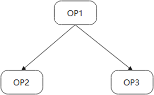

        其中，OP1存在两路输出，分别对应OP2和OP3的其中一路输入。在这种情况下，OP2和OP3的对应路的输入量化参数需要保持一致。

        如下量化配置config.json文件内容，红框中的两个参数需相等。

        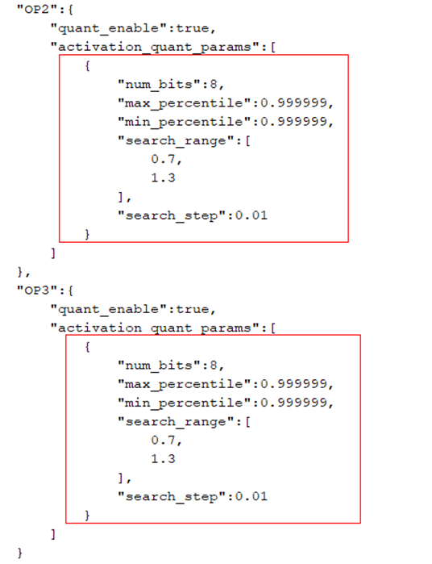

    3.  **场景3：无指令层前后量化参数一致性校验**

        针对无指令层（没有计算，只有shape相关操作的数据传输层）算子（'Concat', 'Split', 'Reshape', 'Flatten', 'Slice', 'Transpose', 'Tile', 'Squeeze'等），其输入的量化参数应与下一层节点的输入量化参数保持一致，否则校验报错：” Layer \{\} should have consistent \{\} with no command layer \{\}”。例如，如下图所示模型结构。

        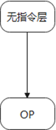

        其中，OP为无指令层关联的下一层算子节点。

        两个层的输入量化参数需保持一致，无指令层处于尾层的场景除外（该场景跳过校验）

        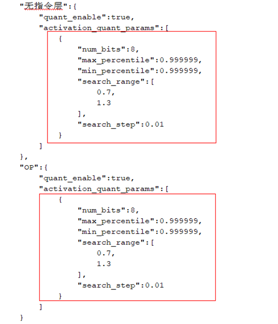

    4.  **场景4：CUBE算子量化校验**

        如'Conv', 'Gemm', 'ConvTranspose', 'MaxPool', 'AveragePool', 'GlobalMaxPool', 'GlobalAveragePool' 的于CUBE单元上计算的算子必须量化，否则校验报错：” Layer \{\} must be quantized as it is an operation calculated on CUBE”。

        对于生成的config.json，其量化参数内容会被解析以确定待量化的层（quant\_layers），quant\_layers会统计config.json中存在参数且quant\_enable字段为True的层。如果模型中CUBE类型算子不在 quant\_layers 中，会触发校验异常。

### 如何适配拓展层<a name="ZH-CN_TOPIC_0000002442022277"></a>

当前小型化工具仅支持pytorch官方的算子的量化，也就是[支持量化的算子列表](#ZH-CN_TOPIC_0000002498353100)中罗列的算子，如果用户基于这些算子做了定制化适配，小型化工具就无法识别，如[图1](#fig156101015419)所示。

**图 1**  自定义Conv层<a name="fig156101015419"></a>  
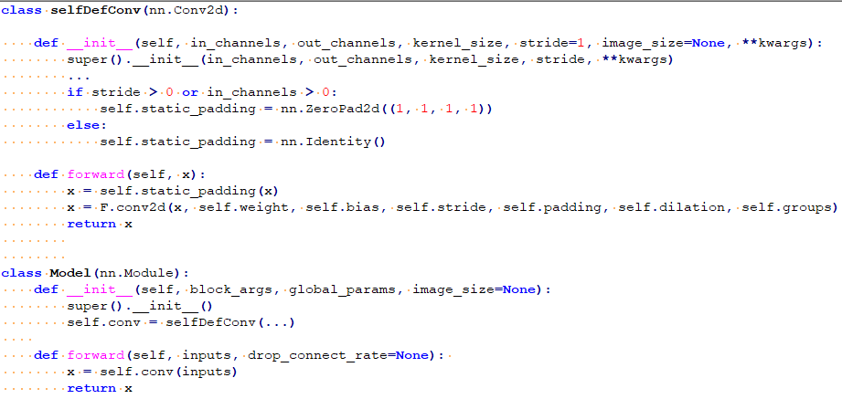

这样的模型，小型化无法识别到模型中带有Conv层，需要将卷积和padding实现放到模型的forward方法中，如[图2](#fig8996117171)所示。

**图 2**  修改后的模型定义<a name="fig8996117171"></a>  
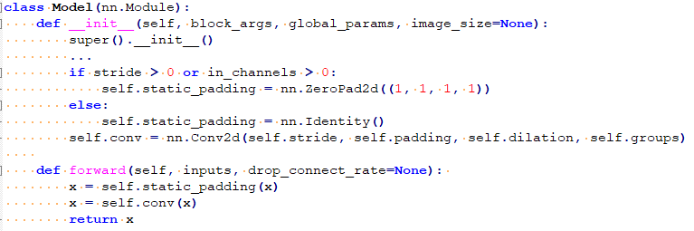

### retrain场景，重复使用的层需多次定义<a name="ZH-CN_TOPIC_0000002408423210"></a>

retrain场景，对于不带权重重复使用的层，需要根据使用次数在模型init方法中定义相应次数。原始模型如[图1](#fig627315983714)。

**图 1**  原始模型定义<a name="fig627315983714"></a>  
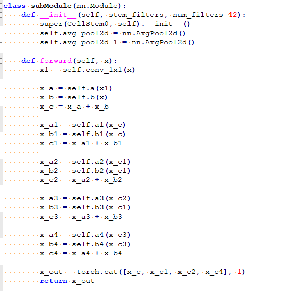

将加法和cat运算全部替换为amct\_pytorch拓展算子，且加法按使用次数定义，如[图2](#fig547329203813)所示。

**图 2**  替换加法和cat运算为amct\_pytorch的拓展算子<a name="fig547329203813"></a>  
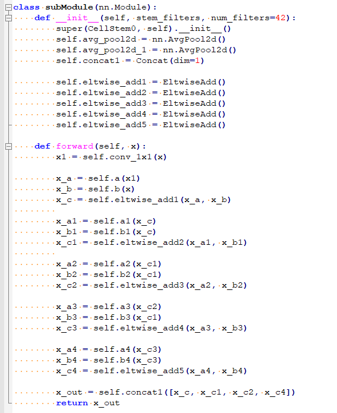

如果网络中存在多轮循环调用相同层的场景，如[图3](#fig3167839163012)所示。

**图 3**  在循环中调用‘+’<a name="fig3167839163012"></a>  
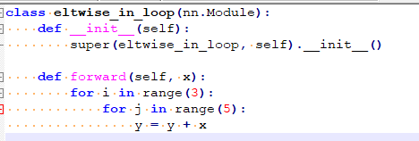

需要在\_\_init\_\_方法中按照使用次数定义Eltwise module，由于出现的两轮循环，其命名可以带上每轮循环对应的编号，如[图4](#fig19841359153019)所示。

**图 4**  修改后的循环调用eltwise的module<a name="fig19841359153019"></a>  
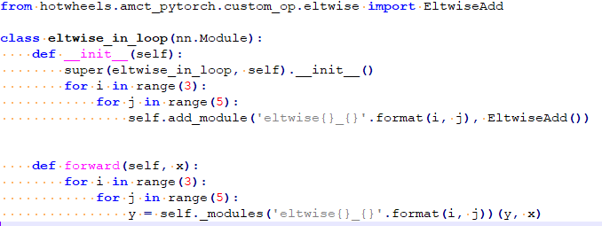

### chunk算子替换成split算子<a name="ZH-CN_TOPIC_0000002408583098"></a>

当前1.10.2版本的pytorch，指定onnx opset version为13进行pytorch到onnx的算子转换时，torch.chunk算子会变成小算子组合，这使得量化配置及量化参数映射流程极其复杂。此时需要用户手动将chunk算子替换为split算子。torch.chunk算子的含义是将tensor拆分成n块，torch.split算子的含义是将tensor拆分成大小为n的多块。经过替换后的模型，先进行一轮数据forward，确保所有split算子的chunk属性被初始化，再进行模型修改和forward。

**图 1**  Shufflenet中原始InvertedResidual定义<a name="fig97951756133413"></a>  
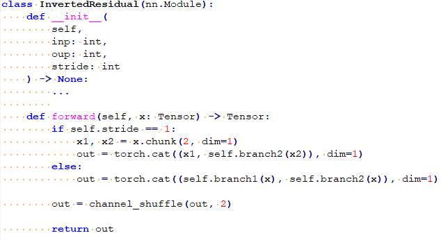

**图 2**  chunk修改为split定义后的InvertedResidual定义<a name="fig2082061113612"></a>  
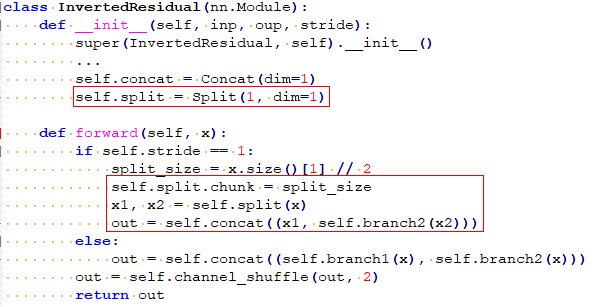

## 拓展单输入单输出module量化<a name="ZH-CN_TOPIC_0000002442022329"></a>

1.  对于单输入单输出且有module表示的算子，不在[支持量化的算子列表](#ZH-CN_TOPIC_0000002498353100)中，可以手动进行拓展，打开site-packages/hotwheels/amct\_pytorch/capacity/capacity\_config.csv，在NO\_WEIGHT\_QUANT\_TYPES增加要拓展的pytorch层类型，NO\_WEIGHT\_QUANT\_ONNX\_TYPES中增加该层转换到onnx对应的层类型。例如，客户想要增加torch.nn.XLayer的量化，可以将‘Xlayer’添加到NO\_WEIGHT\_QUANT\_TYPES列表末尾，并用逗号分隔，再将其在opset\_version为13下转为onnx对应的算子类型ONNX\_XLayer添加到NO\_WEIGHT\_QUANT\_ONNX\_TYPES列表末尾，并用逗号分隔。
2.  对于单输入单输出且无module表示的算子，可参考site-packages/hotwheels/amct\_pytorch/custom\_op/max/max.py的拓展方式，基于CustomModuleBase拓展对应算子，并将其按照第1条的描述加入到支持量化的算子列表中。

## 动态图附录<a name="ZH-CN_TOPIC_0000002408583074"></a>


### 训练后量化简易配置文件说明<a name="ZH-CN_TOPIC_0000002408583118"></a>

calibration\_config\_pytorch.proto文件参数说明如[表1](#d0e6229)所示。

**表 1**  calibration\_config\_pytorch.proto参数说明

<a name="d0e6229"></a>
<table><thead align="left"><tr id="row4050mcpsimp"><th class="cellrowborder" valign="top" width="17.169999999999998%" id="mcps1.2.6.1.1"><p id="p4052mcpsimp"><a name="p4052mcpsimp"></a><a name="p4052mcpsimp"></a>消息</p>
</th>
<th class="cellrowborder" valign="top" width="7.07%" id="mcps1.2.6.1.2"><p id="p4054mcpsimp"><a name="p4054mcpsimp"></a><a name="p4054mcpsimp"></a>是否必填</p>
</th>
<th class="cellrowborder" valign="top" width="11.110000000000001%" id="mcps1.2.6.1.3"><p id="p4056mcpsimp"><a name="p4056mcpsimp"></a><a name="p4056mcpsimp"></a>类型</p>
</th>
<th class="cellrowborder" valign="top" width="13.13%" id="mcps1.2.6.1.4"><p id="p4058mcpsimp"><a name="p4058mcpsimp"></a><a name="p4058mcpsimp"></a>字段</p>
</th>
<th class="cellrowborder" valign="top" width="51.519999999999996%" id="mcps1.2.6.1.5"><p id="p4060mcpsimp"><a name="p4060mcpsimp"></a><a name="p4060mcpsimp"></a>说明</p>
</th>
</tr>
</thead>
<tbody><tr id="row4062mcpsimp"><td class="cellrowborder" rowspan="13" valign="top" width="17.169999999999998%" headers="mcps1.2.6.1.1 "><p id="p4064mcpsimp"><a name="p4064mcpsimp"></a><a name="p4064mcpsimp"></a>AMCTConfig</p>
</td>
<td class="cellrowborder" valign="top" width="7.07%" headers="mcps1.2.6.1.2 "><p id="p4066mcpsimp"><a name="p4066mcpsimp"></a><a name="p4066mcpsimp"></a>-</p>
</td>
<td class="cellrowborder" valign="top" width="11.110000000000001%" headers="mcps1.2.6.1.3 "><p id="p4068mcpsimp"><a name="p4068mcpsimp"></a><a name="p4068mcpsimp"></a>-</p>
</td>
<td class="cellrowborder" valign="top" width="13.13%" headers="mcps1.2.6.1.4 "><p id="p4070mcpsimp"><a name="p4070mcpsimp"></a><a name="p4070mcpsimp"></a>-</p>
</td>
<td class="cellrowborder" valign="top" width="51.519999999999996%" headers="mcps1.2.6.1.5 "><p id="p4072mcpsimp"><a name="p4072mcpsimp"></a><a name="p4072mcpsimp"></a>AMCT训练后量化的简易量化配置。</p>
</td>
</tr>
<tr id="row4073mcpsimp"><td class="cellrowborder" valign="top" headers="mcps1.2.6.1.1 "><p id="p4075mcpsimp"><a name="p4075mcpsimp"></a><a name="p4075mcpsimp"></a>optional</p>
</td>
<td class="cellrowborder" valign="top" headers="mcps1.2.6.1.2 "><p id="p4077mcpsimp"><a name="p4077mcpsimp"></a><a name="p4077mcpsimp"></a>uint32</p>
</td>
<td class="cellrowborder" valign="top" headers="mcps1.2.6.1.3 "><p id="p4079mcpsimp"><a name="p4079mcpsimp"></a><a name="p4079mcpsimp"></a>batch_num</p>
</td>
<td class="cellrowborder" valign="top" headers="mcps1.2.6.1.4 "><p id="p4081mcpsimp"><a name="p4081mcpsimp"></a><a name="p4081mcpsimp"></a>量化使用的batch数量。</p>
</td>
</tr>
<tr id="row4082mcpsimp"><td class="cellrowborder" valign="top" headers="mcps1.2.6.1.1 "><p id="p4084mcpsimp"><a name="p4084mcpsimp"></a><a name="p4084mcpsimp"></a>optional</p>
</td>
<td class="cellrowborder" valign="top" headers="mcps1.2.6.1.2 "><p id="p4086mcpsimp"><a name="p4086mcpsimp"></a><a name="p4086mcpsimp"></a>bool</p>
</td>
<td class="cellrowborder" valign="top" headers="mcps1.2.6.1.3 "><p id="p4088mcpsimp"><a name="p4088mcpsimp"></a><a name="p4088mcpsimp"></a>activation_offset</p>
</td>
<td class="cellrowborder" valign="top" headers="mcps1.2.6.1.4 "><p id="p4090mcpsimp"><a name="p4090mcpsimp"></a><a name="p4090mcpsimp"></a>数据量化是否带offset。</p>
</td>
</tr>
<tr id="row4091mcpsimp"><td class="cellrowborder" valign="top" headers="mcps1.2.6.1.1 "><p id="p4093mcpsimp"><a name="p4093mcpsimp"></a><a name="p4093mcpsimp"></a>repeated</p>
</td>
<td class="cellrowborder" valign="top" headers="mcps1.2.6.1.2 "><p id="p4095mcpsimp"><a name="p4095mcpsimp"></a><a name="p4095mcpsimp"></a>string</p>
</td>
<td class="cellrowborder" valign="top" headers="mcps1.2.6.1.3 "><p id="p4097mcpsimp"><a name="p4097mcpsimp"></a><a name="p4097mcpsimp"></a>skip_layers</p>
</td>
<td class="cellrowborder" valign="top" headers="mcps1.2.6.1.4 "><p id="p4099mcpsimp"><a name="p4099mcpsimp"></a><a name="p4099mcpsimp"></a>不需要量化层的层名。</p>
</td>
</tr>
<tr id="row4100mcpsimp"><td class="cellrowborder" valign="top" headers="mcps1.2.6.1.1 "><p id="p4102mcpsimp"><a name="p4102mcpsimp"></a><a name="p4102mcpsimp"></a>repeated</p>
</td>
<td class="cellrowborder" valign="top" headers="mcps1.2.6.1.2 "><p id="p4104mcpsimp"><a name="p4104mcpsimp"></a><a name="p4104mcpsimp"></a>string</p>
</td>
<td class="cellrowborder" valign="top" headers="mcps1.2.6.1.3 "><p id="p4106mcpsimp"><a name="p4106mcpsimp"></a><a name="p4106mcpsimp"></a>skip_layer_types</p>
</td>
<td class="cellrowborder" valign="top" headers="mcps1.2.6.1.4 "><p id="p4108mcpsimp"><a name="p4108mcpsimp"></a><a name="p4108mcpsimp"></a>不需要量化的ONNX层类型。</p>
</td>
</tr>
<tr id="row4109mcpsimp"><td class="cellrowborder" valign="top" headers="mcps1.2.6.1.1 "><p id="p4111mcpsimp"><a name="p4111mcpsimp"></a><a name="p4111mcpsimp"></a>optional</p>
</td>
<td class="cellrowborder" valign="top" headers="mcps1.2.6.1.2 "><p id="p4113mcpsimp"><a name="p4113mcpsimp"></a><a name="p4113mcpsimp"></a>CalibrationConfig</p>
</td>
<td class="cellrowborder" valign="top" headers="mcps1.2.6.1.3 "><p id="p4115mcpsimp"><a name="p4115mcpsimp"></a><a name="p4115mcpsimp"></a>common_config</p>
</td>
<td class="cellrowborder" valign="top" headers="mcps1.2.6.1.4 "><p id="p4117mcpsimp"><a name="p4117mcpsimp"></a><a name="p4117mcpsimp"></a>通用的量化配置，若某层未被override_layer_types或者override_layer_configs重写，则使用该配置。</p>
</td>
</tr>
<tr id="row4118mcpsimp"><td class="cellrowborder" valign="top" headers="mcps1.2.6.1.1 "><p id="p4120mcpsimp"><a name="p4120mcpsimp"></a><a name="p4120mcpsimp"></a>repeated</p>
</td>
<td class="cellrowborder" valign="top" headers="mcps1.2.6.1.2 "><p id="p4122mcpsimp"><a name="p4122mcpsimp"></a><a name="p4122mcpsimp"></a>OverrideLayerType</p>
</td>
<td class="cellrowborder" valign="top" headers="mcps1.2.6.1.3 "><p id="p4124mcpsimp"><a name="p4124mcpsimp"></a><a name="p4124mcpsimp"></a>override_layer_types</p>
</td>
<td class="cellrowborder" valign="top" headers="mcps1.2.6.1.4 "><p id="p4126mcpsimp"><a name="p4126mcpsimp"></a><a name="p4126mcpsimp"></a>重写某一类型层的量化配置。</p>
</td>
</tr>
<tr id="row4127mcpsimp"><td class="cellrowborder" valign="top" headers="mcps1.2.6.1.1 "><p id="p4129mcpsimp"><a name="p4129mcpsimp"></a><a name="p4129mcpsimp"></a>repeated</p>
</td>
<td class="cellrowborder" valign="top" headers="mcps1.2.6.1.2 "><p id="p4131mcpsimp"><a name="p4131mcpsimp"></a><a name="p4131mcpsimp"></a>OverrideLayer</p>
</td>
<td class="cellrowborder" valign="top" headers="mcps1.2.6.1.3 "><p id="p4133mcpsimp"><a name="p4133mcpsimp"></a><a name="p4133mcpsimp"></a>override_layer_configs</p>
</td>
<td class="cellrowborder" valign="top" headers="mcps1.2.6.1.4 "><p id="p4135mcpsimp"><a name="p4135mcpsimp"></a><a name="p4135mcpsimp"></a>重写某一层的量化配置。</p>
</td>
</tr>
<tr id="row4136mcpsimp"><td class="cellrowborder" valign="top" headers="mcps1.2.6.1.1 "><p id="p4138mcpsimp"><a name="p4138mcpsimp"></a><a name="p4138mcpsimp"></a>optional</p>
</td>
<td class="cellrowborder" valign="top" headers="mcps1.2.6.1.2 "><p id="p4140mcpsimp"><a name="p4140mcpsimp"></a><a name="p4140mcpsimp"></a>bool</p>
</td>
<td class="cellrowborder" valign="top" headers="mcps1.2.6.1.3 "><p id="p4142mcpsimp"><a name="p4142mcpsimp"></a><a name="p4142mcpsimp"></a>do_fusion</p>
</td>
<td class="cellrowborder" valign="top" headers="mcps1.2.6.1.4 "><p id="p4144mcpsimp"><a name="p4144mcpsimp"></a><a name="p4144mcpsimp"></a>是否开启BN融合功能，默认为true，表示开启该功能。</p>
</td>
</tr>
<tr id="row4145mcpsimp"><td class="cellrowborder" valign="top" headers="mcps1.2.6.1.1 "><p id="p4147mcpsimp"><a name="p4147mcpsimp"></a><a name="p4147mcpsimp"></a>repeated</p>
</td>
<td class="cellrowborder" valign="top" headers="mcps1.2.6.1.2 "><p id="p4149mcpsimp"><a name="p4149mcpsimp"></a><a name="p4149mcpsimp"></a>string</p>
</td>
<td class="cellrowborder" valign="top" headers="mcps1.2.6.1.3 "><p id="p4151mcpsimp"><a name="p4151mcpsimp"></a><a name="p4151mcpsimp"></a>skip_fusion_layers</p>
</td>
<td class="cellrowborder" valign="top" headers="mcps1.2.6.1.4 "><p id="p4153mcpsimp"><a name="p4153mcpsimp"></a><a name="p4153mcpsimp"></a>跳过BN融合的层，配置之后这些层不会进行BN融合。</p>
</td>
</tr>
<tr id="row4154mcpsimp"><td class="cellrowborder" valign="top" headers="mcps1.2.6.1.1 "><p id="p4156mcpsimp"><a name="p4156mcpsimp"></a><a name="p4156mcpsimp"></a>optional</p>
</td>
<td class="cellrowborder" valign="top" headers="mcps1.2.6.1.2 "><p id="p4158mcpsimp"><a name="p4158mcpsimp"></a><a name="p4158mcpsimp"></a>bool</p>
</td>
<td class="cellrowborder" valign="top" headers="mcps1.2.6.1.3 "><p id="p4160mcpsimp"><a name="p4160mcpsimp"></a><a name="p4160mcpsimp"></a>update_bn</p>
</td>
<td class="cellrowborder" valign="top" headers="mcps1.2.6.1.4 "><p id="p4162mcpsimp"><a name="p4162mcpsimp"></a><a name="p4162mcpsimp"></a>是否开启BN更新功能。</p>
</td>
</tr>
<tr id="row4163mcpsimp"><td class="cellrowborder" valign="top" headers="mcps1.2.6.1.1 "><p id="p4165mcpsimp"><a name="p4165mcpsimp"></a><a name="p4165mcpsimp"></a>optional</p>
</td>
<td class="cellrowborder" valign="top" headers="mcps1.2.6.1.2 "><p id="p4167mcpsimp"><a name="p4167mcpsimp"></a><a name="p4167mcpsimp"></a>BnUpdateConfig</p>
</td>
<td class="cellrowborder" valign="top" headers="mcps1.2.6.1.3 "><p id="p4169mcpsimp"><a name="p4169mcpsimp"></a><a name="p4169mcpsimp"></a>bn_update_config</p>
</td>
<td class="cellrowborder" valign="top" headers="mcps1.2.6.1.4 "><p id="p4171mcpsimp"><a name="p4171mcpsimp"></a><a name="p4171mcpsimp"></a>BN层进行更新的参数配置。</p>
</td>
</tr>
<tr id="row1089913914558"><td class="cellrowborder" valign="top" headers="mcps1.2.6.1.1 "><p id="p47241622135512"><a name="p47241622135512"></a><a name="p47241622135512"></a>optional</p>
</td>
<td class="cellrowborder" valign="top" headers="mcps1.2.6.1.2 "><p id="p158992920555"><a name="p158992920555"></a><a name="p158992920555"></a>CalibrationOmConig</p>
</td>
<td class="cellrowborder" valign="top" headers="mcps1.2.6.1.3 "><p id="p389939105518"><a name="p389939105518"></a><a name="p389939105518"></a>om_config</p>
</td>
<td class="cellrowborder" valign="top" headers="mcps1.2.6.1.4 "><p id="p88996910554"><a name="p88996910554"></a><a name="p88996910554"></a>debug场景，用Mindstudio工具基于已生成的模型进行模型转换时会生成一个以.om.json为后缀的文件，其中会包含各层输入的量化位宽信息，可以用这个文件进行配置重新生成config.json进行校准，当前仅支持eltwise_add层的处理。</p>
</td>
</tr>
<tr id="row11490175172617"><td class="cellrowborder" rowspan="2" valign="top" width="17.169999999999998%" headers="mcps1.2.6.1.1 "><p id="p5870140202"><a name="p5870140202"></a><a name="p5870140202"></a>CalibrationOmConig</p>
</td>
<td class="cellrowborder" valign="top" width="7.07%" headers="mcps1.2.6.1.2 "><p id="p749055120261"><a name="p749055120261"></a><a name="p749055120261"></a>-</p>
</td>
<td class="cellrowborder" valign="top" width="11.110000000000001%" headers="mcps1.2.6.1.3 "><p id="p11490195110269"><a name="p11490195110269"></a><a name="p11490195110269"></a>-</p>
</td>
<td class="cellrowborder" valign="top" width="13.13%" headers="mcps1.2.6.1.4 "><p id="p849095192610"><a name="p849095192610"></a><a name="p849095192610"></a>-</p>
</td>
<td class="cellrowborder" valign="top" width="51.519999999999996%" headers="mcps1.2.6.1.5 "><p id="p1349025192619"><a name="p1349025192619"></a><a name="p1349025192619"></a>om_json量化配置。</p>
</td>
</tr>
<tr id="row17869706020"><td class="cellrowborder" valign="top" headers="mcps1.2.6.1.1 "><p id="p887010708"><a name="p887010708"></a><a name="p887010708"></a>required</p>
</td>
<td class="cellrowborder" valign="top" headers="mcps1.2.6.1.2 "><p id="p38701601206"><a name="p38701601206"></a><a name="p38701601206"></a>string</p>
</td>
<td class="cellrowborder" valign="top" headers="mcps1.2.6.1.3 "><p id="p176465479253"><a name="p176465479253"></a><a name="p176465479253"></a>mapping_file</p>
</td>
<td class="cellrowborder" valign="top" headers="mcps1.2.6.1.4 "><p id="p10870130309"><a name="p10870130309"></a><a name="p10870130309"></a>om_json所在路径。</p>
</td>
</tr>
<tr id="row0731219102712"><td class="cellrowborder" rowspan="3" valign="top" width="17.169999999999998%" headers="mcps1.2.6.1.1 "><p id="p4174mcpsimp"><a name="p4174mcpsimp"></a><a name="p4174mcpsimp"></a>OverrideLayerType</p>
</td>
<td class="cellrowborder" valign="top" width="7.07%" headers="mcps1.2.6.1.2 "><p id="p073111197270"><a name="p073111197270"></a><a name="p073111197270"></a>-</p>
</td>
<td class="cellrowborder" valign="top" width="11.110000000000001%" headers="mcps1.2.6.1.3 "><p id="p4731161982711"><a name="p4731161982711"></a><a name="p4731161982711"></a>-</p>
</td>
<td class="cellrowborder" valign="top" width="13.13%" headers="mcps1.2.6.1.4 "><p id="p873131915277"><a name="p873131915277"></a><a name="p873131915277"></a>-</p>
</td>
<td class="cellrowborder" valign="top" width="51.519999999999996%" headers="mcps1.2.6.1.5 "><p id="p9731121917278"><a name="p9731121917278"></a><a name="p9731121917278"></a>override layer量化配置。</p>
</td>
</tr>
<tr id="row4172mcpsimp"><td class="cellrowborder" valign="top" headers="mcps1.2.6.1.1 "><p id="p4176mcpsimp"><a name="p4176mcpsimp"></a><a name="p4176mcpsimp"></a>required</p>
</td>
<td class="cellrowborder" valign="top" headers="mcps1.2.6.1.2 "><p id="p4178mcpsimp"><a name="p4178mcpsimp"></a><a name="p4178mcpsimp"></a>string</p>
</td>
<td class="cellrowborder" valign="top" headers="mcps1.2.6.1.3 "><p id="p4180mcpsimp"><a name="p4180mcpsimp"></a><a name="p4180mcpsimp"></a>layer_type</p>
</td>
<td class="cellrowborder" valign="top" headers="mcps1.2.6.1.4 "><p id="p4182mcpsimp"><a name="p4182mcpsimp"></a><a name="p4182mcpsimp"></a>支持量化的ONNX层类型的名字。</p>
</td>
</tr>
<tr id="row4183mcpsimp"><td class="cellrowborder" valign="top" headers="mcps1.2.6.1.1 "><p id="p4185mcpsimp"><a name="p4185mcpsimp"></a><a name="p4185mcpsimp"></a>required</p>
</td>
<td class="cellrowborder" valign="top" headers="mcps1.2.6.1.2 "><p id="p4187mcpsimp"><a name="p4187mcpsimp"></a><a name="p4187mcpsimp"></a>CalibrationConfig</p>
</td>
<td class="cellrowborder" valign="top" headers="mcps1.2.6.1.3 "><p id="p4189mcpsimp"><a name="p4189mcpsimp"></a><a name="p4189mcpsimp"></a>calibration_config</p>
</td>
<td class="cellrowborder" valign="top" headers="mcps1.2.6.1.4 "><p id="p4191mcpsimp"><a name="p4191mcpsimp"></a><a name="p4191mcpsimp"></a>重置的量化配置。</p>
</td>
</tr>
<tr id="row4192mcpsimp"><td class="cellrowborder" rowspan="3" valign="top" width="17.169999999999998%" headers="mcps1.2.6.1.1 "><p id="p4194mcpsimp"><a name="p4194mcpsimp"></a><a name="p4194mcpsimp"></a>OverrideLayer</p>
</td>
<td class="cellrowborder" valign="top" width="7.07%" headers="mcps1.2.6.1.2 "><p id="p4196mcpsimp"><a name="p4196mcpsimp"></a><a name="p4196mcpsimp"></a>-</p>
</td>
<td class="cellrowborder" valign="top" width="11.110000000000001%" headers="mcps1.2.6.1.3 "><p id="p4198mcpsimp"><a name="p4198mcpsimp"></a><a name="p4198mcpsimp"></a>-</p>
</td>
<td class="cellrowborder" valign="top" width="13.13%" headers="mcps1.2.6.1.4 "><p id="p4200mcpsimp"><a name="p4200mcpsimp"></a><a name="p4200mcpsimp"></a>-</p>
</td>
<td class="cellrowborder" valign="top" width="51.519999999999996%" headers="mcps1.2.6.1.5 "><p id="p4202mcpsimp"><a name="p4202mcpsimp"></a><a name="p4202mcpsimp"></a>重置某层量化配置。</p>
</td>
</tr>
<tr id="row4203mcpsimp"><td class="cellrowborder" valign="top" headers="mcps1.2.6.1.1 "><p id="p4205mcpsimp"><a name="p4205mcpsimp"></a><a name="p4205mcpsimp"></a>required</p>
</td>
<td class="cellrowborder" valign="top" headers="mcps1.2.6.1.2 "><p id="p4207mcpsimp"><a name="p4207mcpsimp"></a><a name="p4207mcpsimp"></a>string</p>
</td>
<td class="cellrowborder" valign="top" headers="mcps1.2.6.1.3 "><p id="p4209mcpsimp"><a name="p4209mcpsimp"></a><a name="p4209mcpsimp"></a>layer_name</p>
</td>
<td class="cellrowborder" valign="top" headers="mcps1.2.6.1.4 "><p id="p4211mcpsimp"><a name="p4211mcpsimp"></a><a name="p4211mcpsimp"></a>被重置层的层名。</p>
</td>
</tr>
<tr id="row4212mcpsimp"><td class="cellrowborder" valign="top" headers="mcps1.2.6.1.1 "><p id="p4214mcpsimp"><a name="p4214mcpsimp"></a><a name="p4214mcpsimp"></a>required</p>
</td>
<td class="cellrowborder" valign="top" headers="mcps1.2.6.1.2 "><p id="p4216mcpsimp"><a name="p4216mcpsimp"></a><a name="p4216mcpsimp"></a>CalibrationConfig</p>
</td>
<td class="cellrowborder" valign="top" headers="mcps1.2.6.1.3 "><p id="p4218mcpsimp"><a name="p4218mcpsimp"></a><a name="p4218mcpsimp"></a>calibration_config</p>
</td>
<td class="cellrowborder" valign="top" headers="mcps1.2.6.1.4 "><p id="p4220mcpsimp"><a name="p4220mcpsimp"></a><a name="p4220mcpsimp"></a>重置的量化配置。</p>
</td>
</tr>
<tr id="row4221mcpsimp"><td class="cellrowborder" rowspan="3" valign="top" width="17.169999999999998%" headers="mcps1.2.6.1.1 "><p id="p4223mcpsimp"><a name="p4223mcpsimp"></a><a name="p4223mcpsimp"></a>BnUpdateConfig</p>
</td>
<td class="cellrowborder" valign="top" width="7.07%" headers="mcps1.2.6.1.2 "><p id="p4225mcpsimp"><a name="p4225mcpsimp"></a><a name="p4225mcpsimp"></a>-</p>
</td>
<td class="cellrowborder" valign="top" width="11.110000000000001%" headers="mcps1.2.6.1.3 "><p id="p4227mcpsimp"><a name="p4227mcpsimp"></a><a name="p4227mcpsimp"></a>-</p>
</td>
<td class="cellrowborder" valign="top" width="13.13%" headers="mcps1.2.6.1.4 "><p id="p4229mcpsimp"><a name="p4229mcpsimp"></a><a name="p4229mcpsimp"></a>-</p>
</td>
<td class="cellrowborder" valign="top" width="51.519999999999996%" headers="mcps1.2.6.1.5 "><p id="p4231mcpsimp"><a name="p4231mcpsimp"></a><a name="p4231mcpsimp"></a>控制BN更新的参数。</p>
</td>
</tr>
<tr id="row4232mcpsimp"><td class="cellrowborder" valign="top" headers="mcps1.2.6.1.1 "><p id="p4234mcpsimp"><a name="p4234mcpsimp"></a><a name="p4234mcpsimp"></a>optinal</p>
</td>
<td class="cellrowborder" valign="top" headers="mcps1.2.6.1.2 "><p id="p4236mcpsimp"><a name="p4236mcpsimp"></a><a name="p4236mcpsimp"></a>uint32</p>
</td>
<td class="cellrowborder" valign="top" headers="mcps1.2.6.1.3 "><p id="p4238mcpsimp"><a name="p4238mcpsimp"></a><a name="p4238mcpsimp"></a>bn_update_iterations</p>
</td>
<td class="cellrowborder" valign="top" headers="mcps1.2.6.1.4 "><p id="p4240mcpsimp"><a name="p4240mcpsimp"></a><a name="p4240mcpsimp"></a>控制BN更新的迭代次数。</p>
</td>
</tr>
<tr id="row4241mcpsimp"><td class="cellrowborder" valign="top" headers="mcps1.2.6.1.1 "><p id="p4243mcpsimp"><a name="p4243mcpsimp"></a><a name="p4243mcpsimp"></a>optinal</p>
</td>
<td class="cellrowborder" valign="top" headers="mcps1.2.6.1.2 "><p id="p4245mcpsimp"><a name="p4245mcpsimp"></a><a name="p4245mcpsimp"></a>double</p>
</td>
<td class="cellrowborder" valign="top" headers="mcps1.2.6.1.3 "><p id="p4247mcpsimp"><a name="p4247mcpsimp"></a><a name="p4247mcpsimp"></a>bn_momentum</p>
</td>
<td class="cellrowborder" valign="top" headers="mcps1.2.6.1.4 "><p id="p4249mcpsimp"><a name="p4249mcpsimp"></a><a name="p4249mcpsimp"></a>控制BN更新的滑动学习率。</p>
</td>
</tr>
<tr id="row4250mcpsimp"><td class="cellrowborder" rowspan="4" valign="top" width="17.169999999999998%" headers="mcps1.2.6.1.1 "><p id="p4252mcpsimp"><a name="p4252mcpsimp"></a><a name="p4252mcpsimp"></a>CalibrationConfig</p>
</td>
<td class="cellrowborder" valign="top" width="7.07%" headers="mcps1.2.6.1.2 "><p id="p4254mcpsimp"><a name="p4254mcpsimp"></a><a name="p4254mcpsimp"></a>-</p>
</td>
<td class="cellrowborder" valign="top" width="11.110000000000001%" headers="mcps1.2.6.1.3 "><p id="p4256mcpsimp"><a name="p4256mcpsimp"></a><a name="p4256mcpsimp"></a>-</p>
</td>
<td class="cellrowborder" valign="top" width="13.13%" headers="mcps1.2.6.1.4 "><p id="p4258mcpsimp"><a name="p4258mcpsimp"></a><a name="p4258mcpsimp"></a>-</p>
</td>
<td class="cellrowborder" valign="top" width="51.519999999999996%" headers="mcps1.2.6.1.5 "><p id="p4260mcpsimp"><a name="p4260mcpsimp"></a><a name="p4260mcpsimp"></a>Calibration量化的配置。</p>
</td>
</tr>
<tr id="row4261mcpsimp"><td class="cellrowborder" valign="top" headers="mcps1.2.6.1.1 "><p id="p4263mcpsimp"><a name="p4263mcpsimp"></a><a name="p4263mcpsimp"></a>-</p>
</td>
<td class="cellrowborder" valign="top" headers="mcps1.2.6.1.2 "><p id="p4265mcpsimp"><a name="p4265mcpsimp"></a><a name="p4265mcpsimp"></a>ARQuantize</p>
</td>
<td class="cellrowborder" valign="top" headers="mcps1.2.6.1.3 "><p id="p4267mcpsimp"><a name="p4267mcpsimp"></a><a name="p4267mcpsimp"></a>arq_quantize</p>
</td>
<td class="cellrowborder" valign="top" headers="mcps1.2.6.1.4 "><p id="p4269mcpsimp"><a name="p4269mcpsimp"></a><a name="p4269mcpsimp"></a>权重量化算法配置。</p>
<p id="p4270mcpsimp"><a name="p4270mcpsimp"></a><a name="p4270mcpsimp"></a>arq_quantize：ARQ量化算法配置。</p>
</td>
</tr>
<tr id="row4271mcpsimp"><td class="cellrowborder" valign="top" headers="mcps1.2.6.1.1 "><p id="p4273mcpsimp"><a name="p4273mcpsimp"></a><a name="p4273mcpsimp"></a>-</p>
</td>
<td class="cellrowborder" valign="top" headers="mcps1.2.6.1.2 "><p id="p4275mcpsimp"><a name="p4275mcpsimp"></a><a name="p4275mcpsimp"></a>SNQuantize</p>
</td>
<td class="cellrowborder" valign="top" headers="mcps1.2.6.1.3 "><p id="p4277mcpsimp"><a name="p4277mcpsimp"></a><a name="p4277mcpsimp"></a>snq_quantize</p>
</td>
<td class="cellrowborder" valign="top" headers="mcps1.2.6.1.4 "><p id="p4279mcpsimp"><a name="p4279mcpsimp"></a><a name="p4279mcpsimp"></a>权重量化算法配置。</p>
<p id="p4280mcpsimp"><a name="p4280mcpsimp"></a><a name="p4280mcpsimp"></a>snq_quantize：SNQ量化算法配置。</p>
</td>
</tr>
<tr id="row4281mcpsimp"><td class="cellrowborder" valign="top" headers="mcps1.2.6.1.1 "><p id="p4283mcpsimp"><a name="p4283mcpsimp"></a><a name="p4283mcpsimp"></a>-</p>
</td>
<td class="cellrowborder" valign="top" headers="mcps1.2.6.1.2 "><p id="p4285mcpsimp"><a name="p4285mcpsimp"></a><a name="p4285mcpsimp"></a>FMRQuantize</p>
</td>
<td class="cellrowborder" valign="top" headers="mcps1.2.6.1.3 "><p id="p4287mcpsimp"><a name="p4287mcpsimp"></a><a name="p4287mcpsimp"></a>ifmr_quantize</p>
</td>
<td class="cellrowborder" valign="top" headers="mcps1.2.6.1.4 "><p id="p4289mcpsimp"><a name="p4289mcpsimp"></a><a name="p4289mcpsimp"></a>数据量化算法配置。</p>
<p id="p4290mcpsimp"><a name="p4290mcpsimp"></a><a name="p4290mcpsimp"></a>ifmr_quantize：IFMR量化算法配置。</p>
</td>
</tr>
<tr id="row4291mcpsimp"><td class="cellrowborder" rowspan="2" valign="top" width="17.169999999999998%" headers="mcps1.2.6.1.1 "><p id="p4293mcpsimp"><a name="p4293mcpsimp"></a><a name="p4293mcpsimp"></a>ARQuantize</p>
</td>
<td class="cellrowborder" valign="top" width="7.07%" headers="mcps1.2.6.1.2 "><p id="p4295mcpsimp"><a name="p4295mcpsimp"></a><a name="p4295mcpsimp"></a>-</p>
</td>
<td class="cellrowborder" valign="top" width="11.110000000000001%" headers="mcps1.2.6.1.3 "><p id="p4297mcpsimp"><a name="p4297mcpsimp"></a><a name="p4297mcpsimp"></a>-</p>
</td>
<td class="cellrowborder" valign="top" width="13.13%" headers="mcps1.2.6.1.4 "><p id="p4299mcpsimp"><a name="p4299mcpsimp"></a><a name="p4299mcpsimp"></a>-</p>
</td>
<td class="cellrowborder" valign="top" width="51.519999999999996%" headers="mcps1.2.6.1.5 "><p id="p4301mcpsimp"><a name="p4301mcpsimp"></a><a name="p4301mcpsimp"></a>ARQ量化算法配置。</p>
</td>
</tr>
<tr id="row4302mcpsimp"><td class="cellrowborder" valign="top" headers="mcps1.2.6.1.1 "><p id="p4304mcpsimp"><a name="p4304mcpsimp"></a><a name="p4304mcpsimp"></a>optional</p>
</td>
<td class="cellrowborder" valign="top" headers="mcps1.2.6.1.2 "><p id="p4306mcpsimp"><a name="p4306mcpsimp"></a><a name="p4306mcpsimp"></a>bool</p>
</td>
<td class="cellrowborder" valign="top" headers="mcps1.2.6.1.3 "><p id="p4308mcpsimp"><a name="p4308mcpsimp"></a><a name="p4308mcpsimp"></a>channel_wise</p>
</td>
<td class="cellrowborder" valign="top" headers="mcps1.2.6.1.4 "><p id="p4310mcpsimp"><a name="p4310mcpsimp"></a><a name="p4310mcpsimp"></a>是否对每个channel采用不同的量化因子。</p>
</td>
</tr>
<tr id="row4311mcpsimp"><td class="cellrowborder" rowspan="6" valign="top" width="17.169999999999998%" headers="mcps1.2.6.1.1 "><p id="p4313mcpsimp"><a name="p4313mcpsimp"></a><a name="p4313mcpsimp"></a>SNQuantize</p>
</td>
<td class="cellrowborder" valign="top" width="7.07%" headers="mcps1.2.6.1.2 "><p id="p4315mcpsimp"><a name="p4315mcpsimp"></a><a name="p4315mcpsimp"></a>-</p>
</td>
<td class="cellrowborder" valign="top" width="11.110000000000001%" headers="mcps1.2.6.1.3 "><p id="p4317mcpsimp"><a name="p4317mcpsimp"></a><a name="p4317mcpsimp"></a>-</p>
</td>
<td class="cellrowborder" valign="top" width="13.13%" headers="mcps1.2.6.1.4 "><p id="p4319mcpsimp"><a name="p4319mcpsimp"></a><a name="p4319mcpsimp"></a>-</p>
</td>
<td class="cellrowborder" valign="top" width="51.519999999999996%" headers="mcps1.2.6.1.5 "><p id="p4321mcpsimp"><a name="p4321mcpsimp"></a><a name="p4321mcpsimp"></a>SNQ量化算法配置。</p>
</td>
</tr>
<tr id="row4322mcpsimp"><td class="cellrowborder" valign="top" headers="mcps1.2.6.1.1 "><p id="p4324mcpsimp"><a name="p4324mcpsimp"></a><a name="p4324mcpsimp"></a>optional</p>
</td>
<td class="cellrowborder" valign="top" headers="mcps1.2.6.1.2 "><p id="p4326mcpsimp"><a name="p4326mcpsimp"></a><a name="p4326mcpsimp"></a>bool</p>
</td>
<td class="cellrowborder" valign="top" headers="mcps1.2.6.1.3 "><p id="p4328mcpsimp"><a name="p4328mcpsimp"></a><a name="p4328mcpsimp"></a>channel_wise</p>
</td>
<td class="cellrowborder" valign="top" headers="mcps1.2.6.1.4 "><p id="p4330mcpsimp"><a name="p4330mcpsimp"></a><a name="p4330mcpsimp"></a>是否对每个channel采用不同的量化因子。</p>
</td>
</tr>
<tr id="row4331mcpsimp"><td class="cellrowborder" valign="top" headers="mcps1.2.6.1.1 "><p id="p4333mcpsimp"><a name="p4333mcpsimp"></a><a name="p4333mcpsimp"></a>optional</p>
</td>
<td class="cellrowborder" valign="top" headers="mcps1.2.6.1.2 "><p id="p4335mcpsimp"><a name="p4335mcpsimp"></a><a name="p4335mcpsimp"></a>uint32</p>
</td>
<td class="cellrowborder" valign="top" headers="mcps1.2.6.1.3 "><p id="p4337mcpsimp"><a name="p4337mcpsimp"></a><a name="p4337mcpsimp"></a>max_iteration</p>
</td>
<td class="cellrowborder" valign="top" headers="mcps1.2.6.1.4 "><p id="p4339mcpsimp"><a name="p4339mcpsimp"></a><a name="p4339mcpsimp"></a>最大迭代次数。</p>
</td>
</tr>
<tr id="row4340mcpsimp"><td class="cellrowborder" valign="top" headers="mcps1.2.6.1.1 "><p id="p4342mcpsimp"><a name="p4342mcpsimp"></a><a name="p4342mcpsimp"></a>optional</p>
</td>
<td class="cellrowborder" valign="top" headers="mcps1.2.6.1.2 "><p id="p4344mcpsimp"><a name="p4344mcpsimp"></a><a name="p4344mcpsimp"></a>float</p>
</td>
<td class="cellrowborder" valign="top" headers="mcps1.2.6.1.3 "><p id="p4346mcpsimp"><a name="p4346mcpsimp"></a><a name="p4346mcpsimp"></a>min_distance</p>
</td>
<td class="cellrowborder" valign="top" headers="mcps1.2.6.1.4 "><p id="p4348mcpsimp"><a name="p4348mcpsimp"></a><a name="p4348mcpsimp"></a>迭代更新聚类中心的最小距离。</p>
</td>
</tr>
<tr id="row4349mcpsimp"><td class="cellrowborder" valign="top" headers="mcps1.2.6.1.1 "><p id="p4351mcpsimp"><a name="p4351mcpsimp"></a><a name="p4351mcpsimp"></a>optinal</p>
</td>
<td class="cellrowborder" valign="top" headers="mcps1.2.6.1.2 "><p id="p4353mcpsimp"><a name="p4353mcpsimp"></a><a name="p4353mcpsimp"></a>string</p>
</td>
<td class="cellrowborder" valign="top" headers="mcps1.2.6.1.3 "><p id="p4355mcpsimp"><a name="p4355mcpsimp"></a><a name="p4355mcpsimp"></a>init_algo</p>
</td>
<td class="cellrowborder" valign="top" headers="mcps1.2.6.1.4 "><p id="p4357mcpsimp"><a name="p4357mcpsimp"></a><a name="p4357mcpsimp"></a>聚类中心初始化方式。</p>
</td>
</tr>
<tr id="row4358mcpsimp"><td class="cellrowborder" valign="top" headers="mcps1.2.6.1.1 "><p id="p4360mcpsimp"><a name="p4360mcpsimp"></a><a name="p4360mcpsimp"></a>optional</p>
</td>
<td class="cellrowborder" valign="top" headers="mcps1.2.6.1.2 "><p id="p4362mcpsimp"><a name="p4362mcpsimp"></a><a name="p4362mcpsimp"></a>int32</p>
</td>
<td class="cellrowborder" valign="top" headers="mcps1.2.6.1.3 "><p id="p4364mcpsimp"><a name="p4364mcpsimp"></a><a name="p4364mcpsimp"></a>num_bits</p>
</td>
<td class="cellrowborder" valign="top" headers="mcps1.2.6.1.4 "><p id="p4366mcpsimp"><a name="p4366mcpsimp"></a><a name="p4366mcpsimp"></a>量化位宽。</p>
</td>
</tr>
<tr id="row4367mcpsimp"><td class="cellrowborder" rowspan="6" valign="top" width="17.169999999999998%" headers="mcps1.2.6.1.1 "><p id="p4369mcpsimp"><a name="p4369mcpsimp"></a><a name="p4369mcpsimp"></a>FMRQuantize</p>
</td>
<td class="cellrowborder" valign="top" width="7.07%" headers="mcps1.2.6.1.2 "><p id="p4371mcpsimp"><a name="p4371mcpsimp"></a><a name="p4371mcpsimp"></a>-</p>
</td>
<td class="cellrowborder" valign="top" width="11.110000000000001%" headers="mcps1.2.6.1.3 "><p id="p4373mcpsimp"><a name="p4373mcpsimp"></a><a name="p4373mcpsimp"></a>-</p>
</td>
<td class="cellrowborder" valign="top" width="13.13%" headers="mcps1.2.6.1.4 "><p id="p4375mcpsimp"><a name="p4375mcpsimp"></a><a name="p4375mcpsimp"></a>-</p>
</td>
<td class="cellrowborder" valign="top" width="51.519999999999996%" headers="mcps1.2.6.1.5 "><p id="p4377mcpsimp"><a name="p4377mcpsimp"></a><a name="p4377mcpsimp"></a>FMR量化算法配置。</p>
</td>
</tr>
<tr id="row4378mcpsimp"><td class="cellrowborder" valign="top" headers="mcps1.2.6.1.1 "><p id="p4380mcpsimp"><a name="p4380mcpsimp"></a><a name="p4380mcpsimp"></a>optional</p>
</td>
<td class="cellrowborder" valign="top" headers="mcps1.2.6.1.2 "><p id="p4382mcpsimp"><a name="p4382mcpsimp"></a><a name="p4382mcpsimp"></a>float</p>
</td>
<td class="cellrowborder" valign="top" headers="mcps1.2.6.1.3 "><p id="p4384mcpsimp"><a name="p4384mcpsimp"></a><a name="p4384mcpsimp"></a>search_range_start</p>
</td>
<td class="cellrowborder" valign="top" headers="mcps1.2.6.1.4 "><p id="p4386mcpsimp"><a name="p4386mcpsimp"></a><a name="p4386mcpsimp"></a>量化因子搜索范围左边界。</p>
</td>
</tr>
<tr id="row4387mcpsimp"><td class="cellrowborder" valign="top" headers="mcps1.2.6.1.1 "><p id="p4389mcpsimp"><a name="p4389mcpsimp"></a><a name="p4389mcpsimp"></a>optional</p>
</td>
<td class="cellrowborder" valign="top" headers="mcps1.2.6.1.2 "><p id="p4391mcpsimp"><a name="p4391mcpsimp"></a><a name="p4391mcpsimp"></a>float</p>
</td>
<td class="cellrowborder" valign="top" headers="mcps1.2.6.1.3 "><p id="p4393mcpsimp"><a name="p4393mcpsimp"></a><a name="p4393mcpsimp"></a>search_range_end</p>
</td>
<td class="cellrowborder" valign="top" headers="mcps1.2.6.1.4 "><p id="p4395mcpsimp"><a name="p4395mcpsimp"></a><a name="p4395mcpsimp"></a>量化因子搜索范围右边界。</p>
</td>
</tr>
<tr id="row4396mcpsimp"><td class="cellrowborder" valign="top" headers="mcps1.2.6.1.1 "><p id="p4398mcpsimp"><a name="p4398mcpsimp"></a><a name="p4398mcpsimp"></a>optional</p>
</td>
<td class="cellrowborder" valign="top" headers="mcps1.2.6.1.2 "><p id="p4400mcpsimp"><a name="p4400mcpsimp"></a><a name="p4400mcpsimp"></a>float</p>
</td>
<td class="cellrowborder" valign="top" headers="mcps1.2.6.1.3 "><p id="p4402mcpsimp"><a name="p4402mcpsimp"></a><a name="p4402mcpsimp"></a>search_step</p>
</td>
<td class="cellrowborder" valign="top" headers="mcps1.2.6.1.4 "><p id="p4404mcpsimp"><a name="p4404mcpsimp"></a><a name="p4404mcpsimp"></a>量化因子搜索步长。</p>
</td>
</tr>
<tr id="row4405mcpsimp"><td class="cellrowborder" valign="top" headers="mcps1.2.6.1.1 "><p id="p4407mcpsimp"><a name="p4407mcpsimp"></a><a name="p4407mcpsimp"></a>optional</p>
</td>
<td class="cellrowborder" valign="top" headers="mcps1.2.6.1.2 "><p id="p4409mcpsimp"><a name="p4409mcpsimp"></a><a name="p4409mcpsimp"></a>float</p>
</td>
<td class="cellrowborder" valign="top" headers="mcps1.2.6.1.3 "><p id="p4411mcpsimp"><a name="p4411mcpsimp"></a><a name="p4411mcpsimp"></a>max_percentile</p>
</td>
<td class="cellrowborder" valign="top" headers="mcps1.2.6.1.4 "><p id="p4413mcpsimp"><a name="p4413mcpsimp"></a><a name="p4413mcpsimp"></a>最大值搜索位置。</p>
</td>
</tr>
<tr id="row4414mcpsimp"><td class="cellrowborder" valign="top" headers="mcps1.2.6.1.1 "><p id="p4416mcpsimp"><a name="p4416mcpsimp"></a><a name="p4416mcpsimp"></a>optional</p>
</td>
<td class="cellrowborder" valign="top" headers="mcps1.2.6.1.2 "><p id="p4418mcpsimp"><a name="p4418mcpsimp"></a><a name="p4418mcpsimp"></a>float</p>
</td>
<td class="cellrowborder" valign="top" headers="mcps1.2.6.1.3 "><p id="p4420mcpsimp"><a name="p4420mcpsimp"></a><a name="p4420mcpsimp"></a>min_percentile</p>
</td>
<td class="cellrowborder" valign="top" headers="mcps1.2.6.1.4 "><p id="p4422mcpsimp"><a name="p4422mcpsimp"></a><a name="p4422mcpsimp"></a>最小值搜索位置。</p>
</td>
</tr>
</tbody>
</table>

基于该文件构造的**均匀量化简易配置文件**_quant_.cfg样例如下所示。

```
# global quantize parameter 
batch_num : 2 
activation_offset : true 
do_fusion: true 
skip_fusion_layers : "layer1.1.conv2" 
update_bn: true
bn_update_config: {
    bn_momentum : 0.1
    bn_update_iterations : 30
}
om_config : {
    mapping_file : "./retrain_conf/inst.om.json"
}
common_config : { 
     snq_quantize : { 
        channel_wise : true
        max_iteration : 1000
        min_distance : 1e-10
        init_algo: 'uniform'
        num_bits: 4
    }
    ifmr_quantize : { 
        search_range_start : 0.7 
        search_range_end : 1.3 
        search_step : 0.01 
        max_percentile : 0.999999 
        min_percentile : 0.999999 
        num_bits: 12
    } 
} 
  
override_layer_types : { 
    layer_type : "Gemm" 
    calibration_config : { 
        arq_quantize : { 
            channel_wise : false 
        } 
        ifmr_quantize : { 
            search_range_start : 0.8 
            search_range_end : 1.2 
            search_step : 0.02 
            max_percentile : 0.999999 
            min_percentile : 0.999999 
            num_bits: 12
        } 
    } 
} 
  
override_layer_configs : { 
    layer_name :"layer1.2.conv2" 
    calibration_config : { 
        arq_quantize : { 
            channel_wise : true 
            num_bits: 8
        } 
        ifmr_quantize : { 
            search_range_start : 0.8 
            search_range_end : 1.2 
            search_step : 0.02 
            max_percentile : 0.999999 
            min_percentile : 0.999999 
            num_bits: 12
         } 
     } 
 }
```

### 量化感知训练简易配置文件说明<a name="ZH-CN_TOPIC_0000002441982457"></a>

retrain\_config\_pytorch.proto文件参数说明如[表1](#d0e6800)所示。

**表 1**  retrain\_config\_pytorch.proto参数说明

<a name="d0e6800"></a>
<table><thead align="left"><tr id="row4458mcpsimp"><th class="cellrowborder" valign="top" width="23.47%" id="mcps1.2.6.1.1"><p id="p4460mcpsimp"><a name="p4460mcpsimp"></a><a name="p4460mcpsimp"></a>消息</p>
</th>
<th class="cellrowborder" valign="top" width="11.219999999999999%" id="mcps1.2.6.1.2"><p id="p4462mcpsimp"><a name="p4462mcpsimp"></a><a name="p4462mcpsimp"></a>是否必填</p>
</th>
<th class="cellrowborder" valign="top" width="18.37%" id="mcps1.2.6.1.3"><p id="p4464mcpsimp"><a name="p4464mcpsimp"></a><a name="p4464mcpsimp"></a>类型</p>
</th>
<th class="cellrowborder" valign="top" width="17.32%" id="mcps1.2.6.1.4"><p id="p4466mcpsimp"><a name="p4466mcpsimp"></a><a name="p4466mcpsimp"></a>字段</p>
</th>
<th class="cellrowborder" valign="top" width="29.62%" id="mcps1.2.6.1.5"><p id="p4468mcpsimp"><a name="p4468mcpsimp"></a><a name="p4468mcpsimp"></a>说明</p>
</th>
</tr>
</thead>
<tbody><tr id="row4470mcpsimp"><td class="cellrowborder" rowspan="9" valign="top" width="23.47%" headers="mcps1.2.6.1.1 "><p id="p4472mcpsimp"><a name="p4472mcpsimp"></a><a name="p4472mcpsimp"></a>AMCTRetrainConfig</p>
</td>
<td class="cellrowborder" valign="top" width="11.219999999999999%" headers="mcps1.2.6.1.2 "><p id="p4474mcpsimp"><a name="p4474mcpsimp"></a><a name="p4474mcpsimp"></a>-</p>
</td>
<td class="cellrowborder" valign="top" width="18.37%" headers="mcps1.2.6.1.3 "><p id="p4476mcpsimp"><a name="p4476mcpsimp"></a><a name="p4476mcpsimp"></a>-</p>
</td>
<td class="cellrowborder" valign="top" width="17.32%" headers="mcps1.2.6.1.4 "><p id="p4478mcpsimp"><a name="p4478mcpsimp"></a><a name="p4478mcpsimp"></a>-</p>
</td>
<td class="cellrowborder" valign="top" width="29.62%" headers="mcps1.2.6.1.5 "><p id="p4480mcpsimp"><a name="p4480mcpsimp"></a><a name="p4480mcpsimp"></a>AMCT量化感知训练的简易配置。</p>
</td>
</tr>
<tr id="row4481mcpsimp"><td class="cellrowborder" valign="top" headers="mcps1.2.6.1.1 "><p id="p4483mcpsimp"><a name="p4483mcpsimp"></a><a name="p4483mcpsimp"></a>optional</p>
</td>
<td class="cellrowborder" valign="top" headers="mcps1.2.6.1.2 "><p id="p4485mcpsimp"><a name="p4485mcpsimp"></a><a name="p4485mcpsimp"></a>uint32</p>
</td>
<td class="cellrowborder" valign="top" headers="mcps1.2.6.1.3 "><p id="p4487mcpsimp"><a name="p4487mcpsimp"></a><a name="p4487mcpsimp"></a>batch_num</p>
</td>
<td class="cellrowborder" valign="top" headers="mcps1.2.6.1.4 "><p id="p4489mcpsimp"><a name="p4489mcpsimp"></a><a name="p4489mcpsimp"></a>量化使用的batch数量。</p>
</td>
</tr>
<tr id="row4490mcpsimp"><td class="cellrowborder" valign="top" headers="mcps1.2.6.1.1 "><p id="p4492mcpsimp"><a name="p4492mcpsimp"></a><a name="p4492mcpsimp"></a>required</p>
</td>
<td class="cellrowborder" valign="top" headers="mcps1.2.6.1.2 "><p id="p4494mcpsimp"><a name="p4494mcpsimp"></a><a name="p4494mcpsimp"></a>RetrainDataQuantConfig</p>
</td>
<td class="cellrowborder" valign="top" headers="mcps1.2.6.1.3 "><p id="p4496mcpsimp"><a name="p4496mcpsimp"></a><a name="p4496mcpsimp"></a>retrain_data_quant_config</p>
</td>
<td class="cellrowborder" valign="top" headers="mcps1.2.6.1.4 "><p id="p4498mcpsimp"><a name="p4498mcpsimp"></a><a name="p4498mcpsimp"></a>retrain data quant的参数。</p>
</td>
</tr>
<tr id="row4499mcpsimp"><td class="cellrowborder" valign="top" headers="mcps1.2.6.1.1 "><p id="p4501mcpsimp"><a name="p4501mcpsimp"></a><a name="p4501mcpsimp"></a>required</p>
</td>
<td class="cellrowborder" valign="top" headers="mcps1.2.6.1.2 "><p id="p4503mcpsimp"><a name="p4503mcpsimp"></a><a name="p4503mcpsimp"></a>RetrainWeightQuantConfig</p>
</td>
<td class="cellrowborder" valign="top" headers="mcps1.2.6.1.3 "><p id="p4505mcpsimp"><a name="p4505mcpsimp"></a><a name="p4505mcpsimp"></a>retrain_weight_quant_config</p>
</td>
<td class="cellrowborder" valign="top" headers="mcps1.2.6.1.4 "><p id="p4507mcpsimp"><a name="p4507mcpsimp"></a><a name="p4507mcpsimp"></a>retrain weights quant的参数。</p>
</td>
</tr>
<tr id="row4508mcpsimp"><td class="cellrowborder" valign="top" headers="mcps1.2.6.1.1 "><p id="p4510mcpsimp"><a name="p4510mcpsimp"></a><a name="p4510mcpsimp"></a>repeated</p>
</td>
<td class="cellrowborder" valign="top" headers="mcps1.2.6.1.2 "><p id="p4512mcpsimp"><a name="p4512mcpsimp"></a><a name="p4512mcpsimp"></a>string</p>
</td>
<td class="cellrowborder" valign="top" headers="mcps1.2.6.1.3 "><p id="p4514mcpsimp"><a name="p4514mcpsimp"></a><a name="p4514mcpsimp"></a>skip_layers</p>
</td>
<td class="cellrowborder" valign="top" headers="mcps1.2.6.1.4 "><p id="p4516mcpsimp"><a name="p4516mcpsimp"></a><a name="p4516mcpsimp"></a>不需要量化层的层名。</p>
</td>
</tr>
<tr id="row4517mcpsimp"><td class="cellrowborder" valign="top" headers="mcps1.2.6.1.1 "><p id="p4519mcpsimp"><a name="p4519mcpsimp"></a><a name="p4519mcpsimp"></a>repeated</p>
</td>
<td class="cellrowborder" valign="top" headers="mcps1.2.6.1.2 "><p id="p4521mcpsimp"><a name="p4521mcpsimp"></a><a name="p4521mcpsimp"></a>RetrainOverrideLayer</p>
</td>
<td class="cellrowborder" valign="top" headers="mcps1.2.6.1.3 "><p id="p4523mcpsimp"><a name="p4523mcpsimp"></a><a name="p4523mcpsimp"></a>override_layer_configs</p>
</td>
<td class="cellrowborder" valign="top" headers="mcps1.2.6.1.4 "><p id="p4525mcpsimp"><a name="p4525mcpsimp"></a><a name="p4525mcpsimp"></a>按层名重写哪些层。</p>
</td>
</tr>
<tr id="row4526mcpsimp"><td class="cellrowborder" valign="top" headers="mcps1.2.6.1.1 "><p id="p4528mcpsimp"><a name="p4528mcpsimp"></a><a name="p4528mcpsimp"></a>repeated</p>
</td>
<td class="cellrowborder" valign="top" headers="mcps1.2.6.1.2 "><p id="p4530mcpsimp"><a name="p4530mcpsimp"></a><a name="p4530mcpsimp"></a>string</p>
</td>
<td class="cellrowborder" valign="top" headers="mcps1.2.6.1.3 "><p id="p4532mcpsimp"><a name="p4532mcpsimp"></a><a name="p4532mcpsimp"></a>skip_layer_types</p>
</td>
<td class="cellrowborder" valign="top" headers="mcps1.2.6.1.4 "><p id="p4534mcpsimp"><a name="p4534mcpsimp"></a><a name="p4534mcpsimp"></a>不需要量化的层类型。</p>
</td>
</tr>
<tr id="row4535mcpsimp"><td class="cellrowborder" valign="top" headers="mcps1.2.6.1.1 "><p id="p4537mcpsimp"><a name="p4537mcpsimp"></a><a name="p4537mcpsimp"></a>repeated</p>
</td>
<td class="cellrowborder" valign="top" headers="mcps1.2.6.1.2 "><p id="p4539mcpsimp"><a name="p4539mcpsimp"></a><a name="p4539mcpsimp"></a>RetrainOverrideLayerType</p>
</td>
<td class="cellrowborder" valign="top" headers="mcps1.2.6.1.3 "><p id="p4541mcpsimp"><a name="p4541mcpsimp"></a><a name="p4541mcpsimp"></a>override_layer_types</p>
</td>
<td class="cellrowborder" valign="top" headers="mcps1.2.6.1.4 "><p id="p4543mcpsimp"><a name="p4543mcpsimp"></a><a name="p4543mcpsimp"></a>按层类型重写哪些层。</p>
</td>
</tr>
<tr id="row16586150202416"><td class="cellrowborder" valign="top" headers="mcps1.2.6.1.1 "><p id="p3586145052413"><a name="p3586145052413"></a><a name="p3586145052413"></a>optional</p>
</td>
<td class="cellrowborder" valign="top" headers="mcps1.2.6.1.2 "><p id="p05866509248"><a name="p05866509248"></a><a name="p05866509248"></a>RetrainOmConig</p>
</td>
<td class="cellrowborder" valign="top" headers="mcps1.2.6.1.3 "><p id="p358665072411"><a name="p358665072411"></a><a name="p358665072411"></a>om_config</p>
</td>
<td class="cellrowborder" valign="top" headers="mcps1.2.6.1.4 "><p id="p88996910554"><a name="p88996910554"></a><a name="p88996910554"></a>debug场景，用Mindstudio工具基于已生成的模型进行模型转换时会生成一个以.om.json为后缀的文件，其中会包含各层输入的量化位宽信息，可以用这个文件进行配置重新生成config.json进行校准，当前仅支持eltwise_add层的处理。</p>
</td>
</tr>
<tr id="row264584752514"><td class="cellrowborder" rowspan="2" valign="top" width="23.47%" headers="mcps1.2.6.1.1 "><p id="p20645847162515"><a name="p20645847162515"></a><a name="p20645847162515"></a>RetrainOmConig</p>
</td>
<td class="cellrowborder" valign="top" width="11.219999999999999%" headers="mcps1.2.6.1.2 "><p id="p116551813267"><a name="p116551813267"></a><a name="p116551813267"></a>-</p>
</td>
<td class="cellrowborder" valign="top" width="18.37%" headers="mcps1.2.6.1.3 "><p id="p6339143115265"><a name="p6339143115265"></a><a name="p6339143115265"></a>-</p>
</td>
<td class="cellrowborder" valign="top" width="17.32%" headers="mcps1.2.6.1.4 "><p id="p81933335260"><a name="p81933335260"></a><a name="p81933335260"></a>-</p>
</td>
<td class="cellrowborder" valign="top" width="29.62%" headers="mcps1.2.6.1.5 "><p id="p1349025192619"><a name="p1349025192619"></a><a name="p1349025192619"></a>om_json量化配置</p>
</td>
</tr>
<tr id="row171696116265"><td class="cellrowborder" valign="top" headers="mcps1.2.6.1.1 "><p id="p6246519192614"><a name="p6246519192614"></a><a name="p6246519192614"></a>required</p>
</td>
<td class="cellrowborder" valign="top" headers="mcps1.2.6.1.2 "><p id="p198721131172612"><a name="p198721131172612"></a><a name="p198721131172612"></a>string</p>
</td>
<td class="cellrowborder" valign="top" headers="mcps1.2.6.1.3 "><p id="p1869283322614"><a name="p1869283322614"></a><a name="p1869283322614"></a>mapping_file</p>
</td>
<td class="cellrowborder" valign="top" headers="mcps1.2.6.1.4 "><p id="p192721614112812"><a name="p192721614112812"></a><a name="p192721614112812"></a>om_json量化配置文件所在路径</p>
</td>
</tr>
<tr id="row4544mcpsimp"><td class="cellrowborder" rowspan="4" valign="top" width="23.47%" headers="mcps1.2.6.1.1 "><p id="p4546mcpsimp"><a name="p4546mcpsimp"></a><a name="p4546mcpsimp"></a>RetrainDataQuantConfig</p>
</td>
<td class="cellrowborder" valign="top" width="11.219999999999999%" headers="mcps1.2.6.1.2 "><p id="p4548mcpsimp"><a name="p4548mcpsimp"></a><a name="p4548mcpsimp"></a>-</p>
</td>
<td class="cellrowborder" valign="top" width="18.37%" headers="mcps1.2.6.1.3 "><p id="p4550mcpsimp"><a name="p4550mcpsimp"></a><a name="p4550mcpsimp"></a>-</p>
</td>
<td class="cellrowborder" valign="top" width="17.32%" headers="mcps1.2.6.1.4 "><p id="p4552mcpsimp"><a name="p4552mcpsimp"></a><a name="p4552mcpsimp"></a>-</p>
</td>
<td class="cellrowborder" valign="top" width="29.62%" headers="mcps1.2.6.1.5 "><p id="p4554mcpsimp"><a name="p4554mcpsimp"></a><a name="p4554mcpsimp"></a>retrain data参数配置。</p>
</td>
</tr>
<tr id="row4555mcpsimp"><td class="cellrowborder" valign="top" headers="mcps1.2.6.1.1 "><p id="p4557mcpsimp"><a name="p4557mcpsimp"></a><a name="p4557mcpsimp"></a>-</p>
</td>
<td class="cellrowborder" valign="top" headers="mcps1.2.6.1.2 "><p id="p4559mcpsimp"><a name="p4559mcpsimp"></a><a name="p4559mcpsimp"></a>ULQuantize</p>
</td>
<td class="cellrowborder" valign="top" headers="mcps1.2.6.1.3 "><p id="p4561mcpsimp"><a name="p4561mcpsimp"></a><a name="p4561mcpsimp"></a>ulq_retrain</p>
</td>
<td class="cellrowborder" valign="top" headers="mcps1.2.6.1.4 "><p id="p4563mcpsimp"><a name="p4563mcpsimp"></a><a name="p4563mcpsimp"></a>数据重训ulq的算法。</p>
</td>
</tr>
<tr id="row4564mcpsimp"><td class="cellrowborder" valign="top" headers="mcps1.2.6.1.1 "><p id="p4566mcpsimp"><a name="p4566mcpsimp"></a><a name="p4566mcpsimp"></a>-</p>
</td>
<td class="cellrowborder" valign="top" headers="mcps1.2.6.1.2 "><p id="p4568mcpsimp"><a name="p4568mcpsimp"></a><a name="p4568mcpsimp"></a>LUQuantize</p>
</td>
<td class="cellrowborder" valign="top" headers="mcps1.2.6.1.3 "><p id="p4570mcpsimp"><a name="p4570mcpsimp"></a><a name="p4570mcpsimp"></a>luq_retrain</p>
</td>
<td class="cellrowborder" valign="top" headers="mcps1.2.6.1.4 "><p id="p4572mcpsimp"><a name="p4572mcpsimp"></a><a name="p4572mcpsimp"></a>数据重训luq算法，目前默认支持luq算法。</p>
</td>
</tr>
<tr id="row1154452317554"><td class="cellrowborder" valign="top" headers="mcps1.2.6.1.1 "><p id="p1854532335513"><a name="p1854532335513"></a><a name="p1854532335513"></a>-</p>
</td>
<td class="cellrowborder" valign="top" headers="mcps1.2.6.1.2 "><p id="p15451623205512"><a name="p15451623205512"></a><a name="p15451623205512"></a>FixedQuantize</p>
</td>
<td class="cellrowborder" valign="top" headers="mcps1.2.6.1.3 "><p id="p11545102315515"><a name="p11545102315515"></a><a name="p11545102315515"></a>fixed_quant_param_retrain</p>
</td>
<td class="cellrowborder" valign="top" headers="mcps1.2.6.1.4 "><p id="p2545202385514"><a name="p2545202385514"></a><a name="p2545202385514"></a>固定数据量化配置</p>
</td>
</tr>
<tr id="row4573mcpsimp"><td class="cellrowborder" rowspan="4" valign="top" width="23.47%" headers="mcps1.2.6.1.1 "><p id="p4575mcpsimp"><a name="p4575mcpsimp"></a><a name="p4575mcpsimp"></a>ULQuantize</p>
</td>
<td class="cellrowborder" valign="top" width="11.219999999999999%" headers="mcps1.2.6.1.2 "><p id="p4577mcpsimp"><a name="p4577mcpsimp"></a><a name="p4577mcpsimp"></a>-</p>
</td>
<td class="cellrowborder" valign="top" width="18.37%" headers="mcps1.2.6.1.3 "><p id="p4579mcpsimp"><a name="p4579mcpsimp"></a><a name="p4579mcpsimp"></a>-</p>
</td>
<td class="cellrowborder" valign="top" width="17.32%" headers="mcps1.2.6.1.4 "><p id="p4581mcpsimp"><a name="p4581mcpsimp"></a><a name="p4581mcpsimp"></a>-</p>
</td>
<td class="cellrowborder" valign="top" width="29.62%" headers="mcps1.2.6.1.5 "><p id="p4583mcpsimp"><a name="p4583mcpsimp"></a><a name="p4583mcpsimp"></a>ULQ算法参数。</p>
</td>
</tr>
<tr id="row4584mcpsimp"><td class="cellrowborder" valign="top" headers="mcps1.2.6.1.1 "><p id="p4586mcpsimp"><a name="p4586mcpsimp"></a><a name="p4586mcpsimp"></a>optional</p>
</td>
<td class="cellrowborder" valign="top" headers="mcps1.2.6.1.2 "><p id="p4588mcpsimp"><a name="p4588mcpsimp"></a><a name="p4588mcpsimp"></a>ClipMaxMin</p>
</td>
<td class="cellrowborder" valign="top" headers="mcps1.2.6.1.3 "><p id="p4590mcpsimp"><a name="p4590mcpsimp"></a><a name="p4590mcpsimp"></a>clip_max_min</p>
</td>
<td class="cellrowborder" valign="top" headers="mcps1.2.6.1.4 "><p id="p4592mcpsimp"><a name="p4592mcpsimp"></a><a name="p4592mcpsimp"></a>初始化的上下限值，如果不配置，默认用ifmr进行初始化。</p>
</td>
</tr>
<tr id="row4593mcpsimp"><td class="cellrowborder" valign="top" headers="mcps1.2.6.1.1 "><p id="p4595mcpsimp"><a name="p4595mcpsimp"></a><a name="p4595mcpsimp"></a>optional</p>
</td>
<td class="cellrowborder" valign="top" headers="mcps1.2.6.1.2 "><p id="p4597mcpsimp"><a name="p4597mcpsimp"></a><a name="p4597mcpsimp"></a>bool</p>
</td>
<td class="cellrowborder" valign="top" headers="mcps1.2.6.1.3 "><p id="p4599mcpsimp"><a name="p4599mcpsimp"></a><a name="p4599mcpsimp"></a>fixed_min</p>
</td>
<td class="cellrowborder" valign="top" headers="mcps1.2.6.1.4 "><p id="p4601mcpsimp"><a name="p4601mcpsimp"></a><a name="p4601mcpsimp"></a>是否下限不学习且固定为0。默认Relu后为true，其他为false。</p>
</td>
</tr>
<tr id="row4602mcpsimp"><td class="cellrowborder" valign="top" headers="mcps1.2.6.1.1 "><p id="p4604mcpsimp"><a name="p4604mcpsimp"></a><a name="p4604mcpsimp"></a>optional</p>
</td>
<td class="cellrowborder" valign="top" headers="mcps1.2.6.1.2 "><p id="p4606mcpsimp"><a name="p4606mcpsimp"></a><a name="p4606mcpsimp"></a>int32</p>
</td>
<td class="cellrowborder" valign="top" headers="mcps1.2.6.1.3 "><p id="p4608mcpsimp"><a name="p4608mcpsimp"></a><a name="p4608mcpsimp"></a>num_bits</p>
</td>
<td class="cellrowborder" valign="top" headers="mcps1.2.6.1.4 "><p id="p4610mcpsimp"><a name="p4610mcpsimp"></a><a name="p4610mcpsimp"></a>量化位宽</p>
</td>
</tr>
<tr id="row4611mcpsimp"><td class="cellrowborder" rowspan="2" valign="top" width="23.47%" headers="mcps1.2.6.1.1 "><p id="p4613mcpsimp"><a name="p4613mcpsimp"></a><a name="p4613mcpsimp"></a>LUQuantize</p>
</td>
<td class="cellrowborder" valign="top" width="11.219999999999999%" headers="mcps1.2.6.1.2 "><p id="p4615mcpsimp"><a name="p4615mcpsimp"></a><a name="p4615mcpsimp"></a>-</p>
</td>
<td class="cellrowborder" valign="top" width="18.37%" headers="mcps1.2.6.1.3 "><p id="p4617mcpsimp"><a name="p4617mcpsimp"></a><a name="p4617mcpsimp"></a>-</p>
</td>
<td class="cellrowborder" valign="top" width="17.32%" headers="mcps1.2.6.1.4 "><p id="p4619mcpsimp"><a name="p4619mcpsimp"></a><a name="p4619mcpsimp"></a>-</p>
</td>
<td class="cellrowborder" valign="top" width="29.62%" headers="mcps1.2.6.1.5 "><p id="p4621mcpsimp"><a name="p4621mcpsimp"></a><a name="p4621mcpsimp"></a>LUQ算法参数。</p>
</td>
</tr>
<tr id="row4622mcpsimp"><td class="cellrowborder" valign="top" headers="mcps1.2.6.1.1 "><p id="p4624mcpsimp"><a name="p4624mcpsimp"></a><a name="p4624mcpsimp"></a>optional</p>
</td>
<td class="cellrowborder" valign="top" headers="mcps1.2.6.1.2 "><p id="p4626mcpsimp"><a name="p4626mcpsimp"></a><a name="p4626mcpsimp"></a>int32</p>
</td>
<td class="cellrowborder" valign="top" headers="mcps1.2.6.1.3 "><p id="p4628mcpsimp"><a name="p4628mcpsimp"></a><a name="p4628mcpsimp"></a>num_bits</p>
</td>
<td class="cellrowborder" valign="top" headers="mcps1.2.6.1.4 "><p id="p4630mcpsimp"><a name="p4630mcpsimp"></a><a name="p4630mcpsimp"></a>量化位宽</p>
</td>
</tr>
<tr id="row4631mcpsimp"><td class="cellrowborder" rowspan="3" valign="top" width="23.47%" headers="mcps1.2.6.1.1 "><p id="p4633mcpsimp"><a name="p4633mcpsimp"></a><a name="p4633mcpsimp"></a>ClipMaxMin</p>
</td>
<td class="cellrowborder" valign="top" width="11.219999999999999%" headers="mcps1.2.6.1.2 "><p id="p4635mcpsimp"><a name="p4635mcpsimp"></a><a name="p4635mcpsimp"></a>-</p>
</td>
<td class="cellrowborder" valign="top" width="18.37%" headers="mcps1.2.6.1.3 "><p id="p4637mcpsimp"><a name="p4637mcpsimp"></a><a name="p4637mcpsimp"></a>-</p>
</td>
<td class="cellrowborder" valign="top" width="17.32%" headers="mcps1.2.6.1.4 "><p id="p4639mcpsimp"><a name="p4639mcpsimp"></a><a name="p4639mcpsimp"></a>-</p>
</td>
<td class="cellrowborder" valign="top" width="29.62%" headers="mcps1.2.6.1.5 "><p id="p4641mcpsimp"><a name="p4641mcpsimp"></a><a name="p4641mcpsimp"></a>初始上下限。</p>
</td>
</tr>
<tr id="row4642mcpsimp"><td class="cellrowborder" valign="top" headers="mcps1.2.6.1.1 "><p id="p4644mcpsimp"><a name="p4644mcpsimp"></a><a name="p4644mcpsimp"></a>required</p>
</td>
<td class="cellrowborder" valign="top" headers="mcps1.2.6.1.2 "><p id="p4646mcpsimp"><a name="p4646mcpsimp"></a><a name="p4646mcpsimp"></a>float</p>
</td>
<td class="cellrowborder" valign="top" headers="mcps1.2.6.1.3 "><p id="p4648mcpsimp"><a name="p4648mcpsimp"></a><a name="p4648mcpsimp"></a>clip_max</p>
</td>
<td class="cellrowborder" valign="top" headers="mcps1.2.6.1.4 "><p id="p4650mcpsimp"><a name="p4650mcpsimp"></a><a name="p4650mcpsimp"></a>初始上限值。</p>
</td>
</tr>
<tr id="row4651mcpsimp"><td class="cellrowborder" valign="top" headers="mcps1.2.6.1.1 "><p id="p4653mcpsimp"><a name="p4653mcpsimp"></a><a name="p4653mcpsimp"></a>required</p>
</td>
<td class="cellrowborder" valign="top" headers="mcps1.2.6.1.2 "><p id="p4655mcpsimp"><a name="p4655mcpsimp"></a><a name="p4655mcpsimp"></a>float</p>
</td>
<td class="cellrowborder" valign="top" headers="mcps1.2.6.1.3 "><p id="p4657mcpsimp"><a name="p4657mcpsimp"></a><a name="p4657mcpsimp"></a>clip_min</p>
</td>
<td class="cellrowborder" valign="top" headers="mcps1.2.6.1.4 "><p id="p4659mcpsimp"><a name="p4659mcpsimp"></a><a name="p4659mcpsimp"></a>初始下限值。</p>
</td>
</tr>
<tr id="row4660mcpsimp"><td class="cellrowborder" rowspan="3" valign="top" width="23.47%" headers="mcps1.2.6.1.1 "><p id="p4662mcpsimp"><a name="p4662mcpsimp"></a><a name="p4662mcpsimp"></a>RetrainWeightQuantConfig</p>
</td>
<td class="cellrowborder" valign="top" width="11.219999999999999%" headers="mcps1.2.6.1.2 "><p id="p4664mcpsimp"><a name="p4664mcpsimp"></a><a name="p4664mcpsimp"></a>-</p>
</td>
<td class="cellrowborder" valign="top" width="18.37%" headers="mcps1.2.6.1.3 "><p id="p4666mcpsimp"><a name="p4666mcpsimp"></a><a name="p4666mcpsimp"></a>-</p>
</td>
<td class="cellrowborder" valign="top" width="17.32%" headers="mcps1.2.6.1.4 "><p id="p4668mcpsimp"><a name="p4668mcpsimp"></a><a name="p4668mcpsimp"></a>-</p>
</td>
<td class="cellrowborder" valign="top" width="29.62%" headers="mcps1.2.6.1.5 "><p id="p4670mcpsimp"><a name="p4670mcpsimp"></a><a name="p4670mcpsimp"></a>retrain weights参数配置。</p>
</td>
</tr>
<tr id="row4671mcpsimp"><td class="cellrowborder" valign="top" headers="mcps1.2.6.1.1 "><p id="p4673mcpsimp"><a name="p4673mcpsimp"></a><a name="p4673mcpsimp"></a>-</p>
</td>
<td class="cellrowborder" valign="top" headers="mcps1.2.6.1.2 "><p id="p4675mcpsimp"><a name="p4675mcpsimp"></a><a name="p4675mcpsimp"></a>ARQRetrain</p>
</td>
<td class="cellrowborder" valign="top" headers="mcps1.2.6.1.3 "><p id="p4677mcpsimp"><a name="p4677mcpsimp"></a><a name="p4677mcpsimp"></a>arq_retrain</p>
</td>
<td class="cellrowborder" valign="top" headers="mcps1.2.6.1.4 "><p id="p4679mcpsimp"><a name="p4679mcpsimp"></a><a name="p4679mcpsimp"></a>weights线性量化arq</p>
</td>
</tr>
<tr id="row4680mcpsimp"><td class="cellrowborder" valign="top" headers="mcps1.2.6.1.1 "><p id="p4682mcpsimp"><a name="p4682mcpsimp"></a><a name="p4682mcpsimp"></a>-</p>
</td>
<td class="cellrowborder" valign="top" headers="mcps1.2.6.1.2 "><p id="p4684mcpsimp"><a name="p4684mcpsimp"></a><a name="p4684mcpsimp"></a>LNQRetrain</p>
</td>
<td class="cellrowborder" valign="top" headers="mcps1.2.6.1.3 "><p id="p4686mcpsimp"><a name="p4686mcpsimp"></a><a name="p4686mcpsimp"></a>lnq_retrain</p>
</td>
<td class="cellrowborder" valign="top" headers="mcps1.2.6.1.4 "><p id="p4688mcpsimp"><a name="p4688mcpsimp"></a><a name="p4688mcpsimp"></a>weights非线性量化lnq</p>
</td>
</tr>
<tr id="row4689mcpsimp"><td class="cellrowborder" rowspan="3" valign="top" width="23.47%" headers="mcps1.2.6.1.1 "><p id="p4691mcpsimp"><a name="p4691mcpsimp"></a><a name="p4691mcpsimp"></a>ARQRetrain</p>
</td>
<td class="cellrowborder" valign="top" width="11.219999999999999%" headers="mcps1.2.6.1.2 "><p id="p4693mcpsimp"><a name="p4693mcpsimp"></a><a name="p4693mcpsimp"></a>-</p>
</td>
<td class="cellrowborder" valign="top" width="18.37%" headers="mcps1.2.6.1.3 "><p id="p4695mcpsimp"><a name="p4695mcpsimp"></a><a name="p4695mcpsimp"></a>-</p>
</td>
<td class="cellrowborder" valign="top" width="17.32%" headers="mcps1.2.6.1.4 "><p id="p4697mcpsimp"><a name="p4697mcpsimp"></a><a name="p4697mcpsimp"></a>-</p>
</td>
<td class="cellrowborder" valign="top" width="29.62%" headers="mcps1.2.6.1.5 "><p id="p4699mcpsimp"><a name="p4699mcpsimp"></a><a name="p4699mcpsimp"></a>ARQ算法参数。</p>
</td>
</tr>
<tr id="row4700mcpsimp"><td class="cellrowborder" valign="top" headers="mcps1.2.6.1.1 "><p id="p4702mcpsimp"><a name="p4702mcpsimp"></a><a name="p4702mcpsimp"></a>optional</p>
</td>
<td class="cellrowborder" valign="top" headers="mcps1.2.6.1.2 "><p id="p4704mcpsimp"><a name="p4704mcpsimp"></a><a name="p4704mcpsimp"></a>bool</p>
</td>
<td class="cellrowborder" valign="top" headers="mcps1.2.6.1.3 "><p id="p4706mcpsimp"><a name="p4706mcpsimp"></a><a name="p4706mcpsimp"></a>channel_wise</p>
</td>
<td class="cellrowborder" valign="top" headers="mcps1.2.6.1.4 "><p id="p4708mcpsimp"><a name="p4708mcpsimp"></a><a name="p4708mcpsimp"></a>是否做channel wise的arq。</p>
</td>
</tr>
<tr id="row4709mcpsimp"><td class="cellrowborder" valign="top" headers="mcps1.2.6.1.1 "><p id="p4711mcpsimp"><a name="p4711mcpsimp"></a><a name="p4711mcpsimp"></a>optional</p>
</td>
<td class="cellrowborder" valign="top" headers="mcps1.2.6.1.2 "><p id="p4713mcpsimp"><a name="p4713mcpsimp"></a><a name="p4713mcpsimp"></a>int32</p>
</td>
<td class="cellrowborder" valign="top" headers="mcps1.2.6.1.3 "><p id="p4715mcpsimp"><a name="p4715mcpsimp"></a><a name="p4715mcpsimp"></a>num_bits</p>
</td>
<td class="cellrowborder" valign="top" headers="mcps1.2.6.1.4 "><p id="p4717mcpsimp"><a name="p4717mcpsimp"></a><a name="p4717mcpsimp"></a>权重量化位宽</p>
</td>
</tr>
<tr id="row4718mcpsimp"><td class="cellrowborder" rowspan="7" valign="top" width="23.47%" headers="mcps1.2.6.1.1 "><p id="p4720mcpsimp"><a name="p4720mcpsimp"></a><a name="p4720mcpsimp"></a>LNQRetrain</p>
</td>
<td class="cellrowborder" valign="top" width="11.219999999999999%" headers="mcps1.2.6.1.2 "><p id="p4722mcpsimp"><a name="p4722mcpsimp"></a><a name="p4722mcpsimp"></a>-</p>
</td>
<td class="cellrowborder" valign="top" width="18.37%" headers="mcps1.2.6.1.3 "><p id="p4724mcpsimp"><a name="p4724mcpsimp"></a><a name="p4724mcpsimp"></a>-</p>
</td>
<td class="cellrowborder" valign="top" width="17.32%" headers="mcps1.2.6.1.4 "><p id="p4726mcpsimp"><a name="p4726mcpsimp"></a><a name="p4726mcpsimp"></a>-</p>
</td>
<td class="cellrowborder" valign="top" width="29.62%" headers="mcps1.2.6.1.5 "><p id="p4728mcpsimp"><a name="p4728mcpsimp"></a><a name="p4728mcpsimp"></a>LNQ算法参数。</p>
</td>
</tr>
<tr id="row4729mcpsimp"><td class="cellrowborder" valign="top" headers="mcps1.2.6.1.1 "><p id="p4732mcpsimp"><a name="p4732mcpsimp"></a><a name="p4732mcpsimp"></a>optional</p>
</td>
<td class="cellrowborder" valign="top" headers="mcps1.2.6.1.2 "><p id="p4734mcpsimp"><a name="p4734mcpsimp"></a><a name="p4734mcpsimp"></a>int32</p>
</td>
<td class="cellrowborder" valign="top" headers="mcps1.2.6.1.3 "><p id="p4736mcpsimp"><a name="p4736mcpsimp"></a><a name="p4736mcpsimp"></a>cluster_freq</p>
</td>
<td class="cellrowborder" valign="top" headers="mcps1.2.6.1.4 "><p id="p4738mcpsimp"><a name="p4738mcpsimp"></a><a name="p4738mcpsimp"></a>更新聚类中心的频率</p>
</td>
</tr>
<tr id="row4739mcpsimp"><td class="cellrowborder" valign="top" headers="mcps1.2.6.1.1 "><p id="p4742mcpsimp"><a name="p4742mcpsimp"></a><a name="p4742mcpsimp"></a>optional</p>
</td>
<td class="cellrowborder" valign="top" headers="mcps1.2.6.1.2 "><p id="p4744mcpsimp"><a name="p4744mcpsimp"></a><a name="p4744mcpsimp"></a>bool</p>
</td>
<td class="cellrowborder" valign="top" headers="mcps1.2.6.1.3 "><p id="p4746mcpsimp"><a name="p4746mcpsimp"></a><a name="p4746mcpsimp"></a>channel_wise</p>
</td>
<td class="cellrowborder" valign="top" headers="mcps1.2.6.1.4 "><p id="p4748mcpsimp"><a name="p4748mcpsimp"></a><a name="p4748mcpsimp"></a>默认为false，当前lnq_retrain算法只支持channel_wise为false，配置成true时不会生效</p>
</td>
</tr>
<tr id="row4749mcpsimp"><td class="cellrowborder" valign="top" headers="mcps1.2.6.1.1 "><p id="p4752mcpsimp"><a name="p4752mcpsimp"></a><a name="p4752mcpsimp"></a>optional</p>
</td>
<td class="cellrowborder" valign="top" headers="mcps1.2.6.1.2 "><p id="p4754mcpsimp"><a name="p4754mcpsimp"></a><a name="p4754mcpsimp"></a>int32</p>
</td>
<td class="cellrowborder" valign="top" headers="mcps1.2.6.1.3 "><p id="p4756mcpsimp"><a name="p4756mcpsimp"></a><a name="p4756mcpsimp"></a>num_bits</p>
</td>
<td class="cellrowborder" valign="top" headers="mcps1.2.6.1.4 "><p id="p4758mcpsimp"><a name="p4758mcpsimp"></a><a name="p4758mcpsimp"></a>权重量化位宽</p>
</td>
</tr>
<tr id="row4759mcpsimp"><td class="cellrowborder" valign="top" headers="mcps1.2.6.1.1 "><p id="p4762mcpsimp"><a name="p4762mcpsimp"></a><a name="p4762mcpsimp"></a>optional</p>
</td>
<td class="cellrowborder" valign="top" headers="mcps1.2.6.1.2 "><p id="p4764mcpsimp"><a name="p4764mcpsimp"></a><a name="p4764mcpsimp"></a>float</p>
</td>
<td class="cellrowborder" valign="top" headers="mcps1.2.6.1.3 "><p id="p4766mcpsimp"><a name="p4766mcpsimp"></a><a name="p4766mcpsimp"></a>clip_max</p>
</td>
<td class="cellrowborder" valign="top" headers="mcps1.2.6.1.4 "><p id="p4768mcpsimp"><a name="p4768mcpsimp"></a><a name="p4768mcpsimp"></a>学习的边界初始值</p>
</td>
</tr>
<tr id="row4769mcpsimp"><td class="cellrowborder" valign="top" headers="mcps1.2.6.1.1 "><p id="p4772mcpsimp"><a name="p4772mcpsimp"></a><a name="p4772mcpsimp"></a>optional</p>
</td>
<td class="cellrowborder" valign="top" headers="mcps1.2.6.1.2 "><p id="p4774mcpsimp"><a name="p4774mcpsimp"></a><a name="p4774mcpsimp"></a>uint32</p>
</td>
<td class="cellrowborder" valign="top" headers="mcps1.2.6.1.3 "><p id="p4776mcpsimp"><a name="p4776mcpsimp"></a><a name="p4776mcpsimp"></a>max_iteration</p>
</td>
<td class="cellrowborder" valign="top" headers="mcps1.2.6.1.4 "><p id="p4778mcpsimp"><a name="p4778mcpsimp"></a><a name="p4778mcpsimp"></a>寻找聚类的最大迭代次数</p>
</td>
</tr>
<tr id="row4779mcpsimp"><td class="cellrowborder" valign="top" headers="mcps1.2.6.1.1 "><p id="p4782mcpsimp"><a name="p4782mcpsimp"></a><a name="p4782mcpsimp"></a>optional</p>
</td>
<td class="cellrowborder" valign="top" headers="mcps1.2.6.1.2 "><p id="p4784mcpsimp"><a name="p4784mcpsimp"></a><a name="p4784mcpsimp"></a>float</p>
</td>
<td class="cellrowborder" valign="top" headers="mcps1.2.6.1.3 "><p id="p4786mcpsimp"><a name="p4786mcpsimp"></a><a name="p4786mcpsimp"></a>min_distance</p>
</td>
<td class="cellrowborder" valign="top" headers="mcps1.2.6.1.4 "><p id="p4788mcpsimp"><a name="p4788mcpsimp"></a><a name="p4788mcpsimp"></a>寻找聚类的最小距离</p>
</td>
</tr>
<tr id="row4789mcpsimp"><td class="cellrowborder" rowspan="4" valign="top" width="23.47%" headers="mcps1.2.6.1.1 "><p id="p4791mcpsimp"><a name="p4791mcpsimp"></a><a name="p4791mcpsimp"></a>RetrainOverrideLayer</p>
</td>
<td class="cellrowborder" valign="top" width="11.219999999999999%" headers="mcps1.2.6.1.2 "><p id="p4793mcpsimp"><a name="p4793mcpsimp"></a><a name="p4793mcpsimp"></a>-</p>
</td>
<td class="cellrowborder" valign="top" width="18.37%" headers="mcps1.2.6.1.3 "><p id="p4795mcpsimp"><a name="p4795mcpsimp"></a><a name="p4795mcpsimp"></a>-</p>
</td>
<td class="cellrowborder" valign="top" width="17.32%" headers="mcps1.2.6.1.4 "><p id="p4797mcpsimp"><a name="p4797mcpsimp"></a><a name="p4797mcpsimp"></a>-</p>
</td>
<td class="cellrowborder" valign="top" width="29.62%" headers="mcps1.2.6.1.5 "><p id="p4799mcpsimp"><a name="p4799mcpsimp"></a><a name="p4799mcpsimp"></a>重写的层配置。</p>
</td>
</tr>
<tr id="row4800mcpsimp"><td class="cellrowborder" valign="top" headers="mcps1.2.6.1.1 "><p id="p4802mcpsimp"><a name="p4802mcpsimp"></a><a name="p4802mcpsimp"></a>required</p>
</td>
<td class="cellrowborder" valign="top" headers="mcps1.2.6.1.2 "><p id="p4804mcpsimp"><a name="p4804mcpsimp"></a><a name="p4804mcpsimp"></a>string</p>
</td>
<td class="cellrowborder" valign="top" headers="mcps1.2.6.1.3 "><p id="p4806mcpsimp"><a name="p4806mcpsimp"></a><a name="p4806mcpsimp"></a>layer_name</p>
</td>
<td class="cellrowborder" valign="top" headers="mcps1.2.6.1.4 "><p id="p4808mcpsimp"><a name="p4808mcpsimp"></a><a name="p4808mcpsimp"></a>层名。</p>
</td>
</tr>
<tr id="row4809mcpsimp"><td class="cellrowborder" valign="top" headers="mcps1.2.6.1.1 "><p id="p4811mcpsimp"><a name="p4811mcpsimp"></a><a name="p4811mcpsimp"></a>required</p>
</td>
<td class="cellrowborder" valign="top" headers="mcps1.2.6.1.2 "><p id="p4813mcpsimp"><a name="p4813mcpsimp"></a><a name="p4813mcpsimp"></a>RetrainDataQuantConfig</p>
</td>
<td class="cellrowborder" valign="top" headers="mcps1.2.6.1.3 "><p id="p4815mcpsimp"><a name="p4815mcpsimp"></a><a name="p4815mcpsimp"></a>retrain_data_quant_config</p>
</td>
<td class="cellrowborder" valign="top" headers="mcps1.2.6.1.4 "><p id="p4817mcpsimp"><a name="p4817mcpsimp"></a><a name="p4817mcpsimp"></a>重写的数据层量化参数。</p>
</td>
</tr>
<tr id="row4818mcpsimp"><td class="cellrowborder" valign="top" headers="mcps1.2.6.1.1 "><p id="p4820mcpsimp"><a name="p4820mcpsimp"></a><a name="p4820mcpsimp"></a>required</p>
</td>
<td class="cellrowborder" valign="top" headers="mcps1.2.6.1.2 "><p id="p4822mcpsimp"><a name="p4822mcpsimp"></a><a name="p4822mcpsimp"></a>RetrainWeightQuantConfig</p>
</td>
<td class="cellrowborder" valign="top" headers="mcps1.2.6.1.3 "><p id="p4824mcpsimp"><a name="p4824mcpsimp"></a><a name="p4824mcpsimp"></a>retrain_weight_quant_config</p>
</td>
<td class="cellrowborder" valign="top" headers="mcps1.2.6.1.4 "><p id="p4826mcpsimp"><a name="p4826mcpsimp"></a><a name="p4826mcpsimp"></a>重写的weights层量化参数。</p>
</td>
</tr>
<tr id="row4827mcpsimp"><td class="cellrowborder" rowspan="4" valign="top" width="23.47%" headers="mcps1.2.6.1.1 "><p id="p4829mcpsimp"><a name="p4829mcpsimp"></a><a name="p4829mcpsimp"></a>RetrainOverrideLayerType</p>
</td>
<td class="cellrowborder" valign="top" width="11.219999999999999%" headers="mcps1.2.6.1.2 "><p id="p4831mcpsimp"><a name="p4831mcpsimp"></a><a name="p4831mcpsimp"></a>-</p>
</td>
<td class="cellrowborder" valign="top" width="18.37%" headers="mcps1.2.6.1.3 "><p id="p4833mcpsimp"><a name="p4833mcpsimp"></a><a name="p4833mcpsimp"></a>-</p>
</td>
<td class="cellrowborder" valign="top" width="17.32%" headers="mcps1.2.6.1.4 "><p id="p4835mcpsimp"><a name="p4835mcpsimp"></a><a name="p4835mcpsimp"></a>-</p>
</td>
<td class="cellrowborder" valign="top" width="29.62%" headers="mcps1.2.6.1.5 "><p id="p4837mcpsimp"><a name="p4837mcpsimp"></a><a name="p4837mcpsimp"></a>重写的层类型配置。</p>
</td>
</tr>
<tr id="row4838mcpsimp"><td class="cellrowborder" valign="top" headers="mcps1.2.6.1.1 "><p id="p4840mcpsimp"><a name="p4840mcpsimp"></a><a name="p4840mcpsimp"></a>required</p>
</td>
<td class="cellrowborder" valign="top" headers="mcps1.2.6.1.2 "><p id="p4842mcpsimp"><a name="p4842mcpsimp"></a><a name="p4842mcpsimp"></a>string</p>
</td>
<td class="cellrowborder" valign="top" headers="mcps1.2.6.1.3 "><p id="p4844mcpsimp"><a name="p4844mcpsimp"></a><a name="p4844mcpsimp"></a>layer_type</p>
</td>
<td class="cellrowborder" valign="top" headers="mcps1.2.6.1.4 "><p id="p4846mcpsimp"><a name="p4846mcpsimp"></a><a name="p4846mcpsimp"></a>层type。（转为ONNX的层类型）</p>
</td>
</tr>
<tr id="row4847mcpsimp"><td class="cellrowborder" valign="top" headers="mcps1.2.6.1.1 "><p id="p4849mcpsimp"><a name="p4849mcpsimp"></a><a name="p4849mcpsimp"></a>required</p>
</td>
<td class="cellrowborder" valign="top" headers="mcps1.2.6.1.2 "><p id="p4851mcpsimp"><a name="p4851mcpsimp"></a><a name="p4851mcpsimp"></a>RetrainDataQuantConfig</p>
</td>
<td class="cellrowborder" valign="top" headers="mcps1.2.6.1.3 "><p id="p4853mcpsimp"><a name="p4853mcpsimp"></a><a name="p4853mcpsimp"></a>retrain_data_quant_config</p>
</td>
<td class="cellrowborder" valign="top" headers="mcps1.2.6.1.4 "><p id="p4855mcpsimp"><a name="p4855mcpsimp"></a><a name="p4855mcpsimp"></a>重写的数据层量化参数。</p>
</td>
</tr>
<tr id="row4856mcpsimp"><td class="cellrowborder" valign="top" headers="mcps1.2.6.1.1 "><p id="p4858mcpsimp"><a name="p4858mcpsimp"></a><a name="p4858mcpsimp"></a>required</p>
</td>
<td class="cellrowborder" valign="top" headers="mcps1.2.6.1.2 "><p id="p4860mcpsimp"><a name="p4860mcpsimp"></a><a name="p4860mcpsimp"></a>RetrainWeightQuantConfig</p>
</td>
<td class="cellrowborder" valign="top" headers="mcps1.2.6.1.3 "><p id="p4862mcpsimp"><a name="p4862mcpsimp"></a><a name="p4862mcpsimp"></a>retrain_weight_quant_config</p>
</td>
<td class="cellrowborder" valign="top" headers="mcps1.2.6.1.4 "><p id="p4864mcpsimp"><a name="p4864mcpsimp"></a><a name="p4864mcpsimp"></a>重写的weights层量化参数。</p>
</td>
</tr>
</tbody>
</table>

基于该文件构造的**量化感知训练简易配置文件**_quant_.cfg样例如下所示。

数据ulq\_retrain，权重arq\_retrain

```
# global quantize parameter 
retrain_data_quant_config: { 
    luq_retrain: { 
        num_bits: 8 
    } 
} 
 
om_config : {
    mapping_file : "./retrain_conf/inst.om.json"
}
override_layer_types : { 
    layer_type: "Gemm" 
    retrain_weight_quant_config: { 
        lnq_retrain: {
            channel_wise: false
            num_bits:4
            clip_max:3.0
            cluster_freq:1200
        }
} 
 } 
  
 override_layer_configs : { 
    layer_name: "Conv" 
    retrain_data_quant_config: { 
        ulq_quantize: { 
            clip_max_min: { 
                clip_max: 3.0 
                clip_min: -3.0 
            } 
        } 
    } 
    retrain_weight_quant_config: { 
       arq_retrain: { 
          channel_wise: true 
         } 
       } 
 }
```

# FAQ<a name="ZH-CN_TOPIC_0000002498353084"></a>


## fx.symbolic\_trace异常场景汇总<a name="ZH-CN_TOPIC_0000002498513066"></a>

**torch.fx 符号跟踪 API 的限制**

torch.fx 符号跟踪的局限性：[https://pytorch.org/docs/stable/fx.html\#limitations-of-symbolic-tracing](https://pytorch.org/docs/stable/fx.html#limitations-of-symbolic-tracing)

> **注意：** 
>1.  被wrap的自定义函数必须要接收一个在线的输入，这个在线输入不管有没有被用到，都要被传入自定义函数。
>2.  被wrap的自定义函数要模型前面前进行初始化，以便被torch.fx检测到。
>3.  如果@torch.fx.wrap没有生效，可以采用torch.fx.wrap\('my\_custom\_function'\)的方式.
>4.  如果两种方式都不生效，请排查一下wrap的函数是否在模型初始化前被初始化，尽量写在模型定义代码上面。


### torch.fx不支持动态控制流<a name="ZH-CN_TOPIC_0000002530273013"></a>

-   **动态控制流程**

    条件可能取决于某些输入值的循环或 if-else 语句。它只能跟踪一个执行路径，所有其他未跟踪的分支将被忽略。例如，跟踪简单函数时，将失败并显示 TraceError ：“符号跟踪变量不能用作控制流的输入”：

    ```
    def func_to_trace(x):
        if x.sum() > 0:
            return torch.relu(x)
        else:
            return torch.neg(x)
     traced = torch.fx.symbolic_trace(func_to_trace)
    """  <...>  File "dyn.py", line 6, in func_to_trace    if x.sum() > 0:  File "pytorch/torch/fx/proxy.py", line 155, in __bool__    return self.tracer.to_bool(self)  File "pytorch/torch/fx/proxy.py", line 85, in to_bool    raise TraceError('symbolically traced variables cannot be used as inputs to control flow')torch.fx.proxy.TraceError: symbolically traced variables cannot be used as inputs to control flow"""
    ```

    if语句的条件依赖于x.sum\(\)的值，而 又依赖于x函数输入的值。由于x可以更改（即，如果您将新的输入张量传递给跟踪函数），这就是_动态控制流_。回溯遍历您的代码以向您展示这种情况发生的位置。

-   **静态控制流程**

    另一方面，支持所谓的_静态控制流。_静态控制流是循环或if语句，其值不能在调用之间更改。通常，在 pytorch 程序中，此控制流的出现是为了根据超参数对模型架构做出代码决策。作为一个具体的例子：

    ```
    import torch
    import torch.fx
    class MyModule(torch.nn.Module):
        def __init__(self, do_activation : bool = False):
            super().__init__()
            self.do_activation = do_activation
            self.linear = torch.nn.Linear(512, 512)
    
         def forward(self, x):
            x = self.linear(x)
            # This if-statement is so-called static control flow.
            # Its condition does not depend on any input values
            if self.do_activation:
                x = torch.relu(x)
            return x
    
    without_activation = MyModule(do_activation=False)
    with_activation = MyModule(do_activation=True)
    
    traced_without_activation = torch.fx.symbolic_trace(without_activation)
    print(traced_without_activation.code)
    """def forward(self, x):
        linear_1 = self.linear(x);  x = None    
    return linear_1"""
    
    traced_with_activation = torch.fx.symbolic_trace(with_activation)
    print(traced_with_activation.code)
    """import torch
    def forward(self, x):
        linear_1 = self.linear(x); x = None
        relu_1 = torch.relu(linear_1);  linear_1 = None
        return relu_1"""
    ```

    if self.do\_activation不依赖于任何函数输入，因此它是静态的。do\_activation可以被认为是一个超参数。

### Tracer使用类自定义跟踪<a name="ZH-CN_TOPIC_0000002530113049"></a>

该类[Tracer](https://pytorch.org/docs/stable/fx.html#torch.fx.Tracer)是实现symbolic\_trace. 跟踪的行为可以通过子类化 Tracer 来定制，

叶模块是在符号跟踪中显示为调用而不是被跟踪的模块。默认的叶模块集是标准torch.nn模块实例集。例如：

叶模块集可以通过重写来定制 Tracer.is\_leaf\_module\(\)。

如下所示：

amct内部实现了自定义Tracer，把amct标准torch.nn模块实例集和自定义的nn作为叶子节点。

```
class CustomTracer(torch.fx.Tracer):
    def is_leaf_module(self, m: torch.nn.Module, module_qualified_name: str) -> bool:
        if m.__module__.startswith('torch.nn') and not isinstance(m, torch.nn.Sequential):
            return True
        elif m.__module__.startswith('hotwheels.amct_pytorch.nn'):
            return True
        else:
            return False

# Let's use this custom tracer to trace through this module
class MyModule(torch.nn.Module):
    def forward(self, x):
        return torch.relu(x) + torch.ones(3, 4)
mod = MyModule()
traced_graph = CustomTracer().trace(mod)
# trace() returns a Graph. Let's wrap it up in a
# GraphModule to make it runnable
traced = torch.fx.GraphModule(mod, traced_graph)
```

### 非torch函数不可追踪<a name="ZH-CN_TOPIC_0000002498353086"></a>

FX\_\_torch\_function\_\_用作拦截调用的机制（有关此的更多信息，请参阅[技术概述](https://github.com/pytorch/pytorch/tree/main/torch/fx)）。一些函数，例如内置的 Python 函数或math模块中的函数，未包含在中 \_\_torch\_function\_\_，但我们仍然希望在符号跟踪中捕获它们。例如：

```
import torch.fx
from math import sqrt
def normalize(x):
    """
    Normalize `x` by the size of the batch dimension
    """
    return x / sqrt(len(x))
# It's valid Python code
normalize(torch.rand(3, 4))
traced = torch.fx.symbolic_trace(normalize)
"""
  <...>
  File "sqrt.py", line 9, in normalize
    return x / sqrt(len(x))
  File "pytorch/torch/fx/proxy.py", line 161, in __len__
    raise RuntimeError("'len' is not supported in symbolic tracing by default. If you want "
RuntimeError: 'len' is not supported in symbolic tracing by default. If you want this call to be recorded, please call torch.fx.wrap('len') at module scope
"""
```

该错误告诉我们不支持内置函数。我们可以将这样的函数作为使用[wrap\(\)](https://pytorch.org/docs/stable/fx.html#torch.fx.wrap)  API 的直接调用记录在跟踪中 ：

```
torch.fx.wrap('len')
torch.fx.wrap('sqrt')
traced = torch.fx.symbolic_trace(normalize)
print(traced.code)
"""
import math
def forward(self, x):
    len_1 = len(x)
    sqrt_1 = math.sqrt(len_1);  len_1 = None
    truediv = x / sqrt_1;  x = sqrt_1 = None
    return truediv
"""
```

### 张量构造函数不可追踪<a name="ZH-CN_TOPIC_0000002498513068"></a>

```
def f(x):
    return torch.arange(x.shape[0], device=x.device)
torch.fx.symbolic_trace(f)
Error traceback:
    return torch.arange(x.shape[0], device=x.device)
    TypeError: arange() received an invalid combination of arguments - got (Proxy, device=Attribute), but expected one of:
    * (Number end, *, Tensor out, torch.dtype dtype, torch.layout layout, torch.device device, bool pin_memory, bool requires_grad)
    * (Number start, Number end, Number step, *, Tensor out, torch.dtype dtype, torch.layout layout, torch.device device, bool pin_memory, bool requires_grad)
```

上面的代码片段是有问题的，因为 torch.arange\(\) 的参数依赖于输入。此问题的解决方法：

-   使用确定性构造函数（硬编码），以便将它们产生的值作为常量嵌入到graph：

    ```
    def f(x):
         return torch.arange(8, device=device)
    ```

-   或者使用 torch.fx.wrap API 包装 torch.arange\(\) 并调用它：

    ```
    @torch.fx.wrap
    def do_not_trace_me(x):
        return torch.arange(x.shape[0], device=x.device)
    def f(x):
        return do_not_trace_me(x)
    torch.fx.symbolic_trace(f)
    ```

### tensor.dtype类型转换函数不可追踪<a name="ZH-CN_TOPIC_0000002530273015"></a>

报错提示：TypeError: dtype must be a type, str, or dtype object

修改方法：将 dtype类型转换算子写入到单独的函数中，用@torch.fx.wrap装饰该函数。

```
@torch.fx.wrap
def do_not_trace_me(x):
    return torch.randn(2).type(x.data.type())
```

### assert函数不可追踪<a name="ZH-CN_TOPIC_0000002530113051"></a>

报错提示：torch.fx.proxy.TraceError: symbolically traced variables cannot be used as inputs to control flow

修改方法：删除 assert代码

### 数据按下标或切片赋值操作不可追踪<a name="ZH-CN_TOPIC_0000002498353088"></a>

报错提示：TypeError: 'Proxy' object does not support item assignment

修改方法：把相关操作封装为一个函数，对该函数加装饰器@torch.fx.wrap

### proxy对象不可迭代<a name="ZH-CN_TOPIC_0000002498513070"></a>

报错提示：Proxy object cannot be iterated. This can be attempted when the Proxy is used in a loop or as a \*args or \*\*kwargs function argument.

1.  列表、元组等可迭代对象不能被遍历。

    ```
    # y = list(x.chunk(2))
    y0, y1 = x.chunk(2)
    y = [y0, y1]
    ```

    修改方法：chunk算子返回的是元组类型，在trace的过程返回的proxy对象。需要把proxy对象进行解包再重组，才能进行遍历。

1.  函数位置参数和关键字参数不能用\*args和\*\*kwargs接收。

### fx模型中的变量类型无法判断<a name="ZH-CN_TOPIC_0000002530273017"></a>

-   静态图模型输入的类型是<class 'torch.fx.proxy.Proxy'\>
-   静态图模型forward过程中函数的返回值类型是<class 'torch.fx.proxy.Proxy'\>

以上两种情况在torch.fx.symbolic\_trace 追踪过程中都无法判断浮点模型中变量的真实类型，从而导致静态图模型和浮点模型的计算流不一致。

> **须知：** 
>浮点模型类的属性变量和静态图模型的在forward保持一致，可以进行类型判断。

### 静态控制流变量<a name="ZH-CN_TOPIC_0000002530113053"></a>

torch.\_C.\_get\_tracing\_state\(\)的返回值在torch的trace过程中恒为True，所以trace之后的静态图结构和该条件下的模型结构一致。

### proxy对象无法被deepcopy<a name="ZH-CN_TOPIC_0000002498353090"></a>

报错提示：

```
 raise NotImplementedError(f"argument of type: {type(a)}")
NotImplementedError: argument of type: <class 'torch.fx.graph_module.GraphModule.__new__.<locals>.GraphModuleImpl'>

```

原因：在对静态图模型进行trace的过程中，如果将proxy对象赋值为模型的类属性，deepcopy操作将无法对该proxy对象进行深拷贝，从而导致出错。

生成proxy的场景有：

-   被torch.fx.warp的函数返回值
-   无法进一步trace的算子比如：Conv2d、Linear、DeConv、算数类算子、形变类算子等小算子。

解决方法：从模型设计上避免将proxy对象赋值为模型的类属性。

## 如何跳过整个模块量化\(如后处理\)<a name="ZH-CN_TOPIC_0000002498513072"></a>

针对于模型中存在后处理且后处理存在很多小算子的情况。

```
import torch

class Model(torch.nn.Module):

    def __init__(self):
        super().__init__()
        self.conv = torch.nn.Conv2d(3, 3, 3)

    def forward(self, x):
        x = self.conv(x)

        # Some operations in the model we don't want it to be quantized.
        # For example, for the following four lines of code,
        # we encapsulate these four lines of code into a function, and then decorate the function with torch.fx.wrap or use torch.fx.wrap('func_name')
        m = torch.meshgrid(torch.arange(x.size()[-1]), torch.arange(x.size()[-1]))[0].unsqueeze(0).unsqueeze(0)
        x = torch.cat((x, m), dim=1)
        x = x.view(-1)
        x = x.sigmoid()

        return x
```

针对上面的模型，假如我们要跳过其中的四行代码量化，可以把这四行代码封装为一个函数，然后用torch.fx.wrap装饰该函数或使用torch.fx.wrap\('函数名'\)。

修改如下。

```
import torch
import torch.fx


@torch.fx.wrap
def my_custom_function(x):
    m = torch.meshgrid(torch.arange(x.size()[-1]), torch.arange(x.size()[-1]))[0].unsqueeze(0).unsqueeze(0)
    x = torch.cat((x, m), dim=1)
    x = x.view(-1)
    x = x.sigmoid()
    return x


# torch.fx.wrap('my_custom_function')


class Model(torch.nn.Module):

    def __init__(self):
        super().__init__()
        self.conv = torch.nn.Conv2d(3, 3, 3)

    def forward(self, x):
        x = self.conv(x)
        x = my_custom_function(x)
        return x
```

> **注意：** 
>不能跳过pooling/conv/matmul/convtranspose等矩阵运算单元的量化
>关于torch.fx.wrap更多信息请参考[fx.symbolic\_trace异常场景汇总](#ZH-CN_TOPIC_0000002498513066)。

## 静态图模型如何定位bug<a name="ZH-CN_TOPIC_0000002530273019"></a>

如果静态图模型内部逻辑有错误，那么在量化过程中报错打印信息无法准确的给出模型内部的报错点，因此需要在报错的函数前将静态模型转为动态模型作为后续量化的模型，该动态模型保存在下面函数的指定目录下，重新运行量化脚本查看报错信息，该动态模型仅用于debug，当bug解决之后，删除该静态图转动态图的操作。以下为静态图转动态图示例代码，仅供参考。

```
def graph_to_dynamic_module(graph_module: torch.fx.GraphModule, save_module_path: str,
                            module_name: str = 'FxModule') -> torch.nn.Module:
    """
    Convert static graph to dynamic module
    @param graph_module: fx static graph
    @param save_module_path: path where the dynamic model is to be saved
    @param module_name: Top-level name to use for the ``Module`` while writing out the code
    @return: dynamic module
    """
    sys.path.append(save_module_path)
    device = torch.quantization.fx.utils.assert_and_get_unique_device(graph_module)
    with warnings.catch_warnings():
        warnings.simplefilter('ignore')
        graph_module.to_folder(save_module_path, module_name)
    if 'module' in sys.modules:
        del sys.modules['module']
    module = getattr(importlib.import_module('module'), module_name)
    return module().to(device) if device else module()
```

## forward方法中包含动态获取的参数<a name="ZH-CN_TOPIC_0000002530113055"></a>

当前部署方案是将pytorch模型文件转为onnx模型，编译生成om上板部署，pytorch中如果包含了过多的运算，往往会导致转出的onnx图结构非常复杂，因此，请尽量简化图结构，保证转出的onnx图简洁。

**图 1**  forward中存在运算过程<a name="fig3817852151918"></a>  
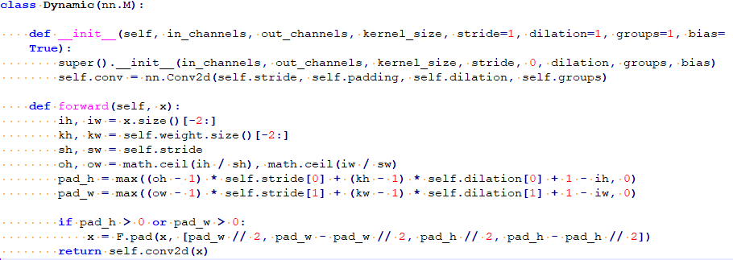

对于这种情况，x的大小往往是固定的，或者在固定的循环时是固定的，此时建议在init方法中将x的大小通过数组或固定值的方式提前写好，直接进行调用。如[图2](#fig15813225189)所示。

**图 2**  优化后模型定义<a name="fig15813225189"></a>  
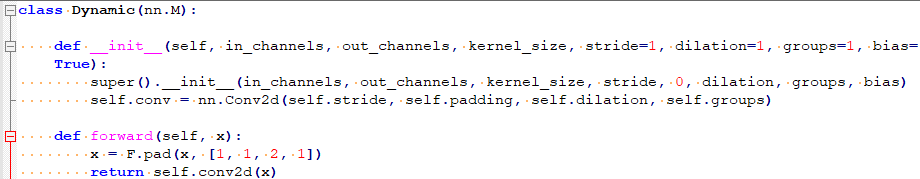

## pip install 安装torch包失败<a name="ZH-CN_TOPIC_0000002498353092"></a>

按照如下指令安装torch及torch相关依赖，出现代理错误。

```
python3.7.5 -m pip --trusted-host=download.pytorch.org install torch==1.10.2+cu102 torchvision==0.11.3+cu102 torchaudio==0.10.2 -f https://download.pytorch.org/whl/torch_stable.html
```

可以去https://download.pytorch.org/whl/torch\_stable.html网页，下载torchvision-0.11.3+cu102-cp37-cp37m-linux\_x86\_64.whl，torchaudio-0.10.2-cp37-cp37m-linux\_x86\_64.whl和torch-1.10.2+cu102-cp37-cp37m-linux\_x86\_64.whl，并通过pip install package\_name手动安装。

## onnx算子拆分场景说明<a name="ZH-CN_TOPIC_0000002498513074"></a>

**表 1**  onnx算子拆分场景说明

<a name="table3812mcpsimp"></a>
<table><thead align="left"><tr id="row3819mcpsimp"><th class="cellrowborder" valign="top" width="21.87%" id="mcps1.2.5.1.1"><p id="p39382420443"><a name="p39382420443"></a><a name="p39382420443"></a>原始算子</p>
</th>
<th class="cellrowborder" valign="top" width="17.96%" id="mcps1.2.5.1.2"><p id="p3823mcpsimp"><a name="p3823mcpsimp"></a><a name="p3823mcpsimp"></a>拆分后算子</p>
</th>
<th class="cellrowborder" valign="top" width="29.5%" id="mcps1.2.5.1.3"><p id="p3825mcpsimp"><a name="p3825mcpsimp"></a><a name="p3825mcpsimp"></a>（包含该算子拆分场景的）典型网络</p>
</th>
<th class="cellrowborder" valign="top" width="30.669999999999998%" id="mcps1.2.5.1.4"><p id="p135814441412"><a name="p135814441412"></a><a name="p135814441412"></a>torch.onnx.symbolic_opset版本号</p>
</th>
</tr>
</thead>
<tbody><tr id="row3829mcpsimp"><td class="cellrowborder" valign="top" width="21.87%" headers="mcps1.2.5.1.1 "><p id="p1749212724711"><a name="p1749212724711"></a><a name="p1749212724711"></a>chunk</p>
</td>
<td class="cellrowborder" valign="top" width="17.96%" headers="mcps1.2.5.1.2 "><p id="p78321244124420"><a name="p78321244124420"></a><a name="p78321244124420"></a>gather、Shape、Add、Div、Mul和Slice</p>
</td>
<td class="cellrowborder" valign="top" width="29.5%" headers="mcps1.2.5.1.3 "><p id="p184892137218"><a name="p184892137218"></a><a name="p184892137218"></a><strong id="b1489161312118"><a name="b1489161312118"></a><a name="b1489161312118"></a>ViT</strong></p>
</td>
<td class="cellrowborder" valign="top" width="30.669999999999998%" headers="mcps1.2.5.1.4 "><p id="p19358134418418"><a name="p19358134418418"></a><a name="p19358134418418"></a>opset_version13</p>
</td>
</tr>
</tbody>
</table>

AMCT量化过程中会对原始模型进行onnx导出，过程中部分算子会拆分成小算子的组合，如[表1](#table3812mcpsimp)所示。当前AMCT不会对拆分后的算子进行量化，建议将原始模型中的对应算子进行手动替换以实现量化。

## 安装python3-tk时提示错误信息<a name="ZH-CN_TOPIC_0000002530273021"></a>

问题描述：安装python3-tk依赖时，错误提示如[图1](#fig16788010493)所示。

**图 1**  错误提示信息<a name="fig16788010493"></a>  
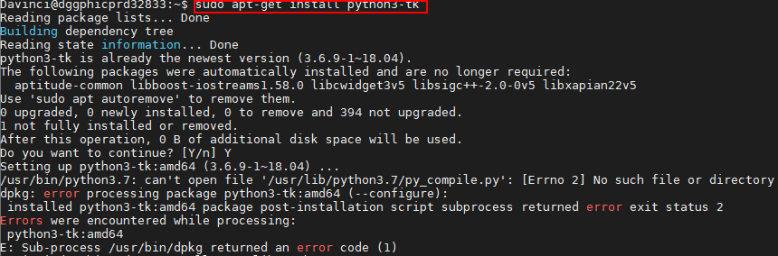

解决方案：

将缺失的文件py\_compile.py复制到/usr/lib/python3.7路径，然后重新安装。

```
cp /usr/local/python3.7.5/lib/python3.7/py_compile.py  /usr/lib/python3.7
```

/usr/local/python3.7.5/lib/python3.7/py\_compile.py请以该文件所在实际路径进行替换。

## 不支持输入大于两维且bias为True的linear量化<a name="ZH-CN_TOPIC_0000002530113057"></a>

linear算子在bias为True的情况下，AMCT默认该类型算子的数据量化带偏移值，with\_offset默认为true。在onnx转换过程中，如果该算子的输入张量的形状大于两维且bias=True，则linear会被转换为matmul和add算子，而atc仅支持matmul算子offset为0，所以AMCT也不支持这种算子的量化，但可以调整该类型算子的实现来规避。

方法一：

把linear算子的输入变成两维，经该算子后，得到的数据再还原回之前的形状。

```
class Model(torch.nn.Module):
    def __init__(self):
        super().__init__()
        self.linear = torch.nn.Linear(8, 4, bias=True)

    def forward(self, inputs):
        out1 = self.linear(inputs)

        # plan A
        b, c, w = inputs.data.shape
 
        out2 = self.linear(inputs.reshape(-1, w)).reshape(b, c, -1)
        return out1, out2

x = torch.randn(1, 4, 8)
model = Model()
model.eval()
out1, out2 = model(x)
assert torch.all(out1 == out2)

```

方法二：

把linear算子的换成1\*1卷积核的conv2d来实现，修改输入和还原输出的形状，加载原来模型的权重文件，把linear的权重和bias复制到新的conv2d中。

```
class Model(torch.nn.Module):
    def __init__(self):
        super().__init__()
        self.linear = torch.nn.Linear(8, 4, bias=True)
        self.conv = torch.nn.Conv2d(8, 4, 1, bias=True)

    def forward(self, inputs):
        out1 = self.linear(inputs)

        # plan B
        # inputs.shape: 3dims
        out2 = self.conv(inputs.unsqueeze(1).permute(0, 3, 1, 2)).permute(0, 2, 3, 1).squeeze(1)
        # inputs.shape: 4dims
        # out2 = self.conv(inputs.permute(0, 3, 1, 2)).permute(0, 2, 3, 1)
        return out1, out2

    def _load_from_state_dict(self, state_dict, prefix, local_metadata, strict,
                              missing_keys, unexpected_keys, error_msgs):
        state_dict['conv.weight'] = state_dict['linear.weight'].unsqueeze(-1).unsqueeze(-1)
        state_dict['conv.bias'] = state_dict['linear.bias']
        super()._load_from_state_dict(state_dict, prefix, local_metadata, strict,
                                      missing_keys, unexpected_keys, error_msgs)

x = torch.randn(1, 4, 8)
model = Model()
model.eval()
ckpt = torch.load(r'original_model.pt')
model.load_state_dict(ckpt)
out1, out2 = model(x)
assert torch.all(out1 == out2)

```

以上调整在保证修改前后输出等价之后，就可以删掉旧的代码了。

注意：当前场景的报错信息无法获取到具体哪个算子，请排查pytorch模型中的所有的linear算子。

## 离线计算卷积量化后转om报错<a name="ZH-CN_TOPIC_0000002498353094"></a>

离线计算卷积：输入是获取在线Tensor.data的卷积。

报错信息：\[ERROR\]\[OfflineCalc\]\[348\] \[conv2\]: float weight or bias is null, can't gen offline output!

原因：atc不支持量化的离线计算卷积。

解决：跳过离线计算卷积的量化。

方法一：在量化的config.json中，将报错的卷积的quant\_enable改为false，跳过量化。

方法二：在简易量化yml配skip\_layers: \['layer\_name'\]，在create\_quant\_config\_fx传入yml文件。

## 避免在pytorch模型脚本中引入无效的操作导致掉点<a name="ZH-CN_TOPIC_0000002498513076"></a>

无效操作示例：

-   切片前后数据相等
-   乘除1的操作
-   加减0的操作
-   sum\(\[tensor0, tensor1, tensor2\]\)，对多个tensor累加求和，第一个tensor会先加0，导致onnx中会出现加0的无效算子，建议改成tensor0+tensor1+tensor2。

解决：在pytorch模型脚本中引入上述无效操作，可能导致量化后模型掉点，请检查模型脚本中是否包含无效操作的代码并进行删除。

## 兄弟节点量化系数不一致导致atc报错<a name="ZH-CN_TOPIC_0000002530273023"></a>

报错信息：\[ERROR\]\[CheckDataTypeForOutputPrint\]\[604\] Op\[sub\_6\] input\[/Slice\_20 output 0\] quantize param data type\[S8\] scale\[0.998590\] offset\[-128.000000\] should equal to Op\[/mul 6/Mul\] input\[/Slice 20 output 0\] quantize param data type\(FP16\] scale\[1.000000\] offset\[0.000000\].

原因：Slice\_20子节点是sub\_6和/mul 6/Mul，sub\_6算子的量化系数是‘data type\[S8\] scale\[0.998590\] offset\[-128.000000\]’，/mul 6/Mul的量化系数是‘type\(FP16\] scale\[1.000000\] offset\[0.000000\]’，这两个兄弟节点的量化系数应该相等。

**图 1**  deploy\_model.onnx<a name="fig756113359912"></a>  
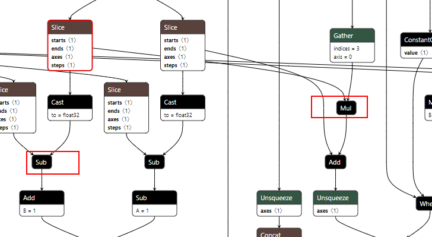

在deploy\_model.onnx中搜索sub\_6，可以看到slice和sub\_6中间有个cast算子，slice的子节点为cast和mul\_6，在amct中sub\_6和mul\_6算子不是兄弟节点。

**图 2**  cnn\_net\_tree\_parser.dot和quant\_param\_record.txt<a name="fig034516611109"></a>  
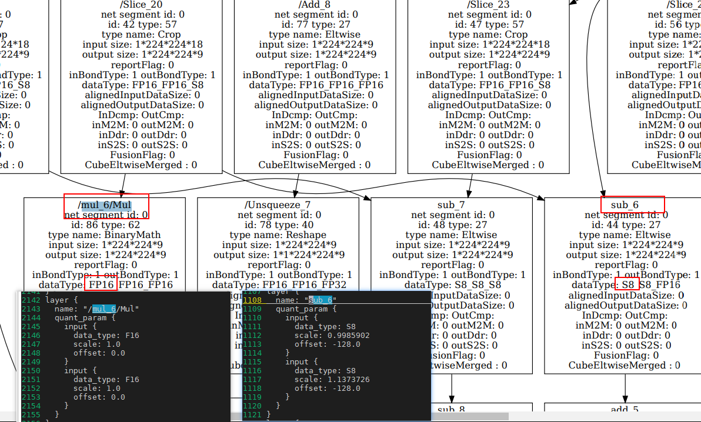

从atc生成的cnn\_net\_tree\_parser.dot转的pdf图模型中可以看到cast算子被融合掉，导致sub\_6和mul\_6算子变成了兄弟节点，此时amct生成的quant\_param\_record.txt中，sub\_6算子为s8量化，而mul\_6算子为fp16，兄弟节点量化系数不一致导致atc报错。

解决：

1.  在config.json中将sub\_6的量化开关关掉，此时sub\_6和mul\_6算子均不量化，数据类型均为fp16。
2.  cast算子在pytorch中是类型转换操作，有可能是fp32转fp32，属于无效算子，建议手动修改模型的代码，从源头消除cast算子。

以上问题，在其他结构中也可能出现，大部分都是atc融合导致，建议对比deploy\_model.onnx和atc生成的dot图模型，结合quant\_param\_record.txt量化系数，通过修改config.json和模型结构来处理。

## 找不到dot文件<a name="ZH-CN_TOPIC_0000002530113061"></a>

报错信息：FileNotFoundError: \[Errno 2\] No such file or directory: 'dot': 'dot'

报错原因：缺少graphviz工具。

解决方案：sudo apt-get install graphviz

## ModuleNotFoundError: No module named 'wheel' or No module named 'torch'<a name="ZH-CN_TOPIC_0000002498353096"></a>

报错原因：缺少wheel或torch安装包

解决方法：使用“pip list”查看python开发环境中，是否有wheel和torch。如果缺少wheel，则使用“pip install wheel”命令进行安装。如果缺少torch，参考[安装依赖](#ZH-CN_TOPIC_0000002442022337)中关于pytorch的安装。

## libcudart.so.\*: cannot open shared object file: No such file or directory<a name="ZH-CN_TOPIC_0000002498513080"></a>

报错原因：amct基于某一个版本的cuda进行编译，依赖了cuda的部分so包。

解决方法：1、按照[环境准备](#ZH-CN_TOPIC_0000002408423226)指导安装CUDA toolkit，2、保证torch的cuda版本和amct的cuda版本一致，如果不一致，先卸载torch和amct，然后安装对应版本的torch，再安装和torch的cuda版本一致的amct。

## mamtul第二路值域较宽导致掉点问题<a name="ZH-CN_TOPIC_0000002530273025"></a>

掉点原因：MatMul 算子第二路仅能执行8bit对称量化，当第二路浮点输入的范围值域较大（比如：-30.6857\~12.2666），量化到int8\(-128\~127\)，会导致scale值较大，从而产生较大量化误差较大。

解决方法： 将该mamtul的左右输入调换，使第一路进行做高精度量化，示例如下：

```
import torch 
A = torch.randn(1, 3, 3) 
B = torch.randn(1, 3, 3) 
assert torch.all(torch.matmul(A, B) == (torch.matmul(B.permute(0, 2, 1), A.permute(0, 2, 1))).permute(0, 2, 1))
```

# 附录<a name="ZH-CN_TOPIC_0000002530113063"></a>


## 支持量化的算子列表<a name="ZH-CN_TOPIC_0000002498353100"></a>

训练后量化，支持量化的层以及约束如下。

**表 1**  量化支持的层以及约束

<a name="table146mcpsimp"></a>
<table><thead align="left"><tr id="row154mcpsimp"><th class="cellrowborder" valign="top" width="11.16%" id="mcps1.2.5.1.1"><p id="entry155mcpsimpp0"><a name="entry155mcpsimpp0"></a><a name="entry155mcpsimpp0"></a>量化类型</p>
</th>
<th class="cellrowborder" valign="top" width="38.17%" id="mcps1.2.5.1.2"><p id="p157mcpsimp"><a name="p157mcpsimp"></a><a name="p157mcpsimp"></a>算子类型</p>
</th>
<th class="cellrowborder" valign="top" width="23.79%" id="mcps1.2.5.1.3"><p id="p159mcpsimp"><a name="p159mcpsimp"></a><a name="p159mcpsimp"></a>约束</p>
</th>
<th class="cellrowborder" valign="top" width="26.88%" id="mcps1.2.5.1.4"><p id="p161mcpsimp"><a name="p161mcpsimp"></a><a name="p161mcpsimp"></a>备注</p>
</th>
</tr>
</thead>
<tbody><tr id="row163mcpsimp"><td class="cellrowborder" rowspan="3" valign="top" width="11.16%" headers="mcps1.2.5.1.1 "><p id="p165mcpsimp"><a name="p165mcpsimp"></a><a name="p165mcpsimp"></a>支持权重及数据量化的层</p>
</td>
<td class="cellrowborder" valign="top" width="38.17%" headers="mcps1.2.5.1.2 "><p id="p167mcpsimp"><a name="p167mcpsimp"></a><a name="p167mcpsimp"></a>torch.nn.Linear</p>
</td>
<td class="cellrowborder" valign="top" width="23.79%" headers="mcps1.2.5.1.3 "><p id="p169mcpsimp"><a name="p169mcpsimp"></a><a name="p169mcpsimp"></a>-</p>
</td>
<td class="cellrowborder" rowspan="3" valign="top" width="26.88%" headers="mcps1.2.5.1.4 "><p id="p171mcpsimp"><a name="p171mcpsimp"></a><a name="p171mcpsimp"></a>复用层（共用weight和bias参数）支持量化。</p>
</td>
</tr>
<tr id="row172mcpsimp"><td class="cellrowborder" valign="top" headers="mcps1.2.5.1.1 "><p id="p174mcpsimp"><a name="p174mcpsimp"></a><a name="p174mcpsimp"></a>torch.nn.Conv2d</p>
</td>
<td class="cellrowborder" valign="top" headers="mcps1.2.5.1.2 "><p id="p176mcpsimp"><a name="p176mcpsimp"></a><a name="p176mcpsimp"></a>-</p>
</td>
</tr>
<tr id="row177mcpsimp"><td class="cellrowborder" valign="top" headers="mcps1.2.5.1.1 "><p id="p179mcpsimp"><a name="p179mcpsimp"></a><a name="p179mcpsimp"></a>torch.nn.ConvTranspose2d</p>
</td>
<td class="cellrowborder" valign="top" headers="mcps1.2.5.1.2 "><p id="p49825892615"><a name="p49825892615"></a><a name="p49825892615"></a>-</p>
</td>
</tr>
<tr id="row182mcpsimp"><td class="cellrowborder" rowspan="57" valign="top" width="11.16%" headers="mcps1.2.5.1.1 "><p id="p184mcpsimp"><a name="p184mcpsimp"></a><a name="p184mcpsimp"></a>支持数据量化的层</p>
<p id="p9479104363012"><a name="p9479104363012"></a><a name="p9479104363012"></a></p>
<p id="p1154103892513"><a name="p1154103892513"></a><a name="p1154103892513"></a></p>
<p id="p10257194211251"><a name="p10257194211251"></a><a name="p10257194211251"></a></p>
<p id="p12912152914819"><a name="p12912152914819"></a><a name="p12912152914819"></a></p>
<p id="p1448853324811"><a name="p1448853324811"></a><a name="p1448853324811"></a></p>
</td>
<td class="cellrowborder" valign="top" width="38.17%" headers="mcps1.2.5.1.2 "><p id="p741813710107"><a name="p741813710107"></a><a name="p741813710107"></a>torch.nn.MaxPool2d,</p>
<p id="p186mcpsimp"><a name="p186mcpsimp"></a><a name="p186mcpsimp"></a>torch.nn.functional.max_pool2d</p>
</td>
<td class="cellrowborder" valign="top" width="23.79%" headers="mcps1.2.5.1.3 "><p id="entry187mcpsimpp0"><a name="entry187mcpsimpp0"></a><a name="entry187mcpsimpp0"></a>-</p>
</td>
<td class="cellrowborder" valign="top" width="26.88%" headers="mcps1.2.5.1.4 "><p id="entry188mcpsimpp0"><a name="entry188mcpsimpp0"></a><a name="entry188mcpsimpp0"></a>-</p>
</td>
</tr>
<tr id="row123911933121820"><td class="cellrowborder" valign="top" headers="mcps1.2.5.1.1 "><p id="p343784011013"><a name="p343784011013"></a><a name="p343784011013"></a>torch.nn.AvgPool2d</p>
<p id="p336mcpsimp"><a name="p336mcpsimp"></a><a name="p336mcpsimp"></a>torch.nn.functional.avg_pool2d,</p>
</td>
<td class="cellrowborder" valign="top" headers="mcps1.2.5.1.2 "><p id="p18391033141817"><a name="p18391033141817"></a><a name="p18391033141817"></a>-</p>
</td>
<td class="cellrowborder" valign="top" headers="mcps1.2.5.1.3 "><p id="p2039119338185"><a name="p2039119338185"></a><a name="p2039119338185"></a>-</p>
</td>
</tr>
<tr id="row189mcpsimp"><td class="cellrowborder" valign="top" headers="mcps1.2.5.1.1 "><p id="p10977114371016"><a name="p10977114371016"></a><a name="p10977114371016"></a>torch.nn.AdaptiveMaxPool2d</p>
<p id="p191mcpsimp"><a name="p191mcpsimp"></a><a name="p191mcpsimp"></a>torch.nn.functional.adaptive_max_pool2d</p>
</td>
<td class="cellrowborder" valign="top" headers="mcps1.2.5.1.2 "><p id="entry192mcpsimpp0"><a name="entry192mcpsimpp0"></a><a name="entry192mcpsimpp0"></a>-</p>
</td>
<td class="cellrowborder" valign="top" headers="mcps1.2.5.1.3 "><p id="entry193mcpsimpp0"><a name="entry193mcpsimpp0"></a><a name="entry193mcpsimpp0"></a>-</p>
</td>
</tr>
<tr id="row194mcpsimp"><td class="cellrowborder" valign="top" headers="mcps1.2.5.1.1 "><p id="p82081247171014"><a name="p82081247171014"></a><a name="p82081247171014"></a>torch.nn.AdaptiveAvgPool2d</p>
<p id="p196mcpsimp"><a name="p196mcpsimp"></a><a name="p196mcpsimp"></a>torch.nn.functional.adaptive_avg_pool2d</p>
</td>
<td class="cellrowborder" valign="top" headers="mcps1.2.5.1.2 "><p id="entry197mcpsimpp0"><a name="entry197mcpsimpp0"></a><a name="entry197mcpsimpp0"></a>-</p>
</td>
<td class="cellrowborder" valign="top" headers="mcps1.2.5.1.3 "><p id="entry198mcpsimpp0"><a name="entry198mcpsimpp0"></a><a name="entry198mcpsimpp0"></a>-</p>
</td>
</tr>
<tr id="row1653824712014"><td class="cellrowborder" valign="top" headers="mcps1.2.5.1.1 "><p id="p153819470200"><a name="p153819470200"></a><a name="p153819470200"></a>torch.nn.LayerNorm</p>
</td>
<td class="cellrowborder" valign="top" headers="mcps1.2.5.1.2 "><p id="p7538647102011"><a name="p7538647102011"></a><a name="p7538647102011"></a>-</p>
</td>
<td class="cellrowborder" valign="top" headers="mcps1.2.5.1.3 "><p id="p15539547132018"><a name="p15539547132018"></a><a name="p15539547132018"></a>-</p>
</td>
</tr>
<tr id="row199mcpsimp"><td class="cellrowborder" valign="top" headers="mcps1.2.5.1.1 "><p id="p1518785913114"><a name="p1518785913114"></a><a name="p1518785913114"></a>+(operator.add)</p>
<p id="p659791201212"><a name="p659791201212"></a><a name="p659791201212"></a>torch.add</p>
<p id="p201mcpsimp"><a name="p201mcpsimp"></a><a name="p201mcpsimp"></a>Tensor.add</p>
<p id="p1672474714113"><a name="p1672474714113"></a><a name="p1672474714113"></a>Tensor.add_(inplace不推荐使用）</p>
</td>
<td class="cellrowborder" valign="top" headers="mcps1.2.5.1.2 "><p id="p203mcpsimp"><a name="p203mcpsimp"></a><a name="p203mcpsimp"></a>至少有一路输入类型是Tensor</p>
</td>
<td class="cellrowborder" valign="top" headers="mcps1.2.5.1.3 "><p id="p266612714812"><a name="p266612714812"></a><a name="p266612714812"></a>-</p>
</td>
</tr>
<tr id="row135713285221"><td class="cellrowborder" valign="top" headers="mcps1.2.5.1.1 "><p id="p710263684417"><a name="p710263684417"></a><a name="p710263684417"></a>-(operator.sub)</p>
<p id="p8736138101212"><a name="p8736138101212"></a><a name="p8736138101212"></a>torch.sub</p>
<p id="p155711228182215"><a name="p155711228182215"></a><a name="p155711228182215"></a>Tensor.sub</p>
<p id="p189671924134310"><a name="p189671924134310"></a><a name="p189671924134310"></a>Tensor.sub_(inplace不推荐使用）</p>
</td>
<td class="cellrowborder" valign="top" headers="mcps1.2.5.1.2 "><p id="p16571162832213"><a name="p16571162832213"></a><a name="p16571162832213"></a>至少有一路输入类型是Tensor</p>
</td>
<td class="cellrowborder" valign="top" headers="mcps1.2.5.1.3 "><p id="p1866610271385"><a name="p1866610271385"></a><a name="p1866610271385"></a>-</p>
</td>
</tr>
<tr id="row207mcpsimp"><td class="cellrowborder" valign="top" headers="mcps1.2.5.1.1 "><p id="p29561910131212"><a name="p29561910131212"></a><a name="p29561910131212"></a>*(operator.mul)</p>
<p id="p360741413121"><a name="p360741413121"></a><a name="p360741413121"></a>torch.mul</p>
<p id="p209mcpsimp"><a name="p209mcpsimp"></a><a name="p209mcpsimp"></a>Tensor.mul</p>
<p id="p463014302073"><a name="p463014302073"></a><a name="p463014302073"></a>Tensor.mul_(inplace不推荐使用）</p>
</td>
<td class="cellrowborder" valign="top" headers="mcps1.2.5.1.2 "><p id="p211mcpsimp"><a name="p211mcpsimp"></a><a name="p211mcpsimp"></a>至少有一路输入类型是Tensor</p>
</td>
<td class="cellrowborder" valign="top" headers="mcps1.2.5.1.3 "><p id="p2066612271785"><a name="p2066612271785"></a><a name="p2066612271785"></a>-</p>
</td>
</tr>
<tr id="row343410238388"><td class="cellrowborder" valign="top" headers="mcps1.2.5.1.1 "><p id="p1355722117128"><a name="p1355722117128"></a><a name="p1355722117128"></a>/(operator.truediv)</p>
<p id="p12548182441220"><a name="p12548182441220"></a><a name="p12548182441220"></a>torch.div</p>
<p id="p6435142383816"><a name="p6435142383816"></a><a name="p6435142383816"></a>Tensor.div</p>
<p id="p1824016411394"><a name="p1824016411394"></a><a name="p1824016411394"></a>Tensor.div_(inplace不推荐使用）</p>
</td>
<td class="cellrowborder" valign="top" headers="mcps1.2.5.1.2 "><p id="p1243512318380"><a name="p1243512318380"></a><a name="p1243512318380"></a>至少有一路输入类型是Tensor</p>
</td>
<td class="cellrowborder" valign="top" headers="mcps1.2.5.1.3 "><p id="p1543514235387"><a name="p1543514235387"></a><a name="p1543514235387"></a>-</p>
</td>
</tr>
<tr id="row10288170135919"><td class="cellrowborder" valign="top" headers="mcps1.2.5.1.1 "><p id="p546711272121"><a name="p546711272121"></a><a name="p546711272121"></a>**(operator.pow)</p>
<p id="p135170291126"><a name="p135170291126"></a><a name="p135170291126"></a>torch.pow,</p>
<p id="p17288170145915"><a name="p17288170145915"></a><a name="p17288170145915"></a>Tensor.pow</p>
<p id="p942825913910"><a name="p942825913910"></a><a name="p942825913910"></a>Tensor.pow_(inplace不推荐使用）</p>
</td>
<td class="cellrowborder" valign="top" headers="mcps1.2.5.1.2 "><p id="p928819015912"><a name="p928819015912"></a><a name="p928819015912"></a>至少有一路输入类型是Tensor</p>
</td>
<td class="cellrowborder" valign="top" headers="mcps1.2.5.1.3 "><p id="p172881608592"><a name="p172881608592"></a><a name="p172881608592"></a>-</p>
</td>
</tr>
<tr id="row1987415661618"><td class="cellrowborder" valign="top" headers="mcps1.2.5.1.1 "><p id="p887419601614"><a name="p887419601614"></a><a name="p887419601614"></a>torch.bmm</p>
</td>
<td class="cellrowborder" valign="top" headers="mcps1.2.5.1.2 "><p id="p1487519617163"><a name="p1487519617163"></a><a name="p1487519617163"></a>-</p>
</td>
<td class="cellrowborder" valign="top" headers="mcps1.2.5.1.3 "><p id="p15875968166"><a name="p15875968166"></a><a name="p15875968166"></a>-</p>
</td>
</tr>
<tr id="row1951213559181"><td class="cellrowborder" valign="top" headers="mcps1.2.5.1.1 "><p id="p8849175541812"><a name="p8849175541812"></a><a name="p8849175541812"></a>torch.sum</p>
</td>
<td class="cellrowborder" valign="top" headers="mcps1.2.5.1.2 "><p id="p451275521819"><a name="p451275521819"></a><a name="p451275521819"></a>-</p>
</td>
<td class="cellrowborder" valign="top" headers="mcps1.2.5.1.3 "><p id="p351220551180"><a name="p351220551180"></a><a name="p351220551180"></a>-</p>
</td>
</tr>
<tr id="row175394810813"><td class="cellrowborder" valign="top" headers="mcps1.2.5.1.1 "><p id="p165391989819"><a name="p165391989819"></a><a name="p165391989819"></a>torch.matmul</p>
<p id="p32041188811"><a name="p32041188811"></a><a name="p32041188811"></a>operator.matmul</p>
<p id="p3103544487"><a name="p3103544487"></a><a name="p3103544487"></a>Tensor.matmul</p>
</td>
<td class="cellrowborder" valign="top" headers="mcps1.2.5.1.2 "><p id="p15447151654116"><a name="p15447151654116"></a><a name="p15447151654116"></a>不支持对离线输入的constant常量和parameter进行量化场景</p>
</td>
<td class="cellrowborder" valign="top" headers="mcps1.2.5.1.3 "><p id="p1453916811817"><a name="p1453916811817"></a><a name="p1453916811817"></a>-</p>
</td>
</tr>
<tr id="row1549415873515"><td class="cellrowborder" valign="top" headers="mcps1.2.5.1.1 "><p id="p174941987355"><a name="p174941987355"></a><a name="p174941987355"></a>torch.abs</p>
<p id="p14175416123515"><a name="p14175416123515"></a><a name="p14175416123515"></a>Tensor.abs</p>
<p id="p8717151264117"><a name="p8717151264117"></a><a name="p8717151264117"></a>Tensor.abs_(inplace不推荐使用）</p>
</td>
<td class="cellrowborder" valign="top" headers="mcps1.2.5.1.2 "><p id="p1449418883516"><a name="p1449418883516"></a><a name="p1449418883516"></a>-</p>
</td>
<td class="cellrowborder" valign="top" headers="mcps1.2.5.1.3 "><p id="p54942820354"><a name="p54942820354"></a><a name="p54942820354"></a>-</p>
</td>
</tr>
<tr id="row855717206173"><td class="cellrowborder" valign="top" headers="mcps1.2.5.1.1 "><p id="p37051933151416"><a name="p37051933151416"></a><a name="p37051933151416"></a>torch.max</p>
<p id="p45122111719"><a name="p45122111719"></a><a name="p45122111719"></a>Tensor.max</p>
</td>
<td class="cellrowborder" valign="top" headers="mcps1.2.5.1.2 "><p id="p12558320191713"><a name="p12558320191713"></a><a name="p12558320191713"></a>keepdim=True</p>
</td>
<td class="cellrowborder" valign="top" headers="mcps1.2.5.1.3 "><p id="p9558122012174"><a name="p9558122012174"></a><a name="p9558122012174"></a>-</p>
</td>
</tr>
<tr id="row3287155210177"><td class="cellrowborder" valign="top" headers="mcps1.2.5.1.1 "><p id="p1929614364145"><a name="p1929614364145"></a><a name="p1929614364145"></a>torch.min</p>
<p id="p393025214172"><a name="p393025214172"></a><a name="p393025214172"></a>Tensor.min</p>
</td>
<td class="cellrowborder" valign="top" headers="mcps1.2.5.1.2 "><p id="p142879520173"><a name="p142879520173"></a><a name="p142879520173"></a>-</p>
</td>
<td class="cellrowborder" valign="top" headers="mcps1.2.5.1.3 "><p id="p92871852201710"><a name="p92871852201710"></a><a name="p92871852201710"></a>-</p>
</td>
</tr>
<tr id="row137818741816"><td class="cellrowborder" valign="top" headers="mcps1.2.5.1.1 "><p id="p4797145141112"><a name="p4797145141112"></a><a name="p4797145141112"></a>Tensor.mean</p>
<p id="p1826019814187"><a name="p1826019814187"></a><a name="p1826019814187"></a>torch.mean</p>
</td>
<td class="cellrowborder" valign="top" headers="mcps1.2.5.1.2 "><p id="p1781579186"><a name="p1781579186"></a><a name="p1781579186"></a>-</p>
</td>
<td class="cellrowborder" valign="top" headers="mcps1.2.5.1.3 "><p id="p1678197111818"><a name="p1678197111818"></a><a name="p1678197111818"></a>-</p>
</td>
</tr>
<tr id="row14729154971916"><td class="cellrowborder" valign="top" headers="mcps1.2.5.1.1 "><p id="p152481050111118"><a name="p152481050111118"></a><a name="p152481050111118"></a>torch.clamp</p>
<p id="p18253115021911"><a name="p18253115021911"></a><a name="p18253115021911"></a>Tensor.clamp</p>
<p id="p10208986421"><a name="p10208986421"></a><a name="p10208986421"></a>Tensor.clamp_(inplace不推荐使用）</p>
</td>
<td class="cellrowborder" valign="top" headers="mcps1.2.5.1.2 "><p id="p157295499199"><a name="p157295499199"></a><a name="p157295499199"></a>-</p>
</td>
<td class="cellrowborder" valign="top" headers="mcps1.2.5.1.3 "><p id="p1173012491192"><a name="p1173012491192"></a><a name="p1173012491192"></a>-</p>
</td>
</tr>
<tr id="row8104175031110"><td class="cellrowborder" valign="top" headers="mcps1.2.5.1.1 "><p id="p139627411195"><a name="p139627411195"></a><a name="p139627411195"></a>torch.permute</p>
<p id="p1596217418913"><a name="p1596217418913"></a><a name="p1596217418913"></a>Tensor.permute</p>
</td>
<td class="cellrowborder" valign="top" headers="mcps1.2.5.1.2 "><p id="p13105115012116"><a name="p13105115012116"></a><a name="p13105115012116"></a>-</p>
</td>
<td class="cellrowborder" valign="top" headers="mcps1.2.5.1.3 "><p id="p111056503115"><a name="p111056503115"></a><a name="p111056503115"></a>-</p>
</td>
</tr>
<tr id="row195203791214"><td class="cellrowborder" valign="top" headers="mcps1.2.5.1.1 "><p id="p10342168181219"><a name="p10342168181219"></a><a name="p10342168181219"></a>torch.nn.Upsample</p>
<p id="p1623312561171"><a name="p1623312561171"></a><a name="p1623312561171"></a>torch.nn.functional.upsample</p>
</td>
<td class="cellrowborder" valign="top" headers="mcps1.2.5.1.2 "><p id="p352127141212"><a name="p352127141212"></a><a name="p352127141212"></a>-</p>
</td>
<td class="cellrowborder" valign="top" headers="mcps1.2.5.1.3 "><p id="p752111711121"><a name="p752111711121"></a><a name="p752111711121"></a>-</p>
</td>
</tr>
<tr id="row732455713125"><td class="cellrowborder" valign="top" headers="mcps1.2.5.1.1 "><p id="p15882105791217"><a name="p15882105791217"></a><a name="p15882105791217"></a>torch.nn.functional.interpolate</p>
</td>
<td class="cellrowborder" valign="top" headers="mcps1.2.5.1.2 "><p id="p10324157171216"><a name="p10324157171216"></a><a name="p10324157171216"></a>-</p>
</td>
<td class="cellrowborder" valign="top" headers="mcps1.2.5.1.3 "><p id="p1325457101215"><a name="p1325457101215"></a><a name="p1325457101215"></a>-</p>
</td>
</tr>
<tr id="row239mcpsimp"><td class="cellrowborder" valign="top" headers="mcps1.2.5.1.1 "><p id="p44984541106"><a name="p44984541106"></a><a name="p44984541106"></a>Tensor.transpose</p>
<p id="p241mcpsimp"><a name="p241mcpsimp"></a><a name="p241mcpsimp"></a>torch.transpose</p>
</td>
<td class="cellrowborder" valign="top" headers="mcps1.2.5.1.2 "><p id="entry242mcpsimpp0"><a name="entry242mcpsimpp0"></a><a name="entry242mcpsimpp0"></a>-</p>
</td>
<td class="cellrowborder" valign="top" headers="mcps1.2.5.1.3 "><p id="p38161532189"><a name="p38161532189"></a><a name="p38161532189"></a>-</p>
</td>
</tr>
<tr id="row1536719410917"><td class="cellrowborder" valign="top" headers="mcps1.2.5.1.1 "><p id="p26817685720"><a name="p26817685720"></a><a name="p26817685720"></a>torch.concat</p>
</td>
<td class="cellrowborder" valign="top" headers="mcps1.2.5.1.2 "><p id="p15367841993"><a name="p15367841993"></a><a name="p15367841993"></a>-</p>
</td>
<td class="cellrowborder" valign="top" headers="mcps1.2.5.1.3 "><p id="p13672411596"><a name="p13672411596"></a><a name="p13672411596"></a>-</p>
</td>
</tr>
<tr id="row245mcpsimp"><td class="cellrowborder" valign="top" headers="mcps1.2.5.1.1 "><p id="p247mcpsimp"><a name="p247mcpsimp"></a><a name="p247mcpsimp"></a>torch.cat</p>
</td>
<td class="cellrowborder" valign="top" headers="mcps1.2.5.1.2 "><p id="entry248mcpsimpp0"><a name="entry248mcpsimpp0"></a><a name="entry248mcpsimpp0"></a>-</p>
</td>
<td class="cellrowborder" valign="top" headers="mcps1.2.5.1.3 "><p id="p14816153217816"><a name="p14816153217816"></a><a name="p14816153217816"></a>-</p>
</td>
</tr>
<tr id="row9722111651514"><td class="cellrowborder" valign="top" headers="mcps1.2.5.1.1 "><p id="p7722416151517"><a name="p7722416151517"></a><a name="p7722416151517"></a>torch.stack</p>
</td>
<td class="cellrowborder" valign="top" headers="mcps1.2.5.1.2 "><p id="p137226161154"><a name="p137226161154"></a><a name="p137226161154"></a>-</p>
</td>
<td class="cellrowborder" valign="top" headers="mcps1.2.5.1.3 "><p id="p117231716101515"><a name="p117231716101515"></a><a name="p117231716101515"></a>-</p>
</td>
</tr>
<tr id="row62561548873"><td class="cellrowborder" valign="top" headers="mcps1.2.5.1.1 "><p id="p15544103135814"><a name="p15544103135814"></a><a name="p15544103135814"></a>Tensor.flatten</p>
<p id="p733111115811"><a name="p733111115811"></a><a name="p733111115811"></a>torch.flatten</p>
</td>
<td class="cellrowborder" valign="top" headers="mcps1.2.5.1.2 "><p id="p19256848773"><a name="p19256848773"></a><a name="p19256848773"></a>和非shape类算子搭配使用时才量化</p>
</td>
<td class="cellrowborder" valign="top" headers="mcps1.2.5.1.3 "><p id="p132566481675"><a name="p132566481675"></a><a name="p132566481675"></a>-</p>
</td>
</tr>
<tr id="row2199645105818"><td class="cellrowborder" valign="top" headers="mcps1.2.5.1.1 "><p id="p19978851009"><a name="p19978851009"></a><a name="p19978851009"></a>torch.squeeze</p>
<p id="p0889145512582"><a name="p0889145512582"></a><a name="p0889145512582"></a>Tensor.squeeze</p>
</td>
<td class="cellrowborder" valign="top" headers="mcps1.2.5.1.2 "><p id="p619994514586"><a name="p619994514586"></a><a name="p619994514586"></a>和非shape类算子搭配使用时才量化</p>
</td>
<td class="cellrowborder" valign="top" headers="mcps1.2.5.1.3 "><p id="p31991145115819"><a name="p31991145115819"></a><a name="p31991145115819"></a>-</p>
</td>
</tr>
<tr id="row19204232155717"><td class="cellrowborder" valign="top" headers="mcps1.2.5.1.1 "><p id="p159516404586"><a name="p159516404586"></a><a name="p159516404586"></a>torch.unsqueeze</p>
<p id="p10983129855"><a name="p10983129855"></a><a name="p10983129855"></a>Tensor.unsqueeze</p>
</td>
<td class="cellrowborder" valign="top" headers="mcps1.2.5.1.2 "><p id="p1120418329576"><a name="p1120418329576"></a><a name="p1120418329576"></a>和非shape类算子搭配使用时才量化</p>
</td>
<td class="cellrowborder" valign="top" headers="mcps1.2.5.1.3 "><p id="p9204103265717"><a name="p9204103265717"></a><a name="p9204103265717"></a>-</p>
</td>
</tr>
<tr id="row104591472591"><td class="cellrowborder" valign="top" headers="mcps1.2.5.1.1 "><p id="p54871721112"><a name="p54871721112"></a><a name="p54871721112"></a>Tensor.reshape</p>
<p id="p11024301814"><a name="p11024301814"></a><a name="p11024301814"></a>torch.reshape</p>
</td>
<td class="cellrowborder" valign="top" headers="mcps1.2.5.1.2 "><p id="p1745911718595"><a name="p1745911718595"></a><a name="p1745911718595"></a>和非shape类算子搭配使用时才量化</p>
</td>
<td class="cellrowborder" valign="top" headers="mcps1.2.5.1.3 "><p id="p124591372596"><a name="p124591372596"></a><a name="p124591372596"></a>-</p>
</td>
</tr>
<tr id="row46017419599"><td class="cellrowborder" valign="top" headers="mcps1.2.5.1.1 "><p id="p19614416592"><a name="p19614416592"></a><a name="p19614416592"></a>Tensor.view</p>
</td>
<td class="cellrowborder" valign="top" headers="mcps1.2.5.1.2 "><p id="p66110419598"><a name="p66110419598"></a><a name="p66110419598"></a>和非shape类算子搭配使用时才量化</p>
</td>
<td class="cellrowborder" valign="top" headers="mcps1.2.5.1.3 "><p id="p1861542597"><a name="p1861542597"></a><a name="p1861542597"></a>-</p>
</td>
</tr>
<tr id="row4145102445720"><td class="cellrowborder" valign="top" headers="mcps1.2.5.1.1 "><p id="p1714517247577"><a name="p1714517247577"></a><a name="p1714517247577"></a>torch.split</p>
<p id="p1497383814418"><a name="p1497383814418"></a><a name="p1497383814418"></a>Tensor.split</p>
</td>
<td class="cellrowborder" valign="top" headers="mcps1.2.5.1.2 "><p id="p8145924105716"><a name="p8145924105716"></a><a name="p8145924105716"></a>-</p>
</td>
<td class="cellrowborder" valign="top" headers="mcps1.2.5.1.3 "><p id="p18145122495713"><a name="p18145122495713"></a><a name="p18145122495713"></a>-</p>
</td>
</tr>
<tr id="row634016118234"><td class="cellrowborder" valign="top" headers="mcps1.2.5.1.1 "><p id="p4959137161114"><a name="p4959137161114"></a><a name="p4959137161114"></a>torch.nn.ReLU</p>
<p id="p76972125112"><a name="p76972125112"></a><a name="p76972125112"></a>torch.nn.functional.relu</p>
<p id="p67181915201120"><a name="p67181915201120"></a><a name="p67181915201120"></a>torch.nn.functional.relu_(inplace不推荐使用）</p>
<p id="p72918257595"><a name="p72918257595"></a><a name="p72918257595"></a>Tensor.relu</p>
<p id="p1234031132315"><a name="p1234031132315"></a><a name="p1234031132315"></a>Tensor.relu_(inplace不推荐使用）</p>
</td>
<td class="cellrowborder" valign="top" headers="mcps1.2.5.1.2 "><p id="p6639037188"><a name="p6639037188"></a><a name="p6639037188"></a>该算子在Conv2d或ConvTranspose2d后面时不进行量化</p>
</td>
<td class="cellrowborder" valign="top" headers="mcps1.2.5.1.3 "><p id="p334021116236"><a name="p334021116236"></a><a name="p334021116236"></a>-</p>
</td>
</tr>
<tr id="row20407191051415"><td class="cellrowborder" valign="top" headers="mcps1.2.5.1.1 "><p id="p20407111011410"><a name="p20407111011410"></a><a name="p20407111011410"></a>torch.nn.ReLU6</p>
<p id="p47482033181418"><a name="p47482033181418"></a><a name="p47482033181418"></a>torch.nn.functional.relu6</p>
</td>
<td class="cellrowborder" valign="top" headers="mcps1.2.5.1.2 "><p id="p340781016143"><a name="p340781016143"></a><a name="p340781016143"></a>该算子在Conv2d或ConvTranspose2d后面时不进行量化</p>
</td>
<td class="cellrowborder" valign="top" headers="mcps1.2.5.1.3 "><p id="p13407910171412"><a name="p13407910171412"></a><a name="p13407910171412"></a>-</p>
</td>
</tr>
<tr id="row2420209122010"><td class="cellrowborder" valign="top" headers="mcps1.2.5.1.1 "><p id="p411782081115"><a name="p411782081115"></a><a name="p411782081115"></a>Tensor.sigmoid</p>
<p id="p14522135124411"><a name="p14522135124411"></a><a name="p14522135124411"></a>Tensor.sigmoid_(inplace不推荐使用）</p>
<p id="p14131111092013"><a name="p14131111092013"></a><a name="p14131111092013"></a>torch.nn.functional.sigmoid</p>
</td>
<td class="cellrowborder" valign="top" headers="mcps1.2.5.1.2 "><p id="p14204912011"><a name="p14204912011"></a><a name="p14204912011"></a>该算子在Conv2d或ConvTranspose2d后面时不进行量化</p>
</td>
<td class="cellrowborder" valign="top" headers="mcps1.2.5.1.3 "><p id="p54202918203"><a name="p54202918203"></a><a name="p54202918203"></a>-</p>
</td>
</tr>
<tr id="row1881183582017"><td class="cellrowborder" valign="top" headers="mcps1.2.5.1.1 "><p id="p1178953632017"><a name="p1178953632017"></a><a name="p1178953632017"></a>Tensor.tanh</p>
<p id="p8326511164510"><a name="p8326511164510"></a><a name="p8326511164510"></a>Tensor.tanh_(inplace不推荐使用）</p>
<p id="p178911361208"><a name="p178911361208"></a><a name="p178911361208"></a>torch.nn.Tanh</p>
<p id="p12789133610207"><a name="p12789133610207"></a><a name="p12789133610207"></a>torch.nn.functional.tanh</p>
</td>
<td class="cellrowborder" valign="top" headers="mcps1.2.5.1.2 "><p id="p178116357203"><a name="p178116357203"></a><a name="p178116357203"></a>该算子在Conv2d或ConvTranspose2d后面时不进行量化</p>
</td>
<td class="cellrowborder" valign="top" headers="mcps1.2.5.1.3 "><p id="p981193582018"><a name="p981193582018"></a><a name="p981193582018"></a>-</p>
</td>
</tr>
<tr id="row1064110619214"><td class="cellrowborder" valign="top" headers="mcps1.2.5.1.1 "><p id="p1477162871118"><a name="p1477162871118"></a><a name="p1477162871118"></a>torch.nn.LeakyReLU</p>
<p id="p19727730201117"><a name="p19727730201117"></a><a name="p19727730201117"></a>torch.nn.functional.leaky_relu</p>
<p id="p1890815720211"><a name="p1890815720211"></a><a name="p1890815720211"></a>torch.nn.functional.leaky_relu_(inplace不推荐使用）</p>
</td>
<td class="cellrowborder" valign="top" headers="mcps1.2.5.1.2 "><p id="p464117615210"><a name="p464117615210"></a><a name="p464117615210"></a>该算子在Conv2d或ConvTranspose2d后面时不进行量化</p>
</td>
<td class="cellrowborder" valign="top" headers="mcps1.2.5.1.3 "><p id="p18641146192118"><a name="p18641146192118"></a><a name="p18641146192118"></a>-</p>
</td>
</tr>
<tr id="row1532215278191"><td class="cellrowborder" valign="top" headers="mcps1.2.5.1.1 "><p id="p133223272191"><a name="p133223272191"></a><a name="p133223272191"></a>torch.nn.PReLU</p>
<p id="p19433203521919"><a name="p19433203521919"></a><a name="p19433203521919"></a>torch.nn.functional.prelu</p>
</td>
<td class="cellrowborder" valign="top" headers="mcps1.2.5.1.2 "><p id="p732202731911"><a name="p732202731911"></a><a name="p732202731911"></a>该算子在Conv2d或ConvTranspose2d后面时不进行量化</p>
</td>
<td class="cellrowborder" valign="top" headers="mcps1.2.5.1.3 "><p id="p532212716194"><a name="p532212716194"></a><a name="p532212716194"></a>-</p>
</td>
</tr>
<tr id="row176266361366"><td class="cellrowborder" valign="top" headers="mcps1.2.5.1.1 "><p id="p1462653643610"><a name="p1462653643610"></a><a name="p1462653643610"></a>torch.nn.GELU</p>
<p id="p1881154316368"><a name="p1881154316368"></a><a name="p1881154316368"></a>torch.nn.functional.gelu</p>
</td>
<td class="cellrowborder" valign="top" headers="mcps1.2.5.1.2 "><p id="p156268366367"><a name="p156268366367"></a><a name="p156268366367"></a>-</p>
</td>
<td class="cellrowborder" valign="top" headers="mcps1.2.5.1.3 "><p id="p176261336133616"><a name="p176261336133616"></a><a name="p176261336133616"></a>-</p>
</td>
</tr>
<tr id="row166054452210"><td class="cellrowborder" valign="top" headers="mcps1.2.5.1.1 "><p id="p156618449224"><a name="p156618449224"></a><a name="p156618449224"></a>torch.nn.Hardtanh</p>
<p id="p849462372414"><a name="p849462372414"></a><a name="p849462372414"></a>torch.nn.functional.hardtanh</p>
<p id="p207529339247"><a name="p207529339247"></a><a name="p207529339247"></a>torch.nn.functional.hardtanh_(inplace不推荐使用）</p>
</td>
<td class="cellrowborder" valign="top" headers="mcps1.2.5.1.2 "><p id="p1766194422212"><a name="p1766194422212"></a><a name="p1766194422212"></a>-</p>
</td>
<td class="cellrowborder" valign="top" headers="mcps1.2.5.1.3 "><p id="p26611444152210"><a name="p26611444152210"></a><a name="p26611444152210"></a>-</p>
</td>
</tr>
<tr id="row3605553142420"><td class="cellrowborder" valign="top" headers="mcps1.2.5.1.1 "><p id="p16840905710"><a name="p16840905710"></a><a name="p16840905710"></a>torch.nn.Softmax</p>
<p id="p712785518245"><a name="p712785518245"></a><a name="p712785518245"></a>torch.nn.functional.softmax</p>
</td>
<td class="cellrowborder" valign="top" headers="mcps1.2.5.1.2 "><p id="p8605453132419"><a name="p8605453132419"></a><a name="p8605453132419"></a>-</p>
</td>
<td class="cellrowborder" valign="top" headers="mcps1.2.5.1.3 "><p id="p3606165315249"><a name="p3606165315249"></a><a name="p3606165315249"></a>-</p>
</td>
</tr>
<tr id="row1256165216221"><td class="cellrowborder" valign="top" headers="mcps1.2.5.1.1 "><p id="p357105217227"><a name="p357105217227"></a><a name="p357105217227"></a>torch.nn.Softmax2d</p>
</td>
<td class="cellrowborder" valign="top" headers="mcps1.2.5.1.2 "><p id="p85795218226"><a name="p85795218226"></a><a name="p85795218226"></a>-</p>
</td>
<td class="cellrowborder" valign="top" headers="mcps1.2.5.1.3 "><p id="p185745242213"><a name="p185745242213"></a><a name="p185745242213"></a>-</p>
</td>
</tr>
<tr id="row105181331142513"><td class="cellrowborder" valign="top" headers="mcps1.2.5.1.1 "><p id="p12518183116252"><a name="p12518183116252"></a><a name="p12518183116252"></a>torch.nn.LogSoftmax</p>
<p id="p436441613418"><a name="p436441613418"></a><a name="p436441613418"></a>torch.nn.functional.log_softmax</p>
</td>
<td class="cellrowborder" valign="top" headers="mcps1.2.5.1.2 "><p id="p14518931132518"><a name="p14518931132518"></a><a name="p14518931132518"></a>-</p>
</td>
<td class="cellrowborder" valign="top" headers="mcps1.2.5.1.3 "><p id="p3518103172510"><a name="p3518103172510"></a><a name="p3518103172510"></a>-</p>
</td>
</tr>
<tr id="row8646155304811"><td class="cellrowborder" valign="top" headers="mcps1.2.5.1.1 "><p id="p92671336131114"><a name="p92671336131114"></a><a name="p92671336131114"></a>torch.nn.ELU</p>
<p id="p10287439181118"><a name="p10287439181118"></a><a name="p10287439181118"></a>torch.nn.functional.elu</p>
<p id="p1064619538481"><a name="p1064619538481"></a><a name="p1064619538481"></a>torch.nn.functional.elu_(inplace不推荐使用）</p>
</td>
<td class="cellrowborder" valign="top" headers="mcps1.2.5.1.2 "><p id="p9646145312484"><a name="p9646145312484"></a><a name="p9646145312484"></a>-</p>
</td>
<td class="cellrowborder" valign="top" headers="mcps1.2.5.1.3 "><p id="p16646553204819"><a name="p16646553204819"></a><a name="p16646553204819"></a>-</p>
</td>
</tr>
<tr id="row1220016231317"><td class="cellrowborder" valign="top" headers="mcps1.2.5.1.1 "><p id="p52001723153118"><a name="p52001723153118"></a><a name="p52001723153118"></a>torch.nn.LogSigmoid</p>
<p id="p9258104418328"><a name="p9258104418328"></a><a name="p9258104418328"></a>torch.nn.functional.logsigmoid</p>
</td>
<td class="cellrowborder" valign="top" headers="mcps1.2.5.1.2 "><p id="p1720032312311"><a name="p1720032312311"></a><a name="p1720032312311"></a>-</p>
</td>
<td class="cellrowborder" valign="top" headers="mcps1.2.5.1.3 "><p id="p1920015238319"><a name="p1920015238319"></a><a name="p1920015238319"></a>-</p>
</td>
</tr>
<tr id="row14822765313"><td class="cellrowborder" valign="top" headers="mcps1.2.5.1.1 "><p id="p1882296123110"><a name="p1882296123110"></a><a name="p1882296123110"></a>torch.nn.Softsign</p>
<p id="p9749547183312"><a name="p9749547183312"></a><a name="p9749547183312"></a>torch.nn.functional.softsign</p>
</td>
<td class="cellrowborder" valign="top" headers="mcps1.2.5.1.2 "><p id="p13822106133112"><a name="p13822106133112"></a><a name="p13822106133112"></a>作为激活函数默认不量化，如有需要可在量化配置文件中手动把hardtanh的量化开关打开</p>
</td>
<td class="cellrowborder" valign="top" headers="mcps1.2.5.1.3 "><p id="p17822664318"><a name="p17822664318"></a><a name="p17822664318"></a>-</p>
</td>
</tr>
<tr id="row6222101543118"><td class="cellrowborder" valign="top" headers="mcps1.2.5.1.1 "><p id="p172221015193118"><a name="p172221015193118"></a><a name="p172221015193118"></a>torch.nn.Softmin</p>
<p id="p141091659133317"><a name="p141091659133317"></a><a name="p141091659133317"></a>torch.nn.functional.softmin</p>
</td>
<td class="cellrowborder" valign="top" headers="mcps1.2.5.1.2 "><p id="p17222181518317"><a name="p17222181518317"></a><a name="p17222181518317"></a>-</p>
</td>
<td class="cellrowborder" valign="top" headers="mcps1.2.5.1.3 "><p id="p822291573114"><a name="p822291573114"></a><a name="p822291573114"></a>-</p>
</td>
</tr>
<tr id="row1830217128316"><td class="cellrowborder" valign="top" headers="mcps1.2.5.1.1 "><p id="p1330241217312"><a name="p1330241217312"></a><a name="p1330241217312"></a>torch.nn.Tanhshrink</p>
<p id="p66581256340"><a name="p66581256340"></a><a name="p66581256340"></a>torch.nn.functional.tanhshrink</p>
</td>
<td class="cellrowborder" valign="top" headers="mcps1.2.5.1.2 "><p id="p1630217125317"><a name="p1630217125317"></a><a name="p1630217125317"></a>-</p>
</td>
<td class="cellrowborder" valign="top" headers="mcps1.2.5.1.3 "><p id="p11302812133112"><a name="p11302812133112"></a><a name="p11302812133112"></a>-</p>
</td>
</tr>
<tr id="row174321810103411"><td class="cellrowborder" valign="top" headers="mcps1.2.5.1.1 "><p id="p1443221013413"><a name="p1443221013413"></a><a name="p1443221013413"></a>torch.nn.GLU</p>
<p id="p15274164114340"><a name="p15274164114340"></a><a name="p15274164114340"></a>torch.nn.functional.glu</p>
</td>
<td class="cellrowborder" valign="top" headers="mcps1.2.5.1.2 "><p id="p24321810123415"><a name="p24321810123415"></a><a name="p24321810123415"></a>-</p>
</td>
<td class="cellrowborder" valign="top" headers="mcps1.2.5.1.3 "><p id="p943281019342"><a name="p943281019342"></a><a name="p943281019342"></a>-</p>
</td>
</tr>
<tr id="row757413912319"><td class="cellrowborder" valign="top" headers="mcps1.2.5.1.1 "><p id="p1857499163113"><a name="p1857499163113"></a><a name="p1857499163113"></a>torch.nn.Hardswish</p>
<p id="p680192210472"><a name="p680192210472"></a><a name="p680192210472"></a>torch.nn.functional.hardswish</p>
</td>
<td class="cellrowborder" valign="top" headers="mcps1.2.5.1.2 "><p id="p357415963116"><a name="p357415963116"></a><a name="p357415963116"></a>-</p>
</td>
<td class="cellrowborder" valign="top" headers="mcps1.2.5.1.3 "><p id="p205745919313"><a name="p205745919313"></a><a name="p205745919313"></a>-</p>
</td>
</tr>
<tr id="row6335827194615"><td class="cellrowborder" valign="top" headers="mcps1.2.5.1.1 "><p id="p123361127134615"><a name="p123361127134615"></a><a name="p123361127134615"></a>torch.nn.SiLU</p>
<p id="p325154614717"><a name="p325154614717"></a><a name="p325154614717"></a>torch.nn.functional.silu</p>
</td>
<td class="cellrowborder" valign="top" headers="mcps1.2.5.1.2 "><p id="p13366273469"><a name="p13366273469"></a><a name="p13366273469"></a>-</p>
</td>
<td class="cellrowborder" valign="top" headers="mcps1.2.5.1.3 "><p id="p153369273465"><a name="p153369273465"></a><a name="p153369273465"></a>-</p>
</td>
</tr>
<tr id="row12777172317466"><td class="cellrowborder" valign="top" headers="mcps1.2.5.1.1 "><p id="p977812314462"><a name="p977812314462"></a><a name="p977812314462"></a>torch.nn.Mish</p>
<p id="p84971413154617"><a name="p84971413154617"></a><a name="p84971413154617"></a>torch.nn.functional.mish</p>
</td>
<td class="cellrowborder" valign="top" headers="mcps1.2.5.1.2 "><p id="p1477817235464"><a name="p1477817235464"></a><a name="p1477817235464"></a>-</p>
</td>
<td class="cellrowborder" valign="top" headers="mcps1.2.5.1.3 "><p id="p15778823134616"><a name="p15778823134616"></a><a name="p15778823134616"></a>-</p>
</td>
</tr>
<tr id="row7167431136"><td class="cellrowborder" valign="top" headers="mcps1.2.5.1.1 "><p id="p16164433316"><a name="p16164433316"></a><a name="p16164433316"></a>torch.nn.BatchNorm2d</p>
</td>
<td class="cellrowborder" valign="top" headers="mcps1.2.5.1.2 "><p id="p51624320315"><a name="p51624320315"></a><a name="p51624320315"></a>-</p>
</td>
<td class="cellrowborder" valign="top" headers="mcps1.2.5.1.3 "><p id="p916194317310"><a name="p916194317310"></a><a name="p916194317310"></a>-</p>
</td>
</tr>
<tr id="row2047814393018"><td class="cellrowborder" valign="top" headers="mcps1.2.5.1.1 "><p id="p141316485308"><a name="p141316485308"></a><a name="p141316485308"></a>torch.nn.SyncBatchNorm2d</p>
</td>
<td class="cellrowborder" valign="top" headers="mcps1.2.5.1.2 "><p id="p0479543193011"><a name="p0479543193011"></a><a name="p0479543193011"></a>不和Conv融合时，会单独做激活量化</p>
</td>
<td class="cellrowborder" valign="top" headers="mcps1.2.5.1.3 ">&nbsp;&nbsp;</td>
</tr>
<tr id="row185410384258"><td class="cellrowborder" valign="top" headers="mcps1.2.5.1.1 "><p id="p1454153811251"><a name="p1454153811251"></a><a name="p1454153811251"></a>amct.nn.SpaceToDepth</p>
</td>
<td class="cellrowborder" valign="top" headers="mcps1.2.5.1.2 "><p id="p7542386257"><a name="p7542386257"></a><a name="p7542386257"></a>-</p>
</td>
<td class="cellrowborder" valign="top" headers="mcps1.2.5.1.3 "><p id="p554153872510"><a name="p554153872510"></a><a name="p554153872510"></a>对应onnx 算子中的SpaceToDepth，不同于torch.nn.PixelUnshuffle , 和amct.nn.DepthToSpace成对使用。</p>
</td>
</tr>
<tr id="row1225734282518"><td class="cellrowborder" valign="top" headers="mcps1.2.5.1.1 "><p id="p6257154262517"><a name="p6257154262517"></a><a name="p6257154262517"></a>amct.nn.DepthToSpace</p>
</td>
<td class="cellrowborder" valign="top" headers="mcps1.2.5.1.2 "><p id="p3257154252510"><a name="p3257154252510"></a><a name="p3257154252510"></a>-</p>
</td>
<td class="cellrowborder" valign="top" headers="mcps1.2.5.1.3 "><p id="p625714429250"><a name="p625714429250"></a><a name="p625714429250"></a>对应onnx 算子中的DepthToSpace的DCR模式，不同于torch.nn.PixelShuffle, PixelShuffle, 对应的是DepthToSpace的CRD模式。</p>
</td>
</tr>
<tr id="row291211291482"><td class="cellrowborder" valign="top" headers="mcps1.2.5.1.1 "><p id="p18912122944817"><a name="p18912122944817"></a><a name="p18912122944817"></a>amct.nn.Warp</p>
</td>
<td class="cellrowborder" valign="top" headers="mcps1.2.5.1.2 "><p id="p791311293485"><a name="p791311293485"></a><a name="p791311293485"></a>-</p>
</td>
<td class="cellrowborder" rowspan="2" valign="top" headers="mcps1.2.5.1.3 "><p id="p1660695813597"><a name="p1660695813597"></a><a name="p1660695813597"></a>对应torch算子中的torch.nn.functional.grid_sample其参数为mode='nearest', align_corners=True, padding_mode='border'，Warp是对自定义roi范围进行处理，GlobalWarp默认对全局数据处理。</p>
</td>
</tr>
<tr id="row24886338487"><td class="cellrowborder" valign="top" headers="mcps1.2.5.1.1 "><p id="p15489153364815"><a name="p15489153364815"></a><a name="p15489153364815"></a>amct.nn.GlobalWarp</p>
</td>
<td class="cellrowborder" valign="top" headers="mcps1.2.5.1.2 "><p id="p1548923354817"><a name="p1548923354817"></a><a name="p1548923354817"></a>-</p>
</td>
</tr>
</tbody>
</table>

## 静态图简易量化配置功能说明<a name="ZH-CN_TOPIC_0000002498513082"></a>

静态图简易量化配置功能支持用户通过自定义yaml格式文件生成量化配置，提供简易量化配置yaml文件示例内容如下（用户可根据需求自定义修改）。

```
# Layer name not to be quantized
skip_layers: []

# om.json generated from model convert for config calibration
#
om_config:
  mapping_file: "./om_json/resnet50.om.json"

# default config
common_config:
  {
    weight_quant_params:
      {
        quantizer: "ArqWeightFakeQuantize",
        quantizer_args:
          {
            observer: "ArqObserver",
            num_bits: 8,
          }
      },
    activation_quant_params:
      {
        quantizer: "UlqFakeQuantize",
        quantizer_args:
          {
            num_bits: 8,
            observer: "IFMRObserver",
          }
      }
  }


# layer config user defined for overriding
override_layer_configs:
  [
    {
      layer_name: "fc",
      weight_quant_params:
        {
          quantizer: "ArqWeightFakeQuantize",
          quantizer_args:
            {
              observer: "ArqObserver",
              num_bits: 8,
              channel_wise: false
            }
        },
      activation_quant_params:
        {
          quantizer: "UlqFakeQuantize",
          quantizer_args:
            {
              num_bits: 8,
              observer: "IFMRObserver",
            }
        }
    },
    {
      # User-defined or third-party quantization algorithm
      layer_name: "conv1",
      weight_quant_params:
        {
          quantizer: "torch.quantization.FakeQuantize",
          quantizer_args:
            {
              observer: "torch.quantization.PerChannelMinMaxObserver",
              quant_min: -128,
              quant_max: 127,
              dtype: "torch.qint8",
              qscheme: "torch.per_channel_symmetric",
              reduce_range: false,
              ch_axis: 0
            }
        },
      activation_quant_params:
        {
          quantizer: "torch.quantization.FakeQuantize",
          quantizer_args:
            {
              observer: "torch.quantization.MovingAverageMinMaxObserver",
              quant_min: -128,
              quant_max: 127,
              dtype: "torch.qint8",
              qscheme: "torch.per_tensor_affine",
              reduce_range: false
            }
        }
    }
  ]

# layer config by types user defined for overriding
override_layer_types:
  [
    {
      layer_type: "torch.nn.MaxPool2d",
      activation_quant_params:
        {
          quantizer: "LuqActivationFakeQuantize",
          quantizer_args:
            {
              num_bits: 8,
              observer: "LuqMseObserver"
            }
        }
    }
  ]
```

**表 1**  静态图简易量化配置参数说明

<a name="table18859203810017"></a>
<table><thead align="left"><tr id="row486014387015"><th class="cellrowborder" valign="top" width="18.65%" id="mcps1.2.6.1.1"><p id="p188602038709"><a name="p188602038709"></a><a name="p188602038709"></a>参数名</p>
</th>
<th class="cellrowborder" valign="top" width="10.36%" id="mcps1.2.6.1.2"><p id="p386010381502"><a name="p386010381502"></a><a name="p386010381502"></a>类型</p>
</th>
<th class="cellrowborder" valign="top" width="9.16%" id="mcps1.2.6.1.3"><p id="p19845538140"><a name="p19845538140"></a><a name="p19845538140"></a>是否必填</p>
</th>
<th class="cellrowborder" valign="top" width="22.15%" id="mcps1.2.6.1.4"><p id="p1586018384019"><a name="p1586018384019"></a><a name="p1586018384019"></a>字段</p>
</th>
<th class="cellrowborder" valign="top" width="39.68%" id="mcps1.2.6.1.5"><p id="p17860338104"><a name="p17860338104"></a><a name="p17860338104"></a>含义</p>
</th>
</tr>
</thead>
<tbody><tr id="row5860173812015"><td class="cellrowborder" valign="top" width="18.65%" headers="mcps1.2.6.1.1 "><p id="p286012380010"><a name="p286012380010"></a><a name="p286012380010"></a>skip_layers</p>
</td>
<td class="cellrowborder" valign="top" width="10.36%" headers="mcps1.2.6.1.2 "><p id="p3860738906"><a name="p3860738906"></a><a name="p3860738906"></a>List&lt;String&gt;</p>
</td>
<td class="cellrowborder" valign="top" width="9.16%" headers="mcps1.2.6.1.3 "><p id="p38450387411"><a name="p38450387411"></a><a name="p38450387411"></a>optional</p>
</td>
<td class="cellrowborder" valign="top" width="22.15%" headers="mcps1.2.6.1.4 "><p id="p1886020381703"><a name="p1886020381703"></a><a name="p1886020381703"></a>-</p>
</td>
<td class="cellrowborder" valign="top" width="39.68%" headers="mcps1.2.6.1.5 "><p id="p88601380015"><a name="p88601380015"></a><a name="p88601380015"></a>需要跳过量化的pytorch层名</p>
</td>
</tr>
<tr id="row88602382018"><td class="cellrowborder" valign="top" width="18.65%" headers="mcps1.2.6.1.1 "><p id="p118600385010"><a name="p118600385010"></a><a name="p118600385010"></a>mapping_file</p>
</td>
<td class="cellrowborder" valign="top" width="10.36%" headers="mcps1.2.6.1.2 "><p id="p148601438704"><a name="p148601438704"></a><a name="p148601438704"></a>string</p>
</td>
<td class="cellrowborder" valign="top" width="9.16%" headers="mcps1.2.6.1.3 "><p id="p484633817418"><a name="p484633817418"></a><a name="p484633817418"></a>optional</p>
</td>
<td class="cellrowborder" valign="top" width="22.15%" headers="mcps1.2.6.1.4 "><p id="p7860173812019"><a name="p7860173812019"></a><a name="p7860173812019"></a>-</p>
</td>
<td class="cellrowborder" valign="top" width="39.68%" headers="mcps1.2.6.1.5 "><p id="p32015181269"><a name="p32015181269"></a><a name="p32015181269"></a>Mindstudio工具基于已生成的模型进行模型转换时会生成一个以.om.json为后缀的文件，其中会包含各层输入的量化位宽信息，可以用这个文件进行配置重新生成config.json进行校准</p>
</td>
</tr>
<tr id="row78604381004"><td class="cellrowborder" rowspan="2" valign="top" width="18.65%" headers="mcps1.2.6.1.1 "><p id="p88602385019"><a name="p88602385019"></a><a name="p88602385019"></a>common_config</p>
</td>
<td class="cellrowborder" valign="top" width="10.36%" headers="mcps1.2.6.1.2 "><p id="p198601138603"><a name="p198601138603"></a><a name="p198601138603"></a>-</p>
</td>
<td class="cellrowborder" valign="top" width="9.16%" headers="mcps1.2.6.1.3 "><p id="p28461384419"><a name="p28461384419"></a><a name="p28461384419"></a>optional</p>
</td>
<td class="cellrowborder" valign="top" width="22.15%" headers="mcps1.2.6.1.4 "><p id="p1586053816018"><a name="p1586053816018"></a><a name="p1586053816018"></a>weight_quant_params</p>
</td>
<td class="cellrowborder" valign="top" width="39.68%" headers="mcps1.2.6.1.5 "><p id="p148605380020"><a name="p148605380020"></a><a name="p148605380020"></a>权重量化配置参数</p>
</td>
</tr>
<tr id="row627510399714"><td class="cellrowborder" valign="top" headers="mcps1.2.6.1.1 "><p id="p1227533919717"><a name="p1227533919717"></a><a name="p1227533919717"></a>-</p>
</td>
<td class="cellrowborder" valign="top" headers="mcps1.2.6.1.2 "><p id="p2027516394710"><a name="p2027516394710"></a><a name="p2027516394710"></a>optional</p>
</td>
<td class="cellrowborder" valign="top" headers="mcps1.2.6.1.3 "><p id="p122751394710"><a name="p122751394710"></a><a name="p122751394710"></a>activation_quant_params</p>
</td>
<td class="cellrowborder" valign="top" headers="mcps1.2.6.1.4 "><p id="p827523918713"><a name="p827523918713"></a><a name="p827523918713"></a>数据量化配置参数</p>
</td>
</tr>
<tr id="row955835081211"><td class="cellrowborder" rowspan="2" valign="top" width="18.65%" headers="mcps1.2.6.1.1 "><p id="p75586503127"><a name="p75586503127"></a><a name="p75586503127"></a>weight_quant_params</p>
</td>
<td class="cellrowborder" valign="top" width="10.36%" headers="mcps1.2.6.1.2 "><p id="p65581250121219"><a name="p65581250121219"></a><a name="p65581250121219"></a>string</p>
</td>
<td class="cellrowborder" valign="top" width="9.16%" headers="mcps1.2.6.1.3 "><p id="p18558115010121"><a name="p18558115010121"></a><a name="p18558115010121"></a>required</p>
</td>
<td class="cellrowborder" valign="top" width="22.15%" headers="mcps1.2.6.1.4 "><p id="p18558135020127"><a name="p18558135020127"></a><a name="p18558135020127"></a>quantizer</p>
</td>
<td class="cellrowborder" valign="top" width="39.68%" headers="mcps1.2.6.1.5 "><p id="p16558135061216"><a name="p16558135061216"></a><a name="p16558135061216"></a>权重量化算法类的包名</p>
</td>
</tr>
<tr id="row964910342141"><td class="cellrowborder" valign="top" headers="mcps1.2.6.1.1 "><p id="p3650934121418"><a name="p3650934121418"></a><a name="p3650934121418"></a>-</p>
</td>
<td class="cellrowborder" valign="top" headers="mcps1.2.6.1.2 "><p id="p1965093411411"><a name="p1965093411411"></a><a name="p1965093411411"></a>required</p>
</td>
<td class="cellrowborder" valign="top" headers="mcps1.2.6.1.3 "><p id="p14650113461416"><a name="p14650113461416"></a><a name="p14650113461416"></a>quantizer_args</p>
</td>
<td class="cellrowborder" valign="top" headers="mcps1.2.6.1.4 "><p id="p8650173410149"><a name="p8650173410149"></a><a name="p8650173410149"></a>算法类初始化的属性（支持即时注册，存在扩展）</p>
</td>
</tr>
<tr id="row3225124131317"><td class="cellrowborder" rowspan="2" valign="top" width="18.65%" headers="mcps1.2.6.1.1 "><p id="p15225448133"><a name="p15225448133"></a><a name="p15225448133"></a>activation_quant_params</p>
</td>
<td class="cellrowborder" valign="top" width="10.36%" headers="mcps1.2.6.1.2 "><p id="p182253415138"><a name="p182253415138"></a><a name="p182253415138"></a>string</p>
</td>
<td class="cellrowborder" valign="top" width="9.16%" headers="mcps1.2.6.1.3 "><p id="p102251431318"><a name="p102251431318"></a><a name="p102251431318"></a>required</p>
</td>
<td class="cellrowborder" valign="top" width="22.15%" headers="mcps1.2.6.1.4 "><p id="p822574121315"><a name="p822574121315"></a><a name="p822574121315"></a>quantizer</p>
</td>
<td class="cellrowborder" valign="top" width="39.68%" headers="mcps1.2.6.1.5 "><p id="p946421663113"><a name="p946421663113"></a><a name="p946421663113"></a>数据量化算法类的包名</p>
</td>
</tr>
<tr id="row17149423151516"><td class="cellrowborder" valign="top" headers="mcps1.2.6.1.1 "><p id="p17150523171512"><a name="p17150523171512"></a><a name="p17150523171512"></a>-</p>
</td>
<td class="cellrowborder" valign="top" headers="mcps1.2.6.1.2 "><p id="p715016233156"><a name="p715016233156"></a><a name="p715016233156"></a>required</p>
</td>
<td class="cellrowborder" valign="top" headers="mcps1.2.6.1.3 "><p id="p171501123171515"><a name="p171501123171515"></a><a name="p171501123171515"></a>quantizer_args</p>
</td>
<td class="cellrowborder" valign="top" headers="mcps1.2.6.1.4 "><p id="p515082314159"><a name="p515082314159"></a><a name="p515082314159"></a>算法类初始化的属性（支持即时注册，存在扩展）</p>
</td>
</tr>
<tr id="row76715504162"><td class="cellrowborder" rowspan="3" valign="top" width="18.65%" headers="mcps1.2.6.1.1 "><p id="p06716502162"><a name="p06716502162"></a><a name="p06716502162"></a>quantizer_args</p>
</td>
<td class="cellrowborder" valign="top" width="10.36%" headers="mcps1.2.6.1.2 "><p id="p16681050131620"><a name="p16681050131620"></a><a name="p16681050131620"></a>string</p>
</td>
<td class="cellrowborder" valign="top" width="9.16%" headers="mcps1.2.6.1.3 "><p id="p136855041612"><a name="p136855041612"></a><a name="p136855041612"></a>optional</p>
</td>
<td class="cellrowborder" valign="top" width="22.15%" headers="mcps1.2.6.1.4 "><p id="p116845015165"><a name="p116845015165"></a><a name="p116845015165"></a>observer</p>
</td>
<td class="cellrowborder" valign="top" width="39.68%" headers="mcps1.2.6.1.5 "><p id="p96855019168"><a name="p96855019168"></a><a name="p96855019168"></a>observer对应量化过程中的calibration场景，其对应不同类型的算法，算法详情参见<a href="#ZH-CN_TOPIC_0000002442022321">observer算法</a></p>
</td>
</tr>
<tr id="row351716333205"><td class="cellrowborder" valign="top" headers="mcps1.2.6.1.1 "><p id="p4518633112015"><a name="p4518633112015"></a><a name="p4518633112015"></a>bool</p>
</td>
<td class="cellrowborder" valign="top" headers="mcps1.2.6.1.2 "><p id="p16518183392015"><a name="p16518183392015"></a><a name="p16518183392015"></a>optional</p>
</td>
<td class="cellrowborder" valign="top" headers="mcps1.2.6.1.3 "><p id="p451873319204"><a name="p451873319204"></a><a name="p451873319204"></a>channel_wise</p>
</td>
<td class="cellrowborder" valign="top" headers="mcps1.2.6.1.4 "><a name="ul5677155955818"></a><a name="ul5677155955818"></a><ul id="ul5677155955818"><li>取值为true时，每个channel独立量化，量化因子不同。</li><li>取值为false时，所有channel同时量化，共享同一个量化因子。</li></ul>
</td>
</tr>
<tr id="row1454618166179"><td class="cellrowborder" valign="top" headers="mcps1.2.6.1.1 "><p id="p35566459271"><a name="p35566459271"></a><a name="p35566459271"></a>int</p>
</td>
<td class="cellrowborder" valign="top" headers="mcps1.2.6.1.2 "><p id="p1554641615175"><a name="p1554641615175"></a><a name="p1554641615175"></a>optional</p>
</td>
<td class="cellrowborder" valign="top" headers="mcps1.2.6.1.3 "><p id="p6546131611173"><a name="p6546131611173"></a><a name="p6546131611173"></a>num_bits</p>
</td>
<td class="cellrowborder" valign="top" headers="mcps1.2.6.1.4 "><p id="p1654631621712"><a name="p1654631621712"></a><a name="p1654631621712"></a>量化位宽</p>
</td>
</tr>
<tr id="row054412761812"><td class="cellrowborder" rowspan="3" valign="top" width="18.65%" headers="mcps1.2.6.1.1 "><p id="p454513751818"><a name="p454513751818"></a><a name="p454513751818"></a>override_layer_configs</p>
</td>
<td class="cellrowborder" rowspan="3" valign="top" width="10.36%" headers="mcps1.2.6.1.2 "><p id="p754557191810"><a name="p754557191810"></a><a name="p754557191810"></a>List</p>
<p id="p08077450196"><a name="p08077450196"></a><a name="p08077450196"></a></p>
<p id="p1093115482018"><a name="p1093115482018"></a><a name="p1093115482018"></a></p>
</td>
<td class="cellrowborder" valign="top" width="9.16%" headers="mcps1.2.6.1.3 "><p id="p15545278185"><a name="p15545278185"></a><a name="p15545278185"></a>required</p>
</td>
<td class="cellrowborder" valign="top" width="22.15%" headers="mcps1.2.6.1.4 "><p id="p554510771811"><a name="p554510771811"></a><a name="p554510771811"></a>layer_name</p>
</td>
<td class="cellrowborder" valign="top" width="39.68%" headers="mcps1.2.6.1.5 "><p id="p7545167161810"><a name="p7545167161810"></a><a name="p7545167161810"></a>需要覆盖自定义量化配置的层名</p>
</td>
</tr>
<tr id="row1980613458197"><td class="cellrowborder" valign="top" headers="mcps1.2.6.1.1 "><p id="p1807124541918"><a name="p1807124541918"></a><a name="p1807124541918"></a>-</p>
</td>
<td class="cellrowborder" valign="top" headers="mcps1.2.6.1.2 "><p id="p0807945181912"><a name="p0807945181912"></a><a name="p0807945181912"></a>activation_quant_params</p>
</td>
<td class="cellrowborder" valign="top" headers="mcps1.2.6.1.3 "><p id="p380714517192"><a name="p380714517192"></a><a name="p380714517192"></a>数据量化配置参数</p>
</td>
</tr>
<tr id="row1293110416201"><td class="cellrowborder" valign="top" headers="mcps1.2.6.1.1 "><p id="p1393112472020"><a name="p1393112472020"></a><a name="p1393112472020"></a>-</p>
</td>
<td class="cellrowborder" valign="top" headers="mcps1.2.6.1.2 "><p id="p8931104162015"><a name="p8931104162015"></a><a name="p8931104162015"></a>weight_quant_params</p>
</td>
<td class="cellrowborder" valign="top" headers="mcps1.2.6.1.3 "><p id="p1594218818332"><a name="p1594218818332"></a><a name="p1594218818332"></a>权重量化配置参数</p>
</td>
</tr>
<tr id="row6169112312110"><td class="cellrowborder" rowspan="3" valign="top" width="18.65%" headers="mcps1.2.6.1.1 "><p id="p131692239211"><a name="p131692239211"></a><a name="p131692239211"></a>override_layer_types</p>
</td>
<td class="cellrowborder" rowspan="3" valign="top" width="10.36%" headers="mcps1.2.6.1.2 "><p id="p8169023152113"><a name="p8169023152113"></a><a name="p8169023152113"></a>List</p>
<p id="p13415134252113"><a name="p13415134252113"></a><a name="p13415134252113"></a></p>
<p id="p82731538112112"><a name="p82731538112112"></a><a name="p82731538112112"></a></p>
</td>
<td class="cellrowborder" valign="top" width="9.16%" headers="mcps1.2.6.1.3 "><p id="p11696238216"><a name="p11696238216"></a><a name="p11696238216"></a>required</p>
</td>
<td class="cellrowborder" valign="top" width="22.15%" headers="mcps1.2.6.1.4 "><p id="p14169102313215"><a name="p14169102313215"></a><a name="p14169102313215"></a>layer_type</p>
</td>
<td class="cellrowborder" valign="top" width="39.68%" headers="mcps1.2.6.1.5 "><p id="p6953185423216"><a name="p6953185423216"></a><a name="p6953185423216"></a>需要覆盖自定义量化配置的层类型</p>
</td>
</tr>
<tr id="row1141574222116"><td class="cellrowborder" valign="top" headers="mcps1.2.6.1.1 "><p id="p5415134217216"><a name="p5415134217216"></a><a name="p5415134217216"></a>-</p>
</td>
<td class="cellrowborder" valign="top" headers="mcps1.2.6.1.2 "><p id="p1415442172113"><a name="p1415442172113"></a><a name="p1415442172113"></a>activation_quant_params</p>
</td>
<td class="cellrowborder" valign="top" headers="mcps1.2.6.1.3 "><p id="p541515421211"><a name="p541515421211"></a><a name="p541515421211"></a>数据量化配置参数</p>
</td>
</tr>
<tr id="row1727313832120"><td class="cellrowborder" valign="top" headers="mcps1.2.6.1.1 "><p id="p14273738132119"><a name="p14273738132119"></a><a name="p14273738132119"></a>-</p>
</td>
<td class="cellrowborder" valign="top" headers="mcps1.2.6.1.2 "><p id="p1273153842111"><a name="p1273153842111"></a><a name="p1273153842111"></a>weight_quant_params</p>
</td>
<td class="cellrowborder" valign="top" headers="mcps1.2.6.1.3 "><p id="p61325803310"><a name="p61325803310"></a><a name="p61325803310"></a>权重量化配置参数</p>
</td>
</tr>
</tbody>
</table>

对于既有json格式的简易量化配置内容，为减少手动构造配置文件的工作量，可以通过yaml包的dump方法保存为yaml格式文件，供量化工具接口读取，示例如下。

```
import yaml

def trans():
    fx_quant = {
        "skip_layers": [],
        "override_layer_configs": [
            {
                "layer_name": "fc",
                "weight_quant_params": {
                    "quantizer": "ArqWeightFakeQuantize",
                    "quantizer_args": {
                        "observer": "ArqObserver",
                        "num_bits": 8,
                        "channel_wise": False
                    }
                },
                 "activation_quant_params": {
                     "quantizer": "UlqFakeQuantize",
                    "quantizer_args": {
                        "observer": "IFMRObserver",
                         "num_bits": 12
                    }
                }
            }
        ]
    }
with open('./test.yaml', 'w', encoding="utf-8") as f:
    yaml.dump(fx_quant, f, sort_keys=False)

if __name__=='__main__':
    trans()
```

保存得到yaml格式简易量化配置文件内容如下。

```
skip_layers: []
override_layer_configs:
- layer_name: fc
  weight_quant_params:
    quantizer: ArqWeightFakeQuantize
    quantizer_args:
      observer: ArqObserver
      num_bits: 8
      channel_wise: false
  activation_quant_params:
    quantizer: UlqFakeQuantize
    quantizer_args:
      observer: IFMRObserver
      num_bits: 12
```

## cube only 量化<a name="ZH-CN_TOPIC_0000002530273027"></a>

仅量化CUBE算子（Conv2d、ConvTranspose2d、Linear、matmul和pooling系列算子），可以减少量化误差，但性能会相应降低，带宽会相应提高，推荐在全网8bit PTQ量化误差较大时使用。

1. cube\_only\_8bit.yaml，cube only 8bit量化配置。

```
common_config: # 全局量化算法配置
  quant_enable: false  # 是否量化
  weight_quant_params:  # 权重量化配置参数
    quantizer: ArqWeightFakeQuantize  # 权重量化算法
  activation_quant_params:  # 数据量化配置参数
    quantizer: UlqFakeQuantize  # 数据量化算法
override_layer_types:  # 根据算子类型设置量化算法
- layer_type:  # cube算子
  - torch.nn.Conv2d
  - torch.nn.ConvTranspose2d
  weight_quant_params:
    quantizer: ArqWeightFakeQuantize
    quantizer_args:  # 权重量化算法参数
      observer: ArqObserver  # 权重校准算法
      num_bits: 8  # 量化位宽
  activation_quant_params:  
    quantizer: UlqFakeQuantize  # 数据量化算法
    quantizer_args:  # 数据量化算法参数
      observer: IFMRObserver  # 数据校准算法
      num_bits: 8  # 位宽
- layer_type:  # cube算子
  - torch.nn.Linear
  weight_quant_params:
    quantizer: ArqWeightFakeQuantize
    quantizer_args:  # 权重量化算法参数
      observer: ArqObserver  # 权重校准算法
      num_bits: 8  # 量化位宽
  activation_quant_params:  
    quantizer_args:  # 数据量化算法参数
      observer: IFMRObserver  # 数据校准算法
      num_bits: 8  # 位宽
- layer_type:  # matmul算子
  - torch.matmul
  - operator.matmul
  - matmul
  activation_quant_params:
  - quantizer: LuqActivationFakeQuantize
    quantizer_args:
      observer: IFMRObserver
      num_bits: 8
      batch_num: 1
      qscheme: symmetric  # 对称量化
      with_offset: false  # 对称量化
  - quantizer: LuqActivationFakeQuantize
    quantizer_args:
      observer: IFMRObserver
      num_bits: 8  # matmul算子的第二路默认为权重，不支持高精。
      batch_num: 1
      qscheme: symmetric
      with_offset: false
- layer_type:  # pooling算子
  - torch.nn.MaxPool2d
  - torch.nn.AdaptiveMaxPool2d
  - torch.nn.functional.max_pool2d
  - torch.nn.functional.max_pool2d_with_indices
  - torch.nn.functional.adaptive_max_pool2d
  - torch.nn.functional.adaptive_max_pool2d_with_indices
  - torch.nn.functional.adaptive_avg_pool2d
  - torch.nn.AdaptiveAvgPool2d
  - torch.nn.AvgPool2d
  - torch.nn.functional.avg_pool2d
  activation_quant_params:
    quantizer: UlqFakeQuantize
    quantizer_args:
      observer: IFMRObserver
      num_bits: 8
override_layer_configs: # 指定算子名设置量化配置参数
- layer_name: []
  weight_quant_params:
    quantizer: ArqWeightFakeQuantize
    quantizer_args:
      observer: ArqObserver
      num_bits: 8  # 权重仅支持4和8bit量化
      channel_wise: true  # True：perchannel量化，False：pertensor量化
      eps: 0.000000119209290  # 权重scale的最小截断值，当bias大于6.4031265时，自动增大eps为0.00000763312164，防止bias溢出。
  activation_quant_params:
    quantizer: UlqFakeQuantize
    quantizer_args:
      num_bits: 16  # 高精[9-16], 对应芯片中类型S16
      observer: IFMRObserver
# skip_layers:  # 指定算子名跳过量化，算子名可在deploy.onnx、quant.json、float.svg和quant.svg中找到。
#  - add
#  - add_1

```

2.  cube\_only\_12bit.yaml，cube only 12bit量化配置。

```
common_config: # 全局量化算法配置
  quant_enable: false  # 是否量化
  weight_quant_params:  # 权重量化配置参数
    quantizer: ArqWeightFakeQuantize  # 权重量化算法
  activation_quant_params:  # 数据量化配置参数
    quantizer: UlqFakeQuantize  # 数据量化算法
override_layer_types:  # 根据算子类型设置量化算法
- layer_type:  # cube算子
  - torch.nn.Conv2d
  - torch.nn.ConvTranspose2d
  weight_quant_params:
    quantizer: ArqWeightFakeQuantize
    quantizer_args:  # 权重量化算法参数
      observer: ArqObserver  # 权重校准算法
      num_bits: 8  # 量化位宽
  activation_quant_params:  
    quantizer: UlqFakeQuantize  # 数据量化算法
    quantizer_args:  # 数据量化算法参数
      observer: IFMRObserver  # 数据校准算法
      num_bits: 12  # 位宽
- layer_type:  # cube算子
  - torch.nn.Linear
  weight_quant_params:
    quantizer: ArqWeightFakeQuantize
    quantizer_args:  # 权重量化算法参数
      observer: ArqObserver  # 权重校准算法
      num_bits: 8  # 量化位宽
  activation_quant_params:  
    quantizer_args:  # 数据量化算法参数
      observer: IFMRObserver  # 数据校准算法
      num_bits: 12  # 位宽
- layer_type:  # matmul算子
  - torch.matmul
  - operator.matmul
  - matmul
  activation_quant_params:
  - quantizer: LuqActivationFakeQuantize
    quantizer_args:
      observer: IFMRObserver
      num_bits: 12
      batch_num: 1
      qscheme: symmetric  # 对称量化
      with_offset: false  # 对称量化
  - quantizer: LuqActivationFakeQuantize
    quantizer_args:
      observer: IFMRObserver
      num_bits: 8  # matmul算子的第二路默认为权重，不支持高精。
      batch_num: 1
      qscheme: symmetric
      with_offset: false
- layer_type:  # pooling算子
  - torch.nn.MaxPool2d
  - torch.nn.AdaptiveMaxPool2d
  - torch.nn.functional.max_pool2d
  - torch.nn.functional.max_pool2d_with_indices
  - torch.nn.functional.adaptive_max_pool2d
  - torch.nn.functional.adaptive_max_pool2d_with_indices
  - torch.nn.functional.adaptive_avg_pool2d
  - torch.nn.AdaptiveAvgPool2d
  - torch.nn.AvgPool2d
  - torch.nn.functional.avg_pool2d
  activation_quant_params:
    quantizer: UlqFakeQuantize
    quantizer_args:
      observer: IFMRObserver
      num_bits: 12
override_layer_configs: # 指定算子名设置量化配置参数
- layer_name: []
  weight_quant_params:
    quantizer: ArqWeightFakeQuantize
    quantizer_args:
      observer: ArqObserver
      num_bits: 8  # 权重仅支持4和8bit量化
      channel_wise: true  # True：perchannel量化，False：pertensor量化
      eps: 0.000000119209290  # 权重scale的最小截断值，当bias大于6.4031265时，自动增大eps为0.00000763312164，防止bias溢出。
  activation_quant_params:
    quantizer: UlqFakeQuantize
    quantizer_args:
      num_bits: 12  # 高精[9-16], 对应芯片中类型S16
      observer: IFMRObserver
# skip_layers:  # 指定算子名跳过量化，算子名可在deploy.onnx、quant.json、float.svg和quant.svg中找到。
#  - add
#  - add_1

```

使用方法：

-   通过mindcmd oneclick 指定命令行参数 --quant\_config cube\_only\_8bit.yaml。
-   通过create\_quant\_config\_fx函数传入参数config\_definition=r'cube\_only\_8bit.yaml'。

## 误差分析功能的使用介绍<a name="ZH-CN_TOPIC_0000002530113065"></a>

1.  使用mindcmd进行误差分析：

    示例：

    model.py  \# 模型所在python文件

    ```
    import torch
    
    class Model(torch.nn.Module):
        def __init__(self, *args, **kwargs):
            super().__init__()
            self.conv = torch.nn.Conv2d(3, 3, 1)
    
        def forward(self, x):
            x = self.conv(x)
            return x
    
    def load_pytorch_model():
        # 模型实例化，可以加载浮点权重、一些自定义处理等操作
        model = Model(args, kwargs)
        model.eval()
        ckpt = torch.load(r'ckpt.pt', map_location='cpu')
        model.load_state_dict(ckpt)
        return model
    ```

    mindcmd 一键比对：

    ```
    # 将上面的model.py所在文件夹路径设置为python的导包路径
    export PYTHONPATH=dirpath:$PYTHONPATH
    
    # 打开mindcmd.ini的IS_QUANT_ANALYSIS_OPEN
    mindcmd config -g is_quant_analysis_open=1
    注意：误差分析功能仅支持模型的输出的类型为List[torch.Tensor, torch.Tensor]、Tuple(torch.Tensor, torch.Tensor)和torch.Tensor, torch.Tensor
    
    # mindcmd 一键推理，更多参数请查阅《MindCmd 使用指南》一键推理章节
    mkdir ./save_dir
    mindcmd oneclick -k ./save_dir pytorch -m model.load_pytorch_model -w quant_model_ckpt.pt --quant_config quant_config.json --input_shape 1,3,64,64 -i input.npy --realquant
    # 执行完成之后，会在workspace中./*/output/latest_result/amct/pytorch/quant_analyzer生成三份分析报告
    # layerwise_analysis_report.html：分析网络中单独的量化层对网络输出的影响情况
    # graphwise_analysis_report.html：分析网络中的每层的fakequant和realquant输出分别对浮点的余弦相似度情况
    # statistic_analysis_report.html：统计每一层量化前后的输出以及权重的统计分布情况和可视化直方图
    # workspace中./*/output/latest_result/dump中有模型每一层输出的比对结果。
    
    ```

2.  手动调用amct误差分析接口：

    ```
    import torchvision
    
    model = torchvision.models.resnet50(pretrained=True)
    model.eval()
    # 加载已量化的模型
    quant_model = amct.restore_quant_model_fx('quant_config.json', model, "quant_model_ckpt.pt")
    
    # 1、可以对已量化的模型进行分析
    quant_analyzer = amct.QuantAnalyzer(quant_model, inputs, save_dir)
    quant_analyzer.analyze()
    
    # 2、可以对未量化的模型进行分析
    quant_analyzer = amct.QuantAnalyzer(model, inputs, save_dir)
    quant_analyzer.analyze()
    
    # 执行完成之后会在save_dir中生成分析报告，详细请参考《AMCT使用指南（PyTorch）》的“量化误差分析”章节。
    ```

## 量化因子记录文件说明<a name="ZH-CN_TOPIC_0000002498353102"></a>


### 量化因子记录文件格式说明<a name="ZH-CN_TOPIC_0000002498513084"></a>

量化因子record文件格式，为基于protobuf协议的序列化数据结构文件，其对应的protobuf原型定义为（或查看_AMCT安装目录_/hotwheels/amct\_pytorch/proto/scale\_offset\_record\_pytorch.proto文件）：

```
syntax = "proto2";
package AMCTPytorchProto;
 
message ActivationQuantParam
{
    required float scale_d = 1;
    required int32 offset_d = 2;
    required int32 index = 3;
    optional int32 num_bits_d = 9;
}
 
message SingleLayerRecord {
    repeated ActivationQuantParam record_d = 1;
    repeated float scale_w = 3;
    repeated int32 offset_w = 4;
    repeated uint32 shift_bit = 5;
    optional int32 num_bits_w = 6;
    optional bool skip_fusion = 9 [default = false];
    repeated int32 params = 10;
    repeated float centroids = 11;
    optional float weight_clip_max = 12;
}
 
message MapFiledEntry {
    optional string key = 1;
    optional SingleLayerRecord value = 2;
}
 
message ScaleOffsetRecord {
    repeated MapFiledEntry record = 1;
```

```
}
```

参数说明如下。

<a name="table8491191213216"></a>
<table><thead align="left"><tr id="row13582141203213"><th class="cellrowborder" valign="top" width="16.33163316331633%" id="mcps1.1.6.1.1"><p id="p158251219327"><a name="p158251219327"></a><a name="p158251219327"></a>消息</p>
</th>
<th class="cellrowborder" valign="top" width="8.160816081608163%" id="mcps1.1.6.1.2"><p id="p1758211223216"><a name="p1758211223216"></a><a name="p1758211223216"></a>是否必填</p>
</th>
<th class="cellrowborder" valign="top" width="12.001200120012001%" id="mcps1.1.6.1.3"><p id="p1258211128328"><a name="p1258211128328"></a><a name="p1258211128328"></a>类型</p>
</th>
<th class="cellrowborder" valign="top" width="11.461146114611461%" id="mcps1.1.6.1.4"><p id="p205821212183213"><a name="p205821212183213"></a><a name="p205821212183213"></a>字段</p>
</th>
<th class="cellrowborder" valign="top" width="52.04520452045204%" id="mcps1.1.6.1.5"><p id="p1158251263215"><a name="p1158251263215"></a><a name="p1158251263215"></a>说明</p>
</th>
</tr>
</thead>
<tbody><tr id="row55821012173213"><td class="cellrowborder" rowspan="10" valign="top" width="16.33163316331633%" headers="mcps1.1.6.1.1 "><p id="p65821512113219"><a name="p65821512113219"></a><a name="p65821512113219"></a>SingleLayerRecord</p>
</td>
<td class="cellrowborder" valign="top" width="8.160816081608163%" headers="mcps1.1.6.1.2 "><p id="p85825124320"><a name="p85825124320"></a><a name="p85825124320"></a>-</p>
</td>
<td class="cellrowborder" valign="top" width="12.001200120012001%" headers="mcps1.1.6.1.3 "><p id="p758281253217"><a name="p758281253217"></a><a name="p758281253217"></a>-</p>
</td>
<td class="cellrowborder" valign="top" width="11.461146114611461%" headers="mcps1.1.6.1.4 "><p id="p15827128329"><a name="p15827128329"></a><a name="p15827128329"></a>-</p>
</td>
<td class="cellrowborder" valign="top" width="52.04520452045204%" headers="mcps1.1.6.1.5 "><p id="p6582151283212"><a name="p6582151283212"></a><a name="p6582151283212"></a>包含了量化层所需要的所有量化因子记录信息。</p>
</td>
</tr>
<tr id="row0582312153220"><td class="cellrowborder" valign="top" headers="mcps1.1.6.1.1 "><p id="p858251210323"><a name="p858251210323"></a><a name="p858251210323"></a>repeated</p>
</td>
<td class="cellrowborder" valign="top" headers="mcps1.1.6.1.2 "><p id="p16582141213328"><a name="p16582141213328"></a><a name="p16582141213328"></a>ActivationQuantParam</p>
</td>
<td class="cellrowborder" valign="top" headers="mcps1.1.6.1.3 "><p id="p1758218124329"><a name="p1758218124329"></a><a name="p1758218124329"></a>record_d</p>
</td>
<td class="cellrowborder" valign="top" headers="mcps1.1.6.1.4 "><p id="p25821712103219"><a name="p25821712103219"></a><a name="p25821712103219"></a>数据量化因子</p>
</td>
</tr>
<tr id="row758213127327"><td class="cellrowborder" valign="top" headers="mcps1.1.6.1.1 "><p id="p1258331223220"><a name="p1258331223220"></a><a name="p1258331223220"></a>repeated</p>
</td>
<td class="cellrowborder" valign="top" headers="mcps1.1.6.1.2 "><p id="p125831912153212"><a name="p125831912153212"></a><a name="p125831912153212"></a>float</p>
</td>
<td class="cellrowborder" valign="top" headers="mcps1.1.6.1.3 "><p id="p858311293213"><a name="p858311293213"></a><a name="p858311293213"></a>scale_w</p>
</td>
<td class="cellrowborder" valign="top" headers="mcps1.1.6.1.4 "><p id="p15583412173210"><a name="p15583412173210"></a><a name="p15583412173210"></a>权重量化scale因子，支持标量（对当前层的权重进行统一量化），向量（对当前层的权重按channel_wise方式进行量化）两种模式，仅支持Conv2d类型进行channel_wise量化模式。</p>
</td>
</tr>
<tr id="row7583111210323"><td class="cellrowborder" valign="top" headers="mcps1.1.6.1.1 "><p id="p1558361217327"><a name="p1558361217327"></a><a name="p1558361217327"></a>repeated</p>
</td>
<td class="cellrowborder" valign="top" headers="mcps1.1.6.1.2 "><p id="p1458341203212"><a name="p1458341203212"></a><a name="p1458341203212"></a>int32</p>
</td>
<td class="cellrowborder" valign="top" headers="mcps1.1.6.1.3 "><p id="p65831912163211"><a name="p65831912163211"></a><a name="p65831912163211"></a>offset_w</p>
</td>
<td class="cellrowborder" valign="top" headers="mcps1.1.6.1.4 "><p id="p195837122321"><a name="p195837122321"></a><a name="p195837122321"></a>权重量化offset因子，同scale_w一样支持标量和向量两种模式，且需要同scale_w维度一致，当前不支持权重带offset量化模式，offset_w仅支持0。</p>
</td>
</tr>
<tr id="row1858311253220"><td class="cellrowborder" valign="top" headers="mcps1.1.6.1.1 "><p id="p18583191253216"><a name="p18583191253216"></a><a name="p18583191253216"></a>repeated</p>
</td>
<td class="cellrowborder" valign="top" headers="mcps1.1.6.1.2 "><p id="p2583212123213"><a name="p2583212123213"></a><a name="p2583212123213"></a>uint32</p>
</td>
<td class="cellrowborder" valign="top" headers="mcps1.1.6.1.3 "><p id="p20583212153220"><a name="p20583212153220"></a><a name="p20583212153220"></a>shift_bit</p>
</td>
<td class="cellrowborder" valign="top" headers="mcps1.1.6.1.4 "><p id="p858310125324"><a name="p858310125324"></a><a name="p858310125324"></a>移位因子</p>
</td>
</tr>
<tr id="row2058311293213"><td class="cellrowborder" valign="top" headers="mcps1.1.6.1.1 "><p id="p1458314123322"><a name="p1458314123322"></a><a name="p1458314123322"></a>optional</p>
</td>
<td class="cellrowborder" valign="top" headers="mcps1.1.6.1.2 "><p id="p35831312113218"><a name="p35831312113218"></a><a name="p35831312113218"></a>int32</p>
</td>
<td class="cellrowborder" valign="top" headers="mcps1.1.6.1.3 "><p id="p5583101216326"><a name="p5583101216326"></a><a name="p5583101216326"></a>num_bits_w</p>
</td>
<td class="cellrowborder" valign="top" headers="mcps1.1.6.1.4 "><p id="p205839124321"><a name="p205839124321"></a><a name="p205839124321"></a>权重量化位宽</p>
</td>
</tr>
<tr id="row95831212153213"><td class="cellrowborder" valign="top" headers="mcps1.1.6.1.1 "><p id="p1758331212329"><a name="p1758331212329"></a><a name="p1758331212329"></a>optional</p>
</td>
<td class="cellrowborder" valign="top" headers="mcps1.1.6.1.2 "><p id="p158351273217"><a name="p158351273217"></a><a name="p158351273217"></a>bool</p>
</td>
<td class="cellrowborder" valign="top" headers="mcps1.1.6.1.3 "><p id="p35838123326"><a name="p35838123326"></a><a name="p35838123326"></a>skip_fusion</p>
</td>
<td class="cellrowborder" valign="top" headers="mcps1.1.6.1.4 "><p id="p85837124321"><a name="p85837124321"></a><a name="p85837124321"></a>配置当前层是否要跳过Conv+BN融合，默认为false，即当前层要做上述融合。</p>
</td>
</tr>
<tr id="row11583151218322"><td class="cellrowborder" valign="top" headers="mcps1.1.6.1.1 "><p id="p858315121321"><a name="p858315121321"></a><a name="p858315121321"></a>repeated</p>
</td>
<td class="cellrowborder" valign="top" headers="mcps1.1.6.1.2 "><p id="p958311220327"><a name="p958311220327"></a><a name="p958311220327"></a>int32</p>
</td>
<td class="cellrowborder" valign="top" headers="mcps1.1.6.1.3 "><p id="p158314121321"><a name="p158314121321"></a><a name="p158314121321"></a>params</p>
</td>
<td class="cellrowborder" valign="top" headers="mcps1.1.6.1.4 "><p id="p35835123326"><a name="p35835123326"></a><a name="p35835123326"></a>量化参数</p>
</td>
</tr>
<tr id="row25831812193212"><td class="cellrowborder" valign="top" headers="mcps1.1.6.1.1 "><p id="p1758321263211"><a name="p1758321263211"></a><a name="p1758321263211"></a>repeated</p>
</td>
<td class="cellrowborder" valign="top" headers="mcps1.1.6.1.2 "><p id="p11583312183217"><a name="p11583312183217"></a><a name="p11583312183217"></a>float</p>
</td>
<td class="cellrowborder" valign="top" headers="mcps1.1.6.1.3 "><p id="p10583121233218"><a name="p10583121233218"></a><a name="p10583121233218"></a>centroids</p>
</td>
<td class="cellrowborder" valign="top" headers="mcps1.1.6.1.4 "><p id="p0583131223216"><a name="p0583131223216"></a><a name="p0583131223216"></a>聚类中心</p>
</td>
</tr>
<tr id="row2583141213219"><td class="cellrowborder" valign="top" headers="mcps1.1.6.1.1 "><p id="p158351214329"><a name="p158351214329"></a><a name="p158351214329"></a>optional</p>
</td>
<td class="cellrowborder" valign="top" headers="mcps1.1.6.1.2 "><p id="p65832128329"><a name="p65832128329"></a><a name="p65832128329"></a>float</p>
</td>
<td class="cellrowborder" valign="top" headers="mcps1.1.6.1.3 "><p id="p1158361273214"><a name="p1158361273214"></a><a name="p1158361273214"></a>weight_clip_max</p>
</td>
<td class="cellrowborder" valign="top" headers="mcps1.1.6.1.4 "><p id="p4583161273219"><a name="p4583161273219"></a><a name="p4583161273219"></a>权重量化学习的最大值</p>
</td>
</tr>
<tr id="row7583191211324"><td class="cellrowborder" rowspan="2" valign="top" width="16.33163316331633%" headers="mcps1.1.6.1.1 "><p id="p185843125326"><a name="p185843125326"></a><a name="p185843125326"></a>ScaleOffsetRecord</p>
</td>
<td class="cellrowborder" valign="top" width="8.160816081608163%" headers="mcps1.1.6.1.2 "><p id="p45841612153210"><a name="p45841612153210"></a><a name="p45841612153210"></a>-</p>
</td>
<td class="cellrowborder" valign="top" width="12.001200120012001%" headers="mcps1.1.6.1.3 "><p id="p85842012173211"><a name="p85842012173211"></a><a name="p85842012173211"></a>-</p>
</td>
<td class="cellrowborder" valign="top" width="11.461146114611461%" headers="mcps1.1.6.1.4 "><p id="p1558481243212"><a name="p1558481243212"></a><a name="p1558481243212"></a>-</p>
</td>
<td class="cellrowborder" valign="top" width="52.04520452045204%" headers="mcps1.1.6.1.5 "><p id="p16584141243217"><a name="p16584141243217"></a><a name="p16584141243217"></a>map结构，为保证兼容性，采用离散的map结构。</p>
</td>
</tr>
<tr id="row85845122328"><td class="cellrowborder" valign="top" headers="mcps1.1.6.1.1 "><p id="p1758415124324"><a name="p1758415124324"></a><a name="p1758415124324"></a>repeated</p>
</td>
<td class="cellrowborder" valign="top" headers="mcps1.1.6.1.2 "><p id="p6584812183210"><a name="p6584812183210"></a><a name="p6584812183210"></a>MapFiledEntry</p>
</td>
<td class="cellrowborder" valign="top" headers="mcps1.1.6.1.3 "><p id="p12584812133218"><a name="p12584812133218"></a><a name="p12584812133218"></a>record</p>
</td>
<td class="cellrowborder" valign="top" headers="mcps1.1.6.1.4 "><p id="p105841612123216"><a name="p105841612123216"></a><a name="p105841612123216"></a>每个record对应一个量化层的量化因子记录；record包括两个成员：</p>
<a name="ul16584171215326"></a><a name="ul16584171215326"></a><ul id="ul16584171215326"><li>key为所记录量化层的layer name。</li><li>value对应SingleLayerRecord定义的具体量化因子。</li></ul>
</td>
</tr>
<tr id="row1558451215324"><td class="cellrowborder" rowspan="2" valign="top" width="16.33163316331633%" headers="mcps1.1.6.1.1 "><p id="p12584012173212"><a name="p12584012173212"></a><a name="p12584012173212"></a>MapFiledEntry</p>
</td>
<td class="cellrowborder" valign="top" width="8.160816081608163%" headers="mcps1.1.6.1.2 "><p id="p175849125324"><a name="p175849125324"></a><a name="p175849125324"></a>optional</p>
</td>
<td class="cellrowborder" valign="top" width="12.001200120012001%" headers="mcps1.1.6.1.3 "><p id="p25840128322"><a name="p25840128322"></a><a name="p25840128322"></a>string</p>
</td>
<td class="cellrowborder" valign="top" width="11.461146114611461%" headers="mcps1.1.6.1.4 "><p id="p3584141212329"><a name="p3584141212329"></a><a name="p3584141212329"></a>key</p>
</td>
<td class="cellrowborder" valign="top" width="52.04520452045204%" headers="mcps1.1.6.1.5 "><p id="p45847128320"><a name="p45847128320"></a><a name="p45847128320"></a>层名。</p>
</td>
</tr>
<tr id="row258451211323"><td class="cellrowborder" valign="top" headers="mcps1.1.6.1.1 "><p id="p10584161216329"><a name="p10584161216329"></a><a name="p10584161216329"></a>optional</p>
</td>
<td class="cellrowborder" valign="top" headers="mcps1.1.6.1.2 "><p id="p17584612183214"><a name="p17584612183214"></a><a name="p17584612183214"></a>SingleLayerRecord</p>
</td>
<td class="cellrowborder" valign="top" headers="mcps1.1.6.1.3 "><p id="p17584912173217"><a name="p17584912173217"></a><a name="p17584912173217"></a>value</p>
</td>
<td class="cellrowborder" valign="top" headers="mcps1.1.6.1.4 "><p id="p115844128326"><a name="p115844128326"></a><a name="p115844128326"></a>量化因子配置。</p>
</td>
</tr>
<tr id="row11584012133210"><td class="cellrowborder" rowspan="5" valign="top" width="16.33163316331633%" headers="mcps1.1.6.1.1 "><p id="p18584312173212"><a name="p18584312173212"></a><a name="p18584312173212"></a>ActivationQuantParam</p>
</td>
<td class="cellrowborder" valign="top" width="8.160816081608163%" headers="mcps1.1.6.1.2 "><p id="p1958401219327"><a name="p1958401219327"></a><a name="p1958401219327"></a>-</p>
</td>
<td class="cellrowborder" valign="top" width="12.001200120012001%" headers="mcps1.1.6.1.3 "><p id="p558551210321"><a name="p558551210321"></a><a name="p558551210321"></a>-</p>
</td>
<td class="cellrowborder" valign="top" width="11.461146114611461%" headers="mcps1.1.6.1.4 "><p id="p15851912133212"><a name="p15851912133212"></a><a name="p15851912133212"></a>-</p>
</td>
<td class="cellrowborder" valign="top" width="52.04520452045204%" headers="mcps1.1.6.1.5 "><p id="p155851712153214"><a name="p155851712153214"></a><a name="p155851712153214"></a>数据量化因子</p>
</td>
</tr>
<tr id="row6585512173215"><td class="cellrowborder" valign="top" headers="mcps1.1.6.1.1 "><p id="p858541220326"><a name="p858541220326"></a><a name="p858541220326"></a>required</p>
</td>
<td class="cellrowborder" valign="top" headers="mcps1.1.6.1.2 "><p id="p558521263215"><a name="p558521263215"></a><a name="p558521263215"></a>float</p>
</td>
<td class="cellrowborder" valign="top" headers="mcps1.1.6.1.3 "><p id="p758551218326"><a name="p758551218326"></a><a name="p758551218326"></a>scale_d</p>
</td>
<td class="cellrowborder" valign="top" headers="mcps1.1.6.1.4 "><p id="p8585181213213"><a name="p8585181213213"></a><a name="p8585181213213"></a>数据量化scale因子，仅支持对数据进行统一量化。</p>
</td>
</tr>
<tr id="row1458541212328"><td class="cellrowborder" valign="top" headers="mcps1.1.6.1.1 "><p id="p4585012143211"><a name="p4585012143211"></a><a name="p4585012143211"></a>required</p>
</td>
<td class="cellrowborder" valign="top" headers="mcps1.1.6.1.2 "><p id="p1658581217327"><a name="p1658581217327"></a><a name="p1658581217327"></a>int32</p>
</td>
<td class="cellrowborder" valign="top" headers="mcps1.1.6.1.3 "><p id="p258551216328"><a name="p258551216328"></a><a name="p258551216328"></a>offset_d</p>
</td>
<td class="cellrowborder" valign="top" headers="mcps1.1.6.1.4 "><p id="p105851412153217"><a name="p105851412153217"></a><a name="p105851412153217"></a>数据量化offset因子，仅支持对数据进行统一量化。</p>
</td>
</tr>
<tr id="row9585612123218"><td class="cellrowborder" valign="top" headers="mcps1.1.6.1.1 "><p id="p14585712203216"><a name="p14585712203216"></a><a name="p14585712203216"></a>required</p>
</td>
<td class="cellrowborder" valign="top" headers="mcps1.1.6.1.2 "><p id="p05851612163220"><a name="p05851612163220"></a><a name="p05851612163220"></a>int32</p>
</td>
<td class="cellrowborder" valign="top" headers="mcps1.1.6.1.3 "><p id="p12585141216322"><a name="p12585141216322"></a><a name="p12585141216322"></a>index</p>
</td>
<td class="cellrowborder" valign="top" headers="mcps1.1.6.1.4 "><p id="p1258531213219"><a name="p1258531213219"></a><a name="p1258531213219"></a>记录第几路输入</p>
</td>
</tr>
<tr id="row7585012173210"><td class="cellrowborder" valign="top" headers="mcps1.1.6.1.1 "><p id="p1758531223213"><a name="p1758531223213"></a><a name="p1758531223213"></a>optinal</p>
</td>
<td class="cellrowborder" valign="top" headers="mcps1.1.6.1.2 "><p id="p95869124326"><a name="p95869124326"></a><a name="p95869124326"></a>int32</p>
</td>
<td class="cellrowborder" valign="top" headers="mcps1.1.6.1.3 "><p id="p1258616127323"><a name="p1258616127323"></a><a name="p1258616127323"></a>num_bits_d</p>
</td>
<td class="cellrowborder" valign="top" headers="mcps1.1.6.1.4 "><p id="p15586191211321"><a name="p15586191211321"></a><a name="p15586191211321"></a>数据量化位宽</p>
</td>
</tr>
</tbody>
</table>

**对于optional字段，由于protobuf协议未对重复出现的值报错，而是采用覆盖处理，因此出现重复配置的optional字段内容时会默认保留最后一次配置的值，需要用户自己保证文件的正确性**。

对于一般量化层需要配置包含scale\_d、offset\_d、scale\_w、offset\_w、shift\_bit参数，量化因子record文件格式参考示例如下。

```
record { 
  key: "conv1" 
  value { 
    scale_d: 0.0798481479 
    offset_d: 1 
    scale_w: 0.00297622895 
    offset_w: 0 
    shift_bit: 1 
    skip_fusion: true 
  } 
} 
record { 
  key: "fc"
  value {
    record_d {
      scale_d: 0.016266866
      offset_d: -128
      index: 0
      num_bits_d: 8
    }
    scale_w: 0.00089841383
    offset_w: 0
    num_bits_w: 4
    params: -85
    params: -59
    params: -45
    centroids: -0.65496659
    centroids: -0.45462388
    centroids: -0.34674704
    weight_clip_max: 3.6236975
```

```
   }
 }
```

### 量化因子说明<a name="ZH-CN_TOPIC_0000002530273029"></a>

对于量化层数据和权重分别需要提供量化因子scale（浮点数的缩放因子），offset（偏移量）两项，AMCT采用的是统一的量化数据格式，参考如下，其应用表达式为：


支持的取值范围为：


量化通常分为对称量化算法、非对称量化算法两类：

1.  对称量化算法原理：

    原始高精度数据和量化后int8数据的转换为：，其中scale是float32的浮点数，为了能够表示正负数，采用signed int8的数据类型，通过原始高精度数据转换到int8数据的操作如下，其中round为取整函数，量化算法需要确定的数值即为常数scale：

    

    对权值和数据的量化可以归结为寻找scale的过程，由于为有符号数，要保证正负数值表示范围的对称性，因此对所有数据首先进行取绝对值的操作，使待量化数据的范围变换为，再来确定_scale_。由于INT8在正数范围内能表示的数值范围为\[0,127\]，因此_scale_可以通过如下方式计算得到。

    

    确定了_scale_之后，INT8数据对应的表示范围为，量化操作即为对量化数据以进行饱和，即超过范围的数据饱和到边界值，然后进行公式所示量化操作即可。

2.  非对称量化算法原理：

    与对称量化算法主要区别在于数据转换的方式不同，如下，同样需要确定_scale_与_offset_这两个常数。

    

    确定后通过原始高精度数据计算得到UINT8数据的转换，即为如下公式所示：

    

    其中，scale是FP32浮点数，为unsigned INT8定点数，offset是INT8定点数。其表示的数据范围为。若待量化数据的取值范围为，则scale和offset的计算方式如下。

    ，

    量化数据格式统一：通过将非对称量化公式进行简单的数据变换，可以使得量化后的数据与对称量化算法在数据格式上保持一致，均为int格式。具体变换过程如下。

    以int8量化为例进行说明，公式符号与之前保持一致，输入原始高精度浮点数据为，原始量化后的定点数为，量化scale，原始量化（算法要求强制过零点，否则可能会出现精度问题），原始量化的计算原理公式如下。

    

    其中。通过上述变换，可以将量化数据也转成int8格式。确定scale和变换后的offset'后，通过原始高精度浮点数据计算得到INT8数据的转换即为如下公式所示。

    

## 安装Python3.7.5（Ubuntu）<a name="ZH-CN_TOPIC_0000002530113067"></a>

1.  检查系统是否安装python3.7.5开发环境。

    分别使用命令**python3.7.5 --version**、**python3.7 --version**、**pip3.7.5 --version、pip3.7 --version**检查是否已经安装，如果返回如下信息则说明已经安装，否则请参见下一步。

    ```
    Python 3.7.5 
    pip 19.2.3 from /usr/local/python3.7.5/lib/python3.7/site-packages/pip (python 3.7)
    ```

2.  安装python3.7.5依赖的包。

    ```
    sudo apt-get install -y make zlib1g zlib1g-dev build-essential libbz2-dev libsqlite3-dev libssl-dev libxslt1-dev libffi-dev openssl python3-tk
    ```

    libsqlite3-dev需要在python安装之前安装，如果用户操作系统已经安装python3.7.5环境，在此之后再安装libsqlite3-dev，则需要重新编译python环境。如果安装python3-tk失败，请参见[安装python3-tk时提示错误信息](#ZH-CN_TOPIC_0000002530273021)。

3.  安装python3.7.5。
    1.  使用wget下载python3.7.5源码包，可以下载到AMCT所在服务器任意目录，命令为：

        ```
        wget https://www.python.org/ftp/python/3.7.5/Python-3.7.5.tgz
        ```

    2.  进入下载后的目录，解压源码包，命令为：

        ```
        tar -zxvf Python-3.7.5.tgz
        ```

    3.  进入解压后的文件夹，执行配置、编译和安装命令：

        ```
        cd Python-3.7.5
        ./configure --prefix=/usr/local/python3.7.5 --enable-loadable-sqlite-extensions --enable-shared
        make
        sudo make install
        ```

        其中“--prefix”参数用于指定python安装路径，用户根据实际情况进行修改，“--enable-shared”参数用于编译出libpython3.7m.so.1.0动态库，“--enable-loadable-sqlite-extensions”参数用于加载sqlite-devel依赖。

        本手册以--prefix=/usr/local/python3.7.5路径为例进行说明。执行配置、编译和安装命令后，安装包在/usr/local/python3.7.5路径，libpython3.7m.so.1.0动态库在/usr/local/python3.7.5/lib/libpython3.7m.so.1.0路径。

    4.  执行如下命令设置软链接：

        ```
        sudo ln -s /usr/local/python3.7.5/bin/python3 /usr/local/python3.7.5/bin/python3.7.5
        sudo ln -s /usr/local/python3.7.5/bin/pip3 /usr/local/python3.7.5/bin/pip3.7.5
        ```

    5.  设置python3.7.5环境变量。
        -   如果python安装用户为root：

            该场景下AMCT使用root用户进行安装，请在当前终端窗口直接执行如下命令设置环境变量。

            ```
            #用于设置python3.7.5库文件路径
            export LD_LIBRARY_PATH=/usr/local/python3.7.5/lib:$LD_LIBRARY_PATH
            #如果用户环境存在多个python3版本，则指定使用python3.7.5版本
            export PATH=/usr/local/python3.7.5/bin:$PATH
            ```

            > **须知：** 
            >运行用户是root，不建议修改.bashrc，否则可能会影响其它系统提供的python工具的使用，如果仍想使用系统默认工具，则请重新开启终端窗口。

    -   如果python安装用户为非root：

        该场景下AMCT使用非root用户进行安装，请以非root用户在任意目录下执行**vi \~/.bashrc**命令，打开**.bashrc**文件，在文件最后一行后面添加如下内容。

        ```
        #用于设置python3.7.5库文件路径
        export LD_LIBRARY_PATH=/usr/local/python3.7.5/lib:$LD_LIBRARY_PATH
        #如果用户环境存在多个python3版本，则指定使用python3.7.5版本
        export PATH=/usr/local/python3.7.5/bin:$PATH
        ```

        执行**:wq!**命令保存文件并退出，执行**source \~/.bashrc**命令使其立即生效。

1.  安装完成之后，执行如下命令查看安装版本，如果返回相关版本信息，则说明安装成功。

    ```
    python3.7.5 --version
    pip3.7.5  --version
    python3.7 --version
    pip3.7  --version
    ```

## dot图可视化<a name="ZH-CN_TOPIC_0000002498353104"></a>

使用python工具将atc生成dot可视化。

demo：

```
# dot2pdf.py
import glob
import sys
import os.path

from graphviz import Source  # pip install graphviz


def dot2pdf(dot_path):
    if os.path.isfile(dot_path) and dot_path.endswith(".dot"):
        dot_paths = [dot_path]
    elif os.path.isdir(dot_path):
        dot_paths = list(glob.glob(f'{dot_path}/*.dot'))
    else:
        raise FileNotFoundError

    if len(dot_paths) == 0:
        raise FileNotFoundError
    for dot_path in dot_paths:
        with open(dot_path) as f:
            dot_data = f.read()
        graph = Source(dot_data)
        output = os.path.splitext(dot_path)[0]
        graph.render(output, format="pdf", cleanup=True)
        print('generated file {}.pdf successfully'.format(output))


if __name__ == '__main__':
    dot_source = sys.argv[1]
    dot2pdf(dot_source)

```

执行命令：python dot2pdf.py your\_dot\_path

