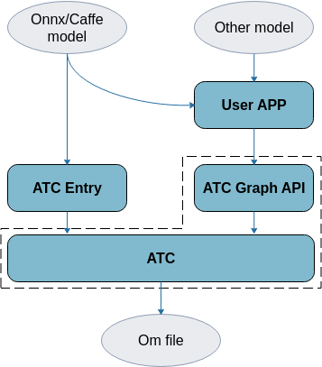
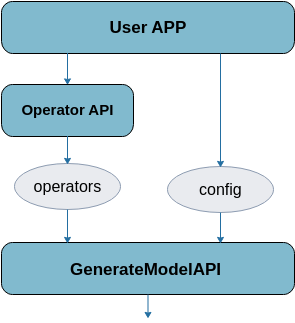

# 前言<a name="ZH-CN_TOPIC_0000002408582678"></a>

**概述<a name="section2832mcpsimp"></a>**

本文用于指导开发人员，如何使用SVP ATC Graph接口构建网络模型，并将其转换成图像分析引擎支持的离线模型，模型转换过程中可以实现算子调度的优化、权值数据重排、内存使用优化等，可以脱离设备完成模型的预处理。

**产品版本<a name="section5008mcpsimp"></a>**

与本文档相对应的产品版本如下。

<a name="table5011mcpsimp"></a>
<table><thead align="left"><tr id="row5016mcpsimp"><th class="cellrowborder" valign="top" width="32%" id="mcps1.1.3.1.1"><p id="p5018mcpsimp"><a name="p5018mcpsimp"></a><a name="p5018mcpsimp"></a>产品名称</p>
</th>
<th class="cellrowborder" valign="top" width="68%" id="mcps1.1.3.1.2"><p id="p5020mcpsimp"><a name="p5020mcpsimp"></a><a name="p5020mcpsimp"></a>产品版本</p>
</th>
</tr>
</thead>
<tbody><tr id="row5022mcpsimp"><td class="cellrowborder" valign="top" width="32%" headers="mcps1.1.3.1.1 "><p id="p5024mcpsimp"><a name="p5024mcpsimp"></a><a name="p5024mcpsimp"></a>SS928</p>
</td>
<td class="cellrowborder" valign="top" width="68%" headers="mcps1.1.3.1.2 "><p id="p5026mcpsimp"><a name="p5026mcpsimp"></a><a name="p5026mcpsimp"></a>V100</p>
</td>
</tr>
<tr id="row5027mcpsimp"><td class="cellrowborder" valign="top" width="32%" headers="mcps1.1.3.1.1 "><p id="p5029mcpsimp"><a name="p5029mcpsimp"></a><a name="p5029mcpsimp"></a>SS927</p>
</td>
<td class="cellrowborder" valign="top" width="68%" headers="mcps1.1.3.1.2 "><p id="p5031mcpsimp"><a name="p5031mcpsimp"></a><a name="p5031mcpsimp"></a>V100</p>
</td>
</tr>
</tbody>
</table>

**读者对象<a name="section2835mcpsimp"></a>**

本文档主要适用于以下工程师：

-   技术支持工程师
-   软件开发工程师

掌握以下经验和技能可以更好地理解本文档。

-   熟悉Linux基本命令。
-   对机器学习、图像分析方法有一定的了解。

**符号约定<a name="section133020216410"></a>**

在本文中可能出现下列标志，它们所代表的含义如下。

<a name="table2622507016410"></a>
<table><thead align="left"><tr id="row1530720816410"><th class="cellrowborder" valign="top" width="20.580000000000002%" id="mcps1.1.3.1.1"><p id="p6450074116410"><a name="p6450074116410"></a><a name="p6450074116410"></a>符号</p>
</th>
<th class="cellrowborder" valign="top" width="79.42%" id="mcps1.1.3.1.2"><p id="p5435366816410"><a name="p5435366816410"></a><a name="p5435366816410"></a>说明</p>
</th>
</tr>
</thead>
<tbody><tr id="row1372280416410"><td class="cellrowborder" valign="top" width="20.580000000000002%" headers="mcps1.1.3.1.1 "><p id="p3734547016410"><a name="p3734547016410"></a><a name="p3734547016410"></a><a name="image2670064316410"></a><a name="image2670064316410"></a><span></span></p>
</td>
<td class="cellrowborder" valign="top" width="79.42%" headers="mcps1.1.3.1.2 "><p id="p1757432116410"><a name="p1757432116410"></a><a name="p1757432116410"></a>表示如不避免则将会导致死亡或严重伤害的具有高等级风险的危害。</p>
</td>
</tr>
<tr id="row466863216410"><td class="cellrowborder" valign="top" width="20.580000000000002%" headers="mcps1.1.3.1.1 "><p id="p1432579516410"><a name="p1432579516410"></a><a name="p1432579516410"></a><a name="image4895582316410"></a><a name="image4895582316410"></a><span></span></p>
</td>
<td class="cellrowborder" valign="top" width="79.42%" headers="mcps1.1.3.1.2 "><p id="p959197916410"><a name="p959197916410"></a><a name="p959197916410"></a>表示如不避免则可能导致死亡或严重伤害的具有中等级风险的危害。</p>
</td>
</tr>
<tr id="row123863216410"><td class="cellrowborder" valign="top" width="20.580000000000002%" headers="mcps1.1.3.1.1 "><p id="p1232579516410"><a name="p1232579516410"></a><a name="p1232579516410"></a><a name="image1235582316410"></a><a name="image1235582316410"></a><span></span></p>
</td>
<td class="cellrowborder" valign="top" width="79.42%" headers="mcps1.1.3.1.2 "><p id="p123197916410"><a name="p123197916410"></a><a name="p123197916410"></a>表示如不避免则可能导致轻微或中度伤害的具有低等级风险的危害。</p>
</td>
</tr>
<tr id="row5786682116410"><td class="cellrowborder" valign="top" width="20.580000000000002%" headers="mcps1.1.3.1.1 "><p id="p2204984716410"><a name="p2204984716410"></a><a name="p2204984716410"></a><a name="image4504446716410"></a><a name="image4504446716410"></a><span></span></p>
</td>
<td class="cellrowborder" valign="top" width="79.42%" headers="mcps1.1.3.1.2 "><p id="p4388861916410"><a name="p4388861916410"></a><a name="p4388861916410"></a>用于传递设备或环境安全警示信息。如不避免则可能会导致设备损坏、数据丢失、设备性能降低或其它不可预知的结果。</p>
<p id="p1238861916410"><a name="p1238861916410"></a><a name="p1238861916410"></a>“须知”不涉及人身伤害。</p>
</td>
</tr>
<tr id="row2856923116410"><td class="cellrowborder" valign="top" width="20.580000000000002%" headers="mcps1.1.3.1.1 "><p id="p5555360116410"><a name="p5555360116410"></a><a name="p5555360116410"></a><a name="image799324016410"></a><a name="image799324016410"></a><span></span></p>
</td>
<td class="cellrowborder" valign="top" width="79.42%" headers="mcps1.1.3.1.2 "><p id="p4612588116410"><a name="p4612588116410"></a><a name="p4612588116410"></a>对正文中重点信息的补充说明。</p>
<p id="p1232588116410"><a name="p1232588116410"></a><a name="p1232588116410"></a>“说明”不是安全警示信息，不涉及人身、设备及环境伤害信息。</p>
</td>
</tr>
</tbody>
</table>

**修改记录<a name="section2467512116410"></a>**

<a name="table1557726816410"></a>
<table><thead align="left"><tr id="row2942532716410"><th class="cellrowborder" valign="top" width="17.23%" id="mcps1.1.4.1.1"><p id="p3778275416410"><a name="p3778275416410"></a><a name="p3778275416410"></a>文档版本</p>
</th>
<th class="cellrowborder" valign="top" width="22.919999999999998%" id="mcps1.1.4.1.2"><p id="p5627845516410"><a name="p5627845516410"></a><a name="p5627845516410"></a>发布日期</p>
</th>
<th class="cellrowborder" valign="top" width="59.85%" id="mcps1.1.4.1.3"><p id="p2382284816410"><a name="p2382284816410"></a><a name="p2382284816410"></a>修改说明</p>
</th>
</tr>
</thead>
<tbody><tr id="row754434819192"><td class="cellrowborder" valign="top" width="17.23%" headers="mcps1.1.4.1.1 "><p id="p134816112010"><a name="p134816112010"></a><a name="p134816112010"></a>00B02</p>
</td>
<td class="cellrowborder" valign="top" width="22.919999999999998%" headers="mcps1.1.4.1.2 "><p id="p74111682014"><a name="p74111682014"></a><a name="p74111682014"></a>2025-12-08</p>
</td>
<td class="cellrowborder" valign="top" width="59.85%" headers="mcps1.1.4.1.3 "><p id="p15412162203"><a name="p15412162203"></a><a name="p15412162203"></a>第2次版本发布</p>
<p id="p910520306201"><a name="p910520306201"></a><a name="p910520306201"></a>3.3.6 ArgmaxOperator配置接口小节，删除部分节点，新增SetArgMaxAxis、GetArgMaxAxis。</p>
<p id="p9201123113714"><a name="p9201123113714"></a><a name="p9201123113714"></a>3.3.77 ArgminOperator配置接口小节，删除部分节点，新增SetArgMinAxis、GetArgMinAxis。</p>
</td>
</tr>
<tr id="row5947359616410"><td class="cellrowborder" valign="top" width="17.23%" headers="mcps1.1.4.1.1 "><p id="p1027mcpsimp"><a name="p1027mcpsimp"></a><a name="p1027mcpsimp"></a>00B01</p>
</td>
<td class="cellrowborder" valign="top" width="22.919999999999998%" headers="mcps1.1.4.1.2 "><p id="p1029mcpsimp"><a name="p1029mcpsimp"></a><a name="p1029mcpsimp"></a>2025-09-15</p>
</td>
<td class="cellrowborder" valign="top" width="59.85%" headers="mcps1.1.4.1.3 "><p id="p1031mcpsimp"><a name="p1031mcpsimp"></a><a name="p1031mcpsimp"></a>第1次版本发布</p>
</td>
</tr>
</tbody>
</table>

# 简介<a name="ZH-CN_TOPIC_0000002442021869"></a>


## 功能架构<a name="ZH-CN_TOPIC_0000002408422674"></a>

SVP ATC Graph功能架构如[图1](#fig2817181918158)所示。从中可以看出，不局限于Caffe、Onnx等框架，用户可以通过开放的API接口进行构图，并编译为离线模型，用于在板端硬件加速处理器上进行离线推理。

**图 1**  SVP ATC Graph功能架构<a name="fig2817181918158"></a>  


## 运行流程<a name="ZH-CN_TOPIC_0000002408582630"></a>

使用SVP ATC Graph进行模型转换的用户侧调用流程如[图1](#fig11567732171618)所示。

**图 1**  运行流程<a name="fig11567732171618"></a>  


SVP ATC Graph API接口包含两部分。

-   OperatorAPI：构图接口。定义了一套简洁的算子数据结构表达方式，用户可基于此方便的完成构图。
-   GenerateModelAPI：模型转换接口。基于构建的模型图，进行编译转换，生成om知识库文件。

详细流程说明如下。

-   使用OperatorAPI依次构造网络中的各个算子节点，生成一系列的operator对象。该对象包含对应算子的属性配置、连接关系、权重数据等信息，所有operator对象共同构成完整的模型图。
-   将所有operator对象与config信息传递给GenerateModelAPI，完成模型编译并最终生成om知识库文件。Config配置信息可以以文件的形式配置，也可以通过map映射的形式配置。具体参数配置与ATC工具一致，可以参考《ATC工具使用指南》。

# 使用入门<a name="ZH-CN_TOPIC_0000002408422490"></a>


## 准备动作<a name="ZH-CN_TOPIC_0000002441981197"></a>


### 获取SVP ATC Graph API<a name="ZH-CN_TOPIC_0000002441981973"></a>

与toolkit同时安装，并跟随ATC工具一同部署，该场景下libsvp\_atc\_api.so部署在“$HOME/Ascend/ascend-toolkit/_\{software version\}_/atc/lib”路径下，其中software version为软件版本号。

本手册以SVP ATC Graph API独立安装为例进行说明。

### 设置环境变量<a name="ZH-CN_TOPIC_0000002408422250"></a>

SVP ATC Graph API中包含OperatorAPI与GenerateModelAPI两部分。

-   GenerateModelAPI与ATC工具所依赖的第三方库环境相同，请参考《ATC工具使用指南》“设置环境变量”章节进行配置，此处不再赘述。此外，用户工程中需增加头文件svp\_atc\_api.h引用，以及动态链接libsvp\_atc\_api.so库文件。
-   OperatorAPI在用户使用时需引用一系列算子头文件，部署在“$HOME/Ascend/ascend-toolkit/_\{software version\}_/atc/include”路径下。同时需要动态链接libsvp\_atc\_api.so库文件。

## 构图与转换使用示例<a name="ZH-CN_TOPIC_0000002442021593"></a>

1.  构造config配置信息，可以以文件、字符串或map配置表的形式提供，用于指定模型转换过程中所需要的功能配置。以map配置表形式为例，一个简单的config信息可以构造为：

    ```
    Std::map<string, string> cfgMap{
    {"framework", "6"},
    {"image_list", "input:./data.txt"},
    {"save_original_model", "true"},
    {"output", "testBaseWithCfgMap"}};
    ```

    配置项中可能会引用二级配置文件，如量化校准数据image\_list、分组量化参数gfpq\_param\_file等。

2.  构造全部算子节点，并依次插入graph队列，完成构图过程。以构造输入层与卷积层为例。

    构造输入层：

    ```
    auto opPreprocess = make_unique<PreprocessOperator>();
    opPreprocess->SetOpName("data_layer");
    opPreprocess->SetInputNamesVec("data_layer_in");
    opPreprocess->SetOutputNamesVec("data_layer_out");
    opPreprocess->SetShapeParamVec({1, 3, 5, 5});
    ```

    构造卷积层：

    ```
    auto opConv = make_unique<ConvOperator>();
    opConv->SetOpName("conv_layer");
    opConv->SetInputNamesVec("data_layer_out"); // 表示与输入层连接
    opConv->SetOutputNamesVec("conv_layer_out");
    opConv->SetOutputChannel(16);
    opConv->SetKernelHeight(3);
    opConv->SetKernelWidth(3);
    opConv->SetPadLeft(1);
    opConv->SetPadRight(1);
    opConv->SetPadUp(1);
    opConv->SetPadDown(1);
    opConv->SetStrideWidth(1);
    opConv->SetStrideHeight(1);
    opConv->SetWeightSize(432);
    opConv->SetBiasSize(0);
    opConv->SetWeightDataPtr(GetWeightDataPtr());
    opConv->SetBiasDataPtr(nullptr);
    ```

    构造graph队列：

    ```
    vector<unique_ptr<BaseOperator>> graph;
    graph.push_back(opPreprocess);
    graph.push_back(opConv);
    ```

1.  调用转换接口生成二进制模型文件。生成过程需要依赖前期构造的配置信息与graph图信息。

    ```
    GenerateModelBinaryWithCfgMap(cfgMap, graph, nullptr);
    ```

    成功执行命令后，在output参数指定的路径下，可查看离线模型（如：xxx.om）。当需要在内存中获取om数据与输出信息时，可以构造ModelCoreInfo对象，并将其指针作为接口第三个参数，用于获取模型om数据、om长度、输出名称与shape等信息。

# OperatorAPI说明<a name="ZH-CN_TOPIC_0000002441982009"></a>


## 概览<a name="ZH-CN_TOPIC_0000002408582682"></a>


### 总体约束<a name="ZH-CN_TOPIC_0000002408582670"></a>

在进行graph构造前，请务必查看如下约束要求。

-   当前版本提供的Operator算子接口涵盖支持硬件加速运算的算子和CPU算子。
-   构图后算子依次存放在Vector队列中，存放顺序与解析顺序一致，需要由调用者按照依赖关系保证存放顺序。
-   数据排列格式只支持NCHW模式。
-   权重类参数由ptr内存指针和size（或shape）尺寸两部分组成，接口调用者需要保证内存大小与尺寸参数一致。

### 参数配置方式<a name="ZH-CN_TOPIC_0000002408582486"></a>

每个算子对应一个BaseOperator的派生类，网络中的每个算子节点，均对应一个Operator类对象，该节点的所有信息（包含算子类型、名称、属性、权重、连接关系、量化信息等）均由该对象的相应属性承载，通过相应的函数接口进行配置。构图的过程，就是创建每个Operator类对象并为其配置属性的过程。

创建好的所有Operator类对象，需要按照算子执行的顺序依次存放在Vector队列中，供下一步模型转换使用。

以下着重介绍参数配置接口（即Set函数），对应的参数获取接口（即Get函数）参考对应头文件的描述，不在此文档中进行罗列。

## 算子通用接口<a name="ZH-CN_TOPIC_0000002441981325"></a>


### 基本信息配置接口<a name="ZH-CN_TOPIC_0000002441982017"></a>


#### SetOpName<a name="ZH-CN_TOPIC_0000002441981609"></a>

函数功能：

指定本层算子的名称，用于模型构建与优化编译过程中的对象识别，该名称需要保证唯一性，不可与其他算子名称或输入输出节点名称重复。

函数原型：

```
void SetOpName(const std::string &opName)
```

参数说明：

<a name="table1888mcpsimp"></a>
<table><thead align="left"><tr id="row1894mcpsimp"><th class="cellrowborder" valign="top" width="28.999999999999996%" id="mcps1.1.4.1.1"><p id="p1896mcpsimp"><a name="p1896mcpsimp"></a><a name="p1896mcpsimp"></a>参数名</p>
</th>
<th class="cellrowborder" valign="top" width="15.02%" id="mcps1.1.4.1.2"><p id="p1898mcpsimp"><a name="p1898mcpsimp"></a><a name="p1898mcpsimp"></a>输入/输出</p>
</th>
<th class="cellrowborder" valign="top" width="55.98%" id="mcps1.1.4.1.3"><p id="p1900mcpsimp"><a name="p1900mcpsimp"></a><a name="p1900mcpsimp"></a>说明</p>
</th>
</tr>
</thead>
<tbody><tr id="row1902mcpsimp"><td class="cellrowborder" valign="top" width="28.999999999999996%" headers="mcps1.1.4.1.1 "><p id="p1904mcpsimp"><a name="p1904mcpsimp"></a><a name="p1904mcpsimp"></a>opName</p>
</td>
<td class="cellrowborder" valign="top" width="15.02%" headers="mcps1.1.4.1.2 "><p id="p1907mcpsimp"><a name="p1907mcpsimp"></a><a name="p1907mcpsimp"></a>输入</p>
</td>
<td class="cellrowborder" valign="top" width="55.98%" headers="mcps1.1.4.1.3 "><p id="p1909mcpsimp"><a name="p1909mcpsimp"></a><a name="p1909mcpsimp"></a>本层算子的名称，需要保证唯一性，不可与其他算子名称或输入输出节点名称重复。</p>
</td>
</tr>
</tbody>
</table>

#### GetOpName<a name="ZH-CN_TOPIC_0000002408422234"></a>

函数功能：

获取本层算子的名称，用于模型构建与优化编译过程中的对象识别，该名称需要保证唯一性，不可与其他算子名称或输入输出节点名称重复。

函数原型：

```
const std::string& GetOpName() const
```

参数说明：

<a name="table789317220287"></a>
<table><thead align="left"><tr id="row1893152202810"><th class="cellrowborder" valign="top" width="28.999999999999996%" id="mcps1.1.4.1.1"><p id="p158931029284"><a name="p158931029284"></a><a name="p158931029284"></a>参数名</p>
</th>
<th class="cellrowborder" valign="top" width="17%" id="mcps1.1.4.1.2"><p id="p1789310211285"><a name="p1789310211285"></a><a name="p1789310211285"></a>输入/输出</p>
</th>
<th class="cellrowborder" valign="top" width="54%" id="mcps1.1.4.1.3"><p id="p18893529281"><a name="p18893529281"></a><a name="p18893529281"></a>说明</p>
</th>
</tr>
</thead>
<tbody><tr id="row148948272816"><td class="cellrowborder" valign="top" width="28.999999999999996%" headers="mcps1.1.4.1.1 "><p id="p178732214480"><a name="p178732214480"></a><a name="p178732214480"></a>const std::string&amp;</p>
</td>
<td class="cellrowborder" valign="top" width="17%" headers="mcps1.1.4.1.2 "><p id="p289462112814"><a name="p289462112814"></a><a name="p289462112814"></a>输出</p>
</td>
<td class="cellrowborder" valign="top" width="54%" headers="mcps1.1.4.1.3 "><p id="p1909mcpsimp"><a name="p1909mcpsimp"></a><a name="p1909mcpsimp"></a>本层算子的名称，需要保证唯一性，不可与其他算子名称或输入输出节点名称重复。</p>
</td>
</tr>
</tbody>
</table>

#### SetOpType<a name="ZH-CN_TOPIC_0000002408422522"></a>

函数功能：

指定本层算子的类型。

函数原型：

```
void SetOpType(OpType opType)
```

参数说明：

<a name="table2691mcpsimp"></a>
<table><thead align="left"><tr id="row2697mcpsimp"><th class="cellrowborder" valign="top" width="27.11%" id="mcps1.1.4.1.1"><p id="p2699mcpsimp"><a name="p2699mcpsimp"></a><a name="p2699mcpsimp"></a>参数名</p>
</th>
<th class="cellrowborder" valign="top" width="16.72%" id="mcps1.1.4.1.2"><p id="p2701mcpsimp"><a name="p2701mcpsimp"></a><a name="p2701mcpsimp"></a>输入/输出</p>
</th>
<th class="cellrowborder" valign="top" width="56.169999999999995%" id="mcps1.1.4.1.3"><p id="p2703mcpsimp"><a name="p2703mcpsimp"></a><a name="p2703mcpsimp"></a>说明</p>
</th>
</tr>
</thead>
<tbody><tr id="row2705mcpsimp"><td class="cellrowborder" valign="top" width="27.11%" headers="mcps1.1.4.1.1 "><p id="p2707mcpsimp"><a name="p2707mcpsimp"></a><a name="p2707mcpsimp"></a>opType</p>
</td>
<td class="cellrowborder" valign="top" width="16.72%" headers="mcps1.1.4.1.2 "><p id="p2710mcpsimp"><a name="p2710mcpsimp"></a><a name="p2710mcpsimp"></a>输入</p>
</td>
<td class="cellrowborder" valign="top" width="56.169999999999995%" headers="mcps1.1.4.1.3 "><p id="p2712mcpsimp"><a name="p2712mcpsimp"></a><a name="p2712mcpsimp"></a>本层算子的类型，使用OpType枚举值表示，其可配置范围参考op_enum_public.h。</p>
</td>
</tr>
</tbody>
</table>

#### GetOpType<a name="ZH-CN_TOPIC_0000002408422786"></a>

函数功能：

获取本层算子的类型。

函数原型：

```
OpType GetOpType() const
```

参数说明：

<a name="table789317220287"></a>
<table><thead align="left"><tr id="row1893152202810"><th class="cellrowborder" valign="top" width="28.999999999999996%" id="mcps1.1.4.1.1"><p id="p158931029284"><a name="p158931029284"></a><a name="p158931029284"></a>参数名</p>
</th>
<th class="cellrowborder" valign="top" width="17%" id="mcps1.1.4.1.2"><p id="p1789310211285"><a name="p1789310211285"></a><a name="p1789310211285"></a>输入/输出</p>
</th>
<th class="cellrowborder" valign="top" width="54%" id="mcps1.1.4.1.3"><p id="p18893529281"><a name="p18893529281"></a><a name="p18893529281"></a>说明</p>
</th>
</tr>
</thead>
<tbody><tr id="row148948272816"><td class="cellrowborder" valign="top" width="28.999999999999996%" headers="mcps1.1.4.1.1 "><p id="p136313919229"><a name="p136313919229"></a><a name="p136313919229"></a>OpType</p>
</td>
<td class="cellrowborder" valign="top" width="17%" headers="mcps1.1.4.1.2 "><p id="p289462112814"><a name="p289462112814"></a><a name="p289462112814"></a>输出</p>
</td>
<td class="cellrowborder" valign="top" width="54%" headers="mcps1.1.4.1.3 "><p id="p2712mcpsimp"><a name="p2712mcpsimp"></a><a name="p2712mcpsimp"></a>本层算子的类型，使用OpType枚举值表示，其可配置范围参考op_enum_public.h。</p>
</td>
</tr>
</tbody>
</table>

### 连接关系配置接口<a name="ZH-CN_TOPIC_0000002441982049"></a>


#### AddInputName<a name="ZH-CN_TOPIC_0000002408422706"></a>

函数功能：

添加一路输入算子的输出节点名称，即为本层算子添加一路输入连接。

函数原型：

```
void AddInputName(const std::string &name)
```

参数说明：

<a name="table2157mcpsimp"></a>
<table><thead align="left"><tr id="row2163mcpsimp"><th class="cellrowborder" valign="top" width="28.999999999999996%" id="mcps1.1.4.1.1"><p id="p2165mcpsimp"><a name="p2165mcpsimp"></a><a name="p2165mcpsimp"></a>参数名</p>
</th>
<th class="cellrowborder" valign="top" width="16.98%" id="mcps1.1.4.1.2"><p id="p2167mcpsimp"><a name="p2167mcpsimp"></a><a name="p2167mcpsimp"></a>输入/输出</p>
</th>
<th class="cellrowborder" valign="top" width="54.02%" id="mcps1.1.4.1.3"><p id="p2169mcpsimp"><a name="p2169mcpsimp"></a><a name="p2169mcpsimp"></a>说明</p>
</th>
</tr>
</thead>
<tbody><tr id="row2171mcpsimp"><td class="cellrowborder" valign="top" width="28.999999999999996%" headers="mcps1.1.4.1.1 "><p id="p2173mcpsimp"><a name="p2173mcpsimp"></a><a name="p2173mcpsimp"></a>name</p>
</td>
<td class="cellrowborder" valign="top" width="16.98%" headers="mcps1.1.4.1.2 "><p id="p2176mcpsimp"><a name="p2176mcpsimp"></a><a name="p2176mcpsimp"></a>输入</p>
</td>
<td class="cellrowborder" valign="top" width="54.02%" headers="mcps1.1.4.1.3 "><p id="p2178mcpsimp"><a name="p2178mcpsimp"></a><a name="p2178mcpsimp"></a>表示与之相连的前一路算子的输出名称，该名称具有唯一性。添加名称的顺序也代表了连接顺序，需要使用者保证顺序正确。</p>
</td>
</tr>
</tbody>
</table>

#### SetInputNamesVec<a name="ZH-CN_TOPIC_0000002441982113"></a>

函数功能：

设置输入算子的输出节点名称集合，即一次性为本层算子添加多个输入连接。

函数原型：

```
void SetInputNamesVec(const std::vector<std::string> &inputNamesVec)
```

参数说明：

<a name="table2515mcpsimp"></a>
<table><thead align="left"><tr id="row2521mcpsimp"><th class="cellrowborder" valign="top" width="28.999999999999996%" id="mcps1.1.4.1.1"><p id="p2523mcpsimp"><a name="p2523mcpsimp"></a><a name="p2523mcpsimp"></a>参数名</p>
</th>
<th class="cellrowborder" valign="top" width="17%" id="mcps1.1.4.1.2"><p id="p2525mcpsimp"><a name="p2525mcpsimp"></a><a name="p2525mcpsimp"></a>输入/输出</p>
</th>
<th class="cellrowborder" valign="top" width="54%" id="mcps1.1.4.1.3"><p id="p2527mcpsimp"><a name="p2527mcpsimp"></a><a name="p2527mcpsimp"></a>说明</p>
</th>
</tr>
</thead>
<tbody><tr id="row2529mcpsimp"><td class="cellrowborder" valign="top" width="28.999999999999996%" headers="mcps1.1.4.1.1 "><p id="p2531mcpsimp"><a name="p2531mcpsimp"></a><a name="p2531mcpsimp"></a>inputNamesVec</p>
</td>
<td class="cellrowborder" valign="top" width="17%" headers="mcps1.1.4.1.2 "><p id="p2534mcpsimp"><a name="p2534mcpsimp"></a><a name="p2534mcpsimp"></a>输入集合</p>
</td>
<td class="cellrowborder" valign="top" width="54%" headers="mcps1.1.4.1.3 "><p id="p2536mcpsimp"><a name="p2536mcpsimp"></a><a name="p2536mcpsimp"></a>表示与之相连的多个输入节点算子的输出名称集合，这些名称具有唯一性。添加名称的顺序也代表了连接顺序，需要使用者保证顺序正确。</p>
</td>
</tr>
</tbody>
</table>

#### GetInputNamesVec<a name="ZH-CN_TOPIC_0000002442021917"></a>

函数功能：

获取输入算子的输出节点名称集合，即一次性为本层算子添加多个输入连接。

函数原型：

```
const std::vector<std::string>& GetInputNamesVec() const
```

参数说明：

<a name="table789317220287"></a>
<table><thead align="left"><tr id="row1893152202810"><th class="cellrowborder" valign="top" width="28.999999999999996%" id="mcps1.1.4.1.1"><p id="p158931029284"><a name="p158931029284"></a><a name="p158931029284"></a>参数名</p>
</th>
<th class="cellrowborder" valign="top" width="17%" id="mcps1.1.4.1.2"><p id="p1789310211285"><a name="p1789310211285"></a><a name="p1789310211285"></a>输入/输出</p>
</th>
<th class="cellrowborder" valign="top" width="54%" id="mcps1.1.4.1.3"><p id="p18893529281"><a name="p18893529281"></a><a name="p18893529281"></a>说明</p>
</th>
</tr>
</thead>
<tbody><tr id="row148948272816"><td class="cellrowborder" valign="top" width="28.999999999999996%" headers="mcps1.1.4.1.1 "><p id="p178732214480"><a name="p178732214480"></a><a name="p178732214480"></a>const std::vector&lt;std::string&gt;&amp;</p>
</td>
<td class="cellrowborder" valign="top" width="17%" headers="mcps1.1.4.1.2 "><p id="p289462112814"><a name="p289462112814"></a><a name="p289462112814"></a>输出</p>
</td>
<td class="cellrowborder" valign="top" width="54%" headers="mcps1.1.4.1.3 "><p id="p1909mcpsimp"><a name="p1909mcpsimp"></a><a name="p1909mcpsimp"></a>表示与之相连的多个输入节点算子的输出名称集合，这些名称具有唯一性。添加名称的顺序也代表了连接顺序，需要使用者保证顺序正确。</p>
</td>
</tr>
</tbody>
</table>

#### AddOutputName<a name="ZH-CN_TOPIC_0000002408422638"></a>

函数功能：

添加一路输出算子的输入节点名称，即为本层算子添加一路输出连接。

函数原型：

```
void AddOutputName(const std::string &name)
```

参数说明：

<a name="table5117mcpsimp"></a>
<table><thead align="left"><tr id="row5123mcpsimp"><th class="cellrowborder" valign="top" width="28.999999999999996%" id="mcps1.1.4.1.1"><p id="p5125mcpsimp"><a name="p5125mcpsimp"></a><a name="p5125mcpsimp"></a>参数名</p>
</th>
<th class="cellrowborder" valign="top" width="17%" id="mcps1.1.4.1.2"><p id="p5127mcpsimp"><a name="p5127mcpsimp"></a><a name="p5127mcpsimp"></a>输入/输出</p>
</th>
<th class="cellrowborder" valign="top" width="54%" id="mcps1.1.4.1.3"><p id="p5129mcpsimp"><a name="p5129mcpsimp"></a><a name="p5129mcpsimp"></a>说明</p>
</th>
</tr>
</thead>
<tbody><tr id="row5131mcpsimp"><td class="cellrowborder" valign="top" width="28.999999999999996%" headers="mcps1.1.4.1.1 "><p id="p5133mcpsimp"><a name="p5133mcpsimp"></a><a name="p5133mcpsimp"></a>name</p>
</td>
<td class="cellrowborder" valign="top" width="17%" headers="mcps1.1.4.1.2 "><p id="p5136mcpsimp"><a name="p5136mcpsimp"></a><a name="p5136mcpsimp"></a>输入</p>
</td>
<td class="cellrowborder" valign="top" width="54%" headers="mcps1.1.4.1.3 "><p id="p5138mcpsimp"><a name="p5138mcpsimp"></a><a name="p5138mcpsimp"></a>表示与之相连的后一路算子的输入名称，该名称具有唯一性。添加名称的顺序也代表了连接顺序，需要使用者保证顺序正确。</p>
</td>
</tr>
</tbody>
</table>

#### SetOutputNamesVec<a name="ZH-CN_TOPIC_0000002441981257"></a>

函数功能：

设置输出算子的输入节点名称集合，即一次性为本层算子添加多个输出连接。

函数原型：

```
void SetOutputNamesVec(const std::vector<std::string> &outputNamesVec)
```

参数说明：

<a name="table4636mcpsimp"></a>
<table><thead align="left"><tr id="row4642mcpsimp"><th class="cellrowborder" valign="top" width="28.999999999999996%" id="mcps1.1.4.1.1"><p id="p4644mcpsimp"><a name="p4644mcpsimp"></a><a name="p4644mcpsimp"></a>参数名</p>
</th>
<th class="cellrowborder" valign="top" width="17%" id="mcps1.1.4.1.2"><p id="p4646mcpsimp"><a name="p4646mcpsimp"></a><a name="p4646mcpsimp"></a>输入/输出</p>
</th>
<th class="cellrowborder" valign="top" width="54%" id="mcps1.1.4.1.3"><p id="p4648mcpsimp"><a name="p4648mcpsimp"></a><a name="p4648mcpsimp"></a>说明</p>
</th>
</tr>
</thead>
<tbody><tr id="row4650mcpsimp"><td class="cellrowborder" valign="top" width="28.999999999999996%" headers="mcps1.1.4.1.1 "><p id="p4652mcpsimp"><a name="p4652mcpsimp"></a><a name="p4652mcpsimp"></a>outputNamesVec</p>
</td>
<td class="cellrowborder" valign="top" width="17%" headers="mcps1.1.4.1.2 "><p id="p4655mcpsimp"><a name="p4655mcpsimp"></a><a name="p4655mcpsimp"></a>输出集合</p>
</td>
<td class="cellrowborder" valign="top" width="54%" headers="mcps1.1.4.1.3 "><p id="p4657mcpsimp"><a name="p4657mcpsimp"></a><a name="p4657mcpsimp"></a>表示与之相连的多个输出节点算子的输入名称集合，这些名称具有唯一性。添加名称的顺序也代表了连接顺序，需要使用者保证顺序正确。</p>
</td>
</tr>
</tbody>
</table>

#### GetOutputNamesVec<a name="ZH-CN_TOPIC_0000002408582046"></a>

函数功能：

获取输出算子的输入节点名称集合，即一次性为本层算子添加多个输出连接。

函数原型：

```
const std::vector<std::string>& GetOutputNamesVec() const
```

参数说明：

<a name="table789317220287"></a>
<table><thead align="left"><tr id="row1893152202810"><th class="cellrowborder" valign="top" width="28.999999999999996%" id="mcps1.1.4.1.1"><p id="p158931029284"><a name="p158931029284"></a><a name="p158931029284"></a>参数名</p>
</th>
<th class="cellrowborder" valign="top" width="17%" id="mcps1.1.4.1.2"><p id="p1789310211285"><a name="p1789310211285"></a><a name="p1789310211285"></a>输入/输出</p>
</th>
<th class="cellrowborder" valign="top" width="54%" id="mcps1.1.4.1.3"><p id="p18893529281"><a name="p18893529281"></a><a name="p18893529281"></a>说明</p>
</th>
</tr>
</thead>
<tbody><tr id="row148948272816"><td class="cellrowborder" valign="top" width="28.999999999999996%" headers="mcps1.1.4.1.1 "><p id="p178732214480"><a name="p178732214480"></a><a name="p178732214480"></a>const std::vector&lt;std::string&gt;&amp;</p>
</td>
<td class="cellrowborder" valign="top" width="17%" headers="mcps1.1.4.1.2 "><p id="p289462112814"><a name="p289462112814"></a><a name="p289462112814"></a>输出</p>
</td>
<td class="cellrowborder" valign="top" width="54%" headers="mcps1.1.4.1.3 "><p id="p1909mcpsimp"><a name="p1909mcpsimp"></a><a name="p1909mcpsimp"></a>表示与之相连的多个输出节点算子的输入名称集合，这些名称具有唯一性。添加名称的顺序也代表了连接顺序，需要使用者保证顺序正确。</p>
</td>
</tr>
</tbody>
</table>

### 量化因子配置接口<a name="ZH-CN_TOPIC_0000002442021945"></a>


#### AddInputQuantFactor<a name="ZH-CN_TOPIC_0000002441981209"></a>

函数功能：

添加一路输入数据的量化因子。

函数原型：

```
void AddInputQuantFactor(const OpQuantFactor &quantFactor)
```

参数说明：

<a name="table3886mcpsimp"></a>
<table><thead align="left"><tr id="row3892mcpsimp"><th class="cellrowborder" valign="top" width="28.999999999999996%" id="mcps1.1.4.1.1"><p id="p3894mcpsimp"><a name="p3894mcpsimp"></a><a name="p3894mcpsimp"></a>参数名</p>
</th>
<th class="cellrowborder" valign="top" width="17%" id="mcps1.1.4.1.2"><p id="p3896mcpsimp"><a name="p3896mcpsimp"></a><a name="p3896mcpsimp"></a>输入/输出</p>
</th>
<th class="cellrowborder" valign="top" width="54%" id="mcps1.1.4.1.3"><p id="p3898mcpsimp"><a name="p3898mcpsimp"></a><a name="p3898mcpsimp"></a>说明</p>
</th>
</tr>
</thead>
<tbody><tr id="row3900mcpsimp"><td class="cellrowborder" valign="top" width="28.999999999999996%" headers="mcps1.1.4.1.1 "><p id="p3902mcpsimp"><a name="p3902mcpsimp"></a><a name="p3902mcpsimp"></a>quantFactor</p>
</td>
<td class="cellrowborder" valign="top" width="17%" headers="mcps1.1.4.1.2 "><p id="p3905mcpsimp"><a name="p3905mcpsimp"></a><a name="p3905mcpsimp"></a>输入</p>
</td>
<td class="cellrowborder" valign="top" width="54%" headers="mcps1.1.4.1.3 "><p id="p3907mcpsimp"><a name="p3907mcpsimp"></a><a name="p3907mcpsimp"></a>对应一路输入数据的量化因子，其插入队列的顺序应当与输入节点的连接顺序一致。</p>
</td>
</tr>
</tbody>
</table>

OpQuantFactor对象的定义如下所示。

```
struct OpQuantFactor {
float scale = 0.f;
int32_t zeroPoint = 0;
OpDataType dataType = OP_DTYPE_S8;
}
```

包含量化因子scale与zeroPint值，以及量化数据类型。

#### GetInputQuantFactor<a name="ZH-CN_TOPIC_0000002441981841"></a>

函数功能：

获取一路输入数据的量化因子。

函数原型：

```
OpQuantFactor GetInputQuantFactor(uint32_t idx)
```

参数说明：

<a name="table789317220287"></a>
<table><thead align="left"><tr id="row1893152202810"><th class="cellrowborder" valign="top" width="28.999999999999996%" id="mcps1.1.4.1.1"><p id="p158931029284"><a name="p158931029284"></a><a name="p158931029284"></a>参数名</p>
</th>
<th class="cellrowborder" valign="top" width="17%" id="mcps1.1.4.1.2"><p id="p1789310211285"><a name="p1789310211285"></a><a name="p1789310211285"></a>输入/输出</p>
</th>
<th class="cellrowborder" valign="top" width="54%" id="mcps1.1.4.1.3"><p id="p18893529281"><a name="p18893529281"></a><a name="p18893529281"></a>说明</p>
</th>
</tr>
</thead>
<tbody><tr id="row1474815112913"><td class="cellrowborder" valign="top" width="28.999999999999996%" headers="mcps1.1.4.1.1 "><p id="p5474141517296"><a name="p5474141517296"></a><a name="p5474141517296"></a>idx</p>
</td>
<td class="cellrowborder" valign="top" width="17%" headers="mcps1.1.4.1.2 "><p id="p147591522913"><a name="p147591522913"></a><a name="p147591522913"></a>输入</p>
</td>
<td class="cellrowborder" valign="top" width="54%" headers="mcps1.1.4.1.3 "><p id="p7475151518296"><a name="p7475151518296"></a><a name="p7475151518296"></a>对应idx路输入数据，返回idx路输入数据的量化因子</p>
</td>
</tr>
<tr id="row148948272816"><td class="cellrowborder" valign="top" width="28.999999999999996%" headers="mcps1.1.4.1.1 "><p id="p17531183832220"><a name="p17531183832220"></a><a name="p17531183832220"></a>OpQuantFactor</p>
</td>
<td class="cellrowborder" valign="top" width="17%" headers="mcps1.1.4.1.2 "><p id="p289462112814"><a name="p289462112814"></a><a name="p289462112814"></a>输出</p>
</td>
<td class="cellrowborder" valign="top" width="54%" headers="mcps1.1.4.1.3 "><p id="p3907mcpsimp"><a name="p3907mcpsimp"></a><a name="p3907mcpsimp"></a>对应一路输入数据的量化因子，其插入队列的顺序应当与输入节点的连接顺序一致。</p>
</td>
</tr>
</tbody>
</table>

#### AddOutputQuantFactor<a name="ZH-CN_TOPIC_0000002408422450"></a>

函数功能：

添加一路输出数据的量化因子。

函数原型：

```
void AddOutputQuantFactor(const OpQuantFactor &quantFactor)
```

参数说明：

<a name="table661mcpsimp"></a>
<table><thead align="left"><tr id="row667mcpsimp"><th class="cellrowborder" valign="top" width="28.999999999999996%" id="mcps1.1.4.1.1"><p id="p669mcpsimp"><a name="p669mcpsimp"></a><a name="p669mcpsimp"></a>参数名</p>
</th>
<th class="cellrowborder" valign="top" width="17%" id="mcps1.1.4.1.2"><p id="p671mcpsimp"><a name="p671mcpsimp"></a><a name="p671mcpsimp"></a>输入/输出</p>
</th>
<th class="cellrowborder" valign="top" width="54%" id="mcps1.1.4.1.3"><p id="p673mcpsimp"><a name="p673mcpsimp"></a><a name="p673mcpsimp"></a>说明</p>
</th>
</tr>
</thead>
<tbody><tr id="row675mcpsimp"><td class="cellrowborder" valign="top" width="28.999999999999996%" headers="mcps1.1.4.1.1 "><p id="p677mcpsimp"><a name="p677mcpsimp"></a><a name="p677mcpsimp"></a>quantFactor</p>
</td>
<td class="cellrowborder" valign="top" width="17%" headers="mcps1.1.4.1.2 "><p id="p680mcpsimp"><a name="p680mcpsimp"></a><a name="p680mcpsimp"></a>输入</p>
</td>
<td class="cellrowborder" valign="top" width="54%" headers="mcps1.1.4.1.3 "><p id="p682mcpsimp"><a name="p682mcpsimp"></a><a name="p682mcpsimp"></a>对应一路输出数据的量化因子，其插入队列的顺序应当与输出节点的连接顺序一致。</p>
</td>
</tr>
</tbody>
</table>

OpQuantFactor对象的定义参考[AddInputQuantFactor](#ZH-CN_TOPIC_0000002441981209)。

#### GetOutputQuantFactor<a name="ZH-CN_TOPIC_0000002442021253"></a>

函数功能：

获取一路输出数据的量化因子。

函数原型：

```
OpQuantFactor& GetOutputQuantFactor(uint32_t idx)
```

参数说明：

<a name="table789317220287"></a>
<table><thead align="left"><tr id="row1893152202810"><th class="cellrowborder" valign="top" width="28.999999999999996%" id="mcps1.1.4.1.1"><p id="p158931029284"><a name="p158931029284"></a><a name="p158931029284"></a>参数名</p>
</th>
<th class="cellrowborder" valign="top" width="17%" id="mcps1.1.4.1.2"><p id="p1789310211285"><a name="p1789310211285"></a><a name="p1789310211285"></a>输入/输出</p>
</th>
<th class="cellrowborder" valign="top" width="54%" id="mcps1.1.4.1.3"><p id="p18893529281"><a name="p18893529281"></a><a name="p18893529281"></a>说明</p>
</th>
</tr>
</thead>
<tbody><tr id="row32631128133120"><td class="cellrowborder" valign="top" width="28.999999999999996%" headers="mcps1.1.4.1.1 "><p id="p1026302823119"><a name="p1026302823119"></a><a name="p1026302823119"></a>idx</p>
</td>
<td class="cellrowborder" valign="top" width="17%" headers="mcps1.1.4.1.2 "><p id="p1226311282312"><a name="p1226311282312"></a><a name="p1226311282312"></a>输入</p>
</td>
<td class="cellrowborder" valign="top" width="54%" headers="mcps1.1.4.1.3 "><p id="p1926322819319"><a name="p1926322819319"></a><a name="p1926322819319"></a>对应idx路输出数据，返回idx路输出数据的量化因子</p>
</td>
</tr>
<tr id="row148948272816"><td class="cellrowborder" valign="top" width="28.999999999999996%" headers="mcps1.1.4.1.1 "><p id="p17531183832220"><a name="p17531183832220"></a><a name="p17531183832220"></a>OpQuantFactor</p>
</td>
<td class="cellrowborder" valign="top" width="17%" headers="mcps1.1.4.1.2 "><p id="p289462112814"><a name="p289462112814"></a><a name="p289462112814"></a>输出</p>
</td>
<td class="cellrowborder" valign="top" width="54%" headers="mcps1.1.4.1.3 "><p id="p3907mcpsimp"><a name="p3907mcpsimp"></a><a name="p3907mcpsimp"></a>对应一路输出数据的量化因子，其插入队列的顺序应当与输出节点的连接顺序一致。</p>
</td>
</tr>
</tbody>
</table>

#### AddParamQuantFactor<a name="ZH-CN_TOPIC_0000002408582626"></a>

函数功能：

添加一组参数数据的量化因子。仅Conv/Depthwiseconv/Deconv支持Perchannel量化，多组量化参数需要调用多次此接口添加。

函数原型：

```
void AddParamQuantFactor(const OpQuantFactor &quantFactor)
```

参数说明：

<a name="table4085mcpsimp"></a>
<table><thead align="left"><tr id="row4091mcpsimp"><th class="cellrowborder" valign="top" width="28.999999999999996%" id="mcps1.1.4.1.1"><p id="p4093mcpsimp"><a name="p4093mcpsimp"></a><a name="p4093mcpsimp"></a>参数名</p>
</th>
<th class="cellrowborder" valign="top" width="17%" id="mcps1.1.4.1.2"><p id="p4095mcpsimp"><a name="p4095mcpsimp"></a><a name="p4095mcpsimp"></a>输入/输出</p>
</th>
<th class="cellrowborder" valign="top" width="54%" id="mcps1.1.4.1.3"><p id="p4097mcpsimp"><a name="p4097mcpsimp"></a><a name="p4097mcpsimp"></a>说明</p>
</th>
</tr>
</thead>
<tbody><tr id="row4099mcpsimp"><td class="cellrowborder" valign="top" width="28.999999999999996%" headers="mcps1.1.4.1.1 "><p id="p4101mcpsimp"><a name="p4101mcpsimp"></a><a name="p4101mcpsimp"></a>quantFactor</p>
</td>
<td class="cellrowborder" valign="top" width="17%" headers="mcps1.1.4.1.2 "><p id="p4104mcpsimp"><a name="p4104mcpsimp"></a><a name="p4104mcpsimp"></a>输入</p>
</td>
<td class="cellrowborder" valign="top" width="54%" headers="mcps1.1.4.1.3 "><p id="p4106mcpsimp"><a name="p4106mcpsimp"></a><a name="p4106mcpsimp"></a>对应一组参数数据的量化因子。</p>
</td>
</tr>
</tbody>
</table>

OpQuantFactor对象的定义参考[AddInputQuantFactor](#ZH-CN_TOPIC_0000002441981209)。

#### GetParamQuantFactor<a name="ZH-CN_TOPIC_0000002408422542"></a>

函数功能：

获取一组参数数据的量化因子。

函数原型：

```
OpQuantFactor GetParamQuantFactor(uint32_t idx)
```

参数说明：

<a name="table789317220287"></a>
<table><thead align="left"><tr id="row1893152202810"><th class="cellrowborder" valign="top" width="28.999999999999996%" id="mcps1.1.4.1.1"><p id="p158931029284"><a name="p158931029284"></a><a name="p158931029284"></a>参数名</p>
</th>
<th class="cellrowborder" valign="top" width="17%" id="mcps1.1.4.1.2"><p id="p1789310211285"><a name="p1789310211285"></a><a name="p1789310211285"></a>输入/输出</p>
</th>
<th class="cellrowborder" valign="top" width="54%" id="mcps1.1.4.1.3"><p id="p18893529281"><a name="p18893529281"></a><a name="p18893529281"></a>说明</p>
</th>
</tr>
</thead>
<tbody><tr id="row1220333553316"><td class="cellrowborder" valign="top" width="28.999999999999996%" headers="mcps1.1.4.1.1 "><p id="p1220473533312"><a name="p1220473533312"></a><a name="p1220473533312"></a>idx</p>
</td>
<td class="cellrowborder" valign="top" width="17%" headers="mcps1.1.4.1.2 "><p id="p320413520331"><a name="p320413520331"></a><a name="p320413520331"></a>输入</p>
</td>
<td class="cellrowborder" valign="top" width="54%" headers="mcps1.1.4.1.3 "><p id="p12041835183317"><a name="p12041835183317"></a><a name="p12041835183317"></a>对应idx路参数数据，返回idx路参数数据的量化因子</p>
</td>
</tr>
<tr id="row148948272816"><td class="cellrowborder" valign="top" width="28.999999999999996%" headers="mcps1.1.4.1.1 "><p id="p178732214480"><a name="p178732214480"></a><a name="p178732214480"></a>OpQuantFactor</p>
</td>
<td class="cellrowborder" valign="top" width="17%" headers="mcps1.1.4.1.2 "><p id="p289462112814"><a name="p289462112814"></a><a name="p289462112814"></a>输出</p>
</td>
<td class="cellrowborder" valign="top" width="54%" headers="mcps1.1.4.1.3 "><p id="p1909mcpsimp"><a name="p1909mcpsimp"></a><a name="p1909mcpsimp"></a>对应一组参数数据的量化因子</p>
</td>
</tr>
</tbody>
</table>

#### SetInputQuantFactorsVec<a name="ZH-CN_TOPIC_0000002408422750"></a>

函数功能：

设置输入数据的量化因子集合。

函数原型：

```
void SetInputQuantFactorsVec(const std::vector<OpQuantFactor> &inputQuantFactorsVec)
```

参数说明：

<a name="table1348mcpsimp"></a>
<table><thead align="left"><tr id="row1354mcpsimp"><th class="cellrowborder" valign="top" width="28.999999999999996%" id="mcps1.1.4.1.1"><p id="p1356mcpsimp"><a name="p1356mcpsimp"></a><a name="p1356mcpsimp"></a>参数名</p>
</th>
<th class="cellrowborder" valign="top" width="17%" id="mcps1.1.4.1.2"><p id="p1358mcpsimp"><a name="p1358mcpsimp"></a><a name="p1358mcpsimp"></a>输入/输出</p>
</th>
<th class="cellrowborder" valign="top" width="54%" id="mcps1.1.4.1.3"><p id="p1360mcpsimp"><a name="p1360mcpsimp"></a><a name="p1360mcpsimp"></a>说明</p>
</th>
</tr>
</thead>
<tbody><tr id="row1362mcpsimp"><td class="cellrowborder" valign="top" width="28.999999999999996%" headers="mcps1.1.4.1.1 "><p id="p1364mcpsimp"><a name="p1364mcpsimp"></a><a name="p1364mcpsimp"></a>inputQuantFactorsVec</p>
</td>
<td class="cellrowborder" valign="top" width="17%" headers="mcps1.1.4.1.2 "><p id="p1367mcpsimp"><a name="p1367mcpsimp"></a><a name="p1367mcpsimp"></a>输入</p>
</td>
<td class="cellrowborder" valign="top" width="54%" headers="mcps1.1.4.1.3 "><p id="p1369mcpsimp"><a name="p1369mcpsimp"></a><a name="p1369mcpsimp"></a>表示多组输入数据量化因子集合。添加量化因子的顺序应当与输入节点的顺序一致。</p>
</td>
</tr>
</tbody>
</table>

OpQuantFactor对象的定义参考[AddInputQuantFactor](#ZH-CN_TOPIC_0000002441981209)。

#### GetInputQuantFactorsVec<a name="ZH-CN_TOPIC_0000002441981777"></a>

函数功能：

获取输入数据的量化因子集合。

函数原型：

```
const std::vector<OpQuantFactor>& GetInputQuantFactorsVec()
```

参数说明：

<a name="table789317220287"></a>
<table><thead align="left"><tr id="row1893152202810"><th class="cellrowborder" valign="top" width="28.999999999999996%" id="mcps1.1.4.1.1"><p id="p158931029284"><a name="p158931029284"></a><a name="p158931029284"></a>参数名</p>
</th>
<th class="cellrowborder" valign="top" width="17%" id="mcps1.1.4.1.2"><p id="p1789310211285"><a name="p1789310211285"></a><a name="p1789310211285"></a>输入/输出</p>
</th>
<th class="cellrowborder" valign="top" width="54%" id="mcps1.1.4.1.3"><p id="p18893529281"><a name="p18893529281"></a><a name="p18893529281"></a>说明</p>
</th>
</tr>
</thead>
<tbody><tr id="row148948272816"><td class="cellrowborder" valign="top" width="28.999999999999996%" headers="mcps1.1.4.1.1 "><p id="p178732214480"><a name="p178732214480"></a><a name="p178732214480"></a>const std::vector&lt;OpQuantFactor&gt;&amp;</p>
</td>
<td class="cellrowborder" valign="top" width="17%" headers="mcps1.1.4.1.2 "><p id="p289462112814"><a name="p289462112814"></a><a name="p289462112814"></a>输出</p>
</td>
<td class="cellrowborder" valign="top" width="54%" headers="mcps1.1.4.1.3 "><p id="p1909mcpsimp"><a name="p1909mcpsimp"></a><a name="p1909mcpsimp"></a>表示多组输入数据量化因子集合。添加量化因子的顺序应当与输入节点的顺序一致。</p>
</td>
</tr>
</tbody>
</table>

#### SetOutputQuantFactorsVec<a name="ZH-CN_TOPIC_0000002408582686"></a>

函数功能：

设置输出数据的量化因子集合。

函数原型：

```
void SetOutputQuantFactorsVec(const std::vector<OpQuantFactor> &outputQuantFactorsVec)
```

参数说明：

<a name="table629mcpsimp"></a>
<table><thead align="left"><tr id="row635mcpsimp"><th class="cellrowborder" valign="top" width="28.999999999999996%" id="mcps1.1.4.1.1"><p id="p637mcpsimp"><a name="p637mcpsimp"></a><a name="p637mcpsimp"></a>参数名</p>
</th>
<th class="cellrowborder" valign="top" width="17%" id="mcps1.1.4.1.2"><p id="p639mcpsimp"><a name="p639mcpsimp"></a><a name="p639mcpsimp"></a>输入/输出</p>
</th>
<th class="cellrowborder" valign="top" width="54%" id="mcps1.1.4.1.3"><p id="p641mcpsimp"><a name="p641mcpsimp"></a><a name="p641mcpsimp"></a>说明</p>
</th>
</tr>
</thead>
<tbody><tr id="row643mcpsimp"><td class="cellrowborder" valign="top" width="28.999999999999996%" headers="mcps1.1.4.1.1 "><p id="p645mcpsimp"><a name="p645mcpsimp"></a><a name="p645mcpsimp"></a>outputQuantFactorsVec</p>
</td>
<td class="cellrowborder" valign="top" width="17%" headers="mcps1.1.4.1.2 "><p id="p648mcpsimp"><a name="p648mcpsimp"></a><a name="p648mcpsimp"></a>输入</p>
</td>
<td class="cellrowborder" valign="top" width="54%" headers="mcps1.1.4.1.3 "><p id="p650mcpsimp"><a name="p650mcpsimp"></a><a name="p650mcpsimp"></a>表示多组输出数据量化因子集合。添加量化因子的顺序应当与输出节点的顺序一致。</p>
</td>
</tr>
</tbody>
</table>

OpQuantFactor对象的定义参考[AddInputQuantFactor](#ZH-CN_TOPIC_0000002441981209)。

#### GetOutputQuantFactorsVec<a name="ZH-CN_TOPIC_0000002408422310"></a>

函数功能：

获取输出数据的量化因子集合。

函数原型：

```
const std::vector<OpQuantFactor>& GetOutputQuantFactorsVec()
```

参数说明：

<a name="table789317220287"></a>
<table><thead align="left"><tr id="row1893152202810"><th class="cellrowborder" valign="top" width="28.999999999999996%" id="mcps1.1.4.1.1"><p id="p158931029284"><a name="p158931029284"></a><a name="p158931029284"></a>参数名</p>
</th>
<th class="cellrowborder" valign="top" width="17%" id="mcps1.1.4.1.2"><p id="p1789310211285"><a name="p1789310211285"></a><a name="p1789310211285"></a>输入/输出</p>
</th>
<th class="cellrowborder" valign="top" width="54%" id="mcps1.1.4.1.3"><p id="p18893529281"><a name="p18893529281"></a><a name="p18893529281"></a>说明</p>
</th>
</tr>
</thead>
<tbody><tr id="row148948272816"><td class="cellrowborder" valign="top" width="28.999999999999996%" headers="mcps1.1.4.1.1 "><p id="p11862337112215"><a name="p11862337112215"></a><a name="p11862337112215"></a>const std::vector&lt;OpQuantFactor&gt;&amp;</p>
</td>
<td class="cellrowborder" valign="top" width="17%" headers="mcps1.1.4.1.2 "><p id="p289462112814"><a name="p289462112814"></a><a name="p289462112814"></a>输出</p>
</td>
<td class="cellrowborder" valign="top" width="54%" headers="mcps1.1.4.1.3 "><p id="p650mcpsimp"><a name="p650mcpsimp"></a><a name="p650mcpsimp"></a>表示多组输出数据量化因子集合。添加量化因子的顺序应当与输出节点的顺序一致。</p>
</td>
</tr>
</tbody>
</table>

#### SetParamQuantFactorsVec<a name="ZH-CN_TOPIC_0000002442021369"></a>

函数功能：

设置参数数据的量化因子集合。仅Conv/Depthwiseconv/Deconv支持Perchannel量化，设置多组量化因子。

函数原型：

```
void SetParamQuantFactorsVec(const std::vector<OpQuantFactor> &paramQuantFactorsVec)
```

参数说明：

<a name="table3761mcpsimp"></a>
<table><thead align="left"><tr id="row3767mcpsimp"><th class="cellrowborder" valign="top" width="28.999999999999996%" id="mcps1.1.4.1.1"><p id="p3769mcpsimp"><a name="p3769mcpsimp"></a><a name="p3769mcpsimp"></a>参数名</p>
</th>
<th class="cellrowborder" valign="top" width="17%" id="mcps1.1.4.1.2"><p id="p3771mcpsimp"><a name="p3771mcpsimp"></a><a name="p3771mcpsimp"></a>输入/输出</p>
</th>
<th class="cellrowborder" valign="top" width="54%" id="mcps1.1.4.1.3"><p id="p3773mcpsimp"><a name="p3773mcpsimp"></a><a name="p3773mcpsimp"></a>说明</p>
</th>
</tr>
</thead>
<tbody><tr id="row3775mcpsimp"><td class="cellrowborder" valign="top" width="28.999999999999996%" headers="mcps1.1.4.1.1 "><p id="p3777mcpsimp"><a name="p3777mcpsimp"></a><a name="p3777mcpsimp"></a>paramQuantFactorsVec</p>
</td>
<td class="cellrowborder" valign="top" width="17%" headers="mcps1.1.4.1.2 "><p id="p3780mcpsimp"><a name="p3780mcpsimp"></a><a name="p3780mcpsimp"></a>输入</p>
</td>
<td class="cellrowborder" valign="top" width="54%" headers="mcps1.1.4.1.3 "><p id="p3782mcpsimp"><a name="p3782mcpsimp"></a><a name="p3782mcpsimp"></a>表示多组参数数据量化因子集合。</p>
</td>
</tr>
</tbody>
</table>

OpQuantFactor对象的定义参考[AddInputQuantFactor](#ZH-CN_TOPIC_0000002441981209)。

#### GetParamQuantFactorsVec<a name="ZH-CN_TOPIC_0000002442021949"></a>

函数功能：

获取参数数据的量化因子集合。

函数原型：

```
const std::vector<OpQuantFactor> GetParamQuantFactorsVec()
```

参数说明：

<a name="table789317220287"></a>
<table><thead align="left"><tr id="row1893152202810"><th class="cellrowborder" valign="top" width="28.999999999999996%" id="mcps1.1.4.1.1"><p id="p158931029284"><a name="p158931029284"></a><a name="p158931029284"></a>参数名</p>
</th>
<th class="cellrowborder" valign="top" width="17%" id="mcps1.1.4.1.2"><p id="p1789310211285"><a name="p1789310211285"></a><a name="p1789310211285"></a>输入/输出</p>
</th>
<th class="cellrowborder" valign="top" width="54%" id="mcps1.1.4.1.3"><p id="p18893529281"><a name="p18893529281"></a><a name="p18893529281"></a>说明</p>
</th>
</tr>
</thead>
<tbody><tr id="row148948272816"><td class="cellrowborder" valign="top" width="28.999999999999996%" headers="mcps1.1.4.1.1 "><p id="p178732214480"><a name="p178732214480"></a><a name="p178732214480"></a>const std::vector&lt;OpQuantFactor&gt;&amp;</p>
</td>
<td class="cellrowborder" valign="top" width="17%" headers="mcps1.1.4.1.2 "><p id="p289462112814"><a name="p289462112814"></a><a name="p289462112814"></a>输出</p>
</td>
<td class="cellrowborder" valign="top" width="54%" headers="mcps1.1.4.1.3 "><p id="p3782mcpsimp"><a name="p3782mcpsimp"></a><a name="p3782mcpsimp"></a>表示多组参数数据量化因子集合。</p>
</td>
</tr>
</tbody>
</table>

### Conv/Depthwiseconv/Deconv/Fc通用接口<a name="ZH-CN_TOPIC_0000002408582010"></a>


#### SetOutputChannel<a name="ZH-CN_TOPIC_0000002408582782"></a>

函数功能：

配置算子输出数据通道数。

函数原型：

```
void SetOutputChannel(uint32_t outputChannel)
```

参数说明：

<a name="table3254mcpsimp"></a>
<table><thead align="left"><tr id="row3260mcpsimp"><th class="cellrowborder" valign="top" width="28.999999999999996%" id="mcps1.1.4.1.1"><p id="p3262mcpsimp"><a name="p3262mcpsimp"></a><a name="p3262mcpsimp"></a>参数名</p>
</th>
<th class="cellrowborder" valign="top" width="17%" id="mcps1.1.4.1.2"><p id="p3264mcpsimp"><a name="p3264mcpsimp"></a><a name="p3264mcpsimp"></a>输入/输出</p>
</th>
<th class="cellrowborder" valign="top" width="54%" id="mcps1.1.4.1.3"><p id="p3266mcpsimp"><a name="p3266mcpsimp"></a><a name="p3266mcpsimp"></a>说明</p>
</th>
</tr>
</thead>
<tbody><tr id="row3268mcpsimp"><td class="cellrowborder" valign="top" width="28.999999999999996%" headers="mcps1.1.4.1.1 "><p id="p3270mcpsimp"><a name="p3270mcpsimp"></a><a name="p3270mcpsimp"></a>outputChannel</p>
</td>
<td class="cellrowborder" valign="top" width="17%" headers="mcps1.1.4.1.2 "><p id="p3273mcpsimp"><a name="p3273mcpsimp"></a><a name="p3273mcpsimp"></a>输入</p>
</td>
<td class="cellrowborder" valign="top" width="54%" headers="mcps1.1.4.1.3 "><p id="p3275mcpsimp"><a name="p3275mcpsimp"></a><a name="p3275mcpsimp"></a>算子输出数据通道数。</p>
</td>
</tr>
</tbody>
</table>

#### GetOutputChannel<a name="ZH-CN_TOPIC_0000002441982117"></a>

函数功能：

获取算子输出数据通道数。

函数原型：

```
uint32_t GetOutputChannel() const
```

参数说明：

<a name="table789317220287"></a>
<table><thead align="left"><tr id="row1893152202810"><th class="cellrowborder" valign="top" width="28.999999999999996%" id="mcps1.1.4.1.1"><p id="p158931029284"><a name="p158931029284"></a><a name="p158931029284"></a>参数名</p>
</th>
<th class="cellrowborder" valign="top" width="17%" id="mcps1.1.4.1.2"><p id="p1789310211285"><a name="p1789310211285"></a><a name="p1789310211285"></a>输入/输出</p>
</th>
<th class="cellrowborder" valign="top" width="54%" id="mcps1.1.4.1.3"><p id="p18893529281"><a name="p18893529281"></a><a name="p18893529281"></a>说明</p>
</th>
</tr>
</thead>
<tbody><tr id="row148948272816"><td class="cellrowborder" valign="top" width="28.999999999999996%" headers="mcps1.1.4.1.1 "><p id="p178732214480"><a name="p178732214480"></a><a name="p178732214480"></a>uint32_t</p>
</td>
<td class="cellrowborder" valign="top" width="17%" headers="mcps1.1.4.1.2 "><p id="p289462112814"><a name="p289462112814"></a><a name="p289462112814"></a>输出</p>
</td>
<td class="cellrowborder" valign="top" width="54%" headers="mcps1.1.4.1.3 "><p id="p1909mcpsimp"><a name="p1909mcpsimp"></a><a name="p1909mcpsimp"></a>算子输出数据通道数。</p>
</td>
</tr>
</tbody>
</table>

#### SetKernelHeight<a name="ZH-CN_TOPIC_0000002408422378"></a>

函数功能：

配置卷积核或池化核高度。

函数原型：

```
void SetKernelHeight(uint32_t kernelHeight)
```

参数说明：

<a name="table3045mcpsimp"></a>
<table><thead align="left"><tr id="row3051mcpsimp"><th class="cellrowborder" valign="top" width="28.999999999999996%" id="mcps1.1.4.1.1"><p id="p3053mcpsimp"><a name="p3053mcpsimp"></a><a name="p3053mcpsimp"></a>参数名</p>
</th>
<th class="cellrowborder" valign="top" width="17%" id="mcps1.1.4.1.2"><p id="p3055mcpsimp"><a name="p3055mcpsimp"></a><a name="p3055mcpsimp"></a>输入/输出</p>
</th>
<th class="cellrowborder" valign="top" width="54%" id="mcps1.1.4.1.3"><p id="p3057mcpsimp"><a name="p3057mcpsimp"></a><a name="p3057mcpsimp"></a>说明</p>
</th>
</tr>
</thead>
<tbody><tr id="row3059mcpsimp"><td class="cellrowborder" valign="top" width="28.999999999999996%" headers="mcps1.1.4.1.1 "><p id="p3061mcpsimp"><a name="p3061mcpsimp"></a><a name="p3061mcpsimp"></a>kernelHeight</p>
</td>
<td class="cellrowborder" valign="top" width="17%" headers="mcps1.1.4.1.2 "><p id="p3064mcpsimp"><a name="p3064mcpsimp"></a><a name="p3064mcpsimp"></a>输入</p>
</td>
<td class="cellrowborder" valign="top" width="54%" headers="mcps1.1.4.1.3 "><p id="p3066mcpsimp"><a name="p3066mcpsimp"></a><a name="p3066mcpsimp"></a>算子卷积核高度。</p>
</td>
</tr>
</tbody>
</table>

#### GetKernelHeight<a name="ZH-CN_TOPIC_0000002408582150"></a>

函数功能：

获取卷积核或池化核高度。

函数原型：

```
uint32_t GetKernelHeight() const
```

参数说明：

<a name="table789317220287"></a>
<table><thead align="left"><tr id="row1893152202810"><th class="cellrowborder" valign="top" width="28.999999999999996%" id="mcps1.1.4.1.1"><p id="p158931029284"><a name="p158931029284"></a><a name="p158931029284"></a>参数名</p>
</th>
<th class="cellrowborder" valign="top" width="17%" id="mcps1.1.4.1.2"><p id="p1789310211285"><a name="p1789310211285"></a><a name="p1789310211285"></a>输入/输出</p>
</th>
<th class="cellrowborder" valign="top" width="54%" id="mcps1.1.4.1.3"><p id="p18893529281"><a name="p18893529281"></a><a name="p18893529281"></a>说明</p>
</th>
</tr>
</thead>
<tbody><tr id="row148948272816"><td class="cellrowborder" valign="top" width="28.999999999999996%" headers="mcps1.1.4.1.1 "><p id="p178732214480"><a name="p178732214480"></a><a name="p178732214480"></a>uint32_t</p>
</td>
<td class="cellrowborder" valign="top" width="17%" headers="mcps1.1.4.1.2 "><p id="p289462112814"><a name="p289462112814"></a><a name="p289462112814"></a>输出</p>
</td>
<td class="cellrowborder" valign="top" width="54%" headers="mcps1.1.4.1.3 "><p id="p1909mcpsimp"><a name="p1909mcpsimp"></a><a name="p1909mcpsimp"></a>卷积核或池化核高度。</p>
</td>
</tr>
</tbody>
</table>

#### SetKernelWidth<a name="ZH-CN_TOPIC_0000002441981833"></a>

函数功能：

配置卷积核或池化核宽度。

函数原型：

```
void SetKernelWidth(uint32_t kernelWidth)
```

参数说明：

<a name="table4148mcpsimp"></a>
<table><thead align="left"><tr id="row4154mcpsimp"><th class="cellrowborder" valign="top" width="28.999999999999996%" id="mcps1.1.4.1.1"><p id="p4156mcpsimp"><a name="p4156mcpsimp"></a><a name="p4156mcpsimp"></a>参数名</p>
</th>
<th class="cellrowborder" valign="top" width="17%" id="mcps1.1.4.1.2"><p id="p4158mcpsimp"><a name="p4158mcpsimp"></a><a name="p4158mcpsimp"></a>输入/输出</p>
</th>
<th class="cellrowborder" valign="top" width="54%" id="mcps1.1.4.1.3"><p id="p4160mcpsimp"><a name="p4160mcpsimp"></a><a name="p4160mcpsimp"></a>说明</p>
</th>
</tr>
</thead>
<tbody><tr id="row4162mcpsimp"><td class="cellrowborder" valign="top" width="28.999999999999996%" headers="mcps1.1.4.1.1 "><p id="p4164mcpsimp"><a name="p4164mcpsimp"></a><a name="p4164mcpsimp"></a>kernelWidth</p>
</td>
<td class="cellrowborder" valign="top" width="17%" headers="mcps1.1.4.1.2 "><p id="p4167mcpsimp"><a name="p4167mcpsimp"></a><a name="p4167mcpsimp"></a>输入</p>
</td>
<td class="cellrowborder" valign="top" width="54%" headers="mcps1.1.4.1.3 "><p id="p4169mcpsimp"><a name="p4169mcpsimp"></a><a name="p4169mcpsimp"></a>算子卷积核宽度。</p>
</td>
</tr>
</tbody>
</table>

#### GetKernelWidth<a name="ZH-CN_TOPIC_0000002441981893"></a>

函数功能：

获取卷积核或池化核宽度。

函数原型：

```
uint32_t GetKernelWidth() const
```

参数说明：

<a name="table789317220287"></a>
<table><thead align="left"><tr id="row1893152202810"><th class="cellrowborder" valign="top" width="28.999999999999996%" id="mcps1.1.4.1.1"><p id="p158931029284"><a name="p158931029284"></a><a name="p158931029284"></a>参数名</p>
</th>
<th class="cellrowborder" valign="top" width="17%" id="mcps1.1.4.1.2"><p id="p1789310211285"><a name="p1789310211285"></a><a name="p1789310211285"></a>输入/输出</p>
</th>
<th class="cellrowborder" valign="top" width="54%" id="mcps1.1.4.1.3"><p id="p18893529281"><a name="p18893529281"></a><a name="p18893529281"></a>说明</p>
</th>
</tr>
</thead>
<tbody><tr id="row148948272816"><td class="cellrowborder" valign="top" width="28.999999999999996%" headers="mcps1.1.4.1.1 "><p id="p178732214480"><a name="p178732214480"></a><a name="p178732214480"></a>uint32_t</p>
</td>
<td class="cellrowborder" valign="top" width="17%" headers="mcps1.1.4.1.2 "><p id="p289462112814"><a name="p289462112814"></a><a name="p289462112814"></a>输出</p>
</td>
<td class="cellrowborder" valign="top" width="54%" headers="mcps1.1.4.1.3 "><p id="p1909mcpsimp"><a name="p1909mcpsimp"></a><a name="p1909mcpsimp"></a>卷积核或池化核宽度。</p>
</td>
</tr>
</tbody>
</table>

#### SetStrideHeight<a name="ZH-CN_TOPIC_0000002441981961"></a>

函数功能：

配置高度方向上stride步长。

函数原型：

```
void SetStrideHeight(uint32_t strideHeight)
```

参数说明：

<a name="table2186mcpsimp"></a>
<table><thead align="left"><tr id="row2192mcpsimp"><th class="cellrowborder" valign="top" width="28.999999999999996%" id="mcps1.1.4.1.1"><p id="p2194mcpsimp"><a name="p2194mcpsimp"></a><a name="p2194mcpsimp"></a>参数名</p>
</th>
<th class="cellrowborder" valign="top" width="17%" id="mcps1.1.4.1.2"><p id="p2196mcpsimp"><a name="p2196mcpsimp"></a><a name="p2196mcpsimp"></a>输入/输出</p>
</th>
<th class="cellrowborder" valign="top" width="54%" id="mcps1.1.4.1.3"><p id="p2198mcpsimp"><a name="p2198mcpsimp"></a><a name="p2198mcpsimp"></a>说明</p>
</th>
</tr>
</thead>
<tbody><tr id="row2200mcpsimp"><td class="cellrowborder" valign="top" width="28.999999999999996%" headers="mcps1.1.4.1.1 "><p id="p2202mcpsimp"><a name="p2202mcpsimp"></a><a name="p2202mcpsimp"></a>strideHeight</p>
</td>
<td class="cellrowborder" valign="top" width="17%" headers="mcps1.1.4.1.2 "><p id="p2205mcpsimp"><a name="p2205mcpsimp"></a><a name="p2205mcpsimp"></a>输入</p>
</td>
<td class="cellrowborder" valign="top" width="54%" headers="mcps1.1.4.1.3 "><p id="p2207mcpsimp"><a name="p2207mcpsimp"></a><a name="p2207mcpsimp"></a>算子高度方向上stride步长。默认值为1。</p>
</td>
</tr>
</tbody>
</table>

#### GetStrideHeight<a name="ZH-CN_TOPIC_0000002441982077"></a>

函数功能：

获取高度方向上stride步长。

函数原型：

```
uint32_t GetStrideHeight() const
```

参数说明：

<a name="table789317220287"></a>
<table><thead align="left"><tr id="row1893152202810"><th class="cellrowborder" valign="top" width="28.999999999999996%" id="mcps1.1.4.1.1"><p id="p158931029284"><a name="p158931029284"></a><a name="p158931029284"></a>参数名</p>
</th>
<th class="cellrowborder" valign="top" width="17%" id="mcps1.1.4.1.2"><p id="p1789310211285"><a name="p1789310211285"></a><a name="p1789310211285"></a>输入/输出</p>
</th>
<th class="cellrowborder" valign="top" width="54%" id="mcps1.1.4.1.3"><p id="p18893529281"><a name="p18893529281"></a><a name="p18893529281"></a>说明</p>
</th>
</tr>
</thead>
<tbody><tr id="row148948272816"><td class="cellrowborder" valign="top" width="28.999999999999996%" headers="mcps1.1.4.1.1 "><p id="p11401137152211"><a name="p11401137152211"></a><a name="p11401137152211"></a>uint32_t</p>
</td>
<td class="cellrowborder" valign="top" width="17%" headers="mcps1.1.4.1.2 "><p id="p289462112814"><a name="p289462112814"></a><a name="p289462112814"></a>输出</p>
</td>
<td class="cellrowborder" valign="top" width="54%" headers="mcps1.1.4.1.3 "><p id="p1909mcpsimp"><a name="p1909mcpsimp"></a><a name="p1909mcpsimp"></a>算子高度方向上stride步长。默认值为1。</p>
</td>
</tr>
</tbody>
</table>

#### SetStrideWidth<a name="ZH-CN_TOPIC_0000002442021713"></a>

函数功能：

配置宽度方向上stride步长。

函数原型：

```
void SetStrideWidth(uint32_t strideWidth)
```

参数说明：

<a name="table1317mcpsimp"></a>
<table><thead align="left"><tr id="row1323mcpsimp"><th class="cellrowborder" valign="top" width="28.999999999999996%" id="mcps1.1.4.1.1"><p id="p1325mcpsimp"><a name="p1325mcpsimp"></a><a name="p1325mcpsimp"></a>参数名</p>
</th>
<th class="cellrowborder" valign="top" width="17%" id="mcps1.1.4.1.2"><p id="p1327mcpsimp"><a name="p1327mcpsimp"></a><a name="p1327mcpsimp"></a>输入/输出</p>
</th>
<th class="cellrowborder" valign="top" width="54%" id="mcps1.1.4.1.3"><p id="p1329mcpsimp"><a name="p1329mcpsimp"></a><a name="p1329mcpsimp"></a>说明</p>
</th>
</tr>
</thead>
<tbody><tr id="row1331mcpsimp"><td class="cellrowborder" valign="top" width="28.999999999999996%" headers="mcps1.1.4.1.1 "><p id="p1333mcpsimp"><a name="p1333mcpsimp"></a><a name="p1333mcpsimp"></a>strideWidth</p>
</td>
<td class="cellrowborder" valign="top" width="17%" headers="mcps1.1.4.1.2 "><p id="p1336mcpsimp"><a name="p1336mcpsimp"></a><a name="p1336mcpsimp"></a>输入</p>
</td>
<td class="cellrowborder" valign="top" width="54%" headers="mcps1.1.4.1.3 "><p id="p1338mcpsimp"><a name="p1338mcpsimp"></a><a name="p1338mcpsimp"></a>宽度方向上stride步长。默认值为1。</p>
</td>
</tr>
</tbody>
</table>

#### GetStrideWidth<a name="ZH-CN_TOPIC_0000002441981865"></a>

函数功能：

获取宽度方向上stride步长。

函数原型：

```
uint32_t GetStrideWidth() const
```

参数说明：

<a name="table789317220287"></a>
<table><thead align="left"><tr id="row1893152202810"><th class="cellrowborder" valign="top" width="28.999999999999996%" id="mcps1.1.4.1.1"><p id="p158931029284"><a name="p158931029284"></a><a name="p158931029284"></a>参数名</p>
</th>
<th class="cellrowborder" valign="top" width="17%" id="mcps1.1.4.1.2"><p id="p1789310211285"><a name="p1789310211285"></a><a name="p1789310211285"></a>输入/输出</p>
</th>
<th class="cellrowborder" valign="top" width="54%" id="mcps1.1.4.1.3"><p id="p18893529281"><a name="p18893529281"></a><a name="p18893529281"></a>说明</p>
</th>
</tr>
</thead>
<tbody><tr id="row148948272816"><td class="cellrowborder" valign="top" width="28.999999999999996%" headers="mcps1.1.4.1.1 "><p id="p681023614221"><a name="p681023614221"></a><a name="p681023614221"></a>uint32_t</p>
</td>
<td class="cellrowborder" valign="top" width="17%" headers="mcps1.1.4.1.2 "><p id="p289462112814"><a name="p289462112814"></a><a name="p289462112814"></a>输出</p>
</td>
<td class="cellrowborder" valign="top" width="54%" headers="mcps1.1.4.1.3 "><p id="p1338mcpsimp"><a name="p1338mcpsimp"></a><a name="p1338mcpsimp"></a>宽度方向上stride步长。默认值为1。</p>
</td>
</tr>
</tbody>
</table>

#### SetPadLeft<a name="ZH-CN_TOPIC_0000002442021937"></a>

函数功能：

配置左侧pad补边宽度值。

函数原型：

```
void SetPadLeft(int32_t padLeft)
```

参数说明：

<a name="table1772mcpsimp"></a>
<table><thead align="left"><tr id="row1778mcpsimp"><th class="cellrowborder" valign="top" width="28.999999999999996%" id="mcps1.1.4.1.1"><p id="p1780mcpsimp"><a name="p1780mcpsimp"></a><a name="p1780mcpsimp"></a>参数名</p>
</th>
<th class="cellrowborder" valign="top" width="17%" id="mcps1.1.4.1.2"><p id="p1782mcpsimp"><a name="p1782mcpsimp"></a><a name="p1782mcpsimp"></a>输入/输出</p>
</th>
<th class="cellrowborder" valign="top" width="54%" id="mcps1.1.4.1.3"><p id="p1784mcpsimp"><a name="p1784mcpsimp"></a><a name="p1784mcpsimp"></a>说明</p>
</th>
</tr>
</thead>
<tbody><tr id="row1786mcpsimp"><td class="cellrowborder" valign="top" width="28.999999999999996%" headers="mcps1.1.4.1.1 "><p id="p1788mcpsimp"><a name="p1788mcpsimp"></a><a name="p1788mcpsimp"></a>padLeft</p>
</td>
<td class="cellrowborder" valign="top" width="17%" headers="mcps1.1.4.1.2 "><p id="p1791mcpsimp"><a name="p1791mcpsimp"></a><a name="p1791mcpsimp"></a>输入</p>
</td>
<td class="cellrowborder" valign="top" width="54%" headers="mcps1.1.4.1.3 "><p id="p1793mcpsimp"><a name="p1793mcpsimp"></a><a name="p1793mcpsimp"></a>算子左侧pad补边宽度值。默认值为0。</p>
</td>
</tr>
</tbody>
</table>

#### GetPadLeft<a name="ZH-CN_TOPIC_0000002441981705"></a>

函数功能：

获取左侧pad补边宽度值。

函数原型：

```
int32_t GetPadLeft() const
```

参数说明：

<a name="table789317220287"></a>
<table><thead align="left"><tr id="row1893152202810"><th class="cellrowborder" valign="top" width="28.999999999999996%" id="mcps1.1.4.1.1"><p id="p158931029284"><a name="p158931029284"></a><a name="p158931029284"></a>参数名</p>
</th>
<th class="cellrowborder" valign="top" width="17%" id="mcps1.1.4.1.2"><p id="p1789310211285"><a name="p1789310211285"></a><a name="p1789310211285"></a>输入/输出</p>
</th>
<th class="cellrowborder" valign="top" width="54%" id="mcps1.1.4.1.3"><p id="p18893529281"><a name="p18893529281"></a><a name="p18893529281"></a>说明</p>
</th>
</tr>
</thead>
<tbody><tr id="row148948272816"><td class="cellrowborder" valign="top" width="28.999999999999996%" headers="mcps1.1.4.1.1 "><p id="p681023614221"><a name="p681023614221"></a><a name="p681023614221"></a>int32_t</p>
</td>
<td class="cellrowborder" valign="top" width="17%" headers="mcps1.1.4.1.2 "><p id="p289462112814"><a name="p289462112814"></a><a name="p289462112814"></a>输出</p>
</td>
<td class="cellrowborder" valign="top" width="54%" headers="mcps1.1.4.1.3 "><p id="p1793mcpsimp"><a name="p1793mcpsimp"></a><a name="p1793mcpsimp"></a>算子左侧pad补边宽度值。默认值为0。</p>
</td>
</tr>
</tbody>
</table>

#### SetPadRight<a name="ZH-CN_TOPIC_0000002408581842"></a>

函数功能：

配置右侧pad补边宽度值。

函数原型：

```
void SetPadRight(int32_t padRight)
```

参数说明：

<a name="table4815mcpsimp"></a>
<table><thead align="left"><tr id="row4821mcpsimp"><th class="cellrowborder" valign="top" width="28.999999999999996%" id="mcps1.1.4.1.1"><p id="p4823mcpsimp"><a name="p4823mcpsimp"></a><a name="p4823mcpsimp"></a>参数名</p>
</th>
<th class="cellrowborder" valign="top" width="17%" id="mcps1.1.4.1.2"><p id="p4825mcpsimp"><a name="p4825mcpsimp"></a><a name="p4825mcpsimp"></a>输入/输出</p>
</th>
<th class="cellrowborder" valign="top" width="54%" id="mcps1.1.4.1.3"><p id="p4827mcpsimp"><a name="p4827mcpsimp"></a><a name="p4827mcpsimp"></a>说明</p>
</th>
</tr>
</thead>
<tbody><tr id="row4829mcpsimp"><td class="cellrowborder" valign="top" width="28.999999999999996%" headers="mcps1.1.4.1.1 "><p id="p4831mcpsimp"><a name="p4831mcpsimp"></a><a name="p4831mcpsimp"></a>padRight</p>
</td>
<td class="cellrowborder" valign="top" width="17%" headers="mcps1.1.4.1.2 "><p id="p4834mcpsimp"><a name="p4834mcpsimp"></a><a name="p4834mcpsimp"></a>输入</p>
</td>
<td class="cellrowborder" valign="top" width="54%" headers="mcps1.1.4.1.3 "><p id="p4836mcpsimp"><a name="p4836mcpsimp"></a><a name="p4836mcpsimp"></a>算子右侧pad补边宽度值。默认值为0。</p>
</td>
</tr>
</tbody>
</table>

#### GetPadRight<a name="ZH-CN_TOPIC_0000002441981693"></a>

函数功能：

获取右侧pad补边宽度值。

函数原型：

```
int32_t GetPadRight() const
```

参数说明：

<a name="table789317220287"></a>
<table><thead align="left"><tr id="row1893152202810"><th class="cellrowborder" valign="top" width="28.999999999999996%" id="mcps1.1.4.1.1"><p id="p158931029284"><a name="p158931029284"></a><a name="p158931029284"></a>参数名</p>
</th>
<th class="cellrowborder" valign="top" width="17%" id="mcps1.1.4.1.2"><p id="p1789310211285"><a name="p1789310211285"></a><a name="p1789310211285"></a>输入/输出</p>
</th>
<th class="cellrowborder" valign="top" width="54%" id="mcps1.1.4.1.3"><p id="p18893529281"><a name="p18893529281"></a><a name="p18893529281"></a>说明</p>
</th>
</tr>
</thead>
<tbody><tr id="row148948272816"><td class="cellrowborder" valign="top" width="28.999999999999996%" headers="mcps1.1.4.1.1 "><p id="p178732214480"><a name="p178732214480"></a><a name="p178732214480"></a>int32_t</p>
</td>
<td class="cellrowborder" valign="top" width="17%" headers="mcps1.1.4.1.2 "><p id="p289462112814"><a name="p289462112814"></a><a name="p289462112814"></a>输出</p>
</td>
<td class="cellrowborder" valign="top" width="54%" headers="mcps1.1.4.1.3 "><p id="p1909mcpsimp"><a name="p1909mcpsimp"></a><a name="p1909mcpsimp"></a>算子右侧pad补边宽度值。默认值为0。</p>
</td>
</tr>
</tbody>
</table>

#### SetPadUp<a name="ZH-CN_TOPIC_0000002441981473"></a>

函数功能：

配置上侧pad补边高度值。

函数原型：

```
void SetPadUp(int32_t padUp)
```

参数说明：

<a name="table3587mcpsimp"></a>
<table><thead align="left"><tr id="row3593mcpsimp"><th class="cellrowborder" valign="top" width="28.999999999999996%" id="mcps1.1.4.1.1"><p id="p3595mcpsimp"><a name="p3595mcpsimp"></a><a name="p3595mcpsimp"></a>参数名</p>
</th>
<th class="cellrowborder" valign="top" width="17%" id="mcps1.1.4.1.2"><p id="p3597mcpsimp"><a name="p3597mcpsimp"></a><a name="p3597mcpsimp"></a>输入/输出</p>
</th>
<th class="cellrowborder" valign="top" width="54%" id="mcps1.1.4.1.3"><p id="p3599mcpsimp"><a name="p3599mcpsimp"></a><a name="p3599mcpsimp"></a>说明</p>
</th>
</tr>
</thead>
<tbody><tr id="row3601mcpsimp"><td class="cellrowborder" valign="top" width="28.999999999999996%" headers="mcps1.1.4.1.1 "><p id="p3603mcpsimp"><a name="p3603mcpsimp"></a><a name="p3603mcpsimp"></a>padUp</p>
</td>
<td class="cellrowborder" valign="top" width="17%" headers="mcps1.1.4.1.2 "><p id="p3606mcpsimp"><a name="p3606mcpsimp"></a><a name="p3606mcpsimp"></a>输入</p>
</td>
<td class="cellrowborder" valign="top" width="54%" headers="mcps1.1.4.1.3 "><p id="p3608mcpsimp"><a name="p3608mcpsimp"></a><a name="p3608mcpsimp"></a>算子上侧pad补边高度值。默认值为0。</p>
</td>
</tr>
</tbody>
</table>

#### GetPadUp<a name="ZH-CN_TOPIC_0000002442021993"></a>

函数功能：

获取上侧pad补边高度值。

函数原型：

```
int32_t GetPadUp() const
```

参数说明：

<a name="table789317220287"></a>
<table><thead align="left"><tr id="row1893152202810"><th class="cellrowborder" valign="top" width="28.999999999999996%" id="mcps1.1.4.1.1"><p id="p158931029284"><a name="p158931029284"></a><a name="p158931029284"></a>参数名</p>
</th>
<th class="cellrowborder" valign="top" width="17%" id="mcps1.1.4.1.2"><p id="p1789310211285"><a name="p1789310211285"></a><a name="p1789310211285"></a>输入/输出</p>
</th>
<th class="cellrowborder" valign="top" width="54%" id="mcps1.1.4.1.3"><p id="p18893529281"><a name="p18893529281"></a><a name="p18893529281"></a>说明</p>
</th>
</tr>
</thead>
<tbody><tr id="row148948272816"><td class="cellrowborder" valign="top" width="28.999999999999996%" headers="mcps1.1.4.1.1 "><p id="p178732214480"><a name="p178732214480"></a><a name="p178732214480"></a>int32_t</p>
</td>
<td class="cellrowborder" valign="top" width="17%" headers="mcps1.1.4.1.2 "><p id="p289462112814"><a name="p289462112814"></a><a name="p289462112814"></a>输出</p>
</td>
<td class="cellrowborder" valign="top" width="54%" headers="mcps1.1.4.1.3 "><p id="p1909mcpsimp"><a name="p1909mcpsimp"></a><a name="p1909mcpsimp"></a>算子上侧pad补边高度值。默认值为0。</p>
</td>
</tr>
</tbody>
</table>

#### SetPadDown<a name="ZH-CN_TOPIC_0000002442021925"></a>

函数功能：

配置下侧pad补边高度值。

函数原型：

```
void SetPadDown(int32_t padDown)
```

参数说明：

<a name="table3285mcpsimp"></a>
<table><thead align="left"><tr id="row3291mcpsimp"><th class="cellrowborder" valign="top" width="28.999999999999996%" id="mcps1.1.4.1.1"><p id="p3293mcpsimp"><a name="p3293mcpsimp"></a><a name="p3293mcpsimp"></a>参数名</p>
</th>
<th class="cellrowborder" valign="top" width="17%" id="mcps1.1.4.1.2"><p id="p3295mcpsimp"><a name="p3295mcpsimp"></a><a name="p3295mcpsimp"></a>输入/输出</p>
</th>
<th class="cellrowborder" valign="top" width="54%" id="mcps1.1.4.1.3"><p id="p3297mcpsimp"><a name="p3297mcpsimp"></a><a name="p3297mcpsimp"></a>说明</p>
</th>
</tr>
</thead>
<tbody><tr id="row3299mcpsimp"><td class="cellrowborder" valign="top" width="28.999999999999996%" headers="mcps1.1.4.1.1 "><p id="p3301mcpsimp"><a name="p3301mcpsimp"></a><a name="p3301mcpsimp"></a>padDown</p>
</td>
<td class="cellrowborder" valign="top" width="17%" headers="mcps1.1.4.1.2 "><p id="p3304mcpsimp"><a name="p3304mcpsimp"></a><a name="p3304mcpsimp"></a>输入</p>
</td>
<td class="cellrowborder" valign="top" width="54%" headers="mcps1.1.4.1.3 "><p id="p3306mcpsimp"><a name="p3306mcpsimp"></a><a name="p3306mcpsimp"></a>算子下侧pad补边高度值。默认值为0。</p>
</td>
</tr>
</tbody>
</table>

#### GetPadDown<a name="ZH-CN_TOPIC_0000002408582798"></a>

函数功能：

获取下侧pad补边高度值。

函数原型：

```
int32_t GetOpName() const
```

参数说明：

<a name="table789317220287"></a>
<table><thead align="left"><tr id="row1893152202810"><th class="cellrowborder" valign="top" width="28.999999999999996%" id="mcps1.1.4.1.1"><p id="p158931029284"><a name="p158931029284"></a><a name="p158931029284"></a>参数名</p>
</th>
<th class="cellrowborder" valign="top" width="17%" id="mcps1.1.4.1.2"><p id="p1789310211285"><a name="p1789310211285"></a><a name="p1789310211285"></a>输入/输出</p>
</th>
<th class="cellrowborder" valign="top" width="54%" id="mcps1.1.4.1.3"><p id="p18893529281"><a name="p18893529281"></a><a name="p18893529281"></a>说明</p>
</th>
</tr>
</thead>
<tbody><tr id="row148948272816"><td class="cellrowborder" valign="top" width="28.999999999999996%" headers="mcps1.1.4.1.1 "><p id="p15684163611225"><a name="p15684163611225"></a><a name="p15684163611225"></a>int32_t</p>
</td>
<td class="cellrowborder" valign="top" width="17%" headers="mcps1.1.4.1.2 "><p id="p289462112814"><a name="p289462112814"></a><a name="p289462112814"></a>输出</p>
</td>
<td class="cellrowborder" valign="top" width="54%" headers="mcps1.1.4.1.3 "><p id="p1909mcpsimp"><a name="p1909mcpsimp"></a><a name="p1909mcpsimp"></a>算子下侧pad补边高度值。默认值为0。</p>
</td>
</tr>
</tbody>
</table>

#### SetDilationWidth<a name="ZH-CN_TOPIC_0000002408582170"></a>

函数功能：

配置卷积膨胀宽度。

函数原型：

```
void SetDilationWidth(uint32_t dilationWidth)
```

参数说明：

<a name="table3408mcpsimp"></a>
<table><thead align="left"><tr id="row3414mcpsimp"><th class="cellrowborder" valign="top" width="28.999999999999996%" id="mcps1.1.4.1.1"><p id="p3416mcpsimp"><a name="p3416mcpsimp"></a><a name="p3416mcpsimp"></a>参数名</p>
</th>
<th class="cellrowborder" valign="top" width="17%" id="mcps1.1.4.1.2"><p id="p3418mcpsimp"><a name="p3418mcpsimp"></a><a name="p3418mcpsimp"></a>输入/输出</p>
</th>
<th class="cellrowborder" valign="top" width="54%" id="mcps1.1.4.1.3"><p id="p3420mcpsimp"><a name="p3420mcpsimp"></a><a name="p3420mcpsimp"></a>说明</p>
</th>
</tr>
</thead>
<tbody><tr id="row3422mcpsimp"><td class="cellrowborder" valign="top" width="28.999999999999996%" headers="mcps1.1.4.1.1 "><p id="p3424mcpsimp"><a name="p3424mcpsimp"></a><a name="p3424mcpsimp"></a>dilationWidth</p>
</td>
<td class="cellrowborder" valign="top" width="17%" headers="mcps1.1.4.1.2 "><p id="p3427mcpsimp"><a name="p3427mcpsimp"></a><a name="p3427mcpsimp"></a>输入</p>
</td>
<td class="cellrowborder" valign="top" width="54%" headers="mcps1.1.4.1.3 "><p id="p3429mcpsimp"><a name="p3429mcpsimp"></a><a name="p3429mcpsimp"></a>算子卷积膨胀宽度。默认值为1。</p>
</td>
</tr>
</tbody>
</table>

#### GetDilationWidth<a name="ZH-CN_TOPIC_0000002408582230"></a>

函数功能：

获取卷积膨胀宽度。

函数原型：

```
uint32_t GetDilationWidth() const
```

参数说明：

<a name="table789317220287"></a>
<table><thead align="left"><tr id="row1893152202810"><th class="cellrowborder" valign="top" width="28.999999999999996%" id="mcps1.1.4.1.1"><p id="p158931029284"><a name="p158931029284"></a><a name="p158931029284"></a>参数名</p>
</th>
<th class="cellrowborder" valign="top" width="17%" id="mcps1.1.4.1.2"><p id="p1789310211285"><a name="p1789310211285"></a><a name="p1789310211285"></a>输入/输出</p>
</th>
<th class="cellrowborder" valign="top" width="54%" id="mcps1.1.4.1.3"><p id="p18893529281"><a name="p18893529281"></a><a name="p18893529281"></a>说明</p>
</th>
</tr>
</thead>
<tbody><tr id="row148948272816"><td class="cellrowborder" valign="top" width="28.999999999999996%" headers="mcps1.1.4.1.1 "><p id="p178732214480"><a name="p178732214480"></a><a name="p178732214480"></a>uint32_t</p>
</td>
<td class="cellrowborder" valign="top" width="17%" headers="mcps1.1.4.1.2 "><p id="p289462112814"><a name="p289462112814"></a><a name="p289462112814"></a>输出</p>
</td>
<td class="cellrowborder" valign="top" width="54%" headers="mcps1.1.4.1.3 "><p id="p3429mcpsimp"><a name="p3429mcpsimp"></a><a name="p3429mcpsimp"></a>算子卷积膨胀宽度。默认值为1。</p>
</td>
</tr>
</tbody>
</table>

#### SetDilationHeight<a name="ZH-CN_TOPIC_0000002442021721"></a>

函数功能：

配置卷积膨胀高度。

函数原型：

```
void SetDilationHeight(uint32_t dilationHeight)
```

参数说明：

<a name="table419mcpsimp"></a>
<table><thead align="left"><tr id="row425mcpsimp"><th class="cellrowborder" valign="top" width="28.999999999999996%" id="mcps1.1.4.1.1"><p id="p427mcpsimp"><a name="p427mcpsimp"></a><a name="p427mcpsimp"></a>参数名</p>
</th>
<th class="cellrowborder" valign="top" width="17%" id="mcps1.1.4.1.2"><p id="p429mcpsimp"><a name="p429mcpsimp"></a><a name="p429mcpsimp"></a>输入/输出</p>
</th>
<th class="cellrowborder" valign="top" width="54%" id="mcps1.1.4.1.3"><p id="p431mcpsimp"><a name="p431mcpsimp"></a><a name="p431mcpsimp"></a>说明</p>
</th>
</tr>
</thead>
<tbody><tr id="row433mcpsimp"><td class="cellrowborder" valign="top" width="28.999999999999996%" headers="mcps1.1.4.1.1 "><p id="p435mcpsimp"><a name="p435mcpsimp"></a><a name="p435mcpsimp"></a>dilationHeight</p>
</td>
<td class="cellrowborder" valign="top" width="17%" headers="mcps1.1.4.1.2 "><p id="p438mcpsimp"><a name="p438mcpsimp"></a><a name="p438mcpsimp"></a>输入</p>
</td>
<td class="cellrowborder" valign="top" width="54%" headers="mcps1.1.4.1.3 "><p id="p440mcpsimp"><a name="p440mcpsimp"></a><a name="p440mcpsimp"></a>算子卷积膨胀高度。默认值为1。</p>
</td>
</tr>
</tbody>
</table>

#### GetDilationHeight<a name="ZH-CN_TOPIC_0000002408582590"></a>

函数功能：

获取卷积膨胀高度。

函数原型：

```
uint32_t GetDilationHeight() const
```

参数说明：

<a name="table789317220287"></a>
<table><thead align="left"><tr id="row1893152202810"><th class="cellrowborder" valign="top" width="28.999999999999996%" id="mcps1.1.4.1.1"><p id="p158931029284"><a name="p158931029284"></a><a name="p158931029284"></a>参数名</p>
</th>
<th class="cellrowborder" valign="top" width="17%" id="mcps1.1.4.1.2"><p id="p1789310211285"><a name="p1789310211285"></a><a name="p1789310211285"></a>输入/输出</p>
</th>
<th class="cellrowborder" valign="top" width="54%" id="mcps1.1.4.1.3"><p id="p18893529281"><a name="p18893529281"></a><a name="p18893529281"></a>说明</p>
</th>
</tr>
</thead>
<tbody><tr id="row148948272816"><td class="cellrowborder" valign="top" width="28.999999999999996%" headers="mcps1.1.4.1.1 "><p id="p178732214480"><a name="p178732214480"></a><a name="p178732214480"></a>uint32_t</p>
</td>
<td class="cellrowborder" valign="top" width="17%" headers="mcps1.1.4.1.2 "><p id="p289462112814"><a name="p289462112814"></a><a name="p289462112814"></a>输出</p>
</td>
<td class="cellrowborder" valign="top" width="54%" headers="mcps1.1.4.1.3 "><p id="p1909mcpsimp"><a name="p1909mcpsimp"></a><a name="p1909mcpsimp"></a>算子卷积膨胀高度。默认值为1。</p>
</td>
</tr>
</tbody>
</table>

#### SetWeightSize<a name="ZH-CN_TOPIC_0000002408582750"></a>

函数功能：

权重数据的元素个数。

函数原型：

```
void SetWeightSize(uint32_t weightSize)
```

参数说明：

<a name="table4206mcpsimp"></a>
<table><thead align="left"><tr id="row4212mcpsimp"><th class="cellrowborder" valign="top" width="28.999999999999996%" id="mcps1.1.4.1.1"><p id="p4214mcpsimp"><a name="p4214mcpsimp"></a><a name="p4214mcpsimp"></a>参数名</p>
</th>
<th class="cellrowborder" valign="top" width="17%" id="mcps1.1.4.1.2"><p id="p4216mcpsimp"><a name="p4216mcpsimp"></a><a name="p4216mcpsimp"></a>输入/输出</p>
</th>
<th class="cellrowborder" valign="top" width="54%" id="mcps1.1.4.1.3"><p id="p4218mcpsimp"><a name="p4218mcpsimp"></a><a name="p4218mcpsimp"></a>说明</p>
</th>
</tr>
</thead>
<tbody><tr id="row4220mcpsimp"><td class="cellrowborder" valign="top" width="28.999999999999996%" headers="mcps1.1.4.1.1 "><p id="p4222mcpsimp"><a name="p4222mcpsimp"></a><a name="p4222mcpsimp"></a>weightSize</p>
</td>
<td class="cellrowborder" valign="top" width="17%" headers="mcps1.1.4.1.2 "><p id="p4225mcpsimp"><a name="p4225mcpsimp"></a><a name="p4225mcpsimp"></a>输入</p>
</td>
<td class="cellrowborder" valign="top" width="54%" headers="mcps1.1.4.1.3 "><p id="p4227mcpsimp"><a name="p4227mcpsimp"></a><a name="p4227mcpsimp"></a>算子权重数据的元素个数。</p>
</td>
</tr>
</tbody>
</table>

#### GetWeightSize<a name="ZH-CN_TOPIC_0000002408422838"></a>

函数功能：

获取权重数据的元素个数。

函数原型：

```
uint32_t GetWeightSize() const
```

参数说明：

<a name="table789317220287"></a>
<table><thead align="left"><tr id="row1893152202810"><th class="cellrowborder" valign="top" width="28.999999999999996%" id="mcps1.1.4.1.1"><p id="p158931029284"><a name="p158931029284"></a><a name="p158931029284"></a>参数名</p>
</th>
<th class="cellrowborder" valign="top" width="17%" id="mcps1.1.4.1.2"><p id="p1789310211285"><a name="p1789310211285"></a><a name="p1789310211285"></a>输入/输出</p>
</th>
<th class="cellrowborder" valign="top" width="54%" id="mcps1.1.4.1.3"><p id="p18893529281"><a name="p18893529281"></a><a name="p18893529281"></a>说明</p>
</th>
</tr>
</thead>
<tbody><tr id="row148948272816"><td class="cellrowborder" valign="top" width="28.999999999999996%" headers="mcps1.1.4.1.1 "><p id="p178732214480"><a name="p178732214480"></a><a name="p178732214480"></a>uint32_t</p>
</td>
<td class="cellrowborder" valign="top" width="17%" headers="mcps1.1.4.1.2 "><p id="p289462112814"><a name="p289462112814"></a><a name="p289462112814"></a>输出</p>
</td>
<td class="cellrowborder" valign="top" width="54%" headers="mcps1.1.4.1.3 "><p id="p1909mcpsimp"><a name="p1909mcpsimp"></a><a name="p1909mcpsimp"></a>权重数据的元素个数。</p>
</td>
</tr>
</tbody>
</table>

#### SetBiasSize<a name="ZH-CN_TOPIC_0000002442021773"></a>

函数功能：

偏移量数据的元素个数。

函数原型：

```
void SetBiasSize(uint32_t biasSize)
```

参数说明：

<a name="table836mcpsimp"></a>
<table><thead align="left"><tr id="row842mcpsimp"><th class="cellrowborder" valign="top" width="28.999999999999996%" id="mcps1.1.4.1.1"><p id="p844mcpsimp"><a name="p844mcpsimp"></a><a name="p844mcpsimp"></a>参数名</p>
</th>
<th class="cellrowborder" valign="top" width="17%" id="mcps1.1.4.1.2"><p id="p846mcpsimp"><a name="p846mcpsimp"></a><a name="p846mcpsimp"></a>输入/输出</p>
</th>
<th class="cellrowborder" valign="top" width="54%" id="mcps1.1.4.1.3"><p id="p848mcpsimp"><a name="p848mcpsimp"></a><a name="p848mcpsimp"></a>说明</p>
</th>
</tr>
</thead>
<tbody><tr id="row850mcpsimp"><td class="cellrowborder" valign="top" width="28.999999999999996%" headers="mcps1.1.4.1.1 "><p id="p852mcpsimp"><a name="p852mcpsimp"></a><a name="p852mcpsimp"></a>biasSize</p>
</td>
<td class="cellrowborder" valign="top" width="17%" headers="mcps1.1.4.1.2 "><p id="p855mcpsimp"><a name="p855mcpsimp"></a><a name="p855mcpsimp"></a>输入</p>
</td>
<td class="cellrowborder" valign="top" width="54%" headers="mcps1.1.4.1.3 "><p id="p857mcpsimp"><a name="p857mcpsimp"></a><a name="p857mcpsimp"></a>算子偏移量数据的元素个数。默认值为0。</p>
</td>
</tr>
</tbody>
</table>

#### GetBiasSize<a name="ZH-CN_TOPIC_0000002441981921"></a>

函数功能：

获取偏移量数据的元素个数。

函数原型：

```
uint32_t GetBiasSize() const
```

参数说明：

<a name="table789317220287"></a>
<table><thead align="left"><tr id="row1893152202810"><th class="cellrowborder" valign="top" width="28.999999999999996%" id="mcps1.1.4.1.1"><p id="p158931029284"><a name="p158931029284"></a><a name="p158931029284"></a>参数名</p>
</th>
<th class="cellrowborder" valign="top" width="17%" id="mcps1.1.4.1.2"><p id="p1789310211285"><a name="p1789310211285"></a><a name="p1789310211285"></a>输入/输出</p>
</th>
<th class="cellrowborder" valign="top" width="54%" id="mcps1.1.4.1.3"><p id="p18893529281"><a name="p18893529281"></a><a name="p18893529281"></a>说明</p>
</th>
</tr>
</thead>
<tbody><tr id="row148948272816"><td class="cellrowborder" valign="top" width="28.999999999999996%" headers="mcps1.1.4.1.1 "><p id="p15225163632214"><a name="p15225163632214"></a><a name="p15225163632214"></a>uint32_t</p>
</td>
<td class="cellrowborder" valign="top" width="17%" headers="mcps1.1.4.1.2 "><p id="p289462112814"><a name="p289462112814"></a><a name="p289462112814"></a>输出</p>
</td>
<td class="cellrowborder" valign="top" width="54%" headers="mcps1.1.4.1.3 "><p id="p857mcpsimp"><a name="p857mcpsimp"></a><a name="p857mcpsimp"></a>算子偏移量数据的元素个数。默认值为0。</p>
</td>
</tr>
</tbody>
</table>

#### SetWeightDataPtr<a name="ZH-CN_TOPIC_0000002442021073"></a>

函数功能：

配置权重数据指针，数据为float格式。SetWeightDataPtr与SetWeightQuantPtr只能配置一个。

函数原型：

```
void SetWeightDataPtr(const float *weightDataPtr)
```

参数说明：

<a name="table2485mcpsimp"></a>
<table><thead align="left"><tr id="row2491mcpsimp"><th class="cellrowborder" valign="top" width="28.999999999999996%" id="mcps1.1.4.1.1"><p id="p2493mcpsimp"><a name="p2493mcpsimp"></a><a name="p2493mcpsimp"></a>参数名</p>
</th>
<th class="cellrowborder" valign="top" width="17%" id="mcps1.1.4.1.2"><p id="p2495mcpsimp"><a name="p2495mcpsimp"></a><a name="p2495mcpsimp"></a>输入/输出</p>
</th>
<th class="cellrowborder" valign="top" width="54%" id="mcps1.1.4.1.3"><p id="p2497mcpsimp"><a name="p2497mcpsimp"></a><a name="p2497mcpsimp"></a>说明</p>
</th>
</tr>
</thead>
<tbody><tr id="row2499mcpsimp"><td class="cellrowborder" valign="top" width="28.999999999999996%" headers="mcps1.1.4.1.1 "><p id="p2501mcpsimp"><a name="p2501mcpsimp"></a><a name="p2501mcpsimp"></a>weightDataPtr</p>
</td>
<td class="cellrowborder" valign="top" width="17%" headers="mcps1.1.4.1.2 "><p id="p2504mcpsimp"><a name="p2504mcpsimp"></a><a name="p2504mcpsimp"></a>输入</p>
</td>
<td class="cellrowborder" valign="top" width="54%" headers="mcps1.1.4.1.3 "><p id="p2506mcpsimp"><a name="p2506mcpsimp"></a><a name="p2506mcpsimp"></a>算子卷积权重数据指针，数据为float格式，对应非量化模式。</p>
</td>
</tr>
</tbody>
</table>

#### GetWeightDataPtr<a name="ZH-CN_TOPIC_0000002408582382"></a>

函数功能：

获取权重数据指针，数据为float格式。SetWeightDataPtr与SetWeightQuantPtr只能配置一个。

函数原型：

```
const float* GetWeightDataPtr() const
```

参数说明：

<a name="table789317220287"></a>
<table><thead align="left"><tr id="row1893152202810"><th class="cellrowborder" valign="top" width="28.999999999999996%" id="mcps1.1.4.1.1"><p id="p158931029284"><a name="p158931029284"></a><a name="p158931029284"></a>参数名</p>
</th>
<th class="cellrowborder" valign="top" width="17%" id="mcps1.1.4.1.2"><p id="p1789310211285"><a name="p1789310211285"></a><a name="p1789310211285"></a>输入/输出</p>
</th>
<th class="cellrowborder" valign="top" width="54%" id="mcps1.1.4.1.3"><p id="p18893529281"><a name="p18893529281"></a><a name="p18893529281"></a>说明</p>
</th>
</tr>
</thead>
<tbody><tr id="row148948272816"><td class="cellrowborder" valign="top" width="28.999999999999996%" headers="mcps1.1.4.1.1 "><p id="p178732214480"><a name="p178732214480"></a><a name="p178732214480"></a>const float *</p>
</td>
<td class="cellrowborder" valign="top" width="17%" headers="mcps1.1.4.1.2 "><p id="p289462112814"><a name="p289462112814"></a><a name="p289462112814"></a>输出</p>
</td>
<td class="cellrowborder" valign="top" width="54%" headers="mcps1.1.4.1.3 "><p id="p1909mcpsimp"><a name="p1909mcpsimp"></a><a name="p1909mcpsimp"></a>算子卷积权重数据指针，数据为float格式，对应非量化模式。</p>
</td>
</tr>
</tbody>
</table>

#### SetWeightQuantPtr<a name="ZH-CN_TOPIC_0000002408581974"></a>

函数功能：

配置量化权重数据指针，数据为int8格式，配套AddParamQuantFactor或SetParamQuantFactorsVec使用。SetWeightDataPtr与SetWeightQuantPtr只能配置一个。

函数原型：

```
void SetWeightQuantPtr(const int8_t *weightQuantPtr)
```

参数说明：

<a name="table2633mcpsimp"></a>
<table><thead align="left"><tr id="row2639mcpsimp"><th class="cellrowborder" valign="top" width="28.999999999999996%" id="mcps1.1.4.1.1"><p id="p2641mcpsimp"><a name="p2641mcpsimp"></a><a name="p2641mcpsimp"></a>参数名</p>
</th>
<th class="cellrowborder" valign="top" width="17%" id="mcps1.1.4.1.2"><p id="p2643mcpsimp"><a name="p2643mcpsimp"></a><a name="p2643mcpsimp"></a>输入/输出</p>
</th>
<th class="cellrowborder" valign="top" width="54%" id="mcps1.1.4.1.3"><p id="p2645mcpsimp"><a name="p2645mcpsimp"></a><a name="p2645mcpsimp"></a>说明</p>
</th>
</tr>
</thead>
<tbody><tr id="row2647mcpsimp"><td class="cellrowborder" valign="top" width="28.999999999999996%" headers="mcps1.1.4.1.1 "><p id="p2649mcpsimp"><a name="p2649mcpsimp"></a><a name="p2649mcpsimp"></a>weightQuantPtr</p>
</td>
<td class="cellrowborder" valign="top" width="17%" headers="mcps1.1.4.1.2 "><p id="p2652mcpsimp"><a name="p2652mcpsimp"></a><a name="p2652mcpsimp"></a>输入</p>
</td>
<td class="cellrowborder" valign="top" width="54%" headers="mcps1.1.4.1.3 "><p id="p2654mcpsimp"><a name="p2654mcpsimp"></a><a name="p2654mcpsimp"></a>算子卷积量化权重数据指针，数据为int8格式，对应量化模式。</p>
</td>
</tr>
</tbody>
</table>

#### GetWeightQuantPtr<a name="ZH-CN_TOPIC_0000002408422278"></a>

函数功能：

获取量化权重数据指针，数据为int8格式，配套AddParamQuantFactor或SetParamQuantFactorsVec使用。SetWeightDataPtr与SetWeightQuantPtr只能配置一个。

函数原型：

```
const int8_t* GetWeightQuantPtr() const
```

参数说明：

<a name="table789317220287"></a>
<table><thead align="left"><tr id="row1893152202810"><th class="cellrowborder" valign="top" width="28.999999999999996%" id="mcps1.1.4.1.1"><p id="p158931029284"><a name="p158931029284"></a><a name="p158931029284"></a>参数名</p>
</th>
<th class="cellrowborder" valign="top" width="17%" id="mcps1.1.4.1.2"><p id="p1789310211285"><a name="p1789310211285"></a><a name="p1789310211285"></a>输入/输出</p>
</th>
<th class="cellrowborder" valign="top" width="54%" id="mcps1.1.4.1.3"><p id="p18893529281"><a name="p18893529281"></a><a name="p18893529281"></a>说明</p>
</th>
</tr>
</thead>
<tbody><tr id="row148948272816"><td class="cellrowborder" valign="top" width="28.999999999999996%" headers="mcps1.1.4.1.1 "><p id="p178732214480"><a name="p178732214480"></a><a name="p178732214480"></a>const int8_t *</p>
</td>
<td class="cellrowborder" valign="top" width="17%" headers="mcps1.1.4.1.2 "><p id="p289462112814"><a name="p289462112814"></a><a name="p289462112814"></a>输出</p>
</td>
<td class="cellrowborder" valign="top" width="54%" headers="mcps1.1.4.1.3 "><p id="p2654mcpsimp"><a name="p2654mcpsimp"></a><a name="p2654mcpsimp"></a>算子卷积量化权重数据指针，数据为int8格式，对应量化模式。</p>
</td>
</tr>
</tbody>
</table>

#### SetBiasDataPtr<a name="ZH-CN_TOPIC_0000002441981645"></a>

函数功能：

配置偏移量数据指针，数据为float格式。SetBiasDataPtr与SetBiasQuantPtr只能配置一个。

函数原型：

```
void SetBiasDataPtr(const float *biasDataPtr)
```

参数说明：

<a name="table2545mcpsimp"></a>
<table><thead align="left"><tr id="row2551mcpsimp"><th class="cellrowborder" valign="top" width="28.999999999999996%" id="mcps1.1.4.1.1"><p id="p2553mcpsimp"><a name="p2553mcpsimp"></a><a name="p2553mcpsimp"></a>参数名</p>
</th>
<th class="cellrowborder" valign="top" width="17%" id="mcps1.1.4.1.2"><p id="p2555mcpsimp"><a name="p2555mcpsimp"></a><a name="p2555mcpsimp"></a>输入/输出</p>
</th>
<th class="cellrowborder" valign="top" width="54%" id="mcps1.1.4.1.3"><p id="p2557mcpsimp"><a name="p2557mcpsimp"></a><a name="p2557mcpsimp"></a>说明</p>
</th>
</tr>
</thead>
<tbody><tr id="row2559mcpsimp"><td class="cellrowborder" valign="top" width="28.999999999999996%" headers="mcps1.1.4.1.1 "><p id="p2561mcpsimp"><a name="p2561mcpsimp"></a><a name="p2561mcpsimp"></a>biasDataPtr</p>
</td>
<td class="cellrowborder" valign="top" width="17%" headers="mcps1.1.4.1.2 "><p id="p2564mcpsimp"><a name="p2564mcpsimp"></a><a name="p2564mcpsimp"></a>输入</p>
</td>
<td class="cellrowborder" valign="top" width="54%" headers="mcps1.1.4.1.3 "><p id="p2566mcpsimp"><a name="p2566mcpsimp"></a><a name="p2566mcpsimp"></a>卷积偏移量数据指针，数据为float格式，对应非量化模式。</p>
</td>
</tr>
</tbody>
</table>

#### GetBiasDataPtr<a name="ZH-CN_TOPIC_0000002441982085"></a>

函数功能：

获取偏移量数据指针，数据为float格式。SetBiasDataPtr与SetBiasQuantPtr只能配置一个。

函数原型：

```
const float* GetBiasDataPtr() const
```

参数说明：

<a name="table789317220287"></a>
<table><thead align="left"><tr id="row1893152202810"><th class="cellrowborder" valign="top" width="28.999999999999996%" id="mcps1.1.4.1.1"><p id="p158931029284"><a name="p158931029284"></a><a name="p158931029284"></a>参数名</p>
</th>
<th class="cellrowborder" valign="top" width="17%" id="mcps1.1.4.1.2"><p id="p1789310211285"><a name="p1789310211285"></a><a name="p1789310211285"></a>输入/输出</p>
</th>
<th class="cellrowborder" valign="top" width="54%" id="mcps1.1.4.1.3"><p id="p18893529281"><a name="p18893529281"></a><a name="p18893529281"></a>说明</p>
</th>
</tr>
</thead>
<tbody><tr id="row148948272816"><td class="cellrowborder" valign="top" width="28.999999999999996%" headers="mcps1.1.4.1.1 "><p id="p178732214480"><a name="p178732214480"></a><a name="p178732214480"></a>const float *</p>
</td>
<td class="cellrowborder" valign="top" width="17%" headers="mcps1.1.4.1.2 "><p id="p289462112814"><a name="p289462112814"></a><a name="p289462112814"></a>输出</p>
</td>
<td class="cellrowborder" valign="top" width="54%" headers="mcps1.1.4.1.3 "><p id="p1909mcpsimp"><a name="p1909mcpsimp"></a><a name="p1909mcpsimp"></a>卷积偏移量数据指针，数据为float格式，对应非量化模式。</p>
</td>
</tr>
</tbody>
</table>

#### SetBiasQuantPtr<a name="ZH-CN_TOPIC_0000002408582698"></a>

函数功能：

配置偏移量数据指针，数据为int32格式，配套AddParamQuantFactor或SetParamQuantFactorsVec使用。SetBiasDataPtr与SetBiasQuantPtr只能配置一个。

函数原型：

```
void SetBiasQuantPtr(const int32_t *biasQuantPtr)
```

参数说明：

<a name="table5399mcpsimp"></a>
<table><thead align="left"><tr id="row5405mcpsimp"><th class="cellrowborder" valign="top" width="28.999999999999996%" id="mcps1.1.4.1.1"><p id="p5407mcpsimp"><a name="p5407mcpsimp"></a><a name="p5407mcpsimp"></a>参数名</p>
</th>
<th class="cellrowborder" valign="top" width="17%" id="mcps1.1.4.1.2"><p id="p5409mcpsimp"><a name="p5409mcpsimp"></a><a name="p5409mcpsimp"></a>输入/输出</p>
</th>
<th class="cellrowborder" valign="top" width="54%" id="mcps1.1.4.1.3"><p id="p5411mcpsimp"><a name="p5411mcpsimp"></a><a name="p5411mcpsimp"></a>说明</p>
</th>
</tr>
</thead>
<tbody><tr id="row5413mcpsimp"><td class="cellrowborder" valign="top" width="28.999999999999996%" headers="mcps1.1.4.1.1 "><p id="p5415mcpsimp"><a name="p5415mcpsimp"></a><a name="p5415mcpsimp"></a>biasQuantPtr</p>
</td>
<td class="cellrowborder" valign="top" width="17%" headers="mcps1.1.4.1.2 "><p id="p5418mcpsimp"><a name="p5418mcpsimp"></a><a name="p5418mcpsimp"></a>输入</p>
</td>
<td class="cellrowborder" valign="top" width="54%" headers="mcps1.1.4.1.3 "><p id="p5420mcpsimp"><a name="p5420mcpsimp"></a><a name="p5420mcpsimp"></a>算子卷积偏移量数据指针，数据为int32格式，对应量化模式。</p>
</td>
</tr>
</tbody>
</table>

#### GetBiasQuantPtr<a name="ZH-CN_TOPIC_0000002441981853"></a>

函数功能：

获取偏移量数据指针，数据为int32格式，配套AddParamQuantFactor或SetParamQuantFactorsVec使用。SetBiasDataPtr与SetBiasQuantPtr只能配置一个。

函数原型：

```
const int32_t* GetBiasQuantPtr() const
```

参数说明：

<a name="table789317220287"></a>
<table><thead align="left"><tr id="row1893152202810"><th class="cellrowborder" valign="top" width="28.999999999999996%" id="mcps1.1.4.1.1"><p id="p158931029284"><a name="p158931029284"></a><a name="p158931029284"></a>参数名</p>
</th>
<th class="cellrowborder" valign="top" width="17%" id="mcps1.1.4.1.2"><p id="p1789310211285"><a name="p1789310211285"></a><a name="p1789310211285"></a>输入/输出</p>
</th>
<th class="cellrowborder" valign="top" width="54%" id="mcps1.1.4.1.3"><p id="p18893529281"><a name="p18893529281"></a><a name="p18893529281"></a>说明</p>
</th>
</tr>
</thead>
<tbody><tr id="row148948272816"><td class="cellrowborder" valign="top" width="28.999999999999996%" headers="mcps1.1.4.1.1 "><p id="p197602034182210"><a name="p197602034182210"></a><a name="p197602034182210"></a>const int32_t *</p>
</td>
<td class="cellrowborder" valign="top" width="17%" headers="mcps1.1.4.1.2 "><p id="p289462112814"><a name="p289462112814"></a><a name="p289462112814"></a>输出</p>
</td>
<td class="cellrowborder" valign="top" width="54%" headers="mcps1.1.4.1.3 "><p id="p1909mcpsimp"><a name="p1909mcpsimp"></a><a name="p1909mcpsimp"></a>算子卷积偏移量数据指针，数据为int32格式，对应量化模式。</p>
</td>
</tr>
</tbody>
</table>

#### SetAutoPadType<a name="ZH-CN_TOPIC_0000002408422330"></a>

函数功能：

配置AutoPad的类型。

函数原型：

```
void SetAutoPadType(AutoPadType val)
```

参数说明：

<a name="table4844mcpsimp"></a>
<table><thead align="left"><tr id="row4850mcpsimp"><th class="cellrowborder" valign="top" width="28.999999999999996%" id="mcps1.1.4.1.1"><p id="p4852mcpsimp"><a name="p4852mcpsimp"></a><a name="p4852mcpsimp"></a>参数名</p>
</th>
<th class="cellrowborder" valign="top" width="17%" id="mcps1.1.4.1.2"><p id="p4854mcpsimp"><a name="p4854mcpsimp"></a><a name="p4854mcpsimp"></a>输入/输出</p>
</th>
<th class="cellrowborder" valign="top" width="54%" id="mcps1.1.4.1.3"><p id="p4856mcpsimp"><a name="p4856mcpsimp"></a><a name="p4856mcpsimp"></a>说明</p>
</th>
</tr>
</thead>
<tbody><tr id="row4858mcpsimp"><td class="cellrowborder" valign="top" width="28.999999999999996%" headers="mcps1.1.4.1.1 "><p id="p4860mcpsimp"><a name="p4860mcpsimp"></a><a name="p4860mcpsimp"></a>val</p>
</td>
<td class="cellrowborder" valign="top" width="17%" headers="mcps1.1.4.1.2 "><p id="p4863mcpsimp"><a name="p4863mcpsimp"></a><a name="p4863mcpsimp"></a>输入</p>
</td>
<td class="cellrowborder" valign="top" width="54%" headers="mcps1.1.4.1.3 "><p id="p4865mcpsimp"><a name="p4865mcpsimp"></a><a name="p4865mcpsimp"></a>AutoPadType的类型，通过AutoPadType枚举值配置，共有三种合法选项：</p>
<p id="p4866mcpsimp"><a name="p4866mcpsimp"></a><a name="p4866mcpsimp"></a>PAD_NOTSET、PAD_SAME_UPPER、PAD_SAME_LOWER、PAD_VALID</p>
<p id="p4869mcpsimp"><a name="p4869mcpsimp"></a><a name="p4869mcpsimp"></a>默认为PAD_NOTSET，即不开启。</p>
</td>
</tr>
</tbody>
</table>

#### GetAutoPadType<a name="ZH-CN_TOPIC_0000002408422798"></a>

函数功能：

获取AutoPad的类型。

函数原型：

```
AutoPadType GetAutoPadType() const
```

参数说明：

<a name="table789317220287"></a>
<table><thead align="left"><tr id="row1893152202810"><th class="cellrowborder" valign="top" width="28.999999999999996%" id="mcps1.1.4.1.1"><p id="p158931029284"><a name="p158931029284"></a><a name="p158931029284"></a>参数名</p>
</th>
<th class="cellrowborder" valign="top" width="17%" id="mcps1.1.4.1.2"><p id="p1789310211285"><a name="p1789310211285"></a><a name="p1789310211285"></a>输入/输出</p>
</th>
<th class="cellrowborder" valign="top" width="54%" id="mcps1.1.4.1.3"><p id="p18893529281"><a name="p18893529281"></a><a name="p18893529281"></a>说明</p>
</th>
</tr>
</thead>
<tbody><tr id="row148948272816"><td class="cellrowborder" valign="top" width="28.999999999999996%" headers="mcps1.1.4.1.1 "><p id="p178732214480"><a name="p178732214480"></a><a name="p178732214480"></a>AutoPadType</p>
</td>
<td class="cellrowborder" valign="top" width="17%" headers="mcps1.1.4.1.2 "><p id="p289462112814"><a name="p289462112814"></a><a name="p289462112814"></a>输出</p>
</td>
<td class="cellrowborder" valign="top" width="54%" headers="mcps1.1.4.1.3 "><p id="p4865mcpsimp"><a name="p4865mcpsimp"></a><a name="p4865mcpsimp"></a>AutoPadType的类型，通过AutoPadType枚举值配置，共有三种合法选项：</p>
<p id="p4866mcpsimp"><a name="p4866mcpsimp"></a><a name="p4866mcpsimp"></a>PAD_NOTSET、PAD_SAME_UPPER、PAD_SAME_LOWER、PAD_VALID</p>
<p id="p4869mcpsimp"><a name="p4869mcpsimp"></a><a name="p4869mcpsimp"></a>默认为PAD_NOTSET，即不开启。</p>
</td>
</tr>
</tbody>
</table>

#### SetGroup<a name="ZH-CN_TOPIC_0000002442021777"></a>

函数功能：

配置卷积输入通道分组个数。

函数原型：

```
void SetGroup(uint32_t val)
```

参数说明：

<a name="table778mcpsimp"></a>
<table><thead align="left"><tr id="row784mcpsimp"><th class="cellrowborder" valign="top" width="28.999999999999996%" id="mcps1.1.4.1.1"><p id="p786mcpsimp"><a name="p786mcpsimp"></a><a name="p786mcpsimp"></a>参数名</p>
</th>
<th class="cellrowborder" valign="top" width="17%" id="mcps1.1.4.1.2"><p id="p788mcpsimp"><a name="p788mcpsimp"></a><a name="p788mcpsimp"></a>输入/输出</p>
</th>
<th class="cellrowborder" valign="top" width="54%" id="mcps1.1.4.1.3"><p id="p790mcpsimp"><a name="p790mcpsimp"></a><a name="p790mcpsimp"></a>说明</p>
</th>
</tr>
</thead>
<tbody><tr id="row792mcpsimp"><td class="cellrowborder" valign="top" width="28.999999999999996%" headers="mcps1.1.4.1.1 "><p id="p794mcpsimp"><a name="p794mcpsimp"></a><a name="p794mcpsimp"></a>val</p>
</td>
<td class="cellrowborder" valign="top" width="17%" headers="mcps1.1.4.1.2 "><p id="p797mcpsimp"><a name="p797mcpsimp"></a><a name="p797mcpsimp"></a>输入</p>
</td>
<td class="cellrowborder" valign="top" width="54%" headers="mcps1.1.4.1.3 "><p id="p799mcpsimp"><a name="p799mcpsimp"></a><a name="p799mcpsimp"></a>算子卷积输入通道分组个数。默认为1。</p>
</td>
</tr>
</tbody>
</table>

#### GetGroup<a name="ZH-CN_TOPIC_0000002408422406"></a>

函数功能：

获取卷积输入通道分组个数。

函数原型：

```
uint32_t GetGroup() const
```

参数说明：

<a name="table789317220287"></a>
<table><thead align="left"><tr id="row1893152202810"><th class="cellrowborder" valign="top" width="28.999999999999996%" id="mcps1.1.4.1.1"><p id="p158931029284"><a name="p158931029284"></a><a name="p158931029284"></a>参数名</p>
</th>
<th class="cellrowborder" valign="top" width="17%" id="mcps1.1.4.1.2"><p id="p1789310211285"><a name="p1789310211285"></a><a name="p1789310211285"></a>输入/输出</p>
</th>
<th class="cellrowborder" valign="top" width="54%" id="mcps1.1.4.1.3"><p id="p18893529281"><a name="p18893529281"></a><a name="p18893529281"></a>说明</p>
</th>
</tr>
</thead>
<tbody><tr id="row148948272816"><td class="cellrowborder" valign="top" width="28.999999999999996%" headers="mcps1.1.4.1.1 "><p id="p268733412222"><a name="p268733412222"></a><a name="p268733412222"></a>uint32_t</p>
</td>
<td class="cellrowborder" valign="top" width="17%" headers="mcps1.1.4.1.2 "><p id="p289462112814"><a name="p289462112814"></a><a name="p289462112814"></a>输出</p>
</td>
<td class="cellrowborder" valign="top" width="54%" headers="mcps1.1.4.1.3 "><p id="p1909mcpsimp"><a name="p1909mcpsimp"></a><a name="p1909mcpsimp"></a>算子卷积输入通道分组个数。默认为1。</p>
</td>
</tr>
</tbody>
</table>

### 离线输入配置接口<a name="ZH-CN_TOPIC_0000002442021997"></a>


#### PushOfflineArgs<a name="ZH-CN_TOPIC_0000002442021685"></a>

函数功能：

添加一路离线输入信息，包含数据与shape。添加的顺序需要与输入节点的顺序一致，在线数据不可跳过，入参配置为空pair。

函数原型：

```
void PushOfflineArgs(const pair<vector<float>, vector<int32_t>> &&vec)
```

参数说明：

<a name="table2009mcpsimp"></a>
<table><thead align="left"><tr id="row2015mcpsimp"><th class="cellrowborder" valign="top" width="28.999999999999996%" id="mcps1.1.4.1.1"><p id="p2017mcpsimp"><a name="p2017mcpsimp"></a><a name="p2017mcpsimp"></a>参数名</p>
</th>
<th class="cellrowborder" valign="top" width="17%" id="mcps1.1.4.1.2"><p id="p2019mcpsimp"><a name="p2019mcpsimp"></a><a name="p2019mcpsimp"></a>输入/输出</p>
</th>
<th class="cellrowborder" valign="top" width="54%" id="mcps1.1.4.1.3"><p id="p2021mcpsimp"><a name="p2021mcpsimp"></a><a name="p2021mcpsimp"></a>说明</p>
</th>
</tr>
</thead>
<tbody><tr id="row2023mcpsimp"><td class="cellrowborder" valign="top" width="28.999999999999996%" headers="mcps1.1.4.1.1 "><p id="p2025mcpsimp"><a name="p2025mcpsimp"></a><a name="p2025mcpsimp"></a>vec</p>
</td>
<td class="cellrowborder" valign="top" width="17%" headers="mcps1.1.4.1.2 "><p id="p2028mcpsimp"><a name="p2028mcpsimp"></a><a name="p2028mcpsimp"></a>输入</p>
</td>
<td class="cellrowborder" valign="top" width="54%" headers="mcps1.1.4.1.3 "><p id="p2030mcpsimp"><a name="p2030mcpsimp"></a><a name="p2030mcpsimp"></a>一路离线输入信息。Pair对应具体数据队列与shape队列。如果对应的输入表示在线输入，需要把pair配置为空实现，即其first与second对应的vector的size为0。</p>
</td>
</tr>
</tbody>
</table>

适用的算子包含：ReluOperator、ClipOperator、ConvOperator、MatrixOperator、ArgmaxOperator、ArgminOperator、BinaryMathOperator、ExpOperator、GatherOperator、LrnOperator、MvnOperator、PowerOperator、ReductionOperator、ScaleOperator、SoftmaxOperator、ConcatOperator、ReshapeOperator、TileOperator、LogOperator、CmpOperator。

#### GetOfflineArgs<a name="ZH-CN_TOPIC_0000002408582662"></a>

函数功能：

获取一路离线输入信息，包含数据与shape。添加的顺序需要与输入节点的顺序一致，在线数据不可跳过，入参配置为空pair。

函数原型：

```
pair<vector<float>, vector<int32_t>>& GetOfflineArgs(int32_t i)
```

参数说明：

<a name="table789317220287"></a>
<table><thead align="left"><tr id="row1893152202810"><th class="cellrowborder" valign="top" width="28.999999999999996%" id="mcps1.1.4.1.1"><p id="p158931029284"><a name="p158931029284"></a><a name="p158931029284"></a>参数名</p>
</th>
<th class="cellrowborder" valign="top" width="17%" id="mcps1.1.4.1.2"><p id="p1789310211285"><a name="p1789310211285"></a><a name="p1789310211285"></a>输入/输出</p>
</th>
<th class="cellrowborder" valign="top" width="54%" id="mcps1.1.4.1.3"><p id="p18893529281"><a name="p18893529281"></a><a name="p18893529281"></a>说明</p>
</th>
</tr>
</thead>
<tbody><tr id="row093783384"><td class="cellrowborder" valign="top" width="28.999999999999996%" headers="mcps1.1.4.1.1 "><p id="p19939843811"><a name="p19939843811"></a><a name="p19939843811"></a>i</p>
</td>
<td class="cellrowborder" valign="top" width="17%" headers="mcps1.1.4.1.2 "><p id="p893138133819"><a name="p893138133819"></a><a name="p893138133819"></a>输入</p>
</td>
<td class="cellrowborder" valign="top" width="54%" headers="mcps1.1.4.1.3 "><p id="p189410863815"><a name="p189410863815"></a><a name="p189410863815"></a>返回第i路离线信息</p>
</td>
</tr>
<tr id="row148948272816"><td class="cellrowborder" valign="top" width="28.999999999999996%" headers="mcps1.1.4.1.1 "><p id="p178732214480"><a name="p178732214480"></a><a name="p178732214480"></a>pair&lt;vector&lt;float&gt;, vector&lt;int32_t&gt;&gt;&amp;</p>
</td>
<td class="cellrowborder" valign="top" width="17%" headers="mcps1.1.4.1.2 "><p id="p289462112814"><a name="p289462112814"></a><a name="p289462112814"></a>输出</p>
</td>
<td class="cellrowborder" valign="top" width="54%" headers="mcps1.1.4.1.3 "><p id="p1909mcpsimp"><a name="p1909mcpsimp"></a><a name="p1909mcpsimp"></a>一路离线输入信息。Pair对应具体数据队列与shape队列。如果对应的输入表示在线输入，需要把pair配置为空实现，即其first与second对应的vector的size为0。</p>
</td>
</tr>
</tbody>
</table>

#### GetAllOfflineArgs<a name="ZH-CN_TOPIC_0000002442021929"></a>

函数功能：

获取所有离线输入信息。添加的顺序需要与输入节点的顺序一致，在线数据不可跳过，入参配置为空pair。

函数原型：

```
vector<pair<vector<float>, vector<int32_t>>>& GetAllOfflineArgs()
```

参数说明：

<a name="table789317220287"></a>
<table><thead align="left"><tr id="row1893152202810"><th class="cellrowborder" valign="top" width="28.999999999999996%" id="mcps1.1.4.1.1"><p id="p158931029284"><a name="p158931029284"></a><a name="p158931029284"></a>参数名</p>
</th>
<th class="cellrowborder" valign="top" width="17%" id="mcps1.1.4.1.2"><p id="p1789310211285"><a name="p1789310211285"></a><a name="p1789310211285"></a>输入/输出</p>
</th>
<th class="cellrowborder" valign="top" width="54%" id="mcps1.1.4.1.3"><p id="p18893529281"><a name="p18893529281"></a><a name="p18893529281"></a>说明</p>
</th>
</tr>
</thead>
<tbody><tr id="row148948272816"><td class="cellrowborder" valign="top" width="28.999999999999996%" headers="mcps1.1.4.1.1 "><p id="p16348047164913"><a name="p16348047164913"></a><a name="p16348047164913"></a>vector&lt;pair&lt;vector&lt;float&gt;, vector&lt;int32_t&gt;&gt;&gt;&amp;</p>
</td>
<td class="cellrowborder" valign="top" width="17%" headers="mcps1.1.4.1.2 "><p id="p289462112814"><a name="p289462112814"></a><a name="p289462112814"></a>输出</p>
</td>
<td class="cellrowborder" valign="top" width="54%" headers="mcps1.1.4.1.3 "><p id="p1909mcpsimp"><a name="p1909mcpsimp"></a><a name="p1909mcpsimp"></a>所有离线输入信息。Pair对应具体数据队列与shape队列。如果对应的输入表示在线输入，需要把pair配置为空实现，即其first与second对应的vector的size为0。</p>
</td>
</tr>
</tbody>
</table>

### 部分算子通用接口<a name="ZH-CN_TOPIC_0000002442021201"></a>


#### SetAxis<a name="ZH-CN_TOPIC_0000002408582294"></a>

函数功能：

配置算子的计算轴。（或开始计算的轴）

函数原型：

```
void SetAxis(int32_t axis)
```

参数说明：

<a name="table1011mcpsimp"></a>
<table><thead align="left"><tr id="row1017mcpsimp"><th class="cellrowborder" valign="top" width="28.999999999999996%" id="mcps1.1.4.1.1"><p id="p1019mcpsimp"><a name="p1019mcpsimp"></a><a name="p1019mcpsimp"></a>参数名</p>
</th>
<th class="cellrowborder" valign="top" width="17%" id="mcps1.1.4.1.2"><p id="p1021mcpsimp"><a name="p1021mcpsimp"></a><a name="p1021mcpsimp"></a>输入/输出</p>
</th>
<th class="cellrowborder" valign="top" width="54%" id="mcps1.1.4.1.3"><p id="p1023mcpsimp"><a name="p1023mcpsimp"></a><a name="p1023mcpsimp"></a>说明</p>
</th>
</tr>
</thead>
<tbody><tr id="row1025mcpsimp"><td class="cellrowborder" valign="top" width="28.999999999999996%" headers="mcps1.1.4.1.1 "><p id="p1027mcpsimp"><a name="p1027mcpsimp"></a><a name="p1027mcpsimp"></a>axis</p>
</td>
<td class="cellrowborder" valign="top" width="17%" headers="mcps1.1.4.1.2 "><p id="p1030mcpsimp"><a name="p1030mcpsimp"></a><a name="p1030mcpsimp"></a>输入</p>
</td>
<td class="cellrowborder" valign="top" width="54%" headers="mcps1.1.4.1.3 "><p id="p169832414166"><a name="p169832414166"></a><a name="p169832414166"></a>算子计算所沿的轴方向，其值代表输入数据Tenser的维度角标。</p>
<p id="p66981324201617"><a name="p66981324201617"></a><a name="p66981324201617"></a>以shape为[N,C,H,W]的4维数据为例，N对应的轴axis值为0或-4，C对应的轴axis值为1或-3，H对应的轴axis值为2或-2，W对应的轴axis值为3或-1。</p>
<a name="ul11534125281620"></a><a name="ul11534125281620"></a><ul id="ul11534125281620"><li>针对CropOperator，其默认值为2。</li><li>针对ReshapeOperator、GatherOperator，其默认值为0。</li><li>针对LayerNormOperator，其默认值为3。</li><li>针对其他Operator，其默认值为1。</li></ul>
</td>
</tr>
</tbody>
</table>

适用的算子包含：GatherOperator、BiasOperator、ScaleOperator、ConcatOperator、CropOperator、ReshapeOperator、SliceOperator、ExtractOperator、TileOperator、ArgmaxOperator、ArgminOperator、LayerNormOperator。

> **须知：** 
>**请注意ReshapeOperator特殊场景：**
>当axis<0时，实际起始维度为axis+1。如当shape=NCHW时，axis=-2，意味着仅对W轴reshape。

#### GetAxis<a name="ZH-CN_TOPIC_0000002408582278"></a>

函数功能：算子的计算轴。（或开始计算的轴）

函数原型：

```
int32_t GetAxis() const
```

参数说明：

<a name="table789317220287"></a>
<table><thead align="left"><tr id="row1893152202810"><th class="cellrowborder" valign="top" width="28.999999999999996%" id="mcps1.1.4.1.1"><p id="p158931029284"><a name="p158931029284"></a><a name="p158931029284"></a>参数名</p>
</th>
<th class="cellrowborder" valign="top" width="12.920000000000002%" id="mcps1.1.4.1.2"><p id="p1789310211285"><a name="p1789310211285"></a><a name="p1789310211285"></a>输入/输出</p>
</th>
<th class="cellrowborder" valign="top" width="58.08%" id="mcps1.1.4.1.3"><p id="p18893529281"><a name="p18893529281"></a><a name="p18893529281"></a>说明</p>
</th>
</tr>
</thead>
<tbody><tr id="row148948272816"><td class="cellrowborder" valign="top" width="28.999999999999996%" headers="mcps1.1.4.1.1 "><p id="p16348047164913"><a name="p16348047164913"></a><a name="p16348047164913"></a>int32_t</p>
</td>
<td class="cellrowborder" valign="top" width="12.920000000000002%" headers="mcps1.1.4.1.2 "><p id="p289462112814"><a name="p289462112814"></a><a name="p289462112814"></a>输出</p>
</td>
<td class="cellrowborder" valign="top" width="58.08%" headers="mcps1.1.4.1.3 "><p id="p120273231611"><a name="p120273231611"></a><a name="p120273231611"></a>算子计算所沿的轴方向，其值代表输入数据Tenser的维度角标。</p>
<p id="p1202173216167"><a name="p1202173216167"></a><a name="p1202173216167"></a>以shape为[N,C,H,W]的4维数据为例，N对应的轴axis值为0或-4，C对应的轴axis值为1或-3，H对应的轴axis值为2或-2，W对应的轴axis值为3或-1。</p>
<a name="ul1620243201613"></a><a name="ul1620243201613"></a><ul id="ul1620243201613"><li>针对CropOperator，其默认值为2。</li><li>针对ReshapeOperator、GatherOperator，其默认值为0。</li><li>针对LayerNormOperator，其默认值为3。</li><li>针对其他Operator，其默认值为1。</li></ul>
</td>
</tr>
</tbody>
</table>

## 算子专用接口<a name="ZH-CN_TOPIC_0000002408422242"></a>


### FcOperator配置接口<a name="ZH-CN_TOPIC_0000002441981857"></a>


#### SetFcTransposeFlag<a name="ZH-CN_TOPIC_0000002408422286"></a>

函数功能：

配置参数转置开关。

函数原型：

```
void SetFcTransposeFlag(bool fcTransposeFlag)
```

参数说明：

<a name="table1714mcpsimp"></a>
<table><thead align="left"><tr id="row1720mcpsimp"><th class="cellrowborder" valign="top" width="28.999999999999996%" id="mcps1.1.4.1.1"><p id="p1722mcpsimp"><a name="p1722mcpsimp"></a><a name="p1722mcpsimp"></a>参数名</p>
</th>
<th class="cellrowborder" valign="top" width="17%" id="mcps1.1.4.1.2"><p id="p1724mcpsimp"><a name="p1724mcpsimp"></a><a name="p1724mcpsimp"></a>输入/输出</p>
</th>
<th class="cellrowborder" valign="top" width="54%" id="mcps1.1.4.1.3"><p id="p1726mcpsimp"><a name="p1726mcpsimp"></a><a name="p1726mcpsimp"></a>说明</p>
</th>
</tr>
</thead>
<tbody><tr id="row1728mcpsimp"><td class="cellrowborder" valign="top" width="28.999999999999996%" headers="mcps1.1.4.1.1 "><p id="p1730mcpsimp"><a name="p1730mcpsimp"></a><a name="p1730mcpsimp"></a>fcTransposeFlag</p>
</td>
<td class="cellrowborder" valign="top" width="17%" headers="mcps1.1.4.1.2 "><p id="p1733mcpsimp"><a name="p1733mcpsimp"></a><a name="p1733mcpsimp"></a>输入</p>
</td>
<td class="cellrowborder" valign="top" width="54%" headers="mcps1.1.4.1.3 "><p id="p1735mcpsimp"><a name="p1735mcpsimp"></a><a name="p1735mcpsimp"></a>参数转置开关。默认为false。</p>
</td>
</tr>
</tbody>
</table>

#### GetFcTransposeFlag<a name="ZH-CN_TOPIC_0000002441981885"></a>

函数功能：

获取配置的参数转置开关。

函数原型：

```
bool GetFcTransposeFlag() const
```

参数说明：

<a name="table789317220287"></a>
<table><thead align="left"><tr id="row1893152202810"><th class="cellrowborder" valign="top" width="28.999999999999996%" id="mcps1.1.4.1.1"><p id="p158931029284"><a name="p158931029284"></a><a name="p158931029284"></a>参数名</p>
</th>
<th class="cellrowborder" valign="top" width="17%" id="mcps1.1.4.1.2"><p id="p1789310211285"><a name="p1789310211285"></a><a name="p1789310211285"></a>输入/输出</p>
</th>
<th class="cellrowborder" valign="top" width="54%" id="mcps1.1.4.1.3"><p id="p18893529281"><a name="p18893529281"></a><a name="p18893529281"></a>说明</p>
</th>
</tr>
</thead>
<tbody><tr id="row148948272816"><td class="cellrowborder" valign="top" width="28.999999999999996%" headers="mcps1.1.4.1.1 "><p id="p178732214480"><a name="p178732214480"></a><a name="p178732214480"></a>bool</p>
</td>
<td class="cellrowborder" valign="top" width="17%" headers="mcps1.1.4.1.2 "><p id="p289462112814"><a name="p289462112814"></a><a name="p289462112814"></a>输出</p>
</td>
<td class="cellrowborder" valign="top" width="54%" headers="mcps1.1.4.1.3 "><p id="p12894152102810"><a name="p12894152102810"></a><a name="p12894152102810"></a>配置的参数转置开关。</p>
</td>
</tr>
</tbody>
</table>

#### SetNumOutput<a name="ZH-CN_TOPIC_0000002441981901"></a>

函数功能：

配置Fc算子输出数据宽度，同时也对应权重数据的宽度（W方向的元素个数）。

函数原型：

```
void SetNumOutput(uint32_t numOutput)
```

参数说明：

<a name="table1626mcpsimp"></a>
<table><thead align="left"><tr id="row1632mcpsimp"><th class="cellrowborder" valign="top" width="28.999999999999996%" id="mcps1.1.4.1.1"><p id="p1634mcpsimp"><a name="p1634mcpsimp"></a><a name="p1634mcpsimp"></a>参数名</p>
</th>
<th class="cellrowborder" valign="top" width="17%" id="mcps1.1.4.1.2"><p id="p1636mcpsimp"><a name="p1636mcpsimp"></a><a name="p1636mcpsimp"></a>输入/输出</p>
</th>
<th class="cellrowborder" valign="top" width="54%" id="mcps1.1.4.1.3"><p id="p1638mcpsimp"><a name="p1638mcpsimp"></a><a name="p1638mcpsimp"></a>说明</p>
</th>
</tr>
</thead>
<tbody><tr id="row1640mcpsimp"><td class="cellrowborder" valign="top" width="28.999999999999996%" headers="mcps1.1.4.1.1 "><p id="p1642mcpsimp"><a name="p1642mcpsimp"></a><a name="p1642mcpsimp"></a>numOutput</p>
</td>
<td class="cellrowborder" valign="top" width="17%" headers="mcps1.1.4.1.2 "><p id="p1645mcpsimp"><a name="p1645mcpsimp"></a><a name="p1645mcpsimp"></a>输入</p>
</td>
<td class="cellrowborder" valign="top" width="54%" headers="mcps1.1.4.1.3 "><p id="p1647mcpsimp"><a name="p1647mcpsimp"></a><a name="p1647mcpsimp"></a>输出数据宽度（W方向的元素个数）。</p>
</td>
</tr>
</tbody>
</table>

#### GetNumOutput<a name="ZH-CN_TOPIC_0000002408422362"></a>

函数功能：

获取配置的Fc算子输出数据宽度，同时也对应权重数据的宽度（W方向的元素个数）。

函数原型：

```
uint32_t GetNumOutput() const
```

参数说明：

<a name="table789317220287"></a>
<table><thead align="left"><tr id="row1893152202810"><th class="cellrowborder" valign="top" width="28.999999999999996%" id="mcps1.1.4.1.1"><p id="p158931029284"><a name="p158931029284"></a><a name="p158931029284"></a>参数名</p>
</th>
<th class="cellrowborder" valign="top" width="17%" id="mcps1.1.4.1.2"><p id="p1789310211285"><a name="p1789310211285"></a><a name="p1789310211285"></a>输入/输出</p>
</th>
<th class="cellrowborder" valign="top" width="54%" id="mcps1.1.4.1.3"><p id="p18893529281"><a name="p18893529281"></a><a name="p18893529281"></a>说明</p>
</th>
</tr>
</thead>
<tbody><tr id="row148948272816"><td class="cellrowborder" valign="top" width="28.999999999999996%" headers="mcps1.1.4.1.1 "><p id="p178732214480"><a name="p178732214480"></a><a name="p178732214480"></a>uint32_t</p>
</td>
<td class="cellrowborder" valign="top" width="17%" headers="mcps1.1.4.1.2 "><p id="p289462112814"><a name="p289462112814"></a><a name="p289462112814"></a>输出</p>
</td>
<td class="cellrowborder" valign="top" width="54%" headers="mcps1.1.4.1.3 "><p id="p12894152102810"><a name="p12894152102810"></a><a name="p12894152102810"></a>获取配置的Fc算子输出数据宽度。</p>
</td>
</tr>
</tbody>
</table>

### MatrixOperator配置接口<a name="ZH-CN_TOPIC_0000002408582770"></a>


#### SetMatMulDim1<a name="ZH-CN_TOPIC_0000002408422550"></a>

函数功能：

配置第一个input输入的行数（M值）。

函数原型：

```
void SetMatMulDim1(uint32_t dim)
```

参数说明：

<a name="table3104mcpsimp"></a>
<table><thead align="left"><tr id="row3110mcpsimp"><th class="cellrowborder" valign="top" width="28.999999999999996%" id="mcps1.1.4.1.1"><p id="p3112mcpsimp"><a name="p3112mcpsimp"></a><a name="p3112mcpsimp"></a>参数名</p>
</th>
<th class="cellrowborder" valign="top" width="17%" id="mcps1.1.4.1.2"><p id="p3114mcpsimp"><a name="p3114mcpsimp"></a><a name="p3114mcpsimp"></a>输入/输出</p>
</th>
<th class="cellrowborder" valign="top" width="54%" id="mcps1.1.4.1.3"><p id="p3116mcpsimp"><a name="p3116mcpsimp"></a><a name="p3116mcpsimp"></a>说明</p>
</th>
</tr>
</thead>
<tbody><tr id="row3118mcpsimp"><td class="cellrowborder" valign="top" width="28.999999999999996%" headers="mcps1.1.4.1.1 "><p id="p3120mcpsimp"><a name="p3120mcpsimp"></a><a name="p3120mcpsimp"></a>dim</p>
</td>
<td class="cellrowborder" valign="top" width="17%" headers="mcps1.1.4.1.2 "><p id="p3123mcpsimp"><a name="p3123mcpsimp"></a><a name="p3123mcpsimp"></a>输入</p>
</td>
<td class="cellrowborder" valign="top" width="54%" headers="mcps1.1.4.1.3 "><p id="p3125mcpsimp"><a name="p3125mcpsimp"></a><a name="p3125mcpsimp"></a>第一个input输入的行数（M值）。</p>
</td>
</tr>
</tbody>
</table>

#### GetMatMulDim1<a name="ZH-CN_TOPIC_0000002442021237"></a>

函数功能：

获取配置的第一个input输入的行数（M值）。

函数原型：

```
uint32_t GetMatMulDim1() const
```

参数说明：

<a name="table789317220287"></a>
<table><thead align="left"><tr id="row1893152202810"><th class="cellrowborder" valign="top" width="28.999999999999996%" id="mcps1.1.4.1.1"><p id="p158931029284"><a name="p158931029284"></a><a name="p158931029284"></a>参数名</p>
</th>
<th class="cellrowborder" valign="top" width="17%" id="mcps1.1.4.1.2"><p id="p1789310211285"><a name="p1789310211285"></a><a name="p1789310211285"></a>输入/输出</p>
</th>
<th class="cellrowborder" valign="top" width="54%" id="mcps1.1.4.1.3"><p id="p18893529281"><a name="p18893529281"></a><a name="p18893529281"></a>说明</p>
</th>
</tr>
</thead>
<tbody><tr id="row148948272816"><td class="cellrowborder" valign="top" width="28.999999999999996%" headers="mcps1.1.4.1.1 "><p id="p178732214480"><a name="p178732214480"></a><a name="p178732214480"></a>uint32_t</p>
</td>
<td class="cellrowborder" valign="top" width="17%" headers="mcps1.1.4.1.2 "><p id="p289462112814"><a name="p289462112814"></a><a name="p289462112814"></a>输出</p>
</td>
<td class="cellrowborder" valign="top" width="54%" headers="mcps1.1.4.1.3 "><p id="p12894152102810"><a name="p12894152102810"></a><a name="p12894152102810"></a>配置的第一个input输入的行数（M值）</p>
</td>
</tr>
</tbody>
</table>

#### SetMatMulDim2<a name="ZH-CN_TOPIC_0000002442021289"></a>

函数功能：

配置第一个input输入的列数（K值）。

函数原型：

```
void SetMatMulDim2(uint32_t dim)
```

参数说明：

<a name="table2397mcpsimp"></a>
<table><thead align="left"><tr id="row2403mcpsimp"><th class="cellrowborder" valign="top" width="28.999999999999996%" id="mcps1.1.4.1.1"><p id="p2405mcpsimp"><a name="p2405mcpsimp"></a><a name="p2405mcpsimp"></a>参数名</p>
</th>
<th class="cellrowborder" valign="top" width="17%" id="mcps1.1.4.1.2"><p id="p2407mcpsimp"><a name="p2407mcpsimp"></a><a name="p2407mcpsimp"></a>输入/输出</p>
</th>
<th class="cellrowborder" valign="top" width="54%" id="mcps1.1.4.1.3"><p id="p2409mcpsimp"><a name="p2409mcpsimp"></a><a name="p2409mcpsimp"></a>说明</p>
</th>
</tr>
</thead>
<tbody><tr id="row2411mcpsimp"><td class="cellrowborder" valign="top" width="28.999999999999996%" headers="mcps1.1.4.1.1 "><p id="p2413mcpsimp"><a name="p2413mcpsimp"></a><a name="p2413mcpsimp"></a>dim</p>
</td>
<td class="cellrowborder" valign="top" width="17%" headers="mcps1.1.4.1.2 "><p id="p2416mcpsimp"><a name="p2416mcpsimp"></a><a name="p2416mcpsimp"></a>输入</p>
</td>
<td class="cellrowborder" valign="top" width="54%" headers="mcps1.1.4.1.3 "><a name="ul13457724176"></a><a name="ul13457724176"></a><ul id="ul13457724176"><li>当transBFlag为true时，是第一个input输入的列数（K值），同时也是第二个input输入的列数；</li><li>当transBFlag为false时，是第一个input输入的列数（K值），同时也是第二个input输入的行数。</li></ul>
</td>
</tr>
</tbody>
</table>

#### GetMatMulDim2<a name="ZH-CN_TOPIC_0000002441981817"></a>

函数功能：

获取配置第一个input输入的列数（K值）。

函数原型：

```
uint32_t GetMatMulDim2() const
```

参数说明：

<a name="table789317220287"></a>
<table><thead align="left"><tr id="row1893152202810"><th class="cellrowborder" valign="top" width="28.999999999999996%" id="mcps1.1.4.1.1"><p id="p158931029284"><a name="p158931029284"></a><a name="p158931029284"></a>参数名</p>
</th>
<th class="cellrowborder" valign="top" width="14.99%" id="mcps1.1.4.1.2"><p id="p1789310211285"><a name="p1789310211285"></a><a name="p1789310211285"></a>输入/输出</p>
</th>
<th class="cellrowborder" valign="top" width="56.010000000000005%" id="mcps1.1.4.1.3"><p id="p18893529281"><a name="p18893529281"></a><a name="p18893529281"></a>说明</p>
</th>
</tr>
</thead>
<tbody><tr id="row148948272816"><td class="cellrowborder" valign="top" width="28.999999999999996%" headers="mcps1.1.4.1.1 "><p id="p178732214480"><a name="p178732214480"></a><a name="p178732214480"></a>uint32_t</p>
</td>
<td class="cellrowborder" valign="top" width="14.99%" headers="mcps1.1.4.1.2 "><p id="p289462112814"><a name="p289462112814"></a><a name="p289462112814"></a>输出</p>
</td>
<td class="cellrowborder" valign="top" width="56.010000000000005%" headers="mcps1.1.4.1.3 "><a name="ul089310597165"></a><a name="ul089310597165"></a><ul id="ul089310597165"><li>当transBFlag为true时，是第一个input输入的列数（K值），同时也是第二个input输入的列数；</li><li>当transBFlag为false时，是第一个input输入的列数（K值），同时也是第二个input输入的行数。</li></ul>
</td>
</tr>
</tbody>
</table>

#### SetMatMulDim3<a name="ZH-CN_TOPIC_0000002408582018"></a>

函数功能：

配置第二个input输入的列数（N值）。

函数原型：

```
void SetMatMulDim3(uint32_t dim)
```

参数说明：

<a name="table390mcpsimp"></a>
<table><thead align="left"><tr id="row396mcpsimp"><th class="cellrowborder" valign="top" width="28.999999999999996%" id="mcps1.1.4.1.1"><p id="p398mcpsimp"><a name="p398mcpsimp"></a><a name="p398mcpsimp"></a>参数名</p>
</th>
<th class="cellrowborder" valign="top" width="17%" id="mcps1.1.4.1.2"><p id="p400mcpsimp"><a name="p400mcpsimp"></a><a name="p400mcpsimp"></a>输入/输出</p>
</th>
<th class="cellrowborder" valign="top" width="54%" id="mcps1.1.4.1.3"><p id="p402mcpsimp"><a name="p402mcpsimp"></a><a name="p402mcpsimp"></a>说明</p>
</th>
</tr>
</thead>
<tbody><tr id="row404mcpsimp"><td class="cellrowborder" valign="top" width="28.999999999999996%" headers="mcps1.1.4.1.1 "><p id="p406mcpsimp"><a name="p406mcpsimp"></a><a name="p406mcpsimp"></a>dim</p>
</td>
<td class="cellrowborder" valign="top" width="17%" headers="mcps1.1.4.1.2 "><p id="p409mcpsimp"><a name="p409mcpsimp"></a><a name="p409mcpsimp"></a>输入</p>
</td>
<td class="cellrowborder" valign="top" width="54%" headers="mcps1.1.4.1.3 "><a name="ul24981045181616"></a><a name="ul24981045181616"></a><ul id="ul24981045181616"><li>当transBFlag为true时，是第二个input输入的行数（N值）；</li><li>当transBFlag为false时，是第二个input输入的列数（N值）。</li></ul>
</td>
</tr>
</tbody>
</table>

#### GetMatMulDim3<a name="ZH-CN_TOPIC_0000002442021653"></a>

函数功能：

获取第二个input输入的列数（N值）。

函数原型：

```
uint32_t GetMatMulDim3() const
```

参数说明：

<a name="table789317220287"></a>
<table><thead align="left"><tr id="row1893152202810"><th class="cellrowborder" valign="top" width="28.999999999999996%" id="mcps1.1.4.1.1"><p id="p158931029284"><a name="p158931029284"></a><a name="p158931029284"></a>参数名</p>
</th>
<th class="cellrowborder" valign="top" width="17%" id="mcps1.1.4.1.2"><p id="p1789310211285"><a name="p1789310211285"></a><a name="p1789310211285"></a>输入/输出</p>
</th>
<th class="cellrowborder" valign="top" width="54%" id="mcps1.1.4.1.3"><p id="p18893529281"><a name="p18893529281"></a><a name="p18893529281"></a>说明</p>
</th>
</tr>
</thead>
<tbody><tr id="row148948272816"><td class="cellrowborder" valign="top" width="28.999999999999996%" headers="mcps1.1.4.1.1 "><p id="p178732214480"><a name="p178732214480"></a><a name="p178732214480"></a>uint32_t</p>
</td>
<td class="cellrowborder" valign="top" width="17%" headers="mcps1.1.4.1.2 "><p id="p289462112814"><a name="p289462112814"></a><a name="p289462112814"></a>输出</p>
</td>
<td class="cellrowborder" valign="top" width="54%" headers="mcps1.1.4.1.3 "><a name="ul1218912318163"></a><a name="ul1218912318163"></a><ul id="ul1218912318163"><li>当transBFlag为true时，是第二个input输入的行数（N值）；</li><li>当transBFlag为false时，是第二个input输入的列数（N值）。</li></ul>
</td>
</tr>
</tbody>
</table>

#### SetTransBFlag<a name="ZH-CN_TOPIC_0000002442021757"></a>

函数功能：

配置第二个输入转置开关。

函数原型：

```
void SetTransBFlag(bool transB)
```

参数说明：

<a name="table390mcpsimp"></a>
<table><thead align="left"><tr id="row396mcpsimp"><th class="cellrowborder" valign="top" width="28.999999999999996%" id="mcps1.1.4.1.1"><p id="p398mcpsimp"><a name="p398mcpsimp"></a><a name="p398mcpsimp"></a>参数名</p>
</th>
<th class="cellrowborder" valign="top" width="17%" id="mcps1.1.4.1.2"><p id="p400mcpsimp"><a name="p400mcpsimp"></a><a name="p400mcpsimp"></a>输入/输出</p>
</th>
<th class="cellrowborder" valign="top" width="54%" id="mcps1.1.4.1.3"><p id="p402mcpsimp"><a name="p402mcpsimp"></a><a name="p402mcpsimp"></a>说明</p>
</th>
</tr>
</thead>
<tbody><tr id="row404mcpsimp"><td class="cellrowborder" valign="top" width="28.999999999999996%" headers="mcps1.1.4.1.1 "><p id="p406mcpsimp"><a name="p406mcpsimp"></a><a name="p406mcpsimp"></a>transB</p>
</td>
<td class="cellrowborder" valign="top" width="17%" headers="mcps1.1.4.1.2 "><p id="p409mcpsimp"><a name="p409mcpsimp"></a><a name="p409mcpsimp"></a>输入</p>
</td>
<td class="cellrowborder" valign="top" width="54%" headers="mcps1.1.4.1.3 "><p id="p411mcpsimp"><a name="p411mcpsimp"></a><a name="p411mcpsimp"></a>第二个输入转置开关。默认为true。</p>
</td>
</tr>
</tbody>
</table>

#### GetTransBFlag<a name="ZH-CN_TOPIC_0000002442021517"></a>

函数功能：

获取第二个输入转置开关。

函数原型：

```
bool GetTransBFlag() const
```

参数说明：

<a name="table789317220287"></a>
<table><thead align="left"><tr id="row1893152202810"><th class="cellrowborder" valign="top" width="28.999999999999996%" id="mcps1.1.4.1.1"><p id="p158931029284"><a name="p158931029284"></a><a name="p158931029284"></a>参数名</p>
</th>
<th class="cellrowborder" valign="top" width="17%" id="mcps1.1.4.1.2"><p id="p1789310211285"><a name="p1789310211285"></a><a name="p1789310211285"></a>输入/输出</p>
</th>
<th class="cellrowborder" valign="top" width="54%" id="mcps1.1.4.1.3"><p id="p18893529281"><a name="p18893529281"></a><a name="p18893529281"></a>说明</p>
</th>
</tr>
</thead>
<tbody><tr id="row148948272816"><td class="cellrowborder" valign="top" width="28.999999999999996%" headers="mcps1.1.4.1.1 "><p id="p178732214480"><a name="p178732214480"></a><a name="p178732214480"></a>bool</p>
</td>
<td class="cellrowborder" valign="top" width="17%" headers="mcps1.1.4.1.2 "><p id="p289462112814"><a name="p289462112814"></a><a name="p289462112814"></a>输出</p>
</td>
<td class="cellrowborder" valign="top" width="54%" headers="mcps1.1.4.1.3 "><p id="p12894152102810"><a name="p12894152102810"></a><a name="p12894152102810"></a>第二个输入转置开关。默认为true。</p>
</td>
</tr>
</tbody>
</table>

#### SetWeightQuanted<a name="ZH-CN_TOPIC_0000002441981525"></a>

函数功能：

该接口用于说明权重是否是量化后的数据，true表示量化数据，false表示浮点数据。

函数原型：

```
void SetWeightQuanted(bool isWeightQuant)
```

参数说明：

<a name="table390mcpsimp"></a>
<table><thead align="left"><tr id="row396mcpsimp"><th class="cellrowborder" valign="top" width="28.999999999999996%" id="mcps1.1.4.1.1"><p id="p398mcpsimp"><a name="p398mcpsimp"></a><a name="p398mcpsimp"></a>参数名</p>
</th>
<th class="cellrowborder" valign="top" width="17%" id="mcps1.1.4.1.2"><p id="p400mcpsimp"><a name="p400mcpsimp"></a><a name="p400mcpsimp"></a>输入/输出</p>
</th>
<th class="cellrowborder" valign="top" width="54%" id="mcps1.1.4.1.3"><p id="p402mcpsimp"><a name="p402mcpsimp"></a><a name="p402mcpsimp"></a>说明</p>
</th>
</tr>
</thead>
<tbody><tr id="row404mcpsimp"><td class="cellrowborder" valign="top" width="28.999999999999996%" headers="mcps1.1.4.1.1 "><p id="p406mcpsimp"><a name="p406mcpsimp"></a><a name="p406mcpsimp"></a>isWeightQuant</p>
</td>
<td class="cellrowborder" valign="top" width="17%" headers="mcps1.1.4.1.2 "><p id="p409mcpsimp"><a name="p409mcpsimp"></a><a name="p409mcpsimp"></a>输入</p>
</td>
<td class="cellrowborder" valign="top" width="54%" headers="mcps1.1.4.1.3 "><p id="p411mcpsimp"><a name="p411mcpsimp"></a><a name="p411mcpsimp"></a>用于配置权重是否是量化后的数据，默认false。</p>
</td>
</tr>
</tbody>
</table>

#### GetWeightQuanted<a name="ZH-CN_TOPIC_0000002442021901"></a>

函数功能：

该接口用于获取权重是否是量化后的数据，true表示量化数据，false表示浮点数据。

函数原型：

```
bool GetWeightQuanted() const
```

参数说明：

<a name="table11827194820148"></a>
<table><thead align="left"><tr id="row148281148151410"><th class="cellrowborder" valign="top" width="28.999999999999996%" id="mcps1.1.4.1.1"><p id="p10828348101411"><a name="p10828348101411"></a><a name="p10828348101411"></a>参数名</p>
</th>
<th class="cellrowborder" valign="top" width="17%" id="mcps1.1.4.1.2"><p id="p282824811419"><a name="p282824811419"></a><a name="p282824811419"></a>输入/输出</p>
</th>
<th class="cellrowborder" valign="top" width="54%" id="mcps1.1.4.1.3"><p id="p8828148121418"><a name="p8828148121418"></a><a name="p8828148121418"></a>说明</p>
</th>
</tr>
</thead>
<tbody><tr id="row16828748111416"><td class="cellrowborder" valign="top" width="28.999999999999996%" headers="mcps1.1.4.1.1 "><p id="p1982824831414"><a name="p1982824831414"></a><a name="p1982824831414"></a>bool</p>
</td>
<td class="cellrowborder" valign="top" width="17%" headers="mcps1.1.4.1.2 "><p id="p282834841415"><a name="p282834841415"></a><a name="p282834841415"></a>输出</p>
</td>
<td class="cellrowborder" valign="top" width="54%" headers="mcps1.1.4.1.3 "><p id="p16828154812146"><a name="p16828154812146"></a><a name="p16828154812146"></a>权重是否是量化后的数据。</p>
</td>
</tr>
</tbody>
</table>

### PoolOperator配置接口<a name="ZH-CN_TOPIC_0000002408422322"></a>

部分接口参考[算子通用接口](#ZH-CN_TOPIC_0000002441981325)章节。使用SetOpType配置pool类型，支持POOLINGAVE、POOLINGMAX两种模式。使用SetKernelHeight、SetKernelWidth配置kernel尺寸。使用SetStrideHeight、SetStrideWidth配置stride值。使用SetPadLeft、SetPadRight、SetPadUp、SetPadDown配置pad值。


#### SetRoundMode<a name="ZH-CN_TOPIC_0000002442021765"></a>

函数功能：

设置运算取整的方式，目前支持向上取整和向下取整两种。

函数原型：

```
void SetRoundMode(PoolingRoundMode roundMode)
```

参数说明：

<a name="table5577mcpsimp"></a>
<table><thead align="left"><tr id="row5583mcpsimp"><th class="cellrowborder" valign="top" width="28.999999999999996%" id="mcps1.1.4.1.1"><p id="p5585mcpsimp"><a name="p5585mcpsimp"></a><a name="p5585mcpsimp"></a>参数名</p>
</th>
<th class="cellrowborder" valign="top" width="17%" id="mcps1.1.4.1.2"><p id="p5587mcpsimp"><a name="p5587mcpsimp"></a><a name="p5587mcpsimp"></a>输入/输出</p>
</th>
<th class="cellrowborder" valign="top" width="54%" id="mcps1.1.4.1.3"><p id="p5589mcpsimp"><a name="p5589mcpsimp"></a><a name="p5589mcpsimp"></a>说明</p>
</th>
</tr>
</thead>
<tbody><tr id="row5591mcpsimp"><td class="cellrowborder" valign="top" width="28.999999999999996%" headers="mcps1.1.4.1.1 "><p id="p5593mcpsimp"><a name="p5593mcpsimp"></a><a name="p5593mcpsimp"></a>roundMode</p>
</td>
<td class="cellrowborder" valign="top" width="17%" headers="mcps1.1.4.1.2 "><p id="p5596mcpsimp"><a name="p5596mcpsimp"></a><a name="p5596mcpsimp"></a>输入</p>
</td>
<td class="cellrowborder" valign="top" width="54%" headers="mcps1.1.4.1.3 "><p id="p5598mcpsimp"><a name="p5598mcpsimp"></a><a name="p5598mcpsimp"></a>运算取整的方式：</p>
<p id="p5599mcpsimp"><a name="p5599mcpsimp"></a><a name="p5599mcpsimp"></a>POOLING_ROUND_MODE_CEIL 向上取整；</p>
<p id="p5600mcpsimp"><a name="p5600mcpsimp"></a><a name="p5600mcpsimp"></a>POOLING_ROUND_MODE_FLOOR 线下取整。</p>
<p id="p5601mcpsimp"><a name="p5601mcpsimp"></a><a name="p5601mcpsimp"></a>默认为POOLING_ROUND_MODE_CEIL。</p>
</td>
</tr>
</tbody>
</table>

#### GetRoundMode<a name="ZH-CN_TOPIC_0000002408422858"></a>

函数功能：

获取运算取整的方式，目前支持向上取整和向下取整两种。

函数原型：

```
PoolingRoundMode GetRoundMode() const
```

参数说明：

<a name="table789317220287"></a>
<table><thead align="left"><tr id="row1893152202810"><th class="cellrowborder" valign="top" width="28.999999999999996%" id="mcps1.1.4.1.1"><p id="p158931029284"><a name="p158931029284"></a><a name="p158931029284"></a>参数名</p>
</th>
<th class="cellrowborder" valign="top" width="17%" id="mcps1.1.4.1.2"><p id="p1789310211285"><a name="p1789310211285"></a><a name="p1789310211285"></a>输入/输出</p>
</th>
<th class="cellrowborder" valign="top" width="54%" id="mcps1.1.4.1.3"><p id="p18893529281"><a name="p18893529281"></a><a name="p18893529281"></a>说明</p>
</th>
</tr>
</thead>
<tbody><tr id="row148948272816"><td class="cellrowborder" valign="top" width="28.999999999999996%" headers="mcps1.1.4.1.1 "><p id="p178732214480"><a name="p178732214480"></a><a name="p178732214480"></a>PoolingRoundMode</p>
</td>
<td class="cellrowborder" valign="top" width="17%" headers="mcps1.1.4.1.2 "><p id="p289462112814"><a name="p289462112814"></a><a name="p289462112814"></a>输出</p>
</td>
<td class="cellrowborder" valign="top" width="54%" headers="mcps1.1.4.1.3 "><p id="p5598mcpsimp"><a name="p5598mcpsimp"></a><a name="p5598mcpsimp"></a>运算取整的方式：</p>
<a name="ul1161913192217"></a><a name="ul1161913192217"></a><ul id="ul1161913192217"><li>POOLING_ROUND_MODE_CEIL 向上取整；</li><li>POOLING_ROUND_MODE_FLOOR 线下取整。</li></ul>
<p id="p5601mcpsimp"><a name="p5601mcpsimp"></a><a name="p5601mcpsimp"></a>默认为POOLING_ROUND_MODE_CEIL。</p>
</td>
</tr>
</tbody>
</table>

#### SetGlobalPoolingFlag<a name="ZH-CN_TOPIC_0000002442021273"></a>

函数功能：

配置算子是否为GlobalPool，否则根据SetOpType配置的值为AvgPool（POOLINGAVE）或MaxPool（POOLINGMAX）。

函数原型：

```
void SetGlobalPoolingFlag(bool globalPoolingFlag)
```

参数说明：

<a name="table1743mcpsimp"></a>
<table><thead align="left"><tr id="row1749mcpsimp"><th class="cellrowborder" valign="top" width="28.999999999999996%" id="mcps1.1.4.1.1"><p id="p1751mcpsimp"><a name="p1751mcpsimp"></a><a name="p1751mcpsimp"></a>参数名</p>
</th>
<th class="cellrowborder" valign="top" width="17%" id="mcps1.1.4.1.2"><p id="p1753mcpsimp"><a name="p1753mcpsimp"></a><a name="p1753mcpsimp"></a>输入/输出</p>
</th>
<th class="cellrowborder" valign="top" width="54%" id="mcps1.1.4.1.3"><p id="p1755mcpsimp"><a name="p1755mcpsimp"></a><a name="p1755mcpsimp"></a>说明</p>
</th>
</tr>
</thead>
<tbody><tr id="row1757mcpsimp"><td class="cellrowborder" valign="top" width="28.999999999999996%" headers="mcps1.1.4.1.1 "><p id="p1759mcpsimp"><a name="p1759mcpsimp"></a><a name="p1759mcpsimp"></a>globalPoolingFlag</p>
</td>
<td class="cellrowborder" valign="top" width="17%" headers="mcps1.1.4.1.2 "><p id="p1762mcpsimp"><a name="p1762mcpsimp"></a><a name="p1762mcpsimp"></a>输入</p>
</td>
<td class="cellrowborder" valign="top" width="54%" headers="mcps1.1.4.1.3 "><p id="p1764mcpsimp"><a name="p1764mcpsimp"></a><a name="p1764mcpsimp"></a>算子是否为GlobalPool。默认为False。</p>
</td>
</tr>
</tbody>
</table>

#### GetGlobalPoolingFlag<a name="ZH-CN_TOPIC_0000002442021753"></a>

函数功能：

获取算子是否为GlobalPool。

函数原型：

```
bool GetGlobalPoolingFlag() const
```

参数说明：

<a name="table789317220287"></a>
<table><thead align="left"><tr id="row1893152202810"><th class="cellrowborder" valign="top" width="28.999999999999996%" id="mcps1.1.4.1.1"><p id="p158931029284"><a name="p158931029284"></a><a name="p158931029284"></a>参数名</p>
</th>
<th class="cellrowborder" valign="top" width="17%" id="mcps1.1.4.1.2"><p id="p1789310211285"><a name="p1789310211285"></a><a name="p1789310211285"></a>输入/输出</p>
</th>
<th class="cellrowborder" valign="top" width="54%" id="mcps1.1.4.1.3"><p id="p18893529281"><a name="p18893529281"></a><a name="p18893529281"></a>说明</p>
</th>
</tr>
</thead>
<tbody><tr id="row148948272816"><td class="cellrowborder" valign="top" width="28.999999999999996%" headers="mcps1.1.4.1.1 "><p id="p178732214480"><a name="p178732214480"></a><a name="p178732214480"></a>bool</p>
</td>
<td class="cellrowborder" valign="top" width="17%" headers="mcps1.1.4.1.2 "><p id="p289462112814"><a name="p289462112814"></a><a name="p289462112814"></a>输出</p>
</td>
<td class="cellrowborder" valign="top" width="54%" headers="mcps1.1.4.1.3 "><p id="p12894152102810"><a name="p12894152102810"></a><a name="p12894152102810"></a>获取算子是否为GlobalPool。</p>
</td>
</tr>
</tbody>
</table>

#### SetCountPadFlag<a name="ZH-CN_TOPIC_0000002408421938"></a>

函数功能：

配置计算数值时是否需要计入pad部分。

函数原型：

```
void SetCountPadFlag(bool flag)
```

参数说明：

<a name="table2456mcpsimp"></a>
<table><thead align="left"><tr id="row2462mcpsimp"><th class="cellrowborder" valign="top" width="28.999999999999996%" id="mcps1.1.4.1.1"><p id="p2464mcpsimp"><a name="p2464mcpsimp"></a><a name="p2464mcpsimp"></a>参数名</p>
</th>
<th class="cellrowborder" valign="top" width="17%" id="mcps1.1.4.1.2"><p id="p2466mcpsimp"><a name="p2466mcpsimp"></a><a name="p2466mcpsimp"></a>输入/输出</p>
</th>
<th class="cellrowborder" valign="top" width="54%" id="mcps1.1.4.1.3"><p id="p2468mcpsimp"><a name="p2468mcpsimp"></a><a name="p2468mcpsimp"></a>说明</p>
</th>
</tr>
</thead>
<tbody><tr id="row2470mcpsimp"><td class="cellrowborder" valign="top" width="28.999999999999996%" headers="mcps1.1.4.1.1 "><p id="p2472mcpsimp"><a name="p2472mcpsimp"></a><a name="p2472mcpsimp"></a>flag</p>
</td>
<td class="cellrowborder" valign="top" width="17%" headers="mcps1.1.4.1.2 "><p id="p2475mcpsimp"><a name="p2475mcpsimp"></a><a name="p2475mcpsimp"></a>输入</p>
</td>
<td class="cellrowborder" valign="top" width="54%" headers="mcps1.1.4.1.3 "><p id="p2477mcpsimp"><a name="p2477mcpsimp"></a><a name="p2477mcpsimp"></a>计算数值时是否需要计入pad部分。默认为False。</p>
</td>
</tr>
</tbody>
</table>

#### GetCountPadFlag<a name="ZH-CN_TOPIC_0000002442021129"></a>

函数功能：

获取计算数值时是否需要计入pad部分。

函数原型：

```
bool GetCountPadFlag() const
```

参数说明：

<a name="table789317220287"></a>
<table><thead align="left"><tr id="row1893152202810"><th class="cellrowborder" valign="top" width="28.999999999999996%" id="mcps1.1.4.1.1"><p id="p158931029284"><a name="p158931029284"></a><a name="p158931029284"></a>参数名</p>
</th>
<th class="cellrowborder" valign="top" width="17%" id="mcps1.1.4.1.2"><p id="p1789310211285"><a name="p1789310211285"></a><a name="p1789310211285"></a>输入/输出</p>
</th>
<th class="cellrowborder" valign="top" width="54%" id="mcps1.1.4.1.3"><p id="p18893529281"><a name="p18893529281"></a><a name="p18893529281"></a>说明</p>
</th>
</tr>
</thead>
<tbody><tr id="row148948272816"><td class="cellrowborder" valign="top" width="28.999999999999996%" headers="mcps1.1.4.1.1 "><p id="p178732214480"><a name="p178732214480"></a><a name="p178732214480"></a>bool</p>
</td>
<td class="cellrowborder" valign="top" width="17%" headers="mcps1.1.4.1.2 "><p id="p289462112814"><a name="p289462112814"></a><a name="p289462112814"></a>输出</p>
</td>
<td class="cellrowborder" valign="top" width="54%" headers="mcps1.1.4.1.3 "><p id="p12894152102810"><a name="p12894152102810"></a><a name="p12894152102810"></a>计算数值时是否需要计入pad部分。默认为False。</p>
</td>
</tr>
</tbody>
</table>

### RoiPoolOperator/PsRoiPoolOperator配置接口<a name="ZH-CN_TOPIC_0000002442021913"></a>


#### SetRoiPooledHeight<a name="ZH-CN_TOPIC_0000002441981873"></a>

函数功能：

配置Roi池化后输出数据的统一高度。

函数原型：

```
void SetRoiPooledHeight(uint32_t roiPooledHeight)
```

参数说明：

<a name="table2426mcpsimp"></a>
<table><thead align="left"><tr id="row2432mcpsimp"><th class="cellrowborder" valign="top" width="28.999999999999996%" id="mcps1.1.4.1.1"><p id="p2434mcpsimp"><a name="p2434mcpsimp"></a><a name="p2434mcpsimp"></a>参数名</p>
</th>
<th class="cellrowborder" valign="top" width="17%" id="mcps1.1.4.1.2"><p id="p2436mcpsimp"><a name="p2436mcpsimp"></a><a name="p2436mcpsimp"></a>输入/输出</p>
</th>
<th class="cellrowborder" valign="top" width="54%" id="mcps1.1.4.1.3"><p id="p2438mcpsimp"><a name="p2438mcpsimp"></a><a name="p2438mcpsimp"></a>说明</p>
</th>
</tr>
</thead>
<tbody><tr id="row2440mcpsimp"><td class="cellrowborder" valign="top" width="28.999999999999996%" headers="mcps1.1.4.1.1 "><p id="p2442mcpsimp"><a name="p2442mcpsimp"></a><a name="p2442mcpsimp"></a>roiPooledHeight</p>
</td>
<td class="cellrowborder" valign="top" width="17%" headers="mcps1.1.4.1.2 "><p id="p2445mcpsimp"><a name="p2445mcpsimp"></a><a name="p2445mcpsimp"></a>输入</p>
</td>
<td class="cellrowborder" valign="top" width="54%" headers="mcps1.1.4.1.3 "><p id="p2447mcpsimp"><a name="p2447mcpsimp"></a><a name="p2447mcpsimp"></a>输出数据的统一高度。</p>
</td>
</tr>
</tbody>
</table>

#### GetRoiPooledHeight<a name="ZH-CN_TOPIC_0000002441981937"></a>

函数功能：

获取Roi池化后输出数据的统一高度。

函数原型：

```
uint32_t GetRoiPooledHeight() const
```

参数说明：

<a name="table789317220287"></a>
<table><thead align="left"><tr id="row1893152202810"><th class="cellrowborder" valign="top" width="28.999999999999996%" id="mcps1.1.4.1.1"><p id="p158931029284"><a name="p158931029284"></a><a name="p158931029284"></a>参数名</p>
</th>
<th class="cellrowborder" valign="top" width="17%" id="mcps1.1.4.1.2"><p id="p1789310211285"><a name="p1789310211285"></a><a name="p1789310211285"></a>输入/输出</p>
</th>
<th class="cellrowborder" valign="top" width="54%" id="mcps1.1.4.1.3"><p id="p18893529281"><a name="p18893529281"></a><a name="p18893529281"></a>说明</p>
</th>
</tr>
</thead>
<tbody><tr id="row148948272816"><td class="cellrowborder" valign="top" width="28.999999999999996%" headers="mcps1.1.4.1.1 "><p id="p178732214480"><a name="p178732214480"></a><a name="p178732214480"></a>uint32_t</p>
</td>
<td class="cellrowborder" valign="top" width="17%" headers="mcps1.1.4.1.2 "><p id="p289462112814"><a name="p289462112814"></a><a name="p289462112814"></a>输出</p>
</td>
<td class="cellrowborder" valign="top" width="54%" headers="mcps1.1.4.1.3 "><p id="p12894152102810"><a name="p12894152102810"></a><a name="p12894152102810"></a>Roi池化后输出数据的统一高度。</p>
</td>
</tr>
</tbody>
</table>

#### SetRoiPooledWidth<a name="ZH-CN_TOPIC_0000002408582038"></a>

函数功能：

配置Roi池化后输出数据的统一宽度。

函数原型：

```
void SetRoiPooledWidth(uint32_t roiPooledWidth)
```

参数说明：

<a name="table5370mcpsimp"></a>
<table><thead align="left"><tr id="row5376mcpsimp"><th class="cellrowborder" valign="top" width="28.999999999999996%" id="mcps1.1.4.1.1"><p id="p5378mcpsimp"><a name="p5378mcpsimp"></a><a name="p5378mcpsimp"></a>参数名</p>
</th>
<th class="cellrowborder" valign="top" width="17%" id="mcps1.1.4.1.2"><p id="p5380mcpsimp"><a name="p5380mcpsimp"></a><a name="p5380mcpsimp"></a>输入/输出</p>
</th>
<th class="cellrowborder" valign="top" width="54%" id="mcps1.1.4.1.3"><p id="p5382mcpsimp"><a name="p5382mcpsimp"></a><a name="p5382mcpsimp"></a>说明</p>
</th>
</tr>
</thead>
<tbody><tr id="row5384mcpsimp"><td class="cellrowborder" valign="top" width="28.999999999999996%" headers="mcps1.1.4.1.1 "><p id="p5386mcpsimp"><a name="p5386mcpsimp"></a><a name="p5386mcpsimp"></a>roiPooledWidth</p>
</td>
<td class="cellrowborder" valign="top" width="17%" headers="mcps1.1.4.1.2 "><p id="p5389mcpsimp"><a name="p5389mcpsimp"></a><a name="p5389mcpsimp"></a>输入</p>
</td>
<td class="cellrowborder" valign="top" width="54%" headers="mcps1.1.4.1.3 "><p id="p5391mcpsimp"><a name="p5391mcpsimp"></a><a name="p5391mcpsimp"></a>输出数据的统一宽度。</p>
</td>
</tr>
</tbody>
</table>

#### GetRoiPooledWidth<a name="ZH-CN_TOPIC_0000002442021353"></a>

函数功能：

Roi池化后输出数据的统一宽度。

函数原型：

```
uint32_t GetRoiPooledWidth() const
```

参数说明：

<a name="table789317220287"></a>
<table><thead align="left"><tr id="row1893152202810"><th class="cellrowborder" valign="top" width="28.999999999999996%" id="mcps1.1.4.1.1"><p id="p158931029284"><a name="p158931029284"></a><a name="p158931029284"></a>参数名</p>
</th>
<th class="cellrowborder" valign="top" width="17%" id="mcps1.1.4.1.2"><p id="p1789310211285"><a name="p1789310211285"></a><a name="p1789310211285"></a>输入/输出</p>
</th>
<th class="cellrowborder" valign="top" width="54%" id="mcps1.1.4.1.3"><p id="p18893529281"><a name="p18893529281"></a><a name="p18893529281"></a>说明</p>
</th>
</tr>
</thead>
<tbody><tr id="row148948272816"><td class="cellrowborder" valign="top" width="28.999999999999996%" headers="mcps1.1.4.1.1 "><p id="p178732214480"><a name="p178732214480"></a><a name="p178732214480"></a>uint32_t</p>
</td>
<td class="cellrowborder" valign="top" width="17%" headers="mcps1.1.4.1.2 "><p id="p289462112814"><a name="p289462112814"></a><a name="p289462112814"></a>输出</p>
</td>
<td class="cellrowborder" valign="top" width="54%" headers="mcps1.1.4.1.3 "><p id="p12894152102810"><a name="p12894152102810"></a><a name="p12894152102810"></a>Roi池化后输出数据的统一宽度。</p>
</td>
</tr>
</tbody>
</table>

#### SetRoiScale<a name="ZH-CN_TOPIC_0000002441981697"></a>

函数功能：

配置从原始输入图像到roi输入特征图的尺寸缩放系数。

函数原型：

```
void SetRoiScale(float roiScale)
```

参数说明：

<a name="table3379mcpsimp"></a>
<table><thead align="left"><tr id="row3385mcpsimp"><th class="cellrowborder" valign="top" width="28.999999999999996%" id="mcps1.1.4.1.1"><p id="p3387mcpsimp"><a name="p3387mcpsimp"></a><a name="p3387mcpsimp"></a>参数名</p>
</th>
<th class="cellrowborder" valign="top" width="17%" id="mcps1.1.4.1.2"><p id="p3389mcpsimp"><a name="p3389mcpsimp"></a><a name="p3389mcpsimp"></a>输入/输出</p>
</th>
<th class="cellrowborder" valign="top" width="54%" id="mcps1.1.4.1.3"><p id="p3391mcpsimp"><a name="p3391mcpsimp"></a><a name="p3391mcpsimp"></a>说明</p>
</th>
</tr>
</thead>
<tbody><tr id="row3393mcpsimp"><td class="cellrowborder" valign="top" width="28.999999999999996%" headers="mcps1.1.4.1.1 "><p id="p3395mcpsimp"><a name="p3395mcpsimp"></a><a name="p3395mcpsimp"></a>roiScale</p>
</td>
<td class="cellrowborder" valign="top" width="17%" headers="mcps1.1.4.1.2 "><p id="p3398mcpsimp"><a name="p3398mcpsimp"></a><a name="p3398mcpsimp"></a>输入</p>
</td>
<td class="cellrowborder" valign="top" width="54%" headers="mcps1.1.4.1.3 "><p id="p3400mcpsimp"><a name="p3400mcpsimp"></a><a name="p3400mcpsimp"></a>从原始输入图像到roi输入特征图的尺寸缩放系数。其值等于：特征图尺寸/原始输入图像尺寸。默认为1.0。</p>
</td>
</tr>
</tbody>
</table>

#### GetRoiScale<a name="ZH-CN_TOPIC_0000002442021057"></a>

函数功能：

获取从原始输入图像到roi输入特征图的尺寸缩放系数。

函数原型：

```
float GetRoiScale() const
```

参数说明：

<a name="table789317220287"></a>
<table><thead align="left"><tr id="row1893152202810"><th class="cellrowborder" valign="top" width="28.999999999999996%" id="mcps1.1.4.1.1"><p id="p158931029284"><a name="p158931029284"></a><a name="p158931029284"></a>参数名</p>
</th>
<th class="cellrowborder" valign="top" width="17%" id="mcps1.1.4.1.2"><p id="p1789310211285"><a name="p1789310211285"></a><a name="p1789310211285"></a>输入/输出</p>
</th>
<th class="cellrowborder" valign="top" width="54%" id="mcps1.1.4.1.3"><p id="p18893529281"><a name="p18893529281"></a><a name="p18893529281"></a>说明</p>
</th>
</tr>
</thead>
<tbody><tr id="row148948272816"><td class="cellrowborder" valign="top" width="28.999999999999996%" headers="mcps1.1.4.1.1 "><p id="p178732214480"><a name="p178732214480"></a><a name="p178732214480"></a>float</p>
</td>
<td class="cellrowborder" valign="top" width="17%" headers="mcps1.1.4.1.2 "><p id="p289462112814"><a name="p289462112814"></a><a name="p289462112814"></a>输出</p>
</td>
<td class="cellrowborder" valign="top" width="54%" headers="mcps1.1.4.1.3 "><p id="p12894152102810"><a name="p12894152102810"></a><a name="p12894152102810"></a>从原始输入图像到roi输入特征图的尺寸缩放系数。</p>
</td>
</tr>
</tbody>
</table>

#### SetRoiPooledNum<a name="ZH-CN_TOPIC_0000002408582634"></a>

函数功能：

配置输出特征图数量，对应输入roi的个数，同时也对应N值。

函数原型：

```
void SetRoiPooledNum(uint32_t roiPooledNum)
```

参数说明：

<a name="table3558mcpsimp"></a>
<table><thead align="left"><tr id="row3564mcpsimp"><th class="cellrowborder" valign="top" width="28.999999999999996%" id="mcps1.1.4.1.1"><p id="p3566mcpsimp"><a name="p3566mcpsimp"></a><a name="p3566mcpsimp"></a>参数名</p>
</th>
<th class="cellrowborder" valign="top" width="17%" id="mcps1.1.4.1.2"><p id="p3568mcpsimp"><a name="p3568mcpsimp"></a><a name="p3568mcpsimp"></a>输入/输出</p>
</th>
<th class="cellrowborder" valign="top" width="54%" id="mcps1.1.4.1.3"><p id="p3570mcpsimp"><a name="p3570mcpsimp"></a><a name="p3570mcpsimp"></a>说明</p>
</th>
</tr>
</thead>
<tbody><tr id="row3572mcpsimp"><td class="cellrowborder" valign="top" width="28.999999999999996%" headers="mcps1.1.4.1.1 "><p id="p3574mcpsimp"><a name="p3574mcpsimp"></a><a name="p3574mcpsimp"></a>roiPooledNum</p>
</td>
<td class="cellrowborder" valign="top" width="17%" headers="mcps1.1.4.1.2 "><p id="p3577mcpsimp"><a name="p3577mcpsimp"></a><a name="p3577mcpsimp"></a>输入</p>
</td>
<td class="cellrowborder" valign="top" width="54%" headers="mcps1.1.4.1.3 "><p id="p3579mcpsimp"><a name="p3579mcpsimp"></a><a name="p3579mcpsimp"></a>输出特征图数量，对应输入roi的个数，同时也对应N值。默认为1。</p>
</td>
</tr>
</tbody>
</table>

#### GetRoiPooledNum<a name="ZH-CN_TOPIC_0000002442021709"></a>

函数功能：

获取输出特征图数量，对应输入roi的个数，同时也对应N值。

函数原型：

```
uint32_t GetRoiPooledNum() const
```

参数说明：

<a name="table789317220287"></a>
<table><thead align="left"><tr id="row1893152202810"><th class="cellrowborder" valign="top" width="28.999999999999996%" id="mcps1.1.4.1.1"><p id="p158931029284"><a name="p158931029284"></a><a name="p158931029284"></a>参数名</p>
</th>
<th class="cellrowborder" valign="top" width="17%" id="mcps1.1.4.1.2"><p id="p1789310211285"><a name="p1789310211285"></a><a name="p1789310211285"></a>输入/输出</p>
</th>
<th class="cellrowborder" valign="top" width="54%" id="mcps1.1.4.1.3"><p id="p18893529281"><a name="p18893529281"></a><a name="p18893529281"></a>说明</p>
</th>
</tr>
</thead>
<tbody><tr id="row148948272816"><td class="cellrowborder" valign="top" width="28.999999999999996%" headers="mcps1.1.4.1.1 "><p id="p178732214480"><a name="p178732214480"></a><a name="p178732214480"></a>uint32_t</p>
</td>
<td class="cellrowborder" valign="top" width="17%" headers="mcps1.1.4.1.2 "><p id="p289462112814"><a name="p289462112814"></a><a name="p289462112814"></a>输出</p>
</td>
<td class="cellrowborder" valign="top" width="54%" headers="mcps1.1.4.1.3 "><p id="p12894152102810"><a name="p12894152102810"></a><a name="p12894152102810"></a>输出特征图数量，对应输入roi的个数，同时也对应N值。</p>
</td>
</tr>
</tbody>
</table>

#### SetPsroiSpatialScale<a name="ZH-CN_TOPIC_0000002408422742"></a>

函数功能：

配置从原始输入图像到psroi输入特征图的尺寸缩放系数。仅PsRoiPoolOperator支持。

函数原型：

```
void SetPsroiSpatialScale(float spatialScale)
```

参数说明：

<a name="table4531mcpsimp"></a>
<table><thead align="left"><tr id="row4537mcpsimp"><th class="cellrowborder" valign="top" width="28.999999999999996%" id="mcps1.1.4.1.1"><p id="p4539mcpsimp"><a name="p4539mcpsimp"></a><a name="p4539mcpsimp"></a>参数名</p>
</th>
<th class="cellrowborder" valign="top" width="17%" id="mcps1.1.4.1.2"><p id="p4541mcpsimp"><a name="p4541mcpsimp"></a><a name="p4541mcpsimp"></a>输入/输出</p>
</th>
<th class="cellrowborder" valign="top" width="54%" id="mcps1.1.4.1.3"><p id="p4543mcpsimp"><a name="p4543mcpsimp"></a><a name="p4543mcpsimp"></a>说明</p>
</th>
</tr>
</thead>
<tbody><tr id="row4545mcpsimp"><td class="cellrowborder" valign="top" width="28.999999999999996%" headers="mcps1.1.4.1.1 "><p id="p4547mcpsimp"><a name="p4547mcpsimp"></a><a name="p4547mcpsimp"></a>spatialScale</p>
</td>
<td class="cellrowborder" valign="top" width="17%" headers="mcps1.1.4.1.2 "><p id="p4550mcpsimp"><a name="p4550mcpsimp"></a><a name="p4550mcpsimp"></a>输入</p>
</td>
<td class="cellrowborder" valign="top" width="54%" headers="mcps1.1.4.1.3 "><p id="p4552mcpsimp"><a name="p4552mcpsimp"></a><a name="p4552mcpsimp"></a>从原始输入图像到psroi输入特征图的尺寸缩放系数。其值等于：特征图尺寸/原始输入图像尺寸。</p>
</td>
</tr>
</tbody>
</table>

#### GetPsroiSpatialScale<a name="ZH-CN_TOPIC_0000002408582494"></a>

函数功能：

获取从原始输入图像到psroi输入特征图的尺寸缩放系数。仅PsRoiPoolOperator支持。

函数原型：

```
float  GetPsroiSpatialScale() const
```

参数说明：

<a name="table789317220287"></a>
<table><thead align="left"><tr id="row1893152202810"><th class="cellrowborder" valign="top" width="28.999999999999996%" id="mcps1.1.4.1.1"><p id="p158931029284"><a name="p158931029284"></a><a name="p158931029284"></a>参数名</p>
</th>
<th class="cellrowborder" valign="top" width="17%" id="mcps1.1.4.1.2"><p id="p1789310211285"><a name="p1789310211285"></a><a name="p1789310211285"></a>输入/输出</p>
</th>
<th class="cellrowborder" valign="top" width="54%" id="mcps1.1.4.1.3"><p id="p18893529281"><a name="p18893529281"></a><a name="p18893529281"></a>说明</p>
</th>
</tr>
</thead>
<tbody><tr id="row148948272816"><td class="cellrowborder" valign="top" width="28.999999999999996%" headers="mcps1.1.4.1.1 "><p id="p178732214480"><a name="p178732214480"></a><a name="p178732214480"></a>float</p>
</td>
<td class="cellrowborder" valign="top" width="17%" headers="mcps1.1.4.1.2 "><p id="p289462112814"><a name="p289462112814"></a><a name="p289462112814"></a>输出</p>
</td>
<td class="cellrowborder" valign="top" width="54%" headers="mcps1.1.4.1.3 "><p id="p12894152102810"><a name="p12894152102810"></a><a name="p12894152102810"></a>从原始输入图像到psroi输入特征图的尺寸缩放系数。仅PsRoiPoolOperator支持。</p>
</td>
</tr>
</tbody>
</table>

#### SetPsroiOutputDim<a name="ZH-CN_TOPIC_0000002441981717"></a>

函数功能：

配置输出channel维度大小。仅PsRoiPoolOperator支持。

函数原型：

```
void SetPsroiOutputDim(int32_t outputDim)
```

参数说明：

<a name="table5050mcpsimp"></a>
<table><thead align="left"><tr id="row5056mcpsimp"><th class="cellrowborder" valign="top" width="28.999999999999996%" id="mcps1.1.4.1.1"><p id="p5058mcpsimp"><a name="p5058mcpsimp"></a><a name="p5058mcpsimp"></a>参数名</p>
</th>
<th class="cellrowborder" valign="top" width="17%" id="mcps1.1.4.1.2"><p id="p5060mcpsimp"><a name="p5060mcpsimp"></a><a name="p5060mcpsimp"></a>输入/输出</p>
</th>
<th class="cellrowborder" valign="top" width="54%" id="mcps1.1.4.1.3"><p id="p5062mcpsimp"><a name="p5062mcpsimp"></a><a name="p5062mcpsimp"></a>说明</p>
</th>
</tr>
</thead>
<tbody><tr id="row5064mcpsimp"><td class="cellrowborder" valign="top" width="28.999999999999996%" headers="mcps1.1.4.1.1 "><p id="p5066mcpsimp"><a name="p5066mcpsimp"></a><a name="p5066mcpsimp"></a>outputDim</p>
</td>
<td class="cellrowborder" valign="top" width="17%" headers="mcps1.1.4.1.2 "><p id="p5069mcpsimp"><a name="p5069mcpsimp"></a><a name="p5069mcpsimp"></a>输入</p>
</td>
<td class="cellrowborder" valign="top" width="54%" headers="mcps1.1.4.1.3 "><p id="p5071mcpsimp"><a name="p5071mcpsimp"></a><a name="p5071mcpsimp"></a>输出channel维度大小。</p>
</td>
</tr>
</tbody>
</table>

#### GetPsroiOutputDim<a name="ZH-CN_TOPIC_0000002408581870"></a>

函数功能：

获取输出channel维度大小。仅PsRoiPoolOperator支持。

函数原型：

```
int32_t GetPsroiOutputDim() const
```

参数说明：

<a name="table789317220287"></a>
<table><thead align="left"><tr id="row1893152202810"><th class="cellrowborder" valign="top" width="28.999999999999996%" id="mcps1.1.4.1.1"><p id="p158931029284"><a name="p158931029284"></a><a name="p158931029284"></a>参数名</p>
</th>
<th class="cellrowborder" valign="top" width="17%" id="mcps1.1.4.1.2"><p id="p1789310211285"><a name="p1789310211285"></a><a name="p1789310211285"></a>输入/输出</p>
</th>
<th class="cellrowborder" valign="top" width="54%" id="mcps1.1.4.1.3"><p id="p18893529281"><a name="p18893529281"></a><a name="p18893529281"></a>说明</p>
</th>
</tr>
</thead>
<tbody><tr id="row148948272816"><td class="cellrowborder" valign="top" width="28.999999999999996%" headers="mcps1.1.4.1.1 "><p id="p178732214480"><a name="p178732214480"></a><a name="p178732214480"></a>int32_t</p>
</td>
<td class="cellrowborder" valign="top" width="17%" headers="mcps1.1.4.1.2 "><p id="p289462112814"><a name="p289462112814"></a><a name="p289462112814"></a>输出</p>
</td>
<td class="cellrowborder" valign="top" width="54%" headers="mcps1.1.4.1.3 "><p id="p12894152102810"><a name="p12894152102810"></a><a name="p12894152102810"></a>输出channel维度大小。仅PsRoiPoolOperator支持。</p>
</td>
</tr>
</tbody>
</table>

#### SetPsroiGroupSize<a name="ZH-CN_TOPIC_0000002408581994"></a>

函数功能：

配置输出Feature的高和宽。仅PsRoiPoolOperator支持。

函数原型：

```
void SetPsroiGroupSize(int32_t groupSize)
```

参数说明：

<a name="table5733mcpsimp"></a>
<table><thead align="left"><tr id="row5739mcpsimp"><th class="cellrowborder" valign="top" width="28.999999999999996%" id="mcps1.1.4.1.1"><p id="p5741mcpsimp"><a name="p5741mcpsimp"></a><a name="p5741mcpsimp"></a>参数名</p>
</th>
<th class="cellrowborder" valign="top" width="17%" id="mcps1.1.4.1.2"><p id="p5743mcpsimp"><a name="p5743mcpsimp"></a><a name="p5743mcpsimp"></a>输入/输出</p>
</th>
<th class="cellrowborder" valign="top" width="54%" id="mcps1.1.4.1.3"><p id="p5745mcpsimp"><a name="p5745mcpsimp"></a><a name="p5745mcpsimp"></a>说明</p>
</th>
</tr>
</thead>
<tbody><tr id="row5747mcpsimp"><td class="cellrowborder" valign="top" width="28.999999999999996%" headers="mcps1.1.4.1.1 "><p id="p5749mcpsimp"><a name="p5749mcpsimp"></a><a name="p5749mcpsimp"></a>groupSize</p>
</td>
<td class="cellrowborder" valign="top" width="17%" headers="mcps1.1.4.1.2 "><p id="p5752mcpsimp"><a name="p5752mcpsimp"></a><a name="p5752mcpsimp"></a>输入</p>
</td>
<td class="cellrowborder" valign="top" width="54%" headers="mcps1.1.4.1.3 "><p id="p5754mcpsimp"><a name="p5754mcpsimp"></a><a name="p5754mcpsimp"></a>输出Feature的高和宽。</p>
</td>
</tr>
</tbody>
</table>

#### GetPsroiGroupSize<a name="ZH-CN_TOPIC_0000002442021809"></a>

函数功能：

获取输出Feature的高和宽。仅PsRoiPoolOperator支持。

函数原型：

```
int32_t GetPsroiGroupSize() const
```

参数说明：

<a name="table789317220287"></a>
<table><thead align="left"><tr id="row1893152202810"><th class="cellrowborder" valign="top" width="28.999999999999996%" id="mcps1.1.4.1.1"><p id="p158931029284"><a name="p158931029284"></a><a name="p158931029284"></a>参数名</p>
</th>
<th class="cellrowborder" valign="top" width="17%" id="mcps1.1.4.1.2"><p id="p1789310211285"><a name="p1789310211285"></a><a name="p1789310211285"></a>输入/输出</p>
</th>
<th class="cellrowborder" valign="top" width="54%" id="mcps1.1.4.1.3"><p id="p18893529281"><a name="p18893529281"></a><a name="p18893529281"></a>说明</p>
</th>
</tr>
</thead>
<tbody><tr id="row148948272816"><td class="cellrowborder" valign="top" width="28.999999999999996%" headers="mcps1.1.4.1.1 "><p id="p178732214480"><a name="p178732214480"></a><a name="p178732214480"></a>int32_t</p>
</td>
<td class="cellrowborder" valign="top" width="17%" headers="mcps1.1.4.1.2 "><p id="p289462112814"><a name="p289462112814"></a><a name="p289462112814"></a>输出</p>
</td>
<td class="cellrowborder" valign="top" width="54%" headers="mcps1.1.4.1.3 "><p id="p12894152102810"><a name="p12894152102810"></a><a name="p12894152102810"></a>输出Feature的高和宽。仅PsRoiPoolOperator支持。</p>
</td>
</tr>
</tbody>
</table>

### LstmOperator/ GruOperator/ RnnOperator配置接口<a name="ZH-CN_TOPIC_0000002442021953"></a>


#### SetParserMode<a name="ZH-CN_TOPIC_0000002441981929"></a>

函数功能：

配置解析模式，支持Caffe类型解析和Onnx类型解析，默认为Caffe，Onnx解析模式支持配置。

函数原型：

```
void SetParserMode(const RecurrentAbstractParserMode mode)
```

参数说明：

<a name="table3645mcpsimp"></a>
<table><thead align="left"><tr id="row3651mcpsimp"><th class="cellrowborder" valign="top" width="28.999999999999996%" id="mcps1.1.4.1.1"><p id="p3653mcpsimp"><a name="p3653mcpsimp"></a><a name="p3653mcpsimp"></a>参数名</p>
</th>
<th class="cellrowborder" valign="top" width="16.99%" id="mcps1.1.4.1.2"><p id="p3655mcpsimp"><a name="p3655mcpsimp"></a><a name="p3655mcpsimp"></a>输入/输出</p>
</th>
<th class="cellrowborder" valign="top" width="54.010000000000005%" id="mcps1.1.4.1.3"><p id="p3657mcpsimp"><a name="p3657mcpsimp"></a><a name="p3657mcpsimp"></a>说明</p>
</th>
</tr>
</thead>
<tbody><tr id="row3659mcpsimp"><td class="cellrowborder" valign="top" width="28.999999999999996%" headers="mcps1.1.4.1.1 "><p id="p3661mcpsimp"><a name="p3661mcpsimp"></a><a name="p3661mcpsimp"></a>mode</p>
</td>
<td class="cellrowborder" valign="top" width="16.99%" headers="mcps1.1.4.1.2 "><p id="p3664mcpsimp"><a name="p3664mcpsimp"></a><a name="p3664mcpsimp"></a>输入</p>
</td>
<td class="cellrowborder" valign="top" width="54.010000000000005%" headers="mcps1.1.4.1.3 "><p id="p193981948184915"><a name="p193981948184915"></a><a name="p193981948184915"></a>解析模式类型，包含的类型有：</p>
<p id="p942016410502"><a name="p942016410502"></a><a name="p942016410502"></a>PARSER_CAFFE；</p>
<p id="p1298617464501"><a name="p1298617464501"></a><a name="p1298617464501"></a>PARSER_ONNX；</p>
<p id="p151402053165011"><a name="p151402053165011"></a><a name="p151402053165011"></a>PARSER_INVALID。</p>
<p id="p3666mcpsimp"><a name="p3666mcpsimp"></a><a name="p3666mcpsimp"></a>默认为PARSER_CAFFE。</p>
</td>
</tr>
</tbody>
</table>

#### GetParserMode<a name="ZH-CN_TOPIC_0000002442021845"></a>

函数功能：

获取配置解析模式，支持Caffe类型解析和Onnx类型解析，默认为Caffe，Onnx解析模式支持配置。

函数原型：

```
RecurrentAbstractParserMode GetParserMode( ) const
```

参数说明：

<a name="table3645mcpsimp"></a>
<table><thead align="left"><tr id="row3651mcpsimp"><th class="cellrowborder" valign="top" width="28.999999999999996%" id="mcps1.1.4.1.1"><p id="p3653mcpsimp"><a name="p3653mcpsimp"></a><a name="p3653mcpsimp"></a>参数名</p>
</th>
<th class="cellrowborder" valign="top" width="16.99%" id="mcps1.1.4.1.2"><p id="p3655mcpsimp"><a name="p3655mcpsimp"></a><a name="p3655mcpsimp"></a>输入/输出</p>
</th>
<th class="cellrowborder" valign="top" width="54.010000000000005%" id="mcps1.1.4.1.3"><p id="p3657mcpsimp"><a name="p3657mcpsimp"></a><a name="p3657mcpsimp"></a>说明</p>
</th>
</tr>
</thead>
<tbody><tr id="row3659mcpsimp"><td class="cellrowborder" valign="top" width="28.999999999999996%" headers="mcps1.1.4.1.1 "><p id="p3661mcpsimp"><a name="p3661mcpsimp"></a><a name="p3661mcpsimp"></a>RecurrentAbstractParserMode</p>
</td>
<td class="cellrowborder" valign="top" width="16.99%" headers="mcps1.1.4.1.2 "><p id="p3664mcpsimp"><a name="p3664mcpsimp"></a><a name="p3664mcpsimp"></a>输出</p>
</td>
<td class="cellrowborder" valign="top" width="54.010000000000005%" headers="mcps1.1.4.1.3 "><p id="p193981948184915"><a name="p193981948184915"></a><a name="p193981948184915"></a>获取的解析模式类型，包含的类型有：</p>
<p id="p942016410502"><a name="p942016410502"></a><a name="p942016410502"></a>PARSER_CAFFE；</p>
<p id="p1298617464501"><a name="p1298617464501"></a><a name="p1298617464501"></a>PARSER_ONNX；</p>
<p id="p151402053165011"><a name="p151402053165011"></a><a name="p151402053165011"></a>PARSER_INVALID；</p>
<p id="p3666mcpsimp"><a name="p3666mcpsimp"></a><a name="p3666mcpsimp"></a>默认为PARSER_CAFFE。</p>
</td>
</tr>
</tbody>
</table>

#### SetRecurrentNumOutput<a name="ZH-CN_TOPIC_0000002441982057"></a>

函数功能：

配置输出特征数，必须大于0。即输出\[T,N,D\]中的D值。

函数原型：

```
void SetRecurrentNumOutput(uint32_t numOutput)
```

参数说明：

<a name="table3645mcpsimp"></a>
<table><thead align="left"><tr id="row3651mcpsimp"><th class="cellrowborder" valign="top" width="28.999999999999996%" id="mcps1.1.4.1.1"><p id="p3653mcpsimp"><a name="p3653mcpsimp"></a><a name="p3653mcpsimp"></a>参数名</p>
</th>
<th class="cellrowborder" valign="top" width="17%" id="mcps1.1.4.1.2"><p id="p3655mcpsimp"><a name="p3655mcpsimp"></a><a name="p3655mcpsimp"></a>输入/输出</p>
</th>
<th class="cellrowborder" valign="top" width="54%" id="mcps1.1.4.1.3"><p id="p3657mcpsimp"><a name="p3657mcpsimp"></a><a name="p3657mcpsimp"></a>说明</p>
</th>
</tr>
</thead>
<tbody><tr id="row3659mcpsimp"><td class="cellrowborder" valign="top" width="28.999999999999996%" headers="mcps1.1.4.1.1 "><p id="p3661mcpsimp"><a name="p3661mcpsimp"></a><a name="p3661mcpsimp"></a>numOutput</p>
</td>
<td class="cellrowborder" valign="top" width="17%" headers="mcps1.1.4.1.2 "><p id="p3664mcpsimp"><a name="p3664mcpsimp"></a><a name="p3664mcpsimp"></a>输入</p>
</td>
<td class="cellrowborder" valign="top" width="54%" headers="mcps1.1.4.1.3 "><p id="p3666mcpsimp"><a name="p3666mcpsimp"></a><a name="p3666mcpsimp"></a>输出特征数，最大支持8192。即输出[T,N,D]中的D值。</p>
</td>
</tr>
</tbody>
</table>

#### GetRecurrentNumOutput<a name="ZH-CN_TOPIC_0000002408422098"></a>

函数功能：

获取输出特征数，必须大于0。即输出\[T,N,D\]中的D值。

函数原型：

```
uint32_t GetRecurrentNumOutput() const
```

参数说明：

<a name="table789317220287"></a>
<table><thead align="left"><tr id="row1893152202810"><th class="cellrowborder" valign="top" width="28.999999999999996%" id="mcps1.1.4.1.1"><p id="p158931029284"><a name="p158931029284"></a><a name="p158931029284"></a>参数名</p>
</th>
<th class="cellrowborder" valign="top" width="17%" id="mcps1.1.4.1.2"><p id="p1789310211285"><a name="p1789310211285"></a><a name="p1789310211285"></a>输入/输出</p>
</th>
<th class="cellrowborder" valign="top" width="54%" id="mcps1.1.4.1.3"><p id="p18893529281"><a name="p18893529281"></a><a name="p18893529281"></a>说明</p>
</th>
</tr>
</thead>
<tbody><tr id="row148948272816"><td class="cellrowborder" valign="top" width="28.999999999999996%" headers="mcps1.1.4.1.1 "><p id="p178732214480"><a name="p178732214480"></a><a name="p178732214480"></a>uint32_t</p>
</td>
<td class="cellrowborder" valign="top" width="17%" headers="mcps1.1.4.1.2 "><p id="p289462112814"><a name="p289462112814"></a><a name="p289462112814"></a>输出</p>
</td>
<td class="cellrowborder" valign="top" width="54%" headers="mcps1.1.4.1.3 "><p id="p12894152102810"><a name="p12894152102810"></a><a name="p12894152102810"></a>输出特征数，必须大于0。即输出[T,N,D]中的D值。</p>
</td>
</tr>
</tbody>
</table>

#### SetRecurrentExposeHidden<a name="ZH-CN_TOPIC_0000002442021345"></a>

函数功能：

配置是否输入输出隐藏层。

函数原型：

```
void SetRecurrentExposeHidden(bool recurrentExposeHidden)
```

参数说明：

<a name="table5548mcpsimp"></a>
<table><thead align="left"><tr id="row5554mcpsimp"><th class="cellrowborder" valign="top" width="28.999999999999996%" id="mcps1.1.4.1.1"><p id="p5556mcpsimp"><a name="p5556mcpsimp"></a><a name="p5556mcpsimp"></a>参数名</p>
</th>
<th class="cellrowborder" valign="top" width="17%" id="mcps1.1.4.1.2"><p id="p5558mcpsimp"><a name="p5558mcpsimp"></a><a name="p5558mcpsimp"></a>输入/输出</p>
</th>
<th class="cellrowborder" valign="top" width="54%" id="mcps1.1.4.1.3"><p id="p5560mcpsimp"><a name="p5560mcpsimp"></a><a name="p5560mcpsimp"></a>说明</p>
</th>
</tr>
</thead>
<tbody><tr id="row5562mcpsimp"><td class="cellrowborder" valign="top" width="28.999999999999996%" headers="mcps1.1.4.1.1 "><p id="p5564mcpsimp"><a name="p5564mcpsimp"></a><a name="p5564mcpsimp"></a>recurrentExposeHidden</p>
</td>
<td class="cellrowborder" valign="top" width="17%" headers="mcps1.1.4.1.2 "><p id="p5567mcpsimp"><a name="p5567mcpsimp"></a><a name="p5567mcpsimp"></a>输入</p>
</td>
<td class="cellrowborder" valign="top" width="54%" headers="mcps1.1.4.1.3 "><p id="p5569mcpsimp"><a name="p5569mcpsimp"></a><a name="p5569mcpsimp"></a>是否输入输出隐藏层。默认值为False。</p>
</td>
</tr>
</tbody>
</table>

#### GetRecurrentExposeHidden<a name="ZH-CN_TOPIC_0000002408582482"></a>

函数功能：

获取是否输入输出隐藏层。

函数原型：

```
bool GetRecurrentExposeHidden() const
```

参数说明：

<a name="table789317220287"></a>
<table><thead align="left"><tr id="row1893152202810"><th class="cellrowborder" valign="top" width="28.999999999999996%" id="mcps1.1.4.1.1"><p id="p158931029284"><a name="p158931029284"></a><a name="p158931029284"></a>参数名</p>
</th>
<th class="cellrowborder" valign="top" width="17%" id="mcps1.1.4.1.2"><p id="p1789310211285"><a name="p1789310211285"></a><a name="p1789310211285"></a>输入/输出</p>
</th>
<th class="cellrowborder" valign="top" width="54%" id="mcps1.1.4.1.3"><p id="p18893529281"><a name="p18893529281"></a><a name="p18893529281"></a>说明</p>
</th>
</tr>
</thead>
<tbody><tr id="row148948272816"><td class="cellrowborder" valign="top" width="28.999999999999996%" headers="mcps1.1.4.1.1 "><p id="p178732214480"><a name="p178732214480"></a><a name="p178732214480"></a>bool</p>
</td>
<td class="cellrowborder" valign="top" width="17%" headers="mcps1.1.4.1.2 "><p id="p289462112814"><a name="p289462112814"></a><a name="p289462112814"></a>输出</p>
</td>
<td class="cellrowborder" valign="top" width="54%" headers="mcps1.1.4.1.3 "><p id="p12894152102810"><a name="p12894152102810"></a><a name="p12894152102810"></a>是否输入输出隐藏层。</p>
</td>
</tr>
</tbody>
</table>

#### SetRecurrentContFlag<a name="ZH-CN_TOPIC_0000002408582370"></a>

函数功能：

配置是否使用cont输入。

函数原型：

```
void SetRecurrentContFlag(bool contFlag)
```

参数说明：

<a name="table4439mcpsimp"></a>
<table><thead align="left"><tr id="row4445mcpsimp"><th class="cellrowborder" valign="top" width="28.999999999999996%" id="mcps1.1.4.1.1"><p id="p4447mcpsimp"><a name="p4447mcpsimp"></a><a name="p4447mcpsimp"></a>参数名</p>
</th>
<th class="cellrowborder" valign="top" width="17%" id="mcps1.1.4.1.2"><p id="p4449mcpsimp"><a name="p4449mcpsimp"></a><a name="p4449mcpsimp"></a>输入/输出</p>
</th>
<th class="cellrowborder" valign="top" width="54%" id="mcps1.1.4.1.3"><p id="p4451mcpsimp"><a name="p4451mcpsimp"></a><a name="p4451mcpsimp"></a>说明</p>
</th>
</tr>
</thead>
<tbody><tr id="row4453mcpsimp"><td class="cellrowborder" valign="top" width="28.999999999999996%" headers="mcps1.1.4.1.1 "><p id="p4455mcpsimp"><a name="p4455mcpsimp"></a><a name="p4455mcpsimp"></a>contFlag</p>
</td>
<td class="cellrowborder" valign="top" width="17%" headers="mcps1.1.4.1.2 "><p id="p4458mcpsimp"><a name="p4458mcpsimp"></a><a name="p4458mcpsimp"></a>输入</p>
</td>
<td class="cellrowborder" valign="top" width="54%" headers="mcps1.1.4.1.3 "><p id="p4460mcpsimp"><a name="p4460mcpsimp"></a><a name="p4460mcpsimp"></a>是否使用cont输入。默认值为True，当前版本只支持True。</p>
</td>
</tr>
</tbody>
</table>

#### GetRecurrentContFlag<a name="ZH-CN_TOPIC_0000002441981593"></a>

函数功能：

获取是否使用cont输入。

函数原型：

```
bool GetRecurrentContFlag() const
```

参数说明：

<a name="table789317220287"></a>
<table><thead align="left"><tr id="row1893152202810"><th class="cellrowborder" valign="top" width="28.999999999999996%" id="mcps1.1.4.1.1"><p id="p158931029284"><a name="p158931029284"></a><a name="p158931029284"></a>参数名</p>
</th>
<th class="cellrowborder" valign="top" width="17%" id="mcps1.1.4.1.2"><p id="p1789310211285"><a name="p1789310211285"></a><a name="p1789310211285"></a>输入/输出</p>
</th>
<th class="cellrowborder" valign="top" width="54%" id="mcps1.1.4.1.3"><p id="p18893529281"><a name="p18893529281"></a><a name="p18893529281"></a>说明</p>
</th>
</tr>
</thead>
<tbody><tr id="row148948272816"><td class="cellrowborder" valign="top" width="28.999999999999996%" headers="mcps1.1.4.1.1 "><p id="p178732214480"><a name="p178732214480"></a><a name="p178732214480"></a>bool</p>
</td>
<td class="cellrowborder" valign="top" width="17%" headers="mcps1.1.4.1.2 "><p id="p289462112814"><a name="p289462112814"></a><a name="p289462112814"></a>输出</p>
</td>
<td class="cellrowborder" valign="top" width="54%" headers="mcps1.1.4.1.3 "><p id="p12894152102810"><a name="p12894152102810"></a><a name="p12894152102810"></a>是否使用cont输入。</p>
</td>
</tr>
</tbody>
</table>

#### AddRecurrentParamVec<a name="ZH-CN_TOPIC_0000002441982037"></a>

函数功能：

添加一组权重数据。

函数原型：

```
void AddRecurrentParamVec(const float *param)
```

参数说明：

<a name="table5254mcpsimp"></a>
<table><thead align="left"><tr id="row5260mcpsimp"><th class="cellrowborder" valign="top" width="28.999999999999996%" id="mcps1.1.4.1.1"><p id="p5262mcpsimp"><a name="p5262mcpsimp"></a><a name="p5262mcpsimp"></a>参数名</p>
</th>
<th class="cellrowborder" valign="top" width="17%" id="mcps1.1.4.1.2"><p id="p5264mcpsimp"><a name="p5264mcpsimp"></a><a name="p5264mcpsimp"></a>输入/输出</p>
</th>
<th class="cellrowborder" valign="top" width="54%" id="mcps1.1.4.1.3"><p id="p5266mcpsimp"><a name="p5266mcpsimp"></a><a name="p5266mcpsimp"></a>说明</p>
</th>
</tr>
</thead>
<tbody><tr id="row5268mcpsimp"><td class="cellrowborder" valign="top" width="28.999999999999996%" headers="mcps1.1.4.1.1 "><p id="p5270mcpsimp"><a name="p5270mcpsimp"></a><a name="p5270mcpsimp"></a>param</p>
</td>
<td class="cellrowborder" valign="top" width="17%" headers="mcps1.1.4.1.2 "><p id="p5273mcpsimp"><a name="p5273mcpsimp"></a><a name="p5273mcpsimp"></a>输入</p>
</td>
<td class="cellrowborder" valign="top" width="54%" headers="mcps1.1.4.1.3 "><p id="p5275mcpsimp"><a name="p5275mcpsimp"></a><a name="p5275mcpsimp"></a>需要添加的一组权重数据。</p>
</td>
</tr>
</tbody>
</table>

#### GetRecurrentParamVec<a name="ZH-CN_TOPIC_0000002442021189"></a>

函数功能：

获取所有权重数据。

函数原型：

```
vector<const float *> GetRecurrentParamVec() const
```

参数说明：

<a name="table789317220287"></a>
<table><thead align="left"><tr id="row1893152202810"><th class="cellrowborder" valign="top" width="28.999999999999996%" id="mcps1.1.4.1.1"><p id="p158931029284"><a name="p158931029284"></a><a name="p158931029284"></a>参数名</p>
</th>
<th class="cellrowborder" valign="top" width="17%" id="mcps1.1.4.1.2"><p id="p1789310211285"><a name="p1789310211285"></a><a name="p1789310211285"></a>输入/输出</p>
</th>
<th class="cellrowborder" valign="top" width="54%" id="mcps1.1.4.1.3"><p id="p18893529281"><a name="p18893529281"></a><a name="p18893529281"></a>说明</p>
</th>
</tr>
</thead>
<tbody><tr id="row148948272816"><td class="cellrowborder" valign="top" width="28.999999999999996%" headers="mcps1.1.4.1.1 "><p id="p178732214480"><a name="p178732214480"></a><a name="p178732214480"></a>vector&lt;const float *&gt;</p>
</td>
<td class="cellrowborder" valign="top" width="17%" headers="mcps1.1.4.1.2 "><p id="p289462112814"><a name="p289462112814"></a><a name="p289462112814"></a>输出</p>
</td>
<td class="cellrowborder" valign="top" width="54%" headers="mcps1.1.4.1.3 "><p id="p12894152102810"><a name="p12894152102810"></a><a name="p12894152102810"></a>所有权重数据。</p>
</td>
</tr>
</tbody>
</table>

#### AddRecurrentParamLengthVec<a name="ZH-CN_TOPIC_0000002441981813"></a>

函数功能：

添加一组权重数据的长度。

函数原型：

```
void AddRecurrentParamLengthVec(uint32_t length)
```

参数说明：

<a name="table4665mcpsimp"></a>
<table><thead align="left"><tr id="row4671mcpsimp"><th class="cellrowborder" valign="top" width="28.999999999999996%" id="mcps1.1.4.1.1"><p id="p4673mcpsimp"><a name="p4673mcpsimp"></a><a name="p4673mcpsimp"></a>参数名</p>
</th>
<th class="cellrowborder" valign="top" width="17%" id="mcps1.1.4.1.2"><p id="p4675mcpsimp"><a name="p4675mcpsimp"></a><a name="p4675mcpsimp"></a>输入/输出</p>
</th>
<th class="cellrowborder" valign="top" width="54%" id="mcps1.1.4.1.3"><p id="p4677mcpsimp"><a name="p4677mcpsimp"></a><a name="p4677mcpsimp"></a>说明</p>
</th>
</tr>
</thead>
<tbody><tr id="row4679mcpsimp"><td class="cellrowborder" valign="top" width="28.999999999999996%" headers="mcps1.1.4.1.1 "><p id="p4681mcpsimp"><a name="p4681mcpsimp"></a><a name="p4681mcpsimp"></a>length</p>
</td>
<td class="cellrowborder" valign="top" width="17%" headers="mcps1.1.4.1.2 "><p id="p4684mcpsimp"><a name="p4684mcpsimp"></a><a name="p4684mcpsimp"></a>输入</p>
</td>
<td class="cellrowborder" valign="top" width="54%" headers="mcps1.1.4.1.3 "><p id="p4686mcpsimp"><a name="p4686mcpsimp"></a><a name="p4686mcpsimp"></a>需要添加的一组权重数据的长度。</p>
</td>
</tr>
</tbody>
</table>

#### GetRecurrentParamLengthVec<a name="ZH-CN_TOPIC_0000002442021769"></a>

函数功能：

获取所有权重数据的长度。

函数原型：

```
vector<uint32_t> GetRecurrentParamLengthVec() const
```

参数说明：

<a name="table789317220287"></a>
<table><thead align="left"><tr id="row1893152202810"><th class="cellrowborder" valign="top" width="28.999999999999996%" id="mcps1.1.4.1.1"><p id="p158931029284"><a name="p158931029284"></a><a name="p158931029284"></a>参数名</p>
</th>
<th class="cellrowborder" valign="top" width="17%" id="mcps1.1.4.1.2"><p id="p1789310211285"><a name="p1789310211285"></a><a name="p1789310211285"></a>输入/输出</p>
</th>
<th class="cellrowborder" valign="top" width="54%" id="mcps1.1.4.1.3"><p id="p18893529281"><a name="p18893529281"></a><a name="p18893529281"></a>说明</p>
</th>
</tr>
</thead>
<tbody><tr id="row148948272816"><td class="cellrowborder" valign="top" width="28.999999999999996%" headers="mcps1.1.4.1.1 "><p id="p178732214480"><a name="p178732214480"></a><a name="p178732214480"></a>vector&lt;uint32_t&gt;</p>
</td>
<td class="cellrowborder" valign="top" width="17%" headers="mcps1.1.4.1.2 "><p id="p289462112814"><a name="p289462112814"></a><a name="p289462112814"></a>输出</p>
</td>
<td class="cellrowborder" valign="top" width="54%" headers="mcps1.1.4.1.3 "><p id="p12894152102810"><a name="p12894152102810"></a><a name="p12894152102810"></a>所有权重数据的长度。</p>
</td>
</tr>
</tbody>
</table>

#### SetInitialHOnlineFlag<a name="ZH-CN_TOPIC_0000002442022005"></a>

函数功能：

配置InitialH是否在线输入，为true时表示在线输入InitialH，Onnx解析模式支持配置。

函数原型：

```
void SetInitialHOnlineFlag(bool flag)
```

参数说明：

<a name="table3645mcpsimp"></a>
<table><thead align="left"><tr id="row3651mcpsimp"><th class="cellrowborder" valign="top" width="28.999999999999996%" id="mcps1.1.4.1.1"><p id="p3653mcpsimp"><a name="p3653mcpsimp"></a><a name="p3653mcpsimp"></a>参数名</p>
</th>
<th class="cellrowborder" valign="top" width="16.99%" id="mcps1.1.4.1.2"><p id="p3655mcpsimp"><a name="p3655mcpsimp"></a><a name="p3655mcpsimp"></a>输入/输出</p>
</th>
<th class="cellrowborder" valign="top" width="54.010000000000005%" id="mcps1.1.4.1.3"><p id="p3657mcpsimp"><a name="p3657mcpsimp"></a><a name="p3657mcpsimp"></a>说明</p>
</th>
</tr>
</thead>
<tbody><tr id="row3659mcpsimp"><td class="cellrowborder" valign="top" width="28.999999999999996%" headers="mcps1.1.4.1.1 "><p id="p3661mcpsimp"><a name="p3661mcpsimp"></a><a name="p3661mcpsimp"></a>flag</p>
</td>
<td class="cellrowborder" valign="top" width="16.99%" headers="mcps1.1.4.1.2 "><p id="p3664mcpsimp"><a name="p3664mcpsimp"></a><a name="p3664mcpsimp"></a>输入</p>
</td>
<td class="cellrowborder" valign="top" width="54.010000000000005%" headers="mcps1.1.4.1.3 "><p id="p193981948184915"><a name="p193981948184915"></a><a name="p193981948184915"></a>InitialH是否在线输入标志，为true时表示在线输入。</p>
</td>
</tr>
</tbody>
</table>

#### GetInitialHOnlineFlag<a name="ZH-CN_TOPIC_0000002442021673"></a>

函数功能：

获取InitialH是否在线输入，为true时表示在线输入InitialH，Onnx解析模式支持配置。

函数原型：

```
bool GetInitialHOnlineFlag()
```

参数说明：

<a name="table3645mcpsimp"></a>
<table><thead align="left"><tr id="row3651mcpsimp"><th class="cellrowborder" valign="top" width="28.999999999999996%" id="mcps1.1.4.1.1"><p id="p3653mcpsimp"><a name="p3653mcpsimp"></a><a name="p3653mcpsimp"></a>参数名</p>
</th>
<th class="cellrowborder" valign="top" width="16.99%" id="mcps1.1.4.1.2"><p id="p3655mcpsimp"><a name="p3655mcpsimp"></a><a name="p3655mcpsimp"></a>输入/输出</p>
</th>
<th class="cellrowborder" valign="top" width="54.010000000000005%" id="mcps1.1.4.1.3"><p id="p3657mcpsimp"><a name="p3657mcpsimp"></a><a name="p3657mcpsimp"></a>说明</p>
</th>
</tr>
</thead>
<tbody><tr id="row3659mcpsimp"><td class="cellrowborder" valign="top" width="28.999999999999996%" headers="mcps1.1.4.1.1 "><p id="p3661mcpsimp"><a name="p3661mcpsimp"></a><a name="p3661mcpsimp"></a>bool</p>
</td>
<td class="cellrowborder" valign="top" width="16.99%" headers="mcps1.1.4.1.2 "><p id="p3664mcpsimp"><a name="p3664mcpsimp"></a><a name="p3664mcpsimp"></a>输出</p>
</td>
<td class="cellrowborder" valign="top" width="54.010000000000005%" headers="mcps1.1.4.1.3 "><p id="p193981948184915"><a name="p193981948184915"></a><a name="p193981948184915"></a>InitialH是否在线输入标志，为true时表示在线输入。</p>
</td>
</tr>
</tbody>
</table>

#### SetInitialCOnlineFlag<a name="ZH-CN_TOPIC_0000002408422870"></a>

函数功能：

配置InitialC是否在线输入，为true时表示在线输入InitialC，Lstm Onnx解析模式支持配置。

函数原型：

```
void SetInitialCOnlineFlag(bool flag)
```

参数说明：

<a name="table3645mcpsimp"></a>
<table><thead align="left"><tr id="row3651mcpsimp"><th class="cellrowborder" valign="top" width="28.999999999999996%" id="mcps1.1.4.1.1"><p id="p3653mcpsimp"><a name="p3653mcpsimp"></a><a name="p3653mcpsimp"></a>参数名</p>
</th>
<th class="cellrowborder" valign="top" width="16.99%" id="mcps1.1.4.1.2"><p id="p3655mcpsimp"><a name="p3655mcpsimp"></a><a name="p3655mcpsimp"></a>输入/输出</p>
</th>
<th class="cellrowborder" valign="top" width="54.010000000000005%" id="mcps1.1.4.1.3"><p id="p3657mcpsimp"><a name="p3657mcpsimp"></a><a name="p3657mcpsimp"></a>说明</p>
</th>
</tr>
</thead>
<tbody><tr id="row3659mcpsimp"><td class="cellrowborder" valign="top" width="28.999999999999996%" headers="mcps1.1.4.1.1 "><p id="p3661mcpsimp"><a name="p3661mcpsimp"></a><a name="p3661mcpsimp"></a>flag</p>
</td>
<td class="cellrowborder" valign="top" width="16.99%" headers="mcps1.1.4.1.2 "><p id="p3664mcpsimp"><a name="p3664mcpsimp"></a><a name="p3664mcpsimp"></a>输入</p>
</td>
<td class="cellrowborder" valign="top" width="54.010000000000005%" headers="mcps1.1.4.1.3 "><p id="p193981948184915"><a name="p193981948184915"></a><a name="p193981948184915"></a>InitialC是否在线输入标志，为true时表示在线输入。</p>
</td>
</tr>
</tbody>
</table>

#### GetInitialCOnlineFlag<a name="ZH-CN_TOPIC_0000002441981417"></a>

函数功能：

获取InitialC是否在线输入，为true时表示在线输入InitialC，Lstm Onnx解析模式支持配置。

函数原型：

```
bool GetInitialCOnlineFlag()
```

参数说明：

<a name="table3645mcpsimp"></a>
<table><thead align="left"><tr id="row3651mcpsimp"><th class="cellrowborder" valign="top" width="28.999999999999996%" id="mcps1.1.4.1.1"><p id="p3653mcpsimp"><a name="p3653mcpsimp"></a><a name="p3653mcpsimp"></a>参数名</p>
</th>
<th class="cellrowborder" valign="top" width="16.99%" id="mcps1.1.4.1.2"><p id="p3655mcpsimp"><a name="p3655mcpsimp"></a><a name="p3655mcpsimp"></a>输入/输出</p>
</th>
<th class="cellrowborder" valign="top" width="54.010000000000005%" id="mcps1.1.4.1.3"><p id="p3657mcpsimp"><a name="p3657mcpsimp"></a><a name="p3657mcpsimp"></a>说明</p>
</th>
</tr>
</thead>
<tbody><tr id="row3659mcpsimp"><td class="cellrowborder" valign="top" width="28.999999999999996%" headers="mcps1.1.4.1.1 "><p id="p3661mcpsimp"><a name="p3661mcpsimp"></a><a name="p3661mcpsimp"></a>bool</p>
</td>
<td class="cellrowborder" valign="top" width="16.99%" headers="mcps1.1.4.1.2 "><p id="p3664mcpsimp"><a name="p3664mcpsimp"></a><a name="p3664mcpsimp"></a>输出</p>
</td>
<td class="cellrowborder" valign="top" width="54.010000000000005%" headers="mcps1.1.4.1.3 "><p id="p193981948184915"><a name="p193981948184915"></a><a name="p193981948184915"></a>InitialC是否在线输入标志，为true时表示在线输入。</p>
</td>
</tr>
</tbody>
</table>

#### SetSequenceLensOnlineFlag<a name="ZH-CN_TOPIC_0000002442021793"></a>

函数功能：

配置SequenceLens是否在线输入，为true时表示在线输入SequenceLens，Onnx解析模式支持配置。

函数原型：

```
void SetSequenceLensOnlineFlag(bool flag)
```

参数说明：

<a name="table3645mcpsimp"></a>
<table><thead align="left"><tr id="row3651mcpsimp"><th class="cellrowborder" valign="top" width="28.999999999999996%" id="mcps1.1.4.1.1"><p id="p3653mcpsimp"><a name="p3653mcpsimp"></a><a name="p3653mcpsimp"></a>参数名</p>
</th>
<th class="cellrowborder" valign="top" width="16.99%" id="mcps1.1.4.1.2"><p id="p3655mcpsimp"><a name="p3655mcpsimp"></a><a name="p3655mcpsimp"></a>输入/输出</p>
</th>
<th class="cellrowborder" valign="top" width="54.010000000000005%" id="mcps1.1.4.1.3"><p id="p3657mcpsimp"><a name="p3657mcpsimp"></a><a name="p3657mcpsimp"></a>说明</p>
</th>
</tr>
</thead>
<tbody><tr id="row3659mcpsimp"><td class="cellrowborder" valign="top" width="28.999999999999996%" headers="mcps1.1.4.1.1 "><p id="p3661mcpsimp"><a name="p3661mcpsimp"></a><a name="p3661mcpsimp"></a>flag</p>
</td>
<td class="cellrowborder" valign="top" width="16.99%" headers="mcps1.1.4.1.2 "><p id="p3664mcpsimp"><a name="p3664mcpsimp"></a><a name="p3664mcpsimp"></a>输入</p>
</td>
<td class="cellrowborder" valign="top" width="54.010000000000005%" headers="mcps1.1.4.1.3 "><p id="p193981948184915"><a name="p193981948184915"></a><a name="p193981948184915"></a>SequenceLens是否在线输入标志，为true时表示在线输入。</p>
</td>
</tr>
</tbody>
</table>

#### GetSequenceLensOnlineFlag<a name="ZH-CN_TOPIC_0000002408422566"></a>

函数功能：

获取SequenceLens是否在线输入，为true时表示在线输入SequenceLens，Onnx解析模式支持配置。

函数原型：

```
bool GetSequenceLensOnlineFlag()
```

参数说明：

<a name="table3645mcpsimp"></a>
<table><thead align="left"><tr id="row3651mcpsimp"><th class="cellrowborder" valign="top" width="28.999999999999996%" id="mcps1.1.4.1.1"><p id="p3653mcpsimp"><a name="p3653mcpsimp"></a><a name="p3653mcpsimp"></a>参数名</p>
</th>
<th class="cellrowborder" valign="top" width="16.99%" id="mcps1.1.4.1.2"><p id="p3655mcpsimp"><a name="p3655mcpsimp"></a><a name="p3655mcpsimp"></a>输入/输出</p>
</th>
<th class="cellrowborder" valign="top" width="54.010000000000005%" id="mcps1.1.4.1.3"><p id="p3657mcpsimp"><a name="p3657mcpsimp"></a><a name="p3657mcpsimp"></a>说明</p>
</th>
</tr>
</thead>
<tbody><tr id="row3659mcpsimp"><td class="cellrowborder" valign="top" width="28.999999999999996%" headers="mcps1.1.4.1.1 "><p id="p3661mcpsimp"><a name="p3661mcpsimp"></a><a name="p3661mcpsimp"></a>bool</p>
</td>
<td class="cellrowborder" valign="top" width="16.99%" headers="mcps1.1.4.1.2 "><p id="p3664mcpsimp"><a name="p3664mcpsimp"></a><a name="p3664mcpsimp"></a>输出</p>
</td>
<td class="cellrowborder" valign="top" width="54.010000000000005%" headers="mcps1.1.4.1.3 "><p id="p193981948184915"><a name="p193981948184915"></a><a name="p193981948184915"></a>SequenceLens是否在线输入标志，为true时表示在线输入。</p>
</td>
</tr>
</tbody>
</table>

#### SetRecurrentDirection<a name="ZH-CN_TOPIC_0000002441982041"></a>

函数功能：

配置RNN推导方向，支持正向、逆向以及双向等模式。Onnx解析模式支持配置。

函数原型：

```
void SetRecurrentDirection(RecurrentDirection direction)
```

参数说明：

<a name="table3645mcpsimp"></a>
<table><thead align="left"><tr id="row3651mcpsimp"><th class="cellrowborder" valign="top" width="28.999999999999996%" id="mcps1.1.4.1.1"><p id="p3653mcpsimp"><a name="p3653mcpsimp"></a><a name="p3653mcpsimp"></a>参数名</p>
</th>
<th class="cellrowborder" valign="top" width="16.99%" id="mcps1.1.4.1.2"><p id="p3655mcpsimp"><a name="p3655mcpsimp"></a><a name="p3655mcpsimp"></a>输入/输出</p>
</th>
<th class="cellrowborder" valign="top" width="54.010000000000005%" id="mcps1.1.4.1.3"><p id="p3657mcpsimp"><a name="p3657mcpsimp"></a><a name="p3657mcpsimp"></a>说明</p>
</th>
</tr>
</thead>
<tbody><tr id="row3659mcpsimp"><td class="cellrowborder" valign="top" width="28.999999999999996%" headers="mcps1.1.4.1.1 "><p id="p3661mcpsimp"><a name="p3661mcpsimp"></a><a name="p3661mcpsimp"></a>direction</p>
</td>
<td class="cellrowborder" valign="top" width="16.99%" headers="mcps1.1.4.1.2 "><p id="p3664mcpsimp"><a name="p3664mcpsimp"></a><a name="p3664mcpsimp"></a>输入</p>
</td>
<td class="cellrowborder" valign="top" width="54.010000000000005%" headers="mcps1.1.4.1.3 "><p id="p193981948184915"><a name="p193981948184915"></a><a name="p193981948184915"></a>RNN推导方向，包含的类型有：</p>
<p id="p1241725494110"><a name="p1241725494110"></a><a name="p1241725494110"></a>RECURRENT_FORWARD；</p>
<p id="p1731021612420"><a name="p1731021612420"></a><a name="p1731021612420"></a>RECURRENT_REVERSE；</p>
<p id="p12217142194216"><a name="p12217142194216"></a><a name="p12217142194216"></a>RECURRENT_BIDIRECTIONAL；</p>
<p id="p112681126144216"><a name="p112681126144216"></a><a name="p112681126144216"></a>默认为RECURRENT_FORWARD。</p>
</td>
</tr>
</tbody>
</table>

#### GetRecurrentDirection<a name="ZH-CN_TOPIC_0000002442021985"></a>

函数功能：

获取配置的RNN推导方向，支持正向、逆向以及双向等模式。Onnx解析模式支持配置。

函数原型：

```
RecurrentDirection GetRecurrentDirection()
```

参数说明：

<a name="table3645mcpsimp"></a>
<table><thead align="left"><tr id="row3651mcpsimp"><th class="cellrowborder" valign="top" width="28.999999999999996%" id="mcps1.1.4.1.1"><p id="p3653mcpsimp"><a name="p3653mcpsimp"></a><a name="p3653mcpsimp"></a>参数名</p>
</th>
<th class="cellrowborder" valign="top" width="16.99%" id="mcps1.1.4.1.2"><p id="p3655mcpsimp"><a name="p3655mcpsimp"></a><a name="p3655mcpsimp"></a>输入/输出</p>
</th>
<th class="cellrowborder" valign="top" width="54.010000000000005%" id="mcps1.1.4.1.3"><p id="p3657mcpsimp"><a name="p3657mcpsimp"></a><a name="p3657mcpsimp"></a>说明</p>
</th>
</tr>
</thead>
<tbody><tr id="row3659mcpsimp"><td class="cellrowborder" valign="top" width="28.999999999999996%" headers="mcps1.1.4.1.1 "><p id="p3661mcpsimp"><a name="p3661mcpsimp"></a><a name="p3661mcpsimp"></a>RecurrentDirection</p>
</td>
<td class="cellrowborder" valign="top" width="16.99%" headers="mcps1.1.4.1.2 "><p id="p3664mcpsimp"><a name="p3664mcpsimp"></a><a name="p3664mcpsimp"></a>输出</p>
</td>
<td class="cellrowborder" valign="top" width="54.010000000000005%" headers="mcps1.1.4.1.3 "><p id="p193981948184915"><a name="p193981948184915"></a><a name="p193981948184915"></a>获取RNN的推导方向，包含的类型有：</p>
<p id="p1241725494110"><a name="p1241725494110"></a><a name="p1241725494110"></a>RECURRENT_FORWARD；</p>
<p id="p1731021612420"><a name="p1731021612420"></a><a name="p1731021612420"></a>RECURRENT_REVERSE；</p>
<p id="p12217142194216"><a name="p12217142194216"></a><a name="p12217142194216"></a>RECURRENT_BIDIRECTIONAL；</p>
<p id="p112681126144216"><a name="p112681126144216"></a><a name="p112681126144216"></a>默认为RECURRENT_FORWARD。</p>
</td>
</tr>
</tbody>
</table>

#### SetAfClip<a name="ZH-CN_TOPIC_0000002408582618"></a>

函数功能：

配置数据截断范围。截断将张量的元素限制在 \[-阈值， +阈值\] 范围内，并应用于激活的输入。如果未指定，则不截断。Onnx解析模式支持配置。

函数原型：

```
void SetAfClip(float clip)
```

参数说明：

<a name="table3645mcpsimp"></a>
<table><thead align="left"><tr id="row3651mcpsimp"><th class="cellrowborder" valign="top" width="28.999999999999996%" id="mcps1.1.4.1.1"><p id="p3653mcpsimp"><a name="p3653mcpsimp"></a><a name="p3653mcpsimp"></a>参数名</p>
</th>
<th class="cellrowborder" valign="top" width="16.99%" id="mcps1.1.4.1.2"><p id="p3655mcpsimp"><a name="p3655mcpsimp"></a><a name="p3655mcpsimp"></a>输入/输出</p>
</th>
<th class="cellrowborder" valign="top" width="54.010000000000005%" id="mcps1.1.4.1.3"><p id="p3657mcpsimp"><a name="p3657mcpsimp"></a><a name="p3657mcpsimp"></a>说明</p>
</th>
</tr>
</thead>
<tbody><tr id="row3659mcpsimp"><td class="cellrowborder" valign="top" width="28.999999999999996%" headers="mcps1.1.4.1.1 "><p id="p3661mcpsimp"><a name="p3661mcpsimp"></a><a name="p3661mcpsimp"></a>clip</p>
</td>
<td class="cellrowborder" valign="top" width="16.99%" headers="mcps1.1.4.1.2 "><p id="p3664mcpsimp"><a name="p3664mcpsimp"></a><a name="p3664mcpsimp"></a>输入</p>
</td>
<td class="cellrowborder" valign="top" width="54.010000000000005%" headers="mcps1.1.4.1.3 "><p id="p193981948184915"><a name="p193981948184915"></a><a name="p193981948184915"></a>单元格剪辑阈值。</p>
<p id="p112681126144216"><a name="p112681126144216"></a><a name="p112681126144216"></a></p>
</td>
</tr>
</tbody>
</table>

#### GetAfClip<a name="ZH-CN_TOPIC_0000002441981245"></a>

函数功能：

获取配置的数据截断范围。截断将张量的元素限制在 \[-阈值， +阈值\] 范围内，并应用于激活的输入。如果未指定，则不截断。Onnx解析模式支持配置。

函数原型：

```
float GetAfClip() const
```

参数说明：

<a name="table3645mcpsimp"></a>
<table><thead align="left"><tr id="row3651mcpsimp"><th class="cellrowborder" valign="top" width="28.999999999999996%" id="mcps1.1.4.1.1"><p id="p3653mcpsimp"><a name="p3653mcpsimp"></a><a name="p3653mcpsimp"></a>参数名</p>
</th>
<th class="cellrowborder" valign="top" width="16.99%" id="mcps1.1.4.1.2"><p id="p3655mcpsimp"><a name="p3655mcpsimp"></a><a name="p3655mcpsimp"></a>输入/输出</p>
</th>
<th class="cellrowborder" valign="top" width="54.010000000000005%" id="mcps1.1.4.1.3"><p id="p3657mcpsimp"><a name="p3657mcpsimp"></a><a name="p3657mcpsimp"></a>说明</p>
</th>
</tr>
</thead>
<tbody><tr id="row3659mcpsimp"><td class="cellrowborder" valign="top" width="28.999999999999996%" headers="mcps1.1.4.1.1 "><p id="p3661mcpsimp"><a name="p3661mcpsimp"></a><a name="p3661mcpsimp"></a>float</p>
</td>
<td class="cellrowborder" valign="top" width="16.99%" headers="mcps1.1.4.1.2 "><p id="p3664mcpsimp"><a name="p3664mcpsimp"></a><a name="p3664mcpsimp"></a>输出</p>
</td>
<td class="cellrowborder" valign="top" width="54.010000000000005%" headers="mcps1.1.4.1.3 "><p id="p193981948184915"><a name="p193981948184915"></a><a name="p193981948184915"></a>获取配置的单元格剪辑阈值。</p>
</td>
</tr>
</tbody>
</table>

#### SetLinearBeforeResetFlag<a name="ZH-CN_TOPIC_0000002441982125"></a>

函数功能：

配置计算隐藏门的输出时，在乘以复位门的输出之前是否应用线性变换。Onnx GRU解析模式支持配置。

函数原型：

```
void SetLinearBeforeResetFlag(bool flag)
```

参数说明：

<a name="table3645mcpsimp"></a>
<table><thead align="left"><tr id="row3651mcpsimp"><th class="cellrowborder" valign="top" width="28.999999999999996%" id="mcps1.1.4.1.1"><p id="p3653mcpsimp"><a name="p3653mcpsimp"></a><a name="p3653mcpsimp"></a>参数名</p>
</th>
<th class="cellrowborder" valign="top" width="16.99%" id="mcps1.1.4.1.2"><p id="p3655mcpsimp"><a name="p3655mcpsimp"></a><a name="p3655mcpsimp"></a>输入/输出</p>
</th>
<th class="cellrowborder" valign="top" width="54.010000000000005%" id="mcps1.1.4.1.3"><p id="p3657mcpsimp"><a name="p3657mcpsimp"></a><a name="p3657mcpsimp"></a>说明</p>
</th>
</tr>
</thead>
<tbody><tr id="row3659mcpsimp"><td class="cellrowborder" valign="top" width="28.999999999999996%" headers="mcps1.1.4.1.1 "><p id="p3661mcpsimp"><a name="p3661mcpsimp"></a><a name="p3661mcpsimp"></a>flag</p>
</td>
<td class="cellrowborder" valign="top" width="16.99%" headers="mcps1.1.4.1.2 "><p id="p3664mcpsimp"><a name="p3664mcpsimp"></a><a name="p3664mcpsimp"></a>输入</p>
</td>
<td class="cellrowborder" valign="top" width="54.010000000000005%" headers="mcps1.1.4.1.3 "><p id="p193981948184915"><a name="p193981948184915"></a><a name="p193981948184915"></a>计算隐藏门的输出时，在乘以复位门的输出之前是否应用线性变换。</p>
</td>
</tr>
</tbody>
</table>

#### GetLinearBeforeResetFlag<a name="ZH-CN_TOPIC_0000002408582478"></a>

函数功能：

获取配置计算隐藏门的输出时，在乘以复位门的输出之前是否应用线性变换。Onnx GRU解析模式支持配置。

函数原型：

```
bool GetLinearBeforeResetFlag()
```

参数说明：

<a name="table3645mcpsimp"></a>
<table><thead align="left"><tr id="row3651mcpsimp"><th class="cellrowborder" valign="top" width="28.999999999999996%" id="mcps1.1.4.1.1"><p id="p3653mcpsimp"><a name="p3653mcpsimp"></a><a name="p3653mcpsimp"></a>参数名</p>
</th>
<th class="cellrowborder" valign="top" width="16.99%" id="mcps1.1.4.1.2"><p id="p3655mcpsimp"><a name="p3655mcpsimp"></a><a name="p3655mcpsimp"></a>输入/输出</p>
</th>
<th class="cellrowborder" valign="top" width="54.010000000000005%" id="mcps1.1.4.1.3"><p id="p3657mcpsimp"><a name="p3657mcpsimp"></a><a name="p3657mcpsimp"></a>说明</p>
</th>
</tr>
</thead>
<tbody><tr id="row3659mcpsimp"><td class="cellrowborder" valign="top" width="28.999999999999996%" headers="mcps1.1.4.1.1 "><p id="p3661mcpsimp"><a name="p3661mcpsimp"></a><a name="p3661mcpsimp"></a>bool</p>
</td>
<td class="cellrowborder" valign="top" width="16.99%" headers="mcps1.1.4.1.2 "><p id="p3664mcpsimp"><a name="p3664mcpsimp"></a><a name="p3664mcpsimp"></a>输出</p>
</td>
<td class="cellrowborder" valign="top" width="54.010000000000005%" headers="mcps1.1.4.1.3 "><p id="p193981948184915"><a name="p193981948184915"></a><a name="p193981948184915"></a>在计算隐藏门的输出时，在乘以复位门的输出之前是否应用线性变换标志。</p>
</td>
</tr>
</tbody>
</table>

#### SetXtShapeVec<a name="ZH-CN_TOPIC_0000002442021969"></a>

函数功能：

配置权重Xt的shape大小。Onnx解析模式支持配置。

函数原型：

```
void SetXtShapeVec(const vector<int32_t> &xtShapeVec)
```

参数说明：

<a name="table3645mcpsimp"></a>
<table><thead align="left"><tr id="row3651mcpsimp"><th class="cellrowborder" valign="top" width="28.999999999999996%" id="mcps1.1.4.1.1"><p id="p3653mcpsimp"><a name="p3653mcpsimp"></a><a name="p3653mcpsimp"></a>参数名</p>
</th>
<th class="cellrowborder" valign="top" width="16.99%" id="mcps1.1.4.1.2"><p id="p3655mcpsimp"><a name="p3655mcpsimp"></a><a name="p3655mcpsimp"></a>输入/输出</p>
</th>
<th class="cellrowborder" valign="top" width="54.010000000000005%" id="mcps1.1.4.1.3"><p id="p3657mcpsimp"><a name="p3657mcpsimp"></a><a name="p3657mcpsimp"></a>说明</p>
</th>
</tr>
</thead>
<tbody><tr id="row3659mcpsimp"><td class="cellrowborder" valign="top" width="28.999999999999996%" headers="mcps1.1.4.1.1 "><p id="p3661mcpsimp"><a name="p3661mcpsimp"></a><a name="p3661mcpsimp"></a>xtShapeVec</p>
</td>
<td class="cellrowborder" valign="top" width="16.99%" headers="mcps1.1.4.1.2 "><p id="p3664mcpsimp"><a name="p3664mcpsimp"></a><a name="p3664mcpsimp"></a>输入</p>
</td>
<td class="cellrowborder" valign="top" width="54.010000000000005%" headers="mcps1.1.4.1.3 "><p id="p193981948184915"><a name="p193981948184915"></a><a name="p193981948184915"></a>配置权重Xt的shape大小。</p>
</td>
</tr>
</tbody>
</table>

#### GetXtShapeVec<a name="ZH-CN_TOPIC_0000002408422130"></a>

函数功能：

获取配置权重Xt的shape大小。Onnx解析模式支持配置。

函数原型：

```
const vector<int32_t>& GetXtShapeVec()
```

参数说明：

<a name="table3645mcpsimp"></a>
<table><thead align="left"><tr id="row3651mcpsimp"><th class="cellrowborder" valign="top" width="28.999999999999996%" id="mcps1.1.4.1.1"><p id="p3653mcpsimp"><a name="p3653mcpsimp"></a><a name="p3653mcpsimp"></a>参数名</p>
</th>
<th class="cellrowborder" valign="top" width="16.99%" id="mcps1.1.4.1.2"><p id="p3655mcpsimp"><a name="p3655mcpsimp"></a><a name="p3655mcpsimp"></a>输入/输出</p>
</th>
<th class="cellrowborder" valign="top" width="54.010000000000005%" id="mcps1.1.4.1.3"><p id="p3657mcpsimp"><a name="p3657mcpsimp"></a><a name="p3657mcpsimp"></a>说明</p>
</th>
</tr>
</thead>
<tbody><tr id="row3659mcpsimp"><td class="cellrowborder" valign="top" width="28.999999999999996%" headers="mcps1.1.4.1.1 "><p id="p3661mcpsimp"><a name="p3661mcpsimp"></a><a name="p3661mcpsimp"></a>const vector&lt;int32_t&gt;&amp;</p>
</td>
<td class="cellrowborder" valign="top" width="16.99%" headers="mcps1.1.4.1.2 "><p id="p3664mcpsimp"><a name="p3664mcpsimp"></a><a name="p3664mcpsimp"></a>输出</p>
</td>
<td class="cellrowborder" valign="top" width="54.010000000000005%" headers="mcps1.1.4.1.3 "><p id="p193981948184915"><a name="p193981948184915"></a><a name="p193981948184915"></a>获取配置权重Xt的shape大小。</p>
</td>
</tr>
</tbody>
</table>

#### SetHtShapeVec<a name="ZH-CN_TOPIC_0000002408582702"></a>

函数功能：

配置权重Ht的shape大小。Onnx解析模式支持配置。

函数原型：

```
void SetHtShapeVec(const vector<int32_t> &htShapeVec)
```

参数说明：

<a name="table3645mcpsimp"></a>
<table><thead align="left"><tr id="row3651mcpsimp"><th class="cellrowborder" valign="top" width="28.999999999999996%" id="mcps1.1.4.1.1"><p id="p3653mcpsimp"><a name="p3653mcpsimp"></a><a name="p3653mcpsimp"></a>参数名</p>
</th>
<th class="cellrowborder" valign="top" width="16.99%" id="mcps1.1.4.1.2"><p id="p3655mcpsimp"><a name="p3655mcpsimp"></a><a name="p3655mcpsimp"></a>输入/输出</p>
</th>
<th class="cellrowborder" valign="top" width="54.010000000000005%" id="mcps1.1.4.1.3"><p id="p3657mcpsimp"><a name="p3657mcpsimp"></a><a name="p3657mcpsimp"></a>说明</p>
</th>
</tr>
</thead>
<tbody><tr id="row3659mcpsimp"><td class="cellrowborder" valign="top" width="28.999999999999996%" headers="mcps1.1.4.1.1 "><p id="p3661mcpsimp"><a name="p3661mcpsimp"></a><a name="p3661mcpsimp"></a>htShapeVec</p>
</td>
<td class="cellrowborder" valign="top" width="16.99%" headers="mcps1.1.4.1.2 "><p id="p3664mcpsimp"><a name="p3664mcpsimp"></a><a name="p3664mcpsimp"></a>输入</p>
</td>
<td class="cellrowborder" valign="top" width="54.010000000000005%" headers="mcps1.1.4.1.3 "><p id="p193981948184915"><a name="p193981948184915"></a><a name="p193981948184915"></a>配置权重Ht的shape大小。</p>
</td>
</tr>
</tbody>
</table>

#### GetHtShapeVec<a name="ZH-CN_TOPIC_0000002408422614"></a>

函数功能：

获取配置权重Ht的shape大小。Onnx解析模式支持配置。

函数原型：

```
const vector<int32_t>& GetHtShapeVec()
```

参数说明：

<a name="table3645mcpsimp"></a>
<table><thead align="left"><tr id="row3651mcpsimp"><th class="cellrowborder" valign="top" width="28.999999999999996%" id="mcps1.1.4.1.1"><p id="p3653mcpsimp"><a name="p3653mcpsimp"></a><a name="p3653mcpsimp"></a>参数名</p>
</th>
<th class="cellrowborder" valign="top" width="16.99%" id="mcps1.1.4.1.2"><p id="p3655mcpsimp"><a name="p3655mcpsimp"></a><a name="p3655mcpsimp"></a>输入/输出</p>
</th>
<th class="cellrowborder" valign="top" width="54.010000000000005%" id="mcps1.1.4.1.3"><p id="p3657mcpsimp"><a name="p3657mcpsimp"></a><a name="p3657mcpsimp"></a>说明</p>
</th>
</tr>
</thead>
<tbody><tr id="row3659mcpsimp"><td class="cellrowborder" valign="top" width="28.999999999999996%" headers="mcps1.1.4.1.1 "><p id="p3661mcpsimp"><a name="p3661mcpsimp"></a><a name="p3661mcpsimp"></a>const vector&lt;int32_t&gt;&amp;</p>
</td>
<td class="cellrowborder" valign="top" width="16.99%" headers="mcps1.1.4.1.2 "><p id="p3664mcpsimp"><a name="p3664mcpsimp"></a><a name="p3664mcpsimp"></a>输出</p>
</td>
<td class="cellrowborder" valign="top" width="54.010000000000005%" headers="mcps1.1.4.1.3 "><p id="p193981948184915"><a name="p193981948184915"></a><a name="p193981948184915"></a>获取配置权重Ht的shape大小。</p>
</td>
</tr>
</tbody>
</table>

#### SetPeepholesShapeVec<a name="ZH-CN_TOPIC_0000002408582534"></a>

函数功能：

配置Peepholes的shape大小。Lstm Onnx解析模式支持配置。

函数原型：

```
void SetPeepholesShapeVec(const vector<int32_t> &peepholesShapeVec)
```

参数说明：

<a name="table3645mcpsimp"></a>
<table><thead align="left"><tr id="row3651mcpsimp"><th class="cellrowborder" valign="top" width="28.999999999999996%" id="mcps1.1.4.1.1"><p id="p3653mcpsimp"><a name="p3653mcpsimp"></a><a name="p3653mcpsimp"></a>参数名</p>
</th>
<th class="cellrowborder" valign="top" width="16.99%" id="mcps1.1.4.1.2"><p id="p3655mcpsimp"><a name="p3655mcpsimp"></a><a name="p3655mcpsimp"></a>输入/输出</p>
</th>
<th class="cellrowborder" valign="top" width="54.010000000000005%" id="mcps1.1.4.1.3"><p id="p3657mcpsimp"><a name="p3657mcpsimp"></a><a name="p3657mcpsimp"></a>说明</p>
</th>
</tr>
</thead>
<tbody><tr id="row3659mcpsimp"><td class="cellrowborder" valign="top" width="28.999999999999996%" headers="mcps1.1.4.1.1 "><p id="p3661mcpsimp"><a name="p3661mcpsimp"></a><a name="p3661mcpsimp"></a>peepholesShapeVec</p>
</td>
<td class="cellrowborder" valign="top" width="16.99%" headers="mcps1.1.4.1.2 "><p id="p3664mcpsimp"><a name="p3664mcpsimp"></a><a name="p3664mcpsimp"></a>输入</p>
</td>
<td class="cellrowborder" valign="top" width="54.010000000000005%" headers="mcps1.1.4.1.3 "><p id="p193981948184915"><a name="p193981948184915"></a><a name="p193981948184915"></a>配置peepholesShape的shape大小。</p>
</td>
</tr>
</tbody>
</table>

#### GetPeepholesShapeVec<a name="ZH-CN_TOPIC_0000002408582518"></a>

函数功能：

获取配置Peepholes的shape大小。Lstm Onnx解析模式支持配置。

函数原型：

```
const vector<int32_t>& GetPeepholesShapeVec()
```

参数说明：

<a name="table3645mcpsimp"></a>
<table><thead align="left"><tr id="row3651mcpsimp"><th class="cellrowborder" valign="top" width="28.999999999999996%" id="mcps1.1.4.1.1"><p id="p3653mcpsimp"><a name="p3653mcpsimp"></a><a name="p3653mcpsimp"></a>参数名</p>
</th>
<th class="cellrowborder" valign="top" width="16.99%" id="mcps1.1.4.1.2"><p id="p3655mcpsimp"><a name="p3655mcpsimp"></a><a name="p3655mcpsimp"></a>输入/输出</p>
</th>
<th class="cellrowborder" valign="top" width="54.010000000000005%" id="mcps1.1.4.1.3"><p id="p3657mcpsimp"><a name="p3657mcpsimp"></a><a name="p3657mcpsimp"></a>说明</p>
</th>
</tr>
</thead>
<tbody><tr id="row3659mcpsimp"><td class="cellrowborder" valign="top" width="28.999999999999996%" headers="mcps1.1.4.1.1 "><p id="p3661mcpsimp"><a name="p3661mcpsimp"></a><a name="p3661mcpsimp"></a>const vector&lt;int32_t&gt;&amp;</p>
</td>
<td class="cellrowborder" valign="top" width="16.99%" headers="mcps1.1.4.1.2 "><p id="p3664mcpsimp"><a name="p3664mcpsimp"></a><a name="p3664mcpsimp"></a>输出</p>
</td>
<td class="cellrowborder" valign="top" width="54.010000000000005%" headers="mcps1.1.4.1.3 "><p id="p193981948184915"><a name="p193981948184915"></a><a name="p193981948184915"></a>获取配置Peepholes的shape大小。</p>
</td>
</tr>
</tbody>
</table>

#### SetRecurrentBiasShapeVec<a name="ZH-CN_TOPIC_0000002442021261"></a>

函数功能：

配置偏移量的shape大小。Onnx解析模式支持配置。

函数原型：

```
void SetRecurrentBiasShapeVec(const vector<int32_t> &biasShapeVec)
```

参数说明：

<a name="table3645mcpsimp"></a>
<table><thead align="left"><tr id="row3651mcpsimp"><th class="cellrowborder" valign="top" width="28.999999999999996%" id="mcps1.1.4.1.1"><p id="p3653mcpsimp"><a name="p3653mcpsimp"></a><a name="p3653mcpsimp"></a>参数名</p>
</th>
<th class="cellrowborder" valign="top" width="16.99%" id="mcps1.1.4.1.2"><p id="p3655mcpsimp"><a name="p3655mcpsimp"></a><a name="p3655mcpsimp"></a>输入/输出</p>
</th>
<th class="cellrowborder" valign="top" width="54.010000000000005%" id="mcps1.1.4.1.3"><p id="p3657mcpsimp"><a name="p3657mcpsimp"></a><a name="p3657mcpsimp"></a>说明</p>
</th>
</tr>
</thead>
<tbody><tr id="row3659mcpsimp"><td class="cellrowborder" valign="top" width="28.999999999999996%" headers="mcps1.1.4.1.1 "><p id="p3661mcpsimp"><a name="p3661mcpsimp"></a><a name="p3661mcpsimp"></a>biasShapeVec</p>
</td>
<td class="cellrowborder" valign="top" width="16.99%" headers="mcps1.1.4.1.2 "><p id="p3664mcpsimp"><a name="p3664mcpsimp"></a><a name="p3664mcpsimp"></a>输入</p>
</td>
<td class="cellrowborder" valign="top" width="54.010000000000005%" headers="mcps1.1.4.1.3 "><p id="p193981948184915"><a name="p193981948184915"></a><a name="p193981948184915"></a>配置偏移量的shape大小。</p>
</td>
</tr>
</tbody>
</table>

#### GetRecurrentBiasShapeVec<a name="ZH-CN_TOPIC_0000002442021785"></a>

函数功能：

获取配置偏移量的shape大小。Onnx解析模式支持配置。

函数原型：

```
const vector<int32_t>& GetRecurrentBiasShapeVec()
```

参数说明：

<a name="table3645mcpsimp"></a>
<table><thead align="left"><tr id="row3651mcpsimp"><th class="cellrowborder" valign="top" width="28.999999999999996%" id="mcps1.1.4.1.1"><p id="p3653mcpsimp"><a name="p3653mcpsimp"></a><a name="p3653mcpsimp"></a>参数名</p>
</th>
<th class="cellrowborder" valign="top" width="16.99%" id="mcps1.1.4.1.2"><p id="p3655mcpsimp"><a name="p3655mcpsimp"></a><a name="p3655mcpsimp"></a>输入/输出</p>
</th>
<th class="cellrowborder" valign="top" width="54.010000000000005%" id="mcps1.1.4.1.3"><p id="p3657mcpsimp"><a name="p3657mcpsimp"></a><a name="p3657mcpsimp"></a>说明</p>
</th>
</tr>
</thead>
<tbody><tr id="row3659mcpsimp"><td class="cellrowborder" valign="top" width="28.999999999999996%" headers="mcps1.1.4.1.1 "><p id="p3661mcpsimp"><a name="p3661mcpsimp"></a><a name="p3661mcpsimp"></a>const vector&lt;int32_t&gt;&amp;</p>
</td>
<td class="cellrowborder" valign="top" width="16.99%" headers="mcps1.1.4.1.2 "><p id="p3664mcpsimp"><a name="p3664mcpsimp"></a><a name="p3664mcpsimp"></a>输出</p>
</td>
<td class="cellrowborder" valign="top" width="54.010000000000005%" headers="mcps1.1.4.1.3 "><p id="p193981948184915"><a name="p193981948184915"></a><a name="p193981948184915"></a>获取配置偏移量的shape大小。</p>
</td>
</tr>
</tbody>
</table>

#### SetXtWeightDataPtr<a name="ZH-CN_TOPIC_0000002408582254"></a>

函数功能：

配置权重Xt的数据指针。Onnx解析模式支持配置。要求配置权重Xt数据的大小要与SetXtShapeVec设置的shape包含的数据量大小保持一致。

函数原型：

```
void SetXtWeightDataPtr(const float *xtWeightDataPtr)
```

参数说明：

<a name="table3645mcpsimp"></a>
<table><thead align="left"><tr id="row3651mcpsimp"><th class="cellrowborder" valign="top" width="28.999999999999996%" id="mcps1.1.4.1.1"><p id="p3653mcpsimp"><a name="p3653mcpsimp"></a><a name="p3653mcpsimp"></a>参数名</p>
</th>
<th class="cellrowborder" valign="top" width="16.99%" id="mcps1.1.4.1.2"><p id="p3655mcpsimp"><a name="p3655mcpsimp"></a><a name="p3655mcpsimp"></a>输入/输出</p>
</th>
<th class="cellrowborder" valign="top" width="54.010000000000005%" id="mcps1.1.4.1.3"><p id="p3657mcpsimp"><a name="p3657mcpsimp"></a><a name="p3657mcpsimp"></a>说明</p>
</th>
</tr>
</thead>
<tbody><tr id="row3659mcpsimp"><td class="cellrowborder" valign="top" width="28.999999999999996%" headers="mcps1.1.4.1.1 "><p id="p3661mcpsimp"><a name="p3661mcpsimp"></a><a name="p3661mcpsimp"></a>xtWeightDataPtr</p>
</td>
<td class="cellrowborder" valign="top" width="16.99%" headers="mcps1.1.4.1.2 "><p id="p3664mcpsimp"><a name="p3664mcpsimp"></a><a name="p3664mcpsimp"></a>输入</p>
</td>
<td class="cellrowborder" valign="top" width="54.010000000000005%" headers="mcps1.1.4.1.3 "><p id="p193981948184915"><a name="p193981948184915"></a><a name="p193981948184915"></a>配置权重Xt的数据指针。</p>
</td>
</tr>
</tbody>
</table>

#### GetXtWeightDataPtr<a name="ZH-CN_TOPIC_0000002441981313"></a>

函数功能：

获取配置权重Xt的数据指针。Onnx解析模式支持配置。

函数原型：

```
const float* GetXtWeightDataPtr()
```

参数说明：

<a name="table3645mcpsimp"></a>
<table><thead align="left"><tr id="row3651mcpsimp"><th class="cellrowborder" valign="top" width="28.999999999999996%" id="mcps1.1.4.1.1"><p id="p3653mcpsimp"><a name="p3653mcpsimp"></a><a name="p3653mcpsimp"></a>参数名</p>
</th>
<th class="cellrowborder" valign="top" width="16.99%" id="mcps1.1.4.1.2"><p id="p3655mcpsimp"><a name="p3655mcpsimp"></a><a name="p3655mcpsimp"></a>输入/输出</p>
</th>
<th class="cellrowborder" valign="top" width="54.010000000000005%" id="mcps1.1.4.1.3"><p id="p3657mcpsimp"><a name="p3657mcpsimp"></a><a name="p3657mcpsimp"></a>说明</p>
</th>
</tr>
</thead>
<tbody><tr id="row3659mcpsimp"><td class="cellrowborder" valign="top" width="28.999999999999996%" headers="mcps1.1.4.1.1 "><p id="p3661mcpsimp"><a name="p3661mcpsimp"></a><a name="p3661mcpsimp"></a>const float *</p>
</td>
<td class="cellrowborder" valign="top" width="16.99%" headers="mcps1.1.4.1.2 "><p id="p3664mcpsimp"><a name="p3664mcpsimp"></a><a name="p3664mcpsimp"></a>输出</p>
</td>
<td class="cellrowborder" valign="top" width="54.010000000000005%" headers="mcps1.1.4.1.3 "><p id="p193981948184915"><a name="p193981948184915"></a><a name="p193981948184915"></a>获取配置权重Xt的数据指针。</p>
</td>
</tr>
</tbody>
</table>

#### SetXtWeightQuantPtr<a name="ZH-CN_TOPIC_0000002441982149"></a>

函数功能：

配置权重Xt的量化数据指针。Onnx解析模式支持配置。要求配置权重Xt量化数据的大小要与SetXtShapeVec设置的shape包含的数据量大小保持一致。

函数原型：

```
void SetXtWeightQuantPtr(const int8_t *xtWeightQuantPtr)
```

参数说明：

<a name="table3645mcpsimp"></a>
<table><thead align="left"><tr id="row3651mcpsimp"><th class="cellrowborder" valign="top" width="28.999999999999996%" id="mcps1.1.4.1.1"><p id="p3653mcpsimp"><a name="p3653mcpsimp"></a><a name="p3653mcpsimp"></a>参数名</p>
</th>
<th class="cellrowborder" valign="top" width="16.99%" id="mcps1.1.4.1.2"><p id="p3655mcpsimp"><a name="p3655mcpsimp"></a><a name="p3655mcpsimp"></a>输入/输出</p>
</th>
<th class="cellrowborder" valign="top" width="54.010000000000005%" id="mcps1.1.4.1.3"><p id="p3657mcpsimp"><a name="p3657mcpsimp"></a><a name="p3657mcpsimp"></a>说明</p>
</th>
</tr>
</thead>
<tbody><tr id="row3659mcpsimp"><td class="cellrowborder" valign="top" width="28.999999999999996%" headers="mcps1.1.4.1.1 "><p id="p3661mcpsimp"><a name="p3661mcpsimp"></a><a name="p3661mcpsimp"></a>xtWeightquantPtr</p>
</td>
<td class="cellrowborder" valign="top" width="16.99%" headers="mcps1.1.4.1.2 "><p id="p3664mcpsimp"><a name="p3664mcpsimp"></a><a name="p3664mcpsimp"></a>输入</p>
</td>
<td class="cellrowborder" valign="top" width="54.010000000000005%" headers="mcps1.1.4.1.3 "><p id="p193981948184915"><a name="p193981948184915"></a><a name="p193981948184915"></a>配置权重Xt的量化数据指针。</p>
</td>
</tr>
</tbody>
</table>

#### GetXtWeightQuantPtr<a name="ZH-CN_TOPIC_0000002442021337"></a>

函数功能：

获取配置权重Xt的量化数据指针。Onnx解析模式支持配置。

函数原型：

```
const int8_t* GetXtWeightQuantPtr()
```

参数说明：

<a name="table3645mcpsimp"></a>
<table><thead align="left"><tr id="row3651mcpsimp"><th class="cellrowborder" valign="top" width="28.999999999999996%" id="mcps1.1.4.1.1"><p id="p3653mcpsimp"><a name="p3653mcpsimp"></a><a name="p3653mcpsimp"></a>参数名</p>
</th>
<th class="cellrowborder" valign="top" width="16.99%" id="mcps1.1.4.1.2"><p id="p3655mcpsimp"><a name="p3655mcpsimp"></a><a name="p3655mcpsimp"></a>输入/输出</p>
</th>
<th class="cellrowborder" valign="top" width="54.010000000000005%" id="mcps1.1.4.1.3"><p id="p3657mcpsimp"><a name="p3657mcpsimp"></a><a name="p3657mcpsimp"></a>说明</p>
</th>
</tr>
</thead>
<tbody><tr id="row3659mcpsimp"><td class="cellrowborder" valign="top" width="28.999999999999996%" headers="mcps1.1.4.1.1 "><p id="p3661mcpsimp"><a name="p3661mcpsimp"></a><a name="p3661mcpsimp"></a>const int8_t*</p>
</td>
<td class="cellrowborder" valign="top" width="16.99%" headers="mcps1.1.4.1.2 "><p id="p3664mcpsimp"><a name="p3664mcpsimp"></a><a name="p3664mcpsimp"></a>输出</p>
</td>
<td class="cellrowborder" valign="top" width="54.010000000000005%" headers="mcps1.1.4.1.3 "><p id="p193981948184915"><a name="p193981948184915"></a><a name="p193981948184915"></a>获取配置权重Xt的量化数据指针。</p>
</td>
</tr>
</tbody>
</table>

#### SetHtWeightDataPtr<a name="ZH-CN_TOPIC_0000002408422426"></a>

函数功能：

配置权重Ht的数据指针。Onnx解析模式支持配置。要求配置权重Ht数据的大小要与SetHtShapeVec设置的shape包含的数据量大小保持一致。

函数原型：

```
void SetHtWeightDataPtr(const float *htWeightDataPtr)
```

参数说明：

<a name="table3645mcpsimp"></a>
<table><thead align="left"><tr id="row3651mcpsimp"><th class="cellrowborder" valign="top" width="28.999999999999996%" id="mcps1.1.4.1.1"><p id="p3653mcpsimp"><a name="p3653mcpsimp"></a><a name="p3653mcpsimp"></a>参数名</p>
</th>
<th class="cellrowborder" valign="top" width="16.99%" id="mcps1.1.4.1.2"><p id="p3655mcpsimp"><a name="p3655mcpsimp"></a><a name="p3655mcpsimp"></a>输入/输出</p>
</th>
<th class="cellrowborder" valign="top" width="54.010000000000005%" id="mcps1.1.4.1.3"><p id="p3657mcpsimp"><a name="p3657mcpsimp"></a><a name="p3657mcpsimp"></a>说明</p>
</th>
</tr>
</thead>
<tbody><tr id="row3659mcpsimp"><td class="cellrowborder" valign="top" width="28.999999999999996%" headers="mcps1.1.4.1.1 "><p id="p3661mcpsimp"><a name="p3661mcpsimp"></a><a name="p3661mcpsimp"></a>htWeightDataPtr</p>
</td>
<td class="cellrowborder" valign="top" width="16.99%" headers="mcps1.1.4.1.2 "><p id="p3664mcpsimp"><a name="p3664mcpsimp"></a><a name="p3664mcpsimp"></a>输入</p>
</td>
<td class="cellrowborder" valign="top" width="54.010000000000005%" headers="mcps1.1.4.1.3 "><p id="p193981948184915"><a name="p193981948184915"></a><a name="p193981948184915"></a>配置权重Ht的数据指针。</p>
</td>
</tr>
</tbody>
</table>

#### GetHtWeightDataPtr<a name="ZH-CN_TOPIC_0000002408582582"></a>

函数功能：

获取配置权重Ht的数据指针。Onnx解析模式支持配置。

函数原型：

```
const float* GetHtWeightDataPtr()
```

参数说明：

<a name="table3645mcpsimp"></a>
<table><thead align="left"><tr id="row3651mcpsimp"><th class="cellrowborder" valign="top" width="28.999999999999996%" id="mcps1.1.4.1.1"><p id="p3653mcpsimp"><a name="p3653mcpsimp"></a><a name="p3653mcpsimp"></a>参数名</p>
</th>
<th class="cellrowborder" valign="top" width="16.99%" id="mcps1.1.4.1.2"><p id="p3655mcpsimp"><a name="p3655mcpsimp"></a><a name="p3655mcpsimp"></a>输入/输出</p>
</th>
<th class="cellrowborder" valign="top" width="54.010000000000005%" id="mcps1.1.4.1.3"><p id="p3657mcpsimp"><a name="p3657mcpsimp"></a><a name="p3657mcpsimp"></a>说明</p>
</th>
</tr>
</thead>
<tbody><tr id="row3659mcpsimp"><td class="cellrowborder" valign="top" width="28.999999999999996%" headers="mcps1.1.4.1.1 "><p id="p3661mcpsimp"><a name="p3661mcpsimp"></a><a name="p3661mcpsimp"></a>const float *</p>
</td>
<td class="cellrowborder" valign="top" width="16.99%" headers="mcps1.1.4.1.2 "><p id="p3664mcpsimp"><a name="p3664mcpsimp"></a><a name="p3664mcpsimp"></a>输出</p>
</td>
<td class="cellrowborder" valign="top" width="54.010000000000005%" headers="mcps1.1.4.1.3 "><p id="p193981948184915"><a name="p193981948184915"></a><a name="p193981948184915"></a>获取配置权重Ht的数据指针。</p>
</td>
</tr>
</tbody>
</table>

#### SetHtWeightQuantPtr<a name="ZH-CN_TOPIC_0000002408421962"></a>

函数功能：

配置权重Ht的量化数据指针。Onnx解析模式支持配置。要求配置权重Ht量化数据的大小要与SetHtShapeVec设置的shape包含的数据量大小保持一致。

函数原型：

```
void SetHtWeightQuantPtr(const int8_t *htWeightQuantPtr)
```

参数说明：

<a name="table3645mcpsimp"></a>
<table><thead align="left"><tr id="row3651mcpsimp"><th class="cellrowborder" valign="top" width="28.999999999999996%" id="mcps1.1.4.1.1"><p id="p3653mcpsimp"><a name="p3653mcpsimp"></a><a name="p3653mcpsimp"></a>参数名</p>
</th>
<th class="cellrowborder" valign="top" width="16.99%" id="mcps1.1.4.1.2"><p id="p3655mcpsimp"><a name="p3655mcpsimp"></a><a name="p3655mcpsimp"></a>输入/输出</p>
</th>
<th class="cellrowborder" valign="top" width="54.010000000000005%" id="mcps1.1.4.1.3"><p id="p3657mcpsimp"><a name="p3657mcpsimp"></a><a name="p3657mcpsimp"></a>说明</p>
</th>
</tr>
</thead>
<tbody><tr id="row3659mcpsimp"><td class="cellrowborder" valign="top" width="28.999999999999996%" headers="mcps1.1.4.1.1 "><p id="p3661mcpsimp"><a name="p3661mcpsimp"></a><a name="p3661mcpsimp"></a>htWeightquantPtr</p>
</td>
<td class="cellrowborder" valign="top" width="16.99%" headers="mcps1.1.4.1.2 "><p id="p3664mcpsimp"><a name="p3664mcpsimp"></a><a name="p3664mcpsimp"></a>输入</p>
</td>
<td class="cellrowborder" valign="top" width="54.010000000000005%" headers="mcps1.1.4.1.3 "><p id="p193981948184915"><a name="p193981948184915"></a><a name="p193981948184915"></a>配置权重Ht的量化数据指针。</p>
</td>
</tr>
</tbody>
</table>

#### GetHtWeightQuantPtr<a name="ZH-CN_TOPIC_0000002408422458"></a>

函数功能：

获取配置权重Ht的量化数据指针。Onnx解析模式支持配置。

函数原型：

```
const int8_t* GetHtWeightQuantPtr()
```

参数说明：

<a name="table3645mcpsimp"></a>
<table><thead align="left"><tr id="row3651mcpsimp"><th class="cellrowborder" valign="top" width="28.999999999999996%" id="mcps1.1.4.1.1"><p id="p3653mcpsimp"><a name="p3653mcpsimp"></a><a name="p3653mcpsimp"></a>参数名</p>
</th>
<th class="cellrowborder" valign="top" width="16.99%" id="mcps1.1.4.1.2"><p id="p3655mcpsimp"><a name="p3655mcpsimp"></a><a name="p3655mcpsimp"></a>输入/输出</p>
</th>
<th class="cellrowborder" valign="top" width="54.010000000000005%" id="mcps1.1.4.1.3"><p id="p3657mcpsimp"><a name="p3657mcpsimp"></a><a name="p3657mcpsimp"></a>说明</p>
</th>
</tr>
</thead>
<tbody><tr id="row3659mcpsimp"><td class="cellrowborder" valign="top" width="28.999999999999996%" headers="mcps1.1.4.1.1 "><p id="p3661mcpsimp"><a name="p3661mcpsimp"></a><a name="p3661mcpsimp"></a>const int8_t*</p>
</td>
<td class="cellrowborder" valign="top" width="16.99%" headers="mcps1.1.4.1.2 "><p id="p3664mcpsimp"><a name="p3664mcpsimp"></a><a name="p3664mcpsimp"></a>输出</p>
</td>
<td class="cellrowborder" valign="top" width="54.010000000000005%" headers="mcps1.1.4.1.3 "><p id="p193981948184915"><a name="p193981948184915"></a><a name="p193981948184915"></a>获取配置权重Ht的量化数据指针。</p>
</td>
</tr>
</tbody>
</table>

#### SetPeepholesWeightDataPtr<a name="ZH-CN_TOPIC_0000002441981221"></a>

函数功能：

配置权重Peepholes的数据指针。Lstm Onnx解析模式支持配置。要求配置权重Peepholes数据的大小要与SetPeepholesShapeVec设置的shape包含的数据量大小保持一致。

函数原型：

```
void SetPeepholesWeightDataPtr(const float *peepholesWeightDataPtr)
```

参数说明：

<a name="table3645mcpsimp"></a>
<table><thead align="left"><tr id="row3651mcpsimp"><th class="cellrowborder" valign="top" width="28.999999999999996%" id="mcps1.1.4.1.1"><p id="p3653mcpsimp"><a name="p3653mcpsimp"></a><a name="p3653mcpsimp"></a>参数名</p>
</th>
<th class="cellrowborder" valign="top" width="16.99%" id="mcps1.1.4.1.2"><p id="p3655mcpsimp"><a name="p3655mcpsimp"></a><a name="p3655mcpsimp"></a>输入/输出</p>
</th>
<th class="cellrowborder" valign="top" width="54.010000000000005%" id="mcps1.1.4.1.3"><p id="p3657mcpsimp"><a name="p3657mcpsimp"></a><a name="p3657mcpsimp"></a>说明</p>
</th>
</tr>
</thead>
<tbody><tr id="row3659mcpsimp"><td class="cellrowborder" valign="top" width="28.999999999999996%" headers="mcps1.1.4.1.1 "><p id="p3661mcpsimp"><a name="p3661mcpsimp"></a><a name="p3661mcpsimp"></a>peepholesWeightDataPtr</p>
</td>
<td class="cellrowborder" valign="top" width="16.99%" headers="mcps1.1.4.1.2 "><p id="p3664mcpsimp"><a name="p3664mcpsimp"></a><a name="p3664mcpsimp"></a>输入</p>
</td>
<td class="cellrowborder" valign="top" width="54.010000000000005%" headers="mcps1.1.4.1.3 "><p id="p193981948184915"><a name="p193981948184915"></a><a name="p193981948184915"></a>配置权重Peepholes的数据指针。</p>
</td>
</tr>
</tbody>
</table>

#### GetPeepholesWeightDataPtr<a name="ZH-CN_TOPIC_0000002408582054"></a>

函数功能：

获取配置权重Peepholes的数据指针。Lstm Onnx解析模式支持配置。

函数原型：

```
const float* GetPeepholesWeightDataPtr()
```

参数说明：

<a name="table3645mcpsimp"></a>
<table><thead align="left"><tr id="row3651mcpsimp"><th class="cellrowborder" valign="top" width="28.999999999999996%" id="mcps1.1.4.1.1"><p id="p3653mcpsimp"><a name="p3653mcpsimp"></a><a name="p3653mcpsimp"></a>参数名</p>
</th>
<th class="cellrowborder" valign="top" width="16.99%" id="mcps1.1.4.1.2"><p id="p3655mcpsimp"><a name="p3655mcpsimp"></a><a name="p3655mcpsimp"></a>输入/输出</p>
</th>
<th class="cellrowborder" valign="top" width="54.010000000000005%" id="mcps1.1.4.1.3"><p id="p3657mcpsimp"><a name="p3657mcpsimp"></a><a name="p3657mcpsimp"></a>说明</p>
</th>
</tr>
</thead>
<tbody><tr id="row3659mcpsimp"><td class="cellrowborder" valign="top" width="28.999999999999996%" headers="mcps1.1.4.1.1 "><p id="p3661mcpsimp"><a name="p3661mcpsimp"></a><a name="p3661mcpsimp"></a>const float *</p>
</td>
<td class="cellrowborder" valign="top" width="16.99%" headers="mcps1.1.4.1.2 "><p id="p3664mcpsimp"><a name="p3664mcpsimp"></a><a name="p3664mcpsimp"></a>输出</p>
</td>
<td class="cellrowborder" valign="top" width="54.010000000000005%" headers="mcps1.1.4.1.3 "><p id="p193981948184915"><a name="p193981948184915"></a><a name="p193981948184915"></a>获取配置权重Peepholes的数据指针。</p>
</td>
</tr>
</tbody>
</table>

#### SetPeepholesWeightQuantPtr<a name="ZH-CN_TOPIC_0000002408422806"></a>

函数功能：

配置权重Peepholes的量化数据指针。目前仅Lstm Onnx解析模式支持配置。要求配置权重Peepholes量化数据的大小要与SetPeepholesShapeVec设置的shape包含的数据量大小保持一致。

函数原型：

```
void SetPeepholesWeightQuantPtr(const int8_t *peepholesWeightQuantPtr)
```

参数说明：

<a name="table3645mcpsimp"></a>
<table><thead align="left"><tr id="row3651mcpsimp"><th class="cellrowborder" valign="top" width="28.999999999999996%" id="mcps1.1.4.1.1"><p id="p3653mcpsimp"><a name="p3653mcpsimp"></a><a name="p3653mcpsimp"></a>参数名</p>
</th>
<th class="cellrowborder" valign="top" width="16.99%" id="mcps1.1.4.1.2"><p id="p3655mcpsimp"><a name="p3655mcpsimp"></a><a name="p3655mcpsimp"></a>输入/输出</p>
</th>
<th class="cellrowborder" valign="top" width="54.010000000000005%" id="mcps1.1.4.1.3"><p id="p3657mcpsimp"><a name="p3657mcpsimp"></a><a name="p3657mcpsimp"></a>说明</p>
</th>
</tr>
</thead>
<tbody><tr id="row3659mcpsimp"><td class="cellrowborder" valign="top" width="28.999999999999996%" headers="mcps1.1.4.1.1 "><p id="p3661mcpsimp"><a name="p3661mcpsimp"></a><a name="p3661mcpsimp"></a>peepholesWeightquantPtr</p>
</td>
<td class="cellrowborder" valign="top" width="16.99%" headers="mcps1.1.4.1.2 "><p id="p3664mcpsimp"><a name="p3664mcpsimp"></a><a name="p3664mcpsimp"></a>输入</p>
</td>
<td class="cellrowborder" valign="top" width="54.010000000000005%" headers="mcps1.1.4.1.3 "><p id="p193981948184915"><a name="p193981948184915"></a><a name="p193981948184915"></a>配置权重Peepholes的量化数据指针。</p>
</td>
</tr>
</tbody>
</table>

#### GetPeepholesWeightQuantPtr<a name="ZH-CN_TOPIC_0000002442021421"></a>

函数功能：

获取配置权重Peepholes的量化数据指针。目前仅Lstm Onnx解析模式支持配置。

函数原型：

```
const int8_t* GetPeepholesWeightQuantPtr()
```

参数说明：

<a name="table3645mcpsimp"></a>
<table><thead align="left"><tr id="row3651mcpsimp"><th class="cellrowborder" valign="top" width="28.999999999999996%" id="mcps1.1.4.1.1"><p id="p3653mcpsimp"><a name="p3653mcpsimp"></a><a name="p3653mcpsimp"></a>参数名</p>
</th>
<th class="cellrowborder" valign="top" width="16.99%" id="mcps1.1.4.1.2"><p id="p3655mcpsimp"><a name="p3655mcpsimp"></a><a name="p3655mcpsimp"></a>输入/输出</p>
</th>
<th class="cellrowborder" valign="top" width="54.010000000000005%" id="mcps1.1.4.1.3"><p id="p3657mcpsimp"><a name="p3657mcpsimp"></a><a name="p3657mcpsimp"></a>说明</p>
</th>
</tr>
</thead>
<tbody><tr id="row3659mcpsimp"><td class="cellrowborder" valign="top" width="28.999999999999996%" headers="mcps1.1.4.1.1 "><p id="p3661mcpsimp"><a name="p3661mcpsimp"></a><a name="p3661mcpsimp"></a>const int8_t*</p>
</td>
<td class="cellrowborder" valign="top" width="16.99%" headers="mcps1.1.4.1.2 "><p id="p3664mcpsimp"><a name="p3664mcpsimp"></a><a name="p3664mcpsimp"></a>输出</p>
</td>
<td class="cellrowborder" valign="top" width="54.010000000000005%" headers="mcps1.1.4.1.3 "><p id="p193981948184915"><a name="p193981948184915"></a><a name="p193981948184915"></a>获取配置权重Peepholes的量化数据指针。</p>
</td>
</tr>
</tbody>
</table>

#### SetRecurrentBiasDataPtr<a name="ZH-CN_TOPIC_0000002442021585"></a>

函数功能：

配置偏移量的数据指针。Onnx解析模式支持配置。要求配置偏移量数据的大小要与SetRecurrentBiasShapeVec设置的shape包含的数据量大小保持一致。

函数原型：

```
void SetRecurrentBiasDataPtr(const float *biasWeightDataPtr)
```

参数说明：

<a name="table3645mcpsimp"></a>
<table><thead align="left"><tr id="row3651mcpsimp"><th class="cellrowborder" valign="top" width="28.999999999999996%" id="mcps1.1.4.1.1"><p id="p3653mcpsimp"><a name="p3653mcpsimp"></a><a name="p3653mcpsimp"></a>参数名</p>
</th>
<th class="cellrowborder" valign="top" width="16.99%" id="mcps1.1.4.1.2"><p id="p3655mcpsimp"><a name="p3655mcpsimp"></a><a name="p3655mcpsimp"></a>输入/输出</p>
</th>
<th class="cellrowborder" valign="top" width="54.010000000000005%" id="mcps1.1.4.1.3"><p id="p3657mcpsimp"><a name="p3657mcpsimp"></a><a name="p3657mcpsimp"></a>说明</p>
</th>
</tr>
</thead>
<tbody><tr id="row3659mcpsimp"><td class="cellrowborder" valign="top" width="28.999999999999996%" headers="mcps1.1.4.1.1 "><p id="p3661mcpsimp"><a name="p3661mcpsimp"></a><a name="p3661mcpsimp"></a>biasWeightDataPtr</p>
</td>
<td class="cellrowborder" valign="top" width="16.99%" headers="mcps1.1.4.1.2 "><p id="p3664mcpsimp"><a name="p3664mcpsimp"></a><a name="p3664mcpsimp"></a>输入</p>
</td>
<td class="cellrowborder" valign="top" width="54.010000000000005%" headers="mcps1.1.4.1.3 "><p id="p193981948184915"><a name="p193981948184915"></a><a name="p193981948184915"></a>配置偏移量的数据指针。</p>
</td>
</tr>
</tbody>
</table>

#### GetRecurrentBiasDataPtr<a name="ZH-CN_TOPIC_0000002408422714"></a>

函数功能：

获取配置偏移量的数据指针。Onnx解析模式支持配置。

函数原型：

```
const float* GetRecurrentBiasDataPtr()
```

参数说明：

<a name="table3645mcpsimp"></a>
<table><thead align="left"><tr id="row3651mcpsimp"><th class="cellrowborder" valign="top" width="28.999999999999996%" id="mcps1.1.4.1.1"><p id="p3653mcpsimp"><a name="p3653mcpsimp"></a><a name="p3653mcpsimp"></a>参数名</p>
</th>
<th class="cellrowborder" valign="top" width="16.99%" id="mcps1.1.4.1.2"><p id="p3655mcpsimp"><a name="p3655mcpsimp"></a><a name="p3655mcpsimp"></a>输入/输出</p>
</th>
<th class="cellrowborder" valign="top" width="54.010000000000005%" id="mcps1.1.4.1.3"><p id="p3657mcpsimp"><a name="p3657mcpsimp"></a><a name="p3657mcpsimp"></a>说明</p>
</th>
</tr>
</thead>
<tbody><tr id="row3659mcpsimp"><td class="cellrowborder" valign="top" width="28.999999999999996%" headers="mcps1.1.4.1.1 "><p id="p3661mcpsimp"><a name="p3661mcpsimp"></a><a name="p3661mcpsimp"></a>const float *</p>
</td>
<td class="cellrowborder" valign="top" width="16.99%" headers="mcps1.1.4.1.2 "><p id="p3664mcpsimp"><a name="p3664mcpsimp"></a><a name="p3664mcpsimp"></a>输出</p>
</td>
<td class="cellrowborder" valign="top" width="54.010000000000005%" headers="mcps1.1.4.1.3 "><p id="p193981948184915"><a name="p193981948184915"></a><a name="p193981948184915"></a>获取配置偏移量的数据指针。</p>
</td>
</tr>
</tbody>
</table>

#### SetRecurrentBiasQuantPtr<a name="ZH-CN_TOPIC_0000002408422086"></a>

函数功能：

配置偏移量的量化数据指针。Onnx解析模式支持配置。要求配置偏移量量化数据的大小要与SetRecurrentBiasShapeVec设置的shape包含的数据量大小保持一致。

函数原型：

```
void SetRecurrentBiasQuantPtr(const int32_t *biasWeightQuantPtr)
```

参数说明：

<a name="table3645mcpsimp"></a>
<table><thead align="left"><tr id="row3651mcpsimp"><th class="cellrowborder" valign="top" width="28.999999999999996%" id="mcps1.1.4.1.1"><p id="p3653mcpsimp"><a name="p3653mcpsimp"></a><a name="p3653mcpsimp"></a>参数名</p>
</th>
<th class="cellrowborder" valign="top" width="16.99%" id="mcps1.1.4.1.2"><p id="p3655mcpsimp"><a name="p3655mcpsimp"></a><a name="p3655mcpsimp"></a>输入/输出</p>
</th>
<th class="cellrowborder" valign="top" width="54.010000000000005%" id="mcps1.1.4.1.3"><p id="p3657mcpsimp"><a name="p3657mcpsimp"></a><a name="p3657mcpsimp"></a>说明</p>
</th>
</tr>
</thead>
<tbody><tr id="row3659mcpsimp"><td class="cellrowborder" valign="top" width="28.999999999999996%" headers="mcps1.1.4.1.1 "><p id="p3661mcpsimp"><a name="p3661mcpsimp"></a><a name="p3661mcpsimp"></a>biasWeightquantPtr</p>
</td>
<td class="cellrowborder" valign="top" width="16.99%" headers="mcps1.1.4.1.2 "><p id="p3664mcpsimp"><a name="p3664mcpsimp"></a><a name="p3664mcpsimp"></a>输入</p>
</td>
<td class="cellrowborder" valign="top" width="54.010000000000005%" headers="mcps1.1.4.1.3 "><p id="p193981948184915"><a name="p193981948184915"></a><a name="p193981948184915"></a>配置偏移量的量化数据指针。</p>
</td>
</tr>
</tbody>
</table>

#### GetRecurrentBiasQuantPtr<a name="ZH-CN_TOPIC_0000002442021625"></a>

函数功能：

获取配置偏移量的量化数据指针。Onnx解析模式支持配置。

函数原型：

```
const int32_t* GetRecurrentBiasQuantPtr()
```

参数说明：

<a name="table3645mcpsimp"></a>
<table><thead align="left"><tr id="row3651mcpsimp"><th class="cellrowborder" valign="top" width="28.999999999999996%" id="mcps1.1.4.1.1"><p id="p3653mcpsimp"><a name="p3653mcpsimp"></a><a name="p3653mcpsimp"></a>参数名</p>
</th>
<th class="cellrowborder" valign="top" width="16.99%" id="mcps1.1.4.1.2"><p id="p3655mcpsimp"><a name="p3655mcpsimp"></a><a name="p3655mcpsimp"></a>输入/输出</p>
</th>
<th class="cellrowborder" valign="top" width="54.010000000000005%" id="mcps1.1.4.1.3"><p id="p3657mcpsimp"><a name="p3657mcpsimp"></a><a name="p3657mcpsimp"></a>说明</p>
</th>
</tr>
</thead>
<tbody><tr id="row3659mcpsimp"><td class="cellrowborder" valign="top" width="28.999999999999996%" headers="mcps1.1.4.1.1 "><p id="p3661mcpsimp"><a name="p3661mcpsimp"></a><a name="p3661mcpsimp"></a>const int32_t*</p>
</td>
<td class="cellrowborder" valign="top" width="16.99%" headers="mcps1.1.4.1.2 "><p id="p3664mcpsimp"><a name="p3664mcpsimp"></a><a name="p3664mcpsimp"></a>输出</p>
</td>
<td class="cellrowborder" valign="top" width="54.010000000000005%" headers="mcps1.1.4.1.3 "><p id="p193981948184915"><a name="p193981948184915"></a><a name="p193981948184915"></a>获取配置偏移量的量化数据指针。</p>
</td>
</tr>
</tbody>
</table>

### ArgmaxOperator配置接口<a name="ZH-CN_TOPIC_0000002408582350"></a>

SetAxis接口参考[SetAxis](#ZH-CN_TOPIC_0000002408582386)章节，其默认值为1。


#### SetArgMaxAxis<a name="ZH-CN_TOPIC_0000002442021817"></a>

函数功能：

配置当前算子的Axis属性值。

函数原型：

```
void SetArgMaxAxis(const int32_t axis);
```

参数说明：

<a name="table1685mcpsimp"></a>
<table><thead align="left"><tr id="row1691mcpsimp"><th class="cellrowborder" valign="top" width="28.999999999999996%" id="mcps1.1.4.1.1"><p id="p1693mcpsimp"><a name="p1693mcpsimp"></a><a name="p1693mcpsimp"></a>参数名</p>
</th>
<th class="cellrowborder" valign="top" width="17%" id="mcps1.1.4.1.2"><p id="p1695mcpsimp"><a name="p1695mcpsimp"></a><a name="p1695mcpsimp"></a>输入/输出</p>
</th>
<th class="cellrowborder" valign="top" width="54%" id="mcps1.1.4.1.3"><p id="p1697mcpsimp"><a name="p1697mcpsimp"></a><a name="p1697mcpsimp"></a>说明</p>
</th>
</tr>
</thead>
<tbody><tr id="row1699mcpsimp"><td class="cellrowborder" valign="top" width="28.999999999999996%" headers="mcps1.1.4.1.1 "><p id="p1701mcpsimp"><a name="p1701mcpsimp"></a><a name="p1701mcpsimp"></a>axis</p>
</td>
<td class="cellrowborder" valign="top" width="17%" headers="mcps1.1.4.1.2 "><p id="p1704mcpsimp"><a name="p1704mcpsimp"></a><a name="p1704mcpsimp"></a>输入</p>
</td>
<td class="cellrowborder" valign="top" width="54%" headers="mcps1.1.4.1.3 "><p id="p1706mcpsimp"><a name="p1706mcpsimp"></a><a name="p1706mcpsimp"></a>当前算子的Axis属性值。</p>
</td>
</tr>
</tbody>
</table>

#### GetArgMaxAxis<a name="ZH-CN_TOPIC_0000002408582558"></a>

函数功能：

获取当前算子的Axis属性值。

函数原型：

```
const int32_t GetArgMaxAxis() const;
```

参数说明：

<a name="table789317220287"></a>
<table><thead align="left"><tr id="row1893152202810"><th class="cellrowborder" valign="top" width="28.999999999999996%" id="mcps1.1.4.1.1"><p id="p158931029284"><a name="p158931029284"></a><a name="p158931029284"></a>参数名</p>
</th>
<th class="cellrowborder" valign="top" width="17%" id="mcps1.1.4.1.2"><p id="p1789310211285"><a name="p1789310211285"></a><a name="p1789310211285"></a>输入/输出</p>
</th>
<th class="cellrowborder" valign="top" width="54%" id="mcps1.1.4.1.3"><p id="p18893529281"><a name="p18893529281"></a><a name="p18893529281"></a>说明</p>
</th>
</tr>
</thead>
<tbody><tr id="row148948272816"><td class="cellrowborder" valign="top" width="28.999999999999996%" headers="mcps1.1.4.1.1 "><p id="p178732214480"><a name="p178732214480"></a><a name="p178732214480"></a>const int32_t</p>
</td>
<td class="cellrowborder" valign="top" width="17%" headers="mcps1.1.4.1.2 "><p id="p289462112814"><a name="p289462112814"></a><a name="p289462112814"></a>输出</p>
</td>
<td class="cellrowborder" valign="top" width="54%" headers="mcps1.1.4.1.3 "><p id="p12894152102810"><a name="p12894152102810"></a><a name="p12894152102810"></a>当前算子的Axis属性值。</p>
</td>
</tr>
</tbody>
</table>

#### SetKeepDims<a name="ZH-CN_TOPIC_0000002408582414"></a>

函数功能：

配置输出是否需要保持维度数量不变。

函数原型：

```
void SetKeepDims(bool keepDims)
```

参数说明：

<a name="table507mcpsimp"></a>
<table><thead align="left"><tr id="row513mcpsimp"><th class="cellrowborder" valign="top" width="28.999999999999996%" id="mcps1.1.4.1.1"><p id="p515mcpsimp"><a name="p515mcpsimp"></a><a name="p515mcpsimp"></a>参数名</p>
</th>
<th class="cellrowborder" valign="top" width="17%" id="mcps1.1.4.1.2"><p id="p517mcpsimp"><a name="p517mcpsimp"></a><a name="p517mcpsimp"></a>输入/输出</p>
</th>
<th class="cellrowborder" valign="top" width="54%" id="mcps1.1.4.1.3"><p id="p519mcpsimp"><a name="p519mcpsimp"></a><a name="p519mcpsimp"></a>说明</p>
</th>
</tr>
</thead>
<tbody><tr id="row521mcpsimp"><td class="cellrowborder" valign="top" width="28.999999999999996%" headers="mcps1.1.4.1.1 "><p id="p523mcpsimp"><a name="p523mcpsimp"></a><a name="p523mcpsimp"></a>keepDims</p>
</td>
<td class="cellrowborder" valign="top" width="17%" headers="mcps1.1.4.1.2 "><p id="p526mcpsimp"><a name="p526mcpsimp"></a><a name="p526mcpsimp"></a>输入</p>
</td>
<td class="cellrowborder" valign="top" width="54%" headers="mcps1.1.4.1.3 "><p id="p528mcpsimp"><a name="p528mcpsimp"></a><a name="p528mcpsimp"></a>输出是否需要保持维度数量不变。</p>
</td>
</tr>
</tbody>
</table>

#### GetKeepDims<a name="ZH-CN_TOPIC_0000002408581982"></a>

函数功能：

获取输出是否需要保持维度数量不变。

函数原型：

```
bool GetKeepDims() const
```

参数说明：

<a name="table789317220287"></a>
<table><thead align="left"><tr id="row1893152202810"><th class="cellrowborder" valign="top" width="28.999999999999996%" id="mcps1.1.4.1.1"><p id="p158931029284"><a name="p158931029284"></a><a name="p158931029284"></a>参数名</p>
</th>
<th class="cellrowborder" valign="top" width="17%" id="mcps1.1.4.1.2"><p id="p1789310211285"><a name="p1789310211285"></a><a name="p1789310211285"></a>输入/输出</p>
</th>
<th class="cellrowborder" valign="top" width="54%" id="mcps1.1.4.1.3"><p id="p18893529281"><a name="p18893529281"></a><a name="p18893529281"></a>说明</p>
</th>
</tr>
</thead>
<tbody><tr id="row148948272816"><td class="cellrowborder" valign="top" width="28.999999999999996%" headers="mcps1.1.4.1.1 "><p id="p178732214480"><a name="p178732214480"></a><a name="p178732214480"></a>bool</p>
</td>
<td class="cellrowborder" valign="top" width="17%" headers="mcps1.1.4.1.2 "><p id="p289462112814"><a name="p289462112814"></a><a name="p289462112814"></a>输出</p>
</td>
<td class="cellrowborder" valign="top" width="54%" headers="mcps1.1.4.1.3 "><p id="p12894152102810"><a name="p12894152102810"></a><a name="p12894152102810"></a>输出是否需要保持维度数量不变。</p>
</td>
</tr>
</tbody>
</table>

#### SetSelectLastIndex<a name="ZH-CN_TOPIC_0000002442021977"></a>

函数功能：

当有多个相同的最大值时，配置输出的最大值索引对应的是否为最后一个最大值。

函数原型：

```
void SetSelectLastIndex(bool selectLastIndex)
```

参数说明：

<a name="table5429mcpsimp"></a>
<table><thead align="left"><tr id="row5435mcpsimp"><th class="cellrowborder" valign="top" width="28.999999999999996%" id="mcps1.1.4.1.1"><p id="p5437mcpsimp"><a name="p5437mcpsimp"></a><a name="p5437mcpsimp"></a>参数名</p>
</th>
<th class="cellrowborder" valign="top" width="17%" id="mcps1.1.4.1.2"><p id="p5439mcpsimp"><a name="p5439mcpsimp"></a><a name="p5439mcpsimp"></a>输入/输出</p>
</th>
<th class="cellrowborder" valign="top" width="54%" id="mcps1.1.4.1.3"><p id="p5441mcpsimp"><a name="p5441mcpsimp"></a><a name="p5441mcpsimp"></a>说明</p>
</th>
</tr>
</thead>
<tbody><tr id="row5443mcpsimp"><td class="cellrowborder" valign="top" width="28.999999999999996%" headers="mcps1.1.4.1.1 "><p id="p5445mcpsimp"><a name="p5445mcpsimp"></a><a name="p5445mcpsimp"></a>selectLastIndex</p>
</td>
<td class="cellrowborder" valign="top" width="17%" headers="mcps1.1.4.1.2 "><p id="p5448mcpsimp"><a name="p5448mcpsimp"></a><a name="p5448mcpsimp"></a>输入</p>
</td>
<td class="cellrowborder" valign="top" width="54%" headers="mcps1.1.4.1.3 "><p id="p5450mcpsimp"><a name="p5450mcpsimp"></a><a name="p5450mcpsimp"></a>输出的最大值索引对应的是否为最后一个最大值。</p>
</td>
</tr>
</tbody>
</table>

#### GetSelectLastIndex<a name="ZH-CN_TOPIC_0000002408582542"></a>

函数功能：

获取输出的最大值索引对应的是否为最后一个最大值。

函数原型：

```
bool  GetSelectLastIndex() const
```

参数说明：

<a name="table789317220287"></a>
<table><thead align="left"><tr id="row1893152202810"><th class="cellrowborder" valign="top" width="28.999999999999996%" id="mcps1.1.4.1.1"><p id="p158931029284"><a name="p158931029284"></a><a name="p158931029284"></a>参数名</p>
</th>
<th class="cellrowborder" valign="top" width="17%" id="mcps1.1.4.1.2"><p id="p1789310211285"><a name="p1789310211285"></a><a name="p1789310211285"></a>输入/输出</p>
</th>
<th class="cellrowborder" valign="top" width="54%" id="mcps1.1.4.1.3"><p id="p18893529281"><a name="p18893529281"></a><a name="p18893529281"></a>说明</p>
</th>
</tr>
</thead>
<tbody><tr id="row148948272816"><td class="cellrowborder" valign="top" width="28.999999999999996%" headers="mcps1.1.4.1.1 "><p id="p178732214480"><a name="p178732214480"></a><a name="p178732214480"></a>bool</p>
</td>
<td class="cellrowborder" valign="top" width="17%" headers="mcps1.1.4.1.2 "><p id="p289462112814"><a name="p289462112814"></a><a name="p289462112814"></a>输出</p>
</td>
<td class="cellrowborder" valign="top" width="54%" headers="mcps1.1.4.1.3 "><p id="p12894152102810"><a name="p12894152102810"></a><a name="p12894152102810"></a>输出的最大值索引对应的是否为最后一个最大值。</p>
</td>
</tr>
</tbody>
</table>

### BinaryMathOperator配置接口<a name="ZH-CN_TOPIC_0000002408582462"></a>


#### SetBinaryMathOp<a name="ZH-CN_TOPIC_0000002408422270"></a>

函数功能：

配置算数运算的类型。

函数原型：

```
void SetBinaryMathOp(BinaryMathOp binaryMathOp)
```

参数说明：

<a name="table1186mcpsimp"></a>
<table><thead align="left"><tr id="row1192mcpsimp"><th class="cellrowborder" valign="top" width="10.97%" id="mcps1.1.5.1.1"><p id="p1194mcpsimp"><a name="p1194mcpsimp"></a><a name="p1194mcpsimp"></a>参数名</p>
</th>
<th class="cellrowborder" valign="top" width="8.02%" id="mcps1.1.5.1.2"><p id="p1196mcpsimp"><a name="p1196mcpsimp"></a><a name="p1196mcpsimp"></a>输入/输出</p>
</th>
<th class="cellrowborder" valign="top" width="37.519999999999996%" id="mcps1.1.5.1.3"><p id="p1198mcpsimp"><a name="p1198mcpsimp"></a><a name="p1198mcpsimp"></a>说明</p>
</th>
<th class="cellrowborder" valign="top" width="43.49%" id="mcps1.1.5.1.4"><p id="p956193931919"><a name="p956193931919"></a><a name="p956193931919"></a>规格约束</p>
</th>
</tr>
</thead>
<tbody><tr id="row1200mcpsimp"><td class="cellrowborder" valign="top" width="10.97%" headers="mcps1.1.5.1.1 "><p id="p1202mcpsimp"><a name="p1202mcpsimp"></a><a name="p1202mcpsimp"></a>binaryMathOp</p>
</td>
<td class="cellrowborder" valign="top" width="8.02%" headers="mcps1.1.5.1.2 "><p id="p1205mcpsimp"><a name="p1205mcpsimp"></a><a name="p1205mcpsimp"></a>输入</p>
</td>
<td class="cellrowborder" valign="top" width="37.519999999999996%" headers="mcps1.1.5.1.3 "><p id="p1207mcpsimp"><a name="p1207mcpsimp"></a><a name="p1207mcpsimp"></a>以BinaryMathOp枚举值配置算数运算的类型。包含的类型有：</p>
<p id="p1208mcpsimp"><a name="p1208mcpsimp"></a><a name="p1208mcpsimp"></a>ADD_OP: x + y</p>
<p id="p1209mcpsimp"><a name="p1209mcpsimp"></a><a name="p1209mcpsimp"></a>SUB_OP: x - y</p>
<p id="p1210mcpsimp"><a name="p1210mcpsimp"></a><a name="p1210mcpsimp"></a>MUL_OP: x * y</p>
<p id="p1211mcpsimp"><a name="p1211mcpsimp"></a><a name="p1211mcpsimp"></a>DIV_OP: x / y</p>
<p id="p1212mcpsimp"><a name="p1212mcpsimp"></a><a name="p1212mcpsimp"></a>MAX_OP: max(x, y, ..., z)</p>
<p id="p1213mcpsimp"><a name="p1213mcpsimp"></a><a name="p1213mcpsimp"></a>MIN_OP: min(x, y, ..., z)</p>
<p id="p1214mcpsimp"><a name="p1214mcpsimp"></a><a name="p1214mcpsimp"></a>SQUARE_DIFF_OP: (x - y)^2</p>
<p id="p1215mcpsimp"><a name="p1215mcpsimp"></a><a name="p1215mcpsimp"></a>X_DIV_Y_OP: x / y</p>
<p id="p1216mcpsimp"><a name="p1216mcpsimp"></a><a name="p1216mcpsimp"></a>X_LOG_Y_OP: x * log(y)</p>
<p id="p1217mcpsimp"><a name="p1217mcpsimp"></a><a name="p1217mcpsimp"></a>MEAN_OP: mean(x, y, ..., z)</p>
<p id="p1218mcpsimp"><a name="p1218mcpsimp"></a><a name="p1218mcpsimp"></a>SUM_OP: sum(x, y, ..., z)</p>
<p id="p1219mcpsimp"><a name="p1219mcpsimp"></a><a name="p1219mcpsimp"></a>默认为ADD_OP。</p>
</td>
<td class="cellrowborder" valign="top" width="43.49%" headers="mcps1.1.5.1.4 "><p id="p1956113921913"><a name="p1956113921913"></a><a name="p1956113921913"></a>仅支持两路输入：ADD_OP, SUM_OP, MUL_OP, DIV_OP, SQUARE_DIFF_OP, X_DIV_Y_OP, X_LOG_Y_OP。</p>
<p id="p1560215132816"><a name="p1560215132816"></a><a name="p1560215132816"></a>支持多路输入，但至少为两路：MAX_OP, MIN_OP, MEAN_OP, SUM_OP。</p>
</td>
</tr>
</tbody>
</table>

#### GetBinaryMathOp<a name="ZH-CN_TOPIC_0000002442021529"></a>

函数功能：

获取算数运算的类型。

函数原型：

```
BinaryMathOp GetBinaryMathOp() const
```

参数说明：

<a name="table789317220287"></a>
<table><thead align="left"><tr id="row1893152202810"><th class="cellrowborder" valign="top" width="28.999999999999996%" id="mcps1.1.4.1.1"><p id="p158931029284"><a name="p158931029284"></a><a name="p158931029284"></a>参数名</p>
</th>
<th class="cellrowborder" valign="top" width="17%" id="mcps1.1.4.1.2"><p id="p1789310211285"><a name="p1789310211285"></a><a name="p1789310211285"></a>输入/输出</p>
</th>
<th class="cellrowborder" valign="top" width="54%" id="mcps1.1.4.1.3"><p id="p18893529281"><a name="p18893529281"></a><a name="p18893529281"></a>说明</p>
</th>
</tr>
</thead>
<tbody><tr id="row148948272816"><td class="cellrowborder" valign="top" width="28.999999999999996%" headers="mcps1.1.4.1.1 "><p id="p178732214480"><a name="p178732214480"></a><a name="p178732214480"></a>BinaryMathOp</p>
</td>
<td class="cellrowborder" valign="top" width="17%" headers="mcps1.1.4.1.2 "><p id="p289462112814"><a name="p289462112814"></a><a name="p289462112814"></a>输出</p>
</td>
<td class="cellrowborder" valign="top" width="54%" headers="mcps1.1.4.1.3 "><p id="p1207mcpsimp"><a name="p1207mcpsimp"></a><a name="p1207mcpsimp"></a>以BinaryMathOp枚举值配置算数运算的类型。包含的类型有：</p>
<p id="p1208mcpsimp"><a name="p1208mcpsimp"></a><a name="p1208mcpsimp"></a>ADD_OP</p>
<p id="p1209mcpsimp"><a name="p1209mcpsimp"></a><a name="p1209mcpsimp"></a>SUB_OP</p>
<p id="p1210mcpsimp"><a name="p1210mcpsimp"></a><a name="p1210mcpsimp"></a>MUL_OP</p>
<p id="p1211mcpsimp"><a name="p1211mcpsimp"></a><a name="p1211mcpsimp"></a>DIV_OP</p>
<p id="p1212mcpsimp"><a name="p1212mcpsimp"></a><a name="p1212mcpsimp"></a>MAX_OP</p>
<p id="p1213mcpsimp"><a name="p1213mcpsimp"></a><a name="p1213mcpsimp"></a>MIN_OP</p>
<p id="p1214mcpsimp"><a name="p1214mcpsimp"></a><a name="p1214mcpsimp"></a>SQUARE_DIFF_OP</p>
<p id="p1215mcpsimp"><a name="p1215mcpsimp"></a><a name="p1215mcpsimp"></a>X_DIV_Y_OP</p>
<p id="p1216mcpsimp"><a name="p1216mcpsimp"></a><a name="p1216mcpsimp"></a>X_LOG_Y_OP</p>
<p id="p1217mcpsimp"><a name="p1217mcpsimp"></a><a name="p1217mcpsimp"></a>MEAN_OP</p>
<p id="p1218mcpsimp"><a name="p1218mcpsimp"></a><a name="p1218mcpsimp"></a>SUM_OP</p>
<p id="p1219mcpsimp"><a name="p1219mcpsimp"></a><a name="p1219mcpsimp"></a>默认为ADD_OP。</p>
</td>
</tr>
</tbody>
</table>

### DecBboxOperator配置接口<a name="ZH-CN_TOPIC_0000002408582402"></a>


#### SetDecBboxParam<a name="ZH-CN_TOPIC_0000002441982061"></a>

函数功能：

设置后处理参数，其paramType需要指定为PROPOSAL\_DECBBOX。

函数原型：

```
void SetDecBboxParam(struct DetectionOutputParam DecBboxParam)
```

参数说明：

<a name="table5490mcpsimp"></a>
<table><thead align="left"><tr id="row5496mcpsimp"><th class="cellrowborder" valign="top" width="28.999999999999996%" id="mcps1.1.4.1.1"><p id="p5498mcpsimp"><a name="p5498mcpsimp"></a><a name="p5498mcpsimp"></a>参数名</p>
</th>
<th class="cellrowborder" valign="top" width="17%" id="mcps1.1.4.1.2"><p id="p5500mcpsimp"><a name="p5500mcpsimp"></a><a name="p5500mcpsimp"></a>输入/输出</p>
</th>
<th class="cellrowborder" valign="top" width="54%" id="mcps1.1.4.1.3"><p id="p5502mcpsimp"><a name="p5502mcpsimp"></a><a name="p5502mcpsimp"></a>说明</p>
</th>
</tr>
</thead>
<tbody><tr id="row5504mcpsimp"><td class="cellrowborder" valign="top" width="28.999999999999996%" headers="mcps1.1.4.1.1 "><p id="p5506mcpsimp"><a name="p5506mcpsimp"></a><a name="p5506mcpsimp"></a>DecBboxParam</p>
</td>
<td class="cellrowborder" valign="top" width="17%" headers="mcps1.1.4.1.2 "><p id="p5509mcpsimp"><a name="p5509mcpsimp"></a><a name="p5509mcpsimp"></a>输入</p>
</td>
<td class="cellrowborder" valign="top" width="54%" headers="mcps1.1.4.1.3 "><p id="p5511mcpsimp"><a name="p5511mcpsimp"></a><a name="p5511mcpsimp"></a>后处理参数，由DetectionOutputParam类型的对象表征，其paramType需要指定为PROPOSAL_DECBBOX。</p>
</td>
</tr>
</tbody>
</table>

#### GetDecBboxParam<a name="ZH-CN_TOPIC_0000002442021281"></a>

函数功能：

获取后处理参数，其paramType需要指定为PROPOSAL\_DECBBOX。

函数原型：

```
DetectionOutputParam GetDecBboxParam() const
```

参数说明：

<a name="table789317220287"></a>
<table><thead align="left"><tr id="row1893152202810"><th class="cellrowborder" valign="top" width="28.999999999999996%" id="mcps1.1.4.1.1"><p id="p158931029284"><a name="p158931029284"></a><a name="p158931029284"></a>参数名</p>
</th>
<th class="cellrowborder" valign="top" width="17%" id="mcps1.1.4.1.2"><p id="p1789310211285"><a name="p1789310211285"></a><a name="p1789310211285"></a>输入/输出</p>
</th>
<th class="cellrowborder" valign="top" width="54%" id="mcps1.1.4.1.3"><p id="p18893529281"><a name="p18893529281"></a><a name="p18893529281"></a>说明</p>
</th>
</tr>
</thead>
<tbody><tr id="row148948272816"><td class="cellrowborder" valign="top" width="28.999999999999996%" headers="mcps1.1.4.1.1 "><p id="p178732214480"><a name="p178732214480"></a><a name="p178732214480"></a>DetectionOutputParam</p>
</td>
<td class="cellrowborder" valign="top" width="17%" headers="mcps1.1.4.1.2 "><p id="p289462112814"><a name="p289462112814"></a><a name="p289462112814"></a>输出</p>
</td>
<td class="cellrowborder" valign="top" width="54%" headers="mcps1.1.4.1.3 "><p id="p12894152102810"><a name="p12894152102810"></a><a name="p12894152102810"></a>后处理参数，由DetectionOutputParam类型的对象表征，其paramType需要指定为PROPOSAL_DECBBOX。</p>
</td>
</tr>
</tbody>
</table>

#### SetNumGridsWidth<a name="ZH-CN_TOPIC_0000002408422698"></a>

函数功能：

配置宽度方向上grid数量。

函数原型：

```
void SetNumGridsWidth(uint32_t numGridsWidth)
```

参数说明：

<a name="table2575mcpsimp"></a>
<table><thead align="left"><tr id="row2581mcpsimp"><th class="cellrowborder" valign="top" width="28.999999999999996%" id="mcps1.1.4.1.1"><p id="p2583mcpsimp"><a name="p2583mcpsimp"></a><a name="p2583mcpsimp"></a>参数名</p>
</th>
<th class="cellrowborder" valign="top" width="17%" id="mcps1.1.4.1.2"><p id="p2585mcpsimp"><a name="p2585mcpsimp"></a><a name="p2585mcpsimp"></a>输入/输出</p>
</th>
<th class="cellrowborder" valign="top" width="54%" id="mcps1.1.4.1.3"><p id="p2587mcpsimp"><a name="p2587mcpsimp"></a><a name="p2587mcpsimp"></a>说明</p>
</th>
</tr>
</thead>
<tbody><tr id="row2589mcpsimp"><td class="cellrowborder" valign="top" width="28.999999999999996%" headers="mcps1.1.4.1.1 "><p id="p2591mcpsimp"><a name="p2591mcpsimp"></a><a name="p2591mcpsimp"></a>numGridsWidth</p>
</td>
<td class="cellrowborder" valign="top" width="17%" headers="mcps1.1.4.1.2 "><p id="p2594mcpsimp"><a name="p2594mcpsimp"></a><a name="p2594mcpsimp"></a>输入</p>
</td>
<td class="cellrowborder" valign="top" width="54%" headers="mcps1.1.4.1.3 "><p id="p2596mcpsimp"><a name="p2596mcpsimp"></a><a name="p2596mcpsimp"></a>宽度方向上grid数量。</p>
</td>
</tr>
</tbody>
</table>

#### GetNumGridsWidth<a name="ZH-CN_TOPIC_0000002442021681"></a>

函数功能：

获取宽度方向上grid数量。

函数原型：

```
uint32_t GetNumGridsWidth() const
```

参数说明：

<a name="table789317220287"></a>
<table><thead align="left"><tr id="row1893152202810"><th class="cellrowborder" valign="top" width="28.999999999999996%" id="mcps1.1.4.1.1"><p id="p158931029284"><a name="p158931029284"></a><a name="p158931029284"></a>参数名</p>
</th>
<th class="cellrowborder" valign="top" width="17%" id="mcps1.1.4.1.2"><p id="p1789310211285"><a name="p1789310211285"></a><a name="p1789310211285"></a>输入/输出</p>
</th>
<th class="cellrowborder" valign="top" width="54%" id="mcps1.1.4.1.3"><p id="p18893529281"><a name="p18893529281"></a><a name="p18893529281"></a>说明</p>
</th>
</tr>
</thead>
<tbody><tr id="row148948272816"><td class="cellrowborder" valign="top" width="28.999999999999996%" headers="mcps1.1.4.1.1 "><p id="p178732214480"><a name="p178732214480"></a><a name="p178732214480"></a>uint32_t</p>
</td>
<td class="cellrowborder" valign="top" width="17%" headers="mcps1.1.4.1.2 "><p id="p289462112814"><a name="p289462112814"></a><a name="p289462112814"></a>输出</p>
</td>
<td class="cellrowborder" valign="top" width="54%" headers="mcps1.1.4.1.3 "><p id="p12894152102810"><a name="p12894152102810"></a><a name="p12894152102810"></a>宽度方向上grid数量。</p>
</td>
</tr>
</tbody>
</table>

#### SetNumGridsHeight<a name="ZH-CN_TOPIC_0000002408422510"></a>

函数功能：

配置高度方向上grid数量。

函数原型：

```
void SetNumGridsHeight(uint32_t numGridsHeight)
```

参数说明：

<a name="table4923mcpsimp"></a>
<table><thead align="left"><tr id="row4929mcpsimp"><th class="cellrowborder" valign="top" width="28.999999999999996%" id="mcps1.1.4.1.1"><p id="p4931mcpsimp"><a name="p4931mcpsimp"></a><a name="p4931mcpsimp"></a>参数名</p>
</th>
<th class="cellrowborder" valign="top" width="17%" id="mcps1.1.4.1.2"><p id="p4933mcpsimp"><a name="p4933mcpsimp"></a><a name="p4933mcpsimp"></a>输入/输出</p>
</th>
<th class="cellrowborder" valign="top" width="54%" id="mcps1.1.4.1.3"><p id="p4935mcpsimp"><a name="p4935mcpsimp"></a><a name="p4935mcpsimp"></a>说明</p>
</th>
</tr>
</thead>
<tbody><tr id="row4937mcpsimp"><td class="cellrowborder" valign="top" width="28.999999999999996%" headers="mcps1.1.4.1.1 "><p id="p4939mcpsimp"><a name="p4939mcpsimp"></a><a name="p4939mcpsimp"></a>numGridsHeight</p>
</td>
<td class="cellrowborder" valign="top" width="17%" headers="mcps1.1.4.1.2 "><p id="p4942mcpsimp"><a name="p4942mcpsimp"></a><a name="p4942mcpsimp"></a>输入</p>
</td>
<td class="cellrowborder" valign="top" width="54%" headers="mcps1.1.4.1.3 "><p id="p4944mcpsimp"><a name="p4944mcpsimp"></a><a name="p4944mcpsimp"></a>高度方向上grid数量。</p>
</td>
</tr>
</tbody>
</table>

#### GetNumGridsHeight<a name="ZH-CN_TOPIC_0000002442021737"></a>

函数功能：

获取高度方向上grid数量。

函数原型：

```
uint32_t GetNumGridsHeight() const
```

参数说明：

<a name="table789317220287"></a>
<table><thead align="left"><tr id="row1893152202810"><th class="cellrowborder" valign="top" width="28.999999999999996%" id="mcps1.1.4.1.1"><p id="p158931029284"><a name="p158931029284"></a><a name="p158931029284"></a>参数名</p>
</th>
<th class="cellrowborder" valign="top" width="17%" id="mcps1.1.4.1.2"><p id="p1789310211285"><a name="p1789310211285"></a><a name="p1789310211285"></a>输入/输出</p>
</th>
<th class="cellrowborder" valign="top" width="54%" id="mcps1.1.4.1.3"><p id="p18893529281"><a name="p18893529281"></a><a name="p18893529281"></a>说明</p>
</th>
</tr>
</thead>
<tbody><tr id="row148948272816"><td class="cellrowborder" valign="top" width="28.999999999999996%" headers="mcps1.1.4.1.1 "><p id="p178732214480"><a name="p178732214480"></a><a name="p178732214480"></a>uint32_t</p>
</td>
<td class="cellrowborder" valign="top" width="17%" headers="mcps1.1.4.1.2 "><p id="p289462112814"><a name="p289462112814"></a><a name="p289462112814"></a>输出</p>
</td>
<td class="cellrowborder" valign="top" width="54%" headers="mcps1.1.4.1.3 "><p id="p12894152102810"><a name="p12894152102810"></a><a name="p12894152102810"></a>高度方向上grid数量。</p>
</td>
</tr>
</tbody>
</table>

#### SetNumAnchors<a name="ZH-CN_TOPIC_0000002442021545"></a>

函数功能：

配置总框数。与SetNumBboxesPerGrid不同时使用。

函数原型：

```
void SetNumAnchors(uint32_t numAnchors)
```

参数说明：

<a name="table5220mcpsimp"></a>
<table><thead align="left"><tr id="row5226mcpsimp"><th class="cellrowborder" valign="top" width="28.999999999999996%" id="mcps1.1.4.1.1"><p id="p5228mcpsimp"><a name="p5228mcpsimp"></a><a name="p5228mcpsimp"></a>参数名</p>
</th>
<th class="cellrowborder" valign="top" width="17%" id="mcps1.1.4.1.2"><p id="p5230mcpsimp"><a name="p5230mcpsimp"></a><a name="p5230mcpsimp"></a>输入/输出</p>
</th>
<th class="cellrowborder" valign="top" width="54%" id="mcps1.1.4.1.3"><p id="p5232mcpsimp"><a name="p5232mcpsimp"></a><a name="p5232mcpsimp"></a>说明</p>
</th>
</tr>
</thead>
<tbody><tr id="row5234mcpsimp"><td class="cellrowborder" valign="top" width="28.999999999999996%" headers="mcps1.1.4.1.1 "><p id="p5236mcpsimp"><a name="p5236mcpsimp"></a><a name="p5236mcpsimp"></a>numAnchors</p>
</td>
<td class="cellrowborder" valign="top" width="17%" headers="mcps1.1.4.1.2 "><p id="p5239mcpsimp"><a name="p5239mcpsimp"></a><a name="p5239mcpsimp"></a>输入</p>
</td>
<td class="cellrowborder" valign="top" width="54%" headers="mcps1.1.4.1.3 "><p id="p5241mcpsimp"><a name="p5241mcpsimp"></a><a name="p5241mcpsimp"></a>总框数。</p>
</td>
</tr>
</tbody>
</table>

#### GetNumAnchors<a name="ZH-CN_TOPIC_0000002408582090"></a>

函数功能：

获取总框数。与SetNumBboxesPerGrid不同时使用。

函数原型：

```
uint32_t GetNumAnchors() const
```

参数说明：

<a name="table789317220287"></a>
<table><thead align="left"><tr id="row1893152202810"><th class="cellrowborder" valign="top" width="28.999999999999996%" id="mcps1.1.4.1.1"><p id="p158931029284"><a name="p158931029284"></a><a name="p158931029284"></a>参数名</p>
</th>
<th class="cellrowborder" valign="top" width="17%" id="mcps1.1.4.1.2"><p id="p1789310211285"><a name="p1789310211285"></a><a name="p1789310211285"></a>输入/输出</p>
</th>
<th class="cellrowborder" valign="top" width="54%" id="mcps1.1.4.1.3"><p id="p18893529281"><a name="p18893529281"></a><a name="p18893529281"></a>说明</p>
</th>
</tr>
</thead>
<tbody><tr id="row148948272816"><td class="cellrowborder" valign="top" width="28.999999999999996%" headers="mcps1.1.4.1.1 "><p id="p178732214480"><a name="p178732214480"></a><a name="p178732214480"></a>uint32_t</p>
</td>
<td class="cellrowborder" valign="top" width="17%" headers="mcps1.1.4.1.2 "><p id="p289462112814"><a name="p289462112814"></a><a name="p289462112814"></a>输出</p>
</td>
<td class="cellrowborder" valign="top" width="54%" headers="mcps1.1.4.1.3 "><p id="p12894152102810"><a name="p12894152102810"></a><a name="p12894152102810"></a>总框数。</p>
</td>
</tr>
</tbody>
</table>

#### SetNumBboxesPerGrid<a name="ZH-CN_TOPIC_0000002441982073"></a>

函数功能：

配置每个grid中框的数量。与SetNumAnchors不同时使用。

函数原型：

```
void SetNumBboxesPerGrid(uint32_t numBboxesPerGrid)
```

参数说明：

<a name="table3952mcpsimp"></a>
<table><thead align="left"><tr id="row3958mcpsimp"><th class="cellrowborder" valign="top" width="28.999999999999996%" id="mcps1.1.4.1.1"><p id="p3960mcpsimp"><a name="p3960mcpsimp"></a><a name="p3960mcpsimp"></a>参数名</p>
</th>
<th class="cellrowborder" valign="top" width="17%" id="mcps1.1.4.1.2"><p id="p3962mcpsimp"><a name="p3962mcpsimp"></a><a name="p3962mcpsimp"></a>输入/输出</p>
</th>
<th class="cellrowborder" valign="top" width="54%" id="mcps1.1.4.1.3"><p id="p3964mcpsimp"><a name="p3964mcpsimp"></a><a name="p3964mcpsimp"></a>说明</p>
</th>
</tr>
</thead>
<tbody><tr id="row3966mcpsimp"><td class="cellrowborder" valign="top" width="28.999999999999996%" headers="mcps1.1.4.1.1 "><p id="p3968mcpsimp"><a name="p3968mcpsimp"></a><a name="p3968mcpsimp"></a>numBboxesPerGrid</p>
</td>
<td class="cellrowborder" valign="top" width="17%" headers="mcps1.1.4.1.2 "><p id="p3971mcpsimp"><a name="p3971mcpsimp"></a><a name="p3971mcpsimp"></a>输入</p>
</td>
<td class="cellrowborder" valign="top" width="54%" headers="mcps1.1.4.1.3 "><p id="p3973mcpsimp"><a name="p3973mcpsimp"></a><a name="p3973mcpsimp"></a>每个grid中框的数量。</p>
</td>
</tr>
</tbody>
</table>

#### GetNumBboxesPerGrid<a name="ZH-CN_TOPIC_0000002408582690"></a>

函数功能：

获取每个grid中框的数量。与GetNumAnchors不同时使用。

函数原型：

```
uint32_t GetNumBboxesPerGrid() const
```

参数说明：

<a name="table789317220287"></a>
<table><thead align="left"><tr id="row1893152202810"><th class="cellrowborder" valign="top" width="28.999999999999996%" id="mcps1.1.4.1.1"><p id="p158931029284"><a name="p158931029284"></a><a name="p158931029284"></a>参数名</p>
</th>
<th class="cellrowborder" valign="top" width="17%" id="mcps1.1.4.1.2"><p id="p1789310211285"><a name="p1789310211285"></a><a name="p1789310211285"></a>输入/输出</p>
</th>
<th class="cellrowborder" valign="top" width="54%" id="mcps1.1.4.1.3"><p id="p18893529281"><a name="p18893529281"></a><a name="p18893529281"></a>说明</p>
</th>
</tr>
</thead>
<tbody><tr id="row148948272816"><td class="cellrowborder" valign="top" width="28.999999999999996%" headers="mcps1.1.4.1.1 "><p id="p178732214480"><a name="p178732214480"></a><a name="p178732214480"></a>uint32_t</p>
</td>
<td class="cellrowborder" valign="top" width="17%" headers="mcps1.1.4.1.2 "><p id="p289462112814"><a name="p289462112814"></a><a name="p289462112814"></a>输出</p>
</td>
<td class="cellrowborder" valign="top" width="54%" headers="mcps1.1.4.1.3 "><p id="p12894152102810"><a name="p12894152102810"></a><a name="p12894152102810"></a>每个grid中框的数量。</p>
</td>
</tr>
</tbody>
</table>

#### SetNumCoords<a name="ZH-CN_TOPIC_0000002408422830"></a>

函数功能：

配置Coords的数量。

函数原型：

```
void SetNumCoords(uint32_t numCoords)
```

参数说明：

<a name="table2749mcpsimp"></a>
<table><thead align="left"><tr id="row2755mcpsimp"><th class="cellrowborder" valign="top" width="28.999999999999996%" id="mcps1.1.4.1.1"><p id="p2757mcpsimp"><a name="p2757mcpsimp"></a><a name="p2757mcpsimp"></a>参数名</p>
</th>
<th class="cellrowborder" valign="top" width="17%" id="mcps1.1.4.1.2"><p id="p2759mcpsimp"><a name="p2759mcpsimp"></a><a name="p2759mcpsimp"></a>输入/输出</p>
</th>
<th class="cellrowborder" valign="top" width="54%" id="mcps1.1.4.1.3"><p id="p2761mcpsimp"><a name="p2761mcpsimp"></a><a name="p2761mcpsimp"></a>说明</p>
</th>
</tr>
</thead>
<tbody><tr id="row2763mcpsimp"><td class="cellrowborder" valign="top" width="28.999999999999996%" headers="mcps1.1.4.1.1 "><p id="p2765mcpsimp"><a name="p2765mcpsimp"></a><a name="p2765mcpsimp"></a>numCoords</p>
</td>
<td class="cellrowborder" valign="top" width="17%" headers="mcps1.1.4.1.2 "><p id="p2768mcpsimp"><a name="p2768mcpsimp"></a><a name="p2768mcpsimp"></a>输入</p>
</td>
<td class="cellrowborder" valign="top" width="54%" headers="mcps1.1.4.1.3 "><p id="p2770mcpsimp"><a name="p2770mcpsimp"></a><a name="p2770mcpsimp"></a>Coords的数量。</p>
</td>
</tr>
</tbody>
</table>

#### GetNumCoords<a name="ZH-CN_TOPIC_0000002408582026"></a>

函数功能：

获取Coords的数量。

函数原型：

```
uint32_t GetNumCoords() const
```

参数说明：

<a name="table789317220287"></a>
<table><thead align="left"><tr id="row1893152202810"><th class="cellrowborder" valign="top" width="28.999999999999996%" id="mcps1.1.4.1.1"><p id="p158931029284"><a name="p158931029284"></a><a name="p158931029284"></a>参数名</p>
</th>
<th class="cellrowborder" valign="top" width="17%" id="mcps1.1.4.1.2"><p id="p1789310211285"><a name="p1789310211285"></a><a name="p1789310211285"></a>输入/输出</p>
</th>
<th class="cellrowborder" valign="top" width="54%" id="mcps1.1.4.1.3"><p id="p18893529281"><a name="p18893529281"></a><a name="p18893529281"></a>说明</p>
</th>
</tr>
</thead>
<tbody><tr id="row148948272816"><td class="cellrowborder" valign="top" width="28.999999999999996%" headers="mcps1.1.4.1.1 "><p id="p178732214480"><a name="p178732214480"></a><a name="p178732214480"></a>uint32_t</p>
</td>
<td class="cellrowborder" valign="top" width="17%" headers="mcps1.1.4.1.2 "><p id="p289462112814"><a name="p289462112814"></a><a name="p289462112814"></a>输出</p>
</td>
<td class="cellrowborder" valign="top" width="54%" headers="mcps1.1.4.1.3 "><p id="p12894152102810"><a name="p12894152102810"></a><a name="p12894152102810"></a>Coords的数量。</p>
</td>
</tr>
</tbody>
</table>

#### SetNumClasses<a name="ZH-CN_TOPIC_0000002441981629"></a>

函数功能：

配置检测目标类型总数。

函数原型：

```
void SetNumClasses(uint32_t numClasses)
```

参数说明：

<a name="table3822mcpsimp"></a>
<table><thead align="left"><tr id="row3828mcpsimp"><th class="cellrowborder" valign="top" width="28.999999999999996%" id="mcps1.1.4.1.1"><p id="p3830mcpsimp"><a name="p3830mcpsimp"></a><a name="p3830mcpsimp"></a>参数名</p>
</th>
<th class="cellrowborder" valign="top" width="17%" id="mcps1.1.4.1.2"><p id="p3832mcpsimp"><a name="p3832mcpsimp"></a><a name="p3832mcpsimp"></a>输入/输出</p>
</th>
<th class="cellrowborder" valign="top" width="54%" id="mcps1.1.4.1.3"><p id="p3834mcpsimp"><a name="p3834mcpsimp"></a><a name="p3834mcpsimp"></a>说明</p>
</th>
</tr>
</thead>
<tbody><tr id="row3836mcpsimp"><td class="cellrowborder" valign="top" width="28.999999999999996%" headers="mcps1.1.4.1.1 "><p id="p3838mcpsimp"><a name="p3838mcpsimp"></a><a name="p3838mcpsimp"></a>numClasses</p>
</td>
<td class="cellrowborder" valign="top" width="17%" headers="mcps1.1.4.1.2 "><p id="p3841mcpsimp"><a name="p3841mcpsimp"></a><a name="p3841mcpsimp"></a>输入</p>
</td>
<td class="cellrowborder" valign="top" width="54%" headers="mcps1.1.4.1.3 "><p id="p3843mcpsimp"><a name="p3843mcpsimp"></a><a name="p3843mcpsimp"></a>检测目标类型总数。</p>
</td>
</tr>
</tbody>
</table>

#### GetNumClasses<a name="ZH-CN_TOPIC_0000002408421950"></a>

函数功能：

获取检测目标类型总数。

函数原型：

```
uint32_t GetNumClasses() const
```

参数说明：

<a name="table789317220287"></a>
<table><thead align="left"><tr id="row1893152202810"><th class="cellrowborder" valign="top" width="28.999999999999996%" id="mcps1.1.4.1.1"><p id="p158931029284"><a name="p158931029284"></a><a name="p158931029284"></a>参数名</p>
</th>
<th class="cellrowborder" valign="top" width="17%" id="mcps1.1.4.1.2"><p id="p1789310211285"><a name="p1789310211285"></a><a name="p1789310211285"></a>输入/输出</p>
</th>
<th class="cellrowborder" valign="top" width="54%" id="mcps1.1.4.1.3"><p id="p18893529281"><a name="p18893529281"></a><a name="p18893529281"></a>说明</p>
</th>
</tr>
</thead>
<tbody><tr id="row148948272816"><td class="cellrowborder" valign="top" width="28.999999999999996%" headers="mcps1.1.4.1.1 "><p id="p178732214480"><a name="p178732214480"></a><a name="p178732214480"></a>uint32_t</p>
</td>
<td class="cellrowborder" valign="top" width="17%" headers="mcps1.1.4.1.2 "><p id="p289462112814"><a name="p289462112814"></a><a name="p289462112814"></a>输出</p>
</td>
<td class="cellrowborder" valign="top" width="54%" headers="mcps1.1.4.1.3 "><p id="p12894152102810"><a name="p12894152102810"></a><a name="p12894152102810"></a>检测目标类型总数。</p>
</td>
</tr>
</tbody>
</table>

### EltwiseOperator配置接口<a name="ZH-CN_TOPIC_0000002408422186"></a>


#### SetEltwiseOp<a name="ZH-CN_TOPIC_0000002408422822"></a>

函数功能：

配置算数运算的类型。

函数原型：

```
void SetEltwiseOp(BinaryMathOp eltwiseOp)
```

参数说明：

<a name="table4724mcpsimp"></a>
<table><thead align="left"><tr id="row4730mcpsimp"><th class="cellrowborder" valign="top" width="28.999999999999996%" id="mcps1.1.4.1.1"><p id="p4732mcpsimp"><a name="p4732mcpsimp"></a><a name="p4732mcpsimp"></a>参数名</p>
</th>
<th class="cellrowborder" valign="top" width="17%" id="mcps1.1.4.1.2"><p id="p4734mcpsimp"><a name="p4734mcpsimp"></a><a name="p4734mcpsimp"></a>输入/输出</p>
</th>
<th class="cellrowborder" valign="top" width="54%" id="mcps1.1.4.1.3"><p id="p4736mcpsimp"><a name="p4736mcpsimp"></a><a name="p4736mcpsimp"></a>说明</p>
</th>
</tr>
</thead>
<tbody><tr id="row4738mcpsimp"><td class="cellrowborder" valign="top" width="28.999999999999996%" headers="mcps1.1.4.1.1 "><p id="p4740mcpsimp"><a name="p4740mcpsimp"></a><a name="p4740mcpsimp"></a>eltwiseOp</p>
</td>
<td class="cellrowborder" valign="top" width="17%" headers="mcps1.1.4.1.2 "><p id="p4743mcpsimp"><a name="p4743mcpsimp"></a><a name="p4743mcpsimp"></a>输入</p>
</td>
<td class="cellrowborder" valign="top" width="54%" headers="mcps1.1.4.1.3 "><p id="p4745mcpsimp"><a name="p4745mcpsimp"></a><a name="p4745mcpsimp"></a>以BinaryMathOp枚举值配置算数运算的类型。包含的类型有：</p>
<p id="p4746mcpsimp"><a name="p4746mcpsimp"></a><a name="p4746mcpsimp"></a>MAX_OP</p>
<p id="p4747mcpsimp"><a name="p4747mcpsimp"></a><a name="p4747mcpsimp"></a>SUM_OP</p>
<p id="p4748mcpsimp"><a name="p4748mcpsimp"></a><a name="p4748mcpsimp"></a>MUL_OP</p>
<p id="p4749mcpsimp"><a name="p4749mcpsimp"></a><a name="p4749mcpsimp"></a>默认为SUM_OP。</p>
</td>
</tr>
</tbody>
</table>

#### GetEltwiseOp<a name="ZH-CN_TOPIC_0000002442021573"></a>

函数功能：

获取算数运算的类型。

函数原型：

```
BinaryMathOp GetEltwiseOp() const
```

参数说明：

<a name="table789317220287"></a>
<table><thead align="left"><tr id="row1893152202810"><th class="cellrowborder" valign="top" width="28.999999999999996%" id="mcps1.1.4.1.1"><p id="p158931029284"><a name="p158931029284"></a><a name="p158931029284"></a>参数名</p>
</th>
<th class="cellrowborder" valign="top" width="17%" id="mcps1.1.4.1.2"><p id="p1789310211285"><a name="p1789310211285"></a><a name="p1789310211285"></a>输入/输出</p>
</th>
<th class="cellrowborder" valign="top" width="54%" id="mcps1.1.4.1.3"><p id="p18893529281"><a name="p18893529281"></a><a name="p18893529281"></a>说明</p>
</th>
</tr>
</thead>
<tbody><tr id="row148948272816"><td class="cellrowborder" valign="top" width="28.999999999999996%" headers="mcps1.1.4.1.1 "><p id="p178732214480"><a name="p178732214480"></a><a name="p178732214480"></a>BinaryMathOp</p>
</td>
<td class="cellrowborder" valign="top" width="17%" headers="mcps1.1.4.1.2 "><p id="p289462112814"><a name="p289462112814"></a><a name="p289462112814"></a>输出</p>
</td>
<td class="cellrowborder" valign="top" width="54%" headers="mcps1.1.4.1.3 "><p id="p4745mcpsimp"><a name="p4745mcpsimp"></a><a name="p4745mcpsimp"></a>以BinaryMathOp枚举值配置算数运算的类型。包含的类型有：</p>
<p id="p4746mcpsimp"><a name="p4746mcpsimp"></a><a name="p4746mcpsimp"></a>MAX_OP</p>
<p id="p4747mcpsimp"><a name="p4747mcpsimp"></a><a name="p4747mcpsimp"></a>SUM_OP</p>
<p id="p4748mcpsimp"><a name="p4748mcpsimp"></a><a name="p4748mcpsimp"></a>MUL_OP</p>
<p id="p4749mcpsimp"><a name="p4749mcpsimp"></a><a name="p4749mcpsimp"></a>默认为SUM_OP。</p>
</td>
</tr>
</tbody>
</table>

#### SetEltCoeffVec<a name="ZH-CN_TOPIC_0000002408582658"></a>

函数功能：

配置coeff值集合。在sum时，每路输入乘以对应的系数。

函数原型：

```
void SetEltCoeffVec(const vector<float> &eltCoeffVec)
```

参数说明：

<a name="table2809mcpsimp"></a>
<table><thead align="left"><tr id="row2815mcpsimp"><th class="cellrowborder" valign="top" width="28.999999999999996%" id="mcps1.1.4.1.1"><p id="p2817mcpsimp"><a name="p2817mcpsimp"></a><a name="p2817mcpsimp"></a>参数名</p>
</th>
<th class="cellrowborder" valign="top" width="17%" id="mcps1.1.4.1.2"><p id="p2819mcpsimp"><a name="p2819mcpsimp"></a><a name="p2819mcpsimp"></a>输入/输出</p>
</th>
<th class="cellrowborder" valign="top" width="54%" id="mcps1.1.4.1.3"><p id="p2821mcpsimp"><a name="p2821mcpsimp"></a><a name="p2821mcpsimp"></a>说明</p>
</th>
</tr>
</thead>
<tbody><tr id="row2823mcpsimp"><td class="cellrowborder" valign="top" width="28.999999999999996%" headers="mcps1.1.4.1.1 "><p id="p2825mcpsimp"><a name="p2825mcpsimp"></a><a name="p2825mcpsimp"></a>eltCoeffVec</p>
</td>
<td class="cellrowborder" valign="top" width="17%" headers="mcps1.1.4.1.2 "><p id="p2828mcpsimp"><a name="p2828mcpsimp"></a><a name="p2828mcpsimp"></a>输入</p>
</td>
<td class="cellrowborder" valign="top" width="54%" headers="mcps1.1.4.1.3 "><p id="p2830mcpsimp"><a name="p2830mcpsimp"></a><a name="p2830mcpsimp"></a>coeff值集合，在sum时，每路输入乘以对应的系数。默认为空，其长度应与输入个数一致，目前长度只支持0或者2。</p>
</td>
</tr>
</tbody>
</table>

#### GetEltCoeffVec<a name="ZH-CN_TOPIC_0000002408582474"></a>

函数功能：

获取coeff值集合。在sum时，每路输入乘以对应的系数。

函数原型：

```
const vector<float>& GetEltCoeffVec() const
```

参数说明：

<a name="table789317220287"></a>
<table><thead align="left"><tr id="row1893152202810"><th class="cellrowborder" valign="top" width="28.999999999999996%" id="mcps1.1.4.1.1"><p id="p158931029284"><a name="p158931029284"></a><a name="p158931029284"></a>参数名</p>
</th>
<th class="cellrowborder" valign="top" width="17%" id="mcps1.1.4.1.2"><p id="p1789310211285"><a name="p1789310211285"></a><a name="p1789310211285"></a>输入/输出</p>
</th>
<th class="cellrowborder" valign="top" width="54%" id="mcps1.1.4.1.3"><p id="p18893529281"><a name="p18893529281"></a><a name="p18893529281"></a>说明</p>
</th>
</tr>
</thead>
<tbody><tr id="row148948272816"><td class="cellrowborder" valign="top" width="28.999999999999996%" headers="mcps1.1.4.1.1 "><p id="p178732214480"><a name="p178732214480"></a><a name="p178732214480"></a>const vector&lt;float&gt;&amp;</p>
</td>
<td class="cellrowborder" valign="top" width="17%" headers="mcps1.1.4.1.2 "><p id="p289462112814"><a name="p289462112814"></a><a name="p289462112814"></a>输出</p>
</td>
<td class="cellrowborder" valign="top" width="54%" headers="mcps1.1.4.1.3 "><p id="p12894152102810"><a name="p12894152102810"></a><a name="p12894152102810"></a>coeff值集合，在sum时，每路输入乘以对应的系数。默认为空，其长度应与输入个数一致，目前长度只支持0或者2。</p>
</td>
</tr>
</tbody>
</table>

#### AddEltCoeff<a name="ZH-CN_TOPIC_0000002441981889"></a>

函数功能：

添加一组coeff值。在sum时，每路输入乘以对应的系数。

函数原型：

```
void AddEltCoeff(float eltCoeff)
```

参数说明：

<a name="table3732mcpsimp"></a>
<table><thead align="left"><tr id="row3738mcpsimp"><th class="cellrowborder" valign="top" width="28.999999999999996%" id="mcps1.1.4.1.1"><p id="p3740mcpsimp"><a name="p3740mcpsimp"></a><a name="p3740mcpsimp"></a>参数名</p>
</th>
<th class="cellrowborder" valign="top" width="17%" id="mcps1.1.4.1.2"><p id="p3742mcpsimp"><a name="p3742mcpsimp"></a><a name="p3742mcpsimp"></a>输入/输出</p>
</th>
<th class="cellrowborder" valign="top" width="54%" id="mcps1.1.4.1.3"><p id="p3744mcpsimp"><a name="p3744mcpsimp"></a><a name="p3744mcpsimp"></a>说明</p>
</th>
</tr>
</thead>
<tbody><tr id="row3746mcpsimp"><td class="cellrowborder" valign="top" width="28.999999999999996%" headers="mcps1.1.4.1.1 "><p id="p3748mcpsimp"><a name="p3748mcpsimp"></a><a name="p3748mcpsimp"></a>eltCoeff</p>
</td>
<td class="cellrowborder" valign="top" width="17%" headers="mcps1.1.4.1.2 "><p id="p3751mcpsimp"><a name="p3751mcpsimp"></a><a name="p3751mcpsimp"></a>输入</p>
</td>
<td class="cellrowborder" valign="top" width="54%" headers="mcps1.1.4.1.3 "><p id="p3753mcpsimp"><a name="p3753mcpsimp"></a><a name="p3753mcpsimp"></a>coeff值。在sum时，每路输入乘以对应的系数。默认为空，其长度应与输入个数一致，目前长度只支持0或者2。</p>
</td>
</tr>
</tbody>
</table>

### ExpOperator配置接口<a name="ZH-CN_TOPIC_0000002441981757"></a>


#### SetExpBase<a name="ZH-CN_TOPIC_0000002441982153"></a>

函数功能：

配置exp运算的底数值。

函数原型：

```
void SetExpBase(float expBase)
```

参数说明：

<a name="table1497mcpsimp"></a>
<table><thead align="left"><tr id="row1503mcpsimp"><th class="cellrowborder" valign="top" width="28.999999999999996%" id="mcps1.1.4.1.1"><p id="p1505mcpsimp"><a name="p1505mcpsimp"></a><a name="p1505mcpsimp"></a>参数名</p>
</th>
<th class="cellrowborder" valign="top" width="17%" id="mcps1.1.4.1.2"><p id="p1507mcpsimp"><a name="p1507mcpsimp"></a><a name="p1507mcpsimp"></a>输入/输出</p>
</th>
<th class="cellrowborder" valign="top" width="54%" id="mcps1.1.4.1.3"><p id="p1509mcpsimp"><a name="p1509mcpsimp"></a><a name="p1509mcpsimp"></a>说明</p>
</th>
</tr>
</thead>
<tbody><tr id="row1511mcpsimp"><td class="cellrowborder" valign="top" width="28.999999999999996%" headers="mcps1.1.4.1.1 "><p id="p1513mcpsimp"><a name="p1513mcpsimp"></a><a name="p1513mcpsimp"></a>expBase</p>
</td>
<td class="cellrowborder" valign="top" width="17%" headers="mcps1.1.4.1.2 "><p id="p1516mcpsimp"><a name="p1516mcpsimp"></a><a name="p1516mcpsimp"></a>输入</p>
</td>
<td class="cellrowborder" valign="top" width="54%" headers="mcps1.1.4.1.3 "><p id="p1518mcpsimp"><a name="p1518mcpsimp"></a><a name="p1518mcpsimp"></a>底数值。默认为-1，代表e值。</p>
</td>
</tr>
</tbody>
</table>

#### GetExpBase<a name="ZH-CN_TOPIC_0000002408422210"></a>

函数功能：

获取exp运算的底数值。

函数原型：

```
float GetExpBase() const
```

参数说明：

<a name="table789317220287"></a>
<table><thead align="left"><tr id="row1893152202810"><th class="cellrowborder" valign="top" width="28.999999999999996%" id="mcps1.1.4.1.1"><p id="p158931029284"><a name="p158931029284"></a><a name="p158931029284"></a>参数名</p>
</th>
<th class="cellrowborder" valign="top" width="17%" id="mcps1.1.4.1.2"><p id="p1789310211285"><a name="p1789310211285"></a><a name="p1789310211285"></a>输入/输出</p>
</th>
<th class="cellrowborder" valign="top" width="54%" id="mcps1.1.4.1.3"><p id="p18893529281"><a name="p18893529281"></a><a name="p18893529281"></a>说明</p>
</th>
</tr>
</thead>
<tbody><tr id="row148948272816"><td class="cellrowborder" valign="top" width="28.999999999999996%" headers="mcps1.1.4.1.1 "><p id="p178732214480"><a name="p178732214480"></a><a name="p178732214480"></a>float</p>
</td>
<td class="cellrowborder" valign="top" width="17%" headers="mcps1.1.4.1.2 "><p id="p289462112814"><a name="p289462112814"></a><a name="p289462112814"></a>输出</p>
</td>
<td class="cellrowborder" valign="top" width="54%" headers="mcps1.1.4.1.3 "><p id="p12894152102810"><a name="p12894152102810"></a><a name="p12894152102810"></a>exp运算的底数值。默认为-1，代表e值。</p>
</td>
</tr>
</tbody>
</table>

#### SetExpScale<a name="ZH-CN_TOPIC_0000002441982089"></a>

函数功能：

配置exp运算的scale缩放值。

函数原型：

```
void SetExpScale(float expScale)
```

参数说明：

<a name="table4468mcpsimp"></a>
<table><thead align="left"><tr id="row4474mcpsimp"><th class="cellrowborder" valign="top" width="28.999999999999996%" id="mcps1.1.4.1.1"><p id="p4476mcpsimp"><a name="p4476mcpsimp"></a><a name="p4476mcpsimp"></a>参数名</p>
</th>
<th class="cellrowborder" valign="top" width="17%" id="mcps1.1.4.1.2"><p id="p4478mcpsimp"><a name="p4478mcpsimp"></a><a name="p4478mcpsimp"></a>输入/输出</p>
</th>
<th class="cellrowborder" valign="top" width="54%" id="mcps1.1.4.1.3"><p id="p4480mcpsimp"><a name="p4480mcpsimp"></a><a name="p4480mcpsimp"></a>说明</p>
</th>
</tr>
</thead>
<tbody><tr id="row4482mcpsimp"><td class="cellrowborder" valign="top" width="28.999999999999996%" headers="mcps1.1.4.1.1 "><p id="p4484mcpsimp"><a name="p4484mcpsimp"></a><a name="p4484mcpsimp"></a>expScale</p>
</td>
<td class="cellrowborder" valign="top" width="17%" headers="mcps1.1.4.1.2 "><p id="p4487mcpsimp"><a name="p4487mcpsimp"></a><a name="p4487mcpsimp"></a>输入</p>
</td>
<td class="cellrowborder" valign="top" width="54%" headers="mcps1.1.4.1.3 "><p id="p4489mcpsimp"><a name="p4489mcpsimp"></a><a name="p4489mcpsimp"></a>scale缩放值。默认为1。</p>
</td>
</tr>
</tbody>
</table>

#### GetExpScale<a name="ZH-CN_TOPIC_0000002408582338"></a>

函数功能：

获取exp运算的scale缩放值。

函数原型：

```
float GetExpScale() const
```

参数说明：

<a name="table789317220287"></a>
<table><thead align="left"><tr id="row1893152202810"><th class="cellrowborder" valign="top" width="28.999999999999996%" id="mcps1.1.4.1.1"><p id="p158931029284"><a name="p158931029284"></a><a name="p158931029284"></a>参数名</p>
</th>
<th class="cellrowborder" valign="top" width="17%" id="mcps1.1.4.1.2"><p id="p1789310211285"><a name="p1789310211285"></a><a name="p1789310211285"></a>输入/输出</p>
</th>
<th class="cellrowborder" valign="top" width="54%" id="mcps1.1.4.1.3"><p id="p18893529281"><a name="p18893529281"></a><a name="p18893529281"></a>说明</p>
</th>
</tr>
</thead>
<tbody><tr id="row148948272816"><td class="cellrowborder" valign="top" width="28.999999999999996%" headers="mcps1.1.4.1.1 "><p id="p178732214480"><a name="p178732214480"></a><a name="p178732214480"></a>float</p>
</td>
<td class="cellrowborder" valign="top" width="17%" headers="mcps1.1.4.1.2 "><p id="p289462112814"><a name="p289462112814"></a><a name="p289462112814"></a>输出</p>
</td>
<td class="cellrowborder" valign="top" width="54%" headers="mcps1.1.4.1.3 "><p id="p12894152102810"><a name="p12894152102810"></a><a name="p12894152102810"></a>exp运算的scale缩放值。默认为1。</p>
</td>
</tr>
</tbody>
</table>

#### SetExpShift<a name="ZH-CN_TOPIC_0000002408582714"></a>

函数功能：

配置exp运算的shift偏移值。

函数原型：

```
void SetExpShift(float expShift)
```

参数说明：

<a name="table4055mcpsimp"></a>
<table><thead align="left"><tr id="row4061mcpsimp"><th class="cellrowborder" valign="top" width="28.999999999999996%" id="mcps1.1.4.1.1"><p id="p4063mcpsimp"><a name="p4063mcpsimp"></a><a name="p4063mcpsimp"></a>参数名</p>
</th>
<th class="cellrowborder" valign="top" width="17%" id="mcps1.1.4.1.2"><p id="p4065mcpsimp"><a name="p4065mcpsimp"></a><a name="p4065mcpsimp"></a>输入/输出</p>
</th>
<th class="cellrowborder" valign="top" width="54%" id="mcps1.1.4.1.3"><p id="p4067mcpsimp"><a name="p4067mcpsimp"></a><a name="p4067mcpsimp"></a>说明</p>
</th>
</tr>
</thead>
<tbody><tr id="row4069mcpsimp"><td class="cellrowborder" valign="top" width="28.999999999999996%" headers="mcps1.1.4.1.1 "><p id="p4071mcpsimp"><a name="p4071mcpsimp"></a><a name="p4071mcpsimp"></a>expShift</p>
</td>
<td class="cellrowborder" valign="top" width="17%" headers="mcps1.1.4.1.2 "><p id="p4074mcpsimp"><a name="p4074mcpsimp"></a><a name="p4074mcpsimp"></a>输入</p>
</td>
<td class="cellrowborder" valign="top" width="54%" headers="mcps1.1.4.1.3 "><p id="p4076mcpsimp"><a name="p4076mcpsimp"></a><a name="p4076mcpsimp"></a>shift偏移值。默认为0。</p>
</td>
</tr>
</tbody>
</table>

#### GetExpShift<a name="ZH-CN_TOPIC_0000002408581946"></a>

函数功能：

获取exp运算的shift偏移值。

函数原型：

```
float GetExpShift() const
```

参数说明：

<a name="table789317220287"></a>
<table><thead align="left"><tr id="row1893152202810"><th class="cellrowborder" valign="top" width="28.999999999999996%" id="mcps1.1.4.1.1"><p id="p158931029284"><a name="p158931029284"></a><a name="p158931029284"></a>参数名</p>
</th>
<th class="cellrowborder" valign="top" width="17%" id="mcps1.1.4.1.2"><p id="p1789310211285"><a name="p1789310211285"></a><a name="p1789310211285"></a>输入/输出</p>
</th>
<th class="cellrowborder" valign="top" width="54%" id="mcps1.1.4.1.3"><p id="p18893529281"><a name="p18893529281"></a><a name="p18893529281"></a>说明</p>
</th>
</tr>
</thead>
<tbody><tr id="row148948272816"><td class="cellrowborder" valign="top" width="28.999999999999996%" headers="mcps1.1.4.1.1 "><p id="p178732214480"><a name="p178732214480"></a><a name="p178732214480"></a>float</p>
</td>
<td class="cellrowborder" valign="top" width="17%" headers="mcps1.1.4.1.2 "><p id="p289462112814"><a name="p289462112814"></a><a name="p289462112814"></a>输出</p>
</td>
<td class="cellrowborder" valign="top" width="54%" headers="mcps1.1.4.1.3 "><p id="p12894152102810"><a name="p12894152102810"></a><a name="p12894152102810"></a>exp运算的shift偏移值。默认为0。</p>
</td>
</tr>
</tbody>
</table>

### GatherOperator配置接口<a name="ZH-CN_TOPIC_0000002442021493"></a>

SetAxis接口参考[SetAxis](#ZH-CN_TOPIC_0000002408582386)章节，其默认值为1。

### InterpOperator配置接口<a name="ZH-CN_TOPIC_0000002408422862"></a>


#### SetInterpHeight<a name="ZH-CN_TOPIC_0000002408422666"></a>

函数功能：

配置双线性差值变形后的高度值。与SetInterpWidth配合使用，不能与SetInterpZoom、SetInterpShrink同时使用。

函数原型：

```
void SetInterpHeight(int32_t interpHeight)
```

参数说明：

<a name="table4560mcpsimp"></a>
<table><thead align="left"><tr id="row4566mcpsimp"><th class="cellrowborder" valign="top" width="28.999999999999996%" id="mcps1.1.4.1.1"><p id="p4568mcpsimp"><a name="p4568mcpsimp"></a><a name="p4568mcpsimp"></a>参数名</p>
</th>
<th class="cellrowborder" valign="top" width="17%" id="mcps1.1.4.1.2"><p id="p4570mcpsimp"><a name="p4570mcpsimp"></a><a name="p4570mcpsimp"></a>输入/输出</p>
</th>
<th class="cellrowborder" valign="top" width="54%" id="mcps1.1.4.1.3"><p id="p4572mcpsimp"><a name="p4572mcpsimp"></a><a name="p4572mcpsimp"></a>说明</p>
</th>
</tr>
</thead>
<tbody><tr id="row4574mcpsimp"><td class="cellrowborder" valign="top" width="28.999999999999996%" headers="mcps1.1.4.1.1 "><p id="p4576mcpsimp"><a name="p4576mcpsimp"></a><a name="p4576mcpsimp"></a>interpHeight</p>
</td>
<td class="cellrowborder" valign="top" width="17%" headers="mcps1.1.4.1.2 "><p id="p4579mcpsimp"><a name="p4579mcpsimp"></a><a name="p4579mcpsimp"></a>输入</p>
</td>
<td class="cellrowborder" valign="top" width="54%" headers="mcps1.1.4.1.3 "><p id="p4581mcpsimp"><a name="p4581mcpsimp"></a><a name="p4581mcpsimp"></a>双线性差值变形后的高度值。</p>
</td>
</tr>
</tbody>
</table>

#### GetInterpHeight<a name="ZH-CN_TOPIC_0000002441981997"></a>

函数功能：

获取双线性差值变形后的高度值。与SetInterpWidth配合使用，不能与SetInterpZoom、SetInterpShrink同时使用。

函数原型：

```
int32_t GetInterpHeight() const
```

参数说明：

<a name="table789317220287"></a>
<table><thead align="left"><tr id="row1893152202810"><th class="cellrowborder" valign="top" width="28.999999999999996%" id="mcps1.1.4.1.1"><p id="p158931029284"><a name="p158931029284"></a><a name="p158931029284"></a>参数名</p>
</th>
<th class="cellrowborder" valign="top" width="17%" id="mcps1.1.4.1.2"><p id="p1789310211285"><a name="p1789310211285"></a><a name="p1789310211285"></a>输入/输出</p>
</th>
<th class="cellrowborder" valign="top" width="54%" id="mcps1.1.4.1.3"><p id="p18893529281"><a name="p18893529281"></a><a name="p18893529281"></a>说明</p>
</th>
</tr>
</thead>
<tbody><tr id="row148948272816"><td class="cellrowborder" valign="top" width="28.999999999999996%" headers="mcps1.1.4.1.1 "><p id="p178732214480"><a name="p178732214480"></a><a name="p178732214480"></a>int32_t</p>
</td>
<td class="cellrowborder" valign="top" width="17%" headers="mcps1.1.4.1.2 "><p id="p289462112814"><a name="p289462112814"></a><a name="p289462112814"></a>输出</p>
</td>
<td class="cellrowborder" valign="top" width="54%" headers="mcps1.1.4.1.3 "><p id="p4581mcpsimp"><a name="p4581mcpsimp"></a><a name="p4581mcpsimp"></a>双线性差值变形后的高度值。</p>
</td>
</tr>
</tbody>
</table>

#### SetInterpWidth<a name="ZH-CN_TOPIC_0000002442021317"></a>

函数功能：

配置双线性差值变形后的宽度值。与SetInterpHeight配合使用，不能与SetInterpZoom、SetInterpShrink同时使用。

函数原型：

```
void SetInterpWidth(int32_t interpWidth)
```

参数说明：

<a name="table3466mcpsimp"></a>
<table><thead align="left"><tr id="row3472mcpsimp"><th class="cellrowborder" valign="top" width="28.999999999999996%" id="mcps1.1.4.1.1"><p id="p3474mcpsimp"><a name="p3474mcpsimp"></a><a name="p3474mcpsimp"></a>参数名</p>
</th>
<th class="cellrowborder" valign="top" width="17%" id="mcps1.1.4.1.2"><p id="p3476mcpsimp"><a name="p3476mcpsimp"></a><a name="p3476mcpsimp"></a>输入/输出</p>
</th>
<th class="cellrowborder" valign="top" width="54%" id="mcps1.1.4.1.3"><p id="p3478mcpsimp"><a name="p3478mcpsimp"></a><a name="p3478mcpsimp"></a>说明</p>
</th>
</tr>
</thead>
<tbody><tr id="row3480mcpsimp"><td class="cellrowborder" valign="top" width="28.999999999999996%" headers="mcps1.1.4.1.1 "><p id="p3482mcpsimp"><a name="p3482mcpsimp"></a><a name="p3482mcpsimp"></a>interpWidth</p>
</td>
<td class="cellrowborder" valign="top" width="17%" headers="mcps1.1.4.1.2 "><p id="p3485mcpsimp"><a name="p3485mcpsimp"></a><a name="p3485mcpsimp"></a>输入</p>
</td>
<td class="cellrowborder" valign="top" width="54%" headers="mcps1.1.4.1.3 "><p id="p3487mcpsimp"><a name="p3487mcpsimp"></a><a name="p3487mcpsimp"></a>双线性差值变形后的宽度值。</p>
</td>
</tr>
</tbody>
</table>

#### GetInterpWidth<a name="ZH-CN_TOPIC_0000002441981949"></a>

函数功能：

获取双线性差值变形后的宽度值。与SetInterpHeight配合使用，不能与SetInterpZoom、SetInterpShrink同时使用。

函数原型：

```
int32_t  GetInterpWidth() const
```

参数说明：

<a name="table789317220287"></a>
<table><thead align="left"><tr id="row1893152202810"><th class="cellrowborder" valign="top" width="28.999999999999996%" id="mcps1.1.4.1.1"><p id="p158931029284"><a name="p158931029284"></a><a name="p158931029284"></a>参数名</p>
</th>
<th class="cellrowborder" valign="top" width="17%" id="mcps1.1.4.1.2"><p id="p1789310211285"><a name="p1789310211285"></a><a name="p1789310211285"></a>输入/输出</p>
</th>
<th class="cellrowborder" valign="top" width="54%" id="mcps1.1.4.1.3"><p id="p18893529281"><a name="p18893529281"></a><a name="p18893529281"></a>说明</p>
</th>
</tr>
</thead>
<tbody><tr id="row148948272816"><td class="cellrowborder" valign="top" width="28.999999999999996%" headers="mcps1.1.4.1.1 "><p id="p178732214480"><a name="p178732214480"></a><a name="p178732214480"></a>int32_t</p>
</td>
<td class="cellrowborder" valign="top" width="17%" headers="mcps1.1.4.1.2 "><p id="p289462112814"><a name="p289462112814"></a><a name="p289462112814"></a>输出</p>
</td>
<td class="cellrowborder" valign="top" width="54%" headers="mcps1.1.4.1.3 "><p id="p12894152102810"><a name="p12894152102810"></a><a name="p12894152102810"></a>双线性差值变形后的宽度值。</p>
</td>
</tr>
</tbody>
</table>

#### SetInterpZoom<a name="ZH-CN_TOPIC_0000002408582362"></a>

函数功能：

配置水平和竖直方向的放大系数。不能与SetInterpHeight、SetInterpWidth、SetInterpShrink同时使用。

函数原型：

```
void SetInterpZoom(int32_t interpZoom)
```

参数说明：

<a name="table5312mcpsimp"></a>
<table><thead align="left"><tr id="row5318mcpsimp"><th class="cellrowborder" valign="top" width="28.999999999999996%" id="mcps1.1.4.1.1"><p id="p5320mcpsimp"><a name="p5320mcpsimp"></a><a name="p5320mcpsimp"></a>参数名</p>
</th>
<th class="cellrowborder" valign="top" width="17%" id="mcps1.1.4.1.2"><p id="p5322mcpsimp"><a name="p5322mcpsimp"></a><a name="p5322mcpsimp"></a>输入/输出</p>
</th>
<th class="cellrowborder" valign="top" width="54%" id="mcps1.1.4.1.3"><p id="p5324mcpsimp"><a name="p5324mcpsimp"></a><a name="p5324mcpsimp"></a>说明</p>
</th>
</tr>
</thead>
<tbody><tr id="row5326mcpsimp"><td class="cellrowborder" valign="top" width="28.999999999999996%" headers="mcps1.1.4.1.1 "><p id="p5328mcpsimp"><a name="p5328mcpsimp"></a><a name="p5328mcpsimp"></a>interpZoom</p>
</td>
<td class="cellrowborder" valign="top" width="17%" headers="mcps1.1.4.1.2 "><p id="p5331mcpsimp"><a name="p5331mcpsimp"></a><a name="p5331mcpsimp"></a>输入</p>
</td>
<td class="cellrowborder" valign="top" width="54%" headers="mcps1.1.4.1.3 "><p id="p5333mcpsimp"><a name="p5333mcpsimp"></a><a name="p5333mcpsimp"></a>水平和竖直方向的放大系数。默认为1。</p>
</td>
</tr>
</tbody>
</table>

#### GetInterpZoom<a name="ZH-CN_TOPIC_0000002408582006"></a>

函数功能：

获取水平和竖直方向的放大系数。不能与SetInterpHeight、SetInterpWidth、SetInterpShrink同时使用。

函数原型：

```
int32_t GetInterpZoom() const
```

参数说明：

<a name="table789317220287"></a>
<table><thead align="left"><tr id="row1893152202810"><th class="cellrowborder" valign="top" width="28.999999999999996%" id="mcps1.1.4.1.1"><p id="p158931029284"><a name="p158931029284"></a><a name="p158931029284"></a>参数名</p>
</th>
<th class="cellrowborder" valign="top" width="17%" id="mcps1.1.4.1.2"><p id="p1789310211285"><a name="p1789310211285"></a><a name="p1789310211285"></a>输入/输出</p>
</th>
<th class="cellrowborder" valign="top" width="54%" id="mcps1.1.4.1.3"><p id="p18893529281"><a name="p18893529281"></a><a name="p18893529281"></a>说明</p>
</th>
</tr>
</thead>
<tbody><tr id="row148948272816"><td class="cellrowborder" valign="top" width="28.999999999999996%" headers="mcps1.1.4.1.1 "><p id="p178732214480"><a name="p178732214480"></a><a name="p178732214480"></a>int32_t</p>
</td>
<td class="cellrowborder" valign="top" width="17%" headers="mcps1.1.4.1.2 "><p id="p289462112814"><a name="p289462112814"></a><a name="p289462112814"></a>输出</p>
</td>
<td class="cellrowborder" valign="top" width="54%" headers="mcps1.1.4.1.3 "><p id="p12894152102810"><a name="p12894152102810"></a><a name="p12894152102810"></a>水平和竖直方向的放大系数。默认为1。</p>
</td>
</tr>
</tbody>
</table>

#### SetInterpShrink<a name="ZH-CN_TOPIC_0000002408582730"></a>

函数功能：

配置水平和竖直方向的缩小系数。不能与SetInterpHeight、SetInterpWidth、SetInterpZoom同时使用。

函数原型：

```
void SetInterpShrink(int32_t interpShrink)
```

参数说明：

<a name="table5771mcpsimp"></a>
<table><thead align="left"><tr id="row5777mcpsimp"><th class="cellrowborder" valign="top" width="28.999999999999996%" id="mcps1.1.4.1.1"><p id="p5779mcpsimp"><a name="p5779mcpsimp"></a><a name="p5779mcpsimp"></a>参数名</p>
</th>
<th class="cellrowborder" valign="top" width="17%" id="mcps1.1.4.1.2"><p id="p5781mcpsimp"><a name="p5781mcpsimp"></a><a name="p5781mcpsimp"></a>输入/输出</p>
</th>
<th class="cellrowborder" valign="top" width="54%" id="mcps1.1.4.1.3"><p id="p5783mcpsimp"><a name="p5783mcpsimp"></a><a name="p5783mcpsimp"></a>说明</p>
</th>
</tr>
</thead>
<tbody><tr id="row5785mcpsimp"><td class="cellrowborder" valign="top" width="28.999999999999996%" headers="mcps1.1.4.1.1 "><p id="p5787mcpsimp"><a name="p5787mcpsimp"></a><a name="p5787mcpsimp"></a>interpShrink</p>
</td>
<td class="cellrowborder" valign="top" width="17%" headers="mcps1.1.4.1.2 "><p id="p5790mcpsimp"><a name="p5790mcpsimp"></a><a name="p5790mcpsimp"></a>输入</p>
</td>
<td class="cellrowborder" valign="top" width="54%" headers="mcps1.1.4.1.3 "><p id="p5792mcpsimp"><a name="p5792mcpsimp"></a><a name="p5792mcpsimp"></a>水平和竖直方向的缩小系数。</p>
</td>
</tr>
</tbody>
</table>

#### GetInterpShrink<a name="ZH-CN_TOPIC_0000002441981905"></a>

函数功能：

获取水平和竖直方向的缩小系数。不能与SetInterpHeight、SetInterpWidth、SetInterpZoom同时使用。

函数原型：

```
int32_t GetInterpShrink() const
```

参数说明：

<a name="table789317220287"></a>
<table><thead align="left"><tr id="row1893152202810"><th class="cellrowborder" valign="top" width="28.999999999999996%" id="mcps1.1.4.1.1"><p id="p158931029284"><a name="p158931029284"></a><a name="p158931029284"></a>参数名</p>
</th>
<th class="cellrowborder" valign="top" width="17%" id="mcps1.1.4.1.2"><p id="p1789310211285"><a name="p1789310211285"></a><a name="p1789310211285"></a>输入/输出</p>
</th>
<th class="cellrowborder" valign="top" width="54%" id="mcps1.1.4.1.3"><p id="p18893529281"><a name="p18893529281"></a><a name="p18893529281"></a>说明</p>
</th>
</tr>
</thead>
<tbody><tr id="row148948272816"><td class="cellrowborder" valign="top" width="28.999999999999996%" headers="mcps1.1.4.1.1 "><p id="p178732214480"><a name="p178732214480"></a><a name="p178732214480"></a>int32_t</p>
</td>
<td class="cellrowborder" valign="top" width="17%" headers="mcps1.1.4.1.2 "><p id="p289462112814"><a name="p289462112814"></a><a name="p289462112814"></a>输出</p>
</td>
<td class="cellrowborder" valign="top" width="54%" headers="mcps1.1.4.1.3 "><p id="p12894152102810"><a name="p12894152102810"></a><a name="p12894152102810"></a>水平和竖直方向的缩小系数。</p>
</td>
</tr>
</tbody>
</table>

#### SetInterpPadBeg<a name="ZH-CN_TOPIC_0000002441982129"></a>

函数功能：

配置水平和竖直方向起始位置，即负补边值。只能为负值或0。

函数原型：

```
void SetInterpPadBeg(int32_t interpPadBeg)
```

参数说明：

<a name="table3495mcpsimp"></a>
<table><thead align="left"><tr id="row3501mcpsimp"><th class="cellrowborder" valign="top" width="28.999999999999996%" id="mcps1.1.4.1.1"><p id="p3503mcpsimp"><a name="p3503mcpsimp"></a><a name="p3503mcpsimp"></a>参数名</p>
</th>
<th class="cellrowborder" valign="top" width="17%" id="mcps1.1.4.1.2"><p id="p3505mcpsimp"><a name="p3505mcpsimp"></a><a name="p3505mcpsimp"></a>输入/输出</p>
</th>
<th class="cellrowborder" valign="top" width="54%" id="mcps1.1.4.1.3"><p id="p3507mcpsimp"><a name="p3507mcpsimp"></a><a name="p3507mcpsimp"></a>说明</p>
</th>
</tr>
</thead>
<tbody><tr id="row3509mcpsimp"><td class="cellrowborder" valign="top" width="28.999999999999996%" headers="mcps1.1.4.1.1 "><p id="p3511mcpsimp"><a name="p3511mcpsimp"></a><a name="p3511mcpsimp"></a>interpPadBeg</p>
</td>
<td class="cellrowborder" valign="top" width="17%" headers="mcps1.1.4.1.2 "><p id="p3514mcpsimp"><a name="p3514mcpsimp"></a><a name="p3514mcpsimp"></a>输入</p>
</td>
<td class="cellrowborder" valign="top" width="54%" headers="mcps1.1.4.1.3 "><p id="p3516mcpsimp"><a name="p3516mcpsimp"></a><a name="p3516mcpsimp"></a>水平和竖直方向起始位置，即负补边值。只能为负值或0，默认为0。</p>
</td>
</tr>
</tbody>
</table>

#### GetInterpPadBeg<a name="ZH-CN_TOPIC_0000002408582522"></a>

函数功能：

获取水平和竖直方向起始位置，即负补边值。只能为负值或0。

函数原型：

```
int32_t GetInterpPadBeg() const
```

参数说明：

<a name="table789317220287"></a>
<table><thead align="left"><tr id="row1893152202810"><th class="cellrowborder" valign="top" width="28.999999999999996%" id="mcps1.1.4.1.1"><p id="p158931029284"><a name="p158931029284"></a><a name="p158931029284"></a>参数名</p>
</th>
<th class="cellrowborder" valign="top" width="17%" id="mcps1.1.4.1.2"><p id="p1789310211285"><a name="p1789310211285"></a><a name="p1789310211285"></a>输入/输出</p>
</th>
<th class="cellrowborder" valign="top" width="54%" id="mcps1.1.4.1.3"><p id="p18893529281"><a name="p18893529281"></a><a name="p18893529281"></a>说明</p>
</th>
</tr>
</thead>
<tbody><tr id="row148948272816"><td class="cellrowborder" valign="top" width="28.999999999999996%" headers="mcps1.1.4.1.1 "><p id="p178732214480"><a name="p178732214480"></a><a name="p178732214480"></a>int32_t</p>
</td>
<td class="cellrowborder" valign="top" width="17%" headers="mcps1.1.4.1.2 "><p id="p289462112814"><a name="p289462112814"></a><a name="p289462112814"></a>输出</p>
</td>
<td class="cellrowborder" valign="top" width="54%" headers="mcps1.1.4.1.3 "><p id="p12894152102810"><a name="p12894152102810"></a><a name="p12894152102810"></a>水平和竖直方向起始位置，即负补边值。只能为负值或0，默认为0。</p>
</td>
</tr>
</tbody>
</table>

#### SetInterpPadEnd<a name="ZH-CN_TOPIC_0000002442022001"></a>

函数功能：

配置水平和竖直方向结束位置，即负补边值。只能为负值或0。

函数原型：

```
void SetInterpPadEnd(int32_t interpPadEnd)
```

参数说明：

<a name="table3138mcpsimp"></a>
<table><thead align="left"><tr id="row3144mcpsimp"><th class="cellrowborder" valign="top" width="28.999999999999996%" id="mcps1.1.4.1.1"><p id="p3146mcpsimp"><a name="p3146mcpsimp"></a><a name="p3146mcpsimp"></a>参数名</p>
</th>
<th class="cellrowborder" valign="top" width="17%" id="mcps1.1.4.1.2"><p id="p3148mcpsimp"><a name="p3148mcpsimp"></a><a name="p3148mcpsimp"></a>输入/输出</p>
</th>
<th class="cellrowborder" valign="top" width="54%" id="mcps1.1.4.1.3"><p id="p3150mcpsimp"><a name="p3150mcpsimp"></a><a name="p3150mcpsimp"></a>说明</p>
</th>
</tr>
</thead>
<tbody><tr id="row3152mcpsimp"><td class="cellrowborder" valign="top" width="28.999999999999996%" headers="mcps1.1.4.1.1 "><p id="p3154mcpsimp"><a name="p3154mcpsimp"></a><a name="p3154mcpsimp"></a>interpPadEnd</p>
</td>
<td class="cellrowborder" valign="top" width="17%" headers="mcps1.1.4.1.2 "><p id="p3157mcpsimp"><a name="p3157mcpsimp"></a><a name="p3157mcpsimp"></a>输入</p>
</td>
<td class="cellrowborder" valign="top" width="54%" headers="mcps1.1.4.1.3 "><p id="p3159mcpsimp"><a name="p3159mcpsimp"></a><a name="p3159mcpsimp"></a>水平和竖直方向结束位置，即负补边值。只能为负值或0，默认为0。</p>
</td>
</tr>
</tbody>
</table>

#### GetInterpPadEnd<a name="ZH-CN_TOPIC_0000002441981745"></a>

函数功能：

获取水平和竖直方向结束位置，即负补边值。只能为负值或0。

函数原型：

```
int32_t GetInterpPadEnd() const
```

参数说明：

<a name="table789317220287"></a>
<table><thead align="left"><tr id="row1893152202810"><th class="cellrowborder" valign="top" width="28.999999999999996%" id="mcps1.1.4.1.1"><p id="p158931029284"><a name="p158931029284"></a><a name="p158931029284"></a>参数名</p>
</th>
<th class="cellrowborder" valign="top" width="17%" id="mcps1.1.4.1.2"><p id="p1789310211285"><a name="p1789310211285"></a><a name="p1789310211285"></a>输入/输出</p>
</th>
<th class="cellrowborder" valign="top" width="54%" id="mcps1.1.4.1.3"><p id="p18893529281"><a name="p18893529281"></a><a name="p18893529281"></a>说明</p>
</th>
</tr>
</thead>
<tbody><tr id="row148948272816"><td class="cellrowborder" valign="top" width="28.999999999999996%" headers="mcps1.1.4.1.1 "><p id="p178732214480"><a name="p178732214480"></a><a name="p178732214480"></a>int32_t</p>
</td>
<td class="cellrowborder" valign="top" width="17%" headers="mcps1.1.4.1.2 "><p id="p289462112814"><a name="p289462112814"></a><a name="p289462112814"></a>输出</p>
</td>
<td class="cellrowborder" valign="top" width="54%" headers="mcps1.1.4.1.3 "><p id="p3159mcpsimp"><a name="p3159mcpsimp"></a><a name="p3159mcpsimp"></a>水平和竖直方向结束位置，即负补边值。只能为负值或0，默认为0。</p>
</td>
</tr>
</tbody>
</table>

### LrnOperator配置接口<a name="ZH-CN_TOPIC_0000002441981533"></a>


#### SetLrnLocalSize<a name="ZH-CN_TOPIC_0000002442021961"></a>

函数功能：

配置Lrn运算的size值。

函数原型：

```
void SetLrnLocalSize(uint32_t lrnLocalSize)
```

参数说明：

<a name="table749mcpsimp"></a>
<table><thead align="left"><tr id="row755mcpsimp"><th class="cellrowborder" valign="top" width="28.999999999999996%" id="mcps1.1.4.1.1"><p id="p757mcpsimp"><a name="p757mcpsimp"></a><a name="p757mcpsimp"></a>参数名</p>
</th>
<th class="cellrowborder" valign="top" width="17%" id="mcps1.1.4.1.2"><p id="p759mcpsimp"><a name="p759mcpsimp"></a><a name="p759mcpsimp"></a>输入/输出</p>
</th>
<th class="cellrowborder" valign="top" width="54%" id="mcps1.1.4.1.3"><p id="p761mcpsimp"><a name="p761mcpsimp"></a><a name="p761mcpsimp"></a>说明</p>
</th>
</tr>
</thead>
<tbody><tr id="row763mcpsimp"><td class="cellrowborder" valign="top" width="28.999999999999996%" headers="mcps1.1.4.1.1 "><p id="p765mcpsimp"><a name="p765mcpsimp"></a><a name="p765mcpsimp"></a>lrnLocalSize</p>
</td>
<td class="cellrowborder" valign="top" width="17%" headers="mcps1.1.4.1.2 "><p id="p768mcpsimp"><a name="p768mcpsimp"></a><a name="p768mcpsimp"></a>输入</p>
</td>
<td class="cellrowborder" valign="top" width="54%" headers="mcps1.1.4.1.3 "><p id="p770mcpsimp"><a name="p770mcpsimp"></a><a name="p770mcpsimp"></a>Lrn运算的size值。默认为5，必须是奇数。</p>
</td>
</tr>
</tbody>
</table>

#### GetLrnLocalSize<a name="ZH-CN_TOPIC_0000002441981405"></a>

函数功能：

获取Lrn运算的size值。

函数原型：

```
uint32_t GetLrnLocalSize() const
```

参数说明：

<a name="table789317220287"></a>
<table><thead align="left"><tr id="row1893152202810"><th class="cellrowborder" valign="top" width="28.999999999999996%" id="mcps1.1.4.1.1"><p id="p158931029284"><a name="p158931029284"></a><a name="p158931029284"></a>参数名</p>
</th>
<th class="cellrowborder" valign="top" width="17%" id="mcps1.1.4.1.2"><p id="p1789310211285"><a name="p1789310211285"></a><a name="p1789310211285"></a>输入/输出</p>
</th>
<th class="cellrowborder" valign="top" width="54%" id="mcps1.1.4.1.3"><p id="p18893529281"><a name="p18893529281"></a><a name="p18893529281"></a>说明</p>
</th>
</tr>
</thead>
<tbody><tr id="row148948272816"><td class="cellrowborder" valign="top" width="28.999999999999996%" headers="mcps1.1.4.1.1 "><p id="p178732214480"><a name="p178732214480"></a><a name="p178732214480"></a>uint32_t</p>
</td>
<td class="cellrowborder" valign="top" width="17%" headers="mcps1.1.4.1.2 "><p id="p289462112814"><a name="p289462112814"></a><a name="p289462112814"></a>输出</p>
</td>
<td class="cellrowborder" valign="top" width="54%" headers="mcps1.1.4.1.3 "><p id="p12894152102810"><a name="p12894152102810"></a><a name="p12894152102810"></a>Lrn运算的size值。默认为5，必须是奇数。</p>
</td>
</tr>
</tbody>
</table>

#### SetLrnAlpha<a name="ZH-CN_TOPIC_0000002441981917"></a>

函数功能：

配置Lrn运算的alpha值。

函数原型：

```
void SetLrnAlpha(float lrnAlpha)
```

参数说明：

<a name="table5646mcpsimp"></a>
<table><thead align="left"><tr id="row5652mcpsimp"><th class="cellrowborder" valign="top" width="28.999999999999996%" id="mcps1.1.4.1.1"><p id="p5654mcpsimp"><a name="p5654mcpsimp"></a><a name="p5654mcpsimp"></a>参数名</p>
</th>
<th class="cellrowborder" valign="top" width="17%" id="mcps1.1.4.1.2"><p id="p5656mcpsimp"><a name="p5656mcpsimp"></a><a name="p5656mcpsimp"></a>输入/输出</p>
</th>
<th class="cellrowborder" valign="top" width="54%" id="mcps1.1.4.1.3"><p id="p5658mcpsimp"><a name="p5658mcpsimp"></a><a name="p5658mcpsimp"></a>说明</p>
</th>
</tr>
</thead>
<tbody><tr id="row5660mcpsimp"><td class="cellrowborder" valign="top" width="28.999999999999996%" headers="mcps1.1.4.1.1 "><p id="p5662mcpsimp"><a name="p5662mcpsimp"></a><a name="p5662mcpsimp"></a>lrnAlpha</p>
</td>
<td class="cellrowborder" valign="top" width="17%" headers="mcps1.1.4.1.2 "><p id="p5665mcpsimp"><a name="p5665mcpsimp"></a><a name="p5665mcpsimp"></a>输入</p>
</td>
<td class="cellrowborder" valign="top" width="54%" headers="mcps1.1.4.1.3 "><p id="p5667mcpsimp"><a name="p5667mcpsimp"></a><a name="p5667mcpsimp"></a>Lrn运算的alpha值。默认为1。</p>
</td>
</tr>
</tbody>
</table>

#### GetLrnAlpha<a name="ZH-CN_TOPIC_0000002442021877"></a>

函数功能：

获取Lrn运算的alpha值。

函数原型：

```
float GetLrnAlpha() const
```

参数说明：

<a name="table789317220287"></a>
<table><thead align="left"><tr id="row1893152202810"><th class="cellrowborder" valign="top" width="28.999999999999996%" id="mcps1.1.4.1.1"><p id="p158931029284"><a name="p158931029284"></a><a name="p158931029284"></a>参数名</p>
</th>
<th class="cellrowborder" valign="top" width="17%" id="mcps1.1.4.1.2"><p id="p1789310211285"><a name="p1789310211285"></a><a name="p1789310211285"></a>输入/输出</p>
</th>
<th class="cellrowborder" valign="top" width="54%" id="mcps1.1.4.1.3"><p id="p18893529281"><a name="p18893529281"></a><a name="p18893529281"></a>说明</p>
</th>
</tr>
</thead>
<tbody><tr id="row148948272816"><td class="cellrowborder" valign="top" width="28.999999999999996%" headers="mcps1.1.4.1.1 "><p id="p178732214480"><a name="p178732214480"></a><a name="p178732214480"></a>float</p>
</td>
<td class="cellrowborder" valign="top" width="17%" headers="mcps1.1.4.1.2 "><p id="p289462112814"><a name="p289462112814"></a><a name="p289462112814"></a>输出</p>
</td>
<td class="cellrowborder" valign="top" width="54%" headers="mcps1.1.4.1.3 "><p id="p12894152102810"><a name="p12894152102810"></a><a name="p12894152102810"></a>Lrn运算的alpha值。默认为1。</p>
</td>
</tr>
</tbody>
</table>

#### SetLrnBeta<a name="ZH-CN_TOPIC_0000002408582206"></a>

函数功能：

配置Lrn运算的beta值。

函数原型：

```
void SetLrnBeta(float lrnBeta)
```

参数说明：

<a name="table3703mcpsimp"></a>
<table><thead align="left"><tr id="row3709mcpsimp"><th class="cellrowborder" valign="top" width="28.999999999999996%" id="mcps1.1.4.1.1"><p id="p3711mcpsimp"><a name="p3711mcpsimp"></a><a name="p3711mcpsimp"></a>参数名</p>
</th>
<th class="cellrowborder" valign="top" width="17%" id="mcps1.1.4.1.2"><p id="p3713mcpsimp"><a name="p3713mcpsimp"></a><a name="p3713mcpsimp"></a>输入/输出</p>
</th>
<th class="cellrowborder" valign="top" width="54%" id="mcps1.1.4.1.3"><p id="p3715mcpsimp"><a name="p3715mcpsimp"></a><a name="p3715mcpsimp"></a>说明</p>
</th>
</tr>
</thead>
<tbody><tr id="row3717mcpsimp"><td class="cellrowborder" valign="top" width="28.999999999999996%" headers="mcps1.1.4.1.1 "><p id="p3719mcpsimp"><a name="p3719mcpsimp"></a><a name="p3719mcpsimp"></a>lrnBeta</p>
</td>
<td class="cellrowborder" valign="top" width="17%" headers="mcps1.1.4.1.2 "><p id="p3722mcpsimp"><a name="p3722mcpsimp"></a><a name="p3722mcpsimp"></a>输入</p>
</td>
<td class="cellrowborder" valign="top" width="54%" headers="mcps1.1.4.1.3 "><p id="p3724mcpsimp"><a name="p3724mcpsimp"></a><a name="p3724mcpsimp"></a>配置Lrn运算的beta值。默认为0.75。</p>
</td>
</tr>
</tbody>
</table>

#### GetLrnBeta<a name="ZH-CN_TOPIC_0000002408582638"></a>

函数功能：

获取Lrn运算的beta值。

函数原型：

```
float GetLrnBeta() const
```

参数说明：

<a name="table789317220287"></a>
<table><thead align="left"><tr id="row1893152202810"><th class="cellrowborder" valign="top" width="28.999999999999996%" id="mcps1.1.4.1.1"><p id="p158931029284"><a name="p158931029284"></a><a name="p158931029284"></a>参数名</p>
</th>
<th class="cellrowborder" valign="top" width="17%" id="mcps1.1.4.1.2"><p id="p1789310211285"><a name="p1789310211285"></a><a name="p1789310211285"></a>输入/输出</p>
</th>
<th class="cellrowborder" valign="top" width="54%" id="mcps1.1.4.1.3"><p id="p18893529281"><a name="p18893529281"></a><a name="p18893529281"></a>说明</p>
</th>
</tr>
</thead>
<tbody><tr id="row148948272816"><td class="cellrowborder" valign="top" width="28.999999999999996%" headers="mcps1.1.4.1.1 "><p id="p178732214480"><a name="p178732214480"></a><a name="p178732214480"></a>float</p>
</td>
<td class="cellrowborder" valign="top" width="17%" headers="mcps1.1.4.1.2 "><p id="p289462112814"><a name="p289462112814"></a><a name="p289462112814"></a>输出</p>
</td>
<td class="cellrowborder" valign="top" width="54%" headers="mcps1.1.4.1.3 "><p id="p12894152102810"><a name="p12894152102810"></a><a name="p12894152102810"></a>配置Lrn运算的beta值。默认为0.75。</p>
</td>
</tr>
</tbody>
</table>

#### SetLrnK<a name="ZH-CN_TOPIC_0000002442021617"></a>

函数功能：

配置Lrn运算的k值。

函数原型：

```
void SetLrnK(float lrnK)
```

参数说明：

<a name="table691mcpsimp"></a>
<table><thead align="left"><tr id="row697mcpsimp"><th class="cellrowborder" valign="top" width="28.999999999999996%" id="mcps1.1.4.1.1"><p id="p699mcpsimp"><a name="p699mcpsimp"></a><a name="p699mcpsimp"></a>参数名</p>
</th>
<th class="cellrowborder" valign="top" width="17%" id="mcps1.1.4.1.2"><p id="p701mcpsimp"><a name="p701mcpsimp"></a><a name="p701mcpsimp"></a>输入/输出</p>
</th>
<th class="cellrowborder" valign="top" width="54%" id="mcps1.1.4.1.3"><p id="p703mcpsimp"><a name="p703mcpsimp"></a><a name="p703mcpsimp"></a>说明</p>
</th>
</tr>
</thead>
<tbody><tr id="row705mcpsimp"><td class="cellrowborder" valign="top" width="28.999999999999996%" headers="mcps1.1.4.1.1 "><p id="p707mcpsimp"><a name="p707mcpsimp"></a><a name="p707mcpsimp"></a>lrnK</p>
</td>
<td class="cellrowborder" valign="top" width="17%" headers="mcps1.1.4.1.2 "><p id="p710mcpsimp"><a name="p710mcpsimp"></a><a name="p710mcpsimp"></a>输入</p>
</td>
<td class="cellrowborder" valign="top" width="54%" headers="mcps1.1.4.1.3 "><p id="p712mcpsimp"><a name="p712mcpsimp"></a><a name="p712mcpsimp"></a>Lrn运算的k值。默认为1.0。</p>
</td>
</tr>
</tbody>
</table>

#### GetLrnK<a name="ZH-CN_TOPIC_0000002408422170"></a>

函数功能：

获取Lrn运算的k值。

函数原型：

```
float GetLrnK() const
```

参数说明：

<a name="table789317220287"></a>
<table><thead align="left"><tr id="row1893152202810"><th class="cellrowborder" valign="top" width="28.999999999999996%" id="mcps1.1.4.1.1"><p id="p158931029284"><a name="p158931029284"></a><a name="p158931029284"></a>参数名</p>
</th>
<th class="cellrowborder" valign="top" width="17%" id="mcps1.1.4.1.2"><p id="p1789310211285"><a name="p1789310211285"></a><a name="p1789310211285"></a>输入/输出</p>
</th>
<th class="cellrowborder" valign="top" width="54%" id="mcps1.1.4.1.3"><p id="p18893529281"><a name="p18893529281"></a><a name="p18893529281"></a>说明</p>
</th>
</tr>
</thead>
<tbody><tr id="row148948272816"><td class="cellrowborder" valign="top" width="28.999999999999996%" headers="mcps1.1.4.1.1 "><p id="p178732214480"><a name="p178732214480"></a><a name="p178732214480"></a>float</p>
</td>
<td class="cellrowborder" valign="top" width="17%" headers="mcps1.1.4.1.2 "><p id="p289462112814"><a name="p289462112814"></a><a name="p289462112814"></a>输出</p>
</td>
<td class="cellrowborder" valign="top" width="54%" headers="mcps1.1.4.1.3 "><p id="p712mcpsimp"><a name="p712mcpsimp"></a><a name="p712mcpsimp"></a>Lrn运算的k值。默认为1.0。</p>
</td>
</tr>
</tbody>
</table>

### MvnOperator配置接口<a name="ZH-CN_TOPIC_0000002441982133"></a>


#### SetMVNNormalizeVariance<a name="ZH-CN_TOPIC_0000002408582710"></a>

函数功能：

设为false时只减均值，默认为true。

函数原型：

```
void SetMVNNormalizeVariance(bool flag)
```

参数说明：

<a name="table2778mcpsimp"></a>
<table><thead align="left"><tr id="row2784mcpsimp"><th class="cellrowborder" valign="top" width="28.999999999999996%" id="mcps1.1.4.1.1"><p id="p2786mcpsimp"><a name="p2786mcpsimp"></a><a name="p2786mcpsimp"></a>参数名</p>
</th>
<th class="cellrowborder" valign="top" width="17%" id="mcps1.1.4.1.2"><p id="p2788mcpsimp"><a name="p2788mcpsimp"></a><a name="p2788mcpsimp"></a>输入/输出</p>
</th>
<th class="cellrowborder" valign="top" width="54%" id="mcps1.1.4.1.3"><p id="p2790mcpsimp"><a name="p2790mcpsimp"></a><a name="p2790mcpsimp"></a>说明</p>
</th>
</tr>
</thead>
<tbody><tr id="row2792mcpsimp"><td class="cellrowborder" valign="top" width="28.999999999999996%" headers="mcps1.1.4.1.1 "><p id="p2794mcpsimp"><a name="p2794mcpsimp"></a><a name="p2794mcpsimp"></a>flag</p>
</td>
<td class="cellrowborder" valign="top" width="17%" headers="mcps1.1.4.1.2 "><p id="p2797mcpsimp"><a name="p2797mcpsimp"></a><a name="p2797mcpsimp"></a>输入</p>
</td>
<td class="cellrowborder" valign="top" width="54%" headers="mcps1.1.4.1.3 "><p id="p2799mcpsimp"><a name="p2799mcpsimp"></a><a name="p2799mcpsimp"></a>设为false时只减均值，默认为true。</p>
</td>
</tr>
</tbody>
</table>

#### GetMVNNormalizeVariance<a name="ZH-CN_TOPIC_0000002408582466"></a>

函数功能：

获取是否只减均值。false时只减均值，默认为true。

函数原型：

```
bool GetMVNNormalizeVariance() const
```

参数说明：

<a name="table789317220287"></a>
<table><thead align="left"><tr id="row1893152202810"><th class="cellrowborder" valign="top" width="28.999999999999996%" id="mcps1.1.4.1.1"><p id="p158931029284"><a name="p158931029284"></a><a name="p158931029284"></a>参数名</p>
</th>
<th class="cellrowborder" valign="top" width="17%" id="mcps1.1.4.1.2"><p id="p1789310211285"><a name="p1789310211285"></a><a name="p1789310211285"></a>输入/输出</p>
</th>
<th class="cellrowborder" valign="top" width="54%" id="mcps1.1.4.1.3"><p id="p18893529281"><a name="p18893529281"></a><a name="p18893529281"></a>说明</p>
</th>
</tr>
</thead>
<tbody><tr id="row148948272816"><td class="cellrowborder" valign="top" width="28.999999999999996%" headers="mcps1.1.4.1.1 "><p id="p178732214480"><a name="p178732214480"></a><a name="p178732214480"></a>bool</p>
</td>
<td class="cellrowborder" valign="top" width="17%" headers="mcps1.1.4.1.2 "><p id="p289462112814"><a name="p289462112814"></a><a name="p289462112814"></a>输出</p>
</td>
<td class="cellrowborder" valign="top" width="54%" headers="mcps1.1.4.1.3 "><p id="p2799mcpsimp"><a name="p2799mcpsimp"></a><a name="p2799mcpsimp"></a>设为false时只减均值，默认为true。</p>
</td>
</tr>
</tbody>
</table>

#### SetMVNAcrossChannels<a name="ZH-CN_TOPIC_0000002441982093"></a>

函数功能：

设为true时就使CHW视为一个向量，默认为flase。

函数原型：

```
void SetMVNAcrossChannels(bool flag)
```

参数说明：

<a name="table4989mcpsimp"></a>
<table><thead align="left"><tr id="row4995mcpsimp"><th class="cellrowborder" valign="top" width="28.999999999999996%" id="mcps1.1.4.1.1"><p id="p4997mcpsimp"><a name="p4997mcpsimp"></a><a name="p4997mcpsimp"></a>参数名</p>
</th>
<th class="cellrowborder" valign="top" width="17%" id="mcps1.1.4.1.2"><p id="p4999mcpsimp"><a name="p4999mcpsimp"></a><a name="p4999mcpsimp"></a>输入/输出</p>
</th>
<th class="cellrowborder" valign="top" width="54%" id="mcps1.1.4.1.3"><p id="p5001mcpsimp"><a name="p5001mcpsimp"></a><a name="p5001mcpsimp"></a>说明</p>
</th>
</tr>
</thead>
<tbody><tr id="row5003mcpsimp"><td class="cellrowborder" valign="top" width="28.999999999999996%" headers="mcps1.1.4.1.1 "><p id="p5005mcpsimp"><a name="p5005mcpsimp"></a><a name="p5005mcpsimp"></a>flag</p>
</td>
<td class="cellrowborder" valign="top" width="17%" headers="mcps1.1.4.1.2 "><p id="p5008mcpsimp"><a name="p5008mcpsimp"></a><a name="p5008mcpsimp"></a>输入</p>
</td>
<td class="cellrowborder" valign="top" width="54%" headers="mcps1.1.4.1.3 "><p id="p5010mcpsimp"><a name="p5010mcpsimp"></a><a name="p5010mcpsimp"></a>设为true时就使CHW视为一个向量，默认为flase。</p>
</td>
</tr>
</tbody>
</table>

#### GetMVNAcrossChannels<a name="ZH-CN_TOPIC_0000002408582454"></a>

函数功能：

获取是否将CHW视为一个向量。设为true时就使CHW视为一个向量，默认为flase

函数原型：

```
bool GetMVNAcrossChannels() const
```

参数说明：

<a name="table789317220287"></a>
<table><thead align="left"><tr id="row1893152202810"><th class="cellrowborder" valign="top" width="28.999999999999996%" id="mcps1.1.4.1.1"><p id="p158931029284"><a name="p158931029284"></a><a name="p158931029284"></a>参数名</p>
</th>
<th class="cellrowborder" valign="top" width="17%" id="mcps1.1.4.1.2"><p id="p1789310211285"><a name="p1789310211285"></a><a name="p1789310211285"></a>输入/输出</p>
</th>
<th class="cellrowborder" valign="top" width="54%" id="mcps1.1.4.1.3"><p id="p18893529281"><a name="p18893529281"></a><a name="p18893529281"></a>说明</p>
</th>
</tr>
</thead>
<tbody><tr id="row148948272816"><td class="cellrowborder" valign="top" width="28.999999999999996%" headers="mcps1.1.4.1.1 "><p id="p178732214480"><a name="p178732214480"></a><a name="p178732214480"></a>bool</p>
</td>
<td class="cellrowborder" valign="top" width="17%" headers="mcps1.1.4.1.2 "><p id="p289462112814"><a name="p289462112814"></a><a name="p289462112814"></a>输出</p>
</td>
<td class="cellrowborder" valign="top" width="54%" headers="mcps1.1.4.1.3 "><p id="p5010mcpsimp"><a name="p5010mcpsimp"></a><a name="p5010mcpsimp"></a>设为true时就是CHW视为一个向量，默认为flase。</p>
</td>
</tr>
</tbody>
</table>

#### SetMVNEps<a name="ZH-CN_TOPIC_0000002408582238"></a>

函数功能：

Epsilon为了防止除零，默认值5.96e-8，可以配置。

函数原型：

```
void SetMVNEps(float eps)
```

参数说明：

<a name="table5461mcpsimp"></a>
<table><thead align="left"><tr id="row5467mcpsimp"><th class="cellrowborder" valign="top" width="28.999999999999996%" id="mcps1.1.4.1.1"><p id="p5469mcpsimp"><a name="p5469mcpsimp"></a><a name="p5469mcpsimp"></a>参数名</p>
</th>
<th class="cellrowborder" valign="top" width="17%" id="mcps1.1.4.1.2"><p id="p5471mcpsimp"><a name="p5471mcpsimp"></a><a name="p5471mcpsimp"></a>输入/输出</p>
</th>
<th class="cellrowborder" valign="top" width="54%" id="mcps1.1.4.1.3"><p id="p5473mcpsimp"><a name="p5473mcpsimp"></a><a name="p5473mcpsimp"></a>说明</p>
</th>
</tr>
</thead>
<tbody><tr id="row5475mcpsimp"><td class="cellrowborder" valign="top" width="28.999999999999996%" headers="mcps1.1.4.1.1 "><p id="p5477mcpsimp"><a name="p5477mcpsimp"></a><a name="p5477mcpsimp"></a>eps</p>
</td>
<td class="cellrowborder" valign="top" width="17%" headers="mcps1.1.4.1.2 "><p id="p5480mcpsimp"><a name="p5480mcpsimp"></a><a name="p5480mcpsimp"></a>输入</p>
</td>
<td class="cellrowborder" valign="top" width="54%" headers="mcps1.1.4.1.3 "><p id="p5482mcpsimp"><a name="p5482mcpsimp"></a><a name="p5482mcpsimp"></a>防止除零，默认值5.96e-8，可以配置。</p>
</td>
</tr>
</tbody>
</table>

#### GetMVNEps<a name="ZH-CN_TOPIC_0000002408422386"></a>

函数功能：

获取Epsilon值，为了防止除零，默认值5.96e-8。

函数原型：

```
float GetMVNEps() const
```

参数说明：

<a name="table789317220287"></a>
<table><thead align="left"><tr id="row1893152202810"><th class="cellrowborder" valign="top" width="28.999999999999996%" id="mcps1.1.4.1.1"><p id="p158931029284"><a name="p158931029284"></a><a name="p158931029284"></a>参数名</p>
</th>
<th class="cellrowborder" valign="top" width="17%" id="mcps1.1.4.1.2"><p id="p1789310211285"><a name="p1789310211285"></a><a name="p1789310211285"></a>输入/输出</p>
</th>
<th class="cellrowborder" valign="top" width="54%" id="mcps1.1.4.1.3"><p id="p18893529281"><a name="p18893529281"></a><a name="p18893529281"></a>说明</p>
</th>
</tr>
</thead>
<tbody><tr id="row148948272816"><td class="cellrowborder" valign="top" width="28.999999999999996%" headers="mcps1.1.4.1.1 "><p id="p178732214480"><a name="p178732214480"></a><a name="p178732214480"></a>float</p>
</td>
<td class="cellrowborder" valign="top" width="17%" headers="mcps1.1.4.1.2 "><p id="p289462112814"><a name="p289462112814"></a><a name="p289462112814"></a>输出</p>
</td>
<td class="cellrowborder" valign="top" width="54%" headers="mcps1.1.4.1.3 "><p id="p12894152102810"><a name="p12894152102810"></a><a name="p12894152102810"></a>Epsilon值。防止除零，默认值5.96e-8。</p>
</td>
</tr>
</tbody>
</table>

#### PushMVNAxes<a name="ZH-CN_TOPIC_0000002408422782"></a>

函数功能：

添加一组参与运算的轴。

函数原型：

```
void PushMVNAxes(uint32_t axis)
```

参数说明：

<a name="table3922mcpsimp"></a>
<table><thead align="left"><tr id="row3928mcpsimp"><th class="cellrowborder" valign="top" width="28.999999999999996%" id="mcps1.1.4.1.1"><p id="p3930mcpsimp"><a name="p3930mcpsimp"></a><a name="p3930mcpsimp"></a>参数名</p>
</th>
<th class="cellrowborder" valign="top" width="17%" id="mcps1.1.4.1.2"><p id="p3932mcpsimp"><a name="p3932mcpsimp"></a><a name="p3932mcpsimp"></a>输入/输出</p>
</th>
<th class="cellrowborder" valign="top" width="54%" id="mcps1.1.4.1.3"><p id="p3934mcpsimp"><a name="p3934mcpsimp"></a><a name="p3934mcpsimp"></a>说明</p>
</th>
</tr>
</thead>
<tbody><tr id="row3936mcpsimp"><td class="cellrowborder" valign="top" width="28.999999999999996%" headers="mcps1.1.4.1.1 "><p id="p3938mcpsimp"><a name="p3938mcpsimp"></a><a name="p3938mcpsimp"></a>axis</p>
</td>
<td class="cellrowborder" valign="top" width="17%" headers="mcps1.1.4.1.2 "><p id="p3941mcpsimp"><a name="p3941mcpsimp"></a><a name="p3941mcpsimp"></a>输入</p>
</td>
<td class="cellrowborder" valign="top" width="54%" headers="mcps1.1.4.1.3 "><p id="p3943mcpsimp"><a name="p3943mcpsimp"></a><a name="p3943mcpsimp"></a>对应一组参与运算的轴的角标。</p>
</td>
</tr>
</tbody>
</table>

#### GetMVNAxes<a name="ZH-CN_TOPIC_0000002441981797"></a>

函数功能：

获取所有参与运算的轴。

函数原型：

```
vector<uint32_t> GetMVNAxes() const
```

参数说明：

<a name="table789317220287"></a>
<table><thead align="left"><tr id="row1893152202810"><th class="cellrowborder" valign="top" width="28.999999999999996%" id="mcps1.1.4.1.1"><p id="p158931029284"><a name="p158931029284"></a><a name="p158931029284"></a>参数名</p>
</th>
<th class="cellrowborder" valign="top" width="17%" id="mcps1.1.4.1.2"><p id="p1789310211285"><a name="p1789310211285"></a><a name="p1789310211285"></a>输入/输出</p>
</th>
<th class="cellrowborder" valign="top" width="54%" id="mcps1.1.4.1.3"><p id="p18893529281"><a name="p18893529281"></a><a name="p18893529281"></a>说明</p>
</th>
</tr>
</thead>
<tbody><tr id="row148948272816"><td class="cellrowborder" valign="top" width="28.999999999999996%" headers="mcps1.1.4.1.1 "><p id="p178732214480"><a name="p178732214480"></a><a name="p178732214480"></a>vector&lt;uint32_t&gt;</p>
</td>
<td class="cellrowborder" valign="top" width="17%" headers="mcps1.1.4.1.2 "><p id="p289462112814"><a name="p289462112814"></a><a name="p289462112814"></a>输出</p>
</td>
<td class="cellrowborder" valign="top" width="54%" headers="mcps1.1.4.1.3 "><p id="p12894152102810"><a name="p12894152102810"></a><a name="p12894152102810"></a>所有参与运算的轴的角标。</p>
</td>
</tr>
</tbody>
</table>

### NormalizeOperator配置接口<a name="ZH-CN_TOPIC_0000002441982081"></a>


#### SetNormAcrossSpatial<a name="ZH-CN_TOPIC_0000002442021377"></a>

函数功能：

配置是否在全空间做normalize运算。

函数原型：

```
void SetNormAcrossSpatial(bool normAcrossSpatial)
```

参数说明：

<a name="table3791mcpsimp"></a>
<table><thead align="left"><tr id="row3797mcpsimp"><th class="cellrowborder" valign="top" width="28.999999999999996%" id="mcps1.1.4.1.1"><p id="p3799mcpsimp"><a name="p3799mcpsimp"></a><a name="p3799mcpsimp"></a>参数名</p>
</th>
<th class="cellrowborder" valign="top" width="17%" id="mcps1.1.4.1.2"><p id="p3801mcpsimp"><a name="p3801mcpsimp"></a><a name="p3801mcpsimp"></a>输入/输出</p>
</th>
<th class="cellrowborder" valign="top" width="54%" id="mcps1.1.4.1.3"><p id="p3803mcpsimp"><a name="p3803mcpsimp"></a><a name="p3803mcpsimp"></a>说明</p>
</th>
</tr>
</thead>
<tbody><tr id="row3805mcpsimp"><td class="cellrowborder" valign="top" width="28.999999999999996%" headers="mcps1.1.4.1.1 "><p id="p3807mcpsimp"><a name="p3807mcpsimp"></a><a name="p3807mcpsimp"></a>normAcrossSpatial</p>
</td>
<td class="cellrowborder" valign="top" width="17%" headers="mcps1.1.4.1.2 "><p id="p3810mcpsimp"><a name="p3810mcpsimp"></a><a name="p3810mcpsimp"></a>输入</p>
</td>
<td class="cellrowborder" valign="top" width="54%" headers="mcps1.1.4.1.3 "><p id="p3812mcpsimp"><a name="p3812mcpsimp"></a><a name="p3812mcpsimp"></a>True表示在CHW 维度做normalize，False表示只在C维度上做normalize。当前只支持False。</p>
</td>
</tr>
</tbody>
</table>

#### GetNormAcrossSpatial<a name="ZH-CN_TOPIC_0000002442021085"></a>

函数功能：

获取是否在全空间做normalize运算。

函数原型：

```
bool GetNormAcrossSpatial() const
```

参数说明：

<a name="table789317220287"></a>
<table><thead align="left"><tr id="row1893152202810"><th class="cellrowborder" valign="top" width="28.999999999999996%" id="mcps1.1.4.1.1"><p id="p158931029284"><a name="p158931029284"></a><a name="p158931029284"></a>参数名</p>
</th>
<th class="cellrowborder" valign="top" width="17%" id="mcps1.1.4.1.2"><p id="p1789310211285"><a name="p1789310211285"></a><a name="p1789310211285"></a>输入/输出</p>
</th>
<th class="cellrowborder" valign="top" width="54%" id="mcps1.1.4.1.3"><p id="p18893529281"><a name="p18893529281"></a><a name="p18893529281"></a>说明</p>
</th>
</tr>
</thead>
<tbody><tr id="row148948272816"><td class="cellrowborder" valign="top" width="28.999999999999996%" headers="mcps1.1.4.1.1 "><p id="p178732214480"><a name="p178732214480"></a><a name="p178732214480"></a>bool</p>
</td>
<td class="cellrowborder" valign="top" width="17%" headers="mcps1.1.4.1.2 "><p id="p289462112814"><a name="p289462112814"></a><a name="p289462112814"></a>输出</p>
</td>
<td class="cellrowborder" valign="top" width="54%" headers="mcps1.1.4.1.3 "><p id="p12894152102810"><a name="p12894152102810"></a><a name="p12894152102810"></a>True表示在CHW 维度做normalize，False表示只在C维度上做normalize。当前只支持False。</p>
</td>
</tr>
</tbody>
</table>

#### SetNormChannelShared<a name="ZH-CN_TOPIC_0000002408422218"></a>

函数功能：

配置不同通道是否使用相同的参数。

函数原型：

```
void SetNormChannelShared(bool normChannelShared)
```

参数说明：

<a name="table108mcpsimp"></a>
<table><thead align="left"><tr id="row114mcpsimp"><th class="cellrowborder" valign="top" width="28.999999999999996%" id="mcps1.1.4.1.1"><p id="p116mcpsimp"><a name="p116mcpsimp"></a><a name="p116mcpsimp"></a>参数名</p>
</th>
<th class="cellrowborder" valign="top" width="17%" id="mcps1.1.4.1.2"><p id="p118mcpsimp"><a name="p118mcpsimp"></a><a name="p118mcpsimp"></a>输入/输出</p>
</th>
<th class="cellrowborder" valign="top" width="54%" id="mcps1.1.4.1.3"><p id="p120mcpsimp"><a name="p120mcpsimp"></a><a name="p120mcpsimp"></a>说明</p>
</th>
</tr>
</thead>
<tbody><tr id="row122mcpsimp"><td class="cellrowborder" valign="top" width="28.999999999999996%" headers="mcps1.1.4.1.1 "><p id="p124mcpsimp"><a name="p124mcpsimp"></a><a name="p124mcpsimp"></a>normChannelShared</p>
</td>
<td class="cellrowborder" valign="top" width="17%" headers="mcps1.1.4.1.2 "><p id="p127mcpsimp"><a name="p127mcpsimp"></a><a name="p127mcpsimp"></a>输入</p>
</td>
<td class="cellrowborder" valign="top" width="54%" headers="mcps1.1.4.1.3 "><p id="p129mcpsimp"><a name="p129mcpsimp"></a><a name="p129mcpsimp"></a>不同通道是否使用相同的参数。默认值为True。</p>
</td>
</tr>
</tbody>
</table>

#### GetNormChannelShared<a name="ZH-CN_TOPIC_0000002441981969"></a>

函数功能：

获取不同通道是否使用相同的参数。

函数原型：

```
bool GetNormChannelShared() const
```

参数说明：

<a name="table789317220287"></a>
<table><thead align="left"><tr id="row1893152202810"><th class="cellrowborder" valign="top" width="28.999999999999996%" id="mcps1.1.4.1.1"><p id="p158931029284"><a name="p158931029284"></a><a name="p158931029284"></a>参数名</p>
</th>
<th class="cellrowborder" valign="top" width="17%" id="mcps1.1.4.1.2"><p id="p1789310211285"><a name="p1789310211285"></a><a name="p1789310211285"></a>输入/输出</p>
</th>
<th class="cellrowborder" valign="top" width="54%" id="mcps1.1.4.1.3"><p id="p18893529281"><a name="p18893529281"></a><a name="p18893529281"></a>说明</p>
</th>
</tr>
</thead>
<tbody><tr id="row148948272816"><td class="cellrowborder" valign="top" width="28.999999999999996%" headers="mcps1.1.4.1.1 "><p id="p178732214480"><a name="p178732214480"></a><a name="p178732214480"></a>bool</p>
</td>
<td class="cellrowborder" valign="top" width="17%" headers="mcps1.1.4.1.2 "><p id="p289462112814"><a name="p289462112814"></a><a name="p289462112814"></a>输出</p>
</td>
<td class="cellrowborder" valign="top" width="54%" headers="mcps1.1.4.1.3 "><p id="p129mcpsimp"><a name="p129mcpsimp"></a><a name="p129mcpsimp"></a>不同通道是否使用相同的参数。默认值为True。</p>
</td>
</tr>
</tbody>
</table>

#### SetNormAlpha<a name="ZH-CN_TOPIC_0000002408422598"></a>

函数功能：

配置Norm运算中alpha参数的值。

函数原型：

```
void SetNormAlpha(float normAlpha)
```

参数说明：

<a name="table224mcpsimp"></a>
<table><thead align="left"><tr id="row230mcpsimp"><th class="cellrowborder" valign="top" width="28.999999999999996%" id="mcps1.1.4.1.1"><p id="p232mcpsimp"><a name="p232mcpsimp"></a><a name="p232mcpsimp"></a>参数名</p>
</th>
<th class="cellrowborder" valign="top" width="17%" id="mcps1.1.4.1.2"><p id="p234mcpsimp"><a name="p234mcpsimp"></a><a name="p234mcpsimp"></a>输入/输出</p>
</th>
<th class="cellrowborder" valign="top" width="54%" id="mcps1.1.4.1.3"><p id="p236mcpsimp"><a name="p236mcpsimp"></a><a name="p236mcpsimp"></a>说明</p>
</th>
</tr>
</thead>
<tbody><tr id="row238mcpsimp"><td class="cellrowborder" valign="top" width="28.999999999999996%" headers="mcps1.1.4.1.1 "><p id="p240mcpsimp"><a name="p240mcpsimp"></a><a name="p240mcpsimp"></a>normAlpha</p>
</td>
<td class="cellrowborder" valign="top" width="17%" headers="mcps1.1.4.1.2 "><p id="p243mcpsimp"><a name="p243mcpsimp"></a><a name="p243mcpsimp"></a>输入</p>
</td>
<td class="cellrowborder" valign="top" width="54%" headers="mcps1.1.4.1.3 "><p id="p245mcpsimp"><a name="p245mcpsimp"></a><a name="p245mcpsimp"></a>Norm运算中alpha参数的值。默认为1。</p>
</td>
</tr>
</tbody>
</table>

#### GetNormAlpha<a name="ZH-CN_TOPIC_0000002442021881"></a>

函数功能：

获取Norm运算中alpha参数的值。

函数原型：

```
float GetNormAlpha() const
```

参数说明：

<a name="table789317220287"></a>
<table><thead align="left"><tr id="row1893152202810"><th class="cellrowborder" valign="top" width="28.999999999999996%" id="mcps1.1.4.1.1"><p id="p158931029284"><a name="p158931029284"></a><a name="p158931029284"></a>参数名</p>
</th>
<th class="cellrowborder" valign="top" width="17%" id="mcps1.1.4.1.2"><p id="p1789310211285"><a name="p1789310211285"></a><a name="p1789310211285"></a>输入/输出</p>
</th>
<th class="cellrowborder" valign="top" width="54%" id="mcps1.1.4.1.3"><p id="p18893529281"><a name="p18893529281"></a><a name="p18893529281"></a>说明</p>
</th>
</tr>
</thead>
<tbody><tr id="row148948272816"><td class="cellrowborder" valign="top" width="28.999999999999996%" headers="mcps1.1.4.1.1 "><p id="p178732214480"><a name="p178732214480"></a><a name="p178732214480"></a>float</p>
</td>
<td class="cellrowborder" valign="top" width="17%" headers="mcps1.1.4.1.2 "><p id="p289462112814"><a name="p289462112814"></a><a name="p289462112814"></a>输出</p>
</td>
<td class="cellrowborder" valign="top" width="54%" headers="mcps1.1.4.1.3 "><p id="p245mcpsimp"><a name="p245mcpsimp"></a><a name="p245mcpsimp"></a>Norm运算中alpha参数的值。默认为1。</p>
</td>
</tr>
</tbody>
</table>

#### SetNormEps<a name="ZH-CN_TOPIC_0000002408582790"></a>

函数功能：

为了防止除0，默认值1e-10。

函数原型：

```
void SetNormEps(float normEps)
```

参数说明：

<a name="table195mcpsimp"></a>
<table><thead align="left"><tr id="row201mcpsimp"><th class="cellrowborder" valign="top" width="28.999999999999996%" id="mcps1.1.4.1.1"><p id="p203mcpsimp"><a name="p203mcpsimp"></a><a name="p203mcpsimp"></a>参数名</p>
</th>
<th class="cellrowborder" valign="top" width="17%" id="mcps1.1.4.1.2"><p id="p205mcpsimp"><a name="p205mcpsimp"></a><a name="p205mcpsimp"></a>输入/输出</p>
</th>
<th class="cellrowborder" valign="top" width="54%" id="mcps1.1.4.1.3"><p id="p207mcpsimp"><a name="p207mcpsimp"></a><a name="p207mcpsimp"></a>说明</p>
</th>
</tr>
</thead>
<tbody><tr id="row209mcpsimp"><td class="cellrowborder" valign="top" width="28.999999999999996%" headers="mcps1.1.4.1.1 "><p id="p211mcpsimp"><a name="p211mcpsimp"></a><a name="p211mcpsimp"></a>normEps</p>
</td>
<td class="cellrowborder" valign="top" width="17%" headers="mcps1.1.4.1.2 "><p id="p214mcpsimp"><a name="p214mcpsimp"></a><a name="p214mcpsimp"></a>输入</p>
</td>
<td class="cellrowborder" valign="top" width="54%" headers="mcps1.1.4.1.3 "><p id="p216mcpsimp"><a name="p216mcpsimp"></a><a name="p216mcpsimp"></a>为了防止除0，默认值1e-10。</p>
</td>
</tr>
</tbody>
</table>

#### GetNormEps<a name="ZH-CN_TOPIC_0000002408422022"></a>

函数功能：

获取Epsilon值，为了防止除零，默认值1e-10。

函数原型：

```
float GetNormEps() const
```

参数说明：

<a name="table789317220287"></a>
<table><thead align="left"><tr id="row1893152202810"><th class="cellrowborder" valign="top" width="28.999999999999996%" id="mcps1.1.4.1.1"><p id="p158931029284"><a name="p158931029284"></a><a name="p158931029284"></a>参数名</p>
</th>
<th class="cellrowborder" valign="top" width="17%" id="mcps1.1.4.1.2"><p id="p1789310211285"><a name="p1789310211285"></a><a name="p1789310211285"></a>输入/输出</p>
</th>
<th class="cellrowborder" valign="top" width="54%" id="mcps1.1.4.1.3"><p id="p18893529281"><a name="p18893529281"></a><a name="p18893529281"></a>说明</p>
</th>
</tr>
</thead>
<tbody><tr id="row148948272816"><td class="cellrowborder" valign="top" width="28.999999999999996%" headers="mcps1.1.4.1.1 "><p id="p178732214480"><a name="p178732214480"></a><a name="p178732214480"></a>float</p>
</td>
<td class="cellrowborder" valign="top" width="17%" headers="mcps1.1.4.1.2 "><p id="p289462112814"><a name="p289462112814"></a><a name="p289462112814"></a>输出</p>
</td>
<td class="cellrowborder" valign="top" width="54%" headers="mcps1.1.4.1.3 "><p id="p12894152102810"><a name="p12894152102810"></a><a name="p12894152102810"></a>Epsilon值。为了防止除0，默认值1e-10。</p>
</td>
</tr>
</tbody>
</table>

#### SetNormScaleVec<a name="ZH-CN_TOPIC_0000002408582774"></a>

函数功能：

配置所有通道的scale参数值。

函数原型：

```
void SetNormScaleVec(vector<float> normScaleVec)
```

参数说明：

<a name="table2218mcpsimp"></a>
<table><thead align="left"><tr id="row2224mcpsimp"><th class="cellrowborder" valign="top" width="28.999999999999996%" id="mcps1.1.4.1.1"><p id="p2226mcpsimp"><a name="p2226mcpsimp"></a><a name="p2226mcpsimp"></a>参数名</p>
</th>
<th class="cellrowborder" valign="top" width="17%" id="mcps1.1.4.1.2"><p id="p2228mcpsimp"><a name="p2228mcpsimp"></a><a name="p2228mcpsimp"></a>输入/输出</p>
</th>
<th class="cellrowborder" valign="top" width="54%" id="mcps1.1.4.1.3"><p id="p2230mcpsimp"><a name="p2230mcpsimp"></a><a name="p2230mcpsimp"></a>说明</p>
</th>
</tr>
</thead>
<tbody><tr id="row2232mcpsimp"><td class="cellrowborder" valign="top" width="28.999999999999996%" headers="mcps1.1.4.1.1 "><p id="p2234mcpsimp"><a name="p2234mcpsimp"></a><a name="p2234mcpsimp"></a>normScaleVec</p>
</td>
<td class="cellrowborder" valign="top" width="17%" headers="mcps1.1.4.1.2 "><p id="p2237mcpsimp"><a name="p2237mcpsimp"></a><a name="p2237mcpsimp"></a>输入</p>
</td>
<td class="cellrowborder" valign="top" width="54%" headers="mcps1.1.4.1.3 "><p id="p2239mcpsimp"><a name="p2239mcpsimp"></a><a name="p2239mcpsimp"></a>所有通道的scale参数值。</p>
</td>
</tr>
</tbody>
</table>

#### GetNormScaleVec<a name="ZH-CN_TOPIC_0000002408422606"></a>

函数功能：

获取所有通道的scale参数值。

函数原型：

```
vector<float> GetNormScaleVec() const
```

参数说明：

<a name="table789317220287"></a>
<table><thead align="left"><tr id="row1893152202810"><th class="cellrowborder" valign="top" width="28.999999999999996%" id="mcps1.1.4.1.1"><p id="p158931029284"><a name="p158931029284"></a><a name="p158931029284"></a>参数名</p>
</th>
<th class="cellrowborder" valign="top" width="17%" id="mcps1.1.4.1.2"><p id="p1789310211285"><a name="p1789310211285"></a><a name="p1789310211285"></a>输入/输出</p>
</th>
<th class="cellrowborder" valign="top" width="54%" id="mcps1.1.4.1.3"><p id="p18893529281"><a name="p18893529281"></a><a name="p18893529281"></a>说明</p>
</th>
</tr>
</thead>
<tbody><tr id="row148948272816"><td class="cellrowborder" valign="top" width="28.999999999999996%" headers="mcps1.1.4.1.1 "><p id="p178732214480"><a name="p178732214480"></a><a name="p178732214480"></a>vector&lt;float&gt;</p>
</td>
<td class="cellrowborder" valign="top" width="17%" headers="mcps1.1.4.1.2 "><p id="p289462112814"><a name="p289462112814"></a><a name="p289462112814"></a>输出</p>
</td>
<td class="cellrowborder" valign="top" width="54%" headers="mcps1.1.4.1.3 "><p id="p12894152102810"><a name="p12894152102810"></a><a name="p12894152102810"></a>所有通道的scale参数值</p>
</td>
</tr>
</tbody>
</table>

#### PushNormScale<a name="ZH-CN_TOPIC_0000002442021697"></a>

函数功能：

添加一个通道的scale参数值。

函数原型：

```
void PushNormScale(float normScale)
```

参数说明：

<a name="table4960mcpsimp"></a>
<table><thead align="left"><tr id="row4966mcpsimp"><th class="cellrowborder" valign="top" width="28.999999999999996%" id="mcps1.1.4.1.1"><p id="p4968mcpsimp"><a name="p4968mcpsimp"></a><a name="p4968mcpsimp"></a>参数名</p>
</th>
<th class="cellrowborder" valign="top" width="17%" id="mcps1.1.4.1.2"><p id="p4970mcpsimp"><a name="p4970mcpsimp"></a><a name="p4970mcpsimp"></a>输入/输出</p>
</th>
<th class="cellrowborder" valign="top" width="54%" id="mcps1.1.4.1.3"><p id="p4972mcpsimp"><a name="p4972mcpsimp"></a><a name="p4972mcpsimp"></a>说明</p>
</th>
</tr>
</thead>
<tbody><tr id="row4974mcpsimp"><td class="cellrowborder" valign="top" width="28.999999999999996%" headers="mcps1.1.4.1.1 "><p id="p4976mcpsimp"><a name="p4976mcpsimp"></a><a name="p4976mcpsimp"></a>normScale</p>
</td>
<td class="cellrowborder" valign="top" width="17%" headers="mcps1.1.4.1.2 "><p id="p4979mcpsimp"><a name="p4979mcpsimp"></a><a name="p4979mcpsimp"></a>输入</p>
</td>
<td class="cellrowborder" valign="top" width="54%" headers="mcps1.1.4.1.3 "><p id="p4981mcpsimp"><a name="p4981mcpsimp"></a><a name="p4981mcpsimp"></a>一个通道的scale参数值。</p>
</td>
</tr>
</tbody>
</table>

### PassthroughOperator配置接口<a name="ZH-CN_TOPIC_0000002408582738"></a>

Reorg算子与Passthrough算子功能一致，统一使用PassthroughOperator构图。


#### SetPassThroughNumOutput<a name="ZH-CN_TOPIC_0000002441982121"></a>

函数功能：

配置输出数据通道数。

函数原型：

```
void SetPassThroughNumOutput(uint32_t numOuput)
```

参数说明：

<a name="table137mcpsimp"></a>
<table><thead align="left"><tr id="row143mcpsimp"><th class="cellrowborder" valign="top" width="28.999999999999996%" id="mcps1.1.4.1.1"><p id="p145mcpsimp"><a name="p145mcpsimp"></a><a name="p145mcpsimp"></a>参数名</p>
</th>
<th class="cellrowborder" valign="top" width="17%" id="mcps1.1.4.1.2"><p id="p147mcpsimp"><a name="p147mcpsimp"></a><a name="p147mcpsimp"></a>输入/输出</p>
</th>
<th class="cellrowborder" valign="top" width="54%" id="mcps1.1.4.1.3"><p id="p149mcpsimp"><a name="p149mcpsimp"></a><a name="p149mcpsimp"></a>说明</p>
</th>
</tr>
</thead>
<tbody><tr id="row151mcpsimp"><td class="cellrowborder" valign="top" width="28.999999999999996%" headers="mcps1.1.4.1.1 "><p id="p153mcpsimp"><a name="p153mcpsimp"></a><a name="p153mcpsimp"></a>numOuput</p>
</td>
<td class="cellrowborder" valign="top" width="17%" headers="mcps1.1.4.1.2 "><p id="p156mcpsimp"><a name="p156mcpsimp"></a><a name="p156mcpsimp"></a>输入</p>
</td>
<td class="cellrowborder" valign="top" width="54%" headers="mcps1.1.4.1.3 "><p id="p158mcpsimp"><a name="p158mcpsimp"></a><a name="p158mcpsimp"></a>输出数据通道数。</p>
</td>
</tr>
</tbody>
</table>

#### GetPassThroughNumOutput<a name="ZH-CN_TOPIC_0000002408422582"></a>

函数功能：

获取输出数据通道数。

函数原型：

```
uint32_t GetPassThroughNumOutput() const
```

参数说明：

<a name="table789317220287"></a>
<table><thead align="left"><tr id="row1893152202810"><th class="cellrowborder" valign="top" width="28.999999999999996%" id="mcps1.1.4.1.1"><p id="p158931029284"><a name="p158931029284"></a><a name="p158931029284"></a>参数名</p>
</th>
<th class="cellrowborder" valign="top" width="17%" id="mcps1.1.4.1.2"><p id="p1789310211285"><a name="p1789310211285"></a><a name="p1789310211285"></a>输入/输出</p>
</th>
<th class="cellrowborder" valign="top" width="54%" id="mcps1.1.4.1.3"><p id="p18893529281"><a name="p18893529281"></a><a name="p18893529281"></a>说明</p>
</th>
</tr>
</thead>
<tbody><tr id="row148948272816"><td class="cellrowborder" valign="top" width="28.999999999999996%" headers="mcps1.1.4.1.1 "><p id="p178732214480"><a name="p178732214480"></a><a name="p178732214480"></a>uint32_t</p>
</td>
<td class="cellrowborder" valign="top" width="17%" headers="mcps1.1.4.1.2 "><p id="p289462112814"><a name="p289462112814"></a><a name="p289462112814"></a>输出</p>
</td>
<td class="cellrowborder" valign="top" width="54%" headers="mcps1.1.4.1.3 "><p id="p158mcpsimp"><a name="p158mcpsimp"></a><a name="p158mcpsimp"></a>输出数据通道数。</p>
</td>
</tr>
</tbody>
</table>

#### SetPassThroughBlockHeight<a name="ZH-CN_TOPIC_0000002408582246"></a>

函数功能：

配置H方向block单元的长度，即H方向尺寸缩小的倍数。

函数原型：

```
void SetPassThroughBlockHeight(uint32_t height)
```

参数说明：

<a name="table5283mcpsimp"></a>
<table><thead align="left"><tr id="row5289mcpsimp"><th class="cellrowborder" valign="top" width="28.999999999999996%" id="mcps1.1.4.1.1"><p id="p5291mcpsimp"><a name="p5291mcpsimp"></a><a name="p5291mcpsimp"></a>参数名</p>
</th>
<th class="cellrowborder" valign="top" width="17%" id="mcps1.1.4.1.2"><p id="p5293mcpsimp"><a name="p5293mcpsimp"></a><a name="p5293mcpsimp"></a>输入/输出</p>
</th>
<th class="cellrowborder" valign="top" width="54%" id="mcps1.1.4.1.3"><p id="p5295mcpsimp"><a name="p5295mcpsimp"></a><a name="p5295mcpsimp"></a>说明</p>
</th>
</tr>
</thead>
<tbody><tr id="row5297mcpsimp"><td class="cellrowborder" valign="top" width="28.999999999999996%" headers="mcps1.1.4.1.1 "><p id="p5299mcpsimp"><a name="p5299mcpsimp"></a><a name="p5299mcpsimp"></a>height</p>
</td>
<td class="cellrowborder" valign="top" width="17%" headers="mcps1.1.4.1.2 "><p id="p5302mcpsimp"><a name="p5302mcpsimp"></a><a name="p5302mcpsimp"></a>输入</p>
</td>
<td class="cellrowborder" valign="top" width="54%" headers="mcps1.1.4.1.3 "><p id="p5304mcpsimp"><a name="p5304mcpsimp"></a><a name="p5304mcpsimp"></a>H方向block单元的长度，即H方向尺寸缩小的倍数。</p>
</td>
</tr>
</tbody>
</table>

#### GetPassThroughBlockHeight<a name="ZH-CN_TOPIC_0000002408422258"></a>

函数功能：

获取H方向block单元的长度，即H方向尺寸缩小的倍数。

函数原型：

```
uint32_t GetPassThroughBlockHeight() const
```

参数说明：

<a name="table789317220287"></a>
<table><thead align="left"><tr id="row1893152202810"><th class="cellrowborder" valign="top" width="28.999999999999996%" id="mcps1.1.4.1.1"><p id="p158931029284"><a name="p158931029284"></a><a name="p158931029284"></a>参数名</p>
</th>
<th class="cellrowborder" valign="top" width="17%" id="mcps1.1.4.1.2"><p id="p1789310211285"><a name="p1789310211285"></a><a name="p1789310211285"></a>输入/输出</p>
</th>
<th class="cellrowborder" valign="top" width="54%" id="mcps1.1.4.1.3"><p id="p18893529281"><a name="p18893529281"></a><a name="p18893529281"></a>说明</p>
</th>
</tr>
</thead>
<tbody><tr id="row148948272816"><td class="cellrowborder" valign="top" width="28.999999999999996%" headers="mcps1.1.4.1.1 "><p id="p178732214480"><a name="p178732214480"></a><a name="p178732214480"></a>uint32_t</p>
</td>
<td class="cellrowborder" valign="top" width="17%" headers="mcps1.1.4.1.2 "><p id="p289462112814"><a name="p289462112814"></a><a name="p289462112814"></a>输出</p>
</td>
<td class="cellrowborder" valign="top" width="54%" headers="mcps1.1.4.1.3 "><p id="p5278mcpsimp"><a name="p5278mcpsimp"></a><a name="p5278mcpsimp"></a>H方向block单元的长度，即H方向尺寸缩小的倍数。</p>
</td>
</tr>
</tbody>
</table>

#### SetPassThroughBlockWidth<a name="ZH-CN_TOPIC_0000002441981685"></a>

函数功能：

配置W方向block单元的长度，即W方向尺寸缩小的倍数。

函数原型：

```
void SetPassThroughBlockWidth(uint32_t width)
```

参数说明：

<a name="table1655mcpsimp"></a>
<table><thead align="left"><tr id="row1661mcpsimp"><th class="cellrowborder" valign="top" width="28.999999999999996%" id="mcps1.1.4.1.1"><p id="p1663mcpsimp"><a name="p1663mcpsimp"></a><a name="p1663mcpsimp"></a>参数名</p>
</th>
<th class="cellrowborder" valign="top" width="17%" id="mcps1.1.4.1.2"><p id="p1665mcpsimp"><a name="p1665mcpsimp"></a><a name="p1665mcpsimp"></a>输入/输出</p>
</th>
<th class="cellrowborder" valign="top" width="54%" id="mcps1.1.4.1.3"><p id="p1667mcpsimp"><a name="p1667mcpsimp"></a><a name="p1667mcpsimp"></a>说明</p>
</th>
</tr>
</thead>
<tbody><tr id="row1669mcpsimp"><td class="cellrowborder" valign="top" width="28.999999999999996%" headers="mcps1.1.4.1.1 "><p id="p1671mcpsimp"><a name="p1671mcpsimp"></a><a name="p1671mcpsimp"></a>width</p>
</td>
<td class="cellrowborder" valign="top" width="17%" headers="mcps1.1.4.1.2 "><p id="p1674mcpsimp"><a name="p1674mcpsimp"></a><a name="p1674mcpsimp"></a>输入</p>
</td>
<td class="cellrowborder" valign="top" width="54%" headers="mcps1.1.4.1.3 "><p id="p1676mcpsimp"><a name="p1676mcpsimp"></a><a name="p1676mcpsimp"></a>W方向block单元的长度，即W方向尺寸缩小的倍数。</p>
</td>
</tr>
</tbody>
</table>

#### GetPassThroughBlockWidth<a name="ZH-CN_TOPIC_0000002408422446"></a>

函数功能：

获取W方向block单元的长度，即W方向尺寸缩小的倍数。

函数原型：

```
uint32_t GetPassThroughBlockWidth() const
```

参数说明：

<a name="table789317220287"></a>
<table><thead align="left"><tr id="row1893152202810"><th class="cellrowborder" valign="top" width="28.999999999999996%" id="mcps1.1.4.1.1"><p id="p158931029284"><a name="p158931029284"></a><a name="p158931029284"></a>参数名</p>
</th>
<th class="cellrowborder" valign="top" width="17%" id="mcps1.1.4.1.2"><p id="p1789310211285"><a name="p1789310211285"></a><a name="p1789310211285"></a>输入/输出</p>
</th>
<th class="cellrowborder" valign="top" width="54%" id="mcps1.1.4.1.3"><p id="p18893529281"><a name="p18893529281"></a><a name="p18893529281"></a>说明</p>
</th>
</tr>
</thead>
<tbody><tr id="row148948272816"><td class="cellrowborder" valign="top" width="28.999999999999996%" headers="mcps1.1.4.1.1 "><p id="p178732214480"><a name="p178732214480"></a><a name="p178732214480"></a>uint32_t</p>
</td>
<td class="cellrowborder" valign="top" width="17%" headers="mcps1.1.4.1.2 "><p id="p289462112814"><a name="p289462112814"></a><a name="p289462112814"></a>输出</p>
</td>
<td class="cellrowborder" valign="top" width="54%" headers="mcps1.1.4.1.3 "><p id="p12894152102810"><a name="p12894152102810"></a><a name="p12894152102810"></a>W方向block单元的长度，即W方向尺寸缩小的倍数。</p>
</td>
</tr>
</tbody>
</table>

### PowerOperator配置接口<a name="ZH-CN_TOPIC_0000002408422654"></a>


#### SetPowerPower<a name="ZH-CN_TOPIC_0000002408422810"></a>

函数功能：

配置Power运算的幂指数。

函数原型：

```
void SetPowerPower(float powerPower)
```

参数说明：

<a name="table538mcpsimp"></a>
<table><thead align="left"><tr id="row544mcpsimp"><th class="cellrowborder" valign="top" width="28.999999999999996%" id="mcps1.1.4.1.1"><p id="p546mcpsimp"><a name="p546mcpsimp"></a><a name="p546mcpsimp"></a>参数名</p>
</th>
<th class="cellrowborder" valign="top" width="17%" id="mcps1.1.4.1.2"><p id="p548mcpsimp"><a name="p548mcpsimp"></a><a name="p548mcpsimp"></a>输入/输出</p>
</th>
<th class="cellrowborder" valign="top" width="54%" id="mcps1.1.4.1.3"><p id="p550mcpsimp"><a name="p550mcpsimp"></a><a name="p550mcpsimp"></a>说明</p>
</th>
</tr>
</thead>
<tbody><tr id="row552mcpsimp"><td class="cellrowborder" valign="top" width="28.999999999999996%" headers="mcps1.1.4.1.1 "><p id="p554mcpsimp"><a name="p554mcpsimp"></a><a name="p554mcpsimp"></a>powerPower</p>
</td>
<td class="cellrowborder" valign="top" width="17%" headers="mcps1.1.4.1.2 "><p id="p557mcpsimp"><a name="p557mcpsimp"></a><a name="p557mcpsimp"></a>输入</p>
</td>
<td class="cellrowborder" valign="top" width="54%" headers="mcps1.1.4.1.3 "><p id="p559mcpsimp"><a name="p559mcpsimp"></a><a name="p559mcpsimp"></a>Power运算的幂指数。默认为1.0。</p>
</td>
</tr>
</tbody>
</table>

#### GetPowerPower<a name="ZH-CN_TOPIC_0000002441981377"></a>

函数功能：

获取Power运算的幂指数。

函数原型：

```
float GetPowerPower() const
```

参数说明：

<a name="table789317220287"></a>
<table><thead align="left"><tr id="row1893152202810"><th class="cellrowborder" valign="top" width="28.999999999999996%" id="mcps1.1.4.1.1"><p id="p158931029284"><a name="p158931029284"></a><a name="p158931029284"></a>参数名</p>
</th>
<th class="cellrowborder" valign="top" width="17%" id="mcps1.1.4.1.2"><p id="p1789310211285"><a name="p1789310211285"></a><a name="p1789310211285"></a>输入/输出</p>
</th>
<th class="cellrowborder" valign="top" width="54%" id="mcps1.1.4.1.3"><p id="p18893529281"><a name="p18893529281"></a><a name="p18893529281"></a>说明</p>
</th>
</tr>
</thead>
<tbody><tr id="row148948272816"><td class="cellrowborder" valign="top" width="28.999999999999996%" headers="mcps1.1.4.1.1 "><p id="p178732214480"><a name="p178732214480"></a><a name="p178732214480"></a>float</p>
</td>
<td class="cellrowborder" valign="top" width="17%" headers="mcps1.1.4.1.2 "><p id="p289462112814"><a name="p289462112814"></a><a name="p289462112814"></a>输出</p>
</td>
<td class="cellrowborder" valign="top" width="54%" headers="mcps1.1.4.1.3 "><p id="p12894152102810"><a name="p12894152102810"></a><a name="p12894152102810"></a>Power运算的幂指数。默认为1.0。</p>
</td>
</tr>
</tbody>
</table>

#### SetPowerScale<a name="ZH-CN_TOPIC_0000002408422834"></a>

函数功能：

配置缩放系数。

函数原型：

```
void SetPowerScale(float powerScale)
```

参数说明：

<a name="table166mcpsimp"></a>
<table><thead align="left"><tr id="row172mcpsimp"><th class="cellrowborder" valign="top" width="28.999999999999996%" id="mcps1.1.4.1.1"><p id="p174mcpsimp"><a name="p174mcpsimp"></a><a name="p174mcpsimp"></a>参数名</p>
</th>
<th class="cellrowborder" valign="top" width="17%" id="mcps1.1.4.1.2"><p id="p176mcpsimp"><a name="p176mcpsimp"></a><a name="p176mcpsimp"></a>输入/输出</p>
</th>
<th class="cellrowborder" valign="top" width="54%" id="mcps1.1.4.1.3"><p id="p178mcpsimp"><a name="p178mcpsimp"></a><a name="p178mcpsimp"></a>说明</p>
</th>
</tr>
</thead>
<tbody><tr id="row180mcpsimp"><td class="cellrowborder" valign="top" width="28.999999999999996%" headers="mcps1.1.4.1.1 "><p id="p182mcpsimp"><a name="p182mcpsimp"></a><a name="p182mcpsimp"></a>powerScale</p>
</td>
<td class="cellrowborder" valign="top" width="17%" headers="mcps1.1.4.1.2 "><p id="p185mcpsimp"><a name="p185mcpsimp"></a><a name="p185mcpsimp"></a>输入</p>
</td>
<td class="cellrowborder" valign="top" width="54%" headers="mcps1.1.4.1.3 "><p id="p187mcpsimp"><a name="p187mcpsimp"></a><a name="p187mcpsimp"></a>缩放系数。默认为1.0。</p>
</td>
</tr>
</tbody>
</table>

#### GetPowerScale<a name="ZH-CN_TOPIC_0000002408422734"></a>

函数功能：

获取缩放系数。

函数原型：

```
float GetPowerScale() const
```

参数说明：

<a name="table789317220287"></a>
<table><thead align="left"><tr id="row1893152202810"><th class="cellrowborder" valign="top" width="28.999999999999996%" id="mcps1.1.4.1.1"><p id="p158931029284"><a name="p158931029284"></a><a name="p158931029284"></a>参数名</p>
</th>
<th class="cellrowborder" valign="top" width="17%" id="mcps1.1.4.1.2"><p id="p1789310211285"><a name="p1789310211285"></a><a name="p1789310211285"></a>输入/输出</p>
</th>
<th class="cellrowborder" valign="top" width="54%" id="mcps1.1.4.1.3"><p id="p18893529281"><a name="p18893529281"></a><a name="p18893529281"></a>说明</p>
</th>
</tr>
</thead>
<tbody><tr id="row148948272816"><td class="cellrowborder" valign="top" width="28.999999999999996%" headers="mcps1.1.4.1.1 "><p id="p178732214480"><a name="p178732214480"></a><a name="p178732214480"></a>float</p>
</td>
<td class="cellrowborder" valign="top" width="17%" headers="mcps1.1.4.1.2 "><p id="p289462112814"><a name="p289462112814"></a><a name="p289462112814"></a>输出</p>
</td>
<td class="cellrowborder" valign="top" width="54%" headers="mcps1.1.4.1.3 "><p id="p12894152102810"><a name="p12894152102810"></a><a name="p12894152102810"></a>缩放系数。默认为1.0。</p>
</td>
</tr>
</tbody>
</table>

#### SetPowerShift<a name="ZH-CN_TOPIC_0000002408582554"></a>

函数功能：

配置偏移系数。

函数原型：

```
void SetPowerShift(float powerShift)
```

参数说明：

<a name="table3437mcpsimp"></a>
<table><thead align="left"><tr id="row3443mcpsimp"><th class="cellrowborder" valign="top" width="28.999999999999996%" id="mcps1.1.4.1.1"><p id="p3445mcpsimp"><a name="p3445mcpsimp"></a><a name="p3445mcpsimp"></a>参数名</p>
</th>
<th class="cellrowborder" valign="top" width="17%" id="mcps1.1.4.1.2"><p id="p3447mcpsimp"><a name="p3447mcpsimp"></a><a name="p3447mcpsimp"></a>输入/输出</p>
</th>
<th class="cellrowborder" valign="top" width="54%" id="mcps1.1.4.1.3"><p id="p3449mcpsimp"><a name="p3449mcpsimp"></a><a name="p3449mcpsimp"></a>说明</p>
</th>
</tr>
</thead>
<tbody><tr id="row3451mcpsimp"><td class="cellrowborder" valign="top" width="28.999999999999996%" headers="mcps1.1.4.1.1 "><p id="p3453mcpsimp"><a name="p3453mcpsimp"></a><a name="p3453mcpsimp"></a>powerShift</p>
</td>
<td class="cellrowborder" valign="top" width="17%" headers="mcps1.1.4.1.2 "><p id="p3456mcpsimp"><a name="p3456mcpsimp"></a><a name="p3456mcpsimp"></a>输入</p>
</td>
<td class="cellrowborder" valign="top" width="54%" headers="mcps1.1.4.1.3 "><p id="p3458mcpsimp"><a name="p3458mcpsimp"></a><a name="p3458mcpsimp"></a>偏移系数。默认为0。</p>
</td>
</tr>
</tbody>
</table>

#### GetPowerShift<a name="ZH-CN_TOPIC_0000002441981977"></a>

函数功能：

获取偏移系数。

函数原型：

```
float  GetPowerShift() const
```

参数说明：

<a name="table789317220287"></a>
<table><thead align="left"><tr id="row1893152202810"><th class="cellrowborder" valign="top" width="28.999999999999996%" id="mcps1.1.4.1.1"><p id="p158931029284"><a name="p158931029284"></a><a name="p158931029284"></a>参数名</p>
</th>
<th class="cellrowborder" valign="top" width="17%" id="mcps1.1.4.1.2"><p id="p1789310211285"><a name="p1789310211285"></a><a name="p1789310211285"></a>输入/输出</p>
</th>
<th class="cellrowborder" valign="top" width="54%" id="mcps1.1.4.1.3"><p id="p18893529281"><a name="p18893529281"></a><a name="p18893529281"></a>说明</p>
</th>
</tr>
</thead>
<tbody><tr id="row148948272816"><td class="cellrowborder" valign="top" width="28.999999999999996%" headers="mcps1.1.4.1.1 "><p id="p178732214480"><a name="p178732214480"></a><a name="p178732214480"></a>float</p>
</td>
<td class="cellrowborder" valign="top" width="17%" headers="mcps1.1.4.1.2 "><p id="p289462112814"><a name="p289462112814"></a><a name="p289462112814"></a>输出</p>
</td>
<td class="cellrowborder" valign="top" width="54%" headers="mcps1.1.4.1.3 "><p id="p12894152102810"><a name="p12894152102810"></a><a name="p12894152102810"></a>偏移系数。默认为0。</p>
</td>
</tr>
</tbody>
</table>

### ReductionOperator配置接口<a name="ZH-CN_TOPIC_0000002408421974"></a>


#### SetReductionOp<a name="ZH-CN_TOPIC_0000002441982105"></a>

函数功能：

配置运算类型。

函数原型：

```
void SetReductionOp(ReductionOp reductionOp)
```

参数说明：

<a name="table1586mcpsimp"></a>
<table><thead align="left"><tr id="row1592mcpsimp"><th class="cellrowborder" valign="top" width="28.999999999999996%" id="mcps1.1.4.1.1"><p id="p1594mcpsimp"><a name="p1594mcpsimp"></a><a name="p1594mcpsimp"></a>参数名</p>
</th>
<th class="cellrowborder" valign="top" width="17%" id="mcps1.1.4.1.2"><p id="p1596mcpsimp"><a name="p1596mcpsimp"></a><a name="p1596mcpsimp"></a>输入/输出</p>
</th>
<th class="cellrowborder" valign="top" width="54%" id="mcps1.1.4.1.3"><p id="p1598mcpsimp"><a name="p1598mcpsimp"></a><a name="p1598mcpsimp"></a>说明</p>
</th>
</tr>
</thead>
<tbody><tr id="row1600mcpsimp"><td class="cellrowborder" valign="top" width="28.999999999999996%" headers="mcps1.1.4.1.1 "><p id="p1602mcpsimp"><a name="p1602mcpsimp"></a><a name="p1602mcpsimp"></a>reductionOp</p>
</td>
<td class="cellrowborder" valign="top" width="17%" headers="mcps1.1.4.1.2 "><p id="p1605mcpsimp"><a name="p1605mcpsimp"></a><a name="p1605mcpsimp"></a>输入</p>
</td>
<td class="cellrowborder" valign="top" width="54%" headers="mcps1.1.4.1.3 "><p id="p1607mcpsimp"><a name="p1607mcpsimp"></a><a name="p1607mcpsimp"></a>运算类型。由枚举值ReductionOp表征，可配置的枚举值有：</p>
<p id="p1608mcpsimp"><a name="p1608mcpsimp"></a><a name="p1608mcpsimp"></a>RD_SUM</p>
<p id="p1609mcpsimp"><a name="p1609mcpsimp"></a><a name="p1609mcpsimp"></a>RD_ASUM</p>
<p id="p1610mcpsimp"><a name="p1610mcpsimp"></a><a name="p1610mcpsimp"></a>RD_SUMSQ</p>
<p id="p1611mcpsimp"><a name="p1611mcpsimp"></a><a name="p1611mcpsimp"></a>RD_MEAN</p>
<p id="p1612mcpsimp"><a name="p1612mcpsimp"></a><a name="p1612mcpsimp"></a>RD_L2</p>
<p id="p1613mcpsimp"><a name="p1613mcpsimp"></a><a name="p1613mcpsimp"></a>RD_LOGSUM</p>
<p id="p1614mcpsimp"><a name="p1614mcpsimp"></a><a name="p1614mcpsimp"></a>RD_LOGSUMEXP</p>
<p id="p1615mcpsimp"><a name="p1615mcpsimp"></a><a name="p1615mcpsimp"></a>RD_MAX</p>
<p id="p1616mcpsimp"><a name="p1616mcpsimp"></a><a name="p1616mcpsimp"></a>RD_MIN</p>
<p id="p1617mcpsimp"><a name="p1617mcpsimp"></a><a name="p1617mcpsimp"></a>RD_PROD</p>
<p id="p181630571210"><a name="p181630571210"></a><a name="p181630571210"></a>当前版本支持配置RD_SUM、RD_ASUM、RD_SUMSQ、RD_MEAN、RD_MAX、RD_MIN 、RD_PROD、RD_L2，默认配置为RD_SUM</p>
<p id="p144390417425"><a name="p144390417425"></a><a name="p144390417425"></a>其中RD_SUM、RD_ASUM、RD_MEAN、RD_SUMSQ四种类型默认走CAFFE实现，走ONNX需要额外配置（见3.3.18.9）</p>
</td>
</tr>
</tbody>
</table>

#### GetReductionOp<a name="ZH-CN_TOPIC_0000002408582270"></a>

函数功能：

获取运算类型。

函数原型：

```
ReductionOp GetReductionOp() const
```

参数说明：

<a name="table789317220287"></a>
<table><thead align="left"><tr id="row1893152202810"><th class="cellrowborder" valign="top" width="28.999999999999996%" id="mcps1.1.4.1.1"><p id="p158931029284"><a name="p158931029284"></a><a name="p158931029284"></a>参数名</p>
</th>
<th class="cellrowborder" valign="top" width="17%" id="mcps1.1.4.1.2"><p id="p1789310211285"><a name="p1789310211285"></a><a name="p1789310211285"></a>输入/输出</p>
</th>
<th class="cellrowborder" valign="top" width="54%" id="mcps1.1.4.1.3"><p id="p18893529281"><a name="p18893529281"></a><a name="p18893529281"></a>说明</p>
</th>
</tr>
</thead>
<tbody><tr id="row148948272816"><td class="cellrowborder" valign="top" width="28.999999999999996%" headers="mcps1.1.4.1.1 "><p id="p178732214480"><a name="p178732214480"></a><a name="p178732214480"></a>ReductionOp</p>
</td>
<td class="cellrowborder" valign="top" width="17%" headers="mcps1.1.4.1.2 "><p id="p289462112814"><a name="p289462112814"></a><a name="p289462112814"></a>输出</p>
</td>
<td class="cellrowborder" valign="top" width="54%" headers="mcps1.1.4.1.3 "><p id="p1607mcpsimp"><a name="p1607mcpsimp"></a><a name="p1607mcpsimp"></a>运算类型。由枚举值ReductionOp表征，可配置的枚举值有：</p>
<p id="p1608mcpsimp"><a name="p1608mcpsimp"></a><a name="p1608mcpsimp"></a>RD_SUM</p>
<p id="p1609mcpsimp"><a name="p1609mcpsimp"></a><a name="p1609mcpsimp"></a>RD_ASUM</p>
<p id="p1610mcpsimp"><a name="p1610mcpsimp"></a><a name="p1610mcpsimp"></a>RD_SUMSQ</p>
<p id="p1611mcpsimp"><a name="p1611mcpsimp"></a><a name="p1611mcpsimp"></a>RD_MEAN</p>
<p id="p1612mcpsimp"><a name="p1612mcpsimp"></a><a name="p1612mcpsimp"></a>RD_L2</p>
<p id="p1613mcpsimp"><a name="p1613mcpsimp"></a><a name="p1613mcpsimp"></a>RD_LOGSUM</p>
<p id="p1614mcpsimp"><a name="p1614mcpsimp"></a><a name="p1614mcpsimp"></a>RD_LOGSUMEXP</p>
<p id="p1615mcpsimp"><a name="p1615mcpsimp"></a><a name="p1615mcpsimp"></a>RD_MAX</p>
<p id="p1616mcpsimp"><a name="p1616mcpsimp"></a><a name="p1616mcpsimp"></a>RD_MIN</p>
<p id="p1617mcpsimp"><a name="p1617mcpsimp"></a><a name="p1617mcpsimp"></a>RD_PROD</p>
<p id="p181630571210"><a name="p181630571210"></a><a name="p181630571210"></a>当前版本支持配置RD_SUM、RD_ASUM、RD_SUMSQ、RD_MEAN、RD_MAX、RD_MIN 、RD_PROD、RD_L2，默认配置为RD_SUM</p>
</td>
</tr>
</tbody>
</table>

#### SetReductionCoeff<a name="ZH-CN_TOPIC_0000002408582330"></a>

函数功能：

配置输出的系数。

函数原型：

```
void SetReductionCoeff(float reductionCoeff)
```

参数说明：

<a name="table3016mcpsimp"></a>
<table><thead align="left"><tr id="row3022mcpsimp"><th class="cellrowborder" valign="top" width="28.999999999999996%" id="mcps1.1.4.1.1"><p id="p3024mcpsimp"><a name="p3024mcpsimp"></a><a name="p3024mcpsimp"></a>参数名</p>
</th>
<th class="cellrowborder" valign="top" width="17%" id="mcps1.1.4.1.2"><p id="p3026mcpsimp"><a name="p3026mcpsimp"></a><a name="p3026mcpsimp"></a>输入/输出</p>
</th>
<th class="cellrowborder" valign="top" width="54%" id="mcps1.1.4.1.3"><p id="p3028mcpsimp"><a name="p3028mcpsimp"></a><a name="p3028mcpsimp"></a>说明</p>
</th>
</tr>
</thead>
<tbody><tr id="row3030mcpsimp"><td class="cellrowborder" valign="top" width="28.999999999999996%" headers="mcps1.1.4.1.1 "><p id="p3032mcpsimp"><a name="p3032mcpsimp"></a><a name="p3032mcpsimp"></a>reductionCoeff</p>
</td>
<td class="cellrowborder" valign="top" width="17%" headers="mcps1.1.4.1.2 "><p id="p3035mcpsimp"><a name="p3035mcpsimp"></a><a name="p3035mcpsimp"></a>输入</p>
</td>
<td class="cellrowborder" valign="top" width="54%" headers="mcps1.1.4.1.3 "><p id="p3037mcpsimp"><a name="p3037mcpsimp"></a><a name="p3037mcpsimp"></a>输出的系数。默认为1.0。</p>
</td>
</tr>
</tbody>
</table>

#### GetReductionCoeff<a name="ZH-CN_TOPIC_0000002408422662"></a>

函数功能：

获取输出的系数。

函数原型：

```
float GetReductionCoeff() const
```

参数说明：

<a name="table789317220287"></a>
<table><thead align="left"><tr id="row1893152202810"><th class="cellrowborder" valign="top" width="28.999999999999996%" id="mcps1.1.4.1.1"><p id="p158931029284"><a name="p158931029284"></a><a name="p158931029284"></a>参数名</p>
</th>
<th class="cellrowborder" valign="top" width="17%" id="mcps1.1.4.1.2"><p id="p1789310211285"><a name="p1789310211285"></a><a name="p1789310211285"></a>输入/输出</p>
</th>
<th class="cellrowborder" valign="top" width="54%" id="mcps1.1.4.1.3"><p id="p18893529281"><a name="p18893529281"></a><a name="p18893529281"></a>说明</p>
</th>
</tr>
</thead>
<tbody><tr id="row148948272816"><td class="cellrowborder" valign="top" width="28.999999999999996%" headers="mcps1.1.4.1.1 "><p id="p178732214480"><a name="p178732214480"></a><a name="p178732214480"></a>float</p>
</td>
<td class="cellrowborder" valign="top" width="17%" headers="mcps1.1.4.1.2 "><p id="p289462112814"><a name="p289462112814"></a><a name="p289462112814"></a>输出</p>
</td>
<td class="cellrowborder" valign="top" width="54%" headers="mcps1.1.4.1.3 "><p id="p3037mcpsimp"><a name="p3037mcpsimp"></a><a name="p3037mcpsimp"></a>输出的系数。默认为1.0。</p>
</td>
</tr>
</tbody>
</table>

#### SetReduceAxesSet<a name="ZH-CN_TOPIC_0000002442021389"></a>

函数功能：

配置所有参与Reduce运算的坐标轴。

函数原型：

```
void SetReduceAxesSet(const set<int> &axesSet)
```

参数说明：

<a name="table923mcpsimp"></a>
<table><thead align="left"><tr id="row929mcpsimp"><th class="cellrowborder" valign="top" width="28.999999999999996%" id="mcps1.1.4.1.1"><p id="p931mcpsimp"><a name="p931mcpsimp"></a><a name="p931mcpsimp"></a>参数名</p>
</th>
<th class="cellrowborder" valign="top" width="17%" id="mcps1.1.4.1.2"><p id="p933mcpsimp"><a name="p933mcpsimp"></a><a name="p933mcpsimp"></a>输入/输出</p>
</th>
<th class="cellrowborder" valign="top" width="54%" id="mcps1.1.4.1.3"><p id="p935mcpsimp"><a name="p935mcpsimp"></a><a name="p935mcpsimp"></a>说明</p>
</th>
</tr>
</thead>
<tbody><tr id="row937mcpsimp"><td class="cellrowborder" valign="top" width="28.999999999999996%" headers="mcps1.1.4.1.1 "><p id="p939mcpsimp"><a name="p939mcpsimp"></a><a name="p939mcpsimp"></a>axesSet</p>
</td>
<td class="cellrowborder" valign="top" width="17%" headers="mcps1.1.4.1.2 "><p id="p942mcpsimp"><a name="p942mcpsimp"></a><a name="p942mcpsimp"></a>输入</p>
</td>
<td class="cellrowborder" valign="top" width="54%" headers="mcps1.1.4.1.3 "><p id="p944mcpsimp"><a name="p944mcpsimp"></a><a name="p944mcpsimp"></a>所有参与Reduce运算的坐标轴。坐标轴的支持范围：[-4, 3]。</p>
</td>
</tr>
</tbody>
</table>

#### GetReduceAxesSet<a name="ZH-CN_TOPIC_0000002408582434"></a>

函数功能：

获取所有参与Reduce运算的坐标轴。

函数原型：

```
const set<int>& GetReduceAxesSet() const
```

参数说明：

<a name="table789317220287"></a>
<table><thead align="left"><tr id="row1893152202810"><th class="cellrowborder" valign="top" width="28.999999999999996%" id="mcps1.1.4.1.1"><p id="p158931029284"><a name="p158931029284"></a><a name="p158931029284"></a>参数名</p>
</th>
<th class="cellrowborder" valign="top" width="17%" id="mcps1.1.4.1.2"><p id="p1789310211285"><a name="p1789310211285"></a><a name="p1789310211285"></a>输入/输出</p>
</th>
<th class="cellrowborder" valign="top" width="54%" id="mcps1.1.4.1.3"><p id="p18893529281"><a name="p18893529281"></a><a name="p18893529281"></a>说明</p>
</th>
</tr>
</thead>
<tbody><tr id="row148948272816"><td class="cellrowborder" valign="top" width="28.999999999999996%" headers="mcps1.1.4.1.1 "><p id="p178732214480"><a name="p178732214480"></a><a name="p178732214480"></a>const set&lt;int&gt;&amp;</p>
</td>
<td class="cellrowborder" valign="top" width="17%" headers="mcps1.1.4.1.2 "><p id="p289462112814"><a name="p289462112814"></a><a name="p289462112814"></a>输出</p>
</td>
<td class="cellrowborder" valign="top" width="54%" headers="mcps1.1.4.1.3 "><p id="p944mcpsimp"><a name="p944mcpsimp"></a><a name="p944mcpsimp"></a>所有参与Reduce运算的坐标轴。坐标轴的支持范围：[-4, 3]。</p>
</td>
</tr>
</tbody>
</table>

#### SetReduceKeepDims<a name="ZH-CN_TOPIC_0000002442021829"></a>

函数功能：

配置布尔开关值，表示计算完成后是否保持维度数不变。

函数原型：

```
void SetReduceKeepDims(bool keepDims)
```

参数说明：

<a name="table3167mcpsimp"></a>
<table><thead align="left"><tr id="row3173mcpsimp"><th class="cellrowborder" valign="top" width="28.999999999999996%" id="mcps1.1.4.1.1"><p id="p3175mcpsimp"><a name="p3175mcpsimp"></a><a name="p3175mcpsimp"></a>参数名</p>
</th>
<th class="cellrowborder" valign="top" width="17%" id="mcps1.1.4.1.2"><p id="p3177mcpsimp"><a name="p3177mcpsimp"></a><a name="p3177mcpsimp"></a>输入/输出</p>
</th>
<th class="cellrowborder" valign="top" width="54%" id="mcps1.1.4.1.3"><p id="p3179mcpsimp"><a name="p3179mcpsimp"></a><a name="p3179mcpsimp"></a>说明</p>
</th>
</tr>
</thead>
<tbody><tr id="row3181mcpsimp"><td class="cellrowborder" valign="top" width="28.999999999999996%" headers="mcps1.1.4.1.1 "><p id="p3183mcpsimp"><a name="p3183mcpsimp"></a><a name="p3183mcpsimp"></a>keepDims</p>
</td>
<td class="cellrowborder" valign="top" width="17%" headers="mcps1.1.4.1.2 "><p id="p3186mcpsimp"><a name="p3186mcpsimp"></a><a name="p3186mcpsimp"></a>输入</p>
</td>
<td class="cellrowborder" valign="top" width="54%" headers="mcps1.1.4.1.3 "><p id="p3188mcpsimp"><a name="p3188mcpsimp"></a><a name="p3188mcpsimp"></a>计算完成后是否保持维度数不变。必须配置。</p>
</td>
</tr>
</tbody>
</table>

#### GetReduceKeepDims<a name="ZH-CN_TOPIC_0000002441981621"></a>

函数功能：

获取布尔开关值，表示计算完成后是否保持维度数不变。

函数原型：

```
bool GetReduceKeepDims() const
```

参数说明：

<a name="table789317220287"></a>
<table><thead align="left"><tr id="row1893152202810"><th class="cellrowborder" valign="top" width="28.999999999999996%" id="mcps1.1.4.1.1"><p id="p158931029284"><a name="p158931029284"></a><a name="p158931029284"></a>参数名</p>
</th>
<th class="cellrowborder" valign="top" width="17%" id="mcps1.1.4.1.2"><p id="p1789310211285"><a name="p1789310211285"></a><a name="p1789310211285"></a>输入/输出</p>
</th>
<th class="cellrowborder" valign="top" width="54%" id="mcps1.1.4.1.3"><p id="p18893529281"><a name="p18893529281"></a><a name="p18893529281"></a>说明</p>
</th>
</tr>
</thead>
<tbody><tr id="row148948272816"><td class="cellrowborder" valign="top" width="28.999999999999996%" headers="mcps1.1.4.1.1 "><p id="p178732214480"><a name="p178732214480"></a><a name="p178732214480"></a>bool</p>
</td>
<td class="cellrowborder" valign="top" width="17%" headers="mcps1.1.4.1.2 "><p id="p289462112814"><a name="p289462112814"></a><a name="p289462112814"></a>输出</p>
</td>
<td class="cellrowborder" valign="top" width="54%" headers="mcps1.1.4.1.3 "><p id="p12894152102810"><a name="p12894152102810"></a><a name="p12894152102810"></a>计算完成后是否保持维度数不变。必须配置。</p>
</td>
</tr>
</tbody>
</table>

#### SetReduceIsFromCaffe<a name="ZH-CN_TOPIC_0000002408422618"></a>

函数功能：

配置布尔开关值，表示算子走Caffe还是Onnx

函数原型：

```
bool SetReduceIsFromCaffe(bool isFromCaffe)
```

参数说明：

<a name="table496415352017"></a>
<table><thead align="left"><tr id="row1896410531208"><th class="cellrowborder" valign="top" width="29.212921292129213%" id="mcps1.1.4.1.1"><p id="p8964653122017"><a name="p8964653122017"></a><a name="p8964653122017"></a>参数名</p>
</th>
<th class="cellrowborder" valign="top" width="17.381738173817382%" id="mcps1.1.4.1.2"><p id="p1396419537208"><a name="p1396419537208"></a><a name="p1396419537208"></a>输入/输出</p>
</th>
<th class="cellrowborder" valign="top" width="53.4053405340534%" id="mcps1.1.4.1.3"><p id="p19964115342016"><a name="p19964115342016"></a><a name="p19964115342016"></a>说明</p>
</th>
</tr>
</thead>
<tbody><tr id="row1196485319207"><td class="cellrowborder" valign="top" width="29.212921292129213%" headers="mcps1.1.4.1.1 "><p id="p496445313204"><a name="p496445313204"></a><a name="p496445313204"></a>isFromCaffe</p>
</td>
<td class="cellrowborder" valign="top" width="17.381738173817382%" headers="mcps1.1.4.1.2 "><p id="p6964205313209"><a name="p6964205313209"></a><a name="p6964205313209"></a>输入</p>
</td>
<td class="cellrowborder" valign="top" width="53.4053405340534%" headers="mcps1.1.4.1.3 "><p id="p496417534206"><a name="p496417534206"></a><a name="p496417534206"></a>支持算子为RD_MEAN、RD_SUM、RD_ASUM、RD_SUMSQ四种类型的时候进行配置。默认配置为true，表示默认走Caffe，配置false可让算子走Onnx实现。其它算子类型建议配置为false。</p>
</td>
</tr>
</tbody>
</table>

#### GetReduceIsFromCaffe<a name="ZH-CN_TOPIC_0000002408422470"></a>

函数功能：

获取布尔开关值，表示算子走Caffe还是Onnx

函数原型：

```
bool GetReduceIsFromCaffe() const
```

参数说明：

<a name="table4182941173016"></a>
<table><thead align="left"><tr id="row161829416300"><th class="cellrowborder" valign="top" width="29.56295629562956%" id="mcps1.1.4.1.1"><p id="p11182641193017"><a name="p11182641193017"></a><a name="p11182641193017"></a>参数名</p>
</th>
<th class="cellrowborder" valign="top" width="17.99179917991799%" id="mcps1.1.4.1.2"><p id="p41820417308"><a name="p41820417308"></a><a name="p41820417308"></a>输入/输出</p>
</th>
<th class="cellrowborder" valign="top" width="52.44524452445244%" id="mcps1.1.4.1.3"><p id="p201825419308"><a name="p201825419308"></a><a name="p201825419308"></a>说明</p>
</th>
</tr>
</thead>
<tbody><tr id="row13182194113302"><td class="cellrowborder" valign="top" width="29.56295629562956%" headers="mcps1.1.4.1.1 "><p id="p1183174153016"><a name="p1183174153016"></a><a name="p1183174153016"></a>bool</p>
</td>
<td class="cellrowborder" valign="top" width="17.99179917991799%" headers="mcps1.1.4.1.2 "><p id="p191839419302"><a name="p191839419302"></a><a name="p191839419302"></a>输出</p>
</td>
<td class="cellrowborder" valign="top" width="52.44524452445244%" headers="mcps1.1.4.1.3 "><p id="p13183104163018"><a name="p13183104163018"></a><a name="p13183104163018"></a>判断算子走Caffe还是Onnx实现，建议配置。默认为RD_MEAN、RD_SUM、RD_ASUM、RD_SUMSQ四种类型走Caffe实现。</p>
</td>
</tr>
</tbody>
</table>

### ScaleOperator配置接口<a name="ZH-CN_TOPIC_0000002408422850"></a>

SetAxis接口参考[SetAxis](#ZH-CN_TOPIC_0000002408582386)章节，其默认值为1。


#### SetScaleWeightSize<a name="ZH-CN_TOPIC_0000002441982157"></a>

函数功能：

配置权重数据的个数。

函数原型：

```
void SetScaleWeightSize(uint32_t scaleWeightSize)
```

参数说明：

<a name="table4695mcpsimp"></a>
<table><thead align="left"><tr id="row4701mcpsimp"><th class="cellrowborder" valign="top" width="28.999999999999996%" id="mcps1.1.4.1.1"><p id="p4703mcpsimp"><a name="p4703mcpsimp"></a><a name="p4703mcpsimp"></a>参数名</p>
</th>
<th class="cellrowborder" valign="top" width="17%" id="mcps1.1.4.1.2"><p id="p4705mcpsimp"><a name="p4705mcpsimp"></a><a name="p4705mcpsimp"></a>输入/输出</p>
</th>
<th class="cellrowborder" valign="top" width="54%" id="mcps1.1.4.1.3"><p id="p4707mcpsimp"><a name="p4707mcpsimp"></a><a name="p4707mcpsimp"></a>说明</p>
</th>
</tr>
</thead>
<tbody><tr id="row4709mcpsimp"><td class="cellrowborder" valign="top" width="28.999999999999996%" headers="mcps1.1.4.1.1 "><p id="p4711mcpsimp"><a name="p4711mcpsimp"></a><a name="p4711mcpsimp"></a>scaleWeightSize</p>
</td>
<td class="cellrowborder" valign="top" width="17%" headers="mcps1.1.4.1.2 "><p id="p4714mcpsimp"><a name="p4714mcpsimp"></a><a name="p4714mcpsimp"></a>输入</p>
</td>
<td class="cellrowborder" valign="top" width="54%" headers="mcps1.1.4.1.3 "><p id="p4716mcpsimp"><a name="p4716mcpsimp"></a><a name="p4716mcpsimp"></a>权重数据的个数。</p>
</td>
</tr>
</tbody>
</table>

#### GetScaleWeightSize<a name="ZH-CN_TOPIC_0000002442021329"></a>

函数功能：

获取权重数据的个数。

函数原型：

```
uint32_t GetScaleWeightSize() const
```

参数说明：

<a name="table789317220287"></a>
<table><thead align="left"><tr id="row1893152202810"><th class="cellrowborder" valign="top" width="28.999999999999996%" id="mcps1.1.4.1.1"><p id="p158931029284"><a name="p158931029284"></a><a name="p158931029284"></a>参数名</p>
</th>
<th class="cellrowborder" valign="top" width="17%" id="mcps1.1.4.1.2"><p id="p1789310211285"><a name="p1789310211285"></a><a name="p1789310211285"></a>输入/输出</p>
</th>
<th class="cellrowborder" valign="top" width="54%" id="mcps1.1.4.1.3"><p id="p18893529281"><a name="p18893529281"></a><a name="p18893529281"></a>说明</p>
</th>
</tr>
</thead>
<tbody><tr id="row148948272816"><td class="cellrowborder" valign="top" width="28.999999999999996%" headers="mcps1.1.4.1.1 "><p id="p178732214480"><a name="p178732214480"></a><a name="p178732214480"></a>uint32_t</p>
</td>
<td class="cellrowborder" valign="top" width="17%" headers="mcps1.1.4.1.2 "><p id="p289462112814"><a name="p289462112814"></a><a name="p289462112814"></a>输出</p>
</td>
<td class="cellrowborder" valign="top" width="54%" headers="mcps1.1.4.1.3 "><p id="p12894152102810"><a name="p12894152102810"></a><a name="p12894152102810"></a>权重数据的个数。</p>
</td>
</tr>
</tbody>
</table>

#### SetScaleBiasSize<a name="ZH-CN_TOPIC_0000002442021553"></a>

函数功能：

配置偏移量数据的个数。

函数原型：

```
void SetScaleBiasSize(uint32_t scaleBiasSize)
```

参数说明：

<a name="table2662mcpsimp"></a>
<table><thead align="left"><tr id="row2668mcpsimp"><th class="cellrowborder" valign="top" width="28.999999999999996%" id="mcps1.1.4.1.1"><p id="p2670mcpsimp"><a name="p2670mcpsimp"></a><a name="p2670mcpsimp"></a>参数名</p>
</th>
<th class="cellrowborder" valign="top" width="17%" id="mcps1.1.4.1.2"><p id="p2672mcpsimp"><a name="p2672mcpsimp"></a><a name="p2672mcpsimp"></a>输入/输出</p>
</th>
<th class="cellrowborder" valign="top" width="54%" id="mcps1.1.4.1.3"><p id="p2674mcpsimp"><a name="p2674mcpsimp"></a><a name="p2674mcpsimp"></a>说明</p>
</th>
</tr>
</thead>
<tbody><tr id="row2676mcpsimp"><td class="cellrowborder" valign="top" width="28.999999999999996%" headers="mcps1.1.4.1.1 "><p id="p2678mcpsimp"><a name="p2678mcpsimp"></a><a name="p2678mcpsimp"></a>scaleBiasSize</p>
</td>
<td class="cellrowborder" valign="top" width="17%" headers="mcps1.1.4.1.2 "><p id="p2681mcpsimp"><a name="p2681mcpsimp"></a><a name="p2681mcpsimp"></a>输入</p>
</td>
<td class="cellrowborder" valign="top" width="54%" headers="mcps1.1.4.1.3 "><p id="p2683mcpsimp"><a name="p2683mcpsimp"></a><a name="p2683mcpsimp"></a>偏移量数据的个数。</p>
</td>
</tr>
</tbody>
</table>

#### GetScaleBiasSize<a name="ZH-CN_TOPIC_0000002442021297"></a>

函数功能：

获取偏移量数据的个数。

函数原型：

```
uint32_t GetScaleBiasSize() const
```

参数说明：

<a name="table789317220287"></a>
<table><thead align="left"><tr id="row1893152202810"><th class="cellrowborder" valign="top" width="28.999999999999996%" id="mcps1.1.4.1.1"><p id="p158931029284"><a name="p158931029284"></a><a name="p158931029284"></a>参数名</p>
</th>
<th class="cellrowborder" valign="top" width="17%" id="mcps1.1.4.1.2"><p id="p1789310211285"><a name="p1789310211285"></a><a name="p1789310211285"></a>输入/输出</p>
</th>
<th class="cellrowborder" valign="top" width="54%" id="mcps1.1.4.1.3"><p id="p18893529281"><a name="p18893529281"></a><a name="p18893529281"></a>说明</p>
</th>
</tr>
</thead>
<tbody><tr id="row148948272816"><td class="cellrowborder" valign="top" width="28.999999999999996%" headers="mcps1.1.4.1.1 "><p id="p178732214480"><a name="p178732214480"></a><a name="p178732214480"></a>uint32_t</p>
</td>
<td class="cellrowborder" valign="top" width="17%" headers="mcps1.1.4.1.2 "><p id="p289462112814"><a name="p289462112814"></a><a name="p289462112814"></a>输出</p>
</td>
<td class="cellrowborder" valign="top" width="54%" headers="mcps1.1.4.1.3 "><p id="p12894152102810"><a name="p12894152102810"></a><a name="p12894152102810"></a>偏移量数据的个数。</p>
</td>
</tr>
</tbody>
</table>

#### SetScaleNumAxes<a name="ZH-CN_TOPIC_0000002442021217"></a>

函数功能：

配置参与运算的坐标轴数量，与SetAxis接口配合使用。

函数原型：

```
void SetScaleNumAxes(int32_t scaleNumAxes)
```

参数说明：

<a name="table1919mcpsimp"></a>
<table><thead align="left"><tr id="row1925mcpsimp"><th class="cellrowborder" valign="top" width="28.999999999999996%" id="mcps1.1.4.1.1"><p id="p1927mcpsimp"><a name="p1927mcpsimp"></a><a name="p1927mcpsimp"></a>参数名</p>
</th>
<th class="cellrowborder" valign="top" width="17%" id="mcps1.1.4.1.2"><p id="p1929mcpsimp"><a name="p1929mcpsimp"></a><a name="p1929mcpsimp"></a>输入/输出</p>
</th>
<th class="cellrowborder" valign="top" width="54%" id="mcps1.1.4.1.3"><p id="p1931mcpsimp"><a name="p1931mcpsimp"></a><a name="p1931mcpsimp"></a>说明</p>
</th>
</tr>
</thead>
<tbody><tr id="row1933mcpsimp"><td class="cellrowborder" valign="top" width="28.999999999999996%" headers="mcps1.1.4.1.1 "><p id="p1935mcpsimp"><a name="p1935mcpsimp"></a><a name="p1935mcpsimp"></a>scaleNumAxes</p>
</td>
<td class="cellrowborder" valign="top" width="17%" headers="mcps1.1.4.1.2 "><p id="p1938mcpsimp"><a name="p1938mcpsimp"></a><a name="p1938mcpsimp"></a>输入</p>
</td>
<td class="cellrowborder" valign="top" width="54%" headers="mcps1.1.4.1.3 "><p id="p1940mcpsimp"><a name="p1940mcpsimp"></a><a name="p1940mcpsimp"></a>参与运算的坐标轴数量，即做scale运算的维度数量。默认是1，表示做scale的维度，-1表示axis 开始全部。</p>
</td>
</tr>
</tbody>
</table>

#### GetScaleNumAxes<a name="ZH-CN_TOPIC_0000002442021897"></a>

函数功能：

获取参与运算的坐标轴数量，与SetAxis接口配合使用。

函数原型：

```
int32_t GetScaleNumAxes() const
```

参数说明：

<a name="table789317220287"></a>
<table><thead align="left"><tr id="row1893152202810"><th class="cellrowborder" valign="top" width="28.999999999999996%" id="mcps1.1.4.1.1"><p id="p158931029284"><a name="p158931029284"></a><a name="p158931029284"></a>参数名</p>
</th>
<th class="cellrowborder" valign="top" width="17%" id="mcps1.1.4.1.2"><p id="p1789310211285"><a name="p1789310211285"></a><a name="p1789310211285"></a>输入/输出</p>
</th>
<th class="cellrowborder" valign="top" width="54%" id="mcps1.1.4.1.3"><p id="p18893529281"><a name="p18893529281"></a><a name="p18893529281"></a>说明</p>
</th>
</tr>
</thead>
<tbody><tr id="row148948272816"><td class="cellrowborder" valign="top" width="28.999999999999996%" headers="mcps1.1.4.1.1 "><p id="p178732214480"><a name="p178732214480"></a><a name="p178732214480"></a>int32_t</p>
</td>
<td class="cellrowborder" valign="top" width="17%" headers="mcps1.1.4.1.2 "><p id="p289462112814"><a name="p289462112814"></a><a name="p289462112814"></a>输出</p>
</td>
<td class="cellrowborder" valign="top" width="54%" headers="mcps1.1.4.1.3 "><p id="p1940mcpsimp"><a name="p1940mcpsimp"></a><a name="p1940mcpsimp"></a>参与运算的坐标轴数量，即做scale运算的维度数量。默认是1，表示做scale的维度，-1表示axis 开始全部。</p>
</td>
</tr>
</tbody>
</table>

#### SetScaleWeightPtr<a name="ZH-CN_TOPIC_0000002442021989"></a>

函数功能：

配置权重数据指针。

函数原型：

```
void SetScaleWeightPtr(const float *scaleWeightPtr)
```

参数说明：

<a name="table4322mcpsimp"></a>
<table><thead align="left"><tr id="row4328mcpsimp"><th class="cellrowborder" valign="top" width="28.999999999999996%" id="mcps1.1.4.1.1"><p id="p4330mcpsimp"><a name="p4330mcpsimp"></a><a name="p4330mcpsimp"></a>参数名</p>
</th>
<th class="cellrowborder" valign="top" width="17%" id="mcps1.1.4.1.2"><p id="p4332mcpsimp"><a name="p4332mcpsimp"></a><a name="p4332mcpsimp"></a>输入/输出</p>
</th>
<th class="cellrowborder" valign="top" width="54%" id="mcps1.1.4.1.3"><p id="p4334mcpsimp"><a name="p4334mcpsimp"></a><a name="p4334mcpsimp"></a>说明</p>
</th>
</tr>
</thead>
<tbody><tr id="row4336mcpsimp"><td class="cellrowborder" valign="top" width="28.999999999999996%" headers="mcps1.1.4.1.1 "><p id="p4338mcpsimp"><a name="p4338mcpsimp"></a><a name="p4338mcpsimp"></a>scaleWeightPtr</p>
</td>
<td class="cellrowborder" valign="top" width="17%" headers="mcps1.1.4.1.2 "><p id="p4341mcpsimp"><a name="p4341mcpsimp"></a><a name="p4341mcpsimp"></a>输入</p>
</td>
<td class="cellrowborder" valign="top" width="54%" headers="mcps1.1.4.1.3 "><p id="p4343mcpsimp"><a name="p4343mcpsimp"></a><a name="p4343mcpsimp"></a>权重数据指针。</p>
</td>
</tr>
</tbody>
</table>

#### GetScaleWeightPtr<a name="ZH-CN_TOPIC_0000002441982021"></a>

函数功能：

获取权重数据指针。

函数原型：

```
const float* GetScaleWeightPtr() const
```

参数说明：

<a name="table789317220287"></a>
<table><thead align="left"><tr id="row1893152202810"><th class="cellrowborder" valign="top" width="28.999999999999996%" id="mcps1.1.4.1.1"><p id="p158931029284"><a name="p158931029284"></a><a name="p158931029284"></a>参数名</p>
</th>
<th class="cellrowborder" valign="top" width="17%" id="mcps1.1.4.1.2"><p id="p1789310211285"><a name="p1789310211285"></a><a name="p1789310211285"></a>输入/输出</p>
</th>
<th class="cellrowborder" valign="top" width="54%" id="mcps1.1.4.1.3"><p id="p18893529281"><a name="p18893529281"></a><a name="p18893529281"></a>说明</p>
</th>
</tr>
</thead>
<tbody><tr id="row148948272816"><td class="cellrowborder" valign="top" width="28.999999999999996%" headers="mcps1.1.4.1.1 "><p id="p178732214480"><a name="p178732214480"></a><a name="p178732214480"></a>const float*</p>
</td>
<td class="cellrowborder" valign="top" width="17%" headers="mcps1.1.4.1.2 "><p id="p289462112814"><a name="p289462112814"></a><a name="p289462112814"></a>输出</p>
</td>
<td class="cellrowborder" valign="top" width="54%" headers="mcps1.1.4.1.3 "><p id="p12894152102810"><a name="p12894152102810"></a><a name="p12894152102810"></a>权重数据指针。</p>
</td>
</tr>
</tbody>
</table>

#### SetScaleBiasPtr<a name="ZH-CN_TOPIC_0000002408582426"></a>

函数功能：

配置偏移量数据指针。

函数原型：

```
void SetScaleBiasPtr(const float *scaleBiasPtr)
```

参数说明：

<a name="table1042mcpsimp"></a>
<table><thead align="left"><tr id="row1048mcpsimp"><th class="cellrowborder" valign="top" width="28.999999999999996%" id="mcps1.1.4.1.1"><p id="p1050mcpsimp"><a name="p1050mcpsimp"></a><a name="p1050mcpsimp"></a>参数名</p>
</th>
<th class="cellrowborder" valign="top" width="17%" id="mcps1.1.4.1.2"><p id="p1052mcpsimp"><a name="p1052mcpsimp"></a><a name="p1052mcpsimp"></a>输入/输出</p>
</th>
<th class="cellrowborder" valign="top" width="54%" id="mcps1.1.4.1.3"><p id="p1054mcpsimp"><a name="p1054mcpsimp"></a><a name="p1054mcpsimp"></a>说明</p>
</th>
</tr>
</thead>
<tbody><tr id="row1056mcpsimp"><td class="cellrowborder" valign="top" width="28.999999999999996%" headers="mcps1.1.4.1.1 "><p id="p1058mcpsimp"><a name="p1058mcpsimp"></a><a name="p1058mcpsimp"></a>scaleBiasPtr</p>
</td>
<td class="cellrowborder" valign="top" width="17%" headers="mcps1.1.4.1.2 "><p id="p1061mcpsimp"><a name="p1061mcpsimp"></a><a name="p1061mcpsimp"></a>输入</p>
</td>
<td class="cellrowborder" valign="top" width="54%" headers="mcps1.1.4.1.3 "><p id="p1063mcpsimp"><a name="p1063mcpsimp"></a><a name="p1063mcpsimp"></a>偏移量数据指针。</p>
</td>
</tr>
</tbody>
</table>

#### GetScaleBiasPtr<a name="ZH-CN_TOPIC_0000002441981761"></a>

函数功能：

获取偏移量数据指针。

函数原型：

```
const float* GetScaleBiasPtr() const
```

参数说明：

<a name="table789317220287"></a>
<table><thead align="left"><tr id="row1893152202810"><th class="cellrowborder" valign="top" width="28.999999999999996%" id="mcps1.1.4.1.1"><p id="p158931029284"><a name="p158931029284"></a><a name="p158931029284"></a>参数名</p>
</th>
<th class="cellrowborder" valign="top" width="17%" id="mcps1.1.4.1.2"><p id="p1789310211285"><a name="p1789310211285"></a><a name="p1789310211285"></a>输入/输出</p>
</th>
<th class="cellrowborder" valign="top" width="54%" id="mcps1.1.4.1.3"><p id="p18893529281"><a name="p18893529281"></a><a name="p18893529281"></a>说明</p>
</th>
</tr>
</thead>
<tbody><tr id="row148948272816"><td class="cellrowborder" valign="top" width="28.999999999999996%" headers="mcps1.1.4.1.1 "><p id="p178732214480"><a name="p178732214480"></a><a name="p178732214480"></a>const float*</p>
</td>
<td class="cellrowborder" valign="top" width="17%" headers="mcps1.1.4.1.2 "><p id="p289462112814"><a name="p289462112814"></a><a name="p289462112814"></a>输出</p>
</td>
<td class="cellrowborder" valign="top" width="54%" headers="mcps1.1.4.1.3 "><p id="p12894152102810"><a name="p12894152102810"></a><a name="p12894152102810"></a>偏移量数据指针。</p>
</td>
</tr>
</tbody>
</table>

#### SetScaleShapeVec<a name="ZH-CN_TOPIC_0000002408422630"></a>

函数功能：

配置权重数据的所有shape信息。

函数原型：

```
void SetScaleShapeVec(const vector<int32_t> &scaleShapeVec)
```

参数说明：

<a name="table1379mcpsimp"></a>
<table><thead align="left"><tr id="row1385mcpsimp"><th class="cellrowborder" valign="top" width="28.999999999999996%" id="mcps1.1.4.1.1"><p id="p1387mcpsimp"><a name="p1387mcpsimp"></a><a name="p1387mcpsimp"></a>参数名</p>
</th>
<th class="cellrowborder" valign="top" width="17%" id="mcps1.1.4.1.2"><p id="p1389mcpsimp"><a name="p1389mcpsimp"></a><a name="p1389mcpsimp"></a>输入/输出</p>
</th>
<th class="cellrowborder" valign="top" width="54%" id="mcps1.1.4.1.3"><p id="p1391mcpsimp"><a name="p1391mcpsimp"></a><a name="p1391mcpsimp"></a>说明</p>
</th>
</tr>
</thead>
<tbody><tr id="row1393mcpsimp"><td class="cellrowborder" valign="top" width="28.999999999999996%" headers="mcps1.1.4.1.1 "><p id="p1395mcpsimp"><a name="p1395mcpsimp"></a><a name="p1395mcpsimp"></a>scaleShapeVec</p>
</td>
<td class="cellrowborder" valign="top" width="17%" headers="mcps1.1.4.1.2 "><p id="p1398mcpsimp"><a name="p1398mcpsimp"></a><a name="p1398mcpsimp"></a>输入</p>
</td>
<td class="cellrowborder" valign="top" width="54%" headers="mcps1.1.4.1.3 "><p id="p1400mcpsimp"><a name="p1400mcpsimp"></a><a name="p1400mcpsimp"></a>保存权重数据shape信息的队列。</p>
</td>
</tr>
</tbody>
</table>

#### GetScaleShapeVec<a name="ZH-CN_TOPIC_0000002441981737"></a>

函数功能：

获取权重数据的所有shape信息。

函数原型：

```
const vector<int32_t>& GetScaleShapeVec() const
```

参数说明：

<a name="table789317220287"></a>
<table><thead align="left"><tr id="row1893152202810"><th class="cellrowborder" valign="top" width="28.999999999999996%" id="mcps1.1.4.1.1"><p id="p158931029284"><a name="p158931029284"></a><a name="p158931029284"></a>参数名</p>
</th>
<th class="cellrowborder" valign="top" width="17%" id="mcps1.1.4.1.2"><p id="p1789310211285"><a name="p1789310211285"></a><a name="p1789310211285"></a>输入/输出</p>
</th>
<th class="cellrowborder" valign="top" width="54%" id="mcps1.1.4.1.3"><p id="p18893529281"><a name="p18893529281"></a><a name="p18893529281"></a>说明</p>
</th>
</tr>
</thead>
<tbody><tr id="row148948272816"><td class="cellrowborder" valign="top" width="28.999999999999996%" headers="mcps1.1.4.1.1 "><p id="p178732214480"><a name="p178732214480"></a><a name="p178732214480"></a>const vector&lt;int32_t&gt;&amp;</p>
</td>
<td class="cellrowborder" valign="top" width="17%" headers="mcps1.1.4.1.2 "><p id="p289462112814"><a name="p289462112814"></a><a name="p289462112814"></a>输出</p>
</td>
<td class="cellrowborder" valign="top" width="54%" headers="mcps1.1.4.1.3 "><p id="p12894152102810"><a name="p12894152102810"></a><a name="p12894152102810"></a>权重数据shape信息的队列。</p>
</td>
</tr>
</tbody>
</table>

#### AddScaleShape<a name="ZH-CN_TOPIC_0000002408422678"></a>

函数功能：

添加权重数据的一个shape维度数据。

函数原型：

```
void AddScaleShape(int32_t scaleShape)
```

参数说明：

<a name="table4786mcpsimp"></a>
<table><thead align="left"><tr id="row4792mcpsimp"><th class="cellrowborder" valign="top" width="28.999999999999996%" id="mcps1.1.4.1.1"><p id="p4794mcpsimp"><a name="p4794mcpsimp"></a><a name="p4794mcpsimp"></a>参数名</p>
</th>
<th class="cellrowborder" valign="top" width="17%" id="mcps1.1.4.1.2"><p id="p4796mcpsimp"><a name="p4796mcpsimp"></a><a name="p4796mcpsimp"></a>输入/输出</p>
</th>
<th class="cellrowborder" valign="top" width="54%" id="mcps1.1.4.1.3"><p id="p4798mcpsimp"><a name="p4798mcpsimp"></a><a name="p4798mcpsimp"></a>说明</p>
</th>
</tr>
</thead>
<tbody><tr id="row4800mcpsimp"><td class="cellrowborder" valign="top" width="28.999999999999996%" headers="mcps1.1.4.1.1 "><p id="p4802mcpsimp"><a name="p4802mcpsimp"></a><a name="p4802mcpsimp"></a>scaleShape</p>
</td>
<td class="cellrowborder" valign="top" width="17%" headers="mcps1.1.4.1.2 "><p id="p4805mcpsimp"><a name="p4805mcpsimp"></a><a name="p4805mcpsimp"></a>输入</p>
</td>
<td class="cellrowborder" valign="top" width="54%" headers="mcps1.1.4.1.3 "><p id="p4807mcpsimp"><a name="p4807mcpsimp"></a><a name="p4807mcpsimp"></a>一个shape维度数据。</p>
</td>
</tr>
</tbody>
</table>

### SoftmaxOperator配置接口<a name="ZH-CN_TOPIC_0000002408582642"></a>


#### SetRealAxes<a name="ZH-CN_TOPIC_0000002408422818"></a>

函数功能：

配置进行softmax运算的所有维度组合模式。

函数原型：

```
void SetRealAxes(SoftmaxAxes axes)
```

参数说明：

<a name="table5609mcpsimp"></a>
<table><thead align="left"><tr id="row5615mcpsimp"><th class="cellrowborder" valign="top" width="28.999999999999996%" id="mcps1.1.4.1.1"><p id="p5617mcpsimp"><a name="p5617mcpsimp"></a><a name="p5617mcpsimp"></a>参数名</p>
</th>
<th class="cellrowborder" valign="top" width="17%" id="mcps1.1.4.1.2"><p id="p5619mcpsimp"><a name="p5619mcpsimp"></a><a name="p5619mcpsimp"></a>输入/输出</p>
</th>
<th class="cellrowborder" valign="top" width="54%" id="mcps1.1.4.1.3"><p id="p5621mcpsimp"><a name="p5621mcpsimp"></a><a name="p5621mcpsimp"></a>说明</p>
</th>
</tr>
</thead>
<tbody><tr id="row5623mcpsimp"><td class="cellrowborder" valign="top" width="28.999999999999996%" headers="mcps1.1.4.1.1 "><p id="p5625mcpsimp"><a name="p5625mcpsimp"></a><a name="p5625mcpsimp"></a>axes</p>
</td>
<td class="cellrowborder" valign="top" width="17%" headers="mcps1.1.4.1.2 "><p id="p5628mcpsimp"><a name="p5628mcpsimp"></a><a name="p5628mcpsimp"></a>输入</p>
</td>
<td class="cellrowborder" valign="top" width="54%" headers="mcps1.1.4.1.3 "><p id="p5630mcpsimp"><a name="p5630mcpsimp"></a><a name="p5630mcpsimp"></a>进行softmax运算的所有维度组合模式。使用SoftmaxAxes枚举值表征，可选配置枚举值：</p>
<p id="p5631mcpsimp"><a name="p5631mcpsimp"></a><a name="p5631mcpsimp"></a>SOFTMAX_C</p>
<p id="p5632mcpsimp"><a name="p5632mcpsimp"></a><a name="p5632mcpsimp"></a>SOFTMAX_H</p>
<p id="p5633mcpsimp"><a name="p5633mcpsimp"></a><a name="p5633mcpsimp"></a>SOFTMAX_W</p>
<p id="p5634mcpsimp"><a name="p5634mcpsimp"></a><a name="p5634mcpsimp"></a>SOFTMAX_HW</p>
<p id="p5635mcpsimp"><a name="p5635mcpsimp"></a><a name="p5635mcpsimp"></a>SOFTMAX_CHW</p>
<p id="p5638mcpsimp"><a name="p5638mcpsimp"></a><a name="p5638mcpsimp"></a>默认为SOFTMAX_W。</p>
</td>
</tr>
</tbody>
</table>

#### GetRealAxes<a name="ZH-CN_TOPIC_0000002442021557"></a>

函数功能：

获取进行softmax运算的所有维度组合模式。

函数原型：

```
SoftmaxAxes GetMatMulDim1() const
```

参数说明：

<a name="table789317220287"></a>
<table><thead align="left"><tr id="row1893152202810"><th class="cellrowborder" valign="top" width="28.999999999999996%" id="mcps1.1.4.1.1"><p id="p158931029284"><a name="p158931029284"></a><a name="p158931029284"></a>参数名</p>
</th>
<th class="cellrowborder" valign="top" width="17%" id="mcps1.1.4.1.2"><p id="p1789310211285"><a name="p1789310211285"></a><a name="p1789310211285"></a>输入/输出</p>
</th>
<th class="cellrowborder" valign="top" width="54%" id="mcps1.1.4.1.3"><p id="p18893529281"><a name="p18893529281"></a><a name="p18893529281"></a>说明</p>
</th>
</tr>
</thead>
<tbody><tr id="row148948272816"><td class="cellrowborder" valign="top" width="28.999999999999996%" headers="mcps1.1.4.1.1 "><p id="p178732214480"><a name="p178732214480"></a><a name="p178732214480"></a>SoftmaxAxes</p>
</td>
<td class="cellrowborder" valign="top" width="17%" headers="mcps1.1.4.1.2 "><p id="p289462112814"><a name="p289462112814"></a><a name="p289462112814"></a>输出</p>
</td>
<td class="cellrowborder" valign="top" width="54%" headers="mcps1.1.4.1.3 "><p id="p5630mcpsimp"><a name="p5630mcpsimp"></a><a name="p5630mcpsimp"></a>进行softmax运算的所有维度组合模式。使用SoftmaxAxes枚举值表征，可选配置枚举值有：</p>
<p id="p5631mcpsimp"><a name="p5631mcpsimp"></a><a name="p5631mcpsimp"></a>SOFTMAX_C</p>
<p id="p5632mcpsimp"><a name="p5632mcpsimp"></a><a name="p5632mcpsimp"></a>SOFTMAX_H</p>
<p id="p5633mcpsimp"><a name="p5633mcpsimp"></a><a name="p5633mcpsimp"></a>SOFTMAX_W</p>
<p id="p5634mcpsimp"><a name="p5634mcpsimp"></a><a name="p5634mcpsimp"></a>SOFTMAX_HW</p>
<p id="p5635mcpsimp"><a name="p5635mcpsimp"></a><a name="p5635mcpsimp"></a>SOFTMAX_CHW</p>
<p id="p5638mcpsimp"><a name="p5638mcpsimp"></a><a name="p5638mcpsimp"></a>默认为SOFTMAX_W。</p>
</td>
</tr>
</tbody>
</table>

### ThresholdOperator配置接口<a name="ZH-CN_TOPIC_0000002442021609"></a>


#### SetThreshold<a name="ZH-CN_TOPIC_0000002408421910"></a>

函数功能：

配置阈值。

函数原型：

```
void SetThreshold(float threshold)
```

参数说明：

<a name="table361mcpsimp"></a>
<table><thead align="left"><tr id="row367mcpsimp"><th class="cellrowborder" valign="top" width="28.999999999999996%" id="mcps1.1.4.1.1"><p id="p369mcpsimp"><a name="p369mcpsimp"></a><a name="p369mcpsimp"></a>参数名</p>
</th>
<th class="cellrowborder" valign="top" width="17%" id="mcps1.1.4.1.2"><p id="p371mcpsimp"><a name="p371mcpsimp"></a><a name="p371mcpsimp"></a>输入/输出</p>
</th>
<th class="cellrowborder" valign="top" width="54%" id="mcps1.1.4.1.3"><p id="p373mcpsimp"><a name="p373mcpsimp"></a><a name="p373mcpsimp"></a>说明</p>
</th>
</tr>
</thead>
<tbody><tr id="row375mcpsimp"><td class="cellrowborder" valign="top" width="28.999999999999996%" headers="mcps1.1.4.1.1 "><p id="p377mcpsimp"><a name="p377mcpsimp"></a><a name="p377mcpsimp"></a>threshold</p>
</td>
<td class="cellrowborder" valign="top" width="17%" headers="mcps1.1.4.1.2 "><p id="p380mcpsimp"><a name="p380mcpsimp"></a><a name="p380mcpsimp"></a>输入</p>
</td>
<td class="cellrowborder" valign="top" width="54%" headers="mcps1.1.4.1.3 "><p id="p382mcpsimp"><a name="p382mcpsimp"></a><a name="p382mcpsimp"></a>阈值。默认为0。</p>
</td>
</tr>
</tbody>
</table>

#### GetThreshold<a name="ZH-CN_TOPIC_0000002408582126"></a>

函数功能：

获取阈值。

函数原型：

```
float GetThreshold() const
```

参数说明：

<a name="table789317220287"></a>
<table><thead align="left"><tr id="row1893152202810"><th class="cellrowborder" valign="top" width="28.999999999999996%" id="mcps1.1.4.1.1"><p id="p158931029284"><a name="p158931029284"></a><a name="p158931029284"></a>参数名</p>
</th>
<th class="cellrowborder" valign="top" width="17%" id="mcps1.1.4.1.2"><p id="p1789310211285"><a name="p1789310211285"></a><a name="p1789310211285"></a>输入/输出</p>
</th>
<th class="cellrowborder" valign="top" width="54%" id="mcps1.1.4.1.3"><p id="p18893529281"><a name="p18893529281"></a><a name="p18893529281"></a>说明</p>
</th>
</tr>
</thead>
<tbody><tr id="row148948272816"><td class="cellrowborder" valign="top" width="28.999999999999996%" headers="mcps1.1.4.1.1 "><p id="p178732214480"><a name="p178732214480"></a><a name="p178732214480"></a>float</p>
</td>
<td class="cellrowborder" valign="top" width="17%" headers="mcps1.1.4.1.2 "><p id="p289462112814"><a name="p289462112814"></a><a name="p289462112814"></a>输出</p>
</td>
<td class="cellrowborder" valign="top" width="54%" headers="mcps1.1.4.1.3 "><p id="p382mcpsimp"><a name="p382mcpsimp"></a><a name="p382mcpsimp"></a>阈值。默认为0。</p>
</td>
</tr>
</tbody>
</table>

### UpsampleOperator配置接口<a name="ZH-CN_TOPIC_0000002408422802"></a>


#### SetUpsampleScale<a name="ZH-CN_TOPIC_0000002408422438"></a>

函数功能：

配置缩放系数。

函数原型：

```
void SetUpsampleScale(uint32_t upsampleScale)
```

参数说明：

<a name="table1227mcpsimp"></a>
<table><thead align="left"><tr id="row1233mcpsimp"><th class="cellrowborder" valign="top" width="28.999999999999996%" id="mcps1.1.4.1.1"><p id="p1235mcpsimp"><a name="p1235mcpsimp"></a><a name="p1235mcpsimp"></a>参数名</p>
</th>
<th class="cellrowborder" valign="top" width="17%" id="mcps1.1.4.1.2"><p id="p1237mcpsimp"><a name="p1237mcpsimp"></a><a name="p1237mcpsimp"></a>输入/输出</p>
</th>
<th class="cellrowborder" valign="top" width="54%" id="mcps1.1.4.1.3"><p id="p1239mcpsimp"><a name="p1239mcpsimp"></a><a name="p1239mcpsimp"></a>说明</p>
</th>
</tr>
</thead>
<tbody><tr id="row1241mcpsimp"><td class="cellrowborder" valign="top" width="28.999999999999996%" headers="mcps1.1.4.1.1 "><p id="p1243mcpsimp"><a name="p1243mcpsimp"></a><a name="p1243mcpsimp"></a>upsampleScale</p>
</td>
<td class="cellrowborder" valign="top" width="17%" headers="mcps1.1.4.1.2 "><p id="p1246mcpsimp"><a name="p1246mcpsimp"></a><a name="p1246mcpsimp"></a>输入</p>
</td>
<td class="cellrowborder" valign="top" width="54%" headers="mcps1.1.4.1.3 "><p id="p1248mcpsimp"><a name="p1248mcpsimp"></a><a name="p1248mcpsimp"></a>缩放系数。NEAREST模式下只支持2。BILINEAR模式下只支持2、4、8、16。</p>
</td>
</tr>
</tbody>
</table>

#### GetUpsampleScale<a name="ZH-CN_TOPIC_0000002408582214"></a>

函数功能：

获取缩放系数。

函数原型：

```
uint32_t GetUpsampleScale() const
```

参数说明：

<a name="table789317220287"></a>
<table><thead align="left"><tr id="row1893152202810"><th class="cellrowborder" valign="top" width="28.999999999999996%" id="mcps1.1.4.1.1"><p id="p158931029284"><a name="p158931029284"></a><a name="p158931029284"></a>参数名</p>
</th>
<th class="cellrowborder" valign="top" width="17%" id="mcps1.1.4.1.2"><p id="p1789310211285"><a name="p1789310211285"></a><a name="p1789310211285"></a>输入/输出</p>
</th>
<th class="cellrowborder" valign="top" width="54%" id="mcps1.1.4.1.3"><p id="p18893529281"><a name="p18893529281"></a><a name="p18893529281"></a>说明</p>
</th>
</tr>
</thead>
<tbody><tr id="row148948272816"><td class="cellrowborder" valign="top" width="28.999999999999996%" headers="mcps1.1.4.1.1 "><p id="p178732214480"><a name="p178732214480"></a><a name="p178732214480"></a>uint32_t</p>
</td>
<td class="cellrowborder" valign="top" width="17%" headers="mcps1.1.4.1.2 "><p id="p289462112814"><a name="p289462112814"></a><a name="p289462112814"></a>输出</p>
</td>
<td class="cellrowborder" valign="top" width="54%" headers="mcps1.1.4.1.3 "><p id="p1248mcpsimp"><a name="p1248mcpsimp"></a><a name="p1248mcpsimp"></a>缩放系数。NEAREST模式下只支持2。BILINEAR模式下只支持2、4、8、16。</p>
</td>
</tr>
</tbody>
</table>

#### SetInterpolationMode<a name="ZH-CN_TOPIC_0000002441981877"></a>

函数功能：

配置差值计算模式。

函数原型：

```
void SetInterpolationMode(InterpolationMode mode)
```

参数说明：

<a name="table4022mcpsimp"></a>
<table><thead align="left"><tr id="row4028mcpsimp"><th class="cellrowborder" valign="top" width="28.999999999999996%" id="mcps1.1.4.1.1"><p id="p4030mcpsimp"><a name="p4030mcpsimp"></a><a name="p4030mcpsimp"></a>参数名</p>
</th>
<th class="cellrowborder" valign="top" width="17%" id="mcps1.1.4.1.2"><p id="p4032mcpsimp"><a name="p4032mcpsimp"></a><a name="p4032mcpsimp"></a>输入/输出</p>
</th>
<th class="cellrowborder" valign="top" width="54%" id="mcps1.1.4.1.3"><p id="p4034mcpsimp"><a name="p4034mcpsimp"></a><a name="p4034mcpsimp"></a>说明</p>
</th>
</tr>
</thead>
<tbody><tr id="row4036mcpsimp"><td class="cellrowborder" valign="top" width="28.999999999999996%" headers="mcps1.1.4.1.1 "><p id="p4038mcpsimp"><a name="p4038mcpsimp"></a><a name="p4038mcpsimp"></a>mode</p>
</td>
<td class="cellrowborder" valign="top" width="17%" headers="mcps1.1.4.1.2 "><p id="p4041mcpsimp"><a name="p4041mcpsimp"></a><a name="p4041mcpsimp"></a>输入</p>
</td>
<td class="cellrowborder" valign="top" width="54%" headers="mcps1.1.4.1.3 "><p id="p4043mcpsimp"><a name="p4043mcpsimp"></a><a name="p4043mcpsimp"></a>差值计算模式。使用InterpolationMode枚举值表征，可配枚举值有：</p>
<p id="p4044mcpsimp"><a name="p4044mcpsimp"></a><a name="p4044mcpsimp"></a>NEAREST</p>
<p id="p4045mcpsimp"><a name="p4045mcpsimp"></a><a name="p4045mcpsimp"></a>BILINEAR</p>
<p id="p4046mcpsimp"><a name="p4046mcpsimp"></a><a name="p4046mcpsimp"></a>默认为NEAREST，当前版本暂不支持配置为BILINEAR。</p>
</td>
</tr>
</tbody>
</table>

#### GetInterpolationMode<a name="ZH-CN_TOPIC_0000002442021157"></a>

函数功能：

获取差值计算模式。

函数原型：

```
InterpolationMode GetInterpolationMode() const
```

参数说明：

<a name="table789317220287"></a>
<table><thead align="left"><tr id="row1893152202810"><th class="cellrowborder" valign="top" width="28.999999999999996%" id="mcps1.1.4.1.1"><p id="p158931029284"><a name="p158931029284"></a><a name="p158931029284"></a>参数名</p>
</th>
<th class="cellrowborder" valign="top" width="17%" id="mcps1.1.4.1.2"><p id="p1789310211285"><a name="p1789310211285"></a><a name="p1789310211285"></a>输入/输出</p>
</th>
<th class="cellrowborder" valign="top" width="54%" id="mcps1.1.4.1.3"><p id="p18893529281"><a name="p18893529281"></a><a name="p18893529281"></a>说明</p>
</th>
</tr>
</thead>
<tbody><tr id="row148948272816"><td class="cellrowborder" valign="top" width="28.999999999999996%" headers="mcps1.1.4.1.1 "><p id="p178732214480"><a name="p178732214480"></a><a name="p178732214480"></a>InterpolationMode</p>
</td>
<td class="cellrowborder" valign="top" width="17%" headers="mcps1.1.4.1.2 "><p id="p289462112814"><a name="p289462112814"></a><a name="p289462112814"></a>输出</p>
</td>
<td class="cellrowborder" valign="top" width="54%" headers="mcps1.1.4.1.3 "><p id="p4043mcpsimp"><a name="p4043mcpsimp"></a><a name="p4043mcpsimp"></a>差值计算模式。使用InterpolationMode枚举值表征，可配枚举值有：</p>
<p id="p4044mcpsimp"><a name="p4044mcpsimp"></a><a name="p4044mcpsimp"></a>NEAREST</p>
<p id="p4045mcpsimp"><a name="p4045mcpsimp"></a><a name="p4045mcpsimp"></a>BILINEAR</p>
<p id="p4046mcpsimp"><a name="p4046mcpsimp"></a><a name="p4046mcpsimp"></a>默认为NEAREST，当前版本暂不支持配置为BILINEAR。</p>
</td>
</tr>
</tbody>
</table>

### BatchNormOperator配置接口<a name="ZH-CN_TOPIC_0000002408422730"></a>


#### SetBnEps<a name="ZH-CN_TOPIC_0000002408422650"></a>

函数功能：

配置分母附加值，防止除以方差时出现除0操作，默认为1e-5。

函数原型：

```
void SetBnEps(float bnEps)
```

参数说明：

<a name="table1257mcpsimp"></a>
<table><thead align="left"><tr id="row1263mcpsimp"><th class="cellrowborder" valign="top" width="28.999999999999996%" id="mcps1.1.4.1.1"><p id="p1265mcpsimp"><a name="p1265mcpsimp"></a><a name="p1265mcpsimp"></a>参数名</p>
</th>
<th class="cellrowborder" valign="top" width="17%" id="mcps1.1.4.1.2"><p id="p1267mcpsimp"><a name="p1267mcpsimp"></a><a name="p1267mcpsimp"></a>输入/输出</p>
</th>
<th class="cellrowborder" valign="top" width="54%" id="mcps1.1.4.1.3"><p id="p1269mcpsimp"><a name="p1269mcpsimp"></a><a name="p1269mcpsimp"></a>说明</p>
</th>
</tr>
</thead>
<tbody><tr id="row1271mcpsimp"><td class="cellrowborder" valign="top" width="28.999999999999996%" headers="mcps1.1.4.1.1 "><p id="p1273mcpsimp"><a name="p1273mcpsimp"></a><a name="p1273mcpsimp"></a>bnEps</p>
</td>
<td class="cellrowborder" valign="top" width="17%" headers="mcps1.1.4.1.2 "><p id="p1276mcpsimp"><a name="p1276mcpsimp"></a><a name="p1276mcpsimp"></a>输入</p>
</td>
<td class="cellrowborder" valign="top" width="54%" headers="mcps1.1.4.1.3 "><p id="p1278mcpsimp"><a name="p1278mcpsimp"></a><a name="p1278mcpsimp"></a>分母附加值，防止除以方差时出现除0操作，默认为1e-5。</p>
</td>
</tr>
</tbody>
</table>

#### GetBnEps<a name="ZH-CN_TOPIC_0000002408582346"></a>

函数功能：

获取分母附加值，防止除以方差时出现除0操作，默认为1e-5。

函数原型：

```
float GetBnEps() const
```

参数说明：

<a name="table789317220287"></a>
<table><thead align="left"><tr id="row1893152202810"><th class="cellrowborder" valign="top" width="28.999999999999996%" id="mcps1.1.4.1.1"><p id="p158931029284"><a name="p158931029284"></a><a name="p158931029284"></a>参数名</p>
</th>
<th class="cellrowborder" valign="top" width="17%" id="mcps1.1.4.1.2"><p id="p1789310211285"><a name="p1789310211285"></a><a name="p1789310211285"></a>输入/输出</p>
</th>
<th class="cellrowborder" valign="top" width="54%" id="mcps1.1.4.1.3"><p id="p18893529281"><a name="p18893529281"></a><a name="p18893529281"></a>说明</p>
</th>
</tr>
</thead>
<tbody><tr id="row148948272816"><td class="cellrowborder" valign="top" width="28.999999999999996%" headers="mcps1.1.4.1.1 "><p id="p178732214480"><a name="p178732214480"></a><a name="p178732214480"></a>float</p>
</td>
<td class="cellrowborder" valign="top" width="17%" headers="mcps1.1.4.1.2 "><p id="p289462112814"><a name="p289462112814"></a><a name="p289462112814"></a>输出</p>
</td>
<td class="cellrowborder" valign="top" width="54%" headers="mcps1.1.4.1.3 "><p id="p1252mcpsimp"><a name="p1252mcpsimp"></a><a name="p1252mcpsimp"></a>分母附加值，防止除以方差时出现除0操作，默认为1e-5</p>
</td>
</tr>
</tbody>
</table>

#### SetBnScaleSize<a name="ZH-CN_TOPIC_0000002441981965"></a>

函数功能：

配置缩放权重数据的个数。

函数原型：

```
void SetBnScaleSize(uint32_t bnScaleSize)
```

参数说明：

<a name="table3075mcpsimp"></a>
<table><thead align="left"><tr id="row3081mcpsimp"><th class="cellrowborder" valign="top" width="28.999999999999996%" id="mcps1.1.4.1.1"><p id="p3083mcpsimp"><a name="p3083mcpsimp"></a><a name="p3083mcpsimp"></a>参数名</p>
</th>
<th class="cellrowborder" valign="top" width="17%" id="mcps1.1.4.1.2"><p id="p3085mcpsimp"><a name="p3085mcpsimp"></a><a name="p3085mcpsimp"></a>输入/输出</p>
</th>
<th class="cellrowborder" valign="top" width="54%" id="mcps1.1.4.1.3"><p id="p3087mcpsimp"><a name="p3087mcpsimp"></a><a name="p3087mcpsimp"></a>说明</p>
</th>
</tr>
</thead>
<tbody><tr id="row3089mcpsimp"><td class="cellrowborder" valign="top" width="28.999999999999996%" headers="mcps1.1.4.1.1 "><p id="p3091mcpsimp"><a name="p3091mcpsimp"></a><a name="p3091mcpsimp"></a>bnScaleSize</p>
</td>
<td class="cellrowborder" valign="top" width="17%" headers="mcps1.1.4.1.2 "><p id="p3094mcpsimp"><a name="p3094mcpsimp"></a><a name="p3094mcpsimp"></a>输入</p>
</td>
<td class="cellrowborder" valign="top" width="54%" headers="mcps1.1.4.1.3 "><p id="p3096mcpsimp"><a name="p3096mcpsimp"></a><a name="p3096mcpsimp"></a>缩放权重数据的个数。</p>
</td>
</tr>
</tbody>
</table>

#### GetBnScaleSize<a name="ZH-CN_TOPIC_0000002408422534"></a>

函数功能：

获取缩放权重数据的个数。

函数原型：

```
uint32_t GetBnScaleSize() const
```

参数说明：

<a name="table789317220287"></a>
<table><thead align="left"><tr id="row1893152202810"><th class="cellrowborder" valign="top" width="28.999999999999996%" id="mcps1.1.4.1.1"><p id="p158931029284"><a name="p158931029284"></a><a name="p158931029284"></a>参数名</p>
</th>
<th class="cellrowborder" valign="top" width="17%" id="mcps1.1.4.1.2"><p id="p1789310211285"><a name="p1789310211285"></a><a name="p1789310211285"></a>输入/输出</p>
</th>
<th class="cellrowborder" valign="top" width="54%" id="mcps1.1.4.1.3"><p id="p18893529281"><a name="p18893529281"></a><a name="p18893529281"></a>说明</p>
</th>
</tr>
</thead>
<tbody><tr id="row148948272816"><td class="cellrowborder" valign="top" width="28.999999999999996%" headers="mcps1.1.4.1.1 "><p id="p178732214480"><a name="p178732214480"></a><a name="p178732214480"></a>uint32_t</p>
</td>
<td class="cellrowborder" valign="top" width="17%" headers="mcps1.1.4.1.2 "><p id="p289462112814"><a name="p289462112814"></a><a name="p289462112814"></a>输出</p>
</td>
<td class="cellrowborder" valign="top" width="54%" headers="mcps1.1.4.1.3 "><p id="p12894152102810"><a name="p12894152102810"></a><a name="p12894152102810"></a>缩放权重数据的个数。</p>
</td>
</tr>
</tbody>
</table>

#### SetBnBiasSize<a name="ZH-CN_TOPIC_0000002442021577"></a>

函数功能：

配置偏移量数据的个数。

函数原型：

```
void SetBnBiasSize(uint32_t bnBiasSize)
```

参数说明：

<a name="table2720mcpsimp"></a>
<table><thead align="left"><tr id="row2726mcpsimp"><th class="cellrowborder" valign="top" width="28.999999999999996%" id="mcps1.1.4.1.1"><p id="p2728mcpsimp"><a name="p2728mcpsimp"></a><a name="p2728mcpsimp"></a>参数名</p>
</th>
<th class="cellrowborder" valign="top" width="17%" id="mcps1.1.4.1.2"><p id="p2730mcpsimp"><a name="p2730mcpsimp"></a><a name="p2730mcpsimp"></a>输入/输出</p>
</th>
<th class="cellrowborder" valign="top" width="54%" id="mcps1.1.4.1.3"><p id="p2732mcpsimp"><a name="p2732mcpsimp"></a><a name="p2732mcpsimp"></a>说明</p>
</th>
</tr>
</thead>
<tbody><tr id="row2734mcpsimp"><td class="cellrowborder" valign="top" width="28.999999999999996%" headers="mcps1.1.4.1.1 "><p id="p2736mcpsimp"><a name="p2736mcpsimp"></a><a name="p2736mcpsimp"></a>bnBiasSize</p>
</td>
<td class="cellrowborder" valign="top" width="17%" headers="mcps1.1.4.1.2 "><p id="p2739mcpsimp"><a name="p2739mcpsimp"></a><a name="p2739mcpsimp"></a>输入</p>
</td>
<td class="cellrowborder" valign="top" width="54%" headers="mcps1.1.4.1.3 "><p id="p2741mcpsimp"><a name="p2741mcpsimp"></a><a name="p2741mcpsimp"></a>偏移量数据的个数。</p>
</td>
</tr>
</tbody>
</table>

#### GetBnBiasSize<a name="ZH-CN_TOPIC_0000002408422454"></a>

函数功能：

获取偏移量数据的个数。

函数原型：

```
uint32_t GetBnBiasSize() const
```

参数说明：

<a name="table789317220287"></a>
<table><thead align="left"><tr id="row1893152202810"><th class="cellrowborder" valign="top" width="28.999999999999996%" id="mcps1.1.4.1.1"><p id="p158931029284"><a name="p158931029284"></a><a name="p158931029284"></a>参数名</p>
</th>
<th class="cellrowborder" valign="top" width="17%" id="mcps1.1.4.1.2"><p id="p1789310211285"><a name="p1789310211285"></a><a name="p1789310211285"></a>输入/输出</p>
</th>
<th class="cellrowborder" valign="top" width="54%" id="mcps1.1.4.1.3"><p id="p18893529281"><a name="p18893529281"></a><a name="p18893529281"></a>说明</p>
</th>
</tr>
</thead>
<tbody><tr id="row148948272816"><td class="cellrowborder" valign="top" width="28.999999999999996%" headers="mcps1.1.4.1.1 "><p id="p178732214480"><a name="p178732214480"></a><a name="p178732214480"></a>uint32_t</p>
</td>
<td class="cellrowborder" valign="top" width="17%" headers="mcps1.1.4.1.2 "><p id="p289462112814"><a name="p289462112814"></a><a name="p289462112814"></a>输出</p>
</td>
<td class="cellrowborder" valign="top" width="54%" headers="mcps1.1.4.1.3 "><p id="p12894152102810"><a name="p12894152102810"></a><a name="p12894152102810"></a>偏移量数据的个数。</p>
</td>
</tr>
</tbody>
</table>

#### SetBnScalePtr<a name="ZH-CN_TOPIC_0000002408422142"></a>

函数功能：

配置缩放权重数据的指针。

函数原型：

```
void SetBnScalePtr(const float *bnScalePtr)
```

参数说明：

<a name="table5341mcpsimp"></a>
<table><thead align="left"><tr id="row5347mcpsimp"><th class="cellrowborder" valign="top" width="28.999999999999996%" id="mcps1.1.4.1.1"><p id="p5349mcpsimp"><a name="p5349mcpsimp"></a><a name="p5349mcpsimp"></a>参数名</p>
</th>
<th class="cellrowborder" valign="top" width="17%" id="mcps1.1.4.1.2"><p id="p5351mcpsimp"><a name="p5351mcpsimp"></a><a name="p5351mcpsimp"></a>输入/输出</p>
</th>
<th class="cellrowborder" valign="top" width="54%" id="mcps1.1.4.1.3"><p id="p5353mcpsimp"><a name="p5353mcpsimp"></a><a name="p5353mcpsimp"></a>说明</p>
</th>
</tr>
</thead>
<tbody><tr id="row5355mcpsimp"><td class="cellrowborder" valign="top" width="28.999999999999996%" headers="mcps1.1.4.1.1 "><p id="p5357mcpsimp"><a name="p5357mcpsimp"></a><a name="p5357mcpsimp"></a>bnScalePtr</p>
</td>
<td class="cellrowborder" valign="top" width="17%" headers="mcps1.1.4.1.2 "><p id="p5360mcpsimp"><a name="p5360mcpsimp"></a><a name="p5360mcpsimp"></a>输入</p>
</td>
<td class="cellrowborder" valign="top" width="54%" headers="mcps1.1.4.1.3 "><p id="p5362mcpsimp"><a name="p5362mcpsimp"></a><a name="p5362mcpsimp"></a>缩放权重数据的指针。</p>
</td>
</tr>
</tbody>
</table>

#### GetBnScalePtr<a name="ZH-CN_TOPIC_0000002408582422"></a>

函数功能：

获取缩放权重数据的指针。

函数原型：

```
const float* GetBnScalePtr() const
```

参数说明：

<a name="table789317220287"></a>
<table><thead align="left"><tr id="row1893152202810"><th class="cellrowborder" valign="top" width="28.999999999999996%" id="mcps1.1.4.1.1"><p id="p158931029284"><a name="p158931029284"></a><a name="p158931029284"></a>参数名</p>
</th>
<th class="cellrowborder" valign="top" width="17%" id="mcps1.1.4.1.2"><p id="p1789310211285"><a name="p1789310211285"></a><a name="p1789310211285"></a>输入/输出</p>
</th>
<th class="cellrowborder" valign="top" width="54%" id="mcps1.1.4.1.3"><p id="p18893529281"><a name="p18893529281"></a><a name="p18893529281"></a>说明</p>
</th>
</tr>
</thead>
<tbody><tr id="row148948272816"><td class="cellrowborder" valign="top" width="28.999999999999996%" headers="mcps1.1.4.1.1 "><p id="p178732214480"><a name="p178732214480"></a><a name="p178732214480"></a>const float*</p>
</td>
<td class="cellrowborder" valign="top" width="17%" headers="mcps1.1.4.1.2 "><p id="p289462112814"><a name="p289462112814"></a><a name="p289462112814"></a>输出</p>
</td>
<td class="cellrowborder" valign="top" width="54%" headers="mcps1.1.4.1.3 "><p id="p12894152102810"><a name="p12894152102810"></a><a name="p12894152102810"></a>缩放权重数据的指针。</p>
</td>
</tr>
</tbody>
</table>

#### SetBnBiasPtr<a name="ZH-CN_TOPIC_0000002408422842"></a>

函数功能：

配置偏移量数据的指针。

函数原型：

```
void SetBnBiasPtr(const float *bnBiasPtr)
```

参数说明：

<a name="table1408mcpsimp"></a>
<table><thead align="left"><tr id="row1414mcpsimp"><th class="cellrowborder" valign="top" width="28.999999999999996%" id="mcps1.1.4.1.1"><p id="p1416mcpsimp"><a name="p1416mcpsimp"></a><a name="p1416mcpsimp"></a>参数名</p>
</th>
<th class="cellrowborder" valign="top" width="17%" id="mcps1.1.4.1.2"><p id="p1418mcpsimp"><a name="p1418mcpsimp"></a><a name="p1418mcpsimp"></a>输入/输出</p>
</th>
<th class="cellrowborder" valign="top" width="54%" id="mcps1.1.4.1.3"><p id="p1420mcpsimp"><a name="p1420mcpsimp"></a><a name="p1420mcpsimp"></a>说明</p>
</th>
</tr>
</thead>
<tbody><tr id="row1422mcpsimp"><td class="cellrowborder" valign="top" width="28.999999999999996%" headers="mcps1.1.4.1.1 "><p id="p1424mcpsimp"><a name="p1424mcpsimp"></a><a name="p1424mcpsimp"></a>bnBiasPtr</p>
</td>
<td class="cellrowborder" valign="top" width="17%" headers="mcps1.1.4.1.2 "><p id="p1427mcpsimp"><a name="p1427mcpsimp"></a><a name="p1427mcpsimp"></a>输入</p>
</td>
<td class="cellrowborder" valign="top" width="54%" headers="mcps1.1.4.1.3 "><p id="p1429mcpsimp"><a name="p1429mcpsimp"></a><a name="p1429mcpsimp"></a>偏移量数据的指针。</p>
</td>
</tr>
</tbody>
</table>

#### GetBnBiasPtr<a name="ZH-CN_TOPIC_0000002408582406"></a>

函数功能：

获取偏移量数据的指针。

函数原型：

```
const float* GetBnBiasPtr() const
```

参数说明：

<a name="table789317220287"></a>
<table><thead align="left"><tr id="row1893152202810"><th class="cellrowborder" valign="top" width="28.999999999999996%" id="mcps1.1.4.1.1"><p id="p158931029284"><a name="p158931029284"></a><a name="p158931029284"></a>参数名</p>
</th>
<th class="cellrowborder" valign="top" width="17%" id="mcps1.1.4.1.2"><p id="p1789310211285"><a name="p1789310211285"></a><a name="p1789310211285"></a>输入/输出</p>
</th>
<th class="cellrowborder" valign="top" width="54%" id="mcps1.1.4.1.3"><p id="p18893529281"><a name="p18893529281"></a><a name="p18893529281"></a>说明</p>
</th>
</tr>
</thead>
<tbody><tr id="row148948272816"><td class="cellrowborder" valign="top" width="28.999999999999996%" headers="mcps1.1.4.1.1 "><p id="p178732214480"><a name="p178732214480"></a><a name="p178732214480"></a>const float*</p>
</td>
<td class="cellrowborder" valign="top" width="17%" headers="mcps1.1.4.1.2 "><p id="p289462112814"><a name="p289462112814"></a><a name="p289462112814"></a>输出</p>
</td>
<td class="cellrowborder" valign="top" width="54%" headers="mcps1.1.4.1.3 "><p id="p12894152102810"><a name="p12894152102810"></a><a name="p12894152102810"></a>偏移量数据的指针。</p>
</td>
</tr>
</tbody>
</table>

#### SetBnMeanDataPtr<a name="ZH-CN_TOPIC_0000002441981769"></a>

函数功能：

配置均值数据的指针。

函数原型：

```
void SetBnMeanDataPtr(const float *bnMeanData)
```

参数说明：

<a name="table5018mcpsimp"></a>
<table><thead align="left"><tr id="row5024mcpsimp"><th class="cellrowborder" valign="top" width="28.999999999999996%" id="mcps1.1.4.1.1"><p id="p5026mcpsimp"><a name="p5026mcpsimp"></a><a name="p5026mcpsimp"></a>参数名</p>
</th>
<th class="cellrowborder" valign="top" width="17%" id="mcps1.1.4.1.2"><p id="p5028mcpsimp"><a name="p5028mcpsimp"></a><a name="p5028mcpsimp"></a>输入/输出</p>
</th>
<th class="cellrowborder" valign="top" width="54%" id="mcps1.1.4.1.3"><p id="p5030mcpsimp"><a name="p5030mcpsimp"></a><a name="p5030mcpsimp"></a>说明</p>
</th>
</tr>
</thead>
<tbody><tr id="row5032mcpsimp"><td class="cellrowborder" valign="top" width="28.999999999999996%" headers="mcps1.1.4.1.1 "><p id="p5034mcpsimp"><a name="p5034mcpsimp"></a><a name="p5034mcpsimp"></a>bnMeanData</p>
</td>
<td class="cellrowborder" valign="top" width="17%" headers="mcps1.1.4.1.2 "><p id="p5037mcpsimp"><a name="p5037mcpsimp"></a><a name="p5037mcpsimp"></a>输入</p>
</td>
<td class="cellrowborder" valign="top" width="54%" headers="mcps1.1.4.1.3 "><p id="p5039mcpsimp"><a name="p5039mcpsimp"></a><a name="p5039mcpsimp"></a>均值数据的指针。</p>
</td>
</tr>
</tbody>
</table>

#### GetBnMeanDataPtr<a name="ZH-CN_TOPIC_0000002408582310"></a>

函数功能：

获取均值数据的指针。

函数原型：

```
const float* GetBnMeanDataPtr() const
```

参数说明：

<a name="table789317220287"></a>
<table><thead align="left"><tr id="row1893152202810"><th class="cellrowborder" valign="top" width="28.999999999999996%" id="mcps1.1.4.1.1"><p id="p158931029284"><a name="p158931029284"></a><a name="p158931029284"></a>参数名</p>
</th>
<th class="cellrowborder" valign="top" width="17%" id="mcps1.1.4.1.2"><p id="p1789310211285"><a name="p1789310211285"></a><a name="p1789310211285"></a>输入/输出</p>
</th>
<th class="cellrowborder" valign="top" width="54%" id="mcps1.1.4.1.3"><p id="p18893529281"><a name="p18893529281"></a><a name="p18893529281"></a>说明</p>
</th>
</tr>
</thead>
<tbody><tr id="row148948272816"><td class="cellrowborder" valign="top" width="28.999999999999996%" headers="mcps1.1.4.1.1 "><p id="p178732214480"><a name="p178732214480"></a><a name="p178732214480"></a>const float*</p>
</td>
<td class="cellrowborder" valign="top" width="17%" headers="mcps1.1.4.1.2 "><p id="p289462112814"><a name="p289462112814"></a><a name="p289462112814"></a>输出</p>
</td>
<td class="cellrowborder" valign="top" width="54%" headers="mcps1.1.4.1.3 "><p id="p12894152102810"><a name="p12894152102810"></a><a name="p12894152102810"></a>均值数据的指针。</p>
</td>
</tr>
</tbody>
</table>

#### SetBnVarDataPtr<a name="ZH-CN_TOPIC_0000002441981933"></a>

函数功能：

配置方差数据指针。

函数原型：

```
void SetBnVarDataPtr(const float *bnVarData)
```

参数说明：

<a name="table1287mcpsimp"></a>
<table><thead align="left"><tr id="row1293mcpsimp"><th class="cellrowborder" valign="top" width="28.999999999999996%" id="mcps1.1.4.1.1"><p id="p1295mcpsimp"><a name="p1295mcpsimp"></a><a name="p1295mcpsimp"></a>参数名</p>
</th>
<th class="cellrowborder" valign="top" width="17%" id="mcps1.1.4.1.2"><p id="p1297mcpsimp"><a name="p1297mcpsimp"></a><a name="p1297mcpsimp"></a>输入/输出</p>
</th>
<th class="cellrowborder" valign="top" width="54%" id="mcps1.1.4.1.3"><p id="p1299mcpsimp"><a name="p1299mcpsimp"></a><a name="p1299mcpsimp"></a>说明</p>
</th>
</tr>
</thead>
<tbody><tr id="row1301mcpsimp"><td class="cellrowborder" valign="top" width="28.999999999999996%" headers="mcps1.1.4.1.1 "><p id="p1303mcpsimp"><a name="p1303mcpsimp"></a><a name="p1303mcpsimp"></a>bnVarData</p>
</td>
<td class="cellrowborder" valign="top" width="17%" headers="mcps1.1.4.1.2 "><p id="p1306mcpsimp"><a name="p1306mcpsimp"></a><a name="p1306mcpsimp"></a>输入</p>
</td>
<td class="cellrowborder" valign="top" width="54%" headers="mcps1.1.4.1.3 "><p id="p1308mcpsimp"><a name="p1308mcpsimp"></a><a name="p1308mcpsimp"></a>方差数据指针。</p>
</td>
</tr>
</tbody>
</table>

#### GetBnVarDataPtr<a name="ZH-CN_TOPIC_0000002442021457"></a>

函数功能：

获取方差数据指针。

函数原型：

```
const float* GetBnVarDataPtr() const
```

参数说明：

<a name="table789317220287"></a>
<table><thead align="left"><tr id="row1893152202810"><th class="cellrowborder" valign="top" width="28.999999999999996%" id="mcps1.1.4.1.1"><p id="p158931029284"><a name="p158931029284"></a><a name="p158931029284"></a>参数名</p>
</th>
<th class="cellrowborder" valign="top" width="17%" id="mcps1.1.4.1.2"><p id="p1789310211285"><a name="p1789310211285"></a><a name="p1789310211285"></a>输入/输出</p>
</th>
<th class="cellrowborder" valign="top" width="54%" id="mcps1.1.4.1.3"><p id="p18893529281"><a name="p18893529281"></a><a name="p18893529281"></a>说明</p>
</th>
</tr>
</thead>
<tbody><tr id="row148948272816"><td class="cellrowborder" valign="top" width="28.999999999999996%" headers="mcps1.1.4.1.1 "><p id="p178732214480"><a name="p178732214480"></a><a name="p178732214480"></a>const float*</p>
</td>
<td class="cellrowborder" valign="top" width="17%" headers="mcps1.1.4.1.2 "><p id="p289462112814"><a name="p289462112814"></a><a name="p289462112814"></a>输出</p>
</td>
<td class="cellrowborder" valign="top" width="54%" headers="mcps1.1.4.1.3 "><p id="p12894152102810"><a name="p12894152102810"></a><a name="p12894152102810"></a>方差数据指针。</p>
</td>
</tr>
</tbody>
</table>

#### SetBnMeanSize<a name="ZH-CN_TOPIC_0000002408422770"></a>

函数功能：

配置均值数据的个数。

函数原型：

```
void SetBnMeanSize(uint32_t bnMeanSize)
```

参数说明：

<a name="table4381mcpsimp"></a>
<table><thead align="left"><tr id="row4387mcpsimp"><th class="cellrowborder" valign="top" width="28.999999999999996%" id="mcps1.1.4.1.1"><p id="p4389mcpsimp"><a name="p4389mcpsimp"></a><a name="p4389mcpsimp"></a>参数名</p>
</th>
<th class="cellrowborder" valign="top" width="17%" id="mcps1.1.4.1.2"><p id="p4391mcpsimp"><a name="p4391mcpsimp"></a><a name="p4391mcpsimp"></a>输入/输出</p>
</th>
<th class="cellrowborder" valign="top" width="54%" id="mcps1.1.4.1.3"><p id="p4393mcpsimp"><a name="p4393mcpsimp"></a><a name="p4393mcpsimp"></a>说明</p>
</th>
</tr>
</thead>
<tbody><tr id="row4395mcpsimp"><td class="cellrowborder" valign="top" width="28.999999999999996%" headers="mcps1.1.4.1.1 "><p id="p4397mcpsimp"><a name="p4397mcpsimp"></a><a name="p4397mcpsimp"></a>bnMeanSize</p>
</td>
<td class="cellrowborder" valign="top" width="17%" headers="mcps1.1.4.1.2 "><p id="p4400mcpsimp"><a name="p4400mcpsimp"></a><a name="p4400mcpsimp"></a>输入</p>
</td>
<td class="cellrowborder" valign="top" width="54%" headers="mcps1.1.4.1.3 "><p id="p4402mcpsimp"><a name="p4402mcpsimp"></a><a name="p4402mcpsimp"></a>均值数据的个数。</p>
</td>
</tr>
</tbody>
</table>

#### GetBnMeanSize<a name="ZH-CN_TOPIC_0000002408422114"></a>

函数功能：

获取均值数据的个数。

函数原型：

```
uint32_t GetBnMeanSize() const
```

参数说明：

<a name="table789317220287"></a>
<table><thead align="left"><tr id="row1893152202810"><th class="cellrowborder" valign="top" width="28.999999999999996%" id="mcps1.1.4.1.1"><p id="p158931029284"><a name="p158931029284"></a><a name="p158931029284"></a>参数名</p>
</th>
<th class="cellrowborder" valign="top" width="17%" id="mcps1.1.4.1.2"><p id="p1789310211285"><a name="p1789310211285"></a><a name="p1789310211285"></a>输入/输出</p>
</th>
<th class="cellrowborder" valign="top" width="54%" id="mcps1.1.4.1.3"><p id="p18893529281"><a name="p18893529281"></a><a name="p18893529281"></a>说明</p>
</th>
</tr>
</thead>
<tbody><tr id="row148948272816"><td class="cellrowborder" valign="top" width="28.999999999999996%" headers="mcps1.1.4.1.1 "><p id="p178732214480"><a name="p178732214480"></a><a name="p178732214480"></a>uint32_t</p>
</td>
<td class="cellrowborder" valign="top" width="17%" headers="mcps1.1.4.1.2 "><p id="p289462112814"><a name="p289462112814"></a><a name="p289462112814"></a>输出</p>
</td>
<td class="cellrowborder" valign="top" width="54%" headers="mcps1.1.4.1.3 "><p id="p12894152102810"><a name="p12894152102810"></a><a name="p12894152102810"></a>均值数据的个数。</p>
</td>
</tr>
</tbody>
</table>

#### SetBnVarSize<a name="ZH-CN_TOPIC_0000002441981849"></a>

函数功能：

配置方差数据的个数。

函数原型：

```
void SetBnVarSize(uint32_t bnVarSize)
```

参数说明：

<a name="table4118mcpsimp"></a>
<table><thead align="left"><tr id="row4124mcpsimp"><th class="cellrowborder" valign="top" width="28.999999999999996%" id="mcps1.1.4.1.1"><p id="p4126mcpsimp"><a name="p4126mcpsimp"></a><a name="p4126mcpsimp"></a>参数名</p>
</th>
<th class="cellrowborder" valign="top" width="17%" id="mcps1.1.4.1.2"><p id="p4128mcpsimp"><a name="p4128mcpsimp"></a><a name="p4128mcpsimp"></a>输入/输出</p>
</th>
<th class="cellrowborder" valign="top" width="54%" id="mcps1.1.4.1.3"><p id="p4130mcpsimp"><a name="p4130mcpsimp"></a><a name="p4130mcpsimp"></a>说明</p>
</th>
</tr>
</thead>
<tbody><tr id="row4132mcpsimp"><td class="cellrowborder" valign="top" width="28.999999999999996%" headers="mcps1.1.4.1.1 "><p id="p4134mcpsimp"><a name="p4134mcpsimp"></a><a name="p4134mcpsimp"></a>bnVarSize</p>
</td>
<td class="cellrowborder" valign="top" width="17%" headers="mcps1.1.4.1.2 "><p id="p4137mcpsimp"><a name="p4137mcpsimp"></a><a name="p4137mcpsimp"></a>输入</p>
</td>
<td class="cellrowborder" valign="top" width="54%" headers="mcps1.1.4.1.3 "><p id="p4139mcpsimp"><a name="p4139mcpsimp"></a><a name="p4139mcpsimp"></a>方差数据的个数。</p>
</td>
</tr>
</tbody>
</table>

#### GetBnVarSize<a name="ZH-CN_TOPIC_0000002408422478"></a>

函数功能：

获取方差数据的个数。

函数原型：

```
uint32_t GetBnVarSize() const
```

参数说明：

<a name="table789317220287"></a>
<table><thead align="left"><tr id="row1893152202810"><th class="cellrowborder" valign="top" width="28.999999999999996%" id="mcps1.1.4.1.1"><p id="p158931029284"><a name="p158931029284"></a><a name="p158931029284"></a>参数名</p>
</th>
<th class="cellrowborder" valign="top" width="17%" id="mcps1.1.4.1.2"><p id="p1789310211285"><a name="p1789310211285"></a><a name="p1789310211285"></a>输入/输出</p>
</th>
<th class="cellrowborder" valign="top" width="54%" id="mcps1.1.4.1.3"><p id="p18893529281"><a name="p18893529281"></a><a name="p18893529281"></a>说明</p>
</th>
</tr>
</thead>
<tbody><tr id="row148948272816"><td class="cellrowborder" valign="top" width="28.999999999999996%" headers="mcps1.1.4.1.1 "><p id="p178732214480"><a name="p178732214480"></a><a name="p178732214480"></a>uint32_t</p>
</td>
<td class="cellrowborder" valign="top" width="17%" headers="mcps1.1.4.1.2 "><p id="p289462112814"><a name="p289462112814"></a><a name="p289462112814"></a>输出</p>
</td>
<td class="cellrowborder" valign="top" width="54%" headers="mcps1.1.4.1.3 "><p id="p12894152102810"><a name="p12894152102810"></a><a name="p12894152102810"></a>方差数据的个数。</p>
</td>
</tr>
</tbody>
</table>

### DetectionOutputOperator配置接口<a name="ZH-CN_TOPIC_0000002441982029"></a>


#### SetNumGridsWidth<a name="ZH-CN_TOPIC_0000002408582594"></a>

函数功能：

配置宽度方向上grid数量。

函数原型：

```
void SetNumGridsWidth(uint32_t numGridsWidth)
```

参数说明：

<a name="table4757mcpsimp"></a>
<table><thead align="left"><tr id="row4763mcpsimp"><th class="cellrowborder" valign="top" width="28.999999999999996%" id="mcps1.1.4.1.1"><p id="p4765mcpsimp"><a name="p4765mcpsimp"></a><a name="p4765mcpsimp"></a>参数名</p>
</th>
<th class="cellrowborder" valign="top" width="17%" id="mcps1.1.4.1.2"><p id="p4767mcpsimp"><a name="p4767mcpsimp"></a><a name="p4767mcpsimp"></a>输入/输出</p>
</th>
<th class="cellrowborder" valign="top" width="54%" id="mcps1.1.4.1.3"><p id="p4769mcpsimp"><a name="p4769mcpsimp"></a><a name="p4769mcpsimp"></a>说明</p>
</th>
</tr>
</thead>
<tbody><tr id="row4771mcpsimp"><td class="cellrowborder" valign="top" width="28.999999999999996%" headers="mcps1.1.4.1.1 "><p id="p4773mcpsimp"><a name="p4773mcpsimp"></a><a name="p4773mcpsimp"></a>numGridsWidth</p>
</td>
<td class="cellrowborder" valign="top" width="17%" headers="mcps1.1.4.1.2 "><p id="p4776mcpsimp"><a name="p4776mcpsimp"></a><a name="p4776mcpsimp"></a>输入</p>
</td>
<td class="cellrowborder" valign="top" width="54%" headers="mcps1.1.4.1.3 "><p id="p4778mcpsimp"><a name="p4778mcpsimp"></a><a name="p4778mcpsimp"></a>宽度方向上grid数量。</p>
</td>
</tr>
</tbody>
</table>

#### GetNumGridsWidth<a name="ZH-CN_TOPIC_0000002442021701"></a>

函数功能：

获取宽度方向上grid数量。

函数原型：

```
uint32_t GetNumGridsWidth() const
```

参数说明：

<a name="table789317220287"></a>
<table><thead align="left"><tr id="row1893152202810"><th class="cellrowborder" valign="top" width="28.999999999999996%" id="mcps1.1.4.1.1"><p id="p158931029284"><a name="p158931029284"></a><a name="p158931029284"></a>参数名</p>
</th>
<th class="cellrowborder" valign="top" width="17%" id="mcps1.1.4.1.2"><p id="p1789310211285"><a name="p1789310211285"></a><a name="p1789310211285"></a>输入/输出</p>
</th>
<th class="cellrowborder" valign="top" width="54%" id="mcps1.1.4.1.3"><p id="p18893529281"><a name="p18893529281"></a><a name="p18893529281"></a>说明</p>
</th>
</tr>
</thead>
<tbody><tr id="row148948272816"><td class="cellrowborder" valign="top" width="28.999999999999996%" headers="mcps1.1.4.1.1 "><p id="p178732214480"><a name="p178732214480"></a><a name="p178732214480"></a>uint32_t</p>
</td>
<td class="cellrowborder" valign="top" width="17%" headers="mcps1.1.4.1.2 "><p id="p289462112814"><a name="p289462112814"></a><a name="p289462112814"></a>输出</p>
</td>
<td class="cellrowborder" valign="top" width="54%" headers="mcps1.1.4.1.3 "><p id="p4752mcpsimp"><a name="p4752mcpsimp"></a><a name="p4752mcpsimp"></a>宽度方向上grid数量。</p>
</td>
</tr>
</tbody>
</table>

#### SetNumGridsHeight<a name="ZH-CN_TOPIC_0000002442021893"></a>

函数功能：

配置高度方向上grid数量。

函数原型：

```
void SetNumGridsHeight(uint32_t numGridsHeight)
```

参数说明：

<a name="table3993mcpsimp"></a>
<table><thead align="left"><tr id="row3999mcpsimp"><th class="cellrowborder" valign="top" width="28.999999999999996%" id="mcps1.1.4.1.1"><p id="p4001mcpsimp"><a name="p4001mcpsimp"></a><a name="p4001mcpsimp"></a>参数名</p>
</th>
<th class="cellrowborder" valign="top" width="17%" id="mcps1.1.4.1.2"><p id="p4003mcpsimp"><a name="p4003mcpsimp"></a><a name="p4003mcpsimp"></a>输入/输出</p>
</th>
<th class="cellrowborder" valign="top" width="54%" id="mcps1.1.4.1.3"><p id="p4005mcpsimp"><a name="p4005mcpsimp"></a><a name="p4005mcpsimp"></a>说明</p>
</th>
</tr>
</thead>
<tbody><tr id="row4007mcpsimp"><td class="cellrowborder" valign="top" width="28.999999999999996%" headers="mcps1.1.4.1.1 "><p id="p4009mcpsimp"><a name="p4009mcpsimp"></a><a name="p4009mcpsimp"></a>numGridsHeight</p>
</td>
<td class="cellrowborder" valign="top" width="17%" headers="mcps1.1.4.1.2 "><p id="p4012mcpsimp"><a name="p4012mcpsimp"></a><a name="p4012mcpsimp"></a>输入</p>
</td>
<td class="cellrowborder" valign="top" width="54%" headers="mcps1.1.4.1.3 "><p id="p4014mcpsimp"><a name="p4014mcpsimp"></a><a name="p4014mcpsimp"></a>高度方向上grid数量。</p>
</td>
</tr>
</tbody>
</table>

#### GetNumGridsHeight<a name="ZH-CN_TOPIC_0000002441981785"></a>

函数功能：

获取高度方向上grid数量。

函数原型：

```
uint32_t GetNumGridsHeight() const
```

参数说明：

<a name="table789317220287"></a>
<table><thead align="left"><tr id="row1893152202810"><th class="cellrowborder" valign="top" width="28.999999999999996%" id="mcps1.1.4.1.1"><p id="p158931029284"><a name="p158931029284"></a><a name="p158931029284"></a>参数名</p>
</th>
<th class="cellrowborder" valign="top" width="17%" id="mcps1.1.4.1.2"><p id="p1789310211285"><a name="p1789310211285"></a><a name="p1789310211285"></a>输入/输出</p>
</th>
<th class="cellrowborder" valign="top" width="54%" id="mcps1.1.4.1.3"><p id="p18893529281"><a name="p18893529281"></a><a name="p18893529281"></a>说明</p>
</th>
</tr>
</thead>
<tbody><tr id="row148948272816"><td class="cellrowborder" valign="top" width="28.999999999999996%" headers="mcps1.1.4.1.1 "><p id="p178732214480"><a name="p178732214480"></a><a name="p178732214480"></a>uint32_t</p>
</td>
<td class="cellrowborder" valign="top" width="17%" headers="mcps1.1.4.1.2 "><p id="p289462112814"><a name="p289462112814"></a><a name="p289462112814"></a>输出</p>
</td>
<td class="cellrowborder" valign="top" width="54%" headers="mcps1.1.4.1.3 "><p id="p3988mcpsimp"><a name="p3988mcpsimp"></a><a name="p3988mcpsimp"></a>高度方向上grid数量。</p>
</td>
</tr>
</tbody>
</table>

#### SetNumAnchors<a name="ZH-CN_TOPIC_0000002442021113"></a>

函数功能：

配置总框数。与SetNumBboxesPerGrid不同时使用。

函数原型：

```
void SetNumAnchors(uint32_t numAnchors)
```

参数说明：

<a name="table2922mcpsimp"></a>
<table><thead align="left"><tr id="row2928mcpsimp"><th class="cellrowborder" valign="top" width="28.999999999999996%" id="mcps1.1.4.1.1"><p id="p2930mcpsimp"><a name="p2930mcpsimp"></a><a name="p2930mcpsimp"></a>参数名</p>
</th>
<th class="cellrowborder" valign="top" width="17%" id="mcps1.1.4.1.2"><p id="p2932mcpsimp"><a name="p2932mcpsimp"></a><a name="p2932mcpsimp"></a>输入/输出</p>
</th>
<th class="cellrowborder" valign="top" width="54%" id="mcps1.1.4.1.3"><p id="p2934mcpsimp"><a name="p2934mcpsimp"></a><a name="p2934mcpsimp"></a>说明</p>
</th>
</tr>
</thead>
<tbody><tr id="row2936mcpsimp"><td class="cellrowborder" valign="top" width="28.999999999999996%" headers="mcps1.1.4.1.1 "><p id="p2938mcpsimp"><a name="p2938mcpsimp"></a><a name="p2938mcpsimp"></a>numAnchors</p>
</td>
<td class="cellrowborder" valign="top" width="17%" headers="mcps1.1.4.1.2 "><p id="p2941mcpsimp"><a name="p2941mcpsimp"></a><a name="p2941mcpsimp"></a>输入</p>
</td>
<td class="cellrowborder" valign="top" width="54%" headers="mcps1.1.4.1.3 "><p id="p2943mcpsimp"><a name="p2943mcpsimp"></a><a name="p2943mcpsimp"></a>总框数。</p>
</td>
</tr>
</tbody>
</table>

#### 1GetNumAnchors<a name="ZH-CN_TOPIC_0000002442021549"></a>

函数功能：

获取总框数。与SetNumBboxesPerGrid不同时使用。

函数原型：

```
uint32_t GetNumAnchors() const
```

参数说明：

<a name="table789317220287"></a>
<table><thead align="left"><tr id="row1893152202810"><th class="cellrowborder" valign="top" width="28.999999999999996%" id="mcps1.1.4.1.1"><p id="p158931029284"><a name="p158931029284"></a><a name="p158931029284"></a>参数名</p>
</th>
<th class="cellrowborder" valign="top" width="17%" id="mcps1.1.4.1.2"><p id="p1789310211285"><a name="p1789310211285"></a><a name="p1789310211285"></a>输入/输出</p>
</th>
<th class="cellrowborder" valign="top" width="54%" id="mcps1.1.4.1.3"><p id="p18893529281"><a name="p18893529281"></a><a name="p18893529281"></a>说明</p>
</th>
</tr>
</thead>
<tbody><tr id="row148948272816"><td class="cellrowborder" valign="top" width="28.999999999999996%" headers="mcps1.1.4.1.1 "><p id="p178732214480"><a name="p178732214480"></a><a name="p178732214480"></a>uint32_t</p>
</td>
<td class="cellrowborder" valign="top" width="17%" headers="mcps1.1.4.1.2 "><p id="p289462112814"><a name="p289462112814"></a><a name="p289462112814"></a>输出</p>
</td>
<td class="cellrowborder" valign="top" width="54%" headers="mcps1.1.4.1.3 "><p id="p12894152102810"><a name="p12894152102810"></a><a name="p12894152102810"></a>总框数。</p>
</td>
</tr>
</tbody>
</table>

#### SetNumBboxesPerGrid<a name="ZH-CN_TOPIC_0000002441981381"></a>

函数功能：

配置每个grid中框的数量。与SetNumAnchors不同时使用。

函数原型：

```
void SetNumBboxesPerGrid(uint32_t numBboxesPerGrid)
```

参数说明：

<a name="table5191mcpsimp"></a>
<table><thead align="left"><tr id="row5197mcpsimp"><th class="cellrowborder" valign="top" width="28.999999999999996%" id="mcps1.1.4.1.1"><p id="p5199mcpsimp"><a name="p5199mcpsimp"></a><a name="p5199mcpsimp"></a>参数名</p>
</th>
<th class="cellrowborder" valign="top" width="17%" id="mcps1.1.4.1.2"><p id="p5201mcpsimp"><a name="p5201mcpsimp"></a><a name="p5201mcpsimp"></a>输入/输出</p>
</th>
<th class="cellrowborder" valign="top" width="54%" id="mcps1.1.4.1.3"><p id="p5203mcpsimp"><a name="p5203mcpsimp"></a><a name="p5203mcpsimp"></a>说明</p>
</th>
</tr>
</thead>
<tbody><tr id="row5205mcpsimp"><td class="cellrowborder" valign="top" width="28.999999999999996%" headers="mcps1.1.4.1.1 "><p id="p5207mcpsimp"><a name="p5207mcpsimp"></a><a name="p5207mcpsimp"></a>numBboxesPerGrid</p>
</td>
<td class="cellrowborder" valign="top" width="17%" headers="mcps1.1.4.1.2 "><p id="p5210mcpsimp"><a name="p5210mcpsimp"></a><a name="p5210mcpsimp"></a>输入</p>
</td>
<td class="cellrowborder" valign="top" width="54%" headers="mcps1.1.4.1.3 "><p id="p5212mcpsimp"><a name="p5212mcpsimp"></a><a name="p5212mcpsimp"></a>每个grid中框的数量。</p>
</td>
</tr>
</tbody>
</table>

#### GetNumBboxesPerGrid<a name="ZH-CN_TOPIC_0000002408422418"></a>

函数功能：

获取每个grid中框的数量。与SetNumAnchors不同时使用。

函数原型：

```
uint32_t GetNumBboxesPerGrid() const
```

参数说明：

<a name="table789317220287"></a>
<table><thead align="left"><tr id="row1893152202810"><th class="cellrowborder" valign="top" width="28.999999999999996%" id="mcps1.1.4.1.1"><p id="p158931029284"><a name="p158931029284"></a><a name="p158931029284"></a>参数名</p>
</th>
<th class="cellrowborder" valign="top" width="17%" id="mcps1.1.4.1.2"><p id="p1789310211285"><a name="p1789310211285"></a><a name="p1789310211285"></a>输入/输出</p>
</th>
<th class="cellrowborder" valign="top" width="54%" id="mcps1.1.4.1.3"><p id="p18893529281"><a name="p18893529281"></a><a name="p18893529281"></a>说明</p>
</th>
</tr>
</thead>
<tbody><tr id="row148948272816"><td class="cellrowborder" valign="top" width="28.999999999999996%" headers="mcps1.1.4.1.1 "><p id="p178732214480"><a name="p178732214480"></a><a name="p178732214480"></a>uint32_t</p>
</td>
<td class="cellrowborder" valign="top" width="17%" headers="mcps1.1.4.1.2 "><p id="p289462112814"><a name="p289462112814"></a><a name="p289462112814"></a>输出</p>
</td>
<td class="cellrowborder" valign="top" width="54%" headers="mcps1.1.4.1.3 "><p id="p12894152102810"><a name="p12894152102810"></a><a name="p12894152102810"></a>每个grid中框的数量。</p>
</td>
</tr>
</tbody>
</table>

#### SetNumCoords<a name="ZH-CN_TOPIC_0000002408422762"></a>

函数功能：

配置Coords的数量。

函数原型：

```
void SetNumCoords(uint32_t numCoords)
```

参数说明：

<a name="table5704mcpsimp"></a>
<table><thead align="left"><tr id="row5710mcpsimp"><th class="cellrowborder" valign="top" width="28.999999999999996%" id="mcps1.1.4.1.1"><p id="p5712mcpsimp"><a name="p5712mcpsimp"></a><a name="p5712mcpsimp"></a>参数名</p>
</th>
<th class="cellrowborder" valign="top" width="17%" id="mcps1.1.4.1.2"><p id="p5714mcpsimp"><a name="p5714mcpsimp"></a><a name="p5714mcpsimp"></a>输入/输出</p>
</th>
<th class="cellrowborder" valign="top" width="54%" id="mcps1.1.4.1.3"><p id="p5716mcpsimp"><a name="p5716mcpsimp"></a><a name="p5716mcpsimp"></a>说明</p>
</th>
</tr>
</thead>
<tbody><tr id="row5718mcpsimp"><td class="cellrowborder" valign="top" width="28.999999999999996%" headers="mcps1.1.4.1.1 "><p id="p5720mcpsimp"><a name="p5720mcpsimp"></a><a name="p5720mcpsimp"></a>numCoords</p>
</td>
<td class="cellrowborder" valign="top" width="17%" headers="mcps1.1.4.1.2 "><p id="p5723mcpsimp"><a name="p5723mcpsimp"></a><a name="p5723mcpsimp"></a>输入</p>
</td>
<td class="cellrowborder" valign="top" width="54%" headers="mcps1.1.4.1.3 "><p id="p5725mcpsimp"><a name="p5725mcpsimp"></a><a name="p5725mcpsimp"></a>Coords的数量。</p>
</td>
</tr>
</tbody>
</table>

#### GetNumCoords<a name="ZH-CN_TOPIC_0000002408582178"></a>

函数功能：

获取Coords的数量。

函数原型：

```
uint32_t GetNumCoords() const
```

参数说明：

<a name="table789317220287"></a>
<table><thead align="left"><tr id="row1893152202810"><th class="cellrowborder" valign="top" width="28.999999999999996%" id="mcps1.1.4.1.1"><p id="p158931029284"><a name="p158931029284"></a><a name="p158931029284"></a>参数名</p>
</th>
<th class="cellrowborder" valign="top" width="17%" id="mcps1.1.4.1.2"><p id="p1789310211285"><a name="p1789310211285"></a><a name="p1789310211285"></a>输入/输出</p>
</th>
<th class="cellrowborder" valign="top" width="54%" id="mcps1.1.4.1.3"><p id="p18893529281"><a name="p18893529281"></a><a name="p18893529281"></a>说明</p>
</th>
</tr>
</thead>
<tbody><tr id="row148948272816"><td class="cellrowborder" valign="top" width="28.999999999999996%" headers="mcps1.1.4.1.1 "><p id="p178732214480"><a name="p178732214480"></a><a name="p178732214480"></a>uint32_t</p>
</td>
<td class="cellrowborder" valign="top" width="17%" headers="mcps1.1.4.1.2 "><p id="p289462112814"><a name="p289462112814"></a><a name="p289462112814"></a>输出</p>
</td>
<td class="cellrowborder" valign="top" width="54%" headers="mcps1.1.4.1.3 "><p id="p12894152102810"><a name="p12894152102810"></a><a name="p12894152102810"></a>Coords的数量。</p>
</td>
</tr>
</tbody>
</table>

#### SetNumClasses<a name="ZH-CN_TOPIC_0000002441981437"></a>

函数功能：

配置类型总数。

函数原型：

```
void SetNumClasses(uint32_t numClasses)
```

参数说明：

<a name="table720mcpsimp"></a>
<table><thead align="left"><tr id="row726mcpsimp"><th class="cellrowborder" valign="top" width="28.999999999999996%" id="mcps1.1.4.1.1"><p id="p728mcpsimp"><a name="p728mcpsimp"></a><a name="p728mcpsimp"></a>参数名</p>
</th>
<th class="cellrowborder" valign="top" width="17%" id="mcps1.1.4.1.2"><p id="p730mcpsimp"><a name="p730mcpsimp"></a><a name="p730mcpsimp"></a>输入/输出</p>
</th>
<th class="cellrowborder" valign="top" width="54%" id="mcps1.1.4.1.3"><p id="p732mcpsimp"><a name="p732mcpsimp"></a><a name="p732mcpsimp"></a>说明</p>
</th>
</tr>
</thead>
<tbody><tr id="row734mcpsimp"><td class="cellrowborder" valign="top" width="28.999999999999996%" headers="mcps1.1.4.1.1 "><p id="p736mcpsimp"><a name="p736mcpsimp"></a><a name="p736mcpsimp"></a>numClasses</p>
</td>
<td class="cellrowborder" valign="top" width="17%" headers="mcps1.1.4.1.2 "><p id="p739mcpsimp"><a name="p739mcpsimp"></a><a name="p739mcpsimp"></a>输入</p>
</td>
<td class="cellrowborder" valign="top" width="54%" headers="mcps1.1.4.1.3 "><p id="p741mcpsimp"><a name="p741mcpsimp"></a><a name="p741mcpsimp"></a>类型总数。</p>
</td>
</tr>
</tbody>
</table>

#### GetNumClasses<a name="ZH-CN_TOPIC_0000002441981493"></a>

函数功能：

获取类型总数。

函数原型：

```
uint32_t GetNumClasses() const
```

参数说明：

<a name="table789317220287"></a>
<table><thead align="left"><tr id="row1893152202810"><th class="cellrowborder" valign="top" width="28.999999999999996%" id="mcps1.1.4.1.1"><p id="p158931029284"><a name="p158931029284"></a><a name="p158931029284"></a>参数名</p>
</th>
<th class="cellrowborder" valign="top" width="17%" id="mcps1.1.4.1.2"><p id="p1789310211285"><a name="p1789310211285"></a><a name="p1789310211285"></a>输入/输出</p>
</th>
<th class="cellrowborder" valign="top" width="54%" id="mcps1.1.4.1.3"><p id="p18893529281"><a name="p18893529281"></a><a name="p18893529281"></a>说明</p>
</th>
</tr>
</thead>
<tbody><tr id="row148948272816"><td class="cellrowborder" valign="top" width="28.999999999999996%" headers="mcps1.1.4.1.1 "><p id="p178732214480"><a name="p178732214480"></a><a name="p178732214480"></a>uint32_t</p>
</td>
<td class="cellrowborder" valign="top" width="17%" headers="mcps1.1.4.1.2 "><p id="p289462112814"><a name="p289462112814"></a><a name="p289462112814"></a>输出</p>
</td>
<td class="cellrowborder" valign="top" width="54%" headers="mcps1.1.4.1.3 "><p id="p12894152102810"><a name="p12894152102810"></a><a name="p12894152102810"></a>类型总数。</p>
</td>
</tr>
</tbody>
</table>

#### PushDetectionOutputParam<a name="ZH-CN_TOPIC_0000002441981709"></a>

函数功能：

设置一组后处理参数，每组参数对应一个Proposal处理。

函数原型：

```
void PushDetectionOutputParam(const DetectionOutputParam &detectionOutputParam)
```

参数说明：

<a name="table2069mcpsimp"></a>
<table><thead align="left"><tr id="row2075mcpsimp"><th class="cellrowborder" valign="top" width="28.999999999999996%" id="mcps1.1.4.1.1"><p id="p2077mcpsimp"><a name="p2077mcpsimp"></a><a name="p2077mcpsimp"></a>参数名</p>
</th>
<th class="cellrowborder" valign="top" width="17%" id="mcps1.1.4.1.2"><p id="p2079mcpsimp"><a name="p2079mcpsimp"></a><a name="p2079mcpsimp"></a>输入/输出</p>
</th>
<th class="cellrowborder" valign="top" width="54%" id="mcps1.1.4.1.3"><p id="p2081mcpsimp"><a name="p2081mcpsimp"></a><a name="p2081mcpsimp"></a>说明</p>
</th>
</tr>
</thead>
<tbody><tr id="row2083mcpsimp"><td class="cellrowborder" valign="top" width="28.999999999999996%" headers="mcps1.1.4.1.1 "><p id="p2085mcpsimp"><a name="p2085mcpsimp"></a><a name="p2085mcpsimp"></a>detectionOutputParam</p>
</td>
<td class="cellrowborder" valign="top" width="17%" headers="mcps1.1.4.1.2 "><p id="p2088mcpsimp"><a name="p2088mcpsimp"></a><a name="p2088mcpsimp"></a>输入</p>
</td>
<td class="cellrowborder" valign="top" width="54%" headers="mcps1.1.4.1.3 "><p id="p2090mcpsimp"><a name="p2090mcpsimp"></a><a name="p2090mcpsimp"></a>一组后处理参数，参数使用DetectionOutputParam结构体表征，每组参数对应一个Proposal处理。</p>
</td>
</tr>
</tbody>
</table>

#### SetDetectionOutputParamVec<a name="ZH-CN_TOPIC_0000002408582598"></a>

函数功能：

一次性设置多组后处理参数，每组参数对应一个Proposal处理。

函数原型：

```
void SetDetectionOutputParamVec(const vector<DetectionOutputParam> &detectionOutputParamVec)
```

参数说明：

<a name="table1801mcpsimp"></a>
<table><thead align="left"><tr id="row1807mcpsimp"><th class="cellrowborder" valign="top" width="28.999999999999996%" id="mcps1.1.4.1.1"><p id="p1809mcpsimp"><a name="p1809mcpsimp"></a><a name="p1809mcpsimp"></a>参数名</p>
</th>
<th class="cellrowborder" valign="top" width="17%" id="mcps1.1.4.1.2"><p id="p1811mcpsimp"><a name="p1811mcpsimp"></a><a name="p1811mcpsimp"></a>输入/输出</p>
</th>
<th class="cellrowborder" valign="top" width="54%" id="mcps1.1.4.1.3"><p id="p1813mcpsimp"><a name="p1813mcpsimp"></a><a name="p1813mcpsimp"></a>说明</p>
</th>
</tr>
</thead>
<tbody><tr id="row1815mcpsimp"><td class="cellrowborder" valign="top" width="28.999999999999996%" headers="mcps1.1.4.1.1 "><p id="p1817mcpsimp"><a name="p1817mcpsimp"></a><a name="p1817mcpsimp"></a>detectionOutputParamVec</p>
</td>
<td class="cellrowborder" valign="top" width="17%" headers="mcps1.1.4.1.2 "><p id="p1820mcpsimp"><a name="p1820mcpsimp"></a><a name="p1820mcpsimp"></a>输入</p>
</td>
<td class="cellrowborder" valign="top" width="54%" headers="mcps1.1.4.1.3 "><p id="p1822mcpsimp"><a name="p1822mcpsimp"></a><a name="p1822mcpsimp"></a>多组后处理参数构成的队列。参数使用DetectionOutputParam结构体表征，每组参数对应一个Proposal处理。</p>
</td>
</tr>
</tbody>
</table>

#### GetDetectionOutputParamVec<a name="ZH-CN_TOPIC_0000002408582142"></a>

函数功能：

获取多组后处理参数，每组参数对应一个Proposal处理。

函数原型：

```
const vector<DetectionOutputParam>& GetDetectionOutputParamVec() const
```

参数说明：

<a name="table789317220287"></a>
<table><thead align="left"><tr id="row1893152202810"><th class="cellrowborder" valign="top" width="28.999999999999996%" id="mcps1.1.4.1.1"><p id="p158931029284"><a name="p158931029284"></a><a name="p158931029284"></a>参数名</p>
</th>
<th class="cellrowborder" valign="top" width="17%" id="mcps1.1.4.1.2"><p id="p1789310211285"><a name="p1789310211285"></a><a name="p1789310211285"></a>输入/输出</p>
</th>
<th class="cellrowborder" valign="top" width="54%" id="mcps1.1.4.1.3"><p id="p18893529281"><a name="p18893529281"></a><a name="p18893529281"></a>说明</p>
</th>
</tr>
</thead>
<tbody><tr id="row148948272816"><td class="cellrowborder" valign="top" width="28.999999999999996%" headers="mcps1.1.4.1.1 "><p id="p178732214480"><a name="p178732214480"></a><a name="p178732214480"></a>const vector&lt;DetectionOutputParam&gt;&amp;</p>
</td>
<td class="cellrowborder" valign="top" width="17%" headers="mcps1.1.4.1.2 "><p id="p289462112814"><a name="p289462112814"></a><a name="p289462112814"></a>输出</p>
</td>
<td class="cellrowborder" valign="top" width="54%" headers="mcps1.1.4.1.3 "><p id="p12894152102810"><a name="p12894152102810"></a><a name="p12894152102810"></a>多组后处理参数构成的队列。参数使用DetectionOutputParam结构体表征，每组参数对应一个Proposal处理。</p>
</td>
</tr>
</tbody>
</table>

### BiasOperator配置接口<a name="ZH-CN_TOPIC_0000002442021849"></a>

SetAxis接口参考[SetAxis](#ZH-CN_TOPIC_0000002408582386)章节，其默认值为1。


#### SetBiasNumAxes<a name="ZH-CN_TOPIC_0000002442021873"></a>

函数功能：

配置参与运算的维度数量，与SetAxis配合使用。

函数原型：

```
void SetBiasNumAxes(int32_t value)
```

参数说明：

<a name="table4352mcpsimp"></a>
<table><thead align="left"><tr id="row4358mcpsimp"><th class="cellrowborder" valign="top" width="28.999999999999996%" id="mcps1.1.4.1.1"><p id="p4360mcpsimp"><a name="p4360mcpsimp"></a><a name="p4360mcpsimp"></a>参数名</p>
</th>
<th class="cellrowborder" valign="top" width="17%" id="mcps1.1.4.1.2"><p id="p4362mcpsimp"><a name="p4362mcpsimp"></a><a name="p4362mcpsimp"></a>输入/输出</p>
</th>
<th class="cellrowborder" valign="top" width="54%" id="mcps1.1.4.1.3"><p id="p4364mcpsimp"><a name="p4364mcpsimp"></a><a name="p4364mcpsimp"></a>说明</p>
</th>
</tr>
</thead>
<tbody><tr id="row4366mcpsimp"><td class="cellrowborder" valign="top" width="28.999999999999996%" headers="mcps1.1.4.1.1 "><p id="p4368mcpsimp"><a name="p4368mcpsimp"></a><a name="p4368mcpsimp"></a>value</p>
</td>
<td class="cellrowborder" valign="top" width="17%" headers="mcps1.1.4.1.2 "><p id="p4371mcpsimp"><a name="p4371mcpsimp"></a><a name="p4371mcpsimp"></a>输入</p>
</td>
<td class="cellrowborder" valign="top" width="54%" headers="mcps1.1.4.1.3 "><p id="p4373mcpsimp"><a name="p4373mcpsimp"></a><a name="p4373mcpsimp"></a>参与运算的维度数量。</p>
</td>
</tr>
</tbody>
</table>

#### GetBiasNumAxes<a name="ZH-CN_TOPIC_0000002408582450"></a>

函数功能：

获取参与运算的维度数量，与SetAxis配合使用。

函数原型：

```
int32_t GetBiasNumAxes() const
```

参数说明：

<a name="table789317220287"></a>
<table><thead align="left"><tr id="row1893152202810"><th class="cellrowborder" valign="top" width="28.999999999999996%" id="mcps1.1.4.1.1"><p id="p158931029284"><a name="p158931029284"></a><a name="p158931029284"></a>参数名</p>
</th>
<th class="cellrowborder" valign="top" width="17%" id="mcps1.1.4.1.2"><p id="p1789310211285"><a name="p1789310211285"></a><a name="p1789310211285"></a>输入/输出</p>
</th>
<th class="cellrowborder" valign="top" width="54%" id="mcps1.1.4.1.3"><p id="p18893529281"><a name="p18893529281"></a><a name="p18893529281"></a>说明</p>
</th>
</tr>
</thead>
<tbody><tr id="row148948272816"><td class="cellrowborder" valign="top" width="28.999999999999996%" headers="mcps1.1.4.1.1 "><p id="p178732214480"><a name="p178732214480"></a><a name="p178732214480"></a>int32_t</p>
</td>
<td class="cellrowborder" valign="top" width="17%" headers="mcps1.1.4.1.2 "><p id="p289462112814"><a name="p289462112814"></a><a name="p289462112814"></a>输出</p>
</td>
<td class="cellrowborder" valign="top" width="54%" headers="mcps1.1.4.1.3 "><p id="p4373mcpsimp"><a name="p4373mcpsimp"></a><a name="p4373mcpsimp"></a>参与运算的维度数量。</p>
</td>
</tr>
</tbody>
</table>

#### SetBiasPtr<a name="ZH-CN_TOPIC_0000002408582110"></a>

函数功能：

配置偏移量数据的指针，要求配置偏移量数据的大小要与SetBiasShapeVec设置的shape包含的数据量大小保持一致。

函数原型：

```
void SetBiasPtr(const float *ptr)
```

参数说明：

<a name="table448mcpsimp"></a>
<table><thead align="left"><tr id="row454mcpsimp"><th class="cellrowborder" valign="top" width="28.999999999999996%" id="mcps1.1.4.1.1"><p id="p456mcpsimp"><a name="p456mcpsimp"></a><a name="p456mcpsimp"></a>参数名</p>
</th>
<th class="cellrowborder" valign="top" width="17%" id="mcps1.1.4.1.2"><p id="p458mcpsimp"><a name="p458mcpsimp"></a><a name="p458mcpsimp"></a>输入/输出</p>
</th>
<th class="cellrowborder" valign="top" width="54%" id="mcps1.1.4.1.3"><p id="p460mcpsimp"><a name="p460mcpsimp"></a><a name="p460mcpsimp"></a>说明</p>
</th>
</tr>
</thead>
<tbody><tr id="row462mcpsimp"><td class="cellrowborder" valign="top" width="28.999999999999996%" headers="mcps1.1.4.1.1 "><p id="p464mcpsimp"><a name="p464mcpsimp"></a><a name="p464mcpsimp"></a>ptr</p>
</td>
<td class="cellrowborder" valign="top" width="17%" headers="mcps1.1.4.1.2 "><p id="p467mcpsimp"><a name="p467mcpsimp"></a><a name="p467mcpsimp"></a>输入</p>
</td>
<td class="cellrowborder" valign="top" width="54%" headers="mcps1.1.4.1.3 "><p id="p469mcpsimp"><a name="p469mcpsimp"></a><a name="p469mcpsimp"></a>偏移量数据的指针。</p>
</td>
</tr>
</tbody>
</table>

#### GetBiasPtr<a name="ZH-CN_TOPIC_0000002408422642"></a>

函数功能：

获取偏移量数据的指针。

函数原型：

```
const float* GetBiasPtr() const
```

参数说明：

<a name="table789317220287"></a>
<table><thead align="left"><tr id="row1893152202810"><th class="cellrowborder" valign="top" width="28.999999999999996%" id="mcps1.1.4.1.1"><p id="p158931029284"><a name="p158931029284"></a><a name="p158931029284"></a>参数名</p>
</th>
<th class="cellrowborder" valign="top" width="17%" id="mcps1.1.4.1.2"><p id="p1789310211285"><a name="p1789310211285"></a><a name="p1789310211285"></a>输入/输出</p>
</th>
<th class="cellrowborder" valign="top" width="54%" id="mcps1.1.4.1.3"><p id="p18893529281"><a name="p18893529281"></a><a name="p18893529281"></a>说明</p>
</th>
</tr>
</thead>
<tbody><tr id="row148948272816"><td class="cellrowborder" valign="top" width="28.999999999999996%" headers="mcps1.1.4.1.1 "><p id="p178732214480"><a name="p178732214480"></a><a name="p178732214480"></a>const float *</p>
</td>
<td class="cellrowborder" valign="top" width="17%" headers="mcps1.1.4.1.2 "><p id="p289462112814"><a name="p289462112814"></a><a name="p289462112814"></a>输出</p>
</td>
<td class="cellrowborder" valign="top" width="54%" headers="mcps1.1.4.1.3 "><p id="p12894152102810"><a name="p12894152102810"></a><a name="p12894152102810"></a>偏移量数据的指针。</p>
</td>
</tr>
</tbody>
</table>

#### SetBiasShapeVec<a name="ZH-CN_TOPIC_0000002408422046"></a>

函数功能：

配置偏移量参数的shape。

函数原型：

```
void SetBiasShapeVec(const vector<int32_t> &shape)
```

参数说明：

<a name="table3616mcpsimp"></a>
<table><thead align="left"><tr id="row3622mcpsimp"><th class="cellrowborder" valign="top" width="28.999999999999996%" id="mcps1.1.4.1.1"><p id="p3624mcpsimp"><a name="p3624mcpsimp"></a><a name="p3624mcpsimp"></a>参数名</p>
</th>
<th class="cellrowborder" valign="top" width="17%" id="mcps1.1.4.1.2"><p id="p3626mcpsimp"><a name="p3626mcpsimp"></a><a name="p3626mcpsimp"></a>输入/输出</p>
</th>
<th class="cellrowborder" valign="top" width="54%" id="mcps1.1.4.1.3"><p id="p3628mcpsimp"><a name="p3628mcpsimp"></a><a name="p3628mcpsimp"></a>说明</p>
</th>
</tr>
</thead>
<tbody><tr id="row3630mcpsimp"><td class="cellrowborder" valign="top" width="28.999999999999996%" headers="mcps1.1.4.1.1 "><p id="p3632mcpsimp"><a name="p3632mcpsimp"></a><a name="p3632mcpsimp"></a>shape</p>
</td>
<td class="cellrowborder" valign="top" width="17%" headers="mcps1.1.4.1.2 "><p id="p3635mcpsimp"><a name="p3635mcpsimp"></a><a name="p3635mcpsimp"></a>输入</p>
</td>
<td class="cellrowborder" valign="top" width="54%" headers="mcps1.1.4.1.3 "><p id="p3637mcpsimp"><a name="p3637mcpsimp"></a><a name="p3637mcpsimp"></a>偏移量参数的shape。</p>
</td>
</tr>
</tbody>
</table>

#### GetBiasShapeVec<a name="ZH-CN_TOPIC_0000002441981505"></a>

函数功能：

获取偏移量参数的shape。

函数原型：

```
const vector<int32_t>& GetBiasShapeVec() const
```

参数说明：

<a name="table789317220287"></a>
<table><thead align="left"><tr id="row1893152202810"><th class="cellrowborder" valign="top" width="28.999999999999996%" id="mcps1.1.4.1.1"><p id="p158931029284"><a name="p158931029284"></a><a name="p158931029284"></a>参数名</p>
</th>
<th class="cellrowborder" valign="top" width="17%" id="mcps1.1.4.1.2"><p id="p1789310211285"><a name="p1789310211285"></a><a name="p1789310211285"></a>输入/输出</p>
</th>
<th class="cellrowborder" valign="top" width="54%" id="mcps1.1.4.1.3"><p id="p18893529281"><a name="p18893529281"></a><a name="p18893529281"></a>说明</p>
</th>
</tr>
</thead>
<tbody><tr id="row148948272816"><td class="cellrowborder" valign="top" width="28.999999999999996%" headers="mcps1.1.4.1.1 "><p id="p178732214480"><a name="p178732214480"></a><a name="p178732214480"></a>const vector&lt;int32_t&gt;&amp;</p>
</td>
<td class="cellrowborder" valign="top" width="17%" headers="mcps1.1.4.1.2 "><p id="p289462112814"><a name="p289462112814"></a><a name="p289462112814"></a>输出</p>
</td>
<td class="cellrowborder" valign="top" width="54%" headers="mcps1.1.4.1.3 "><p id="p3611mcpsimp"><a name="p3611mcpsimp"></a><a name="p3611mcpsimp"></a>偏移量参数的shape。</p>
</td>
</tr>
</tbody>
</table>

### ConcatOperator配置接口<a name="ZH-CN_TOPIC_0000002408582614"></a>

SetAxis接口参考[SetAxis](#ZH-CN_TOPIC_0000002408582386)章节，其默认值为1。

### CropOperator配置接口<a name="ZH-CN_TOPIC_0000002408421994"></a>

SetAxis接口参考[部分算子通用接口](#ZH-CN_TOPIC_0000002442021201)章节，其默认值为1。


#### SetOrigOffsetVec<a name="ZH-CN_TOPIC_0000002408422474"></a>

函数功能：

配置所有轴方向上的偏移量值。

函数原型：

```
void SetOrigOffsetVec(const vector<uint32_t> &offsetVec)
```

参数说明：

<a name="table2098mcpsimp"></a>
<table><thead align="left"><tr id="row2104mcpsimp"><th class="cellrowborder" valign="top" width="28.999999999999996%" id="mcps1.1.4.1.1"><p id="p2106mcpsimp"><a name="p2106mcpsimp"></a><a name="p2106mcpsimp"></a>参数名</p>
</th>
<th class="cellrowborder" valign="top" width="17%" id="mcps1.1.4.1.2"><p id="p2108mcpsimp"><a name="p2108mcpsimp"></a><a name="p2108mcpsimp"></a>输入/输出</p>
</th>
<th class="cellrowborder" valign="top" width="54%" id="mcps1.1.4.1.3"><p id="p2110mcpsimp"><a name="p2110mcpsimp"></a><a name="p2110mcpsimp"></a>说明</p>
</th>
</tr>
</thead>
<tbody><tr id="row2112mcpsimp"><td class="cellrowborder" valign="top" width="28.999999999999996%" headers="mcps1.1.4.1.1 "><p id="p2114mcpsimp"><a name="p2114mcpsimp"></a><a name="p2114mcpsimp"></a>offsetVec</p>
</td>
<td class="cellrowborder" valign="top" width="17%" headers="mcps1.1.4.1.2 "><p id="p2117mcpsimp"><a name="p2117mcpsimp"></a><a name="p2117mcpsimp"></a>输入</p>
</td>
<td class="cellrowborder" valign="top" width="54%" headers="mcps1.1.4.1.3 "><p id="p2119mcpsimp"><a name="p2119mcpsimp"></a><a name="p2119mcpsimp"></a>所有轴方向上的偏移量值。</p>
</td>
</tr>
</tbody>
</table>

#### GetOrigOffsetVec<a name="ZH-CN_TOPIC_0000002408582398"></a>

函数功能：

获取所有轴方向上的偏移量值。

函数原型：

```
const vector<uint32_t>& GetOrigOffsetVec() const
```

参数说明：

<a name="table789317220287"></a>
<table><thead align="left"><tr id="row1893152202810"><th class="cellrowborder" valign="top" width="28.999999999999996%" id="mcps1.1.4.1.1"><p id="p158931029284"><a name="p158931029284"></a><a name="p158931029284"></a>参数名</p>
</th>
<th class="cellrowborder" valign="top" width="17%" id="mcps1.1.4.1.2"><p id="p1789310211285"><a name="p1789310211285"></a><a name="p1789310211285"></a>输入/输出</p>
</th>
<th class="cellrowborder" valign="top" width="54%" id="mcps1.1.4.1.3"><p id="p18893529281"><a name="p18893529281"></a><a name="p18893529281"></a>说明</p>
</th>
</tr>
</thead>
<tbody><tr id="row148948272816"><td class="cellrowborder" valign="top" width="28.999999999999996%" headers="mcps1.1.4.1.1 "><p id="p178732214480"><a name="p178732214480"></a><a name="p178732214480"></a>const vector&lt;uint32_t&gt;&amp;</p>
</td>
<td class="cellrowborder" valign="top" width="17%" headers="mcps1.1.4.1.2 "><p id="p289462112814"><a name="p289462112814"></a><a name="p289462112814"></a>输出</p>
</td>
<td class="cellrowborder" valign="top" width="54%" headers="mcps1.1.4.1.3 "><p id="p12894152102810"><a name="p12894152102810"></a><a name="p12894152102810"></a>所有轴方向上的偏移量值。</p>
</td>
</tr>
</tbody>
</table>

#### AddOrigOffset<a name="ZH-CN_TOPIC_0000002408582646"></a>

函数功能：

添加一个轴方向上的偏移量值。

函数原型：

```
void AddOrigOffset(uint32_t offset)
```

参数说明：

<a name="table2276mcpsimp"></a>
<table><thead align="left"><tr id="row2282mcpsimp"><th class="cellrowborder" valign="top" width="28.999999999999996%" id="mcps1.1.4.1.1"><p id="p2284mcpsimp"><a name="p2284mcpsimp"></a><a name="p2284mcpsimp"></a>参数名</p>
</th>
<th class="cellrowborder" valign="top" width="17%" id="mcps1.1.4.1.2"><p id="p2286mcpsimp"><a name="p2286mcpsimp"></a><a name="p2286mcpsimp"></a>输入/输出</p>
</th>
<th class="cellrowborder" valign="top" width="54%" id="mcps1.1.4.1.3"><p id="p2288mcpsimp"><a name="p2288mcpsimp"></a><a name="p2288mcpsimp"></a>说明</p>
</th>
</tr>
</thead>
<tbody><tr id="row2290mcpsimp"><td class="cellrowborder" valign="top" width="28.999999999999996%" headers="mcps1.1.4.1.1 "><p id="p2292mcpsimp"><a name="p2292mcpsimp"></a><a name="p2292mcpsimp"></a>offset</p>
</td>
<td class="cellrowborder" valign="top" width="17%" headers="mcps1.1.4.1.2 "><p id="p2295mcpsimp"><a name="p2295mcpsimp"></a><a name="p2295mcpsimp"></a>输入</p>
</td>
<td class="cellrowborder" valign="top" width="54%" headers="mcps1.1.4.1.3 "><p id="p2297mcpsimp"><a name="p2297mcpsimp"></a><a name="p2297mcpsimp"></a>一个轴方向上的偏移量值。</p>
</td>
</tr>
</tbody>
</table>

### PreprocessOperator配置接口<a name="ZH-CN_TOPIC_0000002442021889"></a>


#### SetShapeParamVec<a name="ZH-CN_TOPIC_0000002408422686"></a>

函数功能：

配置输入数据的shape信息。

函数原型：

```
void SetShapeParamVec(const vector<int32_t> &shapeParamVec)
```

参数说明：

<a name="table1557mcpsimp"></a>
<table><thead align="left"><tr id="row1563mcpsimp"><th class="cellrowborder" valign="top" width="28.999999999999996%" id="mcps1.1.4.1.1"><p id="p1565mcpsimp"><a name="p1565mcpsimp"></a><a name="p1565mcpsimp"></a>参数名</p>
</th>
<th class="cellrowborder" valign="top" width="17%" id="mcps1.1.4.1.2"><p id="p1567mcpsimp"><a name="p1567mcpsimp"></a><a name="p1567mcpsimp"></a>输入/输出</p>
</th>
<th class="cellrowborder" valign="top" width="54%" id="mcps1.1.4.1.3"><p id="p1569mcpsimp"><a name="p1569mcpsimp"></a><a name="p1569mcpsimp"></a>说明</p>
</th>
</tr>
</thead>
<tbody><tr id="row1571mcpsimp"><td class="cellrowborder" valign="top" width="28.999999999999996%" headers="mcps1.1.4.1.1 "><p id="p1573mcpsimp"><a name="p1573mcpsimp"></a><a name="p1573mcpsimp"></a>shapeParamVec</p>
</td>
<td class="cellrowborder" valign="top" width="17%" headers="mcps1.1.4.1.2 "><p id="p1576mcpsimp"><a name="p1576mcpsimp"></a><a name="p1576mcpsimp"></a>输入</p>
</td>
<td class="cellrowborder" valign="top" width="54%" headers="mcps1.1.4.1.3 "><p id="p1578mcpsimp"><a name="p1578mcpsimp"></a><a name="p1578mcpsimp"></a>输入数据的shape信息。</p>
</td>
</tr>
</tbody>
</table>

#### GetShapeParamVec<a name="ZH-CN_TOPIC_0000002442021581"></a>

函数功能：

获取输入数据的shape信息。

函数原型：

```
const vector<int32_t>& GetShapeParamVec() const
```

参数说明：

<a name="table789317220287"></a>
<table><thead align="left"><tr id="row1893152202810"><th class="cellrowborder" valign="top" width="28.999999999999996%" id="mcps1.1.4.1.1"><p id="p158931029284"><a name="p158931029284"></a><a name="p158931029284"></a>参数名</p>
</th>
<th class="cellrowborder" valign="top" width="17%" id="mcps1.1.4.1.2"><p id="p1789310211285"><a name="p1789310211285"></a><a name="p1789310211285"></a>输入/输出</p>
</th>
<th class="cellrowborder" valign="top" width="54%" id="mcps1.1.4.1.3"><p id="p18893529281"><a name="p18893529281"></a><a name="p18893529281"></a>说明</p>
</th>
</tr>
</thead>
<tbody><tr id="row148948272816"><td class="cellrowborder" valign="top" width="28.999999999999996%" headers="mcps1.1.4.1.1 "><p id="p178732214480"><a name="p178732214480"></a><a name="p178732214480"></a>const vector&lt;int32_t&gt;&amp;</p>
</td>
<td class="cellrowborder" valign="top" width="17%" headers="mcps1.1.4.1.2 "><p id="p289462112814"><a name="p289462112814"></a><a name="p289462112814"></a>输出</p>
</td>
<td class="cellrowborder" valign="top" width="54%" headers="mcps1.1.4.1.3 "><p id="p12894152102810"><a name="p12894152102810"></a><a name="p12894152102810"></a>输入数据的shape信息。</p>
</td>
</tr>
</tbody>
</table>

#### AddShapeParam<a name="ZH-CN_TOPIC_0000002441981569"></a>

函数功能：

添加一组输入数据对的维度dim值。

函数原型：

```
void AddShapeParam(int32_t shapeParam)
```

参数说明：

<a name="table4264mcpsimp"></a>
<table><thead align="left"><tr id="row4270mcpsimp"><th class="cellrowborder" valign="top" width="28.999999999999996%" id="mcps1.1.4.1.1"><p id="p4272mcpsimp"><a name="p4272mcpsimp"></a><a name="p4272mcpsimp"></a>参数名</p>
</th>
<th class="cellrowborder" valign="top" width="17%" id="mcps1.1.4.1.2"><p id="p4274mcpsimp"><a name="p4274mcpsimp"></a><a name="p4274mcpsimp"></a>输入/输出</p>
</th>
<th class="cellrowborder" valign="top" width="54%" id="mcps1.1.4.1.3"><p id="p4276mcpsimp"><a name="p4276mcpsimp"></a><a name="p4276mcpsimp"></a>说明</p>
</th>
</tr>
</thead>
<tbody><tr id="row4278mcpsimp"><td class="cellrowborder" valign="top" width="28.999999999999996%" headers="mcps1.1.4.1.1 "><p id="p4280mcpsimp"><a name="p4280mcpsimp"></a><a name="p4280mcpsimp"></a>shapeParam</p>
</td>
<td class="cellrowborder" valign="top" width="17%" headers="mcps1.1.4.1.2 "><p id="p4283mcpsimp"><a name="p4283mcpsimp"></a><a name="p4283mcpsimp"></a>输入</p>
</td>
<td class="cellrowborder" valign="top" width="54%" headers="mcps1.1.4.1.3 "><p id="p4285mcpsimp"><a name="p4285mcpsimp"></a><a name="p4285mcpsimp"></a>一组输入数据对的维度dim值。</p>
</td>
</tr>
</tbody>
</table>

#### SetPreprocessScale<a name="ZH-CN_TOPIC_0000002408582514"></a>

函数功能：

配置AAPP所有图像通道的scale参数。通道数需要与SetPreprocessMean相同，与SetModelFormat对应的图像格式通道数相同。

函数原型：

```
void SetPreprocessScale(const vector<float> preprocessScale)
```

参数说明：

<a name="table4264mcpsimp"></a>
<table><thead align="left"><tr id="row4270mcpsimp"><th class="cellrowborder" valign="top" width="28.999999999999996%" id="mcps1.1.4.1.1"><p id="p4272mcpsimp"><a name="p4272mcpsimp"></a><a name="p4272mcpsimp"></a>参数名</p>
</th>
<th class="cellrowborder" valign="top" width="17%" id="mcps1.1.4.1.2"><p id="p4274mcpsimp"><a name="p4274mcpsimp"></a><a name="p4274mcpsimp"></a>输入/输出</p>
</th>
<th class="cellrowborder" valign="top" width="54%" id="mcps1.1.4.1.3"><p id="p4276mcpsimp"><a name="p4276mcpsimp"></a><a name="p4276mcpsimp"></a>说明</p>
</th>
</tr>
</thead>
<tbody><tr id="row4278mcpsimp"><td class="cellrowborder" valign="top" width="28.999999999999996%" headers="mcps1.1.4.1.1 "><p id="p4280mcpsimp"><a name="p4280mcpsimp"></a><a name="p4280mcpsimp"></a>preprocessScale</p>
</td>
<td class="cellrowborder" valign="top" width="17%" headers="mcps1.1.4.1.2 "><p id="p4283mcpsimp"><a name="p4283mcpsimp"></a><a name="p4283mcpsimp"></a>输入</p>
</td>
<td class="cellrowborder" valign="top" width="54%" headers="mcps1.1.4.1.3 "><p id="p4285mcpsimp"><a name="p4285mcpsimp"></a><a name="p4285mcpsimp"></a>所有图像通道的AAPP scale参数。</p>
</td>
</tr>
</tbody>
</table>

#### GetPreprocessScale<a name="ZH-CN_TOPIC_0000002408422342"></a>

函数功能：

获取AAPP所有图像通道的scale参数。通道数需要与SetPreprocessMean相同，与SetModelFormat对应的图像格式通道数相同。

函数原型：

```
const vector<float> GetPreprocessScale() const
```

参数说明：

<a name="table789317220287"></a>
<table><thead align="left"><tr id="row1893152202810"><th class="cellrowborder" valign="top" width="28.999999999999996%" id="mcps1.1.4.1.1"><p id="p158931029284"><a name="p158931029284"></a><a name="p158931029284"></a>参数名</p>
</th>
<th class="cellrowborder" valign="top" width="17%" id="mcps1.1.4.1.2"><p id="p1789310211285"><a name="p1789310211285"></a><a name="p1789310211285"></a>输入/输出</p>
</th>
<th class="cellrowborder" valign="top" width="54%" id="mcps1.1.4.1.3"><p id="p18893529281"><a name="p18893529281"></a><a name="p18893529281"></a>说明</p>
</th>
</tr>
</thead>
<tbody><tr id="row148948272816"><td class="cellrowborder" valign="top" width="28.999999999999996%" headers="mcps1.1.4.1.1 "><p id="p178732214480"><a name="p178732214480"></a><a name="p178732214480"></a>const vector&lt;float&gt;</p>
</td>
<td class="cellrowborder" valign="top" width="17%" headers="mcps1.1.4.1.2 "><p id="p289462112814"><a name="p289462112814"></a><a name="p289462112814"></a>输出</p>
</td>
<td class="cellrowborder" valign="top" width="54%" headers="mcps1.1.4.1.3 "><p id="p12894152102810"><a name="p12894152102810"></a><a name="p12894152102810"></a>所有图像通道的AAPP scale参数。</p>
</td>
</tr>
</tbody>
</table>

#### SetPreprocessMean<a name="ZH-CN_TOPIC_0000002408582746"></a>

函数功能：

配置AAPP所有图像通道的mean参数。通道数需要与SetPreprocessScale相同，与SetModelFormat对应的图像格式通道数相同。

函数原型：

```
void SetPreprocessMean(const vector<float> preprocessMean)
```

参数说明：

<a name="table4264mcpsimp"></a>
<table><thead align="left"><tr id="row4270mcpsimp"><th class="cellrowborder" valign="top" width="28.999999999999996%" id="mcps1.1.4.1.1"><p id="p4272mcpsimp"><a name="p4272mcpsimp"></a><a name="p4272mcpsimp"></a>参数名</p>
</th>
<th class="cellrowborder" valign="top" width="17%" id="mcps1.1.4.1.2"><p id="p4274mcpsimp"><a name="p4274mcpsimp"></a><a name="p4274mcpsimp"></a>输入/输出</p>
</th>
<th class="cellrowborder" valign="top" width="54%" id="mcps1.1.4.1.3"><p id="p4276mcpsimp"><a name="p4276mcpsimp"></a><a name="p4276mcpsimp"></a>说明</p>
</th>
</tr>
</thead>
<tbody><tr id="row4278mcpsimp"><td class="cellrowborder" valign="top" width="28.999999999999996%" headers="mcps1.1.4.1.1 "><p id="p4280mcpsimp"><a name="p4280mcpsimp"></a><a name="p4280mcpsimp"></a>preprocessMean</p>
</td>
<td class="cellrowborder" valign="top" width="17%" headers="mcps1.1.4.1.2 "><p id="p4283mcpsimp"><a name="p4283mcpsimp"></a><a name="p4283mcpsimp"></a>输入</p>
</td>
<td class="cellrowborder" valign="top" width="54%" headers="mcps1.1.4.1.3 "><p id="p4285mcpsimp"><a name="p4285mcpsimp"></a><a name="p4285mcpsimp"></a>所有图像通道的AAPP mean参数。</p>
</td>
</tr>
</tbody>
</table>

#### GetPreprocessMean<a name="ZH-CN_TOPIC_0000002441981353"></a>

函数功能：

获取AAPP所有图像通道的mean参数。通道数需要与SetPreprocessScale相同，与SetModelFormat对应的图像格式通道数相同。

函数原型：

```
const vector<float> GetPreprocessMean() const
```

参数说明：

<a name="table789317220287"></a>
<table><thead align="left"><tr id="row1893152202810"><th class="cellrowborder" valign="top" width="28.999999999999996%" id="mcps1.1.4.1.1"><p id="p158931029284"><a name="p158931029284"></a><a name="p158931029284"></a>参数名</p>
</th>
<th class="cellrowborder" valign="top" width="17%" id="mcps1.1.4.1.2"><p id="p1789310211285"><a name="p1789310211285"></a><a name="p1789310211285"></a>输入/输出</p>
</th>
<th class="cellrowborder" valign="top" width="54%" id="mcps1.1.4.1.3"><p id="p18893529281"><a name="p18893529281"></a><a name="p18893529281"></a>说明</p>
</th>
</tr>
</thead>
<tbody><tr id="row148948272816"><td class="cellrowborder" valign="top" width="28.999999999999996%" headers="mcps1.1.4.1.1 "><p id="p178732214480"><a name="p178732214480"></a><a name="p178732214480"></a>const vector&lt;float&gt;</p>
</td>
<td class="cellrowborder" valign="top" width="17%" headers="mcps1.1.4.1.2 "><p id="p289462112814"><a name="p289462112814"></a><a name="p289462112814"></a>输出</p>
</td>
<td class="cellrowborder" valign="top" width="54%" headers="mcps1.1.4.1.3 "><p id="p12894152102810"><a name="p12894152102810"></a><a name="p12894152102810"></a>所有图像通道的AAPP mean参数。</p>
</td>
</tr>
</tbody>
</table>

#### SetInputFormat<a name="ZH-CN_TOPIC_0000002408422150"></a>

函数功能：

配置AAPP输入图像格式参数。

函数原型：

```
void SetInputFormat(const ImageType inputFormat)
```

参数说明：

<a name="table4264mcpsimp"></a>
<table><thead align="left"><tr id="row4270mcpsimp"><th class="cellrowborder" valign="top" width="28.999999999999996%" id="mcps1.1.4.1.1"><p id="p4272mcpsimp"><a name="p4272mcpsimp"></a><a name="p4272mcpsimp"></a>参数名</p>
</th>
<th class="cellrowborder" valign="top" width="17%" id="mcps1.1.4.1.2"><p id="p4274mcpsimp"><a name="p4274mcpsimp"></a><a name="p4274mcpsimp"></a>输入/输出</p>
</th>
<th class="cellrowborder" valign="top" width="54%" id="mcps1.1.4.1.3"><p id="p4276mcpsimp"><a name="p4276mcpsimp"></a><a name="p4276mcpsimp"></a>说明</p>
</th>
</tr>
</thead>
<tbody><tr id="row4278mcpsimp"><td class="cellrowborder" valign="top" width="28.999999999999996%" headers="mcps1.1.4.1.1 "><p id="p4280mcpsimp"><a name="p4280mcpsimp"></a><a name="p4280mcpsimp"></a>inputFormat</p>
</td>
<td class="cellrowborder" valign="top" width="17%" headers="mcps1.1.4.1.2 "><p id="p4283mcpsimp"><a name="p4283mcpsimp"></a><a name="p4283mcpsimp"></a>输入</p>
</td>
<td class="cellrowborder" valign="top" width="54%" headers="mcps1.1.4.1.3 "><p id="p4285mcpsimp"><a name="p4285mcpsimp"></a><a name="p4285mcpsimp"></a>AAPP 输入图像格式。以枚举值ImageType表征，配置枚举值有：</p>
<p id="p11381023143411"><a name="p11381023143411"></a><a name="p11381023143411"></a>IMAGE_NONE</p>
<p id="p16433125620344"><a name="p16433125620344"></a><a name="p16433125620344"></a>IMAGE_BGR_PLANAR</p>
<p id="p19661815193410"><a name="p19661815193410"></a><a name="p19661815193410"></a>IMAGE_YUV420SP</p>
<p id="p1696610153343"><a name="p1696610153343"></a><a name="p1696610153343"></a>IMAGE_YVU420SP</p>
<p id="p196617158341"><a name="p196617158341"></a><a name="p196617158341"></a>IMAGE_YUV422SP</p>
<p id="p796691515345"><a name="p796691515345"></a><a name="p796691515345"></a>IMAGE_YVU422SP</p>
<p id="p6966215153414"><a name="p6966215153414"></a><a name="p6966215153414"></a>IMAGE_YUV400</p>
<p id="p2966215133410"><a name="p2966215133410"></a><a name="p2966215133410"></a>IMAGE_RGB_PLANAR</p>
<p id="p13966121510342"><a name="p13966121510342"></a><a name="p13966121510342"></a>IMAGE_RGB_PACKAGE</p>
<p id="p39661315133413"><a name="p39661315133413"></a><a name="p39661315133413"></a>IMAGE_BGR_PACKAGE</p>
<p id="p49667152348"><a name="p49667152348"></a><a name="p49667152348"></a>IMAGE_XRGB_PLANAR</p>
<p id="p3966141513410"><a name="p3966141513410"></a><a name="p3966141513410"></a>IMAGE_XBGR_PLANAR</p>
<p id="p139661315193412"><a name="p139661315193412"></a><a name="p139661315193412"></a>IMAGE_RGBX_PLANAR</p>
<p id="p6966111553419"><a name="p6966111553419"></a><a name="p6966111553419"></a>IMAGE_BGRX_PLANAR</p>
<p id="p696641516346"><a name="p696641516346"></a><a name="p696641516346"></a>IMAGE_XRGB_PACKAGE</p>
<p id="p18966131573411"><a name="p18966131573411"></a><a name="p18966131573411"></a>IMAGE_XBGR_PACKAGE</p>
<p id="p5966715153412"><a name="p5966715153412"></a><a name="p5966715153412"></a>IMAGE_RGBX_PACKAGE</p>
<p id="p10966141513413"><a name="p10966141513413"></a><a name="p10966141513413"></a>IMAGE_BGRX_PACKAGE</p>
<p id="p49661315163420"><a name="p49661315163420"></a><a name="p49661315163420"></a>IMAGE_RAW_RGGB</p>
<p id="p119667155344"><a name="p119667155344"></a><a name="p119667155344"></a>IMAGE_RAW_GRBG</p>
<p id="p16966101517343"><a name="p16966101517343"></a><a name="p16966101517343"></a>IMAGE_RAW_GBRG</p>
<p id="p209661615203418"><a name="p209661615203418"></a><a name="p209661615203418"></a>IMAGE_RAW_BGGR</p>
<p id="p548574173614"><a name="p548574173614"></a><a name="p548574173614"></a>默认值为IMAGE_NONE，即feature map输入。</p>
</td>
</tr>
</tbody>
</table>

#### GetInputFormat<a name="ZH-CN_TOPIC_0000002442021429"></a>

函数功能：

获取AAPP输入图像格式参数。

函数原型：

```
const ImageType GetInputFormat() const
```

参数说明：

<a name="table789317220287"></a>
<table><thead align="left"><tr id="row1893152202810"><th class="cellrowborder" valign="top" width="28.999999999999996%" id="mcps1.1.4.1.1"><p id="p158931029284"><a name="p158931029284"></a><a name="p158931029284"></a>参数名</p>
</th>
<th class="cellrowborder" valign="top" width="17%" id="mcps1.1.4.1.2"><p id="p1789310211285"><a name="p1789310211285"></a><a name="p1789310211285"></a>输入/输出</p>
</th>
<th class="cellrowborder" valign="top" width="54%" id="mcps1.1.4.1.3"><p id="p18893529281"><a name="p18893529281"></a><a name="p18893529281"></a>说明</p>
</th>
</tr>
</thead>
<tbody><tr id="row148948272816"><td class="cellrowborder" valign="top" width="28.999999999999996%" headers="mcps1.1.4.1.1 "><p id="p178732214480"><a name="p178732214480"></a><a name="p178732214480"></a>const ImageType</p>
</td>
<td class="cellrowborder" valign="top" width="17%" headers="mcps1.1.4.1.2 "><p id="p289462112814"><a name="p289462112814"></a><a name="p289462112814"></a>输出</p>
</td>
<td class="cellrowborder" valign="top" width="54%" headers="mcps1.1.4.1.3 "><p id="p4285mcpsimp"><a name="p4285mcpsimp"></a><a name="p4285mcpsimp"></a>AAPP 输入图像格式。以枚举值ImageType表征，配置枚举值有：</p>
<p id="p11381023143411"><a name="p11381023143411"></a><a name="p11381023143411"></a>IMAGE_NONE</p>
<p id="p16433125620344"><a name="p16433125620344"></a><a name="p16433125620344"></a>IMAGE_BGR_PLANAR</p>
<p id="p19661815193410"><a name="p19661815193410"></a><a name="p19661815193410"></a>IMAGE_YUV420SP</p>
<p id="p1696610153343"><a name="p1696610153343"></a><a name="p1696610153343"></a>IMAGE_YVU420SP</p>
<p id="p196617158341"><a name="p196617158341"></a><a name="p196617158341"></a>IMAGE_YUV422SP</p>
<p id="p796691515345"><a name="p796691515345"></a><a name="p796691515345"></a>IMAGE_YVU422SP</p>
<p id="p6966215153414"><a name="p6966215153414"></a><a name="p6966215153414"></a>IMAGE_YUV400</p>
<p id="p2966215133410"><a name="p2966215133410"></a><a name="p2966215133410"></a>IMAGE_RGB_PLANAR</p>
<p id="p13966121510342"><a name="p13966121510342"></a><a name="p13966121510342"></a>IMAGE_RGB_PACKAGE</p>
<p id="p39661315133413"><a name="p39661315133413"></a><a name="p39661315133413"></a>IMAGE_BGR_PACKAGE</p>
<p id="p49667152348"><a name="p49667152348"></a><a name="p49667152348"></a>IMAGE_XRGB_PLANAR</p>
<p id="p3966141513410"><a name="p3966141513410"></a><a name="p3966141513410"></a>IMAGE_XBGR_PLANAR</p>
<p id="p139661315193412"><a name="p139661315193412"></a><a name="p139661315193412"></a>IMAGE_RGBX_PLANAR</p>
<p id="p6966111553419"><a name="p6966111553419"></a><a name="p6966111553419"></a>IMAGE_BGRX_PLANAR</p>
<p id="p696641516346"><a name="p696641516346"></a><a name="p696641516346"></a>IMAGE_XRGB_PACKAGE</p>
<p id="p18966131573411"><a name="p18966131573411"></a><a name="p18966131573411"></a>IMAGE_XBGR_PACKAGE</p>
<p id="p5966715153412"><a name="p5966715153412"></a><a name="p5966715153412"></a>IMAGE_RGBX_PACKAGE</p>
<p id="p10966141513413"><a name="p10966141513413"></a><a name="p10966141513413"></a>IMAGE_BGRX_PACKAGE</p>
<p id="p49661315163420"><a name="p49661315163420"></a><a name="p49661315163420"></a>IMAGE_RAW_RGGB</p>
<p id="p119667155344"><a name="p119667155344"></a><a name="p119667155344"></a>IMAGE_RAW_GRBG</p>
<p id="p16966101517343"><a name="p16966101517343"></a><a name="p16966101517343"></a>IMAGE_RAW_GBRG</p>
<p id="p209661615203418"><a name="p209661615203418"></a><a name="p209661615203418"></a>IMAGE_RAW_BGGR</p>
<p id="p548574173614"><a name="p548574173614"></a><a name="p548574173614"></a>默认值为IMAGE_NONE，即feature map输入。</p>
</td>
</tr>
</tbody>
</table>

#### SetModelFormat<a name="ZH-CN_TOPIC_0000002441982053"></a>

函数功能：

配置AAPP模型训练与执行时图像通道排布顺序。

函数原型：

```
void SetModelFormat(const RgbxOrderType modelFormat)
```

参数说明：

<a name="table4264mcpsimp"></a>
<table><thead align="left"><tr id="row4270mcpsimp"><th class="cellrowborder" valign="top" width="28.999999999999996%" id="mcps1.1.4.1.1"><p id="p4272mcpsimp"><a name="p4272mcpsimp"></a><a name="p4272mcpsimp"></a>参数名</p>
</th>
<th class="cellrowborder" valign="top" width="17%" id="mcps1.1.4.1.2"><p id="p4274mcpsimp"><a name="p4274mcpsimp"></a><a name="p4274mcpsimp"></a>输入/输出</p>
</th>
<th class="cellrowborder" valign="top" width="54%" id="mcps1.1.4.1.3"><p id="p4276mcpsimp"><a name="p4276mcpsimp"></a><a name="p4276mcpsimp"></a>说明</p>
</th>
</tr>
</thead>
<tbody><tr id="row4278mcpsimp"><td class="cellrowborder" valign="top" width="28.999999999999996%" headers="mcps1.1.4.1.1 "><p id="p4280mcpsimp"><a name="p4280mcpsimp"></a><a name="p4280mcpsimp"></a>modelFormat</p>
</td>
<td class="cellrowborder" valign="top" width="17%" headers="mcps1.1.4.1.2 "><p id="p4283mcpsimp"><a name="p4283mcpsimp"></a><a name="p4283mcpsimp"></a>输入</p>
</td>
<td class="cellrowborder" valign="top" width="54%" headers="mcps1.1.4.1.3 "><p id="p4285mcpsimp"><a name="p4285mcpsimp"></a><a name="p4285mcpsimp"></a>AAPP模型训练与执行时图像通道排布顺序。以枚举值RgbxOrderType表征，配置枚举值有：</p>
<p id="p9338115212408"><a name="p9338115212408"></a><a name="p9338115212408"></a>ORDER_IGNORE</p>
<p id="p19338165284017"><a name="p19338165284017"></a><a name="p19338165284017"></a>ORDER_RGB</p>
<p id="p4338852144013"><a name="p4338852144013"></a><a name="p4338852144013"></a>ORDER_BGR</p>
<p id="p633825214016"><a name="p633825214016"></a><a name="p633825214016"></a>ORDER_XRGB</p>
<p id="p933825264016"><a name="p933825264016"></a><a name="p933825264016"></a>ORDER_XBGR</p>
<p id="p11338115211409"><a name="p11338115211409"></a><a name="p11338115211409"></a>ORDER_RGBX</p>
<p id="p1333815214019"><a name="p1333815214019"></a><a name="p1333815214019"></a>ORDER_BGRX</p>
<p id="p1933805215403"><a name="p1933805215403"></a><a name="p1933805215403"></a>ORDER_RGGB</p>
<p id="p7338352174015"><a name="p7338352174015"></a><a name="p7338352174015"></a>ORDER_GRBG</p>
<p id="p1633865234011"><a name="p1633865234011"></a><a name="p1633865234011"></a>ORDER_GBRG</p>
<p id="p8338135212402"><a name="p8338135212402"></a><a name="p8338135212402"></a>ORDER_BGGR</p>
<p id="p548574173614"><a name="p548574173614"></a><a name="p548574173614"></a>默认值为ORDER_IGNORE，对应feature map输入。</p>
</td>
</tr>
</tbody>
</table>

#### GetModelFormat<a name="ZH-CN_TOPIC_0000002408582366"></a>

函数功能：

获取AAPP模型训练与执行时图像通道排布顺序。

函数原型：

```
const RgbxOrderType GetModelFormat() const
```

参数说明：

<a name="table789317220287"></a>
<table><thead align="left"><tr id="row1893152202810"><th class="cellrowborder" valign="top" width="28.999999999999996%" id="mcps1.1.4.1.1"><p id="p158931029284"><a name="p158931029284"></a><a name="p158931029284"></a>参数名</p>
</th>
<th class="cellrowborder" valign="top" width="17%" id="mcps1.1.4.1.2"><p id="p1789310211285"><a name="p1789310211285"></a><a name="p1789310211285"></a>输入/输出</p>
</th>
<th class="cellrowborder" valign="top" width="54%" id="mcps1.1.4.1.3"><p id="p18893529281"><a name="p18893529281"></a><a name="p18893529281"></a>说明</p>
</th>
</tr>
</thead>
<tbody><tr id="row148948272816"><td class="cellrowborder" valign="top" width="28.999999999999996%" headers="mcps1.1.4.1.1 "><p id="p178732214480"><a name="p178732214480"></a><a name="p178732214480"></a>const RgbxOrderType</p>
</td>
<td class="cellrowborder" valign="top" width="17%" headers="mcps1.1.4.1.2 "><p id="p289462112814"><a name="p289462112814"></a><a name="p289462112814"></a>输出</p>
</td>
<td class="cellrowborder" valign="top" width="54%" headers="mcps1.1.4.1.3 "><p id="p4285mcpsimp"><a name="p4285mcpsimp"></a><a name="p4285mcpsimp"></a>AAPP模型训练与执行时图像通道排布顺序。以枚举值RgbxOrderType表征，配置枚举值有：</p>
<p id="p9338115212408"><a name="p9338115212408"></a><a name="p9338115212408"></a>ORDER_IGNORE</p>
<p id="p19338165284017"><a name="p19338165284017"></a><a name="p19338165284017"></a>ORDER_RGB</p>
<p id="p4338852144013"><a name="p4338852144013"></a><a name="p4338852144013"></a>ORDER_BGR</p>
<p id="p633825214016"><a name="p633825214016"></a><a name="p633825214016"></a>ORDER_XRGB</p>
<p id="p933825264016"><a name="p933825264016"></a><a name="p933825264016"></a>ORDER_XBGR</p>
<p id="p11338115211409"><a name="p11338115211409"></a><a name="p11338115211409"></a>ORDER_RGBX</p>
<p id="p1333815214019"><a name="p1333815214019"></a><a name="p1333815214019"></a>ORDER_BGRX</p>
<p id="p1933805215403"><a name="p1933805215403"></a><a name="p1933805215403"></a>ORDER_RGGB</p>
<p id="p7338352174015"><a name="p7338352174015"></a><a name="p7338352174015"></a>ORDER_GRBG</p>
<p id="p1633865234011"><a name="p1633865234011"></a><a name="p1633865234011"></a>ORDER_GBRG</p>
<p id="p8338135212402"><a name="p8338135212402"></a><a name="p8338135212402"></a>ORDER_BGGR</p>
<p id="p548574173614"><a name="p548574173614"></a><a name="p548574173614"></a>默认值为ORDER_IGNORE，对应feature map输入。</p>
</td>
</tr>
</tbody>
</table>

### ReshapeOperator配置接口<a name="ZH-CN_TOPIC_0000002408582066"></a>

SetAxis接口参考[SetAxis](#ZH-CN_TOPIC_0000002408582386)章节，其默认值为1。

> **须知：** 
>当axis<0时，实际起始维度为axis+1。如当shape=NCHW时，axis=-2，意味着仅对W轴reshape。


#### SetReshapeNumAxes<a name="ZH-CN_TOPIC_0000002408582586"></a>

函数功能：

设置计算从输入shape的axis开始做几个维度的reshape。

函数原型：

```
void SetReshapeNumAxes(int32_t reshapeNumAxes)
```

参数说明：

<a name="table2039mcpsimp"></a>
<table><thead align="left"><tr id="row2045mcpsimp"><th class="cellrowborder" valign="top" width="28.999999999999996%" id="mcps1.1.4.1.1"><p id="p2047mcpsimp"><a name="p2047mcpsimp"></a><a name="p2047mcpsimp"></a>参数名</p>
</th>
<th class="cellrowborder" valign="top" width="17%" id="mcps1.1.4.1.2"><p id="p2049mcpsimp"><a name="p2049mcpsimp"></a><a name="p2049mcpsimp"></a>输入/输出</p>
</th>
<th class="cellrowborder" valign="top" width="54%" id="mcps1.1.4.1.3"><p id="p2051mcpsimp"><a name="p2051mcpsimp"></a><a name="p2051mcpsimp"></a>说明</p>
</th>
</tr>
</thead>
<tbody><tr id="row2053mcpsimp"><td class="cellrowborder" valign="top" width="28.999999999999996%" headers="mcps1.1.4.1.1 "><p id="p2055mcpsimp"><a name="p2055mcpsimp"></a><a name="p2055mcpsimp"></a>reshapeNumAxes</p>
</td>
<td class="cellrowborder" valign="top" width="17%" headers="mcps1.1.4.1.2 "><p id="p2058mcpsimp"><a name="p2058mcpsimp"></a><a name="p2058mcpsimp"></a>输入</p>
</td>
<td class="cellrowborder" valign="top" width="54%" headers="mcps1.1.4.1.3 "><p id="p2060mcpsimp"><a name="p2060mcpsimp"></a><a name="p2060mcpsimp"></a>表示计算从输入shape的axis开始做几个维度的reshape。</p>
</td>
</tr>
</tbody>
</table>

#### GetReshapeNumAxes<a name="ZH-CN_TOPIC_0000002408422702"></a>

函数功能：

获取计算输出Shape的维度数。

函数原型：

```
int32_t GetReshapeNumAxes() const
```

参数说明：

<a name="table789317220287"></a>
<table><thead align="left"><tr id="row1893152202810"><th class="cellrowborder" valign="top" width="28.999999999999996%" id="mcps1.1.4.1.1"><p id="p158931029284"><a name="p158931029284"></a><a name="p158931029284"></a>参数名</p>
</th>
<th class="cellrowborder" valign="top" width="17%" id="mcps1.1.4.1.2"><p id="p1789310211285"><a name="p1789310211285"></a><a name="p1789310211285"></a>输入/输出</p>
</th>
<th class="cellrowborder" valign="top" width="54%" id="mcps1.1.4.1.3"><p id="p18893529281"><a name="p18893529281"></a><a name="p18893529281"></a>说明</p>
</th>
</tr>
</thead>
<tbody><tr id="row148948272816"><td class="cellrowborder" valign="top" width="28.999999999999996%" headers="mcps1.1.4.1.1 "><p id="p178732214480"><a name="p178732214480"></a><a name="p178732214480"></a>int32_t</p>
</td>
<td class="cellrowborder" valign="top" width="17%" headers="mcps1.1.4.1.2 "><p id="p289462112814"><a name="p289462112814"></a><a name="p289462112814"></a>输出</p>
</td>
<td class="cellrowborder" valign="top" width="54%" headers="mcps1.1.4.1.3 "><p id="p12894152102810"><a name="p12894152102810"></a><a name="p12894152102810"></a>计算从输入shape的axis开始做几个维度的reshape。</p>
</td>
</tr>
</tbody>
</table>

#### SetReshapeDimVec<a name="ZH-CN_TOPIC_0000002408421926"></a>

函数功能：

配置输出的维度shape信息。

函数原型：

```
void SetReshapeDimVec(const vector<int32_t> &reshapeDimVec)
```

参数说明：

<a name="table5803mcpsimp"></a>
<table><thead align="left"><tr id="row5809mcpsimp"><th class="cellrowborder" valign="top" width="28.999999999999996%" id="mcps1.1.4.1.1"><p id="p5811mcpsimp"><a name="p5811mcpsimp"></a><a name="p5811mcpsimp"></a>参数名</p>
</th>
<th class="cellrowborder" valign="top" width="17%" id="mcps1.1.4.1.2"><p id="p5813mcpsimp"><a name="p5813mcpsimp"></a><a name="p5813mcpsimp"></a>输入/输出</p>
</th>
<th class="cellrowborder" valign="top" width="54%" id="mcps1.1.4.1.3"><p id="p5815mcpsimp"><a name="p5815mcpsimp"></a><a name="p5815mcpsimp"></a>说明</p>
</th>
</tr>
</thead>
<tbody><tr id="row5817mcpsimp"><td class="cellrowborder" valign="top" width="28.999999999999996%" headers="mcps1.1.4.1.1 "><p id="p5819mcpsimp"><a name="p5819mcpsimp"></a><a name="p5819mcpsimp"></a>reshapeDimVec</p>
</td>
<td class="cellrowborder" valign="top" width="17%" headers="mcps1.1.4.1.2 "><p id="p5822mcpsimp"><a name="p5822mcpsimp"></a><a name="p5822mcpsimp"></a>输入</p>
</td>
<td class="cellrowborder" valign="top" width="54%" headers="mcps1.1.4.1.3 "><p id="p5824mcpsimp"><a name="p5824mcpsimp"></a><a name="p5824mcpsimp"></a>输出的维度shape信息。</p>
</td>
</tr>
</tbody>
</table>

#### GetReshapeDimVec<a name="ZH-CN_TOPIC_0000002408422302"></a>

函数功能：

获取输出的维度shape信息。

函数原型：

```
const vector<int32_t>& GetReshapeDimVec() const
```

参数说明：

<a name="table789317220287"></a>
<table><thead align="left"><tr id="row1893152202810"><th class="cellrowborder" valign="top" width="28.999999999999996%" id="mcps1.1.4.1.1"><p id="p158931029284"><a name="p158931029284"></a><a name="p158931029284"></a>参数名</p>
</th>
<th class="cellrowborder" valign="top" width="17%" id="mcps1.1.4.1.2"><p id="p1789310211285"><a name="p1789310211285"></a><a name="p1789310211285"></a>输入/输出</p>
</th>
<th class="cellrowborder" valign="top" width="54%" id="mcps1.1.4.1.3"><p id="p18893529281"><a name="p18893529281"></a><a name="p18893529281"></a>说明</p>
</th>
</tr>
</thead>
<tbody><tr id="row148948272816"><td class="cellrowborder" valign="top" width="28.999999999999996%" headers="mcps1.1.4.1.1 "><p id="p178732214480"><a name="p178732214480"></a><a name="p178732214480"></a>const vector&lt;int32_t&gt;</p>
</td>
<td class="cellrowborder" valign="top" width="17%" headers="mcps1.1.4.1.2 "><p id="p289462112814"><a name="p289462112814"></a><a name="p289462112814"></a>输出</p>
</td>
<td class="cellrowborder" valign="top" width="54%" headers="mcps1.1.4.1.3 "><p id="p12894152102810"><a name="p12894152102810"></a><a name="p12894152102810"></a>输出的维度shape信息。</p>
</td>
</tr>
</tbody>
</table>

#### AddReshapeDim<a name="ZH-CN_TOPIC_0000002408582446"></a>

函数功能：

添加输出数据一个维度的维度dim值。

函数原型：

```
void AddReshapeDim(int32_t reshapeDim)
```

参数说明：

<a name="table2247mcpsimp"></a>
<table><thead align="left"><tr id="row2253mcpsimp"><th class="cellrowborder" valign="top" width="28.999999999999996%" id="mcps1.1.4.1.1"><p id="p2255mcpsimp"><a name="p2255mcpsimp"></a><a name="p2255mcpsimp"></a>参数名</p>
</th>
<th class="cellrowborder" valign="top" width="17%" id="mcps1.1.4.1.2"><p id="p2257mcpsimp"><a name="p2257mcpsimp"></a><a name="p2257mcpsimp"></a>输入/输出</p>
</th>
<th class="cellrowborder" valign="top" width="54%" id="mcps1.1.4.1.3"><p id="p2259mcpsimp"><a name="p2259mcpsimp"></a><a name="p2259mcpsimp"></a>说明</p>
</th>
</tr>
</thead>
<tbody><tr id="row2261mcpsimp"><td class="cellrowborder" valign="top" width="28.999999999999996%" headers="mcps1.1.4.1.1 "><p id="p2263mcpsimp"><a name="p2263mcpsimp"></a><a name="p2263mcpsimp"></a>reshapeDim</p>
</td>
<td class="cellrowborder" valign="top" width="17%" headers="mcps1.1.4.1.2 "><p id="p2266mcpsimp"><a name="p2266mcpsimp"></a><a name="p2266mcpsimp"></a>输入</p>
</td>
<td class="cellrowborder" valign="top" width="54%" headers="mcps1.1.4.1.3 "><p id="p2268mcpsimp"><a name="p2268mcpsimp"></a><a name="p2268mcpsimp"></a>输出数据一个维度的维度dim值。</p>
</td>
</tr>
</tbody>
</table>

### FlattenOperator配置接口<a name="ZH-CN_TOPIC_0000002441981989"></a>


#### SetFlattenStartAxis<a name="ZH-CN_TOPIC_0000002408582666"></a>

函数功能：

配置flatten的开始轴。

函数原型：

```
void SetFlattenStartAxis(int32_t flattenStartAxis)
```

参数说明：

<a name="table3316mcpsimp"></a>
<table><thead align="left"><tr id="row3322mcpsimp"><th class="cellrowborder" valign="top" width="28.999999999999996%" id="mcps1.1.4.1.1"><p id="p3324mcpsimp"><a name="p3324mcpsimp"></a><a name="p3324mcpsimp"></a>参数名</p>
</th>
<th class="cellrowborder" valign="top" width="17%" id="mcps1.1.4.1.2"><p id="p3326mcpsimp"><a name="p3326mcpsimp"></a><a name="p3326mcpsimp"></a>输入/输出</p>
</th>
<th class="cellrowborder" valign="top" width="54%" id="mcps1.1.4.1.3"><p id="p3328mcpsimp"><a name="p3328mcpsimp"></a><a name="p3328mcpsimp"></a>说明</p>
</th>
</tr>
</thead>
<tbody><tr id="row3330mcpsimp"><td class="cellrowborder" valign="top" width="28.999999999999996%" headers="mcps1.1.4.1.1 "><p id="p3332mcpsimp"><a name="p3332mcpsimp"></a><a name="p3332mcpsimp"></a>flattenStartAxis</p>
</td>
<td class="cellrowborder" valign="top" width="17%" headers="mcps1.1.4.1.2 "><p id="p3335mcpsimp"><a name="p3335mcpsimp"></a><a name="p3335mcpsimp"></a>输入</p>
</td>
<td class="cellrowborder" valign="top" width="54%" headers="mcps1.1.4.1.3 "><p id="p3337mcpsimp"><a name="p3337mcpsimp"></a><a name="p3337mcpsimp"></a>需要flatten的开始轴，可以为负数，如果为-1表示最后一个轴，默认值为1。</p>
</td>
</tr>
</tbody>
</table>

#### GetFlattenStartAxis<a name="ZH-CN_TOPIC_0000002442021649"></a>

函数功能：

获取flatten的开始轴。

函数原型：

```
int32_t GetFlattenStartAxis() const
```

参数说明：

<a name="table789317220287"></a>
<table><thead align="left"><tr id="row1893152202810"><th class="cellrowborder" valign="top" width="28.999999999999996%" id="mcps1.1.4.1.1"><p id="p158931029284"><a name="p158931029284"></a><a name="p158931029284"></a>参数名</p>
</th>
<th class="cellrowborder" valign="top" width="17%" id="mcps1.1.4.1.2"><p id="p1789310211285"><a name="p1789310211285"></a><a name="p1789310211285"></a>输入/输出</p>
</th>
<th class="cellrowborder" valign="top" width="54%" id="mcps1.1.4.1.3"><p id="p18893529281"><a name="p18893529281"></a><a name="p18893529281"></a>说明</p>
</th>
</tr>
</thead>
<tbody><tr id="row148948272816"><td class="cellrowborder" valign="top" width="28.999999999999996%" headers="mcps1.1.4.1.1 "><p id="p178732214480"><a name="p178732214480"></a><a name="p178732214480"></a>int32_t</p>
</td>
<td class="cellrowborder" valign="top" width="17%" headers="mcps1.1.4.1.2 "><p id="p289462112814"><a name="p289462112814"></a><a name="p289462112814"></a>输出</p>
</td>
<td class="cellrowborder" valign="top" width="54%" headers="mcps1.1.4.1.3 "><p id="p3337mcpsimp"><a name="p3337mcpsimp"></a><a name="p3337mcpsimp"></a>flatten的开始轴，可以为负数，如果为-1表示最后一个轴，默认值为1。</p>
</td>
</tr>
</tbody>
</table>

#### SetFlattenEndAxis<a name="ZH-CN_TOPIC_0000002408582754"></a>

函数功能：

配置flatten的结束轴。

函数原型：

```
void SetFlattenEndAxis(int32_t flattenEndAxis)
```

参数说明：

<a name="table1439mcpsimp"></a>
<table><thead align="left"><tr id="row1445mcpsimp"><th class="cellrowborder" valign="top" width="28.999999999999996%" id="mcps1.1.4.1.1"><p id="p1447mcpsimp"><a name="p1447mcpsimp"></a><a name="p1447mcpsimp"></a>参数名</p>
</th>
<th class="cellrowborder" valign="top" width="17%" id="mcps1.1.4.1.2"><p id="p1449mcpsimp"><a name="p1449mcpsimp"></a><a name="p1449mcpsimp"></a>输入/输出</p>
</th>
<th class="cellrowborder" valign="top" width="54%" id="mcps1.1.4.1.3"><p id="p1451mcpsimp"><a name="p1451mcpsimp"></a><a name="p1451mcpsimp"></a>说明</p>
</th>
</tr>
</thead>
<tbody><tr id="row1453mcpsimp"><td class="cellrowborder" valign="top" width="28.999999999999996%" headers="mcps1.1.4.1.1 "><p id="p1455mcpsimp"><a name="p1455mcpsimp"></a><a name="p1455mcpsimp"></a>flattenEndAxis</p>
</td>
<td class="cellrowborder" valign="top" width="17%" headers="mcps1.1.4.1.2 "><p id="p1458mcpsimp"><a name="p1458mcpsimp"></a><a name="p1458mcpsimp"></a>输入</p>
</td>
<td class="cellrowborder" valign="top" width="54%" headers="mcps1.1.4.1.3 "><p id="p1460mcpsimp"><a name="p1460mcpsimp"></a><a name="p1460mcpsimp"></a>需要flatten的结束轴，可以为负数，如果为-1表示最后一个轴，默认值1。</p>
</td>
</tr>
</tbody>
</table>

#### GetFlattenEndAxis<a name="ZH-CN_TOPIC_0000002442021637"></a>

函数功能：

获取flatten的结束轴。

函数原型：

```
int32_t GetFlattenEndAxis() const
```

参数说明：

<a name="table789317220287"></a>
<table><thead align="left"><tr id="row1893152202810"><th class="cellrowborder" valign="top" width="28.999999999999996%" id="mcps1.1.4.1.1"><p id="p158931029284"><a name="p158931029284"></a><a name="p158931029284"></a>参数名</p>
</th>
<th class="cellrowborder" valign="top" width="17%" id="mcps1.1.4.1.2"><p id="p1789310211285"><a name="p1789310211285"></a><a name="p1789310211285"></a>输入/输出</p>
</th>
<th class="cellrowborder" valign="top" width="54%" id="mcps1.1.4.1.3"><p id="p18893529281"><a name="p18893529281"></a><a name="p18893529281"></a>说明</p>
</th>
</tr>
</thead>
<tbody><tr id="row148948272816"><td class="cellrowborder" valign="top" width="28.999999999999996%" headers="mcps1.1.4.1.1 "><p id="p178732214480"><a name="p178732214480"></a><a name="p178732214480"></a>int32_t</p>
</td>
<td class="cellrowborder" valign="top" width="17%" headers="mcps1.1.4.1.2 "><p id="p289462112814"><a name="p289462112814"></a><a name="p289462112814"></a>输出</p>
</td>
<td class="cellrowborder" valign="top" width="54%" headers="mcps1.1.4.1.3 "><p id="p1460mcpsimp"><a name="p1460mcpsimp"></a><a name="p1460mcpsimp"></a>flatten的结束轴，可以为负数，如果为-1表示最后一个轴，默认值1。</p>
</td>
</tr>
</tbody>
</table>

### ShuffleChannelOperator配置接口<a name="ZH-CN_TOPIC_0000002441981653"></a>


#### SetShuffleChannelGroup<a name="ZH-CN_TOPIC_0000002408581902"></a>

函数功能：

配置通道分组数。

函数原型：

```
void SetShuffleChannelGroup(int32_t group)
```

参数说明：

<a name="table4293mcpsimp"></a>
<table><thead align="left"><tr id="row4299mcpsimp"><th class="cellrowborder" valign="top" width="28.999999999999996%" id="mcps1.1.4.1.1"><p id="p4301mcpsimp"><a name="p4301mcpsimp"></a><a name="p4301mcpsimp"></a>参数名</p>
</th>
<th class="cellrowborder" valign="top" width="17%" id="mcps1.1.4.1.2"><p id="p4303mcpsimp"><a name="p4303mcpsimp"></a><a name="p4303mcpsimp"></a>输入/输出</p>
</th>
<th class="cellrowborder" valign="top" width="54%" id="mcps1.1.4.1.3"><p id="p4305mcpsimp"><a name="p4305mcpsimp"></a><a name="p4305mcpsimp"></a>说明</p>
</th>
</tr>
</thead>
<tbody><tr id="row4307mcpsimp"><td class="cellrowborder" valign="top" width="28.999999999999996%" headers="mcps1.1.4.1.1 "><p id="p4309mcpsimp"><a name="p4309mcpsimp"></a><a name="p4309mcpsimp"></a>group</p>
</td>
<td class="cellrowborder" valign="top" width="17%" headers="mcps1.1.4.1.2 "><p id="p4312mcpsimp"><a name="p4312mcpsimp"></a><a name="p4312mcpsimp"></a>输入</p>
</td>
<td class="cellrowborder" valign="top" width="54%" headers="mcps1.1.4.1.3 "><p id="p4314mcpsimp"><a name="p4314mcpsimp"></a><a name="p4314mcpsimp"></a>通道分组数。必须大于0，且channel必须能被group整除，默认为1。</p>
</td>
</tr>
</tbody>
</table>

#### GetShuffleChannelGroup<a name="ZH-CN_TOPIC_0000002442021541"></a>

函数功能：

获取通道分组数。

函数原型：

```
int32_t GetShuffleChannelGroup() const
```

参数说明：

<a name="table789317220287"></a>
<table><thead align="left"><tr id="row1893152202810"><th class="cellrowborder" valign="top" width="28.999999999999996%" id="mcps1.1.4.1.1"><p id="p158931029284"><a name="p158931029284"></a><a name="p158931029284"></a>参数名</p>
</th>
<th class="cellrowborder" valign="top" width="17%" id="mcps1.1.4.1.2"><p id="p1789310211285"><a name="p1789310211285"></a><a name="p1789310211285"></a>输入/输出</p>
</th>
<th class="cellrowborder" valign="top" width="54%" id="mcps1.1.4.1.3"><p id="p18893529281"><a name="p18893529281"></a><a name="p18893529281"></a>说明</p>
</th>
</tr>
</thead>
<tbody><tr id="row148948272816"><td class="cellrowborder" valign="top" width="28.999999999999996%" headers="mcps1.1.4.1.1 "><p id="p178732214480"><a name="p178732214480"></a><a name="p178732214480"></a>int32_t</p>
</td>
<td class="cellrowborder" valign="top" width="17%" headers="mcps1.1.4.1.2 "><p id="p289462112814"><a name="p289462112814"></a><a name="p289462112814"></a>输出</p>
</td>
<td class="cellrowborder" valign="top" width="54%" headers="mcps1.1.4.1.3 "><p id="p4314mcpsimp"><a name="p4314mcpsimp"></a><a name="p4314mcpsimp"></a>通道分组数。必须大于0，且channel必须能被group整除，默认为1。</p>
</td>
</tr>
</tbody>
</table>

### SliceOperator配置接口<a name="ZH-CN_TOPIC_0000002408422826"></a>

SetAxis接口参考[SetAxis](#ZH-CN_TOPIC_0000002408582386)章节，其默认值为1。


#### SetSliceDim<a name="ZH-CN_TOPIC_0000002442021413"></a>

函数功能：

配置切分沿哪个轴进行。

函数原型：

```
void SetSliceDim(uint32_t sliceDim)
```

参数说明：

<a name="table865mcpsimp"></a>
<table><thead align="left"><tr id="row871mcpsimp"><th class="cellrowborder" valign="top" width="28.999999999999996%" id="mcps1.1.4.1.1"><p id="p873mcpsimp"><a name="p873mcpsimp"></a><a name="p873mcpsimp"></a>参数名</p>
</th>
<th class="cellrowborder" valign="top" width="17%" id="mcps1.1.4.1.2"><p id="p875mcpsimp"><a name="p875mcpsimp"></a><a name="p875mcpsimp"></a>输入/输出</p>
</th>
<th class="cellrowborder" valign="top" width="54%" id="mcps1.1.4.1.3"><p id="p877mcpsimp"><a name="p877mcpsimp"></a><a name="p877mcpsimp"></a>说明</p>
</th>
</tr>
</thead>
<tbody><tr id="row879mcpsimp"><td class="cellrowborder" valign="top" width="28.999999999999996%" headers="mcps1.1.4.1.1 "><p id="p881mcpsimp"><a name="p881mcpsimp"></a><a name="p881mcpsimp"></a>sliceDim</p>
</td>
<td class="cellrowborder" valign="top" width="17%" headers="mcps1.1.4.1.2 "><p id="p884mcpsimp"><a name="p884mcpsimp"></a><a name="p884mcpsimp"></a>输入</p>
</td>
<td class="cellrowborder" valign="top" width="54%" headers="mcps1.1.4.1.3 "><p id="p886mcpsimp"><a name="p886mcpsimp"></a><a name="p886mcpsimp"></a>切分沿哪个轴进行，默认为1，跟axis含义相同。</p>
</td>
</tr>
</tbody>
</table>

#### GetSliceDim<a name="ZH-CN_TOPIC_0000002441981449"></a>

函数功能：

获取切分沿哪个轴进行。

函数原型：

```
uint32_t GetSliceDim() const
```

参数说明：

<a name="table789317220287"></a>
<table><thead align="left"><tr id="row1893152202810"><th class="cellrowborder" valign="top" width="28.999999999999996%" id="mcps1.1.4.1.1"><p id="p158931029284"><a name="p158931029284"></a><a name="p158931029284"></a>参数名</p>
</th>
<th class="cellrowborder" valign="top" width="17%" id="mcps1.1.4.1.2"><p id="p1789310211285"><a name="p1789310211285"></a><a name="p1789310211285"></a>输入/输出</p>
</th>
<th class="cellrowborder" valign="top" width="54%" id="mcps1.1.4.1.3"><p id="p18893529281"><a name="p18893529281"></a><a name="p18893529281"></a>说明</p>
</th>
</tr>
</thead>
<tbody><tr id="row148948272816"><td class="cellrowborder" valign="top" width="28.999999999999996%" headers="mcps1.1.4.1.1 "><p id="p178732214480"><a name="p178732214480"></a><a name="p178732214480"></a>uint32_t</p>
</td>
<td class="cellrowborder" valign="top" width="17%" headers="mcps1.1.4.1.2 "><p id="p289462112814"><a name="p289462112814"></a><a name="p289462112814"></a>输出</p>
</td>
<td class="cellrowborder" valign="top" width="54%" headers="mcps1.1.4.1.3 "><p id="p886mcpsimp"><a name="p886mcpsimp"></a><a name="p886mcpsimp"></a>切分沿哪个轴进行，默认为1，跟axis含义相同。</p>
</td>
</tr>
</tbody>
</table>

#### SetSlicePointVec<a name="ZH-CN_TOPIC_0000002441981781"></a>

函数功能：

配置输出数据的各个切割点。

函数原型：

```
void SetSlicePointVec(const vector<uint32_t> &slicePointVec)
```

参数说明：

<a name="table332mcpsimp"></a>
<table><thead align="left"><tr id="row338mcpsimp"><th class="cellrowborder" valign="top" width="28.999999999999996%" id="mcps1.1.4.1.1"><p id="p340mcpsimp"><a name="p340mcpsimp"></a><a name="p340mcpsimp"></a>参数名</p>
</th>
<th class="cellrowborder" valign="top" width="17%" id="mcps1.1.4.1.2"><p id="p342mcpsimp"><a name="p342mcpsimp"></a><a name="p342mcpsimp"></a>输入/输出</p>
</th>
<th class="cellrowborder" valign="top" width="54%" id="mcps1.1.4.1.3"><p id="p344mcpsimp"><a name="p344mcpsimp"></a><a name="p344mcpsimp"></a>说明</p>
</th>
</tr>
</thead>
<tbody><tr id="row346mcpsimp"><td class="cellrowborder" valign="top" width="28.999999999999996%" headers="mcps1.1.4.1.1 "><p id="p348mcpsimp"><a name="p348mcpsimp"></a><a name="p348mcpsimp"></a>slicePointVec</p>
</td>
<td class="cellrowborder" valign="top" width="17%" headers="mcps1.1.4.1.2 "><p id="p351mcpsimp"><a name="p351mcpsimp"></a><a name="p351mcpsimp"></a>输入</p>
</td>
<td class="cellrowborder" valign="top" width="54%" headers="mcps1.1.4.1.3 "><p id="p353mcpsimp"><a name="p353mcpsimp"></a><a name="p353mcpsimp"></a>输出数据的各个切割点。</p>
</td>
</tr>
</tbody>
</table>

#### GetSlicePointVec<a name="ZH-CN_TOPIC_0000002408582322"></a>

函数功能：

获取输出数据的各个切割点。

函数原型：

```
const vector<uint32_t>& GetSlicePointVec() const
```

参数说明：

<a name="table789317220287"></a>
<table><thead align="left"><tr id="row1893152202810"><th class="cellrowborder" valign="top" width="28.999999999999996%" id="mcps1.1.4.1.1"><p id="p158931029284"><a name="p158931029284"></a><a name="p158931029284"></a>参数名</p>
</th>
<th class="cellrowborder" valign="top" width="17%" id="mcps1.1.4.1.2"><p id="p1789310211285"><a name="p1789310211285"></a><a name="p1789310211285"></a>输入/输出</p>
</th>
<th class="cellrowborder" valign="top" width="54%" id="mcps1.1.4.1.3"><p id="p18893529281"><a name="p18893529281"></a><a name="p18893529281"></a>说明</p>
</th>
</tr>
</thead>
<tbody><tr id="row148948272816"><td class="cellrowborder" valign="top" width="28.999999999999996%" headers="mcps1.1.4.1.1 "><p id="p178732214480"><a name="p178732214480"></a><a name="p178732214480"></a>const vector&lt;uint32_t&gt;&amp;</p>
</td>
<td class="cellrowborder" valign="top" width="17%" headers="mcps1.1.4.1.2 "><p id="p289462112814"><a name="p289462112814"></a><a name="p289462112814"></a>输出</p>
</td>
<td class="cellrowborder" valign="top" width="54%" headers="mcps1.1.4.1.3 "><p id="p12894152102810"><a name="p12894152102810"></a><a name="p12894152102810"></a>输出数据的各个切割点。</p>
</td>
</tr>
</tbody>
</table>

#### AddSlicePoint<a name="ZH-CN_TOPIC_0000002408422754"></a>

函数功能：

添加输出数据一个切割点。

函数原型：

```
void AddSlicePoint(uint32_t slicePoint)
```

参数说明：

<a name="table2305mcpsimp"></a>
<table><thead align="left"><tr id="row2311mcpsimp"><th class="cellrowborder" valign="top" width="28.999999999999996%" id="mcps1.1.4.1.1"><p id="p2313mcpsimp"><a name="p2313mcpsimp"></a><a name="p2313mcpsimp"></a>参数名</p>
</th>
<th class="cellrowborder" valign="top" width="17%" id="mcps1.1.4.1.2"><p id="p2315mcpsimp"><a name="p2315mcpsimp"></a><a name="p2315mcpsimp"></a>输入/输出</p>
</th>
<th class="cellrowborder" valign="top" width="54%" id="mcps1.1.4.1.3"><p id="p2317mcpsimp"><a name="p2317mcpsimp"></a><a name="p2317mcpsimp"></a>说明</p>
</th>
</tr>
</thead>
<tbody><tr id="row2319mcpsimp"><td class="cellrowborder" valign="top" width="28.999999999999996%" headers="mcps1.1.4.1.1 "><p id="p2321mcpsimp"><a name="p2321mcpsimp"></a><a name="p2321mcpsimp"></a>slicePoint</p>
</td>
<td class="cellrowborder" valign="top" width="17%" headers="mcps1.1.4.1.2 "><p id="p2324mcpsimp"><a name="p2324mcpsimp"></a><a name="p2324mcpsimp"></a>输入</p>
</td>
<td class="cellrowborder" valign="top" width="54%" headers="mcps1.1.4.1.3 "><p id="p2326mcpsimp"><a name="p2326mcpsimp"></a><a name="p2326mcpsimp"></a>表示输出数据一个切割点。</p>
</td>
</tr>
</tbody>
</table>

### SplitOperator配置接口<a name="ZH-CN_TOPIC_0000002442021797"></a>

无参数配置。

### ExtractOperator配置接口<a name="ZH-CN_TOPIC_0000002408582734"></a>

SetAxis接口参考[SetAxis](#ZH-CN_TOPIC_0000002408582386)章节，其默认值为1。


#### SetSliceDim<a name="ZH-CN_TOPIC_0000002442021445"></a>

函数功能：

配置切分沿哪个轴进行。

函数原型：

```
void SetSliceDim(uint32_t sliceDim)
```

参数说明：

<a name="table4410mcpsimp"></a>
<table><thead align="left"><tr id="row4416mcpsimp"><th class="cellrowborder" valign="top" width="28.999999999999996%" id="mcps1.1.4.1.1"><p id="p4418mcpsimp"><a name="p4418mcpsimp"></a><a name="p4418mcpsimp"></a>参数名</p>
</th>
<th class="cellrowborder" valign="top" width="17%" id="mcps1.1.4.1.2"><p id="p4420mcpsimp"><a name="p4420mcpsimp"></a><a name="p4420mcpsimp"></a>输入/输出</p>
</th>
<th class="cellrowborder" valign="top" width="54%" id="mcps1.1.4.1.3"><p id="p4422mcpsimp"><a name="p4422mcpsimp"></a><a name="p4422mcpsimp"></a>说明</p>
</th>
</tr>
</thead>
<tbody><tr id="row4424mcpsimp"><td class="cellrowborder" valign="top" width="28.999999999999996%" headers="mcps1.1.4.1.1 "><p id="p4426mcpsimp"><a name="p4426mcpsimp"></a><a name="p4426mcpsimp"></a>sliceDim</p>
</td>
<td class="cellrowborder" valign="top" width="17%" headers="mcps1.1.4.1.2 "><p id="p4429mcpsimp"><a name="p4429mcpsimp"></a><a name="p4429mcpsimp"></a>输入</p>
</td>
<td class="cellrowborder" valign="top" width="54%" headers="mcps1.1.4.1.3 "><p id="p4431mcpsimp"><a name="p4431mcpsimp"></a><a name="p4431mcpsimp"></a>切分沿哪个轴进行，默认为1，跟axis含义相同。</p>
</td>
</tr>
</tbody>
</table>

#### GetSliceDim<a name="ZH-CN_TOPIC_0000002408422506"></a>

函数功能：

获取切分沿哪个轴进行。

函数原型：

```
uint32_t GetSliceDim() const
```

参数说明：

<a name="table789317220287"></a>
<table><thead align="left"><tr id="row1893152202810"><th class="cellrowborder" valign="top" width="28.999999999999996%" id="mcps1.1.4.1.1"><p id="p158931029284"><a name="p158931029284"></a><a name="p158931029284"></a>参数名</p>
</th>
<th class="cellrowborder" valign="top" width="17%" id="mcps1.1.4.1.2"><p id="p1789310211285"><a name="p1789310211285"></a><a name="p1789310211285"></a>输入/输出</p>
</th>
<th class="cellrowborder" valign="top" width="54%" id="mcps1.1.4.1.3"><p id="p18893529281"><a name="p18893529281"></a><a name="p18893529281"></a>说明</p>
</th>
</tr>
</thead>
<tbody><tr id="row148948272816"><td class="cellrowborder" valign="top" width="28.999999999999996%" headers="mcps1.1.4.1.1 "><p id="p178732214480"><a name="p178732214480"></a><a name="p178732214480"></a>uint32_t</p>
</td>
<td class="cellrowborder" valign="top" width="17%" headers="mcps1.1.4.1.2 "><p id="p289462112814"><a name="p289462112814"></a><a name="p289462112814"></a>输出</p>
</td>
<td class="cellrowborder" valign="top" width="54%" headers="mcps1.1.4.1.3 "><p id="p12894152102810"><a name="p12894152102810"></a><a name="p12894152102810"></a>切分沿哪个轴进行。</p>
</td>
</tr>
</tbody>
</table>

#### SetSlicePointBegin<a name="ZH-CN_TOPIC_0000002408422090"></a>

函数功能：

配置切割的开始位置。

函数原型：

```
void SetSlicePointBegin(uint32_t slicePointBegin)
```

参数说明：

<a name="table5519mcpsimp"></a>
<table><thead align="left"><tr id="row5525mcpsimp"><th class="cellrowborder" valign="top" width="28.999999999999996%" id="mcps1.1.4.1.1"><p id="p5527mcpsimp"><a name="p5527mcpsimp"></a><a name="p5527mcpsimp"></a>参数名</p>
</th>
<th class="cellrowborder" valign="top" width="17%" id="mcps1.1.4.1.2"><p id="p5529mcpsimp"><a name="p5529mcpsimp"></a><a name="p5529mcpsimp"></a>输入/输出</p>
</th>
<th class="cellrowborder" valign="top" width="54%" id="mcps1.1.4.1.3"><p id="p5531mcpsimp"><a name="p5531mcpsimp"></a><a name="p5531mcpsimp"></a>说明</p>
</th>
</tr>
</thead>
<tbody><tr id="row5533mcpsimp"><td class="cellrowborder" valign="top" width="28.999999999999996%" headers="mcps1.1.4.1.1 "><p id="p5535mcpsimp"><a name="p5535mcpsimp"></a><a name="p5535mcpsimp"></a>slicePointBegin</p>
</td>
<td class="cellrowborder" valign="top" width="17%" headers="mcps1.1.4.1.2 "><p id="p5538mcpsimp"><a name="p5538mcpsimp"></a><a name="p5538mcpsimp"></a>输入</p>
</td>
<td class="cellrowborder" valign="top" width="54%" headers="mcps1.1.4.1.3 "><p id="p5540mcpsimp"><a name="p5540mcpsimp"></a><a name="p5540mcpsimp"></a>切割的开始位置。</p>
</td>
</tr>
</tbody>
</table>

#### GetSlicePointBegin<a name="ZH-CN_TOPIC_0000002408422746"></a>

函数功能：

获取切割的开始位置。

函数原型：

```
uint32_t GetSlicePointBegin() const
```

参数说明：

<a name="table789317220287"></a>
<table><thead align="left"><tr id="row1893152202810"><th class="cellrowborder" valign="top" width="28.999999999999996%" id="mcps1.1.4.1.1"><p id="p158931029284"><a name="p158931029284"></a><a name="p158931029284"></a>参数名</p>
</th>
<th class="cellrowborder" valign="top" width="17%" id="mcps1.1.4.1.2"><p id="p1789310211285"><a name="p1789310211285"></a><a name="p1789310211285"></a>输入/输出</p>
</th>
<th class="cellrowborder" valign="top" width="54%" id="mcps1.1.4.1.3"><p id="p18893529281"><a name="p18893529281"></a><a name="p18893529281"></a>说明</p>
</th>
</tr>
</thead>
<tbody><tr id="row148948272816"><td class="cellrowborder" valign="top" width="28.999999999999996%" headers="mcps1.1.4.1.1 "><p id="p178732214480"><a name="p178732214480"></a><a name="p178732214480"></a>uint32_t</p>
</td>
<td class="cellrowborder" valign="top" width="17%" headers="mcps1.1.4.1.2 "><p id="p289462112814"><a name="p289462112814"></a><a name="p289462112814"></a>输出</p>
</td>
<td class="cellrowborder" valign="top" width="54%" headers="mcps1.1.4.1.3 "><p id="p12894152102810"><a name="p12894152102810"></a><a name="p12894152102810"></a>切割的开始位置。</p>
</td>
</tr>
</tbody>
</table>

#### SetSlicePointEnd<a name="ZH-CN_TOPIC_0000002441982145"></a>

函数功能：

配置切割的结束位置。

函数原型：

```
void SetSlicePointEnd(uint32_t slicePointEnd)
```

参数说明：

<a name="table1830mcpsimp"></a>
<table><thead align="left"><tr id="row1836mcpsimp"><th class="cellrowborder" valign="top" width="28.999999999999996%" id="mcps1.1.4.1.1"><p id="p1838mcpsimp"><a name="p1838mcpsimp"></a><a name="p1838mcpsimp"></a>参数名</p>
</th>
<th class="cellrowborder" valign="top" width="17%" id="mcps1.1.4.1.2"><p id="p1840mcpsimp"><a name="p1840mcpsimp"></a><a name="p1840mcpsimp"></a>输入/输出</p>
</th>
<th class="cellrowborder" valign="top" width="54%" id="mcps1.1.4.1.3"><p id="p1842mcpsimp"><a name="p1842mcpsimp"></a><a name="p1842mcpsimp"></a>说明</p>
</th>
</tr>
</thead>
<tbody><tr id="row1844mcpsimp"><td class="cellrowborder" valign="top" width="28.999999999999996%" headers="mcps1.1.4.1.1 "><p id="p1846mcpsimp"><a name="p1846mcpsimp"></a><a name="p1846mcpsimp"></a>slicePointEnd</p>
</td>
<td class="cellrowborder" valign="top" width="17%" headers="mcps1.1.4.1.2 "><p id="p1849mcpsimp"><a name="p1849mcpsimp"></a><a name="p1849mcpsimp"></a>输入</p>
</td>
<td class="cellrowborder" valign="top" width="54%" headers="mcps1.1.4.1.3 "><p id="p1851mcpsimp"><a name="p1851mcpsimp"></a><a name="p1851mcpsimp"></a>切割的结束位置。</p>
</td>
</tr>
</tbody>
</table>

#### GetSlicePointEnd<a name="ZH-CN_TOPIC_0000002408422398"></a>

函数功能：

获取切割的结束位置。

函数原型：

```
uint32_t GetSlicePointEnd() const
```

参数说明：

<a name="table789317220287"></a>
<table><thead align="left"><tr id="row1893152202810"><th class="cellrowborder" valign="top" width="28.999999999999996%" id="mcps1.1.4.1.1"><p id="p158931029284"><a name="p158931029284"></a><a name="p158931029284"></a>参数名</p>
</th>
<th class="cellrowborder" valign="top" width="17%" id="mcps1.1.4.1.2"><p id="p1789310211285"><a name="p1789310211285"></a><a name="p1789310211285"></a>输入/输出</p>
</th>
<th class="cellrowborder" valign="top" width="54%" id="mcps1.1.4.1.3"><p id="p18893529281"><a name="p18893529281"></a><a name="p18893529281"></a>说明</p>
</th>
</tr>
</thead>
<tbody><tr id="row148948272816"><td class="cellrowborder" valign="top" width="28.999999999999996%" headers="mcps1.1.4.1.1 "><p id="p178732214480"><a name="p178732214480"></a><a name="p178732214480"></a>uint32_t</p>
</td>
<td class="cellrowborder" valign="top" width="17%" headers="mcps1.1.4.1.2 "><p id="p289462112814"><a name="p289462112814"></a><a name="p289462112814"></a>输出</p>
</td>
<td class="cellrowborder" valign="top" width="54%" headers="mcps1.1.4.1.3 "><p id="p12894152102810"><a name="p12894152102810"></a><a name="p12894152102810"></a>切割的结束位置。</p>
</td>
</tr>
</tbody>
</table>

### TileOperator配置接口<a name="ZH-CN_TOPIC_0000002408582302"></a>

SetAxis接口参考[SetAxis](#ZH-CN_TOPIC_0000002408582386)章节，其默认值为1。


#### SetTileTiles<a name="ZH-CN_TOPIC_0000002408582134"></a>

函数功能：

配置扩展的倍数。与SetAxis配合使用。与SetTileRepeats不同时使用。

函数原型：

```
void SetTileTiles(int32_t tileTiles)
```

参数说明：

<a name="table3196mcpsimp"></a>
<table><thead align="left"><tr id="row3202mcpsimp"><th class="cellrowborder" valign="top" width="28.999999999999996%" id="mcps1.1.4.1.1"><p id="p3204mcpsimp"><a name="p3204mcpsimp"></a><a name="p3204mcpsimp"></a>参数名</p>
</th>
<th class="cellrowborder" valign="top" width="17%" id="mcps1.1.4.1.2"><p id="p3206mcpsimp"><a name="p3206mcpsimp"></a><a name="p3206mcpsimp"></a>输入/输出</p>
</th>
<th class="cellrowborder" valign="top" width="54%" id="mcps1.1.4.1.3"><p id="p3208mcpsimp"><a name="p3208mcpsimp"></a><a name="p3208mcpsimp"></a>说明</p>
</th>
</tr>
</thead>
<tbody><tr id="row3210mcpsimp"><td class="cellrowborder" valign="top" width="28.999999999999996%" headers="mcps1.1.4.1.1 "><p id="p3212mcpsimp"><a name="p3212mcpsimp"></a><a name="p3212mcpsimp"></a>tileTiles</p>
</td>
<td class="cellrowborder" valign="top" width="17%" headers="mcps1.1.4.1.2 "><p id="p3215mcpsimp"><a name="p3215mcpsimp"></a><a name="p3215mcpsimp"></a>输入</p>
</td>
<td class="cellrowborder" valign="top" width="54%" headers="mcps1.1.4.1.3 "><p id="p3217mcpsimp"><a name="p3217mcpsimp"></a><a name="p3217mcpsimp"></a>扩展的倍数，比如输入shape [n,c,h,w]，axis=2，tileTiles =3，那么输出shape [n,c,3*h,w]。</p>
</td>
</tr>
</tbody>
</table>

#### GetTileTiles<a name="ZH-CN_TOPIC_0000002442021689"></a>

函数功能：

获取扩展的倍数。与SetAxis配合使用。与SetTileRepeats不同时使用。

函数原型：

```
int32_t GetTileTiles() const
```

参数说明：

<a name="table789317220287"></a>
<table><thead align="left"><tr id="row1893152202810"><th class="cellrowborder" valign="top" width="28.999999999999996%" id="mcps1.1.4.1.1"><p id="p158931029284"><a name="p158931029284"></a><a name="p158931029284"></a>参数名</p>
</th>
<th class="cellrowborder" valign="top" width="17%" id="mcps1.1.4.1.2"><p id="p1789310211285"><a name="p1789310211285"></a><a name="p1789310211285"></a>输入/输出</p>
</th>
<th class="cellrowborder" valign="top" width="54%" id="mcps1.1.4.1.3"><p id="p18893529281"><a name="p18893529281"></a><a name="p18893529281"></a>说明</p>
</th>
</tr>
</thead>
<tbody><tr id="row148948272816"><td class="cellrowborder" valign="top" width="28.999999999999996%" headers="mcps1.1.4.1.1 "><p id="p178732214480"><a name="p178732214480"></a><a name="p178732214480"></a>int32_t</p>
</td>
<td class="cellrowborder" valign="top" width="17%" headers="mcps1.1.4.1.2 "><p id="p289462112814"><a name="p289462112814"></a><a name="p289462112814"></a>输出</p>
</td>
<td class="cellrowborder" valign="top" width="54%" headers="mcps1.1.4.1.3 "><p id="p12894152102810"><a name="p12894152102810"></a><a name="p12894152102810"></a>扩展的倍数，比如输入shape [n,c,h,w]，axis=2，tileTiles =3，那么输出shape [n,c,3*h,w]。</p>
</td>
</tr>
</tbody>
</table>

#### SetTileRepeats<a name="ZH-CN_TOPIC_0000002442021801"></a>

函数功能：

配置在各个维度上的扩展倍数。与SetAxis、SetTileTiles不同时使用。

函数原型：

```
void SetTileRepeats(vector<int64_t> tileRepeats)
```

参数说明：

<a name="table1979mcpsimp"></a>
<table><thead align="left"><tr id="row1985mcpsimp"><th class="cellrowborder" valign="top" width="28.999999999999996%" id="mcps1.1.4.1.1"><p id="p1987mcpsimp"><a name="p1987mcpsimp"></a><a name="p1987mcpsimp"></a>参数名</p>
</th>
<th class="cellrowborder" valign="top" width="17%" id="mcps1.1.4.1.2"><p id="p1989mcpsimp"><a name="p1989mcpsimp"></a><a name="p1989mcpsimp"></a>输入/输出</p>
</th>
<th class="cellrowborder" valign="top" width="54%" id="mcps1.1.4.1.3"><p id="p1991mcpsimp"><a name="p1991mcpsimp"></a><a name="p1991mcpsimp"></a>说明</p>
</th>
</tr>
</thead>
<tbody><tr id="row1993mcpsimp"><td class="cellrowborder" valign="top" width="28.999999999999996%" headers="mcps1.1.4.1.1 "><p id="p1995mcpsimp"><a name="p1995mcpsimp"></a><a name="p1995mcpsimp"></a>tileRepeats</p>
</td>
<td class="cellrowborder" valign="top" width="17%" headers="mcps1.1.4.1.2 "><p id="p1998mcpsimp"><a name="p1998mcpsimp"></a><a name="p1998mcpsimp"></a>输入</p>
</td>
<td class="cellrowborder" valign="top" width="54%" headers="mcps1.1.4.1.3 "><p id="p2000mcpsimp"><a name="p2000mcpsimp"></a><a name="p2000mcpsimp"></a>在各个维度上的扩展倍数。</p>
</td>
</tr>
</tbody>
</table>

#### GetTileRepeats<a name="ZH-CN_TOPIC_0000002441981721"></a>

函数功能：

获取在各个维度上的扩展倍数。与SetAxis、SetTileTiles不同时使用。

函数原型：

```
vector<int64_t> GetTileRepeats() const
```

参数说明：

<a name="table789317220287"></a>
<table><thead align="left"><tr id="row1893152202810"><th class="cellrowborder" valign="top" width="28.999999999999996%" id="mcps1.1.4.1.1"><p id="p158931029284"><a name="p158931029284"></a><a name="p158931029284"></a>参数名</p>
</th>
<th class="cellrowborder" valign="top" width="17%" id="mcps1.1.4.1.2"><p id="p1789310211285"><a name="p1789310211285"></a><a name="p1789310211285"></a>输入/输出</p>
</th>
<th class="cellrowborder" valign="top" width="54%" id="mcps1.1.4.1.3"><p id="p18893529281"><a name="p18893529281"></a><a name="p18893529281"></a>说明</p>
</th>
</tr>
</thead>
<tbody><tr id="row148948272816"><td class="cellrowborder" valign="top" width="28.999999999999996%" headers="mcps1.1.4.1.1 "><p id="p178732214480"><a name="p178732214480"></a><a name="p178732214480"></a>vector&lt;int64_t&gt;</p>
</td>
<td class="cellrowborder" valign="top" width="17%" headers="mcps1.1.4.1.2 "><p id="p289462112814"><a name="p289462112814"></a><a name="p289462112814"></a>输出</p>
</td>
<td class="cellrowborder" valign="top" width="54%" headers="mcps1.1.4.1.3 "><p id="p2000mcpsimp"><a name="p2000mcpsimp"></a><a name="p2000mcpsimp"></a>在各个维度上的扩展倍数。</p>
</td>
</tr>
</tbody>
</table>

### PermuteOperator配置接口<a name="ZH-CN_TOPIC_0000002408422594"></a>


#### SetOutputDimOrderFormat<a name="ZH-CN_TOPIC_0000002442021981"></a>

函数功能：

配置维度顺序格式的转换类型。

函数原型：

```
void SetOutputDimOrderFormat(DimOrderFormat format)
```

参数说明：

<a name="table3524mcpsimp"></a>
<table><thead align="left"><tr id="row3530mcpsimp"><th class="cellrowborder" valign="top" width="28.999999999999996%" id="mcps1.1.4.1.1"><p id="p3532mcpsimp"><a name="p3532mcpsimp"></a><a name="p3532mcpsimp"></a>参数名</p>
</th>
<th class="cellrowborder" valign="top" width="17%" id="mcps1.1.4.1.2"><p id="p3534mcpsimp"><a name="p3534mcpsimp"></a><a name="p3534mcpsimp"></a>输入/输出</p>
</th>
<th class="cellrowborder" valign="top" width="54%" id="mcps1.1.4.1.3"><p id="p3536mcpsimp"><a name="p3536mcpsimp"></a><a name="p3536mcpsimp"></a>说明</p>
</th>
</tr>
</thead>
<tbody><tr id="row3538mcpsimp"><td class="cellrowborder" valign="top" width="28.999999999999996%" headers="mcps1.1.4.1.1 "><p id="p3540mcpsimp"><a name="p3540mcpsimp"></a><a name="p3540mcpsimp"></a>format</p>
</td>
<td class="cellrowborder" valign="top" width="17%" headers="mcps1.1.4.1.2 "><p id="p3543mcpsimp"><a name="p3543mcpsimp"></a><a name="p3543mcpsimp"></a>输入</p>
</td>
<td class="cellrowborder" valign="top" width="54%" headers="mcps1.1.4.1.3 "><p id="p3545mcpsimp"><a name="p3545mcpsimp"></a><a name="p3545mcpsimp"></a>维度顺序格式的转换类型，使用枚举值DimOrderFormat表征，可配枚举值有：</p>
<p id="p3546mcpsimp"><a name="p3546mcpsimp"></a><a name="p3546mcpsimp"></a>NCHW_FORMAT：表示NHWC-&gt;NCHW的转换；</p>
<p id="p3547mcpsimp"><a name="p3547mcpsimp"></a><a name="p3547mcpsimp"></a>NHWC_FORMAT：表示NCHW-&gt;NHWC的转换。</p>
</td>
</tr>
</tbody>
</table>

#### GetOutputDimOrderFormat<a name="ZH-CN_TOPIC_0000002408422466"></a>

函数功能：

获取维度顺序格式的转换类型。

函数原型：

```
DimOrderFormat GetOutputDimOrderFormat() const
```

参数说明：

<a name="table789317220287"></a>
<table><thead align="left"><tr id="row1893152202810"><th class="cellrowborder" valign="top" width="28.999999999999996%" id="mcps1.1.4.1.1"><p id="p158931029284"><a name="p158931029284"></a><a name="p158931029284"></a>参数名</p>
</th>
<th class="cellrowborder" valign="top" width="17%" id="mcps1.1.4.1.2"><p id="p1789310211285"><a name="p1789310211285"></a><a name="p1789310211285"></a>输入/输出</p>
</th>
<th class="cellrowborder" valign="top" width="54%" id="mcps1.1.4.1.3"><p id="p18893529281"><a name="p18893529281"></a><a name="p18893529281"></a>说明</p>
</th>
</tr>
</thead>
<tbody><tr id="row148948272816"><td class="cellrowborder" valign="top" width="28.999999999999996%" headers="mcps1.1.4.1.1 "><p id="p178732214480"><a name="p178732214480"></a><a name="p178732214480"></a>DimOrderFormat</p>
</td>
<td class="cellrowborder" valign="top" width="17%" headers="mcps1.1.4.1.2 "><p id="p289462112814"><a name="p289462112814"></a><a name="p289462112814"></a>输出</p>
</td>
<td class="cellrowborder" valign="top" width="54%" headers="mcps1.1.4.1.3 "><p id="p3545mcpsimp"><a name="p3545mcpsimp"></a><a name="p3545mcpsimp"></a>维度顺序格式的转换类型，使用枚举值DimOrderFormat表征，可配枚举值有：</p>
<p id="p3546mcpsimp"><a name="p3546mcpsimp"></a><a name="p3546mcpsimp"></a>NCHW_FORMAT：表示NHWC-&gt;NCHW的转换；</p>
<p id="p3547mcpsimp"><a name="p3547mcpsimp"></a><a name="p3547mcpsimp"></a>NHWC_FORMAT：表示NCHW-&gt;NHWC的转换。</p>
</td>
</tr>
</tbody>
</table>

#### SetOutputDimOrder<a name="ZH-CN_TOPIC_0000002408582778"></a>

函数功能：

配置输出维度顺序。

函数原型：

```
void SetOutputDimOrder(const vector<uint32_t> &permuteOrder)
```

参数说明：

<a name="table3524mcpsimp"></a>
<table><thead align="left"><tr id="row3530mcpsimp"><th class="cellrowborder" valign="top" width="28.999999999999996%" id="mcps1.1.4.1.1"><p id="p3532mcpsimp"><a name="p3532mcpsimp"></a><a name="p3532mcpsimp"></a>参数名</p>
</th>
<th class="cellrowborder" valign="top" width="17%" id="mcps1.1.4.1.2"><p id="p3534mcpsimp"><a name="p3534mcpsimp"></a><a name="p3534mcpsimp"></a>输入/输出</p>
</th>
<th class="cellrowborder" valign="top" width="54%" id="mcps1.1.4.1.3"><p id="p3536mcpsimp"><a name="p3536mcpsimp"></a><a name="p3536mcpsimp"></a>说明</p>
</th>
</tr>
</thead>
<tbody><tr id="row3538mcpsimp"><td class="cellrowborder" valign="top" width="28.999999999999996%" headers="mcps1.1.4.1.1 "><p id="p3540mcpsimp"><a name="p3540mcpsimp"></a><a name="p3540mcpsimp"></a>permuteOrder</p>
</td>
<td class="cellrowborder" valign="top" width="17%" headers="mcps1.1.4.1.2 "><p id="p3543mcpsimp"><a name="p3543mcpsimp"></a><a name="p3543mcpsimp"></a>输入</p>
</td>
<td class="cellrowborder" valign="top" width="54%" headers="mcps1.1.4.1.3 "><p id="p3545mcpsimp"><a name="p3545mcpsimp"></a><a name="p3545mcpsimp"></a>输出维度顺序。</p>
</td>
</tr>
</tbody>
</table>

#### GetOutputDimOrder<a name="ZH-CN_TOPIC_0000002408582786"></a>

函数功能:

获取输出维度顺序。

函数原型：

```
const vector<uint32_t>& GetOutputDimOrder() const
```

参数说明：

<a name="table789317220287"></a>
<table><thead align="left"><tr id="row1893152202810"><th class="cellrowborder" valign="top" width="28.999999999999996%" id="mcps1.1.4.1.1"><p id="p158931029284"><a name="p158931029284"></a><a name="p158931029284"></a>参数名</p>
</th>
<th class="cellrowborder" valign="top" width="17%" id="mcps1.1.4.1.2"><p id="p1789310211285"><a name="p1789310211285"></a><a name="p1789310211285"></a>输入/输出</p>
</th>
<th class="cellrowborder" valign="top" width="54%" id="mcps1.1.4.1.3"><p id="p18893529281"><a name="p18893529281"></a><a name="p18893529281"></a>说明</p>
</th>
</tr>
</thead>
<tbody><tr id="row148948272816"><td class="cellrowborder" valign="top" width="28.999999999999996%" headers="mcps1.1.4.1.1 "><p id="p178732214480"><a name="p178732214480"></a><a name="p178732214480"></a>const vector&lt;uint32_t&gt;&amp;</p>
</td>
<td class="cellrowborder" valign="top" width="17%" headers="mcps1.1.4.1.2 "><p id="p289462112814"><a name="p289462112814"></a><a name="p289462112814"></a>输出</p>
</td>
<td class="cellrowborder" valign="top" width="54%" headers="mcps1.1.4.1.3 "><p id="p3547mcpsimp"><a name="p3547mcpsimp"></a><a name="p3547mcpsimp"></a>输出维度顺序。</p>
</td>
</tr>
</tbody>
</table>

### BnllOperator配置接口<a name="ZH-CN_TOPIC_0000002442021041"></a>

无参数配置。

### LogOperator配置接口<a name="ZH-CN_TOPIC_0000002442021405"></a>


#### SetLogBase<a name="ZH-CN_TOPIC_0000002408582762"></a>

函数功能：

配置底数的值。

函数原型：

```
void SetLogBase(float logBase)
```

参数说明：

<a name="table2987mcpsimp"></a>
<table><thead align="left"><tr id="row2993mcpsimp"><th class="cellrowborder" valign="top" width="28.999999999999996%" id="mcps1.1.4.1.1"><p id="p2995mcpsimp"><a name="p2995mcpsimp"></a><a name="p2995mcpsimp"></a>参数名</p>
</th>
<th class="cellrowborder" valign="top" width="17%" id="mcps1.1.4.1.2"><p id="p2997mcpsimp"><a name="p2997mcpsimp"></a><a name="p2997mcpsimp"></a>输入/输出</p>
</th>
<th class="cellrowborder" valign="top" width="54%" id="mcps1.1.4.1.3"><p id="p2999mcpsimp"><a name="p2999mcpsimp"></a><a name="p2999mcpsimp"></a>说明</p>
</th>
</tr>
</thead>
<tbody><tr id="row3001mcpsimp"><td class="cellrowborder" valign="top" width="28.999999999999996%" headers="mcps1.1.4.1.1 "><p id="p3003mcpsimp"><a name="p3003mcpsimp"></a><a name="p3003mcpsimp"></a>logBase</p>
</td>
<td class="cellrowborder" valign="top" width="17%" headers="mcps1.1.4.1.2 "><p id="p3006mcpsimp"><a name="p3006mcpsimp"></a><a name="p3006mcpsimp"></a>输入</p>
</td>
<td class="cellrowborder" valign="top" width="54%" headers="mcps1.1.4.1.3 "><p id="p3008mcpsimp"><a name="p3008mcpsimp"></a><a name="p3008mcpsimp"></a>底数的值。默认为-1，表示e。</p>
</td>
</tr>
</tbody>
</table>

#### GetLogBase<a name="ZH-CN_TOPIC_0000002441981289"></a>

函数功能：

获取底数的值。

函数原型：

```
float GetLogBase() const
```

参数说明：

<a name="table789317220287"></a>
<table><thead align="left"><tr id="row1893152202810"><th class="cellrowborder" valign="top" width="28.999999999999996%" id="mcps1.1.4.1.1"><p id="p158931029284"><a name="p158931029284"></a><a name="p158931029284"></a>参数名</p>
</th>
<th class="cellrowborder" valign="top" width="17%" id="mcps1.1.4.1.2"><p id="p1789310211285"><a name="p1789310211285"></a><a name="p1789310211285"></a>输入/输出</p>
</th>
<th class="cellrowborder" valign="top" width="54%" id="mcps1.1.4.1.3"><p id="p18893529281"><a name="p18893529281"></a><a name="p18893529281"></a>说明</p>
</th>
</tr>
</thead>
<tbody><tr id="row148948272816"><td class="cellrowborder" valign="top" width="28.999999999999996%" headers="mcps1.1.4.1.1 "><p id="p178732214480"><a name="p178732214480"></a><a name="p178732214480"></a>float</p>
</td>
<td class="cellrowborder" valign="top" width="17%" headers="mcps1.1.4.1.2 "><p id="p289462112814"><a name="p289462112814"></a><a name="p289462112814"></a>输出</p>
</td>
<td class="cellrowborder" valign="top" width="54%" headers="mcps1.1.4.1.3 "><p id="p3008mcpsimp"><a name="p3008mcpsimp"></a><a name="p3008mcpsimp"></a>底数的值。默认为-1，表示e。</p>
</td>
</tr>
</tbody>
</table>

#### SetLogScale<a name="ZH-CN_TOPIC_0000002408422610"></a>

函数功能：

配置缩放系数的值。

函数原型：

```
void SetLogScale(float logScale)
```

参数说明：

<a name="table2367mcpsimp"></a>
<table><thead align="left"><tr id="row2373mcpsimp"><th class="cellrowborder" valign="top" width="28.999999999999996%" id="mcps1.1.4.1.1"><p id="p2375mcpsimp"><a name="p2375mcpsimp"></a><a name="p2375mcpsimp"></a>参数名</p>
</th>
<th class="cellrowborder" valign="top" width="17%" id="mcps1.1.4.1.2"><p id="p2377mcpsimp"><a name="p2377mcpsimp"></a><a name="p2377mcpsimp"></a>输入/输出</p>
</th>
<th class="cellrowborder" valign="top" width="54%" id="mcps1.1.4.1.3"><p id="p2379mcpsimp"><a name="p2379mcpsimp"></a><a name="p2379mcpsimp"></a>说明</p>
</th>
</tr>
</thead>
<tbody><tr id="row2381mcpsimp"><td class="cellrowborder" valign="top" width="28.999999999999996%" headers="mcps1.1.4.1.1 "><p id="p2383mcpsimp"><a name="p2383mcpsimp"></a><a name="p2383mcpsimp"></a>logScale</p>
</td>
<td class="cellrowborder" valign="top" width="17%" headers="mcps1.1.4.1.2 "><p id="p2386mcpsimp"><a name="p2386mcpsimp"></a><a name="p2386mcpsimp"></a>输入</p>
</td>
<td class="cellrowborder" valign="top" width="54%" headers="mcps1.1.4.1.3 "><p id="p2388mcpsimp"><a name="p2388mcpsimp"></a><a name="p2388mcpsimp"></a>缩放系数的值。默认为1。</p>
</td>
</tr>
</tbody>
</table>

#### GetLogScale<a name="ZH-CN_TOPIC_0000002441981557"></a>

函数功能：

获取缩放系数的值。

函数原型：

```
float GetLogScale() const
```

参数说明：

<a name="table789317220287"></a>
<table><thead align="left"><tr id="row1893152202810"><th class="cellrowborder" valign="top" width="28.999999999999996%" id="mcps1.1.4.1.1"><p id="p158931029284"><a name="p158931029284"></a><a name="p158931029284"></a>参数名</p>
</th>
<th class="cellrowborder" valign="top" width="17%" id="mcps1.1.4.1.2"><p id="p1789310211285"><a name="p1789310211285"></a><a name="p1789310211285"></a>输入/输出</p>
</th>
<th class="cellrowborder" valign="top" width="54%" id="mcps1.1.4.1.3"><p id="p18893529281"><a name="p18893529281"></a><a name="p18893529281"></a>说明</p>
</th>
</tr>
</thead>
<tbody><tr id="row148948272816"><td class="cellrowborder" valign="top" width="28.999999999999996%" headers="mcps1.1.4.1.1 "><p id="p178732214480"><a name="p178732214480"></a><a name="p178732214480"></a>float</p>
</td>
<td class="cellrowborder" valign="top" width="17%" headers="mcps1.1.4.1.2 "><p id="p289462112814"><a name="p289462112814"></a><a name="p289462112814"></a>输出</p>
</td>
<td class="cellrowborder" valign="top" width="54%" headers="mcps1.1.4.1.3 "><p id="p2388mcpsimp"><a name="p2388mcpsimp"></a><a name="p2388mcpsimp"></a>缩放系数的值。默认为1。</p>
</td>
</tr>
</tbody>
</table>

#### SetLogShift<a name="ZH-CN_TOPIC_0000002441981585"></a>

函数功能：

配置偏移量的值。

函数原型：

```
void SetLogShift(float logShift)
```

参数说明：

<a name="table4498mcpsimp"></a>
<table><thead align="left"><tr id="row4504mcpsimp"><th class="cellrowborder" valign="top" width="28.999999999999996%" id="mcps1.1.4.1.1"><p id="p4506mcpsimp"><a name="p4506mcpsimp"></a><a name="p4506mcpsimp"></a>参数名</p>
</th>
<th class="cellrowborder" valign="top" width="17%" id="mcps1.1.4.1.2"><p id="p4508mcpsimp"><a name="p4508mcpsimp"></a><a name="p4508mcpsimp"></a>输入/输出</p>
</th>
<th class="cellrowborder" valign="top" width="54%" id="mcps1.1.4.1.3"><p id="p4510mcpsimp"><a name="p4510mcpsimp"></a><a name="p4510mcpsimp"></a>说明</p>
</th>
</tr>
</thead>
<tbody><tr id="row4512mcpsimp"><td class="cellrowborder" valign="top" width="28.999999999999996%" headers="mcps1.1.4.1.1 "><p id="p4514mcpsimp"><a name="p4514mcpsimp"></a><a name="p4514mcpsimp"></a>logShift</p>
</td>
<td class="cellrowborder" valign="top" width="17%" headers="mcps1.1.4.1.2 "><p id="p4517mcpsimp"><a name="p4517mcpsimp"></a><a name="p4517mcpsimp"></a>输入</p>
</td>
<td class="cellrowborder" valign="top" width="54%" headers="mcps1.1.4.1.3 "><p id="p4519mcpsimp"><a name="p4519mcpsimp"></a><a name="p4519mcpsimp"></a>偏移量的值。默认为0。</p>
</td>
</tr>
</tbody>
</table>

#### GetLogShift<a name="ZH-CN_TOPIC_0000002408422222"></a>

函数功能：

获取偏移量的值。

函数原型：

```
float GetLogShift() const
```

参数说明：

<a name="table789317220287"></a>
<table><thead align="left"><tr id="row1893152202810"><th class="cellrowborder" valign="top" width="28.999999999999996%" id="mcps1.1.4.1.1"><p id="p158931029284"><a name="p158931029284"></a><a name="p158931029284"></a>参数名</p>
</th>
<th class="cellrowborder" valign="top" width="17%" id="mcps1.1.4.1.2"><p id="p1789310211285"><a name="p1789310211285"></a><a name="p1789310211285"></a>输入/输出</p>
</th>
<th class="cellrowborder" valign="top" width="54%" id="mcps1.1.4.1.3"><p id="p18893529281"><a name="p18893529281"></a><a name="p18893529281"></a>说明</p>
</th>
</tr>
</thead>
<tbody><tr id="row148948272816"><td class="cellrowborder" valign="top" width="28.999999999999996%" headers="mcps1.1.4.1.1 "><p id="p178732214480"><a name="p178732214480"></a><a name="p178732214480"></a>float</p>
</td>
<td class="cellrowborder" valign="top" width="17%" headers="mcps1.1.4.1.2 "><p id="p289462112814"><a name="p289462112814"></a><a name="p289462112814"></a>输出</p>
</td>
<td class="cellrowborder" valign="top" width="54%" headers="mcps1.1.4.1.3 "><p id="p4519mcpsimp"><a name="p4519mcpsimp"></a><a name="p4519mcpsimp"></a>偏移量的值。默认为0。</p>
</td>
</tr>
</tbody>
</table>

### AbsvalOperator配置接口<a name="ZH-CN_TOPIC_0000002408422874"></a>

无参数配置。

### EluOperator配置接口<a name="ZH-CN_TOPIC_0000002408582574"></a>


#### SetEluAlpha<a name="ZH-CN_TOPIC_0000002441981233"></a>

函数功能：

配置Alpha系数的值。

函数原型：

```
void SetEluAlpha(float eluAlpha)
```

参数说明：

<a name="table2338mcpsimp"></a>
<table><thead align="left"><tr id="row2344mcpsimp"><th class="cellrowborder" valign="top" width="28.999999999999996%" id="mcps1.1.4.1.1"><p id="p2346mcpsimp"><a name="p2346mcpsimp"></a><a name="p2346mcpsimp"></a>参数名</p>
</th>
<th class="cellrowborder" valign="top" width="17%" id="mcps1.1.4.1.2"><p id="p2348mcpsimp"><a name="p2348mcpsimp"></a><a name="p2348mcpsimp"></a>输入/输出</p>
</th>
<th class="cellrowborder" valign="top" width="54%" id="mcps1.1.4.1.3"><p id="p2350mcpsimp"><a name="p2350mcpsimp"></a><a name="p2350mcpsimp"></a>说明</p>
</th>
</tr>
</thead>
<tbody><tr id="row2352mcpsimp"><td class="cellrowborder" valign="top" width="28.999999999999996%" headers="mcps1.1.4.1.1 "><p id="p2354mcpsimp"><a name="p2354mcpsimp"></a><a name="p2354mcpsimp"></a>eluAlpha</p>
</td>
<td class="cellrowborder" valign="top" width="17%" headers="mcps1.1.4.1.2 "><p id="p2357mcpsimp"><a name="p2357mcpsimp"></a><a name="p2357mcpsimp"></a>输入</p>
</td>
<td class="cellrowborder" valign="top" width="54%" headers="mcps1.1.4.1.3 "><p id="p2359mcpsimp"><a name="p2359mcpsimp"></a><a name="p2359mcpsimp"></a>Alpha系数的值。</p>
</td>
</tr>
</tbody>
</table>

#### GetEluAlpha<a name="ZH-CN_TOPIC_0000002408422670"></a>

函数功能：

获取Alpha系数的值。

函数原型：

```
float GetEluAlpha() const
```

参数说明：

<a name="table789317220287"></a>
<table><thead align="left"><tr id="row1893152202810"><th class="cellrowborder" valign="top" width="28.999999999999996%" id="mcps1.1.4.1.1"><p id="p158931029284"><a name="p158931029284"></a><a name="p158931029284"></a>参数名</p>
</th>
<th class="cellrowborder" valign="top" width="17%" id="mcps1.1.4.1.2"><p id="p1789310211285"><a name="p1789310211285"></a><a name="p1789310211285"></a>输入/输出</p>
</th>
<th class="cellrowborder" valign="top" width="54%" id="mcps1.1.4.1.3"><p id="p18893529281"><a name="p18893529281"></a><a name="p18893529281"></a>说明</p>
</th>
</tr>
</thead>
<tbody><tr id="row148948272816"><td class="cellrowborder" valign="top" width="28.999999999999996%" headers="mcps1.1.4.1.1 "><p id="p178732214480"><a name="p178732214480"></a><a name="p178732214480"></a>float</p>
</td>
<td class="cellrowborder" valign="top" width="17%" headers="mcps1.1.4.1.2 "><p id="p289462112814"><a name="p289462112814"></a><a name="p289462112814"></a>输出</p>
</td>
<td class="cellrowborder" valign="top" width="54%" headers="mcps1.1.4.1.3 "><p id="p12894152102810"><a name="p12894152102810"></a><a name="p12894152102810"></a>Alpha系数的值。</p>
</td>
</tr>
</tbody>
</table>

### SigmoidOperator配置接口<a name="ZH-CN_TOPIC_0000002442021177"></a>

无参数配置。

### TanhOperator配置接口<a name="ZH-CN_TOPIC_0000002408422370"></a>

无参数配置。

### HswishOperator配置接口<a name="ZH-CN_TOPIC_0000002442021905"></a>


#### SetHswishSlope<a name="ZH-CN_TOPIC_0000002442021537"></a>

函数功能：

配置斜率值。

函数原型：

```
void SetHswishSlope(float slope)
```

参数说明：

<a name="table952mcpsimp"></a>
<table><thead align="left"><tr id="row958mcpsimp"><th class="cellrowborder" valign="top" width="28.999999999999996%" id="mcps1.1.4.1.1"><p id="p960mcpsimp"><a name="p960mcpsimp"></a><a name="p960mcpsimp"></a>参数名</p>
</th>
<th class="cellrowborder" valign="top" width="17%" id="mcps1.1.4.1.2"><p id="p962mcpsimp"><a name="p962mcpsimp"></a><a name="p962mcpsimp"></a>输入/输出</p>
</th>
<th class="cellrowborder" valign="top" width="54%" id="mcps1.1.4.1.3"><p id="p964mcpsimp"><a name="p964mcpsimp"></a><a name="p964mcpsimp"></a>说明</p>
</th>
</tr>
</thead>
<tbody><tr id="row966mcpsimp"><td class="cellrowborder" valign="top" width="28.999999999999996%" headers="mcps1.1.4.1.1 "><p id="p968mcpsimp"><a name="p968mcpsimp"></a><a name="p968mcpsimp"></a>slope</p>
</td>
<td class="cellrowborder" valign="top" width="17%" headers="mcps1.1.4.1.2 "><p id="p971mcpsimp"><a name="p971mcpsimp"></a><a name="p971mcpsimp"></a>输入</p>
</td>
<td class="cellrowborder" valign="top" width="54%" headers="mcps1.1.4.1.3 "><p id="p973mcpsimp"><a name="p973mcpsimp"></a><a name="p973mcpsimp"></a>斜率值。默认为0。</p>
</td>
</tr>
</tbody>
</table>

#### GetHswishSlope<a name="ZH-CN_TOPIC_0000002442021397"></a>

函数功能：

获取斜率值。

函数原型：

```
float GetHswishSlope() const
```

参数说明：

<a name="table789317220287"></a>
<table><thead align="left"><tr id="row1893152202810"><th class="cellrowborder" valign="top" width="28.999999999999996%" id="mcps1.1.4.1.1"><p id="p158931029284"><a name="p158931029284"></a><a name="p158931029284"></a>参数名</p>
</th>
<th class="cellrowborder" valign="top" width="17%" id="mcps1.1.4.1.2"><p id="p1789310211285"><a name="p1789310211285"></a><a name="p1789310211285"></a>输入/输出</p>
</th>
<th class="cellrowborder" valign="top" width="54%" id="mcps1.1.4.1.3"><p id="p18893529281"><a name="p18893529281"></a><a name="p18893529281"></a>说明</p>
</th>
</tr>
</thead>
<tbody><tr id="row148948272816"><td class="cellrowborder" valign="top" width="28.999999999999996%" headers="mcps1.1.4.1.1 "><p id="p178732214480"><a name="p178732214480"></a><a name="p178732214480"></a>float</p>
</td>
<td class="cellrowborder" valign="top" width="17%" headers="mcps1.1.4.1.2 "><p id="p289462112814"><a name="p289462112814"></a><a name="p289462112814"></a>输出</p>
</td>
<td class="cellrowborder" valign="top" width="54%" headers="mcps1.1.4.1.3 "><p id="p973mcpsimp"><a name="p973mcpsimp"></a><a name="p973mcpsimp"></a>斜率值。默认为0。</p>
</td>
</tr>
</tbody>
</table>

### PreluOperator配置接口<a name="ZH-CN_TOPIC_0000002441981553"></a>


#### SetPreluIsChannelShared<a name="ZH-CN_TOPIC_0000002408422710"></a>

函数功能：

配置斜率参数是不是各个通道共享的。

函数原型：

```
void SetPreluIsChannelShared(bool preluIsChannelShared)
```

参数说明：

<a name="table981mcpsimp"></a>
<table><thead align="left"><tr id="row987mcpsimp"><th class="cellrowborder" valign="top" width="28.999999999999996%" id="mcps1.1.4.1.1"><p id="p989mcpsimp"><a name="p989mcpsimp"></a><a name="p989mcpsimp"></a>参数名</p>
</th>
<th class="cellrowborder" valign="top" width="17%" id="mcps1.1.4.1.2"><p id="p991mcpsimp"><a name="p991mcpsimp"></a><a name="p991mcpsimp"></a>输入/输出</p>
</th>
<th class="cellrowborder" valign="top" width="54%" id="mcps1.1.4.1.3"><p id="p993mcpsimp"><a name="p993mcpsimp"></a><a name="p993mcpsimp"></a>说明</p>
</th>
</tr>
</thead>
<tbody><tr id="row995mcpsimp"><td class="cellrowborder" valign="top" width="28.999999999999996%" headers="mcps1.1.4.1.1 "><p id="p997mcpsimp"><a name="p997mcpsimp"></a><a name="p997mcpsimp"></a>preluIsChannelShared</p>
</td>
<td class="cellrowborder" valign="top" width="17%" headers="mcps1.1.4.1.2 "><p id="p1000mcpsimp"><a name="p1000mcpsimp"></a><a name="p1000mcpsimp"></a>输入</p>
</td>
<td class="cellrowborder" valign="top" width="54%" headers="mcps1.1.4.1.3 "><p id="p1002mcpsimp"><a name="p1002mcpsimp"></a><a name="p1002mcpsimp"></a>斜率参数是不是各个通道共享的。</p>
</td>
</tr>
</tbody>
</table>

#### GetPreluIsChannelShared<a name="ZH-CN_TOPIC_0000002408422634"></a>

函数功能：

获取斜率参数是不是各个通道共享的。

函数原型：

```
bool GetPreluIsChannelShared() const
```

参数说明：

<a name="table789317220287"></a>
<table><thead align="left"><tr id="row1893152202810"><th class="cellrowborder" valign="top" width="28.999999999999996%" id="mcps1.1.4.1.1"><p id="p158931029284"><a name="p158931029284"></a><a name="p158931029284"></a>参数名</p>
</th>
<th class="cellrowborder" valign="top" width="17%" id="mcps1.1.4.1.2"><p id="p1789310211285"><a name="p1789310211285"></a><a name="p1789310211285"></a>输入/输出</p>
</th>
<th class="cellrowborder" valign="top" width="54%" id="mcps1.1.4.1.3"><p id="p18893529281"><a name="p18893529281"></a><a name="p18893529281"></a>说明</p>
</th>
</tr>
</thead>
<tbody><tr id="row148948272816"><td class="cellrowborder" valign="top" width="28.999999999999996%" headers="mcps1.1.4.1.1 "><p id="p178732214480"><a name="p178732214480"></a><a name="p178732214480"></a>bool</p>
</td>
<td class="cellrowborder" valign="top" width="17%" headers="mcps1.1.4.1.2 "><p id="p289462112814"><a name="p289462112814"></a><a name="p289462112814"></a>输出</p>
</td>
<td class="cellrowborder" valign="top" width="54%" headers="mcps1.1.4.1.3 "><p id="p12894152102810"><a name="p12894152102810"></a><a name="p12894152102810"></a>斜率参数是不是各个通道共享的。</p>
</td>
</tr>
</tbody>
</table>

#### SetAlphaNegVec<a name="ZH-CN_TOPIC_0000002442021749"></a>

函数功能：

设置所有通道的斜率数据。

函数原型：

```
void SetAlphaNegVec(const vector<float> &vec)
```

参数说明：

<a name="table2128mcpsimp"></a>
<table><thead align="left"><tr id="row2134mcpsimp"><th class="cellrowborder" valign="top" width="28.999999999999996%" id="mcps1.1.4.1.1"><p id="p2136mcpsimp"><a name="p2136mcpsimp"></a><a name="p2136mcpsimp"></a>参数名</p>
</th>
<th class="cellrowborder" valign="top" width="17%" id="mcps1.1.4.1.2"><p id="p2138mcpsimp"><a name="p2138mcpsimp"></a><a name="p2138mcpsimp"></a>输入/输出</p>
</th>
<th class="cellrowborder" valign="top" width="54%" id="mcps1.1.4.1.3"><p id="p2140mcpsimp"><a name="p2140mcpsimp"></a><a name="p2140mcpsimp"></a>说明</p>
</th>
</tr>
</thead>
<tbody><tr id="row2142mcpsimp"><td class="cellrowborder" valign="top" width="28.999999999999996%" headers="mcps1.1.4.1.1 "><p id="p2144mcpsimp"><a name="p2144mcpsimp"></a><a name="p2144mcpsimp"></a>vec</p>
</td>
<td class="cellrowborder" valign="top" width="17%" headers="mcps1.1.4.1.2 "><p id="p2147mcpsimp"><a name="p2147mcpsimp"></a><a name="p2147mcpsimp"></a>输入</p>
</td>
<td class="cellrowborder" valign="top" width="54%" headers="mcps1.1.4.1.3 "><p id="p2149mcpsimp"><a name="p2149mcpsimp"></a><a name="p2149mcpsimp"></a>所有通道的斜率数据。</p>
</td>
</tr>
</tbody>
</table>

#### GetAlphaNegVec<a name="ZH-CN_TOPIC_0000002442021613"></a>

函数功能：

获取所有通道的斜率数据。

函数原型：

```
const vector<float>& GetAlphaNegVec() const
```

参数说明：

<a name="table789317220287"></a>
<table><thead align="left"><tr id="row1893152202810"><th class="cellrowborder" valign="top" width="28.999999999999996%" id="mcps1.1.4.1.1"><p id="p158931029284"><a name="p158931029284"></a><a name="p158931029284"></a>参数名</p>
</th>
<th class="cellrowborder" valign="top" width="17%" id="mcps1.1.4.1.2"><p id="p1789310211285"><a name="p1789310211285"></a><a name="p1789310211285"></a>输入/输出</p>
</th>
<th class="cellrowborder" valign="top" width="54%" id="mcps1.1.4.1.3"><p id="p18893529281"><a name="p18893529281"></a><a name="p18893529281"></a>说明</p>
</th>
</tr>
</thead>
<tbody><tr id="row148948272816"><td class="cellrowborder" valign="top" width="28.999999999999996%" headers="mcps1.1.4.1.1 "><p id="p178732214480"><a name="p178732214480"></a><a name="p178732214480"></a>const vector&lt;float&gt;&amp;</p>
</td>
<td class="cellrowborder" valign="top" width="17%" headers="mcps1.1.4.1.2 "><p id="p289462112814"><a name="p289462112814"></a><a name="p289462112814"></a>输出</p>
</td>
<td class="cellrowborder" valign="top" width="54%" headers="mcps1.1.4.1.3 "><p id="p12894152102810"><a name="p12894152102810"></a><a name="p12894152102810"></a>所有通道的斜率数据。</p>
</td>
</tr>
</tbody>
</table>

#### PushAlphaNegVec<a name="ZH-CN_TOPIC_0000002441981369"></a>

函数功能：

添加一组斜率数据。

函数原型：

```
void PushAlphaNegVec(float value)
```

参数说明：

<a name="table597mcpsimp"></a>
<table><thead align="left"><tr id="row603mcpsimp"><th class="cellrowborder" valign="top" width="28.999999999999996%" id="mcps1.1.4.1.1"><p id="p605mcpsimp"><a name="p605mcpsimp"></a><a name="p605mcpsimp"></a>参数名</p>
</th>
<th class="cellrowborder" valign="top" width="17%" id="mcps1.1.4.1.2"><p id="p607mcpsimp"><a name="p607mcpsimp"></a><a name="p607mcpsimp"></a>输入/输出</p>
</th>
<th class="cellrowborder" valign="top" width="54%" id="mcps1.1.4.1.3"><p id="p609mcpsimp"><a name="p609mcpsimp"></a><a name="p609mcpsimp"></a>说明</p>
</th>
</tr>
</thead>
<tbody><tr id="row611mcpsimp"><td class="cellrowborder" valign="top" width="28.999999999999996%" headers="mcps1.1.4.1.1 "><p id="p613mcpsimp"><a name="p613mcpsimp"></a><a name="p613mcpsimp"></a>value</p>
</td>
<td class="cellrowborder" valign="top" width="17%" headers="mcps1.1.4.1.2 "><p id="p616mcpsimp"><a name="p616mcpsimp"></a><a name="p616mcpsimp"></a>输入</p>
</td>
<td class="cellrowborder" valign="top" width="54%" headers="mcps1.1.4.1.3 "><p id="p618mcpsimp"><a name="p618mcpsimp"></a><a name="p618mcpsimp"></a>一组斜率数据。</p>
</td>
</tr>
</tbody>
</table>

### ReluOperator配置接口<a name="ZH-CN_TOPIC_0000002441981279"></a>


#### SetAlpha<a name="ZH-CN_TOPIC_0000002408582162"></a>

函数功能：

设置斜率数据。

函数原型：

```
void SetAlpha(float alpha)
```

参数说明：

<a name="table5675mcpsimp"></a>
<table><thead align="left"><tr id="row5681mcpsimp"><th class="cellrowborder" valign="top" width="28.999999999999996%" id="mcps1.1.4.1.1"><p id="p5683mcpsimp"><a name="p5683mcpsimp"></a><a name="p5683mcpsimp"></a>参数名</p>
</th>
<th class="cellrowborder" valign="top" width="17%" id="mcps1.1.4.1.2"><p id="p5685mcpsimp"><a name="p5685mcpsimp"></a><a name="p5685mcpsimp"></a>输入/输出</p>
</th>
<th class="cellrowborder" valign="top" width="54%" id="mcps1.1.4.1.3"><p id="p5687mcpsimp"><a name="p5687mcpsimp"></a><a name="p5687mcpsimp"></a>说明</p>
</th>
</tr>
</thead>
<tbody><tr id="row5689mcpsimp"><td class="cellrowborder" valign="top" width="28.999999999999996%" headers="mcps1.1.4.1.1 "><p id="p5691mcpsimp"><a name="p5691mcpsimp"></a><a name="p5691mcpsimp"></a>alpha</p>
</td>
<td class="cellrowborder" valign="top" width="17%" headers="mcps1.1.4.1.2 "><p id="p5694mcpsimp"><a name="p5694mcpsimp"></a><a name="p5694mcpsimp"></a>输入</p>
</td>
<td class="cellrowborder" valign="top" width="54%" headers="mcps1.1.4.1.3 "><p id="p5696mcpsimp"><a name="p5696mcpsimp"></a><a name="p5696mcpsimp"></a>斜率值。</p>
</td>
</tr>
</tbody>
</table>

#### GetAlpha<a name="ZH-CN_TOPIC_0000002408422518"></a>

函数功能：

获取斜率数据。

函数原型：

```
float GetAlpha() const
```

参数说明：

<a name="table789317220287"></a>
<table><thead align="left"><tr id="row1893152202810"><th class="cellrowborder" valign="top" width="28.999999999999996%" id="mcps1.1.4.1.1"><p id="p158931029284"><a name="p158931029284"></a><a name="p158931029284"></a>参数名</p>
</th>
<th class="cellrowborder" valign="top" width="17%" id="mcps1.1.4.1.2"><p id="p1789310211285"><a name="p1789310211285"></a><a name="p1789310211285"></a>输入/输出</p>
</th>
<th class="cellrowborder" valign="top" width="54%" id="mcps1.1.4.1.3"><p id="p18893529281"><a name="p18893529281"></a><a name="p18893529281"></a>说明</p>
</th>
</tr>
</thead>
<tbody><tr id="row148948272816"><td class="cellrowborder" valign="top" width="28.999999999999996%" headers="mcps1.1.4.1.1 "><p id="p178732214480"><a name="p178732214480"></a><a name="p178732214480"></a>float</p>
</td>
<td class="cellrowborder" valign="top" width="17%" headers="mcps1.1.4.1.2 "><p id="p289462112814"><a name="p289462112814"></a><a name="p289462112814"></a>输出</p>
</td>
<td class="cellrowborder" valign="top" width="54%" headers="mcps1.1.4.1.3 "><p id="p12894152102810"><a name="p12894152102810"></a><a name="p12894152102810"></a>斜率数据。</p>
</td>
</tr>
</tbody>
</table>

### ClipOperator配置接口<a name="ZH-CN_TOPIC_0000002408422578"></a>


#### SetClipCeil<a name="ZH-CN_TOPIC_0000002441981741"></a>

函数功能：

配置截取的上阈值。

函数原型：

```
void SetClipCeil(float value)
```

参数说明：

<a name="table254mcpsimp"></a>
<table><thead align="left"><tr id="row260mcpsimp"><th class="cellrowborder" valign="top" width="28.999999999999996%" id="mcps1.1.4.1.1"><p id="p262mcpsimp"><a name="p262mcpsimp"></a><a name="p262mcpsimp"></a>参数名</p>
</th>
<th class="cellrowborder" valign="top" width="17%" id="mcps1.1.4.1.2"><p id="p264mcpsimp"><a name="p264mcpsimp"></a><a name="p264mcpsimp"></a>输入/输出</p>
</th>
<th class="cellrowborder" valign="top" width="54%" id="mcps1.1.4.1.3"><p id="p266mcpsimp"><a name="p266mcpsimp"></a><a name="p266mcpsimp"></a>说明</p>
</th>
</tr>
</thead>
<tbody><tr id="row268mcpsimp"><td class="cellrowborder" valign="top" width="28.999999999999996%" headers="mcps1.1.4.1.1 "><p id="p270mcpsimp"><a name="p270mcpsimp"></a><a name="p270mcpsimp"></a>value</p>
</td>
<td class="cellrowborder" valign="top" width="17%" headers="mcps1.1.4.1.2 "><p id="p273mcpsimp"><a name="p273mcpsimp"></a><a name="p273mcpsimp"></a>输入</p>
</td>
<td class="cellrowborder" valign="top" width="54%" headers="mcps1.1.4.1.3 "><p id="p275mcpsimp"><a name="p275mcpsimp"></a><a name="p275mcpsimp"></a>截取的上阈值。</p>
</td>
</tr>
</tbody>
</table>

#### GetClipCeil<a name="ZH-CN_TOPIC_0000002441981397"></a>

函数功能：

获取截取的上阈值。

函数原型：

```
float GetClipCeil() const
```

参数说明：

<a name="table789317220287"></a>
<table><thead align="left"><tr id="row1893152202810"><th class="cellrowborder" valign="top" width="28.999999999999996%" id="mcps1.1.4.1.1"><p id="p158931029284"><a name="p158931029284"></a><a name="p158931029284"></a>参数名</p>
</th>
<th class="cellrowborder" valign="top" width="17%" id="mcps1.1.4.1.2"><p id="p1789310211285"><a name="p1789310211285"></a><a name="p1789310211285"></a>输入/输出</p>
</th>
<th class="cellrowborder" valign="top" width="54%" id="mcps1.1.4.1.3"><p id="p18893529281"><a name="p18893529281"></a><a name="p18893529281"></a>说明</p>
</th>
</tr>
</thead>
<tbody><tr id="row148948272816"><td class="cellrowborder" valign="top" width="28.999999999999996%" headers="mcps1.1.4.1.1 "><p id="p178732214480"><a name="p178732214480"></a><a name="p178732214480"></a>float</p>
</td>
<td class="cellrowborder" valign="top" width="17%" headers="mcps1.1.4.1.2 "><p id="p289462112814"><a name="p289462112814"></a><a name="p289462112814"></a>输出</p>
</td>
<td class="cellrowborder" valign="top" width="54%" headers="mcps1.1.4.1.3 "><p id="p12894152102810"><a name="p12894152102810"></a><a name="p12894152102810"></a>截取的上阈值。</p>
</td>
</tr>
</tbody>
</table>

#### SetClipFloor<a name="ZH-CN_TOPIC_0000002442021465"></a>

函数功能：

配置截取的下阈值。

函数原型：

```
void SetClipFloor(float value)
```

参数说明：

<a name="table894mcpsimp"></a>
<table><thead align="left"><tr id="row900mcpsimp"><th class="cellrowborder" valign="top" width="28.999999999999996%" id="mcps1.1.4.1.1"><p id="p902mcpsimp"><a name="p902mcpsimp"></a><a name="p902mcpsimp"></a>参数名</p>
</th>
<th class="cellrowborder" valign="top" width="17%" id="mcps1.1.4.1.2"><p id="p904mcpsimp"><a name="p904mcpsimp"></a><a name="p904mcpsimp"></a>输入/输出</p>
</th>
<th class="cellrowborder" valign="top" width="54%" id="mcps1.1.4.1.3"><p id="p906mcpsimp"><a name="p906mcpsimp"></a><a name="p906mcpsimp"></a>说明</p>
</th>
</tr>
</thead>
<tbody><tr id="row908mcpsimp"><td class="cellrowborder" valign="top" width="28.999999999999996%" headers="mcps1.1.4.1.1 "><p id="p910mcpsimp"><a name="p910mcpsimp"></a><a name="p910mcpsimp"></a>value</p>
</td>
<td class="cellrowborder" valign="top" width="17%" headers="mcps1.1.4.1.2 "><p id="p913mcpsimp"><a name="p913mcpsimp"></a><a name="p913mcpsimp"></a>输入</p>
</td>
<td class="cellrowborder" valign="top" width="54%" headers="mcps1.1.4.1.3 "><p id="p915mcpsimp"><a name="p915mcpsimp"></a><a name="p915mcpsimp"></a>截取的下阈值。</p>
</td>
</tr>
</tbody>
</table>

#### GetClipFloor<a name="ZH-CN_TOPIC_0000002441981637"></a>

函数功能：

获取截取的下阈值。

函数原型：

```
float GetClipFloor() const
```

参数说明：

<a name="table789317220287"></a>
<table><thead align="left"><tr id="row1893152202810"><th class="cellrowborder" valign="top" width="28.999999999999996%" id="mcps1.1.4.1.1"><p id="p158931029284"><a name="p158931029284"></a><a name="p158931029284"></a>参数名</p>
</th>
<th class="cellrowborder" valign="top" width="17%" id="mcps1.1.4.1.2"><p id="p1789310211285"><a name="p1789310211285"></a><a name="p1789310211285"></a>输入/输出</p>
</th>
<th class="cellrowborder" valign="top" width="54%" id="mcps1.1.4.1.3"><p id="p18893529281"><a name="p18893529281"></a><a name="p18893529281"></a>说明</p>
</th>
</tr>
</thead>
<tbody><tr id="row148948272816"><td class="cellrowborder" valign="top" width="28.999999999999996%" headers="mcps1.1.4.1.1 "><p id="p178732214480"><a name="p178732214480"></a><a name="p178732214480"></a>float</p>
</td>
<td class="cellrowborder" valign="top" width="17%" headers="mcps1.1.4.1.2 "><p id="p289462112814"><a name="p289462112814"></a><a name="p289462112814"></a>输出</p>
</td>
<td class="cellrowborder" valign="top" width="54%" headers="mcps1.1.4.1.3 "><p id="p12894152102810"><a name="p12894152102810"></a><a name="p12894152102810"></a>截取的下阈值。</p>
</td>
</tr>
</tbody>
</table>

### ConstantOfShapeOperator配置接口<a name="ZH-CN_TOPIC_0000002408422854"></a>

该算子不能作为网络输出层。


#### SetValue<a name="ZH-CN_TOPIC_0000002442021665"></a>

函数功能：

配置设置的数值。

函数原型：

```
void SetValue(float val)
```

参数说明：

<a name="table1948mcpsimp"></a>
<table><thead align="left"><tr id="row1954mcpsimp"><th class="cellrowborder" valign="top" width="28.999999999999996%" id="mcps1.1.4.1.1"><p id="p1956mcpsimp"><a name="p1956mcpsimp"></a><a name="p1956mcpsimp"></a>参数名</p>
</th>
<th class="cellrowborder" valign="top" width="17%" id="mcps1.1.4.1.2"><p id="p1958mcpsimp"><a name="p1958mcpsimp"></a><a name="p1958mcpsimp"></a>输入/输出</p>
</th>
<th class="cellrowborder" valign="top" width="54%" id="mcps1.1.4.1.3"><p id="p1960mcpsimp"><a name="p1960mcpsimp"></a><a name="p1960mcpsimp"></a>说明</p>
</th>
</tr>
</thead>
<tbody><tr id="row1962mcpsimp"><td class="cellrowborder" valign="top" width="28.999999999999996%" headers="mcps1.1.4.1.1 "><p id="p1964mcpsimp"><a name="p1964mcpsimp"></a><a name="p1964mcpsimp"></a>val</p>
</td>
<td class="cellrowborder" valign="top" width="17%" headers="mcps1.1.4.1.2 "><p id="p1967mcpsimp"><a name="p1967mcpsimp"></a><a name="p1967mcpsimp"></a>输入</p>
</td>
<td class="cellrowborder" valign="top" width="54%" headers="mcps1.1.4.1.3 "><p id="p1969mcpsimp"><a name="p1969mcpsimp"></a><a name="p1969mcpsimp"></a>设置的数值。</p>
</td>
</tr>
</tbody>
</table>

#### GetValue<a name="ZH-CN_TOPIC_0000002408582222"></a>

函数功能：

获取设置的数值。

函数原型：

```
float GetValue() const
```

参数说明：

<a name="table789317220287"></a>
<table><thead align="left"><tr id="row1893152202810"><th class="cellrowborder" valign="top" width="28.999999999999996%" id="mcps1.1.4.1.1"><p id="p158931029284"><a name="p158931029284"></a><a name="p158931029284"></a>参数名</p>
</th>
<th class="cellrowborder" valign="top" width="17%" id="mcps1.1.4.1.2"><p id="p1789310211285"><a name="p1789310211285"></a><a name="p1789310211285"></a>输入/输出</p>
</th>
<th class="cellrowborder" valign="top" width="54%" id="mcps1.1.4.1.3"><p id="p18893529281"><a name="p18893529281"></a><a name="p18893529281"></a>说明</p>
</th>
</tr>
</thead>
<tbody><tr id="row148948272816"><td class="cellrowborder" valign="top" width="28.999999999999996%" headers="mcps1.1.4.1.1 "><p id="p178732214480"><a name="p178732214480"></a><a name="p178732214480"></a>float</p>
</td>
<td class="cellrowborder" valign="top" width="17%" headers="mcps1.1.4.1.2 "><p id="p289462112814"><a name="p289462112814"></a><a name="p289462112814"></a>输出</p>
</td>
<td class="cellrowborder" valign="top" width="54%" headers="mcps1.1.4.1.3 "><p id="p12894152102810"><a name="p12894152102810"></a><a name="p12894152102810"></a>设置的数值。</p>
</td>
</tr>
</tbody>
</table>

#### SetShape<a name="ZH-CN_TOPIC_0000002441981301"></a>

函数功能：

设置维度尺寸shape。

函数原型：

```
void SetShape(const vector<int32_t> &shape)
```

参数说明：

<a name="table4235mcpsimp"></a>
<table><thead align="left"><tr id="row4241mcpsimp"><th class="cellrowborder" valign="top" width="28.999999999999996%" id="mcps1.1.4.1.1"><p id="p4243mcpsimp"><a name="p4243mcpsimp"></a><a name="p4243mcpsimp"></a>参数名</p>
</th>
<th class="cellrowborder" valign="top" width="17%" id="mcps1.1.4.1.2"><p id="p4245mcpsimp"><a name="p4245mcpsimp"></a><a name="p4245mcpsimp"></a>输入/输出</p>
</th>
<th class="cellrowborder" valign="top" width="54%" id="mcps1.1.4.1.3"><p id="p4247mcpsimp"><a name="p4247mcpsimp"></a><a name="p4247mcpsimp"></a>说明</p>
</th>
</tr>
</thead>
<tbody><tr id="row4249mcpsimp"><td class="cellrowborder" valign="top" width="28.999999999999996%" headers="mcps1.1.4.1.1 "><p id="p4251mcpsimp"><a name="p4251mcpsimp"></a><a name="p4251mcpsimp"></a>shape</p>
</td>
<td class="cellrowborder" valign="top" width="17%" headers="mcps1.1.4.1.2 "><p id="p4254mcpsimp"><a name="p4254mcpsimp"></a><a name="p4254mcpsimp"></a>输入</p>
</td>
<td class="cellrowborder" valign="top" width="54%" headers="mcps1.1.4.1.3 "><p id="p4256mcpsimp"><a name="p4256mcpsimp"></a><a name="p4256mcpsimp"></a>维度尺寸shape。</p>
</td>
</tr>
</tbody>
</table>

#### GetShape<a name="ZH-CN_TOPIC_0000002441981861"></a>

函数功能：

获取维度尺寸shape。

函数原型：

```
const vector<int32_t>& GetShape() const
```

参数说明：

<a name="table789317220287"></a>
<table><thead align="left"><tr id="row1893152202810"><th class="cellrowborder" valign="top" width="28.999999999999996%" id="mcps1.1.4.1.1"><p id="p158931029284"><a name="p158931029284"></a><a name="p158931029284"></a>参数名</p>
</th>
<th class="cellrowborder" valign="top" width="17%" id="mcps1.1.4.1.2"><p id="p1789310211285"><a name="p1789310211285"></a><a name="p1789310211285"></a>输入/输出</p>
</th>
<th class="cellrowborder" valign="top" width="54%" id="mcps1.1.4.1.3"><p id="p18893529281"><a name="p18893529281"></a><a name="p18893529281"></a>说明</p>
</th>
</tr>
</thead>
<tbody><tr id="row148948272816"><td class="cellrowborder" valign="top" width="28.999999999999996%" headers="mcps1.1.4.1.1 "><p id="p178732214480"><a name="p178732214480"></a><a name="p178732214480"></a>const vector&lt;int32_t&gt;&amp;</p>
</td>
<td class="cellrowborder" valign="top" width="17%" headers="mcps1.1.4.1.2 "><p id="p289462112814"><a name="p289462112814"></a><a name="p289462112814"></a>输出</p>
</td>
<td class="cellrowborder" valign="top" width="54%" headers="mcps1.1.4.1.3 "><p id="p12894152102810"><a name="p12894152102810"></a><a name="p12894152102810"></a>维度尺寸shape。</p>
</td>
</tr>
</tbody>
</table>

### ShapeOperator配置接口<a name="ZH-CN_TOPIC_0000002442021225"></a>

无参数配置。该算子不能作为网络输出层。

### SqueezeOperator配置接口<a name="ZH-CN_TOPIC_0000002441981945"></a>


#### SetSqueezeAxisVec<a name="ZH-CN_TOPIC_0000002441981837"></a>

函数功能：

配置需要压缩删除的轴。

函数原型：

```
void SetSqueezeAxisVec(const vector<int32_t> &squeezeDimVec)
```

参数说明：

<a name="table1071mcpsimp"></a>
<table><thead align="left"><tr id="row1077mcpsimp"><th class="cellrowborder" valign="top" width="28.999999999999996%" id="mcps1.1.4.1.1"><p id="p1079mcpsimp"><a name="p1079mcpsimp"></a><a name="p1079mcpsimp"></a>参数名</p>
</th>
<th class="cellrowborder" valign="top" width="17%" id="mcps1.1.4.1.2"><p id="p1081mcpsimp"><a name="p1081mcpsimp"></a><a name="p1081mcpsimp"></a>输入/输出</p>
</th>
<th class="cellrowborder" valign="top" width="54%" id="mcps1.1.4.1.3"><p id="p1083mcpsimp"><a name="p1083mcpsimp"></a><a name="p1083mcpsimp"></a>说明</p>
</th>
</tr>
</thead>
<tbody><tr id="row1085mcpsimp"><td class="cellrowborder" valign="top" width="28.999999999999996%" headers="mcps1.1.4.1.1 "><p id="p1087mcpsimp"><a name="p1087mcpsimp"></a><a name="p1087mcpsimp"></a>squeezeDimVec</p>
</td>
<td class="cellrowborder" valign="top" width="17%" headers="mcps1.1.4.1.2 "><p id="p1090mcpsimp"><a name="p1090mcpsimp"></a><a name="p1090mcpsimp"></a>输入</p>
</td>
<td class="cellrowborder" valign="top" width="54%" headers="mcps1.1.4.1.3 "><p id="p1092mcpsimp"><a name="p1092mcpsimp"></a><a name="p1092mcpsimp"></a>需要压缩删除的轴。</p>
</td>
</tr>
</tbody>
</table>

#### GetSqueezeAxisVec<a name="ZH-CN_TOPIC_0000002442021481"></a>

函数功能：

获取需要压缩删除的轴。

函数原型：

```
const vector<int32_t>& GetSqueezeAxisVec() const
```

参数说明：

<a name="table789317220287"></a>
<table><thead align="left"><tr id="row1893152202810"><th class="cellrowborder" valign="top" width="28.999999999999996%" id="mcps1.1.4.1.1"><p id="p158931029284"><a name="p158931029284"></a><a name="p158931029284"></a>参数名</p>
</th>
<th class="cellrowborder" valign="top" width="17%" id="mcps1.1.4.1.2"><p id="p1789310211285"><a name="p1789310211285"></a><a name="p1789310211285"></a>输入/输出</p>
</th>
<th class="cellrowborder" valign="top" width="54%" id="mcps1.1.4.1.3"><p id="p18893529281"><a name="p18893529281"></a><a name="p18893529281"></a>说明</p>
</th>
</tr>
</thead>
<tbody><tr id="row148948272816"><td class="cellrowborder" valign="top" width="28.999999999999996%" headers="mcps1.1.4.1.1 "><p id="p178732214480"><a name="p178732214480"></a><a name="p178732214480"></a>const vector&lt;int32_t&gt;&amp;</p>
</td>
<td class="cellrowborder" valign="top" width="17%" headers="mcps1.1.4.1.2 "><p id="p289462112814"><a name="p289462112814"></a><a name="p289462112814"></a>输出</p>
</td>
<td class="cellrowborder" valign="top" width="54%" headers="mcps1.1.4.1.3 "><p id="p12894152102810"><a name="p12894152102810"></a><a name="p12894152102810"></a>需要压缩删除的轴。</p>
</td>
</tr>
</tbody>
</table>

### UnsqueezeOperator配置接口<a name="ZH-CN_TOPIC_0000002408582722"></a>


#### SetUnsqueezeAxisVec<a name="ZH-CN_TOPIC_0000002442021633"></a>

函数功能：

配置需要插入轴的位置。

函数原型：

```
void SetUnsqueezeAxisVec(const vector<int32_t> &unsqueezeDimVec)
```

参数说明：

<a name="table2893mcpsimp"></a>
<table><thead align="left"><tr id="row2899mcpsimp"><th class="cellrowborder" valign="top" width="28.999999999999996%" id="mcps1.1.4.1.1"><p id="p2901mcpsimp"><a name="p2901mcpsimp"></a><a name="p2901mcpsimp"></a>参数名</p>
</th>
<th class="cellrowborder" valign="top" width="17%" id="mcps1.1.4.1.2"><p id="p2903mcpsimp"><a name="p2903mcpsimp"></a><a name="p2903mcpsimp"></a>输入/输出</p>
</th>
<th class="cellrowborder" valign="top" width="54%" id="mcps1.1.4.1.3"><p id="p2905mcpsimp"><a name="p2905mcpsimp"></a><a name="p2905mcpsimp"></a>说明</p>
</th>
</tr>
</thead>
<tbody><tr id="row2907mcpsimp"><td class="cellrowborder" valign="top" width="28.999999999999996%" headers="mcps1.1.4.1.1 "><p id="p2909mcpsimp"><a name="p2909mcpsimp"></a><a name="p2909mcpsimp"></a>unsqueezeDimVec</p>
</td>
<td class="cellrowborder" valign="top" width="17%" headers="mcps1.1.4.1.2 "><p id="p2912mcpsimp"><a name="p2912mcpsimp"></a><a name="p2912mcpsimp"></a>输入</p>
</td>
<td class="cellrowborder" valign="top" width="54%" headers="mcps1.1.4.1.3 "><p id="p2914mcpsimp"><a name="p2914mcpsimp"></a><a name="p2914mcpsimp"></a>需要插入轴的位置。</p>
</td>
</tr>
</tbody>
</table>

#### GetUnsqueezeAxisVec<a name="ZH-CN_TOPIC_0000002441981517"></a>

函数功能：

获取需要插入轴的位置。

函数原型：

```
const vector<int32_t>& GetUnsqueezeAxisVec() const
```

参数说明：

<a name="table789317220287"></a>
<table><thead align="left"><tr id="row1893152202810"><th class="cellrowborder" valign="top" width="28.999999999999996%" id="mcps1.1.4.1.1"><p id="p158931029284"><a name="p158931029284"></a><a name="p158931029284"></a>参数名</p>
</th>
<th class="cellrowborder" valign="top" width="17%" id="mcps1.1.4.1.2"><p id="p1789310211285"><a name="p1789310211285"></a><a name="p1789310211285"></a>输入/输出</p>
</th>
<th class="cellrowborder" valign="top" width="54%" id="mcps1.1.4.1.3"><p id="p18893529281"><a name="p18893529281"></a><a name="p18893529281"></a>说明</p>
</th>
</tr>
</thead>
<tbody><tr id="row148948272816"><td class="cellrowborder" valign="top" width="28.999999999999996%" headers="mcps1.1.4.1.1 "><p id="p178732214480"><a name="p178732214480"></a><a name="p178732214480"></a>const vector&lt;int32_t&gt;&amp;</p>
</td>
<td class="cellrowborder" valign="top" width="17%" headers="mcps1.1.4.1.2 "><p id="p289462112814"><a name="p289462112814"></a><a name="p289462112814"></a>输出</p>
</td>
<td class="cellrowborder" valign="top" width="54%" headers="mcps1.1.4.1.3 "><p id="p12894152102810"><a name="p12894152102810"></a><a name="p12894152102810"></a>需要插入轴的位置。</p>
</td>
</tr>
</tbody>
</table>

### CustomOperator配置接口<a name="ZH-CN_TOPIC_0000002408581858"></a>


#### SetExtendedOpType<a name="ZH-CN_TOPIC_0000002408422794"></a>

函数功能：

配置当前自定义算子的类型名称。

函数原型：

```
void SetExtendedOpType(string extendedOpType)
```

参数说明：

<a name="table2951mcpsimp"></a>
<table><thead align="left"><tr id="row2957mcpsimp"><th class="cellrowborder" valign="top" width="28.999999999999996%" id="mcps1.1.4.1.1"><p id="p2959mcpsimp"><a name="p2959mcpsimp"></a><a name="p2959mcpsimp"></a>参数名</p>
</th>
<th class="cellrowborder" valign="top" width="17%" id="mcps1.1.4.1.2"><p id="p2961mcpsimp"><a name="p2961mcpsimp"></a><a name="p2961mcpsimp"></a>输入/输出</p>
</th>
<th class="cellrowborder" valign="top" width="54%" id="mcps1.1.4.1.3"><p id="p2963mcpsimp"><a name="p2963mcpsimp"></a><a name="p2963mcpsimp"></a>说明</p>
</th>
</tr>
</thead>
<tbody><tr id="row2965mcpsimp"><td class="cellrowborder" valign="top" width="28.999999999999996%" headers="mcps1.1.4.1.1 "><p id="p2967mcpsimp"><a name="p2967mcpsimp"></a><a name="p2967mcpsimp"></a>extendedOpType</p>
</td>
<td class="cellrowborder" valign="top" width="17%" headers="mcps1.1.4.1.2 "><p id="p2970mcpsimp"><a name="p2970mcpsimp"></a><a name="p2970mcpsimp"></a>输入</p>
</td>
<td class="cellrowborder" valign="top" width="54%" headers="mcps1.1.4.1.3 "><p id="p2972mcpsimp"><a name="p2972mcpsimp"></a><a name="p2972mcpsimp"></a>当前自定义算子的类型名称，以字符串形式配置。</p>
</td>
</tr>
</tbody>
</table>

#### GetExtendedOpType<a name="ZH-CN_TOPIC_0000002408582118"></a>

函数功能：

获取当前自定义算子的类型名称。

函数原型：

```
string GetExtendedOpType() const
```

参数说明：

<a name="table789317220287"></a>
<table><thead align="left"><tr id="row1893152202810"><th class="cellrowborder" valign="top" width="28.999999999999996%" id="mcps1.1.4.1.1"><p id="p158931029284"><a name="p158931029284"></a><a name="p158931029284"></a>参数名</p>
</th>
<th class="cellrowborder" valign="top" width="17%" id="mcps1.1.4.1.2"><p id="p1789310211285"><a name="p1789310211285"></a><a name="p1789310211285"></a>输入/输出</p>
</th>
<th class="cellrowborder" valign="top" width="54%" id="mcps1.1.4.1.3"><p id="p18893529281"><a name="p18893529281"></a><a name="p18893529281"></a>说明</p>
</th>
</tr>
</thead>
<tbody><tr id="row148948272816"><td class="cellrowborder" valign="top" width="28.999999999999996%" headers="mcps1.1.4.1.1 "><p id="p178732214480"><a name="p178732214480"></a><a name="p178732214480"></a>string</p>
</td>
<td class="cellrowborder" valign="top" width="17%" headers="mcps1.1.4.1.2 "><p id="p289462112814"><a name="p289462112814"></a><a name="p289462112814"></a>输出</p>
</td>
<td class="cellrowborder" valign="top" width="54%" headers="mcps1.1.4.1.3 "><p id="p2972mcpsimp"><a name="p2972mcpsimp"></a><a name="p2972mcpsimp"></a>当前自定义算子的类型名称，以字符串形式配置。</p>
</td>
</tr>
</tbody>
</table>

#### SetExtendedAttrs<a name="ZH-CN_TOPIC_0000002408582510"></a>

函数功能：

配置自定义算子的全部扩展属性。

函数原型：

```
void SetExtendedAttrs(const vector<ExtendedAttr> &extendedAttrs)
```

参数说明：

<a name="table3851mcpsimp"></a>
<table><thead align="left"><tr id="row3857mcpsimp"><th class="cellrowborder" valign="top" width="28.999999999999996%" id="mcps1.1.4.1.1"><p id="p3859mcpsimp"><a name="p3859mcpsimp"></a><a name="p3859mcpsimp"></a>参数名</p>
</th>
<th class="cellrowborder" valign="top" width="17%" id="mcps1.1.4.1.2"><p id="p3861mcpsimp"><a name="p3861mcpsimp"></a><a name="p3861mcpsimp"></a>输入/输出</p>
</th>
<th class="cellrowborder" valign="top" width="54%" id="mcps1.1.4.1.3"><p id="p3863mcpsimp"><a name="p3863mcpsimp"></a><a name="p3863mcpsimp"></a>说明</p>
</th>
</tr>
</thead>
<tbody><tr id="row3865mcpsimp"><td class="cellrowborder" valign="top" width="28.999999999999996%" headers="mcps1.1.4.1.1 "><p id="p3867mcpsimp"><a name="p3867mcpsimp"></a><a name="p3867mcpsimp"></a>extendedAttrs</p>
</td>
<td class="cellrowborder" valign="top" width="17%" headers="mcps1.1.4.1.2 "><p id="p3870mcpsimp"><a name="p3870mcpsimp"></a><a name="p3870mcpsimp"></a>输入</p>
</td>
<td class="cellrowborder" valign="top" width="54%" headers="mcps1.1.4.1.3 "><p id="p3872mcpsimp"><a name="p3872mcpsimp"></a><a name="p3872mcpsimp"></a>自定义算子的扩展属性队列，每项以ExtendedAttr的类对象表征。其构造过程为：</p>
<a name="ol3873mcpsimp"></a><a name="ol3873mcpsimp"></a><ol id="ol3873mcpsimp"><li>构造ExtendedParam对象，配置其name、type、paramInt等属性。</li><li>调用ExtendedAttr:: SetExtendedParam 方法绑定给一个ExtendedAttr对象。</li><li>重复1、2步骤完成每项参数配置，并插入队列。</li></ol>
<p id="p3877mcpsimp"><a name="p3877mcpsimp"></a><a name="p3877mcpsimp"></a>关于ExtendedAttr与ExtendedParam更多信息，可以参考[CustomOperator配置接口](#ZH-CN_TOPIC_0000002408581858)章节。</p>
</td>
</tr>
</tbody>
</table>

#### GetExtendedAttrs<a name="ZH-CN_TOPIC_0000002408582358"></a>

函数功能：

获取自定义算子的全部扩展属性。

函数原型：

```
const vector<ExtendedAttr>& GetExtendedAttrs() const
```

参数说明：

<a name="table789317220287"></a>
<table><thead align="left"><tr id="row1893152202810"><th class="cellrowborder" valign="top" width="28.999999999999996%" id="mcps1.1.4.1.1"><p id="p158931029284"><a name="p158931029284"></a><a name="p158931029284"></a>参数名</p>
</th>
<th class="cellrowborder" valign="top" width="17%" id="mcps1.1.4.1.2"><p id="p1789310211285"><a name="p1789310211285"></a><a name="p1789310211285"></a>输入/输出</p>
</th>
<th class="cellrowborder" valign="top" width="54%" id="mcps1.1.4.1.3"><p id="p18893529281"><a name="p18893529281"></a><a name="p18893529281"></a>说明</p>
</th>
</tr>
</thead>
<tbody><tr id="row148948272816"><td class="cellrowborder" valign="top" width="28.999999999999996%" headers="mcps1.1.4.1.1 "><p id="p178732214480"><a name="p178732214480"></a><a name="p178732214480"></a>const vector&lt;ExtendedAttr&gt;&amp;</p>
</td>
<td class="cellrowborder" valign="top" width="17%" headers="mcps1.1.4.1.2 "><p id="p289462112814"><a name="p289462112814"></a><a name="p289462112814"></a>输出</p>
</td>
<td class="cellrowborder" valign="top" width="54%" headers="mcps1.1.4.1.3 "><p id="p3872mcpsimp"><a name="p3872mcpsimp"></a><a name="p3872mcpsimp"></a>自定义算子的扩展属性队列，每项以ExtendedAttr的类对象表征。其构造过程为：</p>
<a name="ol3873mcpsimp"></a><a name="ol3873mcpsimp"></a><ol id="ol3873mcpsimp"><li>构造ExtendedParam对象，配置其name、type、paramInt等属性。</li><li>调用ExtendedAttr:: SetExtendedParam 方法绑定给一个ExtendedAttr对象。</li><li>重复1、2步骤完成每项参数配置，并插入队列。</li></ol>
<p id="p3877mcpsimp"><a name="p3877mcpsimp"></a><a name="p3877mcpsimp"></a>关于ExtendedAttr与ExtendedParam更多信息，可以参考[CustomOperator配置接口](#ZH-CN_TOPIC_0000002408581858)章节。</p>
</td>
</tr>
</tbody>
</table>

### MishOperator配置接口<a name="ZH-CN_TOPIC_0000002408422502"></a>

无参数配置。

### AcoshOperator配置接口<a name="ZH-CN_TOPIC_0000002408422758"></a>

无参数配置。

### AtanhOperator配置接口<a name="ZH-CN_TOPIC_0000002442021781"></a>

无参数配置。

### CoshOperator配置接口<a name="ZH-CN_TOPIC_0000002408422198"></a>

无参数配置。

### HardSigmoidOperator配置接口<a name="ZH-CN_TOPIC_0000002441981577"></a>


#### SetHardSigmoidAlpha<a name="ZH-CN_TOPIC_0000002442021501"></a>

函数功能：

配置Alpha系数的值。

函数原型：

```
void SetHardSigmoidAlpha(float alpha)
```

参数说明：

<a name="table2951mcpsimp"></a>
<table><thead align="left"><tr id="row2957mcpsimp"><th class="cellrowborder" valign="top" width="28.999999999999996%" id="mcps1.1.4.1.1"><p id="p2959mcpsimp"><a name="p2959mcpsimp"></a><a name="p2959mcpsimp"></a>参数名</p>
</th>
<th class="cellrowborder" valign="top" width="17%" id="mcps1.1.4.1.2"><p id="p2961mcpsimp"><a name="p2961mcpsimp"></a><a name="p2961mcpsimp"></a>输入/输出</p>
</th>
<th class="cellrowborder" valign="top" width="54%" id="mcps1.1.4.1.3"><p id="p2963mcpsimp"><a name="p2963mcpsimp"></a><a name="p2963mcpsimp"></a>说明</p>
</th>
</tr>
</thead>
<tbody><tr id="row2965mcpsimp"><td class="cellrowborder" valign="top" width="28.999999999999996%" headers="mcps1.1.4.1.1 "><p id="p2967mcpsimp"><a name="p2967mcpsimp"></a><a name="p2967mcpsimp"></a>alpha</p>
</td>
<td class="cellrowborder" valign="top" width="17%" headers="mcps1.1.4.1.2 "><p id="p2970mcpsimp"><a name="p2970mcpsimp"></a><a name="p2970mcpsimp"></a>输入</p>
</td>
<td class="cellrowborder" valign="top" width="54%" headers="mcps1.1.4.1.3 "><p id="p2972mcpsimp"><a name="p2972mcpsimp"></a><a name="p2972mcpsimp"></a>Alpha系数的值。</p>
</td>
</tr>
</tbody>
</table>

#### GetHardSigmoidAlpha<a name="ZH-CN_TOPIC_0000002408582378"></a>

函数功能：

返回配置的Alpha系数的值。

函数原型：

```
float GetHardSigmoidAlpha() const
```

参数说明：

<a name="table2951mcpsimp"></a>
<table><thead align="left"><tr id="row2957mcpsimp"><th class="cellrowborder" valign="top" width="28.999999999999996%" id="mcps1.1.4.1.1"><p id="p2959mcpsimp"><a name="p2959mcpsimp"></a><a name="p2959mcpsimp"></a>参数名</p>
</th>
<th class="cellrowborder" valign="top" width="17%" id="mcps1.1.4.1.2"><p id="p2961mcpsimp"><a name="p2961mcpsimp"></a><a name="p2961mcpsimp"></a>输入/输出</p>
</th>
<th class="cellrowborder" valign="top" width="54%" id="mcps1.1.4.1.3"><p id="p2963mcpsimp"><a name="p2963mcpsimp"></a><a name="p2963mcpsimp"></a>说明</p>
</th>
</tr>
</thead>
<tbody><tr id="row2965mcpsimp"><td class="cellrowborder" valign="top" width="28.999999999999996%" headers="mcps1.1.4.1.1 "><p id="p2967mcpsimp"><a name="p2967mcpsimp"></a><a name="p2967mcpsimp"></a>float</p>
</td>
<td class="cellrowborder" valign="top" width="17%" headers="mcps1.1.4.1.2 "><p id="p2970mcpsimp"><a name="p2970mcpsimp"></a><a name="p2970mcpsimp"></a>输出</p>
</td>
<td class="cellrowborder" valign="top" width="54%" headers="mcps1.1.4.1.3 "><p id="p2972mcpsimp"><a name="p2972mcpsimp"></a><a name="p2972mcpsimp"></a>返回配置的Alpha系数的值。</p>
</td>
</tr>
</tbody>
</table>

#### SetHardSigmoidBeta<a name="ZH-CN_TOPIC_0000002408581918"></a>

函数功能：

配置Beta系数的值。

函数原型：

```
void SetHardSigmoidBeta(float beta)
```

参数说明：

<a name="table088711514241"></a>
<table><thead align="left"><tr id="row5887195182416"><th class="cellrowborder" valign="top" width="28.999999999999996%" id="mcps1.1.4.1.1"><p id="p58878514246"><a name="p58878514246"></a><a name="p58878514246"></a>参数名</p>
</th>
<th class="cellrowborder" valign="top" width="17%" id="mcps1.1.4.1.2"><p id="p9887159242"><a name="p9887159242"></a><a name="p9887159242"></a>输入/输出</p>
</th>
<th class="cellrowborder" valign="top" width="54%" id="mcps1.1.4.1.3"><p id="p1988710562416"><a name="p1988710562416"></a><a name="p1988710562416"></a>说明</p>
</th>
</tr>
</thead>
<tbody><tr id="row488716519249"><td class="cellrowborder" valign="top" width="28.999999999999996%" headers="mcps1.1.4.1.1 "><p id="p68871258249"><a name="p68871258249"></a><a name="p68871258249"></a>beta</p>
</td>
<td class="cellrowborder" valign="top" width="17%" headers="mcps1.1.4.1.2 "><p id="p588785172414"><a name="p588785172414"></a><a name="p588785172414"></a>输入</p>
</td>
<td class="cellrowborder" valign="top" width="54%" headers="mcps1.1.4.1.3 "><p id="p988835152412"><a name="p988835152412"></a><a name="p988835152412"></a>Beta系数的值。</p>
</td>
</tr>
</tbody>
</table>

#### GetHardSigmoidBeta<a name="ZH-CN_TOPIC_0000002442021789"></a>

函数功能：

返回配置的Beta系数的值。

函数原型：

```
float GetHardSigmoidBeta() const
```

参数说明：

<a name="table088711514241"></a>
<table><thead align="left"><tr id="row5887195182416"><th class="cellrowborder" valign="top" width="28.999999999999996%" id="mcps1.1.4.1.1"><p id="p58878514246"><a name="p58878514246"></a><a name="p58878514246"></a>参数名</p>
</th>
<th class="cellrowborder" valign="top" width="17%" id="mcps1.1.4.1.2"><p id="p9887159242"><a name="p9887159242"></a><a name="p9887159242"></a>输入/输出</p>
</th>
<th class="cellrowborder" valign="top" width="54%" id="mcps1.1.4.1.3"><p id="p1988710562416"><a name="p1988710562416"></a><a name="p1988710562416"></a>说明</p>
</th>
</tr>
</thead>
<tbody><tr id="row488716519249"><td class="cellrowborder" valign="top" width="28.999999999999996%" headers="mcps1.1.4.1.1 "><p id="p68871258249"><a name="p68871258249"></a><a name="p68871258249"></a>float</p>
</td>
<td class="cellrowborder" valign="top" width="17%" headers="mcps1.1.4.1.2 "><p id="p588785172414"><a name="p588785172414"></a><a name="p588785172414"></a>输出</p>
</td>
<td class="cellrowborder" valign="top" width="54%" headers="mcps1.1.4.1.3 "><p id="p988835152412"><a name="p988835152412"></a><a name="p988835152412"></a>返回配置的Beta系数的值。</p>
</td>
</tr>
</tbody>
</table>

### MaxUnPoolOperator配置接口<a name="ZH-CN_TOPIC_0000002408582390"></a>


#### SetKernelShapeVec<a name="ZH-CN_TOPIC_0000002442021957"></a>

函数功能：

配置内核数据的所有Shape信息。

函数原型：

```
void SetKernelShapeVec(constvector<int32_t>& kernelshapevec)
```

参数说明：

<a name="table789317220287"></a>
<table><thead align="left"><tr id="row1893152202810"><th class="cellrowborder" valign="top" width="28.999999999999996%" id="mcps1.1.4.1.1"><p id="p158931029284"><a name="p158931029284"></a><a name="p158931029284"></a>参数名</p>
</th>
<th class="cellrowborder" valign="top" width="17%" id="mcps1.1.4.1.2"><p id="p1789310211285"><a name="p1789310211285"></a><a name="p1789310211285"></a>输入/输出</p>
</th>
<th class="cellrowborder" valign="top" width="54%" id="mcps1.1.4.1.3"><p id="p18893529281"><a name="p18893529281"></a><a name="p18893529281"></a>说明</p>
</th>
</tr>
</thead>
<tbody><tr id="row148948272816"><td class="cellrowborder" valign="top" width="28.999999999999996%" headers="mcps1.1.4.1.1 "><p id="p3894152152813"><a name="p3894152152813"></a><a name="p3894152152813"></a>kernelshapevec</p>
</td>
<td class="cellrowborder" valign="top" width="17%" headers="mcps1.1.4.1.2 "><p id="p289462112814"><a name="p289462112814"></a><a name="p289462112814"></a>输入</p>
</td>
<td class="cellrowborder" valign="top" width="54%" headers="mcps1.1.4.1.3 "><p id="p12894152102810"><a name="p12894152102810"></a><a name="p12894152102810"></a>保存内核数据shape信息的队列。</p>
</td>
</tr>
</tbody>
</table>

#### PushKernelShape<a name="ZH-CN_TOPIC_0000002408422078"></a>

函数功能：

添加内核数据的一个shape维度数据。

函数原型：

```
void PushKernelShape(int32_t val)
```

参数说明：

<a name="table789317220287"></a>
<table><thead align="left"><tr id="row1893152202810"><th class="cellrowborder" valign="top" width="28.999999999999996%" id="mcps1.1.4.1.1"><p id="p158931029284"><a name="p158931029284"></a><a name="p158931029284"></a>参数名</p>
</th>
<th class="cellrowborder" valign="top" width="17%" id="mcps1.1.4.1.2"><p id="p1789310211285"><a name="p1789310211285"></a><a name="p1789310211285"></a>输入/输出</p>
</th>
<th class="cellrowborder" valign="top" width="54%" id="mcps1.1.4.1.3"><p id="p18893529281"><a name="p18893529281"></a><a name="p18893529281"></a>说明</p>
</th>
</tr>
</thead>
<tbody><tr id="row148948272816"><td class="cellrowborder" valign="top" width="28.999999999999996%" headers="mcps1.1.4.1.1 "><p id="p3894152152813"><a name="p3894152152813"></a><a name="p3894152152813"></a>val</p>
</td>
<td class="cellrowborder" valign="top" width="17%" headers="mcps1.1.4.1.2 "><p id="p289462112814"><a name="p289462112814"></a><a name="p289462112814"></a>输入</p>
</td>
<td class="cellrowborder" valign="top" width="54%" headers="mcps1.1.4.1.3 "><p id="p12894152102810"><a name="p12894152102810"></a><a name="p12894152102810"></a>一个shape维度数据。</p>
</td>
</tr>
</tbody>
</table>

#### GetKernelShapeVec<a name="ZH-CN_TOPIC_0000002408582418"></a>

函数功能：

获取配置内核数据的所有Shape信息。

函数原型：

```
const vector<int32_t>& GetKernelShapeVec() const
```

参数说明：

<a name="table789317220287"></a>
<table><thead align="left"><tr id="row1893152202810"><th class="cellrowborder" valign="top" width="28.999999999999996%" id="mcps1.1.4.1.1"><p id="p158931029284"><a name="p158931029284"></a><a name="p158931029284"></a>参数名</p>
</th>
<th class="cellrowborder" valign="top" width="17%" id="mcps1.1.4.1.2"><p id="p1789310211285"><a name="p1789310211285"></a><a name="p1789310211285"></a>输入/输出</p>
</th>
<th class="cellrowborder" valign="top" width="54%" id="mcps1.1.4.1.3"><p id="p18893529281"><a name="p18893529281"></a><a name="p18893529281"></a>说明</p>
</th>
</tr>
</thead>
<tbody><tr id="row148948272816"><td class="cellrowborder" valign="top" width="28.999999999999996%" headers="mcps1.1.4.1.1 "><p id="p3894152152813"><a name="p3894152152813"></a><a name="p3894152152813"></a>const vector&lt;int32_t&gt;&amp;</p>
</td>
<td class="cellrowborder" valign="top" width="17%" headers="mcps1.1.4.1.2 "><p id="p289462112814"><a name="p289462112814"></a><a name="p289462112814"></a>输出</p>
</td>
<td class="cellrowborder" valign="top" width="54%" headers="mcps1.1.4.1.3 "><p id="p12894152102810"><a name="p12894152102810"></a><a name="p12894152102810"></a>获取保存内核数据shape信息的队列。</p>
</td>
</tr>
</tbody>
</table>

#### SetPadsVec<a name="ZH-CN_TOPIC_0000002408582578"></a>

函数功能：

配置输入的所有pad信息。

函数原型：

```
void SetPadsVec(const vector<int32_t>& padsvec)
```

参数说明：

<a name="table789317220287"></a>
<table><thead align="left"><tr id="row1893152202810"><th class="cellrowborder" valign="top" width="28.999999999999996%" id="mcps1.1.4.1.1"><p id="p158931029284"><a name="p158931029284"></a><a name="p158931029284"></a>参数名</p>
</th>
<th class="cellrowborder" valign="top" width="17%" id="mcps1.1.4.1.2"><p id="p1789310211285"><a name="p1789310211285"></a><a name="p1789310211285"></a>输入/输出</p>
</th>
<th class="cellrowborder" valign="top" width="54%" id="mcps1.1.4.1.3"><p id="p18893529281"><a name="p18893529281"></a><a name="p18893529281"></a>说明</p>
</th>
</tr>
</thead>
<tbody><tr id="row148948272816"><td class="cellrowborder" valign="top" width="28.999999999999996%" headers="mcps1.1.4.1.1 "><p id="p3894152152813"><a name="p3894152152813"></a><a name="p3894152152813"></a>padsvec</p>
</td>
<td class="cellrowborder" valign="top" width="17%" headers="mcps1.1.4.1.2 "><p id="p289462112814"><a name="p289462112814"></a><a name="p289462112814"></a>输入</p>
</td>
<td class="cellrowborder" valign="top" width="54%" headers="mcps1.1.4.1.3 "><p id="p12894152102810"><a name="p12894152102810"></a><a name="p12894152102810"></a>保存输入的pad信息队列，pad的顺序为上，左，下，右。</p>
</td>
</tr>
</tbody>
</table>

#### PushPads<a name="ZH-CN_TOPIC_0000002441981701"></a>

函数功能：

添加输入的一个pad数据。

函数原型：

```
void PushPads(int32_t val)
```

参数说明：

<a name="table789317220287"></a>
<table><thead align="left"><tr id="row1893152202810"><th class="cellrowborder" valign="top" width="28.999999999999996%" id="mcps1.1.4.1.1"><p id="p158931029284"><a name="p158931029284"></a><a name="p158931029284"></a>参数名</p>
</th>
<th class="cellrowborder" valign="top" width="17%" id="mcps1.1.4.1.2"><p id="p1789310211285"><a name="p1789310211285"></a><a name="p1789310211285"></a>输入/输出</p>
</th>
<th class="cellrowborder" valign="top" width="54%" id="mcps1.1.4.1.3"><p id="p18893529281"><a name="p18893529281"></a><a name="p18893529281"></a>说明</p>
</th>
</tr>
</thead>
<tbody><tr id="row148948272816"><td class="cellrowborder" valign="top" width="28.999999999999996%" headers="mcps1.1.4.1.1 "><p id="p3894152152813"><a name="p3894152152813"></a><a name="p3894152152813"></a>val</p>
</td>
<td class="cellrowborder" valign="top" width="17%" headers="mcps1.1.4.1.2 "><p id="p289462112814"><a name="p289462112814"></a><a name="p289462112814"></a>输入</p>
</td>
<td class="cellrowborder" valign="top" width="54%" headers="mcps1.1.4.1.3 "><p id="p12894152102810"><a name="p12894152102810"></a><a name="p12894152102810"></a>输入的一个pad数据。</p>
</td>
</tr>
</tbody>
</table>

#### GetPadsVec<a name="ZH-CN_TOPIC_0000002408422514"></a>

函数功能：

获取配置内核数据的所有pad信息队列。

函数原型：

```
const vector<int32_t>& GetPadsVec() const
```

参数说明：

<a name="table789317220287"></a>
<table><thead align="left"><tr id="row1893152202810"><th class="cellrowborder" valign="top" width="28.999999999999996%" id="mcps1.1.4.1.1"><p id="p158931029284"><a name="p158931029284"></a><a name="p158931029284"></a>参数名</p>
</th>
<th class="cellrowborder" valign="top" width="17%" id="mcps1.1.4.1.2"><p id="p1789310211285"><a name="p1789310211285"></a><a name="p1789310211285"></a>输入/输出</p>
</th>
<th class="cellrowborder" valign="top" width="54%" id="mcps1.1.4.1.3"><p id="p18893529281"><a name="p18893529281"></a><a name="p18893529281"></a>说明</p>
</th>
</tr>
</thead>
<tbody><tr id="row148948272816"><td class="cellrowborder" valign="top" width="28.999999999999996%" headers="mcps1.1.4.1.1 "><p id="p3894152152813"><a name="p3894152152813"></a><a name="p3894152152813"></a>const vector&lt;int32_t&gt;&amp;</p>
</td>
<td class="cellrowborder" valign="top" width="17%" headers="mcps1.1.4.1.2 "><p id="p289462112814"><a name="p289462112814"></a><a name="p289462112814"></a>输出</p>
</td>
<td class="cellrowborder" valign="top" width="54%" headers="mcps1.1.4.1.3 "><p id="p12894152102810"><a name="p12894152102810"></a><a name="p12894152102810"></a>获取保存输入的pad信息队列。</p>
</td>
</tr>
</tbody>
</table>

#### SetStridesVec<a name="ZH-CN_TOPIC_0000002441981477"></a>

函数功能：

配置输入的所有stride信息。

函数原型：

```
void SetStridesVec(const vector<int32_t>& stridesvec)
```

参数说明：

<a name="table789317220287"></a>
<table><thead align="left"><tr id="row1893152202810"><th class="cellrowborder" valign="top" width="28.999999999999996%" id="mcps1.1.4.1.1"><p id="p158931029284"><a name="p158931029284"></a><a name="p158931029284"></a>参数名</p>
</th>
<th class="cellrowborder" valign="top" width="17%" id="mcps1.1.4.1.2"><p id="p1789310211285"><a name="p1789310211285"></a><a name="p1789310211285"></a>输入/输出</p>
</th>
<th class="cellrowborder" valign="top" width="54%" id="mcps1.1.4.1.3"><p id="p18893529281"><a name="p18893529281"></a><a name="p18893529281"></a>说明</p>
</th>
</tr>
</thead>
<tbody><tr id="row148948272816"><td class="cellrowborder" valign="top" width="28.999999999999996%" headers="mcps1.1.4.1.1 "><p id="p3894152152813"><a name="p3894152152813"></a><a name="p3894152152813"></a>stridesvec</p>
</td>
<td class="cellrowborder" valign="top" width="17%" headers="mcps1.1.4.1.2 "><p id="p289462112814"><a name="p289462112814"></a><a name="p289462112814"></a>输入</p>
</td>
<td class="cellrowborder" valign="top" width="54%" headers="mcps1.1.4.1.3 "><p id="p12894152102810"><a name="p12894152102810"></a><a name="p12894152102810"></a>保存输入的stride信息队列。</p>
</td>
</tr>
</tbody>
</table>

#### PushStrides<a name="ZH-CN_TOPIC_0000002408422718"></a>

函数功能：

添加输入的一个stride数据。

函数原型：

```
void PushStrides(int32_t val)
```

参数说明：

<a name="table789317220287"></a>
<table><thead align="left"><tr id="row1893152202810"><th class="cellrowborder" valign="top" width="28.999999999999996%" id="mcps1.1.4.1.1"><p id="p158931029284"><a name="p158931029284"></a><a name="p158931029284"></a>参数名</p>
</th>
<th class="cellrowborder" valign="top" width="17%" id="mcps1.1.4.1.2"><p id="p1789310211285"><a name="p1789310211285"></a><a name="p1789310211285"></a>输入/输出</p>
</th>
<th class="cellrowborder" valign="top" width="54%" id="mcps1.1.4.1.3"><p id="p18893529281"><a name="p18893529281"></a><a name="p18893529281"></a>说明</p>
</th>
</tr>
</thead>
<tbody><tr id="row148948272816"><td class="cellrowborder" valign="top" width="28.999999999999996%" headers="mcps1.1.4.1.1 "><p id="p3894152152813"><a name="p3894152152813"></a><a name="p3894152152813"></a>val</p>
</td>
<td class="cellrowborder" valign="top" width="17%" headers="mcps1.1.4.1.2 "><p id="p289462112814"><a name="p289462112814"></a><a name="p289462112814"></a>输入</p>
</td>
<td class="cellrowborder" valign="top" width="54%" headers="mcps1.1.4.1.3 "><p id="p12894152102810"><a name="p12894152102810"></a><a name="p12894152102810"></a>输入的一个stride数据。</p>
</td>
</tr>
</tbody>
</table>

#### GetStridesVec<a name="ZH-CN_TOPIC_0000002408422878"></a>

函数功能：

获取配置内核数据的所有stride信息。

函数原型：

```
const vector<int32_t>& GetStridesVec() const
```

参数说明：

<a name="table789317220287"></a>
<table><thead align="left"><tr id="row1893152202810"><th class="cellrowborder" valign="top" width="28.999999999999996%" id="mcps1.1.4.1.1"><p id="p158931029284"><a name="p158931029284"></a><a name="p158931029284"></a>参数名</p>
</th>
<th class="cellrowborder" valign="top" width="17%" id="mcps1.1.4.1.2"><p id="p1789310211285"><a name="p1789310211285"></a><a name="p1789310211285"></a>输入/输出</p>
</th>
<th class="cellrowborder" valign="top" width="54%" id="mcps1.1.4.1.3"><p id="p18893529281"><a name="p18893529281"></a><a name="p18893529281"></a>说明</p>
</th>
</tr>
</thead>
<tbody><tr id="row148948272816"><td class="cellrowborder" valign="top" width="28.999999999999996%" headers="mcps1.1.4.1.1 "><p id="p3894152152813"><a name="p3894152152813"></a><a name="p3894152152813"></a>const vector&lt;int32_t&gt;&amp;</p>
</td>
<td class="cellrowborder" valign="top" width="17%" headers="mcps1.1.4.1.2 "><p id="p289462112814"><a name="p289462112814"></a><a name="p289462112814"></a>输出</p>
</td>
<td class="cellrowborder" valign="top" width="54%" headers="mcps1.1.4.1.3 "><p id="p12894152102810"><a name="p12894152102810"></a><a name="p12894152102810"></a>获取保存输入的stride信息队列。</p>
</td>
</tr>
</tbody>
</table>

#### GetGlobalPoolingFlag<a name="ZH-CN_TOPIC_0000002442021305"></a>

函数功能：

获取GlobalPooling信息。

函数原型：

```
bool GetGlobalPoolingFlag() const;
```

参数说明：

<a name="table789317220287"></a>
<table><thead align="left"><tr id="row1893152202810"><th class="cellrowborder" valign="top" width="28.999999999999996%" id="mcps1.1.4.1.1"><p id="p158931029284"><a name="p158931029284"></a><a name="p158931029284"></a>参数名</p>
</th>
<th class="cellrowborder" valign="top" width="17%" id="mcps1.1.4.1.2"><p id="p1789310211285"><a name="p1789310211285"></a><a name="p1789310211285"></a>输入/输出</p>
</th>
<th class="cellrowborder" valign="top" width="54%" id="mcps1.1.4.1.3"><p id="p18893529281"><a name="p18893529281"></a><a name="p18893529281"></a>说明</p>
</th>
</tr>
</thead>
<tbody><tr id="row148948272816"><td class="cellrowborder" valign="top" width="28.999999999999996%" headers="mcps1.1.4.1.1 "><p id="p3894152152813"><a name="p3894152152813"></a><a name="p3894152152813"></a>bool</p>
</td>
<td class="cellrowborder" valign="top" width="17%" headers="mcps1.1.4.1.2 "><p id="p289462112814"><a name="p289462112814"></a><a name="p289462112814"></a>输出</p>
</td>
<td class="cellrowborder" valign="top" width="54%" headers="mcps1.1.4.1.3 "><p id="p12894152102810"><a name="p12894152102810"></a><a name="p12894152102810"></a>获取输入的GlobalPooling信息。</p>
</td>
</tr>
</tbody>
</table>

#### SetGlobalPoolingFlag<a name="ZH-CN_TOPIC_0000002442021145"></a>

函数功能：

设置GlobalPooling信息。

函数原型：

```
void SetGlobalPoolingFlag(bool globalPoolingFlag);
```

参数说明：

<a name="table789317220287"></a>
<table><thead align="left"><tr id="row1893152202810"><th class="cellrowborder" valign="top" width="28.999999999999996%" id="mcps1.1.4.1.1"><p id="p158931029284"><a name="p158931029284"></a><a name="p158931029284"></a>参数名</p>
</th>
<th class="cellrowborder" valign="top" width="17%" id="mcps1.1.4.1.2"><p id="p1789310211285"><a name="p1789310211285"></a><a name="p1789310211285"></a>输入/输出</p>
</th>
<th class="cellrowborder" valign="top" width="54%" id="mcps1.1.4.1.3"><p id="p18893529281"><a name="p18893529281"></a><a name="p18893529281"></a>说明</p>
</th>
</tr>
</thead>
<tbody><tr id="row148948272816"><td class="cellrowborder" valign="top" width="28.999999999999996%" headers="mcps1.1.4.1.1 "><p id="p159914395116"><a name="p159914395116"></a><a name="p159914395116"></a>globalPoolingFlag</p>
</td>
<td class="cellrowborder" valign="top" width="17%" headers="mcps1.1.4.1.2 "><p id="p289462112814"><a name="p289462112814"></a><a name="p289462112814"></a>输入</p>
</td>
<td class="cellrowborder" valign="top" width="54%" headers="mcps1.1.4.1.3 "><p id="p12894152102810"><a name="p12894152102810"></a><a name="p12894152102810"></a>设置输入的GlobalPooling信息。</p>
</td>
</tr>
</tbody>
</table>

### ShrinkOperator配置接口<a name="ZH-CN_TOPIC_0000002442021837"></a>


#### SetShrinkBias<a name="ZH-CN_TOPIC_0000002441981457"></a>

函数功能：

配置输出数据的偏移信息。

函数原型：

```
void SetShrinkBias(float bias)
```

参数说明：

<a name="table789317220287"></a>
<table><thead align="left"><tr id="row1893152202810"><th class="cellrowborder" valign="top" width="28.999999999999996%" id="mcps1.1.4.1.1"><p id="p158931029284"><a name="p158931029284"></a><a name="p158931029284"></a>参数名</p>
</th>
<th class="cellrowborder" valign="top" width="17%" id="mcps1.1.4.1.2"><p id="p1789310211285"><a name="p1789310211285"></a><a name="p1789310211285"></a>输入/输出</p>
</th>
<th class="cellrowborder" valign="top" width="54%" id="mcps1.1.4.1.3"><p id="p18893529281"><a name="p18893529281"></a><a name="p18893529281"></a>说明</p>
</th>
</tr>
</thead>
<tbody><tr id="row148948272816"><td class="cellrowborder" valign="top" width="28.999999999999996%" headers="mcps1.1.4.1.1 "><p id="p3894152152813"><a name="p3894152152813"></a><a name="p3894152152813"></a>bias</p>
</td>
<td class="cellrowborder" valign="top" width="17%" headers="mcps1.1.4.1.2 "><p id="p289462112814"><a name="p289462112814"></a><a name="p289462112814"></a>输入</p>
</td>
<td class="cellrowborder" valign="top" width="54%" headers="mcps1.1.4.1.3 "><p id="p12894152102810"><a name="p12894152102810"></a><a name="p12894152102810"></a>输出数据的偏移信息。</p>
</td>
</tr>
</tbody>
</table>

#### GetShrinkBias<a name="ZH-CN_TOPIC_0000002408422430"></a>

函数功能：

获取配置输出数据的偏移信息。

函数原型：

```
float GetShrinkBias() const
```

参数说明：

<a name="table789317220287"></a>
<table><thead align="left"><tr id="row1893152202810"><th class="cellrowborder" valign="top" width="28.999999999999996%" id="mcps1.1.4.1.1"><p id="p158931029284"><a name="p158931029284"></a><a name="p158931029284"></a>参数名</p>
</th>
<th class="cellrowborder" valign="top" width="17%" id="mcps1.1.4.1.2"><p id="p1789310211285"><a name="p1789310211285"></a><a name="p1789310211285"></a>输入/输出</p>
</th>
<th class="cellrowborder" valign="top" width="54%" id="mcps1.1.4.1.3"><p id="p18893529281"><a name="p18893529281"></a><a name="p18893529281"></a>说明</p>
</th>
</tr>
</thead>
<tbody><tr id="row148948272816"><td class="cellrowborder" valign="top" width="28.999999999999996%" headers="mcps1.1.4.1.1 "><p id="p178732214480"><a name="p178732214480"></a><a name="p178732214480"></a>float</p>
</td>
<td class="cellrowborder" valign="top" width="17%" headers="mcps1.1.4.1.2 "><p id="p289462112814"><a name="p289462112814"></a><a name="p289462112814"></a>输出</p>
</td>
<td class="cellrowborder" valign="top" width="54%" headers="mcps1.1.4.1.3 "><p id="p12894152102810"><a name="p12894152102810"></a><a name="p12894152102810"></a>配置输出数据的偏移信息。</p>
</td>
</tr>
</tbody>
</table>

#### SetShrinkLambd<a name="ZH-CN_TOPIC_0000002408582602"></a>

函数功能：

配置Shrink公式的lambd值。

函数原型：

```
void SetShrinkLambd(float lambd)
```

参数说明：

<a name="table789317220287"></a>
<table><thead align="left"><tr id="row1893152202810"><th class="cellrowborder" valign="top" width="28.999999999999996%" id="mcps1.1.4.1.1"><p id="p158931029284"><a name="p158931029284"></a><a name="p158931029284"></a>参数名</p>
</th>
<th class="cellrowborder" valign="top" width="17%" id="mcps1.1.4.1.2"><p id="p1789310211285"><a name="p1789310211285"></a><a name="p1789310211285"></a>输入/输出</p>
</th>
<th class="cellrowborder" valign="top" width="54%" id="mcps1.1.4.1.3"><p id="p18893529281"><a name="p18893529281"></a><a name="p18893529281"></a>说明</p>
</th>
</tr>
</thead>
<tbody><tr id="row148948272816"><td class="cellrowborder" valign="top" width="28.999999999999996%" headers="mcps1.1.4.1.1 "><p id="p3894152152813"><a name="p3894152152813"></a><a name="p3894152152813"></a>lambd</p>
</td>
<td class="cellrowborder" valign="top" width="17%" headers="mcps1.1.4.1.2 "><p id="p289462112814"><a name="p289462112814"></a><a name="p289462112814"></a>输入</p>
</td>
<td class="cellrowborder" valign="top" width="54%" headers="mcps1.1.4.1.3 "><p id="p12894152102810"><a name="p12894152102810"></a><a name="p12894152102810"></a>Shrink公式的lambd值。</p>
</td>
</tr>
</tbody>
</table>

#### GetShrinkLambd<a name="ZH-CN_TOPIC_0000002408422462"></a>

函数功能：

获取配置Shrink公式的lambd值。

函数原型：

```
float GetShrinkLambd() const
```

参数说明：

<a name="table789317220287"></a>
<table><thead align="left"><tr id="row1893152202810"><th class="cellrowborder" valign="top" width="28.999999999999996%" id="mcps1.1.4.1.1"><p id="p158931029284"><a name="p158931029284"></a><a name="p158931029284"></a>参数名</p>
</th>
<th class="cellrowborder" valign="top" width="17%" id="mcps1.1.4.1.2"><p id="p1789310211285"><a name="p1789310211285"></a><a name="p1789310211285"></a>输入/输出</p>
</th>
<th class="cellrowborder" valign="top" width="54%" id="mcps1.1.4.1.3"><p id="p18893529281"><a name="p18893529281"></a><a name="p18893529281"></a>说明</p>
</th>
</tr>
</thead>
<tbody><tr id="row148948272816"><td class="cellrowborder" valign="top" width="28.999999999999996%" headers="mcps1.1.4.1.1 "><p id="p178732214480"><a name="p178732214480"></a><a name="p178732214480"></a>float</p>
</td>
<td class="cellrowborder" valign="top" width="17%" headers="mcps1.1.4.1.2 "><p id="p289462112814"><a name="p289462112814"></a><a name="p289462112814"></a>输出</p>
</td>
<td class="cellrowborder" valign="top" width="54%" headers="mcps1.1.4.1.3 "><p id="p12894152102810"><a name="p12894152102810"></a><a name="p12894152102810"></a>配置Shrink公式的lambd值。</p>
</td>
</tr>
</tbody>
</table>

### SoftSignOperator配置接口<a name="ZH-CN_TOPIC_0000002408581850"></a>

无参数配置。

### PadOperator配置接口<a name="ZH-CN_TOPIC_0000002442021645"></a>


#### SetPadMode<a name="ZH-CN_TOPIC_0000002408582354"></a>

函数功能：

设置pad模式，目前支持"constant"、"reflect"、"edge"三种模式。

函数原型：

```
void SetPadMode(PadMode mode)
```

参数说明：

<a name="table5577mcpsimp"></a>
<table><thead align="left"><tr id="row5583mcpsimp"><th class="cellrowborder" valign="top" width="23.89%" id="mcps1.1.4.1.1"><p id="p5585mcpsimp"><a name="p5585mcpsimp"></a><a name="p5585mcpsimp"></a>参数名</p>
</th>
<th class="cellrowborder" valign="top" width="20.84%" id="mcps1.1.4.1.2"><p id="p5587mcpsimp"><a name="p5587mcpsimp"></a><a name="p5587mcpsimp"></a>输入/输出</p>
</th>
<th class="cellrowborder" valign="top" width="55.269999999999996%" id="mcps1.1.4.1.3"><p id="p5589mcpsimp"><a name="p5589mcpsimp"></a><a name="p5589mcpsimp"></a>说明</p>
</th>
</tr>
</thead>
<tbody><tr id="row5591mcpsimp"><td class="cellrowborder" valign="top" width="23.89%" headers="mcps1.1.4.1.1 "><p id="p5593mcpsimp"><a name="p5593mcpsimp"></a><a name="p5593mcpsimp"></a>mode</p>
</td>
<td class="cellrowborder" valign="top" width="20.84%" headers="mcps1.1.4.1.2 "><p id="p5596mcpsimp"><a name="p5596mcpsimp"></a><a name="p5596mcpsimp"></a>输入</p>
</td>
<td class="cellrowborder" valign="top" width="55.269999999999996%" headers="mcps1.1.4.1.3 "><p id="p5598mcpsimp"><a name="p5598mcpsimp"></a><a name="p5598mcpsimp"></a>pad运算方式：</p>
<p id="p5599mcpsimp"><a name="p5599mcpsimp"></a><a name="p5599mcpsimp"></a>constant 填充由常量值指定的给定常量值（默认为0、空字符串或False）；</p>
<p id="p5600mcpsimp"><a name="p5600mcpsimp"></a><a name="p5600mcpsimp"></a>reflect 将矢量的反射沿每个轴镜像在矢量的第一个值和最后一个值上；</p>
<p id="p367420328586"><a name="p367420328586"></a><a name="p367420328586"></a>edge 数组的边值填充；</p>
<p id="p5601mcpsimp"><a name="p5601mcpsimp"></a><a name="p5601mcpsimp"></a>默认为constant填充。</p>
</td>
</tr>
</tbody>
</table>

#### GetPadMode<a name="ZH-CN_TOPIC_0000002408422054"></a>

函数功能：

获取设置的pad模式，目前支持"constant"、"reflect"、"edge"三种模式。

函数原型：

```
PadMode GetPadMode() const
```

参数说明：

<a name="table5577mcpsimp"></a>
<table><thead align="left"><tr id="row5583mcpsimp"><th class="cellrowborder" valign="top" width="28.999999999999996%" id="mcps1.1.4.1.1"><p id="p5585mcpsimp"><a name="p5585mcpsimp"></a><a name="p5585mcpsimp"></a>参数名</p>
</th>
<th class="cellrowborder" valign="top" width="17%" id="mcps1.1.4.1.2"><p id="p5587mcpsimp"><a name="p5587mcpsimp"></a><a name="p5587mcpsimp"></a>输入/输出</p>
</th>
<th class="cellrowborder" valign="top" width="54%" id="mcps1.1.4.1.3"><p id="p5589mcpsimp"><a name="p5589mcpsimp"></a><a name="p5589mcpsimp"></a>说明</p>
</th>
</tr>
</thead>
<tbody><tr id="row5591mcpsimp"><td class="cellrowborder" valign="top" width="28.999999999999996%" headers="mcps1.1.4.1.1 "><p id="p5593mcpsimp"><a name="p5593mcpsimp"></a><a name="p5593mcpsimp"></a>PadMode</p>
</td>
<td class="cellrowborder" valign="top" width="17%" headers="mcps1.1.4.1.2 "><p id="p5596mcpsimp"><a name="p5596mcpsimp"></a><a name="p5596mcpsimp"></a>输出</p>
</td>
<td class="cellrowborder" valign="top" width="54%" headers="mcps1.1.4.1.3 "><p id="p5598mcpsimp"><a name="p5598mcpsimp"></a><a name="p5598mcpsimp"></a>获取pad运算模式：</p>
<p id="p5599mcpsimp"><a name="p5599mcpsimp"></a><a name="p5599mcpsimp"></a>constant 填充由常量值指定的给定常量值（默认为0、空字符串或False）；</p>
<p id="p5600mcpsimp"><a name="p5600mcpsimp"></a><a name="p5600mcpsimp"></a>reflect 将矢量的反射沿每个轴镜像在矢量的第一个值和最后一个值上；</p>
<p id="p367420328586"><a name="p367420328586"></a><a name="p367420328586"></a>edge 数组的边值填充；</p>
<p id="p1784111118117"><a name="p1784111118117"></a><a name="p1784111118117"></a>默认为constant填充。</p>
</td>
</tr>
</tbody>
</table>

#### SetPadsLocVec<a name="ZH-CN_TOPIC_0000002408422866"></a>

函数功能：

配置所有填充或删除的起始与结束轴列。

函数原型：

```
void SetPadsLocVec(const vector<int32_t>& padslocvec)
```

参数说明：

<a name="table789317220287"></a>
<table><thead align="left"><tr id="row1893152202810"><th class="cellrowborder" valign="top" width="28.999999999999996%" id="mcps1.1.4.1.1"><p id="p158931029284"><a name="p158931029284"></a><a name="p158931029284"></a>参数名</p>
</th>
<th class="cellrowborder" valign="top" width="17%" id="mcps1.1.4.1.2"><p id="p1789310211285"><a name="p1789310211285"></a><a name="p1789310211285"></a>输入/输出</p>
</th>
<th class="cellrowborder" valign="top" width="54%" id="mcps1.1.4.1.3"><p id="p18893529281"><a name="p18893529281"></a><a name="p18893529281"></a>说明</p>
</th>
</tr>
</thead>
<tbody><tr id="row148948272816"><td class="cellrowborder" valign="top" width="28.999999999999996%" headers="mcps1.1.4.1.1 "><p id="p3894152152813"><a name="p3894152152813"></a><a name="p3894152152813"></a>padslocvec</p>
</td>
<td class="cellrowborder" valign="top" width="17%" headers="mcps1.1.4.1.2 "><p id="p289462112814"><a name="p289462112814"></a><a name="p289462112814"></a>输入</p>
</td>
<td class="cellrowborder" valign="top" width="54%" headers="mcps1.1.4.1.3 "><p id="p9149452133"><a name="p9149452133"></a><a name="p9149452133"></a>保存所有填充或删除的起始与结束轴列。</p>
</td>
</tr>
</tbody>
</table>

#### PushPadsLoc<a name="ZH-CN_TOPIC_0000002442021941"></a>

函数功能：

添加一个填充或删除的起始与结束轴列。

函数原型：

```
void PushPadsLoc(int32_t val)
```

参数说明：

<a name="table789317220287"></a>
<table><thead align="left"><tr id="row1893152202810"><th class="cellrowborder" valign="top" width="28.999999999999996%" id="mcps1.1.4.1.1"><p id="p158931029284"><a name="p158931029284"></a><a name="p158931029284"></a>参数名</p>
</th>
<th class="cellrowborder" valign="top" width="17%" id="mcps1.1.4.1.2"><p id="p1789310211285"><a name="p1789310211285"></a><a name="p1789310211285"></a>输入/输出</p>
</th>
<th class="cellrowborder" valign="top" width="54%" id="mcps1.1.4.1.3"><p id="p18893529281"><a name="p18893529281"></a><a name="p18893529281"></a>说明</p>
</th>
</tr>
</thead>
<tbody><tr id="row148948272816"><td class="cellrowborder" valign="top" width="28.999999999999996%" headers="mcps1.1.4.1.1 "><p id="p3894152152813"><a name="p3894152152813"></a><a name="p3894152152813"></a>val</p>
</td>
<td class="cellrowborder" valign="top" width="17%" headers="mcps1.1.4.1.2 "><p id="p289462112814"><a name="p289462112814"></a><a name="p289462112814"></a>输入</p>
</td>
<td class="cellrowborder" valign="top" width="54%" headers="mcps1.1.4.1.3 "><p id="p12894152102810"><a name="p12894152102810"></a><a name="p12894152102810"></a>输入的一个填充或删除的起始与结束轴列。</p>
</td>
</tr>
</tbody>
</table>

#### GetPadsLocVec<a name="ZH-CN_TOPIC_0000002408582186"></a>

函数功能：

获取配置内核数据的所有stride信息。

函数原型：

```
const vector<int32_t>& GetPadsLocVec() const
```

参数说明：

<a name="table789317220287"></a>
<table><thead align="left"><tr id="row1893152202810"><th class="cellrowborder" valign="top" width="28.999999999999996%" id="mcps1.1.4.1.1"><p id="p158931029284"><a name="p158931029284"></a><a name="p158931029284"></a>参数名</p>
</th>
<th class="cellrowborder" valign="top" width="17%" id="mcps1.1.4.1.2"><p id="p1789310211285"><a name="p1789310211285"></a><a name="p1789310211285"></a>输入/输出</p>
</th>
<th class="cellrowborder" valign="top" width="54%" id="mcps1.1.4.1.3"><p id="p18893529281"><a name="p18893529281"></a><a name="p18893529281"></a>说明</p>
</th>
</tr>
</thead>
<tbody><tr id="row148948272816"><td class="cellrowborder" valign="top" width="28.999999999999996%" headers="mcps1.1.4.1.1 "><p id="p3894152152813"><a name="p3894152152813"></a><a name="p3894152152813"></a>const vector&lt;int32_t&gt;&amp;</p>
</td>
<td class="cellrowborder" valign="top" width="17%" headers="mcps1.1.4.1.2 "><p id="p289462112814"><a name="p289462112814"></a><a name="p289462112814"></a>输出</p>
</td>
<td class="cellrowborder" valign="top" width="54%" headers="mcps1.1.4.1.3 "><p id="p12894152102810"><a name="p12894152102810"></a><a name="p12894152102810"></a>获取所有填充或删除的起始与结束轴列。</p>
</td>
</tr>
</tbody>
</table>

#### SetPadValue<a name="ZH-CN_TOPIC_0000002442021601"></a>

函数功能：如果mode为"constant"时，配置填充的值。

函数原型：

```
void SetPadValue(float val)
```

参数说明：

<a name="table789317220287"></a>
<table><thead align="left"><tr id="row1893152202810"><th class="cellrowborder" valign="top" width="28.999999999999996%" id="mcps1.1.4.1.1"><p id="p158931029284"><a name="p158931029284"></a><a name="p158931029284"></a>参数名</p>
</th>
<th class="cellrowborder" valign="top" width="17%" id="mcps1.1.4.1.2"><p id="p1789310211285"><a name="p1789310211285"></a><a name="p1789310211285"></a>输入/输出</p>
</th>
<th class="cellrowborder" valign="top" width="54%" id="mcps1.1.4.1.3"><p id="p18893529281"><a name="p18893529281"></a><a name="p18893529281"></a>说明</p>
</th>
</tr>
</thead>
<tbody><tr id="row148948272816"><td class="cellrowborder" valign="top" width="28.999999999999996%" headers="mcps1.1.4.1.1 "><p id="p3894152152813"><a name="p3894152152813"></a><a name="p3894152152813"></a>val</p>
</td>
<td class="cellrowborder" valign="top" width="17%" headers="mcps1.1.4.1.2 "><p id="p289462112814"><a name="p289462112814"></a><a name="p289462112814"></a>输入</p>
</td>
<td class="cellrowborder" valign="top" width="54%" headers="mcps1.1.4.1.3 "><p id="p12894152102810"><a name="p12894152102810"></a><a name="p12894152102810"></a>mode为"constant"时，配置填充的值。</p>
</td>
</tr>
</tbody>
</table>

#### GetPadValue<a name="ZH-CN_TOPIC_0000002442021853"></a>

函数功能：

获取如果mode为"constant"时，配置填充的值。

函数原型：

```
float GetPadValue() const
```

参数说明：

<a name="table789317220287"></a>
<table><thead align="left"><tr id="row1893152202810"><th class="cellrowborder" valign="top" width="28.999999999999996%" id="mcps1.1.4.1.1"><p id="p158931029284"><a name="p158931029284"></a><a name="p158931029284"></a>参数名</p>
</th>
<th class="cellrowborder" valign="top" width="17%" id="mcps1.1.4.1.2"><p id="p1789310211285"><a name="p1789310211285"></a><a name="p1789310211285"></a>输入/输出</p>
</th>
<th class="cellrowborder" valign="top" width="54%" id="mcps1.1.4.1.3"><p id="p18893529281"><a name="p18893529281"></a><a name="p18893529281"></a>说明</p>
</th>
</tr>
</thead>
<tbody><tr id="row148948272816"><td class="cellrowborder" valign="top" width="28.999999999999996%" headers="mcps1.1.4.1.1 "><p id="p178732214480"><a name="p178732214480"></a><a name="p178732214480"></a>float</p>
</td>
<td class="cellrowborder" valign="top" width="17%" headers="mcps1.1.4.1.2 "><p id="p289462112814"><a name="p289462112814"></a><a name="p289462112814"></a>输出</p>
</td>
<td class="cellrowborder" valign="top" width="54%" headers="mcps1.1.4.1.3 "><p id="p12894152102810"><a name="p12894152102810"></a><a name="p12894152102810"></a>mode为"constant"时，获取配置填充的值。</p>
</td>
</tr>
</tbody>
</table>

### SqrtOperator配置接口<a name="ZH-CN_TOPIC_0000002441981389"></a>

无参数配置。

### AcosOperator配置接口<a name="ZH-CN_TOPIC_0000002441981733"></a>

无参数配置。

### AsinhOperator配置接口<a name="ZH-CN_TOPIC_0000002408422294"></a>

无参数配置。

### BitShiftOperator配置接口<a name="ZH-CN_TOPIC_0000002441981661"></a>


#### SetBitShiftDirection<a name="ZH-CN_TOPIC_0000002441981793"></a>

函数功能：

配置BitShift移位的方向，目前支持“BIT\_SHIFT\_LEFT”和“IT\_SHIFT\_RIGHT”两种。

函数原型：

```
void SetBitShiftDirection(BitShiftDirection direction）
```

参数说明：

<a name="table789317220287"></a>
<table><thead align="left"><tr id="row1893152202810"><th class="cellrowborder" valign="top" width="28.999999999999996%" id="mcps1.1.4.1.1"><p id="p158931029284"><a name="p158931029284"></a><a name="p158931029284"></a>参数名</p>
</th>
<th class="cellrowborder" valign="top" width="17%" id="mcps1.1.4.1.2"><p id="p1789310211285"><a name="p1789310211285"></a><a name="p1789310211285"></a>输入/输出</p>
</th>
<th class="cellrowborder" valign="top" width="54%" id="mcps1.1.4.1.3"><p id="p18893529281"><a name="p18893529281"></a><a name="p18893529281"></a>说明</p>
</th>
</tr>
</thead>
<tbody><tr id="row148948272816"><td class="cellrowborder" valign="top" width="28.999999999999996%" headers="mcps1.1.4.1.1 "><p id="p3894152152813"><a name="p3894152152813"></a><a name="p3894152152813"></a>Directiondirection</p>
</td>
<td class="cellrowborder" valign="top" width="17%" headers="mcps1.1.4.1.2 "><p id="p289462112814"><a name="p289462112814"></a><a name="p289462112814"></a>输入</p>
</td>
<td class="cellrowborder" valign="top" width="54%" headers="mcps1.1.4.1.3 "><p id="p12894152102810"><a name="p12894152102810"></a><a name="p12894152102810"></a>BitShift移位的方向：</p>
<p id="p28408173219"><a name="p28408173219"></a><a name="p28408173219"></a>BIT_SHIFT_LEFT, 向左移位；</p>
<p id="p14840101715211"><a name="p14840101715211"></a><a name="p14840101715211"></a>BIT_SHIFT_RIGHT 向右移位。</p>
<p id="p1957134818217"><a name="p1957134818217"></a><a name="p1957134818217"></a>默认为BIT_SHIFT_LEFT移位。</p>
</td>
</tr>
</tbody>
</table>

#### GetBitShiftDirection<a name="ZH-CN_TOPIC_0000002408422494"></a>

函数功能：

获取配置BitShift移位的方向。

函数原型：

```
BitShiftDirection GetBitShiftDirection() const
```

参数说明：

<a name="table789317220287"></a>
<table><thead align="left"><tr id="row1893152202810"><th class="cellrowborder" valign="top" width="28.999999999999996%" id="mcps1.1.4.1.1"><p id="p158931029284"><a name="p158931029284"></a><a name="p158931029284"></a>参数名</p>
</th>
<th class="cellrowborder" valign="top" width="16.99%" id="mcps1.1.4.1.2"><p id="p1789310211285"><a name="p1789310211285"></a><a name="p1789310211285"></a>输入/输出</p>
</th>
<th class="cellrowborder" valign="top" width="54.010000000000005%" id="mcps1.1.4.1.3"><p id="p18893529281"><a name="p18893529281"></a><a name="p18893529281"></a>说明</p>
</th>
</tr>
</thead>
<tbody><tr id="row148948272816"><td class="cellrowborder" valign="top" width="28.999999999999996%" headers="mcps1.1.4.1.1 "><p id="p582205112215"><a name="p582205112215"></a><a name="p582205112215"></a>BitShiftDirection</p>
</td>
<td class="cellrowborder" valign="top" width="16.99%" headers="mcps1.1.4.1.2 "><p id="p289462112814"><a name="p289462112814"></a><a name="p289462112814"></a>输出</p>
</td>
<td class="cellrowborder" valign="top" width="54.010000000000005%" headers="mcps1.1.4.1.3 "><p id="p1283716438224"><a name="p1283716438224"></a><a name="p1283716438224"></a>BitShift移位的方向：</p>
<p id="p28408173219"><a name="p28408173219"></a><a name="p28408173219"></a>BIT_SHIFT_LEFT, 向左移位；</p>
<p id="p14840101715211"><a name="p14840101715211"></a><a name="p14840101715211"></a>BIT_SHIFT_RIGHT 向右移位。</p>
<p id="p1957134818217"><a name="p1957134818217"></a><a name="p1957134818217"></a>默认为BIT_SHIFT_LEFT移位。</p>
</td>
</tr>
</tbody>
</table>

### GatherElementsOperator配置接口<a name="ZH-CN_TOPIC_0000002441981805"></a>


#### SetGatherElementsAxis<a name="ZH-CN_TOPIC_0000002408582074"></a>

函数功能：

配置gather的轴。

函数原型：

```
void SetGatherElementsAxis(int32_t axis)
```

参数说明：

<a name="table789317220287"></a>
<table><thead align="left"><tr id="row1893152202810"><th class="cellrowborder" valign="top" width="28.999999999999996%" id="mcps1.1.4.1.1"><p id="p158931029284"><a name="p158931029284"></a><a name="p158931029284"></a>参数名</p>
</th>
<th class="cellrowborder" valign="top" width="17%" id="mcps1.1.4.1.2"><p id="p1789310211285"><a name="p1789310211285"></a><a name="p1789310211285"></a>输入/输出</p>
</th>
<th class="cellrowborder" valign="top" width="54%" id="mcps1.1.4.1.3"><p id="p18893529281"><a name="p18893529281"></a><a name="p18893529281"></a>说明</p>
</th>
</tr>
</thead>
<tbody><tr id="row148948272816"><td class="cellrowborder" valign="top" width="28.999999999999996%" headers="mcps1.1.4.1.1 "><p id="p3894152152813"><a name="p3894152152813"></a><a name="p3894152152813"></a>axis</p>
</td>
<td class="cellrowborder" valign="top" width="17%" headers="mcps1.1.4.1.2 "><p id="p289462112814"><a name="p289462112814"></a><a name="p289462112814"></a>输入</p>
</td>
<td class="cellrowborder" valign="top" width="54%" headers="mcps1.1.4.1.3 "><p id="p12894152102810"><a name="p12894152102810"></a><a name="p12894152102810"></a>配置gather的轴。</p>
</td>
</tr>
</tbody>
</table>

#### GetGatherElementsAxis<a name="ZH-CN_TOPIC_0000002442021821"></a>

函数功能：

获取配置gather的轴。

函数原型：

```
int32_t GetGatherElementsAxis() const
```

参数说明：

<a name="table789317220287"></a>
<table><thead align="left"><tr id="row1893152202810"><th class="cellrowborder" valign="top" width="28.999999999999996%" id="mcps1.1.4.1.1"><p id="p158931029284"><a name="p158931029284"></a><a name="p158931029284"></a>参数名</p>
</th>
<th class="cellrowborder" valign="top" width="17%" id="mcps1.1.4.1.2"><p id="p1789310211285"><a name="p1789310211285"></a><a name="p1789310211285"></a>输入/输出</p>
</th>
<th class="cellrowborder" valign="top" width="54%" id="mcps1.1.4.1.3"><p id="p18893529281"><a name="p18893529281"></a><a name="p18893529281"></a>说明</p>
</th>
</tr>
</thead>
<tbody><tr id="row148948272816"><td class="cellrowborder" valign="top" width="28.999999999999996%" headers="mcps1.1.4.1.1 "><p id="p178732214480"><a name="p178732214480"></a><a name="p178732214480"></a>int32_t</p>
</td>
<td class="cellrowborder" valign="top" width="17%" headers="mcps1.1.4.1.2 "><p id="p289462112814"><a name="p289462112814"></a><a name="p289462112814"></a>输出</p>
</td>
<td class="cellrowborder" valign="top" width="54%" headers="mcps1.1.4.1.3 "><p id="p12894152102810"><a name="p12894152102810"></a><a name="p12894152102810"></a>获取配置gather的轴。</p>
</td>
</tr>
</tbody>
</table>

### HardMaxOperator配置接口<a name="ZH-CN_TOPIC_0000002408582674"></a>


#### SetHardmaxAxis<a name="ZH-CN_TOPIC_0000002441982137"></a>

函数功能：

配置Hardmax的运算轴。

函数原型：

```
void SetHardmaxAxis(int32_t axis)
```

参数说明：

<a name="table789317220287"></a>
<table><thead align="left"><tr id="row1893152202810"><th class="cellrowborder" valign="top" width="28.999999999999996%" id="mcps1.1.4.1.1"><p id="p158931029284"><a name="p158931029284"></a><a name="p158931029284"></a>参数名</p>
</th>
<th class="cellrowborder" valign="top" width="17%" id="mcps1.1.4.1.2"><p id="p1789310211285"><a name="p1789310211285"></a><a name="p1789310211285"></a>输入/输出</p>
</th>
<th class="cellrowborder" valign="top" width="54%" id="mcps1.1.4.1.3"><p id="p18893529281"><a name="p18893529281"></a><a name="p18893529281"></a>说明</p>
</th>
</tr>
</thead>
<tbody><tr id="row148948272816"><td class="cellrowborder" valign="top" width="28.999999999999996%" headers="mcps1.1.4.1.1 "><p id="p3894152152813"><a name="p3894152152813"></a><a name="p3894152152813"></a>axis</p>
</td>
<td class="cellrowborder" valign="top" width="17%" headers="mcps1.1.4.1.2 "><p id="p289462112814"><a name="p289462112814"></a><a name="p289462112814"></a>输入</p>
</td>
<td class="cellrowborder" valign="top" width="54%" headers="mcps1.1.4.1.3 "><p id="p12894152102810"><a name="p12894152102810"></a><a name="p12894152102810"></a>Hardmax的运算轴。</p>
</td>
</tr>
</tbody>
</table>

#### GetHardmaxAxis<a name="ZH-CN_TOPIC_0000002408422354"></a>

函数功能：

获取配置Hardmax的运算轴。

函数原型：

```
int32_t GetHardmaxAxis() const
```

参数说明：

<a name="table789317220287"></a>
<table><thead align="left"><tr id="row1893152202810"><th class="cellrowborder" valign="top" width="28.999999999999996%" id="mcps1.1.4.1.1"><p id="p158931029284"><a name="p158931029284"></a><a name="p158931029284"></a>参数名</p>
</th>
<th class="cellrowborder" valign="top" width="17%" id="mcps1.1.4.1.2"><p id="p1789310211285"><a name="p1789310211285"></a><a name="p1789310211285"></a>输入/输出</p>
</th>
<th class="cellrowborder" valign="top" width="54%" id="mcps1.1.4.1.3"><p id="p18893529281"><a name="p18893529281"></a><a name="p18893529281"></a>说明</p>
</th>
</tr>
</thead>
<tbody><tr id="row148948272816"><td class="cellrowborder" valign="top" width="28.999999999999996%" headers="mcps1.1.4.1.1 "><p id="p178732214480"><a name="p178732214480"></a><a name="p178732214480"></a>int32_t</p>
</td>
<td class="cellrowborder" valign="top" width="17%" headers="mcps1.1.4.1.2 "><p id="p289462112814"><a name="p289462112814"></a><a name="p289462112814"></a>输出</p>
</td>
<td class="cellrowborder" valign="top" width="54%" headers="mcps1.1.4.1.3 "><p id="p12894152102810"><a name="p12894152102810"></a><a name="p12894152102810"></a>Hardmax的运算轴。</p>
</td>
</tr>
</tbody>
</table>

### ModOperator配置接口<a name="ZH-CN_TOPIC_0000002441981337"></a>


#### SetIsFmod<a name="ZH-CN_TOPIC_0000002408422526"></a>

函数功能：

指示进行fmod还是integer mod。

函数原型：

```
void SetIsFmod(bool isFmod)
```

参数说明：

<a name="table789317220287"></a>
<table><thead align="left"><tr id="row1893152202810"><th class="cellrowborder" valign="top" width="28.999999999999996%" id="mcps1.1.4.1.1"><p id="p158931029284"><a name="p158931029284"></a><a name="p158931029284"></a>参数名</p>
</th>
<th class="cellrowborder" valign="top" width="17%" id="mcps1.1.4.1.2"><p id="p1789310211285"><a name="p1789310211285"></a><a name="p1789310211285"></a>输入/输出</p>
</th>
<th class="cellrowborder" valign="top" width="54%" id="mcps1.1.4.1.3"><p id="p18893529281"><a name="p18893529281"></a><a name="p18893529281"></a>说明</p>
</th>
</tr>
</thead>
<tbody><tr id="row148948272816"><td class="cellrowborder" valign="top" width="28.999999999999996%" headers="mcps1.1.4.1.1 "><p id="p3894152152813"><a name="p3894152152813"></a><a name="p3894152152813"></a>isFmod</p>
</td>
<td class="cellrowborder" valign="top" width="17%" headers="mcps1.1.4.1.2 "><p id="p289462112814"><a name="p289462112814"></a><a name="p289462112814"></a>输入</p>
</td>
<td class="cellrowborder" valign="top" width="54%" headers="mcps1.1.4.1.3 "><p id="p12894152102810"><a name="p12894152102810"></a><a name="p12894152102810"></a>运算符是否应表现为fmod（默认=0，表示它将执行整数mod）；将此设置为1以强制fmod处理。</p>
</td>
</tr>
</tbody>
</table>

#### GetIsFmod<a name="ZH-CN_TOPIC_0000002408422774"></a>

函数功能：

获取进行的是fmod还是integer mod。

函数原型：

```
bool GetIsFmod() const
```

参数说明：

<a name="table789317220287"></a>
<table><thead align="left"><tr id="row1893152202810"><th class="cellrowborder" valign="top" width="28.999999999999996%" id="mcps1.1.4.1.1"><p id="p158931029284"><a name="p158931029284"></a><a name="p158931029284"></a>参数名</p>
</th>
<th class="cellrowborder" valign="top" width="17%" id="mcps1.1.4.1.2"><p id="p1789310211285"><a name="p1789310211285"></a><a name="p1789310211285"></a>输入/输出</p>
</th>
<th class="cellrowborder" valign="top" width="54%" id="mcps1.1.4.1.3"><p id="p18893529281"><a name="p18893529281"></a><a name="p18893529281"></a>说明</p>
</th>
</tr>
</thead>
<tbody><tr id="row148948272816"><td class="cellrowborder" valign="top" width="28.999999999999996%" headers="mcps1.1.4.1.1 "><p id="p178732214480"><a name="p178732214480"></a><a name="p178732214480"></a>bool</p>
</td>
<td class="cellrowborder" valign="top" width="17%" headers="mcps1.1.4.1.2 "><p id="p289462112814"><a name="p289462112814"></a><a name="p289462112814"></a>输出</p>
</td>
<td class="cellrowborder" valign="top" width="54%" headers="mcps1.1.4.1.3 "><p id="p12894152102810"><a name="p12894152102810"></a><a name="p12894152102810"></a>若为false,则获取模式为integer mod，表示它将执行整数mod；否则，则执行fmod。</p>
</td>
</tr>
</tbody>
</table>

### SinhOperator配置接口<a name="ZH-CN_TOPIC_0000002442021565"></a>

无参数配置。

### CmpOperator配置接口<a name="ZH-CN_TOPIC_0000002442021621"></a>


#### SetCompType<a name="ZH-CN_TOPIC_0000002441982065"></a>

函数功能：

配置比较类型，目前支持"COND\_GT"、"COND\_EQ"、"COND\_LT"、"COND\_NE"、"COND\_GE"、"COND\_LE"六种。

函数原型：

```
void SetCompType(CompType compType )
```

参数说明：

<a name="table789317220287"></a>
<table><thead align="left"><tr id="row1893152202810"><th class="cellrowborder" valign="top" width="28.999999999999996%" id="mcps1.1.4.1.1"><p id="p158931029284"><a name="p158931029284"></a><a name="p158931029284"></a>参数名</p>
</th>
<th class="cellrowborder" valign="top" width="17%" id="mcps1.1.4.1.2"><p id="p1789310211285"><a name="p1789310211285"></a><a name="p1789310211285"></a>输入/输出</p>
</th>
<th class="cellrowborder" valign="top" width="54%" id="mcps1.1.4.1.3"><p id="p18893529281"><a name="p18893529281"></a><a name="p18893529281"></a>说明</p>
</th>
</tr>
</thead>
<tbody><tr id="row148948272816"><td class="cellrowborder" valign="top" width="28.999999999999996%" headers="mcps1.1.4.1.1 "><p id="p3894152152813"><a name="p3894152152813"></a><a name="p3894152152813"></a>compType</p>
</td>
<td class="cellrowborder" valign="top" width="17%" headers="mcps1.1.4.1.2 "><p id="p289462112814"><a name="p289462112814"></a><a name="p289462112814"></a>输入</p>
</td>
<td class="cellrowborder" valign="top" width="54%" headers="mcps1.1.4.1.3 "><p id="p15698104664014"><a name="p15698104664014"></a><a name="p15698104664014"></a>比较类型：</p>
<p id="p3268131174117"><a name="p3268131174117"></a><a name="p3268131174117"></a>COND_GT 大于；</p>
<p id="p1646216316416"><a name="p1646216316416"></a><a name="p1646216316416"></a>COND_EQ 等于；</p>
<p id="p45711864118"><a name="p45711864118"></a><a name="p45711864118"></a>COND_LT 小于；</p>
<p id="p64614129413"><a name="p64614129413"></a><a name="p64614129413"></a>COND_NE 不相等；</p>
<p id="p6512714204111"><a name="p6512714204111"></a><a name="p6512714204111"></a>COND_GE 大于等于；</p>
<p id="p12894152102810"><a name="p12894152102810"></a><a name="p12894152102810"></a>COND_LE 小于等于。</p>
<p id="p14926132114212"><a name="p14926132114212"></a><a name="p14926132114212"></a>默认 COND_GT 大于</p>
</td>
</tr>
</tbody>
</table>

#### GetCompType<a name="ZH-CN_TOPIC_0000002441982033"></a>

函数功能：

获取配置的比较类型。

函数原型：

```
CompType GetCompType() const
```

参数说明：

<a name="table789317220287"></a>
<table><thead align="left"><tr id="row1893152202810"><th class="cellrowborder" valign="top" width="28.999999999999996%" id="mcps1.1.4.1.1"><p id="p158931029284"><a name="p158931029284"></a><a name="p158931029284"></a>参数名</p>
</th>
<th class="cellrowborder" valign="top" width="17%" id="mcps1.1.4.1.2"><p id="p1789310211285"><a name="p1789310211285"></a><a name="p1789310211285"></a>输入/输出</p>
</th>
<th class="cellrowborder" valign="top" width="54%" id="mcps1.1.4.1.3"><p id="p18893529281"><a name="p18893529281"></a><a name="p18893529281"></a>说明</p>
</th>
</tr>
</thead>
<tbody><tr id="row148948272816"><td class="cellrowborder" valign="top" width="28.999999999999996%" headers="mcps1.1.4.1.1 "><p id="p178732214480"><a name="p178732214480"></a><a name="p178732214480"></a>CompType</p>
</td>
<td class="cellrowborder" valign="top" width="17%" headers="mcps1.1.4.1.2 "><p id="p289462112814"><a name="p289462112814"></a><a name="p289462112814"></a>输出</p>
</td>
<td class="cellrowborder" valign="top" width="54%" headers="mcps1.1.4.1.3 "><p id="p12894152102810"><a name="p12894152102810"></a><a name="p12894152102810"></a>获取比较类型：</p>
<p id="p3268131174117"><a name="p3268131174117"></a><a name="p3268131174117"></a>COND_GT 大于；</p>
<p id="p1646216316416"><a name="p1646216316416"></a><a name="p1646216316416"></a>COND_EQ 等于；</p>
<p id="p45711864118"><a name="p45711864118"></a><a name="p45711864118"></a>COND_LT 小于；</p>
<p id="p64614129413"><a name="p64614129413"></a><a name="p64614129413"></a>COND_NE 不相等；</p>
<p id="p6512714204111"><a name="p6512714204111"></a><a name="p6512714204111"></a>COND_GE 大于等于；</p>
<p id="p162467552426"><a name="p162467552426"></a><a name="p162467552426"></a>COND_LE 小于等于。</p>
</td>
</tr>
</tbody>
</table>

### LogicalOperator配置接口<a name="ZH-CN_TOPIC_0000002441981541"></a>


#### SetLogicalOperator<a name="ZH-CN_TOPIC_0000002442021725"></a>

函数功能：

配置逻辑运算类型，目前支持 "LOGICAL\_AND"、"LOGICAL\_OR"、"LOGICAL\_XOR"、"LOGICAL\_NOT" 四种。

函数原型：

```
void SetLogicalOperator(LogicalOp op)
```

参数说明：

<a name="table789317220287"></a>
<table><thead align="left"><tr id="row1893152202810"><th class="cellrowborder" valign="top" width="28.999999999999996%" id="mcps1.1.4.1.1"><p id="p158931029284"><a name="p158931029284"></a><a name="p158931029284"></a>参数名</p>
</th>
<th class="cellrowborder" valign="top" width="17%" id="mcps1.1.4.1.2"><p id="p1789310211285"><a name="p1789310211285"></a><a name="p1789310211285"></a>输入/输出</p>
</th>
<th class="cellrowborder" valign="top" width="54%" id="mcps1.1.4.1.3"><p id="p18893529281"><a name="p18893529281"></a><a name="p18893529281"></a>说明</p>
</th>
</tr>
</thead>
<tbody><tr id="row148948272816"><td class="cellrowborder" valign="top" width="28.999999999999996%" headers="mcps1.1.4.1.1 "><p id="p3894152152813"><a name="p3894152152813"></a><a name="p3894152152813"></a>op</p>
</td>
<td class="cellrowborder" valign="top" width="17%" headers="mcps1.1.4.1.2 "><p id="p289462112814"><a name="p289462112814"></a><a name="p289462112814"></a>输入</p>
</td>
<td class="cellrowborder" valign="top" width="54%" headers="mcps1.1.4.1.3 "><p id="p20938182912470"><a name="p20938182912470"></a><a name="p20938182912470"></a>逻辑运算类型：</p>
<p id="p20843164512480"><a name="p20843164512480"></a><a name="p20843164512480"></a>LOGICAL_AND 逻辑与运算；</p>
<p id="p73381254164818"><a name="p73381254164818"></a><a name="p73381254164818"></a>LOGICAL_OR 逻辑或运算；</p>
<p id="p1686810544911"><a name="p1686810544911"></a><a name="p1686810544911"></a>LOGICAL_XOR 逻辑异或运算；</p>
<p id="p4303171715497"><a name="p4303171715497"></a><a name="p4303171715497"></a>LOGICAL_NOT 逻辑非运算。</p>
<p id="p8893162819497"><a name="p8893162819497"></a><a name="p8893162819497"></a>默认为 LOGICAL_AND 逻辑与运算。</p>
</td>
</tr>
</tbody>
</table>

#### GetLogicalOperator<a name="ZH-CN_TOPIC_0000002408422558"></a>

函数功能：

获取配置的逻辑运算类型。

函数原型：

```
LogicalOp GetLogicalOperator() const
```

参数说明：

<a name="table789317220287"></a>
<table><thead align="left"><tr id="row1893152202810"><th class="cellrowborder" valign="top" width="28.999999999999996%" id="mcps1.1.4.1.1"><p id="p158931029284"><a name="p158931029284"></a><a name="p158931029284"></a>参数名</p>
</th>
<th class="cellrowborder" valign="top" width="17%" id="mcps1.1.4.1.2"><p id="p1789310211285"><a name="p1789310211285"></a><a name="p1789310211285"></a>输入/输出</p>
</th>
<th class="cellrowborder" valign="top" width="54%" id="mcps1.1.4.1.3"><p id="p18893529281"><a name="p18893529281"></a><a name="p18893529281"></a>说明</p>
</th>
</tr>
</thead>
<tbody><tr id="row148948272816"><td class="cellrowborder" valign="top" width="28.999999999999996%" headers="mcps1.1.4.1.1 "><p id="p178732214480"><a name="p178732214480"></a><a name="p178732214480"></a>LogicalOp</p>
</td>
<td class="cellrowborder" valign="top" width="17%" headers="mcps1.1.4.1.2 "><p id="p289462112814"><a name="p289462112814"></a><a name="p289462112814"></a>输出</p>
</td>
<td class="cellrowborder" valign="top" width="54%" headers="mcps1.1.4.1.3 "><p id="p12894152102810"><a name="p12894152102810"></a><a name="p12894152102810"></a>获取的逻辑运算类型：</p>
<p id="p20843164512480"><a name="p20843164512480"></a><a name="p20843164512480"></a>LOGICAL_AND 逻辑与运算；</p>
<p id="p73381254164818"><a name="p73381254164818"></a><a name="p73381254164818"></a>LOGICAL_OR 逻辑或运算；</p>
<p id="p1686810544911"><a name="p1686810544911"></a><a name="p1686810544911"></a>LOGICAL_XOR 逻辑异或运算；</p>
<p id="p4303171715497"><a name="p4303171715497"></a><a name="p4303171715497"></a>LOGICAL_NOT 逻辑非运算。</p>
</td>
</tr>
</tbody>
</table>

### SwishOperator配置接口<a name="ZH-CN_TOPIC_0000002441982005"></a>


#### SetSwishBeta<a name="ZH-CN_TOPIC_0000002408422498"></a>

函数功能：

配置Swish算子中的scale系数Beta。

函数原型：

```
void SetSwishBeta(const float beta)
```

参数说明：

<a name="table789317220287"></a>
<table><thead align="left"><tr id="row1893152202810"><th class="cellrowborder" valign="top" width="28.999999999999996%" id="mcps1.1.4.1.1"><p id="p158931029284"><a name="p158931029284"></a><a name="p158931029284"></a>参数名</p>
</th>
<th class="cellrowborder" valign="top" width="17%" id="mcps1.1.4.1.2"><p id="p1789310211285"><a name="p1789310211285"></a><a name="p1789310211285"></a>输入/输出</p>
</th>
<th class="cellrowborder" valign="top" width="54%" id="mcps1.1.4.1.3"><p id="p18893529281"><a name="p18893529281"></a><a name="p18893529281"></a>说明</p>
</th>
</tr>
</thead>
<tbody><tr id="row148948272816"><td class="cellrowborder" valign="top" width="28.999999999999996%" headers="mcps1.1.4.1.1 "><p id="p3894152152813"><a name="p3894152152813"></a><a name="p3894152152813"></a>beta</p>
</td>
<td class="cellrowborder" valign="top" width="17%" headers="mcps1.1.4.1.2 "><p id="p289462112814"><a name="p289462112814"></a><a name="p289462112814"></a>输入</p>
</td>
<td class="cellrowborder" valign="top" width="54%" headers="mcps1.1.4.1.3 "><p id="p198767109177"><a name="p198767109177"></a><a name="p198767109177"></a>Swish算子中的scale系数Beta。</p>
</td>
</tr>
</tbody>
</table>

#### GetSwishBeta<a name="ZH-CN_TOPIC_0000002441981501"></a>

函数功能：

获取Swish算子中的scale系数Beta。

函数原型：

```
float GetSwishBeta() const
```

参数说明：

<a name="table789317220287"></a>
<table><thead align="left"><tr id="row1893152202810"><th class="cellrowborder" valign="top" width="28.999999999999996%" id="mcps1.1.4.1.1"><p id="p158931029284"><a name="p158931029284"></a><a name="p158931029284"></a>参数名</p>
</th>
<th class="cellrowborder" valign="top" width="17%" id="mcps1.1.4.1.2"><p id="p1789310211285"><a name="p1789310211285"></a><a name="p1789310211285"></a>输入/输出</p>
</th>
<th class="cellrowborder" valign="top" width="54%" id="mcps1.1.4.1.3"><p id="p18893529281"><a name="p18893529281"></a><a name="p18893529281"></a>说明</p>
</th>
</tr>
</thead>
<tbody><tr id="row148948272816"><td class="cellrowborder" valign="top" width="28.999999999999996%" headers="mcps1.1.4.1.1 "><p id="p178732214480"><a name="p178732214480"></a><a name="p178732214480"></a>float</p>
</td>
<td class="cellrowborder" valign="top" width="17%" headers="mcps1.1.4.1.2 "><p id="p289462112814"><a name="p289462112814"></a><a name="p289462112814"></a>输出</p>
</td>
<td class="cellrowborder" valign="top" width="54%" headers="mcps1.1.4.1.3 "><p id="p12894152102810"><a name="p12894152102810"></a><a name="p12894152102810"></a>获取Swish算子中的scale系数Beta。</p>
</td>
</tr>
</tbody>
</table>

### SilenceOperator配置接口<a name="ZH-CN_TOPIC_0000002408582758"></a>

无参数配置。

### LayerNormOperator配置接口<a name="ZH-CN_TOPIC_0000002441981749"></a>

SetAxis接口参考[SetAxis](#ZH-CN_TOPIC_0000002408582386)章节，其默认值为3，不支持input，scale，bias全部离线场景。


#### SetEpsilon<a name="ZH-CN_TOPIC_0000002442021865"></a>

函数功能：

Epsilon为了防止除零，默认值1e-5，可以配置。

函数原型：

```
void SetEpsilon(const float epsilon)
```

参数说明：

<a name="table5461mcpsimp"></a>
<table><thead align="left"><tr id="row5467mcpsimp"><th class="cellrowborder" valign="top" width="28.999999999999996%" id="mcps1.1.4.1.1"><p id="p5469mcpsimp"><a name="p5469mcpsimp"></a><a name="p5469mcpsimp"></a>参数名</p>
</th>
<th class="cellrowborder" valign="top" width="17%" id="mcps1.1.4.1.2"><p id="p5471mcpsimp"><a name="p5471mcpsimp"></a><a name="p5471mcpsimp"></a>输入/输出</p>
</th>
<th class="cellrowborder" valign="top" width="54%" id="mcps1.1.4.1.3"><p id="p5473mcpsimp"><a name="p5473mcpsimp"></a><a name="p5473mcpsimp"></a>说明</p>
</th>
</tr>
</thead>
<tbody><tr id="row5475mcpsimp"><td class="cellrowborder" valign="top" width="28.999999999999996%" headers="mcps1.1.4.1.1 "><p id="p5477mcpsimp"><a name="p5477mcpsimp"></a><a name="p5477mcpsimp"></a>epsilon</p>
</td>
<td class="cellrowborder" valign="top" width="17%" headers="mcps1.1.4.1.2 "><p id="p5480mcpsimp"><a name="p5480mcpsimp"></a><a name="p5480mcpsimp"></a>输入</p>
</td>
<td class="cellrowborder" valign="top" width="54%" headers="mcps1.1.4.1.3 "><p id="p5482mcpsimp"><a name="p5482mcpsimp"></a><a name="p5482mcpsimp"></a>防止除零，默认值1e-5，可以配置。</p>
</td>
</tr>
</tbody>
</table>

#### GetEpsilon<a name="ZH-CN_TOPIC_0000002442021561"></a>

函数功能：

获取Epsilon值，为了防止除零，默认值1e-5。

函数原型：

```
float GetEpsilon() const
```

参数说明：

<a name="table789317220287"></a>
<table><thead align="left"><tr id="row1893152202810"><th class="cellrowborder" valign="top" width="28.999999999999996%" id="mcps1.1.4.1.1"><p id="p158931029284"><a name="p158931029284"></a><a name="p158931029284"></a>参数名</p>
</th>
<th class="cellrowborder" valign="top" width="17%" id="mcps1.1.4.1.2"><p id="p1789310211285"><a name="p1789310211285"></a><a name="p1789310211285"></a>输入/输出</p>
</th>
<th class="cellrowborder" valign="top" width="54%" id="mcps1.1.4.1.3"><p id="p18893529281"><a name="p18893529281"></a><a name="p18893529281"></a>说明</p>
</th>
</tr>
</thead>
<tbody><tr id="row148948272816"><td class="cellrowborder" valign="top" width="28.999999999999996%" headers="mcps1.1.4.1.1 "><p id="p178732214480"><a name="p178732214480"></a><a name="p178732214480"></a>float</p>
</td>
<td class="cellrowborder" valign="top" width="17%" headers="mcps1.1.4.1.2 "><p id="p289462112814"><a name="p289462112814"></a><a name="p289462112814"></a>输出</p>
</td>
<td class="cellrowborder" valign="top" width="54%" headers="mcps1.1.4.1.3 "><p id="p12894152102810"><a name="p12894152102810"></a><a name="p12894152102810"></a>Epsilon值。防止除零，默认值1e-5。</p>
</td>
</tr>
</tbody>
</table>

### GroupNormOperator配置接口<a name="ZH-CN_TOPIC_0000002408422690"></a>


#### SetGroupNum<a name="ZH-CN_TOPIC_0000002441982161"></a>

函数功能：

设置运算的分组数量。

函数原型：

```
void SetGroupNum(const uint32_t groupNum)
```

参数说明：

<a name="table3922mcpsimp"></a>
<table><thead align="left"><tr id="row3928mcpsimp"><th class="cellrowborder" valign="top" width="28.999999999999996%" id="mcps1.1.4.1.1"><p id="p3930mcpsimp"><a name="p3930mcpsimp"></a><a name="p3930mcpsimp"></a>参数名</p>
</th>
<th class="cellrowborder" valign="top" width="17%" id="mcps1.1.4.1.2"><p id="p3932mcpsimp"><a name="p3932mcpsimp"></a><a name="p3932mcpsimp"></a>输入/输出</p>
</th>
<th class="cellrowborder" valign="top" width="54%" id="mcps1.1.4.1.3"><p id="p3934mcpsimp"><a name="p3934mcpsimp"></a><a name="p3934mcpsimp"></a>说明</p>
</th>
</tr>
</thead>
<tbody><tr id="row3936mcpsimp"><td class="cellrowborder" valign="top" width="28.999999999999996%" headers="mcps1.1.4.1.1 "><p id="p3938mcpsimp"><a name="p3938mcpsimp"></a><a name="p3938mcpsimp"></a>groupNum</p>
</td>
<td class="cellrowborder" valign="top" width="17%" headers="mcps1.1.4.1.2 "><p id="p3941mcpsimp"><a name="p3941mcpsimp"></a><a name="p3941mcpsimp"></a>输入</p>
</td>
<td class="cellrowborder" valign="top" width="54%" headers="mcps1.1.4.1.3 "><p id="p3943mcpsimp"><a name="p3943mcpsimp"></a><a name="p3943mcpsimp"></a>运算的分组数量</p>
</td>
</tr>
</tbody>
</table>

#### GetGroupNum<a name="ZH-CN_TOPIC_0000002408422158"></a>

函数功能：

获取运算的分组数量。

函数原型：

```
uint32_t GetGroupNum() const
```

参数说明：

<a name="table3922mcpsimp"></a>
<table><thead align="left"><tr id="row3928mcpsimp"><th class="cellrowborder" valign="top" width="28.999999999999996%" id="mcps1.1.4.1.1"><p id="p3930mcpsimp"><a name="p3930mcpsimp"></a><a name="p3930mcpsimp"></a>参数名</p>
</th>
<th class="cellrowborder" valign="top" width="17%" id="mcps1.1.4.1.2"><p id="p3932mcpsimp"><a name="p3932mcpsimp"></a><a name="p3932mcpsimp"></a>输入/输出</p>
</th>
<th class="cellrowborder" valign="top" width="54%" id="mcps1.1.4.1.3"><p id="p3934mcpsimp"><a name="p3934mcpsimp"></a><a name="p3934mcpsimp"></a>说明</p>
</th>
</tr>
</thead>
<tbody><tr id="row3936mcpsimp"><td class="cellrowborder" valign="top" width="28.999999999999996%" headers="mcps1.1.4.1.1 "><p id="p3938mcpsimp"><a name="p3938mcpsimp"></a><a name="p3938mcpsimp"></a>uint32_t</p>
</td>
<td class="cellrowborder" valign="top" width="17%" headers="mcps1.1.4.1.2 "><p id="p3941mcpsimp"><a name="p3941mcpsimp"></a><a name="p3941mcpsimp"></a>输出</p>
</td>
<td class="cellrowborder" valign="top" width="54%" headers="mcps1.1.4.1.3 "><p id="p3943mcpsimp"><a name="p3943mcpsimp"></a><a name="p3943mcpsimp"></a>运算的分组数量</p>
</td>
</tr>
</tbody>
</table>

#### SetEpsilon<a name="ZH-CN_TOPIC_0000002442021661"></a>

函数功能：

Epsilon为了防止除零，默认值1e-5，可以配置。

函数原型：

```
void SetEpsilon(const float epsilon)
```

参数说明：

<a name="table5461mcpsimp"></a>
<table><thead align="left"><tr id="row5467mcpsimp"><th class="cellrowborder" valign="top" width="28.999999999999996%" id="mcps1.1.4.1.1"><p id="p5469mcpsimp"><a name="p5469mcpsimp"></a><a name="p5469mcpsimp"></a>参数名</p>
</th>
<th class="cellrowborder" valign="top" width="17%" id="mcps1.1.4.1.2"><p id="p5471mcpsimp"><a name="p5471mcpsimp"></a><a name="p5471mcpsimp"></a>输入/输出</p>
</th>
<th class="cellrowborder" valign="top" width="54%" id="mcps1.1.4.1.3"><p id="p5473mcpsimp"><a name="p5473mcpsimp"></a><a name="p5473mcpsimp"></a>说明</p>
</th>
</tr>
</thead>
<tbody><tr id="row5475mcpsimp"><td class="cellrowborder" valign="top" width="28.999999999999996%" headers="mcps1.1.4.1.1 "><p id="p5477mcpsimp"><a name="p5477mcpsimp"></a><a name="p5477mcpsimp"></a>epsilon</p>
</td>
<td class="cellrowborder" valign="top" width="17%" headers="mcps1.1.4.1.2 "><p id="p5480mcpsimp"><a name="p5480mcpsimp"></a><a name="p5480mcpsimp"></a>输入</p>
</td>
<td class="cellrowborder" valign="top" width="54%" headers="mcps1.1.4.1.3 "><p id="p5482mcpsimp"><a name="p5482mcpsimp"></a><a name="p5482mcpsimp"></a>防止除零，默认值1e-5，可以配置。</p>
</td>
</tr>
</tbody>
</table>

#### GetEpsilon<a name="ZH-CN_TOPIC_0000002408582654"></a>

函数功能：

获取Epsilon值，为了防止除零，默认值1e-5。

函数原型：

```
float GetEpsilon() const
```

参数说明：

<a name="table789317220287"></a>
<table><thead align="left"><tr id="row1893152202810"><th class="cellrowborder" valign="top" width="28.999999999999996%" id="mcps1.1.4.1.1"><p id="p158931029284"><a name="p158931029284"></a><a name="p158931029284"></a>参数名</p>
</th>
<th class="cellrowborder" valign="top" width="17%" id="mcps1.1.4.1.2"><p id="p1789310211285"><a name="p1789310211285"></a><a name="p1789310211285"></a>输入/输出</p>
</th>
<th class="cellrowborder" valign="top" width="54%" id="mcps1.1.4.1.3"><p id="p18893529281"><a name="p18893529281"></a><a name="p18893529281"></a>说明</p>
</th>
</tr>
</thead>
<tbody><tr id="row148948272816"><td class="cellrowborder" valign="top" width="28.999999999999996%" headers="mcps1.1.4.1.1 "><p id="p178732214480"><a name="p178732214480"></a><a name="p178732214480"></a>float</p>
</td>
<td class="cellrowborder" valign="top" width="17%" headers="mcps1.1.4.1.2 "><p id="p289462112814"><a name="p289462112814"></a><a name="p289462112814"></a>输出</p>
</td>
<td class="cellrowborder" valign="top" width="54%" headers="mcps1.1.4.1.3 "><p id="p12894152102810"><a name="p12894152102810"></a><a name="p12894152102810"></a>Epsilon值。防止除零，默认值1e-5。</p>
</td>
</tr>
</tbody>
</table>

#### SetBiasShapeVec<a name="ZH-CN_TOPIC_0000002408422178"></a>

函数功能：

配置权重数据的所有shape信息。

函数原型：

```
void SetBiasShapeVec(const vector<int32_t> &biasShapeVec)
```

参数说明：

<a name="table1379mcpsimp"></a>
<table><thead align="left"><tr id="row1385mcpsimp"><th class="cellrowborder" valign="top" width="28.999999999999996%" id="mcps1.1.4.1.1"><p id="p1387mcpsimp"><a name="p1387mcpsimp"></a><a name="p1387mcpsimp"></a>参数名</p>
</th>
<th class="cellrowborder" valign="top" width="17%" id="mcps1.1.4.1.2"><p id="p1389mcpsimp"><a name="p1389mcpsimp"></a><a name="p1389mcpsimp"></a>输入/输出</p>
</th>
<th class="cellrowborder" valign="top" width="54%" id="mcps1.1.4.1.3"><p id="p1391mcpsimp"><a name="p1391mcpsimp"></a><a name="p1391mcpsimp"></a>说明</p>
</th>
</tr>
</thead>
<tbody><tr id="row1393mcpsimp"><td class="cellrowborder" valign="top" width="28.999999999999996%" headers="mcps1.1.4.1.1 "><p id="p1395mcpsimp"><a name="p1395mcpsimp"></a><a name="p1395mcpsimp"></a>SetBiasShapeVec</p>
</td>
<td class="cellrowborder" valign="top" width="17%" headers="mcps1.1.4.1.2 "><p id="p1398mcpsimp"><a name="p1398mcpsimp"></a><a name="p1398mcpsimp"></a>输入</p>
</td>
<td class="cellrowborder" valign="top" width="54%" headers="mcps1.1.4.1.3 "><p id="p1400mcpsimp"><a name="p1400mcpsimp"></a><a name="p1400mcpsimp"></a>保存偏移数据shape信息的队列。</p>
</td>
</tr>
</tbody>
</table>

#### AddBiasShape<a name="ZH-CN_TOPIC_0000002408422066"></a>

函数功能：

添加权重数据的一个shape信息。

函数原型：

```
void AddBiasShape(const int32_t biasShape)
```

参数说明：

<a name="table1379mcpsimp"></a>
<table><thead align="left"><tr id="row1385mcpsimp"><th class="cellrowborder" valign="top" width="28.999999999999996%" id="mcps1.1.4.1.1"><p id="p1387mcpsimp"><a name="p1387mcpsimp"></a><a name="p1387mcpsimp"></a>参数名</p>
</th>
<th class="cellrowborder" valign="top" width="17%" id="mcps1.1.4.1.2"><p id="p1389mcpsimp"><a name="p1389mcpsimp"></a><a name="p1389mcpsimp"></a>输入/输出</p>
</th>
<th class="cellrowborder" valign="top" width="54%" id="mcps1.1.4.1.3"><p id="p1391mcpsimp"><a name="p1391mcpsimp"></a><a name="p1391mcpsimp"></a>说明</p>
</th>
</tr>
</thead>
<tbody><tr id="row1393mcpsimp"><td class="cellrowborder" valign="top" width="28.999999999999996%" headers="mcps1.1.4.1.1 "><p id="p1395mcpsimp"><a name="p1395mcpsimp"></a><a name="p1395mcpsimp"></a>AddBiasShape</p>
</td>
<td class="cellrowborder" valign="top" width="17%" headers="mcps1.1.4.1.2 "><p id="p1398mcpsimp"><a name="p1398mcpsimp"></a><a name="p1398mcpsimp"></a>输入</p>
</td>
<td class="cellrowborder" valign="top" width="54%" headers="mcps1.1.4.1.3 "><p id="p1400mcpsimp"><a name="p1400mcpsimp"></a><a name="p1400mcpsimp"></a>一个偏移数据shape信息。</p>
</td>
</tr>
</tbody>
</table>

#### GetBiasShapeVec<a name="ZH-CN_TOPIC_0000002408581958"></a>

函数功能：

获取偏移数据的所有shape信息。

函数原型：

```
const vector<int32_t>& GetBiasShapeVec() const
```

参数说明：

<a name="table789317220287"></a>
<table><thead align="left"><tr id="row1893152202810"><th class="cellrowborder" valign="top" width="28.999999999999996%" id="mcps1.1.4.1.1"><p id="p158931029284"><a name="p158931029284"></a><a name="p158931029284"></a>参数名</p>
</th>
<th class="cellrowborder" valign="top" width="17%" id="mcps1.1.4.1.2"><p id="p1789310211285"><a name="p1789310211285"></a><a name="p1789310211285"></a>输入/输出</p>
</th>
<th class="cellrowborder" valign="top" width="54%" id="mcps1.1.4.1.3"><p id="p18893529281"><a name="p18893529281"></a><a name="p18893529281"></a>说明</p>
</th>
</tr>
</thead>
<tbody><tr id="row148948272816"><td class="cellrowborder" valign="top" width="28.999999999999996%" headers="mcps1.1.4.1.1 "><p id="p178732214480"><a name="p178732214480"></a><a name="p178732214480"></a>const vector&lt;int32_t&gt;&amp;</p>
</td>
<td class="cellrowborder" valign="top" width="17%" headers="mcps1.1.4.1.2 "><p id="p289462112814"><a name="p289462112814"></a><a name="p289462112814"></a>输出</p>
</td>
<td class="cellrowborder" valign="top" width="54%" headers="mcps1.1.4.1.3 "><p id="p12894152102810"><a name="p12894152102810"></a><a name="p12894152102810"></a>偏移数据shape信息的队列。</p>
</td>
</tr>
</tbody>
</table>

### GemmOperator配置接口<a name="ZH-CN_TOPIC_0000002408582766"></a>


#### SetAlpha<a name="ZH-CN_TOPIC_0000002441981713"></a>

函数功能：

配置Gemm算子中的Alpha参数。

函数原型：

```
void SetAlpha(float alpha)
```

参数说明：

<a name="table789317220287"></a>
<table><thead align="left"><tr id="row1893152202810"><th class="cellrowborder" valign="top" width="28.999999999999996%" id="mcps1.1.4.1.1"><p id="p158931029284"><a name="p158931029284"></a><a name="p158931029284"></a>参数名</p>
</th>
<th class="cellrowborder" valign="top" width="17%" id="mcps1.1.4.1.2"><p id="p1789310211285"><a name="p1789310211285"></a><a name="p1789310211285"></a>输入/输出</p>
</th>
<th class="cellrowborder" valign="top" width="54%" id="mcps1.1.4.1.3"><p id="p18893529281"><a name="p18893529281"></a><a name="p18893529281"></a>说明</p>
</th>
</tr>
</thead>
<tbody><tr id="row148948272816"><td class="cellrowborder" valign="top" width="28.999999999999996%" headers="mcps1.1.4.1.1 "><p id="p178732214480"><a name="p178732214480"></a><a name="p178732214480"></a>float</p>
</td>
<td class="cellrowborder" valign="top" width="17%" headers="mcps1.1.4.1.2 "><p id="p289462112814"><a name="p289462112814"></a><a name="p289462112814"></a>输入</p>
</td>
<td class="cellrowborder" valign="top" width="54%" headers="mcps1.1.4.1.3 "><p id="p12894152102810"><a name="p12894152102810"></a><a name="p12894152102810"></a>配置Gemm算子的Alpha参数。</p>
</td>
</tr>
</tbody>
</table>

#### GetAlpha<a name="ZH-CN_TOPIC_0000002408422006"></a>

函数功能：

获取Gemm算子中的Alpha参数。

函数原型：

```
float GetAlpha() const
```

参数说明：

<a name="table789317220287"></a>
<table><thead align="left"><tr id="row1893152202810"><th class="cellrowborder" valign="top" width="28.999999999999996%" id="mcps1.1.4.1.1"><p id="p158931029284"><a name="p158931029284"></a><a name="p158931029284"></a>参数名</p>
</th>
<th class="cellrowborder" valign="top" width="17%" id="mcps1.1.4.1.2"><p id="p1789310211285"><a name="p1789310211285"></a><a name="p1789310211285"></a>输入/输出</p>
</th>
<th class="cellrowborder" valign="top" width="54%" id="mcps1.1.4.1.3"><p id="p18893529281"><a name="p18893529281"></a><a name="p18893529281"></a>说明</p>
</th>
</tr>
</thead>
<tbody><tr id="row148948272816"><td class="cellrowborder" valign="top" width="28.999999999999996%" headers="mcps1.1.4.1.1 "><p id="p178732214480"><a name="p178732214480"></a><a name="p178732214480"></a>float</p>
</td>
<td class="cellrowborder" valign="top" width="17%" headers="mcps1.1.4.1.2 "><p id="p289462112814"><a name="p289462112814"></a><a name="p289462112814"></a>输出</p>
</td>
<td class="cellrowborder" valign="top" width="54%" headers="mcps1.1.4.1.3 "><p id="p12894152102810"><a name="p12894152102810"></a><a name="p12894152102810"></a>获取Gemm算子中的Alpha参数。</p>
</td>
</tr>
</tbody>
</table>

#### SetBeta<a name="ZH-CN_TOPIC_0000002408582458"></a>

函数功能：

配置Gemm算子中的Beta参数。

函数原型：

```
void SetBeta(float beta)
```

参数说明：

<a name="table789317220287"></a>
<table><thead align="left"><tr id="row1893152202810"><th class="cellrowborder" valign="top" width="28.999999999999996%" id="mcps1.1.4.1.1"><p id="p158931029284"><a name="p158931029284"></a><a name="p158931029284"></a>参数名</p>
</th>
<th class="cellrowborder" valign="top" width="17%" id="mcps1.1.4.1.2"><p id="p1789310211285"><a name="p1789310211285"></a><a name="p1789310211285"></a>输入/输出</p>
</th>
<th class="cellrowborder" valign="top" width="54%" id="mcps1.1.4.1.3"><p id="p18893529281"><a name="p18893529281"></a><a name="p18893529281"></a>说明</p>
</th>
</tr>
</thead>
<tbody><tr id="row148948272816"><td class="cellrowborder" valign="top" width="28.999999999999996%" headers="mcps1.1.4.1.1 "><p id="p178732214480"><a name="p178732214480"></a><a name="p178732214480"></a>float</p>
</td>
<td class="cellrowborder" valign="top" width="17%" headers="mcps1.1.4.1.2 "><p id="p289462112814"><a name="p289462112814"></a><a name="p289462112814"></a>输入</p>
</td>
<td class="cellrowborder" valign="top" width="54%" headers="mcps1.1.4.1.3 "><p id="p12894152102810"><a name="p12894152102810"></a><a name="p12894152102810"></a>配置Gemm算子中的Beta参数。</p>
</td>
</tr>
</tbody>
</table>

#### GetBeta<a name="ZH-CN_TOPIC_0000002442021533"></a>

函数功能：

获取Gemm算子中的Beta参数。

函数原型：

```
float GetBeta() const
```

参数说明：

<a name="table789317220287"></a>
<table><thead align="left"><tr id="row1893152202810"><th class="cellrowborder" valign="top" width="28.999999999999996%" id="mcps1.1.4.1.1"><p id="p158931029284"><a name="p158931029284"></a><a name="p158931029284"></a>参数名</p>
</th>
<th class="cellrowborder" valign="top" width="17%" id="mcps1.1.4.1.2"><p id="p1789310211285"><a name="p1789310211285"></a><a name="p1789310211285"></a>输入/输出</p>
</th>
<th class="cellrowborder" valign="top" width="54%" id="mcps1.1.4.1.3"><p id="p18893529281"><a name="p18893529281"></a><a name="p18893529281"></a>说明</p>
</th>
</tr>
</thead>
<tbody><tr id="row148948272816"><td class="cellrowborder" valign="top" width="28.999999999999996%" headers="mcps1.1.4.1.1 "><p id="p178732214480"><a name="p178732214480"></a><a name="p178732214480"></a>float</p>
</td>
<td class="cellrowborder" valign="top" width="17%" headers="mcps1.1.4.1.2 "><p id="p289462112814"><a name="p289462112814"></a><a name="p289462112814"></a>输出</p>
</td>
<td class="cellrowborder" valign="top" width="54%" headers="mcps1.1.4.1.3 "><p id="p12894152102810"><a name="p12894152102810"></a><a name="p12894152102810"></a>获取Gemm算子中的Beta参数。</p>
</td>
</tr>
</tbody>
</table>

#### SetTransA<a name="ZH-CN_TOPIC_0000002408582442"></a>

函数功能：

配置Gemm算子中的TransA参数。

函数原型：

```
void SetTransA(bool transA)
```

参数说明：

<a name="table789317220287"></a>
<table><thead align="left"><tr id="row1893152202810"><th class="cellrowborder" valign="top" width="28.999999999999996%" id="mcps1.1.4.1.1"><p id="p158931029284"><a name="p158931029284"></a><a name="p158931029284"></a>参数名</p>
</th>
<th class="cellrowborder" valign="top" width="17%" id="mcps1.1.4.1.2"><p id="p1789310211285"><a name="p1789310211285"></a><a name="p1789310211285"></a>输入/输出</p>
</th>
<th class="cellrowborder" valign="top" width="54%" id="mcps1.1.4.1.3"><p id="p18893529281"><a name="p18893529281"></a><a name="p18893529281"></a>说明</p>
</th>
</tr>
</thead>
<tbody><tr id="row148948272816"><td class="cellrowborder" valign="top" width="28.999999999999996%" headers="mcps1.1.4.1.1 "><p id="p178732214480"><a name="p178732214480"></a><a name="p178732214480"></a>bool</p>
</td>
<td class="cellrowborder" valign="top" width="17%" headers="mcps1.1.4.1.2 "><p id="p289462112814"><a name="p289462112814"></a><a name="p289462112814"></a>输入</p>
</td>
<td class="cellrowborder" valign="top" width="54%" headers="mcps1.1.4.1.3 "><p id="p12894152102810"><a name="p12894152102810"></a><a name="p12894152102810"></a>配置Gemm算子中的TransA参数。</p>
</td>
</tr>
</tbody>
</table>

#### GetTransA<a name="ZH-CN_TOPIC_0000002408422574"></a>

函数功能：

获取Gemm算子中的TransA参数。

函数原型：

```
bool GetTransA() const
```

参数说明：

<a name="table789317220287"></a>
<table><thead align="left"><tr id="row1893152202810"><th class="cellrowborder" valign="top" width="28.999999999999996%" id="mcps1.1.4.1.1"><p id="p158931029284"><a name="p158931029284"></a><a name="p158931029284"></a>参数名</p>
</th>
<th class="cellrowborder" valign="top" width="17%" id="mcps1.1.4.1.2"><p id="p1789310211285"><a name="p1789310211285"></a><a name="p1789310211285"></a>输入/输出</p>
</th>
<th class="cellrowborder" valign="top" width="54%" id="mcps1.1.4.1.3"><p id="p18893529281"><a name="p18893529281"></a><a name="p18893529281"></a>说明</p>
</th>
</tr>
</thead>
<tbody><tr id="row148948272816"><td class="cellrowborder" valign="top" width="28.999999999999996%" headers="mcps1.1.4.1.1 "><p id="p178732214480"><a name="p178732214480"></a><a name="p178732214480"></a>bool</p>
</td>
<td class="cellrowborder" valign="top" width="17%" headers="mcps1.1.4.1.2 "><p id="p289462112814"><a name="p289462112814"></a><a name="p289462112814"></a>输出</p>
</td>
<td class="cellrowborder" valign="top" width="54%" headers="mcps1.1.4.1.3 "><p id="p12894152102810"><a name="p12894152102810"></a><a name="p12894152102810"></a>获取Gemm算子中的TransA参数。</p>
</td>
</tr>
</tbody>
</table>

#### SetTransB<a name="ZH-CN_TOPIC_0000002408422590"></a>

函数功能：

配置Gemm算子中的TransB参数。

函数原型：

```
void SetTransB(bool transB)
```

参数说明：

<a name="table789317220287"></a>
<table><thead align="left"><tr id="row1893152202810"><th class="cellrowborder" valign="top" width="28.999999999999996%" id="mcps1.1.4.1.1"><p id="p158931029284"><a name="p158931029284"></a><a name="p158931029284"></a>参数名</p>
</th>
<th class="cellrowborder" valign="top" width="17%" id="mcps1.1.4.1.2"><p id="p1789310211285"><a name="p1789310211285"></a><a name="p1789310211285"></a>输入/输出</p>
</th>
<th class="cellrowborder" valign="top" width="54%" id="mcps1.1.4.1.3"><p id="p18893529281"><a name="p18893529281"></a><a name="p18893529281"></a>说明</p>
</th>
</tr>
</thead>
<tbody><tr id="row148948272816"><td class="cellrowborder" valign="top" width="28.999999999999996%" headers="mcps1.1.4.1.1 "><p id="p178732214480"><a name="p178732214480"></a><a name="p178732214480"></a>bool</p>
</td>
<td class="cellrowborder" valign="top" width="17%" headers="mcps1.1.4.1.2 "><p id="p289462112814"><a name="p289462112814"></a><a name="p289462112814"></a>输入</p>
</td>
<td class="cellrowborder" valign="top" width="54%" headers="mcps1.1.4.1.3 "><p id="p12894152102810"><a name="p12894152102810"></a><a name="p12894152102810"></a>配置Gemm算子中的TransB参数。</p>
</td>
</tr>
</tbody>
</table>

#### GetTransB<a name="ZH-CN_TOPIC_0000002408582194"></a>

函数功能：

获取Gemm算子中的TransB参数。

函数原型：

```
bool GetTransB() const
```

参数说明：

<a name="table789317220287"></a>
<table><thead align="left"><tr id="row1893152202810"><th class="cellrowborder" valign="top" width="28.999999999999996%" id="mcps1.1.4.1.1"><p id="p158931029284"><a name="p158931029284"></a><a name="p158931029284"></a>参数名</p>
</th>
<th class="cellrowborder" valign="top" width="17%" id="mcps1.1.4.1.2"><p id="p1789310211285"><a name="p1789310211285"></a><a name="p1789310211285"></a>输入/输出</p>
</th>
<th class="cellrowborder" valign="top" width="54%" id="mcps1.1.4.1.3"><p id="p18893529281"><a name="p18893529281"></a><a name="p18893529281"></a>说明</p>
</th>
</tr>
</thead>
<tbody><tr id="row148948272816"><td class="cellrowborder" valign="top" width="28.999999999999996%" headers="mcps1.1.4.1.1 "><p id="p178732214480"><a name="p178732214480"></a><a name="p178732214480"></a>bool</p>
</td>
<td class="cellrowborder" valign="top" width="17%" headers="mcps1.1.4.1.2 "><p id="p289462112814"><a name="p289462112814"></a><a name="p289462112814"></a>输出</p>
</td>
<td class="cellrowborder" valign="top" width="54%" headers="mcps1.1.4.1.3 "><p id="p12894152102810"><a name="p12894152102810"></a><a name="p12894152102810"></a>获取Gemm算子中的TransB参数。</p>
</td>
</tr>
</tbody>
</table>

#### SetWeightBiasQuanted<a name="ZH-CN_TOPIC_0000002441981981"></a>

函数功能：

Gemm的第二个和第三个参数是离线且满足转SVP NNN实现时，该接口用于说明离线参数是否是量化后的数据，true表示量化数据，false表示浮点数据。

函数原型：

```
void SetWeightBiasQuanted(bool isWeightBiasQuanted)
```

参数说明：

<a name="table789317220287"></a>
<table><thead align="left"><tr id="row1893152202810"><th class="cellrowborder" valign="top" width="28.999999999999996%" id="mcps1.1.4.1.1"><p id="p158931029284"><a name="p158931029284"></a><a name="p158931029284"></a>参数名</p>
</th>
<th class="cellrowborder" valign="top" width="17%" id="mcps1.1.4.1.2"><p id="p1789310211285"><a name="p1789310211285"></a><a name="p1789310211285"></a>输入/输出</p>
</th>
<th class="cellrowborder" valign="top" width="54%" id="mcps1.1.4.1.3"><p id="p18893529281"><a name="p18893529281"></a><a name="p18893529281"></a>说明</p>
</th>
</tr>
</thead>
<tbody><tr id="row148948272816"><td class="cellrowborder" valign="top" width="28.999999999999996%" headers="mcps1.1.4.1.1 "><p id="p178732214480"><a name="p178732214480"></a><a name="p178732214480"></a>bool</p>
</td>
<td class="cellrowborder" valign="top" width="17%" headers="mcps1.1.4.1.2 "><p id="p289462112814"><a name="p289462112814"></a><a name="p289462112814"></a>输入</p>
</td>
<td class="cellrowborder" valign="top" width="54%" headers="mcps1.1.4.1.3 "><p id="p12894152102810"><a name="p12894152102810"></a><a name="p12894152102810"></a>用于配置离线参数是否是量化后的数据。</p>
</td>
</tr>
</tbody>
</table>

#### GetWeightBiasQuanted<a name="ZH-CN_TOPIC_0000002408582546"></a>

函数功能：

Gemm的第二个和第三个参数是离线且满足转SVP NNN实现时，该接口用于获取离线参数是否是量化后的数据，true表示量化数据，false表示浮点数据。

函数原型：

```
bool GetWeightBiasQuanted() const
```

参数说明：

<a name="table789317220287"></a>
<table><thead align="left"><tr id="row1893152202810"><th class="cellrowborder" valign="top" width="28.999999999999996%" id="mcps1.1.4.1.1"><p id="p158931029284"><a name="p158931029284"></a><a name="p158931029284"></a>参数名</p>
</th>
<th class="cellrowborder" valign="top" width="17%" id="mcps1.1.4.1.2"><p id="p1789310211285"><a name="p1789310211285"></a><a name="p1789310211285"></a>输入/输出</p>
</th>
<th class="cellrowborder" valign="top" width="54%" id="mcps1.1.4.1.3"><p id="p18893529281"><a name="p18893529281"></a><a name="p18893529281"></a>说明</p>
</th>
</tr>
</thead>
<tbody><tr id="row148948272816"><td class="cellrowborder" valign="top" width="28.999999999999996%" headers="mcps1.1.4.1.1 "><p id="p178732214480"><a name="p178732214480"></a><a name="p178732214480"></a>bool</p>
</td>
<td class="cellrowborder" valign="top" width="17%" headers="mcps1.1.4.1.2 "><p id="p289462112814"><a name="p289462112814"></a><a name="p289462112814"></a>输出</p>
</td>
<td class="cellrowborder" valign="top" width="54%" headers="mcps1.1.4.1.3 "><p id="p12894152102810"><a name="p12894152102810"></a><a name="p12894152102810"></a>用于获取离线参数是否是量化后的数据。</p>
</td>
</tr>
</tbody>
</table>

### RoundOperator配置接口<a name="ZH-CN_TOPIC_0000002442021825"></a>


#### SetRoundType<a name="ZH-CN_TOPIC_0000002441981465"></a>

函数功能：

配置取整方式，目前支持"ROUND\_CEIL"、"ROUND\_FLOOR"、"ROUND\_EVEN" 三种。

函数原型：

```
void SeRoundType(RoundType roundType)
```

参数说明：

<a name="table789317220287"></a>
<table><thead align="left"><tr id="row1893152202810"><th class="cellrowborder" valign="top" width="28.999999999999996%" id="mcps1.1.4.1.1"><p id="p158931029284"><a name="p158931029284"></a><a name="p158931029284"></a>参数名</p>
</th>
<th class="cellrowborder" valign="top" width="17%" id="mcps1.1.4.1.2"><p id="p1789310211285"><a name="p1789310211285"></a><a name="p1789310211285"></a>输入/输出</p>
</th>
<th class="cellrowborder" valign="top" width="54%" id="mcps1.1.4.1.3"><p id="p18893529281"><a name="p18893529281"></a><a name="p18893529281"></a>说明</p>
</th>
</tr>
</thead>
<tbody><tr id="row148948272816"><td class="cellrowborder" valign="top" width="28.999999999999996%" headers="mcps1.1.4.1.1 "><p id="p3894152152813"><a name="p3894152152813"></a><a name="p3894152152813"></a>roundType</p>
</td>
<td class="cellrowborder" valign="top" width="17%" headers="mcps1.1.4.1.2 "><p id="p289462112814"><a name="p289462112814"></a><a name="p289462112814"></a>输入</p>
</td>
<td class="cellrowborder" valign="top" width="54%" headers="mcps1.1.4.1.3 "><p id="p15698104664014"><a name="p15698104664014"></a><a name="p15698104664014"></a>取整方式：</p>
<p id="p3268131174117"><a name="p3268131174117"></a><a name="p3268131174117"></a>ROUND_CEIL 向上取整；</p>
<p id="p1646216316416"><a name="p1646216316416"></a><a name="p1646216316416"></a>ROUND_FLOOR 向下取整；</p>
<p id="p45711864118"><a name="p45711864118"></a><a name="p45711864118"></a>ROUND_EVEN 四舍五入，当存在半数的时候，四舍五入至最接近的偶数；</p>
<p id="p14926132114212"><a name="p14926132114212"></a><a name="p14926132114212"></a>默认 ROUND_CEIL 向上取整</p>
</td>
</tr>
</tbody>
</table>

#### GetRoundType<a name="ZH-CN_TOPIC_0000002408582726"></a>

函数功能：

获取取整的类型。

函数原型：

```
RoundType GetRoundType() const
```

参数说明：

<a name="table789317220287"></a>
<table><thead align="left"><tr id="row1893152202810"><th class="cellrowborder" valign="top" width="28.999999999999996%" id="mcps1.1.4.1.1"><p id="p158931029284"><a name="p158931029284"></a><a name="p158931029284"></a>参数名</p>
</th>
<th class="cellrowborder" valign="top" width="17%" id="mcps1.1.4.1.2"><p id="p1789310211285"><a name="p1789310211285"></a><a name="p1789310211285"></a>输入/输出</p>
</th>
<th class="cellrowborder" valign="top" width="54%" id="mcps1.1.4.1.3"><p id="p18893529281"><a name="p18893529281"></a><a name="p18893529281"></a>说明</p>
</th>
</tr>
</thead>
<tbody><tr id="row148948272816"><td class="cellrowborder" valign="top" width="28.999999999999996%" headers="mcps1.1.4.1.1 "><p id="p178732214480"><a name="p178732214480"></a><a name="p178732214480"></a>CompType</p>
</td>
<td class="cellrowborder" valign="top" width="17%" headers="mcps1.1.4.1.2 "><p id="p289462112814"><a name="p289462112814"></a><a name="p289462112814"></a>输出</p>
</td>
<td class="cellrowborder" valign="top" width="54%" headers="mcps1.1.4.1.3 "><p id="p12894152102810"><a name="p12894152102810"></a><a name="p12894152102810"></a>获取取整类型：</p>
<p id="p3268131174117"><a name="p3268131174117"></a><a name="p3268131174117"></a>ROUND_CEIL 向上取整；</p>
<p id="p1646216316416"><a name="p1646216316416"></a><a name="p1646216316416"></a>ROUND_FLOOR 向下取整；</p>
<p id="p45711864118"><a name="p45711864118"></a><a name="p45711864118"></a>ROUND_EVEN 四舍五入，当存在半数的时候，四舍五入至最接近的偶数。</p>
</td>
</tr>
</tbody>
</table>

### ArgminOperator配置接口<a name="ZH-CN_TOPIC_0000002442021741"></a>

SetAxis接口参考[SetAxis](#ZH-CN_TOPIC_0000002408582386)章节，其默认值为1。


#### SetArgMinAxis<a name="ZH-CN_TOPIC_0000002408582718"></a>

函数功能：

配置当前算子的Axis属性值。

函数原型：

```
void SetArgMinAxis(const int32_t axis);
```

参数说明：

<a name="table1685mcpsimp"></a>
<table><thead align="left"><tr id="row1691mcpsimp"><th class="cellrowborder" valign="top" width="28.999999999999996%" id="mcps1.1.4.1.1"><p id="p1693mcpsimp"><a name="p1693mcpsimp"></a><a name="p1693mcpsimp"></a>参数名</p>
</th>
<th class="cellrowborder" valign="top" width="17%" id="mcps1.1.4.1.2"><p id="p1695mcpsimp"><a name="p1695mcpsimp"></a><a name="p1695mcpsimp"></a>输入/输出</p>
</th>
<th class="cellrowborder" valign="top" width="54%" id="mcps1.1.4.1.3"><p id="p1697mcpsimp"><a name="p1697mcpsimp"></a><a name="p1697mcpsimp"></a>说明</p>
</th>
</tr>
</thead>
<tbody><tr id="row1699mcpsimp"><td class="cellrowborder" valign="top" width="28.999999999999996%" headers="mcps1.1.4.1.1 "><p id="p1701mcpsimp"><a name="p1701mcpsimp"></a><a name="p1701mcpsimp"></a>axis</p>
</td>
<td class="cellrowborder" valign="top" width="17%" headers="mcps1.1.4.1.2 "><p id="p1704mcpsimp"><a name="p1704mcpsimp"></a><a name="p1704mcpsimp"></a>输入</p>
</td>
<td class="cellrowborder" valign="top" width="54%" headers="mcps1.1.4.1.3 "><p id="p1706mcpsimp"><a name="p1706mcpsimp"></a><a name="p1706mcpsimp"></a>当前算子的Axis属性值。</p>
</td>
</tr>
</tbody>
</table>

#### GetArgMinAxis<a name="ZH-CN_TOPIC_0000002442021933"></a>

函数功能：

获取当前算子的Axis属性值。

函数原型：

```
const int32_t GetArgMinAxis() const;
```

参数说明：

<a name="table789317220287"></a>
<table><thead align="left"><tr id="row1893152202810"><th class="cellrowborder" valign="top" width="28.999999999999996%" id="mcps1.1.4.1.1"><p id="p158931029284"><a name="p158931029284"></a><a name="p158931029284"></a>参数名</p>
</th>
<th class="cellrowborder" valign="top" width="17%" id="mcps1.1.4.1.2"><p id="p1789310211285"><a name="p1789310211285"></a><a name="p1789310211285"></a>输入/输出</p>
</th>
<th class="cellrowborder" valign="top" width="54%" id="mcps1.1.4.1.3"><p id="p18893529281"><a name="p18893529281"></a><a name="p18893529281"></a>说明</p>
</th>
</tr>
</thead>
<tbody><tr id="row148948272816"><td class="cellrowborder" valign="top" width="28.999999999999996%" headers="mcps1.1.4.1.1 "><p id="p178732214480"><a name="p178732214480"></a><a name="p178732214480"></a>const int32_t</p>
</td>
<td class="cellrowborder" valign="top" width="17%" headers="mcps1.1.4.1.2 "><p id="p289462112814"><a name="p289462112814"></a><a name="p289462112814"></a>输出</p>
</td>
<td class="cellrowborder" valign="top" width="54%" headers="mcps1.1.4.1.3 "><p id="p12894152102810"><a name="p12894152102810"></a><a name="p12894152102810"></a>当前算子的Axis属性值。</p>
</td>
</tr>
</tbody>
</table>

#### SetKeepDims<a name="ZH-CN_TOPIC_0000002441981825"></a>

函数功能：

配置输出是否需要保持维度数量不变。

函数原型：

```
void SetKeepDims(bool keepDims)
```

参数说明：

<a name="table507mcpsimp"></a>
<table><thead align="left"><tr id="row513mcpsimp"><th class="cellrowborder" valign="top" width="28.999999999999996%" id="mcps1.1.4.1.1"><p id="p515mcpsimp"><a name="p515mcpsimp"></a><a name="p515mcpsimp"></a>参数名</p>
</th>
<th class="cellrowborder" valign="top" width="17%" id="mcps1.1.4.1.2"><p id="p517mcpsimp"><a name="p517mcpsimp"></a><a name="p517mcpsimp"></a>输入/输出</p>
</th>
<th class="cellrowborder" valign="top" width="54%" id="mcps1.1.4.1.3"><p id="p519mcpsimp"><a name="p519mcpsimp"></a><a name="p519mcpsimp"></a>说明</p>
</th>
</tr>
</thead>
<tbody><tr id="row521mcpsimp"><td class="cellrowborder" valign="top" width="28.999999999999996%" headers="mcps1.1.4.1.1 "><p id="p523mcpsimp"><a name="p523mcpsimp"></a><a name="p523mcpsimp"></a>keepDims</p>
</td>
<td class="cellrowborder" valign="top" width="17%" headers="mcps1.1.4.1.2 "><p id="p526mcpsimp"><a name="p526mcpsimp"></a><a name="p526mcpsimp"></a>输入</p>
</td>
<td class="cellrowborder" valign="top" width="54%" headers="mcps1.1.4.1.3 "><p id="p528mcpsimp"><a name="p528mcpsimp"></a><a name="p528mcpsimp"></a>输出是否需要保持维度数量不变。</p>
</td>
</tr>
</tbody>
</table>

#### GetKeepDims<a name="ZH-CN_TOPIC_0000002408422034"></a>

函数功能：

获取输出是否需要保持维度数量不变。

函数原型：

```
bool GetKeepDims() const
```

参数说明：

<a name="table789317220287"></a>
<table><thead align="left"><tr id="row1893152202810"><th class="cellrowborder" valign="top" width="28.999999999999996%" id="mcps1.1.4.1.1"><p id="p158931029284"><a name="p158931029284"></a><a name="p158931029284"></a>参数名</p>
</th>
<th class="cellrowborder" valign="top" width="17%" id="mcps1.1.4.1.2"><p id="p1789310211285"><a name="p1789310211285"></a><a name="p1789310211285"></a>输入/输出</p>
</th>
<th class="cellrowborder" valign="top" width="54%" id="mcps1.1.4.1.3"><p id="p18893529281"><a name="p18893529281"></a><a name="p18893529281"></a>说明</p>
</th>
</tr>
</thead>
<tbody><tr id="row148948272816"><td class="cellrowborder" valign="top" width="28.999999999999996%" headers="mcps1.1.4.1.1 "><p id="p178732214480"><a name="p178732214480"></a><a name="p178732214480"></a>bool</p>
</td>
<td class="cellrowborder" valign="top" width="17%" headers="mcps1.1.4.1.2 "><p id="p289462112814"><a name="p289462112814"></a><a name="p289462112814"></a>输出</p>
</td>
<td class="cellrowborder" valign="top" width="54%" headers="mcps1.1.4.1.3 "><p id="p12894152102810"><a name="p12894152102810"></a><a name="p12894152102810"></a>输出是否需要保持维度数量不变。</p>
</td>
</tr>
</tbody>
</table>

#### SetSelectLastIndex<a name="ZH-CN_TOPIC_0000002408422778"></a>

函数功能：

当有多个相同的最小值时，配置输出的最小值索引对应的是否为最后一个最小值。

函数原型：

```
void SetSelectLastIndex(bool selectLastIndex)
```

参数说明：

<a name="table5429mcpsimp"></a>
<table><thead align="left"><tr id="row5435mcpsimp"><th class="cellrowborder" valign="top" width="28.999999999999996%" id="mcps1.1.4.1.1"><p id="p5437mcpsimp"><a name="p5437mcpsimp"></a><a name="p5437mcpsimp"></a>参数名</p>
</th>
<th class="cellrowborder" valign="top" width="17%" id="mcps1.1.4.1.2"><p id="p5439mcpsimp"><a name="p5439mcpsimp"></a><a name="p5439mcpsimp"></a>输入/输出</p>
</th>
<th class="cellrowborder" valign="top" width="54%" id="mcps1.1.4.1.3"><p id="p5441mcpsimp"><a name="p5441mcpsimp"></a><a name="p5441mcpsimp"></a>说明</p>
</th>
</tr>
</thead>
<tbody><tr id="row5443mcpsimp"><td class="cellrowborder" valign="top" width="28.999999999999996%" headers="mcps1.1.4.1.1 "><p id="p5445mcpsimp"><a name="p5445mcpsimp"></a><a name="p5445mcpsimp"></a>selectLastIndex</p>
</td>
<td class="cellrowborder" valign="top" width="17%" headers="mcps1.1.4.1.2 "><p id="p5448mcpsimp"><a name="p5448mcpsimp"></a><a name="p5448mcpsimp"></a>输入</p>
</td>
<td class="cellrowborder" valign="top" width="54%" headers="mcps1.1.4.1.3 "><p id="p5450mcpsimp"><a name="p5450mcpsimp"></a><a name="p5450mcpsimp"></a>输出的最小值索引对应的是否为最后一个最小值。</p>
</td>
</tr>
</tbody>
</table>

#### GetSelectLastIndex<a name="ZH-CN_TOPIC_0000002442021909"></a>

函数功能：

获取输出的最小值索引对应的是否为最后一个最小值。

函数原型：

```
bool  GetSelectLastIndex() const
```

参数说明：

<a name="table789317220287"></a>
<table><thead align="left"><tr id="row1893152202810"><th class="cellrowborder" valign="top" width="28.999999999999996%" id="mcps1.1.4.1.1"><p id="p158931029284"><a name="p158931029284"></a><a name="p158931029284"></a>参数名</p>
</th>
<th class="cellrowborder" valign="top" width="17%" id="mcps1.1.4.1.2"><p id="p1789310211285"><a name="p1789310211285"></a><a name="p1789310211285"></a>输入/输出</p>
</th>
<th class="cellrowborder" valign="top" width="54%" id="mcps1.1.4.1.3"><p id="p18893529281"><a name="p18893529281"></a><a name="p18893529281"></a>说明</p>
</th>
</tr>
</thead>
<tbody><tr id="row148948272816"><td class="cellrowborder" valign="top" width="28.999999999999996%" headers="mcps1.1.4.1.1 "><p id="p178732214480"><a name="p178732214480"></a><a name="p178732214480"></a>bool</p>
</td>
<td class="cellrowborder" valign="top" width="17%" headers="mcps1.1.4.1.2 "><p id="p289462112814"><a name="p289462112814"></a><a name="p289462112814"></a>输出</p>
</td>
<td class="cellrowborder" valign="top" width="54%" headers="mcps1.1.4.1.3 "><p id="p12894152102810"><a name="p12894152102810"></a><a name="p12894152102810"></a>输出的最小值索引对应的是否为最后一个最小值。</p>
</td>
</tr>
</tbody>
</table>

### ExtractSlice配置接口<a name="ZH-CN_TOPIC_0000002408582102"></a>


#### SetAxesVec<a name="ZH-CN_TOPIC_0000002441982025"></a>

函数功能：

设置切割的维度。

函数原型：

```
void SetAxesVec(vector<int32_t> axesVec)
```

参数说明：

<a name="table1071117244248"></a>
<table><thead align="left"><tr id="row971292414241"><th class="cellrowborder" valign="top" width="28.999999999999996%" id="mcps1.1.4.1.1"><p id="p107122248242"><a name="p107122248242"></a><a name="p107122248242"></a>参数名</p>
</th>
<th class="cellrowborder" valign="top" width="17%" id="mcps1.1.4.1.2"><p id="p47127241248"><a name="p47127241248"></a><a name="p47127241248"></a>输入/输出</p>
</th>
<th class="cellrowborder" valign="top" width="54%" id="mcps1.1.4.1.3"><p id="p371217242243"><a name="p371217242243"></a><a name="p371217242243"></a>说明</p>
</th>
</tr>
</thead>
<tbody><tr id="row15712122417248"><td class="cellrowborder" valign="top" width="28.999999999999996%" headers="mcps1.1.4.1.1 "><p id="p1771272422413"><a name="p1771272422413"></a><a name="p1771272422413"></a>axesVec</p>
</td>
<td class="cellrowborder" valign="top" width="17%" headers="mcps1.1.4.1.2 "><p id="p971252416245"><a name="p971252416245"></a><a name="p971252416245"></a>输入</p>
</td>
<td class="cellrowborder" valign="top" width="54%" headers="mcps1.1.4.1.3 "><p id="p2071262410245"><a name="p2071262410245"></a><a name="p2071262410245"></a>表示切割的维度。</p>
</td>
</tr>
</tbody>
</table>

#### PushAxes<a name="ZH-CN_TOPIC_0000002408422886"></a>

函数功能：

逐个设置切割的维度。

函数原型：

```
void PushAxes(int32_t axes)
```

参数说明：

<a name="table1866433045312"></a>
<table><thead align="left"><tr id="row10664123085317"><th class="cellrowborder" valign="top" width="28.999999999999996%" id="mcps1.1.4.1.1"><p id="p86641130135312"><a name="p86641130135312"></a><a name="p86641130135312"></a>参数名</p>
</th>
<th class="cellrowborder" valign="top" width="17%" id="mcps1.1.4.1.2"><p id="p466473045311"><a name="p466473045311"></a><a name="p466473045311"></a>输入/输出</p>
</th>
<th class="cellrowborder" valign="top" width="54%" id="mcps1.1.4.1.3"><p id="p36643305530"><a name="p36643305530"></a><a name="p36643305530"></a>说明</p>
</th>
</tr>
</thead>
<tbody><tr id="row1664133017533"><td class="cellrowborder" valign="top" width="28.999999999999996%" headers="mcps1.1.4.1.1 "><p id="p14664123018539"><a name="p14664123018539"></a><a name="p14664123018539"></a>axes</p>
</td>
<td class="cellrowborder" valign="top" width="17%" headers="mcps1.1.4.1.2 "><p id="p1866433035311"><a name="p1866433035311"></a><a name="p1866433035311"></a>输入</p>
</td>
<td class="cellrowborder" valign="top" width="54%" headers="mcps1.1.4.1.3 "><p id="p15664730155312"><a name="p15664730155312"></a><a name="p15664730155312"></a>表示切割的维度。</p>
</td>
</tr>
</tbody>
</table>

#### GetAxesVec<a name="ZH-CN_TOPIC_0000002408581934"></a>

函数功能：

获取切割的维度。

函数原型：

```
const vector<int32_t> &GetAxesVec()
```

参数说明：

<a name="table207533613567"></a>
<table><thead align="left"><tr id="row475113605619"><th class="cellrowborder" valign="top" width="28.999999999999996%" id="mcps1.1.4.1.1"><p id="p67593675620"><a name="p67593675620"></a><a name="p67593675620"></a>参数名</p>
</th>
<th class="cellrowborder" valign="top" width="17%" id="mcps1.1.4.1.2"><p id="p1575163655611"><a name="p1575163655611"></a><a name="p1575163655611"></a>输入/输出</p>
</th>
<th class="cellrowborder" valign="top" width="54%" id="mcps1.1.4.1.3"><p id="p18751360565"><a name="p18751360565"></a><a name="p18751360565"></a>说明</p>
</th>
</tr>
</thead>
<tbody><tr id="row117553625616"><td class="cellrowborder" valign="top" width="28.999999999999996%" headers="mcps1.1.4.1.1 "><p id="p177533625612"><a name="p177533625612"></a><a name="p177533625612"></a>const vector<span>&lt;</span>int32_t<span>&gt;</span> <span>&amp;</span></p>
</td>
<td class="cellrowborder" valign="top" width="17%" headers="mcps1.1.4.1.2 "><p id="p475133685614"><a name="p475133685614"></a><a name="p475133685614"></a>输出</p>
</td>
<td class="cellrowborder" valign="top" width="54%" headers="mcps1.1.4.1.3 "><p id="p1675133618560"><a name="p1675133618560"></a><a name="p1675133618560"></a>表示切割的维度。</p>
</td>
</tr>
</tbody>
</table>

#### SetStartsVec<a name="ZH-CN_TOPIC_0000002442021169"></a>

函数功能：

设置切割的起始位置。

函数原型：

```
void SetStartsVec(vector<int32_t> startsVec)
```

参数说明：

<a name="table13811541384"></a>
<table><thead align="left"><tr id="row1981204153819"><th class="cellrowborder" valign="top" width="28.999999999999996%" id="mcps1.1.4.1.1"><p id="p7811148380"><a name="p7811148380"></a><a name="p7811148380"></a>参数名</p>
</th>
<th class="cellrowborder" valign="top" width="17%" id="mcps1.1.4.1.2"><p id="p12815414388"><a name="p12815414388"></a><a name="p12815414388"></a>输入/输出</p>
</th>
<th class="cellrowborder" valign="top" width="54%" id="mcps1.1.4.1.3"><p id="p198134143819"><a name="p198134143819"></a><a name="p198134143819"></a>说明</p>
</th>
</tr>
</thead>
<tbody><tr id="row11815413385"><td class="cellrowborder" valign="top" width="28.999999999999996%" headers="mcps1.1.4.1.1 "><p id="p88144163811"><a name="p88144163811"></a><a name="p88144163811"></a>startsVec</p>
</td>
<td class="cellrowborder" valign="top" width="17%" headers="mcps1.1.4.1.2 "><p id="p1481044389"><a name="p1481044389"></a><a name="p1481044389"></a>输入</p>
</td>
<td class="cellrowborder" valign="top" width="54%" headers="mcps1.1.4.1.3 "><p id="p88116473819"><a name="p88116473819"></a><a name="p88116473819"></a>表示切割的起始位置。</p>
</td>
</tr>
</tbody>
</table>

#### PushStarts<a name="ZH-CN_TOPIC_0000002441981957"></a>

函数功能：

逐个设置切割的起始位置。

函数原型：

```
void PushStarts(int32_t starts)
```

参数说明：

<a name="table1365811206390"></a>
<table><thead align="left"><tr id="row46584203391"><th class="cellrowborder" valign="top" width="28.999999999999996%" id="mcps1.1.4.1.1"><p id="p26581420153917"><a name="p26581420153917"></a><a name="p26581420153917"></a>参数名</p>
</th>
<th class="cellrowborder" valign="top" width="17%" id="mcps1.1.4.1.2"><p id="p2065822093917"><a name="p2065822093917"></a><a name="p2065822093917"></a>输入/输出</p>
</th>
<th class="cellrowborder" valign="top" width="54%" id="mcps1.1.4.1.3"><p id="p56584202393"><a name="p56584202393"></a><a name="p56584202393"></a>说明</p>
</th>
</tr>
</thead>
<tbody><tr id="row56581020143913"><td class="cellrowborder" valign="top" width="28.999999999999996%" headers="mcps1.1.4.1.1 "><p id="p17658162083917"><a name="p17658162083917"></a><a name="p17658162083917"></a>starts</p>
</td>
<td class="cellrowborder" valign="top" width="17%" headers="mcps1.1.4.1.2 "><p id="p2658220173919"><a name="p2658220173919"></a><a name="p2658220173919"></a>输入</p>
</td>
<td class="cellrowborder" valign="top" width="54%" headers="mcps1.1.4.1.3 "><p id="p8658320133915"><a name="p8658320133915"></a><a name="p8658320133915"></a>表示切割的起始位置。</p>
</td>
</tr>
</tbody>
</table>

#### GetStartsVec<a name="ZH-CN_TOPIC_0000002441982097"></a>

函数功能：

获取切割的起始位置。

函数原型：

```
const vector<int32_t> &GetStartsVec()
```

参数说明：

<a name="table7492973422"></a>
<table><thead align="left"><tr id="row74924711424"><th class="cellrowborder" valign="top" width="28.999999999999996%" id="mcps1.1.4.1.1"><p id="p20492177184211"><a name="p20492177184211"></a><a name="p20492177184211"></a>参数名</p>
</th>
<th class="cellrowborder" valign="top" width="17%" id="mcps1.1.4.1.2"><p id="p649267134220"><a name="p649267134220"></a><a name="p649267134220"></a>输入/输出</p>
</th>
<th class="cellrowborder" valign="top" width="54%" id="mcps1.1.4.1.3"><p id="p64922072420"><a name="p64922072420"></a><a name="p64922072420"></a>说明</p>
</th>
</tr>
</thead>
<tbody><tr id="row749297134211"><td class="cellrowborder" valign="top" width="28.999999999999996%" headers="mcps1.1.4.1.1 "><p id="p4492187184210"><a name="p4492187184210"></a><a name="p4492187184210"></a>const vector<span>&lt;</span>int32_t<span>&gt;</span> &amp;</p>
</td>
<td class="cellrowborder" valign="top" width="17%" headers="mcps1.1.4.1.2 "><p id="p1949277154213"><a name="p1949277154213"></a><a name="p1949277154213"></a>输出</p>
</td>
<td class="cellrowborder" valign="top" width="54%" headers="mcps1.1.4.1.3 "><p id="p849216774217"><a name="p849216774217"></a><a name="p849216774217"></a>表示切割的起始位置。</p>
</td>
</tr>
</tbody>
</table>

#### SetEndsVec<a name="ZH-CN_TOPIC_0000002408422106"></a>

函数功能：

设置切割的结束位置。

函数原型：

```
void SetEndsVec(vector<int32_t> endsVec)
```

参数说明：

<a name="table5894956104415"></a>
<table><thead align="left"><tr id="row1189435674420"><th class="cellrowborder" valign="top" width="28.999999999999996%" id="mcps1.1.4.1.1"><p id="p168941956144418"><a name="p168941956144418"></a><a name="p168941956144418"></a>参数名</p>
</th>
<th class="cellrowborder" valign="top" width="17%" id="mcps1.1.4.1.2"><p id="p289475614410"><a name="p289475614410"></a><a name="p289475614410"></a>输入/输出</p>
</th>
<th class="cellrowborder" valign="top" width="54%" id="mcps1.1.4.1.3"><p id="p16894135614416"><a name="p16894135614416"></a><a name="p16894135614416"></a>说明</p>
</th>
</tr>
</thead>
<tbody><tr id="row16894156164411"><td class="cellrowborder" valign="top" width="28.999999999999996%" headers="mcps1.1.4.1.1 "><p id="p289425614446"><a name="p289425614446"></a><a name="p289425614446"></a>endsVec</p>
</td>
<td class="cellrowborder" valign="top" width="17%" headers="mcps1.1.4.1.2 "><p id="p8894145654415"><a name="p8894145654415"></a><a name="p8894145654415"></a>输入</p>
</td>
<td class="cellrowborder" valign="top" width="54%" headers="mcps1.1.4.1.3 "><p id="p198941756164416"><a name="p198941756164416"></a><a name="p198941756164416"></a>表示切割的结束位置。</p>
</td>
</tr>
</tbody>
</table>

#### PushEnds<a name="ZH-CN_TOPIC_0000002441981429"></a>

函数功能：

逐个设置切割的结束位置。

函数原型：

```
void PushEnds(int32_t ends)
```

参数说明：

<a name="table1924417439455"></a>
<table><thead align="left"><tr id="row52441043104511"><th class="cellrowborder" valign="top" width="28.999999999999996%" id="mcps1.1.4.1.1"><p id="p1224424316451"><a name="p1224424316451"></a><a name="p1224424316451"></a>参数名</p>
</th>
<th class="cellrowborder" valign="top" width="17%" id="mcps1.1.4.1.2"><p id="p16244104311455"><a name="p16244104311455"></a><a name="p16244104311455"></a>输入/输出</p>
</th>
<th class="cellrowborder" valign="top" width="54%" id="mcps1.1.4.1.3"><p id="p12244144384510"><a name="p12244144384510"></a><a name="p12244144384510"></a>说明</p>
</th>
</tr>
</thead>
<tbody><tr id="row9244124334520"><td class="cellrowborder" valign="top" width="28.999999999999996%" headers="mcps1.1.4.1.1 "><p id="p62448439452"><a name="p62448439452"></a><a name="p62448439452"></a>ends</p>
</td>
<td class="cellrowborder" valign="top" width="17%" headers="mcps1.1.4.1.2 "><p id="p1524474310457"><a name="p1524474310457"></a><a name="p1524474310457"></a>输入</p>
</td>
<td class="cellrowborder" valign="top" width="54%" headers="mcps1.1.4.1.3 "><p id="p524434314456"><a name="p524434314456"></a><a name="p524434314456"></a>表示切割的结束位置。</p>
</td>
</tr>
</tbody>
</table>

#### GetEndsVec<a name="ZH-CN_TOPIC_0000002408422722"></a>

函数功能：

获取切割的结束位置。

函数原型：

```
const vector<int32_t> &GetEndsVec()
```

参数说明：

<a name="table17143894811"></a>
<table><thead align="left"><tr id="row3145834815"><th class="cellrowborder" valign="top" width="28.999999999999996%" id="mcps1.1.4.1.1"><p id="p18142818489"><a name="p18142818489"></a><a name="p18142818489"></a>参数名</p>
</th>
<th class="cellrowborder" valign="top" width="17%" id="mcps1.1.4.1.2"><p id="p121416815487"><a name="p121416815487"></a><a name="p121416815487"></a>输入/输出</p>
</th>
<th class="cellrowborder" valign="top" width="54%" id="mcps1.1.4.1.3"><p id="p31412814482"><a name="p31412814482"></a><a name="p31412814482"></a>说明</p>
</th>
</tr>
</thead>
<tbody><tr id="row7148864811"><td class="cellrowborder" valign="top" width="28.999999999999996%" headers="mcps1.1.4.1.1 "><p id="p15141286484"><a name="p15141286484"></a><a name="p15141286484"></a>const vector<span>&lt;</span>int32_t&gt; &amp;</p>
</td>
<td class="cellrowborder" valign="top" width="17%" headers="mcps1.1.4.1.2 "><p id="p1914188184817"><a name="p1914188184817"></a><a name="p1914188184817"></a>输出</p>
</td>
<td class="cellrowborder" valign="top" width="54%" headers="mcps1.1.4.1.3 "><p id="p141419820481"><a name="p141419820481"></a><a name="p141419820481"></a>表示切割的结束位置。</p>
</td>
</tr>
</tbody>
</table>

#### SetStepsVec<a name="ZH-CN_TOPIC_0000002441982141"></a>

函数功能：

设置切割的步长。

函数原型：

```
void SetStepsVec(vector<int32_t> stepsVec)
```

参数说明：

<a name="table7721109155417"></a>
<table><thead align="left"><tr id="row1272112935413"><th class="cellrowborder" valign="top" width="28.999999999999996%" id="mcps1.1.4.1.1"><p id="p57211290545"><a name="p57211290545"></a><a name="p57211290545"></a>参数名</p>
</th>
<th class="cellrowborder" valign="top" width="17%" id="mcps1.1.4.1.2"><p id="p672199155415"><a name="p672199155415"></a><a name="p672199155415"></a>输入/输出</p>
</th>
<th class="cellrowborder" valign="top" width="54%" id="mcps1.1.4.1.3"><p id="p14721129135419"><a name="p14721129135419"></a><a name="p14721129135419"></a>说明</p>
</th>
</tr>
</thead>
<tbody><tr id="row1972169195420"><td class="cellrowborder" valign="top" width="28.999999999999996%" headers="mcps1.1.4.1.1 "><p id="p8721495542"><a name="p8721495542"></a><a name="p8721495542"></a>stepsVec</p>
</td>
<td class="cellrowborder" valign="top" width="17%" headers="mcps1.1.4.1.2 "><p id="p2072118918547"><a name="p2072118918547"></a><a name="p2072118918547"></a>输入</p>
</td>
<td class="cellrowborder" valign="top" width="54%" headers="mcps1.1.4.1.3 "><p id="p1972120918547"><a name="p1972120918547"></a><a name="p1972120918547"></a>表示切割的步长。</p>
</td>
</tr>
</tbody>
</table>

#### PushSteps<a name="ZH-CN_TOPIC_0000002441982069"></a>

函数功能：

逐个设置切割的步长。

函数原型：

```
void PushSteps(int32_t steps)
```

参数说明：

<a name="table11883114115617"></a>
<table><thead align="left"><tr id="row78837415561"><th class="cellrowborder" valign="top" width="28.999999999999996%" id="mcps1.1.4.1.1"><p id="p38835485610"><a name="p38835485610"></a><a name="p38835485610"></a>参数名</p>
</th>
<th class="cellrowborder" valign="top" width="17%" id="mcps1.1.4.1.2"><p id="p7883124175615"><a name="p7883124175615"></a><a name="p7883124175615"></a>输入/输出</p>
</th>
<th class="cellrowborder" valign="top" width="54%" id="mcps1.1.4.1.3"><p id="p12883164195610"><a name="p12883164195610"></a><a name="p12883164195610"></a>说明</p>
</th>
</tr>
</thead>
<tbody><tr id="row488364175614"><td class="cellrowborder" valign="top" width="28.999999999999996%" headers="mcps1.1.4.1.1 "><p id="p688394105617"><a name="p688394105617"></a><a name="p688394105617"></a>steps</p>
</td>
<td class="cellrowborder" valign="top" width="17%" headers="mcps1.1.4.1.2 "><p id="p5883114165618"><a name="p5883114165618"></a><a name="p5883114165618"></a>输入</p>
</td>
<td class="cellrowborder" valign="top" width="54%" headers="mcps1.1.4.1.3 "><p id="p198831447569"><a name="p198831447569"></a><a name="p198831447569"></a>表示切割的步长。</p>
</td>
</tr>
</tbody>
</table>

#### GetStepsVec<a name="ZH-CN_TOPIC_0000002408581882"></a>

函数功能：

获取切割的步长。

函数原型：

```
const vector<int32_t> &GetStepsVec()
```

参数说明：

<a name="table56701239185616"></a>
<table><thead align="left"><tr id="row9671193925616"><th class="cellrowborder" valign="top" width="28.999999999999996%" id="mcps1.1.4.1.1"><p id="p18671239155616"><a name="p18671239155616"></a><a name="p18671239155616"></a>参数名</p>
</th>
<th class="cellrowborder" valign="top" width="17%" id="mcps1.1.4.1.2"><p id="p11671173920562"><a name="p11671173920562"></a><a name="p11671173920562"></a>输入/输出</p>
</th>
<th class="cellrowborder" valign="top" width="54%" id="mcps1.1.4.1.3"><p id="p6671639155613"><a name="p6671639155613"></a><a name="p6671639155613"></a>说明</p>
</th>
</tr>
</thead>
<tbody><tr id="row66711339205611"><td class="cellrowborder" valign="top" width="28.999999999999996%" headers="mcps1.1.4.1.1 "><p id="p2671143916563"><a name="p2671143916563"></a><a name="p2671143916563"></a>const vector<span>&lt;</span>int32_t<strong id="b1570801420584"><a name="b1570801420584"></a><a name="b1570801420584"></a>&gt;</strong> &amp;</p>
</td>
<td class="cellrowborder" valign="top" width="17%" headers="mcps1.1.4.1.2 "><p id="p10671153955613"><a name="p10671153955613"></a><a name="p10671153955613"></a>输出</p>
</td>
<td class="cellrowborder" valign="top" width="54%" headers="mcps1.1.4.1.3 "><p id="p467119395563"><a name="p467119395563"></a><a name="p467119395563"></a>表示切割的步长。</p>
</td>
</tr>
</tbody>
</table>

### DepthToSpace配置接口<a name="ZH-CN_TOPIC_0000002408582502"></a>


#### SetBlockSize<a name="ZH-CN_TOPIC_0000002441981913"></a>

函数功能：

配置取空间的大小

函数原型：

```
void SetBlockSize(uint32_t blockSize)
```

参数说明：

<a name="table789317220287"></a>
<table><thead align="left"><tr id="row1893152202810"><th class="cellrowborder" valign="top" width="28.999999999999996%" id="mcps1.1.4.1.1"><p id="p158931029284"><a name="p158931029284"></a><a name="p158931029284"></a>参数名</p>
</th>
<th class="cellrowborder" valign="top" width="17%" id="mcps1.1.4.1.2"><p id="p1789310211285"><a name="p1789310211285"></a><a name="p1789310211285"></a>输入/输出</p>
</th>
<th class="cellrowborder" valign="top" width="54%" id="mcps1.1.4.1.3"><p id="p18893529281"><a name="p18893529281"></a><a name="p18893529281"></a>说明</p>
</th>
</tr>
</thead>
<tbody><tr id="row148948272816"><td class="cellrowborder" valign="top" width="28.999999999999996%" headers="mcps1.1.4.1.1 "><p id="p3894152152813"><a name="p3894152152813"></a><a name="p3894152152813"></a>blocksize</p>
</td>
<td class="cellrowborder" valign="top" width="17%" headers="mcps1.1.4.1.2 "><p id="p289462112814"><a name="p289462112814"></a><a name="p289462112814"></a>输入</p>
</td>
<td class="cellrowborder" valign="top" width="54%" headers="mcps1.1.4.1.3 "><p id="p102819616566"><a name="p102819616566"></a><a name="p102819616566"></a>配置取空间的大小，H和W必须是blocksize的整数倍</p>
</td>
</tr>
</tbody>
</table>

#### GetBlockSize<a name="ZH-CN_TOPIC_0000002408582342"></a>

函数功能：

获取取空间的大小

函数原型：

```
uint32_t GetBlockSize() const
```

参数说明：

<a name="table9401650145619"></a>
<table><thead align="left"><tr id="row640195020563"><th class="cellrowborder" valign="top" width="28.999999999999996%" id="mcps1.1.4.1.1"><p id="p240115018563"><a name="p240115018563"></a><a name="p240115018563"></a>参数名</p>
</th>
<th class="cellrowborder" valign="top" width="17%" id="mcps1.1.4.1.2"><p id="p940125013563"><a name="p940125013563"></a><a name="p940125013563"></a>输入/输出</p>
</th>
<th class="cellrowborder" valign="top" width="54%" id="mcps1.1.4.1.3"><p id="p16408506562"><a name="p16408506562"></a><a name="p16408506562"></a>说明</p>
</th>
</tr>
</thead>
<tbody><tr id="row154055025612"><td class="cellrowborder" valign="top" width="28.999999999999996%" headers="mcps1.1.4.1.1 "><p id="p172701246175812"><a name="p172701246175812"></a><a name="p172701246175812"></a>uint32_t</p>
</td>
<td class="cellrowborder" valign="top" width="17%" headers="mcps1.1.4.1.2 "><p id="p24018507562"><a name="p24018507562"></a><a name="p24018507562"></a>输出</p>
</td>
<td class="cellrowborder" valign="top" width="54%" headers="mcps1.1.4.1.3 "><p id="p14874352155819"><a name="p14874352155819"></a><a name="p14874352155819"></a>获取取空间的大小</p>
</td>
</tr>
</tbody>
</table>

#### SetModeType<a name="ZH-CN_TOPIC_0000002441981789"></a>

函数功能：

配置取空间的大小

函数原型：

```
void SetModeType(DepthToSpaceModeType modeType)
```

参数说明：

<a name="table7244679597"></a>
<table><thead align="left"><tr id="row3244971595"><th class="cellrowborder" valign="top" width="28.999999999999996%" id="mcps1.1.4.1.1"><p id="p1124410710591"><a name="p1124410710591"></a><a name="p1124410710591"></a>参数名</p>
</th>
<th class="cellrowborder" valign="top" width="17%" id="mcps1.1.4.1.2"><p id="p17244147175913"><a name="p17244147175913"></a><a name="p17244147175913"></a>输入/输出</p>
</th>
<th class="cellrowborder" valign="top" width="54%" id="mcps1.1.4.1.3"><p id="p14245273599"><a name="p14245273599"></a><a name="p14245273599"></a>说明</p>
</th>
</tr>
</thead>
<tbody><tr id="row152457713596"><td class="cellrowborder" valign="top" width="28.999999999999996%" headers="mcps1.1.4.1.1 "><p id="p024518718591"><a name="p024518718591"></a><a name="p024518718591"></a>modeType</p>
</td>
<td class="cellrowborder" valign="top" width="17%" headers="mcps1.1.4.1.2 "><p id="p20245127155912"><a name="p20245127155912"></a><a name="p20245127155912"></a>输入</p>
</td>
<td class="cellrowborder" valign="top" width="54%" headers="mcps1.1.4.1.3 "><p id="p1245775591"><a name="p1245775591"></a><a name="p1245775591"></a>配置排布方式，支持MODE_CRD和MODE_DCR</p>
</td>
</tr>
</tbody>
</table>

#### GetModeType<a name="ZH-CN_TOPIC_0000002408422646"></a>

函数功能：

获取取空间的大小

函数原型：

```
DepthToSpaceModeType GetModeType() const
```

参数说明：

<a name="table7245107205914"></a>
<table><thead align="left"><tr id="row4245127135911"><th class="cellrowborder" valign="top" width="28.999999999999996%" id="mcps1.1.4.1.1"><p id="p14245775596"><a name="p14245775596"></a><a name="p14245775596"></a>参数名</p>
</th>
<th class="cellrowborder" valign="top" width="17%" id="mcps1.1.4.1.2"><p id="p524516775916"><a name="p524516775916"></a><a name="p524516775916"></a>输入/输出</p>
</th>
<th class="cellrowborder" valign="top" width="54%" id="mcps1.1.4.1.3"><p id="p724513716592"><a name="p724513716592"></a><a name="p724513716592"></a>说明</p>
</th>
</tr>
</thead>
<tbody><tr id="row12245778592"><td class="cellrowborder" valign="top" width="28.999999999999996%" headers="mcps1.1.4.1.1 "><p id="p1761753615112"><a name="p1761753615112"></a><a name="p1761753615112"></a>DepthToSpaceModeType</p>
</td>
<td class="cellrowborder" valign="top" width="17%" headers="mcps1.1.4.1.2 "><p id="p924512775919"><a name="p924512775919"></a><a name="p924512775919"></a>输出</p>
</td>
<td class="cellrowborder" valign="top" width="54%" headers="mcps1.1.4.1.3 "><p id="p13660134113119"><a name="p13660134113119"></a><a name="p13660134113119"></a>获取排布方式</p>
</td>
</tr>
</tbody>
</table>

### TopK配置接口<a name="ZH-CN_TOPIC_0000002408422434"></a>


#### SetAxis<a name="ZH-CN_TOPIC_0000002408582386"></a>

函数功能：

配置排序的维度

函数原型：

```
void SetAxis(int32_t axis)
```

参数说明：

<a name="table7941743422"></a>
<table><thead align="left"><tr id="row1942431210"><th class="cellrowborder" valign="top" width="28.999999999999996%" id="mcps1.1.4.1.1"><p id="p7941143327"><a name="p7941143327"></a><a name="p7941143327"></a>参数名</p>
</th>
<th class="cellrowborder" valign="top" width="17%" id="mcps1.1.4.1.2"><p id="p14943431120"><a name="p14943431120"></a><a name="p14943431120"></a>输入/输出</p>
</th>
<th class="cellrowborder" valign="top" width="54%" id="mcps1.1.4.1.3"><p id="p199419436210"><a name="p199419436210"></a><a name="p199419436210"></a>说明</p>
</th>
</tr>
</thead>
<tbody><tr id="row39418435212"><td class="cellrowborder" valign="top" width="28.999999999999996%" headers="mcps1.1.4.1.1 "><p id="p1594124310210"><a name="p1594124310210"></a><a name="p1594124310210"></a>axis</p>
</td>
<td class="cellrowborder" valign="top" width="17%" headers="mcps1.1.4.1.2 "><p id="p109418431722"><a name="p109418431722"></a><a name="p109418431722"></a>输入</p>
</td>
<td class="cellrowborder" valign="top" width="54%" headers="mcps1.1.4.1.3 "><p id="p2942439214"><a name="p2942439214"></a><a name="p2942439214"></a>配置排序的维度</p>
</td>
</tr>
</tbody>
</table>

#### GetAxis<a name="ZH-CN_TOPIC_0000002442021361"></a>

函数功能：

获取排序的维度

函数原型：

```
int32_t GetAxis() const
```

参数说明：

<a name="table3219132214612"></a>
<table><thead align="left"><tr id="row521913225611"><th class="cellrowborder" valign="top" width="28.999999999999996%" id="mcps1.1.4.1.1"><p id="p1521922211618"><a name="p1521922211618"></a><a name="p1521922211618"></a>参数名</p>
</th>
<th class="cellrowborder" valign="top" width="17%" id="mcps1.1.4.1.2"><p id="p921917221619"><a name="p921917221619"></a><a name="p921917221619"></a>输入/输出</p>
</th>
<th class="cellrowborder" valign="top" width="54%" id="mcps1.1.4.1.3"><p id="p621913221863"><a name="p621913221863"></a><a name="p621913221863"></a>说明</p>
</th>
</tr>
</thead>
<tbody><tr id="row9219102218618"><td class="cellrowborder" valign="top" width="28.999999999999996%" headers="mcps1.1.4.1.1 "><p id="p172201322168"><a name="p172201322168"></a><a name="p172201322168"></a>int32_t</p>
</td>
<td class="cellrowborder" valign="top" width="17%" headers="mcps1.1.4.1.2 "><p id="p52201822968"><a name="p52201822968"></a><a name="p52201822968"></a>输出</p>
</td>
<td class="cellrowborder" valign="top" width="54%" headers="mcps1.1.4.1.3 "><p id="p322012221060"><a name="p322012221060"></a><a name="p322012221060"></a>获取排序的维度</p>
</td>
</tr>
</tbody>
</table>

#### SetLargest<a name="ZH-CN_TOPIC_0000002441981725"></a>

函数功能：

配置是否返回最大或最小的元素

函数原型：

```
void SetLargest(int32_t largest)
```

参数说明：

<a name="table98108587610"></a>
<table><thead align="left"><tr id="row168101258167"><th class="cellrowborder" valign="top" width="28.999999999999996%" id="mcps1.1.4.1.1"><p id="p10810145813615"><a name="p10810145813615"></a><a name="p10810145813615"></a>参数名</p>
</th>
<th class="cellrowborder" valign="top" width="17%" id="mcps1.1.4.1.2"><p id="p8810158964"><a name="p8810158964"></a><a name="p8810158964"></a>输入/输出</p>
</th>
<th class="cellrowborder" valign="top" width="54%" id="mcps1.1.4.1.3"><p id="p281095812614"><a name="p281095812614"></a><a name="p281095812614"></a>说明</p>
</th>
</tr>
</thead>
<tbody><tr id="row1081015583610"><td class="cellrowborder" valign="top" width="28.999999999999996%" headers="mcps1.1.4.1.1 "><p id="p78108581564"><a name="p78108581564"></a><a name="p78108581564"></a>largest</p>
</td>
<td class="cellrowborder" valign="top" width="17%" headers="mcps1.1.4.1.2 "><p id="p28101858567"><a name="p28101858567"></a><a name="p28101858567"></a>输入</p>
</td>
<td class="cellrowborder" valign="top" width="54%" headers="mcps1.1.4.1.3 "><p id="p396895015717"><a name="p396895015717"></a><a name="p396895015717"></a>配置是否返回最大或最小的元素</p>
</td>
</tr>
</tbody>
</table>

#### GetLargest<a name="ZH-CN_TOPIC_0000002442021605"></a>

函数功能：

获取排序的维度

函数原型：

```
int32_t GetLargest() const
```

参数说明：

<a name="table8198315810"></a>
<table><thead align="left"><tr id="row1619819112810"><th class="cellrowborder" valign="top" width="28.970000000000002%" id="mcps1.1.4.1.1"><p id="p71981511589"><a name="p71981511589"></a><a name="p71981511589"></a>参数名</p>
</th>
<th class="cellrowborder" valign="top" width="17.03%" id="mcps1.1.4.1.2"><p id="p1419812115815"><a name="p1419812115815"></a><a name="p1419812115815"></a>输入/输出</p>
</th>
<th class="cellrowborder" valign="top" width="54%" id="mcps1.1.4.1.3"><p id="p1019891183"><a name="p1019891183"></a><a name="p1019891183"></a>说明</p>
</th>
</tr>
</thead>
<tbody><tr id="row1019891485"><td class="cellrowborder" valign="top" width="28.970000000000002%" headers="mcps1.1.4.1.1 "><p id="p11147153817817"><a name="p11147153817817"></a><a name="p11147153817817"></a>int32_t</p>
</td>
<td class="cellrowborder" valign="top" width="17.03%" headers="mcps1.1.4.1.2 "><p id="p8198111784"><a name="p8198111784"></a><a name="p8198111784"></a>输出</p>
</td>
<td class="cellrowborder" valign="top" width="54%" headers="mcps1.1.4.1.3 "><p id="p0221927781"><a name="p0221927781"></a><a name="p0221927781"></a>获取是否返回最大或最小的元素</p>
</td>
</tr>
</tbody>
</table>

#### SetSorted<a name="ZH-CN_TOPIC_0000002442021641"></a>

函数功能：

配置是否返回排好序的元素

函数原型：

```
void  SetSorted(int32_t sorted)
```

参数说明：

<a name="table158951148688"></a>
<table><thead align="left"><tr id="row1189564810815"><th class="cellrowborder" valign="top" width="28.999999999999996%" id="mcps1.1.4.1.1"><p id="p108951948983"><a name="p108951948983"></a><a name="p108951948983"></a>参数名</p>
</th>
<th class="cellrowborder" valign="top" width="17%" id="mcps1.1.4.1.2"><p id="p188951448986"><a name="p188951448986"></a><a name="p188951448986"></a>输入/输出</p>
</th>
<th class="cellrowborder" valign="top" width="54%" id="mcps1.1.4.1.3"><p id="p18957481782"><a name="p18957481782"></a><a name="p18957481782"></a>说明</p>
</th>
</tr>
</thead>
<tbody><tr id="row208951348586"><td class="cellrowborder" valign="top" width="28.999999999999996%" headers="mcps1.1.4.1.1 "><p id="p4229105010915"><a name="p4229105010915"></a><a name="p4229105010915"></a>sorted</p>
</td>
<td class="cellrowborder" valign="top" width="17%" headers="mcps1.1.4.1.2 "><p id="p138957488811"><a name="p138957488811"></a><a name="p138957488811"></a>输入</p>
</td>
<td class="cellrowborder" valign="top" width="54%" headers="mcps1.1.4.1.3 "><p id="p188446538914"><a name="p188446538914"></a><a name="p188446538914"></a>配置是否返回排好序的元素</p>
</td>
</tr>
</tbody>
</table>

#### GetSorted<a name="ZH-CN_TOPIC_0000002442021437"></a>

函数功能：

获取排序的维度

函数原型：

```
int32_t GetLargest() const
```

参数说明：

<a name="table12941658391"></a>
<table><thead align="left"><tr id="row79411458795"><th class="cellrowborder" valign="top" width="28.999999999999996%" id="mcps1.1.4.1.1"><p id="p29411958398"><a name="p29411958398"></a><a name="p29411958398"></a>参数名</p>
</th>
<th class="cellrowborder" valign="top" width="17%" id="mcps1.1.4.1.2"><p id="p109411583915"><a name="p109411583915"></a><a name="p109411583915"></a>输入/输出</p>
</th>
<th class="cellrowborder" valign="top" width="54%" id="mcps1.1.4.1.3"><p id="p794116581493"><a name="p794116581493"></a><a name="p794116581493"></a>说明</p>
</th>
</tr>
</thead>
<tbody><tr id="row18942258197"><td class="cellrowborder" valign="top" width="28.999999999999996%" headers="mcps1.1.4.1.1 "><p id="p10942558294"><a name="p10942558294"></a><a name="p10942558294"></a>int32_t</p>
</td>
<td class="cellrowborder" valign="top" width="17%" headers="mcps1.1.4.1.2 "><p id="p179429588916"><a name="p179429588916"></a><a name="p179429588916"></a>输出</p>
</td>
<td class="cellrowborder" valign="top" width="54%" headers="mcps1.1.4.1.3 "><p id="p159421458997"><a name="p159421458997"></a><a name="p159421458997"></a>获取是否返回排好序的元素</p>
</td>
</tr>
</tbody>
</table>

### Expand配置接口<a name="ZH-CN_TOPIC_0000002442021733"></a>


#### SetExpandShape<a name="ZH-CN_TOPIC_0000002441981765"></a>

函数功能：

设置输出形状 。

函数原型：

```
void SetExpandShape(const vector<int64_t> &shape)
```

参数说明：

<a name="table1071117244248"></a>
<table><thead align="left"><tr id="row971292414241"><th class="cellrowborder" valign="top" width="28.999999999999996%" id="mcps1.1.4.1.1"><p id="p107122248242"><a name="p107122248242"></a><a name="p107122248242"></a>参数名</p>
</th>
<th class="cellrowborder" valign="top" width="17%" id="mcps1.1.4.1.2"><p id="p47127241248"><a name="p47127241248"></a><a name="p47127241248"></a>输入/输出</p>
</th>
<th class="cellrowborder" valign="top" width="54%" id="mcps1.1.4.1.3"><p id="p371217242243"><a name="p371217242243"></a><a name="p371217242243"></a>说明</p>
</th>
</tr>
</thead>
<tbody><tr id="row15712122417248"><td class="cellrowborder" valign="top" width="28.999999999999996%" headers="mcps1.1.4.1.1 "><p id="p1771272422413"><a name="p1771272422413"></a><a name="p1771272422413"></a>shape</p>
</td>
<td class="cellrowborder" valign="top" width="17%" headers="mcps1.1.4.1.2 "><p id="p971252416245"><a name="p971252416245"></a><a name="p971252416245"></a>输入</p>
</td>
<td class="cellrowborder" valign="top" width="54%" headers="mcps1.1.4.1.3 "><p id="p2071262410245"><a name="p2071262410245"></a><a name="p2071262410245"></a>表示输出的形状。</p>
</td>
</tr>
</tbody>
</table>

#### GetExpandShape<a name="ZH-CN_TOPIC_0000002441981801"></a>

函数功能：

获取输出形状。

函数原型：

```
vector<int64_t> GetExpandShape() const
```

参数说明：

<a name="table9454195522914"></a>
<table><thead align="left"><tr id="row1245416552294"><th class="cellrowborder" valign="top" width="28.999999999999996%" id="mcps1.1.4.1.1"><p id="p1145435518292"><a name="p1145435518292"></a><a name="p1145435518292"></a>参数名</p>
</th>
<th class="cellrowborder" valign="top" width="17%" id="mcps1.1.4.1.2"><p id="p12454105552919"><a name="p12454105552919"></a><a name="p12454105552919"></a>输入/输出</p>
</th>
<th class="cellrowborder" valign="top" width="54%" id="mcps1.1.4.1.3"><p id="p154548556291"><a name="p154548556291"></a><a name="p154548556291"></a>说明</p>
</th>
</tr>
</thead>
<tbody><tr id="row945420557298"><td class="cellrowborder" valign="top" width="28.999999999999996%" headers="mcps1.1.4.1.1 "><p id="p1945418553299"><a name="p1945418553299"></a><a name="p1945418553299"></a>vector&lt;int64_t&gt;</p>
</td>
<td class="cellrowborder" valign="top" width="17%" headers="mcps1.1.4.1.2 "><p id="p6454455112911"><a name="p6454455112911"></a><a name="p6454455112911"></a>输出</p>
</td>
<td class="cellrowborder" valign="top" width="54%" headers="mcps1.1.4.1.3 "><p id="p845415522912"><a name="p845415522912"></a><a name="p845415522912"></a>表示输出的形状。</p>
</td>
</tr>
</tbody>
</table>

### SignOperator配置接口<a name="ZH-CN_TOPIC_0000002442021973"></a>

无参数配置。

### ErfOperator配置接口<a name="ZH-CN_TOPIC_0000002408582610"></a>

无参数配置

### GeluOperator配置接口<a name="ZH-CN_TOPIC_0000002442021101"></a>


#### SetApproximationName<a name="ZH-CN_TOPIC_0000002408582538"></a>

函数功能：

设置Gelu近似算法名称。

函数原型：

```
void SetApproximationName(const string &approximationName)
```

参数说明：

<a name="table1071117244248"></a>
<table><thead align="left"><tr id="row971292414241"><th class="cellrowborder" valign="top" width="28.999999999999996%" id="mcps1.1.4.1.1"><p id="p107122248242"><a name="p107122248242"></a><a name="p107122248242"></a>参数名</p>
</th>
<th class="cellrowborder" valign="top" width="17%" id="mcps1.1.4.1.2"><p id="p47127241248"><a name="p47127241248"></a><a name="p47127241248"></a>输入/输出</p>
</th>
<th class="cellrowborder" valign="top" width="54%" id="mcps1.1.4.1.3"><p id="p371217242243"><a name="p371217242243"></a><a name="p371217242243"></a>说明</p>
</th>
</tr>
</thead>
<tbody><tr id="row15712122417248"><td class="cellrowborder" valign="top" width="28.999999999999996%" headers="mcps1.1.4.1.1 "><p id="p1771272422413"><a name="p1771272422413"></a><a name="p1771272422413"></a>approximationName</p>
</td>
<td class="cellrowborder" valign="top" width="17%" headers="mcps1.1.4.1.2 "><p id="p971252416245"><a name="p971252416245"></a><a name="p971252416245"></a>输入</p>
</td>
<td class="cellrowborder" valign="top" width="54%" headers="mcps1.1.4.1.3 "><a name="ul203701427194819"></a><a name="ul203701427194819"></a><ul id="ul203701427194819"><li>'fast_approximation': 高性能近似模式。</li><li>'better_approximation': 高精度近似模式。</li><li>支持官方'none', 'tanh'，但统一转为'fast_approximation'近似实现。</li></ul>
</td>
</tr>
</tbody>
</table>

#### GetApproximationName<a name="ZH-CN_TOPIC_0000002408422790"></a>

函数功能：

获取近似算法名称 。

函数原型：

```
string GetApproximationName() const
```

参数说明：

<a name="table9454195522914"></a>
<table><thead align="left"><tr id="row1245416552294"><th class="cellrowborder" valign="top" width="28.999999999999996%" id="mcps1.1.4.1.1"><p id="p1145435518292"><a name="p1145435518292"></a><a name="p1145435518292"></a>参数名</p>
</th>
<th class="cellrowborder" valign="top" width="17%" id="mcps1.1.4.1.2"><p id="p12454105552919"><a name="p12454105552919"></a><a name="p12454105552919"></a>输入/输出</p>
</th>
<th class="cellrowborder" valign="top" width="54%" id="mcps1.1.4.1.3"><p id="p154548556291"><a name="p154548556291"></a><a name="p154548556291"></a>说明</p>
</th>
</tr>
</thead>
<tbody><tr id="row945420557298"><td class="cellrowborder" valign="top" width="28.999999999999996%" headers="mcps1.1.4.1.1 "><p id="p1945418553299"><a name="p1945418553299"></a><a name="p1945418553299"></a>string</p>
</td>
<td class="cellrowborder" valign="top" width="17%" headers="mcps1.1.4.1.2 "><p id="p6454455112911"><a name="p6454455112911"></a><a name="p6454455112911"></a>输出</p>
</td>
<td class="cellrowborder" valign="top" width="54%" headers="mcps1.1.4.1.3 "><p id="p845415522912"><a name="p845415522912"></a><a name="p845415522912"></a>近似算法名称。</p>
</td>
</tr>
</tbody>
</table>

### WarpOperator配置接口<a name="ZH-CN_TOPIC_0000002408582694"></a>

无参数配置

### SinOperator配置接口<a name="ZH-CN_TOPIC_0000002408582566"></a>

无参数配置

### CosOperator配置接口<a name="ZH-CN_TOPIC_0000002441981601"></a>

无参数配置

### NegOperator配置接口<a name="ZH-CN_TOPIC_0000002441982109"></a>

无参数配置

### LayerNorm2配置接口<a name="ZH-CN_TOPIC_0000002442021485"></a>

LayerNorm2接口继承LayerNorm，区别在于LayerNorm支持的归一化维度为W，HW，CHW；而LayerNorm2支持的归一化维度为W，C。

# GenerateModelAPI说明<a name="ZH-CN_TOPIC_0000002442021245"></a>


## 概览<a name="ZH-CN_TOPIC_0000002408422414"></a>

GenerateModelAPI提供与ATC工具相似的功能，用于将构造好的模型图结构转换为om模型及输出信息，该模型可以被端侧硬件加速器SDK识别，用于模型推理计算。其与ATC工具的主要差异：

-   GenerateModelAPI的模型来源于构图接口生成的graph队列，而不是caffe或onnx模型文件。
-   作为函数接口，配置信息无法以命令行的形式传递，而是采用文件路径、字符串、map参数表的形式实现配置，其具体配置项与功能和ATC工具一致。
-   最终编译生成的om二进制模型信息不一定单独生成文件，也可以通过内存直接返回给调用者，并同时附带输入输出节点的基本信息，便于上层框架对其进行封装。

使用限制：与ATC工具一样，不支持多线程调用。

## 转换接口<a name="ZH-CN_TOPIC_0000002442021841"></a>


### GenerateModelBinary<a name="ZH-CN_TOPIC_0000002442021861"></a>

函数功能：

基于cfg配置文件和graph队列完成编译转换，生成om模型文件或在内存中获取到om数据。

函数原型：

```
bool GenerateModelBinary(const char *cfgFile, vector<unique_ptr<BaseOperator>> &operatorVec, ModelCoreInfo *modelCoreInfo)
```

参数说明：

<a name="table4878mcpsimp"></a>
<table><thead align="left"><tr id="row4884mcpsimp"><th class="cellrowborder" valign="top" width="28.999999999999996%" id="mcps1.1.4.1.1"><p id="p4886mcpsimp"><a name="p4886mcpsimp"></a><a name="p4886mcpsimp"></a>参数名</p>
</th>
<th class="cellrowborder" valign="top" width="17%" id="mcps1.1.4.1.2"><p id="p4888mcpsimp"><a name="p4888mcpsimp"></a><a name="p4888mcpsimp"></a>输入/输出</p>
</th>
<th class="cellrowborder" valign="top" width="54%" id="mcps1.1.4.1.3"><p id="p4890mcpsimp"><a name="p4890mcpsimp"></a><a name="p4890mcpsimp"></a>说明</p>
</th>
</tr>
</thead>
<tbody><tr id="row4892mcpsimp"><td class="cellrowborder" valign="top" width="28.999999999999996%" headers="mcps1.1.4.1.1 "><p id="p4894mcpsimp"><a name="p4894mcpsimp"></a><a name="p4894mcpsimp"></a>cfgFile</p>
</td>
<td class="cellrowborder" valign="top" width="17%" headers="mcps1.1.4.1.2 "><p id="p4897mcpsimp"><a name="p4897mcpsimp"></a><a name="p4897mcpsimp"></a>输入</p>
</td>
<td class="cellrowborder" valign="top" width="54%" headers="mcps1.1.4.1.3 "><p id="p4899mcpsimp"><a name="p4899mcpsimp"></a><a name="p4899mcpsimp"></a>配置文件在当前系统中的路径，可以是相对路径或绝对路径。使用方法与ATC工具一致，参考《ATC工具使用指南》。</p>
</td>
</tr>
<tr id="row4900mcpsimp"><td class="cellrowborder" valign="top" width="28.999999999999996%" headers="mcps1.1.4.1.1 "><p id="p4902mcpsimp"><a name="p4902mcpsimp"></a><a name="p4902mcpsimp"></a>operatorVec</p>
</td>
<td class="cellrowborder" valign="top" width="17%" headers="mcps1.1.4.1.2 "><p id="p4905mcpsimp"><a name="p4905mcpsimp"></a><a name="p4905mcpsimp"></a>输入</p>
</td>
<td class="cellrowborder" valign="top" width="54%" headers="mcps1.1.4.1.3 "><p id="p4907mcpsimp"><a name="p4907mcpsimp"></a><a name="p4907mcpsimp"></a>Graph队列，它由一系列operator对象的智能指针构成，表示网络中所有的算子节点。</p>
</td>
</tr>
<tr id="row4908mcpsimp"><td class="cellrowborder" valign="top" width="28.999999999999996%" headers="mcps1.1.4.1.1 "><p id="p4910mcpsimp"><a name="p4910mcpsimp"></a><a name="p4910mcpsimp"></a>modelCoreInfo</p>
</td>
<td class="cellrowborder" valign="top" width="17%" headers="mcps1.1.4.1.2 "><p id="p4913mcpsimp"><a name="p4913mcpsimp"></a><a name="p4913mcpsimp"></a>输出</p>
</td>
<td class="cellrowborder" valign="top" width="54%" headers="mcps1.1.4.1.3 "><p id="p4915mcpsimp"><a name="p4915mcpsimp"></a><a name="p4915mcpsimp"></a>编译生成的om模型数据的核心信息，包含om数据在内存中的指针与长度，还有输入节点与输出节点的名称，shape与数据类型信息。由ModelCoreInfo结构表征，其内存由用户创建和维护。</p>
</td>
</tr>
</tbody>
</table>

### GenerateModelBinaryWithCfgMap<a name="ZH-CN_TOPIC_0000002408582082"></a>

函数功能：

基于cfg map配置列表和graph队列完成编译转换，生成om模型文件或在内存中获取到om数据。

函数原型：

```
bool GenerateModelBinaryWithCfgMap(const map<string, string> &cfgMap, vector<unique_ptr<BaseOperator>> &operatorVec, ModelCoreInfo *modelCoreInfo)
```

参数说明：

<a name="table4589mcpsimp"></a>
<table><thead align="left"><tr id="row4595mcpsimp"><th class="cellrowborder" valign="top" width="28.999999999999996%" id="mcps1.1.4.1.1"><p id="p4597mcpsimp"><a name="p4597mcpsimp"></a><a name="p4597mcpsimp"></a>参数名</p>
</th>
<th class="cellrowborder" valign="top" width="10.39%" id="mcps1.1.4.1.2"><p id="p4599mcpsimp"><a name="p4599mcpsimp"></a><a name="p4599mcpsimp"></a>输入/输出</p>
</th>
<th class="cellrowborder" valign="top" width="60.61%" id="mcps1.1.4.1.3"><p id="p4601mcpsimp"><a name="p4601mcpsimp"></a><a name="p4601mcpsimp"></a>说明</p>
</th>
</tr>
</thead>
<tbody><tr id="row4603mcpsimp"><td class="cellrowborder" valign="top" width="28.999999999999996%" headers="mcps1.1.4.1.1 "><p id="p4605mcpsimp"><a name="p4605mcpsimp"></a><a name="p4605mcpsimp"></a>cfgMap</p>
</td>
<td class="cellrowborder" valign="top" width="10.39%" headers="mcps1.1.4.1.2 "><p id="p4608mcpsimp"><a name="p4608mcpsimp"></a><a name="p4608mcpsimp"></a>输入</p>
</td>
<td class="cellrowborder" valign="top" width="60.61%" headers="mcps1.1.4.1.3 "><p id="p4610mcpsimp"><a name="p4610mcpsimp"></a><a name="p4610mcpsimp"></a>保存配置信息的map列表，属性与键值都采用字符串的形式。属性和键值的名称与含义与GenerateModelBinary接口一致。使用方法参考《ATC工具使用指南》。</p>
</td>
</tr>
<tr id="row4611mcpsimp"><td class="cellrowborder" valign="top" width="28.999999999999996%" headers="mcps1.1.4.1.1 "><p id="p4613mcpsimp"><a name="p4613mcpsimp"></a><a name="p4613mcpsimp"></a>operatorVec</p>
</td>
<td class="cellrowborder" valign="top" width="10.39%" headers="mcps1.1.4.1.2 "><p id="p4616mcpsimp"><a name="p4616mcpsimp"></a><a name="p4616mcpsimp"></a>输入</p>
</td>
<td class="cellrowborder" valign="top" width="60.61%" headers="mcps1.1.4.1.3 "><p id="p4618mcpsimp"><a name="p4618mcpsimp"></a><a name="p4618mcpsimp"></a>Graph队列，它由一系列operator对象的智能指针构成，表示网络中所有的算子节点。</p>
</td>
</tr>
<tr id="row4619mcpsimp"><td class="cellrowborder" valign="top" width="28.999999999999996%" headers="mcps1.1.4.1.1 "><p id="p4621mcpsimp"><a name="p4621mcpsimp"></a><a name="p4621mcpsimp"></a>modelCoreInfo</p>
</td>
<td class="cellrowborder" valign="top" width="10.39%" headers="mcps1.1.4.1.2 "><p id="p4624mcpsimp"><a name="p4624mcpsimp"></a><a name="p4624mcpsimp"></a>输出</p>
</td>
<td class="cellrowborder" valign="top" width="60.61%" headers="mcps1.1.4.1.3 "><p id="p4626mcpsimp"><a name="p4626mcpsimp"></a><a name="p4626mcpsimp"></a>编译生成的om模型数据的核心信息，包含om数据在内存中的指针与长度，还有输入节点与输出节点的名称、shape与数据类型信息。由ModelCoreInfo结构表征，其内存由用户创建和维护。</p>
</td>
</tr>
</tbody>
</table>

# 参考实现<a name="ZH-CN_TOPIC_0000002408582794"></a>


## 简介<a name="ZH-CN_TOPIC_0000002408422570"></a>

构图接口与转换接口的使用方式既简单又灵活，提供了多种量化参数配置方式和转换参数配置方式。为了方便用户使用，提供对应简单实现的代码示例，重点关注以下几点：

-   算子参数配置方式
-   量化信息配置方式
-   转换参数配置方式
-   自定义算子配置方式

## 实现代码<a name="ZH-CN_TOPIC_0000002408422554"></a>

进入发布包SVP\_NNN\_PC\_Vx.x.x.x/Sample目录，解压samples.tar.gz，解压后请参考samples/8\_graph。

