# 前言<a name="ZH-CN_TOPIC_0000002408422058"></a>

**概述<a name="section236mcpsimp"></a>**

本文介绍如何将开源框架的网络模型（如Caffe、Onnx等），通过ATC（Advanced Tensor Compiler）将其转换成图像分析引擎支持的离线模型，模型转换过程中可以实现算子调度的优化、权值数据重排、内存使用优化等，可以脱离设备完成模型的预处理。

**产品版本<a name="section300mcpsimp"></a>**

与本文档相对应的产品版本如下。

<a name="table303mcpsimp"></a>
<table><thead align="left"><tr id="row308mcpsimp"><th class="cellrowborder" valign="top" width="45%" id="mcps1.1.3.1.1"><p id="p310mcpsimp"><a name="p310mcpsimp"></a><a name="p310mcpsimp"></a>产品名称</p>
</th>
<th class="cellrowborder" valign="top" width="55.00000000000001%" id="mcps1.1.3.1.2"><p id="p312mcpsimp"><a name="p312mcpsimp"></a><a name="p312mcpsimp"></a>产品版本</p>
</th>
</tr>
</thead>
<tbody><tr id="row314mcpsimp"><td class="cellrowborder" valign="top" width="45%" headers="mcps1.1.3.1.1 "><p id="p316mcpsimp"><a name="p316mcpsimp"></a><a name="p316mcpsimp"></a>SS928</p>
</td>
<td class="cellrowborder" valign="top" width="55.00000000000001%" headers="mcps1.1.3.1.2 "><p id="p318mcpsimp"><a name="p318mcpsimp"></a><a name="p318mcpsimp"></a>V100</p>
</td>
</tr>
<tr id="row1376073312191"><td class="cellrowborder" valign="top" width="45%" headers="mcps1.1.3.1.1 "><p id="p5760533111913"><a name="p5760533111913"></a><a name="p5760533111913"></a>SS927</p>
</td>
<td class="cellrowborder" valign="top" width="55.00000000000001%" headers="mcps1.1.3.1.2 "><p id="p6760333131918"><a name="p6760333131918"></a><a name="p6760333131918"></a>V100</p>
</td>
</tr>
</tbody>
</table>

**读者对象<a name="section239mcpsimp"></a>**

本文档主要适用于以下工程师：

-   技术支持工程师
-   软件开发工程师

掌握以下经验和技能可以更好地理解本文档：

-   熟悉Linux基本命令。
-   对机器学习、图像分析方法有一定的了解。

**符号约定<a name="section133020216410"></a>**

在本文中可能出现下列标志，它们所代表的含义如下。

<a name="table2622507016410"></a>
<table><thead align="left"><tr id="row1530720816410"><th class="cellrowborder" valign="top" width="20.580000000000002%" id="mcps1.1.3.1.1"><p id="p6450074116410"><a name="p6450074116410"></a><a name="p6450074116410"></a>符号</p>
</th>
<th class="cellrowborder" valign="top" width="79.42%" id="mcps1.1.3.1.2"><p id="p5435366816410"><a name="p5435366816410"></a><a name="p5435366816410"></a>说明</p>
</th>
</tr>
</thead>
<tbody><tr id="row1372280416410"><td class="cellrowborder" valign="top" width="20.580000000000002%" headers="mcps1.1.3.1.1 "><p id="p3734547016410"><a name="p3734547016410"></a><a name="p3734547016410"></a><a name="image2670064316410"></a><a name="image2670064316410"></a><span></span></p>
</td>
<td class="cellrowborder" valign="top" width="79.42%" headers="mcps1.1.3.1.2 "><p id="p1757432116410"><a name="p1757432116410"></a><a name="p1757432116410"></a>表示如不避免则将会导致死亡或严重伤害的具有高等级风险的危害。</p>
</td>
</tr>
<tr id="row466863216410"><td class="cellrowborder" valign="top" width="20.580000000000002%" headers="mcps1.1.3.1.1 "><p id="p1432579516410"><a name="p1432579516410"></a><a name="p1432579516410"></a><a name="image4895582316410"></a><a name="image4895582316410"></a><span></span></p>
</td>
<td class="cellrowborder" valign="top" width="79.42%" headers="mcps1.1.3.1.2 "><p id="p959197916410"><a name="p959197916410"></a><a name="p959197916410"></a>表示如不避免则可能导致死亡或严重伤害的具有中等级风险的危害。</p>
</td>
</tr>
<tr id="row123863216410"><td class="cellrowborder" valign="top" width="20.580000000000002%" headers="mcps1.1.3.1.1 "><p id="p1232579516410"><a name="p1232579516410"></a><a name="p1232579516410"></a><a name="image1235582316410"></a><a name="image1235582316410"></a><span></span></p>
</td>
<td class="cellrowborder" valign="top" width="79.42%" headers="mcps1.1.3.1.2 "><p id="p123197916410"><a name="p123197916410"></a><a name="p123197916410"></a>表示如不避免则可能导致轻微或中度伤害的具有低等级风险的危害。</p>
</td>
</tr>
<tr id="row5786682116410"><td class="cellrowborder" valign="top" width="20.580000000000002%" headers="mcps1.1.3.1.1 "><p id="p2204984716410"><a name="p2204984716410"></a><a name="p2204984716410"></a><a name="image4504446716410"></a><a name="image4504446716410"></a><span></span></p>
</td>
<td class="cellrowborder" valign="top" width="79.42%" headers="mcps1.1.3.1.2 "><p id="p4388861916410"><a name="p4388861916410"></a><a name="p4388861916410"></a>用于传递设备或环境安全警示信息。如不避免则可能会导致设备损坏、数据丢失、设备性能降低或其它不可预知的结果。</p>
<p id="p1238861916410"><a name="p1238861916410"></a><a name="p1238861916410"></a>“须知”不涉及人身伤害。</p>
</td>
</tr>
<tr id="row2856923116410"><td class="cellrowborder" valign="top" width="20.580000000000002%" headers="mcps1.1.3.1.1 "><p id="p5555360116410"><a name="p5555360116410"></a><a name="p5555360116410"></a><a name="image799324016410"></a><a name="image799324016410"></a><span></span></p>
</td>
<td class="cellrowborder" valign="top" width="79.42%" headers="mcps1.1.3.1.2 "><p id="p4612588116410"><a name="p4612588116410"></a><a name="p4612588116410"></a>对正文中重点信息的补充说明。</p>
<p id="p1232588116410"><a name="p1232588116410"></a><a name="p1232588116410"></a>“说明”不是安全警示信息，不涉及人身、设备及环境伤害信息。</p>
</td>
</tr>
</tbody>
</table>

**修订记录<a name="section249mcpsimp"></a>**

修订记录累积了每次文档更新的说明。最新版本的文档包含以前所有文档版本的更新内容。

<a name="table1557726816410"></a>
<table><thead align="left"><tr id="row2942532716410"><th class="cellrowborder" valign="top" width="17.23%" id="mcps1.1.4.1.1"><p id="p3778275416410"><a name="p3778275416410"></a><a name="p3778275416410"></a>文档版本</p>
</th>
<th class="cellrowborder" valign="top" width="22.919999999999998%" id="mcps1.1.4.1.2"><p id="p5627845516410"><a name="p5627845516410"></a><a name="p5627845516410"></a>发布日期</p>
</th>
<th class="cellrowborder" valign="top" width="59.85%" id="mcps1.1.4.1.3"><p id="p2382284816410"><a name="p2382284816410"></a><a name="p2382284816410"></a>修改说明</p>
</th>
</tr>
</thead>
<tbody><tr id="row1155715295612"><td class="cellrowborder" valign="top" width="17.23%" headers="mcps1.1.4.1.1 "><p id="p141273815611"><a name="p141273815611"></a><a name="p141273815611"></a>00B02</p>
</td>
<td class="cellrowborder" valign="top" width="22.919999999999998%" headers="mcps1.1.4.1.2 "><p id="p1012711818567"><a name="p1012711818567"></a><a name="p1012711818567"></a>2025-12-25</p>
</td>
<td class="cellrowborder" valign="top" width="59.85%" headers="mcps1.1.4.1.3 "><p id="p512778125613"><a name="p512778125613"></a><a name="p512778125613"></a>第2次版本发布</p>
<p id="p133625231562"><a name="p133625231562"></a><a name="p133625231562"></a>图像分析引擎小节新增Scatter/ScatterElements，Flatten、Where、ScatterND涉及修改</p>
</td>
</tr>
<tr id="row5947359616410"><td class="cellrowborder" valign="top" width="17.23%" headers="mcps1.1.4.1.1 "><p id="p1027mcpsimp"><a name="p1027mcpsimp"></a><a name="p1027mcpsimp"></a>00B01</p>
</td>
<td class="cellrowborder" valign="top" width="22.919999999999998%" headers="mcps1.1.4.1.2 "><p id="p1029mcpsimp"><a name="p1029mcpsimp"></a><a name="p1029mcpsimp"></a>2025-09-15</p>
</td>
<td class="cellrowborder" valign="top" width="59.85%" headers="mcps1.1.4.1.3 "><p id="p1031mcpsimp"><a name="p1031mcpsimp"></a><a name="p1031mcpsimp"></a>第1次版本发布</p>
</td>
</tr>
</tbody>
</table>

# 简介<a name="ZH-CN_TOPIC_0000002442020993"></a>


## 工具功能架构<a name="ZH-CN_TOPIC_0000002442020833"></a>

ATC工具功能架构如[图1](#fig16910569311)所示。从[图1](#fig16910569311)中可以看出，用户可以将开源框架网络模型通过ATC工具转换成适配图像分析引擎的离线模型，也可以将转换后的离线模型转成json文件，方便文件查看。用户也可以直接将开源框架网络模型文件通过ATC工具转成json文件。

**图 1**  ATC工具功能架构<a name="fig16910569311"></a>  
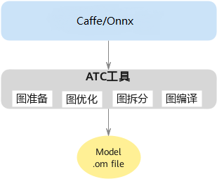

## 工具运行流程<a name="ZH-CN_TOPIC_0000002408581678"></a>

使用ATC工具进行模型转换的总体流程如[图1](#fig125822392014)所示。

**图 1**  运行流程<a name="fig125822392014"></a>  
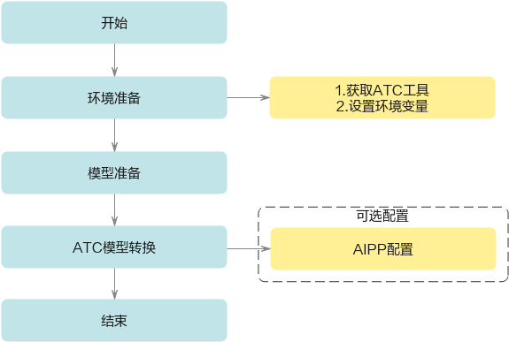

详细流程说明如下。

-   使用ATC工具之前，请先在开发环境安装ATC，获取相关路径下的ATC工具，详细说明请参见[获取ATC工具](#ZH-CN_TOPIC_0000002441981281)中的环境准备。
-   准备要进行转换的模型，并上传到开发环境，详细说明请参见[转换样例](#ZH-CN_TOPIC_0000002442021333)。
-   使用ATC工具进行模型转换，在配置相关参数时，根据实际情况选择是否进行[量化选项](#ZH-CN_TOPIC_0000002441981037)。图像预处理是图像分析引擎提供的硬件图像预处理模块，包括色域转换，图像归一化（减均值/乘系数）功能。

# 使用入门<a name="ZH-CN_TOPIC_0000002442020785"></a>


## 准备动作<a name="ZH-CN_TOPIC_0000002408422174"></a>


### 获取ATC工具<a name="ZH-CN_TOPIC_0000002441981281"></a>

独立安装CANN包，详请请参见《驱动和开发环境安装指南》"2.3.4 软件包安装"。

本手册以ATC独立安装CANN包为例进行说明。

### 设置环境变量<a name="ZH-CN_TOPIC_0000002408422110"></a>

> **须知：** 
>-   使用export方式设置环境变量后，环境变量只在当前窗口有效。如果用户之前在.bashrc文件中设置过ATC安装路径的环境变量，则在执行上述命令之前，需要先手动删除原来设置的ATC安装路径环境变量。
>-   如果用户之前在.bashrc文件中设置过之前版本ATC安装路径的环境变量，则在执行atc命令之前，需要先手动删除原来设置的ATC安装路径环境变量，然后设置如下环境变量。设置完成后，切换到新窗口执行atc模型转换命令。

**必选环境变量**（如下环境变量中$\{install\_path\}以软件包使用默认安装路径为例进行说明）

```
export PATH=${install_path}/Ascend/ascend-toolkit/{software version}/atc/bin:$PATH 
export LD_LIBRARY_PATH=${install_path}/Ascend/ascend-toolkit/{software version}/atc/third_party_lib:$LD_LIBRARY_PATH
```

或者执行如下命令配置环境变量。

```
source ${install_path}/Ascend/ascend-toolkit/{software version}/x86_64-linux/script/setenv.sh
```

## 转换样例<a name="ZH-CN_TOPIC_0000002442021333"></a>

> **须知：** 
>使用高版本ATC工具转换的模型，在低版本环境上使用可能会出现不兼容问题，建议使用匹配的版本重新进行模型转换。

**开源框架的Caffe网络模型转换成离线模型<a name="section205191754136"></a>**

1.  以ATC运行用户登录开发环境，并将模型转换过程中用到的模型文件（\*.prototxt）、权重文件（\*.caffemodel）等上传到开发环境任意路径，例如上传到$HOME_/_test_/_目录下。
2.  执行如下命令生成离线模型。（如下命令中使用的目录以及文件均为样例，请以实际为准）

    ```
    atc --model=$HOME/test/xxx.prototxt --weight=$HOME/test/xxx.caffemodel --framework=0 --output=$HOME/test/out/xxx --image_list="data:$HOME/test/xxx_image_list.txt" --insert_op_conf="$HOME/test/image_preprocess.txt"
    ```

    关于参数的详细解释以及使用方法请参见[参数说明](#ZH-CN_TOPIC_0000002408421982)。

3.  若提示如下信息，则说明模型转换成功。

    ```
    end binary code generating
    ```

    成功执行命令后，在output参数指定的路径下，可查看离线模型（如：xxx.om）。

    > **说明：** 
    >如果用户使用Faster RCNN、YOLOv3、YOLOv2、SSD等Caffe框架网络模型进行模型转换，由于此类网络中包含了一些原始Caffe框架中没有定义的算子结构，如ROIPooling、Normalize、PSROI Pooling和Upsample等。为了使图像分析引擎能支持这些网络，需要对原始的Caffe框架网络模型进行扩展，降低开发者开发自定义算子/开发后处理代码的工作量，详细扩展方法请参见[检测网硬化加速prototxt示例](#ZH-CN_TOPIC_0000002408582182)。

**开源框架的Onnx网络模型转换成离线模型<a name="section6529754537"></a>**

1.  以ATC运行用户登录开发环境，并将模型转换过程中使用到的模型文件（\*.onnx）等上传到开发环境任意路径，例如$HOME_/_test_/_目录下。
2.  执行如下命令生成离线模型。（如下命令中使用的目录以及文件均为样例，请以实际为准）

    ```
    atc --model=$HOME/test/xxx.onnx --framework=5 --output=$HOME/test/out/xxx.om –image_list=”data:$HOME/test/xxx_image_list.txt”
    ```

    关于参数的详细解释以及使用方法请参见[参数说明](#ZH-CN_TOPIC_0000002408421982)。

3.  若提示如下信息，则说明模型转换成功。

    ```
    end binary code generating
    ```

    成功执行命令后，在output参数指定的路径下，可查看离线模型（如：xxx.om）。

## 输出文件说明<a name="ZH-CN_TOPIC_0000002408582014"></a>

-   \*.om: 转换后的模型文件，文件名通过[--output](#ZH-CN_TOPIC_0000002408422394)配置。
-   atc\_perf.csv: 预估模型在板端运算时实际计算量。
-   calibration\_param.txt: 模型使用的量化参数。
-   cnn\_net\_tree\_parser.dot：原始模型解析后的算子信息。
-   cnn\_net\_tree\_adapt.dot：网络适配后的算子信息。
-   cnn\_net\_tree.dot：网络优化后的算子信息。
-   cnn\_net\_tree\_after\_tiling\_seg\_0.dot：网络深度融合后的算子信息。

    > **说明：** 
    >通过命令dot把\*.dot 文件转为pdf文件方便查看，如：dot -Tpdf cnn\_net\_tree.dot -o cnn\_net\_tree.pdf。
    >安装dot命令：apt install graphviz

-   mapper\_debug.log：转换模型的调试日志。
-   mapper\_error.log：转换模型的错误日志。
-   layer.json：输出原始模型的算子信息，见命令行参数[--json](#ZH-CN_TOPIC_0000002441981241)。
-   shape.json：输出原始模型每个算子的shape信息，见命令行参数[--json](#ZH-CN_TOPIC_0000002441981241)。
-   om.json：输出转换后的模型信息，见命令行参数[--json](#ZH-CN_TOPIC_0000002441981241)。
    -   模型信息包括但不限于：
        -   tmp\_buf\_size：板端运行模型时图像分析引擎算子需要的临时缓存。
        -   aacpu\_buf\_size：板端运行模型时CPU算子需要的缓存。
        -   dump\_buf\_size: 板端运行模型时, dump算子数据时需要的缓存。
        -   model\_param\_size：om模型的参数大小。
        -   atc\_version：转换模型时用的ATC版本号。
        -   batch\_num：支持的动态batch数，见命令行参数[--batch\_num](#ZH-CN_TOPIC_0000002408581538)。

    -   算子信息包括但不限于：
        -   name: 算子名。
        -   type: 算子类型。
        -   device\_type：算子类型是CPU或图像分析引擎。
        -   input\_desc：算子输入信息。
        -   output\_desc：算子输出信息。
        -   data\_flow：算子输入、计算、输出的数据类型。

# 参数说明<a name="ZH-CN_TOPIC_0000002408421982"></a>


## 概览<a name="ZH-CN_TOPIC_0000002408421822"></a>


### 总体约束<a name="ZH-CN_TOPIC_0000002408581554"></a>

在进行模型转换前，请务必查看如下约束要求。

-   如果要将Faster RCNN等网络模型转成适配图像分析引擎的离线模型，则务必参见[定制网络修改（Caffe）](#ZH-CN_TOPIC_0000002442021401)先修改prototxt模型文件。
-   支持原始框架类型为Caffe、Onnx的模型转换，输入数据类型为FP32、FP16、INT16、UINT16、INT8、UINT8。
-   当原始框架类型为Caffe时，模型文件（.prototxt）和权重文件（.caffemodel）的层名、层类型必须保持名称一致（包括大小写）。
-   不支持动态shape的输入，例如：NCHW输入为\[?,3,?,?\]多个维度可任意指定数值。模型转换时需指定固定数值。
-   输入数据最大支持四维，转维算子（reshape等）不能输出五维。
-   模型中的所有层算子除const算子外，输入和输出需要满足每个维度不为零。
-   只支持[算子规格说明](#ZH-CN_TOPIC_0000002442021001)中的算子，并需满足算子限制条件。不支持的算子需用户在板端使用CPU实现，把网络切分编译多个om，然后调用板端ACL API串通网络。
-   当模型输入是4维或2维，且第0维\>1时，ATC识别第0维为batch，为节省work buffer，把第0维改为1。

### 参数配置方式<a name="ZH-CN_TOPIC_0000002408581658"></a>

ATC 支持2种配置方式，命令行支持的参数，文件参数都支持。

-   文件参数方式：

    atc cfg\_file

示例：atc test.cfg

-   文件参数格式：

    \[param1\] value1

    \[param2\] value2

    …

文件参数格式示例：

```
[model] test.prototxt
[weight] test.caffemodel
[image_list] image_list.txt
[insert_op_conf] image_preprocess.txt
```

-   命令行参数方式：

    atc param1=value1 param2=value2 ...

示例：

```
--model=$HOME/test/resnet50.prototxt --weight=$HOME/test/resnet50.caffemodel --image_list=image_list.txt --insert_op_conf=image_preprocess.txt
```

### 参数概览<a name="ZH-CN_TOPIC_0000002408582298"></a>

通过atc --help命令查询出所有支持的参数。

## 基础功能<a name="ZH-CN_TOPIC_0000002408422094"></a>

以下介绍部分常用参数选项，更多选项用法请输入--help。


### 总体选项<a name="ZH-CN_TOPIC_0000002408582274"></a>


#### --help<a name="ZH-CN_TOPIC_0000002442021505"></a>

功能说明：显示帮助信息。

关联参数：无

参数取值：无

推荐配置及收益：无

示例：atc --help

依赖约束：无

#### --version<a name="ZH-CN_TOPIC_0000002441980929"></a>

功能说明：显示ATC版本信息。

关联参数：无

参数取值：无

推荐配置及收益：无

示例：atc --version

依赖约束：无

#### --mode<a name="ZH-CN_TOPIC_0000002442021181"></a>

功能说明：运行模式。

关联参数：若--mode取值为1或3，则需要与[ --om](#ZH-CN_TOPIC_0000002442021509)、[--json](#ZH-CN_TOPIC_0000002441981241)参数配合使用。如果将原始模型文件转换成带shape信息的json文件，则还需要与[ --dump\_mode](#ZH-CN_TOPIC_0000002408421858)参数配合使用。

参数取值：

-   参数值
    -   0：生成离线模型。
    -   1：离线模型或原始模型文件转json，方便查看模型中的参数信息。
    -   3：仅做预检，检查模型文件的内容是否合法。

-   参数值约束：配置为1或3时不会转换离线模型。
-   参数默认值：0

推荐配置及收益：无

示例：

```
--mode=0或--mode 0
```

> **说明：** 
>使用atc命令进行模型转换时，命令有两种方式，用户根据实际情况进行选择，本章节以选择第一种方式为例进行说明：
>1.  **atc param1=value1 param2=value2 ...**（value值前面不能有空格，否则会导致截断，param取的value值为空）
>2.  **atc param1 value1 param2 value2 ...**

依赖约束：无

### ATC输入选项<a name="ZH-CN_TOPIC_0000002408581818"></a>


#### --model<a name="ZH-CN_TOPIC_0000002408421662"></a>

功能说明：原始模型文件路径与文件名。

关联参数：当原始模型为Caffe框架时，需要和[--weight](#ZH-CN_TOPIC_0000002408421790)参数配合使用。

参数取值：

-   参数值：模型文件路径与文件名。
-   参数值格式：路径和文件名，支持大小写字母（a-z，A-Z）、数字（0-9）、下划线（\_）、中划线（-）、句点（.）、中文字符。

推荐配置及收益：无

示例：

```
--model=$HOME/test/resnet50.prototxt --weight=$HOME/test/resnet50.caffemodel
```

依赖约束：无

#### --weight<a name="ZH-CN_TOPIC_0000002408421790"></a>

功能说明：

-   权重文件路径与文件名。
-   当原始模型是Caffe时需要指定。

关联参数：当原始模型为Caffe框架时，需要和[--model](#ZH-CN_TOPIC_0000002408421662)参数配合使用。

参数取值：

-   参数值：权重文件路径与文件名。
-   参数值格式：路径和文件名，支持大小写字母（a-z，A-Z）、数字（0-9）、下划线（\_）、中划线（-）、句点（.）、中文字符。

推荐配置及收益：无

示例：

```
--model=$HOME/test/resnet50.prototxt --weight=$HOME/test/resnet50.caffemodel
```

依赖约束：无

#### --om<a name="ZH-CN_TOPIC_0000002442021509"></a>

功能说明：需要转换为json格式的离线模型（.om）、原始模型文件（.prototxt、.onnx）。

关联参数：若[--mode](#ZH-CN_TOPIC_0000002442021181)=1，则该参数必填，并且需要与[ --json](#ZH-CN_TOPIC_0000002441981241)参数配合使用。

参数取值：

-   参数值：离线模型（.om）、原始模型文件（.prototxt、.onnx）。
-   参数值格式：路径和文件名，支持大小写字母（a-z，A-Z）、数字（0-9）、下划线（\_）、中划线（-）、句点（.）、中文字符。

推荐配置及收益：无

示例：

-   离线模型转换为json

    ```
    --mode=1 --om=$HOME/test/module/out/caffe_resnet50.om  --json=$HOME/test/module/out/result.json
    ```

-   原始模型文件转换为json

    ```
    --mode=1 --om=$HOME/module/resnet50.prototxt  --json=$HOME/module/out/result.json  --framework=0
    ```

依赖约束：无

#### --framework<a name="ZH-CN_TOPIC_0000002408421866"></a>

功能说明：原始框架类型。

关联参数：无

参数取值：

-   参数值：
    -   0：Caffe
    -   5：ONNX
    -   6：ABSTRACT（使用构图接口）

-   参数值约束：当[ --mode](#ZH-CN_TOPIC_0000002442021181)为1时，该参数可选，可以指定Caffe、Onnx、原始模型转成json，不指定时默认为离线模型转json，如果指定时需要保证--om模型和--framework类型对应一致，例如：

    ```
    --mode=1 --framework=0 --om=$HOME/test/resnet18.prototxt  --mode=1 --framework=5 --om=$HOME/test/resnet101.onnx
    ```

推荐配置及收益：无

示例：

```
--mode=0  --framework=0  --model=$HOME/test/resnet50.prototxt  --weight=$HOME/test/resnet50.caffemodel
```

依赖约束：无

#### --custom\_ops\_lib<a name="ZH-CN_TOPIC_0000002442021105"></a>

功能说明：自定义算子库文件路径与文件名。如果没有配置--custom\_ops\_lib，默认从环境变量LD\_LIBRARY\_PATH中加载名为libsvp\_custom.so的自定义算子库。如果配置了--custom\_ops\_lib，则优先加载--custom\_ops\_lib。当转换的模型包含自定义算子，而环境变量LD\_LIBRARY\_PATH没有包含libsvp\_custom.so时，必须配置--custom\_ops\_lib指定自定义算子库，否则转换模型失败。

参数取值：

-   参数值：自定义算子库文件路径与文件名。绝对路径或相对ATC执行的路径。
-   参数值格式：路径和文件名，支持大小写字母（a-z，A-Z）、数字（0-9）、下划线（\_）、中划线（-）、句点（.）、中文字符。

推荐配置及收益：无

示例：

```
--custom_ops_lib=$HOME/test/libsvp_custom.so
```

依赖约束：无

### ATC输出选项<a name="ZH-CN_TOPIC_0000002442021489"></a>


#### --output<a name="ZH-CN_TOPIC_0000002408422394"></a>

功能说明：如果是开源框架的网络模型，存放转换后的离线模型的路径以及文件名，例如：$HOME/test/out/caffe\_resnet18或$HOME/test/out/tf\_resnet18，转换后的模型文件名以指定的文件名为准，自动以.om后缀结尾，例如：caffe\_resnet18.om。

关联参数：无

参数取值：

-   参数值：如果是开源框架的网络模型：存放转换后的离线模型的路径以及文件名。
-   参数值格式：路径和文件名：支持大小写字母（a-z，A-Z）、数字（0-9）、下划线（\_）、中划线（-）、句点（.）、中文字符。

推荐配置及收益：无

示例：

```
--output=$HOME/test/out/caffe_resnet18
```

依赖约束：无

#### --check\_report<a name="ZH-CN_TOPIC_0000002441981385"></a>

功能说明：预检结果保存文件路径和文件名。

关联参数：

--mode：当--mode=3仅做预检时，用于生成check\_result.json预检结果文件。

参数取值：

-   参数值：预检结果保存文件路径和文件名。
-   参数默认值：无
-   参数值格式：路径和文件名：支持大小写字母（a-z，A-Z）、数字（0-9）、下划线（\_）、中划线（-）、句点（.）、中文字符。

推荐配置及收益：无

示例：

```
--check_report=$HOME/test/out/check_result.json
```

依赖约束：无

#### --json<a name="ZH-CN_TOPIC_0000002441981241"></a>

功能说明：离线模型、原始模型文件、转换为json格式文件的路径和文件名。

关联参数：

-   离线模型转换为json

    该参数需要与[--mode](#ZH-CN_TOPIC_0000002442021181)=1、[--om](#ZH-CN_TOPIC_0000002442021509)参数配合使用。

-   原始模型文件转换为json

    该参数需要与[--mode](#ZH-CN_TOPIC_0000002442021181)=1、[--om](#ZH-CN_TOPIC_0000002442021509)参数、[ --framework](#ZH-CN_TOPIC_0000002408421866)配合使用，caffe还需配合[--weight](#ZH-CN_TOPIC_0000002408421790)使用。

参数取值：

-   参数值：json格式文件的路径和文件名。
-   参数值格式：路径和文件名：支持大小写字母（a-z，A-Z）、数字（0-9）、下划线（\_）、中划线（-）、句点（.）、中文字符。

推荐配置及收益：无

示例：

-   离线模型转换为包含模型信息和算子信息的json

    ```
    --mode=1 --om=$HOME/test/module/out/caffe_resnet50.om  --json=$HOME/test/module/out/om.json
    ```

-   原始模型文件转换为包含层信息的json

    ```
    --mode=1 --om=$HOME/module/resnet50.prototxt  --json=$HOME/module/out/layer.json  --framework=0
    ```

-   原始模型文件转换为包含形状信息的json

    ```
    --mode=1 --om=$HOME/module/resnet50.prototxt  --weight=$HOME/module/resnet50.caffemodel --json=$HOME/module/out/shape.json  --framework=0 --dump_mode=1
    ```

依赖约束：无

### 模型输入选项<a name="ZH-CN_TOPIC_0000002408581630"></a>


#### --insert\_op\_conf<a name="ZH-CN_TOPIC_0000002442020741"></a>

功能说明：插入图像预处理的配置。配置了图像预处理的Data层表示输入数据格式为图像，没有配置的为Feature Map。

关联参数：无

参数取值：

-   参数值：插入图像预处理的配置文件路径与文件名。
-   参数值格式：路径和文件名，支持大小写字母（a-z，A-Z）、数字（0-9）、下划线（\_）、中划线（-）、句点（.）、中文字符。

推荐配置及收益：无

图像预处理配置文件模板：

> **须知：** 
>1.  图像预处理当前仅支持色域转换、通道数据交换、减均值、乘系数，按顺序执行。
>2.  请按原始模型的图像预处理、板端运行时输入的数据格式配置。
>3.  模板中参数取值都为默认值，实际使用时，如果配置文件中某些参数未配置，则模型转换时自动设置成该模板中相应参数的默认值。
>4.  input\_format属性为必选属性，其余属性均为可选配置，如果未配置，则模型转换时自动设置成该模板中相应参数的默认值。
>5.  模型转换时开启或没有AAPP，在进行推理业务时，输入图片数据都要求为NCHW排布。
>6.  若图像输入为YUV400，要求输入channel为1；若图像输入为YUV420SP、YVU420SP、YUV422SP、YVU422SP、BGR\_PLANAR、RGB\_PLANAR、RGB\_PACKAGE、BGR\_PACKAGE，要求输入channel为3；其他输入格式要求输入channel为4。
>7.  图像预处理中的色域转换、通道数据交换根据input\_format和model\_format使能，不支持ax\_swap\_switch和input\_bias等参数配置使能。

```
# 图像预处理的配置以aapp_op开始，标识这是AAPP算子的配置，所有输入的配置都在aapp_op里描述。 
aapp_op {
# related_input_rank参数为可选，标识对模型的第几个输入做图像预处理，从0开始，默认为0。例如模型有两个输入，需要对第2个输入做图像预处理，则配置related_input_rank为1。
# 类型: 整型
# 配置范围 >= 0
related_input_rank: 0
# 板端运行时输入的图像格式，必选
# 类型: enum
# 取值范围：YUV420SP、YVU420SP、YUV422SP、YVU422SP、YUV400、BGR_PLANAR、RGB_PLANAR、RGB_PACKAGE、BGR_PACKAGE、XRGB_PLANAR、ARGB_PLANAR、XBGR_PLANAR、ABGR_PLANAR、RGBX_PLANAR、RGBA_PLANAR、BGRX_PLANAR、BGRA_PLANAR、XRGB_PACKAGE、ARGB_PACKAGE、XBGR_PACKAGE、ABGR_PACKAGE、RGBX_PACKAGE、RGBA_PACKAGE、BGRX_PACKAGE、BGRA_PACKAGE、RAW_RGGB、RAW_GRBG、RAW_GBRG、RAW_BGGR
input_format : BGR_PLANAR
# 原始模型训练时的图像格式（通道数据顺序），可选
# 类型: enum
# 取值范围：RGB、BGR、ARGB、ABGR、RGBA、BGRA、XRGB、XBGR、RGBX、BGRX、RGGB、GRBG、GBRG、BGGR
# 图像格式为灰度图(GRAY)时，不需配置。
model_format : BGR
# 减均值、乘系数设置
# 注意：均值和系数的通道顺序为按model_format做完通道数据交换后的顺序。
# 计算规则如下：
# pixel_out_chx(i) = [pixel_in_chx(i) – mean_chn_i] * var_reci_chn
# 每个通道的均值，可选
# 类型：float32
# 取值范围：[-65504.0, 65504.0]
mean_chn_0 :0
mean_chn_1 :0
mean_chn_2 :0
mean_chn_3 :0
# 每个通道的系数，可选
# 类型：float32
# 取值范围：[0, 65504]
var_reci_chn_0 :1.0
var_reci_chn_1 :1.0
var_reci_chn_2 :1.0
var_reci_chn_3 :1.0
}
```

示例：下面以插入图像预处理算子为例进行说明，配置文件内容示例如下（文件名举例为：_insert\_op.cfg_）。

```
aapp_op { 
#第一个输入
related_input_rank:0 
    input_format:YUV420SP 
    model_format:RGB
    # 以pytorch的预处理为例，如torchvision.transforms.Normalize(mean=[0.485, 0.456, 0.406], std=[0.229, 0.224, 0.225])，
    # 即 y = (x/255 - mean)/std = (x - 255*mean) * 1/(255*std)
    # 所以 mean_chn_x = 255*mean, var_reci_chn_x = 1/(255*std)
    mean_chn_0:123.675
    mean_chn_1:116.28
    mean_chn_2:103.53
    var_reci_chn_0:0.01712475 
    var_reci_chn_1:0.017507002 
    var_reci_chn_2:0.01742919 
 
# 第二个输入
related_input_rank:1 
    input_format: RGB_PLANAR 
    model_format:BGR
    # 以Caffe 的ImageData层预处理为例：
    #transform_param {
    #    scale: 0.0078125
    #    mean_value: 104.0
    #    mean_value: 117.0
    #    mean_value: 123.0
    #}
    # 即 y = (x - mean_value) * scale,
    # 所以 mean_chn_x = mean_value, var_reci_chn_x = scale
    mean_chn_0:104
    mean_chn_1:117
    mean_chn_2:126
    var_reci_chn_0:0.0078125 
    var_reci_chn_1:0.0078125 
    var_reci_chn_2:0.0078125
 }
```

将配置好的insert\_op.cfg文件上传到ATC工具所在服务器任意目录，例如上传到/home/test /，使用示例如下。

```
--insert_op_conf=/home/test/insert_op.cfg
```

依赖约束：无

#### --input\_type<a name="ZH-CN_TOPIC_0000002442021461"></a>

功能说明：指定网络Data层的输入数据类型，只用于Feature map 输入的Data层，不能用于图片输入的Data层。

关联参数：--insert\_op\_conf未配置Data层输入为图片格式，即输入为Feature map时，才可以指定输入数据类型。

参数取值：

-   参数值：格式为op\_name:data\_type
    -   op\_name：指定算子的层名，必须为Data层。
    -   data\_type：支持数据类型FP16, FP32, INT16, INT8, S16, S8, U16, U8, UINT16, UINT8。

-   参数值约束：指定多个输入数据类型时，使用英文分号隔开，用双引号括住。如：--input\_type="data0:INT8;data1:FP16"。
-   参数默认值：Feature map未指定数据类型时，默认FP32。

推荐配置及收益：无

示例：

```
--input_type="data0:INT8;data1:FP16"
```

依赖约束：无

#### --input\_shape<a name="ZH-CN_TOPIC_0000002408581846"></a>

功能说明：指定模型输入数据的shape。

关联参数：[--dynamic\_image\_size](#--dynamic_image_size)

参数取值：

-   参数值：

    模型输入的shape信息，例如："input\_name1:n1,c1,h1,w1;input\_name2:n2,c2,h2,w2"。指定的节点必须放在双引号中，节点中间使用英文分号分隔。input\_name必须是转换前的网络模型中的节点名称。

-   参数值约束：

    设置为固定取值，例如，取值为“1，2，3...”，用于将输入数据某个维度不固定的原始模型转换为固定维度的离线模型。

推荐配置及收益：无

示例：

```
--input_shape="input_name1:n1,c1,h1,w1;input_name2:n2,c2,h2,w2"
```

依赖约束：input\_shape需要与image\_list的量化校准文件数据匹配。

#### --input\_format<a name="ZH-CN_TOPIC_0000002408422382"></a>

功能说明：输入数据格式。

关联参数：无

参数取值：

-   参数值：只支持NCHW。
-   参数默认值：默认为NCHW。
-   参数值约束：无

推荐配置及收益：无

示例：

```
--input_format=NCHW
```

依赖约束：无

### 模型输出选项<a name="ZH-CN_TOPIC_0000002408421630"></a>


#### --output\_type<a name="ZH-CN_TOPIC_0000002408581794"></a>

功能说明：指定网络输出数据类型或指定输出节点的输出类型。

关联参数：

若指定某个输出节点的输出类型，则需要和[--out\_nodes](#ZH-CN_TOPIC_0000002408422030)参数配合使用。

参数取值：

-   参数值：支持两种格式。

    格式1：data\_type, 表示指定所有输出节点的输出数据类型。

    格式2：op\_name:output\_index:data\_type，表示指定某个输出节点的某个输出的输出数据类型。

    -   op\_name：指定算子的层名，必须为--out\_nodes指定的输出层。
    -   output\_index：指定输出层的第几个输出。
    -   data\_type：支持数据类型FP16, FP32, INT16, INT8, S16, S8, U16, U8, UINT16, UINT8。

-   参数默认值：FP32

推荐配置及收益：无

示例：

-   指定网络输出类型

    ```
    --output_type=FP32
    ```

-   指定某个输出节点的输出类型

    ```
    output_type="conv1:0:FP32"  --out_nodes="conv1:0"
    ```

依赖约束：CPU算子只支持输出FP32。

#### --out\_nodes<a name="ZH-CN_TOPIC_0000002408422030"></a>

功能说明：指定输出节点。当用户想要查看网络中间某层算子的输出时，则需要指定输出此算子。模型的最后一层默认输出，不需要指定。

关联参数：无

参数取值：

-   参数值：
    -   网络模型中的节点（node\_name）名称。
    -   指定的输出节点必须放在双引号中，节点中间使用英文分号分隔。node\_name必须是模型转换前的网络模型中的节点名称，冒号后的数字表示第几个输出，例如node\_name1:0，表示节点名称为node\_name1的第1个输出。

-   参数值约束：
    -   如果模型转换过程中该算子被离线计算融合掉，则该算子不能作为输出节点，配置不生效。
    -   没有实际运算而被优化删除的算子，不能作为输出节点，配置不生效。如Cast, Dropout算子。
    -   配置的输出节点的顺序与最后输出的顺序无关。
    -   即使最后一层的节点没有被指定，也一定会被输出。
    -   输出节点个数最大为32，即--out\_nodes配置的节点加上默认输出的节点个数不能大于32。

推荐配置及收益：无

示例：

参数值取网络模型中的节点（node\_name）名称。

```
--out_nodes="node_name1:0;node_name1:1;node_name2:0"
```

依赖约束：无

#### --output\_reorder<a name="ZH-CN_TOPIC_0000002441981573"></a>

功能说明：转换后的模型输出节点顺序和原始模型是否保持一致。

关联参数：无

参数取值：

-   参数值：\[0,1\]
    -   0：转换后的模型输出节点与原始模式保持一致。
    -   1：转换后的模型输出节点重新排列，与原始模式可能不一致。

-   参数默认值：1

示例：

```
--output_reorder=1
```

依赖约束：包含CPU算子网络时，不支持参数配置为0

### 量化选项<a name="ZH-CN_TOPIC_0000002441981037"></a>


#### --gfpq\_param\_file<a name="ZH-CN_TOPIC_0000002408581570"></a>

功能说明：GFPQ\(Grouped Floating Point Quantization\)分组量化参数配置文件。AMCT校准或retrain输出此文件，如quant\_param\_record.txt。ATC转换模型校准时输出此文件，如calibration\_param.txt。

关联参数：

--model：当输入模型为定点模型时，必须配置此参数。定点模型即AMCT校准后输出权重参数为定点的模型。

参数取值：参数值：protobuf格式的文件路径，支持txt和bin格式。

文件格式定义：Proto定义

```
syntax = "proto2";
package calibration;
enum DataType {
    S4 = 0;
    U4 = 1;
    S8 = 2;
    U8 = 3;
    S16 = 4;
    U16 = 5;
    F16 = 6;
    S32 = 7;
    U32 = 8;
    F32 = 9;
}
 
message FactorParam
{
    required DataType data_type = 1 [default = S8];
    repeated float scale = 2;
    repeated float offset = 3;
    optional bytes params = 4;
}
 
message QuantParam
{
    repeated FactorParam input = 1;
    optional FactorParam weight = 2;
}
 
message LayerParam
{
    required string name = 1;
    optional DataType calc_data_type = 2 [default = S8];
    required QuantParam quant_param = 3;
}
 
message CalibrationParam
{
    optional uint32 version = 1 [default = 65536];
    repeated LayerParam layer = 2;
}
```

示例：

```
version: 65536
layer {
  name: "conv1"
  calc_data_type: S8
  quant_param {
    input {
      data_type: S8
      scale: 12.75
      offset: -77
    }
    weight {
      data_type: S8
      scale: 127
    }
  }
}
```

推荐配置及收益：

-   配置量化参数后，ATC不需要再校准，节省转换模型的时间。
-   使用AMCT重训或校准后的quant\_param\_record.txt，精度更好。

示例：

```
--gfpq_param_file=quant_param_record.txt
```

依赖约束：无

#### --image\_list<a name="ZH-CN_TOPIC_0000002408582266"></a>

功能说明：转换模型生成量化参数时用的校准数据。支持Feature map文本和二进制格式文件和图片格式文件。

关联参数：

-   --model：当输入模型为定点模型时，不需要配置此参数。
-   --gfpq\_param\_file：配置了所有层的量化参数时，不需要配置此参数。已配置量化参数的层，不校准，只使用image\_list做forward。
-   --dump\_data：需要导出校准数据时，必须配置此参数。
-   --input\_type：校准数据使用二进制文件时，需要文件的数据类型和--input\_type匹配，如果没有配置，默认FP32。
-   --insert\_op\_conf：配置了图像预处理的Data层使用图片文件格式，没有则使用Feature map格式。

参数取值：

-   参数值：输入的层名和校准数据的文件路径。
-   参数值格式：多输入时，使用半角分号“;”隔开，用双引号括住。示例：

    --image\_list="name1:file1;name2:file2"

    此外，多输入时，也可以使用多个image\_list分别输入。示例：

    --image\_list="name1:file1"

    --image\_list="name2:file2"

-   文件格式：

    --insert\_op\_conf没有配置图像预处理时，即输入为Feature map。

    -   文本文件：

        文件内容为浮点文本数据，数据间以空格或逗号分隔，一行的数据个数为输入形状channel × height × width。一行表示一个batch。示例：

        输入形状 3×2×2，4个batch。即一行12个数据，共4行。feature\_map.txt：

        ```
        1 2 3 4 5 6 7 8 9 10 11 12
        0.46 0.05 -0.01 -0.20 -7 -0.6114 -0.12 0.87 0.553 -0.67 -0.027 0.164082
        -0.367 0.373 0.99 -0.0820 0.04 -0.454 -0.311 0.52 -0.033 -0.3 0.731473 0.09
        -0.012 0.928 -0.903 0.374 0.7 0.4 -0.48 -0.490 0.473455 -0.146 -0.83 -0.637
        ```

    -   二进制文件：

        文件内容为数据值的二进制，文件名必须以“.bin”为后缀。数据类型需要和--input\_type匹配。

    --insert\_op\_conf配置图像预处理，即输入为图片时，文件内容为图片文件路径，一行一个图片文件路径，一行表示一个batch。图片大小不限，ATC根据输入的height × width缩放。

    图片文件路径支持以下三种。

    1.  绝对路径；
    2.  相对--image\_list的路径；
    3.  相对ATC执行的路径。

    示例：testcase/image\_list.txt，3个batch配置3个图片文件。

    ```
    /home/xxx/testcase/images/test_1.jpg
    images/test_2.png
    testcase/images/test_3.bmp
    ```

    --insert\_op\_conf图像预处理配置的input\_format为YUV420SP、YVU420SP、YUV422SP、YVU422SP、YUV400、BGR\_PLANAR、RGB\_PLANAR、RGB\_PACKAGE、BGR\_PACKAGE、XRGB\_PLANAR、ARGB\_PLANAR、XBGR\_PLANAR、ABGR\_PLANAR、RGBX\_PLANAR、RGBA\_PLANAR、BGRX\_PLANAR、BGRA\_PLANAR、XRGB\_PACKAGE、ARGB\_PACKAGE、XBGR\_PACKAGE、ABGR\_PACKAGE、RGBX\_PACKAGE、RGBA\_PACKAGE、BGRX\_PACKAGE、BGRA\_PACKAGE时，使用图片路径文本格式，支持图片后缀bmp、jpeg、jpg、jpe、jp2、png。

    --insert\_op\_conf图像预处理配置的input\_format为RAW\_RGGB、RAW\_GRBG、RAW\_GBRG、RAW\_BGGR时，使用浮点文本格式，数据排列格式为RAW图像通道拆分前的顺序。

    示例：输入4×2×2的RAW\_RGGB, 通道拆分前的顺序：

    ```
    1	2	3	4	5	6	7	8	9	10	11	12	13	14	15	16
    ```

    通道拆分后的数据：

    ```
    1	3	9	11	2	4	10	12	5	7	13	15	6	8	14	16
    ```

    即：

    ```
    Channel_0:1	3	9	11
    Channel_1:2	4	10	12
    Channel_2:5	7	13	15
    Channel_3:6	8	14	16
    ```

    推荐配置及收益：校准时需要的图片是典型场景图片，建议从网络模型的测试场景随机选择3\~5张作为参考图片进行量化，选择的图像要尽量覆盖模型的各个场景（图像要包含分类或检测的目标，如分类网的目标是苹果、梨、桃子，则参考图像至少要包含苹果、梨、桃子。比如检测人、车的模型，参考图像中必须有人、车，不能仅使用人或者无人无车的图像进行量化）。图片影响校准生成量化参数，选择典型场景的图片计算出来的量化参数对典型场景的量化误差越小。所以请不要选择偏僻场景、过度曝光、纯黑、纯白的图片，请选择识别率高，色彩均匀的典型场景图片。

    示例：

    ```
    --image_list=”data1:feature_map.txt;data2:images.txt”
    ```

    依赖约束：无

#### --compile\_mode<a name="ZH-CN_TOPIC_0000002408421998"></a>

功能说明：编译模式，量化后的数据bit位宽，不影响权重量化的bit位宽，权重固定是8bit量化。

关联参数：

--gfpq\_param\_file：优先使用配置的量化参数。未配置量化参数时，compile\_mode才生效。

参数取值：

-   参数值

    -   0：数据和权重量化使用8bit。
    -   1：数据量化使用16bit，权重量化使用8bit。
    -   5：数据和权重量化使用8bit，且仅对CUBE算子进行量化，非CUBE算子使用fp16格式。
    -   6：数据量化使用16bit，权重量化使用8bit，且仅对CUBE算子进行量化，非CUBE算子使用fp16格式。

    CUBE算子：Conv、ConvTranspose、DepthwiseConv、InnerProduct、Gemm、MatMul、Pooling系列算子。

-   参数值约束：无
-   参数默认值：0

推荐配置及收益：

-   配置为0时，带宽小，板端缓存小，耗时少，精度损失大。
-   配置为1时，带宽大，板端缓存大，耗时大，精度损失小。
-   配置为5时，带宽、板端缓存、耗时比模式0大，比模式1和6小；精度损失比模式0小，与模式1相比则和网络结构相关，若网络中含有大量的非CUBE算子，则此模式可能精度损失更小。
-   配置为6时，带宽大，板端缓存大，耗时大，精度损失很小。

示例：

```
--compile_mode=0
```

依赖约束：无

#### --weight\_quant\_per\_channel<a name="ZH-CN_TOPIC_0000002441981677"></a>

功能说明：权重是否每个卷积单独量化，对应一组量化参数。只有Convolution和Deconvolution 支持。

关联参数：

--gfpq\_param\_file：优先使用配置的量化参数。未配置量化参数时, --weight\_quant\_per\_channel才生效。

参数取值：

-   参数值
    -   0：去使能。
    -   1：使能。

-   参数默认值：1

推荐配置及收益：配置为1时，权重量化粒度细，精度更好。

示例：

```
--weight_quant_per_channel=1
```

依赖约束：无

#### --quant\_mode<a name="ZH-CN_TOPIC_0000002441981413"></a>

功能说明：量化算法模式

-   参数取值：
    -   0：使用默认量化算法，linear\_quant
    -   1：数据和权重使用不同的量化算法，其中数据使用ifmr算法进行量化，权重使用arq算法进行量化

-   参数值约束：无
-   参数默认值：0

示例：

--quant\_mode=0

依赖约束：无

#### --high\_precision\_layer<a name="ZH-CN_TOPIC_0000002441981309"></a>

功能说明：高精度层配置。如果配置的层是CUBE算子，该算子会进行量化，数据量化使用16bit，权重量化使用8bit，如果是非CUBE算子，则使用fp16格式。

CUBE算子：Conv,ConvTranspose,DepthwiseConv,InnerProduct,Gemm,MatMul,Pooling系列算子。

-   参数取值：字符串。网络模型中的节点（node\_name）名称的集合。

-   推荐配置及收益：无

-   示例：其中opName0、opName1、opName2为需要配置的节点在网络模型中的名称

```
--high_precision_layer=opName0;opName1;opName2
```

#### --all\_batch\_quant\_together\_enable<a name="ZH-CN_TOPIC_0000002408582122"></a>

功能说明：量化时，是否所有batch一起进行量化参数计算。

参数取值：

-   参数值：
    -   0：去使能
    -   1：使能

-   参数默认值：0

示例：

```
--all_batch_quant_together_enable=1
```

#### --matmul\_per\_channel\_enable<a name="ZH-CN_TOPIC_0000002442020857"></a>

功能说明：权重是否每通道单独量化，对应一组量化参数。只有Matmul、Innerproduct、Gemm 支持。

关联参数：

[--gfpq\_param\_file](#ZH-CN_TOPIC_0000002408581570)：优先使用配置的量化参数。未配置量化参数时, --matmul\_per\_channel\_enable才生效。

[--weight\_quant\_per\_channel](#ZH-CN_TOPIC_0000002441981677)：当该配置为0时，--matmul\_per\_channel\_enable不生效

参数取值：

-   参数值
    -   0：去使能。
    -   1：使能。

-   参数默认值：0

推荐配置及收益：配置为1时，权重量化粒度细，精度更好。

示例：

```
--matmul_per_channel_enable=1
```

依赖约束：无

### RPN硬化层选项<a name="ZH-CN_TOPIC_0000002408581578"></a>


#### --nms\_threshold<a name="ZH-CN_TOPIC_0000002408421918"></a>

功能说明：Nms层阈值，只用于ATC量化校准时的RPN硬化层，板端推理时不使用此值。

关联参数：无

参数取值：

-   参数值：\[0,1\)
-   参数默认值：0.75

推荐配置及收益：无

示例：

```
--nms_threshold=0.75
```

依赖约束：无

#### --low\_score\_threshold<a name="ZH-CN_TOPIC_0000002408581990"></a>

功能说明：Filter层最低分数阈值，只用于ATC量化校准时的RPN硬化层，板端推理时不使用此值。

关联参数：无

参数取值：

-   参数值：\[0,1\)
-   参数默认值：0.08

推荐配置及收益：无

示例：

```
--low_score_threshold=0.08
```

依赖约束：无

#### --min\_width<a name="ZH-CN_TOPIC_0000002408581754"></a>

功能说明：Filter层最低宽度阈值。

关联参数：无

参数取值：

-   参数值：\[1,4096\]
-   参数默认值：1

推荐配置及收益：无

示例：

```
--min_width=1
```

依赖约束：无

#### --min\_height<a name="ZH-CN_TOPIC_0000002408421678"></a>

功能说明：Filter层最低高度阈值。

关联参数：无

参数取值：

-   参数值： \[1,4096\]
-   参数默认值：1

推荐配置及收益：无

示例：

```
--min_height=1
```

依赖约束：无

#### --image\_width<a name="ZH-CN_TOPIC_0000002441981513"></a>

功能说明：

网络包含RPN硬化层，输入为Feature map，不是图片时，需指定原图的宽。

关联参数：无

参数取值：

-   参数值：\[1,4096\]
-   参数默认值：0

推荐配置及收益：无

示例：

```
--image_width=224
```

依赖约束：无

#### --image\_height<a name="ZH-CN_TOPIC_0000002441981341"></a>

功能说明：网络包含RPN硬化层，输入为Feature map，不是图片时，需指定原图的高。

关联参数：无

参数取值：

-   参数值：\[1,4096\]
-   参数默认值：0

推荐配置及收益：无

示例：

```
--image_height=224
```

依赖约束：无

#### --generate\_anchors\_file<a name="ZH-CN_TOPIC_0000002408582078"></a>

功能说明：锚点坐标文件。使用硬化层的Faster RCNN、RFCN、SSD网络必须配置。

关联参数：无

参数取值：

-   参数值：anchors文件路径与文件名。
-   参数值格式：路径和文件名：支持大小写字母（a-z，A-Z）、数字（0-9）、下划线（\_）、中划线（-）、句点（.）、中文字符。
-   文件内容的格式：
    -   Faster RCNN和RFCN锚点坐标文件每行内容为“xmin, ymin, xmax, ymax”如下。

        ```
        -84.000000 -40.000000 99.000000 55.000000
        -176.000000 -88.000000 191.000000 103.000000
        -360.000000 -184.000000 375.000000 199.000000
        -56.000000 -56.000000 71.000000 71.000000
        ……
        ```

        请参考samples/2\_object\_detection/fasterrcnn/fasterrcnn\_alexnet/caffe\_model/anchors.txt和samples/2\_object\_detection/rfcn/rfcn\_resnet50/caffe\_model/anchors.txt

        生成anchors.txt的方法，例如Caffe框架在py-faster-rcnn/rpn/proposal\_layer.py保存anchors，如下图。

        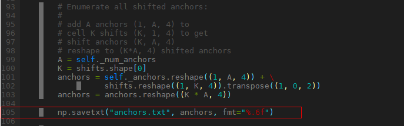

-   SSD锚点坐标文件每行内容为“xmin, ymin, xmax, ymax, var0, var1, var2, var3”，如下。

    ```
    -11.000000 -11.000000 19.000000 19.000000 0.099854 0.099854 0.199951 0.199951
    -17.000000 -17.000000 25.000000 25.000000 0.099854 0.099854 0.199951 0.199951
    -17.000000 -6.000000 25.000000 14.000000 0.099854 0.099854 0.199951 0.199951
    -6.000000 -17.000000 14.000000 25.000000 0.099854 0.099854 0.199951 0.199951
    ……
    ```

请参考samples/2\_object\_detection/ssd/caffe\_model/anchors.txt

生成anchors.txt方法：例如Caffe框架下保存mbox\_priorbox层的输出，再生成anchors，示例python代码如下。

```
import numpy as np
data = np.loadtxt("mbox_priorbox_output0_2_34928_caffe.float")
image_width=300
image_height=300
anchors_num = int(data.size / 8)
data = data.reshape(int(data.size / 4), -1)
boxes = data[ : anchors_num]
boxes[:,[0,2]] = boxes[:,[0,2]] * image_width
boxes[:,[1,3]] = boxes[:,[1,3]] * image_height
variance = data[ anchors_num : ]
anchors = np.hstack((boxes, variance))
np.savetxt("anchors_txt", anchors, fmt="%.6f")
```

推荐配置及收益：无

示例：

```
--generate_anchors_file=anchors.txt
```

依赖约束：无

#### --detection\_out\_accuracy<a name="ZH-CN_TOPIC_0000002441980977"></a>

功能说明：RPN层是否输出高精度。

关联参数：无

参数取值：

-   参数值：\[0,1\]
    -   0: 低精度，使用FP16。
    -   1：高精度，使用FP32。

-   参数默认值：0。

推荐配置及收益：无

示例：

```
--detection_out_accuracy=0
```

依赖约束：无

#### --use\_class\_id<a name="ZH-CN_TOPIC_0000002442021117"></a>

功能说明：RPN层输出是否包括class id。

关联参数：无

参数取值：

-   参数值：\[0,1\]
    -   0：不包括class id。
    -   1：包括class id。

-   参数默认值：1。

推荐配置及收益：当前版本只支持配1

示例：

```
--use_class_id=1
```

依赖约束：无

### Recurrent网络选项<a name="ZH-CN_TOPIC_0000002442020961"></a>


#### --recurrent\_max\_total\_t<a name="ZH-CN_TOPIC_0000002408422154"></a>

功能说明：Recurrent网络（包含LSTM/RNN/GRU层）每一句话的最大帧数，用于板端运行时分配输入内存。

关联参数：无

参数取值：

-   参数值：\[1, 1024\]
-   参数默认值：1024

推荐配置及收益：按板端实际部署运行时每一句话的最大帧数配置，配置越大，分配的输入内存越大。

> **须知：** 
>ONNX框架下无需配置该参数。

示例：

```
--recurrent_max_total_t=1024
```

依赖约束：必须大于等于每一句话的最大帧数，否则输入数据不完整，计算错误。

#### --recurrent\_tmax<a name="ZH-CN_TOPIC_0000002441981021"></a>

功能说明：Recurrent网络（包含LSTM/RNN/GRU层）执行期间，将基于continuous对输入的每一句话进行子句切分，一句话会被切分为若干子句以实现并行处理。该参数表示由切分所产生的若干子句中，子句的最大帧数，用于板端运行时分配临时缓存。假设某Recurrent层第二个输入continuous的数据为 \[0, 1, 0\]，这意味着帧数为3的句子将被切分为帧数为2和1的两个子句，子句的最大帧数为2，故该参数取2。ONNX模式下无该参数。

关联参数：无

参数取值：

-   参数值：\[1, 1024\]
-   参数默认值：1024

推荐配置及收益：按板端实际部署运行时每一句话基于continuous做子句切分后，子句的最大帧数配置，若难以明确子句的最大帧数，则配置为每一句话的最大帧数即可，配置越大占用临时缓存越大。

> **须知：** 
>ONNX框架下无需配置该参数。

示例：

```
--recurrent_tmax=1024
```

依赖约束：必须大于等于每一句话进行子句切分后的子句最大帧数，否则计算错误。

### 目标解决方案选项<a name="ZH-CN_TOPIC_0000002441981489"></a>


#### --soc\_version<a name="ZH-CN_TOPIC_0000002408421750"></a>

功能说明：模型转换时指定解决方案版本。

关联参数：无

参数取值：

-   参数值：SS626V100，SS928V100
-   参数默认值：SS626V100
-   用户根据具体板端解决方案，选择对应的取值。

推荐配置及收益：无

示例：

```
--soc_version=SS626V100
```

依赖约束：无

## 高级功能<a name="ZH-CN_TOPIC_0000002408422262"></a>

以下介绍部分常用参数选项，更多选项用法请输入--help。


### 功能配置选项<a name="ZH-CN_TOPIC_0000002441981185"></a>


#### --max\_roi\_frame\_cnt<a name="ZH-CN_TOPIC_0000002408582130"></a>

功能说明：包含ROI/PSROI网络的RPN阶段输出的候选框最大数目。

关联参数：无

参数取值：

-   参数值：\[1,2048\]
-   参数默认值：300

推荐配置及收益：无

示例：

```
--max_roi_frame_cnt=300
```

依赖约束：无

#### --online\_model\_type<a name="ZH-CN_TOPIC_0000002442020929"></a>

功能说明：转换生成模型的类型，用于板端执行profiling或dump数据。

关联参数：

[--layer\_fusion\_enable](#ZH-CN_TOPIC_0000002408421958)：深度融合的层不支持dump，即\*.om转json文件里，属性is\_dump\_available为0的层不支持dump。

参数取值：

-   参数值：\[0,7\]。

    0: 没有调试相关的内容，没有网络结构和算子信息。

    1: 调试带层信息。

    2: 调试带层开始和结束标记，板端profiling 用。

    3: 调试带层信息、层开始和结束标记。

    4: 调试带层TRAP指令，板端dump数据用。

    5: 调试带层信息、层TRAP指令。

    6: 调试带层开始和结束标记、层TRAP指令。

    7: 调试带层信息、层开始和结束标记、TRAP指令。

-   参数默认值：2

推荐配置及收益：

-   Release 配置 0。

-   Debug for profile配置2。
-   Debug for dump and compare配置4。

示例：

```
--online_model_type=2
```

依赖约束：不支持dump的层包括：深度融合的层、RoiPooling的第三路代表框个数的输入层。

#### --dynamic\_image\_size<a name="ZH-CN_TOPIC_0000002408582202"></a>

功能说明：设置输入的动态分辨率档位，在板端运行时可选择其中的一个作为输入的大小。

关联参数：

[--input\_shape](#ZH-CN_TOPIC_0000002408581846)：当某个输入采用动态分辨率时，需要配置该选项，且将宽、高配置成-1。

参数取值：

-   参数值：

    模型输入的动态分辨率信息，例如："h1,w1;h2,w2"。指定的分辨率必须放在双引号中，分辨率中间使用英文分号分隔。

-   参数值约束：

    可支持设置【2，100】组分辨率。第一组分辨率必须为最大的分辨率。

    每组分辨率宽、高的取值范围为【1，16384】。

推荐配置及收益：配置的动态分辨率越多时，生成的OM也会越大，请根据实际需要设置。

示例：

```
--dynamic_image_size="h1,w1;h2,w2"
--input_shape="input1:1,3,-1,-1"
```

表示input1使用动态分辨率，且动态分辨率有两组，分别为【h1, w1】、【h2, w2】。

在运行时，可以指定采用【h1, w1】或【h2, w2】进行推理。若未指定，则使用第一档分辨率【h1,w1】进行推理。

依赖约束：模型本身不支持其他分辨率时，不支持动态分辨率。如模型包含FC层。

### 模型调优选项<a name="ZH-CN_TOPIC_0000002441981581"></a>


#### --batch\_num<a name="ZH-CN_TOPIC_0000002408581538"></a>

功能说明：

-   支持batch处理的层单次处理的数据份数。影响性能和临时缓存大小。例如InnerProduct层支持batch处理，当batch\_num配置为0或1时，则分配1份输入和输出所需的内存，单次处理1份数据。
-   当batch\_num配置为256时，则分配256份的输入和输出所需的内存，单次处理256份数据。

关联参数：无

参数取值：

-   参数值：\[0,256\]。
    -   0和1：表示single（单张）模式。Batch层一次处理一张图片，临时缓存为一张图片分配。
    -   大于1：表示batch（多张）模式。Batch层一次处理batch张图片，临时缓存为batch张图片分配。

-   参数默认值：网络包含CPU层时默认为1。其他情况默认为256。
-   参数值约束：
    -   网络包含Recurrent层且Recurrent层连接非FC层时，网络包含ROIPooling/PSROIPooling层、RPN硬化层时，不支持batch，强制设置batch\_num为1。
    -   网络包含CPU层时，板端ACL配置的dynamic batch size必须小于等于ATC转模型时配置的batch\_num。

推荐配置及收益：对于batch层，batch模式比single模式性能好，占用内存也会更多。batch层包括InnerProduct、LSTM、RNN、GRU。

示例：

```
--batch_num=256
```

依赖约束：无

#### --internal\_stride<a name="ZH-CN_TOPIC_0000002441981529"></a>

功能说明：DDR读写对齐字节数。

关联参数：无

参数取值：

-   参数值：\{16,32,64,128,256\}。

-   参数默认值：16

推荐配置及收益：

-   DDR类型为DDR4时，读写32字节对齐性能最好，建议配置为32。
-   每个width占用的内存对齐到internal\_stride，当width\*sizeof\(data\_type\)不能整除internal\_stride时，internal\_stride越大越占用内存，读写内存越多也越耗时间，所以并不是internal\_stride越大越好。

示例：

```
--internal_stride=16
```

依赖约束：无

#### --fusion\_switch\_file<a name="ZH-CN_TOPIC_0000002441981105"></a>

功能说明：融合规则开关配置文件路径以及文件名。

关联参数：--fusion\_switch\_file是控制指定某个图优化开关，--net\_optimize\_enable是控制所有图优化开关。

-   当配置--net\_optimize\_enable=0时，--fusion\_switch\_file不生效。
-   当配置--net\_optimize\_enable=1时，--fusion\_switch\_file生效。

参数取值：

-   参数值：配置文件路径以及文件名。
-   参数值格式：路径和文件名：支持大小写字母（a-z，A-Z）、数字（0-9）、下划线（\_）、中划线（-）、句点（.）、中文字符。
-   参数值约束：如果用户想使用经过昇腾模型压缩工具量化后的模型，进行精度比对，则该参数必填。通过配置该文件，关闭融合功能。

推荐配置及收益：无

示例：支持如下融合规则。

-   BatchNormMergeToConvWeight: BatchNorm层融合到前一层Conv/Deconv/FC的权重。
-   BatchNormMergeToConvActive: BatchNorm层融合到前一层Conv/Deconv/FC的输出参数。
-   ScaleMergeToConvWeight: Scale层融合到前一层Conv/Deconv/FC的权重。
-   ScaleMergeToConvActive: Scale层融合到前一层Conv/Deconv/FC的输出参数。
-   BiasMergeToConv: Bias层融合到前一层Conv/Deconv/FC的权重。
-   ReluMerge: Relu层融合到前一层的输出参数。
-   PReluMerge: PRelu层融合到前一层的输出参数。
-   AbsMerge: Abs层融合到前一层的输出参数。
-   BatchNormTransfromToDepthwiseConv: BatchNorm层转换为DepthwiseConv层。性能大幅提升，精度略微降低。
-   EltwiseMergeToCube：Eltwise层融合到Cube层，Cube层包括Conv/Deconv/DepthwiseConv/Pool。性能提升，量化参数有溢出风险。
-   PoolMergeToConv：MaxPooling层融合到Conv层。

1.  支持文件配置，配置文件样例如下，冒号前面为融合规则名，后面字段表示融合规则是否开启（文件名举例为fusion\_switch.txt）。

    ```
    BatchNormMergeToConvWeight:on
    BatchNormMergeToConvActive:off
    ScaleMergeToConvWeight:on
    ScaleMergeToConvActive:off
    BiasMergeToConv:on
    ReluMerge:on
    PReluMerge:on
    AbsMerge:on
    BatchNormTransfromToDepthwiseConv:on
    PoolMergeToConv:on
    EltwiseMergeToCube:on
    ```

    将配置好的fusion\_switch.txt文件上传到ATC工具所在服务器任意目录，例如上传到/home/test/，使用示例如下。

    ```
    --fusion_switch_file=/home/test/fusion_switch.txt
    ```

1.  支持直接配置融合规则，使用示例如下。

    ```
    --fusion_switch_file=BatchNormMergeToConvWeight:off;BatchNormMergeToConvActive:off;ScaleMergeToConvWeight:off;ScaleMergeToConvActive:off
    ```

依赖约束：无

#### --net\_optimize\_enable<a name="ZH-CN_TOPIC_0000002442021417"></a>

功能说明：所有融合规则的使能开关。

关联参数：--fusion\_switch\_file是控制指定某个融合规则的开关，--net\_optimize\_enable是控制所有融合规则的开关。

-   当配置--net\_optimize\_enable=0时，关闭所有融合规则，--fusion\_switch\_file不生效。
-   当配置--net\_optimize\_enable=1时，使能所有融合规则，如果配置了--fusion\_switch\_file，以配置的融合规则文件为准。

参数取值：

-   参数值：\[0,1\]
    -   0：去使能。
    -   1：使能。

-   参数默认值：1

推荐配置及收益：融合可以减少算子，提升性能，推荐配置1。

示例：

```
--net_optimize_enable=1
```

依赖约束：无

#### --layer\_fusion\_enable<a name="ZH-CN_TOPIC_0000002408421958"></a>

功能说明：层间深度融合的使能开关。层间深度融合是指多层之间融合在一起，切小块循环计算，数据在内部RAM传递，不读写DDR。

关联参数：无

参数取值：

-   参数值：\[0,1\]
    -   0：去使能。
    -   1：使能。

-   参数默认值：1

推荐配置及收益：层间深度融合可以减少DDR读写，提升性能，推荐配置1。

示例：

```
--layer_fusion_enable=1
```

依赖约束：无

#### --layer\_m2m\_enable<a name="ZH-CN_TOPIC_0000002442021373"></a>

功能说明：层间数据共享的使能开关。层间数据共享是指两层之间，上一层的输出数据在内部RAM共享给下一层作为输入数据，不读写DDR。

关联参数：无

参数取值：

-   参数值：\[0,1\]
    -   0：去使能。
    -   1：使能。

-   参数默认值：1

推荐配置及收益：层间数据共享可以减少DDR读写，提升性能，推荐配置1。

示例：

```
--layer_m2m_enable=1
```

依赖约束：无

#### --force\_to\_cpu<a name="ZH-CN_TOPIC_0000002408581746"></a>

功能说明：强制指定某些层为cpu层。

关联参数：无

参数取值：指定算子的层名。

参数值约束：只能配置支持cpu的算子。

推荐配置及收益：如fp16数据范围精度导致的精度问题下降，可将对应算子设置成cpu算子，提升精度。

示例：

指定gather1和gather2为cpu算子

--force\_to\_cpu=gather1；gather2

#### --softmax\_optimize\_enable<a name="ZH-CN_TOPIC_0000002441980961"></a>

功能说明：softmax性能优化开关。

关联参数：无

参数取值：

-   参数值：\[0,1\]
    -   0：关闭softmax性能优化。
    -   1：使能softmax性能优化，axis为-1时性能收益2-4倍。

        当（最大值 - 数据）\> 9.010911时，存在精度损失风险。如输入数据\[10, 0.1\]，预期输出\[0.9999498, 0.0000501\]，实际输出\[1.000000, 0.000000\]。

-   参数默认值：0

示例：

```
--softmax_optimize_enable=1
```

依赖约束：无

#### --n\_loop\_enable<a name="ZH-CN_TOPIC_0000002408421734"></a>

功能说明：当n\>1，是否开启n循环。

关联参数：当开启该功能时，[--batch\_num](#ZH-CN_TOPIC_0000002408581538)将强制为1

参数取值：

-   参数值：\[0,1\]
    -   0：去使能。
    -   1：使能。

-   参数默认值：0
-   参数值约束：网络包含Recurrent层、ROIPooling/PSROIPooling层、RPN硬化层、IF/LOOP/SCAN等控制层时，不支持该配置使能

推荐配置及收益：开启n循环可以使网络使用n==1的shape进行指令生成：更小的shape将更易进行片上buffer交互，减少ddr交互，提升性能。但如果网络n\>1的shape不大，算子间在未开启n循环的时候就能使用片上buffer交互，那么该配置将没有收益，或者会有负收益。因此该配置不一定有性能收益，可以先尝试是否有收益再使用。

示例：

```
--n_loop_enable=1
```

依赖约束：无

### 调试选项<a name="ZH-CN_TOPIC_0000002441981145"></a>


#### --save\_original\_model<a name="ZH-CN_TOPIC_0000002408582058"></a>

功能说明：是否生成原始模型文件，用于功能仿真。原始模型文件包含了离线模型文件，所以也可用于上板运行。

关联参数：该参数需要与[ --output](#ZH-CN_TOPIC_0000002408422394)参数配合使用。

参数取值：

-   参数值
    -   false：不生成原始模型文件。
    -   true：生成原始模型文件。

-   参数默认值：false
-   参数值约束：若设置为true，在--output参数指定路径下生成原始模型文件（以后缀“\*\_original.om”格式结尾），用于功能仿真，也可用于上板运行。

推荐配置及收益：无

示例：

```
--output=/home/test/out/caffe_resnet50  --save_original_model=true
```

模型转换成功后，在out目录下生成原始模型文件caffe\_resnet50\_original.om。

依赖约束：无

#### --dump\_mode<a name="ZH-CN_TOPIC_0000002408421858"></a>

功能说明：是否生成带shape信息的json文件。

关联参数：该参数需要与[--json](#ZH-CN_TOPIC_0000002441981241)、[--mode](#ZH-CN_TOPIC_0000002442021181)=1、[--framework](#ZH-CN_TOPIC_0000002408421866)、[--om](#ZH-CN_TOPIC_0000002442021509)参数（需要为原始模型文件，如果为Caffe框架模型文件，还需要增加[--weight](#ZH-CN_TOPIC_0000002408421790)参数）配合使用。

参数取值

-   参数值：
    -   0：不使能。
    -   1：使能。

-   参数默认值：0

推荐配置及收益：无

示例：

```
atc --mode=1 --om=$HOME/test/resnet50.prototxt  --json=$HOME/test/out/resnet50.json  --framework=0 --weight=$HOME/test/resnet50.caffemodel --dump_mode=1
```

依赖约束：无

#### --dump\_data<a name="ZH-CN_TOPIC_0000002408422274"></a>

功能说明：导出ATC转换模型过程中的数据到文件。

关联参数：无

参数取值

-   参数值：范围\[0,31\]

    0：不导出。

    1：导出校准量化参数时每层quant-\>dequant-\>forward的数据到mapper\_quant目录。文件为protobuf格式，.dump后缀。

    2：导出使用量化参数仿真时每层quant-\>forward-\>dequant的数据到mapper\_simulate目录，文件为protobuf格式，.dump后缀。

    4：导出校准量化参数时的权重、模型参数等数据。

    8：导出校准量化参数时每层quant-\>dequant-\>forward的数据到mapper\_quant目录，文件为txt格式，.float后缀。

    16：导出使用量化参数仿真时每层quant-\>forward-\>dequant的数据到mapper\_simulate目录，文件为txt格式，.float后缀。

    值\{1,2,4\}可以组合成\{3,5,6,7\}，如配置3，即1+2，同时导出mapper\_quant和mapper\_simulate。

-   参数默认值：0
-   参数值约束：mapper\_simulate依赖mapper\_quant，即导出mapper\_simulate时需同时导出mapper\_quant。

推荐配置及收益：无

示例：

```
--image_list=input_data.txt --dump_data=3
```

依赖约束：需配置--image\_list才能导出数据，否则编译报错。

#### --is\_precheck<a name="ZH-CN_TOPIC_0000002442020757"></a>

功能说明：预检查输入的参数、模型等是否满足转换离线模型的要求。满足则返回成功，但不会生成离线模型；不满足，则返回失败，用户按提示信息修改参数或模型。

关联参数：无

参数取值

-   参数值：\[0,1\]
    -   0：关闭预检查。
    -   1：使能预检查。

-   参数默认值：0

推荐配置及收益：转换模型需要校准生成量化参数，比较耗时，使能预检查可以跳过校准，快速检查是否可以正常转换模型，节省时间。

示例：

```
--is_precheck=1
```

依赖约束：无

#### --log\_level<a name="ZH-CN_TOPIC_0000002442021257"></a>

功能说明：ATC的日志级别。

关联参数：无

参数取值

-   参数值：\[0,3\]

    0：必要的日志信息。

    1：接口级的日志信息。

    2：模块级的日志信息。

    3：函数级的日志信息。

-   参数默认值：0

推荐配置及收益：配置值越大，输出日志信息越多，转换模型的时间越长，推荐配置为0。

示例：

```
--log_level=0
```

依赖约束：无

#### --forward\_quantization\_option<a name="ZH-CN_TOPIC_0000002442021161"></a>

功能说明：ATC转换模型校准时的量化选项。控制推理时是否使能数据量化或权重量化。

关联参数：无

参数取值

-   参数值：

    0：关闭数据和权重量化。

    1：使能数据量化。

    2：使能权重量化。

    3：使能数据和权重量化。

-   参数默认值：3

推荐配置及收益：无

示例：

```
--forward_quantization_option=0
```

依赖约束：无

## 仅文件方式支持的参数<a name="ZH-CN_TOPIC_0000002408422226"></a>

以下参数仅支持以cfg文件方式配置，不支持命令行方式配置，用于兼容使用NNIE的cfg配置文件转模型。cfg文件格式见[参数配置方式](#ZH-CN_TOPIC_0000002408581658)。


### 模型输入选项<a name="ZH-CN_TOPIC_0000002441981333"></a>

以下配置不能和insert\_op\_conf同时配置。


#### image\_type<a name="ZH-CN_TOPIC_0000002441981689"></a>

功能说明：输入数据格式。

关联参数：一个输入对应一组image\_type，norm\_type，data\_scale，mean\_file。

参数取值：

-   参数值：整型数。
    -   0：Feature map
    -   1：BGR\_PLANAR
    -   2：YUV420SP
    -   3：YVU420SP
    -   4：YUV422SP
    -   5：YVU422SP
    -   6：YUV400
    -   7：RGB\_PLANAR
    -   8：RGB\_PACKAGE
    -   9：BGR\_PACKAGE
    -   10：XRGB\_PLANAR
    -   11：XBGR\_PLANAR
    -   12：RGBX\_PLANAR
    -   13：BGRX\_PLANAR
    -   14：XRGB\_PACKAGE
    -   15：XBGR\_PACKAGE
    -   16：RGBX\_PACKAGE
    -   17：BGRX\_PACKAGE
    -   18：RAW\_RGGB
    -   19：RAW\_GRBG
    -   20：RAW\_GBRG
    -   21：RAW\_BGGR

-   参数值约束: 不能和insert\_op\_conf同时配置

推荐配置及收益：无

示例：

```
[image_type] 1
[norm_type] 5
[data_scale] 0.00390625
[mean_file] mean.txt
```

依赖约束：无

#### norm\_type<a name="ZH-CN_TOPIC_0000002408582174"></a>

功能说明：对输入数据的预处理方法。

关联参数：一个输入对应一组image\_type，norm\_type，data\_scale，mean\_file。

参数取值：

-   参数值：整型数。
    -   0：不做任何预处理；
    -   1：减图像均值；
    -   2：减通道均值；
    -   3：对图像像素值乘以data\_scale；
    -   4：减图像均值后再乘以data\_scale；
    -   5：减通道均值后再乘以data\_scale。

-   参数值约束: 不能和insert\_op\_conf同时配置

推荐配置及收益：无

示例：

```
[image_type] 1
[norm_type] 5
[data_scale] 0.00390625
[mean_file] mean.txt
```

依赖约束：无

#### data\_scale<a name="ZH-CN_TOPIC_0000002442020791"></a>

功能说明：数据预处理缩放比例，配置为浮点数，配合norm\_type使用。

关联参数：一个输入对应一组image\_type，norm\_type，data\_scale，mean\_file。

参数取值：

-   参数值：浮点数。
-   参数值约束: 不能和insert\_op\_conf同时配置
-   参数默认值：0.00390625

推荐配置及收益：无

示例：

```
[image_type] 1
[norm_type] 5
[data_scale] 0.00390625
[mean_file] mean.txt
```

依赖约束：无

#### mean\_file<a name="ZH-CN_TOPIC_0000002408421854"></a>

功能说明：均值文件。

关联参数：一个输入对应一组image\_type，norm\_type，data\_scale，mean\_file。

参数取值：

-   参数值：文件路径与文件名。
-   参数值格式：路径和文件名，支持大小写字母（a-z，A-Z）、数字（0-9）、下划线（\_）、中划线（-）、句点（.）、中文字符。

参数值约束:

-   不能和insert\_op\_conf同时配置。
-   norm\_type为1、4时，表示均值文件xxx.binaryproto，caffe框架导出的预处理文件，已经过时，不建议使用。
-   norm\_type为2、5时，表示通道均值文件。
-   norm\_type为0、3时，用户也需要配置mean\_file项，但具体内容可以是一个无效路径，比如null；通道均值文件中每一行的浮点数表示对应的通道均值，如单通道只有一个值。

    示例：3个通道的mean.txt

    ```
    123.675
    116.28‬
    103.53
    ```

推荐配置及收益：无

示例：

```
[image_type] 1
[norm_type] 5
[data_scale] 0.00390625
[mean_file] mean.txt
```

依赖约束：无

#### RGB\_order<a name="ZH-CN_TOPIC_0000002408581546"></a>

功能说明：对输入数据做通道转换，转换后的通道顺序。

关联参数：image\_type。

参数取值：

-   参数值：字符串。取值范围\{RGB，BGR，XRGB，RGBX，XBGR，BGRX，RGGB，GRBG，GBRG，BGGR\}
-   参数值约束: 配置值需和image\_type的类型匹配。多个输入时，共用一个配置。

推荐配置及收益：无

示例：

```
[RGB_order] RGB
```

依赖约束：image\_type配置的输入为图像格式时才生效。

## 已废弃参数<a name="ZH-CN_TOPIC_0000002408422390"></a>

--recurrent\_cont：仅支持continuous模式，不需要配置。

# 定制网络修改（Caffe）<a name="ZH-CN_TOPIC_0000002442021401"></a>


## 简介<a name="ZH-CN_TOPIC_0000002442021045"></a>

本章节修改只适用于Caffe网络模型。

网络的算子可以分为如下几类。

-   标准算子：图像分析引擎支持的Caffe标准算子，比如Convolution等。
-   扩展算子：图像分析引擎支持的公开但非Caffe标准算子，分为 2 种：
    -   一种是基于Caffe框架进行自定义扩展的算子，比如Faster RCNN中的ROIPooling、SSD中的归一化算子Normalize等。
    -   另外一种是来源于其他图像分析方法框架的自定义算子，比如YOLOv2中Passthrough等。

Faster RCNN、SSD等网络模型都包含了一些原始Caffe框架中没有定义的算子结构，如ROIPooling、Normalize、PSROI Pooling和Upsample等。为了使图像分析引擎能支持这些网络，需要对原始的Caffe框架网络模型进行扩展，降低开发者开发自定义算子/开发后处理代码的工作量。若开发者的Caffe框架网络模型中使用了这些扩展算子，在进行模型转换时，需要先在prototxt中修改/添加扩展层的定义，才能成功进行模型转换。

本章节提供了图像分析引擎的扩展算子列表，并给出了如何根据扩展算子修改prototxt文件方法。

## Recurrent网络prototxt示例<a name="ZH-CN_TOPIC_0000002442021301"></a>

> **须知：** 
>带continuous模式下：同caffe prototxt一致，data层及Recurrent层包含continuous，但是N维度必须1；
>请参考customer/Software/sample/中lstm、rnn、gru 的sample写法。


### prototxt针对RNN层书写规范<a name="ZH-CN_TOPIC_0000002442020817"></a>

RNN的基本计算公式如下 \(与Caffe一致\)：

-   输入:  _x_<sub>_t,_</sub>_cont,h_<sub>_t-1_</sub>
-   输出：_O_<sub>_t_,</sub>_h_<sub>_t_</sub>
-   隐藏层：h<sub>_t_</sub>=tanh\(_w_<sub>_xh_</sub>_x_<sub>_t_</sub>+_w_<sub>_hh_</sub>_h_<sub>_t-1_</sub>+_b_<sub>_h_</sub>\)
-   输出层：o<sub>t</sub>=tanh\(_w_<sub>_ho_</sub>_h_<sub>_t_</sub>+_b_<sub>_0_</sub>\)

若有额外固定输入向量 x<sub>_static_</sub>，计算公式变为：

-   输入:  _x_<sub>_t,_</sub>_cont,h_<sub>_t-1_</sub>
-   输出：_O_<sub>_t_,</sub>_h_<sub>_t_</sub>
-   隐藏层：h<sub>_t_</sub>=tanh\(_w_<sub>_xh_</sub>_x_<sub>_t_</sub>+_w_<sub>_hh_</sub>_h_<sub>_t-1_</sub>+w<sub>_sh_</sub>x<sub>_static_</sub>+_b_<sub>_h_</sub>\)
-   输出层：o<sub>t</sub>=tanh\(_w_<sub>_ho_</sub>_h_<sub>_t_</sub>+_b_<sub>_0_</sub>\)

基于以上计算公式，RNN的prototxt有以下4种场景。


#### 通常场景（expose\_hidden=false，2输入，1输出）<a name="ZH-CN_TOPIC_0000002441981605"></a>

_Input: x_<sub>_t_</sub>\(1\~_T_\)__,cont\(1\~T\)__

_Output: o_<sub>_t_</sub>\(1\~_T_\)

Prototxt示例如下，有2个bottom和1个top，，其中bottom\[0\]对应_x_<sub>_t_</sub>_\(_1_\~T\)_，bottom\[1\]对应cont_\(_1_\~T\)_，top\[0\]对应_o_<sub>_t_</sub>_\(_1_\~T\)_：

-   若recurrent\_param的expose\_hidden 没配，默认值为false；
-   不支持recurrent\_param 的debug\_info，配置不会生效。

```
layer { 
  name: "rnn1" 
  type: "RNN" 
  bottom: "data0_xt" 
  bottom: "data1_cont" 
  top: "rnn1_ht " 
  recurrent_param { 
    num_output: 1000 
    weight_filler { 
      type: "uniform" 
      min: -0.08 
      max: 0.08 
    } 
    bias_filler { 
      type: "constant" 
      value: 0 
    } 
 }
}
```

#### 隐藏参数显式输入输出（expose\_hidden=true，3输入，2输出）<a name="ZH-CN_TOPIC_0000002441980945"></a>

_Input: x_<sub>_t_</sub>_\(_1_\~T\),cont\(1\~T\),h_<sub>0</sub>

_Output: o_<sub>_t_</sub>_\(_1_\~T\),h_<sub>_T_</sub>

Prototxt示例如下，有3个bottom和2个top，其中bottom\[0\]对应_x_<sub>_t_</sub>_\(_1_\~T\)_，bottom\[1\]对应cont_\(_1_\~T\)_，bottom\[2\]对应_h_<sub>0</sub>，top\[0\]对应_o_<sub>_t_</sub>_\(_1_\~T\)_，top\[1\]对应_h_<sub>_T_</sub>；

-   _h_<sub>0</sub>的向量维度须与recurrent\_param的num\_output一致；
-   只有前两个bottom与第一个top有时间的维度。
-   expose\_hidden=true配置下，不支持后接InnerProduct层。

```
layer { 
  name: "rnn1" 
  type: "RNN" 
  bottom: "data0_xt" 
  bottom: "data1_cont" 
  bottom: "data2_h0" 
  top: "rnn1_ht " 
  top: "rnn1_hT" 
  recurrent_param { 
    num_output: 1000 
    expose_hidden=1 
    weight_filler { 
      type: "uniform" 
      min: -0.08 
      max: 0.08 
    } 
    bias_filler { 
      type: "constant" 
      value: 0 
    } 
  }
}
```

#### 具有额外的固定输入（expose\_hidden=false，3输入，1输出）<a name="ZH-CN_TOPIC_0000002441981461"></a>

_Input: x_<sub>_t_</sub>_\(1\~T\),cont\(1\~T\),x_<sub>_static_</sub>

_Output: o_<sub>_t_</sub>_\(1\~T\)_

Prototxt示例如下，有3个bottom和1个top，其中bottom\[0\]对应_x_<sub>_t_</sub>_\(1\~T\)_，bottom\[1\]对应cont_\(1\~T\)_，bottom\[2\]对应_x_<sub>_static_</sub>，top对应_o_<sub>_t_</sub>_\(1\~T\)_；

-   _x_<sub>_t_</sub>_\(1\~T\)_和_cont_\(1\~T\)__的向量维度，必须与_x_<sub>_static_</sub>的向量维度一致；
-   如果recurrent\_param 的expose\_hidden 没配，默认值为false；
-   不支持recurrent\_param 的debug\_info，配置不会生效。

```
layer { 
   name: "rnn1" 
   type: "RNN" 
   bottom: "data0_xt"
   bottom: "data1_cont"
   bottom: "data2_xstatic"
   top: "rnn1_ht "
   recurrent_param { 
     num_output: 1000 
     weight_filler { 
       type: "uniform" 
       min: -0.08 
       max: 0.08 
     } 
     bias_filler { 
       type: "constant" 
       value: 0 
     } 
   } 
 }
```

#### 既有固定输入，又有显式的隐藏参数（expose\_hidden=true，4输入，2输出）<a name="ZH-CN_TOPIC_0000002441981357"></a>

_Input: x_<sub>_t_</sub>_\(1\~T\),cont\(1\~T\),x_<sub>_static_</sub>_,h_<sub>0</sub>

_Output: o_<sub>_t_</sub>_\(1\~T\),h_<sub>_T_</sub>

Prototxt示例如下，有3个bottom和2个top，其中bottom\[0\]对应_x_<sub>_t_</sub>_\(1\~T\)_，bottom\[1\]对应cont_\(1\~T\)_，bottom\[2\]对应_x_<sub>_static_</sub>，bottom\[3\]对应_h_<sub>0</sub>，top\[0\]对应_o_<sub>_t_</sub>_\(1\~T\)_，top\[1\]对应_h_<sub>_T_</sub>；

-   _h_<sub>0</sub>的向量维度必须与recurrent\_param的num\_output一致；
-   _x_<sub>_t_</sub>_\(1\~T\)_和_cont\(1\~T\)_的向量维度，必须与_x_<sub>_static_</sub>的向量维度一致；
-   只有前两个bottom与第一个top有时间的纬度；
-   expose\_hidden=true配置下，不支持后接InnerProduct层。

```
layer { 
   name: "rnn1" 
   type: "RNN" 
   bottom: "data0_xt" 
   bottom: "data1_cont" 
   bottom: "data2_xstatic" 
   bottom: "data3_h0" 
   top: "rnn1_ht" 
   top: "rnn1_hT" 
   recurrent_param { 
   num_output: 1000 
   expose_hidden=1 
     weight_filler { 
       type: "uniform" 
       min: -0.08 
       max: 0.08 
     } 
     bias_filler { 
       type: "constant" 
       value: 0 
     } 
   } 
 }
```

### prototxt针对LSTM层书写规范<a name="ZH-CN_TOPIC_0000002408422326"></a>

LSTM的基本计算公式如下 \(与Caffe一致\)：

-   输入门：_i_<sub>_t_</sub>=_sigmoid_\(_w_<sub>_xi_</sub>_x_<sub>_t_</sub>+_w_<sub>_hi_</sub>_h_<sub>_t-1_</sub>+_b_<sub>_i_</sub>\)
-   遗忘门：_f_<sub>_t_</sub>=_sigmoid_\(_w_<sub>_xf_</sub>_x_<sub>_t_</sub>+_w_<sub>_hf_</sub>_h_<sub>_t-1_</sub>+_b_<sub>_f_</sub>\)
-   输入值：_g_<sub>_t_</sub>=_tanh_\(_w_<sub>_xg_</sub>_x_<sub>_t_</sub>+_w_<sub>_hg_</sub>_h_<sub>_t-1_</sub>+_b_<sub>_g_</sub>\)
-   当前cell：_c_<sub>_t_</sub>=_i_<sub>_t_</sub>_\*g_<sub>_t_</sub>  +_f_<sub>_t_</sub>_\*c_<sub>_t-1_</sub>
-   输出门：_o_<sub>_t_</sub>=_sigmoid_\(_w_<sub>_xo_</sub>_x_<sub>_t_</sub>+_w_<sub>_ho_</sub>_h_<sub>_t-1_</sub>+_b_<sub>_0_</sub>\)

若有额外固定输入向量_x_<sub>_static_</sub>，计算公式变为：

-   输入门：_i_<sub>_t_</sub>=_sigmoid_\(_w_<sub>_xi_</sub>_x_<sub>_t_</sub>+_w_<sub>_hi_</sub>_h_<sub>_t-1_</sub>+_w_<sub>_si_</sub>_x_<sub>_static_</sub>+_b_<sub>_i_</sub>\)
-   遗忘门：_f_<sub>_t_</sub>=_sigmoid_\(_w_<sub>_xf_</sub>_x_<sub>_t_</sub>+_w_<sub>_hf_</sub>_h_<sub>_t-1_</sub>+_w_<sub>_sf_</sub>_x_<sub>_static_</sub>+_b_<sub>_f_</sub>\)
-   输入值：_g_<sub>_t_</sub>=_tanh_\(_w_<sub>_xg_</sub>_x_<sub>_t_</sub>+_w_<sub>_hg_</sub>_h_<sub>_t-1_</sub>+_w_<sub>_sg_</sub>_x_<sub>_static_</sub>+_b_<sub>_g_</sub>\)
-   当前cell：_c_<sub>_t_</sub>=_i_<sub>_t_</sub>_\*g_<sub>_t_</sub>  +_f_<sub>_t_</sub>_\*c_<sub>_t-1_</sub>
-   输出门：_o_<sub>_t_</sub>=_sigmoid_\(_w_<sub>_xo_</sub>_x_<sub>_t_</sub>+_w_<sub>_ho_</sub>_h_<sub>_t-1_</sub>+_w_<sub>_so_</sub>_x_<sub>_static_</sub>+_b_<sub>_0_</sub>\)

基于以上计算公式，LSTM的prototxt有以下4种场景。


#### 通常场景（expose\_hidden=false，2输入，1输出）<a name="ZH-CN_TOPIC_0000002408581910"></a>

_Input: x_<sub>_t_</sub>\(1\~_T_\)_,cont\(1\~T\)_

_Output: h_<sub>_t_</sub>\(1\~_T_\)

Prototxt示例如下，有2个bottom和1个top，其中bottom\[0\]对应_x_<sub>_t_</sub>_\(1\~T\)_，bottom\[1\]对应cont_\(1\~T\)_，top\[0\]对应_h_<sub>_t_</sub>\(1\~_T_\)。

-   若recurrent\_param的expose\_hidden 没配，默认值为false；
-   不支持recurrent\_param 的debug\_info，配置不会生效。

```
layer { 
   name: "lstm1" 
   type: "LSTM" 
   bottom: "data0_xt"
   bottom: "data1_cont"
   top: "lstm1_ht"
   recurrent_param { 
     num_output: 1000 
     weight_filler { 
       type: "uniform" 
       min: -0.08 
       max: 0.08 
     } 
     bias_filler { 
       type: "constant" 
       value: 0 
     } 
   } 
 }
```

#### 隐藏参数显式输入输出（expose\_hidden=true，4输入，3输出）<a name="ZH-CN_TOPIC_0000002408422230"></a>

_Input: x_<sub>_t_</sub>_\(1\~T\)_,cont\(1\~T\)__,_h_<sub>0</sub>,c<sub>0</sub>

_Output: h_<sub>_t_</sub>_\(1\~T\)_,_h_<sub>_T_</sub>,c<sub>T</sub>

Prototxt示例如下，有4个bottom和3个top，其中bottom\[0\]对应_x_<sub>_t_</sub>_\(1\~T\)_，bottom\[1\]对应_cont\(1\~T\)_，bottom\[2\]对应_h_<sub>0</sub>，bottom\[3\]对应c<sub>0</sub>，top\[0\]对应_h_<sub>_t_</sub>_\(1\~T\)_，top\[1\]对应_h_<sub>_T_</sub>，top\[2\]对应c<sub>T</sub>；

-   _h_<sub>0</sub>,c<sub>0</sub>的向量维度须与recurrent\_param的num\_output一致；
-   只有前两个bottom与第一个top有时间的维度；
-   不支持recurrent\_param 的debug\_info，配置不会生效；
-   expose\_hidden=true配置下，不支持后接InnerProduct层。

```
layer { 
   name: "lstm1" 
   type: "LSTM" 
   bottom: "data0_xt"
   bottom: "data1_cont"
   bottom: "data2_h0"
   bottom: "data3_c0"
   top: "lstm1_ht"
   top: "lstm1_hT"
   top: "lstm1_cT"
   recurrent_param { 
   num_output: 1000 
   expose_hidden = 1
     weight_filler { 
       type: "uniform" 
       min: -0.08 
       max: 0.08 
     } 
     bias_filler { 
       type: "constant" 
       value: 0 
     } 
   } 
 }
```

#### 具有额外的固定输入（expose\_hidden=false，3输入，1输出）<a name="ZH-CN_TOPIC_0000002408421742"></a>

_Input: x_<sub>_t_</sub>_\(_1_\~T\),cont\(1\~T\)_,_ x_<sub>_static_</sub>

_Output: h_<sub>_t_</sub>_\(_1_\~T\)_

Prototxt示例如下，有3个bottom和1个top，其中bottom\[0\]对应_x_<sub>_t_</sub>_\(_1_\~T\)_，bottom\[1\]对应_cont1\(\~T\)，_<sub>_ _</sub>bottom\[2\]对应_x_<sub>_static_</sub>，top对应_h_<sub>_t_</sub>_\(_1_\~T\)_；

-   _x_<sub>_t_</sub>_\(_1_\~T\)_和_cont\(1\~T\)_的向量维度，必须与_x_<sub>_static_</sub>的向量维度一致；
-   只有前两个bottom与第一个top有时间的纬度；
-   如果recurrent\_param 的expose\_hidden 没配，默认值为false；
-   不支持recurrent\_param 的debug\_info，配置不会生效。

```
layer { 
   name: "lstm1" 
   type: "LSTM" 
   bottom: "data0_xt"
   bottom: "data1_cont"
   bottom: "data2_xstatic"
   top: "lstm1_ht"
   recurrent_param { 
   num_output: 1000 
     weight_filler { 
       type: "uniform" 
       min: -0.08 
       max: 0.08 
     } 
     bias_filler { 
       type: "constant" 
       value: 0 
     } 
   } 
 }
```

#### 既有固定输入，又有显式的隐藏参数（expose\_hidden=true，5输入，3输出）<a name="ZH-CN_TOPIC_0000002441981445"></a>

_Input: x_<sub>_t_</sub>_\(_1_\~T\),cont\(1\~T\)_,_x_<sub>_static _</sub>,_h_<sub>_0_</sub>_ , c_<sub>_0_</sub>

_Output: h_<sub>_t_</sub>_\(_1_\~T\)_  ,_h_<sub>_T _</sub>,  _c_<sub>_T_</sub>

Prototxt示例如下，有4个bottom和3个top，其中bottom\[0\]对应_x_<sub>_t_</sub>_\(_1_\~T\)_，bottom\[1\]对应_cont\(1\~T\)_，bottom\[2\]对应_x_<sub>_static_</sub>，bottom\[3\]对应_h_<sub>_0_</sub>，bottom\[4\]对应_c_<sub>_0_</sub>，top\[0\]对应_h_<sub>_t_</sub>_\(_1_\~T\)_，top\[1\]对应_h_<sub>_T_</sub>，top\[2\]对应_c_<sub>_T_</sub>；

-   _h_<sub>_0_</sub>_ ,c_<sub>_0_</sub>的向量维度必须与recurrent\_param的num\_output一致；
-   _x_<sub>_t_</sub>_\(_1_\~T\)_和_cont\(1\~T\)_的向量维度，必须与_x_<sub>_static_</sub>的向量维度一致；
-   只有前两个bottom与第一个top有时间的纬度；
-   不支持recurrent\_param 的debug\_info，配置不会生效；
-   expose\_hidden=true配置下，不支持后接InnerProduct层。

```
layer { 
   name: "lstm1" 
   type: "LSTM" 
   bottom: "data0_xt"
   bottom: "data1_cont"
   bottom: "data2_xstatic"
   bottom: "data3_h0"
   bottom: "data4_c0"
   top: "lstm1_ht"
   top: "lstm1_hT"
   top: "lstm1_cT"
   recurrent_param { 
   num_output: 1000 
   expose_hidden = 1
     weight_filler { 
       type: "uniform" 
       min: -0.08 
       max: 0.08 
     } 
     bias_filler { 
       type: "constant" 
       value: 0 
     } 
   } 
 }
```

### prototxt针对GRU层书写规范<a name="ZH-CN_TOPIC_0000002408421698"></a>

GRU的基本计算公式如下 \(与Caffe一致\)：

-   重置门：_R_<sub>_t _</sub>=  _sigmoid_\(_w_<sub>_xr_</sub>_x_<sub>_t_</sub>+_w_<sub>_hr_</sub>_h_<sub>_t-1_</sub>+_b_<sub>_i_</sub>\)
-   更新门：_Z_<sub>_t _</sub>=  _sigmoid_\(_w_<sub>_xz_</sub>_x_<sub>_t_</sub>+_w_<sub>_hz_</sub>_h_<sub>_t-1_</sub>+_b_<sub>_f_</sub>\)
-   中间结果：_h_<sub>_hatt _</sub>=  _tanh_\(_w_<sub>_hhat_</sub>_\(R_<sub>_t_</sub>_ \* h_<sub>_t-1_</sub>_\)_+_b_<sub>_g_</sub>\)
-   输出门：_h_<sub>_t _</sub>=  _sigmoid_\(_\(1 - Z_<sub>_t_</sub>_\) \* h_<sub>_t-1 _</sub>_+ Z_<sub>_t _</sub>_\* h_<sub>_hatt_</sub>\)

若有额外固定输入向量_x_<sub>_static_</sub>，计算公式变为：

-   重置门：_R_<sub>_t_</sub>  =  _sigmoid_\(_w_<sub>_xr_</sub>_x_<sub>_t_</sub>+_w_<sub>_hr_</sub>_h_<sub>_t-1_</sub>+_w_<sub>_sr_</sub>_x_<sub>_static_</sub>+_b_<sub>_i_</sub>\)
-   更新门：_Z_<sub>_t_</sub>  =  _sigmoid_\(_w_<sub>_xz_</sub>_x_<sub>_t_</sub>+_w_<sub>_hz_</sub>_h_<sub>_t-1_</sub>+_w_<sub>_sz_</sub>_x_<sub>_static_</sub>+_b_<sub>_f_</sub>\)
-   中间结果：_h_<sub>_hatt_</sub>  =  _tanh_\(_w_<sub>_hhat_</sub>_\(R_<sub>_t_</sub>_ \* h_<sub>_t-1_</sub>_\)_+_b_<sub>_g_</sub>\)
-   输出门：_h_<sub>_t _</sub>=  _sigmoid_\(_\(1 - Z_<sub>_t_</sub>_\) \* h_<sub>_t-1 _</sub>_+ Z_<sub>_t _</sub>_\* h_<sub>_hatt_</sub>\)

基于以上计算公式，GRU的prototxt有以下4种场景。


#### 通常场景（expose\_hidden=false，2输入，1输出）<a name="ZH-CN_TOPIC_0000002408582146"></a>

_Input: x_<sub>_t_</sub>\(1\~_T_\)_,cont\(1\~T\)_

_Output: h_<sub>_t_</sub>\(1\~_T_\)

Prototxt示例如下，有2个bottom和1个top，其中bottom\[0\]对应_x_<sub>_t_</sub>_\(1\~T\)_，bottom\[1\]对应cont_\(1\~T\)_，top\[0\]对应_h_<sub>_t_</sub>\(1\~_T_\)：

-   若recurrent\_param的expose\_hidden 没配，默认值为false；
-   不支持recurrent\_param 的debug\_info，配置不会生效。

```
layer { 
   name: "GRU1" 
   type: "GRU" 
   bottom: "data0_xt"
   bottom: "data1_cont"
   top: "ht"
   recurrent_param { 
     num_output: 1000 
     weight_filler { 
       type: "uniform" 
       min: -0.08 
       max: 0.08 
     } 
     bias_filler { 
       type: "constant" 
       value: 0 
     } 
   } 
 }
```

#### 隐藏参数显式输入输出（expose\_hidden=true，3输入，2输出）<a name="ZH-CN_TOPIC_0000002442021241"></a>

_Input: x_<sub>_t_</sub>_\(1\~T\)__,cont\(1\~T\)_,_h_<sub>0</sub>

_Output: h_<sub>_t_</sub>_\(1\~T\)_,_h_<sub>_T_</sub>

Prototxt示例如下，有2个bottom和2个top，其中bottom\[0\]对应_x_<sub>_t_</sub>_\(1\~T\)_，bottom\[1\]对应_cont\(1\~T\)_，bottom\[2\]对应_h_<sub>0</sub>，top\[0\]对应_h_<sub>_t_</sub>_\(1\~T\)_，top\[1\]对应_h_<sub>_T_</sub>；

-   _h_<sub>0</sub>的向量维度须与recurrent\_param的num\_output一致；
-   只有前两个bottom与第一个top有时间的维度；
-   不支持recurrent\_param 的debug\_info，配置不会生效；
-   expose\_hidden=true配置下，不支持后接InnerProduct层。

```
layer { 
   name: "GRU1" 
   type: "GRU" 
   bottom: "data0_xt"
   bottom: "data1_cont"
   bottom: "data2_h0"
   top: "ht"
   top: "hT"
   recurrent_param { 
   num_output: 1000 
   expose_hidden = 1
     weight_filler { 
       type: "uniform" 
       min: -0.08 
       max: 0.08 
     } 
     bias_filler { 
       type: "constant" 
       value: 0 
     } 
   } 
 }
```

#### 具有额外的固定输入（expose\_hidden=false，3输入，1输出）<a name="ZH-CN_TOPIC_0000002442021285"></a>

_Input: x_<sub>_t_</sub>_\(_1_\~T\)__,cont\(1\~T\)_,_ x_<sub>_static_</sub>

_Output: h_<sub>_t_</sub>_\(_1_\~T\)_

Prototxt示例如下，有3个bottom和1个top，其中bottom\[0\]对应_x_<sub>_t_</sub>_\(_1_\~T\)_，bottom\[1\]对应_cont\(1\~T\)，_bottom\[2\]对应_x_<sub>_static_</sub>，top对应_h_<sub>_t_</sub>_\(_1_\~T\)_；

-   _x_<sub>_t_</sub>_\(_1_\~T\)_和_cont\(1\~T\)_的向量维度，必须与_x_<sub>_static_</sub>的向量维度一致；
-   只有前两个bottom与第一个top有时间的纬度；
-   如果recurrent\_param 的expose\_hidden 没配，默认值为false；
-   不支持recurrent\_param 的debug\_info，配置不会生效。

```
layer { 
   name: "GRU1" 
   type: "GRU" 
   bottom: "data0_xt"
   bottom: "data1_cont"
   bottom: "data2_xstatic"
   top: "ht"
   recurrent_param { 
   num_output: 1000 
     weight_filler { 
       type: "uniform" 
       min: -0.08 
       max: 0.08 
     } 
     bias_filler { 
       type: "constant" 
       value: 0 
     } 
   } 
 }
```

#### 既有固定输入，又有显式的隐藏参数（expose\_hidden=true，4输入，2输出）<a name="ZH-CN_TOPIC_0000002408581978"></a>

_Input: x_<sub>_t_</sub>_\(_1_\~T\)__,cont\(1\~T\)_,_x_<sub>_static _</sub>,_h_<sub>_0_</sub>

_Output: h_<sub>_t_</sub>_\(_1_\~T\)_,_h_<sub>_T_</sub>

Prototxt示例如下，有4个bottom和2个top，其中bottom\[0\]对应_x_<sub>_t_</sub>_\(_1_\~T\)_，bottom\[1\]对应_cont\(1\~T\)，_bottom\[2\]对应_x_<sub>_static_</sub>，bottom\[3\]对应_h_<sub>_0_</sub>，top\[0\]对应_h_<sub>_t_</sub>_\(_1_\~T\)_，top\[1\]对应_h_<sub>_T_</sub>；

-   _h_<sub>_0_</sub>的向量维度必须与recurrent\_param的num\_output一致；
-   _x_<sub>_t_</sub>_\(_1_\~T\)_和_cont\(1\~T\)_的向量维度，必须与_x_<sub>_static_</sub>的向量维度一致；
-   只有前两个bottom与第一个top有时间的纬度；
-   不支持recurrent\_param 的debug\_info，配置不会生效；
-   expose\_hidden=true配置下，不支持后接InnerProduct层。

```
layer { 
   name: "gru1" 
   type: "GRU" 
   bottom: "data0_xt"
   bottom: "data1_cont"
   bottom: "data2_xstatic"
   bottom: "data3_h0"
   top: "ht"
   top: "hT"
   recurrent_param { 
   num_output: 1000 
   expose_hidden = 1
     weight_filler { 
       type: "uniform" 
       min: -0.08 
       max: 0.08 
     } 
     bias_filler { 
       type: "constant" 
       value: 0 
     } 
   } 
 }
```

### Recurrent网络约束<a name="ZH-CN_TOPIC_0000002408581598"></a>

若Recurrent网络中包含诸如Conv等4D规格的算子，则存在如下约束。

-   Prototxt首层的N轴为1，即维度为1×C×H×W；
-   若batch\_num配置为batch（多张）模式，Recurrent算子的第二个输入continuous必须为Data层；
-   若batch\_num配置为batch（多张）模式，Prototxt构图时，需确保每张图片的计算不存在数据依赖。例如，不同图片所产生的帧数据不能拼接为整体以作为Recurrent第一个输入。

## 检测网硬化加速prototxt示例<a name="ZH-CN_TOPIC_0000002408582182"></a>

针对Faster RCNN、RFCN、SSD、YOLOV1、YOLOV2、YOLOV3等检测网络，支持对Proposal、SsdDetectionOutput、YoloDetectionOutput等层进行硬化，达到加速目的。本节描述如何把Proposal、SsdDetectionOutput、YoloDetectionOutput改为RPN硬化的[DetectionOutput](#ZH-CN_TOPIC_0000002442020881)层。

注意：DetectionOutput、DecBBox、Sort、Nms、Filter等硬化层不能作为首层；输出的得分是float型。


### DecBBox、Sort、Nms、Filter层功能说明<a name="ZH-CN_TOPIC_0000002441981089"></a>

针对Faster RCNN、RFCN、SSD、YOLOV1、YOLOV2、YOLOV3等检测网络，DecBBox会根据prototxt里面的calc\_mode的参数配置解析对应的网络模型，将不同个数以及不同格式的tensor转换成统一的格式。因此DecBBox的输入取决于calc\_mode参数的配置，下文会有详细介绍。DecBBox的输出为1×C×6×N的tensor，其中C为检测类别的数量，N为锚点的数量，height等于6表示检测框xmin, ymin, xmax, ymax, score, classID等六个信息，数据类型均为浮点型。当不需要输出类别信息时，DecBBox的输出为1×C×5×N。

Filter层的作用是将DecBBox根据设定的score的阈值将分数小于等于阈值的检测框滤掉，阈值的数据类型为浮点型，输入范围为\[0,1\)。

Sort层的作用是根据分数大小对DecBBox层的输出进行排序，当参数multi\_class\_sorting配置为true时，Sort层采取所有类别混合排序的策略，当参数multi\_class\_sorting配置为true时，Sort层采取每个类别之间根据分数分开排序的策略。Sort层支持top\_k的配置，即保留候选框的最大个数。当实际检测框个数小于top\_k时，按实际检测框的数量输出。阈值top\_k的数据类型为uint型，支持大于1的正整数。

NMS\(Non-Maximum Suppression\)层的作用是当两个候选框交叠面积除以两张图片占用的总面积大于一定阈值的时候过滤掉得分较低的检测框。阈值的数据类型为浮点型，输入的数据范围支持\[0,1\)。

Nms层和Filter层所需要的阈值信息由用户给定的data层输入，输入数据类型为float，一共包含四个点，分别对应nms的阈值、filter层的得分阈值、filter的高度阈值和filter层的宽度阈值。

注意：Filter层、Sort层、Nms层只能接在DecBBox层后面，Filter层、Sort层、Nms层之间的连接顺序和数量任意。

### 硬化层参数配置<a name="ZH-CN_TOPIC_0000002408422206"></a>

> **须知：** 
>FilterBox层不支持配置top\_k参数。SSD，FASTRCNN, RFCN网络需配置锚点信息的文件。配置的nms\_threshold, low\_score\_threshold, min\_height, min\_width等参数仅用作ATC推理时使用，实际板端仿真使用参数需通过API接口配置。API配置参数与推理参数建议保持一致。

**表 1**  硬化层参数配置限制

<a name="table1357mcpsimp"></a>
<table><thead align="left"><tr id="row1369mcpsimp"><th class="cellrowborder" valign="top" width="17.981798179817982%" id="mcps1.2.8.1.1"><p id="p1371mcpsimp"><a name="p1371mcpsimp"></a><a name="p1371mcpsimp"></a>参数</p>
</th>
<th class="cellrowborder" valign="top" width="16.851685168516852%" id="mcps1.2.8.1.2"><p id="p1373mcpsimp"><a name="p1373mcpsimp"></a><a name="p1373mcpsimp"></a>参数意义</p>
</th>
<th class="cellrowborder" valign="top" width="12.361236123612361%" id="mcps1.2.8.1.3"><p id="p1375mcpsimp"><a name="p1375mcpsimp"></a><a name="p1375mcpsimp"></a>DecBBox</p>
</th>
<th class="cellrowborder" valign="top" width="12.361236123612361%" id="mcps1.2.8.1.4"><p id="p1377mcpsimp"><a name="p1377mcpsimp"></a><a name="p1377mcpsimp"></a>FilterBox</p>
</th>
<th class="cellrowborder" valign="top" width="10.11101110111011%" id="mcps1.2.8.1.5"><p id="p1379mcpsimp"><a name="p1379mcpsimp"></a><a name="p1379mcpsimp"></a>Sort</p>
</th>
<th class="cellrowborder" valign="top" width="10.11101110111011%" id="mcps1.2.8.1.6"><p id="p1381mcpsimp"><a name="p1381mcpsimp"></a><a name="p1381mcpsimp"></a>Nms</p>
</th>
<th class="cellrowborder" valign="top" width="20.22202220222022%" id="mcps1.2.8.1.7"><p id="p1385mcpsimp"><a name="p1385mcpsimp"></a><a name="p1385mcpsimp"></a>DetectionOutput</p>
</th>
</tr>
</thead>
<tbody><tr id="row1387mcpsimp"><td class="cellrowborder" valign="top" width="17.981798179817982%" headers="mcps1.2.8.1.1 "><p id="p1389mcpsimp"><a name="p1389mcpsimp"></a><a name="p1389mcpsimp"></a>top_k</p>
</td>
<td class="cellrowborder" valign="top" width="16.851685168516852%" headers="mcps1.2.8.1.2 "><p id="p1391mcpsimp"><a name="p1391mcpsimp"></a><a name="p1391mcpsimp"></a>输出框数配置, prototxt中配置</p>
</td>
<td class="cellrowborder" valign="top" width="12.361236123612361%" headers="mcps1.2.8.1.3 "><p id="p1393mcpsimp"><a name="p1393mcpsimp"></a><a name="p1393mcpsimp"></a>NA</p>
</td>
<td class="cellrowborder" valign="top" width="12.361236123612361%" headers="mcps1.2.8.1.4 "><p id="p1395mcpsimp"><a name="p1395mcpsimp"></a><a name="p1395mcpsimp"></a>[1 ~ 524288]</p>
</td>
<td class="cellrowborder" valign="top" width="10.11101110111011%" headers="mcps1.2.8.1.5 "><p id="p1397mcpsimp"><a name="p1397mcpsimp"></a><a name="p1397mcpsimp"></a>[1 ~ 10000]</p>
</td>
<td class="cellrowborder" valign="top" width="10.11101110111011%" headers="mcps1.2.8.1.6 "><p id="p1399mcpsimp"><a name="p1399mcpsimp"></a><a name="p1399mcpsimp"></a>[1 ~ 10000]</p>
</td>
<td class="cellrowborder" valign="top" width="20.22202220222022%" headers="mcps1.2.8.1.7 "><p id="p1403mcpsimp"><a name="p1403mcpsimp"></a><a name="p1403mcpsimp"></a>NA</p>
</td>
</tr>
<tr id="row1404mcpsimp"><td class="cellrowborder" valign="top" width="17.981798179817982%" headers="mcps1.2.8.1.1 "><p id="p1406mcpsimp"><a name="p1406mcpsimp"></a><a name="p1406mcpsimp"></a>num_classes</p>
</td>
<td class="cellrowborder" valign="top" width="16.851685168516852%" headers="mcps1.2.8.1.2 "><p id="p1408mcpsimp"><a name="p1408mcpsimp"></a><a name="p1408mcpsimp"></a>分类数目配置，prototxt文件中配置。</p>
</td>
<td class="cellrowborder" valign="top" width="12.361236123612361%" headers="mcps1.2.8.1.3 "><p id="p1410mcpsimp"><a name="p1410mcpsimp"></a><a name="p1410mcpsimp"></a>NA</p>
</td>
<td class="cellrowborder" valign="top" width="12.361236123612361%" headers="mcps1.2.8.1.4 "><p id="p1412mcpsimp"><a name="p1412mcpsimp"></a><a name="p1412mcpsimp"></a>NA</p>
</td>
<td class="cellrowborder" valign="top" width="10.11101110111011%" headers="mcps1.2.8.1.5 "><p id="p1414mcpsimp"><a name="p1414mcpsimp"></a><a name="p1414mcpsimp"></a>NA</p>
</td>
<td class="cellrowborder" valign="top" width="10.11101110111011%" headers="mcps1.2.8.1.6 "><p id="p1416mcpsimp"><a name="p1416mcpsimp"></a><a name="p1416mcpsimp"></a>NA</p>
</td>
<td class="cellrowborder" valign="top" width="20.22202220222022%" headers="mcps1.2.8.1.7 "><p id="p1420mcpsimp"><a name="p1420mcpsimp"></a><a name="p1420mcpsimp"></a>[1~256]</p>
</td>
</tr>
<tr id="row1421mcpsimp"><td class="cellrowborder" valign="top" width="17.981798179817982%" headers="mcps1.2.8.1.1 "><p id="p1423mcpsimp"><a name="p1423mcpsimp"></a><a name="p1423mcpsimp"></a>multi_class_sorting</p>
</td>
<td class="cellrowborder" valign="top" width="16.851685168516852%" headers="mcps1.2.8.1.2 "><p id="p1425mcpsimp"><a name="p1425mcpsimp"></a><a name="p1425mcpsimp"></a>多类sort配置，prototxt文件中配置。</p>
</td>
<td class="cellrowborder" valign="top" width="12.361236123612361%" headers="mcps1.2.8.1.3 "><p id="p1427mcpsimp"><a name="p1427mcpsimp"></a><a name="p1427mcpsimp"></a>true/false</p>
</td>
<td class="cellrowborder" valign="top" width="12.361236123612361%" headers="mcps1.2.8.1.4 "><p id="p1429mcpsimp"><a name="p1429mcpsimp"></a><a name="p1429mcpsimp"></a>NA</p>
</td>
<td class="cellrowborder" valign="top" width="10.11101110111011%" headers="mcps1.2.8.1.5 "><p id="p1431mcpsimp"><a name="p1431mcpsimp"></a><a name="p1431mcpsimp"></a>NA</p>
</td>
<td class="cellrowborder" valign="top" width="10.11101110111011%" headers="mcps1.2.8.1.6 "><p id="p1433mcpsimp"><a name="p1433mcpsimp"></a><a name="p1433mcpsimp"></a>NA</p>
</td>
<td class="cellrowborder" valign="top" width="20.22202220222022%" headers="mcps1.2.8.1.7 "><p id="p1437mcpsimp"><a name="p1437mcpsimp"></a><a name="p1437mcpsimp"></a>NA</p>
</td>
</tr>
<tr id="row1438mcpsimp"><td class="cellrowborder" valign="top" width="17.981798179817982%" headers="mcps1.2.8.1.1 "><p id="p1440mcpsimp"><a name="p1440mcpsimp"></a><a name="p1440mcpsimp"></a>calc_mode</p>
</td>
<td class="cellrowborder" valign="top" width="16.851685168516852%" headers="mcps1.2.8.1.2 "><p id="p1442mcpsimp"><a name="p1442mcpsimp"></a><a name="p1442mcpsimp"></a>网络类型配置，必须和网络类型匹配， Prototxt中配置。</p>
</td>
<td class="cellrowborder" valign="top" width="12.361236123612361%" headers="mcps1.2.8.1.3 "><p id="p1444mcpsimp"><a name="p1444mcpsimp"></a><a name="p1444mcpsimp"></a>[0~4]</p>
</td>
<td class="cellrowborder" valign="top" width="12.361236123612361%" headers="mcps1.2.8.1.4 "><p id="p1446mcpsimp"><a name="p1446mcpsimp"></a><a name="p1446mcpsimp"></a>NA</p>
</td>
<td class="cellrowborder" valign="top" width="10.11101110111011%" headers="mcps1.2.8.1.5 "><p id="p1448mcpsimp"><a name="p1448mcpsimp"></a><a name="p1448mcpsimp"></a>NA</p>
</td>
<td class="cellrowborder" valign="top" width="10.11101110111011%" headers="mcps1.2.8.1.6 "><p id="p1450mcpsimp"><a name="p1450mcpsimp"></a><a name="p1450mcpsimp"></a>NA</p>
</td>
<td class="cellrowborder" valign="top" width="20.22202220222022%" headers="mcps1.2.8.1.7 "><p id="p1454mcpsimp"><a name="p1454mcpsimp"></a><a name="p1454mcpsimp"></a>NA</p>
</td>
</tr>
</tbody>
</table>

**表 2**  Faster RCNN RFCN SSD硬化层参数配置

<a name="_table33079474810"></a>
<table><thead align="left"><tr id="row1463mcpsimp"><th class="cellrowborder" valign="top" width="19%" id="mcps1.2.6.1.1"><p id="p1465mcpsimp"><a name="p1465mcpsimp"></a><a name="p1465mcpsimp"></a>层/参数</p>
</th>
<th class="cellrowborder" valign="top" width="14.000000000000002%" id="mcps1.2.6.1.2"><p id="p1467mcpsimp"><a name="p1467mcpsimp"></a><a name="p1467mcpsimp"></a>参数</p>
</th>
<th class="cellrowborder" valign="top" width="28.999999999999996%" id="mcps1.2.6.1.3"><p id="p1469mcpsimp"><a name="p1469mcpsimp"></a><a name="p1469mcpsimp"></a>参数意义</p>
</th>
<th class="cellrowborder" valign="top" width="15%" id="mcps1.2.6.1.4"><p id="p1471mcpsimp"><a name="p1471mcpsimp"></a><a name="p1471mcpsimp"></a>Faster RCNN/RFCN</p>
</th>
<th class="cellrowborder" valign="top" width="23%" id="mcps1.2.6.1.5"><p id="p1473mcpsimp"><a name="p1473mcpsimp"></a><a name="p1473mcpsimp"></a>SSD</p>
</th>
</tr>
</thead>
<tbody><tr id="row1475mcpsimp"><td class="cellrowborder" rowspan="3" valign="top" width="19%" headers="mcps1.2.6.1.1 "><p id="p1477mcpsimp"><a name="p1477mcpsimp"></a><a name="p1477mcpsimp"></a>DetectionOutput</p>
</td>
<td class="cellrowborder" valign="top" width="14.000000000000002%" headers="mcps1.2.6.1.2 "><p id="p1479mcpsimp"><a name="p1479mcpsimp"></a><a name="p1479mcpsimp"></a>num_anchors</p>
</td>
<td class="cellrowborder" valign="top" width="28.999999999999996%" headers="mcps1.2.6.1.3 "><p id="p1481mcpsimp"><a name="p1481mcpsimp"></a><a name="p1481mcpsimp"></a>锚点数目，必须配置</p>
</td>
<td class="cellrowborder" valign="top" width="15%" headers="mcps1.2.6.1.4 "><p id="p1483mcpsimp"><a name="p1483mcpsimp"></a><a name="p1483mcpsimp"></a>√</p>
</td>
<td class="cellrowborder" valign="top" width="23%" headers="mcps1.2.6.1.5 "><p id="p1485mcpsimp"><a name="p1485mcpsimp"></a><a name="p1485mcpsimp"></a>√</p>
</td>
</tr>
<tr id="row1486mcpsimp"><td class="cellrowborder" valign="top" headers="mcps1.2.6.1.1 "><p id="p1488mcpsimp"><a name="p1488mcpsimp"></a><a name="p1488mcpsimp"></a>num_classes</p>
</td>
<td class="cellrowborder" valign="top" headers="mcps1.2.6.1.2 "><p id="p1490mcpsimp"><a name="p1490mcpsimp"></a><a name="p1490mcpsimp"></a>分类数目，必须配置</p>
</td>
<td class="cellrowborder" valign="top" headers="mcps1.2.6.1.3 "><p id="p1492mcpsimp"><a name="p1492mcpsimp"></a><a name="p1492mcpsimp"></a>1</p>
</td>
<td class="cellrowborder" valign="top" headers="mcps1.2.6.1.4 "><p id="p1494mcpsimp"><a name="p1494mcpsimp"></a><a name="p1494mcpsimp"></a>√</p>
</td>
</tr>
<tr id="row1495mcpsimp"><td class="cellrowborder" valign="top" headers="mcps1.2.6.1.1 "><p id="p1497mcpsimp"><a name="p1497mcpsimp"></a><a name="p1497mcpsimp"></a>num_coords</p>
</td>
<td class="cellrowborder" valign="top" headers="mcps1.2.6.1.2 "><p id="p1499mcpsimp"><a name="p1499mcpsimp"></a><a name="p1499mcpsimp"></a>坐标数目，必须配置为4</p>
</td>
<td class="cellrowborder" valign="top" headers="mcps1.2.6.1.3 "><p id="p1501mcpsimp"><a name="p1501mcpsimp"></a><a name="p1501mcpsimp"></a>4</p>
</td>
<td class="cellrowborder" valign="top" headers="mcps1.2.6.1.4 "><p id="p1503mcpsimp"><a name="p1503mcpsimp"></a><a name="p1503mcpsimp"></a>4</p>
</td>
</tr>
<tr id="row1504mcpsimp"><td class="cellrowborder" rowspan="7" valign="top" width="19%" headers="mcps1.2.6.1.1 "><p id="p1506mcpsimp"><a name="p1506mcpsimp"></a><a name="p1506mcpsimp"></a>DecBBox</p>
</td>
<td class="cellrowborder" valign="top" width="14.000000000000002%" headers="mcps1.2.6.1.2 "><p id="p1508mcpsimp"><a name="p1508mcpsimp"></a><a name="p1508mcpsimp"></a>share_location</p>
</td>
<td class="cellrowborder" valign="top" width="28.999999999999996%" headers="mcps1.2.6.1.3 "><p id="p1510mcpsimp"><a name="p1510mcpsimp"></a><a name="p1510mcpsimp"></a>是否是共享位置预测</p>
</td>
<td class="cellrowborder" valign="top" width="15%" headers="mcps1.2.6.1.4 "><p id="p1512mcpsimp"><a name="p1512mcpsimp"></a><a name="p1512mcpsimp"></a>false</p>
</td>
<td class="cellrowborder" valign="top" width="23%" headers="mcps1.2.6.1.5 "><p id="p1514mcpsimp"><a name="p1514mcpsimp"></a><a name="p1514mcpsimp"></a>true</p>
</td>
</tr>
<tr id="row1515mcpsimp"><td class="cellrowborder" valign="top" headers="mcps1.2.6.1.1 "><p id="p1517mcpsimp"><a name="p1517mcpsimp"></a><a name="p1517mcpsimp"></a>share_variance</p>
</td>
<td class="cellrowborder" valign="top" headers="mcps1.2.6.1.2 "><p id="p1519mcpsimp"><a name="p1519mcpsimp"></a><a name="p1519mcpsimp"></a>是否共享方差，SSD网络必须配置为false</p>
</td>
<td class="cellrowborder" valign="top" headers="mcps1.2.6.1.3 "><p id="p1521mcpsimp"><a name="p1521mcpsimp"></a><a name="p1521mcpsimp"></a>NA</p>
</td>
<td class="cellrowborder" valign="top" headers="mcps1.2.6.1.4 "><p id="p1523mcpsimp"><a name="p1523mcpsimp"></a><a name="p1523mcpsimp"></a>false</p>
</td>
</tr>
<tr id="row1524mcpsimp"><td class="cellrowborder" valign="top" headers="mcps1.2.6.1.1 "><p id="p1526mcpsimp"><a name="p1526mcpsimp"></a><a name="p1526mcpsimp"></a>clip_bbox</p>
</td>
<td class="cellrowborder" valign="top" headers="mcps1.2.6.1.2 "><p id="p1528mcpsimp"><a name="p1528mcpsimp"></a><a name="p1528mcpsimp"></a>是否使能框裁剪</p>
</td>
<td class="cellrowborder" valign="top" headers="mcps1.2.6.1.3 "><p id="p1530mcpsimp"><a name="p1530mcpsimp"></a><a name="p1530mcpsimp"></a>true</p>
</td>
<td class="cellrowborder" valign="top" headers="mcps1.2.6.1.4 "><p id="p1532mcpsimp"><a name="p1532mcpsimp"></a><a name="p1532mcpsimp"></a>true</p>
</td>
</tr>
<tr id="row1533mcpsimp"><td class="cellrowborder" valign="top" headers="mcps1.2.6.1.1 "><p id="p1535mcpsimp"><a name="p1535mcpsimp"></a><a name="p1535mcpsimp"></a>code_type</p>
</td>
<td class="cellrowborder" valign="top" headers="mcps1.2.6.1.2 "><p id="p1537mcpsimp"><a name="p1537mcpsimp"></a><a name="p1537mcpsimp"></a>必须配置为CENTER_SIZE</p>
</td>
<td class="cellrowborder" valign="top" headers="mcps1.2.6.1.3 "><p id="p1539mcpsimp"><a name="p1539mcpsimp"></a><a name="p1539mcpsimp"></a>CENTER_SIZE</p>
</td>
<td class="cellrowborder" valign="top" headers="mcps1.2.6.1.4 "><p id="p1541mcpsimp"><a name="p1541mcpsimp"></a><a name="p1541mcpsimp"></a>CENTER_SIZE</p>
</td>
</tr>
<tr id="row1542mcpsimp"><td class="cellrowborder" valign="top" headers="mcps1.2.6.1.1 "><p id="p1544mcpsimp"><a name="p1544mcpsimp"></a><a name="p1544mcpsimp"></a>bias</p>
</td>
<td class="cellrowborder" valign="top" headers="mcps1.2.6.1.2 "><p id="p1546mcpsimp"><a name="p1546mcpsimp"></a><a name="p1546mcpsimp"></a>YOLOV2 YOLOV3网络必须配置,值域[0,1024.0]</p>
</td>
<td class="cellrowborder" valign="top" headers="mcps1.2.6.1.3 "><p id="p1548mcpsimp"><a name="p1548mcpsimp"></a><a name="p1548mcpsimp"></a>NA</p>
</td>
<td class="cellrowborder" valign="top" headers="mcps1.2.6.1.4 "><p id="p1550mcpsimp"><a name="p1550mcpsimp"></a><a name="p1550mcpsimp"></a>NA</p>
</td>
</tr>
<tr id="row1551mcpsimp"><td class="cellrowborder" valign="top" headers="mcps1.2.6.1.1 "><p id="p1553mcpsimp"><a name="p1553mcpsimp"></a><a name="p1553mcpsimp"></a>variance</p>
</td>
<td class="cellrowborder" valign="top" headers="mcps1.2.6.1.2 "><p id="p1555mcpsimp"><a name="p1555mcpsimp"></a><a name="p1555mcpsimp"></a>方差配置，SSD网络必须配置，且个数必须为4，值域[0,1.0]</p>
</td>
<td class="cellrowborder" valign="top" headers="mcps1.2.6.1.3 "><p id="p1557mcpsimp"><a name="p1557mcpsimp"></a><a name="p1557mcpsimp"></a>NA</p>
</td>
<td class="cellrowborder" valign="top" headers="mcps1.2.6.1.4 "><p id="p1559mcpsimp"><a name="p1559mcpsimp"></a><a name="p1559mcpsimp"></a>示例：variance: 0.1</p>
<p id="p1560mcpsimp"><a name="p1560mcpsimp"></a><a name="p1560mcpsimp"></a>variance: 0.1</p>
<p id="p1561mcpsimp"><a name="p1561mcpsimp"></a><a name="p1561mcpsimp"></a>variance: 0.2</p>
<p id="p1562mcpsimp"><a name="p1562mcpsimp"></a><a name="p1562mcpsimp"></a>variance: 0.2</p>
</td>
</tr>
<tr id="row1563mcpsimp"><td class="cellrowborder" valign="top" headers="mcps1.2.6.1.1 "><p id="p1565mcpsimp"><a name="p1565mcpsimp"></a><a name="p1565mcpsimp"></a>calc_mode</p>
</td>
<td class="cellrowborder" valign="top" headers="mcps1.2.6.1.2 "><p id="p1567mcpsimp"><a name="p1567mcpsimp"></a><a name="p1567mcpsimp"></a>网络类型, 必须配置为表格中网络对应数值</p>
</td>
<td class="cellrowborder" valign="top" headers="mcps1.2.6.1.3 "><p id="p1569mcpsimp"><a name="p1569mcpsimp"></a><a name="p1569mcpsimp"></a>0</p>
</td>
<td class="cellrowborder" valign="top" headers="mcps1.2.6.1.4 "><p id="p1571mcpsimp"><a name="p1571mcpsimp"></a><a name="p1571mcpsimp"></a>4</p>
</td>
</tr>
<tr id="row1572mcpsimp"><td class="cellrowborder" valign="top" width="19%" headers="mcps1.2.6.1.1 "><p id="p1574mcpsimp"><a name="p1574mcpsimp"></a><a name="p1574mcpsimp"></a>FilterBox</p>
</td>
<td class="cellrowborder" valign="top" width="14.000000000000002%" headers="mcps1.2.6.1.2 "><p id="p1576mcpsimp"><a name="p1576mcpsimp"></a><a name="p1576mcpsimp"></a>top_k</p>
</td>
<td class="cellrowborder" valign="top" width="28.999999999999996%" headers="mcps1.2.6.1.3 "><p id="p1578mcpsimp"><a name="p1578mcpsimp"></a><a name="p1578mcpsimp"></a>输出框数, 暂不支持</p>
</td>
<td class="cellrowborder" valign="top" width="15%" headers="mcps1.2.6.1.4 "><p id="p1580mcpsimp"><a name="p1580mcpsimp"></a><a name="p1580mcpsimp"></a>[1~524288]</p>
</td>
<td class="cellrowborder" valign="top" width="23%" headers="mcps1.2.6.1.5 "><p id="p1582mcpsimp"><a name="p1582mcpsimp"></a><a name="p1582mcpsimp"></a>[1~524288]</p>
</td>
</tr>
<tr id="row1583mcpsimp"><td class="cellrowborder" rowspan="2" valign="top" width="19%" headers="mcps1.2.6.1.1 "><p id="p1585mcpsimp"><a name="p1585mcpsimp"></a><a name="p1585mcpsimp"></a>Sort</p>
</td>
<td class="cellrowborder" valign="top" width="14.000000000000002%" headers="mcps1.2.6.1.2 "><p id="p1587mcpsimp"><a name="p1587mcpsimp"></a><a name="p1587mcpsimp"></a>multi_class_sorting</p>
</td>
<td class="cellrowborder" valign="top" width="28.999999999999996%" headers="mcps1.2.6.1.3 "><p id="p1589mcpsimp"><a name="p1589mcpsimp"></a><a name="p1589mcpsimp"></a>是否使用多类sort</p>
</td>
<td class="cellrowborder" valign="top" width="15%" headers="mcps1.2.6.1.4 "><p id="p1591mcpsimp"><a name="p1591mcpsimp"></a><a name="p1591mcpsimp"></a>false</p>
</td>
<td class="cellrowborder" valign="top" width="23%" headers="mcps1.2.6.1.5 "><p id="p1593mcpsimp"><a name="p1593mcpsimp"></a><a name="p1593mcpsimp"></a>true/false</p>
<p id="p1594mcpsimp"><a name="p1594mcpsimp"></a><a name="p1594mcpsimp"></a>具体配置请参考prototxt示例</p>
</td>
</tr>
<tr id="row1595mcpsimp"><td class="cellrowborder" valign="top" headers="mcps1.2.6.1.1 "><p id="p1597mcpsimp"><a name="p1597mcpsimp"></a><a name="p1597mcpsimp"></a>top_k</p>
</td>
<td class="cellrowborder" valign="top" headers="mcps1.2.6.1.2 "><p id="p1599mcpsimp"><a name="p1599mcpsimp"></a><a name="p1599mcpsimp"></a>输出框数</p>
</td>
<td class="cellrowborder" valign="top" headers="mcps1.2.6.1.3 "><p id="p1601mcpsimp"><a name="p1601mcpsimp"></a><a name="p1601mcpsimp"></a>[1~10000]</p>
</td>
<td class="cellrowborder" valign="top" headers="mcps1.2.6.1.4 "><p id="p1603mcpsimp"><a name="p1603mcpsimp"></a><a name="p1603mcpsimp"></a>[1~10000]</p>
</td>
</tr>
<tr id="row1604mcpsimp"><td class="cellrowborder" valign="top" width="19%" headers="mcps1.2.6.1.1 "><p id="p1606mcpsimp"><a name="p1606mcpsimp"></a><a name="p1606mcpsimp"></a>nms</p>
</td>
<td class="cellrowborder" valign="top" width="14.000000000000002%" headers="mcps1.2.6.1.2 "><p id="p1608mcpsimp"><a name="p1608mcpsimp"></a><a name="p1608mcpsimp"></a>top_k</p>
</td>
<td class="cellrowborder" valign="top" width="28.999999999999996%" headers="mcps1.2.6.1.3 "><p id="p1610mcpsimp"><a name="p1610mcpsimp"></a><a name="p1610mcpsimp"></a>输出框数</p>
</td>
<td class="cellrowborder" valign="top" width="15%" headers="mcps1.2.6.1.4 "><p id="p1612mcpsimp"><a name="p1612mcpsimp"></a><a name="p1612mcpsimp"></a>[1~10000]</p>
</td>
<td class="cellrowborder" valign="top" width="23%" headers="mcps1.2.6.1.5 "><p id="p1614mcpsimp"><a name="p1614mcpsimp"></a><a name="p1614mcpsimp"></a>[1~10000]</p>
</td>
</tr>
</tbody>
</table>

**表 3**  YOLOV1 YOLOV2 YOLOV3硬化层参数配置

<a name="_table1334912472810"></a>
<table><thead align="left"><tr id="row1624mcpsimp"><th class="cellrowborder" valign="top" width="12%" id="mcps1.2.7.1.1"><p id="p1626mcpsimp"><a name="p1626mcpsimp"></a><a name="p1626mcpsimp"></a>层/参数</p>
</th>
<th class="cellrowborder" valign="top" width="17%" id="mcps1.2.7.1.2"><p id="p1628mcpsimp"><a name="p1628mcpsimp"></a><a name="p1628mcpsimp"></a>参数</p>
</th>
<th class="cellrowborder" valign="top" width="28.000000000000004%" id="mcps1.2.7.1.3"><p id="p1630mcpsimp"><a name="p1630mcpsimp"></a><a name="p1630mcpsimp"></a>参数意义</p>
</th>
<th class="cellrowborder" valign="top" width="13%" id="mcps1.2.7.1.4"><p id="p1632mcpsimp"><a name="p1632mcpsimp"></a><a name="p1632mcpsimp"></a>YOLO_V1</p>
</th>
<th class="cellrowborder" valign="top" width="15%" id="mcps1.2.7.1.5"><p id="p1634mcpsimp"><a name="p1634mcpsimp"></a><a name="p1634mcpsimp"></a>YOLO_V2</p>
</th>
<th class="cellrowborder" valign="top" width="15%" id="mcps1.2.7.1.6"><p id="p1636mcpsimp"><a name="p1636mcpsimp"></a><a name="p1636mcpsimp"></a>YOLO_V3</p>
</th>
</tr>
</thead>
<tbody><tr id="row1638mcpsimp"><td class="cellrowborder" rowspan="5" valign="top" width="12%" headers="mcps1.2.7.1.1 "><p id="p1640mcpsimp"><a name="p1640mcpsimp"></a><a name="p1640mcpsimp"></a>DetectionOutput</p>
</td>
<td class="cellrowborder" valign="top" width="17%" headers="mcps1.2.7.1.2 "><p id="p1642mcpsimp"><a name="p1642mcpsimp"></a><a name="p1642mcpsimp"></a>num_anchors</p>
</td>
<td class="cellrowborder" valign="top" width="28.000000000000004%" headers="mcps1.2.7.1.3 "><p id="p1644mcpsimp"><a name="p1644mcpsimp"></a><a name="p1644mcpsimp"></a>锚点数目，必须配置</p>
</td>
<td class="cellrowborder" valign="top" width="13%" headers="mcps1.2.7.1.4 "><p id="p1646mcpsimp"><a name="p1646mcpsimp"></a><a name="p1646mcpsimp"></a>√</p>
</td>
<td class="cellrowborder" valign="top" width="15%" headers="mcps1.2.7.1.5 "><p id="p1648mcpsimp"><a name="p1648mcpsimp"></a><a name="p1648mcpsimp"></a>√</p>
</td>
<td class="cellrowborder" valign="top" width="15%" headers="mcps1.2.7.1.6 "><p id="p1650mcpsimp"><a name="p1650mcpsimp"></a><a name="p1650mcpsimp"></a>√</p>
</td>
</tr>
<tr id="row1651mcpsimp"><td class="cellrowborder" valign="top" headers="mcps1.2.7.1.1 "><p id="p1653mcpsimp"><a name="p1653mcpsimp"></a><a name="p1653mcpsimp"></a>num_classes</p>
</td>
<td class="cellrowborder" valign="top" headers="mcps1.2.7.1.2 "><p id="p1655mcpsimp"><a name="p1655mcpsimp"></a><a name="p1655mcpsimp"></a>分类数目，必须配置</p>
</td>
<td class="cellrowborder" valign="top" headers="mcps1.2.7.1.3 "><p id="p1657mcpsimp"><a name="p1657mcpsimp"></a><a name="p1657mcpsimp"></a>√</p>
</td>
<td class="cellrowborder" valign="top" headers="mcps1.2.7.1.4 "><p id="p1659mcpsimp"><a name="p1659mcpsimp"></a><a name="p1659mcpsimp"></a>√</p>
</td>
<td class="cellrowborder" valign="top" headers="mcps1.2.7.1.5 "><p id="p1661mcpsimp"><a name="p1661mcpsimp"></a><a name="p1661mcpsimp"></a>√</p>
</td>
</tr>
<tr id="row1662mcpsimp"><td class="cellrowborder" valign="top" headers="mcps1.2.7.1.1 "><p id="p1664mcpsimp"><a name="p1664mcpsimp"></a><a name="p1664mcpsimp"></a>num_coords</p>
</td>
<td class="cellrowborder" valign="top" headers="mcps1.2.7.1.2 "><p id="p1666mcpsimp"><a name="p1666mcpsimp"></a><a name="p1666mcpsimp"></a>坐标数目，必须配置为4</p>
</td>
<td class="cellrowborder" valign="top" headers="mcps1.2.7.1.3 "><p id="p1668mcpsimp"><a name="p1668mcpsimp"></a><a name="p1668mcpsimp"></a>4</p>
</td>
<td class="cellrowborder" valign="top" headers="mcps1.2.7.1.4 "><p id="p1670mcpsimp"><a name="p1670mcpsimp"></a><a name="p1670mcpsimp"></a>4</p>
</td>
<td class="cellrowborder" valign="top" headers="mcps1.2.7.1.5 "><p id="p1672mcpsimp"><a name="p1672mcpsimp"></a><a name="p1672mcpsimp"></a>4</p>
</td>
</tr>
<tr id="row1673mcpsimp"><td class="cellrowborder" valign="top" headers="mcps1.2.7.1.1 "><p id="p1675mcpsimp"><a name="p1675mcpsimp"></a><a name="p1675mcpsimp"></a>num_grids_width</p>
</td>
<td class="cellrowborder" valign="top" headers="mcps1.2.7.1.2 "><p id="p1677mcpsimp"><a name="p1677mcpsimp"></a><a name="p1677mcpsimp"></a>YOLO网络栅格Width，YOLO网络必须配置</p>
</td>
<td class="cellrowborder" valign="top" headers="mcps1.2.7.1.3 "><p id="p1679mcpsimp"><a name="p1679mcpsimp"></a><a name="p1679mcpsimp"></a>√</p>
</td>
<td class="cellrowborder" valign="top" headers="mcps1.2.7.1.4 "><p id="p1681mcpsimp"><a name="p1681mcpsimp"></a><a name="p1681mcpsimp"></a>√</p>
</td>
<td class="cellrowborder" valign="top" headers="mcps1.2.7.1.5 "><p id="p1683mcpsimp"><a name="p1683mcpsimp"></a><a name="p1683mcpsimp"></a>√</p>
</td>
</tr>
<tr id="row1684mcpsimp"><td class="cellrowborder" valign="top" headers="mcps1.2.7.1.1 "><p id="p1686mcpsimp"><a name="p1686mcpsimp"></a><a name="p1686mcpsimp"></a>num_grids_height</p>
</td>
<td class="cellrowborder" valign="top" headers="mcps1.2.7.1.2 "><p id="p1688mcpsimp"><a name="p1688mcpsimp"></a><a name="p1688mcpsimp"></a>YOLO网络栅格Height，YOLO网络必须配置</p>
</td>
<td class="cellrowborder" valign="top" headers="mcps1.2.7.1.3 "><p id="p1690mcpsimp"><a name="p1690mcpsimp"></a><a name="p1690mcpsimp"></a>√</p>
</td>
<td class="cellrowborder" valign="top" headers="mcps1.2.7.1.4 "><p id="p1692mcpsimp"><a name="p1692mcpsimp"></a><a name="p1692mcpsimp"></a>√</p>
</td>
<td class="cellrowborder" valign="top" headers="mcps1.2.7.1.5 "><p id="p1694mcpsimp"><a name="p1694mcpsimp"></a><a name="p1694mcpsimp"></a>√</p>
</td>
</tr>
<tr id="row1695mcpsimp"><td class="cellrowborder" rowspan="7" valign="top" width="12%" headers="mcps1.2.7.1.1 "><p id="p1697mcpsimp"><a name="p1697mcpsimp"></a><a name="p1697mcpsimp"></a>DecBBox</p>
</td>
<td class="cellrowborder" valign="top" width="17%" headers="mcps1.2.7.1.2 "><p id="p1699mcpsimp"><a name="p1699mcpsimp"></a><a name="p1699mcpsimp"></a>share_location</p>
</td>
<td class="cellrowborder" valign="top" width="28.000000000000004%" headers="mcps1.2.7.1.3 "><p id="p1701mcpsimp"><a name="p1701mcpsimp"></a><a name="p1701mcpsimp"></a>是否是共享位置预测, 必须配置为表格中网络对应数值</p>
</td>
<td class="cellrowborder" valign="top" width="13%" headers="mcps1.2.7.1.4 "><p id="p1703mcpsimp"><a name="p1703mcpsimp"></a><a name="p1703mcpsimp"></a>true</p>
</td>
<td class="cellrowborder" valign="top" width="15%" headers="mcps1.2.7.1.5 "><p id="p1705mcpsimp"><a name="p1705mcpsimp"></a><a name="p1705mcpsimp"></a>true</p>
</td>
<td class="cellrowborder" valign="top" width="15%" headers="mcps1.2.7.1.6 "><p id="p1707mcpsimp"><a name="p1707mcpsimp"></a><a name="p1707mcpsimp"></a>true</p>
</td>
</tr>
<tr id="row1708mcpsimp"><td class="cellrowborder" valign="top" headers="mcps1.2.7.1.1 "><p id="p1710mcpsimp"><a name="p1710mcpsimp"></a><a name="p1710mcpsimp"></a>share_variance</p>
</td>
<td class="cellrowborder" valign="top" headers="mcps1.2.7.1.2 "><p id="p1712mcpsimp"><a name="p1712mcpsimp"></a><a name="p1712mcpsimp"></a>是否共享方差，SSD网络必须配置为false</p>
</td>
<td class="cellrowborder" valign="top" headers="mcps1.2.7.1.3 "><p id="p1714mcpsimp"><a name="p1714mcpsimp"></a><a name="p1714mcpsimp"></a>NA</p>
</td>
<td class="cellrowborder" valign="top" headers="mcps1.2.7.1.4 "><p id="p1716mcpsimp"><a name="p1716mcpsimp"></a><a name="p1716mcpsimp"></a>NA</p>
</td>
<td class="cellrowborder" valign="top" headers="mcps1.2.7.1.5 "><p id="p1718mcpsimp"><a name="p1718mcpsimp"></a><a name="p1718mcpsimp"></a>NA</p>
</td>
</tr>
<tr id="row1719mcpsimp"><td class="cellrowborder" valign="top" headers="mcps1.2.7.1.1 "><p id="p1721mcpsimp"><a name="p1721mcpsimp"></a><a name="p1721mcpsimp"></a>clip_bbox</p>
</td>
<td class="cellrowborder" valign="top" headers="mcps1.2.7.1.2 "><p id="p1723mcpsimp"><a name="p1723mcpsimp"></a><a name="p1723mcpsimp"></a>是否使能框裁剪</p>
</td>
<td class="cellrowborder" valign="top" headers="mcps1.2.7.1.3 "><p id="p1725mcpsimp"><a name="p1725mcpsimp"></a><a name="p1725mcpsimp"></a>false/ture</p>
</td>
<td class="cellrowborder" valign="top" headers="mcps1.2.7.1.4 "><p id="p1727mcpsimp"><a name="p1727mcpsimp"></a><a name="p1727mcpsimp"></a>false/ture</p>
</td>
<td class="cellrowborder" valign="top" headers="mcps1.2.7.1.5 "><p id="p1729mcpsimp"><a name="p1729mcpsimp"></a><a name="p1729mcpsimp"></a>false/ture</p>
</td>
</tr>
<tr id="row1730mcpsimp"><td class="cellrowborder" valign="top" headers="mcps1.2.7.1.1 "><p id="p1732mcpsimp"><a name="p1732mcpsimp"></a><a name="p1732mcpsimp"></a>code_type</p>
</td>
<td class="cellrowborder" valign="top" headers="mcps1.2.7.1.2 "><p id="p1734mcpsimp"><a name="p1734mcpsimp"></a><a name="p1734mcpsimp"></a>必须配置为CENTER_SIZE</p>
</td>
<td class="cellrowborder" valign="top" headers="mcps1.2.7.1.3 "><p id="p1736mcpsimp"><a name="p1736mcpsimp"></a><a name="p1736mcpsimp"></a>CENTER_SIZE</p>
</td>
<td class="cellrowborder" valign="top" headers="mcps1.2.7.1.4 "><p id="p1738mcpsimp"><a name="p1738mcpsimp"></a><a name="p1738mcpsimp"></a>CENTER_SIZE</p>
</td>
<td class="cellrowborder" valign="top" headers="mcps1.2.7.1.5 "><p id="p1740mcpsimp"><a name="p1740mcpsimp"></a><a name="p1740mcpsimp"></a>CENTER_SIZE</p>
</td>
</tr>
<tr id="row1741mcpsimp"><td class="cellrowborder" valign="top" headers="mcps1.2.7.1.1 "><p id="p1743mcpsimp"><a name="p1743mcpsimp"></a><a name="p1743mcpsimp"></a>bias</p>
</td>
<td class="cellrowborder" valign="top" headers="mcps1.2.7.1.2 "><p id="p1745mcpsimp"><a name="p1745mcpsimp"></a><a name="p1745mcpsimp"></a>YOLOV2 YOLOV3网络必须配置,值域[0~1024.0]</p>
</td>
<td class="cellrowborder" valign="top" headers="mcps1.2.7.1.3 "><p id="p1747mcpsimp"><a name="p1747mcpsimp"></a><a name="p1747mcpsimp"></a>NA</p>
</td>
<td class="cellrowborder" valign="top" headers="mcps1.2.7.1.4 "><p id="p1749mcpsimp"><a name="p1749mcpsimp"></a><a name="p1749mcpsimp"></a>示例</p>
<p id="p1750mcpsimp"><a name="p1750mcpsimp"></a><a name="p1750mcpsimp"></a>bias: 1.08</p>
<p id="p1751mcpsimp"><a name="p1751mcpsimp"></a><a name="p1751mcpsimp"></a>bias: 1.19</p>
<p id="p1752mcpsimp"><a name="p1752mcpsimp"></a><a name="p1752mcpsimp"></a>bias: 3.42</p>
<p id="p1753mcpsimp"><a name="p1753mcpsimp"></a><a name="p1753mcpsimp"></a>bias: 4.41</p>
<p id="p1754mcpsimp"><a name="p1754mcpsimp"></a><a name="p1754mcpsimp"></a>bias: 6.63</p>
<p id="p1755mcpsimp"><a name="p1755mcpsimp"></a><a name="p1755mcpsimp"></a>bias: 11.3</p>
<p id="p1756mcpsimp"><a name="p1756mcpsimp"></a><a name="p1756mcpsimp"></a>bias: 9.42</p>
<p id="p1757mcpsimp"><a name="p1757mcpsimp"></a><a name="p1757mcpsimp"></a>bias: 5.11</p>
<p id="p1758mcpsimp"><a name="p1758mcpsimp"></a><a name="p1758mcpsimp"></a>bias: 16.6</p>
<p id="p1759mcpsimp"><a name="p1759mcpsimp"></a><a name="p1759mcpsimp"></a>bias: 10.5</p>
</td>
<td class="cellrowborder" valign="top" headers="mcps1.2.7.1.5 "><p id="p1761mcpsimp"><a name="p1761mcpsimp"></a><a name="p1761mcpsimp"></a>示例：</p>
<p id="p1762mcpsimp"><a name="p1762mcpsimp"></a><a name="p1762mcpsimp"></a>bias: 116</p>
<p id="p1763mcpsimp"><a name="p1763mcpsimp"></a><a name="p1763mcpsimp"></a>bias: 90</p>
<p id="p1764mcpsimp"><a name="p1764mcpsimp"></a><a name="p1764mcpsimp"></a>bias: 156</p>
<p id="p1765mcpsimp"><a name="p1765mcpsimp"></a><a name="p1765mcpsimp"></a>bias: 198</p>
<p id="p1766mcpsimp"><a name="p1766mcpsimp"></a><a name="p1766mcpsimp"></a>bias: 373</p>
<p id="p1767mcpsimp"><a name="p1767mcpsimp"></a><a name="p1767mcpsimp"></a>bias: 326</p>
</td>
</tr>
<tr id="row1768mcpsimp"><td class="cellrowborder" valign="top" headers="mcps1.2.7.1.1 "><p id="p1770mcpsimp"><a name="p1770mcpsimp"></a><a name="p1770mcpsimp"></a>variance</p>
</td>
<td class="cellrowborder" valign="top" headers="mcps1.2.7.1.2 "><p id="p1772mcpsimp"><a name="p1772mcpsimp"></a><a name="p1772mcpsimp"></a>方差配置，SSD网络必须配置，且个数必须为4，值域[0,1.0]</p>
</td>
<td class="cellrowborder" valign="top" headers="mcps1.2.7.1.3 "><p id="p1774mcpsimp"><a name="p1774mcpsimp"></a><a name="p1774mcpsimp"></a>NA</p>
</td>
<td class="cellrowborder" valign="top" headers="mcps1.2.7.1.4 "><p id="p1776mcpsimp"><a name="p1776mcpsimp"></a><a name="p1776mcpsimp"></a>NA</p>
</td>
<td class="cellrowborder" valign="top" headers="mcps1.2.7.1.5 "><p id="p1778mcpsimp"><a name="p1778mcpsimp"></a><a name="p1778mcpsimp"></a>NA</p>
</td>
</tr>
<tr id="row1779mcpsimp"><td class="cellrowborder" valign="top" headers="mcps1.2.7.1.1 "><p id="p1781mcpsimp"><a name="p1781mcpsimp"></a><a name="p1781mcpsimp"></a>calc_mode</p>
</td>
<td class="cellrowborder" valign="top" headers="mcps1.2.7.1.2 "><p id="p1783mcpsimp"><a name="p1783mcpsimp"></a><a name="p1783mcpsimp"></a>网络类型, 必须配置为表格中网络对应数值</p>
</td>
<td class="cellrowborder" valign="top" headers="mcps1.2.7.1.3 "><p id="p1785mcpsimp"><a name="p1785mcpsimp"></a><a name="p1785mcpsimp"></a>1</p>
</td>
<td class="cellrowborder" valign="top" headers="mcps1.2.7.1.4 "><p id="p1787mcpsimp"><a name="p1787mcpsimp"></a><a name="p1787mcpsimp"></a>2</p>
</td>
<td class="cellrowborder" valign="top" headers="mcps1.2.7.1.5 "><p id="p1789mcpsimp"><a name="p1789mcpsimp"></a><a name="p1789mcpsimp"></a>3</p>
</td>
</tr>
<tr id="row1790mcpsimp"><td class="cellrowborder" valign="top" width="12%" headers="mcps1.2.7.1.1 "><p id="p1792mcpsimp"><a name="p1792mcpsimp"></a><a name="p1792mcpsimp"></a>FilterBox</p>
</td>
<td class="cellrowborder" valign="top" width="17%" headers="mcps1.2.7.1.2 "><p id="p1794mcpsimp"><a name="p1794mcpsimp"></a><a name="p1794mcpsimp"></a>top_k</p>
</td>
<td class="cellrowborder" valign="top" width="28.000000000000004%" headers="mcps1.2.7.1.3 "><p id="p1796mcpsimp"><a name="p1796mcpsimp"></a><a name="p1796mcpsimp"></a>输出框，不支持配置</p>
</td>
<td class="cellrowborder" valign="top" width="13%" headers="mcps1.2.7.1.4 "><p id="p1798mcpsimp"><a name="p1798mcpsimp"></a><a name="p1798mcpsimp"></a>[1~524288]</p>
</td>
<td class="cellrowborder" valign="top" width="15%" headers="mcps1.2.7.1.5 "><p id="p1800mcpsimp"><a name="p1800mcpsimp"></a><a name="p1800mcpsimp"></a>[1~524288]</p>
</td>
<td class="cellrowborder" valign="top" width="15%" headers="mcps1.2.7.1.6 "><p id="p1802mcpsimp"><a name="p1802mcpsimp"></a><a name="p1802mcpsimp"></a>[1~524288]</p>
</td>
</tr>
<tr id="row1803mcpsimp"><td class="cellrowborder" rowspan="2" valign="top" width="12%" headers="mcps1.2.7.1.1 "><p id="p1805mcpsimp"><a name="p1805mcpsimp"></a><a name="p1805mcpsimp"></a>Sort</p>
</td>
<td class="cellrowborder" valign="top" width="17%" headers="mcps1.2.7.1.2 "><p id="p1807mcpsimp"><a name="p1807mcpsimp"></a><a name="p1807mcpsimp"></a>multi_class_sorting</p>
</td>
<td class="cellrowborder" valign="top" width="28.000000000000004%" headers="mcps1.2.7.1.3 "><p id="p1809mcpsimp"><a name="p1809mcpsimp"></a><a name="p1809mcpsimp"></a>是否使用多类sort，必须配置为表格中网络对应数值</p>
</td>
<td class="cellrowborder" valign="top" width="13%" headers="mcps1.2.7.1.4 "><p id="p1811mcpsimp"><a name="p1811mcpsimp"></a><a name="p1811mcpsimp"></a>false</p>
</td>
<td class="cellrowborder" valign="top" width="15%" headers="mcps1.2.7.1.5 "><p id="p1813mcpsimp"><a name="p1813mcpsimp"></a><a name="p1813mcpsimp"></a>false</p>
</td>
<td class="cellrowborder" valign="top" width="15%" headers="mcps1.2.7.1.6 "><p id="p1815mcpsimp"><a name="p1815mcpsimp"></a><a name="p1815mcpsimp"></a>false</p>
</td>
</tr>
<tr id="row1816mcpsimp"><td class="cellrowborder" valign="top" headers="mcps1.2.7.1.1 "><p id="p1818mcpsimp"><a name="p1818mcpsimp"></a><a name="p1818mcpsimp"></a>top_k</p>
</td>
<td class="cellrowborder" valign="top" headers="mcps1.2.7.1.2 "><p id="p1820mcpsimp"><a name="p1820mcpsimp"></a><a name="p1820mcpsimp"></a>输出框数</p>
</td>
<td class="cellrowborder" valign="top" headers="mcps1.2.7.1.3 "><p id="p1822mcpsimp"><a name="p1822mcpsimp"></a><a name="p1822mcpsimp"></a>[1~10000]</p>
</td>
<td class="cellrowborder" valign="top" headers="mcps1.2.7.1.4 "><p id="p1824mcpsimp"><a name="p1824mcpsimp"></a><a name="p1824mcpsimp"></a>[1~10000]</p>
</td>
<td class="cellrowborder" valign="top" headers="mcps1.2.7.1.5 "><p id="p1826mcpsimp"><a name="p1826mcpsimp"></a><a name="p1826mcpsimp"></a>[1~10000]</p>
</td>
</tr>
<tr id="row1827mcpsimp"><td class="cellrowborder" valign="top" width="12%" headers="mcps1.2.7.1.1 "><p id="p1829mcpsimp"><a name="p1829mcpsimp"></a><a name="p1829mcpsimp"></a>nms</p>
</td>
<td class="cellrowborder" valign="top" width="17%" headers="mcps1.2.7.1.2 "><p id="p1831mcpsimp"><a name="p1831mcpsimp"></a><a name="p1831mcpsimp"></a>top_k</p>
</td>
<td class="cellrowborder" valign="top" width="28.000000000000004%" headers="mcps1.2.7.1.3 "><p id="p1833mcpsimp"><a name="p1833mcpsimp"></a><a name="p1833mcpsimp"></a>输出框数</p>
</td>
<td class="cellrowborder" valign="top" width="13%" headers="mcps1.2.7.1.4 "><p id="p1835mcpsimp"><a name="p1835mcpsimp"></a><a name="p1835mcpsimp"></a>[1~10000]</p>
</td>
<td class="cellrowborder" valign="top" width="15%" headers="mcps1.2.7.1.5 "><p id="p1837mcpsimp"><a name="p1837mcpsimp"></a><a name="p1837mcpsimp"></a>[1~10000]</p>
</td>
<td class="cellrowborder" valign="top" width="15%" headers="mcps1.2.7.1.6 "><p id="p1839mcpsimp"><a name="p1839mcpsimp"></a><a name="p1839mcpsimp"></a>[1~10000]</p>
</td>
</tr>
</tbody>
</table>

### Faster RCNN 网络<a name="ZH-CN_TOPIC_0000002442020889"></a>

Faster RCNN Proposal层硬化结构如[图1](#_fig1274671534716)所示，发布包中提供了基于alexnet的sample：samples/2\_object\_detection/fasterrcnn/fasterrcnn\_alexnet，请参考此示例进行适配。

输出给Proposal硬化后的DetectionOutput层的得分数据类型必须是float型，并且此Softmax层和Proposal硬化层之间不能有任何计算层，参考如下所示。

```
layer { 
   name: "rpn_cls_prob" 
   type: "Softmax" 
   bottom: "rpn_cls_score_reshape" 
   top: "rpn_cls_prob" 
 }
```

Proposal硬化层描述请参考samples/2\_object\_detection/fasterrcnn/fasterrcnn\_alexnet/caffe\_model/fasterrcnn\_alexnet.prototxt。

**图 1**  Faster RCNN Proposal层硬化结构图<a name="_fig1274671534716"></a>  
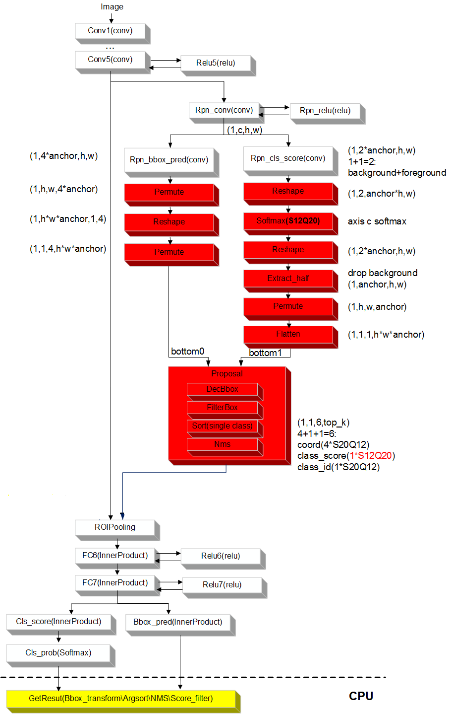

Faster RCNN Proposal硬化层的输入为两个tensor，分别对应[图1](#_fig1274671534716)中的bottom0以及bottom1。 假设N为锚点的总数量，则bottom0的维度为的为1×1×1× N，bottom1的维度为的1×1×4×N，输入数据为大于0的浮点型数据。DecBbox层中心点宽高的具体计算公式如下。

-   _DecCx_  =  _priWidth \* dx\(P\)_  +  _priCx_
-   _DecCy_  =  _priHeight \* dy\(P\)_  +  _priCy_
-   _DecWidth_  =  _exp_\(_dw\(P\)_\) \*  _priWidth_
-   _DecHeight_  =  _exp_\(_dh\(P\)_\) \*  _priHeight_

其中DecCx, DecCy, DecWidth, DecHeight分别对应检测框的中心点和宽高； priWidth, priHeight, priCx, priCy为锚点的宽高和中心点坐标。锚点的坐标由外部输入文件anchor.txt（对应 \[generate\_anchors\_file\]配置项）提供。具体格式为N行4列的数据，N为锚点的数量，4列数据分别对应锚点的xmin, ymin, xmax, ymax， 输入数据为大于0的整数，数据类型为浮点型。其他四组输入dx\(P\), dy\(P\), dw\(P\), dh\(P\)与图中的bottom对应。具体细节可参考sample用例。

Faster RCNN Proposal硬化层的输出信息由两个report层构成。第一个report层的输出信息为检测框的数量，第二个report层的输出信息为：xmin, ymin, xmax, ymax, 得分以及类别，按检测框的输出顺序按分数由大到小排列。假设最终有300个检测框，则第一个report层的输出信息为：检测框数量\(300\)；第二个report层的信息为：检测框的xmin（300个xmin），检测框的ymin（300个ymin），检测框的xmax（300个max），检测框的ymax\(300个ymax\)，对应的框的得分\(300个分数，由大到小\)，以及对应的框的类别（300个classs ID）。注意，由于proposal层的类别信息（即classID）仅分为前景和背景，图中bottom0只对应前景的分数信息，因此实际最终的输出信息只有前景的检测框的个数、坐标、分数以及classID。

### RFCN网络<a name="ZH-CN_TOPIC_0000002442021385"></a>

RFCN Proposal层硬化结构如[图1](#_fig1650119331554)所示，发布包中提供了基于resnet50的sample：samples/2\_object\_detection/rfcn/rfcn\_resnet50，请参考此示例进行适配。

输出给Proposal硬化后DetectionOutput层的得分数据类型必须是float型，并且此Softmax层和Proposal硬化层之间不能有任何计算层，如下所示。

```
layer { 
   name: "rpn_cls_prob" 
   type: "Softmax" 
   bottom: "rpn_cls_score_reshape" 
   top: "rpn_cls_prob" 
 }
```

Proposal硬化层描述请参考samples/2\_object\_detection/rfcn/rfcn\_resnet50/caffe\_model/rfcn\_resnet50.prototxt。

**图 1**  RFCN Proposal层硬化结构图<a name="_fig1650119331554"></a>  
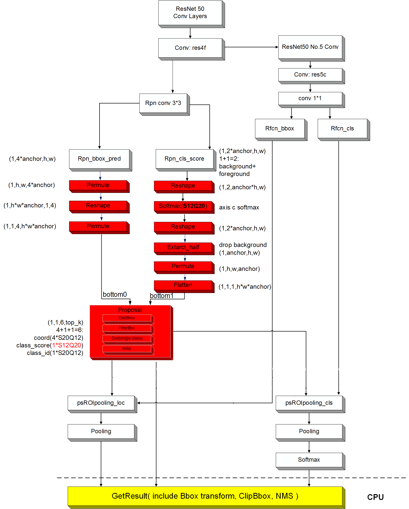

RFCN网络Proposal硬化层的输入输出与Faster RCNN Proposal一致，此处不再赘述。

### SSD网络<a name="ZH-CN_TOPIC_0000002408421894"></a>

SSD DetectionOutput层硬化结构如[图1](#fig11445112753313)所示，发布包中提供了sample：sample/samples/2\_object\_detection/ssd，请参考此示例进行适配。

输出给DetectionOutput硬化层的得分数据类型为float，并且此Softmax层和DetectionOutput硬化层之间不能有任何计算层，如下所示。

```
layer { 
   name: "mbox_conf_softmax" 
   type: "Softmax" 
   bottom: "mbox_conf_permute" 
   top: "mbox_conf_softmax" 
   softmax_param { 
     axis: 1 
   } 
 }
```

DetectionOutput硬化层描述请参考sample/samples/2\_object\_detection/ssd/caffe\_model/ssd.prototxt。

**图 1**  SSD DetectionOutput层硬化结构图<a name="fig11445112753313"></a>  
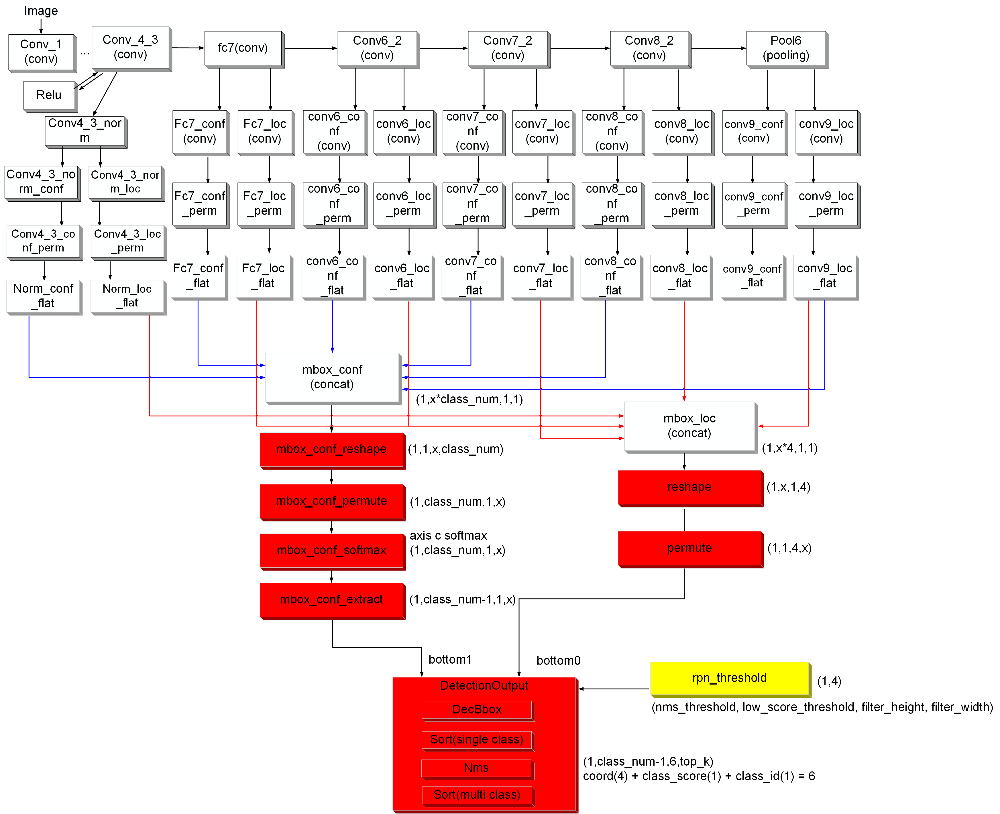

SSD网络的rpn模块输入由三个部分组成，分别对应上图中的mbox\_conf\_extract、permute层和RPN threshold。具体公式如下。

-   _DecCx_  =  _Var1_  \*  _L0c1_  \*  _priWidth_  +  _priCx_
-   _DecCy_  =  _Var2_  \*  _L0c2_  \*  _priHeight_  +  _priCy_
-   _DecWidth_  =  _exp_\(_Var3_  \*  _L0c3_\) \*  _priWidth_
-   _DecHeight_  =  _exp_\(_Var4_  \*  _L0c4_\) \*  _priHeight_

其中DecCx, DecCy, DecWidth, DecHeight分别对应检测框的中心点和宽高；Var1, Var2, Var3, Var4为调整系数；L0c1, L0c2, L0c3, L0c4为框的预测信息；priWidth, priHeight, priCx, priCy为锚点的中心点坐标和宽高。锚点的坐标以及调整系数由外部输入文件anchor.txt（对应 \[generate\_anchors\_file\]配置项）提供。具体格式为N行8列的数据，N为锚点的数量，8列数据分别对应锚点的xmin, ymin, xmax, ymax 以及调整系数var1, var2, var3, var4。

permute层提供L0c1, L0c2, L0c3, L0c4坐标信息，维度为1×1\*4×N，N为框的数量。

mbox\_conf\_extract提供分数信息和类别信息，维度为1×（C-1）×1×N,其中C为包含背景的类别数量，减1表示去掉背景，N为锚点数量。如果类别不需要去掉背景，请删除层mbox\_conf\_extract，直接mbox\_conf\_softmax输出给DetectionOutput层，修改DetectionOutput层的num\_classes 为包含背景的类别数。

rpn\_threshold提供4个阈值，分别是nms\_threshold、low\_score\_threshold、min\_height、min\_width，ATC转换模型时自动加的data层，在板端ACL运行时通过data层输入。

SSD的输出信息由两个report层构成，第一个report层的输出信息为检测框输出的数量，第二个report层的信息为xmin, ymin, xmax, ymax, 得分以及类别，按检测框的输出顺序按分数由大到小排列。假设最终有300个检测框，则第一个report层输出的信息依次为：检测框数量\(300\)；第二个report层输出的信息为：检测框的xmin（300个xmin），检测框的ymin（300个ymin），检测框的xmax（300个max），检测框的ymax\(300个ymax\)，对应的框的得分\(300个分数，由大到小\)，以及对应的框的类别（300个classs ID）。

### YOLOV1网络<a name="ZH-CN_TOPIC_0000002441981497"></a>

YOLOV1 DetectionOutput层硬化结构如[图1](#_fig10792101614121)所示，发布包中提供了sample： samples/2\_object\_detection/yolo，请参考此示例进行适配。

**图 1**  YOLOV1 DetectionOutput层硬化结构图<a name="_fig10792101614121"></a>  
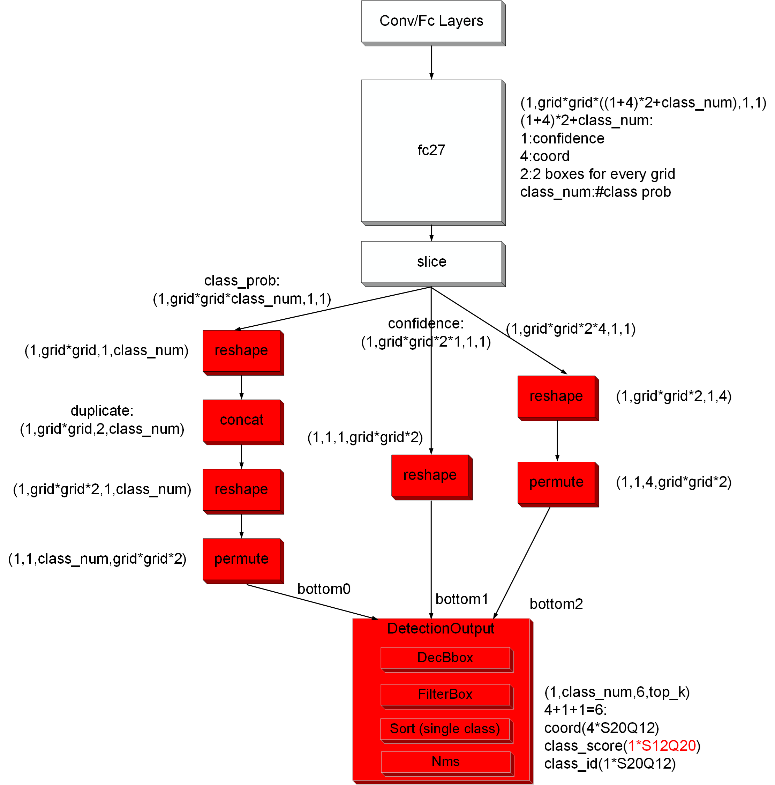

Yolov1的输入维度为1×1×（C + 5）× N的tensor，数据类型为浮点型，其中C为类别的数量，N为检测框的个数。[图1](#_fig10792101614121)中直观的显示了rpn层输入的组成部分，左边的permute层对应类别信息，维度为1×1×C×N；中间的permute层对应坐标的信息，维度为1×1×4×N, 对应的取值范围为\[0, 1\]; reshape层对应分数的信息，维度为1×1×1×N。这三个层被concat层连接成1×1×（C+5）×N的tensor作为rpn层的输入。

Yolov1的输出信息由两个report层构成，第一个report层输出各类别检测框输出的数量，第二个report层输出各类别检测框的xmin, ymin, xmax, ymax, 得分以及类别，每一类的排序按检测框的输出顺序按分数由大到小排列。假设最终有300个检测框输出，包括人、猫、狗三种类别各50个，150个，100个，其对应的class ID分别为0，1，2。则第一个report层输出的信息依次为：人、猫、狗的检测框数量\(50，100，150\)；第二个report层输出的信息为：人检测框的xmin（50个xmin），检测框的ymin（50个ymin），检测框的xmax（50个max），检测框的ymax\(50个ymax\)，猫检测框的xmin（150个xmin），检测框的ymin（150个ymin），检测框的xmax（150个max），检测框的ymax\(150个ymax\)，狗检测框的xmin（100个xmin），检测框的ymin（100个ymin），检测框的xmax（100个max），检测框的ymax\(100个ymax\)；人对应的框的得分\(50个分数，由大到小\)，猫对应的框的得分\(150个分数，由大到小\)，狗对应的框的得分\(100个分数，由大到小\)；人对应的框的类别（50个classs ID 0）；猫检测框的xmin（150个xmin），检测框的ymin（150个ymin），检测框的xmax（150个max），检测框的ymax\(150个ymax\)，对应的框的得分\(150个分数，由大到小\)，猫对应的框的类别（150个classs ID 1）；狗检测框的xmin（100个xmin），检测框的ymin（100个ymin），检测框的xmax（100个max），检测框的ymax\(100个ymax\)，对应的框的得分\(100个分数，由大到小\)，狗对应的框的类别（100个classs ID 2）。

### YOLOV2网络<a name="ZH-CN_TOPIC_0000002408581722"></a>

YOLOV2 DetectionOutput层硬化结构如[图1](#_fig9613111741519)所示，发布包中提供了sample：samples/2\_object\_detection/yolo，请参考此示例进行适配。

> **须知：** 
>DetectionOutput输出的是1×1×6×top\_k的格式，类别中存放得分最高的分类序号，同YOLOV2/3中的1×class\_num×6×top\_k不同。

**图 1**  YOLOV2 DetectionOutput层硬化结构图<a name="_fig9613111741519"></a>  
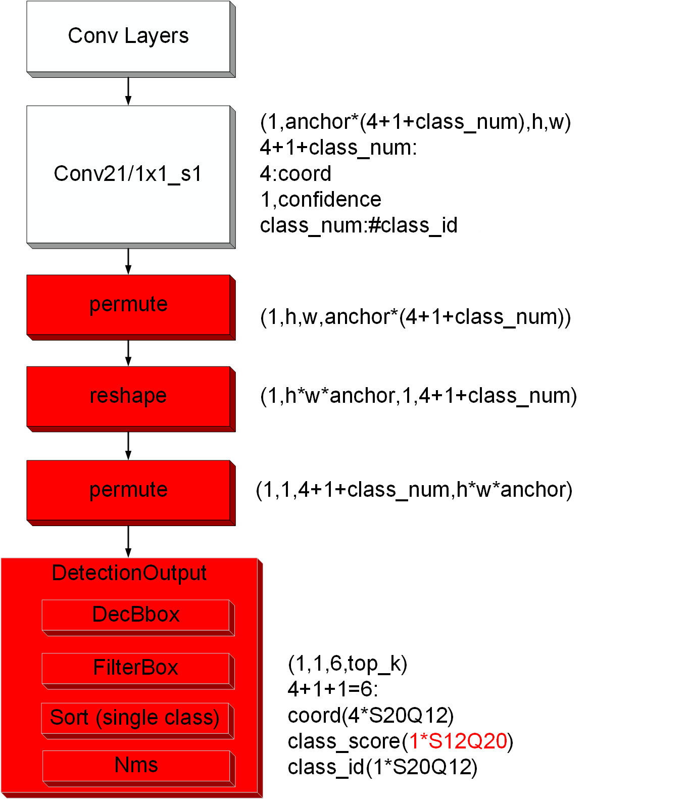

Yolov2相比于Yolov1在计算检测框宽高时增加了bias1, bias2两个参数。其中bias1和bias2的需要在prototxt中配置, bias1和bias2的数量等于每个grid内锚点的数量的两倍，输出顺序依次为每个锚点的bias1以及每个锚点的bias2。假设每个grid内一共有5个锚点，则需要输入的对应的bias顺序为: 锚点0的bias1, bias2; 锚点1的bias1, bias2以及锚点2的bias1,bias2。数据类型为float，取值范围为大于0的浮点数。详细设置可参照sample中的测试用例。Yolov2的输入tensor规格与Yolov1相同，对应图4-5中的最后一个permute层，此处不再赘述。

Yolov2的输出信息由两个report层构成，第一个report层输出检测框输出的的数量，第二个检测框输出xmin, ymin, xmax, ymax, 得分以及类别，按检测框的输出顺序按分数由大到小排列。假设最终有300个检测框，则第一个report层为输出检测框数量\(300\)；第二个report层输出检测框的xmin（300个xmin），检测框的ymin（300个ymin），检测框的xmax（300个max），检测框的ymax\(300个ymax\)，对应的框的得分\(300个分数，由大到小\)，以及对应的框的类别（300个classs ID）。

### YOLOV3/V5/V7网络<a name="ZH-CN_TOPIC_0000002408422298"></a>

YOLOV3/V5/V7 Decbbox/DetectionOutput层硬化结构如[图1](#_fig54111139181712)所示，发布包中提供了sample：samples/2\_object\_detection/yolo，请参考此示例进行适配。

**图 1**  YOLOV3/V5/V7 Decbbox/DetectionOutput层硬化结构图<a name="_fig54111139181712"></a>  
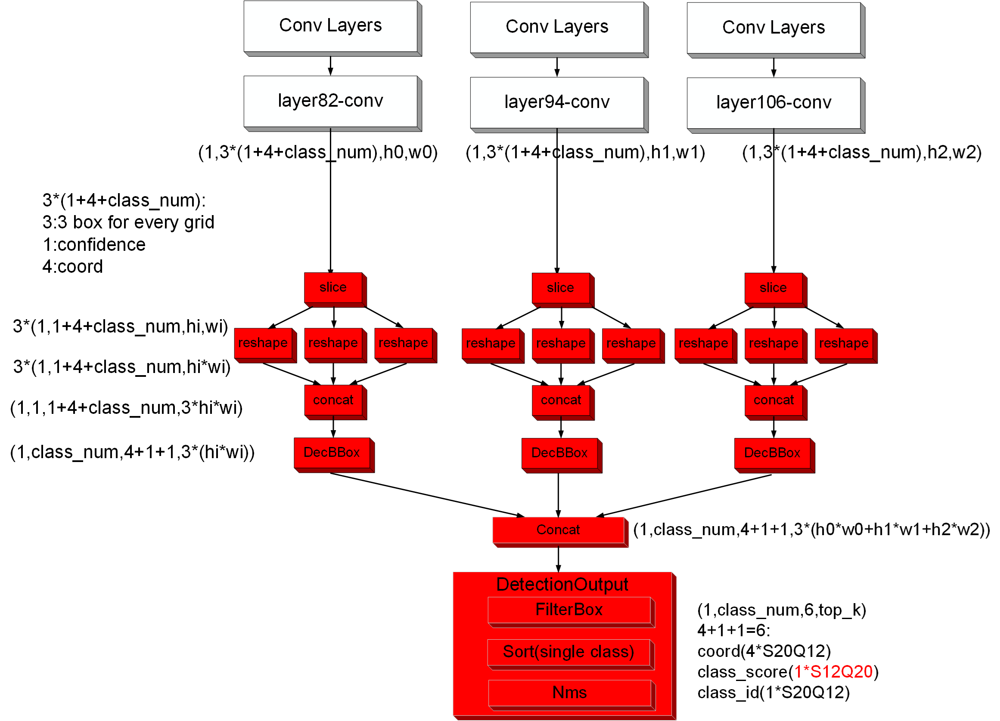

Yolov3的输入tensor规格以及prototxt中bias的规格与Yolov2相同，此处不再赘述。

Yolov3的输出信息由两个report层构成，第一个report层输出检测框输出的数量，第二个检测框输出xmin, ymin, xmax, ymax, 得分以及类别，按检测框的输出顺序按分数由大到小排列。假设最终有300个检测框，则第一个report层为输出检测框数量\(300\)；第二个report层输出检测框的xmin（300个xmin），检测框的ymin（300个ymin），检测框的xmax（300个max），检测框的ymax\(300个ymax\)，对应的框的得分\(300个分数，由大到小\)，以及对应的框的类别（300个classs ID）。

YOLOV5/YOLOV7的计算公式如下。

x方向（y方向计算流程与x方向类似）：

_cX = \(2 \* sigmoid\(X\) - 0.5 + col\) / gridNumWidth_  \* img\_w

_halfW = 2 \* sigmoid\(w\) \*  2 \* sigmoid\(w\) \* bias / gridNumWidth \* 0.5 \* img\_w_

_pMinX = cX__ – __halfW_

_pMaxX = halfW + cX_

score：_finalScore = sigmoid\(objScore\) \* sigmoid\(classScore\)_

其中col为列索引，gridNumWidth为锚点宽，img\_w为放大系数，x和w为上一层的输出，bias为锚点bias参数，cX为检测框中心点x坐标，halfW为检测框宽\*0.5，pMinX为检测框Xmin，pMaxX为检测框Xmax。objScore和classScore为上一层的输出，finalScore为最终分数。

### YOLOV8网络<a name="ZH-CN_TOPIC_0000002408582250"></a>

YOLOV8DecBBox/Sort/Nms/Filter层硬化结构图如[图1](#fig8562131852)所示，发布包提供了sample:samples/2\_object\_detection/yolo，请参考此示例进行适配。

**图 1**  YOLOV8 DecBBox/Sort/Nms/Filter层硬化结构图<a name="fig8562131852"></a>  
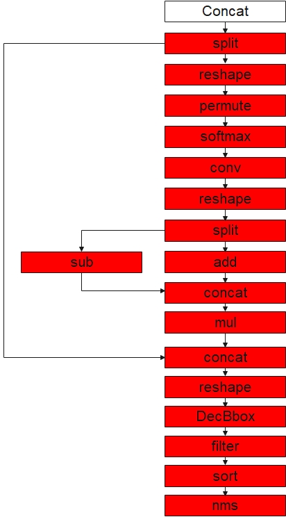

YOLOV8的输入tensor规格、输出信息与YOLOV2相同，此处不再赘述。

坐标计算部分由DecBBox之前的算子实现，参考YOLOV8源码，采用DFL损失函数。

score在DecBBox中计算，计算公式：_finalScore = sigmoid\(classScore\)_

# 算子规格说明<a name="ZH-CN_TOPIC_0000002442021001"></a>

> **须知：** 
>Caffe与Onnx框架算子规格中，如无特别说明，输入、输出形状支持范围如下。
>向量：channel <= 65535，矩阵：width <= 65535，张量：width <= 65535
>当计算数据类型为FP16时，值超出2048会有精度损失。


## Caffe框架算子规格<a name="ZH-CN_TOPIC_0000002408422246"></a>

该算子规格仅适用于Caffe框架原生IR定义的网络模型。

其他约束：不支持层名为空。


### 图像分析引擎<a name="ZH-CN_TOPIC_0000002442021229"></a>


#### AbsVal<a name="ZH-CN_TOPIC_0000002408581710"></a>

功能描述：求绝对值。

#### ArgMax<a name="ZH-CN_TOPIC_0000002408422102"></a>

功能描述：沿某轴找出topk值及索引（因硬件限制，当前SVP NNN只支持top 1）。

<a name="table148616412366"></a>
<table><thead align="left"><tr id="row1811634117362"><th class="cellrowborder" valign="top" width="9.97%" id="mcps1.1.5.1.1"><p id="p611654111369"><a name="p611654111369"></a><a name="p611654111369"></a>参数名</p>
</th>
<th class="cellrowborder" valign="top" width="11.770000000000001%" id="mcps1.1.5.1.2"><p id="p311624118367"><a name="p311624118367"></a><a name="p311624118367"></a>数据类型</p>
</th>
<th class="cellrowborder" valign="top" width="52.36000000000001%" id="mcps1.1.5.1.3"><p id="p17116154113613"><a name="p17116154113613"></a><a name="p17116154113613"></a>参数含义</p>
</th>
<th class="cellrowborder" valign="top" width="25.900000000000006%" id="mcps1.1.5.1.4"><p id="p1911624117360"><a name="p1911624117360"></a><a name="p1911624117360"></a>规格</p>
</th>
</tr>
</thead>
<tbody><tr id="row191162416362"><td class="cellrowborder" valign="top" width="9.97%" headers="mcps1.1.5.1.1 "><p id="p16116154113611"><a name="p16116154113611"></a><a name="p16116154113611"></a>out_max_val</p>
</td>
<td class="cellrowborder" valign="top" width="11.770000000000001%" headers="mcps1.1.5.1.2 "><p id="p12116841113614"><a name="p12116841113614"></a><a name="p12116841113614"></a>bool</p>
</td>
<td class="cellrowborder" valign="top" width="52.36000000000001%" headers="mcps1.1.5.1.3 "><p id="p11116341163615"><a name="p11116341163615"></a><a name="p11116341163615"></a>默认为false, 如果为true, 生成pair(argmax, maxval)</p>
</td>
<td class="cellrowborder" valign="top" width="25.900000000000006%" headers="mcps1.1.5.1.4 "><p id="p121161441193612"><a name="p121161441193612"></a><a name="p121161441193612"></a>支持</p>
</td>
</tr>
<tr id="row18116941193611"><td class="cellrowborder" valign="top" width="9.97%" headers="mcps1.1.5.1.1 "><p id="p011610412362"><a name="p011610412362"></a><a name="p011610412362"></a>top_k</p>
</td>
<td class="cellrowborder" valign="top" width="11.770000000000001%" headers="mcps1.1.5.1.2 "><p id="p9116941143612"><a name="p9116941143612"></a><a name="p9116941143612"></a>uint32</p>
</td>
<td class="cellrowborder" valign="top" width="52.36000000000001%" headers="mcps1.1.5.1.3 "><p id="p181178413362"><a name="p181178413362"></a><a name="p181178413362"></a>最大的k个值</p>
</td>
<td class="cellrowborder" valign="top" width="25.900000000000006%" headers="mcps1.1.5.1.4 "><p id="p201171541143617"><a name="p201171541143617"></a><a name="p201171541143617"></a>只支持配置为1</p>
</td>
</tr>
<tr id="row1811784193618"><td class="cellrowborder" valign="top" width="9.97%" headers="mcps1.1.5.1.1 "><p id="p91172419365"><a name="p91172419365"></a><a name="p91172419365"></a>axis</p>
</td>
<td class="cellrowborder" valign="top" width="11.770000000000001%" headers="mcps1.1.5.1.2 "><p id="p7117104114368"><a name="p7117104114368"></a><a name="p7117104114368"></a>uint32</p>
</td>
<td class="cellrowborder" valign="top" width="52.36000000000001%" headers="mcps1.1.5.1.3 "><p id="p0117134103617"><a name="p0117134103617"></a><a name="p0117134103617"></a>无默认值，表示取top_k值的维度，若不设该值，则表示将所有维度flatten之后，再应用top_k取值</p>
</td>
<td class="cellrowborder" valign="top" width="25.900000000000006%" headers="mcps1.1.5.1.4 "><p id="p3409210144016"><a name="p3409210144016"></a><a name="p3409210144016"></a>支持配置[-4,3]，但取-4和0时会报错。</p>
<p id="p196222241608"><a name="p196222241608"></a><a name="p196222241608"></a>不支持对argmax轴进行切分。没有配置axis时，须满足输入channel × height × width &lt; 1048576，且均小于65536。配置axis轴时，argmax轴应小于65536。</p>
</td>
</tr>
<tr id="row1611818471233"><td class="cellrowborder" valign="top" width="9.97%" headers="mcps1.1.5.1.1 "><p id="p711815479310"><a name="p711815479310"></a><a name="p711815479310"></a>select_last_index</p>
</td>
<td class="cellrowborder" valign="top" width="11.770000000000001%" headers="mcps1.1.5.1.2 "><p id="p131181047438"><a name="p131181047438"></a><a name="p131181047438"></a>bool</p>
</td>
<td class="cellrowborder" valign="top" width="52.36000000000001%" headers="mcps1.1.5.1.3 "><p id="p8118114716310"><a name="p8118114716310"></a><a name="p8118114716310"></a>默认为true, 表示在输出最大值索引时，若存在多个最大值，输出最后一个最大值索引。</p>
<p id="p97311613552"><a name="p97311613552"></a><a name="p97311613552"></a>由于硬件限制，在配置为false情况下，可以获得较好性能</p>
</td>
<td class="cellrowborder" valign="top" width="25.900000000000006%" headers="mcps1.1.5.1.4 "><p id="p191183471232"><a name="p191183471232"></a><a name="p191183471232"></a>支持</p>
</td>
</tr>
</tbody>
</table>

#### ArgMin<a name="ZH-CN_TOPIC_0000002441981617"></a>

功能描述：沿某轴找出topk值及索引（因硬件限制，当前pico只支持top 1）。

<a name="table148616412366"></a>
<table><thead align="left"><tr id="row1811634117362"><th class="cellrowborder" valign="top" width="9.97%" id="mcps1.1.5.1.1"><p id="p611654111369"><a name="p611654111369"></a><a name="p611654111369"></a>参数名</p>
</th>
<th class="cellrowborder" valign="top" width="11.770000000000001%" id="mcps1.1.5.1.2"><p id="p311624118367"><a name="p311624118367"></a><a name="p311624118367"></a>数据类型</p>
</th>
<th class="cellrowborder" valign="top" width="52.36000000000001%" id="mcps1.1.5.1.3"><p id="p17116154113613"><a name="p17116154113613"></a><a name="p17116154113613"></a>参数含义</p>
</th>
<th class="cellrowborder" valign="top" width="25.900000000000006%" id="mcps1.1.5.1.4"><p id="p1911624117360"><a name="p1911624117360"></a><a name="p1911624117360"></a>规格</p>
</th>
</tr>
</thead>
<tbody><tr id="row191162416362"><td class="cellrowborder" valign="top" width="9.97%" headers="mcps1.1.5.1.1 "><p id="p16116154113611"><a name="p16116154113611"></a><a name="p16116154113611"></a>out_min_val</p>
</td>
<td class="cellrowborder" valign="top" width="11.770000000000001%" headers="mcps1.1.5.1.2 "><p id="p12116841113614"><a name="p12116841113614"></a><a name="p12116841113614"></a>bool</p>
</td>
<td class="cellrowborder" valign="top" width="52.36000000000001%" headers="mcps1.1.5.1.3 "><p id="p11116341163615"><a name="p11116341163615"></a><a name="p11116341163615"></a>默认为false, 如果为true, 生成pair(argmin, minval)</p>
</td>
<td class="cellrowborder" valign="top" width="25.900000000000006%" headers="mcps1.1.5.1.4 "><p id="p121161441193612"><a name="p121161441193612"></a><a name="p121161441193612"></a>支持</p>
</td>
</tr>
<tr id="row18116941193611"><td class="cellrowborder" valign="top" width="9.97%" headers="mcps1.1.5.1.1 "><p id="p011610412362"><a name="p011610412362"></a><a name="p011610412362"></a>top_k</p>
</td>
<td class="cellrowborder" valign="top" width="11.770000000000001%" headers="mcps1.1.5.1.2 "><p id="p9116941143612"><a name="p9116941143612"></a><a name="p9116941143612"></a>uint32</p>
</td>
<td class="cellrowborder" valign="top" width="52.36000000000001%" headers="mcps1.1.5.1.3 "><p id="p181178413362"><a name="p181178413362"></a><a name="p181178413362"></a>最小的k个值</p>
</td>
<td class="cellrowborder" valign="top" width="25.900000000000006%" headers="mcps1.1.5.1.4 "><p id="p201171541143617"><a name="p201171541143617"></a><a name="p201171541143617"></a>只支持配置为1</p>
</td>
</tr>
<tr id="row1811784193618"><td class="cellrowborder" valign="top" width="9.97%" headers="mcps1.1.5.1.1 "><p id="p91172419365"><a name="p91172419365"></a><a name="p91172419365"></a>axis</p>
</td>
<td class="cellrowborder" valign="top" width="11.770000000000001%" headers="mcps1.1.5.1.2 "><p id="p7117104114368"><a name="p7117104114368"></a><a name="p7117104114368"></a>uint32</p>
</td>
<td class="cellrowborder" valign="top" width="52.36000000000001%" headers="mcps1.1.5.1.3 "><p id="p0117134103617"><a name="p0117134103617"></a><a name="p0117134103617"></a>无默认值，表示取top_k值的维度，若不设该值，则表示将所有维度flatten之后，再应用top_k取值</p>
</td>
<td class="cellrowborder" valign="top" width="25.900000000000006%" headers="mcps1.1.5.1.4 "><p id="p3409210144016"><a name="p3409210144016"></a><a name="p3409210144016"></a>支持配置[-4,3]，但取-4和0时会报错。</p>
<p id="p196222241608"><a name="p196222241608"></a><a name="p196222241608"></a>不支持对argmin轴进行切分。没有配置axis时，须满足输入channel × height × width &lt; 1048576，且均小于65536。配置axis轴时，argmin轴应小于65536。</p>
</td>
</tr>
<tr id="row1611818471233"><td class="cellrowborder" valign="top" width="9.97%" headers="mcps1.1.5.1.1 "><p id="p711815479310"><a name="p711815479310"></a><a name="p711815479310"></a>select_last_index</p>
</td>
<td class="cellrowborder" valign="top" width="11.770000000000001%" headers="mcps1.1.5.1.2 "><p id="p131181047438"><a name="p131181047438"></a><a name="p131181047438"></a>bool</p>
</td>
<td class="cellrowborder" valign="top" width="52.36000000000001%" headers="mcps1.1.5.1.3 "><p id="p8118114716310"><a name="p8118114716310"></a><a name="p8118114716310"></a>默认为true, 表示在输出最小值索引时，若存在多个最小值，输出最后一个最小值索引。</p>
<p id="p97311613552"><a name="p97311613552"></a><a name="p97311613552"></a>由于硬件限制，在配置为false情况下，可以获得较好性能。</p>
</td>
<td class="cellrowborder" valign="top" width="25.900000000000006%" headers="mcps1.1.5.1.4 "><p id="p191183471232"><a name="p191183471232"></a><a name="p191183471232"></a>支持</p>
</td>
</tr>
</tbody>
</table>

#### BatchNorm<a name="ZH-CN_TOPIC_0000002408422010"></a>

功能描述：数据归一化。

<a name="table148616412366"></a>
<table><thead align="left"><tr id="row1811634117362"><th class="cellrowborder" valign="top" width="16.21%" id="mcps1.1.5.1.1"><p id="p611654111369"><a name="p611654111369"></a><a name="p611654111369"></a>参数名</p>
</th>
<th class="cellrowborder" valign="top" width="13.84%" id="mcps1.1.5.1.2"><p id="p311624118367"><a name="p311624118367"></a><a name="p311624118367"></a>数据类型</p>
</th>
<th class="cellrowborder" valign="top" width="44.05%" id="mcps1.1.5.1.3"><p id="p17116154113613"><a name="p17116154113613"></a><a name="p17116154113613"></a>参数含义</p>
</th>
<th class="cellrowborder" valign="top" width="25.900000000000002%" id="mcps1.1.5.1.4"><p id="p1911624117360"><a name="p1911624117360"></a><a name="p1911624117360"></a>规格</p>
</th>
</tr>
</thead>
<tbody><tr id="row191162416362"><td class="cellrowborder" valign="top" width="16.21%" headers="mcps1.1.5.1.1 "><p id="p17855325174515"><a name="p17855325174515"></a><a name="p17855325174515"></a>use_global_stats</p>
</td>
<td class="cellrowborder" valign="top" width="13.84%" headers="mcps1.1.5.1.2 "><p id="p188551125194520"><a name="p188551125194520"></a><a name="p188551125194520"></a>bool</p>
</td>
<td class="cellrowborder" valign="top" width="44.05%" headers="mcps1.1.5.1.3 "><p id="p198552250456"><a name="p198552250456"></a><a name="p198552250456"></a>false表示使用滑动平均；true表示使用全局的，不需要每次进行计算</p>
</td>
<td class="cellrowborder" valign="top" width="25.900000000000002%" headers="mcps1.1.5.1.4 "><p id="p6855172514453"><a name="p6855172514453"></a><a name="p6855172514453"></a>支持true</p>
</td>
</tr>
<tr id="row18116941193611"><td class="cellrowborder" valign="top" width="16.21%" headers="mcps1.1.5.1.1 "><p id="p7855172564516"><a name="p7855172564516"></a><a name="p7855172564516"></a>moving_average_fraction</p>
</td>
<td class="cellrowborder" valign="top" width="13.84%" headers="mcps1.1.5.1.2 "><p id="p11855182513456"><a name="p11855182513456"></a><a name="p11855182513456"></a>float</p>
</td>
<td class="cellrowborder" valign="top" width="44.05%" headers="mcps1.1.5.1.3 "><p id="p8855192513454"><a name="p8855192513454"></a><a name="p8855192513454"></a>默认为.999，每次迭代滑动平均衰减系数</p>
</td>
<td class="cellrowborder" valign="top" width="25.900000000000002%" headers="mcps1.1.5.1.4 "><p id="p385512515452"><a name="p385512515452"></a><a name="p385512515452"></a>不解析生效</p>
</td>
</tr>
<tr id="row1811784193618"><td class="cellrowborder" valign="top" width="16.21%" headers="mcps1.1.5.1.1 "><p id="p9855152514459"><a name="p9855152514459"></a><a name="p9855152514459"></a>eps</p>
</td>
<td class="cellrowborder" valign="top" width="13.84%" headers="mcps1.1.5.1.2 "><p id="p1085542510453"><a name="p1085542510453"></a><a name="p1085542510453"></a>float</p>
</td>
<td class="cellrowborder" valign="top" width="44.05%" headers="mcps1.1.5.1.3 "><p id="p138551525134510"><a name="p138551525134510"></a><a name="p138551525134510"></a>默认为1e-5，用来防止被0除</p>
</td>
<td class="cellrowborder" valign="top" width="25.900000000000002%" headers="mcps1.1.5.1.4 "><p id="p185513259456"><a name="p185513259456"></a><a name="p185513259456"></a>支持配置</p>
</td>
</tr>
</tbody>
</table>

#### Bias<a name="ZH-CN_TOPIC_0000002442021029"></a>

功能描述：计算两个输入数据的和。

<a name="table148616412366"></a>
<table><thead align="left"><tr id="row1811634117362"><th class="cellrowborder" valign="top" width="16.21%" id="mcps1.1.5.1.1"><p id="p611654111369"><a name="p611654111369"></a><a name="p611654111369"></a>参数名</p>
</th>
<th class="cellrowborder" valign="top" width="13.83%" id="mcps1.1.5.1.2"><p id="p311624118367"><a name="p311624118367"></a><a name="p311624118367"></a>数据类型</p>
</th>
<th class="cellrowborder" valign="top" width="36.16%" id="mcps1.1.5.1.3"><p id="p17116154113613"><a name="p17116154113613"></a><a name="p17116154113613"></a>参数含义</p>
</th>
<th class="cellrowborder" valign="top" width="33.800000000000004%" id="mcps1.1.5.1.4"><p id="p1911624117360"><a name="p1911624117360"></a><a name="p1911624117360"></a>规格</p>
</th>
</tr>
</thead>
<tbody><tr id="row191162416362"><td class="cellrowborder" valign="top" width="16.21%" headers="mcps1.1.5.1.1 "><p id="p206413511465"><a name="p206413511465"></a><a name="p206413511465"></a>axis</p>
</td>
<td class="cellrowborder" valign="top" width="13.83%" headers="mcps1.1.5.1.2 "><p id="p4641735134616"><a name="p4641735134616"></a><a name="p4641735134616"></a>int32</p>
</td>
<td class="cellrowborder" valign="top" width="36.16%" headers="mcps1.1.5.1.3 "><p id="p364735144614"><a name="p364735144614"></a><a name="p364735144614"></a>默认为1，不同的值对应的相加维度不同</p>
</td>
<td class="cellrowborder" valign="top" width="33.800000000000004%" headers="mcps1.1.5.1.4 "><p id="p2641035134617"><a name="p2641035134617"></a><a name="p2641035134617"></a>支持两种配置(1,-3,0,-4)，默认为1，遵循caffe规则</p>
</td>
</tr>
<tr id="row18116941193611"><td class="cellrowborder" valign="top" width="16.21%" headers="mcps1.1.5.1.1 "><p id="p8641635154610"><a name="p8641635154610"></a><a name="p8641635154610"></a>num_axes</p>
</td>
<td class="cellrowborder" valign="top" width="13.83%" headers="mcps1.1.5.1.2 "><p id="p1164133520467"><a name="p1164133520467"></a><a name="p1164133520467"></a>int32</p>
</td>
<td class="cellrowborder" valign="top" width="36.16%" headers="mcps1.1.5.1.3 "><p id="p56433518464"><a name="p56433518464"></a><a name="p56433518464"></a>默认为1，当只有一个bottom时有效，指定训练的bias参数维度大小</p>
</td>
<td class="cellrowborder" valign="top" width="33.800000000000004%" headers="mcps1.1.5.1.4 "><p id="p1659355469"><a name="p1659355469"></a><a name="p1659355469"></a>与axis配套使用，在axis = (1,-3)时num_axes支持配置为(1,-1)，在axis=(0,-4)时num_axes支持配置为(2,-1)，遵循caffe规则</p>
</td>
</tr>
</tbody>
</table>

#### BNLL<a name="ZH-CN_TOPIC_0000002408421690"></a>

功能描述：按照一固定公式计算，激活函数。

#### Clip<a name="ZH-CN_TOPIC_0000002408581590"></a>

功能描述：数据截断。

<a name="table148616412366"></a>
<table><thead align="left"><tr id="row1811634117362"><th class="cellrowborder" valign="top" width="16.21%" id="mcps1.1.5.1.1"><p id="p611654111369"><a name="p611654111369"></a><a name="p611654111369"></a>参数名</p>
</th>
<th class="cellrowborder" valign="top" width="13.83%" id="mcps1.1.5.1.2"><p id="p311624118367"><a name="p311624118367"></a><a name="p311624118367"></a>数据类型</p>
</th>
<th class="cellrowborder" valign="top" width="36.16%" id="mcps1.1.5.1.3"><p id="p17116154113613"><a name="p17116154113613"></a><a name="p17116154113613"></a>参数含义</p>
</th>
<th class="cellrowborder" valign="top" width="33.800000000000004%" id="mcps1.1.5.1.4"><p id="p1911624117360"><a name="p1911624117360"></a><a name="p1911624117360"></a>规格</p>
</th>
</tr>
</thead>
<tbody><tr id="row191162416362"><td class="cellrowborder" valign="top" width="16.21%" headers="mcps1.1.5.1.1 "><p id="p66191330175215"><a name="p66191330175215"></a><a name="p66191330175215"></a>min</p>
</td>
<td class="cellrowborder" valign="top" width="13.83%" headers="mcps1.1.5.1.2 "><p id="p561913309522"><a name="p561913309522"></a><a name="p561913309522"></a>float</p>
</td>
<td class="cellrowborder" valign="top" width="36.16%" headers="mcps1.1.5.1.3 "><p id="p2619193015212"><a name="p2619193015212"></a><a name="p2619193015212"></a>截断的最小值</p>
</td>
<td class="cellrowborder" valign="top" width="33.800000000000004%" headers="mcps1.1.5.1.4 "><p id="p1661914303521"><a name="p1661914303521"></a><a name="p1661914303521"></a>支持，配置范围：[-65504,65504]</p>
</td>
</tr>
<tr id="row18116941193611"><td class="cellrowborder" valign="top" width="16.21%" headers="mcps1.1.5.1.1 "><p id="p162053011529"><a name="p162053011529"></a><a name="p162053011529"></a>max</p>
</td>
<td class="cellrowborder" valign="top" width="13.83%" headers="mcps1.1.5.1.2 "><p id="p6620163045214"><a name="p6620163045214"></a><a name="p6620163045214"></a>float</p>
</td>
<td class="cellrowborder" valign="top" width="36.16%" headers="mcps1.1.5.1.3 "><p id="p2620143012523"><a name="p2620143012523"></a><a name="p2620143012523"></a>截断的最大值</p>
</td>
<td class="cellrowborder" valign="top" width="33.800000000000004%" headers="mcps1.1.5.1.4 "><p id="p126201530115210"><a name="p126201530115210"></a><a name="p126201530115210"></a>支持，配置范围：[-65504,65504]</p>
</td>
</tr>
</tbody>
</table>

#### Concat<a name="ZH-CN_TOPIC_0000002441981321"></a>

功能描述：至少两个输入，将它们在某个维度上拼接起来。

<a name="table17947641195318"></a>
<table><thead align="left"><tr id="row19764415537"><th class="cellrowborder" valign="top" width="10.489999999999998%" id="mcps1.1.6.1.1"><p id="p2976941165318"><a name="p2976941165318"></a><a name="p2976941165318"></a>参数名</p>
</th>
<th class="cellrowborder" valign="top" width="10.76%" id="mcps1.1.6.1.2"><p id="p1397612417530"><a name="p1397612417530"></a><a name="p1397612417530"></a>数据类型</p>
</th>
<th class="cellrowborder" valign="top" width="24.66%" id="mcps1.1.6.1.3"><p id="p197618411537"><a name="p197618411537"></a><a name="p197618411537"></a>参数含义</p>
</th>
<th class="cellrowborder" valign="top" width="28.360000000000003%" id="mcps1.1.6.1.4"><p id="p1797644165313"><a name="p1797644165313"></a><a name="p1797644165313"></a>规格</p>
</th>
<th class="cellrowborder" valign="top" width="25.729999999999997%" id="mcps1.1.6.1.5"><p id="p1997624111534"><a name="p1997624111534"></a><a name="p1997624111534"></a>其他约束</p>
</th>
</tr>
</thead>
<tbody><tr id="row129761341185312"><td class="cellrowborder" valign="top" width="10.489999999999998%" headers="mcps1.1.6.1.1 "><p id="p17976184145315"><a name="p17976184145315"></a><a name="p17976184145315"></a>axis</p>
</td>
<td class="cellrowborder" valign="top" width="10.76%" headers="mcps1.1.6.1.2 "><p id="p2097604110537"><a name="p2097604110537"></a><a name="p2097604110537"></a>int32</p>
</td>
<td class="cellrowborder" valign="top" width="24.66%" headers="mcps1.1.6.1.3 "><p id="p997694116535"><a name="p997694116535"></a><a name="p997694116535"></a>默认为1，表示哪个维度concat，可以为负数</p>
</td>
<td class="cellrowborder" valign="top" width="28.360000000000003%" headers="mcps1.1.6.1.4 "><p id="p09761413533"><a name="p09761413533"></a><a name="p09761413533"></a>支持配置，范围：[-3, -1] U [1, 3]，不支持N维度的concat。</p>
</td>
<td class="cellrowborder" valign="top" width="25.729999999999997%" headers="mcps1.1.6.1.5 "><p id="p1697624145313"><a name="p1697624145313"></a><a name="p1697624145313"></a>axis 1: width&lt;=65535</p>
<p id="p697617410538"><a name="p697617410538"></a><a name="p697617410538"></a>axis 2: width&lt;=16384</p>
<p id="p4977104113535"><a name="p4977104113535"></a><a name="p4977104113535"></a>axis 3: width&lt;=4096</p>
<p id="p39771341145318"><a name="p39771341145318"></a><a name="p39771341145318"></a>vector: width&lt;=65535</p>
</td>
</tr>
<tr id="row0977164175318"><td class="cellrowborder" valign="top" width="10.489999999999998%" headers="mcps1.1.6.1.1 "><p id="p12977204118538"><a name="p12977204118538"></a><a name="p12977204118538"></a>concat_dim</p>
</td>
<td class="cellrowborder" valign="top" width="10.76%" headers="mcps1.1.6.1.2 "><p id="p1297754118534"><a name="p1297754118534"></a><a name="p1297754118534"></a>uint32</p>
</td>
<td class="cellrowborder" valign="top" width="24.66%" headers="mcps1.1.6.1.3 "><p id="p1097764120539"><a name="p1097764120539"></a><a name="p1097764120539"></a>DEPRECATED；跟axis含义相同，不支持负值</p>
</td>
<td class="cellrowborder" valign="top" width="28.360000000000003%" headers="mcps1.1.6.1.4 "><p id="p1197794114535"><a name="p1197794114535"></a><a name="p1197794114535"></a>支持配置，范围：[1, 3]，与axis配套使用，遵循caffe规则。</p>
</td>
<td class="cellrowborder" valign="top" width="25.729999999999997%" headers="mcps1.1.6.1.5 "><p id="p18977144115533"><a name="p18977144115533"></a><a name="p18977144115533"></a>bottom number&lt;=32</p>
</td>
</tr>
</tbody>
</table>

#### Convolution<a name="ZH-CN_TOPIC_0000002408581802"></a>

功能描述：对输入做卷积。

规格约束：输入数据类型为NCHW，且N须为1。

<a name="table153414324019"></a>
<table><thead align="left"><tr id="row14727104813010"><th class="cellrowborder" valign="top" width="20.18%" id="mcps1.1.5.1.1"><p id="p2976941165318"><a name="p2976941165318"></a><a name="p2976941165318"></a>参数名</p>
</th>
<th class="cellrowborder" valign="top" width="12.94%" id="mcps1.1.5.1.2"><p id="p1397612417530"><a name="p1397612417530"></a><a name="p1397612417530"></a>数据类型</p>
</th>
<th class="cellrowborder" valign="top" width="36.84%" id="mcps1.1.5.1.3"><p id="p197618411537"><a name="p197618411537"></a><a name="p197618411537"></a>参数含义</p>
</th>
<th class="cellrowborder" valign="top" width="30.04%" id="mcps1.1.5.1.4"><p id="p1797644165313"><a name="p1797644165313"></a><a name="p1797644165313"></a>规格</p>
</th>
</tr>
</thead>
<tbody><tr id="row106268321607"><td class="cellrowborder" valign="top" width="20.18%" headers="mcps1.1.5.1.1 "><p id="p1626432502"><a name="p1626432502"></a><a name="p1626432502"></a>num_output</p>
</td>
<td class="cellrowborder" valign="top" width="12.94%" headers="mcps1.1.5.1.2 "><p id="p4626032601"><a name="p4626032601"></a><a name="p4626032601"></a>uint32</p>
</td>
<td class="cellrowborder" valign="top" width="36.84%" headers="mcps1.1.5.1.3 "><p id="p146261132701"><a name="p146261132701"></a><a name="p146261132701"></a>输出的channel大小</p>
</td>
<td class="cellrowborder" valign="top" width="30.04%" headers="mcps1.1.5.1.4 "><p id="p262611322018"><a name="p262611322018"></a><a name="p262611322018"></a>支持配置，最大32768</p>
</td>
</tr>
<tr id="row9626103218011"><td class="cellrowborder" valign="top" width="20.18%" headers="mcps1.1.5.1.1 "><p id="p156261432104"><a name="p156261432104"></a><a name="p156261432104"></a>bias_term</p>
</td>
<td class="cellrowborder" valign="top" width="12.94%" headers="mcps1.1.5.1.2 "><p id="p262693219010"><a name="p262693219010"></a><a name="p262693219010"></a>bool</p>
</td>
<td class="cellrowborder" valign="top" width="36.84%" headers="mcps1.1.5.1.3 "><p id="p96262322012"><a name="p96262322012"></a><a name="p96262322012"></a>默认为1，表示是否加bias</p>
</td>
<td class="cellrowborder" valign="top" width="30.04%" headers="mcps1.1.5.1.4 "><p id="p156261832506"><a name="p156261832506"></a><a name="p156261832506"></a>支持配置0或1</p>
</td>
</tr>
<tr id="row062603215016"><td class="cellrowborder" valign="top" width="20.18%" headers="mcps1.1.5.1.1 "><p id="p1262673216013"><a name="p1262673216013"></a><a name="p1262673216013"></a>pad</p>
</td>
<td class="cellrowborder" valign="top" width="12.94%" headers="mcps1.1.5.1.2 "><p id="p16267321308"><a name="p16267321308"></a><a name="p16267321308"></a>uint32</p>
</td>
<td class="cellrowborder" valign="top" width="36.84%" headers="mcps1.1.5.1.3 "><p id="p196266321106"><a name="p196266321106"></a><a name="p196266321106"></a>默认为0，表示补边的大小</p>
</td>
<td class="cellrowborder" valign="top" width="30.04%" headers="mcps1.1.5.1.4 "><p id="p1962611326010"><a name="p1962611326010"></a><a name="p1962611326010"></a>支持，配置范围：[0, 15]</p>
</td>
</tr>
<tr id="row1962613217012"><td class="cellrowborder" valign="top" width="20.18%" headers="mcps1.1.5.1.1 "><p id="p56268321809"><a name="p56268321809"></a><a name="p56268321809"></a>kernel_size</p>
</td>
<td class="cellrowborder" valign="top" width="12.94%" headers="mcps1.1.5.1.2 "><p id="p2062663213016"><a name="p2062663213016"></a><a name="p2062663213016"></a>uint32</p>
</td>
<td class="cellrowborder" valign="top" width="36.84%" headers="mcps1.1.5.1.3 "><p id="p1626832708"><a name="p1626832708"></a><a name="p1626832708"></a>kernel的大小</p>
</td>
<td class="cellrowborder" valign="top" width="30.04%" headers="mcps1.1.5.1.4 "><p id="p2062616321013"><a name="p2062616321013"></a><a name="p2062616321013"></a>支持范围：[1, 255]</p>
</td>
</tr>
<tr id="row462613321306"><td class="cellrowborder" valign="top" width="20.18%" headers="mcps1.1.5.1.1 "><p id="p126262329013"><a name="p126262329013"></a><a name="p126262329013"></a>stride</p>
</td>
<td class="cellrowborder" valign="top" width="12.94%" headers="mcps1.1.5.1.2 "><p id="p156262032602"><a name="p156262032602"></a><a name="p156262032602"></a>uint32</p>
</td>
<td class="cellrowborder" valign="top" width="36.84%" headers="mcps1.1.5.1.3 "><p id="p20626143210019"><a name="p20626143210019"></a><a name="p20626143210019"></a>默认为1，stride的大小</p>
</td>
<td class="cellrowborder" valign="top" width="30.04%" headers="mcps1.1.5.1.4 "><p id="p7626183211010"><a name="p7626183211010"></a><a name="p7626183211010"></a>支持范围：[1, 255]</p>
</td>
</tr>
<tr id="row176261632606"><td class="cellrowborder" valign="top" width="20.18%" headers="mcps1.1.5.1.1 "><p id="p17626932906"><a name="p17626932906"></a><a name="p17626932906"></a>dilation</p>
</td>
<td class="cellrowborder" valign="top" width="12.94%" headers="mcps1.1.5.1.2 "><p id="p1462633217013"><a name="p1462633217013"></a><a name="p1462633217013"></a>uint32</p>
</td>
<td class="cellrowborder" valign="top" width="36.84%" headers="mcps1.1.5.1.3 "><p id="p146266328011"><a name="p146266328011"></a><a name="p146266328011"></a>默认为1，dilation的大小</p>
</td>
<td class="cellrowborder" valign="top" width="30.04%" headers="mcps1.1.5.1.4 "><p id="p136265321209"><a name="p136265321209"></a><a name="p136265321209"></a>支持范围：[1, 15]，配置后(kernel-1)×dilation+1&lt;=255</p>
</td>
</tr>
<tr id="row1662612321102"><td class="cellrowborder" valign="top" width="20.18%" headers="mcps1.1.5.1.1 "><p id="p96264321900"><a name="p96264321900"></a><a name="p96264321900"></a>pad_h</p>
</td>
<td class="cellrowborder" valign="top" width="12.94%" headers="mcps1.1.5.1.2 "><p id="p1362617321008"><a name="p1362617321008"></a><a name="p1362617321008"></a>uint32</p>
</td>
<td class="cellrowborder" valign="top" width="36.84%" headers="mcps1.1.5.1.3 "><p id="p1262617321009"><a name="p1262617321009"></a><a name="p1262617321009"></a>默认为0，表示height方向的padding</p>
</td>
<td class="cellrowborder" valign="top" width="30.04%" headers="mcps1.1.5.1.4 "><p id="p362618326013"><a name="p362618326013"></a><a name="p362618326013"></a>支持，配置范围：[0, 15]</p>
</td>
</tr>
<tr id="row3626532901"><td class="cellrowborder" valign="top" width="20.18%" headers="mcps1.1.5.1.1 "><p id="p26262032806"><a name="p26262032806"></a><a name="p26262032806"></a>pad_w</p>
</td>
<td class="cellrowborder" valign="top" width="12.94%" headers="mcps1.1.5.1.2 "><p id="p46268320013"><a name="p46268320013"></a><a name="p46268320013"></a>uint32</p>
</td>
<td class="cellrowborder" valign="top" width="36.84%" headers="mcps1.1.5.1.3 "><p id="p15627632205"><a name="p15627632205"></a><a name="p15627632205"></a>默认为0，表示width方向的padding</p>
</td>
<td class="cellrowborder" valign="top" width="30.04%" headers="mcps1.1.5.1.4 "><p id="p116272329010"><a name="p116272329010"></a><a name="p116272329010"></a>支持，配置范围：[0, 15]</p>
</td>
</tr>
<tr id="row16271432709"><td class="cellrowborder" valign="top" width="20.18%" headers="mcps1.1.5.1.1 "><p id="p1362773214016"><a name="p1362773214016"></a><a name="p1362773214016"></a>kernel_h</p>
</td>
<td class="cellrowborder" valign="top" width="12.94%" headers="mcps1.1.5.1.2 "><p id="p1662793218019"><a name="p1662793218019"></a><a name="p1662793218019"></a>uint32</p>
</td>
<td class="cellrowborder" valign="top" width="36.84%" headers="mcps1.1.5.1.3 "><p id="p176271329012"><a name="p176271329012"></a><a name="p176271329012"></a>kernel的height大小</p>
</td>
<td class="cellrowborder" valign="top" width="30.04%" headers="mcps1.1.5.1.4 "><p id="p10627173213020"><a name="p10627173213020"></a><a name="p10627173213020"></a>支持，配置范围：[1,64]，受dilation、stride、输入数据类型和输出数据类型的影响</p>
</td>
</tr>
<tr id="row126276320019"><td class="cellrowborder" valign="top" width="20.18%" headers="mcps1.1.5.1.1 "><p id="p1862711323013"><a name="p1862711323013"></a><a name="p1862711323013"></a>kernel_w</p>
</td>
<td class="cellrowborder" valign="top" width="12.94%" headers="mcps1.1.5.1.2 "><p id="p2062713321102"><a name="p2062713321102"></a><a name="p2062713321102"></a>uint32</p>
</td>
<td class="cellrowborder" valign="top" width="36.84%" headers="mcps1.1.5.1.3 "><p id="p10627123211019"><a name="p10627123211019"></a><a name="p10627123211019"></a>kernel的width大小</p>
</td>
<td class="cellrowborder" valign="top" width="30.04%" headers="mcps1.1.5.1.4 "><p id="p46273321803"><a name="p46273321803"></a><a name="p46273321803"></a>支持，配置范围：[1,64]，受dilation、stride、输入数据类型和输出数据类型的影响</p>
</td>
</tr>
<tr id="row66271132706"><td class="cellrowborder" valign="top" width="20.18%" headers="mcps1.1.5.1.1 "><p id="p1662717328016"><a name="p1662717328016"></a><a name="p1662717328016"></a>stride_h</p>
</td>
<td class="cellrowborder" valign="top" width="12.94%" headers="mcps1.1.5.1.2 "><p id="p15627132906"><a name="p15627132906"></a><a name="p15627132906"></a>uint32</p>
</td>
<td class="cellrowborder" valign="top" width="36.84%" headers="mcps1.1.5.1.3 "><p id="p106279321703"><a name="p106279321703"></a><a name="p106279321703"></a>stride的height大小</p>
</td>
<td class="cellrowborder" valign="top" width="30.04%" headers="mcps1.1.5.1.4 "><p id="p66271232609"><a name="p66271232609"></a><a name="p66271232609"></a>支持范围：[1, 255]</p>
</td>
</tr>
<tr id="row8627143217011"><td class="cellrowborder" valign="top" width="20.18%" headers="mcps1.1.5.1.1 "><p id="p196278321503"><a name="p196278321503"></a><a name="p196278321503"></a>stride_w</p>
</td>
<td class="cellrowborder" valign="top" width="12.94%" headers="mcps1.1.5.1.2 "><p id="p146271032801"><a name="p146271032801"></a><a name="p146271032801"></a>uint32</p>
</td>
<td class="cellrowborder" valign="top" width="36.84%" headers="mcps1.1.5.1.3 "><p id="p16271322003"><a name="p16271322003"></a><a name="p16271322003"></a>stride的width大小</p>
</td>
<td class="cellrowborder" valign="top" width="30.04%" headers="mcps1.1.5.1.4 "><p id="p66271832806"><a name="p66271832806"></a><a name="p66271832806"></a>支持范围：[1, 255]</p>
</td>
</tr>
<tr id="row15627133217019"><td class="cellrowborder" valign="top" width="20.18%" headers="mcps1.1.5.1.1 "><p id="p19627203212015"><a name="p19627203212015"></a><a name="p19627203212015"></a>group</p>
</td>
<td class="cellrowborder" valign="top" width="12.94%" headers="mcps1.1.5.1.2 "><p id="p1162710322008"><a name="p1162710322008"></a><a name="p1162710322008"></a>uint32</p>
</td>
<td class="cellrowborder" valign="top" width="36.84%" headers="mcps1.1.5.1.3 "><p id="p1762712328020"><a name="p1762712328020"></a><a name="p1762712328020"></a>默认为1，group的大小</p>
</td>
<td class="cellrowborder" valign="top" width="30.04%" headers="mcps1.1.5.1.4 "><p id="p562716321004"><a name="p562716321004"></a><a name="p562716321004"></a>支持最大2048</p>
</td>
</tr>
<tr id="row662716322019"><td class="cellrowborder" valign="top" width="20.18%" headers="mcps1.1.5.1.1 "><p id="p5627173216011"><a name="p5627173216011"></a><a name="p5627173216011"></a>axis</p>
</td>
<td class="cellrowborder" valign="top" width="12.94%" headers="mcps1.1.5.1.2 "><p id="p962710321202"><a name="p962710321202"></a><a name="p962710321202"></a>int32</p>
</td>
<td class="cellrowborder" valign="top" width="36.84%" headers="mcps1.1.5.1.3 "><p id="p5627163213015"><a name="p5627163213015"></a><a name="p5627163213015"></a>默认为1，axis值之前的维度认为是独立输入，axis之后的维度认为是空间维度，即在做卷积时会求和。</p>
</td>
<td class="cellrowborder" valign="top" width="30.04%" headers="mcps1.1.5.1.4 "><p id="p166271232508"><a name="p166271232508"></a><a name="p166271232508"></a>不支持配置</p>
</td>
</tr>
</tbody>
</table>

#### CReLU<a name="ZH-CN_TOPIC_0000002408421846"></a>

功能描述：激活函数CReLU\(x\)=\[ReLU\(x\),ReLU\(−x\)\]。

#### Crop<a name="ZH-CN_TOPIC_0000002408421878"></a>

功能描述：数据裁剪。

<a name="table148616412366"></a>
<table><thead align="left"><tr id="row1811634117362"><th class="cellrowborder" valign="top" width="16.21%" id="mcps1.1.5.1.1"><p id="p611654111369"><a name="p611654111369"></a><a name="p611654111369"></a>参数名</p>
</th>
<th class="cellrowborder" valign="top" width="13.83%" id="mcps1.1.5.1.2"><p id="p311624118367"><a name="p311624118367"></a><a name="p311624118367"></a>数据类型</p>
</th>
<th class="cellrowborder" valign="top" width="36.16%" id="mcps1.1.5.1.3"><p id="p17116154113613"><a name="p17116154113613"></a><a name="p17116154113613"></a>参数含义</p>
</th>
<th class="cellrowborder" valign="top" width="33.800000000000004%" id="mcps1.1.5.1.4"><p id="p1911624117360"><a name="p1911624117360"></a><a name="p1911624117360"></a>规格</p>
</th>
</tr>
</thead>
<tbody><tr id="row191162416362"><td class="cellrowborder" valign="top" width="16.21%" headers="mcps1.1.5.1.1 "><p id="p1832118251511"><a name="p1832118251511"></a><a name="p1832118251511"></a>axis</p>
</td>
<td class="cellrowborder" valign="top" width="13.83%" headers="mcps1.1.5.1.2 "><p id="p2321122517513"><a name="p2321122517513"></a><a name="p2321122517513"></a>int32</p>
</td>
<td class="cellrowborder" valign="top" width="36.16%" headers="mcps1.1.5.1.3 "><p id="p23211225255"><a name="p23211225255"></a><a name="p23211225255"></a>默认为2，裁剪维度</p>
</td>
<td class="cellrowborder" valign="top" width="33.800000000000004%" headers="mcps1.1.5.1.4 "><p id="p832192511516"><a name="p832192511516"></a><a name="p832192511516"></a>支持，配置范围：[-4, 3]</p>
</td>
</tr>
<tr id="row18116941193611"><td class="cellrowborder" valign="top" width="16.21%" headers="mcps1.1.5.1.1 "><p id="p832119251558"><a name="p832119251558"></a><a name="p832119251558"></a>offset</p>
</td>
<td class="cellrowborder" valign="top" width="13.83%" headers="mcps1.1.5.1.2 "><p id="p93211025658"><a name="p93211025658"></a><a name="p93211025658"></a>uint32</p>
</td>
<td class="cellrowborder" valign="top" width="36.16%" headers="mcps1.1.5.1.3 "><p id="p1932112252515"><a name="p1932112252515"></a><a name="p1932112252515"></a>默认为0，裁剪偏移</p>
</td>
<td class="cellrowborder" valign="top" width="33.800000000000004%" headers="mcps1.1.5.1.4 "><p id="p43212251517"><a name="p43212251517"></a><a name="p43212251517"></a>支持，配置范围：[0, UINT32_MAX]</p>
</td>
</tr>
</tbody>
</table>

#### Deconvolution<a name="ZH-CN_TOPIC_0000002441981561"></a>

功能描述：卷积的反过程，将卷积的前向传播和后向传播置换。

规格约束：\(dilation × \(kernel -1\) 大于等于pad。

<a name="table17457122713"></a>
<table><thead align="left"><tr id="row367619171171"><th class="cellrowborder" valign="top" width="15.809999999999999%" id="mcps1.1.5.1.1"><p id="p611654111369"><a name="p611654111369"></a><a name="p611654111369"></a>参数名</p>
</th>
<th class="cellrowborder" valign="top" width="13.780000000000001%" id="mcps1.1.5.1.2"><p id="p311624118367"><a name="p311624118367"></a><a name="p311624118367"></a>数据类型</p>
</th>
<th class="cellrowborder" valign="top" width="36.9%" id="mcps1.1.5.1.3"><p id="p17116154113613"><a name="p17116154113613"></a><a name="p17116154113613"></a>参数含义</p>
</th>
<th class="cellrowborder" valign="top" width="33.51%" id="mcps1.1.5.1.4"><p id="p1911624117360"><a name="p1911624117360"></a><a name="p1911624117360"></a>规格</p>
</th>
</tr>
</thead>
<tbody><tr id="row6963122714"><td class="cellrowborder" valign="top" width="15.809999999999999%" headers="mcps1.1.5.1.1 "><p id="p139621210715"><a name="p139621210715"></a><a name="p139621210715"></a>num_output</p>
</td>
<td class="cellrowborder" valign="top" width="13.780000000000001%" headers="mcps1.1.5.1.2 "><p id="p396212177"><a name="p396212177"></a><a name="p396212177"></a>uint32</p>
</td>
<td class="cellrowborder" valign="top" width="36.9%" headers="mcps1.1.5.1.3 "><p id="p1196101218716"><a name="p1196101218716"></a><a name="p1196101218716"></a>输出的channel大小</p>
</td>
<td class="cellrowborder" valign="top" width="33.51%" headers="mcps1.1.5.1.4 "><p id="p13968121270"><a name="p13968121270"></a><a name="p13968121270"></a>支持配置，最大32768；</p>
</td>
</tr>
<tr id="row149616121716"><td class="cellrowborder" valign="top" width="15.809999999999999%" headers="mcps1.1.5.1.1 "><p id="p179618121570"><a name="p179618121570"></a><a name="p179618121570"></a>bias_term</p>
</td>
<td class="cellrowborder" valign="top" width="13.780000000000001%" headers="mcps1.1.5.1.2 "><p id="p16961129718"><a name="p16961129718"></a><a name="p16961129718"></a>bool</p>
</td>
<td class="cellrowborder" valign="top" width="36.9%" headers="mcps1.1.5.1.3 "><p id="p29617121574"><a name="p29617121574"></a><a name="p29617121574"></a>默认为1，表示是否加bias</p>
</td>
<td class="cellrowborder" valign="top" width="33.51%" headers="mcps1.1.5.1.4 "><p id="p119619126720"><a name="p119619126720"></a><a name="p119619126720"></a>支持配置0或1；</p>
</td>
</tr>
<tr id="row396812573"><td class="cellrowborder" valign="top" width="15.809999999999999%" headers="mcps1.1.5.1.1 "><p id="p0964127720"><a name="p0964127720"></a><a name="p0964127720"></a>pad</p>
</td>
<td class="cellrowborder" valign="top" width="13.780000000000001%" headers="mcps1.1.5.1.2 "><p id="p696131219716"><a name="p696131219716"></a><a name="p696131219716"></a>uint32</p>
</td>
<td class="cellrowborder" valign="top" width="36.9%" headers="mcps1.1.5.1.3 "><p id="p2967121275"><a name="p2967121275"></a><a name="p2967121275"></a>默认为0，表示补边的大小</p>
</td>
<td class="cellrowborder" valign="top" width="33.51%" headers="mcps1.1.5.1.4 "><p id="p16961412476"><a name="p16961412476"></a><a name="p16961412476"></a>支持，配置范围：[0, 127]</p>
</td>
</tr>
<tr id="row1796101217712"><td class="cellrowborder" valign="top" width="15.809999999999999%" headers="mcps1.1.5.1.1 "><p id="p19631210718"><a name="p19631210718"></a><a name="p19631210718"></a>kernel_size</p>
</td>
<td class="cellrowborder" valign="top" width="13.780000000000001%" headers="mcps1.1.5.1.2 "><p id="p1996912974"><a name="p1996912974"></a><a name="p1996912974"></a>uint32</p>
</td>
<td class="cellrowborder" valign="top" width="36.9%" headers="mcps1.1.5.1.3 "><p id="p119621216716"><a name="p119621216716"></a><a name="p119621216716"></a>kernel的大小</p>
</td>
<td class="cellrowborder" valign="top" width="33.51%" headers="mcps1.1.5.1.4 "><p id="p696012072"><a name="p696012072"></a><a name="p696012072"></a>支持范围：[1,64]，受dilation、stride、input_channel、输入数据类型和输出数据类型的影响</p>
</td>
</tr>
<tr id="row189611211714"><td class="cellrowborder" valign="top" width="15.809999999999999%" headers="mcps1.1.5.1.1 "><p id="p69691217713"><a name="p69691217713"></a><a name="p69691217713"></a>stride</p>
</td>
<td class="cellrowborder" valign="top" width="13.780000000000001%" headers="mcps1.1.5.1.2 "><p id="p896612779"><a name="p896612779"></a><a name="p896612779"></a>uint32</p>
</td>
<td class="cellrowborder" valign="top" width="36.9%" headers="mcps1.1.5.1.3 "><p id="p149615121714"><a name="p149615121714"></a><a name="p149615121714"></a>默认为1，stride的大小</p>
</td>
<td class="cellrowborder" valign="top" width="33.51%" headers="mcps1.1.5.1.4 "><p id="p096181215713"><a name="p096181215713"></a><a name="p096181215713"></a>支持范围：[1,64]，受dilation、stride、input_channel、输入数据类型和输出数据类型的影响</p>
</td>
</tr>
<tr id="row096171214716"><td class="cellrowborder" valign="top" width="15.809999999999999%" headers="mcps1.1.5.1.1 "><p id="p596112871"><a name="p596112871"></a><a name="p596112871"></a>dilation</p>
</td>
<td class="cellrowborder" valign="top" width="13.780000000000001%" headers="mcps1.1.5.1.2 "><p id="p1961512271"><a name="p1961512271"></a><a name="p1961512271"></a>uint32</p>
</td>
<td class="cellrowborder" valign="top" width="36.9%" headers="mcps1.1.5.1.3 "><p id="p15963121576"><a name="p15963121576"></a><a name="p15963121576"></a>默认为1，dilation的大小</p>
</td>
<td class="cellrowborder" valign="top" width="33.51%" headers="mcps1.1.5.1.4 "><p id="p159611121173"><a name="p159611121173"></a><a name="p159611121173"></a>支持范围：[1, 15]，配置后(kernel-1)*dilation+1&lt;=255;</p>
</td>
</tr>
<tr id="row2096812972"><td class="cellrowborder" valign="top" width="15.809999999999999%" headers="mcps1.1.5.1.1 "><p id="p79616121376"><a name="p79616121376"></a><a name="p79616121376"></a>pad_h</p>
</td>
<td class="cellrowborder" valign="top" width="13.780000000000001%" headers="mcps1.1.5.1.2 "><p id="p13971412674"><a name="p13971412674"></a><a name="p13971412674"></a>uint32</p>
</td>
<td class="cellrowborder" valign="top" width="36.9%" headers="mcps1.1.5.1.3 "><p id="p397101213719"><a name="p397101213719"></a><a name="p397101213719"></a>默认为0，表示height方向的padding</p>
</td>
<td class="cellrowborder" valign="top" width="33.51%" headers="mcps1.1.5.1.4 "><p id="p17979122075"><a name="p17979122075"></a><a name="p17979122075"></a>支持，配置范围：[0, 127]</p>
</td>
</tr>
<tr id="row397181218715"><td class="cellrowborder" valign="top" width="15.809999999999999%" headers="mcps1.1.5.1.1 "><p id="p1297812779"><a name="p1297812779"></a><a name="p1297812779"></a>pad_w</p>
</td>
<td class="cellrowborder" valign="top" width="13.780000000000001%" headers="mcps1.1.5.1.2 "><p id="p69716121716"><a name="p69716121716"></a><a name="p69716121716"></a>uint32</p>
</td>
<td class="cellrowborder" valign="top" width="36.9%" headers="mcps1.1.5.1.3 "><p id="p397112072"><a name="p397112072"></a><a name="p397112072"></a>默认为0，表示width方向的padding</p>
</td>
<td class="cellrowborder" valign="top" width="33.51%" headers="mcps1.1.5.1.4 "><p id="p129751218714"><a name="p129751218714"></a><a name="p129751218714"></a>支持，配置范围：[0, 127]</p>
</td>
</tr>
<tr id="row59710121774"><td class="cellrowborder" valign="top" width="15.809999999999999%" headers="mcps1.1.5.1.1 "><p id="p14971612174"><a name="p14971612174"></a><a name="p14971612174"></a>kernel_h</p>
</td>
<td class="cellrowborder" valign="top" width="13.780000000000001%" headers="mcps1.1.5.1.2 "><p id="p179711216713"><a name="p179711216713"></a><a name="p179711216713"></a>uint32</p>
</td>
<td class="cellrowborder" valign="top" width="36.9%" headers="mcps1.1.5.1.3 "><p id="p1097512578"><a name="p1097512578"></a><a name="p1097512578"></a>kernel的height大小</p>
</td>
<td class="cellrowborder" valign="top" width="33.51%" headers="mcps1.1.5.1.4 "><p id="p6971812774"><a name="p6971812774"></a><a name="p6971812774"></a>支持，配置范围：[1, 255]</p>
</td>
</tr>
<tr id="row797161219713"><td class="cellrowborder" valign="top" width="15.809999999999999%" headers="mcps1.1.5.1.1 "><p id="p179761213716"><a name="p179761213716"></a><a name="p179761213716"></a>kernel_w</p>
</td>
<td class="cellrowborder" valign="top" width="13.780000000000001%" headers="mcps1.1.5.1.2 "><p id="p189718121771"><a name="p189718121771"></a><a name="p189718121771"></a>uint32</p>
</td>
<td class="cellrowborder" valign="top" width="36.9%" headers="mcps1.1.5.1.3 "><p id="p897212775"><a name="p897212775"></a><a name="p897212775"></a>kernel的width大小</p>
</td>
<td class="cellrowborder" valign="top" width="33.51%" headers="mcps1.1.5.1.4 "><p id="p597191218710"><a name="p597191218710"></a><a name="p597191218710"></a>支持，配置范围：[1, 255]</p>
</td>
</tr>
<tr id="row197161212713"><td class="cellrowborder" valign="top" width="15.809999999999999%" headers="mcps1.1.5.1.1 "><p id="p18979121377"><a name="p18979121377"></a><a name="p18979121377"></a>stride_h</p>
</td>
<td class="cellrowborder" valign="top" width="13.780000000000001%" headers="mcps1.1.5.1.2 "><p id="p1797131213712"><a name="p1797131213712"></a><a name="p1797131213712"></a>uint32</p>
</td>
<td class="cellrowborder" valign="top" width="36.9%" headers="mcps1.1.5.1.3 "><p id="p1971124710"><a name="p1971124710"></a><a name="p1971124710"></a>stride的height大小</p>
</td>
<td class="cellrowborder" valign="top" width="33.51%" headers="mcps1.1.5.1.4 "><p id="p09716127713"><a name="p09716127713"></a><a name="p09716127713"></a>支持范围：[1, 255]</p>
</td>
</tr>
<tr id="row1972121971"><td class="cellrowborder" valign="top" width="15.809999999999999%" headers="mcps1.1.5.1.1 "><p id="p4979124712"><a name="p4979124712"></a><a name="p4979124712"></a>stride_w</p>
</td>
<td class="cellrowborder" valign="top" width="13.780000000000001%" headers="mcps1.1.5.1.2 "><p id="p497131212715"><a name="p497131212715"></a><a name="p497131212715"></a>uint32</p>
</td>
<td class="cellrowborder" valign="top" width="36.9%" headers="mcps1.1.5.1.3 "><p id="p9974121176"><a name="p9974121176"></a><a name="p9974121176"></a>stride的width大小</p>
</td>
<td class="cellrowborder" valign="top" width="33.51%" headers="mcps1.1.5.1.4 "><p id="p49761217714"><a name="p49761217714"></a><a name="p49761217714"></a>支持范围：[1, 255]</p>
</td>
</tr>
<tr id="row89771212712"><td class="cellrowborder" valign="top" width="15.809999999999999%" headers="mcps1.1.5.1.1 "><p id="p09741216714"><a name="p09741216714"></a><a name="p09741216714"></a>group</p>
</td>
<td class="cellrowborder" valign="top" width="13.780000000000001%" headers="mcps1.1.5.1.2 "><p id="p11978126719"><a name="p11978126719"></a><a name="p11978126719"></a>uint32</p>
</td>
<td class="cellrowborder" valign="top" width="36.9%" headers="mcps1.1.5.1.3 "><p id="p2973129713"><a name="p2973129713"></a><a name="p2973129713"></a>默认为1，group的大小</p>
</td>
<td class="cellrowborder" valign="top" width="33.51%" headers="mcps1.1.5.1.4 "><p id="p29741216718"><a name="p29741216718"></a><a name="p29741216718"></a>支持最大2048</p>
</td>
</tr>
<tr id="row19971712777"><td class="cellrowborder" valign="top" width="15.809999999999999%" headers="mcps1.1.5.1.1 "><p id="p1997161216716"><a name="p1997161216716"></a><a name="p1997161216716"></a>axis</p>
</td>
<td class="cellrowborder" valign="top" width="13.780000000000001%" headers="mcps1.1.5.1.2 "><p id="p8976121377"><a name="p8976121377"></a><a name="p8976121377"></a>int32</p>
</td>
<td class="cellrowborder" valign="top" width="36.9%" headers="mcps1.1.5.1.3 "><p id="p8971512077"><a name="p8971512077"></a><a name="p8971512077"></a>默认为1，axis值之前的维度认为是独立输入，axis之后的维度认为是空间维度，即在做卷积时会求和。</p>
</td>
<td class="cellrowborder" valign="top" width="33.51%" headers="mcps1.1.5.1.4 "><p id="p149761216711"><a name="p149761216711"></a><a name="p149761216711"></a>不支持配置</p>
</td>
</tr>
</tbody>
</table>

#### DepthwiseConv<a name="ZH-CN_TOPIC_0000002442020805"></a>

功能描述：对输入做卷积。

<a name="table97872481696"></a>
<table><thead align="left"><tr id="row4684195218912"><th class="cellrowborder" valign="top" width="20.18%" id="mcps1.1.5.1.1"><p id="p611654111369"><a name="p611654111369"></a><a name="p611654111369"></a>参数名</p>
</th>
<th class="cellrowborder" valign="top" width="12.94%" id="mcps1.1.5.1.2"><p id="p311624118367"><a name="p311624118367"></a><a name="p311624118367"></a>数据类型</p>
</th>
<th class="cellrowborder" valign="top" width="36.84%" id="mcps1.1.5.1.3"><p id="p17116154113613"><a name="p17116154113613"></a><a name="p17116154113613"></a>参数含义</p>
</th>
<th class="cellrowborder" valign="top" width="30.04%" id="mcps1.1.5.1.4"><p id="p1911624117360"><a name="p1911624117360"></a><a name="p1911624117360"></a>规格</p>
</th>
</tr>
</thead>
<tbody><tr id="row18837114812910"><td class="cellrowborder" valign="top" width="20.18%" headers="mcps1.1.5.1.1 "><p id="p88388481493"><a name="p88388481493"></a><a name="p88388481493"></a>num_output</p>
</td>
<td class="cellrowborder" valign="top" width="12.94%" headers="mcps1.1.5.1.2 "><p id="p9838748395"><a name="p9838748395"></a><a name="p9838748395"></a>uint32</p>
</td>
<td class="cellrowborder" valign="top" width="36.84%" headers="mcps1.1.5.1.3 "><p id="p28386485915"><a name="p28386485915"></a><a name="p28386485915"></a>输出的channel大小</p>
</td>
<td class="cellrowborder" valign="top" width="30.04%" headers="mcps1.1.5.1.4 "><p id="p583874815920"><a name="p583874815920"></a><a name="p583874815920"></a>支持配置，最大32768；</p>
</td>
</tr>
<tr id="row9838114817917"><td class="cellrowborder" valign="top" width="20.18%" headers="mcps1.1.5.1.1 "><p id="p2838194810913"><a name="p2838194810913"></a><a name="p2838194810913"></a>bias_term</p>
</td>
<td class="cellrowborder" valign="top" width="12.94%" headers="mcps1.1.5.1.2 "><p id="p1783854819918"><a name="p1783854819918"></a><a name="p1783854819918"></a>bool</p>
</td>
<td class="cellrowborder" valign="top" width="36.84%" headers="mcps1.1.5.1.3 "><p id="p1983811481692"><a name="p1983811481692"></a><a name="p1983811481692"></a>默认为1，表示是否加bias</p>
</td>
<td class="cellrowborder" valign="top" width="30.04%" headers="mcps1.1.5.1.4 "><p id="p1383844812917"><a name="p1383844812917"></a><a name="p1383844812917"></a>支持配置0或1；</p>
</td>
</tr>
<tr id="row1583811488918"><td class="cellrowborder" valign="top" width="20.18%" headers="mcps1.1.5.1.1 "><p id="p1483817481999"><a name="p1483817481999"></a><a name="p1483817481999"></a>pad</p>
</td>
<td class="cellrowborder" valign="top" width="12.94%" headers="mcps1.1.5.1.2 "><p id="p283817487915"><a name="p283817487915"></a><a name="p283817487915"></a>uint32</p>
</td>
<td class="cellrowborder" valign="top" width="36.84%" headers="mcps1.1.5.1.3 "><p id="p7838144819919"><a name="p7838144819919"></a><a name="p7838144819919"></a>默认为0，表示补边的大小</p>
</td>
<td class="cellrowborder" valign="top" width="30.04%" headers="mcps1.1.5.1.4 "><p id="p12838948194"><a name="p12838948194"></a><a name="p12838948194"></a>支持，配置范围：[0, 15]，且pad&lt;=kernel_size</p>
</td>
</tr>
<tr id="row178383481295"><td class="cellrowborder" valign="top" width="20.18%" headers="mcps1.1.5.1.1 "><p id="p283817486914"><a name="p283817486914"></a><a name="p283817486914"></a>kernel_size</p>
</td>
<td class="cellrowborder" valign="top" width="12.94%" headers="mcps1.1.5.1.2 "><p id="p158382048392"><a name="p158382048392"></a><a name="p158382048392"></a>uint32</p>
</td>
<td class="cellrowborder" valign="top" width="36.84%" headers="mcps1.1.5.1.3 "><p id="p283811481299"><a name="p283811481299"></a><a name="p283811481299"></a>kernel的大小</p>
</td>
<td class="cellrowborder" valign="top" width="30.04%" headers="mcps1.1.5.1.4 "><p id="p983811485914"><a name="p983811485914"></a><a name="p983811485914"></a>[1,64]，受dilation、stride、input_channel、输入数据类型和输出数据类型的影响</p>
</td>
</tr>
<tr id="row14838204812912"><td class="cellrowborder" valign="top" width="20.18%" headers="mcps1.1.5.1.1 "><p id="p10838348698"><a name="p10838348698"></a><a name="p10838348698"></a>stride</p>
</td>
<td class="cellrowborder" valign="top" width="12.94%" headers="mcps1.1.5.1.2 "><p id="p1583813482916"><a name="p1583813482916"></a><a name="p1583813482916"></a>uint32</p>
</td>
<td class="cellrowborder" valign="top" width="36.84%" headers="mcps1.1.5.1.3 "><p id="p483844816917"><a name="p483844816917"></a><a name="p483844816917"></a>默认为1，stride的大小</p>
</td>
<td class="cellrowborder" valign="top" width="30.04%" headers="mcps1.1.5.1.4 "><p id="p7838164817918"><a name="p7838164817918"></a><a name="p7838164817918"></a>支持范围：[1, 255]</p>
</td>
</tr>
<tr id="row883818485918"><td class="cellrowborder" valign="top" width="20.18%" headers="mcps1.1.5.1.1 "><p id="p198387481495"><a name="p198387481495"></a><a name="p198387481495"></a>dilation</p>
</td>
<td class="cellrowborder" valign="top" width="12.94%" headers="mcps1.1.5.1.2 "><p id="p183819483920"><a name="p183819483920"></a><a name="p183819483920"></a>uint32</p>
</td>
<td class="cellrowborder" valign="top" width="36.84%" headers="mcps1.1.5.1.3 "><p id="p883814483910"><a name="p883814483910"></a><a name="p883814483910"></a>默认为1，dilation的大小</p>
</td>
<td class="cellrowborder" valign="top" width="30.04%" headers="mcps1.1.5.1.4 "><p id="p18393163411382"><a name="p18393163411382"></a><a name="p18393163411382"></a>支持范围：[1, 15]，配置后(kernel-1)*dilation+1&lt;=255;</p>
</td>
</tr>
<tr id="row883817481494"><td class="cellrowborder" valign="top" width="20.18%" headers="mcps1.1.5.1.1 "><p id="p7838144817913"><a name="p7838144817913"></a><a name="p7838144817913"></a>pad_h</p>
</td>
<td class="cellrowborder" valign="top" width="12.94%" headers="mcps1.1.5.1.2 "><p id="p14838248692"><a name="p14838248692"></a><a name="p14838248692"></a>uint32</p>
</td>
<td class="cellrowborder" valign="top" width="36.84%" headers="mcps1.1.5.1.3 "><p id="p1283814485916"><a name="p1283814485916"></a><a name="p1283814485916"></a>默认为0，表示height方向的padding</p>
</td>
<td class="cellrowborder" valign="top" width="30.04%" headers="mcps1.1.5.1.4 "><p id="p1883854816919"><a name="p1883854816919"></a><a name="p1883854816919"></a>支持，配置范围：[0, 15]，且pad_h&lt;=kernel_h</p>
</td>
</tr>
<tr id="row383864817919"><td class="cellrowborder" valign="top" width="20.18%" headers="mcps1.1.5.1.1 "><p id="p58382481395"><a name="p58382481395"></a><a name="p58382481395"></a>pad_w</p>
</td>
<td class="cellrowborder" valign="top" width="12.94%" headers="mcps1.1.5.1.2 "><p id="p48381448190"><a name="p48381448190"></a><a name="p48381448190"></a>uint32</p>
</td>
<td class="cellrowborder" valign="top" width="36.84%" headers="mcps1.1.5.1.3 "><p id="p283814486912"><a name="p283814486912"></a><a name="p283814486912"></a>默认为0，表示width方向的padding</p>
</td>
<td class="cellrowborder" valign="top" width="30.04%" headers="mcps1.1.5.1.4 "><p id="p1183917487913"><a name="p1183917487913"></a><a name="p1183917487913"></a>支持，配置范围：[0, 15]，且pad_w&lt;=kernel_w</p>
</td>
</tr>
<tr id="row483984815916"><td class="cellrowborder" valign="top" width="20.18%" headers="mcps1.1.5.1.1 "><p id="p9839848595"><a name="p9839848595"></a><a name="p9839848595"></a>kernel_h</p>
</td>
<td class="cellrowborder" valign="top" width="12.94%" headers="mcps1.1.5.1.2 "><p id="p483912483910"><a name="p483912483910"></a><a name="p483912483910"></a>uint32</p>
</td>
<td class="cellrowborder" valign="top" width="36.84%" headers="mcps1.1.5.1.3 "><p id="p9839134815917"><a name="p9839134815917"></a><a name="p9839134815917"></a>kernel的height大小</p>
</td>
<td class="cellrowborder" valign="top" width="30.04%" headers="mcps1.1.5.1.4 "><p id="p1683934818911"><a name="p1683934818911"></a><a name="p1683934818911"></a>支持，配置范围：[1, 255]</p>
</td>
</tr>
<tr id="row1839114818910"><td class="cellrowborder" valign="top" width="20.18%" headers="mcps1.1.5.1.1 "><p id="p78391488911"><a name="p78391488911"></a><a name="p78391488911"></a>kernel_w</p>
</td>
<td class="cellrowborder" valign="top" width="12.94%" headers="mcps1.1.5.1.2 "><p id="p2839134812915"><a name="p2839134812915"></a><a name="p2839134812915"></a>uint32</p>
</td>
<td class="cellrowborder" valign="top" width="36.84%" headers="mcps1.1.5.1.3 "><p id="p9839144810911"><a name="p9839144810911"></a><a name="p9839144810911"></a>kernel的width大小</p>
</td>
<td class="cellrowborder" valign="top" width="30.04%" headers="mcps1.1.5.1.4 "><p id="p10839174814917"><a name="p10839174814917"></a><a name="p10839174814917"></a>支持，配置范围：[1, 255]</p>
</td>
</tr>
<tr id="row38398481394"><td class="cellrowborder" valign="top" width="20.18%" headers="mcps1.1.5.1.1 "><p id="p19839154819917"><a name="p19839154819917"></a><a name="p19839154819917"></a>stride_h</p>
</td>
<td class="cellrowborder" valign="top" width="12.94%" headers="mcps1.1.5.1.2 "><p id="p083918481096"><a name="p083918481096"></a><a name="p083918481096"></a>uint32</p>
</td>
<td class="cellrowborder" valign="top" width="36.84%" headers="mcps1.1.5.1.3 "><p id="p1883913483918"><a name="p1883913483918"></a><a name="p1883913483918"></a>stride的height大小</p>
</td>
<td class="cellrowborder" valign="top" width="30.04%" headers="mcps1.1.5.1.4 "><p id="p138394481495"><a name="p138394481495"></a><a name="p138394481495"></a>支持范围：[1, 255]</p>
</td>
</tr>
<tr id="row108391548496"><td class="cellrowborder" valign="top" width="20.18%" headers="mcps1.1.5.1.1 "><p id="p683918485920"><a name="p683918485920"></a><a name="p683918485920"></a>stride_w</p>
</td>
<td class="cellrowborder" valign="top" width="12.94%" headers="mcps1.1.5.1.2 "><p id="p1683916481291"><a name="p1683916481291"></a><a name="p1683916481291"></a>uint32</p>
</td>
<td class="cellrowborder" valign="top" width="36.84%" headers="mcps1.1.5.1.3 "><p id="p28391048197"><a name="p28391048197"></a><a name="p28391048197"></a>stride的width大小</p>
</td>
<td class="cellrowborder" valign="top" width="30.04%" headers="mcps1.1.5.1.4 "><p id="p58391648994"><a name="p58391648994"></a><a name="p58391648994"></a>支持范围：[1, 255]</p>
</td>
</tr>
<tr id="row198396485914"><td class="cellrowborder" valign="top" width="20.18%" headers="mcps1.1.5.1.1 "><p id="p28398480914"><a name="p28398480914"></a><a name="p28398480914"></a>axis</p>
</td>
<td class="cellrowborder" valign="top" width="12.94%" headers="mcps1.1.5.1.2 "><p id="p88397481494"><a name="p88397481494"></a><a name="p88397481494"></a>int32</p>
</td>
<td class="cellrowborder" valign="top" width="36.84%" headers="mcps1.1.5.1.3 "><p id="p12839548691"><a name="p12839548691"></a><a name="p12839548691"></a>默认为1，axis值之前的维度认为是独立输入，axis之后的维度认为是空间维度，即在做卷积时会求和。</p>
</td>
<td class="cellrowborder" valign="top" width="30.04%" headers="mcps1.1.5.1.4 "><p id="p98391548498"><a name="p98391548498"></a><a name="p98391548498"></a>不支持配置</p>
</td>
</tr>
</tbody>
</table>

#### DetectionOutput<a name="ZH-CN_TOPIC_0000002442020881"></a>

功能描述：RPN 硬化层。

<a name="table2764421219"></a>
<table><thead align="left"><tr id="row12684887121"><th class="cellrowborder" valign="top" width="20.18%" id="mcps1.1.5.1.1"><p id="p611654111369"><a name="p611654111369"></a><a name="p611654111369"></a>参数名</p>
</th>
<th class="cellrowborder" valign="top" width="12.94%" id="mcps1.1.5.1.2"><p id="p311624118367"><a name="p311624118367"></a><a name="p311624118367"></a>数据类型</p>
</th>
<th class="cellrowborder" valign="top" width="33.22%" id="mcps1.1.5.1.3"><p id="p17116154113613"><a name="p17116154113613"></a><a name="p17116154113613"></a>参数含义</p>
</th>
<th class="cellrowborder" valign="top" width="33.660000000000004%" id="mcps1.1.5.1.4"><p id="p1911624117360"><a name="p1911624117360"></a><a name="p1911624117360"></a>规格</p>
</th>
</tr>
</thead>
<tbody><tr id="row101253491212"><td class="cellrowborder" valign="top" width="20.18%" headers="mcps1.1.5.1.1 "><p id="p0125846129"><a name="p0125846129"></a><a name="p0125846129"></a>param_type</p>
</td>
<td class="cellrowborder" valign="top" width="12.94%" headers="mcps1.1.5.1.2 "><p id="p6125104171212"><a name="p6125104171212"></a><a name="p6125104171212"></a>ParamType</p>
</td>
<td class="cellrowborder" valign="top" width="33.22%" headers="mcps1.1.5.1.3 "><p id="p21251841128"><a name="p21251841128"></a><a name="p21251841128"></a>RPN硬化层类型</p>
</td>
<td class="cellrowborder" valign="top" width="33.660000000000004%" headers="mcps1.1.5.1.4 "><p id="p412504181215"><a name="p412504181215"></a><a name="p412504181215"></a>支持，4种类型DecBBox，Sort，Nms，FilterBox</p>
</td>
</tr>
<tr id="row1212515421214"><td class="cellrowborder" valign="top" width="20.18%" headers="mcps1.1.5.1.1 "><p id="p101261447123"><a name="p101261447123"></a><a name="p101261447123"></a>calc_mode</p>
</td>
<td class="cellrowborder" valign="top" width="12.94%" headers="mcps1.1.5.1.2 "><p id="p012617420120"><a name="p012617420120"></a><a name="p012617420120"></a>uint32</p>
</td>
<td class="cellrowborder" valign="top" width="33.22%" headers="mcps1.1.5.1.3 "><p id="p91265419129"><a name="p91265419129"></a><a name="p91265419129"></a>默认为0，DecbBOX的网络类型</p>
</td>
<td class="cellrowborder" valign="top" width="33.660000000000004%" headers="mcps1.1.5.1.4 "><p id="p10959124101215"><a name="p10959124101215"></a><a name="p10959124101215"></a>支持5种类型</p>
<p id="p121266491215"><a name="p121266491215"></a><a name="p121266491215"></a>0：RCNN; 1：YOLOV1; 2：YOLOV2; 3：YOLOV3; 4：SSD; 5: YOLOV5/YOLOV7: 8:YOLOV8;</p>
</td>
</tr>
<tr id="row171269441211"><td class="cellrowborder" valign="top" width="20.18%" headers="mcps1.1.5.1.1 "><p id="p21261447124"><a name="p21261447124"></a><a name="p21261447124"></a>top_k</p>
</td>
<td class="cellrowborder" valign="top" width="12.94%" headers="mcps1.1.5.1.2 "><p id="p91263418120"><a name="p91263418120"></a><a name="p91263418120"></a>uint32</p>
</td>
<td class="cellrowborder" valign="top" width="33.22%" headers="mcps1.1.5.1.3 "><p id="p61261745121"><a name="p61261745121"></a><a name="p61261745121"></a>默认为1，输出框的个数</p>
</td>
<td class="cellrowborder" valign="top" width="33.660000000000004%" headers="mcps1.1.5.1.4 "><p id="p1812618401211"><a name="p1812618401211"></a><a name="p1812618401211"></a>支持，值域[1，10000]</p>
</td>
</tr>
<tr id="row8126442121"><td class="cellrowborder" valign="top" width="20.18%" headers="mcps1.1.5.1.1 "><p id="p151269416124"><a name="p151269416124"></a><a name="p151269416124"></a>num_classes</p>
</td>
<td class="cellrowborder" valign="top" width="12.94%" headers="mcps1.1.5.1.2 "><p id="p1812624141219"><a name="p1812624141219"></a><a name="p1812624141219"></a>uint32</p>
</td>
<td class="cellrowborder" valign="top" width="33.22%" headers="mcps1.1.5.1.3 "><p id="p101264461216"><a name="p101264461216"></a><a name="p101264461216"></a>默认为0，分类数目</p>
</td>
<td class="cellrowborder" valign="top" width="33.660000000000004%" headers="mcps1.1.5.1.4 "><p id="p1312616471217"><a name="p1312616471217"></a><a name="p1312616471217"></a>支持，值域[1，1000]。YOLOV1YOLOV2 YOLOV3 YOLOV4YOLOV5 YOLOV7 需要满足num_classes + 5 = input_h，YOLOV8需要满足num_classes +4 = input_h</p>
</td>
</tr>
<tr id="row2126841127"><td class="cellrowborder" valign="top" width="20.18%" headers="mcps1.1.5.1.1 "><p id="p18126444127"><a name="p18126444127"></a><a name="p18126444127"></a>multi_class_sorting</p>
</td>
<td class="cellrowborder" valign="top" width="12.94%" headers="mcps1.1.5.1.2 "><p id="p212614418123"><a name="p212614418123"></a><a name="p212614418123"></a>bool</p>
</td>
<td class="cellrowborder" valign="top" width="33.22%" headers="mcps1.1.5.1.3 "><p id="p17126649129"><a name="p17126649129"></a><a name="p17126649129"></a>默认为false, 是否多类sort</p>
</td>
<td class="cellrowborder" valign="top" width="33.660000000000004%" headers="mcps1.1.5.1.4 "><p id="p121268414126"><a name="p121268414126"></a><a name="p121268414126"></a>支持</p>
</td>
</tr>
<tr id="row11126114101211"><td class="cellrowborder" valign="top" width="20.18%" headers="mcps1.1.5.1.1 "><p id="p121261042126"><a name="p121261042126"></a><a name="p121261042126"></a>num_anchors</p>
</td>
<td class="cellrowborder" valign="top" width="12.94%" headers="mcps1.1.5.1.2 "><p id="p131268415123"><a name="p131268415123"></a><a name="p131268415123"></a>uint32</p>
</td>
<td class="cellrowborder" valign="top" width="33.22%" headers="mcps1.1.5.1.3 "><p id="p1012644171210"><a name="p1012644171210"></a><a name="p1012644171210"></a>默认为0, 锚点数</p>
</td>
<td class="cellrowborder" valign="top" width="33.660000000000004%" headers="mcps1.1.5.1.4 "><p id="p131261417124"><a name="p131261417124"></a><a name="p131261417124"></a>支持，支持，值域[1，524288]，需要满足num_anchors%(num_grids_width*num_grids_height) = 0。对于YOLO网络，需要满足num_anchors=input_w</p>
</td>
</tr>
<tr id="row3126144101212"><td class="cellrowborder" valign="top" width="20.18%" headers="mcps1.1.5.1.1 "><p id="p12126643129"><a name="p12126643129"></a><a name="p12126643129"></a>num_coords</p>
</td>
<td class="cellrowborder" valign="top" width="12.94%" headers="mcps1.1.5.1.2 "><p id="p161263411121"><a name="p161263411121"></a><a name="p161263411121"></a>uint32</p>
</td>
<td class="cellrowborder" valign="top" width="33.22%" headers="mcps1.1.5.1.3 "><p id="p31262421210"><a name="p31262421210"></a><a name="p31262421210"></a>默认为4，坐标数</p>
</td>
<td class="cellrowborder" valign="top" width="33.660000000000004%" headers="mcps1.1.5.1.4 "><p id="p191261446120"><a name="p191261446120"></a><a name="p191261446120"></a>支持，仅支持4</p>
</td>
</tr>
<tr id="row20126134131211"><td class="cellrowborder" valign="top" width="20.18%" headers="mcps1.1.5.1.1 "><p id="p5126134161217"><a name="p5126134161217"></a><a name="p5126134161217"></a>share_location</p>
</td>
<td class="cellrowborder" valign="top" width="12.94%" headers="mcps1.1.5.1.2 "><p id="p712611414122"><a name="p712611414122"></a><a name="p712611414122"></a>bool</p>
</td>
<td class="cellrowborder" valign="top" width="33.22%" headers="mcps1.1.5.1.3 "><p id="p15126174181214"><a name="p15126174181214"></a><a name="p15126174181214"></a>默认为false, 是否是共享位置预测</p>
</td>
<td class="cellrowborder" valign="top" width="33.660000000000004%" headers="mcps1.1.5.1.4 "><p id="p1126646125"><a name="p1126646125"></a><a name="p1126646125"></a>支持</p>
</td>
</tr>
<tr id="row212664141214"><td class="cellrowborder" valign="top" width="20.18%" headers="mcps1.1.5.1.1 "><p id="p1912617416121"><a name="p1912617416121"></a><a name="p1912617416121"></a>share_variance</p>
</td>
<td class="cellrowborder" valign="top" width="12.94%" headers="mcps1.1.5.1.2 "><p id="p1412611441219"><a name="p1412611441219"></a><a name="p1412611441219"></a>bool</p>
</td>
<td class="cellrowborder" valign="top" width="33.22%" headers="mcps1.1.5.1.3 "><p id="p11266461216"><a name="p11266461216"></a><a name="p11266461216"></a>默认为false, 是否共享方差</p>
</td>
<td class="cellrowborder" valign="top" width="33.660000000000004%" headers="mcps1.1.5.1.4 "><p id="p0126647124"><a name="p0126647124"></a><a name="p0126647124"></a>支持,SSD网络必须配置为false</p>
</td>
</tr>
<tr id="row612619431213"><td class="cellrowborder" valign="top" width="20.18%" headers="mcps1.1.5.1.1 "><p id="p6126345124"><a name="p6126345124"></a><a name="p6126345124"></a>clip_bbox</p>
</td>
<td class="cellrowborder" valign="top" width="12.94%" headers="mcps1.1.5.1.2 "><p id="p1512618441211"><a name="p1512618441211"></a><a name="p1512618441211"></a>bool</p>
</td>
<td class="cellrowborder" valign="top" width="33.22%" headers="mcps1.1.5.1.3 "><p id="p19127114181213"><a name="p19127114181213"></a><a name="p19127114181213"></a>默认为true, 是否使能框裁剪</p>
</td>
<td class="cellrowborder" valign="top" width="33.660000000000004%" headers="mcps1.1.5.1.4 "><p id="p51271645128"><a name="p51271645128"></a><a name="p51271645128"></a>仅支持true</p>
</td>
</tr>
<tr id="row61271141120"><td class="cellrowborder" valign="top" width="20.18%" headers="mcps1.1.5.1.1 "><p id="p212714451217"><a name="p212714451217"></a><a name="p212714451217"></a>code_type</p>
</td>
<td class="cellrowborder" valign="top" width="12.94%" headers="mcps1.1.5.1.2 "><p id="p1012711412121"><a name="p1012711412121"></a><a name="p1012711412121"></a>CodeType</p>
</td>
<td class="cellrowborder" valign="top" width="33.22%" headers="mcps1.1.5.1.3 "><p id="p1812744111216"><a name="p1812744111216"></a><a name="p1812744111216"></a>编码类型</p>
</td>
<td class="cellrowborder" valign="top" width="33.660000000000004%" headers="mcps1.1.5.1.4 "><p id="p81279471215"><a name="p81279471215"></a><a name="p81279471215"></a>仅支持CENTER_SIZE</p>
</td>
</tr>
<tr id="row912774101217"><td class="cellrowborder" valign="top" width="20.18%" headers="mcps1.1.5.1.1 "><p id="p1212724151211"><a name="p1212724151211"></a><a name="p1212724151211"></a>bias</p>
</td>
<td class="cellrowborder" valign="top" width="12.94%" headers="mcps1.1.5.1.2 "><p id="p1312713415123"><a name="p1312713415123"></a><a name="p1312713415123"></a>float</p>
</td>
<td class="cellrowborder" valign="top" width="33.22%" headers="mcps1.1.5.1.3 "><p id="p6127124131216"><a name="p6127124131216"></a><a name="p6127124131216"></a>默认为0，偏置</p>
</td>
<td class="cellrowborder" valign="top" width="33.660000000000004%" headers="mcps1.1.5.1.4 "><p id="p191271945126"><a name="p191271945126"></a><a name="p191271945126"></a>YOLOV2 YOLOV3 YOLOV5YOLOV7网络必须配置,且满足bias.size/2=(input_w/(num_grids_width *num_grids_height))。值域：[0,1024]。</p>
</td>
</tr>
<tr id="row141279412124"><td class="cellrowborder" valign="top" width="20.18%" headers="mcps1.1.5.1.1 "><p id="p0127114191212"><a name="p0127114191212"></a><a name="p0127114191212"></a>variance</p>
</td>
<td class="cellrowborder" valign="top" width="12.94%" headers="mcps1.1.5.1.2 "><p id="p161278451210"><a name="p161278451210"></a><a name="p161278451210"></a>float</p>
</td>
<td class="cellrowborder" valign="top" width="33.22%" headers="mcps1.1.5.1.3 "><p id="p131271143126"><a name="p131271143126"></a><a name="p131271143126"></a>默认为0，方差</p>
</td>
<td class="cellrowborder" valign="top" width="33.660000000000004%" headers="mcps1.1.5.1.4 "><p id="p41275411214"><a name="p41275411214"></a><a name="p41275411214"></a>支持SSD网络必须配置，且个数必须为4，值域：[0,1.0]</p>
</td>
</tr>
<tr id="row161278421218"><td class="cellrowborder" valign="top" width="20.18%" headers="mcps1.1.5.1.1 "><p id="p51278416128"><a name="p51278416128"></a><a name="p51278416128"></a>num_grids_width</p>
</td>
<td class="cellrowborder" valign="top" width="12.94%" headers="mcps1.1.5.1.2 "><p id="p812784151211"><a name="p812784151211"></a><a name="p812784151211"></a>uint32</p>
</td>
<td class="cellrowborder" valign="top" width="33.22%" headers="mcps1.1.5.1.3 "><p id="p6127848127"><a name="p6127848127"></a><a name="p6127848127"></a>YOLO网络栅格Width</p>
</td>
<td class="cellrowborder" valign="top" width="33.660000000000004%" headers="mcps1.1.5.1.4 "><p id="p11271040126"><a name="p11271040126"></a><a name="p11271040126"></a>YOLO网络必须配置,值域[1，1024]</p>
</td>
</tr>
<tr id="row1412713441218"><td class="cellrowborder" valign="top" width="20.18%" headers="mcps1.1.5.1.1 "><p id="p17127114151219"><a name="p17127114151219"></a><a name="p17127114151219"></a>num_grids_height</p>
</td>
<td class="cellrowborder" valign="top" width="12.94%" headers="mcps1.1.5.1.2 "><p id="p512713411216"><a name="p512713411216"></a><a name="p512713411216"></a>uint32</p>
</td>
<td class="cellrowborder" valign="top" width="33.22%" headers="mcps1.1.5.1.3 "><p id="p61272431217"><a name="p61272431217"></a><a name="p61272431217"></a>YOLO网络栅格Height</p>
</td>
<td class="cellrowborder" valign="top" width="33.660000000000004%" headers="mcps1.1.5.1.4 "><p id="p6127194141217"><a name="p6127194141217"></a><a name="p6127194141217"></a>YOLO网络必须配置,值域[1，1024]</p>
</td>
</tr>
</tbody>
</table>

#### Eltwise<a name="ZH-CN_TOPIC_0000002408421706"></a>

功能描述：进行elementwise的计算操作，包括相加、相乘、求最大。当前不支持标量输入。

<a name="table98522301297"></a>
<table><thead align="left"><tr id="row10742133614291"><th class="cellrowborder" valign="top" width="20.18%" id="mcps1.1.5.1.1"><p id="p611654111369"><a name="p611654111369"></a><a name="p611654111369"></a>参数名</p>
</th>
<th class="cellrowborder" valign="top" width="12.94%" id="mcps1.1.5.1.2"><p id="p311624118367"><a name="p311624118367"></a><a name="p311624118367"></a>数据类型</p>
</th>
<th class="cellrowborder" valign="top" width="36.84%" id="mcps1.1.5.1.3"><p id="p17116154113613"><a name="p17116154113613"></a><a name="p17116154113613"></a>参数含义</p>
</th>
<th class="cellrowborder" valign="top" width="30.04%" id="mcps1.1.5.1.4"><p id="p1911624117360"><a name="p1911624117360"></a><a name="p1911624117360"></a>规格</p>
</th>
</tr>
</thead>
<tbody><tr id="row18802309299"><td class="cellrowborder" valign="top" width="20.18%" headers="mcps1.1.5.1.1 "><p id="p1088083072918"><a name="p1088083072918"></a><a name="p1088083072918"></a>operation</p>
</td>
<td class="cellrowborder" valign="top" width="12.94%" headers="mcps1.1.5.1.2 "><p id="p18881183042913"><a name="p18881183042913"></a><a name="p18881183042913"></a>EltwiseOp</p>
</td>
<td class="cellrowborder" valign="top" width="36.84%" headers="mcps1.1.5.1.3 "><p id="p1288143014298"><a name="p1288143014298"></a><a name="p1288143014298"></a>默认为SUM，element-wise的操作，加、乘、求最大</p>
</td>
<td class="cellrowborder" valign="top" width="30.04%" headers="mcps1.1.5.1.4 "><p id="p1988143012920"><a name="p1988143012920"></a><a name="p1988143012920"></a>支持, 相加、相乘、求最大</p>
</td>
</tr>
<tr id="row5881143010294"><td class="cellrowborder" valign="top" width="20.18%" headers="mcps1.1.5.1.1 "><p id="p68814306297"><a name="p68814306297"></a><a name="p68814306297"></a>coeff</p>
</td>
<td class="cellrowborder" valign="top" width="12.94%" headers="mcps1.1.5.1.2 "><p id="p488183013297"><a name="p488183013297"></a><a name="p488183013297"></a>float</p>
</td>
<td class="cellrowborder" valign="top" width="36.84%" headers="mcps1.1.5.1.3 "><p id="p188110308294"><a name="p188110308294"></a><a name="p188110308294"></a>blob_wise系数</p>
</td>
<td class="cellrowborder" valign="top" width="30.04%" headers="mcps1.1.5.1.4 "><p id="p4881153013297"><a name="p4881153013297"></a><a name="p4881153013297"></a>支持</p>
</td>
</tr>
<tr id="row1188113014291"><td class="cellrowborder" valign="top" width="20.18%" headers="mcps1.1.5.1.1 "><p id="p5881103032916"><a name="p5881103032916"></a><a name="p5881103032916"></a>stable_prod_grad</p>
</td>
<td class="cellrowborder" valign="top" width="12.94%" headers="mcps1.1.5.1.2 "><p id="p1888123013290"><a name="p1888123013290"></a><a name="p1888123013290"></a>bool</p>
</td>
<td class="cellrowborder" valign="top" width="36.84%" headers="mcps1.1.5.1.3 "><p id="p20881830142910"><a name="p20881830142910"></a><a name="p20881830142910"></a>对于乘操作，大于两输入的情况，选择是否使用更慢但更稳定的方法求梯度</p>
</td>
<td class="cellrowborder" valign="top" width="30.04%" headers="mcps1.1.5.1.4 "><p id="p1588123032913"><a name="p1588123032913"></a><a name="p1588123032913"></a>不支持配置</p>
</td>
</tr>
</tbody>
</table>

#### ELU<a name="ZH-CN_TOPIC_0000002442021197"></a>

功能描述：一种固定公式的激活函数。

<a name="table8807636173017"></a>
<table><thead align="left"><tr id="row1013413215319"><th class="cellrowborder" valign="top" width="20.18%" id="mcps1.1.5.1.1"><p id="p611654111369"><a name="p611654111369"></a><a name="p611654111369"></a>参数名</p>
</th>
<th class="cellrowborder" valign="top" width="12.94%" id="mcps1.1.5.1.2"><p id="p311624118367"><a name="p311624118367"></a><a name="p311624118367"></a>数据类型</p>
</th>
<th class="cellrowborder" valign="top" width="36.84%" id="mcps1.1.5.1.3"><p id="p17116154113613"><a name="p17116154113613"></a><a name="p17116154113613"></a>参数含义</p>
</th>
<th class="cellrowborder" valign="top" width="30.04%" id="mcps1.1.5.1.4"><p id="p1911624117360"><a name="p1911624117360"></a><a name="p1911624117360"></a>规格</p>
</th>
</tr>
</thead>
<tbody><tr id="row581773663016"><td class="cellrowborder" valign="top" width="20.18%" headers="mcps1.1.5.1.1 "><p id="p19818936173010"><a name="p19818936173010"></a><a name="p19818936173010"></a>alpha</p>
</td>
<td class="cellrowborder" valign="top" width="12.94%" headers="mcps1.1.5.1.2 "><p id="p381816366303"><a name="p381816366303"></a><a name="p381816366303"></a>float</p>
</td>
<td class="cellrowborder" valign="top" width="36.84%" headers="mcps1.1.5.1.3 "><p id="p1781819361307"><a name="p1781819361307"></a><a name="p1781819361307"></a>默认为1，公式中的alpha系数</p>
</td>
<td class="cellrowborder" valign="top" width="30.04%" headers="mcps1.1.5.1.4 "><p id="p38181036203014"><a name="p38181036203014"></a><a name="p38181036203014"></a>支持</p>
</td>
</tr>
</tbody>
</table>

#### Exp<a name="ZH-CN_TOPIC_0000002441981213"></a>

功能描述：计算exp。

<a name="table999817386316"></a>
<table><thead align="left"><tr id="row7333161933210"><th class="cellrowborder" valign="top" width="20.18%" id="mcps1.1.5.1.1"><p id="p611654111369"><a name="p611654111369"></a><a name="p611654111369"></a>参数名</p>
</th>
<th class="cellrowborder" valign="top" width="12.94%" id="mcps1.1.5.1.2"><p id="p311624118367"><a name="p311624118367"></a><a name="p311624118367"></a>数据类型</p>
</th>
<th class="cellrowborder" valign="top" width="36.84%" id="mcps1.1.5.1.3"><p id="p17116154113613"><a name="p17116154113613"></a><a name="p17116154113613"></a>参数含义</p>
</th>
<th class="cellrowborder" valign="top" width="30.04%" id="mcps1.1.5.1.4"><p id="p1911624117360"><a name="p1911624117360"></a><a name="p1911624117360"></a>规格</p>
</th>
</tr>
</thead>
<tbody><tr id="row9141039103114"><td class="cellrowborder" valign="top" width="20.18%" headers="mcps1.1.5.1.1 "><p id="p17141939123115"><a name="p17141939123115"></a><a name="p17141939123115"></a>base</p>
</td>
<td class="cellrowborder" valign="top" width="12.94%" headers="mcps1.1.5.1.2 "><p id="p914103918318"><a name="p914103918318"></a><a name="p914103918318"></a>float</p>
</td>
<td class="cellrowborder" valign="top" width="36.84%" headers="mcps1.1.5.1.3 "><p id="p91418392314"><a name="p91418392314"></a><a name="p91418392314"></a>默认为-1.0</p>
</td>
<td class="cellrowborder" valign="top" width="30.04%" headers="mcps1.1.5.1.4 "><p id="p15147395314"><a name="p15147395314"></a><a name="p15147395314"></a>支持，-1或是正数</p>
</td>
</tr>
<tr id="row1714939193116"><td class="cellrowborder" valign="top" width="20.18%" headers="mcps1.1.5.1.1 "><p id="p14141139133111"><a name="p14141139133111"></a><a name="p14141139133111"></a>scale</p>
</td>
<td class="cellrowborder" valign="top" width="12.94%" headers="mcps1.1.5.1.2 "><p id="p21412392319"><a name="p21412392319"></a><a name="p21412392319"></a>float</p>
</td>
<td class="cellrowborder" valign="top" width="36.84%" headers="mcps1.1.5.1.3 "><p id="p81413399311"><a name="p81413399311"></a><a name="p81413399311"></a>默认为1.0</p>
</td>
<td class="cellrowborder" valign="top" width="30.04%" headers="mcps1.1.5.1.4 "><p id="p714173911318"><a name="p714173911318"></a><a name="p714173911318"></a>支持</p>
</td>
</tr>
<tr id="row41415398313"><td class="cellrowborder" valign="top" width="20.18%" headers="mcps1.1.5.1.1 "><p id="p114173912317"><a name="p114173912317"></a><a name="p114173912317"></a>shift</p>
</td>
<td class="cellrowborder" valign="top" width="12.94%" headers="mcps1.1.5.1.2 "><p id="p181483915316"><a name="p181483915316"></a><a name="p181483915316"></a>float</p>
</td>
<td class="cellrowborder" valign="top" width="36.84%" headers="mcps1.1.5.1.3 "><p id="p17145397313"><a name="p17145397313"></a><a name="p17145397313"></a>默认为0.0</p>
</td>
<td class="cellrowborder" valign="top" width="30.04%" headers="mcps1.1.5.1.4 "><p id="p8141339173112"><a name="p8141339173112"></a><a name="p8141339173112"></a>支持</p>
</td>
</tr>
</tbody>
</table>

#### Extract<a name="ZH-CN_TOPIC_0000002442020769"></a>

功能描述：沿某个维度切割输入数据，输出1个切割的数据。

<a name="table185121511328"></a>
<table><thead align="left"><tr id="row05807483331"><th class="cellrowborder" valign="top" width="20.18%" id="mcps1.1.5.1.1"><p id="p611654111369"><a name="p611654111369"></a><a name="p611654111369"></a>参数名</p>
</th>
<th class="cellrowborder" valign="top" width="12.94%" id="mcps1.1.5.1.2"><p id="p311624118367"><a name="p311624118367"></a><a name="p311624118367"></a>数据类型</p>
</th>
<th class="cellrowborder" valign="top" width="36.84%" id="mcps1.1.5.1.3"><p id="p17116154113613"><a name="p17116154113613"></a><a name="p17116154113613"></a>参数含义</p>
</th>
<th class="cellrowborder" valign="top" width="30.04%" id="mcps1.1.5.1.4"><p id="p1911624117360"><a name="p1911624117360"></a><a name="p1911624117360"></a>规格</p>
</th>
</tr>
</thead>
<tbody><tr id="row95281651173212"><td class="cellrowborder" valign="top" width="20.18%" headers="mcps1.1.5.1.1 "><p id="p25287510327"><a name="p25287510327"></a><a name="p25287510327"></a>axis</p>
</td>
<td class="cellrowborder" valign="top" width="12.94%" headers="mcps1.1.5.1.2 "><p id="p1852885183210"><a name="p1852885183210"></a><a name="p1852885183210"></a>int32</p>
</td>
<td class="cellrowborder" valign="top" width="36.84%" headers="mcps1.1.5.1.3 "><p id="p3528115113325"><a name="p3528115113325"></a><a name="p3528115113325"></a>默认为1</p>
</td>
<td class="cellrowborder" valign="top" width="30.04%" headers="mcps1.1.5.1.4 "><p id="p18528145143214"><a name="p18528145143214"></a><a name="p18528145143214"></a>支持，配置范围：[-4, 3]</p>
</td>
</tr>
<tr id="row6528185123215"><td class="cellrowborder" valign="top" width="20.18%" headers="mcps1.1.5.1.1 "><p id="p12528351103211"><a name="p12528351103211"></a><a name="p12528351103211"></a>slice_point_begin</p>
</td>
<td class="cellrowborder" valign="top" width="12.94%" headers="mcps1.1.5.1.2 "><p id="p1452814512324"><a name="p1452814512324"></a><a name="p1452814512324"></a>uint32</p>
</td>
<td class="cellrowborder" valign="top" width="36.84%" headers="mcps1.1.5.1.3 "><p id="p752825193212"><a name="p752825193212"></a><a name="p752825193212"></a>默认为0</p>
</td>
<td class="cellrowborder" valign="top" width="30.04%" headers="mcps1.1.5.1.4 "><p id="p75289517326"><a name="p75289517326"></a><a name="p75289517326"></a>支持</p>
</td>
</tr>
<tr id="row1252810516328"><td class="cellrowborder" valign="top" width="20.18%" headers="mcps1.1.5.1.1 "><p id="p15282051123219"><a name="p15282051123219"></a><a name="p15282051123219"></a>slice_point_end</p>
</td>
<td class="cellrowborder" valign="top" width="12.94%" headers="mcps1.1.5.1.2 "><p id="p1452885183213"><a name="p1452885183213"></a><a name="p1452885183213"></a>uint32</p>
</td>
<td class="cellrowborder" valign="top" width="36.84%" headers="mcps1.1.5.1.3 "><p id="p1252816512321"><a name="p1252816512321"></a><a name="p1252816512321"></a>默认为1</p>
</td>
<td class="cellrowborder" valign="top" width="30.04%" headers="mcps1.1.5.1.4 "><p id="p155281851183212"><a name="p155281851183212"></a><a name="p155281851183212"></a>支持</p>
</td>
</tr>
</tbody>
</table>

#### Flatten<a name="ZH-CN_TOPIC_0000002442021065"></a>

功能描述：将输入的blob转成向量。

<a name="table185121511328"></a>
<table><thead align="left"><tr id="row05807483331"><th class="cellrowborder" valign="top" width="20.18%" id="mcps1.1.5.1.1"><p id="p611654111369"><a name="p611654111369"></a><a name="p611654111369"></a>参数名</p>
</th>
<th class="cellrowborder" valign="top" width="12.94%" id="mcps1.1.5.1.2"><p id="p311624118367"><a name="p311624118367"></a><a name="p311624118367"></a>数据类型</p>
</th>
<th class="cellrowborder" valign="top" width="29.48%" id="mcps1.1.5.1.3"><p id="p17116154113613"><a name="p17116154113613"></a><a name="p17116154113613"></a>参数含义</p>
</th>
<th class="cellrowborder" valign="top" width="37.4%" id="mcps1.1.5.1.4"><p id="p1911624117360"><a name="p1911624117360"></a><a name="p1911624117360"></a>规格</p>
</th>
</tr>
</thead>
<tbody><tr id="row95281651173212"><td class="cellrowborder" valign="top" width="20.18%" headers="mcps1.1.5.1.1 "><p id="p537635612342"><a name="p537635612342"></a><a name="p537635612342"></a>axis</p>
</td>
<td class="cellrowborder" valign="top" width="12.94%" headers="mcps1.1.5.1.2 "><p id="p3376656173415"><a name="p3376656173415"></a><a name="p3376656173415"></a>int32</p>
</td>
<td class="cellrowborder" valign="top" width="29.48%" headers="mcps1.1.5.1.3 "><p id="p2037695673417"><a name="p2037695673417"></a><a name="p2037695673417"></a>flatten开始的维度</p>
</td>
<td class="cellrowborder" valign="top" width="37.4%" headers="mcps1.1.5.1.4 "><p id="p23779565345"><a name="p23779565345"></a><a name="p23779565345"></a>axis取值范围：[-4, 3]，默认值为1，-4与0含义相同。不支持N维度。</p>
</td>
</tr>
<tr id="row6528185123215"><td class="cellrowborder" valign="top" width="20.18%" headers="mcps1.1.5.1.1 "><p id="p3377656163419"><a name="p3377656163419"></a><a name="p3377656163419"></a>end_axis</p>
</td>
<td class="cellrowborder" valign="top" width="12.94%" headers="mcps1.1.5.1.2 "><p id="p637720560347"><a name="p637720560347"></a><a name="p637720560347"></a>int32</p>
</td>
<td class="cellrowborder" valign="top" width="29.48%" headers="mcps1.1.5.1.3 "><p id="p19377205620345"><a name="p19377205620345"></a><a name="p19377205620345"></a>flatten结束的维度</p>
</td>
<td class="cellrowborder" valign="top" width="37.4%" headers="mcps1.1.5.1.4 "><p id="p337745618343"><a name="p337745618343"></a><a name="p337745618343"></a>end_axis取值范围：[-4, 3]，默认值为-1，表示最后一条轴。End_axis应大于axis。</p>
</td>
</tr>
</tbody>
</table>

#### GRU<a name="ZH-CN_TOPIC_0000002442021433"></a>

功能描述：GRU网络。

<a name="table185121511328"></a>
<table><thead align="left"><tr id="row05807483331"><th class="cellrowborder" valign="top" width="20.18%" id="mcps1.1.5.1.1"><p id="p611654111369"><a name="p611654111369"></a><a name="p611654111369"></a>参数名</p>
</th>
<th class="cellrowborder" valign="top" width="12.94%" id="mcps1.1.5.1.2"><p id="p311624118367"><a name="p311624118367"></a><a name="p311624118367"></a>数据类型</p>
</th>
<th class="cellrowborder" valign="top" width="36.84%" id="mcps1.1.5.1.3"><p id="p17116154113613"><a name="p17116154113613"></a><a name="p17116154113613"></a>参数含义</p>
</th>
<th class="cellrowborder" valign="top" width="30.04%" id="mcps1.1.5.1.4"><p id="p1911624117360"><a name="p1911624117360"></a><a name="p1911624117360"></a>规格</p>
</th>
</tr>
</thead>
<tbody><tr id="row95281651173212"><td class="cellrowborder" valign="top" width="20.18%" headers="mcps1.1.5.1.1 "><p id="p45380495355"><a name="p45380495355"></a><a name="p45380495355"></a>num_output</p>
</td>
<td class="cellrowborder" valign="top" width="12.94%" headers="mcps1.1.5.1.2 "><p id="p17538549153520"><a name="p17538549153520"></a><a name="p17538549153520"></a>uint32</p>
</td>
<td class="cellrowborder" valign="top" width="36.84%" headers="mcps1.1.5.1.3 "><p id="p353816491353"><a name="p353816491353"></a><a name="p353816491353"></a>默认为0，输出的维度大小</p>
</td>
<td class="cellrowborder" valign="top" width="30.04%" headers="mcps1.1.5.1.4 "><p id="p16538649193513"><a name="p16538649193513"></a><a name="p16538649193513"></a>支持，最大支持8192</p>
</td>
</tr>
<tr id="row6528185123215"><td class="cellrowborder" valign="top" width="20.18%" headers="mcps1.1.5.1.1 "><p id="p5538134923510"><a name="p5538134923510"></a><a name="p5538134923510"></a>debug_info</p>
</td>
<td class="cellrowborder" valign="top" width="12.94%" headers="mcps1.1.5.1.2 "><p id="p4538749183514"><a name="p4538749183514"></a><a name="p4538749183514"></a>bool</p>
</td>
<td class="cellrowborder" valign="top" width="36.84%" headers="mcps1.1.5.1.3 "><p id="p3538144914358"><a name="p3538144914358"></a><a name="p3538144914358"></a>默认为false，是否输出debug_info</p>
</td>
<td class="cellrowborder" valign="top" width="30.04%" headers="mcps1.1.5.1.4 "><p id="p15538174918352"><a name="p15538174918352"></a><a name="p15538174918352"></a>不支持配置</p>
</td>
</tr>
<tr id="row1252810516328"><td class="cellrowborder" valign="top" width="20.18%" headers="mcps1.1.5.1.1 "><p id="p1853854912351"><a name="p1853854912351"></a><a name="p1853854912351"></a>expose_hidden</p>
</td>
<td class="cellrowborder" valign="top" width="12.94%" headers="mcps1.1.5.1.2 "><p id="p3538114915357"><a name="p3538114915357"></a><a name="p3538114915357"></a>bool</p>
</td>
<td class="cellrowborder" valign="top" width="36.84%" headers="mcps1.1.5.1.3 "><p id="p2538184913517"><a name="p2538184913517"></a><a name="p2538184913517"></a>默认为false，表示是否增加额外输入输出层，对于GRU是同时增加1层</p>
</td>
<td class="cellrowborder" valign="top" width="30.04%" headers="mcps1.1.5.1.4 "><p id="p8538134911355"><a name="p8538134911355"></a><a name="p8538134911355"></a>支持配置true或false</p>
</td>
</tr>
</tbody>
</table>

#### Hswish<a name="ZH-CN_TOPIC_0000002441980985"></a>

功能描述：激活函数h-swish\(x\)=x\*ReLU6\(x+3\)/6。

<a name="table185121511328"></a>
<table><thead align="left"><tr id="row05807483331"><th class="cellrowborder" valign="top" width="20.18%" id="mcps1.1.5.1.1"><p id="p611654111369"><a name="p611654111369"></a><a name="p611654111369"></a>参数名</p>
</th>
<th class="cellrowborder" valign="top" width="12.94%" id="mcps1.1.5.1.2"><p id="p311624118367"><a name="p311624118367"></a><a name="p311624118367"></a>数据类型</p>
</th>
<th class="cellrowborder" valign="top" width="29.48%" id="mcps1.1.5.1.3"><p id="p17116154113613"><a name="p17116154113613"></a><a name="p17116154113613"></a>参数含义</p>
</th>
<th class="cellrowborder" valign="top" width="37.4%" id="mcps1.1.5.1.4"><p id="p1911624117360"><a name="p1911624117360"></a><a name="p1911624117360"></a>规格</p>
</th>
</tr>
</thead>
<tbody><tr id="row95281651173212"><td class="cellrowborder" valign="top" width="20.18%" headers="mcps1.1.5.1.1 "><p id="p1531272983612"><a name="p1531272983612"></a><a name="p1531272983612"></a>negative_slope</p>
</td>
<td class="cellrowborder" valign="top" width="12.94%" headers="mcps1.1.5.1.2 "><p id="p93121629203617"><a name="p93121629203617"></a><a name="p93121629203617"></a>float</p>
</td>
<td class="cellrowborder" valign="top" width="29.48%" headers="mcps1.1.5.1.3 "><p id="p133121529103612"><a name="p133121529103612"></a><a name="p133121529103612"></a>默认为0，负值的斜率</p>
</td>
<td class="cellrowborder" valign="top" width="37.4%" headers="mcps1.1.5.1.4 "><p id="p631222953613"><a name="p631222953613"></a><a name="p631222953613"></a>支持</p>
</td>
</tr>
</tbody>
</table>

#### InnerProduct<a name="ZH-CN_TOPIC_0000002442020941"></a>

功能描述：全连接层，计算内积。

<a name="table185121511328"></a>
<table><thead align="left"><tr id="row05807483331"><th class="cellrowborder" valign="top" width="20.18%" id="mcps1.1.5.1.1"><p id="p611654111369"><a name="p611654111369"></a><a name="p611654111369"></a>参数名</p>
</th>
<th class="cellrowborder" valign="top" width="12.94%" id="mcps1.1.5.1.2"><p id="p311624118367"><a name="p311624118367"></a><a name="p311624118367"></a>数据类型</p>
</th>
<th class="cellrowborder" valign="top" width="36.84%" id="mcps1.1.5.1.3"><p id="p17116154113613"><a name="p17116154113613"></a><a name="p17116154113613"></a>参数含义</p>
</th>
<th class="cellrowborder" valign="top" width="30.04%" id="mcps1.1.5.1.4"><p id="p1911624117360"><a name="p1911624117360"></a><a name="p1911624117360"></a>规格</p>
</th>
</tr>
</thead>
<tbody><tr id="row95281651173212"><td class="cellrowborder" valign="top" width="20.18%" headers="mcps1.1.5.1.1 "><p id="p162212350372"><a name="p162212350372"></a><a name="p162212350372"></a>num_output</p>
</td>
<td class="cellrowborder" valign="top" width="12.94%" headers="mcps1.1.5.1.2 "><p id="p2222183573720"><a name="p2222183573720"></a><a name="p2222183573720"></a>uint32</p>
</td>
<td class="cellrowborder" valign="top" width="36.84%" headers="mcps1.1.5.1.3 "><p id="p1222217356378"><a name="p1222217356378"></a><a name="p1222217356378"></a>输出的维度大小</p>
</td>
<td class="cellrowborder" valign="top" width="30.04%" headers="mcps1.1.5.1.4 "><p id="p12222835163710"><a name="p12222835163710"></a><a name="p12222835163710"></a>支持，最大支持32768</p>
</td>
</tr>
<tr id="row6528185123215"><td class="cellrowborder" valign="top" width="20.18%" headers="mcps1.1.5.1.1 "><p id="p322273512376"><a name="p322273512376"></a><a name="p322273512376"></a>bias_term</p>
</td>
<td class="cellrowborder" valign="top" width="12.94%" headers="mcps1.1.5.1.2 "><p id="p2222535163720"><a name="p2222535163720"></a><a name="p2222535163720"></a>bool</p>
</td>
<td class="cellrowborder" valign="top" width="36.84%" headers="mcps1.1.5.1.3 "><p id="p16222183533713"><a name="p16222183533713"></a><a name="p16222183533713"></a>是否加bias</p>
</td>
<td class="cellrowborder" valign="top" width="30.04%" headers="mcps1.1.5.1.4 "><p id="p1922283514378"><a name="p1922283514378"></a><a name="p1922283514378"></a>支持配置0或1</p>
</td>
</tr>
<tr id="row1252810516328"><td class="cellrowborder" valign="top" width="20.18%" headers="mcps1.1.5.1.1 "><p id="p1422211353371"><a name="p1422211353371"></a><a name="p1422211353371"></a>axis</p>
</td>
<td class="cellrowborder" valign="top" width="12.94%" headers="mcps1.1.5.1.2 "><p id="p132223357378"><a name="p132223357378"></a><a name="p132223357378"></a>int32</p>
</td>
<td class="cellrowborder" valign="top" width="36.84%" headers="mcps1.1.5.1.3 "><p id="p192226354377"><a name="p192226354377"></a><a name="p192226354377"></a>默认为1，进行内积计算的维度</p>
</td>
<td class="cellrowborder" valign="top" width="30.04%" headers="mcps1.1.5.1.4 "><p id="p62226355370"><a name="p62226355370"></a><a name="p62226355370"></a>当Recurrent层后面紧接FC，或两者通过其它算子间接相连时，支持且仅支持axis=2，其他场景不支持配置。</p>
</td>
</tr>
<tr id="row101991120173718"><td class="cellrowborder" valign="top" width="20.18%" headers="mcps1.1.5.1.1 "><p id="p1322219359377"><a name="p1322219359377"></a><a name="p1322219359377"></a>transpose</p>
</td>
<td class="cellrowborder" valign="top" width="12.94%" headers="mcps1.1.5.1.2 "><p id="p82224352372"><a name="p82224352372"></a><a name="p82224352372"></a>bool</p>
</td>
<td class="cellrowborder" valign="top" width="36.84%" headers="mcps1.1.5.1.3 "><p id="p10222173518374"><a name="p10222173518374"></a><a name="p10222173518374"></a>是否转置权值矩阵</p>
</td>
<td class="cellrowborder" valign="top" width="30.04%" headers="mcps1.1.5.1.4 "><p id="p1122220350372"><a name="p1122220350372"></a><a name="p1122220350372"></a>支持配置0或1</p>
</td>
</tr>
</tbody>
</table>

#### Input<a name="ZH-CN_TOPIC_0000002408421650"></a>

功能描述：输入层。

<a name="table185121511328"></a>
<table><thead align="left"><tr id="row05807483331"><th class="cellrowborder" valign="top" width="20.18%" id="mcps1.1.5.1.1"><p id="p611654111369"><a name="p611654111369"></a><a name="p611654111369"></a>参数名</p>
</th>
<th class="cellrowborder" valign="top" width="12.93%" id="mcps1.1.5.1.2"><p id="p311624118367"><a name="p311624118367"></a><a name="p311624118367"></a>数据类型</p>
</th>
<th class="cellrowborder" valign="top" width="36.85%" id="mcps1.1.5.1.3"><p id="p17116154113613"><a name="p17116154113613"></a><a name="p17116154113613"></a>参数含义</p>
</th>
<th class="cellrowborder" valign="top" width="30.04%" id="mcps1.1.5.1.4"><p id="p1911624117360"><a name="p1911624117360"></a><a name="p1911624117360"></a>规格</p>
</th>
</tr>
</thead>
<tbody><tr id="row95281651173212"><td class="cellrowborder" valign="top" width="20.18%" headers="mcps1.1.5.1.1 "><p id="p102181910123820"><a name="p102181910123820"></a><a name="p102181910123820"></a>shape</p>
</td>
<td class="cellrowborder" valign="top" width="12.93%" headers="mcps1.1.5.1.2 "><p id="p102181010173816"><a name="p102181010173816"></a><a name="p102181010173816"></a>BlobShape</p>
</td>
<td class="cellrowborder" valign="top" width="36.85%" headers="mcps1.1.5.1.3 "><p id="p5218181083810"><a name="p5218181083810"></a><a name="p5218181083810"></a>定义blob的大小，可以每个分别定义，可以统一定为同样大小，可以不定义</p>
</td>
<td class="cellrowborder" valign="top" width="30.04%" headers="mcps1.1.5.1.4 "><p id="p521841093817"><a name="p521841093817"></a><a name="p521841093817"></a>支持最大input节点和输出节点加起来不能超过32个</p>
</td>
</tr>
</tbody>
</table>

#### Interp<a name="ZH-CN_TOPIC_0000002442020821"></a>

功能描述：计算双线性插值。

<a name="table45791622123920"></a>
<table><thead align="left"><tr id="row74131134173917"><th class="cellrowborder" valign="top" width="18.66%" id="mcps1.1.6.1.1"><p id="p611654111369"><a name="p611654111369"></a><a name="p611654111369"></a>参数名</p>
</th>
<th class="cellrowborder" valign="top" width="11.97%" id="mcps1.1.6.1.2"><p id="p311624118367"><a name="p311624118367"></a><a name="p311624118367"></a>数据类型</p>
</th>
<th class="cellrowborder" valign="top" width="21.34%" id="mcps1.1.6.1.3"><p id="p17116154113613"><a name="p17116154113613"></a><a name="p17116154113613"></a>参数含义</p>
</th>
<th class="cellrowborder" valign="top" width="23.26%" id="mcps1.1.6.1.4"><p id="p1911624117360"><a name="p1911624117360"></a><a name="p1911624117360"></a>规格</p>
</th>
<th class="cellrowborder" valign="top" width="24.77%" id="mcps1.1.6.1.5"><p id="p3597183753919"><a name="p3597183753919"></a><a name="p3597183753919"></a>其他约束</p>
</th>
</tr>
</thead>
<tbody><tr id="row462642273916"><td class="cellrowborder" valign="top" width="18.66%" headers="mcps1.1.6.1.1 "><p id="p13626422123918"><a name="p13626422123918"></a><a name="p13626422123918"></a>height</p>
</td>
<td class="cellrowborder" valign="top" width="11.97%" headers="mcps1.1.6.1.2 "><p id="p3626132273919"><a name="p3626132273919"></a><a name="p3626132273919"></a>uint32</p>
</td>
<td class="cellrowborder" valign="top" width="21.34%" headers="mcps1.1.6.1.3 "><p id="p36262223397"><a name="p36262223397"></a><a name="p36262223397"></a>默认为0，输出的height大小</p>
</td>
<td class="cellrowborder" valign="top" width="23.26%" headers="mcps1.1.6.1.4 "><p id="p116261922163913"><a name="p116261922163913"></a><a name="p116261922163913"></a>支持配置</p>
</td>
<td class="cellrowborder" rowspan="6" valign="top" width="24.77%" headers="mcps1.1.6.1.5 "><p id="p11191413184019"><a name="p11191413184019"></a><a name="p11191413184019"></a>输入width=4096；</p>
<p id="p201191135409"><a name="p201191135409"></a><a name="p201191135409"></a>输出w &lt; 2048；</p>
<p id="p131191138403"><a name="p131191138403"></a><a name="p131191138403"></a>Out = In + (In - 1) × (zoom_factor - 1);</p>
<p id="p51199138408"><a name="p51199138408"></a><a name="p51199138408"></a>Out = (In - 1)  / shrink_factor + 1;</p>
<p id="p8119141310402"><a name="p8119141310402"></a><a name="p8119141310402"></a>仅支持通过负补边对输入进行裁剪；</p>
<p id="p411941319403"><a name="p411941319403"></a><a name="p411941319403"></a>仅支持有效输入（加补边）/输出形状height /width同时为1或同时不为1；</p>
<p id="p1811918133408"><a name="p1811918133408"></a><a name="p1811918133408"></a>仅支持Tensor输入。</p>
</td>
</tr>
<tr id="row46261822173919"><td class="cellrowborder" valign="top" headers="mcps1.1.6.1.1 "><p id="p56262221392"><a name="p56262221392"></a><a name="p56262221392"></a>width</p>
</td>
<td class="cellrowborder" valign="top" headers="mcps1.1.6.1.2 "><p id="p106261622123910"><a name="p106261622123910"></a><a name="p106261622123910"></a>uint32</p>
</td>
<td class="cellrowborder" valign="top" headers="mcps1.1.6.1.3 "><p id="p5626132223917"><a name="p5626132223917"></a><a name="p5626132223917"></a>默认为1，输出的width大小</p>
</td>
<td class="cellrowborder" valign="top" headers="mcps1.1.6.1.4 "><p id="p12626142263913"><a name="p12626142263913"></a><a name="p12626142263913"></a>支持配置</p>
</td>
</tr>
<tr id="row1262652219396"><td class="cellrowborder" valign="top" headers="mcps1.1.6.1.1 "><p id="p1762615224394"><a name="p1762615224394"></a><a name="p1762615224394"></a>zoom_factor</p>
</td>
<td class="cellrowborder" valign="top" headers="mcps1.1.6.1.2 "><p id="p863632213399"><a name="p863632213399"></a><a name="p863632213399"></a>uint32</p>
</td>
<td class="cellrowborder" valign="top" headers="mcps1.1.6.1.3 "><p id="p363632233914"><a name="p363632233914"></a><a name="p363632233914"></a>默认为1，输出的放大倍数</p>
</td>
<td class="cellrowborder" valign="top" headers="mcps1.1.6.1.4 "><p id="p2063618222392"><a name="p2063618222392"></a><a name="p2063618222392"></a>支持配置，优先级高于height/width</p>
</td>
</tr>
<tr id="row17636182219390"><td class="cellrowborder" valign="top" headers="mcps1.1.6.1.1 "><p id="p8636162210391"><a name="p8636162210391"></a><a name="p8636162210391"></a>shrink_factor</p>
</td>
<td class="cellrowborder" valign="top" headers="mcps1.1.6.1.2 "><p id="p19636122211395"><a name="p19636122211395"></a><a name="p19636122211395"></a>uint32</p>
</td>
<td class="cellrowborder" valign="top" headers="mcps1.1.6.1.3 "><p id="p15636192213910"><a name="p15636192213910"></a><a name="p15636192213910"></a>默认为1，输出的缩小倍数</p>
</td>
<td class="cellrowborder" valign="top" headers="mcps1.1.6.1.4 "><p id="p1263610228399"><a name="p1263610228399"></a><a name="p1263610228399"></a>支持配置，优先级高于height/width</p>
</td>
</tr>
<tr id="row663692293916"><td class="cellrowborder" valign="top" headers="mcps1.1.6.1.1 "><p id="p863642216394"><a name="p863642216394"></a><a name="p863642216394"></a>pad_beg</p>
</td>
<td class="cellrowborder" valign="top" headers="mcps1.1.6.1.2 "><p id="p176361822203914"><a name="p176361822203914"></a><a name="p176361822203914"></a>uint32</p>
</td>
<td class="cellrowborder" valign="top" headers="mcps1.1.6.1.3 "><p id="p663672215398"><a name="p663672215398"></a><a name="p663672215398"></a>默认为0，左补边和上补边的大小</p>
</td>
<td class="cellrowborder" valign="top" headers="mcps1.1.6.1.4 "><p id="p1637172263919"><a name="p1637172263919"></a><a name="p1637172263919"></a>支持配置为非正整数</p>
</td>
</tr>
<tr id="row1263722217395"><td class="cellrowborder" valign="top" headers="mcps1.1.6.1.1 "><p id="p1637112233914"><a name="p1637112233914"></a><a name="p1637112233914"></a>pad_end</p>
</td>
<td class="cellrowborder" valign="top" headers="mcps1.1.6.1.2 "><p id="p1763722213912"><a name="p1763722213912"></a><a name="p1763722213912"></a>uint32</p>
</td>
<td class="cellrowborder" valign="top" headers="mcps1.1.6.1.3 "><p id="p126374221393"><a name="p126374221393"></a><a name="p126374221393"></a>默认为0，右补边和下补边的大小</p>
</td>
<td class="cellrowborder" valign="top" headers="mcps1.1.6.1.4 "><p id="p1863712203910"><a name="p1863712203910"></a><a name="p1863712203910"></a>支持配置为非正整数</p>
</td>
</tr>
</tbody>
</table>

#### Log<a name="ZH-CN_TOPIC_0000002408582218"></a>

功能描述：计算log。

<a name="table185121511328"></a>
<table><thead align="left"><tr id="row05807483331"><th class="cellrowborder" valign="top" width="20.18%" id="mcps1.1.5.1.1"><p id="p611654111369"><a name="p611654111369"></a><a name="p611654111369"></a>参数名</p>
</th>
<th class="cellrowborder" valign="top" width="12.94%" id="mcps1.1.5.1.2"><p id="p311624118367"><a name="p311624118367"></a><a name="p311624118367"></a>数据类型</p>
</th>
<th class="cellrowborder" valign="top" width="36.84%" id="mcps1.1.5.1.3"><p id="p17116154113613"><a name="p17116154113613"></a><a name="p17116154113613"></a>参数含义</p>
</th>
<th class="cellrowborder" valign="top" width="30.04%" id="mcps1.1.5.1.4"><p id="p1911624117360"><a name="p1911624117360"></a><a name="p1911624117360"></a>规格</p>
</th>
</tr>
</thead>
<tbody><tr id="row95281651173212"><td class="cellrowborder" valign="top" width="20.18%" headers="mcps1.1.5.1.1 "><p id="p63722037114116"><a name="p63722037114116"></a><a name="p63722037114116"></a>base</p>
</td>
<td class="cellrowborder" valign="top" width="12.94%" headers="mcps1.1.5.1.2 "><p id="p7372153719410"><a name="p7372153719410"></a><a name="p7372153719410"></a>float</p>
</td>
<td class="cellrowborder" valign="top" width="36.84%" headers="mcps1.1.5.1.3 "><p id="p3372153734115"><a name="p3372153734115"></a><a name="p3372153734115"></a>默认为-1.0</p>
</td>
<td class="cellrowborder" valign="top" width="30.04%" headers="mcps1.1.5.1.4 "><p id="p17372137104111"><a name="p17372137104111"></a><a name="p17372137104111"></a>支持-1和除了1的任意正数</p>
</td>
</tr>
<tr id="row6528185123215"><td class="cellrowborder" valign="top" width="20.18%" headers="mcps1.1.5.1.1 "><p id="p15372143744116"><a name="p15372143744116"></a><a name="p15372143744116"></a>scale</p>
</td>
<td class="cellrowborder" valign="top" width="12.94%" headers="mcps1.1.5.1.2 "><p id="p93721037154115"><a name="p93721037154115"></a><a name="p93721037154115"></a>float</p>
</td>
<td class="cellrowborder" valign="top" width="36.84%" headers="mcps1.1.5.1.3 "><p id="p1037215379414"><a name="p1037215379414"></a><a name="p1037215379414"></a>默认为1.0</p>
</td>
<td class="cellrowborder" valign="top" width="30.04%" headers="mcps1.1.5.1.4 "><p id="p153721337114116"><a name="p153721337114116"></a><a name="p153721337114116"></a>支持任意值</p>
</td>
</tr>
<tr id="row1252810516328"><td class="cellrowborder" valign="top" width="20.18%" headers="mcps1.1.5.1.1 "><p id="p437218371417"><a name="p437218371417"></a><a name="p437218371417"></a>shift</p>
</td>
<td class="cellrowborder" valign="top" width="12.94%" headers="mcps1.1.5.1.2 "><p id="p103721437124110"><a name="p103721437124110"></a><a name="p103721437124110"></a>float</p>
</td>
<td class="cellrowborder" valign="top" width="36.84%" headers="mcps1.1.5.1.3 "><p id="p133721637164120"><a name="p133721637164120"></a><a name="p133721637164120"></a>默认为0.0</p>
</td>
<td class="cellrowborder" valign="top" width="30.04%" headers="mcps1.1.5.1.4 "><p id="p3372637184117"><a name="p3372637184117"></a><a name="p3372637184117"></a>支持任意值</p>
</td>
</tr>
</tbody>
</table>

#### LRN<a name="ZH-CN_TOPIC_0000002408421930"></a>

功能描述：一种normalization的方法。

<a name="table45791622123920"></a>
<table><thead align="left"><tr id="row74131134173917"><th class="cellrowborder" valign="top" width="20.200000000000003%" id="mcps1.1.5.1.1"><p id="p611654111369"><a name="p611654111369"></a><a name="p611654111369"></a>参数名</p>
</th>
<th class="cellrowborder" valign="top" width="15.909999999999998%" id="mcps1.1.5.1.2"><p id="p311624118367"><a name="p311624118367"></a><a name="p311624118367"></a>数据类型</p>
</th>
<th class="cellrowborder" valign="top" width="32.97%" id="mcps1.1.5.1.3"><p id="p17116154113613"><a name="p17116154113613"></a><a name="p17116154113613"></a>参数含义</p>
</th>
<th class="cellrowborder" valign="top" width="30.919999999999998%" id="mcps1.1.5.1.4"><p id="p1911624117360"><a name="p1911624117360"></a><a name="p1911624117360"></a>规格</p>
</th>
</tr>
</thead>
<tbody><tr id="row462642273916"><td class="cellrowborder" valign="top" width="20.200000000000003%" headers="mcps1.1.5.1.1 "><p id="p15275545429"><a name="p15275545429"></a><a name="p15275545429"></a>local_size</p>
</td>
<td class="cellrowborder" valign="top" width="15.909999999999998%" headers="mcps1.1.5.1.2 "><p id="p127454134218"><a name="p127454134218"></a><a name="p127454134218"></a>uint32</p>
</td>
<td class="cellrowborder" valign="top" width="32.97%" headers="mcps1.1.5.1.3 "><p id="p192775411422"><a name="p192775411422"></a><a name="p192775411422"></a>默认为5</p>
</td>
<td class="cellrowborder" valign="top" width="30.919999999999998%" headers="mcps1.1.5.1.4 "><p id="p127135464214"><a name="p127135464214"></a><a name="p127135464214"></a>支持3、5、7,输入的通道数C不能小于local_size</p>
</td>
</tr>
<tr id="row46261822173919"><td class="cellrowborder" valign="top" width="20.200000000000003%" headers="mcps1.1.5.1.1 "><p id="p627185484220"><a name="p627185484220"></a><a name="p627185484220"></a>alpha</p>
</td>
<td class="cellrowborder" valign="top" width="15.909999999999998%" headers="mcps1.1.5.1.2 "><p id="p227195417421"><a name="p227195417421"></a><a name="p227195417421"></a>float</p>
</td>
<td class="cellrowborder" valign="top" width="32.97%" headers="mcps1.1.5.1.3 "><p id="p127195454211"><a name="p127195454211"></a><a name="p127195454211"></a>默认为1.0</p>
</td>
<td class="cellrowborder" valign="top" width="30.919999999999998%" headers="mcps1.1.5.1.4 "><p id="p1127754164213"><a name="p1127754164213"></a><a name="p1127754164213"></a>支持</p>
</td>
</tr>
<tr id="row1262652219396"><td class="cellrowborder" valign="top" width="20.200000000000003%" headers="mcps1.1.5.1.1 "><p id="p10271554104214"><a name="p10271554104214"></a><a name="p10271554104214"></a>beta</p>
</td>
<td class="cellrowborder" valign="top" width="15.909999999999998%" headers="mcps1.1.5.1.2 "><p id="p62755494210"><a name="p62755494210"></a><a name="p62755494210"></a>float</p>
</td>
<td class="cellrowborder" valign="top" width="32.97%" headers="mcps1.1.5.1.3 "><p id="p0274547422"><a name="p0274547422"></a><a name="p0274547422"></a>默认为0.75</p>
</td>
<td class="cellrowborder" valign="top" width="30.919999999999998%" headers="mcps1.1.5.1.4 "><p id="p152715444212"><a name="p152715444212"></a><a name="p152715444212"></a>支持</p>
</td>
</tr>
<tr id="row17636182219390"><td class="cellrowborder" valign="top" width="20.200000000000003%" headers="mcps1.1.5.1.1 "><p id="p13271254124212"><a name="p13271254124212"></a><a name="p13271254124212"></a>norm_region</p>
</td>
<td class="cellrowborder" valign="top" width="15.909999999999998%" headers="mcps1.1.5.1.2 "><p id="p1727205415427"><a name="p1727205415427"></a><a name="p1727205415427"></a>NormRegion</p>
</td>
<td class="cellrowborder" valign="top" width="32.97%" headers="mcps1.1.5.1.3 "><p id="p127454164213"><a name="p127454164213"></a><a name="p127454164213"></a>默认为ACROSS_CHANNELS</p>
</td>
<td class="cellrowborder" valign="top" width="30.919999999999998%" headers="mcps1.1.5.1.4 "><p id="p827254194210"><a name="p827254194210"></a><a name="p827254194210"></a>只支持ACROSS_CHANNELS</p>
</td>
</tr>
<tr id="row663692293916"><td class="cellrowborder" valign="top" width="20.200000000000003%" headers="mcps1.1.5.1.1 "><p id="p172718547425"><a name="p172718547425"></a><a name="p172718547425"></a>k</p>
</td>
<td class="cellrowborder" valign="top" width="15.909999999999998%" headers="mcps1.1.5.1.2 "><p id="p1327175415428"><a name="p1327175415428"></a><a name="p1327175415428"></a>float</p>
</td>
<td class="cellrowborder" valign="top" width="32.97%" headers="mcps1.1.5.1.3 "><p id="p128205464212"><a name="p128205464212"></a><a name="p128205464212"></a>默认为1.0</p>
</td>
<td class="cellrowborder" valign="top" width="30.919999999999998%" headers="mcps1.1.5.1.4 "><p id="p828854104218"><a name="p828854104218"></a><a name="p828854104218"></a>不能为负数</p>
</td>
</tr>
</tbody>
</table>

#### LSTM<a name="ZH-CN_TOPIC_0000002442020809"></a>

功能描述：LSTM网络。

<a name="table45791622123920"></a>
<table><thead align="left"><tr id="row74131134173917"><th class="cellrowborder" valign="top" width="20.200000000000003%" id="mcps1.1.5.1.1"><p id="p611654111369"><a name="p611654111369"></a><a name="p611654111369"></a>参数名</p>
</th>
<th class="cellrowborder" valign="top" width="15.909999999999998%" id="mcps1.1.5.1.2"><p id="p311624118367"><a name="p311624118367"></a><a name="p311624118367"></a>数据类型</p>
</th>
<th class="cellrowborder" valign="top" width="32.97%" id="mcps1.1.5.1.3"><p id="p17116154113613"><a name="p17116154113613"></a><a name="p17116154113613"></a>参数含义</p>
</th>
<th class="cellrowborder" valign="top" width="30.919999999999998%" id="mcps1.1.5.1.4"><p id="p1911624117360"><a name="p1911624117360"></a><a name="p1911624117360"></a>规格</p>
</th>
</tr>
</thead>
<tbody><tr id="row462642273916"><td class="cellrowborder" valign="top" width="20.200000000000003%" headers="mcps1.1.5.1.1 "><p id="p10623141294618"><a name="p10623141294618"></a><a name="p10623141294618"></a>num_output</p>
</td>
<td class="cellrowborder" valign="top" width="15.909999999999998%" headers="mcps1.1.5.1.2 "><p id="p10623171211465"><a name="p10623171211465"></a><a name="p10623171211465"></a>uint32</p>
</td>
<td class="cellrowborder" valign="top" width="32.97%" headers="mcps1.1.5.1.3 "><p id="p8623121210460"><a name="p8623121210460"></a><a name="p8623121210460"></a>默认为0，输出的维度大小</p>
</td>
<td class="cellrowborder" valign="top" width="30.919999999999998%" headers="mcps1.1.5.1.4 "><p id="p4623131211463"><a name="p4623131211463"></a><a name="p4623131211463"></a>支持，最大支持8192</p>
</td>
</tr>
<tr id="row46261822173919"><td class="cellrowborder" valign="top" width="20.200000000000003%" headers="mcps1.1.5.1.1 "><p id="p186231912164620"><a name="p186231912164620"></a><a name="p186231912164620"></a>debug_info</p>
</td>
<td class="cellrowborder" valign="top" width="15.909999999999998%" headers="mcps1.1.5.1.2 "><p id="p156231912154615"><a name="p156231912154615"></a><a name="p156231912154615"></a>bool</p>
</td>
<td class="cellrowborder" valign="top" width="32.97%" headers="mcps1.1.5.1.3 "><p id="p1562315124465"><a name="p1562315124465"></a><a name="p1562315124465"></a>默认为false,是否输出debug_info</p>
</td>
<td class="cellrowborder" valign="top" width="30.919999999999998%" headers="mcps1.1.5.1.4 "><p id="p1262310128461"><a name="p1262310128461"></a><a name="p1262310128461"></a>不支持配置</p>
</td>
</tr>
<tr id="row1262652219396"><td class="cellrowborder" valign="top" width="20.200000000000003%" headers="mcps1.1.5.1.1 "><p id="p106231912164619"><a name="p106231912164619"></a><a name="p106231912164619"></a>expose_hidden</p>
</td>
<td class="cellrowborder" valign="top" width="15.909999999999998%" headers="mcps1.1.5.1.2 "><p id="p86232123465"><a name="p86232123465"></a><a name="p86232123465"></a>bool</p>
</td>
<td class="cellrowborder" valign="top" width="32.97%" headers="mcps1.1.5.1.3 "><p id="p862471204618"><a name="p862471204618"></a><a name="p862471204618"></a>默认为false,表示是否增加额外输入输出层，对于LSTM是同时增加2层</p>
</td>
<td class="cellrowborder" valign="top" width="30.919999999999998%" headers="mcps1.1.5.1.4 "><p id="p962451234618"><a name="p962451234618"></a><a name="p962451234618"></a>支持配置true或false；</p>
</td>
</tr>
</tbody>
</table>

#### MatMul<a name="ZH-CN_TOPIC_0000002442021469"></a>

功能描述：两个输入数据做矩阵乘。

<a name="table45791622123920"></a>
<table><thead align="left"><tr id="row74131134173917"><th class="cellrowborder" valign="top" width="19.189999999999998%" id="mcps1.1.5.1.1"><p id="p611654111369"><a name="p611654111369"></a><a name="p611654111369"></a>参数名</p>
</th>
<th class="cellrowborder" valign="top" width="15.939999999999998%" id="mcps1.1.5.1.2"><p id="p311624118367"><a name="p311624118367"></a><a name="p311624118367"></a>数据类型</p>
</th>
<th class="cellrowborder" valign="top" width="33.95%" id="mcps1.1.5.1.3"><p id="p17116154113613"><a name="p17116154113613"></a><a name="p17116154113613"></a>参数含义</p>
</th>
<th class="cellrowborder" valign="top" width="30.919999999999998%" id="mcps1.1.5.1.4"><p id="p1911624117360"><a name="p1911624117360"></a><a name="p1911624117360"></a>规格</p>
</th>
</tr>
</thead>
<tbody><tr id="row462642273916"><td class="cellrowborder" valign="top" width="19.189999999999998%" headers="mcps1.1.5.1.1 "><p id="p12871175418542"><a name="p12871175418542"></a><a name="p12871175418542"></a>dim_1</p>
</td>
<td class="cellrowborder" valign="top" width="15.939999999999998%" headers="mcps1.1.5.1.2 "><p id="p1387135418547"><a name="p1387135418547"></a><a name="p1387135418547"></a>uint32</p>
</td>
<td class="cellrowborder" valign="top" width="33.95%" headers="mcps1.1.5.1.3 "><p id="p187165475417"><a name="p187165475417"></a><a name="p187165475417"></a>第1个矩阵的行，即第1个输入的height</p>
</td>
<td class="cellrowborder" valign="top" width="30.919999999999998%" headers="mcps1.1.5.1.4 "><p id="p7871145475411"><a name="p7871145475411"></a><a name="p7871145475411"></a>支持</p>
</td>
</tr>
<tr id="row46261822173919"><td class="cellrowborder" valign="top" width="19.189999999999998%" headers="mcps1.1.5.1.1 "><p id="p2871185495410"><a name="p2871185495410"></a><a name="p2871185495410"></a>dim_2</p>
</td>
<td class="cellrowborder" valign="top" width="15.939999999999998%" headers="mcps1.1.5.1.2 "><p id="p7871205485414"><a name="p7871205485414"></a><a name="p7871205485414"></a>uint32</p>
</td>
<td class="cellrowborder" valign="top" width="33.95%" headers="mcps1.1.5.1.3 "><p id="p11609174944418"><a name="p11609174944418"></a><a name="p11609174944418"></a>第1个矩阵的列，即第1个输入的width</p>
<p id="p287175413545"><a name="p287175413545"></a><a name="p287175413545"></a>第2个矩阵的行，即第2个输入的width</p>
</td>
<td class="cellrowborder" valign="top" width="30.919999999999998%" headers="mcps1.1.5.1.4 "><p id="p2871135475413"><a name="p2871135475413"></a><a name="p2871135475413"></a>支持</p>
</td>
</tr>
<tr id="row1262652219396"><td class="cellrowborder" valign="top" width="19.189999999999998%" headers="mcps1.1.5.1.1 "><p id="p188711542541"><a name="p188711542541"></a><a name="p188711542541"></a>dim_3</p>
</td>
<td class="cellrowborder" valign="top" width="15.939999999999998%" headers="mcps1.1.5.1.2 "><p id="p18719541545"><a name="p18719541545"></a><a name="p18719541545"></a>uint32</p>
</td>
<td class="cellrowborder" valign="top" width="33.95%" headers="mcps1.1.5.1.3 "><p id="p10871125495410"><a name="p10871125495410"></a><a name="p10871125495410"></a>第2个矩阵的列，即第2个输入的height</p>
</td>
<td class="cellrowborder" valign="top" width="30.919999999999998%" headers="mcps1.1.5.1.4 "><p id="p1487175415544"><a name="p1487175415544"></a><a name="p1487175415544"></a>支持</p>
</td>
</tr>
</tbody>
</table>

#### Mish<a name="ZH-CN_TOPIC_0000002442021209"></a>

功能描述：激活函数mish\(x\)=x\*tanh\(ln\(1+exp\(x\)\)\)。

#### MVN<a name="ZH-CN_TOPIC_0000002408422042"></a>

功能描述：x'=\(x-mean\(x\)\)/std\(x\)。

规格约束：仅支持4D输入。

<a name="table45791622123920"></a>
<table><thead align="left"><tr id="row74131134173917"><th class="cellrowborder" valign="top" width="20.200000000000003%" id="mcps1.1.5.1.1"><p id="p611654111369"><a name="p611654111369"></a><a name="p611654111369"></a>参数名</p>
</th>
<th class="cellrowborder" valign="top" width="15.909999999999998%" id="mcps1.1.5.1.2"><p id="p311624118367"><a name="p311624118367"></a><a name="p311624118367"></a>数据类型</p>
</th>
<th class="cellrowborder" valign="top" width="32.97%" id="mcps1.1.5.1.3"><p id="p17116154113613"><a name="p17116154113613"></a><a name="p17116154113613"></a>参数含义</p>
</th>
<th class="cellrowborder" valign="top" width="30.919999999999998%" id="mcps1.1.5.1.4"><p id="p1911624117360"><a name="p1911624117360"></a><a name="p1911624117360"></a>规格</p>
</th>
</tr>
</thead>
<tbody><tr id="row462642273916"><td class="cellrowborder" valign="top" width="20.200000000000003%" headers="mcps1.1.5.1.1 "><p id="p19177105111517"><a name="p19177105111517"></a><a name="p19177105111517"></a>normalize_variance</p>
</td>
<td class="cellrowborder" valign="top" width="15.909999999999998%" headers="mcps1.1.5.1.2 "><p id="p19177451145118"><a name="p19177451145118"></a><a name="p19177451145118"></a>bool</p>
</td>
<td class="cellrowborder" valign="top" width="32.97%" headers="mcps1.1.5.1.3 "><p id="p12177145165114"><a name="p12177145165114"></a><a name="p12177145165114"></a>默认为true, 设为false时只减均值</p>
</td>
<td class="cellrowborder" valign="top" width="30.919999999999998%" headers="mcps1.1.5.1.4 "><p id="p1717812511515"><a name="p1717812511515"></a><a name="p1717812511515"></a>支持配置true或false</p>
</td>
</tr>
<tr id="row46261822173919"><td class="cellrowborder" valign="top" width="20.200000000000003%" headers="mcps1.1.5.1.1 "><p id="p171781351165115"><a name="p171781351165115"></a><a name="p171781351165115"></a>across_channels</p>
</td>
<td class="cellrowborder" valign="top" width="15.909999999999998%" headers="mcps1.1.5.1.2 "><p id="p171780512517"><a name="p171780512517"></a><a name="p171780512517"></a>bool</p>
</td>
<td class="cellrowborder" valign="top" width="32.97%" headers="mcps1.1.5.1.3 "><p id="p9178205175117"><a name="p9178205175117"></a><a name="p9178205175117"></a>默认为false, 设为true时则CHW视为一个向量</p>
</td>
<td class="cellrowborder" valign="top" width="30.919999999999998%" headers="mcps1.1.5.1.4 "><p id="p3178125165111"><a name="p3178125165111"></a><a name="p3178125165111"></a>支持配置true或false</p>
</td>
</tr>
<tr id="row1262652219396"><td class="cellrowborder" valign="top" width="20.200000000000003%" headers="mcps1.1.5.1.1 "><p id="p817885135113"><a name="p817885135113"></a><a name="p817885135113"></a>eps</p>
</td>
<td class="cellrowborder" valign="top" width="15.909999999999998%" headers="mcps1.1.5.1.2 "><p id="p15178115113512"><a name="p15178115113512"></a><a name="p15178115113512"></a>float</p>
</td>
<td class="cellrowborder" valign="top" width="32.97%" headers="mcps1.1.5.1.3 "><p id="p1117816518519"><a name="p1117816518519"></a><a name="p1117816518519"></a>默认为1e-9，用来防止除0</p>
</td>
<td class="cellrowborder" valign="top" width="30.919999999999998%" headers="mcps1.1.5.1.4 "><p id="p13178451185112"><a name="p13178451185112"></a><a name="p13178451185112"></a>不支持配置</p>
</td>
</tr>
</tbody>
</table>

#### Nop<a name="ZH-CN_TOPIC_0000002408582198"></a>

功能描述：数据搬移。

#### Normalize<a name="ZH-CN_TOPIC_0000002442020841"></a>

功能描述：一种数据归一化的方法。

规格约束：（只支持tensor输入）。

<a name="table45791622123920"></a>
<table><thead align="left"><tr id="row74131134173917"><th class="cellrowborder" valign="top" width="20.200000000000003%" id="mcps1.1.5.1.1"><p id="p611654111369"><a name="p611654111369"></a><a name="p611654111369"></a>参数名</p>
</th>
<th class="cellrowborder" valign="top" width="15.909999999999998%" id="mcps1.1.5.1.2"><p id="p311624118367"><a name="p311624118367"></a><a name="p311624118367"></a>数据类型</p>
</th>
<th class="cellrowborder" valign="top" width="32.97%" id="mcps1.1.5.1.3"><p id="p17116154113613"><a name="p17116154113613"></a><a name="p17116154113613"></a>参数含义</p>
</th>
<th class="cellrowborder" valign="top" width="30.919999999999998%" id="mcps1.1.5.1.4"><p id="p1911624117360"><a name="p1911624117360"></a><a name="p1911624117360"></a>规格</p>
</th>
</tr>
</thead>
<tbody><tr id="row462642273916"><td class="cellrowborder" valign="top" width="20.200000000000003%" headers="mcps1.1.5.1.1 "><p id="p362716408539"><a name="p362716408539"></a><a name="p362716408539"></a>across_spatial</p>
</td>
<td class="cellrowborder" valign="top" width="15.909999999999998%" headers="mcps1.1.5.1.2 "><p id="p8627164018530"><a name="p8627164018530"></a><a name="p8627164018530"></a>bool</p>
</td>
<td class="cellrowborder" valign="top" width="32.97%" headers="mcps1.1.5.1.3 "><p id="p262712403535"><a name="p262712403535"></a><a name="p262712403535"></a>默认为true</p>
</td>
<td class="cellrowborder" valign="top" width="30.919999999999998%" headers="mcps1.1.5.1.4 "><p id="p8627740165319"><a name="p8627740165319"></a><a name="p8627740165319"></a>支持</p>
</td>
</tr>
<tr id="row46261822173919"><td class="cellrowborder" valign="top" width="20.200000000000003%" headers="mcps1.1.5.1.1 "><p id="p96278404539"><a name="p96278404539"></a><a name="p96278404539"></a>channel_shared</p>
</td>
<td class="cellrowborder" valign="top" width="15.909999999999998%" headers="mcps1.1.5.1.2 "><p id="p562724013538"><a name="p562724013538"></a><a name="p562724013538"></a>bool</p>
</td>
<td class="cellrowborder" valign="top" width="32.97%" headers="mcps1.1.5.1.3 "><p id="p1862712406533"><a name="p1862712406533"></a><a name="p1862712406533"></a>默认为true</p>
</td>
<td class="cellrowborder" valign="top" width="30.919999999999998%" headers="mcps1.1.5.1.4 "><p id="p7627204065312"><a name="p7627204065312"></a><a name="p7627204065312"></a>支持</p>
</td>
</tr>
<tr id="row1262652219396"><td class="cellrowborder" valign="top" width="20.200000000000003%" headers="mcps1.1.5.1.1 "><p id="p7627144085320"><a name="p7627144085320"></a><a name="p7627144085320"></a>eps</p>
</td>
<td class="cellrowborder" valign="top" width="15.909999999999998%" headers="mcps1.1.5.1.2 "><p id="p1162794095320"><a name="p1162794095320"></a><a name="p1162794095320"></a>float</p>
</td>
<td class="cellrowborder" valign="top" width="32.97%" headers="mcps1.1.5.1.3 "><p id="p186271840165316"><a name="p186271840165316"></a><a name="p186271840165316"></a>默认为1e-10</p>
</td>
<td class="cellrowborder" valign="top" width="30.919999999999998%" headers="mcps1.1.5.1.4 "><p id="p146271240115310"><a name="p146271240115310"></a><a name="p146271240115310"></a>支持</p>
</td>
</tr>
<tr id="row17636182219390"><td class="cellrowborder" valign="top" width="20.200000000000003%" headers="mcps1.1.5.1.1 "><p id="p86271740145312"><a name="p86271740145312"></a><a name="p86271740145312"></a>sqrt_a</p>
</td>
<td class="cellrowborder" valign="top" width="15.909999999999998%" headers="mcps1.1.5.1.2 "><p id="p96276404531"><a name="p96276404531"></a><a name="p96276404531"></a>float</p>
</td>
<td class="cellrowborder" valign="top" width="32.97%" headers="mcps1.1.5.1.3 "><p id="p186278407533"><a name="p186278407533"></a><a name="p186278407533"></a>默认为1</p>
</td>
<td class="cellrowborder" valign="top" width="30.919999999999998%" headers="mcps1.1.5.1.4 "><p id="p1562734016539"><a name="p1562734016539"></a><a name="p1562734016539"></a>支持</p>
</td>
</tr>
</tbody>
</table>

#### Pad<a name="ZH-CN_TOPIC_0000002442021473"></a>

功能描述：对输入的数据进行填充。

<a name="table148616412366"></a>
<table><thead align="left"><tr id="row1811634117362"><th class="cellrowborder" valign="top" width="13.328667133286674%" id="mcps1.1.7.1.1"><p id="p611654111369"><a name="p611654111369"></a><a name="p611654111369"></a>参数名</p>
</th>
<th class="cellrowborder" valign="top" width="13.328667133286674%" id="mcps1.1.7.1.2"><p id="p311624118367"><a name="p311624118367"></a><a name="p311624118367"></a>参数/输入</p>
</th>
<th class="cellrowborder" valign="top" width="10.66893310668933%" id="mcps1.1.7.1.3"><p id="p67361657125817"><a name="p67361657125817"></a><a name="p67361657125817"></a>数据类型</p>
</th>
<th class="cellrowborder" valign="top" width="19.998000199980005%" id="mcps1.1.7.1.4"><p id="p12886172819362"><a name="p12886172819362"></a><a name="p12886172819362"></a>参数含义</p>
</th>
<th class="cellrowborder" valign="top" width="24.007599240075994%" id="mcps1.1.7.1.5"><p id="p01479397346"><a name="p01479397346"></a><a name="p01479397346"></a>规格</p>
</th>
<th class="cellrowborder" valign="top" width="18.66813318668133%" id="mcps1.1.7.1.6"><p id="p16970144673414"><a name="p16970144673414"></a><a name="p16970144673414"></a>是否支持离线data输入</p>
</th>
</tr>
</thead>
<tbody><tr id="row191162416362"><td class="cellrowborder" valign="top" width="13.328667133286674%" headers="mcps1.1.7.1.1 "><p id="p1379242041812"><a name="p1379242041812"></a><a name="p1379242041812"></a>mode</p>
</td>
<td class="cellrowborder" valign="top" width="13.328667133286674%" headers="mcps1.1.7.1.2 "><p id="p8792102014185"><a name="p8792102014185"></a><a name="p8792102014185"></a>attribute</p>
</td>
<td class="cellrowborder" valign="top" width="10.66893310668933%" headers="mcps1.1.7.1.3 "><p id="p9792102014189"><a name="p9792102014189"></a><a name="p9792102014189"></a>string</p>
</td>
<td class="cellrowborder" valign="top" width="19.998000199980005%" headers="mcps1.1.7.1.4 "><p id="p1079222041814"><a name="p1079222041814"></a><a name="p1079222041814"></a>3种模式"constant"、"reflect"、"edge"</p>
</td>
<td class="cellrowborder" rowspan="4" valign="top" width="24.007599240075994%" headers="mcps1.1.7.1.5 "><p id="p1790614286189"><a name="p1790614286189"></a><a name="p1790614286189"></a>支持。</p>
<p id="p68791345141711"><a name="p68791345141711"></a><a name="p68791345141711"></a>当mode为"constant"，且只在H/W轴做padding，且padding的值在[0, 15]范围内时，走图像分析引擎，其余场景走CPU。</p>
</td>
<td class="cellrowborder" rowspan="4" align="left" valign="top" width="18.66813318668133%" headers="mcps1.1.7.1.6 "><p id="p20792220151813"><a name="p20792220151813"></a><a name="p20792220151813"></a>是</p>
</td>
</tr>
<tr id="row17337141617187"><td class="cellrowborder" valign="top" headers="mcps1.1.7.1.1 "><p id="p6792112020183"><a name="p6792112020183"></a><a name="p6792112020183"></a>data</p>
</td>
<td class="cellrowborder" valign="top" headers="mcps1.1.7.1.2 "><p id="p2792152012183"><a name="p2792152012183"></a><a name="p2792152012183"></a>input</p>
</td>
<td class="cellrowborder" valign="top" headers="mcps1.1.7.1.3 "><p id="p6792202001818"><a name="p6792202001818"></a><a name="p6792202001818"></a>float</p>
</td>
<td class="cellrowborder" valign="top" headers="mcps1.1.7.1.4 "><p id="p979262017186"><a name="p979262017186"></a><a name="p979262017186"></a>数据</p>
</td>
</tr>
<tr id="row17793181791815"><td class="cellrowborder" valign="top" headers="mcps1.1.7.1.1 "><p id="p879262051814"><a name="p879262051814"></a><a name="p879262051814"></a>pad</p>
</td>
<td class="cellrowborder" valign="top" headers="mcps1.1.7.1.2 "><p id="p0792172041816"><a name="p0792172041816"></a><a name="p0792172041816"></a>input</p>
</td>
<td class="cellrowborder" valign="top" headers="mcps1.1.7.1.3 "><p id="p127921520101814"><a name="p127921520101814"></a><a name="p127921520101814"></a>int64</p>
</td>
<td class="cellrowborder" valign="top" headers="mcps1.1.7.1.4 "><p id="p1879222051811"><a name="p1879222051811"></a><a name="p1879222051811"></a>指示各个轴填充或删除的元素个数，顺序为 n_begin, c_begin, h_begin, w_begin, n_end, c_end, h_end, w_end</p>
</td>
</tr>
<tr id="row19627418161818"><td class="cellrowborder" valign="top" headers="mcps1.1.7.1.1 "><p id="p1679232071811"><a name="p1679232071811"></a><a name="p1679232071811"></a>constant_value</p>
</td>
<td class="cellrowborder" valign="top" headers="mcps1.1.7.1.2 "><p id="p1079217203185"><a name="p1079217203185"></a><a name="p1079217203185"></a>input</p>
</td>
<td class="cellrowborder" valign="top" headers="mcps1.1.7.1.3 "><p id="p18792122061810"><a name="p18792122061810"></a><a name="p18792122061810"></a>float</p>
</td>
<td class="cellrowborder" valign="top" headers="mcps1.1.7.1.4 "><p id="p2079212204187"><a name="p2079212204187"></a><a name="p2079212204187"></a>如果mode为"constant"，填充的值</p>
</td>
</tr>
</tbody>
</table>

> **说明：** 
>-   当mode为"reflect"，pads必须小于对应轴的元素个数。
>-   当pads为负数，pads的绝对值必须小于或等于对应轴的元素个数。

#### PassThrough<a name="ZH-CN_TOPIC_0000002441980965"></a>

功能描述：把height和width的数据展开到channel维度。

规格约束：\(只支持输入数据类型为NCHW\)。

<a name="table45791622123920"></a>
<table><thead align="left"><tr id="row74131134173917"><th class="cellrowborder" valign="top" width="20.200000000000003%" id="mcps1.1.5.1.1"><p id="p611654111369"><a name="p611654111369"></a><a name="p611654111369"></a>参数名</p>
</th>
<th class="cellrowborder" valign="top" width="16.28%" id="mcps1.1.5.1.2"><p id="p311624118367"><a name="p311624118367"></a><a name="p311624118367"></a>数据类型</p>
</th>
<th class="cellrowborder" valign="top" width="32.6%" id="mcps1.1.5.1.3"><p id="p17116154113613"><a name="p17116154113613"></a><a name="p17116154113613"></a>参数含义</p>
</th>
<th class="cellrowborder" valign="top" width="30.919999999999998%" id="mcps1.1.5.1.4"><p id="p1911624117360"><a name="p1911624117360"></a><a name="p1911624117360"></a>规格</p>
</th>
</tr>
</thead>
<tbody><tr id="row462642273916"><td class="cellrowborder" valign="top" width="20.200000000000003%" headers="mcps1.1.5.1.1 "><p id="p12871175418542"><a name="p12871175418542"></a><a name="p12871175418542"></a>num_output</p>
</td>
<td class="cellrowborder" valign="top" width="16.28%" headers="mcps1.1.5.1.2 "><p id="p1387135418547"><a name="p1387135418547"></a><a name="p1387135418547"></a>uint32</p>
</td>
<td class="cellrowborder" valign="top" width="32.6%" headers="mcps1.1.5.1.3 "><p id="p187165475417"><a name="p187165475417"></a><a name="p187165475417"></a>默认为0</p>
</td>
<td class="cellrowborder" valign="top" width="30.919999999999998%" headers="mcps1.1.5.1.4 "><p id="p7871145475411"><a name="p7871145475411"></a><a name="p7871145475411"></a>支持</p>
</td>
</tr>
<tr id="row46261822173919"><td class="cellrowborder" valign="top" width="20.200000000000003%" headers="mcps1.1.5.1.1 "><p id="p2871185495410"><a name="p2871185495410"></a><a name="p2871185495410"></a>block_height</p>
</td>
<td class="cellrowborder" valign="top" width="16.28%" headers="mcps1.1.5.1.2 "><p id="p7871205485414"><a name="p7871205485414"></a><a name="p7871205485414"></a>uint32</p>
</td>
<td class="cellrowborder" valign="top" width="32.6%" headers="mcps1.1.5.1.3 "><p id="p287175413545"><a name="p287175413545"></a><a name="p287175413545"></a>默认为0</p>
</td>
<td class="cellrowborder" valign="top" width="30.919999999999998%" headers="mcps1.1.5.1.4 "><p id="p2871135475413"><a name="p2871135475413"></a><a name="p2871135475413"></a>支持</p>
</td>
</tr>
<tr id="row1262652219396"><td class="cellrowborder" valign="top" width="20.200000000000003%" headers="mcps1.1.5.1.1 "><p id="p188711542541"><a name="p188711542541"></a><a name="p188711542541"></a>block_width</p>
</td>
<td class="cellrowborder" valign="top" width="16.28%" headers="mcps1.1.5.1.2 "><p id="p18719541545"><a name="p18719541545"></a><a name="p18719541545"></a>uint32</p>
</td>
<td class="cellrowborder" valign="top" width="32.6%" headers="mcps1.1.5.1.3 "><p id="p10871125495410"><a name="p10871125495410"></a><a name="p10871125495410"></a>默认为0</p>
</td>
<td class="cellrowborder" valign="top" width="30.919999999999998%" headers="mcps1.1.5.1.4 "><p id="p1487175415544"><a name="p1487175415544"></a><a name="p1487175415544"></a>支持</p>
</td>
</tr>
</tbody>
</table>

#### Permute<a name="ZH-CN_TOPIC_0000002408581670"></a>

功能描述：数据转置。

规格约束：order为0312时，输入的width不能大于65535。

<a name="table45791622123920"></a>
<table><thead align="left"><tr id="row74131134173917"><th class="cellrowborder" valign="top" width="20.200000000000003%" id="mcps1.1.5.1.1"><p id="p611654111369"><a name="p611654111369"></a><a name="p611654111369"></a>参数名</p>
</th>
<th class="cellrowborder" valign="top" width="16.28%" id="mcps1.1.5.1.2"><p id="p311624118367"><a name="p311624118367"></a><a name="p311624118367"></a>数据类型</p>
</th>
<th class="cellrowborder" valign="top" width="32.6%" id="mcps1.1.5.1.3"><p id="p17116154113613"><a name="p17116154113613"></a><a name="p17116154113613"></a>参数含义</p>
</th>
<th class="cellrowborder" valign="top" width="30.919999999999998%" id="mcps1.1.5.1.4"><p id="p1911624117360"><a name="p1911624117360"></a><a name="p1911624117360"></a>规格</p>
</th>
</tr>
</thead>
<tbody><tr id="row462642273916"><td class="cellrowborder" valign="top" width="20.200000000000003%" headers="mcps1.1.5.1.1 "><p id="p13642103012558"><a name="p13642103012558"></a><a name="p13642103012558"></a>order</p>
</td>
<td class="cellrowborder" valign="top" width="16.28%" headers="mcps1.1.5.1.2 "><p id="p864223010554"><a name="p864223010554"></a><a name="p864223010554"></a>uint32</p>
</td>
<td class="cellrowborder" valign="top" width="32.6%" headers="mcps1.1.5.1.3 "><p id="p76427301551"><a name="p76427301551"></a><a name="p76427301551"></a>整型数组</p>
</td>
<td class="cellrowborder" valign="top" width="30.919999999999998%" headers="mcps1.1.5.1.4 "><p id="p2866132719512"><a name="p2866132719512"></a><a name="p2866132719512"></a>支持2，3，4，5，6维</p>
</td>
</tr>
</tbody>
</table>

#### Pooling<a name="ZH-CN_TOPIC_0000002408422138"></a>

功能描述：对输入做pooling。

<a name="table1043514313109"></a>
<table><thead align="left"><tr id="row93411073107"><th class="cellrowborder" valign="top" width="20.18%" id="mcps1.1.5.1.1"><p id="p611654111369"><a name="p611654111369"></a><a name="p611654111369"></a>参数名</p>
</th>
<th class="cellrowborder" valign="top" width="12.94%" id="mcps1.1.5.1.2"><p id="p311624118367"><a name="p311624118367"></a><a name="p311624118367"></a>数据类型</p>
</th>
<th class="cellrowborder" valign="top" width="36.84%" id="mcps1.1.5.1.3"><p id="p17116154113613"><a name="p17116154113613"></a><a name="p17116154113613"></a>参数含义</p>
</th>
<th class="cellrowborder" valign="top" width="30.04%" id="mcps1.1.5.1.4"><p id="p1911624117360"><a name="p1911624117360"></a><a name="p1911624117360"></a>规格</p>
</th>
</tr>
</thead>
<tbody><tr id="row449314321018"><td class="cellrowborder" valign="top" width="20.18%" headers="mcps1.1.5.1.1 "><p id="p114938315106"><a name="p114938315106"></a><a name="p114938315106"></a>pool</p>
</td>
<td class="cellrowborder" valign="top" width="12.94%" headers="mcps1.1.5.1.2 "><p id="p1649353131020"><a name="p1649353131020"></a><a name="p1649353131020"></a>PoolMethod</p>
</td>
<td class="cellrowborder" valign="top" width="36.84%" headers="mcps1.1.5.1.3 "><p id="p74935319103"><a name="p74935319103"></a><a name="p74935319103"></a>默认为MAX，pooling的类型，另一种是AVE</p>
</td>
<td class="cellrowborder" valign="top" width="30.04%" headers="mcps1.1.5.1.4 "><p id="p204932371020"><a name="p204932371020"></a><a name="p204932371020"></a>支持</p>
</td>
</tr>
<tr id="row18493133121013"><td class="cellrowborder" valign="top" width="20.18%" headers="mcps1.1.5.1.1 "><p id="p1449314341016"><a name="p1449314341016"></a><a name="p1449314341016"></a>pad</p>
</td>
<td class="cellrowborder" valign="top" width="12.94%" headers="mcps1.1.5.1.2 "><p id="p949310321016"><a name="p949310321016"></a><a name="p949310321016"></a>uint32</p>
</td>
<td class="cellrowborder" valign="top" width="36.84%" headers="mcps1.1.5.1.3 "><p id="p849319331013"><a name="p849319331013"></a><a name="p849319331013"></a>默认为0，表示补边的大小</p>
</td>
<td class="cellrowborder" valign="top" width="30.04%" headers="mcps1.1.5.1.4 "><p id="p104931313107"><a name="p104931313107"></a><a name="p104931313107"></a>支持，配置范围：[0, 255]</p>
</td>
</tr>
<tr id="row17493632100"><td class="cellrowborder" valign="top" width="20.18%" headers="mcps1.1.5.1.1 "><p id="p144931314108"><a name="p144931314108"></a><a name="p144931314108"></a>pad_h</p>
</td>
<td class="cellrowborder" valign="top" width="12.94%" headers="mcps1.1.5.1.2 "><p id="p1349312361020"><a name="p1349312361020"></a><a name="p1349312361020"></a>uint32</p>
</td>
<td class="cellrowborder" valign="top" width="36.84%" headers="mcps1.1.5.1.3 "><p id="p19493233105"><a name="p19493233105"></a><a name="p19493233105"></a>默认为0，表示height方向的padding</p>
</td>
<td class="cellrowborder" valign="top" width="30.04%" headers="mcps1.1.5.1.4 "><p id="p17493103101011"><a name="p17493103101011"></a><a name="p17493103101011"></a>支持，配置范围：[0, 255]</p>
</td>
</tr>
<tr id="row1849310315104"><td class="cellrowborder" valign="top" width="20.18%" headers="mcps1.1.5.1.1 "><p id="p18493163111019"><a name="p18493163111019"></a><a name="p18493163111019"></a>pad_w</p>
</td>
<td class="cellrowborder" valign="top" width="12.94%" headers="mcps1.1.5.1.2 "><p id="p649311314104"><a name="p649311314104"></a><a name="p649311314104"></a>uint32</p>
</td>
<td class="cellrowborder" valign="top" width="36.84%" headers="mcps1.1.5.1.3 "><p id="p1249311312103"><a name="p1249311312103"></a><a name="p1249311312103"></a>默认为0，表示width方向的padding</p>
</td>
<td class="cellrowborder" valign="top" width="30.04%" headers="mcps1.1.5.1.4 "><p id="p1649319361016"><a name="p1649319361016"></a><a name="p1649319361016"></a>支持，配置范围：[0, 255]</p>
</td>
</tr>
<tr id="row114461911134"><td class="cellrowborder" valign="top" width="20.18%" headers="mcps1.1.5.1.1 "><p id="p24477119311"><a name="p24477119311"></a><a name="p24477119311"></a>pad_up</p>
</td>
<td class="cellrowborder" valign="top" width="12.94%" headers="mcps1.1.5.1.2 "><p id="p34478115317"><a name="p34478115317"></a><a name="p34478115317"></a>uint32</p>
</td>
<td class="cellrowborder" valign="top" width="36.84%" headers="mcps1.1.5.1.3 "><p id="p0447121113315"><a name="p0447121113315"></a><a name="p0447121113315"></a>默认为0，表示上面的padding</p>
</td>
<td class="cellrowborder" valign="top" width="30.04%" headers="mcps1.1.5.1.4 "><p id="p64477111830"><a name="p64477111830"></a><a name="p64477111830"></a>支持，配置范围：[0, 255]</p>
</td>
</tr>
<tr id="row48751115836"><td class="cellrowborder" valign="top" width="20.18%" headers="mcps1.1.5.1.1 "><p id="p287517151831"><a name="p287517151831"></a><a name="p287517151831"></a>pad_down</p>
</td>
<td class="cellrowborder" valign="top" width="12.94%" headers="mcps1.1.5.1.2 "><p id="p5875111512310"><a name="p5875111512310"></a><a name="p5875111512310"></a>uint32</p>
</td>
<td class="cellrowborder" valign="top" width="36.84%" headers="mcps1.1.5.1.3 "><p id="p987512153312"><a name="p987512153312"></a><a name="p987512153312"></a>默认为0，表示下面的padding</p>
</td>
<td class="cellrowborder" valign="top" width="30.04%" headers="mcps1.1.5.1.4 "><p id="p1187561520315"><a name="p1187561520315"></a><a name="p1187561520315"></a>支持，配置范围：[0, 255]</p>
</td>
</tr>
<tr id="row11389718137"><td class="cellrowborder" valign="top" width="20.18%" headers="mcps1.1.5.1.1 "><p id="p16389718434"><a name="p16389718434"></a><a name="p16389718434"></a>pad_left</p>
</td>
<td class="cellrowborder" valign="top" width="12.94%" headers="mcps1.1.5.1.2 "><p id="p163891181938"><a name="p163891181938"></a><a name="p163891181938"></a>uint32</p>
</td>
<td class="cellrowborder" valign="top" width="36.84%" headers="mcps1.1.5.1.3 "><p id="p1938915181134"><a name="p1938915181134"></a><a name="p1938915181134"></a>默认为0，表示左面的padding</p>
</td>
<td class="cellrowborder" valign="top" width="30.04%" headers="mcps1.1.5.1.4 "><p id="p17389918136"><a name="p17389918136"></a><a name="p17389918136"></a>支持，配置范围：[0, 255]</p>
</td>
</tr>
<tr id="row998820224312"><td class="cellrowborder" valign="top" width="20.18%" headers="mcps1.1.5.1.1 "><p id="p129881522735"><a name="p129881522735"></a><a name="p129881522735"></a>pad_right</p>
</td>
<td class="cellrowborder" valign="top" width="12.94%" headers="mcps1.1.5.1.2 "><p id="p159887221539"><a name="p159887221539"></a><a name="p159887221539"></a>uint32</p>
</td>
<td class="cellrowborder" valign="top" width="36.84%" headers="mcps1.1.5.1.3 "><p id="p398811226316"><a name="p398811226316"></a><a name="p398811226316"></a>默认为0，表示右面的padding</p>
</td>
<td class="cellrowborder" valign="top" width="30.04%" headers="mcps1.1.5.1.4 "><p id="p13988172215317"><a name="p13988172215317"></a><a name="p13988172215317"></a>支持，配置范围：[0, 255]</p>
</td>
</tr>
<tr id="row1912917274310"><td class="cellrowborder" valign="top" width="20.18%" headers="mcps1.1.5.1.1 "><p id="p181299279318"><a name="p181299279318"></a><a name="p181299279318"></a>pad_value</p>
</td>
<td class="cellrowborder" valign="top" width="12.94%" headers="mcps1.1.5.1.2 "><p id="p21296270315"><a name="p21296270315"></a><a name="p21296270315"></a>float</p>
</td>
<td class="cellrowborder" valign="top" width="36.84%" headers="mcps1.1.5.1.3 "><p id="p2130202715311"><a name="p2130202715311"></a><a name="p2130202715311"></a>默认为0，表示padding的值</p>
</td>
<td class="cellrowborder" valign="top" width="30.04%" headers="mcps1.1.5.1.4 "><p id="p6130327432"><a name="p6130327432"></a><a name="p6130327432"></a>支持，配置范围：[-65536,65536], 值约束范围在[输入的最小值，0]或[0, 输入的最大值]</p>
</td>
</tr>
<tr id="row19493103151012"><td class="cellrowborder" valign="top" width="20.18%" headers="mcps1.1.5.1.1 "><p id="p154930320107"><a name="p154930320107"></a><a name="p154930320107"></a>kernel_size</p>
</td>
<td class="cellrowborder" valign="top" width="12.94%" headers="mcps1.1.5.1.2 "><p id="p149319391018"><a name="p149319391018"></a><a name="p149319391018"></a>uint32</p>
</td>
<td class="cellrowborder" valign="top" width="36.84%" headers="mcps1.1.5.1.3 "><p id="p114932036107"><a name="p114932036107"></a><a name="p114932036107"></a>kernel的大小</p>
</td>
<td class="cellrowborder" valign="top" width="30.04%" headers="mcps1.1.5.1.4 "><p id="p64931633107"><a name="p64931633107"></a><a name="p64931633107"></a>支持，配置范围：[1, 255]</p>
</td>
</tr>
<tr id="row17493738104"><td class="cellrowborder" valign="top" width="20.18%" headers="mcps1.1.5.1.1 "><p id="p949312351014"><a name="p949312351014"></a><a name="p949312351014"></a>kernel_h</p>
</td>
<td class="cellrowborder" valign="top" width="12.94%" headers="mcps1.1.5.1.2 "><p id="p1149316316101"><a name="p1149316316101"></a><a name="p1149316316101"></a>uint32</p>
</td>
<td class="cellrowborder" valign="top" width="36.84%" headers="mcps1.1.5.1.3 "><p id="p1949310371016"><a name="p1949310371016"></a><a name="p1949310371016"></a>kernel的height大小</p>
</td>
<td class="cellrowborder" valign="top" width="30.04%" headers="mcps1.1.5.1.4 "><p id="p349320361017"><a name="p349320361017"></a><a name="p349320361017"></a>支持，配置范围：[1, 255]</p>
</td>
</tr>
<tr id="row104931837102"><td class="cellrowborder" valign="top" width="20.18%" headers="mcps1.1.5.1.1 "><p id="p1549318331017"><a name="p1549318331017"></a><a name="p1549318331017"></a>kernel_w</p>
</td>
<td class="cellrowborder" valign="top" width="12.94%" headers="mcps1.1.5.1.2 "><p id="p1449319371010"><a name="p1449319371010"></a><a name="p1449319371010"></a>uint32</p>
</td>
<td class="cellrowborder" valign="top" width="36.84%" headers="mcps1.1.5.1.3 "><p id="p184933320103"><a name="p184933320103"></a><a name="p184933320103"></a>kernel的width大小</p>
</td>
<td class="cellrowborder" valign="top" width="30.04%" headers="mcps1.1.5.1.4 "><p id="p114930311104"><a name="p114930311104"></a><a name="p114930311104"></a>支持，配置范围：[1, 255]</p>
</td>
</tr>
<tr id="row149315318102"><td class="cellrowborder" valign="top" width="20.18%" headers="mcps1.1.5.1.1 "><p id="p2049343191015"><a name="p2049343191015"></a><a name="p2049343191015"></a>stride</p>
</td>
<td class="cellrowborder" valign="top" width="12.94%" headers="mcps1.1.5.1.2 "><p id="p1449411331013"><a name="p1449411331013"></a><a name="p1449411331013"></a>uint32</p>
</td>
<td class="cellrowborder" valign="top" width="36.84%" headers="mcps1.1.5.1.3 "><p id="p64949312106"><a name="p64949312106"></a><a name="p64949312106"></a>默认为1，stride的大小</p>
</td>
<td class="cellrowborder" valign="top" width="30.04%" headers="mcps1.1.5.1.4 "><p id="p64941437105"><a name="p64941437105"></a><a name="p64941437105"></a>支持，配置范围：[1, 255]</p>
</td>
</tr>
<tr id="row049411331015"><td class="cellrowborder" valign="top" width="20.18%" headers="mcps1.1.5.1.1 "><p id="p1749411391016"><a name="p1749411391016"></a><a name="p1749411391016"></a>stride_h</p>
</td>
<td class="cellrowborder" valign="top" width="12.94%" headers="mcps1.1.5.1.2 "><p id="p15494183131012"><a name="p15494183131012"></a><a name="p15494183131012"></a>uint32</p>
</td>
<td class="cellrowborder" valign="top" width="36.84%" headers="mcps1.1.5.1.3 "><p id="p104946311011"><a name="p104946311011"></a><a name="p104946311011"></a>stride的height大小</p>
</td>
<td class="cellrowborder" valign="top" width="30.04%" headers="mcps1.1.5.1.4 "><p id="p1349414316105"><a name="p1349414316105"></a><a name="p1349414316105"></a>支持，配置范围：[1, 255]</p>
<p id="p2021332372515"><a name="p2021332372515"></a><a name="p2021332372515"></a>若输出高度为1，stride_h &lt;= input_height + pad_up + pad_down - kernel_h + 1</p>
</td>
</tr>
<tr id="row949416316106"><td class="cellrowborder" valign="top" width="20.18%" headers="mcps1.1.5.1.1 "><p id="p19494193141020"><a name="p19494193141020"></a><a name="p19494193141020"></a>stride_w</p>
</td>
<td class="cellrowborder" valign="top" width="12.94%" headers="mcps1.1.5.1.2 "><p id="p54942036104"><a name="p54942036104"></a><a name="p54942036104"></a>uint32</p>
</td>
<td class="cellrowborder" valign="top" width="36.84%" headers="mcps1.1.5.1.3 "><p id="p15494133111012"><a name="p15494133111012"></a><a name="p15494133111012"></a>stride的width大小</p>
</td>
<td class="cellrowborder" valign="top" width="30.04%" headers="mcps1.1.5.1.4 "><p id="p449433111010"><a name="p449433111010"></a><a name="p449433111010"></a>支持，配置范围：[1, 255]</p>
<p id="p1960532713412"><a name="p1960532713412"></a><a name="p1960532713412"></a>若输出宽度为1，stride_w &lt;= input_width + pad_left + pad_right - kernel_w + 1</p>
</td>
</tr>
<tr id="row949412315102"><td class="cellrowborder" valign="top" width="20.18%" headers="mcps1.1.5.1.1 "><p id="p04944320109"><a name="p04944320109"></a><a name="p04944320109"></a>round_mode</p>
</td>
<td class="cellrowborder" valign="top" width="12.94%" headers="mcps1.1.5.1.2 "><p id="p8494143171015"><a name="p8494143171015"></a><a name="p8494143171015"></a>RoundMode</p>
</td>
<td class="cellrowborder" valign="top" width="36.84%" headers="mcps1.1.5.1.3 "><p id="p549413320103"><a name="p549413320103"></a><a name="p549413320103"></a>默认为CEIL，计算输出形状的取整方式。</p>
</td>
<td class="cellrowborder" valign="top" width="30.04%" headers="mcps1.1.5.1.4 "><p id="p449411371010"><a name="p449411371010"></a><a name="p449411371010"></a>支持配置CEIL或FLOOR</p>
</td>
</tr>
<tr id="row4494835106"><td class="cellrowborder" valign="top" width="20.18%" headers="mcps1.1.5.1.1 "><p id="p649483191010"><a name="p649483191010"></a><a name="p649483191010"></a>global_pooling</p>
</td>
<td class="cellrowborder" valign="top" width="12.94%" headers="mcps1.1.5.1.2 "><p id="p2049411351015"><a name="p2049411351015"></a><a name="p2049411351015"></a>bool</p>
</td>
<td class="cellrowborder" valign="top" width="36.84%" headers="mcps1.1.5.1.3 "><p id="p1249413141020"><a name="p1249413141020"></a><a name="p1249413141020"></a>默认为false，是否全平面做pooling</p>
</td>
<td class="cellrowborder" valign="top" width="30.04%" headers="mcps1.1.5.1.4 "><p id="p149410316104"><a name="p149410316104"></a><a name="p149410316104"></a>支持配置0或1</p>
</td>
</tr>
</tbody>
</table>

#### Power<a name="ZH-CN_TOPIC_0000002408581922"></a>

功能描述：f\(x\)=\(shift+scale∗x\)^power

<a name="table1043514313109"></a>
<table><thead align="left"><tr id="row93411073107"><th class="cellrowborder" valign="top" width="20.18%" id="mcps1.1.5.1.1"><p id="p611654111369"><a name="p611654111369"></a><a name="p611654111369"></a>参数名</p>
</th>
<th class="cellrowborder" valign="top" width="12.94%" id="mcps1.1.5.1.2"><p id="p311624118367"><a name="p311624118367"></a><a name="p311624118367"></a>数据类型</p>
</th>
<th class="cellrowborder" valign="top" width="36.809999999999995%" id="mcps1.1.5.1.3"><p id="p17116154113613"><a name="p17116154113613"></a><a name="p17116154113613"></a>参数含义</p>
</th>
<th class="cellrowborder" valign="top" width="30.070000000000004%" id="mcps1.1.5.1.4"><p id="p1911624117360"><a name="p1911624117360"></a><a name="p1911624117360"></a>规格</p>
</th>
</tr>
</thead>
<tbody><tr id="row449314321018"><td class="cellrowborder" valign="top" width="20.18%" headers="mcps1.1.5.1.1 "><p id="p973075613113"><a name="p973075613113"></a><a name="p973075613113"></a>power</p>
</td>
<td class="cellrowborder" valign="top" width="12.94%" headers="mcps1.1.5.1.2 "><p id="p8730356151118"><a name="p8730356151118"></a><a name="p8730356151118"></a>float</p>
</td>
<td class="cellrowborder" valign="top" width="36.809999999999995%" headers="mcps1.1.5.1.3 "><p id="p147301056131112"><a name="p147301056131112"></a><a name="p147301056131112"></a>默认为1.0</p>
</td>
<td class="cellrowborder" valign="top" width="30.070000000000004%" headers="mcps1.1.5.1.4 "><p id="p5730155616119"><a name="p5730155616119"></a><a name="p5730155616119"></a>支持0、-1/2、1/2以及正整数和负整数</p>
</td>
</tr>
<tr id="row18493133121013"><td class="cellrowborder" valign="top" width="20.18%" headers="mcps1.1.5.1.1 "><p id="p10730105618115"><a name="p10730105618115"></a><a name="p10730105618115"></a>scale</p>
</td>
<td class="cellrowborder" valign="top" width="12.94%" headers="mcps1.1.5.1.2 "><p id="p17306566118"><a name="p17306566118"></a><a name="p17306566118"></a>float</p>
</td>
<td class="cellrowborder" valign="top" width="36.809999999999995%" headers="mcps1.1.5.1.3 "><p id="p17730145612116"><a name="p17730145612116"></a><a name="p17730145612116"></a>默认为1.0</p>
</td>
<td class="cellrowborder" valign="top" width="30.070000000000004%" headers="mcps1.1.5.1.4 "><p id="p3730165631117"><a name="p3730165631117"></a><a name="p3730165631117"></a>支持</p>
</td>
</tr>
<tr id="row17493632100"><td class="cellrowborder" valign="top" width="20.18%" headers="mcps1.1.5.1.1 "><p id="p5730155691120"><a name="p5730155691120"></a><a name="p5730155691120"></a>shift</p>
</td>
<td class="cellrowborder" valign="top" width="12.94%" headers="mcps1.1.5.1.2 "><p id="p1373085614115"><a name="p1373085614115"></a><a name="p1373085614115"></a>float</p>
</td>
<td class="cellrowborder" valign="top" width="36.809999999999995%" headers="mcps1.1.5.1.3 "><p id="p127307563118"><a name="p127307563118"></a><a name="p127307563118"></a>默认为0.0</p>
</td>
<td class="cellrowborder" valign="top" width="30.070000000000004%" headers="mcps1.1.5.1.4 "><p id="p157311756131114"><a name="p157311756131114"></a><a name="p157311756131114"></a>支持</p>
</td>
</tr>
</tbody>
</table>

#### PReLU<a name="ZH-CN_TOPIC_0000002442020849"></a>

功能描述：带参数的ReLU激活函数。

<a name="table1043514313109"></a>
<table><thead align="left"><tr id="row93411073107"><th class="cellrowborder" valign="top" width="20.18%" id="mcps1.1.5.1.1"><p id="p611654111369"><a name="p611654111369"></a><a name="p611654111369"></a>参数名</p>
</th>
<th class="cellrowborder" valign="top" width="12.94%" id="mcps1.1.5.1.2"><p id="p311624118367"><a name="p311624118367"></a><a name="p311624118367"></a>数据类型</p>
</th>
<th class="cellrowborder" valign="top" width="36.809999999999995%" id="mcps1.1.5.1.3"><p id="p17116154113613"><a name="p17116154113613"></a><a name="p17116154113613"></a>参数含义</p>
</th>
<th class="cellrowborder" valign="top" width="30.070000000000004%" id="mcps1.1.5.1.4"><p id="p1911624117360"><a name="p1911624117360"></a><a name="p1911624117360"></a>规格</p>
</th>
</tr>
</thead>
<tbody><tr id="row449314321018"><td class="cellrowborder" valign="top" width="20.18%" headers="mcps1.1.5.1.1 "><p id="p157551252171210"><a name="p157551252171210"></a><a name="p157551252171210"></a>channel_shared</p>
</td>
<td class="cellrowborder" valign="top" width="12.94%" headers="mcps1.1.5.1.2 "><p id="p14755852111215"><a name="p14755852111215"></a><a name="p14755852111215"></a>bool</p>
</td>
<td class="cellrowborder" valign="top" width="36.809999999999995%" headers="mcps1.1.5.1.3 "><p id="p175520524128"><a name="p175520524128"></a><a name="p175520524128"></a>默认为false，表示负向斜率是否channel共享</p>
</td>
<td class="cellrowborder" valign="top" width="30.070000000000004%" headers="mcps1.1.5.1.4 "><p id="p1775518524129"><a name="p1775518524129"></a><a name="p1775518524129"></a>支持</p>
</td>
</tr>
</tbody>
</table>

#### PSROIPooling<a name="ZH-CN_TOPIC_0000002408582002"></a>

功能描述：位置敏感的候选区域池化。

规格约束：第二路输入仅支持rpn层或者data层。

<a name="table1043514313109"></a>
<table><thead align="left"><tr id="row93411073107"><th class="cellrowborder" valign="top" width="20.18%" id="mcps1.1.5.1.1"><p id="p611654111369"><a name="p611654111369"></a><a name="p611654111369"></a>参数名</p>
</th>
<th class="cellrowborder" valign="top" width="12.94%" id="mcps1.1.5.1.2"><p id="p311624118367"><a name="p311624118367"></a><a name="p311624118367"></a>数据类型</p>
</th>
<th class="cellrowborder" valign="top" width="36.809999999999995%" id="mcps1.1.5.1.3"><p id="p17116154113613"><a name="p17116154113613"></a><a name="p17116154113613"></a>参数含义</p>
</th>
<th class="cellrowborder" valign="top" width="30.070000000000004%" id="mcps1.1.5.1.4"><p id="p1911624117360"><a name="p1911624117360"></a><a name="p1911624117360"></a>规格</p>
</th>
</tr>
</thead>
<tbody><tr id="row449314321018"><td class="cellrowborder" valign="top" width="20.18%" headers="mcps1.1.5.1.1 "><p id="p13937164991316"><a name="p13937164991316"></a><a name="p13937164991316"></a>spatial_scale</p>
</td>
<td class="cellrowborder" valign="top" width="12.94%" headers="mcps1.1.5.1.2 "><p id="p1693719492139"><a name="p1693719492139"></a><a name="p1693719492139"></a>float</p>
</td>
<td class="cellrowborder" valign="top" width="36.809999999999995%" headers="mcps1.1.5.1.3 "><p id="p20937144931319"><a name="p20937144931319"></a><a name="p20937144931319"></a>rois映射到原始feature map的缩放比例系数，默认为0.0</p>
</td>
<td class="cellrowborder" valign="top" width="30.070000000000004%" headers="mcps1.1.5.1.4 "><p id="p1493720492138"><a name="p1493720492138"></a><a name="p1493720492138"></a>支持</p>
</td>
</tr>
<tr id="row18493133121013"><td class="cellrowborder" valign="top" width="20.18%" headers="mcps1.1.5.1.1 "><p id="p10937449191315"><a name="p10937449191315"></a><a name="p10937449191315"></a>output_dim</p>
</td>
<td class="cellrowborder" valign="top" width="12.94%" headers="mcps1.1.5.1.2 "><p id="p20937749121313"><a name="p20937749121313"></a><a name="p20937749121313"></a>int32</p>
</td>
<td class="cellrowborder" valign="top" width="36.809999999999995%" headers="mcps1.1.5.1.3 "><p id="p1093774911311"><a name="p1093774911311"></a><a name="p1093774911311"></a>输出数据的channel，默认为0</p>
</td>
<td class="cellrowborder" valign="top" width="30.070000000000004%" headers="mcps1.1.5.1.4 "><p id="p7937049161318"><a name="p7937049161318"></a><a name="p7937049161318"></a>支持</p>
</td>
</tr>
<tr id="row17493632100"><td class="cellrowborder" valign="top" width="20.18%" headers="mcps1.1.5.1.1 "><p id="p16937849111310"><a name="p16937849111310"></a><a name="p16937849111310"></a>group_size</p>
</td>
<td class="cellrowborder" valign="top" width="12.94%" headers="mcps1.1.5.1.2 "><p id="p189371549171319"><a name="p189371549171319"></a><a name="p189371549171319"></a>int32</p>
</td>
<td class="cellrowborder" valign="top" width="36.809999999999995%" headers="mcps1.1.5.1.3 "><p id="p1793744951310"><a name="p1793744951310"></a><a name="p1793744951310"></a>输出数据的宽度和高度，默认为0</p>
</td>
<td class="cellrowborder" valign="top" width="30.070000000000004%" headers="mcps1.1.5.1.4 "><p id="p193713497135"><a name="p193713497135"></a><a name="p193713497135"></a>支持</p>
</td>
</tr>
</tbody>
</table>

#### Reduction<a name="ZH-CN_TOPIC_0000002442021449"></a>

功能描述：将输入的blob reduction成一个scalar。

<a name="table1043514313109"></a>
<table><thead align="left"><tr id="row93411073107"><th class="cellrowborder" valign="top" width="20.18%" id="mcps1.1.5.1.1"><p id="p611654111369"><a name="p611654111369"></a><a name="p611654111369"></a>参数名</p>
</th>
<th class="cellrowborder" valign="top" width="12.94%" id="mcps1.1.5.1.2"><p id="p311624118367"><a name="p311624118367"></a><a name="p311624118367"></a>数据类型</p>
</th>
<th class="cellrowborder" valign="top" width="36.809999999999995%" id="mcps1.1.5.1.3"><p id="p17116154113613"><a name="p17116154113613"></a><a name="p17116154113613"></a>参数含义</p>
</th>
<th class="cellrowborder" valign="top" width="30.070000000000004%" id="mcps1.1.5.1.4"><p id="p1911624117360"><a name="p1911624117360"></a><a name="p1911624117360"></a>规格</p>
</th>
</tr>
</thead>
<tbody><tr id="row449314321018"><td class="cellrowborder" valign="top" width="20.18%" headers="mcps1.1.5.1.1 "><p id="p16277887151"><a name="p16277887151"></a><a name="p16277887151"></a>operation</p>
</td>
<td class="cellrowborder" valign="top" width="12.94%" headers="mcps1.1.5.1.2 "><p id="p19277781153"><a name="p19277781153"></a><a name="p19277781153"></a>ReductionOp</p>
</td>
<td class="cellrowborder" valign="top" width="36.809999999999995%" headers="mcps1.1.5.1.3 "><p id="p5277687151"><a name="p5277687151"></a><a name="p5277687151"></a>默认为SUM，可选ASUM、SUMSQ、MEAN</p>
</td>
<td class="cellrowborder" valign="top" width="30.070000000000004%" headers="mcps1.1.5.1.4 "><p id="p1327778131516"><a name="p1327778131516"></a><a name="p1327778131516"></a>支持SUM、ASUM、SUMSQ、MEAN</p>
</td>
</tr>
<tr id="row18493133121013"><td class="cellrowborder" valign="top" width="20.18%" headers="mcps1.1.5.1.1 "><p id="p627717819156"><a name="p627717819156"></a><a name="p627717819156"></a>axis</p>
</td>
<td class="cellrowborder" valign="top" width="12.94%" headers="mcps1.1.5.1.2 "><p id="p18277488156"><a name="p18277488156"></a><a name="p18277488156"></a>int32</p>
</td>
<td class="cellrowborder" valign="top" width="36.809999999999995%" headers="mcps1.1.5.1.3 "><p id="p14277138131513"><a name="p14277138131513"></a><a name="p14277138131513"></a>默认为2，表示从第几个维度开始后面的维度全部reduction</p>
</td>
<td class="cellrowborder" valign="top" width="30.070000000000004%" headers="mcps1.1.5.1.4 "><p id="p1627711813154"><a name="p1627711813154"></a><a name="p1627711813154"></a>支持范围：[2, 3]</p>
</td>
</tr>
<tr id="row17493632100"><td class="cellrowborder" valign="top" width="20.18%" headers="mcps1.1.5.1.1 "><p id="p72777818155"><a name="p72777818155"></a><a name="p72777818155"></a>coeff</p>
</td>
<td class="cellrowborder" valign="top" width="12.94%" headers="mcps1.1.5.1.2 "><p id="p1727708191516"><a name="p1727708191516"></a><a name="p1727708191516"></a>float</p>
</td>
<td class="cellrowborder" valign="top" width="36.809999999999995%" headers="mcps1.1.5.1.3 "><p id="p3278881151"><a name="p3278881151"></a><a name="p3278881151"></a>默认为1.0，输出的系数</p>
</td>
<td class="cellrowborder" valign="top" width="30.070000000000004%" headers="mcps1.1.5.1.4 "><p id="p127888191510"><a name="p127888191510"></a><a name="p127888191510"></a>支持</p>
</td>
</tr>
</tbody>
</table>

#### ReLU/ReLU6/RReLU<a name="ZH-CN_TOPIC_0000002442020897"></a>

功能描述：ReLU激活函数。

<a name="table1043514313109"></a>
<table><thead align="left"><tr id="row93411073107"><th class="cellrowborder" valign="top" width="20.18%" id="mcps1.1.5.1.1"><p id="p611654111369"><a name="p611654111369"></a><a name="p611654111369"></a>参数名</p>
</th>
<th class="cellrowborder" valign="top" width="12.94%" id="mcps1.1.5.1.2"><p id="p311624118367"><a name="p311624118367"></a><a name="p311624118367"></a>数据类型</p>
</th>
<th class="cellrowborder" valign="top" width="36.809999999999995%" id="mcps1.1.5.1.3"><p id="p17116154113613"><a name="p17116154113613"></a><a name="p17116154113613"></a>参数含义</p>
</th>
<th class="cellrowborder" valign="top" width="30.070000000000004%" id="mcps1.1.5.1.4"><p id="p1911624117360"><a name="p1911624117360"></a><a name="p1911624117360"></a>规格</p>
</th>
</tr>
</thead>
<tbody><tr id="row449314321018"><td class="cellrowborder" valign="top" width="20.18%" headers="mcps1.1.5.1.1 "><p id="p5947151314184"><a name="p5947151314184"></a><a name="p5947151314184"></a>negative_slope</p>
</td>
<td class="cellrowborder" valign="top" width="12.94%" headers="mcps1.1.5.1.2 "><p id="p194718133183"><a name="p194718133183"></a><a name="p194718133183"></a>float</p>
</td>
<td class="cellrowborder" valign="top" width="36.809999999999995%" headers="mcps1.1.5.1.3 "><p id="p1594713131182"><a name="p1594713131182"></a><a name="p1594713131182"></a>默认为0，负值的斜率</p>
</td>
<td class="cellrowborder" valign="top" width="30.070000000000004%" headers="mcps1.1.5.1.4 "><p id="p1947513141820"><a name="p1947513141820"></a><a name="p1947513141820"></a>支持</p>
</td>
</tr>
</tbody>
</table>

#### Reorg<a name="ZH-CN_TOPIC_0000002408581774"></a>

功能描述：Yolov2算子，Height和Width折叠到Channel的变形操作。

规格约束：\(只支持输入数据类型为NCHW\)。

<a name="table1043514313109"></a>
<table><thead align="left"><tr id="row93411073107"><th class="cellrowborder" valign="top" width="20.18%" id="mcps1.1.5.1.1"><p id="p611654111369"><a name="p611654111369"></a><a name="p611654111369"></a>参数名</p>
</th>
<th class="cellrowborder" valign="top" width="12.94%" id="mcps1.1.5.1.2"><p id="p311624118367"><a name="p311624118367"></a><a name="p311624118367"></a>数据类型</p>
</th>
<th class="cellrowborder" valign="top" width="36.809999999999995%" id="mcps1.1.5.1.3"><p id="p17116154113613"><a name="p17116154113613"></a><a name="p17116154113613"></a>参数含义</p>
</th>
<th class="cellrowborder" valign="top" width="30.070000000000004%" id="mcps1.1.5.1.4"><p id="p1911624117360"><a name="p1911624117360"></a><a name="p1911624117360"></a>规格</p>
</th>
</tr>
</thead>
<tbody><tr id="row449314321018"><td class="cellrowborder" valign="top" width="20.18%" headers="mcps1.1.5.1.1 "><p id="p5947151314184"><a name="p5947151314184"></a><a name="p5947151314184"></a>stride</p>
</td>
<td class="cellrowborder" valign="top" width="12.94%" headers="mcps1.1.5.1.2 "><p id="p194718133183"><a name="p194718133183"></a><a name="p194718133183"></a>uint32_t</p>
</td>
<td class="cellrowborder" valign="top" width="36.809999999999995%" headers="mcps1.1.5.1.3 "><p id="p1594713131182"><a name="p1594713131182"></a><a name="p1594713131182"></a>默认为0，折叠的像素。</p>
</td>
<td class="cellrowborder" valign="top" width="30.070000000000004%" headers="mcps1.1.5.1.4 "><p id="p1947513141820"><a name="p1947513141820"></a><a name="p1947513141820"></a>支持</p>
</td>
</tr>
</tbody>
</table>

#### Reshape<a name="ZH-CN_TOPIC_0000002408581734"></a>

功能描述：维度变换。

规格约束：reshape 到第0维时，输出维度小于ub\_size/sizeof\(data\_type\)。例如ub\_size为2M， data\_type为int8\_t， 则小于524288‬。

<a name="table1043514313109"></a>
<table><thead align="left"><tr id="row93411073107"><th class="cellrowborder" valign="top" width="20.18%" id="mcps1.1.5.1.1"><p id="p611654111369"><a name="p611654111369"></a><a name="p611654111369"></a>参数名</p>
</th>
<th class="cellrowborder" valign="top" width="12.76%" id="mcps1.1.5.1.2"><p id="p311624118367"><a name="p311624118367"></a><a name="p311624118367"></a>数据类型</p>
</th>
<th class="cellrowborder" valign="top" width="36.99%" id="mcps1.1.5.1.3"><p id="p17116154113613"><a name="p17116154113613"></a><a name="p17116154113613"></a>参数含义</p>
</th>
<th class="cellrowborder" valign="top" width="30.070000000000004%" id="mcps1.1.5.1.4"><p id="p1911624117360"><a name="p1911624117360"></a><a name="p1911624117360"></a>规格</p>
</th>
</tr>
</thead>
<tbody><tr id="row449314321018"><td class="cellrowborder" valign="top" width="20.18%" headers="mcps1.1.5.1.1 "><p id="p291972392319"><a name="p291972392319"></a><a name="p291972392319"></a>shape</p>
</td>
<td class="cellrowborder" valign="top" width="12.76%" headers="mcps1.1.5.1.2 "><p id="p691912382314"><a name="p691912382314"></a><a name="p691912382314"></a>BlobShape</p>
</td>
<td class="cellrowborder" valign="top" width="36.99%" headers="mcps1.1.5.1.3 "><p id="p1891952318233"><a name="p1891952318233"></a><a name="p1891952318233"></a>指示输出的维度大小，0表示跟bottom一致，-1表示该维度由输入的blob及输出的其他维度决定</p>
</td>
<td class="cellrowborder" valign="top" width="30.070000000000004%" headers="mcps1.1.5.1.4 "><p id="p5919192319232"><a name="p5919192319232"></a><a name="p5919192319232"></a>支持[1,4]个shape_dim配置</p>
</td>
</tr>
<tr id="row18493133121013"><td class="cellrowborder" valign="top" width="20.18%" headers="mcps1.1.5.1.1 "><p id="p19919523192312"><a name="p19919523192312"></a><a name="p19919523192312"></a>axis</p>
</td>
<td class="cellrowborder" valign="top" width="12.76%" headers="mcps1.1.5.1.2 "><p id="p091902320234"><a name="p091902320234"></a><a name="p091902320234"></a>int32</p>
</td>
<td class="cellrowborder" valign="top" width="36.99%" headers="mcps1.1.5.1.3 "><p id="p1191962314236"><a name="p1191962314236"></a><a name="p1191962314236"></a>默认为0，表示shape中第一数值与输出的第几个起始维度对应</p>
</td>
<td class="cellrowborder" valign="top" width="30.070000000000004%" headers="mcps1.1.5.1.4 "><p id="p14919223132315"><a name="p14919223132315"></a><a name="p14919223132315"></a>支持[-4,3]范围内可配，不支持N维度，默认为0，遵循caffe规则</p>
<p id="p189624301901"><a name="p189624301901"></a><a name="p189624301901"></a>特殊内容：当axis&lt;0时，实际起始维度为axis+1。如当shape=NCHW时，axis=-2，意味着仅对W轴reshape。</p>
</td>
</tr>
<tr id="row17493632100"><td class="cellrowborder" valign="top" width="20.18%" headers="mcps1.1.5.1.1 "><p id="p1791962352318"><a name="p1791962352318"></a><a name="p1791962352318"></a>num_axes</p>
</td>
<td class="cellrowborder" valign="top" width="12.76%" headers="mcps1.1.5.1.2 "><p id="p119193237236"><a name="p119193237236"></a><a name="p119193237236"></a>int32</p>
</td>
<td class="cellrowborder" valign="top" width="36.99%" headers="mcps1.1.5.1.3 "><p id="p15919132332313"><a name="p15919132332313"></a><a name="p15919132332313"></a>默认为-1，表示从axis开始做几个维度的reshape</p>
</td>
<td class="cellrowborder" valign="top" width="30.070000000000004%" headers="mcps1.1.5.1.4 "><p id="p179194232233"><a name="p179194232233"></a><a name="p179194232233"></a>支持[-1,3]范围内可配，默认值-1表示对axis起始的所有轴进行变换</p>
</td>
</tr>
</tbody>
</table>

#### Reverse<a name="ZH-CN_TOPIC_0000002441981657"></a>

功能描述：将输入在指定的轴上进行反转。

<a name="table5215484010"></a>
<table><thead align="left"><tr id="row1121748401"><th class="cellrowborder" valign="top" width="13.48%" id="mcps1.1.6.1.1"><p id="p4244810017"><a name="p4244810017"></a><a name="p4244810017"></a>参数名</p>
</th>
<th class="cellrowborder" valign="top" width="12.53%" id="mcps1.1.6.1.2"><p id="p179264131612"><a name="p179264131612"></a><a name="p179264131612"></a>数据类型</p>
</th>
<th class="cellrowborder" valign="top" width="17.330000000000002%" id="mcps1.1.6.1.3"><p id="p14121151511116"><a name="p14121151511116"></a><a name="p14121151511116"></a>参数含义</p>
</th>
<th class="cellrowborder" valign="top" width="32.35%" id="mcps1.1.6.1.4"><p id="p2027488019"><a name="p2027488019"></a><a name="p2027488019"></a>规格</p>
</th>
<th class="cellrowborder" valign="top" width="24.310000000000002%" id="mcps1.1.6.1.5"><p id="p1219480016"><a name="p1219480016"></a><a name="p1219480016"></a>其他约束</p>
</th>
</tr>
</thead>
<tbody><tr id="row1264810013"><td class="cellrowborder" valign="top" width="13.48%" headers="mcps1.1.6.1.1 "><p id="p737483513220"><a name="p737483513220"></a><a name="p737483513220"></a>axis</p>
</td>
<td class="cellrowborder" valign="top" width="12.53%" headers="mcps1.1.6.1.2 "><p id="p537433582210"><a name="p537433582210"></a><a name="p537433582210"></a>int32</p>
</td>
<td class="cellrowborder" valign="top" width="17.330000000000002%" headers="mcps1.1.6.1.3 "><p id="p182144818012"><a name="p182144818012"></a><a name="p182144818012"></a>表示<span>需要反</span>转<span>的轴</span></p>
</td>
<td class="cellrowborder" valign="top" width="32.35%" headers="mcps1.1.6.1.4 "><p id="p63741035182211"><a name="p63741035182211"></a><a name="p63741035182211"></a>支持配置为0，若前后接Recurrent(LSTM/RNN/GRU)层，则表示在Recurrent层输入或输出的帧数轴上做反转。</p>
</td>
<td class="cellrowborder" valign="top" width="24.310000000000002%" headers="mcps1.1.6.1.5 "><a name="ul1365216250119"></a><a name="ul1365216250119"></a><ul id="ul1365216250119"><li>输入和输出必须是Recurrent (LSTM/RNN/GRU)层，或者reverse的参数axis所对应的维度值为1</li><li>仅支持输出给一个算子</li><li>Reverse和Recurrent之间不支持上报</li></ul>
</td>
</tr>
</tbody>
</table>

#### RNN<a name="ZH-CN_TOPIC_0000002441981469"></a>

功能描述：RNN网络。

<a name="table1043514313109"></a>
<table><thead align="left"><tr id="row93411073107"><th class="cellrowborder" valign="top" width="20.18%" id="mcps1.1.5.1.1"><p id="p611654111369"><a name="p611654111369"></a><a name="p611654111369"></a>参数名</p>
</th>
<th class="cellrowborder" valign="top" width="12.76%" id="mcps1.1.5.1.2"><p id="p311624118367"><a name="p311624118367"></a><a name="p311624118367"></a>数据类型</p>
</th>
<th class="cellrowborder" valign="top" width="36.99%" id="mcps1.1.5.1.3"><p id="p17116154113613"><a name="p17116154113613"></a><a name="p17116154113613"></a>参数含义</p>
</th>
<th class="cellrowborder" valign="top" width="30.070000000000004%" id="mcps1.1.5.1.4"><p id="p1911624117360"><a name="p1911624117360"></a><a name="p1911624117360"></a>规格</p>
</th>
</tr>
</thead>
<tbody><tr id="row449314321018"><td class="cellrowborder" valign="top" width="20.18%" headers="mcps1.1.5.1.1 "><p id="p10723756182413"><a name="p10723756182413"></a><a name="p10723756182413"></a>num_output</p>
</td>
<td class="cellrowborder" valign="top" width="12.76%" headers="mcps1.1.5.1.2 "><p id="p87231556152415"><a name="p87231556152415"></a><a name="p87231556152415"></a>uint32</p>
</td>
<td class="cellrowborder" valign="top" width="36.99%" headers="mcps1.1.5.1.3 "><p id="p1172320565240"><a name="p1172320565240"></a><a name="p1172320565240"></a>默认为0，输出的维度大小</p>
</td>
<td class="cellrowborder" valign="top" width="30.070000000000004%" headers="mcps1.1.5.1.4 "><p id="p12723195632419"><a name="p12723195632419"></a><a name="p12723195632419"></a>支持，最大支持8192</p>
</td>
</tr>
<tr id="row18493133121013"><td class="cellrowborder" valign="top" width="20.18%" headers="mcps1.1.5.1.1 "><p id="p1072335692419"><a name="p1072335692419"></a><a name="p1072335692419"></a>debug_info</p>
</td>
<td class="cellrowborder" valign="top" width="12.76%" headers="mcps1.1.5.1.2 "><p id="p1572345614242"><a name="p1572345614242"></a><a name="p1572345614242"></a>bool</p>
</td>
<td class="cellrowborder" valign="top" width="36.99%" headers="mcps1.1.5.1.3 "><p id="p11723456102413"><a name="p11723456102413"></a><a name="p11723456102413"></a>默认为false,是否输出debug_info</p>
</td>
<td class="cellrowborder" valign="top" width="30.070000000000004%" headers="mcps1.1.5.1.4 "><p id="p572345632419"><a name="p572345632419"></a><a name="p572345632419"></a>不支持配置</p>
</td>
</tr>
<tr id="row17493632100"><td class="cellrowborder" valign="top" width="20.18%" headers="mcps1.1.5.1.1 "><p id="p15723125612414"><a name="p15723125612414"></a><a name="p15723125612414"></a>expose_hidden</p>
</td>
<td class="cellrowborder" valign="top" width="12.76%" headers="mcps1.1.5.1.2 "><p id="p572325611247"><a name="p572325611247"></a><a name="p572325611247"></a>bool</p>
</td>
<td class="cellrowborder" valign="top" width="36.99%" headers="mcps1.1.5.1.3 "><p id="p1072365612244"><a name="p1072365612244"></a><a name="p1072365612244"></a>默认为false,表示是否增加额外输入输出层，对于RNN是增加1层</p>
</td>
<td class="cellrowborder" valign="top" width="30.070000000000004%" headers="mcps1.1.5.1.4 "><p id="p372365618247"><a name="p372365618247"></a><a name="p372365618247"></a>支持配置0或1</p>
</td>
</tr>
</tbody>
</table>

#### ROIPooling<a name="ZH-CN_TOPIC_0000002442021185"></a>

功能描述：目标检测的候选框区域池化。

规格约束：第二路输入仅支持rpn层或者data层。

<a name="table1043514313109"></a>
<table><thead align="left"><tr id="row93411073107"><th class="cellrowborder" valign="top" width="20.18%" id="mcps1.1.5.1.1"><p id="p611654111369"><a name="p611654111369"></a><a name="p611654111369"></a>参数名</p>
</th>
<th class="cellrowborder" valign="top" width="12.76%" id="mcps1.1.5.1.2"><p id="p311624118367"><a name="p311624118367"></a><a name="p311624118367"></a>数据类型</p>
</th>
<th class="cellrowborder" valign="top" width="36.99%" id="mcps1.1.5.1.3"><p id="p17116154113613"><a name="p17116154113613"></a><a name="p17116154113613"></a>参数含义</p>
</th>
<th class="cellrowborder" valign="top" width="30.070000000000004%" id="mcps1.1.5.1.4"><p id="p1911624117360"><a name="p1911624117360"></a><a name="p1911624117360"></a>规格</p>
</th>
</tr>
</thead>
<tbody><tr id="row449314321018"><td class="cellrowborder" valign="top" width="20.18%" headers="mcps1.1.5.1.1 "><p id="p185351435152515"><a name="p185351435152515"></a><a name="p185351435152515"></a>pooled_h</p>
</td>
<td class="cellrowborder" valign="top" width="12.76%" headers="mcps1.1.5.1.2 "><p id="p13535113510252"><a name="p13535113510252"></a><a name="p13535113510252"></a>uint32</p>
</td>
<td class="cellrowborder" valign="top" width="36.99%" headers="mcps1.1.5.1.3 "><p id="p153583552512"><a name="p153583552512"></a><a name="p153583552512"></a>输出数据的高度，默认为0</p>
</td>
<td class="cellrowborder" valign="top" width="30.070000000000004%" headers="mcps1.1.5.1.4 "><p id="p10535153513253"><a name="p10535153513253"></a><a name="p10535153513253"></a>支持</p>
</td>
</tr>
<tr id="row18493133121013"><td class="cellrowborder" valign="top" width="20.18%" headers="mcps1.1.5.1.1 "><p id="p175355355252"><a name="p175355355252"></a><a name="p175355355252"></a>pooled_w</p>
</td>
<td class="cellrowborder" valign="top" width="12.76%" headers="mcps1.1.5.1.2 "><p id="p10535163592510"><a name="p10535163592510"></a><a name="p10535163592510"></a>uint32</p>
</td>
<td class="cellrowborder" valign="top" width="36.99%" headers="mcps1.1.5.1.3 "><p id="p35355358252"><a name="p35355358252"></a><a name="p35355358252"></a>输出数据的宽度，默认为0</p>
</td>
<td class="cellrowborder" valign="top" width="30.070000000000004%" headers="mcps1.1.5.1.4 "><p id="p0535143522512"><a name="p0535143522512"></a><a name="p0535143522512"></a>支持</p>
</td>
</tr>
<tr id="row17493632100"><td class="cellrowborder" valign="top" width="20.18%" headers="mcps1.1.5.1.1 "><p id="p175351635182514"><a name="p175351635182514"></a><a name="p175351635182514"></a>spatial_scale</p>
</td>
<td class="cellrowborder" valign="top" width="12.76%" headers="mcps1.1.5.1.2 "><p id="p553593513252"><a name="p553593513252"></a><a name="p553593513252"></a>float</p>
</td>
<td class="cellrowborder" valign="top" width="36.99%" headers="mcps1.1.5.1.3 "><p id="p105351435122517"><a name="p105351435122517"></a><a name="p105351435122517"></a>rois映射到原始feature map的缩放比例系数，默认为1</p>
</td>
<td class="cellrowborder" valign="top" width="30.070000000000004%" headers="mcps1.1.5.1.4 "><p id="p1353643542515"><a name="p1353643542515"></a><a name="p1353643542515"></a>支持</p>
</td>
</tr>
</tbody>
</table>

#### Scale<a name="ZH-CN_TOPIC_0000002441981077"></a>

功能描述：计算两个输入数据的乘，支持两个输入维度大小不一致。

规格约束：第一路输入的shape只支持4维或2维；如果存在第二路输入，其shape参考axis属性的配置规格要求。

<a name="table1043514313109"></a>
<table><thead align="left"><tr id="row93411073107"><th class="cellrowborder" valign="top" width="20.18%" id="mcps1.1.5.1.1"><p id="p611654111369"><a name="p611654111369"></a><a name="p611654111369"></a>参数名</p>
</th>
<th class="cellrowborder" valign="top" width="12.76%" id="mcps1.1.5.1.2"><p id="p311624118367"><a name="p311624118367"></a><a name="p311624118367"></a>数据类型</p>
</th>
<th class="cellrowborder" valign="top" width="36.99%" id="mcps1.1.5.1.3"><p id="p17116154113613"><a name="p17116154113613"></a><a name="p17116154113613"></a>参数含义</p>
</th>
<th class="cellrowborder" valign="top" width="30.070000000000004%" id="mcps1.1.5.1.4"><p id="p1911624117360"><a name="p1911624117360"></a><a name="p1911624117360"></a>规格</p>
</th>
</tr>
</thead>
<tbody><tr id="row449314321018"><td class="cellrowborder" valign="top" width="20.18%" headers="mcps1.1.5.1.1 "><p id="p2223219261"><a name="p2223219261"></a><a name="p2223219261"></a>axis</p>
</td>
<td class="cellrowborder" valign="top" width="12.76%" headers="mcps1.1.5.1.2 "><p id="p1212321264"><a name="p1212321264"></a><a name="p1212321264"></a>int32</p>
</td>
<td class="cellrowborder" valign="top" width="36.99%" headers="mcps1.1.5.1.3 "><p id="p142103212613"><a name="p142103212613"></a><a name="p142103212613"></a>默认为1，输入的bottom[0]做scale的起始维度，axis不同则bottom[1]的shape不同</p>
</td>
<td class="cellrowborder" valign="top" width="30.070000000000004%" headers="mcps1.1.5.1.4 "><p id="p721632182610"><a name="p721632182610"></a><a name="p721632182610"></a>支持两种配置(1,-3,0,-4)，默认值1。若param为在线输入，在axis = (1,-3)时，param输入的维度数为1或比data输入的维度数少1，在axis=(0,-4)时，param输入的维度数为2或与data输入的维度数相同，遵循caffe规则；</p>
</td>
</tr>
<tr id="row18493133121013"><td class="cellrowborder" valign="top" width="20.18%" headers="mcps1.1.5.1.1 "><p id="p423328269"><a name="p423328269"></a><a name="p423328269"></a>num_axes</p>
</td>
<td class="cellrowborder" valign="top" width="12.76%" headers="mcps1.1.5.1.2 "><p id="p1321832112616"><a name="p1321832112616"></a><a name="p1321832112616"></a>int32</p>
</td>
<td class="cellrowborder" valign="top" width="36.99%" headers="mcps1.1.5.1.3 "><p id="p1321332152611"><a name="p1321332152611"></a><a name="p1321332152611"></a>默认是1，当只有一个bottom的时候有效，表示做scale的维度，-1表示axis开始全部，0表示是参数只有一个scalar</p>
</td>
<td class="cellrowborder" valign="top" width="30.070000000000004%" headers="mcps1.1.5.1.4 "><p id="p721326264"><a name="p721326264"></a><a name="p721326264"></a>支持配置1或者-1，与axis配套使用，在axis = (1,-3)时num_axes支持配置为(1,-1)，在axis=(0,-4)时num_axes支持配置为(2,-1)，遵循caffe规则；</p>
</td>
</tr>
<tr id="row17493632100"><td class="cellrowborder" valign="top" width="20.18%" headers="mcps1.1.5.1.1 "><p id="p32132112619"><a name="p32132112619"></a><a name="p32132112619"></a>bias_term</p>
</td>
<td class="cellrowborder" valign="top" width="12.76%" headers="mcps1.1.5.1.2 "><p id="p421432122617"><a name="p421432122617"></a><a name="p421432122617"></a>bool</p>
</td>
<td class="cellrowborder" valign="top" width="36.99%" headers="mcps1.1.5.1.3 "><p id="p2021732142610"><a name="p2021732142610"></a><a name="p2021732142610"></a>默认为false，表示是否加bias</p>
</td>
<td class="cellrowborder" valign="top" width="30.070000000000004%" headers="mcps1.1.5.1.4 "><p id="p8213214261"><a name="p8213214261"></a><a name="p8213214261"></a>支持配置0或1；</p>
</td>
</tr>
</tbody>
</table>

#### ShuffleChannel<a name="ZH-CN_TOPIC_0000002441981409"></a>

功能描述：将c分成group个子组，并通过逐一从每个子组中选择元素获得新的顺序。

<a name="table1043514313109"></a>
<table><thead align="left"><tr id="row93411073107"><th class="cellrowborder" valign="top" width="10.93%" id="mcps1.1.6.1.1"><p id="p611654111369"><a name="p611654111369"></a><a name="p611654111369"></a>参数名</p>
</th>
<th class="cellrowborder" valign="top" width="11.12%" id="mcps1.1.6.1.2"><p id="p311624118367"><a name="p311624118367"></a><a name="p311624118367"></a>数据类型</p>
</th>
<th class="cellrowborder" valign="top" width="25.590000000000003%" id="mcps1.1.6.1.3"><p id="p17116154113613"><a name="p17116154113613"></a><a name="p17116154113613"></a>参数含义</p>
</th>
<th class="cellrowborder" valign="top" width="32.05%" id="mcps1.1.6.1.4"><p id="p1911624117360"><a name="p1911624117360"></a><a name="p1911624117360"></a>规格</p>
</th>
<th class="cellrowborder" valign="top" width="20.31%" id="mcps1.1.6.1.5"><p id="p1257654612716"><a name="p1257654612716"></a><a name="p1257654612716"></a>其他约束</p>
</th>
</tr>
</thead>
<tbody><tr id="row449314321018"><td class="cellrowborder" valign="top" width="10.93%" headers="mcps1.1.6.1.1 "><p id="p62041322192817"><a name="p62041322192817"></a><a name="p62041322192817"></a>group</p>
</td>
<td class="cellrowborder" valign="top" width="11.12%" headers="mcps1.1.6.1.2 "><p id="p122048229280"><a name="p122048229280"></a><a name="p122048229280"></a>uint32</p>
</td>
<td class="cellrowborder" valign="top" width="25.590000000000003%" headers="mcps1.1.6.1.3 "><p id="p122042224283"><a name="p122042224283"></a><a name="p122042224283"></a>将c分成group组</p>
</td>
<td class="cellrowborder" valign="top" width="32.05%" headers="mcps1.1.6.1.4 "><p id="p192044229285"><a name="p192044229285"></a><a name="p192044229285"></a>支持配置[1, c]，小于等于0或者大于c会报错</p>
</td>
<td class="cellrowborder" valign="top" width="20.31%" headers="mcps1.1.6.1.5 "><p id="p8576146162713"><a name="p8576146162713"></a><a name="p8576146162713"></a>仅支持输入为向量和4阶张量，width=4096</p>
</td>
</tr>
</tbody>
</table>

#### Sigmoid<a name="ZH-CN_TOPIC_0000002441981625"></a>

功能描述：sigmoid激活函数。

#### Slice<a name="ZH-CN_TOPIC_0000002441981113"></a>

功能描述：沿某个维度切割输入的blob，输出多个切割的blob。

<a name="table1043514313109"></a>
<table><thead align="left"><tr id="row93411073107"><th class="cellrowborder" valign="top" width="20.18%" id="mcps1.1.5.1.1"><p id="p611654111369"><a name="p611654111369"></a><a name="p611654111369"></a>参数名</p>
</th>
<th class="cellrowborder" valign="top" width="12.75%" id="mcps1.1.5.1.2"><p id="p311624118367"><a name="p311624118367"></a><a name="p311624118367"></a>数据类型</p>
</th>
<th class="cellrowborder" valign="top" width="29.56%" id="mcps1.1.5.1.3"><p id="p17116154113613"><a name="p17116154113613"></a><a name="p17116154113613"></a>参数含义</p>
</th>
<th class="cellrowborder" valign="top" width="37.51%" id="mcps1.1.5.1.4"><p id="p1911624117360"><a name="p1911624117360"></a><a name="p1911624117360"></a>规格</p>
</th>
</tr>
</thead>
<tbody><tr id="row449314321018"><td class="cellrowborder" valign="top" width="20.18%" headers="mcps1.1.5.1.1 "><p id="p6810204717308"><a name="p6810204717308"></a><a name="p6810204717308"></a>axis</p>
</td>
<td class="cellrowborder" valign="top" width="12.75%" headers="mcps1.1.5.1.2 "><p id="p18810124783012"><a name="p18810124783012"></a><a name="p18810124783012"></a>int32</p>
</td>
<td class="cellrowborder" valign="top" width="29.56%" headers="mcps1.1.5.1.3 "><p id="p16810104743019"><a name="p16810104743019"></a><a name="p16810104743019"></a>默认为1，表示切块的维度</p>
</td>
<td class="cellrowborder" valign="top" width="37.51%" headers="mcps1.1.5.1.4 "><p id="p10810124712307"><a name="p10810124712307"></a><a name="p10810124712307"></a>支持[-3, -1] U [1, 3]范围内可配，不支持N维度，默认值1，遵循caffe规则</p>
</td>
</tr>
<tr id="row18493133121013"><td class="cellrowborder" valign="top" width="20.18%" headers="mcps1.1.5.1.1 "><p id="p58102047193014"><a name="p58102047193014"></a><a name="p58102047193014"></a>slice_point</p>
</td>
<td class="cellrowborder" valign="top" width="12.75%" headers="mcps1.1.5.1.2 "><p id="p1481016478300"><a name="p1481016478300"></a><a name="p1481016478300"></a>uint32</p>
</td>
<td class="cellrowborder" valign="top" width="29.56%" headers="mcps1.1.5.1.3 "><p id="p178109478301"><a name="p178109478301"></a><a name="p178109478301"></a>表示输出的各个blob的切割点，不定义的则均分</p>
</td>
<td class="cellrowborder" valign="top" width="37.51%" headers="mcps1.1.5.1.4 "><p id="p1481034713016"><a name="p1481034713016"></a><a name="p1481034713016"></a>支持，切割点数小于等于32</p>
</td>
</tr>
<tr id="row17493632100"><td class="cellrowborder" valign="top" width="20.18%" headers="mcps1.1.5.1.1 "><p id="p3810247163018"><a name="p3810247163018"></a><a name="p3810247163018"></a>slice_dim</p>
</td>
<td class="cellrowborder" valign="top" width="12.75%" headers="mcps1.1.5.1.2 "><p id="p38101347193017"><a name="p38101347193017"></a><a name="p38101347193017"></a>uint32</p>
</td>
<td class="cellrowborder" valign="top" width="29.56%" headers="mcps1.1.5.1.3 "><p id="p2081024713015"><a name="p2081024713015"></a><a name="p2081024713015"></a>默认为1，跟axis含义相同</p>
</td>
<td class="cellrowborder" valign="top" width="37.51%" headers="mcps1.1.5.1.4 "><p id="p181094713300"><a name="p181094713300"></a><a name="p181094713300"></a>支持配置[1,3]，与axis配套使用，遵循caffe规则</p>
</td>
</tr>
</tbody>
</table>

#### Silence<a name="ZH-CN_TOPIC_0000002442020745"></a>

功能描述：屏蔽输出。

规格约束：只支持连接Slice，且Slice两个输出，屏蔽Slice的其中一个输出。连接其他层时，删除Silence层，不支持屏蔽。

#### Softmax<a name="ZH-CN_TOPIC_0000002408421802"></a>

功能描述：计算softmax函数。

<a name="table1043514313109"></a>
<table><thead align="left"><tr id="row93411073107"><th class="cellrowborder" valign="top" width="10.93%" id="mcps1.1.6.1.1"><p id="p611654111369"><a name="p611654111369"></a><a name="p611654111369"></a>参数名</p>
</th>
<th class="cellrowborder" valign="top" width="11.12%" id="mcps1.1.6.1.2"><p id="p311624118367"><a name="p311624118367"></a><a name="p311624118367"></a>数据类型</p>
</th>
<th class="cellrowborder" valign="top" width="25.590000000000003%" id="mcps1.1.6.1.3"><p id="p17116154113613"><a name="p17116154113613"></a><a name="p17116154113613"></a>参数含义</p>
</th>
<th class="cellrowborder" valign="top" width="27.82%" id="mcps1.1.6.1.4"><p id="p1911624117360"><a name="p1911624117360"></a><a name="p1911624117360"></a>规格</p>
</th>
<th class="cellrowborder" valign="top" width="24.54%" id="mcps1.1.6.1.5"><p id="p1257654612716"><a name="p1257654612716"></a><a name="p1257654612716"></a>其他约束</p>
</th>
</tr>
</thead>
<tbody><tr id="row449314321018"><td class="cellrowborder" valign="top" width="10.93%" headers="mcps1.1.6.1.1 "><p id="p12744103418325"><a name="p12744103418325"></a><a name="p12744103418325"></a>axis</p>
</td>
<td class="cellrowborder" valign="top" width="11.12%" headers="mcps1.1.6.1.2 "><p id="p97446341322"><a name="p97446341322"></a><a name="p97446341322"></a>int32</p>
</td>
<td class="cellrowborder" valign="top" width="25.590000000000003%" headers="mcps1.1.6.1.3 "><p id="p3744123413325"><a name="p3744123413325"></a><a name="p3744123413325"></a>默认为1，计算softmax的维度</p>
</td>
<td class="cellrowborder" valign="top" width="27.82%" headers="mcps1.1.6.1.4 "><p id="p1744133419329"><a name="p1744133419329"></a><a name="p1744133419329"></a>支持配置[1,2,3];</p>
<p id="p164721456155510"><a name="p164721456155510"></a><a name="p164721456155510"></a>N=1;</p>
</td>
<td class="cellrowborder" valign="top" width="24.54%" headers="mcps1.1.6.1.5 "><p id="p9941105413322"><a name="p9941105413322"></a><a name="p9941105413322"></a>axis 为1时:</p>
<p id="p694145419322"><a name="p694145419322"></a><a name="p694145419322"></a>向量 channel&lt;=65536</p>
<p id="p18941454173212"><a name="p18941454173212"></a><a name="p18941454173212"></a>张量 channel&lt;=4096</p>
</td>
</tr>
</tbody>
</table>

#### Split<a name="ZH-CN_TOPIC_0000002408581810"></a>

功能描述：复制输入的blob到多个节点。

#### SPP<a name="ZH-CN_TOPIC_0000002441981521"></a>

功能描述：对不同的输入做金字塔的pooling，输出一样的大小。

<a name="table1043514313109"></a>
<table><thead align="left"><tr id="row93411073107"><th class="cellrowborder" valign="top" width="10.93%" id="mcps1.1.6.1.1"><p id="p611654111369"><a name="p611654111369"></a><a name="p611654111369"></a>参数名</p>
</th>
<th class="cellrowborder" valign="top" width="11.12%" id="mcps1.1.6.1.2"><p id="p311624118367"><a name="p311624118367"></a><a name="p311624118367"></a>数据类型</p>
</th>
<th class="cellrowborder" valign="top" width="25.590000000000003%" id="mcps1.1.6.1.3"><p id="p17116154113613"><a name="p17116154113613"></a><a name="p17116154113613"></a>参数含义</p>
</th>
<th class="cellrowborder" valign="top" width="27.82%" id="mcps1.1.6.1.4"><p id="p1911624117360"><a name="p1911624117360"></a><a name="p1911624117360"></a>规格</p>
</th>
<th class="cellrowborder" valign="top" width="24.54%" id="mcps1.1.6.1.5"><p id="p1257654612716"><a name="p1257654612716"></a><a name="p1257654612716"></a>其他约束</p>
</th>
</tr>
</thead>
<tbody><tr id="row449314321018"><td class="cellrowborder" valign="top" width="10.93%" headers="mcps1.1.6.1.1 "><p id="p1199041116348"><a name="p1199041116348"></a><a name="p1199041116348"></a>pyramid_height</p>
</td>
<td class="cellrowborder" valign="top" width="11.12%" headers="mcps1.1.6.1.2 "><p id="p10990181183419"><a name="p10990181183419"></a><a name="p10990181183419"></a>uint32</p>
</td>
<td class="cellrowborder" valign="top" width="25.590000000000003%" headers="mcps1.1.6.1.3 "><p id="p14990191153418"><a name="p14990191153418"></a><a name="p14990191153418"></a>spp的高，即做2^n次pooling</p>
</td>
<td class="cellrowborder" valign="top" width="27.82%" headers="mcps1.1.6.1.4 "><p id="p109901411183412"><a name="p109901411183412"></a><a name="p109901411183412"></a>支持，2^n次，n&lt;7；</p>
</td>
<td class="cellrowborder" rowspan="2" valign="top" width="24.54%" headers="mcps1.1.6.1.5 "><p id="p20212021173416"><a name="p20212021173416"></a><a name="p20212021173416"></a>等同pool+reshape+concat的规格</p>
</td>
</tr>
<tr id="row57457432334"><td class="cellrowborder" valign="top" headers="mcps1.1.6.1.1 "><p id="p1499091123411"><a name="p1499091123411"></a><a name="p1499091123411"></a>pool</p>
</td>
<td class="cellrowborder" valign="top" headers="mcps1.1.6.1.2 "><p id="p4990111193410"><a name="p4990111193410"></a><a name="p4990111193410"></a>PoolMethod</p>
</td>
<td class="cellrowborder" valign="top" headers="mcps1.1.6.1.3 "><p id="p7990511153415"><a name="p7990511153415"></a><a name="p7990511153415"></a>默认为MAX，pooling的类型，另一种是AVE</p>
</td>
<td class="cellrowborder" valign="top" headers="mcps1.1.6.1.4 "><p id="p3990311153414"><a name="p3990311153414"></a><a name="p3990311153414"></a>支持，pooling kernel小于等于255</p>
</td>
</tr>
</tbody>
</table>

#### Swish<a name="ZH-CN_TOPIC_0000002408581562"></a>

功能描述：激活函数swish\(x\)=x \* sigmoid \(beta \* x\) 。

<a name="table1043514313109"></a>
<table><thead align="left"><tr id="row93411073107"><th class="cellrowborder" valign="top" width="14.48%" id="mcps1.1.5.1.1"><p id="p611654111369"><a name="p611654111369"></a><a name="p611654111369"></a>参数名</p>
</th>
<th class="cellrowborder" valign="top" width="14.74%" id="mcps1.1.5.1.2"><p id="p311624118367"><a name="p311624118367"></a><a name="p311624118367"></a>数据类型</p>
</th>
<th class="cellrowborder" valign="top" width="33.910000000000004%" id="mcps1.1.5.1.3"><p id="p17116154113613"><a name="p17116154113613"></a><a name="p17116154113613"></a>参数含义</p>
</th>
<th class="cellrowborder" valign="top" width="36.870000000000005%" id="mcps1.1.5.1.4"><p id="p1911624117360"><a name="p1911624117360"></a><a name="p1911624117360"></a>规格</p>
</th>
</tr>
</thead>
<tbody><tr id="row449314321018"><td class="cellrowborder" valign="top" width="14.48%" headers="mcps1.1.5.1.1 "><p id="p28051131351"><a name="p28051131351"></a><a name="p28051131351"></a>beta</p>
</td>
<td class="cellrowborder" valign="top" width="14.74%" headers="mcps1.1.5.1.2 "><p id="p2805101313358"><a name="p2805101313358"></a><a name="p2805101313358"></a>float</p>
</td>
<td class="cellrowborder" valign="top" width="33.910000000000004%" headers="mcps1.1.5.1.3 "><p id="p1580581319355"><a name="p1580581319355"></a><a name="p1580581319355"></a>默认为1，表示x的scale系数</p>
</td>
<td class="cellrowborder" valign="top" width="36.870000000000005%" headers="mcps1.1.5.1.4 "><p id="p98051813143513"><a name="p98051813143513"></a><a name="p98051813143513"></a>支持</p>
</td>
</tr>
</tbody>
</table>

#### TanH<a name="ZH-CN_TOPIC_0000002408582022"></a>

功能描述：tanh激活函数。

#### Threshold<a name="ZH-CN_TOPIC_0000002442020981"></a>

功能描述：输入与一个阈值相比较，大于则输出1，小于等于则输出0。

<a name="table1043514313109"></a>
<table><thead align="left"><tr id="row93411073107"><th class="cellrowborder" valign="top" width="14.48%" id="mcps1.1.5.1.1"><p id="p611654111369"><a name="p611654111369"></a><a name="p611654111369"></a>参数名</p>
</th>
<th class="cellrowborder" valign="top" width="14.74%" id="mcps1.1.5.1.2"><p id="p311624118367"><a name="p311624118367"></a><a name="p311624118367"></a>数据类型</p>
</th>
<th class="cellrowborder" valign="top" width="33.910000000000004%" id="mcps1.1.5.1.3"><p id="p17116154113613"><a name="p17116154113613"></a><a name="p17116154113613"></a>参数含义</p>
</th>
<th class="cellrowborder" valign="top" width="36.870000000000005%" id="mcps1.1.5.1.4"><p id="p1911624117360"><a name="p1911624117360"></a><a name="p1911624117360"></a>规格</p>
</th>
</tr>
</thead>
<tbody><tr id="row449314321018"><td class="cellrowborder" valign="top" width="14.48%" headers="mcps1.1.5.1.1 "><p id="p28051131351"><a name="p28051131351"></a><a name="p28051131351"></a>threshold</p>
</td>
<td class="cellrowborder" valign="top" width="14.74%" headers="mcps1.1.5.1.2 "><p id="p2805101313358"><a name="p2805101313358"></a><a name="p2805101313358"></a>float</p>
</td>
<td class="cellrowborder" valign="top" width="33.910000000000004%" headers="mcps1.1.5.1.3 "><p id="p1580581319355"><a name="p1580581319355"></a><a name="p1580581319355"></a>默认为0</p>
</td>
<td class="cellrowborder" valign="top" width="36.870000000000005%" headers="mcps1.1.5.1.4 "><p id="p98051813143513"><a name="p98051813143513"></a><a name="p98051813143513"></a>支持</p>
</td>
</tr>
</tbody>
</table>

#### Tile<a name="ZH-CN_TOPIC_0000002441981189"></a>

功能描述：沿某个维度复制。

<a name="table1043514313109"></a>
<table><thead align="left"><tr id="row93411073107"><th class="cellrowborder" valign="top" width="14.48%" id="mcps1.1.5.1.1"><p id="p611654111369"><a name="p611654111369"></a><a name="p611654111369"></a>参数名</p>
</th>
<th class="cellrowborder" valign="top" width="14.74%" id="mcps1.1.5.1.2"><p id="p311624118367"><a name="p311624118367"></a><a name="p311624118367"></a>数据类型</p>
</th>
<th class="cellrowborder" valign="top" width="33.910000000000004%" id="mcps1.1.5.1.3"><p id="p17116154113613"><a name="p17116154113613"></a><a name="p17116154113613"></a>参数含义</p>
</th>
<th class="cellrowborder" valign="top" width="36.870000000000005%" id="mcps1.1.5.1.4"><p id="p1911624117360"><a name="p1911624117360"></a><a name="p1911624117360"></a>规格</p>
</th>
</tr>
</thead>
<tbody><tr id="row449314321018"><td class="cellrowborder" valign="top" width="14.48%" headers="mcps1.1.5.1.1 "><p id="p33441547183611"><a name="p33441547183611"></a><a name="p33441547183611"></a>axis</p>
</td>
<td class="cellrowborder" valign="top" width="14.74%" headers="mcps1.1.5.1.2 "><p id="p634464715366"><a name="p634464715366"></a><a name="p634464715366"></a>int32</p>
</td>
<td class="cellrowborder" valign="top" width="33.910000000000004%" headers="mcps1.1.5.1.3 "><p id="p834484773614"><a name="p834484773614"></a><a name="p834484773614"></a>默认为0，表示tile轴的维度</p>
</td>
<td class="cellrowborder" valign="top" width="36.870000000000005%" headers="mcps1.1.5.1.4 "><p id="p1588975116365"><a name="p1588975116365"></a><a name="p1588975116365"></a>支持配置[-3, -1]和[1,3]</p>
</td>
</tr>
<tr id="row57457432334"><td class="cellrowborder" valign="top" width="14.48%" headers="mcps1.1.5.1.1 "><p id="p153441474364"><a name="p153441474364"></a><a name="p153441474364"></a>tiles</p>
</td>
<td class="cellrowborder" valign="top" width="14.74%" headers="mcps1.1.5.1.2 "><p id="p16344147163614"><a name="p16344147163614"></a><a name="p16344147163614"></a>int32</p>
</td>
<td class="cellrowborder" valign="top" width="33.910000000000004%" headers="mcps1.1.5.1.3 "><p id="p8344147123617"><a name="p8344147123617"></a><a name="p8344147123617"></a>表示复制的份数</p>
</td>
<td class="cellrowborder" valign="top" width="36.870000000000005%" headers="mcps1.1.5.1.4 "><p id="p32845894119"><a name="p32845894119"></a><a name="p32845894119"></a>-</p>
</td>
</tr>
</tbody>
</table>

#### Upsample<a name="ZH-CN_TOPIC_0000002408422214"></a>

功能描述：上采样。

<a name="table1043514313109"></a>
<table><thead align="left"><tr id="row93411073107"><th class="cellrowborder" valign="top" width="13.889999999999999%" id="mcps1.1.6.1.1"><p id="p611654111369"><a name="p611654111369"></a><a name="p611654111369"></a>参数名</p>
</th>
<th class="cellrowborder" valign="top" width="13.4%" id="mcps1.1.6.1.2"><p id="p311624118367"><a name="p311624118367"></a><a name="p311624118367"></a>数据类型</p>
</th>
<th class="cellrowborder" valign="top" width="18.19%" id="mcps1.1.6.1.3"><p id="p17116154113613"><a name="p17116154113613"></a><a name="p17116154113613"></a>参数含义</p>
</th>
<th class="cellrowborder" valign="top" width="31.759999999999998%" id="mcps1.1.6.1.4"><p id="p1911624117360"><a name="p1911624117360"></a><a name="p1911624117360"></a>规格</p>
</th>
<th class="cellrowborder" valign="top" width="22.759999999999998%" id="mcps1.1.6.1.5"><p id="p1257654612716"><a name="p1257654612716"></a><a name="p1257654612716"></a>其他约束</p>
</th>
</tr>
</thead>
<tbody><tr id="row449314321018"><td class="cellrowborder" valign="top" width="13.889999999999999%" headers="mcps1.1.6.1.1 "><p id="p128629152388"><a name="p128629152388"></a><a name="p128629152388"></a>interpolation_mode</p>
</td>
<td class="cellrowborder" valign="top" width="13.4%" headers="mcps1.1.6.1.2 "><p id="p1086271510384"><a name="p1086271510384"></a><a name="p1086271510384"></a>InterpolationMode</p>
</td>
<td class="cellrowborder" valign="top" width="18.19%" headers="mcps1.1.6.1.3 "><p id="p68622155386"><a name="p68622155386"></a><a name="p68622155386"></a>默认为NEAREST，表示插值模式</p>
</td>
<td class="cellrowborder" rowspan="2" valign="top" width="31.759999999999998%" headers="mcps1.1.6.1.4 "><p id="p3591683279"><a name="p3591683279"></a><a name="p3591683279"></a>仅支持interpolation_mode为NEAREST，scale仅支持2</p>
</td>
<td class="cellrowborder" rowspan="2" valign="top" width="22.759999999999998%" headers="mcps1.1.6.1.5 "><p id="p842516521375"><a name="p842516521375"></a><a name="p842516521375"></a>scale等同于stride</p>
</td>
</tr>
<tr id="row57457432334"><td class="cellrowborder" valign="top" headers="mcps1.1.6.1.1 "><p id="p1686219155381"><a name="p1686219155381"></a><a name="p1686219155381"></a>scale</p>
</td>
<td class="cellrowborder" valign="top" headers="mcps1.1.6.1.2 "><p id="p386217154388"><a name="p386217154388"></a><a name="p386217154388"></a>uint32</p>
</td>
<td class="cellrowborder" valign="top" headers="mcps1.1.6.1.3 "><p id="p148624153382"><a name="p148624153382"></a><a name="p148624153382"></a>默认为2</p>
</td>
</tr>
</tbody>
</table>

#### GroupNorm<a name="ZH-CN_TOPIC_0000002408422358"></a>

功能描述：计算 y = scale \* \(x - mean\) / sqrt\(variance + epsilon\) + bias。其中，mean和variance 是根据每个通道组的实例计算的，并且应为每组通道指定比例\(scale\)和偏差\(B\)。

规格约束：scale和B不支持在线输入。

<a name="table148616412366"></a>
<table><thead align="left"><tr id="row1811634117362"><th class="cellrowborder" valign="top" width="13.328667133286674%" id="mcps1.1.7.1.1"><p id="p611654111369"><a name="p611654111369"></a><a name="p611654111369"></a>参数名</p>
</th>
<th class="cellrowborder" valign="top" width="13.308669133086692%" id="mcps1.1.7.1.2"><p id="p311624118367"><a name="p311624118367"></a><a name="p311624118367"></a>参数/输入</p>
</th>
<th class="cellrowborder" valign="top" width="10.68893110688931%" id="mcps1.1.7.1.3"><p id="p67361657125817"><a name="p67361657125817"></a><a name="p67361657125817"></a>数据类型</p>
</th>
<th class="cellrowborder" valign="top" width="19.998000199980005%" id="mcps1.1.7.1.4"><p id="p12886172819362"><a name="p12886172819362"></a><a name="p12886172819362"></a>参数含义</p>
</th>
<th class="cellrowborder" valign="top" width="24.007599240075994%" id="mcps1.1.7.1.5"><p id="p01479397346"><a name="p01479397346"></a><a name="p01479397346"></a>规格</p>
</th>
<th class="cellrowborder" valign="top" width="18.66813318668133%" id="mcps1.1.7.1.6"><p id="p16970144673414"><a name="p16970144673414"></a><a name="p16970144673414"></a>是否支持离线data输入</p>
</th>
</tr>
</thead>
<tbody><tr id="row191162416362"><td class="cellrowborder" valign="top" width="13.328667133286674%" headers="mcps1.1.7.1.1 "><p id="p1190415441128"><a name="p1190415441128"></a><a name="p1190415441128"></a>epsilon</p>
</td>
<td class="cellrowborder" valign="top" width="13.308669133086692%" headers="mcps1.1.7.1.2 "><p id="p8904184412123"><a name="p8904184412123"></a><a name="p8904184412123"></a>attribute</p>
</td>
<td class="cellrowborder" valign="top" width="10.68893110688931%" headers="mcps1.1.7.1.3 "><p id="p5904044121213"><a name="p5904044121213"></a><a name="p5904044121213"></a>float</p>
</td>
<td class="cellrowborder" valign="top" width="19.998000199980005%" headers="mcps1.1.7.1.4 "><p id="p9904344201210"><a name="p9904344201210"></a><a name="p9904344201210"></a>避免除零</p>
</td>
<td class="cellrowborder" valign="top" width="24.007599240075994%" headers="mcps1.1.7.1.5 "><p id="p1590414420125"><a name="p1590414420125"></a><a name="p1590414420125"></a>支持</p>
</td>
<td class="cellrowborder" rowspan="5" align="left" valign="top" width="18.66813318668133%" headers="mcps1.1.7.1.6 "><p id="p199041144111213"><a name="p199041144111213"></a><a name="p199041144111213"></a>是</p>
</td>
</tr>
<tr id="row1164313614357"><td class="cellrowborder" valign="top" headers="mcps1.1.7.1.1 "><p id="p964316362352"><a name="p964316362352"></a><a name="p964316362352"></a>num_groups</p>
</td>
<td class="cellrowborder" valign="top" headers="mcps1.1.7.1.2 "><p id="p1643103653514"><a name="p1643103653514"></a><a name="p1643103653514"></a>attribute</p>
</td>
<td class="cellrowborder" valign="top" headers="mcps1.1.7.1.3 "><p id="p1364343633516"><a name="p1364343633516"></a><a name="p1364343633516"></a>uint32</p>
</td>
<td class="cellrowborder" valign="top" headers="mcps1.1.7.1.4 "><p id="p12643173614357"><a name="p12643173614357"></a><a name="p12643173614357"></a>分组数</p>
</td>
<td class="cellrowborder" valign="top" headers="mcps1.1.7.1.5 "><p id="p4643123615358"><a name="p4643123615358"></a><a name="p4643123615358"></a>支持（大于0）</p>
</td>
</tr>
<tr id="row28993821220"><td class="cellrowborder" valign="top" headers="mcps1.1.7.1.1 "><p id="p090474431216"><a name="p090474431216"></a><a name="p090474431216"></a>input</p>
</td>
<td class="cellrowborder" valign="top" headers="mcps1.1.7.1.2 "><p id="p59048443129"><a name="p59048443129"></a><a name="p59048443129"></a>input</p>
</td>
<td class="cellrowborder" valign="top" headers="mcps1.1.7.1.3 "><p id="p690413442122"><a name="p690413442122"></a><a name="p690413442122"></a>float</p>
</td>
<td class="cellrowborder" valign="top" headers="mcps1.1.7.1.4 "><p id="p290454418124"><a name="p290454418124"></a><a name="p290454418124"></a>数据</p>
</td>
<td class="cellrowborder" valign="top" headers="mcps1.1.7.1.5 "><p id="p590464421212"><a name="p590464421212"></a><a name="p590464421212"></a>支持</p>
</td>
</tr>
<tr id="row2125183915125"><td class="cellrowborder" valign="top" headers="mcps1.1.7.1.1 "><p id="p199049445127"><a name="p199049445127"></a><a name="p199049445127"></a>scale</p>
</td>
<td class="cellrowborder" valign="top" headers="mcps1.1.7.1.2 "><p id="p1290412449121"><a name="p1290412449121"></a><a name="p1290412449121"></a>input</p>
</td>
<td class="cellrowborder" valign="top" headers="mcps1.1.7.1.3 "><p id="p189041544181216"><a name="p189041544181216"></a><a name="p189041544181216"></a>float</p>
</td>
<td class="cellrowborder" valign="top" headers="mcps1.1.7.1.4 "><p id="p4905744151211"><a name="p4905744151211"></a><a name="p4905744151211"></a>缩放比例</p>
</td>
<td class="cellrowborder" valign="top" headers="mcps1.1.7.1.5 "><p id="p1990514447128"><a name="p1990514447128"></a><a name="p1990514447128"></a>支持</p>
</td>
</tr>
<tr id="row208434010123"><td class="cellrowborder" valign="top" headers="mcps1.1.7.1.1 "><p id="p109051644101219"><a name="p109051644101219"></a><a name="p109051644101219"></a>bias</p>
</td>
<td class="cellrowborder" valign="top" headers="mcps1.1.7.1.2 "><p id="p11905164481217"><a name="p11905164481217"></a><a name="p11905164481217"></a>input</p>
</td>
<td class="cellrowborder" valign="top" headers="mcps1.1.7.1.3 "><p id="p79051644101216"><a name="p79051644101216"></a><a name="p79051644101216"></a>float</p>
</td>
<td class="cellrowborder" valign="top" headers="mcps1.1.7.1.4 "><p id="p6905194416120"><a name="p6905194416120"></a><a name="p6905194416120"></a>偏差</p>
</td>
<td class="cellrowborder" valign="top" headers="mcps1.1.7.1.5 "><p id="p1690574419125"><a name="p1690574419125"></a><a name="p1690574419125"></a>支持</p>
</td>
</tr>
</tbody>
</table>

#### Warp<a name="ZH-CN_TOPIC_0000002408422290"></a>

功能描述：根据运动矢量，把输入数据映射到输出数据上。运动矢量包含x和y方向的移动单位，

-   在x方向上，正值表示像素点向左移动，负值表示像素点向右移动；
-   在y方向上，正值表示像素点向上移动，负值表示像素点向下移动。

假设src\_x和src\_y是原始的像素坐标，x和y是运动矢量，则映射后的坐标是dst\_x=src\_x-x，dst\_y=src\_y-y。

<a name="table9125194210354"></a>
<table><thead align="left"><tr id="row6184842183511"><th class="cellrowborder" valign="top" width="16.51669666066787%" id="mcps1.1.7.1.1"><p id="p518494217356"><a name="p518494217356"></a><a name="p518494217356"></a>参数名</p>
</th>
<th class="cellrowborder" valign="top" width="16.51669666066787%" id="mcps1.1.7.1.2"><p id="p11185134217350"><a name="p11185134217350"></a><a name="p11185134217350"></a>参数/输入</p>
</th>
<th class="cellrowborder" valign="top" width="16.51669666066787%" id="mcps1.1.7.1.3"><p id="p1318510422355"><a name="p1318510422355"></a><a name="p1318510422355"></a>数据类型</p>
</th>
<th class="cellrowborder" valign="top" width="16.51669666066787%" id="mcps1.1.7.1.4"><p id="p1318544210354"><a name="p1318544210354"></a><a name="p1318544210354"></a>参数含义</p>
</th>
<th class="cellrowborder" valign="top" width="17.416516696660665%" id="mcps1.1.7.1.5"><p id="p91851642133519"><a name="p91851642133519"></a><a name="p91851642133519"></a>规格</p>
</th>
<th class="cellrowborder" valign="top" width="16.51669666066787%" id="mcps1.1.7.1.6"><p id="p11185442183519"><a name="p11185442183519"></a><a name="p11185442183519"></a>是否支持离线data输入</p>
</th>
</tr>
</thead>
<tbody><tr id="row1518514423352"><td class="cellrowborder" valign="top" width="16.51669666066787%" headers="mcps1.1.7.1.1 "><p id="p171850420351"><a name="p171850420351"></a><a name="p171850420351"></a>data</p>
</td>
<td class="cellrowborder" valign="top" width="16.51669666066787%" headers="mcps1.1.7.1.2 "><p id="p1018584233519"><a name="p1018584233519"></a><a name="p1018584233519"></a>input</p>
</td>
<td class="cellrowborder" valign="top" width="16.51669666066787%" headers="mcps1.1.7.1.3 "><p id="p718564203518"><a name="p718564203518"></a><a name="p718564203518"></a>float</p>
</td>
<td class="cellrowborder" valign="top" width="16.51669666066787%" headers="mcps1.1.7.1.4 "><p id="p1818544213520"><a name="p1818544213520"></a><a name="p1818544213520"></a>数据</p>
</td>
<td class="cellrowborder" valign="top" width="17.416516696660665%" headers="mcps1.1.7.1.5 "><p id="p171855427357"><a name="p171855427357"></a><a name="p171855427357"></a>只支持4维tensor</p>
</td>
<td class="cellrowborder" valign="top" width="16.51669666066787%" headers="mcps1.1.7.1.6 "><p id="p191857425357"><a name="p191857425357"></a><a name="p191857425357"></a>否</p>
</td>
</tr>
<tr id="row9185042103510"><td class="cellrowborder" valign="top" width="16.51669666066787%" headers="mcps1.1.7.1.1 "><p id="p4185164223516"><a name="p4185164223516"></a><a name="p4185164223516"></a>roi</p>
</td>
<td class="cellrowborder" valign="top" width="16.51669666066787%" headers="mcps1.1.7.1.2 "><p id="p10185142103514"><a name="p10185142103514"></a><a name="p10185142103514"></a>input</p>
</td>
<td class="cellrowborder" valign="top" width="16.51669666066787%" headers="mcps1.1.7.1.3 "><p id="p10185164213520"><a name="p10185164213520"></a><a name="p10185164213520"></a>float</p>
</td>
<td class="cellrowborder" valign="top" width="16.51669666066787%" headers="mcps1.1.7.1.4 "><p id="p218534283514"><a name="p218534283514"></a><a name="p218534283514"></a>data中需要根据motion vector做映射的平面范围</p>
</td>
<td class="cellrowborder" valign="top" width="17.416516696660665%" headers="mcps1.1.7.1.5 "><p id="p13185542143515"><a name="p13185542143515"></a><a name="p13185542143515"></a>shape为1*4，4个值分别为[up_offset, bottom_offset, left_offset, right_offset]，且4个值均需要为非负数；</p>
<p id="p918564212351"><a name="p918564212351"></a><a name="p918564212351"></a>当不配置roi时，默认按输入[0,0,0,0]处理</p>
</td>
<td class="cellrowborder" valign="top" width="16.51669666066787%" headers="mcps1.1.7.1.6 "><p id="p518584212358"><a name="p518584212358"></a><a name="p518584212358"></a>否</p>
</td>
</tr>
<tr id="row918511420357"><td class="cellrowborder" valign="top" width="16.51669666066787%" headers="mcps1.1.7.1.1 "><p id="p218554210352"><a name="p218554210352"></a><a name="p218554210352"></a>motion vector</p>
</td>
<td class="cellrowborder" valign="top" width="16.51669666066787%" headers="mcps1.1.7.1.2 "><p id="p5185642133518"><a name="p5185642133518"></a><a name="p5185642133518"></a>input</p>
</td>
<td class="cellrowborder" valign="top" width="16.51669666066787%" headers="mcps1.1.7.1.3 "><p id="p1218554263513"><a name="p1218554263513"></a><a name="p1218554263513"></a>int8</p>
</td>
<td class="cellrowborder" valign="top" width="16.51669666066787%" headers="mcps1.1.7.1.4 "><p id="p1818518422352"><a name="p1818518422352"></a><a name="p1818518422352"></a>运动矢量，channel0表示x方向移动的单位；channel1表示y方向移动的单位。</p>
</td>
<td class="cellrowborder" valign="top" width="17.416516696660665%" headers="mcps1.1.7.1.5 "><p id="p1018524219350"><a name="p1018524219350"></a><a name="p1018524219350"></a>只支持4维tensor，channel必须为2；其H/W与data输入的H/W保持一致；mv这一路输入的值，范围必须在[-4, 4]之间</p>
</td>
<td class="cellrowborder" valign="top" width="16.51669666066787%" headers="mcps1.1.7.1.6 "><p id="p101868428358"><a name="p101868428358"></a><a name="p101868428358"></a>否</p>
</td>
</tr>
</tbody>
</table>

> **说明：** 
>warp支持2个或者3个在线输入；当有3个在线输入时，默认3个输入分别对应data、roi、motion\_vector；当有2个在线输入时，默认2个输入分别是data、motion\_vector。

### CPU<a name="ZH-CN_TOPIC_0000002441981201"></a>


#### Unpooling<a name="ZH-CN_TOPIC_0000002408422338"></a>

功能描述：Pooling的部分逆操作。

规格约束：算子为双输入，第一路输入data，第二路输入mask（mask输入的index满足0 <=  index < outHeight \* outWidth；

其中 outHeight = \(inHeight - 1\) \* stride\_h - 2 \* pad\_h + kernel\_h， outWidth = \(inWidth - 1\) \* stride\_w - 2 \* pad\_w + kernel\_w

<a name="table1043514313109"></a>
<table><thead align="left"><tr id="row93411073107"><th class="cellrowborder" valign="top" width="20.18%" id="mcps1.1.5.1.1"><p id="p1644135411378"><a name="p1644135411378"></a><a name="p1644135411378"></a>参数名</p>
</th>
<th class="cellrowborder" valign="top" width="12.94%" id="mcps1.1.5.1.2"><p id="p2644354133718"><a name="p2644354133718"></a><a name="p2644354133718"></a>数据类型</p>
</th>
<th class="cellrowborder" valign="top" width="36.84%" id="mcps1.1.5.1.3"><p id="p17116154113613"><a name="p17116154113613"></a><a name="p17116154113613"></a>参数含义</p>
</th>
<th class="cellrowborder" valign="top" width="30.04%" id="mcps1.1.5.1.4"><p id="p1911624117360"><a name="p1911624117360"></a><a name="p1911624117360"></a>规格</p>
</th>
</tr>
</thead>
<tbody><tr id="row18493133121013"><td class="cellrowborder" valign="top" width="20.18%" headers="mcps1.1.5.1.1 "><p id="p1449314341016"><a name="p1449314341016"></a><a name="p1449314341016"></a>pad</p>
</td>
<td class="cellrowborder" valign="top" width="12.94%" headers="mcps1.1.5.1.2 "><p id="p949310321016"><a name="p949310321016"></a><a name="p949310321016"></a>uint32</p>
</td>
<td class="cellrowborder" valign="top" width="36.84%" headers="mcps1.1.5.1.3 "><p id="p849319331013"><a name="p849319331013"></a><a name="p849319331013"></a>默认为0，表示补边的大小</p>
</td>
<td class="cellrowborder" valign="top" width="30.04%" headers="mcps1.1.5.1.4 "><p id="p104931313107"><a name="p104931313107"></a><a name="p104931313107"></a>支持，需要小于对应kernel</p>
</td>
</tr>
<tr id="row17493632100"><td class="cellrowborder" valign="top" width="20.18%" headers="mcps1.1.5.1.1 "><p id="p144931314108"><a name="p144931314108"></a><a name="p144931314108"></a>pad_h</p>
</td>
<td class="cellrowborder" valign="top" width="12.94%" headers="mcps1.1.5.1.2 "><p id="p1349312361020"><a name="p1349312361020"></a><a name="p1349312361020"></a>uint32</p>
</td>
<td class="cellrowborder" valign="top" width="36.84%" headers="mcps1.1.5.1.3 "><p id="p19493233105"><a name="p19493233105"></a><a name="p19493233105"></a>默认为0，表示height方向的padding</p>
</td>
<td class="cellrowborder" valign="top" width="30.04%" headers="mcps1.1.5.1.4 "><p id="p17493103101011"><a name="p17493103101011"></a><a name="p17493103101011"></a>支持，需要小于对应kernel</p>
</td>
</tr>
<tr id="row1849310315104"><td class="cellrowborder" valign="top" width="20.18%" headers="mcps1.1.5.1.1 "><p id="p18493163111019"><a name="p18493163111019"></a><a name="p18493163111019"></a>pad_w</p>
</td>
<td class="cellrowborder" valign="top" width="12.94%" headers="mcps1.1.5.1.2 "><p id="p649311314104"><a name="p649311314104"></a><a name="p649311314104"></a>uint32</p>
</td>
<td class="cellrowborder" valign="top" width="36.84%" headers="mcps1.1.5.1.3 "><p id="p1249311312103"><a name="p1249311312103"></a><a name="p1249311312103"></a>默认为0，表示width方向的padding</p>
</td>
<td class="cellrowborder" valign="top" width="30.04%" headers="mcps1.1.5.1.4 "><p id="p1649319361016"><a name="p1649319361016"></a><a name="p1649319361016"></a>支持，需要小于对应kernel</p>
</td>
</tr>
<tr id="row114461911134"><td class="cellrowborder" valign="top" width="20.18%" headers="mcps1.1.5.1.1 "><p id="p24477119311"><a name="p24477119311"></a><a name="p24477119311"></a>pad_up</p>
</td>
<td class="cellrowborder" valign="top" width="12.94%" headers="mcps1.1.5.1.2 "><p id="p34478115317"><a name="p34478115317"></a><a name="p34478115317"></a>uint32</p>
</td>
<td class="cellrowborder" valign="top" width="36.84%" headers="mcps1.1.5.1.3 "><p id="p0447121113315"><a name="p0447121113315"></a><a name="p0447121113315"></a>默认为0，表示上面的padding</p>
</td>
<td class="cellrowborder" valign="top" width="30.04%" headers="mcps1.1.5.1.4 "><p id="p64477111830"><a name="p64477111830"></a><a name="p64477111830"></a>支持，需要小于对应kernel</p>
</td>
</tr>
<tr id="row48751115836"><td class="cellrowborder" valign="top" width="20.18%" headers="mcps1.1.5.1.1 "><p id="p287517151831"><a name="p287517151831"></a><a name="p287517151831"></a>pad_down</p>
</td>
<td class="cellrowborder" valign="top" width="12.94%" headers="mcps1.1.5.1.2 "><p id="p5875111512310"><a name="p5875111512310"></a><a name="p5875111512310"></a>uint32</p>
</td>
<td class="cellrowborder" valign="top" width="36.84%" headers="mcps1.1.5.1.3 "><p id="p987512153312"><a name="p987512153312"></a><a name="p987512153312"></a>默认为0，表示下面的padding</p>
</td>
<td class="cellrowborder" valign="top" width="30.04%" headers="mcps1.1.5.1.4 "><p id="p1187561520315"><a name="p1187561520315"></a><a name="p1187561520315"></a>支持，需要小于对应kernel</p>
</td>
</tr>
<tr id="row11389718137"><td class="cellrowborder" valign="top" width="20.18%" headers="mcps1.1.5.1.1 "><p id="p16389718434"><a name="p16389718434"></a><a name="p16389718434"></a>pad_left</p>
</td>
<td class="cellrowborder" valign="top" width="12.94%" headers="mcps1.1.5.1.2 "><p id="p163891181938"><a name="p163891181938"></a><a name="p163891181938"></a>uint32</p>
</td>
<td class="cellrowborder" valign="top" width="36.84%" headers="mcps1.1.5.1.3 "><p id="p1938915181134"><a name="p1938915181134"></a><a name="p1938915181134"></a>默认为0，表示左面的padding</p>
</td>
<td class="cellrowborder" valign="top" width="30.04%" headers="mcps1.1.5.1.4 "><p id="p17389918136"><a name="p17389918136"></a><a name="p17389918136"></a>支持，需要小于对应kernel</p>
</td>
</tr>
<tr id="row998820224312"><td class="cellrowborder" valign="top" width="20.18%" headers="mcps1.1.5.1.1 "><p id="p129881522735"><a name="p129881522735"></a><a name="p129881522735"></a>pad_right</p>
</td>
<td class="cellrowborder" valign="top" width="12.94%" headers="mcps1.1.5.1.2 "><p id="p159887221539"><a name="p159887221539"></a><a name="p159887221539"></a>uint32</p>
</td>
<td class="cellrowborder" valign="top" width="36.84%" headers="mcps1.1.5.1.3 "><p id="p398811226316"><a name="p398811226316"></a><a name="p398811226316"></a>默认为0，表示右面的padding</p>
</td>
<td class="cellrowborder" valign="top" width="30.04%" headers="mcps1.1.5.1.4 "><p id="p13988172215317"><a name="p13988172215317"></a><a name="p13988172215317"></a>支持，需要小于对应kernel</p>
</td>
</tr>
<tr id="row19493103151012"><td class="cellrowborder" valign="top" width="20.18%" headers="mcps1.1.5.1.1 "><p id="p154930320107"><a name="p154930320107"></a><a name="p154930320107"></a>kernel_size</p>
</td>
<td class="cellrowborder" valign="top" width="12.94%" headers="mcps1.1.5.1.2 "><p id="p149319391018"><a name="p149319391018"></a><a name="p149319391018"></a>uint32</p>
</td>
<td class="cellrowborder" valign="top" width="36.84%" headers="mcps1.1.5.1.3 "><p id="p114932036107"><a name="p114932036107"></a><a name="p114932036107"></a>kernel的大小</p>
</td>
<td class="cellrowborder" valign="top" width="30.04%" headers="mcps1.1.5.1.4 "><p id="p64931633107"><a name="p64931633107"></a><a name="p64931633107"></a>支持，需要大于0</p>
</td>
</tr>
<tr id="row17493738104"><td class="cellrowborder" valign="top" width="20.18%" headers="mcps1.1.5.1.1 "><p id="p949312351014"><a name="p949312351014"></a><a name="p949312351014"></a>kernel_h</p>
</td>
<td class="cellrowborder" valign="top" width="12.94%" headers="mcps1.1.5.1.2 "><p id="p1149316316101"><a name="p1149316316101"></a><a name="p1149316316101"></a>uint32</p>
</td>
<td class="cellrowborder" valign="top" width="36.84%" headers="mcps1.1.5.1.3 "><p id="p1949310371016"><a name="p1949310371016"></a><a name="p1949310371016"></a>kernel的height大小</p>
</td>
<td class="cellrowborder" valign="top" width="30.04%" headers="mcps1.1.5.1.4 "><p id="p349320361017"><a name="p349320361017"></a><a name="p349320361017"></a>支持，需要大于0</p>
</td>
</tr>
<tr id="row104931837102"><td class="cellrowborder" valign="top" width="20.18%" headers="mcps1.1.5.1.1 "><p id="p1549318331017"><a name="p1549318331017"></a><a name="p1549318331017"></a>kernel_w</p>
</td>
<td class="cellrowborder" valign="top" width="12.94%" headers="mcps1.1.5.1.2 "><p id="p1449319371010"><a name="p1449319371010"></a><a name="p1449319371010"></a>uint32</p>
</td>
<td class="cellrowborder" valign="top" width="36.84%" headers="mcps1.1.5.1.3 "><p id="p184933320103"><a name="p184933320103"></a><a name="p184933320103"></a>kernel的width大小</p>
</td>
<td class="cellrowborder" valign="top" width="30.04%" headers="mcps1.1.5.1.4 "><p id="p114930311104"><a name="p114930311104"></a><a name="p114930311104"></a>支持，需要大于0</p>
</td>
</tr>
<tr id="row149315318102"><td class="cellrowborder" valign="top" width="20.18%" headers="mcps1.1.5.1.1 "><p id="p2049343191015"><a name="p2049343191015"></a><a name="p2049343191015"></a>stride</p>
</td>
<td class="cellrowborder" valign="top" width="12.94%" headers="mcps1.1.5.1.2 "><p id="p1449411331013"><a name="p1449411331013"></a><a name="p1449411331013"></a>uint32</p>
</td>
<td class="cellrowborder" valign="top" width="36.84%" headers="mcps1.1.5.1.3 "><p id="p64949312106"><a name="p64949312106"></a><a name="p64949312106"></a>默认为1，stride的大小</p>
</td>
<td class="cellrowborder" valign="top" width="30.04%" headers="mcps1.1.5.1.4 "><p id="p64941437105"><a name="p64941437105"></a><a name="p64941437105"></a>支持</p>
</td>
</tr>
<tr id="row049411331015"><td class="cellrowborder" valign="top" width="20.18%" headers="mcps1.1.5.1.1 "><p id="p1749411391016"><a name="p1749411391016"></a><a name="p1749411391016"></a>stride_h</p>
</td>
<td class="cellrowborder" valign="top" width="12.94%" headers="mcps1.1.5.1.2 "><p id="p15494183131012"><a name="p15494183131012"></a><a name="p15494183131012"></a>uint32</p>
</td>
<td class="cellrowborder" valign="top" width="36.84%" headers="mcps1.1.5.1.3 "><p id="p104946311011"><a name="p104946311011"></a><a name="p104946311011"></a>stride的height大小</p>
</td>
<td class="cellrowborder" valign="top" width="30.04%" headers="mcps1.1.5.1.4 "><p id="p1349414316105"><a name="p1349414316105"></a><a name="p1349414316105"></a>支持</p>
</td>
</tr>
<tr id="row949416316106"><td class="cellrowborder" valign="top" width="20.18%" headers="mcps1.1.5.1.1 "><p id="p19494193141020"><a name="p19494193141020"></a><a name="p19494193141020"></a>stride_w</p>
</td>
<td class="cellrowborder" valign="top" width="12.94%" headers="mcps1.1.5.1.2 "><p id="p54942036104"><a name="p54942036104"></a><a name="p54942036104"></a>uint32</p>
</td>
<td class="cellrowborder" valign="top" width="36.84%" headers="mcps1.1.5.1.3 "><p id="p15494133111012"><a name="p15494133111012"></a><a name="p15494133111012"></a>stride的width大小</p>
</td>
<td class="cellrowborder" valign="top" width="30.04%" headers="mcps1.1.5.1.4 "><p id="p449433111010"><a name="p449433111010"></a><a name="p449433111010"></a>支持</p>
</td>
</tr>
<tr id="row4494835106"><td class="cellrowborder" valign="top" width="20.18%" headers="mcps1.1.5.1.1 "><p id="p649483191010"><a name="p649483191010"></a><a name="p649483191010"></a>global_pooling</p>
</td>
<td class="cellrowborder" valign="top" width="12.94%" headers="mcps1.1.5.1.2 "><p id="p2049411351015"><a name="p2049411351015"></a><a name="p2049411351015"></a>bool</p>
</td>
<td class="cellrowborder" valign="top" width="36.84%" headers="mcps1.1.5.1.3 "><p id="p1249413141020"><a name="p1249413141020"></a><a name="p1249413141020"></a>默认为false，是否全平面做pooling</p>
</td>
<td class="cellrowborder" valign="top" width="30.04%" headers="mcps1.1.5.1.4 "><p id="p149410316104"><a name="p149410316104"></a><a name="p149410316104"></a>支持配置0或1，配置为1时pad仅支持0，stride仅支持1，不能配置kernel_size</p>
</td>
</tr>
</tbody>
</table>

## Onnx框架算子规格<a name="ZH-CN_TOPIC_0000002442020985"></a>

该算子规格仅适用于Onnx框架原生IR定义的网络模型。


### 图像分析引擎<a name="ZH-CN_TOPIC_0000002408421758"></a>


#### Abs<a name="ZH-CN_TOPIC_0000002441980953"></a>

功能描述：求绝对值。

<a name="table148616412366"></a>
<table><thead align="left"><tr id="row1811634117362"><th class="cellrowborder" valign="top" width="12%" id="mcps1.1.7.1.1"><p id="p611654111369"><a name="p611654111369"></a><a name="p611654111369"></a>参数名</p>
</th>
<th class="cellrowborder" valign="top" width="12%" id="mcps1.1.7.1.2"><p id="p311624118367"><a name="p311624118367"></a><a name="p311624118367"></a>参数/输入</p>
</th>
<th class="cellrowborder" valign="top" width="15%" id="mcps1.1.7.1.3"><p id="p17116154113613"><a name="p17116154113613"></a><a name="p17116154113613"></a>数据类型</p>
</th>
<th class="cellrowborder" valign="top" width="25%" id="mcps1.1.7.1.4"><p id="p12886172819362"><a name="p12886172819362"></a><a name="p12886172819362"></a>参数含义</p>
</th>
<th class="cellrowborder" valign="top" width="15%" id="mcps1.1.7.1.5"><p id="p01479397346"><a name="p01479397346"></a><a name="p01479397346"></a>规格</p>
</th>
<th class="cellrowborder" valign="top" width="21%" id="mcps1.1.7.1.6"><p id="p16970144673414"><a name="p16970144673414"></a><a name="p16970144673414"></a>是否支持离线data输入</p>
</th>
</tr>
</thead>
<tbody><tr id="row191162416362"><td class="cellrowborder" valign="top" width="12%" headers="mcps1.1.7.1.1 "><p id="p162685218370"><a name="p162685218370"></a><a name="p162685218370"></a>X</p>
</td>
<td class="cellrowborder" valign="top" width="12%" headers="mcps1.1.7.1.2 "><p id="p9268124379"><a name="p9268124379"></a><a name="p9268124379"></a>input</p>
</td>
<td class="cellrowborder" valign="top" width="15%" headers="mcps1.1.7.1.3 "><p id="p152689203713"><a name="p152689203713"></a><a name="p152689203713"></a>float</p>
</td>
<td class="cellrowborder" valign="top" width="25%" headers="mcps1.1.7.1.4 "><p id="p726822193714"><a name="p726822193714"></a><a name="p726822193714"></a>数据</p>
</td>
<td class="cellrowborder" valign="top" width="15%" headers="mcps1.1.7.1.5 "><p id="p7268821379"><a name="p7268821379"></a><a name="p7268821379"></a>支持</p>
</td>
<td class="cellrowborder" valign="top" width="21%" headers="mcps1.1.7.1.6 "><p id="p4268725375"><a name="p4268725375"></a><a name="p4268725375"></a>否</p>
</td>
</tr>
</tbody>
</table>

#### Add<a name="ZH-CN_TOPIC_0000002408581694"></a>

功能描述：计算两个输入element-wise的和。

<a name="table148616412366"></a>
<table><thead align="left"><tr id="row1811634117362"><th class="cellrowborder" valign="top" width="12%" id="mcps1.1.7.1.1"><p id="p611654111369"><a name="p611654111369"></a><a name="p611654111369"></a>参数名</p>
</th>
<th class="cellrowborder" valign="top" width="12%" id="mcps1.1.7.1.2"><p id="p311624118367"><a name="p311624118367"></a><a name="p311624118367"></a>参数/输入</p>
</th>
<th class="cellrowborder" valign="top" width="15%" id="mcps1.1.7.1.3"><p id="p17116154113613"><a name="p17116154113613"></a><a name="p17116154113613"></a>数据类型</p>
</th>
<th class="cellrowborder" valign="top" width="16.85%" id="mcps1.1.7.1.4"><p id="p12886172819362"><a name="p12886172819362"></a><a name="p12886172819362"></a>参数含义</p>
</th>
<th class="cellrowborder" valign="top" width="23.150000000000002%" id="mcps1.1.7.1.5"><p id="p01479397346"><a name="p01479397346"></a><a name="p01479397346"></a>规格</p>
</th>
<th class="cellrowborder" valign="top" width="21%" id="mcps1.1.7.1.6"><p id="p16970144673414"><a name="p16970144673414"></a><a name="p16970144673414"></a>是否支持离线data输入</p>
</th>
</tr>
</thead>
<tbody><tr id="row191162416362"><td class="cellrowborder" valign="top" width="12%" headers="mcps1.1.7.1.1 "><p id="p107351016131515"><a name="p107351016131515"></a><a name="p107351016131515"></a>A</p>
</td>
<td class="cellrowborder" valign="top" width="12%" headers="mcps1.1.7.1.2 "><p id="p117350169153"><a name="p117350169153"></a><a name="p117350169153"></a>input</p>
</td>
<td class="cellrowborder" valign="top" width="15%" headers="mcps1.1.7.1.3 "><p id="p5735131618155"><a name="p5735131618155"></a><a name="p5735131618155"></a>float</p>
</td>
<td class="cellrowborder" valign="top" width="16.85%" headers="mcps1.1.7.1.4 "><p id="p87351516181518"><a name="p87351516181518"></a><a name="p87351516181518"></a>数据</p>
</td>
<td class="cellrowborder" rowspan="2" valign="top" width="23.150000000000002%" headers="mcps1.1.7.1.5 "><p id="p696731831413"><a name="p696731831413"></a><a name="p696731831413"></a>输入4维及以下的非广播场景或者有一路为离线输入的数据量为1使用图像引擎实现；输入4维及以下的广播场景满足以下要求使用图像引擎实现：</p>
<p id="p12671108966"><a name="p12671108966"></a><a name="p12671108966"></a>1. 在线输入的维度需一致</p>
<p id="p5282153443612"><a name="p5282153443612"></a><a name="p5282153443612"></a>2. 在线输入不需要C轴H轴及W轴都广</p>
<p id="p459122912711"><a name="p459122912711"></a><a name="p459122912711"></a>3. 不需要N轴广播</p>
<p id="p18967918141418"><a name="p18967918141418"></a><a name="p18967918141418"></a>4.  在线输入最多只有一路需要广播</p>
<p id="p105399811150"><a name="p105399811150"></a><a name="p105399811150"></a>不满足的场景使用CPU实现</p>
</td>
<td class="cellrowborder" rowspan="2" valign="top" width="21%" headers="mcps1.1.7.1.6 "><p id="p10735141615150"><a name="p10735141615150"></a><a name="p10735141615150"></a>是</p>
</td>
</tr>
<tr id="row06699914143"><td class="cellrowborder" valign="top" headers="mcps1.1.7.1.1 "><p id="p1773581611511"><a name="p1773581611511"></a><a name="p1773581611511"></a>B</p>
</td>
<td class="cellrowborder" valign="top" headers="mcps1.1.7.1.2 "><p id="p1973561610151"><a name="p1973561610151"></a><a name="p1973561610151"></a>input</p>
</td>
<td class="cellrowborder" valign="top" headers="mcps1.1.7.1.3 "><p id="p9735131616153"><a name="p9735131616153"></a><a name="p9735131616153"></a>float</p>
</td>
<td class="cellrowborder" valign="top" headers="mcps1.1.7.1.4 "><p id="p573516165155"><a name="p573516165155"></a><a name="p573516165155"></a>数据</p>
</td>
</tr>
</tbody>
</table>

#### ArgMax<a name="ZH-CN_TOPIC_0000002408422182"></a>

功能描述：返回指定轴上最大值的索引。

<a name="table148616412366"></a>
<table><thead align="left"><tr id="row1811634117362"><th class="cellrowborder" valign="top" width="13.73%" id="mcps1.1.7.1.1"><p id="p611654111369"><a name="p611654111369"></a><a name="p611654111369"></a>参数名</p>
</th>
<th class="cellrowborder" valign="top" width="10.27%" id="mcps1.1.7.1.2"><p id="p311624118367"><a name="p311624118367"></a><a name="p311624118367"></a>参数/输入</p>
</th>
<th class="cellrowborder" valign="top" width="15%" id="mcps1.1.7.1.3"><p id="p17116154113613"><a name="p17116154113613"></a><a name="p17116154113613"></a>数据类型</p>
</th>
<th class="cellrowborder" valign="top" width="25%" id="mcps1.1.7.1.4"><p id="p12886172819362"><a name="p12886172819362"></a><a name="p12886172819362"></a>参数含义</p>
</th>
<th class="cellrowborder" valign="top" width="17.72%" id="mcps1.1.7.1.5"><p id="p01479397346"><a name="p01479397346"></a><a name="p01479397346"></a>规格</p>
</th>
<th class="cellrowborder" valign="top" width="18.279999999999998%" id="mcps1.1.7.1.6"><p id="p16970144673414"><a name="p16970144673414"></a><a name="p16970144673414"></a>是否支持离线data输入</p>
</th>
</tr>
</thead>
<tbody><tr id="row191162416362"><td class="cellrowborder" valign="top" width="13.73%" headers="mcps1.1.7.1.1 "><p id="p1810102919183"><a name="p1810102919183"></a><a name="p1810102919183"></a>data</p>
</td>
<td class="cellrowborder" valign="top" width="10.27%" headers="mcps1.1.7.1.2 "><p id="p71015295184"><a name="p71015295184"></a><a name="p71015295184"></a>input</p>
</td>
<td class="cellrowborder" valign="top" width="15%" headers="mcps1.1.7.1.3 "><p id="p8101329171811"><a name="p8101329171811"></a><a name="p8101329171811"></a>float</p>
</td>
<td class="cellrowborder" valign="top" width="25%" headers="mcps1.1.7.1.4 "><p id="p3106295183"><a name="p3106295183"></a><a name="p3106295183"></a>数据</p>
</td>
<td class="cellrowborder" valign="top" width="17.72%" headers="mcps1.1.7.1.5 "><p id="p610329111816"><a name="p610329111816"></a><a name="p610329111816"></a>支持</p>
</td>
<td class="cellrowborder" rowspan="4" valign="top" width="18.279999999999998%" headers="mcps1.1.7.1.6 "><p id="p41022941812"><a name="p41022941812"></a><a name="p41022941812"></a>是</p>
</td>
</tr>
<tr id="row1724311149184"><td class="cellrowborder" valign="top" headers="mcps1.1.7.1.1 "><p id="p191072931813"><a name="p191072931813"></a><a name="p191072931813"></a>axis</p>
</td>
<td class="cellrowborder" valign="top" headers="mcps1.1.7.1.2 "><p id="p410029141816"><a name="p410029141816"></a><a name="p410029141816"></a>attribute</p>
</td>
<td class="cellrowborder" valign="top" headers="mcps1.1.7.1.3 "><p id="p510182991819"><a name="p510182991819"></a><a name="p510182991819"></a>int32</p>
</td>
<td class="cellrowborder" valign="top" headers="mcps1.1.7.1.4 "><p id="p9101292185"><a name="p9101292185"></a><a name="p9101292185"></a>选取最大值所在的维度</p>
</td>
<td class="cellrowborder" valign="top" headers="mcps1.1.7.1.5 "><p id="p161020299189"><a name="p161020299189"></a><a name="p161020299189"></a>[-r,r-1]，r=rank(input)，其中-r和0不支持</p>
</td>
</tr>
<tr id="row86771418141815"><td class="cellrowborder" valign="top" headers="mcps1.1.7.1.1 "><p id="p201012296187"><a name="p201012296187"></a><a name="p201012296187"></a>keepdims</p>
</td>
<td class="cellrowborder" valign="top" headers="mcps1.1.7.1.2 "><p id="p141062991815"><a name="p141062991815"></a><a name="p141062991815"></a>attribute</p>
</td>
<td class="cellrowborder" valign="top" headers="mcps1.1.7.1.3 "><p id="p101010299185"><a name="p101010299185"></a><a name="p101010299185"></a>bool</p>
</td>
<td class="cellrowborder" valign="top" headers="mcps1.1.7.1.4 "><p id="p51020292182"><a name="p51020292182"></a><a name="p51020292182"></a>是否保留收缩的轴</p>
</td>
<td class="cellrowborder" valign="top" headers="mcps1.1.7.1.5 "><p id="p5101929141812"><a name="p5101929141812"></a><a name="p5101929141812"></a>-</p>
</td>
</tr>
<tr id="row66551419181814"><td class="cellrowborder" valign="top" headers="mcps1.1.7.1.1 "><p id="p610162910186"><a name="p610162910186"></a><a name="p610162910186"></a>select_last_index</p>
</td>
<td class="cellrowborder" valign="top" headers="mcps1.1.7.1.2 "><p id="p151018291181"><a name="p151018291181"></a><a name="p151018291181"></a>attribute</p>
</td>
<td class="cellrowborder" valign="top" headers="mcps1.1.7.1.3 "><p id="p191052918182"><a name="p191052918182"></a><a name="p191052918182"></a>bool</p>
</td>
<td class="cellrowborder" valign="top" headers="mcps1.1.7.1.4 "><p id="p1110162919185"><a name="p1110162919185"></a><a name="p1110162919185"></a>出现多个相同值为最大值的情况，选择返回第一次出现或最后一次出现最大值的坐标（0为第一次出现）</p>
</td>
<td class="cellrowborder" valign="top" headers="mcps1.1.7.1.5 "><p id="p410192911819"><a name="p410192911819"></a><a name="p410192911819"></a>仅支持配置为1</p>
</td>
</tr>
</tbody>
</table>

#### ArgMin<a name="ZH-CN_TOPIC_0000002442021381"></a>

功能描述：返回指定轴上最小值的索引。

<a name="table148616412366"></a>
<table><thead align="left"><tr id="row1811634117362"><th class="cellrowborder" valign="top" width="17.37173717371737%" id="mcps1.1.7.1.1"><p id="p611654111369"><a name="p611654111369"></a><a name="p611654111369"></a>参数名</p>
</th>
<th class="cellrowborder" valign="top" width="11.53115311531153%" id="mcps1.1.7.1.2"><p id="p311624118367"><a name="p311624118367"></a><a name="p311624118367"></a>参数/输入</p>
</th>
<th class="cellrowborder" valign="top" width="12.341234123412342%" id="mcps1.1.7.1.3"><p id="p67361657125817"><a name="p67361657125817"></a><a name="p67361657125817"></a>数据类型</p>
</th>
<th class="cellrowborder" valign="top" width="20.812081208120812%" id="mcps1.1.7.1.4"><p id="p12886172819362"><a name="p12886172819362"></a><a name="p12886172819362"></a>参数含义</p>
</th>
<th class="cellrowborder" valign="top" width="20.442044204420444%" id="mcps1.1.7.1.5"><p id="p01479397346"><a name="p01479397346"></a><a name="p01479397346"></a>规格</p>
</th>
<th class="cellrowborder" valign="top" width="17.5017501750175%" id="mcps1.1.7.1.6"><p id="p16970144673414"><a name="p16970144673414"></a><a name="p16970144673414"></a>是否支持离线data输入</p>
</th>
</tr>
</thead>
<tbody><tr id="row191162416362"><td class="cellrowborder" valign="top" width="17.37173717371737%" headers="mcps1.1.7.1.1 "><p id="p122963041418"><a name="p122963041418"></a><a name="p122963041418"></a>data</p>
</td>
<td class="cellrowborder" valign="top" width="11.53115311531153%" headers="mcps1.1.7.1.2 "><p id="p1729616051418"><a name="p1729616051418"></a><a name="p1729616051418"></a>input</p>
</td>
<td class="cellrowborder" valign="top" width="12.341234123412342%" headers="mcps1.1.7.1.3 "><p id="p1829613071415"><a name="p1829613071415"></a><a name="p1829613071415"></a>float</p>
</td>
<td class="cellrowborder" valign="top" width="20.812081208120812%" headers="mcps1.1.7.1.4 "><p id="p112969016141"><a name="p112969016141"></a><a name="p112969016141"></a>数据</p>
</td>
<td class="cellrowborder" valign="top" width="20.442044204420444%" headers="mcps1.1.7.1.5 "><p id="p162961705147"><a name="p162961705147"></a><a name="p162961705147"></a>支持</p>
</td>
<td class="cellrowborder" rowspan="4" align="left" valign="top" width="17.5017501750175%" headers="mcps1.1.7.1.6 "><p id="p9297706143"><a name="p9297706143"></a><a name="p9297706143"></a>是</p>
</td>
</tr>
<tr id="row264382181312"><td class="cellrowborder" valign="top" headers="mcps1.1.7.1.1 "><p id="p202979014143"><a name="p202979014143"></a><a name="p202979014143"></a>axis</p>
</td>
<td class="cellrowborder" valign="top" headers="mcps1.1.7.1.2 "><p id="p112976061413"><a name="p112976061413"></a><a name="p112976061413"></a>attribute</p>
</td>
<td class="cellrowborder" valign="top" headers="mcps1.1.7.1.3 "><p id="p62971305142"><a name="p62971305142"></a><a name="p62971305142"></a>int32</p>
</td>
<td class="cellrowborder" valign="top" headers="mcps1.1.7.1.4 "><p id="p3297609145"><a name="p3297609145"></a><a name="p3297609145"></a>选取最小值所在的维度</p>
</td>
<td class="cellrowborder" valign="top" headers="mcps1.1.7.1.5 "><p id="p9297130131414"><a name="p9297130131414"></a><a name="p9297130131414"></a>[-r,r-1]，r=rank(input)，其中-r和0不支持</p>
</td>
</tr>
<tr id="row436272312134"><td class="cellrowborder" valign="top" headers="mcps1.1.7.1.1 "><p id="p1029719021419"><a name="p1029719021419"></a><a name="p1029719021419"></a>keepdims</p>
</td>
<td class="cellrowborder" valign="top" headers="mcps1.1.7.1.2 "><p id="p112971909147"><a name="p112971909147"></a><a name="p112971909147"></a>attribute</p>
</td>
<td class="cellrowborder" valign="top" headers="mcps1.1.7.1.3 "><p id="p15297150151417"><a name="p15297150151417"></a><a name="p15297150151417"></a>bool</p>
</td>
<td class="cellrowborder" valign="top" headers="mcps1.1.7.1.4 "><p id="p102978011147"><a name="p102978011147"></a><a name="p102978011147"></a>是否保留收缩的轴</p>
</td>
<td class="cellrowborder" valign="top" headers="mcps1.1.7.1.5 "><p id="p72974017140"><a name="p72974017140"></a><a name="p72974017140"></a>支持（配置为false时转CPU实现）</p>
</td>
</tr>
<tr id="row17385192418137"><td class="cellrowborder" valign="top" headers="mcps1.1.7.1.1 "><p id="p129715011146"><a name="p129715011146"></a><a name="p129715011146"></a>select_last_index</p>
</td>
<td class="cellrowborder" valign="top" headers="mcps1.1.7.1.2 "><p id="p102971051410"><a name="p102971051410"></a><a name="p102971051410"></a>attribute</p>
</td>
<td class="cellrowborder" valign="top" headers="mcps1.1.7.1.3 "><p id="p5297902146"><a name="p5297902146"></a><a name="p5297902146"></a>bool</p>
</td>
<td class="cellrowborder" valign="top" headers="mcps1.1.7.1.4 "><p id="p142971081411"><a name="p142971081411"></a><a name="p142971081411"></a>出现多个相同值为最小值的情况选择返回第一次出现或最后一次出现最小值的坐标（0为第一次出现）</p>
</td>
<td class="cellrowborder" valign="top" headers="mcps1.1.7.1.5 "><p id="p132975071413"><a name="p132975071413"></a><a name="p132975071413"></a>支持</p>
</td>
</tr>
</tbody>
</table>

#### AveragePool<a name="ZH-CN_TOPIC_0000002441981433"></a>

功能描述：平均池化。

<a name="table148616412366"></a>
<table><thead align="left"><tr id="row1811634117362"><th class="cellrowborder" valign="top" width="16.939999999999998%" id="mcps1.1.8.1.1"><p id="p611654111369"><a name="p611654111369"></a><a name="p611654111369"></a>参数名</p>
</th>
<th class="cellrowborder" valign="top" width="9.879999999999999%" id="mcps1.1.8.1.2"><p id="p311624118367"><a name="p311624118367"></a><a name="p311624118367"></a>参数/输入</p>
</th>
<th class="cellrowborder" valign="top" width="9.41%" id="mcps1.1.8.1.3"><p id="p67361657125817"><a name="p67361657125817"></a><a name="p67361657125817"></a>数据类型</p>
</th>
<th class="cellrowborder" valign="top" width="16.78%" id="mcps1.1.8.1.4"><p id="p12886172819362"><a name="p12886172819362"></a><a name="p12886172819362"></a>参数含义</p>
</th>
<th class="cellrowborder" valign="top" width="10.36%" id="mcps1.1.8.1.5"><p id="p01479397346"><a name="p01479397346"></a><a name="p01479397346"></a>规格</p>
</th>
<th class="cellrowborder" valign="top" width="10.549999999999999%" id="mcps1.1.8.1.6"><p id="p16970144673414"><a name="p16970144673414"></a><a name="p16970144673414"></a>是否支持离线data输入</p>
</th>
<th class="cellrowborder" valign="top" width="26.08%" id="mcps1.1.8.1.7"><p id="p11508668585"><a name="p11508668585"></a><a name="p11508668585"></a>其他约束</p>
</th>
</tr>
</thead>
<tbody><tr id="row191162416362"><td class="cellrowborder" valign="top" width="16.939999999999998%" headers="mcps1.1.8.1.1 "><p id="p57711931155019"><a name="p57711931155019"></a><a name="p57711931155019"></a>auto_pad</p>
</td>
<td class="cellrowborder" valign="top" width="9.879999999999999%" headers="mcps1.1.8.1.2 "><p id="p20771113145011"><a name="p20771113145011"></a><a name="p20771113145011"></a>attribute</p>
</td>
<td class="cellrowborder" valign="top" width="9.41%" headers="mcps1.1.8.1.3 "><p id="p1277133111504"><a name="p1277133111504"></a><a name="p1277133111504"></a>string</p>
</td>
<td class="cellrowborder" valign="top" width="16.78%" headers="mcps1.1.8.1.4 "><p id="p4771131135015"><a name="p4771131135015"></a><a name="p4771131135015"></a>pad模式</p>
</td>
<td class="cellrowborder" valign="top" width="10.36%" headers="mcps1.1.8.1.5 "><p id="p2712154253417"><a name="p2712154253417"></a><a name="p2712154253417"></a>支持</p>
</td>
<td class="cellrowborder" rowspan="7" align="left" valign="top" width="10.549999999999999%" headers="mcps1.1.8.1.6 "><p id="p0771193135010"><a name="p0771193135010"></a><a name="p0771193135010"></a>是</p>
</td>
<td class="cellrowborder" rowspan="7" align="left" valign="top" width="26.08%" headers="mcps1.1.8.1.7 "><p id="p777173165013"><a name="p777173165013"></a><a name="p777173165013"></a>部分超出图像分析引擎规格的用CPU</p>
<p id="p87710311504"><a name="p87710311504"></a><a name="p87710311504"></a>图像分析引擎规格:</p>
<p id="p13771431165010"><a name="p13771431165010"></a><a name="p13771431165010"></a>1 &lt;= kernel &lt;=255;</p>
<p id="p19771193125015"><a name="p19771193125015"></a><a name="p19771193125015"></a>1 &lt;= stride &lt;=255;</p>
<p id="p2021332372515"><a name="p2021332372515"></a><a name="p2021332372515"></a>若输出高度为1，stride_h &lt;= input_height + pad_up + pad_down - kernel_h + 1</p>
<p id="p1960532713412"><a name="p1960532713412"></a><a name="p1960532713412"></a>若输出宽度为1，stride_w &lt;= input_width + pad_left + pad_right - kernel_w + 1</p>
<p id="p167711631135015"><a name="p167711631135015"></a><a name="p167711631135015"></a>1 &lt;= pad &lt;= 7;</p>
<p id="p877123165010"><a name="p877123165010"></a><a name="p877123165010"></a>pad left &lt; kernel width;</p>
<p id="p15771193115010"><a name="p15771193115010"></a><a name="p15771193115010"></a>pad right &lt; kernel width;</p>
<p id="p77711331155010"><a name="p77711331155010"></a><a name="p77711331155010"></a>pad up &lt; kernel height;</p>
<p id="p8771431185013"><a name="p8771431185013"></a><a name="p8771431185013"></a>pad down &lt; kernel height;</p>
</td>
</tr>
<tr id="row127760217506"><td class="cellrowborder" valign="top" headers="mcps1.1.8.1.1 "><p id="p577133145019"><a name="p577133145019"></a><a name="p577133145019"></a>ceil_mode</p>
</td>
<td class="cellrowborder" valign="top" headers="mcps1.1.8.1.2 "><p id="p1277183120507"><a name="p1277183120507"></a><a name="p1277183120507"></a>attribute</p>
</td>
<td class="cellrowborder" valign="top" headers="mcps1.1.8.1.3 "><p id="p177163116501"><a name="p177163116501"></a><a name="p177163116501"></a>int</p>
</td>
<td class="cellrowborder" valign="top" headers="mcps1.1.8.1.4 "><p id="p19771163115503"><a name="p19771163115503"></a><a name="p19771163115503"></a>计算输出形状时是用ceil还是floor</p>
</td>
<td class="cellrowborder" valign="top" headers="mcps1.1.8.1.5 "><p id="p872616428347"><a name="p872616428347"></a><a name="p872616428347"></a>支持</p>
</td>
</tr>
<tr id="row46451622195016"><td class="cellrowborder" valign="top" headers="mcps1.1.8.1.1 "><p id="p107716315507"><a name="p107716315507"></a><a name="p107716315507"></a>count_include_pad</p>
</td>
<td class="cellrowborder" valign="top" headers="mcps1.1.8.1.2 "><p id="p1977153175012"><a name="p1977153175012"></a><a name="p1977153175012"></a>attribute</p>
</td>
<td class="cellrowborder" valign="top" headers="mcps1.1.8.1.3 "><p id="p5771173145013"><a name="p5771173145013"></a><a name="p5771173145013"></a>int</p>
</td>
<td class="cellrowborder" valign="top" headers="mcps1.1.8.1.4 "><p id="p377183195014"><a name="p377183195014"></a><a name="p377183195014"></a>计算边沿值时是否包含填充的元素</p>
</td>
<td class="cellrowborder" valign="top" headers="mcps1.1.8.1.5 "><p id="p117421042203415"><a name="p117421042203415"></a><a name="p117421042203415"></a>支持</p>
</td>
</tr>
<tr id="row52733232506"><td class="cellrowborder" valign="top" headers="mcps1.1.8.1.1 "><p id="p1077173125012"><a name="p1077173125012"></a><a name="p1077173125012"></a>kernel_shape</p>
</td>
<td class="cellrowborder" valign="top" headers="mcps1.1.8.1.2 "><p id="p1377216311506"><a name="p1377216311506"></a><a name="p1377216311506"></a>attribute</p>
</td>
<td class="cellrowborder" valign="top" headers="mcps1.1.8.1.3 "><p id="p1677213119508"><a name="p1677213119508"></a><a name="p1677213119508"></a>int</p>
</td>
<td class="cellrowborder" valign="top" headers="mcps1.1.8.1.4 "><p id="p77721631135018"><a name="p77721631135018"></a><a name="p77721631135018"></a>kernel沿各轴的大小</p>
</td>
<td class="cellrowborder" valign="top" headers="mcps1.1.8.1.5 "><p id="p137441742133419"><a name="p137441742133419"></a><a name="p137441742133419"></a>支持</p>
</td>
</tr>
<tr id="row1748920242507"><td class="cellrowborder" valign="top" headers="mcps1.1.8.1.1 "><p id="p16772331195010"><a name="p16772331195010"></a><a name="p16772331195010"></a>pads</p>
</td>
<td class="cellrowborder" valign="top" headers="mcps1.1.8.1.2 "><p id="p377263145013"><a name="p377263145013"></a><a name="p377263145013"></a>attribute</p>
</td>
<td class="cellrowborder" valign="top" headers="mcps1.1.8.1.3 "><p id="p7772931195017"><a name="p7772931195017"></a><a name="p7772931195017"></a>int</p>
</td>
<td class="cellrowborder" valign="top" headers="mcps1.1.8.1.4 "><p id="p1277213116503"><a name="p1277213116503"></a><a name="p1277213116503"></a>每个轴的开始和结束位置</p>
</td>
<td class="cellrowborder" valign="top" headers="mcps1.1.8.1.5 "><p id="p9747742173410"><a name="p9747742173410"></a><a name="p9747742173410"></a>支持</p>
</td>
</tr>
<tr id="row122356254508"><td class="cellrowborder" valign="top" headers="mcps1.1.8.1.1 "><p id="p177729316504"><a name="p177729316504"></a><a name="p177729316504"></a>strides</p>
</td>
<td class="cellrowborder" valign="top" headers="mcps1.1.8.1.2 "><p id="p197721931155020"><a name="p197721931155020"></a><a name="p197721931155020"></a>attribute</p>
</td>
<td class="cellrowborder" valign="top" headers="mcps1.1.8.1.3 "><p id="p7772133113501"><a name="p7772133113501"></a><a name="p7772133113501"></a>int</p>
</td>
<td class="cellrowborder" valign="top" headers="mcps1.1.8.1.4 "><p id="p19772331195019"><a name="p19772331195019"></a><a name="p19772331195019"></a>每个轴的stride</p>
</td>
<td class="cellrowborder" valign="top" headers="mcps1.1.8.1.5 "><p id="p17491242163413"><a name="p17491242163413"></a><a name="p17491242163413"></a>支持</p>
</td>
</tr>
<tr id="row7464269504"><td class="cellrowborder" valign="top" headers="mcps1.1.8.1.1 "><p id="p17772183105011"><a name="p17772183105011"></a><a name="p17772183105011"></a>X</p>
</td>
<td class="cellrowborder" valign="top" headers="mcps1.1.8.1.2 "><p id="p57724316500"><a name="p57724316500"></a><a name="p57724316500"></a>input</p>
</td>
<td class="cellrowborder" valign="top" headers="mcps1.1.8.1.3 "><p id="p377213313505"><a name="p377213313505"></a><a name="p377213313505"></a>float</p>
</td>
<td class="cellrowborder" valign="top" headers="mcps1.1.8.1.4 "><p id="p17772143125015"><a name="p17772143125015"></a><a name="p17772143125015"></a>数据</p>
</td>
<td class="cellrowborder" valign="top" headers="mcps1.1.8.1.5 "><p id="p77517423345"><a name="p77517423345"></a><a name="p77517423345"></a>支持</p>
</td>
</tr>
</tbody>
</table>

#### BatchNormalization<a name="ZH-CN_TOPIC_0000002441981161"></a>

功能描述：计算输入的batch normalization。

<a name="table148616412366"></a>
<table><thead align="left"><tr id="row1811634117362"><th class="cellrowborder" valign="top" width="12%" id="mcps1.1.7.1.1"><p id="p611654111369"><a name="p611654111369"></a><a name="p611654111369"></a>参数名</p>
</th>
<th class="cellrowborder" valign="top" width="12%" id="mcps1.1.7.1.2"><p id="p311624118367"><a name="p311624118367"></a><a name="p311624118367"></a>参数/输入</p>
</th>
<th class="cellrowborder" valign="top" width="15%" id="mcps1.1.7.1.3"><p id="p17116154113613"><a name="p17116154113613"></a><a name="p17116154113613"></a>数据类型</p>
</th>
<th class="cellrowborder" valign="top" width="25%" id="mcps1.1.7.1.4"><p id="p12886172819362"><a name="p12886172819362"></a><a name="p12886172819362"></a>参数含义</p>
</th>
<th class="cellrowborder" valign="top" width="20.080000000000002%" id="mcps1.1.7.1.5"><p id="p01479397346"><a name="p01479397346"></a><a name="p01479397346"></a>规格</p>
</th>
<th class="cellrowborder" valign="top" width="15.920000000000002%" id="mcps1.1.7.1.6"><p id="p16970144673414"><a name="p16970144673414"></a><a name="p16970144673414"></a>是否支持离线data输入</p>
</th>
</tr>
</thead>
<tbody><tr id="row191162416362"><td class="cellrowborder" valign="top" width="12%" headers="mcps1.1.7.1.1 "><p id="p173570582197"><a name="p173570582197"></a><a name="p173570582197"></a>X</p>
</td>
<td class="cellrowborder" valign="top" width="12%" headers="mcps1.1.7.1.2 "><p id="p13571658171919"><a name="p13571658171919"></a><a name="p13571658171919"></a>input</p>
</td>
<td class="cellrowborder" valign="top" width="15%" headers="mcps1.1.7.1.3 "><p id="p9357158111916"><a name="p9357158111916"></a><a name="p9357158111916"></a>float</p>
</td>
<td class="cellrowborder" valign="top" width="25%" headers="mcps1.1.7.1.4 "><p id="p153571558121916"><a name="p153571558121916"></a><a name="p153571558121916"></a>数据</p>
</td>
<td class="cellrowborder" valign="top" width="20.080000000000002%" headers="mcps1.1.7.1.5 "><p id="p335715811195"><a name="p335715811195"></a><a name="p335715811195"></a>仅支持shape为2d NC或4d NCHW，且N=1。</p>
</td>
<td class="cellrowborder" rowspan="7" valign="top" width="15.920000000000002%" headers="mcps1.1.7.1.6 "><p id="p19357458171920"><a name="p19357458171920"></a><a name="p19357458171920"></a>否</p>
</td>
</tr>
<tr id="row116717379198"><td class="cellrowborder" valign="top" headers="mcps1.1.7.1.1 "><p id="p12357558181919"><a name="p12357558181919"></a><a name="p12357558181919"></a>scale</p>
</td>
<td class="cellrowborder" valign="top" headers="mcps1.1.7.1.2 "><p id="p113573582195"><a name="p113573582195"></a><a name="p113573582195"></a>input</p>
</td>
<td class="cellrowborder" valign="top" headers="mcps1.1.7.1.3 "><p id="p1635805861912"><a name="p1635805861912"></a><a name="p1635805861912"></a>float</p>
</td>
<td class="cellrowborder" valign="top" headers="mcps1.1.7.1.4 "><p id="p12358125891917"><a name="p12358125891917"></a><a name="p12358125891917"></a>scale tensor</p>
</td>
<td class="cellrowborder" valign="top" headers="mcps1.1.7.1.5 "><p id="p9358858131911"><a name="p9358858131911"></a><a name="p9358858131911"></a>必须为离线</p>
</td>
</tr>
<tr id="row10565113851917"><td class="cellrowborder" valign="top" headers="mcps1.1.7.1.1 "><p id="p8358165819193"><a name="p8358165819193"></a><a name="p8358165819193"></a>B</p>
</td>
<td class="cellrowborder" valign="top" headers="mcps1.1.7.1.2 "><p id="p235814585198"><a name="p235814585198"></a><a name="p235814585198"></a>input</p>
</td>
<td class="cellrowborder" valign="top" headers="mcps1.1.7.1.3 "><p id="p12358115881918"><a name="p12358115881918"></a><a name="p12358115881918"></a>float</p>
</td>
<td class="cellrowborder" valign="top" headers="mcps1.1.7.1.4 "><p id="p9358158101911"><a name="p9358158101911"></a><a name="p9358158101911"></a>bias tensor</p>
</td>
<td class="cellrowborder" valign="top" headers="mcps1.1.7.1.5 "><p id="p835845816195"><a name="p835845816195"></a><a name="p835845816195"></a>必须为离线</p>
</td>
</tr>
<tr id="row2475153917192"><td class="cellrowborder" valign="top" headers="mcps1.1.7.1.1 "><p id="p173585582196"><a name="p173585582196"></a><a name="p173585582196"></a>mean</p>
</td>
<td class="cellrowborder" valign="top" headers="mcps1.1.7.1.2 "><p id="p1735865851916"><a name="p1735865851916"></a><a name="p1735865851916"></a>input</p>
</td>
<td class="cellrowborder" valign="top" headers="mcps1.1.7.1.3 "><p id="p133581558191913"><a name="p133581558191913"></a><a name="p133581558191913"></a>float</p>
</td>
<td class="cellrowborder" valign="top" headers="mcps1.1.7.1.4 "><p id="p13358135831919"><a name="p13358135831919"></a><a name="p13358135831919"></a>mean tensor</p>
</td>
<td class="cellrowborder" valign="top" headers="mcps1.1.7.1.5 "><p id="p235855891920"><a name="p235855891920"></a><a name="p235855891920"></a>必须为离线</p>
</td>
</tr>
<tr id="row43064452191"><td class="cellrowborder" valign="top" headers="mcps1.1.7.1.1 "><p id="p13358185819191"><a name="p13358185819191"></a><a name="p13358185819191"></a>var</p>
</td>
<td class="cellrowborder" valign="top" headers="mcps1.1.7.1.2 "><p id="p183581358141913"><a name="p183581358141913"></a><a name="p183581358141913"></a>input</p>
</td>
<td class="cellrowborder" valign="top" headers="mcps1.1.7.1.3 "><p id="p735810589195"><a name="p735810589195"></a><a name="p735810589195"></a>float</p>
</td>
<td class="cellrowborder" valign="top" headers="mcps1.1.7.1.4 "><p id="p135845817194"><a name="p135845817194"></a><a name="p135845817194"></a>variance tensor</p>
</td>
<td class="cellrowborder" valign="top" headers="mcps1.1.7.1.5 "><p id="p1358185816192"><a name="p1358185816192"></a><a name="p1358185816192"></a>必须为离线</p>
</td>
</tr>
<tr id="row1648813465196"><td class="cellrowborder" valign="top" headers="mcps1.1.7.1.1 "><p id="p20358165819190"><a name="p20358165819190"></a><a name="p20358165819190"></a>epsilon</p>
</td>
<td class="cellrowborder" valign="top" headers="mcps1.1.7.1.2 "><p id="p835855819197"><a name="p835855819197"></a><a name="p835855819197"></a>attribute</p>
</td>
<td class="cellrowborder" valign="top" headers="mcps1.1.7.1.3 "><p id="p1835815851919"><a name="p1835815851919"></a><a name="p1835815851919"></a>float</p>
</td>
<td class="cellrowborder" valign="top" headers="mcps1.1.7.1.4 "><p id="p935895841917"><a name="p935895841917"></a><a name="p935895841917"></a>避免除零</p>
</td>
<td class="cellrowborder" valign="top" headers="mcps1.1.7.1.5 "><p id="p153581587195"><a name="p153581587195"></a><a name="p153581587195"></a>支持</p>
</td>
</tr>
<tr id="row6557154731916"><td class="cellrowborder" valign="top" headers="mcps1.1.7.1.1 "><p id="p5358858191915"><a name="p5358858191915"></a><a name="p5358858191915"></a>momentum</p>
</td>
<td class="cellrowborder" valign="top" headers="mcps1.1.7.1.2 "><p id="p1835845821919"><a name="p1835845821919"></a><a name="p1835845821919"></a>attribute</p>
</td>
<td class="cellrowborder" valign="top" headers="mcps1.1.7.1.3 "><p id="p183581958171910"><a name="p183581958171910"></a><a name="p183581958171910"></a>float</p>
</td>
<td class="cellrowborder" valign="top" headers="mcps1.1.7.1.4 "><p id="p15358158151920"><a name="p15358158151920"></a><a name="p15358158151920"></a>每次迭代滑动平均衰减系数</p>
</td>
<td class="cellrowborder" valign="top" headers="mcps1.1.7.1.5 "><p id="p3358125871918"><a name="p3358125871918"></a><a name="p3358125871918"></a>不支持配置</p>
</td>
</tr>
</tbody>
</table>

#### Ceil<a name="ZH-CN_TOPIC_0000002408581642"></a>

功能描述：对输入X元素进行向上取整得到Y。

<a name="table148616412366"></a>
<table><thead align="left"><tr id="row1811634117362"><th class="cellrowborder" valign="top" width="13.328667133286674%" id="mcps1.1.7.1.1"><p id="p611654111369"><a name="p611654111369"></a><a name="p611654111369"></a>参数名</p>
</th>
<th class="cellrowborder" valign="top" width="13.328667133286674%" id="mcps1.1.7.1.2"><p id="p311624118367"><a name="p311624118367"></a><a name="p311624118367"></a>参数/输入</p>
</th>
<th class="cellrowborder" valign="top" width="10.66893310668933%" id="mcps1.1.7.1.3"><p id="p67361657125817"><a name="p67361657125817"></a><a name="p67361657125817"></a>数据类型</p>
</th>
<th class="cellrowborder" valign="top" width="19.998000199980005%" id="mcps1.1.7.1.4"><p id="p12886172819362"><a name="p12886172819362"></a><a name="p12886172819362"></a>参数含义</p>
</th>
<th class="cellrowborder" valign="top" width="24.007599240075994%" id="mcps1.1.7.1.5"><p id="p01479397346"><a name="p01479397346"></a><a name="p01479397346"></a>规格</p>
</th>
<th class="cellrowborder" valign="top" width="18.66813318668133%" id="mcps1.1.7.1.6"><p id="p16970144673414"><a name="p16970144673414"></a><a name="p16970144673414"></a>是否支持离线data输入</p>
</th>
</tr>
</thead>
<tbody><tr id="row191162416362"><td class="cellrowborder" valign="top" width="13.328667133286674%" headers="mcps1.1.7.1.1 "><p id="p39984207280"><a name="p39984207280"></a><a name="p39984207280"></a>X</p>
</td>
<td class="cellrowborder" valign="top" width="13.328667133286674%" headers="mcps1.1.7.1.2 "><p id="p14998620112812"><a name="p14998620112812"></a><a name="p14998620112812"></a>input</p>
</td>
<td class="cellrowborder" valign="top" width="10.66893310668933%" headers="mcps1.1.7.1.3 "><p id="p899810200288"><a name="p899810200288"></a><a name="p899810200288"></a>float</p>
</td>
<td class="cellrowborder" valign="top" width="19.998000199980005%" headers="mcps1.1.7.1.4 "><p id="p199981320172813"><a name="p199981320172813"></a><a name="p199981320172813"></a>数据</p>
</td>
<td class="cellrowborder" valign="top" width="24.007599240075994%" headers="mcps1.1.7.1.5 "><p id="p10998202012281"><a name="p10998202012281"></a><a name="p10998202012281"></a>支持</p>
</td>
<td class="cellrowborder" align="left" valign="top" width="18.66813318668133%" headers="mcps1.1.7.1.6 "><p id="p129981020162814"><a name="p129981020162814"></a><a name="p129981020162814"></a>是</p>
</td>
</tr>
</tbody>
</table>

#### Clip<a name="ZH-CN_TOPIC_0000002408582242"></a>

功能描述：根据上下边界对数据进行裁剪。

<a name="table148616412366"></a>
<table><thead align="left"><tr id="row1811634117362"><th class="cellrowborder" valign="top" width="10.22%" id="mcps1.1.7.1.1"><p id="p611654111369"><a name="p611654111369"></a><a name="p611654111369"></a>参数名</p>
</th>
<th class="cellrowborder" valign="top" width="13.780000000000001%" id="mcps1.1.7.1.2"><p id="p311624118367"><a name="p311624118367"></a><a name="p311624118367"></a>参数/输入</p>
</th>
<th class="cellrowborder" valign="top" width="15%" id="mcps1.1.7.1.3"><p id="p17116154113613"><a name="p17116154113613"></a><a name="p17116154113613"></a>数据类型</p>
</th>
<th class="cellrowborder" valign="top" width="25%" id="mcps1.1.7.1.4"><p id="p12886172819362"><a name="p12886172819362"></a><a name="p12886172819362"></a>参数含义</p>
</th>
<th class="cellrowborder" valign="top" width="15%" id="mcps1.1.7.1.5"><p id="p01479397346"><a name="p01479397346"></a><a name="p01479397346"></a>规格</p>
</th>
<th class="cellrowborder" valign="top" width="21%" id="mcps1.1.7.1.6"><p id="p16970144673414"><a name="p16970144673414"></a><a name="p16970144673414"></a>是否支持离线data输入</p>
</th>
</tr>
</thead>
<tbody><tr id="row191162416362"><td class="cellrowborder" valign="top" width="10.22%" headers="mcps1.1.7.1.1 "><p id="p5577132819210"><a name="p5577132819210"></a><a name="p5577132819210"></a>X</p>
</td>
<td class="cellrowborder" valign="top" width="13.780000000000001%" headers="mcps1.1.7.1.2 "><p id="p20577128172117"><a name="p20577128172117"></a><a name="p20577128172117"></a>input</p>
</td>
<td class="cellrowborder" valign="top" width="15%" headers="mcps1.1.7.1.3 "><p id="p1657712862119"><a name="p1657712862119"></a><a name="p1657712862119"></a>float</p>
</td>
<td class="cellrowborder" valign="top" width="25%" headers="mcps1.1.7.1.4 "><p id="p1857712287212"><a name="p1857712287212"></a><a name="p1857712287212"></a>数据</p>
</td>
<td class="cellrowborder" valign="top" width="15%" headers="mcps1.1.7.1.5 "><p id="p1577328172114"><a name="p1577328172114"></a><a name="p1577328172114"></a>支持</p>
</td>
<td class="cellrowborder" rowspan="3" valign="top" width="21%" headers="mcps1.1.7.1.6 "><p id="p17577132842117"><a name="p17577132842117"></a><a name="p17577132842117"></a>否</p>
</td>
</tr>
<tr id="row4351802119"><td class="cellrowborder" valign="top" headers="mcps1.1.7.1.1 "><p id="p1457832810211"><a name="p1457832810211"></a><a name="p1457832810211"></a>min</p>
</td>
<td class="cellrowborder" valign="top" headers="mcps1.1.7.1.2 "><p id="p175788282216"><a name="p175788282216"></a><a name="p175788282216"></a>input(optional)</p>
</td>
<td class="cellrowborder" valign="top" headers="mcps1.1.7.1.3 "><p id="p135781428152117"><a name="p135781428152117"></a><a name="p135781428152117"></a>float</p>
</td>
<td class="cellrowborder" valign="top" headers="mcps1.1.7.1.4 "><p id="p6578162819211"><a name="p6578162819211"></a><a name="p6578162819211"></a>下边界</p>
</td>
<td class="cellrowborder" valign="top" headers="mcps1.1.7.1.5 "><p id="p14578122819217"><a name="p14578122819217"></a><a name="p14578122819217"></a>必须为离线，必须为scalar，可不配置</p>
</td>
</tr>
<tr id="row1914918212"><td class="cellrowborder" valign="top" headers="mcps1.1.7.1.1 "><p id="p557812882111"><a name="p557812882111"></a><a name="p557812882111"></a>max</p>
</td>
<td class="cellrowborder" valign="top" headers="mcps1.1.7.1.2 "><p id="p25785281214"><a name="p25785281214"></a><a name="p25785281214"></a>input(optional)</p>
</td>
<td class="cellrowborder" valign="top" headers="mcps1.1.7.1.3 "><p id="p5578182818210"><a name="p5578182818210"></a><a name="p5578182818210"></a>float</p>
</td>
<td class="cellrowborder" valign="top" headers="mcps1.1.7.1.4 "><p id="p105781283211"><a name="p105781283211"></a><a name="p105781283211"></a>上边界</p>
</td>
<td class="cellrowborder" valign="top" headers="mcps1.1.7.1.5 "><p id="p1557802815212"><a name="p1557802815212"></a><a name="p1557802815212"></a>必须为离线，必须为scalar，可不配置</p>
</td>
</tr>
</tbody>
</table>

#### Compress<a name="ZH-CN_TOPIC_0000002408421902"></a>

功能描述：从输入张量中沿给定轴根据condition中每个索引是否为true来选择切片。

<a name="table148616412366"></a>
<table><thead align="left"><tr id="row1811634117362"><th class="cellrowborder" valign="top" width="12%" id="mcps1.1.7.1.1"><p id="p611654111369"><a name="p611654111369"></a><a name="p611654111369"></a>参数名</p>
</th>
<th class="cellrowborder" valign="top" width="12%" id="mcps1.1.7.1.2"><p id="p311624118367"><a name="p311624118367"></a><a name="p311624118367"></a>参数/输入</p>
</th>
<th class="cellrowborder" valign="top" width="15%" id="mcps1.1.7.1.3"><p id="p17116154113613"><a name="p17116154113613"></a><a name="p17116154113613"></a>数据类型</p>
</th>
<th class="cellrowborder" valign="top" width="25%" id="mcps1.1.7.1.4"><p id="p12886172819362"><a name="p12886172819362"></a><a name="p12886172819362"></a>参数含义</p>
</th>
<th class="cellrowborder" valign="top" width="18.41%" id="mcps1.1.7.1.5"><p id="p01479397346"><a name="p01479397346"></a><a name="p01479397346"></a>规格</p>
</th>
<th class="cellrowborder" valign="top" width="17.59%" id="mcps1.1.7.1.6"><p id="p16970144673414"><a name="p16970144673414"></a><a name="p16970144673414"></a>是否支持离线data输入</p>
</th>
</tr>
</thead>
<tbody><tr id="row191162416362"><td class="cellrowborder" valign="top" width="12%" headers="mcps1.1.7.1.1 "><p id="p67881942517"><a name="p67881942517"></a><a name="p67881942517"></a>input</p>
</td>
<td class="cellrowborder" valign="top" width="12%" headers="mcps1.1.7.1.2 "><p id="p478819142515"><a name="p478819142515"></a><a name="p478819142515"></a>input</p>
</td>
<td class="cellrowborder" valign="top" width="15%" headers="mcps1.1.7.1.3 "><p id="p137891922517"><a name="p137891922517"></a><a name="p137891922517"></a>float</p>
</td>
<td class="cellrowborder" valign="top" width="25%" headers="mcps1.1.7.1.4 "><p id="p147812192254"><a name="p147812192254"></a><a name="p147812192254"></a>数据</p>
</td>
<td class="cellrowborder" valign="top" width="18.41%" headers="mcps1.1.7.1.5 "><p id="p478319122519"><a name="p478319122519"></a><a name="p478319122519"></a>支持</p>
</td>
<td class="cellrowborder" rowspan="3" valign="top" width="17.59%" headers="mcps1.1.7.1.6 "><p id="p187821919256"><a name="p187821919256"></a><a name="p187821919256"></a>否</p>
</td>
</tr>
<tr id="row16270269255"><td class="cellrowborder" valign="top" headers="mcps1.1.7.1.1 "><p id="p1786193257"><a name="p1786193257"></a><a name="p1786193257"></a>condition</p>
</td>
<td class="cellrowborder" valign="top" headers="mcps1.1.7.1.2 "><p id="p5784192255"><a name="p5784192255"></a><a name="p5784192255"></a>input</p>
</td>
<td class="cellrowborder" valign="top" headers="mcps1.1.7.1.3 "><p id="p078141915257"><a name="p078141915257"></a><a name="p078141915257"></a>bool</p>
</td>
<td class="cellrowborder" valign="top" headers="mcps1.1.7.1.4 "><p id="p1278219142513"><a name="p1278219142513"></a><a name="p1278219142513"></a>指定轴上的slice或data是否被选择</p>
</td>
<td class="cellrowborder" valign="top" headers="mcps1.1.7.1.5 "><p id="p57814198258"><a name="p57814198258"></a><a name="p57814198258"></a>长度小于等于shape(axis)，必须为离线输入</p>
</td>
</tr>
<tr id="row1286187192515"><td class="cellrowborder" valign="top" headers="mcps1.1.7.1.1 "><p id="p167816197251"><a name="p167816197251"></a><a name="p167816197251"></a>axis</p>
</td>
<td class="cellrowborder" valign="top" headers="mcps1.1.7.1.2 "><p id="p127851910253"><a name="p127851910253"></a><a name="p127851910253"></a>attribute</p>
</td>
<td class="cellrowborder" valign="top" headers="mcps1.1.7.1.3 "><p id="p1278161910258"><a name="p1278161910258"></a><a name="p1278161910258"></a>int32</p>
</td>
<td class="cellrowborder" valign="top" headers="mcps1.1.7.1.4 "><p id="p1778151952516"><a name="p1778151952516"></a><a name="p1778151952516"></a>指定compress的轴</p>
</td>
<td class="cellrowborder" valign="top" headers="mcps1.1.7.1.5 "><p id="p137831919252"><a name="p137831919252"></a><a name="p137831919252"></a>[-r,r-1]，r=rank(input)，若未指定则输入将被flatten</p>
</td>
</tr>
</tbody>
</table>

#### Concat<a name="ZH-CN_TOPIC_0000002442021149"></a>

功能描述：将多个输入在指定维度拼接。

<a name="table148616412366"></a>
<table><thead align="left"><tr id="row1811634117362"><th class="cellrowborder" valign="top" width="12%" id="mcps1.1.7.1.1"><p id="p611654111369"><a name="p611654111369"></a><a name="p611654111369"></a>参数名</p>
</th>
<th class="cellrowborder" valign="top" width="12%" id="mcps1.1.7.1.2"><p id="p311624118367"><a name="p311624118367"></a><a name="p311624118367"></a>参数/输入</p>
</th>
<th class="cellrowborder" valign="top" width="15%" id="mcps1.1.7.1.3"><p id="p17116154113613"><a name="p17116154113613"></a><a name="p17116154113613"></a>数据类型</p>
</th>
<th class="cellrowborder" valign="top" width="25%" id="mcps1.1.7.1.4"><p id="p12886172819362"><a name="p12886172819362"></a><a name="p12886172819362"></a>参数含义</p>
</th>
<th class="cellrowborder" valign="top" width="18.6%" id="mcps1.1.7.1.5"><p id="p01479397346"><a name="p01479397346"></a><a name="p01479397346"></a>规格</p>
</th>
<th class="cellrowborder" valign="top" width="17.4%" id="mcps1.1.7.1.6"><p id="p16970144673414"><a name="p16970144673414"></a><a name="p16970144673414"></a>是否支持离线data输入</p>
</th>
</tr>
</thead>
<tbody><tr id="row191162416362"><td class="cellrowborder" valign="top" width="12%" headers="mcps1.1.7.1.1 "><p id="p103041624103019"><a name="p103041624103019"></a><a name="p103041624103019"></a>float</p>
</td>
<td class="cellrowborder" valign="top" width="12%" headers="mcps1.1.7.1.2 "><p id="p12304122433014"><a name="p12304122433014"></a><a name="p12304122433014"></a>input</p>
</td>
<td class="cellrowborder" valign="top" width="15%" headers="mcps1.1.7.1.3 "><p id="p1530412416308"><a name="p1530412416308"></a><a name="p1530412416308"></a>float</p>
</td>
<td class="cellrowborder" valign="top" width="25%" headers="mcps1.1.7.1.4 "><p id="p1830414245301"><a name="p1830414245301"></a><a name="p1830414245301"></a>数据</p>
</td>
<td class="cellrowborder" valign="top" width="18.6%" headers="mcps1.1.7.1.5 "><p id="p173041524123011"><a name="p173041524123011"></a><a name="p173041524123011"></a>可为多个。</p>
<p id="p146371225172815"><a name="p146371225172815"></a><a name="p146371225172815"></a>如果全部输入为离线，走CPU实现</p>
</td>
<td class="cellrowborder" rowspan="2" valign="top" width="17.4%" headers="mcps1.1.7.1.6 "><p id="p1930432443012"><a name="p1930432443012"></a><a name="p1930432443012"></a>是</p>
<p id="p163123240305"><a name="p163123240305"></a><a name="p163123240305"></a></p>
</td>
</tr>
<tr id="row139411109305"><td class="cellrowborder" valign="top" headers="mcps1.1.7.1.1 "><p id="p2304724193015"><a name="p2304724193015"></a><a name="p2304724193015"></a>axis</p>
</td>
<td class="cellrowborder" valign="top" headers="mcps1.1.7.1.2 "><p id="p1130416245306"><a name="p1130416245306"></a><a name="p1130416245306"></a>attribute</p>
</td>
<td class="cellrowborder" valign="top" headers="mcps1.1.7.1.3 "><p id="p8304102433017"><a name="p8304102433017"></a><a name="p8304102433017"></a>int32</p>
</td>
<td class="cellrowborder" valign="top" headers="mcps1.1.7.1.4 "><p id="p730419243301"><a name="p730419243301"></a><a name="p730419243301"></a>表示在某个维度拼接</p>
</td>
<td class="cellrowborder" valign="top" headers="mcps1.1.7.1.5 "><p id="p53047242302"><a name="p53047242302"></a><a name="p53047242302"></a>[-r,r-1]，r=rank(input)</p>
</td>
</tr>
</tbody>
</table>

#### Constant<a name="ZH-CN_TOPIC_0000002441981633"></a>

功能描述：生成离线数据。

<a name="table148616412366"></a>
<table><thead align="left"><tr id="row1811634117362"><th class="cellrowborder" valign="top" width="12%" id="mcps1.1.7.1.1"><p id="p611654111369"><a name="p611654111369"></a><a name="p611654111369"></a>参数名</p>
</th>
<th class="cellrowborder" valign="top" width="12%" id="mcps1.1.7.1.2"><p id="p311624118367"><a name="p311624118367"></a><a name="p311624118367"></a>参数/输入</p>
</th>
<th class="cellrowborder" valign="top" width="15%" id="mcps1.1.7.1.3"><p id="p17116154113613"><a name="p17116154113613"></a><a name="p17116154113613"></a>数据类型</p>
</th>
<th class="cellrowborder" valign="top" width="25%" id="mcps1.1.7.1.4"><p id="p12886172819362"><a name="p12886172819362"></a><a name="p12886172819362"></a>参数含义</p>
</th>
<th class="cellrowborder" valign="top" width="15%" id="mcps1.1.7.1.5"><p id="p01479397346"><a name="p01479397346"></a><a name="p01479397346"></a>规格</p>
</th>
<th class="cellrowborder" valign="top" width="21%" id="mcps1.1.7.1.6"><p id="p16970144673414"><a name="p16970144673414"></a><a name="p16970144673414"></a>是否支持离线data输入</p>
</th>
</tr>
</thead>
<tbody><tr id="row191162416362"><td class="cellrowborder" valign="top" width="12%" headers="mcps1.1.7.1.1 "><p id="p187011532153113"><a name="p187011532153113"></a><a name="p187011532153113"></a>sparse_value</p>
</td>
<td class="cellrowborder" valign="top" width="12%" headers="mcps1.1.7.1.2 "><p id="p11701193273117"><a name="p11701193273117"></a><a name="p11701193273117"></a>attribute</p>
</td>
<td class="cellrowborder" valign="top" width="15%" headers="mcps1.1.7.1.3 "><p id="p1370110328319"><a name="p1370110328319"></a><a name="p1370110328319"></a>不支持</p>
</td>
<td class="cellrowborder" rowspan="8" align="left" valign="top" width="25%" headers="mcps1.1.7.1.4 "><p id="p197012032173119"><a name="p197012032173119"></a><a name="p197012032173119"></a>离线数据</p>
</td>
<td class="cellrowborder" rowspan="8" align="left" valign="top" width="15%" headers="mcps1.1.7.1.5 "><p id="p1370193263111"><a name="p1370193263111"></a><a name="p1370193263111"></a>只支持整型和浮点型</p>
</td>
<td class="cellrowborder" rowspan="8" align="left" valign="top" width="21%" headers="mcps1.1.7.1.6 "><p id="p15701132193112"><a name="p15701132193112"></a><a name="p15701132193112"></a>是</p>
</td>
</tr>
<tr id="row1559101910319"><td class="cellrowborder" valign="top" headers="mcps1.1.7.1.1 "><p id="p187019327313"><a name="p187019327313"></a><a name="p187019327313"></a>value</p>
</td>
<td class="cellrowborder" valign="top" headers="mcps1.1.7.1.2 "><p id="p177015320313"><a name="p177015320313"></a><a name="p177015320313"></a>attribute</p>
</td>
<td class="cellrowborder" valign="top" headers="mcps1.1.7.1.3 "><p id="p17011322318"><a name="p17011322318"></a><a name="p17011322318"></a>binary</p>
</td>
</tr>
<tr id="row923142115318"><td class="cellrowborder" valign="top" headers="mcps1.1.7.1.1 "><p id="p470110329314"><a name="p470110329314"></a><a name="p470110329314"></a>value_float</p>
</td>
<td class="cellrowborder" valign="top" headers="mcps1.1.7.1.2 "><p id="p127011232143112"><a name="p127011232143112"></a><a name="p127011232143112"></a>attribute</p>
</td>
<td class="cellrowborder" valign="top" headers="mcps1.1.7.1.3 "><p id="p67011632193117"><a name="p67011632193117"></a><a name="p67011632193117"></a>float</p>
</td>
</tr>
<tr id="row18847132173112"><td class="cellrowborder" valign="top" headers="mcps1.1.7.1.1 "><p id="p8701232163118"><a name="p8701232163118"></a><a name="p8701232163118"></a>value_floats</p>
</td>
<td class="cellrowborder" valign="top" headers="mcps1.1.7.1.2 "><p id="p1970193273115"><a name="p1970193273115"></a><a name="p1970193273115"></a>attribute</p>
</td>
<td class="cellrowborder" valign="top" headers="mcps1.1.7.1.3 "><p id="p0701132153116"><a name="p0701132153116"></a><a name="p0701132153116"></a>float</p>
</td>
</tr>
<tr id="row4994172520314"><td class="cellrowborder" valign="top" headers="mcps1.1.7.1.1 "><p id="p4701173223113"><a name="p4701173223113"></a><a name="p4701173223113"></a>value_int</p>
</td>
<td class="cellrowborder" valign="top" headers="mcps1.1.7.1.2 "><p id="p14701163243116"><a name="p14701163243116"></a><a name="p14701163243116"></a>attribute</p>
</td>
<td class="cellrowborder" valign="top" headers="mcps1.1.7.1.3 "><p id="p12701432203112"><a name="p12701432203112"></a><a name="p12701432203112"></a>int32</p>
</td>
</tr>
<tr id="row13889122611317"><td class="cellrowborder" valign="top" headers="mcps1.1.7.1.1 "><p id="p4701103213116"><a name="p4701103213116"></a><a name="p4701103213116"></a>value_ints</p>
</td>
<td class="cellrowborder" valign="top" headers="mcps1.1.7.1.2 "><p id="p1270117327314"><a name="p1270117327314"></a><a name="p1270117327314"></a>attribute</p>
</td>
<td class="cellrowborder" valign="top" headers="mcps1.1.7.1.3 "><p id="p127012032203117"><a name="p127012032203117"></a><a name="p127012032203117"></a>int32</p>
</td>
</tr>
<tr id="row177072720319"><td class="cellrowborder" valign="top" headers="mcps1.1.7.1.1 "><p id="p1270183218315"><a name="p1270183218315"></a><a name="p1270183218315"></a>value_string</p>
</td>
<td class="cellrowborder" valign="top" headers="mcps1.1.7.1.2 "><p id="p137011432163117"><a name="p137011432163117"></a><a name="p137011432163117"></a>attribute</p>
</td>
<td class="cellrowborder" valign="top" headers="mcps1.1.7.1.3 "><p id="p14701232193116"><a name="p14701232193116"></a><a name="p14701232193116"></a>不支持</p>
</td>
</tr>
<tr id="row16953102873119"><td class="cellrowborder" valign="top" headers="mcps1.1.7.1.1 "><p id="p12702163243113"><a name="p12702163243113"></a><a name="p12702163243113"></a>value_strings</p>
</td>
<td class="cellrowborder" valign="top" headers="mcps1.1.7.1.2 "><p id="p177020326315"><a name="p177020326315"></a><a name="p177020326315"></a>attribute</p>
</td>
<td class="cellrowborder" valign="top" headers="mcps1.1.7.1.3 "><p id="p4702193215319"><a name="p4702193215319"></a><a name="p4702193215319"></a>不支持</p>
</td>
</tr>
</tbody>
</table>

#### ConstantOfShape<a name="ZH-CN_TOPIC_0000002441980997"></a>

功能描述：生成离线数据。

<a name="table148616412366"></a>
<table><thead align="left"><tr id="row1811634117362"><th class="cellrowborder" valign="top" width="12%" id="mcps1.1.7.1.1"><p id="p611654111369"><a name="p611654111369"></a><a name="p611654111369"></a>参数名</p>
</th>
<th class="cellrowborder" valign="top" width="12%" id="mcps1.1.7.1.2"><p id="p311624118367"><a name="p311624118367"></a><a name="p311624118367"></a>参数/输入</p>
</th>
<th class="cellrowborder" valign="top" width="15%" id="mcps1.1.7.1.3"><p id="p17116154113613"><a name="p17116154113613"></a><a name="p17116154113613"></a>数据类型</p>
</th>
<th class="cellrowborder" valign="top" width="25%" id="mcps1.1.7.1.4"><p id="p12886172819362"><a name="p12886172819362"></a><a name="p12886172819362"></a>参数含义</p>
</th>
<th class="cellrowborder" valign="top" width="15%" id="mcps1.1.7.1.5"><p id="p01479397346"><a name="p01479397346"></a><a name="p01479397346"></a>规格</p>
</th>
<th class="cellrowborder" valign="top" width="21%" id="mcps1.1.7.1.6"><p id="p16970144673414"><a name="p16970144673414"></a><a name="p16970144673414"></a>是否支持离线data输入</p>
</th>
</tr>
</thead>
<tbody><tr id="row191162416362"><td class="cellrowborder" valign="top" width="12%" headers="mcps1.1.7.1.1 "><p id="p285149185212"><a name="p285149185212"></a><a name="p285149185212"></a>value</p>
</td>
<td class="cellrowborder" valign="top" width="12%" headers="mcps1.1.7.1.2 "><p id="p185204985218"><a name="p185204985218"></a><a name="p185204985218"></a>attribute</p>
</td>
<td class="cellrowborder" valign="top" width="15%" headers="mcps1.1.7.1.3 "><p id="p985249115219"><a name="p985249115219"></a><a name="p985249115219"></a>float</p>
</td>
<td class="cellrowborder" align="left" valign="top" width="25%" headers="mcps1.1.7.1.4 "><p id="p148594975214"><a name="p148594975214"></a><a name="p148594975214"></a>离线数据值</p>
</td>
<td class="cellrowborder" rowspan="2" align="left" valign="top" width="15%" headers="mcps1.1.7.1.5 "><p id="p18584995216"><a name="p18584995216"></a><a name="p18584995216"></a>只支持整型和浮点型</p>
<p id="p797749145219"><a name="p797749145219"></a><a name="p797749145219"></a></p>
</td>
<td class="cellrowborder" rowspan="2" align="left" valign="top" width="21%" headers="mcps1.1.7.1.6 "><p id="p138512490525"><a name="p138512490525"></a><a name="p138512490525"></a>是</p>
<p id="p6961449105213"><a name="p6961449105213"></a><a name="p6961449105213"></a></p>
</td>
</tr>
<tr id="row141758455525"><td class="cellrowborder" valign="top" headers="mcps1.1.7.1.1 "><p id="p18515491528"><a name="p18515491528"></a><a name="p18515491528"></a>input</p>
</td>
<td class="cellrowborder" valign="top" headers="mcps1.1.7.1.2 "><p id="p88514498520"><a name="p88514498520"></a><a name="p88514498520"></a>input</p>
</td>
<td class="cellrowborder" valign="top" headers="mcps1.1.7.1.3 "><p id="p128534975213"><a name="p128534975213"></a><a name="p128534975213"></a>int64</p>
</td>
<td class="cellrowborder" valign="top" headers="mcps1.1.7.1.4 "><p id="p178584917523"><a name="p178584917523"></a><a name="p178584917523"></a>离线数据shape</p>
</td>
</tr>
</tbody>
</table>

#### Conv<a name="ZH-CN_TOPIC_0000002408582318"></a>

功能描述：对输入做卷积计算。

<a name="table148616412366"></a>
<table><thead align="left"><tr id="row1811634117362"><th class="cellrowborder" valign="top" width="12%" id="mcps1.1.7.1.1"><p id="p611654111369"><a name="p611654111369"></a><a name="p611654111369"></a>参数名</p>
</th>
<th class="cellrowborder" valign="top" width="12%" id="mcps1.1.7.1.2"><p id="p311624118367"><a name="p311624118367"></a><a name="p311624118367"></a>参数/输入</p>
</th>
<th class="cellrowborder" valign="top" width="15%" id="mcps1.1.7.1.3"><p id="p17116154113613"><a name="p17116154113613"></a><a name="p17116154113613"></a>数据类型</p>
</th>
<th class="cellrowborder" valign="top" width="25%" id="mcps1.1.7.1.4"><p id="p12886172819362"><a name="p12886172819362"></a><a name="p12886172819362"></a>参数含义</p>
</th>
<th class="cellrowborder" valign="top" width="19.189999999999998%" id="mcps1.1.7.1.5"><p id="p01479397346"><a name="p01479397346"></a><a name="p01479397346"></a>规格</p>
</th>
<th class="cellrowborder" valign="top" width="16.81%" id="mcps1.1.7.1.6"><p id="p16970144673414"><a name="p16970144673414"></a><a name="p16970144673414"></a>是否支持离线data输入</p>
</th>
</tr>
</thead>
<tbody><tr id="row191162416362"><td class="cellrowborder" valign="top" width="12%" headers="mcps1.1.7.1.1 "><p id="p13412193915545"><a name="p13412193915545"></a><a name="p13412193915545"></a>X</p>
</td>
<td class="cellrowborder" valign="top" width="12%" headers="mcps1.1.7.1.2 "><p id="p941273910542"><a name="p941273910542"></a><a name="p941273910542"></a>input</p>
</td>
<td class="cellrowborder" valign="top" width="15%" headers="mcps1.1.7.1.3 "><p id="p54127396544"><a name="p54127396544"></a><a name="p54127396544"></a>float</p>
</td>
<td class="cellrowborder" align="left" valign="top" width="25%" headers="mcps1.1.7.1.4 "><p id="p19412183955419"><a name="p19412183955419"></a><a name="p19412183955419"></a>数据</p>
</td>
<td class="cellrowborder" align="left" valign="top" width="19.189999999999998%" headers="mcps1.1.7.1.5 "><p id="p11412193915412"><a name="p11412193915412"></a><a name="p11412193915412"></a>N×C×H×W，N须为1</p>
</td>
<td class="cellrowborder" rowspan="9" align="left" valign="top" width="16.81%" headers="mcps1.1.7.1.6 "><p id="p12412039205414"><a name="p12412039205414"></a><a name="p12412039205414"></a>否</p>
</td>
</tr>
<tr id="row141758455525"><td class="cellrowborder" valign="top" headers="mcps1.1.7.1.1 "><p id="p20412173917541"><a name="p20412173917541"></a><a name="p20412173917541"></a>W</p>
</td>
<td class="cellrowborder" valign="top" headers="mcps1.1.7.1.2 "><p id="p6412163916547"><a name="p6412163916547"></a><a name="p6412163916547"></a>input</p>
</td>
<td class="cellrowborder" valign="top" headers="mcps1.1.7.1.3 "><p id="p19412113945416"><a name="p19412113945416"></a><a name="p19412113945416"></a>float</p>
</td>
<td class="cellrowborder" valign="top" headers="mcps1.1.7.1.4 "><p id="p16412439145419"><a name="p16412439145419"></a><a name="p16412439145419"></a>权重</p>
</td>
<td class="cellrowborder" valign="top" headers="mcps1.1.7.1.5 "><p id="p635634516817"><a name="p635634516817"></a><a name="p635634516817"></a>必须为离线，M×C/group×kH×kW</p>
</td>
</tr>
<tr id="row4955813125415"><td class="cellrowborder" valign="top" headers="mcps1.1.7.1.1 "><p id="p1741253925411"><a name="p1741253925411"></a><a name="p1741253925411"></a>B</p>
</td>
<td class="cellrowborder" valign="top" headers="mcps1.1.7.1.2 "><p id="p9412183918545"><a name="p9412183918545"></a><a name="p9412183918545"></a>input(optional)</p>
</td>
<td class="cellrowborder" valign="top" headers="mcps1.1.7.1.3 "><p id="p64121739115417"><a name="p64121739115417"></a><a name="p64121739115417"></a>float</p>
</td>
<td class="cellrowborder" valign="top" headers="mcps1.1.7.1.4 "><p id="p941293995413"><a name="p941293995413"></a><a name="p941293995413"></a>偏置</p>
</td>
<td class="cellrowborder" valign="top" headers="mcps1.1.7.1.5 "><p id="p1841263915547"><a name="p1841263915547"></a><a name="p1841263915547"></a>M(M为Feature map数量)，必须为离线</p>
</td>
</tr>
<tr id="row439215105413"><td class="cellrowborder" valign="top" headers="mcps1.1.7.1.1 "><p id="p541215397545"><a name="p541215397545"></a><a name="p541215397545"></a>auto_pad</p>
</td>
<td class="cellrowborder" valign="top" headers="mcps1.1.7.1.2 "><p id="p3412143955412"><a name="p3412143955412"></a><a name="p3412143955412"></a>attribute</p>
</td>
<td class="cellrowborder" valign="top" headers="mcps1.1.7.1.3 "><p id="p141213918549"><a name="p141213918549"></a><a name="p141213918549"></a>string</p>
</td>
<td class="cellrowborder" valign="top" headers="mcps1.1.7.1.4 "><p id="p15412143911548"><a name="p15412143911548"></a><a name="p15412143911548"></a>指定padding的类型，可配置为NOTSET, SAME_UPPER, SAME_LOWER 或 VALID</p>
</td>
<td class="cellrowborder" valign="top" headers="mcps1.1.7.1.5 "><p id="p14412539135411"><a name="p14412539135411"></a><a name="p14412539135411"></a>auto_pad各参数定义见onnx文档</p>
</td>
</tr>
<tr id="row121951611546"><td class="cellrowborder" valign="top" headers="mcps1.1.7.1.1 "><p id="p341273911541"><a name="p341273911541"></a><a name="p341273911541"></a>dilations</p>
</td>
<td class="cellrowborder" valign="top" headers="mcps1.1.7.1.2 "><p id="p341383955417"><a name="p341383955417"></a><a name="p341383955417"></a>attribute</p>
</td>
<td class="cellrowborder" valign="top" headers="mcps1.1.7.1.3 "><p id="p10413183920542"><a name="p10413183920542"></a><a name="p10413183920542"></a>list of ints</p>
</td>
<td class="cellrowborder" valign="top" headers="mcps1.1.7.1.4 "><p id="p4413239125413"><a name="p4413239125413"></a><a name="p4413239125413"></a>沿各轴dilation的大小</p>
</td>
<td class="cellrowborder" valign="top" headers="mcps1.1.7.1.5 "><p id="p154134392541"><a name="p154134392541"></a><a name="p154134392541"></a>大小为2，配置后 (kernel-1) × dilation + 1 &lt; 255;</p>
</td>
</tr>
<tr id="row20175161785418"><td class="cellrowborder" valign="top" headers="mcps1.1.7.1.1 "><p id="p1841313935413"><a name="p1841313935413"></a><a name="p1841313935413"></a>group</p>
</td>
<td class="cellrowborder" valign="top" headers="mcps1.1.7.1.2 "><p id="p1541353905419"><a name="p1541353905419"></a><a name="p1541353905419"></a>attribute</p>
</td>
<td class="cellrowborder" valign="top" headers="mcps1.1.7.1.3 "><p id="p15413153975411"><a name="p15413153975411"></a><a name="p15413153975411"></a>int</p>
</td>
<td class="cellrowborder" valign="top" headers="mcps1.1.7.1.4 "><p id="p1413039105415"><a name="p1413039105415"></a><a name="p1413039105415"></a>inputc和outputC需要切分的大小</p>
</td>
<td class="cellrowborder" valign="top" headers="mcps1.1.7.1.5 "><p id="p4413439195411"><a name="p4413439195411"></a><a name="p4413439195411"></a>支持最大2048</p>
</td>
</tr>
<tr id="row112471185549"><td class="cellrowborder" valign="top" headers="mcps1.1.7.1.1 "><p id="p14131039115411"><a name="p14131039115411"></a><a name="p14131039115411"></a>kernel_shape</p>
</td>
<td class="cellrowborder" valign="top" headers="mcps1.1.7.1.2 "><p id="p12413113918548"><a name="p12413113918548"></a><a name="p12413113918548"></a>attribute</p>
</td>
<td class="cellrowborder" valign="top" headers="mcps1.1.7.1.3 "><p id="p94133399541"><a name="p94133399541"></a><a name="p94133399541"></a>list of ints</p>
</td>
<td class="cellrowborder" valign="top" headers="mcps1.1.7.1.4 "><p id="p1641315395548"><a name="p1641315395548"></a><a name="p1641315395548"></a>卷积kernel的大小</p>
</td>
<td class="cellrowborder" valign="top" headers="mcps1.1.7.1.5 "><p id="p20413183915413"><a name="p20413183915413"></a><a name="p20413183915413"></a>大小为2，顺序为(height, width)，配置范围为[1,64]，受dilation、stride、输入数据类型和输出数据类型的影响</p>
</td>
</tr>
<tr id="row8617131912544"><td class="cellrowborder" valign="top" headers="mcps1.1.7.1.1 "><p id="p341323985413"><a name="p341323985413"></a><a name="p341323985413"></a>pads</p>
</td>
<td class="cellrowborder" valign="top" headers="mcps1.1.7.1.2 "><p id="p20413143913541"><a name="p20413143913541"></a><a name="p20413143913541"></a>attribute</p>
</td>
<td class="cellrowborder" valign="top" headers="mcps1.1.7.1.3 "><p id="p94135399546"><a name="p94135399546"></a><a name="p94135399546"></a>list of ints</p>
</td>
<td class="cellrowborder" valign="top" headers="mcps1.1.7.1.4 "><p id="p1641320392549"><a name="p1641320392549"></a><a name="p1641320392549"></a>各轴起始位置补边的大小</p>
</td>
<td class="cellrowborder" valign="top" headers="mcps1.1.7.1.5 "><p id="p9413939155410"><a name="p9413939155410"></a><a name="p9413939155410"></a>格式为 [x1_begin, x2_begin...x1_end, x2_end,...]，不可与auto_pad同时配置，配置范围为0~15</p>
</td>
</tr>
<tr id="row45481720135415"><td class="cellrowborder" valign="top" headers="mcps1.1.7.1.1 "><p id="p44135397542"><a name="p44135397542"></a><a name="p44135397542"></a>strides</p>
</td>
<td class="cellrowborder" valign="top" headers="mcps1.1.7.1.2 "><p id="p841319398543"><a name="p841319398543"></a><a name="p841319398543"></a>attribute</p>
</td>
<td class="cellrowborder" valign="top" headers="mcps1.1.7.1.3 "><p id="p1413639125420"><a name="p1413639125420"></a><a name="p1413639125420"></a>list of ints</p>
</td>
<td class="cellrowborder" valign="top" headers="mcps1.1.7.1.4 "><p id="p841383955411"><a name="p841383955411"></a><a name="p841383955411"></a>沿各轴stride的大小</p>
</td>
<td class="cellrowborder" valign="top" headers="mcps1.1.7.1.5 "><p id="p1241318399548"><a name="p1241318399548"></a><a name="p1241318399548"></a>大小为2，顺序为(height, width),配置范围为1~255</p>
</td>
</tr>
</tbody>
</table>

#### ConvTranspose<a name="ZH-CN_TOPIC_0000002408422238"></a>

功能描述：对输入做反卷积计算。

规格约束：\(dilations × \(kernel\_shape -1\) 大于等于pads。

<a name="table148616412366"></a>
<table><thead align="left"><tr id="row1811634117362"><th class="cellrowborder" valign="top" width="12%" id="mcps1.1.7.1.1"><p id="p611654111369"><a name="p611654111369"></a><a name="p611654111369"></a>参数名</p>
</th>
<th class="cellrowborder" valign="top" width="12%" id="mcps1.1.7.1.2"><p id="p311624118367"><a name="p311624118367"></a><a name="p311624118367"></a>参数/输入</p>
</th>
<th class="cellrowborder" valign="top" width="15%" id="mcps1.1.7.1.3"><p id="p17116154113613"><a name="p17116154113613"></a><a name="p17116154113613"></a>数据类型</p>
</th>
<th class="cellrowborder" valign="top" width="25%" id="mcps1.1.7.1.4"><p id="p12886172819362"><a name="p12886172819362"></a><a name="p12886172819362"></a>参数含义</p>
</th>
<th class="cellrowborder" valign="top" width="22.759999999999998%" id="mcps1.1.7.1.5"><p id="p01479397346"><a name="p01479397346"></a><a name="p01479397346"></a>规格</p>
</th>
<th class="cellrowborder" valign="top" width="13.239999999999998%" id="mcps1.1.7.1.6"><p id="p16970144673414"><a name="p16970144673414"></a><a name="p16970144673414"></a>是否支持离线data输入</p>
</th>
</tr>
</thead>
<tbody><tr id="row191162416362"><td class="cellrowborder" valign="top" width="12%" headers="mcps1.1.7.1.1 "><p id="p14348192915611"><a name="p14348192915611"></a><a name="p14348192915611"></a>X</p>
</td>
<td class="cellrowborder" valign="top" width="12%" headers="mcps1.1.7.1.2 "><p id="p13488290569"><a name="p13488290569"></a><a name="p13488290569"></a>input</p>
</td>
<td class="cellrowborder" valign="top" width="15%" headers="mcps1.1.7.1.3 "><p id="p5348142916566"><a name="p5348142916566"></a><a name="p5348142916566"></a>float</p>
</td>
<td class="cellrowborder" align="left" valign="top" width="25%" headers="mcps1.1.7.1.4 "><p id="p10348102912566"><a name="p10348102912566"></a><a name="p10348102912566"></a>数据</p>
</td>
<td class="cellrowborder" rowspan="2" align="left" valign="top" width="22.759999999999998%" headers="mcps1.1.7.1.5 "><p id="p13481429155610"><a name="p13481429155610"></a><a name="p13481429155610"></a>支持</p>
<p id="p43481629135616"><a name="p43481629135616"></a><a name="p43481629135616"></a>必须为离线，C×M/group×kH×kW</p>
</td>
<td class="cellrowborder" rowspan="11" align="left" valign="top" width="13.239999999999998%" headers="mcps1.1.7.1.6 "><p id="p15348529185611"><a name="p15348529185611"></a><a name="p15348529185611"></a>否</p>
</td>
</tr>
<tr id="row141758455525"><td class="cellrowborder" valign="top" headers="mcps1.1.7.1.1 "><p id="p1434832945612"><a name="p1434832945612"></a><a name="p1434832945612"></a>W</p>
</td>
<td class="cellrowborder" valign="top" headers="mcps1.1.7.1.2 "><p id="p83485293568"><a name="p83485293568"></a><a name="p83485293568"></a>input</p>
</td>
<td class="cellrowborder" valign="top" headers="mcps1.1.7.1.3 "><p id="p10348102918563"><a name="p10348102918563"></a><a name="p10348102918563"></a>float</p>
</td>
<td class="cellrowborder" valign="top" headers="mcps1.1.7.1.4 "><p id="p183481629145616"><a name="p183481629145616"></a><a name="p183481629145616"></a>权重</p>
</td>
</tr>
<tr id="row4955813125415"><td class="cellrowborder" valign="top" headers="mcps1.1.7.1.1 "><p id="p12348029175615"><a name="p12348029175615"></a><a name="p12348029175615"></a>B</p>
</td>
<td class="cellrowborder" valign="top" headers="mcps1.1.7.1.2 "><p id="p133488293560"><a name="p133488293560"></a><a name="p133488293560"></a>input(optional)</p>
</td>
<td class="cellrowborder" valign="top" headers="mcps1.1.7.1.3 "><p id="p16348229105616"><a name="p16348229105616"></a><a name="p16348229105616"></a>float</p>
</td>
<td class="cellrowborder" valign="top" headers="mcps1.1.7.1.4 "><p id="p734815295564"><a name="p734815295564"></a><a name="p734815295564"></a>偏置</p>
</td>
<td class="cellrowborder" valign="top" headers="mcps1.1.7.1.5 "><p id="p1634862910569"><a name="p1634862910569"></a><a name="p1634862910569"></a>必须为离线，M(M为Feature map数量)</p>
</td>
</tr>
<tr id="row439215105413"><td class="cellrowborder" valign="top" headers="mcps1.1.7.1.1 "><p id="p93481129155613"><a name="p93481129155613"></a><a name="p93481129155613"></a>auto_pad</p>
</td>
<td class="cellrowborder" valign="top" headers="mcps1.1.7.1.2 "><p id="p1034815290566"><a name="p1034815290566"></a><a name="p1034815290566"></a>attribute</p>
</td>
<td class="cellrowborder" valign="top" headers="mcps1.1.7.1.3 "><p id="p163487293564"><a name="p163487293564"></a><a name="p163487293564"></a>string</p>
</td>
<td class="cellrowborder" valign="top" headers="mcps1.1.7.1.4 "><p id="p14348202985619"><a name="p14348202985619"></a><a name="p14348202985619"></a>指定padding的类型，可配置为NOTSET, SAME_UPPER, SAME_LOWER 或 VALID</p>
</td>
<td class="cellrowborder" valign="top" headers="mcps1.1.7.1.5 "><p id="p0348142985617"><a name="p0348142985617"></a><a name="p0348142985617"></a>auto_pad各参数定义见备注</p>
</td>
</tr>
<tr id="row121951611546"><td class="cellrowborder" valign="top" headers="mcps1.1.7.1.1 "><p id="p034832914569"><a name="p034832914569"></a><a name="p034832914569"></a>dilations</p>
</td>
<td class="cellrowborder" valign="top" headers="mcps1.1.7.1.2 "><p id="p13348132995612"><a name="p13348132995612"></a><a name="p13348132995612"></a>attribute</p>
</td>
<td class="cellrowborder" valign="top" headers="mcps1.1.7.1.3 "><p id="p7348202911566"><a name="p7348202911566"></a><a name="p7348202911566"></a>list of ints</p>
</td>
<td class="cellrowborder" valign="top" headers="mcps1.1.7.1.4 "><p id="p15348132915610"><a name="p15348132915610"></a><a name="p15348132915610"></a>沿各轴dilation的大小</p>
</td>
<td class="cellrowborder" valign="top" headers="mcps1.1.7.1.5 "><p id="p1034842965613"><a name="p1034842965613"></a><a name="p1034842965613"></a>dilation的个数等于输入维度大小，支持1~15，配置后 (kernel-1) × dilation + 1 &lt; 255;</p>
</td>
</tr>
<tr id="row20175161785418"><td class="cellrowborder" valign="top" headers="mcps1.1.7.1.1 "><p id="p10348122915562"><a name="p10348122915562"></a><a name="p10348122915562"></a>group</p>
</td>
<td class="cellrowborder" valign="top" headers="mcps1.1.7.1.2 "><p id="p10348122995614"><a name="p10348122995614"></a><a name="p10348122995614"></a>attribute</p>
</td>
<td class="cellrowborder" valign="top" headers="mcps1.1.7.1.3 "><p id="p534818296561"><a name="p534818296561"></a><a name="p534818296561"></a>int</p>
</td>
<td class="cellrowborder" valign="top" headers="mcps1.1.7.1.4 "><p id="p1034817292562"><a name="p1034817292562"></a><a name="p1034817292562"></a>inputc和outputC需要切分的大小</p>
</td>
<td class="cellrowborder" valign="top" headers="mcps1.1.7.1.5 "><p id="p18348112965619"><a name="p18348112965619"></a><a name="p18348112965619"></a>支持最大2048</p>
</td>
</tr>
<tr id="row112471185549"><td class="cellrowborder" valign="top" headers="mcps1.1.7.1.1 "><p id="p163490292560"><a name="p163490292560"></a><a name="p163490292560"></a>kernel_shape</p>
</td>
<td class="cellrowborder" valign="top" headers="mcps1.1.7.1.2 "><p id="p634920292562"><a name="p634920292562"></a><a name="p634920292562"></a>attribute</p>
</td>
<td class="cellrowborder" valign="top" headers="mcps1.1.7.1.3 "><p id="p4349162965617"><a name="p4349162965617"></a><a name="p4349162965617"></a>list of ints</p>
</td>
<td class="cellrowborder" valign="top" headers="mcps1.1.7.1.4 "><p id="p834918290561"><a name="p834918290561"></a><a name="p834918290561"></a>卷积kernel的大小</p>
</td>
<td class="cellrowborder" valign="top" headers="mcps1.1.7.1.5 "><p id="p234910293560"><a name="p234910293560"></a><a name="p234910293560"></a>大小为2，顺序为(height, width),配置范围为[1,64]，受dilation、stride、input_channel、输入数据类型和输出数据类型的影响</p>
</td>
</tr>
<tr id="row8617131912544"><td class="cellrowborder" valign="top" headers="mcps1.1.7.1.1 "><p id="p3349529105618"><a name="p3349529105618"></a><a name="p3349529105618"></a>output_padding</p>
</td>
<td class="cellrowborder" valign="top" headers="mcps1.1.7.1.2 "><p id="p6349172985610"><a name="p6349172985610"></a><a name="p6349172985610"></a>attribute</p>
</td>
<td class="cellrowborder" valign="top" headers="mcps1.1.7.1.3 "><p id="p11349122935615"><a name="p11349122935615"></a><a name="p11349122935615"></a>list of ints</p>
</td>
<td class="cellrowborder" valign="top" headers="mcps1.1.7.1.4 "><p id="p434919290569"><a name="p434919290569"></a><a name="p434919290569"></a>在输出结果的基础上补边</p>
</td>
<td class="cellrowborder" valign="top" headers="mcps1.1.7.1.5 "><p id="p11349162917567"><a name="p11349162917567"></a><a name="p11349162917567"></a>不支持配置</p>
</td>
</tr>
<tr id="row1726401815612"><td class="cellrowborder" valign="top" headers="mcps1.1.7.1.1 "><p id="p1134916298568"><a name="p1134916298568"></a><a name="p1134916298568"></a>output_shape</p>
</td>
<td class="cellrowborder" valign="top" headers="mcps1.1.7.1.2 "><p id="p7349142985614"><a name="p7349142985614"></a><a name="p7349142985614"></a>attribute</p>
</td>
<td class="cellrowborder" valign="top" headers="mcps1.1.7.1.3 "><p id="p11349729135615"><a name="p11349729135615"></a><a name="p11349729135615"></a>list of ints</p>
</td>
<td class="cellrowborder" valign="top" headers="mcps1.1.7.1.4 "><p id="p7349142910569"><a name="p7349142910569"></a><a name="p7349142910569"></a>输出的形状</p>
</td>
<td class="cellrowborder" valign="top" headers="mcps1.1.7.1.5 "><p id="p19349162955616"><a name="p19349162955616"></a><a name="p19349162955616"></a>支持</p>
</td>
</tr>
<tr id="row1026411819563"><td class="cellrowborder" valign="top" headers="mcps1.1.7.1.1 "><p id="p334932935617"><a name="p334932935617"></a><a name="p334932935617"></a>pads</p>
</td>
<td class="cellrowborder" valign="top" headers="mcps1.1.7.1.2 "><p id="p13491729155611"><a name="p13491729155611"></a><a name="p13491729155611"></a>attribute</p>
</td>
<td class="cellrowborder" valign="top" headers="mcps1.1.7.1.3 "><p id="p1634912945611"><a name="p1634912945611"></a><a name="p1634912945611"></a>list of ints</p>
</td>
<td class="cellrowborder" valign="top" headers="mcps1.1.7.1.4 "><p id="p1034952916566"><a name="p1034952916566"></a><a name="p1034952916566"></a>各轴起始位置补边的大小</p>
</td>
<td class="cellrowborder" valign="top" headers="mcps1.1.7.1.5 "><p id="p1634916297564"><a name="p1634916297564"></a><a name="p1634916297564"></a>格式为 [x1_begin, x2_begin...x1_end, x2_end,...]，不可与auto_pad同时配置，配置范围为0~127</p>
</td>
</tr>
<tr id="row10585209135617"><td class="cellrowborder" valign="top" headers="mcps1.1.7.1.1 "><p id="p1434972919562"><a name="p1434972919562"></a><a name="p1434972919562"></a>strides</p>
</td>
<td class="cellrowborder" valign="top" headers="mcps1.1.7.1.2 "><p id="p10349729185612"><a name="p10349729185612"></a><a name="p10349729185612"></a>attribute</p>
</td>
<td class="cellrowborder" valign="top" headers="mcps1.1.7.1.3 "><p id="p173495299565"><a name="p173495299565"></a><a name="p173495299565"></a>list of ints</p>
</td>
<td class="cellrowborder" valign="top" headers="mcps1.1.7.1.4 "><p id="p33493296565"><a name="p33493296565"></a><a name="p33493296565"></a>沿各轴stride的大小</p>
</td>
<td class="cellrowborder" valign="top" headers="mcps1.1.7.1.5 "><p id="p334912914562"><a name="p334912914562"></a><a name="p334912914562"></a>大小为2，顺序为(height, width),配置范围为1~255</p>
</td>
</tr>
</tbody>
</table>

#### Dropout<a name="ZH-CN_TOPIC_0000002408422346"></a>

功能描述：pico中仅将输入复制到输出。

<a name="table148616412366"></a>
<table><thead align="left"><tr id="row1811634117362"><th class="cellrowborder" valign="top" width="12%" id="mcps1.1.7.1.1"><p id="p611654111369"><a name="p611654111369"></a><a name="p611654111369"></a>参数名</p>
</th>
<th class="cellrowborder" valign="top" width="12%" id="mcps1.1.7.1.2"><p id="p311624118367"><a name="p311624118367"></a><a name="p311624118367"></a>参数/输入</p>
</th>
<th class="cellrowborder" valign="top" width="15%" id="mcps1.1.7.1.3"><p id="p17116154113613"><a name="p17116154113613"></a><a name="p17116154113613"></a>数据类型</p>
</th>
<th class="cellrowborder" valign="top" width="25%" id="mcps1.1.7.1.4"><p id="p12886172819362"><a name="p12886172819362"></a><a name="p12886172819362"></a>参数含义</p>
</th>
<th class="cellrowborder" valign="top" width="15%" id="mcps1.1.7.1.5"><p id="p01479397346"><a name="p01479397346"></a><a name="p01479397346"></a>规格</p>
</th>
<th class="cellrowborder" valign="top" width="21%" id="mcps1.1.7.1.6"><p id="p16970144673414"><a name="p16970144673414"></a><a name="p16970144673414"></a>是否支持离线data输入</p>
</th>
</tr>
</thead>
<tbody><tr id="row191162416362"><td class="cellrowborder" valign="top" width="12%" headers="mcps1.1.7.1.1 "><p id="p1086418019015"><a name="p1086418019015"></a><a name="p1086418019015"></a>data</p>
</td>
<td class="cellrowborder" valign="top" width="12%" headers="mcps1.1.7.1.2 "><p id="p118641301807"><a name="p118641301807"></a><a name="p118641301807"></a>input</p>
</td>
<td class="cellrowborder" valign="top" width="15%" headers="mcps1.1.7.1.3 "><p id="p48641604018"><a name="p48641604018"></a><a name="p48641604018"></a>float</p>
</td>
<td class="cellrowborder" align="left" valign="top" width="25%" headers="mcps1.1.7.1.4 "><p id="p4864306015"><a name="p4864306015"></a><a name="p4864306015"></a>数据</p>
</td>
<td class="cellrowborder" align="left" valign="top" width="15%" headers="mcps1.1.7.1.5 "><p id="p16864180505"><a name="p16864180505"></a><a name="p16864180505"></a>支持</p>
</td>
<td class="cellrowborder" rowspan="4" align="left" valign="top" width="21%" headers="mcps1.1.7.1.6 "><p id="p586430200"><a name="p586430200"></a><a name="p586430200"></a>否</p>
</td>
</tr>
<tr id="row5361155185915"><td class="cellrowborder" valign="top" headers="mcps1.1.7.1.1 "><p id="p5865180708"><a name="p5865180708"></a><a name="p5865180708"></a>ratio</p>
</td>
<td class="cellrowborder" valign="top" headers="mcps1.1.7.1.2 "><p id="p10865170608"><a name="p10865170608"></a><a name="p10865170608"></a>input(optional)</p>
</td>
<td class="cellrowborder" valign="top" headers="mcps1.1.7.1.3 "><p id="p12865305015"><a name="p12865305015"></a><a name="p12865305015"></a>float</p>
</td>
<td class="cellrowborder" valign="top" headers="mcps1.1.7.1.4 "><p id="p108654015018"><a name="p108654015018"></a><a name="p108654015018"></a>数据</p>
</td>
<td class="cellrowborder" valign="top" headers="mcps1.1.7.1.5 "><p id="p13865110306"><a name="p13865110306"></a><a name="p13865110306"></a>不支持配置</p>
</td>
</tr>
<tr id="row6113566595"><td class="cellrowborder" valign="top" headers="mcps1.1.7.1.1 "><p id="p986517010014"><a name="p986517010014"></a><a name="p986517010014"></a>training_mode</p>
</td>
<td class="cellrowborder" valign="top" headers="mcps1.1.7.1.2 "><p id="p188651201013"><a name="p188651201013"></a><a name="p188651201013"></a>input(optional)</p>
</td>
<td class="cellrowborder" valign="top" headers="mcps1.1.7.1.3 "><p id="p88651301708"><a name="p88651301708"></a><a name="p88651301708"></a>bool</p>
</td>
<td class="cellrowborder" valign="top" headers="mcps1.1.7.1.4 "><p id="p9865301107"><a name="p9865301107"></a><a name="p9865301107"></a>是否为traning模式</p>
</td>
<td class="cellrowborder" valign="top" headers="mcps1.1.7.1.5 "><p id="p9865201605"><a name="p9865201605"></a><a name="p9865201605"></a>不支持配置</p>
</td>
</tr>
<tr id="row4736135645913"><td class="cellrowborder" valign="top" headers="mcps1.1.7.1.1 "><p id="p17865001105"><a name="p17865001105"></a><a name="p17865001105"></a>seed</p>
</td>
<td class="cellrowborder" valign="top" headers="mcps1.1.7.1.2 "><p id="p086560503"><a name="p086560503"></a><a name="p086560503"></a>attribute</p>
</td>
<td class="cellrowborder" valign="top" headers="mcps1.1.7.1.3 "><p id="p178651605013"><a name="p178651605013"></a><a name="p178651605013"></a>int</p>
</td>
<td class="cellrowborder" valign="top" headers="mcps1.1.7.1.4 "><p id="p158651701805"><a name="p158651701805"></a><a name="p158651701805"></a>随机数生成seed</p>
</td>
<td class="cellrowborder" valign="top" headers="mcps1.1.7.1.5 "><p id="p78651801801"><a name="p78651801801"></a><a name="p78651801801"></a>不支持配置</p>
</td>
</tr>
</tbody>
</table>

#### Elu<a name="ZH-CN_TOPIC_0000002441981253"></a>

功能描述：一种固定公式的激活函数。

<a name="table148616412366"></a>
<table><thead align="left"><tr id="row1811634117362"><th class="cellrowborder" valign="top" width="12%" id="mcps1.1.7.1.1"><p id="p611654111369"><a name="p611654111369"></a><a name="p611654111369"></a>参数名</p>
</th>
<th class="cellrowborder" valign="top" width="12%" id="mcps1.1.7.1.2"><p id="p311624118367"><a name="p311624118367"></a><a name="p311624118367"></a>参数/输入</p>
</th>
<th class="cellrowborder" valign="top" width="15%" id="mcps1.1.7.1.3"><p id="p17116154113613"><a name="p17116154113613"></a><a name="p17116154113613"></a>数据类型</p>
</th>
<th class="cellrowborder" valign="top" width="25%" id="mcps1.1.7.1.4"><p id="p12886172819362"><a name="p12886172819362"></a><a name="p12886172819362"></a>参数含义</p>
</th>
<th class="cellrowborder" valign="top" width="15%" id="mcps1.1.7.1.5"><p id="p01479397346"><a name="p01479397346"></a><a name="p01479397346"></a>规格</p>
</th>
<th class="cellrowborder" valign="top" width="21%" id="mcps1.1.7.1.6"><p id="p16970144673414"><a name="p16970144673414"></a><a name="p16970144673414"></a>是否支持离线data输入</p>
</th>
</tr>
</thead>
<tbody><tr id="row191162416362"><td class="cellrowborder" valign="top" width="12%" headers="mcps1.1.7.1.1 "><p id="p1955214243119"><a name="p1955214243119"></a><a name="p1955214243119"></a>X</p>
</td>
<td class="cellrowborder" valign="top" width="12%" headers="mcps1.1.7.1.2 "><p id="p17552142419112"><a name="p17552142419112"></a><a name="p17552142419112"></a>input</p>
</td>
<td class="cellrowborder" valign="top" width="15%" headers="mcps1.1.7.1.3 "><p id="p13552112412119"><a name="p13552112412119"></a><a name="p13552112412119"></a>float</p>
</td>
<td class="cellrowborder" align="left" valign="top" width="25%" headers="mcps1.1.7.1.4 "><p id="p12552172413118"><a name="p12552172413118"></a><a name="p12552172413118"></a>数据</p>
</td>
<td class="cellrowborder" align="left" valign="top" width="15%" headers="mcps1.1.7.1.5 "><p id="p195521324412"><a name="p195521324412"></a><a name="p195521324412"></a>支持</p>
</td>
<td class="cellrowborder" rowspan="2" align="left" valign="top" width="21%" headers="mcps1.1.7.1.6 "><p id="p11552152416113"><a name="p11552152416113"></a><a name="p11552152416113"></a>是</p>
</td>
</tr>
<tr id="row015713211316"><td class="cellrowborder" valign="top" headers="mcps1.1.7.1.1 "><p id="p455272414119"><a name="p455272414119"></a><a name="p455272414119"></a>alpha</p>
</td>
<td class="cellrowborder" valign="top" headers="mcps1.1.7.1.2 "><p id="p65521024812"><a name="p65521024812"></a><a name="p65521024812"></a>attribute</p>
</td>
<td class="cellrowborder" valign="top" headers="mcps1.1.7.1.3 "><p id="p1955215241418"><a name="p1955215241418"></a><a name="p1955215241418"></a>float</p>
</td>
<td class="cellrowborder" valign="top" headers="mcps1.1.7.1.4 "><p id="p1055210249115"><a name="p1055210249115"></a><a name="p1055210249115"></a>默认为1，公式中的alpha系数</p>
</td>
<td class="cellrowborder" valign="top" headers="mcps1.1.7.1.5 "><p id="p19552924112"><a name="p19552924112"></a><a name="p19552924112"></a>支持</p>
</td>
</tr>
</tbody>
</table>

#### Equal<a name="ZH-CN_TOPIC_0000002408582258"></a>

功能描述：逐点计算A中元素是否等于B中元素。

<a name="table148616412366"></a>
<table><thead align="left"><tr id="row1811634117362"><th class="cellrowborder" valign="top" width="16.28%" id="mcps1.1.7.1.1"><p id="p611654111369"><a name="p611654111369"></a><a name="p611654111369"></a>参数名</p>
</th>
<th class="cellrowborder" valign="top" width="16.28%" id="mcps1.1.7.1.2"><p id="p311624118367"><a name="p311624118367"></a><a name="p311624118367"></a>参数/输入</p>
</th>
<th class="cellrowborder" valign="top" width="13.03%" id="mcps1.1.7.1.3"><p id="p67361657125817"><a name="p67361657125817"></a><a name="p67361657125817"></a>数据类型</p>
</th>
<th class="cellrowborder" valign="top" width="12.370000000000001%" id="mcps1.1.7.1.4"><p id="p12886172819362"><a name="p12886172819362"></a><a name="p12886172819362"></a>参数含义</p>
</th>
<th class="cellrowborder" valign="top" width="27.96%" id="mcps1.1.7.1.5"><p id="p01479397346"><a name="p01479397346"></a><a name="p01479397346"></a>规格</p>
</th>
<th class="cellrowborder" valign="top" width="14.08%" id="mcps1.1.7.1.6"><p id="p16970144673414"><a name="p16970144673414"></a><a name="p16970144673414"></a>是否支持离线data输入</p>
</th>
</tr>
</thead>
<tbody><tr id="row191162416362"><td class="cellrowborder" valign="top" width="16.28%" headers="mcps1.1.7.1.1 "><p id="p92111231191312"><a name="p92111231191312"></a><a name="p92111231191312"></a>A</p>
</td>
<td class="cellrowborder" valign="top" width="16.28%" headers="mcps1.1.7.1.2 "><p id="p1821183171317"><a name="p1821183171317"></a><a name="p1821183171317"></a>input</p>
</td>
<td class="cellrowborder" valign="top" width="13.03%" headers="mcps1.1.7.1.3 "><p id="p22111531121313"><a name="p22111531121313"></a><a name="p22111531121313"></a>float</p>
</td>
<td class="cellrowborder" valign="top" width="12.370000000000001%" headers="mcps1.1.7.1.4 "><p id="p172118317134"><a name="p172118317134"></a><a name="p172118317134"></a>数据</p>
</td>
<td class="cellrowborder" rowspan="2" valign="top" width="27.96%" headers="mcps1.1.7.1.5 "><p id="p696731831413"><a name="p696731831413"></a><a name="p696731831413"></a>输入4维及以下的非广播场景或者有一路为离线输入的数据量为1使用图像引擎实现；输入4维及以下的广播场景满足以下要求使用图像引擎实现：</p>
<p id="p12671108966"><a name="p12671108966"></a><a name="p12671108966"></a>1. 在线输入的维度需一致</p>
<p id="p5282153443612"><a name="p5282153443612"></a><a name="p5282153443612"></a>2. 在线输入不需要C轴H轴及W轴都广</p>
<p id="p459122912711"><a name="p459122912711"></a><a name="p459122912711"></a>3. 不需要N轴广播</p>
<p id="p18967918141418"><a name="p18967918141418"></a><a name="p18967918141418"></a>4.  在线输入最多只有一路需要广播</p>
<p id="p105399811150"><a name="p105399811150"></a><a name="p105399811150"></a>不满足的场景使用CPU实现</p>
</td>
<td class="cellrowborder" rowspan="2" align="left" valign="top" width="14.08%" headers="mcps1.1.7.1.6 "><p id="p6211831161318"><a name="p6211831161318"></a><a name="p6211831161318"></a>是</p>
<p id="p921212319131"><a name="p921212319131"></a><a name="p921212319131"></a></p>
</td>
</tr>
<tr id="row15307278131"><td class="cellrowborder" valign="top" headers="mcps1.1.7.1.1 "><p id="p32117316131"><a name="p32117316131"></a><a name="p32117316131"></a>B</p>
</td>
<td class="cellrowborder" valign="top" headers="mcps1.1.7.1.2 "><p id="p921293118132"><a name="p921293118132"></a><a name="p921293118132"></a>input</p>
</td>
<td class="cellrowborder" valign="top" headers="mcps1.1.7.1.3 "><p id="p1221273111137"><a name="p1221273111137"></a><a name="p1221273111137"></a>float</p>
</td>
<td class="cellrowborder" valign="top" headers="mcps1.1.7.1.4 "><p id="p42121731161315"><a name="p42121731161315"></a><a name="p42121731161315"></a>数据</p>
</td>
</tr>
</tbody>
</table>

#### Exp<a name="ZH-CN_TOPIC_0000002408422062"></a>

功能描述：计算exp。

<a name="table148616412366"></a>
<table><thead align="left"><tr id="row1811634117362"><th class="cellrowborder" valign="top" width="12%" id="mcps1.1.7.1.1"><p id="p611654111369"><a name="p611654111369"></a><a name="p611654111369"></a>参数名</p>
</th>
<th class="cellrowborder" valign="top" width="12%" id="mcps1.1.7.1.2"><p id="p311624118367"><a name="p311624118367"></a><a name="p311624118367"></a>参数/输入</p>
</th>
<th class="cellrowborder" valign="top" width="15%" id="mcps1.1.7.1.3"><p id="p17116154113613"><a name="p17116154113613"></a><a name="p17116154113613"></a>数据类型</p>
</th>
<th class="cellrowborder" valign="top" width="25%" id="mcps1.1.7.1.4"><p id="p12886172819362"><a name="p12886172819362"></a><a name="p12886172819362"></a>参数含义</p>
</th>
<th class="cellrowborder" valign="top" width="15%" id="mcps1.1.7.1.5"><p id="p01479397346"><a name="p01479397346"></a><a name="p01479397346"></a>规格</p>
</th>
<th class="cellrowborder" valign="top" width="21%" id="mcps1.1.7.1.6"><p id="p16970144673414"><a name="p16970144673414"></a><a name="p16970144673414"></a>是否支持离线data输入</p>
</th>
</tr>
</thead>
<tbody><tr id="row191162416362"><td class="cellrowborder" valign="top" width="12%" headers="mcps1.1.7.1.1 "><p id="p1546113516219"><a name="p1546113516219"></a><a name="p1546113516219"></a>input</p>
</td>
<td class="cellrowborder" valign="top" width="12%" headers="mcps1.1.7.1.2 "><p id="p184615350212"><a name="p184615350212"></a><a name="p184615350212"></a>input</p>
</td>
<td class="cellrowborder" valign="top" width="15%" headers="mcps1.1.7.1.3 "><p id="p846173515217"><a name="p846173515217"></a><a name="p846173515217"></a>float</p>
</td>
<td class="cellrowborder" align="left" valign="top" width="25%" headers="mcps1.1.7.1.4 "><p id="p94610351129"><a name="p94610351129"></a><a name="p94610351129"></a>数据</p>
</td>
<td class="cellrowborder" align="left" valign="top" width="15%" headers="mcps1.1.7.1.5 "><p id="p94610351214"><a name="p94610351214"></a><a name="p94610351214"></a>支持</p>
</td>
<td class="cellrowborder" align="left" valign="top" width="21%" headers="mcps1.1.7.1.6 "><p id="p18468354214"><a name="p18468354214"></a><a name="p18468354214"></a>是</p>
</td>
</tr>
</tbody>
</table>

#### Expand<a name="ZH-CN_TOPIC_0000002408581618"></a>

功能描述：将输入tensor广播成输出tensor。

<a name="table158121244193812"></a>
<table><thead align="left"><tr id="row181214413384"><th class="cellrowborder" valign="top" width="13.328667133286674%" id="mcps1.1.7.1.1"><p id="p981217449386"><a name="p981217449386"></a><a name="p981217449386"></a>参数名</p>
</th>
<th class="cellrowborder" valign="top" width="13.328667133286674%" id="mcps1.1.7.1.2"><p id="p781264443819"><a name="p781264443819"></a><a name="p781264443819"></a>参数/输入</p>
</th>
<th class="cellrowborder" valign="top" width="10.66893310668933%" id="mcps1.1.7.1.3"><p id="p67361657125817"><a name="p67361657125817"></a><a name="p67361657125817"></a>数据类型</p>
</th>
<th class="cellrowborder" valign="top" width="19.998000199980005%" id="mcps1.1.7.1.4"><p id="p11812144183819"><a name="p11812144183819"></a><a name="p11812144183819"></a>参数含义</p>
</th>
<th class="cellrowborder" valign="top" width="24.007599240075994%" id="mcps1.1.7.1.5"><p id="p17812194443816"><a name="p17812194443816"></a><a name="p17812194443816"></a>规格</p>
</th>
<th class="cellrowborder" valign="top" width="18.66813318668133%" id="mcps1.1.7.1.6"><p id="p16812124414383"><a name="p16812124414383"></a><a name="p16812124414383"></a>是否支持离线data输入</p>
</th>
</tr>
</thead>
<tbody><tr id="row98129442389"><td class="cellrowborder" valign="top" width="13.328667133286674%" headers="mcps1.1.7.1.1 "><p id="p10397459101413"><a name="p10397459101413"></a><a name="p10397459101413"></a>input</p>
</td>
<td class="cellrowborder" valign="top" width="13.328667133286674%" headers="mcps1.1.7.1.2 "><p id="p5397159201415"><a name="p5397159201415"></a><a name="p5397159201415"></a>input</p>
</td>
<td class="cellrowborder" valign="top" width="10.66893310668933%" headers="mcps1.1.7.1.3 "><p id="p18397459131420"><a name="p18397459131420"></a><a name="p18397459131420"></a>float</p>
</td>
<td class="cellrowborder" valign="top" width="19.998000199980005%" headers="mcps1.1.7.1.4 "><p id="p139717598142"><a name="p139717598142"></a><a name="p139717598142"></a>数据</p>
</td>
<td class="cellrowborder" rowspan="2" valign="top" width="24.007599240075994%" headers="mcps1.1.7.1.5 "><p id="p911368154"><a name="p911368154"></a><a name="p911368154"></a>支持。</p>
<p id="p8527182516403"><a name="p8527182516403"></a><a name="p8527182516403"></a>当满足以下条件中任意一个时，走CPU分支：</p>
<a name="ul5792141815232"></a><a name="ul5792141815232"></a><ul id="ul5792141815232"><li>shape在线。</li><li>input离线。</li><li>shape的维度&gt;input的维度。</li><li>除了CHW以外的其余维度需要广播。</li></ul>
</td>
<td class="cellrowborder" rowspan="2" align="left" valign="top" width="18.66813318668133%" headers="mcps1.1.7.1.6 "><p id="p1139705941417"><a name="p1139705941417"></a><a name="p1139705941417"></a>是</p>
</td>
</tr>
<tr id="row14931156151412"><td class="cellrowborder" valign="top" headers="mcps1.1.7.1.1 "><p id="p133971159161413"><a name="p133971159161413"></a><a name="p133971159161413"></a>shape</p>
</td>
<td class="cellrowborder" valign="top" headers="mcps1.1.7.1.2 "><p id="p4397105931418"><a name="p4397105931418"></a><a name="p4397105931418"></a>input</p>
</td>
<td class="cellrowborder" valign="top" headers="mcps1.1.7.1.3 "><p id="p1239755913144"><a name="p1239755913144"></a><a name="p1239755913144"></a>int64</p>
</td>
<td class="cellrowborder" valign="top" headers="mcps1.1.7.1.4 "><p id="p103971459161414"><a name="p103971459161414"></a><a name="p103971459161414"></a>指示输出的形状</p>
</td>
</tr>
</tbody>
</table>

#### Erf<a name="ZH-CN_TOPIC_0000002408422050"></a>

功能描述：一种固定公式的误差函数。

<a name="table441218183111"></a>
<table><thead align="left"><tr id="row17201118143118"><th class="cellrowborder" valign="top" width="13%" id="mcps1.1.7.1.1"><p id="p0201618103115"><a name="p0201618103115"></a><a name="p0201618103115"></a>参数名</p>
</th>
<th class="cellrowborder" valign="top" width="17.82%" id="mcps1.1.7.1.2"><p id="p32031863112"><a name="p32031863112"></a><a name="p32031863112"></a>参数/输入</p>
</th>
<th class="cellrowborder" valign="top" width="16.78%" id="mcps1.1.7.1.3"><p id="p12016183310"><a name="p12016183310"></a><a name="p12016183310"></a>数据类型</p>
</th>
<th class="cellrowborder" valign="top" width="12.07%" id="mcps1.1.7.1.4"><p id="p620181814314"><a name="p620181814314"></a><a name="p620181814314"></a>参数含义</p>
</th>
<th class="cellrowborder" valign="top" width="14.13%" id="mcps1.1.7.1.5"><p id="p132071818315"><a name="p132071818315"></a><a name="p132071818315"></a>规格</p>
</th>
<th class="cellrowborder" valign="top" width="26.200000000000003%" id="mcps1.1.7.1.6"><p id="p3202018143115"><a name="p3202018143115"></a><a name="p3202018143115"></a>是否支持离线data输入</p>
</th>
</tr>
</thead>
<tbody><tr id="row1320118103111"><td class="cellrowborder" valign="top" width="13%" headers="mcps1.1.7.1.1 "><p id="p7204188311"><a name="p7204188311"></a><a name="p7204188311"></a>X</p>
</td>
<td class="cellrowborder" valign="top" width="17.82%" headers="mcps1.1.7.1.2 "><p id="p12201318143120"><a name="p12201318143120"></a><a name="p12201318143120"></a>input</p>
</td>
<td class="cellrowborder" valign="top" width="16.78%" headers="mcps1.1.7.1.3 "><p id="p152041818319"><a name="p152041818319"></a><a name="p152041818319"></a>float</p>
</td>
<td class="cellrowborder" valign="top" width="12.07%" headers="mcps1.1.7.1.4 "><p id="p1120171814318"><a name="p1120171814318"></a><a name="p1120171814318"></a>数据</p>
</td>
<td class="cellrowborder" valign="top" width="14.13%" headers="mcps1.1.7.1.5 "><p id="p122001811312"><a name="p122001811312"></a><a name="p122001811312"></a>支持</p>
</td>
<td class="cellrowborder" valign="top" width="26.200000000000003%" headers="mcps1.1.7.1.6 "><p id="p192012183319"><a name="p192012183319"></a><a name="p192012183319"></a>是</p>
</td>
</tr>
</tbody>
</table>

#### Flatten<a name="ZH-CN_TOPIC_0000002408422402"></a>

功能描述：将输入以指定轴为界两边分别拉伸成2D Matrix。

规格约束：输入数据至少为二维

<a name="table148616412366"></a>
<table><thead align="left"><tr id="row1811634117362"><th class="cellrowborder" valign="top" width="12%" id="mcps1.1.7.1.1"><p id="p611654111369"><a name="p611654111369"></a><a name="p611654111369"></a>参数名</p>
</th>
<th class="cellrowborder" valign="top" width="12%" id="mcps1.1.7.1.2"><p id="p311624118367"><a name="p311624118367"></a><a name="p311624118367"></a>参数/输入</p>
</th>
<th class="cellrowborder" valign="top" width="15%" id="mcps1.1.7.1.3"><p id="p17116154113613"><a name="p17116154113613"></a><a name="p17116154113613"></a>数据类型</p>
</th>
<th class="cellrowborder" valign="top" width="25%" id="mcps1.1.7.1.4"><p id="p12886172819362"><a name="p12886172819362"></a><a name="p12886172819362"></a>参数含义</p>
</th>
<th class="cellrowborder" valign="top" width="15%" id="mcps1.1.7.1.5"><p id="p01479397346"><a name="p01479397346"></a><a name="p01479397346"></a>规格</p>
</th>
<th class="cellrowborder" valign="top" width="21%" id="mcps1.1.7.1.6"><p id="p16970144673414"><a name="p16970144673414"></a><a name="p16970144673414"></a>是否支持离线data输入</p>
</th>
</tr>
</thead>
<tbody><tr id="row191162416362"><td class="cellrowborder" valign="top" width="12%" headers="mcps1.1.7.1.1 "><p id="p3970551032"><a name="p3970551032"></a><a name="p3970551032"></a>input</p>
</td>
<td class="cellrowborder" valign="top" width="12%" headers="mcps1.1.7.1.2 "><p id="p99701756313"><a name="p99701756313"></a><a name="p99701756313"></a>input</p>
</td>
<td class="cellrowborder" valign="top" width="15%" headers="mcps1.1.7.1.3 "><p id="p597012517319"><a name="p597012517319"></a><a name="p597012517319"></a>float</p>
</td>
<td class="cellrowborder" align="left" valign="top" width="25%" headers="mcps1.1.7.1.4 "><p id="p4970105931"><a name="p4970105931"></a><a name="p4970105931"></a>数据</p>
</td>
<td class="cellrowborder" align="left" valign="top" width="15%" headers="mcps1.1.7.1.5 "><p id="p139701658312"><a name="p139701658312"></a><a name="p139701658312"></a>-</p>
</td>
<td class="cellrowborder" rowspan="2" align="left" valign="top" width="21%" headers="mcps1.1.7.1.6 "><p id="p17970185936"><a name="p17970185936"></a><a name="p17970185936"></a>是</p>
</td>
</tr>
<tr id="row10499171635"><td class="cellrowborder" valign="top" headers="mcps1.1.7.1.1 "><p id="p1997075331"><a name="p1997075331"></a><a name="p1997075331"></a>axis</p>
</td>
<td class="cellrowborder" valign="top" headers="mcps1.1.7.1.2 "><p id="p097016516318"><a name="p097016516318"></a><a name="p097016516318"></a>attribute</p>
</td>
<td class="cellrowborder" valign="top" headers="mcps1.1.7.1.3 "><p id="p29701855315"><a name="p29701855315"></a><a name="p29701855315"></a>int32</p>
</td>
<td class="cellrowborder" valign="top" headers="mcps1.1.7.1.4 "><p id="p149701153316"><a name="p149701153316"></a><a name="p149701153316"></a>指定分界轴</p>
</td>
<td class="cellrowborder" valign="top" headers="mcps1.1.7.1.5 "><p id="p140475361215"><a name="p140475361215"></a><a name="p140475361215"></a>-</p>
</td>
</tr>
</tbody>
</table>

#### Gather<a name="ZH-CN_TOPIC_0000002408421774"></a>

功能描述：将指定轴方向指定indices的数据聚合在一起。

<a name="table148616412366"></a>
<table><thead align="left"><tr id="row1811634117362"><th class="cellrowborder" valign="top" width="12%" id="mcps1.1.7.1.1"><p id="p611654111369"><a name="p611654111369"></a><a name="p611654111369"></a>参数名</p>
</th>
<th class="cellrowborder" valign="top" width="12%" id="mcps1.1.7.1.2"><p id="p311624118367"><a name="p311624118367"></a><a name="p311624118367"></a>参数/输入</p>
</th>
<th class="cellrowborder" valign="top" width="15%" id="mcps1.1.7.1.3"><p id="p17116154113613"><a name="p17116154113613"></a><a name="p17116154113613"></a>数据类型</p>
</th>
<th class="cellrowborder" valign="top" width="17.23%" id="mcps1.1.7.1.4"><p id="p12886172819362"><a name="p12886172819362"></a><a name="p12886172819362"></a>参数含义</p>
</th>
<th class="cellrowborder" valign="top" width="25%" id="mcps1.1.7.1.5"><p id="p01479397346"><a name="p01479397346"></a><a name="p01479397346"></a>规格</p>
</th>
<th class="cellrowborder" valign="top" width="18.77%" id="mcps1.1.7.1.6"><p id="p16970144673414"><a name="p16970144673414"></a><a name="p16970144673414"></a>是否支持离线data输入</p>
</th>
</tr>
</thead>
<tbody><tr id="row191162416362"><td class="cellrowborder" valign="top" width="12%" headers="mcps1.1.7.1.1 "><p id="p18208214449"><a name="p18208214449"></a><a name="p18208214449"></a>data</p>
</td>
<td class="cellrowborder" valign="top" width="12%" headers="mcps1.1.7.1.2 "><p id="p1208201415418"><a name="p1208201415418"></a><a name="p1208201415418"></a>input</p>
</td>
<td class="cellrowborder" valign="top" width="15%" headers="mcps1.1.7.1.3 "><p id="p72088148412"><a name="p72088148412"></a><a name="p72088148412"></a>float</p>
</td>
<td class="cellrowborder" align="left" valign="top" width="17.23%" headers="mcps1.1.7.1.4 "><p id="p120841412417"><a name="p120841412417"></a><a name="p120841412417"></a>数据</p>
</td>
<td class="cellrowborder" align="left" valign="top" width="25%" headers="mcps1.1.7.1.5 "><p id="p13208414441"><a name="p13208414441"></a><a name="p13208414441"></a>支持；默认N=1，当indices的维度为1时，支持N&gt;1</p>
</td>
<td class="cellrowborder" rowspan="3" align="left" valign="top" width="18.77%" headers="mcps1.1.7.1.6 "><p id="p220841417414"><a name="p220841417414"></a><a name="p220841417414"></a>是</p>
</td>
</tr>
<tr id="row18336021845"><td class="cellrowborder" valign="top" headers="mcps1.1.7.1.1 "><p id="p620815141548"><a name="p620815141548"></a><a name="p620815141548"></a>indices</p>
</td>
<td class="cellrowborder" valign="top" headers="mcps1.1.7.1.2 "><p id="p11208171419412"><a name="p11208171419412"></a><a name="p11208171419412"></a>input</p>
</td>
<td class="cellrowborder" valign="top" headers="mcps1.1.7.1.3 "><p id="p820821410413"><a name="p820821410413"></a><a name="p820821410413"></a>int32/int64</p>
</td>
<td class="cellrowborder" valign="top" headers="mcps1.1.7.1.4 "><p id="p1220816141416"><a name="p1220816141416"></a><a name="p1220816141416"></a>需要提取的indices</p>
</td>
<td class="cellrowborder" valign="top" headers="mcps1.1.7.1.5 "><p id="p108451253191318"><a name="p108451253191318"></a><a name="p108451253191318"></a>支持scalar/tensor输入</p>
<p id="p127251129171411"><a name="p127251129171411"></a><a name="p127251129171411"></a>indices为在线输入时：</p>
<p id="p99200393146"><a name="p99200393146"></a><a name="p99200393146"></a>[0,s-1]，s=shape(axis)</p>
<p id="p2818656171317"><a name="p2818656171317"></a><a name="p2818656171317"></a>indices为离线输入时：</p>
<p id="p1420818145418"><a name="p1420818145418"></a><a name="p1420818145418"></a>[-s,s-1]，s=shape(axis)</p>
<p id="p10581610111411"><a name="p10581610111411"></a><a name="p10581610111411"></a>当indices的数据量大于3072时走CPU</p>
</td>
</tr>
<tr id="row228514314412"><td class="cellrowborder" valign="top" headers="mcps1.1.7.1.1 "><p id="p120820149419"><a name="p120820149419"></a><a name="p120820149419"></a>axis</p>
</td>
<td class="cellrowborder" valign="top" headers="mcps1.1.7.1.2 "><p id="p12081414246"><a name="p12081414246"></a><a name="p12081414246"></a>attribute</p>
</td>
<td class="cellrowborder" valign="top" headers="mcps1.1.7.1.3 "><p id="p620820144412"><a name="p620820144412"></a><a name="p620820144412"></a>int32</p>
</td>
<td class="cellrowborder" valign="top" headers="mcps1.1.7.1.4 "><p id="p5208014849"><a name="p5208014849"></a><a name="p5208014849"></a>gather的轴</p>
</td>
<td class="cellrowborder" valign="top" headers="mcps1.1.7.1.5 "><p id="p112088141348"><a name="p112088141348"></a><a name="p112088141348"></a>[-r,r-1]，r=rank(input)</p>
<p id="p1543814312359"><a name="p1543814312359"></a><a name="p1543814312359"></a>4维输入时，当indices维度大于1，axis不能取0或者-4</p>
</td>
</tr>
</tbody>
</table>

#### Gemm<a name="ZH-CN_TOPIC_0000002441980937"></a>

功能描述：实现两个矩阵的乘积。

opset version: 13

<a name="table148616412366"></a>
<table><thead align="left"><tr id="row1811634117362"><th class="cellrowborder" valign="top" width="11.61883811618838%" id="mcps1.1.8.1.1"><p id="p611654111369"><a name="p611654111369"></a><a name="p611654111369"></a>参数名</p>
</th>
<th class="cellrowborder" valign="top" width="11.61883811618838%" id="mcps1.1.8.1.2"><p id="p311624118367"><a name="p311624118367"></a><a name="p311624118367"></a>参数/输入</p>
</th>
<th class="cellrowborder" valign="top" width="10.53894610538946%" id="mcps1.1.8.1.3"><p id="p67361657125817"><a name="p67361657125817"></a><a name="p67361657125817"></a>数据类型</p>
</th>
<th class="cellrowborder" valign="top" width="17.428257174282574%" id="mcps1.1.8.1.4"><p id="p12886172819362"><a name="p12886172819362"></a><a name="p12886172819362"></a>参数含义</p>
</th>
<th class="cellrowborder" valign="top" width="10.758924107589243%" id="mcps1.1.8.1.5"><p id="p01479397346"><a name="p01479397346"></a><a name="p01479397346"></a>规格</p>
</th>
<th class="cellrowborder" valign="top" width="10.958904109589042%" id="mcps1.1.8.1.6"><p id="p16970144673414"><a name="p16970144673414"></a><a name="p16970144673414"></a>是否支持离线data输入</p>
</th>
<th class="cellrowborder" valign="top" width="27.077292270772922%" id="mcps1.1.8.1.7"><p id="p11508668585"><a name="p11508668585"></a><a name="p11508668585"></a>其他约束</p>
</th>
</tr>
</thead>
<tbody><tr id="row191162416362"><td class="cellrowborder" valign="top" width="11.61883811618838%" headers="mcps1.1.8.1.1 "><p id="p11518161518548"><a name="p11518161518548"></a><a name="p11518161518548"></a>alpha</p>
</td>
<td class="cellrowborder" valign="top" width="11.61883811618838%" headers="mcps1.1.8.1.2 "><p id="p651821525413"><a name="p651821525413"></a><a name="p651821525413"></a>attribute</p>
</td>
<td class="cellrowborder" valign="top" width="10.53894610538946%" headers="mcps1.1.8.1.3 "><p id="p1251891535417"><a name="p1251891535417"></a><a name="p1251891535417"></a>float</p>
</td>
<td class="cellrowborder" valign="top" width="17.428257174282574%" headers="mcps1.1.8.1.4 "><p id="p451871505414"><a name="p451871505414"></a><a name="p451871505414"></a>A×B的乘数</p>
</td>
<td class="cellrowborder" valign="top" width="10.758924107589243%" headers="mcps1.1.8.1.5 "><p id="p8424154623419"><a name="p8424154623419"></a><a name="p8424154623419"></a>支持</p>
</td>
<td class="cellrowborder" rowspan="7" align="left" valign="top" width="10.958904109589042%" headers="mcps1.1.8.1.6 "><p id="p351841516546"><a name="p351841516546"></a><a name="p351841516546"></a>是</p>
</td>
<td class="cellrowborder" rowspan="7" align="left" valign="top" width="27.077292270772922%" headers="mcps1.1.8.1.7 "><p id="p451861595411"><a name="p451861595411"></a><a name="p451861595411"></a>A和B仅支持二维输入。只有当transA为false，transB不做限制，C为一维向量，B和C都为离线输入时，即经过离线处理可以满足fc计算公式的[1,K]*[K,N]+[N]的条件时，使用图像分析引擎，其它情况用CPU。</p>
</td>
</tr>
<tr id="row15547165410537"><td class="cellrowborder" valign="top" headers="mcps1.1.8.1.1 "><p id="p155181157541"><a name="p155181157541"></a><a name="p155181157541"></a>beta</p>
</td>
<td class="cellrowborder" valign="top" headers="mcps1.1.8.1.2 "><p id="p351810157543"><a name="p351810157543"></a><a name="p351810157543"></a>attribute</p>
</td>
<td class="cellrowborder" valign="top" headers="mcps1.1.8.1.3 "><p id="p25181915105418"><a name="p25181915105418"></a><a name="p25181915105418"></a>float</p>
</td>
<td class="cellrowborder" valign="top" headers="mcps1.1.8.1.4 "><p id="p2051861515419"><a name="p2051861515419"></a><a name="p2051861515419"></a>C的乘数</p>
</td>
<td class="cellrowborder" valign="top" headers="mcps1.1.8.1.5 "><p id="p1443914633418"><a name="p1443914633418"></a><a name="p1443914633418"></a>支持</p>
</td>
</tr>
<tr id="row16585205614539"><td class="cellrowborder" valign="top" headers="mcps1.1.8.1.1 "><p id="p351811155543"><a name="p351811155543"></a><a name="p351811155543"></a>transA</p>
</td>
<td class="cellrowborder" valign="top" headers="mcps1.1.8.1.2 "><p id="p1951841575417"><a name="p1951841575417"></a><a name="p1951841575417"></a>attribute</p>
</td>
<td class="cellrowborder" valign="top" headers="mcps1.1.8.1.3 "><p id="p65182156540"><a name="p65182156540"></a><a name="p65182156540"></a>int</p>
</td>
<td class="cellrowborder" valign="top" headers="mcps1.1.8.1.4 "><p id="p9519101515546"><a name="p9519101515546"></a><a name="p9519101515546"></a>决定A是否转置</p>
</td>
<td class="cellrowborder" valign="top" headers="mcps1.1.8.1.5 "><p id="p945413467342"><a name="p945413467342"></a><a name="p945413467342"></a>支持</p>
</td>
</tr>
<tr id="row8636115714533"><td class="cellrowborder" valign="top" headers="mcps1.1.8.1.1 "><p id="p651971535411"><a name="p651971535411"></a><a name="p651971535411"></a>transB</p>
</td>
<td class="cellrowborder" valign="top" headers="mcps1.1.8.1.2 "><p id="p1351914157541"><a name="p1351914157541"></a><a name="p1351914157541"></a>attribute</p>
</td>
<td class="cellrowborder" valign="top" headers="mcps1.1.8.1.3 "><p id="p1951921565412"><a name="p1951921565412"></a><a name="p1951921565412"></a>int</p>
</td>
<td class="cellrowborder" valign="top" headers="mcps1.1.8.1.4 "><p id="p751971511544"><a name="p751971511544"></a><a name="p751971511544"></a>决定B是否转置</p>
</td>
<td class="cellrowborder" valign="top" headers="mcps1.1.8.1.5 "><p id="p144571546163410"><a name="p144571546163410"></a><a name="p144571546163410"></a>支持</p>
</td>
</tr>
<tr id="row19987180145414"><td class="cellrowborder" valign="top" headers="mcps1.1.8.1.1 "><p id="p18519171514546"><a name="p18519171514546"></a><a name="p18519171514546"></a>A</p>
</td>
<td class="cellrowborder" valign="top" headers="mcps1.1.8.1.2 "><p id="p19519181519547"><a name="p19519181519547"></a><a name="p19519181519547"></a>input</p>
</td>
<td class="cellrowborder" valign="top" headers="mcps1.1.8.1.3 "><p id="p14519131510543"><a name="p14519131510543"></a><a name="p14519131510543"></a>float</p>
</td>
<td class="cellrowborder" valign="top" headers="mcps1.1.8.1.4 "><p id="p451941595413"><a name="p451941595413"></a><a name="p451941595413"></a>数据</p>
</td>
<td class="cellrowborder" valign="top" headers="mcps1.1.8.1.5 "><p id="p045964613348"><a name="p045964613348"></a><a name="p045964613348"></a>支持</p>
</td>
</tr>
<tr id="row788691125417"><td class="cellrowborder" valign="top" headers="mcps1.1.8.1.1 "><p id="p351921510542"><a name="p351921510542"></a><a name="p351921510542"></a>B</p>
</td>
<td class="cellrowborder" valign="top" headers="mcps1.1.8.1.2 "><p id="p9519181516542"><a name="p9519181516542"></a><a name="p9519181516542"></a>input</p>
</td>
<td class="cellrowborder" valign="top" headers="mcps1.1.8.1.3 "><p id="p251961575416"><a name="p251961575416"></a><a name="p251961575416"></a>float</p>
</td>
<td class="cellrowborder" valign="top" headers="mcps1.1.8.1.4 "><p id="p651931520548"><a name="p651931520548"></a><a name="p651931520548"></a>数据</p>
</td>
<td class="cellrowborder" valign="top" headers="mcps1.1.8.1.5 "><p id="p746154614342"><a name="p746154614342"></a><a name="p746154614342"></a>支持</p>
</td>
</tr>
<tr id="row97213316549"><td class="cellrowborder" valign="top" headers="mcps1.1.8.1.1 "><p id="p251916159544"><a name="p251916159544"></a><a name="p251916159544"></a>C</p>
</td>
<td class="cellrowborder" valign="top" headers="mcps1.1.8.1.2 "><p id="p35193156549"><a name="p35193156549"></a><a name="p35193156549"></a>input</p>
</td>
<td class="cellrowborder" valign="top" headers="mcps1.1.8.1.3 "><p id="p551961555419"><a name="p551961555419"></a><a name="p551961555419"></a>float</p>
</td>
<td class="cellrowborder" valign="top" headers="mcps1.1.8.1.4 "><p id="p11519171555410"><a name="p11519171555410"></a><a name="p11519171555410"></a>数据</p>
</td>
<td class="cellrowborder" valign="top" headers="mcps1.1.8.1.5 "><p id="p8519415165410"><a name="p8519415165410"></a><a name="p8519415165410"></a>optional</p>
</td>
</tr>
</tbody>
</table>

#### Gelu<a name="ZH-CN_TOPIC_0000002408582050"></a>

功能描述：Transformer网络常用的高斯误差线性单元激活函数。onnx opset v20算子，opset v20以下需以自定义算子形式构造。

<a name="table441218183111"></a>
<table><thead align="left"><tr id="row17201118143118"><th class="cellrowborder" valign="top" width="13.01%" id="mcps1.1.7.1.1"><p id="p0201618103115"><a name="p0201618103115"></a><a name="p0201618103115"></a>参数名</p>
</th>
<th class="cellrowborder" valign="top" width="17.810000000000002%" id="mcps1.1.7.1.2"><p id="p32031863112"><a name="p32031863112"></a><a name="p32031863112"></a>参数/输入</p>
</th>
<th class="cellrowborder" valign="top" width="16.78%" id="mcps1.1.7.1.3"><p id="p12016183310"><a name="p12016183310"></a><a name="p12016183310"></a>数据类型</p>
</th>
<th class="cellrowborder" valign="top" width="12.07%" id="mcps1.1.7.1.4"><p id="p620181814314"><a name="p620181814314"></a><a name="p620181814314"></a>参数含义</p>
</th>
<th class="cellrowborder" valign="top" width="26.540000000000003%" id="mcps1.1.7.1.5"><p id="p132071818315"><a name="p132071818315"></a><a name="p132071818315"></a>规格</p>
</th>
<th class="cellrowborder" valign="top" width="13.79%" id="mcps1.1.7.1.6"><p id="p3202018143115"><a name="p3202018143115"></a><a name="p3202018143115"></a>是否支持离线data输入</p>
</th>
</tr>
</thead>
<tbody><tr id="row1320118103111"><td class="cellrowborder" valign="top" width="13.01%" headers="mcps1.1.7.1.1 "><p id="p7204188311"><a name="p7204188311"></a><a name="p7204188311"></a>X</p>
</td>
<td class="cellrowborder" valign="top" width="17.810000000000002%" headers="mcps1.1.7.1.2 "><p id="p12201318143120"><a name="p12201318143120"></a><a name="p12201318143120"></a>input</p>
</td>
<td class="cellrowborder" valign="top" width="16.78%" headers="mcps1.1.7.1.3 "><p id="p152041818319"><a name="p152041818319"></a><a name="p152041818319"></a>float</p>
</td>
<td class="cellrowborder" valign="top" width="12.07%" headers="mcps1.1.7.1.4 "><p id="p1120171814318"><a name="p1120171814318"></a><a name="p1120171814318"></a>数据</p>
</td>
<td class="cellrowborder" valign="top" width="26.540000000000003%" headers="mcps1.1.7.1.5 "><p id="p122001811312"><a name="p122001811312"></a><a name="p122001811312"></a>支持</p>
</td>
<td class="cellrowborder" rowspan="2" valign="top" width="13.79%" headers="mcps1.1.7.1.6 "><p id="p192012183319"><a name="p192012183319"></a><a name="p192012183319"></a>否</p>
<p id="p2141427111813"><a name="p2141427111813"></a><a name="p2141427111813"></a></p>
</td>
</tr>
<tr id="row714042771819"><td class="cellrowborder" valign="top" headers="mcps1.1.7.1.1 "><p id="p53735540218"><a name="p53735540218"></a><a name="p53735540218"></a>approximate</p>
</td>
<td class="cellrowborder" valign="top" headers="mcps1.1.7.1.2 "><p id="p3141182713189"><a name="p3141182713189"></a><a name="p3141182713189"></a>attribute</p>
</td>
<td class="cellrowborder" valign="top" headers="mcps1.1.7.1.3 "><p id="p151413277189"><a name="p151413277189"></a><a name="p151413277189"></a>string</p>
</td>
<td class="cellrowborder" valign="top" headers="mcps1.1.7.1.4 "><p id="p51411027101815"><a name="p51411027101815"></a><a name="p51411027101815"></a>gelu近似算法</p>
</td>
<td class="cellrowborder" valign="top" headers="mcps1.1.7.1.5 "><a name="ul203701427194819"></a><a name="ul203701427194819"></a><ul id="ul203701427194819"><li>'fast_approximation': 高性能近似模式。</li><li>'better_approximation': 高精度近似模式。</li><li>支持官方'none', 'tanh'，但统一转为'fast_approximation'近似实现。</li></ul>
</td>
</tr>
</tbody>
</table>

#### GlobalAveragePool<a name="ZH-CN_TOPIC_0000002442020949"></a>

功能描述：实现对同一channel的所有元素平均池化。

<a name="table148616412366"></a>
<table><thead align="left"><tr id="row1811634117362"><th class="cellrowborder" valign="top" width="11.761176117611761%" id="mcps1.1.8.1.1"><p id="p611654111369"><a name="p611654111369"></a><a name="p611654111369"></a>参数名</p>
</th>
<th class="cellrowborder" valign="top" width="11.761176117611761%" id="mcps1.1.8.1.2"><p id="p311624118367"><a name="p311624118367"></a><a name="p311624118367"></a>参数/输入</p>
</th>
<th class="cellrowborder" valign="top" width="9.410941094109411%" id="mcps1.1.8.1.3"><p id="p67361657125817"><a name="p67361657125817"></a><a name="p67361657125817"></a>数据类型</p>
</th>
<th class="cellrowborder" valign="top" width="17.65176517651765%" id="mcps1.1.8.1.4"><p id="p12886172819362"><a name="p12886172819362"></a><a name="p12886172819362"></a>参数含义</p>
</th>
<th class="cellrowborder" valign="top" width="9.610961096109612%" id="mcps1.1.8.1.5"><p id="p01479397346"><a name="p01479397346"></a><a name="p01479397346"></a>规格</p>
</th>
<th class="cellrowborder" valign="top" width="12.38123812381238%" id="mcps1.1.8.1.6"><p id="p16970144673414"><a name="p16970144673414"></a><a name="p16970144673414"></a>是否支持离线data输入</p>
</th>
<th class="cellrowborder" valign="top" width="27.422742274227424%" id="mcps1.1.8.1.7"><p id="p11508668585"><a name="p11508668585"></a><a name="p11508668585"></a>其他约束</p>
</th>
</tr>
</thead>
<tbody><tr id="row191162416362"><td class="cellrowborder" valign="top" width="11.761176117611761%" headers="mcps1.1.8.1.1 "><p id="p10408161885215"><a name="p10408161885215"></a><a name="p10408161885215"></a>X</p>
</td>
<td class="cellrowborder" valign="top" width="11.761176117611761%" headers="mcps1.1.8.1.2 "><p id="p1440831855213"><a name="p1440831855213"></a><a name="p1440831855213"></a>input</p>
</td>
<td class="cellrowborder" valign="top" width="9.410941094109411%" headers="mcps1.1.8.1.3 "><p id="p740881825218"><a name="p740881825218"></a><a name="p740881825218"></a>float</p>
</td>
<td class="cellrowborder" valign="top" width="17.65176517651765%" headers="mcps1.1.8.1.4 "><p id="p34080180524"><a name="p34080180524"></a><a name="p34080180524"></a>数据</p>
</td>
<td class="cellrowborder" valign="top" width="9.610961096109612%" headers="mcps1.1.8.1.5 "><p id="p1140891835220"><a name="p1140891835220"></a><a name="p1140891835220"></a>支持</p>
</td>
<td class="cellrowborder" align="left" valign="top" width="12.38123812381238%" headers="mcps1.1.8.1.6 "><p id="p240841885215"><a name="p240841885215"></a><a name="p240841885215"></a>是</p>
</td>
<td class="cellrowborder" align="left" valign="top" width="27.422742274227424%" headers="mcps1.1.8.1.7 "><p id="p1140881835216"><a name="p1140881835216"></a><a name="p1140881835216"></a>部分超出图像分析引擎规格的用CPU</p>
<p id="p540831819527"><a name="p540831819527"></a><a name="p540831819527"></a>图像分析引擎规格:</p>
<p id="p6408918145210"><a name="p6408918145210"></a><a name="p6408918145210"></a>1 &lt;= input_h &lt;=255;</p>
<p id="p218818406503"><a name="p218818406503"></a><a name="p218818406503"></a>1 &lt;= input_w &lt;= 255</p>
</td>
</tr>
</tbody>
</table>

#### GlobalMaxPool<a name="ZH-CN_TOPIC_0000002442021277"></a>

功能描述：实现对同一channel的所有元素最大池化。

<a name="table148616412366"></a>
<table><thead align="left"><tr id="row1811634117362"><th class="cellrowborder" valign="top" width="11.761176117611761%" id="mcps1.1.8.1.1"><p id="p611654111369"><a name="p611654111369"></a><a name="p611654111369"></a>参数名</p>
</th>
<th class="cellrowborder" valign="top" width="11.761176117611761%" id="mcps1.1.8.1.2"><p id="p311624118367"><a name="p311624118367"></a><a name="p311624118367"></a>参数/输入</p>
</th>
<th class="cellrowborder" valign="top" width="9.410941094109411%" id="mcps1.1.8.1.3"><p id="p67361657125817"><a name="p67361657125817"></a><a name="p67361657125817"></a>数据类型</p>
</th>
<th class="cellrowborder" valign="top" width="17.65176517651765%" id="mcps1.1.8.1.4"><p id="p12886172819362"><a name="p12886172819362"></a><a name="p12886172819362"></a>参数含义</p>
</th>
<th class="cellrowborder" valign="top" width="9.610961096109612%" id="mcps1.1.8.1.5"><p id="p01479397346"><a name="p01479397346"></a><a name="p01479397346"></a>规格</p>
</th>
<th class="cellrowborder" valign="top" width="12.38123812381238%" id="mcps1.1.8.1.6"><p id="p16970144673414"><a name="p16970144673414"></a><a name="p16970144673414"></a>是否支持离线data输入</p>
</th>
<th class="cellrowborder" valign="top" width="27.422742274227424%" id="mcps1.1.8.1.7"><p id="p11508668585"><a name="p11508668585"></a><a name="p11508668585"></a>其他约束</p>
</th>
</tr>
</thead>
<tbody><tr id="row191162416362"><td class="cellrowborder" valign="top" width="11.761176117611761%" headers="mcps1.1.8.1.1 "><p id="p10408161885215"><a name="p10408161885215"></a><a name="p10408161885215"></a>X</p>
</td>
<td class="cellrowborder" valign="top" width="11.761176117611761%" headers="mcps1.1.8.1.2 "><p id="p1440831855213"><a name="p1440831855213"></a><a name="p1440831855213"></a>input</p>
</td>
<td class="cellrowborder" valign="top" width="9.410941094109411%" headers="mcps1.1.8.1.3 "><p id="p740881825218"><a name="p740881825218"></a><a name="p740881825218"></a>float</p>
</td>
<td class="cellrowborder" valign="top" width="17.65176517651765%" headers="mcps1.1.8.1.4 "><p id="p34080180524"><a name="p34080180524"></a><a name="p34080180524"></a>数据</p>
</td>
<td class="cellrowborder" valign="top" width="9.610961096109612%" headers="mcps1.1.8.1.5 "><p id="p1140891835220"><a name="p1140891835220"></a><a name="p1140891835220"></a>支持</p>
</td>
<td class="cellrowborder" align="left" valign="top" width="12.38123812381238%" headers="mcps1.1.8.1.6 "><p id="p240841885215"><a name="p240841885215"></a><a name="p240841885215"></a>是</p>
</td>
<td class="cellrowborder" align="left" valign="top" width="27.422742274227424%" headers="mcps1.1.8.1.7 "><p id="p1140881835216"><a name="p1140881835216"></a><a name="p1140881835216"></a>部分超出图像分析引擎规格的用CPU</p>
<p id="p540831819527"><a name="p540831819527"></a><a name="p540831819527"></a>图像分析引擎规格:</p>
<p id="p825969105117"><a name="p825969105117"></a><a name="p825969105117"></a>1 &lt;= input_h &lt;=255;</p>
<p id="p218818406503"><a name="p218818406503"></a><a name="p218818406503"></a>1 &lt;= input_w &lt;= 255</p>
</td>
</tr>
</tbody>
</table>

#### Greater<a name="ZH-CN_TOPIC_0000002408422146"></a>

功能描述：逐点计算A中元素是否大于B中元素。

<a name="table148616412366"></a>
<table><thead align="left"><tr id="row1811634117362"><th class="cellrowborder" valign="top" width="16.3%" id="mcps1.1.7.1.1"><p id="p611654111369"><a name="p611654111369"></a><a name="p611654111369"></a>参数名</p>
</th>
<th class="cellrowborder" valign="top" width="16.3%" id="mcps1.1.7.1.2"><p id="p311624118367"><a name="p311624118367"></a><a name="p311624118367"></a>参数/输入</p>
</th>
<th class="cellrowborder" valign="top" width="13.05%" id="mcps1.1.7.1.3"><p id="p67361657125817"><a name="p67361657125817"></a><a name="p67361657125817"></a>数据类型</p>
</th>
<th class="cellrowborder" valign="top" width="6.18%" id="mcps1.1.7.1.4"><p id="p12886172819362"><a name="p12886172819362"></a><a name="p12886172819362"></a>参数含义</p>
</th>
<th class="cellrowborder" valign="top" width="28.110000000000003%" id="mcps1.1.7.1.5"><p id="p01479397346"><a name="p01479397346"></a><a name="p01479397346"></a>规格</p>
</th>
<th class="cellrowborder" valign="top" width="20.06%" id="mcps1.1.7.1.6"><p id="p16970144673414"><a name="p16970144673414"></a><a name="p16970144673414"></a>是否支持离线data输入</p>
</th>
</tr>
</thead>
<tbody><tr id="row191162416362"><td class="cellrowborder" valign="top" width="16.3%" headers="mcps1.1.7.1.1 "><p id="p125545599318"><a name="p125545599318"></a><a name="p125545599318"></a>A</p>
</td>
<td class="cellrowborder" valign="top" width="16.3%" headers="mcps1.1.7.1.2 "><p id="p45541359139"><a name="p45541359139"></a><a name="p45541359139"></a>input</p>
</td>
<td class="cellrowborder" valign="top" width="13.05%" headers="mcps1.1.7.1.3 "><p id="p15547594320"><a name="p15547594320"></a><a name="p15547594320"></a>float</p>
</td>
<td class="cellrowborder" valign="top" width="6.18%" headers="mcps1.1.7.1.4 "><p id="p4554359435"><a name="p4554359435"></a><a name="p4554359435"></a>数据</p>
</td>
<td class="cellrowborder" rowspan="2" valign="top" width="28.110000000000003%" headers="mcps1.1.7.1.5 "><p id="p7554175913316"><a name="p7554175913316"></a><a name="p7554175913316"></a>输入4维及以下的非广播场景或者有一路为离线输入的数据量为1使用图像引擎实现；输入4维及以下的广播场景满足以下要求使用图像引擎实现：</p>
<p id="p17291202413451"><a name="p17291202413451"></a><a name="p17291202413451"></a>1. 在线输入的维度需一致</p>
<p id="p18291122474512"><a name="p18291122474512"></a><a name="p18291122474512"></a>2. 在线输入不需要C轴H轴及W轴都广</p>
<p id="p82914243452"><a name="p82914243452"></a><a name="p82914243452"></a>3. 不需要N轴广播</p>
<p id="p1929112240458"><a name="p1929112240458"></a><a name="p1929112240458"></a>4.  在线输入最多只有一路需要广播</p>
<p id="p02919248455"><a name="p02919248455"></a><a name="p02919248455"></a>不满足的场景使用CPU实现</p>
</td>
<td class="cellrowborder" rowspan="2" align="left" valign="top" width="20.06%" headers="mcps1.1.7.1.6 "><p id="p1655416592314"><a name="p1655416592314"></a><a name="p1655416592314"></a>是</p>
</td>
</tr>
<tr id="row192319541320"><td class="cellrowborder" valign="top" headers="mcps1.1.7.1.1 "><p id="p855413591533"><a name="p855413591533"></a><a name="p855413591533"></a>B</p>
</td>
<td class="cellrowborder" valign="top" headers="mcps1.1.7.1.2 "><p id="p1855435913314"><a name="p1855435913314"></a><a name="p1855435913314"></a>input</p>
</td>
<td class="cellrowborder" valign="top" headers="mcps1.1.7.1.3 "><p id="p10554859437"><a name="p10554859437"></a><a name="p10554859437"></a>float</p>
</td>
<td class="cellrowborder" valign="top" headers="mcps1.1.7.1.4 "><p id="p11554155919314"><a name="p11554155919314"></a><a name="p11554155919314"></a>数据</p>
</td>
</tr>
</tbody>
</table>

#### GroupNorm<a name="ZH-CN_TOPIC_0000002442021081"></a>

功能描述：计算 y = scale \* \(x - mean\) / sqrt\(variance + epsilon\) + B。其中，mean和variance 是根据每个通道组的实例计算的，并且应为每组通道指定比例\(scale\)和偏差\(B\)。

规格约束：scale和B不支持在线输入。

<a name="table148616412366"></a>
<table><thead align="left"><tr id="row1811634117362"><th class="cellrowborder" valign="top" width="13.328667133286674%" id="mcps1.1.7.1.1"><p id="p611654111369"><a name="p611654111369"></a><a name="p611654111369"></a>参数名</p>
</th>
<th class="cellrowborder" valign="top" width="13.308669133086692%" id="mcps1.1.7.1.2"><p id="p311624118367"><a name="p311624118367"></a><a name="p311624118367"></a>参数/输入</p>
</th>
<th class="cellrowborder" valign="top" width="10.68893110688931%" id="mcps1.1.7.1.3"><p id="p67361657125817"><a name="p67361657125817"></a><a name="p67361657125817"></a>数据类型</p>
</th>
<th class="cellrowborder" valign="top" width="19.998000199980005%" id="mcps1.1.7.1.4"><p id="p12886172819362"><a name="p12886172819362"></a><a name="p12886172819362"></a>参数含义</p>
</th>
<th class="cellrowborder" valign="top" width="24.007599240075994%" id="mcps1.1.7.1.5"><p id="p01479397346"><a name="p01479397346"></a><a name="p01479397346"></a>规格</p>
</th>
<th class="cellrowborder" valign="top" width="18.66813318668133%" id="mcps1.1.7.1.6"><p id="p16970144673414"><a name="p16970144673414"></a><a name="p16970144673414"></a>是否支持离线data输入</p>
</th>
</tr>
</thead>
<tbody><tr id="row191162416362"><td class="cellrowborder" valign="top" width="13.328667133286674%" headers="mcps1.1.7.1.1 "><p id="p1190415441128"><a name="p1190415441128"></a><a name="p1190415441128"></a>epsilon</p>
</td>
<td class="cellrowborder" valign="top" width="13.308669133086692%" headers="mcps1.1.7.1.2 "><p id="p8904184412123"><a name="p8904184412123"></a><a name="p8904184412123"></a>attribute</p>
</td>
<td class="cellrowborder" valign="top" width="10.68893110688931%" headers="mcps1.1.7.1.3 "><p id="p5904044121213"><a name="p5904044121213"></a><a name="p5904044121213"></a>float</p>
</td>
<td class="cellrowborder" valign="top" width="19.998000199980005%" headers="mcps1.1.7.1.4 "><p id="p9904344201210"><a name="p9904344201210"></a><a name="p9904344201210"></a>避免除零</p>
</td>
<td class="cellrowborder" valign="top" width="24.007599240075994%" headers="mcps1.1.7.1.5 "><p id="p1590414420125"><a name="p1590414420125"></a><a name="p1590414420125"></a>支持</p>
</td>
<td class="cellrowborder" rowspan="5" align="left" valign="top" width="18.66813318668133%" headers="mcps1.1.7.1.6 "><p id="p199041144111213"><a name="p199041144111213"></a><a name="p199041144111213"></a>是</p>
</td>
</tr>
<tr id="row1164313614357"><td class="cellrowborder" valign="top" headers="mcps1.1.7.1.1 "><p id="p964316362352"><a name="p964316362352"></a><a name="p964316362352"></a>num_groups</p>
</td>
<td class="cellrowborder" valign="top" headers="mcps1.1.7.1.2 "><p id="p1643103653514"><a name="p1643103653514"></a><a name="p1643103653514"></a>attribute</p>
</td>
<td class="cellrowborder" valign="top" headers="mcps1.1.7.1.3 "><p id="p1364343633516"><a name="p1364343633516"></a><a name="p1364343633516"></a>uint32</p>
</td>
<td class="cellrowborder" valign="top" headers="mcps1.1.7.1.4 "><p id="p12643173614357"><a name="p12643173614357"></a><a name="p12643173614357"></a>分组数</p>
</td>
<td class="cellrowborder" valign="top" headers="mcps1.1.7.1.5 "><p id="p4643123615358"><a name="p4643123615358"></a><a name="p4643123615358"></a>支持（大于0）</p>
</td>
</tr>
<tr id="row28993821220"><td class="cellrowborder" valign="top" headers="mcps1.1.7.1.1 "><p id="p090474431216"><a name="p090474431216"></a><a name="p090474431216"></a>input</p>
</td>
<td class="cellrowborder" valign="top" headers="mcps1.1.7.1.2 "><p id="p59048443129"><a name="p59048443129"></a><a name="p59048443129"></a>input</p>
</td>
<td class="cellrowborder" valign="top" headers="mcps1.1.7.1.3 "><p id="p690413442122"><a name="p690413442122"></a><a name="p690413442122"></a>float</p>
</td>
<td class="cellrowborder" valign="top" headers="mcps1.1.7.1.4 "><p id="p290454418124"><a name="p290454418124"></a><a name="p290454418124"></a>数据</p>
</td>
<td class="cellrowborder" valign="top" headers="mcps1.1.7.1.5 "><p id="p590464421212"><a name="p590464421212"></a><a name="p590464421212"></a>支持</p>
</td>
</tr>
<tr id="row2125183915125"><td class="cellrowborder" valign="top" headers="mcps1.1.7.1.1 "><p id="p199049445127"><a name="p199049445127"></a><a name="p199049445127"></a>scale</p>
</td>
<td class="cellrowborder" valign="top" headers="mcps1.1.7.1.2 "><p id="p1290412449121"><a name="p1290412449121"></a><a name="p1290412449121"></a>input</p>
</td>
<td class="cellrowborder" valign="top" headers="mcps1.1.7.1.3 "><p id="p189041544181216"><a name="p189041544181216"></a><a name="p189041544181216"></a>float</p>
</td>
<td class="cellrowborder" valign="top" headers="mcps1.1.7.1.4 "><p id="p4905744151211"><a name="p4905744151211"></a><a name="p4905744151211"></a>缩放比例</p>
</td>
<td class="cellrowborder" valign="top" headers="mcps1.1.7.1.5 "><p id="p1990514447128"><a name="p1990514447128"></a><a name="p1990514447128"></a>支持</p>
</td>
</tr>
<tr id="row208434010123"><td class="cellrowborder" valign="top" headers="mcps1.1.7.1.1 "><p id="p109051644101219"><a name="p109051644101219"></a><a name="p109051644101219"></a>B</p>
</td>
<td class="cellrowborder" valign="top" headers="mcps1.1.7.1.2 "><p id="p11905164481217"><a name="p11905164481217"></a><a name="p11905164481217"></a>input</p>
</td>
<td class="cellrowborder" valign="top" headers="mcps1.1.7.1.3 "><p id="p79051644101216"><a name="p79051644101216"></a><a name="p79051644101216"></a>float</p>
</td>
<td class="cellrowborder" valign="top" headers="mcps1.1.7.1.4 "><p id="p6905194416120"><a name="p6905194416120"></a><a name="p6905194416120"></a>偏差</p>
</td>
<td class="cellrowborder" valign="top" headers="mcps1.1.7.1.5 "><p id="p1690574419125"><a name="p1690574419125"></a><a name="p1690574419125"></a>支持</p>
</td>
</tr>
</tbody>
</table>

#### GRU<a name="ZH-CN_TOPIC_0000002442021441"></a>

功能描述：GRU循环处理。

<a name="table148616412366"></a>
<table><thead align="left"><tr id="row1811634117362"><th class="cellrowborder" valign="top" width="16.03839616038396%" id="mcps1.1.9.1.1"><p id="p611654111369"><a name="p611654111369"></a><a name="p611654111369"></a>参数名</p>
</th>
<th class="cellrowborder" valign="top" width="10.988901109889012%" id="mcps1.1.9.1.2"><p id="p311624118367"><a name="p311624118367"></a><a name="p311624118367"></a>参数/输入</p>
</th>
<th class="cellrowborder" valign="top" width="10.338966103389662%" id="mcps1.1.9.1.3"><p id="p17116154113613"><a name="p17116154113613"></a><a name="p17116154113613"></a>数据类型</p>
</th>
<th class="cellrowborder" valign="top" width="18.308169183081695%" id="mcps1.1.9.1.4"><p id="p12886172819362"><a name="p12886172819362"></a><a name="p12886172819362"></a>参数含义</p>
</th>
<th class="cellrowborder" valign="top" width="9.509049095090491%" id="mcps1.1.9.1.5"><p id="p01479397346"><a name="p01479397346"></a><a name="p01479397346"></a>规格</p>
</th>
<th class="cellrowborder" valign="top" width="8.439156084391561%" id="mcps1.1.9.1.6"><p id="p16970144673414"><a name="p16970144673414"></a><a name="p16970144673414"></a>是否支持离线data输入</p>
</th>
<th class="cellrowborder" valign="top" width="6.179382061793821%" id="mcps1.1.9.1.7"><p id="p37194515715"><a name="p37194515715"></a><a name="p37194515715"></a>输入是否可选</p>
</th>
<th class="cellrowborder" valign="top" width="20.197980201979803%" id="mcps1.1.9.1.8"><p id="p2629175416554"><a name="p2629175416554"></a><a name="p2629175416554"></a>约束</p>
</th>
</tr>
</thead>
<tbody><tr id="row126794972419"><td class="cellrowborder" valign="top" width="16.03839616038396%" headers="mcps1.1.9.1.1 "><p id="p96791796249"><a name="p96791796249"></a><a name="p96791796249"></a>activation_alpha</p>
</td>
<td class="cellrowborder" valign="top" width="10.988901109889012%" headers="mcps1.1.9.1.2 "><p id="p367911916244"><a name="p367911916244"></a><a name="p367911916244"></a>attribute</p>
</td>
<td class="cellrowborder" valign="top" width="10.338966103389662%" headers="mcps1.1.9.1.3 "><p id="p9679098241"><a name="p9679098241"></a><a name="p9679098241"></a>float</p>
</td>
<td class="cellrowborder" valign="top" width="18.308169183081695%" headers="mcps1.1.9.1.4 "><p id="p367919192415"><a name="p367919192415"></a><a name="p367919192415"></a>激活函数的缩放值</p>
</td>
<td class="cellrowborder" valign="top" width="9.509049095090491%" headers="mcps1.1.9.1.5 "><p id="p116791932418"><a name="p116791932418"></a><a name="p116791932418"></a>不支持配置</p>
</td>
<td class="cellrowborder" rowspan="8" valign="top" width="8.439156084391561%" headers="mcps1.1.9.1.6 "><p id="p81698129426"><a name="p81698129426"></a><a name="p81698129426"></a>不涉及</p>
</td>
<td class="cellrowborder" rowspan="8" valign="top" width="6.179382061793821%" headers="mcps1.1.9.1.7 "><p id="p4264151719426"><a name="p4264151719426"></a><a name="p4264151719426"></a>不涉及</p>
</td>
<td class="cellrowborder" rowspan="16" valign="top" width="20.197980201979803%" headers="mcps1.1.9.1.8 "><p id="p15981101635619"><a name="p15981101635619"></a><a name="p15981101635619"></a>支持两种输出格式：</p>
<p id="p74151456195614"><a name="p74151456195614"></a><a name="p74151456195614"></a>1. 输出仅有1个参数：Y</p>
<p id="p5165851574"><a name="p5165851574"></a><a name="p5165851574"></a>2. 输出全部参数：Y，Y_h</p>
</td>
</tr>
<tr id="row1673835410316"><td class="cellrowborder" valign="top" headers="mcps1.1.9.1.1 "><p id="p5738154193110"><a name="p5738154193110"></a><a name="p5738154193110"></a>activation_beta</p>
</td>
<td class="cellrowborder" valign="top" headers="mcps1.1.9.1.2 "><p id="p773875463112"><a name="p773875463112"></a><a name="p773875463112"></a>attribute</p>
</td>
<td class="cellrowborder" valign="top" headers="mcps1.1.9.1.3 "><p id="p12590152153417"><a name="p12590152153417"></a><a name="p12590152153417"></a>float</p>
</td>
<td class="cellrowborder" valign="top" headers="mcps1.1.9.1.4 "><p id="p3738054163112"><a name="p3738054163112"></a><a name="p3738054163112"></a>激活函数的缩放值</p>
</td>
<td class="cellrowborder" valign="top" headers="mcps1.1.9.1.5 "><p id="p147382054183111"><a name="p147382054183111"></a><a name="p147382054183111"></a>不支持配置</p>
</td>
</tr>
<tr id="row1154111377341"><td class="cellrowborder" valign="top" headers="mcps1.1.9.1.1 "><p id="p11541133753410"><a name="p11541133753410"></a><a name="p11541133753410"></a>activations</p>
</td>
<td class="cellrowborder" valign="top" headers="mcps1.1.9.1.2 "><p id="p054213713348"><a name="p054213713348"></a><a name="p054213713348"></a>attribute</p>
</td>
<td class="cellrowborder" valign="top" headers="mcps1.1.9.1.3 "><p id="p45421637153411"><a name="p45421637153411"></a><a name="p45421637153411"></a>string</p>
</td>
<td class="cellrowborder" valign="top" headers="mcps1.1.9.1.4 "><p id="p15542237133419"><a name="p15542237133419"></a><a name="p15542237133419"></a>输入、输出、遗忘、cell和hidden使用的激活函数</p>
</td>
<td class="cellrowborder" valign="top" headers="mcps1.1.9.1.5 "><p id="p175427379347"><a name="p175427379347"></a><a name="p175427379347"></a>不支持配置</p>
</td>
</tr>
<tr id="row83336364356"><td class="cellrowborder" valign="top" headers="mcps1.1.9.1.1 "><p id="p2333113616357"><a name="p2333113616357"></a><a name="p2333113616357"></a>clip</p>
</td>
<td class="cellrowborder" valign="top" headers="mcps1.1.9.1.2 "><p id="p433343617357"><a name="p433343617357"></a><a name="p433343617357"></a>attribute</p>
</td>
<td class="cellrowborder" valign="top" headers="mcps1.1.9.1.3 "><p id="p153336360356"><a name="p153336360356"></a><a name="p153336360356"></a>float</p>
</td>
<td class="cellrowborder" valign="top" headers="mcps1.1.9.1.4 "><p id="p11333173610354"><a name="p11333173610354"></a><a name="p11333173610354"></a>激活函数前对数据clip的阈值</p>
</td>
<td class="cellrowborder" valign="top" headers="mcps1.1.9.1.5 "><p id="p1910545633511"><a name="p1910545633511"></a><a name="p1910545633511"></a>支持</p>
</td>
</tr>
<tr id="row137271717368"><td class="cellrowborder" valign="top" headers="mcps1.1.9.1.1 "><p id="p9727210363"><a name="p9727210363"></a><a name="p9727210363"></a>direction</p>
</td>
<td class="cellrowborder" valign="top" headers="mcps1.1.9.1.2 "><p id="p17282118367"><a name="p17282118367"></a><a name="p17282118367"></a>attribute</p>
</td>
<td class="cellrowborder" valign="top" headers="mcps1.1.9.1.3 "><p id="p8728131123613"><a name="p8728131123613"></a><a name="p8728131123613"></a>string</p>
</td>
<td class="cellrowborder" valign="top" headers="mcps1.1.9.1.4 "><p id="p072816113367"><a name="p072816113367"></a><a name="p072816113367"></a>指定RNN是前向/反向/双向</p>
</td>
<td class="cellrowborder" valign="top" headers="mcps1.1.9.1.5 "><p id="p19728121123616"><a name="p19728121123616"></a><a name="p19728121123616"></a>支持</p>
</td>
</tr>
<tr id="row9781201243716"><td class="cellrowborder" valign="top" headers="mcps1.1.9.1.1 "><p id="p1978151217375"><a name="p1978151217375"></a><a name="p1978151217375"></a>hidden_size</p>
</td>
<td class="cellrowborder" valign="top" headers="mcps1.1.9.1.2 "><p id="p4781181233713"><a name="p4781181233713"></a><a name="p4781181233713"></a>attribute</p>
</td>
<td class="cellrowborder" valign="top" headers="mcps1.1.9.1.3 "><p id="p47822128374"><a name="p47822128374"></a><a name="p47822128374"></a>int</p>
</td>
<td class="cellrowborder" valign="top" headers="mcps1.1.9.1.4 "><p id="p187828123377"><a name="p187828123377"></a><a name="p187828123377"></a>隐藏层细胞单元个数</p>
</td>
<td class="cellrowborder" valign="top" headers="mcps1.1.9.1.5 "><p id="p6782201273718"><a name="p6782201273718"></a><a name="p6782201273718"></a>支持</p>
</td>
</tr>
<tr id="row327825015377"><td class="cellrowborder" valign="top" headers="mcps1.1.9.1.1 "><p id="p1112143816382"><a name="p1112143816382"></a><a name="p1112143816382"></a>layout</p>
</td>
<td class="cellrowborder" valign="top" headers="mcps1.1.9.1.2 "><p id="p01124381386"><a name="p01124381386"></a><a name="p01124381386"></a>attribute</p>
</td>
<td class="cellrowborder" valign="top" headers="mcps1.1.9.1.3 "><p id="p1511212384384"><a name="p1511212384384"></a><a name="p1511212384384"></a>int</p>
</td>
<td class="cellrowborder" valign="top" headers="mcps1.1.9.1.4 "><p id="p5113143815381"><a name="p5113143815381"></a><a name="p5113143815381"></a>数据排布格式</p>
</td>
<td class="cellrowborder" valign="top" headers="mcps1.1.9.1.5 "><p id="p2113538153812"><a name="p2113538153812"></a><a name="p2113538153812"></a>不支持配置，默认为0</p>
</td>
</tr>
<tr id="row011215384382"><td class="cellrowborder" valign="top" headers="mcps1.1.9.1.1 "><p id="p22784503374"><a name="p22784503374"></a><a name="p22784503374"></a>linear_before_reset</p>
</td>
<td class="cellrowborder" valign="top" headers="mcps1.1.9.1.2 "><p id="p19278135013379"><a name="p19278135013379"></a><a name="p19278135013379"></a>attribute</p>
</td>
<td class="cellrowborder" valign="top" headers="mcps1.1.9.1.3 "><p id="p142789503379"><a name="p142789503379"></a><a name="p142789503379"></a>int</p>
</td>
<td class="cellrowborder" valign="top" headers="mcps1.1.9.1.4 "><p id="p18278135018371"><a name="p18278135018371"></a><a name="p18278135018371"></a>如果为1，则输出隐藏门时，在乘以重置门输出前先做线性变换</p>
</td>
<td class="cellrowborder" valign="top" headers="mcps1.1.9.1.5 "><p id="p8278165012376"><a name="p8278165012376"></a><a name="p8278165012376"></a>支持</p>
</td>
</tr>
<tr id="row191162416362"><td class="cellrowborder" valign="top" headers="mcps1.1.9.1.1 "><p id="p1114400125"><a name="p1114400125"></a><a name="p1114400125"></a>X</p>
</td>
<td class="cellrowborder" valign="top" headers="mcps1.1.9.1.2 "><p id="p1711040111220"><a name="p1711040111220"></a><a name="p1711040111220"></a>input</p>
</td>
<td class="cellrowborder" valign="top" headers="mcps1.1.9.1.3 "><p id="p1317405128"><a name="p1317405128"></a><a name="p1317405128"></a>float</p>
</td>
<td class="cellrowborder" align="left" valign="top" headers="mcps1.1.9.1.4 "><p id="p11134001218"><a name="p11134001218"></a><a name="p11134001218"></a>输入句子序列</p>
</td>
<td class="cellrowborder" align="left" valign="top" headers="mcps1.1.9.1.5 "><p id="p131440191214"><a name="p131440191214"></a><a name="p131440191214"></a>支持</p>
</td>
<td class="cellrowborder" align="left" valign="top" headers="mcps1.1.9.1.6 "><p id="p16154013121"><a name="p16154013121"></a><a name="p16154013121"></a>否</p>
</td>
<td class="cellrowborder" rowspan="3" valign="top" headers="mcps1.1.9.1.7 "><p id="p61221159205"><a name="p61221159205"></a><a name="p61221159205"></a>必填</p>
</td>
</tr>
<tr id="row5447039161713"><td class="cellrowborder" valign="top" headers="mcps1.1.9.1.1 "><p id="p8540014141815"><a name="p8540014141815"></a><a name="p8540014141815"></a>W</p>
</td>
<td class="cellrowborder" valign="top" headers="mcps1.1.9.1.2 "><p id="p1344719399178"><a name="p1344719399178"></a><a name="p1344719399178"></a>input</p>
</td>
<td class="cellrowborder" valign="top" headers="mcps1.1.9.1.3 "><p id="p144793914175"><a name="p144793914175"></a><a name="p144793914175"></a>float</p>
</td>
<td class="cellrowborder" valign="top" headers="mcps1.1.9.1.4 "><p id="p4448739151714"><a name="p4448739151714"></a><a name="p4448739151714"></a>门权重</p>
</td>
<td class="cellrowborder" valign="top" headers="mcps1.1.9.1.5 "><p id="p044812397171"><a name="p044812397171"></a><a name="p044812397171"></a>支持</p>
</td>
<td class="cellrowborder" rowspan="3" valign="top" headers="mcps1.1.9.1.6 "><p id="p1115821341"><a name="p1115821341"></a><a name="p1115821341"></a>仅为离线</p>
</td>
</tr>
<tr id="row12718449182314"><td class="cellrowborder" valign="top" headers="mcps1.1.9.1.1 "><p id="p171824913235"><a name="p171824913235"></a><a name="p171824913235"></a>R</p>
</td>
<td class="cellrowborder" valign="top" headers="mcps1.1.9.1.2 "><p id="p16718204915232"><a name="p16718204915232"></a><a name="p16718204915232"></a>input</p>
</td>
<td class="cellrowborder" valign="top" headers="mcps1.1.9.1.3 "><p id="p9718184972316"><a name="p9718184972316"></a><a name="p9718184972316"></a>float</p>
</td>
<td class="cellrowborder" valign="top" headers="mcps1.1.9.1.4 "><p id="p16719114982315"><a name="p16719114982315"></a><a name="p16719114982315"></a>循环权重</p>
</td>
<td class="cellrowborder" valign="top" headers="mcps1.1.9.1.5 "><p id="p11719104972314"><a name="p11719104972314"></a><a name="p11719104972314"></a>支持</p>
</td>
</tr>
<tr id="row436117512250"><td class="cellrowborder" valign="top" headers="mcps1.1.9.1.1 "><p id="p13362185132513"><a name="p13362185132513"></a><a name="p13362185132513"></a>B</p>
</td>
<td class="cellrowborder" valign="top" headers="mcps1.1.9.1.2 "><p id="p53629511250"><a name="p53629511250"></a><a name="p53629511250"></a>input</p>
</td>
<td class="cellrowborder" valign="top" headers="mcps1.1.9.1.3 "><p id="p53629512256"><a name="p53629512256"></a><a name="p53629512256"></a>float</p>
</td>
<td class="cellrowborder" valign="top" headers="mcps1.1.9.1.4 "><p id="p5362115110251"><a name="p5362115110251"></a><a name="p5362115110251"></a>门偏置</p>
</td>
<td class="cellrowborder" valign="top" headers="mcps1.1.9.1.5 "><p id="p836212514253"><a name="p836212514253"></a><a name="p836212514253"></a>支持</p>
</td>
<td class="cellrowborder" rowspan="3" valign="top" headers="mcps1.1.9.1.6 "><p id="p15181666120"><a name="p15181666120"></a><a name="p15181666120"></a>可选</p>
</td>
</tr>
<tr id="row6860185492516"><td class="cellrowborder" valign="top" headers="mcps1.1.9.1.1 "><p id="p8439154911267"><a name="p8439154911267"></a><a name="p8439154911267"></a>sequence_lens</p>
</td>
<td class="cellrowborder" valign="top" headers="mcps1.1.9.1.2 "><p id="p12860105416257"><a name="p12860105416257"></a><a name="p12860105416257"></a>input</p>
</td>
<td class="cellrowborder" valign="top" headers="mcps1.1.9.1.3 "><p id="p1086095412256"><a name="p1086095412256"></a><a name="p1086095412256"></a>int</p>
</td>
<td class="cellrowborder" valign="top" headers="mcps1.1.9.1.4 "><p id="p14860154162516"><a name="p14860154162516"></a><a name="p14860154162516"></a>句子长度</p>
</td>
<td class="cellrowborder" valign="top" headers="mcps1.1.9.1.5 "><p id="p986065442516"><a name="p986065442516"></a><a name="p986065442516"></a>支持</p>
</td>
<td class="cellrowborder" rowspan="2" valign="top" headers="mcps1.1.9.1.6 "><p id="p791617918461"><a name="p791617918461"></a><a name="p791617918461"></a>是</p>
</td>
</tr>
<tr id="row11286458112519"><td class="cellrowborder" valign="top" headers="mcps1.1.9.1.1 "><p id="p2286105815254"><a name="p2286105815254"></a><a name="p2286105815254"></a>initial_h</p>
</td>
<td class="cellrowborder" valign="top" headers="mcps1.1.9.1.2 "><p id="p152864581252"><a name="p152864581252"></a><a name="p152864581252"></a>input</p>
</td>
<td class="cellrowborder" valign="top" headers="mcps1.1.9.1.3 "><p id="p13286175814251"><a name="p13286175814251"></a><a name="p13286175814251"></a>float</p>
</td>
<td class="cellrowborder" valign="top" headers="mcps1.1.9.1.4 "><p id="p1828716589253"><a name="p1828716589253"></a><a name="p1828716589253"></a>hidden初始值</p>
</td>
<td class="cellrowborder" valign="top" headers="mcps1.1.9.1.5 "><p id="p142871258192518"><a name="p142871258192518"></a><a name="p142871258192518"></a>支持</p>
</td>
</tr>
<tr id="row131120221518"><td class="cellrowborder" valign="top" headers="mcps1.1.9.1.1 "><p id="p121121322516"><a name="p121121322516"></a><a name="p121121322516"></a>Y</p>
</td>
<td class="cellrowborder" valign="top" headers="mcps1.1.9.1.2 "><p id="p1711272217116"><a name="p1711272217116"></a><a name="p1711272217116"></a>output</p>
</td>
<td class="cellrowborder" valign="top" headers="mcps1.1.9.1.3 "><p id="p1911202215110"><a name="p1911202215110"></a><a name="p1911202215110"></a>float</p>
</td>
<td class="cellrowborder" valign="top" headers="mcps1.1.9.1.4 "><p id="p1111282210115"><a name="p1111282210115"></a><a name="p1111282210115"></a>所有帧hidden输出的集合</p>
</td>
<td class="cellrowborder" valign="top" headers="mcps1.1.9.1.5 "><p id="p13113132219118"><a name="p13113132219118"></a><a name="p13113132219118"></a>支持</p>
</td>
<td class="cellrowborder" rowspan="2" valign="top" headers="mcps1.1.9.1.6 "><p id="p1951514310426"><a name="p1951514310426"></a><a name="p1951514310426"></a>不涉及</p>
</td>
<td class="cellrowborder" valign="top" headers="mcps1.1.9.1.7 "><p id="p1011352214116"><a name="p1011352214116"></a><a name="p1011352214116"></a>必填</p>
</td>
</tr>
<tr id="row153073207315"><td class="cellrowborder" valign="top" headers="mcps1.1.9.1.1 "><p id="p16307172017312"><a name="p16307172017312"></a><a name="p16307172017312"></a>Y_h</p>
</td>
<td class="cellrowborder" valign="top" headers="mcps1.1.9.1.2 "><p id="p430711204319"><a name="p430711204319"></a><a name="p430711204319"></a>output</p>
</td>
<td class="cellrowborder" valign="top" headers="mcps1.1.9.1.3 "><p id="p73071220535"><a name="p73071220535"></a><a name="p73071220535"></a>float</p>
</td>
<td class="cellrowborder" valign="top" headers="mcps1.1.9.1.4 "><p id="p10308132014315"><a name="p10308132014315"></a><a name="p10308132014315"></a>最后一帧hidden输出</p>
</td>
<td class="cellrowborder" valign="top" headers="mcps1.1.9.1.5 "><p id="p1330813207315"><a name="p1330813207315"></a><a name="p1330813207315"></a>支持</p>
</td>
<td class="cellrowborder" valign="top" headers="mcps1.1.9.1.6 "><p id="p117125812415"><a name="p117125812415"></a><a name="p117125812415"></a>可选</p>
</td>
</tr>
</tbody>
</table>

#### Identity<a name="ZH-CN_TOPIC_0000002408582086"></a>

功能描述：将数据复制到输出。

<a name="table148616412366"></a>
<table><thead align="left"><tr id="row1811634117362"><th class="cellrowborder" valign="top" width="12%" id="mcps1.1.7.1.1"><p id="p611654111369"><a name="p611654111369"></a><a name="p611654111369"></a>参数名</p>
</th>
<th class="cellrowborder" valign="top" width="12%" id="mcps1.1.7.1.2"><p id="p311624118367"><a name="p311624118367"></a><a name="p311624118367"></a>参数/输入</p>
</th>
<th class="cellrowborder" valign="top" width="15%" id="mcps1.1.7.1.3"><p id="p17116154113613"><a name="p17116154113613"></a><a name="p17116154113613"></a>数据类型</p>
</th>
<th class="cellrowborder" valign="top" width="25%" id="mcps1.1.7.1.4"><p id="p12886172819362"><a name="p12886172819362"></a><a name="p12886172819362"></a>参数含义</p>
</th>
<th class="cellrowborder" valign="top" width="15%" id="mcps1.1.7.1.5"><p id="p01479397346"><a name="p01479397346"></a><a name="p01479397346"></a>规格</p>
</th>
<th class="cellrowborder" valign="top" width="21%" id="mcps1.1.7.1.6"><p id="p16970144673414"><a name="p16970144673414"></a><a name="p16970144673414"></a>是否支持离线data输入</p>
</th>
</tr>
</thead>
<tbody><tr id="row191162416362"><td class="cellrowborder" valign="top" width="12%" headers="mcps1.1.7.1.1 "><p id="p1332213141258"><a name="p1332213141258"></a><a name="p1332213141258"></a>input</p>
</td>
<td class="cellrowborder" valign="top" width="12%" headers="mcps1.1.7.1.2 "><p id="p03228141556"><a name="p03228141556"></a><a name="p03228141556"></a>input</p>
</td>
<td class="cellrowborder" valign="top" width="15%" headers="mcps1.1.7.1.3 "><p id="p632214142519"><a name="p632214142519"></a><a name="p632214142519"></a>float</p>
</td>
<td class="cellrowborder" align="left" valign="top" width="25%" headers="mcps1.1.7.1.4 "><p id="p10322181412518"><a name="p10322181412518"></a><a name="p10322181412518"></a>数据</p>
</td>
<td class="cellrowborder" align="left" valign="top" width="15%" headers="mcps1.1.7.1.5 "><p id="p5322414551"><a name="p5322414551"></a><a name="p5322414551"></a>支持</p>
</td>
<td class="cellrowborder" align="left" valign="top" width="21%" headers="mcps1.1.7.1.6 "><p id="p33221414159"><a name="p33221414159"></a><a name="p33221414159"></a>是</p>
</td>
</tr>
</tbody>
</table>

#### If<a name="ZH-CN_TOPIC_0000002442021393"></a>

功能描述：进行分支判断计算。当子图不包含CPU算子时，If为图像分析引擎算子。

<a name="table148616412366"></a>
<table><thead align="left"><tr id="row1811634117362"><th class="cellrowborder" valign="top" width="12%" id="mcps1.1.7.1.1"><p id="p611654111369"><a name="p611654111369"></a><a name="p611654111369"></a>参数名</p>
</th>
<th class="cellrowborder" valign="top" width="12%" id="mcps1.1.7.1.2"><p id="p311624118367"><a name="p311624118367"></a><a name="p311624118367"></a>参数/输入</p>
</th>
<th class="cellrowborder" valign="top" width="15%" id="mcps1.1.7.1.3"><p id="p17116154113613"><a name="p17116154113613"></a><a name="p17116154113613"></a>数据类型</p>
</th>
<th class="cellrowborder" valign="top" width="25%" id="mcps1.1.7.1.4"><p id="p12886172819362"><a name="p12886172819362"></a><a name="p12886172819362"></a>参数含义</p>
</th>
<th class="cellrowborder" valign="top" width="15%" id="mcps1.1.7.1.5"><p id="p01479397346"><a name="p01479397346"></a><a name="p01479397346"></a>规格</p>
</th>
<th class="cellrowborder" valign="top" width="21%" id="mcps1.1.7.1.6"><p id="p16970144673414"><a name="p16970144673414"></a><a name="p16970144673414"></a>是否支持离线data输入</p>
</th>
</tr>
</thead>
<tbody><tr id="row191162416362"><td class="cellrowborder" valign="top" width="12%" headers="mcps1.1.7.1.1 "><p id="p1195211561051"><a name="p1195211561051"></a><a name="p1195211561051"></a>cond</p>
</td>
<td class="cellrowborder" valign="top" width="12%" headers="mcps1.1.7.1.2 "><p id="p19521456254"><a name="p19521456254"></a><a name="p19521456254"></a>input</p>
</td>
<td class="cellrowborder" valign="top" width="15%" headers="mcps1.1.7.1.3 "><p id="p59523561156"><a name="p59523561156"></a><a name="p59523561156"></a>bool</p>
</td>
<td class="cellrowborder" align="left" valign="top" width="25%" headers="mcps1.1.7.1.4 "><p id="p1995214566520"><a name="p1995214566520"></a><a name="p1995214566520"></a>输入的条件</p>
</td>
<td class="cellrowborder" align="left" valign="top" width="15%" headers="mcps1.1.7.1.5 "><p id="p1995215561156"><a name="p1995215561156"></a><a name="p1995215561156"></a>支持</p>
</td>
<td class="cellrowborder" rowspan="3" align="left" valign="top" width="21%" headers="mcps1.1.7.1.6 "><p id="p1195219564510"><a name="p1195219564510"></a><a name="p1195219564510"></a>是。不支持所有输入同时都为离线输入。</p>
</td>
</tr>
<tr id="row19567748853"><td class="cellrowborder" valign="top" headers="mcps1.1.7.1.1 "><p id="p1195215561956"><a name="p1195215561956"></a><a name="p1195215561956"></a>else_branch</p>
</td>
<td class="cellrowborder" valign="top" headers="mcps1.1.7.1.2 "><p id="p12952356753"><a name="p12952356753"></a><a name="p12952356753"></a>attribute</p>
</td>
<td class="cellrowborder" valign="top" headers="mcps1.1.7.1.3 "><p id="p095211561353"><a name="p095211561353"></a><a name="p095211561353"></a>graph</p>
</td>
<td class="cellrowborder" valign="top" headers="mcps1.1.7.1.4 "><p id="p6952165611519"><a name="p6952165611519"></a><a name="p6952165611519"></a>如果条件为真时执行的子图</p>
</td>
<td class="cellrowborder" valign="top" headers="mcps1.1.7.1.5 "><p id="p295219568519"><a name="p295219568519"></a><a name="p295219568519"></a>支持</p>
</td>
</tr>
<tr id="row20354949352"><td class="cellrowborder" valign="top" headers="mcps1.1.7.1.1 "><p id="p49528561512"><a name="p49528561512"></a><a name="p49528561512"></a>then_branch</p>
</td>
<td class="cellrowborder" valign="top" headers="mcps1.1.7.1.2 "><p id="p1095210561655"><a name="p1095210561655"></a><a name="p1095210561655"></a>attribute</p>
</td>
<td class="cellrowborder" valign="top" headers="mcps1.1.7.1.3 "><p id="p19525561154"><a name="p19525561154"></a><a name="p19525561154"></a>graph</p>
</td>
<td class="cellrowborder" valign="top" headers="mcps1.1.7.1.4 "><p id="p895275614512"><a name="p895275614512"></a><a name="p895275614512"></a>如果条件为假时执行的子图</p>
</td>
<td class="cellrowborder" valign="top" headers="mcps1.1.7.1.5 "><p id="p169529560518"><a name="p169529560518"></a><a name="p169529560518"></a>支持</p>
</td>
</tr>
</tbody>
</table>

#### LRN<a name="ZH-CN_TOPIC_0000002441981293"></a>

功能描述：计算Local Response Normalization。

<a name="table148616412366"></a>
<table><thead align="left"><tr id="row1811634117362"><th class="cellrowborder" valign="top" width="12%" id="mcps1.1.7.1.1"><p id="p611654111369"><a name="p611654111369"></a><a name="p611654111369"></a>参数名</p>
</th>
<th class="cellrowborder" valign="top" width="12%" id="mcps1.1.7.1.2"><p id="p311624118367"><a name="p311624118367"></a><a name="p311624118367"></a>参数/输入</p>
</th>
<th class="cellrowborder" valign="top" width="15%" id="mcps1.1.7.1.3"><p id="p17116154113613"><a name="p17116154113613"></a><a name="p17116154113613"></a>数据类型</p>
</th>
<th class="cellrowborder" valign="top" width="25%" id="mcps1.1.7.1.4"><p id="p12886172819362"><a name="p12886172819362"></a><a name="p12886172819362"></a>参数含义</p>
</th>
<th class="cellrowborder" valign="top" width="15%" id="mcps1.1.7.1.5"><p id="p01479397346"><a name="p01479397346"></a><a name="p01479397346"></a>规格</p>
</th>
<th class="cellrowborder" valign="top" width="21%" id="mcps1.1.7.1.6"><p id="p16970144673414"><a name="p16970144673414"></a><a name="p16970144673414"></a>是否支持离线data输入</p>
</th>
</tr>
</thead>
<tbody><tr id="row191162416362"><td class="cellrowborder" valign="top" width="12%" headers="mcps1.1.7.1.1 "><p id="p151408421565"><a name="p151408421565"></a><a name="p151408421565"></a>X</p>
</td>
<td class="cellrowborder" valign="top" width="12%" headers="mcps1.1.7.1.2 "><p id="p1214019421464"><a name="p1214019421464"></a><a name="p1214019421464"></a>input</p>
</td>
<td class="cellrowborder" valign="top" width="15%" headers="mcps1.1.7.1.3 "><p id="p1114164214612"><a name="p1114164214612"></a><a name="p1114164214612"></a>float</p>
</td>
<td class="cellrowborder" align="left" valign="top" width="25%" headers="mcps1.1.7.1.4 "><p id="p3141342963"><a name="p3141342963"></a><a name="p3141342963"></a>数据</p>
</td>
<td class="cellrowborder" align="left" valign="top" width="15%" headers="mcps1.1.7.1.5 "><p id="p0141164219617"><a name="p0141164219617"></a><a name="p0141164219617"></a>支持</p>
</td>
<td class="cellrowborder" rowspan="5" align="left" valign="top" width="21%" headers="mcps1.1.7.1.6 "><p id="p1814110421567"><a name="p1814110421567"></a><a name="p1814110421567"></a>否</p>
</td>
</tr>
<tr id="row799518242069"><td class="cellrowborder" valign="top" headers="mcps1.1.7.1.1 "><p id="p61418421562"><a name="p61418421562"></a><a name="p61418421562"></a>alpha</p>
</td>
<td class="cellrowborder" valign="top" headers="mcps1.1.7.1.2 "><p id="p19141842366"><a name="p19141842366"></a><a name="p19141842366"></a>attribute</p>
</td>
<td class="cellrowborder" valign="top" headers="mcps1.1.7.1.3 "><p id="p1714115421620"><a name="p1714115421620"></a><a name="p1714115421620"></a>float</p>
</td>
<td class="cellrowborder" valign="top" headers="mcps1.1.7.1.4 "><p id="p191417427610"><a name="p191417427610"></a><a name="p191417427610"></a>scaling系数</p>
</td>
<td class="cellrowborder" valign="top" headers="mcps1.1.7.1.5 "><p id="p11411242969"><a name="p11411242969"></a><a name="p11411242969"></a>支持</p>
</td>
</tr>
<tr id="row1895602512615"><td class="cellrowborder" valign="top" headers="mcps1.1.7.1.1 "><p id="p13141442169"><a name="p13141442169"></a><a name="p13141442169"></a>beta</p>
</td>
<td class="cellrowborder" valign="top" headers="mcps1.1.7.1.2 "><p id="p171411542969"><a name="p171411542969"></a><a name="p171411542969"></a>attribute</p>
</td>
<td class="cellrowborder" valign="top" headers="mcps1.1.7.1.3 "><p id="p16141742863"><a name="p16141742863"></a><a name="p16141742863"></a>float</p>
</td>
<td class="cellrowborder" valign="top" headers="mcps1.1.7.1.4 "><p id="p131411442168"><a name="p131411442168"></a><a name="p131411442168"></a>指数系数</p>
</td>
<td class="cellrowborder" valign="top" headers="mcps1.1.7.1.5 "><p id="p1014134217619"><a name="p1014134217619"></a><a name="p1014134217619"></a>支持</p>
</td>
</tr>
<tr id="row5290203110613"><td class="cellrowborder" valign="top" headers="mcps1.1.7.1.1 "><p id="p6141942564"><a name="p6141942564"></a><a name="p6141942564"></a>bias</p>
</td>
<td class="cellrowborder" valign="top" headers="mcps1.1.7.1.2 "><p id="p914117421063"><a name="p914117421063"></a><a name="p914117421063"></a>attribute</p>
</td>
<td class="cellrowborder" valign="top" headers="mcps1.1.7.1.3 "><p id="p191412042160"><a name="p191412042160"></a><a name="p191412042160"></a>float</p>
</td>
<td class="cellrowborder" valign="top" headers="mcps1.1.7.1.4 "><p id="p3141174215620"><a name="p3141174215620"></a><a name="p3141174215620"></a>偏置(偏置必须大于等于0)</p>
</td>
<td class="cellrowborder" valign="top" headers="mcps1.1.7.1.5 "><p id="p17141642363"><a name="p17141642363"></a><a name="p17141642363"></a>支持</p>
</td>
</tr>
<tr id="row93442326613"><td class="cellrowborder" valign="top" headers="mcps1.1.7.1.1 "><p id="p9141842466"><a name="p9141842466"></a><a name="p9141842466"></a>size</p>
</td>
<td class="cellrowborder" valign="top" headers="mcps1.1.7.1.2 "><p id="p1114119421263"><a name="p1114119421263"></a><a name="p1114119421263"></a>attribute</p>
</td>
<td class="cellrowborder" valign="top" headers="mcps1.1.7.1.3 "><p id="p6141194218615"><a name="p6141194218615"></a><a name="p6141194218615"></a>int32</p>
</td>
<td class="cellrowborder" valign="top" headers="mcps1.1.7.1.4 "><p id="p1914116422616"><a name="p1914116422616"></a><a name="p1914116422616"></a>local size</p>
</td>
<td class="cellrowborder" valign="top" headers="mcps1.1.7.1.5 "><p id="p71414421364"><a name="p71414421364"></a><a name="p71414421364"></a>支持3、5、7,输入的通道数C不能小于size</p>
</td>
</tr>
</tbody>
</table>

> **说明：** 
>向量：输入width <= 21840

#### LayerNormalization<a name="ZH-CN_TOPIC_0000002408421646"></a>

功能描述：LayerNormalization为层归一化，可以对网络中的每个算子的输出进行归一化，使得网络中每一层的输出都具有相似的分布。当模型的type配置为LayerNormalization时支持的归一化维度为W，HW和CHW；当模型的type配置为LayerNorm或LayerNormal时，支持对单W轴和单C轴进行归一化，不支持对单H轴进行归一化。

<a name="table1787561243019"></a>
<table><thead align="left"><tr id="row39071212143020"><th class="cellrowborder" valign="top" width="9.51%" id="mcps1.1.7.1.1"><p id="p3907111283012"><a name="p3907111283012"></a><a name="p3907111283012"></a>参数名</p>
</th>
<th class="cellrowborder" valign="top" width="10.190000000000001%" id="mcps1.1.7.1.2"><p id="p790710125302"><a name="p790710125302"></a><a name="p790710125302"></a>参数/输入</p>
</th>
<th class="cellrowborder" valign="top" width="10.530000000000001%" id="mcps1.1.7.1.3"><p id="p15907151243018"><a name="p15907151243018"></a><a name="p15907151243018"></a>数据类型</p>
</th>
<th class="cellrowborder" valign="top" width="13.750000000000002%" id="mcps1.1.7.1.4"><p id="p1490721210304"><a name="p1490721210304"></a><a name="p1490721210304"></a>参数含义</p>
</th>
<th class="cellrowborder" valign="top" width="37.18%" id="mcps1.1.7.1.5"><p id="p129071912103019"><a name="p129071912103019"></a><a name="p129071912103019"></a>规格</p>
</th>
<th class="cellrowborder" valign="top" width="18.84%" id="mcps1.1.7.1.6"><p id="p109082123300"><a name="p109082123300"></a><a name="p109082123300"></a>是否支持离线输入</p>
</th>
</tr>
</thead>
<tbody><tr id="row199081712133010"><td class="cellrowborder" valign="top" width="9.51%" headers="mcps1.1.7.1.1 "><p id="p1990815122300"><a name="p1990815122300"></a><a name="p1990815122300"></a>X</p>
</td>
<td class="cellrowborder" valign="top" width="10.190000000000001%" headers="mcps1.1.7.1.2 "><p id="p09081912163018"><a name="p09081912163018"></a><a name="p09081912163018"></a>input</p>
</td>
<td class="cellrowborder" valign="top" width="10.530000000000001%" headers="mcps1.1.7.1.3 "><p id="p5908191215301"><a name="p5908191215301"></a><a name="p5908191215301"></a>float</p>
</td>
<td class="cellrowborder" valign="top" width="13.750000000000002%" headers="mcps1.1.7.1.4 "><p id="p8908131293019"><a name="p8908131293019"></a><a name="p8908131293019"></a>数据</p>
</td>
<td class="cellrowborder" valign="top" width="37.18%" headers="mcps1.1.7.1.5 "><p id="p290851219304"><a name="p290851219304"></a><a name="p290851219304"></a>支持</p>
</td>
<td class="cellrowborder" valign="top" width="18.84%" headers="mcps1.1.7.1.6 "><p id="p590851263020"><a name="p590851263020"></a><a name="p590851263020"></a>否</p>
</td>
</tr>
<tr id="row14908121215309"><td class="cellrowborder" valign="top" width="9.51%" headers="mcps1.1.7.1.1 "><p id="p8908191211308"><a name="p8908191211308"></a><a name="p8908191211308"></a>Scale</p>
</td>
<td class="cellrowborder" valign="top" width="10.190000000000001%" headers="mcps1.1.7.1.2 "><p id="p890831214304"><a name="p890831214304"></a><a name="p890831214304"></a>input</p>
</td>
<td class="cellrowborder" valign="top" width="10.530000000000001%" headers="mcps1.1.7.1.3 "><p id="p1490813121304"><a name="p1490813121304"></a><a name="p1490813121304"></a>float</p>
</td>
<td class="cellrowborder" valign="top" width="13.750000000000002%" headers="mcps1.1.7.1.4 "><p id="p18908712103013"><a name="p18908712103013"></a><a name="p18908712103013"></a>scale tensor</p>
</td>
<td class="cellrowborder" valign="top" width="37.18%" headers="mcps1.1.7.1.5 "><p id="p790871223015"><a name="p790871223015"></a><a name="p790871223015"></a>支持</p>
</td>
<td class="cellrowborder" rowspan="2" valign="top" width="18.84%" headers="mcps1.1.7.1.6 "><p id="p1746516812239"><a name="p1746516812239"></a><a name="p1746516812239"></a>是</p>
<p id="p39081812153014"><a name="p39081812153014"></a><a name="p39081812153014"></a>当Scale为离线输入时，如果存在B，B只支持离线输入</p>
</td>
</tr>
<tr id="row189089120302"><td class="cellrowborder" valign="top" headers="mcps1.1.7.1.1 "><p id="p59082120302"><a name="p59082120302"></a><a name="p59082120302"></a>B</p>
</td>
<td class="cellrowborder" valign="top" headers="mcps1.1.7.1.2 "><p id="p690881210307"><a name="p690881210307"></a><a name="p690881210307"></a>input</p>
</td>
<td class="cellrowborder" valign="top" headers="mcps1.1.7.1.3 "><p id="p139081512103019"><a name="p139081512103019"></a><a name="p139081512103019"></a>float</p>
</td>
<td class="cellrowborder" valign="top" headers="mcps1.1.7.1.4 "><p id="p10908191213303"><a name="p10908191213303"></a><a name="p10908191213303"></a>bias tensor</p>
</td>
<td class="cellrowborder" valign="top" headers="mcps1.1.7.1.5 "><p id="p16908912173016"><a name="p16908912173016"></a><a name="p16908912173016"></a>支持</p>
</td>
</tr>
<tr id="row16908111243011"><td class="cellrowborder" valign="top" width="9.51%" headers="mcps1.1.7.1.1 "><p id="p89081312133019"><a name="p89081312133019"></a><a name="p89081312133019"></a>axis</p>
</td>
<td class="cellrowborder" valign="top" width="10.190000000000001%" headers="mcps1.1.7.1.2 "><p id="p0909101216308"><a name="p0909101216308"></a><a name="p0909101216308"></a>attribute</p>
</td>
<td class="cellrowborder" valign="top" width="10.530000000000001%" headers="mcps1.1.7.1.3 "><p id="p16909201210304"><a name="p16909201210304"></a><a name="p16909201210304"></a>int32_t</p>
</td>
<td class="cellrowborder" valign="top" width="13.750000000000002%" headers="mcps1.1.7.1.4 "><p id="p8909201263013"><a name="p8909201263013"></a><a name="p8909201263013"></a>归一化计算轴</p>
</td>
<td class="cellrowborder" valign="top" width="37.18%" headers="mcps1.1.7.1.5 "><p id="p15909112153013"><a name="p15909112153013"></a><a name="p15909112153013"></a>选择运算开始的轴，支持配置C、H、W，不支持配置N轴</p>
</td>
<td class="cellrowborder" rowspan="2" valign="top" width="18.84%" headers="mcps1.1.7.1.6 "><p id="p1290918123304"><a name="p1290918123304"></a><a name="p1290918123304"></a>不涉及</p>
</td>
</tr>
<tr id="row15909161203018"><td class="cellrowborder" valign="top" headers="mcps1.1.7.1.1 "><p id="p9909151253016"><a name="p9909151253016"></a><a name="p9909151253016"></a>epsilon</p>
</td>
<td class="cellrowborder" valign="top" headers="mcps1.1.7.1.2 "><p id="p990911213308"><a name="p990911213308"></a><a name="p990911213308"></a>attribute</p>
</td>
<td class="cellrowborder" valign="top" headers="mcps1.1.7.1.3 "><p id="p1090916129307"><a name="p1090916129307"></a><a name="p1090916129307"></a>float</p>
</td>
<td class="cellrowborder" valign="top" headers="mcps1.1.7.1.4 "><p id="p17909191212301"><a name="p17909191212301"></a><a name="p17909191212301"></a>防止除0错误</p>
</td>
<td class="cellrowborder" valign="top" headers="mcps1.1.7.1.5 "><p id="p14909171293012"><a name="p14909171293012"></a><a name="p14909171293012"></a>支持</p>
</td>
</tr>
</tbody>
</table>

> **说明：** 
>当type配置为LayerNormalization时：当axis==-3或1，Scale和B的shape必须是1\*C\*H\*W；当axis==-2或2，Scale和B的shape必须是1\*1\*H\*W；当axis==-1或3，Scale和B的shape必须是1\*1\*1\*W。

#### LeakyRelu<a name="ZH-CN_TOPIC_0000002441981641"></a>

功能描述：激活函数f\(x\) = alpha \* x for x < 0, f\(x\) = x for x \>= 0。

<a name="table148616412366"></a>
<table><thead align="left"><tr id="row1811634117362"><th class="cellrowborder" valign="top" width="12%" id="mcps1.1.7.1.1"><p id="p611654111369"><a name="p611654111369"></a><a name="p611654111369"></a>参数名</p>
</th>
<th class="cellrowborder" valign="top" width="12%" id="mcps1.1.7.1.2"><p id="p311624118367"><a name="p311624118367"></a><a name="p311624118367"></a>参数/输入</p>
</th>
<th class="cellrowborder" valign="top" width="15%" id="mcps1.1.7.1.3"><p id="p17116154113613"><a name="p17116154113613"></a><a name="p17116154113613"></a>数据类型</p>
</th>
<th class="cellrowborder" valign="top" width="25%" id="mcps1.1.7.1.4"><p id="p12886172819362"><a name="p12886172819362"></a><a name="p12886172819362"></a>参数含义</p>
</th>
<th class="cellrowborder" valign="top" width="15%" id="mcps1.1.7.1.5"><p id="p01479397346"><a name="p01479397346"></a><a name="p01479397346"></a>规格</p>
</th>
<th class="cellrowborder" valign="top" width="21%" id="mcps1.1.7.1.6"><p id="p16970144673414"><a name="p16970144673414"></a><a name="p16970144673414"></a>是否支持离线data输入</p>
</th>
</tr>
</thead>
<tbody><tr id="row191162416362"><td class="cellrowborder" valign="top" width="12%" headers="mcps1.1.7.1.1 "><p id="p6657250574"><a name="p6657250574"></a><a name="p6657250574"></a>X</p>
</td>
<td class="cellrowborder" valign="top" width="12%" headers="mcps1.1.7.1.2 "><p id="p765755010710"><a name="p765755010710"></a><a name="p765755010710"></a>input</p>
</td>
<td class="cellrowborder" valign="top" width="15%" headers="mcps1.1.7.1.3 "><p id="p1265725013717"><a name="p1265725013717"></a><a name="p1265725013717"></a>float</p>
</td>
<td class="cellrowborder" align="left" valign="top" width="25%" headers="mcps1.1.7.1.4 "><p id="p11657750977"><a name="p11657750977"></a><a name="p11657750977"></a>数据</p>
</td>
<td class="cellrowborder" align="left" valign="top" width="15%" headers="mcps1.1.7.1.5 "><p id="p765713501070"><a name="p765713501070"></a><a name="p765713501070"></a>支持</p>
</td>
<td class="cellrowborder" rowspan="2" align="left" valign="top" width="21%" headers="mcps1.1.7.1.6 "><p id="p5657135016717"><a name="p5657135016717"></a><a name="p5657135016717"></a>是</p>
</td>
</tr>
<tr id="row799518242069"><td class="cellrowborder" valign="top" headers="mcps1.1.7.1.1 "><p id="p1965720501971"><a name="p1965720501971"></a><a name="p1965720501971"></a>alpha</p>
</td>
<td class="cellrowborder" valign="top" headers="mcps1.1.7.1.2 "><p id="p18657115015715"><a name="p18657115015715"></a><a name="p18657115015715"></a>attribute</p>
</td>
<td class="cellrowborder" valign="top" headers="mcps1.1.7.1.3 "><p id="p146578501179"><a name="p146578501179"></a><a name="p146578501179"></a>float</p>
</td>
<td class="cellrowborder" valign="top" headers="mcps1.1.7.1.4 "><p id="p1665713509716"><a name="p1665713509716"></a><a name="p1665713509716"></a>leakage系数</p>
</td>
<td class="cellrowborder" valign="top" headers="mcps1.1.7.1.5 "><p id="p7657105013714"><a name="p7657105013714"></a><a name="p7657105013714"></a>支持</p>
</td>
</tr>
</tbody>
</table>

#### Log<a name="ZH-CN_TOPIC_0000002442021173"></a>

功能描述：计算log。

<a name="table148616412366"></a>
<table><thead align="left"><tr id="row1811634117362"><th class="cellrowborder" valign="top" width="12%" id="mcps1.1.7.1.1"><p id="p611654111369"><a name="p611654111369"></a><a name="p611654111369"></a>参数名</p>
</th>
<th class="cellrowborder" valign="top" width="12%" id="mcps1.1.7.1.2"><p id="p311624118367"><a name="p311624118367"></a><a name="p311624118367"></a>参数/输入</p>
</th>
<th class="cellrowborder" valign="top" width="15%" id="mcps1.1.7.1.3"><p id="p17116154113613"><a name="p17116154113613"></a><a name="p17116154113613"></a>数据类型</p>
</th>
<th class="cellrowborder" valign="top" width="25%" id="mcps1.1.7.1.4"><p id="p12886172819362"><a name="p12886172819362"></a><a name="p12886172819362"></a>参数含义</p>
</th>
<th class="cellrowborder" valign="top" width="15%" id="mcps1.1.7.1.5"><p id="p01479397346"><a name="p01479397346"></a><a name="p01479397346"></a>规格</p>
</th>
<th class="cellrowborder" valign="top" width="21%" id="mcps1.1.7.1.6"><p id="p16970144673414"><a name="p16970144673414"></a><a name="p16970144673414"></a>是否支持离线data输入</p>
</th>
</tr>
</thead>
<tbody><tr id="row191162416362"><td class="cellrowborder" valign="top" width="12%" headers="mcps1.1.7.1.1 "><p id="p7440635387"><a name="p7440635387"></a><a name="p7440635387"></a>X</p>
</td>
<td class="cellrowborder" valign="top" width="12%" headers="mcps1.1.7.1.2 "><p id="p144012351686"><a name="p144012351686"></a><a name="p144012351686"></a>input</p>
</td>
<td class="cellrowborder" valign="top" width="15%" headers="mcps1.1.7.1.3 "><p id="p184409351188"><a name="p184409351188"></a><a name="p184409351188"></a>float</p>
</td>
<td class="cellrowborder" align="left" valign="top" width="25%" headers="mcps1.1.7.1.4 "><p id="p12440103517813"><a name="p12440103517813"></a><a name="p12440103517813"></a>数据</p>
</td>
<td class="cellrowborder" align="left" valign="top" width="15%" headers="mcps1.1.7.1.5 "><p id="p1744013513817"><a name="p1744013513817"></a><a name="p1744013513817"></a>支持</p>
</td>
<td class="cellrowborder" align="left" valign="top" width="21%" headers="mcps1.1.7.1.6 "><p id="p344012351383"><a name="p344012351383"></a><a name="p344012351383"></a>是</p>
</td>
</tr>
</tbody>
</table>

#### LogSoftmax<a name="ZH-CN_TOPIC_0000002408582030"></a>

功能描述：根据指定公式计算LogSoftmax\(input, axis\) = Log\(Softmax\(input, axis=axis\)\)。

<a name="table148616412366"></a>
<table><thead align="left"><tr id="row1811634117362"><th class="cellrowborder" valign="top" width="12%" id="mcps1.1.7.1.1"><p id="p611654111369"><a name="p611654111369"></a><a name="p611654111369"></a>参数名</p>
</th>
<th class="cellrowborder" valign="top" width="12%" id="mcps1.1.7.1.2"><p id="p311624118367"><a name="p311624118367"></a><a name="p311624118367"></a>参数/输入</p>
</th>
<th class="cellrowborder" valign="top" width="15%" id="mcps1.1.7.1.3"><p id="p17116154113613"><a name="p17116154113613"></a><a name="p17116154113613"></a>数据类型</p>
</th>
<th class="cellrowborder" valign="top" width="24.98%" id="mcps1.1.7.1.4"><p id="p12886172819362"><a name="p12886172819362"></a><a name="p12886172819362"></a>参数含义</p>
</th>
<th class="cellrowborder" valign="top" width="17.549999999999997%" id="mcps1.1.7.1.5"><p id="p01479397346"><a name="p01479397346"></a><a name="p01479397346"></a>规格</p>
</th>
<th class="cellrowborder" valign="top" width="18.47%" id="mcps1.1.7.1.6"><p id="p16970144673414"><a name="p16970144673414"></a><a name="p16970144673414"></a>是否支持离线data输入</p>
</th>
</tr>
</thead>
<tbody><tr id="row191162416362"><td class="cellrowborder" valign="top" width="12%" headers="mcps1.1.7.1.1 "><p id="p1851162318918"><a name="p1851162318918"></a><a name="p1851162318918"></a>input</p>
</td>
<td class="cellrowborder" valign="top" width="12%" headers="mcps1.1.7.1.2 "><p id="p1451115232090"><a name="p1451115232090"></a><a name="p1451115232090"></a>input</p>
</td>
<td class="cellrowborder" valign="top" width="15%" headers="mcps1.1.7.1.3 "><p id="p751112231920"><a name="p751112231920"></a><a name="p751112231920"></a>float</p>
</td>
<td class="cellrowborder" align="left" valign="top" width="24.98%" headers="mcps1.1.7.1.4 "><p id="p18511923596"><a name="p18511923596"></a><a name="p18511923596"></a>数据</p>
</td>
<td class="cellrowborder" align="left" valign="top" width="17.549999999999997%" headers="mcps1.1.7.1.5 "><p id="p164721456155510"><a name="p164721456155510"></a><a name="p164721456155510"></a>N=1;</p>
</td>
<td class="cellrowborder" rowspan="2" align="left" valign="top" width="18.47%" headers="mcps1.1.7.1.6 "><p id="p75117235910"><a name="p75117235910"></a><a name="p75117235910"></a>否</p>
</td>
</tr>
<tr id="row21941813891"><td class="cellrowborder" valign="top" headers="mcps1.1.7.1.1 "><p id="p13511223794"><a name="p13511223794"></a><a name="p13511223794"></a>axis</p>
</td>
<td class="cellrowborder" valign="top" headers="mcps1.1.7.1.2 "><p id="p1251116234912"><a name="p1251116234912"></a><a name="p1251116234912"></a>attribute</p>
</td>
<td class="cellrowborder" valign="top" headers="mcps1.1.7.1.3 "><p id="p19511102318919"><a name="p19511102318919"></a><a name="p19511102318919"></a>int32</p>
</td>
<td class="cellrowborder" valign="top" headers="mcps1.1.7.1.4 "><p id="p451114230911"><a name="p451114230911"></a><a name="p451114230911"></a>指定softmax的轴</p>
</td>
<td class="cellrowborder" valign="top" headers="mcps1.1.7.1.5 "><p id="p95111823394"><a name="p95111823394"></a><a name="p95111823394"></a>[-r,r-1]，r=rank(input)，</p>
<p id="p1978555995111"><a name="p1978555995111"></a><a name="p1978555995111"></a>若r为4，axis不为-4和0</p>
</td>
</tr>
</tbody>
</table>

#### Loop<a name="ZH-CN_TOPIC_0000002408582314"></a>

功能描述：对子图进行循环计算。当子图不包含CPU算子时，Loop为图像分析引擎算子。

<a name="table148616412366"></a>
<table><thead align="left"><tr id="row1811634117362"><th class="cellrowborder" valign="top" width="12%" id="mcps1.1.7.1.1"><p id="p611654111369"><a name="p611654111369"></a><a name="p611654111369"></a>参数名</p>
</th>
<th class="cellrowborder" valign="top" width="12%" id="mcps1.1.7.1.2"><p id="p311624118367"><a name="p311624118367"></a><a name="p311624118367"></a>参数/输入</p>
</th>
<th class="cellrowborder" valign="top" width="15%" id="mcps1.1.7.1.3"><p id="p17116154113613"><a name="p17116154113613"></a><a name="p17116154113613"></a>数据类型</p>
</th>
<th class="cellrowborder" valign="top" width="25%" id="mcps1.1.7.1.4"><p id="p12886172819362"><a name="p12886172819362"></a><a name="p12886172819362"></a>参数含义</p>
</th>
<th class="cellrowborder" valign="top" width="18.509999999999998%" id="mcps1.1.7.1.5"><p id="p01479397346"><a name="p01479397346"></a><a name="p01479397346"></a>规格</p>
</th>
<th class="cellrowborder" valign="top" width="17.49%" id="mcps1.1.7.1.6"><p id="p16970144673414"><a name="p16970144673414"></a><a name="p16970144673414"></a>是否支持离线data输入</p>
</th>
</tr>
</thead>
<tbody><tr id="row191162416362"><td class="cellrowborder" valign="top" width="12%" headers="mcps1.1.7.1.1 "><p id="p420013468115"><a name="p420013468115"></a><a name="p420013468115"></a>body</p>
</td>
<td class="cellrowborder" valign="top" width="12%" headers="mcps1.1.7.1.2 "><p id="p18200184671111"><a name="p18200184671111"></a><a name="p18200184671111"></a>attribute</p>
</td>
<td class="cellrowborder" valign="top" width="15%" headers="mcps1.1.7.1.3 "><p id="p202008462113"><a name="p202008462113"></a><a name="p202008462113"></a>graph</p>
</td>
<td class="cellrowborder" align="left" valign="top" width="25%" headers="mcps1.1.7.1.4 "><p id="p120054611114"><a name="p120054611114"></a><a name="p120054611114"></a>循环执行的子图</p>
</td>
<td class="cellrowborder" rowspan="4" align="left" valign="top" width="18.509999999999998%" headers="mcps1.1.7.1.5 "><p id="p6200134621115"><a name="p6200134621115"></a><a name="p6200134621115"></a>迭代次数必须为离线值</p>
</td>
<td class="cellrowborder" rowspan="4" align="left" valign="top" width="17.49%" headers="mcps1.1.7.1.6 "><p id="p42007463112"><a name="p42007463112"></a><a name="p42007463112"></a>是。不支持所有输入同时都为离线输入。</p>
</td>
</tr>
<tr id="row32329311114"><td class="cellrowborder" valign="top" headers="mcps1.1.7.1.1 "><p id="p6200104641113"><a name="p6200104641113"></a><a name="p6200104641113"></a>M</p>
</td>
<td class="cellrowborder" valign="top" headers="mcps1.1.7.1.2 "><p id="p142004460119"><a name="p142004460119"></a><a name="p142004460119"></a>input</p>
</td>
<td class="cellrowborder" valign="top" headers="mcps1.1.7.1.3 "><p id="p17200124610117"><a name="p17200124610117"></a><a name="p17200124610117"></a>int64</p>
</td>
<td class="cellrowborder" valign="top" headers="mcps1.1.7.1.4 "><p id="p182001446181113"><a name="p182001446181113"></a><a name="p182001446181113"></a>迭代的次数</p>
</td>
</tr>
<tr id="row8259183213119"><td class="cellrowborder" valign="top" headers="mcps1.1.7.1.1 "><p id="p7200144631111"><a name="p7200144631111"></a><a name="p7200144631111"></a>cond</p>
</td>
<td class="cellrowborder" valign="top" headers="mcps1.1.7.1.2 "><p id="p920094614115"><a name="p920094614115"></a><a name="p920094614115"></a>input</p>
</td>
<td class="cellrowborder" valign="top" headers="mcps1.1.7.1.3 "><p id="p112006462115"><a name="p112006462115"></a><a name="p112006462115"></a>bool</p>
</td>
<td class="cellrowborder" valign="top" headers="mcps1.1.7.1.4 "><p id="p10200164617118"><a name="p10200164617118"></a><a name="p10200164617118"></a>输入的真值</p>
</td>
</tr>
<tr id="row167983318114"><td class="cellrowborder" valign="top" headers="mcps1.1.7.1.1 "><p id="p120019465112"><a name="p120019465112"></a><a name="p120019465112"></a>v_initial</p>
</td>
<td class="cellrowborder" valign="top" headers="mcps1.1.7.1.2 "><p id="p6200134661116"><a name="p6200134661116"></a><a name="p6200134661116"></a>input</p>
</td>
<td class="cellrowborder" valign="top" headers="mcps1.1.7.1.3 "><p id="p122001546201119"><a name="p122001546201119"></a><a name="p122001546201119"></a>variadic</p>
</td>
<td class="cellrowborder" valign="top" headers="mcps1.1.7.1.4 "><p id="p6200144619115"><a name="p6200144619115"></a><a name="p6200144619115"></a>迭代变量</p>
</td>
</tr>
</tbody>
</table>

> **说明：** 
>不支持输出中含有scan\_output的输出。

#### LSTM<a name="ZH-CN_TOPIC_0000002442021021"></a>

功能描述：LSTM循环处理单元。

<a name="table148616412366"></a>
<table><thead align="left"><tr id="row1811634117362"><th class="cellrowborder" valign="top" width="16.03839616038396%" id="mcps1.1.9.1.1"><p id="p611654111369"><a name="p611654111369"></a><a name="p611654111369"></a>参数名</p>
</th>
<th class="cellrowborder" valign="top" width="10.988901109889012%" id="mcps1.1.9.1.2"><p id="p311624118367"><a name="p311624118367"></a><a name="p311624118367"></a>参数/输入</p>
</th>
<th class="cellrowborder" valign="top" width="10.338966103389662%" id="mcps1.1.9.1.3"><p id="p17116154113613"><a name="p17116154113613"></a><a name="p17116154113613"></a>数据类型</p>
</th>
<th class="cellrowborder" valign="top" width="18.308169183081695%" id="mcps1.1.9.1.4"><p id="p12886172819362"><a name="p12886172819362"></a><a name="p12886172819362"></a>参数含义</p>
</th>
<th class="cellrowborder" valign="top" width="9.509049095090491%" id="mcps1.1.9.1.5"><p id="p01479397346"><a name="p01479397346"></a><a name="p01479397346"></a>规格</p>
</th>
<th class="cellrowborder" valign="top" width="8.44915508449155%" id="mcps1.1.9.1.6"><p id="p16970144673414"><a name="p16970144673414"></a><a name="p16970144673414"></a>是否支持离线data输入</p>
</th>
<th class="cellrowborder" valign="top" width="6.16938306169383%" id="mcps1.1.9.1.7"><p id="p37194515715"><a name="p37194515715"></a><a name="p37194515715"></a>输入是否可选</p>
</th>
<th class="cellrowborder" valign="top" width="20.197980201979803%" id="mcps1.1.9.1.8"><p id="p2629175416554"><a name="p2629175416554"></a><a name="p2629175416554"></a>约束</p>
</th>
</tr>
</thead>
<tbody><tr id="row126794972419"><td class="cellrowborder" valign="top" width="16.03839616038396%" headers="mcps1.1.9.1.1 "><p id="p96791796249"><a name="p96791796249"></a><a name="p96791796249"></a>activation_alpha</p>
</td>
<td class="cellrowborder" valign="top" width="10.988901109889012%" headers="mcps1.1.9.1.2 "><p id="p367911916244"><a name="p367911916244"></a><a name="p367911916244"></a>attribute</p>
</td>
<td class="cellrowborder" valign="top" width="10.338966103389662%" headers="mcps1.1.9.1.3 "><p id="p9679098241"><a name="p9679098241"></a><a name="p9679098241"></a>float</p>
</td>
<td class="cellrowborder" valign="top" width="18.308169183081695%" headers="mcps1.1.9.1.4 "><p id="p367919192415"><a name="p367919192415"></a><a name="p367919192415"></a>激活函数的缩放值</p>
</td>
<td class="cellrowborder" valign="top" width="9.509049095090491%" headers="mcps1.1.9.1.5 "><p id="p116791932418"><a name="p116791932418"></a><a name="p116791932418"></a>不支持配置</p>
</td>
<td class="cellrowborder" rowspan="8" valign="top" width="8.44915508449155%" headers="mcps1.1.9.1.6 "><p id="p81698129426"><a name="p81698129426"></a><a name="p81698129426"></a>不涉及</p>
</td>
<td class="cellrowborder" rowspan="8" valign="top" width="6.16938306169383%" headers="mcps1.1.9.1.7 "><p id="p4264151719426"><a name="p4264151719426"></a><a name="p4264151719426"></a>不涉及</p>
</td>
<td class="cellrowborder" rowspan="19" valign="top" width="20.197980201979803%" headers="mcps1.1.9.1.8 "><p id="p15981101635619"><a name="p15981101635619"></a><a name="p15981101635619"></a>支持三种输出格式：</p>
<p id="p74151456195614"><a name="p74151456195614"></a><a name="p74151456195614"></a>1. 输出仅有1个参数：Y</p>
<p id="p5165851574"><a name="p5165851574"></a><a name="p5165851574"></a>2. 输出2个参数：Y，Y_h</p>
<p id="p492982065713"><a name="p492982065713"></a><a name="p492982065713"></a>3. 输出全部参数：Y，Y_h，Y_c</p>
</td>
</tr>
<tr id="row1673835410316"><td class="cellrowborder" valign="top" headers="mcps1.1.9.1.1 "><p id="p5738154193110"><a name="p5738154193110"></a><a name="p5738154193110"></a>activation_beta</p>
</td>
<td class="cellrowborder" valign="top" headers="mcps1.1.9.1.2 "><p id="p773875463112"><a name="p773875463112"></a><a name="p773875463112"></a>attribute</p>
</td>
<td class="cellrowborder" valign="top" headers="mcps1.1.9.1.3 "><p id="p12590152153417"><a name="p12590152153417"></a><a name="p12590152153417"></a>float</p>
</td>
<td class="cellrowborder" valign="top" headers="mcps1.1.9.1.4 "><p id="p3738054163112"><a name="p3738054163112"></a><a name="p3738054163112"></a>激活函数的缩放值</p>
</td>
<td class="cellrowborder" valign="top" headers="mcps1.1.9.1.5 "><p id="p147382054183111"><a name="p147382054183111"></a><a name="p147382054183111"></a>不支持配置</p>
</td>
</tr>
<tr id="row1154111377341"><td class="cellrowborder" valign="top" headers="mcps1.1.9.1.1 "><p id="p11541133753410"><a name="p11541133753410"></a><a name="p11541133753410"></a>activations</p>
</td>
<td class="cellrowborder" valign="top" headers="mcps1.1.9.1.2 "><p id="p054213713348"><a name="p054213713348"></a><a name="p054213713348"></a>attribute</p>
</td>
<td class="cellrowborder" valign="top" headers="mcps1.1.9.1.3 "><p id="p45421637153411"><a name="p45421637153411"></a><a name="p45421637153411"></a>string</p>
</td>
<td class="cellrowborder" valign="top" headers="mcps1.1.9.1.4 "><p id="p15542237133419"><a name="p15542237133419"></a><a name="p15542237133419"></a>输入、输出、遗忘、cell和hidden使用的激活函数</p>
</td>
<td class="cellrowborder" valign="top" headers="mcps1.1.9.1.5 "><p id="p175427379347"><a name="p175427379347"></a><a name="p175427379347"></a>不支持配置</p>
</td>
</tr>
<tr id="row83336364356"><td class="cellrowborder" valign="top" headers="mcps1.1.9.1.1 "><p id="p2333113616357"><a name="p2333113616357"></a><a name="p2333113616357"></a>clip</p>
</td>
<td class="cellrowborder" valign="top" headers="mcps1.1.9.1.2 "><p id="p433343617357"><a name="p433343617357"></a><a name="p433343617357"></a>attribute</p>
</td>
<td class="cellrowborder" valign="top" headers="mcps1.1.9.1.3 "><p id="p153336360356"><a name="p153336360356"></a><a name="p153336360356"></a>float</p>
</td>
<td class="cellrowborder" valign="top" headers="mcps1.1.9.1.4 "><p id="p11333173610354"><a name="p11333173610354"></a><a name="p11333173610354"></a>激活函数前对数据clip的阈值</p>
</td>
<td class="cellrowborder" valign="top" headers="mcps1.1.9.1.5 "><p id="p1910545633511"><a name="p1910545633511"></a><a name="p1910545633511"></a>支持</p>
</td>
</tr>
<tr id="row137271717368"><td class="cellrowborder" valign="top" headers="mcps1.1.9.1.1 "><p id="p9727210363"><a name="p9727210363"></a><a name="p9727210363"></a>direction</p>
</td>
<td class="cellrowborder" valign="top" headers="mcps1.1.9.1.2 "><p id="p17282118367"><a name="p17282118367"></a><a name="p17282118367"></a>attribute</p>
</td>
<td class="cellrowborder" valign="top" headers="mcps1.1.9.1.3 "><p id="p8728131123613"><a name="p8728131123613"></a><a name="p8728131123613"></a>string</p>
</td>
<td class="cellrowborder" valign="top" headers="mcps1.1.9.1.4 "><p id="p072816113367"><a name="p072816113367"></a><a name="p072816113367"></a>指定RNN是前向/反向/双向</p>
</td>
<td class="cellrowborder" valign="top" headers="mcps1.1.9.1.5 "><p id="p19728121123616"><a name="p19728121123616"></a><a name="p19728121123616"></a>支持</p>
</td>
</tr>
<tr id="row9781201243716"><td class="cellrowborder" valign="top" headers="mcps1.1.9.1.1 "><p id="p1978151217375"><a name="p1978151217375"></a><a name="p1978151217375"></a>hidden_size</p>
</td>
<td class="cellrowborder" valign="top" headers="mcps1.1.9.1.2 "><p id="p4781181233713"><a name="p4781181233713"></a><a name="p4781181233713"></a>attribute</p>
</td>
<td class="cellrowborder" valign="top" headers="mcps1.1.9.1.3 "><p id="p47822128374"><a name="p47822128374"></a><a name="p47822128374"></a>int</p>
</td>
<td class="cellrowborder" valign="top" headers="mcps1.1.9.1.4 "><p id="p187828123377"><a name="p187828123377"></a><a name="p187828123377"></a>隐藏层细胞单元个数</p>
</td>
<td class="cellrowborder" valign="top" headers="mcps1.1.9.1.5 "><p id="p6782201273718"><a name="p6782201273718"></a><a name="p6782201273718"></a>支持</p>
</td>
</tr>
<tr id="row327825015377"><td class="cellrowborder" valign="top" headers="mcps1.1.9.1.1 "><p id="p22784503374"><a name="p22784503374"></a><a name="p22784503374"></a>input_forget</p>
</td>
<td class="cellrowborder" valign="top" headers="mcps1.1.9.1.2 "><p id="p19278135013379"><a name="p19278135013379"></a><a name="p19278135013379"></a>attribute</p>
</td>
<td class="cellrowborder" valign="top" headers="mcps1.1.9.1.3 "><p id="p142789503379"><a name="p142789503379"></a><a name="p142789503379"></a>int</p>
</td>
<td class="cellrowborder" valign="top" headers="mcps1.1.9.1.4 "><p id="p18278135018371"><a name="p18278135018371"></a><a name="p18278135018371"></a>如果为1，输入门与遗忘门融合</p>
</td>
<td class="cellrowborder" valign="top" headers="mcps1.1.9.1.5 "><p id="p8278165012376"><a name="p8278165012376"></a><a name="p8278165012376"></a>不支持配置，默认为0</p>
</td>
</tr>
<tr id="row011215384382"><td class="cellrowborder" valign="top" headers="mcps1.1.9.1.1 "><p id="p1112143816382"><a name="p1112143816382"></a><a name="p1112143816382"></a>layout</p>
</td>
<td class="cellrowborder" valign="top" headers="mcps1.1.9.1.2 "><p id="p01124381386"><a name="p01124381386"></a><a name="p01124381386"></a>attribute</p>
</td>
<td class="cellrowborder" valign="top" headers="mcps1.1.9.1.3 "><p id="p1511212384384"><a name="p1511212384384"></a><a name="p1511212384384"></a>int</p>
</td>
<td class="cellrowborder" valign="top" headers="mcps1.1.9.1.4 "><p id="p5113143815381"><a name="p5113143815381"></a><a name="p5113143815381"></a>数据排布格式</p>
</td>
<td class="cellrowborder" valign="top" headers="mcps1.1.9.1.5 "><p id="p2113538153812"><a name="p2113538153812"></a><a name="p2113538153812"></a>不支持配置，默认为0</p>
</td>
</tr>
<tr id="row191162416362"><td class="cellrowborder" valign="top" headers="mcps1.1.9.1.1 "><p id="p1114400125"><a name="p1114400125"></a><a name="p1114400125"></a>X</p>
</td>
<td class="cellrowborder" valign="top" headers="mcps1.1.9.1.2 "><p id="p1711040111220"><a name="p1711040111220"></a><a name="p1711040111220"></a>input</p>
</td>
<td class="cellrowborder" valign="top" headers="mcps1.1.9.1.3 "><p id="p1317405128"><a name="p1317405128"></a><a name="p1317405128"></a>float</p>
</td>
<td class="cellrowborder" align="left" valign="top" headers="mcps1.1.9.1.4 "><p id="p11134001218"><a name="p11134001218"></a><a name="p11134001218"></a>输入句子序列</p>
</td>
<td class="cellrowborder" align="left" valign="top" headers="mcps1.1.9.1.5 "><p id="p131440191214"><a name="p131440191214"></a><a name="p131440191214"></a>支持</p>
</td>
<td class="cellrowborder" align="left" valign="top" headers="mcps1.1.9.1.6 "><p id="p16154013121"><a name="p16154013121"></a><a name="p16154013121"></a>否</p>
</td>
<td class="cellrowborder" rowspan="3" valign="top" headers="mcps1.1.9.1.7 "><p id="p61221159205"><a name="p61221159205"></a><a name="p61221159205"></a>必填</p>
</td>
</tr>
<tr id="row5447039161713"><td class="cellrowborder" valign="top" headers="mcps1.1.9.1.1 "><p id="p8540014141815"><a name="p8540014141815"></a><a name="p8540014141815"></a>W</p>
</td>
<td class="cellrowborder" valign="top" headers="mcps1.1.9.1.2 "><p id="p1344719399178"><a name="p1344719399178"></a><a name="p1344719399178"></a>input</p>
</td>
<td class="cellrowborder" valign="top" headers="mcps1.1.9.1.3 "><p id="p144793914175"><a name="p144793914175"></a><a name="p144793914175"></a>float</p>
</td>
<td class="cellrowborder" valign="top" headers="mcps1.1.9.1.4 "><p id="p4448739151714"><a name="p4448739151714"></a><a name="p4448739151714"></a>门权重</p>
</td>
<td class="cellrowborder" valign="top" headers="mcps1.1.9.1.5 "><p id="p044812397171"><a name="p044812397171"></a><a name="p044812397171"></a>支持</p>
</td>
<td class="cellrowborder" rowspan="3" valign="top" headers="mcps1.1.9.1.6 "><p id="p1123551516307"><a name="p1123551516307"></a><a name="p1123551516307"></a>仅为离线</p>
</td>
</tr>
<tr id="row12718449182314"><td class="cellrowborder" valign="top" headers="mcps1.1.9.1.1 "><p id="p171824913235"><a name="p171824913235"></a><a name="p171824913235"></a>R</p>
</td>
<td class="cellrowborder" valign="top" headers="mcps1.1.9.1.2 "><p id="p16718204915232"><a name="p16718204915232"></a><a name="p16718204915232"></a>input</p>
</td>
<td class="cellrowborder" valign="top" headers="mcps1.1.9.1.3 "><p id="p9718184972316"><a name="p9718184972316"></a><a name="p9718184972316"></a>float</p>
</td>
<td class="cellrowborder" valign="top" headers="mcps1.1.9.1.4 "><p id="p16719114982315"><a name="p16719114982315"></a><a name="p16719114982315"></a>循环权重</p>
</td>
<td class="cellrowborder" valign="top" headers="mcps1.1.9.1.5 "><p id="p11719104972314"><a name="p11719104972314"></a><a name="p11719104972314"></a>支持</p>
</td>
</tr>
<tr id="row436117512250"><td class="cellrowborder" valign="top" headers="mcps1.1.9.1.1 "><p id="p13362185132513"><a name="p13362185132513"></a><a name="p13362185132513"></a>B</p>
</td>
<td class="cellrowborder" valign="top" headers="mcps1.1.9.1.2 "><p id="p53629511250"><a name="p53629511250"></a><a name="p53629511250"></a>input</p>
</td>
<td class="cellrowborder" valign="top" headers="mcps1.1.9.1.3 "><p id="p53629512256"><a name="p53629512256"></a><a name="p53629512256"></a>float</p>
</td>
<td class="cellrowborder" valign="top" headers="mcps1.1.9.1.4 "><p id="p5362115110251"><a name="p5362115110251"></a><a name="p5362115110251"></a>门偏置</p>
</td>
<td class="cellrowborder" valign="top" headers="mcps1.1.9.1.5 "><p id="p836212514253"><a name="p836212514253"></a><a name="p836212514253"></a>支持</p>
</td>
<td class="cellrowborder" rowspan="5" valign="top" headers="mcps1.1.9.1.6 "><p id="p15181666120"><a name="p15181666120"></a><a name="p15181666120"></a>可选</p>
</td>
</tr>
<tr id="row6860185492516"><td class="cellrowborder" valign="top" headers="mcps1.1.9.1.1 "><p id="p8439154911267"><a name="p8439154911267"></a><a name="p8439154911267"></a>sequence_lens</p>
</td>
<td class="cellrowborder" valign="top" headers="mcps1.1.9.1.2 "><p id="p12860105416257"><a name="p12860105416257"></a><a name="p12860105416257"></a>input</p>
</td>
<td class="cellrowborder" valign="top" headers="mcps1.1.9.1.3 "><p id="p1086095412256"><a name="p1086095412256"></a><a name="p1086095412256"></a>int</p>
</td>
<td class="cellrowborder" valign="top" headers="mcps1.1.9.1.4 "><p id="p14860154162516"><a name="p14860154162516"></a><a name="p14860154162516"></a>句子长度</p>
</td>
<td class="cellrowborder" valign="top" headers="mcps1.1.9.1.5 "><p id="p986065442516"><a name="p986065442516"></a><a name="p986065442516"></a>支持</p>
</td>
<td class="cellrowborder" rowspan="3" valign="top" headers="mcps1.1.9.1.6 "><p id="p791617918461"><a name="p791617918461"></a><a name="p791617918461"></a>是</p>
</td>
</tr>
<tr id="row11286458112519"><td class="cellrowborder" valign="top" headers="mcps1.1.9.1.1 "><p id="p2286105815254"><a name="p2286105815254"></a><a name="p2286105815254"></a>initial_h</p>
</td>
<td class="cellrowborder" valign="top" headers="mcps1.1.9.1.2 "><p id="p152864581252"><a name="p152864581252"></a><a name="p152864581252"></a>input</p>
</td>
<td class="cellrowborder" valign="top" headers="mcps1.1.9.1.3 "><p id="p13286175814251"><a name="p13286175814251"></a><a name="p13286175814251"></a>float</p>
</td>
<td class="cellrowborder" valign="top" headers="mcps1.1.9.1.4 "><p id="p1828716589253"><a name="p1828716589253"></a><a name="p1828716589253"></a>hidden初始值</p>
</td>
<td class="cellrowborder" valign="top" headers="mcps1.1.9.1.5 "><p id="p142871258192518"><a name="p142871258192518"></a><a name="p142871258192518"></a>支持</p>
</td>
</tr>
<tr id="row156109195301"><td class="cellrowborder" valign="top" headers="mcps1.1.9.1.1 "><p id="p166111219143010"><a name="p166111219143010"></a><a name="p166111219143010"></a>initial_c</p>
</td>
<td class="cellrowborder" valign="top" headers="mcps1.1.9.1.2 "><p id="p136111819153015"><a name="p136111819153015"></a><a name="p136111819153015"></a>input</p>
</td>
<td class="cellrowborder" valign="top" headers="mcps1.1.9.1.3 "><p id="p56119191302"><a name="p56119191302"></a><a name="p56119191302"></a>float</p>
</td>
<td class="cellrowborder" valign="top" headers="mcps1.1.9.1.4 "><p id="p156111219143016"><a name="p156111219143016"></a><a name="p156111219143016"></a>cell初始值</p>
</td>
<td class="cellrowborder" valign="top" headers="mcps1.1.9.1.5 "><p id="p9611161916308"><a name="p9611161916308"></a><a name="p9611161916308"></a>支持</p>
</td>
</tr>
<tr id="row1531775313019"><td class="cellrowborder" valign="top" headers="mcps1.1.9.1.1 "><p id="p631765320308"><a name="p631765320308"></a><a name="p631765320308"></a>P</p>
</td>
<td class="cellrowborder" valign="top" headers="mcps1.1.9.1.2 "><p id="p031705353018"><a name="p031705353018"></a><a name="p031705353018"></a>input</p>
</td>
<td class="cellrowborder" valign="top" headers="mcps1.1.9.1.3 "><p id="p131725317308"><a name="p131725317308"></a><a name="p131725317308"></a>float</p>
</td>
<td class="cellrowborder" valign="top" headers="mcps1.1.9.1.4 "><p id="p13317175318305"><a name="p13317175318305"></a><a name="p13317175318305"></a>peephole权重</p>
</td>
<td class="cellrowborder" valign="top" headers="mcps1.1.9.1.5 "><p id="p11317145315300"><a name="p11317145315300"></a><a name="p11317145315300"></a>支持</p>
</td>
<td class="cellrowborder" valign="top" headers="mcps1.1.9.1.6 "><p id="p123171536301"><a name="p123171536301"></a><a name="p123171536301"></a>仅为离线</p>
</td>
</tr>
<tr id="row131120221518"><td class="cellrowborder" valign="top" headers="mcps1.1.9.1.1 "><p id="p121121322516"><a name="p121121322516"></a><a name="p121121322516"></a>Y</p>
</td>
<td class="cellrowborder" valign="top" headers="mcps1.1.9.1.2 "><p id="p1711272217116"><a name="p1711272217116"></a><a name="p1711272217116"></a>output</p>
</td>
<td class="cellrowborder" valign="top" headers="mcps1.1.9.1.3 "><p id="p1911202215110"><a name="p1911202215110"></a><a name="p1911202215110"></a>float</p>
</td>
<td class="cellrowborder" valign="top" headers="mcps1.1.9.1.4 "><p id="p1111282210115"><a name="p1111282210115"></a><a name="p1111282210115"></a>所有帧hidden输出的集合</p>
</td>
<td class="cellrowborder" valign="top" headers="mcps1.1.9.1.5 "><p id="p13113132219118"><a name="p13113132219118"></a><a name="p13113132219118"></a>支持</p>
</td>
<td class="cellrowborder" rowspan="3" valign="top" headers="mcps1.1.9.1.6 "><p id="p271317910312"><a name="p271317910312"></a><a name="p271317910312"></a>不涉及</p>
</td>
<td class="cellrowborder" valign="top" headers="mcps1.1.9.1.7 "><p id="p1011352214116"><a name="p1011352214116"></a><a name="p1011352214116"></a>必填</p>
</td>
</tr>
<tr id="row153073207315"><td class="cellrowborder" valign="top" headers="mcps1.1.9.1.1 "><p id="p16307172017312"><a name="p16307172017312"></a><a name="p16307172017312"></a>Y_h</p>
</td>
<td class="cellrowborder" valign="top" headers="mcps1.1.9.1.2 "><p id="p430711204319"><a name="p430711204319"></a><a name="p430711204319"></a>output</p>
</td>
<td class="cellrowborder" valign="top" headers="mcps1.1.9.1.3 "><p id="p73071220535"><a name="p73071220535"></a><a name="p73071220535"></a>float</p>
</td>
<td class="cellrowborder" valign="top" headers="mcps1.1.9.1.4 "><p id="p10308132014315"><a name="p10308132014315"></a><a name="p10308132014315"></a>最后一帧hidden输出</p>
</td>
<td class="cellrowborder" valign="top" headers="mcps1.1.9.1.5 "><p id="p1330813207315"><a name="p1330813207315"></a><a name="p1330813207315"></a>支持</p>
</td>
<td class="cellrowborder" rowspan="2" valign="top" headers="mcps1.1.9.1.6 "><p id="p117125812415"><a name="p117125812415"></a><a name="p117125812415"></a>可选</p>
</td>
</tr>
<tr id="row198081518420"><td class="cellrowborder" valign="top" headers="mcps1.1.9.1.1 "><p id="p18808111841"><a name="p18808111841"></a><a name="p18808111841"></a>Y_c</p>
</td>
<td class="cellrowborder" valign="top" headers="mcps1.1.9.1.2 "><p id="p180931847"><a name="p180931847"></a><a name="p180931847"></a>output</p>
</td>
<td class="cellrowborder" valign="top" headers="mcps1.1.9.1.3 "><p id="p48091912048"><a name="p48091912048"></a><a name="p48091912048"></a>float</p>
</td>
<td class="cellrowborder" valign="top" headers="mcps1.1.9.1.4 "><p id="p1780912115414"><a name="p1780912115414"></a><a name="p1780912115414"></a>最后一帧cell输出</p>
</td>
<td class="cellrowborder" valign="top" headers="mcps1.1.9.1.5 "><p id="p28091218419"><a name="p28091218419"></a><a name="p28091218419"></a>支持</p>
</td>
</tr>
</tbody>
</table>

#### MatMul<a name="ZH-CN_TOPIC_0000002441981545"></a>

功能描述：支持numpy-style的矩阵相乘。

opset version: 13

<a name="table148616412366"></a>
<table><thead align="left"><tr id="row1811634117362"><th class="cellrowborder" valign="top" width="12.33%" id="mcps1.1.8.1.1"><p id="p611654111369"><a name="p611654111369"></a><a name="p611654111369"></a>参数名</p>
</th>
<th class="cellrowborder" valign="top" width="12.33%" id="mcps1.1.8.1.2"><p id="p311624118367"><a name="p311624118367"></a><a name="p311624118367"></a>参数/输入</p>
</th>
<th class="cellrowborder" valign="top" width="9.87%" id="mcps1.1.8.1.3"><p id="p67361657125817"><a name="p67361657125817"></a><a name="p67361657125817"></a>数据类型</p>
</th>
<th class="cellrowborder" valign="top" width="16.17%" id="mcps1.1.8.1.4"><p id="p12886172819362"><a name="p12886172819362"></a><a name="p12886172819362"></a>参数含义</p>
</th>
<th class="cellrowborder" valign="top" width="13.200000000000001%" id="mcps1.1.8.1.5"><p id="p01479397346"><a name="p01479397346"></a><a name="p01479397346"></a>规格</p>
</th>
<th class="cellrowborder" valign="top" width="14.879999999999999%" id="mcps1.1.8.1.6"><p id="p16970144673414"><a name="p16970144673414"></a><a name="p16970144673414"></a>是否支持离线data输入</p>
</th>
<th class="cellrowborder" valign="top" width="21.22%" id="mcps1.1.8.1.7"><p id="p1688862816434"><a name="p1688862816434"></a><a name="p1688862816434"></a>其他约束</p>
</th>
</tr>
</thead>
<tbody><tr id="row191162416362"><td class="cellrowborder" valign="top" width="12.33%" headers="mcps1.1.8.1.1 "><p id="p4836132151714"><a name="p4836132151714"></a><a name="p4836132151714"></a>A</p>
</td>
<td class="cellrowborder" valign="top" width="12.33%" headers="mcps1.1.8.1.2 "><p id="p18367216175"><a name="p18367216175"></a><a name="p18367216175"></a>input</p>
</td>
<td class="cellrowborder" valign="top" width="9.87%" headers="mcps1.1.8.1.3 "><p id="p883602111175"><a name="p883602111175"></a><a name="p883602111175"></a>float</p>
</td>
<td class="cellrowborder" valign="top" width="16.17%" headers="mcps1.1.8.1.4 "><p id="p3836621201713"><a name="p3836621201713"></a><a name="p3836621201713"></a>数据</p>
</td>
<td class="cellrowborder" rowspan="2" valign="top" width="13.200000000000001%" headers="mcps1.1.8.1.5 "><p id="p88361221181715"><a name="p88361221181715"></a><a name="p88361221181715"></a>支持二维及以上。</p>
</td>
<td class="cellrowborder" rowspan="2" align="left" valign="top" width="14.879999999999999%" headers="mcps1.1.8.1.6 "><p id="p183617215177"><a name="p183617215177"></a><a name="p183617215177"></a>是</p>
</td>
<td class="cellrowborder" rowspan="2" valign="top" width="21.22%" headers="mcps1.1.8.1.7 "><a name="ol856418119199"></a><a name="ol856418119199"></a><ol id="ol856418119199"><li>图像分析引擎不支持输入维度<strong id="b13982644142412"><a name="b13982644142412"></a><a name="b13982644142412"></a>大于4维，用CPU实现</strong></li><li>不支持n&gt;1时且仅有c轴broadcast</li></ol>
</td>
</tr>
<tr id="row470841813172"><td class="cellrowborder" valign="top" headers="mcps1.1.8.1.1 "><p id="p1283632121710"><a name="p1283632121710"></a><a name="p1283632121710"></a>B</p>
</td>
<td class="cellrowborder" valign="top" headers="mcps1.1.8.1.2 "><p id="p1836172115172"><a name="p1836172115172"></a><a name="p1836172115172"></a>input</p>
</td>
<td class="cellrowborder" valign="top" headers="mcps1.1.8.1.3 "><p id="p6836102114174"><a name="p6836102114174"></a><a name="p6836102114174"></a>float</p>
</td>
<td class="cellrowborder" valign="top" headers="mcps1.1.8.1.4 "><p id="p2836621151717"><a name="p2836621151717"></a><a name="p2836621151717"></a>数据</p>
</td>
</tr>
</tbody>
</table>

#### Max<a name="ZH-CN_TOPIC_0000002442020973"></a>

功能描述：计算多输入element-wise的最大值。

<a name="table148616412366"></a>
<table><thead align="left"><tr id="row1811634117362"><th class="cellrowborder" valign="top" width="12%" id="mcps1.1.7.1.1"><p id="p611654111369"><a name="p611654111369"></a><a name="p611654111369"></a>参数名</p>
</th>
<th class="cellrowborder" valign="top" width="12%" id="mcps1.1.7.1.2"><p id="p311624118367"><a name="p311624118367"></a><a name="p311624118367"></a>参数/输入</p>
</th>
<th class="cellrowborder" valign="top" width="15%" id="mcps1.1.7.1.3"><p id="p17116154113613"><a name="p17116154113613"></a><a name="p17116154113613"></a>数据类型</p>
</th>
<th class="cellrowborder" valign="top" width="19.689999999999998%" id="mcps1.1.7.1.4"><p id="p12886172819362"><a name="p12886172819362"></a><a name="p12886172819362"></a>参数含义</p>
</th>
<th class="cellrowborder" valign="top" width="20.31%" id="mcps1.1.7.1.5"><p id="p01479397346"><a name="p01479397346"></a><a name="p01479397346"></a>规格</p>
</th>
<th class="cellrowborder" valign="top" width="21%" id="mcps1.1.7.1.6"><p id="p16970144673414"><a name="p16970144673414"></a><a name="p16970144673414"></a>是否支持离线data输入</p>
</th>
</tr>
</thead>
<tbody><tr id="row191162416362"><td class="cellrowborder" valign="top" width="12%" headers="mcps1.1.7.1.1 "><p id="p1114400125"><a name="p1114400125"></a><a name="p1114400125"></a>data_0</p>
</td>
<td class="cellrowborder" valign="top" width="12%" headers="mcps1.1.7.1.2 "><p id="p1711040111220"><a name="p1711040111220"></a><a name="p1711040111220"></a>input</p>
</td>
<td class="cellrowborder" valign="top" width="15%" headers="mcps1.1.7.1.3 "><p id="p1317405128"><a name="p1317405128"></a><a name="p1317405128"></a>float</p>
</td>
<td class="cellrowborder" align="left" valign="top" width="19.689999999999998%" headers="mcps1.1.7.1.4 "><p id="p11134001218"><a name="p11134001218"></a><a name="p11134001218"></a>数据</p>
</td>
<td class="cellrowborder" align="left" valign="top" width="20.31%" headers="mcps1.1.7.1.5 "><p id="p131440191214"><a name="p131440191214"></a><a name="p131440191214"></a>支持多输入，至少为两路输入。不支持广播，不支持标量输入。</p>
</td>
<td class="cellrowborder" align="left" valign="top" width="21%" headers="mcps1.1.7.1.6 "><p id="p16154013121"><a name="p16154013121"></a><a name="p16154013121"></a>是。输入数(所有输入都离线)&gt;2场景下不支持常量折叠。</p>
</td>
</tr>
</tbody>
</table>

#### MaxPool<a name="ZH-CN_TOPIC_0000002441981549"></a>

功能描述：最大池化。

<a name="table148616412366"></a>
<table><thead align="left"><tr id="row1811634117362"><th class="cellrowborder" valign="top" width="14.831483148314831%" id="mcps1.1.8.1.1"><p id="p611654111369"><a name="p611654111369"></a><a name="p611654111369"></a>参数名</p>
</th>
<th class="cellrowborder" valign="top" width="10.2010201020102%" id="mcps1.1.8.1.2"><p id="p311624118367"><a name="p311624118367"></a><a name="p311624118367"></a>参数/输入</p>
</th>
<th class="cellrowborder" valign="top" width="10.25102510251025%" id="mcps1.1.8.1.3"><p id="p67361657125817"><a name="p67361657125817"></a><a name="p67361657125817"></a>数据类型</p>
</th>
<th class="cellrowborder" valign="top" width="18.771877187718772%" id="mcps1.1.8.1.4"><p id="p12886172819362"><a name="p12886172819362"></a><a name="p12886172819362"></a>参数含义</p>
</th>
<th class="cellrowborder" valign="top" width="8.54085408540854%" id="mcps1.1.8.1.5"><p id="p01479397346"><a name="p01479397346"></a><a name="p01479397346"></a>规格</p>
</th>
<th class="cellrowborder" valign="top" width="11.621162116211622%" id="mcps1.1.8.1.6"><p id="p16970144673414"><a name="p16970144673414"></a><a name="p16970144673414"></a>是否支持离线data输入</p>
</th>
<th class="cellrowborder" valign="top" width="25.78257825782578%" id="mcps1.1.8.1.7"><p id="p11508668585"><a name="p11508668585"></a><a name="p11508668585"></a>其他约束</p>
</th>
</tr>
</thead>
<tbody><tr id="row191162416362"><td class="cellrowborder" valign="top" width="14.831483148314831%" headers="mcps1.1.8.1.1 "><p id="p6801617117"><a name="p6801617117"></a><a name="p6801617117"></a>auto_pad</p>
</td>
<td class="cellrowborder" valign="top" width="10.2010201020102%" headers="mcps1.1.8.1.2 "><p id="p1881619115"><a name="p1881619115"></a><a name="p1881619115"></a>attribute</p>
</td>
<td class="cellrowborder" valign="top" width="10.25102510251025%" headers="mcps1.1.8.1.3 "><p id="p589169117"><a name="p589169117"></a><a name="p589169117"></a>string</p>
</td>
<td class="cellrowborder" valign="top" width="18.771877187718772%" headers="mcps1.1.8.1.4 "><p id="p138121616111"><a name="p138121616111"></a><a name="p138121616111"></a>pad模式</p>
</td>
<td class="cellrowborder" valign="top" width="8.54085408540854%" headers="mcps1.1.8.1.5 "><p id="p1312916323510"><a name="p1312916323510"></a><a name="p1312916323510"></a>支持</p>
</td>
<td class="cellrowborder" rowspan="8" align="left" valign="top" width="11.621162116211622%" headers="mcps1.1.8.1.6 "><p id="p1481116519"><a name="p1481116519"></a><a name="p1481116519"></a>是</p>
</td>
<td class="cellrowborder" rowspan="8" align="left" valign="top" width="25.78257825782578%" headers="mcps1.1.8.1.7 "><p id="p662461561416"><a name="p662461561416"></a><a name="p662461561416"></a>只支持dilation为1。</p>
<p id="p10225141512149"><a name="p10225141512149"></a><a name="p10225141512149"></a>同时输出最大值索引（即算子有两路输出）时，仅支持接upsample算子。</p>
<p id="p1989161711"><a name="p1989161711"></a><a name="p1989161711"></a>部分超出图像分析引擎规格的用CPU</p>
<p id="p128161611113"><a name="p128161611113"></a><a name="p128161611113"></a>图像分析引擎规格:</p>
<p id="p9813169114"><a name="p9813169114"></a><a name="p9813169114"></a>1 &lt;= kernel &lt;=255;</p>
<p id="p5871618115"><a name="p5871618115"></a><a name="p5871618115"></a>1 &lt;= stride &lt;=255;</p>
<p id="p2021332372515"><a name="p2021332372515"></a><a name="p2021332372515"></a>若输出高度为1，stride_h &lt;= input_height + pad_up + pad_down - kernel_h + 1</p>
<p id="p1960532713412"><a name="p1960532713412"></a><a name="p1960532713412"></a>若输出宽度为1，stride_w &lt;= input_width + pad_left + pad_right - kernel_w + 1</p>
<p id="p18819161914"><a name="p18819161914"></a><a name="p18819161914"></a>1 &lt;= pad &lt;= 7;</p>
<p id="p11814161819"><a name="p11814161819"></a><a name="p11814161819"></a>pad left &lt; kernel width;</p>
<p id="p13851619116"><a name="p13851619116"></a><a name="p13851619116"></a>pad right &lt; kernel width;</p>
<p id="p581616519"><a name="p581616519"></a><a name="p581616519"></a>pad up &lt; kernel height;</p>
<p id="p3817167110"><a name="p3817167110"></a><a name="p3817167110"></a>pad down &lt; kernel height;</p>
</td>
</tr>
<tr id="row63643525012"><td class="cellrowborder" valign="top" headers="mcps1.1.8.1.1 "><p id="p381161016"><a name="p381161016"></a><a name="p381161016"></a>ceil_mode</p>
</td>
<td class="cellrowborder" valign="top" headers="mcps1.1.8.1.2 "><p id="p189161417"><a name="p189161417"></a><a name="p189161417"></a>attribute</p>
</td>
<td class="cellrowborder" valign="top" headers="mcps1.1.8.1.3 "><p id="p1811168114"><a name="p1811168114"></a><a name="p1811168114"></a>int</p>
</td>
<td class="cellrowborder" valign="top" headers="mcps1.1.8.1.4 "><p id="p18811615112"><a name="p18811615112"></a><a name="p18811615112"></a>计算输出形状时是用ceil还是floor</p>
</td>
<td class="cellrowborder" valign="top" headers="mcps1.1.8.1.5 "><p id="p71431431358"><a name="p71431431358"></a><a name="p71431431358"></a>支持</p>
</td>
</tr>
<tr id="row1351313531304"><td class="cellrowborder" valign="top" headers="mcps1.1.8.1.1 "><p id="p179121611119"><a name="p179121611119"></a><a name="p179121611119"></a>dilations</p>
</td>
<td class="cellrowborder" valign="top" headers="mcps1.1.8.1.2 "><p id="p13917164111"><a name="p13917164111"></a><a name="p13917164111"></a>attribute</p>
</td>
<td class="cellrowborder" valign="top" headers="mcps1.1.8.1.3 "><p id="p5911161519"><a name="p5911161519"></a><a name="p5911161519"></a>int</p>
</td>
<td class="cellrowborder" valign="top" headers="mcps1.1.8.1.4 "><p id="p9914161411"><a name="p9914161411"></a><a name="p9914161411"></a>每个轴的dilation值</p>
</td>
<td class="cellrowborder" valign="top" headers="mcps1.1.8.1.5 "><p id="p1915973193513"><a name="p1915973193513"></a><a name="p1915973193513"></a>支持</p>
</td>
</tr>
<tr id="row17312254700"><td class="cellrowborder" valign="top" headers="mcps1.1.8.1.1 "><p id="p129516514"><a name="p129516514"></a><a name="p129516514"></a>kernel_shape</p>
</td>
<td class="cellrowborder" valign="top" headers="mcps1.1.8.1.2 "><p id="p19911161617"><a name="p19911161617"></a><a name="p19911161617"></a>attribute</p>
</td>
<td class="cellrowborder" valign="top" headers="mcps1.1.8.1.3 "><p id="p20913165117"><a name="p20913165117"></a><a name="p20913165117"></a>int</p>
</td>
<td class="cellrowborder" valign="top" headers="mcps1.1.8.1.4 "><p id="p4910161012"><a name="p4910161012"></a><a name="p4910161012"></a>kernel沿各轴的大小</p>
</td>
<td class="cellrowborder" valign="top" headers="mcps1.1.8.1.5 "><p id="p91619333514"><a name="p91619333514"></a><a name="p91619333514"></a>支持</p>
</td>
</tr>
<tr id="row92941055707"><td class="cellrowborder" valign="top" headers="mcps1.1.8.1.1 "><p id="p19916169112"><a name="p19916169112"></a><a name="p19916169112"></a>pads</p>
</td>
<td class="cellrowborder" valign="top" headers="mcps1.1.8.1.2 "><p id="p179516317"><a name="p179516317"></a><a name="p179516317"></a>attribute</p>
</td>
<td class="cellrowborder" valign="top" headers="mcps1.1.8.1.3 "><p id="p1914161615"><a name="p1914161615"></a><a name="p1914161615"></a>int</p>
</td>
<td class="cellrowborder" valign="top" headers="mcps1.1.8.1.4 "><p id="p593161713"><a name="p593161713"></a><a name="p593161713"></a>每个轴的开始和结束位置</p>
</td>
<td class="cellrowborder" valign="top" headers="mcps1.1.8.1.5 "><p id="p116311353519"><a name="p116311353519"></a><a name="p116311353519"></a>支持</p>
</td>
</tr>
<tr id="row16943562004"><td class="cellrowborder" valign="top" headers="mcps1.1.8.1.1 "><p id="p1395161112"><a name="p1395161112"></a><a name="p1395161112"></a>storage_order</p>
</td>
<td class="cellrowborder" valign="top" headers="mcps1.1.8.1.2 "><p id="p109416014"><a name="p109416014"></a><a name="p109416014"></a>attribute</p>
</td>
<td class="cellrowborder" valign="top" headers="mcps1.1.8.1.3 "><p id="p7921614119"><a name="p7921614119"></a><a name="p7921614119"></a>int</p>
</td>
<td class="cellrowborder" valign="top" headers="mcps1.1.8.1.4 "><p id="p19131610119"><a name="p19131610119"></a><a name="p19131610119"></a>存储序(row major、column major)</p>
</td>
<td class="cellrowborder" valign="top" headers="mcps1.1.8.1.5 "><p id="p18165133173515"><a name="p18165133173515"></a><a name="p18165133173515"></a>支持</p>
</td>
</tr>
<tr id="row87231921118"><td class="cellrowborder" valign="top" headers="mcps1.1.8.1.1 "><p id="p11901610119"><a name="p11901610119"></a><a name="p11901610119"></a>strides</p>
</td>
<td class="cellrowborder" valign="top" headers="mcps1.1.8.1.2 "><p id="p1491716515"><a name="p1491716515"></a><a name="p1491716515"></a>attribute</p>
</td>
<td class="cellrowborder" valign="top" headers="mcps1.1.8.1.3 "><p id="p192161516"><a name="p192161516"></a><a name="p192161516"></a>int</p>
</td>
<td class="cellrowborder" valign="top" headers="mcps1.1.8.1.4 "><p id="p1490161614"><a name="p1490161614"></a><a name="p1490161614"></a>每个轴的stride</p>
</td>
<td class="cellrowborder" valign="top" headers="mcps1.1.8.1.5 "><p id="p201677312353"><a name="p201677312353"></a><a name="p201677312353"></a>支持</p>
</td>
</tr>
<tr id="row67551338112"><td class="cellrowborder" valign="top" headers="mcps1.1.8.1.1 "><p id="p12913161116"><a name="p12913161116"></a><a name="p12913161116"></a>X</p>
</td>
<td class="cellrowborder" valign="top" headers="mcps1.1.8.1.2 "><p id="p10931610110"><a name="p10931610110"></a><a name="p10931610110"></a>input</p>
</td>
<td class="cellrowborder" valign="top" headers="mcps1.1.8.1.3 "><p id="p199716415"><a name="p199716415"></a><a name="p199716415"></a>float</p>
</td>
<td class="cellrowborder" valign="top" headers="mcps1.1.8.1.4 "><p id="p4911610115"><a name="p4911610115"></a><a name="p4911610115"></a>数据</p>
</td>
<td class="cellrowborder" valign="top" headers="mcps1.1.8.1.5 "><p id="p1117014314358"><a name="p1117014314358"></a><a name="p1117014314358"></a>支持</p>
</td>
</tr>
</tbody>
</table>

#### Mean<a name="ZH-CN_TOPIC_0000002408422366"></a>

功能描述：计算多输入element-wise的均值。

<a name="table148616412366"></a>
<table><thead align="left"><tr id="row1811634117362"><th class="cellrowborder" valign="top" width="12%" id="mcps1.1.7.1.1"><p id="p611654111369"><a name="p611654111369"></a><a name="p611654111369"></a>参数名</p>
</th>
<th class="cellrowborder" valign="top" width="12%" id="mcps1.1.7.1.2"><p id="p311624118367"><a name="p311624118367"></a><a name="p311624118367"></a>参数/输入</p>
</th>
<th class="cellrowborder" valign="top" width="15%" id="mcps1.1.7.1.3"><p id="p17116154113613"><a name="p17116154113613"></a><a name="p17116154113613"></a>数据类型</p>
</th>
<th class="cellrowborder" valign="top" width="20.47%" id="mcps1.1.7.1.4"><p id="p12886172819362"><a name="p12886172819362"></a><a name="p12886172819362"></a>参数含义</p>
</th>
<th class="cellrowborder" valign="top" width="19.53%" id="mcps1.1.7.1.5"><p id="p01479397346"><a name="p01479397346"></a><a name="p01479397346"></a>规格</p>
</th>
<th class="cellrowborder" valign="top" width="21%" id="mcps1.1.7.1.6"><p id="p16970144673414"><a name="p16970144673414"></a><a name="p16970144673414"></a>是否支持离线data输入</p>
</th>
</tr>
</thead>
<tbody><tr id="row191162416362"><td class="cellrowborder" valign="top" width="12%" headers="mcps1.1.7.1.1 "><p id="p179596614134"><a name="p179596614134"></a><a name="p179596614134"></a>data_0</p>
</td>
<td class="cellrowborder" valign="top" width="12%" headers="mcps1.1.7.1.2 "><p id="p89591160136"><a name="p89591160136"></a><a name="p89591160136"></a>input</p>
</td>
<td class="cellrowborder" valign="top" width="15%" headers="mcps1.1.7.1.3 "><p id="p0959963133"><a name="p0959963133"></a><a name="p0959963133"></a>float</p>
</td>
<td class="cellrowborder" align="left" valign="top" width="20.47%" headers="mcps1.1.7.1.4 "><p id="p7959169138"><a name="p7959169138"></a><a name="p7959169138"></a>数据</p>
</td>
<td class="cellrowborder" align="left" valign="top" width="19.53%" headers="mcps1.1.7.1.5 "><p id="p195916151318"><a name="p195916151318"></a><a name="p195916151318"></a>支持多输入，至少为两路输入。不支持广播，不支持标量输入。</p>
</td>
<td class="cellrowborder" align="left" valign="top" width="21%" headers="mcps1.1.7.1.6 "><p id="p2095976101317"><a name="p2095976101317"></a><a name="p2095976101317"></a>支持部分输入离线，不支持所有输入都离线。</p>
</td>
</tr>
</tbody>
</table>

#### MeanVarianceNormalization<a name="ZH-CN_TOPIC_0000002442021033"></a>

功能描述：计算mvn。

规格约束：仅支持4D输入。

<a name="table148616412366"></a>
<table><thead align="left"><tr id="row1811634117362"><th class="cellrowborder" valign="top" width="12%" id="mcps1.1.7.1.1"><p id="p611654111369"><a name="p611654111369"></a><a name="p611654111369"></a>参数名</p>
</th>
<th class="cellrowborder" valign="top" width="12%" id="mcps1.1.7.1.2"><p id="p311624118367"><a name="p311624118367"></a><a name="p311624118367"></a>参数/输入</p>
</th>
<th class="cellrowborder" valign="top" width="15%" id="mcps1.1.7.1.3"><p id="p17116154113613"><a name="p17116154113613"></a><a name="p17116154113613"></a>数据类型</p>
</th>
<th class="cellrowborder" valign="top" width="19.8%" id="mcps1.1.7.1.4"><p id="p12886172819362"><a name="p12886172819362"></a><a name="p12886172819362"></a>参数含义</p>
</th>
<th class="cellrowborder" valign="top" width="20.200000000000003%" id="mcps1.1.7.1.5"><p id="p01479397346"><a name="p01479397346"></a><a name="p01479397346"></a>规格</p>
</th>
<th class="cellrowborder" valign="top" width="21%" id="mcps1.1.7.1.6"><p id="p16970144673414"><a name="p16970144673414"></a><a name="p16970144673414"></a>是否支持离线data输入</p>
</th>
</tr>
</thead>
<tbody><tr id="row191162416362"><td class="cellrowborder" valign="top" width="12%" headers="mcps1.1.7.1.1 "><p id="p1933714113444"><a name="p1933714113444"></a><a name="p1933714113444"></a>X</p>
</td>
<td class="cellrowborder" valign="top" width="12%" headers="mcps1.1.7.1.2 "><p id="p533710194413"><a name="p533710194413"></a><a name="p533710194413"></a>input</p>
</td>
<td class="cellrowborder" valign="top" width="15%" headers="mcps1.1.7.1.3 "><p id="p43375120444"><a name="p43375120444"></a><a name="p43375120444"></a>float</p>
</td>
<td class="cellrowborder" align="left" valign="top" width="19.8%" headers="mcps1.1.7.1.4 "><p id="p1933771104419"><a name="p1933771104419"></a><a name="p1933771104419"></a>数据</p>
</td>
<td class="cellrowborder" align="left" valign="top" width="20.200000000000003%" headers="mcps1.1.7.1.5 "><p id="p143370118442"><a name="p143370118442"></a><a name="p143370118442"></a>仅支持axes为(0,2,3)/(0,1,2,3)</p>
</td>
<td class="cellrowborder" align="left" valign="top" width="21%" headers="mcps1.1.7.1.6 "><p id="p1337410446"><a name="p1337410446"></a><a name="p1337410446"></a>是</p>
</td>
</tr>
</tbody>
</table>

#### Min<a name="ZH-CN_TOPIC_0000002441981589"></a>

功能描述：计算多输入element-wise的最小值。

<a name="table148616412366"></a>
<table><thead align="left"><tr id="row1811634117362"><th class="cellrowborder" valign="top" width="12%" id="mcps1.1.7.1.1"><p id="p611654111369"><a name="p611654111369"></a><a name="p611654111369"></a>参数名</p>
</th>
<th class="cellrowborder" valign="top" width="12%" id="mcps1.1.7.1.2"><p id="p311624118367"><a name="p311624118367"></a><a name="p311624118367"></a>参数/输入</p>
</th>
<th class="cellrowborder" valign="top" width="15%" id="mcps1.1.7.1.3"><p id="p17116154113613"><a name="p17116154113613"></a><a name="p17116154113613"></a>数据类型</p>
</th>
<th class="cellrowborder" valign="top" width="19.98%" id="mcps1.1.7.1.4"><p id="p12886172819362"><a name="p12886172819362"></a><a name="p12886172819362"></a>参数含义</p>
</th>
<th class="cellrowborder" valign="top" width="20.02%" id="mcps1.1.7.1.5"><p id="p01479397346"><a name="p01479397346"></a><a name="p01479397346"></a>规格</p>
</th>
<th class="cellrowborder" valign="top" width="21%" id="mcps1.1.7.1.6"><p id="p16970144673414"><a name="p16970144673414"></a><a name="p16970144673414"></a>是否支持离线data输入</p>
</th>
</tr>
</thead>
<tbody><tr id="row191162416362"><td class="cellrowborder" valign="top" width="12%" headers="mcps1.1.7.1.1 "><p id="p579816915220"><a name="p579816915220"></a><a name="p579816915220"></a>data_0</p>
</td>
<td class="cellrowborder" valign="top" width="12%" headers="mcps1.1.7.1.2 "><p id="p37981916221"><a name="p37981916221"></a><a name="p37981916221"></a>input</p>
</td>
<td class="cellrowborder" valign="top" width="15%" headers="mcps1.1.7.1.3 "><p id="p10798198226"><a name="p10798198226"></a><a name="p10798198226"></a>float</p>
</td>
<td class="cellrowborder" align="left" valign="top" width="19.98%" headers="mcps1.1.7.1.4 "><p id="p167983952215"><a name="p167983952215"></a><a name="p167983952215"></a>数据</p>
</td>
<td class="cellrowborder" align="left" valign="top" width="20.02%" headers="mcps1.1.7.1.5 "><p id="p179811962219"><a name="p179811962219"></a><a name="p179811962219"></a>支持多输入，至少为两路输入。不支持广播，不支持标量输入。</p>
</td>
<td class="cellrowborder" align="left" valign="top" width="21%" headers="mcps1.1.7.1.6 "><p id="p17981198229"><a name="p17981198229"></a><a name="p17981198229"></a>是。输入数（所有输入都离线）&gt;2场景下不支持常量折叠。</p>
</td>
</tr>
</tbody>
</table>

#### Mul<a name="ZH-CN_TOPIC_0000002408581986"></a>

功能描述：计算两个输入element-wise的乘积。

<a name="table148616412366"></a>
<table><thead align="left"><tr id="row1811634117362"><th class="cellrowborder" valign="top" width="12%" id="mcps1.1.7.1.1"><p id="p611654111369"><a name="p611654111369"></a><a name="p611654111369"></a>参数名</p>
</th>
<th class="cellrowborder" valign="top" width="11.99%" id="mcps1.1.7.1.2"><p id="p311624118367"><a name="p311624118367"></a><a name="p311624118367"></a>参数/输入</p>
</th>
<th class="cellrowborder" valign="top" width="15.010000000000002%" id="mcps1.1.7.1.3"><p id="p17116154113613"><a name="p17116154113613"></a><a name="p17116154113613"></a>数据类型</p>
</th>
<th class="cellrowborder" valign="top" width="15.790000000000001%" id="mcps1.1.7.1.4"><p id="p12886172819362"><a name="p12886172819362"></a><a name="p12886172819362"></a>参数含义</p>
</th>
<th class="cellrowborder" valign="top" width="28.95%" id="mcps1.1.7.1.5"><p id="p01479397346"><a name="p01479397346"></a><a name="p01479397346"></a>规格</p>
</th>
<th class="cellrowborder" valign="top" width="16.259999999999998%" id="mcps1.1.7.1.6"><p id="p16970144673414"><a name="p16970144673414"></a><a name="p16970144673414"></a>是否支持离线data输入</p>
</th>
</tr>
</thead>
<tbody><tr id="row191162416362"><td class="cellrowborder" valign="top" width="12%" headers="mcps1.1.7.1.1 "><p id="p118563414225"><a name="p118563414225"></a><a name="p118563414225"></a>A</p>
</td>
<td class="cellrowborder" valign="top" width="11.99%" headers="mcps1.1.7.1.2 "><p id="p168516348225"><a name="p168516348225"></a><a name="p168516348225"></a>input</p>
</td>
<td class="cellrowborder" valign="top" width="15.010000000000002%" headers="mcps1.1.7.1.3 "><p id="p12853348228"><a name="p12853348228"></a><a name="p12853348228"></a>float</p>
</td>
<td class="cellrowborder" align="left" valign="top" width="15.790000000000001%" headers="mcps1.1.7.1.4 "><p id="p178563462211"><a name="p178563462211"></a><a name="p178563462211"></a>数据</p>
</td>
<td class="cellrowborder" rowspan="2" align="left" valign="top" width="28.95%" headers="mcps1.1.7.1.5 "><p id="p696731831413"><a name="p696731831413"></a><a name="p696731831413"></a>输入4维及以下的非广播场景或者有一路为离线输入的数据量为1使用图像引擎实现；输入4维及以下的广播场景满足以下要求使用图像引擎实现。</p>
<a name="ol595716297206"></a><a name="ol595716297206"></a><ol id="ol595716297206"><li>在线输入的维度需一致；</li><li>在线输入不需要C轴H轴及W轴都广；</li><li>不需要N轴广播；</li><li>在线输入最多只有一路需要广播。</li></ol>
<p id="p105399811150"><a name="p105399811150"></a><a name="p105399811150"></a>不满足的场景使用CPU实现。</p>
</td>
<td class="cellrowborder" rowspan="2" align="left" valign="top" width="16.259999999999998%" headers="mcps1.1.7.1.6 "><p id="p12851634122212"><a name="p12851634122212"></a><a name="p12851634122212"></a>是</p>
<p id="p89283422216"><a name="p89283422216"></a><a name="p89283422216"></a></p>
</td>
</tr>
<tr id="row71108223226"><td class="cellrowborder" valign="top" headers="mcps1.1.7.1.1 "><p id="p1285134192219"><a name="p1285134192219"></a><a name="p1285134192219"></a>B</p>
</td>
<td class="cellrowborder" valign="top" headers="mcps1.1.7.1.2 "><p id="p15857346228"><a name="p15857346228"></a><a name="p15857346228"></a>input</p>
</td>
<td class="cellrowborder" valign="top" headers="mcps1.1.7.1.3 "><p id="p1185934172213"><a name="p1185934172213"></a><a name="p1185934172213"></a>float</p>
</td>
<td class="cellrowborder" valign="top" headers="mcps1.1.7.1.4 "><p id="p58533418223"><a name="p58533418223"></a><a name="p58533418223"></a>数据</p>
</td>
</tr>
</tbody>
</table>

#### Pad<a name="ZH-CN_TOPIC_0000002442021233"></a>

功能描述：对输入的数据进行填充。

<a name="table148616412366"></a>
<table><thead align="left"><tr id="row1811634117362"><th class="cellrowborder" valign="top" width="13.328667133286674%" id="mcps1.1.7.1.1"><p id="p611654111369"><a name="p611654111369"></a><a name="p611654111369"></a>参数名</p>
</th>
<th class="cellrowborder" valign="top" width="13.328667133286674%" id="mcps1.1.7.1.2"><p id="p311624118367"><a name="p311624118367"></a><a name="p311624118367"></a>参数/输入</p>
</th>
<th class="cellrowborder" valign="top" width="10.66893310668933%" id="mcps1.1.7.1.3"><p id="p67361657125817"><a name="p67361657125817"></a><a name="p67361657125817"></a>数据类型</p>
</th>
<th class="cellrowborder" valign="top" width="19.998000199980005%" id="mcps1.1.7.1.4"><p id="p12886172819362"><a name="p12886172819362"></a><a name="p12886172819362"></a>参数含义</p>
</th>
<th class="cellrowborder" valign="top" width="24.007599240075994%" id="mcps1.1.7.1.5"><p id="p01479397346"><a name="p01479397346"></a><a name="p01479397346"></a>规格</p>
</th>
<th class="cellrowborder" valign="top" width="18.66813318668133%" id="mcps1.1.7.1.6"><p id="p16970144673414"><a name="p16970144673414"></a><a name="p16970144673414"></a>是否支持离线data输入</p>
</th>
</tr>
</thead>
<tbody><tr id="row191162416362"><td class="cellrowborder" valign="top" width="13.328667133286674%" headers="mcps1.1.7.1.1 "><p id="p1379242041812"><a name="p1379242041812"></a><a name="p1379242041812"></a>mode</p>
</td>
<td class="cellrowborder" valign="top" width="13.328667133286674%" headers="mcps1.1.7.1.2 "><p id="p8792102014185"><a name="p8792102014185"></a><a name="p8792102014185"></a>attribute</p>
</td>
<td class="cellrowborder" valign="top" width="10.66893310668933%" headers="mcps1.1.7.1.3 "><p id="p9792102014189"><a name="p9792102014189"></a><a name="p9792102014189"></a>string</p>
</td>
<td class="cellrowborder" valign="top" width="19.998000199980005%" headers="mcps1.1.7.1.4 "><p id="p1079222041814"><a name="p1079222041814"></a><a name="p1079222041814"></a>3种模式"constant"、"reflect"、"edge"</p>
</td>
<td class="cellrowborder" rowspan="4" valign="top" width="24.007599240075994%" headers="mcps1.1.7.1.5 "><p id="p1790614286189"><a name="p1790614286189"></a><a name="p1790614286189"></a>支持。</p>
<p id="p68791345141711"><a name="p68791345141711"></a><a name="p68791345141711"></a>当mode为"constant"，且只在H/W轴做padding，且padding的值在[0, 15]范围内时，走图像分析引擎，其余场景走CPU。</p>
</td>
<td class="cellrowborder" rowspan="4" align="left" valign="top" width="18.66813318668133%" headers="mcps1.1.7.1.6 "><p id="p20792220151813"><a name="p20792220151813"></a><a name="p20792220151813"></a>是</p>
</td>
</tr>
<tr id="row17337141617187"><td class="cellrowborder" valign="top" headers="mcps1.1.7.1.1 "><p id="p6792112020183"><a name="p6792112020183"></a><a name="p6792112020183"></a>data</p>
</td>
<td class="cellrowborder" valign="top" headers="mcps1.1.7.1.2 "><p id="p2792152012183"><a name="p2792152012183"></a><a name="p2792152012183"></a>input</p>
</td>
<td class="cellrowborder" valign="top" headers="mcps1.1.7.1.3 "><p id="p6792202001818"><a name="p6792202001818"></a><a name="p6792202001818"></a>float</p>
</td>
<td class="cellrowborder" valign="top" headers="mcps1.1.7.1.4 "><p id="p979262017186"><a name="p979262017186"></a><a name="p979262017186"></a>数据</p>
</td>
</tr>
<tr id="row17793181791815"><td class="cellrowborder" valign="top" headers="mcps1.1.7.1.1 "><p id="p879262051814"><a name="p879262051814"></a><a name="p879262051814"></a>pads</p>
</td>
<td class="cellrowborder" valign="top" headers="mcps1.1.7.1.2 "><p id="p0792172041816"><a name="p0792172041816"></a><a name="p0792172041816"></a>input</p>
</td>
<td class="cellrowborder" valign="top" headers="mcps1.1.7.1.3 "><p id="p127921520101814"><a name="p127921520101814"></a><a name="p127921520101814"></a>int64</p>
</td>
<td class="cellrowborder" valign="top" headers="mcps1.1.7.1.4 "><p id="p19663102318242"><a name="p19663102318242"></a><a name="p19663102318242"></a>指示各个轴填充或删除的元素个数</p>
</td>
</tr>
<tr id="row19627418161818"><td class="cellrowborder" valign="top" headers="mcps1.1.7.1.1 "><p id="p1679232071811"><a name="p1679232071811"></a><a name="p1679232071811"></a>constant_value</p>
</td>
<td class="cellrowborder" valign="top" headers="mcps1.1.7.1.2 "><p id="p1079217203185"><a name="p1079217203185"></a><a name="p1079217203185"></a>input</p>
</td>
<td class="cellrowborder" valign="top" headers="mcps1.1.7.1.3 "><p id="p18792122061810"><a name="p18792122061810"></a><a name="p18792122061810"></a>float</p>
</td>
<td class="cellrowborder" valign="top" headers="mcps1.1.7.1.4 "><p id="p2079212204187"><a name="p2079212204187"></a><a name="p2079212204187"></a>如果mode为"constant"，填充的值</p>
</td>
</tr>
</tbody>
</table>

> **说明：** 
>当mode为"reflect"，pads必须小于对应轴的元素个数。
>当pads为负数，pads的绝对值必须小于或等于对应轴的元素个数。

#### PRelu<a name="ZH-CN_TOPIC_0000002408582286"></a>

功能描述：带参数的ReLU激活函数。

<a name="table148616412366"></a>
<table><thead align="left"><tr id="row1811634117362"><th class="cellrowborder" valign="top" width="12%" id="mcps1.1.7.1.1"><p id="p611654111369"><a name="p611654111369"></a><a name="p611654111369"></a>参数名</p>
</th>
<th class="cellrowborder" valign="top" width="12%" id="mcps1.1.7.1.2"><p id="p311624118367"><a name="p311624118367"></a><a name="p311624118367"></a>参数/输入</p>
</th>
<th class="cellrowborder" valign="top" width="15%" id="mcps1.1.7.1.3"><p id="p17116154113613"><a name="p17116154113613"></a><a name="p17116154113613"></a>数据类型</p>
</th>
<th class="cellrowborder" valign="top" width="17.83%" id="mcps1.1.7.1.4"><p id="p12886172819362"><a name="p12886172819362"></a><a name="p12886172819362"></a>参数含义</p>
</th>
<th class="cellrowborder" valign="top" width="22.17%" id="mcps1.1.7.1.5"><p id="p01479397346"><a name="p01479397346"></a><a name="p01479397346"></a>规格</p>
</th>
<th class="cellrowborder" valign="top" width="21%" id="mcps1.1.7.1.6"><p id="p16970144673414"><a name="p16970144673414"></a><a name="p16970144673414"></a>是否支持离线data输入</p>
</th>
</tr>
</thead>
<tbody><tr id="row191162416362"><td class="cellrowborder" valign="top" width="12%" headers="mcps1.1.7.1.1 "><p id="p148151834132315"><a name="p148151834132315"></a><a name="p148151834132315"></a>X</p>
</td>
<td class="cellrowborder" valign="top" width="12%" headers="mcps1.1.7.1.2 "><p id="p18815183402318"><a name="p18815183402318"></a><a name="p18815183402318"></a>input</p>
</td>
<td class="cellrowborder" valign="top" width="15%" headers="mcps1.1.7.1.3 "><p id="p481511345233"><a name="p481511345233"></a><a name="p481511345233"></a>float</p>
</td>
<td class="cellrowborder" align="left" valign="top" width="17.83%" headers="mcps1.1.7.1.4 "><p id="p1181514348239"><a name="p1181514348239"></a><a name="p1181514348239"></a>数据</p>
</td>
<td class="cellrowborder" rowspan="2" align="left" valign="top" width="22.17%" headers="mcps1.1.7.1.5 "><p id="p48154341233"><a name="p48154341233"></a><a name="p48154341233"></a>斜率仅支持C方向，不支持其他模式的广播，当前仅支持输入数据在线参数离线模式</p>
</td>
<td class="cellrowborder" rowspan="2" align="left" valign="top" width="21%" headers="mcps1.1.7.1.6 "><p id="p081583415235"><a name="p081583415235"></a><a name="p081583415235"></a>否</p>
<p id="p1825113442319"><a name="p1825113442319"></a><a name="p1825113442319"></a></p>
</td>
</tr>
<tr id="row128167326237"><td class="cellrowborder" valign="top" headers="mcps1.1.7.1.1 "><p id="p20816434152317"><a name="p20816434152317"></a><a name="p20816434152317"></a>slope</p>
</td>
<td class="cellrowborder" valign="top" headers="mcps1.1.7.1.2 "><p id="p16816934122317"><a name="p16816934122317"></a><a name="p16816934122317"></a>input</p>
</td>
<td class="cellrowborder" valign="top" headers="mcps1.1.7.1.3 "><p id="p16816203442318"><a name="p16816203442318"></a><a name="p16816203442318"></a>float</p>
</td>
<td class="cellrowborder" valign="top" headers="mcps1.1.7.1.4 "><p id="p10816234152318"><a name="p10816234152318"></a><a name="p10816234152318"></a>负数部分斜率</p>
</td>
</tr>
</tbody>
</table>

#### Pow<a name="ZH-CN_TOPIC_0000002441981361"></a>

功能描述：计算f\(x\) = x^exponent。

<a name="table148616412366"></a>
<table><thead align="left"><tr id="row1811634117362"><th class="cellrowborder" valign="top" width="12.000000000000002%" id="mcps1.1.7.1.1"><p id="p611654111369"><a name="p611654111369"></a><a name="p611654111369"></a>参数名</p>
</th>
<th class="cellrowborder" valign="top" width="12.000000000000002%" id="mcps1.1.7.1.2"><p id="p311624118367"><a name="p311624118367"></a><a name="p311624118367"></a>参数/输入</p>
</th>
<th class="cellrowborder" valign="top" width="15.000000000000002%" id="mcps1.1.7.1.3"><p id="p17116154113613"><a name="p17116154113613"></a><a name="p17116154113613"></a>数据类型</p>
</th>
<th class="cellrowborder" valign="top" width="18.91%" id="mcps1.1.7.1.4"><p id="p12886172819362"><a name="p12886172819362"></a><a name="p12886172819362"></a>参数含义</p>
</th>
<th class="cellrowborder" valign="top" width="21.090000000000003%" id="mcps1.1.7.1.5"><p id="p01479397346"><a name="p01479397346"></a><a name="p01479397346"></a>规格</p>
</th>
<th class="cellrowborder" valign="top" width="21.000000000000004%" id="mcps1.1.7.1.6"><p id="p16970144673414"><a name="p16970144673414"></a><a name="p16970144673414"></a>是否支持离线data输入</p>
</th>
</tr>
</thead>
<tbody><tr id="row191162416362"><td class="cellrowborder" valign="top" width="12.000000000000002%" headers="mcps1.1.7.1.1 "><p id="p1830672014246"><a name="p1830672014246"></a><a name="p1830672014246"></a>X</p>
</td>
<td class="cellrowborder" valign="top" width="12.000000000000002%" headers="mcps1.1.7.1.2 "><p id="p12306102062413"><a name="p12306102062413"></a><a name="p12306102062413"></a>input</p>
</td>
<td class="cellrowborder" valign="top" width="15.000000000000002%" headers="mcps1.1.7.1.3 "><p id="p14306122017243"><a name="p14306122017243"></a><a name="p14306122017243"></a>float</p>
</td>
<td class="cellrowborder" align="left" valign="top" width="18.91%" headers="mcps1.1.7.1.4 "><p id="p2306162011242"><a name="p2306162011242"></a><a name="p2306162011242"></a>数据</p>
</td>
<td class="cellrowborder" rowspan="2" align="left" valign="top" width="21.090000000000003%" headers="mcps1.1.7.1.5 "><p id="p1030692019248"><a name="p1030692019248"></a><a name="p1030692019248"></a>不支持广播，不支持多个指数</p>
</td>
<td class="cellrowborder" rowspan="2" align="left" valign="top" width="21.000000000000004%" headers="mcps1.1.7.1.6 "><p id="p03069202246"><a name="p03069202246"></a><a name="p03069202246"></a>是</p>
</td>
</tr>
<tr id="row1326591715245"><td class="cellrowborder" valign="top" headers="mcps1.1.7.1.1 "><p id="p17307192032413"><a name="p17307192032413"></a><a name="p17307192032413"></a>Y</p>
</td>
<td class="cellrowborder" valign="top" headers="mcps1.1.7.1.2 "><p id="p1430782012417"><a name="p1430782012417"></a><a name="p1430782012417"></a>input</p>
</td>
<td class="cellrowborder" valign="top" headers="mcps1.1.7.1.3 "><p id="p14307172012244"><a name="p14307172012244"></a><a name="p14307172012244"></a>float</p>
</td>
<td class="cellrowborder" valign="top" headers="mcps1.1.7.1.4 "><p id="p193071720192417"><a name="p193071720192417"></a><a name="p193071720192417"></a>指数</p>
</td>
</tr>
</tbody>
</table>

> **说明：** 
>数据为张量时：width<=16384

#### ReduceMax<a name="ZH-CN_TOPIC_0000002408581650"></a>

功能描述：对指定的轴求最大值。

规格约束：支持高维度，高维度走cpu实现。

<a name="table1164464745115"></a>
<table><thead align="left"><tr id="row664413471512"><th class="cellrowborder" valign="top" width="13.328667133286674%" id="mcps1.1.7.1.1"><p id="p06440478515"><a name="p06440478515"></a><a name="p06440478515"></a>参数名</p>
</th>
<th class="cellrowborder" valign="top" width="13.328667133286674%" id="mcps1.1.7.1.2"><p id="p19644144719518"><a name="p19644144719518"></a><a name="p19644144719518"></a>参数/输入</p>
</th>
<th class="cellrowborder" valign="top" width="10.66893310668933%" id="mcps1.1.7.1.3"><p id="p67361657125817"><a name="p67361657125817"></a><a name="p67361657125817"></a>数据类型</p>
</th>
<th class="cellrowborder" valign="top" width="19.27807219278072%" id="mcps1.1.7.1.4"><p id="p16645447145117"><a name="p16645447145117"></a><a name="p16645447145117"></a>参数含义</p>
</th>
<th class="cellrowborder" valign="top" width="27.407259274072594%" id="mcps1.1.7.1.5"><p id="p76451547145110"><a name="p76451547145110"></a><a name="p76451547145110"></a>规格</p>
</th>
<th class="cellrowborder" valign="top" width="15.988401159884011%" id="mcps1.1.7.1.6"><p id="p664564785119"><a name="p664564785119"></a><a name="p664564785119"></a>是否支持离线data输入</p>
</th>
</tr>
</thead>
<tbody><tr id="row126454475519"><td class="cellrowborder" valign="top" width="13.328667133286674%" headers="mcps1.1.7.1.1 "><p id="p1250213212382"><a name="p1250213212382"></a><a name="p1250213212382"></a>data</p>
</td>
<td class="cellrowborder" valign="top" width="13.328667133286674%" headers="mcps1.1.7.1.2 "><p id="p1850218283812"><a name="p1850218283812"></a><a name="p1850218283812"></a>input</p>
</td>
<td class="cellrowborder" valign="top" width="10.66893310668933%" headers="mcps1.1.7.1.3 "><p id="p15502132103812"><a name="p15502132103812"></a><a name="p15502132103812"></a>float</p>
</td>
<td class="cellrowborder" valign="top" width="19.27807219278072%" headers="mcps1.1.7.1.4 "><p id="p8502627388"><a name="p8502627388"></a><a name="p8502627388"></a>数据</p>
</td>
<td class="cellrowborder" valign="top" width="27.407259274072594%" headers="mcps1.1.7.1.5 "><p id="p2050212163816"><a name="p2050212163816"></a><a name="p2050212163816"></a>支持</p>
</td>
<td class="cellrowborder" rowspan="3" align="left" valign="top" width="15.988401159884011%" headers="mcps1.1.7.1.6 "><p id="p1750211215388"><a name="p1750211215388"></a><a name="p1750211215388"></a>是</p>
</td>
</tr>
<tr id="row1321457113715"><td class="cellrowborder" valign="top" headers="mcps1.1.7.1.1 "><p id="p165029283813"><a name="p165029283813"></a><a name="p165029283813"></a>axes</p>
</td>
<td class="cellrowborder" valign="top" headers="mcps1.1.7.1.2 "><p id="p195029217389"><a name="p195029217389"></a><a name="p195029217389"></a>attribute</p>
</td>
<td class="cellrowborder" valign="top" headers="mcps1.1.7.1.3 "><p id="p7502192193820"><a name="p7502192193820"></a><a name="p7502192193820"></a>list of ints</p>
</td>
<td class="cellrowborder" valign="top" headers="mcps1.1.7.1.4 "><p id="p195026223813"><a name="p195026223813"></a><a name="p195026223813"></a>reduce的轴</p>
</td>
<td class="cellrowborder" valign="top" headers="mcps1.1.7.1.5 "><p id="p12359139175317"><a name="p12359139175317"></a><a name="p12359139175317"></a>list中的每个axis[-r,r-1]，r=rank(input)。</p>
<p id="p95022218381"><a name="p95022218381"></a><a name="p95022218381"></a>当输入为3维，所有轴情况都支持使用图像分析引擎；当输入为4维，除第一根轴外均支持使用图像分析引擎。</p>
</td>
</tr>
<tr id="row15142509388"><td class="cellrowborder" valign="top" headers="mcps1.1.7.1.1 "><p id="p35026215381"><a name="p35026215381"></a><a name="p35026215381"></a>keepdims</p>
</td>
<td class="cellrowborder" valign="top" headers="mcps1.1.7.1.2 "><p id="p195021025380"><a name="p195021025380"></a><a name="p195021025380"></a>attribute</p>
</td>
<td class="cellrowborder" valign="top" headers="mcps1.1.7.1.3 "><p id="p185021625384"><a name="p185021625384"></a><a name="p185021625384"></a>bool</p>
</td>
<td class="cellrowborder" valign="top" headers="mcps1.1.7.1.4 "><p id="p145023273818"><a name="p145023273818"></a><a name="p145023273818"></a>是否保留reduce的轴</p>
</td>
<td class="cellrowborder" valign="top" headers="mcps1.1.7.1.5 "><p id="p9502102123818"><a name="p9502102123818"></a><a name="p9502102123818"></a>支持</p>
</td>
</tr>
</tbody>
</table>

#### ReduceMean<a name="ZH-CN_TOPIC_0000002442021409"></a>

功能描述：对指定的轴计算求平均值。

<a name="table1757616925419"></a>
<table><thead align="left"><tr id="row15764919545"><th class="cellrowborder" valign="top" width="13.328667133286674%" id="mcps1.1.7.1.1"><p id="p16576095543"><a name="p16576095543"></a><a name="p16576095543"></a>参数名</p>
</th>
<th class="cellrowborder" valign="top" width="13.328667133286674%" id="mcps1.1.7.1.2"><p id="p11576395547"><a name="p11576395547"></a><a name="p11576395547"></a>参数/输入</p>
</th>
<th class="cellrowborder" valign="top" width="10.66893310668933%" id="mcps1.1.7.1.3"><p id="p67361657125817"><a name="p67361657125817"></a><a name="p67361657125817"></a>数据类型</p>
</th>
<th class="cellrowborder" valign="top" width="16.66833316668333%" id="mcps1.1.7.1.4"><p id="p157629195418"><a name="p157629195418"></a><a name="p157629195418"></a>参数含义</p>
</th>
<th class="cellrowborder" valign="top" width="29.317068293170685%" id="mcps1.1.7.1.5"><p id="p157714965419"><a name="p157714965419"></a><a name="p157714965419"></a>规格</p>
</th>
<th class="cellrowborder" valign="top" width="16.688331166883312%" id="mcps1.1.7.1.6"><p id="p14577189205412"><a name="p14577189205412"></a><a name="p14577189205412"></a>是否支持离线data输入</p>
</th>
</tr>
</thead>
<tbody><tr id="row1557779165413"><td class="cellrowborder" valign="top" width="13.328667133286674%" headers="mcps1.1.7.1.1 "><p id="p83391614193913"><a name="p83391614193913"></a><a name="p83391614193913"></a>data</p>
</td>
<td class="cellrowborder" valign="top" width="13.328667133286674%" headers="mcps1.1.7.1.2 "><p id="p113391614113916"><a name="p113391614113916"></a><a name="p113391614113916"></a>input</p>
</td>
<td class="cellrowborder" valign="top" width="10.66893310668933%" headers="mcps1.1.7.1.3 "><p id="p1633921416390"><a name="p1633921416390"></a><a name="p1633921416390"></a>float</p>
</td>
<td class="cellrowborder" valign="top" width="16.66833316668333%" headers="mcps1.1.7.1.4 "><p id="p15339314173918"><a name="p15339314173918"></a><a name="p15339314173918"></a>数据</p>
</td>
<td class="cellrowborder" valign="top" width="29.317068293170685%" headers="mcps1.1.7.1.5 "><p id="p13399144393"><a name="p13399144393"></a><a name="p13399144393"></a>支持</p>
</td>
<td class="cellrowborder" rowspan="3" align="left" valign="top" width="16.688331166883312%" headers="mcps1.1.7.1.6 "><p id="p2339141411395"><a name="p2339141411395"></a><a name="p2339141411395"></a>是</p>
<p id="p18358121417393"><a name="p18358121417393"></a><a name="p18358121417393"></a></p>
<p id="p935612146391"><a name="p935612146391"></a><a name="p935612146391"></a></p>
</td>
</tr>
<tr id="row16471111023911"><td class="cellrowborder" valign="top" headers="mcps1.1.7.1.1 "><p id="p1634013145394"><a name="p1634013145394"></a><a name="p1634013145394"></a>axes</p>
</td>
<td class="cellrowborder" valign="top" headers="mcps1.1.7.1.2 "><p id="p734021415397"><a name="p734021415397"></a><a name="p734021415397"></a>attribute</p>
</td>
<td class="cellrowborder" valign="top" headers="mcps1.1.7.1.3 "><p id="p43401714203913"><a name="p43401714203913"></a><a name="p43401714203913"></a>list of ints</p>
</td>
<td class="cellrowborder" valign="top" headers="mcps1.1.7.1.4 "><p id="p193409143399"><a name="p193409143399"></a><a name="p193409143399"></a>reduce的轴</p>
</td>
<td class="cellrowborder" valign="top" headers="mcps1.1.7.1.5 "><p id="p19340614153920"><a name="p19340614153920"></a><a name="p19340614153920"></a>list中的每个axis[-r,r-1]，r=rank(input)</p>
<p id="p95022218381"><a name="p95022218381"></a><a name="p95022218381"></a>当输入为3维，所有轴情况都支持使用图像分析引擎；当输入为4维，除第一根轴外均支持使用图像分析引擎。</p>
</td>
</tr>
<tr id="row104891011183919"><td class="cellrowborder" valign="top" headers="mcps1.1.7.1.1 "><p id="p3340121433920"><a name="p3340121433920"></a><a name="p3340121433920"></a>keepdims</p>
</td>
<td class="cellrowborder" valign="top" headers="mcps1.1.7.1.2 "><p id="p1734041473918"><a name="p1734041473918"></a><a name="p1734041473918"></a>attribute</p>
</td>
<td class="cellrowborder" valign="top" headers="mcps1.1.7.1.3 "><p id="p1034011142393"><a name="p1034011142393"></a><a name="p1034011142393"></a>bool</p>
</td>
<td class="cellrowborder" valign="top" headers="mcps1.1.7.1.4 "><p id="p43401314203912"><a name="p43401314203912"></a><a name="p43401314203912"></a>是否保留reduce的轴</p>
</td>
<td class="cellrowborder" valign="top" headers="mcps1.1.7.1.5 "><p id="p5340161463914"><a name="p5340161463914"></a><a name="p5340161463914"></a>支持</p>
</td>
</tr>
</tbody>
</table>

#### ReduceMin<a name="ZH-CN_TOPIC_0000002408422306"></a>

功能描述：对指定的轴计算最小值。

规格约束：支持高维度，高维度走CPU实现。

<a name="table148616412366"></a>
<table><thead align="left"><tr id="row1811634117362"><th class="cellrowborder" valign="top" width="13.328667133286674%" id="mcps1.1.7.1.1"><p id="p611654111369"><a name="p611654111369"></a><a name="p611654111369"></a>参数名</p>
</th>
<th class="cellrowborder" valign="top" width="13.328667133286674%" id="mcps1.1.7.1.2"><p id="p311624118367"><a name="p311624118367"></a><a name="p311624118367"></a>参数/输入</p>
</th>
<th class="cellrowborder" valign="top" width="10.66893310668933%" id="mcps1.1.7.1.3"><p id="p67361657125817"><a name="p67361657125817"></a><a name="p67361657125817"></a>数据类型</p>
</th>
<th class="cellrowborder" valign="top" width="19.998000199980005%" id="mcps1.1.7.1.4"><p id="p12886172819362"><a name="p12886172819362"></a><a name="p12886172819362"></a>参数含义</p>
</th>
<th class="cellrowborder" valign="top" width="24.007599240075994%" id="mcps1.1.7.1.5"><p id="p01479397346"><a name="p01479397346"></a><a name="p01479397346"></a>规格</p>
</th>
<th class="cellrowborder" valign="top" width="18.66813318668133%" id="mcps1.1.7.1.6"><p id="p16970144673414"><a name="p16970144673414"></a><a name="p16970144673414"></a>是否支持离线data输入</p>
</th>
</tr>
</thead>
<tbody><tr id="row191162416362"><td class="cellrowborder" valign="top" width="13.328667133286674%" headers="mcps1.1.7.1.1 "><p id="p20320154016408"><a name="p20320154016408"></a><a name="p20320154016408"></a>data</p>
</td>
<td class="cellrowborder" valign="top" width="13.328667133286674%" headers="mcps1.1.7.1.2 "><p id="p163202401406"><a name="p163202401406"></a><a name="p163202401406"></a>input</p>
</td>
<td class="cellrowborder" valign="top" width="10.66893310668933%" headers="mcps1.1.7.1.3 "><p id="p1432054074017"><a name="p1432054074017"></a><a name="p1432054074017"></a>float</p>
</td>
<td class="cellrowborder" valign="top" width="19.998000199980005%" headers="mcps1.1.7.1.4 "><p id="p17320184014404"><a name="p17320184014404"></a><a name="p17320184014404"></a>数据</p>
</td>
<td class="cellrowborder" valign="top" width="24.007599240075994%" headers="mcps1.1.7.1.5 "><p id="p2320540104017"><a name="p2320540104017"></a><a name="p2320540104017"></a>支持</p>
</td>
<td class="cellrowborder" rowspan="3" align="left" valign="top" width="18.66813318668133%" headers="mcps1.1.7.1.6 "><p id="p1132084094019"><a name="p1132084094019"></a><a name="p1132084094019"></a>是</p>
</td>
</tr>
<tr id="row87891911114014"><td class="cellrowborder" valign="top" headers="mcps1.1.7.1.1 "><p id="p133201140154020"><a name="p133201140154020"></a><a name="p133201140154020"></a>axes</p>
</td>
<td class="cellrowborder" valign="top" headers="mcps1.1.7.1.2 "><p id="p3320540124015"><a name="p3320540124015"></a><a name="p3320540124015"></a>attribute</p>
</td>
<td class="cellrowborder" valign="top" headers="mcps1.1.7.1.3 "><p id="p18320040174018"><a name="p18320040174018"></a><a name="p18320040174018"></a>list of ints</p>
</td>
<td class="cellrowborder" valign="top" headers="mcps1.1.7.1.4 "><p id="p132011408406"><a name="p132011408406"></a><a name="p132011408406"></a>reduce的轴</p>
</td>
<td class="cellrowborder" valign="top" headers="mcps1.1.7.1.5 "><p id="p133201540154014"><a name="p133201540154014"></a><a name="p133201540154014"></a>list中的每个axis[-r,r-1]，r=rank(input) 当输入为3维，所有轴情况都支持使用图像分析引擎；当输入为4维，除第一根轴外均支持使用图像分析引擎</p>
</td>
</tr>
<tr id="row1893891264018"><td class="cellrowborder" valign="top" headers="mcps1.1.7.1.1 "><p id="p132034064012"><a name="p132034064012"></a><a name="p132034064012"></a>keepdims</p>
</td>
<td class="cellrowborder" valign="top" headers="mcps1.1.7.1.2 "><p id="p532094012403"><a name="p532094012403"></a><a name="p532094012403"></a>attribute</p>
</td>
<td class="cellrowborder" valign="top" headers="mcps1.1.7.1.3 "><p id="p12320240164017"><a name="p12320240164017"></a><a name="p12320240164017"></a>bool</p>
</td>
<td class="cellrowborder" valign="top" headers="mcps1.1.7.1.4 "><p id="p12321940174016"><a name="p12321940174016"></a><a name="p12321940174016"></a>是否保留reduce的轴</p>
</td>
<td class="cellrowborder" valign="top" headers="mcps1.1.7.1.5 "><p id="p432164017404"><a name="p432164017404"></a><a name="p432164017404"></a>支持</p>
</td>
</tr>
</tbody>
</table>

#### ReduceProd<a name="ZH-CN_TOPIC_0000002408582106"></a>

功能描述：对指定的轴计算乘积。

<a name="table148616412366"></a>
<table><thead align="left"><tr id="row1811634117362"><th class="cellrowborder" valign="top" width="13.328667133286674%" id="mcps1.1.7.1.1"><p id="p611654111369"><a name="p611654111369"></a><a name="p611654111369"></a>参数名</p>
</th>
<th class="cellrowborder" valign="top" width="13.328667133286674%" id="mcps1.1.7.1.2"><p id="p311624118367"><a name="p311624118367"></a><a name="p311624118367"></a>参数/输入</p>
</th>
<th class="cellrowborder" valign="top" width="10.66893310668933%" id="mcps1.1.7.1.3"><p id="p67361657125817"><a name="p67361657125817"></a><a name="p67361657125817"></a>数据类型</p>
</th>
<th class="cellrowborder" valign="top" width="19.998000199980005%" id="mcps1.1.7.1.4"><p id="p12886172819362"><a name="p12886172819362"></a><a name="p12886172819362"></a>参数含义</p>
</th>
<th class="cellrowborder" valign="top" width="24.007599240075994%" id="mcps1.1.7.1.5"><p id="p01479397346"><a name="p01479397346"></a><a name="p01479397346"></a>规格</p>
</th>
<th class="cellrowborder" valign="top" width="18.66813318668133%" id="mcps1.1.7.1.6"><p id="p16970144673414"><a name="p16970144673414"></a><a name="p16970144673414"></a>是否支持离线data输入</p>
</th>
</tr>
</thead>
<tbody><tr id="row191162416362"><td class="cellrowborder" valign="top" width="13.328667133286674%" headers="mcps1.1.7.1.1 "><p id="p16699114344118"><a name="p16699114344118"></a><a name="p16699114344118"></a>data</p>
</td>
<td class="cellrowborder" valign="top" width="13.328667133286674%" headers="mcps1.1.7.1.2 "><p id="p56991543174110"><a name="p56991543174110"></a><a name="p56991543174110"></a>input</p>
</td>
<td class="cellrowborder" valign="top" width="10.66893310668933%" headers="mcps1.1.7.1.3 "><p id="p7699144310416"><a name="p7699144310416"></a><a name="p7699144310416"></a>float</p>
</td>
<td class="cellrowborder" valign="top" width="19.998000199980005%" headers="mcps1.1.7.1.4 "><p id="p10700243114118"><a name="p10700243114118"></a><a name="p10700243114118"></a>数据</p>
</td>
<td class="cellrowborder" valign="top" width="24.007599240075994%" headers="mcps1.1.7.1.5 "><p id="p1700114315413"><a name="p1700114315413"></a><a name="p1700114315413"></a>支持</p>
</td>
<td class="cellrowborder" rowspan="3" align="left" valign="top" width="18.66813318668133%" headers="mcps1.1.7.1.6 "><p id="p12700104320413"><a name="p12700104320413"></a><a name="p12700104320413"></a>是</p>
</td>
</tr>
<tr id="row87891911114014"><td class="cellrowborder" valign="top" headers="mcps1.1.7.1.1 "><p id="p207001243134111"><a name="p207001243134111"></a><a name="p207001243134111"></a>axes</p>
</td>
<td class="cellrowborder" valign="top" headers="mcps1.1.7.1.2 "><p id="p170018431411"><a name="p170018431411"></a><a name="p170018431411"></a>attribute</p>
</td>
<td class="cellrowborder" valign="top" headers="mcps1.1.7.1.3 "><p id="p1170064334113"><a name="p1170064334113"></a><a name="p1170064334113"></a>list of ints</p>
</td>
<td class="cellrowborder" valign="top" headers="mcps1.1.7.1.4 "><p id="p13700943184116"><a name="p13700943184116"></a><a name="p13700943184116"></a>reduce的轴</p>
</td>
<td class="cellrowborder" valign="top" headers="mcps1.1.7.1.5 "><p id="p67001643154117"><a name="p67001643154117"></a><a name="p67001643154117"></a>list中的每个axis[-r,r-1]，r=rank(input) 当输入为3维，所有轴情况都支持使用图像分析引擎；当输入为4维，除第一根轴外均支持使用图像分析引擎</p>
</td>
</tr>
<tr id="row893154764014"><td class="cellrowborder" valign="top" headers="mcps1.1.7.1.1 "><p id="p3932194718405"><a name="p3932194718405"></a><a name="p3932194718405"></a>keepdims</p>
</td>
<td class="cellrowborder" valign="top" headers="mcps1.1.7.1.2 "><p id="p17932447204013"><a name="p17932447204013"></a><a name="p17932447204013"></a>attribute</p>
</td>
<td class="cellrowborder" valign="top" headers="mcps1.1.7.1.3 "><p id="p129328475402"><a name="p129328475402"></a><a name="p129328475402"></a>bool</p>
</td>
<td class="cellrowborder" valign="top" headers="mcps1.1.7.1.4 "><p id="p169326475402"><a name="p169326475402"></a><a name="p169326475402"></a>是否保留reduce的轴</p>
</td>
<td class="cellrowborder" valign="top" headers="mcps1.1.7.1.5 "><p id="p59321347154016"><a name="p59321347154016"></a><a name="p59321347154016"></a>支持</p>
</td>
</tr>
</tbody>
</table>

#### ReduceSumSquare<a name="ZH-CN_TOPIC_0000002442021453"></a>

功能描述：对指定的轴计算平方和。

<a name="table148616412366"></a>
<table><thead align="left"><tr id="row1811634117362"><th class="cellrowborder" valign="top" width="13.328667133286674%" id="mcps1.1.7.1.1"><p id="p611654111369"><a name="p611654111369"></a><a name="p611654111369"></a>参数名</p>
</th>
<th class="cellrowborder" valign="top" width="13.328667133286674%" id="mcps1.1.7.1.2"><p id="p311624118367"><a name="p311624118367"></a><a name="p311624118367"></a>参数/输入</p>
</th>
<th class="cellrowborder" valign="top" width="10.66893310668933%" id="mcps1.1.7.1.3"><p id="p67361657125817"><a name="p67361657125817"></a><a name="p67361657125817"></a>数据类型</p>
</th>
<th class="cellrowborder" valign="top" width="19.998000199980005%" id="mcps1.1.7.1.4"><p id="p12886172819362"><a name="p12886172819362"></a><a name="p12886172819362"></a>参数含义</p>
</th>
<th class="cellrowborder" valign="top" width="24.007599240075994%" id="mcps1.1.7.1.5"><p id="p01479397346"><a name="p01479397346"></a><a name="p01479397346"></a>规格</p>
</th>
<th class="cellrowborder" valign="top" width="18.66813318668133%" id="mcps1.1.7.1.6"><p id="p16970144673414"><a name="p16970144673414"></a><a name="p16970144673414"></a>是否支持离线data输入</p>
</th>
</tr>
</thead>
<tbody><tr id="row191162416362"><td class="cellrowborder" valign="top" width="13.328667133286674%" headers="mcps1.1.7.1.1 "><p id="p6393017105718"><a name="p6393017105718"></a><a name="p6393017105718"></a>data</p>
</td>
<td class="cellrowborder" valign="top" width="13.328667133286674%" headers="mcps1.1.7.1.2 "><p id="p1839313175576"><a name="p1839313175576"></a><a name="p1839313175576"></a>input</p>
</td>
<td class="cellrowborder" valign="top" width="10.66893310668933%" headers="mcps1.1.7.1.3 "><p id="p5393141717572"><a name="p5393141717572"></a><a name="p5393141717572"></a>float</p>
</td>
<td class="cellrowborder" valign="top" width="19.998000199980005%" headers="mcps1.1.7.1.4 "><p id="p7393101711579"><a name="p7393101711579"></a><a name="p7393101711579"></a>数据</p>
</td>
<td class="cellrowborder" valign="top" width="24.007599240075994%" headers="mcps1.1.7.1.5 "><p id="p10393417155719"><a name="p10393417155719"></a><a name="p10393417155719"></a>支持</p>
</td>
<td class="cellrowborder" rowspan="3" align="left" valign="top" width="18.66813318668133%" headers="mcps1.1.7.1.6 "><p id="p133931317185715"><a name="p133931317185715"></a><a name="p133931317185715"></a>是</p>
</td>
</tr>
<tr id="row964814125715"><td class="cellrowborder" valign="top" headers="mcps1.1.7.1.1 "><p id="p1739319178579"><a name="p1739319178579"></a><a name="p1739319178579"></a>axes</p>
</td>
<td class="cellrowborder" valign="top" headers="mcps1.1.7.1.2 "><p id="p239311705717"><a name="p239311705717"></a><a name="p239311705717"></a>attribute</p>
</td>
<td class="cellrowborder" valign="top" headers="mcps1.1.7.1.3 "><p id="p839331712571"><a name="p839331712571"></a><a name="p839331712571"></a>list of ints</p>
</td>
<td class="cellrowborder" valign="top" headers="mcps1.1.7.1.4 "><p id="p12393171714573"><a name="p12393171714573"></a><a name="p12393171714573"></a>reduce的轴</p>
</td>
<td class="cellrowborder" valign="top" headers="mcps1.1.7.1.5 "><p id="p439313179571"><a name="p439313179571"></a><a name="p439313179571"></a>list中的每个axis[-r,r-1]，r=rank(input) 当输入为3维，所有轴情况都支持使用图像分析引擎；当输入为4维，除第一根轴外均支持使用图像分析引擎</p>
</td>
</tr>
<tr id="row1290271418573"><td class="cellrowborder" valign="top" headers="mcps1.1.7.1.1 "><p id="p3393171720577"><a name="p3393171720577"></a><a name="p3393171720577"></a>keepdims</p>
</td>
<td class="cellrowborder" valign="top" headers="mcps1.1.7.1.2 "><p id="p439321735713"><a name="p439321735713"></a><a name="p439321735713"></a>attribute</p>
</td>
<td class="cellrowborder" valign="top" headers="mcps1.1.7.1.3 "><p id="p339341710579"><a name="p339341710579"></a><a name="p339341710579"></a>bool</p>
</td>
<td class="cellrowborder" valign="top" headers="mcps1.1.7.1.4 "><p id="p2393111715715"><a name="p2393111715715"></a><a name="p2393111715715"></a>是否保留reduce的轴</p>
</td>
<td class="cellrowborder" valign="top" headers="mcps1.1.7.1.5 "><p id="p103931176578"><a name="p103931176578"></a><a name="p103931176578"></a>支持</p>
</td>
</tr>
</tbody>
</table>

#### ReduceSum/version<=12<a name="ZH-CN_TOPIC_0000002441981613"></a>

功能描述：对指定的轴求和。

<a name="table148616412366"></a>
<table><thead align="left"><tr id="row1811634117362"><th class="cellrowborder" valign="top" width="13.328667133286674%" id="mcps1.1.7.1.1"><p id="p611654111369"><a name="p611654111369"></a><a name="p611654111369"></a>参数名</p>
</th>
<th class="cellrowborder" valign="top" width="13.328667133286674%" id="mcps1.1.7.1.2"><p id="p311624118367"><a name="p311624118367"></a><a name="p311624118367"></a>参数/输入</p>
</th>
<th class="cellrowborder" valign="top" width="10.66893310668933%" id="mcps1.1.7.1.3"><p id="p67361657125817"><a name="p67361657125817"></a><a name="p67361657125817"></a>数据类型</p>
</th>
<th class="cellrowborder" valign="top" width="19.998000199980005%" id="mcps1.1.7.1.4"><p id="p12886172819362"><a name="p12886172819362"></a><a name="p12886172819362"></a>参数含义</p>
</th>
<th class="cellrowborder" valign="top" width="24.007599240075994%" id="mcps1.1.7.1.5"><p id="p01479397346"><a name="p01479397346"></a><a name="p01479397346"></a>规格</p>
</th>
<th class="cellrowborder" valign="top" width="18.66813318668133%" id="mcps1.1.7.1.6"><p id="p16970144673414"><a name="p16970144673414"></a><a name="p16970144673414"></a>是否支持离线data输入</p>
</th>
</tr>
</thead>
<tbody><tr id="row191162416362"><td class="cellrowborder" valign="top" width="13.328667133286674%" headers="mcps1.1.7.1.1 "><p id="p1835073114421"><a name="p1835073114421"></a><a name="p1835073114421"></a>data</p>
</td>
<td class="cellrowborder" valign="top" width="13.328667133286674%" headers="mcps1.1.7.1.2 "><p id="p19350103144212"><a name="p19350103144212"></a><a name="p19350103144212"></a>input</p>
</td>
<td class="cellrowborder" valign="top" width="10.66893310668933%" headers="mcps1.1.7.1.3 "><p id="p1535017311429"><a name="p1535017311429"></a><a name="p1535017311429"></a>float</p>
</td>
<td class="cellrowborder" valign="top" width="19.998000199980005%" headers="mcps1.1.7.1.4 "><p id="p935010312426"><a name="p935010312426"></a><a name="p935010312426"></a>数据</p>
</td>
<td class="cellrowborder" valign="top" width="24.007599240075994%" headers="mcps1.1.7.1.5 "><p id="p335023114215"><a name="p335023114215"></a><a name="p335023114215"></a>支持</p>
</td>
<td class="cellrowborder" rowspan="3" align="left" valign="top" width="18.66813318668133%" headers="mcps1.1.7.1.6 "><p id="p1350831104214"><a name="p1350831104214"></a><a name="p1350831104214"></a>是</p>
</td>
</tr>
<tr id="row152951525184217"><td class="cellrowborder" valign="top" headers="mcps1.1.7.1.1 "><p id="p4351203114219"><a name="p4351203114219"></a><a name="p4351203114219"></a>axes</p>
</td>
<td class="cellrowborder" valign="top" headers="mcps1.1.7.1.2 "><p id="p14351331134212"><a name="p14351331134212"></a><a name="p14351331134212"></a>attribute</p>
</td>
<td class="cellrowborder" valign="top" headers="mcps1.1.7.1.3 "><p id="p14351103112427"><a name="p14351103112427"></a><a name="p14351103112427"></a>list of ints</p>
</td>
<td class="cellrowborder" valign="top" headers="mcps1.1.7.1.4 "><p id="p173511831114219"><a name="p173511831114219"></a><a name="p173511831114219"></a>reduce的轴</p>
</td>
<td class="cellrowborder" valign="top" headers="mcps1.1.7.1.5 "><p id="p1035113144210"><a name="p1035113144210"></a><a name="p1035113144210"></a>list中的每个axis[-r,r-1]，r=rank(input)</p>
</td>
</tr>
<tr id="row1964327134213"><td class="cellrowborder" valign="top" headers="mcps1.1.7.1.1 "><p id="p8351431134217"><a name="p8351431134217"></a><a name="p8351431134217"></a>keepdims</p>
</td>
<td class="cellrowborder" valign="top" headers="mcps1.1.7.1.2 "><p id="p935123164214"><a name="p935123164214"></a><a name="p935123164214"></a>attribute</p>
</td>
<td class="cellrowborder" valign="top" headers="mcps1.1.7.1.3 "><p id="p173515314429"><a name="p173515314429"></a><a name="p173515314429"></a>bool</p>
</td>
<td class="cellrowborder" valign="top" headers="mcps1.1.7.1.4 "><p id="p535113311427"><a name="p535113311427"></a><a name="p535113311427"></a>是否保留reduce的轴</p>
</td>
<td class="cellrowborder" valign="top" headers="mcps1.1.7.1.5 "><p id="p1435183164218"><a name="p1435183164218"></a><a name="p1435183164218"></a>支持</p>
</td>
</tr>
</tbody>
</table>

#### ReduceSum/version13<a name="ZH-CN_TOPIC_0000002441981137"></a>

功能描述：对指定的轴求和。

<a name="table148616412366"></a>
<table><thead align="left"><tr id="row1811634117362"><th class="cellrowborder" valign="top" width="12.941294129412938%" id="mcps1.1.7.1.1"><p id="p611654111369"><a name="p611654111369"></a><a name="p611654111369"></a>参数名</p>
</th>
<th class="cellrowborder" valign="top" width="12.941294129412938%" id="mcps1.1.7.1.2"><p id="p311624118367"><a name="p311624118367"></a><a name="p311624118367"></a>参数/输入</p>
</th>
<th class="cellrowborder" valign="top" width="13.26132613261326%" id="mcps1.1.7.1.3"><p id="p67361657125817"><a name="p67361657125817"></a><a name="p67361657125817"></a>数据类型</p>
</th>
<th class="cellrowborder" valign="top" width="21.772177217721772%" id="mcps1.1.7.1.4"><p id="p12886172819362"><a name="p12886172819362"></a><a name="p12886172819362"></a>参数含义</p>
</th>
<th class="cellrowborder" valign="top" width="20.95209520952095%" id="mcps1.1.7.1.5"><p id="p01479397346"><a name="p01479397346"></a><a name="p01479397346"></a>规格</p>
</th>
<th class="cellrowborder" valign="top" width="18.13181318131813%" id="mcps1.1.7.1.6"><p id="p16970144673414"><a name="p16970144673414"></a><a name="p16970144673414"></a>是否支持离线data输入</p>
</th>
</tr>
</thead>
<tbody><tr id="row191162416362"><td class="cellrowborder" valign="top" width="12.941294129412938%" headers="mcps1.1.7.1.1 "><p id="p0983164574314"><a name="p0983164574314"></a><a name="p0983164574314"></a>data</p>
</td>
<td class="cellrowborder" valign="top" width="12.941294129412938%" headers="mcps1.1.7.1.2 "><p id="p1298318454438"><a name="p1298318454438"></a><a name="p1298318454438"></a>input</p>
</td>
<td class="cellrowborder" valign="top" width="13.26132613261326%" headers="mcps1.1.7.1.3 "><p id="p8983124515435"><a name="p8983124515435"></a><a name="p8983124515435"></a>float</p>
</td>
<td class="cellrowborder" valign="top" width="21.772177217721772%" headers="mcps1.1.7.1.4 "><p id="p11983144517439"><a name="p11983144517439"></a><a name="p11983144517439"></a>数据</p>
</td>
<td class="cellrowborder" valign="top" width="20.95209520952095%" headers="mcps1.1.7.1.5 "><p id="p8983164594317"><a name="p8983164594317"></a><a name="p8983164594317"></a>支持</p>
</td>
<td class="cellrowborder" rowspan="4" align="left" valign="top" width="18.13181318131813%" headers="mcps1.1.7.1.6 "><p id="p1098304514434"><a name="p1098304514434"></a><a name="p1098304514434"></a>是</p>
</td>
</tr>
<tr id="row114102398436"><td class="cellrowborder" valign="top" headers="mcps1.1.7.1.1 "><p id="p99831845154312"><a name="p99831845154312"></a><a name="p99831845154312"></a>axes</p>
</td>
<td class="cellrowborder" valign="top" headers="mcps1.1.7.1.2 "><p id="p998324510432"><a name="p998324510432"></a><a name="p998324510432"></a>input</p>
</td>
<td class="cellrowborder" valign="top" headers="mcps1.1.7.1.3 "><p id="p998394517438"><a name="p998394517438"></a><a name="p998394517438"></a>list of ints</p>
</td>
<td class="cellrowborder" valign="top" headers="mcps1.1.7.1.4 "><p id="p16983114554319"><a name="p16983114554319"></a><a name="p16983114554319"></a>reduce的轴</p>
</td>
<td class="cellrowborder" valign="top" headers="mcps1.1.7.1.5 "><p id="p16983945154315"><a name="p16983945154315"></a><a name="p16983945154315"></a>仅支持离线输入</p>
</td>
</tr>
<tr id="row1092114054313"><td class="cellrowborder" valign="top" headers="mcps1.1.7.1.1 "><p id="p199831445154320"><a name="p199831445154320"></a><a name="p199831445154320"></a>noop_with_empty_axes</p>
</td>
<td class="cellrowborder" valign="top" headers="mcps1.1.7.1.2 "><p id="p149831345124311"><a name="p149831345124311"></a><a name="p149831345124311"></a>attribute</p>
</td>
<td class="cellrowborder" valign="top" headers="mcps1.1.7.1.3 "><p id="p13983164594312"><a name="p13983164594312"></a><a name="p13983164594312"></a>int</p>
</td>
<td class="cellrowborder" valign="top" headers="mcps1.1.7.1.4 "><p id="p5983045154314"><a name="p5983045154314"></a><a name="p5983045154314"></a>当没有设置axes的时候，如果该处为false，则对所有轴规约，否则返回原data</p>
</td>
<td class="cellrowborder" valign="top" headers="mcps1.1.7.1.5 "><p id="p20983845194316"><a name="p20983845194316"></a><a name="p20983845194316"></a>list中的每个axis[-r,r-1]，r=rank(input)</p>
</td>
</tr>
<tr id="row1470024118434"><td class="cellrowborder" valign="top" headers="mcps1.1.7.1.1 "><p id="p698314454439"><a name="p698314454439"></a><a name="p698314454439"></a>keepdims</p>
</td>
<td class="cellrowborder" valign="top" headers="mcps1.1.7.1.2 "><p id="p9983194564318"><a name="p9983194564318"></a><a name="p9983194564318"></a>attribute</p>
</td>
<td class="cellrowborder" valign="top" headers="mcps1.1.7.1.3 "><p id="p10983345184317"><a name="p10983345184317"></a><a name="p10983345184317"></a>bool</p>
</td>
<td class="cellrowborder" valign="top" headers="mcps1.1.7.1.4 "><p id="p18983445114313"><a name="p18983445114313"></a><a name="p18983445114313"></a>是否保留reduce的轴</p>
</td>
<td class="cellrowborder" valign="top" headers="mcps1.1.7.1.5 "><p id="p18983945194313"><a name="p18983945194313"></a><a name="p18983945194313"></a>支持</p>
</td>
</tr>
</tbody>
</table>

#### Relu<a name="ZH-CN_TOPIC_0000002442021013"></a>

功能描述：ReLU激活函数。

<a name="table148616412366"></a>
<table><thead align="left"><tr id="row1811634117362"><th class="cellrowborder" valign="top" width="12%" id="mcps1.1.7.1.1"><p id="p611654111369"><a name="p611654111369"></a><a name="p611654111369"></a>参数名</p>
</th>
<th class="cellrowborder" valign="top" width="12%" id="mcps1.1.7.1.2"><p id="p311624118367"><a name="p311624118367"></a><a name="p311624118367"></a>参数/输入</p>
</th>
<th class="cellrowborder" valign="top" width="15%" id="mcps1.1.7.1.3"><p id="p17116154113613"><a name="p17116154113613"></a><a name="p17116154113613"></a>数据类型</p>
</th>
<th class="cellrowborder" valign="top" width="25%" id="mcps1.1.7.1.4"><p id="p12886172819362"><a name="p12886172819362"></a><a name="p12886172819362"></a>参数含义</p>
</th>
<th class="cellrowborder" valign="top" width="15%" id="mcps1.1.7.1.5"><p id="p01479397346"><a name="p01479397346"></a><a name="p01479397346"></a>规格</p>
</th>
<th class="cellrowborder" valign="top" width="21%" id="mcps1.1.7.1.6"><p id="p16970144673414"><a name="p16970144673414"></a><a name="p16970144673414"></a>是否支持离线data输入</p>
</th>
</tr>
</thead>
<tbody><tr id="row191162416362"><td class="cellrowborder" valign="top" width="12%" headers="mcps1.1.7.1.1 "><p id="p189045518249"><a name="p189045518249"></a><a name="p189045518249"></a>X</p>
</td>
<td class="cellrowborder" valign="top" width="12%" headers="mcps1.1.7.1.2 "><p id="p13890145511243"><a name="p13890145511243"></a><a name="p13890145511243"></a>input</p>
</td>
<td class="cellrowborder" valign="top" width="15%" headers="mcps1.1.7.1.3 "><p id="p1289075520242"><a name="p1289075520242"></a><a name="p1289075520242"></a>float</p>
</td>
<td class="cellrowborder" align="left" valign="top" width="25%" headers="mcps1.1.7.1.4 "><p id="p108901255152410"><a name="p108901255152410"></a><a name="p108901255152410"></a>数据</p>
</td>
<td class="cellrowborder" align="left" valign="top" width="15%" headers="mcps1.1.7.1.5 "><p id="p15890755182418"><a name="p15890755182418"></a><a name="p15890755182418"></a>支持</p>
</td>
<td class="cellrowborder" align="left" valign="top" width="21%" headers="mcps1.1.7.1.6 "><p id="p1289055512247"><a name="p1289055512247"></a><a name="p1289055512247"></a>是</p>
</td>
</tr>
</tbody>
</table>

#### Resize<a name="ZH-CN_TOPIC_0000002441981453"></a>

功能描述：将输入按指定mode进行缩放。

规格约束：仅支持coordinate\_transformation\_mode为asymmetric且mode为nearest，coordinate\_transformation\_mode为align\_corners且mode为linear。

mode为nearest时，scales仅支持\(1,1,2,2\)、\(1,1,4,4\)和\(1,1,8,8\)。

<a name="table148616412366"></a>
<table><thead align="left"><tr id="row1811634117362"><th class="cellrowborder" valign="top" width="18.35%" id="mcps1.1.7.1.1"><p id="p611654111369"><a name="p611654111369"></a><a name="p611654111369"></a>参数名</p>
</th>
<th class="cellrowborder" valign="top" width="11.88%" id="mcps1.1.7.1.2"><p id="p311624118367"><a name="p311624118367"></a><a name="p311624118367"></a>参数/输入</p>
</th>
<th class="cellrowborder" valign="top" width="8.77%" id="mcps1.1.7.1.3"><p id="p17116154113613"><a name="p17116154113613"></a><a name="p17116154113613"></a>数据类型</p>
</th>
<th class="cellrowborder" valign="top" width="25%" id="mcps1.1.7.1.4"><p id="p12886172819362"><a name="p12886172819362"></a><a name="p12886172819362"></a>参数含义</p>
</th>
<th class="cellrowborder" valign="top" width="19.68%" id="mcps1.1.7.1.5"><p id="p01479397346"><a name="p01479397346"></a><a name="p01479397346"></a>规格</p>
</th>
<th class="cellrowborder" valign="top" width="16.32%" id="mcps1.1.7.1.6"><p id="p16970144673414"><a name="p16970144673414"></a><a name="p16970144673414"></a>是否支持离线data输入</p>
</th>
</tr>
</thead>
<tbody><tr id="row191162416362"><td class="cellrowborder" valign="top" width="18.35%" headers="mcps1.1.7.1.1 "><p id="p12830152682610"><a name="p12830152682610"></a><a name="p12830152682610"></a>coordinate_transformation_mode</p>
</td>
<td class="cellrowborder" valign="top" width="11.88%" headers="mcps1.1.7.1.2 "><p id="p3830152692619"><a name="p3830152692619"></a><a name="p3830152692619"></a>attribute</p>
</td>
<td class="cellrowborder" valign="top" width="8.77%" headers="mcps1.1.7.1.3 "><p id="p983072615262"><a name="p983072615262"></a><a name="p983072615262"></a>string</p>
</td>
<td class="cellrowborder" align="left" valign="top" width="25%" headers="mcps1.1.7.1.4 "><p id="p19830152652610"><a name="p19830152652610"></a><a name="p19830152652610"></a>坐标轴转换的方式</p>
</td>
<td class="cellrowborder" align="left" valign="top" width="19.68%" headers="mcps1.1.7.1.5 "><p id="p3830172672620"><a name="p3830172672620"></a><a name="p3830172672620"></a>支持配置为asymmetric和align_corners</p>
</td>
<td class="cellrowborder" rowspan="10" align="left" valign="top" width="16.32%" headers="mcps1.1.7.1.6 "><p id="p1083022610264"><a name="p1083022610264"></a><a name="p1083022610264"></a>否</p>
</td>
</tr>
<tr id="row1262776102611"><td class="cellrowborder" valign="top" headers="mcps1.1.7.1.1 "><p id="p083011267263"><a name="p083011267263"></a><a name="p083011267263"></a>cubic_coeff_a</p>
</td>
<td class="cellrowborder" valign="top" headers="mcps1.1.7.1.2 "><p id="p383072672618"><a name="p383072672618"></a><a name="p383072672618"></a>attribute</p>
</td>
<td class="cellrowborder" valign="top" headers="mcps1.1.7.1.3 "><p id="p1483012618266"><a name="p1483012618266"></a><a name="p1483012618266"></a>float</p>
</td>
<td class="cellrowborder" valign="top" headers="mcps1.1.7.1.4 "><p id="p2830102610263"><a name="p2830102610263"></a><a name="p2830102610263"></a>cube模式下缩放参数</p>
</td>
<td class="cellrowborder" valign="top" headers="mcps1.1.7.1.5 "><p id="p1783082613266"><a name="p1783082613266"></a><a name="p1783082613266"></a>不支持配置</p>
</td>
</tr>
<tr id="row1951519742617"><td class="cellrowborder" valign="top" headers="mcps1.1.7.1.1 "><p id="p3830826102610"><a name="p3830826102610"></a><a name="p3830826102610"></a>exclude_outside</p>
</td>
<td class="cellrowborder" valign="top" headers="mcps1.1.7.1.2 "><p id="p1483092620261"><a name="p1483092620261"></a><a name="p1483092620261"></a>attribute</p>
</td>
<td class="cellrowborder" valign="top" headers="mcps1.1.7.1.3 "><p id="p5830112617269"><a name="p5830112617269"></a><a name="p5830112617269"></a>int</p>
</td>
<td class="cellrowborder" valign="top" headers="mcps1.1.7.1.4 "><p id="p178308264264"><a name="p178308264264"></a><a name="p178308264264"></a>是否包含张量之外的采样点</p>
</td>
<td class="cellrowborder" valign="top" headers="mcps1.1.7.1.5 "><p id="p15830626122616"><a name="p15830626122616"></a><a name="p15830626122616"></a>不支持配置</p>
</td>
</tr>
<tr id="row841414811265"><td class="cellrowborder" valign="top" headers="mcps1.1.7.1.1 "><p id="p4830142611267"><a name="p4830142611267"></a><a name="p4830142611267"></a>extrapolation_value</p>
</td>
<td class="cellrowborder" valign="top" headers="mcps1.1.7.1.2 "><p id="p283082615268"><a name="p283082615268"></a><a name="p283082615268"></a>attribute</p>
</td>
<td class="cellrowborder" valign="top" headers="mcps1.1.7.1.3 "><p id="p20830192620266"><a name="p20830192620266"></a><a name="p20830192620266"></a>float</p>
</td>
<td class="cellrowborder" valign="top" headers="mcps1.1.7.1.4 "><p id="p16830926202612"><a name="p16830926202612"></a><a name="p16830926202612"></a>coordinate_transformation_mode为 "tf_crop_and_resize"，输入数据超出范围时使用的值。</p>
</td>
<td class="cellrowborder" valign="top" headers="mcps1.1.7.1.5 "><p id="p3830122672611"><a name="p3830122672611"></a><a name="p3830122672611"></a>不支持配置</p>
</td>
</tr>
<tr id="row1440201014268"><td class="cellrowborder" valign="top" headers="mcps1.1.7.1.1 "><p id="p2830526152616"><a name="p2830526152616"></a><a name="p2830526152616"></a>mode</p>
</td>
<td class="cellrowborder" valign="top" headers="mcps1.1.7.1.2 "><p id="p4830526202615"><a name="p4830526202615"></a><a name="p4830526202615"></a>attribute</p>
</td>
<td class="cellrowborder" valign="top" headers="mcps1.1.7.1.3 "><p id="p10830226142617"><a name="p10830226142617"></a><a name="p10830226142617"></a>string</p>
</td>
<td class="cellrowborder" valign="top" headers="mcps1.1.7.1.4 "><p id="p183016266266"><a name="p183016266266"></a><a name="p183016266266"></a>插值模式</p>
</td>
<td class="cellrowborder" valign="top" headers="mcps1.1.7.1.5 "><p id="p198301526102610"><a name="p198301526102610"></a><a name="p198301526102610"></a>支持配置为nearest和linear</p>
</td>
</tr>
<tr id="row16322181122615"><td class="cellrowborder" valign="top" headers="mcps1.1.7.1.1 "><p id="p108301926182614"><a name="p108301926182614"></a><a name="p108301926182614"></a>nearest_mode</p>
</td>
<td class="cellrowborder" valign="top" headers="mcps1.1.7.1.2 "><p id="p68303261262"><a name="p68303261262"></a><a name="p68303261262"></a>attribute</p>
</td>
<td class="cellrowborder" valign="top" headers="mcps1.1.7.1.3 "><p id="p983012642611"><a name="p983012642611"></a><a name="p983012642611"></a>string</p>
</td>
<td class="cellrowborder" valign="top" headers="mcps1.1.7.1.4 "><p id="p483012612264"><a name="p483012612264"></a><a name="p483012612264"></a>插值模式配置为nearest时的取值方式</p>
</td>
<td class="cellrowborder" valign="top" headers="mcps1.1.7.1.5 "><p id="p483012611265"><a name="p483012611265"></a><a name="p483012611265"></a>仅支持配置为floor</p>
</td>
</tr>
<tr id="row199311312192612"><td class="cellrowborder" valign="top" headers="mcps1.1.7.1.1 "><p id="p3830726202617"><a name="p3830726202617"></a><a name="p3830726202617"></a>X</p>
</td>
<td class="cellrowborder" valign="top" headers="mcps1.1.7.1.2 "><p id="p1283016268264"><a name="p1283016268264"></a><a name="p1283016268264"></a>input</p>
</td>
<td class="cellrowborder" valign="top" headers="mcps1.1.7.1.3 "><p id="p1783132692617"><a name="p1783132692617"></a><a name="p1783132692617"></a>float</p>
</td>
<td class="cellrowborder" valign="top" headers="mcps1.1.7.1.4 "><p id="p38311626112615"><a name="p38311626112615"></a><a name="p38311626112615"></a>数据</p>
</td>
<td class="cellrowborder" valign="top" headers="mcps1.1.7.1.5 "><p id="p7831152642620"><a name="p7831152642620"></a><a name="p7831152642620"></a>支持</p>
</td>
</tr>
<tr id="row1688181332619"><td class="cellrowborder" valign="top" headers="mcps1.1.7.1.1 "><p id="p138316263264"><a name="p138316263264"></a><a name="p138316263264"></a>roi</p>
</td>
<td class="cellrowborder" valign="top" headers="mcps1.1.7.1.2 "><p id="p4831162615268"><a name="p4831162615268"></a><a name="p4831162615268"></a>input</p>
</td>
<td class="cellrowborder" valign="top" headers="mcps1.1.7.1.3 "><p id="p9831826132611"><a name="p9831826132611"></a><a name="p9831826132611"></a>float</p>
</td>
<td class="cellrowborder" valign="top" headers="mcps1.1.7.1.4 "><p id="p1983172612618"><a name="p1983172612618"></a><a name="p1983172612618"></a>roi区域</p>
</td>
<td class="cellrowborder" valign="top" headers="mcps1.1.7.1.5 "><p id="p12831112614264"><a name="p12831112614264"></a><a name="p12831112614264"></a>不支持配置</p>
</td>
</tr>
<tr id="row13923141417263"><td class="cellrowborder" valign="top" headers="mcps1.1.7.1.1 "><p id="p1183116262261"><a name="p1183116262261"></a><a name="p1183116262261"></a>scales</p>
</td>
<td class="cellrowborder" valign="top" headers="mcps1.1.7.1.2 "><p id="p14831172692620"><a name="p14831172692620"></a><a name="p14831172692620"></a>input</p>
</td>
<td class="cellrowborder" valign="top" headers="mcps1.1.7.1.3 "><p id="p1183116268263"><a name="p1183116268263"></a><a name="p1183116268263"></a>float</p>
</td>
<td class="cellrowborder" valign="top" headers="mcps1.1.7.1.4 "><p id="p178312026162617"><a name="p178312026162617"></a><a name="p178312026162617"></a>沿各个轴的缩放倍数</p>
</td>
<td class="cellrowborder" rowspan="2" valign="top" headers="mcps1.1.7.1.5 "><p id="p10831726142612"><a name="p10831726142612"></a><a name="p10831726142612"></a>必须且只能离线配置scales或者sizes中的一个，scales仅支持(1,1,2,2)、(1,1,4,4)和(1,1,8,8)，sizes只支持hw扩大两倍，mode为linear时，输出width不支持大于2048。</p>
</td>
</tr>
<tr id="row882217159265"><td class="cellrowborder" valign="top" headers="mcps1.1.7.1.1 "><p id="p2831102619263"><a name="p2831102619263"></a><a name="p2831102619263"></a>sizes</p>
</td>
<td class="cellrowborder" valign="top" headers="mcps1.1.7.1.2 "><p id="p1483182610264"><a name="p1483182610264"></a><a name="p1483182610264"></a>input</p>
</td>
<td class="cellrowborder" valign="top" headers="mcps1.1.7.1.3 "><p id="p15831172622616"><a name="p15831172622616"></a><a name="p15831172622616"></a>int64</p>
</td>
<td class="cellrowborder" valign="top" headers="mcps1.1.7.1.4 "><p id="p1783112619267"><a name="p1783112619267"></a><a name="p1783112619267"></a>输出的shape</p>
</td>
</tr>
</tbody>
</table>

#### Reshape<a name="ZH-CN_TOPIC_0000002441981177"></a>

功能描述：将输入的维度转换为指定维度。

<a name="table148616412366"></a>
<table><thead align="left"><tr id="row1811634117362"><th class="cellrowborder" valign="top" id="mcps1.1.8.1.1"><p id="p611654111369"><a name="p611654111369"></a><a name="p611654111369"></a>参数名</p>
</th>
<th class="cellrowborder" valign="top" id="mcps1.1.8.1.2"><p id="p311624118367"><a name="p311624118367"></a><a name="p311624118367"></a>参数/输入</p>
</th>
<th class="cellrowborder" valign="top" id="mcps1.1.8.1.3"><p id="p17116154113613"><a name="p17116154113613"></a><a name="p17116154113613"></a>数据类型</p>
</th>
<th class="cellrowborder" valign="top" id="mcps1.1.8.1.4"><p id="p12886172819362"><a name="p12886172819362"></a><a name="p12886172819362"></a>参数含义</p>
</th>
<th class="cellrowborder" colspan="2" valign="top" id="mcps1.1.8.1.5"><p id="p01479397346"><a name="p01479397346"></a><a name="p01479397346"></a>规格</p>
<p id="p1715212221947"><a name="p1715212221947"></a><a name="p1715212221947"></a></p>
</th>
<th class="cellrowborder" valign="top" id="mcps1.1.8.1.6"><p id="p16970144673414"><a name="p16970144673414"></a><a name="p16970144673414"></a>是否支持离线data输入</p>
</th>
</tr>
</thead>
<tbody><tr id="row191162416362"><td class="cellrowborder" valign="top" width="11.1%" headers="mcps1.1.8.1.1 "><p id="p185918146256"><a name="p185918146256"></a><a name="p185918146256"></a>data</p>
</td>
<td class="cellrowborder" valign="top" width="11.1%" headers="mcps1.1.8.1.2 "><p id="p785918143253"><a name="p785918143253"></a><a name="p785918143253"></a>input</p>
</td>
<td class="cellrowborder" valign="top" width="13.87%" headers="mcps1.1.8.1.3 "><p id="p585911147259"><a name="p585911147259"></a><a name="p585911147259"></a>float</p>
</td>
<td class="cellrowborder" align="left" valign="top" width="23.119999999999997%" headers="mcps1.1.8.1.4 "><p id="p3859191402514"><a name="p3859191402514"></a><a name="p3859191402514"></a>数据</p>
</td>
<td class="cellrowborder" align="left" valign="top" width="13.87%" headers="mcps1.1.8.1.5 "><p id="p1785911410253"><a name="p1785911410253"></a><a name="p1785911410253"></a>支持</p>
</td>
<td class="cellrowborder" rowspan="2" valign="top" width="7.5200000000000005%" headers="mcps1.1.8.1.5 "><p id="p8842530042"><a name="p8842530042"></a><a name="p8842530042"></a>6维及6维以下使用图像引擎实现，其他场景使用CPU实现</p>
</td>
<td class="cellrowborder" rowspan="2" align="left" valign="top" width="19.42%" headers="mcps1.1.8.1.6 "><p id="p16859111432510"><a name="p16859111432510"></a><a name="p16859111432510"></a>是</p>
</td>
</tr>
<tr id="row1043517412250"><td class="cellrowborder" valign="top" headers="mcps1.1.8.1.1 "><p id="p16859101432514"><a name="p16859101432514"></a><a name="p16859101432514"></a>shape</p>
</td>
<td class="cellrowborder" valign="top" headers="mcps1.1.8.1.2 "><p id="p885931411256"><a name="p885931411256"></a><a name="p885931411256"></a>input</p>
</td>
<td class="cellrowborder" valign="top" headers="mcps1.1.8.1.3 "><p id="p2085961402512"><a name="p2085961402512"></a><a name="p2085961402512"></a>int64</p>
</td>
<td class="cellrowborder" valign="top" headers="mcps1.1.8.1.4 "><p id="p13859814132516"><a name="p13859814132516"></a><a name="p13859814132516"></a>输出的具体形状</p>
</td>
<td class="cellrowborder" valign="top" headers="mcps1.1.8.1.5 "><p id="p8859181422517"><a name="p8859181422517"></a><a name="p8859181422517"></a>shape必须为离线</p>
</td>
</tr>
</tbody>
</table>

#### RNN<a name="ZH-CN_TOPIC_0000002408581898"></a>

功能描述：RNN循环处理单元。

<a name="table148616412366"></a>
<table><thead align="left"><tr id="row1811634117362"><th class="cellrowborder" valign="top" width="16.03839616038396%" id="mcps1.1.9.1.1"><p id="p611654111369"><a name="p611654111369"></a><a name="p611654111369"></a>参数名</p>
</th>
<th class="cellrowborder" valign="top" width="10.988901109889012%" id="mcps1.1.9.1.2"><p id="p311624118367"><a name="p311624118367"></a><a name="p311624118367"></a>参数/输入</p>
</th>
<th class="cellrowborder" valign="top" width="10.338966103389662%" id="mcps1.1.9.1.3"><p id="p17116154113613"><a name="p17116154113613"></a><a name="p17116154113613"></a>数据类型</p>
</th>
<th class="cellrowborder" valign="top" width="18.308169183081695%" id="mcps1.1.9.1.4"><p id="p12886172819362"><a name="p12886172819362"></a><a name="p12886172819362"></a>参数含义</p>
</th>
<th class="cellrowborder" valign="top" width="9.509049095090491%" id="mcps1.1.9.1.5"><p id="p01479397346"><a name="p01479397346"></a><a name="p01479397346"></a>规格</p>
</th>
<th class="cellrowborder" valign="top" width="8.439156084391561%" id="mcps1.1.9.1.6"><p id="p16970144673414"><a name="p16970144673414"></a><a name="p16970144673414"></a>是否支持离线data输入</p>
</th>
<th class="cellrowborder" valign="top" width="6.179382061793821%" id="mcps1.1.9.1.7"><p id="p37194515715"><a name="p37194515715"></a><a name="p37194515715"></a>输入是否可选</p>
</th>
<th class="cellrowborder" valign="top" width="20.197980201979803%" id="mcps1.1.9.1.8"><p id="p2629175416554"><a name="p2629175416554"></a><a name="p2629175416554"></a>约束</p>
</th>
</tr>
</thead>
<tbody><tr id="row126794972419"><td class="cellrowborder" valign="top" width="16.03839616038396%" headers="mcps1.1.9.1.1 "><p id="p96791796249"><a name="p96791796249"></a><a name="p96791796249"></a>activation_alpha</p>
</td>
<td class="cellrowborder" valign="top" width="10.988901109889012%" headers="mcps1.1.9.1.2 "><p id="p367911916244"><a name="p367911916244"></a><a name="p367911916244"></a>attribute</p>
</td>
<td class="cellrowborder" valign="top" width="10.338966103389662%" headers="mcps1.1.9.1.3 "><p id="p9679098241"><a name="p9679098241"></a><a name="p9679098241"></a>float</p>
</td>
<td class="cellrowborder" valign="top" width="18.308169183081695%" headers="mcps1.1.9.1.4 "><p id="p367919192415"><a name="p367919192415"></a><a name="p367919192415"></a>激活函数的缩放值</p>
</td>
<td class="cellrowborder" valign="top" width="9.509049095090491%" headers="mcps1.1.9.1.5 "><p id="p116791932418"><a name="p116791932418"></a><a name="p116791932418"></a>不支持配置</p>
</td>
<td class="cellrowborder" rowspan="7" valign="top" width="8.439156084391561%" headers="mcps1.1.9.1.6 "><p id="p81698129426"><a name="p81698129426"></a><a name="p81698129426"></a>不涉及</p>
</td>
<td class="cellrowborder" rowspan="7" valign="top" width="6.179382061793821%" headers="mcps1.1.9.1.7 "><p id="p4264151719426"><a name="p4264151719426"></a><a name="p4264151719426"></a>不涉及</p>
</td>
<td class="cellrowborder" rowspan="15" valign="top" width="20.197980201979803%" headers="mcps1.1.9.1.8 "><p id="p15981101635619"><a name="p15981101635619"></a><a name="p15981101635619"></a>支持两种输出格式：</p>
<p id="p74151456195614"><a name="p74151456195614"></a><a name="p74151456195614"></a>1. 输出仅有1个参数：Y</p>
<p id="p5165851574"><a name="p5165851574"></a><a name="p5165851574"></a>2. 输出全部参数：Y，Y_h</p>
</td>
</tr>
<tr id="row1673835410316"><td class="cellrowborder" valign="top" headers="mcps1.1.9.1.1 "><p id="p5738154193110"><a name="p5738154193110"></a><a name="p5738154193110"></a>activation_beta</p>
</td>
<td class="cellrowborder" valign="top" headers="mcps1.1.9.1.2 "><p id="p773875463112"><a name="p773875463112"></a><a name="p773875463112"></a>attribute</p>
</td>
<td class="cellrowborder" valign="top" headers="mcps1.1.9.1.3 "><p id="p12590152153417"><a name="p12590152153417"></a><a name="p12590152153417"></a>float</p>
</td>
<td class="cellrowborder" valign="top" headers="mcps1.1.9.1.4 "><p id="p3738054163112"><a name="p3738054163112"></a><a name="p3738054163112"></a>激活函数的缩放值</p>
</td>
<td class="cellrowborder" valign="top" headers="mcps1.1.9.1.5 "><p id="p147382054183111"><a name="p147382054183111"></a><a name="p147382054183111"></a>不支持配置</p>
</td>
</tr>
<tr id="row1154111377341"><td class="cellrowborder" valign="top" headers="mcps1.1.9.1.1 "><p id="p11541133753410"><a name="p11541133753410"></a><a name="p11541133753410"></a>activations</p>
</td>
<td class="cellrowborder" valign="top" headers="mcps1.1.9.1.2 "><p id="p054213713348"><a name="p054213713348"></a><a name="p054213713348"></a>attribute</p>
</td>
<td class="cellrowborder" valign="top" headers="mcps1.1.9.1.3 "><p id="p45421637153411"><a name="p45421637153411"></a><a name="p45421637153411"></a>string</p>
</td>
<td class="cellrowborder" valign="top" headers="mcps1.1.9.1.4 "><p id="p15542237133419"><a name="p15542237133419"></a><a name="p15542237133419"></a>输入、输出、遗忘、cell和hidden使用的激活函数</p>
</td>
<td class="cellrowborder" valign="top" headers="mcps1.1.9.1.5 "><p id="p175427379347"><a name="p175427379347"></a><a name="p175427379347"></a>不支持配置</p>
</td>
</tr>
<tr id="row83336364356"><td class="cellrowborder" valign="top" headers="mcps1.1.9.1.1 "><p id="p2333113616357"><a name="p2333113616357"></a><a name="p2333113616357"></a>clip</p>
</td>
<td class="cellrowborder" valign="top" headers="mcps1.1.9.1.2 "><p id="p433343617357"><a name="p433343617357"></a><a name="p433343617357"></a>attribute</p>
</td>
<td class="cellrowborder" valign="top" headers="mcps1.1.9.1.3 "><p id="p153336360356"><a name="p153336360356"></a><a name="p153336360356"></a>float</p>
</td>
<td class="cellrowborder" valign="top" headers="mcps1.1.9.1.4 "><p id="p11333173610354"><a name="p11333173610354"></a><a name="p11333173610354"></a>激活函数前对数据clip的阈值</p>
</td>
<td class="cellrowborder" valign="top" headers="mcps1.1.9.1.5 "><p id="p1910545633511"><a name="p1910545633511"></a><a name="p1910545633511"></a>支持</p>
</td>
</tr>
<tr id="row137271717368"><td class="cellrowborder" valign="top" headers="mcps1.1.9.1.1 "><p id="p9727210363"><a name="p9727210363"></a><a name="p9727210363"></a>direction</p>
</td>
<td class="cellrowborder" valign="top" headers="mcps1.1.9.1.2 "><p id="p17282118367"><a name="p17282118367"></a><a name="p17282118367"></a>attribute</p>
</td>
<td class="cellrowborder" valign="top" headers="mcps1.1.9.1.3 "><p id="p8728131123613"><a name="p8728131123613"></a><a name="p8728131123613"></a>string</p>
</td>
<td class="cellrowborder" valign="top" headers="mcps1.1.9.1.4 "><p id="p072816113367"><a name="p072816113367"></a><a name="p072816113367"></a>指定RNN是前向/反向/双向</p>
</td>
<td class="cellrowborder" valign="top" headers="mcps1.1.9.1.5 "><p id="p19728121123616"><a name="p19728121123616"></a><a name="p19728121123616"></a>支持</p>
</td>
</tr>
<tr id="row9781201243716"><td class="cellrowborder" valign="top" headers="mcps1.1.9.1.1 "><p id="p1978151217375"><a name="p1978151217375"></a><a name="p1978151217375"></a>hidden_size</p>
</td>
<td class="cellrowborder" valign="top" headers="mcps1.1.9.1.2 "><p id="p4781181233713"><a name="p4781181233713"></a><a name="p4781181233713"></a>attribute</p>
</td>
<td class="cellrowborder" valign="top" headers="mcps1.1.9.1.3 "><p id="p47822128374"><a name="p47822128374"></a><a name="p47822128374"></a>int</p>
</td>
<td class="cellrowborder" valign="top" headers="mcps1.1.9.1.4 "><p id="p187828123377"><a name="p187828123377"></a><a name="p187828123377"></a>隐藏层细胞单元个数</p>
</td>
<td class="cellrowborder" valign="top" headers="mcps1.1.9.1.5 "><p id="p6782201273718"><a name="p6782201273718"></a><a name="p6782201273718"></a>支持</p>
</td>
</tr>
<tr id="row327825015377"><td class="cellrowborder" valign="top" headers="mcps1.1.9.1.1 "><p id="p1112143816382"><a name="p1112143816382"></a><a name="p1112143816382"></a>layout</p>
</td>
<td class="cellrowborder" valign="top" headers="mcps1.1.9.1.2 "><p id="p01124381386"><a name="p01124381386"></a><a name="p01124381386"></a>attribute</p>
</td>
<td class="cellrowborder" valign="top" headers="mcps1.1.9.1.3 "><p id="p1511212384384"><a name="p1511212384384"></a><a name="p1511212384384"></a>int</p>
</td>
<td class="cellrowborder" valign="top" headers="mcps1.1.9.1.4 "><p id="p5113143815381"><a name="p5113143815381"></a><a name="p5113143815381"></a>数据排布格式</p>
</td>
<td class="cellrowborder" valign="top" headers="mcps1.1.9.1.5 "><p id="p2113538153812"><a name="p2113538153812"></a><a name="p2113538153812"></a>不支持配置，默认为0</p>
</td>
</tr>
<tr id="row191162416362"><td class="cellrowborder" valign="top" headers="mcps1.1.9.1.1 "><p id="p1114400125"><a name="p1114400125"></a><a name="p1114400125"></a>X</p>
</td>
<td class="cellrowborder" valign="top" headers="mcps1.1.9.1.2 "><p id="p1711040111220"><a name="p1711040111220"></a><a name="p1711040111220"></a>input</p>
</td>
<td class="cellrowborder" valign="top" headers="mcps1.1.9.1.3 "><p id="p1317405128"><a name="p1317405128"></a><a name="p1317405128"></a>float</p>
</td>
<td class="cellrowborder" align="left" valign="top" headers="mcps1.1.9.1.4 "><p id="p11134001218"><a name="p11134001218"></a><a name="p11134001218"></a>输入句子序列</p>
</td>
<td class="cellrowborder" align="left" valign="top" headers="mcps1.1.9.1.5 "><p id="p131440191214"><a name="p131440191214"></a><a name="p131440191214"></a>支持</p>
</td>
<td class="cellrowborder" align="left" valign="top" headers="mcps1.1.9.1.6 "><p id="p16154013121"><a name="p16154013121"></a><a name="p16154013121"></a>否</p>
</td>
<td class="cellrowborder" rowspan="3" valign="top" headers="mcps1.1.9.1.7 "><p id="p61221159205"><a name="p61221159205"></a><a name="p61221159205"></a>必填</p>
</td>
</tr>
<tr id="row5447039161713"><td class="cellrowborder" valign="top" headers="mcps1.1.9.1.1 "><p id="p8540014141815"><a name="p8540014141815"></a><a name="p8540014141815"></a>W</p>
</td>
<td class="cellrowborder" valign="top" headers="mcps1.1.9.1.2 "><p id="p1344719399178"><a name="p1344719399178"></a><a name="p1344719399178"></a>input</p>
</td>
<td class="cellrowborder" valign="top" headers="mcps1.1.9.1.3 "><p id="p144793914175"><a name="p144793914175"></a><a name="p144793914175"></a>float</p>
</td>
<td class="cellrowborder" valign="top" headers="mcps1.1.9.1.4 "><p id="p4448739151714"><a name="p4448739151714"></a><a name="p4448739151714"></a>门权重</p>
</td>
<td class="cellrowborder" valign="top" headers="mcps1.1.9.1.5 "><p id="p044812397171"><a name="p044812397171"></a><a name="p044812397171"></a>支持</p>
</td>
<td class="cellrowborder" rowspan="3" valign="top" headers="mcps1.1.9.1.6 "><p id="p19211205743215"><a name="p19211205743215"></a><a name="p19211205743215"></a>仅为离线</p>
</td>
</tr>
<tr id="row12718449182314"><td class="cellrowborder" valign="top" headers="mcps1.1.9.1.1 "><p id="p171824913235"><a name="p171824913235"></a><a name="p171824913235"></a>R</p>
</td>
<td class="cellrowborder" valign="top" headers="mcps1.1.9.1.2 "><p id="p16718204915232"><a name="p16718204915232"></a><a name="p16718204915232"></a>input</p>
</td>
<td class="cellrowborder" valign="top" headers="mcps1.1.9.1.3 "><p id="p9718184972316"><a name="p9718184972316"></a><a name="p9718184972316"></a>float</p>
</td>
<td class="cellrowborder" valign="top" headers="mcps1.1.9.1.4 "><p id="p16719114982315"><a name="p16719114982315"></a><a name="p16719114982315"></a>循环权重</p>
</td>
<td class="cellrowborder" valign="top" headers="mcps1.1.9.1.5 "><p id="p11719104972314"><a name="p11719104972314"></a><a name="p11719104972314"></a>支持</p>
</td>
</tr>
<tr id="row436117512250"><td class="cellrowborder" valign="top" headers="mcps1.1.9.1.1 "><p id="p13362185132513"><a name="p13362185132513"></a><a name="p13362185132513"></a>B</p>
</td>
<td class="cellrowborder" valign="top" headers="mcps1.1.9.1.2 "><p id="p53629511250"><a name="p53629511250"></a><a name="p53629511250"></a>input</p>
</td>
<td class="cellrowborder" valign="top" headers="mcps1.1.9.1.3 "><p id="p53629512256"><a name="p53629512256"></a><a name="p53629512256"></a>float</p>
</td>
<td class="cellrowborder" valign="top" headers="mcps1.1.9.1.4 "><p id="p5362115110251"><a name="p5362115110251"></a><a name="p5362115110251"></a>门偏置</p>
</td>
<td class="cellrowborder" valign="top" headers="mcps1.1.9.1.5 "><p id="p836212514253"><a name="p836212514253"></a><a name="p836212514253"></a>支持</p>
</td>
<td class="cellrowborder" rowspan="3" valign="top" headers="mcps1.1.9.1.6 "><p id="p15181666120"><a name="p15181666120"></a><a name="p15181666120"></a>可选</p>
</td>
</tr>
<tr id="row6860185492516"><td class="cellrowborder" valign="top" headers="mcps1.1.9.1.1 "><p id="p8439154911267"><a name="p8439154911267"></a><a name="p8439154911267"></a>sequence_lens</p>
</td>
<td class="cellrowborder" valign="top" headers="mcps1.1.9.1.2 "><p id="p12860105416257"><a name="p12860105416257"></a><a name="p12860105416257"></a>input</p>
</td>
<td class="cellrowborder" valign="top" headers="mcps1.1.9.1.3 "><p id="p1086095412256"><a name="p1086095412256"></a><a name="p1086095412256"></a>int</p>
</td>
<td class="cellrowborder" valign="top" headers="mcps1.1.9.1.4 "><p id="p14860154162516"><a name="p14860154162516"></a><a name="p14860154162516"></a>句子长度</p>
</td>
<td class="cellrowborder" valign="top" headers="mcps1.1.9.1.5 "><p id="p986065442516"><a name="p986065442516"></a><a name="p986065442516"></a>支持</p>
</td>
<td class="cellrowborder" rowspan="2" valign="top" headers="mcps1.1.9.1.6 "><p id="p791617918461"><a name="p791617918461"></a><a name="p791617918461"></a>是</p>
</td>
</tr>
<tr id="row11286458112519"><td class="cellrowborder" valign="top" headers="mcps1.1.9.1.1 "><p id="p2286105815254"><a name="p2286105815254"></a><a name="p2286105815254"></a>initial_h</p>
</td>
<td class="cellrowborder" valign="top" headers="mcps1.1.9.1.2 "><p id="p152864581252"><a name="p152864581252"></a><a name="p152864581252"></a>input</p>
</td>
<td class="cellrowborder" valign="top" headers="mcps1.1.9.1.3 "><p id="p13286175814251"><a name="p13286175814251"></a><a name="p13286175814251"></a>float</p>
</td>
<td class="cellrowborder" valign="top" headers="mcps1.1.9.1.4 "><p id="p1828716589253"><a name="p1828716589253"></a><a name="p1828716589253"></a>hidden初始值</p>
</td>
<td class="cellrowborder" valign="top" headers="mcps1.1.9.1.5 "><p id="p142871258192518"><a name="p142871258192518"></a><a name="p142871258192518"></a>支持</p>
</td>
</tr>
<tr id="row131120221518"><td class="cellrowborder" valign="top" headers="mcps1.1.9.1.1 "><p id="p121121322516"><a name="p121121322516"></a><a name="p121121322516"></a>Y</p>
</td>
<td class="cellrowborder" valign="top" headers="mcps1.1.9.1.2 "><p id="p1711272217116"><a name="p1711272217116"></a><a name="p1711272217116"></a>output</p>
</td>
<td class="cellrowborder" valign="top" headers="mcps1.1.9.1.3 "><p id="p1911202215110"><a name="p1911202215110"></a><a name="p1911202215110"></a>float</p>
</td>
<td class="cellrowborder" valign="top" headers="mcps1.1.9.1.4 "><p id="p1111282210115"><a name="p1111282210115"></a><a name="p1111282210115"></a>所有帧hidden输出的集合</p>
</td>
<td class="cellrowborder" valign="top" headers="mcps1.1.9.1.5 "><p id="p13113132219118"><a name="p13113132219118"></a><a name="p13113132219118"></a>支持</p>
</td>
<td class="cellrowborder" rowspan="2" valign="top" headers="mcps1.1.9.1.6 "><p id="p1951514310426"><a name="p1951514310426"></a><a name="p1951514310426"></a>不涉及</p>
</td>
<td class="cellrowborder" valign="top" headers="mcps1.1.9.1.7 "><p id="p1011352214116"><a name="p1011352214116"></a><a name="p1011352214116"></a>必填</p>
</td>
</tr>
<tr id="row153073207315"><td class="cellrowborder" valign="top" headers="mcps1.1.9.1.1 "><p id="p16307172017312"><a name="p16307172017312"></a><a name="p16307172017312"></a>Y_h</p>
</td>
<td class="cellrowborder" valign="top" headers="mcps1.1.9.1.2 "><p id="p430711204319"><a name="p430711204319"></a><a name="p430711204319"></a>output</p>
</td>
<td class="cellrowborder" valign="top" headers="mcps1.1.9.1.3 "><p id="p73071220535"><a name="p73071220535"></a><a name="p73071220535"></a>float</p>
</td>
<td class="cellrowborder" valign="top" headers="mcps1.1.9.1.4 "><p id="p10308132014315"><a name="p10308132014315"></a><a name="p10308132014315"></a>最后一帧hidden输出</p>
</td>
<td class="cellrowborder" valign="top" headers="mcps1.1.9.1.5 "><p id="p1330813207315"><a name="p1330813207315"></a><a name="p1330813207315"></a>支持</p>
</td>
<td class="cellrowborder" valign="top" headers="mcps1.1.9.1.6 "><p id="p117125812415"><a name="p117125812415"></a><a name="p117125812415"></a>可选</p>
</td>
</tr>
</tbody>
</table>

#### Scan<a name="ZH-CN_TOPIC_0000002441981649"></a>

功能描述：做需要有时序的计算。

<a name="table148616412366"></a>
<table><thead align="left"><tr id="row1811634117362"><th class="cellrowborder" valign="top" width="19.11%" id="mcps1.1.7.1.1"><p id="p611654111369"><a name="p611654111369"></a><a name="p611654111369"></a>参数名</p>
</th>
<th class="cellrowborder" valign="top" width="12.21%" id="mcps1.1.7.1.2"><p id="p311624118367"><a name="p311624118367"></a><a name="p311624118367"></a>参数/输入</p>
</th>
<th class="cellrowborder" valign="top" width="9.82%" id="mcps1.1.7.1.3"><p id="p17116154113613"><a name="p17116154113613"></a><a name="p17116154113613"></a>数据类型</p>
</th>
<th class="cellrowborder" valign="top" width="24.89%" id="mcps1.1.7.1.4"><p id="p12886172819362"><a name="p12886172819362"></a><a name="p12886172819362"></a>参数含义</p>
</th>
<th class="cellrowborder" valign="top" width="18.38%" id="mcps1.1.7.1.5"><p id="p01479397346"><a name="p01479397346"></a><a name="p01479397346"></a>规格</p>
</th>
<th class="cellrowborder" valign="top" width="15.590000000000002%" id="mcps1.1.7.1.6"><p id="p16970144673414"><a name="p16970144673414"></a><a name="p16970144673414"></a>是否支持离线data输入</p>
</th>
</tr>
</thead>
<tbody><tr id="row191162416362"><td class="cellrowborder" valign="top" width="19.11%" headers="mcps1.1.7.1.1 "><p id="p641967202811"><a name="p641967202811"></a><a name="p641967202811"></a>body</p>
</td>
<td class="cellrowborder" valign="top" width="12.21%" headers="mcps1.1.7.1.2 "><p id="p16419573282"><a name="p16419573282"></a><a name="p16419573282"></a>attribute</p>
</td>
<td class="cellrowborder" valign="top" width="9.82%" headers="mcps1.1.7.1.3 "><p id="p184191879287"><a name="p184191879287"></a><a name="p184191879287"></a>graph</p>
</td>
<td class="cellrowborder" align="left" valign="top" width="24.89%" headers="mcps1.1.7.1.4 "><p id="p1641987152810"><a name="p1641987152810"></a><a name="p1641987152810"></a>子图</p>
</td>
<td class="cellrowborder" rowspan="7" align="left" valign="top" width="18.38%" headers="mcps1.1.7.1.5 "><p id="p84199752812"><a name="p84199752812"></a><a name="p84199752812"></a>当前不支持scan_input_directions和scan_output_directions为1的场景</p>
</td>
<td class="cellrowborder" rowspan="7" align="left" valign="top" width="15.590000000000002%" headers="mcps1.1.7.1.6 "><p id="p114200717280"><a name="p114200717280"></a><a name="p114200717280"></a>是</p>
</td>
</tr>
<tr id="row6983748162718"><td class="cellrowborder" valign="top" headers="mcps1.1.7.1.1 "><p id="p1242019712281"><a name="p1242019712281"></a><a name="p1242019712281"></a>num_scan_inputs</p>
</td>
<td class="cellrowborder" valign="top" headers="mcps1.1.7.1.2 "><p id="p1442012720287"><a name="p1442012720287"></a><a name="p1442012720287"></a>attribute</p>
</td>
<td class="cellrowborder" valign="top" headers="mcps1.1.7.1.3 "><p id="p10420272285"><a name="p10420272285"></a><a name="p10420272285"></a>int64</p>
</td>
<td class="cellrowborder" valign="top" headers="mcps1.1.7.1.4 "><p id="p164207714283"><a name="p164207714283"></a><a name="p164207714283"></a>需要迭代的tensor个数</p>
</td>
</tr>
<tr id="row1411275014274"><td class="cellrowborder" valign="top" headers="mcps1.1.7.1.1 "><p id="p442097132813"><a name="p442097132813"></a><a name="p442097132813"></a>scan_input_axes</p>
</td>
<td class="cellrowborder" valign="top" headers="mcps1.1.7.1.2 "><p id="p134209722813"><a name="p134209722813"></a><a name="p134209722813"></a>attribute</p>
</td>
<td class="cellrowborder" valign="top" headers="mcps1.1.7.1.3 "><p id="p642012782812"><a name="p642012782812"></a><a name="p642012782812"></a>int64</p>
</td>
<td class="cellrowborder" valign="top" headers="mcps1.1.7.1.4 "><p id="p94209714281"><a name="p94209714281"></a><a name="p94209714281"></a>需要迭代的tensor切块轴</p>
</td>
</tr>
<tr id="row380519506277"><td class="cellrowborder" valign="top" headers="mcps1.1.7.1.1 "><p id="p3420475285"><a name="p3420475285"></a><a name="p3420475285"></a>scan_input_directions</p>
</td>
<td class="cellrowborder" valign="top" headers="mcps1.1.7.1.2 "><p id="p64209719281"><a name="p64209719281"></a><a name="p64209719281"></a>attribute</p>
</td>
<td class="cellrowborder" valign="top" headers="mcps1.1.7.1.3 "><p id="p2420147112817"><a name="p2420147112817"></a><a name="p2420147112817"></a>int64</p>
</td>
<td class="cellrowborder" valign="top" headers="mcps1.1.7.1.4 "><p id="p04201873287"><a name="p04201873287"></a><a name="p04201873287"></a>需要迭代的tensor切块后输入方向</p>
</td>
</tr>
<tr id="row17638195142717"><td class="cellrowborder" valign="top" headers="mcps1.1.7.1.1 "><p id="p1420147132813"><a name="p1420147132813"></a><a name="p1420147132813"></a>scan_output_axes</p>
</td>
<td class="cellrowborder" valign="top" headers="mcps1.1.7.1.2 "><p id="p18420476283"><a name="p18420476283"></a><a name="p18420476283"></a>attribute</p>
</td>
<td class="cellrowborder" valign="top" headers="mcps1.1.7.1.3 "><p id="p7420176288"><a name="p7420176288"></a><a name="p7420176288"></a>int64</p>
</td>
<td class="cellrowborder" valign="top" headers="mcps1.1.7.1.4 "><p id="p184208782811"><a name="p184208782811"></a><a name="p184208782811"></a>需要迭代的tensor输出拼接轴</p>
</td>
</tr>
<tr id="row205621052122713"><td class="cellrowborder" valign="top" headers="mcps1.1.7.1.1 "><p id="p1742011722812"><a name="p1742011722812"></a><a name="p1742011722812"></a>scan_output_directions</p>
</td>
<td class="cellrowborder" valign="top" headers="mcps1.1.7.1.2 "><p id="p134211678281"><a name="p134211678281"></a><a name="p134211678281"></a>attribute</p>
</td>
<td class="cellrowborder" valign="top" headers="mcps1.1.7.1.3 "><p id="p5421107182811"><a name="p5421107182811"></a><a name="p5421107182811"></a>int64</p>
</td>
<td class="cellrowborder" valign="top" headers="mcps1.1.7.1.4 "><p id="p2421176283"><a name="p2421176283"></a><a name="p2421176283"></a>需要迭代的tensor拼接方向</p>
</td>
</tr>
<tr id="row16870158112712"><td class="cellrowborder" valign="top" headers="mcps1.1.7.1.1 "><p id="p1942112742812"><a name="p1942112742812"></a><a name="p1942112742812"></a>initial_state_and_scan_inputs</p>
</td>
<td class="cellrowborder" valign="top" headers="mcps1.1.7.1.2 "><p id="p1142119792817"><a name="p1142119792817"></a><a name="p1142119792817"></a>input</p>
</td>
<td class="cellrowborder" valign="top" headers="mcps1.1.7.1.3 "><p id="p14421177172819"><a name="p14421177172819"></a><a name="p14421177172819"></a>variadic</p>
</td>
<td class="cellrowborder" valign="top" headers="mcps1.1.7.1.4 "><p id="p142137182815"><a name="p142137182815"></a><a name="p142137182815"></a>数据</p>
</td>
</tr>
</tbody>
</table>

#### Scatter/ScatterElements<a name="ZH-CN_TOPIC_0000002526591269"></a>

功能描述：替换输入数据指定位置的值。

<a name="table148616412366"></a>
<table><thead align="left"><tr id="row1811634117362"><th class="cellrowborder" valign="top" width="12.328767123287673%" id="mcps1.1.8.1.1"><p id="p611654111369"><a name="p611654111369"></a><a name="p611654111369"></a>参数名</p>
</th>
<th class="cellrowborder" valign="top" width="12.328767123287673%" id="mcps1.1.8.1.2"><p id="p311624118367"><a name="p311624118367"></a><a name="p311624118367"></a>参数/输入</p>
</th>
<th class="cellrowborder" valign="top" width="9.86901309869013%" id="mcps1.1.8.1.3"><p id="p67361657125817"><a name="p67361657125817"></a><a name="p67361657125817"></a>数据类型</p>
</th>
<th class="cellrowborder" valign="top" width="10.228977102289772%" id="mcps1.1.8.1.4"><p id="p12886172819362"><a name="p12886172819362"></a><a name="p12886172819362"></a>参数含义</p>
</th>
<th class="cellrowborder" valign="top" width="5.369463053694631%" id="mcps1.1.8.1.5"><p id="p01479397346"><a name="p01479397346"></a><a name="p01479397346"></a>规格</p>
</th>
<th class="cellrowborder" valign="top" width="33.5066493350665%" id="mcps1.1.8.1.6"><p id="p32618020219"><a name="p32618020219"></a><a name="p32618020219"></a>Aicore/Cpu规格</p>
</th>
<th class="cellrowborder" valign="top" width="16.368363163683632%" id="mcps1.1.8.1.7"><p id="p16970144673414"><a name="p16970144673414"></a><a name="p16970144673414"></a>是否支持离线data输入</p>
</th>
</tr>
</thead>
<tbody><tr id="row191162416362"><td class="cellrowborder" valign="top" width="12.328767123287673%" headers="mcps1.1.8.1.1 "><p id="p17393017114"><a name="p17393017114"></a><a name="p17393017114"></a>axis</p>
</td>
<td class="cellrowborder" valign="top" width="12.328767123287673%" headers="mcps1.1.8.1.2 "><p id="p27473011116"><a name="p27473011116"></a><a name="p27473011116"></a>attribute</p>
</td>
<td class="cellrowborder" valign="top" width="9.86901309869013%" headers="mcps1.1.8.1.3 "><p id="p17742308110"><a name="p17742308110"></a><a name="p17742308110"></a>int32</p>
</td>
<td class="cellrowborder" valign="top" width="10.228977102289772%" headers="mcps1.1.8.1.4 "><p id="p1074143010113"><a name="p1074143010113"></a><a name="p1074143010113"></a>替换的轴面</p>
</td>
<td class="cellrowborder" valign="top" width="5.369463053694631%" headers="mcps1.1.8.1.5 "><p id="p47433001116"><a name="p47433001116"></a><a name="p47433001116"></a>支持</p>
</td>
<td class="cellrowborder" rowspan="4" valign="top" width="33.5066493350665%" headers="mcps1.1.8.1.6 "><p id="p4986153717216"><a name="p4986153717216"></a><a name="p4986153717216"></a>同时满足以下条件时(转OneHot)走aicore，否则走cpu。</p>
<a name="ul07921047145617"></a><a name="ul07921047145617"></a><ul id="ul07921047145617"><li>data离线，indices在线，updates在线</li><li>data，indices, updates均为2D NC shape</li><li>axis等于1，indices的NC shape中C等于1</li><li>离线data中所有元素值相等，离线updates中所有元素值相等</li></ul>
</td>
<td class="cellrowborder" rowspan="4" align="left" valign="top" width="16.368363163683632%" headers="mcps1.1.8.1.7 "><p id="p187433061119"><a name="p187433061119"></a><a name="p187433061119"></a>是</p>
</td>
</tr>
<tr id="row69234164115"><td class="cellrowborder" valign="top" headers="mcps1.1.8.1.1 "><p id="p16741630161111"><a name="p16741630161111"></a><a name="p16741630161111"></a>data</p>
</td>
<td class="cellrowborder" valign="top" headers="mcps1.1.8.1.2 "><p id="p15741030181118"><a name="p15741030181118"></a><a name="p15741030181118"></a>input</p>
</td>
<td class="cellrowborder" valign="top" headers="mcps1.1.8.1.3 "><p id="p1674830151114"><a name="p1674830151114"></a><a name="p1674830151114"></a>float</p>
</td>
<td class="cellrowborder" valign="top" headers="mcps1.1.8.1.4 "><p id="p0741130141117"><a name="p0741130141117"></a><a name="p0741130141117"></a>数据</p>
</td>
<td class="cellrowborder" valign="top" headers="mcps1.1.8.1.5 "><p id="p1574123021114"><a name="p1574123021114"></a><a name="p1574123021114"></a>支持</p>
</td>
</tr>
<tr id="row19861017101110"><td class="cellrowborder" valign="top" headers="mcps1.1.8.1.1 "><p id="p17744302115"><a name="p17744302115"></a><a name="p17744302115"></a>indices</p>
</td>
<td class="cellrowborder" valign="top" headers="mcps1.1.8.1.2 "><p id="p674153015111"><a name="p674153015111"></a><a name="p674153015111"></a>input</p>
</td>
<td class="cellrowborder" valign="top" headers="mcps1.1.8.1.3 "><p id="p6740308119"><a name="p6740308119"></a><a name="p6740308119"></a>float</p>
</td>
<td class="cellrowborder" valign="top" headers="mcps1.1.8.1.4 "><p id="p1974103016115"><a name="p1974103016115"></a><a name="p1974103016115"></a>要替换数据下标</p>
</td>
<td class="cellrowborder" valign="top" headers="mcps1.1.8.1.5 "><p id="p1674193051112"><a name="p1674193051112"></a><a name="p1674193051112"></a>支持</p>
</td>
</tr>
<tr id="row109752011118"><td class="cellrowborder" valign="top" headers="mcps1.1.8.1.1 "><p id="p17453018119"><a name="p17453018119"></a><a name="p17453018119"></a>updates</p>
</td>
<td class="cellrowborder" valign="top" headers="mcps1.1.8.1.2 "><p id="p117433012115"><a name="p117433012115"></a><a name="p117433012115"></a>input</p>
</td>
<td class="cellrowborder" valign="top" headers="mcps1.1.8.1.3 "><p id="p67443019110"><a name="p67443019110"></a><a name="p67443019110"></a>float</p>
</td>
<td class="cellrowborder" valign="top" headers="mcps1.1.8.1.4 "><p id="p07417303114"><a name="p07417303114"></a><a name="p07417303114"></a>要替换的值</p>
</td>
<td class="cellrowborder" valign="top" headers="mcps1.1.8.1.5 "><p id="p1974113012114"><a name="p1974113012114"></a><a name="p1974113012114"></a>支持</p>
</td>
</tr>
</tbody>
</table>

#### ScatterBEV<a name="ZH-CN_TOPIC_0000002442021325"></a>

功能描述：沿H轴对first\_input进行max操作，得到shape\(P,1,C\)的张量，一个\(C\)大小的向量就是一个“柱体特征”；根据坐标信息（包含在voxel\_idxs中）将“柱体特征”以二维形式展开，得到BEV特征图。

规格约束：ScatterBEV算子融合了第二、三路输入，且这两路输入只给本算子使用；first\_input可以没有batch维，有batch维时batch维只能为1，voxel\_idxs、voxel\_num不含batch维；voxel\_num的数值必须是正整数，能取到的最大值为柱体数量P；voxel\_idxs包含的是坐标信息，所有数值应是非负整数，y坐标值小于dense\_shape\[0\]，x坐标值小于dense\_shape\[1\]；dense\_shape只能包含两个正整数。

<a name="table3562182534513"></a>
<table><thead align="left"><tr id="row756282554512"><th class="cellrowborder" valign="top" width="11.737652469506099%" id="mcps1.1.7.1.1"><p id="p55621725134517"><a name="p55621725134517"></a><a name="p55621725134517"></a>参数名</p>
</th>
<th class="cellrowborder" valign="top" width="9.338132373525294%" id="mcps1.1.7.1.2"><p id="p15562192510456"><a name="p15562192510456"></a><a name="p15562192510456"></a>参数/输入</p>
</th>
<th class="cellrowborder" valign="top" width="9.318136372725455%" id="mcps1.1.7.1.3"><p id="p25628253452"><a name="p25628253452"></a><a name="p25628253452"></a>数据类型</p>
</th>
<th class="cellrowborder" valign="top" width="34.903019396120776%" id="mcps1.1.7.1.4"><p id="p15562225164515"><a name="p15562225164515"></a><a name="p15562225164515"></a>参数含义</p>
</th>
<th class="cellrowborder" valign="top" width="18.03639272145571%" id="mcps1.1.7.1.5"><p id="p175621425164515"><a name="p175621425164515"></a><a name="p175621425164515"></a>规格</p>
</th>
<th class="cellrowborder" valign="top" width="16.666666666666664%" id="mcps1.1.7.1.6"><p id="p85621325194516"><a name="p85621325194516"></a><a name="p85621325194516"></a>是否支持离线输入</p>
</th>
</tr>
</thead>
<tbody><tr id="row1956202517459"><td class="cellrowborder" valign="top" width="11.737652469506099%" headers="mcps1.1.7.1.1 "><p id="p356232524516"><a name="p356232524516"></a><a name="p356232524516"></a>first_input</p>
</td>
<td class="cellrowborder" valign="top" width="9.338132373525294%" headers="mcps1.1.7.1.2 "><p id="p105628254459"><a name="p105628254459"></a><a name="p105628254459"></a>input</p>
</td>
<td class="cellrowborder" valign="top" width="9.318136372725455%" headers="mcps1.1.7.1.3 "><p id="p11562192584514"><a name="p11562192584514"></a><a name="p11562192584514"></a>float</p>
</td>
<td class="cellrowborder" valign="top" width="34.903019396120776%" headers="mcps1.1.7.1.4 "><p id="p1756262514452"><a name="p1756262514452"></a><a name="p1756262514452"></a>柱体特征张量。P是柱体数量，N是一个柱体最多包含多少个点，C是柱体特征的维度。</p>
</td>
<td class="cellrowborder" valign="top" width="18.03639272145571%" headers="mcps1.1.7.1.5 "><p id="p1356219259451"><a name="p1356219259451"></a><a name="p1356219259451"></a>shape=(P,N,C)或(1,P,N,C)</p>
</td>
<td class="cellrowborder" valign="top" width="16.666666666666664%" headers="mcps1.1.7.1.6 "><p id="p65631625184516"><a name="p65631625184516"></a><a name="p65631625184516"></a>否</p>
</td>
</tr>
<tr id="row10563152514450"><td class="cellrowborder" valign="top" width="11.737652469506099%" headers="mcps1.1.7.1.1 "><p id="p1256315254457"><a name="p1256315254457"></a><a name="p1256315254457"></a>voxel_idxs</p>
</td>
<td class="cellrowborder" valign="top" width="9.338132373525294%" headers="mcps1.1.7.1.2 "><p id="p6563142544514"><a name="p6563142544514"></a><a name="p6563142544514"></a>input</p>
</td>
<td class="cellrowborder" valign="top" width="9.318136372725455%" headers="mcps1.1.7.1.3 "><p id="p756392514457"><a name="p756392514457"></a><a name="p756392514457"></a>int32</p>
</td>
<td class="cellrowborder" valign="top" width="34.903019396120776%" headers="mcps1.1.7.1.4 "><p id="p14563122514510"><a name="p14563122514510"></a><a name="p14563122514510"></a>每个柱体的坐标。P是柱体数量，4是坐标向量的长度，其中前两个数据无效，后两个数对应y坐标、x坐标。只支持data层输入。</p>
</td>
<td class="cellrowborder" valign="top" width="18.03639272145571%" headers="mcps1.1.7.1.5 "><p id="p18563525154514"><a name="p18563525154514"></a><a name="p18563525154514"></a>shape=(P,4)</p>
</td>
<td class="cellrowborder" valign="top" width="16.666666666666664%" headers="mcps1.1.7.1.6 "><p id="p0563172519451"><a name="p0563172519451"></a><a name="p0563172519451"></a>否</p>
</td>
</tr>
<tr id="row25634255457"><td class="cellrowborder" valign="top" width="11.737652469506099%" headers="mcps1.1.7.1.1 "><p id="p18563192564518"><a name="p18563192564518"></a><a name="p18563192564518"></a>voxel_num</p>
</td>
<td class="cellrowborder" valign="top" width="9.338132373525294%" headers="mcps1.1.7.1.2 "><p id="p95631825144519"><a name="p95631825144519"></a><a name="p95631825144519"></a>input</p>
</td>
<td class="cellrowborder" valign="top" width="9.318136372725455%" headers="mcps1.1.7.1.3 "><p id="p556392517451"><a name="p556392517451"></a><a name="p556392517451"></a>int32</p>
</td>
<td class="cellrowborder" valign="top" width="34.903019396120776%" headers="mcps1.1.7.1.4 "><p id="p456352519454"><a name="p456352519454"></a><a name="p456352519454"></a>表示真正有效的柱体数量。只支持data层输入。</p>
</td>
<td class="cellrowborder" valign="top" width="18.03639272145571%" headers="mcps1.1.7.1.5 "><p id="p3563925164510"><a name="p3563925164510"></a><a name="p3563925164510"></a>shape=(1)</p>
</td>
<td class="cellrowborder" valign="top" width="16.666666666666664%" headers="mcps1.1.7.1.6 "><p id="p45631925154515"><a name="p45631925154515"></a><a name="p45631925154515"></a>否</p>
</td>
</tr>
<tr id="row1556317256451"><td class="cellrowborder" valign="top" width="11.737652469506099%" headers="mcps1.1.7.1.1 "><p id="p105631325104514"><a name="p105631325104514"></a><a name="p105631325104514"></a>dense_shape</p>
</td>
<td class="cellrowborder" valign="top" width="9.338132373525294%" headers="mcps1.1.7.1.2 "><p id="p105632025104517"><a name="p105632025104517"></a><a name="p105632025104517"></a>attribute</p>
</td>
<td class="cellrowborder" valign="top" width="9.318136372725455%" headers="mcps1.1.7.1.3 "><p id="p145631925124517"><a name="p145631925124517"></a><a name="p145631925124517"></a>int32[]</p>
</td>
<td class="cellrowborder" valign="top" width="34.903019396120776%" headers="mcps1.1.7.1.4 "><p id="p95635252451"><a name="p95635252451"></a><a name="p95635252451"></a>两个数分别为输出Shape的H、W大小</p>
</td>
<td class="cellrowborder" valign="top" width="18.03639272145571%" headers="mcps1.1.7.1.5 "><p id="p1956316256455"><a name="p1956316256455"></a><a name="p1956316256455"></a>shape=(2)</p>
</td>
<td class="cellrowborder" valign="top" width="16.666666666666664%" headers="mcps1.1.7.1.6 "><p id="p15563132574515"><a name="p15563132574515"></a><a name="p15563132574515"></a>是，必须是离线数据</p>
</td>
</tr>
</tbody>
</table>

#### Shape<a name="ZH-CN_TOPIC_0000002442021269"></a>

功能描述：返回上层tensor的shape。

规格约束：不支持将shape层作为网络的最后一层。

<a name="table148616412366"></a>
<table><thead align="left"><tr id="row1811634117362"><th class="cellrowborder" valign="top" width="12%" id="mcps1.1.7.1.1"><p id="p611654111369"><a name="p611654111369"></a><a name="p611654111369"></a>参数名</p>
</th>
<th class="cellrowborder" valign="top" width="12%" id="mcps1.1.7.1.2"><p id="p311624118367"><a name="p311624118367"></a><a name="p311624118367"></a>参数/输入</p>
</th>
<th class="cellrowborder" valign="top" width="15%" id="mcps1.1.7.1.3"><p id="p17116154113613"><a name="p17116154113613"></a><a name="p17116154113613"></a>数据类型</p>
</th>
<th class="cellrowborder" valign="top" width="25%" id="mcps1.1.7.1.4"><p id="p12886172819362"><a name="p12886172819362"></a><a name="p12886172819362"></a>参数含义</p>
</th>
<th class="cellrowborder" valign="top" width="15%" id="mcps1.1.7.1.5"><p id="p01479397346"><a name="p01479397346"></a><a name="p01479397346"></a>规格</p>
</th>
<th class="cellrowborder" valign="top" width="21%" id="mcps1.1.7.1.6"><p id="p16970144673414"><a name="p16970144673414"></a><a name="p16970144673414"></a>是否支持离线data输入</p>
</th>
</tr>
</thead>
<tbody><tr id="row191162416362"><td class="cellrowborder" valign="top" width="12%" headers="mcps1.1.7.1.1 "><p id="p276143911294"><a name="p276143911294"></a><a name="p276143911294"></a>data</p>
</td>
<td class="cellrowborder" valign="top" width="12%" headers="mcps1.1.7.1.2 "><p id="p117683920291"><a name="p117683920291"></a><a name="p117683920291"></a>input</p>
</td>
<td class="cellrowborder" valign="top" width="15%" headers="mcps1.1.7.1.3 "><p id="p2076123982912"><a name="p2076123982912"></a><a name="p2076123982912"></a>node</p>
</td>
<td class="cellrowborder" align="left" valign="top" width="25%" headers="mcps1.1.7.1.4 "><p id="p1776153912297"><a name="p1776153912297"></a><a name="p1776153912297"></a>数据</p>
</td>
<td class="cellrowborder" align="left" valign="top" width="15%" headers="mcps1.1.7.1.5 "><p id="p67623932910"><a name="p67623932910"></a><a name="p67623932910"></a>支持</p>
</td>
<td class="cellrowborder" align="left" valign="top" width="21%" headers="mcps1.1.7.1.6 "><p id="p7767397290"><a name="p7767397290"></a><a name="p7767397290"></a>是</p>
</td>
</tr>
</tbody>
</table>

#### Sigmoid<a name="ZH-CN_TOPIC_0000002441981393"></a>

功能描述：计算sigmoid。

<a name="table148616412366"></a>
<table><thead align="left"><tr id="row1811634117362"><th class="cellrowborder" valign="top" width="12%" id="mcps1.1.7.1.1"><p id="p611654111369"><a name="p611654111369"></a><a name="p611654111369"></a>参数名</p>
</th>
<th class="cellrowborder" valign="top" width="12%" id="mcps1.1.7.1.2"><p id="p311624118367"><a name="p311624118367"></a><a name="p311624118367"></a>参数/输入</p>
</th>
<th class="cellrowborder" valign="top" width="15%" id="mcps1.1.7.1.3"><p id="p17116154113613"><a name="p17116154113613"></a><a name="p17116154113613"></a>数据类型</p>
</th>
<th class="cellrowborder" valign="top" width="25%" id="mcps1.1.7.1.4"><p id="p12886172819362"><a name="p12886172819362"></a><a name="p12886172819362"></a>参数含义</p>
</th>
<th class="cellrowborder" valign="top" width="15%" id="mcps1.1.7.1.5"><p id="p01479397346"><a name="p01479397346"></a><a name="p01479397346"></a>规格</p>
</th>
<th class="cellrowborder" valign="top" width="21%" id="mcps1.1.7.1.6"><p id="p16970144673414"><a name="p16970144673414"></a><a name="p16970144673414"></a>是否支持离线data输入</p>
</th>
</tr>
</thead>
<tbody><tr id="row191162416362"><td class="cellrowborder" valign="top" width="12%" headers="mcps1.1.7.1.1 "><p id="p135311653202914"><a name="p135311653202914"></a><a name="p135311653202914"></a>X</p>
</td>
<td class="cellrowborder" valign="top" width="12%" headers="mcps1.1.7.1.2 "><p id="p1653155322917"><a name="p1653155322917"></a><a name="p1653155322917"></a>input</p>
</td>
<td class="cellrowborder" valign="top" width="15%" headers="mcps1.1.7.1.3 "><p id="p14531155312913"><a name="p14531155312913"></a><a name="p14531155312913"></a>float</p>
</td>
<td class="cellrowborder" align="left" valign="top" width="25%" headers="mcps1.1.7.1.4 "><p id="p13531853172916"><a name="p13531853172916"></a><a name="p13531853172916"></a>数据</p>
</td>
<td class="cellrowborder" align="left" valign="top" width="15%" headers="mcps1.1.7.1.5 "><p id="p16531185352916"><a name="p16531185352916"></a><a name="p16531185352916"></a>支持</p>
</td>
<td class="cellrowborder" align="left" valign="top" width="21%" headers="mcps1.1.7.1.6 "><p id="p653115536298"><a name="p653115536298"></a><a name="p653115536298"></a>是</p>
</td>
</tr>
</tbody>
</table>

#### Size<a name="ZH-CN_TOPIC_0000002408582306"></a>

功能描述：返回上层数据个数。

<a name="table148616412366"></a>
<table><thead align="left"><tr id="row1811634117362"><th class="cellrowborder" valign="top" width="12%" id="mcps1.1.7.1.1"><p id="p611654111369"><a name="p611654111369"></a><a name="p611654111369"></a>参数名</p>
</th>
<th class="cellrowborder" valign="top" width="12%" id="mcps1.1.7.1.2"><p id="p311624118367"><a name="p311624118367"></a><a name="p311624118367"></a>参数/输入</p>
</th>
<th class="cellrowborder" valign="top" width="15%" id="mcps1.1.7.1.3"><p id="p17116154113613"><a name="p17116154113613"></a><a name="p17116154113613"></a>数据类型</p>
</th>
<th class="cellrowborder" valign="top" width="25%" id="mcps1.1.7.1.4"><p id="p12886172819362"><a name="p12886172819362"></a><a name="p12886172819362"></a>参数含义</p>
</th>
<th class="cellrowborder" valign="top" width="15%" id="mcps1.1.7.1.5"><p id="p01479397346"><a name="p01479397346"></a><a name="p01479397346"></a>规格</p>
</th>
<th class="cellrowborder" valign="top" width="21%" id="mcps1.1.7.1.6"><p id="p16970144673414"><a name="p16970144673414"></a><a name="p16970144673414"></a>是否支持离线data输入</p>
</th>
</tr>
</thead>
<tbody><tr id="row191162416362"><td class="cellrowborder" valign="top" width="12%" headers="mcps1.1.7.1.1 "><p id="p159913811300"><a name="p159913811300"></a><a name="p159913811300"></a>data</p>
</td>
<td class="cellrowborder" valign="top" width="12%" headers="mcps1.1.7.1.2 "><p id="p25991238133012"><a name="p25991238133012"></a><a name="p25991238133012"></a>input</p>
</td>
<td class="cellrowborder" valign="top" width="15%" headers="mcps1.1.7.1.3 "><p id="p959973893010"><a name="p959973893010"></a><a name="p959973893010"></a>node</p>
</td>
<td class="cellrowborder" align="left" valign="top" width="25%" headers="mcps1.1.7.1.4 "><p id="p1959910380307"><a name="p1959910380307"></a><a name="p1959910380307"></a>数据</p>
</td>
<td class="cellrowborder" align="left" valign="top" width="15%" headers="mcps1.1.7.1.5 "><p id="p55995385304"><a name="p55995385304"></a><a name="p55995385304"></a>支持</p>
</td>
<td class="cellrowborder" align="left" valign="top" width="21%" headers="mcps1.1.7.1.6 "><p id="p1359914381305"><a name="p1359914381305"></a><a name="p1359914381305"></a>是</p>
</td>
</tr>
</tbody>
</table>

#### Slice<a name="ZH-CN_TOPIC_0000002441981133"></a>

功能描述：将输入数据按照指定维度切割成多个数据。

<a name="table148616412366"></a>
<table><thead align="left"><tr id="row1811634117362"><th class="cellrowborder" valign="top" width="12%" id="mcps1.1.7.1.1"><p id="p611654111369"><a name="p611654111369"></a><a name="p611654111369"></a>参数名</p>
</th>
<th class="cellrowborder" valign="top" width="12%" id="mcps1.1.7.1.2"><p id="p311624118367"><a name="p311624118367"></a><a name="p311624118367"></a>参数/输入</p>
</th>
<th class="cellrowborder" valign="top" width="15%" id="mcps1.1.7.1.3"><p id="p17116154113613"><a name="p17116154113613"></a><a name="p17116154113613"></a>数据类型</p>
</th>
<th class="cellrowborder" valign="top" width="18.78%" id="mcps1.1.7.1.4"><p id="p12886172819362"><a name="p12886172819362"></a><a name="p12886172819362"></a>参数含义</p>
</th>
<th class="cellrowborder" valign="top" width="22.869999999999997%" id="mcps1.1.7.1.5"><p id="p01479397346"><a name="p01479397346"></a><a name="p01479397346"></a>规格</p>
</th>
<th class="cellrowborder" valign="top" width="19.35%" id="mcps1.1.7.1.6"><p id="p16970144673414"><a name="p16970144673414"></a><a name="p16970144673414"></a>是否支持离线data输入</p>
</th>
</tr>
</thead>
<tbody><tr id="row2757195185418"><td class="cellrowborder" valign="top" width="12%" headers="mcps1.1.7.1.1 "><p id="p103041624103019"><a name="p103041624103019"></a><a name="p103041624103019"></a>float</p>
</td>
<td class="cellrowborder" valign="top" width="12%" headers="mcps1.1.7.1.2 "><p id="p12304122433014"><a name="p12304122433014"></a><a name="p12304122433014"></a>input</p>
</td>
<td class="cellrowborder" valign="top" width="15%" headers="mcps1.1.7.1.3 "><p id="p1530412416308"><a name="p1530412416308"></a><a name="p1530412416308"></a>float</p>
</td>
<td class="cellrowborder" valign="top" width="18.78%" headers="mcps1.1.7.1.4 "><p id="p1830414245301"><a name="p1830414245301"></a><a name="p1830414245301"></a>数据</p>
</td>
<td class="cellrowborder" valign="top" width="22.869999999999997%" headers="mcps1.1.7.1.5 "><p id="p173041524123011"><a name="p173041524123011"></a><a name="p173041524123011"></a>一个</p>
</td>
<td class="cellrowborder" rowspan="5" valign="top" width="19.35%" headers="mcps1.1.7.1.6 "><p id="p1930432443012"><a name="p1930432443012"></a><a name="p1930432443012"></a>是。starts、ends、axes、steps必须为离线数据。</p>
<p id="p179609513313"><a name="p179609513313"></a><a name="p179609513313"></a>steps=1时，高维度场景下仅支持axis=-1或-2(包含对应的正数)。</p>
</td>
</tr>
<tr id="row11399115019533"><td class="cellrowborder" valign="top" headers="mcps1.1.7.1.1 "><p id="p91523811534"><a name="p91523811534"></a><a name="p91523811534"></a>axes</p>
</td>
<td class="cellrowborder" valign="top" headers="mcps1.1.7.1.2 "><p id="p1130416245306"><a name="p1130416245306"></a><a name="p1130416245306"></a>attribute</p>
</td>
<td class="cellrowborder" valign="top" headers="mcps1.1.7.1.3 "><p id="p8304102433017"><a name="p8304102433017"></a><a name="p8304102433017"></a>1-D 数据</p>
</td>
<td class="cellrowborder" valign="top" headers="mcps1.1.7.1.4 "><p id="p730419243301"><a name="p730419243301"></a><a name="p730419243301"></a>表示切割的维度</p>
</td>
<td class="cellrowborder" valign="top" headers="mcps1.1.7.1.5 "><p id="p53047242302"><a name="p53047242302"></a><a name="p53047242302"></a>[-r,r-1]，r=rank(input)</p>
</td>
</tr>
<tr id="row15766291564"><td class="cellrowborder" valign="top" headers="mcps1.1.7.1.1 "><p id="p18761429205617"><a name="p18761429205617"></a><a name="p18761429205617"></a>starts</p>
</td>
<td class="cellrowborder" valign="top" headers="mcps1.1.7.1.2 "><p id="p055510348573"><a name="p055510348573"></a><a name="p055510348573"></a>attribute</p>
</td>
<td class="cellrowborder" valign="top" headers="mcps1.1.7.1.3 "><p id="p97602913569"><a name="p97602913569"></a><a name="p97602913569"></a>1-D 数据</p>
</td>
<td class="cellrowborder" valign="top" headers="mcps1.1.7.1.4 "><p id="p1676172935610"><a name="p1676172935610"></a><a name="p1676172935610"></a>表示切割的起始元素</p>
</td>
<td class="cellrowborder" valign="top" headers="mcps1.1.7.1.5 "><p id="p12762296566"><a name="p12762296566"></a><a name="p12762296566"></a>[0, dims[axes])</p>
</td>
</tr>
<tr id="row191162416362"><td class="cellrowborder" valign="top" headers="mcps1.1.7.1.1 "><p id="p9581193014545"><a name="p9581193014545"></a><a name="p9581193014545"></a>ends</p>
</td>
<td class="cellrowborder" valign="top" headers="mcps1.1.7.1.2 "><p id="p134767357577"><a name="p134767357577"></a><a name="p134767357577"></a>attribute</p>
</td>
<td class="cellrowborder" valign="top" headers="mcps1.1.7.1.3 "><p id="p85796308546"><a name="p85796308546"></a><a name="p85796308546"></a>1-D 数据</p>
</td>
<td class="cellrowborder" valign="top" headers="mcps1.1.7.1.4 "><p id="p257933012543"><a name="p257933012543"></a><a name="p257933012543"></a>表示切割的终结元素</p>
</td>
<td class="cellrowborder" valign="top" headers="mcps1.1.7.1.5 "><p id="p13578183055413"><a name="p13578183055413"></a><a name="p13578183055413"></a>[0, dims[axes])</p>
</td>
</tr>
<tr id="row139411109305"><td class="cellrowborder" valign="top" headers="mcps1.1.7.1.1 "><p id="p20578130135418"><a name="p20578130135418"></a><a name="p20578130135418"></a>steps</p>
</td>
<td class="cellrowborder" valign="top" headers="mcps1.1.7.1.2 "><p id="p130215368572"><a name="p130215368572"></a><a name="p130215368572"></a>attribute</p>
</td>
<td class="cellrowborder" valign="top" headers="mcps1.1.7.1.3 "><p id="p1357793015547"><a name="p1357793015547"></a><a name="p1357793015547"></a>1-D 数据</p>
</td>
<td class="cellrowborder" valign="top" headers="mcps1.1.7.1.4 "><p id="p7576730135414"><a name="p7576730135414"></a><a name="p7576730135414"></a>表示切割的步长</p>
</td>
<td class="cellrowborder" valign="top" headers="mcps1.1.7.1.5 "><p id="p175751330125413"><a name="p175751330125413"></a><a name="p175751330125413"></a>缺省为1</p>
</td>
</tr>
</tbody>
</table>

#### SpaceToDepth<a name="ZH-CN_TOPIC_0000002408422118"></a>

功能描述：重新排列空间数据块,将space数据转移到depth。

<a name="table148616412366"></a>
<table><thead align="left"><tr id="row1811634117362"><th class="cellrowborder" valign="top" width="12%" id="mcps1.1.7.1.1"><p id="p611654111369"><a name="p611654111369"></a><a name="p611654111369"></a>参数名</p>
</th>
<th class="cellrowborder" valign="top" width="12%" id="mcps1.1.7.1.2"><p id="p311624118367"><a name="p311624118367"></a><a name="p311624118367"></a>参数/输入</p>
</th>
<th class="cellrowborder" valign="top" width="15%" id="mcps1.1.7.1.3"><p id="p17116154113613"><a name="p17116154113613"></a><a name="p17116154113613"></a>数据类型</p>
</th>
<th class="cellrowborder" valign="top" width="11.27%" id="mcps1.1.7.1.4"><p id="p12886172819362"><a name="p12886172819362"></a><a name="p12886172819362"></a>参数含义</p>
</th>
<th class="cellrowborder" valign="top" width="28.73%" id="mcps1.1.7.1.5"><p id="p01479397346"><a name="p01479397346"></a><a name="p01479397346"></a>规格</p>
</th>
<th class="cellrowborder" valign="top" width="21%" id="mcps1.1.7.1.6"><p id="p16970144673414"><a name="p16970144673414"></a><a name="p16970144673414"></a>是否支持离线data输入</p>
</th>
</tr>
</thead>
<tbody><tr id="row191162416362"><td class="cellrowborder" valign="top" width="12%" headers="mcps1.1.7.1.1 "><p id="p7350205517305"><a name="p7350205517305"></a><a name="p7350205517305"></a>input</p>
</td>
<td class="cellrowborder" valign="top" width="12%" headers="mcps1.1.7.1.2 "><p id="p33501555183010"><a name="p33501555183010"></a><a name="p33501555183010"></a>input</p>
</td>
<td class="cellrowborder" valign="top" width="15%" headers="mcps1.1.7.1.3 "><p id="p14350155515307"><a name="p14350155515307"></a><a name="p14350155515307"></a>float</p>
</td>
<td class="cellrowborder" align="left" valign="top" width="11.27%" headers="mcps1.1.7.1.4 "><p id="p73511255133014"><a name="p73511255133014"></a><a name="p73511255133014"></a>数据</p>
</td>
<td class="cellrowborder" rowspan="2" align="left" valign="top" width="28.73%" headers="mcps1.1.7.1.5 "><a name="ol75201949203820"></a><a name="ol75201949203820"></a><ol id="ol75201949203820"><li>仅支持4D shape NCHW。</li><li>H/W必须是blocksize的整数倍。</li></ol>
</td>
<td class="cellrowborder" rowspan="2" align="left" valign="top" width="21%" headers="mcps1.1.7.1.6 "><p id="p535113552303"><a name="p535113552303"></a><a name="p535113552303"></a>是</p>
</td>
</tr>
<tr id="row192172448301"><td class="cellrowborder" valign="top" headers="mcps1.1.7.1.1 "><p id="p193511955153017"><a name="p193511955153017"></a><a name="p193511955153017"></a>blocksize</p>
</td>
<td class="cellrowborder" valign="top" headers="mcps1.1.7.1.2 "><p id="p1535175518307"><a name="p1535175518307"></a><a name="p1535175518307"></a>attribute</p>
</td>
<td class="cellrowborder" valign="top" headers="mcps1.1.7.1.3 "><p id="p93516559309"><a name="p93516559309"></a><a name="p93516559309"></a>int</p>
</td>
<td class="cellrowborder" valign="top" headers="mcps1.1.7.1.4 "><p id="p235125583013"><a name="p235125583013"></a><a name="p235125583013"></a>取空间的大小</p>
</td>
</tr>
</tbody>
</table>

#### Split<a name="ZH-CN_TOPIC_0000002408581862"></a>

功能描述：在指定数据轴对数据进行拆分。

<a name="table148616412366"></a>
<table><thead align="left"><tr id="row1811634117362"><th class="cellrowborder" valign="top" width="12%" id="mcps1.1.7.1.1"><p id="p611654111369"><a name="p611654111369"></a><a name="p611654111369"></a>参数名</p>
</th>
<th class="cellrowborder" valign="top" width="12%" id="mcps1.1.7.1.2"><p id="p311624118367"><a name="p311624118367"></a><a name="p311624118367"></a>参数/输入</p>
</th>
<th class="cellrowborder" valign="top" width="15%" id="mcps1.1.7.1.3"><p id="p17116154113613"><a name="p17116154113613"></a><a name="p17116154113613"></a>数据类型</p>
</th>
<th class="cellrowborder" valign="top" width="20.45%" id="mcps1.1.7.1.4"><p id="p12886172819362"><a name="p12886172819362"></a><a name="p12886172819362"></a>参数含义</p>
</th>
<th class="cellrowborder" valign="top" width="19.55%" id="mcps1.1.7.1.5"><p id="p01479397346"><a name="p01479397346"></a><a name="p01479397346"></a>规格</p>
</th>
<th class="cellrowborder" valign="top" width="21%" id="mcps1.1.7.1.6"><p id="p16970144673414"><a name="p16970144673414"></a><a name="p16970144673414"></a>是否支持离线data输入</p>
</th>
</tr>
</thead>
<tbody><tr id="row191162416362"><td class="cellrowborder" valign="top" width="12%" headers="mcps1.1.7.1.1 "><p id="p623325433119"><a name="p623325433119"></a><a name="p623325433119"></a>axis</p>
</td>
<td class="cellrowborder" valign="top" width="12%" headers="mcps1.1.7.1.2 "><p id="p10233105412315"><a name="p10233105412315"></a><a name="p10233105412315"></a>attribute</p>
</td>
<td class="cellrowborder" valign="top" width="15%" headers="mcps1.1.7.1.3 "><p id="p1233654163116"><a name="p1233654163116"></a><a name="p1233654163116"></a>int64</p>
</td>
<td class="cellrowborder" align="left" valign="top" width="20.45%" headers="mcps1.1.7.1.4 "><p id="p4233854163116"><a name="p4233854163116"></a><a name="p4233854163116"></a>指定拆分轴</p>
</td>
<td class="cellrowborder" align="left" valign="top" width="19.55%" headers="mcps1.1.7.1.5 "><p id="p12339547316"><a name="p12339547316"></a><a name="p12339547316"></a>支持</p>
</td>
<td class="cellrowborder" rowspan="3" align="left" valign="top" width="21%" headers="mcps1.1.7.1.6 "><p id="p2023316546313"><a name="p2023316546313"></a><a name="p2023316546313"></a>否</p>
</td>
</tr>
<tr id="row93817440312"><td class="cellrowborder" valign="top" headers="mcps1.1.7.1.1 "><p id="p1323375443114"><a name="p1323375443114"></a><a name="p1323375443114"></a>input</p>
</td>
<td class="cellrowborder" valign="top" headers="mcps1.1.7.1.2 "><p id="p11233195433118"><a name="p11233195433118"></a><a name="p11233195433118"></a>input</p>
</td>
<td class="cellrowborder" valign="top" headers="mcps1.1.7.1.3 "><p id="p182331854133113"><a name="p182331854133113"></a><a name="p182331854133113"></a>float</p>
</td>
<td class="cellrowborder" valign="top" headers="mcps1.1.7.1.4 "><p id="p22336541318"><a name="p22336541318"></a><a name="p22336541318"></a>数据</p>
</td>
<td class="cellrowborder" valign="top" headers="mcps1.1.7.1.5 "><p id="p22331954183110"><a name="p22331954183110"></a><a name="p22331954183110"></a>支持</p>
</td>
</tr>
<tr id="row3936204414317"><td class="cellrowborder" valign="top" headers="mcps1.1.7.1.1 "><p id="p6233115413115"><a name="p6233115413115"></a><a name="p6233115413115"></a>split</p>
</td>
<td class="cellrowborder" valign="top" headers="mcps1.1.7.1.2 "><p id="p7233854153119"><a name="p7233854153119"></a><a name="p7233854153119"></a>input</p>
</td>
<td class="cellrowborder" valign="top" headers="mcps1.1.7.1.3 "><p id="p152331654173111"><a name="p152331654173111"></a><a name="p152331654173111"></a>int64</p>
</td>
<td class="cellrowborder" valign="top" headers="mcps1.1.7.1.4 "><p id="p1223317544313"><a name="p1223317544313"></a><a name="p1223317544313"></a>拆分的长度</p>
</td>
<td class="cellrowborder" valign="top" headers="mcps1.1.7.1.5 "><p id="p1123310543312"><a name="p1123310543312"></a><a name="p1123310543312"></a>支持，切割点数小于等于32</p>
</td>
</tr>
</tbody>
</table>

#### Sqrt<a name="ZH-CN_TOPIC_0000002442021249"></a>

功能描述：对输入数据求平方根。

<a name="table148616412366"></a>
<table><thead align="left"><tr id="row1811634117362"><th class="cellrowborder" valign="top" width="13.328667133286674%" id="mcps1.1.7.1.1"><p id="p611654111369"><a name="p611654111369"></a><a name="p611654111369"></a>参数名</p>
</th>
<th class="cellrowborder" valign="top" width="13.328667133286674%" id="mcps1.1.7.1.2"><p id="p311624118367"><a name="p311624118367"></a><a name="p311624118367"></a>参数/输入</p>
</th>
<th class="cellrowborder" valign="top" width="10.66893310668933%" id="mcps1.1.7.1.3"><p id="p67361657125817"><a name="p67361657125817"></a><a name="p67361657125817"></a>数据类型</p>
</th>
<th class="cellrowborder" valign="top" width="19.998000199980005%" id="mcps1.1.7.1.4"><p id="p12886172819362"><a name="p12886172819362"></a><a name="p12886172819362"></a>参数含义</p>
</th>
<th class="cellrowborder" valign="top" width="24.007599240075994%" id="mcps1.1.7.1.5"><p id="p01479397346"><a name="p01479397346"></a><a name="p01479397346"></a>规格</p>
</th>
<th class="cellrowborder" valign="top" width="18.66813318668133%" id="mcps1.1.7.1.6"><p id="p16970144673414"><a name="p16970144673414"></a><a name="p16970144673414"></a>是否支持离线data输入</p>
</th>
</tr>
</thead>
<tbody><tr id="row191162416362"><td class="cellrowborder" valign="top" width="13.328667133286674%" headers="mcps1.1.7.1.1 "><p id="p253364562013"><a name="p253364562013"></a><a name="p253364562013"></a>X</p>
</td>
<td class="cellrowborder" valign="top" width="13.328667133286674%" headers="mcps1.1.7.1.2 "><p id="p1653334512209"><a name="p1653334512209"></a><a name="p1653334512209"></a>input</p>
</td>
<td class="cellrowborder" valign="top" width="10.66893310668933%" headers="mcps1.1.7.1.3 "><p id="p15533545102012"><a name="p15533545102012"></a><a name="p15533545102012"></a>float</p>
</td>
<td class="cellrowborder" valign="top" width="19.998000199980005%" headers="mcps1.1.7.1.4 "><p id="p1653310451204"><a name="p1653310451204"></a><a name="p1653310451204"></a>数据</p>
</td>
<td class="cellrowborder" valign="top" width="24.007599240075994%" headers="mcps1.1.7.1.5 "><p id="p20533134513202"><a name="p20533134513202"></a><a name="p20533134513202"></a>支持</p>
</td>
<td class="cellrowborder" align="left" valign="top" width="18.66813318668133%" headers="mcps1.1.7.1.6 "><p id="p1153324516206"><a name="p1153324516206"></a><a name="p1153324516206"></a>是</p>
</td>
</tr>
</tbody>
</table>

#### Squeeze<a name="ZH-CN_TOPIC_0000002408421946"></a>

功能描述：删除指定下标轴的1。

<a name="table148616412366"></a>
<table><thead align="left"><tr id="row1811634117362"><th class="cellrowborder" valign="top" width="12%" id="mcps1.1.7.1.1"><p id="p611654111369"><a name="p611654111369"></a><a name="p611654111369"></a>参数名</p>
</th>
<th class="cellrowborder" valign="top" width="12%" id="mcps1.1.7.1.2"><p id="p311624118367"><a name="p311624118367"></a><a name="p311624118367"></a>参数/输入</p>
</th>
<th class="cellrowborder" valign="top" width="15%" id="mcps1.1.7.1.3"><p id="p17116154113613"><a name="p17116154113613"></a><a name="p17116154113613"></a>数据类型</p>
</th>
<th class="cellrowborder" valign="top" width="25%" id="mcps1.1.7.1.4"><p id="p12886172819362"><a name="p12886172819362"></a><a name="p12886172819362"></a>参数含义</p>
</th>
<th class="cellrowborder" valign="top" width="15%" id="mcps1.1.7.1.5"><p id="p01479397346"><a name="p01479397346"></a><a name="p01479397346"></a>规格</p>
</th>
<th class="cellrowborder" valign="top" width="21%" id="mcps1.1.7.1.6"><p id="p16970144673414"><a name="p16970144673414"></a><a name="p16970144673414"></a>是否支持离线data输入</p>
</th>
</tr>
</thead>
<tbody><tr id="row191162416362"><td class="cellrowborder" valign="top" width="12%" headers="mcps1.1.7.1.1 "><p id="p48881629143218"><a name="p48881629143218"></a><a name="p48881629143218"></a>data</p>
</td>
<td class="cellrowborder" valign="top" width="12%" headers="mcps1.1.7.1.2 "><p id="p28881329103219"><a name="p28881329103219"></a><a name="p28881329103219"></a>input</p>
</td>
<td class="cellrowborder" valign="top" width="15%" headers="mcps1.1.7.1.3 "><p id="p1888812915327"><a name="p1888812915327"></a><a name="p1888812915327"></a>float</p>
</td>
<td class="cellrowborder" align="left" valign="top" width="25%" headers="mcps1.1.7.1.4 "><p id="p2888102912327"><a name="p2888102912327"></a><a name="p2888102912327"></a>数据</p>
</td>
<td class="cellrowborder" align="left" valign="top" width="15%" headers="mcps1.1.7.1.5 "><p id="p1088842923215"><a name="p1088842923215"></a><a name="p1088842923215"></a>支持</p>
</td>
<td class="cellrowborder" rowspan="2" align="left" valign="top" width="21%" headers="mcps1.1.7.1.6 "><p id="p1988852914328"><a name="p1988852914328"></a><a name="p1988852914328"></a>是</p>
</td>
</tr>
<tr id="row9815926123210"><td class="cellrowborder" valign="top" headers="mcps1.1.7.1.1 "><p id="p18888172993212"><a name="p18888172993212"></a><a name="p18888172993212"></a>axes</p>
</td>
<td class="cellrowborder" valign="top" headers="mcps1.1.7.1.2 "><p id="p08881329123216"><a name="p08881329123216"></a><a name="p08881329123216"></a>input</p>
</td>
<td class="cellrowborder" valign="top" headers="mcps1.1.7.1.3 "><p id="p168889295321"><a name="p168889295321"></a><a name="p168889295321"></a>int64</p>
</td>
<td class="cellrowborder" valign="top" headers="mcps1.1.7.1.4 "><p id="p198880295329"><a name="p198880295329"></a><a name="p198880295329"></a>删除轴的下标</p>
</td>
<td class="cellrowborder" valign="top" headers="mcps1.1.7.1.5 "><p id="p17888172923217"><a name="p17888172923217"></a><a name="p17888172923217"></a>支持</p>
</td>
</tr>
</tbody>
</table>

#### Sub<a name="ZH-CN_TOPIC_0000002441981537"></a>

功能描述：tensor对应轴作减法。

<a name="table148616412366"></a>
<table><thead align="left"><tr id="row1811634117362"><th class="cellrowborder" valign="top" width="12%" id="mcps1.1.7.1.1"><p id="p611654111369"><a name="p611654111369"></a><a name="p611654111369"></a>参数名</p>
</th>
<th class="cellrowborder" valign="top" width="12%" id="mcps1.1.7.1.2"><p id="p311624118367"><a name="p311624118367"></a><a name="p311624118367"></a>参数/输入</p>
</th>
<th class="cellrowborder" valign="top" width="15%" id="mcps1.1.7.1.3"><p id="p17116154113613"><a name="p17116154113613"></a><a name="p17116154113613"></a>数据类型</p>
</th>
<th class="cellrowborder" valign="top" width="15.190000000000001%" id="mcps1.1.7.1.4"><p id="p12886172819362"><a name="p12886172819362"></a><a name="p12886172819362"></a>参数含义</p>
</th>
<th class="cellrowborder" valign="top" width="28.389999999999997%" id="mcps1.1.7.1.5"><p id="p01479397346"><a name="p01479397346"></a><a name="p01479397346"></a>规格</p>
</th>
<th class="cellrowborder" valign="top" width="17.419999999999998%" id="mcps1.1.7.1.6"><p id="p16970144673414"><a name="p16970144673414"></a><a name="p16970144673414"></a>是否支持离线data输入</p>
</th>
</tr>
</thead>
<tbody><tr id="row191162416362"><td class="cellrowborder" valign="top" width="12%" headers="mcps1.1.7.1.1 "><p id="p1880344614339"><a name="p1880344614339"></a><a name="p1880344614339"></a>A</p>
</td>
<td class="cellrowborder" valign="top" width="12%" headers="mcps1.1.7.1.2 "><p id="p118033463335"><a name="p118033463335"></a><a name="p118033463335"></a>input</p>
</td>
<td class="cellrowborder" valign="top" width="15%" headers="mcps1.1.7.1.3 "><p id="p3803104623311"><a name="p3803104623311"></a><a name="p3803104623311"></a>float</p>
</td>
<td class="cellrowborder" align="left" valign="top" width="15.190000000000001%" headers="mcps1.1.7.1.4 "><p id="p148033463330"><a name="p148033463330"></a><a name="p148033463330"></a>数据</p>
</td>
<td class="cellrowborder" rowspan="2" align="left" valign="top" width="28.389999999999997%" headers="mcps1.1.7.1.5 "><p id="p696731831413"><a name="p696731831413"></a><a name="p696731831413"></a>输入4维及以下的非广播场景或者有一路为离线输入的数据量为1使用图像引擎实现；输入4维及以下的广播场景满足以下要求使用图像引擎实现：</p>
<a name="ol17226823113912"></a><a name="ol17226823113912"></a><ol id="ol17226823113912"><li>在线输入的维度需一致；</li><li>在线输入不需要C轴H轴及W轴都广播；</li><li>不需要N轴广播；</li><li>在线输入最多只有一路需要广播。</li></ol>
<p id="p105399811150"><a name="p105399811150"></a><a name="p105399811150"></a>不满足的场景使用CPU实现。</p>
</td>
<td class="cellrowborder" rowspan="2" align="left" valign="top" width="17.419999999999998%" headers="mcps1.1.7.1.6 "><p id="p12803174614331"><a name="p12803174614331"></a><a name="p12803174614331"></a>是</p>
</td>
</tr>
<tr id="row0572184315339"><td class="cellrowborder" valign="top" headers="mcps1.1.7.1.1 "><p id="p18803174603316"><a name="p18803174603316"></a><a name="p18803174603316"></a>B</p>
</td>
<td class="cellrowborder" valign="top" headers="mcps1.1.7.1.2 "><p id="p178031246183314"><a name="p178031246183314"></a><a name="p178031246183314"></a>input</p>
</td>
<td class="cellrowborder" valign="top" headers="mcps1.1.7.1.3 "><p id="p4803204653317"><a name="p4803204653317"></a><a name="p4803204653317"></a>float</p>
</td>
<td class="cellrowborder" valign="top" headers="mcps1.1.7.1.4 "><p id="p1180344615332"><a name="p1180344615332"></a><a name="p1180344615332"></a>数据</p>
</td>
</tr>
</tbody>
</table>

#### Sum<a name="ZH-CN_TOPIC_0000002441981669"></a>

功能描述：对所有的tensor对应值求和。

<a name="table148616412366"></a>
<table><thead align="left"><tr id="row1811634117362"><th class="cellrowborder" valign="top" width="12%" id="mcps1.1.7.1.1"><p id="p611654111369"><a name="p611654111369"></a><a name="p611654111369"></a>参数名</p>
</th>
<th class="cellrowborder" valign="top" width="12%" id="mcps1.1.7.1.2"><p id="p311624118367"><a name="p311624118367"></a><a name="p311624118367"></a>参数/输入</p>
</th>
<th class="cellrowborder" valign="top" width="15%" id="mcps1.1.7.1.3"><p id="p17116154113613"><a name="p17116154113613"></a><a name="p17116154113613"></a>数据类型</p>
</th>
<th class="cellrowborder" valign="top" width="15.559999999999999%" id="mcps1.1.7.1.4"><p id="p12886172819362"><a name="p12886172819362"></a><a name="p12886172819362"></a>参数含义</p>
</th>
<th class="cellrowborder" valign="top" width="28.27%" id="mcps1.1.7.1.5"><p id="p01479397346"><a name="p01479397346"></a><a name="p01479397346"></a>规格</p>
</th>
<th class="cellrowborder" valign="top" width="17.169999999999998%" id="mcps1.1.7.1.6"><p id="p16970144673414"><a name="p16970144673414"></a><a name="p16970144673414"></a>是否支持离线data输入</p>
</th>
</tr>
</thead>
<tbody><tr id="row191162416362"><td class="cellrowborder" valign="top" width="12%" headers="mcps1.1.7.1.1 "><p id="p646510282345"><a name="p646510282345"></a><a name="p646510282345"></a>data_0</p>
</td>
<td class="cellrowborder" valign="top" width="12%" headers="mcps1.1.7.1.2 "><p id="p14466228173410"><a name="p14466228173410"></a><a name="p14466228173410"></a>input</p>
</td>
<td class="cellrowborder" valign="top" width="15%" headers="mcps1.1.7.1.3 "><p id="p646662813349"><a name="p646662813349"></a><a name="p646662813349"></a>variadic</p>
</td>
<td class="cellrowborder" align="left" valign="top" width="15.559999999999999%" headers="mcps1.1.7.1.4 "><p id="p24661428123413"><a name="p24661428123413"></a><a name="p24661428123413"></a>数据</p>
</td>
<td class="cellrowborder" align="left" valign="top" width="28.27%" headers="mcps1.1.7.1.5 "><p id="p992481517368"><a name="p992481517368"></a><a name="p992481517368"></a>支持多输入，至少为两路输入。</p>
<p id="p696731831413"><a name="p696731831413"></a><a name="p696731831413"></a>输入4维以下的非广播场景或者有一路为离线输入的数据量为1使用图像引擎实现；输入4维以下的广播场景满足以下要求使用图像引擎实现：</p>
<a name="ol17451851113915"></a><a name="ol17451851113915"></a><ol id="ol17451851113915"><li>在线输入的维度需一致</li><li>在线输入不需要C轴H轴及W轴都广</li><li>不需要N轴广播</li><li>在线输入最多只有一路需要广播</li></ol>
<p id="p105399811150"><a name="p105399811150"></a><a name="p105399811150"></a>不满足的场景使用CPU实现</p>
</td>
<td class="cellrowborder" align="left" valign="top" width="17.169999999999998%" headers="mcps1.1.7.1.6 "><p id="p44669288348"><a name="p44669288348"></a><a name="p44669288348"></a>是</p>
</td>
</tr>
</tbody>
</table>

#### Tanh<a name="ZH-CN_TOPIC_0000002442021313"></a>

功能描述：求tanh。

<a name="table148616412366"></a>
<table><thead align="left"><tr id="row1811634117362"><th class="cellrowborder" valign="top" width="12%" id="mcps1.1.7.1.1"><p id="p611654111369"><a name="p611654111369"></a><a name="p611654111369"></a>参数名</p>
</th>
<th class="cellrowborder" valign="top" width="12%" id="mcps1.1.7.1.2"><p id="p311624118367"><a name="p311624118367"></a><a name="p311624118367"></a>参数/输入</p>
</th>
<th class="cellrowborder" valign="top" width="15%" id="mcps1.1.7.1.3"><p id="p17116154113613"><a name="p17116154113613"></a><a name="p17116154113613"></a>数据类型</p>
</th>
<th class="cellrowborder" valign="top" width="20.18%" id="mcps1.1.7.1.4"><p id="p12886172819362"><a name="p12886172819362"></a><a name="p12886172819362"></a>参数含义</p>
</th>
<th class="cellrowborder" valign="top" width="19.82%" id="mcps1.1.7.1.5"><p id="p01479397346"><a name="p01479397346"></a><a name="p01479397346"></a>规格</p>
</th>
<th class="cellrowborder" valign="top" width="21%" id="mcps1.1.7.1.6"><p id="p16970144673414"><a name="p16970144673414"></a><a name="p16970144673414"></a>是否支持离线data输入</p>
</th>
</tr>
</thead>
<tbody><tr id="row191162416362"><td class="cellrowborder" valign="top" width="12%" headers="mcps1.1.7.1.1 "><p id="p4515053103411"><a name="p4515053103411"></a><a name="p4515053103411"></a>input</p>
</td>
<td class="cellrowborder" valign="top" width="12%" headers="mcps1.1.7.1.2 "><p id="p175151053113410"><a name="p175151053113410"></a><a name="p175151053113410"></a>input</p>
</td>
<td class="cellrowborder" valign="top" width="15%" headers="mcps1.1.7.1.3 "><p id="p17515753103411"><a name="p17515753103411"></a><a name="p17515753103411"></a>float</p>
</td>
<td class="cellrowborder" align="left" valign="top" width="20.18%" headers="mcps1.1.7.1.4 "><p id="p15151531341"><a name="p15151531341"></a><a name="p15151531341"></a>数据</p>
</td>
<td class="cellrowborder" align="left" valign="top" width="19.82%" headers="mcps1.1.7.1.5 "><p id="p1151555313414"><a name="p1151555313414"></a><a name="p1151555313414"></a>支持</p>
</td>
<td class="cellrowborder" align="left" valign="top" width="21%" headers="mcps1.1.7.1.6 "><p id="p65157531345"><a name="p65157531345"></a><a name="p65157531345"></a>是</p>
</td>
</tr>
</tbody>
</table>

#### Tile<a name="ZH-CN_TOPIC_0000002441980897"></a>

功能描述：对每一个轴的数据进行重复叠加。

<a name="table148616412366"></a>
<table><thead align="left"><tr id="row1811634117362"><th class="cellrowborder" valign="top" width="12%" id="mcps1.1.7.1.1"><p id="p611654111369"><a name="p611654111369"></a><a name="p611654111369"></a>参数名</p>
</th>
<th class="cellrowborder" valign="top" width="12%" id="mcps1.1.7.1.2"><p id="p311624118367"><a name="p311624118367"></a><a name="p311624118367"></a>参数/输入</p>
</th>
<th class="cellrowborder" valign="top" width="15%" id="mcps1.1.7.1.3"><p id="p17116154113613"><a name="p17116154113613"></a><a name="p17116154113613"></a>数据类型</p>
</th>
<th class="cellrowborder" valign="top" width="21.16%" id="mcps1.1.7.1.4"><p id="p12886172819362"><a name="p12886172819362"></a><a name="p12886172819362"></a>参数含义</p>
</th>
<th class="cellrowborder" valign="top" width="19.11%" id="mcps1.1.7.1.5"><p id="p01479397346"><a name="p01479397346"></a><a name="p01479397346"></a>规格</p>
</th>
<th class="cellrowborder" valign="top" width="20.73%" id="mcps1.1.7.1.6"><p id="p16970144673414"><a name="p16970144673414"></a><a name="p16970144673414"></a>是否支持离线data输入</p>
</th>
</tr>
</thead>
<tbody><tr id="row191162416362"><td class="cellrowborder" valign="top" width="12%" headers="mcps1.1.7.1.1 "><p id="p33621057174214"><a name="p33621057174214"></a><a name="p33621057174214"></a>input</p>
</td>
<td class="cellrowborder" valign="top" width="12%" headers="mcps1.1.7.1.2 "><p id="p6362135713423"><a name="p6362135713423"></a><a name="p6362135713423"></a>input</p>
</td>
<td class="cellrowborder" valign="top" width="15%" headers="mcps1.1.7.1.3 "><p id="p18362115734215"><a name="p18362115734215"></a><a name="p18362115734215"></a>float</p>
</td>
<td class="cellrowborder" align="left" valign="top" width="21.16%" headers="mcps1.1.7.1.4 "><p id="p18362115764218"><a name="p18362115764218"></a><a name="p18362115764218"></a>数据</p>
</td>
<td class="cellrowborder" align="left" valign="top" width="19.11%" headers="mcps1.1.7.1.5 "><p id="p236214578429"><a name="p236214578429"></a><a name="p236214578429"></a>支持</p>
</td>
<td class="cellrowborder" rowspan="2" align="left" valign="top" width="20.73%" headers="mcps1.1.7.1.6 "><p id="p153625577428"><a name="p153625577428"></a><a name="p153625577428"></a>是</p>
</td>
</tr>
<tr id="row2072845434212"><td class="cellrowborder" valign="top" headers="mcps1.1.7.1.1 "><p id="p18362105716424"><a name="p18362105716424"></a><a name="p18362105716424"></a>repeats</p>
</td>
<td class="cellrowborder" valign="top" headers="mcps1.1.7.1.2 "><p id="p936225764213"><a name="p936225764213"></a><a name="p936225764213"></a>input</p>
</td>
<td class="cellrowborder" valign="top" headers="mcps1.1.7.1.3 "><p id="p5362175712422"><a name="p5362175712422"></a><a name="p5362175712422"></a>int64</p>
</td>
<td class="cellrowborder" valign="top" headers="mcps1.1.7.1.4 "><p id="p53627579420"><a name="p53627579420"></a><a name="p53627579420"></a>指定轴重复几遍</p>
</td>
<td class="cellrowborder" valign="top" headers="mcps1.1.7.1.5 "><p id="p14362155719427"><a name="p14362155719427"></a><a name="p14362155719427"></a>必须为离线，size为InputDimNum的一维数组，且元素大于0。不支持除了CHW轴的重复，即除了CHW轴外，其他轴重复次数须等于1。</p>
</td>
</tr>
</tbody>
</table>

#### Transpose<a name="ZH-CN_TOPIC_0000002441980905"></a>

功能描述：和numpy的transpose一样转置输入tensor。

<a name="table148616412366"></a>
<table><thead align="left"><tr id="row1811634117362"><th class="cellrowborder" valign="top" width="13.328667133286674%" id="mcps1.1.7.1.1"><p id="p611654111369"><a name="p611654111369"></a><a name="p611654111369"></a>参数名</p>
</th>
<th class="cellrowborder" valign="top" width="13.328667133286674%" id="mcps1.1.7.1.2"><p id="p311624118367"><a name="p311624118367"></a><a name="p311624118367"></a>参数/输入</p>
</th>
<th class="cellrowborder" valign="top" width="10.66893310668933%" id="mcps1.1.7.1.3"><p id="p67361657125817"><a name="p67361657125817"></a><a name="p67361657125817"></a>数据类型</p>
</th>
<th class="cellrowborder" valign="top" width="19.998000199980005%" id="mcps1.1.7.1.4"><p id="p12886172819362"><a name="p12886172819362"></a><a name="p12886172819362"></a>参数含义</p>
</th>
<th class="cellrowborder" valign="top" width="24.007599240075994%" id="mcps1.1.7.1.5"><p id="p01479397346"><a name="p01479397346"></a><a name="p01479397346"></a>规格</p>
</th>
<th class="cellrowborder" valign="top" width="18.66813318668133%" id="mcps1.1.7.1.6"><p id="p16970144673414"><a name="p16970144673414"></a><a name="p16970144673414"></a>是否支持离线data输入</p>
</th>
</tr>
</thead>
<tbody><tr id="row191162416362"><td class="cellrowborder" valign="top" width="13.328667133286674%" headers="mcps1.1.7.1.1 "><p id="p19872418192111"><a name="p19872418192111"></a><a name="p19872418192111"></a>perm</p>
</td>
<td class="cellrowborder" valign="top" width="13.328667133286674%" headers="mcps1.1.7.1.2 "><p id="p15872201816215"><a name="p15872201816215"></a><a name="p15872201816215"></a>attribute</p>
</td>
<td class="cellrowborder" valign="top" width="10.66893310668933%" headers="mcps1.1.7.1.3 "><p id="p12872218172111"><a name="p12872218172111"></a><a name="p12872218172111"></a>int</p>
</td>
<td class="cellrowborder" valign="top" width="19.998000199980005%" headers="mcps1.1.7.1.4 "><p id="p4872171812117"><a name="p4872171812117"></a><a name="p4872171812117"></a>permute轴</p>
</td>
<td class="cellrowborder" rowspan="2" valign="top" width="24.007599240075994%" headers="mcps1.1.7.1.5 "><p id="p1135522135114"><a name="p1135522135114"></a><a name="p1135522135114"></a>支持2，3，4，5，6维。</p>
</td>
<td class="cellrowborder" rowspan="2" align="left" valign="top" width="18.66813318668133%" headers="mcps1.1.7.1.6 "><p id="p138721818132116"><a name="p138721818132116"></a><a name="p138721818132116"></a>是</p>
</td>
</tr>
<tr id="row157941214172117"><td class="cellrowborder" valign="top" headers="mcps1.1.7.1.1 "><p id="p1587211862117"><a name="p1587211862117"></a><a name="p1587211862117"></a>data</p>
</td>
<td class="cellrowborder" valign="top" headers="mcps1.1.7.1.2 "><p id="p13872141852113"><a name="p13872141852113"></a><a name="p13872141852113"></a>input</p>
</td>
<td class="cellrowborder" valign="top" headers="mcps1.1.7.1.3 "><p id="p118721618192120"><a name="p118721618192120"></a><a name="p118721618192120"></a>float</p>
</td>
<td class="cellrowborder" valign="top" headers="mcps1.1.7.1.4 "><p id="p48722189218"><a name="p48722189218"></a><a name="p48722189218"></a>数据</p>
</td>
</tr>
</tbody>
</table>

#### Unsqueeze<a name="ZH-CN_TOPIC_0000002442021521"></a>

功能描述：在指定下标轴插入1。

<a name="table148616412366"></a>
<table><thead align="left"><tr id="row1811634117362"><th class="cellrowborder" valign="top" width="12%" id="mcps1.1.7.1.1"><p id="p611654111369"><a name="p611654111369"></a><a name="p611654111369"></a>参数名</p>
</th>
<th class="cellrowborder" valign="top" width="12%" id="mcps1.1.7.1.2"><p id="p311624118367"><a name="p311624118367"></a><a name="p311624118367"></a>参数/输入</p>
</th>
<th class="cellrowborder" valign="top" width="15%" id="mcps1.1.7.1.3"><p id="p17116154113613"><a name="p17116154113613"></a><a name="p17116154113613"></a>数据类型</p>
</th>
<th class="cellrowborder" valign="top" width="25%" id="mcps1.1.7.1.4"><p id="p12886172819362"><a name="p12886172819362"></a><a name="p12886172819362"></a>参数含义</p>
</th>
<th class="cellrowborder" valign="top" width="15%" id="mcps1.1.7.1.5"><p id="p01479397346"><a name="p01479397346"></a><a name="p01479397346"></a>规格</p>
</th>
<th class="cellrowborder" valign="top" width="21%" id="mcps1.1.7.1.6"><p id="p16970144673414"><a name="p16970144673414"></a><a name="p16970144673414"></a>是否支持离线data输入</p>
</th>
</tr>
</thead>
<tbody><tr id="row191162416362"><td class="cellrowborder" valign="top" width="12%" headers="mcps1.1.7.1.1 "><p id="p16387123284310"><a name="p16387123284310"></a><a name="p16387123284310"></a>data</p>
</td>
<td class="cellrowborder" valign="top" width="12%" headers="mcps1.1.7.1.2 "><p id="p203876329431"><a name="p203876329431"></a><a name="p203876329431"></a>input</p>
</td>
<td class="cellrowborder" valign="top" width="15%" headers="mcps1.1.7.1.3 "><p id="p1038719329431"><a name="p1038719329431"></a><a name="p1038719329431"></a>float</p>
</td>
<td class="cellrowborder" align="left" valign="top" width="25%" headers="mcps1.1.7.1.4 "><p id="p1938793210436"><a name="p1938793210436"></a><a name="p1938793210436"></a>数据</p>
</td>
<td class="cellrowborder" align="left" valign="top" width="15%" headers="mcps1.1.7.1.5 "><p id="p338716323433"><a name="p338716323433"></a><a name="p338716323433"></a>支持</p>
</td>
<td class="cellrowborder" rowspan="2" align="left" valign="top" width="21%" headers="mcps1.1.7.1.6 "><p id="p1838713210437"><a name="p1838713210437"></a><a name="p1838713210437"></a>是</p>
</td>
</tr>
<tr id="row350882944318"><td class="cellrowborder" valign="top" headers="mcps1.1.7.1.1 "><p id="p1038713284313"><a name="p1038713284313"></a><a name="p1038713284313"></a>axes</p>
</td>
<td class="cellrowborder" valign="top" headers="mcps1.1.7.1.2 "><p id="p1338773284313"><a name="p1338773284313"></a><a name="p1338773284313"></a>input</p>
</td>
<td class="cellrowborder" valign="top" headers="mcps1.1.7.1.3 "><p id="p12387832104314"><a name="p12387832104314"></a><a name="p12387832104314"></a>int32</p>
</td>
<td class="cellrowborder" valign="top" headers="mcps1.1.7.1.4 "><p id="p638743254319"><a name="p638743254319"></a><a name="p638743254319"></a>插入轴的下标</p>
</td>
<td class="cellrowborder" valign="top" headers="mcps1.1.7.1.5 "><p id="p1238783217436"><a name="p1238783217436"></a><a name="p1238783217436"></a>支持</p>
</td>
</tr>
</tbody>
</table>

#### Softmax<a name="ZH-CN_TOPIC_0000002408581942"></a>

功能描述：

Opset version 11: 计算指定轴往后所有轴的softmax。

Opset version 13: 计算指定轴的softmax。

<a name="table148616412366"></a>
<table><thead align="left"><tr id="row1811634117362"><th class="cellrowborder" valign="top" width="12%" id="mcps1.1.7.1.1"><p id="p611654111369"><a name="p611654111369"></a><a name="p611654111369"></a>参数名</p>
</th>
<th class="cellrowborder" valign="top" width="12%" id="mcps1.1.7.1.2"><p id="p311624118367"><a name="p311624118367"></a><a name="p311624118367"></a>参数/输入</p>
</th>
<th class="cellrowborder" valign="top" width="15%" id="mcps1.1.7.1.3"><p id="p17116154113613"><a name="p17116154113613"></a><a name="p17116154113613"></a>数据类型</p>
</th>
<th class="cellrowborder" valign="top" width="25%" id="mcps1.1.7.1.4"><p id="p12886172819362"><a name="p12886172819362"></a><a name="p12886172819362"></a>参数含义</p>
</th>
<th class="cellrowborder" valign="top" width="15%" id="mcps1.1.7.1.5"><p id="p01479397346"><a name="p01479397346"></a><a name="p01479397346"></a>规格</p>
</th>
<th class="cellrowborder" valign="top" width="21%" id="mcps1.1.7.1.6"><p id="p16970144673414"><a name="p16970144673414"></a><a name="p16970144673414"></a>是否支持离线data输入</p>
</th>
</tr>
</thead>
<tbody><tr id="row191162416362"><td class="cellrowborder" valign="top" width="12%" headers="mcps1.1.7.1.1 "><p id="p0300194018444"><a name="p0300194018444"></a><a name="p0300194018444"></a>axis</p>
</td>
<td class="cellrowborder" valign="top" width="12%" headers="mcps1.1.7.1.2 "><p id="p1830014064415"><a name="p1830014064415"></a><a name="p1830014064415"></a>attribute</p>
</td>
<td class="cellrowborder" valign="top" width="15%" headers="mcps1.1.7.1.3 "><p id="p19300194015443"><a name="p19300194015443"></a><a name="p19300194015443"></a>int32</p>
</td>
<td class="cellrowborder" align="left" valign="top" width="25%" headers="mcps1.1.7.1.4 "><p id="p13000404440"><a name="p13000404440"></a><a name="p13000404440"></a>指定softmax的轴</p>
</td>
<td class="cellrowborder" align="left" valign="top" width="15%" headers="mcps1.1.7.1.5 "><p id="p95111823394"><a name="p95111823394"></a><a name="p95111823394"></a>[-r,r-1]，r=rank(input),</p>
<p id="p126311540164814"><a name="p126311540164814"></a><a name="p126311540164814"></a>若r为4，axis不为-4和0</p>
</td>
<td class="cellrowborder" rowspan="2" align="left" valign="top" width="21%" headers="mcps1.1.7.1.6 "><p id="p030111408449"><a name="p030111408449"></a><a name="p030111408449"></a>是</p>
</td>
</tr>
<tr id="row1321753719441"><td class="cellrowborder" valign="top" headers="mcps1.1.7.1.1 "><p id="p030111403445"><a name="p030111403445"></a><a name="p030111403445"></a>input</p>
</td>
<td class="cellrowborder" valign="top" headers="mcps1.1.7.1.2 "><p id="p17301104094419"><a name="p17301104094419"></a><a name="p17301104094419"></a>input</p>
</td>
<td class="cellrowborder" valign="top" headers="mcps1.1.7.1.3 "><p id="p530144044415"><a name="p530144044415"></a><a name="p530144044415"></a>float</p>
</td>
<td class="cellrowborder" valign="top" headers="mcps1.1.7.1.4 "><p id="p1030111409447"><a name="p1030111409447"></a><a name="p1030111409447"></a>数据</p>
</td>
<td class="cellrowborder" valign="top" headers="mcps1.1.7.1.5 "><p id="p164721456155510"><a name="p164721456155510"></a><a name="p164721456155510"></a>N=1; 维度仅支持小于等于4</p>
</td>
</tr>
</tbody>
</table>

#### DepthToSpace<a name="ZH-CN_TOPIC_0000002408421810"></a>

功能描述：重新排列空间数据块,将depth数据转移到space。

<a name="table127891831183213"></a>
<table><thead align="left"><tr id="row1678923119325"><th class="cellrowborder" valign="top" width="12%" id="mcps1.1.7.1.1"><p id="p8789133113321"><a name="p8789133113321"></a><a name="p8789133113321"></a>参数名</p>
</th>
<th class="cellrowborder" valign="top" width="12%" id="mcps1.1.7.1.2"><p id="p878923193219"><a name="p878923193219"></a><a name="p878923193219"></a>参数/输入</p>
</th>
<th class="cellrowborder" valign="top" width="15%" id="mcps1.1.7.1.3"><p id="p778943193219"><a name="p778943193219"></a><a name="p778943193219"></a>数据类型</p>
</th>
<th class="cellrowborder" valign="top" width="11.51%" id="mcps1.1.7.1.4"><p id="p207892316323"><a name="p207892316323"></a><a name="p207892316323"></a>参数含义</p>
</th>
<th class="cellrowborder" valign="top" width="28.49%" id="mcps1.1.7.1.5"><p id="p678923114322"><a name="p678923114322"></a><a name="p678923114322"></a>规格</p>
</th>
<th class="cellrowborder" valign="top" width="21%" id="mcps1.1.7.1.6"><p id="p1678933118325"><a name="p1678933118325"></a><a name="p1678933118325"></a>是否支持离线data输入</p>
</th>
</tr>
</thead>
<tbody><tr id="row57892311325"><td class="cellrowborder" valign="top" width="12%" headers="mcps1.1.7.1.1 "><p id="p17905314326"><a name="p17905314326"></a><a name="p17905314326"></a>input</p>
</td>
<td class="cellrowborder" valign="top" width="12%" headers="mcps1.1.7.1.2 "><p id="p10790193110322"><a name="p10790193110322"></a><a name="p10790193110322"></a>input</p>
</td>
<td class="cellrowborder" valign="top" width="15%" headers="mcps1.1.7.1.3 "><p id="p16790193115322"><a name="p16790193115322"></a><a name="p16790193115322"></a>float</p>
</td>
<td class="cellrowborder" align="left" valign="top" width="11.51%" headers="mcps1.1.7.1.4 "><p id="p979023103216"><a name="p979023103216"></a><a name="p979023103216"></a>数据</p>
</td>
<td class="cellrowborder" rowspan="2" align="left" valign="top" width="28.49%" headers="mcps1.1.7.1.5 "><a name="ol61761417409"></a><a name="ol61761417409"></a><ol id="ol61761417409"><li>input仅支持4D shape NCHW。</li><li>C必须是blocksize*blocksize的整数倍。</li></ol>
</td>
<td class="cellrowborder" rowspan="3" align="left" valign="top" width="21%" headers="mcps1.1.7.1.6 "><p id="p1679083119320"><a name="p1679083119320"></a><a name="p1679083119320"></a>是</p>
<p id="p327612434282"><a name="p327612434282"></a><a name="p327612434282"></a></p>
</td>
</tr>
<tr id="row77901531143217"><td class="cellrowborder" valign="top" headers="mcps1.1.7.1.1 "><p id="p7790203115320"><a name="p7790203115320"></a><a name="p7790203115320"></a>blocksize</p>
</td>
<td class="cellrowborder" valign="top" headers="mcps1.1.7.1.2 "><p id="p157901931103216"><a name="p157901931103216"></a><a name="p157901931103216"></a>attribute</p>
</td>
<td class="cellrowborder" valign="top" headers="mcps1.1.7.1.3 "><p id="p1479083143219"><a name="p1479083143219"></a><a name="p1479083143219"></a>int</p>
</td>
<td class="cellrowborder" valign="top" headers="mcps1.1.7.1.4 "><p id="p77905315325"><a name="p77905315325"></a><a name="p77905315325"></a>取空间的大小</p>
</td>
</tr>
<tr id="row1327644316285"><td class="cellrowborder" valign="top" headers="mcps1.1.7.1.1 "><p id="p02760430287"><a name="p02760430287"></a><a name="p02760430287"></a>mode</p>
</td>
<td class="cellrowborder" valign="top" headers="mcps1.1.7.1.2 "><p id="p6276154312816"><a name="p6276154312816"></a><a name="p6276154312816"></a>attribute</p>
</td>
<td class="cellrowborder" valign="top" headers="mcps1.1.7.1.3 "><p id="p13276134352817"><a name="p13276134352817"></a><a name="p13276134352817"></a>string</p>
</td>
<td class="cellrowborder" valign="top" headers="mcps1.1.7.1.4 "><p id="p6276174362813"><a name="p6276174362813"></a><a name="p6276174362813"></a>排布方式</p>
</td>
<td class="cellrowborder" valign="top" headers="mcps1.1.7.1.5 "><p id="p427613435281"><a name="p427613435281"></a><a name="p427613435281"></a>支持CRD和DCR</p>
</td>
</tr>
</tbody>
</table>

#### Sign<a name="ZH-CN_TOPIC_0000002408421834"></a>

功能描述：计算输入tensor的元素符号。

<a name="table148616412366"></a>
<table><thead align="left"><tr id="row1811634117362"><th class="cellrowborder" valign="top" width="13.328667133286674%" id="mcps1.1.7.1.1"><p id="p611654111369"><a name="p611654111369"></a><a name="p611654111369"></a>参数名</p>
</th>
<th class="cellrowborder" valign="top" width="13.328667133286674%" id="mcps1.1.7.1.2"><p id="p311624118367"><a name="p311624118367"></a><a name="p311624118367"></a>参数/输入</p>
</th>
<th class="cellrowborder" valign="top" width="10.66893310668933%" id="mcps1.1.7.1.3"><p id="p67361657125817"><a name="p67361657125817"></a><a name="p67361657125817"></a>数据类型</p>
</th>
<th class="cellrowborder" valign="top" width="19.998000199980005%" id="mcps1.1.7.1.4"><p id="p12886172819362"><a name="p12886172819362"></a><a name="p12886172819362"></a>参数含义</p>
</th>
<th class="cellrowborder" valign="top" width="24.007599240075994%" id="mcps1.1.7.1.5"><p id="p01479397346"><a name="p01479397346"></a><a name="p01479397346"></a>规格</p>
</th>
<th class="cellrowborder" valign="top" width="18.66813318668133%" id="mcps1.1.7.1.6"><p id="p16970144673414"><a name="p16970144673414"></a><a name="p16970144673414"></a>是否支持离线data输入</p>
</th>
</tr>
</thead>
<tbody><tr id="row191162416362"><td class="cellrowborder" valign="top" width="13.328667133286674%" headers="mcps1.1.7.1.1 "><p id="p18716165519614"><a name="p18716165519614"></a><a name="p18716165519614"></a>input</p>
</td>
<td class="cellrowborder" valign="top" width="13.328667133286674%" headers="mcps1.1.7.1.2 "><p id="p1271675514610"><a name="p1271675514610"></a><a name="p1271675514610"></a>input</p>
</td>
<td class="cellrowborder" valign="top" width="10.66893310668933%" headers="mcps1.1.7.1.3 "><p id="p197166551868"><a name="p197166551868"></a><a name="p197166551868"></a>float</p>
</td>
<td class="cellrowborder" valign="top" width="19.998000199980005%" headers="mcps1.1.7.1.4 "><p id="p171619551668"><a name="p171619551668"></a><a name="p171619551668"></a>数据</p>
</td>
<td class="cellrowborder" valign="top" width="24.007599240075994%" headers="mcps1.1.7.1.5 "><p id="p271614556615"><a name="p271614556615"></a><a name="p271614556615"></a>支持</p>
</td>
<td class="cellrowborder" align="left" valign="top" width="18.66813318668133%" headers="mcps1.1.7.1.6 "><p id="p3716105519617"><a name="p3716105519617"></a><a name="p3716105519617"></a>是</p>
</td>
</tr>
</tbody>
</table>

#### TopK<a name="ZH-CN_TOPIC_0000002408581834"></a>

功能描述：沿指定轴检索最大或最小的K个元素。

<a name="table148616412366"></a>
<table><thead align="left"><tr id="row1811634117362"><th class="cellrowborder" valign="top" id="mcps1.1.8.1.1"><p id="p611654111369"><a name="p611654111369"></a><a name="p611654111369"></a>参数名</p>
</th>
<th class="cellrowborder" valign="top" id="mcps1.1.8.1.2"><p id="p311624118367"><a name="p311624118367"></a><a name="p311624118367"></a>参数/输入</p>
</th>
<th class="cellrowborder" valign="top" id="mcps1.1.8.1.3"><p id="p67361657125817"><a name="p67361657125817"></a><a name="p67361657125817"></a>数据类型</p>
</th>
<th class="cellrowborder" valign="top" id="mcps1.1.8.1.4"><p id="p12886172819362"><a name="p12886172819362"></a><a name="p12886172819362"></a>参数含义</p>
</th>
<th class="cellrowborder" colspan="2" valign="top" id="mcps1.1.8.1.5"><p id="p01479397346"><a name="p01479397346"></a><a name="p01479397346"></a>规格</p>
<p id="p624553304311"><a name="p624553304311"></a><a name="p624553304311"></a></p>
</th>
<th class="cellrowborder" valign="top" id="mcps1.1.8.1.6"><p id="p16970144673414"><a name="p16970144673414"></a><a name="p16970144673414"></a>是否支持离线data输入</p>
</th>
</tr>
</thead>
<tbody><tr id="row191162416362"><td class="cellrowborder" valign="top" width="12.330000000000002%" headers="mcps1.1.8.1.1 "><p id="p218184874515"><a name="p218184874515"></a><a name="p218184874515"></a>axis</p>
</td>
<td class="cellrowborder" valign="top" width="12.330000000000002%" headers="mcps1.1.8.1.2 "><p id="p201819482458"><a name="p201819482458"></a><a name="p201819482458"></a>attribute</p>
</td>
<td class="cellrowborder" valign="top" width="9.870000000000001%" headers="mcps1.1.8.1.3 "><p id="p1118184814511"><a name="p1118184814511"></a><a name="p1118184814511"></a>int</p>
</td>
<td class="cellrowborder" valign="top" width="18.490000000000002%" headers="mcps1.1.8.1.4 "><p id="p6181134884512"><a name="p6181134884512"></a><a name="p6181134884512"></a>排序的维度</p>
</td>
<td class="cellrowborder" valign="top" width="15.860000000000001%" headers="mcps1.1.8.1.5 "><p id="p17582135512453"><a name="p17582135512453"></a><a name="p17582135512453"></a>支持，范围为[-r,r-1]，r=rank(input)</p>
</td>
<td class="cellrowborder" rowspan="5" valign="top" width="13.860000000000003%" headers="mcps1.1.8.1.5 "><p id="p7414172244410"><a name="p7414172244410"></a><a name="p7414172244410"></a>满足以下要求使用图像引擎实现：largest为1，sorted为1，K值不超过65535，不满足的场景使用CPU实现</p>
</td>
<td class="cellrowborder" rowspan="5" align="left" valign="top" width="17.26%" headers="mcps1.1.8.1.6 "><p id="p2181748174511"><a name="p2181748174511"></a><a name="p2181748174511"></a>是</p>
</td>
</tr>
<tr id="row5101342134520"><td class="cellrowborder" valign="top" headers="mcps1.1.8.1.1 "><p id="p18181154811451"><a name="p18181154811451"></a><a name="p18181154811451"></a>largest</p>
</td>
<td class="cellrowborder" valign="top" headers="mcps1.1.8.1.2 "><p id="p18181204804517"><a name="p18181204804517"></a><a name="p18181204804517"></a>attribute</p>
</td>
<td class="cellrowborder" valign="top" headers="mcps1.1.8.1.3 "><p id="p61811048184511"><a name="p61811048184511"></a><a name="p61811048184511"></a>int</p>
</td>
<td class="cellrowborder" valign="top" headers="mcps1.1.8.1.4 "><p id="p818114481457"><a name="p818114481457"></a><a name="p818114481457"></a>决定是否返回最大或最小的元素</p>
</td>
<td class="cellrowborder" valign="top" headers="mcps1.1.8.1.5 "><p id="p159951551311"><a name="p159951551311"></a><a name="p159951551311"></a>支持</p>
</td>
</tr>
<tr id="row3165043104519"><td class="cellrowborder" valign="top" headers="mcps1.1.8.1.1 "><p id="p1718154813455"><a name="p1718154813455"></a><a name="p1718154813455"></a>sorted</p>
</td>
<td class="cellrowborder" valign="top" headers="mcps1.1.8.1.2 "><p id="p718274814510"><a name="p718274814510"></a><a name="p718274814510"></a>attribute</p>
</td>
<td class="cellrowborder" valign="top" headers="mcps1.1.8.1.3 "><p id="p8182154894520"><a name="p8182154894520"></a><a name="p8182154894520"></a>int</p>
</td>
<td class="cellrowborder" valign="top" headers="mcps1.1.8.1.4 "><p id="p81822489453"><a name="p81822489453"></a><a name="p81822489453"></a>决定是否返回已排好序的元素</p>
</td>
<td class="cellrowborder" valign="top" headers="mcps1.1.8.1.5 "><p id="p1899514518117"><a name="p1899514518117"></a><a name="p1899514518117"></a>无论sorted为true或false输出都是排序后的</p>
</td>
</tr>
<tr id="row18283144494515"><td class="cellrowborder" valign="top" headers="mcps1.1.8.1.1 "><p id="p8182114812453"><a name="p8182114812453"></a><a name="p8182114812453"></a>X</p>
</td>
<td class="cellrowborder" valign="top" headers="mcps1.1.8.1.2 "><p id="p8182184814512"><a name="p8182184814512"></a><a name="p8182184814512"></a>input</p>
</td>
<td class="cellrowborder" valign="top" headers="mcps1.1.8.1.3 "><p id="p318244819455"><a name="p318244819455"></a><a name="p318244819455"></a>float</p>
</td>
<td class="cellrowborder" valign="top" headers="mcps1.1.8.1.4 "><p id="p1618244818455"><a name="p1618244818455"></a><a name="p1618244818455"></a>数据</p>
</td>
<td class="cellrowborder" valign="top" headers="mcps1.1.8.1.5 "><p id="p15996251513"><a name="p15996251513"></a><a name="p15996251513"></a>支持</p>
</td>
</tr>
<tr id="row1926416456459"><td class="cellrowborder" valign="top" headers="mcps1.1.8.1.1 "><p id="p61821148154513"><a name="p61821148154513"></a><a name="p61821148154513"></a>K</p>
</td>
<td class="cellrowborder" valign="top" headers="mcps1.1.8.1.2 "><p id="p15182164816455"><a name="p15182164816455"></a><a name="p15182164816455"></a>input</p>
</td>
<td class="cellrowborder" valign="top" headers="mcps1.1.8.1.3 "><p id="p181829483454"><a name="p181829483454"></a><a name="p181829483454"></a>int64</p>
</td>
<td class="cellrowborder" valign="top" headers="mcps1.1.8.1.4 "><p id="p1918284884511"><a name="p1918284884511"></a><a name="p1918284884511"></a>就是top元素的个数</p>
</td>
<td class="cellrowborder" valign="top" headers="mcps1.1.8.1.5 "><p id="p1599695120113"><a name="p1599695120113"></a><a name="p1599695120113"></a>支持，K值须大于0且小于等于数据输入X的axis轴对应的数据量</p>
</td>
</tr>
</tbody>
</table>

#### Warp<a name="ZH-CN_TOPIC_0000002441981265"></a>

功能描述：根据运动矢量，把输入数据映射到输出数据上。运动矢量包含x和y方向的移动单位，在x方向上，正值表示像素点向左移动，负值表示像素点向右移动；在y方向上，正值表示像素点向上移动，负值表示像素点向下移动。假设src\_x和src\_y是原始的像素坐标，x和y是运动矢量，则映射后的坐标是dst\_x=src\_x-x，dst\_y=src\_y-y。

<a name="table14821810103720"></a>
<table><thead align="left"><tr id="row48541810143712"><th class="cellrowborder" valign="top" width="16.51669666066787%" id="mcps1.1.7.1.1"><p id="p685419105378"><a name="p685419105378"></a><a name="p685419105378"></a>参数名</p>
</th>
<th class="cellrowborder" valign="top" width="16.51669666066787%" id="mcps1.1.7.1.2"><p id="p9854171013372"><a name="p9854171013372"></a><a name="p9854171013372"></a>参数/输入</p>
</th>
<th class="cellrowborder" valign="top" width="16.51669666066787%" id="mcps1.1.7.1.3"><p id="p1855181093720"><a name="p1855181093720"></a><a name="p1855181093720"></a>数据类型</p>
</th>
<th class="cellrowborder" valign="top" width="16.51669666066787%" id="mcps1.1.7.1.4"><p id="p485514107372"><a name="p485514107372"></a><a name="p485514107372"></a>参数含义</p>
</th>
<th class="cellrowborder" valign="top" width="17.416516696660665%" id="mcps1.1.7.1.5"><p id="p17855110113711"><a name="p17855110113711"></a><a name="p17855110113711"></a>规格</p>
</th>
<th class="cellrowborder" valign="top" width="16.51669666066787%" id="mcps1.1.7.1.6"><p id="p5855171023715"><a name="p5855171023715"></a><a name="p5855171023715"></a>是否支持离线data输入</p>
</th>
</tr>
</thead>
<tbody><tr id="row9855141063719"><td class="cellrowborder" valign="top" width="16.51669666066787%" headers="mcps1.1.7.1.1 "><p id="p485551014374"><a name="p485551014374"></a><a name="p485551014374"></a>data</p>
</td>
<td class="cellrowborder" valign="top" width="16.51669666066787%" headers="mcps1.1.7.1.2 "><p id="p1585591083717"><a name="p1585591083717"></a><a name="p1585591083717"></a>input</p>
</td>
<td class="cellrowborder" valign="top" width="16.51669666066787%" headers="mcps1.1.7.1.3 "><p id="p12855191043716"><a name="p12855191043716"></a><a name="p12855191043716"></a>float</p>
</td>
<td class="cellrowborder" valign="top" width="16.51669666066787%" headers="mcps1.1.7.1.4 "><p id="p9855171011376"><a name="p9855171011376"></a><a name="p9855171011376"></a>数据</p>
</td>
<td class="cellrowborder" valign="top" width="17.416516696660665%" headers="mcps1.1.7.1.5 "><p id="p14855410133713"><a name="p14855410133713"></a><a name="p14855410133713"></a>只支持4维tensor</p>
</td>
<td class="cellrowborder" valign="top" width="16.51669666066787%" headers="mcps1.1.7.1.6 "><p id="p485516106378"><a name="p485516106378"></a><a name="p485516106378"></a>否</p>
</td>
</tr>
<tr id="row13855161018375"><td class="cellrowborder" valign="top" width="16.51669666066787%" headers="mcps1.1.7.1.1 "><p id="p785591016375"><a name="p785591016375"></a><a name="p785591016375"></a>roi</p>
</td>
<td class="cellrowborder" valign="top" width="16.51669666066787%" headers="mcps1.1.7.1.2 "><p id="p6855910153718"><a name="p6855910153718"></a><a name="p6855910153718"></a>input</p>
</td>
<td class="cellrowborder" valign="top" width="16.51669666066787%" headers="mcps1.1.7.1.3 "><p id="p1285541093720"><a name="p1285541093720"></a><a name="p1285541093720"></a>float</p>
</td>
<td class="cellrowborder" valign="top" width="16.51669666066787%" headers="mcps1.1.7.1.4 "><p id="p485510104377"><a name="p485510104377"></a><a name="p485510104377"></a>data中需要根据motion vector做映射的平面范围</p>
</td>
<td class="cellrowborder" valign="top" width="17.416516696660665%" headers="mcps1.1.7.1.5 "><p id="p16855710193718"><a name="p16855710193718"></a><a name="p16855710193718"></a>shape为1*4，4个值分别为[up_offset, bottom_offset, left_offset, right_offset]；</p>
<p id="p6855121016372"><a name="p6855121016372"></a><a name="p6855121016372"></a>当不配置roi时，默认按输入[0,0,0,0]处理</p>
</td>
<td class="cellrowborder" valign="top" width="16.51669666066787%" headers="mcps1.1.7.1.6 "><p id="p285571083719"><a name="p285571083719"></a><a name="p285571083719"></a>否</p>
</td>
</tr>
<tr id="row385515107377"><td class="cellrowborder" valign="top" width="16.51669666066787%" headers="mcps1.1.7.1.1 "><p id="p18855710103715"><a name="p18855710103715"></a><a name="p18855710103715"></a>motion vector</p>
</td>
<td class="cellrowborder" valign="top" width="16.51669666066787%" headers="mcps1.1.7.1.2 "><p id="p2855410153718"><a name="p2855410153718"></a><a name="p2855410153718"></a>input</p>
</td>
<td class="cellrowborder" valign="top" width="16.51669666066787%" headers="mcps1.1.7.1.3 "><p id="p10855121010378"><a name="p10855121010378"></a><a name="p10855121010378"></a>int8</p>
</td>
<td class="cellrowborder" valign="top" width="16.51669666066787%" headers="mcps1.1.7.1.4 "><p id="p1985591020374"><a name="p1985591020374"></a><a name="p1985591020374"></a>运动矢量，channel0表示x方向移动的单位；channel1表示y方向移动的单位。</p>
</td>
<td class="cellrowborder" valign="top" width="17.416516696660665%" headers="mcps1.1.7.1.5 "><p id="p188559103370"><a name="p188559103370"></a><a name="p188559103370"></a>只支持4维tensor，channel必须为2；mv这一路输入的值，范围必须在[-4, 4]之间</p>
</td>
<td class="cellrowborder" valign="top" width="16.51669666066787%" headers="mcps1.1.7.1.6 "><p id="p15855141063719"><a name="p15855141063719"></a><a name="p15855141063719"></a>否</p>
</td>
</tr>
</tbody>
</table>

> **说明：** 
>warp支持2个或者3个在线输入；当有3个在线输入时，默认3个输入分别对应data、roi、motion\_vector；当有2个在线输入时，默认2个输入分别是data、motion\_vector。

#### Div<a name="ZH-CN_TOPIC_0000002408422334"></a>

功能描述：对输入A、B进行除法运算得到输出C。

<a name="table148616412366"></a>
<table><thead align="left"><tr id="row1811634117362"><th class="cellrowborder" valign="top" width="13.328667133286674%" id="mcps1.1.7.1.1"><p id="p611654111369"><a name="p611654111369"></a><a name="p611654111369"></a>参数名</p>
</th>
<th class="cellrowborder" valign="top" width="13.328667133286674%" id="mcps1.1.7.1.2"><p id="p311624118367"><a name="p311624118367"></a><a name="p311624118367"></a>参数/输入</p>
</th>
<th class="cellrowborder" valign="top" width="10.66893310668933%" id="mcps1.1.7.1.3"><p id="p67361657125817"><a name="p67361657125817"></a><a name="p67361657125817"></a>数据类型</p>
</th>
<th class="cellrowborder" valign="top" width="19.998000199980005%" id="mcps1.1.7.1.4"><p id="p12886172819362"><a name="p12886172819362"></a><a name="p12886172819362"></a>参数含义</p>
</th>
<th class="cellrowborder" valign="top" width="26.1973802619738%" id="mcps1.1.7.1.5"><p id="p109841881017"><a name="p109841881017"></a><a name="p109841881017"></a>规格</p>
</th>
<th class="cellrowborder" valign="top" width="16.478352164783523%" id="mcps1.1.7.1.6"><p id="p16970144673414"><a name="p16970144673414"></a><a name="p16970144673414"></a>是否支持离线data输入</p>
</th>
</tr>
</thead>
<tbody><tr id="row191162416362"><td class="cellrowborder" valign="top" width="13.328667133286674%" headers="mcps1.1.7.1.1 "><p id="p58813344270"><a name="p58813344270"></a><a name="p58813344270"></a>A</p>
</td>
<td class="cellrowborder" valign="top" width="13.328667133286674%" headers="mcps1.1.7.1.2 "><p id="p4881034122717"><a name="p4881034122717"></a><a name="p4881034122717"></a>input</p>
</td>
<td class="cellrowborder" valign="top" width="10.66893310668933%" headers="mcps1.1.7.1.3 "><p id="p1388534112716"><a name="p1388534112716"></a><a name="p1388534112716"></a>float</p>
</td>
<td class="cellrowborder" valign="top" width="19.998000199980005%" headers="mcps1.1.7.1.4 "><p id="p98813411273"><a name="p98813411273"></a><a name="p98813411273"></a>数据</p>
</td>
<td class="cellrowborder" rowspan="2" valign="top" width="26.1973802619738%" headers="mcps1.1.7.1.5 "><p id="p696731831413"><a name="p696731831413"></a><a name="p696731831413"></a>输入4维及以下的非广播场景或者有一路为离线输入的数据量为1使用图像引擎实现；输入4维及以下的广播场景满足以下要求使用图像引擎实现：</p>
<p id="p12671108966"><a name="p12671108966"></a><a name="p12671108966"></a>1. 在线输入的维度需一致；</p>
<p id="p5282153443612"><a name="p5282153443612"></a><a name="p5282153443612"></a>2. 在线输入不需要C轴H轴及W轴都广播</p>
<p id="p459122912711"><a name="p459122912711"></a><a name="p459122912711"></a>3. 不需要N轴广播；</p>
<p id="p18967918141418"><a name="p18967918141418"></a><a name="p18967918141418"></a>4.  在线输入最多只有一路需要广播。</p>
<p id="p105399811150"><a name="p105399811150"></a><a name="p105399811150"></a>不满足的场景使用CPU实现。</p>
</td>
<td class="cellrowborder" rowspan="2" align="left" valign="top" width="16.478352164783523%" headers="mcps1.1.7.1.6 "><p id="p288103412272"><a name="p288103412272"></a><a name="p288103412272"></a>是</p>
</td>
</tr>
<tr id="row14815192310273"><td class="cellrowborder" valign="top" headers="mcps1.1.7.1.1 "><p id="p58883462713"><a name="p58883462713"></a><a name="p58883462713"></a>B</p>
</td>
<td class="cellrowborder" valign="top" headers="mcps1.1.7.1.2 "><p id="p888193415277"><a name="p888193415277"></a><a name="p888193415277"></a>input</p>
</td>
<td class="cellrowborder" valign="top" headers="mcps1.1.7.1.3 "><p id="p8881234152711"><a name="p8881234152711"></a><a name="p8881234152711"></a>float</p>
</td>
<td class="cellrowborder" valign="top" headers="mcps1.1.7.1.4 "><p id="p488034102719"><a name="p488034102719"></a><a name="p488034102719"></a>数据</p>
</td>
</tr>
</tbody>
</table>

#### Sin<a name="ZH-CN_TOPIC_0000002408581874"></a>

功能描述：逐点求sin。

<a name="table148616412366"></a>
<table><thead align="left"><tr id="row1811634117362"><th class="cellrowborder" valign="top" width="13.328667133286674%" id="mcps1.1.7.1.1"><p id="p611654111369"><a name="p611654111369"></a><a name="p611654111369"></a>参数名</p>
</th>
<th class="cellrowborder" valign="top" width="13.328667133286674%" id="mcps1.1.7.1.2"><p id="p311624118367"><a name="p311624118367"></a><a name="p311624118367"></a>参数/输入</p>
</th>
<th class="cellrowborder" valign="top" width="10.66893310668933%" id="mcps1.1.7.1.3"><p id="p67361657125817"><a name="p67361657125817"></a><a name="p67361657125817"></a>数据类型</p>
</th>
<th class="cellrowborder" valign="top" width="19.998000199980005%" id="mcps1.1.7.1.4"><p id="p12886172819362"><a name="p12886172819362"></a><a name="p12886172819362"></a>参数含义</p>
</th>
<th class="cellrowborder" valign="top" width="24.007599240075994%" id="mcps1.1.7.1.5"><p id="p01479397346"><a name="p01479397346"></a><a name="p01479397346"></a>规格</p>
</th>
<th class="cellrowborder" valign="top" width="18.66813318668133%" id="mcps1.1.7.1.6"><p id="p16970144673414"><a name="p16970144673414"></a><a name="p16970144673414"></a>是否支持离线data输入</p>
</th>
</tr>
</thead>
<tbody><tr id="row191162416362"><td class="cellrowborder" valign="top" width="13.328667133286674%" headers="mcps1.1.7.1.1 "><p id="p11243543145816"><a name="p11243543145816"></a><a name="p11243543145816"></a>data</p>
</td>
<td class="cellrowborder" valign="top" width="13.328667133286674%" headers="mcps1.1.7.1.2 "><p id="p32431943185818"><a name="p32431943185818"></a><a name="p32431943185818"></a>input</p>
</td>
<td class="cellrowborder" valign="top" width="10.66893310668933%" headers="mcps1.1.7.1.3 "><p id="p02435434583"><a name="p02435434583"></a><a name="p02435434583"></a>float</p>
</td>
<td class="cellrowborder" valign="top" width="19.998000199980005%" headers="mcps1.1.7.1.4 "><p id="p1924354375810"><a name="p1924354375810"></a><a name="p1924354375810"></a>数据</p>
</td>
<td class="cellrowborder" valign="top" width="24.007599240075994%" headers="mcps1.1.7.1.5 "><p id="p16243204335813"><a name="p16243204335813"></a><a name="p16243204335813"></a>支持</p>
</td>
<td class="cellrowborder" align="left" valign="top" width="18.66813318668133%" headers="mcps1.1.7.1.6 "><p id="p124354395812"><a name="p124354395812"></a><a name="p124354395812"></a>是</p>
</td>
</tr>
</tbody>
</table>

#### Cos<a name="ZH-CN_TOPIC_0000002441981009"></a>

功能描述：逐点求cos。

<a name="table148616412366"></a>
<table><thead align="left"><tr id="row1811634117362"><th class="cellrowborder" valign="top" width="13.328667133286674%" id="mcps1.1.7.1.1"><p id="p611654111369"><a name="p611654111369"></a><a name="p611654111369"></a>参数名</p>
</th>
<th class="cellrowborder" valign="top" width="13.328667133286674%" id="mcps1.1.7.1.2"><p id="p311624118367"><a name="p311624118367"></a><a name="p311624118367"></a>参数/输入</p>
</th>
<th class="cellrowborder" valign="top" width="10.66893310668933%" id="mcps1.1.7.1.3"><p id="p67361657125817"><a name="p67361657125817"></a><a name="p67361657125817"></a>数据类型</p>
</th>
<th class="cellrowborder" valign="top" width="19.998000199980005%" id="mcps1.1.7.1.4"><p id="p12886172819362"><a name="p12886172819362"></a><a name="p12886172819362"></a>参数含义</p>
</th>
<th class="cellrowborder" valign="top" width="24.007599240075994%" id="mcps1.1.7.1.5"><p id="p01479397346"><a name="p01479397346"></a><a name="p01479397346"></a>规格</p>
</th>
<th class="cellrowborder" valign="top" width="18.66813318668133%" id="mcps1.1.7.1.6"><p id="p16970144673414"><a name="p16970144673414"></a><a name="p16970144673414"></a>是否支持离线data输入</p>
</th>
</tr>
</thead>
<tbody><tr id="row191162416362"><td class="cellrowborder" valign="top" width="13.328667133286674%" headers="mcps1.1.7.1.1 "><p id="p11243543145816"><a name="p11243543145816"></a><a name="p11243543145816"></a>data</p>
</td>
<td class="cellrowborder" valign="top" width="13.328667133286674%" headers="mcps1.1.7.1.2 "><p id="p32431943185818"><a name="p32431943185818"></a><a name="p32431943185818"></a>input</p>
</td>
<td class="cellrowborder" valign="top" width="10.66893310668933%" headers="mcps1.1.7.1.3 "><p id="p02435434583"><a name="p02435434583"></a><a name="p02435434583"></a>float</p>
</td>
<td class="cellrowborder" valign="top" width="19.998000199980005%" headers="mcps1.1.7.1.4 "><p id="p1924354375810"><a name="p1924354375810"></a><a name="p1924354375810"></a>数据</p>
</td>
<td class="cellrowborder" valign="top" width="24.007599240075994%" headers="mcps1.1.7.1.5 "><p id="p16243204335813"><a name="p16243204335813"></a><a name="p16243204335813"></a>支持</p>
</td>
<td class="cellrowborder" align="left" valign="top" width="18.66813318668133%" headers="mcps1.1.7.1.6 "><p id="p124354395812"><a name="p124354395812"></a><a name="p124354395812"></a>是</p>
</td>
</tr>
</tbody>
</table>

#### Neg<a name="ZH-CN_TOPIC_0000002442021193"></a>

功能描述：逐点求相反数。

<a name="table148616412366"></a>
<table><thead align="left"><tr id="row1811634117362"><th class="cellrowborder" valign="top" width="13.328667133286674%" id="mcps1.1.7.1.1"><p id="p611654111369"><a name="p611654111369"></a><a name="p611654111369"></a>参数名</p>
</th>
<th class="cellrowborder" valign="top" width="13.328667133286674%" id="mcps1.1.7.1.2"><p id="p311624118367"><a name="p311624118367"></a><a name="p311624118367"></a>参数/输入</p>
</th>
<th class="cellrowborder" valign="top" width="10.66893310668933%" id="mcps1.1.7.1.3"><p id="p67361657125817"><a name="p67361657125817"></a><a name="p67361657125817"></a>数据类型</p>
</th>
<th class="cellrowborder" valign="top" width="19.998000199980005%" id="mcps1.1.7.1.4"><p id="p12886172819362"><a name="p12886172819362"></a><a name="p12886172819362"></a>参数含义</p>
</th>
<th class="cellrowborder" valign="top" width="24.007599240075994%" id="mcps1.1.7.1.5"><p id="p01479397346"><a name="p01479397346"></a><a name="p01479397346"></a>规格</p>
</th>
<th class="cellrowborder" valign="top" width="18.66813318668133%" id="mcps1.1.7.1.6"><p id="p16970144673414"><a name="p16970144673414"></a><a name="p16970144673414"></a>是否支持离线data输入</p>
</th>
</tr>
</thead>
<tbody><tr id="row191162416362"><td class="cellrowborder" valign="top" width="13.328667133286674%" headers="mcps1.1.7.1.1 "><p id="p11243543145816"><a name="p11243543145816"></a><a name="p11243543145816"></a>data</p>
</td>
<td class="cellrowborder" valign="top" width="13.328667133286674%" headers="mcps1.1.7.1.2 "><p id="p32431943185818"><a name="p32431943185818"></a><a name="p32431943185818"></a>input</p>
</td>
<td class="cellrowborder" valign="top" width="10.66893310668933%" headers="mcps1.1.7.1.3 "><p id="p02435434583"><a name="p02435434583"></a><a name="p02435434583"></a>float</p>
</td>
<td class="cellrowborder" valign="top" width="19.998000199980005%" headers="mcps1.1.7.1.4 "><p id="p1924354375810"><a name="p1924354375810"></a><a name="p1924354375810"></a>数据</p>
</td>
<td class="cellrowborder" valign="top" width="24.007599240075994%" headers="mcps1.1.7.1.5 "><p id="p16243204335813"><a name="p16243204335813"></a><a name="p16243204335813"></a>支持</p>
</td>
<td class="cellrowborder" align="left" valign="top" width="18.66813318668133%" headers="mcps1.1.7.1.6 "><p id="p124354395812"><a name="p124354395812"></a><a name="p124354395812"></a>是</p>
</td>
</tr>
</tbody>
</table>

#### InstanceNormalization<a name="ZH-CN_TOPIC_0000002408421666"></a>

功能描述：计算y = scale \* \(x - mean\) / sqrt\(variance + epsilon\) + B。

<a name="table148616412366"></a>
<table><thead align="left"><tr id="row1811634117362"><th class="cellrowborder" valign="top" width="13.328667133286674%" id="mcps1.1.7.1.1"><p id="p611654111369"><a name="p611654111369"></a><a name="p611654111369"></a>参数名</p>
</th>
<th class="cellrowborder" valign="top" width="13.308669133086692%" id="mcps1.1.7.1.2"><p id="p311624118367"><a name="p311624118367"></a><a name="p311624118367"></a>参数/输入</p>
</th>
<th class="cellrowborder" valign="top" width="10.68893110688931%" id="mcps1.1.7.1.3"><p id="p67361657125817"><a name="p67361657125817"></a><a name="p67361657125817"></a>数据类型</p>
</th>
<th class="cellrowborder" valign="top" width="19.998000199980005%" id="mcps1.1.7.1.4"><p id="p12886172819362"><a name="p12886172819362"></a><a name="p12886172819362"></a>参数含义</p>
</th>
<th class="cellrowborder" valign="top" width="24.007599240075994%" id="mcps1.1.7.1.5"><p id="p01479397346"><a name="p01479397346"></a><a name="p01479397346"></a>规格</p>
</th>
<th class="cellrowborder" valign="top" width="18.66813318668133%" id="mcps1.1.7.1.6"><p id="p16970144673414"><a name="p16970144673414"></a><a name="p16970144673414"></a>是否支持离线data输入</p>
</th>
</tr>
</thead>
<tbody><tr id="row191162416362"><td class="cellrowborder" valign="top" width="13.328667133286674%" headers="mcps1.1.7.1.1 "><p id="p1190415441128"><a name="p1190415441128"></a><a name="p1190415441128"></a>epsilon</p>
</td>
<td class="cellrowborder" valign="top" width="13.308669133086692%" headers="mcps1.1.7.1.2 "><p id="p8904184412123"><a name="p8904184412123"></a><a name="p8904184412123"></a>attribute</p>
</td>
<td class="cellrowborder" valign="top" width="10.68893110688931%" headers="mcps1.1.7.1.3 "><p id="p5904044121213"><a name="p5904044121213"></a><a name="p5904044121213"></a>float</p>
</td>
<td class="cellrowborder" valign="top" width="19.998000199980005%" headers="mcps1.1.7.1.4 "><p id="p9904344201210"><a name="p9904344201210"></a><a name="p9904344201210"></a>避免除零</p>
</td>
<td class="cellrowborder" valign="top" width="24.007599240075994%" headers="mcps1.1.7.1.5 "><p id="p1590414420125"><a name="p1590414420125"></a><a name="p1590414420125"></a>支持</p>
</td>
<td class="cellrowborder" rowspan="4" align="left" valign="top" width="18.66813318668133%" headers="mcps1.1.7.1.6 "><p id="p199041144111213"><a name="p199041144111213"></a><a name="p199041144111213"></a>是。</p>
<p id="p14117110191011"><a name="p14117110191011"></a><a name="p14117110191011"></a>当scale离线，B在线时，走Cpu模式。</p>
</td>
</tr>
<tr id="row28993821220"><td class="cellrowborder" valign="top" headers="mcps1.1.7.1.1 "><p id="p090474431216"><a name="p090474431216"></a><a name="p090474431216"></a>input</p>
</td>
<td class="cellrowborder" valign="top" headers="mcps1.1.7.1.2 "><p id="p59048443129"><a name="p59048443129"></a><a name="p59048443129"></a>input</p>
</td>
<td class="cellrowborder" valign="top" headers="mcps1.1.7.1.3 "><p id="p690413442122"><a name="p690413442122"></a><a name="p690413442122"></a>float</p>
</td>
<td class="cellrowborder" valign="top" headers="mcps1.1.7.1.4 "><p id="p290454418124"><a name="p290454418124"></a><a name="p290454418124"></a>数据</p>
</td>
<td class="cellrowborder" valign="top" headers="mcps1.1.7.1.5 "><p id="p590464421212"><a name="p590464421212"></a><a name="p590464421212"></a>支持，height必须小于65536。</p>
</td>
</tr>
<tr id="row2125183915125"><td class="cellrowborder" valign="top" headers="mcps1.1.7.1.1 "><p id="p199049445127"><a name="p199049445127"></a><a name="p199049445127"></a>scale</p>
</td>
<td class="cellrowborder" valign="top" headers="mcps1.1.7.1.2 "><p id="p1290412449121"><a name="p1290412449121"></a><a name="p1290412449121"></a>input</p>
</td>
<td class="cellrowborder" valign="top" headers="mcps1.1.7.1.3 "><p id="p189041544181216"><a name="p189041544181216"></a><a name="p189041544181216"></a>float</p>
</td>
<td class="cellrowborder" valign="top" headers="mcps1.1.7.1.4 "><p id="p4905744151211"><a name="p4905744151211"></a><a name="p4905744151211"></a>数据</p>
</td>
<td class="cellrowborder" valign="top" headers="mcps1.1.7.1.5 "><p id="p1990514447128"><a name="p1990514447128"></a><a name="p1990514447128"></a>支持</p>
</td>
</tr>
<tr id="row208434010123"><td class="cellrowborder" valign="top" headers="mcps1.1.7.1.1 "><p id="p109051644101219"><a name="p109051644101219"></a><a name="p109051644101219"></a>B</p>
</td>
<td class="cellrowborder" valign="top" headers="mcps1.1.7.1.2 "><p id="p11905164481217"><a name="p11905164481217"></a><a name="p11905164481217"></a>input</p>
</td>
<td class="cellrowborder" valign="top" headers="mcps1.1.7.1.3 "><p id="p79051644101216"><a name="p79051644101216"></a><a name="p79051644101216"></a>float</p>
</td>
<td class="cellrowborder" valign="top" headers="mcps1.1.7.1.4 "><p id="p6905194416120"><a name="p6905194416120"></a><a name="p6905194416120"></a>数据</p>
</td>
<td class="cellrowborder" valign="top" headers="mcps1.1.7.1.5 "><p id="p1690574419125"><a name="p1690574419125"></a><a name="p1690574419125"></a>支持</p>
</td>
</tr>
</tbody>
</table>

#### Where<a name="ZH-CN_TOPIC_0000002408582234"></a>

功能描述：根据condition确定输出是X还是Y对应的元素。

<a name="table1197119343356"></a>
<table><thead align="left"><tr id="row159710346352"><th class="cellrowborder" valign="top" id="mcps1.1.8.1.1"><p id="p09712341358"><a name="p09712341358"></a><a name="p09712341358"></a>参数名</p>
</th>
<th class="cellrowborder" valign="top" id="mcps1.1.8.1.2"><p id="p12971103416355"><a name="p12971103416355"></a><a name="p12971103416355"></a>参数/输入</p>
</th>
<th class="cellrowborder" valign="top" id="mcps1.1.8.1.3"><p id="p1997113410350"><a name="p1997113410350"></a><a name="p1997113410350"></a>数据类型</p>
</th>
<th class="cellrowborder" valign="top" id="mcps1.1.8.1.4"><p id="p897163416351"><a name="p897163416351"></a><a name="p897163416351"></a>参数含义</p>
</th>
<th class="cellrowborder" colspan="2" valign="top" id="mcps1.1.8.1.5"><p id="p4971034143519"><a name="p4971034143519"></a><a name="p4971034143519"></a>规格</p>
</th>
<th class="cellrowborder" valign="top" id="mcps1.1.8.1.6"><p id="p4971034153518"><a name="p4971034153518"></a><a name="p4971034153518"></a>是否支持离线data输入</p>
</th>
</tr>
</thead>
<tbody><tr id="row897113349358"><td class="cellrowborder" valign="top" width="12.33%" headers="mcps1.1.8.1.1 "><p id="p10956125051317"><a name="p10956125051317"></a><a name="p10956125051317"></a>condition</p>
</td>
<td class="cellrowborder" valign="top" width="12.33%" headers="mcps1.1.8.1.2 "><p id="p12956185021316"><a name="p12956185021316"></a><a name="p12956185021316"></a>input</p>
</td>
<td class="cellrowborder" valign="top" width="9.87%" headers="mcps1.1.8.1.3 "><p id="p5956145019138"><a name="p5956145019138"></a><a name="p5956145019138"></a>bool</p>
</td>
<td class="cellrowborder" valign="top" width="18.37%" headers="mcps1.1.8.1.4 "><p id="p895615019137"><a name="p895615019137"></a><a name="p895615019137"></a>指示是输出元素是到X还是Y对应的元素</p>
</td>
<td class="cellrowborder" rowspan="3" valign="top" width="10.290000000000001%" headers="mcps1.1.8.1.5 "><p id="p1995685051315"><a name="p1995685051315"></a><a name="p1995685051315"></a>condition、X、Y都支持广播</p>
</td>
<td class="cellrowborder" rowspan="3" valign="top" width="19.55%" headers="mcps1.1.8.1.5 "><p id="p1362673218415"><a name="p1362673218415"></a><a name="p1362673218415"></a>满足以下要求使用图像引擎实现：</p>
<p id="p562603284119"><a name="p562603284119"></a><a name="p562603284119"></a>1. 所有输入（condition、X、Y）shape一致，无需广播；</p>
<p id="p9626153254115"><a name="p9626153254115"></a><a name="p9626153254115"></a>2. condition 需要广播，且其 C/H/W 维度中至少有一维与输出相同；X 和 Y 中一方 shape 与输出一致，另一方为元素数量为 1；</p>
<p id="p7626193274118"><a name="p7626193274118"></a><a name="p7626193274118"></a>3. X 和 Y 的元素数量均为 1。</p>
</td>
<td class="cellrowborder" rowspan="3" align="left" valign="top" width="17.26%" headers="mcps1.1.8.1.6 "><p id="p1995665016139"><a name="p1995665016139"></a><a name="p1995665016139"></a>是</p>
</td>
</tr>
<tr id="row85404436136"><td class="cellrowborder" valign="top" headers="mcps1.1.8.1.1 "><p id="p49564507131"><a name="p49564507131"></a><a name="p49564507131"></a>X</p>
</td>
<td class="cellrowborder" valign="top" headers="mcps1.1.8.1.2 "><p id="p14956175071310"><a name="p14956175071310"></a><a name="p14956175071310"></a>input</p>
</td>
<td class="cellrowborder" valign="top" headers="mcps1.1.8.1.3 "><p id="p1095665019136"><a name="p1095665019136"></a><a name="p1095665019136"></a>float</p>
</td>
<td class="cellrowborder" valign="top" headers="mcps1.1.8.1.4 "><p id="p69561450101310"><a name="p69561450101310"></a><a name="p69561450101310"></a>condition为True时选定的值</p>
</td>
</tr>
<tr id="row18808454133"><td class="cellrowborder" valign="top" headers="mcps1.1.8.1.1 "><p id="p3956185051317"><a name="p3956185051317"></a><a name="p3956185051317"></a>Y</p>
</td>
<td class="cellrowborder" valign="top" headers="mcps1.1.8.1.2 "><p id="p295611501133"><a name="p295611501133"></a><a name="p295611501133"></a>input</p>
</td>
<td class="cellrowborder" valign="top" headers="mcps1.1.8.1.3 "><p id="p0956250101314"><a name="p0956250101314"></a><a name="p0956250101314"></a>float</p>
</td>
<td class="cellrowborder" valign="top" headers="mcps1.1.8.1.4 "><p id="p9956125012136"><a name="p9956125012136"></a><a name="p9956125012136"></a>condition为False时选定的值</p>
</td>
</tr>
</tbody>
</table>

#### ScatterND<a name="ZH-CN_TOPIC_0000002408422126"></a>

功能描述：根据 indices 将 updates 写入 data 的特定位置。

<a name="table17128591531"></a>
<table><thead align="left"><tr id="row121211591636"><th class="cellrowborder" valign="top" width="13.331333133313331%" id="mcps1.1.7.1.1"><p id="p131216591436"><a name="p131216591436"></a><a name="p131216591436"></a>参数名</p>
</th>
<th class="cellrowborder" valign="top" width="13.331333133313331%" id="mcps1.1.7.1.2"><p id="p81212596310"><a name="p81212596310"></a><a name="p81212596310"></a>参数/输入</p>
</th>
<th class="cellrowborder" valign="top" width="10.671067106710671%" id="mcps1.1.7.1.3"><p id="p141225911311"><a name="p141225911311"></a><a name="p141225911311"></a>数据类型</p>
</th>
<th class="cellrowborder" valign="top" width="19.99199919991999%" id="mcps1.1.7.1.4"><p id="p1012135914319"><a name="p1012135914319"></a><a name="p1012135914319"></a>参数含义</p>
</th>
<th class="cellrowborder" valign="top" width="24.012401240124014%" id="mcps1.1.7.1.5"><p id="p9122059333"><a name="p9122059333"></a><a name="p9122059333"></a>规格</p>
</th>
<th class="cellrowborder" valign="top" width="18.66186618661866%" id="mcps1.1.7.1.6"><p id="p161215914318"><a name="p161215914318"></a><a name="p161215914318"></a>是否支持离线data输入</p>
</th>
</tr>
</thead>
<tbody><tr id="row1012459638"><td class="cellrowborder" valign="top" width="13.331333133313331%" headers="mcps1.1.7.1.1 "><p id="p7122591236"><a name="p7122591236"></a><a name="p7122591236"></a>data</p>
</td>
<td class="cellrowborder" valign="top" width="13.331333133313331%" headers="mcps1.1.7.1.2 "><p id="p111205916320"><a name="p111205916320"></a><a name="p111205916320"></a>input</p>
</td>
<td class="cellrowborder" valign="top" width="10.671067106710671%" headers="mcps1.1.7.1.3 "><p id="p1812359431"><a name="p1812359431"></a><a name="p1812359431"></a>float</p>
</td>
<td class="cellrowborder" valign="top" width="19.99199919991999%" headers="mcps1.1.7.1.4 "><p id="p71225910311"><a name="p71225910311"></a><a name="p71225910311"></a>被更新的原始张量</p>
</td>
<td class="cellrowborder" rowspan="3" valign="top" width="24.012401240124014%" headers="mcps1.1.7.1.5 "><p id="p415216272366"><a name="p415216272366"></a><a name="p415216272366"></a>当data为离线输入时，使用CPU实现；其余场景使用图像引擎实现。</p>
</td>
<td class="cellrowborder" align="left" valign="top" width="18.66186618661866%" headers="mcps1.1.7.1.6 "><p id="p171235914313"><a name="p171235914313"></a><a name="p171235914313"></a>否</p>
</td>
</tr>
<tr id="row13122599317"><td class="cellrowborder" valign="top" headers="mcps1.1.7.1.1 "><p id="p012125910319"><a name="p012125910319"></a><a name="p012125910319"></a>indices</p>
</td>
<td class="cellrowborder" valign="top" headers="mcps1.1.7.1.2 "><p id="p1912175913315"><a name="p1912175913315"></a><a name="p1912175913315"></a>input</p>
</td>
<td class="cellrowborder" valign="top" headers="mcps1.1.7.1.3 "><p id="p171220591437"><a name="p171220591437"></a><a name="p171220591437"></a>int</p>
</td>
<td class="cellrowborder" valign="top" headers="mcps1.1.7.1.4 "><p id="p81211591732"><a name="p81211591732"></a><a name="p81211591732"></a>表示要更新哪些位置</p>
</td>
<td class="cellrowborder" valign="top" headers="mcps1.1.7.1.5 "><p id="p133218184011"><a name="p133218184011"></a><a name="p133218184011"></a>是</p>
</td>
</tr>
<tr id="row2126591431"><td class="cellrowborder" valign="top" headers="mcps1.1.7.1.1 "><p id="p171219591234"><a name="p171219591234"></a><a name="p171219591234"></a>updates</p>
</td>
<td class="cellrowborder" valign="top" headers="mcps1.1.7.1.2 "><p id="p6127595314"><a name="p6127595314"></a><a name="p6127595314"></a>input</p>
</td>
<td class="cellrowborder" valign="top" headers="mcps1.1.7.1.3 "><p id="p21245914314"><a name="p21245914314"></a><a name="p21245914314"></a>float</p>
</td>
<td class="cellrowborder" valign="top" headers="mcps1.1.7.1.4 "><p id="p181215919311"><a name="p181215919311"></a><a name="p181215919311"></a>要写入的数据</p>
</td>
<td class="cellrowborder" valign="top" headers="mcps1.1.7.1.5 "><p id="p933210181013"><a name="p933210181013"></a><a name="p933210181013"></a>是</p>
</td>
</tr>
</tbody>
</table>

### CPU<a name="ZH-CN_TOPIC_0000002442021125"></a>


#### Acos<a name="ZH-CN_TOPIC_0000002441981597"></a>

功能描述：逐点求arccosine。

<a name="table148616412366"></a>
<table><thead align="left"><tr id="row1811634117362"><th class="cellrowborder" valign="top" width="13.328667133286674%" id="mcps1.1.7.1.1"><p id="p611654111369"><a name="p611654111369"></a><a name="p611654111369"></a>参数名</p>
</th>
<th class="cellrowborder" valign="top" width="13.328667133286674%" id="mcps1.1.7.1.2"><p id="p311624118367"><a name="p311624118367"></a><a name="p311624118367"></a>参数/输入</p>
</th>
<th class="cellrowborder" valign="top" width="10.66893310668933%" id="mcps1.1.7.1.3"><p id="p67361657125817"><a name="p67361657125817"></a><a name="p67361657125817"></a>数据类型</p>
</th>
<th class="cellrowborder" valign="top" width="19.998000199980005%" id="mcps1.1.7.1.4"><p id="p12886172819362"><a name="p12886172819362"></a><a name="p12886172819362"></a>参数含义</p>
</th>
<th class="cellrowborder" valign="top" width="24.007599240075994%" id="mcps1.1.7.1.5"><p id="p01479397346"><a name="p01479397346"></a><a name="p01479397346"></a>规格</p>
</th>
<th class="cellrowborder" valign="top" width="18.66813318668133%" id="mcps1.1.7.1.6"><p id="p16970144673414"><a name="p16970144673414"></a><a name="p16970144673414"></a>是否支持离线data输入</p>
</th>
</tr>
</thead>
<tbody><tr id="row191162416362"><td class="cellrowborder" valign="top" width="13.328667133286674%" headers="mcps1.1.7.1.1 "><p id="p11243543145816"><a name="p11243543145816"></a><a name="p11243543145816"></a>data</p>
</td>
<td class="cellrowborder" valign="top" width="13.328667133286674%" headers="mcps1.1.7.1.2 "><p id="p32431943185818"><a name="p32431943185818"></a><a name="p32431943185818"></a>input</p>
</td>
<td class="cellrowborder" valign="top" width="10.66893310668933%" headers="mcps1.1.7.1.3 "><p id="p02435434583"><a name="p02435434583"></a><a name="p02435434583"></a>float</p>
</td>
<td class="cellrowborder" valign="top" width="19.998000199980005%" headers="mcps1.1.7.1.4 "><p id="p1924354375810"><a name="p1924354375810"></a><a name="p1924354375810"></a>数据</p>
</td>
<td class="cellrowborder" valign="top" width="24.007599240075994%" headers="mcps1.1.7.1.5 "><p id="p16243204335813"><a name="p16243204335813"></a><a name="p16243204335813"></a>支持</p>
</td>
<td class="cellrowborder" align="left" valign="top" width="18.66813318668133%" headers="mcps1.1.7.1.6 "><p id="p124354395812"><a name="p124354395812"></a><a name="p124354395812"></a>是</p>
</td>
</tr>
</tbody>
</table>

#### Acosh<a name="ZH-CN_TOPIC_0000002408422318"></a>

功能描述：逐点求hyperbolic arccosine。

<a name="table148616412366"></a>
<table><thead align="left"><tr id="row1811634117362"><th class="cellrowborder" valign="top" width="13.328667133286674%" id="mcps1.1.7.1.1"><p id="p611654111369"><a name="p611654111369"></a><a name="p611654111369"></a>参数名</p>
</th>
<th class="cellrowborder" valign="top" width="13.328667133286674%" id="mcps1.1.7.1.2"><p id="p311624118367"><a name="p311624118367"></a><a name="p311624118367"></a>参数/输入</p>
</th>
<th class="cellrowborder" valign="top" width="10.66893310668933%" id="mcps1.1.7.1.3"><p id="p67361657125817"><a name="p67361657125817"></a><a name="p67361657125817"></a>数据类型</p>
</th>
<th class="cellrowborder" valign="top" width="19.998000199980005%" id="mcps1.1.7.1.4"><p id="p12886172819362"><a name="p12886172819362"></a><a name="p12886172819362"></a>参数含义</p>
</th>
<th class="cellrowborder" valign="top" width="24.007599240075994%" id="mcps1.1.7.1.5"><p id="p01479397346"><a name="p01479397346"></a><a name="p01479397346"></a>规格</p>
</th>
<th class="cellrowborder" valign="top" width="18.66813318668133%" id="mcps1.1.7.1.6"><p id="p16970144673414"><a name="p16970144673414"></a><a name="p16970144673414"></a>是否支持离线data输入</p>
</th>
</tr>
</thead>
<tbody><tr id="row191162416362"><td class="cellrowborder" valign="top" width="13.328667133286674%" headers="mcps1.1.7.1.1 "><p id="p11243543145816"><a name="p11243543145816"></a><a name="p11243543145816"></a>data</p>
</td>
<td class="cellrowborder" valign="top" width="13.328667133286674%" headers="mcps1.1.7.1.2 "><p id="p32431943185818"><a name="p32431943185818"></a><a name="p32431943185818"></a>input</p>
</td>
<td class="cellrowborder" valign="top" width="10.66893310668933%" headers="mcps1.1.7.1.3 "><p id="p02435434583"><a name="p02435434583"></a><a name="p02435434583"></a>float</p>
</td>
<td class="cellrowborder" valign="top" width="19.998000199980005%" headers="mcps1.1.7.1.4 "><p id="p1924354375810"><a name="p1924354375810"></a><a name="p1924354375810"></a>数据</p>
</td>
<td class="cellrowborder" valign="top" width="24.007599240075994%" headers="mcps1.1.7.1.5 "><p id="p16243204335813"><a name="p16243204335813"></a><a name="p16243204335813"></a>支持</p>
</td>
<td class="cellrowborder" align="left" valign="top" width="18.66813318668133%" headers="mcps1.1.7.1.6 "><p id="p124354395812"><a name="p124354395812"></a><a name="p124354395812"></a>是</p>
</td>
</tr>
</tbody>
</table>

#### And<a name="ZH-CN_TOPIC_0000002441981345"></a>

功能描述：对输入A、B进行elementwise逻辑与计算得到输出C。

<a name="table148616412366"></a>
<table><thead align="left"><tr id="row1811634117362"><th class="cellrowborder" valign="top" width="13.328667133286674%" id="mcps1.1.7.1.1"><p id="p611654111369"><a name="p611654111369"></a><a name="p611654111369"></a>参数名</p>
</th>
<th class="cellrowborder" valign="top" width="13.328667133286674%" id="mcps1.1.7.1.2"><p id="p311624118367"><a name="p311624118367"></a><a name="p311624118367"></a>参数/输入</p>
</th>
<th class="cellrowborder" valign="top" width="10.66893310668933%" id="mcps1.1.7.1.3"><p id="p67361657125817"><a name="p67361657125817"></a><a name="p67361657125817"></a>数据类型</p>
</th>
<th class="cellrowborder" valign="top" width="19.998000199980005%" id="mcps1.1.7.1.4"><p id="p12886172819362"><a name="p12886172819362"></a><a name="p12886172819362"></a>参数含义</p>
</th>
<th class="cellrowborder" valign="top" width="24.007599240075994%" id="mcps1.1.7.1.5"><p id="p01479397346"><a name="p01479397346"></a><a name="p01479397346"></a>规格</p>
</th>
<th class="cellrowborder" valign="top" width="18.66813318668133%" id="mcps1.1.7.1.6"><p id="p16970144673414"><a name="p16970144673414"></a><a name="p16970144673414"></a>是否支持离线data输入</p>
</th>
</tr>
</thead>
<tbody><tr id="row191162416362"><td class="cellrowborder" valign="top" width="13.328667133286674%" headers="mcps1.1.7.1.1 "><p id="p1389152919315"><a name="p1389152919315"></a><a name="p1389152919315"></a>A</p>
</td>
<td class="cellrowborder" valign="top" width="13.328667133286674%" headers="mcps1.1.7.1.2 "><p id="p138919291535"><a name="p138919291535"></a><a name="p138919291535"></a>input</p>
</td>
<td class="cellrowborder" valign="top" width="10.66893310668933%" headers="mcps1.1.7.1.3 "><p id="p48922919315"><a name="p48922919315"></a><a name="p48922919315"></a>bool</p>
</td>
<td class="cellrowborder" valign="top" width="19.998000199980005%" headers="mcps1.1.7.1.4 "><p id="p1089172916318"><a name="p1089172916318"></a><a name="p1089172916318"></a>数据</p>
</td>
<td class="cellrowborder" rowspan="2" valign="top" width="24.007599240075994%" headers="mcps1.1.7.1.5 "><p id="p1789329533"><a name="p1789329533"></a><a name="p1789329533"></a>输入A、B皆支持Numpy-style广播</p>
</td>
<td class="cellrowborder" rowspan="2" align="left" valign="top" width="18.66813318668133%" headers="mcps1.1.7.1.6 "><p id="p19895291313"><a name="p19895291313"></a><a name="p19895291313"></a>是</p>
</td>
</tr>
<tr id="row189712146311"><td class="cellrowborder" valign="top" headers="mcps1.1.7.1.1 "><p id="p128916291534"><a name="p128916291534"></a><a name="p128916291534"></a>B</p>
</td>
<td class="cellrowborder" valign="top" headers="mcps1.1.7.1.2 "><p id="p6898291231"><a name="p6898291231"></a><a name="p6898291231"></a>input</p>
</td>
<td class="cellrowborder" valign="top" headers="mcps1.1.7.1.3 "><p id="p178918291438"><a name="p178918291438"></a><a name="p178918291438"></a>bool</p>
</td>
<td class="cellrowborder" valign="top" headers="mcps1.1.7.1.4 "><p id="p15891929732"><a name="p15891929732"></a><a name="p15891929732"></a>数据</p>
</td>
</tr>
</tbody>
</table>

说明：当And算子作为首层，使用--input\_type设置数据类型时，需要设置成Fp32。

#### Asin<a name="ZH-CN_TOPIC_0000002408582070"></a>

功能描述：逐点求arcsine。

<a name="table148616412366"></a>
<table><thead align="left"><tr id="row1811634117362"><th class="cellrowborder" valign="top" width="13.328667133286674%" id="mcps1.1.7.1.1"><p id="p611654111369"><a name="p611654111369"></a><a name="p611654111369"></a>参数名</p>
</th>
<th class="cellrowborder" valign="top" width="13.328667133286674%" id="mcps1.1.7.1.2"><p id="p311624118367"><a name="p311624118367"></a><a name="p311624118367"></a>参数/输入</p>
</th>
<th class="cellrowborder" valign="top" width="10.66893310668933%" id="mcps1.1.7.1.3"><p id="p67361657125817"><a name="p67361657125817"></a><a name="p67361657125817"></a>数据类型</p>
</th>
<th class="cellrowborder" valign="top" width="19.998000199980005%" id="mcps1.1.7.1.4"><p id="p12886172819362"><a name="p12886172819362"></a><a name="p12886172819362"></a>参数含义</p>
</th>
<th class="cellrowborder" valign="top" width="24.007599240075994%" id="mcps1.1.7.1.5"><p id="p01479397346"><a name="p01479397346"></a><a name="p01479397346"></a>规格</p>
</th>
<th class="cellrowborder" valign="top" width="18.66813318668133%" id="mcps1.1.7.1.6"><p id="p16970144673414"><a name="p16970144673414"></a><a name="p16970144673414"></a>是否支持离线data输入</p>
</th>
</tr>
</thead>
<tbody><tr id="row191162416362"><td class="cellrowborder" valign="top" width="13.328667133286674%" headers="mcps1.1.7.1.1 "><p id="p11243543145816"><a name="p11243543145816"></a><a name="p11243543145816"></a>data</p>
</td>
<td class="cellrowborder" valign="top" width="13.328667133286674%" headers="mcps1.1.7.1.2 "><p id="p32431943185818"><a name="p32431943185818"></a><a name="p32431943185818"></a>input</p>
</td>
<td class="cellrowborder" valign="top" width="10.66893310668933%" headers="mcps1.1.7.1.3 "><p id="p02435434583"><a name="p02435434583"></a><a name="p02435434583"></a>float</p>
</td>
<td class="cellrowborder" valign="top" width="19.998000199980005%" headers="mcps1.1.7.1.4 "><p id="p1924354375810"><a name="p1924354375810"></a><a name="p1924354375810"></a>数据</p>
</td>
<td class="cellrowborder" valign="top" width="24.007599240075994%" headers="mcps1.1.7.1.5 "><p id="p16243204335813"><a name="p16243204335813"></a><a name="p16243204335813"></a>支持</p>
</td>
<td class="cellrowborder" align="left" valign="top" width="18.66813318668133%" headers="mcps1.1.7.1.6 "><p id="p124354395812"><a name="p124354395812"></a><a name="p124354395812"></a>是</p>
</td>
</tr>
</tbody>
</table>

#### Asinh<a name="ZH-CN_TOPIC_0000002408582154"></a>

功能描述：逐点求hyperbolic arcsine。

<a name="table148616412366"></a>
<table><thead align="left"><tr id="row1811634117362"><th class="cellrowborder" valign="top" width="13.328667133286674%" id="mcps1.1.7.1.1"><p id="p611654111369"><a name="p611654111369"></a><a name="p611654111369"></a>参数名</p>
</th>
<th class="cellrowborder" valign="top" width="13.328667133286674%" id="mcps1.1.7.1.2"><p id="p311624118367"><a name="p311624118367"></a><a name="p311624118367"></a>参数/输入</p>
</th>
<th class="cellrowborder" valign="top" width="10.66893310668933%" id="mcps1.1.7.1.3"><p id="p67361657125817"><a name="p67361657125817"></a><a name="p67361657125817"></a>数据类型</p>
</th>
<th class="cellrowborder" valign="top" width="19.998000199980005%" id="mcps1.1.7.1.4"><p id="p12886172819362"><a name="p12886172819362"></a><a name="p12886172819362"></a>参数含义</p>
</th>
<th class="cellrowborder" valign="top" width="24.007599240075994%" id="mcps1.1.7.1.5"><p id="p01479397346"><a name="p01479397346"></a><a name="p01479397346"></a>规格</p>
</th>
<th class="cellrowborder" valign="top" width="18.66813318668133%" id="mcps1.1.7.1.6"><p id="p16970144673414"><a name="p16970144673414"></a><a name="p16970144673414"></a>是否支持离线data输入</p>
</th>
</tr>
</thead>
<tbody><tr id="row191162416362"><td class="cellrowborder" valign="top" width="13.328667133286674%" headers="mcps1.1.7.1.1 "><p id="p11243543145816"><a name="p11243543145816"></a><a name="p11243543145816"></a>data</p>
</td>
<td class="cellrowborder" valign="top" width="13.328667133286674%" headers="mcps1.1.7.1.2 "><p id="p32431943185818"><a name="p32431943185818"></a><a name="p32431943185818"></a>input</p>
</td>
<td class="cellrowborder" valign="top" width="10.66893310668933%" headers="mcps1.1.7.1.3 "><p id="p02435434583"><a name="p02435434583"></a><a name="p02435434583"></a>float</p>
</td>
<td class="cellrowborder" valign="top" width="19.998000199980005%" headers="mcps1.1.7.1.4 "><p id="p1924354375810"><a name="p1924354375810"></a><a name="p1924354375810"></a>数据</p>
</td>
<td class="cellrowborder" valign="top" width="24.007599240075994%" headers="mcps1.1.7.1.5 "><p id="p16243204335813"><a name="p16243204335813"></a><a name="p16243204335813"></a>支持</p>
</td>
<td class="cellrowborder" align="left" valign="top" width="18.66813318668133%" headers="mcps1.1.7.1.6 "><p id="p124354395812"><a name="p124354395812"></a><a name="p124354395812"></a>是</p>
</td>
</tr>
</tbody>
</table>

#### Atan<a name="ZH-CN_TOPIC_0000002408422166"></a>

功能描述：逐点求arctangent。

<a name="table148616412366"></a>
<table><thead align="left"><tr id="row1811634117362"><th class="cellrowborder" valign="top" width="13.328667133286674%" id="mcps1.1.7.1.1"><p id="p611654111369"><a name="p611654111369"></a><a name="p611654111369"></a>参数名</p>
</th>
<th class="cellrowborder" valign="top" width="13.328667133286674%" id="mcps1.1.7.1.2"><p id="p311624118367"><a name="p311624118367"></a><a name="p311624118367"></a>参数/输入</p>
</th>
<th class="cellrowborder" valign="top" width="10.66893310668933%" id="mcps1.1.7.1.3"><p id="p67361657125817"><a name="p67361657125817"></a><a name="p67361657125817"></a>数据类型</p>
</th>
<th class="cellrowborder" valign="top" width="19.998000199980005%" id="mcps1.1.7.1.4"><p id="p12886172819362"><a name="p12886172819362"></a><a name="p12886172819362"></a>参数含义</p>
</th>
<th class="cellrowborder" valign="top" width="24.007599240075994%" id="mcps1.1.7.1.5"><p id="p01479397346"><a name="p01479397346"></a><a name="p01479397346"></a>规格</p>
</th>
<th class="cellrowborder" valign="top" width="18.66813318668133%" id="mcps1.1.7.1.6"><p id="p16970144673414"><a name="p16970144673414"></a><a name="p16970144673414"></a>是否支持离线data输入</p>
</th>
</tr>
</thead>
<tbody><tr id="row191162416362"><td class="cellrowborder" valign="top" width="13.328667133286674%" headers="mcps1.1.7.1.1 "><p id="p11243543145816"><a name="p11243543145816"></a><a name="p11243543145816"></a>data</p>
</td>
<td class="cellrowborder" valign="top" width="13.328667133286674%" headers="mcps1.1.7.1.2 "><p id="p32431943185818"><a name="p32431943185818"></a><a name="p32431943185818"></a>input</p>
</td>
<td class="cellrowborder" valign="top" width="10.66893310668933%" headers="mcps1.1.7.1.3 "><p id="p02435434583"><a name="p02435434583"></a><a name="p02435434583"></a>float</p>
</td>
<td class="cellrowborder" valign="top" width="19.998000199980005%" headers="mcps1.1.7.1.4 "><p id="p1924354375810"><a name="p1924354375810"></a><a name="p1924354375810"></a>数据</p>
</td>
<td class="cellrowborder" valign="top" width="24.007599240075994%" headers="mcps1.1.7.1.5 "><p id="p16243204335813"><a name="p16243204335813"></a><a name="p16243204335813"></a>支持</p>
</td>
<td class="cellrowborder" align="left" valign="top" width="18.66813318668133%" headers="mcps1.1.7.1.6 "><p id="p124354395812"><a name="p124354395812"></a><a name="p124354395812"></a>是</p>
</td>
</tr>
</tbody>
</table>

#### Atanh<a name="ZH-CN_TOPIC_0000002441981125"></a>

功能描述：逐点求hyperbolic arctangent。

<a name="table148616412366"></a>
<table><thead align="left"><tr id="row1811634117362"><th class="cellrowborder" valign="top" width="13.328667133286674%" id="mcps1.1.7.1.1"><p id="p611654111369"><a name="p611654111369"></a><a name="p611654111369"></a>参数名</p>
</th>
<th class="cellrowborder" valign="top" width="13.328667133286674%" id="mcps1.1.7.1.2"><p id="p311624118367"><a name="p311624118367"></a><a name="p311624118367"></a>参数/输入</p>
</th>
<th class="cellrowborder" valign="top" width="10.66893310668933%" id="mcps1.1.7.1.3"><p id="p67361657125817"><a name="p67361657125817"></a><a name="p67361657125817"></a>数据类型</p>
</th>
<th class="cellrowborder" valign="top" width="19.998000199980005%" id="mcps1.1.7.1.4"><p id="p12886172819362"><a name="p12886172819362"></a><a name="p12886172819362"></a>参数含义</p>
</th>
<th class="cellrowborder" valign="top" width="24.007599240075994%" id="mcps1.1.7.1.5"><p id="p01479397346"><a name="p01479397346"></a><a name="p01479397346"></a>规格</p>
</th>
<th class="cellrowborder" valign="top" width="18.66813318668133%" id="mcps1.1.7.1.6"><p id="p16970144673414"><a name="p16970144673414"></a><a name="p16970144673414"></a>是否支持离线data输入</p>
</th>
</tr>
</thead>
<tbody><tr id="row191162416362"><td class="cellrowborder" valign="top" width="13.328667133286674%" headers="mcps1.1.7.1.1 "><p id="p11243543145816"><a name="p11243543145816"></a><a name="p11243543145816"></a>data</p>
</td>
<td class="cellrowborder" valign="top" width="13.328667133286674%" headers="mcps1.1.7.1.2 "><p id="p32431943185818"><a name="p32431943185818"></a><a name="p32431943185818"></a>input</p>
</td>
<td class="cellrowborder" valign="top" width="10.66893310668933%" headers="mcps1.1.7.1.3 "><p id="p02435434583"><a name="p02435434583"></a><a name="p02435434583"></a>float</p>
</td>
<td class="cellrowborder" valign="top" width="19.998000199980005%" headers="mcps1.1.7.1.4 "><p id="p1924354375810"><a name="p1924354375810"></a><a name="p1924354375810"></a>数据</p>
</td>
<td class="cellrowborder" valign="top" width="24.007599240075994%" headers="mcps1.1.7.1.5 "><p id="p16243204335813"><a name="p16243204335813"></a><a name="p16243204335813"></a>支持</p>
</td>
<td class="cellrowborder" align="left" valign="top" width="18.66813318668133%" headers="mcps1.1.7.1.6 "><p id="p124354395812"><a name="p124354395812"></a><a name="p124354395812"></a>是</p>
</td>
</tr>
</tbody>
</table>

#### BitShift<a name="ZH-CN_TOPIC_0000002442021293"></a>

功能描述：对输入的元素的二进制表示进行移位操作。

<a name="table148616412366"></a>
<table><thead align="left"><tr id="row1811634117362"><th class="cellrowborder" valign="top" width="13.328667133286674%" id="mcps1.1.7.1.1"><p id="p611654111369"><a name="p611654111369"></a><a name="p611654111369"></a>参数名</p>
</th>
<th class="cellrowborder" valign="top" width="13.328667133286674%" id="mcps1.1.7.1.2"><p id="p311624118367"><a name="p311624118367"></a><a name="p311624118367"></a>参数/输入</p>
</th>
<th class="cellrowborder" valign="top" width="10.66893310668933%" id="mcps1.1.7.1.3"><p id="p67361657125817"><a name="p67361657125817"></a><a name="p67361657125817"></a>数据类型</p>
</th>
<th class="cellrowborder" valign="top" width="19.998000199980005%" id="mcps1.1.7.1.4"><p id="p12886172819362"><a name="p12886172819362"></a><a name="p12886172819362"></a>参数含义</p>
</th>
<th class="cellrowborder" valign="top" width="24.007599240075994%" id="mcps1.1.7.1.5"><p id="p01479397346"><a name="p01479397346"></a><a name="p01479397346"></a>规格</p>
</th>
<th class="cellrowborder" valign="top" width="18.66813318668133%" id="mcps1.1.7.1.6"><p id="p16970144673414"><a name="p16970144673414"></a><a name="p16970144673414"></a>是否支持离线data输入</p>
</th>
</tr>
</thead>
<tbody><tr id="row191162416362"><td class="cellrowborder" valign="top" width="13.328667133286674%" headers="mcps1.1.7.1.1 "><p id="p1452302316484"><a name="p1452302316484"></a><a name="p1452302316484"></a>direction</p>
</td>
<td class="cellrowborder" valign="top" width="13.328667133286674%" headers="mcps1.1.7.1.2 "><p id="p652382314483"><a name="p652382314483"></a><a name="p652382314483"></a>attribute</p>
</td>
<td class="cellrowborder" valign="top" width="10.66893310668933%" headers="mcps1.1.7.1.3 "><p id="p852332394819"><a name="p852332394819"></a><a name="p852332394819"></a>string</p>
</td>
<td class="cellrowborder" valign="top" width="19.998000199980005%" headers="mcps1.1.7.1.4 "><p id="p13523132311485"><a name="p13523132311485"></a><a name="p13523132311485"></a>决定移位的方向</p>
</td>
<td class="cellrowborder" rowspan="3" valign="top" width="24.007599240075994%" headers="mcps1.1.7.1.5 "><p id="p062193216481"><a name="p062193216481"></a><a name="p062193216481"></a>支持</p>
</td>
<td class="cellrowborder" rowspan="3" align="left" valign="top" width="18.66813318668133%" headers="mcps1.1.7.1.6 "><p id="p16101035194812"><a name="p16101035194812"></a><a name="p16101035194812"></a>是</p>
</td>
</tr>
<tr id="row175921005488"><td class="cellrowborder" valign="top" headers="mcps1.1.7.1.1 "><p id="p16523523174815"><a name="p16523523174815"></a><a name="p16523523174815"></a>X</p>
</td>
<td class="cellrowborder" valign="top" headers="mcps1.1.7.1.2 "><p id="p10523523134810"><a name="p10523523134810"></a><a name="p10523523134810"></a>input</p>
</td>
<td class="cellrowborder" valign="top" headers="mcps1.1.7.1.3 "><p id="p052317234489"><a name="p052317234489"></a><a name="p052317234489"></a>int</p>
</td>
<td class="cellrowborder" valign="top" headers="mcps1.1.7.1.4 "><p id="p2524023164820"><a name="p2524023164820"></a><a name="p2524023164820"></a>数据</p>
</td>
</tr>
<tr id="row12285211485"><td class="cellrowborder" valign="top" headers="mcps1.1.7.1.1 "><p id="p195248237481"><a name="p195248237481"></a><a name="p195248237481"></a>y</p>
</td>
<td class="cellrowborder" valign="top" headers="mcps1.1.7.1.2 "><p id="p105241223194813"><a name="p105241223194813"></a><a name="p105241223194813"></a>input</p>
</td>
<td class="cellrowborder" valign="top" headers="mcps1.1.7.1.3 "><p id="p4524182314819"><a name="p4524182314819"></a><a name="p4524182314819"></a>int</p>
</td>
<td class="cellrowborder" valign="top" headers="mcps1.1.7.1.4 "><p id="p652492394812"><a name="p652492394812"></a><a name="p652492394812"></a>移动的数量</p>
</td>
</tr>
</tbody>
</table>

#### Celu<a name="ZH-CN_TOPIC_0000002441981481"></a>

功能描述：一种固定公式的激活函数。

<a name="table148616412366"></a>
<table><thead align="left"><tr id="row1811634117362"><th class="cellrowborder" valign="top" width="13.328667133286674%" id="mcps1.1.7.1.1"><p id="p611654111369"><a name="p611654111369"></a><a name="p611654111369"></a>参数名</p>
</th>
<th class="cellrowborder" valign="top" width="13.328667133286674%" id="mcps1.1.7.1.2"><p id="p311624118367"><a name="p311624118367"></a><a name="p311624118367"></a>参数/输入</p>
</th>
<th class="cellrowborder" valign="top" width="10.66893310668933%" id="mcps1.1.7.1.3"><p id="p67361657125817"><a name="p67361657125817"></a><a name="p67361657125817"></a>数据类型</p>
</th>
<th class="cellrowborder" valign="top" width="19.998000199980005%" id="mcps1.1.7.1.4"><p id="p12886172819362"><a name="p12886172819362"></a><a name="p12886172819362"></a>参数含义</p>
</th>
<th class="cellrowborder" valign="top" width="24.007599240075994%" id="mcps1.1.7.1.5"><p id="p01479397346"><a name="p01479397346"></a><a name="p01479397346"></a>规格</p>
</th>
<th class="cellrowborder" valign="top" width="18.66813318668133%" id="mcps1.1.7.1.6"><p id="p16970144673414"><a name="p16970144673414"></a><a name="p16970144673414"></a>是否支持离线data输入</p>
</th>
</tr>
</thead>
<tbody><tr id="row191162416362"><td class="cellrowborder" valign="top" width="13.328667133286674%" headers="mcps1.1.7.1.1 "><p id="p469015211286"><a name="p469015211286"></a><a name="p469015211286"></a>alpha</p>
</td>
<td class="cellrowborder" valign="top" width="13.328667133286674%" headers="mcps1.1.7.1.2 "><p id="p18690172116813"><a name="p18690172116813"></a><a name="p18690172116813"></a>attribute</p>
</td>
<td class="cellrowborder" valign="top" width="10.66893310668933%" headers="mcps1.1.7.1.3 "><p id="p8690121783"><a name="p8690121783"></a><a name="p8690121783"></a>float</p>
</td>
<td class="cellrowborder" valign="top" width="19.998000199980005%" headers="mcps1.1.7.1.4 "><p id="p8690112117813"><a name="p8690112117813"></a><a name="p8690112117813"></a>公式里的alpha值</p>
</td>
<td class="cellrowborder" valign="top" width="24.007599240075994%" headers="mcps1.1.7.1.5 "><p id="p169122119816"><a name="p169122119816"></a><a name="p169122119816"></a>支持</p>
</td>
<td class="cellrowborder" rowspan="2" align="left" valign="top" width="18.66813318668133%" headers="mcps1.1.7.1.6 "><p id="p269119211086"><a name="p269119211086"></a><a name="p269119211086"></a>是</p>
</td>
</tr>
<tr id="row336813175813"><td class="cellrowborder" valign="top" headers="mcps1.1.7.1.1 "><p id="p8691202112815"><a name="p8691202112815"></a><a name="p8691202112815"></a>X</p>
</td>
<td class="cellrowborder" valign="top" headers="mcps1.1.7.1.2 "><p id="p136917211280"><a name="p136917211280"></a><a name="p136917211280"></a>input</p>
</td>
<td class="cellrowborder" valign="top" headers="mcps1.1.7.1.3 "><p id="p186917211584"><a name="p186917211584"></a><a name="p186917211584"></a>float</p>
</td>
<td class="cellrowborder" valign="top" headers="mcps1.1.7.1.4 "><p id="p8691162115815"><a name="p8691162115815"></a><a name="p8691162115815"></a>数据</p>
</td>
<td class="cellrowborder" valign="top" headers="mcps1.1.7.1.5 "><p id="p156919211385"><a name="p156919211385"></a><a name="p156919211385"></a>支持</p>
</td>
</tr>
</tbody>
</table>

#### Cosh<a name="ZH-CN_TOPIC_0000002408582094"></a>

功能描述：逐点求hyperbolic cosine。

<a name="table148616412366"></a>
<table><thead align="left"><tr id="row1811634117362"><th class="cellrowborder" valign="top" width="13.328667133286674%" id="mcps1.1.7.1.1"><p id="p611654111369"><a name="p611654111369"></a><a name="p611654111369"></a>参数名</p>
</th>
<th class="cellrowborder" valign="top" width="13.328667133286674%" id="mcps1.1.7.1.2"><p id="p311624118367"><a name="p311624118367"></a><a name="p311624118367"></a>参数/输入</p>
</th>
<th class="cellrowborder" valign="top" width="10.66893310668933%" id="mcps1.1.7.1.3"><p id="p67361657125817"><a name="p67361657125817"></a><a name="p67361657125817"></a>数据类型</p>
</th>
<th class="cellrowborder" valign="top" width="19.998000199980005%" id="mcps1.1.7.1.4"><p id="p12886172819362"><a name="p12886172819362"></a><a name="p12886172819362"></a>参数含义</p>
</th>
<th class="cellrowborder" valign="top" width="24.007599240075994%" id="mcps1.1.7.1.5"><p id="p01479397346"><a name="p01479397346"></a><a name="p01479397346"></a>规格</p>
</th>
<th class="cellrowborder" valign="top" width="18.66813318668133%" id="mcps1.1.7.1.6"><p id="p16970144673414"><a name="p16970144673414"></a><a name="p16970144673414"></a>是否支持离线data输入</p>
</th>
</tr>
</thead>
<tbody><tr id="row191162416362"><td class="cellrowborder" valign="top" width="13.328667133286674%" headers="mcps1.1.7.1.1 "><p id="p11243543145816"><a name="p11243543145816"></a><a name="p11243543145816"></a>data</p>
</td>
<td class="cellrowborder" valign="top" width="13.328667133286674%" headers="mcps1.1.7.1.2 "><p id="p32431943185818"><a name="p32431943185818"></a><a name="p32431943185818"></a>input</p>
</td>
<td class="cellrowborder" valign="top" width="10.66893310668933%" headers="mcps1.1.7.1.3 "><p id="p02435434583"><a name="p02435434583"></a><a name="p02435434583"></a>float</p>
</td>
<td class="cellrowborder" valign="top" width="19.998000199980005%" headers="mcps1.1.7.1.4 "><p id="p1924354375810"><a name="p1924354375810"></a><a name="p1924354375810"></a>数据</p>
</td>
<td class="cellrowborder" valign="top" width="24.007599240075994%" headers="mcps1.1.7.1.5 "><p id="p16243204335813"><a name="p16243204335813"></a><a name="p16243204335813"></a>支持</p>
</td>
<td class="cellrowborder" align="left" valign="top" width="18.66813318668133%" headers="mcps1.1.7.1.6 "><p id="p124354395812"><a name="p124354395812"></a><a name="p124354395812"></a>是</p>
</td>
</tr>
</tbody>
</table>

#### CumSum<a name="ZH-CN_TOPIC_0000002441981565"></a>

功能描述：计算输入元素沿给定轴的累加和。

<a name="table148616412366"></a>
<table><thead align="left"><tr id="row1811634117362"><th class="cellrowborder" valign="top" width="12.790000000000001%" id="mcps1.1.7.1.1"><p id="p611654111369"><a name="p611654111369"></a><a name="p611654111369"></a>参数名</p>
</th>
<th class="cellrowborder" valign="top" width="12.790000000000001%" id="mcps1.1.7.1.2"><p id="p311624118367"><a name="p311624118367"></a><a name="p311624118367"></a>参数/输入</p>
</th>
<th class="cellrowborder" valign="top" width="14.330000000000002%" id="mcps1.1.7.1.3"><p id="p67361657125817"><a name="p67361657125817"></a><a name="p67361657125817"></a>数据类型</p>
</th>
<th class="cellrowborder" valign="top" width="19.17%" id="mcps1.1.7.1.4"><p id="p12886172819362"><a name="p12886172819362"></a><a name="p12886172819362"></a>参数含义</p>
</th>
<th class="cellrowborder" valign="top" width="23.02%" id="mcps1.1.7.1.5"><p id="p01479397346"><a name="p01479397346"></a><a name="p01479397346"></a>规格</p>
</th>
<th class="cellrowborder" valign="top" width="17.9%" id="mcps1.1.7.1.6"><p id="p16970144673414"><a name="p16970144673414"></a><a name="p16970144673414"></a>是否支持离线data输入</p>
</th>
</tr>
</thead>
<tbody><tr id="row191162416362"><td class="cellrowborder" valign="top" width="12.790000000000001%" headers="mcps1.1.7.1.1 "><p id="p4960311123"><a name="p4960311123"></a><a name="p4960311123"></a>exclusive</p>
</td>
<td class="cellrowborder" valign="top" width="12.790000000000001%" headers="mcps1.1.7.1.2 "><p id="p14961631121"><a name="p14961631121"></a><a name="p14961631121"></a>attribute</p>
</td>
<td class="cellrowborder" valign="top" width="14.330000000000002%" headers="mcps1.1.7.1.3 "><p id="p12967391214"><a name="p12967391214"></a><a name="p12967391214"></a>int</p>
</td>
<td class="cellrowborder" valign="top" width="19.17%" headers="mcps1.1.7.1.4 "><p id="p4961035122"><a name="p4961035122"></a><a name="p4961035122"></a>指示是否包含顶部元素的独占和</p>
</td>
<td class="cellrowborder" rowspan="4" valign="top" width="23.02%" headers="mcps1.1.7.1.5 "><p id="p2802123716121"><a name="p2802123716121"></a><a name="p2802123716121"></a>支持</p>
</td>
<td class="cellrowborder" rowspan="4" align="left" valign="top" width="17.9%" headers="mcps1.1.7.1.6 "><p id="p16971839129"><a name="p16971839129"></a><a name="p16971839129"></a>是</p>
</td>
</tr>
<tr id="row1268895241113"><td class="cellrowborder" valign="top" headers="mcps1.1.7.1.1 "><p id="p99712314125"><a name="p99712314125"></a><a name="p99712314125"></a>reverse</p>
</td>
<td class="cellrowborder" valign="top" headers="mcps1.1.7.1.2 "><p id="p15973316126"><a name="p15973316126"></a><a name="p15973316126"></a>attribute</p>
</td>
<td class="cellrowborder" valign="top" headers="mcps1.1.7.1.3 "><p id="p1297934127"><a name="p1297934127"></a><a name="p1297934127"></a>int</p>
</td>
<td class="cellrowborder" valign="top" headers="mcps1.1.7.1.4 "><p id="p3973361214"><a name="p3973361214"></a><a name="p3973361214"></a>指示求和的元素方向</p>
</td>
</tr>
<tr id="row4778165314119"><td class="cellrowborder" valign="top" headers="mcps1.1.7.1.1 "><p id="p997131129"><a name="p997131129"></a><a name="p997131129"></a>x</p>
</td>
<td class="cellrowborder" valign="top" headers="mcps1.1.7.1.2 "><p id="p997736124"><a name="p997736124"></a><a name="p997736124"></a>input</p>
</td>
<td class="cellrowborder" valign="top" headers="mcps1.1.7.1.3 "><p id="p09753161212"><a name="p09753161212"></a><a name="p09753161212"></a>float</p>
</td>
<td class="cellrowborder" valign="top" headers="mcps1.1.7.1.4 "><p id="p1997436123"><a name="p1997436123"></a><a name="p1997436123"></a>数据</p>
</td>
</tr>
<tr id="row1450512545113"><td class="cellrowborder" valign="top" headers="mcps1.1.7.1.1 "><p id="p9978361210"><a name="p9978361210"></a><a name="p9978361210"></a>axis</p>
</td>
<td class="cellrowborder" valign="top" headers="mcps1.1.7.1.2 "><p id="p297123191210"><a name="p297123191210"></a><a name="p297123191210"></a>input</p>
</td>
<td class="cellrowborder" valign="top" headers="mcps1.1.7.1.3 "><p id="p109763131211"><a name="p109763131211"></a><a name="p109763131211"></a>int32, int64</p>
</td>
<td class="cellrowborder" valign="top" headers="mcps1.1.7.1.4 "><p id="p1397031125"><a name="p1397031125"></a><a name="p1397031125"></a>指示求和的维度</p>
</td>
</tr>
</tbody>
</table>

#### Det<a name="ZH-CN_TOPIC_0000002408581822"></a>

功能描述：求行列式。

<a name="table148616412366"></a>
<table><thead align="left"><tr id="row1811634117362"><th class="cellrowborder" valign="top" width="13.328667133286674%" id="mcps1.1.7.1.1"><p id="p611654111369"><a name="p611654111369"></a><a name="p611654111369"></a>参数名</p>
</th>
<th class="cellrowborder" valign="top" width="13.328667133286674%" id="mcps1.1.7.1.2"><p id="p311624118367"><a name="p311624118367"></a><a name="p311624118367"></a>参数/输入</p>
</th>
<th class="cellrowborder" valign="top" width="10.66893310668933%" id="mcps1.1.7.1.3"><p id="p67361657125817"><a name="p67361657125817"></a><a name="p67361657125817"></a>数据类型</p>
</th>
<th class="cellrowborder" valign="top" width="19.998000199980005%" id="mcps1.1.7.1.4"><p id="p12886172819362"><a name="p12886172819362"></a><a name="p12886172819362"></a>参数含义</p>
</th>
<th class="cellrowborder" valign="top" width="24.007599240075994%" id="mcps1.1.7.1.5"><p id="p01479397346"><a name="p01479397346"></a><a name="p01479397346"></a>规格</p>
</th>
<th class="cellrowborder" valign="top" width="18.66813318668133%" id="mcps1.1.7.1.6"><p id="p16970144673414"><a name="p16970144673414"></a><a name="p16970144673414"></a>是否支持离线data输入</p>
</th>
</tr>
</thead>
<tbody><tr id="row191162416362"><td class="cellrowborder" valign="top" width="13.328667133286674%" headers="mcps1.1.7.1.1 "><p id="p9302114101511"><a name="p9302114101511"></a><a name="p9302114101511"></a>data</p>
</td>
<td class="cellrowborder" valign="top" width="13.328667133286674%" headers="mcps1.1.7.1.2 "><p id="p14302144191512"><a name="p14302144191512"></a><a name="p14302144191512"></a>input</p>
</td>
<td class="cellrowborder" valign="top" width="10.66893310668933%" headers="mcps1.1.7.1.3 "><p id="p16302114141517"><a name="p16302114141517"></a><a name="p16302114141517"></a>float</p>
</td>
<td class="cellrowborder" valign="top" width="19.998000199980005%" headers="mcps1.1.7.1.4 "><p id="p17302104181513"><a name="p17302104181513"></a><a name="p17302104181513"></a>数据</p>
</td>
<td class="cellrowborder" valign="top" width="24.007599240075994%" headers="mcps1.1.7.1.5 "><p id="p173022420151"><a name="p173022420151"></a><a name="p173022420151"></a>需2D或以上</p>
</td>
<td class="cellrowborder" align="left" valign="top" width="18.66813318668133%" headers="mcps1.1.7.1.6 "><p id="p1230234121517"><a name="p1230234121517"></a><a name="p1230234121517"></a>是</p>
</td>
</tr>
</tbody>
</table>

#### Floor<a name="ZH-CN_TOPIC_0000002442021357"></a>

功能描述：对输入X元素进行向下取整得到Y。

<a name="table148616412366"></a>
<table><thead align="left"><tr id="row1811634117362"><th class="cellrowborder" valign="top" width="13.328667133286674%" id="mcps1.1.7.1.1"><p id="p611654111369"><a name="p611654111369"></a><a name="p611654111369"></a>参数名</p>
</th>
<th class="cellrowborder" valign="top" width="13.328667133286674%" id="mcps1.1.7.1.2"><p id="p311624118367"><a name="p311624118367"></a><a name="p311624118367"></a>参数/输入</p>
</th>
<th class="cellrowborder" valign="top" width="10.66893310668933%" id="mcps1.1.7.1.3"><p id="p67361657125817"><a name="p67361657125817"></a><a name="p67361657125817"></a>数据类型</p>
</th>
<th class="cellrowborder" valign="top" width="19.998000199980005%" id="mcps1.1.7.1.4"><p id="p12886172819362"><a name="p12886172819362"></a><a name="p12886172819362"></a>参数含义</p>
</th>
<th class="cellrowborder" valign="top" width="24.007599240075994%" id="mcps1.1.7.1.5"><p id="p01479397346"><a name="p01479397346"></a><a name="p01479397346"></a>规格</p>
</th>
<th class="cellrowborder" valign="top" width="18.66813318668133%" id="mcps1.1.7.1.6"><p id="p16970144673414"><a name="p16970144673414"></a><a name="p16970144673414"></a>是否支持离线data输入</p>
</th>
</tr>
</thead>
<tbody><tr id="row191162416362"><td class="cellrowborder" valign="top" width="13.328667133286674%" headers="mcps1.1.7.1.1 "><p id="p171591293712"><a name="p171591293712"></a><a name="p171591293712"></a>X</p>
</td>
<td class="cellrowborder" valign="top" width="13.328667133286674%" headers="mcps1.1.7.1.2 "><p id="p6715121203710"><a name="p6715121203710"></a><a name="p6715121203710"></a>input</p>
</td>
<td class="cellrowborder" valign="top" width="10.66893310668933%" headers="mcps1.1.7.1.3 "><p id="p1671561223714"><a name="p1671561223714"></a><a name="p1671561223714"></a>float</p>
</td>
<td class="cellrowborder" valign="top" width="19.998000199980005%" headers="mcps1.1.7.1.4 "><p id="p57151712123713"><a name="p57151712123713"></a><a name="p57151712123713"></a>数据</p>
</td>
<td class="cellrowborder" valign="top" width="24.007599240075994%" headers="mcps1.1.7.1.5 "><p id="p971531218371"><a name="p971531218371"></a><a name="p971531218371"></a>支持</p>
</td>
<td class="cellrowborder" align="left" valign="top" width="18.66813318668133%" headers="mcps1.1.7.1.6 "><p id="p1571531211370"><a name="p1571531211370"></a><a name="p1571531211370"></a>是</p>
</td>
</tr>
</tbody>
</table>

#### GatherElements<a name="ZH-CN_TOPIC_0000002408422374"></a>

功能描述：是一种索引操作，通过在由indices的元素确定的索引位置处对输入数据张量进行索引来生成其输出。它的输出形状与索引的形状相同。

<a name="table751251114419"></a>
<table><thead align="left"><tr id="row3512811144412"><th class="cellrowborder" valign="top" width="12%" id="mcps1.1.7.1.1"><p id="p11512201116449"><a name="p11512201116449"></a><a name="p11512201116449"></a>参数名</p>
</th>
<th class="cellrowborder" valign="top" width="12%" id="mcps1.1.7.1.2"><p id="p1512611104419"><a name="p1512611104419"></a><a name="p1512611104419"></a>参数/输入</p>
</th>
<th class="cellrowborder" valign="top" width="15%" id="mcps1.1.7.1.3"><p id="p17116154113613"><a name="p17116154113613"></a><a name="p17116154113613"></a>数据类型</p>
</th>
<th class="cellrowborder" valign="top" width="25%" id="mcps1.1.7.1.4"><p id="p15121611134413"><a name="p15121611134413"></a><a name="p15121611134413"></a>参数含义</p>
</th>
<th class="cellrowborder" valign="top" width="17.23%" id="mcps1.1.7.1.5"><p id="p35121511194411"><a name="p35121511194411"></a><a name="p35121511194411"></a>规格</p>
</th>
<th class="cellrowborder" valign="top" width="18.77%" id="mcps1.1.7.1.6"><p id="p051241116441"><a name="p051241116441"></a><a name="p051241116441"></a>是否支持离线data输入</p>
</th>
</tr>
</thead>
<tbody><tr id="row9512211104412"><td class="cellrowborder" valign="top" width="12%" headers="mcps1.1.7.1.1 "><p id="p18208214449"><a name="p18208214449"></a><a name="p18208214449"></a>data</p>
</td>
<td class="cellrowborder" valign="top" width="12%" headers="mcps1.1.7.1.2 "><p id="p1208201415418"><a name="p1208201415418"></a><a name="p1208201415418"></a>input</p>
</td>
<td class="cellrowborder" valign="top" width="15%" headers="mcps1.1.7.1.3 "><p id="p72088148412"><a name="p72088148412"></a><a name="p72088148412"></a>float</p>
</td>
<td class="cellrowborder" align="left" valign="top" width="25%" headers="mcps1.1.7.1.4 "><p id="p120841412417"><a name="p120841412417"></a><a name="p120841412417"></a>数据</p>
</td>
<td class="cellrowborder" align="left" valign="top" width="17.23%" headers="mcps1.1.7.1.5 "><p id="p13208414441"><a name="p13208414441"></a><a name="p13208414441"></a>支持</p>
</td>
<td class="cellrowborder" rowspan="3" align="left" valign="top" width="18.77%" headers="mcps1.1.7.1.6 "><p id="p220841417414"><a name="p220841417414"></a><a name="p220841417414"></a>是</p>
</td>
</tr>
<tr id="row18336021845"><td class="cellrowborder" valign="top" headers="mcps1.1.7.1.1 "><p id="p620815141548"><a name="p620815141548"></a><a name="p620815141548"></a>indices</p>
</td>
<td class="cellrowborder" valign="top" headers="mcps1.1.7.1.2 "><p id="p11208171419412"><a name="p11208171419412"></a><a name="p11208171419412"></a>input</p>
</td>
<td class="cellrowborder" valign="top" headers="mcps1.1.7.1.3 "><p id="p820821410413"><a name="p820821410413"></a><a name="p820821410413"></a>int32/int64</p>
</td>
<td class="cellrowborder" valign="top" headers="mcps1.1.7.1.4 "><p id="p1220816141416"><a name="p1220816141416"></a><a name="p1220816141416"></a>需要提取的indices</p>
</td>
<td class="cellrowborder" valign="top" headers="mcps1.1.7.1.5 "><p id="p1420818145418"><a name="p1420818145418"></a><a name="p1420818145418"></a>[-s,s-1]，s=shape(axis)</p>
</td>
</tr>
<tr id="row228514314412"><td class="cellrowborder" valign="top" headers="mcps1.1.7.1.1 "><p id="p120820149419"><a name="p120820149419"></a><a name="p120820149419"></a>axis</p>
</td>
<td class="cellrowborder" valign="top" headers="mcps1.1.7.1.2 "><p id="p12081414246"><a name="p12081414246"></a><a name="p12081414246"></a>attribute</p>
</td>
<td class="cellrowborder" valign="top" headers="mcps1.1.7.1.3 "><p id="p620820144412"><a name="p620820144412"></a><a name="p620820144412"></a>int32</p>
</td>
<td class="cellrowborder" valign="top" headers="mcps1.1.7.1.4 "><p id="p5208014849"><a name="p5208014849"></a><a name="p5208014849"></a>gather的轴</p>
</td>
<td class="cellrowborder" valign="top" headers="mcps1.1.7.1.5 "><p id="p112088141348"><a name="p112088141348"></a><a name="p112088141348"></a>[-r,r-1]，r=rank(input)</p>
</td>
</tr>
</tbody>
</table>

#### GlobalLpPool<a name="ZH-CN_TOPIC_0000002441981097"></a>

功能描述：实现对同一channel的所有元素Lp norm。

<a name="table148616412366"></a>
<table><thead align="left"><tr id="row1811634117362"><th class="cellrowborder" valign="top" width="11.761176117611761%" id="mcps1.1.8.1.1"><p id="p611654111369"><a name="p611654111369"></a><a name="p611654111369"></a>参数名</p>
</th>
<th class="cellrowborder" valign="top" width="11.761176117611761%" id="mcps1.1.8.1.2"><p id="p311624118367"><a name="p311624118367"></a><a name="p311624118367"></a>参数/输入</p>
</th>
<th class="cellrowborder" valign="top" width="9.410941094109411%" id="mcps1.1.8.1.3"><p id="p67361657125817"><a name="p67361657125817"></a><a name="p67361657125817"></a>数据类型</p>
</th>
<th class="cellrowborder" valign="top" width="17.65176517651765%" id="mcps1.1.8.1.4"><p id="p12886172819362"><a name="p12886172819362"></a><a name="p12886172819362"></a>参数含义</p>
</th>
<th class="cellrowborder" valign="top" width="11.381138113811382%" id="mcps1.1.8.1.5"><p id="p01479397346"><a name="p01479397346"></a><a name="p01479397346"></a>规格</p>
</th>
<th class="cellrowborder" valign="top" width="11.871187118711871%" id="mcps1.1.8.1.6"><p id="p16970144673414"><a name="p16970144673414"></a><a name="p16970144673414"></a>是否支持离线data输入</p>
</th>
<th class="cellrowborder" valign="top" width="26.162616261626166%" id="mcps1.1.8.1.7"><p id="p11508668585"><a name="p11508668585"></a><a name="p11508668585"></a>其他约束</p>
</th>
</tr>
</thead>
<tbody><tr id="row191162416362"><td class="cellrowborder" valign="top" width="11.761176117611761%" headers="mcps1.1.8.1.1 "><p id="p1783912390295"><a name="p1783912390295"></a><a name="p1783912390295"></a>p</p>
</td>
<td class="cellrowborder" valign="top" width="11.761176117611761%" headers="mcps1.1.8.1.2 "><p id="p9839239132914"><a name="p9839239132914"></a><a name="p9839239132914"></a>attribute</p>
</td>
<td class="cellrowborder" valign="top" width="9.410941094109411%" headers="mcps1.1.8.1.3 "><p id="p158391439182917"><a name="p158391439182917"></a><a name="p158391439182917"></a>int</p>
</td>
<td class="cellrowborder" valign="top" width="17.65176517651765%" headers="mcps1.1.8.1.4 "><p id="p108391639162912"><a name="p108391639162912"></a><a name="p108391639162912"></a>Lp norm的p值</p>
</td>
<td class="cellrowborder" rowspan="2" valign="top" width="11.381138113811382%" headers="mcps1.1.8.1.5 "><p id="p14136201193514"><a name="p14136201193514"></a><a name="p14136201193514"></a>支持</p>
</td>
<td class="cellrowborder" rowspan="2" align="left" valign="top" width="11.871187118711871%" headers="mcps1.1.8.1.6 "><p id="p083915395292"><a name="p083915395292"></a><a name="p083915395292"></a>是</p>
<p id="p9862193932918"><a name="p9862193932918"></a><a name="p9862193932918"></a></p>
</td>
<td class="cellrowborder" rowspan="2" align="left" valign="top" width="26.162616261626166%" headers="mcps1.1.8.1.7 "><p id="p10239622135311"><a name="p10239622135311"></a><a name="p10239622135311"></a>-</p>
</td>
</tr>
<tr id="row117911735122919"><td class="cellrowborder" valign="top" headers="mcps1.1.8.1.1 "><p id="p78391939142913"><a name="p78391939142913"></a><a name="p78391939142913"></a>X</p>
</td>
<td class="cellrowborder" valign="top" headers="mcps1.1.8.1.2 "><p id="p178396393299"><a name="p178396393299"></a><a name="p178396393299"></a>input</p>
</td>
<td class="cellrowborder" valign="top" headers="mcps1.1.8.1.3 "><p id="p783953920292"><a name="p783953920292"></a><a name="p783953920292"></a>float</p>
</td>
<td class="cellrowborder" valign="top" headers="mcps1.1.8.1.4 "><p id="p783913394293"><a name="p783913394293"></a><a name="p783913394293"></a>数据</p>
</td>
</tr>
</tbody>
</table>

#### GreaterOrEqual<a name="ZH-CN_TOPIC_0000002408582114"></a>

功能描述：逐点计算A中元素是否大于等于B中元素。

<a name="table148616412366"></a>
<table><thead align="left"><tr id="row1811634117362"><th class="cellrowborder" valign="top" width="13.328667133286674%" id="mcps1.1.7.1.1"><p id="p611654111369"><a name="p611654111369"></a><a name="p611654111369"></a>参数名</p>
</th>
<th class="cellrowborder" valign="top" width="13.328667133286674%" id="mcps1.1.7.1.2"><p id="p311624118367"><a name="p311624118367"></a><a name="p311624118367"></a>参数/输入</p>
</th>
<th class="cellrowborder" valign="top" width="10.66893310668933%" id="mcps1.1.7.1.3"><p id="p67361657125817"><a name="p67361657125817"></a><a name="p67361657125817"></a>数据类型</p>
</th>
<th class="cellrowborder" valign="top" width="19.998000199980005%" id="mcps1.1.7.1.4"><p id="p12886172819362"><a name="p12886172819362"></a><a name="p12886172819362"></a>参数含义</p>
</th>
<th class="cellrowborder" valign="top" width="24.007599240075994%" id="mcps1.1.7.1.5"><p id="p01479397346"><a name="p01479397346"></a><a name="p01479397346"></a>规格</p>
</th>
<th class="cellrowborder" valign="top" width="18.66813318668133%" id="mcps1.1.7.1.6"><p id="p16970144673414"><a name="p16970144673414"></a><a name="p16970144673414"></a>是否支持离线data输入</p>
</th>
</tr>
</thead>
<tbody><tr id="row191162416362"><td class="cellrowborder" valign="top" width="13.328667133286674%" headers="mcps1.1.7.1.1 "><p id="p53021338161420"><a name="p53021338161420"></a><a name="p53021338161420"></a>A</p>
</td>
<td class="cellrowborder" valign="top" width="13.328667133286674%" headers="mcps1.1.7.1.2 "><p id="p7302538111414"><a name="p7302538111414"></a><a name="p7302538111414"></a>input</p>
</td>
<td class="cellrowborder" valign="top" width="10.66893310668933%" headers="mcps1.1.7.1.3 "><p id="p123029380143"><a name="p123029380143"></a><a name="p123029380143"></a>float</p>
</td>
<td class="cellrowborder" valign="top" width="19.998000199980005%" headers="mcps1.1.7.1.4 "><p id="p830273816148"><a name="p830273816148"></a><a name="p830273816148"></a>数据</p>
</td>
<td class="cellrowborder" valign="top" width="24.007599240075994%" headers="mcps1.1.7.1.5 "><p id="p73028381147"><a name="p73028381147"></a><a name="p73028381147"></a>支持</p>
</td>
<td class="cellrowborder" rowspan="2" align="left" valign="top" width="18.66813318668133%" headers="mcps1.1.7.1.6 "><p id="p123021038161413"><a name="p123021038161413"></a><a name="p123021038161413"></a>是</p>
</td>
</tr>
<tr id="row3284835181419"><td class="cellrowborder" valign="top" headers="mcps1.1.7.1.1 "><p id="p19302143814149"><a name="p19302143814149"></a><a name="p19302143814149"></a>B</p>
</td>
<td class="cellrowborder" valign="top" headers="mcps1.1.7.1.2 "><p id="p6302113891412"><a name="p6302113891412"></a><a name="p6302113891412"></a>input</p>
</td>
<td class="cellrowborder" valign="top" headers="mcps1.1.7.1.3 "><p id="p193021938141414"><a name="p193021938141414"></a><a name="p193021938141414"></a>float</p>
</td>
<td class="cellrowborder" valign="top" headers="mcps1.1.7.1.4 "><p id="p18302193861415"><a name="p18302193861415"></a><a name="p18302193861415"></a>数据</p>
</td>
<td class="cellrowborder" valign="top" headers="mcps1.1.7.1.5 "><p id="p11302113871413"><a name="p11302113871413"></a><a name="p11302113871413"></a>支持</p>
</td>
</tr>
</tbody>
</table>

#### HardMax<a name="ZH-CN_TOPIC_0000002442021365"></a>

功能描述：如果沿着axis，输入的点是最大的则为1，否则为0。

<a name="table148616412366"></a>
<table><thead align="left"><tr id="row1811634117362"><th class="cellrowborder" valign="top" width="13.328667133286674%" id="mcps1.1.7.1.1"><p id="p611654111369"><a name="p611654111369"></a><a name="p611654111369"></a>参数名</p>
</th>
<th class="cellrowborder" valign="top" width="13.328667133286674%" id="mcps1.1.7.1.2"><p id="p311624118367"><a name="p311624118367"></a><a name="p311624118367"></a>参数/输入</p>
</th>
<th class="cellrowborder" valign="top" width="10.66893310668933%" id="mcps1.1.7.1.3"><p id="p67361657125817"><a name="p67361657125817"></a><a name="p67361657125817"></a>数据类型</p>
</th>
<th class="cellrowborder" valign="top" width="19.998000199980005%" id="mcps1.1.7.1.4"><p id="p12886172819362"><a name="p12886172819362"></a><a name="p12886172819362"></a>参数含义</p>
</th>
<th class="cellrowborder" valign="top" width="24.007599240075994%" id="mcps1.1.7.1.5"><p id="p01479397346"><a name="p01479397346"></a><a name="p01479397346"></a>规格</p>
</th>
<th class="cellrowborder" valign="top" width="18.66813318668133%" id="mcps1.1.7.1.6"><p id="p16970144673414"><a name="p16970144673414"></a><a name="p16970144673414"></a>是否支持离线data输入</p>
</th>
</tr>
</thead>
<tbody><tr id="row191162416362"><td class="cellrowborder" valign="top" width="13.328667133286674%" headers="mcps1.1.7.1.1 "><p id="p1849719376154"><a name="p1849719376154"></a><a name="p1849719376154"></a>data</p>
</td>
<td class="cellrowborder" valign="top" width="13.328667133286674%" headers="mcps1.1.7.1.2 "><p id="p9497737191514"><a name="p9497737191514"></a><a name="p9497737191514"></a>input</p>
</td>
<td class="cellrowborder" valign="top" width="10.66893310668933%" headers="mcps1.1.7.1.3 "><p id="p18497133741519"><a name="p18497133741519"></a><a name="p18497133741519"></a>float</p>
</td>
<td class="cellrowborder" valign="top" width="19.998000199980005%" headers="mcps1.1.7.1.4 "><p id="p049723714158"><a name="p049723714158"></a><a name="p049723714158"></a>数据</p>
</td>
<td class="cellrowborder" valign="top" width="24.007599240075994%" headers="mcps1.1.7.1.5 "><p id="p6497123741520"><a name="p6497123741520"></a><a name="p6497123741520"></a>支持</p>
</td>
<td class="cellrowborder" rowspan="2" align="left" valign="top" width="18.66813318668133%" headers="mcps1.1.7.1.6 "><p id="p17497133711158"><a name="p17497133711158"></a><a name="p17497133711158"></a>是</p>
</td>
</tr>
<tr id="row452152816151"><td class="cellrowborder" valign="top" headers="mcps1.1.7.1.1 "><p id="p24971337141515"><a name="p24971337141515"></a><a name="p24971337141515"></a>axis</p>
</td>
<td class="cellrowborder" valign="top" headers="mcps1.1.7.1.2 "><p id="p74971237111511"><a name="p74971237111511"></a><a name="p74971237111511"></a>attribute</p>
</td>
<td class="cellrowborder" valign="top" headers="mcps1.1.7.1.3 "><p id="p34971037171514"><a name="p34971037171514"></a><a name="p34971037171514"></a>int32</p>
</td>
<td class="cellrowborder" valign="top" headers="mcps1.1.7.1.4 "><p id="p124971137171511"><a name="p124971137171511"></a><a name="p124971137171511"></a>轴</p>
</td>
<td class="cellrowborder" valign="top" headers="mcps1.1.7.1.5 "><p id="p14972371153"><a name="p14972371153"></a><a name="p14972371153"></a>[-r,r-1]，r=rank(input)</p>
</td>
</tr>
</tbody>
</table>

#### HardSigmoid<a name="ZH-CN_TOPIC_0000002408582158"></a>

功能描述：根据公式进行计算y = max\(0, min\(1, alpha \* x + beta\)\)。

<a name="table148616412366"></a>
<table><thead align="left"><tr id="row1811634117362"><th class="cellrowborder" valign="top" width="13.328667133286674%" id="mcps1.1.7.1.1"><p id="p611654111369"><a name="p611654111369"></a><a name="p611654111369"></a>参数名</p>
</th>
<th class="cellrowborder" valign="top" width="13.328667133286674%" id="mcps1.1.7.1.2"><p id="p311624118367"><a name="p311624118367"></a><a name="p311624118367"></a>参数/输入</p>
</th>
<th class="cellrowborder" valign="top" width="10.66893310668933%" id="mcps1.1.7.1.3"><p id="p67361657125817"><a name="p67361657125817"></a><a name="p67361657125817"></a>数据类型</p>
</th>
<th class="cellrowborder" valign="top" width="19.998000199980005%" id="mcps1.1.7.1.4"><p id="p12886172819362"><a name="p12886172819362"></a><a name="p12886172819362"></a>参数含义</p>
</th>
<th class="cellrowborder" valign="top" width="24.007599240075994%" id="mcps1.1.7.1.5"><p id="p01479397346"><a name="p01479397346"></a><a name="p01479397346"></a>规格</p>
</th>
<th class="cellrowborder" valign="top" width="18.66813318668133%" id="mcps1.1.7.1.6"><p id="p16970144673414"><a name="p16970144673414"></a><a name="p16970144673414"></a>是否支持离线data输入</p>
</th>
</tr>
</thead>
<tbody><tr id="row191162416362"><td class="cellrowborder" valign="top" width="13.328667133286674%" headers="mcps1.1.7.1.1 "><p id="p9481232912"><a name="p9481232912"></a><a name="p9481232912"></a>data</p>
</td>
<td class="cellrowborder" valign="top" width="13.328667133286674%" headers="mcps1.1.7.1.2 "><p id="p54811217294"><a name="p54811217294"></a><a name="p54811217294"></a>input</p>
</td>
<td class="cellrowborder" valign="top" width="10.66893310668933%" headers="mcps1.1.7.1.3 "><p id="p64832112911"><a name="p64832112911"></a><a name="p64832112911"></a>float</p>
</td>
<td class="cellrowborder" valign="top" width="19.998000199980005%" headers="mcps1.1.7.1.4 "><p id="p11481223297"><a name="p11481223297"></a><a name="p11481223297"></a>数据</p>
</td>
<td class="cellrowborder" valign="top" width="24.007599240075994%" headers="mcps1.1.7.1.5 "><p id="p3491620299"><a name="p3491620299"></a><a name="p3491620299"></a>支持</p>
</td>
<td class="cellrowborder" rowspan="3" align="left" valign="top" width="18.66813318668133%" headers="mcps1.1.7.1.6 "><p id="p6496252913"><a name="p6496252913"></a><a name="p6496252913"></a>是</p>
</td>
</tr>
<tr id="row1821225613288"><td class="cellrowborder" valign="top" headers="mcps1.1.7.1.1 "><p id="p649152102915"><a name="p649152102915"></a><a name="p649152102915"></a>alpha</p>
</td>
<td class="cellrowborder" valign="top" headers="mcps1.1.7.1.2 "><p id="p1249182122916"><a name="p1249182122916"></a><a name="p1249182122916"></a>attribute</p>
</td>
<td class="cellrowborder" valign="top" headers="mcps1.1.7.1.3 "><p id="p5491216292"><a name="p5491216292"></a><a name="p5491216292"></a>float</p>
</td>
<td class="cellrowborder" valign="top" headers="mcps1.1.7.1.4 "><p id="p184911242915"><a name="p184911242915"></a><a name="p184911242915"></a>系数</p>
</td>
<td class="cellrowborder" valign="top" headers="mcps1.1.7.1.5 "><p id="p194910212918"><a name="p194910212918"></a><a name="p194910212918"></a>支持</p>
</td>
</tr>
<tr id="row341816577289"><td class="cellrowborder" valign="top" headers="mcps1.1.7.1.1 "><p id="p6491423296"><a name="p6491423296"></a><a name="p6491423296"></a>beta</p>
</td>
<td class="cellrowborder" valign="top" headers="mcps1.1.7.1.2 "><p id="p11491220295"><a name="p11491220295"></a><a name="p11491220295"></a>attribute</p>
</td>
<td class="cellrowborder" valign="top" headers="mcps1.1.7.1.3 "><p id="p1149624293"><a name="p1149624293"></a><a name="p1149624293"></a>float</p>
</td>
<td class="cellrowborder" valign="top" headers="mcps1.1.7.1.4 "><p id="p124952162919"><a name="p124952162919"></a><a name="p124952162919"></a>偏置</p>
</td>
<td class="cellrowborder" valign="top" headers="mcps1.1.7.1.5 "><p id="p1149132192919"><a name="p1149132192919"></a><a name="p1149132192919"></a>支持</p>
</td>
</tr>
</tbody>
</table>

#### If<a name="ZH-CN_TOPIC_0000002408421638"></a>

功能描述：进行分支判断计算。当子图包含CPU算子时，If为CPU算子。

<a name="table148616412366"></a>
<table><thead align="left"><tr id="row1811634117362"><th class="cellrowborder" valign="top" width="16.25%" id="mcps1.1.7.1.1"><p id="p611654111369"><a name="p611654111369"></a><a name="p611654111369"></a>参数名</p>
</th>
<th class="cellrowborder" valign="top" width="12.78%" id="mcps1.1.7.1.2"><p id="p311624118367"><a name="p311624118367"></a><a name="p311624118367"></a>参数/输入</p>
</th>
<th class="cellrowborder" valign="top" width="11.49%" id="mcps1.1.7.1.3"><p id="p67361657125817"><a name="p67361657125817"></a><a name="p67361657125817"></a>数据类型</p>
</th>
<th class="cellrowborder" valign="top" width="18.98%" id="mcps1.1.7.1.4"><p id="p12886172819362"><a name="p12886172819362"></a><a name="p12886172819362"></a>参数含义</p>
</th>
<th class="cellrowborder" valign="top" width="22.78%" id="mcps1.1.7.1.5"><p id="p01479397346"><a name="p01479397346"></a><a name="p01479397346"></a>规格</p>
</th>
<th class="cellrowborder" valign="top" width="17.72%" id="mcps1.1.7.1.6"><p id="p16970144673414"><a name="p16970144673414"></a><a name="p16970144673414"></a>是否支持离线data输入</p>
</th>
</tr>
</thead>
<tbody><tr id="row191162416362"><td class="cellrowborder" valign="top" width="16.25%" headers="mcps1.1.7.1.1 "><p id="p1798210504172"><a name="p1798210504172"></a><a name="p1798210504172"></a>cond</p>
</td>
<td class="cellrowborder" valign="top" width="12.78%" headers="mcps1.1.7.1.2 "><p id="p1198215011172"><a name="p1198215011172"></a><a name="p1198215011172"></a>input</p>
</td>
<td class="cellrowborder" valign="top" width="11.49%" headers="mcps1.1.7.1.3 "><p id="p10982155018171"><a name="p10982155018171"></a><a name="p10982155018171"></a>bool</p>
</td>
<td class="cellrowborder" valign="top" width="18.98%" headers="mcps1.1.7.1.4 "><p id="p4982175081715"><a name="p4982175081715"></a><a name="p4982175081715"></a>输入的真值</p>
</td>
<td class="cellrowborder" valign="top" width="22.78%" headers="mcps1.1.7.1.5 "><p id="p10982175019172"><a name="p10982175019172"></a><a name="p10982175019172"></a>支持</p>
</td>
<td class="cellrowborder" rowspan="3" align="left" valign="top" width="17.72%" headers="mcps1.1.7.1.6 "><p id="p398318503173"><a name="p398318503173"></a><a name="p398318503173"></a>是。不支持所有输入同时都为离线输入。</p>
</td>
</tr>
<tr id="row10317164521718"><td class="cellrowborder" valign="top" headers="mcps1.1.7.1.1 "><p id="p16983155041714"><a name="p16983155041714"></a><a name="p16983155041714"></a>else_branch</p>
</td>
<td class="cellrowborder" valign="top" headers="mcps1.1.7.1.2 "><p id="p7983135019170"><a name="p7983135019170"></a><a name="p7983135019170"></a>attribute</p>
</td>
<td class="cellrowborder" valign="top" headers="mcps1.1.7.1.3 "><p id="p1798385081713"><a name="p1798385081713"></a><a name="p1798385081713"></a>graph</p>
</td>
<td class="cellrowborder" valign="top" headers="mcps1.1.7.1.4 "><p id="p99831050111715"><a name="p99831050111715"></a><a name="p99831050111715"></a>如果为真执行的子图</p>
</td>
<td class="cellrowborder" valign="top" headers="mcps1.1.7.1.5 "><p id="p798365091714"><a name="p798365091714"></a><a name="p798365091714"></a>支持</p>
</td>
</tr>
<tr id="row112121548141720"><td class="cellrowborder" valign="top" headers="mcps1.1.7.1.1 "><p id="p798385020172"><a name="p798385020172"></a><a name="p798385020172"></a>then_branch</p>
</td>
<td class="cellrowborder" valign="top" headers="mcps1.1.7.1.2 "><p id="p139831450191717"><a name="p139831450191717"></a><a name="p139831450191717"></a>attribute</p>
</td>
<td class="cellrowborder" valign="top" headers="mcps1.1.7.1.3 "><p id="p798311509172"><a name="p798311509172"></a><a name="p798311509172"></a>graph</p>
</td>
<td class="cellrowborder" valign="top" headers="mcps1.1.7.1.4 "><p id="p998315016172"><a name="p998315016172"></a><a name="p998315016172"></a>如果为假执行的子图</p>
</td>
<td class="cellrowborder" valign="top" headers="mcps1.1.7.1.5 "><p id="p1598355013172"><a name="p1598355013172"></a><a name="p1598355013172"></a>支持</p>
</td>
</tr>
</tbody>
</table>

#### Less<a name="ZH-CN_TOPIC_0000002408422268"></a>

功能描述：逐点计算A中元素是否小于B中元素。

<a name="table148616412366"></a>
<table><thead align="left"><tr id="row1811634117362"><th class="cellrowborder" valign="top" width="13.328667133286674%" id="mcps1.1.7.1.1"><p id="p611654111369"><a name="p611654111369"></a><a name="p611654111369"></a>参数名</p>
</th>
<th class="cellrowborder" valign="top" width="13.328667133286674%" id="mcps1.1.7.1.2"><p id="p311624118367"><a name="p311624118367"></a><a name="p311624118367"></a>参数/输入</p>
</th>
<th class="cellrowborder" valign="top" width="10.66893310668933%" id="mcps1.1.7.1.3"><p id="p67361657125817"><a name="p67361657125817"></a><a name="p67361657125817"></a>数据类型</p>
</th>
<th class="cellrowborder" valign="top" width="19.998000199980005%" id="mcps1.1.7.1.4"><p id="p12886172819362"><a name="p12886172819362"></a><a name="p12886172819362"></a>参数含义</p>
</th>
<th class="cellrowborder" valign="top" width="24.007599240075994%" id="mcps1.1.7.1.5"><p id="p01479397346"><a name="p01479397346"></a><a name="p01479397346"></a>规格</p>
</th>
<th class="cellrowborder" valign="top" width="18.66813318668133%" id="mcps1.1.7.1.6"><p id="p16970144673414"><a name="p16970144673414"></a><a name="p16970144673414"></a>是否支持离线data输入</p>
</th>
</tr>
</thead>
<tbody><tr id="row191162416362"><td class="cellrowborder" valign="top" width="13.328667133286674%" headers="mcps1.1.7.1.1 "><p id="p949513981512"><a name="p949513981512"></a><a name="p949513981512"></a>A</p>
</td>
<td class="cellrowborder" valign="top" width="13.328667133286674%" headers="mcps1.1.7.1.2 "><p id="p3495123912152"><a name="p3495123912152"></a><a name="p3495123912152"></a>input</p>
</td>
<td class="cellrowborder" valign="top" width="10.66893310668933%" headers="mcps1.1.7.1.3 "><p id="p184957398158"><a name="p184957398158"></a><a name="p184957398158"></a>float</p>
</td>
<td class="cellrowborder" valign="top" width="19.998000199980005%" headers="mcps1.1.7.1.4 "><p id="p249543910152"><a name="p249543910152"></a><a name="p249543910152"></a>数据</p>
</td>
<td class="cellrowborder" valign="top" width="24.007599240075994%" headers="mcps1.1.7.1.5 "><p id="p154952395153"><a name="p154952395153"></a><a name="p154952395153"></a>支持</p>
</td>
<td class="cellrowborder" rowspan="2" align="left" valign="top" width="18.66813318668133%" headers="mcps1.1.7.1.6 "><p id="p1149563971510"><a name="p1149563971510"></a><a name="p1149563971510"></a>是</p>
<p id="p11495039171519"><a name="p11495039171519"></a><a name="p11495039171519"></a></p>
</td>
</tr>
<tr id="row6869234201518"><td class="cellrowborder" valign="top" headers="mcps1.1.7.1.1 "><p id="p6495133917152"><a name="p6495133917152"></a><a name="p6495133917152"></a>B</p>
</td>
<td class="cellrowborder" valign="top" headers="mcps1.1.7.1.2 "><p id="p749573911515"><a name="p749573911515"></a><a name="p749573911515"></a>input</p>
</td>
<td class="cellrowborder" valign="top" headers="mcps1.1.7.1.3 "><p id="p1149573917153"><a name="p1149573917153"></a><a name="p1149573917153"></a>float</p>
</td>
<td class="cellrowborder" valign="top" headers="mcps1.1.7.1.4 "><p id="p104951539151515"><a name="p104951539151515"></a><a name="p104951539151515"></a>数据</p>
</td>
<td class="cellrowborder" valign="top" headers="mcps1.1.7.1.5 "><p id="p15495163916153"><a name="p15495163916153"></a><a name="p15495163916153"></a>支持</p>
</td>
</tr>
</tbody>
</table>

#### LessOrEqual<a name="ZH-CN_TOPIC_0000002442021341"></a>

功能描述：逐点计算A中元素是否小于等于B中元素。

<a name="table148616412366"></a>
<table><thead align="left"><tr id="row1811634117362"><th class="cellrowborder" valign="top" width="13.328667133286674%" id="mcps1.1.7.1.1"><p id="p611654111369"><a name="p611654111369"></a><a name="p611654111369"></a>参数名</p>
</th>
<th class="cellrowborder" valign="top" width="13.328667133286674%" id="mcps1.1.7.1.2"><p id="p311624118367"><a name="p311624118367"></a><a name="p311624118367"></a>参数/输入</p>
</th>
<th class="cellrowborder" valign="top" width="10.66893310668933%" id="mcps1.1.7.1.3"><p id="p67361657125817"><a name="p67361657125817"></a><a name="p67361657125817"></a>数据类型</p>
</th>
<th class="cellrowborder" valign="top" width="19.998000199980005%" id="mcps1.1.7.1.4"><p id="p12886172819362"><a name="p12886172819362"></a><a name="p12886172819362"></a>参数含义</p>
</th>
<th class="cellrowborder" valign="top" width="24.007599240075994%" id="mcps1.1.7.1.5"><p id="p01479397346"><a name="p01479397346"></a><a name="p01479397346"></a>规格</p>
</th>
<th class="cellrowborder" valign="top" width="18.66813318668133%" id="mcps1.1.7.1.6"><p id="p16970144673414"><a name="p16970144673414"></a><a name="p16970144673414"></a>是否支持离线data输入</p>
</th>
</tr>
</thead>
<tbody><tr id="row191162416362"><td class="cellrowborder" valign="top" width="13.328667133286674%" headers="mcps1.1.7.1.1 "><p id="p1094013181713"><a name="p1094013181713"></a><a name="p1094013181713"></a>A</p>
</td>
<td class="cellrowborder" valign="top" width="13.328667133286674%" headers="mcps1.1.7.1.2 "><p id="p9940131131710"><a name="p9940131131710"></a><a name="p9940131131710"></a>input</p>
</td>
<td class="cellrowborder" valign="top" width="10.66893310668933%" headers="mcps1.1.7.1.3 "><p id="p594011191711"><a name="p594011191711"></a><a name="p594011191711"></a>float</p>
</td>
<td class="cellrowborder" valign="top" width="19.998000199980005%" headers="mcps1.1.7.1.4 "><p id="p2940151181712"><a name="p2940151181712"></a><a name="p2940151181712"></a>数据</p>
</td>
<td class="cellrowborder" valign="top" width="24.007599240075994%" headers="mcps1.1.7.1.5 "><p id="p1940191121720"><a name="p1940191121720"></a><a name="p1940191121720"></a>支持</p>
</td>
<td class="cellrowborder" rowspan="2" align="left" valign="top" width="18.66813318668133%" headers="mcps1.1.7.1.6 "><p id="p179401131717"><a name="p179401131717"></a><a name="p179401131717"></a>是</p>
</td>
</tr>
<tr id="row3138759191619"><td class="cellrowborder" valign="top" headers="mcps1.1.7.1.1 "><p id="p59401512176"><a name="p59401512176"></a><a name="p59401512176"></a>B</p>
</td>
<td class="cellrowborder" valign="top" headers="mcps1.1.7.1.2 "><p id="p494011116175"><a name="p494011116175"></a><a name="p494011116175"></a>input</p>
</td>
<td class="cellrowborder" valign="top" headers="mcps1.1.7.1.3 "><p id="p1394011181710"><a name="p1394011181710"></a><a name="p1394011181710"></a>float</p>
</td>
<td class="cellrowborder" valign="top" headers="mcps1.1.7.1.4 "><p id="p199404118172"><a name="p199404118172"></a><a name="p199404118172"></a>数据</p>
</td>
<td class="cellrowborder" valign="top" headers="mcps1.1.7.1.5 "><p id="p294011121716"><a name="p294011121716"></a><a name="p294011121716"></a>支持</p>
</td>
</tr>
</tbody>
</table>

#### Loop<a name="ZH-CN_TOPIC_0000002408582138"></a>

功能描述：对子图进行循环计算。当子图包含CPU算子时，Loop为CPU算子。

<a name="table148616412366"></a>
<table><thead align="left"><tr id="row1811634117362"><th class="cellrowborder" valign="top" width="13.328667133286674%" id="mcps1.1.7.1.1"><p id="p611654111369"><a name="p611654111369"></a><a name="p611654111369"></a>参数名</p>
</th>
<th class="cellrowborder" valign="top" width="13.328667133286674%" id="mcps1.1.7.1.2"><p id="p311624118367"><a name="p311624118367"></a><a name="p311624118367"></a>参数/输入</p>
</th>
<th class="cellrowborder" valign="top" width="10.66893310668933%" id="mcps1.1.7.1.3"><p id="p67361657125817"><a name="p67361657125817"></a><a name="p67361657125817"></a>数据类型</p>
</th>
<th class="cellrowborder" valign="top" width="19.998000199980005%" id="mcps1.1.7.1.4"><p id="p12886172819362"><a name="p12886172819362"></a><a name="p12886172819362"></a>参数含义</p>
</th>
<th class="cellrowborder" valign="top" width="24.007599240075994%" id="mcps1.1.7.1.5"><p id="p01479397346"><a name="p01479397346"></a><a name="p01479397346"></a>规格</p>
</th>
<th class="cellrowborder" valign="top" width="18.66813318668133%" id="mcps1.1.7.1.6"><p id="p16970144673414"><a name="p16970144673414"></a><a name="p16970144673414"></a>是否支持离线data输入</p>
</th>
</tr>
</thead>
<tbody><tr id="row191162416362"><td class="cellrowborder" valign="top" width="13.328667133286674%" headers="mcps1.1.7.1.1 "><p id="p158019458181"><a name="p158019458181"></a><a name="p158019458181"></a>body</p>
</td>
<td class="cellrowborder" valign="top" width="13.328667133286674%" headers="mcps1.1.7.1.2 "><p id="p17801845131813"><a name="p17801845131813"></a><a name="p17801845131813"></a>attribute</p>
</td>
<td class="cellrowborder" valign="top" width="10.66893310668933%" headers="mcps1.1.7.1.3 "><p id="p15801104515185"><a name="p15801104515185"></a><a name="p15801104515185"></a>graph</p>
</td>
<td class="cellrowborder" valign="top" width="19.998000199980005%" headers="mcps1.1.7.1.4 "><p id="p6801174511818"><a name="p6801174511818"></a><a name="p6801174511818"></a>循环执行的子图</p>
</td>
<td class="cellrowborder" rowspan="4" valign="top" width="24.007599240075994%" headers="mcps1.1.7.1.5 "><p id="p10801124514184"><a name="p10801124514184"></a><a name="p10801124514184"></a>迭代次数必须为离线值</p>
</td>
<td class="cellrowborder" rowspan="4" align="left" valign="top" width="18.66813318668133%" headers="mcps1.1.7.1.6 "><p id="p98011745111817"><a name="p98011745111817"></a><a name="p98011745111817"></a>是。不支持所有输入同时都为离线输入。</p>
</td>
</tr>
<tr id="row1838144114188"><td class="cellrowborder" valign="top" headers="mcps1.1.7.1.1 "><p id="p148011945101813"><a name="p148011945101813"></a><a name="p148011945101813"></a>M</p>
</td>
<td class="cellrowborder" valign="top" headers="mcps1.1.7.1.2 "><p id="p880116455184"><a name="p880116455184"></a><a name="p880116455184"></a>input</p>
</td>
<td class="cellrowborder" valign="top" headers="mcps1.1.7.1.3 "><p id="p98011845111815"><a name="p98011845111815"></a><a name="p98011845111815"></a>int64</p>
</td>
<td class="cellrowborder" valign="top" headers="mcps1.1.7.1.4 "><p id="p10801545171811"><a name="p10801545171811"></a><a name="p10801545171811"></a>迭代的次数</p>
</td>
</tr>
<tr id="row7324104220185"><td class="cellrowborder" valign="top" headers="mcps1.1.7.1.1 "><p id="p178012045131812"><a name="p178012045131812"></a><a name="p178012045131812"></a>cond</p>
</td>
<td class="cellrowborder" valign="top" headers="mcps1.1.7.1.2 "><p id="p180114513184"><a name="p180114513184"></a><a name="p180114513184"></a>input</p>
</td>
<td class="cellrowborder" valign="top" headers="mcps1.1.7.1.3 "><p id="p138011445161820"><a name="p138011445161820"></a><a name="p138011445161820"></a>bool</p>
</td>
<td class="cellrowborder" valign="top" headers="mcps1.1.7.1.4 "><p id="p480119456181"><a name="p480119456181"></a><a name="p480119456181"></a>输入的真值</p>
</td>
</tr>
<tr id="row1026394311182"><td class="cellrowborder" valign="top" headers="mcps1.1.7.1.1 "><p id="p380294561818"><a name="p380294561818"></a><a name="p380294561818"></a>v_initial</p>
</td>
<td class="cellrowborder" valign="top" headers="mcps1.1.7.1.2 "><p id="p18802345191815"><a name="p18802345191815"></a><a name="p18802345191815"></a>input</p>
</td>
<td class="cellrowborder" valign="top" headers="mcps1.1.7.1.3 "><p id="p10802174511189"><a name="p10802174511189"></a><a name="p10802174511189"></a>variadic</p>
</td>
<td class="cellrowborder" valign="top" headers="mcps1.1.7.1.4 "><p id="p580254520188"><a name="p580254520188"></a><a name="p580254520188"></a>迭代变量</p>
</td>
</tr>
</tbody>
</table>

#### LpNormalization<a name="ZH-CN_TOPIC_0000002408582190"></a>

功能描述：对指定轴进行lp\_norm计算。

<a name="table148616412366"></a>
<table><thead align="left"><tr id="row1811634117362"><th class="cellrowborder" valign="top" width="13.328667133286674%" id="mcps1.1.7.1.1"><p id="p611654111369"><a name="p611654111369"></a><a name="p611654111369"></a>参数名</p>
</th>
<th class="cellrowborder" valign="top" width="13.328667133286674%" id="mcps1.1.7.1.2"><p id="p311624118367"><a name="p311624118367"></a><a name="p311624118367"></a>参数/输入</p>
</th>
<th class="cellrowborder" valign="top" width="10.66893310668933%" id="mcps1.1.7.1.3"><p id="p67361657125817"><a name="p67361657125817"></a><a name="p67361657125817"></a>数据类型</p>
</th>
<th class="cellrowborder" valign="top" width="19.998000199980005%" id="mcps1.1.7.1.4"><p id="p12886172819362"><a name="p12886172819362"></a><a name="p12886172819362"></a>参数含义</p>
</th>
<th class="cellrowborder" valign="top" width="24.007599240075994%" id="mcps1.1.7.1.5"><p id="p01479397346"><a name="p01479397346"></a><a name="p01479397346"></a>规格</p>
</th>
<th class="cellrowborder" valign="top" width="18.66813318668133%" id="mcps1.1.7.1.6"><p id="p16970144673414"><a name="p16970144673414"></a><a name="p16970144673414"></a>是否支持离线data输入</p>
</th>
</tr>
</thead>
<tbody><tr id="row191162416362"><td class="cellrowborder" valign="top" width="13.328667133286674%" headers="mcps1.1.7.1.1 "><p id="p11403191063019"><a name="p11403191063019"></a><a name="p11403191063019"></a>data</p>
</td>
<td class="cellrowborder" valign="top" width="13.328667133286674%" headers="mcps1.1.7.1.2 "><p id="p1540471053018"><a name="p1540471053018"></a><a name="p1540471053018"></a>input</p>
</td>
<td class="cellrowborder" valign="top" width="10.66893310668933%" headers="mcps1.1.7.1.3 "><p id="p5404181011300"><a name="p5404181011300"></a><a name="p5404181011300"></a>float</p>
</td>
<td class="cellrowborder" valign="top" width="19.998000199980005%" headers="mcps1.1.7.1.4 "><p id="p1940411102304"><a name="p1940411102304"></a><a name="p1940411102304"></a>数据</p>
</td>
<td class="cellrowborder" valign="top" width="24.007599240075994%" headers="mcps1.1.7.1.5 "><p id="p4404210173012"><a name="p4404210173012"></a><a name="p4404210173012"></a>支持</p>
</td>
<td class="cellrowborder" rowspan="3" align="left" valign="top" width="18.66813318668133%" headers="mcps1.1.7.1.6 "><p id="p19404131043014"><a name="p19404131043014"></a><a name="p19404131043014"></a>是</p>
</td>
</tr>
<tr id="row1821225613288"><td class="cellrowborder" valign="top" headers="mcps1.1.7.1.1 "><p id="p16404710133016"><a name="p16404710133016"></a><a name="p16404710133016"></a>axis</p>
</td>
<td class="cellrowborder" valign="top" headers="mcps1.1.7.1.2 "><p id="p17404910193016"><a name="p17404910193016"></a><a name="p17404910193016"></a>attribute</p>
</td>
<td class="cellrowborder" valign="top" headers="mcps1.1.7.1.3 "><p id="p164041210143012"><a name="p164041210143012"></a><a name="p164041210143012"></a>int32</p>
</td>
<td class="cellrowborder" valign="top" headers="mcps1.1.7.1.4 "><p id="p1440417103305"><a name="p1440417103305"></a><a name="p1440417103305"></a>指定进行正则化的轴</p>
</td>
<td class="cellrowborder" valign="top" headers="mcps1.1.7.1.5 "><p id="p54041710113011"><a name="p54041710113011"></a><a name="p54041710113011"></a>[-r,r-1]，r=rank(input)</p>
</td>
</tr>
<tr id="row341816577289"><td class="cellrowborder" valign="top" headers="mcps1.1.7.1.1 "><p id="p114041810203014"><a name="p114041810203014"></a><a name="p114041810203014"></a>p</p>
</td>
<td class="cellrowborder" valign="top" headers="mcps1.1.7.1.2 "><p id="p44048106300"><a name="p44048106300"></a><a name="p44048106300"></a>attribute</p>
</td>
<td class="cellrowborder" valign="top" headers="mcps1.1.7.1.3 "><p id="p184041410133013"><a name="p184041410133013"></a><a name="p184041410133013"></a>float</p>
</td>
<td class="cellrowborder" valign="top" headers="mcps1.1.7.1.4 "><p id="p5404131083019"><a name="p5404131083019"></a><a name="p5404131083019"></a>归一化的顺序</p>
</td>
<td class="cellrowborder" valign="top" headers="mcps1.1.7.1.5 "><p id="p44041103306"><a name="p44041103306"></a><a name="p44041103306"></a>支持</p>
</td>
</tr>
</tbody>
</table>

#### MatMul<a name="ZH-CN_TOPIC_0000002441981033"></a>

功能描述：支持numpy-style的矩阵相乘。

<a name="table148616412366"></a>
<table><thead align="left"><tr id="row1811634117362"><th class="cellrowborder" valign="top" width="13.328667133286668%" id="mcps1.1.7.1.1"><p id="p611654111369"><a name="p611654111369"></a><a name="p611654111369"></a>参数名</p>
</th>
<th class="cellrowborder" valign="top" width="13.328667133286668%" id="mcps1.1.7.1.2"><p id="p311624118367"><a name="p311624118367"></a><a name="p311624118367"></a>参数/输入</p>
</th>
<th class="cellrowborder" valign="top" width="10.66893310668933%" id="mcps1.1.7.1.3"><p id="p67361657125817"><a name="p67361657125817"></a><a name="p67361657125817"></a>数据类型</p>
</th>
<th class="cellrowborder" valign="top" width="14.60853914608539%" id="mcps1.1.7.1.4"><p id="p12886172819362"><a name="p12886172819362"></a><a name="p12886172819362"></a>参数含义</p>
</th>
<th class="cellrowborder" valign="top" width="31.376862313768616%" id="mcps1.1.7.1.5"><p id="p01479397346"><a name="p01479397346"></a><a name="p01479397346"></a>规格</p>
</th>
<th class="cellrowborder" valign="top" width="16.68833116688331%" id="mcps1.1.7.1.6"><p id="p16970144673414"><a name="p16970144673414"></a><a name="p16970144673414"></a>是否支持离线data输入</p>
</th>
</tr>
</thead>
<tbody><tr id="row191162416362"><td class="cellrowborder" valign="top" width="13.328667133286668%" headers="mcps1.1.7.1.1 "><p id="p4836132151714"><a name="p4836132151714"></a><a name="p4836132151714"></a>A</p>
</td>
<td class="cellrowborder" valign="top" width="13.328667133286668%" headers="mcps1.1.7.1.2 "><p id="p18367216175"><a name="p18367216175"></a><a name="p18367216175"></a>input</p>
</td>
<td class="cellrowborder" valign="top" width="10.66893310668933%" headers="mcps1.1.7.1.3 "><p id="p883602111175"><a name="p883602111175"></a><a name="p883602111175"></a>float</p>
</td>
<td class="cellrowborder" valign="top" width="14.60853914608539%" headers="mcps1.1.7.1.4 "><p id="p3836621201713"><a name="p3836621201713"></a><a name="p3836621201713"></a>数据</p>
</td>
<td class="cellrowborder" rowspan="2" valign="top" width="31.376862313768616%" headers="mcps1.1.7.1.5 "><p id="p1372712531015"><a name="p1372712531015"></a><a name="p1372712531015"></a>支持二维及以上。</p>
<a name="ol7201175613215"></a><a name="ol7201175613215"></a><ol id="ol7201175613215"><li>当输入维度大于4维及以上走aa cpu；</li><li>其它走aa core。</li></ol>
</td>
<td class="cellrowborder" rowspan="2" align="left" valign="top" width="16.68833116688331%" headers="mcps1.1.7.1.6 "><p id="p183617215177"><a name="p183617215177"></a><a name="p183617215177"></a>是</p>
</td>
</tr>
<tr id="row470841813172"><td class="cellrowborder" valign="top" headers="mcps1.1.7.1.1 "><p id="p1283632121710"><a name="p1283632121710"></a><a name="p1283632121710"></a>B</p>
</td>
<td class="cellrowborder" valign="top" headers="mcps1.1.7.1.2 "><p id="p1836172115172"><a name="p1836172115172"></a><a name="p1836172115172"></a>input</p>
</td>
<td class="cellrowborder" valign="top" headers="mcps1.1.7.1.3 "><p id="p6836102114174"><a name="p6836102114174"></a><a name="p6836102114174"></a>float</p>
</td>
<td class="cellrowborder" valign="top" headers="mcps1.1.7.1.4 "><p id="p2836621151717"><a name="p2836621151717"></a><a name="p2836621151717"></a>数据</p>
</td>
</tr>
</tbody>
</table>

#### MaxUnPool<a name="ZH-CN_TOPIC_0000002441981057"></a>

功能描述：MaxPool的部分逆操作。

<a name="table148616412366"></a>
<table><thead align="left"><tr id="row1811634117362"><th class="cellrowborder" valign="top" width="17.051705170517053%" id="mcps1.1.7.1.1"><p id="p611654111369"><a name="p611654111369"></a><a name="p611654111369"></a>参数名</p>
</th>
<th class="cellrowborder" valign="top" width="13.23132313231323%" id="mcps1.1.7.1.2"><p id="p311624118367"><a name="p311624118367"></a><a name="p311624118367"></a>参数/输入</p>
</th>
<th class="cellrowborder" valign="top" width="10.671067106710671%" id="mcps1.1.7.1.3"><p id="p67361657125817"><a name="p67361657125817"></a><a name="p67361657125817"></a>数据类型</p>
</th>
<th class="cellrowborder" valign="top" width="24.942494249424943%" id="mcps1.1.7.1.4"><p id="p12886172819362"><a name="p12886172819362"></a><a name="p12886172819362"></a>参数含义</p>
</th>
<th class="cellrowborder" valign="top" width="16.51165116511651%" id="mcps1.1.7.1.5"><p id="p01479397346"><a name="p01479397346"></a><a name="p01479397346"></a>规格</p>
</th>
<th class="cellrowborder" valign="top" width="17.59175917591759%" id="mcps1.1.7.1.6"><p id="p16970144673414"><a name="p16970144673414"></a><a name="p16970144673414"></a>是否支持离线data输入</p>
</th>
</tr>
</thead>
<tbody><tr id="row191162416362"><td class="cellrowborder" valign="top" width="17.051705170517053%" headers="mcps1.1.7.1.1 "><p id="p32303316491"><a name="p32303316491"></a><a name="p32303316491"></a>kernel_shape</p>
</td>
<td class="cellrowborder" valign="top" width="13.23132313231323%" headers="mcps1.1.7.1.2 "><p id="p423633124912"><a name="p423633124912"></a><a name="p423633124912"></a>attribute</p>
</td>
<td class="cellrowborder" valign="top" width="10.671067106710671%" headers="mcps1.1.7.1.3 "><p id="p182373354917"><a name="p182373354917"></a><a name="p182373354917"></a>int</p>
</td>
<td class="cellrowborder" valign="top" width="24.942494249424943%" headers="mcps1.1.7.1.4 "><p id="p1723113317490"><a name="p1723113317490"></a><a name="p1723113317490"></a>沿着每轴的kernel大小</p>
</td>
<td class="cellrowborder" valign="top" width="16.51165116511651%" headers="mcps1.1.7.1.5 "><p id="p423233124917"><a name="p423233124917"></a><a name="p423233124917"></a>支持</p>
</td>
<td class="cellrowborder" rowspan="6" align="left" valign="top" width="17.59175917591759%" headers="mcps1.1.7.1.6 "><p id="p1723123317491"><a name="p1723123317491"></a><a name="p1723123317491"></a>是</p>
</td>
</tr>
<tr id="row7388191818499"><td class="cellrowborder" valign="top" headers="mcps1.1.7.1.1 "><p id="p1923143374914"><a name="p1923143374914"></a><a name="p1923143374914"></a>pads</p>
</td>
<td class="cellrowborder" valign="top" headers="mcps1.1.7.1.2 "><p id="p0236335492"><a name="p0236335492"></a><a name="p0236335492"></a>attribute</p>
</td>
<td class="cellrowborder" valign="top" headers="mcps1.1.7.1.3 "><p id="p723153394910"><a name="p723153394910"></a><a name="p723153394910"></a>int</p>
</td>
<td class="cellrowborder" valign="top" headers="mcps1.1.7.1.4 "><p id="p32383317499"><a name="p32383317499"></a><a name="p32383317499"></a>每个轴的开始和结束位置</p>
</td>
<td class="cellrowborder" valign="top" headers="mcps1.1.7.1.5 "><p id="p14445123814341"><a name="p14445123814341"></a><a name="p14445123814341"></a>支持</p>
</td>
</tr>
<tr id="row91141619124920"><td class="cellrowborder" valign="top" headers="mcps1.1.7.1.1 "><p id="p172363364916"><a name="p172363364916"></a><a name="p172363364916"></a>strides</p>
</td>
<td class="cellrowborder" valign="top" headers="mcps1.1.7.1.2 "><p id="p162353313495"><a name="p162353313495"></a><a name="p162353313495"></a>attribute</p>
</td>
<td class="cellrowborder" valign="top" headers="mcps1.1.7.1.3 "><p id="p32313313490"><a name="p32313313490"></a><a name="p32313313490"></a>int</p>
</td>
<td class="cellrowborder" valign="top" headers="mcps1.1.7.1.4 "><p id="p12317333499"><a name="p12317333499"></a><a name="p12317333499"></a>每个轴的stride</p>
</td>
<td class="cellrowborder" valign="top" headers="mcps1.1.7.1.5 "><p id="p944873813413"><a name="p944873813413"></a><a name="p944873813413"></a>支持</p>
</td>
</tr>
<tr id="row189238198499"><td class="cellrowborder" valign="top" headers="mcps1.1.7.1.1 "><p id="p19231233164918"><a name="p19231233164918"></a><a name="p19231233164918"></a>X</p>
</td>
<td class="cellrowborder" valign="top" headers="mcps1.1.7.1.2 "><p id="p7235333490"><a name="p7235333490"></a><a name="p7235333490"></a>input</p>
</td>
<td class="cellrowborder" valign="top" headers="mcps1.1.7.1.3 "><p id="p72383364920"><a name="p72383364920"></a><a name="p72383364920"></a>float</p>
</td>
<td class="cellrowborder" valign="top" headers="mcps1.1.7.1.4 "><p id="p123183394920"><a name="p123183394920"></a><a name="p123183394920"></a>数据</p>
</td>
<td class="cellrowborder" valign="top" headers="mcps1.1.7.1.5 "><p id="p44501938163414"><a name="p44501938163414"></a><a name="p44501938163414"></a>支持</p>
</td>
</tr>
<tr id="row8774132015492"><td class="cellrowborder" valign="top" headers="mcps1.1.7.1.1 "><p id="p423103354915"><a name="p423103354915"></a><a name="p423103354915"></a>I</p>
</td>
<td class="cellrowborder" valign="top" headers="mcps1.1.7.1.2 "><p id="p18231433104912"><a name="p18231433104912"></a><a name="p18231433104912"></a>input</p>
</td>
<td class="cellrowborder" valign="top" headers="mcps1.1.7.1.3 "><p id="p1823153354917"><a name="p1823153354917"></a><a name="p1823153354917"></a>int64</p>
</td>
<td class="cellrowborder" valign="top" headers="mcps1.1.7.1.4 "><p id="p323163319496"><a name="p323163319496"></a><a name="p323163319496"></a>对应X中元素的索引</p>
</td>
<td class="cellrowborder" valign="top" headers="mcps1.1.7.1.5 "><p id="p4452193863420"><a name="p4452193863420"></a><a name="p4452193863420"></a>支持</p>
</td>
</tr>
<tr id="row19743162154917"><td class="cellrowborder" valign="top" headers="mcps1.1.7.1.1 "><p id="p82493310492"><a name="p82493310492"></a><a name="p82493310492"></a>output_shape</p>
</td>
<td class="cellrowborder" valign="top" headers="mcps1.1.7.1.2 "><p id="p74851212134915"><a name="p74851212134915"></a><a name="p74851212134915"></a>input(optional)</p>
</td>
<td class="cellrowborder" valign="top" headers="mcps1.1.7.1.3 "><p id="p82473304913"><a name="p82473304913"></a><a name="p82473304913"></a>int64</p>
</td>
<td class="cellrowborder" valign="top" headers="mcps1.1.7.1.4 "><p id="p724833154914"><a name="p724833154914"></a><a name="p724833154914"></a>输出形状</p>
</td>
<td class="cellrowborder" valign="top" headers="mcps1.1.7.1.5 "><p id="p1224133124919"><a name="p1224133124919"></a><a name="p1224133124919"></a>必须为离线，可不配置</p>
</td>
</tr>
</tbody>
</table>

#### Mod<a name="ZH-CN_TOPIC_0000002408421622"></a>

功能描述：对输入数据的元素进行取余。

<a name="table148616412366"></a>
<table><thead align="left"><tr id="row1811634117362"><th class="cellrowborder" valign="top" width="13.328667133286674%" id="mcps1.1.7.1.1"><p id="p611654111369"><a name="p611654111369"></a><a name="p611654111369"></a>参数名</p>
</th>
<th class="cellrowborder" valign="top" width="13.328667133286674%" id="mcps1.1.7.1.2"><p id="p311624118367"><a name="p311624118367"></a><a name="p311624118367"></a>参数/输入</p>
</th>
<th class="cellrowborder" valign="top" width="10.66893310668933%" id="mcps1.1.7.1.3"><p id="p67361657125817"><a name="p67361657125817"></a><a name="p67361657125817"></a>数据类型</p>
</th>
<th class="cellrowborder" valign="top" width="19.998000199980005%" id="mcps1.1.7.1.4"><p id="p12886172819362"><a name="p12886172819362"></a><a name="p12886172819362"></a>参数含义</p>
</th>
<th class="cellrowborder" valign="top" width="24.007599240075994%" id="mcps1.1.7.1.5"><p id="p01479397346"><a name="p01479397346"></a><a name="p01479397346"></a>规格</p>
</th>
<th class="cellrowborder" valign="top" width="18.66813318668133%" id="mcps1.1.7.1.6"><p id="p16970144673414"><a name="p16970144673414"></a><a name="p16970144673414"></a>是否支持离线data输入</p>
</th>
</tr>
</thead>
<tbody><tr id="row191162416362"><td class="cellrowborder" valign="top" width="13.328667133286674%" headers="mcps1.1.7.1.1 "><p id="p15570111493611"><a name="p15570111493611"></a><a name="p15570111493611"></a>fmod</p>
</td>
<td class="cellrowborder" valign="top" width="13.328667133286674%" headers="mcps1.1.7.1.2 "><p id="p0570111463618"><a name="p0570111463618"></a><a name="p0570111463618"></a>attribute</p>
</td>
<td class="cellrowborder" valign="top" width="10.66893310668933%" headers="mcps1.1.7.1.3 "><p id="p257001415365"><a name="p257001415365"></a><a name="p257001415365"></a>bool</p>
</td>
<td class="cellrowborder" valign="top" width="19.998000199980005%" headers="mcps1.1.7.1.4 "><p id="p115701914113618"><a name="p115701914113618"></a><a name="p115701914113618"></a>指示进行fmod还是integer mod</p>
</td>
<td class="cellrowborder" rowspan="3" valign="top" width="24.007599240075994%" headers="mcps1.1.7.1.5 "><p id="p10501421123618"><a name="p10501421123618"></a><a name="p10501421123618"></a>支持</p>
</td>
<td class="cellrowborder" rowspan="3" align="left" valign="top" width="18.66813318668133%" headers="mcps1.1.7.1.6 "><p id="p557041418360"><a name="p557041418360"></a><a name="p557041418360"></a>是</p>
</td>
</tr>
<tr id="row2894171015365"><td class="cellrowborder" valign="top" headers="mcps1.1.7.1.1 "><p id="p1570714193611"><a name="p1570714193611"></a><a name="p1570714193611"></a>A</p>
</td>
<td class="cellrowborder" valign="top" headers="mcps1.1.7.1.2 "><p id="p5570171433618"><a name="p5570171433618"></a><a name="p5570171433618"></a>input</p>
</td>
<td class="cellrowborder" valign="top" headers="mcps1.1.7.1.3 "><p id="p14570171453610"><a name="p14570171453610"></a><a name="p14570171453610"></a>float</p>
</td>
<td class="cellrowborder" valign="top" headers="mcps1.1.7.1.4 "><p id="p5570111418367"><a name="p5570111418367"></a><a name="p5570111418367"></a>数据</p>
</td>
</tr>
<tr id="row1490013115367"><td class="cellrowborder" valign="top" headers="mcps1.1.7.1.1 "><p id="p195701114103617"><a name="p195701114103617"></a><a name="p195701114103617"></a>B</p>
</td>
<td class="cellrowborder" valign="top" headers="mcps1.1.7.1.2 "><p id="p3570314103615"><a name="p3570314103615"></a><a name="p3570314103615"></a>input</p>
</td>
<td class="cellrowborder" valign="top" headers="mcps1.1.7.1.3 "><p id="p157011412366"><a name="p157011412366"></a><a name="p157011412366"></a>float</p>
</td>
<td class="cellrowborder" valign="top" headers="mcps1.1.7.1.4 "><p id="p1857061416368"><a name="p1857061416368"></a><a name="p1857061416368"></a>数据</p>
</td>
</tr>
</tbody>
</table>

#### Neg<a name="ZH-CN_TOPIC_0000002442021497"></a>

功能描述：对输入数据，进行符号翻转。

<a name="table148616412366"></a>
<table><thead align="left"><tr id="row1811634117362"><th class="cellrowborder" valign="top" width="13.328667133286674%" id="mcps1.1.7.1.1"><p id="p611654111369"><a name="p611654111369"></a><a name="p611654111369"></a>参数名</p>
</th>
<th class="cellrowborder" valign="top" width="13.328667133286674%" id="mcps1.1.7.1.2"><p id="p311624118367"><a name="p311624118367"></a><a name="p311624118367"></a>参数/输入</p>
</th>
<th class="cellrowborder" valign="top" width="10.66893310668933%" id="mcps1.1.7.1.3"><p id="p67361657125817"><a name="p67361657125817"></a><a name="p67361657125817"></a>数据类型</p>
</th>
<th class="cellrowborder" valign="top" width="19.998000199980005%" id="mcps1.1.7.1.4"><p id="p12886172819362"><a name="p12886172819362"></a><a name="p12886172819362"></a>参数含义</p>
</th>
<th class="cellrowborder" valign="top" width="24.007599240075994%" id="mcps1.1.7.1.5"><p id="p01479397346"><a name="p01479397346"></a><a name="p01479397346"></a>规格</p>
</th>
<th class="cellrowborder" valign="top" width="18.66813318668133%" id="mcps1.1.7.1.6"><p id="p16970144673414"><a name="p16970144673414"></a><a name="p16970144673414"></a>是否支持离线data输入</p>
</th>
</tr>
</thead>
<tbody><tr id="row191162416362"><td class="cellrowborder" valign="top" width="13.328667133286674%" headers="mcps1.1.7.1.1 "><p id="p18261732916"><a name="p18261732916"></a><a name="p18261732916"></a>X</p>
</td>
<td class="cellrowborder" valign="top" width="13.328667133286674%" headers="mcps1.1.7.1.2 "><p id="p1682611710292"><a name="p1682611710292"></a><a name="p1682611710292"></a>input</p>
</td>
<td class="cellrowborder" valign="top" width="10.66893310668933%" headers="mcps1.1.7.1.3 "><p id="p682615732914"><a name="p682615732914"></a><a name="p682615732914"></a>float</p>
</td>
<td class="cellrowborder" valign="top" width="19.998000199980005%" headers="mcps1.1.7.1.4 "><p id="p148268752913"><a name="p148268752913"></a><a name="p148268752913"></a>数据</p>
</td>
<td class="cellrowborder" valign="top" width="24.007599240075994%" headers="mcps1.1.7.1.5 "><p id="p178261276294"><a name="p178261276294"></a><a name="p178261276294"></a>支持</p>
</td>
<td class="cellrowborder" align="left" valign="top" width="18.66813318668133%" headers="mcps1.1.7.1.6 "><p id="p48261374293"><a name="p48261374293"></a><a name="p48261374293"></a>是</p>
</td>
</tr>
</tbody>
</table>

#### NonMaxSuppression<a name="ZH-CN_TOPIC_0000002408581766"></a>

功能描述：过滤掉与其它框有高的IOU的框。其输出shape 随在线数据变化，模型转换时按最大shape分配内存和推理。

<a name="table148616412366"></a>
<table><thead align="left"><tr id="row1811634117362"><th class="cellrowborder" valign="top" width="18.29%" id="mcps1.1.7.1.1"><p id="p611654111369"><a name="p611654111369"></a><a name="p611654111369"></a>参数名</p>
</th>
<th class="cellrowborder" valign="top" width="11.41%" id="mcps1.1.7.1.2"><p id="p311624118367"><a name="p311624118367"></a><a name="p311624118367"></a>参数/输入</p>
</th>
<th class="cellrowborder" valign="top" width="11.39%" id="mcps1.1.7.1.3"><p id="p67361657125817"><a name="p67361657125817"></a><a name="p67361657125817"></a>数据类型</p>
</th>
<th class="cellrowborder" valign="top" width="25.290000000000003%" id="mcps1.1.7.1.4"><p id="p12886172819362"><a name="p12886172819362"></a><a name="p12886172819362"></a>参数含义</p>
</th>
<th class="cellrowborder" valign="top" width="16.08%" id="mcps1.1.7.1.5"><p id="p01479397346"><a name="p01479397346"></a><a name="p01479397346"></a>规格</p>
</th>
<th class="cellrowborder" valign="top" width="17.54%" id="mcps1.1.7.1.6"><p id="p16970144673414"><a name="p16970144673414"></a><a name="p16970144673414"></a>是否支持离线data输入</p>
</th>
</tr>
</thead>
<tbody><tr id="row191162416362"><td class="cellrowborder" valign="top" width="18.29%" headers="mcps1.1.7.1.1 "><p id="p1671315614711"><a name="p1671315614711"></a><a name="p1671315614711"></a>center_point_box</p>
</td>
<td class="cellrowborder" valign="top" width="11.41%" headers="mcps1.1.7.1.2 "><p id="p171311654717"><a name="p171311654717"></a><a name="p171311654717"></a>attribute</p>
</td>
<td class="cellrowborder" valign="top" width="11.39%" headers="mcps1.1.7.1.3 "><p id="p27133616474"><a name="p27133616474"></a><a name="p27133616474"></a>int</p>
</td>
<td class="cellrowborder" valign="top" width="25.290000000000003%" headers="mcps1.1.7.1.4 "><p id="p17131467479"><a name="p17131467479"></a><a name="p17131467479"></a>框数据的格式</p>
</td>
<td class="cellrowborder" valign="top" width="16.08%" headers="mcps1.1.7.1.5 "><p id="p1571310654711"><a name="p1571310654711"></a><a name="p1571310654711"></a>支持</p>
</td>
<td class="cellrowborder" rowspan="6" align="left" valign="top" width="17.54%" headers="mcps1.1.7.1.6 "><p id="p1971356104716"><a name="p1971356104716"></a><a name="p1971356104716"></a>是</p>
</td>
</tr>
<tr id="row851111494464"><td class="cellrowborder" valign="top" headers="mcps1.1.7.1.1 "><p id="p1871318611471"><a name="p1871318611471"></a><a name="p1871318611471"></a>boxes</p>
</td>
<td class="cellrowborder" valign="top" headers="mcps1.1.7.1.2 "><p id="p11713196144713"><a name="p11713196144713"></a><a name="p11713196144713"></a>input</p>
</td>
<td class="cellrowborder" valign="top" headers="mcps1.1.7.1.3 "><p id="p18713666474"><a name="p18713666474"></a><a name="p18713666474"></a>float</p>
</td>
<td class="cellrowborder" valign="top" headers="mcps1.1.7.1.4 "><p id="p117131363471"><a name="p117131363471"></a><a name="p117131363471"></a>数据</p>
</td>
<td class="cellrowborder" valign="top" headers="mcps1.1.7.1.5 "><p id="p8735153263415"><a name="p8735153263415"></a><a name="p8735153263415"></a>支持</p>
</td>
</tr>
<tr id="row873014503462"><td class="cellrowborder" valign="top" headers="mcps1.1.7.1.1 "><p id="p10714176144717"><a name="p10714176144717"></a><a name="p10714176144717"></a>scores</p>
</td>
<td class="cellrowborder" valign="top" headers="mcps1.1.7.1.2 "><p id="p97143684720"><a name="p97143684720"></a><a name="p97143684720"></a>input</p>
</td>
<td class="cellrowborder" valign="top" headers="mcps1.1.7.1.3 "><p id="p671466104712"><a name="p671466104712"></a><a name="p671466104712"></a>float</p>
</td>
<td class="cellrowborder" valign="top" headers="mcps1.1.7.1.4 "><p id="p1071417615475"><a name="p1071417615475"></a><a name="p1071417615475"></a>数据</p>
</td>
<td class="cellrowborder" valign="top" headers="mcps1.1.7.1.5 "><p id="p673993233420"><a name="p673993233420"></a><a name="p673993233420"></a>支持</p>
</td>
</tr>
<tr id="row530819529466"><td class="cellrowborder" valign="top" headers="mcps1.1.7.1.1 "><p id="p187145611476"><a name="p187145611476"></a><a name="p187145611476"></a>max_output_boxes_per_class</p>
</td>
<td class="cellrowborder" valign="top" headers="mcps1.1.7.1.2 "><p id="p371412610471"><a name="p371412610471"></a><a name="p371412610471"></a>input</p>
</td>
<td class="cellrowborder" valign="top" headers="mcps1.1.7.1.3 "><p id="p16714168474"><a name="p16714168474"></a><a name="p16714168474"></a>int64</p>
</td>
<td class="cellrowborder" valign="top" headers="mcps1.1.7.1.4 "><p id="p137146612475"><a name="p137146612475"></a><a name="p137146612475"></a>每类每batch的最大框数</p>
</td>
<td class="cellrowborder" valign="top" headers="mcps1.1.7.1.5 "><p id="p13714763475"><a name="p13714763475"></a><a name="p13714763475"></a>optional</p>
</td>
</tr>
<tr id="row1068095315468"><td class="cellrowborder" valign="top" headers="mcps1.1.7.1.1 "><p id="p137144614470"><a name="p137144614470"></a><a name="p137144614470"></a>iou_threshold</p>
</td>
<td class="cellrowborder" valign="top" headers="mcps1.1.7.1.2 "><p id="p1714166154718"><a name="p1714166154718"></a><a name="p1714166154718"></a>input</p>
</td>
<td class="cellrowborder" valign="top" headers="mcps1.1.7.1.3 "><p id="p17141566475"><a name="p17141566475"></a><a name="p17141566475"></a>float</p>
</td>
<td class="cellrowborder" valign="top" headers="mcps1.1.7.1.4 "><p id="p197142620475"><a name="p197142620475"></a><a name="p197142620475"></a>框与框的IOU(intersection-over-union)阈值</p>
</td>
<td class="cellrowborder" valign="top" headers="mcps1.1.7.1.5 "><p id="p871411614470"><a name="p871411614470"></a><a name="p871411614470"></a>optional</p>
</td>
</tr>
<tr id="row176701954104616"><td class="cellrowborder" valign="top" headers="mcps1.1.7.1.1 "><p id="p10714126114710"><a name="p10714126114710"></a><a name="p10714126114710"></a>score_threshold</p>
</td>
<td class="cellrowborder" valign="top" headers="mcps1.1.7.1.2 "><p id="p19714461471"><a name="p19714461471"></a><a name="p19714461471"></a>input</p>
</td>
<td class="cellrowborder" valign="top" headers="mcps1.1.7.1.3 "><p id="p071419634710"><a name="p071419634710"></a><a name="p071419634710"></a>float</p>
</td>
<td class="cellrowborder" valign="top" headers="mcps1.1.7.1.4 "><p id="p1871411612472"><a name="p1871411612472"></a><a name="p1871411612472"></a>决定是否基于分数去除框</p>
</td>
<td class="cellrowborder" valign="top" headers="mcps1.1.7.1.5 "><p id="p871415612475"><a name="p871415612475"></a><a name="p871415612475"></a>optional</p>
</td>
</tr>
</tbody>
</table>

#### NonZero<a name="ZH-CN_TOPIC_0000002408582226"></a>

功能描述：返回非零元素的索引。其输出shape 随在线数据变化，模型转换时按最大shape分配内存和推理。

<a name="table148616412366"></a>
<table><thead align="left"><tr id="row1811634117362"><th class="cellrowborder" valign="top" width="13.328667133286674%" id="mcps1.1.7.1.1"><p id="p611654111369"><a name="p611654111369"></a><a name="p611654111369"></a>参数名</p>
</th>
<th class="cellrowborder" valign="top" width="13.328667133286674%" id="mcps1.1.7.1.2"><p id="p311624118367"><a name="p311624118367"></a><a name="p311624118367"></a>参数/输入</p>
</th>
<th class="cellrowborder" valign="top" width="10.66893310668933%" id="mcps1.1.7.1.3"><p id="p67361657125817"><a name="p67361657125817"></a><a name="p67361657125817"></a>数据类型</p>
</th>
<th class="cellrowborder" valign="top" width="19.998000199980005%" id="mcps1.1.7.1.4"><p id="p12886172819362"><a name="p12886172819362"></a><a name="p12886172819362"></a>参数含义</p>
</th>
<th class="cellrowborder" valign="top" width="24.007599240075994%" id="mcps1.1.7.1.5"><p id="p01479397346"><a name="p01479397346"></a><a name="p01479397346"></a>规格</p>
</th>
<th class="cellrowborder" valign="top" width="18.66813318668133%" id="mcps1.1.7.1.6"><p id="p16970144673414"><a name="p16970144673414"></a><a name="p16970144673414"></a>是否支持离线data输入</p>
</th>
</tr>
</thead>
<tbody><tr id="row191162416362"><td class="cellrowborder" valign="top" width="13.328667133286674%" headers="mcps1.1.7.1.1 "><p id="p18261732916"><a name="p18261732916"></a><a name="p18261732916"></a>X</p>
</td>
<td class="cellrowborder" valign="top" width="13.328667133286674%" headers="mcps1.1.7.1.2 "><p id="p1682611710292"><a name="p1682611710292"></a><a name="p1682611710292"></a>input</p>
</td>
<td class="cellrowborder" valign="top" width="10.66893310668933%" headers="mcps1.1.7.1.3 "><p id="p682615732914"><a name="p682615732914"></a><a name="p682615732914"></a>float</p>
</td>
<td class="cellrowborder" valign="top" width="19.998000199980005%" headers="mcps1.1.7.1.4 "><p id="p148268752913"><a name="p148268752913"></a><a name="p148268752913"></a>数据</p>
</td>
<td class="cellrowborder" valign="top" width="24.007599240075994%" headers="mcps1.1.7.1.5 "><p id="p178261276294"><a name="p178261276294"></a><a name="p178261276294"></a>支持</p>
</td>
<td class="cellrowborder" align="left" valign="top" width="18.66813318668133%" headers="mcps1.1.7.1.6 "><p id="p48261374293"><a name="p48261374293"></a><a name="p48261374293"></a>是</p>
</td>
</tr>
</tbody>
</table>

#### Not<a name="ZH-CN_TOPIC_0000002408581778"></a>

功能描述：对输入X进行逻辑非运算得到输出Y。

<a name="table148616412366"></a>
<table><thead align="left"><tr id="row1811634117362"><th class="cellrowborder" valign="top" width="13.328667133286674%" id="mcps1.1.7.1.1"><p id="p611654111369"><a name="p611654111369"></a><a name="p611654111369"></a>参数名</p>
</th>
<th class="cellrowborder" valign="top" width="13.328667133286674%" id="mcps1.1.7.1.2"><p id="p311624118367"><a name="p311624118367"></a><a name="p311624118367"></a>参数/输入</p>
</th>
<th class="cellrowborder" valign="top" width="15.128487151284869%" id="mcps1.1.7.1.3"><p id="p67361657125817"><a name="p67361657125817"></a><a name="p67361657125817"></a>数据类型</p>
</th>
<th class="cellrowborder" valign="top" width="15.538446155384463%" id="mcps1.1.7.1.4"><p id="p12886172819362"><a name="p12886172819362"></a><a name="p12886172819362"></a>参数含义</p>
</th>
<th class="cellrowborder" valign="top" width="24.007599240075994%" id="mcps1.1.7.1.5"><p id="p01479397346"><a name="p01479397346"></a><a name="p01479397346"></a>规格</p>
</th>
<th class="cellrowborder" valign="top" width="18.66813318668133%" id="mcps1.1.7.1.6"><p id="p16970144673414"><a name="p16970144673414"></a><a name="p16970144673414"></a>是否支持离线data输入</p>
</th>
</tr>
</thead>
<tbody><tr id="row191162416362"><td class="cellrowborder" valign="top" width="13.328667133286674%" headers="mcps1.1.7.1.1 "><p id="p5677835652"><a name="p5677835652"></a><a name="p5677835652"></a>X</p>
</td>
<td class="cellrowborder" valign="top" width="13.328667133286674%" headers="mcps1.1.7.1.2 "><p id="p36771435353"><a name="p36771435353"></a><a name="p36771435353"></a>input</p>
</td>
<td class="cellrowborder" valign="top" width="15.128487151284869%" headers="mcps1.1.7.1.3 "><p id="p2677835756"><a name="p2677835756"></a><a name="p2677835756"></a>bool</p>
</td>
<td class="cellrowborder" valign="top" width="15.538446155384463%" headers="mcps1.1.7.1.4 "><p id="p767718353519"><a name="p767718353519"></a><a name="p767718353519"></a>数据</p>
</td>
<td class="cellrowborder" valign="top" width="24.007599240075994%" headers="mcps1.1.7.1.5 "><p id="p196773351353"><a name="p196773351353"></a><a name="p196773351353"></a>支持</p>
</td>
<td class="cellrowborder" align="left" valign="top" width="18.66813318668133%" headers="mcps1.1.7.1.6 "><p id="p11677133511517"><a name="p11677133511517"></a><a name="p11677133511517"></a>是</p>
</td>
</tr>
</tbody>
</table>

说明：当Not算子作为首层，使用--input\_type设置数据类型时，需要设置成Fp32。

#### OneHot<a name="ZH-CN_TOPIC_0000002441981425"></a>

功能描述：求onehot编码。

<a name="table148616412366"></a>
<table><thead align="left"><tr id="row1811634117362"><th class="cellrowborder" valign="top" width="13.328667133286674%" id="mcps1.1.7.1.1"><p id="p611654111369"><a name="p611654111369"></a><a name="p611654111369"></a>参数名</p>
</th>
<th class="cellrowborder" valign="top" width="13.328667133286674%" id="mcps1.1.7.1.2"><p id="p311624118367"><a name="p311624118367"></a><a name="p311624118367"></a>参数/输入</p>
</th>
<th class="cellrowborder" valign="top" width="10.66893310668933%" id="mcps1.1.7.1.3"><p id="p67361657125817"><a name="p67361657125817"></a><a name="p67361657125817"></a>数据类型</p>
</th>
<th class="cellrowborder" valign="top" width="19.998000199980005%" id="mcps1.1.7.1.4"><p id="p12886172819362"><a name="p12886172819362"></a><a name="p12886172819362"></a>参数含义</p>
</th>
<th class="cellrowborder" valign="top" width="24.007599240075994%" id="mcps1.1.7.1.5"><p id="p01479397346"><a name="p01479397346"></a><a name="p01479397346"></a>规格</p>
</th>
<th class="cellrowborder" valign="top" width="18.66813318668133%" id="mcps1.1.7.1.6"><p id="p16970144673414"><a name="p16970144673414"></a><a name="p16970144673414"></a>是否支持离线data输入</p>
</th>
</tr>
</thead>
<tbody><tr id="row191162416362"><td class="cellrowborder" valign="top" width="13.328667133286674%" headers="mcps1.1.7.1.1 "><p id="p487293311313"><a name="p487293311313"></a><a name="p487293311313"></a>indices</p>
</td>
<td class="cellrowborder" valign="top" width="13.328667133286674%" headers="mcps1.1.7.1.2 "><p id="p1187293310319"><a name="p1187293310319"></a><a name="p1187293310319"></a>input</p>
</td>
<td class="cellrowborder" valign="top" width="10.66893310668933%" headers="mcps1.1.7.1.3 "><p id="p687215335313"><a name="p687215335313"></a><a name="p687215335313"></a>float</p>
</td>
<td class="cellrowborder" valign="top" width="19.998000199980005%" headers="mcps1.1.7.1.4 "><p id="p1187233393120"><a name="p1187233393120"></a><a name="p1187233393120"></a>indices指示哪些位置为off_value</p>
</td>
<td class="cellrowborder" valign="top" width="24.007599240075994%" headers="mcps1.1.7.1.5 "><p id="p1587211335319"><a name="p1587211335319"></a><a name="p1587211335319"></a>[-depth, depth-1]</p>
</td>
<td class="cellrowborder" rowspan="4" align="left" valign="top" width="18.66813318668133%" headers="mcps1.1.7.1.6 "><p id="p188731233123115"><a name="p188731233123115"></a><a name="p188731233123115"></a>是</p>
</td>
</tr>
<tr id="row1821225613288"><td class="cellrowborder" valign="top" headers="mcps1.1.7.1.1 "><p id="p587314331313"><a name="p587314331313"></a><a name="p587314331313"></a>depth</p>
</td>
<td class="cellrowborder" valign="top" headers="mcps1.1.7.1.2 "><p id="p198733337318"><a name="p198733337318"></a><a name="p198733337318"></a>input</p>
</td>
<td class="cellrowborder" valign="top" headers="mcps1.1.7.1.3 "><p id="p487318333312"><a name="p487318333312"></a><a name="p487318333312"></a>float</p>
</td>
<td class="cellrowborder" valign="top" headers="mcps1.1.7.1.4 "><p id="p178731333103116"><a name="p178731333103116"></a><a name="p178731333103116"></a>onehot编码的类数</p>
</td>
<td class="cellrowborder" valign="top" headers="mcps1.1.7.1.5 "><p id="p88733339316"><a name="p88733339316"></a><a name="p88733339316"></a>支持</p>
</td>
</tr>
<tr id="row106659275313"><td class="cellrowborder" valign="top" headers="mcps1.1.7.1.1 "><p id="p1487373310317"><a name="p1487373310317"></a><a name="p1487373310317"></a>values</p>
</td>
<td class="cellrowborder" valign="top" headers="mcps1.1.7.1.2 "><p id="p787363313318"><a name="p787363313318"></a><a name="p787363313318"></a>input</p>
</td>
<td class="cellrowborder" valign="top" headers="mcps1.1.7.1.3 "><p id="p138731339315"><a name="p138731339315"></a><a name="p138731339315"></a>float</p>
</td>
<td class="cellrowborder" valign="top" headers="mcps1.1.7.1.4 "><p id="p1487363316313"><a name="p1487363316313"></a><a name="p1487363316313"></a>共有两个值，一个on_value，另一个为off_value</p>
</td>
<td class="cellrowborder" valign="top" headers="mcps1.1.7.1.5 "><p id="p2873433113118"><a name="p2873433113118"></a><a name="p2873433113118"></a>rank(input)=2</p>
</td>
</tr>
<tr id="row8575728133115"><td class="cellrowborder" valign="top" headers="mcps1.1.7.1.1 "><p id="p4873193311315"><a name="p4873193311315"></a><a name="p4873193311315"></a>axis</p>
</td>
<td class="cellrowborder" valign="top" headers="mcps1.1.7.1.2 "><p id="p17873143353112"><a name="p17873143353112"></a><a name="p17873143353112"></a>attribute</p>
</td>
<td class="cellrowborder" valign="top" headers="mcps1.1.7.1.3 "><p id="p12873533203118"><a name="p12873533203118"></a><a name="p12873533203118"></a>int32</p>
</td>
<td class="cellrowborder" valign="top" headers="mcps1.1.7.1.4 "><p id="p887373316311"><a name="p887373316311"></a><a name="p887373316311"></a>指定onehot编码的轴</p>
</td>
<td class="cellrowborder" valign="top" headers="mcps1.1.7.1.5 "><p id="p687363317318"><a name="p687363317318"></a><a name="p687363317318"></a>[-r,r-1]，r=rank(input)</p>
</td>
</tr>
</tbody>
</table>

#### Or<a name="ZH-CN_TOPIC_0000002408422074"></a>

功能描述：对输入A、B进行elementwise逻辑或计算得到输出C。

<a name="table148616412366"></a>
<table><thead align="left"><tr id="row1811634117362"><th class="cellrowborder" valign="top" width="13.328667133286674%" id="mcps1.1.7.1.1"><p id="p611654111369"><a name="p611654111369"></a><a name="p611654111369"></a>参数名</p>
</th>
<th class="cellrowborder" valign="top" width="13.328667133286674%" id="mcps1.1.7.1.2"><p id="p311624118367"><a name="p311624118367"></a><a name="p311624118367"></a>参数/输入</p>
</th>
<th class="cellrowborder" valign="top" width="10.66893310668933%" id="mcps1.1.7.1.3"><p id="p67361657125817"><a name="p67361657125817"></a><a name="p67361657125817"></a>数据类型</p>
</th>
<th class="cellrowborder" valign="top" width="19.998000199980005%" id="mcps1.1.7.1.4"><p id="p12886172819362"><a name="p12886172819362"></a><a name="p12886172819362"></a>参数含义</p>
</th>
<th class="cellrowborder" valign="top" width="24.007599240075994%" id="mcps1.1.7.1.5"><p id="p01479397346"><a name="p01479397346"></a><a name="p01479397346"></a>规格</p>
</th>
<th class="cellrowborder" valign="top" width="18.66813318668133%" id="mcps1.1.7.1.6"><p id="p16970144673414"><a name="p16970144673414"></a><a name="p16970144673414"></a>是否支持离线data输入</p>
</th>
</tr>
</thead>
<tbody><tr id="row191162416362"><td class="cellrowborder" valign="top" width="13.328667133286674%" headers="mcps1.1.7.1.1 "><p id="p48437393719"><a name="p48437393719"></a><a name="p48437393719"></a>A</p>
</td>
<td class="cellrowborder" valign="top" width="13.328667133286674%" headers="mcps1.1.7.1.2 "><p id="p784317391574"><a name="p784317391574"></a><a name="p784317391574"></a>input</p>
</td>
<td class="cellrowborder" valign="top" width="10.66893310668933%" headers="mcps1.1.7.1.3 "><p id="p08432039371"><a name="p08432039371"></a><a name="p08432039371"></a>bool</p>
</td>
<td class="cellrowborder" valign="top" width="19.998000199980005%" headers="mcps1.1.7.1.4 "><p id="p1884313391071"><a name="p1884313391071"></a><a name="p1884313391071"></a>数据</p>
</td>
<td class="cellrowborder" rowspan="2" valign="top" width="24.007599240075994%" headers="mcps1.1.7.1.5 "><p id="p884353913718"><a name="p884353913718"></a><a name="p884353913718"></a>输入A、B皆支持Numpy-style广播</p>
</td>
<td class="cellrowborder" rowspan="2" align="left" valign="top" width="18.66813318668133%" headers="mcps1.1.7.1.6 "><p id="p1584314391775"><a name="p1584314391775"></a><a name="p1584314391775"></a>是</p>
</td>
</tr>
<tr id="row4695123715714"><td class="cellrowborder" valign="top" headers="mcps1.1.7.1.1 "><p id="p168431739078"><a name="p168431739078"></a><a name="p168431739078"></a>B</p>
</td>
<td class="cellrowborder" valign="top" headers="mcps1.1.7.1.2 "><p id="p17843163913714"><a name="p17843163913714"></a><a name="p17843163913714"></a>input</p>
</td>
<td class="cellrowborder" valign="top" headers="mcps1.1.7.1.3 "><p id="p284318399712"><a name="p284318399712"></a><a name="p284318399712"></a>bool</p>
</td>
<td class="cellrowborder" valign="top" headers="mcps1.1.7.1.4 "><p id="p1284314399715"><a name="p1284314399715"></a><a name="p1284314399715"></a>数据</p>
</td>
</tr>
</tbody>
</table>

说明：当Or算子作为首层，使用--input\_type设置数据类型时，需要设置成Fp32。

#### Range<a name="ZH-CN_TOPIC_0000002441981229"></a>

功能描述：根据起始值，结束值，步长信息计算输出数列。

<a name="table148616412366"></a>
<table><thead align="left"><tr id="row1811634117362"><th class="cellrowborder" valign="top" width="13.340000000000002%" id="mcps1.1.7.1.1"><p id="p611654111369"><a name="p611654111369"></a><a name="p611654111369"></a>参数名</p>
</th>
<th class="cellrowborder" valign="top" width="13.340000000000002%" id="mcps1.1.7.1.2"><p id="p311624118367"><a name="p311624118367"></a><a name="p311624118367"></a>参数/输入</p>
</th>
<th class="cellrowborder" valign="top" width="10.65%" id="mcps1.1.7.1.3"><p id="p67361657125817"><a name="p67361657125817"></a><a name="p67361657125817"></a>数据类型</p>
</th>
<th class="cellrowborder" valign="top" width="20.000000000000004%" id="mcps1.1.7.1.4"><p id="p12886172819362"><a name="p12886172819362"></a><a name="p12886172819362"></a>参数含义</p>
</th>
<th class="cellrowborder" valign="top" width="24.000000000000004%" id="mcps1.1.7.1.5"><p id="p01479397346"><a name="p01479397346"></a><a name="p01479397346"></a>规格</p>
</th>
<th class="cellrowborder" valign="top" width="18.67%" id="mcps1.1.7.1.6"><p id="p16970144673414"><a name="p16970144673414"></a><a name="p16970144673414"></a>是否支持离线data输入</p>
</th>
</tr>
</thead>
<tbody><tr id="row191162416362"><td class="cellrowborder" valign="top" width="13.340000000000002%" headers="mcps1.1.7.1.1 "><p id="p1112953203618"><a name="p1112953203618"></a><a name="p1112953203618"></a>start</p>
</td>
<td class="cellrowborder" valign="top" width="13.340000000000002%" headers="mcps1.1.7.1.2 "><p id="p10128536367"><a name="p10128536367"></a><a name="p10128536367"></a>input</p>
</td>
<td class="cellrowborder" valign="top" width="10.65%" headers="mcps1.1.7.1.3 "><p id="p212205315369"><a name="p212205315369"></a><a name="p212205315369"></a>float</p>
</td>
<td class="cellrowborder" valign="top" width="20.000000000000004%" headers="mcps1.1.7.1.4 "><p id="p1712195315367"><a name="p1712195315367"></a><a name="p1712195315367"></a>数列起始值</p>
</td>
<td class="cellrowborder" valign="top" width="24.000000000000004%" headers="mcps1.1.7.1.5 "><p id="p1874719265357"><a name="p1874719265357"></a><a name="p1874719265357"></a>支持</p>
</td>
<td class="cellrowborder" rowspan="3" align="left" valign="top" width="18.67%" headers="mcps1.1.7.1.6 "><p id="p16686293370"><a name="p16686293370"></a><a name="p16686293370"></a>是。仅支持所有输入为离线数据。</p>
</td>
</tr>
<tr id="row1652094413357"><td class="cellrowborder" valign="top" headers="mcps1.1.7.1.1 "><p id="p151335320367"><a name="p151335320367"></a><a name="p151335320367"></a>limit</p>
</td>
<td class="cellrowborder" valign="top" headers="mcps1.1.7.1.2 "><p id="p513353133611"><a name="p513353133611"></a><a name="p513353133611"></a>input</p>
</td>
<td class="cellrowborder" valign="top" headers="mcps1.1.7.1.3 "><p id="p12131453153610"><a name="p12131453153610"></a><a name="p12131453153610"></a>float</p>
</td>
<td class="cellrowborder" valign="top" headers="mcps1.1.7.1.4 "><p id="p1713195383612"><a name="p1713195383612"></a><a name="p1713195383612"></a>数列结束值</p>
</td>
<td class="cellrowborder" valign="top" headers="mcps1.1.7.1.5 "><p id="p145201244113516"><a name="p145201244113516"></a><a name="p145201244113516"></a>支持</p>
</td>
</tr>
<tr id="row3201452163517"><td class="cellrowborder" valign="top" headers="mcps1.1.7.1.1 "><p id="p513115313611"><a name="p513115313611"></a><a name="p513115313611"></a>delta</p>
</td>
<td class="cellrowborder" valign="top" headers="mcps1.1.7.1.2 "><p id="p213115373618"><a name="p213115373618"></a><a name="p213115373618"></a>input</p>
</td>
<td class="cellrowborder" valign="top" headers="mcps1.1.7.1.3 "><p id="p1213105315369"><a name="p1213105315369"></a><a name="p1213105315369"></a>float</p>
</td>
<td class="cellrowborder" valign="top" headers="mcps1.1.7.1.4 "><p id="p181355316369"><a name="p181355316369"></a><a name="p181355316369"></a>数列步长</p>
</td>
<td class="cellrowborder" valign="top" headers="mcps1.1.7.1.5 "><p id="p1021155233515"><a name="p1021155233515"></a><a name="p1021155233515"></a>支持</p>
</td>
</tr>
</tbody>
</table>

#### Resize<a name="ZH-CN_TOPIC_0000002408582042"></a>

功能描述：将输入按指定mode进行缩放。

<a name="table148616412366"></a>
<table><thead align="left"><tr id="row1811634117362"><th class="cellrowborder" valign="top" width="19.301930193019302%" id="mcps1.1.7.1.1"><p id="p611654111369"><a name="p611654111369"></a><a name="p611654111369"></a>参数名</p>
</th>
<th class="cellrowborder" valign="top" width="12.401240124012402%" id="mcps1.1.7.1.2"><p id="p311624118367"><a name="p311624118367"></a><a name="p311624118367"></a>参数/输入</p>
</th>
<th class="cellrowborder" valign="top" width="9.54095409540954%" id="mcps1.1.7.1.3"><p id="p67361657125817"><a name="p67361657125817"></a><a name="p67361657125817"></a>数据类型</p>
</th>
<th class="cellrowborder" valign="top" width="18.751875187518753%" id="mcps1.1.7.1.4"><p id="p12886172819362"><a name="p12886172819362"></a><a name="p12886172819362"></a>参数含义</p>
</th>
<th class="cellrowborder" valign="top" width="22.882288228822883%" id="mcps1.1.7.1.5"><p id="p01479397346"><a name="p01479397346"></a><a name="p01479397346"></a>规格</p>
</th>
<th class="cellrowborder" valign="top" width="17.121712171217123%" id="mcps1.1.7.1.6"><p id="p16970144673414"><a name="p16970144673414"></a><a name="p16970144673414"></a>是否支持离线data输入</p>
</th>
</tr>
</thead>
<tbody><tr id="row191162416362"><td class="cellrowborder" valign="top" width="19.301930193019302%" headers="mcps1.1.7.1.1 "><p id="p589713254204"><a name="p589713254204"></a><a name="p589713254204"></a>coordinate_transformation_mode</p>
</td>
<td class="cellrowborder" valign="top" width="12.401240124012402%" headers="mcps1.1.7.1.2 "><p id="p1589792513209"><a name="p1589792513209"></a><a name="p1589792513209"></a>attribute</p>
</td>
<td class="cellrowborder" valign="top" width="9.54095409540954%" headers="mcps1.1.7.1.3 "><p id="p12897925182014"><a name="p12897925182014"></a><a name="p12897925182014"></a>string</p>
</td>
<td class="cellrowborder" valign="top" width="18.751875187518753%" headers="mcps1.1.7.1.4 "><p id="p16897112510201"><a name="p16897112510201"></a><a name="p16897112510201"></a>坐标轴转换的方式</p>
</td>
<td class="cellrowborder" valign="top" width="22.882288228822883%" headers="mcps1.1.7.1.5 "><p id="p13897132514206"><a name="p13897132514206"></a><a name="p13897132514206"></a>支持配置</p>
</td>
<td class="cellrowborder" rowspan="10" align="left" valign="top" width="17.121712171217123%" headers="mcps1.1.7.1.6 "><p id="p889818253209"><a name="p889818253209"></a><a name="p889818253209"></a>是</p>
</td>
</tr>
<tr id="row624664216195"><td class="cellrowborder" valign="top" headers="mcps1.1.7.1.1 "><p id="p1589882562017"><a name="p1589882562017"></a><a name="p1589882562017"></a>cubic_coeff_a</p>
</td>
<td class="cellrowborder" valign="top" headers="mcps1.1.7.1.2 "><p id="p6898132512207"><a name="p6898132512207"></a><a name="p6898132512207"></a>attribute</p>
</td>
<td class="cellrowborder" valign="top" headers="mcps1.1.7.1.3 "><p id="p18898112513207"><a name="p18898112513207"></a><a name="p18898112513207"></a>float</p>
</td>
<td class="cellrowborder" valign="top" headers="mcps1.1.7.1.4 "><p id="p1089812562010"><a name="p1089812562010"></a><a name="p1089812562010"></a>cube模式下缩放参数</p>
</td>
<td class="cellrowborder" valign="top" headers="mcps1.1.7.1.5 "><p id="p689802572016"><a name="p689802572016"></a><a name="p689802572016"></a>不支持配置</p>
</td>
</tr>
<tr id="row1928964312194"><td class="cellrowborder" valign="top" headers="mcps1.1.7.1.1 "><p id="p1989842516206"><a name="p1989842516206"></a><a name="p1989842516206"></a>exclude_outside</p>
</td>
<td class="cellrowborder" valign="top" headers="mcps1.1.7.1.2 "><p id="p589820259206"><a name="p589820259206"></a><a name="p589820259206"></a>attribute</p>
</td>
<td class="cellrowborder" valign="top" headers="mcps1.1.7.1.3 "><p id="p1898182542017"><a name="p1898182542017"></a><a name="p1898182542017"></a>int</p>
</td>
<td class="cellrowborder" valign="top" headers="mcps1.1.7.1.4 "><p id="p178308264264"><a name="p178308264264"></a><a name="p178308264264"></a>是否包含张量之外的采样点</p>
</td>
<td class="cellrowborder" valign="top" headers="mcps1.1.7.1.5 "><p id="p5898125132013"><a name="p5898125132013"></a><a name="p5898125132013"></a>不支持配置</p>
</td>
</tr>
<tr id="row11591844161917"><td class="cellrowborder" valign="top" headers="mcps1.1.7.1.1 "><p id="p289815255206"><a name="p289815255206"></a><a name="p289815255206"></a>extrapolation_value</p>
</td>
<td class="cellrowborder" valign="top" headers="mcps1.1.7.1.2 "><p id="p1889814255202"><a name="p1889814255202"></a><a name="p1889814255202"></a>attribute</p>
</td>
<td class="cellrowborder" valign="top" headers="mcps1.1.7.1.3 "><p id="p1689872511204"><a name="p1689872511204"></a><a name="p1689872511204"></a>float</p>
</td>
<td class="cellrowborder" valign="top" headers="mcps1.1.7.1.4 "><p id="p16830926202612"><a name="p16830926202612"></a><a name="p16830926202612"></a>coordinate_transformation_mode为 "tf_crop_and_resize"，输入数据超出范围时使用的值。</p>
</td>
<td class="cellrowborder" valign="top" headers="mcps1.1.7.1.5 "><p id="p10898225172013"><a name="p10898225172013"></a><a name="p10898225172013"></a>支持配置</p>
</td>
</tr>
<tr id="row694084417193"><td class="cellrowborder" valign="top" headers="mcps1.1.7.1.1 "><p id="p989814254202"><a name="p989814254202"></a><a name="p989814254202"></a>mode</p>
</td>
<td class="cellrowborder" valign="top" headers="mcps1.1.7.1.2 "><p id="p15898325122018"><a name="p15898325122018"></a><a name="p15898325122018"></a>attribute</p>
</td>
<td class="cellrowborder" valign="top" headers="mcps1.1.7.1.3 "><p id="p1089862572015"><a name="p1089862572015"></a><a name="p1089862572015"></a>string</p>
</td>
<td class="cellrowborder" valign="top" headers="mcps1.1.7.1.4 "><p id="p0898112522010"><a name="p0898112522010"></a><a name="p0898112522010"></a>插值模式</p>
</td>
<td class="cellrowborder" valign="top" headers="mcps1.1.7.1.5 "><p id="p3898122592010"><a name="p3898122592010"></a><a name="p3898122592010"></a>支持nearest,linear</p>
</td>
</tr>
<tr id="row3946185819195"><td class="cellrowborder" valign="top" headers="mcps1.1.7.1.1 "><p id="p78984255204"><a name="p78984255204"></a><a name="p78984255204"></a>nearest_mode</p>
</td>
<td class="cellrowborder" valign="top" headers="mcps1.1.7.1.2 "><p id="p1589852542015"><a name="p1589852542015"></a><a name="p1589852542015"></a>attribute</p>
</td>
<td class="cellrowborder" valign="top" headers="mcps1.1.7.1.3 "><p id="p989852517206"><a name="p989852517206"></a><a name="p989852517206"></a>string</p>
</td>
<td class="cellrowborder" valign="top" headers="mcps1.1.7.1.4 "><p id="p1389852592017"><a name="p1389852592017"></a><a name="p1389852592017"></a>插值模式配置为nearest时的取值方式</p>
</td>
<td class="cellrowborder" valign="top" headers="mcps1.1.7.1.5 "><p id="p2089862512015"><a name="p2089862512015"></a><a name="p2089862512015"></a>支持floor,ceil</p>
</td>
</tr>
<tr id="row14591102142012"><td class="cellrowborder" valign="top" headers="mcps1.1.7.1.1 "><p id="p9898325102014"><a name="p9898325102014"></a><a name="p9898325102014"></a>X</p>
</td>
<td class="cellrowborder" valign="top" headers="mcps1.1.7.1.2 "><p id="p1289822517207"><a name="p1289822517207"></a><a name="p1289822517207"></a>input</p>
</td>
<td class="cellrowborder" valign="top" headers="mcps1.1.7.1.3 "><p id="p148981225142011"><a name="p148981225142011"></a><a name="p148981225142011"></a>float</p>
</td>
<td class="cellrowborder" valign="top" headers="mcps1.1.7.1.4 "><p id="p489862562015"><a name="p489862562015"></a><a name="p489862562015"></a>数据</p>
</td>
<td class="cellrowborder" valign="top" headers="mcps1.1.7.1.5 "><p id="p3899325112014"><a name="p3899325112014"></a><a name="p3899325112014"></a>仅支持4D</p>
</td>
</tr>
<tr id="row1541513322015"><td class="cellrowborder" valign="top" headers="mcps1.1.7.1.1 "><p id="p58993258204"><a name="p58993258204"></a><a name="p58993258204"></a>roi</p>
</td>
<td class="cellrowborder" valign="top" headers="mcps1.1.7.1.2 "><p id="p18991525182012"><a name="p18991525182012"></a><a name="p18991525182012"></a>input</p>
</td>
<td class="cellrowborder" valign="top" headers="mcps1.1.7.1.3 "><p id="p12899172542018"><a name="p12899172542018"></a><a name="p12899172542018"></a>float</p>
</td>
<td class="cellrowborder" valign="top" headers="mcps1.1.7.1.4 "><p id="p3899152512013"><a name="p3899152512013"></a><a name="p3899152512013"></a>roi区域</p>
</td>
<td class="cellrowborder" valign="top" headers="mcps1.1.7.1.5 "><p id="p1389972517200"><a name="p1389972517200"></a><a name="p1389972517200"></a>不支持配置</p>
</td>
</tr>
<tr id="row1698191632014"><td class="cellrowborder" valign="top" headers="mcps1.1.7.1.1 "><p id="p148999252205"><a name="p148999252205"></a><a name="p148999252205"></a>scales</p>
</td>
<td class="cellrowborder" valign="top" headers="mcps1.1.7.1.2 "><p id="p198994257209"><a name="p198994257209"></a><a name="p198994257209"></a>input</p>
</td>
<td class="cellrowborder" valign="top" headers="mcps1.1.7.1.3 "><p id="p689972572017"><a name="p689972572017"></a><a name="p689972572017"></a>float</p>
</td>
<td class="cellrowborder" valign="top" headers="mcps1.1.7.1.4 "><p id="p58991425112017"><a name="p58991425112017"></a><a name="p58991425112017"></a>沿各个轴的缩放倍数</p>
</td>
<td class="cellrowborder" valign="top" headers="mcps1.1.7.1.5 "><p id="p1489962518203"><a name="p1489962518203"></a><a name="p1489962518203"></a>必须且只能配置scales或者sizes中的一个</p>
</td>
</tr>
<tr id="row209109179206"><td class="cellrowborder" valign="top" headers="mcps1.1.7.1.1 "><p id="p8899122513201"><a name="p8899122513201"></a><a name="p8899122513201"></a>sizes</p>
</td>
<td class="cellrowborder" valign="top" headers="mcps1.1.7.1.2 "><p id="p78999252208"><a name="p78999252208"></a><a name="p78999252208"></a>input</p>
</td>
<td class="cellrowborder" valign="top" headers="mcps1.1.7.1.3 "><p id="p689913254208"><a name="p689913254208"></a><a name="p689913254208"></a>int64</p>
</td>
<td class="cellrowborder" valign="top" headers="mcps1.1.7.1.4 "><p id="p1489911256205"><a name="p1489911256205"></a><a name="p1489911256205"></a>输出的shape</p>
</td>
<td class="cellrowborder" valign="top" headers="mcps1.1.7.1.5 "><p id="p4918625162019"><a name="p4918625162019"></a><a name="p4918625162019"></a>支持</p>
</td>
</tr>
</tbody>
</table>

#### Reciprocal<a name="ZH-CN_TOPIC_0000002408581954"></a>

功能描述：对每个点求倒数。

<a name="table148616412366"></a>
<table><thead align="left"><tr id="row1811634117362"><th class="cellrowborder" valign="top" width="13.328667133286674%" id="mcps1.1.7.1.1"><p id="p611654111369"><a name="p611654111369"></a><a name="p611654111369"></a>参数名</p>
</th>
<th class="cellrowborder" valign="top" width="13.328667133286674%" id="mcps1.1.7.1.2"><p id="p311624118367"><a name="p311624118367"></a><a name="p311624118367"></a>参数/输入</p>
</th>
<th class="cellrowborder" valign="top" width="10.66893310668933%" id="mcps1.1.7.1.3"><p id="p67361657125817"><a name="p67361657125817"></a><a name="p67361657125817"></a>数据类型</p>
</th>
<th class="cellrowborder" valign="top" width="19.998000199980005%" id="mcps1.1.7.1.4"><p id="p12886172819362"><a name="p12886172819362"></a><a name="p12886172819362"></a>参数含义</p>
</th>
<th class="cellrowborder" valign="top" width="24.007599240075994%" id="mcps1.1.7.1.5"><p id="p01479397346"><a name="p01479397346"></a><a name="p01479397346"></a>规格</p>
</th>
<th class="cellrowborder" valign="top" width="18.66813318668133%" id="mcps1.1.7.1.6"><p id="p16970144673414"><a name="p16970144673414"></a><a name="p16970144673414"></a>是否支持离线data输入</p>
</th>
</tr>
</thead>
<tbody><tr id="row191162416362"><td class="cellrowborder" valign="top" width="13.328667133286674%" headers="mcps1.1.7.1.1 "><p id="p1780821019584"><a name="p1780821019584"></a><a name="p1780821019584"></a>data</p>
</td>
<td class="cellrowborder" valign="top" width="13.328667133286674%" headers="mcps1.1.7.1.2 "><p id="p118087106589"><a name="p118087106589"></a><a name="p118087106589"></a>input</p>
</td>
<td class="cellrowborder" valign="top" width="10.66893310668933%" headers="mcps1.1.7.1.3 "><p id="p280881011589"><a name="p280881011589"></a><a name="p280881011589"></a>float</p>
</td>
<td class="cellrowborder" valign="top" width="19.998000199980005%" headers="mcps1.1.7.1.4 "><p id="p1380816104586"><a name="p1380816104586"></a><a name="p1380816104586"></a>数据</p>
</td>
<td class="cellrowborder" valign="top" width="24.007599240075994%" headers="mcps1.1.7.1.5 "><p id="p78081010155815"><a name="p78081010155815"></a><a name="p78081010155815"></a>支持</p>
</td>
<td class="cellrowborder" align="left" valign="top" width="18.66813318668133%" headers="mcps1.1.7.1.6 "><p id="p1680881005817"><a name="p1680881005817"></a><a name="p1680881005817"></a>是</p>
</td>
</tr>
</tbody>
</table>

#### ReduceLogSum<a name="ZH-CN_TOPIC_0000002408422282"></a>

功能描述：对指定的轴计算log\_sum。

<a name="table148616412366"></a>
<table><thead align="left"><tr id="row1811634117362"><th class="cellrowborder" valign="top" width="13.328667133286674%" id="mcps1.1.7.1.1"><p id="p611654111369"><a name="p611654111369"></a><a name="p611654111369"></a>参数名</p>
</th>
<th class="cellrowborder" valign="top" width="13.328667133286674%" id="mcps1.1.7.1.2"><p id="p311624118367"><a name="p311624118367"></a><a name="p311624118367"></a>参数/输入</p>
</th>
<th class="cellrowborder" valign="top" width="10.66893310668933%" id="mcps1.1.7.1.3"><p id="p67361657125817"><a name="p67361657125817"></a><a name="p67361657125817"></a>数据类型</p>
</th>
<th class="cellrowborder" valign="top" width="21.2978702129787%" id="mcps1.1.7.1.4"><p id="p12886172819362"><a name="p12886172819362"></a><a name="p12886172819362"></a>参数含义</p>
</th>
<th class="cellrowborder" valign="top" width="22.70772922707729%" id="mcps1.1.7.1.5"><p id="p01479397346"><a name="p01479397346"></a><a name="p01479397346"></a>规格</p>
</th>
<th class="cellrowborder" valign="top" width="18.66813318668133%" id="mcps1.1.7.1.6"><p id="p16970144673414"><a name="p16970144673414"></a><a name="p16970144673414"></a>是否支持离线data输入</p>
</th>
</tr>
</thead>
<tbody><tr id="row191162416362"><td class="cellrowborder" valign="top" width="13.328667133286674%" headers="mcps1.1.7.1.1 "><p id="p9941192193516"><a name="p9941192193516"></a><a name="p9941192193516"></a>data</p>
</td>
<td class="cellrowborder" valign="top" width="13.328667133286674%" headers="mcps1.1.7.1.2 "><p id="p2941162115356"><a name="p2941162115356"></a><a name="p2941162115356"></a>input</p>
</td>
<td class="cellrowborder" valign="top" width="10.66893310668933%" headers="mcps1.1.7.1.3 "><p id="p3941112116355"><a name="p3941112116355"></a><a name="p3941112116355"></a>float</p>
</td>
<td class="cellrowborder" valign="top" width="21.2978702129787%" headers="mcps1.1.7.1.4 "><p id="p2942021103512"><a name="p2942021103512"></a><a name="p2942021103512"></a>数据</p>
</td>
<td class="cellrowborder" valign="top" width="22.70772922707729%" headers="mcps1.1.7.1.5 "><p id="p69421221163518"><a name="p69421221163518"></a><a name="p69421221163518"></a>支持</p>
</td>
<td class="cellrowborder" rowspan="3" align="left" valign="top" width="18.66813318668133%" headers="mcps1.1.7.1.6 "><p id="p1894252118356"><a name="p1894252118356"></a><a name="p1894252118356"></a>是</p>
</td>
</tr>
<tr id="row141831914353"><td class="cellrowborder" valign="top" headers="mcps1.1.7.1.1 "><p id="p39424219355"><a name="p39424219355"></a><a name="p39424219355"></a>axes</p>
</td>
<td class="cellrowborder" valign="top" headers="mcps1.1.7.1.2 "><p id="p2942192133515"><a name="p2942192133515"></a><a name="p2942192133515"></a>attribute</p>
</td>
<td class="cellrowborder" valign="top" headers="mcps1.1.7.1.3 "><p id="p10942152112355"><a name="p10942152112355"></a><a name="p10942152112355"></a>list of ints</p>
</td>
<td class="cellrowborder" valign="top" headers="mcps1.1.7.1.4 "><p id="p1094252143515"><a name="p1094252143515"></a><a name="p1094252143515"></a>reduce的轴</p>
</td>
<td class="cellrowborder" valign="top" headers="mcps1.1.7.1.5 "><p id="p1994282123513"><a name="p1994282123513"></a><a name="p1994282123513"></a>list中的每个axis[-r,r-1]，r=rank(input)</p>
</td>
</tr>
<tr id="row66072113359"><td class="cellrowborder" valign="top" headers="mcps1.1.7.1.1 "><p id="p11942321173514"><a name="p11942321173514"></a><a name="p11942321173514"></a>keepdims</p>
</td>
<td class="cellrowborder" valign="top" headers="mcps1.1.7.1.2 "><p id="p8942152163517"><a name="p8942152163517"></a><a name="p8942152163517"></a>attribute</p>
</td>
<td class="cellrowborder" valign="top" headers="mcps1.1.7.1.3 "><p id="p7942142110359"><a name="p7942142110359"></a><a name="p7942142110359"></a>bool</p>
</td>
<td class="cellrowborder" valign="top" headers="mcps1.1.7.1.4 "><p id="p794222110357"><a name="p794222110357"></a><a name="p794222110357"></a>是否保留reduce的轴</p>
</td>
<td class="cellrowborder" valign="top" headers="mcps1.1.7.1.5 "><p id="p16942182183517"><a name="p16942182183517"></a><a name="p16942182183517"></a>支持</p>
</td>
</tr>
</tbody>
</table>

#### ReduceLogSumExp<a name="ZH-CN_TOPIC_0000002408581886"></a>

功能描述：对指定的轴计算log\_sum\_exp。

<a name="table148616412366"></a>
<table><thead align="left"><tr id="row1811634117362"><th class="cellrowborder" valign="top" width="13.328667133286668%" id="mcps1.1.7.1.1"><p id="p611654111369"><a name="p611654111369"></a><a name="p611654111369"></a>参数名</p>
</th>
<th class="cellrowborder" valign="top" width="13.328667133286668%" id="mcps1.1.7.1.2"><p id="p311624118367"><a name="p311624118367"></a><a name="p311624118367"></a>参数/输入</p>
</th>
<th class="cellrowborder" valign="top" width="10.66893310668933%" id="mcps1.1.7.1.3"><p id="p67361657125817"><a name="p67361657125817"></a><a name="p67361657125817"></a>数据类型</p>
</th>
<th class="cellrowborder" valign="top" width="22.087791220877907%" id="mcps1.1.7.1.4"><p id="p12886172819362"><a name="p12886172819362"></a><a name="p12886172819362"></a>参数含义</p>
</th>
<th class="cellrowborder" valign="top" width="21.917808219178077%" id="mcps1.1.7.1.5"><p id="p01479397346"><a name="p01479397346"></a><a name="p01479397346"></a>规格</p>
</th>
<th class="cellrowborder" valign="top" width="18.66813318668133%" id="mcps1.1.7.1.6"><p id="p16970144673414"><a name="p16970144673414"></a><a name="p16970144673414"></a>是否支持离线data输入</p>
</th>
</tr>
</thead>
<tbody><tr id="row191162416362"><td class="cellrowborder" valign="top" width="13.328667133286668%" headers="mcps1.1.7.1.1 "><p id="p6551225133617"><a name="p6551225133617"></a><a name="p6551225133617"></a>data</p>
</td>
<td class="cellrowborder" valign="top" width="13.328667133286668%" headers="mcps1.1.7.1.2 "><p id="p12551825143610"><a name="p12551825143610"></a><a name="p12551825143610"></a>input</p>
</td>
<td class="cellrowborder" valign="top" width="10.66893310668933%" headers="mcps1.1.7.1.3 "><p id="p145562553615"><a name="p145562553615"></a><a name="p145562553615"></a>float</p>
</td>
<td class="cellrowborder" valign="top" width="22.087791220877907%" headers="mcps1.1.7.1.4 "><p id="p955102515367"><a name="p955102515367"></a><a name="p955102515367"></a>数据</p>
</td>
<td class="cellrowborder" valign="top" width="21.917808219178077%" headers="mcps1.1.7.1.5 "><p id="p17551325203610"><a name="p17551325203610"></a><a name="p17551325203610"></a>支持</p>
</td>
<td class="cellrowborder" rowspan="3" align="left" valign="top" width="18.66813318668133%" headers="mcps1.1.7.1.6 "><p id="p205517255368"><a name="p205517255368"></a><a name="p205517255368"></a>是</p>
</td>
</tr>
<tr id="row4682219133612"><td class="cellrowborder" valign="top" headers="mcps1.1.7.1.1 "><p id="p155542583616"><a name="p155542583616"></a><a name="p155542583616"></a>axes</p>
</td>
<td class="cellrowborder" valign="top" headers="mcps1.1.7.1.2 "><p id="p1055132513615"><a name="p1055132513615"></a><a name="p1055132513615"></a>attribute</p>
</td>
<td class="cellrowborder" valign="top" headers="mcps1.1.7.1.3 "><p id="p2055132593615"><a name="p2055132593615"></a><a name="p2055132593615"></a>list of ints</p>
</td>
<td class="cellrowborder" valign="top" headers="mcps1.1.7.1.4 "><p id="p75512512368"><a name="p75512512368"></a><a name="p75512512368"></a>reduce的轴</p>
</td>
<td class="cellrowborder" valign="top" headers="mcps1.1.7.1.5 "><p id="p3551125113617"><a name="p3551125113617"></a><a name="p3551125113617"></a>list中的每个axis[-r,r-1]，r=rank(input)</p>
</td>
</tr>
<tr id="row773072018360"><td class="cellrowborder" valign="top" headers="mcps1.1.7.1.1 "><p id="p17551725113612"><a name="p17551725113612"></a><a name="p17551725113612"></a>keepdims</p>
</td>
<td class="cellrowborder" valign="top" headers="mcps1.1.7.1.2 "><p id="p115510257369"><a name="p115510257369"></a><a name="p115510257369"></a>attribute</p>
</td>
<td class="cellrowborder" valign="top" headers="mcps1.1.7.1.3 "><p id="p1655122510366"><a name="p1655122510366"></a><a name="p1655122510366"></a>bool</p>
</td>
<td class="cellrowborder" valign="top" headers="mcps1.1.7.1.4 "><p id="p75518253365"><a name="p75518253365"></a><a name="p75518253365"></a>是否保留reduce的轴</p>
</td>
<td class="cellrowborder" valign="top" headers="mcps1.1.7.1.5 "><p id="p1155125153617"><a name="p1155125153617"></a><a name="p1155125153617"></a>支持</p>
</td>
</tr>
</tbody>
</table>

#### Round<a name="ZH-CN_TOPIC_0000002498095322"></a>

功能描述：对输入X求Round得到Y。

<a name="table17815184195114"></a>
<table><thead align="left"><tr id="row1081554185117"><th class="cellrowborder" valign="top" width="13.328667133286674%" id="mcps1.1.7.1.1"><p id="p18152411513"><a name="p18152411513"></a><a name="p18152411513"></a>参数名</p>
</th>
<th class="cellrowborder" valign="top" width="13.328667133286674%" id="mcps1.1.7.1.2"><p id="p78151748518"><a name="p78151748518"></a><a name="p78151748518"></a>参数/输入</p>
</th>
<th class="cellrowborder" valign="top" width="10.66893310668933%" id="mcps1.1.7.1.3"><p id="p1181513420518"><a name="p1181513420518"></a><a name="p1181513420518"></a>数据类型</p>
</th>
<th class="cellrowborder" valign="top" width="19.998000199980005%" id="mcps1.1.7.1.4"><p id="p38153445112"><a name="p38153445112"></a><a name="p38153445112"></a>参数含义</p>
</th>
<th class="cellrowborder" valign="top" width="24.007599240075994%" id="mcps1.1.7.1.5"><p id="p16815144518"><a name="p16815144518"></a><a name="p16815144518"></a>规格</p>
</th>
<th class="cellrowborder" valign="top" width="18.66813318668133%" id="mcps1.1.7.1.6"><p id="p481515495120"><a name="p481515495120"></a><a name="p481515495120"></a>是否支持离线data输入</p>
</th>
</tr>
</thead>
<tbody><tr id="row2081512419517"><td class="cellrowborder" valign="top" width="13.328667133286674%" headers="mcps1.1.7.1.1 "><p id="p39984207280"><a name="p39984207280"></a><a name="p39984207280"></a>X</p>
</td>
<td class="cellrowborder" valign="top" width="13.328667133286674%" headers="mcps1.1.7.1.2 "><p id="p14998620112812"><a name="p14998620112812"></a><a name="p14998620112812"></a>input</p>
</td>
<td class="cellrowborder" valign="top" width="10.66893310668933%" headers="mcps1.1.7.1.3 "><p id="p899810200288"><a name="p899810200288"></a><a name="p899810200288"></a>float</p>
</td>
<td class="cellrowborder" valign="top" width="19.998000199980005%" headers="mcps1.1.7.1.4 "><p id="p199981320172813"><a name="p199981320172813"></a><a name="p199981320172813"></a>数据</p>
</td>
<td class="cellrowborder" valign="top" width="24.007599240075994%" headers="mcps1.1.7.1.5 "><p id="p10998202012281"><a name="p10998202012281"></a><a name="p10998202012281"></a>支持</p>
</td>
<td class="cellrowborder" align="left" valign="top" width="18.66813318668133%" headers="mcps1.1.7.1.6 "><p id="p129981020162814"><a name="p129981020162814"></a><a name="p129981020162814"></a>是</p>
</td>
</tr>
</tbody>
</table>

#### Scatter<a name="ZH-CN_TOPIC_0000002408422254"></a>

功能描述：替换输入数据指定位置的值。

<a name="table148616412366"></a>
<table><thead align="left"><tr id="row1811634117362"><th class="cellrowborder" valign="top" width="13.328667133286674%" id="mcps1.1.7.1.1"><p id="p611654111369"><a name="p611654111369"></a><a name="p611654111369"></a>参数名</p>
</th>
<th class="cellrowborder" valign="top" width="13.328667133286674%" id="mcps1.1.7.1.2"><p id="p311624118367"><a name="p311624118367"></a><a name="p311624118367"></a>参数/输入</p>
</th>
<th class="cellrowborder" valign="top" width="10.66893310668933%" id="mcps1.1.7.1.3"><p id="p67361657125817"><a name="p67361657125817"></a><a name="p67361657125817"></a>数据类型</p>
</th>
<th class="cellrowborder" valign="top" width="19.998000199980005%" id="mcps1.1.7.1.4"><p id="p12886172819362"><a name="p12886172819362"></a><a name="p12886172819362"></a>参数含义</p>
</th>
<th class="cellrowborder" valign="top" width="24.007599240075994%" id="mcps1.1.7.1.5"><p id="p01479397346"><a name="p01479397346"></a><a name="p01479397346"></a>规格</p>
</th>
<th class="cellrowborder" valign="top" width="18.66813318668133%" id="mcps1.1.7.1.6"><p id="p16970144673414"><a name="p16970144673414"></a><a name="p16970144673414"></a>是否支持离线data输入</p>
</th>
</tr>
</thead>
<tbody><tr id="row191162416362"><td class="cellrowborder" valign="top" width="13.328667133286674%" headers="mcps1.1.7.1.1 "><p id="p17393017114"><a name="p17393017114"></a><a name="p17393017114"></a>axis</p>
</td>
<td class="cellrowborder" valign="top" width="13.328667133286674%" headers="mcps1.1.7.1.2 "><p id="p27473011116"><a name="p27473011116"></a><a name="p27473011116"></a>attribute</p>
</td>
<td class="cellrowborder" valign="top" width="10.66893310668933%" headers="mcps1.1.7.1.3 "><p id="p17742308110"><a name="p17742308110"></a><a name="p17742308110"></a>int32</p>
</td>
<td class="cellrowborder" valign="top" width="19.998000199980005%" headers="mcps1.1.7.1.4 "><p id="p1074143010113"><a name="p1074143010113"></a><a name="p1074143010113"></a>替换的轴面</p>
</td>
<td class="cellrowborder" valign="top" width="24.007599240075994%" headers="mcps1.1.7.1.5 "><p id="p47433001116"><a name="p47433001116"></a><a name="p47433001116"></a>支持</p>
</td>
<td class="cellrowborder" rowspan="4" align="left" valign="top" width="18.66813318668133%" headers="mcps1.1.7.1.6 "><p id="p187433061119"><a name="p187433061119"></a><a name="p187433061119"></a>是</p>
</td>
</tr>
<tr id="row69234164115"><td class="cellrowborder" valign="top" headers="mcps1.1.7.1.1 "><p id="p16741630161111"><a name="p16741630161111"></a><a name="p16741630161111"></a>input</p>
</td>
<td class="cellrowborder" valign="top" headers="mcps1.1.7.1.2 "><p id="p15741030181118"><a name="p15741030181118"></a><a name="p15741030181118"></a>input</p>
</td>
<td class="cellrowborder" valign="top" headers="mcps1.1.7.1.3 "><p id="p1674830151114"><a name="p1674830151114"></a><a name="p1674830151114"></a>float</p>
</td>
<td class="cellrowborder" valign="top" headers="mcps1.1.7.1.4 "><p id="p0741130141117"><a name="p0741130141117"></a><a name="p0741130141117"></a>数据</p>
</td>
<td class="cellrowborder" valign="top" headers="mcps1.1.7.1.5 "><p id="p1574123021114"><a name="p1574123021114"></a><a name="p1574123021114"></a>支持</p>
</td>
</tr>
<tr id="row19861017101110"><td class="cellrowborder" valign="top" headers="mcps1.1.7.1.1 "><p id="p17744302115"><a name="p17744302115"></a><a name="p17744302115"></a>indices</p>
</td>
<td class="cellrowborder" valign="top" headers="mcps1.1.7.1.2 "><p id="p674153015111"><a name="p674153015111"></a><a name="p674153015111"></a>input</p>
</td>
<td class="cellrowborder" valign="top" headers="mcps1.1.7.1.3 "><p id="p6740308119"><a name="p6740308119"></a><a name="p6740308119"></a>float</p>
</td>
<td class="cellrowborder" valign="top" headers="mcps1.1.7.1.4 "><p id="p1974103016115"><a name="p1974103016115"></a><a name="p1974103016115"></a>要替换数据下标</p>
</td>
<td class="cellrowborder" valign="top" headers="mcps1.1.7.1.5 "><p id="p1674193051112"><a name="p1674193051112"></a><a name="p1674193051112"></a>支持</p>
</td>
</tr>
<tr id="row109752011118"><td class="cellrowborder" valign="top" headers="mcps1.1.7.1.1 "><p id="p17453018119"><a name="p17453018119"></a><a name="p17453018119"></a>updates</p>
</td>
<td class="cellrowborder" valign="top" headers="mcps1.1.7.1.2 "><p id="p117433012115"><a name="p117433012115"></a><a name="p117433012115"></a>input</p>
</td>
<td class="cellrowborder" valign="top" headers="mcps1.1.7.1.3 "><p id="p67443019110"><a name="p67443019110"></a><a name="p67443019110"></a>float</p>
</td>
<td class="cellrowborder" valign="top" headers="mcps1.1.7.1.4 "><p id="p07417303114"><a name="p07417303114"></a><a name="p07417303114"></a>要替换的值</p>
</td>
<td class="cellrowborder" valign="top" headers="mcps1.1.7.1.5 "><p id="p1974113012114"><a name="p1974113012114"></a><a name="p1974113012114"></a>支持</p>
</td>
</tr>
</tbody>
</table>

#### Selu<a name="ZH-CN_TOPIC_0000002408421970"></a>

功能描述：Selu激活函数。

<a name="table148616412366"></a>
<table><thead align="left"><tr id="row1811634117362"><th class="cellrowborder" valign="top" width="15.821582158215822%" id="mcps1.1.7.1.1"><p id="p611654111369"><a name="p611654111369"></a><a name="p611654111369"></a>参数名</p>
</th>
<th class="cellrowborder" valign="top" width="15.821582158215822%" id="mcps1.1.7.1.2"><p id="p311624118367"><a name="p311624118367"></a><a name="p311624118367"></a>参数/输入</p>
</th>
<th class="cellrowborder" valign="top" width="12.661266126612661%" id="mcps1.1.7.1.3"><p id="p67361657125817"><a name="p67361657125817"></a><a name="p67361657125817"></a>数据类型</p>
</th>
<th class="cellrowborder" valign="top" width="23.87238723872387%" id="mcps1.1.7.1.4"><p id="p12886172819362"><a name="p12886172819362"></a><a name="p12886172819362"></a>参数含义</p>
</th>
<th class="cellrowborder" valign="top" width="15.191519151915193%" id="mcps1.1.7.1.5"><p id="p01479397346"><a name="p01479397346"></a><a name="p01479397346"></a>规格</p>
</th>
<th class="cellrowborder" valign="top" width="16.63166316631663%" id="mcps1.1.7.1.6"><p id="p16970144673414"><a name="p16970144673414"></a><a name="p16970144673414"></a>是否支持离线data输入</p>
</th>
</tr>
</thead>
<tbody><tr id="row191162416362"><td class="cellrowborder" valign="top" width="15.821582158215822%" headers="mcps1.1.7.1.1 "><p id="p11266124237"><a name="p11266124237"></a><a name="p11266124237"></a>alpha</p>
</td>
<td class="cellrowborder" valign="top" width="15.821582158215822%" headers="mcps1.1.7.1.2 "><p id="p72669416319"><a name="p72669416319"></a><a name="p72669416319"></a>attribute</p>
</td>
<td class="cellrowborder" valign="top" width="12.661266126612661%" headers="mcps1.1.7.1.3 "><p id="p17266144835"><a name="p17266144835"></a><a name="p17266144835"></a>float</p>
</td>
<td class="cellrowborder" valign="top" width="23.87238723872387%" headers="mcps1.1.7.1.4 "><p id="p22661341734"><a name="p22661341734"></a><a name="p22661341734"></a>系数</p>
</td>
<td class="cellrowborder" valign="top" width="15.191519151915193%" headers="mcps1.1.7.1.5 "><p id="p320720915355"><a name="p320720915355"></a><a name="p320720915355"></a>支持</p>
</td>
<td class="cellrowborder" rowspan="3" align="left" valign="top" width="16.63166316631663%" headers="mcps1.1.7.1.6 "><p id="p10266241636"><a name="p10266241636"></a><a name="p10266241636"></a>是</p>
</td>
</tr>
<tr id="row2339185919216"><td class="cellrowborder" valign="top" headers="mcps1.1.7.1.1 "><p id="p5266641036"><a name="p5266641036"></a><a name="p5266641036"></a>gamma</p>
</td>
<td class="cellrowborder" valign="top" headers="mcps1.1.7.1.2 "><p id="p52661445317"><a name="p52661445317"></a><a name="p52661445317"></a>attribute</p>
</td>
<td class="cellrowborder" valign="top" headers="mcps1.1.7.1.3 "><p id="p12266541235"><a name="p12266541235"></a><a name="p12266541235"></a>float</p>
</td>
<td class="cellrowborder" valign="top" headers="mcps1.1.7.1.4 "><p id="p1266641830"><a name="p1266641830"></a><a name="p1266641830"></a>系数</p>
</td>
<td class="cellrowborder" valign="top" headers="mcps1.1.7.1.5 "><p id="p122211694351"><a name="p122211694351"></a><a name="p122211694351"></a>支持</p>
</td>
</tr>
<tr id="row10414140636"><td class="cellrowborder" valign="top" headers="mcps1.1.7.1.1 "><p id="p192669417312"><a name="p192669417312"></a><a name="p192669417312"></a>X</p>
</td>
<td class="cellrowborder" valign="top" headers="mcps1.1.7.1.2 "><p id="p52661141637"><a name="p52661141637"></a><a name="p52661141637"></a>input</p>
</td>
<td class="cellrowborder" valign="top" headers="mcps1.1.7.1.3 "><p id="p52661942316"><a name="p52661942316"></a><a name="p52661942316"></a>float</p>
</td>
<td class="cellrowborder" valign="top" headers="mcps1.1.7.1.4 "><p id="p4266041031"><a name="p4266041031"></a><a name="p4266041031"></a>数据</p>
</td>
<td class="cellrowborder" valign="top" headers="mcps1.1.7.1.5 "><p id="p172377914358"><a name="p172377914358"></a><a name="p172377914358"></a>支持</p>
</td>
</tr>
</tbody>
</table>

#### Shrink<a name="ZH-CN_TOPIC_0000002441980921"></a>

功能描述：Shrink激活函数。

<a name="table148616412366"></a>
<table><thead align="left"><tr id="row1811634117362"><th class="cellrowborder" valign="top" width="13.33%" id="mcps1.1.7.1.1"><p id="p611654111369"><a name="p611654111369"></a><a name="p611654111369"></a>参数名</p>
</th>
<th class="cellrowborder" valign="top" width="13.33%" id="mcps1.1.7.1.2"><p id="p311624118367"><a name="p311624118367"></a><a name="p311624118367"></a>参数/输入</p>
</th>
<th class="cellrowborder" valign="top" width="10.67%" id="mcps1.1.7.1.3"><p id="p67361657125817"><a name="p67361657125817"></a><a name="p67361657125817"></a>数据类型</p>
</th>
<th class="cellrowborder" valign="top" width="23.369999999999997%" id="mcps1.1.7.1.4"><p id="p12886172819362"><a name="p12886172819362"></a><a name="p12886172819362"></a>参数含义</p>
</th>
<th class="cellrowborder" valign="top" width="20.630000000000003%" id="mcps1.1.7.1.5"><p id="p01479397346"><a name="p01479397346"></a><a name="p01479397346"></a>规格</p>
</th>
<th class="cellrowborder" valign="top" width="18.67%" id="mcps1.1.7.1.6"><p id="p16970144673414"><a name="p16970144673414"></a><a name="p16970144673414"></a>是否支持离线data输入</p>
</th>
</tr>
</thead>
<tbody><tr id="row191162416362"><td class="cellrowborder" valign="top" width="13.33%" headers="mcps1.1.7.1.1 "><p id="p86164112044"><a name="p86164112044"></a><a name="p86164112044"></a>bias</p>
</td>
<td class="cellrowborder" valign="top" width="13.33%" headers="mcps1.1.7.1.2 "><p id="p561614113413"><a name="p561614113413"></a><a name="p561614113413"></a>attribute</p>
</td>
<td class="cellrowborder" valign="top" width="10.67%" headers="mcps1.1.7.1.3 "><p id="p461611111747"><a name="p461611111747"></a><a name="p461611111747"></a>float</p>
</td>
<td class="cellrowborder" valign="top" width="23.369999999999997%" headers="mcps1.1.7.1.4 "><p id="p14616411645"><a name="p14616411645"></a><a name="p14616411645"></a>给输出数据的偏转值</p>
</td>
<td class="cellrowborder" valign="top" width="20.630000000000003%" headers="mcps1.1.7.1.5 "><p id="p0121513163511"><a name="p0121513163511"></a><a name="p0121513163511"></a>支持</p>
</td>
<td class="cellrowborder" rowspan="3" align="left" valign="top" width="18.67%" headers="mcps1.1.7.1.6 "><p id="p5616711641"><a name="p5616711641"></a><a name="p5616711641"></a>是</p>
</td>
</tr>
<tr id="row89412581437"><td class="cellrowborder" valign="top" headers="mcps1.1.7.1.1 "><p id="p26161311844"><a name="p26161311844"></a><a name="p26161311844"></a>lambd</p>
</td>
<td class="cellrowborder" valign="top" headers="mcps1.1.7.1.2 "><p id="p1361631117412"><a name="p1361631117412"></a><a name="p1361631117412"></a>attribute</p>
</td>
<td class="cellrowborder" valign="top" headers="mcps1.1.7.1.3 "><p id="p661731117420"><a name="p661731117420"></a><a name="p661731117420"></a>float</p>
</td>
<td class="cellrowborder" valign="top" headers="mcps1.1.7.1.4 "><p id="p061716111349"><a name="p061716111349"></a><a name="p061716111349"></a>Shrink公式的lambd值</p>
</td>
<td class="cellrowborder" valign="top" headers="mcps1.1.7.1.5 "><p id="p1135161312355"><a name="p1135161312355"></a><a name="p1135161312355"></a>支持</p>
</td>
</tr>
<tr id="row1228100447"><td class="cellrowborder" valign="top" headers="mcps1.1.7.1.1 "><p id="p4617311341"><a name="p4617311341"></a><a name="p4617311341"></a>input</p>
</td>
<td class="cellrowborder" valign="top" headers="mcps1.1.7.1.2 "><p id="p36171111445"><a name="p36171111445"></a><a name="p36171111445"></a>input</p>
</td>
<td class="cellrowborder" valign="top" headers="mcps1.1.7.1.3 "><p id="p1661718118412"><a name="p1661718118412"></a><a name="p1661718118412"></a>float</p>
</td>
<td class="cellrowborder" valign="top" headers="mcps1.1.7.1.4 "><p id="p861751113416"><a name="p861751113416"></a><a name="p861751113416"></a>数据</p>
</td>
<td class="cellrowborder" valign="top" headers="mcps1.1.7.1.5 "><p id="p1715116133353"><a name="p1715116133353"></a><a name="p1715116133353"></a>支持</p>
</td>
</tr>
</tbody>
</table>

#### Sin<a name="ZH-CN_TOPIC_0000002408422202"></a>

功能描述：计算sine。

<a name="table148616412366"></a>
<table><thead align="left"><tr id="row1811634117362"><th class="cellrowborder" valign="top" width="13.328667133286674%" id="mcps1.1.7.1.1"><p id="p611654111369"><a name="p611654111369"></a><a name="p611654111369"></a>参数名</p>
</th>
<th class="cellrowborder" valign="top" width="13.328667133286674%" id="mcps1.1.7.1.2"><p id="p311624118367"><a name="p311624118367"></a><a name="p311624118367"></a>参数/输入</p>
</th>
<th class="cellrowborder" valign="top" width="10.66893310668933%" id="mcps1.1.7.1.3"><p id="p67361657125817"><a name="p67361657125817"></a><a name="p67361657125817"></a>数据类型</p>
</th>
<th class="cellrowborder" valign="top" width="19.998000199980005%" id="mcps1.1.7.1.4"><p id="p12886172819362"><a name="p12886172819362"></a><a name="p12886172819362"></a>参数含义</p>
</th>
<th class="cellrowborder" valign="top" width="24.007599240075994%" id="mcps1.1.7.1.5"><p id="p01479397346"><a name="p01479397346"></a><a name="p01479397346"></a>规格</p>
</th>
<th class="cellrowborder" valign="top" width="18.66813318668133%" id="mcps1.1.7.1.6"><p id="p16970144673414"><a name="p16970144673414"></a><a name="p16970144673414"></a>是否支持离线data输入</p>
</th>
</tr>
</thead>
<tbody><tr id="row191162416362"><td class="cellrowborder" valign="top" width="13.328667133286674%" headers="mcps1.1.7.1.1 "><p id="p1233471220915"><a name="p1233471220915"></a><a name="p1233471220915"></a>input</p>
</td>
<td class="cellrowborder" valign="top" width="13.328667133286674%" headers="mcps1.1.7.1.2 "><p id="p183344121394"><a name="p183344121394"></a><a name="p183344121394"></a>input</p>
</td>
<td class="cellrowborder" valign="top" width="10.66893310668933%" headers="mcps1.1.7.1.3 "><p id="p18334101218912"><a name="p18334101218912"></a><a name="p18334101218912"></a>float</p>
</td>
<td class="cellrowborder" valign="top" width="19.998000199980005%" headers="mcps1.1.7.1.4 "><p id="p1433511210912"><a name="p1433511210912"></a><a name="p1433511210912"></a>数据</p>
</td>
<td class="cellrowborder" valign="top" width="24.007599240075994%" headers="mcps1.1.7.1.5 "><p id="p1733518121091"><a name="p1733518121091"></a><a name="p1733518121091"></a>支持</p>
</td>
<td class="cellrowborder" align="left" valign="top" width="18.66813318668133%" headers="mcps1.1.7.1.6 "><p id="p123351812796"><a name="p123351812796"></a><a name="p123351812796"></a>是</p>
</td>
</tr>
</tbody>
</table>

#### Sinh<a name="ZH-CN_TOPIC_0000002408422070"></a>

功能描述：逐点求hyperbolic sine。

<a name="table148616412366"></a>
<table><thead align="left"><tr id="row1811634117362"><th class="cellrowborder" valign="top" width="13.328667133286674%" id="mcps1.1.7.1.1"><p id="p611654111369"><a name="p611654111369"></a><a name="p611654111369"></a>参数名</p>
</th>
<th class="cellrowborder" valign="top" width="13.328667133286674%" id="mcps1.1.7.1.2"><p id="p311624118367"><a name="p311624118367"></a><a name="p311624118367"></a>参数/输入</p>
</th>
<th class="cellrowborder" valign="top" width="10.66893310668933%" id="mcps1.1.7.1.3"><p id="p67361657125817"><a name="p67361657125817"></a><a name="p67361657125817"></a>数据类型</p>
</th>
<th class="cellrowborder" valign="top" width="19.998000199980005%" id="mcps1.1.7.1.4"><p id="p12886172819362"><a name="p12886172819362"></a><a name="p12886172819362"></a>参数含义</p>
</th>
<th class="cellrowborder" valign="top" width="24.007599240075994%" id="mcps1.1.7.1.5"><p id="p01479397346"><a name="p01479397346"></a><a name="p01479397346"></a>规格</p>
</th>
<th class="cellrowborder" valign="top" width="18.66813318668133%" id="mcps1.1.7.1.6"><p id="p16970144673414"><a name="p16970144673414"></a><a name="p16970144673414"></a>是否支持离线data输入</p>
</th>
</tr>
</thead>
<tbody><tr id="row191162416362"><td class="cellrowborder" valign="top" width="13.328667133286674%" headers="mcps1.1.7.1.1 "><p id="p11243543145816"><a name="p11243543145816"></a><a name="p11243543145816"></a>data</p>
</td>
<td class="cellrowborder" valign="top" width="13.328667133286674%" headers="mcps1.1.7.1.2 "><p id="p32431943185818"><a name="p32431943185818"></a><a name="p32431943185818"></a>input</p>
</td>
<td class="cellrowborder" valign="top" width="10.66893310668933%" headers="mcps1.1.7.1.3 "><p id="p02435434583"><a name="p02435434583"></a><a name="p02435434583"></a>float</p>
</td>
<td class="cellrowborder" valign="top" width="19.998000199980005%" headers="mcps1.1.7.1.4 "><p id="p1924354375810"><a name="p1924354375810"></a><a name="p1924354375810"></a>数据</p>
</td>
<td class="cellrowborder" valign="top" width="24.007599240075994%" headers="mcps1.1.7.1.5 "><p id="p16243204335813"><a name="p16243204335813"></a><a name="p16243204335813"></a>支持</p>
</td>
<td class="cellrowborder" align="left" valign="top" width="18.66813318668133%" headers="mcps1.1.7.1.6 "><p id="p124354395812"><a name="p124354395812"></a><a name="p124354395812"></a>是</p>
</td>
</tr>
</tbody>
</table>

#### Softplus<a name="ZH-CN_TOPIC_0000002408581606"></a>

功能描述：计算ln\(exp\(x\) + 1\)。

<a name="table148616412366"></a>
<table><thead align="left"><tr id="row1811634117362"><th class="cellrowborder" valign="top" width="13.328667133286674%" id="mcps1.1.7.1.1"><p id="p611654111369"><a name="p611654111369"></a><a name="p611654111369"></a>参数名</p>
</th>
<th class="cellrowborder" valign="top" width="13.328667133286674%" id="mcps1.1.7.1.2"><p id="p311624118367"><a name="p311624118367"></a><a name="p311624118367"></a>参数/输入</p>
</th>
<th class="cellrowborder" valign="top" width="10.66893310668933%" id="mcps1.1.7.1.3"><p id="p67361657125817"><a name="p67361657125817"></a><a name="p67361657125817"></a>数据类型</p>
</th>
<th class="cellrowborder" valign="top" width="19.998000199980005%" id="mcps1.1.7.1.4"><p id="p12886172819362"><a name="p12886172819362"></a><a name="p12886172819362"></a>参数含义</p>
</th>
<th class="cellrowborder" valign="top" width="24.007599240075994%" id="mcps1.1.7.1.5"><p id="p01479397346"><a name="p01479397346"></a><a name="p01479397346"></a>规格</p>
</th>
<th class="cellrowborder" valign="top" width="18.66813318668133%" id="mcps1.1.7.1.6"><p id="p16970144673414"><a name="p16970144673414"></a><a name="p16970144673414"></a>是否支持离线data输入</p>
</th>
</tr>
</thead>
<tbody><tr id="row191162416362"><td class="cellrowborder" valign="top" width="13.328667133286674%" headers="mcps1.1.7.1.1 "><p id="p13315523911"><a name="p13315523911"></a><a name="p13315523911"></a>input</p>
</td>
<td class="cellrowborder" valign="top" width="13.328667133286674%" headers="mcps1.1.7.1.2 "><p id="p13125220918"><a name="p13125220918"></a><a name="p13125220918"></a>input</p>
</td>
<td class="cellrowborder" valign="top" width="10.66893310668933%" headers="mcps1.1.7.1.3 "><p id="p113111521193"><a name="p113111521193"></a><a name="p113111521193"></a>float</p>
</td>
<td class="cellrowborder" valign="top" width="19.998000199980005%" headers="mcps1.1.7.1.4 "><p id="p93111527912"><a name="p93111527912"></a><a name="p93111527912"></a>数据</p>
</td>
<td class="cellrowborder" valign="top" width="24.007599240075994%" headers="mcps1.1.7.1.5 "><p id="p1431552896"><a name="p1431552896"></a><a name="p1431552896"></a>支持</p>
</td>
<td class="cellrowborder" align="left" valign="top" width="18.66813318668133%" headers="mcps1.1.7.1.6 "><p id="p33217528910"><a name="p33217528910"></a><a name="p33217528910"></a>是</p>
</td>
</tr>
</tbody>
</table>

#### Softsign<a name="ZH-CN_TOPIC_0000002442021425"></a>

功能描述：计算\(x/\(1+|x|\)\)。

<a name="table148616412366"></a>
<table><thead align="left"><tr id="row1811634117362"><th class="cellrowborder" valign="top" width="13.328667133286674%" id="mcps1.1.7.1.1"><p id="p611654111369"><a name="p611654111369"></a><a name="p611654111369"></a>参数名</p>
</th>
<th class="cellrowborder" valign="top" width="13.328667133286674%" id="mcps1.1.7.1.2"><p id="p311624118367"><a name="p311624118367"></a><a name="p311624118367"></a>参数/输入</p>
</th>
<th class="cellrowborder" valign="top" width="10.66893310668933%" id="mcps1.1.7.1.3"><p id="p67361657125817"><a name="p67361657125817"></a><a name="p67361657125817"></a>数据类型</p>
</th>
<th class="cellrowborder" valign="top" width="19.998000199980005%" id="mcps1.1.7.1.4"><p id="p12886172819362"><a name="p12886172819362"></a><a name="p12886172819362"></a>参数含义</p>
</th>
<th class="cellrowborder" valign="top" width="24.007599240075994%" id="mcps1.1.7.1.5"><p id="p01479397346"><a name="p01479397346"></a><a name="p01479397346"></a>规格</p>
</th>
<th class="cellrowborder" valign="top" width="18.66813318668133%" id="mcps1.1.7.1.6"><p id="p16970144673414"><a name="p16970144673414"></a><a name="p16970144673414"></a>是否支持离线data输入</p>
</th>
</tr>
</thead>
<tbody><tr id="row191162416362"><td class="cellrowborder" valign="top" width="13.328667133286674%" headers="mcps1.1.7.1.1 "><p id="p1992203981017"><a name="p1992203981017"></a><a name="p1992203981017"></a>input</p>
</td>
<td class="cellrowborder" valign="top" width="13.328667133286674%" headers="mcps1.1.7.1.2 "><p id="p49273931018"><a name="p49273931018"></a><a name="p49273931018"></a>input</p>
</td>
<td class="cellrowborder" valign="top" width="10.66893310668933%" headers="mcps1.1.7.1.3 "><p id="p13921639151013"><a name="p13921639151013"></a><a name="p13921639151013"></a>float</p>
</td>
<td class="cellrowborder" valign="top" width="19.998000199980005%" headers="mcps1.1.7.1.4 "><p id="p1392173981013"><a name="p1392173981013"></a><a name="p1392173981013"></a>数据</p>
</td>
<td class="cellrowborder" valign="top" width="24.007599240075994%" headers="mcps1.1.7.1.5 "><p id="p99253971018"><a name="p99253971018"></a><a name="p99253971018"></a>支持</p>
</td>
<td class="cellrowborder" align="left" valign="top" width="18.66813318668133%" headers="mcps1.1.7.1.6 "><p id="p5921939121011"><a name="p5921939121011"></a><a name="p5921939121011"></a>是</p>
</td>
</tr>
</tbody>
</table>

#### ThresholdedRelu<a name="ZH-CN_TOPIC_0000002441981509"></a>

功能描述：作为激活函数实现数据变换： y=x for x \> alpha, y=0 otherwise

<a name="table148616412366"></a>
<table><thead align="left"><tr id="row1811634117362"><th class="cellrowborder" valign="top" width="13.328667133286674%" id="mcps1.1.7.1.1"><p id="p611654111369"><a name="p611654111369"></a><a name="p611654111369"></a>参数名</p>
</th>
<th class="cellrowborder" valign="top" width="13.328667133286674%" id="mcps1.1.7.1.2"><p id="p311624118367"><a name="p311624118367"></a><a name="p311624118367"></a>参数/输入</p>
</th>
<th class="cellrowborder" valign="top" width="10.66893310668933%" id="mcps1.1.7.1.3"><p id="p67361657125817"><a name="p67361657125817"></a><a name="p67361657125817"></a>数据类型</p>
</th>
<th class="cellrowborder" valign="top" width="19.998000199980005%" id="mcps1.1.7.1.4"><p id="p12886172819362"><a name="p12886172819362"></a><a name="p12886172819362"></a>参数含义</p>
</th>
<th class="cellrowborder" valign="top" width="24.007599240075994%" id="mcps1.1.7.1.5"><p id="p01479397346"><a name="p01479397346"></a><a name="p01479397346"></a>规格</p>
</th>
<th class="cellrowborder" valign="top" width="18.66813318668133%" id="mcps1.1.7.1.6"><p id="p16970144673414"><a name="p16970144673414"></a><a name="p16970144673414"></a>是否支持离线data输入</p>
</th>
</tr>
</thead>
<tbody><tr id="row191162416362"><td class="cellrowborder" valign="top" width="13.328667133286674%" headers="mcps1.1.7.1.1 "><p id="p1770595214019"><a name="p1770595214019"></a><a name="p1770595214019"></a>alpha</p>
</td>
<td class="cellrowborder" valign="top" width="13.328667133286674%" headers="mcps1.1.7.1.2 "><p id="p147041052124019"><a name="p147041052124019"></a><a name="p147041052124019"></a>attribute</p>
</td>
<td class="cellrowborder" valign="top" width="10.66893310668933%" headers="mcps1.1.7.1.3 "><p id="p1570415525401"><a name="p1570415525401"></a><a name="p1570415525401"></a>float</p>
</td>
<td class="cellrowborder" valign="top" width="19.998000199980005%" headers="mcps1.1.7.1.4 "><p id="p2703352174019"><a name="p2703352174019"></a><a name="p2703352174019"></a>数据分段激活阈值</p>
</td>
<td class="cellrowborder" valign="top" width="24.007599240075994%" headers="mcps1.1.7.1.5 "><p id="p1370235211409"><a name="p1370235211409"></a><a name="p1370235211409"></a>支持，默认为1.0</p>
</td>
<td class="cellrowborder" align="left" valign="top" width="18.66813318668133%" headers="mcps1.1.7.1.6 "><p id="p18679352194017"><a name="p18679352194017"></a><a name="p18679352194017"></a>不涉及</p>
</td>
</tr>
<tr id="row1194221104010"><td class="cellrowborder" valign="top" width="13.328667133286674%" headers="mcps1.1.7.1.1 "><p id="p253364562013"><a name="p253364562013"></a><a name="p253364562013"></a>X</p>
</td>
<td class="cellrowborder" valign="top" width="13.328667133286674%" headers="mcps1.1.7.1.2 "><p id="p1653334512209"><a name="p1653334512209"></a><a name="p1653334512209"></a>input</p>
</td>
<td class="cellrowborder" valign="top" width="10.66893310668933%" headers="mcps1.1.7.1.3 "><p id="p15533545102012"><a name="p15533545102012"></a><a name="p15533545102012"></a>float</p>
</td>
<td class="cellrowborder" valign="top" width="19.998000199980005%" headers="mcps1.1.7.1.4 "><p id="p1653310451204"><a name="p1653310451204"></a><a name="p1653310451204"></a>数据</p>
</td>
<td class="cellrowborder" valign="top" width="24.007599240075994%" headers="mcps1.1.7.1.5 "><p id="p20533134513202"><a name="p20533134513202"></a><a name="p20533134513202"></a>支持</p>
</td>
<td class="cellrowborder" valign="top" width="18.66813318668133%" headers="mcps1.1.7.1.6 "><p id="p1153324516206"><a name="p1153324516206"></a><a name="p1153324516206"></a>是</p>
</td>
</tr>
</tbody>
</table>

#### Transpose<a name="ZH-CN_TOPIC_0000002442020913"></a>

功能描述：和numpy的transpose一样转置输入tensor。

<a name="table148616412366"></a>
<table><thead align="left"><tr id="row1811634117362"><th class="cellrowborder" valign="top" width="13.328667133286674%" id="mcps1.1.7.1.1"><p id="p611654111369"><a name="p611654111369"></a><a name="p611654111369"></a>参数名</p>
</th>
<th class="cellrowborder" valign="top" width="13.328667133286674%" id="mcps1.1.7.1.2"><p id="p311624118367"><a name="p311624118367"></a><a name="p311624118367"></a>参数/输入</p>
</th>
<th class="cellrowborder" valign="top" width="10.66893310668933%" id="mcps1.1.7.1.3"><p id="p67361657125817"><a name="p67361657125817"></a><a name="p67361657125817"></a>数据类型</p>
</th>
<th class="cellrowborder" valign="top" width="19.998000199980005%" id="mcps1.1.7.1.4"><p id="p12886172819362"><a name="p12886172819362"></a><a name="p12886172819362"></a>参数含义</p>
</th>
<th class="cellrowborder" valign="top" width="24.007599240075994%" id="mcps1.1.7.1.5"><p id="p01479397346"><a name="p01479397346"></a><a name="p01479397346"></a>规格</p>
</th>
<th class="cellrowborder" valign="top" width="18.66813318668133%" id="mcps1.1.7.1.6"><p id="p16970144673414"><a name="p16970144673414"></a><a name="p16970144673414"></a>是否支持离线data输入</p>
</th>
</tr>
</thead>
<tbody><tr id="row191162416362"><td class="cellrowborder" valign="top" width="13.328667133286674%" headers="mcps1.1.7.1.1 "><p id="p19872418192111"><a name="p19872418192111"></a><a name="p19872418192111"></a>perm</p>
</td>
<td class="cellrowborder" valign="top" width="13.328667133286674%" headers="mcps1.1.7.1.2 "><p id="p15872201816215"><a name="p15872201816215"></a><a name="p15872201816215"></a>attribute</p>
</td>
<td class="cellrowborder" valign="top" width="10.66893310668933%" headers="mcps1.1.7.1.3 "><p id="p12872218172111"><a name="p12872218172111"></a><a name="p12872218172111"></a>int</p>
</td>
<td class="cellrowborder" valign="top" width="19.998000199980005%" headers="mcps1.1.7.1.4 "><p id="p4872171812117"><a name="p4872171812117"></a><a name="p4872171812117"></a>permute轴</p>
</td>
<td class="cellrowborder" rowspan="2" valign="top" width="24.007599240075994%" headers="mcps1.1.7.1.5 "><p id="p6552111122218"><a name="p6552111122218"></a><a name="p6552111122218"></a>图像分析引擎支持：</p>
<p id="p39395913319"><a name="p39395913319"></a><a name="p39395913319"></a>0231、0312、0132、0213</p>
<p id="p19748521163712"><a name="p19748521163712"></a><a name="p19748521163712"></a>CPU支持：</p>
<p id="p1898102633714"><a name="p1898102633714"></a><a name="p1898102633714"></a>0321</p>
</td>
<td class="cellrowborder" rowspan="2" align="left" valign="top" width="18.66813318668133%" headers="mcps1.1.7.1.6 "><p id="p138721818132116"><a name="p138721818132116"></a><a name="p138721818132116"></a>是</p>
</td>
</tr>
<tr id="row157941214172117"><td class="cellrowborder" valign="top" headers="mcps1.1.7.1.1 "><p id="p1587211862117"><a name="p1587211862117"></a><a name="p1587211862117"></a>data</p>
</td>
<td class="cellrowborder" valign="top" headers="mcps1.1.7.1.2 "><p id="p13872141852113"><a name="p13872141852113"></a><a name="p13872141852113"></a>input</p>
</td>
<td class="cellrowborder" valign="top" headers="mcps1.1.7.1.3 "><p id="p118721618192120"><a name="p118721618192120"></a><a name="p118721618192120"></a>float</p>
</td>
<td class="cellrowborder" valign="top" headers="mcps1.1.7.1.4 "><p id="p48722189218"><a name="p48722189218"></a><a name="p48722189218"></a>数据</p>
</td>
</tr>
</tbody>
</table>

#### Xor<a name="ZH-CN_TOPIC_0000002408421718"></a>

功能描述：对输入A、B进行elementwise逻辑异或计算得到输出C。

<a name="table148616412366"></a>
<table><thead align="left"><tr id="row1811634117362"><th class="cellrowborder" valign="top" width="13.328667133286674%" id="mcps1.1.7.1.1"><p id="p611654111369"><a name="p611654111369"></a><a name="p611654111369"></a>参数名</p>
</th>
<th class="cellrowborder" valign="top" width="13.328667133286674%" id="mcps1.1.7.1.2"><p id="p311624118367"><a name="p311624118367"></a><a name="p311624118367"></a>参数/输入</p>
</th>
<th class="cellrowborder" valign="top" width="10.66893310668933%" id="mcps1.1.7.1.3"><p id="p67361657125817"><a name="p67361657125817"></a><a name="p67361657125817"></a>数据类型</p>
</th>
<th class="cellrowborder" valign="top" width="19.998000199980005%" id="mcps1.1.7.1.4"><p id="p12886172819362"><a name="p12886172819362"></a><a name="p12886172819362"></a>参数含义</p>
</th>
<th class="cellrowborder" valign="top" width="24.007599240075994%" id="mcps1.1.7.1.5"><p id="p01479397346"><a name="p01479397346"></a><a name="p01479397346"></a>规格</p>
</th>
<th class="cellrowborder" valign="top" width="18.66813318668133%" id="mcps1.1.7.1.6"><p id="p16970144673414"><a name="p16970144673414"></a><a name="p16970144673414"></a>是否支持离线data输入</p>
</th>
</tr>
</thead>
<tbody><tr id="row191162416362"><td class="cellrowborder" valign="top" width="13.328667133286674%" headers="mcps1.1.7.1.1 "><p id="p1198811014116"><a name="p1198811014116"></a><a name="p1198811014116"></a>A</p>
</td>
<td class="cellrowborder" valign="top" width="13.328667133286674%" headers="mcps1.1.7.1.2 "><p id="p4988160151117"><a name="p4988160151117"></a><a name="p4988160151117"></a>input</p>
</td>
<td class="cellrowborder" valign="top" width="10.66893310668933%" headers="mcps1.1.7.1.3 "><p id="p199881008111"><a name="p199881008111"></a><a name="p199881008111"></a>bool</p>
</td>
<td class="cellrowborder" valign="top" width="19.998000199980005%" headers="mcps1.1.7.1.4 "><p id="p209882081114"><a name="p209882081114"></a><a name="p209882081114"></a>数据</p>
</td>
<td class="cellrowborder" rowspan="2" valign="top" width="24.007599240075994%" headers="mcps1.1.7.1.5 "><p id="p1998814017116"><a name="p1998814017116"></a><a name="p1998814017116"></a>输入A、B皆支持Numpy-style广播</p>
</td>
<td class="cellrowborder" rowspan="2" align="left" valign="top" width="18.66813318668133%" headers="mcps1.1.7.1.6 "><p id="p129881703118"><a name="p129881703118"></a><a name="p129881703118"></a>是</p>
</td>
</tr>
<tr id="row1630105851017"><td class="cellrowborder" valign="top" headers="mcps1.1.7.1.1 "><p id="p1998818017112"><a name="p1998818017112"></a><a name="p1998818017112"></a>B</p>
</td>
<td class="cellrowborder" valign="top" headers="mcps1.1.7.1.2 "><p id="p49886011114"><a name="p49886011114"></a><a name="p49886011114"></a>input</p>
</td>
<td class="cellrowborder" valign="top" headers="mcps1.1.7.1.3 "><p id="p169881404113"><a name="p169881404113"></a><a name="p169881404113"></a>bool</p>
</td>
<td class="cellrowborder" valign="top" headers="mcps1.1.7.1.4 "><p id="p19880081114"><a name="p19880081114"></a><a name="p19880081114"></a>数据</p>
</td>
</tr>
</tbody>
</table>

## Roi/Psroi Pooling算子输入格式<a name="ZH-CN_TOPIC_0000002408582210"></a>

标准Caffe/Onnx的Roi/Psroi Pooling算子都有2个输入，其中第1个输入是维度为N×C×H×W的输入数据，第2个输入是维度为num\_rois×5的ROI区域。本小节描述当Roi/Psroi Pooling算子作为网络首层时，ATC工具和板端需要的第2个输入（板端还需要第3个输入）的数据格式。


### ATC工具的输入格式<a name="ZH-CN_TOPIC_0000002442021093"></a>

ATC工具支持两种ROI输入格式。

1.  与标准Caffe/Onnx的输入格式保持一致；
2.  与硬化DecBBox层的输出格式保持一致，维度为1×1×H×num\_rois，H \>= 4。Prototxt的写法如[图1](#_Ref77002945)所示。

**图 1**  两种输入格式的prototxt写法<a name="_Ref77002945"></a>  
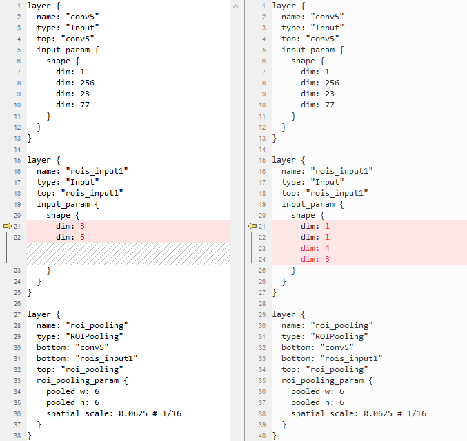

对应两种不同的prototxt写法，相应的量化数据输入格式如[图2](#_Ref77002946)所示。对于格式1），N维度为num\_rois，所以每个ROI区域是一行。对于格式2），N维度为1，所以H×W个点在同一行；需要注意：当H \> 4时，需保证表示ROI区域的坐标排在H0-H3，并且顺序为x0 -\> y0 -\> x1 -\> y1。

**图 2**  两种输入格式的量化数据排布<a name="_Ref77002946"></a>  


### 板端的输入格式<a name="ZH-CN_TOPIC_0000002408582166"></a>

当Roi/Psroi Pooling算子作为网络首层时，最终生成的网络结构如[图1](#_Ref77002947)所示。第1个data层对应feature\_map输入，第2个data层对应ROI区域输入，第3个data层的输入是实际有效ROI的个数，即ActualRoiNum。

**图 1**  首层Roi/Psroi Pooling网络结构图<a name="_Ref77002947"></a>  
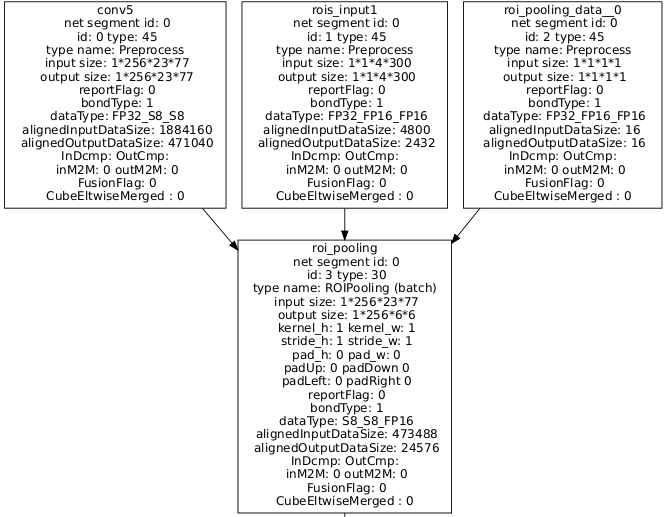

板端只支持1种ROI区域（第2个data层）输入格式，类似ATC工具的第2种输入格式。ATC工具的输入配置为格式1）或2），不影响最终生成的om支持的输入格式。板端需要的ROI输入维度为1×1×H×MaxRoiFrameCnt，其中H等于prototxt中配置的H，MaxRoiFrameCnt等于cfg文件中指定的max\_roi\_frame\_cnt。当ActualRoiNum < MaxRoiFrameCnt，每一行需要补齐到MaxRoiFrameCnt个点。Roi/Psroi Pooling算子会按照min\(MaxRoiFrameCnt, ActualRoiNum\)计算。

## Recurrent（LSTM/GRU/RNN）算子板端输入输出格式<a name="ZH-CN_TOPIC_0000002441981401"></a>

标准Caffe的Recurrent（LSTM/GRU/RNN）算子都有至少2个输入，其中第1个输入是维度为t×n×d的输入数据，第2个输入是维度为t×n的continuous数据。本小节描述当Recurrent网络包含诸如Conv等4D规格的算子且batch\_num配置为batch（多张）模式时，板端的输入输出数据格式。


### 板端的输入格式<a name="ZH-CN_TOPIC_0000002408581970"></a>

假设Recurrent网络片段结构如[图1](#fig327845143214)所示，Reshape层和Permute层负责将Conv输出的4D数据转换为3D数据并作为LSTM层的第一个输入，Data（Preprocess）层对应LSTM层的第二个continuous输入。当Prototxt首层N轴为1，即维度为1×C×H×W时，LSTM层的帧数轴t为18，句子轴n为1。

**图 1**  Recurrent网络片段结构图<a name="fig327845143214"></a>  
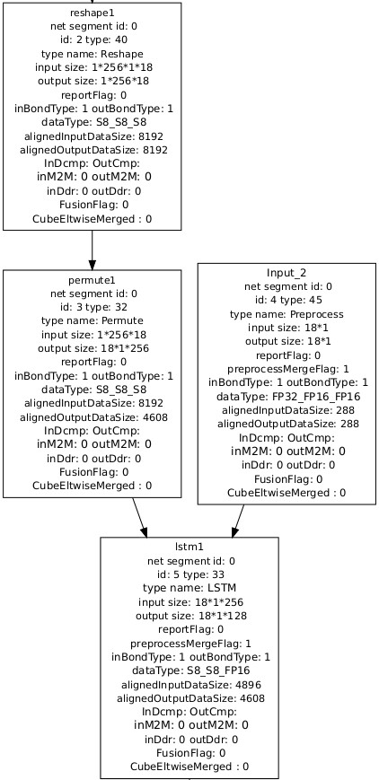

若batch\_num配置为batch（多张）模式，针对LSTM层的continuous输入（Data层），板端需准备指定图片张数对应的数据量，并且数据排布等同于标准Caffe下，Prototxt首层N轴为batch\_num时continuous的数据排布。以[图1](#fig327845143214)为例，板端准备的continuous数据应符合标准Caffe下continuous的shape为\[18, batch\_num\]所对应的数据排布。

> **说明：** 
>在ONNX框架下Recurrent网络的输入是X \[T, N, D\], sequence\_lens \[N\], intial\_h \[num\_directions, N, D\]和intial\_c \[num\_directions\]。sequence\_lens由于仅有batch轴，在准备时无需像上述continuous一样作出特殊输入规定，能保持与用户提供的输入一致。

### 板端的输出格式<a name="ZH-CN_TOPIC_0000002408421886"></a>

当batch\_num配置为batch（多张）模式时，板端的输出数据将按照图片顺序依次排列，即先排完第一张图片对应的全量数据，再依次排列后续各图片对应的全量数据。该排布可能和Caffe标准框架下Prototxt首层N轴为batch\_num所产生的数据排布不一致。

仍以[图1](#fig327845143214)为例，LSTM层第一个输出shape为\[18, 1, 128\]，板端在该层得到的输出符合shape为\[batch\_num, 18, 1, 128\]对应的数据排布, 即依次排列每张图片对应的计算数据。在标准Caffe下，若Prototxt首层N轴为batch\_num，LSTM层第一个输出符合shape为\[18, batch\_num, 128\]对应的数据排布，即不同图片对应的数据间存在交叉排列。

同理，板端在ONNX框架下的处理也与上述Caffe类似。以输出HT \[T, num\_directions, N, D\]为例，多图片下的板端输出排布为输出第一张图片的HT后再紧接排布下一张图片的HT。

