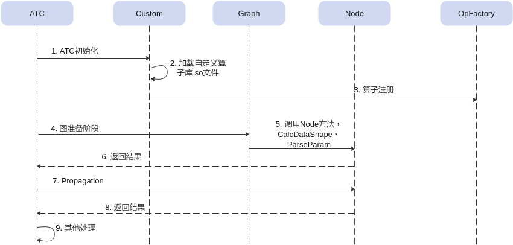
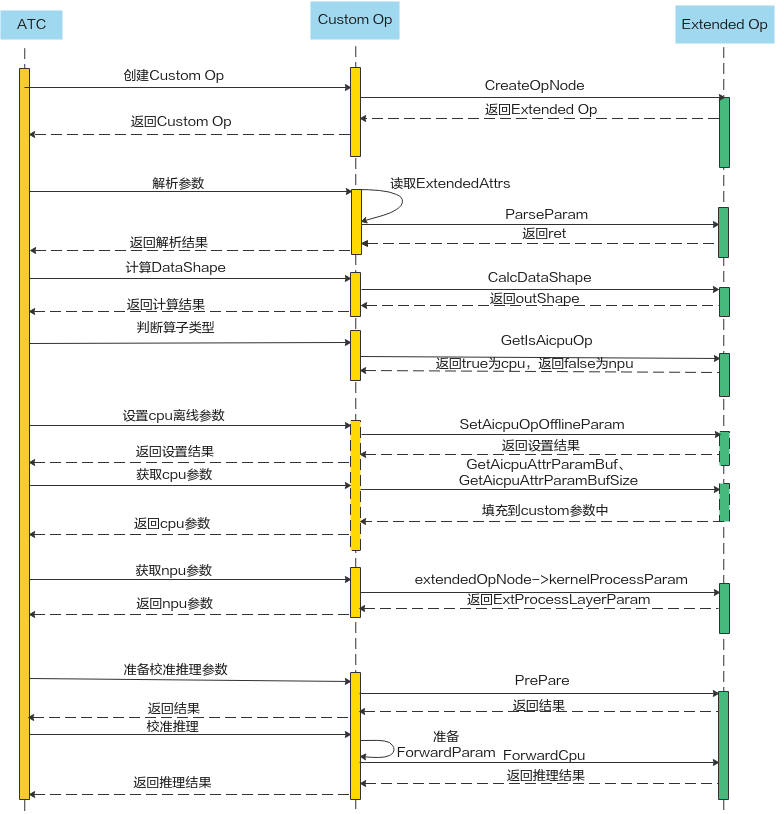
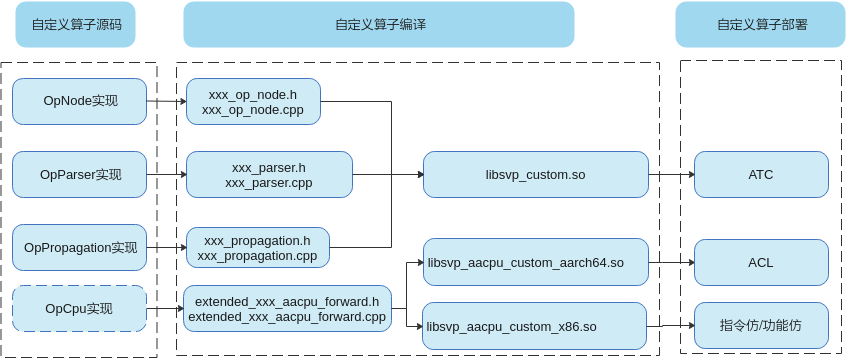
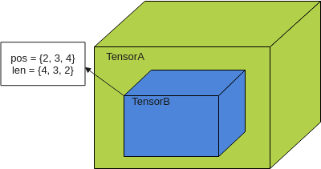
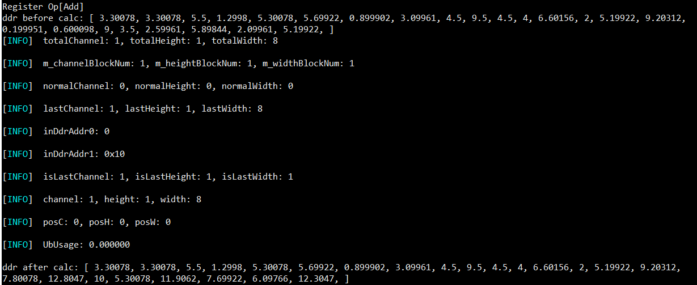
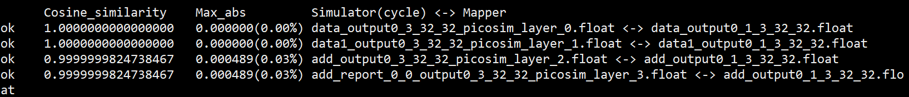

# 前言<a name="ZH-CN_TOPIC_0000002408423570"></a>

**概述<a name="section996mcpsimp"></a>**

本文介绍客户如何使用ATC\(_Advanced_  Tensor Compiler\)提供的接口开发自定义算子，以提高网络运行效率。

**产品版本<a name="section300mcpsimp"></a>**

与本文档相对应的产品版本如下。

<a name="table303mcpsimp"></a>
<table><thead align="left"><tr id="row308mcpsimp"><th class="cellrowborder" valign="top" width="45%" id="mcps1.1.3.1.1"><p id="p310mcpsimp"><a name="p310mcpsimp"></a><a name="p310mcpsimp"></a>产品名称</p>
</th>
<th class="cellrowborder" valign="top" width="55.00000000000001%" id="mcps1.1.3.1.2"><p id="p312mcpsimp"><a name="p312mcpsimp"></a><a name="p312mcpsimp"></a>产品版本</p>
</th>
</tr>
</thead>
<tbody><tr id="row314mcpsimp"><td class="cellrowborder" valign="top" width="45%" headers="mcps1.1.3.1.1 "><p id="p316mcpsimp"><a name="p316mcpsimp"></a><a name="p316mcpsimp"></a>SS928</p>
</td>
<td class="cellrowborder" valign="top" width="55.00000000000001%" headers="mcps1.1.3.1.2 "><p id="p318mcpsimp"><a name="p318mcpsimp"></a><a name="p318mcpsimp"></a>V100</p>
</td>
</tr>
<tr id="row1376073312191"><td class="cellrowborder" valign="top" width="45%" headers="mcps1.1.3.1.1 "><p id="p5760533111913"><a name="p5760533111913"></a><a name="p5760533111913"></a>SS927</p>
</td>
<td class="cellrowborder" valign="top" width="55.00000000000001%" headers="mcps1.1.3.1.2 "><p id="p6760333131918"><a name="p6760333131918"></a><a name="p6760333131918"></a>V100</p>
</td>
</tr>
</tbody>
</table>

**读者对象<a name="section999mcpsimp"></a>**

本文档主要适用于软件开发工程师。

掌握以下经验和技能可以更好地理解本文档：

-   熟悉Linux基本命令。
-   对机器学习、图像分析方法有一定的了解。

**符号约定<a name="section133020216410"></a>**

在本文中可能出现下列标志，它们所代表的含义如下。

<a name="table2622507016410"></a>
<table><thead align="left"><tr id="row1530720816410"><th class="cellrowborder" valign="top" width="20.580000000000002%" id="mcps1.1.3.1.1"><p id="p6450074116410"><a name="p6450074116410"></a><a name="p6450074116410"></a><strong id="b2136615816410"><a name="b2136615816410"></a><a name="b2136615816410"></a>符号</strong></p>
</th>
<th class="cellrowborder" valign="top" width="79.42%" id="mcps1.1.3.1.2"><p id="p5435366816410"><a name="p5435366816410"></a><a name="p5435366816410"></a><strong id="b5941558116410"><a name="b5941558116410"></a><a name="b5941558116410"></a>说明</strong></p>
</th>
</tr>
</thead>
<tbody><tr id="row1372280416410"><td class="cellrowborder" valign="top" width="20.580000000000002%" headers="mcps1.1.3.1.1 "><p id="p3734547016410"><a name="p3734547016410"></a><a name="p3734547016410"></a><a name="image2670064316410"></a><a name="image2670064316410"></a><span></span></p>
</td>
<td class="cellrowborder" valign="top" width="79.42%" headers="mcps1.1.3.1.2 "><p id="p1757432116410"><a name="p1757432116410"></a><a name="p1757432116410"></a>表示如不避免则将会导致死亡或严重伤害的具有高等级风险的危害。</p>
</td>
</tr>
<tr id="row466863216410"><td class="cellrowborder" valign="top" width="20.580000000000002%" headers="mcps1.1.3.1.1 "><p id="p1432579516410"><a name="p1432579516410"></a><a name="p1432579516410"></a><a name="image4895582316410"></a><a name="image4895582316410"></a><span></span></p>
</td>
<td class="cellrowborder" valign="top" width="79.42%" headers="mcps1.1.3.1.2 "><p id="p959197916410"><a name="p959197916410"></a><a name="p959197916410"></a>表示如不避免则可能导致死亡或严重伤害的具有中等级风险的危害。</p>
</td>
</tr>
<tr id="row123863216410"><td class="cellrowborder" valign="top" width="20.580000000000002%" headers="mcps1.1.3.1.1 "><p id="p1232579516410"><a name="p1232579516410"></a><a name="p1232579516410"></a><a name="image1235582316410"></a><a name="image1235582316410"></a><span></span></p>
</td>
<td class="cellrowborder" valign="top" width="79.42%" headers="mcps1.1.3.1.2 "><p id="p123197916410"><a name="p123197916410"></a><a name="p123197916410"></a>表示如不避免则可能导致轻微或中度伤害的具有低等级风险的危害。</p>
</td>
</tr>
<tr id="row5786682116410"><td class="cellrowborder" valign="top" width="20.580000000000002%" headers="mcps1.1.3.1.1 "><p id="p2204984716410"><a name="p2204984716410"></a><a name="p2204984716410"></a><a name="image4504446716410"></a><a name="image4504446716410"></a><span></span></p>
</td>
<td class="cellrowborder" valign="top" width="79.42%" headers="mcps1.1.3.1.2 "><p id="p4388861916410"><a name="p4388861916410"></a><a name="p4388861916410"></a>用于传递设备或环境安全警示信息。如不避免则可能会导致设备损坏、数据丢失、设备性能降低或其它不可预知的结果。</p>
<p id="p1238861916410"><a name="p1238861916410"></a><a name="p1238861916410"></a>“须知”不涉及人身伤害。</p>
</td>
</tr>
<tr id="row2856923116410"><td class="cellrowborder" valign="top" width="20.580000000000002%" headers="mcps1.1.3.1.1 "><p id="p5555360116410"><a name="p5555360116410"></a><a name="p5555360116410"></a><a name="image799324016410"></a><a name="image799324016410"></a><span></span></p>
</td>
<td class="cellrowborder" valign="top" width="79.42%" headers="mcps1.1.3.1.2 "><p id="p4612588116410"><a name="p4612588116410"></a><a name="p4612588116410"></a>对正文中重点信息的补充说明。</p>
<p id="p1232588116410"><a name="p1232588116410"></a><a name="p1232588116410"></a>“说明”不是安全警示信息，不涉及人身、设备及环境伤害信息。</p>
</td>
</tr>
</tbody>
</table>

**修改记录<a name="section2467512116410"></a>**

<a name="table1557726816410"></a>
<table><thead align="left"><tr id="row2942532716410"><th class="cellrowborder" valign="top" width="20.72%" id="mcps1.1.4.1.1"><p id="p3778275416410"><a name="p3778275416410"></a><a name="p3778275416410"></a><strong id="b5687322716410"><a name="b5687322716410"></a><a name="b5687322716410"></a>文档版本</strong></p>
</th>
<th class="cellrowborder" valign="top" width="24.75%" id="mcps1.1.4.1.2"><p id="p5627845516410"><a name="p5627845516410"></a><a name="p5627845516410"></a><strong id="b5800814916410"><a name="b5800814916410"></a><a name="b5800814916410"></a>发布日期</strong></p>
</th>
<th class="cellrowborder" valign="top" width="54.53%" id="mcps1.1.4.1.3"><p id="p2382284816410"><a name="p2382284816410"></a><a name="p2382284816410"></a><strong id="b3316380216410"><a name="b3316380216410"></a><a name="b3316380216410"></a>修改说明</strong></p>
</th>
</tr>
</thead>
<tbody><tr id="row5947359616410"><td class="cellrowborder" valign="top" width="20.72%" headers="mcps1.1.4.1.1 "><p id="p1027mcpsimp"><a name="p1027mcpsimp"></a><a name="p1027mcpsimp"></a>00B01</p>
</td>
<td class="cellrowborder" valign="top" width="24.75%" headers="mcps1.1.4.1.2 "><p id="p1029mcpsimp"><a name="p1029mcpsimp"></a><a name="p1029mcpsimp"></a>2025-09-15</p>
</td>
<td class="cellrowborder" valign="top" width="54.53%" headers="mcps1.1.4.1.3 "><p id="p1031mcpsimp"><a name="p1031mcpsimp"></a><a name="p1031mcpsimp"></a>第1次临时版本发布</p>
</td>
</tr>
</tbody>
</table>

# 使用入门<a name="ZH-CN_TOPIC_0000002408423526"></a>


## 入门学习<a name="ZH-CN_TOPIC_0000002408423562"></a>


### 算子基本概念<a name="ZH-CN_TOPIC_0000002408423566"></a>

图像分析算法由一个个计算单元组成，我们称这些计算单元为算子（Operator，简称 Op）。在网络模型中，算子对应层中的计算逻辑，例如：卷积层（Convolution Layer）是一个算子；全连接层（Fully-connected Layer， FC layer）中的权值求和过 程是一个算子。 以下是算子中常用的基本概念。

-   **算子名称 \(Name\)**

    算子的名称，用于标志网络中的某个算子，同一网络中算子的名称需要保持唯一。

-   **算子类型 \(Type\)**

    网络中每一个算子根据算子类型进行算子实现的匹配，相同类型的算子的实现逻辑相同。在一个网络中同一类型的算子可能存在多个。

-   **数据排布格式 \(Format\)**

    在图像分析框架中，多维数据通过多维数组存储，比如图像分析中卷积的特征图用四维数组保存，四个维度分别为批量大小（Batch, N）、特征图高度（Height, H）、特征图宽度（Width, W）以及特征图通道（Channels, C）。 由于数据只能线性存储，因为这四个维度有对应的顺序。不同图像分析框架会按照不同的顺序存储特征图数据，比如Caffe，排列顺序为\[Batch, Channels, Height, Width\]，即NCHW。Tensorflow中，排列顺序为\[Batch, Height, Width, Channels\]， 即NHWC。

-   **形状 \(Shape\)**

    张量的形状，以\(D0, D1, … ,Dn-1\)的形式表示，D0到Dn是任意的正整数。

## 发布模式使用<a name="ZH-CN_TOPIC_0000002442022577"></a>


### 获取ATC工具<a name="ZH-CN_TOPIC_0000002441982845"></a>

参考《ATC工具使用指南》"2.1.1 获取ATC工具" 小节。

### 获取custom样例工程<a name="ZH-CN_TOPIC_0000002442022697"></a>

custom样例工程中，包含了Abs\(cpu\)和Add\(_nnn_\)两个实现sample，样例工程目录结构如下。

├── build.sh

├── caffe\_model

│   ├── scale.caffemodel

│   └── scale.prototxt

├── CMakeLists.txt

├── cpu\_caffe\_config.json

├── cpu\_onnx\_config.json

├── data

│   ├── data\_0.txt

│   └── data\_0.txt.bin

├── lib

│   ├── cmake

│   │   ├── toolchain\_gcc-aarch64.cmake

│   │   ├── toolchain\_gcc-aarch64-mix410.cmake

│   │   ├── toolchain\_gcc-aarch64\_musl.cmake

│   │   └── toolchain\_gcc-x86.cmake

│   ├── CMakeLists.txt

│   ├── README.md

│   ├── src

│   │   ├── CMakeLists.txt

│   │   ├── common

│   │   │   ├── extended\_utils.cpp

│   │   │   ├── op

│   │   │   │   ├── extended\_op\_node\_base.cpp

│   │   │   │   ├── extended\_propagation\_base.cpp

│   │   │   │   ├── op\_factory.cpp

│   │   │   │   ├── process\_layer\_factory.cpp

│   │   │   │   └── propagation\_factory.cpp

│   │   │   └── parser

│   │   │       ├── extended\_parser\_base.cpp

│   │   │       └── op\_parser\_factory\_base.cpp

│   │   ├── extended

│   │   │   ├── aicpu\_runtime

│   │   │   │   ├── extended\_abs\_aicpu\_forward.c

│   │   │   │   ├── extended\_abs\_aicpu\_forward.h

│   │   │   │   └── extended\_aicpu\_forward\_param.h

│   │   │   └── ops

│   │   │       ├── abs

│   │   │       │   ├── abs\_op\_node.cpp

│   │   │       │   ├── abs\_parser.cpp

│   │   │       │   ├── abs\_parser.h

│   │   │       │   ├── abs\_propagation.cpp

│   │   │       │   └── abs\_propagation.h

│   │   │       ├── add

│   │   │       │   ├── add\_op\_node.cpp

│   │   │       │   ├── add\_parser.cpp

│   │   │       │   ├── add\_parser.h

│   │   │       │   ├── add\_process\_layer.cpp

│   │   │       │   ├── add\_propagation.cpp

│   │   │       │   └── add\_propagation.h

│   │   │       └── include

│   │   │           ├── abs\_op\_node.h

│   │   │           ├── add\_op\_node.h

│   │   │           └── add\_process\_layer.h

│   │   └── include

│   │       ├── common

│   │       │   ├── extended\_attr.h

│   │       │   ├── extended\_forward\_param.h

│   │       │   ├── extended\_op\_node\_base.h

│   │       │   ├── extended\_op\_version.h

│   │       │   ├── extended\_parser\_base.h

│   │       │   ├── extended\_propagation\_base.h

│   │       │   ├── extended\_utils.h

│   │       │   ├── ext\_enum\_def.h

│   │       │   ├── ext\_enum\_def.h

│   │       │   ├── ext\_enum\_def.h

│   │       │   ├── ext\_enum\_def.h

│   │       │   ├── ext\_enum\_def.h

│   │       │   ├── ext\_enum\_def.h

│   │       │   ├── ext\_enum\_def.h

│   │       │   ├── ext\_enum\_def.h

│   │       │   ├── ext\_enum\_def.h

│   │       │   ├── ext\_enum\_def.h

│   │       │   ├── ext\_enum\_def.h

│   │       │   ├── ext\_enum\_def.h

│   │       │   ├── ext\_enum\_def.h

│   │       │   ├── ext\_enum\_def.h

│   │       │   ├── ext\_enum\_def.h

│   │       │   ├── ext\_enum\_def.h

│   │       │   ├── log.h

│   │       │   ├── op\_factory.h

│   │       │   ├── op\_parser\_factory\_base.h

│   │       │   └── propagation\_factory.h

│   │       └── inst\_api

│   │           ├── ext\_controller\_def.h

│   │           ├── ext\_controller.h

│   │           ├── ext\_process\_interface.h

│   │           ├── ext\_process\_param.h

│   │           ├── process\_layer\_base.h

│   │           ├── process\_layer\_factory.h

│   │           ├── scalar.h

│   │           └── tensor.h

│   └── test

│       ├── CMakeLists.txt

│       ├── include

│       │   ├── add\_offline\_sample.h

│       │   ├── add\_sample.h

│       │   └── ext\_ddr\_simulator.h

│       └── src

│           ├── layer

│           │   ├── add\_offline\_sample.cpp

│           │   └── add\_sample.cpp

│           └── main.cpp

├── model

│   ├── calibration\_param.bin

│   ├── calibration\_param.txt

│   ├── cnn\_net\_tree\_adapt.dot

│   ├── cnn\_net\_tree.dot

│   ├── cnn\_net\_tree\_org.dot

│   ├── cnn\_net\_tree\_parser.dot

│   └── mapper\_debug.log

├── onnx\_model

│   ├── abs\_custom\_aicpu.onnx

│   └── cpu.onnx

├── README.md

├── script

│   └── txt2bin.py

### 设置环境变量<a name="ZH-CN_TOPIC_0000002442022709"></a>

设置libsvp\_aacpu\_custom\_x86.so/libsvp\_aacpu\_custom\_aarch64.so和libsvp\_custom.so相关自定义算子库环境变量。

> **须知：** 
>-   使用export方式设置环境变量后，环境变量只在当前窗口有效。如果用户之前在.bashrc文件中设置过自定义算子库的环境变量，则在执行上述命令之前，需要先手动删除原来设置的自定义算子库环境变量。
>-   如果用户之前在.bashrc文件中设置过之前版本自定义算子库的环境变量，则在执行atc命令之前，需要先手动删除原来设置的自定义算子库环境变量，然后设置如下环境变量。设置完成后，切换到新窗口执行atc模型转换命令。

**必选环境变量**（如下环境变量中$\{install\_path\}以samples软件包使用默认安装路径为例进行说明）

```
export PATH=${install_path}/9_custom/lib/output/lib:$PATH
```

```
export LD_LIBRARY_PATH=${install_path}/9_custom/lib/output/lib:$LD_LIBRARY_PATH
```

### 编译custom样例工程<a name="ZH-CN_TOPIC_0000002441982757"></a>

直接执行./build.sh即可，生成的libsvp\_custom.so库存放在$\{custom\_dir\}/output/lib目录。

### 运行ATC<a name="ZH-CN_TOPIC_0000002408423442"></a>

参考《ATC工具使用指南》“2.2 转换样例”章节。

## 调试模式使用<a name="ZH-CN_TOPIC_0000002442022605"></a>

调试模式仅NNN算子支持。本test样例工程提供了add算子\(_NNN_\)的测试工程。


### 获取test样例工程<a name="ZH-CN_TOPIC_0000002442022657"></a>

test工程的目录结构如下，sample中包含了两个测试用例供参考。

├── build.sh

├── CMakeLists.txt

├── inc

│   ├── model\_process.h

│   ├── sample\_process.h

│   └── utils.h

└── src

├── acl.json

├── CMakeLists.txt

├── main.cpp

├── model\_process.cpp

├── sample\_process.cpp

└── utils.cpp

### 编译test样例工程<a name="ZH-CN_TOPIC_0000002408423590"></a>

**必选环境变量**

```
export DDK_PATH=${install_path}/ascend-toolkit/svp_latest/x86_64-linux
```

然后执行./build.sh。

### 执行test样例工程<a name="ZH-CN_TOPIC_0000002408583386"></a>

编译好的可执行程序在\(build.sh同级目录\)out目录下，直接执行./main即可。

# 算子开发流程<a name="ZH-CN_TOPIC_0000002441982785"></a>


## 算子Op定义<a name="ZH-CN_TOPIC_0000002408423542"></a>


### 原理<a name="ZH-CN_TOPIC_0000002441982749"></a>

算子定义规定了算子输入、输出和属性信息，基本参数的校验和shape的推导，并注册到自定义算子库中。网络模型生成时，发现包含自定义算子，ATC会根据自定义算子接口调用创建Op方法，返回对应的自定义算子指针，可根据此指针调用接口。

**图 1**  自定义算子时序图<a name="fig1675518406475"></a>  


其中算子注册包括OP Node注册、OP Parser注册和OP Propagation注册，注册的时候算子类型作为传入条件。

-   首先ATC接收到第三方框架的原始网络模型，并进行初始化，网络模型的拓扑图简称为图。
-   图中包含自定义算子时，会加载自定义算子.so库。
-   Graph会遍历图中所有节点。
-   每个节点都会向Node发送调用方法请求shape计算函数和参数解析函数。
-   每个节点会执行CPU Propagation推理，并返回结果。
-   ATC进行其他处理。

自定义算子调用时序图如[图2](#fig54771023115019)。

**图 2**  自定义算子调用时序图<a name="fig54771023115019"></a>  


### 算子分析<a name="ZH-CN_TOPIC_0000002441982797"></a>

以Abs算子为例。

用户需要确定算子功能、输入、输出、算子类型以及算子实现函数名称等。

-   明确算子的功能以及数学表达式。

    以Abs算子为例，Abs算子的数学表达式为：

    y = abs\(x\)

    计算过程：将输入参数取绝对值，得到结果y并将其返回。

-   明确输入和输出。

-   例如Abs算子有一个输入x，一个输出y。
-   本样例中算子的输入支持的数据类型为float32，算子输出的数据类型与输入类型相同。
-   算子输入支持所有shape，输出shape与输入shape相同。
-   算子输出支持的format为：NCHW

-   明确算子实现文件名称以及算子的类型\(OpType\)

-   算子类型采用大驼峰的命名方式，即采用大写字符区分不同的语义。
-   算子文件名称，可采用如下命名规则。
    -   首字符的大写字符转换成小写字符，如Abs -\> abs
    -   小写字符后的大写字符转换成下划线+小写字符，如 AbsNode -\> abs\_node

因此本例中，算子类型定义为Abs，算子的实现文件名称为abs，因此各个文件名称建议命名如下。

-   算子的opNode文件命名为abs\_op\_node.h与abs\_op\_node.cpp
-   算子的解析文件命名为abs\_parser\_caffe.h与abs\_parser\_caffe.cpp
-   算子的推理文件命名为abs\_propagation.h与abs\_propagation.cpp
-   算子的runtime文件命名为extended\_abs\_aacpu\_forward.h与extended\_abs\_aacpu\_forward.c

通过以上分析，得到Abs算子的设计规格如下。

<a name="table1063mcpsimp"></a>
<table><tbody><tr id="row1070mcpsimp"><th class="firstcol" valign="top" id="mcps1.1.5.1.1"><p id="p1072mcpsimp"><a name="p1072mcpsimp"></a><a name="p1072mcpsimp"></a>算子类型</p>
<p id="p1073mcpsimp"><a name="p1073mcpsimp"></a><a name="p1073mcpsimp"></a>(OpType)</p>
</th>
<td class="cellrowborder" colspan="3" valign="top" headers="mcps1.1.5.1.1 "><p id="p1075mcpsimp"><a name="p1075mcpsimp"></a><a name="p1075mcpsimp"></a>Abs</p>
</td>
</tr>
<tr id="row1076mcpsimp"><th class="firstcol" valign="top" width="25%" id="mcps1.1.5.2.1"><p id="p1078mcpsimp"><a name="p1078mcpsimp"></a><a name="p1078mcpsimp"></a>算子输入</p>
</th>
<td class="cellrowborder" valign="top" width="25%" headers="mcps1.1.5.2.1 "><p id="p1080mcpsimp"><a name="p1080mcpsimp"></a><a name="p1080mcpsimp"></a>name：x</p>
</td>
<td class="cellrowborder" valign="top" width="25%" headers="mcps1.1.5.2.1 "><p id="p1082mcpsimp"><a name="p1082mcpsimp"></a><a name="p1082mcpsimp"></a>shape：all</p>
</td>
<td class="cellrowborder" valign="top" width="25%" headers="mcps1.1.5.2.1 "><p id="p1084mcpsimp"><a name="p1084mcpsimp"></a><a name="p1084mcpsimp"></a>data type：</p>
<p id="p1085mcpsimp"><a name="p1085mcpsimp"></a><a name="p1085mcpsimp"></a>float32</p>
</td>
</tr>
<tr id="row1086mcpsimp"><th class="firstcol" valign="top" width="25%" id="mcps1.1.5.3.1"><p id="p1088mcpsimp"><a name="p1088mcpsimp"></a><a name="p1088mcpsimp"></a>算子输出</p>
</th>
<td class="cellrowborder" valign="top" width="25%" headers="mcps1.1.5.3.1 "><p id="p1090mcpsimp"><a name="p1090mcpsimp"></a><a name="p1090mcpsimp"></a>name：y</p>
</td>
<td class="cellrowborder" valign="top" width="25%" headers="mcps1.1.5.3.1 "><p id="p1092mcpsimp"><a name="p1092mcpsimp"></a><a name="p1092mcpsimp"></a>shape：all</p>
</td>
<td class="cellrowborder" valign="top" width="25%" headers="mcps1.1.5.3.1 "><p id="p1094mcpsimp"><a name="p1094mcpsimp"></a><a name="p1094mcpsimp"></a>data type：</p>
<p id="p1095mcpsimp"><a name="p1095mcpsimp"></a><a name="p1095mcpsimp"></a>float32</p>
</td>
</tr>
<tr id="row1096mcpsimp"><th class="firstcol" valign="top" id="mcps1.1.5.4.1"><p id="p1098mcpsimp"><a name="p1098mcpsimp"></a><a name="p1098mcpsimp"></a>算子实现文件名称</p>
</th>
<td class="cellrowborder" colspan="3" valign="top" headers="mcps1.1.5.4.1 "><p id="p1100mcpsimp"><a name="p1100mcpsimp"></a><a name="p1100mcpsimp"></a>abs</p>
</td>
</tr>
</tbody>
</table>

### 工程创建<a name="ZH-CN_TOPIC_0000002441982813"></a>

用户可以基于提供的自定义算子样例工程进行修改，新增自定义算子。

目录结构介绍：

算子工程目录结构如下所示，请基于如下规则在对应目录下进行自定义算子开发。

├── extended

│   ├── aacpu\_runtime                    // 存放算子的CPU实现

│   │   ├── extended\_abs\_aacpu\_forward.c

│   │   ├── extended\_abs\_aacpu\_forward.h

│   │   └── extended\_aacpu\_forward\_param.h  // CPU推理参数文件

│   └── ops  // 存放算子定义文件、解析文件和推理文件

│       ├── abs

│       │   ├── abs\_op\_node.cpp

│       │   ├── abs\_parser.cpp

│       │   ├── abs\_parser.h

│       │   ├── abs\_propagation.cpp

│       │   └── abs\_propagation.h

│       └── include

│           └── abs\_op\_node.h

### 算子代码实现<a name="ZH-CN_TOPIC_0000002442022669"></a>

自定义算子的实现包括以下部分：

-   OpNode类的实现，需要继承ExtendedOpNodeBase基类。必须实现如下接口。
    -   Parser：创建对应自定义算子Op的Parse指针并返回。参考[Parser](#ZH-CN_TOPIC_0000002442022693)。
    -   CalcDataShape：计算输入输出数据的shape信息。参考[CalcDataShape](#ZH-CN_TOPIC_0000002408423558)。
    -   GetIsAacpuOp：获取自定义算子Op的属性，CPU算子或_NNN_算子。参考[GetIsAAcpuOp](#ZH-CN_TOPIC_0000002408423462)。

-   Parser类的实现，需要继承ExtendedParserBase基类，必须实现如下接口。

    ParseParam：对自定义算子的参数进行解析。参考[ParseParam](#ZH-CN_TOPIC_0000002441982885)。

-   Propagation类的实现，需要继承ExtendedPropagationBase基类，必须实现如下接口。
    -   PrePare：准备校准推理的参数。参考[Prepare](#ZH-CN_TOPIC_0000002442022629)。
    -   ForwardCpu：根据传入的推理参数进行校准推理。参考[ForwardCpu](#ZH-CN_TOPIC_0000002408583446)。

若为CPU算子，需实现算子的CPU下的计算函数详见[Cpu Sample介绍](#ZH-CN_TOPIC_0000002441982789)。

若为_NNN_算子，需实现XXXProcessLayer类，详见[NNN Sample介绍](#ZH-CN_TOPIC_0000002408583378)。

### 算子工程编译部署<a name="ZH-CN_TOPIC_0000002442022689"></a>


#### 简介<a name="ZH-CN_TOPIC_0000002441982833"></a>

自定义算子开发完成后，需要对算子工程进行编译，编译出ATC转换模型依赖的libsvp\_custom.so，指令仿和功能仿依赖的libsvp\_aacpu\_custom\_x86.so，板端ACL依赖的libsvp\_aacpu\_custom\_aarch64.so。详细的编译部署流程如[图1](#fig11232960472)所示。

**图 1**  算子工程编译部署图<a name="fig11232960472"></a>  


所有自定义算子需要在同一算子工程进行编译，编译成ATC加载调用的.so库。

#### 算子工程编译<a name="ZH-CN_TOPIC_0000002441982825"></a>

算子源码开发完成后，需要对算子工程进行编译，生成自定义算子库，包括libsvp\_custom.so和libsvp\_aacpu\_custom\_x86.so/libsvp\_aacpu\_custom\_aarch64.so。

-   环境准备，配置gcc编译环境，CMake最低版本要求为3.5.1。
-   当开发环境与运行环境操作系统架构相同时，执行如下命令编译程序。

    指令仿真：./build.sh inst

    功能仿真：./build.sh func

    -   默认的交叉编译链：aarch64-mix210-linux-gcc；
    -   如果想切换编译链：aarch64-mix410-linux-gcc，将src/CMakeLists.txt文件中的set\(BOARD\_TOOLCHAIN\_FILE toolchain\_gcc-aarch64.cmake\) 修改为set\(BOARD\_TOOLCHAIN\_FILE toolchain\_gcc-aarch64-mix410.cmake\)；
    -   如果想切换编译链：aarch64-v01c01-linux-musl，将src/CMakeLists.txt文件中的set\(BOARD\_TOOLCHAIN\_FILE toolchain\_gcc-aarch64.cmake\) 修改为set\(BOARD\_TOOLCHAIN\_FILE toolchain\_gcc-aarch64\_musl.cmake\)

-   当开发环境与运行环境操作系统架构不同时，执行./build.sh进行交叉编译
    -   默认的交叉编译链：aarch64-mix210-linux-gcc；
    -   如果想切换编译链：aarch64-mix410-linux-gcc，执行脚本：./build.sh board 410
    -   如果想切换编译链：aarch64-v01c01-linux-musl，执行脚本：./build.sh board musl

-   ATC使用的libcustom.so和仿真工具使用的libsvp\_aacpu\_custom\_x86.so编译环境一致。

-   编译成功后，会在当前目录创建output目录，并在output/lib下生成libsvp\_custom.so和libsvp\_aacpu\_custom\_x86.so/libsvp\_aacpu\_custom\_aarch64.so库。
-   配置自定义算子库环境变量，供ATC加载使用，命令如下。

    ```
    export LD_LIBRARY_PATH=xxx/output/lib:$LD_LIBRARY_PATH
    ```

-   板端执行带有自定义cpu算子库时，通过二级调用libsvp\_aacpu\_custom\_aarch64.so库进行推理，仿真工具执行带有自定义cpu算子库时，通过二级调用libsvp\_aacpu\_custom\_x86.so库进行推理。

> **须知：** 
>当前支持自定义算子的模块有ATC、指令仿真、板端推理。功能仿真暂时不支持_NNN_自定义算子，工具当前不支持自定义算子。

# 接口参考<a name="ZH-CN_TOPIC_0000002442022713"></a>


## 通用参数<a name="ZH-CN_TOPIC_0000002408583482"></a>


### ExtendedAttr类<a name="ZH-CN_TOPIC_0000002442022733"></a>


#### ExtendedAttr构造函数和析构函数<a name="ZH-CN_TOPIC_0000002408583390"></a>

功能描述：

ExtendedAttr构造函数和析构函数。

接口原型：

```
ExtendedAttr ();
virtual ~ExtendedAttr ();
```

#### GetExtendedParam<a name="ZH-CN_TOPIC_0000002408423506"></a>

功能描述：

获取自定义算子参数。

接口原型：

```
ExtendedParam GetExtendedParam() const;
```

返回值说明：

ExtendedParam，自定义算子参数。

### AttributeType<a name="ZH-CN_TOPIC_0000002408583458"></a>

功能描述：枚举类型，表征参数属性。

<a name="table2588mcpsimp"></a>
<table><thead align="left"><tr id="row2593mcpsimp"><th class="cellrowborder" valign="top" width="39%" id="mcps1.1.3.1.1"><p id="p2595mcpsimp"><a name="p2595mcpsimp"></a><a name="p2595mcpsimp"></a>类型</p>
</th>
<th class="cellrowborder" valign="top" width="61%" id="mcps1.1.3.1.2"><p id="p2597mcpsimp"><a name="p2597mcpsimp"></a><a name="p2597mcpsimp"></a>说明</p>
</th>
</tr>
</thead>
<tbody><tr id="row2599mcpsimp"><td class="cellrowborder" valign="top" width="39%" headers="mcps1.1.3.1.1 "><p id="p2601mcpsimp"><a name="p2601mcpsimp"></a><a name="p2601mcpsimp"></a>UNDEFINED</p>
</td>
<td class="cellrowborder" valign="top" width="61%" headers="mcps1.1.3.1.2 "><p id="p2603mcpsimp"><a name="p2603mcpsimp"></a><a name="p2603mcpsimp"></a>未定义类型。</p>
</td>
</tr>
<tr id="row2604mcpsimp"><td class="cellrowborder" valign="top" width="39%" headers="mcps1.1.3.1.1 "><p id="p2606mcpsimp"><a name="p2606mcpsimp"></a><a name="p2606mcpsimp"></a>FLOAT</p>
</td>
<td class="cellrowborder" valign="top" width="61%" headers="mcps1.1.3.1.2 "><p id="p2608mcpsimp"><a name="p2608mcpsimp"></a><a name="p2608mcpsimp"></a>float。</p>
</td>
</tr>
<tr id="row2609mcpsimp"><td class="cellrowborder" valign="top" width="39%" headers="mcps1.1.3.1.1 "><p id="p2611mcpsimp"><a name="p2611mcpsimp"></a><a name="p2611mcpsimp"></a>INT</p>
</td>
<td class="cellrowborder" valign="top" width="61%" headers="mcps1.1.3.1.2 "><p id="p2613mcpsimp"><a name="p2613mcpsimp"></a><a name="p2613mcpsimp"></a>int64_t。</p>
</td>
</tr>
<tr id="row2614mcpsimp"><td class="cellrowborder" valign="top" width="39%" headers="mcps1.1.3.1.1 "><p id="p2616mcpsimp"><a name="p2616mcpsimp"></a><a name="p2616mcpsimp"></a>STRING</p>
</td>
<td class="cellrowborder" valign="top" width="61%" headers="mcps1.1.3.1.2 "><p id="p2618mcpsimp"><a name="p2618mcpsimp"></a><a name="p2618mcpsimp"></a>字符串。</p>
</td>
</tr>
<tr id="row2619mcpsimp"><td class="cellrowborder" valign="top" width="39%" headers="mcps1.1.3.1.1 "><p id="p2621mcpsimp"><a name="p2621mcpsimp"></a><a name="p2621mcpsimp"></a>FLOATS</p>
</td>
<td class="cellrowborder" valign="top" width="61%" headers="mcps1.1.3.1.2 "><p id="p2623mcpsimp"><a name="p2623mcpsimp"></a><a name="p2623mcpsimp"></a>float数组。</p>
</td>
</tr>
<tr id="row2624mcpsimp"><td class="cellrowborder" valign="top" width="39%" headers="mcps1.1.3.1.1 "><p id="p2626mcpsimp"><a name="p2626mcpsimp"></a><a name="p2626mcpsimp"></a>INTS</p>
</td>
<td class="cellrowborder" valign="top" width="61%" headers="mcps1.1.3.1.2 "><p id="p2628mcpsimp"><a name="p2628mcpsimp"></a><a name="p2628mcpsimp"></a>int64_t数组。</p>
</td>
</tr>
<tr id="row2629mcpsimp"><td class="cellrowborder" valign="top" width="39%" headers="mcps1.1.3.1.1 "><p id="p2631mcpsimp"><a name="p2631mcpsimp"></a><a name="p2631mcpsimp"></a>STRINGS</p>
</td>
<td class="cellrowborder" valign="top" width="61%" headers="mcps1.1.3.1.2 "><p id="p2633mcpsimp"><a name="p2633mcpsimp"></a><a name="p2633mcpsimp"></a>字符串数组。</p>
</td>
</tr>
</tbody>
</table>

### AttributeType<a name="ZH-CN_TOPIC_0000002408583462"></a>

功能描述：结构体类型，表征参数的值。

<a name="table1185mcpsimp"></a>
<table><thead align="left"><tr id="row1191mcpsimp"><th class="cellrowborder" valign="top" width="24%" id="mcps1.1.4.1.1"><p id="p1193mcpsimp"><a name="p1193mcpsimp"></a><a name="p1193mcpsimp"></a>参数名</p>
</th>
<th class="cellrowborder" valign="top" width="38%" id="mcps1.1.4.1.2"><p id="p1195mcpsimp"><a name="p1195mcpsimp"></a><a name="p1195mcpsimp"></a>类型</p>
</th>
<th class="cellrowborder" valign="top" width="38%" id="mcps1.1.4.1.3"><p id="p1197mcpsimp"><a name="p1197mcpsimp"></a><a name="p1197mcpsimp"></a>说明</p>
</th>
</tr>
</thead>
<tbody><tr id="row1199mcpsimp"><td class="cellrowborder" valign="top" width="24%" headers="mcps1.1.4.1.1 "><p id="p1201mcpsimp"><a name="p1201mcpsimp"></a><a name="p1201mcpsimp"></a>name</p>
</td>
<td class="cellrowborder" valign="top" width="38%" headers="mcps1.1.4.1.2 "><p id="p1203mcpsimp"><a name="p1203mcpsimp"></a><a name="p1203mcpsimp"></a>string</p>
</td>
<td class="cellrowborder" valign="top" width="38%" headers="mcps1.1.4.1.3 "><p id="p1205mcpsimp"><a name="p1205mcpsimp"></a><a name="p1205mcpsimp"></a>自定义参数名称。</p>
</td>
</tr>
<tr id="row1206mcpsimp"><td class="cellrowborder" valign="top" width="24%" headers="mcps1.1.4.1.1 "><p id="p1208mcpsimp"><a name="p1208mcpsimp"></a><a name="p1208mcpsimp"></a>type</p>
</td>
<td class="cellrowborder" valign="top" width="38%" headers="mcps1.1.4.1.2 "><p id="p1210mcpsimp"><a name="p1210mcpsimp"></a><a name="p1210mcpsimp"></a>AttributeType</p>
</td>
<td class="cellrowborder" valign="top" width="38%" headers="mcps1.1.4.1.3 "><p id="p1212mcpsimp"><a name="p1212mcpsimp"></a><a name="p1212mcpsimp"></a>自定义参数类型。</p>
</td>
</tr>
<tr id="row1213mcpsimp"><td class="cellrowborder" valign="top" width="24%" headers="mcps1.1.4.1.1 "><p id="p1215mcpsimp"><a name="p1215mcpsimp"></a><a name="p1215mcpsimp"></a>paramFloat</p>
</td>
<td class="cellrowborder" valign="top" width="38%" headers="mcps1.1.4.1.2 "><p id="p1217mcpsimp"><a name="p1217mcpsimp"></a><a name="p1217mcpsimp"></a>float</p>
</td>
<td class="cellrowborder" valign="top" width="38%" headers="mcps1.1.4.1.3 "><p id="p1219mcpsimp"><a name="p1219mcpsimp"></a><a name="p1219mcpsimp"></a>float类型参数。</p>
</td>
</tr>
<tr id="row1220mcpsimp"><td class="cellrowborder" valign="top" width="24%" headers="mcps1.1.4.1.1 "><p id="p1222mcpsimp"><a name="p1222mcpsimp"></a><a name="p1222mcpsimp"></a>paramInt</p>
</td>
<td class="cellrowborder" valign="top" width="38%" headers="mcps1.1.4.1.2 "><p id="p1224mcpsimp"><a name="p1224mcpsimp"></a><a name="p1224mcpsimp"></a>int64_t</p>
</td>
<td class="cellrowborder" valign="top" width="38%" headers="mcps1.1.4.1.3 "><p id="p1226mcpsimp"><a name="p1226mcpsimp"></a><a name="p1226mcpsimp"></a>int64_t类型参数。</p>
</td>
</tr>
<tr id="row1227mcpsimp"><td class="cellrowborder" valign="top" width="24%" headers="mcps1.1.4.1.1 "><p id="p1229mcpsimp"><a name="p1229mcpsimp"></a><a name="p1229mcpsimp"></a>paramString</p>
</td>
<td class="cellrowborder" valign="top" width="38%" headers="mcps1.1.4.1.2 "><p id="p1231mcpsimp"><a name="p1231mcpsimp"></a><a name="p1231mcpsimp"></a>string</p>
</td>
<td class="cellrowborder" valign="top" width="38%" headers="mcps1.1.4.1.3 "><p id="p1233mcpsimp"><a name="p1233mcpsimp"></a><a name="p1233mcpsimp"></a>字符串类型参数。</p>
</td>
</tr>
<tr id="row1234mcpsimp"><td class="cellrowborder" valign="top" width="24%" headers="mcps1.1.4.1.1 "><p id="p1236mcpsimp"><a name="p1236mcpsimp"></a><a name="p1236mcpsimp"></a>paramFloats</p>
</td>
<td class="cellrowborder" valign="top" width="38%" headers="mcps1.1.4.1.2 "><p id="p1238mcpsimp"><a name="p1238mcpsimp"></a><a name="p1238mcpsimp"></a>vector&lt;float&gt;</p>
</td>
<td class="cellrowborder" valign="top" width="38%" headers="mcps1.1.4.1.3 "><p id="p1240mcpsimp"><a name="p1240mcpsimp"></a><a name="p1240mcpsimp"></a>float数组参数。</p>
</td>
</tr>
<tr id="row1241mcpsimp"><td class="cellrowborder" valign="top" width="24%" headers="mcps1.1.4.1.1 "><p id="p1243mcpsimp"><a name="p1243mcpsimp"></a><a name="p1243mcpsimp"></a>paramInts</p>
</td>
<td class="cellrowborder" valign="top" width="38%" headers="mcps1.1.4.1.2 "><p id="p1245mcpsimp"><a name="p1245mcpsimp"></a><a name="p1245mcpsimp"></a>vector&lt;int64_t&gt;</p>
</td>
<td class="cellrowborder" valign="top" width="38%" headers="mcps1.1.4.1.3 "><p id="p1247mcpsimp"><a name="p1247mcpsimp"></a><a name="p1247mcpsimp"></a>int64_t数组参数。</p>
</td>
</tr>
<tr id="row1248mcpsimp"><td class="cellrowborder" valign="top" width="24%" headers="mcps1.1.4.1.1 "><p id="p1250mcpsimp"><a name="p1250mcpsimp"></a><a name="p1250mcpsimp"></a>paramStrings</p>
</td>
<td class="cellrowborder" valign="top" width="38%" headers="mcps1.1.4.1.2 "><p id="p1252mcpsimp"><a name="p1252mcpsimp"></a><a name="p1252mcpsimp"></a>vector&lt;string&gt;</p>
</td>
<td class="cellrowborder" valign="top" width="38%" headers="mcps1.1.4.1.3 "><p id="p1254mcpsimp"><a name="p1254mcpsimp"></a><a name="p1254mcpsimp"></a>字符串数组参数。</p>
</td>
</tr>
</tbody>
</table>

### Propagation推理参数<a name="ZH-CN_TOPIC_0000002408423518"></a>


#### ExtendedBuffer<a name="ZH-CN_TOPIC_0000002408423538"></a>

功能描述：自定义buffer类型。

<a name="table2453mcpsimp"></a>
<table><thead align="left"><tr id="row2459mcpsimp"><th class="cellrowborder" valign="top" width="24%" id="mcps1.1.4.1.1"><p id="p2461mcpsimp"><a name="p2461mcpsimp"></a><a name="p2461mcpsimp"></a>参数名</p>
</th>
<th class="cellrowborder" valign="top" width="38%" id="mcps1.1.4.1.2"><p id="p2463mcpsimp"><a name="p2463mcpsimp"></a><a name="p2463mcpsimp"></a>类型</p>
</th>
<th class="cellrowborder" valign="top" width="38%" id="mcps1.1.4.1.3"><p id="p2465mcpsimp"><a name="p2465mcpsimp"></a><a name="p2465mcpsimp"></a>说明</p>
</th>
</tr>
</thead>
<tbody><tr id="row2467mcpsimp"><td class="cellrowborder" valign="top" width="24%" headers="mcps1.1.4.1.1 "><p id="p2469mcpsimp"><a name="p2469mcpsimp"></a><a name="p2469mcpsimp"></a>data</p>
</td>
<td class="cellrowborder" valign="top" width="38%" headers="mcps1.1.4.1.2 "><p id="p2471mcpsimp"><a name="p2471mcpsimp"></a><a name="p2471mcpsimp"></a>void*</p>
</td>
<td class="cellrowborder" valign="top" width="38%" headers="mcps1.1.4.1.3 "><p id="p2473mcpsimp"><a name="p2473mcpsimp"></a><a name="p2473mcpsimp"></a>buffer内存数据。</p>
</td>
</tr>
<tr id="row2474mcpsimp"><td class="cellrowborder" valign="top" width="24%" headers="mcps1.1.4.1.1 "><p id="p2476mcpsimp"><a name="p2476mcpsimp"></a><a name="p2476mcpsimp"></a>size</p>
</td>
<td class="cellrowborder" valign="top" width="38%" headers="mcps1.1.4.1.2 "><p id="p2478mcpsimp"><a name="p2478mcpsimp"></a><a name="p2478mcpsimp"></a>uint32_t</p>
</td>
<td class="cellrowborder" valign="top" width="38%" headers="mcps1.1.4.1.3 "><p id="p2480mcpsimp"><a name="p2480mcpsimp"></a><a name="p2480mcpsimp"></a>buffer内存数据量，以byte为单位。</p>
</td>
</tr>
</tbody>
</table>

#### ExtendedDataInfo<a name="ZH-CN_TOPIC_0000002408583450"></a>

功能描述：自定义data信息。

<a name="table636mcpsimp"></a>
<table><thead align="left"><tr id="row642mcpsimp"><th class="cellrowborder" valign="top" width="24%" id="mcps1.1.4.1.1"><p id="p644mcpsimp"><a name="p644mcpsimp"></a><a name="p644mcpsimp"></a>参数名</p>
</th>
<th class="cellrowborder" valign="top" width="38%" id="mcps1.1.4.1.2"><p id="p646mcpsimp"><a name="p646mcpsimp"></a><a name="p646mcpsimp"></a>类型</p>
</th>
<th class="cellrowborder" valign="top" width="38%" id="mcps1.1.4.1.3"><p id="p648mcpsimp"><a name="p648mcpsimp"></a><a name="p648mcpsimp"></a>说明</p>
</th>
</tr>
</thead>
<tbody><tr id="row650mcpsimp"><td class="cellrowborder" valign="top" width="24%" headers="mcps1.1.4.1.1 "><p id="p652mcpsimp"><a name="p652mcpsimp"></a><a name="p652mcpsimp"></a>dataType</p>
</td>
<td class="cellrowborder" valign="top" width="38%" headers="mcps1.1.4.1.2 "><p id="p654mcpsimp"><a name="p654mcpsimp"></a><a name="p654mcpsimp"></a>uint32_t</p>
</td>
<td class="cellrowborder" valign="top" width="38%" headers="mcps1.1.4.1.3 "><p id="p656mcpsimp"><a name="p656mcpsimp"></a><a name="p656mcpsimp"></a>数据类型。</p>
</td>
</tr>
<tr id="row657mcpsimp"><td class="cellrowborder" valign="top" width="24%" headers="mcps1.1.4.1.1 "><p id="p659mcpsimp"><a name="p659mcpsimp"></a><a name="p659mcpsimp"></a>stride</p>
</td>
<td class="cellrowborder" valign="top" width="38%" headers="mcps1.1.4.1.2 "><p id="p661mcpsimp"><a name="p661mcpsimp"></a><a name="p661mcpsimp"></a>uint32_t</p>
</td>
<td class="cellrowborder" valign="top" width="38%" headers="mcps1.1.4.1.3 "><p id="p663mcpsimp"><a name="p663mcpsimp"></a><a name="p663mcpsimp"></a>数据stride偏移。</p>
</td>
</tr>
<tr id="row664mcpsimp"><td class="cellrowborder" valign="top" width="24%" headers="mcps1.1.4.1.1 "><p id="p666mcpsimp"><a name="p666mcpsimp"></a><a name="p666mcpsimp"></a>dimNum</p>
</td>
<td class="cellrowborder" valign="top" width="38%" headers="mcps1.1.4.1.2 "><p id="p668mcpsimp"><a name="p668mcpsimp"></a><a name="p668mcpsimp"></a>uint32_t</p>
</td>
<td class="cellrowborder" valign="top" width="38%" headers="mcps1.1.4.1.3 "><p id="p670mcpsimp"><a name="p670mcpsimp"></a><a name="p670mcpsimp"></a>数据维度数量。</p>
</td>
</tr>
<tr id="row671mcpsimp"><td class="cellrowborder" valign="top" width="24%" headers="mcps1.1.4.1.1 "><p id="p673mcpsimp"><a name="p673mcpsimp"></a><a name="p673mcpsimp"></a>shape</p>
</td>
<td class="cellrowborder" valign="top" width="38%" headers="mcps1.1.4.1.2 "><p id="p675mcpsimp"><a name="p675mcpsimp"></a><a name="p675mcpsimp"></a>uint32_t*</p>
</td>
<td class="cellrowborder" valign="top" width="38%" headers="mcps1.1.4.1.3 "><p id="p677mcpsimp"><a name="p677mcpsimp"></a><a name="p677mcpsimp"></a>数据形状信息。</p>
</td>
</tr>
<tr id="row678mcpsimp"><td class="cellrowborder" valign="top" width="24%" headers="mcps1.1.4.1.1 "><p id="p680mcpsimp"><a name="p680mcpsimp"></a><a name="p680mcpsimp"></a>buffer</p>
</td>
<td class="cellrowborder" valign="top" width="38%" headers="mcps1.1.4.1.2 "><p id="p682mcpsimp"><a name="p682mcpsimp"></a><a name="p682mcpsimp"></a>ExtendedBuffer</p>
</td>
<td class="cellrowborder" valign="top" width="38%" headers="mcps1.1.4.1.3 "><p id="p684mcpsimp"><a name="p684mcpsimp"></a><a name="p684mcpsimp"></a>数据buffer。</p>
</td>
</tr>
</tbody>
</table>

#### ExtendedDataInfoContainer<a name="ZH-CN_TOPIC_0000002442022613"></a>

功能描述：自定义dataInfo信息。

<a name="table605mcpsimp"></a>
<table><thead align="left"><tr id="row611mcpsimp"><th class="cellrowborder" valign="top" width="24%" id="mcps1.1.4.1.1"><p id="p613mcpsimp"><a name="p613mcpsimp"></a><a name="p613mcpsimp"></a>参数名</p>
</th>
<th class="cellrowborder" valign="top" width="38%" id="mcps1.1.4.1.2"><p id="p615mcpsimp"><a name="p615mcpsimp"></a><a name="p615mcpsimp"></a>类型</p>
</th>
<th class="cellrowborder" valign="top" width="38%" id="mcps1.1.4.1.3"><p id="p617mcpsimp"><a name="p617mcpsimp"></a><a name="p617mcpsimp"></a>说明</p>
</th>
</tr>
</thead>
<tbody><tr id="row619mcpsimp"><td class="cellrowborder" valign="top" width="24%" headers="mcps1.1.4.1.1 "><p id="p621mcpsimp"><a name="p621mcpsimp"></a><a name="p621mcpsimp"></a>dataInfo</p>
</td>
<td class="cellrowborder" valign="top" width="38%" headers="mcps1.1.4.1.2 "><p id="p623mcpsimp"><a name="p623mcpsimp"></a><a name="p623mcpsimp"></a>ExtendedDataInfo*</p>
</td>
<td class="cellrowborder" valign="top" width="38%" headers="mcps1.1.4.1.3 "><p id="p625mcpsimp"><a name="p625mcpsimp"></a><a name="p625mcpsimp"></a>自定义数据Info。</p>
</td>
</tr>
<tr id="row626mcpsimp"><td class="cellrowborder" valign="top" width="24%" headers="mcps1.1.4.1.1 "><p id="p628mcpsimp"><a name="p628mcpsimp"></a><a name="p628mcpsimp"></a>num</p>
</td>
<td class="cellrowborder" valign="top" width="38%" headers="mcps1.1.4.1.2 "><p id="p630mcpsimp"><a name="p630mcpsimp"></a><a name="p630mcpsimp"></a>uint32_t</p>
</td>
<td class="cellrowborder" valign="top" width="38%" headers="mcps1.1.4.1.3 "><p id="p632mcpsimp"><a name="p632mcpsimp"></a><a name="p632mcpsimp"></a>自定义数据Info数据量。</p>
</td>
</tr>
</tbody>
</table>

#### ExtendedForwardParam<a name="ZH-CN_TOPIC_0000002408423522"></a>

功能描述：自定义forward参数。

<a name="table2681mcpsimp"></a>
<table><thead align="left"><tr id="row2687mcpsimp"><th class="cellrowborder" valign="top" width="24%" id="mcps1.1.4.1.1"><p id="p2689mcpsimp"><a name="p2689mcpsimp"></a><a name="p2689mcpsimp"></a>参数名</p>
</th>
<th class="cellrowborder" valign="top" width="38%" id="mcps1.1.4.1.2"><p id="p2691mcpsimp"><a name="p2691mcpsimp"></a><a name="p2691mcpsimp"></a>类型</p>
</th>
<th class="cellrowborder" valign="top" width="38%" id="mcps1.1.4.1.3"><p id="p2693mcpsimp"><a name="p2693mcpsimp"></a><a name="p2693mcpsimp"></a>说明</p>
</th>
</tr>
</thead>
<tbody><tr id="row2695mcpsimp"><td class="cellrowborder" valign="top" width="24%" headers="mcps1.1.4.1.1 "><p id="p2697mcpsimp"><a name="p2697mcpsimp"></a><a name="p2697mcpsimp"></a>input</p>
</td>
<td class="cellrowborder" valign="top" width="38%" headers="mcps1.1.4.1.2 "><p id="p2699mcpsimp"><a name="p2699mcpsimp"></a><a name="p2699mcpsimp"></a>ExtendedDataInfoContainer</p>
</td>
<td class="cellrowborder" valign="top" width="38%" headers="mcps1.1.4.1.3 "><p id="p2701mcpsimp"><a name="p2701mcpsimp"></a><a name="p2701mcpsimp"></a>输入数据。</p>
</td>
</tr>
<tr id="row2702mcpsimp"><td class="cellrowborder" valign="top" width="24%" headers="mcps1.1.4.1.1 "><p id="p2704mcpsimp"><a name="p2704mcpsimp"></a><a name="p2704mcpsimp"></a>output</p>
</td>
<td class="cellrowborder" valign="top" width="38%" headers="mcps1.1.4.1.2 "><p id="p2706mcpsimp"><a name="p2706mcpsimp"></a><a name="p2706mcpsimp"></a>ExtendedDataInfoContainer</p>
</td>
<td class="cellrowborder" valign="top" width="38%" headers="mcps1.1.4.1.3 "><p id="p2708mcpsimp"><a name="p2708mcpsimp"></a><a name="p2708mcpsimp"></a>输出数据。</p>
</td>
</tr>
<tr id="row2709mcpsimp"><td class="cellrowborder" valign="top" width="24%" headers="mcps1.1.4.1.1 "><p id="p2711mcpsimp"><a name="p2711mcpsimp"></a><a name="p2711mcpsimp"></a>paramBuf</p>
</td>
<td class="cellrowborder" valign="top" width="38%" headers="mcps1.1.4.1.2 "><p id="p2713mcpsimp"><a name="p2713mcpsimp"></a><a name="p2713mcpsimp"></a>ExtendedBuffer</p>
</td>
<td class="cellrowborder" valign="top" width="38%" headers="mcps1.1.4.1.3 "><p id="p2715mcpsimp"><a name="p2715mcpsimp"></a><a name="p2715mcpsimp"></a>参数buffer。</p>
</td>
</tr>
</tbody>
</table>

## 通用接口<a name="ZH-CN_TOPIC_0000002408583354"></a>


### ExtendedOpNodeBase类<a name="ZH-CN_TOPIC_0000002408423574"></a>


#### ExtendedOpNodeBase构造函数和析构函数<a name="ZH-CN_TOPIC_0000002441982873"></a>

功能描述：

ExtendedOpNodeBase构造函数和析构函数。

接口原型：

```
ExtendedOpNodeBase();
virtual ~ExtendedOpNodeBase();
```

#### Parser<a name="ZH-CN_TOPIC_0000002442022693"></a>

功能描述：

获取算子parser对象。

接口原型：

```
virtual shared_ptr<ExtendedParserBase> Parser();
```

返回值说明：

返回算子Parser指针。

#### CalcDataShape<a name="ZH-CN_TOPIC_0000002408423558"></a>

功能描述：

计算Shape信息。

接口原型：

```
virtual int32_t CalcDataShape(const vector<vector<int32_t>>& bottomShapeVec, vector<vector<int32_t>>& topShapeVec);
```

<a name="table925mcpsimp"></a>
<table><thead align="left"><tr id="row931mcpsimp"><th class="cellrowborder" valign="top" width="28.999999999999996%" id="mcps1.1.4.1.1"><p id="p933mcpsimp"><a name="p933mcpsimp"></a><a name="p933mcpsimp"></a>参数名</p>
</th>
<th class="cellrowborder" valign="top" width="25%" id="mcps1.1.4.1.2"><p id="p935mcpsimp"><a name="p935mcpsimp"></a><a name="p935mcpsimp"></a>输入/输出</p>
</th>
<th class="cellrowborder" valign="top" width="46%" id="mcps1.1.4.1.3"><p id="p937mcpsimp"><a name="p937mcpsimp"></a><a name="p937mcpsimp"></a>说明</p>
</th>
</tr>
</thead>
<tbody><tr id="row939mcpsimp"><td class="cellrowborder" valign="top" width="28.999999999999996%" headers="mcps1.1.4.1.1 "><p id="p941mcpsimp"><a name="p941mcpsimp"></a><a name="p941mcpsimp"></a>bottomShapeVec</p>
</td>
<td class="cellrowborder" valign="top" width="25%" headers="mcps1.1.4.1.2 "><p id="p943mcpsimp"><a name="p943mcpsimp"></a><a name="p943mcpsimp"></a>输入</p>
</td>
<td class="cellrowborder" valign="top" width="46%" headers="mcps1.1.4.1.3 "><p id="p945mcpsimp"><a name="p945mcpsimp"></a><a name="p945mcpsimp"></a>输入shape信息，其维度需与输入Shape（bottom）个数相等。</p>
</td>
</tr>
<tr id="row946mcpsimp"><td class="cellrowborder" valign="top" width="28.999999999999996%" headers="mcps1.1.4.1.1 "><p id="p948mcpsimp"><a name="p948mcpsimp"></a><a name="p948mcpsimp"></a>topShapeVec</p>
</td>
<td class="cellrowborder" valign="top" width="25%" headers="mcps1.1.4.1.2 "><p id="p950mcpsimp"><a name="p950mcpsimp"></a><a name="p950mcpsimp"></a>输出</p>
</td>
<td class="cellrowborder" valign="top" width="46%" headers="mcps1.1.4.1.3 "><p id="p952mcpsimp"><a name="p952mcpsimp"></a><a name="p952mcpsimp"></a>输出shape信息，其维度需与输出Shape（top）个数相等。</p>
</td>
</tr>
</tbody>
</table>

返回值说明：

int32\_t，shape信息是否计算成功，返回0表示成功。

#### CheckSpecification<a name="ZH-CN_TOPIC_0000002408583470"></a>

功能描述：

检查算子规格是否支持。

接口原型：

```
virtual int32_t CheckSpecification();
```

返回值说明：

int32\_t，返回0表示成功。

#### SetIsAacpuOp<a name="ZH-CN_TOPIC_0000002408423514"></a>

功能描述：

设置CPU算子flag。

接口原型：

```
void SetIsAacpuOp(bool flag);
```

<a name="table1885mcpsimp"></a>
<table><thead align="left"><tr id="row1891mcpsimp"><th class="cellrowborder" valign="top" width="28.999999999999996%" id="mcps1.1.4.1.1"><p id="p1893mcpsimp"><a name="p1893mcpsimp"></a><a name="p1893mcpsimp"></a>参数名</p>
</th>
<th class="cellrowborder" valign="top" width="25%" id="mcps1.1.4.1.2"><p id="p1895mcpsimp"><a name="p1895mcpsimp"></a><a name="p1895mcpsimp"></a>输入/输出</p>
</th>
<th class="cellrowborder" valign="top" width="46%" id="mcps1.1.4.1.3"><p id="p1897mcpsimp"><a name="p1897mcpsimp"></a><a name="p1897mcpsimp"></a>说明</p>
</th>
</tr>
</thead>
<tbody><tr id="row1899mcpsimp"><td class="cellrowborder" valign="top" width="28.999999999999996%" headers="mcps1.1.4.1.1 "><p id="p1901mcpsimp"><a name="p1901mcpsimp"></a><a name="p1901mcpsimp"></a>flag</p>
</td>
<td class="cellrowborder" valign="top" width="25%" headers="mcps1.1.4.1.2 "><p id="p1903mcpsimp"><a name="p1903mcpsimp"></a><a name="p1903mcpsimp"></a>输入</p>
</td>
<td class="cellrowborder" valign="top" width="46%" headers="mcps1.1.4.1.3 "><p id="p1905mcpsimp"><a name="p1905mcpsimp"></a><a name="p1905mcpsimp"></a>true代表是CPU算子，false代表不是CPU算子。</p>
</td>
</tr>
</tbody>
</table>

#### GetIsAAcpuOp<a name="ZH-CN_TOPIC_0000002408423462"></a>

功能描述：

获取CPU算子flag。

接口原型：

```
virtual bool GetIsAAcpuOp() const;
```

<a name="table863mcpsimp"></a>
<table><thead align="left"><tr id="row869mcpsimp"><th class="cellrowborder" valign="top" width="28.999999999999996%" id="mcps1.1.4.1.1"><p id="p871mcpsimp"><a name="p871mcpsimp"></a><a name="p871mcpsimp"></a>参数名</p>
</th>
<th class="cellrowborder" valign="top" width="25%" id="mcps1.1.4.1.2"><p id="p873mcpsimp"><a name="p873mcpsimp"></a><a name="p873mcpsimp"></a>输入/输出</p>
</th>
<th class="cellrowborder" valign="top" width="46%" id="mcps1.1.4.1.3"><p id="p875mcpsimp"><a name="p875mcpsimp"></a><a name="p875mcpsimp"></a>说明</p>
</th>
</tr>
</thead>
<tbody><tr id="row877mcpsimp"><td class="cellrowborder" valign="top" width="28.999999999999996%" headers="mcps1.1.4.1.1 "><p id="p879mcpsimp"><a name="p879mcpsimp"></a><a name="p879mcpsimp"></a>flag</p>
</td>
<td class="cellrowborder" valign="top" width="25%" headers="mcps1.1.4.1.2 "><p id="p881mcpsimp"><a name="p881mcpsimp"></a><a name="p881mcpsimp"></a>输入</p>
</td>
<td class="cellrowborder" valign="top" width="46%" headers="mcps1.1.4.1.3 "><p id="p883mcpsimp"><a name="p883mcpsimp"></a><a name="p883mcpsimp"></a>true代表是CPU算子，false代表不是CPU算子。</p>
</td>
</tr>
</tbody>
</table>

返回值说明：

bool，返回true代表是CPU算子，返回false代表不是CPU算子。

#### SetOpName<a name="ZH-CN_TOPIC_0000002408583346"></a>

功能描述：设置算子名称。

接口原型：

```
inline void SetOpName(const string& name);
```

<a name="table540mcpsimp"></a>
<table><thead align="left"><tr id="row546mcpsimp"><th class="cellrowborder" valign="top" width="28.999999999999996%" id="mcps1.1.4.1.1"><p id="p548mcpsimp"><a name="p548mcpsimp"></a><a name="p548mcpsimp"></a>参数名</p>
</th>
<th class="cellrowborder" valign="top" width="25%" id="mcps1.1.4.1.2"><p id="p550mcpsimp"><a name="p550mcpsimp"></a><a name="p550mcpsimp"></a>输入/输出</p>
</th>
<th class="cellrowborder" valign="top" width="46%" id="mcps1.1.4.1.3"><p id="p552mcpsimp"><a name="p552mcpsimp"></a><a name="p552mcpsimp"></a>说明</p>
</th>
</tr>
</thead>
<tbody><tr id="row554mcpsimp"><td class="cellrowborder" valign="top" width="28.999999999999996%" headers="mcps1.1.4.1.1 "><p id="p556mcpsimp"><a name="p556mcpsimp"></a><a name="p556mcpsimp"></a>name</p>
</td>
<td class="cellrowborder" valign="top" width="25%" headers="mcps1.1.4.1.2 "><p id="p558mcpsimp"><a name="p558mcpsimp"></a><a name="p558mcpsimp"></a>输入</p>
</td>
<td class="cellrowborder" valign="top" width="46%" headers="mcps1.1.4.1.3 "><p id="p560mcpsimp"><a name="p560mcpsimp"></a><a name="p560mcpsimp"></a>算子名称。</p>
</td>
</tr>
</tbody>
</table>

#### GetOpName<a name="ZH-CN_TOPIC_0000002408423546"></a>

功能描述：获取算子名称。

接口原型：

```
inline string GetOpName() const;
```

<a name="table1159mcpsimp"></a>
<table><thead align="left"><tr id="row1165mcpsimp"><th class="cellrowborder" valign="top" width="28.999999999999996%" id="mcps1.1.4.1.1"><p id="p1167mcpsimp"><a name="p1167mcpsimp"></a><a name="p1167mcpsimp"></a>参数名</p>
</th>
<th class="cellrowborder" valign="top" width="25%" id="mcps1.1.4.1.2"><p id="p1169mcpsimp"><a name="p1169mcpsimp"></a><a name="p1169mcpsimp"></a>输入/输出</p>
</th>
<th class="cellrowborder" valign="top" width="46%" id="mcps1.1.4.1.3"><p id="p1171mcpsimp"><a name="p1171mcpsimp"></a><a name="p1171mcpsimp"></a>说明</p>
</th>
</tr>
</thead>
<tbody><tr id="row1173mcpsimp"><td class="cellrowborder" valign="top" width="28.999999999999996%" headers="mcps1.1.4.1.1 "><p id="p1175mcpsimp"><a name="p1175mcpsimp"></a><a name="p1175mcpsimp"></a>flag</p>
</td>
<td class="cellrowborder" valign="top" width="25%" headers="mcps1.1.4.1.2 "><p id="p1177mcpsimp"><a name="p1177mcpsimp"></a><a name="p1177mcpsimp"></a>输入</p>
</td>
<td class="cellrowborder" valign="top" width="46%" headers="mcps1.1.4.1.3 "><p id="p1179mcpsimp"><a name="p1179mcpsimp"></a><a name="p1179mcpsimp"></a>true代表是CPU算子，false代表不是CPU算子。</p>
</td>
</tr>
</tbody>
</table>

返回值说明：

string，算子名称。

### ExtendedParserBase类<a name="ZH-CN_TOPIC_0000002441982869"></a>


#### ExtendedParserBase构造函数和析构函数<a name="ZH-CN_TOPIC_0000002441982877"></a>

功能描述：

ExtendedParserBase构造函数和析构函数。

接口原型：

```
ExtendedParserBase ();
virtual ~ExtendedParserBase ();
```

#### ParseParam<a name="ZH-CN_TOPIC_0000002441982885"></a>

功能描述：解析参数。

接口原型：

```
virtual int32_t ParseParam(const shared_ptr<ExtendedOpNodeBase> op, const std::vector<ExtendedAttr> &extendedAttrs);
```

<a name="table1911mcpsimp"></a>
<table><thead align="left"><tr id="row1917mcpsimp"><th class="cellrowborder" valign="top" width="28.999999999999996%" id="mcps1.1.4.1.1"><p id="p1919mcpsimp"><a name="p1919mcpsimp"></a><a name="p1919mcpsimp"></a>参数名</p>
</th>
<th class="cellrowborder" valign="top" width="25%" id="mcps1.1.4.1.2"><p id="p1921mcpsimp"><a name="p1921mcpsimp"></a><a name="p1921mcpsimp"></a>输入/输出</p>
</th>
<th class="cellrowborder" valign="top" width="46%" id="mcps1.1.4.1.3"><p id="p1923mcpsimp"><a name="p1923mcpsimp"></a><a name="p1923mcpsimp"></a>说明</p>
</th>
</tr>
</thead>
<tbody><tr id="row1925mcpsimp"><td class="cellrowborder" valign="top" width="28.999999999999996%" headers="mcps1.1.4.1.1 "><p id="p1927mcpsimp"><a name="p1927mcpsimp"></a><a name="p1927mcpsimp"></a>op</p>
</td>
<td class="cellrowborder" valign="top" width="25%" headers="mcps1.1.4.1.2 "><p id="p1929mcpsimp"><a name="p1929mcpsimp"></a><a name="p1929mcpsimp"></a>输入</p>
</td>
<td class="cellrowborder" valign="top" width="46%" headers="mcps1.1.4.1.3 "><p id="p1931mcpsimp"><a name="p1931mcpsimp"></a><a name="p1931mcpsimp"></a>算子对象指针。</p>
</td>
</tr>
<tr id="row1932mcpsimp"><td class="cellrowborder" valign="top" width="28.999999999999996%" headers="mcps1.1.4.1.1 "><p id="p1934mcpsimp"><a name="p1934mcpsimp"></a><a name="p1934mcpsimp"></a>extendedAttrs</p>
</td>
<td class="cellrowborder" valign="top" width="25%" headers="mcps1.1.4.1.2 "><p id="p1936mcpsimp"><a name="p1936mcpsimp"></a><a name="p1936mcpsimp"></a>输入</p>
</td>
<td class="cellrowborder" valign="top" width="46%" headers="mcps1.1.4.1.3 "><p id="p1938mcpsimp"><a name="p1938mcpsimp"></a><a name="p1938mcpsimp"></a>自定义算子参数</p>
</td>
</tr>
</tbody>
</table>

返回值说明：

int32\_t，返回0代表解析参数成功，返回非0代表解析参数失败。

### ExtendedPropagationBase类<a name="ZH-CN_TOPIC_0000002408423454"></a>


#### ExtendedPropagationBase构造函数和析构函数<a name="ZH-CN_TOPIC_0000002408583410"></a>

功能描述：

ExtendedPropagationBase构造函数和析构函数。

接口原型：

```
ExtendedPropagationBase ();
virtual ~ExtendedPropagationBase ();
```

#### Forward<a name="ZH-CN_TOPIC_0000002442022665"></a>

功能描述：执行推理。

接口原型：

```
int32_t Forward(ExtendedForwardParam& forwardParam);
```

<a name="table2060mcpsimp"></a>
<table><thead align="left"><tr id="row2066mcpsimp"><th class="cellrowborder" valign="top" width="28.999999999999996%" id="mcps1.1.4.1.1"><p id="p2068mcpsimp"><a name="p2068mcpsimp"></a><a name="p2068mcpsimp"></a>参数名</p>
</th>
<th class="cellrowborder" valign="top" width="25%" id="mcps1.1.4.1.2"><p id="p2070mcpsimp"><a name="p2070mcpsimp"></a><a name="p2070mcpsimp"></a>输入/输出</p>
</th>
<th class="cellrowborder" valign="top" width="46%" id="mcps1.1.4.1.3"><p id="p2072mcpsimp"><a name="p2072mcpsimp"></a><a name="p2072mcpsimp"></a>说明</p>
</th>
</tr>
</thead>
<tbody><tr id="row2074mcpsimp"><td class="cellrowborder" valign="top" width="28.999999999999996%" headers="mcps1.1.4.1.1 "><p id="p2076mcpsimp"><a name="p2076mcpsimp"></a><a name="p2076mcpsimp"></a>forwardParam</p>
</td>
<td class="cellrowborder" valign="top" width="25%" headers="mcps1.1.4.1.2 "><p id="p2078mcpsimp"><a name="p2078mcpsimp"></a><a name="p2078mcpsimp"></a>输入</p>
</td>
<td class="cellrowborder" valign="top" width="46%" headers="mcps1.1.4.1.3 "><p id="p2080mcpsimp"><a name="p2080mcpsimp"></a><a name="p2080mcpsimp"></a>推理参数。</p>
</td>
</tr>
</tbody>
</table>

返回值说明：

int32\_t，返回0代表推理成功，返回非0代表推理失败。

#### Init<a name="ZH-CN_TOPIC_0000002408423482"></a>

功能描述：

初始化。

接口原型：

```
int32_t Init(ExtendedOpNodeBase &op);
```

<a name="table891mcpsimp"></a>
<table><thead align="left"><tr id="row897mcpsimp"><th class="cellrowborder" valign="top" width="28.999999999999996%" id="mcps1.1.4.1.1"><p id="p899mcpsimp"><a name="p899mcpsimp"></a><a name="p899mcpsimp"></a>参数名</p>
</th>
<th class="cellrowborder" valign="top" width="25%" id="mcps1.1.4.1.2"><p id="p901mcpsimp"><a name="p901mcpsimp"></a><a name="p901mcpsimp"></a>输入/输出</p>
</th>
<th class="cellrowborder" valign="top" width="46%" id="mcps1.1.4.1.3"><p id="p903mcpsimp"><a name="p903mcpsimp"></a><a name="p903mcpsimp"></a>说明</p>
</th>
</tr>
</thead>
<tbody><tr id="row905mcpsimp"><td class="cellrowborder" valign="top" width="28.999999999999996%" headers="mcps1.1.4.1.1 "><p id="p907mcpsimp"><a name="p907mcpsimp"></a><a name="p907mcpsimp"></a>op</p>
</td>
<td class="cellrowborder" valign="top" width="25%" headers="mcps1.1.4.1.2 "><p id="p909mcpsimp"><a name="p909mcpsimp"></a><a name="p909mcpsimp"></a>输入</p>
</td>
<td class="cellrowborder" valign="top" width="46%" headers="mcps1.1.4.1.3 "><p id="p911mcpsimp"><a name="p911mcpsimp"></a><a name="p911mcpsimp"></a>算子对象。</p>
</td>
</tr>
</tbody>
</table>

返回值说明：

int32\_t，返回0代表初始化成功，返回非0代表初始化失败。

#### Prepare<a name="ZH-CN_TOPIC_0000002442022629"></a>

功能描述：

参数读取配置。

接口原型：

```
virtual int32_t Prepare();
```

返回值说明：

Int32\_t，返回0代表参数读取配置成功，返回非0代表参数读取配置失败。

#### ForwardCpu<a name="ZH-CN_TOPIC_0000002408583446"></a>

功能描述：

执行Cpu推理。

接口原型：

```
virtual int32_t ForwardCpu(ExtendedForwardParam& forwardParam) = 0;
```

<a name="table2873mcpsimp"></a>
<table><thead align="left"><tr id="row2879mcpsimp"><th class="cellrowborder" valign="top" width="28.999999999999996%" id="mcps1.1.4.1.1"><p id="p2881mcpsimp"><a name="p2881mcpsimp"></a><a name="p2881mcpsimp"></a>参数名</p>
</th>
<th class="cellrowborder" valign="top" width="25%" id="mcps1.1.4.1.2"><p id="p2883mcpsimp"><a name="p2883mcpsimp"></a><a name="p2883mcpsimp"></a>输入/输出</p>
</th>
<th class="cellrowborder" valign="top" width="46%" id="mcps1.1.4.1.3"><p id="p2885mcpsimp"><a name="p2885mcpsimp"></a><a name="p2885mcpsimp"></a>说明</p>
</th>
</tr>
</thead>
<tbody><tr id="row2887mcpsimp"><td class="cellrowborder" valign="top" width="28.999999999999996%" headers="mcps1.1.4.1.1 "><p id="p2889mcpsimp"><a name="p2889mcpsimp"></a><a name="p2889mcpsimp"></a>forwardParam</p>
</td>
<td class="cellrowborder" valign="top" width="25%" headers="mcps1.1.4.1.2 "><p id="p2891mcpsimp"><a name="p2891mcpsimp"></a><a name="p2891mcpsimp"></a>输入</p>
</td>
<td class="cellrowborder" valign="top" width="46%" headers="mcps1.1.4.1.3 "><p id="p2893mcpsimp"><a name="p2893mcpsimp"></a><a name="p2893mcpsimp"></a>推理参数。</p>
</td>
</tr>
</tbody>
</table>

返回值说明：

int32\_t，返回0代表Cpu推理成功，返回非0代表Cpu推理失败。

#### GetStride<a name="ZH-CN_TOPIC_0000002408423550"></a>

功能描述：

获取stride值。

接口原型：

```
vector<int32_t> GetStride(const vector<int32_t> &shapeVec) const;
```

<a name="table1957mcpsimp"></a>
<table><thead align="left"><tr id="row1963mcpsimp"><th class="cellrowborder" valign="top" width="28.999999999999996%" id="mcps1.1.4.1.1"><p id="p1965mcpsimp"><a name="p1965mcpsimp"></a><a name="p1965mcpsimp"></a>参数名</p>
</th>
<th class="cellrowborder" valign="top" width="25%" id="mcps1.1.4.1.2"><p id="p1967mcpsimp"><a name="p1967mcpsimp"></a><a name="p1967mcpsimp"></a>输入/输出</p>
</th>
<th class="cellrowborder" valign="top" width="46%" id="mcps1.1.4.1.3"><p id="p1969mcpsimp"><a name="p1969mcpsimp"></a><a name="p1969mcpsimp"></a>说明</p>
</th>
</tr>
</thead>
<tbody><tr id="row1971mcpsimp"><td class="cellrowborder" valign="top" width="28.999999999999996%" headers="mcps1.1.4.1.1 "><p id="p1973mcpsimp"><a name="p1973mcpsimp"></a><a name="p1973mcpsimp"></a>shapeVec</p>
</td>
<td class="cellrowborder" valign="top" width="25%" headers="mcps1.1.4.1.2 "><p id="p1975mcpsimp"><a name="p1975mcpsimp"></a><a name="p1975mcpsimp"></a>输入</p>
</td>
<td class="cellrowborder" valign="top" width="46%" headers="mcps1.1.4.1.3 "><p id="p1977mcpsimp"><a name="p1977mcpsimp"></a><a name="p1977mcpsimp"></a>Shape信息。</p>
</td>
</tr>
</tbody>
</table>

返回值说明：

vector<int32\_t\>，输出shape每一个维度的stride值。

#### GetactivateProp<a name="ZH-CN_TOPIC_0000002408423470"></a>

功能描述：

获取激活函数推理对象指针。

接口原型：

```
shared_ptr<ExtendedPropagationBase> GetactivateProp() const;
```

返回值说明：

shared\_ptr<ExtendedPropagationBase\>，ExtendedPropagationBase对象指针。

### UTILS API<a name="ZH-CN_TOPIC_0000002408423494"></a>

UTILS是自定义算子动态库对外接口，包括创建自定算子Op。提供了一系列API供开发者进行开发，参考接口总览。


#### CreateOpNode<a name="ZH-CN_TOPIC_0000002442022581"></a>

功能描述：

创建自定义算子Op。

接口原型：

```
shared_ptr<ExtendedOpNodeBase> CreateOpNode(const string& name);
```

<a name="table2096mcpsimp"></a>
<table><thead align="left"><tr id="row2102mcpsimp"><th class="cellrowborder" valign="top" width="28.999999999999996%" id="mcps1.1.4.1.1"><p id="p2104mcpsimp"><a name="p2104mcpsimp"></a><a name="p2104mcpsimp"></a>参数名</p>
</th>
<th class="cellrowborder" valign="top" width="25%" id="mcps1.1.4.1.2"><p id="p2106mcpsimp"><a name="p2106mcpsimp"></a><a name="p2106mcpsimp"></a>输入/输出</p>
</th>
<th class="cellrowborder" valign="top" width="46%" id="mcps1.1.4.1.3"><p id="p2108mcpsimp"><a name="p2108mcpsimp"></a><a name="p2108mcpsimp"></a>说明</p>
</th>
</tr>
</thead>
<tbody><tr id="row2110mcpsimp"><td class="cellrowborder" valign="top" width="28.999999999999996%" headers="mcps1.1.4.1.1 "><p id="p2112mcpsimp"><a name="p2112mcpsimp"></a><a name="p2112mcpsimp"></a>name</p>
</td>
<td class="cellrowborder" valign="top" width="25%" headers="mcps1.1.4.1.2 "><p id="p2114mcpsimp"><a name="p2114mcpsimp"></a><a name="p2114mcpsimp"></a>输入</p>
</td>
<td class="cellrowborder" valign="top" width="46%" headers="mcps1.1.4.1.3 "><p id="p2116mcpsimp"><a name="p2116mcpsimp"></a><a name="p2116mcpsimp"></a>Op名称。</p>
</td>
</tr>
</tbody>
</table>

返回值说明：

shared\_ptr<ExtendedOpNodeBase\>，自定义算子Op对象指针。

#### GetLibVersion<a name="ZH-CN_TOPIC_0000002408583374"></a>

功能描述：

获取自定义算子库版本值。

接口原型：

```
int64_t GetLibVersion();
```

返回值说明：

int64\_t，版本值。

## CPU推理参数<a name="ZH-CN_TOPIC_0000002408583426"></a>


### ExtendedAAcpuBuffer<a name="ZH-CN_TOPIC_0000002408583438"></a>

功能描述：自定义cpu buffer。

<a name="table198mcpsimp"></a>
<table><thead align="left"><tr id="row204mcpsimp"><th class="cellrowborder" valign="top" width="28.999999999999996%" id="mcps1.1.4.1.1"><p id="p206mcpsimp"><a name="p206mcpsimp"></a><a name="p206mcpsimp"></a>参数名</p>
</th>
<th class="cellrowborder" valign="top" width="25%" id="mcps1.1.4.1.2"><p id="p208mcpsimp"><a name="p208mcpsimp"></a><a name="p208mcpsimp"></a>输入/输出</p>
</th>
<th class="cellrowborder" valign="top" width="46%" id="mcps1.1.4.1.3"><p id="p210mcpsimp"><a name="p210mcpsimp"></a><a name="p210mcpsimp"></a>说明</p>
</th>
</tr>
</thead>
<tbody><tr id="row212mcpsimp"><td class="cellrowborder" valign="top" width="28.999999999999996%" headers="mcps1.1.4.1.1 "><p id="p214mcpsimp"><a name="p214mcpsimp"></a><a name="p214mcpsimp"></a>data</p>
</td>
<td class="cellrowborder" valign="top" width="25%" headers="mcps1.1.4.1.2 "><p id="p216mcpsimp"><a name="p216mcpsimp"></a><a name="p216mcpsimp"></a>void*</p>
</td>
<td class="cellrowborder" valign="top" width="46%" headers="mcps1.1.4.1.3 "><p id="p218mcpsimp"><a name="p218mcpsimp"></a><a name="p218mcpsimp"></a>buffer内存数据。</p>
</td>
</tr>
<tr id="row219mcpsimp"><td class="cellrowborder" valign="top" width="28.999999999999996%" headers="mcps1.1.4.1.1 "><p id="p221mcpsimp"><a name="p221mcpsimp"></a><a name="p221mcpsimp"></a>size</p>
</td>
<td class="cellrowborder" valign="top" width="25%" headers="mcps1.1.4.1.2 "><p id="p223mcpsimp"><a name="p223mcpsimp"></a><a name="p223mcpsimp"></a>uint32_t</p>
</td>
<td class="cellrowborder" valign="top" width="46%" headers="mcps1.1.4.1.3 "><p id="p225mcpsimp"><a name="p225mcpsimp"></a><a name="p225mcpsimp"></a>Buffer内存数据量。</p>
</td>
</tr>
</tbody>
</table>

### ExtendedAAcpuDataInfo<a name="ZH-CN_TOPIC_0000002408583466"></a>

功能描述：自定义cpu data信息。

<a name="table2218mcpsimp"></a>
<table><thead align="left"><tr id="row2224mcpsimp"><th class="cellrowborder" valign="top" width="24%" id="mcps1.1.4.1.1"><p id="p2226mcpsimp"><a name="p2226mcpsimp"></a><a name="p2226mcpsimp"></a>参数名</p>
</th>
<th class="cellrowborder" valign="top" width="38%" id="mcps1.1.4.1.2"><p id="p2228mcpsimp"><a name="p2228mcpsimp"></a><a name="p2228mcpsimp"></a>类型</p>
</th>
<th class="cellrowborder" valign="top" width="38%" id="mcps1.1.4.1.3"><p id="p2230mcpsimp"><a name="p2230mcpsimp"></a><a name="p2230mcpsimp"></a>说明</p>
</th>
</tr>
</thead>
<tbody><tr id="row2232mcpsimp"><td class="cellrowborder" valign="top" width="24%" headers="mcps1.1.4.1.1 "><p id="p2234mcpsimp"><a name="p2234mcpsimp"></a><a name="p2234mcpsimp"></a>dataType</p>
</td>
<td class="cellrowborder" valign="top" width="38%" headers="mcps1.1.4.1.2 "><p id="p2236mcpsimp"><a name="p2236mcpsimp"></a><a name="p2236mcpsimp"></a>uint32_t</p>
</td>
<td class="cellrowborder" valign="top" width="38%" headers="mcps1.1.4.1.3 "><p id="p2238mcpsimp"><a name="p2238mcpsimp"></a><a name="p2238mcpsimp"></a>数据类型。</p>
</td>
</tr>
<tr id="row2239mcpsimp"><td class="cellrowborder" valign="top" width="24%" headers="mcps1.1.4.1.1 "><p id="p2241mcpsimp"><a name="p2241mcpsimp"></a><a name="p2241mcpsimp"></a>stride</p>
</td>
<td class="cellrowborder" valign="top" width="38%" headers="mcps1.1.4.1.2 "><p id="p2243mcpsimp"><a name="p2243mcpsimp"></a><a name="p2243mcpsimp"></a>uint32_t</p>
</td>
<td class="cellrowborder" valign="top" width="38%" headers="mcps1.1.4.1.3 "><p id="p2245mcpsimp"><a name="p2245mcpsimp"></a><a name="p2245mcpsimp"></a>数据stride偏移。</p>
</td>
</tr>
<tr id="row2246mcpsimp"><td class="cellrowborder" valign="top" width="24%" headers="mcps1.1.4.1.1 "><p id="p2248mcpsimp"><a name="p2248mcpsimp"></a><a name="p2248mcpsimp"></a>dimNum</p>
</td>
<td class="cellrowborder" valign="top" width="38%" headers="mcps1.1.4.1.2 "><p id="p2250mcpsimp"><a name="p2250mcpsimp"></a><a name="p2250mcpsimp"></a>uint32_t</p>
</td>
<td class="cellrowborder" valign="top" width="38%" headers="mcps1.1.4.1.3 "><p id="p2252mcpsimp"><a name="p2252mcpsimp"></a><a name="p2252mcpsimp"></a>数据维度数量。</p>
</td>
</tr>
<tr id="row2253mcpsimp"><td class="cellrowborder" valign="top" width="24%" headers="mcps1.1.4.1.1 "><p id="p2255mcpsimp"><a name="p2255mcpsimp"></a><a name="p2255mcpsimp"></a>shape</p>
</td>
<td class="cellrowborder" valign="top" width="38%" headers="mcps1.1.4.1.2 "><p id="p2257mcpsimp"><a name="p2257mcpsimp"></a><a name="p2257mcpsimp"></a>uint32_t*</p>
</td>
<td class="cellrowborder" valign="top" width="38%" headers="mcps1.1.4.1.3 "><p id="p2259mcpsimp"><a name="p2259mcpsimp"></a><a name="p2259mcpsimp"></a>数据形状信息。</p>
</td>
</tr>
<tr id="row2260mcpsimp"><td class="cellrowborder" valign="top" width="24%" headers="mcps1.1.4.1.1 "><p id="p2262mcpsimp"><a name="p2262mcpsimp"></a><a name="p2262mcpsimp"></a>buffer</p>
</td>
<td class="cellrowborder" valign="top" width="38%" headers="mcps1.1.4.1.2 "><p id="p2264mcpsimp"><a name="p2264mcpsimp"></a><a name="p2264mcpsimp"></a>ExtendedBuffer</p>
</td>
<td class="cellrowborder" valign="top" width="38%" headers="mcps1.1.4.1.3 "><p id="p2266mcpsimp"><a name="p2266mcpsimp"></a><a name="p2266mcpsimp"></a>数据buffer。</p>
</td>
</tr>
</tbody>
</table>

### ExtendedAAcpuDataInfoContainer<a name="ZH-CN_TOPIC_0000002408583478"></a>

功能描述：自定义dataInfo信息。

<a name="table1374mcpsimp"></a>
<table><thead align="left"><tr id="row1380mcpsimp"><th class="cellrowborder" valign="top" width="24%" id="mcps1.1.4.1.1"><p id="p1382mcpsimp"><a name="p1382mcpsimp"></a><a name="p1382mcpsimp"></a>参数名</p>
</th>
<th class="cellrowborder" valign="top" width="38%" id="mcps1.1.4.1.2"><p id="p1384mcpsimp"><a name="p1384mcpsimp"></a><a name="p1384mcpsimp"></a>类型</p>
</th>
<th class="cellrowborder" valign="top" width="38%" id="mcps1.1.4.1.3"><p id="p1386mcpsimp"><a name="p1386mcpsimp"></a><a name="p1386mcpsimp"></a>说明</p>
</th>
</tr>
</thead>
<tbody><tr id="row1388mcpsimp"><td class="cellrowborder" valign="top" width="24%" headers="mcps1.1.4.1.1 "><p id="p1390mcpsimp"><a name="p1390mcpsimp"></a><a name="p1390mcpsimp"></a>dataInfo</p>
</td>
<td class="cellrowborder" valign="top" width="38%" headers="mcps1.1.4.1.2 "><p id="p1392mcpsimp"><a name="p1392mcpsimp"></a><a name="p1392mcpsimp"></a>ExtendedAacpuDataInfo *</p>
</td>
<td class="cellrowborder" valign="top" width="38%" headers="mcps1.1.4.1.3 "><p id="p1394mcpsimp"><a name="p1394mcpsimp"></a><a name="p1394mcpsimp"></a>自定义数据Info。</p>
</td>
</tr>
<tr id="row1395mcpsimp"><td class="cellrowborder" valign="top" width="24%" headers="mcps1.1.4.1.1 "><p id="p1397mcpsimp"><a name="p1397mcpsimp"></a><a name="p1397mcpsimp"></a>num</p>
</td>
<td class="cellrowborder" valign="top" width="38%" headers="mcps1.1.4.1.2 "><p id="p1399mcpsimp"><a name="p1399mcpsimp"></a><a name="p1399mcpsimp"></a>uint32_t</p>
</td>
<td class="cellrowborder" valign="top" width="38%" headers="mcps1.1.4.1.3 "><p id="p1401mcpsimp"><a name="p1401mcpsimp"></a><a name="p1401mcpsimp"></a>自定义数据Info数据量。</p>
</td>
</tr>
</tbody>
</table>

### ExtendedAAcpuForwardParam<a name="ZH-CN_TOPIC_0000002441982805"></a>

功能描述：自定义forward参数。

<a name="table773mcpsimp"></a>
<table><thead align="left"><tr id="row779mcpsimp"><th class="cellrowborder" valign="top" width="16.16161616161616%" id="mcps1.1.4.1.1"><p id="p781mcpsimp"><a name="p781mcpsimp"></a><a name="p781mcpsimp"></a>参数名</p>
</th>
<th class="cellrowborder" valign="top" width="43.43434343434344%" id="mcps1.1.4.1.2"><p id="p783mcpsimp"><a name="p783mcpsimp"></a><a name="p783mcpsimp"></a>类型</p>
</th>
<th class="cellrowborder" valign="top" width="40.40404040404041%" id="mcps1.1.4.1.3"><p id="p785mcpsimp"><a name="p785mcpsimp"></a><a name="p785mcpsimp"></a>说明</p>
</th>
</tr>
</thead>
<tbody><tr id="row787mcpsimp"><td class="cellrowborder" valign="top" width="16.16161616161616%" headers="mcps1.1.4.1.1 "><p id="p789mcpsimp"><a name="p789mcpsimp"></a><a name="p789mcpsimp"></a>input</p>
</td>
<td class="cellrowborder" valign="top" width="43.43434343434344%" headers="mcps1.1.4.1.2 "><p id="p791mcpsimp"><a name="p791mcpsimp"></a><a name="p791mcpsimp"></a>ExtendedAAcpuDataInfoContainer</p>
</td>
<td class="cellrowborder" valign="top" width="40.40404040404041%" headers="mcps1.1.4.1.3 "><p id="p793mcpsimp"><a name="p793mcpsimp"></a><a name="p793mcpsimp"></a>输入数据。</p>
</td>
</tr>
<tr id="row794mcpsimp"><td class="cellrowborder" valign="top" width="16.16161616161616%" headers="mcps1.1.4.1.1 "><p id="p796mcpsimp"><a name="p796mcpsimp"></a><a name="p796mcpsimp"></a>output</p>
</td>
<td class="cellrowborder" valign="top" width="43.43434343434344%" headers="mcps1.1.4.1.2 "><p id="p798mcpsimp"><a name="p798mcpsimp"></a><a name="p798mcpsimp"></a>ExtendedAAcpuDataInfoContainer</p>
</td>
<td class="cellrowborder" valign="top" width="40.40404040404041%" headers="mcps1.1.4.1.3 "><p id="p800mcpsimp"><a name="p800mcpsimp"></a><a name="p800mcpsimp"></a>输出数据。</p>
</td>
</tr>
<tr id="row801mcpsimp"><td class="cellrowborder" valign="top" width="16.16161616161616%" headers="mcps1.1.4.1.1 "><p id="p803mcpsimp"><a name="p803mcpsimp"></a><a name="p803mcpsimp"></a>paramBuf</p>
</td>
<td class="cellrowborder" valign="top" width="43.43434343434344%" headers="mcps1.1.4.1.2 "><p id="p805mcpsimp"><a name="p805mcpsimp"></a><a name="p805mcpsimp"></a>ExtendedAAcpuBuffer</p>
</td>
<td class="cellrowborder" valign="top" width="40.40404040404041%" headers="mcps1.1.4.1.3 "><p id="p807mcpsimp"><a name="p807mcpsimp"></a><a name="p807mcpsimp"></a>参数buffer。</p>
</td>
</tr>
</tbody>
</table>

## _NNN_参数及接口<a name="ZH-CN_TOPIC_0000002442022673"></a>


### 数据结构定义<a name="ZH-CN_TOPIC_0000002441982781"></a>


#### Scalar<a name="ZH-CN_TOPIC_0000002442022645"></a>


##### 功能说明<a name="ZH-CN_TOPIC_0000002442022597"></a>

定义Scalar变量。

##### 数据类型定义<a name="ZH-CN_TOPIC_0000002441982769"></a>

```
enum ExtOpDataType {
    EXT_OP_DTYPE_F16 = 10,
    EXT_OP_DTYPE_S32 = 11,
    EXT_OP_DTYPE_U32 = 12
};
```

##### 函数原型<a name="ZH-CN_TOPIC_0000002442022725"></a>

-   Scalar\(\);
-   explicit Scalar\(const std::string &name\);
-   Scalar\(ExtOpDataType opDataTye, const std::string &name = "", int32\_t initVal = 0\);
-   Scalar\(Scalar &scalar, const std::string &name = ""\);
-   Scalar\(uint32\_t val, const std::string &name = ""\);
-   Scalar\(int32\_t val, const std::string &name = ""\);

##### 约束<a name="ZH-CN_TOPIC_0000002442022681"></a>

标量运算时，ExtOpDataType仅支持EXT\_OP\_DTYPE\_S32和EXT\_OP\_DTYPE\_U32。向量运算时，支持EXT\_OP\_DTYPE\_F16类型。

##### 标量运算<a name="ZH-CN_TOPIC_0000002442022589"></a>

**算术运算<a name="section113mcpsimp"></a>**

支持的算术运算如下。

```
Scalar a(10);
Scalar b;
Scalar c;
c = a + b;
c = a + 10;
c = a – b;
c = a – 10;
c = 10 – b;
c = a*b;
c = 10*a;
c = a/b;
c = a/10;
c = 10/a;
c = a % b;
c = a %10;
c = 10 %a;
c++;
++c;
c--;
--c;
```

**关系运算<a name="section136mcpsimp"></a>**

关系运算需和控制语句配合使用。支持的关系运算如下。

```
Scalar a(10);
Scalar b;
a == b;
a == 10;
a != b;
a != 10;
a > b;
a > 10;
a < b;
a < 10;
a >= b;
a >= 10;
a <= b;
a <= 10;
```

**位运算<a name="section153mcpsimp"></a>**

```
Scalar a(10);
Scalar b;
Scalar c;
c = a | b;
c = a | 0xff;
c = a & b;
c = a & 0xff;
c = ~b;
c = b >> a;
c = b >> 1;
c = b << a;
c = b << 1;
```

**赋值运算<a name="section167mcpsimp"></a>**

```
Scalar a(10);
Scalar b;
b = a;
b &= a;
b &= 0xff;
b |= a;
b |= 0xff;
b ^= a;
b ^= 0xff;
b <<= a;
b <<= 2;
b >>= a;
b >>= 2;
```

**特殊运算<a name="section182mcpsimp"></a>**

```
Scalar a(10);
Scalar b;
Scalar c;
c.Max(a, b); // c = MAX(a, b);
c.Max(a, 10);
c.Max(10, a);
c.Min(a, b);
c.Min(a, 10);
c.Min(10, a);
```

##### 调试接口<a name="ZH-CN_TOPIC_0000002408583382"></a>

**GetVal<a name="section5132153154917"></a>**

功能描述：在simulator调试模式场景时，获取当前Scalar变量的值，在板端场景时，该接口返回的值无效。

接口原型：

```
int32_t GetVal();
```

返回值说明：当前Scalar变量的值。

**GetValF<a name="section49299399496"></a>**

```

```

功能描述：在simulator调试模式场景时，获取当前Scalar变量的float值（如果当前Scalar数据类型为EXT\_OP\_DTYPE\_F16，则内部会将EXT\_OP\_DTYPE\_F16的值转化成float再返回），在板端场景时，该接口返回的值无效。

接口原型：

float GetValF\(\);

返回值说明：当前Scalar变量的float值

##### 调用示例<a name="ZH-CN_TOPIC_0000002442022661"></a>

```
// 定义一个匿名Scalar变量a，初始值为0，数据类型为EXT_OP_DTYPE_S32
Scalar a;
// 定义一个Scalar变量b，名称为"b", 初始值为0，数据类型为EXT_OP_DTYPE_S32
Scalar b("b");
// 定义一个Scalar变量c，名称为"c", 初始值为10，数据类型为EXT_OP_DTYPE_U32
Scalar c(EXT_OP_DTYPE_U32, "c", 10);
// 定义一个Scalar变量d，名称为"d", 初始值为10，数据类型为EXT_OP_DTYPE_S32
uint32_t initVal = 10;
Scalar d(initVal, "d");
// 定义一个Scalar变量e，名称为"e", 初始值为-10，数据类型为EXT_OP_DTYPE_S32
Scalar e(-10, "e");
// 返回-10
int32_t eVal = e.GetVal();
```

> **须知：** 
>Scalar变量资源有限，同时存在最多32个Scalar变量，非必要请尽量避免使用全局Scalar变量。

#### Tensor<a name="ZH-CN_TOPIC_0000002441982745"></a>


##### 功能说明<a name="ZH-CN_TOPIC_0000002408423502"></a>

定义Tensor变量。

##### 数据类型定义<a name="ZH-CN_TOPIC_0000002408583418"></a>

```
enum MemScope {
    DDR = 0,
    UB = 1
};
```

##### 函数原型<a name="ZH-CN_TOPIC_0000002441982753"></a>

-   Tensor\(\);
-   Tensor\(ExtOpDataType dataType, std::vector<int32\_t\> &dimVec, MemScope memScope, const std::string &name = "Tensor"\);
-   Tensor\(ExtOpDataType dataType, std::vector<int32\_t\> &dimVec, uint64\_t ddrAddr, const std::string &name = "Tensor"\);
-   Tensor\(ExtOpDataType dataType, std::vector<int32\_t\> &dimVec, Scalar& ddrAddr, const std::string &name = "Tensor"\);

##### 参数说明<a name="ZH-CN_TOPIC_0000002442022701"></a>

<a name="table686mcpsimp"></a>
<table><thead align="left"><tr id="row692mcpsimp"><th class="cellrowborder" valign="top" width="21.78%" id="mcps1.1.4.1.1"><p id="p694mcpsimp"><a name="p694mcpsimp"></a><a name="p694mcpsimp"></a>参数名称</p>
</th>
<th class="cellrowborder" valign="top" width="14.85%" id="mcps1.1.4.1.2"><p id="p697mcpsimp"><a name="p697mcpsimp"></a><a name="p697mcpsimp"></a>输入/输出</p>
</th>
<th class="cellrowborder" valign="top" width="63.370000000000005%" id="mcps1.1.4.1.3"><p id="p700mcpsimp"><a name="p700mcpsimp"></a><a name="p700mcpsimp"></a>含义</p>
</th>
</tr>
</thead>
<tbody><tr id="row702mcpsimp"><td class="cellrowborder" valign="top" width="21.78%" headers="mcps1.1.4.1.1 "><p id="p704mcpsimp"><a name="p704mcpsimp"></a><a name="p704mcpsimp"></a>dataType</p>
</td>
<td class="cellrowborder" valign="top" width="14.85%" headers="mcps1.1.4.1.2 "><p id="p706mcpsimp"><a name="p706mcpsimp"></a><a name="p706mcpsimp"></a>输入</p>
</td>
<td class="cellrowborder" valign="top" width="63.370000000000005%" headers="mcps1.1.4.1.3 "><p id="p708mcpsimp"><a name="p708mcpsimp"></a><a name="p708mcpsimp"></a>指定Tensor对象的数据类型，当前仅支持EXT_OP_DTYPE_F16。</p>
</td>
</tr>
<tr id="row709mcpsimp"><td class="cellrowborder" valign="top" width="21.78%" headers="mcps1.1.4.1.1 "><p id="p711mcpsimp"><a name="p711mcpsimp"></a><a name="p711mcpsimp"></a>dimVec</p>
</td>
<td class="cellrowborder" valign="top" width="14.85%" headers="mcps1.1.4.1.2 "><p id="p713mcpsimp"><a name="p713mcpsimp"></a><a name="p713mcpsimp"></a>输入</p>
</td>
<td class="cellrowborder" valign="top" width="63.370000000000005%" headers="mcps1.1.4.1.3 "><p id="p715mcpsimp"><a name="p715mcpsimp"></a><a name="p715mcpsimp"></a>指定Tensor对象 形状，dimVec的维度不能超过3维。</p>
</td>
</tr>
<tr id="row716mcpsimp"><td class="cellrowborder" valign="top" width="21.78%" headers="mcps1.1.4.1.1 "><p id="p718mcpsimp"><a name="p718mcpsimp"></a><a name="p718mcpsimp"></a>memScope</p>
</td>
<td class="cellrowborder" valign="top" width="14.85%" headers="mcps1.1.4.1.2 "><p id="p720mcpsimp"><a name="p720mcpsimp"></a><a name="p720mcpsimp"></a>输入</p>
</td>
<td class="cellrowborder" valign="top" width="63.370000000000005%" headers="mcps1.1.4.1.3 "><p id="p722mcpsimp"><a name="p722mcpsimp"></a><a name="p722mcpsimp"></a>指定Tensor内存类型范围，支持DDR，UB。接口Tensor(ExtOpDataType dataType, std::vector&lt;int32_t&gt; &amp;dimVec, MemScope memScope, std::string name = "Tensor"); 不建议定义DDR内存，因为此时不能确定DDR地址。</p>
</td>
</tr>
<tr id="row723mcpsimp"><td class="cellrowborder" valign="top" width="21.78%" headers="mcps1.1.4.1.1 "><p id="p725mcpsimp"><a name="p725mcpsimp"></a><a name="p725mcpsimp"></a>name</p>
</td>
<td class="cellrowborder" valign="top" width="14.85%" headers="mcps1.1.4.1.2 "><p id="p727mcpsimp"><a name="p727mcpsimp"></a><a name="p727mcpsimp"></a>输入</p>
</td>
<td class="cellrowborder" valign="top" width="63.370000000000005%" headers="mcps1.1.4.1.3 "><p id="p729mcpsimp"><a name="p729mcpsimp"></a><a name="p729mcpsimp"></a>指定Tensor的名称。</p>
</td>
</tr>
</tbody>
</table>

##### 支持操作<a name="ZH-CN_TOPIC_0000002408423490"></a>

**GetSubTensor<a name="section1986mcpsimp"></a>**

功能：从TensorA中抠出一个小TensorB，该功能仅在Tensor处于DDR中时有效。如[图1](#fig89274714310)所示。

**图 1**  GetSubTensor示意<a name="fig89274714310"></a>  


接口原型：

```
Tensor GetSubTensor(std::vector<int32_t> &pos, std::vector<int32_t> &len, const std::string &name = "Tensor");
Tensor GetSubTensor(std::vector<std::shared_ptr<Scalar>> &pos, std::vector<int32_t> &len, const std::string &name = "Tensor");
```

<a name="table1993mcpsimp"></a>
<table><thead align="left"><tr id="row1999mcpsimp"><th class="cellrowborder" valign="top" width="21.78%" id="mcps1.1.4.1.1"><p id="p2001mcpsimp"><a name="p2001mcpsimp"></a><a name="p2001mcpsimp"></a>参数名称</p>
</th>
<th class="cellrowborder" valign="top" width="14.85%" id="mcps1.1.4.1.2"><p id="p2004mcpsimp"><a name="p2004mcpsimp"></a><a name="p2004mcpsimp"></a>输入/输出</p>
</th>
<th class="cellrowborder" valign="top" width="63.370000000000005%" id="mcps1.1.4.1.3"><p id="p2007mcpsimp"><a name="p2007mcpsimp"></a><a name="p2007mcpsimp"></a>含义</p>
</th>
</tr>
</thead>
<tbody><tr id="row2009mcpsimp"><td class="cellrowborder" valign="top" width="21.78%" headers="mcps1.1.4.1.1 "><p id="p2011mcpsimp"><a name="p2011mcpsimp"></a><a name="p2011mcpsimp"></a>pos</p>
</td>
<td class="cellrowborder" valign="top" width="14.85%" headers="mcps1.1.4.1.2 "><p id="p2013mcpsimp"><a name="p2013mcpsimp"></a><a name="p2013mcpsimp"></a>输入</p>
</td>
<td class="cellrowborder" valign="top" width="63.370000000000005%" headers="mcps1.1.4.1.3 "><p id="p2015mcpsimp"><a name="p2015mcpsimp"></a><a name="p2015mcpsimp"></a>指定抠出的TensorB在TensorA中的位置，可以为int32_t变量或shared_ptr&lt;Scalar&gt;变量。</p>
</td>
</tr>
<tr id="row2016mcpsimp"><td class="cellrowborder" valign="top" width="21.78%" headers="mcps1.1.4.1.1 "><p id="p2018mcpsimp"><a name="p2018mcpsimp"></a><a name="p2018mcpsimp"></a>len</p>
</td>
<td class="cellrowborder" valign="top" width="14.85%" headers="mcps1.1.4.1.2 "><p id="p2020mcpsimp"><a name="p2020mcpsimp"></a><a name="p2020mcpsimp"></a>输入</p>
</td>
<td class="cellrowborder" valign="top" width="63.370000000000005%" headers="mcps1.1.4.1.3 "><p id="p2022mcpsimp"><a name="p2022mcpsimp"></a><a name="p2022mcpsimp"></a>指定抠出的TensorB的维度，len的维度不能超过3维，且需与TensorA的维度个数一样，TensorB必须在TensorA范围内。</p>
</td>
</tr>
<tr id="row2023mcpsimp"><td class="cellrowborder" valign="top" width="21.78%" headers="mcps1.1.4.1.1 "><p id="p2025mcpsimp"><a name="p2025mcpsimp"></a><a name="p2025mcpsimp"></a>name</p>
</td>
<td class="cellrowborder" valign="top" width="14.85%" headers="mcps1.1.4.1.2 "><p id="p2027mcpsimp"><a name="p2027mcpsimp"></a><a name="p2027mcpsimp"></a>输入</p>
</td>
<td class="cellrowborder" valign="top" width="63.370000000000005%" headers="mcps1.1.4.1.3 "><p id="p2029mcpsimp"><a name="p2029mcpsimp"></a><a name="p2029mcpsimp"></a>指定TensorB的名字。</p>
</td>
</tr>
</tbody>
</table>

返回值：返回TensorB。

**GetNum<a name="section2031mcpsimp"></a>**

功能：获取当前Tensor的N维度，当前仅支持1.

接口原型：

```
int32_t GetNum() const;
```

返回值：返回Tensor的N维度。

**GetChannel<a name="section2037mcpsimp"></a>**

功能：

获取当前Tensor的C维度，当Tensor在DDR中时，取值范围为\[1, 65536\)；当Tensor在UB中时，取值范围为\[1, 65536\)，且GetChannel\(\) \* GetHeight\(\) \* GetWidth\(\)也满足取值范围\[1, 65536\)。

接口原型：

```
int32_t GetChannel() const;
```

返回值：返回Tensor的C维度。

**GetHeight<a name="section2043mcpsimp"></a>**

功能：

获取当前Tensor的H维度，当Tensor在DDR中时，取值范围为\[1, 65536\)；当Tensor在UB中时，取值范围为\[1, 65536\)，且GetChannel\(\) \* GetHeight\(\) \* GetWidth\(\)也满足取值范围\[1, 65536\)。

接口原型：

```
int32_t GetHeight() const;
```

返回值：返回Tensor的H维度。

**GetWidth<a name="section2049mcpsimp"></a>**

功能：

获取当前Tensor的W维度，当Tensor在DDR中时，取值范围为\[1, 65536\)；当Tensor在UB中时，取值范围为\[1, 65536\)，且GetChannel\(\) \* GetHeight\(\) \* GetWidth\(\)也满足取值范围\[1, 65536\)。

接口原型：

```
int32_t GetWidth() const;
```

返回值：返回Tensor的W维度。

##### 调试接口<a name="ZH-CN_TOPIC_0000002442022653"></a>

**GetData<a name="section1142mcpsimp"></a>**

功能：

获取当前Tensor的数据，会转将Tensor数值换成float返回，仅在调试模式时有效。

接口原型：

```
std::vector<float> GetData();
```

返回值：当前Tensor的float格式数据。

**GetDataString<a name="section1148mcpsimp"></a>**

功能：

获取当前Tensor的数据，会转将Tensor数值换成float格式的字符串返回，仅在调试模式时有效。

接口原型：

```
std::string GetDataString();
```

返回值：当前Tensor的float格式数据的字符串。

##### 调用示例<a name="ZH-CN_TOPIC_0000002442022601"></a>

```
// 定义一个DDR中的Tensor a, 维度为{8,10,10},ddr地址为0x100，名称为“TensorA”
std::vector<int32_t> dimVec = {8, 10, 10};
Tensor a(EXT_OP_DTYPE_F16, dimVec, 0x100, “TensorA”);
// 从TensorA中抠出TensorB。
std::vector<int32_t> pos = {2, 3, 4};
std::vector<int32_t> len = {4, 3, 2}
Tensor b = a.GetSubTensor(pos, len, “TensorB”);
// 从TensorA中抠出TensorC，pos为Scalar值
std::vector<shared_ptr<Scalar>> posOnline(3);
posOnline[0] = make_shared<Scalar>(EXT_OP_DTYPE_S32, "scalar0", pos[0]);
posOnline[1] = make_shared<Scalar>(EXT_OP_DTYPE_S32, "scalar1", pos[1]);
posOnline[2] = make_shared<Scalar>(EXT_OP_DTYPE_S32, "scalar2", pos[2]);
Tensor c = TensorA.GetSubTensor(posOnline, len, “TensorC”);
// 定义一个UB中的TensorD
Tensor d(EXT_OP_DTYPE_F16, dimVec, UB, “TensorD”);
// 获取TensorD的N, num为1
int32_t num = d.GetNum();
// 获取TensorD的C, channel为8
int32_t num = d.GetChannel();
// 获取TensorD的H, num为10
int32_t num = d.GetHeight();
// 获取TensorD的W, num为10
int32_t num = d.GetWidth();
```

### 程序控制<a name="ZH-CN_TOPIC_0000002408583394"></a>


#### 简介<a name="ZH-CN_TOPIC_0000002441982737"></a>

本章节介绍自定义算子中用于控制程序跳转的控制语句，包括if和while逻辑。

if和while语句使用前，均需先调用EXT\_CONTROLLER\(ctrl\)定义一个ctrl对象。

#### if<a name="ZH-CN_TOPIC_0000002408583358"></a>

if中的condition可以为Scalar变量之间或int变量之间的关系运算符，如\>,<,==,!=,\>=,<=。


##### if<a name="ZH-CN_TOPIC_0000002408583406"></a>

使用示例：

```
EXT_CONTROLLER(ifCtrl);
EXT_CTRL_IF(ifCtrl, condition) {
    // if process
} EXT_CTRL_ENDIF(ifCtrl);
```

##### if-else if<a name="ZH-CN_TOPIC_0000002408423582"></a>

使用示例：

```
EXT_CONTROLLER(ifCtrl);
EXT_CTRL_IF(ifCtrl, condition1) {
    // if process
} EXT_CTRL_ELSEIF(ifCtrl, condition2) {
    // else process
} EXT_CTRL_ENDIF(ifCtrl);
```

##### if-else<a name="ZH-CN_TOPIC_0000002408423530"></a>

使用示例：

```
EXT_CONTROLLER(ifCtrl);
EXT_CTRL_IF(ifCtrl, condition) {
    // if process
} EXT_CTRL_ELSE(ifCtrl) {
    // else process
} EXT_CTRL_ENDIF(ifCtrl);
```

##### if-elseif-..-else<a name="ZH-CN_TOPIC_0000002442022593"></a>

使用示例：

```
EXT_CONTROLLER(ifCtrl);
EXT_CTRL_IF(ifCtrl, condition1) {
    // if process
} EXT_CTRL_ELSEIF(ifCtrl, condition2) {
    // else process
} EXT_CTRL_ELSE(ifCtrl) {
    // else process
} EXT_CTRL_ENDIF(ifCtrl);
```

#### while<a name="ZH-CN_TOPIC_0000002441982801"></a>

while语句中的condition可以为Scalar变量之间或int变量之间的关系运算符，如\>,<,==,!=,\>=,<=。


##### while<a name="ZH-CN_TOPIC_0000002408583434"></a>

使用示例：

```
EXT_CONTROLLER(whileCtrl);
EXT_CTRL_WHILE(whileCtrl, condition) {
   // while process
} EXT_CTRL_WHILE_END(whileCtrl);
```

##### while-break<a name="ZH-CN_TOPIC_0000002442022621"></a>

使用示例：

```
EXT_CONTROLLER(whileCtrl);
EXT_CTRL_WHILE(whileCtrl, condition1) {
    // while process
    EXT_CTRL_BREAK_IF(whileCtrl, condition2) {
        // break process
    }
} EXT_CTRL_WHILE_END(whileCtrl);
```

### 接口定义<a name="ZH-CN_TOPIC_0000002408583398"></a>


#### 数据类型定义<a name="ZH-CN_TOPIC_0000002441982837"></a>

```
enum ExtInstBaseAddrType {
    EXT_BASE_TYPE_INST_BASE = 0,
    EXT_BASE_TYPE_TEMP_BASE = 1,
    EXT_BASE_TYPE_NO_BASE = 4
};
```

#### 离线数据接口<a name="ZH-CN_TOPIC_0000002408583362"></a>


##### GetOfflineParamAddr<a name="ZH-CN_TOPIC_0000002442022609"></a>

功能描述：获取离线输入的地址。

接口原型：

```
int32_t GetOfflineParamAddr(uint32_t idx, Scalar &offlineParamAddr);
```

<a name="table1270mcpsimp"></a>
<table><thead align="left"><tr id="row1276mcpsimp"><th class="cellrowborder" valign="top" width="28.999999999999996%" id="mcps1.1.4.1.1"><p id="p1278mcpsimp"><a name="p1278mcpsimp"></a><a name="p1278mcpsimp"></a>参数名</p>
</th>
<th class="cellrowborder" valign="top" width="23.06%" id="mcps1.1.4.1.2"><p id="p1280mcpsimp"><a name="p1280mcpsimp"></a><a name="p1280mcpsimp"></a>输入/输出</p>
</th>
<th class="cellrowborder" valign="top" width="47.94%" id="mcps1.1.4.1.3"><p id="p1282mcpsimp"><a name="p1282mcpsimp"></a><a name="p1282mcpsimp"></a>说明</p>
</th>
</tr>
</thead>
<tbody><tr id="row1284mcpsimp"><td class="cellrowborder" valign="top" width="28.999999999999996%" headers="mcps1.1.4.1.1 "><p id="p1286mcpsimp"><a name="p1286mcpsimp"></a><a name="p1286mcpsimp"></a>idx</p>
</td>
<td class="cellrowborder" valign="top" width="23.06%" headers="mcps1.1.4.1.2 "><p id="p1288mcpsimp"><a name="p1288mcpsimp"></a><a name="p1288mcpsimp"></a>输入</p>
</td>
<td class="cellrowborder" valign="top" width="47.94%" headers="mcps1.1.4.1.3 "><p id="p1290mcpsimp"><a name="p1290mcpsimp"></a><a name="p1290mcpsimp"></a>离线输入的index编号，由extProcessLayerParam.offlineParams中的vector序号决定。</p>
</td>
</tr>
<tr id="row1291mcpsimp"><td class="cellrowborder" valign="top" width="28.999999999999996%" headers="mcps1.1.4.1.1 "><p id="p1293mcpsimp"><a name="p1293mcpsimp"></a><a name="p1293mcpsimp"></a>offlineParamAddr</p>
</td>
<td class="cellrowborder" valign="top" width="23.06%" headers="mcps1.1.4.1.2 "><p id="p1295mcpsimp"><a name="p1295mcpsimp"></a><a name="p1295mcpsimp"></a>输出</p>
</td>
<td class="cellrowborder" valign="top" width="47.94%" headers="mcps1.1.4.1.3 "><p id="p1297mcpsimp"><a name="p1297mcpsimp"></a><a name="p1297mcpsimp"></a>返回的当前离线输入的DDR地址，存储位置为DDR的EXT_BASE_TYPE_INST_BASE段空间</p>
</td>
</tr>
</tbody>
</table>

返回值说明：

int32\_t，获取离线输入地址是否成功，0表示成功，非0表示失败。

#### 数据加载接口<a name="ZH-CN_TOPIC_0000002442022633"></a>


##### Load<a name="ZH-CN_TOPIC_0000002408583350"></a>

功能描述：从DDR空间\(支持从TmpBuf，om空间\)Load Tensor到Ub的TensorResult中，如果有多路输入，可以通过多次调用Load接口来实现。

接口原型：

```
int32_t Load(InstBaseAddrType baseAddrType, Tensor& tensorResult, const Tensor& tensor);
```

<a name="table734mcpsimp"></a>
<table><thead align="left"><tr id="row740mcpsimp"><th class="cellrowborder" valign="top" width="28.999999999999996%" id="mcps1.1.4.1.1"><p id="p742mcpsimp"><a name="p742mcpsimp"></a><a name="p742mcpsimp"></a>参数名</p>
</th>
<th class="cellrowborder" valign="top" width="25%" id="mcps1.1.4.1.2"><p id="p744mcpsimp"><a name="p744mcpsimp"></a><a name="p744mcpsimp"></a>输入/输出</p>
</th>
<th class="cellrowborder" valign="top" width="46%" id="mcps1.1.4.1.3"><p id="p746mcpsimp"><a name="p746mcpsimp"></a><a name="p746mcpsimp"></a>说明</p>
</th>
</tr>
</thead>
<tbody><tr id="row748mcpsimp"><td class="cellrowborder" valign="top" width="28.999999999999996%" headers="mcps1.1.4.1.1 "><p id="p750mcpsimp"><a name="p750mcpsimp"></a><a name="p750mcpsimp"></a>baseAddrType</p>
</td>
<td class="cellrowborder" valign="top" width="25%" headers="mcps1.1.4.1.2 "><p id="p752mcpsimp"><a name="p752mcpsimp"></a><a name="p752mcpsimp"></a>输入</p>
</td>
<td class="cellrowborder" valign="top" width="46%" headers="mcps1.1.4.1.3 "><p id="p754mcpsimp"><a name="p754mcpsimp"></a><a name="p754mcpsimp"></a>表示当前DDR中的Tensor在DDR的哪一片空间，支持EXT_BASE_TYPE_INST_BASE和EXT_BASE_TYPE_TEMP_BASE。</p>
<p id="p755mcpsimp"><a name="p755mcpsimp"></a><a name="p755mcpsimp"></a>一般，在线的Featuremap数据在EXT_BASE_TYPE_TEMP_BASE中，离线的参数和数据在EXT_BASE_TYPE_INST_BASE中。</p>
</td>
</tr>
<tr id="row756mcpsimp"><td class="cellrowborder" valign="top" width="28.999999999999996%" headers="mcps1.1.4.1.1 "><p id="p758mcpsimp"><a name="p758mcpsimp"></a><a name="p758mcpsimp"></a>tensor</p>
</td>
<td class="cellrowborder" valign="top" width="25%" headers="mcps1.1.4.1.2 "><p id="p760mcpsimp"><a name="p760mcpsimp"></a><a name="p760mcpsimp"></a>输入</p>
</td>
<td class="cellrowborder" valign="top" width="46%" headers="mcps1.1.4.1.3 "><p id="p762mcpsimp"><a name="p762mcpsimp"></a><a name="p762mcpsimp"></a>DDR中的Tensor</p>
</td>
</tr>
<tr id="row763mcpsimp"><td class="cellrowborder" valign="top" width="28.999999999999996%" headers="mcps1.1.4.1.1 "><p id="p765mcpsimp"><a name="p765mcpsimp"></a><a name="p765mcpsimp"></a>tensorResult</p>
</td>
<td class="cellrowborder" valign="top" width="25%" headers="mcps1.1.4.1.2 "><p id="p767mcpsimp"><a name="p767mcpsimp"></a><a name="p767mcpsimp"></a>输出</p>
</td>
<td class="cellrowborder" valign="top" width="46%" headers="mcps1.1.4.1.3 "><p id="p769mcpsimp"><a name="p769mcpsimp"></a><a name="p769mcpsimp"></a>UB中的Tensor</p>
</td>
</tr>
</tbody>
</table>

返回值说明：

int32\_t，执行指令是否成功，0表示成功，非0表示失败。

#### 数据存储接口<a name="ZH-CN_TOPIC_0000002441982765"></a>


##### Store<a name="ZH-CN_TOPIC_0000002441982817"></a>

功能描述：从UB空间Store Tensor到DDR的TensorResult中，如果有多路输出，可以通过多次调用Store接口来实现。

接口原型：

```
int32_t Store(InstBaseAddrType baseAddrType, Tensor& tensorResult, const Tensor& tensor);
```

<a name="table2550mcpsimp"></a>
<table><thead align="left"><tr id="row2556mcpsimp"><th class="cellrowborder" valign="top" width="28.999999999999996%" id="mcps1.1.4.1.1"><p id="p2558mcpsimp"><a name="p2558mcpsimp"></a><a name="p2558mcpsimp"></a>参数名</p>
</th>
<th class="cellrowborder" valign="top" width="25%" id="mcps1.1.4.1.2"><p id="p2560mcpsimp"><a name="p2560mcpsimp"></a><a name="p2560mcpsimp"></a>输入/输出</p>
</th>
<th class="cellrowborder" valign="top" width="46%" id="mcps1.1.4.1.3"><p id="p2562mcpsimp"><a name="p2562mcpsimp"></a><a name="p2562mcpsimp"></a>说明</p>
</th>
</tr>
</thead>
<tbody><tr id="row2564mcpsimp"><td class="cellrowborder" valign="top" width="28.999999999999996%" headers="mcps1.1.4.1.1 "><p id="p2566mcpsimp"><a name="p2566mcpsimp"></a><a name="p2566mcpsimp"></a>baseAddrType</p>
</td>
<td class="cellrowborder" valign="top" width="25%" headers="mcps1.1.4.1.2 "><p id="p2568mcpsimp"><a name="p2568mcpsimp"></a><a name="p2568mcpsimp"></a>输入</p>
</td>
<td class="cellrowborder" valign="top" width="46%" headers="mcps1.1.4.1.3 "><p id="p2570mcpsimp"><a name="p2570mcpsimp"></a><a name="p2570mcpsimp"></a>表示当前DDR中的Tensor在DDR的哪一片空间，当前仅支持EXT_BASE_TYPE_TEMP_BASE。</p>
</td>
</tr>
<tr id="row2571mcpsimp"><td class="cellrowborder" valign="top" width="28.999999999999996%" headers="mcps1.1.4.1.1 "><p id="p2573mcpsimp"><a name="p2573mcpsimp"></a><a name="p2573mcpsimp"></a>tensor</p>
</td>
<td class="cellrowborder" valign="top" width="25%" headers="mcps1.1.4.1.2 "><p id="p2575mcpsimp"><a name="p2575mcpsimp"></a><a name="p2575mcpsimp"></a>输入</p>
</td>
<td class="cellrowborder" valign="top" width="46%" headers="mcps1.1.4.1.3 "><p id="p2577mcpsimp"><a name="p2577mcpsimp"></a><a name="p2577mcpsimp"></a>UB中的Tensor，仅支持EXT_OP_DTYPE_F16类型。</p>
</td>
</tr>
<tr id="row2578mcpsimp"><td class="cellrowborder" valign="top" width="28.999999999999996%" headers="mcps1.1.4.1.1 "><p id="p2580mcpsimp"><a name="p2580mcpsimp"></a><a name="p2580mcpsimp"></a>tensorResult</p>
</td>
<td class="cellrowborder" valign="top" width="25%" headers="mcps1.1.4.1.2 "><p id="p2582mcpsimp"><a name="p2582mcpsimp"></a><a name="p2582mcpsimp"></a>输出</p>
</td>
<td class="cellrowborder" valign="top" width="46%" headers="mcps1.1.4.1.3 "><p id="p2584mcpsimp"><a name="p2584mcpsimp"></a><a name="p2584mcpsimp"></a>DDR中的Tensor，仅支持EXT_OP_DTYPE_F16类型。</p>
</td>
</tr>
</tbody>
</table>

返回值说明：

int32\_t，执行指令是否成功，0表示成功，非0表示失败。

#### 数据运算接口<a name="ZH-CN_TOPIC_0000002441982829"></a>


##### VvAdd<a name="ZH-CN_TOPIC_0000002441982857"></a>

功能描述：

实现两个Tensor逐点相加的功能：tensorResult\[i\] = tensor0\[i\] + tensor1\[i\]。

接口原型：

```
int32_t VvAdd(Tensor& tensorResult, const Tensor& tensor0, const Tensor& tensor1);
```

<a name="table2415mcpsimp"></a>
<table><thead align="left"><tr id="row2421mcpsimp"><th class="cellrowborder" valign="top" width="28.999999999999996%" id="mcps1.1.4.1.1"><p id="p2423mcpsimp"><a name="p2423mcpsimp"></a><a name="p2423mcpsimp"></a>参数名</p>
</th>
<th class="cellrowborder" valign="top" width="25%" id="mcps1.1.4.1.2"><p id="p2425mcpsimp"><a name="p2425mcpsimp"></a><a name="p2425mcpsimp"></a>输入/输出</p>
</th>
<th class="cellrowborder" valign="top" width="46%" id="mcps1.1.4.1.3"><p id="p2427mcpsimp"><a name="p2427mcpsimp"></a><a name="p2427mcpsimp"></a>说明</p>
</th>
</tr>
</thead>
<tbody><tr id="row2429mcpsimp"><td class="cellrowborder" valign="top" width="28.999999999999996%" headers="mcps1.1.4.1.1 "><p id="p2431mcpsimp"><a name="p2431mcpsimp"></a><a name="p2431mcpsimp"></a>tensorResult</p>
</td>
<td class="cellrowborder" valign="top" width="25%" headers="mcps1.1.4.1.2 "><p id="p2433mcpsimp"><a name="p2433mcpsimp"></a><a name="p2433mcpsimp"></a>输出</p>
</td>
<td class="cellrowborder" valign="top" width="46%" headers="mcps1.1.4.1.3 "><p id="p2435mcpsimp"><a name="p2435mcpsimp"></a><a name="p2435mcpsimp"></a>UB中的输出结果Tensor，仅支持EXT_OP_DTYPE_F16类型。</p>
</td>
</tr>
<tr id="row2436mcpsimp"><td class="cellrowborder" valign="top" width="28.999999999999996%" headers="mcps1.1.4.1.1 "><p id="p2438mcpsimp"><a name="p2438mcpsimp"></a><a name="p2438mcpsimp"></a>tensor0</p>
</td>
<td class="cellrowborder" valign="top" width="25%" headers="mcps1.1.4.1.2 "><p id="p2440mcpsimp"><a name="p2440mcpsimp"></a><a name="p2440mcpsimp"></a>输入</p>
</td>
<td class="cellrowborder" valign="top" width="46%" headers="mcps1.1.4.1.3 "><p id="p2442mcpsimp"><a name="p2442mcpsimp"></a><a name="p2442mcpsimp"></a>UB中的Tensor0，仅支持EXT_OP_DTYPE_F16类型。</p>
</td>
</tr>
<tr id="row2443mcpsimp"><td class="cellrowborder" valign="top" width="28.999999999999996%" headers="mcps1.1.4.1.1 "><p id="p2445mcpsimp"><a name="p2445mcpsimp"></a><a name="p2445mcpsimp"></a>tensor1</p>
</td>
<td class="cellrowborder" valign="top" width="25%" headers="mcps1.1.4.1.2 "><p id="p2447mcpsimp"><a name="p2447mcpsimp"></a><a name="p2447mcpsimp"></a>输入</p>
</td>
<td class="cellrowborder" valign="top" width="46%" headers="mcps1.1.4.1.3 "><p id="p2449mcpsimp"><a name="p2449mcpsimp"></a><a name="p2449mcpsimp"></a>UB中的Tensor1，仅支持EXT_OP_DTYPE_F16类型。</p>
</td>
</tr>
</tbody>
</table>

返回值说明：

int32\_t，执行指令是否成功，0表示成功，非0表示失败。

##### VvSub<a name="ZH-CN_TOPIC_0000002408423498"></a>

功能描述：

实现两个Tensor逐点相减的功能：tensorResult\[i\] = tensor0\[i\] - tensor1\[i\]。

接口原型：

```
int32_t VvSub(Tensor& tensorResult, const Tensor& tensor0, const Tensor& tensor1);
```

<a name="table441mcpsimp"></a>
<table><thead align="left"><tr id="row447mcpsimp"><th class="cellrowborder" valign="top" width="28.999999999999996%" id="mcps1.1.4.1.1"><p id="p449mcpsimp"><a name="p449mcpsimp"></a><a name="p449mcpsimp"></a>参数名</p>
</th>
<th class="cellrowborder" valign="top" width="25%" id="mcps1.1.4.1.2"><p id="p451mcpsimp"><a name="p451mcpsimp"></a><a name="p451mcpsimp"></a>输入/输出</p>
</th>
<th class="cellrowborder" valign="top" width="46%" id="mcps1.1.4.1.3"><p id="p453mcpsimp"><a name="p453mcpsimp"></a><a name="p453mcpsimp"></a>说明</p>
</th>
</tr>
</thead>
<tbody><tr id="row455mcpsimp"><td class="cellrowborder" valign="top" width="28.999999999999996%" headers="mcps1.1.4.1.1 "><p id="p457mcpsimp"><a name="p457mcpsimp"></a><a name="p457mcpsimp"></a>tensorResult</p>
</td>
<td class="cellrowborder" valign="top" width="25%" headers="mcps1.1.4.1.2 "><p id="p459mcpsimp"><a name="p459mcpsimp"></a><a name="p459mcpsimp"></a>输出</p>
</td>
<td class="cellrowborder" valign="top" width="46%" headers="mcps1.1.4.1.3 "><p id="p461mcpsimp"><a name="p461mcpsimp"></a><a name="p461mcpsimp"></a>UB中的输出结果Tensor，仅支持EXT_OP_DTYPE_F16类型。</p>
</td>
</tr>
<tr id="row462mcpsimp"><td class="cellrowborder" valign="top" width="28.999999999999996%" headers="mcps1.1.4.1.1 "><p id="p464mcpsimp"><a name="p464mcpsimp"></a><a name="p464mcpsimp"></a>tensor0</p>
</td>
<td class="cellrowborder" valign="top" width="25%" headers="mcps1.1.4.1.2 "><p id="p466mcpsimp"><a name="p466mcpsimp"></a><a name="p466mcpsimp"></a>输入</p>
</td>
<td class="cellrowborder" valign="top" width="46%" headers="mcps1.1.4.1.3 "><p id="p468mcpsimp"><a name="p468mcpsimp"></a><a name="p468mcpsimp"></a>UB中的Tensor0，仅支持EXT_OP_DTYPE_F16类型。</p>
</td>
</tr>
<tr id="row469mcpsimp"><td class="cellrowborder" valign="top" width="28.999999999999996%" headers="mcps1.1.4.1.1 "><p id="p471mcpsimp"><a name="p471mcpsimp"></a><a name="p471mcpsimp"></a>tensor1</p>
</td>
<td class="cellrowborder" valign="top" width="25%" headers="mcps1.1.4.1.2 "><p id="p473mcpsimp"><a name="p473mcpsimp"></a><a name="p473mcpsimp"></a>输入</p>
</td>
<td class="cellrowborder" valign="top" width="46%" headers="mcps1.1.4.1.3 "><p id="p475mcpsimp"><a name="p475mcpsimp"></a><a name="p475mcpsimp"></a>UB中的Tensor1，仅支持EXT_OP_DTYPE_F16类型。</p>
</td>
</tr>
</tbody>
</table>

返回值说明：

int32\_t，执行指令是否成功，0表示成功，非0表示失败。

##### VvMul<a name="ZH-CN_TOPIC_0000002408423510"></a>

功能描述：

实现两个Tensor逐点相乘的功能：tensorResult\[i\] = tensor0\[i\] \* tensor1\[i\]。

接口原型：

```
int32_t VvMul(Tensor& tensorResult, const Tensor& tensor0, const Tensor& tensor1);
```

<a name="table2769mcpsimp"></a>
<table><thead align="left"><tr id="row2775mcpsimp"><th class="cellrowborder" valign="top" width="28.999999999999996%" id="mcps1.1.4.1.1"><p id="p2777mcpsimp"><a name="p2777mcpsimp"></a><a name="p2777mcpsimp"></a>参数名</p>
</th>
<th class="cellrowborder" valign="top" width="25%" id="mcps1.1.4.1.2"><p id="p2779mcpsimp"><a name="p2779mcpsimp"></a><a name="p2779mcpsimp"></a>输入/输出</p>
</th>
<th class="cellrowborder" valign="top" width="46%" id="mcps1.1.4.1.3"><p id="p2781mcpsimp"><a name="p2781mcpsimp"></a><a name="p2781mcpsimp"></a>说明</p>
</th>
</tr>
</thead>
<tbody><tr id="row2783mcpsimp"><td class="cellrowborder" valign="top" width="28.999999999999996%" headers="mcps1.1.4.1.1 "><p id="p2785mcpsimp"><a name="p2785mcpsimp"></a><a name="p2785mcpsimp"></a>tensorResult</p>
</td>
<td class="cellrowborder" valign="top" width="25%" headers="mcps1.1.4.1.2 "><p id="p2787mcpsimp"><a name="p2787mcpsimp"></a><a name="p2787mcpsimp"></a>输出</p>
</td>
<td class="cellrowborder" valign="top" width="46%" headers="mcps1.1.4.1.3 "><p id="p2789mcpsimp"><a name="p2789mcpsimp"></a><a name="p2789mcpsimp"></a>UB中的输出结果Tensor，仅支持EXT_OP_DTYPE_F16类型。</p>
</td>
</tr>
<tr id="row2790mcpsimp"><td class="cellrowborder" valign="top" width="28.999999999999996%" headers="mcps1.1.4.1.1 "><p id="p2792mcpsimp"><a name="p2792mcpsimp"></a><a name="p2792mcpsimp"></a>tensor0</p>
</td>
<td class="cellrowborder" valign="top" width="25%" headers="mcps1.1.4.1.2 "><p id="p2794mcpsimp"><a name="p2794mcpsimp"></a><a name="p2794mcpsimp"></a>输入</p>
</td>
<td class="cellrowborder" valign="top" width="46%" headers="mcps1.1.4.1.3 "><p id="p2796mcpsimp"><a name="p2796mcpsimp"></a><a name="p2796mcpsimp"></a>UB中的Tensor0，仅支持EXT_OP_DTYPE_F16类型。</p>
</td>
</tr>
<tr id="row2797mcpsimp"><td class="cellrowborder" valign="top" width="28.999999999999996%" headers="mcps1.1.4.1.1 "><p id="p2799mcpsimp"><a name="p2799mcpsimp"></a><a name="p2799mcpsimp"></a>tensor1</p>
</td>
<td class="cellrowborder" valign="top" width="25%" headers="mcps1.1.4.1.2 "><p id="p2801mcpsimp"><a name="p2801mcpsimp"></a><a name="p2801mcpsimp"></a>输入</p>
</td>
<td class="cellrowborder" valign="top" width="46%" headers="mcps1.1.4.1.3 "><p id="p2803mcpsimp"><a name="p2803mcpsimp"></a><a name="p2803mcpsimp"></a>UB中的Tensor1，仅支持EXT_OP_DTYPE_F16类型。</p>
</td>
</tr>
</tbody>
</table>

返回值说明：

int32\_t，执行指令是否成功，0表示成功，非0表示失败。

##### VvDiv<a name="ZH-CN_TOPIC_0000002408583442"></a>

功能描述：

实现两个Tensor逐点相除的功能：tensorResult\[i\] = tensor0\[i\] / tensor1\[i\]。

接口原型：

```
int32_t VvDiv(Tensor& tensorResult, const Tensor& tensor0, const Tensor& tensor1);
```

<a name="table1106mcpsimp"></a>
<table><thead align="left"><tr id="row1112mcpsimp"><th class="cellrowborder" valign="top" width="28.999999999999996%" id="mcps1.1.4.1.1"><p id="p1114mcpsimp"><a name="p1114mcpsimp"></a><a name="p1114mcpsimp"></a>参数名</p>
</th>
<th class="cellrowborder" valign="top" width="25%" id="mcps1.1.4.1.2"><p id="p1116mcpsimp"><a name="p1116mcpsimp"></a><a name="p1116mcpsimp"></a>输入/输出</p>
</th>
<th class="cellrowborder" valign="top" width="46%" id="mcps1.1.4.1.3"><p id="p1118mcpsimp"><a name="p1118mcpsimp"></a><a name="p1118mcpsimp"></a>说明</p>
</th>
</tr>
</thead>
<tbody><tr id="row1120mcpsimp"><td class="cellrowborder" valign="top" width="28.999999999999996%" headers="mcps1.1.4.1.1 "><p id="p1122mcpsimp"><a name="p1122mcpsimp"></a><a name="p1122mcpsimp"></a>tensorResult</p>
</td>
<td class="cellrowborder" valign="top" width="25%" headers="mcps1.1.4.1.2 "><p id="p1124mcpsimp"><a name="p1124mcpsimp"></a><a name="p1124mcpsimp"></a>输出</p>
</td>
<td class="cellrowborder" valign="top" width="46%" headers="mcps1.1.4.1.3 "><p id="p1126mcpsimp"><a name="p1126mcpsimp"></a><a name="p1126mcpsimp"></a>UB中的输出结果Tensor，仅支持EXT_OP_DTYPE_F16类型。</p>
</td>
</tr>
<tr id="row1127mcpsimp"><td class="cellrowborder" valign="top" width="28.999999999999996%" headers="mcps1.1.4.1.1 "><p id="p1129mcpsimp"><a name="p1129mcpsimp"></a><a name="p1129mcpsimp"></a>tensor0</p>
</td>
<td class="cellrowborder" valign="top" width="25%" headers="mcps1.1.4.1.2 "><p id="p1131mcpsimp"><a name="p1131mcpsimp"></a><a name="p1131mcpsimp"></a>输入</p>
</td>
<td class="cellrowborder" valign="top" width="46%" headers="mcps1.1.4.1.3 "><p id="p1133mcpsimp"><a name="p1133mcpsimp"></a><a name="p1133mcpsimp"></a>UB中的Tensor0，仅支持EXT_OP_DTYPE_F16类型。</p>
</td>
</tr>
<tr id="row1134mcpsimp"><td class="cellrowborder" valign="top" width="28.999999999999996%" headers="mcps1.1.4.1.1 "><p id="p1136mcpsimp"><a name="p1136mcpsimp"></a><a name="p1136mcpsimp"></a>tensor1</p>
</td>
<td class="cellrowborder" valign="top" width="25%" headers="mcps1.1.4.1.2 "><p id="p1138mcpsimp"><a name="p1138mcpsimp"></a><a name="p1138mcpsimp"></a>输入</p>
</td>
<td class="cellrowborder" valign="top" width="46%" headers="mcps1.1.4.1.3 "><p id="p1140mcpsimp"><a name="p1140mcpsimp"></a><a name="p1140mcpsimp"></a>UB中的Tensor1，仅支持EXT_OP_DTYPE_F16类型。</p>
</td>
</tr>
</tbody>
</table>

返回值说明：

int32\_t，执行指令是否成功，0表示成功，非0表示失败。

##### VvMax<a name="ZH-CN_TOPIC_0000002408423486"></a>

功能描述：

实现两个Tensor逐点求较大值的功能：tensorResult\[i\] = max\(tensor0\[i\], tensor1\[i\]\)。

接口原型：

```
int32_t VvMax(Tensor& tensorResult, const Tensor& tensor0, const Tensor& tensor1);
```

<a name="table813mcpsimp"></a>
<table><thead align="left"><tr id="row819mcpsimp"><th class="cellrowborder" valign="top" width="28.999999999999996%" id="mcps1.1.4.1.1"><p id="p821mcpsimp"><a name="p821mcpsimp"></a><a name="p821mcpsimp"></a>参数名</p>
</th>
<th class="cellrowborder" valign="top" width="25%" id="mcps1.1.4.1.2"><p id="p823mcpsimp"><a name="p823mcpsimp"></a><a name="p823mcpsimp"></a>输入/输出</p>
</th>
<th class="cellrowborder" valign="top" width="46%" id="mcps1.1.4.1.3"><p id="p825mcpsimp"><a name="p825mcpsimp"></a><a name="p825mcpsimp"></a>说明</p>
</th>
</tr>
</thead>
<tbody><tr id="row827mcpsimp"><td class="cellrowborder" valign="top" width="28.999999999999996%" headers="mcps1.1.4.1.1 "><p id="p829mcpsimp"><a name="p829mcpsimp"></a><a name="p829mcpsimp"></a>tensorResult</p>
</td>
<td class="cellrowborder" valign="top" width="25%" headers="mcps1.1.4.1.2 "><p id="p831mcpsimp"><a name="p831mcpsimp"></a><a name="p831mcpsimp"></a>输出</p>
</td>
<td class="cellrowborder" valign="top" width="46%" headers="mcps1.1.4.1.3 "><p id="p833mcpsimp"><a name="p833mcpsimp"></a><a name="p833mcpsimp"></a>UB中的输出结果Tensor，仅支持EXT_OP_DTYPE_F16类型。</p>
</td>
</tr>
<tr id="row834mcpsimp"><td class="cellrowborder" valign="top" width="28.999999999999996%" headers="mcps1.1.4.1.1 "><p id="p836mcpsimp"><a name="p836mcpsimp"></a><a name="p836mcpsimp"></a>tensor0</p>
</td>
<td class="cellrowborder" valign="top" width="25%" headers="mcps1.1.4.1.2 "><p id="p838mcpsimp"><a name="p838mcpsimp"></a><a name="p838mcpsimp"></a>输入</p>
</td>
<td class="cellrowborder" valign="top" width="46%" headers="mcps1.1.4.1.3 "><p id="p840mcpsimp"><a name="p840mcpsimp"></a><a name="p840mcpsimp"></a>UB中的Tensor0，仅支持EXT_OP_DTYPE_F16类型。</p>
</td>
</tr>
<tr id="row841mcpsimp"><td class="cellrowborder" valign="top" width="28.999999999999996%" headers="mcps1.1.4.1.1 "><p id="p843mcpsimp"><a name="p843mcpsimp"></a><a name="p843mcpsimp"></a>tensor1</p>
</td>
<td class="cellrowborder" valign="top" width="25%" headers="mcps1.1.4.1.2 "><p id="p845mcpsimp"><a name="p845mcpsimp"></a><a name="p845mcpsimp"></a>输入</p>
</td>
<td class="cellrowborder" valign="top" width="46%" headers="mcps1.1.4.1.3 "><p id="p847mcpsimp"><a name="p847mcpsimp"></a><a name="p847mcpsimp"></a>UB中的Tensor1，仅支持EXT_OP_DTYPE_F16类型。</p>
</td>
</tr>
</tbody>
</table>

返回值说明：

int32\_t，执行指令是否成功，0表示成功，非0表示失败。

##### VvMin<a name="ZH-CN_TOPIC_0000002408583414"></a>

功能描述：

实现两个Tensor逐点求较小值的功能：tensorResult\[i\] = min\(tensor0\[i\], tensor1\[i\]\)。

接口原型：

```
int32_t VvMin(Tensor& tensorResult, const Tensor& tensor0, const Tensor& tensor1);
```

<a name="table2328mcpsimp"></a>
<table><thead align="left"><tr id="row2334mcpsimp"><th class="cellrowborder" valign="top" width="28.999999999999996%" id="mcps1.1.4.1.1"><p id="p2336mcpsimp"><a name="p2336mcpsimp"></a><a name="p2336mcpsimp"></a>参数名</p>
</th>
<th class="cellrowborder" valign="top" width="25%" id="mcps1.1.4.1.2"><p id="p2338mcpsimp"><a name="p2338mcpsimp"></a><a name="p2338mcpsimp"></a>输入/输出</p>
</th>
<th class="cellrowborder" valign="top" width="46%" id="mcps1.1.4.1.3"><p id="p2340mcpsimp"><a name="p2340mcpsimp"></a><a name="p2340mcpsimp"></a>说明</p>
</th>
</tr>
</thead>
<tbody><tr id="row2342mcpsimp"><td class="cellrowborder" valign="top" width="28.999999999999996%" headers="mcps1.1.4.1.1 "><p id="p2344mcpsimp"><a name="p2344mcpsimp"></a><a name="p2344mcpsimp"></a>tensorResult</p>
</td>
<td class="cellrowborder" valign="top" width="25%" headers="mcps1.1.4.1.2 "><p id="p2346mcpsimp"><a name="p2346mcpsimp"></a><a name="p2346mcpsimp"></a>输出</p>
</td>
<td class="cellrowborder" valign="top" width="46%" headers="mcps1.1.4.1.3 "><p id="p2348mcpsimp"><a name="p2348mcpsimp"></a><a name="p2348mcpsimp"></a>UB中的输出结果Tensor，仅支持EXT_OP_DTYPE_F16类型。</p>
</td>
</tr>
<tr id="row2349mcpsimp"><td class="cellrowborder" valign="top" width="28.999999999999996%" headers="mcps1.1.4.1.1 "><p id="p2351mcpsimp"><a name="p2351mcpsimp"></a><a name="p2351mcpsimp"></a>tensor0</p>
</td>
<td class="cellrowborder" valign="top" width="25%" headers="mcps1.1.4.1.2 "><p id="p2353mcpsimp"><a name="p2353mcpsimp"></a><a name="p2353mcpsimp"></a>输入</p>
</td>
<td class="cellrowborder" valign="top" width="46%" headers="mcps1.1.4.1.3 "><p id="p2355mcpsimp"><a name="p2355mcpsimp"></a><a name="p2355mcpsimp"></a>UB中的Tensor0，仅支持EXT_OP_DTYPE_F16类型。</p>
</td>
</tr>
<tr id="row2356mcpsimp"><td class="cellrowborder" valign="top" width="28.999999999999996%" headers="mcps1.1.4.1.1 "><p id="p2358mcpsimp"><a name="p2358mcpsimp"></a><a name="p2358mcpsimp"></a>tensor1</p>
</td>
<td class="cellrowborder" valign="top" width="25%" headers="mcps1.1.4.1.2 "><p id="p2360mcpsimp"><a name="p2360mcpsimp"></a><a name="p2360mcpsimp"></a>输入</p>
</td>
<td class="cellrowborder" valign="top" width="46%" headers="mcps1.1.4.1.3 "><p id="p2362mcpsimp"><a name="p2362mcpsimp"></a><a name="p2362mcpsimp"></a>UB中的Tensor1，仅支持EXT_OP_DTYPE_F16类型。</p>
</td>
</tr>
</tbody>
</table>

返回值说明：

int32\_t，执行指令是否成功，0表示成功，非0表示失败。

##### VDivS<a name="ZH-CN_TOPIC_0000002408583366"></a>

功能描述：

实现a除以tensor中的各元素：tensorResult\[i\] = a / tensor\[i\]。

接口原型：

```
int32_t VDivS(Tensor& tensorResult, const Tensor& tensor, Scalar& a);
```

<a name="table2504mcpsimp"></a>
<table><thead align="left"><tr id="row2510mcpsimp"><th class="cellrowborder" valign="top" width="28.999999999999996%" id="mcps1.1.4.1.1"><p id="p2512mcpsimp"><a name="p2512mcpsimp"></a><a name="p2512mcpsimp"></a>参数名</p>
</th>
<th class="cellrowborder" valign="top" width="25%" id="mcps1.1.4.1.2"><p id="p2514mcpsimp"><a name="p2514mcpsimp"></a><a name="p2514mcpsimp"></a>输入/输出</p>
</th>
<th class="cellrowborder" valign="top" width="46%" id="mcps1.1.4.1.3"><p id="p2516mcpsimp"><a name="p2516mcpsimp"></a><a name="p2516mcpsimp"></a>说明</p>
</th>
</tr>
</thead>
<tbody><tr id="row2518mcpsimp"><td class="cellrowborder" valign="top" width="28.999999999999996%" headers="mcps1.1.4.1.1 "><p id="p2520mcpsimp"><a name="p2520mcpsimp"></a><a name="p2520mcpsimp"></a>tensorResult</p>
</td>
<td class="cellrowborder" valign="top" width="25%" headers="mcps1.1.4.1.2 "><p id="p2522mcpsimp"><a name="p2522mcpsimp"></a><a name="p2522mcpsimp"></a>输出</p>
</td>
<td class="cellrowborder" valign="top" width="46%" headers="mcps1.1.4.1.3 "><p id="p2524mcpsimp"><a name="p2524mcpsimp"></a><a name="p2524mcpsimp"></a>UB中的输出结果Tensor，仅支持EXT_OP_DTYPE_F16类型。</p>
</td>
</tr>
<tr id="row2525mcpsimp"><td class="cellrowborder" valign="top" width="28.999999999999996%" headers="mcps1.1.4.1.1 "><p id="p2527mcpsimp"><a name="p2527mcpsimp"></a><a name="p2527mcpsimp"></a>tensor</p>
</td>
<td class="cellrowborder" valign="top" width="25%" headers="mcps1.1.4.1.2 "><p id="p2529mcpsimp"><a name="p2529mcpsimp"></a><a name="p2529mcpsimp"></a>输入</p>
</td>
<td class="cellrowborder" valign="top" width="46%" headers="mcps1.1.4.1.3 "><p id="p2531mcpsimp"><a name="p2531mcpsimp"></a><a name="p2531mcpsimp"></a>分母，UB中的Tensor，仅支持EXT_OP_DTYPE_F16类型。</p>
</td>
</tr>
<tr id="row2532mcpsimp"><td class="cellrowborder" valign="top" width="28.999999999999996%" headers="mcps1.1.4.1.1 "><p id="p2534mcpsimp"><a name="p2534mcpsimp"></a><a name="p2534mcpsimp"></a>a</p>
</td>
<td class="cellrowborder" valign="top" width="25%" headers="mcps1.1.4.1.2 "><p id="p2536mcpsimp"><a name="p2536mcpsimp"></a><a name="p2536mcpsimp"></a>输入</p>
</td>
<td class="cellrowborder" valign="top" width="46%" headers="mcps1.1.4.1.3 "><p id="p2538mcpsimp"><a name="p2538mcpsimp"></a><a name="p2538mcpsimp"></a>分子，仅支持EXT_OP_DTYPE_F16类型。</p>
</td>
</tr>
</tbody>
</table>

返回值说明：

int32\_t，执行指令是否成功，0表示成功，非0表示失败。

##### VSEmadS<a name="ZH-CN_TOPIC_0000002408423474"></a>

功能描述：

tensor所有元素进行a\*x+b操作：tensorResult\[i\] = a \* tensor\[i\] + b。

接口原型：

```
int32_t VSEmadS(Tensor& tensorResult, const Tensor& tensor, Scalar& a, Scalar& b);
```

<a name="table386mcpsimp"></a>
<table><thead align="left"><tr id="row392mcpsimp"><th class="cellrowborder" valign="top" width="28.999999999999996%" id="mcps1.1.4.1.1"><p id="p394mcpsimp"><a name="p394mcpsimp"></a><a name="p394mcpsimp"></a>参数名</p>
</th>
<th class="cellrowborder" valign="top" width="25%" id="mcps1.1.4.1.2"><p id="p396mcpsimp"><a name="p396mcpsimp"></a><a name="p396mcpsimp"></a>输入/输出</p>
</th>
<th class="cellrowborder" valign="top" width="46%" id="mcps1.1.4.1.3"><p id="p398mcpsimp"><a name="p398mcpsimp"></a><a name="p398mcpsimp"></a>说明</p>
</th>
</tr>
</thead>
<tbody><tr id="row400mcpsimp"><td class="cellrowborder" valign="top" width="28.999999999999996%" headers="mcps1.1.4.1.1 "><p id="p402mcpsimp"><a name="p402mcpsimp"></a><a name="p402mcpsimp"></a>tensorResult</p>
</td>
<td class="cellrowborder" valign="top" width="25%" headers="mcps1.1.4.1.2 "><p id="p404mcpsimp"><a name="p404mcpsimp"></a><a name="p404mcpsimp"></a>输出</p>
</td>
<td class="cellrowborder" valign="top" width="46%" headers="mcps1.1.4.1.3 "><p id="p406mcpsimp"><a name="p406mcpsimp"></a><a name="p406mcpsimp"></a>UB中的输出结果Tensor，仅支持EXT_OP_DTYPE_F16类型。</p>
</td>
</tr>
<tr id="row407mcpsimp"><td class="cellrowborder" valign="top" width="28.999999999999996%" headers="mcps1.1.4.1.1 "><p id="p409mcpsimp"><a name="p409mcpsimp"></a><a name="p409mcpsimp"></a>tensor</p>
</td>
<td class="cellrowborder" valign="top" width="25%" headers="mcps1.1.4.1.2 "><p id="p411mcpsimp"><a name="p411mcpsimp"></a><a name="p411mcpsimp"></a>输入</p>
</td>
<td class="cellrowborder" valign="top" width="46%" headers="mcps1.1.4.1.3 "><p id="p413mcpsimp"><a name="p413mcpsimp"></a><a name="p413mcpsimp"></a>UB中的Tensor，仅支持EXT_OP_DTYPE_F16类型。</p>
</td>
</tr>
<tr id="row414mcpsimp"><td class="cellrowborder" valign="top" width="28.999999999999996%" headers="mcps1.1.4.1.1 "><p id="p416mcpsimp"><a name="p416mcpsimp"></a><a name="p416mcpsimp"></a>a</p>
</td>
<td class="cellrowborder" valign="top" width="25%" headers="mcps1.1.4.1.2 "><p id="p418mcpsimp"><a name="p418mcpsimp"></a><a name="p418mcpsimp"></a>输入</p>
</td>
<td class="cellrowborder" valign="top" width="46%" headers="mcps1.1.4.1.3 "><p id="p420mcpsimp"><a name="p420mcpsimp"></a><a name="p420mcpsimp"></a>乘数，仅支持EXT_OP_DTYPE_F16类型。</p>
</td>
</tr>
<tr id="row421mcpsimp"><td class="cellrowborder" valign="top" width="28.999999999999996%" headers="mcps1.1.4.1.1 "><p id="p423mcpsimp"><a name="p423mcpsimp"></a><a name="p423mcpsimp"></a>b</p>
</td>
<td class="cellrowborder" valign="top" width="25%" headers="mcps1.1.4.1.2 "><p id="p425mcpsimp"><a name="p425mcpsimp"></a><a name="p425mcpsimp"></a>输入</p>
</td>
<td class="cellrowborder" valign="top" width="46%" headers="mcps1.1.4.1.3 "><p id="p427mcpsimp"><a name="p427mcpsimp"></a><a name="p427mcpsimp"></a>加数，仅支持EXT_OP_DTYPE_F16类型。</p>
</td>
</tr>
</tbody>
</table>

返回值说明：

int32\_t，执行指令是否成功，0表示成功，非0表示失败。

##### VSEmadFaSb<a name="ZH-CN_TOPIC_0000002408583490"></a>

功能描述：

tensor所有元素进行a\*x+b操作：tensorResult\[i\] = a \* tensor\[i\] + b。

接口原型：

```
int32_t VSEmadFaSb(Tensor& tensorResult, const Tensor& tensor, float a, Scalar& b);
```

<a name="table2368mcpsimp"></a>
<table><thead align="left"><tr id="row2374mcpsimp"><th class="cellrowborder" valign="top" width="28.999999999999996%" id="mcps1.1.4.1.1"><p id="p2376mcpsimp"><a name="p2376mcpsimp"></a><a name="p2376mcpsimp"></a>参数名</p>
</th>
<th class="cellrowborder" valign="top" width="25%" id="mcps1.1.4.1.2"><p id="p2378mcpsimp"><a name="p2378mcpsimp"></a><a name="p2378mcpsimp"></a>输入/输出</p>
</th>
<th class="cellrowborder" valign="top" width="46%" id="mcps1.1.4.1.3"><p id="p2380mcpsimp"><a name="p2380mcpsimp"></a><a name="p2380mcpsimp"></a>说明</p>
</th>
</tr>
</thead>
<tbody><tr id="row2382mcpsimp"><td class="cellrowborder" valign="top" width="28.999999999999996%" headers="mcps1.1.4.1.1 "><p id="p2384mcpsimp"><a name="p2384mcpsimp"></a><a name="p2384mcpsimp"></a>tensorResult</p>
</td>
<td class="cellrowborder" valign="top" width="25%" headers="mcps1.1.4.1.2 "><p id="p2386mcpsimp"><a name="p2386mcpsimp"></a><a name="p2386mcpsimp"></a>输出</p>
</td>
<td class="cellrowborder" valign="top" width="46%" headers="mcps1.1.4.1.3 "><p id="p2388mcpsimp"><a name="p2388mcpsimp"></a><a name="p2388mcpsimp"></a>UB中的输出结果Tensor，仅支持EXT_OP_DTYPE_F16类型。</p>
</td>
</tr>
<tr id="row2389mcpsimp"><td class="cellrowborder" valign="top" width="28.999999999999996%" headers="mcps1.1.4.1.1 "><p id="p2391mcpsimp"><a name="p2391mcpsimp"></a><a name="p2391mcpsimp"></a>tensor</p>
</td>
<td class="cellrowborder" valign="top" width="25%" headers="mcps1.1.4.1.2 "><p id="p2393mcpsimp"><a name="p2393mcpsimp"></a><a name="p2393mcpsimp"></a>输入</p>
</td>
<td class="cellrowborder" valign="top" width="46%" headers="mcps1.1.4.1.3 "><p id="p2395mcpsimp"><a name="p2395mcpsimp"></a><a name="p2395mcpsimp"></a>UB中的Tensor，仅支持EXT_OP_DTYPE_F16类型。</p>
</td>
</tr>
<tr id="row2396mcpsimp"><td class="cellrowborder" valign="top" width="28.999999999999996%" headers="mcps1.1.4.1.1 "><p id="p2398mcpsimp"><a name="p2398mcpsimp"></a><a name="p2398mcpsimp"></a>a</p>
</td>
<td class="cellrowborder" valign="top" width="25%" headers="mcps1.1.4.1.2 "><p id="p2400mcpsimp"><a name="p2400mcpsimp"></a><a name="p2400mcpsimp"></a>输入</p>
</td>
<td class="cellrowborder" valign="top" width="46%" headers="mcps1.1.4.1.3 "><p id="p2402mcpsimp"><a name="p2402mcpsimp"></a><a name="p2402mcpsimp"></a>乘数，内部会转换成EXT_OP_DTYPE_F16运算。</p>
</td>
</tr>
<tr id="row2403mcpsimp"><td class="cellrowborder" valign="top" width="28.999999999999996%" headers="mcps1.1.4.1.1 "><p id="p2405mcpsimp"><a name="p2405mcpsimp"></a><a name="p2405mcpsimp"></a>b</p>
</td>
<td class="cellrowborder" valign="top" width="25%" headers="mcps1.1.4.1.2 "><p id="p2407mcpsimp"><a name="p2407mcpsimp"></a><a name="p2407mcpsimp"></a>输入</p>
</td>
<td class="cellrowborder" valign="top" width="46%" headers="mcps1.1.4.1.3 "><p id="p2409mcpsimp"><a name="p2409mcpsimp"></a><a name="p2409mcpsimp"></a>加数，仅支持EXT_OP_DTYPE_F16类型。</p>
</td>
</tr>
</tbody>
</table>

返回值说明：

int32\_t，执行指令是否成功，0表示成功，非0表示失败。

##### VSEmadSaFb<a name="ZH-CN_TOPIC_0000002408423438"></a>

功能描述：

tensor所有元素进行a\*x+b操作：tensorResult\[i\] = a \* tensor\[i\] + b。

接口原型：

```
int32_t VSEmadSaFb(Tensor& tensorResult, const Tensor& tensor, Scalar& a, float b);
```

<a name="table2272mcpsimp"></a>
<table><thead align="left"><tr id="row2278mcpsimp"><th class="cellrowborder" valign="top" width="28.999999999999996%" id="mcps1.1.4.1.1"><p id="p2280mcpsimp"><a name="p2280mcpsimp"></a><a name="p2280mcpsimp"></a>参数名</p>
</th>
<th class="cellrowborder" valign="top" width="25%" id="mcps1.1.4.1.2"><p id="p2282mcpsimp"><a name="p2282mcpsimp"></a><a name="p2282mcpsimp"></a>输入/输出</p>
</th>
<th class="cellrowborder" valign="top" width="46%" id="mcps1.1.4.1.3"><p id="p2284mcpsimp"><a name="p2284mcpsimp"></a><a name="p2284mcpsimp"></a>说明</p>
</th>
</tr>
</thead>
<tbody><tr id="row2286mcpsimp"><td class="cellrowborder" valign="top" width="28.999999999999996%" headers="mcps1.1.4.1.1 "><p id="p2288mcpsimp"><a name="p2288mcpsimp"></a><a name="p2288mcpsimp"></a>tensorResult</p>
</td>
<td class="cellrowborder" valign="top" width="25%" headers="mcps1.1.4.1.2 "><p id="p2290mcpsimp"><a name="p2290mcpsimp"></a><a name="p2290mcpsimp"></a>输出</p>
</td>
<td class="cellrowborder" valign="top" width="46%" headers="mcps1.1.4.1.3 "><p id="p2292mcpsimp"><a name="p2292mcpsimp"></a><a name="p2292mcpsimp"></a>UB中的输出结果Tensor，仅支持EXT_OP_DTYPE_F16类型。</p>
</td>
</tr>
<tr id="row2293mcpsimp"><td class="cellrowborder" valign="top" width="28.999999999999996%" headers="mcps1.1.4.1.1 "><p id="p2295mcpsimp"><a name="p2295mcpsimp"></a><a name="p2295mcpsimp"></a>tensor</p>
</td>
<td class="cellrowborder" valign="top" width="25%" headers="mcps1.1.4.1.2 "><p id="p2297mcpsimp"><a name="p2297mcpsimp"></a><a name="p2297mcpsimp"></a>输入</p>
</td>
<td class="cellrowborder" valign="top" width="46%" headers="mcps1.1.4.1.3 "><p id="p2299mcpsimp"><a name="p2299mcpsimp"></a><a name="p2299mcpsimp"></a>UB中的Tensor，仅支持EXT_OP_DTYPE_F16类型。</p>
</td>
</tr>
<tr id="row2300mcpsimp"><td class="cellrowborder" valign="top" width="28.999999999999996%" headers="mcps1.1.4.1.1 "><p id="p2302mcpsimp"><a name="p2302mcpsimp"></a><a name="p2302mcpsimp"></a>a</p>
</td>
<td class="cellrowborder" valign="top" width="25%" headers="mcps1.1.4.1.2 "><p id="p2304mcpsimp"><a name="p2304mcpsimp"></a><a name="p2304mcpsimp"></a>输入</p>
</td>
<td class="cellrowborder" valign="top" width="46%" headers="mcps1.1.4.1.3 "><p id="p2306mcpsimp"><a name="p2306mcpsimp"></a><a name="p2306mcpsimp"></a>乘数，仅支持EXT_OP_DTYPE_F16类型。</p>
</td>
</tr>
<tr id="row2307mcpsimp"><td class="cellrowborder" valign="top" width="28.999999999999996%" headers="mcps1.1.4.1.1 "><p id="p2309mcpsimp"><a name="p2309mcpsimp"></a><a name="p2309mcpsimp"></a>b</p>
</td>
<td class="cellrowborder" valign="top" width="25%" headers="mcps1.1.4.1.2 "><p id="p2311mcpsimp"><a name="p2311mcpsimp"></a><a name="p2311mcpsimp"></a>输入</p>
</td>
<td class="cellrowborder" valign="top" width="46%" headers="mcps1.1.4.1.3 "><p id="p2313mcpsimp"><a name="p2313mcpsimp"></a><a name="p2313mcpsimp"></a>加数，内部会转换成EXT_OP_DTYPE_F16运算。</p>
</td>
</tr>
</tbody>
</table>

返回值说明：

int32\_t，执行指令是否成功，0表示成功，非0表示失败。

##### VSigmoid<a name="ZH-CN_TOPIC_0000002441982841"></a>

功能描述：

tensor所有元素进行Sigmoid操作：tensorResult\[i\] = Sigmoid\(tensor\[i\]\)。

接口原型：

```
int32_t VSigmoid(Tensor& tensorResult, const Tensor& tensor);
```

<a name="table2639mcpsimp"></a>
<table><thead align="left"><tr id="row2645mcpsimp"><th class="cellrowborder" valign="top" width="28.999999999999996%" id="mcps1.1.4.1.1"><p id="p2647mcpsimp"><a name="p2647mcpsimp"></a><a name="p2647mcpsimp"></a>参数名</p>
</th>
<th class="cellrowborder" valign="top" width="25%" id="mcps1.1.4.1.2"><p id="p2649mcpsimp"><a name="p2649mcpsimp"></a><a name="p2649mcpsimp"></a>输入/输出</p>
</th>
<th class="cellrowborder" valign="top" width="46%" id="mcps1.1.4.1.3"><p id="p2651mcpsimp"><a name="p2651mcpsimp"></a><a name="p2651mcpsimp"></a>说明</p>
</th>
</tr>
</thead>
<tbody><tr id="row2653mcpsimp"><td class="cellrowborder" valign="top" width="28.999999999999996%" headers="mcps1.1.4.1.1 "><p id="p2655mcpsimp"><a name="p2655mcpsimp"></a><a name="p2655mcpsimp"></a>tensorResult</p>
</td>
<td class="cellrowborder" valign="top" width="25%" headers="mcps1.1.4.1.2 "><p id="p2657mcpsimp"><a name="p2657mcpsimp"></a><a name="p2657mcpsimp"></a>输出</p>
</td>
<td class="cellrowborder" valign="top" width="46%" headers="mcps1.1.4.1.3 "><p id="p2659mcpsimp"><a name="p2659mcpsimp"></a><a name="p2659mcpsimp"></a>UB中的输出结果Tensor，仅支持EXT_OP_DTYPE_F16类型。</p>
</td>
</tr>
<tr id="row2660mcpsimp"><td class="cellrowborder" valign="top" width="28.999999999999996%" headers="mcps1.1.4.1.1 "><p id="p2662mcpsimp"><a name="p2662mcpsimp"></a><a name="p2662mcpsimp"></a>tensor</p>
</td>
<td class="cellrowborder" valign="top" width="25%" headers="mcps1.1.4.1.2 "><p id="p2664mcpsimp"><a name="p2664mcpsimp"></a><a name="p2664mcpsimp"></a>输入</p>
</td>
<td class="cellrowborder" valign="top" width="46%" headers="mcps1.1.4.1.3 "><p id="p2666mcpsimp"><a name="p2666mcpsimp"></a><a name="p2666mcpsimp"></a>UB中的Tensor，仅支持EXT_OP_DTYPE_F16类型。</p>
</td>
</tr>
</tbody>
</table>

返回值说明：

int32\_t，执行指令是否成功，0表示成功，非0表示失败。

##### VTanh<a name="ZH-CN_TOPIC_0000002441982773"></a>

功能描述：

tensor所有元素进行Tanh操作：tensorResult\[i\] = Tanh\(tensor\[i\]\)。

接口原型：

```
int32_t VTanh(Tensor& tensorResult, const Tensor& tensor);
```

<a name="table967mcpsimp"></a>
<table><thead align="left"><tr id="row973mcpsimp"><th class="cellrowborder" valign="top" width="28.999999999999996%" id="mcps1.1.4.1.1"><p id="p975mcpsimp"><a name="p975mcpsimp"></a><a name="p975mcpsimp"></a>参数名</p>
</th>
<th class="cellrowborder" valign="top" width="25%" id="mcps1.1.4.1.2"><p id="p977mcpsimp"><a name="p977mcpsimp"></a><a name="p977mcpsimp"></a>输入/输出</p>
</th>
<th class="cellrowborder" valign="top" width="46%" id="mcps1.1.4.1.3"><p id="p979mcpsimp"><a name="p979mcpsimp"></a><a name="p979mcpsimp"></a>说明</p>
</th>
</tr>
</thead>
<tbody><tr id="row981mcpsimp"><td class="cellrowborder" valign="top" width="28.999999999999996%" headers="mcps1.1.4.1.1 "><p id="p983mcpsimp"><a name="p983mcpsimp"></a><a name="p983mcpsimp"></a>tensorResult</p>
</td>
<td class="cellrowborder" valign="top" width="25%" headers="mcps1.1.4.1.2 "><p id="p985mcpsimp"><a name="p985mcpsimp"></a><a name="p985mcpsimp"></a>输出</p>
</td>
<td class="cellrowborder" valign="top" width="46%" headers="mcps1.1.4.1.3 "><p id="p987mcpsimp"><a name="p987mcpsimp"></a><a name="p987mcpsimp"></a>UB中的输出结果Tensor，仅支持EXT_OP_DTYPE_F16类型。</p>
</td>
</tr>
<tr id="row988mcpsimp"><td class="cellrowborder" valign="top" width="28.999999999999996%" headers="mcps1.1.4.1.1 "><p id="p990mcpsimp"><a name="p990mcpsimp"></a><a name="p990mcpsimp"></a>tensor</p>
</td>
<td class="cellrowborder" valign="top" width="25%" headers="mcps1.1.4.1.2 "><p id="p992mcpsimp"><a name="p992mcpsimp"></a><a name="p992mcpsimp"></a>输入</p>
</td>
<td class="cellrowborder" valign="top" width="46%" headers="mcps1.1.4.1.3 "><p id="p994mcpsimp"><a name="p994mcpsimp"></a><a name="p994mcpsimp"></a>UB中的Tensor，仅支持EXT_OP_DTYPE_F16类型。</p>
</td>
</tr>
</tbody>
</table>

返回值说明：

int32\_t，执行指令是否成功，0表示成功，非0表示失败。

##### VExp<a name="ZH-CN_TOPIC_0000002408583430"></a>

功能描述：

tensor所有元素进行Exp操作：tensorResult\[i\] = e^\(tensor\[i\]\)。

接口原型：

```
int32_t VExp(Tensor& tensorResult, const Tensor& tensor);
```

<a name="table1791mcpsimp"></a>
<table><thead align="left"><tr id="row1797mcpsimp"><th class="cellrowborder" valign="top" width="28.999999999999996%" id="mcps1.1.4.1.1"><p id="p1799mcpsimp"><a name="p1799mcpsimp"></a><a name="p1799mcpsimp"></a>参数名</p>
</th>
<th class="cellrowborder" valign="top" width="25%" id="mcps1.1.4.1.2"><p id="p1801mcpsimp"><a name="p1801mcpsimp"></a><a name="p1801mcpsimp"></a>输入/输出</p>
</th>
<th class="cellrowborder" valign="top" width="46%" id="mcps1.1.4.1.3"><p id="p1803mcpsimp"><a name="p1803mcpsimp"></a><a name="p1803mcpsimp"></a>说明</p>
</th>
</tr>
</thead>
<tbody><tr id="row1805mcpsimp"><td class="cellrowborder" valign="top" width="28.999999999999996%" headers="mcps1.1.4.1.1 "><p id="p1807mcpsimp"><a name="p1807mcpsimp"></a><a name="p1807mcpsimp"></a>tensorResult</p>
</td>
<td class="cellrowborder" valign="top" width="25%" headers="mcps1.1.4.1.2 "><p id="p1809mcpsimp"><a name="p1809mcpsimp"></a><a name="p1809mcpsimp"></a>输出</p>
</td>
<td class="cellrowborder" valign="top" width="46%" headers="mcps1.1.4.1.3 "><p id="p1811mcpsimp"><a name="p1811mcpsimp"></a><a name="p1811mcpsimp"></a>UB中的输出结果Tensor，仅支持EXT_OP_DTYPE_F16类型。</p>
</td>
</tr>
<tr id="row1812mcpsimp"><td class="cellrowborder" valign="top" width="28.999999999999996%" headers="mcps1.1.4.1.1 "><p id="p1814mcpsimp"><a name="p1814mcpsimp"></a><a name="p1814mcpsimp"></a>tensor</p>
</td>
<td class="cellrowborder" valign="top" width="25%" headers="mcps1.1.4.1.2 "><p id="p1816mcpsimp"><a name="p1816mcpsimp"></a><a name="p1816mcpsimp"></a>输入</p>
</td>
<td class="cellrowborder" valign="top" width="46%" headers="mcps1.1.4.1.3 "><p id="p1818mcpsimp"><a name="p1818mcpsimp"></a><a name="p1818mcpsimp"></a>UB中的Tensor，仅支持EXT_OP_DTYPE_F16类型。</p>
</td>
</tr>
</tbody>
</table>

返回值说明：

int32\_t，执行指令是否成功，0表示成功，非0表示失败。

##### Vlog<a name="ZH-CN_TOPIC_0000002408423450"></a>

功能描述：

tensor所有元素进行Ln操作：tensorResult\[i\] = ln\(tensor\[i\]\)。

接口原型：

```
int32_t VLog(Tensor& tensorResult, const Tensor& tensor);
```

<a name="table2730mcpsimp"></a>
<table><thead align="left"><tr id="row2736mcpsimp"><th class="cellrowborder" valign="top" width="28.999999999999996%" id="mcps1.1.4.1.1"><p id="p2738mcpsimp"><a name="p2738mcpsimp"></a><a name="p2738mcpsimp"></a>参数名</p>
</th>
<th class="cellrowborder" valign="top" width="25%" id="mcps1.1.4.1.2"><p id="p2740mcpsimp"><a name="p2740mcpsimp"></a><a name="p2740mcpsimp"></a>输入/输出</p>
</th>
<th class="cellrowborder" valign="top" width="46%" id="mcps1.1.4.1.3"><p id="p2742mcpsimp"><a name="p2742mcpsimp"></a><a name="p2742mcpsimp"></a>说明</p>
</th>
</tr>
</thead>
<tbody><tr id="row2744mcpsimp"><td class="cellrowborder" valign="top" width="28.999999999999996%" headers="mcps1.1.4.1.1 "><p id="p2746mcpsimp"><a name="p2746mcpsimp"></a><a name="p2746mcpsimp"></a>tensorResult</p>
</td>
<td class="cellrowborder" valign="top" width="25%" headers="mcps1.1.4.1.2 "><p id="p2748mcpsimp"><a name="p2748mcpsimp"></a><a name="p2748mcpsimp"></a>输出</p>
</td>
<td class="cellrowborder" valign="top" width="46%" headers="mcps1.1.4.1.3 "><p id="p2750mcpsimp"><a name="p2750mcpsimp"></a><a name="p2750mcpsimp"></a>UB中的输出结果Tensor，仅支持EXT_OP_DTYPE_F16类型。</p>
</td>
</tr>
<tr id="row2751mcpsimp"><td class="cellrowborder" valign="top" width="28.999999999999996%" headers="mcps1.1.4.1.1 "><p id="p2753mcpsimp"><a name="p2753mcpsimp"></a><a name="p2753mcpsimp"></a>tensor</p>
</td>
<td class="cellrowborder" valign="top" width="25%" headers="mcps1.1.4.1.2 "><p id="p2755mcpsimp"><a name="p2755mcpsimp"></a><a name="p2755mcpsimp"></a>输入</p>
</td>
<td class="cellrowborder" valign="top" width="46%" headers="mcps1.1.4.1.3 "><p id="p2757mcpsimp"><a name="p2757mcpsimp"></a><a name="p2757mcpsimp"></a>UB中的Tensor，仅支持EXT_OP_DTYPE_F16类型。</p>
</td>
</tr>
</tbody>
</table>

返回值说明：

int32\_t，执行指令是否成功，0表示成功，非0表示失败。

##### VSqrt<a name="ZH-CN_TOPIC_0000002442022641"></a>

功能描述：

tensor所有元素进行开平方操作：tensorResult\[i\] = sqrt\(tensor\[i\]\)。

接口原型：

```
int32_t VSqrt(Tensor& tensorResult, const Tensor& tensor);
```

<a name="table499mcpsimp"></a>
<table><thead align="left"><tr id="row505mcpsimp"><th class="cellrowborder" valign="top" width="28.999999999999996%" id="mcps1.1.4.1.1"><p id="p507mcpsimp"><a name="p507mcpsimp"></a><a name="p507mcpsimp"></a>参数名</p>
</th>
<th class="cellrowborder" valign="top" width="25%" id="mcps1.1.4.1.2"><p id="p509mcpsimp"><a name="p509mcpsimp"></a><a name="p509mcpsimp"></a>输入/输出</p>
</th>
<th class="cellrowborder" valign="top" width="46%" id="mcps1.1.4.1.3"><p id="p511mcpsimp"><a name="p511mcpsimp"></a><a name="p511mcpsimp"></a>说明</p>
</th>
</tr>
</thead>
<tbody><tr id="row513mcpsimp"><td class="cellrowborder" valign="top" width="28.999999999999996%" headers="mcps1.1.4.1.1 "><p id="p515mcpsimp"><a name="p515mcpsimp"></a><a name="p515mcpsimp"></a>tensorResult</p>
</td>
<td class="cellrowborder" valign="top" width="25%" headers="mcps1.1.4.1.2 "><p id="p517mcpsimp"><a name="p517mcpsimp"></a><a name="p517mcpsimp"></a>输出</p>
</td>
<td class="cellrowborder" valign="top" width="46%" headers="mcps1.1.4.1.3 "><p id="p519mcpsimp"><a name="p519mcpsimp"></a><a name="p519mcpsimp"></a>UB中的输出结果Tensor，仅支持EXT_OP_DTYPE_F16类型。</p>
</td>
</tr>
<tr id="row520mcpsimp"><td class="cellrowborder" valign="top" width="28.999999999999996%" headers="mcps1.1.4.1.1 "><p id="p522mcpsimp"><a name="p522mcpsimp"></a><a name="p522mcpsimp"></a>tensor</p>
</td>
<td class="cellrowborder" valign="top" width="25%" headers="mcps1.1.4.1.2 "><p id="p524mcpsimp"><a name="p524mcpsimp"></a><a name="p524mcpsimp"></a>输入</p>
</td>
<td class="cellrowborder" valign="top" width="46%" headers="mcps1.1.4.1.3 "><p id="p526mcpsimp"><a name="p526mcpsimp"></a><a name="p526mcpsimp"></a>UB中的Tensor，仅支持EXT_OP_DTYPE_F16类型。</p>
</td>
</tr>
</tbody>
</table>

返回值说明：

int32\_t，执行指令是否成功，0表示成功，非0表示失败。

##### VDivF<a name="ZH-CN_TOPIC_0000002441982809"></a>

功能描述：

实现a除以tensor中的各元素：tensorResult\[i\] = a / tensor\[i\]。

接口原型：

```
int32_t VDivF(Tensor& tensorResult, const Tensor& tensor, float a);
```

<a name="table1729mcpsimp"></a>
<table><thead align="left"><tr id="row1735mcpsimp"><th class="cellrowborder" valign="top" width="28.999999999999996%" id="mcps1.1.4.1.1"><p id="p1737mcpsimp"><a name="p1737mcpsimp"></a><a name="p1737mcpsimp"></a>参数名</p>
</th>
<th class="cellrowborder" valign="top" width="25%" id="mcps1.1.4.1.2"><p id="p1739mcpsimp"><a name="p1739mcpsimp"></a><a name="p1739mcpsimp"></a>输入/输出</p>
</th>
<th class="cellrowborder" valign="top" width="46%" id="mcps1.1.4.1.3"><p id="p1741mcpsimp"><a name="p1741mcpsimp"></a><a name="p1741mcpsimp"></a>说明</p>
</th>
</tr>
</thead>
<tbody><tr id="row1743mcpsimp"><td class="cellrowborder" valign="top" width="28.999999999999996%" headers="mcps1.1.4.1.1 "><p id="p1745mcpsimp"><a name="p1745mcpsimp"></a><a name="p1745mcpsimp"></a>tensorResult</p>
</td>
<td class="cellrowborder" valign="top" width="25%" headers="mcps1.1.4.1.2 "><p id="p1747mcpsimp"><a name="p1747mcpsimp"></a><a name="p1747mcpsimp"></a>输出</p>
</td>
<td class="cellrowborder" valign="top" width="46%" headers="mcps1.1.4.1.3 "><p id="p1749mcpsimp"><a name="p1749mcpsimp"></a><a name="p1749mcpsimp"></a>UB中的输出结果Tensor，仅支持EXT_OP_DTYPE_F16类型。</p>
</td>
</tr>
<tr id="row1750mcpsimp"><td class="cellrowborder" valign="top" width="28.999999999999996%" headers="mcps1.1.4.1.1 "><p id="p1752mcpsimp"><a name="p1752mcpsimp"></a><a name="p1752mcpsimp"></a>tensor</p>
</td>
<td class="cellrowborder" valign="top" width="25%" headers="mcps1.1.4.1.2 "><p id="p1754mcpsimp"><a name="p1754mcpsimp"></a><a name="p1754mcpsimp"></a>输入</p>
</td>
<td class="cellrowborder" valign="top" width="46%" headers="mcps1.1.4.1.3 "><p id="p1756mcpsimp"><a name="p1756mcpsimp"></a><a name="p1756mcpsimp"></a>分母，UB中的Tensor，仅支持EXT_OP_DTYPE_F16类型。</p>
</td>
</tr>
<tr id="row1757mcpsimp"><td class="cellrowborder" valign="top" width="28.999999999999996%" headers="mcps1.1.4.1.1 "><p id="p1759mcpsimp"><a name="p1759mcpsimp"></a><a name="p1759mcpsimp"></a>a</p>
</td>
<td class="cellrowborder" valign="top" width="25%" headers="mcps1.1.4.1.2 "><p id="p1761mcpsimp"><a name="p1761mcpsimp"></a><a name="p1761mcpsimp"></a>输入</p>
</td>
<td class="cellrowborder" valign="top" width="46%" headers="mcps1.1.4.1.3 "><p id="p1763mcpsimp"><a name="p1763mcpsimp"></a><a name="p1763mcpsimp"></a>分子，内部会转换成EXT_OP_DTYPE_F16运算。</p>
</td>
</tr>
</tbody>
</table>

返回值说明：

int32\_t，执行指令是否成功，0表示成功，非0表示失败。

##### VSEmadF<a name="ZH-CN_TOPIC_0000002408423458"></a>

功能描述：

tensor所有元素进行a\*x+b操作：tensorResult\[i\] = a \* tensor\[i\] + b。

接口原型：

```
int32_t VSEmadF(Tensor& tensorResult, const Tensor& tensor, float a, float b);
```

<a name="table1592mcpsimp"></a>
<table><thead align="left"><tr id="row1598mcpsimp"><th class="cellrowborder" valign="top" width="28.999999999999996%" id="mcps1.1.4.1.1"><p id="p1600mcpsimp"><a name="p1600mcpsimp"></a><a name="p1600mcpsimp"></a>参数名</p>
</th>
<th class="cellrowborder" valign="top" width="25%" id="mcps1.1.4.1.2"><p id="p1602mcpsimp"><a name="p1602mcpsimp"></a><a name="p1602mcpsimp"></a>输入/输出</p>
</th>
<th class="cellrowborder" valign="top" width="46%" id="mcps1.1.4.1.3"><p id="p1604mcpsimp"><a name="p1604mcpsimp"></a><a name="p1604mcpsimp"></a>说明</p>
</th>
</tr>
</thead>
<tbody><tr id="row1606mcpsimp"><td class="cellrowborder" valign="top" width="28.999999999999996%" headers="mcps1.1.4.1.1 "><p id="p1608mcpsimp"><a name="p1608mcpsimp"></a><a name="p1608mcpsimp"></a>tensorResult</p>
</td>
<td class="cellrowborder" valign="top" width="25%" headers="mcps1.1.4.1.2 "><p id="p1610mcpsimp"><a name="p1610mcpsimp"></a><a name="p1610mcpsimp"></a>输出</p>
</td>
<td class="cellrowborder" valign="top" width="46%" headers="mcps1.1.4.1.3 "><p id="p1612mcpsimp"><a name="p1612mcpsimp"></a><a name="p1612mcpsimp"></a>UB中的输出结果Tensor，仅支持EXT_OP_DTYPE_F16类型。</p>
</td>
</tr>
<tr id="row1613mcpsimp"><td class="cellrowborder" valign="top" width="28.999999999999996%" headers="mcps1.1.4.1.1 "><p id="p1615mcpsimp"><a name="p1615mcpsimp"></a><a name="p1615mcpsimp"></a>tensor</p>
</td>
<td class="cellrowborder" valign="top" width="25%" headers="mcps1.1.4.1.2 "><p id="p1617mcpsimp"><a name="p1617mcpsimp"></a><a name="p1617mcpsimp"></a>输入</p>
</td>
<td class="cellrowborder" valign="top" width="46%" headers="mcps1.1.4.1.3 "><p id="p1619mcpsimp"><a name="p1619mcpsimp"></a><a name="p1619mcpsimp"></a>UB中的Tensor，仅支持EXT_OP_DTYPE_F16类型。</p>
</td>
</tr>
<tr id="row1620mcpsimp"><td class="cellrowborder" valign="top" width="28.999999999999996%" headers="mcps1.1.4.1.1 "><p id="p1622mcpsimp"><a name="p1622mcpsimp"></a><a name="p1622mcpsimp"></a>a</p>
</td>
<td class="cellrowborder" valign="top" width="25%" headers="mcps1.1.4.1.2 "><p id="p1624mcpsimp"><a name="p1624mcpsimp"></a><a name="p1624mcpsimp"></a>输入</p>
</td>
<td class="cellrowborder" valign="top" width="46%" headers="mcps1.1.4.1.3 "><p id="p1626mcpsimp"><a name="p1626mcpsimp"></a><a name="p1626mcpsimp"></a>乘数，内部会转换成EXT_OP_DTYPE_F16运算。</p>
</td>
</tr>
<tr id="row1627mcpsimp"><td class="cellrowborder" valign="top" width="28.999999999999996%" headers="mcps1.1.4.1.1 "><p id="p1629mcpsimp"><a name="p1629mcpsimp"></a><a name="p1629mcpsimp"></a>b</p>
</td>
<td class="cellrowborder" valign="top" width="25%" headers="mcps1.1.4.1.2 "><p id="p1631mcpsimp"><a name="p1631mcpsimp"></a><a name="p1631mcpsimp"></a>输入</p>
</td>
<td class="cellrowborder" valign="top" width="46%" headers="mcps1.1.4.1.3 "><p id="p1633mcpsimp"><a name="p1633mcpsimp"></a><a name="p1633mcpsimp"></a>加数，内部会转换成EXT_OP_DTYPE_F16运算。</p>
</td>
</tr>
</tbody>
</table>

返回值说明：

int32\_t，执行指令是否成功，0表示成功，非0表示失败。

##### VSum<a name="ZH-CN_TOPIC_0000002442022617"></a>

功能描述：

tensor所有元素求和: result = ∑tensor\[i\]。

接口原型：

```
int32_t VSum(Scalar& result, const Tensor& tensor);
```

<a name="table2184mcpsimp"></a>
<table><thead align="left"><tr id="row2190mcpsimp"><th class="cellrowborder" valign="top" width="28.999999999999996%" id="mcps1.1.4.1.1"><p id="p2192mcpsimp"><a name="p2192mcpsimp"></a><a name="p2192mcpsimp"></a>参数名</p>
</th>
<th class="cellrowborder" valign="top" width="25%" id="mcps1.1.4.1.2"><p id="p2194mcpsimp"><a name="p2194mcpsimp"></a><a name="p2194mcpsimp"></a>输入/输出</p>
</th>
<th class="cellrowborder" valign="top" width="46%" id="mcps1.1.4.1.3"><p id="p2196mcpsimp"><a name="p2196mcpsimp"></a><a name="p2196mcpsimp"></a>说明</p>
</th>
</tr>
</thead>
<tbody><tr id="row2198mcpsimp"><td class="cellrowborder" valign="top" width="28.999999999999996%" headers="mcps1.1.4.1.1 "><p id="p2200mcpsimp"><a name="p2200mcpsimp"></a><a name="p2200mcpsimp"></a>result</p>
</td>
<td class="cellrowborder" valign="top" width="25%" headers="mcps1.1.4.1.2 "><p id="p2202mcpsimp"><a name="p2202mcpsimp"></a><a name="p2202mcpsimp"></a>输出</p>
</td>
<td class="cellrowborder" valign="top" width="46%" headers="mcps1.1.4.1.3 "><p id="p2204mcpsimp"><a name="p2204mcpsimp"></a><a name="p2204mcpsimp"></a>累加结果，类型为EXT_OP_DTYPE_F16。</p>
</td>
</tr>
<tr id="row2205mcpsimp"><td class="cellrowborder" valign="top" width="28.999999999999996%" headers="mcps1.1.4.1.1 "><p id="p2207mcpsimp"><a name="p2207mcpsimp"></a><a name="p2207mcpsimp"></a>tensor</p>
</td>
<td class="cellrowborder" valign="top" width="25%" headers="mcps1.1.4.1.2 "><p id="p2209mcpsimp"><a name="p2209mcpsimp"></a><a name="p2209mcpsimp"></a>输入</p>
</td>
<td class="cellrowborder" valign="top" width="46%" headers="mcps1.1.4.1.3 "><p id="p2211mcpsimp"><a name="p2211mcpsimp"></a><a name="p2211mcpsimp"></a>UB中的Tensor，仅支持EXT_OP_DTYPE_F16类型。</p>
</td>
</tr>
</tbody>
</table>

返回值说明：

int32\_t，执行指令是否成功，0表示成功，非0表示失败。

##### VMax<a name="ZH-CN_TOPIC_0000002441982861"></a>

功能描述：

tensor所有元素取最大值: result = max\(tensor\)；resultIdx: result在tensor中的位置。

接口原型：

```
int32_t VMax(Scalar& result, Scalar& resultIdx, const Tensor& tensor);
```

<a name="table2124mcpsimp"></a>
<table><thead align="left"><tr id="row2130mcpsimp"><th class="cellrowborder" valign="top" width="28.999999999999996%" id="mcps1.1.4.1.1"><p id="p2132mcpsimp"><a name="p2132mcpsimp"></a><a name="p2132mcpsimp"></a>参数名</p>
</th>
<th class="cellrowborder" valign="top" width="25%" id="mcps1.1.4.1.2"><p id="p2134mcpsimp"><a name="p2134mcpsimp"></a><a name="p2134mcpsimp"></a>输入/输出</p>
</th>
<th class="cellrowborder" valign="top" width="46%" id="mcps1.1.4.1.3"><p id="p2136mcpsimp"><a name="p2136mcpsimp"></a><a name="p2136mcpsimp"></a>说明</p>
</th>
</tr>
</thead>
<tbody><tr id="row2138mcpsimp"><td class="cellrowborder" valign="top" width="28.999999999999996%" headers="mcps1.1.4.1.1 "><p id="p2140mcpsimp"><a name="p2140mcpsimp"></a><a name="p2140mcpsimp"></a>result</p>
</td>
<td class="cellrowborder" valign="top" width="25%" headers="mcps1.1.4.1.2 "><p id="p2142mcpsimp"><a name="p2142mcpsimp"></a><a name="p2142mcpsimp"></a>输出</p>
</td>
<td class="cellrowborder" valign="top" width="46%" headers="mcps1.1.4.1.3 "><p id="p2144mcpsimp"><a name="p2144mcpsimp"></a><a name="p2144mcpsimp"></a>Max结果，类型为EXT_OP_DTYPE_F16。</p>
</td>
</tr>
<tr id="row2145mcpsimp"><td class="cellrowborder" valign="top" width="28.999999999999996%" headers="mcps1.1.4.1.1 "><p id="p2147mcpsimp"><a name="p2147mcpsimp"></a><a name="p2147mcpsimp"></a>resultIdx</p>
</td>
<td class="cellrowborder" valign="top" width="25%" headers="mcps1.1.4.1.2 "><p id="p2149mcpsimp"><a name="p2149mcpsimp"></a><a name="p2149mcpsimp"></a>输出</p>
</td>
<td class="cellrowborder" valign="top" width="46%" headers="mcps1.1.4.1.3 "><p id="p2151mcpsimp"><a name="p2151mcpsimp"></a><a name="p2151mcpsimp"></a>result在tensor中的位置，[0, tensor总维度大小)，仅支持EXT_OP_DTYPE_S32类型。</p>
</td>
</tr>
<tr id="row2152mcpsimp"><td class="cellrowborder" valign="top" width="28.999999999999996%" headers="mcps1.1.4.1.1 "><p id="p2154mcpsimp"><a name="p2154mcpsimp"></a><a name="p2154mcpsimp"></a>tensor</p>
</td>
<td class="cellrowborder" valign="top" width="25%" headers="mcps1.1.4.1.2 "><p id="p2156mcpsimp"><a name="p2156mcpsimp"></a><a name="p2156mcpsimp"></a>输入</p>
</td>
<td class="cellrowborder" valign="top" width="46%" headers="mcps1.1.4.1.3 "><p id="p2158mcpsimp"><a name="p2158mcpsimp"></a><a name="p2158mcpsimp"></a>UB中的Tensor，仅支持EXT_OP_DTYPE_F16类型。</p>
</td>
</tr>
</tbody>
</table>

返回值说明：

int32\_t，执行指令是否成功，0表示成功，非0表示失败。

##### VMin<a name="ZH-CN_TOPIC_0000002408423578"></a>

功能描述：

tensor所有元素取最小值: result = min\(tensor\)；resultIdx: result在tensor中的位置。

接口原型：

```
int32_t VMin(Scalar& result, Scalar& resultIdx, const Tensor& tensor);
```

<a name="table346mcpsimp"></a>
<table><thead align="left"><tr id="row352mcpsimp"><th class="cellrowborder" valign="top" width="28.999999999999996%" id="mcps1.1.4.1.1"><p id="p354mcpsimp"><a name="p354mcpsimp"></a><a name="p354mcpsimp"></a>参数名</p>
</th>
<th class="cellrowborder" valign="top" width="25%" id="mcps1.1.4.1.2"><p id="p356mcpsimp"><a name="p356mcpsimp"></a><a name="p356mcpsimp"></a>输入/输出</p>
</th>
<th class="cellrowborder" valign="top" width="46%" id="mcps1.1.4.1.3"><p id="p358mcpsimp"><a name="p358mcpsimp"></a><a name="p358mcpsimp"></a>说明</p>
</th>
</tr>
</thead>
<tbody><tr id="row360mcpsimp"><td class="cellrowborder" valign="top" width="28.999999999999996%" headers="mcps1.1.4.1.1 "><p id="p362mcpsimp"><a name="p362mcpsimp"></a><a name="p362mcpsimp"></a>result</p>
</td>
<td class="cellrowborder" valign="top" width="25%" headers="mcps1.1.4.1.2 "><p id="p364mcpsimp"><a name="p364mcpsimp"></a><a name="p364mcpsimp"></a>输出</p>
</td>
<td class="cellrowborder" valign="top" width="46%" headers="mcps1.1.4.1.3 "><p id="p366mcpsimp"><a name="p366mcpsimp"></a><a name="p366mcpsimp"></a>Min结果，类型为EXT_OP_DTYPE_F16。</p>
</td>
</tr>
<tr id="row367mcpsimp"><td class="cellrowborder" valign="top" width="28.999999999999996%" headers="mcps1.1.4.1.1 "><p id="p369mcpsimp"><a name="p369mcpsimp"></a><a name="p369mcpsimp"></a>resultIdx</p>
</td>
<td class="cellrowborder" valign="top" width="25%" headers="mcps1.1.4.1.2 "><p id="p371mcpsimp"><a name="p371mcpsimp"></a><a name="p371mcpsimp"></a>输出</p>
</td>
<td class="cellrowborder" valign="top" width="46%" headers="mcps1.1.4.1.3 "><p id="p373mcpsimp"><a name="p373mcpsimp"></a><a name="p373mcpsimp"></a>result在tensor中的位置，[0, tensor总维度大小)，仅支持EXT_OP_DTYPE_S32类型。</p>
</td>
</tr>
<tr id="row374mcpsimp"><td class="cellrowborder" valign="top" width="28.999999999999996%" headers="mcps1.1.4.1.1 "><p id="p376mcpsimp"><a name="p376mcpsimp"></a><a name="p376mcpsimp"></a>tensor</p>
</td>
<td class="cellrowborder" valign="top" width="25%" headers="mcps1.1.4.1.2 "><p id="p378mcpsimp"><a name="p378mcpsimp"></a><a name="p378mcpsimp"></a>输入</p>
</td>
<td class="cellrowborder" valign="top" width="46%" headers="mcps1.1.4.1.3 "><p id="p380mcpsimp"><a name="p380mcpsimp"></a><a name="p380mcpsimp"></a>UB中的Tensor，仅支持EXT_OP_DTYPE_F16类型。</p>
</td>
</tr>
</tbody>
</table>

返回值说明：

int32\_t，执行指令是否成功，0表示成功，非0表示失败。

##### VVMad<a name="ZH-CN_TOPIC_0000002408583370"></a>

功能描述：

tensor0和tensor1拉成向量后求内积：result = \[tensorVec0\] · \[tensorVec1\]。

接口原型：

```
int32_t VVMad(Scalar& result, const Tensor& tensor0, const Tensor& tensor1);
```

<a name="table567mcpsimp"></a>
<table><thead align="left"><tr id="row573mcpsimp"><th class="cellrowborder" valign="top" width="28.999999999999996%" id="mcps1.1.4.1.1"><p id="p575mcpsimp"><a name="p575mcpsimp"></a><a name="p575mcpsimp"></a>参数名</p>
</th>
<th class="cellrowborder" valign="top" width="25%" id="mcps1.1.4.1.2"><p id="p577mcpsimp"><a name="p577mcpsimp"></a><a name="p577mcpsimp"></a>输入/输出</p>
</th>
<th class="cellrowborder" valign="top" width="46%" id="mcps1.1.4.1.3"><p id="p579mcpsimp"><a name="p579mcpsimp"></a><a name="p579mcpsimp"></a>说明</p>
</th>
</tr>
</thead>
<tbody><tr id="row581mcpsimp"><td class="cellrowborder" valign="top" width="28.999999999999996%" headers="mcps1.1.4.1.1 "><p id="p583mcpsimp"><a name="p583mcpsimp"></a><a name="p583mcpsimp"></a>result</p>
</td>
<td class="cellrowborder" valign="top" width="25%" headers="mcps1.1.4.1.2 "><p id="p585mcpsimp"><a name="p585mcpsimp"></a><a name="p585mcpsimp"></a>输出</p>
</td>
<td class="cellrowborder" valign="top" width="46%" headers="mcps1.1.4.1.3 "><p id="p587mcpsimp"><a name="p587mcpsimp"></a><a name="p587mcpsimp"></a>内积结果，类型为EXT_OP_DTYPE_F16。</p>
</td>
</tr>
<tr id="row588mcpsimp"><td class="cellrowborder" valign="top" width="28.999999999999996%" headers="mcps1.1.4.1.1 "><p id="p590mcpsimp"><a name="p590mcpsimp"></a><a name="p590mcpsimp"></a>tensor0</p>
</td>
<td class="cellrowborder" valign="top" width="25%" headers="mcps1.1.4.1.2 "><p id="p592mcpsimp"><a name="p592mcpsimp"></a><a name="p592mcpsimp"></a>输入</p>
</td>
<td class="cellrowborder" valign="top" width="46%" headers="mcps1.1.4.1.3 "><p id="p594mcpsimp"><a name="p594mcpsimp"></a><a name="p594mcpsimp"></a>UB中的Tensor0，仅支持EXT_OP_DTYPE_F16类型。</p>
</td>
</tr>
<tr id="row595mcpsimp"><td class="cellrowborder" valign="top" width="28.999999999999996%" headers="mcps1.1.4.1.1 "><p id="p597mcpsimp"><a name="p597mcpsimp"></a><a name="p597mcpsimp"></a>tensor1</p>
</td>
<td class="cellrowborder" valign="top" width="25%" headers="mcps1.1.4.1.2 "><p id="p599mcpsimp"><a name="p599mcpsimp"></a><a name="p599mcpsimp"></a>输入</p>
</td>
<td class="cellrowborder" valign="top" width="46%" headers="mcps1.1.4.1.3 "><p id="p601mcpsimp"><a name="p601mcpsimp"></a><a name="p601mcpsimp"></a>UB中的Tensor1，仅支持EXT_OP_DTYPE_F16类型。</p>
</td>
</tr>
</tbody>
</table>

返回值说明：

int32\_t，执行指令是否成功，0表示成功，非0表示失败。

#### 利用率统计接口<a name="ZH-CN_TOPIC_0000002442022685"></a>

功能描述：

统计当前算子运算过程中的最大Ub利用率，该接口仅在发布模式时有效。

接口原型：

```
float GetMaxUbUsage();
```

返回值说明：

float，UB利用率，取值范围为\[0,1\]。

#### DDR调试接口<a name="ZH-CN_TOPIC_0000002408583494"></a>

功能说明：调试模式时，模拟DDR空间。


##### InitSpace<a name="ZH-CN_TOPIC_0000002442022729"></a>

功能：初始化DDR空间。

接口原型：

```
void InitSpace(uint32_t size);
```

<a name="table1993mcpsimp"></a>
<table><thead align="left"><tr id="row1999mcpsimp"><th class="cellrowborder" valign="top" width="21.78%" id="mcps1.1.4.1.1"><p id="p2001mcpsimp"><a name="p2001mcpsimp"></a><a name="p2001mcpsimp"></a>参数名称</p>
</th>
<th class="cellrowborder" valign="top" width="14.85%" id="mcps1.1.4.1.2"><p id="p2004mcpsimp"><a name="p2004mcpsimp"></a><a name="p2004mcpsimp"></a>输入/输出</p>
</th>
<th class="cellrowborder" valign="top" width="63.370000000000005%" id="mcps1.1.4.1.3"><p id="p2007mcpsimp"><a name="p2007mcpsimp"></a><a name="p2007mcpsimp"></a>含义</p>
</th>
</tr>
</thead>
<tbody><tr id="row2009mcpsimp"><td class="cellrowborder" valign="top" width="21.78%" headers="mcps1.1.4.1.1 "><p id="p2011mcpsimp"><a name="p2011mcpsimp"></a><a name="p2011mcpsimp"></a>size</p>
</td>
<td class="cellrowborder" valign="top" width="14.85%" headers="mcps1.1.4.1.2 "><p id="p2013mcpsimp"><a name="p2013mcpsimp"></a><a name="p2013mcpsimp"></a>输入</p>
</td>
<td class="cellrowborder" valign="top" width="63.370000000000005%" headers="mcps1.1.4.1.3 "><p id="p2015mcpsimp"><a name="p2015mcpsimp"></a><a name="p2015mcpsimp"></a>需要初始化的DDR空间的大小，单位为byte，默认DDR空间初始化成全0值。</p>
</td>
</tr>
</tbody>
</table>

##### GetSpaceSize<a name="ZH-CN_TOPIC_0000002408423586"></a>

功能：获取当前DDR空间大小。

接口原型：

```
uint32_t GetSpaceSize() const;
```

返回值说明：

uint32\_t, 当前DDR空间大小，单位为byte。

##### InitDataRandom<a name="ZH-CN_TOPIC_0000002441982821"></a>

功能：初始化DDR空间内的值。

接口原型：

```
void InitDataRandom(int32_t maxVal = 100);
```

<a name="table1820615422493"></a>
<table><thead align="left"><tr id="row18206154214496"><th class="cellrowborder" valign="top" width="21.78%" id="mcps1.1.4.1.1"><p id="p4206194220491"><a name="p4206194220491"></a><a name="p4206194220491"></a>参数名称</p>
</th>
<th class="cellrowborder" valign="top" width="14.85%" id="mcps1.1.4.1.2"><p id="p16206174214496"><a name="p16206174214496"></a><a name="p16206174214496"></a>输入/输出</p>
</th>
<th class="cellrowborder" valign="top" width="63.370000000000005%" id="mcps1.1.4.1.3"><p id="p0206942204916"><a name="p0206942204916"></a><a name="p0206942204916"></a>含义</p>
</th>
</tr>
</thead>
<tbody><tr id="row120615424496"><td class="cellrowborder" valign="top" width="21.78%" headers="mcps1.1.4.1.1 "><p id="p1520634244919"><a name="p1520634244919"></a><a name="p1520634244919"></a>maxVal</p>
</td>
<td class="cellrowborder" valign="top" width="14.85%" headers="mcps1.1.4.1.2 "><p id="p16206442134920"><a name="p16206442134920"></a><a name="p16206442134920"></a>输入</p>
</td>
<td class="cellrowborder" valign="top" width="63.370000000000005%" headers="mcps1.1.4.1.3 "><p id="p17206204264915"><a name="p17206204264915"></a><a name="p17206204264915"></a>初始化的DDR值中的最大值。</p>
</td>
</tr>
</tbody>
</table>

##### InitData<a name="ZH-CN_TOPIC_0000002441982853"></a>

功能：初始化DDR空间内的值。

接口原型：

```
void InitData(std::vector<float>& data);
```

<a name="table1832522916513"></a>
<table><thead align="left"><tr id="row8325162916513"><th class="cellrowborder" valign="top" width="21.78%" id="mcps1.1.4.1.1"><p id="p132514295515"><a name="p132514295515"></a><a name="p132514295515"></a>参数名称</p>
</th>
<th class="cellrowborder" valign="top" width="14.85%" id="mcps1.1.4.1.2"><p id="p1032572913517"><a name="p1032572913517"></a><a name="p1032572913517"></a>输入/输出</p>
</th>
<th class="cellrowborder" valign="top" width="63.370000000000005%" id="mcps1.1.4.1.3"><p id="p1832510298513"><a name="p1832510298513"></a><a name="p1832510298513"></a>含义</p>
</th>
</tr>
</thead>
<tbody><tr id="row1732613293514"><td class="cellrowborder" valign="top" width="21.78%" headers="mcps1.1.4.1.1 "><p id="p276093215115"><a name="p276093215115"></a><a name="p276093215115"></a>data</p>
</td>
<td class="cellrowborder" valign="top" width="14.85%" headers="mcps1.1.4.1.2 "><p id="p1632620291517"><a name="p1632620291517"></a><a name="p1632620291517"></a>输入</p>
</td>
<td class="cellrowborder" valign="top" width="63.370000000000005%" headers="mcps1.1.4.1.3 "><p id="p432610292511"><a name="p432610292511"></a><a name="p432610292511"></a>初始化的DDR值中的值，内部会转换成EXT_OP_DTYPE_F16进行初始化，data的元素个数必须等于ddr空间byte数的一半。</p>
</td>
</tr>
</tbody>
</table>

##### SetOfflineParamAddr<a name="ZH-CN_TOPIC_0000002408423446"></a>

功能：设置离线参数的DDR地址。

接口原型：

```
void SetOfflineParamAddr(uint32_t idx, uint32_t addr);
```

<a name="table188861119544"></a>
<table><thead align="left"><tr id="row198866135412"><th class="cellrowborder" valign="top" width="21.78%" id="mcps1.1.4.1.1"><p id="p1988612135410"><a name="p1988612135410"></a><a name="p1988612135410"></a>参数名称</p>
</th>
<th class="cellrowborder" valign="top" width="14.85%" id="mcps1.1.4.1.2"><p id="p138861112545"><a name="p138861112545"></a><a name="p138861112545"></a>输入/输出</p>
</th>
<th class="cellrowborder" valign="top" width="63.370000000000005%" id="mcps1.1.4.1.3"><p id="p1388616175418"><a name="p1388616175418"></a><a name="p1388616175418"></a>含义</p>
</th>
</tr>
</thead>
<tbody><tr id="row208863119547"><td class="cellrowborder" valign="top" width="21.78%" headers="mcps1.1.4.1.1 "><p id="p9887181115411"><a name="p9887181115411"></a><a name="p9887181115411"></a>idx</p>
</td>
<td class="cellrowborder" valign="top" width="14.85%" headers="mcps1.1.4.1.2 "><p id="p788720117546"><a name="p788720117546"></a><a name="p788720117546"></a>输入</p>
</td>
<td class="cellrowborder" valign="top" width="63.370000000000005%" headers="mcps1.1.4.1.3 "><p id="p138872115412"><a name="p138872115412"></a><a name="p138872115412"></a>离线参数的索引，从0开始计数。</p>
</td>
</tr>
<tr id="row14721176175417"><td class="cellrowborder" valign="top" width="21.78%" headers="mcps1.1.4.1.1 "><p id="p672111615419"><a name="p672111615419"></a><a name="p672111615419"></a>addr</p>
</td>
<td class="cellrowborder" valign="top" width="14.85%" headers="mcps1.1.4.1.2 "><p id="p197211967545"><a name="p197211967545"></a><a name="p197211967545"></a>输入</p>
</td>
<td class="cellrowborder" valign="top" width="63.370000000000005%" headers="mcps1.1.4.1.3 "><p id="p97218612540"><a name="p97218612540"></a><a name="p97218612540"></a>离线参数的DDR地址。</p>
</td>
</tr>
</tbody>
</table>

##### GetOfflineParamAddr<a name="ZH-CN_TOPIC_0000002408583402"></a>

功能：获取离线参数地址。

接口原型：

```
uint32_t GetOfflineParamAddr(uint32_t idx);
```

<a name="table101301840115516"></a>
<table><thead align="left"><tr id="row14130134015515"><th class="cellrowborder" valign="top" width="21.78%" id="mcps1.1.4.1.1"><p id="p18130114011551"><a name="p18130114011551"></a><a name="p18130114011551"></a>参数名称</p>
</th>
<th class="cellrowborder" valign="top" width="14.85%" id="mcps1.1.4.1.2"><p id="p713018403559"><a name="p713018403559"></a><a name="p713018403559"></a>输入/输出</p>
</th>
<th class="cellrowborder" valign="top" width="63.370000000000005%" id="mcps1.1.4.1.3"><p id="p151302408555"><a name="p151302408555"></a><a name="p151302408555"></a>含义</p>
</th>
</tr>
</thead>
<tbody><tr id="row9130144010558"><td class="cellrowborder" valign="top" width="21.78%" headers="mcps1.1.4.1.1 "><p id="p20130140195515"><a name="p20130140195515"></a><a name="p20130140195515"></a>idx</p>
</td>
<td class="cellrowborder" valign="top" width="14.85%" headers="mcps1.1.4.1.2 "><p id="p213013408555"><a name="p213013408555"></a><a name="p213013408555"></a>输入</p>
</td>
<td class="cellrowborder" valign="top" width="63.370000000000005%" headers="mcps1.1.4.1.3 "><p id="p141301440175517"><a name="p141301440175517"></a><a name="p141301440175517"></a>离线参数的索引，从0开始计数。</p>
</td>
</tr>
</tbody>
</table>

返回值说明：

uint32\_t, 索引为idx的离线参数的DDR地址。

##### GetDdrSpace<a name="ZH-CN_TOPIC_0000002442022721"></a>

功能：获取对应地址长度的DDR空间的值。

接口原型:

```
void GetDdrSpace(std::vector<float>& data, uint32_t addr, uint32_t size);
```

<a name="table18425152612219"></a>
<table><thead align="left"><tr id="row1942514265216"><th class="cellrowborder" valign="top" width="21.78%" id="mcps1.1.4.1.1"><p id="p184251426222"><a name="p184251426222"></a><a name="p184251426222"></a>参数名称</p>
</th>
<th class="cellrowborder" valign="top" width="14.85%" id="mcps1.1.4.1.2"><p id="p1442513261228"><a name="p1442513261228"></a><a name="p1442513261228"></a>输入/输出</p>
</th>
<th class="cellrowborder" valign="top" width="63.370000000000005%" id="mcps1.1.4.1.3"><p id="p142519261825"><a name="p142519261825"></a><a name="p142519261825"></a>含义</p>
</th>
</tr>
</thead>
<tbody><tr id="row194251261825"><td class="cellrowborder" valign="top" width="21.78%" headers="mcps1.1.4.1.1 "><p id="p7425122614218"><a name="p7425122614218"></a><a name="p7425122614218"></a>data</p>
</td>
<td class="cellrowborder" valign="top" width="14.85%" headers="mcps1.1.4.1.2 "><p id="p64258261722"><a name="p64258261722"></a><a name="p64258261722"></a>输入</p>
</td>
<td class="cellrowborder" valign="top" width="63.370000000000005%" headers="mcps1.1.4.1.3 "><p id="p1442516262026"><a name="p1442516262026"></a><a name="p1442516262026"></a>获取到的ddr空间的值，内部将EXT_OP_DTYPE_F16的值转换成float返回。</p>
</td>
</tr>
<tr id="row1464216318210"><td class="cellrowborder" valign="top" width="21.78%" headers="mcps1.1.4.1.1 "><p id="p16429317219"><a name="p16429317219"></a><a name="p16429317219"></a>addr</p>
</td>
<td class="cellrowborder" valign="top" width="14.85%" headers="mcps1.1.4.1.2 "><p id="p126431531923"><a name="p126431531923"></a><a name="p126431531923"></a>输入</p>
</td>
<td class="cellrowborder" valign="top" width="63.370000000000005%" headers="mcps1.1.4.1.3 "><p id="p1764311314220"><a name="p1764311314220"></a><a name="p1764311314220"></a>ddr起始地址，以byte为单位，要求偶数对齐。</p>
</td>
</tr>
<tr id="row654112532064"><td class="cellrowborder" valign="top" width="21.78%" headers="mcps1.1.4.1.1 "><p id="p125429531612"><a name="p125429531612"></a><a name="p125429531612"></a>size</p>
</td>
<td class="cellrowborder" valign="top" width="14.85%" headers="mcps1.1.4.1.2 "><p id="p1954211531463"><a name="p1954211531463"></a><a name="p1954211531463"></a>输入</p>
</td>
<td class="cellrowborder" valign="top" width="63.370000000000005%" headers="mcps1.1.4.1.3 "><p id="p354218531169"><a name="p354218531169"></a><a name="p354218531169"></a>需要获取的地址长度，要求偶数对齐。</p>
</td>
</tr>
</tbody>
</table>

##### SetDdrSpace<a name="ZH-CN_TOPIC_0000002408583454"></a>

功能：设置对应地址长度的DDR空间的值。

接口原型：

```
void SetDdrSpace(std::vector<float>& data, uint32_t addr, uint32_t size);
```

<a name="table161601257037"></a>
<table><thead align="left"><tr id="row12160135715310"><th class="cellrowborder" valign="top" width="21.78%" id="mcps1.1.4.1.1"><p id="p141601857135"><a name="p141601857135"></a><a name="p141601857135"></a>参数名称</p>
</th>
<th class="cellrowborder" valign="top" width="14.85%" id="mcps1.1.4.1.2"><p id="p191602573313"><a name="p191602573313"></a><a name="p191602573313"></a>输入/输出</p>
</th>
<th class="cellrowborder" valign="top" width="63.370000000000005%" id="mcps1.1.4.1.3"><p id="p4160125716313"><a name="p4160125716313"></a><a name="p4160125716313"></a>含义</p>
</th>
</tr>
</thead>
<tbody><tr id="row1516112575312"><td class="cellrowborder" valign="top" width="21.78%" headers="mcps1.1.4.1.1 "><p id="p13161757831"><a name="p13161757831"></a><a name="p13161757831"></a>data</p>
</td>
<td class="cellrowborder" valign="top" width="14.85%" headers="mcps1.1.4.1.2 "><p id="p10161105717320"><a name="p10161105717320"></a><a name="p10161105717320"></a>输入</p>
</td>
<td class="cellrowborder" valign="top" width="63.370000000000005%" headers="mcps1.1.4.1.3 "><p id="p1516155715313"><a name="p1516155715313"></a><a name="p1516155715313"></a>需要设置的ddr空间的值，内部将EXT_OP_DTYPE_F16的值转换成float返回。</p>
</td>
</tr>
<tr id="row16161457838"><td class="cellrowborder" valign="top" width="21.78%" headers="mcps1.1.4.1.1 "><p id="p11161857331"><a name="p11161857331"></a><a name="p11161857331"></a>addr</p>
</td>
<td class="cellrowborder" valign="top" width="14.85%" headers="mcps1.1.4.1.2 "><p id="p3161165720317"><a name="p3161165720317"></a><a name="p3161165720317"></a>输入</p>
</td>
<td class="cellrowborder" valign="top" width="63.370000000000005%" headers="mcps1.1.4.1.3 "><p id="p0161175719316"><a name="p0161175719316"></a><a name="p0161175719316"></a>ddr起始地址，以byte为单位，要求偶数对齐。</p>
</td>
</tr>
<tr id="row181610576316"><td class="cellrowborder" valign="top" width="21.78%" headers="mcps1.1.4.1.1 "><p id="p416110576312"><a name="p416110576312"></a><a name="p416110576312"></a>size</p>
</td>
<td class="cellrowborder" valign="top" width="14.85%" headers="mcps1.1.4.1.2 "><p id="p121611857832"><a name="p121611857832"></a><a name="p121611857832"></a>输入</p>
</td>
<td class="cellrowborder" valign="top" width="63.370000000000005%" headers="mcps1.1.4.1.3 "><p id="p151614574318"><a name="p151614574318"></a><a name="p151614574318"></a>需要获取的地址长度，要求偶数对齐。</p>
</td>
</tr>
</tbody>
</table>

##### PrintSpace<a name="ZH-CN_TOPIC_0000002441982849"></a>

功能：输出对应地址长度的DDR空间的值到string中。

接口原型：

```
std::string PrintSpace(uint32_t addr, uint32_t size);
```

<a name="table163131049564"></a>
<table><thead align="left"><tr id="row63131849467"><th class="cellrowborder" valign="top" width="21.78%" id="mcps1.1.4.1.1"><p id="p331311499618"><a name="p331311499618"></a><a name="p331311499618"></a>参数名称</p>
</th>
<th class="cellrowborder" valign="top" width="14.85%" id="mcps1.1.4.1.2"><p id="p331334918613"><a name="p331334918613"></a><a name="p331334918613"></a>输入/输出</p>
</th>
<th class="cellrowborder" valign="top" width="63.370000000000005%" id="mcps1.1.4.1.3"><p id="p33131849760"><a name="p33131849760"></a><a name="p33131849760"></a>含义</p>
</th>
</tr>
</thead>
<tbody><tr id="row231413491265"><td class="cellrowborder" valign="top" width="21.78%" headers="mcps1.1.4.1.1 "><p id="p7314164915614"><a name="p7314164915614"></a><a name="p7314164915614"></a>addr</p>
</td>
<td class="cellrowborder" valign="top" width="14.85%" headers="mcps1.1.4.1.2 "><p id="p83141449364"><a name="p83141449364"></a><a name="p83141449364"></a>输入</p>
</td>
<td class="cellrowborder" valign="top" width="63.370000000000005%" headers="mcps1.1.4.1.3 "><p id="p1431415491062"><a name="p1431415491062"></a><a name="p1431415491062"></a>ddr起始地址，以byte为单位，要求偶数对齐。</p>
</td>
</tr>
<tr id="row1431417492611"><td class="cellrowborder" valign="top" width="21.78%" headers="mcps1.1.4.1.1 "><p id="p3314749260"><a name="p3314749260"></a><a name="p3314749260"></a>size</p>
</td>
<td class="cellrowborder" valign="top" width="14.85%" headers="mcps1.1.4.1.2 "><p id="p1431414494611"><a name="p1431414494611"></a><a name="p1431414494611"></a>输入</p>
</td>
<td class="cellrowborder" valign="top" width="63.370000000000005%" headers="mcps1.1.4.1.3 "><p id="p13149496613"><a name="p13149496613"></a><a name="p13149496613"></a>需要获取的地址长度，要求偶数对齐。</p>
</td>
</tr>
</tbody>
</table>

返回值说明：

std::string 返回的string值。

##### PrintSpace<a name="ZH-CN_TOPIC_0000002441982761"></a>

功能：输出对应地址长度的DDR空间的值到文件中。

接口原型：

```
void PrintSpace(std::string &filename, uint32_t addr, uint32_t size, bool isOneLine = false);
```

<a name="table2053348191513"></a>
<table><thead align="left"><tr id="row1153398161510"><th class="cellrowborder" valign="top" width="21.78%" id="mcps1.1.4.1.1"><p id="p185334819151"><a name="p185334819151"></a><a name="p185334819151"></a>参数名称</p>
</th>
<th class="cellrowborder" valign="top" width="14.85%" id="mcps1.1.4.1.2"><p id="p165346811157"><a name="p165346811157"></a><a name="p165346811157"></a>输入/输出</p>
</th>
<th class="cellrowborder" valign="top" width="63.370000000000005%" id="mcps1.1.4.1.3"><p id="p65341489151"><a name="p65341489151"></a><a name="p65341489151"></a>含义</p>
</th>
</tr>
</thead>
<tbody><tr id="row165341851511"><td class="cellrowborder" valign="top" width="21.78%" headers="mcps1.1.4.1.1 "><p id="p85346814159"><a name="p85346814159"></a><a name="p85346814159"></a>filename</p>
</td>
<td class="cellrowborder" valign="top" width="14.85%" headers="mcps1.1.4.1.2 "><p id="p1153416810154"><a name="p1153416810154"></a><a name="p1153416810154"></a>输入</p>
</td>
<td class="cellrowborder" valign="top" width="63.370000000000005%" headers="mcps1.1.4.1.3 "><p id="p753412813151"><a name="p753412813151"></a><a name="p753412813151"></a>输出的文件名。</p>
</td>
</tr>
<tr id="row1453412841510"><td class="cellrowborder" valign="top" width="21.78%" headers="mcps1.1.4.1.1 "><p id="p953418812152"><a name="p953418812152"></a><a name="p953418812152"></a>addr</p>
</td>
<td class="cellrowborder" valign="top" width="14.85%" headers="mcps1.1.4.1.2 "><p id="p11534183157"><a name="p11534183157"></a><a name="p11534183157"></a>输入</p>
</td>
<td class="cellrowborder" valign="top" width="63.370000000000005%" headers="mcps1.1.4.1.3 "><p id="p1653420881516"><a name="p1653420881516"></a><a name="p1653420881516"></a>ddr起始地址，以byte为单位，要求偶数对齐。</p>
</td>
</tr>
<tr id="row10561171631513"><td class="cellrowborder" valign="top" width="21.78%" headers="mcps1.1.4.1.1 "><p id="p1256119167155"><a name="p1256119167155"></a><a name="p1256119167155"></a>size</p>
</td>
<td class="cellrowborder" valign="top" width="14.85%" headers="mcps1.1.4.1.2 "><p id="p10562916201517"><a name="p10562916201517"></a><a name="p10562916201517"></a>输入</p>
</td>
<td class="cellrowborder" valign="top" width="63.370000000000005%" headers="mcps1.1.4.1.3 "><p id="p55621216101519"><a name="p55621216101519"></a><a name="p55621216101519"></a>需要获取的地址长度，要求偶数对齐。</p>
</td>
</tr>
<tr id="row19593133461514"><td class="cellrowborder" valign="top" width="21.78%" headers="mcps1.1.4.1.1 "><p id="p155931345155"><a name="p155931345155"></a><a name="p155931345155"></a>isOneLine</p>
</td>
<td class="cellrowborder" valign="top" width="14.85%" headers="mcps1.1.4.1.2 "><p id="p4593173411516"><a name="p4593173411516"></a><a name="p4593173411516"></a>输出</p>
</td>
<td class="cellrowborder" valign="top" width="63.370000000000005%" headers="mcps1.1.4.1.3 "><p id="p19593203411511"><a name="p19593203411511"></a><a name="p19593203411511"></a>是否将结果打印到文件中的同一行。</p>
</td>
</tr>
</tbody>
</table>

# Sample介绍<a name="ZH-CN_TOPIC_0000002442022705"></a>


## Cpu Sample介绍<a name="ZH-CN_TOPIC_0000002441982789"></a>


### Prototxt定义<a name="ZH-CN_TOPIC_0000002441982793"></a>

Abs算子的prototxt定义如下，需要制定type为Custom类型，并指定custom\_param，custom\_param中extended\_op\_type为必填字段，attribute为可选字段。

```
layer {
    name: "abs"
    type: "Custom"
    bottom: "data"
    top: "abs"
    custom_param {
        extended_op_type: "Abs"
        attribute {
            name: "ExtendedAbs"
        }
    }
}
```

在onnx框架下，Abs算子定义如下，op\_type必须需加上前缀Extend。

```
node_abs0 = onnx.helper.make_node(
    'ExtendAbs',
    inputs=['data'],
    outputs=['abs'],
    name = 'abs'
)
```

### Custom工程开发<a name="ZH-CN_TOPIC_0000002442022625"></a>

Custom工程中，增加Abs目录，并增加opNode，Parser，Propagation，cpu推理模块。


#### AbsOpNode<a name="ZH-CN_TOPIC_0000002408583486"></a>

AbsOpNode继承自ExtendedOpNodeBase。

实现的功能主要包括：

-   实现CalcDataShape\(\)接口
-   实现DataShape推导。

#### AbsParser<a name="ZH-CN_TOPIC_0000002408423466"></a>

AbsParser继承自ExtendedParserBase。功能是解析ExtendedAttr。

#### Propagation<a name="ZH-CN_TOPIC_0000002442022717"></a>

AbsPropagation继承自ExtendedPropagationBase。主要实现ForwardCpu接口，作为atc simulator的运算结果。

#### AbsCpuForward<a name="ZH-CN_TOPIC_0000002441982865"></a>

AbsCpuForward是实现abs的cpu推理接口，实现float的计算，供ATC的cpu库二级调用实现自定义算子的cpu推理。

### 仿真工程运行结果<a name="ZH-CN_TOPIC_0000002442022585"></a>


#### 仿真工程测试<a name="ZH-CN_TOPIC_0000002408583422"></a>

测试代码流程：

1.  准备data数据。
2.  使用ATC工具转换caffe模型生成om，可参考Custom Sample的README文档。
3.  仿真运行om进行推理，得到输出结果。

#### 板端工程测试<a name="ZH-CN_TOPIC_0000002441982889"></a>

参考[调试模式使用](#ZH-CN_TOPIC_0000002442022605)。

## _NNN_  Sample介绍<a name="ZH-CN_TOPIC_0000002408583378"></a>


### Prototxt定义<a name="ZH-CN_TOPIC_0000002408583474"></a>

Add算子的prototxt定义如下，需要制定type为Custom类型，并指定custom\_param，custom\_param中extended\_op\_type为必填字段，attribute为可选字段。

```
layer {
    name: "add"
    type: "Custom"
    bottom: "data"
    bottom: "data1"
    top: "add"
    custom_param {
        extended_op_type: "Add"
        attribute {
            name: "operator"
            type: STRING
            s: "SUM"
        }
    }
}
```

在onnx框架下，Add算子定义如下，op\_type必须需加上前缀Extend。

```
node_abs0 = onnx.helper.make_node(
    'ExtendAdd',
    inputs=['data', 'data1'],
    outputs=['add'],
    name = 'add'
)
```

### Custom工程开发<a name="ZH-CN_TOPIC_0000002441982741"></a>

Custom工程中，增加Add目录，并增加opNode，Parser，Propagation，ProcessLayer模块。


#### AddOpNode<a name="ZH-CN_TOPIC_0000002408423554"></a>

AddOpNode继承自ExtendedOpNodeBase。

实现的功能主要包括：

-   实现CalcDataShape\(\)接口
-   实现DataShape推导

#### AddParser<a name="ZH-CN_TOPIC_0000002441982881"></a>

AddParser继承自ExtendedParserBase。功能是解析ExtendedAttr。

#### Propagation<a name="ZH-CN_TOPIC_0000002408423534"></a>

AddPropagation继承自ExtendedPropagationBase。主要实现ForwardCpu接口，作为atc simulator的运算结果。

```
int32_t AddPropagation::ForwardCpu(ExtendedForwardParam& forwardParam)
{
    if (forwardParam.input.num != 2 && !(forwardParam.input.num == 1 && m_opNode->GetOfflineArgSize() == 1)) {
        ERROR_LOG("input.num %d should be 2\n", forwardParam.input.num);
        return -1;
    }
    ExtendedDataInfo* inputDataInfo = forwardParam.input.dataInfo;
    auto inputData0 = static_cast<float*>(inputDataInfo[0].buffer.data);
    float *inputData1 = nullptr;
    if (forwardParam.input.num == 2) {
        // inputData1为在线输入，直接从inputDataInfo[1]中获取数据。
        inputData1 = static_cast<float*>(inputDataInfo[1].buffer.data);
    } else {
        // inputData1为离线输入，从OfflineArgs中获取数据。
        OfflineParamPair &offlineParamPair = m_opNode->GetOfflineArgs(0);
        inputData1 = offlineParamPair.first.data();
    }
    uint32_t* inShape = inputDataInfo[0].shape;
    uint64_t inCount = 1;
    for (uint32_t i = 0; i < inputDataInfo[0].dimNum ; i++) {
        inCount *= inShape[i];
    }
    ExtendedDataInfo* outputDataInfo = forwardParam.output.dataInfo;
    auto outputData = static_cast<float*>(outputDataInfo[0].buffer.data);
    for (uint64_t i = 0; i < inCount; i++) {
        outputData[i] = inputData0[i] + inputData1[i];
    }
    return 0;
}
```

#### AddProcessLayer<a name="ZH-CN_TOPIC_0000002441982777"></a>

AddProcessLayer继承自ProcessLayerBase，实现Add的指令层，用于生成om。

AddProcessLayer中需要实现切块，运算等功能。

示例中的AddProcessLayer处理了双输入Add算子，其中第0路输入一定是在线输入，第1路输入可以为在线输入，也可以为离线输入。

### 仿真工程运行结果<a name="ZH-CN_TOPIC_0000002442022637"></a>


#### 仿真测试工程测试<a name="ZH-CN_TOPIC_0000002442022649"></a>

测试代码流程：

1.  填充LayerParam；
2.  初始化DDR空间；
3.  调用AddProcessLayer接口。

在线输入测试用例：

```
int32_t TestAddProcessLayer()
{
    // 初始化LayerParam
    ExtProcessLayerParam layerParam;
    layerParam.inShapeVec.resize(2);
    layerParam.inShapeVec[0] = {1, 1, 1, 8};
    layerParam.inShapeVec[1] = {1, 1, 1, 8};
    layerParam.outShapeVec.resize(1);
    layerParam.outShapeVec[0] = {1, 1, 1, 8};
    layerParam.inDdrAddr.resize(2);
    layerParam.inDdrAddr[0] = 0;
    layerParam.inDdrAddr[1] = 0x10;
    layerParam.outDdrAddr.resize(1);
    layerParam.outDdrAddr[0] = 0x20;
    layerParam.tmpDdrAddr = 0x20;
    layerParam.name = "Add";
    // 初始化DDR空间
    ExtDdrSimulator::GetInstance().InitSpace(48);
    ExtDdrSimulator::GetInstance().InitDataRandom();
    // 打印DDR空间
    std::cout << "ddr before calc: " << ExtDdrSimulator::GetInstance().PrintSpace(0, 48);
    // 调用AddProcessLayer
    AddProcessLayer addLayer;
    addLayer.ProcessLayer(layerParam);
    // 打印DDR空间
    std::cout << "ddr after calc: " << ExtDdrSimulator::GetInstance().PrintSpace(0, 48);
    return 0;
}
```

运行结果：



#### 板端工程运行测试<a name="ZH-CN_TOPIC_0000002408583498"></a>

板端测试流程：

1.  参考[设置环境变量](#ZH-CN_TOPIC_0000002442022709)；
2.  参考[编译custom样例工程](#ZH-CN_TOPIC_0000002441982757)；
3.  执行ATC，运行流程与其它非custom用例一样。

板端用例与AddPropagation运行相似度对比结果：



