# 前言<a name="ZH-CN_TOPIC_0000002424360498"></a>

**概述<a name="section834mcpsimp"></a>**

本文档描述使用BSP遇到问题的解决方案。

本文档中涉及的器件型号，仅表示测试结果，不提供兼容性承诺。

> **说明：** 
>以SS928V100为例，未有特殊说明，SS927V100与SS928V100，SS522V100与SS524V100内容完全一致。

**产品版本<a name="section837mcpsimp"></a>**

与本文档相对应的产品版本如下。

<a name="table840mcpsimp"></a>
<table><thead align="left"><tr id="row845mcpsimp"><th class="cellrowborder" valign="top" width="32%" id="mcps1.1.3.1.1"><p id="p847mcpsimp"><a name="p847mcpsimp"></a><a name="p847mcpsimp"></a>产品名称</p>
</th>
<th class="cellrowborder" valign="top" width="68%" id="mcps1.1.3.1.2"><p id="p849mcpsimp"><a name="p849mcpsimp"></a><a name="p849mcpsimp"></a>产品版本</p>
</th>
</tr>
</thead>
<tbody><tr id="row851mcpsimp"><td class="cellrowborder" valign="top" width="32%" headers="mcps1.1.3.1.1 "><p id="p853mcpsimp"><a name="p853mcpsimp"></a><a name="p853mcpsimp"></a>SS626</p>
</td>
<td class="cellrowborder" valign="top" width="68%" headers="mcps1.1.3.1.2 "><p id="p855mcpsimp"><a name="p855mcpsimp"></a><a name="p855mcpsimp"></a>V100</p>
</td>
</tr>
<tr id="row619163515513"><td class="cellrowborder" valign="top" width="32%" headers="mcps1.1.3.1.1 "><p id="p1519183535516"><a name="p1519183535516"></a><a name="p1519183535516"></a>SS928</p>
</td>
<td class="cellrowborder" valign="top" width="68%" headers="mcps1.1.3.1.2 "><p id="p2019153565514"><a name="p2019153565514"></a><a name="p2019153565514"></a>V100</p>
</td>
</tr>
<tr id="row5380192911557"><td class="cellrowborder" valign="top" width="32%" headers="mcps1.1.3.1.1 "><p id="p73811929125517"><a name="p73811929125517"></a><a name="p73811929125517"></a>SS524</p>
</td>
<td class="cellrowborder" valign="top" width="68%" headers="mcps1.1.3.1.2 "><p id="p2381329175512"><a name="p2381329175512"></a><a name="p2381329175512"></a>V100</p>
</td>
</tr>
<tr id="row295915465196"><td class="cellrowborder" valign="top" width="32%" headers="mcps1.1.3.1.1 "><p id="p1196011465194"><a name="p1196011465194"></a><a name="p1196011465194"></a>SS522</p>
</td>
<td class="cellrowborder" valign="top" width="68%" headers="mcps1.1.3.1.2 "><p id="p11960146171911"><a name="p11960146171911"></a><a name="p11960146171911"></a>V100</p>
</td>
</tr>
<tr id="row197411414172212"><td class="cellrowborder" valign="top" width="32%" headers="mcps1.1.3.1.1 "><p id="p6427175519594"><a name="p6427175519594"></a><a name="p6427175519594"></a>SS528</p>
</td>
<td class="cellrowborder" valign="top" width="68%" headers="mcps1.1.3.1.2 "><p id="p64271955205915"><a name="p64271955205915"></a><a name="p64271955205915"></a>V100</p>
</td>
</tr>
<tr id="row9997134774713"><td class="cellrowborder" valign="top" width="32%" headers="mcps1.1.3.1.1 "><p id="p20997184774717"><a name="p20997184774717"></a><a name="p20997184774717"></a>SS625</p>
</td>
<td class="cellrowborder" valign="top" width="68%" headers="mcps1.1.3.1.2 "><p id="p1899794724715"><a name="p1899794724715"></a><a name="p1899794724715"></a>V100</p>
</td>
</tr>
<tr id="row171848431118"><td class="cellrowborder" valign="top" width="32%" headers="mcps1.1.3.1.1 "><p id="p9185184311112"><a name="p9185184311112"></a><a name="p9185184311112"></a>SS927</p>
</td>
<td class="cellrowborder" valign="top" width="68%" headers="mcps1.1.3.1.2 "><p id="p1744691541216"><a name="p1744691541216"></a><a name="p1744691541216"></a>V100</p>
</td>
</tr>
</tbody>
</table>

**读者对象<a name="section856mcpsimp"></a>**

本文档（本指南）主要适用于以下工程师：

-   技术支持工程师
-   软件开发工程师

**符号约定<a name="section862mcpsimp"></a>**

在本文中可能出现下列标志，它们所代表的含义如下。

<a name="table865mcpsimp"></a>
<table><thead align="left"><tr id="row870mcpsimp"><th class="cellrowborder" valign="top" width="23%" id="mcps1.1.3.1.1"><p id="p872mcpsimp"><a name="p872mcpsimp"></a><a name="p872mcpsimp"></a>符号</p>
</th>
<th class="cellrowborder" valign="top" width="77%" id="mcps1.1.3.1.2"><p id="p874mcpsimp"><a name="p874mcpsimp"></a><a name="p874mcpsimp"></a>说明</p>
</th>
</tr>
</thead>
<tbody><tr id="row876mcpsimp"><td class="cellrowborder" valign="top" width="23%" headers="mcps1.1.3.1.1 "><p class="msonormal" id="p878mcpsimp"><a name="p878mcpsimp"></a><a name="p878mcpsimp"></a><a name="image172"></a><a name="image172"></a><span></span></p>
</td>
<td class="cellrowborder" valign="top" width="77%" headers="mcps1.1.3.1.2 "><p id="p880mcpsimp"><a name="p880mcpsimp"></a><a name="p880mcpsimp"></a>表示如不避免则将会导致死亡或严重伤害的具有高等级风险的危害。</p>
</td>
</tr>
<tr id="row881mcpsimp"><td class="cellrowborder" valign="top" width="23%" headers="mcps1.1.3.1.1 "><p class="msonormal" id="p883mcpsimp"><a name="p883mcpsimp"></a><a name="p883mcpsimp"></a><a name="image173"></a><a name="image173"></a><span></span></p>
</td>
<td class="cellrowborder" valign="top" width="77%" headers="mcps1.1.3.1.2 "><p id="p885mcpsimp"><a name="p885mcpsimp"></a><a name="p885mcpsimp"></a>表示如不避免则可能导致死亡或严重伤害的具有中等级风险的危害。</p>
</td>
</tr>
<tr id="row886mcpsimp"><td class="cellrowborder" valign="top" width="23%" headers="mcps1.1.3.1.1 "><p class="msonormal" id="p888mcpsimp"><a name="p888mcpsimp"></a><a name="p888mcpsimp"></a><a name="image174"></a><a name="image174"></a><span></span></p>
</td>
<td class="cellrowborder" valign="top" width="77%" headers="mcps1.1.3.1.2 "><p id="p890mcpsimp"><a name="p890mcpsimp"></a><a name="p890mcpsimp"></a>表示如不避免则可能导致轻微或中度伤害的具有低等级风险的危害。</p>
</td>
</tr>
<tr id="row891mcpsimp"><td class="cellrowborder" valign="top" width="23%" headers="mcps1.1.3.1.1 "><p class="msonormal" id="p893mcpsimp"><a name="p893mcpsimp"></a><a name="p893mcpsimp"></a><a name="image175"></a><a name="image175"></a><span></span></p>
</td>
<td class="cellrowborder" valign="top" width="77%" headers="mcps1.1.3.1.2 "><p id="p895mcpsimp"><a name="p895mcpsimp"></a><a name="p895mcpsimp"></a>用于传递设备或环境安全警示信息。如不避免则可能会导致设备损坏、数据丢失、设备性能降低或其它不可预知的结果。</p>
<p id="p896mcpsimp"><a name="p896mcpsimp"></a><a name="p896mcpsimp"></a>“须知”不涉及人身伤害。</p>
</td>
</tr>
<tr id="row897mcpsimp"><td class="cellrowborder" valign="top" width="23%" headers="mcps1.1.3.1.1 "><p class="msonormal" id="p899mcpsimp"><a name="p899mcpsimp"></a><a name="p899mcpsimp"></a><a name="image176"></a><a name="image176"></a><span></span></p>
</td>
<td class="cellrowborder" valign="top" width="77%" headers="mcps1.1.3.1.2 "><p id="p901mcpsimp"><a name="p901mcpsimp"></a><a name="p901mcpsimp"></a>对正文中重点信息的补充说明。</p>
<p id="p902mcpsimp"><a name="p902mcpsimp"></a><a name="p902mcpsimp"></a>“说明”不是安全警示信息，不涉及人身、设备及环境伤害信息。</p>
</td>
</tr>
</tbody>
</table>

**修订记录<a name="section903mcpsimp"></a>**

修订记录累积了每次文档更新的说明。最新版本的文档包含以前所有文档版本的更新内容。

<a name="table126443203200"></a>
<table><thead align="left"><tr id="row264516207203"><th class="cellrowborder" valign="top" width="20.72%" id="mcps1.1.4.1.1"><p id="p146456203200"><a name="p146456203200"></a><a name="p146456203200"></a><strong id="b8645172022010"><a name="b8645172022010"></a><a name="b8645172022010"></a>文档版本</strong></p>
</th>
<th class="cellrowborder" valign="top" width="26.119999999999997%" id="mcps1.1.4.1.2"><p id="p364512062019"><a name="p364512062019"></a><a name="p364512062019"></a><strong id="b1464512200200"><a name="b1464512200200"></a><a name="b1464512200200"></a>发布日期</strong></p>
</th>
<th class="cellrowborder" valign="top" width="53.16%" id="mcps1.1.4.1.3"><p id="p664522018206"><a name="p664522018206"></a><a name="p664522018206"></a><strong id="b156451420152010"><a name="b156451420152010"></a><a name="b156451420152010"></a>修改说明</strong></p>
</th>
</tr>
</thead>
<tbody><tr id="row56451520182017"><td class="cellrowborder" valign="top" width="20.72%" headers="mcps1.1.4.1.1 "><p id="p1564572014209"><a name="p1564572014209"></a><a name="p1564572014209"></a>00B01</p>
</td>
<td class="cellrowborder" valign="top" width="26.119999999999997%" headers="mcps1.1.4.1.2 "><p id="p126451920132014"><a name="p126451920132014"></a><a name="p126451920132014"></a>2025-09-15</p>
</td>
<td class="cellrowborder" valign="top" width="53.16%" headers="mcps1.1.4.1.3 "><p id="p1664582017209"><a name="p1664582017209"></a><a name="p1664582017209"></a>第1次临时版本发布。</p>
</td>
</tr>
</tbody>
</table>

# SDK环境、使用类<a name="ZH-CN_TOPIC_0000002457879405"></a>


## 为什么执行server\_install脚本报错<a name="ZH-CN_TOPIC_0000002457839305"></a>

典型的错误提示如下：

```
./server_install
\33[32m
you must use 'root' to execute this shell
\33[39m
./cross.install: 25: Syntax error: "do" unexpected (expecting "fi")
./cross.install: 28: Syntax error: "do" unexpected (expecting "fi")
./cross.install: 30: Syntax error: "do" unexpected (expecting "fi")
```

这是因为SDK发布的脚本都是基于bash的，而您使用的linux服务器可能安装的是dash或者其他的命令行程序。推荐解决方法：卸载dash或者把默认的sh改成bash。一般删除原来的sh软链接，重新建立一个指向bash的软链接即可：

```
cd /bin
rm –f sh
ln –s /bin/bash /bin/sh
```

## MMZ和MMB分别指什么，如何配置MMZ的区域和大小<a name="ZH-CN_TOPIC_0000002424360494"></a>

关于MMZ和MMB的概念解释如下：


### 名词解释<a name="ZH-CN_TOPIC_0000002457839333"></a>

mmz：Media-Memory-Zone，媒体内存域，也就是分配池。

mmb：Media-Memory-Block，媒体内存块。

MMZ管理的物理内存区域不属于linux内核控制，是单独给媒体驱动（如解码器、DEMUX）使用的物理内存区域。MMB是指从MMZ中分配的内存块。

### MMZ的原理<a name="ZH-CN_TOPIC_0000002424200686"></a>

MMZ驱动管理用户创建的分配池，用户程序分配内存的时候可以指定要在哪个分配池中分配内存，分配器将查找满足要求的分配池并从中分配合适的内存块给程序使用。

### MMZ驱动的模块参数<a name="ZH-CN_TOPIC_0000002424360518"></a>

"mmz =" 用来定义media-mem的分配池，格式为：

mmz=<name\>,<gfp\>,<phys\_start\_addr\>,<size\>:<name\>,<gfp\>,<phys\_start\_addr\>:……

-   <name\>：字符串，分配池的名字，例如 ddr。
-   <gfp\>：数字，表示分配池的属性，主要用于在有多种内存的单板上指定MMZ位于哪种内存上（比如DDR、SDRAM、DDR2、DDR3），为0表示自动，目前一般都直接将该值置为0。
-   <phys\_start\_addr\>：分配池的物理起始位置，16 进制数，如 0x86000000；**注意MMZ的内存区域不能与linux内核的内存区域重叠，MMZ的物理起始位置就要从“内存起始地址+linux内核使用的内存大小”开始**。在某平台上，内存的起始地址固定为0x80000000；举例说明如下：假设单板的bootargs为 'mem=96M console=ttyAMA0,115200 root=xxxx'，这表示linux内核将使用96M的内存空间，那么MMZ的起始地址应该配置为0x80000000+96M =  0x86000000。
-   <size\>：分配池的大小，可以使用如下两种表示方式：0x100000、1M。**注意分配池的大小加上linux内核的内存大小不能超过物理内存的实际大小**。比如单板上的物理内存是256M大小，linux内核使用了96M，MMZ就只能使用最多256-96=160M。

以上每一个参数都是必需的，参数之间用“,”号分隔，可以指定多个分配池，之间用“:”号分隔。例如：insmod ot\_osal.ko anony=1 mmz\_allocator=ot mmz=anonymous,0,0x70000000,0x40000000:anonymous,0,0x100000000,0x1000000。

## 为什么会有MMB LEAK之类的打印<a name="ZH-CN_TOPIC_0000002424360514"></a>

常见的打印类似这样：

```
MMB LEAK(pid=11093): 0x880BA000, 3686400 bytes, ''
mmz_userdev_release: mmb<0x880BA000> mapped to userspace 0x408d1000 will be force unmaped!
MMB LEAK(pid=11093): 0x884FD000, 2764800 bytes, ''
mmz_userdev_release: mmb<0x884FD000> mapped to userspace 0x40d14000 will be force unmaped!
MMB LEAK(pid=11093): 0x8843E000, 520192 bytes, 'decctrl'
mmz_userdev_release: mmb<0x8843E000> mapped to userspace 0x40c55000 will be force unmaped!
MMB LEAK(pid=11093): 0x884BD000, 262144 bytes, 'Hdec'
mmz_userdev_release: mmb<0x884BD000> mapped to userspace 0x40cd4000 will be force unmaped!
```

这个打印并不代表内存泄露。这是应用程序在退出时还有资源没有释放干净，SDK检测到这种情况后强制释放资源时给出的提示信息。请检查应用程序的去初始化动作是否完善（比如创建的通道是不是都销毁了，打开的设备是不是都关闭了）。

## 用fopen打开大于4G的文件失败，如何操作大于4G的文件<a name="ZH-CN_TOPIC_0000002457879381"></a>

这个问题有多种解决方法，推荐使用如下方法。

在makefile编译选项里加上以下选项：

```
-D_GNU_SOURCE -D_XOPEN_SOURCE=600 -D_LARGEFILE_SOURCE 
-D_LARGEFILE64_SOURCE -D_FILE_OFFSET_BITS=64
```

## 为什么NFS挂载不上<a name="ZH-CN_TOPIC_0000002424200690"></a>

推荐如下的方法挂载NFS：

```
mount -t nfs -o nolock -o tcp xxx.xxx.xxx.xxx:/xxx/sdk_root /mnt
```

如果有：

```
rpcbind: server localhost not responding, timed out
RPC: failed to contact local rpcbind server (errno 5).
rpcbind: server localhost not responding, timed out
RPC: failed to contact local rpcbind server (errno 5).
rpcbind: server localhost not responding, timed out
RPC: failed to contact local rpcbind server (errno 5).
```

之类的打印，一般是-o nolock选项没有加；如果nfs经常失去响应\(特别是读写大文件的时候，伴随nfs server not responding, still trying之类的打印\)，一般是没有加-o tcp选项。

## 为什么无法烧写文件系统或者flash出现非常多的bad block<a name="ZH-CN_TOPIC_0000002424200702"></a>

常见错误可能如下：

```
# nand write.yaffs 0x82000000 0x700000 0x1928ac0
NAND write: device 0 offset 0x700000, size 0x1928ac0
Attempt to write non page aligned data, length 26380992 4096 128
26380992 bytes written: ERROR
```

这是由于制作yaffs文件系统的时候指定的pagesize和ecc参数与单板上的nand flash的实际物理参数不匹配导致的，请确认单板上的nand flash的pagesize和ecc参数后重新制作一个文件系统。

注意pagesize和ecc参数错误并不一定导致烧写错误，也可能会烧进去，但还是无法启动，并且打印bad block n之类，碰到此类错误，也请重新制作文件系统，并且用“nand scrub NandFlash地址 长度”命令把yaffs文件系统所在的区域清理一遍才能再次烧写yaffs文件系统， 比如 “nand scrub 400000 1000000”表示从0x400000开始清理64M。如果最后一个参数不传，则表示从此地址开始清理至nand flash结束，比如“nand scrub 400000”表示清理从0x400000开始的所有flash空间。

那么怎样才能知道nand flash的pagesize和ecc类型呢？就看内核启动时的打印， 内核启动时会有许多打印，找到其中的这几句：

```
Nand Flash Controller V300 Device Driver, Version 1.00
Nand ID: 0xAD 0xDC 0x10 0x95 0x54 0xAD 0xDC 0x10
Nand(Hardware): Block:128K Page:2K Ecc:1bit Chip:512M OOB:64Byte
NAND device: Manufacturer ID: 0xad, Chip ID: 0xdc (Hynix NAND 512MiB 3,3V 8-bit)
```

加粗的那一行里面就有page和ecc的大小。如果找不到这个打印，说明发布包不支持这种类型的flash。

## 为什么无法启动文件系统，提示No init found<a name="ZH-CN_TOPIC_0000002424360510"></a>

常见的错误可能如下：

```
ata2: failed to resume link (SControl 0)
ata2: SATA link down (SStatus 0 SControl 0)
yaffs: dev is 32505858 name is "mtdblock2" rw
yaffs: passed flags ""
VFS: Mounted root (yaffs2 filesystem) on device 31:2.
Freeing init memory: 100K
Kernel panic - not syncing: No init found. Try passing init= option to kernel. See Linux Documentation/init.txt for guidance.
```

可能的原因有以下两项：

1.  yaffs文件系统制作时输入的pagesize和ecctype错误，这两个参数如果与实际nand flash的属性不一样的话，内核将无法识别yaffs文件系统。SDK make build的时候，默认按照随SDK发布的参考板制作文件系统，采用的pagesize和ecctype参数不一定与您的一致。
2.  bootargs配置错误，比如误把bootargs配置为：setenv bootargs ' bootargs =mem=96M console=ttyAMA0,115200 root=/dev/mtdblock2 rootfstype=yaffs2 mtdparts=nand:4M\(boot\),60M\(rootfs\),-\(others\)'之类或者bootargs中的rootfstype配置错误，比如烧写的是jffs2文件系统，bootargs却配置为yaffs2，也可能导致内核无法识别文件系统。

## 为什么无法启动文件系统，提示不能打开console<a name="ZH-CN_TOPIC_0000002457879377"></a>

这是因为用来制作文件系统的rootbox里面没有/dev/console文件，或者console文件的属性不对。正常的console文件属性如下：

```
cd SDK根目录
ls ./pub/rootbox/dev/ -l
总计 0
crw-r--r-- 1 root root   5,  1 2010-10-18 18:52 console
crw-r--r-- 1 root root 204, 64 2010-10-18 18:52 ttyAMA0
crw-r--r-- 1 root root 204, 65 2010-10-18 18:52 ttyAMA1
crw-r--r-- 1 root root 204, 64 2010-10-18 18:52 ttyS000
```

## tftp无法使用时，需要哪些检查<a name="ZH-CN_TOPIC_0000002457839325"></a>

请按照如下步骤进行检查：

1.  网线是否已经插上单板并连接正常？ 插任意一个网口都可以。
2.  插在单板上的网线在其他地方是否可以正常使用？网线本身有没有问题？
3.  单板与PC之间是否是通过网线直连？ 如果不是，这中间的网络是否是需要认证或者代理？某些交换机会屏蔽非交换机本身动态分配的IP地址，在boot下直接用setenv ipaddr的方式配置IP地址可能会导致网络不通；某些公司的网管会屏蔽掉非特定范围内的其他MAC地址或者IP地址，也可能导致单板无法访问网络。推荐采用单板与PC直连的方式进行tftp操作。
4.  PC上是否启用了IPv6协议？单板在boot下不支持IPv6协议，请关闭PC上IPv6协议的支持。

## 为什么在服务器上执行SDK的某些编译命令或者脚本，报“找不到这个文件”或者类似的错误<a name="ZH-CN_TOPIC_0000002457879429"></a>

这个很可能是因为服务器上安装的是64位的操作系统，而SDK要求服务器上有32位的C库导致的。解决办法，在服务器上安装32位的运行库。可在互联网上搜索服务器上安装32位运行库的方法。

参考命令\(仅在Ubuntu 64bit server版服务器上测试过，注意服务器需要能够连接Internet\)：

```
apt-get install libc6-i386
apt-get install gcc-multilib g++-multilib  libc6-dev-i386 libzip-dev
apt-get install ia32-libs lib32asound2 libasound2-plugins
apt-get install -y lib32nss-mdns lib32gcc1 lib32ncurses5 lib32stdc++6 lib32z1 libc6 libcanberra-gtk-module
dpkg -i --force-all getlibs-all.deb
```

## 制作cramfs文件系统时，报出文件大小被截为16M的警告，同时制作的文件大小不对<a name="ZH-CN_TOPIC_0000002457879425"></a>

常见的错误如下：

root@Athena:\~$ mkcramfs ./tools/ root.img

Directory data: 37924 bytes

Everything: 43936 kilobytes

Super block: 76 bytes

CRC: 40e6dc31

**warning: file sizes truncated to 16MB \(minus 1 byte\)**

warning: gids truncated to 8 bits \(this may be a security concern\)

出现这个错误原因是，本身的cramfs不支持单个文件大小大于16M，如果需要制作单个文件大小大于16M的文件系统，请按照下面的流程检查修改。

-   请确保对cramfs文件系统的支持和对MTD驱动的支持。
-   修改mkcramfs的源码，使其支持制作特殊的文件系统，从http://sourceforge.net/projects/cramfs/下载cramfs的源码，解压之后修改cramfs/linux/cramfs\_fs.h的\#define CRAMFS\_SIZE\_WIDTH 24，此处的24代表16M，例如你需要支持256M的文件，可将其设置为28。
-   修改内核的cramfs文件系统。修改内核源码目录的：include/linux/cramfs\_fs.h文件，同样的方式修改宏 CRAMFS\_SIZE\_WIDTH

## 串口调试终端（如SecureCRT）出现显示卡住，输入无响应，但系统运行正常的情况<a name="ZH-CN_TOPIC_0000002424200666"></a>

出现此情况可能的原因是调试终端接收到ANSI控制码——“\\033P”，然后对命令作出的响应。“\\033P”控制码会控制终端停止显示接收到的数据（调试打印信息），停止接收输入的数据（如键盘输入）。

一些打印信息为增加显示效果而加入了颜色（如红色显示ANSI控制码：“\\033\[0;32;31m”）。在系统多任务抢占、中断等情况下，打印信息可能会被打断。某些情况下，调用的printf打印了‘\\033’，被其它调用printf打印了‘P’的任务或中断打断，拼接成“\\033P”控制码发送给了终端，从而造成终端停止显示并停止接收输入。

应当谨慎使用ANSI控制码，避免发送“\\033P”控制码。

# 工具类<a name="ZH-CN_TOPIC_0000002457839329"></a>


## 如何在单板上使用GDB<a name="ZH-CN_TOPIC_0000002424360562"></a>

客户可以从gdb的官网（[http://www.gnu.org/software/gdb/download/](http://www.gnu.org/software/gdb/download/)）下载gdb软件包，然后使用SDK版本中对应的交叉编译工具链编译gdb。然后将编译生成的gdb拷贝到板端/usr/bin目录来使用，或者挂载nfs目录后，使用gdb的绝对路径运行gdb。

下面以从gdb官网下载的gdb-10.2版本为例（arm-mix410-linux-工具链推荐使用gdb-8.2版本），提供一个编译使用的Makefile，客户可以将gdb-10.2.tar.gz，和下面的Makefile放在同一个目录下，然后执行make，就可以生成对应的gdb程序。生成的gdb程序路径是编译目录下的install/bin/gdb。注意下面Makefile中的OSDRV\_CROSS变量需要替换成SDK版本中使用的交叉编译工具链名字。

```
TOOLS_TOP_DIR := $(shell pwd)
TOOL_TAR_BALL := gdb-10.2.tar.gz
TOOL_NAME := gdb-10.2
TOOL_BUILD := build
TOOL_INSTALL := install
OSDRV_CROSS ?= aarch64-mix210-linux
all:
    tar -xf $(TOOL_TAR_BALL);
    mkdir -p $(TOOLS_TOP_DIR)/$(TOOL_BUILD)/;
    pushd $(TOOLS_TOP_DIR)/$(TOOL_BUILD)/; \
    $(TOOLS_TOP_DIR)/$(TOOL_NAME)/configure --host=$(OSDRV_CROSS)\
      --prefix=$(TOOLS_TOP_DIR)/$(TOOL_INSTALL); \
    make -j > /dev/null; \
    make install;\
    popd;
.PHONY: clean
clean:
    make -C $(TOOLS_TOP_DIR)/$(TOOL_BUILD)/ clean;
.PHONY: distclean
distclean:
    rm $(TOOLS_TOP_DIR)/$(TOOL_NAME) -rf;
    rm $(TOOLS_TOP_DIR)/$(TOOL_BUILD) -rf;
    rm $(TOOLS_TOP_DIR)/$(TOOL_INSTALL) -rf;
```

**注意**：gdb仅供调试时使用，严禁在正式产品中使用。

## 如何让gdb在调试过程中忽略信号量事件<a name="ZH-CN_TOPIC_0000002457839309"></a>

一般碰到的问题是gdb会打印：

```
Program received signal SIG32, Real-time event 32.
0x4052d940 in __rt_sigsuspend () from /lib/libc.so.0
```

之类，然后停住等待用户输入命令“c”才继续运行。

这种消息往往我们并不关注，可以gdb的命令行里面用命令：

```
handle SIG32 pass noprint nostop
```

使gdb忽略SIG32。其他消息也类似。

## 如何让udhcpc占用更少的内存<a name="ZH-CN_TOPIC_0000002457879413"></a>

这个问题的表面现象是用system调用的方式执行udhcpc会失败。解释：由于system是通过fork实现的，而子进程会复制父进程的VM空间，当父进程占用较多VM空间，很容易导致system调用失败。其本质是子进程分配VM空间失败导致的。

解决方法：执行：echo 1 \> /proc/sys/vm/overcommit\_memory即可。

更好的解决办法是不使用system调用方法，而是使用posix\_spawn调用，简单的示例如下：

```
#include <stdio.h>
#include <stdlib.h>
#include <sys/types.h>
#include <unistd.h>
#include <spawn.h>
#include <sys/wait.h>
int main(int argc, char* argv[])
{
    pid_t pid;
    int err;
    char *spawnedArgs[] = {"/bin/ls","-l","/home ",NULL};/* posix_spawn需要指定子进程的命令的全路径（绝对路径） */
    char *spawnedEnv[] = {NULL};
  
    printf("Parent process id=%ld\n", getpid());
    if( (err=posix_spawn(&pid, spawnedArgs[0], NULL, NULL,
         spawnedArgs, spawnedEnv)) !=0 )
{
    fprintf(stderr,"posix_spawn() error=%d\n",err), exit(-1);
}
printf("Child process  id=%ld\n", pid);
  
    /* Wait for the spawned process to exit */
    (void)wait(NULL);
     return 0;
}
```

posix\_spawn的更多用法，请自行上网搜索。

## 为什么有时候udhcpc无法获得IP地址<a name="ZH-CN_TOPIC_0000002457839345"></a>

单板上的 udhcpc 默认只发起3次 IP 请求，有时候服务器反映比较慢，需要增加请求次数。

增加请求次数的命令参数为：“udhcpc -t 50”。

## 在uboot下如何获取DDR的容量大小<a name="ZH-CN_TOPIC_0000002457839273"></a>

在嵌入式系统中，由于没有地方可以记录DDR容量，因此DDR容量只能通过判断DDR空间是否卷绕的方式来计算，在DDR初始化之后，通过增加代码判断实现，比如DDR的起始地址是0x40000000，判断此DDR是256MB还是512MB？则可增加如下代码：

```
*(unsigned int *)0x40000000 = 0x0;  //先把起始地址清0
*(unsigned int *)0x50000000 = 0x12345678; 
      if ((*(unsigned int *)0x50000000) == (*(unsigned int *)0x40000000))
            //地址卷绕，DDR大小为0x50000000-0x40000000 = 0x10000000，即256MB
      else  
            //地址不卷绕，DDR大小为512MB。
```

> **须知：** 
>在uboot表格里要把DDR容量配置为要支持的最大容量，才能用上述方法判断；另外这种配置会导致DDR理论带宽损失2%-3%左右，实际的带宽损失需要客户针对具体的业务场景评估。

# 外设类<a name="ZH-CN_TOPIC_0000002424200706"></a>


## 如何使用USB键盘鼠标<a name="ZH-CN_TOPIC_0000002457879409"></a>

SDK的内核默认情况下已经支持USB键盘鼠标，插入设备之后，就能直接使用，可参考如下第三方sample。

https://github.com/freedesktop-unofficial-mirror/evtest

## 为什么UDP接收或发送会丢包<a name="ZH-CN_TOPIC_0000002424200650"></a>

-   用户态应用程序在接收UDP数据时（单播或组播报文），同时进行其它有延时的操作\(如写码流数据到USB存储设备\), 应该程序将延迟接收UDP数据包，而socket默认接收缓存只有108544Byte，这样可能会使socket接收缓存满，无法接收新的UDP数据包，出现丢包现象。

    可在内核下通过执行下面命令进行确认：

    ```
    cat /proc/net/snmp | grep Udp
    ```

    如果RcvbufErrors字段增加较多，说明确实是socket接收缓存满导致的丢包。

    以下命令可以增加接收缓冲区，解决以上问题。

    ```
    echo 20000000 > /proc/sys/net/core/rmem_max
    echo 20000000 > /proc/sys/net/core/rmem_default
    echo 20000000 > /proc/sys/net/core/netdev_max_backlog
    ```

    这种改动，需要根据实际码流发送速度和接收程序的延时进行参数调优。

-   UDP发送可能会丢包，一种原因是CPU发送UDP报文的速率超过了网卡MAC的发包速率，导致网卡MAC的发送缓冲队列满，引起了丢包。

    可以在内核下通过执行下面命令进行确认：

    ```
    ifconfig eth0
    ```

    如果打印的信息中TX dropped和overruns值基本相等，都增加较多，说明是网络MAC的发送缓冲队列满导致的丢包。

    以下命令可以减小发送缓冲区，让CPU发包速率慢一点，解决以上问题。

    ```
    echo 20000 > /proc/sys/net/core/wmem_max
    echo 20000 > /proc/sys/net/core/wmem_default
    ```

    这种改动，需要根据码流发送速率和丢包率的要求进行参数调优。

## GMAC网口ping不通<a name="ZH-CN_TOPIC_0000002424360486"></a>

网口ping不通通常会有如下可能：

-   IP地址与其他设备的IP地址重复：

    现象：PC端ping单板延迟很大，时断时通；

    判断办法：PC端想单板发送ping包，同时拔掉单板对应网口的网线，看是否依然可以ping通。

-   MAC地址与其他设备的MAC地址重复：

    现象：PC端ping单板ping不通；

    判断办法：从PC端ping单板，同时在PC端使用arp –a命令查看PC端的arp列表。查看IP地址对应的MAC地址是否与单板上的MAC地址是对应的；

## 网络LRO和GRO介绍与使用<a name="ZH-CN_TOPIC_0000002457879453"></a>


### 基本概念<a name="ZH-CN_TOPIC_0000002424200718"></a>

-   LRO（large-receive-offload）通过将接收到的多个数据聚合成一个大的数据包，然后传递给协议栈处理，以减少上层协议栈的处理开销，提高系统接收TCP数据包的能力，减轻CPU负载。改特性需要芯片支持，因为判断数据包是否同TCP流的动作是在芯片逻辑里做的。
-   GRO（generic-receive-offload）跟LRO类似，是LRO的软件实现，在内核2.6.29之后合进去的，比LRO更为通用，不仅局限于TCP/IPV4，GRO/LRO的历史参考[https://lwn.net/Articles/358910/](https://lwn.net/Articles/358910/)。

### 开启/关闭LRO和GRO的方法<a name="ZH-CN_TOPIC_0000002457839313"></a>

LRO、GRO功能可以通过ethtool工具查看或者控制。

查看当前LRO、GRO是否打开，执行ethtool -k eth0：

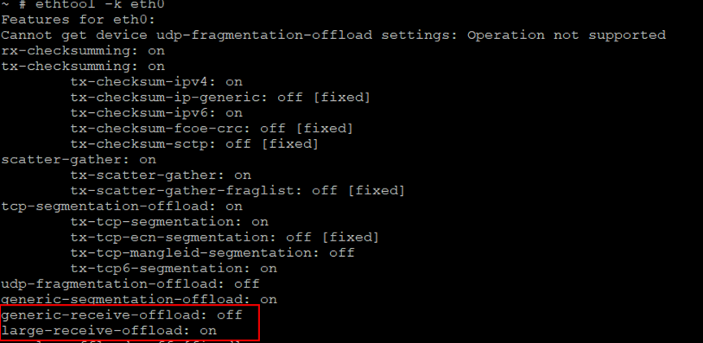

使能LRO：

```
ethtool -K eth0 lro on
```

使能GRO：

```
ethtool -K eth0 gro on
```

关闭LRO：

```
ethtool -K eth0 lro off
```

关闭GRO：

```
ethtool -K eth0 gro off
```

## 应用程序使用socket接口时，如何正确工作在非阻塞模式下<a name="ZH-CN_TOPIC_0000002424360482"></a>


### 基本概念<a name="ZH-CN_TOPIC_0000002424360542"></a>

在网络编程中对于一个网络句柄会遇到阻塞IO 和非阻塞IO 的概念，这里对于这两种socket 先做一下说明。

-   **阻塞IO**：socket 的阻塞模式意味着必须要做完IO 操作（包括错误）才会返回。
-   **非阻塞IO**：非阻塞模式下无论操作是否完成都会立刻返回，需要通过其他方式来判断具体操作是否成功。

### IO模式设置<a name="ZH-CN_TOPIC_0000002457879389"></a>

对于一个socket 是阻塞模式还是非阻塞模式有两种方式来处理：

-   方法1：fcntl 设置;用F\_GETFL获取flags,用F\_SETFL设置flags|O\_NONBLOCK;

    fcntl 函数可以将一个socket 句柄设置成非阻塞模式:

    flags = fcntl\(sockfd, F\_GETFL, 0\);                       //获取文件的flags值。

    fcntl\(sockfd, F\_SETFL, flags | O\_NONBLOCK\);   //设置成非阻塞模式；

    设置之后每次对于sockfd 的操作都是**非阻塞**的。

    flags  = fcntl\(sockfd,F\_GETFL,0\);

    fcntl\(sockfd,F\_SETFL,flags&\~O\_NONBLOCK\);    //设置成阻塞模式；

    设置之后每次对于sockfd 的操作都是**阻塞**的。

-   方法2：recv、send 系列的参数。\(读取，发送时，临时将sockfd或filefd设置为非阻塞\)

    recv、send 函数的最后有一个flag 参数可以设置成MSG\_DONTWAIT

    临时将sockfd 设置为非阻塞模式，而无论原有是阻塞还是非阻塞。

    recv\(sockfd, buff, buff\_size, MSG\_DONTWAIT\);     //非阻塞模式的消息发送

    send\(scokfd, buff, buff\_size, MSG\_DONTWAIT\);   //非阻塞模式的消息接受

## 网线插到单板上，为什么还是会报Phy no link<a name="ZH-CN_TOPIC_0000002457839289"></a>

demo板第一次执行网络操作的时候，会出现如下的打印：

```
No such device: 0:2
No such device: 0:2
No such device: 0:2
No such device: 0:2
No such device: 0:2
No such device: 0:2
No such device: 0:2
No such device: 0:2
No such device: 0:2
No such device: 0:2
No such device: 0:2
No such device: 0:2
No such device: 0:2
No such device: 0:2
No such device: 0:2
No such device: 0:2
No such device: 0:2
No such device: 0:2
No such device: 0:2
No such device: 0:2
No such device: 0:2
No such device: 0:2
PHY not link!
```

明明网线已经连接到单板上了，为什么还会报PHY not link呢？这是因为demo板上的phy需要一些时间与对端设备的phy进行工作模式以及速度的协商，完成后还要一定时间的复位。可能会导致插上网线后立即执行网络操作（ping、tftp或者其他操作）时出现如上失败的情况。只需等到单板phy的电源指示灯（一般为绿色）变亮后，再执行网络操作即可。

## 为什么USB3.0口过流保护芯片去掉，会导致某些 USB3.0 U盘上电启动不识别<a name="ZH-CN_TOPIC_0000002424200722"></a>

USB3.0口去掉过流保护芯片，发现一款台电科技的USB3.0的U盘插着上电后，不能被识别。造成这个问题的原因是控制器处于USB3.0的时间太短，USB3.0的U盘还未初始化完全导致识别失败。如[图1](#fig10824113063715)所示。

**图 1**  USB3.0 U盘启动识别流程<a name="fig10824113063715"></a>  
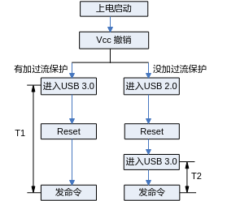

去掉过流保护芯片的USB3.0控制器，会先进入USB2.0状态，再reset后进入USB3.0状态。这样，控制器处于USB3.0状态的时间T2远远小于有过流保护芯片直接进入USB3.0状态的时间T1，导致u盘的状态还没有准备好，最终host端发送命令失败。解决方法是在drivers/usb/core/hub.c文件中将HUB\_ROOT\_RESET\_TIME的值延长为100即可：

```
#define HUB_ROOT_RESET_TIME     100；
```

## I2C内核态接口原子操作注意事项<a name="ZH-CN_TOPIC_0000002424360538"></a>

在I<sup>2</sup>C设备驱动中用到的内核态接口函数有i2c\_master\_send，i2c\_master\_recv和i2c\_transfer，这几个接口函数内部都会根据原子或非原子操作申请不同的锁，代码位于drivers/i2c/i2c-core-base.c文件中，如[图1](#_Ref449015618)所示。

**图 1**  内核态接口中申请锁的操作<a name="_Ref449015618"></a>  
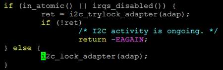

调用I<sup>2</sup>C接口函数之前如果使用了原子锁或在中断中调用都会使当前操作处于原子操作中，如果处于原子操作会运行[图1](#_Ref449015618)中上半部的if分支，否则会运行下半部的else分支。

> **须知：** 
>在原子操作中会通过i2c\_trylock\_adapter\(adap\)来尝试请求锁，如果出错返回-EAGAIN，则表示没有得到锁，而不是I2C通信出现问题。这种情况下读写操作是没有执行的，对于要写的值没有写进去; 对于读操作值没有意义。因此需要进一步判断错误返回值是否等于-EAGAIN，如果是就要根据情况决定是否重复调用，以[图2](#_Ref449015992)  I2C写为例进行说明。

**图 2**  写操作示例图<a name="_Ref449015992"></a>  
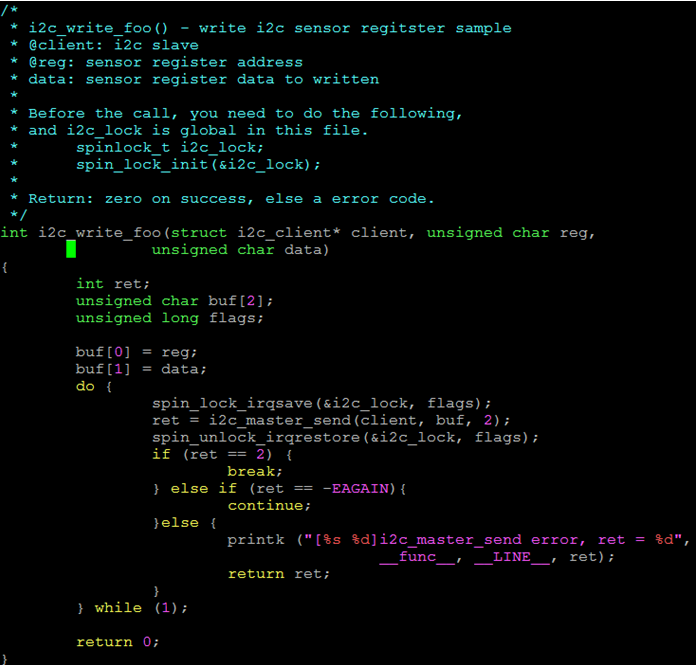

## SATA限速方式说明<a name="ZH-CN_TOPIC_0000002457879401"></a>

【调试方式】默认发布的是SATA-6G。若需要低速功能，则需要配置限制SATA的速率，SATA限速方式在bootargs里面设置，具体配置如下：

-   SATA-6G配置：无需配置，采用发布内核即可。
-   限速为3G：在bootargs原始配置后添加：libata.force=3.0G
-   限速为1.5G：在bootargs原始配置后添加：libata.force=1.5G

## AHB总线水线阈值问题说明<a name="ZH-CN_TOPIC_0000002457879461"></a>

【问题描述】总线AHB内部有命令水线配置。预置的水线配置阈值较小，在频率较高的多核并发访问SDIO模块寄存器时，总线流量太大，会超过水线阈值触发总线命令异常，导致总线挂死。

【解决方法】驱动加锁保证串行访问SDIO所在总线上的模块寄存器

【修改示例】打开 linux 源码 drivers/vendor/peri/peri\_io\_xxxx.c 文件（xxxx替换为具体产品名称），将“\#define PERI\_IO\_EN 0”改为“\#define PERI\_IO\_EN 1”

# PCIe<a name="ZH-CN_TOPIC_0000002457839285"></a>


## 如何配置内核选项，把PCIe控制器驱动编进内核<a name="ZH-CN_TOPIC_0000002457839281"></a>

在RC模式下，内核启动必须执行PCIe控制器驱动，完成控制器初始化和其它PCIe EP设备的枚举。在EP模式下，内核不执行PCIe控制器驱动（默认由逻辑完成EP模式的配置）。RC模式下的具体配置：

在 menuconfig 菜单下, 选择以下选项:

-   linux-4.19.90

    ```
    Bus Support  --->
    [*] Vendor PCI Express support  --->
    ```

-   linux-5.10

    ```
    Device Drivers  --->
        [*] PCI support  --->
            [*] Vendor PCI Express support  --->
    ```

EP模式下，请将Vendor PCI Express support关闭

-   linux-4.19.90

    ```
    Bus Support  --->
    [ ] Vendor PCI Express support  --->
    ```

-   linux-5.10

    ```
    Device Drivers  --->
        [*] PCI support  --->
            [ ] Vendor PCI Express support  --->
    ```

注意：EP 模式下一定不能将该选项选上。EP模式下，板子不能通过 PCIe 接口外接其它设备。

## 如何配置PCIe的控制时钟<a name="ZH-CN_TOPIC_0000002424360558"></a>

PCIe模块的参考时钟，主要有两个来源：一个是来自芯片内部，称作内部时钟；一个是来自芯片外部，称作外部时钟。时钟来源由上电锁存管脚PCIE\_REFCLK\_SEL决定，通常0表示使用芯片内部的参考时钟，1表示使用外部的参考时钟。当PCIe工作在RC模式下时，通常使用内部时钟；如果要使用外部时钟，则时钟信号必须外接专用的时钟源。当PCIe 工作在EP模式下时，通常使用主设备的输出时钟。

## 如何查看PCIe设备的BAR地址的分配信息<a name="ZH-CN_TOPIC_0000002424200674"></a>

PCIe设备BAR地址在系统启动时分配，其信息存放在PCIe 配置空间中。根据芯片手册“外围设备 -\> PCI Express”章节，可通过配置事务来访问设备的配置空间。配置空间中偏移地址 0x10、0x14、0x18中分别存放了BAR0、BAR1、BAR2的地址信息，以此类推。

以SS928V100为例，访问PCIe控制器0下面接的第一个设备的配置空间：

```
bspmd.l 0x20100000
0000: 351919e5 00100000 04800002 00000000
0010: 30800000 31200000 31000000 31100000
0020: 31210000 31220000 00000000 00000000
0030: 00000000 00000040 00000000 000001ff
0040: 5fc35001 00000000 00000000 00000000
0050: 008a7005 00000000 00000000 00000000
0060: 00000000 00000000 00000000 00000000
0070: 00020010 00008fc2 00002010 00437c22
0080: 10120000 00000000 00000000 00000000
0090: 00000000 0000001f 00000000 00000006
00a0: 00010002 00000000 00000000 00000000
00b0: 00000000 00000000 00000000 00000000
00c0: 00000000 00000000 00000000 00000000
00d0: 00000000 00000000 00000000 00000000
00e0: 00000000 00000000 00000000 00000000
00f0: 00000000 00000000 00000000 00000000
```

上面带下划线的数据分别是从设备BAR0 – BAR5的地址信息。

对于具有两个PCIe控制器产品，例如SS626V100，PCIe控制器1下第一个设备的配置空间基址为：0x30300000，其中0x30000000是控制器1配置空间的基地址。

## 如何查看PCIe地址映射信息<a name="ZH-CN_TOPIC_0000002457879417"></a>

我们的PCIe地址映射信息，保存在PCIe配置空间的ATU寄存器组中。每组寄存器有输入和输出两个方向。寄存器组和方向的选择，都通过Viewport 寄存器控制\( PCIe 配置空间偏移量为0x900\)。下面以SS928V100主从片级联为例，说明如何使用该寄存器组：

```
bspmm 0x20100900 0x80000000
bspmm 0x20100900 0x00000000
```

选择ATU寄存器组0，分别查看InBound和OutBound的地址映射信息。

```
bspmm 0x20100090 0x800000001
bspmm 0x20100900 0x000000001
```

选择ATU寄存器组1，分别查看InBound和OutBound的地址映射信息。

例如：查看已选择的ATU寄存器组的地址映射信息

```
bspmd.l 0x20100900
0000:  00000000 00000000 00000000 00000000
0010:  00000000 0000ffff 00000000 00000000
0020:  00000000 00000000 00000000 00000000
0030:  00000000 00000000 00000000 00000000
0040:  00000000 00000000 00000000 00000000
0050:  00000000 00000000 00000000 00000000
0060:  00000000 00000000 00000000 00000000
```

以上信息表示 ATU 寄存器组 0 在OutBound模式下还没作任何配置。

## PCIe MCC 模块的驱动插入后为何不起作用<a name="ZH-CN_TOPIC_0000002457839277"></a>

PCIe MCC的使用有如下几点需要注意：

-   主侧和从侧所使用的MCC ko，必须分别编译！编译主侧的MCC ko时，需要依赖PCIe控制器的驱动，请确保PCIe控制器的驱动已经被编译进内核中（在menuconfig 中，PCIe编译选项应该是选上的），同时内核必须确保已经编译完成了。编译从侧的驱动则没有此要求。
-   主侧的MCC ko，只能运行在已经把PCIe控制器驱动编译进内核的镜像中。

对于PCIe 主侧的PCIe MCC的ko来说，如果以上两个条件有一个不满足，都可能导致驱动没有起作用。

## PCIe-网卡、PCIe-sata使用注意事项<a name="ZH-CN_TOPIC_0000002457879449"></a>

使用以上设备时，请注意内核中对于的配置选项都应该选上（以内核4.19.y为例）！

PCIe-网卡：

```
 Device Drivers  --->  
        [*] Network device support  --->
               [*]  Ethernet driver support  --->
                          <*>  …（按照型号开启）
```

PCIe-sata：

```
 对Silicon Image 3124/3132卡：
        Device Drivers  --->  
             -*- Serial ATA and Parallel ATA drivers  ---> 
                  <*>   Silicon Image 3124/3132 SATA support  --->
```

对 JMB 362卡：

```
 Device Drivers  --->  
       -*- Serial ATA and Parallel ATA drivers  --->
                  <*>   AHCI SATA support  --->
```

## 通过PCIe实现从启动失败常见的情况<a name="ZH-CN_TOPIC_0000002424360530"></a>

-   编译从片内核时，请务必选上menuconfig 中的如下选项

    ```
    General setup  --->
    [*] Initial RAM filesystem and RAM disk (initramfs/initrd) support
    ```

-   为支持超过4M以上的cramfs，请修改 .config 中的宏CONFIG\_BLK\_DEV\_RAM\_SIZE=65536
-   目前发布的级联启动中，加载到从片的文件均不宜超过7M
-   如果你采用发布包中提供的从启动程序\(booter\)来启动从设备，请按如下设置配置 u-boot 的环境变量

    ```
    setenv bootargs ‘mem=64M console=ttyAMA0,115200’
    setenv bootcmd ‘bootm 0x81000000 0x82000000’
    ```

## 为什么运行SDK视频预览的业务后，偶尔会打印“unknow irq triggered”<a name="ZH-CN_TOPIC_0000002457839301"></a>

该打印只是起提醒作用，并非错误。

主从级联应用场景中，主从之间完成一个消息的通信过程如下：

从侧发起一个消息写，随后触发主侧一个中断，主侧响应中断，在共享内存区中取得消息；接下来主片可能会回复消息给从片，采用同样的程序，先写消息到共享内存，然后触发从侧中断。从侧进入中断服务程序，处理已经存在共享内存的消息。

按照最初的想法，本侧每次向对端提交中断的时候，先查看对端中断状态，若中断状态未被清除，则等待，待对端中断处理完毕，再触发对端中断。这种方法能保证一个消息，一个中断，但会造成对端频繁进入中断服务程序，效率较低。为提高消息交互的效率，考虑以下方法，对实时性要求较低的消息，通过定时器对多个消息进行一次性处理。每次发送消息后，即使上一个中断还没有被响应，触发对端中断时不需要等待对端的中断状态被清除，直接提交中断。这样就存在一种情况，本侧发送一个消息过去后，写了对端的中断，但还没来得及触发对端中断，这个对端的上一个中断刚好正在处理，顺便也把本次发送的消息给处理了；这个时候对端的中断状态也被清除了。等到本侧触发对端中断的时候，对端在检测中断状态的时候，却没有找到相应的中断状态标志，于是就打印了上面那个信息（“unknow irq triggered”）。

以上这个机制经过深入分析，不会导致丢消息，也不会有其他异常！

## PCIe BAR地址，在reset后默认会映射到哪个地址，在移动窗口时，需要注意什么<a name="ZH-CN_TOPIC_0000002457839297"></a>

在系统 reset 之后。PCIe的地址映射没有打开，也就是说，窗口不会映射到从设备的任何地址空间。只有执行窗口配置操作之后，地址映射才会打开。

PCIe 窗口移动时有一个问题需要注意：配置窗口时要求地址4K对齐。

## 在 PCIe MCC驱动不再支持主片 DMA 写从片操作<a name="ZH-CN_TOPIC_0000002424200646"></a>

经长期测试发现，双向 DMA 写操作，加上主从片之间的其它非 DMA 的数据传输，可能会导致一些不可预知的异常。因此，后续版本取消了对主片向从片 DMA 写操作的支持，该操作可由从片 DMA 读替代。从片DMA 同时进行读写操作，加上其它非 DMA 的数据传输，在实验板上通过长期测试，运行稳定。

从片DMA读写操作，在软件上通过两个任务链表加以管理（原来只是一个任务链表），实现了PCIe收、发两个通道同时收发数据的功能。本方案对PCIe通道的利用率，与主片、从片同时发起DMA写操作比较，基本一致。

## PCIe MCC 支持主设备复位从设备吗<a name="ZH-CN_TOPIC_0000002424360534"></a>

PCIe MCC 支持主设备复位从设备。说明如下：

-   复位后完全保留复位之前的设备状态，包括设备功能状态、地址映射等（DMA相关的寄存器除外）；
-   主设备可以连续复位从设备，但注意复位期间需要有足够的时间等待从设备启动；

编译好主片驱动后后，在 components/pcie\_mcc/out 下面会生成一个可执行文件 booter。该文件是启动从设备和复位从设备的一个简单示例，由 components/pcie\_mcc/multi-boot/example 目录下的源码编译而成。具体的用法如下。

启动从设备：

```
$./booter start_device
```

复位从设备：

```
$./booter reset_device
```

更详细的信息，请参考\~/pcie\_mcc/multi\_boot/example/boot\_test.c 和驱动代码。

## 使用某些PCIE 转SATA卡（如：marvel9215）连接sata盘读写数据，导致出现vo低带宽现象的解决方法<a name="ZH-CN_TOPIC_0000002424360546"></a>

-   问题原因：

    该PCIE转SATA卡默认请求数据大小为512Byte，导致pcie带宽占用率过高。

-   解决方法：

    通过修改pcie转sata卡的Max\_Read\_Request\_Size寄存器，可限制它的读请求最大为128Byte，降低pcie带宽占用率。

    具体操作步骤如下：

1.  执行命令：make ARCH=arm64 CROSS\_COMPILE=aarch64-xxxx-linux- menuconfig
2.  在linux内核的menuconfig界面中，配置选项Bus support ---\>Vendor PCI Express support---\> PCI Express configs---\>limit pcie max read request size
3.  设置完成后，保存并退出。
4.  执行命令：make ARCH=arm64 CROSS\_COMPILE=aarch64-xxxx-linux- uImage -j
5.  新编译出的内核镜像存放路径为arch/arm64/boot/uImage。

## 为何识别不到PCIE转SATA卡<a name="ZH-CN_TOPIC_0000002457839293"></a>

从电路工作可靠性的角度，IP都需要先提供时钟，待时钟稳定后再释放复位。当主芯片外接板卡时，外部板卡需要由主芯片提供参考时钟。主芯片默认上电就输出参考时钟，不能保证外接板卡可靠工作，导致可能识别不到卡，因此需要对外接板卡进行一次复位。最简单的方式就是通过主芯片的GPIO控制外接板卡的复位（具体控制哪个GPIO，由硬件电路设计决定）。

## PCIe作为RC时，对接其他外设卡复位电路设计<a name="ZH-CN_TOPIC_0000002424200642"></a>

当PCIe作为RC对接他外设卡时，外设卡常需要板级提供复位。常用的做法有两种：

-   方法一：通过硬件复位电路为外设卡提供复位；
-   方法二：通过SOC芯片的GPIO管脚，控制输出高低电平，为外设卡提供复位。

当硬件设计电路对外设卡进行复位控制时，需要同步考虑外设卡复位电路的要求，如复位电路是否需要上下拉电阻钳位。

例如：

使用方法二对某些外设卡进行复位控制时，当SOC芯片发生reboot动作时，由于SOC芯片被复位，GPIO被设置为输入模式，导致外设卡的复位电路不可控，可能触发外设卡异常。

修改电路设计，对外设卡复位电路做上拉（下拉）电阻钳位设计，再通过GPIO控制复位，外设卡异常消失。

# Flash<a name="ZH-CN_TOPIC_0000002457879441"></a>


## 如何标记flash上的坏块<a name="ZH-CN_TOPIC_0000002424200698"></a>

默认情况下，SDK的NAND flash读写函数已经内置了flash坏块处理策略，用户不需要关注。以下方法，仅仅用于用户想要强行标记flash某些块为坏块进行某种测试的场景。正常情况下，不需要使用这些方法。

-   u-boot-2020.01下标记坏块方法

    标记NAND坏块的命令如下：

    ```
    nand markbad offset
    ```

    该命令会标记offset位置所在的NAND块为坏块，如希望标记1M位置的块为坏块，命令如下：

    ```
    nand markbad 0x100000
    ```

    offset最好为NAND的块大小的整数倍。标记坏块后可以用如下命令查看NAND坏块：

    ```
    nand bad
    ```

-   内核下标记坏块方法

    相关代码如下：

    ```
    #define MEMSETBADBLOCK _IOW('M', 12, __kernel_loff_t)
    int fd;
    unsigned long long offset;
    fd = open("/dev/mtd1", O_RDWR);
    offset = 0x100000;
    if (ioctl(fd, MEMSETBADBLOCK, &offset))
    {
        printf("Mark bad block 0x%llX failed!\n", offset);
    }
    ```

    该段程序会标记open的mtd分区的offset偏移位置所在的NAND块为坏块；

    如希望标记mtd1分区偏移1M位置的块为坏块，需要在open函数时指定mtd1（为对应分区的字符设备节点），

    设置offset为0x10000，如上段代码所示。

注意：u-boot-2020.01下的offset是相对与整个NAND的偏移位置，内核下的offset是相对open的对应分区的偏移位置。

## 怎样把SPI flash由4线模式修改为2线模式<a name="ZH-CN_TOPIC_0000002424200694"></a>

在uboot的\~/drivers/mtd/spi/fmc100/fmc\_spi\_nor\_ids.c 中，找到对应器件的ID表，举例如下，将QUAD（四线）能力关闭掉（读写都关闭），驱动检测器件无QUAD能力，则不会使能4线能力，工作在最高的2线能力下，内核下的修改和uboot下类似，这里不再赘述。

```
  {
                "xxxxxxxx", 
                {0xFF, 0xFF, 0xFF}, 3, _32M, _64K, 4,
                {
                        &READ_STD(0, INFINITE, 40/*50*/),
                        &READ_FAST(1, INFINITE, 104),
                        &READ_DUAL(2, INFINITE, 104),
                        &READ_DUAL_ADDR(1, INFINITE, 84),
                  //      &READ_QUAD_ADDR(3, INFINITE, 75),
                        0
                },
 
                {
                        &WRITE_STD(0, 256, 75),
                        0
                },
                {
                        &ERASE_SECTOR_64K(0, _64K, 80),
                        0
                },
                &spi_driver_xxxxxxxx,
        },
```

## 如何正确使用mtd-utils的nandwrite裸写工具<a name="ZH-CN_TOPIC_0000002424360506"></a>

使用mtd-utils的nandwrite裸写工具时，如果写的是u-boot.bin镜像，且镜像大小大于Nand Flash的一个块的大小，一定要保证u-boot.bin镜像的数据按块对齐填充。否则，写进去的u-boot.bin镜像无法正常启动。

具体原因如下：

由于个别Nand Flash出厂时坏块标记位（BB，Bad Block）被标记为非全0的数，例如0xFE，在判断坏块的时候，容易被FMC控制器利用ECC纠错为0xFF\(因为全0xFF在控制器的ECC算法上是合法可纠错的\)，故在每一个page的OOB信息的最后两个byte设置空块标记（EB，Empty Block）位。如[图1](#_Ref443982950)所示，在u-boot启动时，逻辑上把block视为好块的前提条件是：block的第一个page 1和最后一个page N的BB=0xFF, EB=0x00。

**图 1**  Nand Flash 块结构图<a name="_Ref443982950"></a>  
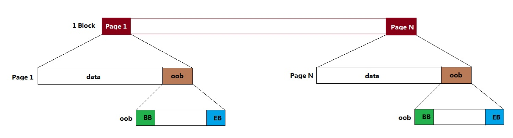

nandwrite是根据镜像文件大小逐页写数据的，并且写page时，会自动将当页的EB位配置为0x00。当写的最后一个page不是所在block的最后一个page时，由于所在block最后一个page的EB=0xFF，逻辑就是视这个block为空块不会去读数据，导致uboot启动失败。

值得注意的是，由于Nand Flash器件出厂时保证第一个块为好块，故逻辑不会去判断第一个块的情况，所以当u-boot.bin镜像大小小于一个块大小时，uboot是可以正常启动的。

此外，一旦uboot正常启动，软件上我们不会再去判断EB位，这也是为什么使用nandwrite写内核镜像和文件系统镜像时可以不考虑镜像大小是否块对齐。

## 有些Flash器件ID不变工艺更新导致参数变化对兼容性的影响<a name="ZH-CN_TOPIC_0000002457879445"></a>

伴随着Flash（SPI Nor/SPI Nand/Parallel Nand）工艺的不断更新，Flash器件的接口、OOB和性能等参数在不断的改变和优化。但是，某些厂家为了图方便，虽然Flash制作工艺升级了，但是Flash ID没有变化。而我们的驱动是通过ID去识别器件的，不会通过厂家建议的SFDP寄存器去识别器件的批次、工艺等信息，因为SFDP不是标准的，各个厂家存在差异，即使同一个厂家，新老器件也会有差异。

因此，底下列出的Flash器件都是ID一致，参数不一致导致影响兼容性的几种情况。假如客户遇到以下相同情况，可以参考下面的例子进行修改驱动，从而保证器件有正常的功能和优越的性能。

-   SPI Nor Flash 的ID不变，接口类型变化

    工艺迭代之后，ID一致，但是新工艺器件接口类型增加了2x I/O Read Mode/4x I/O Read Mode/4x I/O Page Program的支持，如下所示：

    工艺迭代前，fmc\_spi\_nor\_ids.c文件中的器件信息结构体fmc\_spi\_nor\_info\_table应该定义为：

    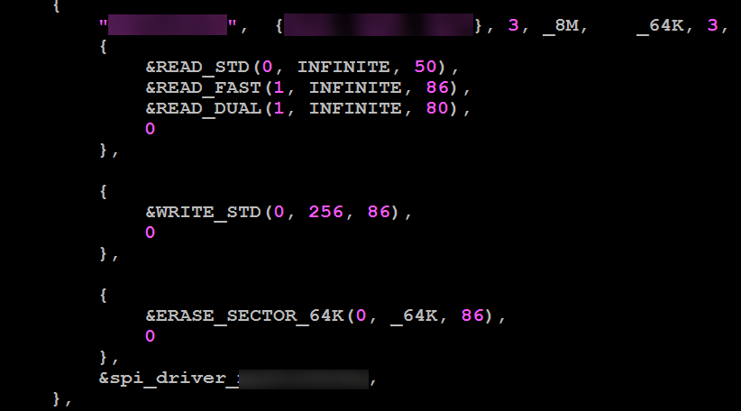

    工艺迭代后，fmc\_spi\_nor\_ids.c文件中的器件信息结构体fmc\_spi\_nor\_info\_table应该定义为：

    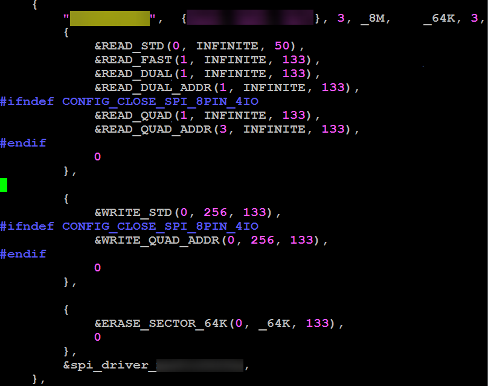

-   SPI Nor Flash 的ID不变，命令字变化

    相同ID的不同器件，写命令出现差异，命令字有38h和12h的差别

    对于命令字是38h的器件，可以直接通过配置WRITE\_QUAD\_ADDR使用，因为现在驱动默认是匹配38h的命令。

    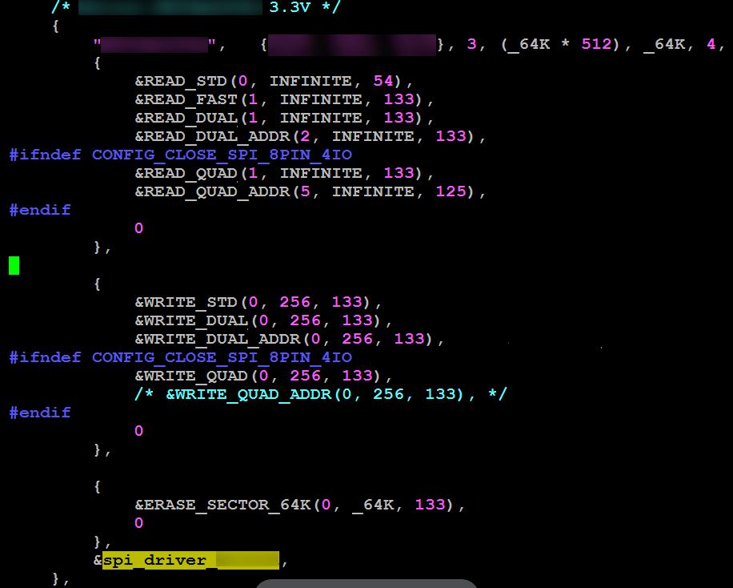

    如果用的是命令字为12h的器件，可以修改fmc\_spi\_ids.h头文件中的SPI\_CMD\_WRITE\_QUAD\_ADDR命令定义来使用这种接口类型。

    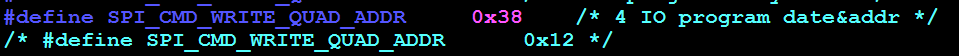

-   Parallel Nand的 ID不变，OOB变化

    ID一样，但是OOB Size不一样。器件工艺迭代之前为64Byte，而升级之后OOB为128Byte，使用匹配64Byte的驱动会导致128Byte器件启动失败。

    如果想使用OOB大小为64Byte的器件一定要确保fmc\_nand\_spl\_ids.c中nand\_flash\_special\_dev结构体的器件信息定义参数.oobsize=64。

    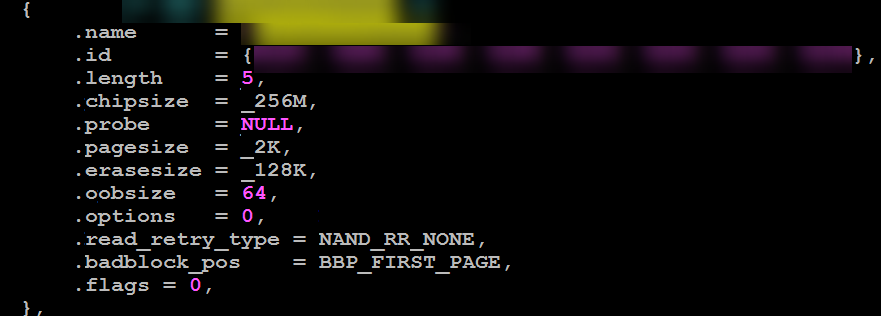

    如果是用OOB大小为128Byte的器件，要确保.oobsize=128，从而保证器件稳定性。

    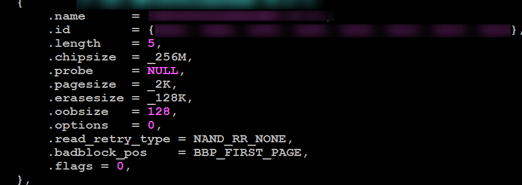

## 如何在linux 4.19内核上支持SPI Nor双片选<a name="ZH-CN_TOPIC_0000002457839349"></a>

从linux 3.18内核开始，SPI Nor Flash驱动适配SPI Nor标准驱动框架，且Soc和board级的拓扑结构统一在DTS（设备树）文件上进行描述。默认都只支持单片SPI Nor Flash。

以SS928V100为例，若想要再增加一个SPI Nor Flash，就要在board级DTS文件中增加一个SPI Nor器件结点。在arch/arm64/boot/dts/ss928v100-demb.dts文件中找到sfc结点：

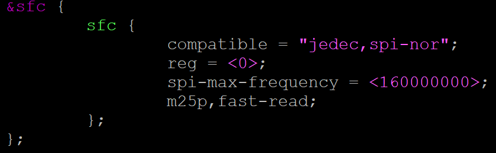

需要注意以下几点：

-   Device Node命名必须要区分，比如使用sfc\_0和sfc\_1；
-   Chipselect片选号必须指定；
-   设备结点增加好之后，分区信息要依据Device Node命名指定：

    mtdparts=sfc\_0:1M\(mtd0\),4M\(mtd1\);sfc\_1:4M\(mtd2\),11M\(mtd3\)

请参考如下图：

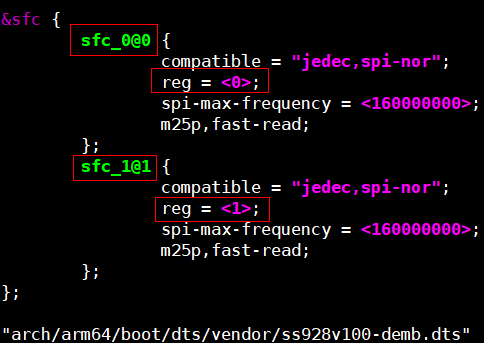

## 为何当Fastboot镜像不满足block对齐时按页写入flash系统无法启动<a name="ZH-CN_TOPIC_0000002424360526"></a>

Fastboot镜像必须要按block对齐写入Flash；当Fastboot镜像不满足block对齐时，未对齐block的尾部page数据为擦除数据0xFF。而启动时FMC控制器处理于boot模式，逻辑内部会将其块判断为坏块，从而导致读取数据错误启动失败，相关FMC逻辑对坏块判定的条件可见芯片手册 "Flash Memory 控制器" 章节 。

# 文件系统类<a name="ZH-CN_TOPIC_0000002457879421"></a>


## NAND挂载cramfs文件系统注意事项<a name="ZH-CN_TOPIC_0000002424360502"></a>

在 nand上使用cramfs时，必须mount到romblock,不能mount到mtdblock.

cramfs不是专门为nand器件设计，cramfs文件系统本身不能跳坏块。内核有个块设备叫romblock，这个设备实现了跳坏块功能。

## eMMC加载动态库注意事项<a name="ZH-CN_TOPIC_0000002457879457"></a>

部分项目使用的uclibc，加载动态库或rootfs的时候，对分区有限制，需要在主分区才能正常加载，默认eMMC驱动中CONFIG\_MMC\_BLOCK\_MINORS = 8即最高支持7个主分区（额外1个表示整个磁盘），建议将动态库或者rootfs放在前面7个分区，如果需要放在第八分区及以上（如mmcblk0p8）需要将CONFIG\_MMC\_BLOCK\_MINORS根据需要适当改大。

```
Device Drivers  ---> 
        <*> MMC/SD/SDIO card support  --->
               --- MMC/SD/SDIO card support
             (8)     Number of minors per block device
```

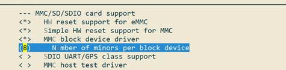

# 快速启动优化<a name="ZH-CN_TOPIC_0000002424200714"></a>

-   配置boot下的环境变量bootdelay为0
    -   方法：在boot下的命令行中输入：setenv bootdelay 0;saveenv
    -   说明：为了方便进入boot命令行，boot下默认设置bootdelay为1，配置bootdelay为0可以加快fastplay启动时间约1S\(boot中已修改代码配置默认值为0\)

-   配置boot阶段不做内核校验
    -   方法：在boot下的命令行中输入：setenv verify n;saveenv
    -   说明：如果内核出错，在boot阶段做不做校验，系统基本都会挂死，因此设置不做校验理论上不会产生影响，该操作可加快启动时间约1S\(boot中已修改代码配置默认值为不做校验\)

-   设置bootcmd如下：setenv bootcmd 'nand read 0x807fffc0 0x100000 0x400000;bootm 0x807fffc0'
    -   说明：设置成上述bootcmd后，boot直接将内核镜像从flash读到0x807fffc0，然后从0x807fffc0启动。
    -   相反如果按照默认bootcmd配置： nand read 0x82000000 0x100000 0x400000;bootm 0x82000000，则boot阶段先将kernel从flash读到0x82000000地址，再将镜像从0x82000000拷贝至0x807fffc0，然后从0x807fffc0启动。

# Kernel<a name="ZH-CN_TOPIC_0000002424360554"></a>


## pid和tgid区别<a name="ZH-CN_TOPIC_0000002424200682"></a>

task\_struct结构体包含两个字段，pid和tgid。

简单理解: pid为该task\_struct唯一的id号。tgid是该task所在线程组的组长id号，thread group id，若它没组长，则它的tgid = pid。tgid的存在为了兼容posix标准。

getpid\(\) return tgid。

In normal processes,the TGID is equal to the PID.

With threads, the TGID is the same for all threads in a thread group. This enables the threads to call getpid\(\) and get the same PID。

In fact, the POSIX 1003.1c standard states that all threads of a multithreaded application must have the same PID。

## 普通进程和实时进程优先级<a name="ZH-CN_TOPIC_0000002457879465"></a>

<a name="table482mcpsimp"></a>
<table><tbody><tr id="row487mcpsimp"><th class="firstcol" valign="top" width="50%" id="mcps1.1.3.1.1"><p id="p489mcpsimp"><a name="p489mcpsimp"></a><a name="p489mcpsimp"></a>进程优先级范围：</p>
</th>
<td class="cellrowborder" valign="top" width="50%" headers="mcps1.1.3.1.1 "><p id="p491mcpsimp"><a name="p491mcpsimp"></a><a name="p491mcpsimp"></a>0---139</p>
</td>
</tr>
<tr id="row492mcpsimp"><th class="firstcol" valign="top" width="50%" id="mcps1.1.3.2.1"><p id="p494mcpsimp"><a name="p494mcpsimp"></a><a name="p494mcpsimp"></a>实时进程优先级：</p>
</th>
<td class="cellrowborder" valign="top" width="50%" headers="mcps1.1.3.2.1 "><p id="p496mcpsimp"><a name="p496mcpsimp"></a><a name="p496mcpsimp"></a>0---99</p>
</td>
</tr>
<tr id="row497mcpsimp"><th class="firstcol" valign="top" width="50%" id="mcps1.1.3.3.1"><p id="p499mcpsimp"><a name="p499mcpsimp"></a><a name="p499mcpsimp"></a>普通进程优先级：</p>
</th>
<td class="cellrowborder" valign="top" width="50%" headers="mcps1.1.3.3.1 "><p id="p501mcpsimp"><a name="p501mcpsimp"></a><a name="p501mcpsimp"></a>100—139</p>
</td>
</tr>
<tr id="row502mcpsimp"><th class="firstcol" valign="top" width="50%" id="mcps1.1.3.4.1"><p id="p504mcpsimp"><a name="p504mcpsimp"></a><a name="p504mcpsimp"></a>nice对应普通进程：</p>
</th>
<td class="cellrowborder" valign="top" width="50%" headers="mcps1.1.3.4.1 "><p id="p506mcpsimp"><a name="p506mcpsimp"></a><a name="p506mcpsimp"></a>-20——19  &lt;--&gt; 100——139</p>
</td>
</tr>
<tr id="row507mcpsimp"><th class="firstcol" valign="top" width="50%" id="mcps1.1.3.5.1"><p id="p509mcpsimp"><a name="p509mcpsimp"></a><a name="p509mcpsimp"></a>内核默认进程优先级为：</p>
</th>
<td class="cellrowborder" valign="top" width="50%" headers="mcps1.1.3.5.1 "><p id="p511mcpsimp"><a name="p511mcpsimp"></a><a name="p511mcpsimp"></a>120—对应nice=0</p>
</td>
</tr>
</tbody>
</table>

## 如何设置dmesg buf的大小<a name="ZH-CN_TOPIC_0000002457879385"></a>

在 menuconfig 菜单下, 选择以下选项:

```
General setup  --->  Kernel log buffer size
CONFIG_LOG_BUF_SHIFT(例如18 =256K)
```

## 遇到“段错误”\(segmentation fault\)怎样生成core dump文件来进行问题分析<a name="ZH-CN_TOPIC_0000002424360550"></a>

可以在shell下通过设置如下命令来生成core dump文件：

```
ulimit –S –c unlimited > /dev/null 2>&1
```

但是要能在core dump文件中能正常的显示出错误信息，则编译可执行文件时，还必须用 -g调试选项来编译生成文件。

## 客户跑一个很简单的程序，top信息的loadaverage值比较大，达到2.95，而CPU的占用率比较低是否正常<a name="ZH-CN_TOPIC_0000002424200678"></a>

loadaverage的值是衡量CPU等待完成的任务排队的情况。请解释该值过高的原因，是否影响业务？

top命令中load average显示的是最近1分钟、5分钟和15分钟的系统平均负载。系统平均负载表示：

系统平均负载被定义为在特定时间间隔内运行队列中\(在CPU上运行或者等待运行多少进程\)的平均进程树。如果一个进程满足以下条件则其就会位于运行队列中：

-   它没有在等待I/O操作的结果
-   它没有主动进入等待状态\(也就是没有调用’wait’\)
-   没有被停止\(例如：等待终止\)

Update：在Linux中，进程分为三种状态，一种是阻塞的进程blocked process，一种是可运行的进程runnable process，另外就是正在运行的进程running process。当进程阻塞时，进程会等待I/O设备的数据或者系统调用。

进程可运行状态时，它处在一个运行队列run queue中，与其他可运行进程争夺CPU时间。系统的load是指正在运行running one和准备好运行runnable one的进程的总数。比如现在系统有2个正在运行的进程，3个可运行进程，那么系统的load就是5。load average就是一定时间内的load数量。

例如：

?\[Copy to clipboard\]View Code BASH

<a name="table535mcpsimp"></a>
<table><tbody><tr id="row540mcpsimp"><td class="cellrowborder" valign="top" width="16%"><p id="p542mcpsimp"><a name="p542mcpsimp"></a><a name="p542mcpsimp"></a>1</p>
<p id="p543mcpsimp"><a name="p543mcpsimp"></a><a name="p543mcpsimp"></a>2</p>
<p id="p544mcpsimp"><a name="p544mcpsimp"></a><a name="p544mcpsimp"></a>3</p>
</td>
<td class="cellrowborder" valign="top" width="84%"><p id="p46736224919"><a name="p46736224919"></a><a name="p46736224919"></a># uptime</p>
<p id="p10107122519919"><a name="p10107122519919"></a><a name="p10107122519919"></a></p>
<p id="p546mcpsimp"><a name="p546mcpsimp"></a><a name="p546mcpsimp"></a>7:51pm up 2 days, 5:43, 2 users, load average: 8.13, 5.90, 4.94</p>
</td>
</tr>
</tbody>
</table>

命令输出的最后内容表示在过去的1、5、15分钟内运行队列中的平均进程数量。

一般来说只要每个CPU的当前活动进程数不大于3那么系统的性能就是良好的，如果每个CPU的任务数大于5，那么就表示这台机器的性能有严重问题。对于上面的例子来说，假设系统有两个CPU，那么其每个CPU的当前任务数为：8.13/2=4.065。这表示该系统的性能是可以接受的。

从以上的解释可以看出我们每个CPU的当前任务数为2.95/2=1.475，因此我认为是很正常的！

## GDB不能支持多线程调试的问题<a name="ZH-CN_TOPIC_0000002457839269"></a>

**现象：**（通过GDB调试一个多线程的测试程序test）：

```
./gdb test
GNU gdb (GDB) 7.9.1
Copyright (C) 2015 Free Software Foundation, Inc.
License GPLv3+: GNU GPL version 3 or later <http://gnu.org/licenses/gpl.html>
This is free software: you are free to change and redistribute it.
There is NO WARRANTY, to the extent permitted by law.  Type "show copying"
and "show warranty" for details.
This GDB was configured as "aarch64-mix100-linux".
Type "show configuration" for configuration details.
For bug reporting instructions, please see:
<http://www.gnu.org/software/gdb/bugs/>.
Find the GDB manual and other documentation resources online at:
<http://www.gnu.org/software/gdb/documentation/>.
For help, type "help".
Type "apropos word" to search for commands related to "word"...
Reading symbols from test...done.
(gdb) 
(gdb) r
Starting program: /var/test 
warning: File "/lib64/libthread_db.so.1" auto-loading has been declined by your `auto-load safe-path' set to "$debugdir:$datadir/auto-load".
To enable execution of this file add
        add-auto-load-safe-path /lib64/libthread_db.so.1
line to your configuration file "//.gdbinit".
To completely disable this security protection add
        set auto-load safe-path /
line to your configuration file "//.gdbinit".
For more information about this security protection see the
"Auto-loading safe path" section in the GDB manual.  E.g., run from the shell:
        info "(gdb)Auto-loading safe path"
warning: Unable to find libthread_db matching inferior's thread library, thread debugging will not be available.
thread1
thread11
thread2
thread3
 
Program received signal SIGINT, Interrupt.
0x0000007fb7efb3a4 in nanosleep () from /lib64/libc.so.6
(gdb) info b Quit
(gdb) info thread
 Id   Target Id         Frame 
* 1    LWP 1387 "test"   0x0000007fb7efb3a4 in nanosleep ()
   from /lib64/libc.so.6
(gdb)
```

如下划线部分的提示，线程调试不可用。

**问题的原因**：为了减少默认发布版本文件系统的大小，将板端的动态库全部进行strip操作，其中当然也包括线程库libpthread-x.xx.so。使用被strip后的线程库将影响板端GDB的线程调试。

**解决方法**：从对应工具链的安装目录（服务器上）找出该线程库（未strip过的），替换原来strip过的线程库。具体可参考如下操作：

```
$ cd /opt/linux/x86-arm/aarch64-xxxx-linux/target/lib
$ find . -name "libpthread*.so"
./libpthread-x.xx.so
```

用户可根据实际环境的情况，用该文件替换原来已经strip过的动态库，以支持多线程调试。

## 关闭CONFIG\_NO\_HZ选项之后，CPU占用率升高了<a name="ZH-CN_TOPIC_0000002457839265"></a>

使能CONFIG\_NO\_HZ对于那些有可能长时间待机的设备来说，可以显著的降低设备功耗，延长电池使用时间。但对于那些有恒定的业务负载或者实时响应要求很高的应用场景，CONFIG\_NO\_HZ模式反而会因为在正常任务和idle循环之间的切换过程复杂，造成较大的系统时延。考虑到监测后端业务对于电源功耗不太敏感，新版本的linux内核默认都不打开CONFIG\_NO\_HZ。

在一些场景中，关闭了CONFIG\_NO\_HZ，会影响到top 命令下CPU占用率的统计结果。比如在同一个环境下，使用 iperf 工具进行网络性能测试时，关闭CONFIG\_NO\_HZ的内核版本会比打开CONFIG\_NO\_HZ的内核版本消耗更多的CPU占用率。但这不是真的CPU占用率上升了，它是CONFIG\_NO\_HZ 选项带来的CPU占用率统计上的误差。网络传输中有大量的中断和软中断处理，CONFIG\_NO\_HZ会大幅减少调度中断的触发，CPU时间更新很不及时，系统对各个任务的CPU占用率采样次数也大幅减少，从而影响了统计结果的准确性。用户可以通过打开内核选项CONFIG\_IRQ\_TIME\_ACCOUNTING（默认关闭）来获得更准确的统计结果。

## 为何将用户态线程的栈大小设置为16K时，线程会出现Segmentation Fault<a name="ZH-CN_TOPIC_0000002457839321"></a>

动态连接的用户程序在开始执行之前，需要通过动态解析器对相关的外部符号地址进行重新定位，而动态解析器运行时也是使用所在进程（线程）的栈。在glibc-2.24版本中，动态解析器ld-2.24.so（实际是函数\_\_dl\_fixup）执行时会默认将SP指针向下移动16KB，以预留内存给符号解析使用。而当用户把进程（线程）的栈设置为16KB（或者略大于16KB）时，这个动作将导致线程出现Segmentation Fault。当前版本的动态解析器对栈的使用和Linux 32位系统中用户线程栈的最小值为16KB有些不一致。当前问题没有其它方面的影响，而C库中相关的改动涉及多个文件，容易引入其它问题，因此暂不做修改。

建议：

-   用户态进程（线程）栈大小最值不小于32KB；
-   如果非要使用最小16KB的户态进程（线程）栈，用户可以通过线程库提供的接口自己分配线程栈内存。

## Kswapd线程的 CPU占用率陡然升高的原因<a name="ZH-CN_TOPIC_0000002424200654"></a>

在某些业务场景下，Linux系统中kswapd线程CPU占用率突然升高，且长时间保持很高的CPU占用率，如[图1](#_Ref5118078)所示。

**图 1**  CPU占用率升高<a name="_Ref5118078"></a>  
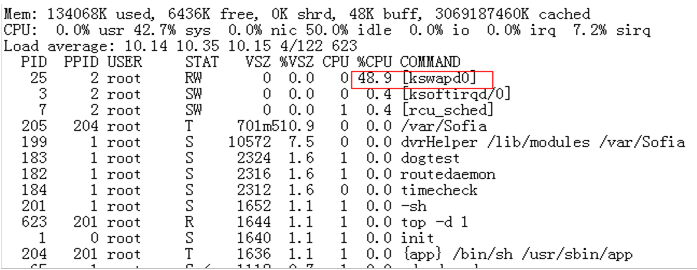

内核的启动信息，如[图2](#_Ref5118390)所示。

**图 2**  内核启动打印<a name="_Ref5118390"></a>  
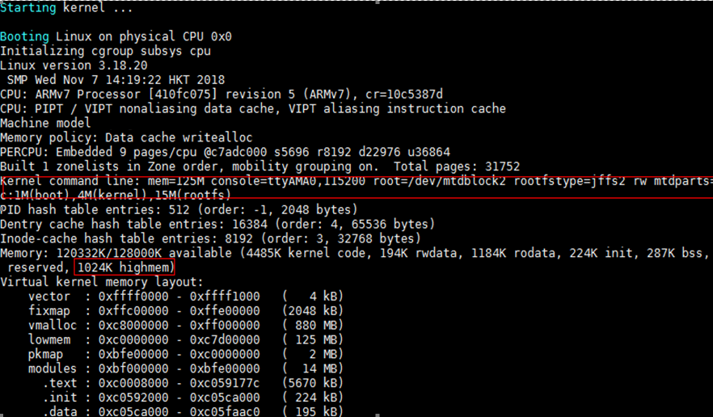

系统内存为125MB，远远没有到达系统low memory 和 vmalloc空间的界线，但启动信息出现了1MB的highmem。

Kswapd的莫名升高和系统保持highmem这个zone的内存平衡有直接关系。当highmem这个区域内存使用超过一定界线后，kswapd就被激活，以回收highmem区域的内存。

-   出现Highmem区域的条件：
    -   Linux内核中使能了CONFIG\_HIGHMEM选项；
    -   系统内存大小（单位：MB）配置为奇数的时候，如：mem=125M。

-   解决方案：
    -   方案1：Bootargs中系统内存大小配置为2MB对齐（推荐）；
    -   方案2：关闭CONFIG\_HIGHMEM选项。

## Linux-4.19.y内核中，使用“cat /proc/vmallocinfo”命令查看vmalloc信息，地址信息显示为“0x\(\_\_\_\_ptrval\_\_\_\_\)”的原因<a name="ZH-CN_TOPIC_0000002424200726"></a>

Linux-4.19.y内核中，为提高安全性，对于内核中以“%p”格式打印的地址信息，默认以“\_\_\_\_ptrval\_\_\_\_”字符串显示，因此，执行“cat /proc/vmallocinfo”命令，地址信息显示为“0x\(\_\_\_\_ptrval\_\_\_\_\)”。

如果要使用“cat /proc/vmallocinfo”命令查看vmalloc地址信息，需修改mm/vmalloc.c代码，修改方法如[图1](#_Ref32946196)所示。

**图 1**  修改方法<a name="_Ref32946196"></a>  
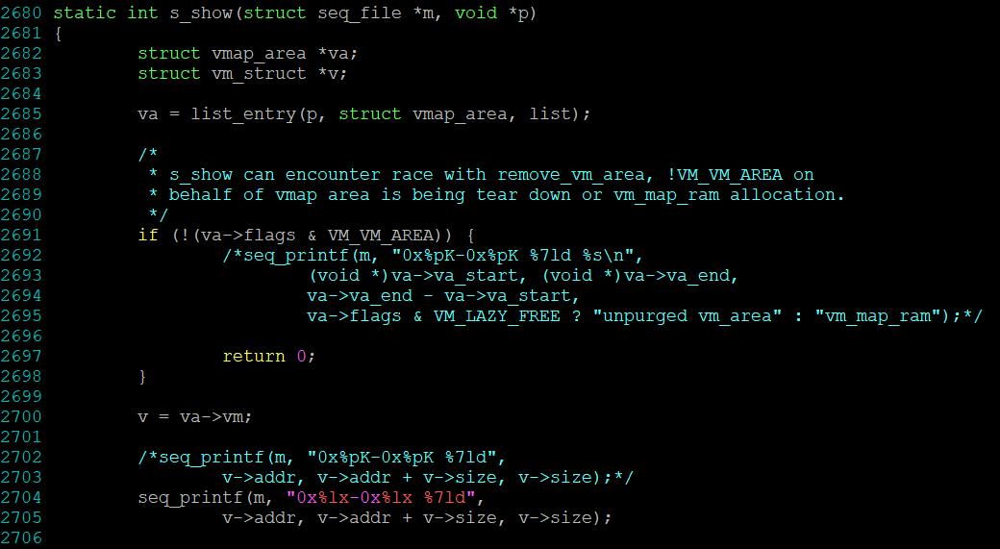

**注意**：此修改方法仅适用于调试版本，正式发布版本不可这样修改。

## ARM64 flush data cache说明<a name="ZH-CN_TOPIC_0000002457839337"></a>

Linux-4.4内核之前，提供了flush\_cache\_all接口，该接口通过遍历way/set，完成cache的clean和invalid操作。但之后Linux社区认为通过set/way操作cache，只能作用于本地核，和其他核的cache操作存在竞态风险，所以社区在2015年删除了flush\_cache\_all和其他相关接口。推荐使用\_\_flush\_dcache\_area接口，该接口通过虚拟地址flush cache，可以确保cache的PoC一致性。

\_\_flush\_dcache\_area接口操作的内存大小超过一定范围时，耗时较长，如用户想继续使用社区flush\_cache\_all接口，则需自行恢复社区代码，并自行根据业务场景验证其正确性。

社区删除flush\_cache\_all的提交，请参考链接：https://github.com/torvalds/linux/commit/68234df4ea7939f98431aa81113fbdce10c4a84b\#diff-1e4a7952678f25f16e932574cb1703c7ccd3b0e6d327983275de07c96a7c8b7e

社区删除flush\_cache\_all邮件讨论，请参考链接：https://patchwork.kernel.org/project/linux-arm-kernel/patch/1429521875-16893-1-git-send-email-mark.rutland@arm.com/

## I/O 密集型业务性能性能调优说明<a name="ZH-CN_TOPIC_0000002457879433"></a>

Linux 内核 CONFIG\_HZ 选项指定了系统中断频率，在不同业务场景下这个选项的最佳值不同。

I/O 压力大的业务场景（例如大量的网络转发、码流存盘），可调整 CONFIG\_HZ 的值，以获得最优的 I/O 性能。

# 工具链<a name="ZH-CN_TOPIC_0000002424360566"></a>


## 工具链glibc库升级到2.29版本后，应用程序产生“内存空洞”问题的解决方法<a name="ZH-CN_TOPIC_0000002457839317"></a>


### 现象描述<a name="ZH-CN_TOPIC_0000002424200670"></a>

某些应用程序频繁调用malloc函数申请内存空间，且申请空间的大小差别比较大，使用完成后通过free函数释放内存空间，但内存空间依然缓存在glibc中，没有归还操作系统，导致系统内存不足。

### 原因分析<a name="ZH-CN_TOPIC_0000002457879397"></a>

Glibc中进程的内存分配由两个系统调用完成：brk和mmap。

-   brk是将数据段\(.data\)的最高地址指针\_edata往高地址推；brk分配的内存需要等到高地址内存释放以后才能释放；

    如果先后通过brk申请了A和B两块内存，在B释放之前，A是不可能释放的，仍然被进程占用，通过TOP查看疑似“内存泄露”。

-   mmap是在进程的虚拟地址空间中申请一块空闲的空间。mmap分配的内存由munmap释放，内存释放时将立即归还操作系统。

默认情况下，大于等于128KB的内存分配会调用mmap/mummap，小于128KB的内存请求调用brk，但可以通过修改M\_MMAP\_THRESHOLD值来调整。

另外，Glibc2.29有一个新特性：M\_MMAP\_THRESHOLD可以动态调整。M\_MMAP\_THRESHOLD的值在128KB到32MB\(32位机\)或者64MB\(64位机\)之间动态调整，如：当申请并释放一个大小为2MB的内存后，M\_MMAP\_THRESHOLD的值被调整为2M到2M + 4K之间的一个值。

因此，当应用程序中申请的内存空间数量多，且先后申请的内存空间的大小变化比较大时，在申请一段大的内存后，M\_MMAP\_THRESHOLD的值被调大，后续的内存申请空间大小 < M\_MMAP\_THRESHOLD时将使用brk申请，而brk需要等到高地址内存释放以后，低地址内存才能释放。当应用程序没有释放高地址内存时，就导致大量低地址内存空间不能及时释放，从而产生“内存空洞”，导致系统内存不足。

### 解决方法<a name="ZH-CN_TOPIC_0000002457879393"></a>

-   在进程启动时，使用int mallopt\(int param，int value\)函数显式地设置M\_MMAP\_THRESHOLD的值为128K，关闭M\_MMAP\_THRESHOLD动态调整特性。
-   优化应用程序中内存管理方式，不要频繁申请、释放内存空间，减少内存碎片。

