# 前言

**概述**

本文档主要介绍BurnTool烧写工具的使用方法，适用于一键烧写所有程序镜像到单板flash上的场景、单板已有boot可按地址烧写其他程序镜像到单板flash上的场景，以及在空板上只烧写boot到单板flash上的场景。

**产品版本**

与本文档相对应的产品版本如下。

<table><thead align="left"><tr id="row75927132112"><th class="cellrowborder" valign="top" width="31.759999999999998%" id="mcps1.1.3.1.1">
产品名称

</th>
<th class="cellrowborder" valign="top" width="68.24%" id="mcps1.1.3.1.2">
产品版本

</th>
</tr>
</thead>
<tbody><tr id="row155916713213"><td class="cellrowborder" valign="top" width="31.759999999999998%" headers="mcps1.1.3.1.1 ">
SS928

</td>
<td class="cellrowborder" valign="top" width="68.24%" headers="mcps1.1.3.1.2 ">
V100

</td>
</tr>
<tr id="row113583017224"><td class="cellrowborder" valign="top" width="31.759999999999998%" headers="mcps1.1.3.1.1 ">
SS626

</td>
<td class="cellrowborder" valign="top" width="68.24%" headers="mcps1.1.3.1.2 ">
V100

</td>
</tr>
<tr id="row165411745144415"><td class="cellrowborder" valign="top" width="31.759999999999998%" headers="mcps1.1.3.1.1 ">
SS524

</td>
<td class="cellrowborder" valign="top" width="68.24%" headers="mcps1.1.3.1.2 ">
V100

</td>
</tr>
<tr id="row131881816202318"><td class="cellrowborder" valign="top" width="31.759999999999998%" headers="mcps1.1.3.1.1 ">
SS522

</td>
<td class="cellrowborder" valign="top" width="68.24%" headers="mcps1.1.3.1.2 ">
V100

</td>
</tr>
<tr id="row11407191494813"><td class="cellrowborder" valign="top" width="31.759999999999998%" headers="mcps1.1.3.1.1 ">
SS528

</td>
<td class="cellrowborder" valign="top" width="68.24%" headers="mcps1.1.3.1.2 ">
V100

</td>
</tr>
<tr id="row20945431175910"><td class="cellrowborder" valign="top" width="31.759999999999998%" headers="mcps1.1.3.1.1 ">
SS625

</td>
<td class="cellrowborder" valign="top" width="68.24%" headers="mcps1.1.3.1.2 ">
V100

</td>
</tr>
<tr id="row56503143253"><td class="cellrowborder" valign="top" width="31.759999999999998%" headers="mcps1.1.3.1.1 ">
SS927

</td>
<td class="cellrowborder" valign="top" width="68.24%" headers="mcps1.1.3.1.2 ">
V100

</td>
</tr>
</tbody>
</table>

**读者对象**

本文档（本指南）主要适用于以下工程师：

-   技术支持工程师
-   硬件开发工程师

**修订记录**

修订记录累积了每次文档更新的说明。最新版本的文档包含以前所有文档版本的更新内容。

<table><thead align="left"><tr id="row2942532716410"><th class="cellrowborder" valign="top" width="20.72%" id="mcps1.1.4.1.1">
<strong id="b5687322716410">文档版本</strong>

</th>
<th class="cellrowborder" valign="top" width="20.22%" id="mcps1.1.4.1.2">
<strong id="b5800814916410">发布日期</strong>

</th>
<th class="cellrowborder" valign="top" width="59.06%" id="mcps1.1.4.1.3">
<strong id="b3316380216410">修改说明</strong>

</th>
</tr>
</thead>
<tbody><tr id="row5947359616410"><td class="cellrowborder" valign="top" width="20.72%" headers="mcps1.1.4.1.1 ">
00B01

</td>
<td class="cellrowborder" valign="top" width="20.22%" headers="mcps1.1.4.1.2 ">
2025-09-15

</td>
<td class="cellrowborder" valign="top" width="59.06%" headers="mcps1.1.4.1.3 ">
第1次临时版本发布。

</td>
</tr>
</tbody>
</table>

# 概述

## 工具概述

BurnTool工具主要是用于镜像烧写、镜像上载与烧片器镜像制作的多功能工具。

> **说明：**  当前工具只支持在64位操作系统上使用。

## 应用场景

BurnTool工具三大主要功能的应用场景如下：

-   镜像烧写：应用于将镜像通过串口、网口或USB口烧写到对应Flash地址上；
-   镜像上载：应用于将Flash地址上数据通过DDR导出到PC上的文件中；
-   烧片器镜像制作：应用于将分区表中的镜像按照烧片器工具要求的格式打包成对应的镜像文件以供烧片器量产烧写。

## 烧写原理

uboot烧写原理：BurnTool工具在开始烧写后，首选与bootrom进行交互，工具DDR参数传送到传到bootrom，即为uboot下载阶段5%处，然后初始化DDR，再把uboot传输到DDR中，uboot下载阶段100%处表示传输完毕，再从DDR启动uboot，uboot启动完成后，工具开始与uboot进行交互，发送烧写命令，将DDR中的uboot烧写到Flash对应地址中。

其他镜像分区烧写原理：其他镜像分区，如kernel，rootfs等分区，工具默认采用网口传输的方式，客户可选择裸烧和非裸烧两种方式进行烧写，裸烧即为在按分区烧写或按Emmc烧写中勾选uboot进行烧写，此时uboot会被烧写到Flash中，非裸烧即为不勾选uboot，仅勾选其他分区进行烧写，此时需要保证当前单板上已经存在uboot，烧写时工具会启动uboot，与其交互，通过向uboot发送TFTP命令与Write命令，完成烧写。

## 工具与单板器件匹配关系说明

对不同的单板，BurnTool工具在功能与器件上的支持有所差异。具体支持情况如[表1](#_Ref382475342)所示。

**表 1**  工具与单板器件匹配关系说明

<table><thead align="left"><tr id="row630mcpsimp"><th class="cellrowborder" rowspan="2" valign="top" id="mcps1.2.16.1.1">
产品名称

</th>
<th class="cellrowborder" colspan="4" valign="top" id="mcps1.2.16.1.2">
Flash类型

</th>
<th class="cellrowborder" colspan="5" valign="top" id="mcps1.2.16.1.3">
文件系统

</th>
<th class="cellrowborder" colspan="2" valign="top" id="mcps1.2.16.1.4">
高级功能

</th>
<th class="cellrowborder" colspan="3" valign="top" id="mcps1.2.16.1.5">
通用接口

</th>
</tr>
<tr id="row641mcpsimp"><th class="cellrowborder" valign="top" id="mcps1.2.16.2.1">
Spi nor

</th>
<th class="cellrowborder" valign="top" id="mcps1.2.16.2.2">
Spi Nand/Nand

</th>
<th class="cellrowborder" valign="top" id="mcps1.2.16.2.3">
eMMC

</th>
<th class="cellrowborder" valign="top" id="mcps1.2.16.2.4">
Ufs

</th>
<th class="cellrowborder" valign="top" id="mcps1.2.16.2.5">
Yaffs

</th>
<th class="cellrowborder" valign="top" id="mcps1.2.16.2.6">
Jffs2

</th>
<th class="cellrowborder" valign="top" id="mcps1.2.16.2.7">
SquashFS

</th>
<th class="cellrowborder" valign="top" id="mcps1.2.16.2.8">
UBI

</th>
<th class="cellrowborder" valign="top" id="mcps1.2.16.2.9">
ext3/4

</th>
<th class="cellrowborder" valign="top" id="mcps1.2.16.2.10">
CA

</th>
<th class="cellrowborder" valign="top" id="mcps1.2.16.2.11">
Bad Check

</th>
<th class="cellrowborder" valign="top" id="mcps1.2.16.2.12">
串口

</th>
<th class="cellrowborder" valign="top" id="mcps1.2.16.2.13">
网口

</th>
<th class="cellrowborder" valign="top" id="mcps1.2.16.2.14">
USB

</th>
</tr>
</thead>
<tbody><tr id="row673mcpsimp"><td class="cellrowborder" valign="top" width="11.917614816045177%" headers="mcps1.2.16.1.1 mcps1.2.16.2.1 ">
SS928V100/SS927V100

</td>
<td class="cellrowborder" valign="top" width="6.286853251391079%" headers="mcps1.2.16.1.2 mcps1.2.16.2.2 ">
●

</td>
<td class="cellrowborder" valign="top" width="11.394402458267583%" headers="mcps1.2.16.1.2 mcps1.2.16.2.3 ">
●

</td>
<td class="cellrowborder" valign="top" width="4.800265758657918%" headers="mcps1.2.16.1.2 mcps1.2.16.2.4 ">
●

</td>
<td class="cellrowborder" valign="top" width="5.946349970932645%" headers="mcps1.2.16.1.2 mcps1.2.16.2.5 ">
○

</td>
<td class="cellrowborder" valign="top" width="4.933145087617307%" headers="mcps1.2.16.1.3 mcps1.2.16.2.6 ">
○

</td>
<td class="cellrowborder" valign="top" width="5.813470641973257%" headers="mcps1.2.16.1.3 mcps1.2.16.2.7 ">
●

</td>
<td class="cellrowborder" valign="top" width="7.39971763142596%" headers="mcps1.2.16.1.3 mcps1.2.16.2.8 ">
●

</td>
<td class="cellrowborder" valign="top" width="4.3185781911801335%" headers="mcps1.2.16.1.3 mcps1.2.16.2.9 ">
●

</td>
<td class="cellrowborder" valign="top" width="6.428037538410431%" headers="mcps1.2.16.1.3 mcps1.2.16.2.10 ">
●

</td>
<td class="cellrowborder" valign="top" width="5.813470641973257%" headers="mcps1.2.16.1.4 mcps1.2.16.2.11 ">
○

</td>
<td class="cellrowborder" valign="top" width="7.507682086205462%" headers="mcps1.2.16.1.4 mcps1.2.16.2.12 ">
○

</td>
<td class="cellrowborder" valign="top" width="5.813470641973257%" headers="mcps1.2.16.1.5 mcps1.2.16.2.13 ">
●

</td>
<td class="cellrowborder" valign="top" width="5.813470641973257%" headers="mcps1.2.16.1.5 mcps1.2.16.2.14 ">
●

</td>
<td class="cellrowborder" valign="top" width="5.813470641973257%" headers="mcps1.2.16.1.5 ">
●

</td>
</tr>
<tr id="row1586684215493"><td class="cellrowborder" valign="top" width="11.917614816045177%" headers="mcps1.2.16.1.1 mcps1.2.16.2.1 ">
SS626V100

</td>
<td class="cellrowborder" valign="top" width="6.286853251391079%" headers="mcps1.2.16.1.2 mcps1.2.16.2.2 ">
●

</td>
<td class="cellrowborder" valign="top" width="11.394402458267583%" headers="mcps1.2.16.1.2 mcps1.2.16.2.3 ">
●

</td>
<td class="cellrowborder" valign="top" width="4.800265758657918%" headers="mcps1.2.16.1.2 mcps1.2.16.2.4 ">
●

</td>
<td class="cellrowborder" valign="top" width="5.946349970932645%" headers="mcps1.2.16.1.2 mcps1.2.16.2.5 ">
○

</td>
<td class="cellrowborder" valign="top" width="4.933145087617307%" headers="mcps1.2.16.1.3 mcps1.2.16.2.6 ">
○

</td>
<td class="cellrowborder" valign="top" width="5.813470641973257%" headers="mcps1.2.16.1.3 mcps1.2.16.2.7 ">
●

</td>
<td class="cellrowborder" valign="top" width="7.39971763142596%" headers="mcps1.2.16.1.3 mcps1.2.16.2.8 ">
●

</td>
<td class="cellrowborder" valign="top" width="4.3185781911801335%" headers="mcps1.2.16.1.3 mcps1.2.16.2.9 ">
●

</td>
<td class="cellrowborder" valign="top" width="6.428037538410431%" headers="mcps1.2.16.1.3 mcps1.2.16.2.10 ">
●

</td>
<td class="cellrowborder" valign="top" width="5.813470641973257%" headers="mcps1.2.16.1.4 mcps1.2.16.2.11 ">
○

</td>
<td class="cellrowborder" valign="top" width="7.507682086205462%" headers="mcps1.2.16.1.4 mcps1.2.16.2.12 ">
○

</td>
<td class="cellrowborder" valign="top" width="5.813470641973257%" headers="mcps1.2.16.1.5 mcps1.2.16.2.13 ">
●

</td>
<td class="cellrowborder" valign="top" width="5.813470641973257%" headers="mcps1.2.16.1.5 mcps1.2.16.2.14 ">
●

</td>
<td class="cellrowborder" valign="top" width="5.813470641973257%" headers="mcps1.2.16.1.5 ">
○

</td>
</tr>
</tbody>
</table>

注：●表示支持；○表示不支持。

## 环境准备

BurnTool工具烧写的环境准备如下：

1.  PC与单板之间连接好串口、网线，且因工具烧写需要涉及到与bootrom交互，故单板硬件上bootrom\_sel需要设置为1，从bootrom启动。
2.  把位于SDK发布包中的ToolPlatform-X.X.X.zip（路径：$SDK\_DIR/ tools/windows/ToolPlatform），拷贝到PC上（PC要求安装Win7、Win10操作系统）的某个本地硬盘。
3.  解压ToolPlatform-X.X.X.zip，双击工具目录下的ToolPlatform.exe，打开ToolPlatform工具，如[图1](#_Ref427762404)所示。

    **图 1**  从ToolPlatform工具目录打开ToolPlatform工具  
    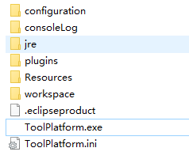

4.  在欢迎页中选择BurnTool工具，如[图2](#_Ref427762422)所示。

    **图 2**  选择BurnTool工具  
    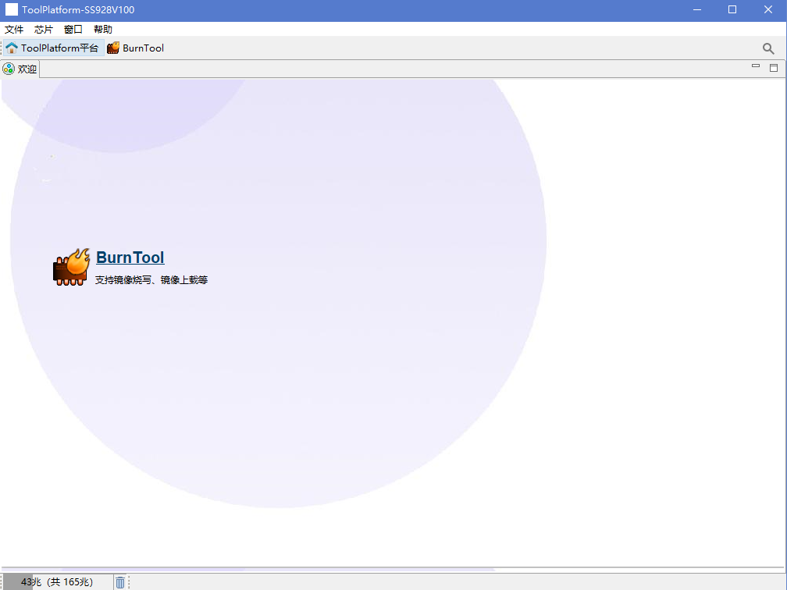

5.  参数配置，选择连接单板所用的串口，选择PC端使用的网络IP地址，配置好单板的MAC地址、IP地址、子网掩码以及网关，配置如[图3](#fig58684616564)所示。

    > **须知：** 
    >所选择的PC的服务器IP必须和单板的网络配置在同一个网段内，否则无法通过网口烧写除fastboot以外的其他镜像（fastboot镜像是通过串口烧写的）。

    **图 3**  参数设置  
    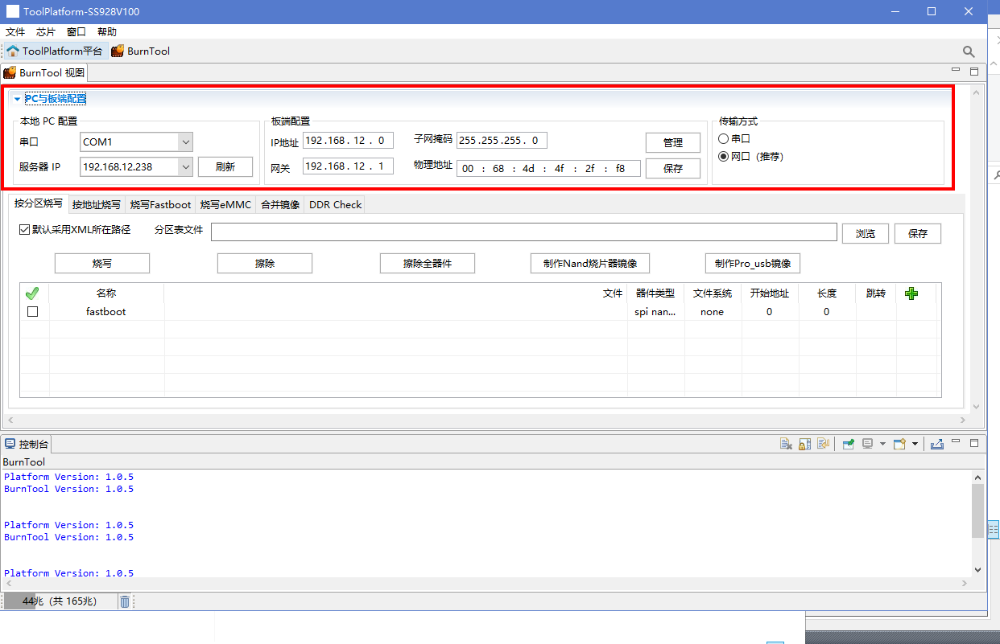

# 按分区烧写

## 适用场景

按分区烧写功能，适用于所有的单板，不管单板上有没有boot都适用。

## 烧写步骤

具体烧写步骤如下：

1.  打开BurnTool后，切换到“Burn by Partition”页签，如[图1](#fig1560862365516)所示。

    **图 1**  BurnTool按分区烧写  
    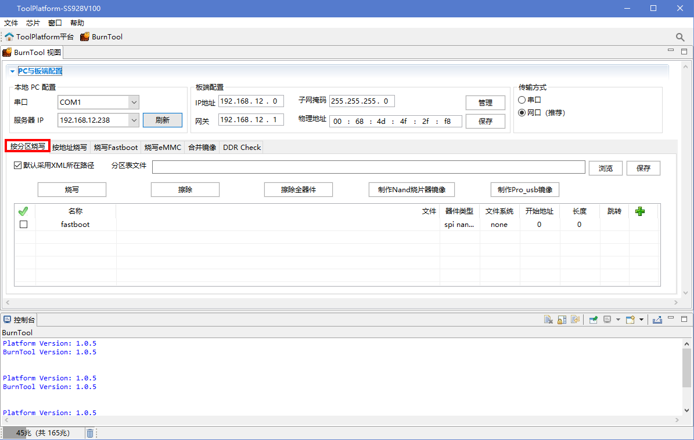

    > **说明：** 
    >-   软件第一次打开时，软件会自动生成默认参数，当这些参数配置信息更改时，软件会自动记录更改后的最新值，在软件正常退出时，自动保存配置参数，下次启动时，使用最新配置参数，如软件遇到非法退出，软件的配置参数可能不会被正确保存，即最近一次的参数修改失效。
    >-   点击保存按钮，可以将当前板端的网络配置保存起来，点击加载按钮，可以从保存的结果中选择一组配置作为当前配置。
    >-   切换“默认采用XML所在路径”的勾选状态，若勾选，则优先在XML路径下查找该分区文件。若不勾选，则优先采用绝对路径查找该文件，若找不到，再尝试以在XML所在目录下查找该文件。
    >-   **XML是一个配置文件用于保存分区表信息的，可以将编辑的分区表使用工具上的Save按钮保存成一个XML文件，下次打开工具时，将XML导入进来，分区表信息就直接加载进来。**

2.  配置单板分区信息，点击浏览按钮，可选择已设置好的分区表信息的XML，载入到工具中，分区信息被加载，如[图2](#fig62556341)所示。

    **图 2**  配置单板分区信息  
    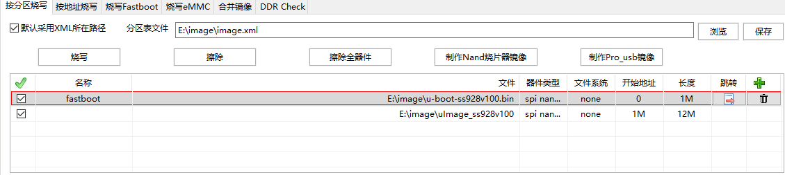

    > **须知：** 
    >-   分区信息只用于烧写，并不决定单板真正的分区划分，单板真实的分区划分还是由单板的bootargs决定，请将此处的分区信息与单板bootargs指定的分区信息对应，否则可能会出错。
    >-   BurnTool支持分区路径不一致，支持远程烧写，即为烧写的镜像是远程路径下的镜像。
    >-   分区被选中，但未选择烧写文件时，此分区在烧写过程中将会被擦除。
    >-   如果需要将所有分区的文件打包成一个镜像烧写（对于nandflash，由于其本身特性特殊，如果文件系统分区是可读写的文件系统，则不能一起打包），则打包的文件必须要加载到fastboot分区进行烧写，并且镜像中需要包含fastboot，才可以正常烧写。因烧写fastboot分区是采用串口方式烧写，烧写速度较慢，故不推荐使用此种方法进行烧写。

    修改分区信息可以直接修改xml格式的分区信息文件，也可以在工具中修改，用鼠标点击需修改分区的所在列，即可修改，如[图3](#fig1406152918013)所示。

    **图 3**  编辑单板分区信息  
    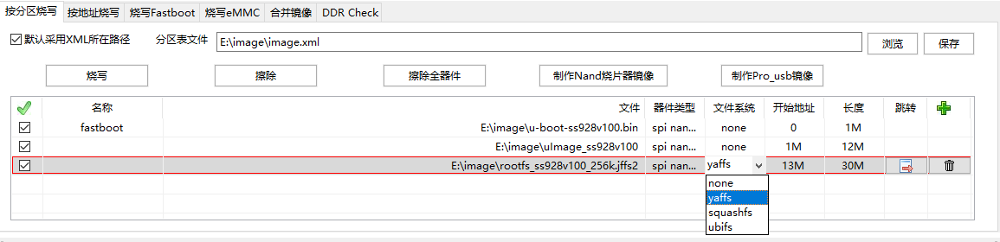

    单击按钮，可以增加一行分区。可以在这一行修改分区名，选择flash类型以及是否需要文件系统以及文件系统的类型，还可以修改分区的起始地址和分区大小。

    > **须知：** 
    >-   分区的起始地址和分区大小都是以KB或MB为单位，而且必须是flash块大小的整数倍，否则可能会出错。
    >-   分区的文件系统中jffs2不是特殊格式，直接选择none即可。

    -   单击按钮，可选择或改变该分区的烧写文件。
    -   单击按钮，可删除该分区信息。

    > **须知：** 
    >这里fastboot分区无法被删除，而且fastboot分区名不能被修改，因为如果fastboot分区被删除或fastboot分区名被修改则无法实现一键烧写。

    -   单击按钮，选择所有要烧写的分区，进行一键烧写所有分区，再次单击按钮，则取消所有要烧写的分区，也可以点击复选框  ，选择相应的分区进行烧写。
    -   单击保存按钮，可以将编辑好的分区表保存为文件。

    > **说明：** 
    >-   单板分区信息在第一次打开工具时可能没有xml格式的分区信息文件，此时可以在工具界面中直接填写或修改来创建单板分区信息，创建完成后，在关闭ToolPlatform工具时，弹出如[图2](#fig1241812821916)对话框，会提醒是否保存分区信息，点击“确定”，在弹出的对话框中选择要保存分区信息的路径，输入要保存的文件名，就会保存为xml格式的分区信息，点击“取消”，则关闭工具且不保存分区信息。
    >-   创建完成后在切换工具时，弹出如[图5](#Figure2.6)话框，“确定”，在弹出的对话框中选择要保存分区信息的路径，输入要保存的文件名，就会保存为xml 格式的分区信息，点击“取消”，则切换视图且不保存分区信息。注意保存分区信息的文件名后缀必须为.xml格式，否则下次载入分区信息时可能会出错而无法正确载入分区信息。信息另存为如[图6](#Figure2.7)所示。

    **图 4**  关闭ToolPlatform工具时提醒是否保存分区信息界面  
    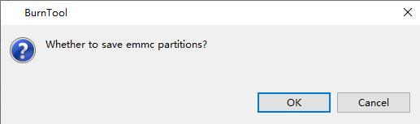

    **图 5**  切换视图时提醒是否保存分区信息界面  
    

    **图 6**  分区信息保存界面  
    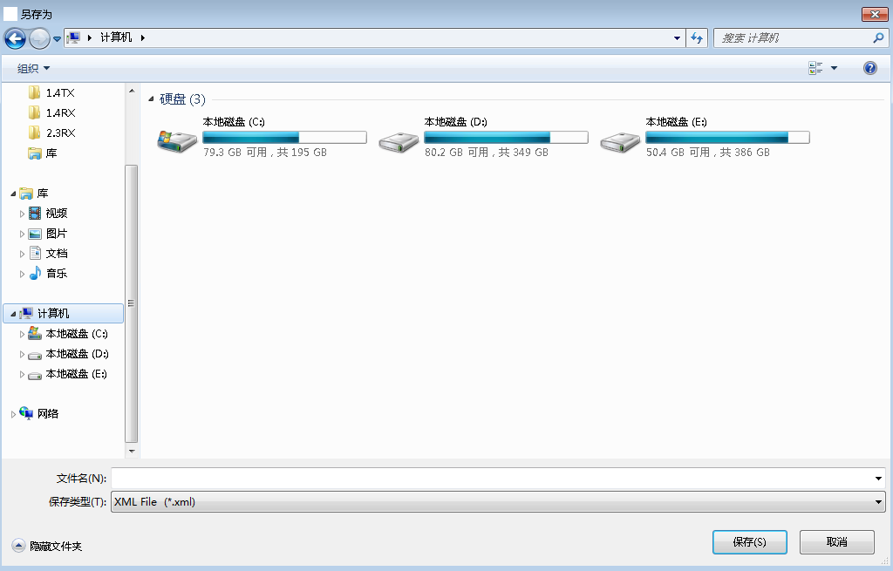

    选中当前最后一行，点击新建得到新的最后一行，然后在该行长度一栏中输入“-”，再加入该行的分区名、文件系统以及文件的引用路径，在之后的烧写中即可计算出该行的长度，该长度为整个器件的剩余长度。如[图7](#fig99064111119)所示。

    **图 7**  新建单板分区信息后设置长度为“-”  
    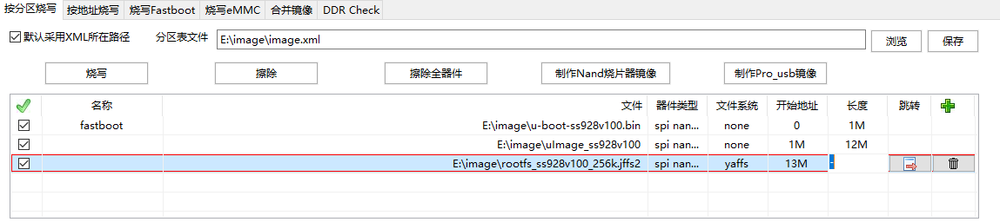

    > **须知：** 
    >若用户在新建分区行时，未选中当前的最后一个分区，则新建的分区可能不是新的最后一个分区，则无法使用“-”来代表剩余长度。

3.  准备单板环境，选择一种传输方式，如[图8](#fig15452338171518)所示，如果单板处于通电状态，给单板下电。

    **图 8**  选择传输方式  
    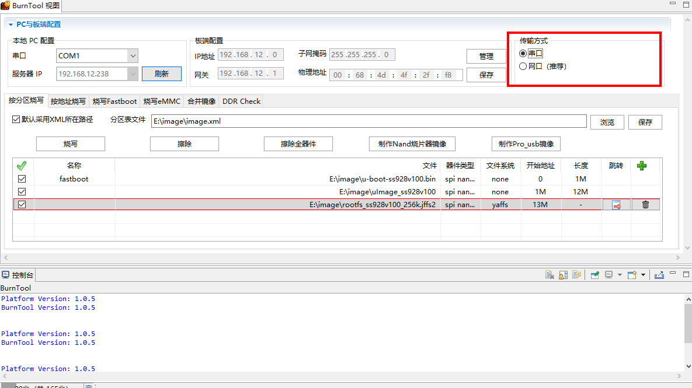

    -   若选择网口，连接单板的串口和网口。
    -   若选择串口，连接单板的串口。

4.  烧写单板，点击烧写按钮，如[图9](#fig1659555711617)所示。

    **图 9**  点击烧写  
    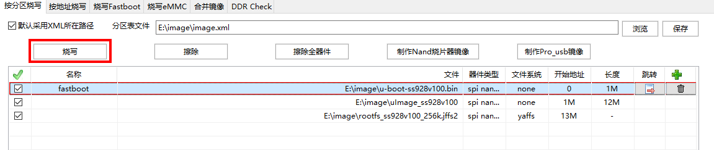

5.  给单板上电，进入烧写过程，等待烧写完成。烧写过程如[图10](#fig297215536181)所示。

    **图 10**  烧写过程  
    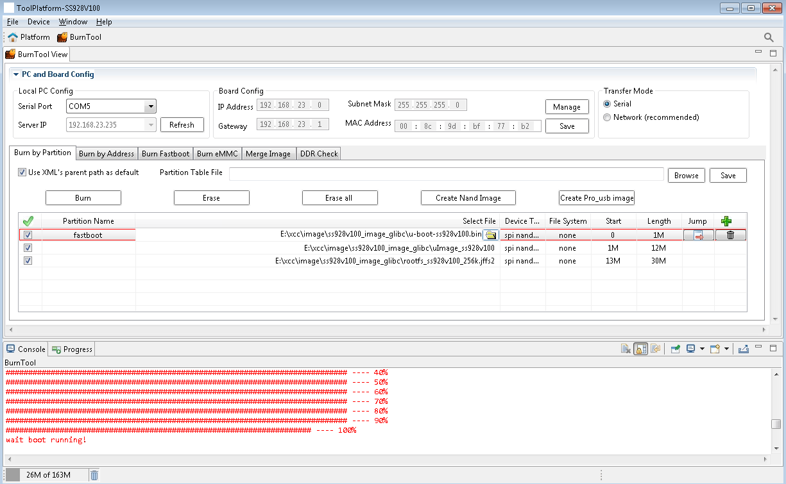

    烧写过程的信息会在如上的控制台中显示。如果发现烧写出错，请再次检查单板：

    -   串口选择是否正确。
    -   IP地址是否正确，是否被占用。
    -   是否有短接单板上的自举跳线。

6.  烧写完成，连接终端工具，重启单板。

## 制作Nand烧片器镜像

BurnTool提供了制作Nand烧片器镜像的功能。配置好分区列表后，点击制作Nand烧片器镜像按钮，会弹出Nand烧片器镜像制作界面。如[图1](#fig106441654201914)所示。

**图 1**  制作Nand烧片器镜像界面  
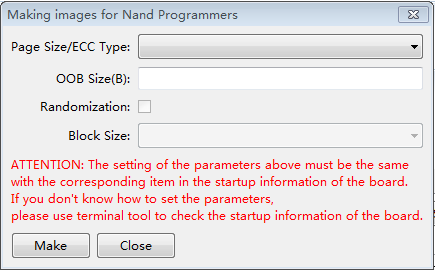

选择对话框中的各项数据以后（其中Randomization功能对8K及以上Page Size的器件开放），点击“Make”按钮，即可生成Nand烧片器的镜像。

> **须知：** 
>-   填入或选择的各项参数，必须与单板启动信息（可以使用超级终端类软件捕捉单板的启动信息并查看）中对应项的数值一致或实际贴的器件参数匹配。
>-   若用户不勾选某个分区，或者不为勾选的分区指定烧写文件，则无法制作该分区的镜像文件。
>-   若为非yaffs分区制作镜像，则分区表中的文件系统一项不能指定为yaffs；为yaffs分区制作镜像时，文件系统必须指定为yaffs。否则，会导致做出的镜像不正确。

## 选中分区表单行点击跳转进入按地址烧写界面

按分区烧写提供了携带子分区信息即分区的分区名、文件系统以及文件的引用路径和起始地址以及分区长度跳转到按地址烧写界面，并采用该分区的信息直接录入到按地址烧写信息栏中，方便用户使用。在按分区烧写界面中选中分区表中的一行，点击跳转按钮，即可跳转到按地址烧写界面中。如[图1](#fig19742104082116)与[图2](#fig1241812821916)所示。

**图 1**  选中单行，点击跳转  
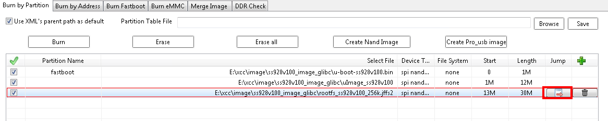

**图 2**  进入按地址烧写界面  
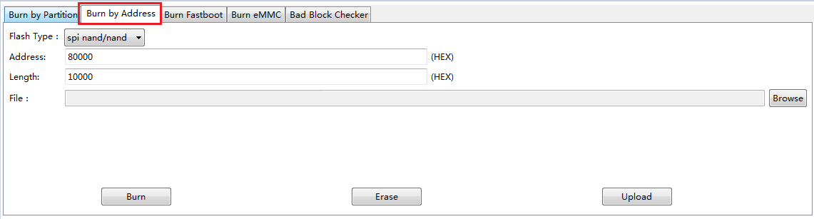

> **须知：** 
>在跳转前，用户必须选中需要跳转到按地址烧写页面的分区行，跳转按钮才会显示。

# 按地址烧写

## 适用场景

单板已有boot。

## 烧写步骤

具体烧写步骤如下：

1.  切换到“Burn by Address”页签，如[图1](#fig77356229246)所示。

    **图 1**  地址烧写界面  
    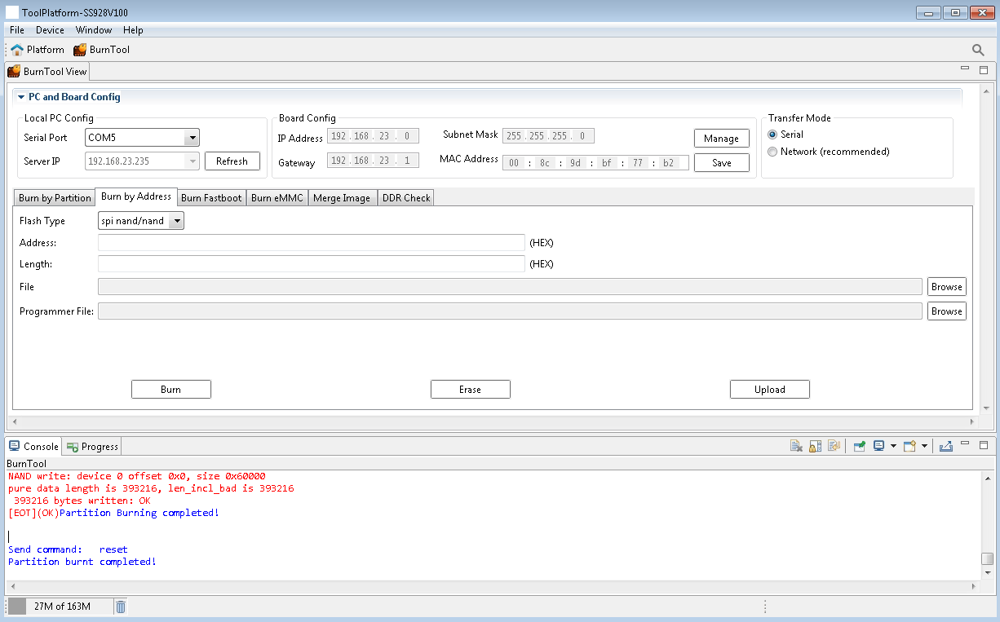

1.  配置单板烧写信息，选择要烧写的 flash类型，设置烧写起始地址和长度，选择要烧写的文件，如[图2](#fig1355103942610)所示界面。

    **图 2**  配置单板烧写信息  
    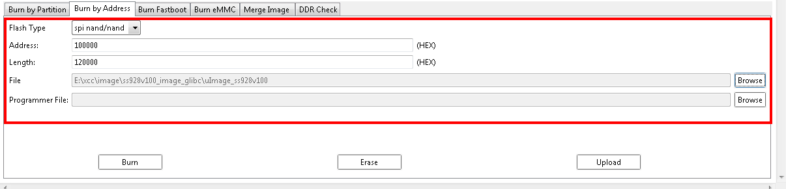

2.  同2.2章节[3](#ZH-CN_TOPIC_0000002441889129)。
3.  单击烧写按钮，如[图3](#_Ref416783621)所示。

    > **须知：** 
    >按地址烧写时，用户无需选择文件类型，只要选择自己想要烧写的文件即可。由于yaffs文件（带OOB数据）和其他类型文件（不带OOB数据）的格式不同，工具会根据选定的文件在后台自动区分文件类型（工具中区分为yaffs类型和None类型），然后根据不同的类型来执行相应的烧写，给单板上电，进入烧写过程，等待烧写完成，按地址烧写只有第一次点击烧写按钮时需要重新给单板上电，后续再烧写镜像时不需要重新给单板上电了。

    **图 3**  单击烧写  
    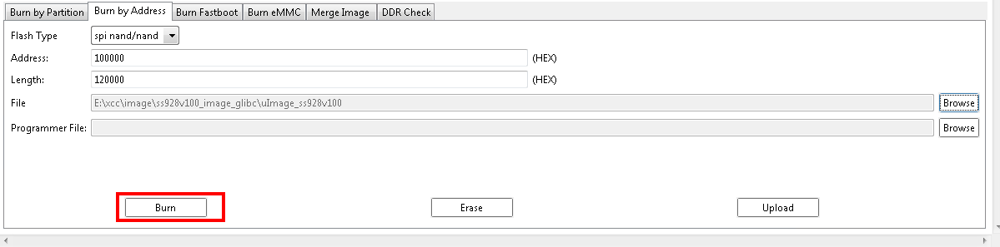

4.  给单板上电，进入烧写过程，等待烧写完成。烧写过程如[图4](#_Ref416783705)所示。

    **图 4**  烧写过程  
    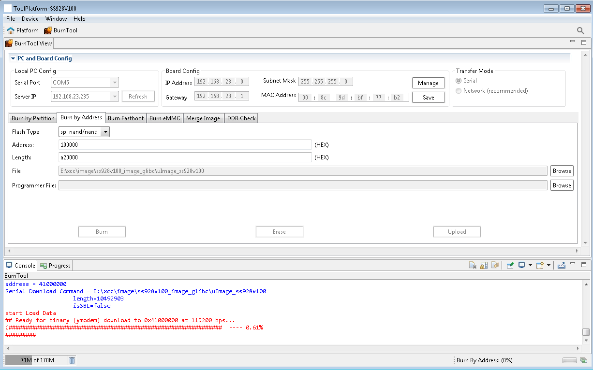

    烧写过程的信息会在如上的“控制台”中打印输出。如果发现烧写出错，请再次检查单板：

    -   串口选择是否正确
    -   IP地址设置是否正确，是否被占用
    -   是否有短接单板上的自举跳线

    Erase操作和Burn操作类似，这里不再赘述。

5.  烧写完成，连接终端工具，重启单板。

## 上载步骤

烧写和上载是两个逆反操作，烧写功能是将镜像文件烧录到单板上，而上载功能则是按照用户设置的起始地址和长度将这段区域的内容上载至PC。上载的具体步骤完全可以参考烧写步骤。这里列出两个和烧写步骤中不一样的地方，重复的地方不在累述。

1.  同3.2章节[1](#ZH-CN_TOPIC_0000002441889077)。
2.  同3.2章节[2](#ZH-CN_TOPIC_0000002441889077)。
3.  配置单板上载信息，选择要上载的flash类型，设置存储设备中待上载的起始地址及长度，并且设置上载后的保存文件。如[图1](#fig12876191611389)所示。

    **图 1**  上载信息  
    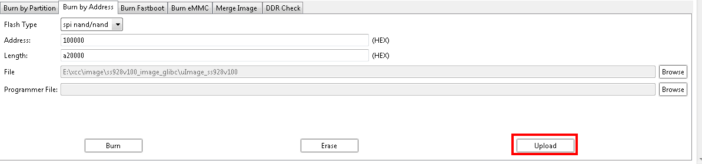

4.  同3.2章节[3](#ZH-CN_TOPIC_0000002441889077)。
5.  单击“upload”，如果待上载区域的镜像是fastboot，kernel，ubifs等请选择Data whithout OOB，如果镜像是yaffs，请选择Data with OOB。如[图2](#_Ref416783742)所示。

    **图 2**  选择数据类型  
    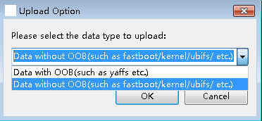

    > **须知：** 
    >按地址上载时，用户需要明确指定要上载的数据类型。这一步操作是在用户点击“上载”按钮后的弹出对话框中完成的。如果用户在这一步选择错误，会导致上载后的数据跟原始的文件无法吻合。yaffs文件系统部分上载时，长度应该为pagesize + oobsize的倍数。

## 擦除步骤

擦除功能是从指定地址开始将指定长度的内容从板端擦除。擦除的步骤同烧写步骤类似，这里列出两个和烧写步骤中不一样的地方，重复的地方不在累述。

1.  同3.2章节[1](#ZH-CN_TOPIC_0000002441889077)。
2.  同3.2章节[2](#ZH-CN_TOPIC_0000002441889077)。
3.  配置单板擦除信息，选择要擦除的flash类型，设置存储设备中待擦除的起始地址及长度。如[图1](#fig10547163316314)所示。

    **图 1**  擦除信息  
    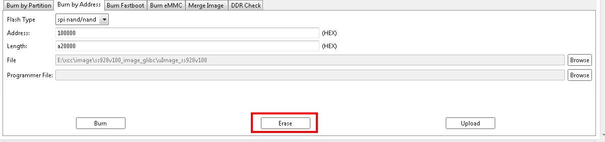

4.  同3.2章节[3](#ZH-CN_TOPIC_0000002441889077)。
5.  单击“erase”，给单板上电，进入擦除过程，等待擦除完成。如[图2](#_Ref416783804)所示。

    **图 2**  擦除过程  
    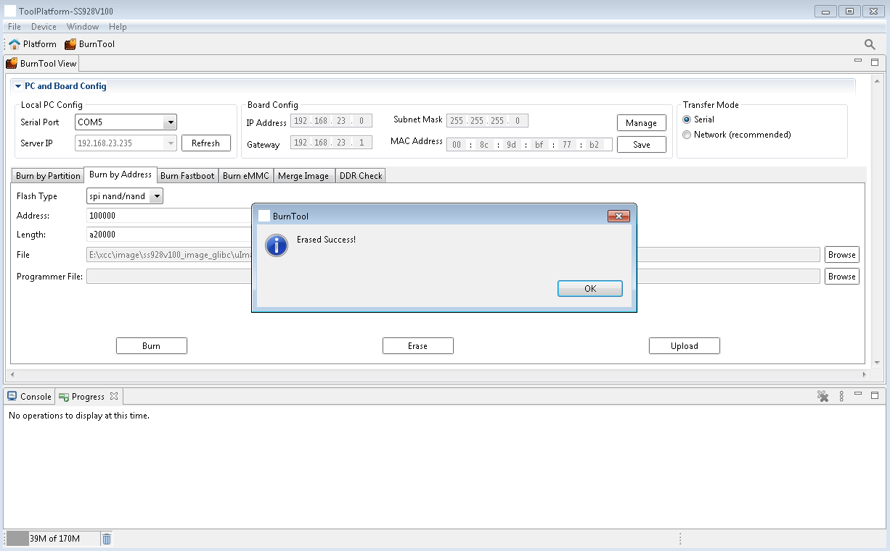

    > **须知：** 
    >擦除时，长度应该为blocksize的倍数。

# Boot烧写

## 适用场景

单板上没有boot，和按地址烧写配合，可完成单板所有镜像的烧写。

## 烧写步骤

具体烧写步骤如下：

1.  切换到“Burn Fastboot”页签，如[图1](#_Ref416783832)所示。

    **图 1**  Fastboot烧写界面  
    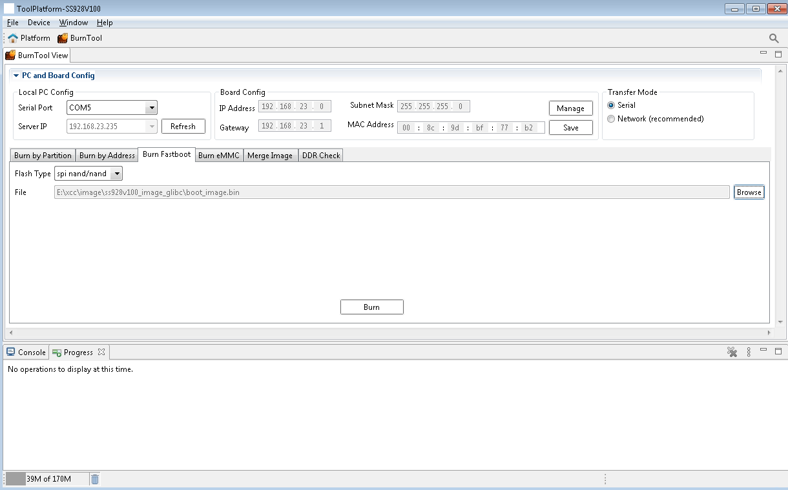

2.  配置串口，选择连接单板所用的串口，配置如[图2](#_Ref416783851)所示。

    **图 2**  串口选择  
    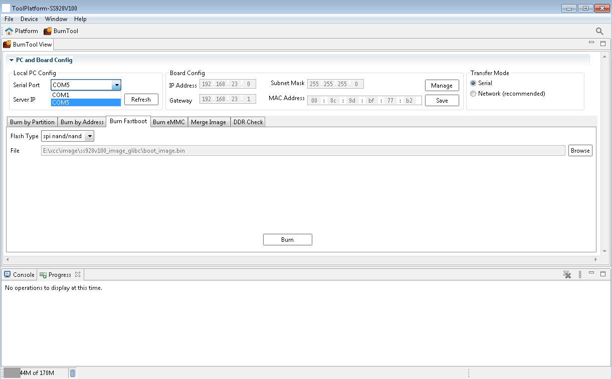

3.  配置Boot烧写信息，配置如[图3](#fig6981215103111)所示。

    **图 3**  配置boot 烧写信息  
    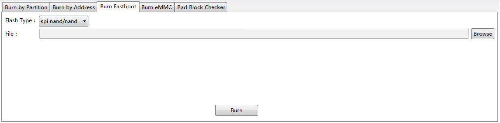

4.  准备单板环境，如果单板处于通电状态，请给单板下电；
5.  点击烧写按钮，如[图4](#fig1999382113211)所示。

    **图 4**  点击Burn  
    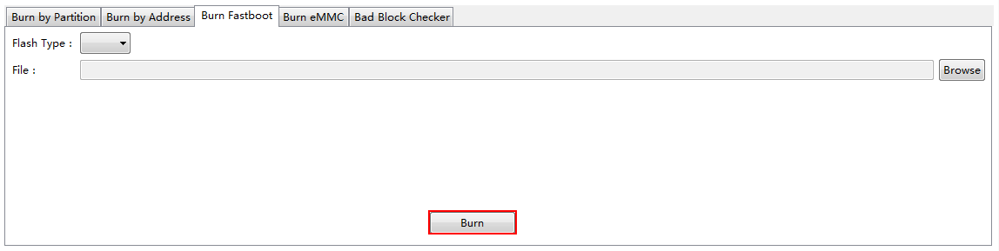

6.  给单板上电，进入烧写过程，等待烧写完成。烧写过程如[图5](#_Ref416783918)所示。

    **图 5**  烧写过程  
    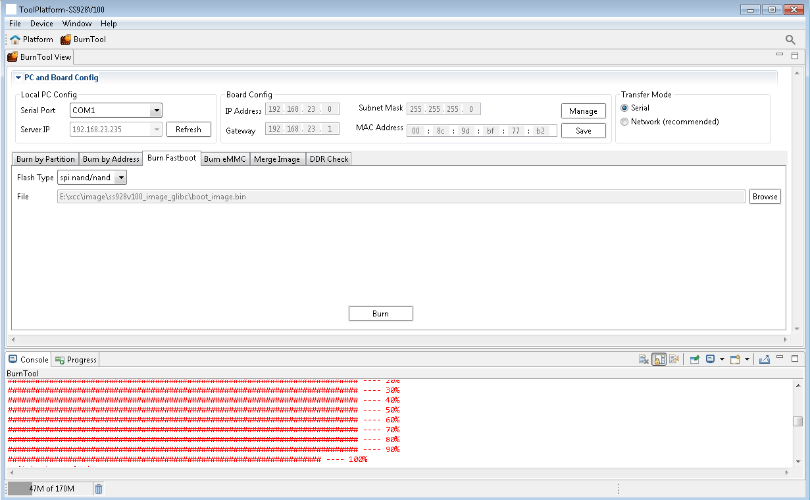

    烧写过程的信息会在如上的“控制台”打印输出。如果发现烧写出错，请再次检查串口选择是否正确。

7.  烧写完成，连接终端工具，重启单板。

# eMMC烧写

## 适用场景

适用场景如下：只适用于eMMC烧写，不管单板上有没有boot都适用，可实现一键烧写所有镜像。

## 烧写步骤

具体烧写步骤如下：

1.  切换到“烧写eMMC”页签，如[图1](#fig10733727164915)所示。

    **图 1**  eMMC 烧写界面  
    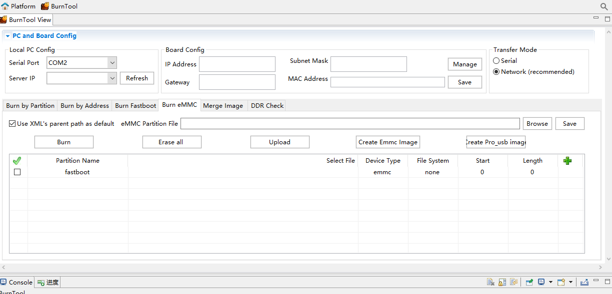

    > **说明：** 
    >-   切换“默认采用XML所在路径”的勾选状态，若勾选，则优先在XML路径下查找该分区文件。若不勾选，则优先采用绝对路径查找该文件，若找不到，再尝试以在XML所在目录下查找该文件，该状态默认被勾选。
    >-   **XML是一个配置文件用于保存分区表信息的，可以将编辑的分区表使用工具上的Save按钮保存成一个XML文件，下次打开工具时，将XML导入进来，分区表信息就直接加载进来。**

1.  配置单板分区信息，点击“浏览”，可选择已设置好的分区表信息，载入工具中，如[图2](#fig19253651205117)所示界面。其中boot分区的器件类型是emmc和emmc0时，boot会被烧写进默认分区，其中emmc不会切换启动分区，emmc0会切换boot的启动分区为默认分区。boot分区的器件类型是emmc1和emmc2时，boot会被烧写进对应的boot1，boot2分区，会切换boot的启动分区为对应的boot1，boot2分区。

    **图 2**  配置单板分区信息  
    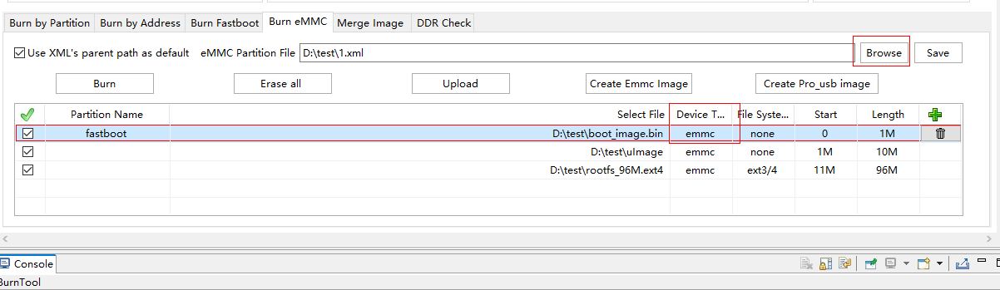

    > **须知：** 
    >如果所有分区的文件打包成一个镜像烧写时（由于eMMC文件系统分区需要创建分区表，因此文件系统分区不同时，则不能一起打包，Android版本不存在此问题），此镜像必须要放到fastboot分区，而且此镜像中要包含fastboot，另外由于此时是采用串口方式烧写，烧写速度比较慢，要耐心等待。

    > **说明：** 
    >eMMC采用DOS分区格式，对于Ext3/4文件系统分区需要创建分区表信息，内核才可以正确识别Ext3/4 文件系统分区。

    要修改某个分区的信息可以直接修改保存为 xml格式的分区信息文件，也可以直接在工具中修改，如果要在工具中修改某个分区的信息，用鼠标点击这个分区所在的行，则会出现如[图3](#fig05531290513)所示。

    **图 3**  编辑单板分区信息  
    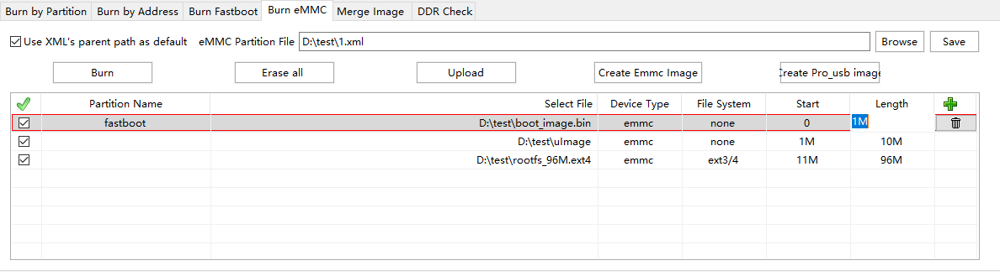

    > **须知：** 
    >分区的起始大小和分区大小都是以KB或MB为单位，而且必须是eMMC扇区大小的整数倍，否则可能会出错。

    -   单击按钮，可以增加一行分区。可以在这一行修改分区名、选择是否需要文件系统以及文件系统的类型，还可以修改分区的起始大小和分区大小。
    -   单击按钮，可选择或改变该分区的烧写文件。
    -   单击按钮，可删除改分区信息。注意：这里fastboot 分区无法被删除，而且fastboot 分区名不能被修改，因为如果fastboot 分区被删除或fastboot 分区名被修改则无法实现一键烧写。
    -   单击按钮，选择所有要烧写的分区，进行一键烧写所有分区，再次单击按钮  ，则取消所有要烧写的分区，也可以点击复选框，选择相应的分区进行烧写。
    -   单击按钮，可以将编辑好的分区表保存为文件。

    > **说明：** 
    >创建完成后在切换透视图时，弹出如图话框，“确定”，在弹出的对话框中选择要保存分区信息的路径，输入要保存的文件名，就会保存为xml 格式的分区信息，点击“取消”，则切换视图且不保存分区信息。注意保存分区信息的文件名后缀必须为.xml格式，否则下次载入分区信息时可能会出错而无法正确载入分区信息。信息另存为如[图6](#fig196451156109)所示。

    **图 4**  关闭BurnTool工具时提醒是否保存分区信息界  
    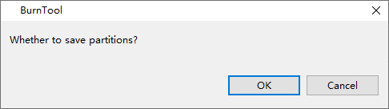

    **图 5**  切换视图时提醒是否保存分区信息界面  
    

    信息另存为如[图6](#fig196451156109)所示。

    **图 6**  分区信息保存界面  
    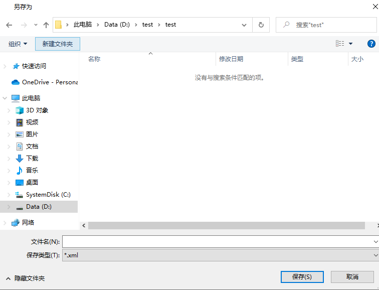

1.  同[2.2-3](#ZH-CN_TOPIC_0000002441889129)一样。
2.  烧写单板，点击烧写按钮，如[图7](#fig79197461111)所示。

    **图 7**  点击烧写  
    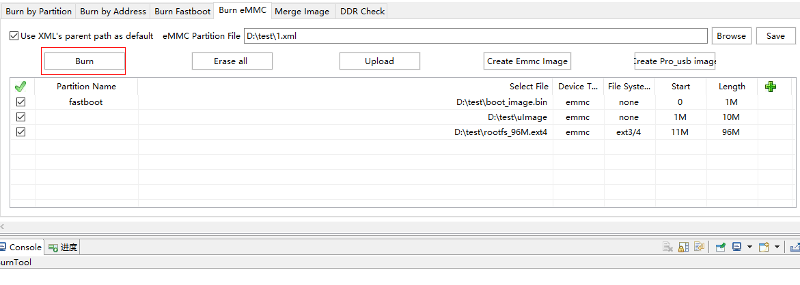

1.  给单板上电，进入烧写过程，等待烧写完成。

    烧写过程的信息会在控制台中显示。

    -   串口选择是否正确。
    -   IP地址设置是否正确，地址是否被占用。
    -   是否有短接单板上的自举跳线。

2.  烧写完成，连接终端工具，重启单板。

## 制作烧片器镜像

制作烧片器镜像功能可以将当前分区列表中选择的文件制作为烧片器镜像文件。配置好分区列表后，点击制作烧片器镜像按钮，在弹出的保存对话框中设置好文件路径，制作烧片器镜像就开始了，如[图1](#fig114434436368)所示。

**图 1**  制作烧片器镜像过程  
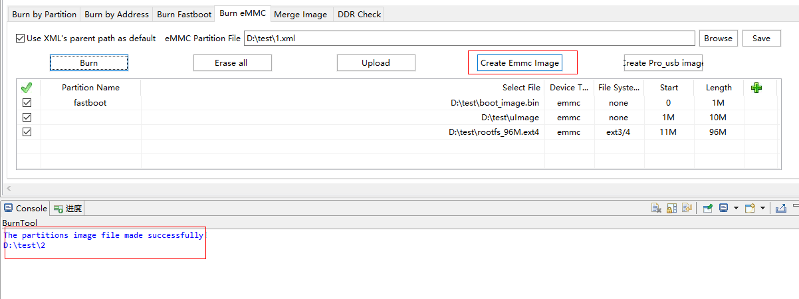

## 上载步骤

上载功能不可用，单板不支持上载。

## 擦除步骤

1.  切换到emmc页签，导入分区表信息，如[图1](#fig119011214321)。

    **图 1**  导入分区表  
    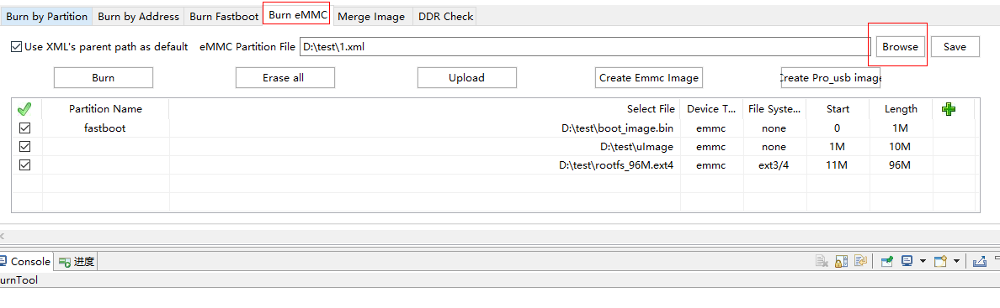

2.  编辑boot器件类型，如[图2](#fig151791728173710)。器件类型是emmc，只会擦除默认分区，器件类型是emmc0，1，2，会将默认分区，boot1，boot2分区擦除。

    **图 2**  编辑boot器件类型  
    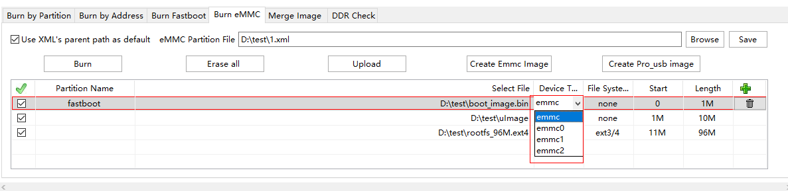

3.  点击擦除。如[图3](#fig17109141184016)

    **图 3**  点击擦除  
    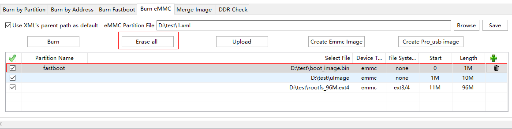

# 合并镜像

## 适用场景

适用场景如下：适用于SPI Flash中因存储空间较小，用户需要将多个小镜像合并为一个镜像，然后烧录到同一个block块中，从而节省flash空间的场景，也适用于将其他Flash类型的镜像合并为一个镜像。

例如，有fastboot，kernel两个镜像他们分别为500K，而spi的block大小为1M，那么如果将这两个镜像当做两个分区来烧写，板端烧写命令会使用到2个block块来占用，如果合并镜像后，就只需要占用单个block块即可，从而省了1M的Flash空间。

## 操作步骤

具体烧写步骤如下：

1.  切换到“Merge Image”页签，如[图1](#_Ref416784461)所示。

    **图 1**  BurnTool合并镜像界面  
    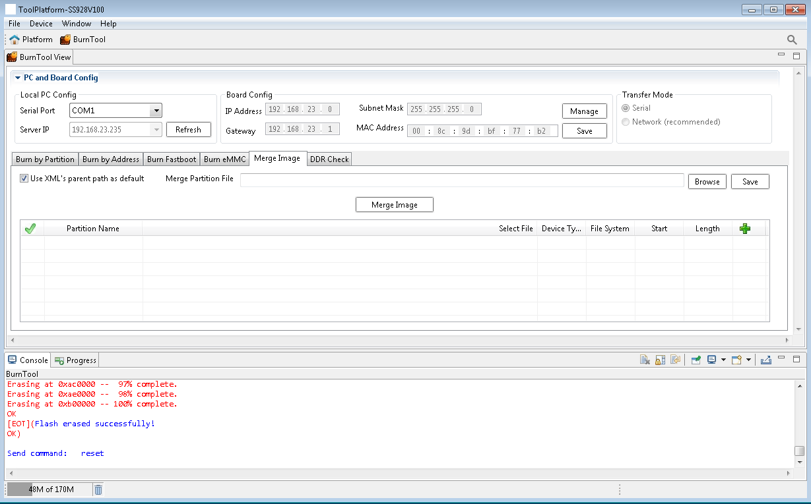

2.  点击Browse按钮，加载分区表或点击按钮，手动新建分区表，如[图2](#fig1195161117453)所示。

    **图 2**  加载分区表  
    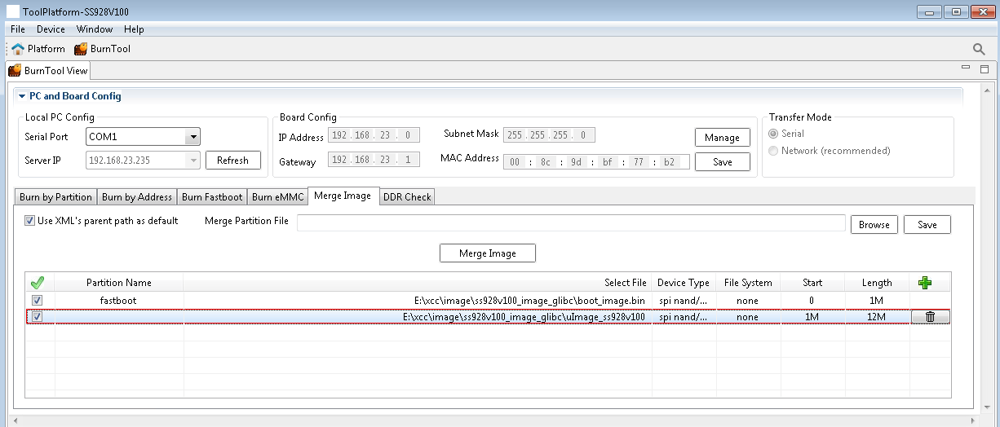

3.  点击Merging Image按钮，合并镜像，如[图3](#_Ref416784524)所示。

    **图 3**  合并镜像  
    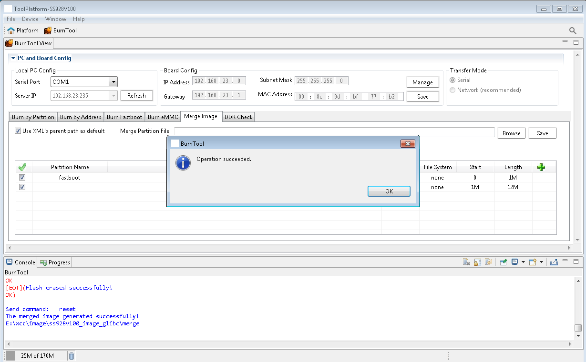

# 首选项设置

## 命令设置

BurnTool工具的串口发送命令超时可通过首选项进行设置，点击菜单栏中“窗口”-\>“首选项”进入首选项对话框，进入“BurnTool”下“命令设置”页面，如[图1](#_Ref416784561)所示。

**图 1**  命令设置页面  
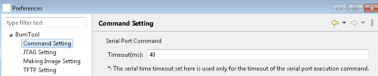

注: Timeout（ms）：用于串口发送命令响应超时。单位为ms。

## TFTP设置

BurnTool工具的TFTP可通过首选项进行设置，点击菜单栏中“窗口”-\>“首选项”进入首选项对话框，进入“BurnTool”下的“TFTP设置”页面，如[图1](#_Ref416784544)所示。

**图 1**  TFTP设置页面  
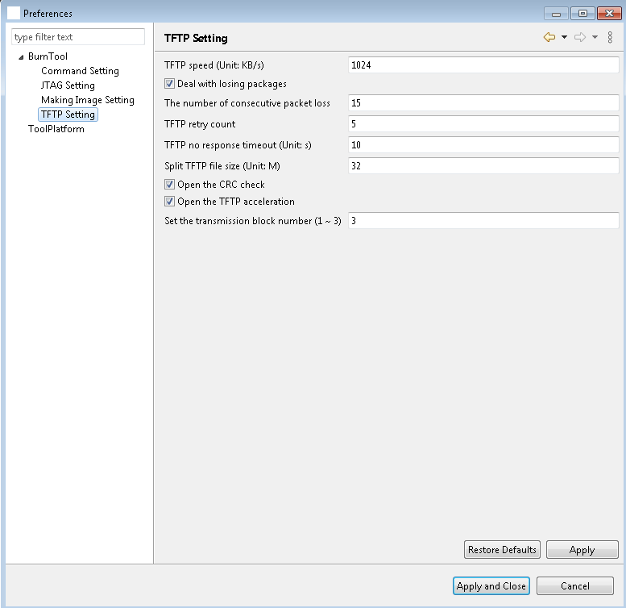

设置项：

-   TFTP速率：用于计算超时，根据传输文件的长度及设置的TFTP速率计算出超时。单位为byte/s。
-   处理丢包：勾选“处理丢包”按钮，连续丢包次数项可配置，在传输过程中若连续丢失的包达到最大连续丢包次数，则判定传输失败。若不勾选“处理丢包”按钮，连续丢包次数项不可配置，且不管传输过程中的丢包情况。
-   连续丢包次数：设置最大连续丢包次数。
-   TFTP重试次数：设置TFTP重试次数，若传输失败，将重试，达到重试设置次数后仍未成功，将停止。
-   TFTP无响应超时：设置TFTP无响应超时，传输过程中若在设置时间内无响应，则判定传输失败，单位为秒，默认值为10秒。

## 其他设置

### BurnTool-Debug控制台设置

BurnTool工具的Debug控制台可通过首选项进行设置。

1.  点击菜单栏中“窗口”-\>“首选项”进入首选项对话框，进入“BurnTool”页面，选中“Open Debug Mode”按钮，表示开启Debug控制台，如[图1](#_Ref410048637)所示。

    **图 1**  选中开启Debug控制台  
    

2.  在开始烧写后，工具会自动创建Debug控制台，点击控制台右上角切换控制台按钮，选择切换控制台为“BurnTool-Debug”控制台，当前控制台就显示为Debug控制台，如[图2](#_Ref410048738)所示。

    **图 2**  切换BurnTool-Debug控制台  
    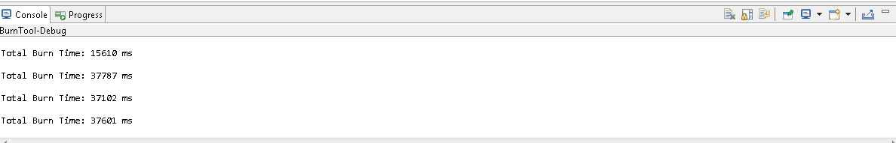

### 检查同一网段设置

点击菜单栏中“窗口”-\>“首选项”进入首选项对话框，进入“BurnTool”页面，选中“Check whether the PC and Borad IP addresses are in the same network segment”按钮，如[图1](#_Ref410048821)所示，表示开启在烧写前检查PC与板端IP是否在同一网关，取消选中则表示不会在烧写前检查此项。

**图 1**  检查同一网段设置页面  
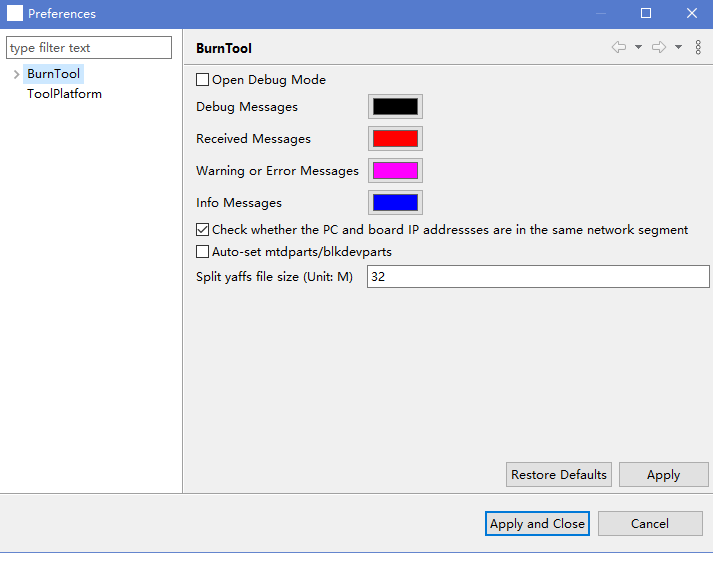

# FAQ

## BurnTool烧写中出现TFTP超时提示时的解决办法

**问题描述**

出现以下TFTP错误时，如[图1](#_Ref386011440)所示，该如何解决？

**图 1**  TFTP超时问题  
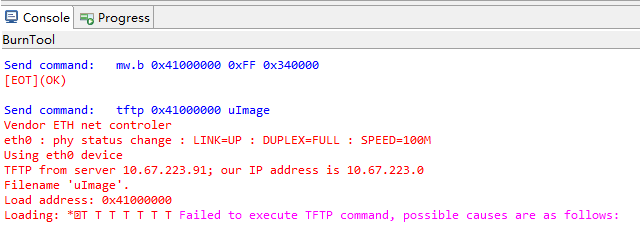

**解决办法**

解决此问题分以下四个方面：

-   检查BurnTool中网络配置是否正确，如[图2](#_Ref386011442)所示，首先检查服务器IP是否正确，若不正确点击重新加载，加载最新的PC端IP地址；然后检查子网掩码与网关是否配置正确，若正确，再检查板端IP地址是否被占用（使用ping命令，查看当前单板IP是否能够ping通，若不能则表示当前网络不通），再查看，将以上参数全部保证正确后再尝试重新烧写。

    **图 2**  检查网络配置是否正确  
    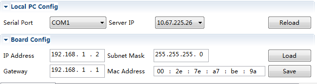

-   使用外置的tftpd32工具代替工具中内置的TFTP进行下载操作（参见“[如何使用外置的tftpd32进行镜像下载？](#ZH-CN_TOPIC_0000002441889093)”），若tftpd32也显示超时，则检查当前网络环境是否正常；
-   修改工具中TFTP参数设置，匹配当前网络环境，通过点击菜单栏上的“Window”-\>“Preferences”-\>“BurnTool”-\>“TFTP Setting”，如[图3](#_Ref386007685)所示，将“The number of consecutive packet loss”与“TFTP no response timeout”两个参数设置大一些，然后在进行烧写，查看是否正常。
-   检查是否关闭防火墙，若未关闭，需要关闭防火墙。

    **图 3**  修改TFTP设置  
    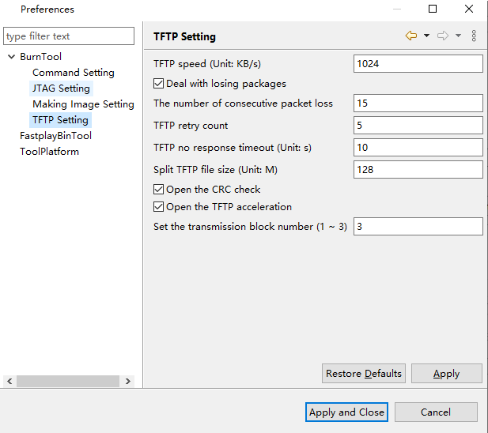

## 如何使用外置的tftpd32进行镜像下载？

**问题描述**

如何使用外置的tftpd32进行镜像下载且需要注意什么？

**解决办法**

使用外部tftpd32步骤为：

1.  在烧写前打开tftpd32工具，并选择正确的PC端IP地址与将烧写的镜像所在目录，如[图1](#_Ref386011451)所示。

    **图 1**  配置tftpd32工具  
    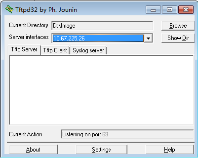

1.  在BurnTool中正常点击烧写按钮，弹出提示框，如[图2](#_Ref386011453)所示，点击确认，开始烧写，当前就会使用外置的tftpd32进行镜像的下载，如[图3](#_Ref386011454)所示。

    **图 2**  提示内置TFTP启动失败，端口被外置tftpd32工具占  
    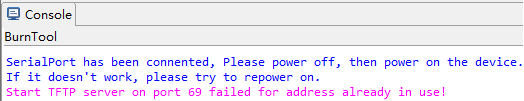

    **图 3**  外置tftpd32工具正在下载镜像  
    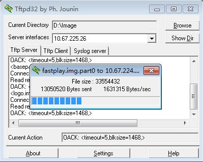

## BurnTool烧写Fastboot分区时，工具出现报错“Failed to send start frame”的解决办法

**问题描述**

烧写Fastboot分区出现以下“Failed to send start frame”错误时，如[图1](#_Ref386011456)所示，我该怎么办？

**图 1**  “Failed to send start frame”报错信息  
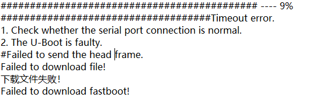

**解决办法**

首先确认上一次点击烧写后，是否在15秒内给单板重新上电，若已经重新上电，则查看串口是否与单板接触良好，若连接正常，则检查BurnTool中是否选择了正确的串口号，如[图2](#_Ref386011460)所示，全部保证正确后，请重新进行烧写。

**图 2**  检查串口号是否选择正确  
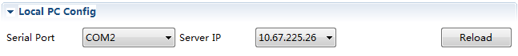

## BurnTool烧写Fastboot分区时，控制台只打印了一段“\#\#\#\#\#\#\#\#\#”后停止打印，且工具出现报错“Failed to send head frame”的解决办法

**问题描述**

烧写Fastboot分区控制台只打印了一段“\#\#\#\#\#\#\#\#\#”后停止打印，且工具出现报错“Failed to send head frame”时，如[图1](#_Ref386011462)所示，该如何解决？

**图 1**  “Failed to send head frame”报错信息  

**解决办法**

此报错原因可能有以下两种：

-   烧写的Fastboot镜像与当前单板型号不匹配导致，请直接查看单板标记型号，明确单板型号后，请使用匹配当前芯片的SDK镜像重新进行烧写；
-   单板DDR有问题，无法正常进行DDR初始化操作。

## BurnTool烧写Fastboot分区时，工具出现报错“Failed to send data frame”的解决办法

**问题描述**

烧写Fastboot分区出现以下“Failed to send data frame”错误时，如[图1](#_Ref386011468)所示，我该怎么办？

**图 1**  “Failed to send data frame”报错信息  
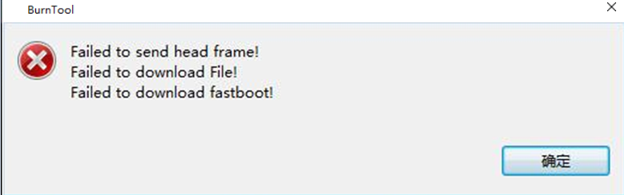

**解决办法**

此报错原因可能是烧写Fastboot镜像时串口连接出现松动导致工具与单板进行交互时数据发送失败，请检查串口连接情况。

## BurnTool烧写Fastboot分区时，工具出现报错“Failed to execute command”的解决办法

**问题描述**

烧写Fastboot分区出现以下“Failed to execute command”错误时，如[图1](#_Ref386011469)所示，我该怎么办？

**图 1**  “Failed to execute command”报错信息  
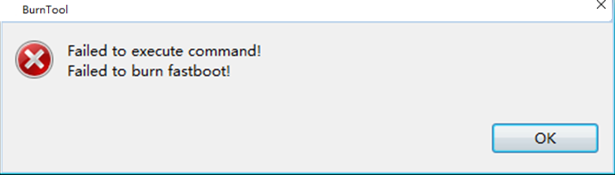

**解决办法**

此报错原因可能是当前Fastboot分区的Flash类型选择错误导致的，如[图2](#_Ref386011475)所示，重启单板查看单板当前“Flash”属性，如当前为eMMC，则需要使用按EMMC烧写，且Fastboot分区的Flash类型选择为emmc。

**图 2**  通过串口查看单板Flash信息  
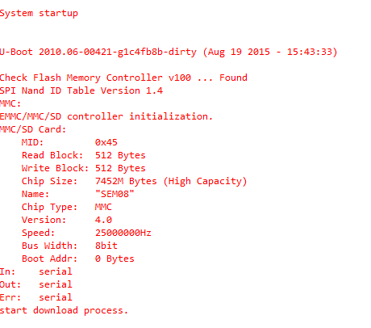

## 对于文件传输方式的选择，需要注意什么？

**问题描述**

在选择文件传输方式时，串口和网口之间的优缺点是什么？

**解决办法**

BurnTool工具的串口烧写功能是纯串口烧写，因烧写过程需给板端传送大量数据。而串口本身的传输速率较低，故用纯串口的方式烧写，效率会比较低，我们推荐用网口的方式进行烧写，纯串口的方式烧写非常稳定，若用户网络环境不稳定，可使用串口烧写。

## 按地址烧写界面，文件的长度要求？

**问题描述**

按地址烧写界面，文件的长度要求是什么？

**解决办法**

擦除时，长度应该为blocksize的倍数；yaffs文件系统部分上载时，长度应该为pagesize + oobsize的倍数。

## 遇到点击烧写，断电重启后，不开始烧写，可能原因？

**问题描述**

在点击烧写，断电重启后，但是工具并没有开始烧写，是什么原因？

**解决办法**

可能是串口选择错误或没有正常连接串口（请使用终端工具查看），请等待，控制台会打印出相关信息。

## 串口找不到或tftp启动失败或报tftp端口被占用的原因？

**问题描述**

在linux下使用时，串口找不到或tftp启动失败或报tftp端口被占用，可能的原因什么？

**解决办法**

没有以root用户登录，无权限打开tftp服务或使用串口。报tftp端口被占用也有可能是其他软件占用了此端口。

## 烧写Nand时控制台打印pure data length和len\_incl\_bad分别是什么含义？

**问题描述**

烧写Nand时控制台打印pure data length和len\_incl\_bad分别是什么含义？

**解决办法**

如[图1](#_Ref386007893)所示，其中pure data length表示实际烧写的数据长度，而len incl bad表示包含坏块的实际烧写占用的长度，以上两种长度均不包含oobSize长度。

**图 1**  控制台打印烧写命令反馈的烧写长度  
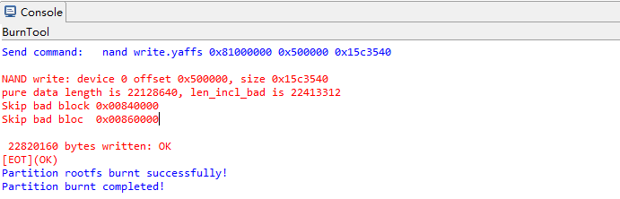

## 单板DDR Training失败的情况下工具会有什么打印？

**问题描述**

单板DDR Training失败的情况下工具会有什么打印？

**解决办法**

当单板出现DDR Training失败时，在烧写Fastboot分区时，会打印如[图1](#_Ref386011496)所示信息。

**图 1**  打印DDR Training失败信息  
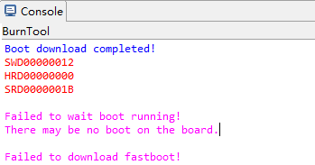

## 反馈BurnTool使用过程中出现问题时需要提供什么？

**问题描述**

反馈BurnTool使用过程中出现问题时需要提供什么？

**解决办法**

使用BurnTool工具出现问题时，将控制台中打印内容通过控制台工具栏中导出按钮导出，反馈问题时一并反馈，将有助于问题的定位及解决。

## 如何查看是否有进程占用了tftp的69端口？

**问题描述**

tftp命令总是报文件找不到，但实际所有的设置都是好的，原因是什么？如何查看是否有进程占用了tftp的69端口？

**解决办法**

可能存在后台进程占用了69端口。可以使用如下方法查看是否有进程占用。

在cmd命令行工具中输入，打印例如[图1](#_Ref413161493)所示。

netstat -ano -p udp

**图 1**  查看进程的端口占用  
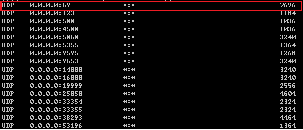

查看是否有进程占用了69端口，上图中可以看到pid为7696的进程占用了69端口。再使用如下命令查看7696进程的名称，打印例如[图2](#_Ref413161472)所示。

tasklist|findstr "7696"

**图 2**  查看指定PID的进程名称  

然后在进程管理器中杀掉该进程即可。

## 如果是64位的PC且只安装了64位版本的JRE？

**问题描述**

PC安装了64位版本的JRE，打开ToolPlatform时报错，该怎么办？

**解决办法**

因ToolPlatform依赖32位JRE版本，故在使用ToolPlatform前，请先登录JRE官网，下载并安装对应JRE版本的Windows x86的版本，网址如下：[http://www.oracle.com/technetwork/java/javase/downloads/](http://www.oracle.com/technetwork/java/javase/downloads/)

另，ToolPlatform-XXX-4.0.15以后的版本已经内置JRE程序，无需再次安装JRE。

## 非中文语言系统无法烧写中文路径镜像

**问题描述**

如果系统为非中文系统，工具传入中文路径系统是无法进行烧写的，查看语言系统的方法，在cmd下输入chcp命令即可查询，如图 查询windows语言系统方法所示，437表示为美国语言系统，如果是936，则表示中文语言系统。

**图 1**  查询windows语言系统方法  
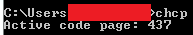

**解决办法**

非中文语言系统不支持带中文路径的镜像，将烧写路径修改英文路径。

# 缩略语

<table><tbody><tr id="row182mcpsimp"><td class="cellrowborder" colspan="2" valign="top">
<strong id="b185mcpsimp">A</strong>

</td>
</tr>
<tr id="row187mcpsimp"><td class="cellrowborder" valign="top" width="23%">
AXI

</td>
<td class="cellrowborder" valign="top" width="77%">
Advanced eXtensible Interface

</td>
</tr>
<tr id="row195mcpsimp"><td class="cellrowborder" colspan="2" valign="top">
<strong id="b198mcpsimp">D</strong>

</td>
</tr>
<tr id="row200mcpsimp"><td class="cellrowborder" valign="top" width="23%">
DDR

</td>
<td class="cellrowborder" valign="top" width="77%">
Double Data Rate

</td>
</tr>
<tr id="row208mcpsimp"><td class="cellrowborder" colspan="2" valign="top">
<strong id="b211mcpsimp">E</strong>

</td>
</tr>
<tr id="row213mcpsimp"><td class="cellrowborder" valign="top" width="23%">
eMMC

</td>
<td class="cellrowborder" valign="top" width="77%">
Embedded MultiMediaCard

</td>
</tr>
<tr id="row221mcpsimp"><td class="cellrowborder" colspan="2" valign="top">
<strong id="b224mcpsimp">G</strong>

</td>
</tr>
<tr id="row226mcpsimp"><td class="cellrowborder" valign="top" width="23%">
GPIO

</td>
<td class="cellrowborder" valign="top" width="77%">
General Purpose Input Output

</td>
</tr>
<tr id="row234mcpsimp"><td class="cellrowborder" colspan="2" valign="top">
<strong id="b237mcpsimp">H</strong>

</td>
</tr>
<tr id="row239mcpsimp"><td class="cellrowborder" valign="top" width="23%">
HDMI

</td>
<td class="cellrowborder" valign="top" width="77%">
High Definition Multimedia Interface

</td>
</tr>
<tr id="row247mcpsimp"><td class="cellrowborder" colspan="2" valign="top">
<strong id="b250mcpsimp">N</strong>

</td>
</tr>
<tr id="row252mcpsimp"><td class="cellrowborder" valign="top" width="23%">
NAND

</td>
<td class="cellrowborder" valign="top" width="77%">
NAND

</td>
</tr>
<tr id="row260mcpsimp"><td class="cellrowborder" colspan="2" valign="top">
<strong id="b263mcpsimp">P</strong>

</td>
</tr>
<tr id="row265mcpsimp"><td class="cellrowborder" valign="top" width="23%">
PID

</td>
<td class="cellrowborder" valign="top" width="77%">
Process Identification

</td>
</tr>
</tbody>
</table>

