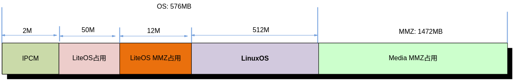

# 前言<a name="ZH-CN_TOPIC_0000002424361074"></a>

**概述<a name="section4537382116410"></a>**

本文为进行小型化开发的程序员而写，目的是介绍在单板上进行Linux开发、裁剪、优化及使用注意事项等内容。

> **说明：** 
>未有特殊说明，SS927V100与SS928V100内容完全一致。

**产品版本<a name="section25718263411"></a>**

与本文档相对应的产品版本如下。

<a name="table1233317181949"></a>
<table><thead align="left"><tr id="row103955189411"><th class="cellrowborder" valign="top" width="31.759999999999998%" id="mcps1.1.3.1.1"><p id="p13395161815412"><a name="p13395161815412"></a><a name="p13395161815412"></a>产品名称</p>
</th>
<th class="cellrowborder" valign="top" width="68.24%" id="mcps1.1.3.1.2"><p id="p33951518144"><a name="p33951518144"></a><a name="p33951518144"></a>产品版本</p>
</th>
</tr>
</thead>
<tbody><tr id="row039571815420"><td class="cellrowborder" valign="top" width="31.759999999999998%" headers="mcps1.1.3.1.1 "><p id="p939510182419"><a name="p939510182419"></a><a name="p939510182419"></a>SS626</p>
</td>
<td class="cellrowborder" valign="top" width="68.24%" headers="mcps1.1.3.1.2 "><p id="p93951718242"><a name="p93951718242"></a><a name="p93951718242"></a>V100</p>
</td>
</tr>
<tr id="row188062423511"><td class="cellrowborder" valign="top" width="31.759999999999998%" headers="mcps1.1.3.1.1 "><p id="p208065421519"><a name="p208065421519"></a><a name="p208065421519"></a>SS928</p>
</td>
<td class="cellrowborder" valign="top" width="68.24%" headers="mcps1.1.3.1.2 "><p id="p168061342157"><a name="p168061342157"></a><a name="p168061342157"></a>V100</p>
</td>
</tr>
<tr id="row31204306217"><td class="cellrowborder" valign="top" width="31.759999999999998%" headers="mcps1.1.3.1.1 "><p id="p8622349102117"><a name="p8622349102117"></a><a name="p8622349102117"></a>SS927</p>
</td>
<td class="cellrowborder" valign="top" width="68.24%" headers="mcps1.1.3.1.2 "><p id="p9185184311112"><a name="p9185184311112"></a><a name="p9185184311112"></a>V100</p>
</td>
</tr>
</tbody>
</table>

**读者对象<a name="section51625422047"></a>**

本文档（本指南）主要适用于以下工程师：

-   技术支持工程师
-   软件开发工程师

**修改记录<a name="section2467512116410"></a>**

<a name="table126443203200"></a>
<table><thead align="left"><tr id="row264516207203"><th class="cellrowborder" valign="top" width="20.72%" id="mcps1.1.4.1.1"><p id="p146456203200"><a name="p146456203200"></a><a name="p146456203200"></a><strong id="b8645172022010"><a name="b8645172022010"></a><a name="b8645172022010"></a>文档版本</strong></p>
</th>
<th class="cellrowborder" valign="top" width="26.119999999999997%" id="mcps1.1.4.1.2"><p id="p364512062019"><a name="p364512062019"></a><a name="p364512062019"></a><strong id="b1464512200200"><a name="b1464512200200"></a><a name="b1464512200200"></a>发布日期</strong></p>
</th>
<th class="cellrowborder" valign="top" width="53.16%" id="mcps1.1.4.1.3"><p id="p664522018206"><a name="p664522018206"></a><a name="p664522018206"></a><strong id="b156451420152010"><a name="b156451420152010"></a><a name="b156451420152010"></a>修改说明</strong></p>
</th>
</tr>
</thead>
<tbody><tr id="row56451520182017"><td class="cellrowborder" valign="top" width="20.72%" headers="mcps1.1.4.1.1 "><p id="p1564572014209"><a name="p1564572014209"></a><a name="p1564572014209"></a>00B01</p>
</td>
<td class="cellrowborder" valign="top" width="26.119999999999997%" headers="mcps1.1.4.1.2 "><p id="p126451920132014"><a name="p126451920132014"></a><a name="p126451920132014"></a>2025-09-15</p>
</td>
<td class="cellrowborder" valign="top" width="53.16%" headers="mcps1.1.4.1.3 "><p id="p1664582017209"><a name="p1664582017209"></a><a name="p1664582017209"></a>第1次临时版本发布。</p>
</td>
</tr>
</tbody>
</table>

# 综述<a name="ZH-CN_TOPIC_0000002424361086"></a>

DDR小型化可以从多个方向入手：uboot、kernel、filesys、SDK、APP都可以在内存使用上做一定程度的优化。本文主要是对SDK和APP的小型化进行简单的说明。

基于 SS626V100的SDK目前支持运行Linux和liteos双系统或单linux系统，如业务场景只需运行单linux系统，可参考《内存布局调整指南》3.2章节裁剪liteos系统相关MMZ占用。本文中默认以Linux和liteos双系统为基础进行描述。SS626V100的系统小型化基于DEMO单板实现，以容量为2G Bytes的DDR内存为例。

**图 1**  DEMO板中Linux系统内存分配图（仅供参考）<a name="fig58516719710"></a>  


其中基于SS626V100典型场景业务的MMZ内存占用数据，请参考《SS626V100 Memory Usage Statistics Report》。此外，客户业务的具体内存占用，需结合具体场景进行分析，下文介绍各模块MMZ内存占用及小型化可优化手段。

# 主要模块工作占用MMZ情况<a name="ZH-CN_TOPIC_0000002424201206"></a>

一般业务中MMZ的占用往往是内存消耗的很大一部分，本章节主要介绍一般业务场景中几个主要模块工作时占用MMZ的情况。


## VI<a name="ZH-CN_TOPIC_0000002424361046"></a>

VI采集状态下最多会占用三个视频帧VB。一个用于当前帧采集，一个用于准备给下一帧采集，一个在轮转流程中（主要是后级模块占用）。

SS928V100中 MMZ占用：

-   vi\(%d\)\_model\_%d：每路pipe需占用两个一定大小模板MMZ内存，大小与通路宽度相关，宽度小于等于4096时大小为16KB。
-   vi\(%d\)\_lmf：每路pipe开启LMF功能时占用MMZ内存，用于存放LMF的系数，固定值4K。
-   vi\(%d\)\_bnr\_mot：每路pipe开启Bayer NR功能时需要占用的motion buffer内存，大小由处理图像大小的宽高决定。
-   vi\(0\)\_bnr\_rnt：每路pipe开启Bayer NR功能时需要占用的rnt内存，大小由处理图像大小的宽高决定；离线时个数由ss\_mpi\_vi\_set\_pipe\_bnr\_buf\_num。
-   接口设置，默认为40块。
-   vi\(0\)\_bnr\_ref%d：每路pipe开启Bayer NR功能时需要占用的时域参考内存，大小由处理图像大小的宽高决定。

## VDEC<a name="ZH-CN_TOPIC_0000002424201210"></a>

VDEC MMZ占用分为buffer占用、轮转占用和设备占用。

**Buffer占用<a name="section389732110912"></a>**

-   vdec\(%d\)\_stream：解码码流Buffer相关内存，为用户指定大小和驱动内部分配之和。SS626V100包括PTS数据存放内存。
-   vfmw\(%d\)\_usd\_buf：用户数据Buffer内存，大小根据用户指定的进行分配。
-   vdec\(%d\)\_adp\_ref：用于存储通道使用vb的相关信息。
-   vdec\(%d\)\_adp\_event：用于存储解码过程中产生的event信息。
-   vfmw\(%d\)\_shr\_img：用于存储解码出图像的相关信息。
-   vdec\_adp\_proc：用于存储mdc侧vdec产生的proc信息。
-   vfmw\_mdc\_shr：用于存储mdc侧vfmw产生的proc信息。

**设备占用<a name="section172822554102"></a>**

-   vfmw\(%d\)\_seg\_buf：SCD切码流后存放内存，与分辨率相关，与协议无关。
-   vfmw\_scd\_msg：SCD逻辑工作时需要的内存，固定值为44Kbytes。
-   vfmw\(%d\)\_vdh\_msg：VDH逻辑工作时需要的内存，与模块参数中设置最大slice个数相关，默认模块参数（slice 600个）时大小为616KBytes。SS626V100此块内存名称为vfmw\_vdh\_msg。
-   vfmw\_vdh\_ext：VDH逻辑工作时需要的内存，与模块参数中设置的最大宽高相关。SS626V100默认模块参数（宽高8192x8192）时大小572KBytes。
-   vfmw\_mdma\_msg：VDH逻辑工作时需要的内存，固定值44KBytes。

**轮转占用<a name="section32020161117"></a>**

-   vdec\(%d\)\_pic\_vb：vb大小和个数都由用户配置。私有vb模式下，大小根据用户配置通道属性中frame\_buf\_size确定，个数根据用户配置通道属性中frame\_buf\_cnt确定。
-   vdec\(%d\)\_tmv\_vb：vb大小和个数都由用户配置。私有vb模式下，大小根据用户配置通道属性中tmv\_buf\_size确定，个数为 “参考帧+1”，其中参考帧个数根据用户配置通道属性中ref\_frame\_num确定。

## VPSS<a name="ZH-CN_TOPIC_0000002457879933"></a>

-   vb\_pool: Group占用两块VB \(前级模块送来：当前工作VB+Backup 帧\)，每个使能通道会获取通道大小的VB（通道模式为Auto时，为后端模块获取），硬件处理完成后会发送到后端绑定模块。如果需要做旋转/二级缩放功能，还需申请中间的临时VB（公共VB）。
-   vpss\(%d\)\_src：每组需占用亮度和MMZ内存资源，约4K大小。
-   vpss\(%d\)\_dci：每组开启DCI功能时占用MMZ内存，约4K大小。
-   vpss\(%d\)\_model：每组需占用一定大小模板MMZ内存。大小与模块参数中的split\_node\_num以及组的max\_width有关。split\_node\_num和max\_width越大，占用大小越大。
-   vpss\(%d\)\_lmf：每组开启LMF功能时占用MMZ内存，用于存放LMF的系数，固定值4K。
-   vpss\(%d\)\_rgn\_luma：每组开启通道亮度和功能时占用MMZ内存，用于存放亮度和统计信息，固定值4K。
-   vmallocinfo：每组上下文需占用一定大小OS内存。总大小与组数量相关，组越多占用越大。

## VGS<a name="ZH-CN_TOPIC_0000002457879973"></a>

VGS模块根据job、node、task数目，分配固定的MMZ内存。

-   vmallocinfo:根据job、task数目及上下文占用OS内存。数目越多占用越大。
-   vgs\_node\_buf:根据node数目，占用一定大小的MMZ内存。数目越多占用越大。

## VENC<a name="ZH-CN_TOPIC_0000002457879945"></a>

-   硬件相关：

    vedu\_hal\_\(%d\)：硬件需要使用的内存，与IP个数相关。

-   通道相关内存（以H264为例，H265则前缀为h265e）：
    -   h264e\(%d\)\_node：寄存器节点配置内存，每个通道一块。
    -   h264e\(%d\)\_str0：码流buffer，每个通道一块。
    -   h264e\(%d\)\_rcn\(%d\)：参考帧重构帧内存，个数与编码参考帧个数相关。
    -   h264e\(%d\)\_info\(%d\)：参考帧重构帧信息内存，个数与编码参考帧个数相关。
    -   h264e\(%d\)\_deblur：通过ss\_mpi\_venc\_set\_deblur 使能去模糊后，需要相应去模糊处理内存。
    -   h264e\(%d\)\_md：通过ss\_mpi\_venc\_set\_md使能MD检测，需要相应的MD检测内存。
    -   venc\(%d\)\_svc：通过ss\_mpi\_venc\_enable\_svc使能SVC，需要相应的SVC内存。
    -   jpege\(%d\)\_stm：jpege码流buffer，每个通道一块。
    -   jpege\(%d\)\_roi\_map：通过ss\_mpi\_venc\_set\_jpeg\_roi\_attr使能roi\_map，为jpege的roi\_map分配内存。
    -   vmallocinfo：各个通道的通道上下文内存；UserData数据；码率控制相关内存。

## VO<a name="ZH-CN_TOPIC_0000002424201194"></a>

VO MMZ占用分为系数MMZ占用、获取亮度和MMZ占用，VB轮转MMZ占用。

-   系数MMZ占用：

    vo\_coef\_buf：回写缩放系数\(128KB\)和多区域配置系数\(8KB\)的内存存放占用, 共计136KB。如果芯片不支持回写缩放，则不会申请对应系数，一个多区域占用4KB内存，两个多区域占用8KB.

-   获取亮度和MMZ占用：

    vo\(%d,%d\)\_luma：VO模块获取视频层和通道亮度和时动态申请MMZ内存占用，某个通道固定占用4KB。如果芯片不支持获取亮度和，则不申请此内存。

-   VB轮转MMZ占用：

    vo\(%d\)\_disp\_buf：vb大小和个数都由用户配置。大小根据用户配置视频层属性img\_size确定，个数根据用户配置视频层属性中display\_buf\_len确定。Single模式下VO会占用3块私有VB用来显示轮转。

    Multi模式下，如果前端绑定VPSS为auto模式，VO会占用4块私有VB用来显示轮转；如果前端为User模式，VO可以不分配VB，此时占用前端模块发送过来的VB，显示完后释放。

## GFBG<a name="ZH-CN_TOPIC_0000002457839817"></a>

加载ko时，用户指定图形层、鼠标层的显示buf大小。支持的图层均可指定，图层id号与vram id号需保证匹配。

例如：insmod gfbg.ko video="gfbg:vram0\_size:32400,vram1\_size:32400,vram2\_size:256,vram3\_size:4052".

-   vram0\_size: 对应gfbg0图形层内存大小，单位KB，对应mmz name= gfbg\_layer0。
-   vram1\_size: 对应gfbg1图形层内存大小，单位KB，对应mmz name= gfbg\_layer1。
-   vram2\_size: 对应gfbg2图形层内存大小，单位KB，对应mmz name= gfbg\_layer2。
-   vram3\_size: 对应gfbg3图形层内存大小，单位KB，对应mmz name= gfbg\_layer3。

## AUDIO<a name="ZH-CN_TOPIC_0000002424201218"></a>

**AI<a name="section1478714716237"></a>**

-   ai\(%d\)\_frm：AI的通道buffer根据chn\_cnt、frame\_num和point\_num\_per\_frame分配。
-   ai\(%d\)\_dma：AI的DMA缓冲区根据chn\_cnt和point\_num\_per\_frame分配。

**AO<a name="section20436157192318"></a>**

-   ao\(%d\)\_dma&frm：AO的DMA缓冲区和通道buffer根据chn\_cnt、frame\_num和point\_num\_per\_frame分配。
-   ao\(%d, %d\)\_cir：音频帧buffer根据frame\_num和point\_num\_per\_frame分配。

**AENC<a name="section339816212241"></a>**

-   aenc\(%d\)\_strm：码流buffer根据buf\_size分配。
-   aenc\(%d\)\_cir：环形缓冲区根据编码通道数分配。

## REGION<a name="ZH-CN_TOPIC_0000002457879941"></a>

**区域信息上下文节点<a name="section15813751132413"></a>**

去掉不必要的模块可以减少内存的占用，如：

-   模块加载时分配的1024个区域信息上下文节点，占用os内存4kb。区域信息上下文在创建区域时动态分配。
-   如果是overlay或者是overlayex类型的区域，还会创建乒乓buff用于存放位图数据。
-   rgn\_pin\_pon\_\(%d\)：乒乓buff的大小由用户设置的width，height，canvas\_num和颜色格式决定，占用MMZ内存。

**通道管理信息节点<a name="section16571145662413"></a>**

其他模块调用REGION的函数向REGION注册信息时动态分配，占用MMZ内存。

## TDE<a name="ZH-CN_TOPIC_0000002457839825"></a>

通道使用MMZ，为固定值总大小：\(OT\_TDE\_CMD\_NUM\) \* 64 + \(OT\_TDE\_JOB\_NUM\) \* 96 + \(OT\_TDE\_NODE\_NUM\) \* 256 +\(OT\_TDE\_FILTER\_NUM\) \* 1024。

## SVP<a name="ZH-CN_TOPIC_0000002457839801"></a>

**SVP\_NNN<a name="section14631148142915"></a>**

SVP\_NNN内存占用分为MMZ内存和os内存，其中MMZ内存包括任务节点和推理内容内存。

-   节点MMZ占用：

    内核态节点的大小，默认值100KB；

    用户态节点的大小，默认值80KB。

-   推理MMZ占用（Resnet50 Batch 1典型场景）：

    OM内存大小，值50828KB；

    输入输出数据内存大小，值8596KB；

    模型信息内存大小，值12KB。

-   OS内存占用：

    OS内存主要包括两部分：静态全局变量的内存，大小大约5.6KB；动态内存，大小大约0.594KB。

    > **说明：** 
    >SS927V100不支持SVP\_NNN模块。

**IVE<a name="section8594155332913"></a>**

IVE内存占用分为MMZ内存和os内存，其中MMZ内存包括任务链表和辅助内存。

-   任务链表MMZ占用：

    ive\_queue: IVE任务链表的大小，默认为212KB。

-   辅助MMZ内存占用：
    -   ive\_tmp\_node: IVE的多算子组合任务需要的临时节点，固定值4KB。
    -   Md\_proc: MDproc信息需要的MMZ内存，固定值8KB。
    -   ive\_resize\_param: resize算子计算需要的辅助内存，固定值9264Byte.
    -   ive\_yuv\_to\_hsv\_table: ive颜色空间转换存放table的辅助内存，固定值2048Byte
    -   ive\_yuv\_to\_lab\_table: ive颜色空间转化存放table的辅助内存，固定值6656Byte

-   OS内存占用：

    ive占用的OS内存主要分为kmalloc开辟的内存和静态全局变量占用内存，OS内存加mmz内存不超过235KB。

**KCF<a name="section1226215919298"></a>**

KCF内存占用分为MMZ内存和OS内存，其中MMZ内存包括任务链表和辅助内存。

-   任务链表MMZ占用：

    kcf\_queue: KCF任务链表的大小，固定值106688Byte。

-   辅助MMZ内存占用：

    kcf\_param: KCF计算需要的辅助内存，固定值45328Byte。

-   OS内存占用：

    KCF占用的OS内存主要分为kmalloc开辟的内存和静态全局变量占用内存，OS内存加mmz内存不超过150KB。

**MAU<a name="section4581452303"></a>**

MAU内存主要分为MMZ内存和OS内存，其中MMZ内存为任务链表的内存。

-   任务链表占用：

    svp\_mau\_queue: MAU任务链表的大小，默认160KB。

-   OS内存占用：

    MAU 占用的os内存主要有mem\_info链表内存使用os内存，mem\_info链表内存占用\(40 \* mau\_max\_mem\_info\_num\)Byte，以及mau上下文的静态全局变量占用的内存。os内存加mmz内存总共不超过163KB。

## PCIV<a name="ZH-CN_TOPIC_0000002457839793"></a>

PCIV MMZ占用分为pcie-mcc消息池占用、window占用、VB轮转占用。

-   pcie-mcc消息池占用：

    用于pcie-mcc消息通信，在加载从片pcie驱动时指定位置与大小，大小固定为1M。

-   window占用：

    主片发起DMA操作时，从片空间只能在窗口上读写，加载osal驱动时指定mmz名为window，默认大小7M，起始位置紧跟pcie-mcc消息池之后\(pcie-mcc消息池+window连续空间最大8M\)。

-   VB轮转占用：
    -   主片轮转VB：VB大小和个数由用户配置，大小必须保证能接收完整图像，一般根据通道属性中的图像宽高，格式属性等确定；分配释放由用户调用接口控制；接收从片图像时，轮转VB往后传，通过查询后端占用情况决定是否接收下一次轮转。
    -   从片轮转VB：从片接收前端图像，如果是VPSS使用auto模式送帧，则由pciv获取VB，其他模式则接受图像时占用VB；直通模式\(PCIV透传\)则DMA发送完成释放VB;非直通模式\(OSD、缩放等操作\)，需要获取VGS写出VB，并释放接收图像VB，DMA发送完成后，释放VGS写出VB。

## GDC<a name="ZH-CN_TOPIC_0000002424361082"></a>

GDC模块根据job、node、task数目，分配固定的MMZ内存。

-   vmallocinfo:根据job、task数目及上下文占用OS内存。数目越多占用越大。
-   gdc\_node\_buf:根据node数目，占用一定大小的MMZ内存。数目越多占用越大。
-   gdc\_int\_pole\_coef:存储插值系数需要的MMZ内存，固定值4KB。

## CIPHER<a name="ZH-CN_TOPIC_0000002457879957"></a>

固定大小（驱动内部确定申请的MMZ内存的长度）

-   Hash初始化：给SHA节点链表分配内存，固定值28 \*255\* 1=7KB；255作为链表最大深度，最小深度为2；HASH消息的DMA内存：逻辑只识别物理内存，需要申请最大的64KB物理内存存储hash消息。
-   Cipher驱动模块初始化：给CIPHER节点链表分配内存entry list size（20KB），用来存放16个通道每个通道CCM GCM aad的物理内存padding buffer（2KB），固定值22KB。

非固定大小（由用户层接口传入的MMZ内存申请的长度）。

cipher加解密：依赖虚拟地址/物理地址加解密接口的参数byte\_len。

## DCC<a name="ZH-CN_TOPIC_0000002424361058"></a>

dcc\_msg\_buf：SS626V100使用，用于双核通信任务。

## VDA<a name="ZH-CN_TOPIC_0000002457879965"></a>

vda\(%d\)：通道内部计算结果存储相关内存，主要包括SAD结果内存、RGN运动区域信息内存和背景。

## ISP<a name="ZH-CN_TOPIC_0000002457839813"></a>

-   isp\[%d\].vreg\[%d\]：外部虚拟寄存器内存。
-   isp\[%d\].proc：用户态算法proc调试信息。
-   isp\[%d\].trans：dng, dcf, colorgammut等信息内存。
-   isp\[%d\].ldci：ldci算法内存。
-   isp\[%d\].clut：clut算法内存。
-   be\_lut\_stt\[%d\]：be lut信息内存。
-   pre\_on\_lut\_stt\[%d\]：在线通路ADVANCED模式be lut信息内存。
-   isp\[%d\].stat：统计信息（FE,BE）内存。
-   isp\[%d\].fe\_stat：FE统计信息内存。
-   isp\[%d\].wdr：wdr算法内存。
-   isp\[%d\].drc：drc算法内存。
-   isp\[%d\].be\_cfg：离线通路be config buffer。
-   isp\[%d\].be\_stt\_on：在线通路be统计信息内存。
-   isp\[%d\].fe\_stt：fe统计信息内存。
-   isp\[%d\].be\_stt：离线通路be统计信息内存。
-   isp\[%d\].stit\_fe：拼接通路fe统计信息内存。
-   isp\[%d\].stit\_be：拼接通路be统计信息内存。

## HNR<a name="ZH-CN_TOPIC_0000002424201214"></a>

-   hnr\_pqp\_buf\[%d\]：hnr模型文件内存。
-   hnr\_ping\_pong\_buf：hnr模型推理使用的工作内存。

    开启HNR功能参考帧模式需要多占用4\~6个视频帧VB，无参考帧模式需要多占用1个视频帧VB。

# 各模块内存相关可优化配置<a name="ZH-CN_TOPIC_0000002424201226"></a>


## VB<a name="ZH-CN_TOPIC_0000002424201202"></a>

<a name="table626mcpsimp"></a>
<table><thead align="left"><tr id="row635mcpsimp"><th class="cellrowborder" valign="top" width="10.80897348742352%" id="mcps1.1.7.1.1"><p id="p637mcpsimp"><a name="p637mcpsimp"></a><a name="p637mcpsimp"></a>措施</p>
</th>
<th class="cellrowborder" valign="top" width="11.197436146450421%" id="mcps1.1.7.1.2"><p id="p639mcpsimp"><a name="p639mcpsimp"></a><a name="p639mcpsimp"></a>相关模块参数/接口</p>
</th>
<th class="cellrowborder" valign="top" width="17.568223754491598%" id="mcps1.1.7.1.3"><p id="p641mcpsimp"><a name="p641mcpsimp"></a><a name="p641mcpsimp"></a>收益</p>
</th>
<th class="cellrowborder" valign="top" width="6.798096532970768%" id="mcps1.1.7.1.4"><p id="p643mcpsimp"><a name="p643mcpsimp"></a><a name="p643mcpsimp"></a>影响</p>
</th>
<th class="cellrowborder" valign="top" width="34.26240652617267%" id="mcps1.1.7.1.5"><p id="p645mcpsimp"><a name="p645mcpsimp"></a><a name="p645mcpsimp"></a>注意</p>
</th>
<th class="cellrowborder" valign="top" width="19.364863552491016%" id="mcps1.1.7.1.6"><p id="p647mcpsimp"><a name="p647mcpsimp"></a><a name="p647mcpsimp"></a>proc信息</p>
</th>
</tr>
</thead>
<tbody><tr id="row672311199166"><td class="cellrowborder" valign="top" width="10.80897348742352%" headers="mcps1.1.7.1.1 "><p id="p045852610166"><a name="p045852610166"></a><a name="p045852610166"></a>检查是否有vb池的vb个数设置过多</p>
</td>
<td class="cellrowborder" valign="top" width="11.197436146450421%" headers="mcps1.1.7.1.2 "><p id="p238171916718"><a name="p238171916718"></a><a name="p238171916718"></a>略</p>
</td>
<td class="cellrowborder" valign="top" width="17.568223754491598%" headers="mcps1.1.7.1.3 "><p id="p9100754101120"><a name="p9100754101120"></a><a name="p9100754101120"></a>mini_free不为0的pool id里的VB块个数设置过多，可以再减去mini_free个。</p>
</td>
<td class="cellrowborder" valign="top" width="6.798096532970768%" headers="mcps1.1.7.1.4 "><p id="p67241519151610"><a name="p67241519151610"></a><a name="p67241519151610"></a>-</p>
</td>
<td class="cellrowborder" valign="top" width="34.26240652617267%" headers="mcps1.1.7.1.5 "><p id="p572411981616"><a name="p572411981616"></a><a name="p572411981616"></a>公共VB池、模块VB池、UserVB池的个数设置参见《MPP 媒体处理软件 V5.0 开发参考》“系统控制章节”的VB相关接口。</p>
<p id="p187074211157"><a name="p187074211157"></a><a name="p187074211157"></a>PrivateVB池的个数设置需要到相关模块的接口里找到对应的参数。</p>
</td>
<td class="cellrowborder" valign="top" width="19.364863552491016%" headers="mcps1.1.7.1.6 "><p id="p1372417193163"><a name="p1372417193163"></a><a name="p1372417193163"></a>mini_free：vb个数的历史最小余量</p>
</td>
</tr>
<tr id="row66990531976"><td class="cellrowborder" valign="top" width="10.80897348742352%" headers="mcps1.1.7.1.1 "><p id="p166994531176"><a name="p166994531176"></a><a name="p166994531176"></a>检查是否有VB块size设置过大</p>
</td>
<td class="cellrowborder" valign="top" width="11.197436146450421%" headers="mcps1.1.7.1.2 "><p id="p176991153275"><a name="p176991153275"></a><a name="p176991153275"></a>略</p>
</td>
<td class="cellrowborder" valign="top" width="17.568223754491598%" headers="mcps1.1.7.1.3 "><p id="p116994536714"><a name="p116994536714"></a><a name="p116994536714"></a>free_bytes不为0的VB块size分大了，可以再减去free_bytes。</p>
</td>
<td class="cellrowborder" valign="top" width="6.798096532970768%" headers="mcps1.1.7.1.4 "><p id="p12699753174"><a name="p12699753174"></a><a name="p12699753174"></a>-</p>
</td>
<td class="cellrowborder" valign="top" width="34.26240652617267%" headers="mcps1.1.7.1.5 "><p id="p4276361092"><a name="p4276361092"></a><a name="p4276361092"></a>公共VB池、模块VB池、UserVB池的VB块大小设置参见《MPP 媒体处理软件 V5.0 FAQ》“系统控制章节”的VB相关接口。</p>
<p id="p162712362916"><a name="p162712362916"></a><a name="p162712362916"></a>PrivateVB池的个数设置需要到相关模块的接口里找到对应的参数。</p>
</td>
<td class="cellrowborder" valign="top" width="19.364863552491016%" headers="mcps1.1.7.1.6 "><p id="p869916538718"><a name="p869916538718"></a><a name="p869916538718"></a>free_bytes：vb块的实时剩余bytes</p>
<p id="p109046282137"><a name="p109046282137"></a><a name="p109046282137"></a>get：获取vb块的模块，通过此信息可以判断具体哪个模块的VB块size分大了</p>
</td>
</tr>
</tbody>
</table>

## SYS<a name="ZH-CN_TOPIC_0000002457879949"></a>

<a name="table626mcpsimp"></a>
<table><thead align="left"><tr id="row635mcpsimp"><th class="cellrowborder" valign="top" width="16.6016601660166%" id="mcps1.1.7.1.1"><p id="p637mcpsimp"><a name="p637mcpsimp"></a><a name="p637mcpsimp"></a>措施</p>
</th>
<th class="cellrowborder" valign="top" width="16.56165616561656%" id="mcps1.1.7.1.2"><p id="p639mcpsimp"><a name="p639mcpsimp"></a><a name="p639mcpsimp"></a>相关模块参数/接口</p>
</th>
<th class="cellrowborder" valign="top" width="18.55185518551855%" id="mcps1.1.7.1.3"><p id="p641mcpsimp"><a name="p641mcpsimp"></a><a name="p641mcpsimp"></a>收益</p>
</th>
<th class="cellrowborder" valign="top" width="5.5205520552055205%" id="mcps1.1.7.1.4"><p id="p643mcpsimp"><a name="p643mcpsimp"></a><a name="p643mcpsimp"></a>影响</p>
</th>
<th class="cellrowborder" valign="top" width="33.913391339133916%" id="mcps1.1.7.1.5"><p id="p645mcpsimp"><a name="p645mcpsimp"></a><a name="p645mcpsimp"></a>注意</p>
</th>
<th class="cellrowborder" valign="top" width="8.85088508850885%" id="mcps1.1.7.1.6"><p id="p647mcpsimp"><a name="p647mcpsimp"></a><a name="p647mcpsimp"></a>proc信息</p>
</th>
</tr>
</thead>
<tbody><tr id="row672311199166"><td class="cellrowborder" valign="top" width="16.6016601660166%" headers="mcps1.1.7.1.1 "><p id="p045852610166"><a name="p045852610166"></a><a name="p045852610166"></a>设置调度模式为OT_SCHEDULE_QUICK</p>
</td>
<td class="cellrowborder" valign="top" width="16.56165616561656%" headers="mcps1.1.7.1.2 "><p id="p272461951613"><a name="p272461951613"></a><a name="p272461951613"></a>ss_mpi_sys_set_schedule_mode</p>
</td>
<td class="cellrowborder" valign="top" width="18.55185518551855%" headers="mcps1.1.7.1.3 "><p id="p472411991616"><a name="p472411991616"></a><a name="p472411991616"></a>加速vb轮转，可以减少vb分配</p>
</td>
<td class="cellrowborder" valign="top" width="5.5205520552055205%" headers="mcps1.1.7.1.4 "><p id="p67241519151610"><a name="p67241519151610"></a><a name="p67241519151610"></a>-</p>
</td>
<td class="cellrowborder" valign="top" width="33.913391339133916%" headers="mcps1.1.7.1.5 "><p id="p572411981616"><a name="p572411981616"></a><a name="p572411981616"></a>具体操作和注意事项请参考《MPP 媒体处理软件 V5.0 FAQ》的“1.9 Quick schedule”注意事项</p>
</td>
<td class="cellrowborder" valign="top" width="8.85088508850885%" headers="mcps1.1.7.1.6 "><p id="p1372417193163"><a name="p1372417193163"></a><a name="p1372417193163"></a>-</p>
</td>
</tr>
<tr id="row1245111561610"><td class="cellrowborder" valign="top" width="16.6016601660166%" headers="mcps1.1.7.1.1 "><p id="p19934174519167"><a name="p19934174519167"></a><a name="p19934174519167"></a>关闭logmpp_mdc</p>
</td>
<td class="cellrowborder" valign="top" width="16.56165616561656%" headers="mcps1.1.7.1.2 "><p id="p10952769391"><a name="p10952769391"></a><a name="p10952769391"></a>g_mdc_log_enable</p>
</td>
<td class="cellrowborder" valign="top" width="18.55185518551855%" headers="mcps1.1.7.1.3 "><p id="p11931645141616"><a name="p11931645141616"></a><a name="p11931645141616"></a>节省logmpp_mdc日志68K</p>
</td>
<td class="cellrowborder" valign="top" width="5.5205520552055205%" headers="mcps1.1.7.1.4 "><p id="p15930184513162"><a name="p15930184513162"></a><a name="p15930184513162"></a>-</p>
</td>
<td class="cellrowborder" valign="top" width="33.913391339133916%" headers="mcps1.1.7.1.5 "><a name="ul5953174413428"></a><a name="ul5953174413428"></a><ul id="ul5953174413428"><li>在插入xx_base.ko时设置模块参数g_mdc_log_enable=0</li><li>SS626V100 支持</li></ul>
</td>
<td class="cellrowborder" valign="top" width="8.85088508850885%" headers="mcps1.1.7.1.6 "><p id="p1592917457166"><a name="p1592917457166"></a><a name="p1592917457166"></a>-</p>
</td>
</tr>
<tr id="row14135125317368"><td class="cellrowborder" valign="top" width="16.6016601660166%" headers="mcps1.1.7.1.1 "><p id="p8928154571619"><a name="p8928154571619"></a><a name="p8928154571619"></a>去除MDC侧内存分配</p>
</td>
<td class="cellrowborder" valign="top" width="16.56165616561656%" headers="mcps1.1.7.1.2 "><p id="p1616120012812"><a name="p1616120012812"></a><a name="p1616120012812"></a>-</p>
</td>
<td class="cellrowborder" valign="top" width="18.55185518551855%" headers="mcps1.1.7.1.3 "><p id="p119414588245"><a name="p119414588245"></a><a name="p119414588245"></a>不需要加载：xx_dcc.ko、xx_vdec_adapt.ko</p>
</td>
<td class="cellrowborder" valign="top" width="5.5205520552055205%" headers="mcps1.1.7.1.4 "><p id="p2819188142613"><a name="p2819188142613"></a><a name="p2819188142613"></a>-</p>
</td>
<td class="cellrowborder" valign="top" width="33.913391339133916%" headers="mcps1.1.7.1.5 "><a name="ul07781240164419"></a><a name="ul07781240164419"></a><ul id="ul07781240164419"><li>参考文档《内存布局调整指南》</li><li>ss_mpi_vdec_set_chn_config：deployment_mode设置为OT_VDEC_DEPLOYMENT_MODE0</li><li>SS626V100 支持</li></ul>
</td>
<td class="cellrowborder" valign="top" width="8.85088508850885%" headers="mcps1.1.7.1.6 "><p id="p179233459165"><a name="p179233459165"></a><a name="p179233459165"></a>-</p>
</td>
</tr>
</tbody>
</table>

## VI<a name="ZH-CN_TOPIC_0000002457879929"></a>

<a name="table131881116404"></a>
<table><thead align="left"><tr id="row1118913161008"><th class="cellrowborder" valign="top" width="17.39%" id="mcps1.1.7.1.1"><p id="p171891516307"><a name="p171891516307"></a><a name="p171891516307"></a>措施</p>
</th>
<th class="cellrowborder" valign="top" width="16.259999999999998%" id="mcps1.1.7.1.2"><p id="p181891616508"><a name="p181891616508"></a><a name="p181891616508"></a>相关接口</p>
</th>
<th class="cellrowborder" valign="top" width="18.96%" id="mcps1.1.7.1.3"><p id="p171897165014"><a name="p171897165014"></a><a name="p171897165014"></a>收益</p>
</th>
<th class="cellrowborder" valign="top" width="15.28%" id="mcps1.1.7.1.4"><p id="p6189111610012"><a name="p6189111610012"></a><a name="p6189111610012"></a>影响</p>
</th>
<th class="cellrowborder" valign="top" width="11.88%" id="mcps1.1.7.1.5"><p id="p18189161613018"><a name="p18189161613018"></a><a name="p18189161613018"></a>注意</p>
</th>
<th class="cellrowborder" valign="top" width="20.23%" id="mcps1.1.7.1.6"><p id="p1189111619018"><a name="p1189111619018"></a><a name="p1189111619018"></a>proc信息</p>
</th>
</tr>
</thead>
<tbody><tr id="row121893162017"><td class="cellrowborder" valign="top" width="17.39%" headers="mcps1.1.7.1.1 "><p id="p101895160012"><a name="p101895160012"></a><a name="p101895160012"></a>开启 Early/Early_end机制</p>
</td>
<td class="cellrowborder" valign="top" width="16.259999999999998%" headers="mcps1.1.7.1.2 "><p id="p35557121739"><a name="p35557121739"></a><a name="p35557121739"></a>ss_mpi_vi_set_pipe_frame_interrupt_attr</p>
</td>
<td class="cellrowborder" valign="top" width="18.96%" headers="mcps1.1.7.1.3 "><p id="p41899164014"><a name="p41899164014"></a><a name="p41899164014"></a>线性或者在线WDR，节省一个VB；离线WDR(2路)，节省两个VB</p>
</td>
<td class="cellrowborder" valign="top" width="15.28%" headers="mcps1.1.7.1.4 "><p id="p61891216901"><a name="p61891216901"></a><a name="p61891216901"></a>VI采集响应的中断数翻倍</p>
</td>
<td class="cellrowborder" valign="top" width="11.88%" headers="mcps1.1.7.1.5 "><p id="p0189111610018"><a name="p0189111610018"></a><a name="p0189111610018"></a>-</p>
</td>
<td class="cellrowborder" valign="top" width="20.23%" headers="mcps1.1.7.1.6 "><p id="p181897164011"><a name="p181897164011"></a><a name="p181897164011"></a>vi pipe frame interrupt attr:</p>
<p id="p52761528981"><a name="p52761528981"></a><a name="p52761528981"></a>interrupt_type</p>
</td>
</tr>
<tr id="row79767550392"><td class="cellrowborder" valign="top" width="17.39%" headers="mcps1.1.7.1.1 "><p id="p1797714558391"><a name="p1797714558391"></a><a name="p1797714558391"></a>chn输出设置压缩</p>
</td>
<td class="cellrowborder" valign="top" width="16.259999999999998%" headers="mcps1.1.7.1.2 "><p id="p3977755123917"><a name="p3977755123917"></a><a name="p3977755123917"></a>ss_mpi_vi_set_chn_attr</p>
</td>
<td class="cellrowborder" valign="top" width="18.96%" headers="mcps1.1.7.1.3 "><p id="p850653417418"><a name="p850653417418"></a><a name="p850653417418"></a>压缩比不压缩情况要更节省内存和带宽</p>
</td>
<td class="cellrowborder" valign="top" width="15.28%" headers="mcps1.1.7.1.4 "><p id="p697714553393"><a name="p697714553393"></a><a name="p697714553393"></a>-</p>
</td>
<td class="cellrowborder" valign="top" width="11.88%" headers="mcps1.1.7.1.5 "><p id="p497735543915"><a name="p497735543915"></a><a name="p497735543915"></a>-</p>
</td>
<td class="cellrowborder" valign="top" width="20.23%" headers="mcps1.1.7.1.6 "><a name="ul14706112944616"></a><a name="ul14706112944616"></a><ul id="ul14706112944616"><li>SS928V100：vi phys chn attr1:<p id="p9429133620436"><a name="p9429133620436"></a><a name="p9429133620436"></a>compress_mode</p>
</li><li>其他：vi phychn attr 2:<p id="p13774436174218"><a name="p13774436174218"></a><a name="p13774436174218"></a>compress_mode</p>
</li></ul>
</td>
</tr>
<tr id="row418971615018"><td class="cellrowborder" valign="top" width="17.39%" headers="mcps1.1.7.1.1 "><p id="p51891116706"><a name="p51891116706"></a><a name="p51891116706"></a>在线WDR行模式卷绕</p>
</td>
<td class="cellrowborder" valign="top" width="16.259999999999998%" headers="mcps1.1.7.1.2 "><p id="p91906168018"><a name="p91906168018"></a><a name="p91906168018"></a>ss_mpi_vi_set_wdr_fusion_grp_attr</p>
</td>
<td class="cellrowborder" valign="top" width="18.96%" headers="mcps1.1.7.1.3 "><p id="p131901916309"><a name="p131901916309"></a><a name="p131901916309"></a>默认不卷绕，根据配置的cache_line节省内存</p>
</td>
<td class="cellrowborder" valign="top" width="15.28%" headers="mcps1.1.7.1.4 "><p id="p1619017161701"><a name="p1619017161701"></a><a name="p1619017161701"></a>cache_line配置过小时可能导致图像分层</p>
</td>
<td class="cellrowborder" valign="top" width="11.88%" headers="mcps1.1.7.1.5 "><p id="p191902161105"><a name="p191902161105"></a><a name="p191902161105"></a>SS928V100支持</p>
</td>
<td class="cellrowborder" valign="top" width="20.23%" headers="mcps1.1.7.1.6 "><p id="p219011617015"><a name="p219011617015"></a><a name="p219011617015"></a>vi wdr fusion grp attr：cache_line</p>
</td>
</tr>
<tr id="row425112112382"><td class="cellrowborder" valign="top" width="17.39%" headers="mcps1.1.7.1.1 "><p id="p17261021143819"><a name="p17261021143819"></a><a name="p17261021143819"></a>pipe设置压缩输出</p>
</td>
<td class="cellrowborder" valign="top" width="16.259999999999998%" headers="mcps1.1.7.1.2 "><p id="p19261821133820"><a name="p19261821133820"></a><a name="p19261821133820"></a>ss_mpi_vi_set_pipe_attr</p>
</td>
<td class="cellrowborder" valign="top" width="18.96%" headers="mcps1.1.7.1.3 "><p id="p326221143810"><a name="p326221143810"></a><a name="p326221143810"></a>压缩比不压缩情况要更节省内存和带宽</p>
</td>
<td class="cellrowborder" valign="top" width="15.28%" headers="mcps1.1.7.1.4 "><p id="p1426102114386"><a name="p1426102114386"></a><a name="p1426102114386"></a>-</p>
</td>
<td class="cellrowborder" valign="top" width="11.88%" headers="mcps1.1.7.1.5 "><p id="p1226122111388"><a name="p1226122111388"></a><a name="p1226122111388"></a>SS928V100支持</p>
</td>
<td class="cellrowborder" valign="top" width="20.23%" headers="mcps1.1.7.1.6 "><p id="p126921113816"><a name="p126921113816"></a><a name="p126921113816"></a>vi pipe attr1:</p>
<p id="p1112971894317"><a name="p1112971894317"></a><a name="p1112971894317"></a>compress_mode</p>
</td>
</tr>
<tr id="row61901164019"><td class="cellrowborder" valign="top" width="17.39%" headers="mcps1.1.7.1.1 "><p id="p201903161102"><a name="p201903161102"></a><a name="p201903161102"></a>调整VI_VPSS在离线模式</p>
</td>
<td class="cellrowborder" valign="top" width="16.259999999999998%" headers="mcps1.1.7.1.2 "><p id="p1685912519133"><a name="p1685912519133"></a><a name="p1685912519133"></a>ss_mpi_sys_set_vi_vpss_mode</p>
</td>
<td class="cellrowborder" valign="top" width="18.96%" headers="mcps1.1.7.1.3 "><p id="p819016162012"><a name="p819016162012"></a><a name="p819016162012"></a>在线/在离线/离在线通路比全离线通路节省1-2个VB;</p>
</td>
<td class="cellrowborder" valign="top" width="15.28%" headers="mcps1.1.7.1.4 "><p id="p619018161605"><a name="p619018161605"></a><a name="p619018161605"></a>VI在线只能处理一路，VPSS在线无法在VI_CHN做通道后处理相关功能</p>
</td>
<td class="cellrowborder" valign="top" width="11.88%" headers="mcps1.1.7.1.5 "><p id="p2019001618011"><a name="p2019001618011"></a><a name="p2019001618011"></a>SS928V100支持</p>
</td>
<td class="cellrowborder" valign="top" width="20.23%" headers="mcps1.1.7.1.6 "><p id="p61901416900"><a name="p61901416900"></a><a name="p61901416900"></a>vi vpss mode &amp; vi video mode：vi_vpss_mode</p>
</td>
</tr>
<tr id="row1391410280361"><td class="cellrowborder" valign="top" width="17.39%" headers="mcps1.1.7.1.1 "><p id="p189141628173617"><a name="p189141628173617"></a><a name="p189141628173617"></a>调整VI_VIDEO模式</p>
</td>
<td class="cellrowborder" valign="top" width="16.259999999999998%" headers="mcps1.1.7.1.2 "><p id="p4914172816364"><a name="p4914172816364"></a><a name="p4914172816364"></a>ss_mpi_sys_set_vi_video_mode</p>
</td>
<td class="cellrowborder" valign="top" width="18.96%" headers="mcps1.1.7.1.3 "><p id="p8914162833615"><a name="p8914162833615"></a><a name="p8914162833615"></a>normal模式，比advanced模式可节省2块VB</p>
</td>
<td class="cellrowborder" valign="top" width="15.28%" headers="mcps1.1.7.1.4 "><p id="p2914152810361"><a name="p2914152810361"></a><a name="p2914152810361"></a>normal模式 HNR功能在BE前面</p>
</td>
<td class="cellrowborder" valign="top" width="11.88%" headers="mcps1.1.7.1.5 "><p id="p1427543315374"><a name="p1427543315374"></a><a name="p1427543315374"></a>SS928V100支持</p>
</td>
<td class="cellrowborder" valign="top" width="20.23%" headers="mcps1.1.7.1.6 "><p id="p1791492823613"><a name="p1791492823613"></a><a name="p1791492823613"></a>vi vpss mode &amp; vi video mode：vi_vpss_mode</p>
</td>
</tr>
<tr id="row194021932153015"><td class="cellrowborder" valign="top" width="17.39%" headers="mcps1.1.7.1.1 "><p id="p11403532113017"><a name="p11403532113017"></a><a name="p11403532113017"></a>调整BayerNR buf_num个数</p>
</td>
<td class="cellrowborder" valign="top" width="16.259999999999998%" headers="mcps1.1.7.1.2 "><p id="p1845374033616"><a name="p1845374033616"></a><a name="p1845374033616"></a>ss_mpi_vi_set_pipe_bnr_buf_num</p>
</td>
<td class="cellrowborder" valign="top" width="18.96%" headers="mcps1.1.7.1.3 "><p id="p16403132193015"><a name="p16403132193015"></a><a name="p16403132193015"></a>默认个数为40个，可根据需离线缓存的YUV调整个数，节省部分内存</p>
</td>
<td class="cellrowborder" valign="top" width="15.28%" headers="mcps1.1.7.1.4 "><p id="p240323223019"><a name="p240323223019"></a><a name="p240323223019"></a>bnr_buf_num主要影响VI连续缓存不释放的YUV个数</p>
</td>
<td class="cellrowborder" valign="top" width="11.88%" headers="mcps1.1.7.1.5 "><p id="p5176194463810"><a name="p5176194463810"></a><a name="p5176194463810"></a>SS928V100支持</p>
</td>
<td class="cellrowborder" valign="top" width="20.23%" headers="mcps1.1.7.1.6 "><p id="p1240383233018"><a name="p1240383233018"></a><a name="p1240383233018"></a>vi pipe bnr buf num:</p>
<p id="p250319140392"><a name="p250319140392"></a><a name="p250319140392"></a>bnr_buf_num</p>
</td>
</tr>
<tr id="row1794717217459"><td class="cellrowborder" valign="top" width="17.39%" headers="mcps1.1.7.1.1 "><p id="p119471121134513"><a name="p119471121134513"></a><a name="p119471121134513"></a>手动关闭 ISP BayerNR功能</p>
</td>
<td class="cellrowborder" valign="top" width="16.259999999999998%" headers="mcps1.1.7.1.2 "><p id="p20607134462"><a name="p20607134462"></a><a name="p20607134462"></a>ss_mpi_isp_set_nr_attr</p>
</td>
<td class="cellrowborder" valign="top" width="18.96%" headers="mcps1.1.7.1.3 "><p id="p49471821174517"><a name="p49471821174517"></a><a name="p49471821174517"></a>关闭BayerNR可节省参考帧等内存和带宽</p>
</td>
<td class="cellrowborder" valign="top" width="15.28%" headers="mcps1.1.7.1.4 "><p id="p189471921174513"><a name="p189471921174513"></a><a name="p189471921174513"></a>影响效果</p>
</td>
<td class="cellrowborder" valign="top" width="11.88%" headers="mcps1.1.7.1.5 "><p id="p12469112194717"><a name="p12469112194717"></a><a name="p12469112194717"></a>SS928V100支持</p>
</td>
<td class="cellrowborder" valign="top" width="20.23%" headers="mcps1.1.7.1.6 "><p id="p1094782144512"><a name="p1094782144512"></a><a name="p1094782144512"></a>bayernr info: enable</p>
</td>
</tr>
</tbody>
</table>

## VDEC<a name="ZH-CN_TOPIC_0000002457839809"></a>

<a name="table626mcpsimp"></a>
<table><thead align="left"><tr id="row635mcpsimp"><th class="cellrowborder" valign="top" width="15.521552155215524%" id="mcps1.1.7.1.1"><p id="p637mcpsimp"><a name="p637mcpsimp"></a><a name="p637mcpsimp"></a>措施</p>
</th>
<th class="cellrowborder" valign="top" width="19.061906190619062%" id="mcps1.1.7.1.2"><p id="p639mcpsimp"><a name="p639mcpsimp"></a><a name="p639mcpsimp"></a>相关模块参数/接口</p>
</th>
<th class="cellrowborder" valign="top" width="17.851785178517854%" id="mcps1.1.7.1.3"><p id="p641mcpsimp"><a name="p641mcpsimp"></a><a name="p641mcpsimp"></a>收益</p>
</th>
<th class="cellrowborder" valign="top" width="16.261626162616263%" id="mcps1.1.7.1.4"><p id="p643mcpsimp"><a name="p643mcpsimp"></a><a name="p643mcpsimp"></a>影响</p>
</th>
<th class="cellrowborder" valign="top" width="11.211121112111213%" id="mcps1.1.7.1.5"><p id="p645mcpsimp"><a name="p645mcpsimp"></a><a name="p645mcpsimp"></a>注意</p>
</th>
<th class="cellrowborder" valign="top" width="20.092009200920096%" id="mcps1.1.7.1.6"><p id="p647mcpsimp"><a name="p647mcpsimp"></a><a name="p647mcpsimp"></a>proc信息</p>
</th>
</tr>
</thead>
<tbody><tr id="row649mcpsimp"><td class="cellrowborder" valign="top" width="15.521552155215524%" headers="mcps1.1.7.1.1 "><p id="p651mcpsimp"><a name="p651mcpsimp"></a><a name="p651mcpsimp"></a>解码码流buffer使用省内存模式分配</p>
</td>
<td class="cellrowborder" valign="top" width="19.061906190619062%" headers="mcps1.1.7.1.2 "><p id="p653mcpsimp"><a name="p653mcpsimp"></a><a name="p653mcpsimp"></a>ss_mpi_vdec_set_mod_param：mini_buf_mode</p>
</td>
<td class="cellrowborder" valign="top" width="17.851785178517854%" headers="mcps1.1.7.1.3 "><a name="ol068582510497"></a><a name="ol068582510497"></a><ol id="ol068582510497"><li>可以把码流buffer设置小一些。</li><li>可以减少vfmw(%d)_seg_buf内存</li></ol>
</td>
<td class="cellrowborder" valign="top" width="16.261626162616263%" headers="mcps1.1.7.1.4 "><p id="p657mcpsimp"><a name="p657mcpsimp"></a><a name="p657mcpsimp"></a>-</p>
</td>
<td class="cellrowborder" valign="top" width="11.211121112111213%" headers="mcps1.1.7.1.5 "><p id="p659mcpsimp"><a name="p659mcpsimp"></a><a name="p659mcpsimp"></a>-</p>
</td>
<td class="cellrowborder" valign="top" width="20.092009200920096%" headers="mcps1.1.7.1.6 "><p id="p661mcpsimp"><a name="p661mcpsimp"></a><a name="p661mcpsimp"></a>module param：mini_buf_mode</p>
</td>
</tr>
<tr id="row14135125317368"><td class="cellrowborder" valign="top" width="15.521552155215524%" headers="mcps1.1.7.1.1 "><p id="p1513515353610"><a name="p1513515353610"></a><a name="p1513515353610"></a>控制用户数据user data buffer大小</p>
</td>
<td class="cellrowborder" valign="top" width="19.061906190619062%" headers="mcps1.1.7.1.2 "><p id="p191358537368"><a name="p191358537368"></a><a name="p191358537368"></a>ss_mpi_vdec_set_user_data_attr：</p>
<a name="ul1314929113618"></a><a name="ul1314929113618"></a><ul id="ul1314929113618"><li>enable</li><li>max_user_data_len</li></ul>
</td>
<td class="cellrowborder" valign="top" width="17.851785178517854%" headers="mcps1.1.7.1.3 "><p id="p15136135314361"><a name="p15136135314361"></a><a name="p15136135314361"></a>不申请或者少申请user data buffer</p>
</td>
<td class="cellrowborder" valign="top" width="16.261626162616263%" headers="mcps1.1.7.1.4 "><p id="p20136175313620"><a name="p20136175313620"></a><a name="p20136175313620"></a>-</p>
</td>
<td class="cellrowborder" valign="top" width="11.211121112111213%" headers="mcps1.1.7.1.5 ">&nbsp;&nbsp;</td>
<td class="cellrowborder" valign="top" width="20.092009200920096%" headers="mcps1.1.7.1.6 "><p id="p17136135323616"><a name="p17136135323616"></a><a name="p17136135323616"></a>etail user_data state：</p>
<a name="ul1382325010495"></a><a name="ul1382325010495"></a><ul id="ul1382325010495"><li>enable</li><li>max_user_data_len</li></ul>
</td>
</tr>
<tr id="row9783124223915"><td class="cellrowborder" valign="top" width="15.521552155215524%" headers="mcps1.1.7.1.1 "><p id="p4784194210391"><a name="p4784194210391"></a><a name="p4784194210391"></a>控制jpeg解码progressive_buffer</p>
</td>
<td class="cellrowborder" valign="top" width="19.061906190619062%" headers="mcps1.1.7.1.2 "><p id="p10784442123910"><a name="p10784442123910"></a><a name="p10784442123910"></a>ss_mpi_vdec_set_mod_param：</p>
<p id="p1184225315461"><a name="p1184225315461"></a><a name="p1184225315461"></a>progressive_en</p>
</td>
<td class="cellrowborder" valign="top" width="17.851785178517854%" headers="mcps1.1.7.1.3 "><p id="p078410427393"><a name="p078410427393"></a><a name="p078410427393"></a>不申请progressive_buffer</p>
</td>
<td class="cellrowborder" valign="top" width="16.261626162616263%" headers="mcps1.1.7.1.4 "><p id="p16441457194013"><a name="p16441457194013"></a><a name="p16441457194013"></a>使用JPEGD progressive功能时，设置dynamic_alloc_en为TD_TRUE，可以动态分配progressive_buffer，减少progressive_buffer内存占用</p>
</td>
<td class="cellrowborder" valign="top" width="11.211121112111213%" headers="mcps1.1.7.1.5 "><p id="p3785042183915"><a name="p3785042183915"></a><a name="p3785042183915"></a>-</p>
</td>
<td class="cellrowborder" valign="top" width="20.092009200920096%" headers="mcps1.1.7.1.6 "><p id="p1878512420393"><a name="p1878512420393"></a><a name="p1878512420393"></a>module param：progressive_en</p>
</td>
</tr>
<tr id="row662mcpsimp"><td class="cellrowborder" valign="top" width="15.521552155215524%" headers="mcps1.1.7.1.1 "><p id="p664mcpsimp"><a name="p664mcpsimp"></a><a name="p664mcpsimp"></a>按场景设置解码器最大能力集</p>
</td>
<td class="cellrowborder" valign="top" width="19.061906190619062%" headers="mcps1.1.7.1.2 "><p id="p856962512367"><a name="p856962512367"></a><a name="p856962512367"></a>ss_mpi_vdec_set_mod_param：</p>
<a name="ul116082983617"></a><a name="ul116082983617"></a><ul id="ul116082983617"><li>video_mod_param</li><li>pic_mod_param</li></ul>
</td>
<td class="cellrowborder" valign="top" width="17.851785178517854%" headers="mcps1.1.7.1.3 "><p id="p668mcpsimp"><a name="p668mcpsimp"></a><a name="p668mcpsimp"></a>可节省部分MMZ和OS内存</p>
</td>
<td class="cellrowborder" valign="top" width="16.261626162616263%" headers="mcps1.1.7.1.4 "><p id="p670mcpsimp"><a name="p670mcpsimp"></a><a name="p670mcpsimp"></a>VDH相关的内存分配的内存少了可能会导致解码性能下降，但是不影响功能。JPEGD的相关配置可以节省OS内存。</p>
</td>
<td class="cellrowborder" valign="top" width="11.211121112111213%" headers="mcps1.1.7.1.5 "><p id="p672mcpsimp"><a name="p672mcpsimp"></a><a name="p672mcpsimp"></a>-</p>
</td>
<td class="cellrowborder" valign="top" width="20.092009200920096%" headers="mcps1.1.7.1.6 "><p id="p17332182416509"><a name="p17332182416509"></a><a name="p17332182416509"></a>module param：</p>
<a name="ul8861295508"></a><a name="ul8861295508"></a><ul id="ul8861295508"><li>max_video_width</li><li>max_video_height</li><li>max_slice_num</li><li>vdh_msg_num</li><li>max_pic_width</li><li>max_pic_height</li><li>progressive_en</li><li>dynamic_alloc_en</li><li>capacity_strategy</li></ul>
</td>
</tr>
<tr id="row675mcpsimp"><td class="cellrowborder" valign="top" width="15.521552155215524%" headers="mcps1.1.7.1.1 "><p id="p677mcpsimp"><a name="p677mcpsimp"></a><a name="p677mcpsimp"></a>按场景设置解码通道能力集</p>
</td>
<td class="cellrowborder" valign="top" width="19.061906190619062%" headers="mcps1.1.7.1.2 "><p id="p679mcpsimp"><a name="p679mcpsimp"></a><a name="p679mcpsimp"></a>ss_mpi_vdec_set_protocol_param</p>
</td>
<td class="cellrowborder" valign="top" width="17.851785178517854%" headers="mcps1.1.7.1.3 "><p id="p681mcpsimp"><a name="p681mcpsimp"></a><a name="p681mcpsimp"></a>可节省部分OS内存</p>
</td>
<td class="cellrowborder" valign="top" width="16.261626162616263%" headers="mcps1.1.7.1.4 "><p id="p683mcpsimp"><a name="p683mcpsimp"></a><a name="p683mcpsimp"></a>-</p>
</td>
<td class="cellrowborder" valign="top" width="11.211121112111213%" headers="mcps1.1.7.1.5 "><p id="p685mcpsimp"><a name="p685mcpsimp"></a><a name="p685mcpsimp"></a>-</p>
</td>
<td class="cellrowborder" valign="top" width="20.092009200920096%" headers="mcps1.1.7.1.6 "><p id="p1732172845117"><a name="p1732172845117"></a><a name="p1732172845117"></a>chn video attr &amp; params：</p>
<a name="ul6698163135110"></a><a name="ul6698163135110"></a><ul id="ul6698163135110"><li>max_vps_num</li><li>max_sps_num</li><li>max_pps_num</li><li>max_slice_segment_num</li></ul>
</td>
</tr>
<tr id="row688mcpsimp"><td class="cellrowborder" valign="top" width="15.521552155215524%" headers="mcps1.1.7.1.1 "><p id="p690mcpsimp"><a name="p690mcpsimp"></a><a name="p690mcpsimp"></a>H264解码无B帧码流时可关闭Tmv开关</p>
</td>
<td class="cellrowborder" valign="top" width="19.061906190619062%" headers="mcps1.1.7.1.2 "><p id="p692mcpsimp"><a name="p692mcpsimp"></a><a name="p692mcpsimp"></a>ss_mpi_vdec_create_chn：temporal_mvp_en</p>
</td>
<td class="cellrowborder" valign="top" width="17.851785178517854%" headers="mcps1.1.7.1.3 "><p id="p694mcpsimp"><a name="p694mcpsimp"></a><a name="p694mcpsimp"></a>可节省Tmv buffer</p>
</td>
<td class="cellrowborder" valign="top" width="16.261626162616263%" headers="mcps1.1.7.1.4 "><p id="p696mcpsimp"><a name="p696mcpsimp"></a><a name="p696mcpsimp"></a>-</p>
</td>
<td class="cellrowborder" valign="top" width="11.211121112111213%" headers="mcps1.1.7.1.5 "><p id="p698mcpsimp"><a name="p698mcpsimp"></a><a name="p698mcpsimp"></a>-</p>
</td>
<td class="cellrowborder" valign="top" width="20.092009200920096%" headers="mcps1.1.7.1.6 "><p id="p700mcpsimp"><a name="p700mcpsimp"></a><a name="p700mcpsimp"></a>chn video attr &amp; params：tmv_en</p>
</td>
</tr>
<tr id="row701mcpsimp"><td class="cellrowborder" valign="top" width="15.521552155215524%" headers="mcps1.1.7.1.1 "><p id="p703mcpsimp"><a name="p703mcpsimp"></a><a name="p703mcpsimp"></a>解码模块最大支持的通道数</p>
</td>
<td class="cellrowborder" valign="top" width="19.061906190619062%" headers="mcps1.1.7.1.2 "><p id="p705mcpsimp"><a name="p705mcpsimp"></a><a name="p705mcpsimp"></a>g_vdec_max_chn_num  g_vfmw_max_chn_num</p>
</td>
<td class="cellrowborder" valign="top" width="17.851785178517854%" headers="mcps1.1.7.1.3 "><p id="p707mcpsimp"><a name="p707mcpsimp"></a><a name="p707mcpsimp"></a>可节省部分OS内存</p>
</td>
<td class="cellrowborder" valign="top" width="16.261626162616263%" headers="mcps1.1.7.1.4 "><p id="p709mcpsimp"><a name="p709mcpsimp"></a><a name="p709mcpsimp"></a>-</p>
</td>
<td class="cellrowborder" valign="top" width="11.211121112111213%" headers="mcps1.1.7.1.5 "><p id="p711mcpsimp"><a name="p711mcpsimp"></a><a name="p711mcpsimp"></a>-</p>
</td>
<td class="cellrowborder" valign="top" width="20.092009200920096%" headers="mcps1.1.7.1.6 "><p id="p713mcpsimp"><a name="p713mcpsimp"></a><a name="p713mcpsimp"></a>module param：g_vdec_max_chn_num</p>
</td>
</tr>
<tr id="row714mcpsimp"><td class="cellrowborder" valign="top" width="15.521552155215524%" headers="mcps1.1.7.1.1 "><p id="p716mcpsimp"><a name="p716mcpsimp"></a><a name="p716mcpsimp"></a>只解码I帧的通道把参考帧设置为0</p>
</td>
<td class="cellrowborder" valign="top" width="19.061906190619062%" headers="mcps1.1.7.1.2 "><p id="p718mcpsimp"><a name="p718mcpsimp"></a><a name="p718mcpsimp"></a>ss_mpi_vdec_create_chn：</p>
<p id="p719mcpsimp"><a name="p719mcpsimp"></a><a name="p719mcpsimp"></a>ref_frame_num</p>
</td>
<td class="cellrowborder" valign="top" width="17.851785178517854%" headers="mcps1.1.7.1.3 "><p id="p13664518479"><a name="p13664518479"></a><a name="p13664518479"></a>减少pic_vb、tmv_vb分配个数</p>
</td>
<td class="cellrowborder" valign="top" width="16.261626162616263%" headers="mcps1.1.7.1.4 "><p id="p723mcpsimp"><a name="p723mcpsimp"></a><a name="p723mcpsimp"></a>-</p>
</td>
<td class="cellrowborder" valign="top" width="11.211121112111213%" headers="mcps1.1.7.1.5 "><p id="p725mcpsimp"><a name="p725mcpsimp"></a><a name="p725mcpsimp"></a>把通道解码模式设置为I模式，否则logmpp会报错。</p>
</td>
<td class="cellrowborder" valign="top" width="20.092009200920096%" headers="mcps1.1.7.1.6 "><p id="p727mcpsimp"><a name="p727mcpsimp"></a><a name="p727mcpsimp"></a>chn video attr &amp; params：ref_num</p>
</td>
</tr>
<tr id="row152423017415"><td class="cellrowborder" valign="top" width="15.521552155215524%" headers="mcps1.1.7.1.1 "><p id="p492842274410"><a name="p492842274410"></a><a name="p492842274410"></a>设置快速释放参考帧模式为自适应模式或者强制模式</p>
</td>
<td class="cellrowborder" valign="top" width="19.061906190619062%" headers="mcps1.1.7.1.2 "><p id="p109271722164410"><a name="p109271722164410"></a><a name="p109271722164410"></a>ss_mpi_vdec_set_chn_param：</p>
<p id="p14976199523"><a name="p14976199523"></a><a name="p14976199523"></a>quick_mark_mode</p>
</td>
<td class="cellrowborder" valign="top" width="17.851785178517854%" headers="mcps1.1.7.1.3 "><p id="p1755935204417"><a name="p1755935204417"></a><a name="p1755935204417"></a>加速vb轮转，可以减少pic_vb、tmv_vb分配个数</p>
</td>
<td class="cellrowborder" valign="top" width="16.261626162616263%" headers="mcps1.1.7.1.4 "><p id="p18243170154115"><a name="p18243170154115"></a><a name="p18243170154115"></a>-</p>
</td>
<td class="cellrowborder" valign="top" width="11.211121112111213%" headers="mcps1.1.7.1.5 "><p id="p16243150114111"><a name="p16243150114111"></a><a name="p16243150114111"></a>-</p>
</td>
<td class="cellrowborder" valign="top" width="20.092009200920096%" headers="mcps1.1.7.1.6 "><p id="p1724310114118"><a name="p1724310114118"></a><a name="p1724310114118"></a>chn video attr &amp; params：</p>
<p id="p85881976531"><a name="p85881976531"></a><a name="p85881976531"></a>quick_mark_mode</p>
</td>
</tr>
<tr id="row161151734125414"><td class="cellrowborder" valign="top" width="15.521552155215524%" headers="mcps1.1.7.1.1 "><p id="p18574312549"><a name="p18574312549"></a><a name="p18574312549"></a>根据实际应用的宽高尽量小的创建通道</p>
</td>
<td class="cellrowborder" valign="top" width="19.061906190619062%" headers="mcps1.1.7.1.2 "><p id="p13115193413548"><a name="p13115193413548"></a><a name="p13115193413548"></a>ss_mpi_vdec_create_chn</p>
</td>
<td class="cellrowborder" valign="top" width="17.851785178517854%" headers="mcps1.1.7.1.3 "><p id="p161159340548"><a name="p161159340548"></a><a name="p161159340548"></a>可以减少vfmw(%d)_seg_buf内存</p>
</td>
<td class="cellrowborder" valign="top" width="16.261626162616263%" headers="mcps1.1.7.1.4 "><p id="p1111593410549"><a name="p1111593410549"></a><a name="p1111593410549"></a>-</p>
</td>
<td class="cellrowborder" valign="top" width="11.211121112111213%" headers="mcps1.1.7.1.5 "><p id="p17115123415547"><a name="p17115123415547"></a><a name="p17115123415547"></a>-</p>
</td>
<td class="cellrowborder" valign="top" width="20.092009200920096%" headers="mcps1.1.7.1.6 "><p id="p121151434185418"><a name="p121151434185418"></a><a name="p121151434185418"></a>chn comm attr &amp; params：</p>
<a name="ul177476443519"></a><a name="ul177476443519"></a><ul id="ul177476443519"><li>max_w</li><li>max_h</li></ul>
</td>
</tr>
</tbody>
</table>

> **说明：** 
>具体参见《MPP媒体处理软件V5.0开发参考》"视频解码”章节。

## VPSS<a name="ZH-CN_TOPIC_0000002424201190"></a>

<a name="table451mcpsimp"></a>
<table><thead align="left"><tr id="row460mcpsimp"><th class="cellrowborder" valign="top" width="11.111111111111112%" id="mcps1.1.7.1.1"><p id="p462mcpsimp"><a name="p462mcpsimp"></a><a name="p462mcpsimp"></a>措施</p>
</th>
<th class="cellrowborder" valign="top" width="21.842184218421842%" id="mcps1.1.7.1.2"><p id="p464mcpsimp"><a name="p464mcpsimp"></a><a name="p464mcpsimp"></a>相关模块参数/接口</p>
</th>
<th class="cellrowborder" valign="top" width="17.75177517751775%" id="mcps1.1.7.1.3"><p id="p466mcpsimp"><a name="p466mcpsimp"></a><a name="p466mcpsimp"></a>收益</p>
</th>
<th class="cellrowborder" valign="top" width="14.951495149514951%" id="mcps1.1.7.1.4"><p id="p468mcpsimp"><a name="p468mcpsimp"></a><a name="p468mcpsimp"></a>影响</p>
</th>
<th class="cellrowborder" valign="top" width="16.251625162516252%" id="mcps1.1.7.1.5"><p id="p470mcpsimp"><a name="p470mcpsimp"></a><a name="p470mcpsimp"></a>注意</p>
</th>
<th class="cellrowborder" valign="top" width="18.09180918091809%" id="mcps1.1.7.1.6"><p id="p472mcpsimp"><a name="p472mcpsimp"></a><a name="p472mcpsimp"></a>proc信息</p>
</th>
</tr>
</thead>
<tbody><tr id="row474mcpsimp"><td class="cellrowborder" valign="top" width="11.111111111111112%" headers="mcps1.1.7.1.1 "><p id="p476mcpsimp"><a name="p476mcpsimp"></a><a name="p476mcpsimp"></a>关闭backup帧</p>
</td>
<td class="cellrowborder" valign="top" width="21.842184218421842%" headers="mcps1.1.7.1.2 "><a name="ul1224620538532"></a><a name="ul1224620538532"></a><ul id="ul1224620538532"><li>ss_mpi_vpss_enable_backup_frame</li><li>ss_mpi_vpss_disable_backup_frame</li></ul>
</td>
<td class="cellrowborder" valign="top" width="17.75177517751775%" headers="mcps1.1.7.1.3 "><p id="p481mcpsimp"><a name="p481mcpsimp"></a><a name="p481mcpsimp"></a>每个VPSS GROUP少占用1帧输入源的buffer。</p>
</td>
<td class="cellrowborder" valign="top" width="14.951495149514951%" headers="mcps1.1.7.1.4 "><p id="p483mcpsimp"><a name="p483mcpsimp"></a><a name="p483mcpsimp"></a>VO暂停情况下放大或切换画面时显示设备背景色。</p>
</td>
<td class="cellrowborder" valign="top" width="16.251625162516252%" headers="mcps1.1.7.1.5 "><p id="p485mcpsimp"><a name="p485mcpsimp"></a><a name="p485mcpsimp"></a>-</p>
</td>
<td class="cellrowborder" valign="top" width="18.09180918091809%" headers="mcps1.1.7.1.6 "><p id="p487mcpsimp"><a name="p487mcpsimp"></a><a name="p487mcpsimp"></a>vpss grp attr1：backup</p>
</td>
</tr>
<tr id="row488mcpsimp"><td class="cellrowborder" valign="top" width="11.111111111111112%" headers="mcps1.1.7.1.1 "><p id="p490mcpsimp"><a name="p490mcpsimp"></a><a name="p490mcpsimp"></a>不同时开启nr、dei功能</p>
</td>
<td class="cellrowborder" valign="top" width="21.842184218421842%" headers="mcps1.1.7.1.2 "><p id="p492mcpsimp"><a name="p492mcpsimp"></a><a name="p492mcpsimp"></a>ss_mpi_vpss_create_grp</p>
</td>
<td class="cellrowborder" valign="top" width="17.75177517751775%" headers="mcps1.1.7.1.3 "><p id="p494mcpsimp"><a name="p494mcpsimp"></a><a name="p494mcpsimp"></a>每个VPSS GROUP少分配两帧buffer（参考帧和重构帧）。</p>
</td>
<td class="cellrowborder" valign="top" width="14.951495149514951%" headers="mcps1.1.7.1.4 "><p id="p496mcpsimp"><a name="p496mcpsimp"></a><a name="p496mcpsimp"></a>影响图像效果。</p>
</td>
<td class="cellrowborder" valign="top" width="16.251625162516252%" headers="mcps1.1.7.1.5 "><p id="p498mcpsimp"><a name="p498mcpsimp"></a><a name="p498mcpsimp"></a>nr、dei中只要有一个功能开启，都会分配参考帧和重构帧buffer。</p>
</td>
<td class="cellrowborder" valign="top" width="18.09180918091809%" headers="mcps1.1.7.1.6 "><p id="p1526981212547"><a name="p1526981212547"></a><a name="p1526981212547"></a>vpss grp attr：</p>
<a name="ul1993443710547"></a><a name="ul1993443710547"></a><ul id="ul1993443710547"><li>nr</li><li>dei_mode</li></ul>
</td>
</tr>
<tr id="row501mcpsimp"><td class="cellrowborder" valign="top" width="11.111111111111112%" headers="mcps1.1.7.1.1 "><p id="p503mcpsimp"><a name="p503mcpsimp"></a><a name="p503mcpsimp"></a>CH0输出YUV压缩</p>
</td>
<td class="cellrowborder" valign="top" width="21.842184218421842%" headers="mcps1.1.7.1.2 "><p id="p505mcpsimp"><a name="p505mcpsimp"></a><a name="p505mcpsimp"></a>ss_mpi_vpss_set_chn_attr：compress_mode</p>
</td>
<td class="cellrowborder" valign="top" width="17.75177517751775%" headers="mcps1.1.7.1.3 "><p id="p507mcpsimp"><a name="p507mcpsimp"></a><a name="p507mcpsimp"></a>比不压缩情况要更节省内存和带宽</p>
</td>
<td class="cellrowborder" valign="top" width="14.951495149514951%" headers="mcps1.1.7.1.4 "><p id="p509mcpsimp"><a name="p509mcpsimp"></a><a name="p509mcpsimp"></a>-</p>
</td>
<td class="cellrowborder" valign="top" width="16.251625162516252%" headers="mcps1.1.7.1.5 "><p id="p511mcpsimp"><a name="p511mcpsimp"></a><a name="p511mcpsimp"></a>-</p>
</td>
<td class="cellrowborder" valign="top" width="18.09180918091809%" headers="mcps1.1.7.1.6 "><p id="p513mcpsimp"><a name="p513mcpsimp"></a><a name="p513mcpsimp"></a>vpss chn output status：compress_mode</p>
</td>
</tr>
<tr id="row128135520520"><td class="cellrowborder" valign="top" width="11.111111111111112%" headers="mcps1.1.7.1.1 "><p id="p18139521659"><a name="p18139521659"></a><a name="p18139521659"></a>开启 Early/Early_end机制</p>
</td>
<td class="cellrowborder" valign="top" width="21.842184218421842%" headers="mcps1.1.7.1.2 "><p id="p1381316525513"><a name="p1381316525513"></a><a name="p1381316525513"></a>ss_mpi_vpss_set_grp_frame_interrupt_attr</p>
</td>
<td class="cellrowborder" valign="top" width="17.75177517751775%" headers="mcps1.1.7.1.3 "><p id="p198131252554"><a name="p198131252554"></a><a name="p198131252554"></a>全在线模式下每个通道节省一帧buffer</p>
</td>
<td class="cellrowborder" valign="top" width="14.951495149514951%" headers="mcps1.1.7.1.4 "><p id="p1481305216514"><a name="p1481305216514"></a><a name="p1481305216514"></a>-</p>
</td>
<td class="cellrowborder" valign="top" width="16.251625162516252%" headers="mcps1.1.7.1.5 ">&nbsp;&nbsp;</td>
<td class="cellrowborder" valign="top" width="18.09180918091809%" headers="mcps1.1.7.1.6 "><p id="p14813252553"><a name="p14813252553"></a><a name="p14813252553"></a>frame interrupt attr: int_type</p>
</td>
</tr>
<tr id="row57851237113914"><td class="cellrowborder" valign="top" width="11.111111111111112%" headers="mcps1.1.7.1.1 "><p id="p8786173783912"><a name="p8786173783912"></a><a name="p8786173783912"></a>减小模块参数split_node_num</p>
</td>
<td class="cellrowborder" valign="top" width="21.842184218421842%" headers="mcps1.1.7.1.2 "><p id="p952841515511"><a name="p952841515511"></a><a name="p952841515511"></a>ss_mpi_vpss_set_mod_param</p>
</td>
<td class="cellrowborder" valign="top" width="17.75177517751775%" headers="mcps1.1.7.1.3 "><p id="p18786203719390"><a name="p18786203719390"></a><a name="p18786203719390"></a>减小每组寄存器模板所占用的mmz内存</p>
</td>
<td class="cellrowborder" valign="top" width="14.951495149514951%" headers="mcps1.1.7.1.4 "><p id="p17861237153917"><a name="p17861237153917"></a><a name="p17861237153917"></a>-</p>
</td>
<td class="cellrowborder" valign="top" width="16.251625162516252%" headers="mcps1.1.7.1.5 "><p id="p1678633763910"><a name="p1678633763910"></a><a name="p1678633763910"></a>split_node_num与输入分辨率的宽成正比，默认为3。当场景固定且为小分辨率时，可调小其值；超大分辨率时，选择合适的取值，避免浪费内存。</p>
</td>
<td class="cellrowborder" valign="top" width="18.09180918091809%" headers="mcps1.1.7.1.6 "><p id="p1378620377390"><a name="p1378620377390"></a><a name="p1378620377390"></a>vpss module param:</p>
<p id="p13318205816215"><a name="p13318205816215"></a><a name="p13318205816215"></a>split_node_num</p>
</td>
</tr>
</tbody>
</table>

> **说明：** 
>具体使用方法及限制参见《MPP媒体处理软件V5.0开发参考》“视频处理子系统”章节。

## VGS<a name="ZH-CN_TOPIC_0000002424361078"></a>

<a name="table830mcpsimp"></a>
<table><thead align="left"><tr id="row839mcpsimp"><th class="cellrowborder" valign="top" width="20%" id="mcps1.1.7.1.1"><p id="p841mcpsimp"><a name="p841mcpsimp"></a><a name="p841mcpsimp"></a>措施</p>
</th>
<th class="cellrowborder" valign="top" width="18%" id="mcps1.1.7.1.2"><p id="p843mcpsimp"><a name="p843mcpsimp"></a><a name="p843mcpsimp"></a>相关模块参数</p>
</th>
<th class="cellrowborder" valign="top" width="17%" id="mcps1.1.7.1.3"><p id="p845mcpsimp"><a name="p845mcpsimp"></a><a name="p845mcpsimp"></a>收益</p>
</th>
<th class="cellrowborder" valign="top" width="15.989999999999998%" id="mcps1.1.7.1.4"><p id="p847mcpsimp"><a name="p847mcpsimp"></a><a name="p847mcpsimp"></a>影响</p>
</th>
<th class="cellrowborder" valign="top" width="10.26%" id="mcps1.1.7.1.5"><p id="p849mcpsimp"><a name="p849mcpsimp"></a><a name="p849mcpsimp"></a>注意</p>
</th>
<th class="cellrowborder" valign="top" width="18.75%" id="mcps1.1.7.1.6"><p id="p851mcpsimp"><a name="p851mcpsimp"></a><a name="p851mcpsimp"></a>proc信息</p>
</th>
</tr>
</thead>
<tbody><tr id="row853mcpsimp"><td class="cellrowborder" valign="top" width="20%" headers="mcps1.1.7.1.1 "><p id="p855mcpsimp"><a name="p855mcpsimp"></a><a name="p855mcpsimp"></a>设置VGS支持的最大job数</p>
</td>
<td class="cellrowborder" valign="top" width="18%" headers="mcps1.1.7.1.2 "><p id="p857mcpsimp"><a name="p857mcpsimp"></a><a name="p857mcpsimp"></a>g_max_vgs_job</p>
</td>
<td class="cellrowborder" valign="top" width="17%" headers="mcps1.1.7.1.3 "><p id="p859mcpsimp"><a name="p859mcpsimp"></a><a name="p859mcpsimp"></a>默认值128，按需减小可节省内存</p>
</td>
<td class="cellrowborder" valign="top" width="15.989999999999998%" headers="mcps1.1.7.1.4 "><p id="p861mcpsimp"><a name="p861mcpsimp"></a><a name="p861mcpsimp"></a>job数量过少会限制VGS性能。</p>
</td>
<td class="cellrowborder" valign="top" width="10.26%" headers="mcps1.1.7.1.5 "><p id="p863mcpsimp"><a name="p863mcpsimp"></a><a name="p863mcpsimp"></a>-</p>
</td>
<td class="cellrowborder" valign="top" width="18.75%" headers="mcps1.1.7.1.6 "><p id="p865mcpsimp"><a name="p865mcpsimp"></a><a name="p865mcpsimp"></a>module params：g_max_job_num</p>
</td>
</tr>
<tr id="row866mcpsimp"><td class="cellrowborder" valign="top" width="20%" headers="mcps1.1.7.1.1 "><p id="p868mcpsimp"><a name="p868mcpsimp"></a><a name="p868mcpsimp"></a>设置VGS支持的最大task数</p>
</td>
<td class="cellrowborder" valign="top" width="18%" headers="mcps1.1.7.1.2 "><p id="p870mcpsimp"><a name="p870mcpsimp"></a><a name="p870mcpsimp"></a>g_max_vgs_task</p>
</td>
<td class="cellrowborder" valign="top" width="17%" headers="mcps1.1.7.1.3 "><p id="p872mcpsimp"><a name="p872mcpsimp"></a><a name="p872mcpsimp"></a>默认值200，按需减小可节省内存</p>
</td>
<td class="cellrowborder" valign="top" width="15.989999999999998%" headers="mcps1.1.7.1.4 "><p id="p874mcpsimp"><a name="p874mcpsimp"></a><a name="p874mcpsimp"></a>task数量过少会限制VGS性能</p>
</td>
<td class="cellrowborder" valign="top" width="10.26%" headers="mcps1.1.7.1.5 "><p id="p876mcpsimp"><a name="p876mcpsimp"></a><a name="p876mcpsimp"></a>-</p>
</td>
<td class="cellrowborder" valign="top" width="18.75%" headers="mcps1.1.7.1.6 "><p id="p878mcpsimp"><a name="p878mcpsimp"></a><a name="p878mcpsimp"></a>module params：g_max_task_num</p>
</td>
</tr>
<tr id="row879mcpsimp"><td class="cellrowborder" valign="top" width="20%" headers="mcps1.1.7.1.1 "><p id="p881mcpsimp"><a name="p881mcpsimp"></a><a name="p881mcpsimp"></a>设置VGS支持的最大node数</p>
</td>
<td class="cellrowborder" valign="top" width="18%" headers="mcps1.1.7.1.2 "><p id="p883mcpsimp"><a name="p883mcpsimp"></a><a name="p883mcpsimp"></a>g_max_vgs_node</p>
</td>
<td class="cellrowborder" valign="top" width="17%" headers="mcps1.1.7.1.3 "><p id="p885mcpsimp"><a name="p885mcpsimp"></a><a name="p885mcpsimp"></a>默认值200，按需减小可节省内存</p>
</td>
<td class="cellrowborder" valign="top" width="15.989999999999998%" headers="mcps1.1.7.1.4 "><p id="p887mcpsimp"><a name="p887mcpsimp"></a><a name="p887mcpsimp"></a>node数量过少会限制VGS性能</p>
</td>
<td class="cellrowborder" valign="top" width="10.26%" headers="mcps1.1.7.1.5 "><p id="p889mcpsimp"><a name="p889mcpsimp"></a><a name="p889mcpsimp"></a>-</p>
</td>
<td class="cellrowborder" valign="top" width="18.75%" headers="mcps1.1.7.1.6 "><p id="p891mcpsimp"><a name="p891mcpsimp"></a><a name="p891mcpsimp"></a>module params：g_max_node_num</p>
</td>
</tr>
</tbody>
</table>

VGS模块主要是OS内存和node用的mmz。考虑场景的减小最大job数、最大task数和最大node数可以降低些OS占用内存以及node占用的MMZ内存。

> **说明：** 
>具体使用方法及限制参见《MPP媒体处理软件V5.0开发参考》“视频图形子系统”章节。

## VENC<a name="ZH-CN_TOPIC_0000002424361070"></a>

<a name="table97611421161513"></a>
<table><thead align="left"><tr id="row127617214151"><th class="cellrowborder" valign="top" width="14.000000000000002%" id="mcps1.1.7.1.1"><p id="p117611621171511"><a name="p117611621171511"></a><a name="p117611621171511"></a>措施</p>
</th>
<th class="cellrowborder" valign="top" width="20.18%" id="mcps1.1.7.1.2"><p id="p1676192171517"><a name="p1676192171517"></a><a name="p1676192171517"></a>相关模块参数/接口</p>
</th>
<th class="cellrowborder" valign="top" width="17.299999999999997%" id="mcps1.1.7.1.3"><p id="p47611821101518"><a name="p47611821101518"></a><a name="p47611821101518"></a>收益</p>
</th>
<th class="cellrowborder" valign="top" width="22.52%" id="mcps1.1.7.1.4"><p id="p4761821121510"><a name="p4761821121510"></a><a name="p4761821121510"></a>影响</p>
</th>
<th class="cellrowborder" valign="top" width="12%" id="mcps1.1.7.1.5"><p id="p187611521101518"><a name="p187611521101518"></a><a name="p187611521101518"></a>注意</p>
</th>
<th class="cellrowborder" valign="top" width="14.000000000000002%" id="mcps1.1.7.1.6"><p id="p2761202120150"><a name="p2761202120150"></a><a name="p2761202120150"></a>proc信息</p>
</th>
</tr>
</thead>
<tbody><tr id="row776213215151"><td class="cellrowborder" valign="top" width="14.000000000000002%" headers="mcps1.1.7.1.1 "><p id="p8762821131520"><a name="p8762821131520"></a><a name="p8762821131520"></a>动态切换编码分辨率</p>
</td>
<td class="cellrowborder" valign="top" width="20.18%" headers="mcps1.1.7.1.2 "><a name="ul332553461517"></a><a name="ul332553461517"></a><ul id="ul332553461517"><li>ss_mpi_venc_set_chn_attr</li><li>ss_mpi_venc_get_chn_attr</li></ul>
</td>
<td class="cellrowborder" valign="top" width="17.299999999999997%" headers="mcps1.1.7.1.3 "><p id="p6762122151518"><a name="p6762122151518"></a><a name="p6762122151518"></a>切换编码分辨率时不销毁通道，减少内存碎片，如使用NormalP，可比SmartP和DualP减少参考帧/重构帧占用帧存的总大小</p>
</td>
<td class="cellrowborder" valign="top" width="22.52%" headers="mcps1.1.7.1.4 "><p id="p1876282141516"><a name="p1876282141516"></a><a name="p1876282141516"></a>无</p>
</td>
<td class="cellrowborder" valign="top" width="12%" headers="mcps1.1.7.1.5 "><p id="p1676210214151"><a name="p1676210214151"></a><a name="p1676210214151"></a>切换分辨率后所有参数恢复默认值。</p>
</td>
<td class="cellrowborder" valign="top" width="14.000000000000002%" headers="mcps1.1.7.1.6 "><p id="p1476242131511"><a name="p1476242131511"></a><a name="p1476242131511"></a>-</p>
</td>
</tr>
<tr id="row1776242119151"><td class="cellrowborder" valign="top" width="14.000000000000002%" headers="mcps1.1.7.1.1 "><p id="p27622021191510"><a name="p27622021191510"></a><a name="p27622021191510"></a>编码码流buffer使用省内存模式分配</p>
</td>
<td class="cellrowborder" valign="top" width="20.18%" headers="mcps1.1.7.1.2 "><p id="p676218214157"><a name="p676218214157"></a><a name="p676218214157"></a>ss_mpi_venc_set_mod_param：mini_buf_mode</p>
</td>
<td class="cellrowborder" valign="top" width="17.299999999999997%" headers="mcps1.1.7.1.3 "><p id="p1676242116159"><a name="p1676242116159"></a><a name="p1676242116159"></a>可以把码流buffer设置小一些。</p>
</td>
<td class="cellrowborder" valign="top" width="22.52%" headers="mcps1.1.7.1.4 "><p id="p2762172110156"><a name="p2762172110156"></a><a name="p2762172110156"></a>此模式需要用户保证码流buffer大小设置合理，在码率较高或客户获取码流不及时情况下出现码流buffer不足而不断重编或者丢帧的情况。</p>
</td>
<td class="cellrowborder" valign="top" width="12%" headers="mcps1.1.7.1.5 "><p id="p1076215216155"><a name="p1076215216155"></a><a name="p1076215216155"></a>-</p>
</td>
<td class="cellrowborder" valign="top" width="14.000000000000002%" headers="mcps1.1.7.1.6 "><p id="p1476220218153"><a name="p1476220218153"></a><a name="p1476220218153"></a>h265e/h264e/jpege模块都有module param：mini_buf_mode</p>
</td>
</tr>
<tr id="row13762162111151"><td class="cellrowborder" valign="top" width="14.000000000000002%" headers="mcps1.1.7.1.1 "><p id="p97621218158"><a name="p97621218158"></a><a name="p97621218158"></a>参考帧重构帧buffer复用</p>
</td>
<td class="cellrowborder" valign="top" width="20.18%" headers="mcps1.1.7.1.2 "><p id="p147621721171511"><a name="p147621721171511"></a><a name="p147621721171511"></a>ss_mpi_venc_create_chn：rcn_ref_share_buf_en</p>
</td>
<td class="cellrowborder" valign="top" width="17.299999999999997%" headers="mcps1.1.7.1.3 "><p id="p14762821201517"><a name="p14762821201517"></a><a name="p14762821201517"></a>大约可节省（ref_num+1-1.2* ref_num）帧buffer</p>
</td>
<td class="cellrowborder" valign="top" width="22.52%" headers="mcps1.1.7.1.4 "><p id="p167621521181517"><a name="p167621521181517"></a><a name="p167621521181517"></a>超大帧、码率过冲、码率buffer满等异常情况导致的丢帧或者重编，下一帧只能插入I帧</p>
</td>
<td class="cellrowborder" valign="top" width="12%" headers="mcps1.1.7.1.5 "><p id="p276252141516"><a name="p276252141516"></a><a name="p276252141516"></a>-</p>
</td>
<td class="cellrowborder" valign="top" width="14.000000000000002%" headers="mcps1.1.7.1.6 "><p id="p4762132101513"><a name="p4762132101513"></a><a name="p4762132101513"></a>h265e/h264e模块的ref_param info：rcn_ref_share_buf_en</p>
</td>
</tr>
<tr id="row127622211155"><td class="cellrowborder" valign="top" width="14.000000000000002%" headers="mcps1.1.7.1.1 "><p id="p376232111518"><a name="p376232111518"></a><a name="p376232111518"></a>参考帧重构帧buffer比例调节</p>
</td>
<td class="cellrowborder" valign="top" width="20.18%" headers="mcps1.1.7.1.2 "><a name="ul9454134811156"></a><a name="ul9454134811156"></a><ul id="ul9454134811156"><li>ss_mpi_venc_set_chn_attr</li><li>ss_mpi_venc_get_chn_attr<p id="p8762121121510"><a name="p8762121121510"></a><a name="p8762121121510"></a>frame_buf_ratio</p>
</li></ul>
</td>
<td class="cellrowborder" valign="top" width="17.299999999999997%" headers="mcps1.1.7.1.3 "><p id="p12762621131513"><a name="p12762621131513"></a><a name="p12762621131513"></a>若设置为80，则帧buffer为原始大小的80%。</p>
</td>
<td class="cellrowborder" valign="top" width="22.52%" headers="mcps1.1.7.1.4 "><a name="ol11762122111153"></a><a name="ol11762122111153"></a><ol id="ol11762122111153"><li>P帧刷I slice可能会出现整帧刷成I块且提前结束刷I slice；</li><li>去呼吸效应在某些帧上可能会失效；</li><li>QPMAP表不能强制指定skip块，SkipWeight表不能强制指定skip块</li><li>ROI背景低帧率编码可能会出现部分帧的非ROI区域不能编码为p_skip块</li><li>某些场景指定为p_skip帧的情况下可能会失效，如编码瞬时码率超过阈值时丢帧策略。</li><li>skip倾向性可能会失效</li></ol>
</td>
<td class="cellrowborder" valign="top" width="12%" headers="mcps1.1.7.1.5 ">&nbsp;&nbsp;</td>
<td class="cellrowborder" valign="top" width="14.000000000000002%" headers="mcps1.1.7.1.6 "><p id="p2763121161519"><a name="p2763121161519"></a><a name="p2763121161519"></a>h265e/h264e模块的ref_param info：frame_buf_ratio</p>
</td>
</tr>
<tr id="row13763921201510"><td class="cellrowborder" valign="top" width="14.000000000000002%" headers="mcps1.1.7.1.1 "><p id="p27631217155"><a name="p27631217155"></a><a name="p27631217155"></a>动态回收参考帧buffer</p>
</td>
<td class="cellrowborder" valign="top" width="20.18%" headers="mcps1.1.7.1.2 "><p id="p67635212156"><a name="p67635212156"></a><a name="p67635212156"></a>ss_mpi_venc_set_mod_param：frame_buf_recycle</p>
</td>
<td class="cellrowborder" valign="top" width="17.299999999999997%" headers="mcps1.1.7.1.3 "><p id="p11763421161513"><a name="p11763421161513"></a><a name="p11763421161513"></a>当编码切换GOP模式，参考帧由多变少时，可动态释放多出来的参考帧buffer</p>
</td>
<td class="cellrowborder" valign="top" width="22.52%" headers="mcps1.1.7.1.4 "><p id="p3763172111520"><a name="p3763172111520"></a><a name="p3763172111520"></a>-</p>
</td>
<td class="cellrowborder" valign="top" width="12%" headers="mcps1.1.7.1.5 "><p id="p776342171513"><a name="p776342171513"></a><a name="p776342171513"></a>-</p>
</td>
<td class="cellrowborder" valign="top" width="14.000000000000002%" headers="mcps1.1.7.1.6 "><p id="p17763221121516"><a name="p17763221121516"></a><a name="p17763221121516"></a>venc 模块的module param：frame_buf_recycle</p>
</td>
</tr>
<tr id="row11763121101512"><td class="cellrowborder" valign="top" width="14.000000000000002%" headers="mcps1.1.7.1.1 "><p id="p7763112171513"><a name="p7763112171513"></a><a name="p7763112171513"></a>编码模块支持的最大通道数</p>
</td>
<td class="cellrowborder" valign="top" width="20.18%" headers="mcps1.1.7.1.2 "><p id="p87635216158"><a name="p87635216158"></a><a name="p87635216158"></a>模块参数：g_venc_max_chn_num</p>
</td>
<td class="cellrowborder" valign="top" width="17.299999999999997%" headers="mcps1.1.7.1.3 "><p id="p1576372121511"><a name="p1576372121511"></a><a name="p1576372121511"></a>可节省部分OS内存</p>
</td>
<td class="cellrowborder" valign="top" width="22.52%" headers="mcps1.1.7.1.4 "><p id="p8763172121515"><a name="p8763172121515"></a><a name="p8763172121515"></a>-</p>
</td>
<td class="cellrowborder" valign="top" width="12%" headers="mcps1.1.7.1.5 "><p id="p147637212157"><a name="p147637212157"></a><a name="p147637212157"></a>-</p>
</td>
<td class="cellrowborder" valign="top" width="14.000000000000002%" headers="mcps1.1.7.1.6 "><p id="p167632217151"><a name="p167632217151"></a><a name="p167632217151"></a>venc模块的module param：venc_max_chn_num</p>
</td>
</tr>
<tr id="row876392181520"><td class="cellrowborder" valign="top" width="14.000000000000002%" headers="mcps1.1.7.1.1 "><p id="p57631221171510"><a name="p57631221171510"></a><a name="p57631221171510"></a>相同分辨率多通道编码使用UserVB模式节省内存</p>
</td>
<td class="cellrowborder" valign="top" width="20.18%" headers="mcps1.1.7.1.2 "><p id="p187631721161519"><a name="p187631721161519"></a><a name="p187631721161519"></a>ss_mpi_venc_set_mod_param：vb_src</p>
</td>
<td class="cellrowborder" valign="top" width="17.299999999999997%" headers="mcps1.1.7.1.3 "><p id="p37634212157"><a name="p37634212157"></a><a name="p37634212157"></a>比PrivateVB模式节省更多帧存buffer</p>
</td>
<td class="cellrowborder" valign="top" width="22.52%" headers="mcps1.1.7.1.4 "><p id="p27637210154"><a name="p27637210154"></a><a name="p27637210154"></a>-</p>
</td>
<td class="cellrowborder" valign="top" width="12%" headers="mcps1.1.7.1.5 "><p id="p67644211156"><a name="p67644211156"></a><a name="p67644211156"></a>仅h265e/h264e支持</p>
</td>
<td class="cellrowborder" valign="top" width="14.000000000000002%" headers="mcps1.1.7.1.6 "><p id="p1764132111155"><a name="p1764132111155"></a><a name="p1764132111155"></a>h265e模块的module param：h265_vb_src；</p>
<p id="p77647219155"><a name="p77647219155"></a><a name="p77647219155"></a>h264e模块的module param：h264_vb_src</p>
</td>
</tr>
</tbody>
</table>

> **说明：** 
>具体参见《MPP媒体处理软件V5.0开发参考》"视频编码”章节。

## VO<a name="ZH-CN_TOPIC_0000002424361042"></a>

<a name="table16803153016127"></a>
<table><thead align="left"><tr id="row4803153012125"><th class="cellrowborder" valign="top" width="13.171317131713172%" id="mcps1.1.7.1.1"><p id="p98031130121217"><a name="p98031130121217"></a><a name="p98031130121217"></a>措施</p>
</th>
<th class="cellrowborder" valign="top" width="22.472247224722473%" id="mcps1.1.7.1.2"><p id="p8803173016125"><a name="p8803173016125"></a><a name="p8803173016125"></a>相关接口</p>
</th>
<th class="cellrowborder" valign="top" width="15.841584158415841%" id="mcps1.1.7.1.3"><p id="p1680319306124"><a name="p1680319306124"></a><a name="p1680319306124"></a>收益</p>
</th>
<th class="cellrowborder" valign="top" width="11.881188118811883%" id="mcps1.1.7.1.4"><p id="p108032307127"><a name="p108032307127"></a><a name="p108032307127"></a>影响</p>
</th>
<th class="cellrowborder" valign="top" width="13.251325132513253%" id="mcps1.1.7.1.5"><p id="p480413015127"><a name="p480413015127"></a><a name="p480413015127"></a>注意</p>
</th>
<th class="cellrowborder" valign="top" width="23.382338233823383%" id="mcps1.1.7.1.6"><p id="p1680463091215"><a name="p1680463091215"></a><a name="p1680463091215"></a>proc信息</p>
</th>
</tr>
</thead>
<tbody><tr id="row2080411309124"><td class="cellrowborder" valign="top" width="13.171317131713172%" headers="mcps1.1.7.1.1 "><p id="p1180443020128"><a name="p1180443020128"></a><a name="p1180443020128"></a>VO水线设置为2</p>
</td>
<td class="cellrowborder" valign="top" width="22.472247224722473%" headers="mcps1.1.7.1.2 "><p id="p1804143061213"><a name="p1804143061213"></a><a name="p1804143061213"></a>ss_mpi_vo_set_chn_recv_threshold</p>
</td>
<td class="cellrowborder" valign="top" width="15.841584158415841%" headers="mcps1.1.7.1.3 "><p id="p18804830181213"><a name="p18804830181213"></a><a name="p18804830181213"></a>减少通道VB的积累</p>
</td>
<td class="cellrowborder" valign="top" width="11.881188118811883%" headers="mcps1.1.7.1.4 "><p id="p1080453071219"><a name="p1080453071219"></a><a name="p1080453071219"></a>可能出现少量丢帧</p>
</td>
<td class="cellrowborder" valign="top" width="13.251325132513253%" headers="mcps1.1.7.1.5 "><p id="p19804930111210"><a name="p19804930111210"></a><a name="p19804930111210"></a>-</p>
</td>
<td class="cellrowborder" valign="top" width="23.382338233823383%" headers="mcps1.1.7.1.6 "><p id="p188041530141213"><a name="p188041530141213"></a><a name="p188041530141213"></a>vo chn play info 1：threshold</p>
</td>
</tr>
<tr id="row13804133081219"><td class="cellrowborder" valign="top" width="13.171317131713172%" headers="mcps1.1.7.1.1 "><p id="p1280410309122"><a name="p1280410309122"></a><a name="p1280410309122"></a>回放模式显示队列长度设置最小值3</p>
</td>
<td class="cellrowborder" valign="top" width="22.472247224722473%" headers="mcps1.1.7.1.2 "><p id="p98041730131219"><a name="p98041730131219"></a><a name="p98041730131219"></a>ss_mpi_vo_set_video_layer_attr</p>
</td>
<td class="cellrowborder" valign="top" width="15.841584158415841%" headers="mcps1.1.7.1.3 "><p id="p3804103051215"><a name="p3804103051215"></a><a name="p3804103051215"></a>高清设备可节省1帧buffer。</p>
</td>
<td class="cellrowborder" valign="top" width="11.881188118811883%" headers="mcps1.1.7.1.4 "><p id="p48041930201212"><a name="p48041930201212"></a><a name="p48041930201212"></a>影响VO显示流畅性。</p>
</td>
<td class="cellrowborder" valign="top" width="13.251325132513253%" headers="mcps1.1.7.1.5 "><p id="p18041430141217"><a name="p18041430141217"></a><a name="p18041430141217"></a>-</p>
</td>
<td class="cellrowborder" valign="top" width="23.382338233823383%" headers="mcps1.1.7.1.6 "><p id="p68041830111220"><a name="p68041830111220"></a><a name="p68041830111220"></a>vo video layer status 2：disp_buf_len</p>
</td>
</tr>
<tr id="row78041830121212"><td class="cellrowborder" valign="top" width="13.171317131713172%" headers="mcps1.1.7.1.1 "><p id="p1680473011125"><a name="p1680473011125"></a><a name="p1680473011125"></a>直通模式DispBufLen可以设置为0</p>
</td>
<td class="cellrowborder" valign="top" width="22.472247224722473%" headers="mcps1.1.7.1.2 "><p id="p2080483011129"><a name="p2080483011129"></a><a name="p2080483011129"></a>ss_mpi_vo_set_video_layer_attr</p>
</td>
<td class="cellrowborder" valign="top" width="15.841584158415841%" headers="mcps1.1.7.1.3 "><p id="p58041030141218"><a name="p58041030141218"></a><a name="p58041030141218"></a>可不用分配Display Buffer</p>
</td>
<td class="cellrowborder" valign="top" width="11.881188118811883%" headers="mcps1.1.7.1.4 "><p id="p16804143010129"><a name="p16804143010129"></a><a name="p16804143010129"></a>-</p>
</td>
<td class="cellrowborder" valign="top" width="13.251325132513253%" headers="mcps1.1.7.1.5 "><p id="p19804930191218"><a name="p19804930191218"></a><a name="p19804930191218"></a>-</p>
</td>
<td class="cellrowborder" valign="top" width="23.382338233823383%" headers="mcps1.1.7.1.6 "><p id="p13804530141215"><a name="p13804530141215"></a><a name="p13804530141215"></a>vo video layer status 2：disp_buf_len</p>
</td>
</tr>
<tr id="row1980443019128"><td class="cellrowborder" valign="top" width="13.171317131713172%" headers="mcps1.1.7.1.1 "><p id="p880473016122"><a name="p880473016122"></a><a name="p880473016122"></a>多区域聚集模式</p>
</td>
<td class="cellrowborder" valign="top" width="22.472247224722473%" headers="mcps1.1.7.1.2 "><a name="ul68049306129"></a><a name="ul68049306129"></a><ul id="ul68049306129"><li>ss_mpi_vo_set_video_layer_attr</li><li>ss_mpi_vo_set_chn_display_pos</li></ul>
</td>
<td class="cellrowborder" valign="top" width="15.841584158415841%" headers="mcps1.1.7.1.3 "><p id="p7805103071218"><a name="p7805103071218"></a><a name="p7805103071218"></a>可节省部分MMZ内存</p>
</td>
<td class="cellrowborder" valign="top" width="11.881188118811883%" headers="mcps1.1.7.1.4 "><p id="p580573021218"><a name="p580573021218"></a><a name="p580573021218"></a>聚集模式VO不支持缩放</p>
</td>
<td class="cellrowborder" valign="top" width="13.251325132513253%" headers="mcps1.1.7.1.5 "><p id="p580583071220"><a name="p580583071220"></a><a name="p580583071220"></a>SS626V100支持</p>
</td>
<td class="cellrowborder" valign="top" width="23.382338233823383%" headers="mcps1.1.7.1.6 "><a name="ul58051130111211"></a><a name="ul58051130111211"></a><ul id="ul58051130111211"><li>vo video layer status 2：cluster_mode_en</li><li>vo chn basic info：disp_x disp_y</li></ul>
</td>
</tr>
<tr id="row3805163018128"><td class="cellrowborder" valign="top" width="13.171317131713172%" headers="mcps1.1.7.1.1 "><p id="p88058309121"><a name="p88058309121"></a><a name="p88058309121"></a>单区域模式VO省buffer方案</p>
</td>
<td class="cellrowborder" valign="top" width="22.472247224722473%" headers="mcps1.1.7.1.2 "><a name="ul480573016127"></a><a name="ul480573016127"></a><ul id="ul480573016127"><li>ss_mpi_vo_set_video_layer_attr</li><li>ss_mpi_vo_set_vtth</li><li>ss_mpi_vo_set_less_buf_attr</li></ul>
</td>
<td class="cellrowborder" valign="top" width="15.841584158415841%" headers="mcps1.1.7.1.3 "><p id="p14805430111216"><a name="p14805430111216"></a><a name="p14805430111216"></a>单区域模式非直通时可设置显示buff最小为2</p>
</td>
<td class="cellrowborder" valign="top" width="11.881188118811883%" headers="mcps1.1.7.1.4 "><p id="p19805143091213"><a name="p19805143091213"></a><a name="p19805143091213"></a>减少了一块用于显示的buffer</p>
</td>
<td class="cellrowborder" valign="top" width="13.251325132513253%" headers="mcps1.1.7.1.5 "><p id="p198051630101210"><a name="p198051630101210"></a><a name="p198051630101210"></a>SS626V100支持</p>
</td>
<td class="cellrowborder" valign="top" width="23.382338233823383%" headers="mcps1.1.7.1.6 "><a name="ul7805230171213"></a><a name="ul7805230171213"></a><ul id="ul7805230171213"><li>vo video layer status 2：disp_buf_len</li><li>vo interface status:<a name="ul7805103031214"></a><a name="ul7805103031214"></a><ul id="ul7805103031214"><li>vtth less_buf_enable</li><li>less_buf_vtth</li></ul>
</li></ul>
</td>
</tr>
<tr id="row12805103081214"><td class="cellrowborder" valign="top" width="13.171317131713172%" headers="mcps1.1.7.1.1 "><p id="p138052302125"><a name="p138052302125"></a><a name="p138052302125"></a>多区域模式VO省buffer方案</p>
</td>
<td class="cellrowborder" valign="top" width="22.472247224722473%" headers="mcps1.1.7.1.2 "><a name="ul880510305120"></a><a name="ul880510305120"></a><ul id="ul880510305120"><li>ss_mpi_vo_set_video_layer_attr</li><li>ss_mpi_vo_set_vtth</li><li>ss_mpi_vo_set_less_buf_attr</li></ul>
</td>
<td class="cellrowborder" valign="top" width="15.841584158415841%" headers="mcps1.1.7.1.3 "><p id="p13806930171214"><a name="p13806930171214"></a><a name="p13806930171214"></a>多区域模式下减少一块显示buffer</p>
</td>
<td class="cellrowborder" valign="top" width="11.881188118811883%" headers="mcps1.1.7.1.4 "><p id="p7806630101210"><a name="p7806630101210"></a><a name="p7806630101210"></a>可能出现显示卡顿</p>
</td>
<td class="cellrowborder" valign="top" width="13.251325132513253%" headers="mcps1.1.7.1.5 "><p id="p38061330201212"><a name="p38061330201212"></a><a name="p38061330201212"></a>-</p>
</td>
<td class="cellrowborder" valign="top" width="23.382338233823383%" headers="mcps1.1.7.1.6 "><a name="ul17806230151216"></a><a name="ul17806230151216"></a><ul id="ul17806230151216"><li>vo video layer status 2：disp_buf_len</li><li>vo interface status:<a name="ul208061230171217"></a><a name="ul208061230171217"></a><ul id="ul208061230171217"><li>vtth less_buf_enable</li><li>less_buf_vtth</li></ul>
</li></ul>
</td>
</tr>
</tbody>
</table>

> **说明：** 
>具体参见《MPP媒体处理软件V5.0开发参考》"视频输出”章节。

## GFBG<a name="ZH-CN_TOPIC_0000002457839797"></a>

加载ko时，叠加图形层的显存大小根据像素格式、分辨率大小、buf模式算出，用户可以根据实际使用场景来得出需要的显存大小。

非压缩：按实际UI大小，像素格式，单双BUF计算分配：

例：1080P argb8888 双buf模式，

```
buf_size = 1920 * 4 * 1080 * 2 / 1024 = 16200KB
```

压缩：argb8888像素格式，宽\>=320的情况下，相对于非压缩情况可节省内存45%：

例：1080P argb8888 双buf模式，

```
buf_size = （1920 * 4 * 1080 * 2 / 1024）* 55% = 8910KB
```

SS626V100在线画框可节省G3的MMZ内存, 若仅G3用作在线画框时可以不分配G3的MMZ。 G4用作在线画框时也一样。

<a name="table950mcpsimp"></a>
<table><thead align="left"><tr id="row959mcpsimp"><th class="cellrowborder" valign="top" width="13%" id="mcps1.1.7.1.1"><p id="p961mcpsimp"><a name="p961mcpsimp"></a><a name="p961mcpsimp"></a>措施</p>
</th>
<th class="cellrowborder" valign="top" width="19.63%" id="mcps1.1.7.1.2"><p id="p963mcpsimp"><a name="p963mcpsimp"></a><a name="p963mcpsimp"></a>相关模块参数/接口</p>
</th>
<th class="cellrowborder" valign="top" width="19.66%" id="mcps1.1.7.1.3"><p id="p965mcpsimp"><a name="p965mcpsimp"></a><a name="p965mcpsimp"></a>收益</p>
</th>
<th class="cellrowborder" valign="top" width="16.76%" id="mcps1.1.7.1.4"><p id="p967mcpsimp"><a name="p967mcpsimp"></a><a name="p967mcpsimp"></a>影响</p>
</th>
<th class="cellrowborder" valign="top" width="18.95%" id="mcps1.1.7.1.5"><p id="p969mcpsimp"><a name="p969mcpsimp"></a><a name="p969mcpsimp"></a>注意</p>
</th>
<th class="cellrowborder" valign="top" width="12%" id="mcps1.1.7.1.6"><p id="p971mcpsimp"><a name="p971mcpsimp"></a><a name="p971mcpsimp"></a>proc信息</p>
</th>
</tr>
</thead>
<tbody><tr id="row973mcpsimp"><td class="cellrowborder" valign="top" width="13%" headers="mcps1.1.7.1.1 "><p id="p975mcpsimp"><a name="p975mcpsimp"></a><a name="p975mcpsimp"></a>设置合适的图形层物理显存</p>
</td>
<td class="cellrowborder" valign="top" width="19.63%" headers="mcps1.1.7.1.2 "><p id="p977mcpsimp"><a name="p977mcpsimp"></a><a name="p977mcpsimp"></a>video</p>
</td>
<td class="cellrowborder" valign="top" width="19.66%" headers="mcps1.1.7.1.3 "><p id="p979mcpsimp"><a name="p979mcpsimp"></a><a name="p979mcpsimp"></a>根据实际分辨率设置合适的图形层物理显存避免内存浪费。</p>
</td>
<td class="cellrowborder" valign="top" width="16.76%" headers="mcps1.1.7.1.4 "><p id="p981mcpsimp"><a name="p981mcpsimp"></a><a name="p981mcpsimp"></a>无</p>
</td>
<td class="cellrowborder" valign="top" width="18.95%" headers="mcps1.1.7.1.5 "><p id="p983mcpsimp"><a name="p983mcpsimp"></a><a name="p983mcpsimp"></a>-</p>
</td>
<td class="cellrowborder" valign="top" width="12%" headers="mcps1.1.7.1.6 "><p xml:lang="es-ES" id="p985mcpsimp"><a name="p985mcpsimp"></a><a name="p985mcpsimp"></a>mem_size</p>
</td>
</tr>
<tr id="row986mcpsimp"><td class="cellrowborder" valign="top" width="13%" headers="mcps1.1.7.1.1 "><p id="p988mcpsimp"><a name="p988mcpsimp"></a><a name="p988mcpsimp"></a>图形层缩放</p>
</td>
<td class="cellrowborder" valign="top" width="19.63%" headers="mcps1.1.7.1.2 "><p id="p990mcpsimp"><a name="p990mcpsimp"></a><a name="p990mcpsimp"></a>FBIOPUT_SCREENSIZE</p>
</td>
<td class="cellrowborder" valign="top" width="19.66%" headers="mcps1.1.7.1.3 "><p id="p992mcpsimp"><a name="p992mcpsimp"></a><a name="p992mcpsimp"></a>可节省部分MMZ内存。</p>
</td>
<td class="cellrowborder" valign="top" width="16.76%" headers="mcps1.1.7.1.4 "><p id="p994mcpsimp"><a name="p994mcpsimp"></a><a name="p994mcpsimp"></a>-</p>
</td>
<td class="cellrowborder" valign="top" width="18.95%" headers="mcps1.1.7.1.5 "><p id="p996mcpsimp"><a name="p996mcpsimp"></a><a name="p996mcpsimp"></a>-</p>
</td>
<td class="cellrowborder" valign="top" width="12%" headers="mcps1.1.7.1.6 "><p id="entry997mcpsimpp0"><a name="entry997mcpsimpp0"></a><a name="entry997mcpsimpp0"></a>-</p>
</td>
</tr>
<tr id="row998mcpsimp"><td class="cellrowborder" valign="top" width="13%" headers="mcps1.1.7.1.1 "><p id="p1000mcpsimp"><a name="p1000mcpsimp"></a><a name="p1000mcpsimp"></a>在线画框</p>
</td>
<td class="cellrowborder" valign="top" width="19.63%" headers="mcps1.1.7.1.2 "><p id="p1002mcpsimp"><a name="p1002mcpsimp"></a><a name="p1002mcpsimp"></a>FBIO_DRAW_SMART_RECT</p>
</td>
<td class="cellrowborder" valign="top" width="19.66%" headers="mcps1.1.7.1.3 "><p id="p1004mcpsimp"><a name="p1004mcpsimp"></a><a name="p1004mcpsimp"></a>可节省G3的MMZ内存。</p>
</td>
<td class="cellrowborder" valign="top" width="16.76%" headers="mcps1.1.7.1.4 "><p id="p1006mcpsimp"><a name="p1006mcpsimp"></a><a name="p1006mcpsimp"></a>G3用作标清层显示，需要重新加载KO，分配足够的内存。</p>
</td>
<td class="cellrowborder" valign="top" width="18.95%" headers="mcps1.1.7.1.5 "><a name="ul49726222180"></a><a name="ul49726222180"></a><ul id="ul49726222180"><li>仅G3用作在线画框时可以不分配G3的MMZ内存；</li><li>SS626V100支持</li></ul>
</td>
<td class="cellrowborder" valign="top" width="12%" headers="mcps1.1.7.1.6 "><p id="p1010mcpsimp"><a name="p1010mcpsimp"></a><a name="p1010mcpsimp"></a>mem_size</p>
</td>
</tr>
</tbody>
</table>

## AUDIO<a name="ZH-CN_TOPIC_0000002457879961"></a>

<a name="table1014mcpsimp"></a>
<table><thead align="left"><tr id="row1023mcpsimp"><th class="cellrowborder" valign="top" width="21.84%" id="mcps1.1.7.1.1"><p id="p1025mcpsimp"><a name="p1025mcpsimp"></a><a name="p1025mcpsimp"></a>措施</p>
</th>
<th class="cellrowborder" valign="top" width="18.16%" id="mcps1.1.7.1.2"><p id="p1027mcpsimp"><a name="p1027mcpsimp"></a><a name="p1027mcpsimp"></a>相关接口/参数</p>
</th>
<th class="cellrowborder" valign="top" width="13%" id="mcps1.1.7.1.3"><p id="p1029mcpsimp"><a name="p1029mcpsimp"></a><a name="p1029mcpsimp"></a>收益</p>
</th>
<th class="cellrowborder" valign="top" width="22.71%" id="mcps1.1.7.1.4"><p id="p1031mcpsimp"><a name="p1031mcpsimp"></a><a name="p1031mcpsimp"></a>影响</p>
</th>
<th class="cellrowborder" valign="top" width="5.83%" id="mcps1.1.7.1.5"><p id="p1033mcpsimp"><a name="p1033mcpsimp"></a><a name="p1033mcpsimp"></a>注意</p>
</th>
<th class="cellrowborder" valign="top" width="18.459999999999997%" id="mcps1.1.7.1.6"><p id="p1035mcpsimp"><a name="p1035mcpsimp"></a><a name="p1035mcpsimp"></a>proc信息</p>
</th>
</tr>
</thead>
<tbody><tr id="row1037mcpsimp"><td class="cellrowborder" valign="top" width="21.84%" headers="mcps1.1.7.1.1 "><p id="p1039mcpsimp"><a name="p1039mcpsimp"></a><a name="p1039mcpsimp"></a>按场景合理设置通道数量、AI缓存音频帧数量、一帧采样点数。</p>
</td>
<td class="cellrowborder" valign="top" width="18.16%" headers="mcps1.1.7.1.2 "><p id="p1838405575410"><a name="p1838405575410"></a><a name="p1838405575410"></a>ss_mpi_ai_set_pub_attr：chn_cnt、frame_num、point_num_per_frame</p>
</td>
<td class="cellrowborder" valign="top" width="13%" headers="mcps1.1.7.1.3 "><p id="p1043mcpsimp"><a name="p1043mcpsimp"></a><a name="p1043mcpsimp"></a>可节省部分OS内存</p>
</td>
<td class="cellrowborder" valign="top" width="22.71%" headers="mcps1.1.7.1.4 "><p id="p1045mcpsimp"><a name="p1045mcpsimp"></a><a name="p1045mcpsimp"></a>需要用户保证buffer大小设置合理，否则可能会出现采集丢帧等异常。</p>
</td>
<td class="cellrowborder" valign="top" width="5.83%" headers="mcps1.1.7.1.5 "><p id="p1047mcpsimp"><a name="p1047mcpsimp"></a><a name="p1047mcpsimp"></a>-</p>
</td>
<td class="cellrowborder" valign="top" width="18.459999999999997%" headers="mcps1.1.7.1.6 "><p id="p1049mcpsimp"><a name="p1049mcpsimp"></a><a name="p1049mcpsimp"></a>cat /proc/umap/ai</p>
<p id="p1050mcpsimp"><a name="p1050mcpsimp"></a><a name="p1050mcpsimp"></a>ai dev attr：chn_cnt、frame_num、point_num</p>
</td>
</tr>
<tr id="row1051mcpsimp"><td class="cellrowborder" valign="top" width="21.84%" headers="mcps1.1.7.1.1 "><p id="p1053mcpsimp"><a name="p1053mcpsimp"></a><a name="p1053mcpsimp"></a>按场景合理设置AENC缓存音频帧大小</p>
</td>
<td class="cellrowborder" valign="top" width="18.16%" headers="mcps1.1.7.1.2 "><p id="p1055mcpsimp"><a name="p1055mcpsimp"></a><a name="p1055mcpsimp"></a>ss_mpi_aenc_create_chn：buf_size</p>
</td>
<td class="cellrowborder" valign="top" width="13%" headers="mcps1.1.7.1.3 "><p id="p1057mcpsimp"><a name="p1057mcpsimp"></a><a name="p1057mcpsimp"></a>可节省部分OS内存</p>
</td>
<td class="cellrowborder" valign="top" width="22.71%" headers="mcps1.1.7.1.4 "><p id="p1059mcpsimp"><a name="p1059mcpsimp"></a><a name="p1059mcpsimp"></a>需要用户保证buffer大小设置合理，否则可能会出现采集丢帧等异常。</p>
</td>
<td class="cellrowborder" valign="top" width="5.83%" headers="mcps1.1.7.1.5 "><p id="p1061mcpsimp"><a name="p1061mcpsimp"></a><a name="p1061mcpsimp"></a>-</p>
</td>
<td class="cellrowborder" valign="top" width="18.459999999999997%" headers="mcps1.1.7.1.6 "><p id="p1063mcpsimp"><a name="p1063mcpsimp"></a><a name="p1063mcpsimp"></a>cat /proc/umap/aenc</p>
<p id="p1064mcpsimp"><a name="p1064mcpsimp"></a><a name="p1064mcpsimp"></a>aenc chn attr：buf_size</p>
</td>
</tr>
<tr id="row1065mcpsimp"><td class="cellrowborder" valign="top" width="21.84%" headers="mcps1.1.7.1.1 "><p id="p1067mcpsimp"><a name="p1067mcpsimp"></a><a name="p1067mcpsimp"></a>按场景合理设置ADEC缓存音频帧大小</p>
</td>
<td class="cellrowborder" valign="top" width="18.16%" headers="mcps1.1.7.1.2 "><p id="p1069mcpsimp"><a name="p1069mcpsimp"></a><a name="p1069mcpsimp"></a>ss_mpi_adec_create_chn：buf_size</p>
</td>
<td class="cellrowborder" valign="top" width="13%" headers="mcps1.1.7.1.3 "><p id="p1071mcpsimp"><a name="p1071mcpsimp"></a><a name="p1071mcpsimp"></a>可节省部分OS内存</p>
</td>
<td class="cellrowborder" valign="top" width="22.71%" headers="mcps1.1.7.1.4 "><p id="p1073mcpsimp"><a name="p1073mcpsimp"></a><a name="p1073mcpsimp"></a>需要用户保证buffer大小设置合理，否则可能会出现采集丢帧等异常。</p>
</td>
<td class="cellrowborder" valign="top" width="5.83%" headers="mcps1.1.7.1.5 "><p id="p1075mcpsimp"><a name="p1075mcpsimp"></a><a name="p1075mcpsimp"></a>-</p>
</td>
<td class="cellrowborder" valign="top" width="18.459999999999997%" headers="mcps1.1.7.1.6 "><p id="p1077mcpsimp"><a name="p1077mcpsimp"></a><a name="p1077mcpsimp"></a>cat /proc/umap/adec</p>
<p id="p1078mcpsimp"><a name="p1078mcpsimp"></a><a name="p1078mcpsimp"></a>adec chn attr：buf_size</p>
</td>
</tr>
<tr id="row1079mcpsimp"><td class="cellrowborder" valign="top" width="21.84%" headers="mcps1.1.7.1.1 "><p id="p1081mcpsimp"><a name="p1081mcpsimp"></a><a name="p1081mcpsimp"></a>按场景合理设置通道数量、AO缓存音频帧数量，一帧采样点数。</p>
</td>
<td class="cellrowborder" valign="top" width="18.16%" headers="mcps1.1.7.1.2 "><p id="p1083mcpsimp"><a name="p1083mcpsimp"></a><a name="p1083mcpsimp"></a>ss_mpi_ao_set_pub_attr：chn_cnt、frame_num、point_num_per_frame</p>
</td>
<td class="cellrowborder" valign="top" width="13%" headers="mcps1.1.7.1.3 "><p id="p1085mcpsimp"><a name="p1085mcpsimp"></a><a name="p1085mcpsimp"></a>可节省部分OS内存</p>
</td>
<td class="cellrowborder" valign="top" width="22.71%" headers="mcps1.1.7.1.4 "><p id="p1087mcpsimp"><a name="p1087mcpsimp"></a><a name="p1087mcpsimp"></a>需要用户保证buffer大小设置合理，否则可能会出现采集丢帧等异常。</p>
</td>
<td class="cellrowborder" valign="top" width="5.83%" headers="mcps1.1.7.1.5 "><p id="p1089mcpsimp"><a name="p1089mcpsimp"></a><a name="p1089mcpsimp"></a>-</p>
</td>
<td class="cellrowborder" valign="top" width="18.459999999999997%" headers="mcps1.1.7.1.6 "><p id="p1091mcpsimp"><a name="p1091mcpsimp"></a><a name="p1091mcpsimp"></a>cat /proc/umap/ao</p>
<p id="p14811853289"><a name="p14811853289"></a><a name="p14811853289"></a>ao dev attr：chn_cnt、</p>
<p id="p1092mcpsimp"><a name="p1092mcpsimp"></a><a name="p1092mcpsimp"></a>frame_num、point_num</p>
</td>
</tr>
</tbody>
</table>

> **说明：** 
>参考文档《MPP 媒体处理软件 V5.0 开发参考》“音频”章节。

## REGION<a name="ZH-CN_TOPIC_0000002457879937"></a>

-   用户分配乒乓buff指定的width，height按需要尽可能小。
-   当区域类型为overlay/overlayex格式时，可以设置pixel\_format为CLUT2/CLUT4，CLUT2相比ARGB1555可节省7/8的内存，CLUT4相比1555可节省3/4内存。此方法会降低图像质量。
-   overlay/overlayex可采用单buff模式，方法为把区域属性中的canvas\_num设置为1，当图像需要频繁刷新时可能会出现撕裂效果。
-   参考文档《MPP 媒体处理软件 V5.0 开发参考》“区域管理”章节，proc信息查看命令cat /proc/umap/rgn。

<a name="table895mcpsimp"></a>
<table><thead align="left"><tr id="row904mcpsimp"><th class="cellrowborder" valign="top" width="15%" id="mcps1.1.7.1.1"><p id="p906mcpsimp"><a name="p906mcpsimp"></a><a name="p906mcpsimp"></a>措施</p>
</th>
<th class="cellrowborder" valign="top" width="18.5%" id="mcps1.1.7.1.2"><p id="p908mcpsimp"><a name="p908mcpsimp"></a><a name="p908mcpsimp"></a>相关模块参数/接口</p>
</th>
<th class="cellrowborder" valign="top" width="19.580000000000002%" id="mcps1.1.7.1.3"><p id="p910mcpsimp"><a name="p910mcpsimp"></a><a name="p910mcpsimp"></a>收益</p>
</th>
<th class="cellrowborder" valign="top" width="9.87%" id="mcps1.1.7.1.4"><p id="p912mcpsimp"><a name="p912mcpsimp"></a><a name="p912mcpsimp"></a>影响</p>
</th>
<th class="cellrowborder" valign="top" width="18.509999999999998%" id="mcps1.1.7.1.5"><p id="p914mcpsimp"><a name="p914mcpsimp"></a><a name="p914mcpsimp"></a>注意</p>
</th>
<th class="cellrowborder" valign="top" width="18.54%" id="mcps1.1.7.1.6"><p id="p916mcpsimp"><a name="p916mcpsimp"></a><a name="p916mcpsimp"></a>proc信息</p>
</th>
</tr>
</thead>
<tbody><tr id="row917mcpsimp"><td class="cellrowborder" valign="top" width="15%" headers="mcps1.1.7.1.1 "><p id="p919mcpsimp"><a name="p919mcpsimp"></a><a name="p919mcpsimp"></a>使用ARGB CLUT2 OVERLAY和OVERLAYEX_RGN</p>
</td>
<td class="cellrowborder" valign="top" width="18.5%" headers="mcps1.1.7.1.2 "><p id="p921mcpsimp"><a name="p921mcpsimp"></a><a name="p921mcpsimp"></a>ss_mpi_rgn_create: pixel_format 设置为OT_PIXEL_FORMAT_ARGB_CLUT2</p>
</td>
<td class="cellrowborder" valign="top" width="19.580000000000002%" headers="mcps1.1.7.1.3 "><p id="p923mcpsimp"><a name="p923mcpsimp"></a><a name="p923mcpsimp"></a>ARGB CLUT2是 ARGB 1555的1/8，是ARGB 8888的 1/16。</p>
</td>
<td class="cellrowborder" valign="top" width="9.87%" headers="mcps1.1.7.1.4 "><p id="p925mcpsimp"><a name="p925mcpsimp"></a><a name="p925mcpsimp"></a>只能显示4种颜色</p>
</td>
<td class="cellrowborder" valign="top" width="18.509999999999998%" headers="mcps1.1.7.1.5 "><p id="p927mcpsimp"><a name="p927mcpsimp"></a><a name="p927mcpsimp"></a>多个OSD叠加有重叠区域时， Layer层次高的OSD会覆盖Layer层次低的OSD。</p>
</td>
<td class="cellrowborder" valign="top" width="18.54%" headers="mcps1.1.7.1.6 "><p id="p929mcpsimp"><a name="p929mcpsimp"></a><a name="p929mcpsimp"></a>region status of overlay: pixel_format;</p>
<p id="p930mcpsimp"><a name="p930mcpsimp"></a><a name="p930mcpsimp"></a>region status of overlayex: pixel_format</p>
</td>
</tr>
<tr id="row931mcpsimp"><td class="cellrowborder" valign="top" width="15%" headers="mcps1.1.7.1.1 "><p id="p933mcpsimp"><a name="p933mcpsimp"></a><a name="p933mcpsimp"></a>使用ARGB CLUT4 OVERLAY和OVERLAYEX_RGN</p>
</td>
<td class="cellrowborder" valign="top" width="18.5%" headers="mcps1.1.7.1.2 "><p id="p935mcpsimp"><a name="p935mcpsimp"></a><a name="p935mcpsimp"></a>ss_mpi_rgn_create: pixel_format 设置为OT_PIXEL_FORMAT_ARGB_CLUT4</p>
</td>
<td class="cellrowborder" valign="top" width="19.580000000000002%" headers="mcps1.1.7.1.3 "><p id="p937mcpsimp"><a name="p937mcpsimp"></a><a name="p937mcpsimp"></a>ARGB CLUT4是 ARGB 1555的1/4，是ARGB 8888的 1/8。</p>
</td>
<td class="cellrowborder" valign="top" width="9.87%" headers="mcps1.1.7.1.4 "><p id="p939mcpsimp"><a name="p939mcpsimp"></a><a name="p939mcpsimp"></a>只能显示16种颜色</p>
</td>
<td class="cellrowborder" valign="top" width="18.509999999999998%" headers="mcps1.1.7.1.5 "><p id="p941mcpsimp"><a name="p941mcpsimp"></a><a name="p941mcpsimp"></a>多个OSD叠加有重叠区域时， Layer层次高的OSD会覆盖Layer层次低的OSD。</p>
</td>
<td class="cellrowborder" valign="top" width="18.54%" headers="mcps1.1.7.1.6 "><p id="p943mcpsimp"><a name="p943mcpsimp"></a><a name="p943mcpsimp"></a>region status of overlay: pixel_format;</p>
<p id="p944mcpsimp"><a name="p944mcpsimp"></a><a name="p944mcpsimp"></a>region status of overlayex: pixel_format</p>
</td>
</tr>
</tbody>
</table>

## SVP<a name="ZH-CN_TOPIC_0000002457839821"></a>

**SVP\_NNN<a name="section72111374332"></a>**

1.  转换模型时配置参数
    -   ATC --batch\_num参数配置1，可以减少输入输出及workbuf的内存占用。
    -   ATC --online\_model\_type参数配置为0，此配置使转换的模型不带调试相关信息，减少模型占用内存。

2.  量化参数配置

    -   activation\_quant\_params - num\_bits配置为8
    -   weight\_quant\_params - num\_bits配置为4

    备注：该配置参数会影响模型精度。

3.  KO模块参数

    可以通过模块参数svp\_nnn\_max\_task\_node\_num来更改任务节点个数，从而减少任务节点占用mmz内存。

4.  workbuf共享

    同一条流上的多个模型之间可以使用同一块workbuf，从而减少mmz内存占用。

    > **说明：** 
    >SS927V100不支持SVP\_NNN模块

**NNN<a name="section1727814121310"></a>**

1.  转换模型时配置参数：ATC -enable\_single\_stream=true，使能一个模型使用一条流。
2.  多个模型串行推理时，使用aclmdlLoadFromFileWithMem或者aclmdlLoadFromMemWithMem加载方式，手动分配workbuf内存，然后多模型共享同一块工作内存，从而减少mmz内存占用。

**IVE<a name="section151011750183319"></a>**

1.  MD的proc信息的内存只有在支持MD的时候才会进行分配。
2.  用户不调用IVE的resize，kcf和csc这3个算子不会开辟resize，kcf和csc对应的辅助内存。
3.  可以通过配置模块参数max\_node\_num来控制链表节点个数，减小链表节点占用的MMZ内存。

**KCF<a name="section1668375619333"></a>**

可以减少使用核数，从而减小内存。

**MAU<a name="section15117207183413"></a>**

1.  用户不调用ss\_mpi\_svp\_mau\_add\_mem\_info接口记录mem\_info时，不会分配mem\_info链表内存，如果用户需要调用ss\_mpi\_svp\_mau\_add\_mem\_info接口记录men\_info，可以通过配置模块参数mau\_max\_mem\_info\_num来控制存储mem\_info内存大小。
2.  可以通过配置模块参数mau\_max\_node\_num来控制链表节点个数，减小链表节点占用的MMZ内存。

## VDA<a name="ZH-CN_TOPIC_0000002424361054"></a>

加载vda模块ko时设置模块参数最大通道数g\_vda\_max\_chn\_num，省OS内存。

## PCIV<a name="ZH-CN_TOPIC_0000002424201186"></a>

-   window占用：如果不涉及主片发起的DMA任务，window空间可不用分配，需要注意，如果不分配window空间，需要留意mmz空间完整性，不要被pcie\_mcc的空间分割。
-   VB轮转占用：
    -   主片轮转VB：用于接收绑定图像，如果只用DMA功能，可不分配；如果传输效率够\(图像小，帧率低\)，可使用单buff，个数只分配一个。
    -   从片轮转VB：接收绑定图像时，尽量使用直通模式；仅用户DMA传输时，不占用和分配轮转VB。

## GDC<a name="ZH-CN_TOPIC_0000002424201222"></a>

GDC模块主要是OS内存和node用的mmz。考虑场景的减小最大job数、最大task数和最大node数可以降低些OS占用内存以及node占用的MMZ内存。

## CIPHER<a name="ZH-CN_TOPIC_0000002424361050"></a>

<a name="table830mcpsimp"></a>
<table><thead align="left"><tr id="row839mcpsimp"><th class="cellrowborder" valign="top" width="17.419999999999998%" id="mcps1.1.7.1.1"><p id="p841mcpsimp"><a name="p841mcpsimp"></a><a name="p841mcpsimp"></a>措施</p>
</th>
<th class="cellrowborder" valign="top" width="22.3%" id="mcps1.1.7.1.2"><p id="p843mcpsimp"><a name="p843mcpsimp"></a><a name="p843mcpsimp"></a>相关模块参数</p>
</th>
<th class="cellrowborder" valign="top" width="15.28%" id="mcps1.1.7.1.3"><p id="p845mcpsimp"><a name="p845mcpsimp"></a><a name="p845mcpsimp"></a>收益</p>
</th>
<th class="cellrowborder" valign="top" width="20.77%" id="mcps1.1.7.1.4"><p id="p847mcpsimp"><a name="p847mcpsimp"></a><a name="p847mcpsimp"></a>影响</p>
</th>
<th class="cellrowborder" valign="top" width="6.22%" id="mcps1.1.7.1.5"><p id="p849mcpsimp"><a name="p849mcpsimp"></a><a name="p849mcpsimp"></a>注意</p>
</th>
<th class="cellrowborder" valign="top" width="18.01%" id="mcps1.1.7.1.6"><p id="p851mcpsimp"><a name="p851mcpsimp"></a><a name="p851mcpsimp"></a>proc信息</p>
</th>
</tr>
</thead>
<tbody><tr id="row853mcpsimp"><td class="cellrowborder" valign="top" width="17.419999999999998%" headers="mcps1.1.7.1.1 "><p id="p984254755612"><a name="p984254755612"></a><a name="p984254755612"></a>Hash初始化内部固定内存大小配置</p>
</td>
<td class="cellrowborder" valign="top" width="22.3%" headers="mcps1.1.7.1.2 "><p id="p12945124118249"><a name="p12945124118249"></a><a name="p12945124118249"></a>HASH_MAX_DEPTH；</p>
<a name="ul118251049224"></a><a name="ul118251049224"></a><ul id="ul118251049224"><li>ss_mpi_cipher_hash_updata/in_data_len</li><li>ss_mpi_cipher_hash_final/out_hash_len</li></ul>
</td>
<td class="cellrowborder" valign="top" width="15.28%" headers="mcps1.1.7.1.3 "><p id="p1284115478563"><a name="p1284115478563"></a><a name="p1284115478563"></a>驱动内部确定申请的MMZ内存的长度节省</p>
</td>
<td class="cellrowborder" valign="top" width="20.77%" headers="mcps1.1.7.1.4 "><p id="p48401647185612"><a name="p48401647185612"></a><a name="p48401647185612"></a>可减小链表深度来减小链表内存总大小；也可根据实际场景修改HASH消息的长度，减小申请的物理内存。</p>
</td>
<td class="cellrowborder" valign="top" width="6.22%" headers="mcps1.1.7.1.5 "><p id="p11840154735613"><a name="p11840154735613"></a><a name="p11840154735613"></a>-</p>
</td>
<td class="cellrowborder" valign="top" width="18.01%" headers="mcps1.1.7.1.6 "><p id="p12841158984"><a name="p12841158984"></a><a name="p12841158984"></a>cat/proc/umap/cipher</p>
</td>
</tr>
<tr id="row866mcpsimp"><td class="cellrowborder" valign="top" width="17.419999999999998%" headers="mcps1.1.7.1.1 "><p id="p783944795612"><a name="p783944795612"></a><a name="p783944795612"></a>Cipher驱动模块初始化内部固定内存大小配置</p>
</td>
<td class="cellrowborder" valign="top" width="22.3%" headers="mcps1.1.7.1.2 "><p id="p185517264245"><a name="p185517264245"></a><a name="p185517264245"></a>SYMC_MAX_LIST_NUM；</p>
<p id="p99571310132316"><a name="p99571310132316"></a><a name="p99571310132316"></a>CHIP_AES_CCM_GCM_SUPPORT宏关闭</p>
</td>
<td class="cellrowborder" valign="top" width="15.28%" headers="mcps1.1.7.1.3 "><p id="p1582234675918"><a name="p1582234675918"></a><a name="p1582234675918"></a>驱动内部确定申请的MMZ内存的长度节省</p>
</td>
<td class="cellrowborder" valign="top" width="20.77%" headers="mcps1.1.7.1.4 "><p id="p0838124714568"><a name="p0838124714568"></a><a name="p0838124714568"></a>可减小链表深度减少链表的内存总大小；可根据实际场景不适用CCM/GCM就删除给CCM/GCM申请的padding buffer</p>
</td>
<td class="cellrowborder" valign="top" width="6.22%" headers="mcps1.1.7.1.5 "><p id="p983644711566"><a name="p983644711566"></a><a name="p983644711566"></a>-</p>
</td>
<td class="cellrowborder" valign="top" width="18.01%" headers="mcps1.1.7.1.6 "><p id="p8556357584"><a name="p8556357584"></a><a name="p8556357584"></a>cat/proc/umap/cipher</p>
</td>
</tr>
<tr id="row879mcpsimp"><td class="cellrowborder" valign="top" width="17.419999999999998%" headers="mcps1.1.7.1.1 "><p id="p18835174710564"><a name="p18835174710564"></a><a name="p18835174710564"></a>按场景合理设计cipher加解密时内存长度</p>
</td>
<td class="cellrowborder" valign="top" width="22.3%" headers="mcps1.1.7.1.2 "><a name="ul171531719152213"></a><a name="ul171531719152213"></a><ul id="ul171531719152213"><li>ss_mpi_cipher_encrypt/byte_len</li><li>ss_mpi_cipher_decrypt/byte_len</li></ul>
</td>
<td class="cellrowborder" valign="top" width="15.28%" headers="mcps1.1.7.1.3 "><p id="p3270357175918"><a name="p3270357175918"></a><a name="p3270357175918"></a>由用户层接口传入的MMZ内存申请的长度节省</p>
</td>
<td class="cellrowborder" valign="top" width="20.77%" headers="mcps1.1.7.1.4 "><p id="p1583310471568"><a name="p1583310471568"></a><a name="p1583310471568"></a>由用户层接口根据实际场景传入合适的MMZ内存申请的长度，可节省部分MMZ内存</p>
</td>
<td class="cellrowborder" valign="top" width="6.22%" headers="mcps1.1.7.1.5 "><p id="p88331847135614"><a name="p88331847135614"></a><a name="p88331847135614"></a>-</p>
</td>
<td class="cellrowborder" valign="top" width="18.01%" headers="mcps1.1.7.1.6 "><p id="p10415503816"><a name="p10415503816"></a><a name="p10415503816"></a>cat/proc/umap/cipher</p>
</td>
</tr>
</tbody>
</table>

## ISP<a name="ZH-CN_TOPIC_0000002457839833"></a>

<a name="table1014mcpsimp"></a>
<table><thead align="left"><tr id="row1023mcpsimp"><th class="cellrowborder" valign="top" width="18.85%" id="mcps1.1.7.1.1"><p id="p149138502109"><a name="p149138502109"></a><a name="p149138502109"></a>措施</p>
</th>
<th class="cellrowborder" valign="top" width="21.15%" id="mcps1.1.7.1.2"><p id="p791315018106"><a name="p791315018106"></a><a name="p791315018106"></a>相关接口/参数</p>
</th>
<th class="cellrowborder" valign="top" width="13%" id="mcps1.1.7.1.3"><p id="p1091311503101"><a name="p1091311503101"></a><a name="p1091311503101"></a>收益</p>
</th>
<th class="cellrowborder" valign="top" width="22%" id="mcps1.1.7.1.4"><p id="p19131450171012"><a name="p19131450171012"></a><a name="p19131450171012"></a>影响</p>
</th>
<th class="cellrowborder" valign="top" width="7.000000000000001%" id="mcps1.1.7.1.5"><p id="p1891335012102"><a name="p1891335012102"></a><a name="p1891335012102"></a>注意</p>
</th>
<th class="cellrowborder" valign="top" width="18%" id="mcps1.1.7.1.6"><p id="p13913195017105"><a name="p13913195017105"></a><a name="p13913195017105"></a>proc信息</p>
</th>
</tr>
</thead>
<tbody><tr id="row1037mcpsimp"><td class="cellrowborder" valign="top" width="18.85%" headers="mcps1.1.7.1.1 "><p id="p1291355081015"><a name="p1291355081015"></a><a name="p1291355081015"></a>离线通路时，按场景合理设置be config bufer个数。</p>
</td>
<td class="cellrowborder" valign="top" width="21.15%" headers="mcps1.1.7.1.2 "><p id="p5913250161013"><a name="p5913250161013"></a><a name="p5913250161013"></a>ss_mpi_isp_set_ctrl_param：be_buf_num</p>
</td>
<td class="cellrowborder" valign="top" width="13%" headers="mcps1.1.7.1.3 "><p id="p169131950131013"><a name="p169131950131013"></a><a name="p169131950131013"></a>可节省部分MMZ内存</p>
</td>
<td class="cellrowborder" valign="top" width="22%" headers="mcps1.1.7.1.4 "><p id="p11914450181013"><a name="p11914450181013"></a><a name="p11914450181013"></a>需要用户保证buffer大小设置合理，否则可能会出现获取be config buffer异常。</p>
</td>
<td class="cellrowborder" valign="top" width="7.000000000000001%" headers="mcps1.1.7.1.5 "><p id="p291416504107"><a name="p291416504107"></a><a name="p291416504107"></a>-</p>
</td>
<td class="cellrowborder" valign="top" width="18%" headers="mcps1.1.7.1.6 "><p id="p19145507107"><a name="p19145507107"></a><a name="p19145507107"></a>cat/proc/umap/isp</p>
<p id="p791435061019"><a name="p791435061019"></a><a name="p791435061019"></a>module/control param：be_buf_num</p>
</td>
</tr>
</tbody>
</table>

## HNR<a name="ZH-CN_TOPIC_0000002457879953"></a>

<a name="table779695811439"></a>
<table><thead align="left"><tr id="row12796125817436"><th class="cellrowborder" valign="top" width="18.85%" id="mcps1.1.7.1.1"><p id="p19796115817439"><a name="p19796115817439"></a><a name="p19796115817439"></a>措施</p>
</th>
<th class="cellrowborder" valign="top" width="21.15%" id="mcps1.1.7.1.2"><p id="p12796135814312"><a name="p12796135814312"></a><a name="p12796135814312"></a>相关接口/参数</p>
</th>
<th class="cellrowborder" valign="top" width="13%" id="mcps1.1.7.1.3"><p id="p479615589438"><a name="p479615589438"></a><a name="p479615589438"></a>收益</p>
</th>
<th class="cellrowborder" valign="top" width="22%" id="mcps1.1.7.1.4"><p id="p8796125824310"><a name="p8796125824310"></a><a name="p8796125824310"></a>影响</p>
</th>
<th class="cellrowborder" valign="top" width="7.000000000000001%" id="mcps1.1.7.1.5"><p id="p279685864318"><a name="p279685864318"></a><a name="p279685864318"></a>注意</p>
</th>
<th class="cellrowborder" valign="top" width="18%" id="mcps1.1.7.1.6"><p id="p2796458184319"><a name="p2796458184319"></a><a name="p2796458184319"></a>proc信息</p>
</th>
</tr>
</thead>
<tbody><tr id="row2079611581437"><td class="cellrowborder" valign="top" width="18.85%" headers="mcps1.1.7.1.1 "><p id="p1179775812433"><a name="p1179775812433"></a><a name="p1179775812433"></a>VI stagger输入场景且VI视频模式为OT_VI_VIDEO_MODE_NORM时</p>
</td>
<td class="cellrowborder" valign="top" width="21.15%" headers="mcps1.1.7.1.2 "><p id="p17960913104414"><a name="p17960913104414"></a><a name="p17960913104414"></a>ss_mpi_hnr_attach_out_vb_pool: ot_vb_pool</p>
</td>
<td class="cellrowborder" valign="top" width="13%" headers="mcps1.1.7.1.3 "><p id="p11797165815432"><a name="p11797165815432"></a><a name="p11797165815432"></a>可节省MMZ内存</p>
</td>
<td class="cellrowborder" valign="top" width="22%" headers="mcps1.1.7.1.4 "><p id="p5797558174319"><a name="p5797558174319"></a><a name="p5797558174319"></a>需要用户保证VB大小,个数设置合理，</p>
</td>
<td class="cellrowborder" valign="top" width="7.000000000000001%" headers="mcps1.1.7.1.5 "><p id="p079715824315"><a name="p079715824315"></a><a name="p079715824315"></a>-</p>
</td>
<td class="cellrowborder" valign="top" width="18%" headers="mcps1.1.7.1.6 "><p id="p4797858184315"><a name="p4797858184315"></a><a name="p4797858184315"></a>cat/proc/umap/vb</p>
</td>
</tr>
</tbody>
</table>

# 其它措施<a name="ZH-CN_TOPIC_0000002424201198"></a>


## 限制栈大小<a name="ZH-CN_TOPIC_0000002457879969"></a>

默认的栈大小为8192KB，如果内存较小时，会导致线程创建不成功。根据实际的业务需要的栈空间，修改栈的限制大小为1024KB，如果业务更少则可以改成512KB或者更小。

有两种方法可以修改栈大小：

-   使用 ulimit –s 1024 命令，在应用程序启动之前调用一次；
-   在main函数最开始调用函数 pthread\_attr\_setstacksize 也可实现对单个应用程序修改栈空间的目的。

## 优化代码中内存使用<a name="ZH-CN_TOPIC_0000002457839805"></a>

优化代码中内存使用，特别是对栈、堆、常量、全局变量的使用，主要需要注意：

-   避免应用程序代码中申请后不用的变量；
-   不要随意申请大块的内存，够用即可；
-   冗余的内存使用还包含不用的功能模块的初始化。

## 应用程序中禁用fork、system等进程创建函数<a name="ZH-CN_TOPIC_0000002457839829"></a>

由于主进程的数据段占用内存已经很多，如果fork子进程必定消耗大量内存而且会有大概率失败，那么应用程序中应该禁用fork、system等进程创建函数：如bspmm调用、mkfs.vfat调用等。

## 根据场景去掉不必要的模块<a name="ZH-CN_TOPIC_0000002424361062"></a>

去掉不必要的模块可以减少内存的占用，如：

-   使用gfbg 0buffer或者标准模式，TDE可不加载，如果TDE未加载，则REGION使用memcpy进行Overlay/OverlayEx的拷贝；
-   无需音频输入、编码场景，AI、VENC可不加载；
-   无需使用REGION的场景，REGION可不加载；
-   无需使用JPEGE场景，jpege模块可不加载。

