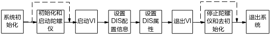
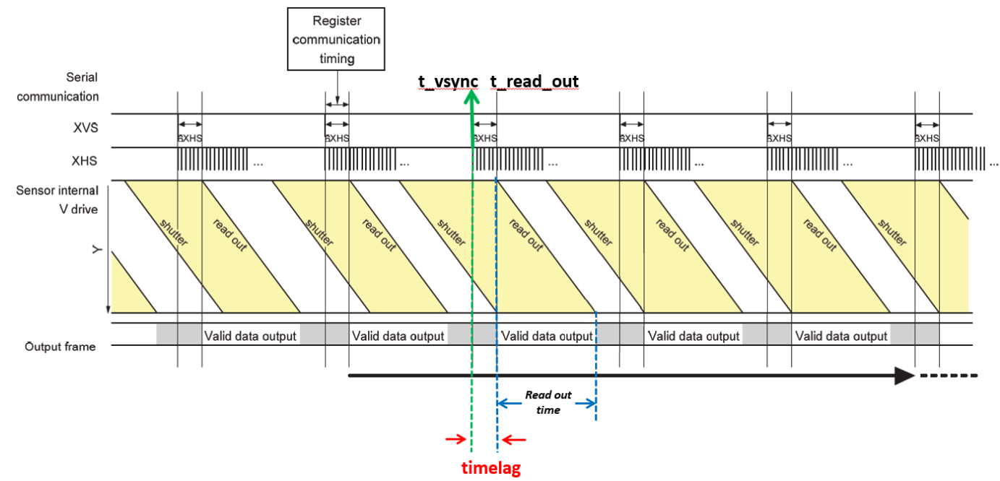
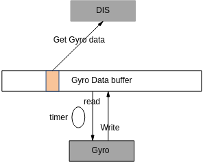
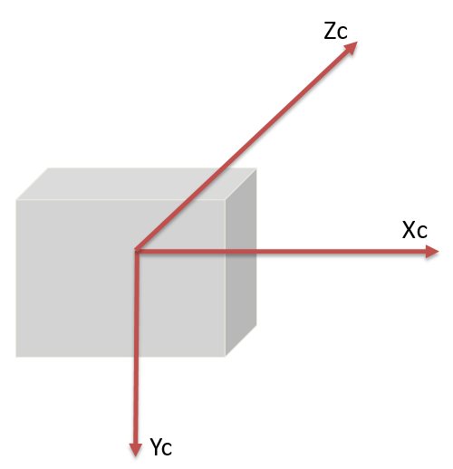
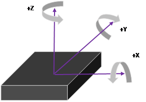
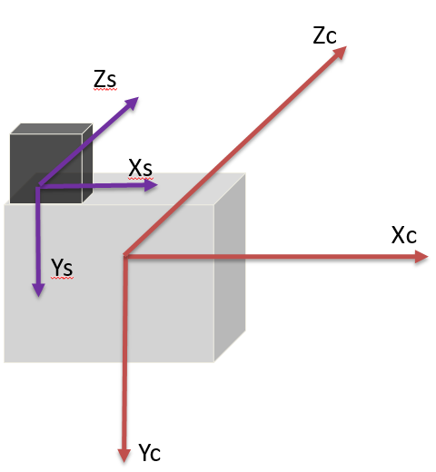
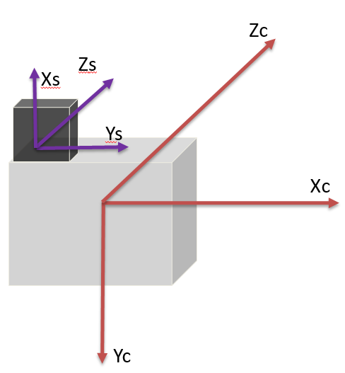
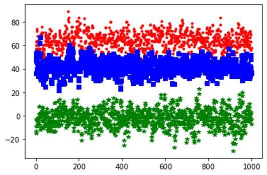
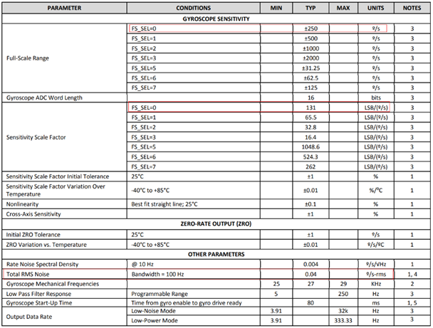
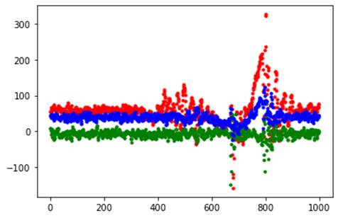

# 前言<a name="ZH-CN_TOPIC_0000002424202078"></a>

**产品版本<a name="section3123254104612"></a>**

与本文档相对应的产品版本如下。

<a name="table19133145454611"></a>
<table><thead align="left"><tr id="row18216954204617"><th class="cellrowborder" valign="top" width="31.759999999999998%" id="mcps1.1.3.1.1"><p id="p82167546469"><a name="p82167546469"></a><a name="p82167546469"></a>产品名称</p>
</th>
<th class="cellrowborder" valign="top" width="68.24%" id="mcps1.1.3.1.2"><p id="p6216205419461"><a name="p6216205419461"></a><a name="p6216205419461"></a>产品版本</p>
</th>
</tr>
</thead>
<tbody><tr id="row321619548461"><td class="cellrowborder" valign="top" width="31.759999999999998%" headers="mcps1.1.3.1.1 "><p id="p621715416465"><a name="p621715416465"></a><a name="p621715416465"></a>SS928</p>
</td>
<td class="cellrowborder" valign="top" width="68.24%" headers="mcps1.1.3.1.2 "><p id="p1821711545468"><a name="p1821711545468"></a><a name="p1821711545468"></a>V100</p>
</td>
</tr>
<tr id="row2452175520019"><td class="cellrowborder" valign="top" width="31.759999999999998%" headers="mcps1.1.3.1.1 "><p id="p379219581304"><a name="p379219581304"></a><a name="p379219581304"></a>SS927</p>
</td>
<td class="cellrowborder" valign="top" width="68.24%" headers="mcps1.1.3.1.2 "><p id="p187922584010"><a name="p187922584010"></a><a name="p187922584010"></a>V100</p>
</td>
</tr>
</tbody>
</table>

> **说明：** 
>本文以SS928V100描述为例，未有特殊说明，SS927V100与SS928V100内容一致。

**读者对象<a name="section0132125444614"></a>**

本文档（本指南）主要适用于以下工程师：

-   技术支持工程师
-   软件开发工程师

**符号约定<a name="section133020216410"></a>**

在本文中可能出现下列标志，它们所代表的含义如下。

<a name="table2622507016410"></a>
<table><thead align="left"><tr id="row1530720816410"><th class="cellrowborder" valign="top" width="20.580000000000002%" id="mcps1.1.3.1.1"><p id="p6450074116410"><a name="p6450074116410"></a><a name="p6450074116410"></a><strong id="b2136615816410"><a name="b2136615816410"></a><a name="b2136615816410"></a>符号</strong></p>
</th>
<th class="cellrowborder" valign="top" width="79.42%" id="mcps1.1.3.1.2"><p id="p5435366816410"><a name="p5435366816410"></a><a name="p5435366816410"></a><strong id="b5941558116410"><a name="b5941558116410"></a><a name="b5941558116410"></a>说明</strong></p>
</th>
</tr>
</thead>
<tbody><tr id="row1372280416410"><td class="cellrowborder" valign="top" width="20.580000000000002%" headers="mcps1.1.3.1.1 "><p id="p3734547016410"><a name="p3734547016410"></a><a name="p3734547016410"></a><a name="image2670064316410"></a><a name="image2670064316410"></a><span></span></p>
</td>
<td class="cellrowborder" valign="top" width="79.42%" headers="mcps1.1.3.1.2 "><p id="p1757432116410"><a name="p1757432116410"></a><a name="p1757432116410"></a>表示如不避免则将会导致死亡或严重伤害的具有高等级风险的危害。</p>
</td>
</tr>
<tr id="row466863216410"><td class="cellrowborder" valign="top" width="20.580000000000002%" headers="mcps1.1.3.1.1 "><p id="p1432579516410"><a name="p1432579516410"></a><a name="p1432579516410"></a><a name="image4895582316410"></a><a name="image4895582316410"></a><span></span></p>
</td>
<td class="cellrowborder" valign="top" width="79.42%" headers="mcps1.1.3.1.2 "><p id="p959197916410"><a name="p959197916410"></a><a name="p959197916410"></a>表示如不避免则可能导致死亡或严重伤害的具有中等级风险的危害。</p>
</td>
</tr>
<tr id="row123863216410"><td class="cellrowborder" valign="top" width="20.580000000000002%" headers="mcps1.1.3.1.1 "><p id="p1232579516410"><a name="p1232579516410"></a><a name="p1232579516410"></a><a name="image1235582316410"></a><a name="image1235582316410"></a><span></span></p>
</td>
<td class="cellrowborder" valign="top" width="79.42%" headers="mcps1.1.3.1.2 "><p id="p123197916410"><a name="p123197916410"></a><a name="p123197916410"></a>表示如不避免则可能导致轻微或中度伤害的具有低等级风险的危害。</p>
</td>
</tr>
<tr id="row5786682116410"><td class="cellrowborder" valign="top" width="20.580000000000002%" headers="mcps1.1.3.1.1 "><p id="p2204984716410"><a name="p2204984716410"></a><a name="p2204984716410"></a><a name="image4504446716410"></a><a name="image4504446716410"></a><span></span></p>
</td>
<td class="cellrowborder" valign="top" width="79.42%" headers="mcps1.1.3.1.2 "><p id="p4388861916410"><a name="p4388861916410"></a><a name="p4388861916410"></a>用于传递设备或环境安全警示信息。如不避免则可能会导致设备损坏、数据丢失、设备性能降低或其它不可预知的结果。</p>
<p id="p1238861916410"><a name="p1238861916410"></a><a name="p1238861916410"></a>“须知”不涉及人身伤害。</p>
</td>
</tr>
<tr id="row2856923116410"><td class="cellrowborder" valign="top" width="20.580000000000002%" headers="mcps1.1.3.1.1 "><p id="p5555360116410"><a name="p5555360116410"></a><a name="p5555360116410"></a><a name="image799324016410"></a><a name="image799324016410"></a><span></span></p>
</td>
<td class="cellrowborder" valign="top" width="79.42%" headers="mcps1.1.3.1.2 "><p id="p4612588116410"><a name="p4612588116410"></a><a name="p4612588116410"></a>对正文中重点信息的补充说明。</p>
<p id="p1232588116410"><a name="p1232588116410"></a><a name="p1232588116410"></a>“说明”不是安全警示信息，不涉及人身、设备及环境伤害信息。</p>
</td>
</tr>
</tbody>
</table>

**修改记录<a name="section2467512116410"></a>**

<a name="table126443203200"></a>
<table><thead align="left"><tr id="row264516207203"><th class="cellrowborder" valign="top" width="20.72%" id="mcps1.1.4.1.1"><p id="p146456203200"><a name="p146456203200"></a><a name="p146456203200"></a><strong id="b8645172022010"><a name="b8645172022010"></a><a name="b8645172022010"></a>文档版本</strong></p>
</th>
<th class="cellrowborder" valign="top" width="26.119999999999997%" id="mcps1.1.4.1.2"><p id="p364512062019"><a name="p364512062019"></a><a name="p364512062019"></a><strong id="b1464512200200"><a name="b1464512200200"></a><a name="b1464512200200"></a>发布日期</strong></p>
</th>
<th class="cellrowborder" valign="top" width="53.16%" id="mcps1.1.4.1.3"><p id="p664522018206"><a name="p664522018206"></a><a name="p664522018206"></a><strong id="b156451420152010"><a name="b156451420152010"></a><a name="b156451420152010"></a>修改说明</strong></p>
</th>
</tr>
</thead>
<tbody><tr id="row56451520182017"><td class="cellrowborder" valign="top" width="20.72%" headers="mcps1.1.4.1.1 "><p id="p1564572014209"><a name="p1564572014209"></a><a name="p1564572014209"></a>00B01</p>
</td>
<td class="cellrowborder" valign="top" width="26.119999999999997%" headers="mcps1.1.4.1.2 "><p id="p126451920132014"><a name="p126451920132014"></a><a name="p126451920132014"></a>2025-09-15</p>
</td>
<td class="cellrowborder" valign="top" width="53.16%" headers="mcps1.1.4.1.3 "><p id="p1664582017209"><a name="p1664582017209"></a><a name="p1664582017209"></a>第1次临时版本发布。</p>
</td>
</tr>
</tbody>
</table>

# 概述<a name="ZH-CN_TOPIC_0000002457880801"></a>

摄像机在拍摄视频时由于环境或人为的影响，视频会出现抖动或不稳定现象，影响视频观看，比如在视频采集场景中由于摄像机可能受到风吹或汽车经过引起的振动，手持运动DV受到人为的影响，行车记录仪受到汽车的抖动，都会引起视频抖动，为了让客户观看更加稳定和更加舒服的视频，需要尽可能消除视频的抖动。


## 概念<a name="ZH-CN_TOPIC_0000002457880877"></a>

**DIS（Digital Image Stabilization）数字图像防抖<a name="section1029935813910"></a>**

DIS是对图像进行数字处理的过程，采用防抖算法计算出当前图像的运动偏移，然后根据计算得到的运动偏移对当前图像进行平移、旋转等变换，从而起到防抖的效果。

**IMU（Inertial Measurement Unit）惯性测量单元<a name="section425682712103"></a>**

IMU是测量物体x、y、z三轴姿态角（或角速率）以及加速度的装置，包含了陀螺仪和加速计。

## DIS基本原理<a name="ZH-CN_TOPIC_0000002424361962"></a>

DIS的基本原理是根据运动偏移对图像的二维仿射变换过程。仿射变换包括对图像的平移、旋转、放大和错切（可通俗理解为平行四边形变换）等，此变换可以用3x3的矩阵来表示。


3x3矩阵就是DIS算法中要计算的运动偏移，\(x,y\)表示原来图像的坐标位置，\(x',y'\)是变换后的图像的坐标位置。

在对图像进行图像变换操作时，会改变图像像素的位置，使得图像的边缘可能会超出原有图像的宽高，会被平移出整个画面的位置。因此在DIS防抖时要对图像进行裁剪和放大。DIS防抖是要在完成变换操作后对图像按照一定的裁剪比例裁剪掉图像的边缘，然后再按原有宽高放大裁剪之后的图像，如[图1](#fig593612433564)所示。

**图 1**  DIS 原理图<a name="fig593612433564"></a>  


DIS计算运动偏移有三种算法：

-   GME算法

    GME\(Global Motion Estimation\)算法是通过提取图像特征，计算当前帧图像和参考帧图像之间的运动偏移。采用GME算法处理后的图像较稳定，有较好的防抖效果，但当画面中大面积拍摄物体在移动时，画面也会出现背景拖拽现象。这是因为GME无法完全区分出画面物体移动还是摄像机移动，从而可能造成误判。另外在低照度情况下，由于图像的特征模糊，GME算法防抖效果存在下降的可能。

-   陀螺仪算法

    陀螺仪算法是根据陀螺仪产生的数据计算当前帧图像的运动偏移，采用陀螺仪算法能够较好解决误判和低照度情况下无防抖效果等现象。

-   Hybrid混合防抖算法

    Hybrid DIS混合防抖是基于GME和GYRO的防抖算法，是两者的结合。防抖效果依赖于图像本身和陀螺仪产生的姿态信息。

## DIS的实现<a name="ZH-CN_TOPIC_0000002457880761"></a>

DIS功能集成在VI模块，参考《MPP媒体处理软件V5.0开发参考》的视频输入章节中的“SS928V100 VI通道功能框图”。

> **须知：** 
>-   DIS只支持在物理通道上运行。
>-   DIS视频输入图像格式支持线性Semi-planar420和单分量，只支持非压缩图像。开启GME DIS后，不能在VI中进行filp和mirror操作。
>-   DIS 视频输入图像辐型比（宽高比）支持范围为16:3\~16:27
>-   DIS处理过程中需要使用VGS/GDC模块，如果多个模块调用VGS或GDC，可能因VGS、GDC性能不足而导致DIS出现丢帧的现象。

# DIS开发应用<a name="ZH-CN_TOPIC_0000002457840761"></a>


## DIS使用<a name="ZH-CN_TOPIC_0000002457840773"></a>

DIS相关API和参数说明请参见《MPP媒体处理软件V5.0开发参考》的"视频输入"章节。具体实现可参考DIS的sample，DIS使用流程如[图1](#fig75191462011)所示。

**图 1**  DIS使用流程<a name="fig75191462011"></a>  


## 参数设置<a name="ZH-CN_TOPIC_0000002457840657"></a>

在启动DIS前需要先设置DIS配置信息和属性等相关参数，参数的不同值会不同程度的影响防抖效果。这里主要介绍几个重要影响防抖效果的参数设置。

**crop\_ratio<a name="section14901121516115"></a>**

DIS输出图像的裁剪比例。其取值范围为\[50, 98\]。通常设置为80，即防抖处理后只输出图像的80%。假设输入图像宽高为1920\*1080，设置crop\_ratio为80，即裁掉输入图像左右边缘和上下边缘的各10%，裁剪后的图像宽为（1920-2\*1920\*10%）=1536，高为（1080-2\*1080\*10%）=864。**注意：如果裁剪后宽高不为偶数，则向下取偶。**

-   当视频输入分辨率大于或等于1920\*1080时，最小支持crop\_ratio为50。
-   当输入分辨率小于1920\*1080时，最小支持crop\_ratio为70。

**mode<a name="section194385111114"></a>**

在DIS算法中会使用到自由度（dof, degree of freedom）的概念。

-   从用户角度来看：

    自由度的概念就是三维空间，X、Y、Z 三个轴，每个轴可以有两种动作：平动、转动。一共产生6种运动。这也是通常所说的6轴防抖。

-   从算法角度来看：

    自由度表示仿射变换的3x3矩阵中使用的算子数目。

不同自由度数目对图像进行仿射变换的操作也不一样。

4\_DOF与6\_DOF的区别：

-   4\_DOF：算法中使用了4个算子，主要是对图像进行平移、旋转和放大操作。相对于6\_DOF，少了2个算子，计算算子越少，也更不容易造成误判，其也能较好的防住大面积物体移动造成的背景拖拽现象，rollingshutter现象较明显。
-   6\_DOF：算法中使用了6个算子，主要是对图像进行平移、旋转、放大、改变图像宽高比及错切。优点是防抖效果较好，能够对平行四边形进行校正，缺点是容易引起背景拖拽等异常现象。

> **说明：** 
>SS928V100的HYBRID模式需要使能DSP并加载混合防抖的bin文件，调用ss\_mpi\_gdc\_set\_dsp\_lut\_cfg接口（参考《MPP 媒体处理软件 V5.0 开发参考》“12 几何畸变矫正子系统”章节）开启dsp\_lut功能，绑定对应的DSP核。单核DSP支持4K30fps的性能。
>各个模式说明：
>-   OT\_DIS\_MODE\_4\_DOF\_GME是指4\_DOF防抖模式。
>-   OT\_DIS\_MODE\_6\_DOF\_GME是指6\_DOF防抖模式。
>-   OT\_DIS\_MODE\_GYRO是指陀螺仪防抖模式。
>-   OT\_DIS\_MODE\_HYBRID是指混合防抖模式。

**motion\_level<a name="section4951632210"></a>**

Camera的运动级别分为：OT\_DIS\_MOTION\_LEVEL\_LOW、OT\_DIS\_MOTION\_LEVEL\_NORM和OT\_DIS\_MOTION\_LEVEL\_HIGH。

-   OT\_DIS\_MOTION\_LEVEL\_LOW是指低级别运动，镜头小幅度运动。
-   OT\_DIS\_MOTION\_LEVEL\_NORM是指正常级别运动，镜头正常幅度运动。
-   OT\_DIS\_MOTION\_LEVEL\_HIGH是指高级别运动，镜头大幅度运动。

通常设置为OT\_DIS\_MOTION\_LEVEL\_NORM，请根据实际运动幅度进行调整。

> **说明：** 
>SS928V100不支持OT\_DIS\_MOTION\_LEVEL\_LOW模式。

**pdt\_type<a name="section2080685121417"></a>**

防抖支持的产品形态。当前支持三种产品形态，分别是录像机、DV和无人机。请根据实际产品形态配置产品类型。

**camera\_steady<a name="section576215194149"></a>**

镜头是否是固定静止的开关键。该参数只在录像机产品形态才会起作用，在DV和无人机产品形态下，该参数不起作用，默认设置为TD\_FALSE。

**matrix<a name="section123314355143"></a>**

仅对GYRO和HYBRID模式有效。旋转矩阵，3x3的矩阵。该参数在ss\_mpi\_mfusion\_set\_gyro\_six\_side\_calibration接口中设置。用于Gyro sensor坐标系和图像坐标系的方向的转换，算法参考的是图像的坐标系，陀螺仪的不同安装位置对应坐标系方向不一样，因此需要将陀螺仪坐标系与图像坐标系方向进行转换。另外在安装陀螺仪时请确保陀螺仪芯片与image sensor位置保持水平或垂直方向。

陀螺仪坐标系方向与图像坐标系方向通过旋转矩阵进行转换。假设陀螺仪数据为（Xg, Yg, Zg），算法使用的陀螺仪数据为（Xa, Ya, Za）。


旋转矩阵matrix\[OT\_MFUSION\_MATRIX\_NUM\]的9个参数分别对应\[a,b,c,d,e,f,g,h,l\]。计算9个参数的具体方法请参见“[适配陀螺仪和图像坐标系方向](#ZH-CN_TOPIC_0000002424361994)”。

**moving\_subject\_level<a name="section2060115951420"></a>**

仅对GME和HYBRID模式有效。用于判断拍摄物体是否是运动的级别，取值范围为\[0,7\]，默认值为0，该参数主要是防止背景拖拽。背景拖拽和和防抖效果两者是相互权衡的。

-   值越小时，运动过程中越稳定，但更容易出现背景拖拽情况；
-   值较大时，运动过程中防抖效果较弱，但是能够较好的改善背景拖拽现象，当值为7时，没有GME防抖效果。

**rolling\_shutter\_coef<a name="section748937181517"></a>**

校正rollingshutter强度的参数，取值范围为\[0,1000\]。此参数适用于相机一直朝向一个方向长时运动的场景，如火车上拍摄外景等。对于来回抖动带来的rolling shutter现象，算法会自适应的检测和做相关的矫正并改善rolling shutter现象，建议配置此参数为0。

**timelag<a name="section8403171719158"></a>**

仅对GYRO和HYBRID模式有效。当前帧第一行有效数据readout \(t\_readout\)的时间点和下一帧的VSYNC \(t\_vsync\)之间的时间差，单位为us。如果陀螺仪有开启低通滤波\(通常建议开启\)，则需要减掉陀螺仪低通滤波的延时（t\_gyro\_lpf\_delay通常会在陀螺仪的数据手册中描述）。

timelag = t\_readout – t\_vsync – t\_gyro\_lpf\_delay

在正常的Sensor序列配置的情况下，此时间参数在t\_gyro\_lpf\_delay附近，且为**负数**。[图1](#_Toc519600753)简单的描述了timelag在sensor时序上的位置。

**图 1**  timelag在sensor时序中的示意图（减去GYRO\_LPF延时之前）<a name="_Toc519600753"></a>  


**hor\_limit和ver\_limit<a name="section8533195119167"></a>**

仅对GME和HYBRID模式有效。水平偏移和垂直偏移限制，取值范围\[0,1000\]。当大面积物体经过引起背景拖拽的水平偏移超过一定幅度时就不进行防抖。偏移幅度计算：2047\* hor\_limit/1000。

该参数需和camera\_steady配合使用，该参数只在camera\_steady为TD\_TRUE时生效。当camera\_steady为TD\_FALSE时，默认设置为1000。

**still\_crop<a name="section1341395815163"></a>**

该开关的作用是关闭DIS防抖效果，但图像依旧保持裁剪比例输出。打开该开关后，DIS输出图像没有防抖效果，但是输出图像的裁剪比例还是跟有防抖效果的输出图像的裁剪比例一致的。通常该参数设置为TD\_FALSE，如有需要时设置该值为TD\_TRUE。

> **说明：** 
>对于云台ptz转动场景，需要在转动开始前开启still\_crop功能，等到转动结束后再关闭still\_crop功能，防止转动过程中防抖效果异常。

**strength<a name="section177138819171"></a>**

背景：摄像机在照度偏低时，开启DIS看起来运动物体边缘看起来比关闭DIS抖动更明显。这是由于照度偏低，且剧烈运动时，快门时间过长，导致运动物体边缘模糊，由于抖动的周期性，运动是一个大小不同的周期变化，造成运动边缘的模糊程度也是在周期变化的，运动主体静止（防抖生效）时，边缘的周期变化就比较吸引人的眼球，加之防抖需要放大图像，使得现象更明显了。

strength是DIS陀螺仪防抖的强度控制，仅对GYRO和HYBRID模式有效，最大强度为1024。当值为0时，无GYRO防抖效果。

> **须知：** 
>在开发中应该默认配置该参数为1024。一般情况下不需要调整此参数，降低strength会对防抖效果有降低。
>strength的使用请参考“[陀螺仪防抖强度的应用方案](#ZH-CN_TOPIC_0000002424202150)”。

**large\_motion\_stable\_coef<a name="section946618411814"></a>**

背景：在大幅度抖动的场景下，如果将防抖开得太强，可能会导致画面裁剪到边但是还没法满足防抖的需求，从而导致卡顿的现象。

仅对GME和HYBRID模式有效。此参数主要是对大幅度的运动进行防抖衰减，从而减少裁剪到边导致的卡顿现象。参数范围为\[0, 100\], 设置到100为防抖不衰减的状态，正常情况下防抖效果最好，但是可能在大幅度抖动下会裁剪到边。将参数调小可以衰减大幅度抖动的防抖，从而在防抖效果和裁剪到边带来的卡顿现象中间进行权衡，设置到0将牺牲所有防抖效果。默认参数100。

**low\_freq\_motion\_preserve<a name="section53191416183"></a>**

仅对GME和HYBRID模式有效。由于运动DV会进行低频运动估计，在消除高频抖动的同时，保留低频的主动运动。此参数的目的是对低频运动的保留程度进行调节，调节范围在\[0, 100\]。设置成100对应保留全部低频运动；设置成0则完全不保留低频运动，如果抖动范围不超过裁剪比例，则画面预期静止，但是一旦有相对大的主动运动的积累，将容易裁剪到边，带来卡顿现象。默认参数10。

**low\_freq\_motion\_freq<a name="section319252081814"></a>**

仅对GME和HYBRID模式有效。由于运动DV会进行低频运动估计，在消除高频抖动的同时，保留低频的主动运动。此参数描述的低频运动的频率。调节范围为\[0, 100\]。设置成0表示保留最少量的低频频率，理论上能达到最稳定的效果，但是十分容易导致裁剪切边从而带来卡顿现象。设置成100表示低频运动的截止频率最高，保留最多的低频分量。默认参数100。

fpd\_adaptive\_en

仅对GME和HYBRID模式有效。由于算法特征点对数阈值固定在30，而IPC存在画面特征点少的场景，所以可能出现特征点查找失败的情况，此时使能自适应查找开关，可以降低特征点对数阈值，让防抖效果得到增强。推荐客户在室内背景单一场景再打开该功能开关，特征点阈值降低后，防抖效果会有所提升，但可能会带来运动拖拽现象。默认参数设置为TD\_FALSE，如有需要时设置该值为TD\_TRUE。

> **须知：** 
>large\_motion\_stable\_coef，low\_freq\_motion\_preserve，low\_freq\_motion\_freq、fpd\_adaptive\_en这四个参数只有在GME模式和HYBRID模式下才生效。

## 陀螺仪使用<a name="ZH-CN_TOPIC_0000002424202142"></a>

在防抖中使用陀螺仪的目的主要是：

-   使用GyroDIS提升防抖效果

    GyroDIS可以根据镜头畸变特性对图像的抖动进行反校正，在存在较大的畸变的时候仍可以获得更好的防抖效果，对图像局部抖动程度不一致有明显的防抖提升。

-   防止背景拖拽问题

    在很多情况下GME算法是无法判断是前景在动还是镜头在动。例如当有大面积物体在镜头前移动，而镜头是静止的。此时算法可能会发生误判，将前景运动判断为镜头运动会进行防抖，从而造成背景拖拽现象。陀螺仪可以反映机器自身的运动状态，增加陀螺仪可以很好的弥补了该缺陷。

-   在低照度或者特征点较少的场景中有防抖效果

    在低照度情况下由于图像背景较暗，对于GME算法来说无法提取到特征点，从而低照度情况下几乎无防抖效果，采用陀螺仪的话上述问题就迎刃而解。


### 陀螺仪算法的流程<a name="ZH-CN_TOPIC_0000002457880829"></a>

使用陀螺仪算法流程如下：

1.  使用陀螺仪相关算法前，须确保单板上带有陀螺仪芯片且可用。
2.  在启动DIS功能前，需要先加载motionsensor\_chip/motionsensor\_mng/ot\_spi/motionfusion/gyrodis五个驱动，并且保证motionsensor已经开始工作并产生数据。

    **注意：**

    -   加载陀螺仪驱动，在加载motionsensor\_chip驱动前需要先加载motionsensor\_mng驱动。每次加载motionsensor\_mng驱动后都需要重新加载motionsensor\_chip驱动；
    -   motionsensor的启动流程为：初始化-设置motionsensor的参数-启动motionsensor；
    -   motionsensor的停止流程为：停止motionsensor工作-去初始化。建议在使能DIS同时模式为OT\_DIS\_MODE\_GYRO之前启动motionsensor工作；在停止VI工作之后停止motionsensor工作。

3.  适配陀螺仪坐标系和图像坐标系的方向，配置正确的旋转矩阵matrix\[OT\_MFUSION\_MATRIX\_NUM\]。
4.  确定镜头标定参数和timelag。
5.  检查AE的hmax\_times、vmax和曝光时间是否正确配置。
6.  启动DIS前，需先初始化和启动陀螺仪。
7.  关闭DIS后，再停止陀螺仪，最后再系统退出。

    具体实现请参考DIS 的sample中使用陀螺仪相关部分。

### 陀螺仪驱动参考代码<a name="ZH-CN_TOPIC_0000002424202018"></a>

SDK发布包里有陀螺仪的驱动代码，其他型号的陀螺仪请参考上述驱动代码自行对接。

代码路径：

```
motionsensor driver：\vendor\motionsensor\
```

使用时只需要在motionsensor目录下执行make命令即可在\\mpp\\out\\ko\\extdrv目录下获得ko文件。默认\\mpp\\out\\ko\\load脚本是不加载陀螺仪驱动，请结合实际情况修改。

DIS获取陀螺仪数据的原理如[图1](#fig12185191732514)所示。

**图 1**  DIS获取陀螺仪数据原理图<a name="fig12185191732514"></a>  


陀螺仪数据存在分配的Gyro Data buffer中。启动陀螺仪驱动后，陀螺仪驱动内部会启动个定时器，不断从陀螺仪fifo中读取陀螺仪数据并为每组数据打上时间戳，然后将数据写到Gyro Data buffer。DIS驱动根据每帧的起始时间戳和结束时间戳从Gyro Data buffer 中获取对应时间段内的陀螺仪数据用于防抖处理。

### 适配陀螺仪和图像坐标系方向<a name="ZH-CN_TOPIC_0000002424361994"></a>

安装陀螺仪芯片时，要确保陀螺仪芯片是正装，即与image sensor 保持平行或者垂直。

使用陀螺仪算法时，镜头的移动信息靠陀螺仪提供，因此陀螺仪数据的准确性是至关重要的。陀螺仪不同的安装位置，其对应的坐标系方向也不同。

使用DIS陀螺仪相关算法时，首先要正确匹配陀螺仪和图像的坐标方向。

[图1](#_Ref452476337)为图像坐标系，为了便于描述清楚，图中使用手机屏幕进行说明。

-   z轴与图像画面垂直，z轴指向人眼的方向是正方向；
-   x轴和y轴分别是水平和垂直方向，对应着图像的宽高。

DIS算法参考的是图像的坐标系。可通过查看IMU datasheet中芯片上黑点位置可确定IMU（陀螺仪）坐标系，例如某款陀螺仪坐标系如[图2](#fig1600174122810)所示。

**图 1**  图像坐标系（镜头朝前Zc方向拍摄）<a name="_Ref452476337"></a>  


**图 2**  陀螺仪坐标系<a name="fig1600174122810"></a>  


下面从陀螺仪的2种不同安装位置方式来说明下坐标系方向如何转换，其他安装位置，请以此类推。

-   陀螺仪安装位置1

    当陀螺仪的安装位置如[图3](#fig1483505715311)所示时，此时陀螺仪的坐标系和图像坐标系方向是一致。陀螺仪获取的数据为\(Xg,Yg,Zg\)，算法使用的陀螺仪数据为\(Xa,Ya,Za\)，此时

    

    所以设置DIS Config中的旋转矩阵为单位矩阵，即，matrix\[OT\_MFUSION\_MATRIX\_NUM\]的9个参数分别对应\[1,0,0,0,1,0,0,0,1\]。

    **图 3**  陀螺仪安装位置1<a name="fig1483505715311"></a>  
    

-   陀螺仪安装位置2

    当陀螺仪的安装位置如[图4](#_Ref483210897)所示时，此时陀螺仪的坐标系和图像坐标系方向不一致，需要转换下。陀螺仪获取的数据为\(Xg,Yg,Zg\)，算法使用的陀螺仪数据为\(Xa,Ya,Za\)，此时转换关系为：

    

    所以设置DIS Config中的旋转矩阵为：

    

    matrix\[OT\_MFUSION\_MATRIX\_NUM\]的9个参数分别对应为\[0,1,0,-1,0,0,0,0,1\]。

    **图 4**  陀螺仪安装位置2<a name="_Ref483210897"></a>  
    

### 镜头标定参数和timelag<a name="ZH-CN_TOPIC_0000002424361898"></a>

镜头标定参数camera\_calibration\_dis\_param和MPI板端参数ot\_ldc\_v2\_attr两者在数据类型上完全一致，可将镜头标定生成的参数直接配置到MPI对应的参数。

timelag请参见“[参数设置](#ZH-CN_TOPIC_0000002457840657)”中的 timelag的参数计算方法。

### hmax\_times、vmax和曝光时间<a name="ZH-CN_TOPIC_0000002424361846"></a>

hmax\_times为Sensor对应读出一行的时间，vmax为Sensor每帧实际生效的总行数，AE计算得出的曝光时间，相关描述参考《ISP 开发参考》。

### 初始化和启动陀螺仪<a name="ZH-CN_TOPIC_0000002424361878"></a>

初始化陀螺仪主要是为陀螺仪数据分配MMZ内存用于保存陀螺仪数据。

陀螺仪输出的数据放在一个轮转buffer里面，算法根据帧中断来读取buffer中的陀螺仪数据。XYZ轴数据与时间戳是一一对应的。

**图 1**  Buffer数据图<a name="fig286321915420"></a>  


MMZ分配出来的buffer用于存储5部分数据：x、y、z轴陀螺仪数据、温度数据temp和时间戳。时间戳的数据类型长度是8个字节，XYZ轴数据和温度数据temp类型长度为4字节。每次帧中断来获取数据时都根据起始时间戳和结束时间戳在buffer段内查找数据。查找到符合条件的陀螺仪数据然后传给DIS算法使用。具体buffer的分配和大小请参考sample。

### 陀螺仪和加速度计的配置<a name="ZH-CN_TOPIC_0000002457840697"></a>

陀螺仪和加速度计的参数配置通过ioctl接口对motionsensor驱动进行设置。

陀螺仪的量程推荐设置250（_RECORDER_）或者1000（DV），量程的小数精度为10bit。

陀螺仪的数据采样频率（ODR）推荐设置1000，小数精度为10bit，陀螺仪输出数据的位宽是15bit，陀螺仪数据范围是 \[-32768, 32768\]。

加速度计的量程推荐设置16，量程的小数精度为10bit。

加速度计的数据采样频率（ODR）推荐设置1000，小数精度为10bit，加速度计输出数据的位宽是15bit，加速度计数据范围是 \[-32768, 32768\]。

> **须知：** 
>某些陀螺仪型号标称的量程不是精确的量程，需要和角速度灵敏度和数据位宽进行确认（角速度灵敏度\*2^数据位宽=量程）。必要时，请和陀螺仪厂商确认精确量程。

### 陀螺仪防抖强度的应用方案<a name="ZH-CN_TOPIC_0000002424202150"></a>

仅对GyroDIS有效，最大强度为1024，注意在开发中应该默认配置该参数为 1024。

建议优先使用限曝光的策略，然后再根据需求使用 strength衰减防抖。

1.  在AEroute中对最大曝光时间进行限制

    建议限制最大曝光时间不超过10ms 或在AE route中限制曝光时间最大不超过10ms。

    对图像效果的影响：在防抖效果、亮度、噪点之间权衡，以防抖效果优先，并从根源上降低了运动边缘在视觉中的抖动。

    -   正常照度（如：室外白天）：不影响正常效果和防抖效果；
    -   较低照度时（如：室内有灯、室外阴暗）：防抖效果**提升**，画面亮度较低或噪点增加；
    -   极低照度时：防抖效果提升，图像过暗（限制最大增益倍数不变）或噪点过大（将最大增益提升相应的倍数）。

    > **须知：** 
    >-   当只限定曝光时间，不放开对应增益大小的时候，可能在较低照度导致画面偏暗；
    >-   当限定了曝光，但又同时放大对应倍数的增益时，画面不会变暗，但噪点会增加。

2.  对DIS防抖强度根据曝光时间进行自适应调整

    可以根据曝光时间exposure\_time配置DIS strength 对防抖效果进行衰减。

    建议在超过10ms时按照比例进行自适应衰减，10ms时防抖强度最大（strength=1024），30ms时将防抖强度降为最弱（strength=1），30ms和10ms之间按比例平滑配置。

    对效果的影响：在防抖效果、运动边缘抖动上进行权衡，以画面亮度和去躁优先，未从根本上解决运动边缘的抖动，但以防抖效果为代价消弱运动边缘的抖动主观查觉性。

    -   正常照度（如：室外白天）：不影响正常效果和防抖效果；
    -   较低照度时（如：室内有灯、室外阴暗）：防抖效果进一步降低，减少运动边缘的视觉“抖动”现象；
    -   极低照度时：防抖完全没效果，近于防抖关闭。

3.  建议的自适应方案

    方案涉及防抖效果、画面亮度、噪声、运动边缘抖动四个效果之间的权衡，为获取最佳效果，建议

    防抖打开时，根据陀螺仪的Gyro运动信息调节如下：

    -   当运动大时，限制曝光时间，放大增益倍数，且曝光时间及增益均达到最大时，降低防抖强度；
    -   当运动小时，恢复为原有的曝光和增益；

    因为涉及到运动模糊、噪声等，需要AE、去噪进行针对性的调优。

    预期达到的效果：

    -   正常照度的所有效果达到最好；
    -   运动程度较小（含静止）时所有效果达到最好；
    -   较低照度+较大运动：防抖效果提升，略降低亮度或略增加噪点；
    -   极低照度+较大运动：亮度和降噪优先，防抖效果降低。

### IMU传感器参数影响和选型要求<a name="ZH-CN_TOPIC_0000002457840709"></a>

**表 1**  陀螺仪传感器参数影响和选型要求

<a name="table480mcpsimp"></a>
<table><thead align="left"><tr id="row487mcpsimp"><th class="cellrowborder" valign="top" width="10.67%" id="mcps1.2.4.1.1"><p id="p489mcpsimp"><a name="p489mcpsimp"></a><a name="p489mcpsimp"></a>参数</p>
</th>
<th class="cellrowborder" valign="top" width="74.03%" id="mcps1.2.4.1.2"><p id="p491mcpsimp"><a name="p491mcpsimp"></a><a name="p491mcpsimp"></a>影响</p>
</th>
<th class="cellrowborder" valign="top" width="15.299999999999999%" id="mcps1.2.4.1.3"><p id="p493mcpsimp"><a name="p493mcpsimp"></a><a name="p493mcpsimp"></a>推荐值</p>
</th>
</tr>
</thead>
<tbody><tr id="row495mcpsimp"><td class="cellrowborder" valign="top" width="10.67%" headers="mcps1.2.4.1.1 "><p id="p899762913418"><a name="p899762913418"></a><a name="p899762913418"></a>测量范围</p>
</td>
<td class="cellrowborder" valign="top" width="74.03%" headers="mcps1.2.4.1.2 "><p id="p13887172794318"><a name="p13887172794318"></a><a name="p13887172794318"></a>当实际角速度超过量程时，信号失真，由于误差累积效果，会导致之后的算法结果都不准确。对于有大角速度场景的应用需要特别注意。</p>
</td>
<td class="cellrowborder" valign="top" width="15.299999999999999%" headers="mcps1.2.4.1.3 "><p id="p6962137144215"><a name="p6962137144215"></a><a name="p6962137144215"></a>&plusmn;2000 &deg;/S</p>
</td>
</tr>
<tr id="row502mcpsimp"><td class="cellrowborder" valign="top" width="10.67%" headers="mcps1.2.4.1.1 "><p id="p216912366443"><a name="p216912366443"></a><a name="p216912366443"></a>ADC位数</p>
</td>
<td class="cellrowborder" rowspan="2" valign="top" width="74.03%" headers="mcps1.2.4.1.2 "><p id="p936556124520"><a name="p936556124520"></a><a name="p936556124520"></a>量程和ADC位数决定sensor对信号的灵敏度，即能引起输出信号变化的真实模拟信号的最小波动，如果灵敏度不够高，再加上数据流中有一些滤波，会导致一些微小的波动不会被捕捉到。</p>
</td>
<td class="cellrowborder" valign="top" width="15.299999999999999%" headers="mcps1.2.4.1.3 "><p id="p1452464534516"><a name="p1452464534516"></a><a name="p1452464534516"></a>16 bits</p>
</td>
</tr>
<tr id="row509mcpsimp"><td class="cellrowborder" valign="top" headers="mcps1.2.4.1.1 "><p id="p6172194214420"><a name="p6172194214420"></a><a name="p6172194214420"></a>分辨率</p>
</td>
<td class="cellrowborder" valign="top" headers="mcps1.2.4.1.2 "><p id="p1821655414454"><a name="p1821655414454"></a><a name="p1821655414454"></a>16.4 LSB/(&deg;/S)</p>
</td>
</tr>
<tr id="row523mcpsimp"><td class="cellrowborder" valign="top" width="10.67%" headers="mcps1.2.4.1.1 "><p id="p5425111104616"><a name="p5425111104616"></a><a name="p5425111104616"></a>最大输出频率ODR</p>
</td>
<td class="cellrowborder" valign="top" width="74.03%" headers="mcps1.2.4.1.2 "><p id="p484112345184"><a name="p484112345184"></a><a name="p484112345184"></a>数据输出频率视应用要求确定，更高的输出频率有更连续的结果输出。算法可以对不同频率进行适配。</p>
</td>
<td class="cellrowborder" valign="top" width="15.299999999999999%" headers="mcps1.2.4.1.3 "><p id="p1923012917466"><a name="p1923012917466"></a><a name="p1923012917466"></a>&gt;= 800 Hz</p>
</td>
</tr>
<tr id="row530mcpsimp"><td class="cellrowborder" valign="top" width="10.67%" headers="mcps1.2.4.1.1 "><p id="p881581044717"><a name="p881581044717"></a><a name="p881581044717"></a>噪声</p>
</td>
<td class="cellrowborder" valign="top" width="74.03%" headers="mcps1.2.4.1.2 "><p id="p3500171815473"><a name="p3500171815473"></a><a name="p3500171815473"></a>噪声过大会淹没某些高频小幅度的有效信号，具体的规格视应用对高频小信号是否有要求而定。</p>
</td>
<td class="cellrowborder" valign="top" width="15.299999999999999%" headers="mcps1.2.4.1.3 "><p id="p858122520478"><a name="p858122520478"></a><a name="p858122520478"></a>0.04 &deg;/s –rms @100Hz</p>
</td>
</tr>
<tr id="row537mcpsimp"><td class="cellrowborder" valign="top" width="10.67%" headers="mcps1.2.4.1.1 "><p id="p19962133174916"><a name="p19962133174916"></a><a name="p19962133174916"></a>敏感度</p>
</td>
<td class="cellrowborder" valign="top" width="74.03%" headers="mcps1.2.4.1.2 "><p id="p1451463019497"><a name="p1451463019497"></a><a name="p1451463019497"></a>反映sensor输出和真实信号之间的误差水平(去除offset情况下)，该误差会被继承到算法的重力和姿态角输出(1/10度级)，尤其是在多轴且快速的运动场景。敏感度可通过六面校准修正。</p>
</td>
<td class="cellrowborder" valign="top" width="15.299999999999999%" headers="mcps1.2.4.1.3 "><p id="p13473113911495"><a name="p13473113911495"></a><a name="p13473113911495"></a>1%</p>
</td>
</tr>
<tr id="row544mcpsimp"><td class="cellrowborder" valign="top" width="10.67%" headers="mcps1.2.4.1.1 "><p id="p12241046124917"><a name="p12241046124917"></a><a name="p12241046124917"></a>敏感度温度系数</p>
</td>
<td class="cellrowborder" valign="top" width="74.03%" headers="mcps1.2.4.1.2 "><p id="p10403115314916"><a name="p10403115314916"></a><a name="p10403115314916"></a>反映敏感度随温度的变化水平，相对影响较小。</p>
</td>
<td class="cellrowborder" valign="top" width="15.299999999999999%" headers="mcps1.2.4.1.3 "><p id="p111415695017"><a name="p111415695017"></a><a name="p111415695017"></a>&plusmn;0.01 %/℃</p>
</td>
</tr>
<tr id="row551mcpsimp"><td class="cellrowborder" valign="top" width="10.67%" headers="mcps1.2.4.1.1 "><p id="p155921516105011"><a name="p155921516105011"></a><a name="p155921516105011"></a>零偏</p>
</td>
<td class="cellrowborder" valign="top" width="74.03%" headers="mcps1.2.4.1.2 "><p id="p8817192316505"><a name="p8817192316505"></a><a name="p8817192316505"></a>反映sensor输出和真实信号之间的固定偏置误差，是对算法动、静态结果影响非常大参数，由于误差累积效应，短时间内就可造成度量级的角度漂移。offset可通过六面校准和零偏校准修正。</p>
</td>
<td class="cellrowborder" valign="top" width="15.299999999999999%" headers="mcps1.2.4.1.3 "><p id="p12995111512512"><a name="p12995111512512"></a><a name="p12995111512512"></a>&plusmn;1 &deg;/s @25℃</p>
</td>
</tr>
<tr id="row558mcpsimp"><td class="cellrowborder" valign="top" width="10.67%" headers="mcps1.2.4.1.1 "><p id="p124722034185214"><a name="p124722034185214"></a><a name="p124722034185214"></a>温度漂移</p>
</td>
<td class="cellrowborder" valign="top" width="74.03%" headers="mcps1.2.4.1.2 "><p id="p612774295215"><a name="p612774295215"></a><a name="p612774295215"></a>offset随温度变化的水平，陀螺仪的温漂对算法结果是不可忽视的影响，尤其是在设备刚开机或开启耗电量大的应用导致温度变化的场景。可以通过温度补偿修正。</p>
</td>
<td class="cellrowborder" valign="top" width="15.299999999999999%" headers="mcps1.2.4.1.3 "><p id="p17624849195212"><a name="p17624849195212"></a><a name="p17624849195212"></a>&plusmn;0.01 &deg;/s/℃</p>
</td>
</tr>
<tr id="row565mcpsimp"><td class="cellrowborder" valign="top" width="10.67%" headers="mcps1.2.4.1.1 "><p id="p17861456185215"><a name="p17861456185215"></a><a name="p17861456185215"></a>轴串扰Cross Axis</p>
</td>
<td class="cellrowborder" valign="top" width="74.03%" headers="mcps1.2.4.1.2 "><p id="p83241844536"><a name="p83241844536"></a><a name="p83241844536"></a>反映陀螺仪三轴数据之间的交叉影响，对算法结果的影响很大，尤其是在多轴且快速的运动场景，容易造成大的角度偏差。Cross Axis可以通过六面校准修正。</p>
</td>
<td class="cellrowborder" valign="top" width="15.299999999999999%" headers="mcps1.2.4.1.3 "><p id="p53269104538"><a name="p53269104538"></a><a name="p53269104538"></a>&plusmn;1%</p>
</td>
</tr>
<tr id="row572mcpsimp"><td class="cellrowborder" valign="top" width="10.67%" headers="mcps1.2.4.1.1 "><p id="p417815185531"><a name="p417815185531"></a><a name="p417815185531"></a>非线性度</p>
</td>
<td class="cellrowborder" valign="top" width="74.03%" headers="mcps1.2.4.1.2 "><p id="p16585327105312"><a name="p16585327105312"></a><a name="p16585327105312"></a>反映不同输入时，sensor输出和真实信号之间误差的不一致性，会一定程度上导致不同加速度水平时算法的性能表现得不一致。</p>
</td>
<td class="cellrowborder" valign="top" width="15.299999999999999%" headers="mcps1.2.4.1.3 "><p id="p116331635165318"><a name="p116331635165318"></a><a name="p116331635165318"></a>&plusmn;0.1% @25℃</p>
</td>
</tr>
<tr id="row579mcpsimp"><td class="cellrowborder" valign="top" width="10.67%" headers="mcps1.2.4.1.1 "><p id="p573810421402"><a name="p573810421402"></a><a name="p573810421402"></a>零偏稳定度</p>
</td>
<td class="cellrowborder" valign="top" width="74.03%" headers="mcps1.2.4.1.2 "><p id="p53171552135319"><a name="p53171552135319"></a><a name="p53171552135319"></a>反映陀螺仪零偏的稳定性，即使零偏可以通过校准修正，零偏变化大的器件还是会有零偏的影响残留。</p>
</td>
<td class="cellrowborder" valign="top" width="15.299999999999999%" headers="mcps1.2.4.1.3 "><p id="p65771803543"><a name="p65771803543"></a><a name="p65771803543"></a>10&deg;/h</p>
</td>
</tr>
</tbody>
</table>

**表 2**  加速计传感器参数影响和选型要求

<a name="table5584125212565"></a>
<table><thead align="left"><tr id="row2584155215568"><th class="cellrowborder" valign="top" width="10.59%" id="mcps1.2.4.1.1"><p id="p13584145235613"><a name="p13584145235613"></a><a name="p13584145235613"></a>参数</p>
</th>
<th class="cellrowborder" valign="top" width="74.11%" id="mcps1.2.4.1.2"><p id="p1758475225613"><a name="p1758475225613"></a><a name="p1758475225613"></a>影响</p>
</th>
<th class="cellrowborder" valign="top" width="15.299999999999999%" id="mcps1.2.4.1.3"><p id="p7584652125617"><a name="p7584652125617"></a><a name="p7584652125617"></a>推荐值</p>
</th>
</tr>
</thead>
<tbody><tr id="row17584135217562"><td class="cellrowborder" valign="top" width="10.59%" headers="mcps1.2.4.1.1 "><p id="p15584145216567"><a name="p15584145216567"></a><a name="p15584145216567"></a>测量范围</p>
</td>
<td class="cellrowborder" valign="top" width="74.11%" headers="mcps1.2.4.1.2 "><p id="p1569003605714"><a name="p1569003605714"></a><a name="p1569003605714"></a>当实际加速度超过量程时，信号失真，会导致未来几秒内提取的重力加速度不准确。对于有大加速度的应用场景需要特别注意。</p>
</td>
<td class="cellrowborder" valign="top" width="15.299999999999999%" headers="mcps1.2.4.1.3 "><p id="p1499765055711"><a name="p1499765055711"></a><a name="p1499765055711"></a>&plusmn;16 g</p>
</td>
</tr>
<tr id="row9584195235617"><td class="cellrowborder" valign="top" width="10.59%" headers="mcps1.2.4.1.1 "><p id="p55849529564"><a name="p55849529564"></a><a name="p55849529564"></a>ADC位数</p>
</td>
<td class="cellrowborder" rowspan="2" valign="top" width="74.11%" headers="mcps1.2.4.1.2 "><p id="p4584552145617"><a name="p4584552145617"></a><a name="p4584552145617"></a>量程和ADC位数决定sensor对信号的灵敏度，即能引起输出信号变化的真实模拟信号的最小波动，如果灵敏度不够高，再加上数据流中有一些滤波，会导致一些微小的波动不会被捕捉到。</p>
</td>
<td class="cellrowborder" valign="top" width="15.299999999999999%" headers="mcps1.2.4.1.3 "><p id="p15584152135614"><a name="p15584152135614"></a><a name="p15584152135614"></a>16 bits</p>
</td>
</tr>
<tr id="row9584175220567"><td class="cellrowborder" valign="top" headers="mcps1.2.4.1.1 "><p id="p1584135245616"><a name="p1584135245616"></a><a name="p1584135245616"></a>分辨率</p>
</td>
<td class="cellrowborder" valign="top" headers="mcps1.2.4.1.2 "><p id="p169831792003"><a name="p169831792003"></a><a name="p169831792003"></a>2048 LSB/g</p>
</td>
</tr>
<tr id="row1958525214561"><td class="cellrowborder" valign="top" width="10.59%" headers="mcps1.2.4.1.1 "><p id="p258515522568"><a name="p258515522568"></a><a name="p258515522568"></a>最大输出频率ODR</p>
</td>
<td class="cellrowborder" valign="top" width="74.11%" headers="mcps1.2.4.1.2 "><p id="p16536896199"><a name="p16536896199"></a><a name="p16536896199"></a>数据输出频率视应用要求确定，更高的输出频率有更连续的结果输出。算法可以对不同频率进行适配。</p>
</td>
<td class="cellrowborder" valign="top" width="15.299999999999999%" headers="mcps1.2.4.1.3 "><p id="p758535217566"><a name="p758535217566"></a><a name="p758535217566"></a>&gt;= 800 Hz</p>
</td>
</tr>
<tr id="row1585175219561"><td class="cellrowborder" valign="top" width="10.59%" headers="mcps1.2.4.1.1 "><p id="p8585125210569"><a name="p8585125210569"></a><a name="p8585125210569"></a>噪声</p>
</td>
<td class="cellrowborder" valign="top" width="74.11%" headers="mcps1.2.4.1.2 "><p id="p15114174118013"><a name="p15114174118013"></a><a name="p15114174118013"></a>噪声过大会淹没某些高频小幅度的有效信号，具体的规格视应用对高频/小信号是否有要求而定。</p>
</td>
<td class="cellrowborder" valign="top" width="15.299999999999999%" headers="mcps1.2.4.1.3 "><p id="p11971858603"><a name="p11971858603"></a><a name="p11971858603"></a>1 mg-rms @100Hz</p>
</td>
</tr>
<tr id="row758555225617"><td class="cellrowborder" valign="top" width="10.59%" headers="mcps1.2.4.1.1 "><p id="p758565265613"><a name="p758565265613"></a><a name="p758565265613"></a>敏感度</p>
</td>
<td class="cellrowborder" valign="top" width="74.11%" headers="mcps1.2.4.1.2 "><p id="p176481154115"><a name="p176481154115"></a><a name="p176481154115"></a>同陀螺仪敏感度的影响，该误差会影响所有场景下算法的重力、姿态角等结果，可校准。</p>
</td>
<td class="cellrowborder" valign="top" width="15.299999999999999%" headers="mcps1.2.4.1.3 "><p id="p105851752135618"><a name="p105851752135618"></a><a name="p105851752135618"></a>1%</p>
</td>
</tr>
<tr id="row058545212566"><td class="cellrowborder" valign="top" width="10.59%" headers="mcps1.2.4.1.1 "><p id="p858565225617"><a name="p858565225617"></a><a name="p858565225617"></a>敏感度温度系数</p>
</td>
<td class="cellrowborder" valign="top" width="74.11%" headers="mcps1.2.4.1.2 "><p id="p14717324117"><a name="p14717324117"></a><a name="p14717324117"></a>反映敏感度随温度的变化水平，相对影响较小。</p>
</td>
<td class="cellrowborder" valign="top" width="15.299999999999999%" headers="mcps1.2.4.1.3 "><p id="p1376015461113"><a name="p1376015461113"></a><a name="p1376015461113"></a>&plusmn;0.008 %/℃</p>
</td>
</tr>
<tr id="row45851052125616"><td class="cellrowborder" valign="top" width="10.59%" headers="mcps1.2.4.1.1 "><p id="p17790165153518"><a name="p17790165153518"></a><a name="p17790165153518"></a>零偏</p>
</td>
<td class="cellrowborder" valign="top" width="74.11%" headers="mcps1.2.4.1.2 "><p id="p189671112334"><a name="p189671112334"></a><a name="p189671112334"></a>同陀螺仪offset的影响，会影响所有场景下算法的重力、姿态角等结果的准确性，可校准。</p>
</td>
<td class="cellrowborder" valign="top" width="15.299999999999999%" headers="mcps1.2.4.1.3 "><p id="p48641330933"><a name="p48641330933"></a><a name="p48641330933"></a>&plusmn;40 mg</p>
</td>
</tr>
<tr id="row11585145285610"><td class="cellrowborder" valign="top" width="10.59%" headers="mcps1.2.4.1.1 "><p id="p09141758123518"><a name="p09141758123518"></a><a name="p09141758123518"></a>温度漂移</p>
</td>
<td class="cellrowborder" valign="top" width="74.11%" headers="mcps1.2.4.1.2 "><p id="p15856449332"><a name="p15856449332"></a><a name="p15856449332"></a>offset随温度变化的水平，参数过大的话，会对设备刚开机一段时间内或开启耗电量大的应用导致温度变化的场景会有较大影响。可以通过温度补偿修正。</p>
</td>
<td class="cellrowborder" valign="top" width="15.299999999999999%" headers="mcps1.2.4.1.3 "><p id="p195651156413"><a name="p195651156413"></a><a name="p195651156413"></a>&plusmn;1 mg/℃ for Z</p>
</td>
</tr>
<tr id="row058695255615"><td class="cellrowborder" valign="top" width="10.59%" headers="mcps1.2.4.1.1 "><p id="p2041466369"><a name="p2041466369"></a><a name="p2041466369"></a>轴串扰Cross Axis</p>
</td>
<td class="cellrowborder" valign="top" width="74.11%" headers="mcps1.2.4.1.2 "><p id="p1761815241848"><a name="p1761815241848"></a><a name="p1761815241848"></a>同陀螺仪Cross Axis的影响，会影响所有场景下算法的重力、姿态角等结果的准确性，可校准。</p>
</td>
<td class="cellrowborder" valign="top" width="15.299999999999999%" headers="mcps1.2.4.1.3 "><p id="p11586175255611"><a name="p11586175255611"></a><a name="p11586175255611"></a>&plusmn;1%</p>
</td>
</tr>
<tr id="row55868525569"><td class="cellrowborder" valign="top" width="10.59%" headers="mcps1.2.4.1.1 "><p id="p858695255618"><a name="p858695255618"></a><a name="p858695255618"></a>非线性度</p>
</td>
<td class="cellrowborder" valign="top" width="74.11%" headers="mcps1.2.4.1.2 "><p id="p1281944654"><a name="p1281944654"></a><a name="p1281944654"></a>同陀螺仪非线性度的说明。</p>
</td>
<td class="cellrowborder" valign="top" width="15.299999999999999%" headers="mcps1.2.4.1.3 "><p id="p12825723458"><a name="p12825723458"></a><a name="p12825723458"></a>&plusmn;0.3%</p>
</td>
</tr>
<tr id="row115861852155611"><td class="cellrowborder" valign="top" width="10.59%" headers="mcps1.2.4.1.1 "><p id="p15586185216569"><a name="p15586185216569"></a><a name="p15586185216569"></a>零偏稳定度</p>
</td>
<td class="cellrowborder" valign="top" width="74.11%" headers="mcps1.2.4.1.2 "><p id="p358614525566"><a name="p358614525566"></a><a name="p358614525566"></a>反映加速计零偏的稳定性，即使零偏可以通过校准修正，零偏变化大的器件还是会有零偏的影响残留。</p>
</td>
<td class="cellrowborder" valign="top" width="15.299999999999999%" headers="mcps1.2.4.1.3 "><p id="p165317471253"><a name="p165317471253"></a><a name="p165317471253"></a>10 mg</p>
</td>
</tr>
</tbody>
</table>

推荐IMU带有硬件FIFO，如无FIFO，或导致读取IMU数据的及时性。支持SPI总线，并且SPI时钟不低于10MHz，如果总线时钟频率太低，增加读取数据的延时。

### 陀螺仪驱动对接流程<a name="ZH-CN_TOPIC_0000002424202042"></a>

1.  须确保单板上带有IMU芯片， 并且IMU芯片需跟sensor刚性固定。
2.  加载motionsensor\_chip/motionsensor\_mng/ot\_spi 三个驱动。
3.  参考sample\_dis：初始化spi-\>初始化motionsensor-\>启动motionsensor。初始化motionsensor时查看dev info打印信息是否为IMU的Chip ID。
4.  使用motionsensor\_mng的ioctl接口， 先调MSENSOR\_CMD\_ADD\_USER， 再调MSENSOR\_CMD\_GET\_DATA获取陀螺仪和加速计数据。
5.  获取到的陀螺仪和加速计数据，参考“[测试陀螺仪数值是否合理](#ZH-CN_TOPIC_0000002457840721)”。
6.  检查陀螺仪和加速计的时间戳是否平滑，参考“[陀螺仪时间戳是否平滑](#ZH-CN_TOPIC_0000002457880889)”。
7.  陀螺仪驱动对接完毕之后，参考“[陀螺仪算法的流程](#ZH-CN_TOPIC_0000002457880829)”，查看gyrodis和motionfusion的proc确认参数配置是否正确。
8.  检查防抖效果是否符合预期，如果不符合预期，参考“[陀螺仪防抖没有效果](#ZH-CN_TOPIC_0000002457840745)”。

## 镜头标定<a name="ZH-CN_TOPIC_0000002424202106"></a>


### 棋盘格标定<a name="ZH-CN_TOPIC_0000002424202062"></a>


#### 标定工具<a name="ZH-CN_TOPIC_0000002457880781"></a>

参考《图像质量调试工具使用指南》"2.5.10 DIS标定工具使用说明”章节。

#### 下板端<a name="ZH-CN_TOPIC_0000002424361926"></a>

下板端需要对应配置ot\_ldc\_v2\_attr，有关ldc\_v2详细属性，具体描述请参考《MPP 媒体处理V5.0 软件开发》中“2.4.1基本数据类型”章节。

### 视场角标定<a name="ZH-CN_TOPIC_0000002457840677"></a>


#### 应用背景<a name="ZH-CN_TOPIC_0000002457880817"></a>

在室外变焦应用中，由于视场角焦段在逐步的变化，使用镜头标定出ldc\_v2的方法对逐个焦段进行标定比较复杂。为了寻求更简单有效的方法，通过给定镜头的视场角来转换成ldc\_v2参数以替代镜头棋盘格标定。

使用FOV进行转换是一种特殊条件下可在一定程度上替代镜头标定的快捷应用，注意当转换效果不理想时，应该回归到镜头棋盘格标定以获取更好的效果。

视场角转换成ldc\_v2参数的具体实现以sample的形式提供。

#### FOV转换ldc\_v2<a name="ZH-CN_TOPIC_0000002424361942"></a>

输入：图像宽度、图像高度、视场角类型、视场角

输出：ldc\_v2参数

**表 1**  FOV转换输出参数ldc\_v2取值范围

<a name="table480mcpsimp"></a>
<table><thead align="left"><tr id="row487mcpsimp"><th class="cellrowborder" valign="top" width="34%" id="mcps1.2.4.1.1"><p id="p489mcpsimp"><a name="p489mcpsimp"></a><a name="p489mcpsimp"></a>ldc_v2参数</p>
</th>
<th class="cellrowborder" valign="top" width="30%" id="mcps1.2.4.1.2"><p id="p491mcpsimp"><a name="p491mcpsimp"></a><a name="p491mcpsimp"></a>取值范围</p>
</th>
<th class="cellrowborder" valign="top" width="36%" id="mcps1.2.4.1.3"><p id="p493mcpsimp"><a name="p493mcpsimp"></a><a name="p493mcpsimp"></a>说明</p>
</th>
</tr>
</thead>
<tbody><tr id="row495mcpsimp"><td class="cellrowborder" valign="top" width="34%" headers="mcps1.2.4.1.1 "><p id="p497mcpsimp"><a name="p497mcpsimp"></a><a name="p497mcpsimp"></a>focal_len_x</p>
</td>
<td class="cellrowborder" valign="top" width="30%" headers="mcps1.2.4.1.2 "><p id="p499mcpsimp"><a name="p499mcpsimp"></a><a name="p499mcpsimp"></a>[6400, 117341700]</p>
</td>
<td class="cellrowborder" valign="top" width="36%" headers="mcps1.2.4.1.3 "><p id="p501mcpsimp"><a name="p501mcpsimp"></a><a name="p501mcpsimp"></a>水平方向镜头有效焦距</p>
</td>
</tr>
<tr id="row502mcpsimp"><td class="cellrowborder" valign="top" width="34%" headers="mcps1.2.4.1.1 "><p id="p504mcpsimp"><a name="p504mcpsimp"></a><a name="p504mcpsimp"></a>focal_len_y</p>
</td>
<td class="cellrowborder" valign="top" width="30%" headers="mcps1.2.4.1.2 "><p id="p506mcpsimp"><a name="p506mcpsimp"></a><a name="p506mcpsimp"></a>[6400, 117341700]</p>
</td>
<td class="cellrowborder" valign="top" width="36%" headers="mcps1.2.4.1.3 "><p id="p508mcpsimp"><a name="p508mcpsimp"></a><a name="p508mcpsimp"></a>垂直方向镜头有效焦距</p>
</td>
</tr>
<tr id="row509mcpsimp"><td class="cellrowborder" valign="top" width="34%" headers="mcps1.2.4.1.1 "><p id="p511mcpsimp"><a name="p511mcpsimp"></a><a name="p511mcpsimp"></a>coor_shift_x</p>
</td>
<td class="cellrowborder" valign="top" width="30%" headers="mcps1.2.4.1.2 "><p id="p513mcpsimp"><a name="p513mcpsimp"></a><a name="p513mcpsimp"></a>W/2*100</p>
</td>
<td class="cellrowborder" valign="top" width="36%" headers="mcps1.2.4.1.3 "><p id="p515mcpsimp"><a name="p515mcpsimp"></a><a name="p515mcpsimp"></a>光心X坐标，W为图像宽</p>
</td>
</tr>
<tr id="row516mcpsimp"><td class="cellrowborder" valign="top" width="34%" headers="mcps1.2.4.1.1 "><p id="p518mcpsimp"><a name="p518mcpsimp"></a><a name="p518mcpsimp"></a>coor_shift_y</p>
</td>
<td class="cellrowborder" valign="top" width="30%" headers="mcps1.2.4.1.2 "><p id="p520mcpsimp"><a name="p520mcpsimp"></a><a name="p520mcpsimp"></a>H/2*100</p>
</td>
<td class="cellrowborder" valign="top" width="36%" headers="mcps1.2.4.1.3 "><p id="p522mcpsimp"><a name="p522mcpsimp"></a><a name="p522mcpsimp"></a>光心Y坐标，H为图像宽。</p>
</td>
</tr>
<tr id="row523mcpsimp"><td class="cellrowborder" valign="top" width="34%" headers="mcps1.2.4.1.1 "><p id="p525mcpsimp"><a name="p525mcpsimp"></a><a name="p525mcpsimp"></a>src_calibration_ratio [0]</p>
</td>
<td class="cellrowborder" valign="top" width="30%" headers="mcps1.2.4.1.2 "><p id="p527mcpsimp"><a name="p527mcpsimp"></a><a name="p527mcpsimp"></a>100000</p>
</td>
<td class="cellrowborder" valign="top" width="36%" headers="mcps1.2.4.1.3 "><p id="p529mcpsimp"><a name="p529mcpsimp"></a><a name="p529mcpsimp"></a>镜头畸变系数</p>
</td>
</tr>
<tr id="row530mcpsimp"><td class="cellrowborder" valign="top" width="34%" headers="mcps1.2.4.1.1 "><p id="p532mcpsimp"><a name="p532mcpsimp"></a><a name="p532mcpsimp"></a>src_calibration_ratio [1]</p>
</td>
<td class="cellrowborder" valign="top" width="30%" headers="mcps1.2.4.1.2 "><p id="p534mcpsimp"><a name="p534mcpsimp"></a><a name="p534mcpsimp"></a>0</p>
</td>
<td class="cellrowborder" valign="top" width="36%" headers="mcps1.2.4.1.3 "><p id="p536mcpsimp"><a name="p536mcpsimp"></a><a name="p536mcpsimp"></a>镜头畸变系数</p>
</td>
</tr>
<tr id="row537mcpsimp"><td class="cellrowborder" valign="top" width="34%" headers="mcps1.2.4.1.1 "><p id="p539mcpsimp"><a name="p539mcpsimp"></a><a name="p539mcpsimp"></a>src_calibration_ratio [2]</p>
</td>
<td class="cellrowborder" valign="top" width="30%" headers="mcps1.2.4.1.2 "><p id="p541mcpsimp"><a name="p541mcpsimp"></a><a name="p541mcpsimp"></a>0</p>
</td>
<td class="cellrowborder" valign="top" width="36%" headers="mcps1.2.4.1.3 "><p id="p543mcpsimp"><a name="p543mcpsimp"></a><a name="p543mcpsimp"></a>镜头畸变系数</p>
</td>
</tr>
<tr id="row544mcpsimp"><td class="cellrowborder" valign="top" width="34%" headers="mcps1.2.4.1.1 "><p id="p546mcpsimp"><a name="p546mcpsimp"></a><a name="p546mcpsimp"></a>src_calibration_ratio [3]</p>
</td>
<td class="cellrowborder" valign="top" width="30%" headers="mcps1.2.4.1.2 "><p id="p548mcpsimp"><a name="p548mcpsimp"></a><a name="p548mcpsimp"></a>0</p>
</td>
<td class="cellrowborder" valign="top" width="36%" headers="mcps1.2.4.1.3 "><p id="p550mcpsimp"><a name="p550mcpsimp"></a><a name="p550mcpsimp"></a>镜头畸变系数</p>
</td>
</tr>
<tr id="row551mcpsimp"><td class="cellrowborder" valign="top" width="34%" headers="mcps1.2.4.1.1 "><p id="p553mcpsimp"><a name="p553mcpsimp"></a><a name="p553mcpsimp"></a>src_calibration_ratio [4]</p>
</td>
<td class="cellrowborder" valign="top" width="30%" headers="mcps1.2.4.1.2 "><p id="p555mcpsimp"><a name="p555mcpsimp"></a><a name="p555mcpsimp"></a>0</p>
</td>
<td class="cellrowborder" valign="top" width="36%" headers="mcps1.2.4.1.3 "><p id="p557mcpsimp"><a name="p557mcpsimp"></a><a name="p557mcpsimp"></a>镜头畸变系数</p>
</td>
</tr>
<tr id="row558mcpsimp"><td class="cellrowborder" valign="top" width="34%" headers="mcps1.2.4.1.1 "><p id="p560mcpsimp"><a name="p560mcpsimp"></a><a name="p560mcpsimp"></a>src_calibration_ratio [5]</p>
</td>
<td class="cellrowborder" valign="top" width="30%" headers="mcps1.2.4.1.2 "><p id="p562mcpsimp"><a name="p562mcpsimp"></a><a name="p562mcpsimp"></a>0</p>
</td>
<td class="cellrowborder" valign="top" width="36%" headers="mcps1.2.4.1.3 "><p id="p564mcpsimp"><a name="p564mcpsimp"></a><a name="p564mcpsimp"></a>镜头畸变系数</p>
</td>
</tr>
<tr id="row565mcpsimp"><td class="cellrowborder" valign="top" width="34%" headers="mcps1.2.4.1.1 "><p id="p567mcpsimp"><a name="p567mcpsimp"></a><a name="p567mcpsimp"></a>src_calibration_ratio [6]</p>
</td>
<td class="cellrowborder" valign="top" width="30%" headers="mcps1.2.4.1.2 "><p id="p569mcpsimp"><a name="p569mcpsimp"></a><a name="p569mcpsimp"></a>0</p>
</td>
<td class="cellrowborder" valign="top" width="36%" headers="mcps1.2.4.1.3 "><p id="p571mcpsimp"><a name="p571mcpsimp"></a><a name="p571mcpsimp"></a>镜头畸变系数</p>
</td>
</tr>
<tr id="row572mcpsimp"><td class="cellrowborder" valign="top" width="34%" headers="mcps1.2.4.1.1 "><p id="p574mcpsimp"><a name="p574mcpsimp"></a><a name="p574mcpsimp"></a>src_calibration_ratio [7]</p>
</td>
<td class="cellrowborder" valign="top" width="30%" headers="mcps1.2.4.1.2 "><p id="p576mcpsimp"><a name="p576mcpsimp"></a><a name="p576mcpsimp"></a>0</p>
</td>
<td class="cellrowborder" valign="top" width="36%" headers="mcps1.2.4.1.3 "><p id="p578mcpsimp"><a name="p578mcpsimp"></a><a name="p578mcpsimp"></a>镜头畸变系数</p>
</td>
</tr>
<tr id="row579mcpsimp"><td class="cellrowborder" valign="top" width="34%" headers="mcps1.2.4.1.1 "><p id="p581mcpsimp"><a name="p581mcpsimp"></a><a name="p581mcpsimp"></a>src_calibration_ratio [8]</p>
</td>
<td class="cellrowborder" valign="top" width="30%" headers="mcps1.2.4.1.2 "><p id="p583mcpsimp"><a name="p583mcpsimp"></a><a name="p583mcpsimp"></a>800000</p>
</td>
<td class="cellrowborder" valign="top" width="36%" headers="mcps1.2.4.1.3 "><p id="p585mcpsimp"><a name="p585mcpsimp"></a><a name="p585mcpsimp"></a>镜头畸变系数</p>
</td>
</tr>
<tr id="row586mcpsimp"><td class="cellrowborder" valign="top" width="34%" headers="mcps1.2.4.1.1 "><p id="p588mcpsimp"><a name="p588mcpsimp"></a><a name="p588mcpsimp"></a>dst_calibration_ratio [0]</p>
</td>
<td class="cellrowborder" valign="top" width="30%" headers="mcps1.2.4.1.2 "><p id="p590mcpsimp"><a name="p590mcpsimp"></a><a name="p590mcpsimp"></a>100000</p>
</td>
<td class="cellrowborder" valign="top" width="36%" headers="mcps1.2.4.1.3 "><p id="p592mcpsimp"><a name="p592mcpsimp"></a><a name="p592mcpsimp"></a>镜头畸变系数</p>
</td>
</tr>
<tr id="row593mcpsimp"><td class="cellrowborder" valign="top" width="34%" headers="mcps1.2.4.1.1 "><p id="p595mcpsimp"><a name="p595mcpsimp"></a><a name="p595mcpsimp"></a>dst_calibration_ratio [1]</p>
</td>
<td class="cellrowborder" valign="top" width="30%" headers="mcps1.2.4.1.2 "><p id="p597mcpsimp"><a name="p597mcpsimp"></a><a name="p597mcpsimp"></a>0</p>
</td>
<td class="cellrowborder" valign="top" width="36%" headers="mcps1.2.4.1.3 "><p id="p599mcpsimp"><a name="p599mcpsimp"></a><a name="p599mcpsimp"></a>镜头畸变系数</p>
</td>
</tr>
<tr id="row600mcpsimp"><td class="cellrowborder" valign="top" width="34%" headers="mcps1.2.4.1.1 "><p id="p602mcpsimp"><a name="p602mcpsimp"></a><a name="p602mcpsimp"></a>dst_calibration_ratio [2]</p>
</td>
<td class="cellrowborder" valign="top" width="30%" headers="mcps1.2.4.1.2 "><p id="p604mcpsimp"><a name="p604mcpsimp"></a><a name="p604mcpsimp"></a>0</p>
</td>
<td class="cellrowborder" valign="top" width="36%" headers="mcps1.2.4.1.3 "><p id="p606mcpsimp"><a name="p606mcpsimp"></a><a name="p606mcpsimp"></a>镜头畸变系数</p>
</td>
</tr>
<tr id="row607mcpsimp"><td class="cellrowborder" valign="top" width="34%" headers="mcps1.2.4.1.1 "><p id="p609mcpsimp"><a name="p609mcpsimp"></a><a name="p609mcpsimp"></a>dst_calibration_ratio [3]</p>
</td>
<td class="cellrowborder" valign="top" width="30%" headers="mcps1.2.4.1.2 "><p id="p611mcpsimp"><a name="p611mcpsimp"></a><a name="p611mcpsimp"></a>0</p>
</td>
<td class="cellrowborder" valign="top" width="36%" headers="mcps1.2.4.1.3 "><p id="p613mcpsimp"><a name="p613mcpsimp"></a><a name="p613mcpsimp"></a>镜头畸变系数</p>
</td>
</tr>
<tr id="row614mcpsimp"><td class="cellrowborder" valign="top" width="34%" headers="mcps1.2.4.1.1 "><p id="p616mcpsimp"><a name="p616mcpsimp"></a><a name="p616mcpsimp"></a>dst_calibration_ratio [4]</p>
</td>
<td class="cellrowborder" valign="top" width="30%" headers="mcps1.2.4.1.2 "><p id="p618mcpsimp"><a name="p618mcpsimp"></a><a name="p618mcpsimp"></a>0</p>
</td>
<td class="cellrowborder" valign="top" width="36%" headers="mcps1.2.4.1.3 "><p id="p620mcpsimp"><a name="p620mcpsimp"></a><a name="p620mcpsimp"></a>镜头畸变系数</p>
</td>
</tr>
<tr id="row621mcpsimp"><td class="cellrowborder" valign="top" width="34%" headers="mcps1.2.4.1.1 "><p id="p623mcpsimp"><a name="p623mcpsimp"></a><a name="p623mcpsimp"></a>dst_calibration_ratio [5]</p>
</td>
<td class="cellrowborder" valign="top" width="30%" headers="mcps1.2.4.1.2 "><p id="p625mcpsimp"><a name="p625mcpsimp"></a><a name="p625mcpsimp"></a>0</p>
</td>
<td class="cellrowborder" valign="top" width="36%" headers="mcps1.2.4.1.3 "><p id="p627mcpsimp"><a name="p627mcpsimp"></a><a name="p627mcpsimp"></a>镜头畸变系数</p>
</td>
</tr>
<tr id="row628mcpsimp"><td class="cellrowborder" valign="top" width="34%" headers="mcps1.2.4.1.1 "><p id="p630mcpsimp"><a name="p630mcpsimp"></a><a name="p630mcpsimp"></a>dst_calibration_ratio [6]</p>
</td>
<td class="cellrowborder" valign="top" width="30%" headers="mcps1.2.4.1.2 "><p id="p632mcpsimp"><a name="p632mcpsimp"></a><a name="p632mcpsimp"></a>0</p>
</td>
<td class="cellrowborder" valign="top" width="36%" headers="mcps1.2.4.1.3 "><p id="p634mcpsimp"><a name="p634mcpsimp"></a><a name="p634mcpsimp"></a>镜头畸变系数</p>
</td>
</tr>
<tr id="row635mcpsimp"><td class="cellrowborder" valign="top" width="34%" headers="mcps1.2.4.1.1 "><p id="p637mcpsimp"><a name="p637mcpsimp"></a><a name="p637mcpsimp"></a>dst_calibration_ratio [7]</p>
</td>
<td class="cellrowborder" valign="top" width="30%" headers="mcps1.2.4.1.2 "><p id="p639mcpsimp"><a name="p639mcpsimp"></a><a name="p639mcpsimp"></a>0</p>
</td>
<td class="cellrowborder" valign="top" width="36%" headers="mcps1.2.4.1.3 "><p id="p641mcpsimp"><a name="p641mcpsimp"></a><a name="p641mcpsimp"></a>镜头畸变系数</p>
</td>
</tr>
<tr id="row642mcpsimp"><td class="cellrowborder" valign="top" width="34%" headers="mcps1.2.4.1.1 "><p id="p644mcpsimp"><a name="p644mcpsimp"></a><a name="p644mcpsimp"></a>dst_calibration_ratio [8]</p>
</td>
<td class="cellrowborder" valign="top" width="30%" headers="mcps1.2.4.1.2 "><p id="p646mcpsimp"><a name="p646mcpsimp"></a><a name="p646mcpsimp"></a>0</p>
</td>
<td class="cellrowborder" valign="top" width="36%" headers="mcps1.2.4.1.3 "><p id="p648mcpsimp"><a name="p648mcpsimp"></a><a name="p648mcpsimp"></a>镜头畸变系数</p>
</td>
</tr>
<tr id="row649mcpsimp"><td class="cellrowborder" valign="top" width="34%" headers="mcps1.2.4.1.1 "><p id="p651mcpsimp"><a name="p651mcpsimp"></a><a name="p651mcpsimp"></a>dst_calibration_ratio [9]</p>
</td>
<td class="cellrowborder" valign="top" width="30%" headers="mcps1.2.4.1.2 "><p id="p653mcpsimp"><a name="p653mcpsimp"></a><a name="p653mcpsimp"></a>0</p>
</td>
<td class="cellrowborder" valign="top" width="36%" headers="mcps1.2.4.1.3 "><p id="p655mcpsimp"><a name="p655mcpsimp"></a><a name="p655mcpsimp"></a>镜头畸变系数</p>
</td>
</tr>
<tr id="row656mcpsimp"><td class="cellrowborder" valign="top" width="34%" headers="mcps1.2.4.1.1 "><p id="p658mcpsimp"><a name="p658mcpsimp"></a><a name="p658mcpsimp"></a>dst_calibration_ratio [10]</p>
</td>
<td class="cellrowborder" valign="top" width="30%" headers="mcps1.2.4.1.2 "><p id="p660mcpsimp"><a name="p660mcpsimp"></a><a name="p660mcpsimp"></a>0</p>
</td>
<td class="cellrowborder" valign="top" width="36%" headers="mcps1.2.4.1.3 "><p id="p662mcpsimp"><a name="p662mcpsimp"></a><a name="p662mcpsimp"></a>镜头畸变系数</p>
</td>
</tr>
<tr id="row663mcpsimp"><td class="cellrowborder" valign="top" width="34%" headers="mcps1.2.4.1.1 "><p id="p665mcpsimp"><a name="p665mcpsimp"></a><a name="p665mcpsimp"></a>dst_calibration_ratio [11]</p>
</td>
<td class="cellrowborder" valign="top" width="30%" headers="mcps1.2.4.1.2 "><p id="p667mcpsimp"><a name="p667mcpsimp"></a><a name="p667mcpsimp"></a>0</p>
</td>
<td class="cellrowborder" valign="top" width="36%" headers="mcps1.2.4.1.3 "><p id="p669mcpsimp"><a name="p669mcpsimp"></a><a name="p669mcpsimp"></a>镜头畸变系数</p>
</td>
</tr>
<tr id="row670mcpsimp"><td class="cellrowborder" valign="top" width="34%" headers="mcps1.2.4.1.1 "><p id="p672mcpsimp"><a name="p672mcpsimp"></a><a name="p672mcpsimp"></a>dst_calibration_ratio [12]</p>
</td>
<td class="cellrowborder" valign="top" width="30%" headers="mcps1.2.4.1.2 "><p id="p674mcpsimp"><a name="p674mcpsimp"></a><a name="p674mcpsimp"></a>800000</p>
</td>
<td class="cellrowborder" valign="top" width="36%" headers="mcps1.2.4.1.3 "><p id="p676mcpsimp"><a name="p676mcpsimp"></a><a name="p676mcpsimp"></a>镜头畸变系数</p>
</td>
</tr>
<tr id="row677mcpsimp"><td class="cellrowborder" valign="top" width="34%" headers="mcps1.2.4.1.1 "><p id="p679mcpsimp"><a name="p679mcpsimp"></a><a name="p679mcpsimp"></a>dst_calibration_ratio [13]</p>
</td>
<td class="cellrowborder" valign="top" width="30%" headers="mcps1.2.4.1.2 "><p id="p681mcpsimp"><a name="p681mcpsimp"></a><a name="p681mcpsimp"></a>800000</p>
</td>
<td class="cellrowborder" valign="top" width="36%" headers="mcps1.2.4.1.3 "><p id="p683mcpsimp"><a name="p683mcpsimp"></a><a name="p683mcpsimp"></a>镜头畸变系数</p>
</td>
</tr>
<tr id="row684mcpsimp"><td class="cellrowborder" valign="top" width="34%" headers="mcps1.2.4.1.1 "><p id="p686mcpsimp"><a name="p686mcpsimp"></a><a name="p686mcpsimp"></a>max_du</p>
</td>
<td class="cellrowborder" valign="top" width="30%" headers="mcps1.2.4.1.2 "><p id="p688mcpsimp"><a name="p688mcpsimp"></a><a name="p688mcpsimp"></a>1048576</p>
</td>
<td class="cellrowborder" valign="top" width="36%" headers="mcps1.2.4.1.3 "><p id="p690mcpsimp"><a name="p690mcpsimp"></a><a name="p690mcpsimp"></a>镜头畸变系数</p>
</td>
</tr>
</tbody>
</table>

其中W，H为图像宽高，如2160p：W=3840，H=2160

#### FOV转换注意事项<a name="ZH-CN_TOPIC_0000002424361914"></a>

FOV转换可视为一种特殊情况的镜头标定，在特定条件下使用有着比镜头标定更高的效率，需要注意以下情况：

-   中心。在结构设计时要考虑sensor光学中心和镜头中心在物理位置上要重合。
-   视场角范围。FOV转换主要使用在长焦镜头，建议FOV在\(0°,20°\)的范围内使用，短焦/广角镜头不推荐使用。
-   畸变。镜头没有明显的畸变，建议桶形畸变畸变率不超过-10%，枕形畸变畸变率不超过5%。
-   提供的视场角误差。应该尽可能提供准确的视场角，建议误差不超过5%。

如不满足以上条件，可能会导致使用转换出的参数生成的效果无法达到预期，这时可以使用镜头棋盘格标定（模型标定或产线标定）的方式提升准确度。

#### FOV转换sample<a name="ZH-CN_TOPIC_0000002424361982"></a>

Sample代码路径：mpp/sample/dis

可以自行封装，以实现动态调用和连续平滑切换。

# FAQ<a name="ZH-CN_TOPIC_0000002424202086"></a>


## 测试陀螺仪数值是否合理<a name="ZH-CN_TOPIC_0000002457840721"></a>

【测试步骤】

1.  将带陀螺仪的机器静止放置，确定陀螺仪的机器无振动的情况下，采集数据（建议时间为1\~5秒）。
2.  计算静止状态下角速度/加速度的各方向的标准差，并根据sensor的配置与手册资料适配计算得到标准差，如果标准差在手册标称标准差0.5\~2倍以内，可以认为sensor适配正确，如果在手册标准差2倍\~5倍之间，则可能sensor的工作环境有改善空间\(热、应力分布、远离电磁干扰源、机械振动干扰源等\)，如果超过5倍或远小于标称值\(如小于1/3\)则认为适配sensor错误，需要检查相关配置。

    如下图为采集的1秒内的角速度值（不同颜色代表不同方向），可以算出均方根差\(rms\)为：\(7.2279649, 7.5939398, 6.1901026\),根据sensor配置，可转为\(0.061216958,0.057220072, 0.048206896\) °/s, 跟手册噪声0.04是同一量级，可以认为是合理情况。

    

    

1.  将机器往sensor角度的特定方向运动，检查sensor输出是否有响应，方向是否合理。如果sensor输出对应无响应，则需要检查sensor配置。如果方向不合理，参见“[陀螺仪防抖没有效果](#ZH-CN_TOPIC_0000002457840745)”可能问题3的处理。

    

## 陀螺仪时间戳是否平滑<a name="ZH-CN_TOPIC_0000002457880889"></a>

**期望现象<a name="section9447164444212"></a>**

获取的陀螺数据的时间戳PTS是平滑的，无跳变，依次递增。并且陀螺仪数据的时间戳平均时间间隔为1/采样率。

**可能问题<a name="section1744116024315"></a>**

-   如果平均时间戳间隔不是1/采样率，排查配置的odr值是否正确。
-   如果陀螺仪数据的PTS存在明显跳变，需排查是否正确调用获取陀螺仪接口，配置的起止时间戳（begin pts 和 end pts）是否正确。 时间戳避免重复和缺失，超前。
-   如果前面的配置都没有问题，陀螺仪数据存在明显的缺失，可检查陀螺仪数据buffer设置是否太小。如果buffer太小，陀螺仪数据未及时取走，将被循环覆盖。msensor初始化时可设置buf\_len的长度。

## 正确配置和使能零偏修正功能<a name="ZH-CN_TOPIC_0000002457880865"></a>

**期望现象<a name="section10526153619441"></a>**

DIS防抖开启，设备静止，画面开始可能会有轻微偏移，但是最终稳定恢复到画面中央。

**可能问题<a name="section1351012819450"></a>**

如果使用的是陀螺仪防抖，静止时输出画面一直抖动，或者图像中心偏移，需要检查陀螺仪数据是否稳定，零偏或者温漂设置正确。因为零偏或者温漂设置不准确，即实际的角速度不准确，算法的姿态估计也将不准确，进而引起画面不稳定。

## 陀螺仪防抖没有效果<a name="ZH-CN_TOPIC_0000002457840745"></a>

**问题详情<a name="section19178185415451"></a>**

打开陀螺仪防抖，没有防抖效果或者防抖不符合预期。

**期望现象<a name="section1857215124612"></a>**

打开陀螺仪防抖，有较好的防抖效果。

**可能问题1<a name="section19597134114710"></a>**

-   镜头的移动信息靠陀螺仪提供，因此陀螺仪数据的准确性是至关重要的。
-   在线零偏或者在线温漂设置是否正确。IPC设备推荐使用在线零偏，DV设备推荐使用在线温飘。如果开启在线零偏的设备有主动运动，例如人为搬移设备引起零偏值不准确。如果开启在线温飘的设备，查看proc信息检查温飘标定是否完成。如果零偏或者温漂数据不准确都将影响防抖效果。

**可能问题2<a name="section1977916142597"></a>**

-   由于陀螺仪驱动是开源代码，客户可自由适配自己的驱动。需检查驱动输出的陀螺仪数据是否正确。在设备静止状态下，cat/proc/umap/motionfuion查看陀螺仪数据是否正常，角速度和时间戳是否平滑无跳变，陀螺仪个数据是否符合预期（每帧图像的时间除以每个陀螺仪的采样间隔）。
-   如果陀螺仪个数太少，可排查同步的timelag设置是否正确，timelag的计算方法可参考"[参数设置](#ZH-CN_TOPIC_0000002457840657)"。

**可能问题3<a name="section141581732115920"></a>**

-   安装陀螺仪芯片时，要确保陀螺仪芯片是没有倾斜角度，即与image sensor 保持平行或者垂直。陀螺仪不同的安装位置，其对应的坐标系方向也不同。
-   轻微晃动设备，输出画面如果产生较剧烈的抖动，则排查六面标定参数设置是否不正确。六面标定方法可参考"[适配陀螺仪和图像坐标系方向](#ZH-CN_TOPIC_0000002424361994)"。陀螺仪位置标定不准确，尤其是轴向相反，计算出的运动将与实际运动相反，将加剧画面抖动。

**可能问题4<a name="section13996135335910"></a>**

如果画面的抖动是由畸变引起的，则排查镜头标定参数ldc\_v2是否与设备镜头匹配，ldc\_v2的标定有两种方法：棋盘格标定和视场角标定方法，可参考"[镜头标定](#ZH-CN_TOPIC_0000002424202106)"。

**可能问题5<a name="section6245720709"></a>**

-   因为陀螺仪防抖是local级的防抖，按行进行防抖。
-   其他影响防抖效果原因可能有hmax\_times、vmax和曝光时间。hmax\_times为Sensor对应读出一行的时间，vmax为Sensor每帧实际生效的总行数，AE计算得出的曝光时间，相关描述参考《ISP 开发参考》。

**可能问题6<a name="section2021875042410"></a>**

如果是用户送帧方式输入图像，图像的时间戳与陀螺仪实时采集的时间戳不同步，防抖效果必然不符合预期。必须保证用户送帧的图像时间戳是图像采集时的时间戳，并且与陀螺仪采集时间保持同步。如果用户多路送帧输入图像，且使用同一个陀螺仪的数据，需要保证多路的图像帧时间接近，否则会因时间不同步导致防抖失效。

如果是插入用户图片的方式输入图像，因为此时插入的图片帧时间戳不是采集图片时的时间戳，陀螺仪防抖效果将不符合预期，会出现本来静止画面抖动的现象。不推荐插入用户图片的场景使用陀螺仪防抖功能。

## 读取IMU数据的两种方式<a name="ZH-CN_TOPIC_0000002457880849"></a>

读取IMU数据，包括陀螺仪和加速计数据有两种方式：

-   定时器触发方式（TRIGER\_TIMER）：默认使用这种方式，可根据IMU的输出频率ODR不同选择不同的定时器，如果ODR为1000Hz，推荐定时器的时间不大于50000微秒。
-   外部中断触发方式（TRIGER\_EXTERN\_INTERRUPT）：如果CPU压力过大，定时器时间不准确，可使用外部中断触发方式。此种方式是通过判断FIFO的数据量达到某个阈值触发外部中断。

## WDR模式的陀螺仪防抖效果<a name="ZH-CN_TOPIC_0000002457840785"></a>

WDR模式的陀螺仪防抖主要针对匹配帧（长/中/短帧）图像作防抖矫正，非匹配帧部分的图像防抖效果差于线性的陀螺仪防抖效果。当场景变化时，如果合成帧中来自于长短帧的图像变化，防抖效果可能会有变化。

## 陀螺仪防抖开关切换中画面有残影<a name="ZH-CN_TOPIC_0000002469587265"></a>

陀螺仪防抖开关切换中画面有残影，可能是vpss的3dnr时域强度太高导致，可以调弱时域强度或参数来缓解该问题。

